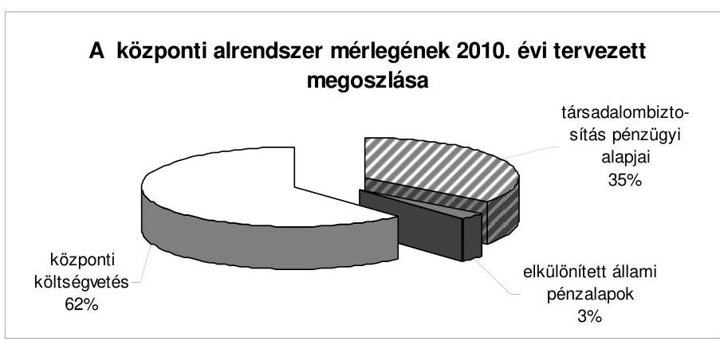
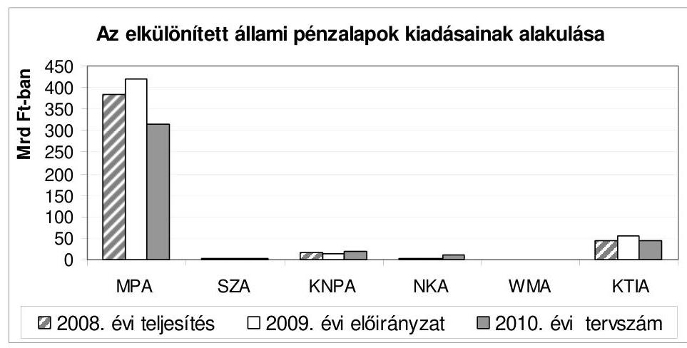
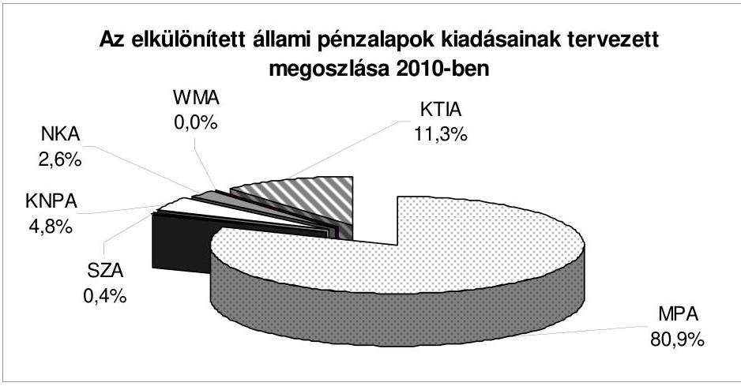
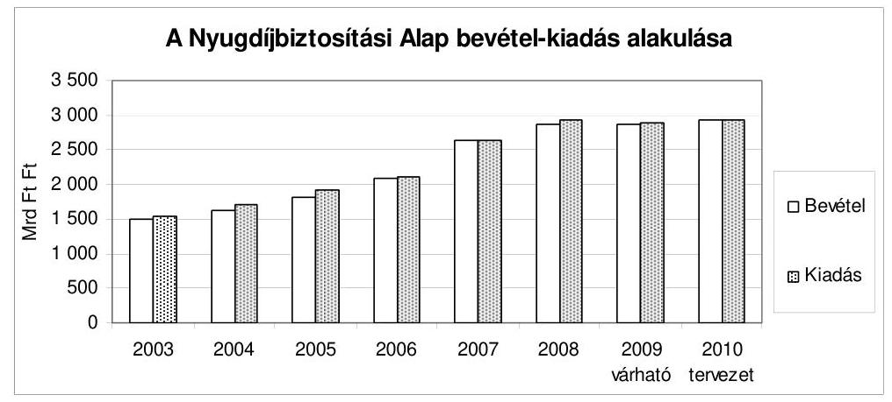
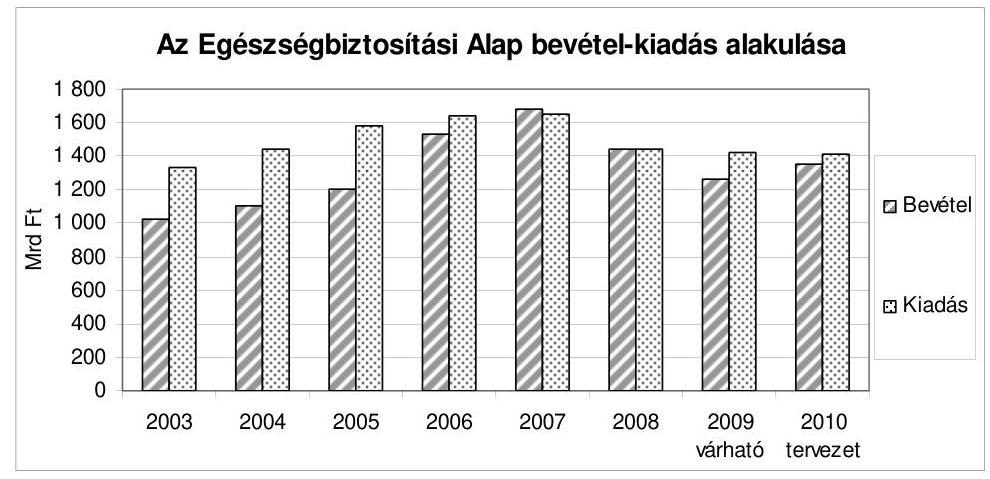
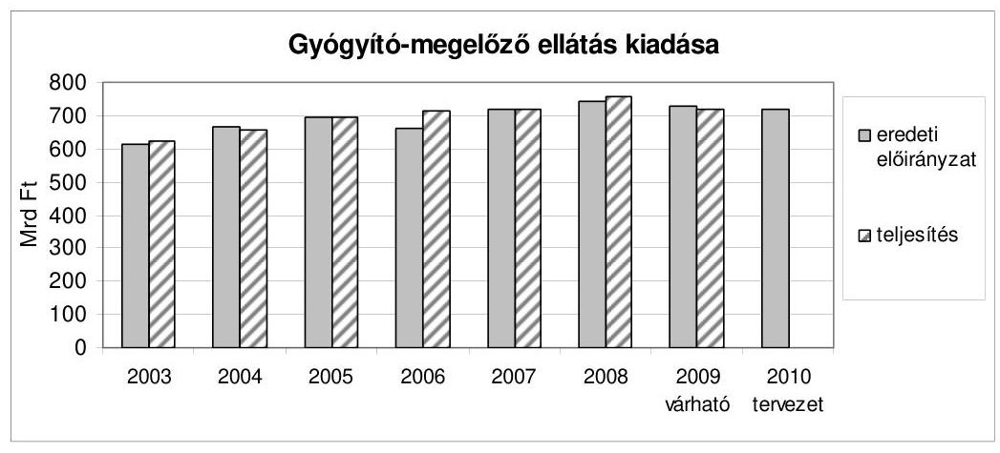
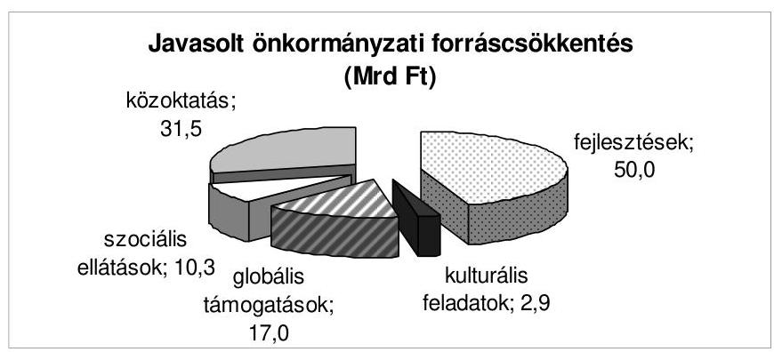
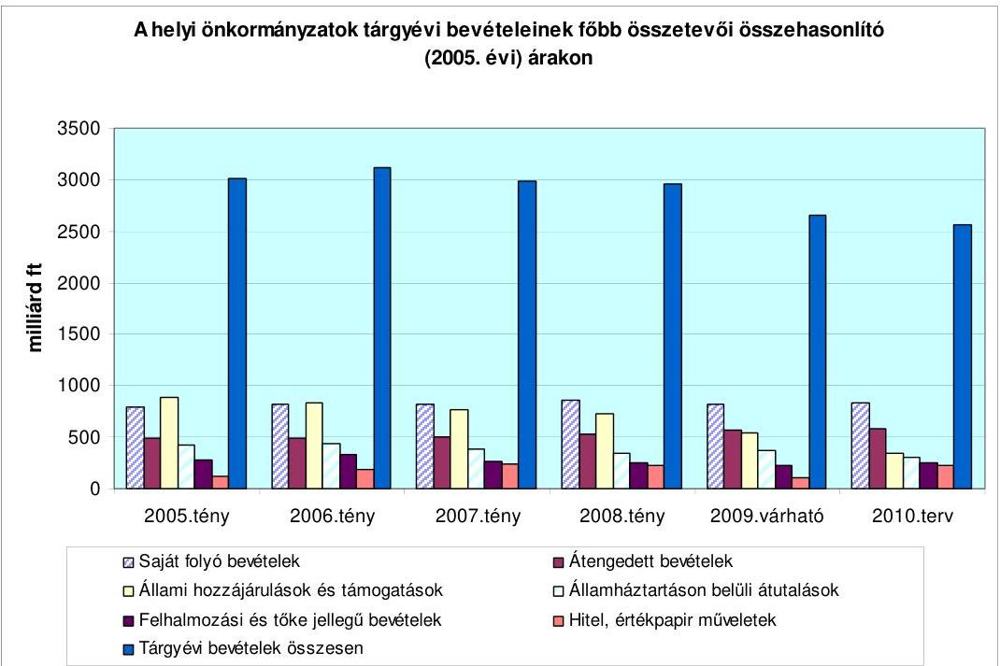
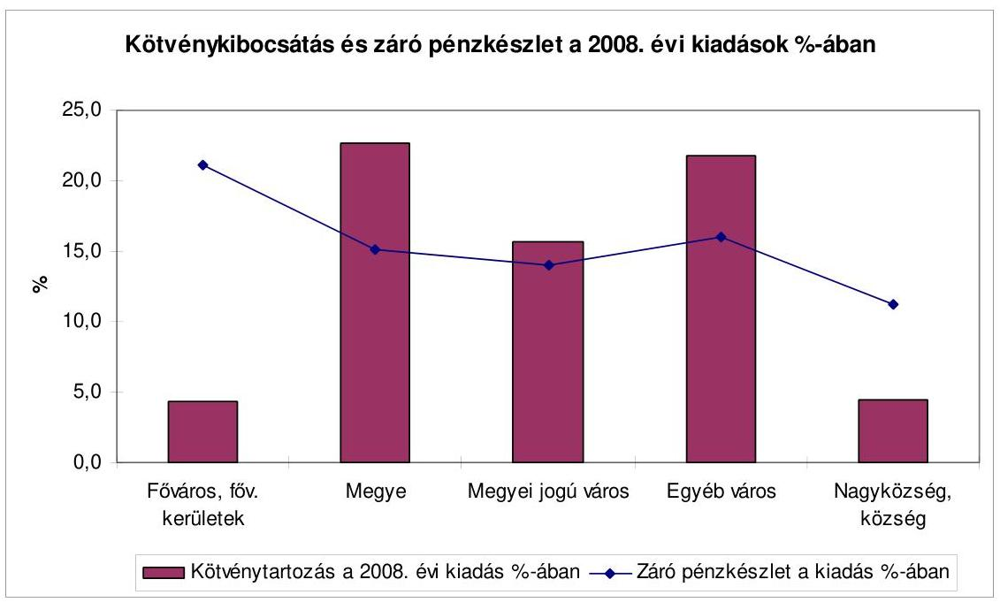
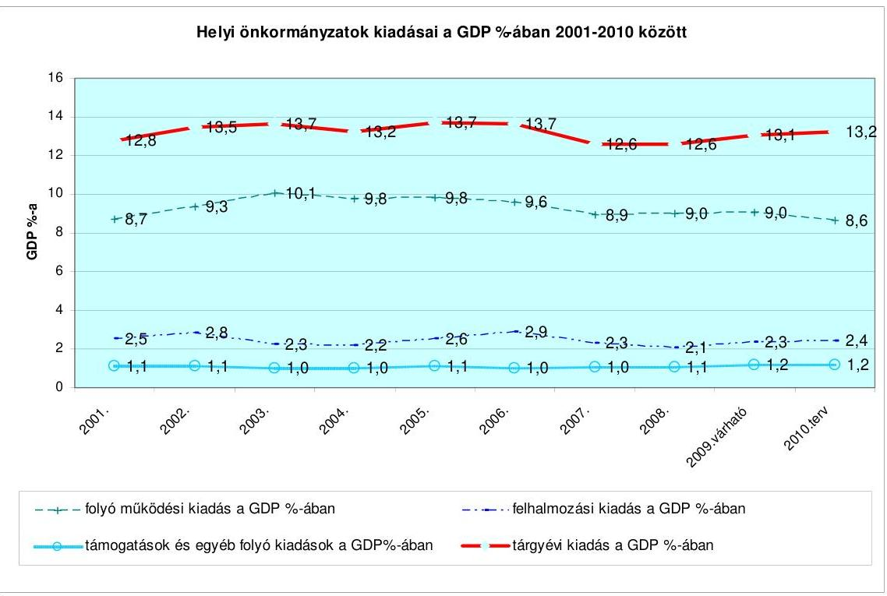

# ÁLLAMI   SZÁMVEVŐSZÉK 

## VÉLEMÉNY

a Magyar Köztársaság 2010. évi költségvetési javaslatáról

0935
T/10554/1.
2009. szeptember

---

# 1. Szervezetirányítási és Müködtetési Igazgatóság 

Vizsgálat-azonosító szám: V0435
Témaszám: 939

## Az ellenőrzést felügyelte:

Dr. Csapodi Pál
fötitkár

## Az ellenőrzés végrehajtásáért felelős:

Dr. Kékesi László
főtitkárhelyettes

## Az ellenőrzést vezette:

Horváthné Menyhárt Erika
főcsoportfőnök-helyettes

## Az ellenőrzést végezték:

| Bojtos Rozália | Göller Géza | Nagyné Lakhézi Éva |
| :-- | :-- | :-- |
| tanácsadó | főtanácsadó | számvevő tanácsos |
| Dr. Somorjai Zsoltné | Vicze Klára | Bálint Józsefné |
| számvevő tanácsos | számvevő tanácsos | címzetes főmunkatárs |

## 2. Államháztartás Központi Szintjét Ellenőrző Igazgatóság

## Az ellenőrzést felügyelte:

Bihary Zsigmond
főigazgató
Az ellenőrzés végrehajtásáért felelős:
Horváth Sándor
főigazgató helyettes

## Az ellenőrzést vezették:

Lődiné Cser Zsuzsanna
mbb. osztályvezető
Szabóné Farkas Katalin osztályvezető főtanácsos

Morvay András osztályvezető főtanácsos

Pongrácz Éva osztályvezető főtanácsos

Szarka Péterné igazgatóhelyettes

Tolnai Lászlóné osztályvezető főtanácsos

## Az összefoglaló jelentést készítették:

Balázs Melinda számvevő tanácsos

Dancsóné Kuron Ildikó számvevő tanácsos

Gyarmati István tanácsadó

Dr. Baloghné Sebestyén Éva számvevő

Dombovári Nóra számvevő

Gyeraj Péter számvevő

Bamberger Mária tanácsadó

Görgényi Gábor számvevő tanácsos
Huszárné Borbás Melinda számvevő

---

| Dr. Jakab Kornél számvevő tanácsos | Karsai Lászlóné főtanácsadó | Kincses Erzsébet Eszter számvevő |
| :--: | :--: | :--: |
| Dr. Mészáros Leila számvevő | Niklai Heléna számvevő tanácsos | Pető Krisztina számvevő tanácsos |
| Dr. Pósch Gábor főtanácsadó | Dr. Sipos Dóra számvevő tanácsos | Szilágyi Gyöngyi főtanácsadó |
| Szilágyi Zsuzsanna tanácsadó | Dr. Szima Mária főtanácsadó | Zakar László számvevő |
| Zaroba Szilvia számvevő tanácsos |  |  |
| Az ellenőrzést végezték: |  |  |
| Baki István számvevő | Balázs Melinda tanácsadó | Dr. Baloghné Sebestyén Éva számvevő |
| Bamberger Mária tanácsadó | Dancsóné Kuron Ildikó számvevő tanácsos | Deli Gáborné számvevő tanácsos |
| Dombóvári Nóra számvevő | Dr. Domján Eszter tanácsadó | Farkas László főtanácsadó |
| Fekete Győr László számvevő | Görgényi Gábor számvevő tanácsos | Gyarmati István tanácsadó |
| Gyeraj Péter számvevő | Hajdu Károlyné tanácsadó | Huszárné Borbás Melinda számvevő |
| Dr. Jakab Kornél számvevő tanácsos | Jeszenkovits Tamás tanácsadó | Karsai Lászlóné főtanácsadó |
| Kincses Erzsébet Eszter számvevő | Kiss Ferenc Károlyné számvevő | Dr. Mészáros Leila számvevő |
| Molnár Bálint számvevő | Némethné Nagy Mária számvevő | Niklai Heléna számvevő tanácsos |
| Pető Krisztina számvevő tanácsos | Polyák Ferenc számvevő tanácsos | Dr. Pósch Gábor főtanácsadó |
| Dr. Sipos Dóra számvevő tanácsos | Szabó Erzsébet számvevő tanácsos | Szabóné Simai Mária számvevő tanácsos |
| Szilágyi Györgyi   főtanácsadó | Szilágyi Zsuzsanna tanácsadó | Dr. Szima Mária   főtanácsadó |
| Szöllősiné Hrabóczki Etelka   főtanácsadó | Varsányiné Dudás Eleonóra számvevő | Dr. Vass Gábor tanácsadó |
| Villányi Antal számvevő tanácsos | Zakar László számvevő | Zaroba Szilvia számvevő tanácsos |

---

# 3. Önkormányzati és Területi Ellenőrzési Igazgatóság 

## Az ellenőrzést felügyelte:

Dr. Lóránt Zoltán
főigazgató
Az ellenőrzés végrehajtásáért felelős, az ellenőrzést vezette:
Berényi Magdolna
osztályvezető főtanácsos

A helyszíni vizsgálati jelentések feldolgozásában és az összefoglaló elkészítésében közremúködött:

Dankó Géza
főtanácsadó

## Az ellenőrzést végezték:

Dankó Géza
Huberné Kuncsik Zsuzsanna
főtanácsadó
főtanácsadó
Dr. Mezei Imréné
Varga József
főtanácsadó

---

# TARTALOMJEGYZÉK 

BEVEZETÉS ..... 5
I. ÖSSZEGZŐ MEGÁLLAPÍTÁSOK, KÖVETKEZTETÉSEK, JAVASLATOK ..... 8
II. RÉSZLETES MEGÁLLAPÍTÁSOK ..... 39
A) A KÖLTSÉGVETÉSI DOKUMENTUM TÖRVÉNYESSÉGI ÉS SZÁMSZAKI ELLENŐRZÉSE ..... 41

1. Az Áht. és a takarékos állami gazdálkodásról és a költségvetési felelősségről szóló törvény érvényesülése ..... 43
2. Észrevételek a költségvetési dokumentumhoz ..... 45
B) HELYSZÍNI ELLENŐRZÉS ..... 47
B.1. AZ ÁLLAMHÁZTARTÁS KÖZPONTI ALRENDSZERE ..... 49
3. A 2010-2013. évekre szóló makrogazdasági prognózis ..... 49
4. A 2010. évi költségvetési törvényjavaslat és a takarékos állami gazdálkodásról és a költségvetési felelősségről szóló 2008. évi LXXV. törvény összhangja ..... 54
5. A központi költségvetés közvetlen bevételi előirányzatai ..... 55
3.1. Vállalkozások költségvetési befizetései ..... 56
3.1.1. Társasági adó ..... 56
3.1.2. Hitelintézeti járadék ..... 58
3.1.3. Cégautóadó ..... 58
3.1.4. Egyszerűsített vállalkozói adó ..... 59
3.1.5. Bányajáradék ..... 60
3.1.6. Játékadó ..... 61
3.1.7. Ökoadók ..... 61
3.1.7.1. Energiaadó ..... 61
3.1.7.2. Környezetterhelési díj ..... 62
3.1.8. Egyéb befizetések ..... 62
3.1.9. Energiaellátók jövedelemadója ..... 64
3.2. Fogyasztáshoz kapcsolt adók ..... 64
3.2.1. Általános forgalmi adó ..... 64
3.2.2. Jövedéki adó ..... 65
3.2.3. Regisztrációs adó ..... 66
3.3. A lakosság költségvetési befizetései ..... 67
3.3.1. Személyi jövedelemadó ..... 67

---

3.3.2. Egyéb lakossági adók ..... 68
3.3.3. Magánszemélyek különadója ..... 68
3.3.4. Lakossági illetékek ..... 69
3.3.5. Egyes vagyontárgyak adója ..... 70
3.4. Az állami vagyonnal kapcsolatos bevételek ..... 70
3.4.1. Értékesítési bevételek ..... 71
3.4.2. Hasznosítási bevételek ..... 72
3.4.3. Egyéb bevételek ..... 73
3.5. Egyéb költségvetési bevételek ..... 74
4. A központi költségvetés közvetlen kiadási előirányzatai ..... 75
4.1. A központi költségvetés kamatelszámolásai, tőkevissza-térülései, az adósság- és követelés-kezelés költségei ..... 84
4.2. Állami kezességvállalás és kezesség érvényesítés ..... 90
5. A fejezetek költségvetési előirányzatai ..... 97
5.1. A fejezetek tervezési, szervezési és intézményi felülvizsgálati feladatainak teljesítése ..... 97
5.2. A fejezetek költségvetési javaslatai megalapozottsága ..... 105
5.3. Bevételi előirányzatok ..... 105
5.4. Kiadási előirányzatok ..... 107
5.4.1. Létszám ..... 107
5.4.2. Személyi juttatások és munkaadókat terhelő járulékok ..... 112
5.4.3. Dologi előirányzatok ..... 118
5.4.4. Intézményi felhalmozási kiadások alakulása ..... 121
5.4.5. Kölcsönök alakulása ..... 122
5.5. A fejezeti kezelésű előirányzatok ..... 123
5.5.1. A fejezeti kezelésű előirányzatok újra rangsorolása ..... 123
5.5.2. Speciális fejezeti kezelésű előirányzatok ..... 128
5.5.2.1. A PPP programok ..... 128
5.5.2.2. „Felülről nyitott" fejezeti kezelésű előirányzatok ..... 129
5.5.2.3. A regionális fejlesztési tanácsok döntési hatáskörébe kerülő előirányzatok ..... 132
5.5.3. A 2011. évi magyar EU elnökségre való felkészülés ..... 132
5.5.4. Peres eljárásokkal kapcsolatosan tervezett előirányzatok ..... 132
5.5.5. A fejezeti általános tartalék alakulása ..... 133
5.5.6. Központi beruházások alakulása ..... 134
5.6. Az európai uniós tagsággal összefüggő előirányzatok ..... 135
5.7. A környezetvédelmi funkció (F14 Környezetvédelem) előirányzatai ..... 142
5.8. A költségvetés központosított bevételei ..... 148
6. Elkülönített állami pénzalapok ..... 149
6.1. Munkaerőpiaci Alap ..... 150
6.2. A többi elkülönített állami pénzalap ..... 157

---

6.2.1. Szülőföld Alap ..... 157
6.2.2. Központi Nukleáris Pénzügyi Alap ..... 160
6.2.3. Nemzeti Kulturális Alap ..... 161
6.2.4. Wesselényi Miklós Ár- és Belvízvédelmi Kártalanítási Alap ..... 163
6.2.5. Kutatási és Technológiai Innovációs Alap ..... 165
7. A társadalombiztosítás pénzügyi alapjai ..... 168
7.1. Nyugdíjbiztosítási Alap ..... 168
7.2. Egészségbiztosítási Alap ..... 176
8. A kormányzati szektor egyéb elszámolásai ..... 190
B.2. AZ ÁLLAMHÁZTARTÁS ÖNKORMÁNYZATI ALRENDSZERE ..... 192

1. A költségvetési törvényjavaslatban a helyi önkormányzati forrásszabályozás megalapozottsága ..... 192
1.1. A költségvetés tervezése ..... 192
1.2. A helyi önkormányzatok forrásszabályozása ..... 193
1.3. Az önkormányzati támogatások 2010. évi csökkentése ..... 196
1.4. Az önkormányzatok eladósodottsága, az ebből eredő költségvetési kockázatok ..... 198
1.5. Egyéb támogatásokat érintő szabályozás ..... 201
2. A helyi önkormányzatok fejlesztési támogatása ..... 202
2.1. Címzett és céltámogatások ..... 203
2.2. A decentralizált helyi önkormányzati fejlesztési programok támogatása ..... 204
2.3. Központosított előirányzatként tervezett egyéb fejlesztési célú támogatási előirányzatok ..... 207
3. A szabályozott források és saját bevételek tervezésének megalapozottsága ..... 209
3.1. Normatív és egyéb állami hozzájárulások, támogatások ..... 209
3.2. Átengedett bevételek ..... 219
3.3. Saját folyó bevételek és egyéb források ..... 220
MELLÉKLETEK ..... 223
4. számú Kimutatás az átengedett személyi jövedelemadó és önkormányzati ..... 225 támogatások rendelkezési jogosultság szerinti megoszlásáról
5. számú Az önkormányzatok 2010. évi fejlesztési célú támogatásainak alakulása ..... 226
6. számú A normatív hozzájárulások jogcímenkénti és ágazatonkénti előirányzatainak változása ..... 228
7. számú A normatív, kötött felhasználású támogatások jogcímenkénti és ..... 229 ágazatonkénti előirányzatainak változása
8. számú A központosított előirányzatok jogcímeinek és összegének változása ..... 230
RÖVIDÍTÉSEK JEGYZÉKE ..... 233

---

.

---

V-1001-001/2009.

# BEVEZETÉS 

Az Állami Számvevőszék (ÁSZ) az Alkotmány 32/C. §-ának (1) bekezdése és a számvevőszéki törvény 2. §-ának (1) bekezdése alapján véleményezi az állami költségvetési javaslat megalapozottságát, a bevételi előirányzatok teljesíthetőségét.

A Kormány a költségvetési szférában szigorú tervezési korlátokat fogalmazott meg a fejezetek irányítását ellátó szervek részére. Ezek alapját részben már elfogadott jogszabályok, kormányhatározatok stb. jelentik, különös tekintettel a takarékos állami gazdálkodásról és a költségvetési felelősségről szóló 2008. évi LXXV. (továbbiakban: Kftv.), valamint a költségvetési szervek jogállásáról és gazdálkodásáról szóló 2008. évi CV. törvényekben foglaltakra, másrészt olyanok, amelyek szabályozási alapját - külön törvényben - a költségvetési vitával párhuzamosan kívánja megteremteni a Kormány.

A Kftv.-ben testet öltött új költségvetési szabályrend tartalmazza a szabályalapú tervezés költségvetés-politikai, intézményi és eljárási garanciáit. Mivel az új szabályrend előírásai fokozatosan lépnek életbe, az ÁSZ a 2010. évi költségvetés véleményezése során megkezdte értékelni ezen garanciális előírások érvényesülését. A gyakorlat e rendelkezések hatályosulásának, alkalmazásának kezdetén tart. Alapvető gondot okoz - számos esetben - a törvényi változásokat alátámasztó hatástanulmányok hiánya.

A jelen számvevőszéki Vélemény hasonlóan, mint a korábbiak - a törvény felhatalmazásával összhangban - közvetlenül nem foglalhat állást olyan kormányzati társadalom- és gazdaságpolitikai elhatározásokkal, elgondolásokkal kapcsolatban, mint a költségvetés gazdaságélénkítő vagy restrikciós jellege, illetve azok arányai.

A Véleménynek arra kell irányulnia, hogy a kimunkált előirányzatok mennyire megalapozottak, teljesítésüket a tapasztalati adatok (az előző évek tényleges és a tervévet megelőző év várható teljesítése) alátámasztják-e, valamint a javasolt jogszabályi módosítások elősegítik-e.

A számvevőszéki ellenőrzés a korábbi évektől eltérően kisebb terjedelemben, és csak annyiban foglalkozott a makroadatok értékelésével, amennyiben az kikerülhetetlen volt a bevételi és kiadási fööszszegek megalapozottságának véleményezésénél.

Az államháztartási törvény (Áht.) 29. §-ának (1) bekezdése szerint az Országgyűlés a költségvetési törvényjavaslatot a számvevőszéki véleménnyel együtt tárgyalja.

---

Az ellenőrzés célja annak megállapítása volt, hogy

- a 2010. évi költségvetési törvényjavaslat kimunkálása során érvényesül-tek-e a vonatkozó törvényi és egyéb jogszabályi előírások, illetve az előirányzatok kialakítására kiadott tervezési köriratban foglaltak;
- a törvényjavaslat megalapozottságát a tervezésnél alkalmazott módszerek, valamint az állami feladatrendszer és a szabályozók már érvényben lévő, illetve bevezetni tervezett módosításai kielégítően biztosítják-e;
- a 2010. évre kialakított költségvetés kiemelten vette-e számításba az EUtagság pénzügyi-gazdasági hatásait, részletesen és megalapozottan számszerúsítették-e az EU-tól származó forrásokat és a társfinanszírozási követelményeket, valamint az EU költségvetésébe történő befizetési kötelezettséget;
- a helyi önkormányzatok szabályozott forrásainak megalapozottságát a tervezés keretében készült számítások biztosították-e, különös tekintettel az önkormányzatok számára törvényben előírt feladatok és a pénzügyi források változására, a köztük lévő összhangra;
- a takarékos állami gazdálkodásról és a költségvetési felelősségről szóló törvényből és a nemzetgazdaság, az államháztartás egyensúlyi helyzetének javítását szolgáló intézkedésekből, a feladatok változásából adódó követelmények tükröződnek-e a szabályozás egyes elemeiben és a helyi önkormányzatok pénzügyi pozíciójában, az egyes ágazatok egymáshoz viszonyított arányában.

Véleményünket a 2009. augusztus 14-től augusztus 31-éig tartó, a költségvetési előirányzatok tervezését végző szerveknél lefolytatott helyszíni ellenőrzés során szerzett tapasztalatok, valamint a 2009. szeptember 11-én rendelkezésünkre bocsátott költségvetési törvényjavaslat alapján alakítottuk ki. Lehetőségeink ennek megfelelően a központi alrendszer vonatkozásában a fejezetek teljes körére kiterjedő helyszíni ellenőrzés helyett alapvetően tematikus (a költségvetés szempontjából a tervezési köriratban megfogalmazottak alapján kiemelt jelentőségű témák), dokumentumok értékelésére irányuló ellenőrzésre adtak módot.

A dokumentális ellenőrzés megvalósításához a tervező szervezetektől a Pénzügyminisztérium részére a tervezéshez készített táblázatok, előirányzatlevezetések, valamint az azok alátámasztását szolgáló dokumentációk, ezeken túlmenően az ellenőrzéshez általunk kidolgozott kimutatásokat, számszaki adatokat, és az azokat alátámasztó dokumentáció megküldését kértük.

A tervezési munkafolyamat alakulásából következően különböző kidolgozottságú dokumentumokat ellenőriztünk, amelyeket folyamatosan igyekeztünk a rendelkezésünkre álló egyéb munkadokumentumok - ha ilyenek rendelkezésre álltak felhasználásával aktualizálni.

A kockázatelemzéssel kiválasztott fejezeteknél (a fejezetek, fejezeti jogosítványú költségvetési címek mintegy felénél) végeztünk helyszíni ellenőrzést. Az ellenőrzések tapasztalatait az ellenőrzöttekkel közös jegyzőkönyvben rögzítettük, ami

---

egyben - az ellenőrzöttek észrevételei, véleményeltérései alapján - biztosította, hogy a tervezési folyamat lehetőség szerinti utolsó változatait használjuk fel véleményünk kialakításakor.

Az ellenőrzés során a 2010. évi költségvetési törvényjavaslat jogi és számszaki megalapozottságát, az előirányzatok kialakítása érdekében végzett szervező, összefogó tevékenységet, az intézmény felülvizsgálatot és a fejezeti kezelésű előirányzatok, valamint a nemzetgazdasági elszámolások előirányzatainak kimunkálását a költségvetési fejezetek irányítását ellátó szervezeteknél, a fejezeti jogosítványú költségvetési szerveknél, az alapkezelőknél stb. vizsgáltuk. Az intézményi előirányzatok megalapozottságát csak a fejezetek igazgatási címeinél/alcímeinél, az alapkezelőknél, az elkülönített állami pénzalapoknál és a társadalombiztosítás pénzügyi alapjainál értékeltük. Az Állami Számvevőszék tervezését, előirányzatait - az eddigi gyakorlatnak megfelelően - nem ellenőriztük, így Véleményünkben a fejezetre nincs hivatkozás.

Az önkormányzati alrendszer vonatkozásában a véleményünket megalapozó helyszíni ellenőrzést új program alapján - kisebb kapacitásra - terveztük. A helyi önkormányzati alrendszer tervezési, szabályozási munkálataira vonatkozóan a tervezési körirat a makrogazdasági feltételek, illetve az államháztartási, adó- és járulékparaméterek figyelembevételén túl továbbra sem tartalmazott tartalmi követelményeket. A véleményezés során a tervezésben érintett minisztériumokkal kialakított munkakapcsolat keretében elérhető munkaanyagokra támaszkodhattunk.

A véleményezést nehezítette, hogy a tervező munka helyszíni ellenőrzésének lezárását követően ismertük meg az Országgyűlésnek benyújtott 2010. évi költségvetési törvényjavaslatot, a 2010. évi költségvetést megalapozó egyes törvények módosítását tartalmazó törvényjavaslat a költségvetés készítésével párhuzamosan készült, valamint az egyeztetések során hatástanulmányok és modellszámítások nélkül, a folyamatosan változó munkaanyagokból kellett igen rövid időkeretben a véleményt elkészíteni.

---

# I. ÖSSZEGZŐ MEGÁLLAPÍTÁSOK, KÖVETKEZTETÉSEK, JAVASLATOK 

## A költségvetési dokumentum

A költségvetési törvényjavaslat összeállítására vonatkozó, Áht.-ban előírt rendelkezések mellett 2008 novemberétől hatályba lépett a Kftv., amelynek egyes szakaszai a költségvetési mozgástér meghatározását célozzák, mások az Áht.-t módosították. A Kftv. előírásaiból adódó követelmények a költségvetési dokumentum fő kötetében formailag megjelennek, míg a vonatkozó információk nagyobb részét az I. fejezeti kötetben szerepelteti a törvényjavaslat.

Változatlanul követett gyakorlat, hogy az elő́terjesztő egyes törvényi előirásokat nem a költségvetési törvényjavaslat benyújtásakor, hanem késöbb, a fejezeti indokoló kötetek részeként teljesít.

Az Áht. költségvetési törvényjavaslatra vonatkozó szakaszainak teljesítése az előző évekhez hasonló módon hiányos. A törvényjavaslat nem mutat be olyan, a döntéshozatal szempontjából fontos összegzéseket, mint a többéves kihatású döntések, kötelezettségek számszerűsítése és azok évekre, fejezetekre bontott hatásának kimutatása.

## A központi alrendszer

A 2010. évi állami költségvetés feltételeit képező makropálya a globális pénzügyi válságból adódó determinációkra hivatkozva készült. A gazdaságpolitika rövidtávon a válságmenedzselést - a pénzügyi szféra múködőképességét és a munkahelyek megőrzését - míg közép- és hosszú távon az államháztartás fenntartható egyensúlyi helyzetének megteremtését és a válságból való kilábalást követően az ország kedvező versenyhelyzetének elérését tekinti fő célnak.

A 2009. augusztus elején rendelkezésre álló információk alapján készített törvényjavaslati makropálya megvalósulását számos kockázati tényező befolyásolhatja, amelyek közül a legnagyobb súlyú a világgazdasági válság - megbízhatóan nem prognosztizálható - további alakulásával összefüggő bizonytalanság. Különösen nagyfokú bizonytalanság jellemezte a 2008. december és 2009. május közötti időszakot, amit a számvevőszéki ellenőrzés által áttekintett dokumentumok információi közötti különbségek is tükröznek.

A 2008. decemberi konvergencia programhoz kapcsolódóan az EU részére készített 2009. májusi jelentéshez viszonyítva a törvényjavaslati makropálya nem tartalmaz lényeges módosításokat. A PM megítélése szerint ugyanis a válság méretét a 2010. évi költségvetés tervezésének időszakában már jobban fel lehetett mérni, ami a bizonytalanságot csökkenti.

---

A 2009. augusztus 27 -ei államtitkári értekezlet anyagában a törvényjavaslat általános indokolásának makrogazdasági mutatói nem tartalmaznak életszínvonal mutatókat (foglalkoztatás alakulása, bérdinamika változása).

A GDP 2009. évi várható csökkenése 6,7\%-os a törvényjavaslati makropálya alapján. Ezzel egyező adatot közöl a 2009. májusi uniós jelentés, valamint az MNB 2009. májusi inflációs jelentése is.

A 2010. évre a törvényjavaslati makropálya további 0,9\%-os - az MNB által valószínűsítettel egyező - GDP visszaeséssel számol. A törvényjavaslat szerinti középtávú előrejelzés a 2011. évtől 3,9\%-os és 2013-ig évente 0,1\%-ponttal magasabb gazdasági növekedést mutat.

A GDP és a központi költségvetés bevételi, kiadási főösszegének, valamint hiányának alakulása

| Megnevezés | 2006   KSH tény | 2007   KSH tény | 2008   zárszámadás | 2009   terv | 2010   terv |
| :--: | :--: | :--: | :--: | :--: | :--: |
| Folyóáras GDP | 23755 | 25408 | 26543 | 27690 | 26300 |
| Bevételi főösszeg | 6549,2 | 7100,0 | 8159,3 | 8300,2 | 7947,2 |
| Kiadási főösszeg | 8510,8 | 8498,1 | 9029,2 | 8961,0 | 8799,3 |
| Hiány | 1961,6 | 1398,1 | 870,0 | 660,8 | 852,1 |

Megítélésünk szerint a gazdasági növekedés kockázati tényezője nemcsak a világgazdasági válság jövőbeni alakulása, amely a külkereskedelmi piacokon keresztül elsősorban az ipari termelés - a 2009. I. félévében 22,5\%-kal esett vissza az előző év azonos időszakához képest - alakulását határozza meg, hanem azok a hazai késleltető, társadalmi-gazdasági és alkalmazkodási tényezők is (pl. a nagy ellátórendszerek helyzete), amelyek méretéről érdemi információt, hatáselemzést a vizsgálat során nem tudtunk fellelni.

A lakosság fogyasztási kiadásának alakulására készített elemzői prognózisok összehasonlítása alapján a 2009-2010. évek tekintetében - az előbbiek mellett is - óvatosnak ítélhető a törvényjavaslati előrejelzés, ami a 2009. évi várhatóan 8\%-os és a 2010. évre előre jelzett 2,4\%-os visszaesést követően, a 2011. évben az előző évhez viszonyítva 3,4\%-os növekedést valószínűsít. Ez azonban nem jelent érdemi növekedést a lakosság fogyasztási kiadásaiban, ami mintegy 1\%kal magasabb a mélypontot jelentő 2009. évihez képest. A 2008. évi ténytől való elmaradás a 7\%-ot is elérheti.

A közösségi fogyasztási kiadást az államháztartás egyensúlyi helyzetének javítására hozott kiadáscsökkentő szerkezeti intézkedések közvetlenül érintik. Ezért a csökkenés mértéke a törvényjavaslati makropálya szerint a 2009. évben várhatóan 1,5\%, míg a 2010. évi prognózis szerint 1,4\%. A közösségi fogyasztási kiadás a 2011-2013. évekre szóló előrejelzés szerint, a csökkenést követő első évben 0,3\%-os, majd a további két évben 0,2-0,2\%-os mértékben fog növekedni.

---

A bruttó állóeszköz-felhalmozás csökkenésének 2009. évi várható értéke alapvetően az építőipari termelés 2009. június havi nagyarányú - 15,9\%-os bővülésére alapozva, a májusi előrejelzéshez képest 1\%-ponttal módosításra került a törvényjavaslati makropályában 9,3\%-ra, az MNB augusztusi inflációs jelentésében 9,2\%-ra. A törvényjavaslatot megalapozó gazdasági pálya a 2010. évre 0,6\%-os bruttó állóeszköz-felhalmozás növekedésével számol, ami az igen alacsony bázis miatt, az export lehetőségek bővülésének prognózisa alapján megvalósíthatónak tekinthető. A 2011. évre előre jelezett 6,7\%-os növekedés alapján a bruttó állóeszköz felhalmozás a vállalati beruházások élénkülése esetén a gazdasági növekedés egyik húzó erejévé válhat.

Az export növekedési ütemének lassulása a 2008. évben kezdődött el. A 2009. évi visszaesés a törvényjavaslati „makropálya" szerint várhatóan 15,1\%, amit a 2010. évben 3\%-os, a 2011-2013. években 9,2-9,8\% növekedés követ. A törvényjavaslatot megalapozó gazdasági pálya az exportnövekedést a fejlett országok fokozatosan meginduló fellendülésére alapozza. E feltétel teljesülése azonban a gazdasági válság jövőbeni alakulásának függvénye, ami a bizonytalanságaiból adódóan, kockázati tényezőt jelent az export-import vizsgált évekre vonatkozó előrejelzése tekintetében.

A belső kereslet csökkenése miatt az import évenkénti változása az exportot meg nem haladó pályát követ a vizsgált elemzésekben, ami a nettó export GDP-hez való pozitív hozzájárulását teszi lehetővé.

Az infláció 2009. évi várható alakulását az elemzések 4,5-5\% közötti értékben határozzák meg a 2009. július 1-jei áfa-emelés hatásának figyelembe vételével. A PM által készített törvényjavaslati makropálya és az MNB 4,5\%-os várható inflációval számol a 2009. évre. E két intézmény 2010. évre szóló 4,1\%-os fogyasztói ár-index prognózisa ugyancsak megegyezik. A 2011-2013. években az infláció a törvényjavaslati makropálya prognózisa szerint 2,2-2,6-2,8\%, ami feltehetően illeszkedni fog a maastrichti ástabilitás követelményéhez.

A gazdasági válság 2009. év elején történt mélyülését figyelembe véve - a növekedési lehetőségek további beszűkülésének elkerülése érdekében - a Kormány a nemzetközi szervezetekkel (IMF, EU) egyeztetve a 2009. évi hiánycélt előbb a GDP 2,9\%-ára, majd 2009 májusában 3,9\%-ára, a 2010-2011. évek vonatkozásában pedig 3,8\%-ára, illetve 2,8\%-ára módosította.

A törvényjavaslat a megalapozottságra irányuló helyszíni ellenőrzések lezárásakor még nem állt rendelkezésre, az átadott anyagokban szereplő információk, adatok nem voltak véglegesek, ezért az ellenőrzésnek nem állt módjában a tervezés folyamatát a törvényjavaslat elkészültéig nyomon követni és ebből következően a folyamatokat teljes körűen a megalapozottság alátámasztottsága szempontjából értékelni.

---

# A központi költségvetés közvetlen bevételi elöirányzatai 

A központi költségvetés közvetlen bevételeinek tervezett összege (a gazdálkodó szervezetek befizetései, a fogyasztáshoz kapcsolt adók és a lakosság befizetései) a költségvetési törvényjavaslat szerint 6332,2 Mrd Ft, ami a központi költségvetés fö bevételei fejezet föösszegének (6390,5 Mrd Ft) 99,1\%-a. A törvényjavaslatban szereplő egyes bevételi előirányzatok összege a játékadónál 0,1 Mrd Ft-tal nőtt, az energiaadónál 0,5 Mrd Ft-tal csökkent a korábbi állapothoz képest.

A 2009. II. félévétől, illetve 2010 januárjától hatályba lépő adó- és járulékmódosítások a válság hatásainak enyhítését, a gazdaság versenyképességének javítását, a foglalkoztatottság ösztönzését, valamint az adórendszer egyszerűsítését hivatottak szolgálni.

A válság hatását szándékozik enyhíteni a törvényjavaslat szerint a társasági különadó megszüntetése, valamint a társasági adóalap egyes elemeinek módosítása (pl. fejlesztési adókedvezmény igénybevétele feltételeinek enyhítése, a követelés-értékvesztés elszámolásával kapcsolatos szabályok változása).

A társasági adózásban az adókulcs 16\%-ról 19\%-ra emelkedik. Az adókedvezmények - a jogdíj, kamatkedvezmények, valamint a beruházásokhoz és a K+F-hez kapcsolódó kedvezmények kivételével - megszűnnek, ezáltal az adóalap nagymértékben szélesedik.

A kisvállalkozásokat kedvezőtlenül érinti az eva adókulcs 25\%-ról 30\%-ra történő emelése.

A válságkezelés része a gazdaság versenyképességének javítását elősegítő intézkedések sora, mivel a munkát terhelő közterhek magas aránya a versenyképesség és a foglalkoztatottság bővítését gátolja. Az adórendszer átalakításában ezért fontos hivatkozási szempont volt az élőmunkát terhelő adók és járulékok csökkentése, ami hozzájárulhat az adó- és járulékbefizetési hajlandóság erősödéséhez.

Az szja törvény módosítása szerint a személyi jövedelemadózásban az adótábla alsó sávhatára 1,9 M Ft-ról a 2010. évre 5 M Ft-ra emelkedik, mértéke 18\%-ról 17\%-ra csökken (az adózók közel 90\%-a ebbe a sávba tartozik). Az ezt meghaladó összevont adóalapot $32 \%$-os adó terheli.

A személyi jövedelemadózásban az adókedvezmények - a családok, az őstermelők és a fogyatékkal élők kedvezménye, valamint a hosszú távú megtakarításhoz kapcsolódó adókiutalások kivételével - megszűnnek.

Az adóalapot szélesíti a munkáltatók (kifizetők) által fizetett járulékok és az egészségügyi hozzájárulás összevont adóalapba történő beszámítása, továbbá az egyes családi támogatások (pl. családi pótlék) már 2009. szeptember 1-jétől adóterhet nem viselő járandóságként történő adóztatása, az adóalap növelő természetbeni juttatások - különböző mértékű - adókötelezettsége.

A munkáltatók (kifizetők) által fizetendő járulék mértéke a 2010. évtől 32\%-ról 27\%-ra csökken, a százalékos mértékű egészségügyi hozzájáruláson belül viszont $11 \%$-os mértékű kötelezettség 27\%-ra emelkedik. (A munkáltatók által fizetendő járulék mértéke már 2009. július 1-jétől a minimálbér kétszeresének összegéig

---

csökken.) A járulékcsökkentés kedvező hatását mérsékli a rehabilitációs járulék évi 117600 Ft/főről történt nagymértékű (évi 964500 Ft/fő-re) emelése.

Az adózási szerkezet átalakítása a munkajövedelemhez kapcsolódó közterhek mérséklése mellett a fogyasztás és a vagyon fokozott adóztatását - jelentősen növelve a lakosság adóterhelését - helyezi előtérbe.

Az általános áfa-kulcs 2009. július 1-jétől 20\%-ról 25\%-ra növekedett, míg bizonyos alapvető élelmiszereknél, a kereskedelmi szálláshely szolgáltatásnál és a távhőnél a lakosság terheit mérsékelte a 18\%-os kedvezményes kulcs bevezetése.
A jövedéki adó szinte minden területen emelkedik (gázolaj 7,6\%-kal, cigaretta $8,9 \%$-kal, benzin és alkoholtartalmú italok 10-10\%-kal).
2010. január 1-jével értékalapú ingatlanadó lép hatályba.

Az elvonási csatornák még mindig jelentős számának (59) csökkentése (7) a szabályozási környezet egyszerübbé és átláthatóbbá tételét célozza, mérsékelve egyúttal a gazdálkodók adminisztratív terheit.

A különadók megszüntetésén túlmenően hatályát veszti a tételes eho, a munkaadói, munkavállalói és a vállalkozói járulék megfizetése pedig integrált járulékfizetés keretében történik.

A 2010. évre javasolt adótörvény módosítások következtében az adóterhek az élőmunka terhelését érintő változások kivételével - nem mérséklődtek. Az előirányzott társasági adóbevétel az adótörvény módosítás következtében lényegében véve azonos a 2009. évre a PM által várható (társasági adó és különadó) bevétellel. A tervezett eva bevétel az adókulcsemelés következtében 19 Mrd Ft-tal magasabb. Az szja bevétel - a PM anyagai alapján - az adótörvény változás hatására 125 Mrd Ft-tal ugyan csökken, azonban a 2010. évre tervezett áfa bevételek - az általános adókulcs emelése következtében - 234,8 Mrd Ft-tal haladják meg a 2009. évi várható bevételt. A 2010. évtől bevezetésre kerülő vagyonadó 50 Mrd Ft többlet adóterhet jelent a lakosság részére. A vagyonadó vonatkozásában problémát jelentenek ezen adó megállapításának és megfizetésének technikai korlátai, amelyek a megbízható forgalmi érték adatbázisának hiányából erednek és hátráltatják az adófizetési kötelezettség egyértelmű meghatározását.

A központi költségvetés 2010. évi adóbevételi előirányzatai tervezetének megalapozottságát (a költségvetési tervező munkát), annak előző évekhez viszonyított változását - a korábbi évekhez hasonlóan - teljes körűen nem tudtuk megítélni ${ }^{1}$. A véleményalkotáshoz szükséges egyes adatok és részletes számítási anyagok (pl. a gazdasági fejlődés főbb jellemzőit tartalmazó adatok közül a foglalkoztatottság, valamint a bruttó bérek és keresetek

[^0]
[^0]:    ${ }^{1}$ A 2008. évi költségvetési törvényjavaslat véleményezése során az összes adóbevétel $45,1 \%$-át, a 2010. évinél $96,0 \%$-át az ellenőrzésnek nem volt módjában értékelni. (A 2009. évi adóbevételek a költségvetés tervezésének „sajátosságai" miatt nem összehasonlíthatóak.) A 2008. évben az adóbevételek teljesítése $1,5 \%$-kal maradt el az előirányzattól. Az adóbevételek teljesülésének mértéke azt igazolja, hogy - amennyiben gazdasági folyamatok a várható módon alakulnak - az adóbevételek a számítottnak megfelelően teljesülhetnek.

---

alakulására vonatkozó számítások) hiánya nem tette lehetővé, hogy a tervezett adóbevételek teljesíthetőségét és - néhány kivétellel - ennek kockázatát minősítsük. A pénzügyi-gazdasági válság szükségszerű következménye a tervezési feltételek romlása, a prognóziskészítés növekvő bizonytalansága, amelyek tükröződnek a tervezett adóbevételekben.

A rendelkezésre bocsátott dokumentumok, illetve a lakástámogatás jelentősen csökkentett összege miatt az ellenőrzés magas kockázatúnak minősítette a hitelintézeti járadék ( $13,0 \mathrm{Mrd}$ Ft) előirányzatát, a méltányossági kérelmek növekvő száma és ezek összegszerúsége miatt közepes kockázatúnak az ún. egyéb befizetések 32,0 Mrd Ft összegű előirányzatát, továbbá alacsony kockázatúnak és így teljesíthetőnek ítélte meg a játékadó ( $63,1 \mathrm{Mrd}$ Ft), a cégautó-adó ( $24,0 \mathrm{MrdFt}$ ), a lakossági illetékek ( $110,0 \mathrm{MrdFt}$ ) és a vagyonadó ( $50,0 \mathrm{Mrd}$ Ft) előirányzattervezetének összegét.

A központi költségvetés meghatározó adóbevételeit illetően szükséges felhívni a figyelmet a következőkre:

- Nem indokolt a társasági adó előirányzat-tervezetét (609,3 Mrd Ft) a folyóáras GDP 2010. évi prognosztizált növekedésével azonos ütemű nyereségképződésre alapozni, miután egy-egy vállalkozás nyereségét számos olyan tényező (piaci viszonyok, a tevékenység jellege, ennek munka-, illetve eszközigényessége, a vállalkozás mérete, a finanszírozás saját és külső forrásai stb.) befolyásolja, amelyek még azonos szakágazatban gazdálkodó szervezetek eredményére is eltérő hatást gyakorolnak.
- Az áfa bevételek 2010. évi előirányzatának teljesülésében kockázati tényezőként jelölhető meg, hogy az MNB (a 2009. augusztusi inflációs jelentése szerint) a reáljövedelmek 1,3\%-os csökkenését, a Költségvetési Tanács ${ }^{2}$ a háztartások fogyasztásának 2,1\%-os - törvényjavaslattal egyező - visszaesését prognosztizálja a GDP további ( $0,5 \%$-os) csökkenésével együtt, amely a foglalkoztatottságot és a jövedelemképződést kedvezőtlenül érinti.
- Korábbi zárszámadási jelentéseink is jelezték az adóhátralék kintlévőségek évről évre növekvő arányát. ${ }^{3}$ A behajtás eredményessége érdemben javítaná az egyenleget.

# A központi költségvetés közvetlen kiadási elöirányzatai 

A központi költségvetés közvetlen kiadásai a költségvetési törvényjavaslat kiadási föösszegének több mint 44\%-át jelentik. Egy jelentős részüknél (pl. adósságszolgálattal kapcsolatos kiadások, család-, illetve lakástámogatások) a kiadások előirányzat-módosítási kötelezettség nélkül, az uniós támogatásoknál korlátozásokkal (az eredeti támogatási előirányzat 30\%-ával, e fölött a Kormány döntése alapján) túlteljesíthetők. Az előirányzat-módosítási kö-

[^0]
[^0]:    ${ }^{2}$ A Költségvetési Tanács 2009. augusztus 18-i dátummal elemzést készített a makrogazdasági kilátásokról és a költségvetési kockázatokról. Az elemzés önálló tanulmány, időhorizontja a 2008-2012. évekre terjed ki.
    ${ }^{3}$ Jelentés a Magyar Köztársaság 2008. évi költségvetése végrehajtásának ellenőrzéséről (0928)

---

telezettség nélkül túlteljesíthető kiadások köre a költségvetési törvényjavaslatban rögzített hiány betartásánál kockázati tényezőként jelentkezhet. A kockázatot csökkentheti a költségvetési törvényjavaslatban meghatározott tartalékok (általános, cél- és stabilitási tartalék) köre, amelyek összege, a 2009. augusztus 27 -ei államtitkári értekezlet anyagában $278,5 \mathrm{Mrd}$ Ft volt. A költségvetési törvényjavaslatban a tartalékok összege 261,5 Mrd Ft-ra csökkent, azonban külön költségvetési soron megjelent egy új - kamat kockázati - tartalék, melynek öszszege $50,0 \mathrm{Mrd}$ Ft.

Az ellenőrzés a közvetlen kiadási előirányzatok tervezetének jelentős részét ( $86,9 \%$-át) megalapozottnak, és az államháztartás adott szerkezetében, feladatrendszerében szükségesnek minősítette. Fejezeti indokolás és a kialakított előirányzat-tervezetet alátámasztó számítások hiányában azonban néhány előirányzat-javaslat (a vállalkozások folyó támogatása $99,4 \%$-ának, a fogyasztói árkiegészítésnek) megalapozottságát az ellenőrzésnek még így sem volt módjában megítélni. A 2009. augusztus 27 -ei államtitkári értekezlet anyagában megjelenő - a korábbi állapothoz képest bekövetkezett - változás (kezesség és garanciavállalás 150,0 Mrd Ft) okát az ellenőrzés nem ismeri, így annak indokoltságáról nem áll módjában véleményt adni.

Az ellenőrzés lezárásáig nem került kialakításra az OKM fejezetben a Volt egyházi ingatlanok tulajdoni helyzetének rendezésére tervezett előirányzat. A költségvetési törvényjavaslatban már megjelenik az előirányzat 2,5 Mrd Ft-os tervezett összege. Véleményünk szerint azonban az összeg rendkívül alacsony, mivel a vonatkozó kormányhatározatok alapján - a valorizációt is figyelembe véve - az összeg közel háromszorosát kellene forrásként biztosítani.

A Garancia és hozzájárulás a társadalombiztosítási ellátásokhoz címen belül a tervezés során két előirányzat változott, a törvényjavaslatban a cím előirányzatának összege 287,5 Mrd Ft-tal növekedett. A növekedés okait az ellenőrzés nem ismeri. A növekedés összege azonban közel egyező a társadalombiztosítási alapok hiányánál (korábbi hiány: 331,0 Mrd Ft, törvényjavaslati hiány: 53,4 Mrd Ft) bekövetkezett csökkenés (277,6 Mrd Ft) összegével.

Az ellenőrzés lezárásakor rendelkezésre álló finanszírozási tervet követően, 2009. augusztus 25 -én az ÁKK Zrt. új finanszírozási tervet készített, amelyben figyelembe vette az új ( $272,1 \mathrm{Ft} /$ euró) árfolyamot (a korábbi árfolyam 280,7 Ft/euró volt). Ezáltal a pénzforgalmi bruttó kamatkiadás előirányzata 9,6 Mrd Ft-tal csökkent. Az adósságszolgálattal kapcsolatos pénzforgalmi kiadások azonban összességében - az 50,0 Mrd Ft kiadásként jelentkező kamat kockázati tartalékot és az adósság- és követeléskezelés egyéb kiadásainak növekedését ( 1,3 Mrd Ft) figyelembe véve - 41,7 Mrd Ft-tal növekednek az ellenőrzés lezárásakor rendelkezésre álló tervben megjelenő összeghez képest.

---

A finanszírozással kapcsolatos egyes adatok alakulása

| Megnevezés | 2010. évi finanszírozási terv |  | Költségvetési törvényjavaslat |
| :--: | :--: | :--: | :--: |
|  | Ellenőrzés lezárásakor rendelkezésre álló | $\begin{gathered} \text { Új } \\ \text { 2009.08.25. } \end{gathered}$ |  |
| Központi költségvetés bruttó adóssága | 19686,3 | 19394,6 | 19509,5 |
| GDP | 26240,0 | 26240,0 | 26300,0 |
| Bruttó adósság a GDP arányában (\%) | 75,0 | 73,9 | 74,2 |
| Kincstári kör hiánya | 762,7 | 755,7 | 870,4 |
| Bruttó pénzforgalmi kamatkiadás | 1162,9 | 1153,3 | 1153,3* |

* kamatkockázati tartalék (50,0 Mrd Ft) nélkül

Az ellenőrzés lezárásakor a nettó finanszírozási igény ${ }^{4}$ 1013,0 Mrd Ft volt, ami az új finanszírozási tervben 7,1 Mrd Ft-tal 1005,9 Mrd Ft-ra csökkent. A költségvetési törvényjavaslatban szereplő hiányhoz kapcsolódó finanszírozási terv nem állt az ellenőrzés rendelkezésére. A költségvetési törvényjavaslat elfogadását követően az ÁKK Zrt. minden költségvetési évben új finanszírozási tervet készít, ezáltal a rendelkezésünkre álló finanszírozási tervek előzetes terveknek minősülnek.

A 2009. évi finanszírozási tervben esetleg bekövetkező változások, a 2010. évre tervezettnél magasabb nettó finanszírozási igény, a változó befektetői megtakarítási szerkezet, a külföldiek forint- és devizavásárlási hajlandóságának kedvezőtlen alakulása, valamint az állampapír-piaci hozamszint nem a prognózisnak megfelelő csökkenése egyaránt kockázati tényezőként jelentkezik a 2010. évi finanszírozási terv teljesülésénél. A pénzpiaci válság időtartama is kockázatot jelent a kialakított finanszírozási terv megvalósíthatóságánál. Amennyiben a válság következtében olyan (a 2008. év második felében kialakult helyzethez hasonló) piaci helyzet alakul ki, ami megnehezíti a piaci kibocsátásokat, abban az esetben sor kerülhet a meglévő nemzetközi hitelcsomag 2010. évre rendelkezésre álló részének a felhasználására. További - a Költségvetési Tanács által készített elemzésben is megjelenő - kockázatot jelenthet, hogy a nemzetközi intézményektől kapott, piacinál lényegesen olcsóbb devizahitelek rövid távon kamatmegtakarításhoz vezethetnek ugyan, de középtávon már eltűnhet ez az előny a jegybanki veszteség (az MNB 2009. májusi inflációs jelentésében 2009-re nullszaldó közeli jegybanki eredményt, 2010-re hiányt jelzett) prognosztizálható alakulása (annak költségvetés részéről való megtérítése) miatt.

[^0]
[^0]:    ${ }^{4}$ A központi költségvetés hiánya, a TB pénzügyi alapjainak finanszírozási szükséglete, az elkülönített állami pénzalapok finanszírozási szükséglete, az MNB tartalékfeltöltésének, valamint az európai uniós mezőgazdasági támogatások előfinanszírozása és viszszatérítése egyenlegének összege, amely nem tartalmazza az adósságátvállalásokat.

---

A gazdasági válság miatt a kezességbeváltási kockázatok is megemelkedtek, a meghozott kormányzati intézkedések következtében az állomány növekedése várható, melynek jelentős hányadát a kis- és középvállalkozások finanszírozását segítő garantőr szervezetek kezességvállalásai adhatják. (A Magyar Államkincstár nyilvántartása szerint az állami kezességvállalások és nyújtott hitelek 2008. december 31-ei állománya 2316,9 Mrd Ft volt, ami 17,6\%-kal több mint az előző év végi állomány.)

# A költségvetési szervek és a fejezeti kezelésú elöirányzatok 

A véleményünk kialakításához rendelkezésre álló, a korábbi éveknél rövidebb idő alatt az eddigi módszerekkel az ellenőrzést nem tudtuk elvégezni. Ezért a fejezetek teljes körére kiterjedő helyszíni ellenőrzés helyett alapvetően tematikus ellenőrzést végeztünk, a feladatok végrehajtásáról az ellenőrzés a rendelkezésére bocsátott nyilatkozatok alapján tudott meggyőződni.

A költségvetési javaslat összeállításának folyamatait és a határidőket az Áht. szabályozza.

Az Áht. előírja, hogy az államháztartásért felelős miniszter április 15-éig elkészíti és a Kormány elé terjeszti a költségvetési tervezés fő kereteit meghatározó költségvetési irányelveket és augusztus 31-éig a Kormány elé terjeszti a költségvetési törvényjavaslat tervezetét.

A Kormány szeptember 30 -áig benyújtja az Országgyúlésnek a következő egy, vagy többéves költségvetési törvényjavaslatát. A Fejezeti részletező táblákat október 15 -éig kell az Országgyúlés részére benyújtani.

Az Áht. előírja azt is, hogy a költségvetési törvényjavaslatot az Országgyűlés az Állami Számvevőszék Véleményével együtt tárgyalja meg.

A Kormány a 2010. évi költségvetési törvényjavaslatot 2009. szeptember 11-én nyújtotta be az Országgyűlésnek, az ÁSZ Vélemény benyújtásának határideje 2009. szeptember 25.

A PM határidőn belül elkészítette és a Kormány részére benyújtotta, a 20102013. évre szóló költségvetési irányelveket, amelyek a 2009. április elején rendelkezésre álló adatokon és információkon alapuló makrogazdasági pályát tartalmaztak. Ezzel a PM eleget tett a törvényi kötelezettségének, de az időközben megváltozott gazdasági helyzet következtében az irányelvekben foglalt makrogazdasági pálya már nem volt alkalmazható a költségvetési törvényjavaslat elkészítésénél.

A PM a tervezési köriratot (Tájékoztató a 2010. évi költségvetési tervezőmunka, a költségvetési javaslat kidolgozásának és a költségvetési törvényjavaslat összeállításának feladatairól) 2009. július 20-án jelentette meg honlapján, ettől az időponttól tette elérhetővé a tervezést végző szervezetek, illetve a tervezés megalapozottságát ellenőrzők részére a 2010. évi költségvetés kidolgozásának részletes kormányzati elvárásait. A tervezési körirat a költségvetési szervek adatszolgáltatásának és a normaszöveg javaslatának elkészítési határidejét 2009. augusztus 7 -ében határozta meg.

---

A PM 2009. július 28-án elektronikus levélben (e-mail) értesítette a tervezésben közremúködő szervezeteket, hogy a 2010. évi költségvetési törvényjavaslat kiadási előirányzatait - kiemelt előirányzati szinten - 2009. július 31-éig kell kidolgozni és megküldeni a PM részére.

A PM ebben az e-mailben közölte a fejezetek irányító szerveivel - a korábban kiadott keretszámtól eltérő - az addig lefolytatott egyeztetések alapján kialakított új támogatási keretszámokat. A 2009. július 31-ei határidő teljesítéséhez már az új keretszámokat kellett figyelembe venni.

A dokumentációs ellenőrzés lefolytatásához 2009. augusztus 11-én küldtük ki a bekérendő dokumentumok jegyzékét - e-mailben - a tárcák részére. A dokumentációk, nyilatkozatok visszaküldésének határideje 2009. augusztus 13-a volt. A dokumentációk tárcák részéről történő beküldése - a változások miatt szinte folyamatos volt. Ezt követően végezte el az ÁSZ a dokumentumok ellenőrzését, a megállapításokról jegyzőkönyv készült. A jegyzőkönyvek a helyszíni ellenőrzésre kiválasztott tárcáknál kerültek aláírásra (2009. augusztus 29-31-e között), ekkor volt lehetősége a tárcának a megállapításokkal kapcsolatos esetleges véleményeltérés jegyzőkönyvben történő rögzítésére. Az ÁSZ Vélemény tervezet államtitkári körben történő egyeztetése 2009. szeptember 2-4-e között történt meg. Az észrevételek mintegy fele a tervezett előirányzatok - Vélemény tervezetben lévő - számszaki módosításához kapcsolódtak, amely alátámasztja, hogy a tárcák és a PM közötti tárgyalások, egyeztetések eredményeként a támogatási előirányzatok (többször) módosultak.

Az ÁSZ a 2010. évi költségvetési törvényjavaslatot a PM-től - az OGY részére történt benyújtással egy időben - 2009. szeptember 11-én, a fejezeti részletező táblákat 2009. szeptember 18-án kapta meg.

A tervezési körirat a fejezetek irányító szervei részére részletes előírásokat tartalmazott a javaslat elkészítésére, amelynél a takarékossági szempontokat - a megadott támogatási keretszámok figyelembevételén túl - fokozottan szem előtt kellett tartani.

A fejezetek kidolgozták normaszöveg javaslataikat a költségvetési törvény, illetve a gazdálkodást érintő más törvények módosításának tervezetéhez, amelynek egyeztetése a PM-mel megtörtént.

A költségvetési szervek jogállásáról és gazdálkodásáról szóló 2008. évi CV. törvény (státusztörvény) több feladatot határozott meg a fejezetek irányító szervei részére az irányításuk alá tartozó költségvetési szervek feladatellátásának felülvizsgálatával kapcsolatban, ami kihatott a 2010. évi költségvetés tervezésére. Így szervezeti szempontból felül kellett vizsgálniuk az irányításuk alá tartozó gazdálkodó szervezetek feladatellátását és el kellett végezniük az alapító okiratok módosítását, meg kellett határozni az ellátandó feladatok prioritását. Az ún. „háttérintézmények" költségvetésének elkészítése során érvényesíteni kellett a költséghatékonysági szempontokat, illetve meg kellett szüntetni az ellátottsági előnyöket. A fejezetek irányító szerveinek intézményenként és fejezeti kezelésű előirányzatonként fel kellett mérnie a várható teljesítéseket és az előirány-zat-maradványokat.

---

# A fejezetek irányító szervei az irányításuk alá tartozó költségvetési szervek közfeladat ellátásának módját szervezeti szempontból felülvizsgálták, a költségvetési szerveket a státusztörvény előírásai alapján besorolták, az alapító okiratok aktualizálását elvégezték. 

A feladat ellátása során értelmezési problémát jelentett, hogy a „háttérintézmények" fogalmát jogszabály nem definiálja, csak a tervezési köriratban a PM adott iránymutatásként ún. munkadefiníciót. A pontos, jogszabályi előírás hiányában a fejezetek irányító szervei eltérő módon értelmezték a „háttérintézmények" fogalmát.

Az előirányzatok tartalmi és számszaki levezetései - tapasztalataink szerint megfeleltek az Áht. előírásainak.

A fejezetek támogatási előirányzatai a 2009. évihez viszonyítva hat fejezetnél - különböző mértékben - növekedtek. A támogatási előirányzatok kilenc fejezetnél 0-10\% közötti sávban, míg hat fejezetnél 10\%-nál nagyobb mértékben csökkentek.

A 2010. évi költségvetési javaslat összeállításához - a korábbi évekhez hasonlóan - a tervezési körirat bevételi keretszámot nem határozott meg, arra a költségvetési szervek - figyelemmel a tervezési köriratban meghatározott elvárásokra - saját hatáskörben tehettek javaslatot. A fejezetek irányító szervei úgy nyilatkoztak, hogy elvégezték a bevételek tudatos és mélyreható vizsgálatát, amennyiben szükségessé vált, javaslatot tettek a díjbevételek módosítására.

A fejezetek irányító szervei szerint - az ellenőrzés rendelkezésére bocsátott dokumentumok alapján - a költségvetési javaslataikban prognosztizált források várhatóan biztosítják - négy tárca (ME, ÖM, KHEM, KüM) kivételével - a feladataik ellátásához szükséges fedezetet, az EüM a pénzügyi pozíciójáról nem nyilatkozott. Hat további tárca, illetve fejezeti jogosítványú költségvetési cím döntően, vagy kizárólag saját bevételből gazdálkodik (KT, MSZH, NHH, OAH, MEH, PSZÁF).

Összességében az a tendencia látszik, hogy a feladatok és a rendelkezésre álló források között feszültségek vannak. A feladatok és források összhangjának hiányára, annak mértékére, kezelési mechanizmusára, a szükséges szerkezeti átalakításokra vonatkozó hatástanulmányokat nem bocsátottak az ellenőrzés rendelkezésére.

A feladatok ellátása, az év közben jelentkező feszültségek feloldása érdekében a gazdálkodás során, év közben a fejezetek irányító szerveinek további takarékossági intézkedéseket kell hozniuk, illetve fennáll annak a kockázata, hogy egyes területeken feladatcsökkenések, feladatelmaradások következnek be.

A költségvetési törvényjavaslat részletes kidolgozásakor a személyi juttatások, a munkaadókat terhelő járulékok, a dologi és felhalmozási kiadások, valamint a fejezeti kezelésű előirányzatok tervezése során a fejezetek irányító szervei jellemzően a tervezési körirat előírásai szerint jártak el.

---

A 2010. évi létszám tervezésekor - a vonatkozó kormányhatározat hatálya alá tartozó fejezeteknél - formai szabálytalanságok fordultak elő, amelyek a szabályozási környezet konzisztens kialakítása hiánya következtében keletkeztek.

A kormányhatározat által megállapított létszámkeretet a tárcák a 2010. évi létszámterv megállapításánál nem tudták teljes mértékben betartani, mivel a kormányhatározat még többszöri módosításai ellenére sem követte az elemi költségvetésekben elismert létszámváltozásokat.

A személyi juttatások előirányzatát a 2009. évre tervezett előirányzathoz viszonyítva a tárcák szabályszerűen számszerűsítették, a zárolást figyelembe vették, változatlan mértékű illetményalappal/alapilletménnyel és közalkalmazotti illetménytáblával számoltak. A tárcák által készített tanúsítványok szerint a személyi juttatás és annak egyes elemei (kiemelten a jutalom és más, ösztönzést szolgáló juttatások) tervezésénél figyelembe vették a tervezési körirat - státusztörvény költségvetési szervi típus szerint differenciált - előírásait.

A személyi juttatásokra tervezett előirányzat három tárca kivételével fedezetet nyújt a jogszabályokban előírt kötelező személyi juttatásokra.

A tervezési körirat a jutalom tervezhető mértékéről nem rendelkezett. A tárcák 8-12\% közötti jutalmat terveztek, öt fejezetnél és egy kormányhivatalnál nem terveztek 2010. évre jutalmat.

A fejezetek irányító szervei a munkaadókat terhelő járulékokat a hatályos jogszabályok alapján tervezték, az előirányzatok számszerűsítésénél a tb. járulék mértékének változását és a tételes egészségügyi hozzájárulás megszüntetését figyelembe vették.

A fejezetek irányító szervei a dologi kiadásokon belül az ésszerű takarékosság követelményének érvényesítése céljából az egyes kiadások alakulását többnyire felülvizsgálták, rangsorolták. A dologi kiadások között tervezték meg a költségvetési befizetési kötelezettség előirányzatát. A szellemi tevékenység (számlás foglalkoztatás) végzésére fordítandó előirányzatot még nem minden tárca számszerúsítette.

A tervezési körirat külön feladatként jelölte meg a tárcák részére az őrzés-védelmi- és portaszolgálati, valamint az informatikai feladatok ellátásával kapcsolatos szerződések felülvizsgálatát, annak érdekében, hogy a szerződések módosításával kedvezőbb feltételek valósuljanak meg. A fejezetek irányító szervei nyilatkozatai és a tervezési körirat vonatkozó mellékletei alapján a szerződések felmérése, felülvizsgálata eltérő készültségi fokot mutatott.

Az intézményi felhalmozási kiadások tervezését a fejezetek irányító szervei az intézmények igényeinek felmérésével alapozták meg. A rendelkezésre álló források szűkössége miatt, az intézményi felhalmozási előirányzatot a „maradék elv" alapján tervezték. A felújításokra rendelkezésre álló források az eszközök állag- és értékmegóvására csak részben nyújtanak fedezetet.

---

A tárcáknál igény mutatkozik új beruházások, felújítások tervezésére, de a kedvezőtlen gazdasági helyzet befolyásolta keretszámok szűkössége azt csak korlátozott mértékben teszi lehetővé.

A fejezetek irányító szervei a kölcsönök alapjának növelését költségvetési forrás terhére nem tervezték.

A tervezési körirat előírta a fejezeti kezelésú előirányzatok, illetve azok szabályozásának felülvizsgálatát, a fejezeti kezelésű előirányzatok körének újra rangsorolását az új prioritások, kötelezettségek, illetve az intézményrendszer folyamatos finanszírozhatósága érdekében. A tervezési körirat rendelkezett arról is, hogy a 2010. évi címrendet úgy kell kialakítani, hogy az tükrözze a fejezet statútumában meghatározott feladatokat, feladatcsoportokat. Előírta továbbá azt is, hogy más jogcímre csak a PM jóváhagyásával lehet átcsoportosítani a tételes, jogcímre kapott támogatási többletet.

A tárcák - három kivételével - a 2010. évre terveztek fejezeti kezelésű előirányzatokat. A tárcák nyilatkozata szerint a fejezeti kezelésű előirányzatokat a fejezetek irányító szervei - egy kivétellel - felülvizsgálták, az évek között áthúzódó és a folyamatos feladatok hatásait áttekintették, prioritást biztosítva a múködő és nem befolyásolható programoknak.

A tárcák fejezeti kezelésű előirányzatok összevonására, megszüntetésére, egy évig történő felfüggesztésére, illetve új fejezeti kezelésű előirányzat felvételére tettek javaslatot.

A köz- és a magánszféra együttmúködésén alapuló programokra (PPP) kiadásokat négy tárca tervezett.

A tervezési körirat meghatározta, hogy a 2010. évtől megkötött PPP-szerződések esetében figyelembe kell venni az Áht. 2010. január 1-jétől hatályba lépő rendelkezéseit, amelyek szerint a számviteli aktiváláskor a beruházás teljes összegét költségvetési kiadásként kell elszámolni, e kiadásnak megfelelő érték a szerződés hátralevő futamideje alatt időarányos részletekben bevételként számolandó el. A tárcák nyilatkozata szerint a 2010. évben induló, PPP keretében megvalósuló beruházást nem terveztek.

A tervezési körirat előírta, hogy a fejezeteknek az ún. „felülről nyitott" fejezeti kezelésú előirányzatok (ilyenek pl. fogyasztói árkiegészítés, családi pótlék, nemzetközi elszámolások kiadásai, hozzájárulás az EU költségvetéséhez) esetében legalább a 2009. évi törvényi kiadási szintet kell visszatervezni, kivéve azokat az előirányzatokat, ahol többlet biztosítására került sor (ebben az esetben a többlettel növelt 2009. évi összeget kellett szerepeltetni, más jogcímre történő átcsoportosítás nem volt lehetséges). E kiadások tervezésénél tekintettel kellett lenni az Áht. 2010. január 1-jétől hatályba lépő előírására. A tervezési köriratban megfogalmazott feltétel nem minden ún. felülről nyitott fejezeti kezelésű előirányzat tervezésénél valósult meg.

A fejezeti általános tartalék jogcímen - amely nem tartalmazhat konkrét feladatra szolgáló előirányzatot, csak az év közben ismertté váló kiadások fedezetére szolgálhat - kilenc tárca nem tervezett előirányzatot.

---

Öt tárca tervezett költségvetési támogatásból központi beruházást. A fegy-veres- és rendvédelmi szervek lakásépítés és lakástámogatás előirányzatát a tárcák költségvetési támogatás terhére tervezték, egy tárca kivételével, amely a forrást bevételi előirányzat terhére biztosítja.

# Az európai uniós elszámolások 

Az EU költségvetéséhez 2010. évre tervezett hozzájárulások összesen 220,8 Mrd Ft-ot tesznek ki, amely magában foglalja az áfa-alapú hozzájárulást, a GNI-alapú hozzájárulást, a brit korrekciót, valamint a Hollandia és Svédország számára teljesítendő bruttó GNI csökkenést.

Az uniós tagság alapján a központi költségvetést illetik a vámbevételek, illetve a cukorgyárak által fizetendő ún. cukorágazati hozzájárulás $25 \%$-a, melyek a beszedési költségek fedezésére szolgálnak. A 2010. évben a cukorágazati hozzájárulás, valamint a vámbeszedési költség megtérítése címén 7,4 Mrd Ft-ot terveztek.

A 2010. évre csak a Kohéziós Alap esetében számítanak záró-kifizetésre. Az EU által finanszírozott programok, projektek közösségi forrás-részének utolsó részletét a Bizottság csak a program zárását követően téríti meg. A Kohéziós Alap támogatásainak utolsó részlete után 2010-ben 3,5 Mrd Ft bevétellel számoltak visszatérülésként.

Az EU költségvetéséhez való hozzájárulások, továbbá az uniós tagság alapján a központi költségvetést megillető bevételek tervezését részletes prognózisok és számítások támasztották alá.

A XIX. Uniós Fejlesztések fejezet részére a 2010. évre a PM (2009. július 30án) 165,3 Mrd Ft költségvetési támogatási keretet határozott meg, fejezeti egyensúlyi tartalék nélkül. A PM által meghatározott támogatási keretszám a 2009. évi alap-előirányzatot 36,3 Mrd Ft-tal - az Új Magyarország Fejlesztési Terv (ÚMFT) uniós előirányzataihoz kapcsolódó megnövekedett kifizetésekkel haladta meg.

Az NFÜ Gazdasági Elnökhelyettessége az operatív programok végrehajtásáért felelős Irányító Hatóságok által benyújtott támogatási igényeket a tervező munka során egy általa általánosságban kialakított szakmai koncepció alapján igazította (indexálta) a PM által megadott támogatási keretszámhoz. Makrogazdasági modell alkalmazásával a tervszámok a felmerült bizonytalansági tényezőket is figyelembe véve a korábbi évekhez képest reálisabbá, szakmailag megalapozottabbá tették a fejezeti tervezést.

Az egyes Irányító Hatóságoknál nem volt egységes megítélése az NFÜ Gazdasági Elnökhelyettessége által kényszerűségből lecsökkentett tervszámoknak a feladatellátás tarthatóságára vonatkozóan. Az Irányító Hatóságok nagy része a módosított tervszámok alapján a feladatellátást feszítetten, konfliktuspontok keletkezésének lehetőségével tartja megoldhatónak, amelyek feloldására az uniós előirányzatok mindegyikére vonatkozó „felülről nyitás" (a meglévő keret bizonyos limithatárig engedély nélkül, a limit

---

felett engedéllyel túlléphető), illetve az előirányzatok közötti átjárhatóság ad lehetőséget a fejezet számára.

A költségvetési törvényjavaslat a XIX. Uniós Fejlesztések fejezet támogatását - fejezeti egyensúlyi tartalék nélkül - 150,3 Mrd Ft összegben tartalmazza, amelyből az intézményi költségvetést 2,3 Mrd Ft illeti meg, a fennmaradó 148,0 Mrd Ft a fejezeti kezelésű előirányzatok között oszlik meg. A tervezési munka során megvalósult egyeztetések eredményeként a korábbi keretszámhoz viszonyítva a támogatás összege 15,0 Mrd Ft-tal csökkent.

Az NFÜ-től 2009. szeptember 3-án kapott tájékoztatás szerint az új költségvetési támogatási kerethez igazították a 2010. évi irányszámaikat, azonban a csökkentés végrehajtásának dokumentumait és indokolását az idő rövidsége miatt nem tudták rendelkezésre bocsátani.

A csökkentés az intézményi előirányzatot nem, csak a fejezeti kezelésű előirányzatokat érintette. A csökkentést az UMFT programjaira (85\%), a szakmai fejezeti kezelésű (hazai) előirányzatokra (11\%), a Svájci Alap támogatásból megvalósuló projektekre (1\%), illetve az EGT, Norvég Alap támogatásból megvalósuló projektre (3\%) osztották el. A Kohéziós Alap támogatásból megvalósuló közlekedési, környezetvédelmi projektek, valamint az ETE előirányzatait nem érintette a csökkentés.

A költségvetési törvényjavaslat előirányzatait alátámasztó számítások hiányában azok megalapozottsága, teljesíthetősége nem megítélhető. A támogatási keretszám megváltozása miatt a korábban tett ÁSZ megállapítások egy része nem az aktuális helyzethez illeszkedik, de azok módosításához nem állt rendelkezésre alátámasztó dokumentáció.

# Az F14 Környezetvédelmi funkció 

Az ÁSZ a 2010. évi költségvetés véleményezését - kísérleti jelleggel - új alapokra helyezve kívánta megvalósítani. Az eddigi fejezeti pénzforgalmi szemléletű ellenőrzést az államháztartási funkciók előirányzatainak, költségeinek alakulását, megalapozottságát bemutató ellenőrzés váltotta volna fel, amely a tervezés feltételeinek változása - rövid határidő - miatt csak egy funkcióra vonatkozóan valósulhatott meg.

A 2010. évi költségvetési törvényjavaslat ellenőrzésének keretében elvégeztük az F14 Környezetvédelmi funkció ellenőrzését. A kiválasztás szempontjából meghatározó volt, hogy a környezetvédelem az elmúlt évtizedekben egyre nagyobb hangsúlyt kapott a nemzetközi és a hazai közéletben.

Az Áht. 116. § (1) bekezdés 1. b) pontja előírja, hogy az Országgyűlés részére az államháztartás bevételeit és kiadásait közgazdasági és funkcionális tagolásban is be kell mutatni.

A funkcionális tagolás elkészítését a fejezeteknél megjelenő egyes előirányzatok (intézményi, fejezeti kezelésű, központi) funkciók szerinti besorolása alapozza meg. Az előirányzatok funkcionális besorolására a PM 1998 márciusában módszertani segédletet adott ki, amely alapján a tárcák - első alkalommal minden előirányzatra vonatkozóan - elvégezték az előirányzatok (fejezeti kezelésű, in-

---

tézményi stb.) besorolását. Új előirányzat esetében - jogszabály szerinti - adatlapon jelölhető meg az előirányzat funkcionális besorolása. Amennyiben a tárca az adatlapon nem jelöl meg funkcionális besorolást, akkor a PM választja ki az előirányzat funkciójának megfelelő kódszámot.

Az F14 Környezetvédelem funkcióra a 2010. évi költségvetési törvényjavaslat 173,1 Mrd Ft kiadási, 128,2 Mrd Ft bevételi és 56,9 Mrd Ft támogatási előirányzatot tartalmaz. Az F14 funkció kiadásainak mintegy 55,3\%-a az Uniós Fejlesztések fejezeti kezelésű előirányzatok (Kohéziós Alap és KEOP) között került tervezésre.

Az F14 funkcióhoz kapcsolódóan további, tisztán hazai forrásból megvalósuló feladatokra a 2010. évi költségvetési törvényjavaslat két költségvetési fejezetnél (KvVM, KHEM), az Állami vagyonnal kapcsolatos bevételek és kiadások fejezetben, valamint a központi költségvetés közvetlen bevételei és kiadásai között terveztek előirányzatot.

A benyújtott törvényjavaslat 2010. évre az F14 funkció alá sorolta a Központi Nukleáris Pénzügyi Alap tervezett kiadásának mintegy 98\%-át és bevételének lényegében a $100 \%$-át.

A Környezetvédelmi funkció kiadásainak további bővülését eredményezheti az ENSZ Éghajlatváltozási Keretegyezmény Kiotói Jegyzőkönyv és a vonatkozó hazai jogszabályok alapján végrehajtott kvótaértékesítésből származó bevétel felhasználása.

Az ENSZ Éghajlatváltozási Keretegyezmény Kiotói Jegyzőkönyv 17. cikke szerinti nemzetközi emisszió kereskedelem bevétele képezi a Zöld Beruházási Rendszer pénzügyi forrását.

# Az elkülönített állami pénzalapok és a társadalombiztosítás pénzügyi alapjai 

Az elkülönített állami pénzalapok és a társadalombiztosítás pénzügyi alapjai a központi alrendszer részét képezik az Áht. 2010. január 1-jétől hatályos, a Kftv. 22. §-a értelmében történt módosítása alapján. Az elkülönített állami pénzalapok a központi alrendszer kiadásainak csupán 3\%-át jelentik 2010-ben, addig a társadalombiztosítás pénzügyi alapjai a központi alrendszer kiadásaiban 35\%-ot képviselnek.

---

# Az elkülönített állami pénzalapok 

A 2010. évben továbbra is hat elkülönített állami pénzalap: a Munkaerőpiaci Alap (MPA), a Szülőföld Alap (SZA), a Központi Nukleáris Pénzügyi Alap (KNPA), a Nemzeti Kulturális Alap (NKA), a Wesselényi Miklós Ár- és Belvízvédelmi Kártalanítási Alap (WMA), valamint a Kutatási és Technológiai Innovációs Alap (KTIA) múködik.

Az alapok 2010-re tervezett kiadási főösszege, a költségvetési törvényjavaslat szerint, együttesen 387,9 Mrd Ft. A tervezetben a kiadási előirányzatból az MPA 313,8 Mrd Ft, az SZA 1,6 Mrd Ft, a KNPA 18,7 Mrd Ft, az NKA 10,1 Mrd Ft, a WMA 21,4 M Ft, és a KTIA 43,7 Mrd Ft.

Az alapok közül a költségvetés nagyságrendjét tekintve változatlanul az MPA a meghatározó, amely a foglalkoztatás elősegítésével és a munkanélküliség kezelésével kapcsolatos állami feladatokat az országosan kiépített munkaerőpiaci szervezeten keresztül látja el.

A munkanélküliség ingadozása az MPA-ból nyújtott álláskeresési támogatások kiadásainak alakulására nézve kockázati tényezőt jelent. A támogatás mértékét a jogszabály határozza meg, összege a jogosultak számától függ.

Az Állami Foglalkoztatási Szolgálat (ÁFSZ) adatai, makrogazdasági előrejelzése, a 2009. I. félévének fő foglalkoztatási folyamatairól szóló tájékoztatója és az ellenőrzés alapján megállapítottuk, hogy 2008-ban a gazdasági krízis még csak korlátozott hatást gyakorolt a munkaerőpiacra. Ez annak a következménye, hogy a foglalkoztatottság általában 2-3 negyedévnyi késéssel reagál a gazdasági teljesítmény változásaira. A recesszió munkaerőpiaci hatásai azonban a 2009. év során már érzékelhetően jelentkeztek, melyet a foglalkoztatási és munkanélküliségi ráták alakulása is jelez. A munkanélküliségi ráta értéke a 2009. júniusi adatok szerint $10,3 \%$, változása az előző év azonos időszakához képest 2,5\%-pontos növekedést mutat. A nyilvántartott álláskeresők száma 2009 első félévének átlagában 549700 főt tett ki, amely 101400 fős, 22,6\%-os növekedést jelent az előző év azonos időszakához viszonyítva. A megnövekedett munkanélküliség hatására a kockázat már 2009. II. félévében realizálódhat.

---

Az elkülönített állami pénzalapok közül, súlyának megfelelően, a legnagyobb költségvetési kockázatot az MPA tervezett költségvetésének teljesülése hordozza. Az alapok között - költségvetési kiadási előirányzata alapján - meghatározó az MPA, részesedése a 2010. évi költségvetési törvényjavaslat szerint az alapok összes kiadásából $\mathbf{8 0 , 9 \%}$. Ez nagyságrendjében és arányaiban - a helyszíni ellenőrzéskor rögzítetthez viszonyítva - a benyújtott költségvetési törvényjavaslatban nem változott. Az Alap előirányzata összegét tekintve nem változott, kisebb módosulás a kiadások szerkezetében történt.

Az MPA kiadásainak meghatározásánál a 2010-es költségvetésben az álláskeresési támogatások 2009-es szintjével számoltak, amely a járulékcsökkenés miatt bizonyos tartalékot is tartalmaz. A támogatások tervezett előirányzata túlléphető, azonban az Alap 2008-ig felhalmozott tartaléka 2009-ben valószínűleg elfogy.

Az MPA bevételei 54\%-ának forrását a 2010-ben hatályba lépő jogszabálymódosítás következtében létrejövő új járulékforma alkotja. Az egészségbiztosítási és munkaerőpiaci járulék magába foglalja a jogszabály-módosítással megszűnő, korábbi munkaadói, munkavállalói és vállalkozói járulékot. Az MPA-t 2010-ben az egészségbiztosítási és munkaerőpiaci járulék 23,81\%-a illeti meg, a fennmaradó rész az Egészségbiztosítási Alap bevételét képezi. Az MPA bevételeit az APEH szedi be. A korábban az APEH elkülönített számláira érkező bevételek biztosították az átláthatóságot, a bevételek jól tervezhetőségét, az ellenőrizhetőségét. Az új járulékbevétel meghatározása az egy számlára érkező járulékot az APEH a törvényben meghatározott \%-ban az alapok között megosztja - a korábban meglévő átláthatóságot nem biztosítja.

Az MPA bevételeinek 46\%-át képező forráson belül módosult, közel ötszörösére emelkedett a rehabilitációs hozzájárulás mértéke, mely a járulékcsökkenésből adódó bevételkiesést hivatott részben pótolni. A szakképzési hozzájárulás fizetési kötelezettség \%-os mértéke nem változott.

A többi elkülönített állami pénzalap (SZA, KNPA, NKA, WMA, KTIA) pénzeszközei a költségvetéshez mérten kis összeget képeznek, azonban a tör-

---

vényben rögzített céljaiknak megfelelően sajátos, egyedi feladatokat látnak el. Az államháztartás helyzetére nézve kockázatot súlyuknál fogva nem jelentenek, azonban a hozzájuk rendelt feladatok ellátása szempontjából jelentőséggel bírnak. Az alapok 2010-re tervezett kiadási főösszege a 2009. augusztus 14 -ei állapothoz képest 20,6 Mrd Ft-tal módosult, a korábbi, 53,6 Mrd Ft helyett a benyújtott költségvetési törvényjavaslatban összesen 74,1 Mrd Ft szerepel. A változás az SZA és a KTIA előirányzatait érintette.

Az SZA 2010. évi tervezett bevétele - a PM-mel történt egyeztetést követően - 1594,1 M Ft-ra nőtt a korábbi 1001,0 M Ft-tal szemben, ezzel párhuzamosan a múködési költség tervezett előirányzata is módosult. A benyújtott költségvetési törvényjavaslat az Alap előirányzatait már ennek megfelelően tartalmazza. A törvényjavaslatban szereplő $1594,1 \mathrm{M}$ Ft a $0,1 \mathrm{M}$ Ft-ra tervezett önkéntes adományból, a költségvetési támogatásként tervezett 6,0 M Ft rendszeres támogatásból és az eseti támogatásként meghatározott 594,0 M Ft-ból, valamint az MPA képzési alaprészéből a Szülőföld Alapot megillető 980,0 M Ft, illetve $14,0 \mathrm{M}$ Ft pénzeszköz átadásból adódik.

A KTIA kiadási előirányzata esetében 2009-ben 20,0 Mrd Ft egyenlegtartási kötelezettséget írtak elő. A 2009. augusztus 14 -ei állapot szerint a KTIA 2010. évi költségvetési támogatásaként 25,6 Mrd Ft-ot terveztek, melyet a PM augusztus folyamán törölt az Alap költségvetéséből, majd a költségvetés tervezetének szeptember 1-jei változatában a KTIA kiadási főösszegét 20,0 Mrd Ft költségvetési támogatással határozta meg. A benyújtott költségvetési törvényjavaslat a KTIA 2010. évre tervezett kiadási előirányzatát - költségvetési támogatás nélkül - 43,7 Mrd Ft összegben tartalmazta.

A 2010. évi költségvetés tervezése a KNPA, NKA, WMA szempontjából reális. Az NKA esetében a tervezésben nem okozott problémát a bevezetendő új bevételi forrás (az ötös lottó játékadójának $90 \%-a^{5}$ ) összegének meghatározása a tervezéshez szükséges adatokat szolgáltató korrekt eljárása miatt.

# A társadalombiztosítás pénzügyi alapjai 

A társadalombiztosítás pénzügyi alapjainak bevételi oldalán (E. Alap 1354,1 Mrd Ft, Ny. Alap 2934,4 Mrd Ft) csökkenés várható (E. Alapnál 3,9\%-os, Ny. Alapnál 2,2\%-os) a munkaadókat terhelő TB-járulék mértékének többlépcsőben megvalósuló, 2009. július 1-jétől, illetve a 2010. január 1-jétől hatályos változása miatt. A Nyugdíjbiztosítási Alapnál (Ny. Alap) a kiadásokat előreláthatólag rövid és hosszú távon is visszafogja a 13. havi nyugdíj megszüntetése, a nyugdíjindexálás módszerének megváltoztatása, a 2012-től folytatódó korhatáremelés. A kiadásokat az Egészségbiztosítási Alapnál (E. Alap) a számítások szerint hosszú távon kis mértékben visszafogja a pénzbeli juttatások csökkentése (pl. a táppénz mértékének 10\%-pontos csökkenése és a GYED szabályainak szigorítása). Így összességében a bevételi-kiadási oldalak „párhuza-

[^0]
[^0]:    ${ }^{5}$ A Magyar Köztársaság 2010. évi költségvetését megalapozó törvények módosításáról szóló törvényjavaslatban már az ötös lottó játékadójának 88\%-a szerepel az NKA bevételi forrásaként, de az előirányzat összege a benyújtott törvényjavaslatban nem változott.

---

mos" mozgása következik be, ami azonban - intézkedések hiányában - változatlan struktúrákat feltételezve, a nyugdíjszolgáltatások csökkenését, illetve az egészségbiztosítási szolgáltatások romlását jelenti.

A társadalombiztosítás pénzügyi alapjai költségvetési javaslatának megalapozottságát a 2009. augusztus 14-ei állapotnak megfelelően értékeltük. A helyszíni ellenőrzés időpontja óta eltelt időszakban az alapok előirányzatai az augusztus 24 -én tartott tárcaegyeztetésre készített anyagban, a szeptember 1-jei kormányülésre készített előterjesztésben, illetve a benyújtott költségvetési törvényjavaslatban is módosultak. Ennek következtében az előirányzatok változását alátámasztó számítások hiányában, a törvényjavaslatban szereplő előirányzatok megalapozottságát minősíteni nem állt módunkban.

A Nyugdíjbiztosítási Alapnál a nyugdíjrendszer fenntarthatóságának érdekében megváltoztatott nyugdíj megállapítási szabályok a nyugdíjkiadások 2009. évi várható csökkenésében már jelentkeznek. A csökkenés mértékét befolyásolja, hogy a 2009. évi nettó átlagkereset és a nyugdíjas fogyasztói árindex alakulása indokol-e az év végén pótlólagos nyugdíjemelést. A tervezés során az ellenőrzés lezárásáig a Kormány nyugdíjemelést nem tervezett. Ez, valamint a 2010. évi fogyasztási árindex $4,6 \%$-ról, $4,1 \%$-ra történő csökkentése az augusztus 14 -ei állapothoz képest a benyújtott költségvetési törvényjavaslat szövege szerint 43,5 Mrd Ft eltérést jelent az Alap kiadási főösszegében. A központi költségvetés tervezett közvetlen támogatása 50,0 Mrd Ft-tal alacsonyabb, miután a benyújtott költségvetési törvényjavaslatban alkalmazott makrogazdasági paraméterek a járulékbevételek és a nyugdíjkiadások megváltoztatását eredményezték. Az Ny. Alap bevételeit és kiadásait, a 2009. évi várható és a 2010. évi tervezett előirányzatainak alakulását a következő ábra szemlélteti.

A nyugdíjrendszer szabályozása módosult az állami nyugdíjrendszerbe történő visszalépési lehetőséget biztosító új törvényi rendelkezéssel. A korábban a magánnyugdíj pénztárakban felhalmozódott befizetések visszautalása a viszszalépések esetén, illetve az azt követően fizetendő járulékok teljes egészében az állami bevételeket növelik a központi költségvetésben, ugyanakkor előre nem látható a várható nyugdíjkiadási többlet az Ny. Alapnál. Az intézkedés hoszszabb távon a nyugdíjkiadásokat kis mértékben megemeli. Az állami nyugdíjrendszerbe történő visszalépés átmeneti engedélyezése az adott helyzetben ja-

---

vítja a költségvetési egyenleget, a hosszabb távú hatás azonban csak a visszalépés mellett döntők számának ismeretében becsülhető meg.

Az Egészségbiztosítási Alap vonatkozásában az alapkezelő által elkészített költségvetési tervezet az ellenőrzés időszakában jelentősen módosult. Az ellenőrzés során vizsgált augusztus 14-ei állapothoz képest, a szeptember 1-jei kormányülésre benyújtott tervezet államháztartási szinten kedvezőtlenebb helyzetet eredményezett a tekintetben, hogy az Alap 2010-re tervezett hiánya 329,3 Mrd Ft-ra növekedett. A bevételi oldalon a 2009. évhez képest forráskivonást okoz a munkáltatói természetbeni egészségbiztosítási járulékmérték csökkenése, és a tételes egészségügyi hozzájárulás megszűnése.

Az Alap 2009. évi várható ( 157,1 Mrd Ft) és 2010. évre tervezett (a szeptember 1-jei tervezet szerint 329,3 Mrd Ft) jelentős hiánya, az Alap egyensúlytalan helyzete megalapozta a Kormánynak a bevételek és kiadások egyensúlyát helyreállító - az Áht. 86. § (9) bekezdése szerinti - javaslattételi kötelezettségét. A PM véleménye szerint az E. Alap ellátási kiadásainak finanszírozása, illetve napi likvidítása a KESZ-hez kapcsolódva, az Alap egyenlegének alakulásától függetlenül ugyan folyamatosan biztosított, mégis az előírásnak részben eleget téve a Kormány a tervezetet módosította, a benyújtott költségvetési törvényjavaslatban a bevételi oldalon a központi költségvetésből járulék címen átvett pénzeszköz előirányzatot 273,9 Mrd Ft-tal megemelte. További bevétel emelkedést tartalmaznak még a munkáltatói, biztosítotti és egészségügyi szolgáltatási járulék bevételi sorok, összességében 2,0 Mrd Ft összegben. Így a bevétel-kiadási oldalon megjelenő változtatások következtében az E. Alap tervezett hiánya a 2010. évre 53,4 Mrd Ft-ra módosult.

A kiadási oldalon - a PM keretszámhoz viszonyítva - összességében 12,6 Mrd Ft többlet jelenhetett meg a benyújtott költségvetési törvényjavaslatban. A javaslat szerint 14,6 Mrd Ft-tal a gyógyító megelőző ellátásokra fordítható kiadásokat növelték, 2,0 Mrd Ft-tal a pénzbeli ellátások előirányzatát csökkentették.

---

A többlettel a 2010. évre meghatározott gyógyító-megelőző kiadás az előző évhez képest nominálisan stagnál. (A 2010. évi előirányzat előző évi várható kiadásához történő hasonlításakor figyelembe kell venni, hogy a jövő évi intézményi kiadásokat az adó és járulék szabályok változása is befolyásolja.) Amint azt a tavalyi tervezésnél is megállapítottuk, a 2007-től megváltoztatott struktúra és a teljesítmény-finanszírozás összhangja nem áll fenn, amit a 2009. évi folyamatok is alátámasztanak. A jelenlegi gazdasági helyzetben nem lenne reális a növekedés tervezése, ugyanakkor a változatlan struktúra finanszírozása ezt igényelné. A 2009. évhez hasonlóan a szeptember 1-jei javaslatban 2010-re is megjelent vonal alatti tételként a gyógyító-megelőző ellátáshoz kapcsolódó bérpolitikai intézkedés fedezete, azonos bevételi-kiadási összeggel 5,0 Mrd Ft-tal, amelyet a költségvetési törvényjavaslat is tartalmaz.

Az E. Alap múködésének ellenőrzéséről szóló jelentésben ${ }^{6}$ javasoltuk a Kormánynak, hogy gondoskodjon a foglalkoztatók adatszolgáltatási kötelezettségei és a szolgáltatott adatok felhasználási lehetőségei közötti összhang megvalósításáról, ennek keretében vizsgálja meg a pénzbeli ellátásoknak a rendszeresen szolgáltatott jogviszony- és kereseti adatokon alapuló megállapításának lehetőségét. A javaslatra kapott válasz szerint az APEH által szolgáltatott járulék-bevallási adatok összevethetők lesznek a jogviszony adatokkal, de ezek a pénzbeli ellátások tekintetében csak utólagos ellenőrzésre használhatóak fel. A pénzbeli ellátások járulék adatok alapján történő folyósításához az APEH és az OEP között on-line kapcsolatra lenne szükség. Az informatikai fejlesztésre a 2008. évi költségvetés nem biztosított fedezetet, ezért a javaslat végrehajtására - amelyet a Kormány is szükségesnek tartott - a tájékoztatás szerint a későbbiekben kerül sor. Az ellenőrzés során megállapítottuk, hogy ilyen informatikai fejlesztésre a benyújtott 2010-es költségvetési javaslatban nevesítetten forrást nem terveztek.

[^0]
[^0]:    ${ }^{6}$ Jelentés az Egészségbiztosítási Alap múködésének ellenőrzéséről (0651, 2006. december)

---

# Az önkormányzati alrendszer 

A 2010. évi költségvetési törvényjavaslatban a helyi önkormányzati alrendszer pénzügyi szabályozásának egyes részletei az egyeztetések és a Kormány döntései eredményeként a költségvetési törvényjavaslat benyújtását megelőzően több alkalommal módosultak. Az ÁSZ véleményt megalapozó helyszíni vizsgálat során folyamatosan változó munkaanyagok álltak rendelkezésre. A forráscsökkentéssel kapcsolatos megszorító intézkedések belső tartalmában, előkészítettségében egyenetlenség volt tapasztalható. A vélemény lezárásáig nem volt megismerhető a költségvetési törvényjavaslat fejezeti indokolásokat tartalmazó kötete. Az adórendszer, a közteherviselés rendszerének 2010. évi átalakítását célzó törvények módosítása még a tervező munka megkezdése előtt megtörtént. Az Art. módosítása alapján a helyi iparúzési adóval kapcsolatos adóztatási feladatokat a helyi adóhatóság (jegyzö) helyett az állami adóhatóság (APEH) látja el 2010. évtől, amely csökkenti az adóztatással kapcsolatos önkormányzati feladatokat és várhatóan a kiadásokat. A felszabaduló munkaerő APEH-hez történő átcsoportosítására intézkedések nem szerepelnek a megismert dokumentumokban.

Az ÁSZ a Magyar Köztársaság 2009. évi költségvetési törvényjavaslattal kapcsolatos véleményében is javasolta a költségvetést érintő ágazati (szakmai) törvények olyan időpontban történő Országgyűlés elé terjesztését, hogy azok hatása a tervezőmunkában érvényesíthető legyen. A 2010. évi költségvetést megalapozó egyes törvények módosításáról szóló törvénycsomag ennek ellenére a költségvetési törvényjavaslatot követően kerül benyújtásra. Nem volt megismerhető teljes körűen a forráscsökkentést megalapozó, a kötelező önkormányzati feladatok csökkenését alátámasztó intézkedések (jogszabályok) szakmai indokolása, illetve ezek önkormányzatokra gyakorolt hatását bemutató háttérszámításai.

A helyi önkormányzati alrendszer 2010. évi költségvetésével kapcsolatos tervezö munka feltételeit a makrogazdasági folyamatok, az államháztartási egyensúly megőrzését, javítását szolgáló követelmények határozták meg. A Kormány a 2010. évi költségvetés tervezése során a helyi önkormányzatok hatékonyabb múködésével, feladatainak felülvizsgálatával 120 Mrd Ft megtakarítás elérését tűzte ki célul. A PM számítási anyagaiban a 2010. évi javaslat szerint a támogatások 162,5 Mrd Ft-tal (12,6\%-kal), összehasonlító szerkezetben (báziskorrekcióval) 72,7 Mrd Ft-tal (6,1\%-kal) csökkennek a 2009. évi országgyűlési előirányzathoz viszonyítva. Ebből a munkáltatói járulék csökkentése, az egészségügyi hozzájárulás megszűnése miatti 51,3 Mrd Ft báziskorrekció az önkormányzatok nettó finanszírozási pozícióját nem érinti, hiszen mind a támogatásukat mind a kiadásukat mérsékli. További 3,4 Mrd Ft olyan szerkezeti változás, amely a kötelező önkormányzati feladat megszüntetésével és fejezeti előirányzatok közé történő átcsoportosításával függ össze (a jelzőrendszeres házi segítségnyújtás önkormányzati kötelező feladatok közüli kivétele, egyes előadó-

---

művészeti tevékenységek támogatása a művészeti törvény ${ }^{7}$ alapján az OKMhez kerül, az önkéntes és hivatásos tűzoltóság közötti feladatátrendeződés).

A PM számítása szerint a báziskorrekciók között szerepelt étkezési normatíva 17 milliárd Ft csökkentését a saját bevételek növekedése ellensúlyozta volna. Ehhez a Gyvt. módosításával számoltak, mely szerint a közétkeztetésben a térítési dijban a nyersanyagköltségen felül 2010. január 1-jétől a rezsiköltség maximum 50\%-a is felszámítható. Az ÁSZ helyszíni vizsgálat lezárását követően vált ismertté a Magyar Köztársaság 2010. évi költségvetését megalapozó egyes törvények módosításáról szóló törvényjavaslat. Ebben a Gyvt. ilyen módosítása nem szerepel. Így pedig e tétel is forráskivonásnak minősül. (Az ÁSZ a magasabb térítési díj beszedését, ezáltal a támogatás-kiesés ellensúlyozását bizonytalannak ítélte.)

Ezen túl az államháztartási egyensúly megőrzése érdekében az önkormányzatok költségvetési kapcsolatainak javasolt központi forráscsökkentése további 111,7 Mrd Ft, amely az egyes ágazatokat, támogatásokat differenciáltan, az alábbi megoszlásban érinti:

A fejlesztési támogatások csökkentése a címzett támogatások eredetileg is tervezett kifutó rendszere ${ }^{8}$ és az EU Önerő Alap visszafogása miatt 15 Mrd Ft. Az egyéb fejlesztési támogatások 35 Mrd Ft-os megszüntetése révén lényegében a kizárólag hazai forrásból finanszírozott önkormányzati útfelújítások és más beruházások nem indulnak. A helyi önkormányzatoknak - hazai, központi forrásból - 2010-ben a már megkezdett fejlesztések folytatására van lehetőségük.

Az önkormányzatok költségvetésből származó fejlesztési jellegű támogatásainak 2010. évre tervezett előirányzata a címzett és céltámogatásos fejlesztések támogatására mindössze 1 Mrd Ft-ot tartalmaz, amely főként a folyamatban lévő fejlesztések hátralévő ütemeinek pénzügyi fedezetéül szolgál 800 M Ft öszszegben. A 2010. évben induló céltámogatásokra, az előző évivel azonos célra -

[^0]
[^0]:    ${ }^{7}$ Az előadó-művészeti szervezetek támogatásáról és sajátos foglalkoztatási szabályairól szóló 2008. évi XCIX. törvény
    ${ }^{8}$ A Magyar Köztársaság 2008. évi költségvetéséről szóló 2007. évi CLXIX. törvény 92. §-a szerint az Országgyúlés a 2009-2010. években új induló beruházáshoz nem nyújt címzett támogatást.

---

egészségügyi gép-műszer beszerzésekre - és összegben, 200 M Ft előirányzatot tartalmaz a költségvetési javaslat.

A közoktatást érintő 31,5 Mrd Ft forráskivonásból 6 Mrd Ft-ot az általános iskolai tanulólétszám évek óta tartó csökkenése indokol a javaslat szerint. (A korábbi években a tanulólétszám csökkenése miatt nem történt az ágazatból forráskivonás, az erre jutó normatív támogatás az önkormányzati támogatási rendszeren belül maradt.) A közoktatási teljesítménymutató 2007. évi bevezetése alapján a felmenő rendszerben érvényesülő átlaglétszám követelményből 12 Mrd Ft támogatáscsökkentéssel számolnak. A helyi önkormányzatoknál a kiadási megtakarítás ezzel párhuzamosan csak a közoktatási törvény szerinti csoport, osztály átlaglétszám elérését biztosító szervezési intézkedésekkel biztosítható. A művészeti oktatásban a tanulói hozzájárulás növelése - a tanulólétszám változatlansága esetén - a javaslat szerint pótolja a 2 Mrd Ft-os támogatáscsökkentést. A közoktatásban a felsorolt összesen 20 Mrd Ft-os forráskivonás az önkormányzatok - az ellenőrzés ismeretei szerint - változatlan feladatellátási kötelezettsége mellett finanszírozási feszültségeket okoz, és közepes kockázatot hordoz magában.

A közoktatást érintő további 11,5 Mrd Ft forráscsökkentést a kistelepülési tagintézményi normatíva, egyes szakmai programok támogatásának megszüntetésével, alacsonyabb összegével kíván a költségvetési törvényjavaslat elérni. A központosított előirányzatok között megszűnik az egyes szakmai fejlesztések, minőségbiztosítás, mérés, a teljesítmény motiváció, a komprehenzív iskolamodellek támogatása. Csökken az informatikai fejlesztések pályázati kerete, az érettségi és szakmai vizsgáztatás, az alapfokú művészeti oktatás támogatása. A normatív kötött felhasználású támogatások között megszűnik a pedagógus szakvizsga, továbbképzés, a diáksport, a fővárosi, megyei közalapítványok támogatása. Az oktatás tartalmi korszerűsítésére, a pedagógusok továbbképzésére az ÚMFT pályázatokon elnyerhető uniós támogatások állnak rendelkezésre a továbbiakban. Folytatódik a közoktatási intézmények uniós forrásokból megkezdett felújítása, az esélyegyenlőséget, felzárkóztatást segítő programok támogatása az „Új Tudás - Műveltséget Mindenkinek" program keretében.

A szociális ellátásokat érintő 10,3 Mrd Ft forrásmérséklést az időskorúak nappali ellátásánál a feladat szűkítésével - a jelzőrendszeres házi segítségnyújtásnak az önkormányzatok kötelező feladatai közül, az étkeztetésnek az idősek nappali ellátásából történő kikerülésével - járó támogatáscsökkentés a korábbi differenciált normatívák összevonása és visszafogása, az emelt szintű bentlakásos ellátások kisebb összegű támogatása, a pénzbeli ellátások között az ápolási díjnál a visszaigényelhető rész lecsökkentése alapozza meg. Az önkormányzatok a helyi igényeknek megfelelően alakíthatják a szociális alapszolgáltatások között a szociális étkeztetés, a házi segítségnyújtás és az időskorúak nappali intézményi ellátását. Ugyanakkor a foglalkoztatás bővítése érdekében az „Út a munkához" program folytatására 13 Mrd Ft-tal, a gyermekellátások - bölcsődei férőhely, családi napközi, családi gyermekfelügyelet - bővítésére 2 Mrd Ft-tal emelkedik a javasolt támogatás.

Feladatváltozás nem támasztja alá egyes, ún. globális támogatások csökkentését, megszüntetését. Az üdülőhelyi feladatok ( 4,9 Mrd Ft), a sport ( 4,6 Mrd Ft), a megyei önkormányzatok ( 7 Mrd Ft), az elmaradott térségek ( 0,5 Mrd Ft)

---

támogatáscsökkentése a feladatellátás színvonala, finanszírozása, az érintett önkormányzatok gazdálkodási egyensúlya szempontjából közepes kockázatot jelent.

A szabályozott források (állami támogatás és átengedett személyi jövedelemadó) hitel- és értékpapír műveletek nélküli bevételeken belüli aránya a 2010. évi költségvetési javaslat szerint 2,1 százalékponttal csökken az előző évi országgyűlési előirányzathoz viszonyítva. A takarékossági követelmények érvényesítése keretében a kötelező feladatok finanszírozásába a saját források bevonása tovább növekszik. Az átengedett személyi jövedelemadóból a helyben maradó rész 6 Mrd Ft-os növekedése a települési önkormányzatok szabad rendelkezésű forrásait bővíti. A tervezet szerint a normatív hozzájárulások fedezetének igénye miatt a jövedelemkülönbségek mérséklésére szolgáló rész 4 Mrd Ft-tal csökken. A 2010. évi javasolt támogatások - az államháztartás egyensúlyi helyzetének javítását szolgáló intézkedésekkel összhangban - nem tartalmaznak fedezetet az áremelkedésekben megjelenő általános forgalmi adó emelésével kapcsolatos dologi kiadásokra. Az infláció miatt emelkedő dologi kiadások csak a saját bevételek növekedéséből finanszírozhatók a korábbi évek gyakorlatának megfelelően, amely különösen a községi önkormányzatoknál jelent kockázatot.

A helyi önkormányzatok pénzügyi helyzete önkormányzati típusonként és egy-egy önkormányzatot tekintve is eltérő. Hosszú lejáratú kötelezettségeik állománya 2008. december 31-én 893,8 Mrd Ft volt, mely főként beruházási és fejlesztési célú hitelfelvételből, valamint kötvénykibocsátásból származott. A deviza alapú kötvénykibocsátás adósságszolgálattal kapcsolatos jövőbeli kockázatai jelentős mértékben megnőttek az árfolyamkitettség, valamint a változó kamatmérték miatt. Az önkormányzatok együttes kötvénykibocsátása 2008. év végéig meghaladta a 428 Mrd Ft-ot. A megyék és az egyéb városok kötvénytartozása a legnagyobb arányú a költségvetésükhöz viszonyítva. A megyei, a megyei jogú városi és egyéb városi önkormányzatok által kibocsátott kötvény a 2007. évi 187 Mrd Ft-ról 2008-ban 381,8 Mrd Ft-ra nőtt, amely az önkormányzatok összes kötvénykibocsátásának 86,4\%-a volt. A kötvénykibocsátásból származó pénzeszközök egy részét felhasználták, illetve részben a korábban felvett hitelek visszafizetésére fordították.

A helyi önkormányzatok kiadásaik növekedését a tervezet szerint hitel- és értékpapír műveletek útján növekvő további eladósodással, valamint a bankoknál elhelyezett betétekből képzett tartalékok felhasználásával és értékpapírok értékesítéséből tudják finanszírozni.

A GFS rendszerú hiány a 2009. évi várható 74 Mrd Ft-ról 190 Mrd Ft-ra emelkedik, az önkormányzatok 2009. évi 482 Mrd Ft várható záró pénzkészlete 140 Mrd Ft-tal csökken a PM számításaiban 2010. év végére.

A támogatások csökkentése az elmúlt években a helyi szervezési intézkedések egyszeri költségeinek megtérítésével, a méretgazdaságosabb, társulásos feladatellátás ösztönző támogatásával párosult, de nem mindig járt a feladatok strukturális változását eredményező és kiadáscsökkentő intézkedésekkel (kivéve a pedagógusok óraszám növelése miatti létszámcsökkentés, a 13. havi illetmény megvonása, a járulékcsökkentés). Így a helyi önkormányzatok feladatai és for-

---

rásai közötti összhang az elmúlt években folyamatosan romlott. Az önkormányzati feladat- és hatáskör, a finanszírozási rendszer átfogó felülvizsgálatának, a hitelfelvételi korlát indokolt újraszabályozására vonatkozó kormányzati javaslat OGY által történő elfogadásának hiányában a különböző önkormányzati szintek költségvetési kockázatai továbbra is bizonytalanságot jelentenek.

Az elmúlt évek gyorsuló eladósodása, és ezzel párhuzamosan az önkormányzatok számláin lévő pénzkészlet állomány - a 2009. évi költségvetésről készített ÁSZ véleményben is jelzett növekedése - a hiánycsökkentési célok teljesítését tekintve jelent kockázatot. A központi támogatáscsökkentés ellenére a tervezet szerint a betétállomány lehetőséget biztosít a kiadásokat érintő takarékossági intézkedések elhalasztására, vagy akár a kiadások növelésére ${ }^{9}$. Ha ezeket a forrásokat nem jövedelemtermelő (vagy költségcsökkentő) beruházások finanszírozására fordítják, már középtávon is igen nagy a veszélye annak, hogy a megnövekedett fenntartási költségek okoznak majd nehézséget. (Ezt a veszélyt az önhibájukon kívül hátrányos helyzetben lévő önkormányzatok támogatására irányuló igények és a működésképtelen önkormányzati támogatásban részesülő önkormányzatok számának növekedése is jelzi.) Az elkövetkezendő években különösen a megyei önkormányzatok gazdálkodásában - a saját bevételek alacsony szintje miatt - az eladósodás miatti kockázat növekedése várható.

Az önhibájukon kívül hátrányos helyzetú önkormányzatok támogatásának javasolt igénybevételi szabályai a 2010. évi tervezést meghatározó feltételek érvényesítését szolgáló kisebb megszigorításokat tartalmaznak. Az igényelhető kiegészítő támogatást csökkenti a járulékcsökkentés, valamint az önkormányzatokat érintő megtakarítási intézkedések miatti állami hozzájárulás és támogatás csökkentés 2010. évi pénzügyi hatása, az üdülőhelyi feladatok, az intézményi társulások óvodájába, iskolájába járó gyermekek, tanulók támogatása, valamint az óvodai, iskolai étkezési jogcímú normatív hozzájárulás kivételével. A közoktatási kapacitás-kihasználtsági feltételek a támogatásnál is a méretgazdaságos feladatellátásra ösztönöznek, és az 1000 lélekszám alatti körjegyzőséghez nem tartozó önkormányzatok csak meghatározott esetekben igényelhetnek támogatást. A támogatásnál - a tervezet szerint - nem ismerhető el a helyi adó egyes adónemeinek megszüntetéséből vagy az adómérték csökkentéséből származó bevételcsökkenés.

Az egyéb hazai fejlesztési támogatások programjai 2010-ben a javaslat szerint csaknem kivétel nélkül elmaradnak. Mindössze a bölcsődék és a közoktatási intézmények fejlesztésének, a közösségi buszok beszerzésének programja folytatódhat a 250 M Ft-tal megemelt, 4,35 Mrd Ft összegből. A vis maior helyzetek kezelésére szánt tartalékot csak központosítottan, 1,1 Mrd Ft előirányzattal tervezik.

[^0]
[^0]:    ${ }^{9}$ A Költségvetési Tanács (KT) is - a makrogazdasági kilátásokról és a költségvetési kockázatokról készített elemzésében - az államháztartás egészének egyenlege szempontjából jelentős bizonytalanságot hordozónak minősítette az önkormányzati szektor hiányát.

---

A törvényjavaslat az önkormányzati szféra egészét érintően a 2010-re az Európai Uniótól átvett felhalmozási célú pénzeszközök és kapcsolódó támogatásértékű felhalmozási bevételek címén összesen 160 Mrd Ft-tal számol. A Kormány az önkormányzatok európai uniós fejlesztési pályázatainak saját forrás kiegészítésére szolgáló támogatás előirányzatát az előző évihez képest 6 Mrd Ft-tal csökkentve, 10,6 Mrd Ft összegben tervezi. A törvényjavaslat azzal számol, hogy ez az összeg az Európai Unió támogatásai iránt - a 2007-2013-as programozási időszakot érintően - benyújtott és nyertes önkormányzati fejlesztési célú pályázatokhoz szükséges saját forráshoz a korábbi évek döntéseinek áthúzódó és a 2010. évben esedékessé váló kötelezettségvállalásaira biztosít fedezetet. A 2010-ben benyújtásra kerülő uniós pályázatoknál azonban az önkormányzatok saját forrás kiegészítéssel nem számolhatnak. Az önerő támogatására a gyengébb jövedelmi helyzetű önkormányzatoknál a támogatási intenzitás megemelésével kerül sor.

A fejlesztési támogatásokat érintő visszatartó intézkedések részeként a 2010. évben - az Észak-Alföldi régióban megkezdett Vásárhelyi terv ütemezett programjait kivéve - elmaradnak a decentralizált területfejlesztési programok, valamint nem kerül decentralizálásra előirányzat a Kutatási és Technológiai Innovációs Alapból sem. A regionális fejlesztési tanácsok forráskoordinációban betöltött szerepe megmarad ugyan, felosztható új forrásokkal azonban 2010ben nem rendelkeznek. A támogatások programalapú finanszírozásának elhalasztása, a 2010. évi takarékossági intézkedések következtében megszűnő fejlesztési támogatások miatt felülvizsgálatot igényel a régiós előirányzatok önálló fejezetben való tervezésére, a régiókkal való tervszerződések megkötésére vonatkozó előírás.

A többcélú kistérségi társulások normatív, kötött felhasználású támogatásán belül a bejáró, valamint az autóbusszal utaztatott gyermekek, tanulók jogcímén a létszám többszörös figyelembevételét - a normatív hozzájárulások, támogatások elszámolásának ÁSZ ellenőrzési tapasztalatai alapján ${ }^{10}$ - a szakmai tartalom nem indokolja. Az ÁSZ javasolta a 2010. évi költségvetési törvényben a sajátos nevelési igényű, vagy beilleszkedési, tanulási, magatartási nehézséggel küzdő ellátottak közoktatási alap-hozzájárulással (3. sz. melléklet 15. jogcím) azonos módon történő számbavételét, amely a megismert törvényjavaslatban nem szerepel.

A szabályozás a méretgazdaságos, illetve ahol ennek feltételei helyileg nem adottak, a társulásos feladatellátást ösztönzi 2010-ben is. A 28,6 Mrd Ft bázis szintű támogatáson túl a többcélú kistérségi társulások közvetlen feladatellátását ösztönző elem a PM javaslata szerint, hogy a saját fenntartású és ösztönző támogatásban részesülő költségvetési szerv útján ellátott - közoktatási intézményi, szociális intézményi, szociális alapszolgáltatási, gyermekek átmeneti gondozási és gyermekjóléti alapellátási - feladatok esetén a társulás feladatonként 2,5 M Ft támogatásban részesül.

[^0]
[^0]:    ${ }^{10}$ Jelentés a Magyar Köztársaság 2008. évi költségvetése végrehajtásának ellenőrzéséről (0928)

---

Az önkormányzatok a reálértéken csökkenő támogatás mellett 2007-2008. évben saját folyó bevételeiket, ezen belül elsősorban helyi adóbevételeiket, valamint hitel, értékpapír múveletekből származó bevételeiket növelték inflációt meghaladó mértékben. A PM számításaiban a gazdasági válság miatt 2009ben a saját folyó bevételek csupán 1,1\%-kal növekednek, az iparúzési adó bevétel $3,3 \%$-kal csökken várhatóan az előző évhez képest. Ezen a bázison - a helyi adókról szóló törvény módosításának 6 Mrd Ft-os csökkentő hatását is figyelembe véve - a 2010. évi irányszámban az iparúzési adó 1,2\%-os növekedésének tervezése kockázatot rejt magában. Az adóalanyok ellen kezdeményezett csőd- és felszámolási eljárások számának növekedése egy-egy önkormányzat pénzügyi egyensúlyát veszélyezteti. Az önkormányzatok az iparúzési adó visszaesését egyéb (elsősorban a vállalkozások ingatlanait terhelő) helyi adók bevezetésével, adómértékének emelésével, a mentességek, kedvezmények felülvizsgálatával esetenként ellensúlyozhatják.

Az illetékbevételekre a visszterhes vagyonátruházási illeték mértékének csökkentése, valamint az ingatlanforgalom visszaesése egyaránt csökkentőleg hat. Az önkormányzatok központi intézkedés miatt kieső illetékbevételét a 2010. évi költségvetési javaslatban 5 Mrd Ft állami támogatás (forráscsere) ellentételezi.

---

# JAVASLATOK 

A helyszíni ellenőrzés megállapításainak hasznosítása mellett javasoljuk:

## a Kormánynak

1. Gondoskodjon a jövőben a költségvetést megalapozó ágazati (szakmai) törvények olyan időpontban történő előkészítéséről és az Országgyűlés elé terjesztéséről, hogy azok hatása érvényesülhessen a tervezőmunkában.
2. Gondoskodjon arról, hogy az Állami Számvevőszék részére - a költségvetési törvényjavaslat beadását 10 munkanappal megelőzően - a központi költségvetés fő bevételi előirányzatainak és az állami vagyonnal kapcsolatos előirányzatoknak a kialakítását alátámasztó számítások teljes körűen rendelkezésre álljanak.
3. Vizsgálja meg annak lehetőségét, hogy a befolyó járulékokat önálló, elkülönített számlákon számolják el különös tekintettel a Munkaerőpiaci Alap és a társadalombiztosítás pénzügyi alapjai bevételei átláthatóságának az adott címeken befolyó járulékok valós összege megállapításának, ellenőrizhetőségének biztosítása érdekében.
4. Kezdeményezze a stabilitási tartalék céljának, képzésének és felhasználásának Áht. szintű szabályozását.
5. Vizsgálja meg a helyi adóhatóságoknál az iparűzési adóztatással kapcsolatos feladatok megszűnése miatt felszabaduló munkaerő további hasznosításának lehetőségét az állami adóhatóságnál.
6. Vizsgálja felül - figyelemmel a regionális költségvetési fejezet kialakítására és a régiókkal kötendő tervszerződéses rendszer szabályozására - a területfejlesztési támogatásokról és a decentralizáció elveiről, a kedvezményezett térségek besorolásának feltételrendszeréről szóló 67/2007. (VI. 28.) OGY határozatban meghatározott feladatok végrehajtásáról szóló Intézkedési Tervet tartalmazó 2011/2008. (II. 14.) Korm. határozatban, valamint a közfeladatok felülvizsgálatával kapcsolatos további feladatokról szóló 2171/2008. (XII. 12.) Korm. határozatban foglaltak megvalósíthatóságát.
7. Vizsgálja felül a bejáró, autóbusszal utaztatott gyermekek, tanulók létszám meghatározásánál a sajátos nevelési igényű, vagy beilleszkedési, tanulási, magatartási nehézséggel küzdő ellátottak közoktatási alap-hozzájárulással azonos módon történő számbavétele érdekében a többcélú kistérségi társulások normatív, kötött felhasználású támogatásának a 2010. évi költségvetési törvényjavaslat 8. sz. mellékletében foglalt igénybevételi szabályait.

## a pénzügyminiszternek

8. Gondoskodjon jogi szabályozás útján arról, hogy a fejezetek irányító szervei az új előirányzat megnyitásakor a funkcionális besorolást - a módszertani segédletnek megfelelően - teljes körűen hajtsák végre.

---

9. A költségvetés tervezésekor úgy határozza meg az európai uniós támogatások felhasználásához a XII. és XIX. fejezetek számára a támogatási keretszámot, hogy évközben ne váljon szükségessé az előirányzatok „felülről nyitása", ami által az előirányzatok tervezése megalapozottabbá válhat.
10. Vizsgálja meg, hogy milyen intézkedések szükségesek az adókintlévőség állománya további növekedésének megállítása, illetve érdemi csökkentése érdekében.

---

II. RÉSZLETES MEGÁLLAPÍTÁSOK

---

.

---

A) A KÖLTSÉGVETÉSI DOKUMENTUM TÖRVÉNYESSÉGI ÉS SZÁMSZAKI ELLENŐRZÉSE

---

.

---

# 1. Az Áht. És a takarékos állami gazdálkodásról és a kÖlTSÉGVETÉSI FELELŐSSÉGRŐL SZÓLÓ TÖRVÉNY ÉRVÉNYESÜLÉSE 

## A törvényi környezet változása

Az Országgyűlés 2008 novemberében a fegyelmezett, átlátható és hosszú távon fenntartható költségvetési gazdálkodás érdekében fogadta el a takarékos állami gazdálkodásáról és a költségvetési felelősségről szóló törvényt. E törvény több helyen módosította az államháztartási törvényt, amely hatással van a költségvetési törvényjavaslat előterjesztésére. A módosítások egy része már hatályos, többségük 2010. január 1-jén lép hatályba, de a törvény előirása szerint ezeket is figyelembe kellett venni a 2010. évi költségvetési tervezésnél.

A költségvetési dokumentum prezentációjának legfontosabb változásai abból adódnak, hogy korábbi négy alrendszer helyett a továbbiakban az államháztartást a központi és az önkormányzati alrendszer alkotja.

## Az államháztartási alrendszerek meghatározásának változása csak formálisnak tekinthető, mivel azok irányítása, múködtetése, szabályozási környezete változatlan maradt.

A normaszöveg új szerkezete igazodik a módosított államháztartási fogalomkörhöz. A jóváhagyandó 1. és 2. sz. törvényi mellékletek is ennek megfelelően változtak. Az előző években külön mellékletben szereplő központi költségvetés, elkülönített állami pénzalapok és társadalombiztosítási alapok előirányzatai mind az 1. sz., mind a 2. sz. mellékletben megjelennek.

Az előterjesztés a több éves korábbi gyakorlattól eltérő, törvénymódosításból adódó prezentációs változásokat az általános indokolásban nem ismerteti.

## A Kftv. elöirásainak teljesitése

A törvényjavaslat normaszövege önálló fejezetben - 5. §-ában - rendelkezik a Kftv. 3. és 4. §-aiban előírt, a költségvetési törvényben meghatározandó követelményekről, mutatókról. A törvényjavaslat 5. §-a formailag teljesíti ezeket a rendelkezéseket, az általános indokolásban azonban nincs további információ, tájékoztatás arra nézve, hogy milyen összefüggésekkel kerültek meghatározásra a paragrafusban leírt követelmények, noha az indokolás külön pontban foglalkozik az Kftv. teljesítésével (245. o.). A törvényjavaslat beterjesztését követöen - egy héttel késöbb - jelentek meg az erre vonatkozó információk az I. fejezeti kötet részeként.

Az Kftv. átmeneti rendelkezésként egyenlegkövetelményt, illetve -célt határoz meg a 2010. és 2011. évekre. Az Kftv. 18. §-ának (2) bekezdés szerint 2010. és 2011. évre a Kormány olyan költségvetési törvényjavaslatot köteles benyújtani, amely biztosítja, hogy az államháztartás központi alrendszerei korrigált elsődleges kiadási főösszegének tervezett értéke az ugyanígy számított, megelőző évre tervezett értékéhez képest reálértéken legfeljebb a bruttó hazai

---

termék reálértéke várható növekedési ütemének felével növekedhet. Ezen előírás teljesítésének bemutatása szintén az I. fejezeti kötetben jelenik meg. E szerint a Kftv.-ben meghatározott feltételek teljesülnek.

Az Kftv. 18. §-ának (5) bekezdése szerint 2010. és 2011. években a Kormány olyan költségvetési törvényjavaslatot köteles benyújtani, amely biztosítja, hogy az Áht. szerinti maastrichti deficitmutató (a kormányzati szektor hiánya) értéke csökken az előző évi értékhez képest. A törvény hivatkozott bekezdése nem határozza meg pontosan, hogy a 2010. évre tervezett maastrichti deficitmutatót a 2009. év melyik deficitmutatójához kell hasonlítani (eredetileg tervezett, évközi notifikációs, illetve várható). A kormányzati szektor 2010. évi egyenlegét a törvényjavaslat -3,8\%-ban jelöli meg. Az I. fejezeti kötet szerint a 2009. évi maastrichti deficitmutató -2,6\%. Ehhez képest az Kftv. előirása nem teljesül, a PM tájékoztatása szerint a 2009. évi várható értékhez viszonyítva azonban igen.

# Az Áht. elöírásainak teljesitése 

A jövőt érintő kötelezettségek nyilvántartásának hiányában nem hozható felelős döntés a további kötelezettségek vállalásáról, ezért a költségvetést érintő döntéseket megelőzően ezekről indokolt tájékoztatni az Országgyűlést. Az Áht. több helyen is rendelkezik a jövőt érintő kötelezettségek előirányzatainak bemutatásáról, azok korlátozásáról. A törvény előírja a költségvetési törvényjavaslatban: a hosszú távú kötelezettségvállalások állományának a fejezetek és a várható kifizetések éve szerinti bontásban való bemutatását [Áht. 12/C. (7) bekezdés], a többéves elkötelezettséggel járó kiadási tételek későbbi évekre vonatkozó hatásainak bemutatását [Áht. 36. § (1) bekezdés b) pont], a központi beruházások hároméves programjának bemutatását [Áht. 23. §-ának (2) bekezdés], a középtávú kötelezettségvállalási korlátozások előírását [Áht. 36/B. (1) bekezdés], valamint a hosszú távú kötelezettségvállalásokból eredő kifizetési keret összegének meghatározását [Áht. 12/B. § (2) bekezdés]. Ezen előírások tartalma, illetve egymáshoz való viszonya nem egyértelmú, esetenként átfedésben van, így a törvénynek való megfelelés és annak megítélése is nehézségekbe ütközik. Mindezek mellett véleményünk szerint a költségvetési törvényjavaslatokból évek óta hiányzik egy olyan, az áttekinthetőséget, a döntések megalapozását segítő összegző kimutatás, amely fejezetenként tartalmazza valamennyi, többéves kihatású döntést és azok számszerüsített, évekre bontott hatását.

Az Áht. 12/B § (12) bekezdése szerint a kifizetési keret nem lehet nagyobb, mint a kötelezettségvállalás évében a központi költségvetés bevételi főösszegének 3\%-a. Ennek megfelelően a kifizetési keret 2010-ben nem haladhatja meg a 238,4 Mrd Ft-ot, ezzel szemben a törvényjavaslat 83. §-a 250 Mrd Ft-ban határozza meg annak értékét. A PM tájékoztatása szerint a törvényalkotás folyamatában az előírásnak megfelelően pontosításra kerül a kifizetési keret összege.

Az Áht. 36. § (1) bekezdése d) és e) pontja szerint a törvényjavaslatnak be kell mutatnia a költségvetési törvény legfontosabb társadalmi és gazdasági hatásait, és értékelnie kell a költségvetési évet megelőző időszak gazdasági, költségvetési folyamatait. A dokumentum általános indokolása rövid áttekintést ad a

---

változásokról, de a társadalmi-gazdasági hatásokat nem mutatja be, azokat számszerűen nem támasztja alá. Az elő́terjesztés nem ad elegendő tájékoztatást a gazdasági növekedés összetevőiről, a mozgásteret meghatározó főbb determinációkról, a kockázati tényezőkről, valamint adós marad a költségvetést érintő kormányzati intézkedések egyensúlyra gyakorolt hatásának bemutatásával. Nem értékeli a megelőző időszak költségvetési, gazdasági folyamatait.

Az Áht. 115. §-a szerint az államháztartás mérlegeinek a költségvetés előterjesztésekor a vonatkozó év és az előző év várható, valamint az azt megelőző év tényadatait kell tartalmaznia. A törvényjavaslatban a 2009. évi várható előirányzatok egyáltalán nem szerepelnek, az előző évekhez hasonlóan az csak a tervezett előirányzatokat tartalmazza.

Az előterjesztő a költségvetési évet követő 3 év várható előirányzatait - Áht. 36. § (1) bekezdés c) pont -, a 2011-2013. évekre meghatározott részletes kötelezettségvállalási korlátozásokat - Áht. 36/B. § (1) bekezdés -, valamint a többletet mutató maastrichti elsődleges egyenleget - Áht. 35. § (2) bekezdés - az I. fejezeti kötet részeként mutatja be.

Az Áht. 8. §-ának (5) bekezdése szerint a többségi állami tulajdonban lévő gazdasági társaságok számviteli eredményének az állami tulajdonra eső arányos részét a mérlegkészítés évében költségvetési tételként el kell számolni. A veszteséget kiadásként, a nyereséget bevételként. A törvényjavaslat az ezzel kapcsolatos adatokat több helyen is megjeleníti (általános indokolás táblázata, az I. fejezeti kötet Kftv. rendelkezéseiből adódó követelmények bemutatása rész, illetve annak táblázata), a társaságok számviteli eredményének költségvetési tételként való számbavétele azonban nem történik meg. A többségi állami tulajdonú gazdasági társaságok eredményének bemutatatása a törvényjavaslat részeként, annak alátámasztásához indokolt, de a jelenlegi előirás közgazdaságilag nehezen értelmezhető.

# 2. 

## ÉSZREVÉTELEK A KÖLTSÉGVETÉSI DOKUMENTUMHOZ

A 2. sz. törvényi melléklet „A központi kormányzat mérlege" és az általános indokolás „A központi költségvetés mérlege" (415. o.) adatai között eltérés mutatkozik. Ennek oka, hogy „A központi költségvetés mérlegé"-ben a bevételi oldalon szereplő „Egyes vagyontárgyak adója" előirányzat, a kiadási oldalon pedig a „Kockázati tartalék" előirányzat 50-50 Mrd Ft-os összegét a bevételi, illetve kiadási főösszeg nem tartalmazza. Ezt javítandó az előterjesztő az I. fejezeti kötetben szerepelteti „A központi költségvetés mérlege" c. melléklet javított változatát.

A 2. sz. törvényi melléklet „A központi kormányzat mérlege" kiadási oldala tételeinek összege 47 151,0 M Ft-tal kevesebb, mint a kiadási főösszeg. Az eltérés oka, hogy a „Közszolgálati műsorszolgáltatás támogatása" sor nem jelenik meg a tételek között.

A normaszöveg összeállítása nem következetes a tekintetben, hogy az 1. § meghatározza a központi alrendszer bevételi-kiadási főösszegét és hiányát, amiben benne foglaltatik a Ny. Alap és E. Alap költségvetése, ugyanakkor a 19. és 20. §

---

is meghatározza ezek főösszegeit, a központi költségvetés főösszegeit azonban külön nem határozza meg a normaszöveg.

A törvényjavaslat nem használja következetesen az alrendszerek megnevezését, mivel az 1. §-ban az „államháztartás központi alrendszere" szerepel, a 2. sz. törvényi melléklet ugyanezen kört „központi kormányzat" megnevezéssel jelöli. (Megjegyezzük, hogy az Áht.-ban nem kerültek teljes körűen átvezetésre az alrendszerek változtatásával kapcsolatos megnevezések: pl. az Áht. 6., 38/A., és 84. §-aiban változatlanul megjelenik a törvénymódosítás előtt érvényes „társadalombiztosítási alrendszer" megjelölés.)

A törvényjavaslat nem használja következetesen az alrendszerek megnevezését, mivel az 1. §-ban az „államháztartás központi alrendszere" szerepel, a 2. sz. törvényi melléklet ugyanezen kört „központi kormányzat" megnevezéssel jelöli. (Megjegyezzük, hogy az Áht.-ban nem kerültek teljes körűen átvezetésre az alrendszerek változtatásával kapcsolatos megnevezések: pl. az Áht. 6., 38/A., és 84. §-aiban változatlanul megjelenik a törvénymódosítás előtt érvényes „társadalombiztosítási alrendszer" megjelölés.

---

B) HELYSZÍNI ELLENŐRZÉS

---

.

---

# B.1. AZ ÁLLAMHÁZTARTÁS KÖZPONTI ALRENDSZERE 

## 1. A 2010-2013. ÉVEKRE SZÓLÓ MAKROGAZDASÁGI PROGNÓZIS

A 2010. évi állami költségvetés feltételeit képező makropálya a globális pénzügyi válságból adódó determinációkra hivatkozva készült. A gazdaságpolitika rövidtávon a válságmenedzselést - a pénzügyi szféra múködőképességét és a munkahelyek megőrzését - míg közép- és hosszú távon az államháztartás fenntartható egyensúlyi helyzetének megteremtését és a kilábalást követően az ország kedvező versenyhelyzetének elérését tekinti fő célnak.

A 2009. augusztus elején rendelkezésre álló információk alapján készített törvényjavaslati makropálya megvalósulását számos kockázati tényező befolyásolhatja, amelyek közül a legnagyobb súlyú a világgazdasági válság - biztonságosan nem prognosztizálható - további alakulásával összefüggő bizonytalanság.

Nagyfokú bizonytalanság jellemezte a 2008. december és a 2009. május közötti időszakot, amit az ellenőrzés által áttekintett dokumentumok információi közötti különbségek is alátámasztanak:

1. A 2008. decemberi Konvergencia Programban és az ehhez kapcsolódóan az EU részére készített 2009. májusi jelentésben szereplő makrogazdasági előrejelzés mutatói közötti lényegi módosítások.

A Kormány - a nemzetközi előrejelzések és a súlyosbodó hazai gazdasági helyezet alapján - a GDP visszaesésére vonatkozó 2009. évi prognózisát, a 2008. decemberi Konvergencia Programban szereplő 0,9\%-ról 2009 februárjában 3-3,5\%os, majd 2009 májusában 6-7\%-os csökkenésre módosította.
2. A PM által az Áht. 50. § (1) bekezdése alapján, határidőn belül elkészített és a Kormány részére benyújtott, a 2010-2013. évre szóló költségvetési irányelvek a 2009. április elején rendelkezésre álló adatokon és információkon alapuló makrogazdasági pályát tartalmaztak. Így az irányelvekkel a PM csak a törvényi kötelezettségének tett eleget. A költségvetési törvényjavaslat elkészítésénél az időközben megváltozott gazdasági helyzet következtében az irányelvekben foglalt makropálya már nem volt alkalmazható.

A költségvetési irányelvek a 2009. év áprilisában a GDP százalékában kifejezett államháztartási hiánycélt még a maastrichti kritérium szerinti 3\% alatti mértékben, $2,9 \%$ elérésében jelölte meg, ami 2009 augusztusában már 3,8\% volt.

Az EU részére készített 2009. májusi jelentéshez viszonyítva a törvényjavaslati makropálya nem tartalmaz lényegi módosításokat. Ez a PM észrevétele szerint úgy is tekinthető, hogy a válság méretét a 2010. évi költségvetés tervezésének időszakában már jobban fel lehetett mérni, ami a bizonytalanságot csökkenti.

---

A 2009. augusztus 27 -ei államtitkári értekezlet anyagában a törvényjavaslat általános indokolásának makrogazdasági mutatói nem tartalmaznak életszínvonal mutatókat (foglalkoztatás alakulása, bérdinamika változása). A gazdasági fejlődés főbb jellemzőit tartalmazó táblázat ez által nem támasztja alá megfelelően a szöveges indokolás vonatkozó részét.

Az Országgyűlés 2008 novemberében elfogadta a takarékos állami gazdálkodásról és a költségvetési felelősségről szóló 2008. évi LXXV. törvényt (továbbiakban: Kftv.), amellyel létrehozta a Költségvetési Tanácsot és meghatározta feladatait.

A Költségvetési Tanács 2009. augusztus 18-i dátummal elemzést készített a makrogazdasági kilátásokról és a költségvetési kockázatokról.

Az elemzés önálló tanulmány, a PM által készített törvényjavaslati makropályával nem állítható párhuzamba, mivel attól módszerében és egyes kiindulási feltételeiben is eltér. A Költségvetési Tanács anyagának időhorizontja a 2008-2012. évekre terjed ki és a benne foglalt makrogazdasági mutatók köre csak részben fedi le a PM által a gazdasági fejlődés főbb jellemzőinek bemutatására alkalmazott mutatókat.

A törvényjavaslat a helyszíni vizsgálat lezárásakor még nem állt az ellenőrzés rendelkezésére, az átadott anyagokban szereplő információk, adatok nem voltak véglegesek. Az ellenőrzésnek nem állt módjában a tervezés folyamatát a törvényjavaslat elkészültéig mindenben nyomon követni és ebből következően a folyamatokat teljes körüen a megalapozottság alátámasztottsága szempontjából értékelni.

A rendelkezésre bocsátott dokumentumok mindegyike tartalmaz a jelen és a jövőbeni helyzetre vonatkozó elemzést a 2008 őszétől felgyorsult és elmélyült, a nemzetgazdaságot érintő globális gazdasági válság hatásainak bemutatásával. A 2010. évi költségvetéshez kapcsolódó makropálya paramétereket a helyszíni ellenőrzés az intézményi elemzők és az EU részére készített 2009. évi májusi jelentés makro adataihoz viszonyítottan vizsgálta.

A 2008 októberében felgyorsult, majd tovább mélyülő válság az ország gazdasági helyzetét és makrogazdasági feltételeit folyamatosan rontotta. Ezek figyelembevételével aktualizálta a PM 2008 decemberében Magyarország Konvergencia Programját, amelyhez kapcsolódik a program végrehajtásáról szóló 2009. évi első felülvizsgálati jelentésbe foglalt, a tovább mélyült válság körülményei között készített, kiadáscsökkentő és strukturális intézkedésekre is kiterjedő felülvizsgálat.

A 2010. évi költségvetési törvényjavaslat részét képező makropálya mindazokra a világgazdaságot, az EU-t és a hazai gazdaságot érintő - információforrásokra épül, amelyeket a gazdasági változások folyamatos követésére igénybe vesz a PM.

A GDP 2008. évi növekedése 0,6\% volt. A törvényjavaslati makropálya szerint 2009-ben a GDP 6,7\%-os csökkenése várható, a 2009. májusi uniós jelentésben foglaltakkal, valamint az MNB 2009. májusi inflációs jelentésével egyezően. Az intézményi elemzők közül az ECOSTAT és a Kopint-Tárki 2009. évi előrejelzései nem tekinthetők mérvadónak, mivel februári adatokra épülnek. A GKI 2009.

---

augusztusi előrejelzése a 2009. évre 6,5\%. Az OECD és az EU Bizottság 2009. évi júniusi, illetve májusi adatai a 2009. évre 6,1, illetve 6,3\%-os GDP csökkenést valószínűsítenek.

A törvényjavaslati makropálya szerint a 2009. évi várható 6,7\%-os GDP csökkenés főbb kockázatai a makrogazdasági mutatók összefüggései és a KSH adatai alapján a következőkben foglalhatók össze:

Az ipari termelés 2009. I. félévében 22,5\%-kal csökkent az előző év azonos időszakában mért 5,6\%-os növekedéshez viszonyítva. Ugyanezen időszakot tekintve az építőipari termelés a 2008. évi 6,3\%-os visszaesést követően 2009. I. félévében - március és június hónapok kivételével - csökkent. Az építőipari termelés 2009. júniusi $15,9 \%$-os (előző év azonos időszakához viszonyított) növekedése nem a versenyszféra gazdasági élénkülésén alapul. A javulás az állami infrastrukturális beruházásoknak köszönhető. Ezért a költségvetési források visszafogása esetén az építőipari termelés ismét csökkenhet.

A gazdasági növekedés 2009. évi jelentős csökkenését követően is a 2010. évre további 0,9\%-os visszaesést, míg 2011-től 3,9\%-os és 2013-ig évente 0,1\%ponttal magasabb növekedést prognosztizál a törvényjavaslati makropálya. Az MNB előrejelzése a 2010. évre szintén 0,9\%-os, míg az OECD és az EU Bizottság 2,2, illetve 0,3\%-os csökkenést prognosztizál.

A lakosság fogyasztási kiadása a 2008. évi 0,5\%-os csökkenést követően a törvényjavaslati makropálya szerint, az MNB számításaival, valamint a 2009. májusi uniós jelentéssel egyezően a 2009. évben várhatóan 8\%-kal csökken. A lakosság fogyasztási kiadásának 2010. évi csökkenése az MNB előrejelzésében a legnagyobb mértékű, 2,9\%, a törvényjavaslati makropálya prognózisában 2,1, illetve 2,4\%-os a visszaesés. A költségvetési törvényjavaslat prognózisa szerint a lakosság fogyasztási kiadása 2011-ben 3,4\%-kal, majd a 2012-2013. években $2,8 \%$-os mértékben fog növekedni.

A lakosság fogyasztási kiadásának alakulására készített elemzői prognózisok összehasonlítása alapján a 2009-2010. évek tekintetében óvatosnak ítélhető a törvényjavaslati előrejelzés.

A törvényjavaslati makropálya indokolása a lakossági fogyasztás növekedését a hitelaktivitás javulásával, az adórendszer átalakításának pozitív jövedelmi és keresleti hatásaival támasztja alá. Ugyanakkor a törvényjavaslati makropálya a nominálisan fixen tartott bérekkel számolt a közösségi fogyasztás és a természetbeni társadalmi juttatások bérkiadása esetében a 2010-2011. évekre.

A 2011. évi 3,4\%-os változás azonban nem jelent érdemi növekedést a lakosság fogyasztási kiadásaiban, ami mintegy $1 \%$-kal lesz csak magasabb a mélypontot jelentő 2009. évhez képest. A 2008. évi szinttől való elmaradás a 7\%-ot is elérheti.

A közösségi fogyasztási kiadást az államháztartás egyensúlyi helyzetének javítására hozott kiadáscsökkentő strukturális intézkedések közvetlenül érintik. Ezért a csökkenés mértéke a törvényjavaslati makropálya szerint a 2009. évben várhatóan 1,5\%, míg a 2010. évi prognózis szerint 1,4\%. A közösségi fogyasztási kiadás, a 2011-2013. évekre szóló előrejelzés szerint, a csökkenést követő első évben 0,3\%-os, majd a további két évben 0,2\%-os mértékben fog növekedni.

---

A bruttó állóeszköz-felhalmozás csökkenése 2008. negyedik negyedévében kezdődött, ami a válság és az állami beruházások visszaesése hatására a 2009. évben is folytatódott. A törvényjavaslati makropálya szerint a mutató értéke a 2009. évben várhatóan 9,3\%-kal csökken. A bruttó állóeszköz-felhalmozás a 2009. évben az MNB augusztusi inflációs jelentése szerint 9,2\%-kal, míg a 2009. májusi EU jelentés alapján 10,3\%-kal csökken. Az OECD és az EU Bizottság a bruttó állóeszköz-felhalmozás 6,8\%-os, illetve 10,6\%-os csökkenésével számol a 2009. évben. Az egyes várható értékek e mutató esetében széles skálán mozognak.

A törvényjavaslati makropálya, valamint a 2009. májusi EU jelentés egyaránt 6,7\%-os GDP csökkenéssel számol. Ugyanakkor a törvényjavaslati makropálya bruttó állóeszköz-felhalmozás 2009. évi mutatójának csökkenése 1\%-ponttal alacsonyabb, mint az EU jelentésben szereplő ezen mutató. Ennek oka, hogy a PM módosította előrejelzését az építőipari termelés 2009 júniusában bekövetkezett 15,9\%-os növekedése alapján. E mutató 2009. évi várható alakulását az MNB is módosította augusztus hónapban a 2009. májusi 10,3\%-os csökkenésről $9,2 \%$-os visszaesésre.

A KSH tájékoztatója szerint az építőipari termelés nagyarányú bővülése mintegy fele-fele részben az előző évi nagyon alacsony bázis, illetve a nagy infrastrukturális beruházások növekedésének (M6-os, M43-as út, budai főgyűjtőcsatorna, 4-es metró építése) eredménye.

A 2010. év vonatkozásában a törvényjavaslati makropálya 0,6\%-os, míg a 2009. évi májusi EU jelentés $0,8 \%$-os bruttó állóeszköz-felhalmozás növekedéssel számol.

Az export növekedési ütemének lassulása a 2008. évben elkezdődött és éves szinten a növekedés mértéke 4,8\%-os volt. A 2009. évben az export visszaesése a törvényjavaslati makropálya szerint várhatóan 15,1\% lesz, ami megegyezik az EU 2009. májusi jelentésében, valamint az MNB májusi inflációs jelentésében szereplő adattal. A 2009. évre a GKI 14\%-os kivitel csökkenéssel számol.

Az OECD 2009. évi előrejelzése szerint az export visszaesés mértéke várhatóan a legnagyobb mértékű, 17,3\% lesz, míg az EU Bizottság a legkisebb mértékű, 11,9\%-os visszaeséssel számol.

A törvényjavaslati makropálya az exportnövekedést a fejlett országok fokozatosan meginduló fellendülésére alapozza. A kormányzati prognózisokon alapuló feltételezés teljesülése azonban a gazdasági válság jövőbeni alakulásának függvénye, ami a bizonytalanságaiból adódóan kockázati tényezőt jelent az export-import vizsgált évekre vonatkozó előrejelzése tekintetében.

A törvényjavaslati makropálya 2010-re 3\%-os exportnövekedést prognosztizál. Ezzel azonos növekedést (3\%) valószínűsít az EU 2009. májusi jelentése, valamint az MNB májusi inflációs jelentése, amit az MNB az augusztusi jelentésében 2,6\%-ra módosított. Az OECD ugyanakkor 2010-re további 3\%-os visszaesést prognosztizál, míg az EU Bizottság 0,8\%-os növekedést valószínűsít.

Az export és import esetében a két nemzetközi szervezet 2009. év tavaszán készített, a 2010. évre szóló prognózisa - a PM álláspontja szerint - jelenleg már nem

---

aktuális, mivel a konjunktúra változásának bizalmi indikátoraira kiadott előrejelzések felfelé mutatnak és a befektetői hangulat is kedvező.

Az import-csökkenés 2009. évi várható értékét a 2009. májusi EU jelentés és az MNB májusi inflációs jelentése egyaránt 16,7\%-ban jelölte meg. A PM a törvényjavaslati makropályában az import-csökkenés 2009. évi várható mértékét 17,2\%-ra, míg az MNB az augusztusi jelentésében 17\%-ra módosította. Az import növekedését a törvényjavaslati makropálya a 2010. évtől prognosztizálja 2\%-os, a majd 2011-2013. évekre 9,1-9,2-9,3\%-os mértékben. A 2010-2011. évek vonatkozásában az EU májusi jelentése 2,1-9,2\%-os, míg az MNB augusztusi infláció jelentése 1,8-8,4\%-os importbővülést jelez előre.

Az infláció 2009. évi várható alakulását az elemzések 4,5-5\% közötti értékben határozzák meg. A törvényjavaslati makropálya, az MNB és az OECD 4,5\%-os várható inflációval számol a 2009. évre. A GKI 5\%-os fogyasztói árindex növekedést vár a 2009. évre. A 2010. év vonatkozásában a törvényjavaslati makropálya és az MNB 4,1\%-os inflációt prognosztizál. A 2011-2013. években az infláció a törvényjavaslati makropálya prognózisa szerint 2,2-2,6-2,8\%.

A költségvetési makropálya figyelembe veszi az áfa 2009. július 1-jei emelésének inflációs hatását, amelynek fokozatos csökkenésével számolnak a 20102011. évek vonatkozásában.

A PM indokolása szerint a közvetett adó-emelések árindexre gyakorolt hatása átmeneti, így a 2010. év elején még magas inflációs ráta az év közepétől gyorsan - az év végére 2-3\% közé - csökkenhet.

A gazdasági válság 2009. év elejei mélyülését figyelembe véve - a növekedési lehetőségek további beszűkülésének elkerülése érdekében - a Kormány a nemzetközi szervezetekkel (IMF, EU) egyeztetve a hiánycélt előbb a GDP 2,9\%-ára, majd 2009 májusában 3,9\%-ra emelte.

A 2009. évi költségvetési törvény az államháztartás eredményszemléletű hiányát a GDP 2,6\%-ában határozta meg.

Az EU részére készült 2009. májusi jelentés szerint az államháztartás GDP arányában kifejezett eredményszemléletű várható hiányának a nemzetközi szerződésekben vállalt 3,9\%-os szinten kell alakulnia a 2009. évben. A 2010. évi költségvetésben az államháztartás GDP arányában kifejezett eredményszemléletű hiánya nem haladhatja meg a 3,8\%-os mértéket, a 2011. év tekintetében pedig a $2,8 \%$-ot.

Az államadósságra vonatkozó adatok - az ellenőrzés időszakában - az EU részére készült 2009. évi májusi jelentésből álltak rendelkezésre. E szerint a GDP százalékában kifejezett bruttó adósságráta a 2009. évben várhatóan 80,2\% lesz, míg a 2010-2011. évek időszakára a prognózis $82,2 \%$, illetve $78,3 \%$-os mértéket tartalmazott.

A PM tájékoztatása szerint a benyújtásra kerülő 2010. évi költségvetési törvényjavaslathoz az államadósságra vonatkozóan új számítás készül.

A 2010. évi költségvetés kereteit a Magyar Államnak a Nemzetközi Valuta Alappal, valamint az EU-val kötött - a pénzügyi stabilitást szolgáló - készenléti

---

hitelkeret megállapodásban rögzített gazdaságpolitikai feltételek és az ezekhez kapcsolódóan rögzített makrogazdasági mutatók is meghatározzák. E mutatók jelenleg érvényes értékeit az IMF-nek 2009. június 11-én megküldött szándéklevél, illetve az államháztartási hiánycél tekintetében az EU Bizottságának átadott kiegészítő egyetértési megállapodás tartalmazza.

Az IMF-nek 2009. június 11-én megküldött szándéklevél és a 2010. évi költségvetési törvény alapját képező makrogazdasági paraméterek összhangja.

| Megnevezés | 2009 |  | 2010 |  | 2011 |  |
| :-- | :--: | :--: | :--: | :--: | :--: | :--: |
|  | Makro-   pálya | IMF   EU | Makro-   pálya | IMF   EU | Makro-   pálya | IMF   EU |
| GDP növekedés   $\%$ | $-6,7$ | $-6,7$ | $-0,9$ | $-0,9$ | 3,9 | n. a. |
| Infláció \% | 4,5 | 4,5 | 4,1 | 3,8 | 2,2 | 3,0 |
| Folyó fiz. mér-   leg egyenlege a   GDP \%-ában | $-3,0$ | $-4,1$ | $-3,4$ | $-4,0$ | $-4,3$ | n. a. |
| Âllamháztartás   hiánya a   GDP \%-ában | 3,9 | 3,9 | 3,8 | $\leq 3,8$ | 2,8 | $<3,0$ |

A táblázat szerint az IMF szándéknyilatkozathoz képest kedvezőtlen irányú (nagyobb) eltérést az infláció 2010. évi adata tartalmaz, amit kiegyenlít a 2011. évre prognosztizált lényegesen alacsonyabb inflációs ráta.

# 2. A 2010. ÉVI KÖLTSÉGVETÉSI TÖRVÉNYJAVASLAT ÉS A TAKARÉKOS ÁLLAMI GAZDÁLKODÁSRÓL ÉS A KÖLTSÉGVETÉSI FELELŐSSÉGRŐL SZÓLÓ 2008. ÉVI LXXV. TÖRVÉNY ÖSSZHANGJA 

A Költségvetési Tanács 2009. augusztus 18. keltezéssel elemzést készített a makrogazdasági kilátásokról és a költségvetési kockázatokról.

A 2008. évi LXXV. törvény 3. § (1)-(2), valamint a 4. § (1) bekezdései előírják, hogy a költségvetési törvényben meg kell határozni a belső tételek egyenlegének a tárgyévet követő évre vonatkozó követelményét, a tárgyévet követő második évre vonatkozó elsődleges egyenlegcélt, továbbá az államháztartás központi alrendszere elsődleges kiadásainak reálérték változására vonatkozó prognózist. A 2008. évi LXXV. törvényből adódó fenti kötelezettségnek a 2010. évi költségvetési törvényjavaslat, a második fejezet 5. §-ának (1)-(4) bekezdéseiben tesz eleget.

A 2008. évi LXXV. törvény 4. § (3) bekezdéséhez kapcsolódóan a PM legalább 2012-ig nem számol az elsődleges egyenleg kedvezőbb alakulását befolyásoló többletbevételekkel. Ezáltal előre láthatólag nem lesz lehetőség a Stabilitási és Adóreform Alap képzésére.

---

A 2008. évi LXXV. törvény 22. § (9) bekezdése az Áht.-t 36/B. §-sal egészítette ki, amelynek a 2009. július 1-jétől hatályos (1) bekezdése szerint „A Kormány a költségvetési törvényjavaslat benyújtásakor köteles az Országgyűlést tájékoztatni arról, hogy a javaslat elfogadása esetén - összhangban a középtávú tervekkel - legalább három évre vonatkozóan milyen részletes kötelezettségvállalási korlátozásokat kíván érvényre juttatni a tárgyév során."

E törvényi kötelezettséggel a törvényjavaslat általános indokolása foglalkozik, amely szerint: „2010-től a költségvetés előkészítése során legalább hároméves kötelezettségvállalási korlátokat is tervezni kell. A fejezeti indoklásokat tartalmazó kötetek három évre kitekintően részletesen bemutatják az egyes fejezetek gazdálkodási keretszámait. Ezek egyben a kötelezettségvállalási korlátoknak is alapját képezik."

Ezt az indokolási részt a PM-től kapott szóbeli tájékoztatás azzal egészítette ki, hogy a fejezeti indokolások a takarékos állami gazdálkodásról és a költségvetési felelősségről szóló törvény rendelkezéseiből adódó követelmények részeként összefoglaló táblázatban fogják tartalmazni azokat az évenként százalékban megadott mértékeket, amelyek az elkövetkező három évre meghatározzák a kötelezettségvállalásokra felhasználható hányadot.

A PM a 2009. szeptember 18-án rendelkezésre bocsátott fejezeti kötetekben megjelenítette szóbeli tájékoztatásában foglaltakat. A „3 éves kitekintés (20112013)" vonatkozásában azonban az ÁSZ-nak mélyebb elemzés készítésére - az időkorlát miatt - már nem volt módja.

# 3. A KÖZPONTI KÖLTSÉGVETÉS KÖZVETLEN BEVÉTELI ELŐIRÁNYZATAI ${ }^{11}$ 

A helyszíni ellenőrzés lezárását követően az egyes adóbevételek előirányzat tervezetei a törvényjavaslat benyújtásáig még módosultak.

A 2009. augusztus 24-i állapothoz képest a PM 2009. szeptember 3-ai észrevétele alapján egyes adónemek - a társasági adó ( 3,1 Mrd Ft növekedés), az egyszerúsített vállalkozói adó ( 1,0 Mrd Ft növekedés), az energiaadó ( 0,5 Mrd Ft növekedés), a játékadó ( 10,0 Mrd Ft csökkenés), valamint a személyi jövedelemadó ( 5,0 Mrd Ft növekedés) - előirányzat-tervezetének összege összesen 0,4 Mrd Ft-tal csökkent.

A 2009. szeptember 3-ai észrevételhez képest két adónem - az energiaadó ( 0,5 M Ft csökkenés) és a játékadó ( 0,1 Mrd Ft növekedés) - változott a 2009. szeptember 11-én rendelkezésre bocsátott törvényjavaslatban.

A korábbi évekhez hasonlóan a központi költségvetés adóbevételeit alapvetően meghatározó adónemek (általános forgalmi adó, személyi jövedelemadó, társasági adó, jövedéki adó) vonatkozásában az ellenőrzés lezárásáig nem álltak rendelkezésre olyan részletezettségű dokumentációk, melyek alapján az elői-rányzat-tervezetek megalapozottságáról, a bevételek realizálásáról az ellenőrzés megbízható véleményt alakíthatott volna ki. (Az adótörvények módosítá-

[^0]
[^0]:    ${ }^{11}$ Az ÁSZ részére 2009. augusztus 27-én átadott, a Magyar Köztársaság 2010. évi költségvetéséről szóló törvényjavaslat államtitkári értekezletre készült anyaga alapján

---

sát, a vagyonadóról szóló törvényt az Országgyűlés 2009. július 29-én fogadta el.)

Hangsúlyozni indokolt azonban, hogy a pénzügyi-gazdasági válság időszakában a makrogazdasági feltételek prognózisa olyan bizonytalanságokat hordoz, amelyek az adóbevételek tervezését és realizálását szükségszerűen befolyásolják.

# 3.1. Vállalkozások költségvetési befizetései 

A gazdálkodó szervezetek befizetései - az egyéb központosított bevételek nélkül - a központi költségvetés bevételi főösszegének 15,9\%-át jelentik. Ezen belül a legjelentősebb nagyságrendet (59,3\%) a társasági adó, valamint az eva (17,8\%) előirányzat-tervezetei képviselnek.

### 3.1.1. Társasági adó

A gazdasági társaságokat terhelő 2010. évi adóteher reális megítélése szükségessé teszi a társasági adó (tao) és a 2010. évtől megszűnő különadó együttes kezelését. Így a 2010. évi tervezett előirányzat lényegesen kevesebb a 2009. évi - várhatóan nem teljesülő - előirányzatok összegénél, azonban közel azonos e két adónem 2009. évi várható bevételével.

| 2008. évi teljesítés |  | 2009. évi   előirányzat |  | 2009. évi várható* |  | 2010.   évi   terve-   zet |
| :--: | :--: | :--: | :--: | :--: | :--: | :--: |
| Mrd Ft | $\mathbf{2 0 1 0 / 2 0 0 8}$   $\%$ | Mrd Ft | $\mathbf{2 0 1 0 / 2 0 0 9}$   $\%$ | Mrd Ft | $\mathbf{2 0 1 0 / 2 0 0 9}$   $\%$ | Mrd Ft |
| 688,0 | 88,6 | 735,7 | 82,8 | 605,5 | 100,6 | 609,3 |

*A társasági adó vonatkozásában a PM által becsült összeg (435,5 Mrd Ft), a társas vállalkozások különadója tekintetében a 2009. I-VII. havi teljesítés alapján az ÁSZ által becsült 2009. évi várható összeg (170,0 Mrd Ft).

Társasági adó

| 2008. évi teljesítés |  | 2009. évi   előirányzat |  | 2009. évi várható |  | 2010.   évi   terve-   zet |
| :--: | :--: | :--: | :--: | :--: | :--: | :--: |
| Mrd Ft | $\mathbf{2 0 1 0 / 2 0 0 8}$   $\%$ | Mrd Ft | $\mathbf{2 0 1 0 / 2 0 0 9}$   $\%$ | Mrd Ft | $\mathbf{2 0 1 0 / 2 0 0 9}$   $\%$ | Mrd Ft |
| 487,5 | 125,0 | 540,4 | 112,7 | 435,5 | 139,9 | 609,3 |

A 2010. évi tervezett társasági adóbevétel összege a pénzforgalmi és az ESA’95 módszertan szerint is azonos.

---

A tao 2009. évi várható bevétele nagy valószínűséggel teljesül, tekintettel a 2009. I-VII. havi 211,1 Mrd Ft összegű teljesítésre, valamint a december havi (legalább az előző években realizálttal azonos összegű) feltöltési kötelezettségre. Ez egyúttal azt is jelenti, hogy az előirányzattól lényegesen, mintegy 105,0 Mrd Ft-tal kevesebb bevétel realizálódik.

A társasági adó tervezett előirányzata alapvetően a társasági adóról és osztalékadóról szóló 1996. évi LXXXI. törvény 2010. január 1-jétől hatályos módosítására épül és lényegében valamennyi változás a bevételnövelést célozza. Ennek oka a társasági különadó megszűnése miatti bevételkiesés mérséklése. Ezt szemléletesen tükrözi az átlagos társaságiadó-terhelés 2009. évi várható 7,8\%ról $10,9 \%$-ra történő emelkedése.

A társas vállalkozások különadójának megszűnésével az adómérték 16,0\%-ról 19,0\%-ra változik, továbbá az adóalap szélesedik, miután az adóalapot módosító (csökkentő) tételek jelentős része megszűnik.

A tervezett előirányzattal kapcsolatosan az ellenőrzés felhívja a figyelmet a következőkre:

- Közgazdaságilag indokolatlan, hogy a társasági adóalapot döntő mértékben meghatározó adózás előtti nyereség növekedését a 2010. évi folyóáras GDP prognosztizált emelkedésével azonos mértékben vették figyelembe, miután egy-egy vállalkozás nyereségét számos olyan tényező (piaci viszonyok a tevékenység jellege, ennek munka-, illetve eszközigényessége, a vállalkozás mérete, a finanszírozás saját és külső forrásai stb.) befolyásolja, amelyek még azonos szakágazatban gazdálkodó szervezetek eredményére is eltérő hatást gyakorolnak.
- A tervezés a társasági (pozitív) adóalap (2009. évi várható összeghez viszonyított) 573,0 Mrd Ft összegű növekedését tartalmazza anélkül, hogy az ennek nagyságát befolyásoló lényeges tényezőket bemutatná. Ennek szükségességét különösen indokolja a 2010. január 1-jétől hatályba lépő, az adóalapot lényegesen érintő törvénymódosítás. Ennek hiányát az ellenőrzés évek óta jelzi. (Ezzel szemben a 2010-ben érvényesíthető adókedvezmények 96,0 Mrd Ft-ra becsült összegét az összefoglaló adatokat bemutató táblázat részletesen tartalmazza.)

A fejezeti indokolás bemutatja a törvénymódosítást és annak hatásait is. Ezek szerint a törvénymódosítás 168,0 Mrd Ft bevétel-növekedést eredményez 2010ben, amely összegből az adóalap szélesítése 71,0 Mrd Ft, az adókulcs 3 százalékpontos emelkedése 97,0 Mrd Ft összeget jelenthet. Következésképpen a 2009. évi várható teljesítéshez viszonyított 2010. évi bevételi többlet (173,8 Mrd Ft) a jogszabályváltozás hatásaként realizálódhat.

Az ellenőrzés az adózás előtti nyereség tervezett növekedését nem tartja megalapozottnak.

A rendelkezésre álló, az előirányzat-tervezet alapjául szolgáló számítások eredményeit tartalmazó összefoglaló táblázatban foglaltak alapján az ellenőrzésnek - a részletes számítások hiányában - nem

---

állt módjában az előirányzat-tervezet megalapozottságát, valamint teljesíthetőségét teljes körüen megítélni.

# 3.1.2. Hitelintézeti járadék 

| 2008. évi teljesítés |  | 2009. évi   előirányzat |  | 2009. évi várható |  | 2010.   évi   terve-   zet |
| :--: | :--: | :--: | :--: | :--: | :--: | :--: |
| Mrd Ft | $\mathbf{2 0 1 0 / 2 0 0 8}$   $\mathbf{\%}$ | Mrd Ft | $\mathbf{2 0 1 0 / 2 0 0 9}$   $\mathbf{\%}$ | Mrd Ft | $\mathbf{2 0 1 0 / 2 0 0 9}$   $\mathbf{\%}$ | Mrd Ft |
| 12,6 | 102,8 | 13,0 | 100,0 | n. a. | - | 13,0 |

A hitelintézeti járadékból származó bevétel tervezett összege a pénzforgalmi és az ESA '95 módszertan szerint is azonos.

Az általános, valamint a fejezeti indokolás és az adópolitikai részanyag egyegy mondatban foglalkozik az adónemmel, mely szerint a 2010. évi adóbevétel megegyezik a 2009. évi előirányzattal.

A 2009. évi előirányzattal megegyező előirányzat-tervezet nincs összhangban a XI. Önkormányzati Minisztérium fejezetnél a 14. Lakástámogatások cím lakásvásárláshoz és építéshez kapcsolódó, 2010-ben már nem igényelhető támogatási jogcímek (lakásépítési kedvezmény, fiatalok otthonteremtési támogatása, adó-visszatérítési támogatás, kiegészítő kamattámogatás, jelzáloglevél kamattámogatás, lakás-takarékpénztári megtakarítások támogatása) 2009. évi várható teljesítéshez viszonyított 46,3 Mrd Ft összegű ( $28,4 \%$-os mértékű) csökkenésével.

A 2009. I-VII. havi adatok szerint a hitelintézetek járadékából 6,1 Mrd Ft folyt be a költségvetésbe, ami a 2009. évi előirányzat 47,2\%-a.

Az előirányzat megalapozottsága számítási háttéranyag hiányában nem ítélhető meg. A 2010. évi előirányzat-tervezet teljesíthetőségét az ellenőrzés magas kockázatúnak ítéli meg, tekintettel a lakásvásárlási és építési (ezen adónemből származó bevételeket közvetetten meghatározó) támogatások 2010. évi jelentős összegű és mértékű csökkentésére.

### 3.1.3. Cégautóadó

| 2008. évi teljesítés |  | 2009. évi   előirányzat |  | 2009. évi várható |  | 2010.   évi ter-   vezet |
| :--: | :--: | :--: | :--: | :--: | :--: | :--: |
| Mrd Ft | $\mathbf{2 0 1 0 / 2 0 0 8}$   $\mathbf{\%}$ | Mrd Ft | $\mathbf{2 0 1 0 / 2 0 0 9}$   $\mathbf{\%}$ | Mrd Ft | $\mathbf{2 0 1 0 / 2 0 0 9}$   $\mathbf{\%}$ | Mrd Ft |
| - | - | 27,0 | 88,9 | 16,0 | 150,0 | 24,0 |

---

A 2009. évtől bevezetett új adónem felváltotta a személyi jövedelemadó rendszerében a gépjárművek magáncélú használatával összefüggő adófizetési kötelezettséget. (A cégautóadó vagyoni típusú, a gépjármúadó keretében szabályozott adónem.)

A 2009. I-VII. havi adatok szerint a cégautóadóból 9,8 Mrd Ft folyt be a költségvetésbe, ami az éves várható teljesítés 61,5\%-a. Ez alátámasztja a PM által becsült 2009. évi várható bevétel összegét.

Az előirányzat kialakítását tartalmazó munkaanyag alapján a tervezett bevétel megalapozott, teljesítése alacsony kockázatú.

# 3.1.4. Egyszerűsített vállalkozói adó 

| 2008. évi teljesítés |  | 2009. évi   elöirányzat |  | 2009. évi várható |  | 2010.   évi   terve-   zet |
| :--: | :--: | :--: | :--: | :--: | :--: | :--: |
| Mrd Ft | $\mathbf{2 0 1 0 / 2 0 0 8}$   $\mathbf{\%}$ | Mrd Ft | $\mathbf{2 0 1 0 / 2 0 0 9}$   $\mathbf{\%}$ | Mrd Ft | $\mathbf{2 0 1 0 / 2 0 0 9}$   $\mathbf{\%}$ | Mrd Ft |
| 166,5 | 109,6 | 172,9 | 105,6 | 161,8 | 112,9 | 182,6 |

Az eva-ból származó adóbevétel tervezett összege a pénzforgalmi és az ESA '95 módszertan szerint is azonos.

A PM által prognosztizált 2009. évi várható bevétel 161,8 Mrd Ft-os összege azt jelenti, hogy az előirányzatnál 11,1 Mrd Ft-tal kisebb bevétel realizálódik 2009ben. A 2009. I-VII. havi adatok szerint az egyszerűsített vállalkozói adóból 80,7 Mrd Ft folyt be a költségvetésbe, ami az éves várható teljesítés 49,9\%-a. Az elmúlt évek tapasztalatai azt mutatták, hogy a bevételek mintegy 50\%-a az év utolsó négy hónapjában folyt be. A nagymértékű gazdasági visszaesés miatt nem valószínűsíthető, hogy a korábbi tendencia érvényesül, miután a gazdasági viszszaesés elsősorban a közép- és kisvállalkozásokat, köztük az eva alanyokat érinti a legerőteljesebben.

A 2010. évi bevételt befolyásoló főbb jogszabályi változás 2010. január 1-jétől az adó mértékének 25\%-ról 30\%-ra (az áfa-kulcs változásával összhangban) történő emelése, továbbá az adóalanyiság választására jogosító értékhatárt meghaladó bevétel értékhatár feletti részére az 50\%-os adómérték bevezetése. A jogszabályváltozások hatását a PM 18,0 Mrd Ft-ban becsülte meg.

A fejezeti indokolás tartalmazza ugyan az eva adóalapjának tervezett összegét, azonban az erre vonatkozó háttérszámítások nem álltak az ellenőrzés rendelkezésére.

A fejezeti indokolás az adóbevallást benyújtó adóalanyok számát a 2010. évre 97000 főben jelöli meg. Az APEH adatai szerint a 2009. 02. 28 -ai időpontban 102699 fő volt az egyszerűsített vállalkozói adót alkalmazók száma.

A tervezett előirányzatot alátámasztó számítások nem álltak az ellenőrzés rendelkezésére, így az elöirányzat megalapozottsága, teljesíthetősége nem megítélhető.

---

# 3.1.5. Bányajáradék 

| 2008. évi teljesítés |  | 2009. évi   előirányzat |  | 2009. évi várható |  | 2010.   évi   terve-   zet |
| :--: | :--: | :--: | :--: | :--: | :--: | :--: |
| Mrd Ft | $\mathbf{2 0 1 0 / 2 0 0 8}$   $\mathbf{\%}$ | Mrd Ft | $\mathbf{2 0 1 0 / 2 0 0 9}$   $\mathbf{\%}$ | Mrd Ft | $\mathbf{2 0 1 0 / 2 0 0 9}$   $\mathbf{\%}$ | Mrd Ft |
| 38,9 | 121,3 | 33,5 | 140,3 | 21,5 | 218,6 | 47,0 |

Az előirányzat a tervezési köriratban foglaltak szerint a 2010. évtől tartalmazza - az előző évektől eltérően - az összes bányajáradékot. A korábbi években és 2009-ben is a MOL Nyrt. által befizetett bányajáradékot a XVII. KHEM fejezet 14. Központosított bevételek cím 2. Energiaár-kompenzációs befizetés alcím tartalmazta. Ennek oka a lakossági gázár-kompenzáció 2010-ben tervezett megszüntetése. A KHEM fejezettől átcsoportosított összeg tervezéséről dokumentáció nem állt az ellenőrzés rendelkezésére, így annak megalapozottságát megítélni nem tudta. A MOL Nyrt. tervezett (25,0 Mrd Ft) befizetése nélkül a 2010. évi előirányzat 22,0 Mrd Ft.

A 2009. évi előirányzattól a várható teljesítés a szénhidrogének világpiaci árának a világgazdasági válság hatására bekövetkező visszaesése következtében jelentősen elmarad. Ezt jelzik a bányajáradék költségvetési bevételének 2009. IVII. havi teljesítési adatai is ( $14,4 \mathrm{Mrd}$ Ft).

A PM a bányajáradék tervezése során a tervezési köriratban megadott árfolyamokat vette figyelembe, valamint a bányajáradék számításának és fizetési feltételeinek változatlanságából indult ki.

A bányajáradék döntő részét ( $89,3 \%$-át) továbbra is a szénhidrogének utáni befizetések teszik ki. A 2010. évi előirányzat tervezése során a PM a kőolaj és a földgáz kitermelés csökkenésével, a kőolaj világpiaci árának 75,0 USD/hordó szint körüli stabilizálódásával, valamint a földgáz import árának enyhe növekedésével $\left(65,0 \mathrm{Ft} / \mathrm{m}^{3}\right)$ számolt. A makói gázmezők kitermelésével, azok nagy kockázata miatt a PM - az ellenőrzés véleményével egyezően - nem számolt.

A külfejtéssel termelt szilárd ásványi nyersanyagok területén (elsősorban az építőanyag- és az építőipar igényeinek megfelelően), valamint az egyéb szilárd és gáznemű nyersanyagok kitermelésénél az előrejelzések szerint a bányajára-dék-bevételek lényeges változása nem prognosztizálható.

Az általános és fejezeti indokolások tervezetét, valamint számításokat - a MOL Nyrt. befizetése kivételével - az ellenőrzés megfelelőnek ítéli. Ennek ellenére az előirányzat megalapozottságát az ellenőrzés nem tudja megítélni, miután az előirányzat 53,2\%-át jelentő összeg számítási anyaga nem állt az ellenőrzés rendelkezésére.

---

# 3.1.6. Játékadó 

| 2008. évi teljesítés |  | 2009. évi   előirányzat |  | 2009. évi várható |  | 2010.   évi   terve-   zet |
| :-- | :--: | :--: | :--: | :--: | :--: | :--: |
| Mrd Ft | $\mathbf{2 0 1 0 / 2 0 0 8}$   $\mathbf{\%}$ | Mrd Ft | $\mathbf{2 0 1 0 / 2 0 0 9}$   $\mathbf{\%}$ | Mrd Ft | $\mathbf{2 0 1 0 / 2 0 0 9}$   $\mathbf{\%}$ | Mrd Ft |
| 72,7 | 86,7 | 75,9 | 83,0 | 75,9 | 83,0 | 63,0 |

A 2010. évi előirányzat alapját képező 2009. évi várható bevételt az időarányos adatok alátámasztják.

A 2008. I-VII. havi adatok szerint 39,9 Mrd Ft folyt be a költségvetésbe, ami a várható teljesítés $52,5 \%$-a.

A játékadó bevétel alapos, körültekintő tervezése a 2005. évi tervezési időszak óta nyomon követhető. Ezt igazolja, hogy a teljesítések minimálisan tértek el az előirányzatoktól, továbbá az egyes játék-nemekből származó bevétel is közel azonos volt a tervezettel.

Az előirányzat képzése során a 2009. évi várható forgalmat és a Szerencsejáték Zrt. által megadott tervszámokat vették alapul. Az általános és fejezeti indokolás tervezete szerint a 2010. évre jogszabály-módosítás és a szerencsejáték piacon nagyobb átrendeződés nem várható.

Az előző évekhez viszonyítva kedvezőtlenebb jövedelemviszonyok ellenére nem várható, hogy a szerencsejáték szolgáltatást igénybevevők köre csökkenne, tekintettel arra, hogy a szerencsejáték szolgáltatás keresleti és kínálati oldalát csak rendkívül szélsőséges gazdasági és jövedelmi változások befolyásolják.

## A 2010. évi előirányzat-tervezetet megalapozottnak, teljesíthetőségét az ellenőrzés alacsony kockázatúnak értékeli.

A törvényjavaslatban a játékadó előirányzat tervezete 63,1 Mrd Ft, ami 0,1 Mrd Ft-tal magasabb az ellenőrzés által vizsgált összegnél. Az eltérés oka az ellenőrzés számára nem ismert.

### 3.1.7. Ökoadók

### 3.1.7.1. Energiaadó

| 2008. évi teljesítés |  | 2009. évi   előirányzat |  | 2009. évi várható |  | 2010. évi   tervezet |
| :--: | :--: | :--: | :--: | :--: | :--: | :--: |
| Mrd Ft | $\mathbf{2 0 1 0 / 2 0 0 8}$   $\mathbf{\%}$ | Mrd Ft | $\mathbf{2 0 1 0 / 2 0 0 9}$   $\mathbf{\%}$ | Mrd Ft | $\mathbf{2 0 1 0 / 2 0 0 9}$   $\mathbf{\%}$ | Mrd Ft |
| 14,8 | 114,2 | 15,5 | 109,0 | 14,8 | 114,2 | 16,9 |

---

A 2010. évi előirányzat-tervezet a 2009. évi várható bevétel és a szabályozás változásának (adótételek növekedése) figyelembevételével, valamint a gazdasági teljesítmény csökkenésével arányosan mérséklődő energia felhasználást feltételezve készült.

A rendelkezésre álló információk alapján és részletes indokolás hiányában az ellenőrzésnek nem állt módjában az előirányzat-tervezet megalapozottságát, valamint teljesíthetőségét megítélni.

A törvényjavaslatban az energiaadó előirányzat tervezete 16,4 Mrd Ft, ami 0,5 Mrd Ft-tal kevesebb az ellenőrzés által vizsgált összegnél. Az eltérés oka az ellenőrzés számára nem ismert.

# 3.1.7.2. Környezetterhelési díj 

| 2008. évi teljesítés |  | 2009. évi   előirányzat |  | 2009. évi várható |  | 2010.   évi   terve-   zet |
| :--: | :--: | :--: | :--: | :--: | :--: | :--: |
| Mrd Ft | $\mathbf{2 0 1 0 / 2 0 0 8}$   $\%$ | Mrd Ft | $\mathbf{2 0 1 0 / 2 0 0 9}$   $\%$ | Mrd Ft | $\mathbf{2 0 1 0 / 2 0 0 9}$   $\%$ | Mrd Ft |
| 10,3 | 92,2 | 9,5 | 100,0 | 9,5 | 100,0 | 9,5 |

A 2010. évi előirányzat-tervezetet a jogszabályi változások figyelembevételével készítették el. A fizetési kötelezettség az összes díj esetében már 2009-ben elérte a törvényi mérték 100\%-át. A díjkedvezmény igénybevételére vonatkozó szabályok továbbra is érvényben vannak.

A PM írásbeli tájékoztatása szerint a tervezést a környezetvédelmi szaktárca adataira, ismereteire alapozva kellene elkészíteni, azonban a 2009. évben (illetve a korábbi években) sem kaptak a szaktárcától a tervezéshez felhasználható információt.

A 2010. évi előirányzat-tervezet megalapozottsága, illetve a teljesítés kockázata számítási anyag hiányában nem értékelhető.

### 3.1.8. Egyéb befizetések

| 2008. évi teljesítés |  | 2009. évi   előirányzat |  | 2009. évi várható |  | 2010.   évi   terve-   zet |
| :--: | :--: | :--: | :--: | :--: | :--: | :--: |
| Mrd Ft | $\mathbf{2 0 1 0 / 2 0 0 8}$   $\%$ | Mrd Ft | $\mathbf{2 0 1 0 / 2 0 0 9}$   $\%$ | Mrd Ft | $\mathbf{2 0 1 0 / 2 0 0 9}$   $\%$ | Mrd Ft |
| 30,1 | 106,1 | 31,0 | 103,2 | 21,0 | 152,4 | 32,0 |

A 2009. évi teljesítés várható elmaradása az előirányzathoz képest az EK Bíróság C-74/08 ítéletére vezethető vissza, amely szerint az államháztartási támo-

---

gatásokra jutó, a 2004-2005. években le nem vonható általános forgalmi adót az adózók utólag, önellenőrzéssel visszaigényelhetik.

A kiutalásokat a 2009. év során - az Art. vonatkozó szabályozásának megfelelően - a jegybanki alapkamattal megegyező összegű késedelmi kamattal növelten kell teljesíteni. Az adózók november közepéig nyújthatják be önrevíziójukat. Az első két és fél hónapban az elvileg maximálisan visszaigényelhető általános forgalmi adónak az adózók csak töredékét ( $1,0 \mathrm{Mrd}$ Ft) igényelték vissza, amiből a végső összeget illetően messzemenő következtetéseket még nem lehet levonni. Az általános forgalmi adó visszaigényléseket terhelő késedelmi kamat összegét mintegy 25,0-30,0 Mrd Ft-ra becsüli a PM.

Az előirányzat-tervezet kialakításánál a PM a 2006-2008. évi, valamint a 2009. I.-VII. havi tényleges befizetéseket ( $14,2 \mathrm{Mrd}$ Ft), a jegybanki alapkamat csökkenését, az Alkotmánybíróság 73/2009. AB határozatát, valamint az állami adóhatóság és a vámhatóság javaslatait vette figyelembe.

Az Alkotmánybíróság 73/2009 AB határozata teljes körűen megnyitotta a méltányosság gyakorlásának lehetőségét a járulékok tekintetében is.

Az előirányzat-tervezet számítási anyaggal megfelelően alátámasztott, így az ellenőrzés megalapozottnak ítéli meg.

Az ellenőrzés egyetért a rendelkezésre álló dokumentum azon megállapításával, hogy mind a magánszemélyek, mind a gazdálkodó szervezetek egyéb befizetéseinek a 2010. évre prognosztizált teljesítése kockázatot jelent az adórendszer 2010. évi jelentős átalakítása miatt.

A 2010. évi előirányzat tervezése során olyan kockázati tényezők jelentkeztek, amelyek alapján az ellenőrzés a 2010. évi előirányzat-tervezet teljesíthetőségét közepes kockázatúnak minősíti.

A kötelezettségeket befolyásolják a fizetéskönnyítési kérelmek, melyeket a ténylegesen befizetendő összegek jelentősen csökkenhetnek. Ezek 2010. évi bevételre gyakorolt hatása nem becsülhető.

Az elsősorban a foglalkoztatást terhelő adók körében bekövetkező változások számottevően érinthetik a szankciós bevételek központi költségvetés és TB alapok közötti megosztásának arányszámát is, ami a központi költségvetés ezen bevételeit mérsékelheti.

Az ellenőrzés egyetért azzal, hogy a 2010. évi tervezett bevételek között nem vették számításba a 2006. évben önkéntesen feltárt adókülönbözet 2010. évben esedékes összegeit, miután - 2009-hez hasonlóan - 2010-ben azok az egyéb befizetések között csak átfutó tételként jelennek meg, illetőleg az önellenőrzéssel érintett adónemek számláira folyamatosan kerülnek átvezetésre. Az önellenőrzéssel önkéntesen feltárt adókülönbözetek összegszerűsége - a jogszabályi rendelkezésből adódóan - évről évre lényegesen csökken.

---

# 3.1.9. Energiaellátók jövedelemadója 

| 2008. évi teljesítés |  | 2009. évi   előirányzat |  | 2009. évi várható |  | 2010.   évi ter-   vezet |
| :--: | :--: | :--: | :--: | :--: | :--: | :--: |
| Mrd Ft | $\mathbf{2 0 1 0 / 2 0 0 8}$   $\mathbf{\%}$ | Mrd Ft | $\mathbf{2 0 1 0 / 2 0 0 9}$   $\mathbf{\%}$ | Mrd   Ft | $\mathbf{2 0 1 0 / 2 0 0 9}$   $\mathbf{\%}$ | Mrd Ft |
| - | - | 30,0 | 66,7 | n. a. | - | 20,0 |

2009. január 1-jétől - átmeneti jelleggel 2 évig - az energiaellátó vállalkozásoknak jövedelemadót kell fizetniük. A 2010. évi előirányzat-tervezet 20,0 Mrd Ft, ami a 2009. évi előirányzat 2/3-a.

Indokolások és a tervezett előirányzatot alátámasztó számítások nem álltak az ellenőrzés rendelkezésére, így az előirányzat megalapozottsága, teljesíthetősége nem volt megítélhető.

### 3.2. Fogyasztáshoz kapcsolt adók

### 3.2.1. Általános forgalmi adó

| 2008. évi teljesítés |  | 2009. évi   előirányzat |  | 2009. évi várható |  | 2010.   évi ter-   vezet |
| :-- | :--: | :--: | :--: | :--: | :--: | :--: |
| Mrd Ft | $\mathbf{2 0 1 0 / 2 0 0 8}$   $\mathbf{\%}$ | Mrd Ft | $\mathbf{2 0 1 0 / 2 0 0 9}$   $\mathbf{\%}$ | Mrd Ft | $\mathbf{2 0 1 0 / 2 0 0 9}$   $\mathbf{\%}$ | Mrd Ft |
| 2114,1 | 110,3 | 2135,1 | 109,2 | 2097,1 | 111,2 | 2331,9 |

A 2010. évi pénzforgalmi előirányzat-tervezet az ESA'95 szerinti eredményszemléletű előirányzat-tervezetnél 18,0 Mrd Ft-tal alacsonyabb.

A 2009. I-VII. havi tényadatok ismeretében (bár az 56,2\%-os időarányos teljesítés $2,1 \%$-ponttal elmaradt a $7 / 12$-es aránytól, a 2009. évi várható teljesítés az áfa mértékének növekedése következtében reálisnak tekinthető, figyelemmel az EK C-74/08 bírósági ítélet miatt visszautalandó áfa összegére is).

Az eredményszemléletű 2009. évi várható bevétel realizálása is valószínűsíthető, mivel az ESA'95 szerinti tényadatokkal számoltak a 2008. évről történő áthúzódásnál, a 2010. évre történő áthúzódásnál pedig az utóbbi két év tapasztalatait alapul véve alakították ki a tervszámot.

Az ellenőrzés 2010. évi előirányzat-tervezettel kapcsolatos véleményezését ezúttal is gátolta, hogy a helyszíni ellenőrzés során nem volt mód a részletes számítások, munkaanyagok megismerésére, továbbá a fejezeti indokolás sem állt az ellenőrzés rendelkezésére. Így az ellenőrzés a vélemény kialakításánál csak az általános indokolást és annak a mellékletét képező áfa bevételek 2010. évi öszszesített adatait tartalmazó táblázatát vehette alapul.

---

Az általános indokolás mellékletében szereplő adatok szerint a 2010. évi tervezett áfa-bevételek meghatározó részét a vásárolt fogyasztásból származó adó adja, ami a tervezett teljes növekmény 92,6\%-a (226,2 Mrd Ft).

A 2010-re az MNB májusi inflációs előrejelzésében prognosztizált egy főre jutó reáljövedelem 1,3\%-os csökkenése (2009. évre 1,6\%-os csökkenés) mellett a vásárolt fogyasztásból származó bevétel - a 2009. évre várhatóként jelzett bevételhez viszonyított - 12,7\%-os emelkedése feszítettnek tekinthető, amelyhez nemcsak az egyéb pénzbevételek (13. havi nyugdíj megszüntetése, a közszférában a 13. havi bérek elmaradása, a pénzbeli szociális ellátások mérséklése), hanem a foglalkoztatás várható további csökkenése is hozzájárul.

A fogyasztás volumenének csökkenése, ezen belül a háztartások fogyasztásának 2,1\%-os (ebből a háztartások fogyasztási kiadásainak 2,4\%-os) visszaesése sem indokolja a vásárolt fogyasztás tervezett növekedését. Az áfa törvény legnagyobb hatású változása a normál áfa-kulcs 20\%-ról 25\%-ra történő emelése. Az általános indokolás azonban nem tér ki az adókulcs változása következtében jelentkező fogyasztói árnövekedés fogyasztás visszatartó hatására.

Az általános indokolás szerint a makrogazdasági előrejelzések 2010-re a gazdaság enyhe visszaesését prognosztizálják, melyet csak részben ellensúlyoz a külkereskedelem mérsékelt bővülése.

A rendelkezésre álló, az előirányzat-tervezet alapjául szolgáló számítások eredményeit tartalmazó összefoglaló táblázatban foglaltak alapján az ellenőrzésnek - a részletes számítások hiányában - nem állt módjában az előirányzat-tervezet megalapozottságát, teljesíthetőségét megítélni.

# 3.2.2. Jövedéki adó 

| 2008. évi teljesítés |  | 2009. évi   előirányzat |  | 2009. évi várható |  | 2010.   évi   terve-   zet |
| :--: | :--: | :--: | :--: | :--: | :--: | :--: |
| Mrd Ft | $\mathbf{2 0 1 0 / 2 0 0 8}$   $\%$ | Mrd Ft | $\mathbf{2 0 1 0 / 2 0 0 9}$   $\%$ | Mrd Ft | $\mathbf{2 0 1 0 / 2 0 0 9}$   $\%$ | Mrd Ft |
| 843,0 | 105,9 | 830,0 | 107,6 | 838,5 | 106,5 | 892,9 |

A tervezett előirányzat 2009. évi várható bevételhez viszonyított 54,4 Mrd Ft összegű növekedése meghatározó mértékben a jövedéki termékek (különböző mértékű) adókulcs emelésének hatását tükrözi.

A jövedéki termékkörben a jelentős jövedéki adóemelések miatt további fogyasztáscsökkenés várható, valamint várható az adóemeléseket megelőzően jelentkező készletre történő beszerzés. A PM általános indokolás tervezetében a 2010. évi előirányzat a GDP 3,4\%-nak felel meg.

---

A 2010. évre tervezett bevétel mintegy 60\%-át teszi ki az üzemanyagokat terhelő jövedéki adó, amelynek mértéke a 2010. évben üzemanyag-fajtánként eltérő mértékben emelkedik (a gázolaj után 7,6\%-os, míg a benzin után magasabb, 10\%-os mértékben). A gázolaj utáni bevételek részesedése a 2010. évben a tervek szerint növekszik.

A dohánytermékek után a tervezett jövedéki adóbevétel az összes bevétel mintegy $31 \%$-a. A dohánytermékeken belül a cigaretta után folyik be a bevételek $93 \%$-a, a cigaretta minimumadója a 2010. évtől 8,9\%-kal emelkedik. A dohánytermékek adóterhelése a jövedéki termékkörön belül a legmagasabb (áfával együtt $75 \%$ körüli), ezért az adóemelések ebben a termékkörben válthatják ki - a PM indokolása szerint - a legnagyobb forgalom visszaesést.

Az egyéb termékek (döntően alkoholok) utáni jövedéki adóbevételek az összes bevétel 10\%-át teszik ki. Ezen belül a sör és a tömény szesz után keletkezik az adóbevételek 95\%-a. Az alkoholok 2009. évi forgalma visszaesésének, valamint a várható adóemelések további forgalomcsökkentő hatását figyelembe véve a 2010. évben a fogyasztás jelentősebb csökkenésével lehet számolni.

A jövedéki adó esetében az ellenőrzés rendelkezésére álló számításokon belüli eltérések, valamint a részletes indokolás hiányában az előirányzat-tervezet megalapozottságát, valamint teljesíthetőségét nem lehet megítélni.

# 3.2.3. Regisztrációs adó 

| 2008. évi teljesítés |  | 2009. évi   előirányzat |  | 2009. évi várható |  | 2010.   évi   terve-   zet |
| :--: | :--: | :--: | :--: | :--: | :--: | :--: |
| Mrd Ft | $\mathbf{2 0 1 0 / 2 0 0 8}$   $\%$ | Mrd Ft | $\mathbf{2 0 1 0 / 2 0 0 9}$   $\%$ | Mrd Ft | $\mathbf{2 0 1 0 / 2 0 0 9}$   $\%$ | Mrd Ft |
| 86,8 | 45,3 | 82,1 | 47,9 | 40,0 | 98,3 | 39,3 |

A PM indokolásában foglaltak szerint a gazdasági válság hatásaként az alacsony 2009. évi várható bevételhez viszonyítva további forgalomcsökkenés nem prognosztizálható. A PM úgy ítéli meg, hogy a 2009. évi bevételcsökkenés üteme vélhetően az év utolsó hónapjaiban mérséklődik.

A regisztrációs adó esetében a részletes indokolás hiányában az előirányzat-tervezet megalapozottságát, valamint teljesíthetőségét az ellenőrzésnek nem állt módjában megítélni.

---

# 3.3. A lakosság költségvetési befizetései 

### 3.3.1. Személyi jövedelemadó

| 2008. évi teljesítés |  | 2009. évi   előirányzat |  | 2009. évi várható |  | 2010.   évi   terve-   zet |
| :-- | :--: | :--: | :--: | :--: | :--: | :--: |
| Mrd Ft | $\mathbf{2 0 1 0 / 2 0 0 8}$   $\mathbf{\%}$ | Mrd Ft | $\mathbf{2 0 1 0 / 2 0 0 9}$   $\mathbf{\%}$ | Mrd Ft | $\mathbf{2 0 1 0 / 2 0 0 9}$   $\mathbf{\%}$ | Mrd Ft |
| 1998,9 | 94,1 | 2062,4 | 91,2 | 1914,2 | 98,3 | 1881,1 |

A 2009. I-VII. havi adatok (1117,5 Mrd Ft) alapján a 2009. évi várható teljesítés reálisnak ítélhető meg.

Az ESA'95 szerinti tervezett személyi jövedelemadó bevétel (a pénzforgalmi áthúzódások egyenlegeként) 13,4 Mrd Ft-tal kevesebb a 2010. évi tervezett előirányzatnál.

A személyi jövedelemadó 2010. január 1-jétől hatályba lépő módosításai egyfelől az adóterhelés csökkentését, másfelől az adóalap szélesítését célozzák.

Az összevont adóalapot képező jövedelmek 5 M Ft-ig 17\%-os, az e sávhatárt meghaladóan 32\%-os kulccsal adóznak. Az adóalapot bővíti az adómentességek körének jelentős szűkítése. Az adókedvezmények csökkentését jelenti, hogy 2010-től csak néhány - az őstermelői tevékenység, a súlyosan fogyatékosok, a (3 eltartott esetén) családi és az öngondoskodás (pl. az önkéntes pénztári befizetések) utáni kedvezmény érvényesíthető. Az egyes adókedvezmények megszüntetése először 2011-ben jelent számottevő - a PM becslése szerint 45,0 Mrd Ft - költségvetési bevételt. Az adóalapot nagymértékben szélesíti a munkáltatók (kifizetők) által fizetett járulékok és az egészségügyi hozzájárulás összevont adóalapba történő beszámítása, továbbá egyes családi támogatások (pl. a családi pótlék) már 2009. szeptember 1-jétől adóterhet nem viselő járandóságként történő adóztatása.

A 2010. évi előirányzat-tervezet kialakítása elsősorban azon alapult, hogy a 2009. évi várható összeghez viszonyítottan a bér- és keresettömeg 1,4\%-kal, továbbá az összevontan adózó jövedelmek 12,7\%-os mértékben emelkednek. Az összevont - a munkáltatók (kifizetők) által fizetett járulékokat is tartalmazó adóalap 2009-hez viszonyítottan nagymértékben ( $36 \%$-kal) emelkedik.

A fejezeti indokolás részletesen bemutatja a 2010. január 1-jétől hatályba lépő törvénymódosítás hatásait, amely szerint a változások összességében 130,0 Mrd Ft költségvetési bevételkiesést jelentenek.

Az összevont adóalap bővítése és a sávhatárok, valamint adókulcsok változása 207,0 Mrd Ft bevételkiesést jelenthetnek 2010-ben, míg az egyes adómentes juttatások adókötelessé tétele 74,0 Mrd Ft, az adókedvezmények körének szűkítése 3,0 Mrd Ft bevételt eredményezhetnek.

---

A törvényi változások hatásaként mind az összevontan adózó jövedelmek, mind az összevont adóalap átlagos adóterhelése a 2009. évi várható értékhez $(18,3 \%)$ képest jelentősen ( $15,3 \%$-ra illetve $12,7 \%$-ra) csökken.

A rendelkezésre álló, az előirányzat-tervezet alapjául szolgáló, de csak a számítások összesítését tartalmazó táblázatban foglaltak alapján az ellenőrzésnek - a részletes számítások hiányában - nem állt módjában az előirányzat-tervezet megalapozottságát, valamint teljesíthetőségét megítélni.

Az előzőekben foglaltakon túlmenően felhívjuk a figyelmet arra, hogy a személyi jövedelemadóból származó tervezett 2010. évi költségvetési bevételek realizálását befolyásolhatja a beadott indítványokkal (pl. a családi pótlék, a munkáltató által fizetett járulékok adóztatás alá vonása miatt) kapcsolatos alkotmánybírósági határozat.

# 3.3.2. Egyéb lakossági adók 

| 2008. évi teljesítés |  | 2009. évi   előirányzat |  | 2009. évi várható |  | 2010.   évi   terve-   zet |
| :--: | :--: | :--: | :--: | :--: | :--: | :--: |
| Mrd Ft | $\mathbf{2 0 1 0 / 2 0 0 8}$   $\%$ | Mrd Ft | $\mathbf{2 0 1 0 / 2 0 0 9}$   $\%$ | Mrd Ft | $\mathbf{2 0 1 0 / 2 0 0 9}$   $\%$ | Mrd Ft |
| 5,8 | 100,0 | 5,3 | 109,4 | 5,8 | 100,0 | 5,8 |

Az egyéb lakossági adóbevételek a bérfőzési szeszadóból és az egyéb vámbefizetések utólagos elszámolásából származó befizetéseket tartalmazzák.

A PM általános indokolásában a 2010. évi előirányzat-tervezetet az előző évinél 0,5 Mrd Ft-tal magasabb összegben prognosztizálja.

Az ellenőrzés rendelkezésére álló információk alapján és részletes indokolás, valamint számítási anyagok hiányában az előirányzattervezet megalapozottságát és teljesíthetőségét nem lehet megítélni.

### 3.3.3. Magánszemélyek különadója

| 2008. évi teljesítés |  | 2009. évi   előirányzat |  | 2009. évi várható |  | 2010.   évi   terve-   zet |
| :--: | :--: | :--: | :--: | :--: | :--: | :--: |
| Mrd Ft | $\mathbf{2 0 1 0 / 2 0 0 8}$   $\%$ | Mrd Ft | $\mathbf{2 0 1 0 / 2 0 0 9}$   $\%$ | Mrd Ft | $\mathbf{2 0 1 0 / 2 0 0 9}$   $\%$ | Mrd Ft |
| 27,6 | 15,6 | 29,4 | 14,6 | n. a. | n. a. | 4,3 |

A 2010. évtől megszűnik a magánszemélyek által fizetendő különadó. Az évek közötti pénzforgalmi áthúzódások miatt a magánszemélyek különadójából a PM a 2010. évre 4,3 Mrd Ft költségvetési bevételt tervezett.

---

A tervezett előirányzatot alátámasztó számítások nem álltak az ellenőrzés rendelkezésére, így az előirányzat megalapozottsága, teljesíthetősége nem megítélhető.

# 3.3.4. Lakossági illetékek 

| 2008. évi teljesítés |  | 2009. évi   előirányzat |  | 2009. évi várható |  | 2010.   évi   terve-   zet |
| :-- | :--: | :--: | :--: | :--: | :--: | :--: |
| Mrd Ft | $\mathbf{2 0 1 0 / 2 0 0 8}$   $\mathbf{\%}$ | Mrd Ft | $\mathbf{2 0 1 0 / 2 0 0 9}$   $\mathbf{\%}$ | Mrd Ft | $\mathbf{2 0 1 0 / 2 0 0 9}$   $\mathbf{\%}$ | Mrd Ft |
| $198,3^{*}$ | $85,2^{*}$ | $190,4^{*}$ | $88,8^{*}$ | $183,9^{*}$ | $91,9^{*}$ | $169,0^{*}$ |
| $131,0^{* *}$ | $84,0^{* *}$ | $128,4^{* *}$ | $85,7^{* *}$ | $120,0^{* *}$ | $91,7^{* *}$ | $110,0^{* *}$ |

* államháztartási szintű bevétel
** a központi költségvetést megillető́ bevétel
Az államháztartási szintű illetékbevételek 2010. évi előirányzat-tervezete 169,0 Mrd Ft, amelyből a központi költségvetést 110,0 Mrd Ft, a helyi önkormányzatokat pedig 59,0 Mrd Ft illeti meg.

A PM munkaanyagában a 2010. évi illeték bevételi előirányzat-tervezet 2009. évi várható bevételhez viszonyított csökkenését alapvetően a jogszabályi környezet változásának hatásával indokolja. A visszterhes vagyonátruházási illeték mértékének csökkenése jelentős bevételkieséssel jár, amelyet csak részben mérsékel az ingatlanvagyonnal rendelkező társaságok adásvétele esetén ezen vagyonelem illeték alá vonása.

A 2010. január 1-jétől hatályos jogszabály-módosítás hatásaként a visszterhes vagyonátruházási illeték általános mértéke 10\%-ról 4\%-ra csökken. A belföldi ingatlantulajdonnal rendelkező társaságban fennálló vagyoni betét megszerzése 2010-től illetékkötelessé válik azzal, hogy bejelentési és illetékfizetési kötelezettség csak akkor keletkezik, ha a vagyonszerző tulajdonában álló ingatlanok forgalmi értéke, mint vagyoni betét összege eléri, vagy meghaladja az összes vagyoni betét $75 \%$-át.

A PM számításai szerint - a jogszabályváltozás hatása - a visszterhes ingatlanbeszerzést terhelő és a központi költségvetést megillető illetékbevételnél mintegy 10,0 Mrd Ft csökkenést jelent a 2009. évi várható bevételekhez viszonyítva.

A visszterhes gépjármúbeszerzés, az öröklés és az ajándékozás utáni illetékeket, valamint az eljárási illetékeket a korábbi évek tapasztalatai alapján a 2009. évi várható bevételekkel egyező összegben tervezték.

A rendelkezésre álló dokumentáció alapján az előirányzat-tervezetet megalapozottnak és várható teljesülését az ellenőrzés alacsony kockázatúnak minősíti.

---

# 3.3.5. Egyes vagyontárgyak adója 

A 2010. január 1-jétől bevezetésre kerülő új vagyoni típusú adónem, mely a vagyonarányos közteherviselés elvének fokozottabb érvényre juttatása érdekében az adófizetési kötelezettséget kiterjeszti az e törvény (2009. évi LXXVIII. törvény az egyes nagy értékű vagyontárgyakat terhelő adóról) szerinti lakóingatlanokra, vízi és légi jármúvekre, valamint a nagy teljesítményú személygépkocsikra. A 2010. évre javasolt előirányzat 50,0 Mrd Ft.

Az adó alapja a lakóingatlanok esetében az adóév első napján fennálló forgalmi érték. Az adó évi mértéke az adóalap 30,0 M Ft-ot meg nem haladó része után $0,25 \%$, a $30,0 \mathrm{MFt}$ feletti, de $50,0 \mathrm{M}$ Ft-ot meg nem haladó része után $0,35 \%$, az adóalap fennmaradó része után $0,5 \%$. Adómentesség alá tartozik a lakhelyül szolgáló lakóingatlan $30,0 \mathrm{M}$ Ft-ig, illetve további egy lakóingatlan $15,0 \mathrm{M}$ Ft-ig.

Vitorlás vízi jármúvek esetében az adó alapja a névleges vitorlafelület, nem vitorlás vízi jármúveknél a főgépének, több főgép esetén főgépeinek összegzett, hatósági nyilvántartásban, külföldön nyilvántartatott vízi jármú esetén a külföldi hatóság nyilvántartásában, ezek hiányában a vízi jármú bizonyítványában feltüntetett kilowattban kifejezett teljesítmény. Az adó mértékét vitorlás jármú esetén minden megkezdett négyzetméter után 2000 Ft-ban, egyéb esetben kilowattonként 300 Ft-ban állapítja meg a törvény, ami a jármú korával módosítandó.

Légi jármúvek esetében az adó alapja a jármú legnagyobb felszálló tömege, mértéke az adóalap minden megkezdett 100 kg -ja után motoros jármú esetében 8000 Ft , egyéb esetben 4000 Ft , amit a törvény a jármú korával korrigál.

Nagy teljesítményú személygépkocsik esetén az adó alapja a személygépkocsi hatósági nyilvántartásban feltüntetett teljesítménye kilowattban kifejezve. Az adó mértékére vonatkozóan a törvény részletes eligazítást nyújt.

## A rendelkezésre álló dokumentációk alapján a 2010. évi előirányzattervezet megalapozott.

Indokolt felhívni a figyelmet arra, hogy az egyes vagyontárgyak adójából származó tervezett bevétel realizálását befolyásolhatja a beadott indítvánnyal kapcsolatos alkotmánybírósági határozat.

### 3.4. Az állami vagyonnal kapcsolatos bevételek

Az állami vagyonnal kapcsolatos 2010. évre tervezett összbevétel 81 439,7 M Ft, amelyből 37 860,0 M Ft az értékesítési, 43 517,2 M Ft a hasznosítási és 62,5 M Ft az egyéb bevétel. A PM 2009. 09. 03-ai észrevételében jelezte, hogy „az XLIII. fejezet bevételei a jelentésben szereplő számokhoz képest változtak. A hasznosítási bevételek közül az infrastruktúrával kapcsolatos koncessziós dijbevétel 2010. évi összege 20 milliárd Ft-tal növekedett." Ezáltal a törvényjavaslatban az állami vagyonnal kapcsolatos bevételek összege már 101 439,7 M Ft, a hasznosítási bevételeké pedig $63517,2 \mathrm{M} F \mathrm{t}$.

---

# 3.4.1. Értékesítési bevételek 

| 2008. évi teljesítés |  | 2009. évi   előirányzat |  | 2009. évi várható |  | 2010.   évi ter-   vezet |
| :--: | :--: | :--: | :--: | :--: | :--: | :--: |
| Mrd Ft | $\mathbf{2 0 1 0 / 2 0 0 8}$   $\mathbf{\%}$ | Mrd Ft | $\mathbf{2 0 1 0 / 2 0 0 9}$   $\mathbf{\%}$ | Mrd Ft | $\mathbf{2 0 1 0 / 2 0 0 9}$   $\mathbf{\%}$ | Mrd Ft |
| 17,4 | 217,8 | 40,4 | 93,8 | 35,7 | 106,2 | 37,9 |

A 2010. évre tervezett értékesítési bevételből az ingatlan értékesítési bevétel 34 470,0 M Ft, amelyből 10 000,0 M Ft termőföld és 24 470,0 M Ft egyéb ingatlanok értékesítési bevétele. Az egyéb eszközök értékesítéséből várt bevétel 3390,0 M Ft.

A 2010. évre tervezett értékesítési bevételeken belül az MNV Zrt. javaslata a 10 000,0 M Ft összegű termőföld értékesítését területnagyság, AK érték, vagy pályázati terminusok szerint nem bontotta meg. A 2010. évi tervadat - a termőföld iránti kereslet, valamint a 2009. évben le nem zárult, de a 2010. évben várhatóan folytatódó pályázati lehetőségek ismerete alapján - tapasztalati érték.

A termőföld értékesítéséből származó 2009. évi bevétel várható összege 9548,0 M Ft.

Az MNV Zrt. kormányzati ingatlanok értékesítéséből származó bevétellel a 2010-2013. években nem számolt, azonban a PM tájékoztatása szerint az értékesítendő ingatlanok között van „kormányzati" jellegú.

Az MNV Zrt. az egyéb ingatlanok 2010. évi értékesítési bevételeire tett javaslata összesen 24470,0 M Ft, amely az egyéb kisebb értékű ingatlanok összevont 100,0 M Ft-os értékén felül 22 konkrétan megjelölt ingatlan tervezett értékesítésének a bevételeit tartalmazza.

A tervezett bevétel meghatározó hányadát az OPNI 12 000,0 M Ft-os és a Szabolcs utcai kórház 9000,0 M Ft-os becsült értékű bevételei adják. Az MNV Zrt. észrevételében jelezte, hogy az OPNI-val kapcsolatban a végleges tervjavaslatban már 6000,0 M Ft szerepel. A 22 értékesítésre jelölt ingatlan közül 3 esetében (a Bp. VI., Városligeti fasor BM kórház, a HÖROP Labanc utcai és a taszári ingatlanoknál) az MNV Zrt. azzal számolt, hogy a teljes vételár megfizetése több évre elhúzódhat, ezért ezeknek az ingatlanoknak a tervezett vételáraiból a 2010. évi teljesítésre a társaság csak 30-30\%-ot vett figyelembe.

Az egyéb ingatlanok értékesítéséből származó 2009. évi bevétel várható összege 23 044,4 M Ft.

Az MNV Zrt az egyéb eszközök értékesítéséből származó bevételek jogcímcsoport 2010. évi bevételére 3390,0 M Ft összegű bevételi javaslatot tett, amelyben egyszeri és egyösszegű bevételként 3300,0 M Ft-ot haszonbérleti jogok eladásából származó bevételt tervez elszámolni. A javaslat alapján egyéb eszközök értékesítéséből származó bevételeket csak a fennmaradó 90,0 M Ft tartalmaz.

---

Az egyéb tárgyi eszközök értékesítéséből származó 2009. évi bevétel várható összege 3063,4 M Ft.

# 3.4.2. Hasznosítási bevételek 

| 2008. évi teljesítés |  | 2009. évi   előirányzat |  | 2009. évi várható |  | 2010.   évi   terve-   zet |
| :--: | :--: | :--: | :--: | :--: | :--: | :--: |
| Mrd Ft | $\begin{gathered} 2010 / 2008 \\ \% \end{gathered}$ | Mrd Ft | $\begin{gathered} 2010 / 2009 \\ \% \end{gathered}$ | Mrd Ft | $\begin{gathered} 2010 / 2009 \\ \% \end{gathered}$ | Mrd Ft |
| 45,0 | 96,7 | 56,8 | 76,6 | 71,6 | 60,8 | 43,5 |

A 2010. évre tervezett hasznosítási bevételekből 5726,3 M Ft bérleti díj, 4511,3 M Ft vagyonkezelői díj, 30610,0 M Ft osztalékbevétel és 2669,6 M Ft koncessziós díjbevétel. A koncessziós díjbevétel összege a költségvetési törvényjavaslatban 22 669,6 M Ft.

A tervezett bérleti díjból 4600,0 M Ft haszonbérleti, 1126,3 M Ft egyéb bérleti díj. A koncessziós bevételekből 1665,7 M Ft szerencsejáték koncesszióból és 1003,9 M Ft infrastruktúra koncesszióból származó díjbevétel, melynek összege a költségvetési törvényjavaslatban már 21 003,9 M Ft.

A 2010. évre tervezett hasznosítási bevételeken belül a haszonbérleti díjbevételre tett 4600,0 M Ft összegű javaslatnak az alapját meghatározóan az MNV Zrt. és a földhaszonbérlők között fennálló és a 2008. év során az állami vagyonnal való gazdálkodásról szóló 254/2007. (X. 4.) Korm. rendelet 54. § (5) bekezdése alapján 2008. december 31-éig megújított haszonbérleti szerződések adják. Az MNV Zrt. a javaslatban a 4600,0 M Ft összegű bevétel tervezetet, a szerződések nagy számára hivatkozással nem bontotta meg.

A haszonbérleti díjbevétel 2009. évi várható összbevétele 4447,2 M Ft.
Az egyéb bérleti díjbevétel 2010. évi összegére tett javaslat alapjául az MNV Zrt. és a bérlők között fennálló hatályos bérleti szerződések szolgáltak. Az MNV Zrt. a javaslatában a 2010. évi tervezett bevételt 926,3 M Ft összegű ingatlan és 200,0 M Ft egyéb bérleti díjakra osztotta meg.

Az egyéb bérleti díj 2009. évi várható bevétele 99,4 M Ft.
Az MNV Zrt. vagyonkezelői díj előirányzatra tett javaslatának az alapját az MNV Zrt. és a vagyonkezelők között fennálló hatályos vagyonkezelői szerződések jelentik, amelyek az állami vagyonról szóló 2007. évi CVI. törvény 59. § (5) bekezdése szerint 2008. július 31-éig felülvizsgálatra kerültek. Ezek mellett az MNV Zrt. az előirányzatra tett javaslata kidolgozása során figyelembe vette az erdőgazdaságokkal a 2009-2010. években tervezett vagyonkezelői szerződések várható módosításait is.

A vagyonkezelői díj 2009. évi várható bevétele 7620,3 M Ft.

---

Az MNV Zrt. a 2010. évi osztalékbevételekre tett javaslatában a 100,0 M Ft öszszegű, több kisebb osztalékbevételt tömörítő egyéb osztalékbevételeken felül 5 céget jelölt meg, amelyektől a 2009. évi adózott eredményük terhére nagyobb összegű osztalékot kíván a 2010. évben elvonni. Az MNV Zrt. tervezete szerint a 2010. évben az MVM Zrt. 15 000,0, a Szerencsejáték Zrt. 5000,0, a Magyar Posta Zrt. 4750,0, a Richter Gedeon Nyrt. 3000,0 és az ÁAK Zrt. 2760,0 M Ft osztalékot fizet be a költségvetésbe.

Az osztalékbevételek 2009. évi várható bevétele 56 552,5 M Ft.
A tervezési körirat alapján a szerencsejáték koncessziós bevételeket a PM, az infrastruktúrával kapcsolatos bevételeket a KHEM tervezi meg.

A PM, a hatályos szerencsejáték koncessziós szerződések alapján a 2010. évre összesen 1665,7 M Ft összegű bevétellel számolt, 4,6\%-os fogyasztói árindex figyelembevételével. A bevétel évenkénti növekedését az indokolja, hogy a 2006. és a 2007. években a sikeres pályáztatások után megkötött koncessziós szerződések alapján a 2012. évtől további játékkaszinó egységek (Győr-Moson-Sopron és Pest megyében, valamint Budapesten) díffizetése várható.

A 2009. évben 1583,4 M Ft összegű szerencsejáték koncessziós díjbevétel realizálódott, mivel 2009. február 15-éig kellett teljesíteniük a játékkaszinóknak befizetési kötelezettségeiket.

A PM és az NHH által rendelkezésre bocsátott írásbeli tájékoztatások alapján a 2009. évre tervezett infrastruktúra (frekvenciagazdálkodási) koncessziós díjbevétel 1003,9 M Ft. Ebből 783,9 M Ft a GSM 900-1800 Mhz-es szolgáltatások, 50,0 M Ft a III. generációs, ún. UMTS szolgáltatások és 170,0 M Ft az Antenna Hungária Zrt. mikrohullámú szolgáltatása után fizetendő díj. További 20000,0 M Ft bevételt vettek figyelembe a 2010. évben tervezett szélessávú internet elérési lehetőségek bővítése érdekében a frekvenciahasználati jogosultságok értékesítéséből.

Az infrastruktúra koncessziós díjak 2009. évi várható összbevétele 1421,2 M Ft.

# 3.4.3. Egyéb bevételek 

| 2008. évi teljesítés |  | 2009. évi   elöirányzat |  | 2009. évi várható |  | 2010.   évi   terve-   zet |
| :--: | :--: | :--: | :--: | :--: | :--: | :--: |
| Mrd Ft | 2010/2008   $\%$ | Mrd Ft | 2010/2009   $\%$ | Mrd Ft | 2010/2009   $\%$ | Mrd Ft |
| 9,3 | 0,65 | 0,08 | 75,0 | 2,4 | 2,5 | 0,06 |

A tervezett egyéb bevételekből 50,0 M Ft értékesítéshez kapcsolódó, 12,5 M Ft végelszámolásból származó bevétel.

---

A 2010. évre tervezett, a törvényjavaslatban szereplő 101 439,7 M Ft összbevétel a 2009. évre várható összbevételnek (109 662,2 M Ft) 92,5\%-a. A különbség 8222,5 M Ft, aminek a meghatározó részét az osztalék- és az infrastruktúra koncesszióból származó bevétel adja.

A 2009. évben várható osztalékbevétel 56 552,5 M Ft, a 2010. évi tervezet 30610,0 M Ft.

A 2009. évben a várható osztalékbevételből az MVM Zrt. 38 762,7 M Ft-ot teljesít, míg a társaság 2010. évre tervezett osztalékfizetési kötelezettsége 15 000,0 M Ft. Az MVM Zrt. 2009. évi kiugróan magas osztalékfizetési kötelezettségét a 2009. évi költségvetési törvény tartalmazta.

Az MNV Zrt. a 2010. évre tervezett egyéb bevételeket a fenti értékesítéshez kapcsolódó és végelszámolásból származó bevételeken felül nem osztotta meg és nem indokolta. Az egyéb bevételek 2009. évi várható teljesülése 2437,4 M Ft.

Az állami vagyonnal kapcsolatos bevételek 2010. évi tervezete a 2009. évi várható teljesítések és a rendelkezésre bocsátott dokumentációk alapján megalapozott és teljesíthetőségük alacsony kockázatú. A rendelkezésre bocsátott dokumentáció alapján a tervezett bevételek túlteljesítése az osztalékbevételek területén valószínűsíthető.

A költségvetési törvényjavaslat szigorítást tartalmaz annak érdekében, hogy az állami vagyonnal kapcsolatos bevételek és kiadások tervezésének és teljesítésének az összhangja a korábbi évekhez képest jobban és az állami vagyonért felelős miniszter kontrollja hatékonyabban valósuljon meg. Erre vonatkozóan a költségvetési törvényjavaslat tervezet 8. § (2) bekezdése a következőket tartalmazza: „2010. évben a központi költségvetés XLIII. Az állami vagyonnal kapcsolatos bevételek és kiadások fejezetének terhére történő, az 1000,0 M Ft összeget elérő mértékű kötelezettségvállalásokat és a kifizetések ütemezését a pénzügyminiszter az MNV Zrt-re rábízott vagyon vagyonkezelési tervének keretében hagyja jóvá".

# 3.5. Egyéb költségvetési bevételek 

| 2008. évi teljesítés |  | 2009. évi   előirányzat |  | 2009. évi várható |  | 2010.   évi   terve-   zet |
| :--: | :--: | :--: | :--: | :--: | :--: | :--: |
| Mrd Ft | 2010/2008   $\%$ | Mrd Ft | 2010/2009   $\%$ | Mrd Ft | 2010/2009   $\%$ | Mrd Ft |
| 44,8 | 11,4 | 4,9 | 104,1 | 10,4 | 49,0 | 5,1 |

Az egyéb vegyes bevételek jogcímcsoport 2010. évi tervezett bevétele összesen 5076,0 M Ft, amelyből 800,0 M Ft az Önkormányzatok kamattérítései, 1000,0 M Ft az Előző évi költségvetési kiadásokból származó visszatérülés, 20,0 M Ft a Felszámolásokból származó bevétel, 255,0 M Ft a Kezességvállalási

---

díj visszatérülés, 1,0 M Ft a Szanálásokból származó bevétel és 3000,0 M Ft a Vegyes bevétel. A jogcímcsoport 2009. évi várható bevétele 10371,0 M Ft. A 2010. évi tervezett és a 2009. évi várható bevétel különbsége 5295,0 M Ft, amit a jogcímcsoporton belül meghatározóan az Önkormányzatok kamattérítései, az Előző évi költségvetési kiadásokból származó visszatérülések és a Vegyes bevételek előirányzatainak a 2009. évi várható, jelentős túlteljesítései adnak.

A jogcímcsoport 2009. évi várható bevétele 10371,0 M Ft, ami a 4886,0 M Ft összegű előirányzatnak több mint a 2-szerese.

A jogcímcsoport tartalmát és összetételét jogszabály, vagy egyéb jogi eszköz nem határozza meg. A jogcímcsoportban - a PM és a Kincstár írásbeli tájékoztatása alapján - azok a bevételek kerülnek elszámolásra, amelyek a mindenkori költségvetési törvényben nevesített bevételi sorokhoz jogcím szerint nem kapcsolhatók, de a költségvetést közvetlenül megillető végleges bevételek, amelyekből a teljesítések után már visszatérítések nem történnek. A jogcímcsoport bevételei, a bevételek jellege, sajátosságai miatt (büntető kamatok, bírságok, bizonytalan összegű állami lakástámogatások visszafizetései, új jogcímeken teljesülő évi egyszeri és nagy összegű befizetések stb.) előre nem tervezhetők. Mindezekre tekintettel, valamint azt is figyelembe véve, hogy a jogcímcsoport előirányzata a 2004. évtől minden évben jelentősen túlteljesült, az ellenőrzés a 2010. évre tervezett bevételt nagy biztonsággal teljesíthetőnek minősíti.

# 4. A KÖZPONTI KÖLTSÉGVETÉS KÖZVETLEN KIADÁSI ELŐIRÁNYZATAI 

A Magyar Köztársaság 2010. évi költségvetéséről szóló törvényjavaslatban megjelenő közvetlen kiadások a kiadási főösszeg több mint 44\%-át jelentik. Ezen belül az adósságszolgálat és kamattérítés kiadásai 13,7\%-os, a garancia és hozzájárulás a társadalombiztosítási alapok kiadásaihoz 10,9\%-os, a családi támogatások és szociális juttatások 7,6\%-os, az egyedi és normatív támogatások 1,9\%-os, valamint a lakásépítési támogatások 1,7\%-os arányt képviselnek.

A pénzügyminiszter rendelkezése alatt álló központi költségvetési előirányzatok közül - a Magyar Köztársaság 2010. évi költségvetéséről szóló törvényjavaslat 4. §-a alapján a 10. számú melléklet szerint - számos előirányzatnál a teljesülés külön szabályozott módosítás nélkül is eltérhet az előirányzattól. Az elői-rányzat-módosítási kötelezettség nélkül túlteljesíthető kiadások a költségvetési törvényjavaslatban rögzített hiány betartásának kockázati tényezőiként jelennek meg már évek óta.

A 4. § alapján a 10. számú mellékletben megállapított előirányzatok közé tartoznak - a teljesség igénye nélkül - a lakástámogatások, az uniós támogatások (bár korlátozásokkal), az állam által vállalt kezesség és viszontgarancia érvényesítése, a pénzbeli kárpótlás, kivéve annak folyósítási költségeit, a nemzetközi elszámolások kiadásai, a családi támogatások, valamint a központi költségvetés kamatelszámolásai, tőke-visszatérülései és az adósság- és követeléskezelés költségei stb.

---

K-600 hírrendszer múködtetése

| 2008. évi teljesítés |  | 2009. évi   előirányzat |  | 2009. évi várható |  | 2010.   évi   terve-   zet |
| :-- | :--: | :--: | :--: | :--: | :--: | :--: |
| M Ft | $\mathbf{2 0 1 0 / 2 0 0 8}$   $\mathbf{\%}$ | M Ft | $\mathbf{2 0 1 0 / 2 0 0 9}$   $\mathbf{\%}$ | M Ft | $\mathbf{2 0 1 0 / 2 0 0 9}$   $\mathbf{\%}$ | M Ft |
| 369,6 | 108,2 | 400,0 | 100,0 | 360,0 | 111,1 | 400,0 |

Az előirányzat-tervezet a X. Miniszterelnökség fejezet 13. K-600 hírrendszer múködtetésére címén szerepel. A 2009. évi várható kiadást meghatározza, hogy a Magyar Köztársaság 2009. évi költségvetéséről szóló 2008. évi CII. törvényben jóváhagyott 400,0 M Ft előirányzatból kormányhatározat alapján a 2009. évben 40,0 M Ft-tal kevesebb használható fel. A 2008. évi teljesítés a 2008. évi előirányzat $92,4 \%$-a volt, ami abból adódott, hogy egy közbeszerzési eljárást nem tudtak lefolytatni az adott évben. A tervezett előirányzat a rendelkezésre álló dokumentációk és háttérszámítások alapján megalapozott.

Lakástámogatások

| 2008. évi teljesítés |  | 2009. évi   előirányzat |  | 2009. évi várható |  | 2010.   évi ter-   vezet |
| :--: | :--: | :--: | :--: | :--: | :--: | :--: |
| M Ft | $\mathbf{2 0 1 0 / 2 0 0 8}$   $\mathbf{\%}$ | M Ft | $\mathbf{2 0 1 0 / 2 0 0 9}$   $\mathbf{\%}$ | M Ft | $\mathbf{2 0 1 0 / 2 0 0 9}$   $\mathbf{\%}$ | M Ft |
| 185 574,9 | 79,4 | 205 532,0 | 71,6 | 182 609,2 | 80,6 | 147 257,0 |

A XI. Önkormányzati Minisztérium fejezet 14. Lakástámogatások cím előirányzat-tervezetét az ÖM Lakásügyi Főosztálya alakította ki. A 2010. évi előirányzat-tervezet csökkenésének oka, hogy 2009. július 1-jétől a lakáscélú állami támogatásáról szóló 12/2001. (I. 31.) Korm. rendelet, valamint a fiatalok lakáskölcsönéhez kapcsolódó állami kezesség vállalásának és érvényesítésének részletes szabályairól szóló 4/2005. (I. 12.) Korm. rendelet módosításáról szóló 125/2009. (VI. 15.) Korm. rendelet 2. §-a alapján több támogatásnemre [a lakásépítési (-vásárlási) kedvezményre, a fiatalok otthonteremtési támogatására, a jelzáloglevéllel finanszírozott hitelek kamattámogatására, a kiegészítő kamattámogatásra és az értékesítés vagy bérbeadás céljára való lakásépítési kamattámogatásra benyújtott támogatási kérelmekre] nem nyújtható állami támogatás. A 2010. év előtt kötött szerződésekben vállalt kötelezettségek következtében azonban ezekre a speciális jogcímcsoportokra is tervezett előirányzatot az ÖM, bár a korábbi éveknél kisebb összegben. Ezzel kapcsolatosan a megvásárolt hitelállomány után járó költségtérítés speciális jogcímcsoport is megszűnt.

Az ÖM Lakásügyi Főosztálya a költségvetési kiadások tervezésénél a 2009. évi előirányzatot, a 2009. évi várható teljesítést, illetve a speciális jogcímcsoportok (törlesztési támogatás, garancia érvényesítés, energia megtakarító hitelek kamat-

---

támogatása, 1990 előtti fix kamatozású hitelek kamat kiegészítése, betétesek áruvásárlási kölcsönének kamattámogatása) kifutó tételeit vette figyelembe.

A speciális jogcímcsoportok (lakásépítési kedvezmény, megelőlegezett lakásépítési kedvezmény beváltása, kiegészítő kamattámogatás, jelzáloglevél kamattámogatás, fiatalok és többgyermekes családok kamattámogatása, lakástakarékpénztári megtakarítások támogatása, mozgáskorlátozottak támogatása, törlesztési támogatás, folyósítási költség, garancia érvényesítése, energia megtakarító hitelek kamattámogatása, 1990 előtti fix kamatozású hitelek kamat kiegészítése, betétesek áruvásárlási kölcsönének kamattámogatása, vízi-közmű kamattámogatás, önkormányzati közmú lakás-felújítási célú hitelek kamattámogatása, egyéb kamattámogatás, lakástámogatások kommunikációja, kényszerbérletek felszámolása) szerepelnek az ÖM által elkészített tervben, amelyek azonban részletezve a költségvetési törvényjavaslatban nem jelennek meg.

A 14. Lakástámogatások címen belül a tervezetben egy új, speciális jogcímcsoport, a fiatalok és többgyermekes családok kamattámogatása jelent meg a fiatalok, valamint a többgyermekes családok lakáscélú kölcsöneinek állami támogatásáról szóló 134/2009. (VI. 23.) Korm. rendelet alapján.

A 2009. október 1-jétől induló, állami kamattámogatású, forintalapú lakáshitelek 2010-ben is igényelhetők lesznek új lakás építéséhez, vásárlásához 35 év alatti fiatalok részére, valamint az eltartott gyermekek számától függő, emelkedő kamattámogatással a 45 év alatti, legalább kettő vagy több gyermekes családok számára, továbbá lakás korszerűsítéséhez a gyermekek számától és az igénylők életkorától függetlenül.

A fészekrakó program keretében 2005-ben bevezetésre került a fiatalok lakáshiteleinek állami kezességvállalása, valamint az állami és önkormányzati alkalmazottak által felvehető vásárlási, építési célú lakáskölcsönök állami kezességvállalása továbbra is fennmarad.

A 14. Lakástámogatások cím 2010. évre tervezett elöirányzata a rendelkezésre álló dokumentációk és háttérszámítások alapján megalapozott.

A 2010. évi költségvetési törvényjavaslatban a vállalkozások folyó támogatása címen belül az egyedi és normatív támogatásokat két fejezet (a XVII. KHEM és a XXII. PM fejezetek) tartalmazza.

Vállalkozások folyó támogatása

| 2008. évi teljesítés |  | 2009. évi   elöirányzat |  | 2009. évi várható |  | 2010.   évi ter-   vezet |
| :--: | :--: | :--: | :--: | :--: | :--: | :--: |
| Mrd Ft | 2010/2008   $\%$ | Mrd Ft | 2010/2009   $\%$ | Mrd Ft | 2010/2009   $\%$ | Mrd Ft |
| 199,4* | 77,7 | 195,7* | 79,2 | 173,5 | 89,3 | 154,9* |
| 3,8** | 150,0 | 5,7** | 100,0 | 4,6 | 80,7 | 5,7** |

* KHEM fejezet
**A PM fejezet teljesítési és előirányzati adatai nem tartalmazzák a Megváltozott munkaképességűek kereset-kiegészítése jogcímcsoport összegeit.

---

Az egyedi és a normatív támogatások 2010. évi előirányzat-tervezete 160,6 Mrd Ft, amely a 2008. évi teljesítésnél (203,1 Mrd Ft) 20,9\%-kal, a 2009. évi előirányzatnál (201,4 Mrd Ft) 20,2\%-kal alacsonyabb. A 2010. évi előirányzat-tervezetből a KHEM fejezetnél 154,9 Mrd Ft, míg a PM fejezetnél 5,7 Mrd Ft jelenik meg.

A 2009. I-VII. havi teljesítés (59,7 Mrd Ft) a 2009. évi előirányzat 29,7\%-a.
A XVII. KHEM fejezetben lévő 13/1/2. Bányabezárás jogcímcsoport 2010. évi előirányzat javaslata 1,0 Mrd Ft, amely a 2008. évi teljesítésnél (880,0 M Ft) 13,6\%-kal magasabb, míg a 2009. évi előirányzatnál (1760,0 M Ft) 43,2\%-kal alacsonyabb.

Az ellenőrzés rendelkezésére állt a Bányavagyon-hasznosító Kft. 2010. évi részletes költségterve, amely alátámasztja a 2010. évi előirányzat-javaslatot. A bányabezárás jogcímcsoport 2010. évi javasolt előirányzata megalapozott.

A KHEM fejezetben lévő 13/1/3. A helyközi személyszállítási közszolgáltatások és a vasúti pályahálózat múködtetésének ellentételezése jogcímcsoport 2010. évi előirányzat javaslata 153,9 Mrd Ft, amely a 2008. évi teljesítésnél (198,5 Mrd Ft) 22,5\%-kal, a 2009. évi előirányzatnál (193,9 Mrd Ft) 20,6\%-kal alacsonyabb.

A Költségvetési Tanács elemzése szerint a MÁV Zrt. múködési vesztesége - az átfogó szervezeti átalakítások hiányában - 2009 és 2012 között évi 70,0-80,0 Mrd Ft körül alakul. A BKV - a MÁV Zrt.-hez hasonlóan - müködési veszteségének egy részét (2009 és 2012 között átlagosan 18,0 Mrd Ft-ot) sem fedezi az állami támogatás.

A helyi közösségi közlekedés átalakításáról szóló 1133/2009. (VIII. 7.) Korm. határozat rendelkezik a MÁV Zrt. és leányvállalatainak szervezeti átalakítása, valamint a helyközi közösségi közlekedés regionális átalakítása érdekében kijelölt feladatokról, felelősökről és határidőkről. Így ezzel is összefügg (mivel a határozatokban előírt határidők egy része szeptember 15., 30. illetve november 30.), hogy az előirányzat-tervezet megalapozottságának megítéléséhez szükséges háttérszámítások nem állnak rendelkezésre.

A helyközi személyszállítási közszolgáltatások és a vasúti pályahálózat müködtetésének ellentételezése jogcímcsoporthoz kapcsolódóan fejezeti indokolás, alátámasztó számítások nem álltak az ellenőrzés rendelkezésére, így a jogcímcsoport 2010. évi elöirányzat-tervezetének megalapozottságát az ellenőrzés nem tudja megítélni.

A XXII. PM fejezetben lévő 15/2/1/2. Mecseki uránbányászok baleseti járadékainak és egyéb kártérítési kötelezettségeinek átvállalása jogcím 2010. évi előirányzat javaslata 225,0 M Ft, amely a 2008. évi teljesítésnél (240,8 M Ft) 6,6\%kal, a 2009. évi előirányzatnál ( 235 M Ft ) 4,3\%-kal alacsonyabb.

A PM fejezetben lévő 15/2/1/7. Egyéb megszűnt jogcímek miatt járó támogatás jogcím 2010. évi előirányzat javaslata 5,0 M Ft, amely megegyezik a 2009. évi előirányzattal, a 2008. évi teljesítésnél ( 6,7 M Ft) azonban 25,4\%-kal alacsonyabb.

---

A PM fejezetben lévő 15/3. Normatív támogatások alcím alá tartozó 15/3/2. Megváltozott munkaképességűek kereset-kiegészítése jogcímcsoport 2010. évi előirányzata 650,0 M Ft , mely a 2009. évi előirányzatnál ( $750,0 \mathrm{MFt}$ ) 13,3\%kal alacsonyabb. A teljesítés 2010. évi elszámolása a központi költségvetés mérlegében a PM általános indokolása alapján nem az egyedi és normatív támogatás mérlegsoron, hanem a családi támogatások, szociális juttatások mérlegsoron belül a jövedelempótló és kiegészítő szociális támogatások között történik, ami az ellenőrzés megítélése szerint nem szolgálja az átláthatóságot és a következetességet.

A PM fejezetben lévő 15/3. Normatív támogatások alcím alá tartozó 15/3/3. Eximbank Zrt. kamatkiegyenlítése jogcímcsoport 2010. évi előirányzat javaslata 5,5 Mrd Ft, mely a 2009. évi előirányzattal megegyezik, míg a 2008. évi teljesítésnél (3,5 Mrd Ft) 56,6\%-kal, a 2009. évi várható teljesítésnél pedig (3,3 Mrd Ft) 66,7\%-kal magasabb. Az indokolás szerint az előirányzat tervezését egyrészt a már meglévő állományok kiegyenlítési igénye ( $3,0 \mathrm{Mrd}$ Ft), másrészt a 2010. évre vonatkozó 2-5\%-os hitelbővülési trend figyelembevétele határozta meg.

Az Eximbank Zrt. észrevételében jelezte, hogy „A 2010-es költségvetés tervezése során az Eximbank részletesen - több okra visszavezethetően is - indokolt javaslattal élt a Pénzügyminisztérium felé 6,5 Mrd Ft összegben az Eximbank Zrt. kamatkiegyenlitése jogcímcsoportra vonatkozóan. A föbb indokok ... a következők voltak:

A teljes 2010. évi igény biztonsággal 6,0-6,5 Mrd Ft-ban határozható meg. A bizonytalansági tényezőkre és a nem tervezhető ügyletekre tekintettel javasoljuk 6,5 Mrd Ft-os keretszám elfogadását. A kamatkiegyenlitési igény tartós és számottevő növekedését - a hitelállomány tervezett kismértékü 2-5\%-os bővülése mellett - az alábbi tényezők indokolják:

- a 2008. évi likviditási helyzet miatt visszafogott hitelezési tevékenység a források rendelkezésre állásának függvényében várhatóan újraindulhat,
- nem várható a forint jelentősebb erősödése,
- a nemzetközi kamatszintek várhatóan növekedésnek indulnak, a korábban alacsony kamatszint mellett rögzitett kamatozású hitelek kiegyenlitési igénye nő,
- a gazdasági világválság következtében jelentősen megemelkedett kamatprémiumok beépülnek a 2010-ben lecserélődő középlejáratú források árába, így jelentősen növekszik a Bank forrásköltsége."

A PM fejezet 15. cím előirányzat-tervezeteinek megalapozottsága a rendelkezésre álló dokumentumok alapján nem megítélhető.

Fogyasztói árkiegészítés

| 2008. évi teljesítés |  | 2009. évi   előirányzat |  | 2009. évi várható |  | 2010. évi   tervezet |
| :--: | :--: | :--: | :--: | :--: | :--: | :--: |
| M Ft | $\mathbf{2 0 1 0 / 2 0 0 8}$   $\%$ | M Ft | $\mathbf{2 0 1 0 / 2 0 0 9}$   $\%$ | M Ft | $\mathbf{2 0 1 0 / 2 0 0 9}$   $\%$ | M Ft |
| 107623,0 | 100,8 | 106000,0 | 102,4 | 107500,0 | 100,9 | 108500,0 |

---

A PM fejezet 16. Fogyasztói árkiegészítés cím előirányzat-tervezet megalapozottságát az ellenőrzésnek nem állt módjában minősíteni, mivel az előirányzatot alátámasztó számítások nem álltak az ellenőrzés rendelkezésére.

A PM 2009. 09. 03-ai észrevételében jelezte, hogy „az elöirányzat változatlan fogyasztói árkiegészitési tételekkel és utasforgalommal, valamint az ingyenes utazások utáni fogyasztói árkiegészités törvény szerinti és a költségvetési irányelvekben szereplő inflációval történő indexálásával számol. Megjegyezzük, hogy a helyközi közösségi közlekedés átalakításáról szóló 1133/2009. (VIII. 7.) Korm. határozat rendelkezik többek között a helyközi közösségi közlekedés regionális átalakítása érdekében kijelölt feladatokról, felelősökröl és határidőkről. Így ezzel is összefügg (mivel a határozatokban elöirt határidők egy része szeptember 15., 30. illetve november 30.), hogy az elöirányzattervezet megalapozottságának megitéléséhez szükséges háttérszámitások teljes körüen nem állnak rendelkezésre."

Egyéb költségvetési kiadások

| 2008. évi teljesítés |  | 2009. évi   előirányzat |  | 2009. évi várható |  | 2010.   évi   terve-   zet |
| :--: | :--: | :--: | :--: | :--: | :--: | :--: |
| M Ft | $\begin{gathered} 2010 / 2008 \\ \% \end{gathered}$ | M Ft | $\begin{gathered} 2010 / 2009 \\ \% \end{gathered}$ | M Ft | $\begin{gathered} 2010 / 2009 \\ \% \end{gathered}$ | M Ft |
| 25753,2 | 88,8 | 23871,0 | 95,8 | 25565,0 | 89,4 | 22863,5 |

A PM fejezet 17. Egyéb költségvetési kiadások címen belül a 17/1. Vegyes kiadások alcím és a jogcímcsoportok előirányzatait - az 1\% szja közcélú felhasználása kivételével - az előző évek tapasztalatai, a 2008. évi teljesítés, a 2009. évi előirányzat és várható teljesítés összegének, valamint a takarékossági intézkedések figyelembevételével tervezte meg a PM.

Az 1\% szja közcélú felhasználás jogcímcsoportot az APEH elnökének tájékoztatása szerint, illetve az államháztartás adó- és adójellegú bevételein belül a magánszemélyek jövedelemadójának várható alakulása figyelembevételével tervezte meg a PM. A tájékoztatóban a civil szféra általi 1\%-ról rendelkezett 2008. évi öszszeget mutatják ki, ami a 2009. év végén kifizetésre kerül. A 2010. évi tervezett előirányzat $10000,0 \mathrm{M} \mathrm{Ft}$.

A rendkívüli beruházási tartalék jogcímcsoport 2010-től megszűnik. A Védelmi felkészítés előirányzatai jogcímcsoporton belül az Országmozgósítás, gazdasági felkészülés központi kiadásai helyett megjelenik a Honvédelmi-, katasztrófavé-delmi- és gazdasági felkészülés központi kiadásai jogcím.

A 17. Egyéb költségvetési kiadások cím tervezett előirányzata a rendelkezésre álló dokumentációk és háttérszámítások alapján megalapozott.

---

Kormányzati rendkívüli kiadások

| 2008. évi teljesítés |  | 2009. évi   előirányzat |  | 2009. évi várható |  | 2010.   évi   terve-   zet |
| :--: | :--: | :--: | :--: | :--: | :--: | :--: |
| M Ft | $\mathbf{2 0 1 0 / 2 0 0 8}$   $\mathbf{\%}$ | M Ft | $\mathbf{2 0 1 0 / 2 0 0 9}$   $\mathbf{\%}$ | M Ft | $\mathbf{2 0 1 0 / 2 0 0 9}$   $\mathbf{\%}$ | M Ft |
| 14885,8 | 57,3 | 21816,3 | 39,1 | 15347,0 | 55,6 | 8534,3 |

A cím előirányzat-tervezete a 24/2. Pénzbeli kárpótlás alcím 5177,0 M Ft-os és a 24/4. Pénzügyigazgatás korszerűsítési alcím 3357,3 M Ft-os tervezett előirányzatából áll. A 24/2. alcím előirányzat-tervezeteinek kialakításakor a PM a kárpótoltak átlagos havi létszámának évek óta tartó csökkenését és a pénzbeli kárpótlás alapösszegének 2010. évre tervezett emelését vette figyelembe. A Pénzügyigazgatás korszerűsítése alcímnél a 2009. évi előirányzat felénél kevesebb összeggel számolt.

A PM fejezet 24. Kormányzati rendkívüli kiadások cím jogcímcsoportjainak előirányzat-tervezetei a rendelkezésre álló dokumentációk és háttérszámítások alapján megalapozottak.

Az ellenőrzési időszak alatt nem került kialakításra a XX. OKM fejezeten belül a 15. Kormányzati rendkívüli kiadások 1. Volt egyházi ingatlanok tulajdoni helyzetének rendezése alcím tervezett előirányzata. A költségvetési törvényjavaslat 2500,0 M Ft összegben tartalmazza a tervezett előirányzatot. A tervezett összeget az ellenőrzés rendkívül alacsonynak minősíti, mivel a vonatkozó kormányhatározatok (2227/2000., 1049/2004., 1013/2006., 1040/2006., 1119/2006., 1061/2007. és az 1047/2008.) alapján 6172,3 M Ft kifizetésére kellene fedezetett biztosítania 2010-ben az előirányzatnak. Az 1013/2006. és az 1040/2006. Korm. határozatok esetében a fizetendő összegeket tovább növeli a valorizáció, amelynek összege a 2008. évi bázison számolva még 1000,0 M Ft többletet jelent.

Garancia és hozzájárulás a társadalombiztosítási ellátásokhoz

| 2008. évi teljesítés |  | 2009. évi   előirányzat |  | 2009. évi várható |  | 2010.   évi ter-   vezet |
| :--: | :--: | :--: | :--: | :--: | :--: | :--: |
| M Ft | $\mathbf{2 0 1 0 / 2 0 0 8}$   $\mathbf{\%}$ | M Ft | $\mathbf{2 0 1 0 / 2 0 0 9}$   $\mathbf{\%}$ | M Ft | $\mathbf{2 0 1 0 / 2 0 0 9}$   $\mathbf{\%}$ | M Ft |
| 835048,8 | 110,2 | 913590,5 | 100,7 | 913590,5 | 1007,7 | 919997,7 |

A XXII. PM fejezet 26. Garancia és hozzájárulás a társadalombiztosítási ellátásokhoz cím jogcímcsoportjainak 2010. évi előirányzat-tervezetei megalapozottak, azonban a Magánnyugdíj-pénztárba átlépők miatti járulékkiesés pótlására jogcímcsoport előirányzata alacsony a számítások alapját képező bázis alacsony értéke miatt (részletesen lásd a Vélemény 7.1. Nyugdíj-

---

biztosítási Alap fejezetében írtaknál). A Nyugdíjbiztosítási Alap támogatása alcímnél a Magánnyugdíj-pénztárba átlépők miatti járulékkiesés pótlására és a Nyugdíjbiztosítási Alap kiadásainak támogatása jogcímcsoportok előirányzattervezetei a Kormány döntésének függvényében még változhatnak.

A költségvetési törvényjavaslat a korábbinál alacsonyabb összeget tartalmaz a Nyugdíjbiztosítási Alap kiadásainak támogatása előirányzataként, míg az Egészségbiztosítási Alap támogatása alcímen belül a Központi költségvetésből járulék címen átadott pénzeszközként magasabb a törvényjavaslat előirányzata a korábbinál. A cím előirányzatának összege ezáltal 287,5 Mrd. Ft-tal növekedett. A változás okait az ellenőrzés nem ismeri.

Nemzetközi elszámolások kiadásai

| 2008. évi teljesítés |  | 2009. évi   módosított   elöirányzat |  | 2009. évi várható |  | 2010.   évi   terve-   zet |
| :--: | :--: | :--: | :--: | :--: | :--: | :--: |
| M Ft | $\mathbf{2 0 1 0 / 2 0 0 8}$   $\mathbf{\%}$ | M Ft | $\mathbf{2 0 1 0 / 2 0 0 9}$   $\mathbf{\%}$ | M Ft | $\mathbf{2 0 1 0 / 2 0 0 9}$   $\mathbf{\%}$ | M Ft |
| 14 158,8 | 21,1 | 8018,3 | 37,2 | 7955,5 | 37,5 | 2982,7 |

A 2010. évi előirányzat-tervezet 2009. évi várható összeghez képest bekövetkezett csökkenése az EIB tőkebefizetés és az EIB tartalékokba történt befizetések 2010. évi megszűnésével függ össze. A XXII. PM fejezet 28. Nemzetközi elszámolások kiadásai cím előirányzat-tervezete a rendelkezésre álló dokumentációk alapján megalapozott.

Családi támogatások, egyéb szociális ellátások és költségtérítések

| 2008. évi teljesítés |  | 2009. évi   előirányzat |  | 2009. évi várható |  | 2010.   évi ter-   vezet |
| :--: | :--: | :--: | :--: | :--: | :--: | :--: |
| M Ft | $\mathbf{2 0 1 0 / 2 0 0 8}$   $\mathbf{\%}$ | M Ft | $\mathbf{2 0 1 0 / 2 0 0 9}$   $\mathbf{\%}$ | M Ft | $\mathbf{2 0 1 0 / 2 0 0 9}$   $\mathbf{\%}$ | M Ft |
| 685 277,5 | 93,7 | 652 331,0 | 98,4 | 646 620,0 | 99,3 | 642 143,0 |

A XXVI. SZMM fejezet 20. Családi támogatások címének 2010. évi kiadási előirányzat-tervezete 461 836,0 M Ft, ami a 2008. évinél (502 971,9 M Ft) $8,2 \%$-kal, a 2009. évi előirányzatnál ( $468959,0 \mathrm{M} \mathrm{Ft}) 1,5 \%$-kal, a 2009. évi várható teljesítésnél ( $466990,0 \mathrm{M} \mathrm{Ft}) 1,1 \%$-kal alacsonyabb. A várható teljesülést az időarányos adatok alátámasztják.

A 2010. évi előirányzat-tervezetek kialakítása a 2009. évi várható adatok és a jogszabályi előírások alapján, az ellátásban részesülők létszámának 2009. évi várható alakulása, továbbá a jogszabályi változások figyelembevételével történt.

---

Rendszerszerű változással a családi pótlék, a gyermekgondozási segély (GYES), a gyermeknevelési támogatás (GYET) vonatkozásában számoltak. A gyermekek védelméről és a gyámügyi igazgatásról szóló 1997. évi XXXI. törvény, valamint egyes szociális tárgyú törvények módosításáról szóló 2009. évi LXXIX. törvény a gyermekgondozási támogatások rendszerét alakítja át. Az új szabályokat először a 2010. április 30-a után született gyermekekre kell alkalmazni.

A módosítás érinti a gyermekek védelméről és a gyámügyi igazgatásról szóló 1997. évi XXXI. törvényt (Gyvt.), a kötelező egészségbiztosítás ellátásairól szóló 1997. évi LXXXIII. törvényt (Ebtv.), a fogyatékos személyek jogairól és esélyegyenlőségük biztosításáról szóló 1998. évi XXVI. törvényt, valamint a családok támogatásáról szóló 1998. évi LXXXIV. törvényt (Cst.) is.

A 2009. évi LXXIX. törvény alapján a családi pótlék rendszere is változik. Elmarad a családi pótlék 2009. szeptemberi emelése, és 2010-ben sem emelkedik a pótlék összege. Ezen törvény 2010. augusztus 31-étől hatályba lépő rendelkezésével módosul a családi pótlék folyósításának időtartama. A közoktatási intézményben tanuló gyermek után - a 2009-ben érvényes szabályozás szerinti 23. életév helyett - 20 éves korig, illetve annak a tanévnek a végéig jár a juttatás, amelynek időtartama alatt a 20. életévét betölti, a sajátos nevelési igényű gyermekek kivételével (esetükben továbbra is 23 év a korhatár).

Az SZMM előzetes becslése szerint a családi pótlékra való jogosultság korhatárának csökkentésével 2010-ben 2,0 Mrd Ft költségvetési megtakarítás várható.

Az elfogadott 2009. évi LXXIX. törvény tartalmazza azt is, hogy a gyermekgondozási segély jogosultsági ideje három évről két évre csökken, az ikergyermekeket, és a tartósasan beteg, súlyosan fogyatékos gyermekeket nevelőket nem érintik a változások. A három vagy több gyermeket nevelő családok a legfiatalabb gyermek két éves korától igényelhetik a gyermeknevelési támogatást. A törvénynek ez a rendelkezése 2010. május 1-jén lép hatályba, azaz a 2010. április 30 -áig született gyermekekre a jelenlegi - 2009. évi - szabályok vonatkoznak.

Az öregségi nyugdíjminimumhoz kötött ellátások - anyasági támogatás, GYES, GYET - havi összegei 2010-ben nem emelkednek, a 2009. évi 28500 Ft összeg változatlan marad.

A Családi pótlék tervezett előirányzatának ( $364699,0 \mathrm{MFt}$ ) kialakításánál 0,5\%-os létszámcsökkenést, a pénzbeli és szociális támogatás előirányzatának ( $6300,0 \mathrm{MFt}$ ) kialakítása során a jogosultak létszámának 5\%-os emelkedését vették alapul, továbbá az életkezdési támogatás tervezett előirányzatának kialakításánál ( $5310,0 \mathrm{MFt}$ ) létszámváltozással nem számoltak. Az anyasági támogatás tervezett előirányzatának ( $5988,0 \mathrm{MFt}$ ), a gyermekgondozási segély előirányzatának ( $62047,0 \mathrm{MFt}$ ) kialakításánál 1\%-os létszámnövekedést prognosztizáltak, a gyermeknevelési támogatás előirányzatának ( $15878,0 \mathrm{MFt}$ ) kialakítása során létszámváltozással nem számoltak. Az apákat megillető mun-kaidő-kedvezmény távolléti díjának megtérítése esetében ( $1614,0 \mathrm{MFt}$ ) - a jogszabályi előírások alapján - a 2008. év negyedéveinek bruttó átlagkereset változását ( $0,4 \%$ ), valamint $2 \%$-os létszámcsökkenést vettek figyelembe. A gyermekgondozási díj finanszírozása a 2010. évben is - a 2009. évivel megegyezően - teljes egészében az Egészségbiztosítási Alapból történik.

---

A XXVI. SZMM fejezet 21. Egyéb szociális ellátások és költségtérítések címének 2010. évi kiadási előirányzat-tervezete 180307,0 M Ft, ami a 2008. évinél (182 305,6 M Ft) 1,1\%-kal, a 2009. évi előirányzatnál (183 372,0 M Ft) 1,7\%-kal alacsonyabb, a 2009. évi várható teljesülésnél (179 630,0 M Ft) 0,4\%kal magasabb. A várható teljesülést az időarányos adatok alátámasztják.

Az egyéb szociális ellátások és költségtérítések címen tervezett támogatások, járadékok, pótlékok és különféle jogcímeken adott térítések előirányzatainak kialakítása a 2008. évi adatokra, a 2009. évi várható kiadásokra és a létszámban 2009. évre bekövetkező változásokra tekintettel történt, figyelembe véve a jogszabályi változásokat is. A mezőgazdasági járadék és a bányászok korengedményes nyugdíja, szénjárandóság kiegészítése és kereset-kiegészítése előirány-zat-tervezeteinek kialakítása az infláció tervezett, 4,1\%-os mértékének figyelembevételével történt, a többi előirányzat-tervezetek kialakításakor az ellátások összegeinek 2010. évi emelkedésével nem számoltak.

A 21. cím 3 alcímet foglal magába, amelyek előirányzat-tervezetei a következőképpen alakulnak. A 21/2. Jövedelempótló és jövedelemkiegészítő szociális támogatások alcím 2010. évi előirányzat-tervezete 152 257,0 M Ft, a 21/3. alcím a Különféle jogcímen adott térítések alcím előirányzat-tervezete 26 500,0 M Ft, a 21/4. a Folyósított ellátások utáni térítés alcím előirányzattervezete 1550,0 M Ft.

A 20. Családi támogatások és a 21. Egyéb szociális ellátások és költségtérítések címek 2010. évi előirányzat-tervezetei a rendelkezésre álló dokumentáció alapján háttérszámításokkal megalapozottak.

# 4.1. A központi költségvetés kamatelszámolásai, tőkevisszatérülései, az adósság- és követelés-kezelés költségei 

Az ellenőrzés lezárásakor a központi költségvetés bruttó adósságának tervezett összege a 2010. évre (19 686,3 Mrd Ft) 1,8\%-kal magasabb a 2009. évre várható összegnél ( 19 346,5 M Ft). A költségvetési törvényjavaslat szerinti bruttó adósság 19 509,5 Mrd Ft, amely a GDP arányában a 2010. évben 74,2\%. Ez azonban eltér az ÁKK Zrt. 2009. 08. 25-én készített anyagában szereplő adatoktól, ahol a bruttó adósság 19 394,6 Mrd Ft, a GDP-hez viszonyított aránya 73,9\%. A 19 509,5 Mrd Ft-on belüli deviza-forint adósság arányát a törvényjavaslat nem tartalmazza.

A 2010. évi devizaadósság tervezett összege (9069,5 Mrd Ft) 101,8 Mrd Ft-tal alacsonyabb a 2009. évi várható állományhoz ( 9171,3 Mrd Ft) viszonyítva és ennek következtében a devizaadósság tervezett aránya az adósságállományon belül 46,1\%-ot képvisel, ami 1,3\%-ponttal kevesebb a 2009. évre várhatónál (47,4\%). A 2010. évre előirányzott közép- és hosszú futamidejú devizakötvénykibocsátás, illetve devizabetét felhasználás biztosítja a devizafinanszírozás egészét.

---

A központi költségvetés forintadósságának 2010. évre tervezett állománya (10 599,8 Mrd Ft) 4,3\%-kal növekszik a 2009. évre várható állományhoz (10 158,2 Mrd Ft) képest. Az előirányzat-tervezet szerint a forinthitelek (kedvező kamatozású hitelek felvétele a nemzetközi fejlesztési intézményektől), a hiányt finanszírozó államkötvények és a diszkont kincstárjegyek állománya növekszik a 2010. évre.

Az ÁKK Zrt. által az ellenőrzés lezárásáig elkészített 2010. évi finanszírozási tervben - a PM által megküldött prognózisnak, illetve az alapkamat-pályára vonatkozó előrejelzésnek megfelelően - a központi költségvetés tervezett hiánya 437,5 Mrd Ft, a társadalombiztosítási alapok hiánya 331,0 Mrd Ft, az elkülönített állami pénzalapok többlete pedig 5,8 Mrd Ft. A kincstári kör tervezett hiánya 762,7 Mrd Ft. A finanszírozási terv a közvetlen uniós elszámolások (kiadások) 250,3 Mrd Ft-os összegével számol. A finanszírozási terv nem tartalmaz privatizációs bevételt. A kincstári kör hiánya a 2009. évhez képest - elsősorban a központi költségvetés hiányának csökkenése következtében - 20,1\%-os mérséklődést mutat. Az európai uniós elszámolások (kiadások) összege miatt és annak következtében, hogy privatizációs bevételekkel már a 2010. évre nem számoltak, a nettó finanszírozási igény a 2009. évhez képest 12,9\%-kal növekszik.

A 2010. évi finanszírozási tervben a pénzforgalmi bruttó kamatkiadás 1162,9 Mrd Ft, amelyet az előirányzott adósságállomány és kamatprognózis határoz meg.

A kamatok tervezése a gazdaságpolitikai programmal összhangban, azon prognózis alapján történt, ami a hozamok - euró-zónában meglevő kamatok szintjére való - fokozatos csökkenését tartalmazza.

A 2009. évi finanszírozási terv nagymértékű változása, a 2010. évi magasabb nettó finanszírozási igény, a változó befektetői megtakarítási szerkezet, a külföldiek forint- és devizavásárlási hajlandóságának kedvezőtlen alakulása, valamint az állampapír-piaci hozamszint nem a prognózisnak megfelelő csökkenése egyaránt kockázati tényezőként jelentkezik a 2010. évi finanszírozási terv teljesülésénél. A pénzpiaci válság időtartama is kockázati tényezőt jelent a kialakított finanszírozási terv megvalósíthatósága szempontjából. Amennyiben a válság következtében olyan (a 2008. év második félévében kialakult helyzethez hasonló) piaci helyzet alakul ki, ami megnehezíti a piaci kibocsátások megvalósítását, abban az esetben sor kerülhet a meglévő nemzetközi hitelcsomag 2010. évre rendelkezésre álló részének felhasználására. További - a Költségvetési Tanács által készített elemzésben is megjelenő - kockázatot jelenthet, hogy a nemzetközi intézményektől kapott, piacinál lényegesen olcsóbb devizahitelek rövidtávon kamatmegtakarításhoz vezethetnek ugyan, de középtávon már eltűnhet ez az előny a jegybanki veszteség (az MNB 2009. májusi inflációs jelentésében 2009-re nullszaldó közeli jegybanki eredményt, 2010-re hiányt jelzett) prognosztizálható alakulása (annak költségvetés részéről való megtérítése) miatt.

---

XLI. A központi költségvetés kamatelszámolásai, tőke-visszatérülései, az adós-ság- és követelés-kezelés költségei fejezet kiadása

| 2008. évi teljesítés |  | 2009. évi   elöirányzat |  | 2009. évi várható |  | 2010.   évi   terve-   zet |
| :-- | :--: | :--: | :--: | :--: | :--: | :--: |
| Mrd Ft | $\mathbf{2 0 1 0 / 2 0 0 8}$   $\mathbf{\%}$ | Mrd Ft | $\mathbf{2 0 1 0 / 2 0 0 9}$   $\mathbf{\%}$ | Mrd Ft | $\mathbf{2 0 1 0 / 2 0 0 9}$   $\mathbf{\%}$ | Mrd Ft |
| 1154,1 | 101,7 | 1208,8 | 97,1 | 1205,6 | 97,4 | 1174,1 |

Az ellenőrzés lezárásáig a központi költségvetés adósságával kapcsolatos összes folyó kiadásokra - pénzforgalmi szemléletben - 1174 125,9 Ft-ot (1 091 946,6 M Ft eredményszemléletü ${ }^{12}$ összes kiadás) terveztek a 2010. évre. Ebből 1162 904,4 M Ft a kamat (1 080721,3 M Ft eredményszemléletú kamatkiadás) - és 11221,5 M Ft (11 225,3 M Ft egyéb eredményszemléletú kiadás) az egyéb pénzforgalmi kiadásokra javasolt összeg.

A PM 2009. 09. 03-ai észrevételében jelezte, hogy „számottevő változás várható a kamatkiadásokban:

- új (272,1 Ft/euró) árfolyammal számolunk,
- új címként szerepeltetünk az ÁKK Zrt. elörejelzésénél esetleg magasabb kamatkiadásokra is fedezetet nyújtó kamatkockázati tartalékot,
- a finanszírozási tervben is - a kamatkiadásokat viszonylag kismértékben érintő - változásokra kerül sor."

Az észrevételben foglaltakkal összefüggésben a költségvetési törvényjavaslatban az adósságszolgálattal kapcsolatos pénzforgalmi kiadások összességében 41,7 Mrd Ft-tal növekednek az ellenőrzés lezárásakor rendelkezésre álló finanszírozási tervben megjelenő összeghez képest. A növekedés összegét a kamatkockázati tartalék összege, az adósság- és követeléskezelés egyéb kiadásainak növekedése és a pénzforgalmi bruttó kamatkiadások csökkenése határozza meg.

A növekedésből 50,0 Mrd Ft a kamatkockázati tartalékkal függ össze, amely új előirányzatként jelenik meg a költségvetési törvényjavaslatban. A fennmaradó 1,3 Mrd Ft növekedés pedig az adósság- és követeléskezelés egyéb kiadásaihoz kapcsolódó forint elszámolások emelkedésének a következménye.

A pénzforgalmi bruttó kamatkiadás előirányzata 9,6 Mrd Ft-tal csökkent, mivel a számításoknál új árfolyamot ( $272,1 \mathrm{Ft} /$ euró) vettek figyelembe. Az előző számításoknál a PM által megküldött árfolyam 280,7 Ft/euró volt.

[^0]
[^0]:    ${ }^{12}$ Az eredményszemlélet a gazdasági eseményeket a felmerüléskor/keletkezésükkor veszi figyelembe, függetlenül attól, hogy mikor történik meg a velük kapcsolatos pénzmozgás. A pénzforgalmi szemlélet az adott időszakban ténylegesen teljesült kiadásokat/bevételeket veszi figyelembe.

---

Az ellenőrzés lezárásakor rendelkezésre álló 2010. évi finanszírozási tervben a kincstári kör hiánya 762,7 Mrd Ft volt. Ezt követően az ÁKK Zrt. új finanszírozási tervet készített, amelyben figyelembe vette a PM által adott új árfolyamot, ezáltal a pénzforgalmi bruttó kamatkiadások összege (1153,3 Mrd Ft) megegyezik a törvényjavaslatban szereplő összeggel. A kincstári kör törvényjavaslatban megjelenő hiánya ( 870,4 Mrd Ft) azonban 114,7 Mrd Ft-tal magasabb az új finanszírozási tervben szereplő összegnél ( $755,7 \mathrm{Mrd}$ Ft). A változások oka az ellenőrzés számára nem ismert. A költségvetési törvényjavaslatban szereplő hiányhoz kapcsolódó finanszírozási terv nem állt az ellenőrzés rendelkezésére. A költségvetési törvényjavaslat elfogadását követően az ÁKK Zrt. minden évben új finanszírozási tervet készít, ezáltal a rendelkezésünkre álló finanszírozási tervek előzetes terveknek minősülnek.

Az ellenőrzés lezárásakor a 2010. évre tervezett pénzforgalmi bruttó kamatkiadás 1162 904,4 M Ft (1,9\%-kal) 22 941,1 M Ft-tal kevesebb, mint a 2009. évi várható összeg ( 1185 845,5 M Ft). Ez a csökkenés két ellentétes hatás eredménye. Az adósságállomány változása (nominális növekedése) növeli az előirányzott kamatkiadás nagyságát, míg a forint-kamatszínvonal alakulása fokozatosan csökkenti - a feltételezett kamatpálya alapján - annak összegét. A GDP \%ában kimutatott bruttó kamatkiadás (4,4\%) 2010-ben 0,2\%-ponttal alacsonyabb a 2009. évi várható aránynál. Az előirányzott nettó kamatkiadás (1 050302,3 M Ft) 2010-ben 2558,7 M Ft-tal kevesebb a 2009-re várható öszszegnél (1 052 860,9 M Ft). A nettó kamatkiadások 2009-ben várhatóan a GDP $4,1 \%$-át, 2010-ben $4 \%$-át teszik ki.

Az eredményszemléletű bruttó kamatkiadás ${ }^{13}$ (1 080721,3 M Ft) 2010-ben a tervek szerint 4282,3 M Ft-tal ( $0,4 \%$-kal) kevesebb, mint a 2009. évi várható összeg (1 085 003,6 M Ft). Az eredményszemléletű kamatkiadások 2009-ben várhatóan a GDP 4,2\%-át, 2010-ben 4,1\%-át teszik ki. Az eredményszemléletü nettó kamatkiadás tervezett összege (1 044731,8 M Ft) 2010-ben 3192,7 M Ft-tal kevesebb a 2009-re várható összegnél (1 047 924,5 M Ft). Az eredményszemléletű nettó kamatkiadások 2009-ben várhatóan a GDP 4,1\%-át, 2010-ben $4 \%$-át teszik ki.

A devizában fennálló adósság kamatelszámolásai címen 294 726,3 M Ft kamatkiadás szerepel 2010. évi előirányzat-tervezetként, ami 1,7\%-kal (5151,4 M Ft) alacsonyabb a 2009. évi várható összegnél (299 877,8 M Ft). A kamatkiadás csökkenését a devizakötvények $25540,6 \mathrm{M}$ Ft-os, a mark to market ${ }^{14}$ műveletekkel kapcsolatos kamatok 661,8 M Ft-os tervezett csökkenése és a devizahitelek kamatainak 21 050,8 M Ft-os növekedése határozza meg.

A költségvetés forintban fennálló adóssága után a 2010. évre 868 178,2 M Ft kamatkiadást terveztek, ami 17 789,5 M Ft-os elmaradást jelent a 2009. évi várhatóhoz képest ( $885967,7 \mathrm{M}$ Ft). A kamatkiadás csökkenését az államkötvényekkel kapcsolatos kamatok 51 999,2 M Ft-os csökkenése, a forinthitelek kamatainak 13481,2 M Ft-os és a kincstárjegyek kamatainak 20 728,5 M Ft-os növekedése határozza meg.

[^0]
[^0]:    ${ }^{13}$ A nettó kamatkiadás a bruttó kamatkiadás és a kamatbevétel különbözete.
    ${ }^{14}$ pozíció pillanatnyi piaci árfolyam melletti kiértékelése

---

Az adósság- és követeléskezelés egyéb kiadásainak 2010. évi előirány-zat-tervezete (11 221,5 M Ft) 43,1\%-kal (8514,2 M Ft-tal) kevesebb a 2009. évi várható összegnél (19 735,7 M Ft).

A Követeléskezelés költségei alcím előirányzataként a 2010. évre 2,7 M Ft-ot terveztek. Ez az összeg a 2008. évi (3,6 M Ft) kiadáshoz viszonyítva $0,9 \mathrm{M}$ Ft-tal ( $25 \%$-kal) alacsonyabb, a 2009. évi előirányzattal megegyező, ugyanakkor a 2009. évi várható ( $1,2 \mathrm{M}$ Ft) kiadásnál 1,5 M Ft-tal, több mint a kétszeresével magasabb.

Az ellenőrzés a Követeléskezelés költségei alcím előirányzat-tervezet teljesíthetőségét megalapozottnak minősíti.
XLI. A központi költségvetés kamatelszámolásai, tőke-visszatérülései, az adós-ság- és követelés-kezelés költségei fejezet kamat- és tőkebevétele

| 2008. évi teljesítés |  | 2009. évi   elöirányzat |  | 2009. évi várható |  | 2010.   évi   terve-   zet |
| :--: | :--: | :--: | :--: | :--: | :--: | :--: |
| Mrd Ft | 2010/2008   $\%$ | Mrd Ft | 2010/2009   $\%$ | Mrd Ft | 2010/2009   $\%$ | Mrd Ft |
| 93,1 | 122,3 | 75,8 | 150,3 | 135,5 | 84,1 | 113,9 |

Az adóssággal kapcsolatos pénzforgalmi kamatbevételek 2010. évi előirány-zat-tervezete (113 304,1 M Ft) 15,1\%-kal, 20 180,5 M Ft-tal kevesebb, mint a 2009. évi várható összeg ( $133484,6 \mathrm{M} \mathrm{Ft}$ ). Az alacsonyabb bevétel a forint kamatbevételek 30432,0 M Ft-os csökkenésének és a deviza kamatbevételek 10251,5 M Ft-os növekedésének következménye.

A 2010. évre a Nem piaci értékesítésű államkötvények kamata jogcímcsoporton belül az Alárendelt kölcsöntőkekötvény kamatelszámolása jogcímen 1379,3 M Ft előirányzatot terveztek. Ez az előirányzat a 2008. évi bevételhez (1281,6 M Ft) képest 97,7 M Ft-tal (7,6\%-kal), a 2009. évi előirányzathoz (1314,5 M Ft) viszonyítva 64,8 M Ft-tal (4,9\%-ka)l magasabb, ugyanakkor a 2009. évi várható bevételnél ( $1555,8 \mathrm{M}$ Ft) 11,3\%-kal (176,5 M Ft-tal), alacsonyabb.

Az ellenőrzés az Alárendelt kölcsöntökekötvény kamatelszámolása jogcím előirányzat-tervezetének realizálását alacsony kockázatának minősíti.

A 2010. évre az Intervenciós felvásárlás előfinanszírozási költségének megtérítése alcímen 701,8 M Ft előirányzatot terveztek. Ez a 2008. évi teljesítéshez ( $736,3 \mathrm{M}$ Ft) viszonyítva 34,5 M Ft-tal (4,7\%-kal) alacsonyabb, a 2009. évi előirányzathoz ( $35,0 \mathrm{M}$ Ft) képest 666,8 M Ft-tal, több mint 20 -szorosával, valamint a 2009. évi várható megtérüléshez ( $500,0 \mathrm{M}$ Ft) képest 201,8 M Ft-tal, $40,4 \%$-kal magasabb.

---

Az előirányzat-tervezet megalapozottsága nem ítélhető meg, mivel az előirányzat megtérülése az uniós szabályozás függvénye, amely évről évre változhat. Az előirányzat teljesülése függ a gabonatermelés alakulásától és az intervenciós felvásárlás mértékétől is.

A 2010. évre a Tőkekövetelések visszatérülése címen 611,2 M Ft bevételt terveztek az érvényben lévő szerződések és megállapodások alapján, amely a 2008. évi teljesítéshez ( 1105,5 M Ft) képest 494,3 M Ft-tal, 44,7\%-kal, a 2009. évi előirányzathoz (2093,4 M Ft) képest 1482,2 M Ft-tal, 70,8\%-kal, a 2009. évi várható bevételhez (2049,6 M Ft) képest 1438,4 M Ft-tal, 70,2\%-kal alacsonyabb.

A csökkenés okai a következők:

- a 2010. évtől az Állami alapjuttatás járadéka alcímen előirányzatot nem terveznek, mivel e követelés a 2009. évben teljes egészében visszafizetésre került;
- a tervezhető Kormányhitel követelések jelentős része az elmúlt években visszafizetésre került és az öt adós ország (Észak-Korea, Nigéria, Kuba, Algéria, Szudán) adósságrendezési szándéka nem ismert, ezért a 2010-2013. évekre költségvetési bevételek tervezése ezen országokkal szemben fennálló követelések (a 2009. XII. 31-ei állomány összege 20,2 M USD és 178,0 M XTR ${ }^{15}$ ) megtérülésére bevételt nem terveztek.

A 2010. évre a Kormányhitelek visszatérülése alcímen 314,2 M Ft bevételt terveztek az érvényben lévő szerződések, megállapodások alapján, amely a 2008. évi teljesítéshez ( 685,4 M Ft) képest 371,2 M Ft-tal, 54,2\%-kal, a 2009. évi előirányzathoz (1561,0 M Ft) képest 1246,8 M Ft-tal, 79,9\%-kal, a 2009. évi várható bevételhez ( 1795,8 M Ft) képest 1481,6 M Ft-tal, 82,5\%-kal alacsonyabb.

A volt rubelrelációban nyújtott Kormányhitelek tekintetében Albánia esetében az adósságtörlesztés folyamatos, a 2010. évre 289,3 M Ft bevételt terveztek.

A korábban dollárrelációban nyújtott Kormányhitelek tekintetében a 2010. évben Nicaraguától 24,9 M Ft bevételt terveztek a 2004. augusztus 2-án aláírt Nicaragua és a MEHIB Rt. között létrejött - megállapodás alapján.

Az ellenőrzés a Kormányhitelek visszatérülése alcím 2010. évi javasolt előirányzatának realizálhatóságát alacsony kockázatúnak minősíti. A Kincstár Követeléseket és Közösségi Támogatásokat Kezelő Főosztálya kellő körültekintéssel tett javaslatot a 2010-2013. évek előirányzataira. A külfölddel szemben fennálló kormányzati követelésekből azokat a törlesztő részleteket vették figyelembe, ahol a megtérülések érvényes szerződéseken alapulnak. A tervezés alapját a szerződések által előírt törlesztési tervek nyújtották, az egyes előirányzatok számításokkal megfelelően alátámasztottak.

A PM a 2010-2013. évekre 191,6 Ft/USD árfolyamot adott meg.
A központi költségvetés Kormányhitelek visszatérüléséből származó bevételei középtávon a korábbi évekhez viszonyítva - az aktív lebontási stratégia esetén

[^0]
[^0]:    ${ }^{15} \mathrm{XTR}=$ Transzferábilis és klíring rubel.

---

is - számottevően csökkenni fognak. A nagymértékű visszaesés oka, hogy a követelések a fizetőképesség és -készség szempontjából legkisebb törlesztési hajlandóságot mutató viszonylatokban maradtak fenn.

A nemzetközi pénzügyi szervezetek és külföldi pénzintézetek belföldre kihelyezett hiteleinek tőke-visszatérülése alcímen belül az OECF hitel tőke-visszatérülése az egyedüli jogcímcsoport, amelynek 2010. évi tervezett előirányzata $297,0 \mathrm{M}$ Ft, ami a 2008. évi teljesítéshez ( $260,3 \mathrm{M}$ Ft) képest $36,7 \mathrm{M}$ Fttal, $14,1 \%$-kal magasabb, a 2009. évi előirányzathoz ( $417,9 \mathrm{MFt}$ ) képest 120,9 M Ft-tal, 28,9\%-kal alacsonyabb, illetve a 2009. évi várható bevételhez ( $139,3 \mathrm{M}$ Ft) képest 157,7 M Ft-tal, több mint a kétszeresével alacsonyabb. Az ellenőrzés A nemzetközi pénzügyi szervezetek és külföldi pénzintézetek belföldre kihelyezett hiteleinek tőke-visszatérülése alcím előirányzattervezetének realizálhatóságát megalapozottnak és alacsony kockázatúnak minősíti.

# 4.2. Állami kezességvállalás és kezesség érvényesítés 

A normaszöveg-javaslat hetedik fejezete tartalmazza az állami kezesség- és garanciavállalás, viszontgarancia-vállalás és kezesi helytállás szabályozását, egyes esetekben az Áht. vonatkozó rendelkezéseire való hivatkozással.

Az előző évek szabályozásához képest - az Áht. tervezett módosítása miatt változik az egyedi állami kezesség és állami garancia vállalás módja a normaszöveg-javaslat értelmében. A PM pontosítani kívánja az Áht. rendelkezéseit abban a tekintetben, hogy egyértelmú legyen, az egyedi kezesség/garancia vállalása az erről szóló - a pénzügyminiszter által aláírt - szerződéssel történik meg, nem a kormányhatározat jelenti a vállalást. A Kormány határozatában e vállalásra hatalmazza fel a pénzügyminisztert. A tervezett Áht. módosításával van összhangban a 2010. évi költségvetési törvényjavaslat normaszövege. E szerint 2010-ben nem a Kormány által újonnan vállalható egyedi állami kezességek és garanciák összegének felső határa kerül meghatározásra, hanem a Kormány által új egyedi állami kezesség és állami garancia vállalására adható felhatalmazásé.

Az új szabályozásra tekintettel, az ellenőrzés indokoltnak tartja a normaszö-veg-javaslat ezen részénél az Áht. vonatkozó §-ára való hivatkozást. A PM észrevételében jelezte, hogy elfogadva az ellenőrzés véleményét, a hivatkozással kiegészíti a normaszöveg-javaslatot (55. §).

A normaszöveg-javaslat egyes részeiben történik hivatkozás az Áht. kapcsolódó rendelkezéseire, más részeiben nem. Célszerű lenne minden esetben megjeleníteni a költségvetési törvényben - jelen esetben annak normaszöveg-javaslatában ezen kapcsolódásokat.

A normaszöveg-javaslat keretösszeg formájában határozza meg a kezességvállalás mértékét. A javaslat szerint a 2010-ben újonnan elvállalható egyedi állami kezességek és állami garanciák együttes összege nem haladhatja meg a 120 000,0 M Ft-ot. (A keretösszeg 2009-ben 100 000,0 M Ft, 2008-ban $150000,0 \mathrm{M}$ Ft volt.)

---

Kiállítási garanciák és kiállítási viszontgaranciák vállalására a tervek szerint együttesen 360000,0 M Ft-os keretösszeg áll 2010-ben rendelkezésre. A kiállítási garanciák és kiállítási viszontgaranciák együttes vállalt állománya a 2010. év egyetlen napján sem haladhatja meg a 360000,0 M Ft-ot. (A keretöszszeg 2009-ben 300000,0 M Ft, 2008-ban 150000,0 M Ft volt.)

Ezen a címen az állami és önkormányzati fenntartású múzeumok által rendezett, külföldi műtárgyak bemutatását szolgáló időszakos garanciák önálló állami kötelezettségvállalásként jelentkeznek, nem terhelve ezáltal az egyedi kezességvállalások keretét.

A kiállítási garanciák állománya a 2009. évihez képest 20\%-kal nő. A 2010. évre összesen 13 - állami garancia mellett megvalósuló - időszaki nemzetközi kiállítást tervez a kulturális tárca a 2009. évről áthúzódó kiállításokat is figyelembe véve. Az állományi keret növelése indokolt, mivel a jelenleg ismert legmagasabb egyidejű kihasználtsága 2010-ben, a napi árfolyamon számolt Ft összegekkel ( $346224,0 \mathrm{M}$ Ft) 96,2\%-os.

Az egyes állami kezességvállalások (egyedi állami kezességek és állami garanciák, lakáshitelekhez kapcsolódó állami kezességek, MFB Zrt. által vállalt készfizető kezesség és bankgarancia) után a központi költségvetés javára kezességvállalási díjat kell felszámítani. A 2010. évre kezesség- és garanciavállalási díj jogcímen bevétel csak részben - az egyedi állami kezességvállalások kivételével - került tervezésre, 255,0 M Ft összegben.

Ennek oka - a PM-től kapott szóbeli tájékoztatás szerint - az, hogy az EU-ban hatályos támogatási szabályozással összhangban 2010-től a pénzügyminiszter hatáskörébe tartozik az egyedi állami kezesség- és garanciavállalások után a kezességvállalási díj mértékének, illetve összegének megállapítása, melyre egyedi mérlegelés alapján, egyenként kerül majd sor. A 2009-ben hatályos költségvetési törvényi szabályozás szerint az egyedi állami kezességek és állami garanciák után a központi költségvetés javára kezességvállalási díjat kell felszámítani, melynek mértéke a kezességgel biztosított kötelezettség összegének legfeljebb 2\%-a lehet. Így a tervezés időszakában ezen díjak összege biztonsággal nem kalkulálható, nem tervezhető. Az előzőek szerinti feladat szabályozására az Áht. vonatkozó részének módosításával kerül sor legkésőbb a 2010. évi költségvetési törvény jóváhagyásával egyidejúleg.

A Kincstár a lakáshitelekhez kapcsolódó állami kezességvállalással összefüggésben 2010-re összesen 55,0 M Ft, számításokkal alátámasztott kezességvállalási díj tervezésére tett javaslatot. Az MFB Zrt. prognózisa alapján a PM 200,0 M Ft kezességvállalási díjat vett figyelembe a Termelői Értékesítő Szervezet hitelprogramhoz és az Élelmiszeripari, valamint a Gazdaságélénkítési bankgarancia programhoz kapcsolódóan.

A normaszöveg-javaslat egyedül az MFB Zrt.-re vonatkozó részen belül említi a kezességvállalási díj felszámítási kötelezettségét azzal a rendelkezéssel, hogy a felszámításra a Kormány határozatán alapuló egyedi állami kezességvállalásra vonatkozó díj-megállapítási szabályok alkalmazandók. Ezekről azonban a javaslat az egyedi állami kezességvállalásoknál nem rendelkezik és nem hivatkozik az Áht. vonatkozó, 2010-től hatályos szabályozására sem. Az ellenőrzés véleménye szerint ezen hivatkozással szükséges kiegészíteni a normaszövegjavaslatot.

---

A XXII. PM fejezet 17. Egyéb költségvetési kiadások címen belül a 2008. évtől fogva új jogcímcsoportként jelent meg az elengedett kezesség- és garanciavállalási dij, melyre a PM a 2010. évre nem tervezett előirányzatot az Áht. kezesi díj megállapítására vonatkozó rendelkezéseinek tervezett módosítása miatt.

#### Abstract

Az Áht. 33/A. § (8) bekezdése szerint költségvetési bevételként kell elszámolni a kezesség- és garanciadíj költségvetési törvényben meghatározott felső határa szerint számított díj összegét. Amennyiben a Kormány nem a lehetséges maximális kezesség- és garanciavállalási díjat állapítja meg, az elengedett résznek megfelelő összeget - az Áht. 33/A. § (9) bekezdése alapján - költségvetési kiadásként kell elszámolni. Elengedett díjnak minősül a költségvetési törvényben meghatározott felső határ szerinti és a ténylegesen kikötött kezességvállalási, illetve garanciavállalási díj különbözete. E rendelkezéseket a PM törölni javasolja, mivel az új rendszerben (az adott hitel-ügylet konkrét paramétereire szabott díjmegállapítás, fix kezesi díj-plafon hiánya miatt) nem lesz számszerúsíthető az elengedés mértéke.

A normaszöveg-javaslat szerint a Magyar Fejlesztési Bank Zrt. felvett éven túli hiteleinek, kölcsöneinek, valamint kötvénykibocsátásainak együttes állománya a 2010. év folyamán legfeljebb 1400000,0 M Ft lehet. A normaszövegjavaslat a Kormány által vállalható árfolyam-fedezeti megállapodás által fedezett források forintban számított együttes állományát 1400000,0 M Ft-ban határozza meg, a 2009. évivel azonos összegben.

Az MFB Zrt. felvett éven túli hiteleinek, kölcsöneinek, valamint kötvénykibocsátásainak együttes állományát meghatározó keretösszeg megemelésének indoka az, hogy a piacok kedvező feltételű megnyílása esetén a Bank nemcsak a 2010ben lejáró forrásokat, hanem a jelenleg keretet nem terhelő állami forrásokat is le kívánja cserélni, így a terhelés változatlan devizaforrás állomány mellett is emelkedni fog.

A Bank által vállalható készfizető kezesség és bankgarancia állomány felső határa megegyezik az elmúlt 5 év 400000,0 M Ft-os évenkénti összegével. Az ellenőrzés véleménye szerint a keretösszeg teljes kihasználtsága nem valószínűsíthető, miután az állományi keret kihasználtsága 2006. december 31-én mindössze 30\%-os, 2007. december 31-én és 2008. december 31-én egyaránt $13 \%$-os volt.

A normaszöveg-javaslat szerint az Eximbank Zrt. által forrásszerzés céljából kül- és belföldi hitelintézetektől elfogadott betétek és felvett hitelek, valamint kibocsátott kötvények együttes állománya 2010. december 31-én legfeljebb 320000,0 M Ft lehet, az előző évivel megegyezően. A központi költségvetés terhére vállalható export célú garancia ügyletek állománya ugyanezen időpontban összesen 80000,0 M Ft lehet, a 2009. évivel megegyezően, de nem egy öszszegben, hanem - a korábbi évektől eltérően - két jogcím (Eximbank Zrt. által vállalt export-hitel garanciaügyletekből eredő fizetési kötelezettség, Eximbank Zrt. által vállalt egyéb exportcélú devizaügyletekből eredő fizetési kötelezettség) 40,0-40,0 M Ft-ra megbontva.

A 2009. 06. 30-ai állomány 201 206,2 M Ft volt. Az ellenőrzés véleménye szerint az állományi keretösszeg teljes kihasználása nem valószínűsíthető. A központi költségvetés terhére vállalható export célú garancia ügyletek - 2000. évtől változatlan állományi keretének - felső határa biztonsággal betartható, te-

---

kintettel annak az elmúlt évek viszonylag alacsony, átlagosan 45\% körüli kihasználtságára (2006.: 48,2\%, 2007.: 39,5\%, 2008.: 47,4\%).

A normaszöveg-javaslat a MEHIB Zrt. által vállalt nem piacképes kockázatok elleni biztosítások állományának 2010. december 31-ei felső határát 450 000,0 M Ft-ban határozza meg, az előző évivel egyezően. A nem piacképes kockázatú biztosítások állományának felső határa a 2007. évi költségvetési törvényben 250000,0 M Ft, a 2008. évben 350000,0 M Ft volt. A MEHIB Zrt. 500 000,0 M Ft-ra kívánta módosítani a keretösszeget, ezt azonban a PM nem támogatta, mivel az ún. globál limit jelenleg is magas összege lehetővé teszi a Kormány számára, hogy a világgazdasági változásokat és a magyar érdekeket is figyelembe véve, viszonylag nagyobb mozgástérrel élhessen az exportösztönzés eszközével. Ezt támasztják alá az állományi keret kihasználtságának előző két évi adatai is. A 2007. év végén $54 \%$-os, a 2008. év végén $48 \%$-os volt a keretkihasználás.

A normaszöveg-javaslat szerint a Garantiqa Hitelgarancia Zrt. (GH Zrt.) által költségvetési viszontgaranciával vállalható készfizető kezesség állománya 2010. december 31-én nem haladhatja meg a 450000,0 M Ft-ot. A 2009. évi keretösszeg a tervezés során - az ÁSZ által véleményezett - költségvetési törvényjavaslatban szintén 450000,0 M Ft volt, majd a parlamenti tárgyalás során került a kétszerese, azaz 900000,0 M Ft a jóváhagyott költségvetési törvénybe. A 2008. évben az állományi összeg felső határa 450000,0 M Ft, míg 2007-ben 400000,0 M Ft volt. A 2009. 08. 28-án történt (PM-GH Zrt.) egyeztetést követően az állományi összeg felső határa 550000,0 M Ft-ra módosult. A változás okát az ellenőrzés nem ismeri.

A GH Zrt. 2009. 09. 03-ai észrevételében jelezte, hogy „Az állomány felső határának a PM-mel egyetértve 550000,0 millió Ft-ra történt módosítását az idei első félév végi tényleges állomány-nagyság, és az ennek alapján 2010-re prognosztizált portfolió-méret indokolta."

Az állományi keret kihasználtsága a 2007. év végén 79\%-os, a 2008. év végén $80 \%$-os, 2009. II. n. év végén $43 \%$-os volt.

A garanciaállomány 2010. évi felső határát a PM a GH Zrt. 900 000,0 M Ft-os igényétől eltérően határozta meg a normaszöveg-javaslatban. Ennek oka, hogy a PM nem támogatja a GH Zrt. egyes új kezességvállalási termékeinek állami viszontgaranciával történő biztosítását.

A GH Zrt. észrevételében jelezte, hogy „a szükséges takarékossági intézkedések nem teszik lehetővé annak a mögöttes feltételrendszernek a biztosítását, amelyek a garanciavállalást megalapozzák. (Új, KKV-k részére kedvező feltételekkel hozzáférhető hitelforrások biztosítása.)"

A GH Zrt. a 2010. évi költségvetési törvényjavaslatban biztosítandó állami viszontgaranciával kívánt egyrészt természetes személyek lakáshiteleihez, felújítási, korszerűsítési, energia megtakarítást célzó kölcsönökhöz kapcsolódóan kezességet vállalni, másrészt társasházak bankhiteleihez adható készfizető kezességet vállalni. Költségvetési felhatalmazás hiányában ezen típusú ügyletekre csak saját kockázatra vállalhat készfizető kezességet.

---

Az ellenőrzés véleménye szerint a PM álláspontja helytálló. Sem a jelen gazdasági helyzet, sem a GH Zrt. már eddig is dinamikus piacszerzési törekvése, amely a jelentős állománynövekedés mellett - a központi költségvetés kiadási előirányzatát egyre nagyobb összegben terhelő - évről évre erőteljesen romló beváltás-megtérülés mutatóval párosul, nem indokolja a GH Zrt. ezen törekvéseit.

A 2010. évre vonatkozó normaszöveg-javaslat a vállalkozásonkénti kezességvállalás mértékére vonatkozóan szabályozást nem tartalmaz, arról külön jogszabályok (Korm. rendelet, PM rendelet, FVM rendelet) rendelkeznek.

A normaszöveg-javaslat szerint a Garantiqa Hitelgarancia Zrt. által vállalt készfizető kezesség érvényesítéséből a társaságot terhelő fizetési kötelezettségek 70\%-ára - a külön jogszabályban [48/2002. (XII. 28.) PM rendelet a költségvetési viszontgarancia vállalásának és érvényesítésének részletes szabályairól] meghatározott feltételek mellett, a GH Zrt. költségvetési viszontgarancia nélkül, saját kockázatára vállalt készfizető kezessége kivételével - a Magyar Állam visszavonhatatlan állami viszontgaranciát vállal. A GH Zrt. az állami viszontgaranciával a kis- és középvállalkozások (KKV-k), az MRP (Munkavállalói Résztulajdonosi Program) megvalósítására létrejövő szervezetek legfeljebb 25 év lejáratú hitel, illetve kölcsönszerződésből, bankgarancia-szerződésből és termelési célú eszközbeszerzéshez kapcsolódó pénzügyi líingszerződésből, továbbá legfeljebb egy éves futamidejú faktoring ügyletekhez kapcsolódó faktoring szerződésből eredő kötelezettségéért vállalhat készfizető kezességet.

Az állami viszontgarancia kiterjed a Garantiqa Hitelgarancia Zrt.-nek a tőkepiacról szóló 2001. évi CXX. törvény alapján múködő kockázati tőkealapnak gazdasági társaságban fennálló kockázati tőkebefektetése értékesítéséből származó követeléséért vállalt készfizető kezességére is azzal a kikötéssel, hogy az állami viszontgarancia összege nem haladhatja meg a tulajdonszerzésre fordított összeg $50 \%$-át.

Az ellenőrzés felhívja a figyelmet arra - a 2008. és 2009. évi költségvetési törvényjavaslatok véleményezéséhez hasonlóan -, hogy az elmúlt négy évben a dinamikus állománynövekedés a költségvetés ez irányú kiadásainak jelentős emelkedésével párosult.

A GH Zrt. észrevételében jelezte, hogy „a GH Zrt. garanciavállalási tevékenységének a költségvetés bevételi oldalára gyakorolt hatása a tényleges költségvetési kiadások sokszorosát teszi ki.

Ezt támasztja alá az a 2008-ban az APEH-től lekért adatok alapján készült elemzés, amely bemutatja a GH Zrt. garanciavállalási tevékenységének hatását a keletkező többletbevételekre, szembe állitva a költségvetést terhelő kiadásokkal, ráforditásokkal. A vizsgálat fontosabb megállapításai a következők voltak:

- 2005-2007. évben, a portfolióban lévő mintegy 25-26 000,0 KKV 216290 MD Ft bruttó éves adó- és járulékbefizetést teljesített, ami évi 177244 MD Ft nettó bevételt jelentett a költségvetésnek (az adóévben teljesített visszaigénylések figyelembevételével, APEH-adatközlés alapján).
- Eközben 1,8-ról 5,3 MD Ft-ra emelkedtek a garanciavállaláshoz kapcsolódó nettó költségvetési kiadások (viszontgarancia lehívása, korrigálva a tárgyévben realizált behajtási bevételek értékével). A nettó költségvetési kiadások aránya az

---

adóbevételekhez képest tehát mindössze az 1-2\%-os sávban mozgott a vizsgált időszakban. Az összehasonlítás során nem kalkuláltunk az adóbevétel kiesésekkel egyidejúleg növekvő kiadásokkal (munkanélküli segély, egyéb szociális kiadások, átképzési költségek, stb.).

A költségvetési viszontgarancia keret emelkedése és a nettó költségvetési kiadások növekedése ellenére is állítható, hogy az intézményi kezességvállalás révén pénzügyileg hatékony módon, csekély mértékü állami kiadással jelentős garancia- és hiteltömeg mozdítható meg, ill. adóbevétel realizálódása segithető elő."

A 2004. év végi 174 602,0 M Ft összegű állománnyal szemben a 2008. év végi állomány $361775,0 \mathrm{M} \mathrm{Ft}$ (207\%) volt, a költségvetés ez irányú nettó egyenlege (beváltás-megtérülés) pedig a 2004. évi 1510,0 M Ft-tal szemben a 2008. évben 9542,2 M Ft volt (632\%).

A portfolió minőségének romlása egyfelől a GH Zrt. nagyobb kockázatvállalási hajlandóságával függ össze, másfelől az elmúlt két év környezeti hatásai, a kedvezőtlenebb növekedési kilátások a KKV-k számára a beváltott garanciák számának és összegének növekedésével jártak együtt.

A GH Zrt. észrevételében jelezte, „hogy a GH Zrt. nagyobb kockázatvállalási hajlandósága a vele szemben támasztott, - a gazdasági növekedés ösztönzésére, a gazdaság müködőképességének jobbitására - irányuló tulajdonosi elvárásokból fakad. A GH Zrt. tevékenységével kapcsolatos tulajdonosi elvárások nem csupán a közvetlen költségvetési hatások tükrében kerültek megfogalmazásra, hanem a közvetett költségvetési hatások és a gazdaságpolitikai célokkal összefüggő szempontokat is figyelembe veszik."

A normaszöveg-javaslat szerint a Garantiqa Hitelgarancia Zrt. állami viszontgarancia nélkül saját kockázatára is vállalhat készfizető kezességet. Az ellenőrzés - mint azt már a 2009. évi költségvetési törvényjavaslat véleményezésekor jelezte - nem tartja szükségesnek ezen tevékenység végzésének engedélyezését a költségvetési törvény szintjén, tekintettel arra, hogy az a tulajdonosok döntési jogkörébe tartozik, akik részéről ezen jóváhagyó döntés már korábban megtörtént. A GH Zrt. saját kockázatra történő készfizető kezességvállalása pedig sem állományi, sem beváltási (kiadási), illetve megtérülési (bevételi) oldalról nem érinti a költségvetést.

A normaszöveg-javaslat az Agrár-vállalkozási Hitelgarancia Alapítvány (AVHA) által vállalható készfizető kezesség állományát 2010-ben 120000,0 M Ft-ban határozza meg az előző évivel egyezően. Az ellenőrzés véleménye szerint a keretösszeg teljes kihasználtsága nem valószínűsíthető, miután az állományi keret kihasználtsága 2007. december 31-én 42\%-os, 2008. december 31-én $47 \%$-os, 2009. II. n. év végén $46 \%$-os volt.

Az állami viszontgarancia a mezőgazdasági tőkepótló hitelekre és az 1999. január 1-je után vállalt készfizető kezességek érvényesítésére vonatkozik. A nor-maszöveg-javaslat szerint az AVHA által vállalt készfizető kezesség érvényesítéséből a társaságot terhelő fizetési kötelezettségek 70\%-ára - a külön jogszabályban [48/2002. (XII. 28.) PM rendelet] meghatározott feltételek mellett, az AVHA költségvetési viszontgarancia nélkül, saját kockázatára vállalt készfizető kezessége kivételével - a Magyar Állam visszavonhatatlan állami viszontgaranciát vállal. Az AVHA az állami viszontgaranciával a természetes személyek, a gazdasági társaságok, a közhasznú társaságok, a szövetkezetek és

---

a magánvállalkozások legfeljebb 25 év lejáratú hitel-, illetve kölcsönszerződésből, bankgarancia-szerződésből és termelési célú eszközbeszerzéshez kapcsolódó pénzügyi líingszerződésből, továbbá legfeljebb egy éves futamidejű faktoring ügyletekhez kapcsolódó faktoring szerződésből eredő kötelezettségéért vállalhat készfizető kezességet.

A normaszöveg-javaslat szerint az Agrár-Vállalkozási és Hitelgarancia Alapítvány állami viszontgarancia nélkül saját kockázatára is vállalhat készfizető kezességet. Az ellenőrzés nem tartja szükségesnek ezen tevékenység végzésének engedélyezését a költségvetési törvény szintjén, a Garantiqa Hitelgarancia Zrt.-nél leírtakkal egyezően. A Magyar Állam a központi költségvetés terhére készfizető kezesként felel a Diákhitel Központ Zrt.-nek a diákhitelezési rendszer finanszírozása érdekében felvett hiteleiből, illetve kötvénykibocsátásaiból eredő kötelezettségeiért.

A normaszöveg-javaslat szerint a Magyar Vállalkozásfinanszírozási Zrt. (MV Zrt.) által a Gazdaságfejlesztés Operatív Programban, illetve a Középmagyarországi Operatív Programban meghatározott forrásokat terhelő Garanciaeszközökre vállalt készfizető kezesség állománya a 2010. év folyamán legfeljebb 100000,0 M Ft lehet, az előző évivel egyezően. A 2009. 08. 28-án történt egyeztetést követően az állományi összeg 150000 M Ft-ra módosult, melynek okát az ellenőrzés nem ismeri.

Állam által vállalt kezesség és viszontgarancia érvényesítésének összesített adatai

| 2008. évi teljesítés |  | 2009. évi   előirányzat |  | 2009. évi várható |  | 2010.   évi   terve-   zet |
| :--: | :--: | :--: | :--: | :--: | :--: | :--: |
| M Ft | 2010/2008   $\%$ | M Ft | 2010/2009   $\%$ | M Ft | 2010/2009   $\%$ | M Ft |
| 17 138,5 | 118,9 | 16715,0 | 121,9 | 20329,7 | 100,2 | 20379,0 |

Az egyes jogcímekre - a PM által az érintettekkel folytatott egyeztetést követően - tervezett 2010. évi beváltási összegek az előző évek tendenciái, a 2009-es pénzügyi válság áthúzódó gazdasági hatásai, valamint a garantőr szervezetek, illetve a Kincstár előzetes számításain alapuló prognózisok alapján megalapozottak.

A XLII. fejezet 4/1/9. Kezesség-visszatérülés előirányzat-tervezete szerinti bevétel 1690,0 M Ft-os összege - a 2009. évi várható adat alapján teljesíthető.

---

Kezesség-visszatérülés

| 2008. évi teljesítés |  | 2009. évi   előirányzat |  | 2009. évi várható |  | 2010.   évi ter-   vezet |
| :--: | :--: | :--: | :--: | :--: | :--: | :--: |
| M Ft | $\mathbf{2 0 1 0 / 2 0 0 8}$   $\mathbf{\%}$ | M Ft | $\mathbf{2 0 1 0 / 2 0 0 9}$   $\mathbf{\%}$ | M Ft | $\mathbf{2 0 1 0 / 2 0 0 9}$   $\mathbf{\%}$ | M Ft |
| 2910,2 | 58,1 | 3560,0 | 47,5 | 1797,9 | 94,0 | 1690,0 |

A 2008. évi teljesítés 991,5 M Ft összegben tartalmaz a MEHIB Zrt. kárkinnlevőségéből elengedett követeléseket, melyek figyelmen kívül hagyásával a kezes-ség-megtérülés 2008-ban 1918,7 M Ft volt. Ezt figyelembe véve a 2010/2008. évi index $88,1 \%$.

# 5. A FEJEZETEK KÖLTSÉGVEtÉSI ELŐIRÁNYZATAI 

### 5.1. A fejezetek tervezési, szervezési és intézményi felülvizsgálati feladatainak teljesítése

A fejezeteknek a pénzügyminiszter által megküldött 2010. évi költségvetési támogatási keretszámok figyelembevételével, szükség esetén - a támogatási keretszám betarthatósága érdekében - a kötelezettségek csökkentésére tett javaslatok kidolgozásával, a tervezési köriratban foglaltaknak megfelelően kellett gondoskodniuk a 2010. évi költségvetési javaslat összeállításáról.

A PM a 2009. évi eredeti előirányzatból kiindulva, a 2009. évi zárolások bázis előirányzatba építésével, az egyszeri feladatok miatti és egyéb báziscsökkentésekkel, a társadalombiztosítási járulék mértékének változása és a tételes egészségügyi hozzájárulás megszüntetése miatti csökkentésekkel, a fejezetek közötti nullszaldós átrendezések, illetve az egyéb 2009. évi intézkedések bázisba építésével határozta meg a fejezetek 2010. évi javasolt támogatási előirányzatát. A levezetés tartalmazta a PM által jóváhagyott esetleges többleteket is.

A PM a honlapján - 2009 júliusában - megjelentetett tervezési köriratban határozta meg a 2010. évi költségvetési tervezés szempontjait és paramétereit. A dokumentum a tárcák számára a költségvetési tervezéshez szükséges mellékletek kitöltésének és továbbításának határidejét 2009. augusztus 7 -ében határozta meg. A normaszöveg-javaslatot és annak részletes, paragrafusonkénti indokolását 2009. augusztus 7-éig, a kapcsolódó törvények módosítására vonatkozó javaslatokat - paragrafusonkénti indokolással együtt - augusztus 14-éig, a fejezeti szöveges indokolásokat 2009. augusztus 19-éig kellett megküldeni a PM részére.

A költségvetési szervek jogállásáról és gazdálkodásáról szóló 2008. évi CV. törvény (státusztörvény) 44. § (4) bekezdése alapján az alapító (irányító) szervek 2009. május 15 -éig kötelesek voltak az irányításuk alá tartozó költségvetési szervek, az általuk vagy az irányításuk alá tartozó költségvetési szervek által alapított gazdálkodó szervezetek közfeladat ellátásának módját szervezeti szempontból felülvizsgálni, a költségvetési szerveket a törvény 44. § (5) bekez-

---

désének előírása alapján 2009. június 1-jéig besorolni. A státusztörvényben foglalt előírásokat a 44. § (4) bekezdés előírása alapján 2009. június 1-jéig - az alapító okiratok módosításával vagy más megfelelő módon - kellett érvényesíteni.

A fejezetek irányító szervei az irányításuk alá tartozó költségvetési szervek közfeladat ellátásának módját szervezeti szempontból felülvizsgálták, a költségvetési szerveket a státusztörvény előírásai alapján besorolták, az alapító okiratok aktualizálását elvégezték.

A tervezési körirat általános alapelvként fogalmazta meg a fejezetek irányító szervei részére, hogy a státusztörvény alapján bekövetkezett változásokat a fejezeti szintű tervezésnél vegyék figyelembe és az előirányzatokat az új szabályok mérlegelésével alakítsák ki.

A fejezetek irányító szervei a tervezési körirat előírásának - a vizsgált témakörökben - eleget tettek, a költségvetési szervek, illetve a fejezeti kezelésű előirányzatok költségvetési keretszámainak fejezeti szintű kialakítása során a kiadásokat, a bevételeket és támogatásokat, valamint a létszámot az alapfeladatok ellátásához, meghatározóan a kialakított prioritások figyelembevételével tervezték.

A tárcák nyilatkozataik alapján az ellátandó feladatok prioritását - az ÖM, az FVM és a PM kivételével - a tervezés jelenlegi szakaszában meghatározták, az EüM a szakmai programok prioritását határozta meg.

Az ÖM észrevételében jelezte, hogy: „Az ÖM a tervezés során az intézmények és a fejezeti kezelésű előirányzatok költségvetési javaslatát az adatszolgáltatások és az egyeztetések alapján az ellátandó feladatok prioritásait figyelembe véve dolgozta ki."

A 2010. évi költségvetési javaslat ellenőrzésének nem volt feladata, hogy a státusztörvény által bekövetkezett szervezeti változásokat (új besorolás, a státusztörvény alapján már végrehajtott szervezeti változások stb.) hatékonyság, illetve célszerűség szempontjából vizsgálja.

A 2010. évi költségvetési tervezőmunkához a PM tervezési körirat szerint a háttérintézményekkel kapcsolatban a tárcáknak adatszolgáltatást kellett benyújtaniuk a KKF 5. mellékleten, amelyet csak a minisztériumoknak és a Miniszterelnöki Hivatalnak kellett kitölteni.

A KKF 5/a. melléklet tartalmazza a háttérintézménynek sorolt, az MNV Zrt. által a tárcának átengedett („visszaadott"), vagy át nem engedett, de szakmailag a tárca által irányított és/vagy pénzügyileg a tárca által finanszírozott közhasznú társaságokat (non-profit gazdasági társaságokat) és gazdasági társaságokat.

A KKF 5/b. mellékleten a tárca irányítása alá tartozó olyan költségvetési szerveket kellett számbavételezni, amelyeket háttérintézménynek soroltak be.

A „háttérintézmények" fogalmát jogszabály nem ismeri, a PM tervezési körirat munkadefiníciója szerint ez olyan intézmény, amely jellemzően a minisztérium munkáját segítő igazgatási, vagy az igazgatást kiszolgáló feladatot lát el, sok esetben praktikusan a minisztérium szervezeti egysége is lehetne.

---

A tervezés során kiemelten kellett kezelni az ún. „háttérintézmények" költségvetésének, illetve - a nem költségvetési szervként működő szervezeteknél - a költségvetési támogatás nagyságának megtervezését. E szervezeti körben hangsúlyozottan a takarékos, költséghatékony működésre kell törekedni, meg kell szüntetni az e szervezeteknél fennálló esetleges ellátottsági előnyt (magasabb kereseti szint, jobb létszám- és eszközellátottság, több lehetőség az eszközbeszerzésre stb.)

Az ME (4 db), az ÖM (1 db), az FVM (1 db), az NFGM (4 db), a KHEM (2 db), az OKM (26 db), az EüM (1 db), az SZMM (2 db) tárcák jelöltek meg gazdasági társaságot háttérintézményként a KKF 5/a. mellékletben.

Az ME és az SZMM nyilatkozott a gazdasági társaságoknál megtett intézkedéseikről.

Az ME a támogatásban részesített szervezeteknél gazdálkodási és szervezési változtatásokkal intézkedik.

Az SZMM két gazdasági társaságnál intézkedett (ESZA Társadalmi Szolgáltató Nonprofit Kft. és a Zánkai Gyermek és Ifjúsági Centrum Nonprofit, Közhasznú Kft.), így a 2010. évi támogatási főszáma a tervezett feladatok forrásigényéhez kapcsolódóan került kialakításra.

A KHEM nem intézkedett a gazdasági társaságként működő két háttérintézményénél átcsoportosításról, az esetleges ellátottsági előnyök megszüntetéséről, mivel nyilatkozata alapján ellátottsági előny egyetlen intézményénél sem tapasztalható.

Az EüM nyilatkozata szerint az egyetlen háttérintézményénél, a Strukturális Alapok Programirodánál nincsenek ellátottsági előnyök.

Az ÖM észrevételében jelezte, hogy: „A Magyar Turizmus Zrt., (MT Zrt.), mint a turisztikai marketing és promóciós tevékenységet végző 100\%-os állami tulajdonban lévő gazdasági társaság, speciális értelemben tekinthető háttérintézménynek. Az általunk kitöltött tanúsítványban az ellátottsági előnyök megszüntetésére vonatkozó kérdést úgy értelmeztük, hogy az a költségvetési intézményekre vonatkozik, ezért az MT Zrt.-t nem rögzítettük példaként a táblázatban. A tevékenység támogatásául szolgáló Turisztikai Céleióirányzat (TC) tervezésénél természetesen az esetlegesen fennálló ellátottsági előnyt figyelembe vettük, azonban tekintettel arra, hogy a TC támogatási összege, ezen belül az MT Zrt. támogatására fordított összeg évról évre csökkent, ellátottsági előny a társaság vonatkozásában nem állapítható meg."

Az ME, az FVM, az IRM, az NFGM, a KüM, az OKM és az EüM végezte el a besorolást a tárca irányítása alá tartozó költségvetési szervekre vonatkozóan a KKF 5/b. mellékletben. Jogszabályi előírás hiányában a tárcák eltérő módon értelmezték a háttérintézmények fogalmát. (A fejezet Igazgatását háttérintézményként az NFGM és az SZMM jelölte meg, az OKM háttérintézmények közé sorolt olyan költségvetési szerveket is, melyek nem a minisztérium igazgatási tevékenységét segítik.) Az NFGM és az OKM nyilatkozott a megtett intézkedésekről az irányításuk alá tartozó intézményeknél.

Az NFGM nyilatkozott az intézményeinél az esetleges ellátottsági előnyök megszüntetéséről tett intézkedéseiről, eszerint az eszközbeszerzést kizárólag pótló és

---

állagmegőrző célból, a köztisztviselők jutalomkeretét a jogszabályban megengedettnél alacsonyabb mértékben, az állományon kívüli személyi juttatásokat a 2008. évi tényhez képest alacsonyabb összegben tervezték.

Az OKM az ellátottsági előnyök megszüntetése miatt tett intézkedése során a kisebb kapacitású közgyűjteményeknél az elvonás mértékét csökkentette a működőképesség fenntarthatósága érdekében, azaz „fordított értelemben" intézkedtek.

A fejezetek irányító szerve (az OGY, a BIR, az MKÜ, az ME, az ÖM, az FVM, a HM, az IRM, az NFGM, a KvVM, a KHEM, a KüM, az Uniós Fejlesztések, az OKM, az EüM, a PM, az SZMM, a KSH és az MTA tárcáknál) felmérte a 2009. évi várható teljesítéseket és az előirányzat-maradványokat intézményenként és fejezeti kezelésű előirányzatonként. A 2009. évi várható teljesítésekhez, illetve a 2010. évi költségvetés tervezéséhez adatszolgáltatást rendeltek el.

A KüM a 2009. évi várható kiadásoknál forráshiányt jelzett, ezért a tárca nyilatkozata alapján további megszorító intézkedések meghozatala szükséges.

A KT, a KE, az ALB és a GVH is felmérte a 2009. évi várható teljesítéseket és előirányzat maradványokat, amelyet a 2010. évi költségvetés tervezése során figyelembe vettek. A 2009. évi várható teljesítéshez, illetve a 2010. évi költségvetés tervezéséhez adatszolgáltatást nem rendeltek el, mivel minden adat rendelkezésükre állt.

A takarékos állami gazdálkodásról és a költségvetési felelősségről szóló (KFtv.) törvényi előírások megvalósításának egyik elemeként a tervezési körirat I. fejezet 2.2 pontjának d) alpontja, valamint a IV. és V. fejezete tartalmazza a 2010. január 1-jétől hatályos, az Áht. 8. § (5) bekezdésében foglalt azon előírást, amely szerint „A többségi állami tulajdonban lévő gazdasági társaságok számviteli eredményének az állami tulajdonra eső arányos részét a mérlegkészités évében költségvetési tételként el kell számolni. A veszteséget kiadásként, a nyereséget bevételként kell elszámolni."

A 2010. évi költségvetési törvény előkészítését befolyásoló tényezőként a PM a jogszabályi előíráshoz kapcsolódóan nyilatkoztatta a fejezeteket, hogy intézkedtek-e ezen kötelezettségük felméréséről, azaz az állami többségi tulajdonú társaságoknál megjelenő várható eredmény, illetve osztalék kalkulálásáról. A feladat teljesítését nyilatkozatában jelezte az ME, az NFGM, a PM és az SZMM.

A PM nem szerződés alapján látja el az ÁKK Zrt. és az MNV Zrt. vagyonkezelését. Az ÁKK Zrt. nem tartozik az állami vagyonról szóló 2007. évi CVI. törvény (a Vtv. 1. § (3) bekezdés d) pontja alapján) hatálya alá. Az MNV Zrt. feletti tulajdonosi jogokat az államháztartásért felelős miniszter látja el a Vtv. 19. § (1) bekezdés alapján. A tervezési körirat szerint mind az ÁKK Zrt., mind az MNV Zrt. a tervezéshez közvetlenül szolgáltat adatot, így a fejezet részéről további adatszolgáltatás nem szükséges.

Az SZMM tájékoztatása szerint, a tárca részvényesi joggyakorlása kizárólag az ESZA Társadalmi Szolgáltató Nonprofit Kft. vonatkozásában valósul meg. A Társaság az év végi eredményét minden esetben visszaforgatja alaptevékenységeinek ellátására, így az a minisztérium könyveiben nem számolható el.

---

Azon fejezeteknél, ahol a többségi állami tulajdonban lévő társaság a fejezet irányítása alá tartozó intézményeknél van, adatszolgáltatást nem nekik, hanem az intézményeknek közvetlenül kellett teljesítenie az MNV Zrt. felé.

Ennek megfelelően az ÖM, az FVM, az IRM, a KvVM, a KHEM, az OKM és az EüM nyilatkozatuk szerint nem tett intézkedést, azonban intézményeik teljesítették adatszolgáltatási kötelezettségüket.

Az IRM tájékoztatása szerint az MNV Zrt. közvetlenül kérte a BV-től a szükséges adatokat, mivel a BV és az MNV Zrt. között Ideiglenes Vagyonkezelési Szerződés áll fenn.

Az EüM tájékoztatása alapján intézményei közül egyedül az Országos Mentőszolgálat gyakorol tulajdonosi jogokat a Légimentő Kht. felett, ebből következően az eredmény elszámolás intézményi hatáskörben történhet meg, így az MNV Zrt.nek az OMSZ az adatszolgáltatás végző.

Az ellenőrzés által bekért nyilatkozatok alapján megállapítható, hogy a fejezetek irányító szervei nem minden esetben rendelkeztek a szakmai irányításuk alá tartozó gazdálkodó szervezetekről kellő információval.

A költségvetési javaslatban prognosztizált források várhatóan biztosítják a fejezetek számára feladataik ellátásához szükséges pénzügyi fedezetet. Csak részben biztosítják a feladatellátáshoz szükséges pénzügyi forrásokat az ÖM, a KHEM és a KüM fejezeteknél. Várhatóan nem teszik lehetővé a javaslatban prognosztizált források a feladatok ellátását az ME tárcánál. Nem nyilatkozott pénzügyi pozíciójáról az EüM. Csak saját bevételt tervezett az MSZH, , a MEH és a PSZÁF, döntően saját bevételt a KT, az NHH és az OAH.

Az ME intézményeinél mutatkozó - elsősorban a várható teljesítéshez képest értelmezett - kiadási megtakarítást a tárca a dologi kiadásokon és a beruházás soron kívánja realizálni. Az ehhez tartozó intézkedések jelentős részét már előkészítették, pl. a KSZF-nél szerződések felülvizsgálata, olcsóbb ingatlanban történő elhelyezés stb. A Közigazgatási és Elektronikus Közszolgáltatások Központi Hivatal forráshiányát jelentősen mérséklő takarékossági intézkedések mellett központi segítséggel képzeli el megoldani a fejezet.

A fejezeti kezelésű előirányzatok tekintetében növekvő előirányzat az EXPO 2010 világkiállításon való részvétel előkészítése előirányzat a 2009. évi 815,0 M Ft-tal szemben 2439,0 M Ft-ra nőtt, a határon túli magyarság támogatására szolgáló keretek szinten tartásához összesen 1203,0 M Ft-ot terveztek. A tárca megszüntette a Kormány-MTA közötti kutatási megállapodások kiadásai (250,0 M Ft), Szabályozási és monitoring tevékenység támogatása ( $73,8 \mathrm{M} \mathrm{Ft}$ ) és a Köztisztviselői továbbképzési rendszer és vezetőképzés támogatása ( $77,0 \mathrm{M} \mathrm{Ft}$ ) előirányzatokat. Egyes informatikai célú támogatási programok megszüntetése mellett a kormányzati informatikai rendszerek és a Közháló csak bizonyos szolgáltatási színvonal csökkenés mellett üzemeltethető.

Az ÖM fejezetnél az intézmények javasolt kiadási összege 25 443,1 M Ft, a 2009. évi eredeti előirányzat $83 \%$-a, az idei várhatóhoz ( $36620,9 \mathrm{M} \mathrm{Ft}$ ) képest a csökkenés $31 \%$. A szakmai fejezeti kezelésű előirányzatok tervezett kiadási előirányzata $50072,4 \mathrm{M}$ Ft (a 2009. évi eredeti előirányzat 71,7\%-a), de ebből 11000,0 M Ft az országgyúlési választásokra van elkülönítve. Az ÖM-nél a benyújtott költségvetési törvényjavaslat a Távhőszolgáltatás korszerűsítése és kom-

---

penzáció fejezeti kezelésű előirányzatra 5000,0 M Ft-ot (az előzetes javaslatnál 20000,0 M Ft-tal kevesebbet) tartalmaz. (A 2009. évi eredeti előirányzat $30000,0 \mathrm{M}$ Ft volt.)

A turisztika támogatásánál lényegesen csökkent a marketing kiadások és a kulturális nagy rendezvények támogatása (a turisztikai célelőirányzat a 2009. évi eredeti előirányzat 6310,0 M Ft értékéről 5604,4 M Ft-ra csökken, a csökkenés a 2009. évi várható 9641,6 M Ft-hoz képest még nagyobb). A sport területén nagy mértékben csökken a tömegsport támogatása (a szabadidő sport támogatása a 2009. évi eredeti 266,0 M Ft-ról 209,5 M Ft-ra csökken, az idei várható teljesítés 659,6 M Ft; az egészségjavítást célzó sporttevékenység támogatása a 2009. évi eredeti 126,4 M Ft-ról 100,0 M Ft-ra csökken), beleértve a sportegészségügyi, doppingellenes feladatokat, amelyek támogatása a 2009. évi eredeti 295,0 M Ft-ról 275,0 M Ft-ra csökken.

A KHEM nyilatkozata szerint a fejezet részére a költségvetési javaslatban prognosztizált pénzügyi források várhatóan nem biztosítják teljes körűen a feladatok végrehajtását. A fejezet véleménye szerint a következő főbb feszültségpontokkal kell számolni:

Az Útpénztár kiadásainak további csökkentése az intézményrendszer ellehetetlenülését, az országos közúthálózat és a forgalombiztonság fokozott romlását vonhatják maguk után. (Az Útpénztár kiadási előirányzata 108 329,1 M Ft-ról 88 268,1 M Ft-ra csökken, az érték nagyságrendileg megegyezik a 2009. évi várható teljesítéssel.) A határkikötők múködtetésére nincs forrás ( 162,0 M Ft-ról 10,0 M Ft-ra csökken az előirányzat). Az akadálymentes közlekedés feladatait a megadott határidőre nem lehet végrehajtani (a 2009. évi eredeti 98,6 M Ft-tal szemben a 2010. évi tervezett előirányzat 20,0 M Ft), hasonlóképpen a közlekedési zajvédelmet sem, melyre előirányzatot 2010. évre nem terveztek.

A KüM részére a költségvetési javaslatban prognosztizált pénzügyi források - a tárca nyilatkozata szerint - várhatóan csak részben biztosítják a feladatok végrehajtását. A devizában történő kiadásokat a PM-mel történt egyeztetés alapján 245,5 HUF/EUR árfolyammal számolták. A tervezési körirat III. fejezete 280,7 HUF/EUR árfolyamot írt elő, melyet a PM augusztus 24-én 272,1 HUF/EUR összegre korrigált.

Az EüM nyilatkozata szerint a tervezés jelenlegi szakaszában, tekintettel a makrogazdasági paraméterek bizonytalanságaira a fejezetnek nem áll módjában információt szolgáltatni, hogy a költségvetési javaslatban prognosztizált pénzügyi források várhatóan biztosítják-e a fejezet, illetve az intézményei részére meghatározott feladatok végrehajtását.

A fejezetek készítettek normaszöveg-javaslatot az előirányzatok teljesíthetőségével összefüggő jogszabályi háttér megteremtésére, valamint kezdeményezték a hatályos jogszabályok módosítását. Nyilatkozatuk, illetve a rendelkezésre álló dokumentációk szerint jogszabályi módosításra tett javaslatot az OGY, a BIR, az MKÜ, az ME, az ÖM, az IRM, az NFGM, a KvVM, a KHEM, a KüM, az OKM, a PM, az SZMM, a KT, az OAH, a MEH, valamint a PSZÁF.

Az MKÜ a 2010. évi költségvetést megalapozó egyes törvények módosítására vonatkozóan normaszöveg-javaslatot tett. A javaslat az ügyészségi szolgálati viszonyról és az ügyészségi adatkezelésről szóló 1994. évi LXXX. törvény módosítására vonatkozik.

---

A KHEM - az NHH megnövelt befizetésére hivatkozással - az Áht. módosítására vonatkozó normaszöveg-javaslatot nyújtott be. Az NHH által a központi költségvetésbe tervezett befizetés összege 8628,9 M Ft (a tervezett bevétel 39\%-a), ami meghaladja a kormányhivatal bevételének - az Áht. 96. § (1) bekezdése szerinti jelenleg hatályos - 30\%-át. A befizetési kötelezettség költségvetési törvényben történő előirása érdekében a KHEM kezdeményezte az Áht. saját bevételt érintő befizetési kötelezettséget 30\%-ban korlátozó szabályozásának módosítását.

A KüM javaslata arra vonatkozik, hogy a fejezetnél található ingatlanok értékesítéséből származó bevételek teljes egészében a fejezetnél legyenek felhasználhatóak, valamint a központosított bevételek közül a konzuli és a vízumdíj a fejezethez kerüljön és ne központosított bevétel legyen.

Az OKM javaslat az egyházi kiegészítő támogatás megállapításának szabályait is tartalmazza, így áttekinthetővé teszi, hogy milyen eljárás keretében lehet megállapítani az egyházi oktatási intézmények kiegészítő támogatásának összegét. Az Alkotmánybíróság több alkalommal is foglalkozott az egyházi jogi személyek által fenntartott nevelési-oktatási intézmények finanszírozásának kérdéseivel. A határozatokban az Alkotmánybíróság rámutatott arra, hogy az állam és a helyi önkormányzat az egyházi jogi személyek által fenntartott közoktatási intézmények múködéséhez a hasonló állami és önkormányzati intézményekével azonos mértékű költségvetési és olyan arányú kiegészítő anyagi támogatást köteles biztosítani, amilyen arányban azok állami vagy önkormányzati feladatokat vállaltak át. Ebben az esetben olyan arányú kiegészítő anyagi támogatást kell biztosítania, mint amilyen arányban ez az intézmény állami vagy önkormányzati feladatot vállalt.

Az SZMM véleménye szerint a gyermekgondozási segély időtartamának 3 évről 2 évre történő lecsökkentése miatt, és a női foglalkoztatás bővítése érdekében rendkívül dinamikusan kell növelni a kisgyermekek napközbeni ellátási férőhelyeinek számát. A szolgáltatások bővülésének komoly akadálya, hogy a legkézenfekvőbb múködtetési formában - egyéni vállalkozási formában - nem tudják létrehozni a szolgáltatást, mert a 30\%-os normatívából (különösen akkor, ha az önkormányzat nem köt velük szerződést) nem lehet fenntartani a szolgáltatást, illetve olyan magas térítési díjat kellene megállapítani, amire nincs széles fizetőképes kereslet. Ennek érdekében módosítási javaslatuk szerint a bölcsődét, családi napközit, családi gyermekfelügyeletet fenntartó gazdasági társaságokat, egyéni vállalkozókat a normatíva 100\%-a illesse meg.

A PM észrevételében jelezte, hogy: „Az SZMM normaszöveg módosítására vonatkozó felvetését elhagyni javasoljuk. A Kormánydöntés szerint a bölcsödét, családi napközi, gyermekfelügyelet müködtető gazdasági társaság és egyéni vállalkozó továbbra is a normatíva 30\%-ára lesz jogosult."

A 2010. évi költségvetési javaslat kidolgozása során a fejezeti címrendben változás történt, illetve a tervezés jelenlegi szakaszában folyamatban van. A Kutatás és Technológia fejezet megszűnt, a fejezet feladatát ellátó Nemzeti Kutatási és Technológiai Hivatal (NKTH) az NFGM fejezethez került. Ugyancsak az NFGM címrendjébe került besorolásra az MSZH. A kormányhivatalokat felügyelő miniszterek kijelöléséről szóló 8/2006. (XII. 23.) ME rendeletet módosító 2/2009. (IV. 13.) ME rendelet 1. § f) pontja az MSZH felügyeletére az igazságügyi és rendészeti minisztert jelölte ki. A hivatkozott rendelet végrehajtásához szükséges az NFGM és az IRM statútum rendeletének módosítása, amelyre vonatkozó Kormány előterjesztés készítése folyamatban van.

---

A PM észrevételében jelezte, hogy: „Az MSZH már az IRM fejezetben szerepel a készülő előterjesztésnek megfelelően és nem az NFGM-ben."

Az OGY, a BIR, az MKÜ, az ME, az ÖM, az FVM, az IRM, az NFGM, a KHEM, a KüM, az OKM, az EüM, az SZMM, a KSH és az MTA tárcák fejezeti kezelésű előirányzataik esetében feladataik megvalósításával összhangban javaslatot tettek a költségvetési címrend változtatására.

Az OGY fejezeti kezelésű előirányzatai között egy új (6-os) alcím létrehozását kezdeményezték a Képviselőtestület váltásával kapcsolatos kiadások címen.

A Kormány az H1N1 típusú influenza vakcina beszerzése címen 3746,0 M Ft-ot biztosított az EüM számára, mely a tárca javaslata alapján új címként jelenne meg 2010. évi költségvetési törvényjavaslatban.

A KSH címrend változását javasolta a Népszámlálás, valamint az Általános Mezőgazdasági Összeírás alcímekben.

A tárcák (az ME, az IRM, az OKM és az MTA fejezeteket kivéve) arról nyilatkoztak, hogy a belső ellenőri kapacitás tervezésénél a megbízhatósági ellenőrzések végzésének kötelezettségét figyelembe vették, de létszám és forrásigényt nem jeleztek (ÖM, FVM, NFGM, KvVM, KHEM, KüM, PM, SZMM, KSH, MTA).

Az EüM fejezet a belső ellenőri kapacitás tervezéséről nem nyilatkozott a tervezés jelenlegi szakaszában.

Az MTA fejezetnél a belső ellenőri létszám fejlesztése a megszorító intézkedések miatt nem lehetséges.

Az OKM válasza - az ellenőrzésnek megküldött, aláírt írásos nyilatkozat szerint a belső ellenőri kapacitással kapcsolatos kérdésre nemleges volt, a nyilatkozat Megjegyzés rovatában a következő indokolás szerepelt: „Az igazgatás kötött létszámkerete és a jelentős forráselvonás nem tette lehetővé."

Az OKM észrevételében jelezte, hogy: „Az OKM fejezet a belső ellenőri kapacitás tervezésénél a megbizhatósági ellenőrzések folyamatos végzését figyelembe veszi, de a teljes körü megbizhatósági ellenőrzések végzéséhez az igazgatás kötött létszámkerete és a jelentős forráselvonások ellenőri létszámfejlesztést nem tettek lehetővé."

Az OGY, a KE, az OBH, a BIR, az MKÜ, az Uniós Fejlesztések, a GVH fejezetnek megbízhatósági ellenőrzési kötelezettsége nincs, mivel azt az ÁSZ végzi el.

A tervezés során az ME, az ÖM, az FVM, az IRM, az NFGM, a KvVM, a KHEM, az Uniós Fejlesztések, az OKM, az EüM, a PM, az SZMM, a GVH, a KSH és az MTA - tájékoztatásuk szerint - figyelembe vették azt, hogy az igazgatási és az igazgatás jellegű kiadások a szerkezeti változásokkal módosított előirányzathoz képest nem növekedhetnek.

A KüM fejezetnél a 2010-es irányszámok kialakításánál az igazgatási és az igazgatás jellegű kiadások szerkezeti változások miatt növekedtek. A 2011. évi

---

EU elnökségből adódó feladatok miatt, szerkezeti változásként 10 000,0 M Ft kiadásnövekedéssel és létszámbővítéssel számoltak.

A tárcák betartották a tervezési körirat azon követelményét, hogy a fejezetek közötti átadás-átvételek csak nullszaldós megoldással történhetnek.

# 5.2. A fejezetek költségvetési javaslatai megalapozottsága 

Az előirányzatok tartalmi és számszaki levezetései - a fejezeti és az intézményi szinten (címek, alcímek, kiemelt előirányzatok) megjelenő adatok - megfelelnek az Áht. 20. § és 24. §-ában foglalt előírásoknak.

A tárcák a 2010. évi költségvetési előirányzatok tartalmi és számszaki levezetéseit a PM által megadott támogatási keretszámok figyelembevételével, a kormányzati egyeztetés és jóváhagyás alapján állapították meg.

A 2010. évi költségvetési törvényjavaslat támogatási előirányzat-javaslata magasabb a 2009. évi költségvetési előirányzatnál a tervezett többletfeladatok miatt az OGY 1-4. cím (19,7\%-kal), a KE (44,6\%-kal), az IRM (2,3\%-kal), a KüM (16,1\%-kal), a PM (14,8\%-kal) és a KSH (40,9\%-kal) fejezeteknél.

A 2010. évi költségvetési törvényjavaslat támogatási előirányzat-javaslata alacsonyabb a 2009. évi költségvetési előirányzatnál, egyrészt a munkáltatót terhelő járulékok csökkenése, másrészt a fejezetek feladatainak felülvizsgálata és a prioritások átrendezése, valamint más fejezetekhez történt feladatátadás miatt az alábbi fejezeteknél:

A 2010. évi költségvetési törvényjavaslat támogatási előirányzat-javaslata 0 -10\%-os sávban csökkent az ALB (7,2\%), az OBH (5,9\%), a BIR (2,9\%), az MKÜ (3\%), ME 1-9 cím (9,9\%), a KHEM 1-12. cím (1,8\%), az OKM (4,4\%), az EüM $(5,9 \%)$ és az MTA $(2,1 \%)$ fejezeteknél.

A 2010. évi támogatási előirányzat nagyobb arányban, 10\% felett csökkent az ÖM 1-12 cím (25,7\%), az FVM (26,6\%), az NFGM (23,8\%), a KvVM (23,9\%), az SZMM $(26,3 \%)$ és a GVH $(14,8 \%)$ fejezeteknél.

A Kutatás és Technológia fejezettel kapcsolatos szerkezeti változás miatt az NFGM 2009. évi eredeti támogatási előirányzatát - az összehasonlíthatóság érdekében - a számítások során korrigáltuk.

### 5.3. Bevételi előirányzatok

A 2010. évi intézményi költségvetési javaslat összeállításához a PM nem adott ki kötelezően figyelembe veendő bevételi keretszámot, arra a költségvetési szervek saját hatáskörben tehettek javaslatot a megalapozottság és a költségarányosság elvének érvényesítésével.

A tervezési körirat előírása szerint - az előző évekhez hasonlóan - elvárás volt a költségeken alapuló bevételek elérése a díjazás ellenében nyújtott szolgáltatásoknál, továbbá a térítési díjaknál.

---

Meghatározták a bevételek növelése érdekében elvégzendő konkrét feladatokat is.

A fejezetek irányító szervei javaslatokat tehettek a bevételeket érintő jogszabályok módosítására.

Az ÖM, az NFGM, a KüM, az EüM és az SZMM nyújtott be normaszövegjavaslatot a bevételeket érintő jogszabályok módosítására, de az egyeztetési folyamat elhúzódása miatt az NFGM és a KüM fejezeteken kívül nem vették figyelembe a jogszabály módosítás várható hatását a bevételek alakulására.

A KT normaszöveg-javaslatában a 2010. évre tervezett költségvetés teljesülésének feltételeként szabta a tárgyévben érvényes jogszabályok változatlanul hagyását (a 34/2004. (III. 12.) Korm. rendelet 2010. január 1-jétől érvényes változata ugyanis a saját bevételeit közel lenullázná).

A fejezetek irányító szervei úgy nyilatkoztak, hogy elvégezték a bevételek tudatos és mélyreható vizsgálatát és amennyiben szükségessé vált, javaslatot tettek a dijbevételek módosítására.

A költségek fedezetét dokumentáló nyilvántartások és önköltségszámítások - a tárcák tájékoztatása szerint - rendelkezésre állnak az intézményeknél.

A tárcák gazdasági vezetői által az ÁSZ rendelkezésére bocsátott tervezési dokumentumok, a megküldött Nyilatkozatok és az utólagos szóbeli kiegészítések alapján az intézményi bevételek számszaki javaslatainak kimunkálása során a díjazás ellenében nyújtott szolgáltatások esetében figyelembe vették a költségeken alapuló bevételek elérését.

A fejezetek irányító szervei a tervezés során törekedtek a támogatásértékű bevételek és az átvett pénzeszközök reális tervezésére.

Pénzeszköz átvételt az MKÜ, az ME, az ÖM, az FVM, a KHEM, az Uniós Fejlesztések, az OKM, a KSH és az MTA tervezett a 2010. költségvetési évre. A számszaki adatok valódiságáról és teljes körűségéről helyszíni ellenőrzés hiányában az ellenőrzött szervezet részéről kijelölt szakértőket szóban nyilatkoztattuk. A nyilatkozatok szerint az intézmények tervadatait hatályos kötelezettségvállalási dokumentumok (szerződés, megállapodás, pályázati döntés) támasztják alá.

A tárcák gondoskodtak a bevételek rovatrend szerinti tervezéséről, különös tekintettel a halmozódásokat (lebonyolítási célú) kiszűrni hivatott jogcímekre.

A tervezési körirat előírásainak megfelelően „a hatósági jellegű tevékenységhez köthető - költségvetési szervek/fejezeti kezelésű előirányzatok között megosztandó - bevételeket" a megosztás arányában tervezték.

A költségvetési szervek, az állami vagyonnal kapcsolatos bevételek tervezése során, értékesítési bevételt csak a Vtv. 28. § (3)-(5) bekezdés alapján terveztek.

Vagyonkezelésben lévő ingatlan hasznosításából az MKÜ, az ME, az ÖM, a KHEM és a KüM tervezett 2010-re intézményi felhalmozási bevételt.

A KüM 2800,0 M Ft ingatlan értékesítési bevétellel számolt az intézményi szektor 2010. évi előirányzatainak levezetése során előirányzati többletként, aminek tel-

---

jesülését - a felesleges külképviseleti ingatlanok értékesítéséről ugyan nem rendelkezünk információval - az összeg nagyságát tekintve kockázatosnak ítéljük.

Az egyéb hasznosítási bevételek az előző évekhez hasonlóan a vagyonkezelő bevételét képezik (az osztalék illetve koncessziós díjbevételekre a körirat speciális előírásokat tartalmaz). A fejezetek irányító szervei a tervezés során figyelembe vették a körirat ezen rendelkezését.

A tárcák a 2010. évi intézményi bevételi előirányzatok kialakításánál számoltak a 2008. évi tényleges, a 2009. évi eredeti előirányzati és a 2009. évi várható teljesítési adatokkal. A bevételi számok kialakítása során figyelemmel voltak a bevételek egyszeri és tartós jellegére is.

A KE, az ALB, az OBH és a GVH feladataikból és gazdálkodási sajátosságaikból adódóan nem terveztek saját bevételt.

A 2009. évi eredeti bevételi előirányzattal egyező, vagy ahhoz közeli összegű intézményi bevételt a BIR és az ME tervezett. A javasolt 2010. évi bevételek jogcím szerinti összetétele nem minden fejezetnél azonos a 2009. évi eredeti jogcímekkel.

A 2009. évi eredeti előirányzatnál 48\%-kal tervezett alacsonyabb összeget az Uniós Fejlesztések, 47\%-kal az ÖM, 14\%-kal a PM, 6\%-kal az NFGM, 5\%kal a KHEM, 2\%-kal az EüM és az SZMM. A fejezetek irányító szerveinek vezetői az összegyűjtött intézményi szöveges magyarázatok birtokában a tervezési körirat előírásainak megfelelően egyeztettek a pénzügyminiszterrel, az intézményi szektorra javasolt csökkentett bevételi számokat a PM egyetértésével rögzítették.

A 2009. évi eredeti bevételi előirányzatnál 10\%-kal javasolt magasabb bevételt az OGY, az MKÜ és az OKM, 21\%-kal a KSH, 25\%-kal a KvVM, 87\%-kal a KüM és 207\%-kal az IRM. A fejezetek irányító szervei a tervezett bevételek jogcímeit és számadatait a PM-nek írásban indokolták.

# 5.4. Kiadási előirányzatok 

### 5.4.1. Létszám

A PM tervezési körirata részletesen szabályozta a 2010. évi létszám tervezését.
Az igazgatási és igazgatás jellegű tevékenységet ellátó költségvetési szerveknél a 2009. évi elemi költségvetésben szereplő engedélyezett létszámkeretet kellett figyelembe venni módosítva a kormánydöntésekkel. A szervezeti intézkedések következtében felszabaduló létszámot törölni kellett. Előírták, hogy létszám csak akkor tervezhető, ha legalább a munkaköri csoportra kivetített átlag szerinti személyi juttatási előirányzat és járulékai rendelkezésre állnak. A tárcák létszámot személyi juttatási előirányzat nélkül nem tervezhettek, az ilyen létszámelőirányzatot a tervezési köriratban foglaltak szerint törölni kellett.

Az EU-s forrásokból finanszírozott, határozott idejű szerződéssel foglalkoztatott létszám a 2057/2008. (V. 14.) Korm. határozatban meghatározott létszámon felül

---

volt tervezhető, amennyiben a foglalkoztatáshoz többletforrás (támogatás) nem szükséges.

A 2009. évben végrehajtott létszámcsökkentés következtében elbocsátott, de még felmentési idejüket töltő személyeket a létszámban már nem kellett szerepeltetni.

A létszám a fejezetek, költségvetési szervek közötti átadás-átvételek miatt nullszaldósan módosítható volt. Az előirányzatok levezetésekor ezekben az esetekben fel kellett tüntetni az átadó-átvevő szerv megnevezését.

A létszám az év közben belépett fejlesztésekkel és azok szintre hozásával, továbbá a 2010. évben belépő fejlesztésekkel növelhető volt. Figyelembe kellett venni a státusztörvény költségvetési szervi típus szerint differenciált előírásait a létszám jóváhagyására, túlléphetőségére, módosítására nézve.

A 2057/2008. (V. 14.) Korm. határozat hatálya nem terjedt ki az ún. alkotmányos (OGY, KE, ALB, OBH, BIR, MKÜ), valamint a GVH és MTA fejezetekre.

A kormányhatározat hatálya alá tartozó fejezeteknél a 2010. évi létszám tervezésekor formai szabálytalanságok fordultak elő, amelyek nem a fejezeteknek felróhatóan, hanem a szabályozási környezet konzisztens kialakításának hiánya következtében keletkeztek.

A tervezési köriratnak azokat az előírásait, amelyek a hivatkozott kormányhatározat által megállapított létszámkeret és a 2009. évi elemi költségvetésben jóváhagyott létszám, mint bázis figyelembevételét határozták meg, a tárcák a költségvetési létszámkeret megállapításánál nem tudták betartani. Ennek a szabálynak az érvényesülése azért nem valósult meg, mert a kormányhatározat - még többszöri módosításai ellenére sem - követte az elemi költségvetésekben elismert létszámváltozásokat.

A tervezett létszám ennek következtében a 2057/2008. (V. 14.) Korm. határozatban és módosításaiban meghatározott létszámnál nagyobb az IRM, az NFGM, a KvVM, a KüM és az SZMM fejezeteknél, a PM Igazgatása címnél valamint a fejezethez tartozó Magyar Államkincstár-nál, a KEHI-nél, és a PSZÁF-nál.

Az IRM Igazgatásnál a 2057/2008. (V.14.) Korm határozat által engedélyezett mértéknél (493 fő) 20 fővel nagyobb létszámot terveztek. A létszámnövelésre előterjesztést készítettek a miniszterelnök részére már a 2008. év folyamán. A létszámnövelés fedezetét 2008-ban a PM a fejezeti egyensúlyi tartalék terhére engedélyezte, a későbbi években a finanszírozást az IRM meglévő előirányzatok terhére vállalta. A hatályos kormányhatározat még nem tartalmazza a megemelt létszámot.

Az NFGM fejezetnél a 2057/2008. (V. 14.) Korm. határozatban megállapított létszámban szerepel a XIX. Uniós Fejlesztések fejezethez tartozó NFÜ részére jóváhagyott 241 fős létszám is, ezáltal eltér a fejezet által javasolt, és a kormányhatározat szerinti létszám. A fejezeti indokolás összesítő táblájában a PM által feltüntetett létszám (1071 fő) eltér a tervezési körirat mellékletében kimutatott létszámtól (1056 fő). Az eltérést az NKTH 2009. évi eredeti előirányzatként megjelenített hibás létszámadata okozza, amelynek helyesbítését az ellenőrzés rendelkezésére bocsátott dokumentumok nem támasztják alá.

---

A KvVM Igazgatás cím 2010. évi javasolt létszáma 3 fővel csökkent a 2009. évi eredeti előirányzathoz viszonyítva, de még ezzel együtt is 2 fővel magasabb a 2057/2008. (V. 14.) Korm. határozatban megállapított létszámnál. A kormányhatározat módosítását - többletfeladathoz szükséges személyi feltételek biztosítására - a Miniszterelnöki Hivatalnál a 2009. május 21-én kelt levelükben kezdeményezték, amelyhez csatolták a részletes indokolást és a módosító javaslat normaszövegét.

A KüM Igazgatás létszáma 13 fővel meghaladja a 2057/2008. (V. 14.) Korm. határozatban megállapított létszámot. Az eltérés a 2008. évben a többletfeladatok miatt beépült létszámnövekedésekből (4 fő a 2011. évi magyar EU elnökségre való felkészülés, 6 fő az Igazgatási Szakállamtitkárság létrehozása, valamint az energiaügyekért felelős utazó nagykövet és a munkáját segítő 2 fős titkárság) adódik, amely a 2009. évi költségvetési törvény fejezeti indokolásában számszerúsítésre került. A létszám módosítását a 11995/Adm/KüM/2008. számú, 2008. július 25 -én kelt levélben kezdeményezték a Miniszterelnöki Hivatalnál.

Az SZMM fejezethez tartozó Országos Munkavédelmi és Munkaügyi Főfelügyelőség tervezett létszáma 1174 fő, amely 119 fővel haladja meg a 2057/2008. (V. 14.) Korm. határozatban szereplő (1055 fő) létszámot. A 2010. évi tervezett létszám eltér a 2057/2008. (V. 14.) Korm. határozatban szereplő létszámtól, de egyező a 2009. évi elemi költségvetésben engedélyezett létszámmal. A létszámeltérést a 295/2006. (XII.23.) Korm. rendelet 2007. április 15-től hatályos módosítása indokolja, amelynek alapján az OMFI létszámát az OMMF létszáma tartalmazza.

A PM Igazgatása cím és a Magyar Államkincstár esetében a 2009. évi eredeti létszám előirányzat, amely a 2010. évi javasolt létszám előirányzat számszerúsítésének kiindulópontja volt, a 2008. évhez hasonlóan, magasabb (6 fővel, illetve 248 fővel) a 2057/2008. (V. 14.) Korm. határozatban jóváhagyottnál, ugyanakkor megegyezik a 2009. évi elemi költségvetésekben engedélyezett létszámmal. Az eltérés oka, hogy a hivatkozott kormányhatározat a 2007. október 31-ei állapot szerinti létszámot rögzítette, miközben ez időpontot követően a két intézménynek még további létszámot is jóváhagytak a 2008. évi költségvetés tervezése során, továbbá a határozatot 2009-ben sem módosították.

A KEHI-nél a létszámnövekedést a Külső Határok Alap intézményi rendszeréről szóló 1085/2007. (XI. 9.) Korm. határozat alapján tervezték meg, amelyet a többletfeladattal arányosan 8 főben állapítottak meg. Az 1085/2007. (XI. 9.) Korm. határozat 2009. április 8-ig hatályos 2. pontja alapján a PM-nek kezdeményeznie kellett volna a létszámkorlát módosítását. A létszám módosítása az eltelt időszakban nem történt meg, a kormányhatározat hivatkozott szakaszát az 1040/2009. (IV. 8.) Korm. határozat időközben hatályon kívül helyezte. A 8 fő többletlétszám a 2009. évi elemi költségvetésben engedélyezett, tehát a KEHI indokoltan szerepelteti a bázisadatában.

A PSZÁF 2010. évi javasolt létszám előirányzata 500 fő, amely 16 fővel magasabb a 2009. évi jóváhagyott előirányzatnál, valamint a 2057/2008. (V. 14.) Korm. határozatban megállapított létszámnál. A létszámnövekedést a 153/2009. (VII. 23.) Korm. rendelet indokolja, amely 2009. szeptember 1-jei hatállyal fogyasztóvédelmi hatóságnak jelölte ki a PSZÁF-ot. A Felügyelet a PM-mel történt egyeztetést követően a Miniszterelnöki Hivatalnál kezdeményezte a kormányhatározatban jóváhagyott 484 fő 500 főre történő módosítását. A létszámnövekedéshez tervezett személyi juttatást szerkezeti változásként tüntették fel.

---

A tervezett létszám a 2057/2008. (V. 14.) Korm. határozatban meghatározott létszámnál alacsonyabb a KSH fejezetnél.

A KSH kormányhivatal a tervezett létszám előirányzata 93 fővel alacsonyabb a 2057/2008. (V. 14.) Korm. határozatban jóváhagyottnál (1486 fő jóváhagyott, 1393 fő tervezett), ugyanakkor megegyezik a 2009. évi elemi költségvetésben engedélyezett - 2009. évi PM-KSH Megállapodás alapján módosított - létszámmal. Az eltérést a jogszabályi előírások alapján 2008-2009. évben törölt üres álláshelyek, illetve a 2009. október 1-jétől a PM részére átadásra kerülő 2 fő státusz és a kormányhatározat ennek megfelelő módosításának elmaradása okozza.

A tárcák által tervezett létszámadatok - különböző okok miatt - eltértek a bázisév adataitól.

A tervezett létszám egyéb különböző címen csökkent (finanszírozási konstrukció megváltozása, megszűnő üres álláshelyek, nyugdíjazás) az OGY, az ME és az ÖM fejezeteknél.

Az OGY Hivatal létszámát a 2009. évi jóváhagyott létszámból vezették le, amely 24 fővel, az EP képviselők létszámával csökkent a képviselők tiszteletdíjának EU általi finanszírozása miatt.

A ME fejezetnél nem tervezett létszámcsökkentés mellett fejezeti szinten 12 fővel, az igazgatás címnél 7 fővel csökkent a tervezett létszám.

Az ÖM fejezetnél a 2009. évi szintnél összesen 86 fővel terveztek alacsonyabb létszámot, amelyet a megszűnő üres álláshelyek indokolnak.

A tervezett létszám növekedett 15 fejezetnél, illetve intézménynél összesen 96 fővel a 2011-es EU-elnökségi feladatok ellátásával összefüggő egyes kérdésekről szóló 2155/2008. (XI. 5.) Korm. határozat alapján. Ugyancsak növekedett a tervezett létszám a 2057/2008. (V. 14.) Korm. határozatban meghatározott kereten belül a KHEM fejezetnél és a fejezethez tartozó MEH-nél, valamint az NHH-nál.

A HM fejezetnél a 10 fős létszámtöbbletet a 2011. évi EU-elnökségi feladatok ellátására a 2155/2008. (XI. 5.) Korm. határozat alapján tervezték.

A KHEM 2010. évre javasolt létszámkerete 3781 fő, a 2009. évi költségvetésben szereplő létszámkerete 3711 fő volt. A 2009. évben létszámcsökkentéssel nem számoltak, a 2010. évre az intézményeknél 70 fő létszámnövekedést irányoztak elő. A tervezésnél figyelembe vették azt az előírást, hogy a létszám az év közben belépett fejlesztésekkel, azok szintre hozásával, és a 2010. évben belépő fejlesztésekkel növelhető.

A MEH 2010. évre javasolt létszámkerete 104 fő, a 2009. évi költségvetésben szereplő létszámkerete 94 fő volt. A 2009. évben létszámcsökkentéssel nem számoltak, a 2010. évre az intézménynél 10 fő létszámnövekedést irányoztak elő a 2057/2008. (V. 14.) Korm. határozat alapján.

A NHH 2010. évre javasolt létszámkerete 460 fő, a 2009. évi költségvetésben szereplő létszámkerete 401 fő volt. A 59 fő létszámnövekedést a 2057/2008. (V. 14.) Korm. határozat alapján feladatbővülés címén irányozták elő.

---

Növekedett a tervezett létszám az új feladatként szabályszerűen jelentkező igények miatt az MKÜ, az OKM, a PM és az MTA fejezeteknél.

Az MKÜ fejezetnél a 2010. évre javasolt létszámkeret 4238 fő, a 2009. évi költségvetésben szereplő létszámkeret 4049 fő volt. A 2009. évben 31 fő létszámcsökkentéssel számoltak, a 2010. évre az intézményeknél 220 fő létszámnövekedést irányoztak elő. A létszámnövekedést a büntetőeljárásról szóló törvény módosulása miatti többletfeladatok indokolják.

Az OKM igazgatása címnél 2 fővel emelkedett a létszám a Szerzői Jogi Iroda létesítése miatt.

A PM fejezetnél egyenlegében 16 fővel nőtt a létszám (többletfeladat miatt a Kincstár létszáma 52 fővel emelkedett a KIR rendszer hatékonyabbá és teljes körűvé tétele miatt a 2118/2006. (VI. 30.) Korm. határozat 7/g. pontja alapján, ezzel összefüggésben az APEH, illetve a VP létszáma 28 fővel, illetve 14 fővel csökkent. A PMISZK létszáma informatikai többletfeladatok miatt 4 fővel nőtt). A költségvetési törvényjavaslat tárcaközi egyeztetését követően, az időközben a PM és a KSH között megkötött megállapodás alapján, a fejezet, ezen belül a Kincstár létszáma további 2 fővel emelkedett szintén a KIR feladat átvétele miatt.

Az MTA fejezetnél a Titkárság Igazgatása létszáma növekedett 7 fővel a fejezeten belül más intézménytől átvett feladat (informatikai feladatok) következtében.

Létszámnövekedést irányoztak elő a KHEM fejezetnél az OAH intézménynél, amelyet bevételi többletből terveznek finanszírozni.

Az OAH a 2010. évre 90 fő létszámot tervezett, szemben a 2009. évi elemi költségvetésben szereplő 85 fővel. A létszámnövelés jóváhagyására Kormányelőterjesztés készült, amelyről döntés még nem született.

A fejezetek közötti feladatok átadása-átvétele kapcsán indokolt létszámváltozásokat a fejezetek irányító szervei a tervezési körirat előírásai szerint figyelembe vették a 2010. létszámkeret meghatározásakor. Csökkent a tervezett létszám - a PM fejezetnél leírt létszámnövekedéssel összhangban - a KIR feladatainak a Kincstár számára történő átadásával (EüM, KEHI, KSH). A KHEM Igazgatása alcímen a létszám csökkenése a MeH részére átadott elektronikus hírközléssel kapcsolatos feladatok miatt keletkezett. Feladatok átvétele miatt létszámnövekedés volt az NFGM és a KvVM fejezeteknél.

Az NFGM fejezethez tartozó NKTH engedélyezett létszámát 3 fővel növeli a KvVM átvett feladathoz kapcsolódó létszám. (A 306/2008. (XII. 20.) Korm. rendelet 6. § (4) bekezdése alapján 2009-ben az NKTH vette át a „magyarországi űrkutatás fő irányainak és programjainak kidolgozása" feladatot és ezzel az Űrkutatási Irodát.)

A KvVM létszáma egyenlegében 9 fővel nőtt, amely a tárcák közötti megállapodásokkal alátámasztott 12 fő növekedésből és 3 fő csökkenésből következik. A tervezési körirat szerinti mellékleten a 12 fő létszámnövekedést szerkezeti változásként tüntetették fel, amelyhez kapcsolódóan nem számszerúsítettek kiadási előirányzatot, így személyi juttatást sem. A tárca indokolása alapján a létszámot a korábban feladatkiszervezés miatt létrehozott VITUKI Kht.-ból adták át a fejezet irányítása alá tartozó OMSZ részére, a kapcsolódó személyi juttatások és a munkaadókat terhelő járulék előirányzatát pedig a Kht. részére folyósított egyéb mű-

---

ködési célú támogatás terhére biztosították. Az előirányzat átcsoportosítását számításokkal alátámasztották. A 3 fős létszámcsökkenéshez kapcsolódó személyi juttatások és járulékok előirányzatát szerkezeti változásként és szintre hozásként is kimutatták a 2010. évi javasolt előirányzat megállapításánál.

Európai Uniós forrás terhére az FVM és az IRM kivételével a tárcák többletlétszámot nem terveztek.

Az FVM a 2057/2008. (V. 14.) Korm. határozatban engedélyezett létszámkereten felüli létszámot tervezett, amelyet az EMVA Technikai segítségnyújtás keretéből terveznek finanszírozni.

Az IRM fejezetnél az EU-s források terhére foglalkoztatott létszámot többlettámogatás nélkül tervezték a fejezet részére jóváhagyott létszámkereten belül.

A fejezetek irányító szervei a Ktv. 1. § (9) bekezdésének előírását - amely szerint a közigazgatási szerv közhatalmi, irányítási, ellenőrzési és felügyeleti hatáskörének gyakorlásával közvetlenül összefüggő, valamint ügyviteli feladatai ellátására kizárólag közszolgálati jogviszony létesíthető - nyilatkozataik szerint a tervezés során betartották.

A BIR és az MKÜ fejezetekre nem terjed ki a Ktv. hatálya, ezért a tervezés során a bírák jogállásáról és javadalmazásáról szóló 1997. évi LXVII. tv. és az igazságügyi alkalmazottak szolgálati viszonyáról szóló 1997. évi LXVIII. tv., illetve az ügyészségi szolgálati viszonyról és az ügyészségi adatkezelésről szóló 1994. évi LXXX. tv. előírásait vették figyelembe.

# 5.4.2. Személyi juttatások és munkaadókat terhelő járulékok 

A tervezési körirat részletes szabályokat állapított meg a személyi juttatások tervezéséhez.

Változatlan mértékű illetményalap/alapilletmény és a közalkalmazotti illetménytábla alkalmazását írták elő. A személyi juttatás előirányzat illetményfejlesztés címen nem volt növelhető. A személyi juttatásokat úgy kellett megtervezni, hogy az fedezetet nyújtson a törvény szerinti kifizetésekre. A törvényi kötelezettségen alapuló kifizetésre előirányzatot kellett képezni, azt nem lehetett a várható megtakarításokra alapozni.

A 2010. évi személyi juttatás előirányzatot a 2009. évi eredeti előirányzatból kiindulva kellett megtervezni, amelyet csökkenteni kellett a fejezetek, intézmények közötti feladat átadások miatti összegekkel és a zárolással, ha azt a tárca ezen a kiemelt előirányzaton hajtotta végre. Az előirányzatot növelni lehetett az év közben belépett új feladatok (forrásjuttatással elismert), fejlesztések hatásával és szintre hozásával, a 2009. évben az általános tartalék terhére engedélyezett személyi juttatás növekedéssel és annak szintre hozásával, valamint a fejezetek, intézmények közötti feladat átvétel miatti összeggel (dokumentummal alátámasztva).

A 13. havi illetménynek a 2009. évi költségvetés tervezésekor elvont és a 2008. év során ténylegesen kifizetett különbözetével nem kellett számolni. A nem rendszeres személyi juttatások előirányzata a 2009. évi eredeti előirányzathoz képest nem volt növelhető.

---

További előírás volt a külső személyi juttatásoknak a lehető legminimálisabb mértékre való csökkentése. Ennek érdekében felül kellett vizsgálni a megbízási szerződéseket. Figyelembe kellett venni a státusztörvény költségvetési szervi típus szerint differenciált előírásait a személyi juttatás és annak egyes elemei (kiemelten a jutalom, más ösztönzést szolgáló juttatások) tervezésében, illetve felhasználásában.

A személyi juttatások előirányzatát a 2009. évi eredeti előirányzathoz viszonyítva a tárcák szabályszerűen számszerűsítették, a zárolást figyelembe vették, változatlan mértékű illetményalappal/alapilletménnyel és közalkalmazotti illetménytáblával számoltak.

Az előirányzat - a következő kivételektől eltekintve - fedezetet nyújt a jogszabályokban előírt kötelező személyi juttatásokra.

A BIR fejezetnél a 2010. évre tervezett rendszeres személyi juttatások előirányzata (egyezően a 2009. évi eredeti előirányzattal) 40 969,8 M Ft a tervezési körirat szerinti melléklet alapján. Ebből következően a fejezet által kimunkált 478,5 M Ft kötelező átsorolásokra nem nyújthat fedezetet a tervezett előirányzat. A fejezet észrevételében jelezte, hogy a 478,5 M Ft kötelező átsorolások fedezetére a személyi juttatások megtakarítása nyújt forrást. A 217/1998. (XII. 30.) Korm. rendelet 59. §. (7) bekezdése szerint évközi átmeneti megtakarítás terhére tartós kötelezettség nem vállalható. A személyi juttatások megtakarításainak terhére szabálytalan a kötelező átsorolások előirányzatának tervezése.

A KüM fejezetnél a jogszabályban előírt, devizában fizetendő kötelező járandóságok fedezetét a tervezésnél alkalmazott $245,50 \mathrm{Ft} /$ EUR árfolyam is csak $80 \%$ ban biztosítja. Emiatt a Magyar Köztársaság 2010. évi költségvetéséről szóló törvényhez tett módosító javaslatában a KÜM kérte, hogy a tényleges és a tervezési árfolyam közötti különbözet elszámolásának lehetősége nyíljon meg a központi költségvetés általános tartaléka terhére.

A MTA fejezetnél a kutatóintézeteknél foglalkoztatottak részére a Kjt. szerinti kötelező átsorolásokra nem biztosít forrást az előirányzat 152,0 M Ft összegben.

Előirányzati többletet tervezett az OGY, a KT, a KE, az ALB, az IRM, a KHEM fejezethez tartozó OAH és a MEH, valamint a PM, a PSZÁF, a KSH és az MTA.

Az OGY Hivatala rendszeres személyi juttatásainak bázis előirányzata az EP képviselők tiszteletdíjával 307,5 M Ft-tal csökkent, ugyanakkor az országgyűlési képviselők tiszteletdíjáról, költségtérítéséről és kedvezményeiről szóló 1990. évi LVI. törvény módosításának kihatásaként 930,0 M Ft-tal nőtt. Az országgyűlési képviselőválasztással összefüggésben új alcím felvételét kezdeményezték, amely a képviselőtestület váltásával kapcsolatos kiadások elszámolására szolgál. A várható kiadásokból 1939,5 M Ft-ot terveztek személyi juttatásokra, amelyből 1069,8 M Ft a rendszeres, 398,4 M Ft a nem rendszeres és 471,3 M Ft a külső személyi juttatások tervezett előirányzata.

A KT címnél 51,3 M Ft előirányzati többletet terveztek a kötelező átsorolások fedezetére. A többletigény forrása saját bevétel.

A KE fejezetnél a köztársasági elnöki ciklusváltással összefüggésben várható személycserékre, felmentési illetményekre és szabadidő megváltásra terveztek több-

---

let előirányzatot. A tervezett előirányzat a jogszabályban előírt kötelező személyi juttatásokra fedezetet nyújt.

Az ALB fejezetnél a nem rendszeres személyi juttatások 2009. évi eredeti előirányzata 96,9 M Ft, a 2010. évi tervezett előirányzat 110,6 M Ft. A 13,7 M Ft növekményt a 2010. évben kifizetendő jubileumi jutalom növekedése indokolja.

Az IRM fejezetnél a bázis előirányzatot korrigálták az objektív felelősséggel kapcsolatos bevételből személyi juttatásra fordítható összeggel, a rendőrség megerősítésére kapott összeg személyi juttatás részével, a közbiztonsági feladatterv támogatására kapott támogatás személyi részével, valamint a jogszabály alapján kapott támogatásnövekedések személyi részével.

A MEH személyi jellegű juttatásokat változatlan mértékű illetményalap, illetve a közalkalmazotti illetménytábla figyelembevételével tervezték. Figyelembe vették a 2009. évi LVI. tv. 375. § alapján a villamos energiáról szóló 2007. évi LXXXVI. tv. szerinti illetménykiegészítés változását, amelynek hatása a rendszeres személyi juttatásokat 38,2 M Ft összegben, a 2057/2008. (V. 14.) Korm. határozat alapján a 10 fő létszám növekedés hatása pedig $47,9 \mathrm{M}$ Ft összegben növeli. A változás hatása $86,1 \mathrm{M} \mathrm{Ft}$, amelynek forrását $65,2 \mathrm{M}$ Ft összegben a nem rendszeres személyi juttatások csökkentésével, valamint 20,9 M Ft összegben az előirányzat növelésével tervezik biztosítani.

Az OAH a tervezett bevételi többlet által finanszírozott személyi juttatási előirányzata 68,7 M Ft-tal több, mint a 2009. évi eredeti előirányzat.

A NHH a személyi juttatások növekménye a létszámnövekedéshez kapcsolódik. A rendszeres személyi juttatások 2010. évi tervezett előirányzata 2274,3 M Ft, a 2009. évi eredeti előirányzat 1998,6 M Ft. A nem rendszeres személyi juttatások 2010. évi tervezett előirányzata $756,0 \mathrm{M}$ Ft, a 2009. évi eredeti előirányzat 677,9 M Ft. Az intézmény a kiadásait teljes mértékben a bevételeiből tervezi finanszírozni.

A PM intézményei közül az APEH, a VP és a PM Igazgatása cím tervezett előirányzati többletet, utóbbi esetében a többlet összege megegyezik a 2009. évi zárolásból ezen előirányzatra jutó és a javasolt előirányzat számszerúsítése során helyesen figyelembe vett zárolás miatti előirányzat csökkentéssel (58,5 M Ft).

A PSZÁF fogyasztóvédelmi hatósági feladatok ellátásából adódó többletfeladatainak finanszírozására 161,5 M Ft összegű személyi juttatás növekedést tervezett. További 61,1 M Ft növekedést számszerúsítettek a Felügyelet szervezeti átalakításának várható személyi juttatás vonzataként.

Az SZMM Igazgatásánál a külső személyi juttatások 2010. évre tervezett előirányzata $99,2 \mathrm{M}$ Ft, amely a 2009. évi eredeti előirányzathoz viszonyítva 17,5 M Ft összeggel magasabb. Az előirányzat-többlettel az EU-elnökségi feladatok ellátásával kapcsolatos személyi juttatások kiadásait tervezik biztosítani.

A KSH fejezetnél előirányzati többletben csak a KSH kormányhivatal cím részesült a PM által biztosított többlettámogatásból, a 301/2006. (XII. 23.) Korm. rendelet alapján kötelezően fizetendő juttatásra, amelynek fedezetét a 2009. évi eredeti előirányzat nem tartalmazta.

Az MTA Titkárság Igazgatása személyi juttatási előirányzata a más intézménytől átvett feladatok következtében 128,1 M Ft-tal nőtt.

---

Csökkentett személyi juttatási előirányzatot terveztek az ME és az ÖM tárcáknál a megszűnő üres álláshelyek, nyugdíjazás miatti létszámcsökkenés következtében.

Az ME (a Miniszterelnöki Hivatalt vezető miniszter irányítása alá tartozó intézmények vonatkozásában) 2009. évi eredeti személyi juttatás előirányzata 12 116,6 M Ft, amely a 2010. évi tervjavaslatban 97,9\%-ra 11 864,0 M Ft-ra mérséklődik. A kismértékű változást a fejezeti szintű 12 fő létszámcsökkenéshez tartozó előirányzat csökkenés, valamint a külső személyi juttatások csökkentése eredményezi.

Az ÖM-nél 432,3 M Ft-tal alacsonyabb személyi juttatási előirányzat szerepel a 2009. évi eredeti előirányzathoz képest a javaslatban. A megszűnő üres álláshelyek indokolják a mérsékeltebb összeget.

A fejezetek közötti feladat átadás-átvételek miatti személyi juttatás tervezésére került sor az NFGM fejezethez tartozó NKTH-nál és az EüM-nél.

Az NKTH az átvett előirányzatot a megállapodásban szereplő összegben (13,4 M Ft) vette figyelembe szerkezeti változásként és szintre hozásként a 2010. évi előirányzat számszerúsítése során.

Az EüM-nél a személyi juttatások előirányzatának a növekedését az Országos Tisztifőorvosi Hivatal átvett létszáma és a PM fejezetnél a Kincstár részére a KIR feladatok ellátására átadott 6 fő miatti csökkenés együttes hatása okozta.

A fejezetek irányító szervei a szerkezeti változásokat a személyi juttatások tervezésénél a PM fejezetnél egy tétel kivételével (a fejezetnek nem felróható okból) szabályosan vették figyelembe, ugyanakkor a szerkezeti változások fedezetét eltérő módon tervezték (OGY, KE).

Az OGY fejezeti összesítőben 7,3 M Ft személyi juttatás-növekedéssel számoltak, amelyhez kiadási előirányzat és létszám nem kapcsolódott. Az előirányzat az Állambiztonsági Szolgáltatok Történeti Levéltára törvény szerinti személyi juttatásai kifizetésének fedezetére szolgál, amelyet nem előirányzati többletként, hanem a támogatási főösszeg megváltoztatása nélkül, a beruházási és a felújítási előirányzatok terhére végrehajtott csökkentéssel teremtettek meg.

A PM által javasolt bázis-csökkentést szerkezeti változásként megjelenítették, de ugyanazzal az összeggel az előirányzati többleteket egyúttal megnövelték. Ennek megfelelően a bázis-csökkentésnek tényleges kihatása a javasolt előirányzatra nincs.

A PM Igazgatása cím előirányzata nem tartalmazza az 1130/2009. (VII. 31.) Korm. határozatban a következő évi költségvetésbe beépülő pótelőirányzatként jóváhagyott 73,7 M Ft-ot, mivel a PM által kiadott támogatási keretszám ennek fedezetét nem tartalmazta.

A tervezési körirat a jutalom tervezhető mértékéről nem rendelkezett. Az Ámr. 58. § (5) bekezdése szerint a költségvetési szervek jutalmazásra a rendszeres személyi juttatások előirányzatának legfeljebb 8\%-át tervezhetik. Ennek a szabálynak a betartása megvalósult az OGY, a KE, az ME, az ÖM, az IRM, a KHEM, az NFGM, az OKM, és a GVH fejezeteknél, az Uniós Fejlesztések fejezethez tartozó NFÜ-nél, illetve az IRM fejezethez tartozó MSZH fejezeti jogo-

---

sítványú költségvetési szervnél, az NFGM fejezethez tartozó NKTH-nál és a PM fejezethez tartozó KEHI fejezeti jogosítványú költségvetési szervnél.

A rendszeres személyi juttatások 8-12\%-a közötti mértékű jutalmat terveztek az FVM fejezetnél. A KvVM Igazgatásnál 11,1\%, a KHEM fejezethez tartozó MEH-nél 21,5\%, az OAH-nál 12\%, a KüM-nél 12\%, az EüM Igazgatásnál 11,5\%, a PM igazgatásnál 11,9\%, az SZMM Igazgatásnál 8,3\%, a KSH kormányhivatalnál 12\% jutalom előirányzatot terveztek a rendszeres személyi juttatások arányában.

A KSH kormányhivatal a költségvetés tervezése során, a Ktv. egyeztetésre került módosítása alapján, felülvizsgálta a tervezett jutalom mértékét és a nem rendszeres személyi juttatások között belső átcsoportosítást hajtott végre. Ennek következtében a tervezett jutalom mértéke 9,1\%-ra csökkent a bevezetésre kerülő cafetéria juttatás tervezett összegének javára.

Az Ámr. szabályai szerinti 8\%-os felső határt meghaladó normatív jutalom tervezésére egyes jogszabályok adta felhatalmazás alapján - a 2009. évi költségvetés tervezése során számszerűsített és ez által a 2010. évi költségvetés tervezésének bázisába beépült összeg figyelembevételével - került sor (a villamos energiáról szóló 2007. évi LXXXVI. tv. 167. § (5) bekezdés), a köztisztviselői teljesítményértékelés és jutalmazás szabályairól szóló 301/2006. (XII. 23.) Korm. rendelet).

Nem tervezett jutalmat az ALB, az OBH, a BIR, a MKÜ, a KHEM fejezethez tartozó az NHH, valamint az MTA.

A nem rendszeres személyi juttatások tervezésénél a fejezetek irányító szervei betartották a tervezési körirat vonatkozó előírását, a tervezett előirányzatok nem haladták meg a 2009. évi eredeti előirányzatot. A KE fejezetnél indokolt növekedés, más fejezeteknél csökkenés volt tapasztalható.

A KE fejezetnél a nem rendszeres személyi juttatások előirányzatát az előző évi eredeti előirányzat 250,4\%-ában állapították meg. A 2009. évi előirányzatot meghaladó többlet a köztisztviselők részére fizetendő, a köztársasági elnöki ciklusváltással összefüggésben fizetendő szabadidő megváltásra, a teljes munkaidőben foglalkoztatottak végkielégítésére, valamint jubileumi jutalmakra biztosít fedezetet.

A BIR fejezetnél a nem rendszeres személyi juttatások 2009. évi eredeti előirányzata 5020,2 M Ft, a 2010. évi tervezett előirányzat 4980,2 M Ft. A 40,0 M Ft csökkenés a Fővárosi és Pest Megyei Bíróság ügyhátralék ledolgozása miatti feladat ellátásával kapcsolatos tervezett megtakarításból ered.

A KEHI-nél a nem rendszeres személyi juttatások előirányzatát az előző évi eredeti előirányzat 73,6\%-ában, 145,7 M Ft-ban állapították meg. A javasolt előirányzat így 52,2 M Ft-tal kevesebb, mint az előző évi eredeti előirányzat, amelynek hátterében a Ktv. 49/H. § (1) bekezdésében nevesített juttatások radikális, $80 \%$-kal csökkentett mértékben történő meghatározása áll. A PM által megállapított elvonásokat azonban más előirányzat terhére már nem tudták volna érvényesíteni.

---

A külső személyi juttatások tervezésénél a tárcák - egyes kivételekkel - betartották a körirat előírásait.

A KE fejezetnél a külső személyi juttatások előirányzatát az előző évi eredeti előirányzat 126\%-ában számszerúsítette, amelyet a munka alóli tényleges felmentési idejüket töltő munkavállalókat megillető személyi juttatásoknak a köztársasági elnöki ciklusváltás miatti megtervezése indokolt.

Az ME a külső személyi juttatás előirányzatát a 2009. évi eredeti 1246,9 M Ft $68 \%$-ában határozta meg, így a 2010. évre tervezett külső személyi juttatások előirányzata $848,6 \mathrm{M}$ Ft lett.

Az ÖM a külső személyi juttatás előirányzatát a 2009. évi eredeti 353,2 M Ft 99,3\%-ában határozta meg, így a 2010. évre tervezett külső személyi juttatások előirányzata 350,8 M Ft lett. A külső személyi juttatások 2010. évi tervezése során a tárca betartotta a tervezési körirat által előirt - az előirányzat minimális szinten tartása vonatkozásában - követelményt.

A PM a külső személyi juttatások előirányzatánál egyedül az igazgatás cím tervezett a 2009. évi eredeti előirányzatnál magasabb összeget a jogszabályokban előírt kötelezettségei (pl. a szakképzéssel összefüggő feladatok) miatt, amit a tervezési körirat engedélyezett. A növelés forrása a nem rendszeres személyi juttatásokból való átrendezés volt.

A PSZÁF-nál a külső személyi juttatások előirányzatát 131,8 M Ft-ban számszerúsítették, ami az előző évi eredeti előirányzat 186,4\%-a. A tervezési körirat előírásától eltérő növekedést a Felügyelet korszerűsítésével összefüggésben tervezett felmentési illetmények indokolják, amelynek összegét 61,1 M Ft-ban határozták meg.

Az MTA fejezetnél a külső személyi juttatások 2009. évi eredeti előirányzata 11 089,1 M Ft, a 2010. évre tervezett előirányzat 11 157,1 M Ft. A változást a Kutatóintézetek kutatási tematika átalakításának támogatása fejezeti kezelésű előirányzat személyi juttatásának 120,0 M Ft-os és az Intézményekhez le nem bontott bevételek 5,8 M Ft-os növekménye, valamint a Szakmai feladatok fejezeti kezelésű előirányzat személyi juttatásának 57,8 M Ft-os csökkenése okozta.

A tárcák által készített tanúsítványok szerint a tervezés során figyelembe vették a tervezési köriratnak a státusztörvény költségvetési szervi típus szerint differenciált előírásainak betartására vonatkozó szabályait a személyi juttatás és annak egyes elemei (kiemelten a jutalom, más ösztönzést szolgáló juttatások) tervezésében.

A tervezési körirat szerint a munkaadókat terhelő járulékokat a hatályos jogszabályok alapján kellett megtervezni. (A nyugdíj-biztosítási járulék mértéke 24 százalék, az egészségbiztosítási és munkaerő piaci járulék 3 százalék, melyből az egészségbiztosítási járulék (természetbeni és pénzbeli) 2 százalék, a munkaerő piaci járulék 1 százalék. A tételes egészségügyi hozzájárulás január 1-jével megszűnik.)

A munkaadókat terhelő járulékok előirányzatának tervezése megfelelt a jogszabályi előírásoknak és a tervezési köriratban foglaltaknak. A fejezetek irányító szervei az előirányzatok számszerűsítésénél a tb. járulék mértékének változását és a tételes egészségügyi hozzájárulás megszüntetését figyelembe vették.

---

A PM fejezetnél a munkaadókat terhelő járulékok előirányzatának tervezése egy hiányosság kivételével - megfelelt a jogszabályi előírásoknak és a köriratban foglaltaknak. Az igazgatás cím előirányzata nem tartalmazza az 1130/2009. (VII. 31.) Korm. határozatban a következő évi költségvetésbe beépülő pótelőirányzatként jóváhagyott 23,6 M Ft többletet, mivel a PM által kiadott támogatási keretszám erre nem nyújt fedezetet.

# 5.4.3. Dologi előirányzatok 

A tervezési körirat -az előző évekhez hasonlóan - meghatározta, hogy a dologi kiadások fejezeti támogatási keretszámban rögzített előirányzatból és a saját bevételek növekményéből, továbbá az egyéb, kiemelt előirányzatok közötti átcsoportosításokból finanszírozhatóak. Dologi kiadásként kellett megtervezni a költségvetési szervek befizetési kötelezettségeit. A dologi kiadások között szellemi tevékenység végzésére előirányzat csak indokolt esetben volt tervezhető. A dologi kiadásokon belül az ésszerű takarékosság követelményének érvényesítése céljából felül kellett vizsgálni az egyes kiadások alakulását, rangsorolni kellett a feladatokat annak érdekében, hogy a megtervezett előirányzat a megfelelő helyekre koncentrálódjék. A tervezési körirat előírása szerint kiemelten kellett kezelni az őrzés-védelmi feladatok ellátását, valamint az informatikai fejlesztésekre és múködtetésre vonatkozó szerződéseket és kedvezőbb feltételek elérése céljából azokat újra kellett tárgyalni.

A tervezési körirat előírásának megfelelően, a dologi kiadások között tervezte meg a költségvetési befizetési kötelezettség előirányzatát az NFGM és a KHEM. Adatközlése alapján költségvetési befizetési kötelezettséget tervezett a KE, az FVM, a KvVM és az SZMM. Adatközlése alapján a PM, a KSH és az MTA nem tervezett, de tervezési munkatáblái tartalmaztak költségvetési befizetési kötelezettséget. Nem tervezett költségvetési befizetési kötelezettségre irányszámot az OGY, az ALB, a BIR, az OBH, az MKÜ, az ÖM, az IRM, a KüM, az Uniós Fejlesztések, az OKM és az EüM és a GVH.

Az ME a jegyzőkönyvre tett észrevételében azt a tájékoztatást adta, hogy a várható kötelezettségek még nem állapíthatóak meg, ezért a fejezet a munka jelenlegi fázisában azt nem számszerúsítette.

A szellemi tevékenység (számlás foglalkoztatás) végzésére fordítandó előirányzatot még nem minden szervezet számszerúsítette.

A tervezési köriratban meghatározott helyen, a dologi kiadások között tervezte meg a szellemi tevékenység (számlás foglalkoztatás) kiadási előirányzatát az OGY, a KE, az ALB, az OBH, az ÖM, az NFGM, a KHEM, a PM, a KSH és az SZMM.

A szellemi tevékenység végzésére történő kifizetés előirányzatát a tervezés ellenőrzésének lezárásakor még nem számszerúsítette a BIR, az MKÜ, az ME, az FVM, az IRM, a KvVM, a KüM, az Uniós Fejlesztések, az OKM, az EüM, a GVH és az MTA.

A tervezési köriratban előírtak szerint a kiadási tételek felülvizsgálatáról, a feladatok rangsorolásáról az MTA kivételével valamennyi szervezet intézkedett.

---

A rendelkezésre álló rövid időre történő indokolással a kiadási tételeket az MTA nem rangsorolta.

A fejezetek irányító szervei a dologi kiadásokon belül az ésszerű takarékosság követelményének érvényesítése céljából az egyes kiadások alakulását többnyire felülvizsgálták, rangsorolták.

A PNSZ költségvetési javaslatában prognosztizált pénzügyi források - különös tekintettel a költségvetési támogatás mértékére - az előző évekhez viszonyítva, megszorítási intézkedések mellett csak korlátozott mértékben biztosítják a szolgálatok alaptevékenységéhez kapcsolódó feladatok ellátását. A Nemzetbiztonsági Szakszolgálatnál a dologi kiadások több, mint 30\%-os csökkenése olyan nem kívánt feszültséget hordozhat az előirányzatnál, amely a későbbiekben költségvetési beavatkozást is igényelhet.

Az IRM és a KvVM az ellátandó feladatoknál szakmai szempontú fontossági sorrendet határozott meg.

Az EüM a hatékonyság szempontját figyelembe véve a legfeszítőbb szakmapolitikai problémák megoldására, illetve enyhítésére koncentrálva határozta meg a fontossági sorrendet.

A KHEM és az OKM intézményei a prioritásokra tettek javaslatot.
Az SZMM elsődleges prioritásként az alapfeladat maradéktalan ellátását, valamint a likviditás biztosítását határozta meg.

A KSH 333 feladat erőforrás tervét készítette el, és a prioritási tervben meghatározott szempontok szerint a feladatokat rangsorolta.

A fejezetek irányító szervei nyilatkozatai és az általuk a PM-nek benyújtott tervezési körirat vonatkozó melléklete alapján az őrzés-védelmi, objektumvédelmi feladatok ellátására vonatkozó szerződések felmérése, felülvizsgálata eltérő készültségi fokot mutatott.

A tervezési körirat előírása szerint az őrzés-védelmi, objektumvédelmi feladatok ellátására vonatkozó szerződéseket felmérte és a szerződéseket felülvizsgálta az OBH, a BIR, az MKÜ, az ÖM, a KvVM, a KHEM, az Uniós Fejlesztések, az EüM, a PM, a KSH és az MTA.

A szerződések felülvizsgálata nem zárult le az ME, az FVM, az OKM és az SZMM fejezeteknél.

Az IRM a felülvizsgálatot az IRM RF intézmény kivételével elvégezte, ahol saját munkavállalók látják el a tevékenységet.

Az OGY csak az OGY ÁSZTL intézmény esetében végezte el a felülvizsgálatot, mert az Országháznál, valamint az Országgyűlés Irodaházánál, továbbá a KE és az ALB esetében a Köztársasági Örezred látja el ezt a feladatot.

A KSZF látja el a GVH és az NFGM őrzés-védelmi feladatait.
A KüM nem végezte el a szerződések felülvizsgálatát, mivel a külképviseleti biztonságtechnikai szakértők és szolgáltatásként igénybe vett őrzési tevékenység mellett a Köztársasági Örezred látja el az őrzés-védelmi feladatokat.

---

A szerződések felülvizsgálatának eredményeként nem találta szükségesnek módosítani a szerződéseket az OGY, a KE, az ALB, az OBH, a BIR, az MKÜ, az ÖM, az NFGM, a KvVM, a KüM, az Uniós Fejlesztések, az EüM, a PM, a GVH, a KSH és az MTA. A felülvizsgálat eredményének ismeretében, a várható következményeket is mérlegelve kíván dönteni az ME. A felülvizsgálat részeredményeként nem módosította a szerződéseket az FVM, az SZMM és az OKM. A kedvezőbb feltétel elérése céljából szerződést módosít a KHEM, az IRM négy szervezete és az NFGM-nél az NKTH.

Nem történt meg az őrzés-védelmi szerződések felülvizsgálata a PNSZ fejezeti jogosítványú költségvetési címnél és a $\mathbf{H M}$ fejezetnél.

A PNSZ a szerződések fejezeti szintű felülvizsgálatát azért nem végezte el, mert a szerződő felek alapvetően a szolgálatok, az ő hatáskörük közvetlenül a szerződéses kötelmek felülvizsgálata és a szerződések szerinti teljesítések folyamatos ellenőrzése.

A HM a szerződések komplex felülvizsgálatát azok nagy száma miatt a tervezés vizsgált szakaszában nem tartotta lehetségesnek, ugyanakkor úgy nyilatkozott, hogy lehetőség van a szerződések egyoldalú felmondására a biztonsági előírások miatti hosszabb előkészítés mellett.

Az őrzés-védelmi, objektumvédelmi feladatok ellátása során várható veszteséggel a szervezetek nem kalkuláltak.

Az OKM az esetleges szerződés felmondása esetén várható pénzügyi kötelezettséget a vizsgálat jelenlegi szakaszában még nem számszerűsítette.

Az informatikai feladatok ellátására vonatkozó szerződések felmérése során a fejezetek a tervezési körirat előírása szerint jártak el.

A tervezési köriratban előírtak alapján elvégezte az informatikai feladatok ellátására kötött szerződések felmérést az OGY, az ALB, az OBH, a BIR, az MKÜ, az ÖM, az IRM, az NFGM, a KvVM, a KHEM, az Uniós Fejlesztések, az EüM, a PM, a GVH, a KSH, az MTA és az NFGM-nél az NKTH.

Nyilatkozata szerint nem végezte el a felülvizsgálatot az FVM, de a PM által előírt adattartalommal adatot szolgáltatott.

A KüM-nek nincs szerződés felmérési kötelezettsége, mert az informatikai feladatokat saját dolgozókkal látja el.

A felülvizsgálatot nem zárta le a KE, az ME, az OKM és az SZMM.
A felülvizsgálat eredményeként a szerződések módosítását nem tervezi az OGY, az ALB, az OBH, a BIR, az MKÜ, az ÖM, az FVM, az NFGM, a KvVM, az Uniós Fejlesztések, az EüM, a PM, a GVH, a KSH és az MTA. A módosítás folyamatban van a KHEM-nél, az IRM IH-nál és az NFGM-hez tartozó NKTH-nál. Az ME és az SZMM a felülvizsgálat eredményének ismeretében, mérlegelést követően dönt az esetleges szerződésmódosításról.

Nem történt meg az informatikai feladatok ellátására vonatkozó szerződések felülvizsgálata a PNSZ fejezeti jogosítványú költségvetési címnél és a HM feje-

---

zetnél arra tekintettel, hogy a szerződő felek a fejezet irányítása alá tartozó intézmények, illetve a nagyszámú szerződés miatt azok felülvizsgálatára a tervezés ellenőrzött szakaszában nem volt lehetőség.

A szerződések felmondása esetén várható pénzügyi kötelezettséget - az IRM kivételével - nem kalkuláltak a szervezetek.

# 5.4.4. Intézményi felhalmozási kiadások alakulása 

A tervezési körirat alapján az intézményi felhalmozási kiadások tervezésénél az ésszerű takarékosság követelményének érvényesítése céljából felül kellett vizsgálni a kiadások alakulását és rangsorolási szempontokat kellett figyelembe venni.

A fejezetek irányító szervei az intézmények igényeinek felmérésével alapozták meg a tervezést, de a rendelkezésre álló források szűkössége miatt, az intézményi felhalmozási előirányzatot a „maradék elv" alapján tervezték. A felújításokra rendelkezésre álló források az eszközök állag- és értékmegóvására csak részben nyújtanak fedezetet.

Az OGY, az ALB, az ME fejezetek irányító szerveinél, a PNSZ fejezeti jogosítványú címnél, az ÖM, az NFGM, a KvVM, a KHEM, a KüM, az EüM, a PM, az SZMM, a GVH, a KSH és az MTA fejezeteknél csökkent a 2010. évi felhalmozási előirányzat az elmúlt évi eredeti előirányzathoz képest.

A PNSZ fejezeti szintű felújítási előirányzata a 2009. évi eredeti előirányzathoz képest 8,2\%-ra csökken, míg az intézményi beruházások előirányzata a 2009. évi eredeti előirányzathoz képest 42,8\%-ra csökken a tervjavaslat alapján. Az előirányzatok csökkenése szintén a Nemzetbiztonsági Szakszolgálatot érinti legerőteljesebben, mivel az előző évhez képest a 2010. évre nem tudott tervezni felújítási előirányzatot, ugyanakkor az intézményi beruházási előirányzata is a 2009. évi eredeti előirányzat $35,1 \%$-ára csökkent.

Az OBH, az FVM, az Uniós Fejlesztések fejezetek intézményeinél a 2009. évi eredeti előirányzattal azonos összegben terveztek felhalmozási kiadást.

Növekedett a felhalmozási előirányzat a KE, az MKÜ, az IRM és az OKM fejezeteknél.

Összességében a 2010. évi tervezés fejezeteinek intézményeinél a felhalmozási kiadások 3,5\%-os növekedést mutatnak, különösen az IRM (Rendőrség címnél) és az OKM (Főiskolák, egyetemek címnél) fejezeteknél a felhalmozási kiadások erőteljes növekedése miatt. Ezen fejezeteknél az előirányzatok növekedése összhangban van azon kormányzati törekvéssel, amely szerint a közbiztonsági, az oktatási feladatokra a források a 2009. évihez képest nem csökkenhetnek 2010ben.

Az IRM Rendőrség címénél az elmúlt évihez képest 1318,8 M Ft-tal magasabb az előirányzat a csapaterős állomány védőruha- és eszközbeszerzésre, a bűnügyi helyszínelő műszerek és felszerelések amortizációs cseréjére, helikopter nagyfelújításra, valamint a szélsőségek elleni fellépés hatékonyságának fokozására az NNI megerősítése érdekében végrehajtott beszerzésekre.

---

Az IRM a 2010. évi költségvetési törvényjavaslata szerkezeti változásként a Magyar Szabadalmi Hivatal 198,3 M Ft-os felhalmozási előirányzatával számol.

Az OKM fejezeten belül az Egyetemek, főiskolák cím felhalmozási kiadása a legmagasabb, az előző évi eredeti előirányzatot 7496,6 M Ft-tal haladja meg, melyet az intézmények által megtervezett adatok alapján saját bevételi többletből finanszíroznak.

A növekményt nagyrészt a Pécsi Tudományegyetem egészségügyi feladatellátásának bővüléséből eredő fejlesztésekhez ( 3700,0 M Ft), a Liszt Ferenc Zeneművészeti Egyetem rekonstrukciójához (2100,0 M Ft), továbbá a felsőoktatási intézmények elnyert pályázatainak (TÁMOP, TIOP stb.) megvalósításához használják fel.

A 2010. évre tervezett felhalmozási (beruházási, felújítási) előirányzatok az intézmények szakmai feladatellátását szolgálják.

A feladatellátás felülvizsgálata után sem tudtak a felhalmozási kiadások későbbi évekre történő halasztásával számolni az NFGM, a KüM, az Uniós Fejlesztések, az EüM, a PM és a GVH fejezeteknél.

A többi fejezet irányító szervei a 2010. évre eredetileg tervezett beruházásokat későbbi évekre halasztották, ugyanakkor a 2011-2013. évi irányszámok kimunkálását csak a KE, az ALB, az BIR, az MKÜ, az FVM, az IRM, az OKM, az SZMM, az MTA fejezetek irányító szervei végezték el.

Az OGY, az OBH, az ME, az ÖM, az NFGM, a KvVM, a KHEM, a KüM, az Uniós Fejlesztések, az EüM, a PM, a GVH, a KSH a 2011-2013. évre vonatkozó kitekintést - a PM keretszámok hiányában - az ellenőrzés lezárásáig nem készítettek.

Szinte mindegyik fejezetnél igény mutatkozik új beruházások, felújítások tervezésére, de a kedvezőtlen gazdasági helyzet befolyásolta keretszámok szűkössége, azt csak korlátozott mértékben teszi lehetővé.

Új beruházások indítását az OGY, a KE, az BIR, az IRM a KHEM, a KüM, az Uniós Fejlesztések, az SZMM, a KSH irányzott elő, míg az ALB, az MKÜ, az ME, az ÖM, az FVM, a HM, az NFGM, a KvVM, az OKM, az EüM, a PM, a GVH, az MTA forrás hiányára hivatkozva nem tervezett előirányzatot.

Az ME fejezet irányító szervénél, a KEK KH címnél a 2010. évben - az előző évekhez hasonlóan - jelentős költségigénye miatt, nem került megtervezésre a nyilvántartások teljes körére vonatkozóan az intézmény alapfeladatának ellátását támogató országos adatbázisok másodlagos helyszínen történő kialakítása. Ennek a beruházásnak a hiánya veszélyeztetheti az informatikai rendszerek biztonságos üzemeltetését és a KEK KH kezelésében lévő országos adatok (útlevél, lakcím, személyi igazolvány, jogosítvány, erkölcsi igazolvány, bűnügyi nyilvántartás) biztonságos tárolását.

# 5.4.5. Kölcsönök alakulása 

A tervezési körirat előírása szerint a kölcsön előirányzat-csoporton kell megtervezni a dolgozók lakásépítésének, vásárlásának támogatására szolgáló előirányzatokat és a fegyveres szervek dolgozóinak családalapítási előlegét is.

---

A fejezetek intézményeinél a kölcsönök 2010. évi előirányzatát összességében az elmúlt évi eredeti előirányzat szintjén tervezték. Az elmúlt évi eredeti előirányzat $94,3 \%-a$.

Az előző évhez viszonyítva nem tervezett kölcsön előirányzatot az EüM.
A KE, az MKÜ, az ME, az IRM, az NFGM, KvVM, a KHEM, a KüM, az Uniós Fejlesztések, az OKM, a PM, az SZMM, a KSH és az MTA - a tervezési köriratnak megfelelően - a kiadások között tervezték a kölcsön nyújtását a munkavállalók lakásépítésének, vásárlásának, vagy család alapításának támogatására.

A KüM a külföldre kirendelt munkavállalók részére - jogszabály szerint kötelezően használandó - gépkocsi beszerzéséhez irányzott elő kölcsönt.

A KvVM kölcsön előirányzatát - szerkezeti változás következtében - növeli a Magyar Állami Földtani Intézet 0,4 M Ft-os kölcsön előirányzata és ugyanilyen összegben csökkenti a KHEM fejezetnél.

A kölcsönök bevételi előirányzatát az ME, a KHEM, a KüM, a PM, az SZMM intézményeiknél nem tervezték meg.

A fejezetek irányító szervei nem tervezték meg a kölcsön visszatérülését bevételként az ME fejezet a KSZF ( $5,0 \mathrm{M} F \mathrm{Ft}$ ) és a KEK KH ( $5,0 \mathrm{M} F \mathrm{Ft}$ ) címeknél, a KHEM fejezet a Közlekedésfejlesztési Koordinációs Központ címnél ( $4,0 \mathrm{M} \mathrm{Ft}$ ), a KüM fejezet a Külügyminisztérium központi igazgatása címnél ( $24,0 \mathrm{M} \mathrm{Ft}$ ), a PM fejezet az Magyar Államkincstár címnél ( $21,8 \mathrm{M} \mathrm{Ft}$ ), és az SZMM fejezet az OMM címnél $(29,5 \mathrm{M} \mathrm{Ft})$.

A fejezetek irányító szervei a kölcsönök alapjának növelését költségvetési forrás terhére nem tervezték.

# 5.5. A fejezeti kezelésú előirányzatok 

### 5.5.1. A fejezeti kezelésú előirányzatok újra rangsorolása

A tervezési körirat előírta a fejezeti kezelésű előirányzatok, illetve azok szabályozásának felülvizsgálatát, a fejezeti kezelésű előirányzatok körének újra rangsorolását az új prioritások, kötelezettségek, illetve az intézményrendszer folyamatos finanszírozhatósága érdekében. Meghatározásra került, hogy a fejezeti kezelésű előirányzatok között nem szerepelhet olyan új, induló feladat és program tisztán hazai forrásból, amelyet az Európai Unió is támogat. A tervezés során azonban biztosítani kellett a múködő és nem befolyásolható folyamatok, jogszabályok alapján előírt feladatok ellátását.

A tervezési körirat rendelkezett arról is, hogy a 2010. évi címrendet az Áht. 1920. §-ai szerint úgy kell kialakítani, hogy az tükrözze a fejezet statútumában meghatározott feladatokat, feladatcsoportokat, amelyek homogén feladatokat és előirányzat-nagyságrendeket tartalmaznak a közgazdasági osztályozási rend szerint. Előírta továbbá azt is, hogy más jogcímre csak a PM jóváhagyásával lehet átcsoportosítani a tételes, jogcímre kapott támogatási többletet.

---

A fejezetektől bekért dokumentumok, továbbá a fejezetek nyilatkozata alapján megállapítottuk, hogy a fejezeti kezelésű előirányzatok tervezése során betartották a tervezési köriratban foglalt előírásokat.

A tárcák az ALB, az OBH és a GVH kivételével 2010. évre terveztek fejezeti kezelésű előirányzatokat.

A tárcák nyilatkozata szerint a fejezeti kezelésű előirányzatokat a fejezetek irányító szervei felülvizsgálták, az évek között áthúzódó és a folyamatos feladatok hatásait áttekintették, prioritást biztosítva a múködő és nem befolyásolható programoknak.

A Kül nyilatkozatában jelezte, hogy - forráshiány miatt - nem vette figyelembe a korábban megkezdett, áthúzódó feladatok hatásait, a prioritásokat, a múködő és nem befolyásolható feladatok programjait. Nem tervezett előirányzatot a Nemzetközi tagdíjak és kötelező jellegű önkéntes hozzájárulásokra, valamint az Európai uniós befizetésekre. A 2009. augusztus 7-ei normaszöveg-javaslat szerint a Nemzetközi tagdíjak fizetési kötelezettségéről a Kormány gondoskodik.

A tárcák a felülvizsgálat alapján fejezeti kezelésű előirányzatok átrendezésére, korábbi feladatok megszüntetésére, illetve új feladatok felvételére tettek javaslatot.

Az OGY két előirányzat megszüntetésére (eParlament, Fejezeti egyensúlyi tartalék) és egy új előirányzat (Képviselőtestület váltásával kapcsolatos kiadások) felvételére tett javaslatot, az új előirányzat kiadásait (3000,0 M Ft) támogatásból tervezik megvalósítani.

A BIR három előirányzat megszüntetésére (Bírósági Oktatási Központ felszerelése; Az igazságszolgáltatás fenntartható képzési rendszerének kialakítása a Magyar Bíróképző Akadémia keretében; A magyar bírák kommunikációs kapacitásának további erősítése) és egy új előirányzat (Fejezeti tartalék) felvételére tett javaslatot.

Az MKÜ egy új előirányzat (Nemzetközi szervezetekben való részvétellel kapcsolatos kötelezettségek) felvételére tett javaslatot.

Az ME a Kormányzati informatikai rendszerek és a közháló alapszolgáltatásainak biztosítása (9/5/2) előirányzatba három előirányzatot (Kormányzati informatikai rendszerek alapszolgáltatásainak biztosítása; Kormányzati informatikai fejlesztési kötelezettségek; Közháló program) és az Információs társadalom és egyéb kapcsolódó feladatok támogatása (9/5/3) előirányzatba is három előirányzatot (Információs társadalom kiteljesítése és egyéb kapcsolódó feladatok támogatása; Felső és közoktatási szoftver díj; A millenáris programokkal összefüggő feladatok) vont össze. E két törvényi sorra összességében a 2009. évinél mintegy 30\%-kal alacsonyabb előirányzatot terveztek. Négy feladatra (Kormány-MTA közötti kutatási megállapodások kiadásai; Szabályozási és monitoring feladatok támogatása (audiovizuális média támogatása); Köztisztviselői továbbképzési rendszer és vezetőképzés támogatása; A 2009. évben aktuális kiemelt jelentőségű történelmi évfordulókkal kapcsolatos rendezvények, események lebonyolítása, nemzetközi médiában való népszerúsítése) nem terveztek előirányzatot. Egy új előirányzat (Országos kisebbségi sajtó támogatása) felvételére tettek javaslatot.

Az OGY felé 2009. szeptember 11-én benyújtott 2010. évi költségvetési törvényjavaslat nem tartalmazza a ME által javasolt (Országos kisebbségi sajtó támogatá-

---

sa) új törvényi sort, valamint a 9/2/14 Helyi közbiztonság javításában résztvevők támogatása - korábbi javaslat szerinti - előirányzatot.

Az ÖM hat előirányzat (Sportegyesületek Országos Szövetsége működési támogatása; Jégkorong utánpótlás nevelés támogatása; Önkéntes tűzoltósággá váló tűzoltó egyesületek támogatása; Címzetes főjegyzői címek adományozása; Az EP választások támogatása; Energiaadó emelésének ellentételezése) megszüntetésére és egy új előirányzat (A 2010. évi országgyűlési és önkormányzati választások lebonyolítása) felvételére tett javaslatot. Egy törvényi sor (Duna Művész Együttesek támogatása) átnevezését is javasolta.

A tárca az ÁSZ-ÖM között - 2009. augusztus 29-án - felvett Jegyzőkönyvben jelezte: „...és két új elöirányzat felvételére (Magyar Paralimpiai Bizottság és tagszervezeteinek támogatása; Fogyatékosok Nemzeti Sportszövetsége és tagszervezeteinek támogatása), valamint két törvényi sor (A 2010. évi országgyűlési és önkormányzati választások lebonyolítása; Duna Müvész Együttesek támogatása) átnevezésére tettek javaslatot."

Az OGY felé 2009. szeptember 11-én benyújtott 2010. évi költségvetési törvényjavaslat tartalmaz előirányzatot a 12/26/17 Sportegyesületek Országos Szövetsége működési támogatására ( $3,5 \mathrm{M} \mathrm{Ft}$ ), de nem tartalmaz külön törvényi soron előirányzatot - a korábbi javaslattal ellentétben - a 12/26/29 Fogyatékkal élők sportjának támogatására.

Az FVM két előirányzat megszüntetésére (A Parlagfű-mentes Magyarországért Tárcaközi Bizottság programjai; A Magyar Nemzeti Vidékfejlesztési Hálózat állandó titkársági feladatai) tett javaslatot. A génbanki tevékenységek finanszírozását beépítették a korábbi Állami génmegőrzési feladatok támogatása előirányzatba, mivel célszerútlen volt két törvényi soron feltüntetni ugyanazt a tevékenységet.

Az IRM egy új előirányzat (Közbiztonsági feladatterv támogatása) felvételére tett javaslatot.

Az OGY felé 2009. szeptember 11-én benyújtott 2010. évi költségvetési törvényjavaslat nem tartalmaz előirányzatot a 20/5 Társadalmi önszerveződések támogatása alcím feladatra, azonban két új törvényi soron - a 20/2/2 Érdekvédelmi és szociális szervezetek támogatása 216,5 M Ft és a 20/2/3 Országos Polgárőr Szövetség 724,6 M Ft - tartalmaz támogatási előirányzatot.

Az NFGM öt fejezeti kezelésű előirányzat (Kegyeleti Alap; Védelmi és biztonsági ipar versenyképessége; Decentralizált területfejlesztési programok; Önkormányzati és térségi koordinátori hálózat múködési kiadásai; A Kutatóreaktor kiégett fútőelemeinek cseréje) megszüntetésére tett javaslatot.

A KvVM két előirányzat megszüntetésére (Tárcaszintű kutatási feladatok; Vásárhelyi terv továbbfejlesztése) tett javaslatot. A Vásárhelyi terv továbbfejlesztése előirányzat PM általi elvonásának oka, hogy EU forrás bevonásával új feladatok kerülnek megvalósításra.

A KHEM egy előirányzat megszüntetésére (Kihelyezett szakértői támogatás) tett javaslatot. Az Államigazgatás hatékonyságának növelése előirányzatot a KHEM Igazgatása költségvetésében tervezték, az Autópálya EIB hitelből előirányzatot pedig beépítették a Gyorsforgalmi úthálózat fejlesztése előirányzatba.

A KüM-nél - a PM-hez benyújtott fejezeti indokolás tábla adatai alapján - megállapítottuk, hogy hat, 2009. évben tervezett előirányzatot (Schengeni követel-

---

ményeknek való megfelelés; Kelet és Dél-kelet Európai kormányzati stratégia végrehajtása és a határon túli magyar kapcsolatok; „Eurovonal" Telefonos Tájékoztató Szolgálat; Demokratikus átalakítás elősegítése; Külső Határok Alap; FinnMagyar ifjúsági csereprogramok) a 2010. évre nem terveztek.

Az OKM rangsorolta a fejezeti kezelésű előirányzatokat a következők szerint: 11/2 Normatív finanszírozás jogcímei, a 11/10/2/1 Magyar Mozgókép Közalapítvány, a 11/11/6 Nemzetközi tagdíjak, a 11/14 PPP programokkal kapcsolatos kiadások, a 11/31/4 Hozzájárulás a Művészetek Palotája múködtetéséhez, a 11/39 Egyházi célú központi költségvetési hozzájárulások. Az OKM egy előirányzat („Útravaló" ösztöndíj program) átmeneti felfüggesztését javasolta, a közhasznú és gazdasági társaságok támogatásának 2009. évi 3 jogcímcsoportját egy jogcímre (11/15) összevonta. A fejezet által a PM-hez benyújtott fejezeti indokolás tábla adatai alapján megállapítottuk, hogy - forráshiány miatt - a 2010. évre tizenhat törvényi sorral kevesebbet terveztek.

A tárca az ÁSZ-OKM között - 2009. augusztus 31-én - felvett Jegyzőkönyv mellékletében jelezte: „a fejezeti kezelésű előirányzatok között további átcsoportosítás történt, valamint a fejezet többlettámogatást kapott. A 2009. augusztus 7-én benyújtott javaslat szerint a fejezeti kezelésű előirányzatok költségvetési támogatásának összege 169 394,8 M Ft, az augusztus 31-ei javaslat szerint 174 228,6 M Ft-ra változott. A módosítás eredményeképpen egy új elöirányzat (11/34/5 Előadó múvészeti törvény végrehajtásából adódó feladatok) felvételére tettek javaslatot, a 11/7/15 „Útravaló" ösztöndíj programra 1100,0 M Ft támogatást terveztek, további 3 elöirányzatra (11/4/23, 11/4/34, 11/5/35) szintén terveztek támogatást, így forráshiány miatt 13 elöirányzattal terveztek kevesebbet.,,

Az OGY részére 2009. szeptember 11-én benyújtott 2010. évi költségvetési törvényjavaslat tartalmaz a 11/5/34 Felsőoktatási intézmények gazdasági tanácsainak múködtetése ( $100,0 \mathrm{MFt}$ ), a 11/5/46 Egyéb felsőoktatási feladatok támogatása (210,0 M Ft), a 11/39/4 Hittanoktatás (3008,0 M Ft és a 11/39/8 Az 5000 lakosnál kisebb településeken szolgálatot teljesítő egyházi személyek jövedelempótléka ( $1555,0 \mathrm{MFt}$ ) feladatokra támogatási előirányzatot. A korábban tervezett 11/39/9 Egyházi kulturális örökség értékeinek rekonstrukciója és egyéb beruházások feladatra a törvényjavaslat nem tartalmaz előirányzatot.

A fenti módosításokat követően a tárca 10 előirányzattal tervezett kevesebb fejezeti kezelésű előirányzatot az előző évhez képest.

Az EüM az Egészségügyi ellátási és fejlesztési feladatok törvényi sor részfeladataként tervezett Ágazati informatikai programok, Védőnői hálózat fejlesztése programok, továbbá a Határon túli magyarok egészségügyi ellátásának támogatása feladatok megszüntetésére és egy új előirányzat (H1N1 típusú influenza vakcina beszerzése) felvételére tett javaslatot.

A PM egy új feladat felvételére (Fejezeti informatikai nagyprojektek üzemeltetése) tett javaslatot.

Az SZMM új előirányzatként tervezte meg a Szegénységellenes EU év előirányzat uniós forrását és hazai társfinanszírozási részét. Az MPA bevételből finanszírozott OÉT, ÁPB-k szakmai programjainak támogatása fejezeti kezelésű előirányzatot 2010. évre két törvényi sorra (OÉT szakmai programok támogatása, ÁPB-k szakmai támogatása) tervezték. Az egyenlő bánásmód és esélyegyenlőségi feladatok közül kiemelésre került (önálló soron) az Idősügyi programok előirányzata. Előirányzatok összevonására nem tettek javaslatot. A PM által kiadott keretszám nem nyújt fedezetet 2010-ben a Képzéssel támogatott közmunka program, és a

---

Mozgáskorlátozottak szerzési és átalakítási támogatása előirányzatok finanszírozására, ezért ezek a támogatások egy évre felfüggesztésre kerülnek. A PM-hez benyújtott fejezeti indokolás tábla adatai alapján megállapítottuk, hogy négy feladatra (a Határon túli ifjúsági feladatok koordinációja és a Magyar Ifjúsági Konferencia múködtetése; a Szociális szolgáltatások kiegészítő támogatása; az Európai Globalizációs Alap és a Hozzájárulás a lakossági energia költségekhez) nem terveztek előirányzatot 2010. évre.

A PM 2009. szeptember 3-ai észrevételében jelezte: „Az SZMM fejezetet érintő szöveg pontositást igényel, mivel a tárgyalások során döntés született arról, hogy a Mozgáskorlátozottak szerzési és átalakítási támogatására - fejezeten belüli átrendezéssel 1600,0 millió forintot terveznek. A közmunka program támogatása azért nem jelenik meg a fejezet költségvetésében, mivel annak finanszírozása a közcélú munkára biztosított forrásokkal összevontan történik 2010-ben."

Az OGY felé 2009. szeptember 11-én benyújtott 2010. évi költségvetési törvényjavaslat tartalmaz támogatási előirányzatot a 16/46/6 Mozgáskorlátozottak szerzési és átalakítási támogatása ( $1600,0 \mathrm{M} \mathrm{Ft}$ ) és a 16/92 Hozzájárulás a lakossági energiaköltségekhez ( $20000,0 \mathrm{M} \mathrm{Ft}$ ) feladatokra. Új előirányzatként szerepel a 16/60/4 Nagycsaládosok Országos Egyesülete ( $25,0 \mathrm{M} \mathrm{Ft}$ ) támogatása. A Szegénységellenes EU év előirányzat uniós forrását és hazai társfinanszírozási részét a 16/8 A szegénység és társadalmi kirekesztés elleni küzdelem európai éve alcím előirányzata tartalmazza.

A KSH két új feladat (Általános Mezőgazdasági Összeírás és a 2011. évi népszámlálás, illetve annak előkészítése) felvételére tett javaslatot.

Az MTA egy előirányzat (Fejezeti egyensúlyi tartalék) megszüntetését, egy új előirányzat (Központi kiadványok támogatása) felvételét javasolta. A fejezet prioritást biztosított a múködő és nem befolyásolható (Kutatóintézetek kutatási tematika átalakításának támogatása, Szakmai feladatok teljesítése) programoknak.

A tárcák nyilatkozata szerint a címrend kialakítása összhangban van a fejezet statútumában meghatározott feladatokkal.

Az MTA a címrendet a Magyar Tudományos Akadémiáról szóló 2009. évi XX. törvénnyel összhangban alakította ki.

A tárcák nyilatkozata szerint a fejezeti kezelésű előirányzatok között nem tervezetek olyan új, induló feladatot/programot, tisztán hazai forrásból, amelyeket az EU is támogat.

A tételes, jogcímre kapott támogatási többlet átcsoportosítás - a fejezetek nyilatkozata szerint - négy fejezetet érintett.

Az NFGM nyilatkozata szerint a tételesen meghatározott jogcímre kapott támogatási többlet más jogcímre történő átcsoportosítását a PM a benyújtott fejezeti indokolás elfogadásával vette tudomásul.

A KHEM az eddig a központosított bevételek körébe tartozó Gépjármú túlsúlydíj előirányzatot az Útpénztár előirányzat bevételeként tervezte. Az Autópálya rendelkezésre állási díjból a tervezés folyamán $500,0 \mathrm{M} \mathrm{Ft}$ került átrendezésre az Útpénztárra. A KHEM a PM-nek írt levelében - a központosított bevétel és az előirányzat átrendezés - az átcsoportosítások szükségességét a forráshiány csökkentésével indokolta.

---

Az OKM - nyilatkozata alapján - rendelkezett a PM jóváhagyásával a támogatási többlet más jogcímre történő átcsoportosítására.

Az SZMM nyilatkozata szerint a PM-mel folytatott egyeztetések során a Nemzeti Civil Alapprogram tervezett előirányzatáról megegyezés született. Erre a sorra biztosított többletforrás a tárca többletigényeinek részbeni fedezetére kerül felhasználásra.

# 5.5.2. Speciális fejezeti kezelésű előirányzatok 

### 5.5.2.1. A PPP programok

A tervezési körirat meghatározta, hogy a PPP programokkal kapcsolatos kiadásokat a fejezeti kezelésű előirányzatok között programonként, vagy nagyszámú, azonos típusú projekt esetén programcsoportonként összevontan nevesítve kell megtervezni. A 2010. évtől megkötött PPP-szerződések esetében figyelembe kell venni a 2010. január 1-jétől hatályba lépő Áht. 8. § (6)-(9) bekezdéseit, melyek szerint a számviteli aktiváláskor a beruházás teljes összegét költségvetési kiadásként kell elszámolni, e kiadásnak megfelelő érték a szerződés hátralevő futamideje alatt időarányos részletekben bevételként számolandó el.

A köz- és a magánszféra együttműködésén alapuló programokra kiadásokat az ÖM, az IRM, a KHEM és az OKM tervezett.

Az ÖM és az OKM - a tervezési köriratban meghatározottaknak megfelelően a fejezeti kezelésű előirányzatok között tervezte a PPP kiadásokat.

Az ÖM a 2009. augusztus 13-ai fejezeti indokolás adatai szerint a 12/27/10 Sportlétesítmények PPP konstrukcióban történő fejlesztése előirányzat 2009. évi eredeti előirányzata $1499,5 \mathrm{M} \mathrm{Ft}$, várható teljesítése $1532,5 \mathrm{M} \mathrm{Ft}$, a 2010. évre tervezett előirányzata $1629,0 \mathrm{M} \mathrm{Ft}$.

Az ÖM 2009. szeptember 3-án kelt észrevételében jelezte: „A 12/27/10 Sportlétesítmények PPP konstrukcióban történő fejlesztése előirányzat 2010. évre tervezett elöirányzata 1529,0 M Ft-ra változott."

Az OKM a 2009. augusztus 12-ei fejezeti indokolás szerint a 11/14 PPP programokkal kapcsolatos kiadások alcím alatt négy előirányzatra bontva tervezte az egyéb felsőoktatási tevékenységekkel és szolgáltatásokkal kapcsolatos kiadásokat, melyekre összesen a 2009. évi eredeti előirányzat 7027,4 M Ft, a várható teljesítés 579,4 M Ft, a 2010. évre tervezett összeg 8614,5 M Ft.

Az OKM az ÁSZ-OKM között - 2009. augusztus 31-én - felvett Jegyzőkönyv mellékletében jelezte, hogy a PPP programokkal kapcsolatos kiadásokra a 2009. augusztus 31-ei javaslata a költségvetési támogatásra 8481,3 M Ft-ra módosult.

Az IRM - 2009. augusztus 19-ei szóbeli információja szerint - 2010. évre a tervezési köriratban meghatározottakkal ellentétesen nem a fejezeti kezelésű előirányzatok között önálló soron, hanem szerkezeti átalakításként a Büntetésvégrehajtás cím alatt, a dologi kiadások között tervezte a PPP programokkal kapcsolatos kiadásait, amelyeket eddig a fejezeti kezelésű előirányzatok között a PPP rendszerben épülő börtön jogcím tartalmazott.

---

A KHEM - nyilatkozata szerint - tervezett PPP programokkal kapcsolatos kiadásokat, valamint 2010-ben induló PPP programot, amely az Autópálya rendelkezésre állási dí előirányzat részét képezi. A tátcánál a költségvetési törvényjavaslat tervezetben a fejezeti kezelésű előirányzatai között önálló törvényi soron 2010-ben induló PPP program nem jelenik meg.

A „KHEM fejezeti kezelésű előirányzatainak részfeladatai és forrásigényük" címú fejezeti táblázat szerint az Autópálya rendelkezésre állási dí előirányzaton belül PPP keretében megvalósítandó projektek előkészítéséhez szükséges tanácsadói díjak és tranzakciós költségekre 500,0 M Ft kiadási előirányzatot terveztek.

# 5.5.2.2. „Felülről nyitott" fejezeti kezelésű előirányzatok 

A tervezési körirat előírta, hogy a fejezeteknek az ún. „felülről nyitott" fejezeti kezelésű előirányzatok esetében legalább a 2009. évi törvényi kiadási szintet kellett visszatervezniük, kivéve azokat az előirányzatokat, ahol többlet biztosítására került sor (ebben az esetben a többlettel növelt 2009. évi összeget kellett szerepeltetni, más jogcímre történő átcsoportosítás nem volt lehetséges). E kiadások tervezésénél tekintettel kellett lenni a 2010. január 1-jétől hatályba lépő Áht. 12. § (7) bekezdésére.

A 2010. évi költségvetési törvényjavaslat 10. sz. melléklete tartalmazza a központi alrendszer azon előirányzatait, amelyek teljesülése módosítás nélkül eltérhet az eredeti előirányzattól. A mellékletben külön-külön meghatározták azon fejezeti kezelésű előirányzatok körét, amelyeknél a teljesülés külön szabályozás nélkül is eltérhet az előirányzattól, amelyek a Kormány jóváhagyásával léphetők túl, illetve az Európai tagsághoz kapcsolódó támogatások specialitásait.

A tárcák általában a tervezési körirat előírásainak megfelelően 2009. évi törvényi kiadási szinten, vagy 2009. évi eredeti kiadási előirányzathoz képest magasabb összegben tervezték az előirányzatokat.

A 2009. évi törvényi kiadási szinten tervezte a „felülről nyitott" előirányzatokat az MKÜ, az ME, valamint a PM.

Az FVM, az IRM, az NFGM, a KHEM, az OKM és az SZMM az egyes ún. „felülről nyitott" előirányzatokat 2009. évi törvényi kiadási szinten, vagy a 2009. évi eredeti kiadási előirányzathoz viszonyítva magasabb, illetve annál alacsonyabb összegben is terveztek a törvényi soron.

Az FVM fejezetnél a 2009. évi törvényi szinten tervezték a 10/6 Állat-és növénykártalanítás előirányzatot (2009. évi eredeti előirányzata 500,0 M Ft, egyezően a 2010. évre tervezett összeggel). Többlettel növelt kiadási szinten tervezték a 10/4 Egyéb uniós támogatást kiegészítő támogatások előirányzatot (2009. évi eredeti előirányzata 2930,0 M Ft, 2010. évre tervezett összege 3350,0 M Ft). A tervezési körirat előírásával ellentétben a bázisévinél alacsonyabb összeggel tervezték meg a 10/11 Vidékfejlesztési és halászati programok előirányzatot (2009. évi eredeti előirányzata 149 639,3 M Ft, 2010. évre tervezett összege 129 158,4 M Ft).

Az OGY felé 2009. szeptember 11-én benyújtott 2010. évi költségvetési törvényjavaslatban a 10/11 Vidékfejlesztési és halászati programok kiadási előirányzata 131 198,4 M Ft, amely alacsonyabb a 2009. évi eredeti kiadási előirányzatnál.

---

Az IRM fejezetnél a 2009. évi törvényi szinten tervezték a 20/1/3 A büntetőeljárásról szóló törvény alapján megállapított kártalanítás előirányzatot 120,0 M Ftban (várható teljesítése 197,2 M Ft), a 20/1/4 Jogi segítségnyújtás előirányzatot 85,0 M Ft-ban (várható teljesítése $129,1 \mathrm{M}$ Ft), és a 20/1/5 Bűncselekmények áldozatainak kárenyhítése előirányzatot 132,0 M Ft-ban (várható teljesítése 180,0 M Ft). A 2009. évhez viszonyítva magasabb kiadási szinten tervezték a 20/9 Szolidaritási programok alcím alá tartozó előirányzatokat (a 2009. évi előirányzata 2939,9 M Ft, a várható teljesítése 1476,9 M Ft, a 2010. évre tervezett öszszege 3730,6 M Ft), amely egy jogcímcsoporttal (Szolidaritási programokhoz kapcsolódó technikai költségek) bővült. A tervezési körirat előírásával ellentétben a bázisévinél alacsonyabb összeggel tervezték meg a 20/8 Egyéb közösségi programok előirányzatot (a 2009. évi előirányzata 250,0 M Ft, várható teljesítése 143,5 M Ft, a 2010. évre tervezett összege 120,0 M Ft).

Az IRM az ÁSZ-IRM között - 2009. augusztus 29-én - felvett Jegyzőkönyv mellékletében jelezte, hogy: "Az Egyéb közösségi fejezeti kezelésű előirányzat nem tartozik a felülről nyitott előirányzatok közé ezért nem helytálló az a megállapítás miszerint a tervezési körirat elöírásaival ellentétben a bázis évinél alacsonyabb összeggel került tervezésre. Erre a sorra nem vonatkozik a 2009. évi szinten való tervezés."

Az NFGM az ún. "felülről nyitott" 25/47 Kötött segélyhitelezés előirányzatot a 2009. évi törvényi kiadási szinten tervezte 585,2 M Ft összegben (várható teljesítése a 2009. augusztus 24-én rendelkezésre álló adatok alapján 204,5 M Ft). A bázis évinél alacsonyabb összeggel tervezték meg a 25/3/1 Beruházás ösztönzési céle1̋irányzatot, amelynek 2009. évi eredeti előirányzata 17000,0 M Ft, várható teljesítése 13 796,4 M Ft, 2010. évre tervezett összege 16000,0 M Ft.

Az OGY felé 2009. szeptember 11-én benyújtott 2010. évi költségvetési törvényjavaslatban a 25/3/1 Beruházás ösztönzési céle1̋irányzat tervezett összege 15 300,0 M Ft, amely alacsonyabb a 2009. évi eredeti kiadási előirányzatnál.

A KHEM - az Autópálya rendelkezésre állási dí előirányzat kivételével - a felülről nyitott előirányzatokat a PM által 2010-re kiadott keretszám levezetés szerinti többletekkel (illetve csökkenésekkel) növelt kiadási szinten tervezte. A 12/5/1 Gyorsforgalmi úthálózat fejlesztése (2009. évi eredeti előirányzata 12 995,0 M Ft, a várható teljesítés 45411,3 M Ft, a 2010. évre tervezett összeg 11 800,0 M Ft), továbbá a 12/5/9 TEN-T pályázatokra (2009. évi eredeti előirányzata 6543,7 M Ft, a várható teljesítés 5000,3 M Ft, a 2010. évre tervezett összeg 4208,0 M Ft) tervezett összegek, amelyek a 2009. augusztus 7-ei fejezeti indokolás szerint alacsonyabbak a 2009. évinél. A 2009. évi bázishoz képest többlettel növelt kiadási szinten tervezték a 12/5/3 Autópálya rendelkezésre állási dí előirányzatot (a 2009. évi eredeti előirányzat 55 510,0 M Ft, a várható teljesítés 61 985,7 M Ft, a 2010. évre tervezett összeg 74 720,1 M Ft).

Az OKM az ún. "felülről nyitott" előirányzatokat többlettel növelt kiadási szinten tervezte, a PM-mel történt megegyezés szerint. A 11/2/3 Közoktatási célú humánszolgáltatás és kiegészítő támogatás jogcím-csoport 2009. évi eredeti előirányzata 69 685,5 M Ft, a várható teljesítés 94 836,4 M Ft, a 2010. évre tervezett összeg 92 185,5 M Ft, a 11/39/6 Átadásra nem került ingatlanok utáni járadék 2009. évi eredeti előirányzata 9556,0 M Ft, a várható teljesítés 9556,0 M Ft, a 2010. évre tervezett összeg 10 046,2 M Ft.

Az OGY részére 2009. szeptember 11-én benyújtott 2010. évi költségvetési törvényjavaslatban a 11/2/3 Közoktatási célú humánszolgáltatás és kiegészítő támogatás jogcím-csoport tervezett kiadási összege 86 991,3 M Ft.

---

Az SZMM - nyilatkozata szerint - az ún. "felülről nyitott" előirányzatokat a 2009. évi törvényi, illetve többlettel növelt kiadási szinten tervezte. A bázis évi eredeti előirányzattal azonos összegben négy előirányzatot terveztek. (16/46/1 Otthonteremtési támogatás, a 16/46/3 Gyermektartásdíjak megelőlegezése, a 16/46/7 GYES-en és GYED-en lévők hallgatói hitelének célzott támogatása és a 16/48/1 Szociális célú humánszolgáltatások normatív állami támogatása előirányzatokat).

Az OGY részére 2009. szeptember 11-én benyújtott 2010. évi költségvetési törvényjavaslatban a 16/48/1 Szociális célú humánszolgáltatások normatív állami támogatása előirányzat tervezett kiadási összege 28285,1 M Ft, amely alacsonyabb a 2009. évre tervezett kiadási előirányzatnál.

A 2009. évi eredeti kiadási előirányzathoz viszonyítva magasabb összegben tervezték a 16/48/3 Egyházi szociális intézményi normatíva kiegészítése előirányzatot (a 2009. évi eredeti előirányzat 3992,0 M Ft, a várható teljesítés 7923,8 M Ft, a 2010. évre tervezett összeg 7962,0 M Ft) és a 16/7 PHARE programok és az átmeneti támogatás programjai alcím kiadásait (a 2009. évi eredeti előirányzat 113,0 M Ft, a várható teljesítés 550,8, a 2010. évre tervezett összeg 285,6 M Ft).

A PM 2009. szeptember 3-ai észrevételében jelezte: „...az SZMM fejezetnél az egyházi szociális intézményi kiegészitő normatíva összege helyesen 6000,0 millió Ft."

Az OGY részére 2009. szeptember 11-én benyújtott 2010. évi költségvetési törvényjavaslatban a 16/7 PHARE programok és az átmeneti támogatás programjai alcím tervezett összege 113,0 M Ft, amely a 2009. évre tervezett kiadási előirányzattal megegyezik.

A tervezési körirat előírásával ellentétben a 2009. évre tervezett összegnél alacsonyabb mértékben tervezték meg két előirányzat kiadását. (16/46/5 Mozgáskorlátozottak közlekedési támogatása 2009. évi eredeti előirányzata 1982,5 M Ft, a várható teljesítés 1983,1 M Ft, a 2010. évre tervezett összeg 1250,0 M Ft. A 16/54/7 Hozzájárulás a hadigondozásról szóló törvényt végrehajtó közalapítványhoz 2009. évi eredeti előirányzata 4600,0 M Ft, a várható teljesítés 4000,2 M Ft, a 2010. évre tervezett összeg 3200,0 M Ft).

Az SZMM az ÁSZ-SZMM között - 2009. augusztus 31-én - felvett Jegyzőkönyv mellékletében jelezte, hogy „A két előirányzat terhére folyósított ellátásokban részesülő személyek (igénybevevők) száma évek óta csökkenő tendenciát mutat. A csökkentést a PM-mel egyeztetve, a valós várható szinten terveztük meg."

Az OGY részére 2009. szeptember 11-én benyújtott 2010. évi költségvetési törvényjavaslatban a 16/92 Hozzájárulás a lakossági energiaköltségekhez előirányzat kiadására $20000,0 \mathrm{M}$ Ft összeget terveztek, amely alacsonyabb a 2009. évre tervezett összegnél (a 2009. évi eredeti kiadási előirányzata $62817,1 \mathrm{M}$ Ft, a várható teljesítés $54157,1 \mathrm{M}$ Ft). Felülről nyitott előirányzat a 16/8 A szegénység és társadalmi kirekesztés elleni küzdelem európai éve.

Az ÖM fejezetnél az ún. "felülről nyitott" előirányzatot nem a fejezeti kezelésű előirányzatok között, hanem vonal alatti tételként a 14. Lakástámogatások címen tervezték a 2009. évi eredeti kiadási előirányzatnál alacsonyabb összegben.

---

# 5.5.2.3. A regionális fejlesztési tanácsok döntési hatáskörébe kerülő előirányzatok 

A tervezési körirat előírása szerint a 2011/2008. (II. 14.) Korm. határozat II. 3. pontja alapján a fejezeteknek meg kellett határozniuk azon előirányzatokat, amelyek a regionális fejlesztési tanácsok döntési hatáskörébe kerülnek, valamint az előirányzatok régiók közötti megosztását is be kellett mutatniuk.

A tárcákat, az NFGM kivételével - nyilatkozatuk szerint - a regionális fejlesztési tanácsok döntési hatáskörébe kerülő előirányzatok nem érintik.

Az NFGM - nyilatkozata szerint - meghatározta a regionális fejlesztési tanácsok döntési hatáskörébe kerülő előirányzatot és a régiók közötti megoszlását bemutatta (Vásárhelyi Terv továbbfejlesztése jogcím, Észak-Alföldi régió).

### 5.5.3. A 2011. évi magyar EU elnökségre való felkészülés

A tervezési körirat meghatározta, hogy az EU elnökséggel kapcsolatos feladatok forrása csak a Külügyminisztérium fejezetben szerepelhet, mely előírást a fejezetek betartották.

A KüM részére a PM a 2011. évi magyar EU elnökségre való felkészülésre 6900,0 M Ft támogatást biztosított. A PM által megadott keretszám tartalmazott - a tervezett kiadások fedezetére további - 2100,0 M Ft ingatlan értékesítésből származó bevételt.

A KüM 2009. augusztus 19-ei levelében a PM felé jelezte, hogy „az ingatlanértékesitésből származó bevételből, valamint a konzuli bevételekből tervezett források felhasználását jelentősen megnehezíti az a körülmény, hogy ezekre elózetes kötelezettségvállalás nem lehetséges."

A tárca levélben kérte, hogy a 2010. évi költségvetésről szóló törvény tartalmazza a KüM számára az ingatlan értékesítésből származó bevétel 100\%-os felhasználási lehetőségét.

A tervezési köriratban meghatározott 280,7 Ft/Euró árfolyamtól eltérően a fejezet 245,5 Ft/Euró árfolyammal számolt a PM és a KüM közötti egyeztetéseken meghatározottak szerint. A két árfolyam közötti különbséget a KüM a központi költségvetés általános tartaléka terhére javasolja elszámolni. A tárca a javaslat elfogadásáról dokumentációt az ellenőrzés részére nem adott át.

A KüM az ÁSZ-KüM között - 2009. augusztus 31-én - felvett Jegyzőkönyv mellékletében pontosította, hogy a 280,7 Ft/Euró árfolyamtól, illetve a PM által augusztus 24-én - meghatározott 272,1 Ft/Eurótól eltérő 245,5 Ft/Euró árfolyamok közötti különbséget javasolta a KüM a központi költségvetés általános tartaléka terhére elszámolni.

### 5.5.4. Peres eljárásokkal kapcsolatosan tervezett előirányzatok

A tervezési körirat előírta, hogy a peres eljárással kapcsolatos kiadások tervezésekor a tárcáknak a tervezés időpontjában már ismert peres eljárásokkal kapcsolatban várhatóan felmerülő költségvetési kiadásokat a fejezeti kezelésű elöi-

---

rányzatok között „Magán és egyéb jogi személyek kártérítése" néven kell megtervezniük.

A peres eljárások számszerűsíthető hatásaival - a nyilatkozatuk szerint - nem számolt az OGY, a KE, a BIR, az MKÜ, az ME, az ÖM, a HM, az IRM, az NFGM, az OKM, az EüM, a PM, az SZMM, a KSH és az MTA, mivel a tervezés időszakában nem volt tudomásuk olyan peres eljárásról, amelyhez fizetési kötelezettség kapcsolódna, a várható kiadásai megbecsülhetőek lennének vagy áthúzódnának a következő évre.

Az FVM és a KüM az előző évvel azonos mértékben, a KvVM és a KHEM az előző évinél alacsonyabb összegben terveztek fedezetet a tervezés időpontjában már ismert peres eljárások várhatóan felmerülő kiadásaira a fejezeti kezelésű előirányzatok között.

# 5.5.5. A fejezeti általános tartalék alakulása 

A tervezési körirat rendelkezett arról, hogy a fejezeti általános tartalékokat a fejezeti kezelésű előirányzatokon belül, a nevesített feladatok után célszerű a fejezet címrendjébe besorolni, amely előírást a fejezetek betartották. A tervezési körirat a tárcáknak nem írt elő fejezeti egyensúlyi tartalék-képzési kötelezettséget.

A tervezési köriratban a PM megfogalmazta, hogy a fejezeti általános tartalék jogcím nem tartalmazhat konkrét feladatra szolgáló előirányzatot, az csak az év közben ismertté váló kiadások fedezetére szolgálhat. Az OGY, az ALB, az OBH, az MKÜ, a HM, a KüM, az UF, a GVH és a KSH fejezeti általános tartalékot nem tervezett.

A KüM az ÁSZ-KüM között - 2009. augusztus 31-én - felvett Jegyzőkönyv mellékletében rögzítette, hogy a fejezeti általános tartalékot 2010. évre forrás hiányában nem tervezett.

A BIR és az IRM új előirányzatként szerepeltette a fejezeti általános tartalék előirányzatot a fejezeti indokolásában. A KE, az ÖM, az FVM, az NFGM, az OKM és az EüM fejezeti általános tartalékként az előző évivel azonos összeget tervezett. Az ME, a KvVM, a KHEM és az MTA a fejezeti általános tartalékot az előző évhez viszonyítva alacsonyabb; a PM és az SZMM az előző évhez viszonyítva magasabb összegben tervezett.

Az OGY részére 2009. szeptember 11-én benyújtott 2010. évi költségvetési törvényjavaslat a 2009. évre tervezetthez viszonyítva az ÖM és az NFGM tárcáknál alacsonyabb, az EüM tárcánál magasabb összegű fejezeti általános tartalékot tartalmaz.

A KHEM az ÁSZ-KHEM között - 2009. augusztus 31-én - felvett Jegyzőkönyv mellékletében rögzítette, hogy a fejezeti általános tartalék kiadási előirányzata 584,9 M Ft-tal csökkent, az augusztus 27-i államtitkári értekezlet és a PM-mel való egyeztetés eredményeképpen.

---

Az OGY részére 2009. szeptember 11-én benyújtott 2010. évi költségvetési törvényjavaslat szerint a KHEM tárcánál az általános tartalék tervezett kiadása az előző évhez viszonyítva 388,5 M Ft-tal alacsonyabb.

# 5.5.6. Központi beruházások alakulása 

Az OGY, a KE, az ALB, az OBH, az MKÜ, az ME, az NFGM, a KüM, a PM, az SZMM, a GVH, a KSH és az MTA a 2010. évre központi beruházást nem tervezett.

A BIR kivételével a tárcák - nyilatkozatuk alapján - a tervezési körirat előírásainak megfelelően nem terveztek tisztán hazai forrásból megvalósuló, az EU által is támogatott beruházást.

A BIR nyilatkozatában közölte, hogy tervezett tisztán hazai forrásból megvalósuló, az EU által is támogatott beruházást a 2010. évre, amely nem felel meg a tervezési körirat előírásainak.

Az OIT 2009. szeptember 3-án kelt észrevételében jelezte: „...a korábban megküldött NYILATKOZAT kérdésének értelmezésében félreértés történt. Konzorciumi együttmúködésben a Dél-alföldi Operatív Program (DAOP.5.1.2.C) keretében a „Kecskemét, Rákóczi út és Vasút-kert rehabilitációja" címú pályázat részeseként a Bács-Kiskun Megyei Bíróság homlokzat- és tető-felújítási munkálatokat tervez, melynek 50\%-os önrészét a költségvetésből kell biztosítani. Ez az önrész került tervezésre."

A tárcák nyilatkozatai szerint a beruházásokat bruttó módon tervezték, a folyamatban lévő központi beruházások 2010. évi pénzügyi üteme determinációit figyelembe vették. Az 50,0 Mrd Ft-ot elérő összköltségű beruházásra előírt követelmények - nyilatkozatuk szerint - a fejezeteket nem érintik.

A központi beruházásokat projektenként bemutató KB 1. számú melléklet adatai szerint azonban valamennyi tárca - a $\mathbf{H M}$ kivételével, amely lakástámogatásának forrását bevételi előirányzat terhére tervezte - kizárólag költségvetési támogatásból tervezte a beruházásokat, kapcsolódó egyéb forrásokat nem tüntettek fel.

A 2010. évben induló és folyamatban lévő beruházásokat egyaránt tervezett az IRM, a KHEM és az EüM. A 2010. évre csak folyamatban lévő beruházásokra tervezett kiadást a BIR, az ÖM, a KvVM és az OKM. Az FVM csak újonnan induló beruházást tervezett, folyamatban lévő központi beruházással nem rendelkezik.

A BIR fejezetnél a beruházásokat különböző megyei és városi bíróságok épületének rekonstrukciójára tervezték.

Az ÖM központi beruházásként csak a fegyveres és rendvédelmi szervek lakásépítés és lakástámogatás előirányzatát tervezte a tervezési előírásokkal összhangban.

Az OKM fejezetnél a folyamatban lévő központi beruházások közül a Budapesti Műszaki és Gazdaságtudományi Egyetem rekonstrukciója csak 2011-ben folytatódik.

---

Az FVM fejezetnél új központi beruházásokat a fejezet felügyelete alá tartozó intézmények feladatellátásához szükséges épület-rekonstrukciókra és eszközbeszerzésekre terveztek.

Az új beruházásokat az IRM fejezetnél akadálymentesítési munkákra és projektek előkészítésére, a KHEM fejezetnél vezérlőkocsi akadálymentesítésének részbeni fedezetére terveztek.

Az EüM fejezetnél a PM részére benyújtott Fejezeti indokolás tábla - a fejezet nyilatkozata szerint forráshiány miatt - nem tartalmazza a központi beruházások előirányzatait, így az nincs összhangban a KB 1. számú melléklettel.

Az IRM fejezetnél a Büntetés-végrehajtás lakáscélú beruházására tervezett 39,2 M Ft-ot a fejezet által benyújtott Fejezeti indokolás tábla tartalmazza, a költségvetési törvényjavaslat tervezete azonban nem. A fejezet utólag átadott 2009. augusztus 13-ai dokumentuma szerint a beruházást - a tervezési körirat előírásaival ellentétesen - a Büntetés-végrehajtás címen intézményi beruházási kiadásként tervezték meg.

Az IRM az ÁSZ-IRM között - 2009. augusztus 29-én - felvett Jegyzőkönyv mellékletében jelezte, hogy „Az, hogy a BV Lakástámogatás szerkezeti változásként átvezetésre került a BV intézményi beruházásra a Körirat nem tiltja."

# 5.6. Az európai uniós tagsággal összefüggő előirányzatok 

Az európai uniós tagsággal összefüggő előirányzatok tervezésének ellenőrzése a PM fejezet által megtervezett, az Európai Unió költségvetéséhez történő hozzájárulások, az uniós tagság alapján a központi költségvetést illető bevételek, a XIX. Uniós Fejlesztések fejezetben megtervezett uniós támogatások és a XII. Földművelésügyi és Vidékfejlesztési Minisztérium (FVM) fejezetben megtervezett uniós agrártámogatások 2010. évi központi költségvetési előirányzatainak vizsgálatára irányult. Felmértük továbbá, hogy az egyes fejezetek betartották-e a PM tervezési köriratban foglalt, az európai uniós tagsággal összefüggő kapcsolatok tervezésére vonatkozó általános és részletes tervezési szempontokat.

A 2010. évre tervezett EU költségvetéséhez való hozzájárulások összesen 220759,2 M Ft-ot tesznek ki, amely a 2009. évre prognosztizált várható 230000,0 M Ft összeghez mérten 4,1\%-os csökkenést jelent. Az előirányzat kialakítását részletes prognózisok és számítások támasztották alá.

Ez az összeg magában foglalja az áfa-alapú hozzájárulást, ami 31 156,3 M Ft-ot tesz ki, a GNI-alapú hozzájárulást, amelynek összege 175 594,8 M Ft, valamint a brit korrekció 12 432,8 M Ft finanszírozási költségét. Tartalmazza továbbá a Hollandia és Svédország számára teljesítendő bruttó GNI csökkenést, amelynek öszszege 1575,3 M Ft.

A fentiekben részletezett szám, az Európai Közösségek saját forrásainak rendszeréről szóló a Tanács 2007. június 7-ei 2007/436/EK, Euratom határozata alapján került meghatározásra. Ez a határozat módosította az eddigi befizetési gyakorlatot és bizonyos tagállamok számára mérsékelte a hozzájárulás mértékét.

---

Ausztria, Hollandia, Németország és Svédország csökkentett hozzáadottértékadóból származó forrás lehívási kulcsot alkalmazhat, azaz az áfa-alapú hozzájárulásuk csökken. Míg Hollandia az éves GNI-hozzájárulásából bruttó 605 millió EUR, Svédország 150 millió EUR csökkentést vehet igénybe.

A 2010. évben ténylegesen teljesítendő hozzájárulás összege azonban még változhat az Európai Központi Bank 2009. december 31-ei Ft/euró árfolyama - ezen az árfolyamon kell majd teljesíteni a 2010. évi befizetéseket -, valamint a 2010. évi uniós költségvetés decemberi elfogadása és év közbeni módosítása miatt. A tervezett számok az Európai Bizottság előzetes kalkulációin alapulnak.

Annak biztosítása érdekében, hogy Magyarország - függetlenül a decemberi változásoktól - teljesíteni tudja hozzájárulási kötelezettségét az előirányzat „felülről nyitott", a törvényjavaslatban tervezett összeg túlléphető.

Az uniós tagság alapján a központi költségvetést illetik a vámbevételek, illetve a cukorgyárak által fizetendő ún. cukorágazati hozzájárulás. A tradicionális saját forrásoknak nevezett tételeket a tagállamoknak kell beszedni, azonban a beszedés költségeinek a fedezésére a bevételek $25 \%$-a a nemzeti költségvetést illeti meg. Az így befolyó összeg a költségvetés bevételei között kerül elszámolásra. A 2010. évben cukorágazati hozzájárulás beszedési költségeinek megtérítése címén $176,0 \mathrm{M}$ Ft került tervezésre. A vámbeszedési költség megtérítése címén tervezett bevétel összege 7200,0 M Ft. Az előirányzat kialakítását részletes prognózisok és számítások támasztották alá.

Az EU által finanszírozott programok, projektek közösségi forrás-részének utolsó részletét a Bizottság csak a program zárását követően téríti meg. Az egyes támogatási programok zárását követő, az Európai Bizottság által teljesítendő ún. záró-kifizetés összegéről a szakmailag első helyen felelős tárcának/költségvetési fejezet felügyeletét ellátó szervnek a Pénzügyminisztérium (PM) Költségvetési és Pénzügy-politikai Főosztálya részére adatot kell szolgáltatni, de ezen tételek nem az egyes szaktárcák költségvetési fejezeteiben, hanem a XLII. A központi költségvetés fő bevételei fejezetben kerülnek megjelenítésre.

A Kohéziós Alap támogatásainak utolsó részlete után 2010-ben 3451,1 M Ft bevétellel számoltak visszatérülésként (272,1 Ft/euro árfolyamon). A 2010-es évre csak a Kohéziós Alap esetében számítanak záró-kifizetésre. Az NFT I-hez tartozó Operatív Programok (OP) - a záráshoz kapcsolódó feladatok időigényére tekintettel - záró-kifizetéseire 2011-től kerül majd sor, melyet a 2011-2013. évekre vonatkozó kitekintésben feltüntettek. ${ }^{16}$

A 2009-2011. évek költségvetési keretszámairól szóló 2032/2008. (III. 11.) Korm. határozat az Áht. 47. §-ának (1) bekezdése alapján a XIX. Uniós Fejlesztések fejezet részére 2010. évre 160 499,7 M Ft költségvetési támogatási keretet határozott meg azzal, hogy a keretszám fejezeten belüli felosztásáról, illetve azok betartásáról - figyelembe véve az Áht. 49. § (5) bekezdésének r) pontját -

[^0]
[^0]:    ${ }^{16}$ A strukturális alapok operatív programjai esetében a kedvezményezettnek teljesített utolsó kifizetést követő 15 hónapos időszakban történik a végső kifizetési kérelem EU Bizottsághoz történő benyújtása, illetve a zárónyilatkozat kiadása. Az adott program Európai Bizottság általi pénzügyi zárására csak ezután kerül sor.

---

a fejezet irányítását ellátó szerv vezetője gondoskodik. A 160 499,7 M Ft költségvetési támogatási keret 1788,3 M Ft fejezeti egyensúlyi tartalékot foglal magában.

A XIX. Uniós Fejlesztések fejezet részére a PM által 2009. július 30-án megadott 2010. évi költségvetési támogatási keretszám 165 277,2 M Ft volt, amely 4777,5 M Ft-tal meghaladta a hivatkozott kormányhatározatban foglalt összeget és fejezeti egyensúlyi tartalékot nem tartalmazott. A támogatási keretből az intézményi költségvetést 2283,4 M Ft illette meg, a fennmaradó összeg (162 993,8 M Ft) a fejezeti kezelésű előirányzatok között oszlott meg.

A PM által meghatározott támogatási keretszám a 2009. évi alap-előirányzatot 36 330,9 M Ft-tal - az Új Magyarország Fejlesztési Terv (ÚMFT) uniós előirányzataihoz kapcsolódó megnövekedett kifizetésekkel - haladta meg.

A 2010. évi költségvetési tervezéshez szükséges számadatok összeállítását a fejezetnél - az Irányító Hatóságok (IH) és egyéb főosztályok adatszolgáltatására támaszkodva - a Nemzeti Fejlesztési Ügynökség (NFÜ) Intézményi Gazdálkodási Főosztály (IGF) és a Fejezeti Főosztály (FF) koordinálta.

Az NFÜ gazdasági elnökhelyettese 2009. július 23-án az NFÜ hatáskörébe tartozó tervezési feladatok és határidők meghatározása érdekében az IH-k részére belső köriratot adott ki, amelyben az Európai Uniós tagsággal összefüggő kapcsolatok tervezéséről szóló specifikus előírásokat és ennek következtében adódó feladatokat és határidőket foglalták keretbe.

A tervezést az FF által megadott 2008. évi tény és 2009. évi várható bevételi és kiadási adatok alapján végezték, figyelembe véve az ún. N+3-as szabályt. A kiadásokat elszámolható és el nem számolható részre bontva, a bevételeket a teljes összegből a záró-kifizetés miatt visszatartott uniós bevétel kiemelésével adták meg. A tervezésnél több bizonytalansági tényező is felmerült, amelyek közül igen jelentős a projektek esetleges csúszásának reális felmérése. Ezek tervezését a korábbi évek költségvetési tervszámai végrehajtásának tanulságait felhasználva igyekeztek megvalósítani.

Az előirányzatokat az eddigi kötelezettségvállalások és kifizetések, valamint az ÚMFT programjainál a Kormány által jóváhagyott akciótervek adatai figyelembevételével, illetve a tervezett pályázati kiírások várható eredményei és kiemelt projekt útvonaltervek szerint tervezték meg. A becsült adatok optimalizálását szolgálta, hogy a 2010. évi tervadatok teljesítése az egyéni és intézményi teljesítmény értékelési kiírások részét képezi majd a teljesítményhez kötött jutalmazási rendszerben.

Az NFÜ belső köriratának megfelelően az IH-k döntési kompetenciájába tartozott, hogy a tervezési folyamatba a Közremúködő Szervezeteket (KSZ) milyen mértékben vonta be. A Technikai Segítségnyújtás (TS) előirányzatok tervezését az IH-k végezték.

Az FF az IH-k által kalkulált tervadatok prioritásonkénti végösszegét kérte be. A tervezési adatok (operatív) programok szerinti megalapozottságának analitikus nyilvántartásokkal való alátámasztottsága az IH-k felelősségi körébe tartozott. Az IH-k az EMIR adatai és tapasztalati adatok alapján állították össze 2010-es

---

költségvetési javaslatukat a programjaikat illetően, általánosságban igénybe véve a KSZ-ek adatszolgáltatását.

Az ÚMFT operatív programjainak tervezése prioritásonként történt, azaz a tárgyévi címrendet az Áht. 19-20. §-ai szerint alakították ki, amelyek a fejezet statútumában meghatározott homogén feladatokat és előirányzat nagyságrendeket tartalmaznak. A fejezeti kezelésű előirányzatokat közgazdasági osztályozási rend (rovatrend) szerint tervezték.

A NEP IH által kezelt Európai Területi Együttmúködési (ETE) programok, Svájci Alap, EGT és Norvég Alap előirányzatok esetében összességében átlagosan mintegy $21 \%$-os elvonás történt a programoktól. Az EGT és a Norvég Alap támogatásokból megvalósuló projektek rendelkeznek a legnagyobb volumennel az IH által kezelt programok közül, a projektek befejezésére vonatkozó határidő 2011. április 30. A tervezés során az IH figyelembe vette a programok keretében már jóváhagyott, illetve a már végrehajtás alatt álló projektek előrehaladását, valamint az átalakított előleg rendszer keretében történő kifizetéseket. A tervezéshez a jóváhagyott projektek Projekt Előrehaladási Terve szolgált alapul.

A hazai forrásból finanszírozott, ún. szakmai fejezeti kezelésú előirányzatok tervezése az FF hatáskörébe tartozott, amelyek tervezési dokumentációi, a kialakított tervszámok analitikus adatai rendelkezésre álltak. Az előirányzatok tervezése bázis-alapon történt, amelyet a várhatóan jelentkező feladatok költségigényével korrigáltak és a fejezetnél a későbbiekben részletezett, általánosan kialakított koncepcióhoz igazodó korrekciós tényezővel módosítottak.

Az NFÜ egy általa általánosságban kialakított szakmai koncepció alapján igazította (indexálta) az IH-k által benyújtott támogatási igényeket a PM támogatási keretszámához.

A szakmai állásfoglalás szerint az eddigi trendek és a 2009. évi várható adatok alapján $10 \%$, és $40 \%$ közötti növekedést tételeztek fel a kifizetéseket illetően aszerint, hogy annak bázisadata magas volt vagy alacsony. Ahol a korábbi időszak kifizetései alacsonyak voltak, pl. EKOP, KÖZOP, TÁMOP, TIOP, ott átlag feletti, magasabb kifizetési bázisnál átlag alatti növekedést feltételezve változtattak az IH által megadott számokon, arra is törekedve, hogy a halmozott ÜMFT kifizetések 2010. december 31-éig a teljes OP keret 20\%-ához közelítsenek. Az ÜMFT OP-k esetében a fejezet által kidolgozott makrogazdasági modell alapján eltérő mértékben csökkentették az IH-k által benyújtott támogatási igényeket.

A makrogazdasági modell alkalmazásával a tervszámok a felmerült bizonytalansági tényezőket is figyelembe véve a korábbi évekhez képest reálisabbá, szakmailag megalapozottabbá tették a fejezeti tervezést.

Az IH-k (GOP IH, HEP IH, KEOP IH, KÖZIG IH, NEP IH) a módosított tervszámok alapján a feladatellátást feszítetten, konfliktuspontok keletkezésének lehetőségével tartják megoldhatónak, amelyek feloldására az uniós előirányzatok mindegyikére vonatkozó „felülről nyitás" lehetősége, illetve az előirányzatok közötti átjárhatóság ad lehetőséget a fejezet számára.

---

Az egyes IH-knál nem volt egységes megítélése a fejezet által kényszerűségből lecsökkentett tervszámoknak a feladatellátás tarthatóságára vonatkozóan. A KÖZIG IH a 2009. évi kifizetések felgyorsításával lát lehetőséget az eredetileg kialakított tervei teljesítésére, a KÖZOP IH az előirányzatok teljesíthetőségét az egyidejűleg több OP-nál jelentkező feszültségpontok miatt kockázatosnak ítéli, illetve bizonytalannak tartja a 2009. évi előirányzatok várható teljesítését is. A ROP IH a csökkentett tervszámokkal nem látja biztosítottnak az N+3 minimum követelmények teljesíthetőségét.

A visszatervezés a ROP IH által kezelt programoknál OP-nként 40-48\% közötti kiadás eltérést és 61,7-89,0\% közötti támogatási előirányzat eltérést jelent.

A KMOP kifizetési tervszámai esetében mintegy 30,0 Mrd Ft-os minimális értéktől való elmaradást jelent a fejezeti indexálás, amely az IH megítélése szerint magában hordozza az uniós forrásvesztés veszélyét.

A PM számításai szerint a kötelezettségvállalási állományok és az uniós kifizetések ütemezésében nem lát olyan veszélyforrást, amely teljesíthetetlenné tenné az n+3-as szabályt.

A fejezet konfliktustérképen jelezte a 2010. évi költségvetés végrehajtásakor várhatóan jelentkező konfliktuspontokat. A várható feszültségek a fejezet szerint öt területen jelentkezhetnek, amelyek a következők: Kohéziós Alap előirányzatok, KÖZOP programok, Állami költségvetési kedvezményezettek sajáterő támogatása, Operatív Programok céltartaléka, Kistérségi Koordinációs Hálózat finanszírozása.

A Kohéziós Alap közlekedési és környezetvédelmi projektek végrehajtása 2010. december 31-én zárul, a projektekre az uniós források kifizetésének teljesítését e határidőig le kell zárni, a határidőn túl, bármilyen késés esetén a fennmaradó összeg a hazai költségvetést terheli. Az IH által kalkulált összegek a projekt alapú kifizetési terveken alapulnak, a KSZ-ek által megadott várható projektzárások szerint. A visszatervezést követően az IH által tervezett kiadási főösszegek a közlekedési előirányzat esetében 98\%-ra, a környezetvédelmi előirányzatnál 67\%-ra csökkentek. A kiadáshoz kapcsolódó bevételek (EU forrás) egy része leghamarabb csak 2011-ben folyik be a költségvetésbe, mivel a Kohéziós Alapra vonatkozó finanszírozási szabályok szerint az EU támogatás utolsó 20\%-át az EU Bizottság a projekt zárójelentések jóváhagyásáig visszatartja. Ezért a bevételek aránya a tervezettől is elmaradhat. ${ }^{17}$

A fejezet még a tervezési időszakban az IH-któl beérkezett részletes adatszolgáltatás alapján arra a megállapításra jutott, hogy a korábbi költségvetési egyeztetéseken csak konfliktusforrásként és kockázatként megjelölt egyes tételek 2010-ben tényleges többletkiadást is eredményeznek. Ezért azt a korábbi egyeztetéseken képviselt álláspontot, miszerint a fejezeti keretszám magas kockázat

[^0]
[^0]:    ${ }^{17}$ A Kohéziós Alap projektek zárójelentéseinek elfogadásáról az Európai Bizottság előreláthatólag a jelentések benyújtásától számított minimum nyolc hónapot követően hoz döntést, ezért a 2010. évi projektzárások esetében az uniós finanszírozás utolsó 20\%-a várhatóan a 2011. évi költségvetés XLII. A központi költségvetés fő bevételei fejezetében jelenik meg.

---

mellett ugyan, de teljesíthető, 2009. augusztus 7-én a Pénzügyminisztérium államtitkárának írott levélben módosították. A többletforrás igényről a vizsgálat lezárásáig nem született döntés.

A szakmailag felelős KEOP IH adatszolgáltatása alapján a fejezet irányító szerve jelezte, hogy a kiadási kötelezettség az NFÜ által korábban prognosztizált értéket mintegy 29,0 Mrd Ft-tal meghaladja. Szóbeli tájékoztatásként azt az információt kapta az ellenőrzés, hogy a kiadási kötelezettség-növekedésből 25,0 Mrd Ft összeg szakmai indokok alapján döntés tárgyát képezi, amelyről várhatóan 2009. augusztus 27 -éig kapnak tájékoztatást, ami a jelzett időpontig nem történt meg. Jelenleg a döntést igénylő 25,0 Mrd Ft nélküli, korábban jóváhagyott PM keret került felosztásra a fejezetnél, amennyiben elfogadó döntés születik, akkor a jóváhagyott összeggel a fejezeti támogatási keret megemelkedik.

A fejezetek közötti feladat/előirányzat átadással kapcsolatos, 2010-re vonatkozó megállapodásokat a tervezésnél figyelembe vették.

A 2011-2013. évi előirányzatok levezetését az FF az IH-kal megterveztette, de a PM-től a tervezési folyamat jelenlegi szakaszában még nem kapott keretszámot. A tervezés során a 2011. évi előrejelzés a 2010. év végi tervezett szerződésállomány kifizetési ütemezésén, illetve az N+3-as szabály teljesítésének minimális követelményén alapult. Az elkövetkező évekre történő tervezés hibahatára a kitekintés nagyságának növekedésével együtt nő. Az előirányzatok teljesíthetőségének kockázatát fokozzák a 2009. évi, illetve az irányszámokat megelőző évi teljesülések bizonytalanságai, valamint az évek közötti áthúzódó hatások.

A fejezetnek Központi beruházása nincs.
PPP programokkal kapcsolatos kiadásokat a fejezeti kezelésű előirányzatok között nem terveztek.

A törvényjavaslat szöveges indokolása és a normaszöveg-javaslat az ellenőrzés lezárásakor még nem volt végleges.

A 2010. évi költségvetési törvényjavaslatban a XII. FVM fejezet 11. címen szereplő Vidékfejlesztési és halászati programokra - Új Magyarország Vidékfejlesztési Program (ÚMVP) és Halászati Operatív Program (HOP) - 131 198,4 M Ft kiadási, 96 873,5 M Ft bevételi és 34 324,9 M Ft támogatási előirányzatot terveztek.

A tervezési körirat előírásával összhangban, az ÚMVP előirányzatok kimunkálásánál figyelembe vették a Nemzeti Vidékfejlesztési Tervről (NVT) áthúzódó kötelezettségvállalások kifizetését. Az ÚMVP 2010. évi előirányzatait, valamint a 2011-2013. évi irányszámokat teljes részletezettséggel, alintézkedések szerinti bontásban, alulról építkezve alakították ki. Az előirányzatok véglegezése során - a PM által megadott keretszámok betartása érdekében - a 2010. évi előirányzatokat az adatszolgáltatók „közösen" alakították ki, míg a középtávú kitekintés két événél arányosítással végrehajtott csökkentéssel biztosították a PM által megadott keret betartását. A 2013-ra vonatkozó keretszámokat a 2011-2012. évekre vonatkozó keretszámok felülvizsgálatát követően alakítják ki.

---

Az FVM 2010. évi támogatás felosztásában - szerkezeti változásként - az ÚMVP-nél költségvetési hiánycél tartása miatt - 5359,9 M Ft szerepel. A tervezett előirányzat, illetve a kötelezettségvállalással terhelt előirányzat maradvánnyal együtt elegendő forrást biztosít az esedékes kifizetésekhez.

A HOP 2010. évi költségvetésének tervezése során a Programban megállapított uniós kötelezettségvállalásokhoz tartotó nemzeti forrásrész került meghatározásra. Az N+2 ${ }^{18}$ szabály lehetővé teszi a 2008. évre megállapított keretösszeg 2010-ben történő felhasználását. A 2010-re tervezett előirányzat, valamint a kötelezettségvállalással terhelt, jóváhagyott előirányzat maradvány a szükséges pénzügyi fedezetet biztosítja.

A HOP előirányzatnak az ÚMVP előirányzattól való külön soron történt tervezése összhangban van a tervezési körirat II. B) 5. pontjával.

A költségvetési törvényjavaslatban a „felülről nyitás", illetve az előirányzatok közötti átjárhatóság az FVM fejezetben szereplő ÚMVP-re és HOP-ra is vonatkozik.

A költségvetési törvényjavaslat fejezeti köteteinek hiányában a 2011-2013. évi irányszámok az ÚMVP és a HOP esetében nem voltak véleményezhetőek.

A kérdőíves felmérés alapján megállapítottuk, hogy az érintett fejezetek a 2010. évi költségvetés tervezése során betartották a tervezési körirat általános és részletes tervezési szempontjait az EU-s támogatással megvalósuló szakmai fejezeti kezelésű előirányzatok tervezésénél (az Új Magyarország Fejlesztési Terv (ÚMFT), az Európai Területi Együttmúködés (ETE) 2007-2013. operatív programjai, a Kohéziós Alap, az Átmeneti Támogatás, a Nemzeti Vidékfejlesztési Terv (2004-2006) (NVT), a 2007-2013. közötti programozási időszakra vonatkozó Új Magyarország Vidékfejlesztési Program (ÚMVP), az egyéb közösségi, illetve az uniós tagsághoz kapcsolódó előirányzatok, a Svájci Alap, az EGT Norvég Alap támogatásból megvalósuló projektek, valamint az Európai Mezőgazdasági Garancia Alapból (EMGA) nyújtott támogatások), továbbá prioritásként kezelték a költségvetési támogatás biztosítását.

A várható tényleges kifizetéseket (pénzforgalom) vették figyelembe az EU forrás és a kapcsolódó központi költségvetési támogatás megtervezésénél, különös tekintettel az EU források ESA '95 szerinti (az EU módszertana alapján történő) elszámolásra, melyet a tervezésnél is érvényesítettek.

# A költségvetési törvényjavaslat a XIX. Uniós Fejlesztések fejezet támogatását fejezeti egyensúlyi tartalék nélkül 150277,2 M Ft összegben tartalmazza, amelyből az intézményi költségvetés 2283,4 M Ft illeti meg, a fennmaradó 147 993,8 M Ft a fejezeti kezelésű előirányzatok között oszlik meg. 

[^0]
[^0]:    ${ }^{18} \mathrm{~N}+2$; N+3: a kötelezettségvállalás automatikus visszavonásának szabálya. Az Európai Bizottság automatikusan visszavonja a kötelezettségvállalásoknak azt a részét, amelyre a tagállam nem nyújtott be elfogadható kifizetési kérelmet a kötelezettségvállalás évét követő második, illetve harmadik év végéig.

---

A tervezési munka során megvalósult egyeztetések eredményeként a korábbi keretszámhoz viszonyítva a támogatás összege 15,0 Mrd Ft-tal csökkent.

Az NFÜ-től 2009. szeptember 3-án kapott tájékoztatás szerint az új költségvetési támogatási kerethez igazították a 2010. évi irányszámaikat, azonban a csökkentés végrehajtásának dokumentumait és indokolását az idő rövidsége miatt nem tudták rendelkezésre bocsátani.

A csökkentés az intézményi előirányzatot nem, csak a fejezeti kezelésű előirányzatokat érintette. A csökkentést az ÚMFT programjaira (85\%), a szakmai fejezeti kezelésű (hazai) előirányzatokra (11\%), a Svájci Alap támogatásból megvalósuló projektekre (1\%), illetve az EGT, Norvég Alap támogatásból (3\%) megvalósuló projektre osztották el. A Kohéziós Alap támogatásból megvalósuló közlekedési, környezetvédelmi projektek, valamint az ETE előirányzatait nem érintette a csökkentés.

A költségvetési törvényjavaslat előirányzatait alátámasztó számítások hiányában azok megalapozottsága, teljesíthetősége nem megítélhető. A támogatási keretszám megváltozása miatt a korábban tett ÁSZ megállapítások egy része nem az aktuális helyzethez illeszkedik, de azok módosításához nem áll rendelkezésre alátámasztó dokumentáció.

# 5.7. A környezetvédelmi funkció (F14 Környezetvédelem) elöirányzatai 

Az Országgyűlés - figyelembe véve, hogy a természeti örökség és a környezeti értékek a nemzeti vagyon részei, amelyeknek megőrzése és védelme, minőségének javítása alapfeltétel az élővilág, az ember egészsége, életminősége szempontjából - megalkotta a környezet védelmének általános szabályairól szóló 1995. évi LIII. törvényt.

A környezetvédelmi tervezés alapja a 6 évente megújítandó, az Országgyúlés által jóváhagyott Nemzeti Környezetvédelmi Program, amelynek tartalmára vonatkozó követelményeket a 1995. évi LIII. törvény 40. §-a tartalmazza.

A Kormány a programra vonatkozó javaslatot 6 évente jóváhagyásra az Országgyúlés elé terjeszti, 2 évente összefoglaló jelentést nyújt be a környezet állapotáról és a program végrehajtásának helyzetéről, továbbá irányítja és összehangolja a programban meghatározott feladatok végrehajtását.

A Kormány a 3. Nemzeti Környezetvédelmi Program tervezésének, végrehajtásának és ellenőrzésének, valamint az ebben közreműködő szerv létrehozásának és müködtetésének részletes szabályairól a 2009. október 21-ei Kormányülésen dönt.

A Kormány az éves költségvetés előterjesztésekor javaslatot tesz a programban kitűzött célok megvalósítására szolgáló pénzeszközökre.

Az Áht. 116. § (1) bekezdés 1. b) pontja előírja, hogy az Országgyúlés részére az államháztartás bevételeit és kiadásait közgazdasági és funkcionális tagolásban is be kell mutatni. A funkcionális tagolás elkészítését a fejezeteknél megjelenő egyes előirányzatok (intézményi, fejezeti kezelésű, központi) funkciók szerinti besorolása alapozza meg.

---

Új előirányzat esetében az államháztartási egyedi azonosító szám alkalmazásáról szóló 3/1997. (II. 7.) PM rendelet (amely nem tartalmaz hatályba léptető rendelkezést) mellékletében lévő - Adatlap az államháztartási egyedi azonosító szám kiadására, módosítására, törlésére - adatlapon jelölhető meg az előirányzat funkcionális besorolása. Amennyiben a tárca az Adatlapon nem jelöl meg funkcionális besorolást, akkor a PM választja ki az előirányzat funkciójának megfelelő kódszámot.

Megjegyezzük, hogy a 3/1997. (II. 7.) PM rendelet kiadását megalapozó, az államháztartás pénzügyi információs rendszeréről, az államháztartás alrendszereinek tervezési, beszámolási és adatszolgáltatási kötelezettségéről, valamint a központi költségvetés végrehajtásával kapcsolatos egyes kérdésekről szóló 158/1995. (XII. 26.) Korm. rendeletet 1999. I. 1-jétől hatályon kívül helyezték.

Az előirányzatok funkcionális besorolására a PM 1998 márciusában módszertani segédletet adott ki (MS-4/1998. számú „Az államháztartás pénzforgalmának funkcionális osztályozási rendje"), amely alapján a tárcák - első alkalommal minden előirányzatra vonatkozóan - elvégezték az előirányzatok (fejezeti kezelésű, intézményi stb.) besorolását.

A módszertani segédlet az ENSZ Statisztikai Hivatala által kiadott Classification of the Functions of the Government (COFOG) szabványon alapul. A kiadásokra és a bevételekre a szabvány 16 fő funkciót különböztet meg, amelyek közül a 14. a környezetvédelem.

A 14. Környezetvédelmi tevékenység és szolgáltatások alá sorolt tevékenységek: Szemétbegyűjtés és lerakás, csatornarendszer múködtetése, utcák tisztántartása; Környezetszennyezés mérséklési és ellenőrzési tevékenység; Környezetvédelmi célú kutatás-fejlesztés. Máshova nem sorolt környezetvédelmi tevékenységek és szolgáltatások (Környezetvédelem, Természetvédelem, Környezetvédelem szakigazgatása, Egyéb környezetvédelmi tevékenységek és szolgáltatások).

A 2010. évi - előzetes (2009. augusztus 28.) - költségvetési törvényjavaslat az F14 Környezetvédelem funkcióra 157 885,9 M Ft kiadási, 95 431,3 M Ft bevételi és 57 338,6 M Ft támogatási előirányzatot tartalmazott.

A 2009. évi Kvtv. az F14 Környezetvédelem funkcióra 165 930,0 M Ft kiadási, 115 049,5 M Ft bevételi és 48 295,6 M Ft támogatási előirányzatot hagyott jóvá.

A 2010. évben - az előzetes törvényjavaslat szerint - a 14. Környezetvédelmi funkcióba tartozó feladatok kiadásának 62,6\%-a az Európai Uniós források felhasználásával megvalósuló, az Uniós Fejlesztések fejezet fejezeti kezelésű előirányzatai között került tervezésre (98 796,9 M Ft kiadási, 65 390,5 M Ft bevételi és 33 406,4 M Ft támogatási előirányzat).

A Kohéziós Alap (KA) támogatásból megvalósuló környezetvédelmi projektek fejezeti kezelésű előirányzat biztosít forrásokat összesen 18 környezetvédelmi infrastruktúra-fejlesztési projekt végrehajtásához. A 2010. évi előzetes - költségvetési törvényjavaslat 49 387,5 M Ft kiadási, 23 427,7 M Ft bevételi és 25 959,8 M Ft támogatási előirányzatot tartalmaz.

---

Az előirányzatra a 2009. évi Kvtv. 29 071,4 M Ft kiadási, 21 402,3 M Ft bevételi és 7669,1 M Ft támogatási előirányzatot hagyott jóvá. Az előirányzatok a várható teljesítési adatok alapján felhasználásra kerülnek 2009-ben.

A KA forrásainak hasznosítását az I. Nemzeti Fejlesztési Tervhez kapcsolódó Kohéziós Alap Keret Stratégia határozza meg. A KA támogatási területein belül a környezetvédelemmel kapcsolatos támogatási területek közé tartoznak: a levegő szennyezettségének mérséklése, szilárd hulladék kezelése, a vízminőség javítása és az ivóvízellátás fejlesztése. A támogatás mértéke a projekt elismerhető költségeinek 80-85\%-a, a projektek minimális mérete 10 millió euró.

A környezetvédelmi projektek végső kedvezményezettjei önkormányzatok, önkormányzati társulások. A KA projektek kiválasztása nyílt pályázat nélkül, a kormány döntése alapján történt. A 1164/1994/EK rendelet értelmében a Kohéziós Alap projekteket az Európai Unió Bizottsága az érintett tagországgal egyetértésben fogadta el. A támogatott célokat és a projektek támogatási mértékét (forrásmegosztást) az Európai Unió a Magyar Köztársaság Kormányával kötött ún. Finanszírozási Memorandumban hagyta jóvá. A KA projektek finanszírozása 3 forrásból tevődik össze: KA uniós támogatás, központi költségvetés hozzájárulása (társfinanszírozás) és a kedvezményezett önrésze (kötelező 10\%). (Egyes projektek esetében a forrás csak két részből, EU támogatásból, illetve központi költségvetési forrásból áll.)

A Környezet és Energia Operatív Program (KEOP) a 2007-2013-as programozási periódusra vonatkozó Új Magyarország Fejlesztési Terv (ÚMFT) 4. Környezeti és energetikai fejlesztés prioritásához kapcsolódó környezetjavító, illetve környezetbarát energetikai fejlesztésekre biztosít forrásokat. A KEOP előirányzatokra a 2010. évi - előzetes - költségvetési törvényjavaslat 49 409,4 M Ft kiadási, 41 962,8 M Ft bevételi és 7446,6 M Ft támogatási előirányzatot tartalmaz. A 2010. évi előirányzatot a 2009. évi várható felhasználás figyelembevételével alakították ki.

Az előirányzatra a 2009. évi Kvtv. 75 110,6 M Ft kiadási, 63 842,9 M Ft bevételi és 11 267,7 M Ft támogatási előirányzatot hagyott jóvá. Az előirányzatok felhasználása a várható teljesítési adatok alapján jelentősen (megközelítőleg 40\%-kal) elmarad a tervezettől.

Az ÚMFT-t, mint Magyarország (a Tanács 1083/2006/EK rendelete szerinti) Nemzeti Stratégiai Referenciakeretét (NSRK) a Kormány 1103/2006. (X. 30.) Korm. határozatával fogadta el. A tervet az Európai Bizottság 2007. május 9-én írta alá. Az ÚMFT hat prioritásához kapcsolódó 15 (8 ágazati és 7 regionális) Operatív Program keretében célozza az EU regionális/kohéziós politikája célkitűzéseinek megvalósítását. Az európai uniós költségvetésből maximálisan a források 85\%-át bocsátja rendelkezésre, a fennmaradó $15 \%$-ot a tagállam államháztartásának alrendszerei kötelesek biztosítani.

A KEOP hét szakmai, valamint a Technikai Segítségnyújtás intézkedés keretében célozza Magyarország fenntartható fejlődésének elősegítését. A KEOP célrendszere: Élhető környezet megteremtése és fenntartása; Értékvédelem és megőrzés; Megelőzés, takarékosság, hatékonyság. A Kormány 1120/2006. (XII. 8.) Korm. határozatával elfogadott ágazati operatív programokat - köztük a KEOP-ot - az EU Bizottság 2007. augusztus 1-jén hagyta jóvá.

A KEOP projektek kiválasztása pályázat útján történik, az egyes pályázati felhívások alapjait a Kormány által elfogadott akciótervek képezik. Az ÚMFT KEOP

---

2009-2010. évekre vonatkozó Akciótervét a Kormány 2009. január 14-én hagyta jóvá. A kedvezményezettek köre: központi költségvetési szervek, non profit szervezetek, vállalkozások, önkormányzatok, többcélú kistérségi társulások és költségvetési szervei.

A PM 2009. szeptember 3-án az ÁSZ Vélemény-tervezetre tett észrevételei szerint a XIX. Uniós Fejlesztések fejezet támogatási keretszámát az egyeztetések során csökkentették. Az NFÜ-től kapott tájékoztatás alapján a csökkentés a Kohéziós Alap környezetvédelem előirányzatot nem érintette. A KEOP kiadási előirányzata 46 254,3 M Ft-ra, bevételi előirányzata 39 283,2 M Ft-ra, támogatási előirányzata 6971,1 M Ft-ra ( $6,4 \%$-kal) csökkent, amely maga után vonja az Uniós Fejlesztések fejezet F14 Környezetvédelem funkcióra vonatkozó számainak, illetve a 2010. évi költségvetési törvényjavaslatban F14 Környezetvédelem funkcióra tervezett számainak csökkenését is.

Az OGY részére 2009. szeptember 11-én benyújtott 2010. évi költségvetési törvényjavaslat az Uniós Fejlesztések fejezet fejezeti kezelésű előirányzatai között - Kohéziós Alap és KEOP - az F14 Környezetvédelmi funkció alá tartozó feladatokra 95641,8 M Ft kiadási, 62710,9 M Ft bevételi és 32 930,9 M Ft költségvetési támogatást tartalmaz.

Az F14 Környezetvédelmi funkcióhoz kapcsolódóan további, tisztán hazai forrásból megvalósuló feladatokra - az OGY felé 2009. szeptember 11-én benyújtott egyezően az előzetessel - a 2010. évi költségvetési törvényjavaslat két költségvetési fejezetnél (KvVM, KHEM), az Állami vagyonnal kapcsolatos bevételek és kiadások fejezetben, valamint a központi költségvetés közvetlen bevételei és kiadásai között terveztek kiadási, bevételi és támogatási előirányzatot.

A KvVM és a KHEM fejezeteknél az F14 funkcióra 32 259,0 M Ft kiadási, 8326,8 M Ft bevételi és 23 932,2 M Ft támogatási előirányzatot terveztek.

A KvVM fejezetnél a 14. Környezetvédelmi funkció alá négy címhez tartozó (Vízügyi és Környezetvédelmi Központi Igazgatóság, Nemzeti park igazgatóságok, Környezetvédelmi, természetvédelmi és vízügyi hatósági szervek, Környezetvédelmi és vízügyi igazgatóságok intézményei) környezetvédelmi feladatokat ellátó intézmények előirányzatai és meghatározott fejezeti kezelésű előirányzatok tartoznak.

A tárcánál a környezetvédelem funkció alá besorolt fejezeti kezelésű előirányzatok: Szigetközi térség kárainak mérséklése, környezeti monitoring múködtetése; Nemzetközi fizetési kötelezettségek; Balaton intézkedési terv és nagy tavaink védelme program; Nemzeti Éghajlatváltozási Stratégia végrehajtása; Természetvédelmi kártalanítás; Természetvédelmi pályázatok támogatása; Hulladék-kezelési és gazdálkodási feladatok; Gazdálkodó szervezetek által befizetett termékdíjvisszaigénylés kifizetése; Országos Környezeti Kármentesítési Program végrehajtása; Állami feladatok költséghatékony átvállalása az NKP megvalósításában; Az illegális hulladék- elhelyezés felszámolásának feladatai; Vízgazdálkodási pályázatok előkészítése és támogatása.

A tárca a 2010. évre a négy címre (intézményekre) 28 489,7 M Ft kiadási, 8326,8 M Ft bevételi és 20162,9 M Ft támogatási, a fejezeti kezelésú előirányzatokra 3164,6 M Ft kiadási és támogatási előirány-

---

zatot tervezett. (A törvényjavaslat - a jogszabályi előírásoknak megfelelően - nem tartalmazza azokat a fejezeti kezelésű előirányzatokat, amelyeknél a kiadás az előző évek előirányzat-maradványának terhére történik.)

A KvVM a 2009. évre a négy címre (intézmények) $30929,3 \mathrm{M}$ Ft kiadási, 6876,9 M Ft bevételi és $24052,4 \mathrm{M}$ Ft támogatási, a fejezeti kezelésű előirányzatokra 4626,4 M Ft kiadási és támogatási előirányzatot tervezett. Az intézményi kiadások várható teljesítése 2009-ben 48 219,0 M Ft. A jelentős túlteljesítést az intézmények saját bevételeinek alultervezése - az intézményi bevételek eredeti előirányzatának várható teljesítése $20585,1 \mathrm{M}$ Ft - tette lehetővé.

A fejezeti kezelésű előirányzatok 2009. évi kiadási előirányzatának várható teljesítése $5307,0 \mathrm{M}$ Ft, amely az eredeti előirányzatot meghaladja. A teljesítést egyrészt befolyásolja az előző évi maradványok terhére, év közben megnyitott előirányzatok felhasználása (amelyek várható teljesítése $2624,1 \mathrm{M} \mathrm{Ft}$ ), másrészt az, hogy a 2009. évi eredeti előirányzatnak csak mintegy $57 \%$-át használták fel. Mindezek eredményeképpen a 2009. évi várható előirányzat maradvány (megközelítőleg 2000,0 M Ft) a 2010. évi felhasználás lehetőségét növelheti.

A KHEM fejezetnél az F14. Környezetvédelmi funkcióhoz egy fejezeti kezelésű előirányzat (Uránércbánya hosszú távú környezeti kárelhárítás) tartozik, amelyre a 2010. évre 604,7 M Ft kiadási és támogatási előirányzatot terveztek.

A KHEM a 2009. évre 680,0 M Ft kiadási és támogatási előirányzatot tervezett az egy fejezeti kezelésű előirányzatra, amely várhatóan felhasználásra kerül.

A KvVM és a KHEM a 2010. évre nem tervezett olyan új előirányzatot, amely az F14 Környezetvédelem funkcióba tartozik.

A 2010. évi költségvetési törvényjavaslat Az állami vagyonnal kapcsolatos bevételek és kiadások fejezetnél az F14 Környezetvédelem funkcióra 14 525,0 M Ft kiadási előirányzatot tartalmaz a Volt szovjet ingatlanok környezeti kármentesítése ( $525,0 \mathrm{M} \mathrm{Ft}$ ) és Az állam tulajdonosi felelősségével kapcsolatos környezetvédelmi feladatok finanszírozására ( $14000,0 \mathrm{MFt}$ ).

A 2009. évi Kvtv. az állami vagyonnal kapcsolatos bevételek és kiadások fejezetnél az F14 Környezetvédelem funkcióra 15 293,0 M Ft kiadási előirányzatot hagyott jóvá, a Volt szovjet ingatlanok környezeti kármentesítésére ( $400,0 \mathrm{M}$ Ft) és Az állam tulajdonosi felelősségével kapcsolatos környezetvédelmi feladatok finanszírozására ( $14893,0 \mathrm{M}$ Ft).

A 2010. évi költségvetési törvényjavaslat az F14 Környezetvédelem funkcióval kapcsolatosan 12 305,0 M Ft központi - ún. vonal alatti - kiadást (KHEM) és 21 714,0 M Ft központi bevételt (KvVM) tartalmaz.

Központi kiadásként a KHEM fejezetnél a Központi Nukleáris Pénzügyi Alap támogatását ( $12305,0 \mathrm{M}$ Ft) tervezték. A kiadás 2009. évi előirányzata 10 080,0 M Ft volt. A Központi Nukleáris Pénzügyi Alap támogatásának 2010. évre tervezett összegének mintegy $22 \%$-os növekedését jogszabály támasztja alá. Az atomenergiáról szóló 1996. évi CXVI. törvény 64. § (2) bekezdése kimondja, hogy „Az Alap az értékállóságának biztosítása érdekében az előző évi átlagos pénzállományra vetített, a jegybanki alapkamat előző évi átlagával számított összegű központi költségvetési támogatásban részesül."

---

A KvVM fejezetnél központosított bevételt bírságból 85,0 M Ft, Környezetvédelmi támogatások visszatérüléséből ( $429,0 \mathrm{MFt}$ ) és termékdíjakból 21 200,0 M Ft terveztek. Nem terveztek a 2010. évre központosított bevételt a Hűtőközeg termékdíjra, mivel a környezetvédelmi termékdíáról, továbbá egyes termékek környezetvédelmi termékdíjáról szóló 1995. évi LVI törvényben meghatározott termékdíj köteles hűtőközegek használatát nemzetközi egyezmények tiltják, így gyártásuk és felhasználásuk 2009-ben megszűnt. A bevételek 2010. évi eredeti előirányzata 1213,4 M Ft-tal alacsonyabb a 2009. évinél. Csökkenést terveztek a termékdíj bevételeknél ( $700,0 \mathrm{MFt}$ ) és a bírság bevételeknél ( $417,1 \mathrm{MFt}$ ), miközben a 2009. évi várható bevételek összességében mintegy 500,0 M Ft-tal meghaladják az eredeti előirányzatot.

Az F14 Környezetvédelem funkcióra összesen az OGY felé 2009. szeptember 11-én benyújtott 2010. évi költségvetési törvényjavaslat 173 068,0 M Ft kiadási, 128 190,7 M Ft bevételi és 56 863,1 M Ft támogatási előirányzatot tartalmaz. Az F14 funkció kiadásainak mintegy 55,3\%-a az Uniós Fejlesztések fejezeti kezelésű előirányzatok között került tervezésre.

A benyújtott törvényjavaslat 2010. évre az F14 Környezetvédelmi funkció alá sorolta a Központi Nukleáris Pénzügyi alap tervezett kiadásának mintegy 98\%át és bevételének lényegében a $100 \%$-át ( $18715,0 \mathrm{M}$ Ft kiadási előirányzatból 18 337,2 M Ft-ot, illetve 35 440,1 M Ft bevételi előirányzatból 35 439,0 M Ft-ot).

Az Alap 2010. évre tervezett kiadási előirányzatából 377,8 M Ft-ot az F09 Tüzelőés üzemanyag, valamint energia ellátási feladatok, illetve $1,1 \mathrm{M}$ Ft bevételi előirányzatot az F16 A főcsoportokba nem sorolható tételek funkció alá soroltak.

A takarékos állami gazdálkodásról és a költségvetési felelősségről szóló 2008. évi LXXV. törvény 22. §-a 2010. január 1-jei hatállyal módosította az Áht. 2. §-át. Az Áht. 2. § (1) bekezdése kimondja, hogy az államháztartás központi és önkormányzati alrendszerből áll, a (2) bekezdés alapján az államháztartás központi alrendszere magába foglalja „a Magyar Államot, mint közjogi kötelezettségek és jogosítványok (beleértve az alapszerüen finanszírozott állami feladatokat) alanyát."

# Az F14 Környezetvédelmi funkció előirányzatainak további részét képezi az ENSZ Éghajlatváltozási Keretegyezmény Kiotói Jegyzőkönyv (jegyzőkönyv) és a vonatkozó hazai jogszabályok alapján végrehajtott kvótaértékesítésből származó bevétel. 

Az ENSZ Éghajlatváltozási Keretegyezmény Kiotói Jegyzőkönyv (jegyzőkönyv) 17. cikke szerinti nemzetközi emisszió kereskedelem képezi a Zöld Beruházási Rendszer alapját.

Az ENSZ Éghajlatváltozási Keretegyezménye és annak Kiotói Jegyzőkönyv végrehajtási keretrendszeréről szóló 2007. évi LX. törvény (törvény) és a végrehajtására kiadott 323/2007. (XII. 11.) Korm. rendelet lehetővé tette Magyarország számára a fel nem használt kvóta értékesítését. A törvény 10. § (2)-(5) bekezdései rendelkeznek a kiotói egységek értékesítéséről, illetve az átruházásából származó bevétel felhasználásáról. A KvVM miniszter feladata a bevételnek az Éghajlatváltozási Stratégiával és az Éghajlatváltozási Programmal összhangban történő felhasználása. A jogszabály előírja, hogy a bevételek felhasználásáról a Kormány évente beszámol az Országgyűlésnek.

---

A Magyar Köztársaság 2008. évi költségvetéséről szóló 2007. évi CLXIX. törvény 8. § (5) bekezdésének alapján a törvény alapján létrehozott kiotói egységek átruházásából befolyó bevételt a KvVM fejezet bevételeként kell elszámolni.

A költségvetési törvény előírásainak megfelelően a Zöld Beruházási Rendszer végrehajtásának feladatai előirányzata a 2008. évben új előirányzatként december hónapban került a KvVM fejezet költségvetésébe a kvóta bevételekből engedélyezett előirányzatként. A 28153,9 M Ft bevételi a 2008. évben nem használták fel, az a fejezeti kezelésú előirányzat 2008. évi maradványának részét képezte. Az előirányzat maradvány felhasználása a 2009. évben sem várható.

A Zöld Beruházási Rendszer múködtetésének, felhasználási jogcímeinek, nyilvántartásának és ellenőrzésének részletes szabályairól megalkották a 10/2009. (VII. 17.) KvVM utasítást. Az utasítás 7. § (2) bekezdése rendelkezik a pályázati felhívásról - amely 2010. január 1-jén lép hatályba - a következők szerint:
„A pályázati felhívás tervezetét a környezet- és klímapolitikai szakállamtitkár - az FI közremúködésével - megküldi véleményezésre az érintett szakmai, társadalmi és más nem kormányzati szervezeteknek, valamint a vevőkkel együtt létrehozandó közös tanácsoknak. A beérkezett észrevételek alapján az FI az NKF egyetértésével elkészíti a pályázati felhívást."

A Környezetvédelmi funkció kiadásainak további bővülését eredményezheti a kiotói kvóták átruházásából származó bevételek felhasználása.

# 5.8. A költségvetés központosított bevételei 

Az FVM által tervezett központosított bevételek összege 4710,0 M Ft, amit a 2008. évi tényleges teljesítések, a jogszabályváltozások és a 2009. évi várható adatok figyelembevételével alakítottak ki. 500,0 M Ft-os csökkenést terveztek a földvédelmi járuléknál, 155,0 M Ft-os növekedéssel számoltak az állami vadászjegyek díjbevételeinél. Új jogcímként jelent meg a halászatfejlesztési hozzájárulás 50,0 M Ft-os bevételi előirányzattal. 30,0 M Ft-tal nőtt a hatósági eljárási díj, trófeabírálat díj összege, a vadazonosító és üzemterv szolgáltatás címen tervezett összeg 5,0 M Ft-tal haladja meg a 2009. évi eredeti előirányzatot. Az erdővédelmi és erdőgazdálkodási bírság, valamint a vadvédelmi bírság tervezett bevétele megegyezik a kiindulási év adataival. Az előirányzatok teljesítéséhez szükséges jogszabályok tervezetét kidolgozták.

Az IRM fejezetnél a cégnyilvántartás bevételei címen terveztek központosított bevételt 1500,0 M Ft összegben a vonatkozó jogszabálynak megfelelő mértékben és a 2008. évi tényleges és a 2009. évi várható adatok alapján.

Az NFGM fejezetnél a Területfejlesztési kölcsönök visszatérülése jogcímen megtervezett központosított bevétel 2010. évi javasolt előirányzata 120,0 M Ft, amely $20 \%$-kal marad el az előző évi eredeti előirányzattól és a várható teljesítéstől. A tárca számításai szerint az előző évek adatai indokolják a bevétel alacsonyabb összegben történő megállapítását.

---

A KvVM tizenegy címen (bírságok, termékdíjak, járulék), valamint a környezetvédelmi támogatások visszatérülése címen tervezett, összesen 33 714,0 M Ftot központosított bevételt. A tervezésnél figyelembe vették a 2008. évi tényleges teljesítést és a 2009. évi várható bevételeket. A tervezett összeg 616,0 M Ft-tal haladja meg a 2009. évi eredeti előirányzatot.

A KHEM a 2010. évre a központosított bevételek között 1300,0 M Ft közúti bírságbevételt tervezett. A tárca nyilatkozata alapján a bevételi előirányzat teljesíthetőségét a 2008. évi tényadatok és a 2009. évi várható teljesítés tükrében megbízhatóan prognosztizálták.
A KüM konzuli és vízumdíj jogcímen tervezett központosított bevételt a korábbi években. A PM-mel egyeztetve a bevétel a 2010. évi költségvetési javaslatban saját bevételként, a Külképviseletek Igazgatása címen került megtervezésre. A bevétel összegét a 2009. évi várható teljesítésnek megfelelően 2400,0 M Ft-ban irányozták elő.
A PM három jogcímen tervezett központosított bevételt, amelyek: a kárrendezési célelőirányzat befizetése, a közlekedési bírságbevétel és a szerencsejáték szervezésével kapcsolatos díj- és bírságbevételek előirányzata. A kárrendezési célelőirányzatot az előző évek előirányzatával azonos összegben (5,0 M Ft), mechanikusan tervezték meg. A szerencsejáték szervezésével kapcsolatos díj- és bírságbevételek 2010. évi javasolt előirányzata (4200,0 M Ft) 100,0 M Ft-tal haladja meg a 2009. évi eredeti előirányzatot és a várható teljesítést (4100,0 M Ft), ami valószínűsíthetően realizálható lesz. A közúti bírságbevételek 2010. évi javasolt előirányzata megegyezik a 2009. évi eredeti előirányzattal, ugyanakkor 1000,0 M Ft-tal elmarad a 2009. évi várható teljesítéstől (2500,0 M Ft). A várható teljesítésnél alacsonyabb összegű előirányzat tervezését azzal indokolták, hogy a bírságtételek összességében csökkennek.

# 6. ELKÜLÖNÍTETT ÁLLAMI PÉNZALAPOK 

Az alapok tervezésénél az alapkezelők figyelembe vették a PM tervezési köriratban leírtakat, a vonatkozó jogszabályi előírásokat, így többek között az államháztartásról szóló 1992. évi XXXVIII. törvényben (Áht.) és az egyes alapokat szabályozó törvényekben, valamint az azok végrehajtásáról szóló rendeletekben, továbbá az államháztartás múködési rendjéről szóló 217/1998. (XII. 30.) Korm. rendeletben (Ámr.) foglaltakat. A tervezést - a korábbi évek gyakorlatának megfelelően - a makrogazdasági folyamatok figyelembevételével alakították ki.

A 2010. évi bevételek tervezésénél - az érintett alapoknál - figyelembe vették a közteherviselés rendszerének átalakítását célzó rendelkezéseket, mely alapján a kötelezően fizetendő járulékok köre módosul, a foglalkoztatást terhelő járulékok közül a munkaadói, munkavállalói, vállalkozói járulék megszűnik, helyét egy új járulékforma, az egészségbiztosítási- és munkaerőpiaci járulék veszi át. Az egyéb járulékok köre is változik, megszűnik a kulturális járulék, a rehabilitációs hozzájárulás mértéke 2010-ben emelkedik. Az alapok közül - a bevételek között - költségvetési támogatást tervezhetett a Kutatási és Technológiai Innovációs Alap, a Központi Nukleáris Pénzügyi Alap, a Szülőföld Alap, valamint a Wesselényi Miklós Ár- és Belvízvédelmi Kártalanítási Alap a vonatkozó jogszabályi előírásoknak megfelelően.

---

A 2010. évi kiadásokat - az egyensúlyban való tervezés követelményének megfelelően - a 2010. évi tervezett bevételek erejéig tervezhette a Szülőföld Alap, a Nemzeti Kulturális Alap, a Kutatási és Technológiai Innovációs Alap, valamint a Wesselényi Miklós Ár- és Belvízvédelmi Kártalanítási Alap kezelője. Az alapkezelőknek a további évek (2011-2013.) tervezésénél is ezt a követelményt kellett érvényesíteniük.

# 6.1. Munkaerőpiaci Alap 

A Munkaerőpiaci Alap létrehozását és alaprészei múködését, eszközrendszerét a foglalkoztatás elősegítéséről és a munkanélküliek ellátásáról szóló 1991. évi IV. törvény (Flt.) szabályozza. Döntési jogkörrel a Munkaerőpiaci Alap Irányító Testülete (MAT), a munkaügyi tanácsok és a szociális és munkaügyi miniszter rendelkezik (egyes kérdésekben egyedül, vagy megosztott jogkörrel). A tervezés a Szociális és Munkaügyi Minisztérium (SZMM) SzMSz-e szerint az Alapkezelési Főosztály feladata.

Az Alapkezelési Főosztály a 2010. évi költségvetés tervezetének összeállításához területi tervkészítési kötelezettséget írt elő a regionális munkaügyi központok részére. A bevételek és a kiadások 2010. évi előirányzatainak meghatározása során, a területi tervek elkészítésénél figyelembe vették a hazai és az EU-s forrásokat. Az MPA tervezésének 3 szakaszából 2 már lezárult, 1 még folyamatban volt az ellenőrzés lezárásakor.
2009. július elején a 2009. évi várható adatokat, július végén a 2010. évi tervadatokat határozták meg, augusztusban a 2011-2013. évi kitekintő tervadatokat prognosztizálták.

Az alapkezelő rendelkezésére álltak a regionális munkaügyi központok foglalkoztatási alaprész decentralizált keretére, a passzív kiadásokra, valamint a Társadalmi Megújulás Operatív Program (TÁMOP) intézkedésekre vonatkozó területi előrejelzések. A képzési alaprész kiadásaihoz a képzési alaprész területi kezelője, a Nemzeti Szakképzési és Felnőttképzési Intézet (NSZFI) szakértői is biztosítottak háttérszámokat. A PM a 2009-2013. évekre vonatkozó bruttó bér és keresettömeg összegét folyó áron, valamint a változás mértékét az előző évhez képest biztosította. A PM-től megkapott makrogazdasági paramétert - amely 2009. bázisévhez viszonyítva 1\% bér és keresettömeg növekedéssel számol -, az alapkezelő a 2010-re vonatkozó tervezéskor alkalmazta.

A 2009. évi várható bevételeket az alapkezelő óvatosan becsülte, számolt a jogszabályváltozásból ${ }^{19}$ adódó 2009. július 1-jétől hatályos munkaadói, valamint vállalkozói járulék csökkenésével. A vizsgálat számításai szerint becsült 2009. évi bevételi főösszeg - a TÁMOP intézkedések hatását kivéve - az alapkezelő által számított bevételi főösszeggel majdnem megegyezik, szerkezetében mutat eltérést (a háttérszámítást az alapkezelő részére elektronikusan megküldtük), ezért a 2009. évi várható bevételeket - a TÁMOP intézkedésekből befolyó összeget kivéve - alacsony kockázatúnak minősítjük.

[^0]
[^0]:    ${ }^{19}$ Az Flt. 40. §, és 46/B. § szerint.

---

A várható bevételek I-VII. havi adatai alapján a 2008. évi időarányos teljesítéshez képest a munkaadói járuléknál a 2009. január 1-jétől életbelépő járulékalap változás ${ }^{20}$ és a gazdasági változások együttes hatása 4032,0 M Ft, a vállalkozói járuléknál 600,0 M Ft bevétel elmaradást okozott, a munkavállalói járulék szinte azonos összegben teljesült, a szakképzési hozzájárulásnál 1111,6 M Ft többletet jelentett.

A 2009. évre prognosztizált várható kiadásokat - a jelenlegi feltételek változatlansága mellett - reálisnak minősítjük. A bevétel várhatóan 367 807,0 M Ft-ra, a kiadás várhatóan 451 286,0 M Ft-ra teljesül, ami valószínűsíthetően 83479,0 M Ft hiányt eredményez. Ez azt jelenti, hogy a 70 350,7 M Ft-os, a 2008. év végéig felhalmozott költségvetési tartalék felhasználásán túl az Alap hiánnyal zárna, és nem tudná teljesíteni az Flt. 39/D. §ában előírt likviditási tartalékra vonatkozó előírást. A gazdasági és pénzügyi válság munkaerőpiacra gyakorolt hatása a bevételek elmaradásában már 2009 március-áprilisában érezhető volt, ezért az MPA 2009. évi egyenlegét 23,0 Mrd Ft-tal javítani kellett. Az Alap felügyeletét ellátó miniszter az Áht. 55. § (1)-(2) bekezdéseinek megfelelően az előirányzatok csökkentéséről rendelkezett, kiadáscsökkentést írt elő a képzési alaprésznél 4,0 Mrd Ft, a rehabilitációs célú kiadásoknál 2,4 Mrd Ft összegben.

A PM tervezési köriratnak megfelelően a járulékbevételek tervezésénél a 2010ben hatályba lépő, elfogadott adó- és járulékváltozásokkal ${ }^{21}$ számoltak. A jogszabály módosítás következtében új járulékforma jön létre, az egészségbiztosítási és munkaerőpiaci járulék, amely magába foglalja a munkaadói, munkavállalói és vállalkozói járulékot. Az MPA-t 2010-ben az egészségbiztosítási és munkaerőpiaci járulék 23,81\%-a illeti meg, a fennmaradó rész az Egészségbiztosítási Alap bevételét képezi. A két alap a háttérszámításait külön-külön, saját adatbázisán alakította ki. Az MPA 2010-re tervezett 180 000,0 M Ft bevétele realizálását közepes kockázatúnak minősítjük.

A járulék fizetési kötelezettség alapja a társadalombiztosítás ellátásaira és a magánnyugdíjra jogosultakról, valamint e szolgáltatások fedezetéről szóló 1997. évi LXXX. törvényben (Tbj.tv.) meghatározott járulékalap lesz. Az egészségbiztosítási és munkaerőpiaci járulék MPA-t megillető hányadának háttérszámítása nem a Tbj.tv-ben megfogalmazottakon, hanem a 2008-2009. évi bértömegen és a PM által 2010-re megadott 101\%-os bértömeg indexen alapul. A járulék alapja - az adóhatósághoz történő, ettől eltérő, az Art. 31. § (2) bekezdésén alapuló járulék alap bejelentése hiányában - a minimálbér kétszerese. A járulékalap társas vállalkozók esetében a tevékenység piaci értéke lesz, de annak összegszerű meghatározása az adóhatóság által még folyamatban van, valamint a minimálbér tervezett összege, és a járulékfizetési hajlandóság várható hatása sem ismert.

[^0]
[^0]:    ${ }^{20}$ A Magyar Köztársaság 2009. évi költségvetését megalapozó egyes törvények módosításáról szóló 2008. évi LXXXII. törvény 1. § (3) bekezdése alapján módosult az Flt. 58. § (5) bekezdés u) és v) pontja.
    ${ }^{21}$ A közteherviselés rendszerének átalakítását célzó törvénymódosításokról szóló 2009. évi LXXVII. törvénynek megfelelően.

---

A rehabilitációs hozzájárulás összege 2010-re az Flt. 41/A. §-a szerint 964 500,0 Ft/fő/év. Az alapkezelő 955 200,0 Ft/fő/év összeggel számolt. Az érintett létszám esetében 9 ezer fő kieső létszámot valószínűsített a 2009. évi létszámhoz képest. Az érintettek motivációi a foglalkoztatási illetve a hozzájárulás fizetési hajlandóságot illetően nem ismert, így nagyfokú a bizonytalanság a hozzájárulás mértéke 5-szörösére emelésének várható hatását illetően.

A szakképzési hozzájárulás 2010-re tervezett összegét nem tudtuk minősíteni, tekintettel arra, hogy háttérszámítás, illetve a jogszabályi változások ${ }^{22}$ bevételre gyakorolt hatását levezető tervezési paramétereket és háttérszámítás az ellenőrzés részére nem állt rendelkezésre. Az alapkezelő szerint óvatos szakértői becsléssel határozták meg, tekintettel a szakképzési hozzájárulásról és a képzés fejlesztésének támogatásáról szóló 2003. évi LXXXVI. törvény (Szht.) módosítás ${ }^{23}$ teljes évi hatására.

Az alapkezelő tájékoztatása szerint az SZMM kezdeményezte az Szht. módosítását. Az ellenőrzés részére átadott dokumentum szerint módosították volna az Szht. 9. § (1) bekezdésében a „Szakképzési hozzájárulás és Szakképzési egyéb bevétel elnevezésú eredeti bevételi elöirányzatok (a továbbiakban együtt: bevételi elöirányzat)" szövegrész helyébe a „Szakképzési és felnőttképzési célú kifizetések elnevezésú eredeti kiadási elöirányzat (a továbbiakban: kiadási elöirányzat)" szövegrészt. Az indoklás szerint tekintettel arra, hogy az MPA képzési alaprész kiadási előirányzata nem azonos a bevételi előirányzattal, a koherens és egyértelmú számítás érdekében indokolt a képzési alaprész felosztásának minden szabályát a képzési alaprész kiadási előirányzatához igazítani.

A képzési alaprész kiadásai 2006-tól folyamatosan elszakadtak a bevételektől az MPA alapszerű múködésének következtében, miszerint minden bevétel minden kiadás fedezetéül szolgál, 2009-ben azonban a különbözet előirányzati szinten jelentős, 17 766,2 M Ft, melyet az egyenlegjavító intézkedések (kiadáscsökkentés) is tovább növeltek. 2010-ben a tervszámok szerint a különbség (22 620,0 M Ft) már eléri az alaprész tervezett bevételeinek 46\%-át. Mindezek mellett azok a kifizetések (pénzeszközátadások), amelyek a bevételi előirányzatokhoz kötődtek nem csökkentek, forráshiányt okozva ezzel a decentralizált keretben, a szociális és munkaügyi miniszter és az oktatási és kulturális miniszter rendelkezési jogkörébe tartozó központi keretekben, így a két minisztérium, valamint a gazdasági szereplők jogszabályban előírt feladatai ellátásában. Az igazságos teherviselés érdekében kezdeményezték a jogszabály-módosítást. A módosítás többek között érintené az Oktatási és Kulturális Minisztérium (OKM) keretét, az NSZFI-nek múködésre átadásra kerülő keret és az SZA részére átadott pénzeszköz nagyságát is.

Az OKM államtitkárának levele szerint a Társadalompolitikai Kabinet 2009. szeptember 1-jei ülése a bevételi előirányzatot határozta meg a képzési alaprész felosztása tekintetében, a vonatkozó szabályozást a Magyar Köztársaság 2010. évi költségvetését megalapozó egyes törvények módosításáról szóló törvénytervezet már ennek megfelelően tartalmazza.

[^0]
[^0]:    ${ }^{22}$ A szakképzési hozzájárulásról és a képzés fejlesztésének támogatásáról szóló 2003. évi LXXXVI. törvény módosításáról szóló 2009. évi XLIV. törvény szerint.
    ${ }^{23}$ A szakképzési hozzájárulásról és a képzés fejlesztésének támogatásáróll szóló 2003. évi LXXXVI. törvény módosításáról szóló 2009. évi XLIV. törvénynek megfelelően.

---

Az Egyéb bevételek, a Rehabilitációs célú munkahelyteremtő támogatások törlesztése és a Bérgarancia támogatások törlesztése esetében az alapkezelő a 2009. évi várható adatokhoz képest stagnálással számolt. A rehabilitációs célú munkahelyteremtő beruházások visszafizetéséből eredő bevétellel 2010-re nem számolnak.

Az egyéb bevételek a megállapodások megszegése miatt határozattal visszakövetelt ellátások és támogatások összegéből, a kamatbevételekből, a bírságokból (döntően a foglalkoztatási törvényben szabályozott rendbírságból) és különféle egyéb bevételekből képződő, nem adó jellegű folyó bevételekből, a foglalkoztatási alaprészt illető kölcsönök visszafizetéséből, valamint az APEH által beszedett és a közteherjegyből származó adójellegű bevételekből áll.

A szakképzési egyéb bevétel a kamatbevételekből, különféle visszakövetelésekből, valamint a képzési alaprészt illető kamatmentes kölcsönök, maradványok visszafizetéséből tevődik össze, amely nehezen tervezhető.

A TÁMOP intézkedések megtérüléséből befolyó bevétel 2010-re tervezett öszszege az ellenőrzéskor a szakértők szerint $33092,0 \mathrm{M}$ Ft, mely összeg valamennyi program elindítása esetén, 100\%-os megtérülést feltételez. Az alapkezelő szakértője szerint „A bevételi előirányzat megtervezése során indokolt a korábbi évek tapasztalatait is figyelembe venni, ezért ezt az előirányzatot felső határként javaslom kezelni." A korábbi évek tapasztalatai alapján jelentős csúszás jelentkezett a programok elindítása, és visszafizetése terén, amelyet az Alap bevételi tervszáma nem tükröz, sőt a szakértői javaslatnál majdnem 400,0 M Ft-tal több megtérüléssel számol. Ezért a TÁMOP intézkedések visszatérítéséből származó bevételek tervszámát magas kockázatúnak minősítjük.

Az alapkezelő véleménye szerint a TÁMOP bevételek beérkezésének ütemességére mindössze egy teljes év (2008.), valamint a 2009. év első félévének tapasztalatai állnak rendelkezésre. Tekintettel arra, hogy egy új konstrukció esetében, amelyben már előre ismert, hogy a bevételek az elszámolási gyakorlat következtében mindig 4-6 hónappal később érkeznek be, mint ahogy a kiadások megtörténnek, az első évben szerzett tapasztalatot nem lehet a „korábbi évek tapasztalataira" hivatkozva általánosnak tekintetni. Észrevételük szerint a TÁMOP bevételek és kiadások egyenlege az MPA összevont egyenlegét csak kis mértékben ronthatja, mivel a kiadások és a bevételek nagyságrendje ütemezett módon tér el egymástól (kevesebb kiadás, kevesebb bevétel), kockázatot azt jelenthet, ha a bevételek beérkezésénél az időeltolódás az elszámolások elfogadásával, a hiánypótlással öszszefüggésben jelentkezik.

A PM tervezési köriratnak megfelelően az EU-s társfinanszírozás 2010-re tervezett kiadásait külön címen tüntették fel. A címen a tervezett kiadások a szakmai háttérszámítások alátámasztott, a szakmai főosztály által megadott öszszegben szerepelnek, melyet a Nemzeti Fejlesztési Ügynökséggel egyeztettek.

Az alapkezelő a 2010. évi kiadások tervezésénél - a lecsökkent bevételi főösszeg és az Alap számára a tervezési köriratban előírt szufficit (ezen belül likviditási tartalék visszapótlási kötelezettség) mellett - prioritásokat alkalmaztak:

- felülről nyitott előirányzatok (passzív kiadások, bérgarancia támogatás, járulékkedvezmény megtérítés);

---

- EU-s társfinanszírozás, TÁMOP előfinanszírozás;
- múködési alaprész előirányzatai;
- likviditási tartalék feltöltése;
- költségvetési befizetés.

Az Alap 2008. évi teljesítéséhez képest az álláskeresési támogatások tervszáma, - mely magába foglalja a vállalkozói járadékot is - közel 45,0 Mrd Ft-tal nőtt. A bérgarancia támogatások tervezett kiadása a 2008. évi szint kétszerese.

A PM körirat szerint az MPA-nak további feladatot jelent a költségvetési törvényben előírt, a korengedményes nyugdíjak 2009. évi kifizetéséből adódó folyó hiány megtérítése, mely előirányzat tervezéséhez az Országos Nyugdíjbiztosítási Főigazgatóság (ONYF) írásban adatot szolgáltat. A Nyugdíjbiztosítási Alap részére a korengedményes nyugdíjak kifizetéséből adódó megtérítési kötelezettség alapján 2009. évben várható teljesítés magasabb ( $3204,4 \mathrm{M} \mathrm{Ft}$ ) a tervezettel ( $2560,0 \mathrm{MFt}$ ) szemben. A 2010. évi előirányzat $819,0 \mathrm{M}$ Ft. Az előirányzat tervezésekor az alapkezelő - a PM köriratnak megfelelően - az ONYF által megadott adatot állította be. Az ONYF a számításainál az átlag nyugellátás összegét és az állományi létszám jövő évi várható alakulását vette figyelembe. A Nyugdíjbiztosítási Alaptól megkapott dokumentáció alapján a 2010. évre tervezett előirányzat jelentős mértékű csökkenését - a 2009. évi várható teljesítés $25,6 \%-a$ - az indokolja, hogy 2010-től megszűnik a 13. havi nyugdíj, a korengedményes nyugdíjasok állományi létszáma csökken, illetve a jelenlegi szabályozás szerint ${ }^{24}$ új megállapodás 2009. december 31-től már nem köthető.

A TÁMOP 1. programokra 2010-re tervezett kiadások - amelyek tartalmazzák a Foglalkoztatást ösztönző normatív támogatásokat (START PLUSZ, START EXTRA) - a szakértők által számított összege 35150,4 M Ft, ezzel szemben az MPA költségvetése ilyen címen összesen 35 490,0 M Ft-ot tartalmaz.

Az MPA-ból Társadalmi párbeszéd programokra 2010-re vonatkozóan 2107,8 M Ft-kiadást terveztek.

Az Országos Érdekegyeztető Tanácsról (OÉT) szóló 2009. évi LXXIII. tv. 14. § (1) értelmében a Kormány a társadalmi párbeszédért felelős miniszteren keresztül biztosítja az OÉT múködésének feltételeit. E törvény keretei között, az OÉT-ben kötött megállapodás alapján támogatja az OÉT munkáltatói és munkavállalói érdekképviseletei - az országos érdekegyeztetésben való részvételéből adódó - feladatainak ellátását, valamint az érdekegyeztetésben való részvételük megerősítését. A támogatás az OÉT tagszervezetei szakmai programjaira, így különösen konferencia, szeminárium, tanulmányút szervezésére, kiadvány, tanulmány készítésére, a tagszervezettel munkaviszonyban vagy állandó megbízási jogviszonyban nem álló személy részére szakértői díjazás kifizetésére, a szociális partnerek szakmai felkészülésére, képzésére, az Európai Unió intézményeivel és a Nemzetközi Munkaügyi Szervezettel való kapcsolattartásra, valamint nemzetközi

[^0]
[^0]:    ${ }^{24}$ A korengedményes nyugdíjazásról szóló 181/1996. (XII. 6.) Korm. rendelet módosításáról szóló 334/2008. (XII. 30.) Korm. rendelet 5. § (2) bekezdése alapján.

---

érdekképviseleti tagsággal összefüggő díjakra használható fel. A szakmai programhoz kapcsolódó általános költségek fedezeteként a támogatási összeg legfeljebb tizenöt százalékát lehet felhasználni. A támogatás forrása a Munkaerőpiaci Alap, mértéke a munkáltatók és a munkavállalók által a tárgyévet megelőző második évben ténylegesen befizetett járulék 0,6\%-a.

A szakképzési és felnőttképzési támogatások tervszáma 6327,2 M Ft-tal, a maradékelven kialakuló foglalkozási és képzési támogatások tervezett összege 16 750,2 M Ft-tal csökkent 2008-hoz képest.

A tervezési körirat alapján az MPA-nak az Flt. 39/D. § szerint fel kell töltenie a likviditási tartalékot és többletet kell terveznie. A körirat előírása mely szerint a likviditási tartalék és a központi költségvetési befizetés együttes összege érje el a 26,4 Mrd Ft-ot -, a tervezés során érvényesült.

A likviditási tartalék feltöltésének 2010-re tervezett összege 18 400,0 M Ft, a költségvetési befizetési kötelezettség tervezett értéke 8000,0 M Ft.

A költségvetési befizetési kötelezettség tervezett összege csökkent, a 2009re meghatározott 158 598,7 M Ft-hoz képest 2010-ben 8000,0 M Ft lesz, amely a közcélú munkavégzés járulékát hivatott fedezni.

A 2009. évi költségvetésben a Költségvetési befizetés cím 3 jogcímen - a Megváltozott munkaképességű személyek foglalkoztatásának támogatása (53 000,0 M Ft), Egyéb költségvetési befizetés (101 848,7 M Ft), illetve Közcélú munkavégzés járuléka ( 3750,0 M Ft) - tartalmazott előirányzatot. A 3 jogcímen összesen 158 598,7 M Ft költségvetési befizetés előirrása szerepelt. A 2010. évi tervezés mindössze egy jogcímen - Közcélú munkavégzés járuléka (8000,0 M Ft) tartalmaz előirányzatot.

A múködési alaprész kiadásai 2008. évi szinten maradtak, ezen belül az OFA múködtetésére a 2008. évi 670,9 M Ft-hoz képest 2010-ben 919,0 M Ft-ot terveztek, és az NSZFI tervezett múködési kiadása 400,0 M Ft-tal nőtt. Az MPA működtetési célú kifizetések előirányzatainak tervezési feladatait az SZMM látja el.

Az MPA-ból átadott pénzeszköz az alapkezelő (SZMM Igazgatás), a regionális munkaügyi központok, a Foglalkoztatási és Szociális Hivatal (FSZH), az Országos Munkavédelmi és Munkaügyi Főfelügyelőség (OMMF), valamint az NSZFI múködési és felhalmozási célú kiadásai fedezetére szolgál.

Az Alap pénzeszközei felhasználásának átláthatósága nehézkes, mivel az MPA-tól múködési célra átvett pénzeszközökkel, sem az intézmények, sem pedig az SZMM az MPA felé közvetlenül nem számol el.

A tervezési körirat szerint az Alap finanszírozza a munkaerőpiaci szervezetet is a költségvetési intézményekre vonatkozó általános tervezési előírások szerint. Az SZMM az MPA-ból finanszírozott munkaerőpiaci szervezetek működtetésére szolgáló kiadási előirányzatok meghatározásánál a költségvetési szervekre vonatkozó általános tervezési előírásoknak, valamint a PM tervezési köriratban foglaltaknak eleget tett.

---

Az alapkezelő az MPA-ból finanszírozott költségvetési intézmények tervezésére vonatkozó kompetencia hiányára hívta fel az ellenőrzéskor a figyelmet. A Gazdasági Főosztály tájékoztatása szerint az intézményeket nem kizárólag MPA forrásból finanszírozzák, a támogatás aránya az NSZFI-nél 31\%, az OMMF-nél 58\%, míg az SZMM Igazgatásnál 90,4\%.

Bázisalapon levezetésre kerültek a 2010. évi előirányzatok a 2009. évi eredeti előirányzatból kiindulva, az évközi módosításokat (a 2009. évi zárolás bázisba építése) figyelembe véve. Szerkezeti változásként kimutatták az adójogszabályok változását, 5\%-os járulék csökkenést, valamint a tételes egészségügyi hozzájárulás (eho) megszüntetéséből adódó változásokat. Fejlesztési többlet címen pedig a támogatáscsökkentés (fejezeti egyensúlyi tartalék) számított összegei kerültek levonásra.

A tervezési köriratban foglalt elveknek megfelelően az évről évre rendszeresen ismétlődő - az MPA foglalkoztatási alaprész központi keretéből finanszírozott - feladatok (Nemzeti Pályainformációs Központ támogatása, Munkatudományi adatbank fejlesztése, Migráns munkavállalók nyilvántartásának támogatása, Uniós szakmai együttműködési programok támogatása, bérleti díj) előirányzatait ( $87,9 \mathrm{M} \mathrm{Ft}$ ) beépítették az FSZH költségvetésébe.

Az SZMM 2010. évi PM által kidolgozott támogatási irányszáma: $134233,1 \mathrm{M} \mathrm{Ft}^{25}$. Ez az összeg - a fejezeti egyensúlyi tartalékképzési kötelezettség összegével - 14 755,9 M Ft-tal (10\%) kevesebb, mint a 2009. évi törvényi előirányzatból levezetett támogatási előirányzat. Ebből az intézményi előirányzatokat terhelő elvonás összege 2219,7 M Ft. Az SZMM az intézményi előirányzatok 2010. évi keretszámainak kialakításánál az egyensúlyi tartalékképzési kötelezettséget nem támogatásarányosan, hanem a kiadási összeg arányában érvényesítette, azonban a kiadási főösszeg tartalmazta az MPA-tól átvett pénzeszközöket is. A tartalékképzési kötelezettség előírásánál az intézményekre a támogatásarányosan eső $10 \%$ helyett kiadásarányos csökkentést alkalmaztak, egységesen a kiadások mintegy $4 \%$-ával terhelték meg az intézmények költségvetését a finanszírozási forrástól függetlenül. (A számítások alapja a szakfőosztály által az ellenőrzés rendelkezésére bocsátott dokumentáció.)

A létszám tervezésénél valamennyi igazgatás jellegű intézmény létszámát a Miniszterelnöki Hivatalban, a minisztériumokban, az igazgatási és az igazgatás jellegű tevékenységet ellátó központi költségvetési szerveknél foglalkoztatottak létszámáról szóló 2057/2008. (V. 14.) Korm. határozatban foglaltak alapján határozták meg, kivéve az SZMM Igazgatást. Az Igazgatás tervezett létszáma 11 fővel meghaladja a hivatkozott Korm. határozatban rögzített létszámot, azonban a 2011-es EU-elnökségi feladatok ellátásával összefüggő egyes kérdésekről szóló 2155/2008. (XI. 5.) Korm. határozat a létszámkeret növelésére lehetőséget ad.

A 2010. évre tervezett bevételi előirányzatok elmaradnak a 2009. évi tervtől és a várható teljesítéstől, melyet az MPA bevételek esetében az 5\%os járulékcsökkentés, valamint a tételes eho megszüntetése eredményez. A saját

[^0]
[^0]:    ${ }^{25}$ Az SZMM Gazdasági Főosztály által 2009. augusztus 17-én közölt adat.

---

bevételeknél a bírság bevételek csökkenését a bizonytalan teljesítés okozhatja. A képzőközpontok bevételeinél várható jelentős csökkenés a korábban tervezett munkáltatói képzéseknek a gazdasági környezet változása miatti meghiúsulásából, a vállalkozásokkal már megkötött szerződések visszamondásából adódhat.

A 2010. évi dologi, intézményi felhalmozási kiadások tervezésével összefüggésben - a köriratban előírtaknak megfelelően - az őrzés-védelmi, portaszolgálati, objektumvédelmi feladatok, valamint az informatikai feladatok ellátására vonatkozó szerződések felülvizsgálata folyamatban van. A felhalmozási kiadások tervezésénél a köriratnak megfelelően figyelembe vették a prioritásokat, a feladatokat rangsorolták és a halasztható felújításokat, beruházásokat későbbi évekre halasztották.

Az alapkezelő által az ellenőrzés során felvázolt kormánydöntéseket, szóban közölt információkat - pl.: a TÁMOP 2009-2010. évi végrehajtásáról, az Akcióterv módosításáról, az MPA egyenlegéről - és azok hatását a vonatkozó iratanyag (előterjesztés, háttéranyag stb.) hiányában az ellenőrzés nem tudta értékelni. Az ellenőrzés részére átadott dokumentumok a 2011-2013. évek irányszámait nem tartalmazták, az még az ellenőrzés időpontjában tervezési fázisban volt.

# 6.2. A többi elkülönített állami pénzalap 

### 6.2.1. Szülőföld Alap

A 2005. évi II. törvénnyel létrehozott Szülőföld Alap célja a határon túli magyarságnak a szülőföldjén való boldogulása, anyagi és szellemi gyarapodása, nyelvének kultúrájának megőrzése és tovább fejlesztése, az anyaországgal való és egymás közötti sokoldalú kapcsolatának fenntartása és erősítése. Az Alap működését szabályozó 355/2006. (XII. 20.) Korm. rendelet 26. § (4) bekezdésében foglaltaknak megfelelően az Alap költségvetésének tervezését a Szülőföld Alap Iroda végezte.

Az ellenőrzés során megállapítottuk, hogy az Alap 2008. évi bevétele elsődlegesen költségvetési támogatásból ( 927,7 M Ft), az szja rendelkező nyilatkozata szerinti $1 \%$-ból ( $72,3 \mathrm{M}$ Ft) és egyéb bevételből (1933,5 M Ft) tevődött össze. A kiadások az Alapból nyújtott támogatásokból 2264 M Ft , az alapkezelő működési költségéből 221,0 M Ft és az egyéb kiadásokból 1,7 M Ft állt.

Az Alap 2009. év folyamán a törvényi előirányzaton felül igénybe vette az előző évi előirányzat maradványát 1 133,5 M Ft összegben. A 2009. évi I-VII. havi bevételek $40,6 \%$-ra ( $867,1 \mathrm{M}$ Ft), a kiadások $65,8 \%$-ra (1403,8 M Ft) teljesültek. A bevételek alacsony teljesítésének oka, hogy csak a költségvetési támogatás realizálódott.

A tervezési köriratban foglaltak szerint a PM részére megküldött táblázatok tartalmazzák a 2008. év tényszámait, a 2009. évi előirányzatokat, a 2009. évi várható teljesítéseket, valamint a 2010. évi előirányzatot és a 2011-2013. évi irányszámokat, illetve az Alapra vonatkozó sajátosságokat.

---

Az alapkezelő figyelembe vette ${ }^{26}$ a 2009. évi várható teljesítés meghatározásánál a szakképzési hozzájárulásról és a képzés fejlesztésének támogatásáról szóló 2003. évi LXXXVI. törvény (Szht.) 9. § (2) bekezdés d) pontja és (7) bekezdése alapján az MPA szakképzési hozzájárulás és szakképzési egyéb bevétel bevételi előirányzatainak 2\%-át, ennek megfelelően a 2009. évi tervezés során az MPA-ból átvett pénzeszközként a jogszabályban meghatározott \%-nak megfelelő összeget, 856,0 M Ft-ot szerepeltetett. A MeH és az SZMM között, a Szülőföld Alapnak átadandó forrásról szóló 3837-5/2009-SZMM iktatószámú, 2009. március 31-én kelt levél szerint az SZMM az MPA-ból 2009. évben a Szülőföld Alap részére további forrást átadni nem tud, a vonatkozó törvényi előírással szemben csak 490,6 M Ft-ot ad át.

Az SZMM törvényjavaslatot készített a Szülőföld Alapot megillető forrás nagyságának meghatározására vonatkozóan. A javaslat az átadandó forrás összegének meghatározását nem a bevételhez, hanem a kiadási összeghez kötné, amely kevesebb forrást jelentene a Szülőföld Alapnak. A javaslatot nem fogadták el, a Társadalompolitikai Kabinet 2009. szeptember 1-jei ülése a képzési alaprész felosztása tekintetében a bevételi előirányzatot határozta meg kiindulási alapként, ezért az ellenőrzés ideje alatt benyújtott, a Magyar Köztársaság 2010. évi költségvetését megalapozó egyes törvények módosításáról szóló törvénytervezetben már ez szerepel.

A megállapítással kapcsolatban az alapkezelő észrevételezte a Miniszterelnöki Hivatallal egyeztetett álláspontját, miszerint az SZMM eljárása az MPA-ból átadásra kerülő források tervezett csökkentésére vonatkozóan az Szht. előírásaival ellentétes. Álláspontját a PM 2009. augusztus 4-én született állásfoglalásával támasztotta alá, amely szerint az MPA kiadási oldalát érintő kormányzati intézkedések nem érintik a törvényben előírt átcsoportosítási kötelezettséget, a vonatkozó jogszabályok egyértelmú kötelezettséget írnak elő a források teljes összegű átadására vonatkozóan.

Az alapkezelő a 2009. szeptember 3-i észrevételében tájékoztatást adott arról, hogy az SZMM a 2009. augusztus 27-i levelében jelezte a teljes összegű (856,0 M Ft) forrás átadását a Szülőföld Alap részére. A pénzeszköz átadásra vonatkozó megállapodás megkötése folyamatban van.

Az alapkezelő a PM körirat szerint a bevételek előirányzatának meghatározásakor költségvetési támogatást tervezhet. A támogatás összegének a Szülőföld Alapról szóló 2005. évi II. törvény 4. § (5) bekezdés a) pontja szerint olyan nagyságúnak kell lennie, amely az önkéntes befizetéseket és az adományokat kiegészítve biztosítja, hogy annak bevétele legalább 1,0 Mrd Ftot tegyen ki. A bevételek összegét 2010-2013. években 1000,1 M Ft-ban határozták meg.

Az alapkezelő 2009. augusztus 24-én - saját jogértelmezése szerinti - új költségvetés tervezetet küldött a PM-nek, mert a tárcaegyeztetésen azt a tájékoztatást kapta, hogy 2010-ben - az MPA-ból származó pénzeszközátadással összevontan - a tervezései köriratban leírtak szerint mindössze 1,0 Mrd Ft-tal gazdálkodhat. Ez lényegében felére csökkenti a határon túli magyarok támogatására szolgáló pályázati források összegét. Az alapkezelő szerint a radikális csökkentés indokaként a PM a Szülőföld Alapról szóló 2005. évi II. törvényre hivatkozott, amelynek elő-

[^0]
[^0]:    ${ }^{26}$ A 2009. augusztus 14-ei állapotnak megfelelően.

---

írása szerint a mindenkori költségvetési törvény a Szülőföld Alap bevételeit egészíti ki 1,0 Mrd Ft-ra, így a 2010. évi költségvetési törvény a Munkaerőpiaci Alap 994,0 M Ft-os forrásátadását mindössze 6,0 M Ft-tal egészíti ki.

Az alapkezelő jogértelmezése szerint az Alapról szóló tv. 4. § (5) bekezdés a) pontja kizárólag az önkéntes befizetések és adományok összegét rendeli kiegészíteni 1,0 Mrd Ft-ra, ezért mivel véleménye szerint a Munkaerőpiaci Alap pénzeszközátadása semmiképpen nem minősíthető önkéntes befizetésnek vagy adománynak, a PM a költségvetési törvényben biztosított források csökkentésével törvénysértést valósít meg. A Szülőföld Alap Iroda szerint az Alap tényleges bevételei a költségvetési törvény 1000,1 M Ft-os forrása, és a Munkaerőpiaci Alap 994,0 M Ft-os támogatása révén a jövő évben összesen 1994,1 M Ft-ot tesz ki, ezért küldött a PM-nek a saját jogértelmezését tükröző új költségvetési tervezetet.

Az alapkezelő a 2009. szeptember 3-i észrevételében tájékoztatást adott arról, hogy a PM-nek benyújtott költségvetési tervezete - a PM-mel történt egyeztetés alapján - módosult, az Alap bevétele 1594,1 M Ft-ra, az alapkezelő bevétele pedig 158,4 M Ft-ra változott, a benyújtott költségvetési törvényjavaslat ennek megfelelően tartalmazza az Alap előirányzatait. A 2010. évre tervezett bevételek az önkéntes befizetéseket ( $0,1 \mathrm{M} \mathrm{Ft}$ ), a költségvetési támogatást (rendszeres támogatásként $6,0 \mathrm{M} \mathrm{Ft}$, eseti támogatásként $594,0 \mathrm{M} \mathrm{Ft}$ ), a szakképzési hozzájárulást ( $980,0 \mathrm{M} \mathrm{Ft}$ ), és a szakképzési egyéb bevételt ( $14,0 \mathrm{M} \mathrm{Ft}$ ) tartalmazzák.

Az alapkezelő a bevételek között 2011-2013. évekre 0,1 M Ft önkéntes befizetést tervezett és a tervezési körirattal ellentétben nem a szakképzési hozzájárulás és szakképzési egyéb bevétel előirányzatainak 2\%-ával számolt, hanem e helyett 1000,0 M Ft összegű költségvetési támogatást tervezett.

Az alapkezelő az ellenőrzés által kifogásolt eljárását, mely szerint nem a tervezési köriratnak megfelelően tervezte az irányszámokat, mert a Munkaerőpiaci Alap támogatása nem került tervezésre, a támogatások összegének a 2011-2013. évekre vonatkozó tervszámai hiányával indokolta.

A kiadások tervezésénél betartották azt az előírást, amely szerint az Alapnak a költségvetési évben teljesülő bevételének legfeljebb 10\%-a használható fel költségtérítésre, az Alap múködtetésével és pályázatkezelésével kapcsolatos költségekre. Az Alapról szóló törvényben meghatározott bevételi minimum (1,0 Mrd Ft) biztosítja azt, hogy az Alap a feladata ellátásához szükséges pénzügyi fedezettel rendelkezzen. A köriratnak megfelelően a kiadásokat az egyensúlyban való tervezés követelményeinek megfelelően csak a bevételek erejéig tervezték.

Az Alap a 2010. évi költségvetési tervét a tervezési köriratban meghatározott formában (papíron és elektronikus úton) és határidőben benyújtotta a PM-nek.

Az alapkezelő tervezési gyakorlatával továbbra sem értünk egyet, azt már a 2009. évi tervezés véleményezésekor ${ }^{27}$ is kifogásoltuk, illetve erre

[^0]
[^0]:    ${ }^{27}$ Vélemény a Magyar Köztársaság 2009. évi költségvetési javaslatáról (0836)

---

vonatkozó megállapítást az elkülönített állami pénzalapok rendszerének ellenőrzéséről szóló jelentés ${ }^{28}$ is tartalmaz.

A 2009. évi költségvetés tervezésekor is kifogásoltuk, hogy az alapkezelő a Munkaerőpiaci Alapból átvett pénzeszköz címén a Szülőföld Alap 2009. évi költségvetésében eredeti előirányzatot - a MeH Költségvetési Főosztály iránymutatása alapján - nem tervezett. A 2009-ben átadott keretösszeget évközben csoportosítják át. A gyakorlatot kifogásoltuk, mert a tervezés során nem érvényesül az Ámr. 27. §-a, mely a központi költségvetési szervek költségvetési javaslatának kidolgozására vonatkozóan előírja többek között a szerződési, megállapodási kötelezettségeken alapuló, valamint a tapasztalatok alapján rendszeresen előforduló bevételek, illetve kiadások tervezését. Tekintettel arra, hogy az Szht. törvényi szinten szabályozza a külön jogszabályban meghatározott Szülőföld Alapba átadandó összeget, annak figyelembevétele a tervezéskor mindenképpen indokolt.

# 6.2.2. Központi Nukleáris Pénzügyi Alap 

A Központi Nukleáris Pénzügyi Alapról az atomenergiáról szóló 1996. évi CXVI. törvény rendelkezik. Az Alap a radioaktív hulladékok végleges elhelyezésére, valamint a kiégett üzemanyag átmeneti és végleges elhelyezésére szolgáló tárolók létesítését és üzemeltetését, illetve a nukleáris létesítmények leszerelésének finanszírozását biztosító és kizárólag ezt a célt szolgáló alap.

Az ellenőrzés során megállapítottuk, hogy a Központi Nukleáris Pénzügyi Alap hosszú távú stratégiáját a 9. közép és hosszú távú tervet az Alappal rendelkező miniszter 2009. július 20-án hagyta jóvá, amely a 2010. évi költségvetési tervezés alapja. A terv elfogadásakor az áfa változást nem ismerték, ezért ezt csak a költségvetés tervezése során vették figyelembe. A 2011-2013. irányszámokat a tervezéskor a PM köriratnak megfelelően meghatározták.

Az Alap költségvetését befolyásoló jogszabály-módosítás ${ }^{29}$, hogy az általános forgalmi adó mértékét $20 \%$-ról $25 \%$-ra emelték.

A 2008. évben az Alap összes bevétele 31 362,6 M Ft-ra, a kiadása 16 288,8 M Ft-ra teljesült. A bevételek 2009. évi I-VII. havi teljesítése az éves előirányzat 73,6\%-a, 24 236,7 M Ft volt. A bevételek között az egyik jelentős bevételi forrás a nukleáris létesítmény befizetése, amelynek teljesítése időarányosan alakult, a másik jelentős bevételi forrás az állami támogatás előirányzata 107,8\%-ra túlteljesült. A kiadások között a kis és közepes aktivitású hulladéktároló létesítésének előkészítésére fordítható előirányzat (6781,9 M Ft) I-VII. havi $51,2 \%$-os teljesítése közel időarányos. A tervek szerint a beruházások előkészítése 2009. év folyamán befejeződik, és 2010. évtől megkezdődik a beruházás megvalósítása.

[^0]
[^0]:    ${ }^{28}$ Jelentés az elkülönített állami pénzalapok rendszerének a pályázati célok teljesülésének ellenőrzéséről (0917)
    ${ }^{29}$ Az egyes adótörvények és azzal összefüggő egyéb törvények módosításáról szóló 2009. évi XXXV. törvénnyel módosított az általános forgalmi adóról szóló 2007. évi CXXVII. törvény 82. §-ának (1) bekezdése szerint.

---

A PM tervezési körirata alapján jártak el a 2010. évi bevételek tervezésénél. A nukleáris létesítmények befizetését - amely a Paksi Atomerőmú nukleáris hozzájárulását jelenti - úgy határozták meg, hogy az fedezze a radioaktív hulladékokkal és a leszereléssel kapcsolatos költségeket. Ez 2010. évben $23127,5 \mathrm{M}$ Ft. A Radioaktív hulladékok végleges, eseti elhelyezése címen a nem atomerőművi hulladékok eseti elhelyezésekor az engedélyes az érvényes díjtételek szerint megállapított díjat fizet, ez 2010. évben 6,5 M Ft. Az egyéb bevétel 2010. évi előirányzata $1,1 \mathrm{M}$ Ft.

A költségvetési támogatást az atomenergiáról szóló 1996. évi CXVI. törvény 64. § (2) bekezdése szerint határozták meg. A szabályozás szerint „Az Alap az értékállandóságának biztositása érdekében az előző évi átlagos pénzállományra vetitett, a jegybanki alapkamat előző évi átlagával számított összegü központi költségvetési támogatásban részesül." A költségvetési támogatás 2010. évre tervezett összege 12305,0 M Ft. A 2011. évi bevételi irányszám 35419,1 M Ft, a 2012. évi 35 335,1 M Ft, a 2013. évi tervezett előirányzat $34311,1 \mathrm{M}$ Ft.

A 2010. évi kiadások között felhalmozási kiadások a Püspökszilágyi RHFT beruházása 217,5 M Ft, a Bátaapáti NRHT beruházása 7752,7 M Ft, a Nagy aktivitású hulladéktároló telephely kiválasztása 322,7 M Ft, Kiégett Kazetták Átmeneti Tárolójának bővítése, felújítása 5137,8 M Ft. A 2010. évi múködési kiadások között a Hulladéktárolók és az RHK Kht. üzemeltetési kiadásai 3720,8 M Ft, a Társadalmi ellenőrzési és információs társulások támogatása 1026,7 M Ft, az alapkezelők múködési költségei 159,0 M Ft, valamint a Paksi Atomerőmű leszelelésére 377,8 M Ft szerepelnek. A 2011. évi kiadási irányszám 14281,1 M Ft, a 2012. évi 9202,9 M Ft, a 2013. évi tervezett kiadás $15700,0 \mathrm{M}$ Ft.

A 2010. évi tervezett egyenleg 16725,1 M Ft, a 2011. évi 21 139,0 M Ft, a 2012. évi 26 132,2 M Ft, a 2013. évi 18 611,1 M Ft.

Összességében megállapítható, hogy a tervezéskor a PM tervezési köriratban az Alapra vonatkozó előírásoknak, a közép és hosszú távú tervben foglaltaknak és az Alapra vonatkozó jogszabályoknak megfelelően jártak el. A tervezés során kialakított bevételi és kiadási előirányzatok megalapozottak, számításokon alapulnak. Az Alap a 2010. évi költségvetési tervét a tervezési köriratban meghatározott formában elkészítette és 2009. augusztus 7-én (papíron és elektronikus úton) benyújtotta a PM-nek.

# 6.2.3. Nemzeti Kulturális Alap 

A Nemzeti Kulturális Alapról szóló 1993. évi XXIII. törvény szerint a Nemzeti Kulturális Alap a nemzeti és az egyetemes értékek létrehozásának, megőrzésének, valamint hazai és határon túli terjesztésének támogatása érdekében létrehozott elkülönített állami pénzalap. Az Alap feletti rendelkezési jogot a kultúráért felelős miniszter gyakorolja, és felel annak felhasználásáért. Az Alapot a Nemzeti Kulturális Alap Igazgatósága kezeli.

Az ellenőrzés során megállapítottuk, hogy a Nemzeti Kulturális Alapról szóló 1993. évi XXIII. törvény végrehajtásáról szóló 9/2006. (V. 9.) NKÖM rendelet 6.

---

§ h) pontjában foglaltaknak megfelelően az Alap költségvetését az Alap Bizottsága elfogadta.

Az Alap 2008. évi bevétele 9707,2 M Ft-ra teljesült, amelyből a kulturális járulék 8612,6 M Ft, egyéb bevételek 853,3 M Ft és a költségvetési támogatás 242,5 M Ft volt. Az Alap kiadása 9339,2 M Ft, amelyből 8380,2 M Ft-ot támogatásra, 959,4 M Ft-ot múködésre használtak fel.

A 2009. évi I-VII. havi bevételi teljesítés a módosított előirányzat 57,5\%-a (5128,3 M Ft), a kiadás 66,2\%-ra (5905,3 M Ft) teljesült. Az egyenlegváltozás negatív értéket mutat ( $-777,0 \mathrm{MFt}$ ).

A 2010. évi költségvetés tervezése során az Alap bevételi forrásait módosította a törvény ${ }^{30}$, amely szerint az Alap bevételi forrásai közül a kulturális járulék megszünik és helyére az ötös lottó szerencsejáték játékadójának $90 \%{ }^{31}$-a lép. A Nemzeti Kulturális Alapról szóló 1993. évi XXIII. törvény végrehajtásáról a 9/2006. (V. 9.) NKÖM rendelet 16. § (2) bekezdése az Alap bevételi forrásának a kulturális járulékot nevezi meg az ötös lottó szerencsejáték játékadójának $90 \%$-a helyett, ezért a szabályozás változásának hatályba lépésével összefüggésben a 9/2006. (V. 9.) NKÖM rendelet módosítását kell kezdeményezni. Az államháztartásról szóló 1992. évi XXVIII. törvény (Áht.) 54. § (3) pontjának a módosítása, illetve az adózás rendjéről szóló többször módosított 2003. évi XCII. törvény (Art.) 2. sz. melléklete I. 6. pontjában szereplő rendelkezések kiegészítése szükséges.

Az alapkezelő észrevétele szerint a jogszabály módosításra, kiegészítésre vonatkozó megállapítás helytálló, de a fenti jogszabályok módosításának kezdeményezésére vonatkozóan az NKA Igazgatóságának nincs jogosítványa, az Oktatási és Kulturális-, illetve a Pénzügyminiszter jogköre. Az Áht. és az Art. módosításai, véleményezésre nem jutnak el az NKA Igazgatóságához, így nincs módjuk javaslatot tenni azok kiegészítésére, pontosítására sem.

A tervezési köriratban foglaltak szerint a PM-nek megküldött táblázatok tartalmazzák a 2008. év tényszámait, a 2009. évi előirányzatokat, a 2009. évi várható teljesítéseket, valamint a 2010-2013. évi irányszámokat, illetve az Alapra vonatkozó sajátosságokat.

Az NKA a bevételek tervezéséhez a Szerencsejáték Zrt. az alapkezelő rendelkezésére bocsátotta 2007. évtől 2009 júniusáig befizetett ötös lottó játékadójának adatait, amely a bevétel tervezés alapjául szolgált. Az adatszolgáltatás alapján a 2010. évi előirányzatot és a 2011-2013. évi irányszámokat 10 000,0 M Ft öszszegben határozták meg. Egyéb bevétel esetében is 2010-től 2013. évig mindegyik évben 115,0 M Ft-ot terveztek. A jogi személyek, jogi személyiség nélküli

[^0]
[^0]:    ${ }^{30}$ A közteherviselés rendszerének átalakítását célzó törvénymódosításokról szóló 2009. évi LXXVII. törvény 155. §-a alapján változott az Alap bevételének forrása.
    ${ }^{31}$ Az ellenőrzés időpontjában a Magyar Köztársaság 2010. évi költségvetését megalapozó egyes törvények módosításáról szóló törvényjavaslat tervezetének 30.§-a alapján a közteherviselés rendszerének átalakítását célzó törvénymódosításokról szóló 2009. évi LXXVII. törvény 155 -156. §-a módosulna, és a megszűnt kulturális járulék helyére az ötös lottó szerencsejáték játékadójának $90 \%$-a helyett annak $88 \%$-a lép.

---

gazdasági társaságok és természetes személyek befizetéseivel nem számoltak, mert az előző években sem jelent meg ilyen címen bevétel. Az Alapról szóló törvény 4. § (1) bekezdése a központi költségvetési előirányzatokból átvett pénzeszközöket is megnevezi bevételi forrásként, de már 2009. évben sem terveztek ilyen címen bevételt. A tervezési körirat szerint a Nemzeti Kulturális Alap költségvetési támogatást nem tervezhet és nem is tervezett a 2010-2013. évekre.

A 2010. évi kiadásokat az Alapról szóló törvényben szabályozott ${ }^{32}$ címeken tervezték meg. Az NKA Igazgatóság múködési költségeinek meghatározásakor figyelembe vették az eho, és az áfa-emelés és az szja változás hatását. A múködési kiadások - beleértve az Alap 7,0 M Ft-os bankköltségét is 2010. évtől 2013. évig minden évben azonos mértékben 907,0 M Ft-ban tervezték. Az Alap a feladata ellátásához szükséges pénzügyi fedezettel rendelkezik. A PM köriratnak megfelelően a kiadásokat az egyensúlyban való tervezés követelményeinek megfelelően csak a bevétel erejéig tervezték.

A 2010. évi előirányzatok tervezésekor a köriratban meghatározottaknak, az Alapra vonatkozó külön előírásoknak, a vonatkozó jogszabályoknak megfelelően jártak el. A tervezés során kialakított bevételek és kiadások az ellenőrzés megállapítása szerint megalapozottak. Az Alap a 2010. évi költségvetési tervét a köriratban meghatározott tartalommal és módon, az előírt formában benyújtotta a PM-nek.

Az éven túli kötelezettségvállalásnál figyelembe vették a Nemzeti Kulturális Alapról szóló 1993. évi XXIII. törvény 7/A. § (2) bekezdésében előírtakat, miszerint az éven túli kötelezettségvállalás nem haladhatja meg az Alap éves bevételi előirányzatának 20\%-át. Tervezéskor figyelembe vették az éven túli kötelezettségvállalásokat is. Az Alap múködését gátolja, hogy az előirányzatmaradványát nem használhatja fel.

# 6.2.4. Wesselényi Miklós Ár- és Belvízvédelmi Kártalanítási Alap 

A Wesselényi Miklós Ár- és Belvízvédelmi Kártalanítási Alapot a 2003. évi LVIII. törvénnyel hozták létre. Az Alap az ár- és belvízkárok megtérítésében való önkéntes részvételre ösztönző elkülönített állami pénzalap, amelybe a Magyar Köztársaság területén a veszélyeztetett területeken lakóingatlan tulajdonnal rendelkező természetes személyek szerződés alapján befizetést teljesíthetnek, ezáltal jogosulttá válnak a káresemények utáni kártalanításra. Az Alapot a Pénzügyminisztérium felügyeli és az alapkezelő a Magyar Államkincstár.

Az ellenőrzés során megállapítottuk, hogy a közfeladatok felülvizsgálatával kapcsolatos további feladatokról szóló 2233/2007. (XII. 12.) Korm. határozatban a Wesselényi Miklós Ár- és Belvízvédelmi Kártalanítási Alap megszüntetését rendelték el. Ezt követően az Alapnál keletkezett kötelezettségek (a szerződések felmondásának jogi következményei) miatt a közfeladatok felülvizsgálatá-

[^0]
[^0]:    ${ }^{32}$ A Nemzeti Kulturális Alapról szóló 1993. évi XXIII. törvény 7. § (1)-(2) bekezdéseiben meghatározottaknak megfelelően.

---

val kapcsolatos további feladatokról szóló 2171/2008. (XII. 12.) Korm. határozattal hatályon kívül helyezték a 2233/2007. (XII. 12.) Korm. határozatot és megegyezés született a PM és az alapkezelő között, hogy az alapkezelő az Alap működési költségeinek egyik részét átvállalja, a másik részét a lehetséges minimumra csökkenti.

A Wesselényi Miklós Ár- és Belvízvédelmi Kártalanítási Alapról szóló 2003. évi LVIII. törvény 7. § „(4) a) Az Alap bevételei kizárólag az e törvény hatálya alá tartozó káreseménnyel összefüggő kártalanítás megfizetésére, ideértve a káresemény miatt a lakóingatlan lakhatatlanná válását követően a veszélyeztetett területről való elköltözést is, valamint b) az Alap müködési költségeire használhatók fel." A pénzügyminiszter és a Magyar Államkincstár Elnöke által 2004. július 6-án aláírt megállapodás tartalmazza, hogy az éves költségvetés tervezésekor csak az alapkezelő káresemény nélküli működéséhez szükséges kiadásokkal számolnak. Az Alap költségvetésében 2009. évben sem terveztek az előírásoknak megfelelően káresemény miatti kifizetést, azonban 2009. évben bekövetkezett káresemények miatt várhatóan 2,2 M Ft kártérítést fognak kifizetni. A 2010. évre nem terveznek káreseményekkel kapcsolatos kifizetést.

Az ellenőrzés megállapítása szerint az Alapot felügyelő és az Alapot kezelő szervezet között létrejött megállapodást - a kárszakértői díjra vonatkozó szabályozást - a 2010. évi tervezéskor figyelmen kívül hagyták, mert a megállapodás szerint a kárszakértői díj nem az Alap működési költségeit terheli, de a tervezett kiadások között 3,0 -3,5 M Ft kárszakértői díj is szerepel. Az Alap működési költségeit jelentősen lecsökkentették a 2008. évi teljesítés 40,5 M Ft, a 2009. évi várható 23,4 M Ft, a 2010. évi tervezett múködési költség 21,4 M Ft. A Magyar Államkincstár biztosítja az Alap müködtetésének pénzügyi fedezetét.

A tervezési köriratban foglaltak szerint a PM-nek beküldött táblázatok tartalmazzák a 2008. év tényszámait, a 2009. évi előirányzatokat, a 2009. évi várható teljesítéseket, valamint a 2010. évi előirányzatot, a 2011-2013. évi irányszámokat. A tervezés során az elkülönített állami pénzalapokra, ezen belül a WMA-ra vonatkozó külön előírásokat is figyelembe vették.

A 2008. évi teljesítést befolyásolta a közfeladatok felülvizsgálatával kapcsolatos további feladatokról szóló 2233/2007. (XII. 12.) Korm. határozat, melyben a Wesselényi Miklós Ár- és Belvízvédelmi Kártalanítási Alap megszüntetéséről döntöttek. A bevételek közül a rendszeres befizetés 5,5 M Ft-ra, a költségvetési támogatás 67,0 M Ft-ra, a múködési kiadás 40,4 M Ft-ra, a kártalanítási kifizetés 0,1 M Ft-ra teljesült. A 2009. évi tervezésnél már a Kincstár által átvállalt csökkentett költségekkel számoltak. A 2009. évi I-VII. havi teljesítés a rendszeres befizetéseknél $72,4 \%$ ( $4,3 \mathrm{M} F$ t), a költségvetési támogatásnál $68,7 \%$ ( $12,0 \mathrm{M} F \mathrm{Ft}$ ) volt. A bevételekkel szemben összesen 3,5 M Ft múködési költséget számoltak el 2009. I-VII. hónapokban.

A 2010. év bevételének tervezését az előző években szerzett tapasztalatokra, valamint a tényszámokra alapozva végezték el. A prognózisok kialakításánál a bizonytalanságot növeli a szerződéskötési hajlandóság - az ár-, és belvíz kár bekövetkeztekor több szerződést kötnek - és a már megkötött szerződésekben

---

szereplő azon megállapodás, mely szerint a díj nemfizetése esetén a szerződés megszűnik.

A 2009. évi várható rendszeres bevétel meghatározásánál a 2008. december 31én fennálló kártalanítási szerződések és azok évi átlagos díjának ( $6000,0 \mathrm{Ft}$ ) szorzata a kiindulási alap. Ezt követően figyelembe vették a tervezésig már megkötött szerződéseket, a még megkötésre tervezett kártalanítási szerződéseket és itt az éves átlagos díj időarányos részével számoltak, illetve a 2009. évben az első fél évben megszűnt szerződésekből kiindulva meghatározták az egész évre várhatóan megszűnő szerződések számát. A 2010. évre a 2009. évi éves átlagos díjnál kevesebbel ( $5000,0 \mathrm{Ft}$ ) számoltak a biztosított ingatlanok átlag értékének csökkenése miatt. Figyelembe vették az évközben 150 db szerződésből eredő díj bevételt, illetve az év folyamán a szerződésállomány 7\%-os csökkenését. Az Alapról szóló 2003. évi LVIII. törvény 7. § (1) bekezdése b) pontja szerint az Alap bevétele az önkéntes, nem rendszeres befizetések és adományok is. Ezekkel a tervezés során nem számoltak, mivel ilyen befizetés sem 2008. évben sem 2009. évben eddig nem volt. Az Alap egyéb bevételeit költségvetési támogatás képezi, amely az Alap pénzeszközeinek kiegészítésére szolgál azért, hogy a kötelezettségeinek eleget tudjon tenni. A bevételi előirányzat-tervezet 2010. évi összege $21,4 \mathrm{M}$ Ft, mely $6,6 \mathrm{M}$ Ft rendszeres befizetésből és $14,8 \mathrm{M} \mathrm{Ft}$ költségvetési támogatásból adódik.

Kiadások tervezésénél a tervezési köriratban foglaltak szerint jártak el, csak múködési kiadással számoltak, kártalanítással nem. A kiadásokkal egyező bevételek 2010. évi előirányzata összesen $21,4 \mathrm{M}$ Ft, a 2011. évi irányszám 23,8 M Ft, a 2012. évi 25,7 M Ft, a 2013. évi 27,6 M Ft. A köriratnak megfelelően a kiadásokat az egyensúlyban való tervezés követelményeinek megfelelően csak a bevétel erejéig tervezték.

A tervezés során kialakított bevételek és kiadások a jogszabályi környezetet figyelembe véve megalapozottak. Az Alap a 2010. évi költségvetési tervét a PM köriratban meghatározott formában és előírt tartalommal, illetve határidőben a PM-nek benyújtotta.

# 6.2.5. Kutatási és Technológiai Innovációs Alap 

A Kutatási és Technológiai Innovációs Alapról szóló 2003. évi XC. törvény szerint az Alap célja, hogy kiszámítható és biztos forrást jelentsen a magyar gazdaság technológiai innovációjának ösztönzésére és támogatására, tegye lehetővé a gazdaságban és a társadalmi élet egyéb területein hasznosuló kutatás és fejlesztés erősítését, a hazai és külföldi kutatási eredmények hasznosítását, az innovációs infrastruktúra és annak körébe tartozó szolgáltató tevékenységek fejlesztését. Az Alap feletti rendelkezési jogot a kutatás-fejlesztésért és technológiai innovációért felelős miniszter gyakorolja és felelős az Alap felhasználásáért. Az Alapot a Nemzeti Kutatási és Technológiai Hivatal kezeli.

Az ellenőrzés során megállapítottuk, hogy az Alap középtávú felhasználására vonatkozó stratégiát a Nemzeti Kutatási és Technológiai Hivatal készíti és a Kutatási és Technológiai Innovációs Tanács fogadja el, majd ezt követően a kuta-tás-fejlesztésért és technológiai innovációért felelős miniszter hagyja jóvá. A Kutatási és Technológiai Innovációs Alap gazdálkodásának szabályairól szóló

---

11/2008. (II. 25.) GKM utasítás 1.2.1. pontja szerint az Alap tárgyévi költségvetési tervét a PM tervezési köriratában foglaltak és a miniszter előírásai figyelembevételével az NKTH készíti el.

A Nemzeti Fejlesztési és Gazdasági Minisztérium kabinetfőnökének NFGM/10042/8/2009. iktatószámú levelében a 2010. évi költségvetési tervezésére vonatkozó utasításokról és határidőről (2009. július 31.) rendelkezett az Alapra és a minisztérium fejezeti kezelésű előirányzataira vonatkozóan. A levélben a fejezeti indokolások megküldési határidejének 2009. július 31-ét határozták meg.

A 2009. évi költségvetés tervezése óta a Kutatási és Technológiai Innovációs Alapról szóló 2003. évi XC. törvény 8. § (5) bekezdésének - várhatóan 2010. január 1-jétől hatályos - módosításával, az Európai Szén- és Acélipari Kutatási Alapba fizetendő magyar hozzájárulás helyett az Európai Együttmúködő Államok Terve programot fogják támogatni. A tervezéskor már ennek figyelembevételével módosították a címrendet is.

A 2008. évi bevétel 50 286,8 M Ft-ra teljesült, amelyből az innovációs hozzájárulás $25615,5 \mathrm{M}$ Ft, a költségvetési támogatás $23060,2 \mathrm{M}$ Ft, a visszterhes támogatások törlesztése 763,4 M Ft és az egyéb bevétel 847,7M Ft volt. Az innováció támogatására 41 989,5 M Ft-ot az alapkezelő működésére 2554,2 M Ft-ot használtak fel. A bevételeknél a 2009. év I-VII. havi tényadatokat figyelembe véve az innovációs járulék az időarányosnál magasabban, 67,9\%-ban (17 857,9 M Ft) teljesült. A bevételek között a költségvetési támogatás 28,2\%ban ( $8100,0 \mathrm{M} \mathrm{Ft}$ ), a visszterhes törlesztések 54,1\%-ban (117,5 M Ft)-ban és az egyéb bevételek $75,6 \%$-ban ( $553,1 \mathrm{M} \mathrm{Ft}$ ) realizálódtak a tényadatokat figyelembe véve. A kiadásoknál 2009. évben $20000,0 \mathrm{M}$ Ft-ot zároltak. A 2009. évi I-VII. havi teljesítés az innováció támogatásnál 37,3\% (19 890,1 M Ft) az alapkezelő működési költségeinél $50 \%$ (1257,8 M Ft) volt.

A tervezési köriratban foglaltak szerint a PM-nek megküldött táblázatok tartalmazzák a 2008. év tényszámait, a 2009. évi előirányzatokat, a 2009. évi várható teljesítéseket, valamint a 2010. évi előirányzatot, továbbá a 20112013. évi irányszámokat, illetve az Alapra vonatkozó sajátosságokat. A Kormány a központi költségvetési fejezetek 2009. évi maradványtartási kötelezettsége teljesítését megalapozó intézkedésekről szóló 2007/2009. számú 2009. július 29-ei - nem nyilvános - határozatának 7. pontjában a Kutatási és Technológiai Innovációs Alap részére 20,0 Mrd Ft „egyenlegjavulást" írt elő. Az előírt 20,0 Mrd Ft az Alap 2009. évi kiadásainak a 35,4\%-a és az éves költségvetési támogatásnak ( $28695,1 \mathrm{M} \mathrm{Ft}$ ) a 70\%-a, a zárolás az Alap II. féléves múködését megnehezíti. Az innovációs járulék tervezéséhez szükséges makrogazdasági adatokat a PM körirat nem tartalmazta.

Az alapkezelő tájékoztatása szerint a KTIA kiadási előirányzata esetében 2009ben 20,0 Mrd Ft egyenlegtartási kötelezettséget írtak elő. A 2009. augusztus 14-i állapot szerint a KTIA költségvetési támogatása 25,6 Mrd Ft volt, melyet a PM augusztus folyamán teljesen kivett az Alap költségvetéséből, majd a költségvetés tervezetének szeptember 1-jei változatában a KTIA kiadási főösszegét 20,0 Mrd Ft költségvetési támogatással határozta meg a korábbi 25,6 Mrd Ft helyett.

---

A bevételek tervezésénél az innovációs járulék tervezésére az APEH éves innovációs járulék bevallási adatait vették alapul, az APEH által megadott adatokkal számoltak. A bevallási adatokat korrigálták a tárgyévet megelőző GDP és árszínvonal-változással, így a 2010. évre tervezett innovációs járulék $23635,9 \mathrm{M} F \mathrm{Ft}$.

Az Alapról szóló 2003. évi XC. törvény 7. §-a szerint a költségvetési támogatás éves összege nem lehet kevesebb, mint a járulék megfizetésére kötelezetteknek a tárgyévet két évvel megelőző évre elszámolt befizetéseinek összege, amely 2010. évben $25615,5 \mathrm{M}$ Ft.

A benyújtott költségvetési törvényjavaslatban az Alapnál a költségvetési támogatás soron $25615,5 \mathrm{M}$ Ft helyett $20000,0 \mathrm{M}$ Ft szerepel.

Nem számoltak az Alap - tárgyévet megelőző - pénzmaradványával. A Visszterhes támogatások törlesztései bevételi soron a 2004. évet megelőzően a Múszaki Fejlesztési Célelőirányzatból és a Nemzeti Kutatási és Fejlesztési Programok előirányzatokból nyújtott támogatásokból a 2010-ben esedékes, visszafizetendő 10,0 M Ft-ot tervezték. Az Egyéb bevételek a más szervezetek által társfinanszírozással biztosított összeget, 2010. évben 50,0 M Ft-ot tartalmazza. Azonos módszerrel határozták meg a 2011. évi $51232,5 \mathrm{M}$ Ft, a 2012. évi $50400,7 \mathrm{M}$ Ft és a 2013. évi $52468,4 \mathrm{M}$ Ft bevételi irányszámokat is.

A kiadásokat az alapról szóló törvényben előírt ${ }^{33}$ jogcímeken tervezték. A 2010. évre tervezett kiadások összege 49311,4 M Ft volt. A tervezéskor betartották az előírást, mely szerint az Alap kezelésével kapcsolatos költségek nem haladhatják meg az Alap tárgyévi eredeti kiadási előirányzat 4,5\%-át, ez 2010. évben $2219,0 \mathrm{M}$ Ft. A tudományos és technológiai attasék munkájának támogatására 436,1 M Ft-ot, a Nemzeti Kutatásnyilvántartási Rendszer támogatására 87,0 M Ft-ot, a Tudományos- és Technológiapolitikai Tanácsadó Testület munkájának támogatására 50,0 M Ft-ot, Új fejlesztési tervekre való felkészülés támogatására 100,0 M Ft-ot és az Európai Együttműködő Államok Terve programok támogatására 561,4 M Ft-ot terveztek a 2010-2013. években. A 2011. évre tervezett kiadások összege $51232,5 \mathrm{M}$ Ft, a 2012. évi kiadások összege $50400,7 \mathrm{M}$ Ft és a 2013. évi kiadások összege $52468,4 \mathrm{M}$ Ft.

Az alapkezelő a köriratnak megfelelően a kiadásokat az egyensúlyban való tervezés követelményeinek megfelelően csak a bevétel erejéig tervezte. Meghatározta 2010. évre a decentralizált fejlesztési programok támogatási kereteinek régiónkénti összegét (5000,0 M Ft). A felosztás $50 \%$-ban a régiók népességszáma arányában, $50 \%$-ban a területfejlesztési támogatásokról és a decentralizáció elveiről, a kedvezményezett térségek besorolásának feltételrendszeréről szóló 67/2007. (VI. 28.) OGY határozatban foglaltak szerint történt.

A tervezésekor a köriratban az Alapra vonatkozó külön előírásoknak, illetve a miniszter előírásainak, az Alapra vonatkozó jogszabályoknak megfelelően jár-

[^0]
[^0]:    ${ }^{33}$ A Kutatási és Technológiai Innovációs Alapról szóló 2003. évi XC. törvény 8. §-ában meghatározottaknak megfelelően.

---

tak el. A tervezés során kialakított bevételek és kiadások megalapozottak. Az Alap a 2010. évi költségvetési tervét a PM köriratban meghatározott formában (papíron és elektronikus úton) benyújtotta a PM-nek.

A benyújtott költségvetési törvényjavaslatban a 2010. évre tervezett kiadások összege 43 695,9 M Ft, ez a tervezetthez képest 5615,5 M Ft csökkentést jelent. Az előirányzat csökkenés a Hazai innováció támogatása soron jelentkezik, a korábbi 38 578,5 M Ft-hoz képest a 2010-re tervezett előirányzat a költségvetési javaslatban 32 963,0 M Ft-ot tartalmaz.

# 7. A TÁRSADALOMBIZTOSÍTÁs PÉNZÜGYI ALAPJAI 

A társadalombiztosítás pénzügyi alapjai 2010. évi költségvetése összeállításakor az alapok kezelői az Országos Nyugdíjbiztosítási Főigazgatóság (ONYF) és az Országos Egészségbiztosítási Pénztár (OEP) az államháztartásra, az alapokra vonatkozó hatályos törvényi előírások alapján, a PM tervezési köriratban foglaltaknak megfelelően, valamint az alrendszer belső összefüggéseinek figyelembevételével jártak el. A költségvetési törvényjavaslatban szereplő előirányzatok kimunkálását részletes, valamennyi lényeges befolyásoló tényezőre kiterjedő tervező munkával biztosították.

A társadalombiztosítás pénzügyi alapjainak kezelői alaponként - az Áht. 51. § (1) bekezdésében foglaltak alapján - az egészségbiztosításért felelős miniszter ${ }^{34}$, valamint a nyugdíjpolitikáért felelős miniszter ${ }^{35}$ közremúködésével elkészített társadalombiztosítás pénzügyi alapjai költségvetésének részletes tervezetét a költségvetési irányelvek szerint állították össze. Az alapkezelők az alapok költségvetésének részletes tervezetét a tervezési köriratban foglaltak figyelembevételével elkészítették és a PM részére megküldték.

Az ellenőrzés során megállapítottuk, hogy a 2010. évi költségvetés tervezésekor az Áht. 51. § (1) bekezdése maradéktalanul nem teljesült. Az OEP a szabályozásnak megfelelően az egészségügyi miniszter közreműködésével készítette el az Egészségbiztosítási Alap 2010. évi költségvetési javaslatát, a Nyugdíjbiztosítási Alap 2010. évi költségvetési javaslatának vonatkozásában ez nem érvényesült. (A tervezést az Ny. Alap esetében az ONYF végzi, az SZMM közreműködése formális, a működési előirányzati számok kialakításánál a két szervezet között nem volt kontaktus.) Az alapok 2010. évi költségvetési tervezetei az előző évekhez hasonlóan a tervezés időszaka alatt folyamatosan változtak.

### 7.1. Nyugdíjbiztosítási Alap

Az ellenőrzés során megállapítottuk, hogy a 2010. évi tervezés előkészítésekor költségvetési irányelvek nem készültek. Az Ny. Alap 2009. évi várható bevételi és kiadási adatainak meghatározását 2009. július 3-i határidőre - makrogazdasági paraméterek közlése nélkül - kérte a PM Társadalmi Közkiadások Főosztálya az alapkezelőtől. A 2009. július 20-án a PM által köz-

[^0]
[^0]:    ${ }^{34}$ A hatályos szabályozás szerint az egészségügyi miniszter közreműködésével.
    ${ }^{35}$ A hatályos szabályozás szerint a szociális és munkaügyi miniszter közreműködésével.

---

zétett tervezési körirat és mellékletei szerint - a köriratban foglalt határidőt (augusztus 7.) megelőzően a PM kérésére - július 31-én az alapkezelő elkészítette a körirattal egy-időben kézhez kapott keretszámok és 2010. évre vonatkozó makroparaméterek alapján az Ny. Alap költségvetési tervezetét.

A PM tervezési köriratban nem szerepeltek 2009. évi várható makroparaméterek, illetve a tervezési paraméterek 2011, 2012. és 2013. évre várható mértékei sem. Az ÁSZ adatkérésig ilyen tájékoztatást az Ny. Alap kezelője nem kapott.

Az Ny. Alap 2010. évre tervezett kiadási főösszegének keretszáma 2975 751,7 M Ft volt, amit az egyeztetések során 2150,0 M Ft-tal (1950,0 M Ft támogatási többlet és $200,0 \mathrm{MFt}$ sajátbevétel növelés) megemeltek, így alakult ki a 2977 901,7 M Ft-os érték. Az alapkezelő a keretszámot a 2009-2010. évi várható folyamatokat és a hatályos jogszabályokat figyelembe véve összességében visszatervezte. A nyugellátások kiadásait 2945 654,7 M Ft-ban, az egyéb ellátási kiadásokat 7200,0 M Ft-ban, a vagyongazdálkodás kiadásait 5,0 M Ftban, a működési kiadásait 25 042,0 M Ft-ban állapította meg. (Ez utóbbi érték 364,1 M Ft-tal magasabb a PM-mel folytatott tárgyalásokon kialakult és a PM által elfogadott 24 667,8 M Ft-os keretszámnál.)

A Kormány 2010-2012. évekre vonatkozó, az Ny. Alap működési kiadásait (annak belső összetételét) meghatározó tervezést előkészítő munkájába, a keretszámok kialakításába a PM és az SZMM az alapkezelőt nem vonta be. Az alapkezelő az Ny. Alap működtetésére meghatározott értékekről az egyeztetések lezárását követően csak utólag értesült. Az ellenőrzésnek átadott iratanyagokban február 29-én 24 567,0 M Ft, március 2-án 24 426,6 M Ft, május 28-án 22 800,4 M Ft működési kiadási keretszám szerepelt.

Az alapkezelő a változó feltételek figyelembevételével végezte számításait az alapkezelő és igazgatási szervezetei 2010. évi múködési kiadásainak meghatározó tényezőiről, a biztonságos ügymenethez, az Alapító Okiratban szereplő, és a jogszabályokban meghatározott alapfeladatok ellátásához nélkülözhetetlen források nagyságáról és észrevételeit megküldte mind a szociális és munkaügyi miniszter, mind a PM államtitkára részére. Az alapkezelő észrevételeit a tervezés során csak részben vették figyelembe.

A kormány előterjesztésének tervezetét az alapkezelő utólag - 2009. augusztus 19-én - kapta kézhez, annak ellenére, hogy az Ámr. 30. §-ának (4) bekezdése szerint „a pénzügyminiszter a költségvetési tervezetet felülvizsgálja, és a felügyelet ellátására kijelölt miniszterek közremúködésével, illetve az alapok kezelőinek bevonásával elkészíti a Kormány részére benyújtásra kerülő társadalombiztosítás pénzügyi alapjainak költségvetési javaslatát."

Az Ny. Alap kezelője határidőre eleget tett az Áht. 51. § (1) bekezdésében foglalt előírásnak. A 2010. évi előirányzatok megalapozásához megtervezték a bázist képező, 2009. évi várható adatokat, a tervezés során a 2009. évi I-VII. havi tényadatokat és az év végéig várható hatásokat is figyelembe vették.

Az Ny. Alap 2010. évi tervezett egyenlege a törvényi előírásoknak megfelelően „0" szaldós. A 2010. évi költségvetés tervezet kiadási főösszege

---

2977 901,7 M Ft, a nyugellátások tervezett értéke a kiadási főösszeg 99\%-a. Az Ny. Alap pénzügyi egyensúlyának megteremtéséhez ${ }^{36} 247762,7 \mathrm{M}$ Ft központi költségvetési pénzeszközátadás szükséges. A tervezett egyensúly megvalósulásának legnagyobb kockázati tényezője a bevételi oldalon jelentkezik a 2009.2010. évi. makrogazdasági folyamatok (mutatók) teljesülési kockázatának megfelelően. Ugyanezen folyamatok hatnak a kiadási oldalra is, de annak teljesülése alacsonyabb kockázatú, a 2010. évre meghatározott növekedési mértékének szabályváltozása ${ }^{37}$ következtében.

Az ágazat múködési kiadása a kiadási főösszeg arányában 0,84\%, változatlan, de a kiadási főösszeg csökkenése miatt minimálisan és bizonyos veszélypontokat vállalva biztosítja csak a folyamatos múködtetés kiadásait.

A Ny. Alap bevételei tervezését az alapkezelő elvégezte, de miután a járulék bevételi adatokról közvetlen információval nem rendelkezett, a tervezetben a bevételek vonatkozásában a PM adatait szerepeltette. A bevételek 2009. évi várható és 2010. évi tervezett értékeit a tervezéshez biztosított „Makrogazdasági paraméterek", a 2009. évi I-VII. havi pénzforgalmi adatok és egyéb ismert adatok figyelembevételével minősítette az ellenőrzés.

Az APEH-tól érkező 2009. évi járulékbevételek várható összegét a PM 2125 482,0 M Ft-ban határozta meg, ami az előirányzott értéknél 121 918,3 M Ft-tal, 5,4\%-kal, a 2008. évi korrigált ${ }^{38}$ ténynél $86266,8 \mathrm{M}$ Ft-tal, $3,9 \%$-kal alacsonyabb.

Az előirányzatnál alacsonyabb mértékű teljesülést a 2009. I.-VIII. havi járulékbevételi adatok nem támasztják alá. Az APEH-tól érkező járulékbevételek ugyan 3,4\%-ponttal alacsonyabbak az időarányos teljesítésnél, (melynek oka a közszférában elmaradt 13. havi bér járulékbevételének elmaradása, illetve a július 1-jét követő csökkentése is lehet), de e mellett is a korábbi évek tendenciái alapján, a II. félévi járulékbevételek meghaladják az I. félévi értéket. A bruttó bér- és keresettömeg várható 2,8\%-os mértékű csökkenését meghaladó járulékcsökkenési mérték is a prognózis túlzottan óvatos (pesszimista) becslésére utal. A KSH-nak a 2009. első 5 hónapjára vonatkozó adataiból a bruttó keresettömeg várt visszaesése még nem mutatkozik. A járulékkedvezmények mértékének számításai nem ismertek. Tényadatok hiányában a megosztott (munkáltatói nyugdíijárulék és az egyéni) járulékok értékei nem ellenőrizhetők.

[^0]
[^0]:    ${ }^{36}$ Véleményünket a 2009. augusztus 10-ei állapot szerinti tervezési értékekre vonatkozóan, azok megvalósulási kockázatát minősítve fogalmaztuk meg.
    ${ }^{37}$ A vegyes index helyett a GDP 3\%-nál lassúbb növekedése esetén a nyugdíakat csak a fogyasztói árindex mértékével kell növelni a társadalombiztosítási nyugellátásról szóló 1997. évi LXXXI. törvény (Tny.) 62. § (1) bekezdésének - 2010. január 1-jétől hatályos - a) pontja alapján.
    ${ }^{38}$ A korrekciót az E. Alap 2008. évi pénzátadásának (1 havi járulék átcsoportosítás hatása) 25022,0 M Ft-os értékével végeztük el, miután az 2008-ban a január havi átcsoportosított járulékot pótolta. (A szabályok szerint az összeg az E. Alap számlájára érkezett.)

---

Az Ny. Alap többi bevételi eleménél a 2009. évi I-VII. havi tendenciák figyelembevételével, illetve előirányzati szinten (átadott pénzeszközök) állították be a várható értékeket.

Az Ny. Alap 2010. évi bevételi előirányzata tervezésének bázisát a 2009. évi várható adatok képezték. A tervezett bevételi főösszeg 2934 401,0 M Ft. Az Ny. Alap 2010. évi ellátások fedezetére szolgáló tervezett bevétele 2932 491,0 M Ft+12 024,7 M Ft egyéb bevétel, a vagyongazdálkodásé 10,0 M Ft, a müködési bevétel 1900,0 M Ft. A 2010. évi bevételi főösszeg megvalósulásának kockázata a járulékbevételek teljesülésének kockázatától függ.

A járulékbevételek és hozzájárulások összes 2010. évi tervezett előirányzata 2325 447,6 M Ft, ami a bevételi főösszeg 79,2\%-a és 2,9\%-kal haladja meg a 2009. évi prognosztizált várható teljesítést. Ezen belül az APEH-tól érkező járulékbevétel 2179 836,8 M Ft-os értéke 2,6\%-os növekedést mutat. A számításoknál figyelembe vették a nem kedvezményes körbe tartozó természetbeni juttatások társadalombiztosítási járulékfizetési többletét, (25,0 Mrd Ft növekedéssel számoltak, amelynek megvalósulási kockázata magas, a költségvetési szervek esetében forráshiány, a vállalkozások esetében a juttatások szükítése miatt). A jövedelemplafon értéke minimálisan, napi 20,0 Ft-tal emelkedik. A két év ellentétes tendenciájára - 2009-ben a bruttó keresettömeg csökkenését 1,1\%-ponttal haladja meg a járulékbevétel csökkenése, 2010-ben pedig a járulékbevételek növekedési üteme magasabb 1,2\%-kal - nem talált az ellenőrzés magyarázatot. Ez jelenti a 2010. évi járulékbevételek megvalósulási kockázatát.

A járulékbevételek és hozzájárulások várható és tervezett értéke a „0" szaldós tervezési követelmény miatt a központi költségvetési közvetlen hozzájárulásának nagyságát is változtatja. Fentieknek megfelelően azt a két év vonatkozásában alacsony kockázatúnak ítéljük.

A 2010. évre benyújtott költségvetési törvényjavaslat korábbi évi költségvetési törvényben alkalmazott címrenddel azonos munkáltatói nyugdíjbiztosítási járulék és biztosítotti nyugdíjárulék alcímet alkalmaz. A tényadatok hiányában a munkáltatói nyugdíjbiztosítási járulék és biztosítotti nyugdíjjárulék alcím alkalmazása csak formális, a jelenlegi befizetési rendszer mellett csak az „APEHtól érkező járulékbevétel" alcím értelmezhető. A címrend módosítása nem indokolt, helyette a kétszámlás befizetéssel kellene az adatok megfelelő tervezését biztosítani ${ }^{39}$.

Egyéb járulékok és hozzájárulások 10,7\%-os tervezett növekménye a fegyveres testületek kedvezményes nyugellátási kiadásához való hozzájárulás 12,4\%-os tervezett növekményének (ami a tényleges kiadásokhoz közelít) következménye. A többi bevétel-elemnél a bruttó keresettömeg 1\%-os növekedésével számoltak. A korkedvezmény-biztosítási járulék fizetési kötelezettségnél figyelembe vették a költségvetési kiegészítés csökkenését, így 10 172,5 M Ft-ot

[^0]
[^0]:    ${ }^{39}$ Lásd erre vonatkozóan a Jelentés a Magyar Köztársaság 2008. évi költségvetése végrehajtásának ellenőrzéséről (0928) pénzügyminiszternek tett 16. javaslatát.

---

terveznek. 2009. évi szinten, változatlanul 21 605,0 M Ft pénzeszközátadást terveztek az E. Alapból a gyermekgondozási díjon (GYED-en) lévők járulékfedezetének biztosítására.

Késedelmi pótlék és bírság címén 12 120,0 M Ft-ot terveztek, 1\%-os növekedést figyelembe véve.

A központi költségvetési hozzájárulások előirányzata 4 tételből tevődik össze. A GYES, GYET-ben és a rehabilitációs járadékban részesülők utáni térítést a 2009. évi törvényi értéknél 10,1\%-kal magasabban, 20 938,4 M Ft összegben tervezték a rehabilitációs járadékban részesülők számának növekedésével öszszefüggésben. A magánnyugdíj pénztárba átlépők miatti járulékkiesés pótlására szolgáló összeg, $372380,0 \mathrm{MFt}, 5,2 \%$-os növekedést terveztek $3 \%$-os létszámnövekedés és $2,1 \%$-os bruttó átlagkereset figyelembevételével. Az elöirányzatot alacsonynak tartjuk, a számítások alapját képező bázis alacsony értéke miatt. ${ }^{40}$ A korkedvezmény biztosítási járulék megtérítése címen 3844,5 M Ft pénzeszközátadást tervez a központi költségvetés, ami az ilyen címen tervezett járulék-bevétel arányos összegénél - a 2009. december után fizetett magasabb térítési arány miatt - magasabb. (Tényleges megtérítési kötelezettség 2010. évben 25-75\%-os.)

A központi költségvetésben tervezett pénzeszközátadás összegét meghatározza az Ny. Alap tervezése során, hogy az Alap kiadásait „0" szaldóval kell tervezni. Ennek megfelelően a 2010. évi tervszám 197 855,8 M Ft, ami 9\%kal alacsonyabb a 2009. évi várható összegnél. Megvalósulásának kockázata a járulékbevételek kockázatával azonos.

Nyugdíjbiztosítási tevékenységgel kapcsolatos egyéb bevételek címén 2010. évre a kifizetések visszatérítését és egyéb bevételeket terveztek 12024,7 M Ft összegben, ami megegyezik a 2009. évi várható összeggel.

Vagyongazdálkodási bevételre a 2010. évi tervezett 10,0 M Ft, azonos a 2009. évi előirányzat értékével.

Múködési bevételekre 1900,0 M Ft-ot terveztek, ami 849,1 M Ft-tal alacsonyabb a 2009. évi várható bevételnél. A két szám nem összevethető, miután az ágazat saját működési bevétele több év óta sem éri el a 100,0 M Ft-ot, a többi tétel (pénzeszköz átvétel Áht.-n kívülről és a központi költségvetés tartalékából a költségvetésben nem tervezhető kiadásra biztosított fedezet, támogatás értékű bevétel) alakulására az alapkezelőnek nincs ráhatása. A múködési bevétel növelésének csak korlátozott lehetőségei vannak az ágazatban.

A benyújtott költségvetési javaslat az Ny. Alap 2010. évi tervezett kiadásaira, nyugdíjellátási kiadásokra 2902 518,2 M Ft-ot, egyéb kiadásokra 7200,0 M Ft-ot, vagyongazdálkodási kiadásokra 5,0 M Ft-ot, a múködésre for-

[^0]
[^0]:    ${ }^{40}$ A Jelentés a Magyar Köztársaság 2008. évi költségvetése végrehajtásának ellenőrzéséről (0928) tartalmazza a magánnyugdíj pénztári tagság miatti kiesés 2008. évi összegét, ami az előzetes adatok szerint 353 469,5 M Ft volt.

---

dítható kiadásokra 24677,8 M Ft-ot, összesen 2934 401,0 M Ft-ot határozott meg.

Az alapkezelő ellátási kiadásokra vonatkozó tervező munkája a korábbi évek gyakorlatának megfelelően történt. A tervezés alapja a bázis (2009. évi várható ellátási kiadások) helyes meghatározása és az automatizmusok, várható változások megalapozott becslése. A 2009. évi várható ellátási kiadások meghatározása feladatának az Alap kezelője az ellenőrzés rendelkezésére bocsátott dokumentumok alapján eleget tett.

Az Ny. Alap kiadási főösszegét alapjaiban a nyugellátási kiadások összege határozza meg. Az ONYF a 2009. évi, Ny. Alapot terhelő, várható nyugdíjkiadásokat a 2009. I-VII. havi tényadatok és az ellátásokat szűkítő jogszabályváltozások alapján prognosztizálta, figyelembe véve, hogy a makrogazdasági folyamatok tervezettől eltérő alakulása miatt a 2009. november 1-jétől 2009. január 1-jéig visszamenőleges hatállyal - későbbi Kormánydöntéssel meghatározva - további nyugdíjemelési kötelezettség keletkezik. A várható nyugdíjkiadások levezetése megalapozott.

# A Nyugdíjbiztosítási Alap 2009. évi várható nyugdíjkiadása 

Mrd Ft-ban

| 2009. évi előirányzat | 2967,9 |
| :-- | :--: |
| Kiadást csökkentő elmaradt intézkedések | 83,4 |
| 13. havi nyugdíj megszűntetése | 9,3 |
| Korrekciós nyugdíjemelés elhalasztása | 2875,3 |
| Elmaradt intézkedésekkel csökkentett előirányzat | 2845,3 |
| Várható nyugdíjkiadás kiegészítő emelés nélkül | 26,9 |
| kormánydöntést igénylő,   novemberi kiegészítő nyugdíjemelés (1\%) fedezete | 2872,3 |
| Várható nyugdíjkiadás kiegészítő emeléssel együtt | -95,6 |
| Eltérés az előirányzattól 1\%-os kiegészítő nyugdíjemeléssel   együtt |  |

Az alapkezelő egyéb ellátáshoz kapcsolódó 2009. évi várható kiadásai 2009. IVII. havi tényadatok tükrében túlteljesülni látszik, a postaköltség előirányzati szintű várható értéke mellett.

A vagyongazdálkodási kiadások 2009. évi várható értékét előirányzati szinten várják teljesülni ( $5,0 \mathrm{M} \mathrm{Ft}$ ).

A 2010. évi ellátási kiadások között az alapkezelő 2945 654,7 M Ft nyugdíjkiadást tervezett, ami a 2009. évi várható értéket 2,6\%-kal, 73 350,4 M Ft-tal haladja meg. Az alapkezelő levezette a növekedés tényezőit, amit az ellenőrzés megalapozottnak minősített.

---

# A tervezésnél az alábbi tényezőket vették figyelembe: 

- A nyugdíjak éves rendszeres emelésének szabályai 2010-től megváltoztak. A GDP 3\%-nál lassúbb növekedése esetén a nyugdíakat tisztán árkövető indexálással kell emelni, vagyis a tervezett fogyasztói árnövekedés ütemének megfelelően $4,6 \%$-os ${ }^{41}$ emelésre kerül sor. Ennek prognosztizálható kiadásnövelő hatása $124,8 \mathrm{Mrd} \mathrm{Ft}$.
- A 2009-ről 2010 januárjára átütemezett nyugdíjkorrekciós intézkedés (az 1988-1990-ben nyugdíjazottak ellátásának 2\%-os, valamint az 1992-1995-ben és az 1997-1998-ban nyugdíjazottak ellátásának 4\%-os emelése) a kiadások 25,9 Mrd Ft növekedésével jár.
- A 2008-ban bevezetett rehabilitációs járadék létszám- és kiadás „felfutási" időszaka még 2010-ben is tart. Ez a kiadásokat a prognózis szerint 8,6 Mrd Ft-tal növeli.
- Az automatizmusok közül az ellátotti létszám fogyása - a nyugdíjazási feltételek változásai miatt - a kiadásokat 27,8 Mrd Ft-tal csökkenti. 2010-ben nincs olyan női korosztály, amely számára újonnan megnyílna az előrehozott nyugdíjazás lehetősége.
- A cserélődés, összetétel-változás hatása a 2009. évi várhatóhoz hasonló 21,7 Mrd Ft.
- A 13. havi nyugdíj megszüntetése 82,2 Mrd Ft-tal csökkenti az Ny. Alap kiadásait.
- Az egyéb tényezők együttes kiadásnövelő hatása 2,4 Mrd Ft, amelyből a kiegészítő ellátások számának növekedése 1,0 Mrd Ft-ot, a méltányossági nyugdíjemelések (az előző éviek áthúzódó hatásával együtt számítva) 1,4 Mrd Ft-ot tesznek ki.

A benyújtott költségvetési törvényjavaslatban a nyugdíjkiadások tervezett öszszege 2902 518,2 M Ft. A csökkenést a korábban tervezetthez képest az alacsonyabb 2009. évi bázis és az alacsonyabb fogyasztási árindexnek megfelelő nyugdíjemelési érték indokolja.

Az egyéb, ellátáshoz kapcsolódó kiadást a 2009. évi várható kiadási szintet $1,2 \%$-kal meghaladó szinten terveztek. A postaköltségek növekedését a tervezett fogyasztói árnövekedésnél 0,2\%-ponttal magasabban prognosztizálták. Az előirányzat realitása a Magyar Posta Zrt.-vel folytatott áralku eredményességének, a bankszámlára történő utalások arány-növekedésének a kérdése.

A 2010. évi vagyongazdálkodási kiadások tervezett értékét az elmúlt évi értékekhez hasonlóan 5,0 M Ft-ban határozták meg.

A múködési kiadások tervezése során az alapkezelő által 2010. évre tervezett előirányzat összege ( 25042,0 M Ft) 932,1 M Ft-tal, 3,6\%-kal alacsonyabb a 2009. évi várható teljesítésnél. A 2009. évi eredeti előirányzatot csak az informatikai rendszer verzióváltásához kapcsolódó kiadások miatt haladja meg 167,7 M Ft-tal.

[^0]
[^0]:    ${ }^{41}$ A PM 2009. szeptember 3-án kelt levele alapján a benyújtott törvényjavaslatban $4,1 \%$-os növekedést vettek figyelembe az infláció mértékével megegyezően.

---

A nyugdíjágazat feladatait törvények, jogszabályok határozzák meg. Feladatelhagyásra, vagy a feladatellátást egyszerúsítő kezdeményezésre vonatkozó dokumentumot az ellenőrzés nem kapott (A korábbi feladatátvilágítások a tartalékok kimerülését jelezték). A rendelkezésre bocsátott dokumentumok növekvő - jogszabályok által meghatározott feladatokról szólnak, valamint arról, hogy a csökkentett keretszámok már a folyamatos munkavégzés feltételeit sem biztosítják garantálhatóan. Az ágazat engedélyezett létszáma 15 fővel kevesebb, mint 1994ben, az önálló ágazat kialakulásának évében. További forráskivonás a működőképességet veszélyezteti. A létszámcsökkentésnek feladatoldalról nincs lehetősége, pénzügyileg sem teremt forrást, tekintettel arra, hogy a felmondási időre a bért ki kell fizetni. A természetbeni juttatások csökkentésére nincs lehetőség egyrészt azok kötelező jellege miatt (ruhapénz), másrészt annak megvonása az alacsonyabb keresetű dolgozók között sok esetben 20\%-ot is meghaladó nettó jövedelemcsökkenést eredményezne (az ágazatban 1700 fő havi bruttó bére 140,0 E Ft alatt van). Az áfa kulcs emelése 230,0 M Ft többletkiadást okoz egy évben. Fejlesztésre évek óta nincs lehetőség, 2007. óta napi gond az informatikai rendszer működőképességének fenntartása.

Az alapkezelő a tervezett értéket a szabályok szerint a 2009. évi eredeti előirányzatból csak úgy tudta levezetni, hogy a múködési kiadáson belül a beruházási, informatikai fejlesztési kiadásokat 101,1 M Ft-ra csökkentette, a kölcsönök összegét megszüntette, az egyéb múködési célú támogatást az elmúlt évi összeg felére csökkentette. Így sem tudott fedezetet teremteni a természetbeni juttatások adó és járulékterhéhez (mintegy 500,0 M Ft hiányzik) és az áfa növelés összegére. A személyi juttatási előirányzaton belül a kötelező átsorolások fedezetét beépítették. Az előirányzat levezetésében az ellenőrzés hibát nem tárt fel.

A benyújtott költségvetési dokumentumban érvényesül a bázis 364,2 M Ft-os csökkentés összegét, ami közel 100 fő létszám bér és járulékfedezetének felel meg. A fedezethiány 2010-ben nem pótolható a létszám csökkentésével, egyrészt a munkaviszony megszűntetés esetén a törvény szerint 2010-ben kifizetendő járandóságoknak (felmentési időre járó illetmény, végkielégítés stb.) nincs fedezete, másrészt az intézkedés a feladatellátást veszélyezteti.

A szerkezeti változások összesen 364,2 M Ft-tal csökkentették az előirányzatot. Ezzel a bázis előirányzat $24510,2 \mathrm{M}$ Ft lett.

Szintrehozásként a Ktv. szerinti 2009. évi kötelező átsorolást szerepeltették öszszesen 281,8 M Ft értékben. Így a 2010. évi alap-előirányzat összege 24 792,0 M Ft lett. Az alap-előirányzat mellett kiemelt feladatként SAP verzióváltásra 200,0 M Ft dologi és 50,0 M Ft intézményi beruházási kiadást terveztek.

Az ágazat tervezett múködési kiadásainak 73,4\%-át a személyi juttatások és a munkáltatót terhelő járulékok teszik ki, amit az engedélyezett létszám nagysága határoz meg, 2010. évben változatlan 3987 fő. A személyi juttatások 2010. évre tervezett összege 14 554,4 M Ft, a 2009. évi eredeti előirányzat 103,3\%-a. A növekedés csak a kötelező átsorolások hatását tartalmazza. A munkáltatókat terhelő járulék 2010. évi tervezett összege 3817,4 M Ft. Az előző évhez mért 13,4\%os csökkenés a járulékmérték csökkentését tartalmazza.

---

A dologi kiadások 2010. évre tervezett előirányzata 6494,1 M Ft, amely a 2009. évi eredeti előirányzatnál, a rehabilitációs hozzájárulás emelése, szja befizetés és az SAP verzióváltás miatt 381,3 M Ft-tal magasabb. Ez évben sem tudták tervezni az infláció, sem az áfa-emelés hatását.

Egyéb múködési célú támogatások, kiadások címen az eredeti előirányzat összegét felezve meg a dolgozóknak adott üdülési, szociális hozzájárulást illetve szakmai programok támogatását összesen 25,0 M Ft összegben határozták meg.

A kamatkiadásokra 2010. évben nem terveztek kiadást.
Az intézményi beruházási, és felújítási kiadásra 151,1 M Ft-ot terveztek, ami 34,6 M Ft-tal kevesebb, mint a 2009. évi eredeti előirányzat.

Kölcsönök során a dolgozók lakáskölcsönére sem tudtak tervezni.
Az ONYF igazgatási szerveinek múködési költségvetése az Ny. Alap működési kiadásainak 76,3\%-át teszi ki, miután az nem tartalmazza a teljes ágazat informatikai rendszerének működtetési kiadásait és a fejlesztéseket sem (mivel ez központilag történik, ami szakmai és pénzügyi szempontból is előnyös). E körben 2010. évre személyi juttatásra 12862,7 M Ft-ot, a munkaadókat terhelő járulékokra 3383,3 M Ft-ot, a dologi kiadásokra 2865,4 M Ft-ot, összesen 19 111,4 M Ft-ot terveztek, itt érvényesítették a 364,2 M Ft-os elvonást.

A Kormány 2009. július 29-ei ülésén az Áht. 38/A. §-a alapján - nem nyilvános 2007/2009. számú határozatában - döntött a központi költségvetési fejezetek 2009. évi maradványtartási kötelezettsége teljesítését megalapozó intézkedésekről, fejezetenként megjelölve a maradványtartási kötelezettség összegét. Az ONYF maradványtartási kötelezettsége a PM 2009. július 29-i levele alapján 1043,5 M Ft. A kötelezettségnek az alapkezelő a 2009. évi kifizetései 2010. évre történő átütemezésével tud eleget tenni.

# 7.2. Egészségbiztosítási Alap 

Az alapkezelőnél végzett helyszíni ellenőrzés során megállapítottuk, hogy az OEP az Áht. 51. § (1) bekezdésének megfelelően az egészségügyi miniszter (egészségbiztosításért felelős miniszter) közreműködésével készítette el az Egészségbiztosítási Alap 2010. évi költségvetési javaslatát. Az Alap 2010. évi költségvetési tervezete a tervezés időszaka alatt az előző évekhez hasonlóan folyamatosan változott. A jogszabály módosítási tervezetek, a fejezeti szöveges indoklás az ellenőrzés lezárásáig nem készült el, a tervszámok egyeztetése nem zárult le, a PM-mel további egyeztetések voltak folyamatban a bevételek, illetve a gyó-gyító-megelőző ellátások keretszámaira vonatkozóan.

A kiadási oldalon a tervezés nem a kötelezettségek végrehajtásához szükséges források meghatározásával készült, hanem a keretszámok visszatervezésével. A bevételi oldal tervezése során a hiány mérséklése volt az alapkezelő célja, ezért egyes sorokon olyan bevételi összegeket alakított ki, amelyek csak jogszabály módosítással teljesülhetnek.

---

Az E. Alap fő́ bevételi jogcímei a járulékbevételekből, hozzájárulásokból adódnak. Az alapkezelő 2009. évben az előirányzathoz képest 14,3\%kal kevesebb várható teljesítést határozott meg, amelyet jellemzően a járulékbevételek tervezettől való elmaradása okoz. A várható munkáltató járulék bevétel az alapkezelő tervezete alapján $306666,0 \mathrm{M}$ Ft, amely 113 138,0 M Ft-tal kevesebb a 2009. évi költségvetési törvényben meghatározott összegnél. A bevétel lemaradás oka a járulékmérték módosítása, amelyet a 2009. évi előirányzat nem tartalmazott. A biztosítotti egészségbiztosítási járulékbevétel várható teljesítése 421 868,0 M Ft. A biztosított járulékbevételek elmaradását (42 178,0 M Ft-ot) a tervezettnél kedvezőtlenebb makrogazdasági pálya okozza.

A munkáltatói és biztosítotti járulékbevételek 2009. várható teljesítésére vonatkozó háttérszámítása nem állt az ellenőrzés rendelkezésére.

Az OEP a 2009. szeptember 3-án megküldött észrevételében jelezte, hogy az évek óta kialakított gyakorlat szerint - elsősorban azért, mert a bevételek döntő részét kitevő járulékbevételek és hozzájárulások beszedését, behajtását, elszámolását az APEH végzi, arra az alapkezelőnek ráhatása nincs - az egészségbiztosítási bevételek tervezésének fő felelőse a PM. Ennek ellenére az alapkezelő a szűkösen rendelkezésre álló adatok elemzésével háttérszámításokat végez és tervszámokat igyekszik kialakítani a tervezéshez. A tervezés során a PM munkatársaival folytatott egyeztetések alkalmával bebizonyosodott, hogy egymástól függetlenül kalkulálva is nagyon hasonló tervszámokat alakítottak ki, a háttérszámításokat megalapozó paraméterek jó része azonban a PM-ben és az APEH-nél lelhető fel (pl. jövedelemsávok szerinti foglalkoztatotti adatok). Ezeket, mivel hivatalosan nem bocsájtották a rendelkezésünkre, a vizsgálatot végző számvevőknek sem adhatták át.

A munkáltatói járulék bevételre kialakított összeget a rendelkezésükre álló 2006. évre vonatkozó jövedelmi sávokból és ahhoz tartozó létszámadatokból kiindulva határozták meg. A biztosítotti járulékbevételt az I. félévi teljesítést (210,9 Mrd Ft) követő azonos volumenű II. félévi teljesítéssel határozták meg. Az alapkezelő a 2009. évi várható teljesítések kialakítását segítő makrogazdasági paraméterekről információval nem rendelkezett.

Az Alapba az APEH-től egy számlára érkezik be a munkáltatók és a biztosítottak által befizetett járulékok valamint egészségügyi szolgáltatási járulék. Az alapkezelőnek a főösszeg valós felosztásához a szükséges információi nem állnak rendelkezésre, azokat az adóbevallások aránya alapján osztja fel. Az ÁSZ az Alapra vonatkozó 2008. évi zárszámadási vizsgálati megállapítását most is fenntartjuk, hogy ez nem a reális folyamatokat tükrözi, így a munkáltatói és a biztosítotti járulékokra kialakított bázis évi összegek nem tekinthetők reálisnak.

A járulék bevételek közül 2010. évben a munkáltatói egészségbiztosítási járuléknál jogszabályi változás ${ }^{42}$ történik, január 1-jétől a munkáltatói természetbeni egészségbiztosítási járulék 1,5\%-os mértékű lesz. A 2010. évi munkáltatói járulék bevételi javaslat 159 423,0 M Ft. A kialakított összeget

[^0]
[^0]:    ${ }^{42}$ A közteherviselés rendszerének átalakítását célzó törvénymódosításokról szóló 2009. évi LXXVII. törvény 113. § (1) bekezdése módosítja a társadalombiztosítás ellátásaira és a magánnyugdíjra jogosultakról, valamint e szolgáltatások fedezetéről szóló 1997. évi LXXX. törvény (Tbj.) 19. § (1) bekezdését.

---

meghatározó háttérszámítások nem álltak az ellenőrzés rendelkezésére. A biztosítotti egészségbiztosítási járulékbevétel összeg 426087,0 M Ft, amely a 2009. évi várható teljesítés felett a PM által megadott bruttó bér és keresettömeg változás hatását tartalmazza. Az APEH-tól egy számláról érkező járulékbevétel felosztási technikája valamint a munkáltatói járulékok bevétel meghatározását ismertető részletes háttérszámítás hiányában a járuléknemenkénti előirányzatok megalapozottsága nem minősíthető.

A PM a 2009. szeptember 3-án kelt észrevételében ismertette, hogy a járulékbevételek tervezésénél a 2009. évi várható értékek, a járulékszabályozási változások és tervezett keresettömeg növekedés figyelembe vételével az előirányzatot megalapozó számításokat végzett.

A benyújtott költségvetési javaslatban a munkáltatói egészségbiztosítási járulék bevételek 500,0 M Ft-tal és a biztosítotti egészségbiztosítási járulék bevételek 2000,0 M Ft-tal emelkedtek.

A biztosítási jogviszony nyilvántartási rendszer (BSZJ) alkalmazásától az alapkezelő járulék bevételi többletet nem vár 2009. évben, mert a nyilvántartása alapján a cserélődések hatása kiegyenlített, azaz annyi új járulékfizető jelenik meg a rendszerben, amennyi elhagyja azt. Jelentős hatása a BSZJ rendszer alkalmazásának 2007. évben volt.

Az egyéb járulékok és hozzájárulások alcímben található bevételek 2010. évi javaslata a helyszíni ellenőrzés időszakában 38,7\%-kal több volt, mint a 2009. évi várható teljesítés. A növekmény az egészségügyi szolgáltatási járulék bevételek sorhoz köthető. A tervezetben 42004,4 M Ft-ot állítottak be, míg a 2009. évi várható teljesítés $20198,0 \mathrm{M}$ Ft. A tervezett összeg közel a duplája a bázisnak, amelyet az előző évre vonatkozó szolgáltatási járulék 4500,0 Ft-ról 9780,0 Ft-ra történő emelésével alakította ki az alapkezelő. Az egészségügyi szolgáltatási járulékemelkedéshez jogszabály módosítás szükséges, de annak tervezetét az alapkezelő nem tudta bemutatni, így a tervben szerepeltetése nem volt megalapozott.

A központi költségvetés által fizetett ún. fejkvóta, illetve a magánszemélyek által fizetendő egészségügyi szolgáltatási járulék összege vonatkozásában további kormányzati szintű egyeztetések zajlottak le. A költségvetési törvényjavaslat tervezete a PM álláspontjának megfelelően a hatályos jogszabályok szerinti összeggel kalkulál. A PM észrevétele szerint az alapkezelőnél tervezett, a magánszemélyek által fizetendő egészségügyi szolgáltatási járulék mértékének kétszeresére történő emelése az ellátás körének és az ellátás színvonalának változatlanul hagyása mellett alkotmányossági aggályokat vet fel, ezért az a PM részéről nem támogatható.

A benyújtott törvényjavaslatban az egészségügyi szolgáltatási járulékot 4950,0 Ft/fővel - ez 10\%-os növekedést jelent a hatályos összeghez (4500,0 Ft/fő) képest - 21 949,5 M Ft-ban határozták meg. A 2010. évi költségvetést megalapozó egyes törvények módosításáról szóló törvényjavaslat szövegszerűen is alátámasztja a fenti tervszámot.

A munkáltatói táppénz hozzájárulás 2009. évi összegét 26140 M Ft-ban határozták meg, amely $8,2 \%$-kal haladja meg az előirányzatot. A teljesítés a táppénzkiadást követi. A tervezetben a munkáltatói táppénz hozzájárulás 2010.

---

évi összegét helyesen a táppénz kiadásokhoz igazították ${ }^{43}$, így a 2009. évi várható értékhez képest tizedével alacsonyabb összegben állapították meg.

Az MPA által juttatott START-kártya kiegészítés előirányzatát bázis szinten határozták meg, amely a tervezést közvetetten segítő foglalkoztatottakra vonatkozó tervezési paraméter ( $98,9 \%$ ) alapján indokolt. Az egészségügyi hozzájárulás (eho) 2009. évi várható teljesítését 112 356,0 M Ft-ban határozta meg az alapkezelő, amely a törvényi előirányzathoz képest 5,7\%-os csökkenést mutat. Az IVII. hónapban az előirányzattal közel azonos a teljesítés. Az utolsó negyedévre prognosztizált bevétel csökkenést a 2008. évi folyamatokat követve alakította ki az OEP, de annál nagyobb mértékűre, amelynek háttérszámítása nem állt az ellenőrzés rendelkezésére. Az egészségügyi hozzájárulás 2010. évi tervezetében a január 1-jétől hatályos szabályozás ${ }^{44}$ alapján a tételes eho megszűnése miatt helyesen annak csak egy havi összegét szerepeltették 6900,0 M Ft-ot. A százalékos egészségügyi hozzájárulásnál 31,7\%-os növekedéssel kalkuláltak, mert a kötelezettség mértéke a törvényben ${ }^{45}$ felsorolt tételek esetén emelkedett. A tervezett bevétel $42600,0 \mathrm{M} F \mathrm{ft}$, a háttérszámítás nem állt az ellenőrzés rendelkezésére. A benyújtott törvényjavaslatban 42200 M Ft bevétel jelent meg.

A központi költségvetés hozzájárulásaiból várható 2009. évi bevételt reálisan, az előirányzottal egyező ( 319 141,6 M Ft-tal) teljesüléssel határozta meg az alapkezelő. Az alcím legnagyobb tétele ( 313641,0 M Ft-tal) a központi költségvetésből járulék címen átvett pénzeszköz.

A 2008. évben ehhez az alcímhez tartozott a GYED kiadás központi költségvetés által történő megtérítése. Itt kell megjegyezni, hogy a GYED kiadás megtérítésének megszüntetésével az ÁSZ nem értett egyet, tekintettel arra, hogy annak járulékoldalon fedezete nem volt és most sincs az Alapban.

Az alapkezelő tervezetében a központi költségvetés 2010. évi várható hozzájárulásainak összegére 648754,4 M Ft-ot terveztek. A legjelentősebb tétel az alcímen a központi költségvetési járulék címen átvett pénzeszköz, 643 254,4 M Ft. A tervezett bevétel a bázishoz képest 329613,4 M Ft-tal emelkedett, annak eredményeképpen, hogy az alapkezelő a hatályos $4500,0 \mathrm{Ft} /$ fő összegű hozzájárulás helyett $9780,0 \mathrm{Ft} /$ fő összeggel kalkulált. A tervezett bevétel tervben való szerepeltetése a hozzájárulás emelkedéséhez szükséges jogszabály módosítás hiányában nem volt megalapozott. A szeptember 1-jei költségvetési tervezetben a központi költségvetés hozzájárulása módosult annak eredményeképpen, hogy a költségvetést megalapozó törvényjavaslat tervezetben 4950,0 Ft/fő hozzájárulás jelent meg. A benyújtott költségvetési javaslatban a központi költségvetésből járulék címen átvett pénzeszköz előirányzata 611 771,0 M Ft. Ehhez a

[^0]
[^0]:    ${ }^{43}$ A kötelező egészségbiztosítás ellátásairól szóló 1997. évi LXXXIII. törvény (Ebtv.) 48. § (8) bekezdés alapján a táppénz mértéke $10 \%$ ponttal alacsonyabb.
    ${ }^{44}$ Az egyes nagy értékú vagyontárgyakat terhelő adóról szóló 2009. évi LXXVIII. törvény 44. §. alapján.
    ${ }^{45}$ A kifizetők százalékos egészségügyi hozzájárulás fizetési kötelezettsége az eddigi 11\%os mértékről az egészségügyi hozzájárulásról szóló 1998. évi LXVI. törvény 3. § (1) bekezdésében felsorolt tételek esetén $27 \%$-ra emelkedett.

---

hozzájárulás összegét (az ún. fejkvótát) $9300,0 \mathrm{Ft} /$ fő mértékűre fel kell emelni, de az ezt alátámasztó jogszabály-tervezet nem állt az ellenőrzés rendelkezésére.

A terhesség-megszakítással kapcsolatos költségvetési térítés és az egészségügyi feladatok ellátásával kapcsolatos központi költségvetési hozzájárulás összegét bázis szinten tervezte meg az OEP. Az előirányzatok 2009. évben emelkedtek 100,0-100,0 M Ft-tal az előző évhez képest.

Az egészségbiztosítási tevékenységgel kapcsolatos egyéb bevételek az időarányoshoz képest $11,1 \%$-kal magasabban teljesültek, amelyet volumenét tekintve a gyógyszer gyártók és forgalmazók 15,4\%-kal az időarányos előirányzatnál nagyobb összegű teljesítése eredményezett. Az alcím 2009. évi várható összegét 48 222,4 M Ft-ban határozták meg, amely az előirányzathoz képest 10,4\%-os bevételi többletet jelent. A többletet az időarányos teljesítéssel egyezően év végén is a gyógyszergyártók és forgalmazók befizetéseiből várják.

A gyógyszergyártók és forgalmazók befizetése előirányzatainak 2009. évi I-VII. hó teljesítése 26 177,9 M Ft, amiből a 40500,0 M Ft év végi teljesítés megalapozott. A 2010. évi tervezett előirányzat alacsonyabban, 38 500,0 M Ftban való megállapításának indoka a $\mathrm{K}+\mathrm{F}$ ráfordítások engedményének bevezetése. A jogszabály ${ }^{46}$ a befizetett összeg 20\%-áig ad engedményt, ami a 2009. évi befizetések alapján a megfelelő alapra vetítve kb. 6800,0 M Ft lesz, azonban ennek kihasználása nem várható minden adózóra vonatkozóan. A kutatásfejlesztési költségek leírására vonatkozó részletes szabályok ${ }^{47}$ az ellenőrzéskor még nem voltak ismertek. Az előirányzat további bevétele a támogatásvolumen szerződésekből származik, amiből az OEP által bevezetett új szerződéskötési gyakorlat szerint - amely több évre előre rögzített feltételek szerint írja elő a befizetési kötelezettséget - a 2009. évi teljesítéshez képest magasabb összeg várható. A kalkulált többlet 1500,0 M Ft. A forgalomnövekedésböl szintén a befizetések kismértékü emelkedése várható. Összességében a 38 500,0 M Ft-os bevétel megalapozott.

A pénzügyi egyensúlyt vizsgálva megállapítható, hogy az E. Alap bevételei 2008. év óta folyamatosan csökkennek. A 2008. évi teljesítéshez képest a 2009. évben a várható bevételi főösszeg 180 667,7 M Ft-tal kisebb. A változást jellemzően a munkáltatói járulékmérték II. félévtől hatályos csökkenése ${ }^{48}$ és a GYED kiadás 50\%-os megtérítésének az eltörlése ${ }^{49}$ okozza. Ezen kívül a gazdasági válság hatása is jelentkezik, mert a biztosítottak által fizetett járulékokból származó bevétel sem fogja elérni a 2008. évi szintet (az alapkezelő tervezete alapján

[^0]
[^0]:    ${ }^{46}$ A biztonságos és gazdaságos gyógyszer- és gyógyászati segédeszköz-ellátás, valamint a gyógyszerforgalmazás általános szabályairól szóló 2006. évi XCVIII. törvény alapján.
    ${ }^{47}$ A biztonságos és gazdaságos gyógyszer- és gyógyászati segédeszköz-ellátás, valamint a gyógyszerforgalmazás általános szabályairól szóló 2006. évi XCVIII. törvény szerinti kutatás-fejlesztési tevékenység után igénybe vehető engedményekre vonatkozó részletes szabályokról szóló 162/2009. (VIII. 3.) Korm. rendelet az alapkezelő és az ellenőrzést végző számára még nem volt ismert.
    ${ }^{48}$ A Tbj. 19. § (1) a) pontja alapján.
    ${ }^{49}$ A Magyar Köztársaság 2009. évi költségvetését megalapozó egyes törvények módosításáról szóló 2008. évi LXXXII. törvény 30. § (1) g pontja szerint.

---

annál várhatóan 5,8\%-kal kevesebb teljesül). A 2009. évi várható bevételi főöszszeg az alapkezelő számítása alapján 1264513,2 M Ft lesz, amely a törvényi előirányzatnál 10,2\%-kal, 144 201,4 M Ft-tal alacsonyabb. Az I-VII. havi teljesítés $2,7 \%$-os ( $37523,9 \mathrm{MFt}$ ) elmaradást mutat az időarányos bevételhez képest.

A 2009. évi várható teljesítés kiadási oldalát 1421591,6 M Ft-ra határozták meg. A várható deficit így jelentős, 157078,4 M Ft. A 2010. évi hiányt a bevételi oldalon bekövetkező jelentős változások együttes hatása (munkáltatói járulékmérték csökkenése és a tételes eho megszűnése) fogja okozni, mert a kiadási oldalon az előző évhez képest stagnálás várható. A hiány mértéke a szeptember 1-jei tervezetben 329 310,3 M Ft lett volna, ami alapján a Kormánynak - az Áht. 86. § (9) bekezdése szerint - a bevételek és kiadások egyensúlyát helyreállító javaslattételi kötelezettsége állt fenn.

Az Áht. 86. § (9) bekezdése szerint „Ha a pénzügyi tervekből, az elörejelzésekből és a rendszer müködéséből megállapítható, hogy az alapok bevételei - jelentős hiányt felhalmozva - tartósan nem fedezik a várható kiadásokat, a Kormánynak a társadalombiztositás müködési, ellátási és finanszírozási rendszerét módosító, a bevételek és kiadások egyensúlyát helyreállító, a járulékok emelésével vagy egyes ellátások mérséklésével járó javaslatot kell tennie az Országgyülésnek."

A PM a megállapítással, és a Kormánynak korábban tett javaslattal nem értett egyet, a 2009. szeptember 3-án kelt észrevételében jelezte, hogy véleménye szerint az Egészségbiztosítási Alap ellátási kiadásainak finanszírozása, illetve napi likviditása a KESZ-hez kapcsolódva folyamatosan biztosított, függetlenül az Alap egyenlegének alakulásától.

A deficit enyhítésére a Kormány a költségvetési tervezetet módosította, a benyújtott költségvetési javaslatban a bevételi főösszeget 275 902,0 M Ft-tal megemelte, amiből a legnagyobb tétel a központi költségvetésből járulék címen átvett pénzeszköz előirányzat 273 902,0 M Ft-tal történő növelése. Az intézkedés eredményeképpen az Alap tervezett hiánya a 2010. évre 53 408,3 M Ft.

Az Alap kiadási jogcímeit illetően a PM keretszámokat határozott meg 2010. évre vonatkozóan, melyekről július 22-én értesítette az alapkezelőt. Felső korlát az ellátási és múködési kiadásokat érintette. Az ellátási főösszegen kívül meghatározták a pénzbeli kiadások alcímet, a természetbeni kiadás összegét és azon belül a gyógyító, gyógyszer és gyógyászati segédeszköz jogcímcsoportok kiadását az alábbiak szerint:

Adatok M Ft-ban

| Kiadási föösszeg (ebből): | $\mathbf{1 3 9 3 9 6 8 , 3}$ |
| :--: | :--: |
| Ellátások kiadásai (ebből): | 1373912,2 |
| Pénzbeli ellátások | 239656,7 |
| Természetbeni ellátások (ebből): | 1108 836,7 |
| Gyógyító-megelőző ellátás | 704 997,6 |
| Gyógyszertámogatás | 345374,4 |
| Gyógyászati segédeszköz támogatás | 45400,3 |
| Múködési kiadások | 19951,6 |

---

A benyújtott törvényjavaslatban a fenti keretszámokhoz képest a pénzbeli ellátások 2000,0 M Ft-tal csökkentek és a gyógyító-megelőző ellátások kiadása 14 634,5 M Ft-tal növekedett. A kiadási főösszeg 1407 503,3 M Ft-ra változott, amit a vonal alatti tétel növel 5000,0 M Ft-tal.

A pénzbeli ellátások vonatkozásában a tervezési köriratban megjelenő űrlapokat, - amelyek egyben a háttérszámításokat alátámasztó adatokat tartalmazzák - az alapkezelő határidőre kitöltötte.

A pénzbeli ellátások alcím 2007. és 2008. évi kiadása az előirányzott összegen belül teljesült, amely 2009. évben már nem várható. Az év első hét hónapjának a teljesítése 3766,4 M Ft-tal haladja meg az időarányos összeget, amely év végére az alapkezelő prognózisa alapján 7864,3 M Ft-ra emelkedik. A várható kiadási többletet a táppénz jogcímcsoport okozza. A táppénz kiadás 2009. évi előirányzata 102843,2 M Ft, amely az alapkezelő számítása alapján 111 343,2 M Ft-ra teljesülhet. Az alapkezelő a várható táppénz kiadást az eddigi teljesítések és az év hátra lévő részében várható hatások figyelembevételével, háttérszámítást készítve reálisan határozta meg. A terhességi-gyermekágyi segély (Thgys) és a GYED esetében évek óta az tapasztalható, hogy az előirányzott összeg nem fedezi a kiadásokat. Az alapkezelő azonban az eddigi teljesítést és a várható folyamatokat valamint a jogszabályi környezet változását számba véve mind a két ellátásnál előirányzaton belüli, de azzal közel egyező és reális teljesítést határozott meg.

A pénzbeli ellátások 2010. évre javasolt kiadása 239 656,7 M Ft, amelyet a PM adott meg, de az alapkezelő számításai alapján a kiadásokhoz reális keret. A keretszám a 2009. évben várható kiadásnál 4,3\%-kal kevesebb. A csökkenés a táppénz jogcímcsoportnál jelentkezhet. A táppénz előirányzat meghatározása során a köriratban is követelményként megjelenő szabályváltozás (Ebtv. táppénz alcím) hatását figyelembe vették. A táppénz jogcímcsoportra kialakított 98535,1 M Ft tervszám megalapozott, ezt azonban a törvényjavaslatban 2000,0 M Ft-tal csökkentették. A Thgys esetében a 2010. évi tervezett összeget a jogszabályváltozástól várható 1-2\%-os igénybe vevői kör szűkülésével és a keresetek növekedésének figyelembevételével reálisan határozták meg. A GYED esetében háttérszámítást az alapkezelő nem készített, a tervezet összeg 90021,0 M Ft, amely a 2009. évi előirányzattal és gyakorlatilag a várható teljesítéssel ( $89751,0 \mathrm{MFt}$ ) is azonos. A GYED kiadásra gyakorolt hatások közül a bruttó kereset növekedés miatt a GYED ellátások emelkedése a jogszabály módosítás (Ebtv. gyermekgondozási díj alcím) kapcsán a Thgys-hez hasonlóan szűkebb ellátásban részesíthető kör prognosztizálható. A változás mértéke a Thgys-nél alkalmazott számítás alapján reális várakozás, úgy, hogy a GYED plafon összege - 2009. évben a minimálbérhez kötött - változatlan marad.

A Gyógyító-megelőző ellátás jogcímcsoport kiadásai 2009. évi 727 582,6 M Ft-os előirányzatának I-VII. havi teljesítése 436 100,6 M Ft, ami az időarányos teljesítést 1,6\%-kal, 11 677,4 M Ft-tal lépi túl. Az előirányzaton belül 13 050,0 M Ft-ot év közben - jogcímek közötti átcsoportosítással - a működési költségelőleg sorra csoportosítottak át. A működési költségelőleg felhasználási szabályai biztosítják a maradványképzés feltételét. A többi kassza esetében a finanszírozási szabályok nem teszik lehetővé a marad-

---

ványképzést. A szabadon felhasználható előirányzat 714 532,6 M Ft-ra csökkent, aminek kifizetése teljes egészében várható 2009-ben. Ezzel a forráskivonással az időarányos teljesítés túllépése 19 289,9 M Ft, 2,7\%. Az előirányzat túllépése az összevont szakellátás finanszírozásából adódik, az ezen kívüli ellátások kiadásának teljesülése időarányos. Az összevont szakellátás $84 \%$-át kitevő járóbeteg-szakellátáson és aktív fekvőbeteg szakellátáson áprilistól finanszíro-zás-változás ${ }^{50}$ lépett hatályba, amit először a júliusi teljesítések elszámolásánál kellett alkalmazni. Hatására az I. féléves 274 579,5 M Ft-os kiadás után a II. félévre 240 135,6 M Ft-tal számoltak.

# Az új finanszírozási rendszerben minden teljesítmény elszámolásra 

kerül, de nem minden teljesítmény teljes értéken. Mind a járóbeteg-, mind az aktív fekvőbeteg-szakellátás területén a bázisteljesítmény 70\%-ának megfelelő érték az előre meghatározott alapdíjjal finanszírozott teljesítmény, és az azt meghaladó teljesítmények lebegtetett értéken kerülnek elszámolásra. Az előre meghatározott alapdíjjal finanszírozott teljesítmény a júliusi kifizetésektől aktív fekvőbeteg ellátás esetében 150,0 E Ft, járóbeteg-szakellátás esetében 1,60 Ft alapdíjjal kerül elszámolásra. A bázisteljesítmény 70\%-a feletti teljesítmények forintértéke lényegében a fennmaradó keret és az elszámolt teljesítmény összegétől függ. A két tényező együttes hatására a járóbeteg-szakellátás bázisteljesítményen felül elszámolt teljesítményének értéke áprilisra, illetve májusra $0,21 \mathrm{Ft}$ és $0,066 \mathrm{Ft}$, az aktív fekvőbeteg szakellátás $71,1 \mathrm{E}$ Ft és $53,3 \mathrm{E} \mathrm{Ft}$ volt, mely adatot az alapkezelő közölt.

Az összevont szakellátás finanszírozása a júliusi teljesítés után 3,8\%os, 19 305,3 M Ft-os időarányos túllépést mutat. Ez a zárt kasszák elve miatt azt jelenti, hogy az év utolsó 5 hónapjában ugyanennyit kell megtakarítani. Az ellátások igénybevételében nincs és nem várható akkora szezonális csökkenés, ami ezt a megtakarítást lehetővé tenné. A finanszírozás módja lehetővé teszi a zárt kassza betartását, de az előzőekből következően az ellátások finanszírozottsága jelentősen csökkenni fog. Ez az ágazatot forráskivonásként érinti, ami finanszírozási feszültséget hordoz. A biztosítótól kiutalt finanszírozásnak átlagosan az első 7 havi finanszírozás $85,7 \%$-ára kell csökkennie az utolsó 5 hónapban. Ez a szolgáltatóknál méretüktől és a nyújtott ellátások számától, telje-útmény-értékétől függően szóródni fog: lesz, ahol ennél nagyobb, máshol ennél kisebb csökkenéssel kell számolni. Az ellátásra fordítható források - az áfaemelésre is tekintettel - jelentősen szűkülni fognak.

A PM a gyógyító-megelőző ellátások tekintetében az alapkezelőt 704 997,6 M Ft keretszám megállapításáról értesítette. Az alapkezelő az ágazatban érvényesülő determinációk (ellátások igénybevételének változása, áfahatás, stb.) miatt nem tudott ezzel a keretszámmal tervezni, ennél 41 689,0 M Ft-tal magasabb kiadásra tett javaslatot.

Az OEP észrevétele szerint a vonatkozó kormány-előterjesztés tervezetében szereplő 2010. évi, gyógyító-megelőző ellátások kiadásaiként feltűntetett

[^0]
[^0]:    ${ }^{50}$ Az egészségügyi szolgáltatások Egészségbiztosítási Alapból történő finanszírozásának részletes szabályairól szóló 43/1999. (III. 3.) Korm. rendelet módosításáról szóló 58/2009. (III. 18.) Korm. rendelet alapján.

---

704 997,6 M Ft-os keretszám nem tekinthető véglegesnek, az további - kormányzati szintű - egyeztetés tárgyát képezte. Az OEP továbbra is fenntartotta 746 686,6 M Ft-os javaslatát, az ellenőrzés időpontjában az egyeztetés folyamatban volt.

# A benyújtott törvényjavaslatban a gyógyító-megelőző ellátások kiadását 719 632,1 M Ft összegben állapították meg. 

A tervezési körirat a zárolások bázisba építését írta elő. A 2010. évi bázis 714 532,6 M Ft-ot tartalmazott, azaz a 13 050,0 M Ft átcsoportosítását zárolásként kezeli.

A szerkezeti változásokat több előirányzatnál terveztek, pl.: a gondozóintézeti gondozásnál a fix összegű díjazás 50\%-os csökkentése miatt megemelkedne a járóbeteg-szakellátási kassza terhére a teljesítményen alapuló finanszírozás. A törvényjavaslat ezzel az átcsoportosítással számolt.

A betegszállítás előirányzata több mint egyötödével, az otthoni szakápolás kevesebb, mint egyötödével csökkent volna, de az alapkezelő mind a betegszállítás, mind az otthoni szakápolás esetében a 2009. évi teljesítésnek megfelelő mértékű előirányzatra tett javaslatot. Észrevétele szerint csökkentett előirányzattal történő finanszírozás az ellátást veszélyeztetné, illetve az egyenlő hozzáférési esély nagymértékben sérülne. A törvénytervezet ezeket a csökkentést előirányzó szerkezeti változásokat már nem tartalmazza.

Szerkezeti változás érinti az összevont szakellátást is, amelynek összege a laboratóriumi ellátás átcsoportosítását és a gondozóintézeti gondozás fi-nanszírozás-csökkenésének átcsoportosítását leszámítva 8071,2 M Ft emelkedéssel számol, ez 1-2\%-os növelés a bázishoz képest. Ettől a kismértékű forrásnöveléstől függetlenül igaz az, hogy az összevont szakellátások a továbbiakban olyan szinten finanszírozhatók, mint 2009. II. félévében. Erről megállapítottuk, hogy nem teszi lehetővé az ellátások korábbi számban és színvonalon való múködtetését, annál lényegesen kevesebb összeg juthat ellátásokra. A PM körirat előírja, hogy a tervezésért felelős szerv feladata a determinációk azonosítása, szabályozók megalkotása, amelynek eredménye a keretszám betartása. Az ellenőrzés időpontjáig nem voltak dokumentálva, hogy a fenti csökkentéseket (az összevont szakellátás esetében a bázis fenntartását) milyen változások támasztják alá, ugyanakkor ezt olyan rendszerszintű, strukturális megoldások tennék lehetővé, melyek megszervezése, végrehajtása kizárólag az egészségbiztosító hatáskörében nem lehetséges.

A PM köriratnak megfelelően a jogszabályváltozások (pl.: a társadalombiztosítási járulék csökkenésének és a tételes egészségügyi hozzájárulás megszüntetésének) hatását tervezték, előbbit 16 499,7 M Ft-ban, utóbbit 3513,0 M Ft-ban határozták meg. A dologi kiadások magas hányada miatt az áfa- emelés hatásának tervezését az előirányzatban 11 585,5 M Ft-ban vettek figyelembe.

Fejlesztésre az Alapkezelő javaslata 30 404,0 M Ft-ot tervezett és ezzel a javasolt előirányzat a gyógyító-megelőző jogcímcsoportra 746 686,6 M Ft lett, ami 4,5\%os növekedés a 2009. évi várható teljesítéshez képest. A jelenlegi gazdasági helyzetben nem volt reális a $4,5 \%$-os növekedés tervezése, ugyanakkor a változatlan struktúra finanszírozása ezt a forrást igényli.

---

A törvényjavaslat fejlesztésre 2000,0 M Ft-ot tervezett a háziorvosi praxisfinanszírozás soron.

A benyújtott törvényjavaslatban a gyógyító-megelőző ellátások kiadása 719 632,1 M Ft, ebből 3000,0 M Ft külön céltartalék soron, mely a normaszöveg-javaslat szerint csupán Kormány hatáskörben csoportosítható át az összevont szakellátás jogcímre és az évközben felmerülő rendkívüli kiadások fedezetére. A benyújtott törvényjavaslat a gyógyító-megelőző jogcímcsoporton kívül az E. Alapban vonal alatti tételként a „gyógyító-megelőző ellátásokhoz kapcsolódó bérpolitikai intézkedések fedezetére" egyező bevételi-kiadási összeggel 5,0 Mrd Ft-ot szerepeltet. Ezzel a gyógyító-megelőző kiadásokra felhasználható összes forrás 724 632,1 M Ft.

A gyógyító-megelőző ellátás finanszírozásának tervezése változatlanul sajátos formában történik. Az előirányzatok a költségvetési gazdálkodási rend szabályai szerint készülnek, lényegében a klasszikus intézményfinanszírozás módszereinek alkalmazásával. A bázisokra rakódnak rá a „klasszikus" elemek: szerkezetváltozás, szintre hozás, fejlesztés. A szolgáltatók teljesítmény-finanszírozása két ponton is sérül. Az egyik, hogy a pénzügyi stabilitás érdekében betartandó zárt előirányzat miatt vagy teljesítménykorlátot alkalmaznak, vagy nem számolják el a teljesítményeket a valós értékükön/költségükön. A másik probléma, hogy nincs kimunkálva és érvényesítve az elemi szolgáltatások reális költségigénye. E tekintetben előre lépést jelenthet, hogy 2008. évben megindult a ráfordítás-felmérés, de a szükséges források hiányában nem teljes körű, és eredményeit a 2010. évi tervezésnél még nem tudjuk alkalmazni.

A gyógyító-megelőző előirányzathoz kapcsolódó legfontosabb intézkedések a struktúraváltás és az ahhoz kapcsolódó finanszírozás-változás voltak, amelyek 2008-2009-re megvalósították az aktív fekvőbeteg ellátás kapacitásának csökkentését, részlegesen megvalósították az intézmény-racionalizálást és a krónikus és rehabilitációs kapacitások bővítését (ez utóbbinál a személyi feltételeket a szolgáltatók csak hosszú távon, 2009-re tudták megfelelő szinten teljesíteni). Nem következett be a járóbeteg-ellátás súlyának erősítése, nem tapasztalható a járóbeteg-ellátás esetszámának olyan növekedése, amelyet az aktív fekvőbeteg ellátás csökkenése ellensúlyoz.

Feszültséget jelent a rehabilitációs ellátások teljesítmény felfutása, amely 2009-ben következett be, de ezzel párhuzamosan a gazdasági válság következtében forrás-kivonásra került sor.

Az egészségügyi ellátó rendszer átalakításának célja a struktúraváltás, kapacitáscsökkentés mentén írhatók le. A kapacitás csökkenése megvalósult, a struktúraváltozás az ellátási formák (aktív-krónikus viszonylatban) arányainak eltolódását teljesítette. A megváltozott struktúra finanszírozása az ellátások számának korlátozásával, az ellátásért fizetett dí korlátozásával és ezek variációjával is nehézségeket okoz. A jelenlegi struktúrákban múködő ellátás finanszírozása - különösen a jelen gazdasági helyzetben - nem biztosítható.

Gyógyszertámogatás jogcímcsoport kiadásainak 2009. évi I-VII. hó teljesítése $200636,4 \mathrm{M}$ Ft, ami mindössze $0,2 \%$-os túllépést jelent, ezzel megfelel az időarányos teljesítésnek. A várható teljesítés az éves előirányzatnál 0,8\%-kal ala-

---

csonyabb, 340 300,0 M Ft. Az eredeti (343 040,0 M Ft-os) előirányzat fenntartása nagyobb biztonságot nyújtana az idei kiadások teljesítéséhez, azonban a 340 300,0 M Ft megállapítása sem minősíthető kockázatosnak.

A 2010. évre megállapított 345 374,4 M Ft a várható teljesítéshez képest 1,5\%os emelkedést vesz figyelembe, ami a kiadások változatlan szinten tartását feltételezi. A megállapított előirányzat a PM keretszámmal megegyező.

A kiadások a meghozott reformintézkedéseket követően 2007-ben és 2008-ban voltak közel azonos szinten tarthatók, 2009-ben már 4,5\%-os növekedés fog bekövetkezni. Valószínű, hogy a kiadások további intézkedések nélkül megtartják a minimálisan 5\% körüli növekedési pályát. A kiadásokat csökkentő tényezőktől, a generikus programtól és az árlicittől a továbbiakban mérsékeltebb eredmények várhatóak. A delistázásra vonatkozó feltételek enyhítése azonban az árlicitek ritkulásához vezetett annak ellenére, hogy a hatályos Konvergencia Program alapján továbbra is prioritás az árverseny fenntartása. Ugyanakkor a támogatáskiáramlás növekedése irányába hat a lakosság elöregedése, az új termékek/terápiák befogadása és a gyógyszermix eltolódása a drágább készítmények felé. Ezek a hatások egyre kevésbé válthatók ki a fenti kiadás-csökkentést eredményező tényezők hatásával, ezért kicsi a valószínűsége, hogy megismétlődhet a 2008-as stagnálást mutató eredmény.

Az előirányzat 345 374,4 M Ft-ban való fenntartásához szükséges azokat a megtakarító intézkedéseket megjelölni, amelyeket végre kell hajtani az előirányzatok betartásának érdekében, ellenkező esetben a kiadások 4-5\%-os növekedése (358,0-362,0 Mrd Ft) esetén már életbe lép a gyártók sávos befizetési kötelezettsége. A megosztási szabály miatt a túllépés részben a költségvetést terheli. Az alapkezelő kidolgozta a megtakarításra vonatkozó lehetséges intézkedéseket, de felvállalásuk egészségpolitikai döntést igényel.

A patikai kiadás 2010-re változatlanul 300 040,0 M Ft-ban került megállapításra, amelyre a gyógyszertámogatás céltartalékból át lehet csoportosítani. A céltartalék lehetséges mértéke a bevételi oldalon tervezhető gyógyszerforgalmazással kapcsolatos bevételektől is függ, amelynek összege a normaszöveg elfogadása esetén a szerződéses (támogatásvolumen szerződésekből származó) befizetésekkel növekedni fog, de ez várhatóan mindössze a $\mathrm{K}+\mathrm{F}$ miatti bevételkiesést tudja kompenzálni 2010-ben. A kiadásnövekedés tendenciája miatt szinte biztosan valószínűsíthető a sávos befizetési kötelezettség keletkezése.

A 2008. évi zárszámadási jelentésben ${ }^{51}$ felhívtuk a figyelmet, hogy a sávos befizetés elszámolási szabályainak pontosítása, módosítása szükséges a bevételi forrás tekintetében a valós elszámolás érdekében.

Gyógyászati segédeszközök támogatása jogcímcsoport 2009. évi IVII. hó teljesítése $28465,7 \mathrm{M}$ Ft, ami 8,7\%-kal 3703,1 M Ft-tal lépi túl az

[^0]
[^0]:    ${ }^{51}$ Jelentés a Magyar Köztársaság 2008. évi költségvetése végrehajtásának ellenőrzéséről (0928)

---

időarányos előirányzatot. A várható teljesítést csak kismértékben mérséklik az augusztus 16-ától bevezetett megszorító intézkedések ${ }^{52}$.

Ennek keretében a $85 \%$-os támogatási kulcs $80 \%$-ra, a $95 \%$-os támogatási kulcs $90 \%$-ra, a $100 \%$-os $98 \%$-ra csökken, továbbá megmarad a $70 \%$-os, $50 \%$-os és $0 \%$ os támogatási kör is, de egyes eszközcsoportokat alacsonyabb támogatási körbe sorolnak át.

Az intézkedések egész évre vetítve 5,6 Mrd Ft megtakarítást jelentenek, amelynek levezetésekor minden változással érintett eszközcsoportban a fogyasztással súlyozva számították a megtakarítás hatását. Ebből az év hátralévő részére 1,8-2 Mrd Ft megtakarítás kalkulálható egyenletes fogyasztás feltételezése esetén. Az előirányzatot ugyanakkor több kiadásnövelő hatás éri, ilyen az áfa-emelés, az előrehozott fogyasztást generáló hatás és a szezonalitás. A várható teljesítés $51100,0 \mathrm{M}$ Ft reális, ami az eredeti előirányzathoz képest $20,4 \%$-os túllépést jelent.

A 2010. évi előirányzat a PM keretszámmal megegyezően 45 400,3 M Ft, ami 11,2\%-kal alacsonyabb az idei várható kiadásnál. A tervezett előirányzathoz a jogszabályváltozás szintrehozása, az áfa-emelés hatása miatt további megtakarító intézkedésekre van szükség.

A Gyógyfürdő és egyéb gyógyászati ellátás előirányzat I-VII. havi teljesítése az időarányostól $8,5 \%$-kal marad el. A várható teljesítés megállapítása 4000,0 M Ft-ban történt, ami az eredeti előirányzathoz képest 13,5\%-os elmaradást feltételez. Az idei várható teljesítésben megmutatkozik, hogy a közfinanszírozott árak nem emelkedtek, a térítési díj növekedése volumencsökkenéshez vezetett. A 2010-re megállapított 3800,0 M Ft-os előirányzat akkor lesz elég, ha a visszaesett kereslet fennmarad, vagy további támogatásszűkítő intézkedések lépnek életbe.

Az Anyatej-ellátás I-VII. havi teljesítése 106,7 M Ft, ami 22,8\%-kal marad el az előirányzattól, ezért az év végére jelzett 200,0 M Ft-os teljesítés megalapozott. A 2010. évi 200,0 M Ft előirányzat várhatóan fedezi a kiadásokat.

Az egészségbiztosítás egyéb kiadásai alcím összességében várhatóan az előirányzaton (25 889,5 M Ft) belül teljesül. A 2008. évi teljesítéshez képest az alcím kiadása a várható teljesítés alapján 7,5-szer lesz több, mert egy új kiadási tétel jelent meg. A GYED-ben részesülők utáni nyugdíjbiztosítási járulékot először 2009. évben kell az E. Alapból megfizetni, amely eddig a központi költségvetés kiadása volt. Ennek megjelenésével a két alap között keresztfinanszírozás van, a rendszer logikusan nem zárt, mert a nyugdíjasok egészségbiztosítási járulék terhét a nemzeti kockázatközösségen belül a központi költségvetés biztosítja az E. Alapnak. A kiadás előirányzat szintjén teljesül várhatóan 21 605,0 M Ft-ra. 2010. évre vonatkozóan a GYED-ben részesülők utáni nyug-

[^0]
[^0]:    ${ }^{52}$ A gyógyászati segédeszközök társadalombiztosítási támogatásba történő befogadásáról, támogatással történő rendeléséről, forgalmazásáról, javításáról és kölcsönzéséről szóló 14/2007. (III. 14.) EüM rendelet módosításáról szóló 25/2009. (VIII. 3.) EüM rendelet alapján.

---

díjbiztosítási járulékot bázis szinten tervezték, amely a 2009. évivel egyező GYED kiadás és a változatlan nyugdíijárulék mérték alapján indokolt.

Az egyéb kiadásokat terheli az Egészségbiztosítási Felügyeletnek fizetendő felügyeleti dij. 2009. évre vonatkozóan a Kvtv.-ben megjelent összeg (224,6 M Ft) és a törvényben meghatározott ${ }^{53}$ természetbeni ellátások kiadási összeg 0,02\% között 0,6 M Ft különbözet volt, amelyet az alapkezelő a központi költségvetésből év közben megkapott. A 2010. évre vonatkozó felügyeleti dí tervszámot külön az alapkezelő nem tervezte, tekintettel arra, hogy a természetbeni ellátások kapcsán még tart az egyeztetés és az egyéb kiadásokat összességében alakította ki, annak részletes lebontása nem állt az ellenőrzés rendelkezésére. Az alcímen 2010. évre a bázisnál $45,7 \mathrm{M}$ Ft-tal több jelenik meg.

A múködési bevételek 2009. évi előirányzata a 2008. évi előirányzattal egyezően 936,1 M Ft. A teljesítés 2008. évben 3378,1 M Ft volt és 2009. évben az alapkezelő várakozása alapján - költségvetési többletforrások miatt 1613,2 M Ft lehet (az I-VII. havi teljesítés 1105,9 M Ft). Az alapkezelő a múködési bevételek tekintetében a tervezést a köriratnak megfelelő tagolásban a kiadások teljesítésének megfelelő alcímen mutatta be. A saját bevételét az előző évek gyakorlatát követve, változatlanul 936,1 M Ft-tal állította be. A saját bevétel bázis szintü tervezése indokolt, mert az előző évek túlteljesítését is előre pontosan nem tervezhető többletek okozták.

Az E. Alap költségvetése a 2009. évi múködési kiadásaira 22 565,4 M Ft-ot tartalmazott, melyből 21 629,3 M Ft az Alaptól átvett pénzeszköz és 936,1 M Ft a saját bevétel. Az alapkezelő várakozása alapján a múködési kiadás a törvényi előirányzatot meghaladva, 23015,7 M Ft lesz. A kiadást az Alaptól átvett támogatás összegen (21 629,3 M Ft-on) felül 1386,4 M Ft saját bevétel felhasználásával fedezi. Az Alap a kormányhatározat ${ }^{54}$ alapján 3281,5 M Ft maradványtartási kötelezettséget teljesít. Az összeg nagysága miatt az alapkezelő a tárgyévben megkötendő szerződéseket és megrendeléseket, illetve egyes már megkötött szerződéseket a tárgyévet követően fog kiegyenlíteni.

Az elkészített tervezetben a 2010. évi múködési költségvetést a PM-mel egyeztetve a megadott támogatási összeget (20 015,5 M Ft) a saját bevétellel növelve 20 951,6 M Ft-ra alakították ki. A 2010. évi költségvetési törvényjavaslatban a 2009. évi feladat ellátáson túl egy kiemelt területhez biztosítanak forrást. A 2010. évi múködési költségvetése a 2009. évre előirányzott összeghez képest 7,2\%-kal, a 2009. évi várható teljesítéshez képest 8,9\%-kal kevesebb. Az alapkezelő múködési költsége az Alap kiadási főösszegének csekély része, mindössze $1,5 \%-a$.

A 2010. évi alap-előirányzatot (19 593,2 M Ft) helyesen a 2009. évi eredeti fejezeti előirányzat szerkezeti változások 2972,2 M Ft-os csökkentő hatásával alakították ki. A 2010. évre többletfeladatra 1358,4 M Ft-ot terveztek, amelyet egy

[^0]
[^0]:    ${ }^{53}$ Az egészségbiztosítás hatósági felügyeletéről szóló 2006. évi CXVI. törvény 20. § (2) a) pontja alapján.
    ${ }^{54}$ A központi költségvetési fejezetek 2009. évi maradványtartási kötelezettsége teljesítését megalapozó intézkedésekről szóló 2007/2009. Kormány határozat alapján.

---

célra az informatikai fejlesztésekre fordítanának. A Biztonság és partnerség feladatok az egészségügyben, programban súlyponti feladatként szerepel az egészségbiztosítás informatikai háttér erősítése. A kiadás fejlesztési mivolta ellenére jelentősebb dologi kiadási vonzattal bír, 1150,0 M Ft-tal, míg a beruházási igénye 208,4 M Ft. A keret a főosztályok által meghatározott feladatok és forrás igényekből épült fel, amelyben a legfőbb projektek az E-pénz és az adattárház múködtetése, fejlesztése valamint az elektronikus egészségbiztosítási kártya bevezetése. Az informatikai háttér erősítését az ÁSZ is indokoltnak találja, ugyanakkor az egyes területekhez rendelt forrás igények nincsenek részletesen alátámasztva, így arról nem lehetett véleményt alkotni.

Az OEP a létszám és a személyi juttatásokat a köriratnak megfelelően fejezeti, azon belül központi igazgatási, regionális igazgatási szervekre bontva mutatta be. A 2010. évi bázis 3452 főből indult ki, amely a köriratban előírt követelmények miatt nem emelkedhetett, csökkentését pedig nem terveztek be. A személyi juttatások kiadása a 2009. évi eredeti előirányzattal egyezik meg, 11 583,2 M Ft. A külső személyi juttatások összege nem módosult. A munkaadókat terhelő járulékok 2010. január 1-jétől életbe lépő változások ${ }^{55}$ kapcsán a tételes eho 11 havi csökkenését és a járulékmérték 5\%-os csökkentését ${ }^{56}$ helyesen határozták meg.

Az E. Alap működésének ellenőrzéséről szóló jelentésben ${ }^{57}$ javasoltuk a Kormánynak, hogy gondoskodjon a foglalkoztatók adatszolgáltatási kötelezettségei és a szolgáltatott adatok felhasználási lehetőségei közötti összhang megvalósításáról, ennek keretében vizsgálja meg a pénzbeli ellátásoknak a rendszeresen szolgáltatott jogviszony- és kereseti adatokon alapuló megállapításának lehetőségét. A javaslatra kapott válasz szerint az APEH által szolgáltatott járu-lék-bevallási adatok összevethetők lesznek a jogviszony adatokkal, de ezek a pénzbeli ellátások tekintetében csak utólagos ellenőrzésre használhatóak fel. A pénzbeli ellátások járulék adatok alapján történő folyósításához az APEH és az OEP között on-line kapcsolatra lenne szükség. Az informatikai fejlesztésre a 2008. évi költségvetés nem biztosított fedezetet, ezért a javaslat végrehajtására - amelyet a Kormány is szükségesnek tartott - a tájékoztatás szerint a későbbiekben kerül sor. Az ellenőrzés során megállapítottuk, hogy ilyen informatikai fejlesztésre a benyújtott 2010-es költségvetési javaslatban nevesítetten forrást nem terveztek. A dologi kiadásokra növekményt a PM köriratnak megfelelően csak a kiemelt feladat kapcsán terveztek. A bázis előirányzathoz képest 1150,0 M Ft a többlet az informatikai fejlesztéshez kapcsolódóan.

Az intézményi beruházási kiadások esetében a dologi kiadásokhoz hasonlóan többlet finanszírozás a körirat követelménye miatt helyesen csak a kiemelt feladatnál jelent meg. A PM körirat követelményében megjelent nemzetközi tagságok kapcsán felmerülő kiadásokat elkülönített bemutatását nem tar-

[^0]
[^0]:    ${ }^{55}$ Az egyes nagy értékű vagyontárgyakat terhelő adóról szóló 2009. évi LXXVIII. törvény 44. §-nak megfelelően.
    ${ }^{56}$ A közteherviselés rendszerének átalakítását célzó törvénymódosításokról szóló 2009. évi LXXVII. törvény 131. §. alapján.
    ${ }^{57}$ Jelentés az Egészségbiztosítási Alap múködésének ellenőrzéséről (0651, 2006. december)

---

talmazta a múködési előirányzat levezetése. A 2010. évi múködési keret az alapkezelőnek az előírt alapkövetelmények feladatellátását biztosítja, de ehhez a takarékossági és egyéb költségcsökkentő intézkedéseket kell bevezetnie.

Magyarország Aktualizált Konvergencia Programja (2008-2011.) az E. Alap kiadási és bevételi egyensúlyán túl a nagy ellátási kiadásokra (gyógyítómegelőző, gyógyszer) nem tartalmaz számszerú kritériumokat. A korábbi kiadás mind a gyógyító-megelőző, mind a gyógyszerkiadásokra vonatkozóan azt a feltételt támasztotta, hogy 0,2-0,2\%-os GDP-arányos csökkenést kell elérni a 2006-os kiadásokhoz képest. A 2009. évben ezek a kiadások - a GDP csökkenés miatt - részben teljesítik a feltételeket. A gyógyító-megelőző ellátások területén 2007-ben és 2008-ban teljesült a kritérium, 2009-ben a kiadások nominális csökkenése ellenére csupán $0,1 \%$-kal lesz lehetséges a csökkentés. A gyógyszerkiadások területén a korábbi években $(2007,2008)$ az elvárt kritériumokon túl teljesült a „lefaragás", így a GDP nagymérvű csökkenése ellenére a 2009-es gyógyszerkiadás a meghatározott hányad lesz.

A Konvergencia Programban szereplő intézkedéseket - egyes nagyobb előkészítést igénylő programok kivételével - teljes körűen bevezették. Elmaradt a biztosító szolgáltatásvásárlói szerepének megerősítése, a kötelező biztosítás tartalmának meghatározása, a gyógyszerek nemzetközi ár-összehasonlítását célzó intézkedések, és a finanszírozás legfelső küszöbértékének meghatározása.

Adatok Mrd Ft-ban

| Évek | GDP értéke   folyó áron | Gyógyító-   megelőző   kiadás | Gyógyító-   megelő-   zö/GDP (\%) | Gyógyszer-   kiadás | Gyógyszer-   kiadás/GDP   $(\%)$ |
| :-- | :--: | :--: | :--: | :--: | :--: |
| 2006   KSH tény | 23755 | 714,0 | 3,0 | 388,7 | 1,6 |
| 2007   KSH tény | 25408 | $718,7^{*}$ | 2,8 | 323,6 | 1,3 |
| 2008.   Zárszámadás | 26543 | $757,2^{*}$ | 2,9 | 325,7 | 1,2 |
| 2009 terv | $27690^{* *}$ | 714,5 | 2,6 | 340,3 | 1,2 |
| 2010. terv | $26300^{* *}$ | 719,6 | 2,7 | 345,4 | 1,3 |

*Tartalmazza a vizitdíjat és a kórházi napidíjat.
**A 2010. évi költségvetési törvényjavaslat részét képező makropálya alapján.

# 8. A KORMÁNYZATI SZEKTOR EGYÉB ELSZÁMOLÁSAI 

A PM a költségvetési kapcsolataik, illetve az állami feladatellátásban való részvételük miatt az állami tulajdonú társaságok tevékenységének hatásait is bemutatja a tervezésben. Így ezektől a társaságoktól adatokat és információkat kér be a PM.

A kormányzati szektorba besorolt társaságokra vonatkozóan a tulajdonosi jog gyakorlói a tervezési körirat előírásai szerint eleget tettek az adatszolgáltatási

---

kötelezettségüknek. Az MNV Zrt., az ÁKK Zrt., a NIF Zrt., az ÁAK Zrt., az MTI Zrt., az MTV Zrt., a Magyar Rádió Zrt., a Duna Televízió Zrt., a NFI Kft., a BMFSK Zrt., a MÁV START Zrt., a MÁV Zrt. határidőre megküldték a PM részére a 2009. évi várható és a 2010-2013. évi tervadatokat (az eredmény-kimutatást, a mérleget és a cash-flow-t). Az MNV Zrt., a NFI Kft., az ÁAK Zrt. és a Magyar Rádió Zrt. részéről azonban nem állt rendelkezésre a 2009. évi várható és a 2010-2013. évi tervadatok szöveges elemzése.

A Magyar Turizmus Zrt. tervezési körirat szerinti dokumentumait az ÖM később (2009. 08. 12.) küldte meg a PM részére.

A 2010. évi költségvetési tervezésbe újként bevont gazdasági társaságok, a Nemzeti Színház Zrt., a Regionális Fejlesztési Holding Zrt. és a Nitrokémia Környezetvédelmi Tanácsadó és Szolgáltató Zrt. szintén határidőre teljesítették a tervezési körirat által előírt adatszolgáltatást.

---

# B.2. AZ ÁLLAMHÁZTARTÁS ÖNKORMÁNYZATI ALRENDSZERE 

## 1. A KÖLTSÉGVETÉSI TÖRVÉNYJAVASLATBAN A HELYI ÖNKORMÁNYZATI FORRÁSSZABÁLYOZÁS MEGALAPOZOTTSÁGA

### 1.1. A költségvetés tervezése

A 2010. évi költségvetési tervezőmunka, a költségvetési javaslat kidolgozásának és a költségvetési törvényjavaslat összeállításának feladatait, időbeni ütemezését a „Tervezési körirat" tartalmazza. Ez alapján az államháztartás önkormányzati alrendszere tervezési, szabályozási munkálatait - az államháztartás egészére szóló feltételrendszer alapulvételével - a PM végzi az Önkormányzati Minisztérium (ÖM) és az érintett minisztériumok közvetlen bevonásával, azonban erre vonatkozó tartalmi követelményeket a körirat nem rögzít.

A „Tervezési körirat" szerint a Magyar Köztársaság 2010. évi költségvetéséről szóló törvényjavaslat Országgyűlés elé történő benyújtásának határideje az Áht. 52. § (1) bekezdésében meghatározott szeptember 30., helyett szeptember 8., a fejezeti köteteké szeptember 15. A korábbi évekhez képest rövidebb időkeret a költségvetési tervezőmunka, valamint az ÁSZ Vélemény kialakításában is a munkatervtől eltérő, gyors ütemű munkát igényelt. A költségvetési törvényjavaslat véleményezését nem segítették a helyi önkormányzatok pénzügyi helyzetét településtípusonként bemutató részletes elemzések, a korábbi intézkedések, a szabályozás várható hatását tartalmazó számítások. Véleményünk kialakításánál hasznosítottuk a helyi önkormányzatok gazdálkodási rendszerének ellenőrzéséről szóló ÁSZ jelentésben ${ }^{58}$ és az ÁSZKUT „Pénzügyi kockázatok az önkormányzati rendszerben" témakörben készített tanulmányában összegzett tapasztalatokat is.

A helyi önkormányzatok pénzügyi szabályozásával kapcsolatos számvevőszéki Vélemény kialakításához a 2010. évi költségvetésről szóló törvényjavaslat fő kötete (a törvény normaszövege és az önkormányzatok támogatásait szabályozó mellékletei) az Országgyűlésnek történő benyújtását megelőzően többször módosuló munkaanyagként voltak megismerhetőek. A fejezeti indokolás (ezen belül a IX. Helyi önkormányzatok támogatásai és átengedett személyi jövedelemadója fejezeté) - a korábbi évekhez hasonlóan - csak a költségvetési törvényjavaslat Országgyűlésnek történő benyújtását követően, az ÁSZ Véleménnyel párhuzamosan készült, a Vélemény kialakításánál nem volt hasznosítható. A költségvetési törvényjavaslat normaszövegének és a normatív hozzájárulásokat, támogatásokat tartalmazó 3-9. sz. mellékletének

[^0]
[^0]:    ${ }^{58}$ Jelentés a helyi önkormányzatok gazdálkodási rendszerének 2008. évi ellenőrzéséről (0927)

---

tervezetét a PM, az ÖM, az NFGM, az OKM és az SZMM tervezésben közremúködő szervezeti egységeivel kialakított munkakapcsolat keretében rendelkezésre bocsátott - a 2009. szeptember 1-jei kormányülést megelőzően az egyeztetések során többször változó - munkaanyagok, számítások alapján véleményeztük.

A Magyar Köztársaság 2010. évi költségvetését megalapozó egyes törvények módosításáról szóló törvény a 2010. évi költségvetési törvényjavaslatot követően kerül benyújtásra. A véleményalkotást nehezítette, hogy a költségvetési tervezés megalapozását szolgáló jogszabály módosítások tervezetei folyamatosan változtak az ellenőrzés időszakában folyó szakmai és politikai egyeztetések eredményeként. Az egyes ágazatokat (közoktatást, szociális igazgatást, gyermekvédelmet) érintő tervezett törvénymódosításokról a helyszíni ellenőrzés nem rendelkezett teljes körű információkkal. A költségvetési törvényjavaslatot megalapozó szakmai (ágazati) törvények tervezőmunkával egyidejú kidolgozása a költségvetési javaslat szerinti szabályozási elgondolások és előirányzatok, valamint a szakmai (ágazati) törvények közötti összhang vizsgálatát akadályozta, az utóbbiakra vonatkozó számítások hiányában. A Kormány ugyanis - a Magyar Köztársaság 2009. évi költségvetési javaslatáról készített ÁSZ Véleményben ${ }^{59}$ javasoltak ellenére - a költségvetést érintő ágazati (szakmai) törvényeket nem terjesztette az Országgyúlés elé olyan időpontban, hogy azok hatásának a tervezőmunkában való érvényesítése követhető lett volna.

A forráscsökkentéssel kapcsolatos intézkedések előkészítettségében, így egyenetlenség volt tapasztalható. Pozitív, hogy az adórendszer, a közteherviselés rendszerének 2010. évi átalakítását célzó törvények módosítása még a tervező munka megkezdése előtt megtörtént. Az Art. módosításával a helyi iparűzési adóval kapcsolatos adóztatási feladatokat a helyi adóhatóság (jegyző) helyett az állami adóhatóság (APEH) látja el 2010. évtől. A helyi önkormányzatoknál ezáltal felszabaduló munkaerő hasznosítható az APEH-ban. Erre szóló intézkedéssel az ellenőrzés nem találkozott.

A PM a Vélemény egyeztetése során jelezte, hogy 2010-ben még van feladatuk ezen önkormányzati munkatársaknak. Az ÁSZ részéről ennek ismeretében is javasoljuk az érintett munkatársak áthelyezésének vizsgálatát.

# 1.2. A helyi önkormányzatok forrásszabályozása 

A helyi önkormányzatok pénzügyi szabályozására a tervezési körirat nem tartalmaz részletes előírásokat. A PM a központilag meghatározott báziskorrekció, tervezési feltételek alapján több verzióban végzett makroszinten számításokat a különböző hozzájárulásokra, támogatásokra és a központi költségvetésből származó források főbb csoportjaira, a központi költségvetésből származó bevételek ágazati összetételére és a helyi önkormányzatok költségvetési mérlegére vonatkozóan.

A 2010. évi költségvetésről szóló törvényjavaslat az önkormányzati forrásszabályozás rendszerében alapvető változásokat nem tartalmaz. Célja a takarékossági intézkedések önkormányzatok támogatását érintő hatását ér-

[^0]
[^0]:    ${ }^{59}$ Vélemény a Magyar Köztársaság 2009. évi költségvetési javaslatáról (0836)

---

vényesíteni. Az egyes támogatási, normatív hozzájárulási jogcímek megszüntetésére, összevonására irányuló javaslatok az önkormányzatok mozgásterének bővítése szándékával részben technikai jellegúek, az egyszerűsítést szolgálják.

A költségvetés tervezése keretében az Országgyúlés tájékoztatására készült költségvetési mérleg szerint a helyi önkormányzatok - hitel, értékpapír műveletek nélkül ${ }^{60}$ - 3035,2 milliárd Ft bevételből gazdálkodhatnak 2010. évben, amelynek $35,5 \%$-a saját folyó bevétel, $10,8 \%$-a felhalmozási és tőke jellegű bevétel és $52,6 \%$-a állami támogatás, átengedett adók és államháztartáson belüli átutalás (támogatásértékủ bevétel). (A felhalmozási bevételek 56,6\%-a az Európai uniótól átvett támogatás és hazai társfinanszírozás, valamint egyéb támogatásértékű bevétel.) Az államháztartás egyensúlyi helyzetének javítását szolgáló - kiadás és támogatáscsökkentő - intézkedések hatására az önkormányzatok bevételeinek összetétele, szerkezete 2010-ben módosul.
Az önkormányzati források összetételét - változatlan szerkezetben - az alábbi táblázat szemlélteti:

Adatok milliárd Ft-ban

| Megnevezés | $\begin{aligned} & 2008 . \text { év/ } \\ & \text { lény } \end{aligned}$ | $\begin{aligned} & \text { megosz- } \\ & \text { lés \% } \end{aligned}$ | $\begin{aligned} & 2007 . \text { év/ } \\ & \text { lény } \end{aligned}$ | $\begin{aligned} & \text { megosz- } \\ & \text { lés \% } \end{aligned}$ | $\begin{aligned} & 2008 . \text { év/ } \\ & \text { lény } \end{aligned}$ | $\begin{aligned} & \text { megosz- } \\ & \text { lés \% } \end{aligned}$ | $\begin{aligned} & 2009 . \text { év/ } \\ & \text { lényszám } \end{aligned}$ | $\begin{aligned} & \text { megosz- } \\ & \text { lés \% } \end{aligned}$ | $\begin{aligned} & 2009 . \text { év/ } \\ & \text { várható } \end{aligned}$ | $\begin{aligned} & \text { megosz- } \\ & \text { lés \% } \end{aligned}$ | $\begin{aligned} & 2010 . \text { év/ } \\ & \text { lényszám } \end{aligned}$ | $\begin{aligned} & \text { megosz- } \\ & \text { lés \% } \end{aligned}$ |
| :--: | :--: | :--: | :--: | :--: | :--: | :--: | :--: | :--: | :--: | :--: | :--: | :--: |
| Saját folyó bevételek | 854,2 | 28,0 | 913,7 | 29,7 | 1018,3 | 31,2 | 1044,9 | 31,8 | 1029,6 | 32,8 | 1078,7 | 35,5 |
| Szabályozott forrás (állami támogatás és szja) | 1327,9 | 43,5 | 1354,6 | 44,0 | 1421,7 | 43,5 | 1290,0 | 39,2 | 1326,0 | 42,3 | 1127,5 | 37,1 |
| Átengedett egyéb bevéte (gynú adó, egyéb) | 51,5 | 1,7 | 62,7 | 2,0 | 66,0 | 2,0 | 65,9 | 2,0 | 65,7 | 2,1 | 73,2 | 2,4 |
| Államháztartáson belül átutalások | 448,8 | 14,7 | 426,6 | 13,8 | 430,6 | 13,2 | 454,6 | 13,8 | 418,0 | 13,3 | 398,8 | 13,2 |
| Felhalmoztat és tőke jellegü bevételek | 340,3 | 11,1 | 291,3 | 9,5 | 305,3 | 9,3 | 404,0 | 12,3 | 268,8 | 8,6 | 327,0 | 10,8 |
| abból: EU-s támogatás és hazai társfinanszírozás | 155,3 | 5,1 | 175,0 | 5,7 | 140,0 | 4,3 | 240,0 | 7,3 | 100,0 | 3,2 | 160,0 | 5,3 |
| Egyéb bevételek | 30,7 | 1,0 | 31,9 | 1,0 | 26,3 | 0,8 | 29,4 | 0,9 | 29,5 | 0,9 | 30,0 | 1,0 |
| GFS rendszerü bevételek összesen | 3053,4 | 100,0 | 3080,8 | 100,0 | 3268,2 | 100,0 | 3288,8 | 100,0 | 3137,6 | 100,0 | 3035,2 | 100,0 |
| GFS rendszerü hiány | 156,5 | 5,1 | 53,8 | 1,7 | 12,6 | 0,4 | 140,6 | 4,3 | 74,0 | 2,4 | 190,0 | 6,3 |

A költségvetési törvényjavaslat szerint a központi költségvetési kapcsolatokból származó ún. szabályozott források aránya a helyi önkormányzatok hitelfelvételek nélküli bevételein belül a kiadás-, és támogatáscsökkentő intézkedések hatására 2,1 százalékponttal (a 2009. évi 39,2\%-ról 2010-ben $37,1 \%$-ra) csökken. Az átengedett adók (szja, gépjármúadó), valamint a saját bevételek részaránya emelkedik. A személyi jövedelemadó 30,1 milliárd Ft-os ( $4,6 \%$-os) növekményéből a javaslat szerint 24 milliárd Ft normatívan kerül felosztásra, a települési önkormányzatoknál helyben maradó, szabad rendelkezésű személyi jövedelemadó 6 milliárd Ft-tal emelkedik. A jövedelemkülönbség mérséklésére szolgáló szja 4 milliárd Ft-tal, a megyei önkormányzatok részesedése 7 milliárd Ft-tal csökken. E források csökkentésének önkormányzati típusonként eltérő, az egyes önkormányzatokra gyakorolt hatásáról részletes elemzések nem készültek. Ezek hiányát a Vélemény kialakítása során kockázati tényezőként vettük számításba.

A megyei önkormányzatok bevételeinek 2,7\%-át jelentő forráscsökkentés az alacsony saját bevétellel rendelkező megyék esetében csak részben ellensúlyozható egyéb saját forrásból. A korábbi évek kötvénykibocsátásából származó pénzesz-

[^0]
[^0]:    ${ }^{60}$ ún. GFS rendszerú bevételek

---

közök betétként történt elhelyezéséből elért kamatbevétel 2008-ban 8,6 milliárd Ft forrás jelentett a megyei önkormányzatoknál, azonban ez a kamatszint változása, a pénztartalékok felhasználása következtében várhatóan csökken.

A szabályozott forrásokon belül a szabad rendelkezésú, konkrét feladatokhoz nem rendelt elöirányzatok aránya a helyben maradó személyi jövedelemadó 4,6\%-os növekedése eredményeként a 2009. évi 17,9\%-ról 20,6\%-ra emelkedik. A felhasználási kötöttséggel engedélyezett támogatások aránya - a hazai forrásból finanszírozott fejlesztési támogatások megszüntetése miatt - 30\%-ról 28,7\%-ra csökken (Vélemény 1. számú melléklet).

A helyi önkormányzatok tárgyévi bevételeinek reálértéke 2006. évig emelkedett, azt követően csökkent. Ezen belül a saját folyó bevételek, a felhalmozási és tőke jellegű bevételek (uniós támogatások), valamint a hitelfelvételből és értékpapír értékesítésből (kötvénykibocsátásból) származó bevételek összehasonlító (2005. évi) árakon emelkedtek, a központi költségvetési kapcsolatokból származó, múködési célú támogatások csökkentek. Ez részben kiadáscsökkentő intézkedésekkel (pedagógusok óraszám emelése, 13. havi illetmény megvonása, járulékcsökkentés), továbbá a megtakarítást eredményező helyi szervezési intézkedések egyszeri költségeinek központi támogatásával, a méretgazdaságosabb, társulásos feladatellátást ösztönző támogatások növelésével párosult.

A helyi önkormányzatok tárgyévi bevételeinek reálérték változását ${ }^{61}$ mutatja 2005-2010 között a következő diagram:

[^0]
[^0]:    ${ }^{61}$ A reálérték változása nem tükrözi a feladatok összetételében és egyéb intézkedések miatt bekövetkező változásokat (pl. a pedagógusok óraszámának emelése, a 13. havi illetmény megvonása, a járulékmérték csökkentése, az EHO megszüntetése).

---

A helyi önkormányzatok költségvetési mérlege alapján a 2010. évben a hitel és értékpapír értékesítés nélkül számított bevételén belül a saját folyó bevételek aránya a 2009. évi várható teljesítéshez viszonyítva 2,7 százalékponttal, $35,5 \%$-ra emelkedik. A saját bevételekből elvárt bevételi forrás a 2009 évi várható teljesítéshez viszonyítva 49 milliárd Ft, 4,8\%-os növekedést tartalmaz.

A helyi önkormányzatok feladatai és forrásai közötti összhang a létrejött feladat- és hatásköri modellben folyamatosan romlott, ezért az önkormányzatok az előremenekülés szándékával növekvő mértékben vettek fel hitelt, bocsátottak ki kötvényt, valamint növekedett a működésképtelen helyi önkormányzatok egyéb támogatása iránti igény.

# 1.3. Az önkormányzati támogatások 2010. évi csökkentése 

A pénzügyminiszter és a MNB elnöke által 2009 júniusában keltezett és az IMFnek megküldött „Szándéklevél" „Költségvetési politika és strukturális reformok az államháztartásban" című fejezetében szereplő kormányzati szándék szerint a helyi önkormányzatok feladatainak csökkentésével és a hatékonyság javításának ösztönzésével 2010-ben összesen legalább 120 milliárd Ft-os megtakarítás érhető el. A központi támogatások csökkentése miatt a feladatváltozás, kiadáscsökkentés mellett is - az önkormányzatok takarékosabb gazdálkodásra kényszerülnek, azonban ennek hatása a különböző önkormányzatoknál - a korábbi évek növekvő kötvénykibocsátása révén képződő tartalékoktól ${ }^{62}$ és a jövedelmi háttértől, az áthúzódó kötelezettségektől függően - eltérő.

A múködés hatékonyságának javításához a feladat- és hatáskörök felülvizsgálatával, az ágazati törvényekben előírt szakmai követelmények és finanszírozási lehetőségek közötti összhang megteremtését szolgáló intézkedések kidolgozásával kapcsolatos javaslatok, háttérszámítások csak részben voltak megismerhetőek a helyszíni vizsgálat során, az ezekkel kapcsolatos szakmai és politikai egyeztetések miatt. A központi források csökkentésének, egyes támogatási, normatív hozzájárulási jogcímek megszüntetésének, összevonásának megtakarítást eredményező hatása az önkormányzatok autonóm döntéseitől függően érvényesülhet, ugyanakkor az egyes önkormányzatokat eltérően érinti.

A PM által a költségvetési törvényjavaslat benyújtását megelőzően készített munkaanyagban szereplő számításokban a központi költségvetési kapcsolatokból származó önkormányzati források (állami támogatás+SZJA) tervezésének kiinduló előirányzatát - az összehasonlíthatóság érdekében - összesen 89,7 milliárd Ft báziskorrekció csökkentette amelyből:

- 42,85 milliárd Ft munkáltatói járulékcsökkentés, 8,45 milliárd Ft az EHO megszüntetés,

[^0]
[^0]:    ${ }^{62}$ A hitelfelvétellel, kötvénykibocsátással párhuzamosan jelentősen megnőtt (2009 márciusában 594 milliárd Ft volt) az önkormányzatok betétállománya.

---

- 12 milliárd Ft a közoktatási teljesítménymutató felmenő rendszerú belépése, 6 milliárd Ft a tanulólétszám csökkenés miatti megtakarítás,
- 2 milliárd Ft a térítési díjemelés az alapfokú művészetoktatásban,
- 6 milliárd Ft az európai uniós fejlesztési pályázatok saját forrás kiegészítés támogatásánál, 9 milliárd Ft a címzett támogatások kifutó rendszere miatti csökkentés,
- 3,4 milliárd Ft fejezetekhez történő átcsoportosításának
hatását (szerkezeti változás) tartalmazza.
A báziskorrekciók 57,2\%-a - a munkáltató járulék csökkentése és az egészségügyi hozzájárulás (EHO) megszüntetése - az önkormányzatok kötelezettségeit, kiadásait is csökkentő intézkedésekkel függ össze, az önkormányzatok nettó finanszírozási pozícióját nem érinti. A járulékcsökkentés, EHO megszüntetése az ún. bérhordozó normatívák (közoktatási alap hozzájárulás) átlagosan 8\%-os csökkentését eredményezi. A közoktatásban a korábban bevezetett, tanévhez igazodó finanszírozási rendszerben a 2009/2010. tanévre (ezen belül 2010. év első nyolc hónapjára) a 2009. évi költségvetési törvényben meghirdetett normatív állami hozzájárulás ennek megfelelően csökken a külön beterjesztésre kerülő javaslat szerint.

A létszámkövetelmények szigorodásának felmenő rendszerben történő érvényesítése a közoktatási teljesítménymutatóban ${ }^{63}$, a címzett támogatások kifutó rendszere és az Önerő Alap visszafogása miatt a támogatás csökkentése a korábban meghozott intézkedések következménye. Ezek, valamint a művészetoktatás tervezett térítési díj emelése (ezzel párhuzamosan a normatíva csökkentése), továbbá a tanulólétszám csökkenése miatt keletkező megtakarítás ( 35 milliárd Ft) beszámít az önkormányzatokat érintő támogatáscsökkentés 111,7 milliárd Ft-os összegébe.

A 2010. évi javaslat kialakításánál - a báziskorrekción túl - az önkormányzati támogatásokat a kedvezményes étkeztetés támogatásánál 17 milliárd Ft-tal és további különböző jogcímeken 76,7 milliárd Fttal csökkentették. Ebből 35 milliárd Ft a különböző fejlesztési, 17 milliárd Ft a globális (sport, üdülőhelyi feladatok, megyei önkormányzatok múködése), 11,5 milliárd Ft a közoktatási, 10,3 milliárd Ft a szociális, 2,9 milliárd Ft a kulturális támogatásokat érinti. Ezzel egyidejüleg 13 milliárd Ft-tal emelkedik az „Út a munkához" program támogatása. A gyermekellátások (bölcsődei férőhely, családi napközi és gyermekfelügyelet) bővítésére 2 milliárd Ft-tal, az ingyenes étkeztetés rászoruló 7. osztályos tanulókra történő kiterjesztése érdekében 0,5 milliárd Ft-tal, az illetékbevétel kiesés visszapótlása címén 5 milliárd Ft-tal, a 4-es metró beruházás központi támogatása 0,5 milliárd Fttal, összesen további 8 milliárd Ft-tal növelték az önkormányzatok központi költségvetési kapcsolatokból származó bevételeinek java-

[^0]
[^0]:    ${ }^{63}$ A teljesítménymutató egy képletbe sűríti a csoport/osztály átlaglétszámra, a gyermekek/tanulók foglalkoztatási időkeretére, valamint a pedagógusok kötelező óraszámára a közoktatási törvényben meghatározott követelményeket.

---

solt előirányzatát. Egyenlegében az önkormányzatok központi költségvetési támogatása a 2010. évi költségvetési javaslat szerint a 2009. évi országgyúlési előirányzathoz viszonyítva 162,5 milliárd Ft-tal (12,6\%-kal), a bázishoz képest 72,7 milliárd Ft-tal ( $6,1 \%$-kal) csökken.

A helyi önkormányzatok központilag szabályozott forrásainak (állami hozzájárulás, támogatás és átengedett személyi jövedelemadó) csökkentése a múködési és fejlesztési célú hazai támogatásokat eltérő mértékben érinti. Összehasonlító szerkezetben (a báziskorrekciót figyelembe véve) a müködési célú támogatások, hozzájárulások 2,2\%-kal, a hazai forrású központi fejlesztési támogatások 54,4\%-kal csökkennek. A hazai forrásból finanszírozott fejlesztési támogatások közül a javaslat szerint megszüntetésre kerülnek a központosított előirányzatok között szereplő útfelújítások, belterületi utak szilárd burkolattal történő ellátását szolgáló pályázatok, a decentralizált hazai fejlesztési támogatások. A 2009. évi várhatóhoz viszonyítva 2010-ben az európai uniós támogatások és a hazai társfinanszírozás 60 milliárd Ftos ( $60 \%$-os) növekedésével, valamint az egyéb támogatásértékű felhalmozási bevételek 5 milliárd Ft-os csökkenésével számolt a PM a helyi önkormányzatok költségvetési mérlege szerint.

A múködési célú támogatások a bázis előirányzathoz viszonyítva a közoktatás területén $2,7 \%$-kal, kulturális területen $2,4 \%$-kal, a településüzemeltetést, önkormányzatok múködését (igazgatást) szolgáló ún. globális támogatásoknál 3,7\%-kal csökkennek, a szociális ellátásban 1,7\%-kal növekednek. A főbb ágazati arányok csak kis mértékben változnak. A múködési (folyó) támogatások 34,4\%-a településüzemeltetési, igazgatási és ágazatokhoz nem köthető ún. globális támogatás, $35,5 \%$-a a közoktatási, $25,6 \%$-a szociális, $1,3 \%$-a közművelődési, közgyűjteményi és előadó művészeti (kulturális), 3,2\%-a hivatásos önkormányzati tűzoltóság fenntartásával kapcsolatos feladatok ellátását szolgálja a javaslat szerint.

# 1.4. Az önkormányzatok eladósodottsága, az ebből eredő költségvetési kockázatok 

A helyi önkormányzatok összesített adatai alapján számított eladósodási mutató 2005-2008 közötti folyamatos emelkedése jelzi, hogy az összes forráson belül emelkedett a hosszú és rövid lejáratú kötelezettségek együttes aránya ${ }^{64}$. Összességében a korábbi döntések és a szabályozás várható hatására a helyi önkormányzatok pénzügyi helyzetében a differenciálódás tovább erősödik. Az önkormányzatok számára a szakmai (ágazati) törvényekben előírt kötelezettségek és a rendelkezésre álló források közötti összhang 2010. évi változása nem ítélhető meg a végleges szakmai törvénymódosítások hatásának ismerete hiányában. A kötelező feladatok finanszírozásába a helyi források további bevonásával számolnak az önkormányzatoknál, azonban a gazdasági válság hatása a saját bevételek, a helyi adók, elsősorban az iparűzé-

[^0]
[^0]:    ${ }^{64}$ Jelentés a helyi önkormányzatok gazdálkodási rendszerének 2008. évi ellenőrzéséről (0927)

---

si adó befizetések és az intézményi térítési díjak tervezésében is bizonytalanságot okoz.

A helyi önkormányzatok pénzügyi helyzete önkormányzati típusonként és egyenként is igen eltérő. Adósságállományuk 2008. december 31én 947,4 milliárd forint volt, mely főként hosszú lejáratú, beruházási és fejlesztési célú hitelfelvételből, valamint kötvénykibocsátásból származott. A megyei, a megyei jogú városi és egyéb városi önkormányzatok által kibocsátott kötvény a 2007. évi 187 milliárd Ft-ról 2008-ban 381,8 milliárd Ft-ra nőtt, amely az önkormányzatok összes kötvénykibocsátásának 86,4\%-a. A községek részesedése a kötvénykibocsátásból csupán 2,6\%. A kötvénykibocsátás miatti tartozás állomány az egyéb városi önkormányzatoknál 186,8 milliárd Ft, a megyei jogú városoknál 98,1 milliárd Ft, a megyei önkormányzatoknál 96,8 milliárd Ft, valamint a fővárosi kerületeknél 34,8 milliárd Ft volt 2008. év végén.

Az egyes önkormányzati típusok kötvénykibocsátása és záró pénzkészlete a tárgyévi (2008. évi tényleges) kiadások \%-ában egyenetlenül oszlik meg, amelyet a következő diagram szemléltet:

A helyi önkormányzatok gazdálkodási rendszerének 2008. évi ellenőrzéséről szóló ÁSZ jelentés szerint az ellenőrzött önkormányzatok a kötvénykibocsátásból származó bevétel $71 \%$-át felhalmozási célra, $10 \%$-át működési célra, $19 \%$ át adósságrendezésre ( $7 \%$-ot korábbi múködési és $12 \%$-ot korábbi felhalmozási célra felvett hitelek visszafizetésére) tervezték felhasználni. A deviza alapú kötvény kibocsátás árfolyamkitettsége, valamint a változó kamatmérték miatt az önkormányzatok adósságszolgálattal kapcsolatos hosszú távú kockázatai jelentős mértékben megnőttek.
A helyi önkormányzatok a központi támogatások csökkentése miatt kiadásaik növekedését elméletileg hitelképesség esetén további eladósodással, vagy ennek hiányában a korábbi hitelfelvételek, kötvénykibocsátás révén meglévő pénzeszközök (tartalékok) felhasználásával tudják finanszírozni. A PM számításai szerint a GFS rendszerú hiány a javasolt forráscsökkentés hatására 190 milliárd

---

Ft-ra emelkedik a 2009. évi várható 74 milliárd Ft-ról. A PM prognózisa szerint a hiány a hitel- és értékpapír műveletek útján növekvő eladósodás mellett, a bankoknál elhelyezett betétekből képzett tartalékok bevonásával finanszírozható. Az önkormányzatok 2009. évi 482 milliárd Ft-os záró pénzkészlete várhatóan 2010. év végére 342 milliárd Ft-ra csökken.

A helyi önkormányzatok tárgyévi kiadásai 2010. évben a számítások szerint az állami hozzájárulások, támogatások csökkentése és a kiadáscsökkentő intézkedések ellenére a 2009. évi várható teljesítést 4,6\%-kal haladják meg. Az önkormányzatok tárgyévi kiadásainak GDP-hez viszonyított arányát mutatja be az alábbi diagram:

Az önkormányzatok folyó működési kiadásai - összhangban a Konvergencia program intézkedéseivel - a 2007-2008. években nominálisan csökkentek, szerkezete módosult. A személyi jellegű kiadások, a társadalombiztosítási és munkaadói járulék, egészségügyi hozzájárulás részaránya csökkent a pedagógusok óraszám emelkedése, a helyi szervezési intézkedések miatti létszámcsökkentések, a 13. havi illetmény megvonása és a munkáltató járulékcsökkentés miatt.

A dologi kiadások az energia áremelkedés, általános forgalmi adó emelése (összefoglalóan az inflációs hatások) miatt növekedtek, azonban a pénzforgalmi szemléletű beszámolórendszerben a szállítói tartozások növekedése elfedi a tényleges ráfordítások egy részét. A meglévő vagyon állagmegőrzését szolgáló kis- és nagyjavításoknál azonban érzékelhető volt a kiadások kényszerű megtakarításának hatása. A folyó múködési kiadások GDP-hez viszonyított aránya a 2006. évi 9,6\%-ról 2010-ben egy százalékponttal, 8,6\%-ra csökken.

A felhalmozási kiadások teljesítésében szabályos ciklusosság figyelhető meg. Ezen belül a felújításoknál számottevő az elmaradás az amortizáció pótlását biztosító források hiányában. A támogatások és egyéb folyó kiadások (különfé-

---

le szervezetek támogatása, társadalom és szociálpolitikai juttatások) nominálisan 89\%-kal, a 2001. évi 186 milliárd Ft-tal szemben 2010-ben 351,4 milliárd Ft-ra növekednek. Ennek 58\%-át segélyekre, ellátottak pénzbeli juttatásaira, a fennmaradó $42 \%$-át különféle szervezetek támogatására fordították. A hitel visszafizetéssel és értékpapír vásárlásával kapcsolatos kiadások nagysága a növekvő adósságtörlesztési kötelezettségek miatt a 2001. évi 44 milliárd Ft-tal szemben 2010-ben 249 milliárd Ft-ra emelkedik.

Az elmúlt években felhalmozott likvid eszközállomány - a várhatóan csökkenő iparűzési adóbevétel és központi támogatáscsökkentés ellenére - lehetőséget biztosít a kiadásokat érintő takarékossági intézkedések elhalasztására vagy a kiadások növelésére is. A kibocsátás első éveiben az önkormányzatok a kötvénykibocsátásból elért bevétel mintegy 95\%-át betétként helyezték el, valamint rövid és hosszú lejáratú értékpapírok vásárlásra fordították. Az elmúlt évek gyorsuló eladósodása és ezzel párhuzamosan az önkormányzatok számláin lévő pénzkészlet állomány növekedése a hiánycsökkentési célok teljesítését tekintve jelent kockázatot. További kockázatnövelő tényező, ha ezeket a forrásokat nem jövedelemtermelő vagy költségcsökkentő beruházások finanszírozása fordítják és ennek következményeként számos önkormányzatnál a megnövekedett fenntartási költségek okoznak feszültséget. (Ezt a veszélyt az önhibájukon kívül hátrányos helyzetben lévő önkormányzatok támogatására irányuló igények és a múködésképtelen önkormányzati támogatásban részesülő önkormányzatok számának növekedése is jelzi.) Az ÁSZ véleményét erősíti a Költségvetési Tanács (KT) makrogazdasági kilátásokról és a költségvetési kockázatokról készített elemzése, amelyben az államháztartás egészének egyenlege szempontjából jelentős bizonytalanságot hordozónak minősítette az önkormányzati szektort.

# 1.5. Egyéb támogatásokat érintő szabályozás 

A költségvetési törvényjavaslat 6. sz. mellékletében az önhibájukon kívül hátrányos helyzetú települési önkormányzatok támogatásának (ÖNHIKI) javasolt igénybevételi szabályai a 2010. évi tervezést meghatározó feltételek érvényesítését szolgáló kisebb megszigorításokat tartalmaznak. A tervezet szerint az igényelhető kiegészítő támogatás összegét csökkenti a járulékcsökkentés, valamint az önkormányzatokat érintő megtakarítási intézkedések 2010. évi pénzügyi hatásának érvényesítéseként a normatív hozzájárulások és támogatások 2009. és 2010. évi előirányzatai negatív különbözete, az üdülőhelyi feladatok és az intézményi társulások óvodájába, iskolájába járó gyermekek, tanulók támogatása, valamint az óvodai, iskolai, kollégiumi szervezett kedvezményes étkeztetés jogcímú normatív hozzájárulás figyelembevétele nélkül.

A kapacitás-kihasználtsági feltételek e támogatásnál is a méretgazdaságos feladatellátásra ösztönöznek. Az 1000 lélekszám alatti körjegyzőséghez nem tartozó önkormányzatok csak meghatározott esetekben igényelhetnek támogatást. A javasolt módosítás szerint a dologi kiadások, valamint az önkormányzat helyi rendeletében megállapított egyéb rászorultságtól függő pénzbeli és természetbeni szociális juttatások önkormányzati saját forrása 2009. évi összegének 3,1\%-os növekménye vehető figyelembe, azonban a tervezet szerint ezen szociális juttatásoknál az ellátotti létszám 2010. évi növekedése nem vehető

---

számításba. A kötelező szociális juttatásoknál pedig az ellátotti létszám 2010. évi növekedéséhez kapcsolódó 2009. évi önkormányzati saját forrás vehető figyelembe. A támogatásnál nem ismerhető el a helyi adó egyes adónemeinek megszüntetéséből vagy az adómérték csökkentéséből származó bevételcsökkenés.

A feltételeknek való megfelelés hiányában az önhibájukon kívül hátrányos helyzetű települések kiegészítő támogatásában részesült önkormányzatok száma - az I. ütemben a 2006. évi 1275-ről 2008-ban 723-ra, 2009-ben 698-ra - folyamatosan csökkent. Ezzel egyidejúleg a múködésképtelen helyi önkormányzatok egyéb támogatása jogcímen az önkormányzati miniszter döntése alapján támogatott önkormányzatok száma 2006-ban 748, ugyanakkor 2008-ban már 1364 volt.

A költségvetési törvényjavaslatban az önkormányzatok múködőképességének megőrzését szolgáló kiegészítő támogatások mindhárom jogcímén (önhibájukon kívül hátrányos helyzetű települési önkormányzatok támogatása, a tartósan fizetésképtelen helyzetbe került helyi önkormányzatok, továbbá a múködésképtelen helyi önkormányzatok egyéb támogatása) változatlan nagyságrendű, összességében 14,5 milliárd Ft-os előirányzat szerepel. Az ÖNHIKI 13 milliárd Ft-os előirányzata továbbra is meghatározó a jogcímcsoport tervezett előirányzatán belül.

A tényleges szükségletnek megfelelő támogatások folyósíthatóságára továbbra is garanciát nyújtanak a törvényjavaslat 42. § (2) bekezdésében, a 29. § (3) bekezdésében meghatározott növelő tételek és átcsoportosítási lehetőségek, továbbá a 6. számú melléklet 1.10. pontja szerinti felhatalmazás.

A települési önkormányzatok jövedelemdifferenciálódásának mérséklésére a törvényjavaslat 4. számú mellékletében javasolt előirányzat felosztási módja nem változik. A jövedelemkülönbségek mérséklésénél a településnagyság szerint figyelembe veendő lakosonkénti értékhatár a javaslatban - a korábbi évek gyakorlatának megfelelően - kitöltetlen, ennek összege a feladatmutatókra és az iparűzési adóerő-képességre vonatkozó későbbi felmérésen alapuló számításokkal a költségvetési törvényjavaslat tárgyalásának parlamenti szakaszában munkálható ki. A 2010. évi javaslatban szerepelő 96,5 milliárd Ft (az előző évihez képest 4 milliárd Ft-tal csökkenő) forrás az önkormányzatok személyi jövedelemadó bevétele és iparűzési adóerő-képesség alapján számított jövedelemkülönbség csökkenő mértékű mérséklését teszi lehetővé.

A 2010. évi javasolt előirányzatok - az államháztartás egyensúlyi helyzetének javítását szolgáló intézkedésekkel összhangban - csak részben tartalmaznak forrást (22,8 milliárd Ft tartalék-előirányzat) a bérpolitikai intézkedésekre. Az áremelkedésekben jelentkező általános forgalmi adó (áfa) emelésével kapcsolatos dologi kiadások növekedése csak a saját bevételek növekményéből finanszírozható a korábbi évek gyakorlatának megfelelően.

# 2. A HELYI ÖNKORMÁNYZATOK FEJLESZTÉSI TÁMOGATÁSA 

A IX. Helyi önkormányzatok támogatásai és átengedett személyi jövedelemadója fejezetben önálló jogcímeken és a központosított előirányzatok között tervezett fejlesztési támogatások 2010. évi tervezett előirányzata 29 milliárd Ft,

---

amely - a 15 milliárd Ft-os báziskorrekciót követően - 35 milliárd Ft-tal marad el az előző évi költségvetésben megállapított keretektől. A csökkenés oka, hogy a címzett és céltámogatások döntő hányada ütemezés szerint 2009-re a pénzügyi befejezés szakaszába ért, továbbá az államháztartás egyensúlyi helyzetének javítását szolgáló intézkedések a hazai fejlesztési támogatások számottevő csökkentését tartalmazzák. A fejlesztési támogatások előirányzatából 10 milliárd Ft Budapest 4-es metróvonal építésének 2010. évi támogatására szolgál.

A XV. Nemzeti Fejlesztési és Gazdasági Minisztérium fejezetben tervezett terü-let- és régiófejlesztési célelőirányzat mindössze a Vásárhelyi terv továbbfejlesztése címén, az Észak-Alföldi régióban megkezdett program folytatására biztosít fedezetet (304,5 millió Ft összegben), amelynek felhasználási szabályait a törvényjavaslat felhatalmazása alapján ${ }^{65}$ kormányrendelet fogja tartalmazni. A régiók döntési jogkörébe utalt decentralizált területfejlesztési programok - miként az évközi előirányzat zárolások következtében már 2009-ben is történt elmaradnak. A LXIX. Kutatási és Technológiai Innovációs Alap fejezetből 2010ben nem kerül decentralizálásra támogatási keret, azonban az Alap által finanszírozott programok támogatása a régiókkal való koordinációban szűkösebb források mellett ugyan, de folytatódhat. ${ }^{66}$ Az egyes fejlesztési támogatási jogcímek alakulását a Vélemény 2. számú melléklete részletezi.

# 2.1. Címzett és céltámogatások 

A fejlesztési támogatásokon belül a címzett és céltámogatásokra a 2010. évi költségvetési törvényjavaslat mindössze $\mathbf{1}$ milliárd Ft előirányzatot tartalmaz. A tervezett előirányzat 9 milliárd Ft-tal marad el a 2009. évi költségvetésben jóváhagyott támogatási lehetőségtől. Ez azzal függ össze, hogy az Országgyűlés korábbi döntése értelmében ${ }^{67}$ új címzett támogatás már 2007. évtől kezdődően nem volt indítható. A tervezett keretszám csak a folyamatban lévő beruházások áthúzódó kiadásaira, valamint új induló céltámogatásokra az előző évivel azonosan ${ }^{68}$ - 200 millió Ft összegben tartalmaz fedezetet.

A céltámogatások 2010. évi indítására tervezett összeg felhasználási szabályai és a támogatható célok a 2010. évi költségvetést megalapozó egyes törvé-

[^0]
[^0]:    ${ }^{65}$ A 2010. évi költségvetési javaslat 78. § (1) bekezdésében foglalt előirányzat felhasználására vonatkozó szabályokat a 88. § (1.) bekezdés c.) pontjában foglalt felhatalmazás szerint kormányrendeletben, a költségvetési törvény hatálybalépését követő egy hónapon belül kell megalkotni.
    ${ }^{66}$ a Kutatási és Technológiai Innovációs Alap kezeléséről és felhasználásáról szóló 133/2004. (IV. 9.) Korm. rendelet szerint
    ${ }^{67}$ a Magyar Köztársaság 2007. évi költségvetését megalapozó egyes törvények módosításáról szóló 2006. évi CXXI. törvény 34. §. (1) bekezdése, valamint a Magyar Köztársaság 2008. évi költségvetéséről szóló 2007. évi CLXIX. törvény 92. §-a
    ${ }^{68}$ a 2010. évi költségvetési javaslat 42. §. (1) bekezdés d.) pontja szerint

---

nyek módosításáról szóló törvénycsomagban szerepel ${ }^{69}$. A tervezet szerint az eddigi régiós döntéssel szemben a céltámogatás nyújtásáról - az egészségügyi miniszterrel történt szakmai egyeztetést, a régióban működő Regionális Egészségügyi Tanács véleményezését követően - az önkormányzati miniszter dönt. A tervezett változtatások szerint a céltámogatásban részesíthető programok értékhatára a 1 milliárd Ft-ról 50 millió Ft-ra csökken. A törvénymódosítás részeként a Cct. új melléklettel egészül ki, amelyben a 2010-2012. évekre támogatható célok kijelölése történik meg. ${ }^{70}$

A Cct.-ben foglalt célok csaknem teljes köre már az elmúlt években az Új Magyarország Fejlesztési Terv (ÚMFT) Operatív Programjainak keretei közé átkerült. Magyarország számára 2007-2013 között 22,4 milliárd euró uniós támogatás áll rendelkezésre az ÚMFT-ben. Az önkormányzatok és intézményeik a már eddig meghirdetett intézkedések keretében 2009. év végéig 328 jogcímen, 1610 milliárd Ft támogatási keretösszegre pályázhatnak. Az NFÜ által elvégzett összegzés szerint ${ }^{71}$ a 7 régió és 5 központi operatív program terhére, a programozási időszak egészére - 2007-2013-ra - eddig 3700 projekt kapcsán 878 milliárd Ft támogatást ítéltek oda, amelyből az összegzés időpontjáig 2585 pályázathoz kapcsolódóan 737 milliárd Ft összegre támogatási szerződést is kötöttek.

A 2010. évi költségvetési javaslat az önkormányzati alrendszer vonatkozásában a 2009. évi várható 100 milliárd Ft-tal szemben 160 milliárd Ft EU-tól átvett pénzeszköz és hazai társfinanszírozás igénybevételével számol. Az elmúlt években az EU-s források igénybevétele elmaradt a rendelkezésre álló lehetőségektől, a 2010. évi költségvetési törvényjavaslatban az uniós források tervezése reálisnak tekinthető.

A 2009. évre tervezett 240 milliárd Ft uniós támogatásból és hazai társfinanszírozásból az első félévi teljesítés 15,8 milliárd Ft volt, az év végi várható teljesítés is alig éri el az előirányzat felét.

# 2.2. A decentralizált helyi önkormányzati fejlesztési programok támogatása 

A decentralizált helyi önkormányzati fejlesztési programok (HÖF TEKI, HÖF CÉDE, decentralizált döntési jogkörű vis maior, LEKI) támogatására az a 2009. évi 16,8 milliárd Ft-tal szemben - a 2010. évi költségvetési javaslat nem tartalmaz elöirányzatot. A vis maior tartalék 2010. évi előirányzatát az utóbbi években gyakoribbá váló, váratlan és rendkívüli események okozta természeti károk fedezetének biztosítására központosítottan, az

[^0]
[^0]:    ${ }^{69}$ a helyi önkormányzatok címzett és céltámogatási rendszeréről szóló 1992. évi LXXXIX. törvény (Cct.) módosítása
    ${ }^{70}$ A tervezet szerint a támogatási célok nem változnak, támogatást igényelhetnek a helyi önkormányzatok legfeljebb 50 millió Ft összértékű, 1 millió Ft egyedi értéken felüli, egy éven túl elhasználódó aneszteziológiai, intenzív terápiás sürgősségi eszközök beszerzéséhez, legfeljebb 75\%-os támogatási arány mellett. Az előírt szempontok rangsorolása mellett előnyben kell részesíteni azokat a műszerigényeket, amelyek nélkülözhetetlenek a működéshez szükséges minimumfeltételek teljesítéséhez.
    ${ }^{71}$ Az önkormányzati alrendszert érintő támogatott projektek összegzése az Egységes Támogatási Monitoring rendszer (EMIR) 2008. augusztus 24-i adatai alapján készült.

---

előző évi 360 millió Ft-tal szemben 1,1 milliárd Ft összegben tartalmazza a javaslat. A támogatási keret felhasználási szabályai ${ }^{72}$ biztosítják, hogy a természeti és környezeti katasztrófák következményei vagyonelemenként differenciál$\tan ^{73}$ kerüljenek enyhítésre és ellensúlyozásra.

A különböző jogcímú fejlesztési célú támogatások megyei területfejlesztési, majd regionális fejlesztési tanácsok döntési jogkörébe való decentralizálása, a rendelkezésre álló források koordinált felhasználása 2005-től érvényesült.

A decentralizált döntési jogkörbe sorolt források köre nem változott számottevően, nagyságrendje azonban évről évre csökkent. A hazai forrásokból biztosított decentralizált támogatások a 2007. évtől kezdődően már nem az Európai Unió támogatásainak kiegészítését, hanem attól elkülönített támogatási rendszert képeztek, ennek során komplementer jelleggel olyan fejlesztéseket támogattak, amelyek európai uniós finanszírozásban - a programok célja, vagy a közösségi források korlátozott volta miatt - nem részesülhettek.

A decentralizált fejlesztési támogatásoknak fontos szerep jutott a helyi önkormányzati fejlesztések megvalósításában, a legelmaradottabb kistérségek felzárkóztatásában, e térségek versenyképességének fokozásában, a társadalmi kohézió erősítésében.

A hazai területfejlesztési támogatások rendszerének átfogó, 1996-2008 közötti időszakot felölelő értékelését az NFGM 2009 márciusában tette közzé. Eszerint a területfejlesztési törvény ${ }^{74}$ hatálybalépése óta számos, részben területfejlesztési, részben helyi önkormányzati fejlesztéseket támogató forrás létezett, amelyek jelentős része - TEKI, CÉDE, LEKI, TEUT, TEHU, TRFC - decentralizált előirányzatként múködött. Az áttekintett időszak alatt odaítélt támogatások 95\%-áról helyben döntöttek. A megítélt összes hazai területfejlesztési célú támogatás 2007-es folyóárakon számolva 463,6 milliárd Ft volt. A projektek megvalósításának összköltsége elérte az 1665 milliárd Ft-ot, a költségek több mint negyedét ( $27,8 \%$-át) támogatás finanszírozta. Önkormányzati fejlesztési és területfejlesztési forrásokból a 13 év alatt összesen 49356 pályázat részesült támogatásban.

A területfejlesztési támogatásokról és a decentralizáció elveiről, a kedvezményezett térségek besorolásának feltételrendszeréről még 2007-ben született országgyűlési határozat. ${ }^{75}$ Az OGY határozat szerint a költségvetésben önálló, regioná-

[^0]
[^0]:    ${ }^{72}$ A 2009. évre vonatkozó előírásokat a helyi önkormányzatok vis maior támogatása és a vis maior tartalék előirányzatok felhasználásának részletes szabályairól szóló 33/2009. (II. 20.) Korm. rendelet tartalmazta. A 2010. évi költségvetési javaslat 88. § (1) bekezdés d.) pontjában foglalt felhatalmazás alapján erre szintén a Kormány kap felhatalmazást, a szabályozást a költségvetési törvény hatálybalépését követő egy hónapon belül kell megalkotni.
    ${ }^{73}$ 2009-ben alapesetben a helyreállítás költségeinek 70\%-a jár támogatásként, azonban külön nevesítve az utak, hidak, komplejárók helyreállításához $60 \%$, a pince és partfalomlás esetében $70 \%$, az oktatási, kulturális, szociális és egészségügyi intézmények helyreállításához $80 \%$ támogatást ír elő a kormányrendelet. A kormányrendeletre alapozva a regionális fejlesztési tanácsok saját pályázati rendszert múködtettek.
    ${ }^{74}$ a területfejlesztésről és a területrendezésről szóló 1996. évi XXI. törvény
    ${ }^{75}$ a területfejlesztési támogatásokról és a decentralizáció elveiről, a kedvezményezett térségek besorolásának feltételrendszeréről szóló 67/2007. (VI. 28.) OGY határozat

---

lis fejezetet kell létrehozni, a regionális fejlesztési tanácsok működési és döntési hatáskörébe utalt, illetve a Kormány által kötött tervszerződések fejlesztési forrásait régiónként külön kell megtervezni. A tisztán hazai forrásból megvalósított fejlesztések pénzellátási rendjét az EU finanszírozási elveihez kell igazítani, a projektfinanszírozást programfinanszírozásnak kell felváltania. Az OGY határozat célkitűzéseit a 2011/2008. (II. 14.) Korm. határozat megerősítette. Az abban foglaltakra vonatkozó Intézkedési Tervben a feladatok végrehajtásáért felelős miniszterek meghatározása mellett a végrehajtásra előírt határidőket is rögzítette. A regionális fejezet létrehozására - a nemzeti fejlesztési és gazdasági miniszter fő felelősségével - a közfeladatok felülvizsgálata kapcsán ${ }^{76}$ is jelölt ki határidőket a Kormány. A határidők döntő része lejárt 2008-ban, (illetve lejár 2009. szeptember 15 -én), azonban a régiós fejezet és a tervszerződések rendszerének kialakítása nem történt meg.

A decentralizált területfejlesztési célú támogatások felhasználását törvényi felhatalmazás alapján 2008-2009. években is kormányrendeletek ${ }^{77}$ szabályozták, amelyek szerint a tárgyévi döntéssel odaítélt támogatások a tárgyévet követő év végéig használhatóak fel.

A helyi önkormányzatok fejlesztéseit szolgáló támogatási előirányzatok felhasználását az elmúlt években - az egyes költségvetési évek közötti - jelentős arányú áthúzódás jellemezte, amely a támogatási rendszer működésének szabályaiból, a több ütemű döntési kör érvényesíthetőségéből eredt. A tárgyévben benyújtott támogatási kérelmekről jellemzően a harmadik negyedévben történt végleges döntés. A kivitelező kiválasztása, megbízása időigényes folyamat, a támogatási szerződések megkötése elhúzódott, a kivitelezési munkák időjárási tényezők miatt a támogatási döntés évében alig kezdődhettek el. Emiatt év végén jelentős maradványok keletkeztek, amelyet - a jogszabályban biztosított lehetőséggel élve - a döntést követő évben használtak fel.

A 2008. évi költségvetés végrehajtásáról szóló zárszámadás tanúsága szerint helyi önkormányzatok fejlesztési és vis maior támogatására szánt, az előző évek maradványaival növelt előirányzatot a támogatottak csak 53,4\%-ban használták fel, a 2009. évre közel 6,4 milliárd Ft felhasználásának lehetősége húzódott át. A 2009. évi költségvetésben e címen tervezett tárgyévi előirányzat 10,97 milliárd Ft , amelynek $54,2 \%$-áról hoztak támogatási döntést a régiók fejlesztési tanácsai ${ }^{78} 2009$. augusztus végéig. A tárgyévi keretek terhére pénzügyi felhasználás nem történt. Hasonló teljesítési körülmények jellemzik a leghátrányosabb helyze-

[^0]
[^0]:    ${ }^{76}$ A közfeladatok felülvizsgálatával kapcsolatos további feladatokról szóló 2171/2008. (XII. 12.) Korm. határozat 1.23. pontja változatlan tartalommal, 2009. szeptember 15ig meghosszabbított határidővel fenntartotta a 2233/2007. (XII. 12.) Korm. határozat regionális fejezet létrehozására, a fejlesztési források tervezésében a decentralizáció és a területiség szempontjainak érvényesítésére vonatkozó - 1.48. pontját.
    ${ }^{77}$ A decentralizált helyi önkormányzati fejlesztési támogatási programok előirányzatai, valamint a vis maior tartalék felhasználásának részletes szabályairól szóló 47/2008. (III. 5.) Korm. rendelet, valamint az egyes 2009. évi decentralizált önkormányzati fejlesztési és területfejlesztési célú, valamint egyes 2009. évi központi előirányzatok felhasználásának részletes szabályairól szóló 85/2009. (IV. 10). Korm. rendelet
    ${ }^{78}$ A Közép-Dunántúli, az Észak-Alföldi és a Dél-Alföldi Regionális Fejlesztési Tanácsokban - az NFGM információszolgáltatása szerint - a források felhasználásáról csak 2009 szeptemberében döntenek.

---

tű kistérségek támogatására szolgáló előirányzat felhasználását is, a 2008. évi 5,8 milliárd Ft-os előirányzat az előző évek 2,7 milliárd Ft-os maradványaival egészült ki, azonban ennek csak 53\%-át használták fel a 2008. év végig. A 4 milliárd Ft maradványt 5,85 milliárd Ft 2009. évi előirányzat egészítette ki. Az elvégzett összegzés szerint a tárgyévi előirányzat felosztásáról ${ }^{79}$ ( 1,77 milliárd Ft-ról, a teljes keret 30\%-áról) csak az Észak-Magyarországi régióban döntöttek.

A már megkezdett, folyamatban lévő, 2009. évi döntéssel elindított beruházásokra - előirányzat hiányában is - az érintett helyi önkormányzatok a keretmaradványokat lehívhatják. A fejlesztések megvalósításában azonban a 2009 júliusától érvényes áfa emelés hatása a takarékossági intézkedésekkel párosulva finanszírozási nehézséget okozhat.

# 2.3. Központosított előirányzatként tervezett egyéb fejlesztési célú támogatási előirányzatok 

A IX. Helyi önkormányzatok támogatása és átengedett személyi jövedelemadója fejezetben felhasználási kötöttséggel tervezett fejlesztési célú előirányzatok a 2009. évi 41,8 milliárd Ft-tal szemben 2010-re 16,9 milliárd Ft öszszegben állnak rendelkezésre. A költségvetési javaslat az előző évivel szemben nem tartalmaz előirányzatot a jövedelemdifferenciálódás mérséklésénél beszámítással érintett önkormányzatok támogatására, a belterületi közutak szilárd burkolattal való ellátásának és felújítási munkálatainak, a belterületi vízrendezési célok, a sportlétesítmények felújításának és a szegregált lakókörnyezetek felszámolásának folytatására.

A 2009. évi költségvetés a jövedelemdifferenciálódás mérséklésénél érintett önkormányzatok támogatására 8,2 milliárd Ft-ot, a belterületi utak szilárd burkolattal való ellátására 2 milliárd Ft-ot, a települési önkormányzati belterületi utak felújítására korszerűsítésére 8 milliárd Ft-ot, belterületi belvízrendezési célokra 500 millió Ft-ot, sportlétesítmények felújításának és a szegregált lakókörnyezetek felszámolásának támogatására 250-250 millió Ft előirányzatot tartalmazott.

A belterületi utak szilárd burkolattal való ellátására, a belvízrendezési és sportlétesítményi felújítási célokra szánt támogatások felhasználása a tervezettnek megfelelően alakult. A sportlétesítmények felújítására szánt keretet ${ }^{80} 44$ önkormányzat számára ítélték oda, a támogatás maximális összege létesítmény felújításonként 10 millió Ft lehetett. A szegregált lakókörnyezet felszámolásának támogatási programja keretében ${ }^{81}$ öt települési önkormányzat vállalkozott arra, hogy a telepeken, a telepszerű lakókörnyezetben élők társadalmi integrációjának (lakókörnyezeti, iskolai, munkaerő piaci, szociális, egészségügyi és közösségi) feltételeit megteremtse. Ugyanakkor a belterületi utak felújítására, korszerűsítésére rendelkezésre álló támogatási előirányzat már 2007-ben is jelentős (3,58 milliárd Ft)

[^0]
[^0]:    ${ }^{79}$ az NFGM 2009. augusztus 19-i adatszolgáltatása szerint
    ${ }^{80}$ a helyi önkormányzatok fenntartásában lévő sportlétesítmények felújításának támogatásáról szóló 15/2009. (III. 17.) ÖM rendelet
    ${ }^{81}$ A pályázati felhívás a szociális és munkaügyi miniszter, valamint az önkormányzati miniszter 13/2009. (V. 29.) SZMM-ÖM együttes rendeletében került meghirdetésre.

---

összegű maradvánnyal zárt, így a 2008. évben 11,58 milliárd Ft volt e célra fordítható, amelyből ténylegesen csak 4,59 milliárd Ft-ot (az előirányzat 39,6\%-át) használtak fel az önkormányzatok. A 2009. évre tervezett 8 milliárd Ft-nak csak a kétharmadáról történt döntés 2009. augusztus végéig, pénzügyi felhasználás a tárgyévi keretek terhére még nem történt.

A 2010-re tervezett 16,9 milliárd Ft fedezetet biztosít a lakossági közműfejlesztések, a kompok és révek felújításának támogatására, az ózdi martinsalak felhasználása miatt kárt szenvedett lakóépületek tulajdonosainak kártalanítására, az önkormányzatok és jogi személyiségű társulásaik európai uniós fejlesztési pályázatainak saját forrás kiegészítésére korábban vállalt kötelezettségek teljesítésére, a bölcsődék és közoktatási intézmények infrastrukturális fejlesztéseinek és közösségi buszok beszerzéseinek támogatására.

A helyi önkormányzatok és jogi személyiségú társulásaik európai uniós fejlesztési pályázataihoz szükséges saját forrás kiegészítését a Kormány az előző évihez képest 6 milliárd Ft-tal csökkentve, 10,6 milliárd Ft összegben tervezi. Az előirányzat az önkormányzatok és jogi személyiségű társulásaik fejlesztési célú pályázatai saját forrás kiegészítésére a korábbi években megítélt és támogatási szerződésben rögzített központi költségvetési támogatásból adódó fizetési kötelezettségek teljesítésére szolgál. Kormányzati szándék, hogy az EU-s támogatással megvalósuló önkormányzati beruházások esetében az önerő kiegészítésére a gyengébb jövedelmi helyzetü önkormányzatoknál a támogatási intenzitás megemelésével kerül sor ${ }^{82}$, az Önerő Alap a korábbi évek kötelezettségvállalásaira nyújt fedezetet.

A 2008. évi zárszámadás szerint a tervezett 15,1 millió Ft-os előirányzat terhére 2008. év végéig a 3,45 milliárd Ft összegű tényleges kifizetés történt. Az ÖM által elvégzett döntési determinációra vonatkozó számítás szerint ${ }^{83}$ a 2009-re tervezett keretszám 16,6 milliárd Ft-jából 5 milliárd Ft (az előirányzat 30\%-a) lekötött. A támogatási keretre vonatkozó 2009. évi szabályozás következtében ${ }^{84}$ - miután a tárgyévi keret terhére a folyamatos elbírálás keretében, legkésőbb 2009. október 1-jéig nyújthatók be a támogatási igények, s azokról az esetleges hiánypótlásokat követő 60 munkanapon belül születik döntés - a költségvetés véleményezésének időszakában az önkormányzati igények teljes nagyságrendje még nem ismert. Az ÖM azzal számol, hogy 2009-ben induló, de még el nem bírált kérelmek tárgyévi üteme 3 milliárd Ft lesz. Az alap 2010. évi keretét a már meghozott támogatási döntések 5,1 milliárd Ft-tal terhelik. A támogatás felhasználási szabályai 2009. augusztus 28 -án módosultak - az országos átlagot jelentősen meghaladó munkanélküliséggel sújtott települések területéről is benyújtható a támogatási kérelem - várható, hogy az év hátralévő részében megnövekszik az igény az alap forrásai iránt.

A központi költségvetés 2008-ban a kistelepülési iskolák és körjegyzőségek tárgyi feltételeinek javítására, valamint közösségi buszok beszerzésére, 2009-ben

[^0]
[^0]:    ${ }^{82}$ a 2010. évi költségvetési törvényjavaslat általános indoklásának PM által megküldött tervezete szerint
    ${ }^{83}$ 2009. szeptember 1-i állapot szerint
    ${ }^{84}$ az önkormányzatok és jogi személyiségű társulásaik európai uniós fejlesztési pályázatai saját forrása kiegészítésének 2009. évi támogatási rendjéről szóló 19/2009. (IV. 8.) ÖM rendelet

---

pedig a bölcsődék és közoktatási intézmények infrastrukturális fejlesztésére, valamint közösségi buszok beszerzésére 4,1 milliárd Ft támogatást tartalmazott. A közszolgáltatások iránt fokozódó társadalmi igény elismerését jelzi, hogy a takarékossági intézkedések ellenére a Kormány szándéka szerint e támogatási jogcímen a 2010. évi költségvetési javaslatban 4,35 milliárd Ft előirányzat szerepel.

E támogatási program - fejezetbeli megtakarítások terhére - a leghátrányosabb helyzetú kistérségekben már 2008-ban megkezdődött. ${ }^{85}$ A 2009. évre jóváhagyott támogatási keret felhasználását a 8/2009. (II. 26.) ÖM rendelet szabályozta. A támogatásokról az önkormányzati miniszter 2009. május 20 -án döntött, amelynek során a 4,1 milliárd Ft-os keretet 896 pályázónak ítélte oda. A támogatásból 0,5 milliárd Ft bölcsődei, 1,82 milliárd Ft óvodai, 1,28 milliárd Ft általános iskolai, 0,5 milliárd Ft közösségi buszbeszerzési célokat szolgált.

A 2010-re tervezett támogatás igénylésének részletes feltételeit a költségvetési törvényjavaslat felhatalmazása alapján 2010. február 28-ig az önkormányzati miniszter az oktatási és kulturális miniszter és a pénzügyminiszter véleményének kikérésével rendeletben szabályozza.

# 3. A SZABÁLYOZOTT FORRÁSOK ÉS SAJÁT BEVÉTELEK TERVEZÉSÉNEK MEGALAPOZOTTSÁGA 

### 3.1. Normatív és egyéb állami hozzájárulások, támogatások

A normatív hozzájárulások (Vélemény 3. számú melléklete) a 2009. évi 659,6 milliárd Ft-ról 565,8 milliárd Ft-ra (14,2\%-kal) csökkennek. A normatív hozzájárulások 93,7 milliárd Ft összegű különbözetének 54,7\%-a a munkáltatói járulék csökkentés, az EHO megszüntetésének, 19\%-a a közoktatásban a tanulólétszám és a teljesítménymutató felmenő rendszere miatti támogatáscsökkentés, $20,3 \%$-a a tervezett térítési díj (étkezési és a művészeti oktatás térítési díj) emelés hatását tartalmazza. A további csökkentés a takarékossági intézkedések miatt javasolt sportcélú normatíva megszüntetésével és az üdülési díjhoz kapcsolódó támogatás csökkentésével áll összefüggésben. Az átlagostól magasabb a változás mértéke a települési önkormányzatok igazgatási, sport és kulturális feladatainál ( $27,6 \%$-os), és alacsonyabb a szociális és gyermekjóléti ellátásoknál $(6,1 \%)$.

A normatív kötött felhasználású támogatások javasolt előirányzata (Vélemény 4. számú melléklete) 2,9 milliárd Ft-tal ( $2 \%$-kal) emelkedik. A javasolt előirányzat a pedagógus szakvizsga, továbbképzés, a diáksport támogatás, a fővárosi, megyei közalapítványok megszűnésének 2,6 milliárd Ft, a többcélú kistérségi társulások támogatásának 2,2 milliárd Ft csökkentésének, és az egyes jövedelempótló támogatások és közcélú foglalkoztatás 2009. évihez képest egyenlegében 7,7 milliárd Ft-tal növelt támogatásának hatását tartalmazza.

[^0]
[^0]:    ${ }^{85}$ A támogatás igénybevételének részletszabályait a 206/2008. (VIII. 26.) Korm. rendelet tartalmazta.

---

A központosított előirányzatok (Vélemény 5. számú melléklete) elsősorban a fejlesztési támogatásokkal kapcsolatos jogcímek megszünése következményeként 38,3 milliárd Ft-tal (26,9\%-kal) csökkennek a 2009. évi előirányzathoz viszonyítva.

A települési önkormányzatok feladataihoz (település-üzemeltetési, igazgatási, közösségi közlekedési, sport- és kulturális feladatokhoz) a 2009. évben 33,3 milliárd Ft normatív hozzájárulást tervezhettek. A 2010. évi javaslat szerint e jogcímek összevonásra kerülnek egy jogcímmé 22,9 milliárd Ft előirányzattal, amely a járulékcsökkentés hatásán túl a sportcélú támogatások 4,6 milliárd Ft és a közmúvelődési, közgyűjteményi normatíva 2,6 milliárd Ft csökkentésének hatását is tartalmazza.

A szociális ellátásokat érintő központi költségvetésből származó hozzájárulások, támogatások 2009. évi előirányzata 275,6 milliárd Ft volt, amely a javaslat szerint 2010-ben 273 milliárd Ft-ra csökken. Ez figyelembe veszi a járulékcsökkentés, az EHO megszűnésének ( 6,8 milliárd Ft), a szerkezeti változások ( 0,5 milliárd Ft) és a takarékossági intézkedések miatt javasolt forráscsökkentés ( 10,3 milliárd Ft), valamint a közfoglalkoztatás és a gyermekellátások tervezett többlettámogatásának ( 15 milliárd Ft) együttes hatását.

A 2010. évi költségvetési előirányzatok kimunkálásához a szociális tárca javaslatokat dolgozott ki a feladatellátás csökkentésére, valamint a címkézett normatívák összevonására, ezzel együtt azok felhasználása során az önkormányzatok mozgásterének növelésére.

Az önkormányzatok kötelező feladatai 2010. január 1-jétől a szociális tárca szakmai javaslata alapján csökkennek, a jelzőrendszeres házi segítségnyújtás a támogató szolgáltatáshoz és a közösségi ellátásokhoz hasonlóan nem lesz kötelező feladat. Az ellátást nyújtó szolgáltatók finanszírozására pályázat útján kerül sor, forrásait a fejezeti költségvetésben biztosítják. A tervezett módosítás célja a szigorúbb pályázati feltételek előírásával a szolgáltatás múködtetésére fordított költségvetési kiadások csökkentése, továbbá az ellátás hatékonyságának javítása.

A pénzbeli szociális juttatások normatív hozzájárulása - a gazdasági és a szociális helyzet kedvezőtlen alakulásával összefüggésben várható növekedése ellenére - a forráskivonás miatt 1,3\%-kal ( 0,9 milliárd Ft-tal) emelkedik. A növekvő munkanélküliség, a közfoglalkoztatásban részt vevők számának, az ápolási díra, lakásfenntartási támogatásra történő kifizetések emelkedése miatt az önkormányzatok terhei növekednek.

Az önkormányzatok a rászorultságtól függő pénzbeli ellátások rendjét a törvényi előírások alapulvételével helyi szinten rendeleteikben szabályozzák, ezek forrásaihoz a központi költségvetés lakosságszám és a szociális helyzetet jellemző mutatószámok figyelembevételével kialakított támogatási keret biztosításával járul hozzá. Ezek a források nyújtanak fedezetet a rendszeres szociális segélyek, a foglalkoztatáshoz kapcsolódó támogatások (közcélú munka, rendelkezésre állási

---

támogatás ${ }^{86}$ ), valamint a többi normatív módon szabályozott támogatás (időskorúak járadéka, alanyi jogú ápolási díj, normatív lakásfenntartási támogatás, adósságcsökkentési támogatás) kifizetéseinek önkormányzatot terhelő, a központi költségvetésből vissza nem igényelhető részére.

A szociális és gyermekjóléti alapszolgáltatások feladatai jogcím igénybevételének feltételei egyes jogcímeknél változnak a 2010. évi költségvetési javaslatban. Az ún. „otthon közeli ellátások" csomag keretében az önkormányzat a helyi igényeknek megfelelően alakíthatja a szociális étkeztetés, a házi segítségnyújtás, valamint az időskorúak nappali ellátásának arányait. Az alapszolgáltatások közül a 2010. évben a szociális étkeztetésben mintegy 9000 fővel, a házi segítségnyújtásban 4400 fővel, az idősek nappali ellátásában 2600 fővel többen részesülnek a tervezett mutatószámok alapján. Ezekhez a szolgáltatásokhoz a normatív hozzájárulás külön-külön, vagy két-két szolgáltatás együttes igénybevétele szerint differenciált összegben igényelhető. A célzottabb ellátások megszervezését ösztönzi az a korábbinál szigorúbb előírás, hogy az időskorúak esetében a nappali ellátás a házi segítségnyújtással, illetve a házi segítségnyújtás és a szociális étkeztetés együttes igénybevétele esetén nem igényelhető azonos időszakban ugyanazon ellátott után normatív hozzájárulás.

A szociális alapszolgáltatások közül az étkeztetés, a házi segítségnyújtás, valamint az idősotthoni ellátás után járó normatívák jövedelemvizsgálaton alapuló differenciálása megszűnik. Ez az intézkedés a normatíva igénylés és elszámolás rendjét egyszerűsíti, a felhasználás jogszerűségének ellenőrizhetőségét megkönynyíti, a bürokrácia csökkentését eredményezi, ugyanakkor várhatóan a fenntartók terheit jelentősen növeli. A szociális étkeztetés esetében a tervezett normatíva a 2009. évi legalacsonyabb differenciált normatívához viszonyítva ( 64000 forint/fő) az átlagosnak megfelelően $13 \%$-kal, a házi segítségnyújtás igénybevételénél kismértékben ( $3 \%$-kal) csökken. Legerőteljesebb a normatíva csökkenése az idősek nappali ellátásánál, az előző évinél 39\%-kal alacsonyabb.

Az idősek nappali ellátását biztosító normatíva jelentős mértékú csökkenése a szaktárca indoklása szerint összefügg a feladatok csökkenésével (az intézmények feladatai között a jövő évtől nem szerepel az étkeztetés). A Szoctv. hatályos 65/F. § (1) bekezdés c) pontja szerint az intézmény „igény szerint megszervezi az ellátottak napközbeni étkeztetését". A Szoctv. módosítására vonatkozó javaslat szerint az időskorúak nappali ellátása esetében az étkeztetés megszervezése nem kötelező.

A 2010. évi törvényjavaslatban az otthon közeli ellátáshoz megállapított normatíva $100 \%$-a igényelhető szociális étkeztetés és házi segítségnyújtás, $65 \%$-a szociális étkeztetés és az időskorúak nappali ellátása együttes igénybe vételekor. A csak szociális étkeztetésben részesülők után a hozzájárulás $25 \%$-a, a házi segítségnyújtást kérők esetében $75 \%$-a, az idősek nappali ellátását igénylőknél $40 \%$-a jár.

[^0]
[^0]:    ${ }^{86}$ A Szoctv. 37. § (1) bekezdése alapján az aktív korúak ellátására jogosult személy részére, ha a közfoglalkoztatásban neki fel nem róható okból nem vesz részt, és táppénzben vagy távolléti díjban nem részesül, illetve olyan képzésben vesz részt, amelyhez az Flt. szerinti keresetpótló juttatást részére nem állapítottak meg, rendelkezésre állási támogatás illeti meg.

---

A szociális szolgáltatási normatívák csökkenésével egyidejúleg az intézményi térítési díj emelkedik. A változatlan minőségű szolgáltatásokhoz a magasabb jövedelmű ellátottaknak nagyobb arányban kell hozzájárulniuk. A fenntartó önkormányzatoknak kötelessége intézményeik biztonságos múködtetése, ehhez a központi források csökkenése miatt nagyobb arányban kell egyéb forrásokat bevonniuk. Az étkeztetés és a házi segítségnyújtás térítési díjainál a Szoctv. tervezett módosítása szerint megszűnik a jegyzői jövedelemvizsgálat.

A szociális és gyermekvédelmi bentlakásos és átmeneti elhelyezés területén a fizetett térítési díjak alapján differenciált normatívák megszüntetésre kerülnek. Erőteljesebben érvényesül a forráscsökkenésen keresztül az a célkitűzés, hogy az emelt színvonalú ellátásokat a központi költségvetés csökkenő mértékben támogassa, az ellátottak jövedelmükből nagyobb arányban járuljanak hozzá ellátásuk költségeihez.

Az utógondozói ellátás - amely fő szabályként a fiatal felnőttek 24. életévük betöltéséig tart -támogatásának rendje változik. A 2010. évtől a normatív támogatás nem lesz egységes, a tovább nem tanuló fiatalok esetében lecsökken az utógondozói ellátás lehetséges ideje a jelenlegi 24 . éves életkorról 21 . évre. A fenntartó a normatíva $80 \%$-át veheti igénybe, ha az utógondozói ellátásban részesített 18-21 éves korú fiatal felnőtt nem tanul tovább. (A már rendszerben lévő utógondozói ellátásban részesülő fiatal felnőttek ellátása nem szüntethető meg azonnal, emiatt a szaktárca javaslata szerint az e körbe tartozók utógondozói ellátása legfeljebb 2011. március 31-ig biztosítható.) A differenciált támogatás célja, hogy ösztönözze a tovább nem tanuló felnőtt minél előbbi önállósodását, albérletbe, vagy más, olcsóbb fenntartású otthonba történő elhelyezését. A mintegy 4000 utógondozói ellátásban részesülő fiatal felnőttnek 65-$70 \%$-a továbbtanul, illetve mintegy 3-4\%-uk szociális intézményi elhelyezésre vár.

A hatályos Gyvt. szerint az utógondozói ellátást a gyámhivatal három ok miatt rendelheti el, így ha fiatal felnőtt továbbtanul, ha szociális intézményi elhelyezésre vár, vagy ha létfenntartásáról gondoskodni nem tud.

A gyermekotthonokban élők színvonalasabb ellátásához szükséges forrásbővítési lehetőség a családi pótlék személyre szóló felhasználásának lehetővé tétele. A szaktárca által kidolgozott tervezett törvénymódosítás ${ }^{87}$ szerint a gyermekotthon vezetője felhasználhatja a családi pótlék $50 \%$-át. Az intézkedést megalapozó háttérszámítások alapján ennek hatásaként a rendelkezésre álló források mintegy 0,8 milliárd Ft-tal növelhetők, az ellátási színvonal javítható.

A gyermekotthonok fenntartói az utóbbi években egyre lehetetlenebb helyzetbe kerültek, intézményi saját bevételük minimális, a személyi kiadások, fenntartási költségek emelkedésével a gyermekek tényleges ellátására nem elegendőek a rendelkezésre álló források. Az intézmények eltérő gazdasági helyzete miatt nagy a szóródás a fenntartók által megállapított élelmezési normáknál, a gyermekekre fordítható összegeknél. Ezen javíthat a családi pótlék betétkönyvbe történő kötelező elhelyezése helyett az intézményvezető döntése alapján annak személyre

[^0]
[^0]:    ${ }^{87}$ a családok támogatásáról szóló 1998. évi LXXXIV. törvény 7. §. (3) bekezdésének tervezett módosítása

---

szóló felhasználásának lehetővé tételéhez szükséges jogszabály módosítás. A tervezett módosítás megszünteti a szociális törvény hatály alá tartozó ápolástgondozást nyújtó intézménybe, nevelőszülőnél, illetve gyermekotthonban elhelyezett gyermekek közötti különbséget azzal, hogy már mind három esetben lehetőség lesz a családi pótlék felhasználására.

A gyermekek napközbeni ellátása jogcímcsoportba tartozó ellátások előirányzatának 1 milliárd Ft-os növekménye az igénybevevők változásának, továbbá a szolgáltatások körének bővülésével függ össze. A bölcsődei férőhelyek várhatóan 4000 fővel emelkednek, új típusú ellátásként szabályozzák a családi gyermekfelügyelet feladatait. A Gyvt. módosítására készült törvénytervezet pontosítja a gyermekek napközbeni ellátásának formáit, részletezi a családi napközi és a bevezetésre kerülő családi gyermekfelügyelet eltérő szakmai tartalmát. A költségvetési törvényjavaslat a normatívák között egyedülálló módon elismeri a családi napközis normatíva felemelésének szükségességét, annak összege $10 \%$-kal nő az előző évhez viszonyítva. A családi napközi és a gyermekfelügyelet biztosításához azonos összegű normatíva igényelhető (268 200 Ft/fő).

A gyermekgondozási segély időtartamának 3 évről 2 évre történő lecsökkentése miatt, és a női foglalkoztatás bővítése érdekében már a jövő évben dinamikusan kell növelni a kisgyermekek napközbeni ellátási férőhelyeinek számát, ami részben az európai uniós forrásokból megvalósuló a bölcsődei férőhelybővítéssel (4000 fő), illetve egy új napközbeni ellátási forma bevezetésével, a családi gyermekfelügyelet létrehozásával valósulhat meg. A családi gyermekfelügyelet jól alkalmazkodik a szülők igényeihez és a férőhely hiányokat is mérsékelheti azon településeken, ahol néhány gyermek elhelyezése nem megoldott, illetve nagyobb településeken csökkentheti a várólistán szereplő három év alatti gyermekek számát. A családi gyermekfelügyelet keretében csak két évestől négy éves korig gondozható gyermek, akik számára a múködtető saját otthonában nappali felügyeletet, gondozást, nevelést és étkeztetést biztosít.

Az egyes jövedelempótló támogatások és közcélú foglalkoztatás támogatásra összességében az előző évinél 7,7 milliárd Ft-tal magasabb keret áll rendelkezésre a költségvetési törvény tervezetében. Az „Út a munkához" program folytatását és finanszírozását 110 milliárd Ft normatív, kötött felhasználású támogatás szolgálja. A költségvetési forrásokat a Kormány döntése alapján további 7 milliárd Ft-tal tervezik kiegészíteni EU-s forrásokból.

Ez az előirányzat nyújt fedezetet a 2009. évtől beindított „Út a munkához" program keretében történő kifizetések (közcélú munka 95\%-os, rendszeres szociális segély $90 \%$-os, a rendelkezésre állási támogatás $80 \%$-os) központi költségvetésből történő visszaigénylésére. Ebből az előirányzatból igényelhető vissza a Szoctv. 32/B. §-ában szabályozott időskorúak járadékára, az 55/A. §. alapján adósságcsökkentési támogatásra, a 38. §-ának (2), (5) bekezdése alapján lakásfenntartási támogatásra, valamint az 55/A. §-ának (3) bekezdése szerinti előrefizetős gázvagy áramfogyasztást mérő készülék felszerelési költségeire fordított összegek $90 \%$-a. A tervezett intézkedések szerint a Szoctv. 41. §-ának (1) bekezdésében szabályozott ápolási díj és az utána fizetendő nyugdíjbiztosítási járulék 75\%-át (90

---

\% helyett) téríti meg a központi költségvetés. Az előirányzatból biztosítható egyéb szociális célú kifizetések ${ }^{88}$ támogatási szabályai nem változnak.

A 2009. évi költségvetésben az „Út a munkához" programra 97,1 milliárd Ft-ot terveztek, a 2009. első félévi előzetes adatok szerint az önkormányzatok 53,2 milliárd Ft-ot igényeltek vissza (ez időarányosan már 5\% pontos túllépést jelent), de a programban részt vevők egyre növekvő száma miatt év végére a rendelkezésre álló keret mintegy 20 milliárd Ft-os túllépését prognosztizálják.

A szaktárca 2009 júliusában készített szakmai beszámolója ${ }^{89}$ szerint a munkanélküliek között nő a fiatalkorúak csoportja, a rendelkezésre állási támogatásban részesülők száma a tervezettet jóval meghaladja. A kötelező felülvizsgálat eredményeként a rendszeres szociális segélyben részesülők 5-8\%-ának szűnt meg a támogatása. A közfoglalkoztatási tervet az önkormányzatok 98\%-a készített, ennek alapján 160 ezer főt terveztek foglalkoztatni, melyből 10 ezer 35 év alatti személy nem rendelkezik 8 általános iskolai végzettséggel. A 2009. féléves adatok szerint a foglalkoztatottak létszáma kiugróan magas két régióban (Észak-Alföld, Észak-Magyarország).

A költségvetési támogatások megalapozásához a minisztérium javaslatokat dolgozott ki, melyek a program sikeres folytatását elősegítik. A program továbbfejlesztésének célja az önkormányzatok által szervezett közfoglalkoztatás hatékonyságának növelése, az érdemi munkavégzés finanszírozási eszközökkel történő ösztönzése. Változás a szabályozásban, hogy közcélú munkát a továbbiakban az önkormányzat többségi tulajdonában álló gazdasági társaságnál, társadalmi szervezetnél is lehet végezni a közfeladat, állami feladat ellátása céljából.

A 2010. évi költségvetési törvényjavaslat rögzíti, hogy a közcélú foglalkoztatás megszervezését többcélú kistérségi társulás, továbbá kormányrendeletben kijelölt közfoglalkoztatás szervezésére jogosult szerv is végezheti, mely a költségvetésben biztosított előirányzat terhére jogosult a központi költségvetésből támogatást igényelni. Növekszik az önkormányzatok mozgástere, mivel a Szoctv. módosításával helyi rendeletükben mentesítési feltételeket határozhatnak meg a közfoglalkoztatásban való részvételi kötelezettség alól az aktív korú ellátásra jogosult személy családi körülményeire, egészségi vagy mentális állapotára tekintettel. További változás, hogy megszűnik a segélyezettek egy körét kedvezően érintő átmeneti szabály ${ }^{90}$.

[^0]
[^0]:    ${ }^{88}$ A Szoctv. 43/A. §-ának (4) bekezdése szerinti szakértői vélemény díja, valamint a „Sikeres Magyarországért Panel Plusz" Hitelprogram keretében a 156/2005. (VIII. 15.) Korm. rendelet alapján kamattámogatásra jogosultak számára kifizetett összeg. A központi költségvetés 100\%-ban megtéríti a hajléktalanok, bentlakásos szociális intézményben lakók segélyeit, a 93/1990. (XI. 21.) Korm. rendelet alapján a személyes szabadság korlátozása miatti kárpótlás címén kifizetett összegeket, valamint a rendkívüli időjárás okozta lakossági károk enyhítésére felvett - és a magánszemélyek számára kamatmentes visszatérítendő támogatásként nyújtott - hitelek kamatterhét.
    ${ }^{89}$ Előterjesztés a Társadalompolitikai Kabinet részére, Tájékoztató az „Út a munkához" program első tapasztalatairól (2009. június).
    ${ }^{90}$ A 2009. évben induló program átmeneti szabályként lehetővé tette, hogy azok a személyek, akik 2008 decemberében segélyezettek voltak és rendelkezésre állási támogatásra váltak jogosulttá, annak alacsonyabb összege helyett továbbra is a magasabb összegű segélyt kaphassák.

---

Az előirányzat 2009. évi keretéből 8,5 milliárd Ft áll rendelkezésre a programhoz nem kapcsolódó egyéb kifizetésekre, ezzel szemben a 2009. első félévi viszszaigénylések összege 18,6 milliárd $\mathrm{Ft}^{91}$ volt, ez az éves keret több mint kétszerese. A 2010. évi javaslatban 3,4 milliárd Ft szerepel. Az önkormányzatok a saját döntéseiktől függő támogatásokat 2010-ben várhatóan mérsékelni kényszerülnek (lakásfenntartási támogatás, ápolási díj).

Kiemelkedően magas a lakásfenntartási támogatások (7 milliárd Ft), és az ápolási díj kifizetések ( 8,7 milliárd Ft) visszaigénylése. A lakásfenntartási támogatásban részesülők száma a féléves adatok átlagában csökkent az előző év azonos időszakához viszonyítva, míg az ápolási díjra jogosultak száma mintegy 3 ezer fővel emelkedett.

A többcélú kistérségi társulások szociális és gyermekjóléti alapfeladat támogatásának igénylési feltételei között továbbra is egy település vonatkozásában csak egy ellátás szervezési formát preferál a javaslat. Változás a támogatások rendjében hogy a 2010. évtől a szociális és gyermekjóléti alapszolgáltatási feladatok elvégzését valamennyi szolgáltatás esetében csak a többcélú kistérségi társulás által fenntartott, vagy azon belül intézményi társulás keretében fenntartott feladatellátáshoz lehet igényelni, a társulás által kötött szerződéssel vagy külön megállapodással biztosított szolgáltatások esetében a támogatás megszünik.

Továbbra is kiemelt szerep a többcélú kistérségi társulás által fenntartott intézményeknek jut, ebben az esetben a normatíva nem változik. Az intézményi társulás keretében nyújtott szolgáltatásoknál a normatíva valamennyi esetben (átlagosan $40 \%$-kal) csökken. További forráscsökkenést jelent a jelzőrendszeres házi segítségnyújtás jogcímnél a finanszírozási szabályok változása miatt a kiegészítő normatív támogatás megszűnése. Változás a szabályozásban a normatív állami támogatások rendjéhez igazodóan, hogy a szociális alapszolgáltatások közül az „otthonközeli ellátásokat" (szociális étkeztetés, házi segítségnyújtás, időskorúak nappali intézményi ellátása) a társulás által fenntartott intézmény, vagy intézményi társulás külön-külön, vagy együttesen is biztosíthatja. A feladatellátáshoz kapcsolódó szabályok rögzítik, hogy a házi segítségnyújtáshoz kapcsolódó támogatás egyidejűleg ugyanazon ellátottra a nappali ellátással együtt nem igényelhető.

A szabályozás általánosan a méretgazdaságos, illetve ahol ennek feltételei helyileg nem adottak, a társulásos feladatellátást ösztönzi 2010-ben is. Az önkormányzati feladatok társulás útján történő ellátását a többcélú kistérségi társulások 28,6 milliárd Ft bázis szintű támogatása szolgálja. A többcélú kistérségi társulások közvetlen feladatellátását ösztönző elem a javaslat szerint, hogy a saját fenntartású és ösztönző támogatásban részesülő költségvetési szerv útján ellátott - közoktatási intézményi, szociális intézményi, szociális alapszolgáltatási, gyermekek átmeneti gondozási és gyermekjóléti alapellátási - feladatok esetén a társulás feladatonként 2,5 millió Ft támogatásban részesül.

[^0]
[^0]:    ${ }^{91}$ Forrás: a Pénzügyminisztériumtól származó jogcímenkénti kifizetések alakulását az előző év azonos időszakával összehasonlító kimutatás

---

Az önkormányzatok közoktatási feladataihoz igényelhető normatív hozzájárulások számításánál a bázisadatokban átvezetésre kerültek a korábbi döntéseken alapuló változások, amelyek közül legjelentősebbek a 13. havi illetmény megszüntetéséből, a járulékok csökkentéséből származó megtakarítás, valamint a közoktatásban felmenő rendszerben végrehajtott átlaglétszám emelés miatt a teljesítménymutató változásból adódó támogatáscsökkenés.

A közoktatás támogatásai közül megszűnik a javaslat szerint a pályázati úton múködtetett közoktatás fejlesztési célok támogatása (2009ben 6,7 milliárd Ft állt rendelkezésre), a komprehenzív iskola-modellek, kistelepülések közoktatási feladatainak társulásban történő ellátásának ösztönzése, a diáksport támogatás, valamint a pedagógus szakvizsga, továbbképzés és a fővárosi, megyei közalapítványok kötött felhasználású normatív támogatása. Informatikai fejlesztésekre 1 milliárd Ft, a közoktatás infrastruktúrájának, az oktatás tartalmi korszerűsítésére, a pedagógusok továbbképzésére az ÜMFT pályázatokon elnyerhető uniós források állnak rendelkezésre. Folytatódik a közoktatási intézmények uniós forrásokból megkezdett felújítása, az esélyegyenlőséget, felzárkóztatást segítő programok támogatása az „Új Tudás - Műveltséget Mindenkinek" program keretében.

A bölcsődék, közoktatási intézmények unió által nem támogatott kisebb ( 20 millió Ft alatti) infrastrukturális fejlesztését, közösségi buszok beszerzését 250 millió Ft-tal növelt, 4,35 milliárd Ft pályázati keret szolgálja a javaslat szerint. Csökken az érettségi, szakmai vizsgák, az alapfokú művészetoktatás valamint a szervezett kedvezményes gyermekétkeztetés támogatása. Ez utóbbi összefügg azzal, hogy a közétkeztetésben a térítési díj számításánál a nyersanyagköltségen felül a rezsiköltség maximum $50 \%$-a is felszámítható a Gyvt. tervezett módosítása szerint. Az ingyenes étkeztetés a rászorultsági feltételek teljesülése esetén az eddigi 1-6. osztályosokon túl kiterjesztésre kerül a 7. osztályosokra is. Nem változnak a gyermekétkeztetés normatív kedvezményének igénybevételi szabályai és a tanulók ingyenes tankönyvellátásának támogatása.

A tervezett előirányzatok megalapozása érdekében a közoktatási törvény módosítására vonatkozó javaslat megváltoztatja az alapfokú művészeti oktatás finanszírozását, és több felhatalmazó rendelkezést tartalmaz.

Felhatalmazást kap az oktatásért felelős miniszter, hogy a tankönyvjegyzékbe kerüléssel kapcsolatos árkorlátot is meghatározzon. Az intézkedés lehetőséget teremt arra, hogy az intézményfenntartók mellett a családok kiadásai is csökkenjenek, vagy mérsékeltebb ütemben emelkedjenek. Ezt a hatást mérsékelheti, hogy a tankönyvjegyzékbe történő felvétellel kapcsolatos eljárásokért igazgatási szolgáltatási díj bevezetését indítványozza a javaslat. A díj bevezetése érinti még az érettségi és szakmai vizsgák lebonyolításában résztvevők névjegyzékével, a pedagógiai szakszolgálat igénybevételével, a vele kapcsolatos eljárásokkal, valamint az oktatásügyi közvetítői névjegyzékkel kapcsolatos eljárásokat. Felhatalmazást kap az oktatásért felelős miniszter arra is, hogy az eljárással összefüggő feladatokért igazgatási szolgálati díjat állapítson meg, egyidejúleg szabályozza a díj megállapításának rendjét, mértékét, a megállapított díj befizetésének szabályait, a befolyt összeg felhasználásának kérdéseit.

A tervezett módosítás a Kormánynak ad felhatalmazást, hogy a pedagógus továbbképzés rendszerét, minőségbiztosításának követelményeit, azok ellenőrzésé-

---

nek rendjét, a hiányosságok szankcionálását, valamint az igazgatási szolgáltatási díjat szabályozza. A szabályozás elősegítheti a magasabb színvonalú, hatékonyabb és költségtakarékos továbbképzést, az európai uniós források bevonását a továbbképzésbe. A nem önkormányzati intézményfenntartókat és a térségi integrált szakképző központ keretei között múködő központi képzőhely nem állami fenntartóit megillető támogatás igénylésének, elszámolásának, az elszámolást alátámasztó adatszolgáltatási kötelezettség teljesítésének szabályozására ugyancsak a Kormányt hatalmazza fel a javasolt módosítás.

Az előző évhez viszonyítva 7,5\%-kal csökken a közoktatási alap-hozzájárulás a 2009/2010. tanév 8 hónapjára vonatkozóan, valamint a következő tanév egészében. A jogszabályi előkészítés része volt a Magyar Köztársaság 2009. évi költségvetéséről szóló 2008. évi CII. törvény (Kvtv.) módosítása, amely valamennyi közoktatási normatív támogatás esetében megváltoztatja a Kvtv. 3. számú mellékletében rögzített támogatás mértékét. Ez a módosítás 2010. évre vonatkozóan a tanév tervezésekor számolt finanszírozási feltételeket a járulékcsökkentés, EHO megszüntetésének hatásával módosítja. A teljesítménymutatóval számított támogatások esetében az intézménytípusegyüttható, valamint a tanítási együttható nem változik a már megkezdett nevelési év/tanév vonatkozásában. A következő nevelési év/tanév kezdetétől a negyedik, nyolcadik, tizenkettedik évfolyamon, a szakmai elméleti képzésben a harmadikat követő évfolyamokon, valamint az iskolaotthonos oktatás negyedik évfolyamán tanulók támogatása azonban a felmenő rendszerben érvényesített átlaglétszám emelés miatt csökken.

Az óvodai ellátás finanszírozásában 2009. szeptember 1-jétől - azokon a településeken, ahol a települési önkormányzat nem köteles bölcsődét múködtetni, és a gyermekek száma nem teszi lehetővé az óvodai csoport, illetve a bölcsődei csoport külön-külön történő létrehozását - egységes óvoda-bölcsőde működtethető. Ennek feltétele, hogy minden, a településen lakóhellyel, ennek hiányában tartózkodási hellyel rendelkező gyermek óvodai felvételi kérelme teljesíthető legyen. A fennmaradó férőhelyre vehetnek fel 2. életévüket betöltött gyermekeket. E gyermekek a támogatás igénylésénél és elszámolásánál két gyermekként vehetők figyelembe.

Az alapfokú művészetoktatás támogatásában tervezett változások célja - a tanulónkénti támogatás csökkentése mellett - az egyéni hozzájárulás arányának növelése az ellátást igénybe-vevők térítési díjának emelésével. A közoktatási törvény tervezett módosításával a minimális összegű térítési díjak növekedése mintegy 2,5 szeres. A rászorultság alapú térítési díj alóli mentesség megállapításának lehetősége változatlan szabályok mellett megmarad. A jelentősen emelkedő térítési díjak az ellátást igénylők számának csökkenése mellett a kisebb létszámú intézmények működését nehezítik. A központosított előirányzatok az alapfokú művészetoktatás támogatására 460 millió Ft előirányzatot tartalmaznak. A támogatást igényelhetik az alapfokú művészetoktatási intézményeket fenntartó helyi önkormányzatok a hátrányos helyzetű tanulók ingyenes művészetoktatásának megszervezéséhez, valamint a Waldorf iskolák kerettanterve alapján nevelő és oktató iskolákat fenntartó helyi önkormányzatok, amennyiben ellátják az alapfokú művészetoktatás feladatait is.

Jelentős mértékben változik az óvodai, iskolai és kollégiumi szervezett kedvezményes étkeztetés normatív hozzájárulása, amely a tervezet sze-

---

rint 65\%-kal (17 milliárd forinttal) csökken. A változtatás nem érintette volna az önkormányzatok forrásait, ugyanis a Gyvt. tervezett módosításával az intézményi étkezést igénylők térítési díja felemelhető lett volna a nyersanyag érték plusz a rezsiköltség maximum 50\%-a áfával növelt mértékéig. Az ÁSZ helyszíni vizsgálat lezárását követően vált ismertté a Magyar Köztársaság 2010. évi költségvetését megalapozó egyes törvények módosításáról szóló törvényjavaslat. Ebben a Gyvt. módosítása nem szerepel. Az ÁSZ a magasabb térítési díj beszedését, ezáltal a támogatáskiesés ellensúlyozását mindenképpen bizonytalannak ítéli. Így pedig e tételt is egyértelműen forráskivonásnak kell minősíteni..

A „Legyen jobb a gyermekeknek!" program keretében a 1092/2007. (XI. 29.) Korm. határozat 29. pontjában meghatározottak szerint az ingyenes étkeztetést ki kell terjeszteni a felső tagozat 7. évfolyamán tanulókra is. A rendszeres gyermekvédelmi kedvezményben részesülők ingyenes étkeztetéséhez igényelhető és elszámolható kiegészítő támogatás fajlagos összege a tervezet szerint 19\%-kal emelkedik az előző évhez viszonyítva.

Az elmúlt években a gyermekétkeztetés normatív kedvezményének mértéke jelentősen nőtt, illetve fokozatosan bővülő körre terjedt ki az ingyenes étkezés. Az 50\%-os normatív kedvezmények mellett 2003. szeptember 1-jével az óvodai étkezésben részt vevő, 2004. január 1-jétől már a bölcsődében ellátott, 2006. január 1-jétől az általános iskola 1-4. osztályában tanuló, majd 2008. január 1-jétől az általános iskola 5. osztályában tanuló, végül 2009. január 1-jétől az általános iskola 6. évfolyamán tanuló és rendszeres gyermekvédelmi támogatásban részesülő gyermekek számára is ingyenes étkeztetést kell biztosítani. 2009. szeptember 1jével 5\%-kal emelkedett a rendszeres gyermekvédelmi kedvezménynél figyelembe vehető egy főre jutó jövedelem mértéke, várhatóan az ingyenesen étkező gyermekek száma is emelkedni fog.

Folytatódik a központosított és normatív, kötött felhasználású előirányzatokból az „Új Tudás - Múveltséget Mindenkinek" program támogatása. Az egyes pillérek támogatottsága - eltérő mértékben - csökken a tervezett költségvetésben. A korai fejlesztés és fejlesztő felkészítés, mint a program első pillére - más támogatásokhoz viszonyítva - prioritást élvez, a járulék csökkenése miatt az állami támogatás fajlagos összege 4-5\%-kal marad el az előző évitől.

Az esélyegyenlőség növelése - második pillér - céljára biztosított források közül a központosított előirányzatok között tervezett, esélyegyenlőséget szolgáló intézkedések támogatása 2,2\%-kal csökken az előző évhez viszonyítva. A harmadik pillért képező tehetséggondozás támogatását bázis szinten tervezték. (Az integrációs rendszerben részt vevő intézményekben dolgozó pedagógusok, az osztályfőnöki feladatot ellátók, a sajátos nevelési igényű tanulókkal foglalkozó gyógypedagógusok támogatását a járulékcsökkentés hatásával, előző évhez képest 7,5-8\%-kal csökkentették). A program negyedik alappillérét jelentő közoktatás tartalmi megújítása - kiemelt területei az alapkészségek megerősítése a szövegértő olvasás és írás, valamint a megbízható számolás, valamint a természettudományos oktatás és az informatikai képzés színvonalának növelése is - takarékosabb kiadási előirányzatokkal folytatódhat.

---

A közoktatási törvény tervezett módosítása a kötelező tantárgyak óraszámát nem érinti. A támogatás mértékének csökkenése nem haladja meg a korábban elfogadott intézkedésekből származó kiadáscsökkenés mértékét.

A költségvetési törvényjavaslat 8. sz. mellékletében a többcélú kistérségi társulások közoktatási feladatainak normatív, kötött felhasználású támogatásánál a tanulók átlaglétszám-számítása és a támogatás szempontjából a „Kiegészítő szabályok" 2.3. pontja szerint a Közokt. tv-ben foglalt előírásokat ${ }^{92}$ is figyelembe kell venni. A bejáró, valamint az autóbusszal utaztatott gyermekek, tanulók (2.2.1. a. és b. jogcím) esetében a létszám többszörös figyelembevételét - a normatív hozzájárulások, támogatások elszámolásának ellenőrzési tapasztalatai alapján ${ }^{93}$ - a szakmai tartalom nem indokolja. Az ÁSZ javasolta a következő évekre vonatkozó. költségvetési törvények 3. és 8. számú mellékletében az ellátottak azonos módon történő számbavételét, ennek érdekében a többcélú kistérségi társulások támogatásán belül a sajátos nevelési igényű, vagy beilleszkedési, tanulási, magatartási nehézséggel küzdő ellátottak közoktatási alaphozzájárulással (3. sz. melléklet 15. jogcím) azonos módon történő számbavételét. A költségvetési törvényjavaslatban azonban a 8. sz. melléklet bejáró, illetve autóbusszal utaztatott gyermekek létszámának számítására vonatkozó szabályok nem módosultak.

Az ÖM a megállapítással - és az ebből következő javaslattal - nem ért egyet. Az ÁSZ - miként a zárszámadással kapcsolatos vizsgálat során is - a többcélú kistérségi társulások közoktatási feladatainak támogatásánál a költségvetési törvényjavaslat 8. sz. mellékletében a Közokt. tv. csoport, osztály létszám előírásainak figyelembevételét a bejáró, autóbusszal utaztatott gyermekek, tanulók létszámának meghatározásánál és nem általában kifogásolta. Az ÁSZ megállapítása szerint a bejáró, iskolabusszal utaztatott gyermekek létszámában a sajátos nevelési igényű gyermekek többszörös figyelembevételét szakmai tartalom nem támasztja alá, ezért a megállapítást továbbra is fenntartja.

# 3.2. Átengedett bevételek 

A helyi önkormányzatok 2010. évi költségvetésében az átengedett bevételek köre (a megszűnt luxusadó kivételével) valamint a központi költségvetés és az önkormányzatok közötti megosztásának aránya nem változik az előző évhez képest. A lakóhelyen beszedett személyi jövedelemadó $40 \%$-a, a gépjárműadó, és a termőföld bérbeadásából származó adó $100 \%$-a illeti meg az önkormányzatokat 2010. évben is. A minden települési önkormányzatot egységesen megillető (helyben maradó) személyi jövedelemadó hányad változatlanul $8 \%$.

[^0]
[^0]:    ${ }^{92}$ Az osztályok, csoportok szervezése során a sajátos nevelési igényű, vagy beilleszkedési, tanulási, magatartással küzdő gyermeket, tanulót a csoport, osztály létszámának számításánál kettő, aki fogyatékos három, illetve a felzárkóztatásban részt vevő tanulót két létszámként kell figyelembe venni.
    ${ }^{93}$ Jelentés a Magyar Köztársaság 2008. évi költségvetése végrehajtásának ellenőrzéséről (0928)

---

Az önkormányzatokat a személyi jövedelemadóból megillető összeg nagyságrendjét és a tervezett felosztási arányokat a következő táblázat szemlélteti:

| Megnevezés | 2009. |  | 2010. |  | 2010/2009 \% |
| :--: | :--: | :--: | :--: | :--: | :--: |
|  | millió Ft | megoszlàs \% | millió Ft | megoszlás \% |  |
| Helyben maradó | 129870,0 | 20,0 | 135888,4 | 20,0 | 104,6 |
| Normatív alapon felosztott <megyei önkormányzatok részesedése <normatív állami hi-ok fedezete (3.sz.melléklet) Jövedelemkülönbség mérséklése | 12746,7 | 2,0 | 5746,7 | 0,8 | 45,1 |
|  | 406248,1 | 62,6 | 441311,7 | 65,0 | 108,6 |
|  | 100485,0 | 15,5 | 96495,3 | 14,2 | 96,0 |
| Mindösszesen | 649349,8 | 100,0 | 679442,1 | 100,0 | 104,6 |

Az önkormányzatokat megillető személyi jövedelemadó összege a korábbi években tapasztalt dinamika (2009-ben 14,7\%) helyett 4,6\%-kal növekszik az Országgyűlés által 2009. évre megállapított előirányzathoz képest. A normatív alapon felosztott, a normatív állami hozzájárulás fedezetét biztosító személyi jövedelemadó ezt meghaladó mértékben, 35,1 milliárd Fttal $(8,6 \%-k a l)$ emelkedik.

A helyi önkormányzatokat 2010. évben megillető gépjármúadóból 73 milliárd Ft, a 2009. évi várhatót 11,5\%-kal meghaladó bevétel tervezhető az adómérték 2010. évi - a légrúgós tehergépjárművek kivételével - 15\%-os mértékű emelkedése, valamint a gépjármú állomány összetételének változása alapján. Termőföld bérbeadásával kapcsolatos adóból 150 millió Ft bevétellel számol a PM, amely a 2009. első félévi 434,5 millió Ft teljesítés alapján óvatosan tervezett.

# 3.3. Saját folyó bevételek és egyéb források 

Az önkormányzatok a reálértéken csökkenő támogatás mellett saját folyó bevételeiket, ezen belül elsősorban helyi adóbevételeiket, valamint hitel, értékpapír műveletekből származó bevételeiket növelték inflációt meghaladó mértékben. A PM által készített számításokban a saját folyó bevételek 2009. évben várhatóan csupán 1,1\%-kal növekednek a 2008. évi ténylegeshez viszonyítva. Ezen belül a helyi iparűzési adó a gazdasági válság miatt csökken.

A 2007. és a 2008. évi jelentős kötvénykibocsátást követően a hitelfelvételből, értékpapír értékesítésből származó 2009. évi várható bevételek sem növekednek az előző két évhez hasonló ütemben.

Az intézményi tevékenység bevételei a 2009. évi várhatót 7,4\%-kal haladják meg. Az önkormányzatok betétállományának magas szintje alapozza meg a kamatbevételekből várt 5 milliárd Ft többletbevételt. Ennek teljesíthetőségét azonban a tartalékok felhasználásának üteme és a kamatszint csökkenése befolyásolja.

Az illetékbevételekre a jogszabályváltozás és az ingatlanforgalom alakulása csökkentőleg hatott. Az önkormányzatokat megillető 2010. évi illetékbevétel 59 milliárd Ft, amely a 2009. évi várható bevételnél 4,9 milliárd Ft-tal alacsonyabb. Az állami adóhatóság által beszedett illetékből a központi

---

költségvetést és az önkormányzatokat 2010. évben megillető bevétel megosztása változatlan elvek szerint történik (megosztás 50-50\%, azonban 4\%-nyi rész a fővárosi, $8,5 \%$ a megyei és megyei jogú városi önkormányzati bevételből kerül továbbra is az illetékbeszedés költsége jogcímén visszatartásra).

Az illetékbevétel 2009. évhez képest bekövetkező csökkenését alapvetően az illetéktörvény ${ }^{94}$ 2010-től hatályos változása határozza meg. Elsősorban a visszterhes ingatlanszerzést terhelő illetékbevételnél jelentős bevételcsökkenéssel jár az illeték általános mértékének 10\%-ról 4\%-ra, a lakások esetén a 4 millió Ft feletti értékrészre vonatkozó illeték mérték 6 \%-ról 4 \%-ra csökkentése, amelyet csak részben kompenzál az ingatlanvagyonnal rendelkező társaságok vagyoni betétjének illetékezés alá vonása. Az előző évek tapasztalata alapján a visszterhes gépjárműszerzés, az öröklés és az ajándékozás utáni illetékben a 2009. évi várható bevétellel egyező szintű bevétel várható. Mindezek alapján az önkormányzatok 2010. évi forrásszabályozásánál az illetékbevételek központi intézkedésekkel összefüggő csökkentése miatt 5 milliárd Ft állami támogatással ellentételezésre került, amely nem érinti közvetlenül az illetékbevételben érintett önkormányzatok támogatását (forráscsere). Ez a fővárosi, megyei, megyei jogú városok 2010. évi költségvetési bevételeit kedvezőtlenül érinti.

A PM szerint a 2010. évi iparúzési adóbevétel (a helyi adók 80\%-a) a 2009. évi várható bevétel bázisán, a várható fogyasztói árszínvonal- és GDP volumenváltozás figyelembevételével 5,5 milliárd Ft-tal nő. A tervezésnél 6 milliárd Ft csökkenéssel is számolnak a helyi adókról szóló törvény változása miatt (az adóalapból korlátlanul levonhatóvá vált a vállalkozás külföldi telephelyén végzett tevékenységéhez társuló adóalap, továbbá csökkenthető az adóalap a K+F költséggel).

Az iparúzési adó befizetéseket a gazdasági válság, a 2009. évi gazdasági teljesítmények visszaesése várhatóan 2010-ben is kedvezőtlenül érinti. A PM által prognosztizált 1,2\%-os növekedés a 2009. I. félévi teljesített iparúzési adó befizetéseket is figyelembe véve kockázatot jelent. Az iparúzési adóalanyok körében a csőd- és felszámolási eljárások növekedése egy-egy önkormányzatnál a gazdálkodási egyensúlyt veszélyezteti.

Az ingatlanokat terhelő helyi adókból (a helyi adók 19\%-a) a korábbi években tapasztalható évi 5-8 milliárd Ft-os növekedést meghaladó, 20 milliárd forint bevételi növekményt prognosztizál a PM. Elgondolásuk szerint az önkormányzatok az iparúzési adóbevétel visszaesését részben az ingatlanokat (ezen belül leginkább az üzleti célú ingatlanokat) terhelő adók mértékének emelésével, kedvezmények, mentességek szűkítésével, illetve ezen adónemek bevezetésével kompenzálhatják, a lakás célú ingatlanok esetében eddig alkalmazott mentességek, kedvezmények fenntartása mellett. A helyi ingatlanadókból így összességében a 2009. évi 90 milliárd Ft várható bevételhez képest 110 milliárd Ft-ot prognosztizál a PM. Ennek döntő hányada (75\%-a) építményadóból származik, hasonlóan a korábbi évekhez.

[^0]
[^0]:    ${ }^{94}$ az illetékekről szóló 1990. évi CXIIII. törvény módosítása a közteherviselés rendszerének átalakításáról szóló 2009. évi LXXVII. törvényben

---

A felhalmozási és tőke jellegú bevételek 327 milliárd Ft-os előirányzata a 2009. évi várhatóhoz viszonyítva az európai uniós támogatások, és az ehhez kapcsolódó hazai társfinanszírozás, valamint egyéb támogatás értékű (államháztartáson belülről átvett) felhalmozási bevételek reálisabb tervezése mellett 58,2 milliárd Ft-tal magasabb. A tárgyi eszközök (ingatlanok) és részvények, részesedések értékesítéséből (privatizációból) származó bevételek nem növekednek, és a forgalomképes vagyontárgy hiányában az önkormányzatok viszonylag szűk körére korlátozódnak.

Az önkormányzatok költségvetési mérlege szerint a felhalmozási és tőke jellegű bevételek és kiadások különbsége a 2008. évi 245,4 milliárd Ft-ról a 2010. évben 305,7 milliárd Ft-ra emelkedik. Ez az önkormányzatok adottságától, pénzügyi (bevételi, tartalékolási) helyzetétől függően és/vagy újabb hitelfelvételből fedezhető.

A felhalmozási bevételek és kiadások teljesítését jelentős mértékben befolyásolja az ÚMFT keretében igénybe vehető uniós támogatások pénzügyi teljesítése (a tervezett felhalmozási bevételek 49\%-a az EU-tól átvett pénzeszköz illetve hazai társfinanszírozás).

Az államháztartáson belüli átutalások tervezett 398,8 milliárd Ft-os előirányzata a 2009. évi várhatónál 4,6\%-kal alacsonyabb. A támogatásértékű működési célú bevételek 86\%-a az egészségügyi ellátásokat finanszírozó Egészségbiztosítási Alapból átvett pénzeszköz, amely az egészségügyi intézményeket is érintő kiadáscsökkentő intézkedésekkel (munkáltatói járulék csökkentés, EHO megszüntetése) párhuzamosan a 2009. évi várhatónál 0,3\%-kal magasabb. Az infláció tervezett mértékét figyelembe véve az önkormányzatok fenntartásában lévő kórházak gazdálkodásában a szállítói tartozásállomány növekedéséből adódó problémák csökkenése nem várható.

Budapest, 2009. szeptember 23.

Melléklet: $\quad 5 \mathrm{db}$

---

MELLÉKLETEK

---

.

---

# KIMUTATÁS

## az átengedett személyi jövedelemadó és önkormányzati támogatások rendelkezési jogosultság szerinti megoszlásáról

(adatok milliói Ft-ban)

|  Forrás megnevezése | Konkrét feladathoz nem rendelt előirányzat |  |  |  |  |  |  |  |  |  |  |  |  |  |  |  |  |  |  |  |  |  |  |  |  |  |  |  |  |  |  |  |  |  |  |   |
| --- | --- | --- | --- | --- | --- | --- | --- | --- | --- | --- | --- | --- | --- | --- | --- | --- | --- | --- | --- | --- | --- | --- | --- | --- | --- | --- | --- | --- | --- | --- | --- | --- | --- | --- | --- | --- |
|   | 2004. | 2005. | 2006. | 2007. | 2008. | 2009. | 2010. | 2004. | 2005. | 2006. | 2007. | 2008. | 2009. | 2010. | 2004. | 2005. | 2006. | 2007. | 2008. | 2009. | 2010. | 2004. | 2005. | 2006. | 2007. | 2008. | 2009. | 2010. | 2004. | 2005. | 2006. | 2007. | 2008. | 2009. | 2010. |   |
|  SZJA |  |  |  |  |  |  |  |  |  |  |  |  |  |  |  |  |  |  |  |  |  |  |  |  |  |  |  |  |  |  |  |  |  |  |  |   |
|  helyben maradó | 113932 | 116406 | 118413 | 102649 | 114216 | 129870 | 135888 | 0 | 0 | 0 | 0 | 0 | 0 | 0 | 0 | 0 | 0 | 0 | 0 | 0 | 0 | 0 | 0 | 113932 | 116406 | 118413 | 102649 | 114216 | 129870 | 135888 |  |  |  |  |   |
|  kiegészítés | 89615 | 96732 | 100160 | 106485 | 108603 | 100485 | 96495 | 0 | 0 | 0 | 0 | 0 | 0 | 0 | 0 | 0 | 0 | 0 | 0 | 0 | 0 | 0 | 89615 | 96732 | 100160 | 106485 | 108603 | 100485 | 96495 |  |  |  |  |   |
|  norm. feladatokra | 0 | 0 | 0 | 0 | 0 | 0 | 0 | 222457 | 221291 | 221514 | 236229 | 348260 | 418995 | 471977 | 29724 | 31196 | 33567 | 67883 | 0 | 0 | 0 | 252181 | 252487 | 255081 | 304112 | 348260 | 418995 | 471977 |  |  |  |  |  |   |
|  Norm. hj. | 0 | 0 | 0 | 0 | 0 | 0 | 0 | 522902 | 549060 | 520298 | 514466 | 343310 | 253333 | 99618 | 0 | 0 | 0 | 0 | 0 | 0 | 0 | 0 | 522902 | 549060 | 520298 | 514466 | 343310 | 253333 | 99618 |  |  |  |  |   |
|  színházi tám. | 0 | 0 | 0 | 0 | 0 | 0 | 0 | 0 | 0 | 0 | 0 | 0 | 0 | 0 | 0 | 10504 | 11333 | 10810 | 10810 | 11010 | 13870 | 11885 | 10504 | 11333 | 10810 | 10810 | 11010 | 13870 | 11885 |  |  |  |  |   |
|  önhiki | 0 | 0 | 0 | 0 | 0 | 0 | 0 | 0 | 0 | 0 | 0 | 0 | 0 | 0 | 0 | 12500 | 13475 | 12500 | 14200 | 14000 | 14500 | 14500 | 13500 | 13475 | 13500 | 14200 | 14000 | 14500 | 14500 |  |  |  |  |   |
|  kp. előirányzat | 0 | 0 | 0 | 0 | 0 | 0 | 0 | 0 | 0 | 0 | 0 | 0 | 0 | 0 | 0 | 53789 | 94450 | 63954 | 98724 | 149407 | 142252 | 103943 | 53789 | 94450 | 63954 | 98724 | 149407 | 142252 | 103943 |  |  |  |  |   |
|  Norm.kötött fh.tám. | 0 | 0 | 0 | 0 | 0 | 0 | 0 | 0 | 0 | 0 | 0 | 0 | 0 | 0 | 0 | 97277 | 119162 | 107328 | 57429 | 173599 | 179986 | 181108 | 97277 | 119162 | 107328 | 57429 | 173599 | 179986 | 181108 |  |  |  |  |   |
|  Címzett- és céltám. | 0 | 0 | 0 | 0 | 0 | 0 | 0 | 0 | 0 | 0 | 0 | 0 | 0 | 0 | 0 | 64255 | 63755 | 63800 | 57500 | 53000 | 10000 | 1000 | 64255 | 63755 | 63800 | 57500 | 53000 | 10000 | 1000 |  |  |  |  |   |
|  Fejl. és vis maior t. | 0 | 0 | 0 | 0 | 0 | 0 | 0 | 0 | 0 | 0 | 0 | 0 | 0 | 0 | 0 | 17117 | 17117 | 11110 | 11230 | 11230 | 11330 | 1100 | 17117 | 17117 | 11110 | 11230 | 11230 | 11330 | 1100 |  |  |  |  |   |
|  Bp-i 4-es metró | 0 | 0 | 0 | 0 | 0 | 0 | 0 | 0 | 0 | 0 | 0 | 0 | 0 | 0 | 0 | 15800 | 15800 | 15800 | 65550 | 16200 | 9500 | 10000 | 15800 | 15800 | 15800 | 65550 | 16200 | 9500 | 10000 |  |  |  |  |   |
|  Kistérségek tám. | 0 | 0 | 0 | 0 | 0 | 0 | 0 | 0 | 0 | 0 | 0 | 0 | 0 | 0 | 0 | 0 | 9000 | 5800 | 5800 | 5850 | 0 | 0 | 0 | 9000 | 5800 | 5800 | 5850 | 0 |  |  |  |  |   |
|  Összesen | 203547 | 213138 | 218573 | 209134 | 222819 | 230355 | 232383 | 745359 | 770351 | 741812 | 750695 | 691570 | 672328 | 571595 | 301966 | 366283 | 328869 | 389126 | 434246 | 387288 | 323536 | 1250672 | 1349772 | 1289254 | 1348955 | 1348635 | 1289971 | 1127515 |  |  |  |  |   |
|  Megoszlás | 16,3 | 15,8 | 17,0 | 15,5 | 16,5 | 17,9 | 20,6 | 59,6 | 57,1 | 57,5 | 55,7 | 51,3 | 52,1 | 50,7 | 24,1 | 27,1 | 25,5 | 28,8 | 32,2 | 30,0 | 28,7 | 100,0 | 100,0 | 100,0 | 100,0 | 100,0 | 100,0 | 100,0 | 100,0 |  |  |  |  |   |

---

# Az önkormányzatok 2010.évi fejlesztési célú támogatásainak alakulása

(millió Ft-ban)

|  Sor-
szám | Megnevezés | 2009.évi
törvényi
előirányzat | 2010. évi
javaslat | Változás
(2010/2009) |   |
| --- | --- | --- | --- | --- | --- |
|  I. | IX. Helyi önkormányzatok támogatása és átengedett személyi jövedelemadója fejezetben tervezett előirányzatok |  |  | összegben | \%-ban  |
|   | 1.) | Címzett- és céltámogatás | 10000,0 | 1000,0 | $-9000,0$  |
|   |  | ebből az új induló céltámogatások | 200,0 | 200,0 | 0,0  |
|   | 2.) | Helyi önkormányzatok fejlesztési feladatainak támogatása | 10170,0 | 0,0 | $-10170,0$  |
|   | 3.) | Helyi önkormányzatok vis major támogatása | 800,0 | 0,0 | $-800,0$  |
|   | 4.) | Vis maior tartalék | 360,0 | 1100,0 | 740,0  |
|   | 5.) | Budapest 4-es metróvonal építésének támogatása | 9500,0 | 10000,0 | 500,0  |
|   | 6.) | Leghátrányosabb helyzetű kistérségek felzárkóztatásának támogatása | 5850,0 | 0,0 | $-5850,0$  |
|   | Fejlesztési támogatások összesen: |  | 36680,0 | 12100,0 | $-24580,0$  |
|   | Központosított előirányzatként tervezett fejlesztési célú támogatások összesen |  | 41800,0 | 16850,0 | $-24950,0$  |
|   | 1.) | lakossági közműfejlesztés támogatása | 1350,0 | 1350,0 | 0,0  |
|   | 2.) | kompok, révek felújításának támogatása | 150,0 | 150,0 | 0,0  |
|   | 3.) | ózdi martinsalak felhasználása miatt kárt szenvedett lakóépületek tulajdonosainak kártalanítása | 400,0 | 400,0 | 0,0  |
|   | 4.) | a 2008. évi jövedelemdifferenciálódás mérséklésénél beszámítással érintett önkormányzatok támogatása | 8200,0 | 0,0 | $-8200,0$  |
|   | 5.) | önkormányzatok és jogi személyiségű társulásaik európai uniós fejlesztési pályázatai saját forrás kiegészítésének támogatása | 16600,0 | 10600,0 | $-6000,0$  |
|   | 6.) | települési önkormányzatok szilárd burkolatú belterületi közutak burkolatfelújításának támogatása | 8000,0 | 0,0 | $-8000,0$  |
|   | 7.) | Fővárosi belterületi utak szilárd burkolattal való ellátásának támogatása | 2000,0 | 0,0 | $-2000,0$  |
|   | 8.) | A bölcsődék és a közoktatási intézmények infrastrukturális fejlesztése, valamint közösségi buszok beszerzése | 4100,0 | 4350,0 | 250,0  |
|   | 9.) | Sportlétesítmények felújításának támogatása | 250,0 | 0,0 | $-250,0$  |
|   | 10) | A szegregált lakókörnyezetek felszámolásának támogatása | 250,0 | 0,0 | $-250,0$  |
|   | 11.) | belterületi belvízrendezési célok támogatása | 500,0 | 0,0 | $-500,0$  |
|  I. Összesen: |  |  | 78480,0 | 28950,0 | $-49530,0$  |

---

| II. | Egyéb fejlesztési programok előirányzatai |  |  |  |  |
| :--: | :--: | :--: | :--: | :--: | :--: |
|  | XV. Nemzeti Területfejlesztési és Gazdasági Minisztérium fejezetben tervezett terület- és régiófejlesztési celelőirányzat |  |  |  |  |
|  |  | 4431,0 | 304,5 | $-4126,5$ | $-93,1 \%$ |
|  | ebböl:   -decentralizált területfejlesztési programok | 3500,0 | 0,0 | $-3500,0$ | $-100,0 \%$ |
|  |  | 931,0 | 304,5 | $-626,5$ | $-67,3 \%$ |
|  | LXIX. Kutatási ésTechnológiai Innovációs Alap, regionális innováció támogatása | 5000,0 |  | $-5000,0$ | $-100,0 \%$ |
|  | II. Összesen: | 9431,0 | 304,5 | $-9126,5$ | $-96,8 \%$ |
|  | FEJLESZTÉSI CÉLÚ TÁMOGATÁSOK ÖSSZESEN: | 87911,0 | 29254,5 | $-58656,5$ | $-66,7 \%$ |

---

# A normatív hozzájárulások jogcímenkénti és ágazatonkénti előirányzatainak változása 

| Sorszám | Megnevezés | 2009.évi előirányzat | 2010.évi irányszám | változás |  |
| :--: | :--: | :--: | :--: | :--: | :--: |
|  |  |  |  | 2009. évi előirányzathoz |  |
|  |  |  |  | Összeg | \% |
| 1. | Települési önkormányzatok feladatai | 33321,2 | 22851,7 | $-10469,5$ | 68,6 |
| 2. | Körzeti igazgatás | 9731,6 | 8271,6 | $-1460,0$ | 85,0 |
| 3. | Körjegyzőség müködése | 4811,0 | 4089,0 | $-722,0$ | 85,0 |
| 4. | Megyei, fővárosi önkormányzatok feladatai | 6840,5 | 5383,7 | $-1456,8$ | 78,7 |
| 5. | Lakott külterülettel kapcs. feladatok | 940,5 | 799,5 | $-141,0$ | 85,0 |
| 6. | Lakossági települési folyékony hulliladék ártalmatlanítása. | 147,2 | 147,2 | 0,0 | 100,0 |
| 7. | Társadalmi-gazdasági és infrastuktúrális szempontból elmaradott, illetve súlyos foglalkoztatási gondokkal küzdő települési önkormányzatok feladatai | 5462,3 | 4923,5 | $-538,8$ | 90,1 |
| 8. | Üdülőhelyi feladatok | 9854,3 | 4981,9 | $-4872,4$ | 50,6 |
| Tel.üzemelt, igazg. sport és kult.felad. össz. (1-8) |  | 71 108,6 | 51 448,1 | $-19660,5$ | 72,4 |
| 9. | Területi gyermekvédelmi szakszolgálat müködtetése | 1301,1 | 1228,6 | $-72,5$ | 94,4 |
| 10. | Pénzbeli szociális juttatások | 68541,5 | 69401,5 | 860,0 | 101,3 |
| 11. | Szociális és gyermekjóléti alapszolgáltatási feladatok | 30590,0 | 24367,9 | $-6222,1$ | 79,7 |
| 12. | Szociális és gyermekvédelmi bentlakásos és átmeneti elhelyezés | 55726,8 | 49 992,5 | $-5734,3$ | 89,7 |
| 13. | Hajléktalanok átmeneti intézményei | 1943,5 | 1767,7 | $-175,8$ | 91,0 |
| 14. | Gyermekek napközbeni ellátása | 11485,3 | 12462,7 | 977,4 | 108,5 |
| Szoc.és gyermj ell.össz. (10-14) |  | 169 588,2 | 159 220,9 | $-10367,3$ | 93,9 |
| 15. | Közoktatási alap-hozzájárulások | 322320,6 | 283707,4 | $-38613,2$ | 88,0 |
| 16. | Közoktatási kiegészítő hozzájárulások | 55 126,8 | 47305,0 | $-7821,8$ | 85,8 |
| 17. | Szociális juttatások, egyéb szolgáltatások | 41437,1 | 24 167,0 | $-17270,1$ | 58,3 |
| Közoktatási hozzájárulások |  | 418 884,5 | 355 179,4 | $-63705,1$ | 84,8 |
| MINDÖSSZESEN |  | 659 581,3 | 565 848,4 | $-93732,9$ | 85,8 |

---

# A normatív, kötött felhasználású támogatások jogcímenkénti és ágazatonkénti előirányzatainak változása 

| Sorszám | Megnevezés | 2009. évi előirányzat | 2010.évi irányszám | 2009. évi előirányzathoz |  |
| :--: | :--: | :--: | :--: | :--: | :--: |
|  |  |  |  | Összeg | \% |
| 1. | Pedag. szakvizsga, továbbk.felk. | 1647,4 | 0,0 | $-1647,4$ | 0,0 |
| 2. | A főv. és megyei közalap. sz. tev. | 500,0 | 0,0 | $-500,0$ | 0,0 |
| 3. | Pedagógiai szakszolgálat | 3764,8 | 3753,0 | $-11,8$ | 99,7 |
| 4. | Diáksport feladatok támogatása | 494,8 | 0,0 | $-494,8$ | 0,0 |
| I.Közoktatási feladatok összesen |  | 6407,0 | 3753,0 | $-2654,0$ | 58,6 |
| 1. | Egyes jöv. pótló támogatások és közcélú fogl. | 105641,5 | 113381,5 | 7740,0 | 107,3 |
| 2. | Szoc. továbbképzés szakvizsga | 348,0 | 348,0 | 0,0 | 100,0 |
| II. Egyes szoc feladatok tám. összesen |  | 105 989,5 | 113 729,5 | 7740,0 | 107,3 |
| 1. | Többcélú kistérségi társulások általános feladatainak támogatása | 3969,3 | 3619,6 | $-349,7$ | 91,2 |
| 2. | Többcélú kistérségi társulások közoktatási feladatainak támogatása | 15657,9 | 15663,3 | 5,4 | 100,0 |
| 3. | Többcélú kistérségi társulások szociális intézményi, szociális alapszolgáltatási és gyermekjóléti alapellátási feladatainak támogatása | 7834,8 | 6400,4 | $-1434,4$ | 81,7 |
| 4. | Többcélú kistérségi társulások mozgókönyvtári feladatainak támogatása | 2070,9 | 1802,0 | $-268,9$ | 87,0 |
| 5. | Többcélú kistérségi társulások belső ell. feladatainak támogatása | 1219,7 | 1071,0 | $-148,7$ | 87,8 |
| III. Többcélú kistérségi társulások tám. |  | 30752,6 | 28556,3 | $-2196,3$ | 92,9 |
| MINDÖSSZESEN |  | 143 149,1 | 146 038,8 | 2889,7 | 102,0 |

---

# A központosított előirányzatok támogatási jogcímeinek és összegeinek változása 

(millió Ft-ban)

| Sorszám | Megnevezés | 2009. évi előirányzat | 2010.évi irányszám | változás |  |
| :--: | :--: | :--: | :--: | :--: | :--: |
|  |  |  |  | 2009. évi előirányzathoz |  |
|  |  |  |  | Összeg | \% |
| 1. | Lakossági közmüfejlesztés támogatása | 1350,0 | 1350,0 | 0,0 | 100,0 |
| 2. | Lakossági víz- és csatornaszolgáltatás támogatása | 4500,0 | 4500,0 | 0,0 | 100,0 |
| 3. | Kompok, révek fenntartásának, felújításának támogatása | 150,0 | 150,0 | 0,0 | 100,0 |
| 4. | Határátkelőhelyek fenntartásának támogatása | 85,0 | 85,0 | 0,0 | 100,0 |
| 5. | Települési és területi kisebbségi önkormányzatok támogatása | 1560,0 | 1520,0 | $-40,0$ | 97,4 |
| 6. | Kiegészítő támogatás nemzetiségi nevelési, oktatási feladatokhoz | 1100,0 | 1050,0 | $-50,0$ | 95,5 |
| 7. | Könyvtári és közmüvelődési érdekeltségnövelő támogatás, múzeumok szakmai támogatása | 710,0 | 710,0 | 0,0 | 100,0 |
| 8. | Helyi önkormányzatok hivatásos zenekari és énekkari támogatása | 1660,0 | 0,0 | $-1660,0$ | 0,0 |
| 9. | Helyi szervezési intézkedésekhez kapcsolódó többletkiadások támogatása | 5090,0 | 4900,0 | $-190,0$ | 96,3 |
| 10. | Özdi martinsalak felhasználása miatt kárt szenvedett lakóépületek tulajdonosainak kártalanítása | 400,0 | 400,0 | 0,0 | 100,0 |
| 11. | A 2008. évi jövedelem-differenciálódás mérséklésénél beszámítással érintett önkormányzatok támogatása | 8200,0 | 0,0 | $-8200,0$ | 0,0 |
| 12. | Önkormányzatok és jogi személyiségű társulásaik európai uniós fejlesztési pályázatai saját forrás kiegészítésének támogatása | 16600,0 | 10600,0 | $-6000,0$ | 63,9 |
| 13. | A helyi közösségi közlekedés normatív támogatása | 35240,0 | 35240,0 | 0,0 | 100,0 |
| 14. | Települési önkormányzati szilárd burkolatú belterületi közutak burkolatfelújításának támogatása | 8000,0 | 0,0 | $-8000,0$ | 0,0 |
| 15. | Az érettségi és szakmai vizsgák lebonyolításának támogatása | 1570,0 | 480,0 | $-1090,0$ | 30,6 |
| 16. | Esélyegyenlőséget, felzárkóztatást segítő támogatások | 4603,0 | 4548,0 | $-55,0$ | 98,8 |
| 17. | Közoktatás-fejlesztési célok támogatása | 6700,0 | 1000,0 | $-5700,0$ | 14,9 |

---

| Sorszám | Megnevezés | 2009. évi előirányzat | 2010.évi irányszám | változás |  |
| :--: | :--: | :--: | :--: | :--: | :--: |
|  |  |  |  | 2009. évi előirányzathoz |  |
|  |  |  |  | Összeg | \% |
| a. | Szakmai és informatikai fejlesztés | 5000,0 | 1000,0 | $-4000,0$ | 20,0 |
| b. | Minőségbiztosittás mérés, értékelés, ellenőrzás | 600,0 | 0,0 | $-600,0$ | 0,0 |
| c. | Teljesítménymotivációs alap | 100,0 | 0,0 | $-100,0$ | 0,0 |
| 18. | Fővárosi kerületek belterületi útjainak szilárd burkolattal való ellátása | 2000,0 | 0,0 | $-2000,0$ | 0,0 |
| 19. | Az alapfokú művészetoktatás támogatása | 860,0 | 460,0 | $-400,0$ | 53,5 |
| 20. | A bölcsődék és közoktatási intézmények infrastruktúrális fejlesztése, valamint közösségi buszok beszerzése | 4100,0 | 4350,0 | 250,0 | 106,1 |
| 21. | Gyermekszegénység elleni programban nyári gyermekétkeztetés | 2400,0 | 2400,0 | 0,0 | 100,0 |
| 22. | Belterületi vízrendezési célok támogatása | 500,0 | 0,0 | $-500,0$ | 0,0 |
| 23. | Az Új Tudás-Műveltség Mindenkinek Program | 7215,0 | 6640,0 | $-575,0$ | 92,0 |
| a. | Az integrációs rendszerben részt vevő int.-ben dolgozó pedagógusok anyagi támogatása | 3720,0 | 3420,0 | $-300,0$ | 91,9 |
| b. | A sajátos nevelési igényü gyermekkel foglalkozó pedagógus támogatása | 950,0 | 880,0 | $-70,0$ | 92,6 |
| c. | Az osztályfönöki feladatot ellátók támogatása | 2545,0 | 2340,0 | $-205,0$ | 91,9 |
| 24. | Komprehenzív iskola-modellek támogatása | 271,0 | 0,0 | $-271,0$ | 0,0 |
| 25. | Iskolai gyakorlati oktatás szakközépiskola 11-12. évfolyamán | 50,0 | 0,0 | $-50,0$ | 0,0 |
| 26. | Övodáztatási támogatás | 760,0 | 760,0 | 0,0 | 100,0 |
| 27. | Ösztöző támogatás kistelepülések közoktatási feladatainak társulásban történő ellátásához | 100,0 | 0,0 | $-100,0$ | 0,0 |
| 28. | Szegregált lakókörnyezet felszámolásának támogatása | 250,0 | 0,0 | $-250,0$ | 0,0 |
| 29. | Sportlétesítmények felújításának támogatása | 250,0 | 0,0 | $-250,0$ | 0,0 |
| 30. | Bérpolitikai intézkedések támogatása | 25977,5 | 22800,0 | $-3177,5$ | 87,8 |
| Központosított előirányzatok összesen: |  | 142251,5 | 103943,0 | 38308,5 | 73,1 |

---

.

---

# RÖVIDÍTÉSEK JEGYZÉKE 

| ÁAK Zrt. | Állami Autópályakezelő Zártkörúen múködő részvénytár-   saság |
| :--: | :--: |
| AB határozat | Alkotmánybírósági határozat |
| áfa | általános forgalmi adó |
| áfa tv. | az általános forgalmi adóról szóló 2007. évi CXXVII. tör-   vény |
| ÁFSZ | Állami Foglalkoztatási Szolgálat |
| Áht. | az államháztartásról szóló 1992. évi XXXVIII. törvény |
| AK | aranykorona érték (termőföld) |
| ÁKK Zrt. | Államadósság Kezelő Központ Zártkörúen múködő rész-   vénytársaság |
| ALB | Alkotmánybíróság |
| Ámr. | az államháztartás múködési rendjéről szóló 217/1998.   (XII. 30.) Korm. rendelet |
| ÁPB | Ágazati Párbeszéd Bizottságok |
| APEH | Adó- és Pénzügyi Ellenőrzési Hivatal |
| Art. | az adózás rendjéről szóló 2003. évi XCII. törvény |
| ÁSZ | Állami Számvevőszék |
| ÁSZTL | Állambiztonsági Szolgálatok Történeti Levéltára |
| AVHA | Agrár-vállalkozási Hitelgarancia Alapítvány |
| BIR | Bíróságok |
| BMFSK | Beruházási Műszaki Fejlesztési, Sportüzemeltetési és Köz-   beszerzési Zrt. |
| BV | Büntetés-végrehajtás |
| COFOG | Classification of the funkctions of the government szab-   vány (a kormányzati funkciók nemzetközi szabályozot-   sága) |
| Cst. | a családok támogatásáról szóló 1998. évi LXXXIV. tör-   vény |
| DAOP | Dél-Alföldi Operatív Program |
| db | darab |
| E Ft | Ezer forint |
| E. Alap | Egészségbiztosítási Alap |
| Ebtv. | a kötelező egészségbiztosítás ellátásairól szóló 1997. évi   LXXXIII. törvény |
| ECOSTAT | ECOSTAT Kormányzati Gazdaság- és Társadalomstratégi-   ai Kutató Intézet |
| EGT | Európai Gazdasági Térség |
| eho | Egészségügyi hozzájárulás |
| EIB | Európai Beruházási Bank |
| EK | Európai Közösség |
| EKOP | Elektronikus Közigazgatás Operatív Program |

---

| EMGA | Európai Mezőgazdasági Garancia Alap |
| :--: | :--: |
| EMIR | Egységes Monitoring Információs Rendszer |
| EMVA | Európai Mezőgazdasági Vidékfejlesztési Alap |
| ENSZ | Egyesült Nemzetek Szervezete |
| EP | Európa Parlament |
| ESA '95 | Nemzeti Számlák Európai Rendszere (ESA 1995) |
| ESZA Kht. | ESZA Európai Szociális Alap Nemzeti Programirányító Iroda, Társadalmi Szolgáltató Közhasznú társaság |
| ESZAK | Európai Szén és Acélipari Kutatási Alap |
| ETE | Európai Területi Együttmúködés |
| EU | Európai Unió |
| EU Bizottság | Európai Bizottság |
| EUR | euró |
| EüM | Egészségügyi Minisztérium |
| eva | egyszerúsített vállalkozói adó |
| EXIMBANK Zrt. | Magyar Export-Import Bank Zártkörúen múködő részvénytársaság |
| FF | Nemzeti Fejlesztési Ügynökség Fejezeti Főosztálya |
| FI | KvVM Fejlesztési Igazgatóság |
| Flt. | a foglalkoztatás elősegítéséről és a munkanélküliek ellátásáról szóló 1991. évi IV. törvény |
| FM | Finanszírozási Mechanizmus |
| FSZH | Foglalkoztatási és Szociális Hivatal |
| GDP | Gross Domestic Product - Bruttó hazai termék |
| GH Zrt. | Garantiqua Hitelgarancia Zrt. |
| GKI | Gazdaság Kutató Intézet |
| GNI | Gross National Income (Bruttó Nemzeti Jövedelem) |
| GOP | Gazdaságfejlesztési Operatív Program |
| GOP IH | Gazdaságfejlesztési Operatív Programok Irányító Hatósága |
| GVH | Gazdasági Versenyhivatal |
| GYED | Gyermekgondozási díj |
| GYES | Gyermekgondozási segély |
| GYET | Gyermeknevelési támogatás |
| Gyvt. | a gyermekek védelméről és a gyámügyi igazgatásról szóló 1997. évi XXXI. törvény |
| HEP IH | Humán Erőforrás Programok Irányító Hatósága |
| HM | Honvédelmi Minisztérium |
| HOP | Halászati Operatív Program |
| HÖROP | Határőrség Országos Parancsnoksága |
| IGF | Intézményi Gazdálkodási Főosztály |
| IH | Irányító Hatóság |
| IMF | Nemzetközi Valuta Alap |
| IRM | Igazságügyi és Rendészeti Minisztérium |
| IRM IH | IRM Igazságügyi Hivatal |

---

| KA | Kohéziós Alap |
| :--: | :--: |
| KE | Köztársasági Elnökség |
| KEHI | Kormányzati Ellenőrzési Hivatal |
| KEKKH | Közigazgatási és Elektronikus Közszolgáltatások Központi Hivatala |
| KEOP | Környezet és Energia Operatív Program |
| KEOP IH | Környezetvédelmi programok Irányító Hatósága |
| KESZ | Kincstári Egységes Számla |
| Kft. | Korlátolt felelősségú társaság |
| Kftv. | A takarékos állami gazdálkodásról és a költségvetési felelősségről szóló 2008. évi LXXV. tv. |
| Kftv. | A takarékos állami gazdálkodásról és költségvetési felelősségről szóló 2008. évi LXXV. törvény |
| KH | Kifizető Hatóság |
| KHEM | Közlekedési, Hírközlési és Energiaügyi Minisztérium |
| Kht. | Közhasznú társaság |
| Kincstár | Magyar Államkincstár |
| KIR | Központi Illetményszámfejtő Rendszer |
| Kjt. | a közalkalmazottak jogállásáról szóló 1992. évi XXXIII. törvény |
| KKV | Kis- és Középvállalkozások |
| KMOP | Közép-Magyarországi Operatív Program |
| KNPA | Központi Nukleáris Pénzügyi Alap |
| Korm. | Kormány |
| KÖZIG IH | Közigazgatási Reform Programok Irányító Hatóság |
| KÖZOP | Közlekedés Operatív Program |
| KÖZOP IH | Közlekedési programok Irányító Hatósága |
| KSH | Központi Statisztikai Hivatal |
| KSZ | Közremúködő Szervezet |
| KSZF | Központi Szolgáltatási Főigazgatóság |
| KT | Közbeszerzések Tanácsa |
| Ktv. | a köztisztviselők jogállásáról szóló 1992. évi XXIII. törvény |
| KüM | Külügyminisztérium |
| Kvtv. | a Magyar Köztársaság 2008. évi költségvetéséről szóló 2007. évi CLXIX. törvény |
| KvVM | Környezetvédelmi és Vízügyi Minisztérium |
| M | millió |
| M Ft | millió forint |
| MAT | Munkaerőpiaci Alap Irányító Testülete |
| MÁV START Zrt. | Magyar Államvasutak START Zártkörűen múködő részvénytársaság |
| MÁV Zrt. | Magyar Államvasutak Zártkörűen múködő részvénytársaság |
| ME | Miniszterelnökség |
| MeH | Miniszterelnöki Hivatal |

---

| MEH | Magyar Energia Hivatal |
| :--: | :--: |
| MEHIB Zrt. | Magyar Exporthitel Biztosító Zártkörűen múködő részvénytársaság |
| MFB Zrt. | Magyar Fejlesztési Bank Zártkörűen múködő részvénytársaság |
| MKÜ | Magyar Köztársaság Ügyészsége |
| MNB | Magyar Nemzeti Bank |
| MNV Zrt. | Magyar Nemzeti Vagyonkezelő Zártkörűen múködő részvénytársaság |
| MOL Rt. | Magyar Olaj- és Gázipari Részvénytársaság |
| MPA | Munkaerőpiaci alap |
| Mrd | milliárd |
| MRP | Munkavállalói Részvénytulajdonosi Program |
| MSZH | Magyar Szabadalmi Hivatal |
| MT Zrt. | Magyar Turizmus Zártkörűen múködő részvénytársaság |
| MTA | Magyar Tudományos Akadémia |
| MTI Zrt. | Magyar Távirati Iroda Zártkörűen múködő részvénytársaság |
| MTV Zrt. | Magyar Televízió Zártkörűen múködő részvénytársaság |
| MV Zrt. | Magyar Vállalkozásfinanszírozási Zrt. |
| MVM Zrt. | Magyar Villamos Művek Zártkörűen múködő részvénytársaság |
| NEP IH | Nemzetközi Együttmúködési Programok Irányító Hatósága |
| NFGM | Nemzeti Fejlesztési és Gazdasági Minisztérium |
| NFI Kft. | Nemzeti Filharmónia Ingatlanfejlesztő Korlátolt felelősségű társaság |
| NFT | Nemzeti Fejlesztési Terv |
| NFÜ | Nemzeti Fejlesztési Ügynökség |
| NHH | Nemzeti Hírközlési Hatóság |
| NIF Zrt. | Nemzeti Infrastruktúra Fejlesztő Zártkörűen múködő részvénytársaság |
| NKA | Nemzeti Kulturális Alap |
| NKÖM | Nemzeti Kulturális Örökség Minisztériuma |
| NKF | Nemzetközi kapcsolatok és Klímapolitikai Főosztály |
| NKTH | Nemzeti Kutatási és Technológiai Hivatal |
| NSRK | Nemzeti Stratégiai Referencia Keret |
| NNI | Nemzeti Nyomozó Iroda |
| NSZFI | Nemzeti Szakképzési és Felnőttképzési Intézet |
| NVT | Nemzeti Vidékfejlesztési Terv |
| Ny. Alap | Nyugdíjbiztosítási Alap |
| OAH | Országos Atomenergia Hivatal |
| OBH | Országgyúlési Biztosok Hivatala |

---

| OECD | Organisation for Economic Cooperation and Development, Gazdasági Együttmúködési és Fejlesztési Szervezet |
| :--: | :--: |
| OECF | Japan's Overseas Economic Cooperation Fund |
| OEP | Országos Egészségbiztosítási Pénztár |
| OÉT | Országos Érdekegyeztető Tanács |
| OFA | Országos Foglalkoztatási Közalapítvány |
| OGY | Országgyúlés |
| OIT | Országos Igazságszolgáltatási Tanács |
| OKM | Oktatási és Kulturális Minisztérium |
| OMFI | Országos Munkahigiénés és Foglalkozás-egészségügyi Intézet |
| OMMF | Országos Munkabiztonsági és Munkaügyi Főfelügyelőség |
| OMSZ | Országos Menőszolgálat |
| ONYF | Országos Nyugdíjbiztosítási Főigazgatóság |
| OP | Operatív Programok |
| OPNI | Országos Pszichiátriai és Neurológiai Intézet |
| ÖM | Önkormányzati Minisztérium |
| PM | Pénzügyminisztérium |
| PNSZ | Polgári Nemzetbiztonsági Szolgálatok |
| PPP | Public Private Partnership, Közfeladatok megoldása a közszféra és a magántőke együttmúködésével |
| PSZÁF | Pénzügyi Szervezetek Állami Felügyelete |
| RHFT | Radioaktív Hulladék Feldolgozó és Tároló |
| RHK Kft. | Radioaktív Hulladékokat Kezelő Közhasznú Nonprofit Korlátolt Felelősségú Társaság |
| ROP IH | Regionális Fejlesztés Operatív Programok Irányító Hatósága |
| Rt. | Részvénytársaság   a pályakezdő fiatalok, az ötven év feletti munkanélküliek, valamint a gyermek gondozását, illetve a családtag ápolását követően munkát keresők foglalkoztatásának elősegítéséről, továbbá az ösztöndíjas foglalkoztatásról szóló 2004. évi CXXIII. Törvény alapján kiállított, a törvényben biztosított kedvezményekre a jogosultságot igazoló kártya |
| sz. | számú |
| SZA | Szülőföld Alap |
| Szht. | a szakképzési hozzájárulásról és a képzés fejlesztésének támogatásáról szóló 2003. évi LXXXVI. törvény |
| szja | személyi jövedelemadó |
| SZMM | Szociális és Munkaügyi Minisztérium |
| SzMSz | Szervezeti és Múködési Szabályzat |
| TÁMOP | Társadalmi Megújulás Operatív Program |
| tao | társasági adó |
| TB alapok | Társadalombiztosítás pénzügyi alapjai |
| TB járulék | társadalombiztosítási járulék |

---

| Tbj. tv. | a társadalombiztosítás ellátásaira és a magánnyugdíjra   jogosultakról, valamint e szolgáltatások fedezetéről szóló   1997.évi LXXX. törvény |
| :-- | :-- |
| TC | Turisztikai Célelóirányzat |
| Thgys | terhességi-gyermekágyi segély |
| TIOP | Társadalmi Infrastruktúra Operatív Program |
| TS | Technikai Segélynyújtás |
| tv. | törvény |
| ÚMFT | Új Magyarország Fejlesztési Terv |
| ÚMVP | Új Magyarország Vidékfejlesztési Program |
| USD | amerikai dollár |
| VP | Vám- és Pénzügyőrség |
| Vtv. | az állami vagyonról szóló 2007. évi CVI. törvény |
| WMA | Wesselényi Miklós Ár- és Belvízvédelmi Kártalanítási Alap |
| XTR | Transzferábilis és klíring rubel |
| Zrt. | Zártkörúen múködő részvénytársaság |