# JELENTÉS 

Nyíregyháza Megyei Jogú Város Önkormányzata gazdálkodási rendszerének 2009. évi ellenőrzéséről

---

3. Önkormányzati és Területi Ellenőrzési Igazgatóság
3.3. Átfogó Ellenőrzések Főcsoport
Iktatószám: V-3001-4/32/19/2009.
Témaszám: 933
Vizsgálat-azonosító szám: V0443
Az ellenőrzést felügyelte:
Dr. Lóránt Zoltán
főigazgató
Az ellenőrzés végrehajtásáért felelős:
Dr. Sepsey Tamás
főigazgató-helyettes
Az ellenőrzést vezette:
Gyüre Lajosné
tanácsadó
Az ellenőrzést végezték:
Lingné Rajz Borbála Ujvári Józsefné Tótfalusi Zoltán irodavezető főtanácsadó számvevő tanácsos számvevő

# A témához kapcsolódó eddig készített számvevőszéki jelentések: 

címe
sorszáma
Jelentés a Nyíregyháza Megyei Jogú Város Önkormányzata gazdálkodási rendszerének 2006. évi átfogó ellenőrzéséről 0626
Jelentés a helyi és a helyi kisebbségi önkormányzatok gazdálkodási rendszerének 2006. évi átfogó és egyéb szabályszerűségi ellenőrzéséről 0726
Jelentés a közmunkaprogramok támogatására fordított pénzeszközök hasznosulásának ellenőrzéséről
Jelentés a szakiskolai fejlesztési programra fordított pénzeszközök felhasználása eredményességének ellenőrzéséről 0819
Jelentés a közbeszerzési rendszer működésének ellenőrzéséről 0831

---

# TARTALOMJEGYZÉK 

BEVEZETÉS ..... 11
I. ÖSSZEGZŐ MEGÁLLAPÍTÁSOK, KÖVETKEZTETÉSEK, JAVASLATOK ..... 16
II. RÉSZLETES MEGÁLLAPÍTÁSOK ..... 26

1. Az Önkormányzat költségvetési és pénzügyi helyzete ..... 26
1.1. A tervezett költségvetési bevételek és kiadások alapján a költségvetési egyensúly, a költségvetési hiány oka, finanszírozásának tervezett módja és a költségvetési hiány megállapításának szabályszerűsége ..... 26
1.2. A teljesített költségvetési bevételek és kiadások alapján a pénzügyi egyensúly, a pénzügyi hiány oka, finanszírozásának módja és hatása a pénzügyi helyzet alakulására az eladósodás, valamint a fizetőképesség szempontjából ..... 28
2. Az Önkormányzat felkészültsége az európai uniós források igénylésére és felhasználására, valamint az elektronikus közszolgáltatási feladatok ellátására ..... 36
2.1. Az európai uniós források igénybevételére és a várható támogatás felhasználására történt felkészülés szabályozottságának, szervezettségének eredményessége ..... 36
2.1.1. Az európai uniós forrásokra történő pályázatok benyújtására vonatkozó döntések összhangja a fejlesztési célkitűzésekkel ..... 36
2.1.2. Az európai uniós forrásokhoz kapcsolódóan a pályázatfigyelés, a pályázatkészítés, valamint az európai uniós támogatással megvalósuló fejlesztés lebonyolítása belső rendjének szabályozottsága, a végrehajtás személyi, szervezeti feltételei, az ellenőrzési feladatok meghatározása ..... 46
2.1.3. A fejlesztési feladat lebonyolításánál a feladatellátás rendjére, az ellenőrzési feladatok teljesítésére, valamint a felelősségi szabályokra vonatkozó előírások betartása ..... 48
2.2. Az elektronikus közszolgáltatás feltételeinek kialakítása, a közérdekű gazdálkodási adatok elektronikus közzététele ..... 50
3. A költségvetési gazdálkodás belső kontrolljai ..... 53
3.1. A szabályozottság kockázata a költségvetés tervezési, gazdálkodási, beszámolási és a folyamatba épített, előzetes és utólagos vezetői ellenőrzési feladatoknál ..... 53
3.2. A belső kontrollok működése az önkormányzati források szabályszerű felhasználásában, a költségvetési tervezés, gazdálkodás, beszámolás folyamataiban ..... 55

---

3.3. A belső ellenőrzési kötelezettség teljesítése, javaslatainak hasznosulása ..... 60
4. Az ÁSZ korábbi ellenőrzési javaslatai alapján készített intézkedési terv végrehajtása, eredményessége ..... 63
4.1. Az Önkormányzat gazdálkodási rendszerének átfogó ellenőrzése során tett javaslatok végrehajtására tervezett intézkedések megvalósulása ..... 63
4.2. A zárszámadáshoz kapcsolódó (állami hozzájárulások, támogatások igénylésének és felhasználásának ellenőrzése), valamint a további vizsgálatok esetében a megállapítások, javaslatok alapján tett intézkedések ..... 70

# MELLÉKLETEK 

1. számú Az Önkormányzat gazdálkodását meghatározó adatok, mutatószámok (1 oldal)
2. számú Az önkormányzati vagyon alakulása (1 oldal)

2/a. számú Az önkormányzati kötelezettségek alakulása (1 oldal)
3. számú Az Önkormányzat 2006-2009. évi költségvetési előirányzatainak és 2006-2008. évi pénzügyi teljesítéseinek alakulása (1 oldal)
4. számú Tanúsítvány az európai uniós forrásokkal támogatott célok és programok 2006-2009. évi tervezett és teljesített adatairól (3 oldal)
5. számú Adatlap az európai uniós forrással támogatott ROP 2.2.1. „Jósaváros közterületeinek rehabilitációja I. ütem" fejlesztésről (4 oldal)
6. számú Csabai Lászlóné, Nyíregyháza Megyei Jogú Város Önkormányzatának polgármestere által adott tájékoztatás (6 oldal)
7. számú Csabai Lászlóné, Nyíregyháza Megyei Jogú Város Önkormányzata polgármesterének tájékoztatására adott válasz (2 oldal)

---

# RÖVIDÍTÉSEK JEGYZÉKE 

## Törvények

Art.
Áht.
Eisztv.
Ket.
Munka tv.
Ötv.
2004. évi költségvetési törvény
2005. évi költségvetési törvény
2007. évi költségvetési törvény

## Rendeletek

Ámr.
Ber.
Vhr.

18/2005. (XII. 27.) IHM rendelet

2006. évi költségvetési rendelet

2007. évi költségvetési rendelet

2008. évi költségvetési rendelet

2009. évi költségvetési rendelet
az adózás rendjéről szóló 2003. évi XCII. törvény
az államháztartásról szóló 1992. évi XXXVIII. törvény az elektronikus információszabadságról szóló 2005. évi XC. törvény
a közigazgatási hatósági eljárás és szolgáltatás általános szabályairól szóló 2004. évi CXL. törvény
a Munka Törvénykönyvéről szóló 1992. évi XXII. törvény
a helyi önkormányzatokról szóló 1990. évi LXV. törvény
a Magyar Köztársaság 2004. évi költségvetéséről és az államháztartás hároméves kereteiről szóló 2003. évi CXVI. törvény
a Magyar Köztársaság 2005. évi költségvetéséről és az államháztartás hároméves kereteiről szóló 2004. évi CXXXV. törvény
a Magyar Köztársaság 2007. évi költségvetéséről szóló 2006. évi CXXVII. törvény
az államháztartás működési rendjéről szóló 217/1998. (XII. 30.) Korm. rendelet
a költségvetési szervek belső ellenőrzéséről szóló 193/2003. (XI. 26.) Korm. rendelet
az államháztartás szervezetei beszámolási és könyvvezetési kötelezettségének sajátosságairól szóló 249/2000. (XII. 24.) Korm. rendelet
a közzétételi listákon szereplő adatok közzétételéhez szükséges közzétételi mintákról szóló 18/2005. (XII. 27.) IHM rendelet

Nyíregyháza Megyei Jogú Város Önkormányzatának 3/2006. (II. 9.) számú rendelete az Önkormányzat 2006. évi költségvetéséről

Nyíregyháza Megyei Jogú Város Önkormányzatának 6/2007. (II. 13.) számú rendelete az Önkormányzat 2007. évi költségvetéséről

Nyíregyháza Megyei Jogú Város Önkormányzatának 4/2008. (II. 12.) számú rendelete az Önkormányzat 2008. évi költségvetéséről
Nyíregyháza Megyei Jogú Város Önkormányzatának 4/2009. (II. 17.) számú rendelete az Önkormányzat 2009. évi költségvetéséről

---

2005. évi zárszámadási rendelet

2006. évi zárszámadási rendelet

2007. évi zárszámadási rendelet
helyi önszerveződő közösségek támogatásának rendjéről szóló rendelet SzMSz
vagyongazdálkodási rendelet

## Szórövidítések

ÁROP
ÁSZ
EGT és Norvég Finanszírozási Mechanizmus
e-közigazgatás
ellenőrzési nyomvonal

Ellenőrzési iroda
EMVA
EU Önerő Alap

EQUAL program
ÉAOP
fejlesztési terv $_{1}$

Nyíregyháza Megyei Jogú Város Önkormányzatának 13/2007. (IV. 27). számú rendelete az Önkormányzat 2005. évi költségvetésének végrehajtásáról
Nyíregyháza Megyei Jogú Város Önkormányzatának 15/2007. (IV. 24). számú rendelete az Önkormányzat 2006. évi költségvetésének végrehajtásáról
Nyíregyháza Megyei Jogú Város Önkormányzatának 22/2008. (IV. 29). számú rendelete az Önkormányzat 2007. évi költségvetésének végrehajtásáról

Nyíregyháza Megyei Jogú Város Önkormányzatának 24/2008. (IV. 29.) számú rendelete a helyi önszerveződő közösségek pénzügyi támogatásának rendjéről
Nyíregyháza Megyei Jogú Város Önkormányzatának 6/1999. (III. 1.) számú rendelete Nyíregyháza Megyei Jogú Város Önkormányzata és Szervei Szervezeti és Működési Szabályzatáról
Nyíregyháza Megyei Jogú Város Önkormányzatának a többször módosított 21/2004. (VI. 24.) számú rendelete az Önkormányzat vagyonának meghatározásáról, a vagyon feletti tulajdonjog gyakorlásának szabályairól

ÚMFT Államreform Operatív Program
Állami Számvevőszék
Európai Gazdasági Térség és a Norvég Finanszírozási Mechanizmus Civil támogatási Alap
elektronikus közigazgatás
Nyíregyháza Megyei Jogú Város Önkormányzata Polgármesteri hivatalának ellenőrzési nyomvonala, a Közgyűlés 4/2008. (I. 28.) számú határozatának 1. számú függeléke, hatályos 2007. január 10-től
Nyíregyháza Megyei Jogú Város Önkormányzata Polgármesteri hivatalának Ellenőrzési Irodája
ÚMFT Európai Mezőgazdasági Vidékfejlesztési Alap
a 2004. évi költségvetési törvény 5. számú mellékletének 19. pontja, valamint a 2005. évi költségvetési törvény 5. számú mellékletének 18. pontja alapján az Önkormányzatok EU-s, valamint hazai fejlesztési pályázatai saját forrás kiegészítésének támogatása
EQUAL Közösségi Kezdeményezés Program
ÚMFT Észak-Alföldi Operatív Program
Nyíregyháza Megyei Jogú Város Önkormányzata Közgyűlésének 181/2004. (VI. 23.) számú határozata „Nyíregyháza Megyei Jogú Város Európa Tervéről a hosszabb távra készülő európai uniós pályázatok koncepciójáról"

---

| fejlesztési terv $_{2}$ | Nyíregyháza Megyei Jogú Város Önkormányzata Közgyűlésének 19/2006. (II. 8.) számú határozata „Nyíregyháza Megyei Jogú Város 2007-2013. évek közötti európai uniós programozási időszakra vonatkozó fejlesztési tervéről a II. Nemzeti Fejlesztési Terv prioritásai alapján, középtávú kitekintéssel 2020-ig" |
| :--: | :--: |
| fejlesztési terv $_{3}$ | Nyíregyháza Megyei Jogú Város Önkormányzata Közgyűlésének 114/2006. (V. 31.) számú határozata a „Bencs Program 2007-2013. évek közötti időszakra szükített és a Nemzeti Stratégiai Referencia Keret Programjaihoz illesztett változatának jóváhagyásáról" |
| fejlesztési terv $_{4}$ | Nyíregyháza Megyei Jogú Város Önkormányzata Közgyűlésének 74/2008. (III. 31.) számú határozata „Nyíregyháza Megyei Jogú Város Integrált Városfejlesztési Stratégiájáról" |
| FEUVE | folyamatba épített, előzetes és utólagos vezetői ellenőrzés |
| Gazdasági iroda | Nyíregyháza Megyei Jogú Város Önkormányzata Polgármesteri hivatalának Gazdasági Irodája |
| gazdasági program $_{1}$ | Nyíregyháza Megyei Jogú Város Önkormányzata Közgyűlésének 2/2003. (I. 27.) számú határozata az Önkormányzat 2003-2006. évekre vonatkozó gazdasági programjáról |
| gazdasági program $_{2}$ | Nyíregyháza Megyei Jogú Város Önkormányzata Közgyűlésének 51/2007. (III. 26.) számú határozata az Önkormányzat 2007-2010. évekre vonatkozó gazdasági programjáról |
| gazdasági szervezet ügyrendje | Nyíregyháza Megyei Jogú Városi Önkormányzat Polgármesteri hivatala Gazdasági Szervezetének Ügyrendje |
| gazdálkodási jogkörök   szabályzata | Nyíregyháza Megyei Jogú Város Önkormányzata Polgármesteri hivatalának Kötelezettségvállalási, utalványozási, ellenjegyzési, érvényesítési rendjéről szóló szabályzata |
| GVOP | NFT Gazdasági Versenyképesség Operatív Program |
| HEFOP | NFT Humán erőforrások fejlesztése Operatív Program |
| jegyző | Nyíregyháza Megyei Jogú Város Önkormányzatának Címzetes Főjegyzője |
| KEOP | ÚMFT Környezet és Energia Operatív Program |
| Közgyűlés | Nyíregyháza Megyei Jogú Város Önkormányzatának Közgyűlése |
| LIBOR | A Londoni Interbank Offered Rate (londoni bankközi kamatláb) |
| NFT | Nemzeti Fejlesztési Terv |

---

| Nyírinfo Kht. | Nyíregyháza Informatikai Közhasznú Társaság, 2009. január 1-jétől Nyíregyháza Informatikai Non-profit Korlátolt Felelősségű Társaság |
| :--: | :--: |
| Oktatási iroda | Nyíregyháza Megyei Jogú Város Önkormányzata Polgármesteri Hivatalának Oktatási, Kulturális és Sport Irodája |
| Önkormányzat | Nyíregyháza Megyei Jogú Város Önkormányzata |
| pályázati szabályzat | Nyíregyháza Megyei Jogú Város Önkormányzata Polgármesterének és Jegyzőjének 13.139-5.X. számú, 2007. január 1-jétől hatályos együttes utasítása a Polgármesteri Hivatal pályázatokkal kapcsolatos eljárási rendjéről |
| Pénzügyi bizottság | Nyíregyháza Megyei Jogú Város Önkormányzatának Pénzügyi Bizottsága |
| PHARE | PHARE (Pologne, Hongrie Aide a la Reconstruction Economique) program |
| polgármester | Nyíregyháza Megyei Jogú Város Polgármestere |
| Polgármesteri hivatal | Nyíregyháza megyei Jogú Város Önkormányzatának Polgármesteri hivatala |
| Polgármesteri hivatal SzMSz-e | Nyíregyháza Megyei Jogú Város Önkormányzata Közgyűlésének 4/2004. (I. 28.) számú határozata Nyíregyháza Megyei Jogú Város Önkormányzatának Polgármesteri Hivatala belső szervezeti tagozódásának és ügyrendjének megállapításáról |
| ROP | NFT Regionális Fejlesztés Operatív program |
| Stratégiai csoport | Nyíregyháza Megyei Jogú Város Önkormányzata Polgármesteri Hivatalának Stratégiai Csoportja |
| Szociális bizottság | Nyíregyháza Megyei Jogú Város Önkormányzatának Szociális, Egészségügyi, Lakásügyi és Idősügyi Bizottsága |
| Szociális iroda | Nyíregyháza Megyei Jogú Város Önkormányzata Polgármesteri Hivatalának Szociális Irodája |
| TÁMOP   településfejlesztési koncepció | ÚMFT Társadalmi Megújulás Operatív Program   Nyíregyháza Megyei Jogú Város Önkormányzat Közgyűlésének 230/2000. (X. 25.) számú határozata „Nyíregyháza Megyei Jogú Város hosszú távú településfejlesztési koncepciójáról" |
| TIOP | ÚMFT Társadalmi Infrastruktúra Operatív Program |
| ÚMFT | Új Magyarország Fejlesztési Terv |
| Városfejlesztési bizottság | Nyíregyháza Megyei Jogú Város Önkormányzatának Városfejlesztési és Környezetvédelmi Bizottsága |
| Városfejlesztési iroda | Nyíregyháza Megyei Jogú Város Önkormányzata Polgármesteri Hivatalának Városfejlesztési Irodája |
| VÁTI Kht. | VÁTI Magyar Regionális Fejlesztési és Urbanisztikai Közhasznú Társaság |

---

# ÉRTELMEZŐ SZÓTÁR 

1. elektronikus szolgáltatási szint
2. elektronikus szolgáltatási szint
3. elektronikus szolgáltatási szint
4. elektronikus szolgáltatási szint
európai uniós források
fejlesztési feladat (projekt)
fejlesztési célkitűzés
hazai társfinanszírozás

Az 1044/2005. (V. 11.) Korm. határozat alapján olyan információs, tájékoztató szolgáltatás, amely csak általános információkat közöl az adott üggyel kapcsolatos teendőkről és a szükséges dokumentumokról.
Az 1044/2005. (V. 11.) Korm. határozat alapján olyan egyirányú kapcsolatot biztosító szolgáltatás, amely az 1. szinten túl biztosítja az adott ügy intézéséhez szükséges dokumentumok, nyomtatványok letöltését, és azok ellenőrzéssel, vagy ellenőrzés nélküli elektronikus kitöltését, amely esetben a dokumentumok benyújtása hagyományos úton történik.
Az 1044/2005. (V. 11.) Korm. határozat alapján olyan kétirányú kapcsolatot biztosító szolgáltatás, amely közvetlen, vagy ellenőrzött kitöltésű dokumentum segítségével biztosítja az elektronikus

 adatbevitelt és a bevitt adatok ellenőrzését. Az ügy indításához, intézéséhez személyes megjelenés nem szükséges, de az ügyhöz kapcsolódó közigazgatási döntés (határozat, egyéb aktus) közlése, valamint a kapcsolódó illeték-, vagy díjfizetés hagyományos úton történik.
Az 1044/2005. (V. 11.) Korm. határozat alapján olyan teljes közvetlen kétirányú ügyintézési folyamatot biztosító szolgáltatás, amikor az ügyhöz kapcsolódó közigazgatási döntés is elektronikus úton kerül közlésre, illetve a kapcsolódó illeték-, vagy díjfizetés elektronikus úton is intézhető.
A támogatott projekt megvalósítása érdekében, a fejlesztés lebonyolítása során felmerült kiadások finanszírozási forrása.
A fejlesztési feladat (projekt) tartalmilag és formailag részletesen kidolgozott, megfelelő pénzügyi háttérrel és végrehajtási ütemezéssel rendelkező fejlesztési terv, amely illeszkedik az Európai Unió, illetve a Nemzeti Fejlesztési Terv és az Új Magyarország Fejlesztési Terv által támogatott programokhoz.
Az önkormányzat által ellátott kötelező, vagy önként vállalt feladatok biztosításának mennyiségi, vagy minőségi fejlesztésére vonatkozó terv. A mennyiségi fejlesztés megvalósulhat beszerzéssel, létesítéssel, bővítéssel, átalakítással.
A központi költségvetési és az elkülönített állami pénzalapokból származó finanszírozás.

---

irányító hatóság
kedvezményezett
közreműködő szervezet
lebonyolítás

A strukturális alapok és a Kohéziós alap forrásainak szabályszerű, hatékony és eredményes felhasználásához szükséges intézményrendszer felső eleme. Az irányító hatóság általános és átfogó felelősséget visel a programok, projektek hatékony és szabályszerű végrehajtásáért. Felelősségi köréből eredően ellenőrzi a közösségi, valamint a hazai jogszabályok betartását, koordinálja az európai uniós források szétosztásának folyamatát, irányítja az intézményrendszer, a statisztikai és a pénzügyi nyilvántartási rendszer működését. Az Új Magyarország Fejlesztési Terv Irányító Hatósága közreműködik az Operatív Program véglegesítésében, irányítja az Operatív Program Program-kiegészítő Dokumentum kidolgozását, és közreműködő szerepet vállal e dokumentumoknak az Európai Bizottsággal történő tárgyalásaiban. Az Irányító Hatóság részt vesz továbbá a költségvetési tervezésében, valamint közreműködő szervezetek bevonásával irányítja a meghirdetett pályázatok és a központi programok végrehajtását.
Az a helyi önkormányzat, amely a támogatási szerződést kedvezményezettként aláírja, a projektet, illetve a központi programhoz kapcsolódó támogatott önkormányzati programot végrehajtja.
A közreműködő szervezet az európai uniós támogatást elnyert kedvezményezettekkel kapcsolatot tartó szerv. Az operatív programok közreműködő szervezetei befogadják, nyilvántartják, döntésre előkészítik a pályázatokat, rögzítik a támogatással kapcsolatos adatokat az Egységes Monitoring Informatikai Rendszerben, elvégzik a támogatások előzetes (szerződéskötést megelőző), közbenső (a pénzügyi elszámolás, finanszírozás folyamatában végzett) és utólagos (a támogatott projekt pénzügyi lezárását megelőző) ellenőrzését. Az önkormányzatoknál a leggyakrabban előforduló operatív program a Regionális Fejlesztési Operatív Program végrehajtásában közreműködő szervezetek a VÁTI Kht. és a regionális fejlesztési ügynökségek.
A Kohéziós alap két közreműködő szervezete (Nemzeti Fejlesztési és Gazdasági Minisztérium, Környezetvédelmi és Vízügyi Minisztérium) a támogatott projektek végrehajtásához kapcsolódó operatív feladatokat látják el. Ennek keretében megkötik a szerződéseket a projekt kedvezményezettjével, folyamatosan nyomon követik a teljesítéseket, lebonyolítják a támogatások kifizetését, vezetik az Egységes Monitoring Informatikai Rendszert.
Az európai uniós források felhasználásával megvalósuló fejlesztésre irányuló műszaki, gazdasági (pénzügyi) tevékenységet magában foglaló szervezési, irányítási szolgáltatás. A szervezési szolgáltatás kiterjedhet a pályázatkészítésre, a közbeszerzési eljárás lebonyolításán keresztül

---

operatív program

Nemzeti Fejlesztési Terv
regionális program

Új Magyarország Fejlesztési Terv
a folyamatos műszaki ellenőrzésre, a pénzügyi elszámolásra, a műszaki átadás-átvételre, az üzembe helyezésre, illetve a fejlesztési folyamat egyes elemeire.
Az Európai Bizottság által jóváhagyott, a Közösségi Támogatási Keret végrehajtására vonatkozó, több évre szóló intézkedésekhez kapcsolódó prioritások egységes rendszerét tartalmazó dokumentum.
Helyzetelemzést, stratégiát a tervezett fejlesztési területek prioritásait, azok céljait és pénzügyi forrásaik megjelölését tartalmazó dokumentum, amelyet a Magyar Köztársaság készített az Európai Unió programozási irányelveinek, célkitűzéseinek megfelelően a fejlődésben lemaradó régiók fejlődésének és strukturális átalakulásának elősegítésére a kiemelt szükségletekre figyelemmel. A Nemzeti Fejlesztési Terv stratégiai fejezetének célja, hogy a 2004-2006 közötti időszakra kijelölje a strukturális alapokból támogatható fejlesztéspolitikai célkitűzéseit és prioritásait. A strukturális alapok operatív programjai: Agrár- és Vidékfejlesztés Operatív Program (AVOP); Gazdasági Versenyképesség Operatív Program (GVOP); Humán erőforrások fejlesztése Operatív Program (HEFOP); Környezetvédelem és infrastruktúra Operatív Program (KIOP); Regionális Fejlesztés Operatív Program (ROP).
Az ágazati és regionális prioritásokat egyaránt tartalmazó operatív program regionális prioritása, illetve támogatási konstrukciója.
Az Új Magyarország Fejlesztési Terv célja a foglalkoztatás bővítése és a tartós növekedés feltételeinek megteremtése. Ennek érdekében 2007-2013 között hat kiemelt területen indított el összehangolt állami és európai uniós fejlesztéseket: a gazdaságban, a közlekedésben, a társadalom megújulása érdekében, a környezet és az energetika területén, a területfejlesztésben és az államreform feladataival összefüggésben. Az Új Magyarország Fejlesztési Terv operatív programjai: Államreform Operatív Program (ÁROP); Elektronikus Közigazgatás Operatív Program (EKOP); Gazdaságfejlesztés Operatív Program (GOP); Környezet és Energia Operatív Program (KEOP); Közlekedés Operatív Program (KÖZOP); Dél-Alföldi Operatív Program (DAOP); Dél-Dunántúli Operatív Program (DDOP); Észak-Alföldi Operatív Program (ÉAOP); Észak-Magyarországi Operatív Program (ÉMOP); Közép-Dunántúli Operatív Program (KDOP); Közép-Magyarországi Operatív Program (KMOP); Nyugat-Dunántúli Operatív Program (NYDOP); Társadalmi Infrastruktúra Operatív Program (TIOP); Társadalmi Megújulás Operatív Program (TÁMOP).

---

támogatási szerződés

A strukturális alapok esetében az irányító hatóságnak, illetve a Kohéziós Alap esetében a közreműködő szervezeteknek a kedvezményezett önkormányzattal kötött szerződése, amely a támogatás felhasználásának részletes feltételeit tartalmazza. Az Új Magyarország Fejlesztési Terv keretében támogatott projektek esetében a támogatási szerződést a kedvezményezett és a Nemzeti Fejlesztési Ügynökség nevében eljáró közreműködő szervezet között jön létre. Nagyprojekt esetén a támogatási szerződést a Nemzeti Fejlesztési Ügynökség ellenjegyzi. A támogatási szerződés képezi a megvalósítás nyomon követésének, finanszírozásának és ellenőrzésének alapját.

---

# JELENTÉS 

## Nyíregyháza Megyei Jogú Város Önkormányzata gazdálkodási rendszerének 2009. évi ellenőrzéséről

## BEVEZETÉS

Az Ötv. 92. § (1) bekezdése, az Állami Számvevőszékről szóló 1989. évi XXXVIII. törvény 2. § (3) bekezdése, valamint az Áht. 120/A. § (1) bekezdése alapján az önkormányzatok gazdálkodását az Állami Számvevőszék ellenőrzi. Az ellenőrzésre az Országgyűlés illetékes bizottságai részére is átadott, országosan egységes ellenőrzési program szerint került sor.

Az Állami Számvevőszék a stratégiájában foglalt célkitűzéseknek megfelelően a helyi önkormányzatok költségvetési gazdálkodási rendszere átfogó ellenőrzésének programját a 2007. évtől megújította, azt kiegészítette további - teljesítmény-ellenőrzési - elemekkel.

## Az ellenőrzés célja annak értékelése volt, hogy az Önkormányzat:

- milyen módon biztosította a költségvetési és a pénzügyi egyensúlyt a költségvetésében és annak teljesítése során, valamint változott-e a hiányzó bevételi források pótlásában a finanszírozási célú pénzügyi műveletek jelentősége, hatása;
- eredményesen készült-e fel a szabályozottság és a szervezettség terén az európai uniós források igénylésére és felhasználására, továbbá biztosította-e az elektronikus közszolgáltatás feltételeit, a gazdálkodási adatok közzétételével a gazdálkodás nyilvánosságát;
- kialakította-e és működtette-e a külső és a belső feltételeknek megfelelően a költségvetés tervezési, gazdálkodási és zárszámadási feladatai belső kontrollrendszerét ${ }^{1}$, ezen tevékenységek szabályszerű ellátásához hozzájárult-e a folyamatba épített, előzetes és utólagos vezetői ellenőrzés, valamint a belső ellenőrzés;

[^0]
[^0]:    ${ }^{1}$ A gazdálkodás szabályszerűségét biztosító kontrollrendszer alatt értjük a kiépített és működő pénzügyi irányítási és szabályozási rendszert, valamint a belső ellenőrzési funkciók ellátásának rendszerét.

---

- megfelelően hasznosította-e a korábbi számvevőszéki ellenőrzések megállapításait, szabályszerűségi ${ }^{2}$ és célszerűségi javaslatait.

Az ellenőrzés típusa: átfogó ellenőrzés, amely - egy ellenőrzés keretében meghatározott területekre összpontosítva - alkalmazza a szabályszerűségi, valamint a teljesítmény-ellenőrzés jellemzőit.

Az ellenőrzött időszak: az 1., 2. és 4. programpontok tekintetében a 2006-2008. évek és 2009. I. negyedév, a 3. ellenőrzési programpontnál a 2008. év.

Nyíregyháza megyei jogú város lakosainak száma 2009. január 1-jén 118874 fő volt. A 2006. évi önkormányzati választást követően az Önkormányzat 35 tagú Közgyűlésének munkáját tíz állandó bizottság segítette. A helyi önkormányzat mellett a 2006. évi önkormányzati választásokat követően hét kisebbségi önkormányzat ${ }^{3}$ működik. A polgármester az 1994. évi önkormányzati képviselő és polgármester választás óta tölti be tisztségét, a jegyző személye 1999. január 1-je óta változatlan.

Az Önkormányzat feladatainak végrehajtása érdekében a 2008. évben 60 költségvetési intézményt működtetett, amelyekből 29 önállóan gazdálkodott. A feladatok ellátásában részt vett 15 gazdasági társaság. Az Önkormányzat a 2008. évi költségvetési beszámolója szerint 36258 millió Ft költségvetési bevételt ért el és 33999 millió Ft költségvetési kiadást teljesített. 2008. december 31-én a könyvviteli mérleg szerint 129444 millió Ft értékű vagyonnal rendelkezett. Az Önkormányzat vagyona a 2006. év végi állományhoz viszonyítva 8,7%-kal emelkedett, ezen belül közel négyszeresére (284,4%-kal) nőtt a forgóeszközök állománya. A pénzeszközök tizennégyszeres, 3567 millió Ft-ra való növekedését a kötvénykibocsátásból származó bevétel betétként történő elhelyezése eredményezte. A kötelezettségek állománya közel kétszeresére, 64,1%-kal emelkedve 18491 millió Ft-ra nőtt a 2007. és a 2008. évi (7640 millió Ft összegű) kötvénykibocsátás hatására. Az összes költségvetési bevétel 55%-át a saját bevétel, illetve 17%-át a helyi adó bevétel biztosította a 2008. évben. Az összes költségvetési kiadásból a felhalmozási célú kiadás részaránya a 2008. évben 17% volt. A 2009. évi költségvetési rendeletben 39597 millió Ft költségvetési bevételt és 39709 millió Ft költségvetési kiadást irányoztak elő. A Polgármesteri hivatalban dolgozó köztisztviselők száma 2008. december 31-én 322 fő, a költségvetési intézményekben foglalkoztatott közalkalmazottak száma 3961 fő volt. Az Önkormányzat gazdálkodását meghatározó adatokat, mutatószámokat az 1-3. számú mellékletek tartalmazzák.

Az Önkormányzat költségvetési és pénzügyi helyzetét az elemző eljárás módszerével vizsgáltuk. E körben elemeztük a költségvetés egyensúlyi helyzetének alakulását, a tervezett és tényleges költségvetési hiány okait, a mérséklésére tett intézkedéseket, finanszírozásának módját, az Önkormányzat adósságállományának alakulását, összetevőit. Az európai uniós támogatás igénylésére, fel-

[^0]
[^0]:    ${ }^{2}$ A törvényi előírások betartásának elmulasztásakor a részletes megállapítások fejezetben egységesen a törvénysértés megjelölést alkalmazzuk, mivel az ÁSZ nem tehet különbséget a törvényi előírások között.
    ${ }^{3}$ Kisebbségi önkormányzatok: cigány, lengyel, német, örmény, ruszin, szlovák, ukrán.

---

használására történt felkészülésre vonatkozóan teljesítményellenőrzést végeztünk. Az európai uniós források figyelésére, igénylésére és felhasználására a felkészülést akkor minősítettük eredményesnek, ha a meghatározott szempontok szerinti feltételeknek megfelelt a felkészülés szabályozottsága, szervezettsége, továbbá értékeltük, hogy az igényelt európai uniós támogatások az Önkormányzat által meghatározott fejlesztési célkitűzésekhez kapcsolódtak-e. Az ellenőrzés során felmértük, hogy az e-közszolgáltatási feladat ellátása, illetve bevezetése, működtetése érdekében milyen intézkedéseket tettek, valamint biztosították-e a közérdekű adatok közzétételét. A költségvetési gazdálkodás belső kontrolljainak ellenőrzése során értékeltük, hogy a Polgármesteri hivatalnál a költségvetés tervezési, gazdálkodási, zárszámadás készítési feladatok belső kontrolljainak kiépítettsége és működése megfelelő biztosítékot ad-e a gazdálkodási feladatok megfelelő, szabályszerű ellátására. Felmértük és minősítettük a költségvetés tervezési, a gazdálkodási, a zárszámadás készítési feladatokkal, továbbá a pénzügyi-számviteli területen az informatikával kapcsolatosan kialakított kontrollok megfelelőségét, valamint a kialakított belső kontrollok működésének megbízhatóságát. Értékeltük a belső ellenőrzés szabályozottságát, működési feltételeinek kialakítását, továbbá működésének megbízhatóságát.

A Polgármesteri hivatalnál értékeltük a gazdálkodás folyamatában kulcsszerepet betöltő belső kontrollok működésének megbízhatóságát, ennek keretében ellenőriztük a szakmai teljesítésigazolásra és az utalvány ellenjegyzésére kialakított kontrollok végrehajtását. Az ellenőrzést a következő, kiemelt kockázatuk alapján kiválasztott ${ }^{4}$ kifizetésekre folytattuk le ${ }^{5}$:

- a külső szolgáltató által végzett karbantartási, kisjavítási szolgáltatásokra,
- a gépek, berendezések, felszerelések beszerzésére, továbbá
- az
 államháztartáson kívülre teljesített működési és felhalmozási célú pénzeszköz-átadásokra.

Az ellenőrzés hatékony elvégzése céljából a vizsgálandó területek kiválasztása során, a kockázatokon alapuló megközelítés érvényesült, ezáltal az ellenőrzési erőforrásokat azokra a területekre fókuszáltuk, amelyeken legnagyobb a hibák előfordulási valószínűsége. Az ellenőrzési erőforrások ilyen típusú összpontosít-

[^0]
[^0]:    ${ }^{4}$ Az önkormányzatok kiemelt előirányzataira vonatkozóan, a vertikális folyamatokra elvégeztük a kockázatok becslését, amelynek eredményeként határoztuk meg a magas kockázatú területeket.
    ${ }^{5}$ A korábbi ellenőrzési tapasztalataink szerint ezeken a területeken a jegyzők nem, vagy hiányosan szabályozták a megbízás, megrendelés, illetve beszerzés indokoltságának, szükségességének elbírálására, igazolására, valamint a teljesítések dokumentálására, a kiadások jogosultságának, összegszerűségének ellenőrzésére irányuló kontrollokat. További kockázatot jelentett, ha a külső szolgáltató által végzett karbantartási, kisjavítási munkák 50 ezer Ft alatti megrendeléseire vonatkozóan a jegyzők nem alakították ki a kötelezettségvállalások rendjét és nyilvántartási formáját, valamint a szabályozás elmulasztása esetén nem történt meg az írásbeli kötelezettségvállalás és annak az ellenjegyzése sem.

---

ásával minimálisra csökkenthető a kívánt ellenőrzési bizonyosság eléréséhez szükséges időráfordítás.

A pénzügyi-számviteli folyamatokban alkalmazott belső kontrollok létezésének és működésének ellenőrzésére a vizsgált három terület 2008. évi könyvviteli tételeiből területenként egyszerű véletlen mintát vettünk. A kijelölt gazdasági eseményre elvégzett megfelelőségi tesztek alapján értékeltük a kontrollok működésének megbízhatóságát a vizsgált három területre külön-külön, majd összefoglalón ${ }^{6}$. A helyszíni ellenőrzés megállapításainak részletes dokumentálását megfelelőségi tesztlapokon, elővizsgálati és helyszíni ellenőrzési munkalapokon biztosítottuk. Ezeken a teszt- és munkalapokon a minősítés alapjául szolgáló kérdések és a vonatkozó konkrét jogszabályhelyek megjelölése mellett értékeltük a kialakított belső kontrollokban rejlő kockázatokat ${ }^{7}$ és a kialakított kontrollok működésének megbízhatóságát ${ }^{8}$.

Az ÁSZ korábbi ellenőrzési javaslatai alapján tett intézkedéseket, illetve azok megvalósítását utóellenőrzés keretében vizsgáltuk. A gazdálkodási rendszer átfogó ellenőrzése során megfogalmazott javaslatok végrehajtására tett intézkedések megvalósítását ellenőriztük, az egyéb számvevőszéki ellenőrzések során tett javaslatok esetében pedig a kiadott intézkedéseket tekintettük át.

A helyszíni ellenőrzés során kitöltött - az ellenőrzést végző számvevő és a Polgármesteri hivatal felelős köztisztviselője által aláírt - elővizsgálati és helyszíni ellenőrzési munkalapokat, azok kitöltési útmutatóit, továbbá a megfelelőségi tesztek dokumentumait a polgármester részére a számvevői jelentéssel egyidejűleg átadtuk.

A jelentés megállapításainak, javaslatainak egyeztetése során a polgármester arról adott részletes tájékoztatást, hogy az időközben megtett intézkedésekkel a javaslatok egy részét ${ }^{9}$ megvalósították. A megtett intézkedéseket a jelentés II.
${ }^{6}$ A vizsgált három terület egyedi értékelési pontszámait a területek költségvetési súlyával arányosan összegeztük.
${ }^{7}$ A kialakított belső kontrollokban rejlő kockázatot alacsonynak minősítettük, ha a kontrollok - végrehajtásuk esetén - megfelelő védelmet nyújtanak a hibák bekövetkezése ellen. Közepesnek minősítettük a belső kontrollokban rejlő kockázatot, amennyiben a kontrollok - végrehajtásuk esetén - a lehetséges hibák többsége ellen védelmet nyújtanak. Magasnak értékeltük a kockázatot, ha a kontrollok - kialakításuk hiányában, vagy hiányos kialakításuk miatt - nem nyújtanak elegendő védelmet a lehetséges hibákkal szemben.
${ }^{8}$ A kontrollok működésének megbízhatóságát kiválónak értékeltük abban az esetben, ha azok működése - esetleges apróbb hiányosságoktól eltekintve - megfelelt a hibák megelőzésére és kijavítására meghatározott szabályozásnak és a legmagasabb szintű elvárásoknak. Jónak minősítettük a kontrollok működését, ha a hiányosságok száma ugyan jelentős volt, de nem veszélyeztette az ellenőrzött terület hibáinak megelőzését és kijavítását. Amennyiben a kontrollok - kialakításuk hiánya, illetve hiányosságai miatt - nem biztosították a hibák megelőzését, feltárását, kijavítását és ez veszélyeztette az eredményes, megbízható működést, a kontroll működésének megbízhatósága gyenge minősítést kapott.
${ }^{9}$ A jelentésben 11 szabályszerűségi és öt célszerűségi javaslatot tettünk, melyből a megvalósított nyolc szabályszerűségi és három célszerűségi javaslatot elhagytuk.

---

Részletes megállapítások fejezetében az adott témához kapcsolt lábjegyzetben feltüntettük és a vonatkozó javaslatokat elhagytuk.

A jelentést az ÁSZ-ról szóló 1989. évi XXXVIII. tv. 25. § (1) bekezdése alapján észrevétel közlése céljából megküldtük Nyíregyháza Megyei Jogú Város polgármesterének. A kapott észrevételt a jelentés 6. számú melléklete, az arra adott választ a 7. számú melléklet tartalmazza.

---

# I. ÖSSZEGZŐ MEGÁLLAPÍTÁSOK, KÖVETKEZTETÉSEK, JAVASLATOK 

Az Önkormányzatnál a 2006-2009. évek között tervezett költségvetési bevételei és kiadásai az előző évhez viszonyítva a 2007. évben csökkentek, míg a 2008. és a 2009. évben növekedtek. A tervezett működési célú költségvetési bevételek a 2006-2008. évben nem nyújtottak fedezetet a működési célú költségvetési kiadásokra, azonban a 2009. évben már biztosították az azonos célú költségvetési kiadások fedezetét. A tervezett felhalmozási célú költségvetési kiadások 2006-2009. években meghaladták a tervezett felhalmozási célú költségvetési bevételeket. Az tervezett költségvetési kiadások a 2006. évben összesen 735 millió Ft-tal, a 2007. évben 1131 millió Ft-tal, a 2008. évben 3067 millió Ft-tal, míg a 2009. évben 112 millió Ft-tal haladták meg a tervezett költségvetési bevételeket. Az Önkormányzatnál a 2006. évi költségvetési rendeletben az Áht. előírása ellenére nem mutatták be a költségvetési hiány összegét, továbbá a 2006. évi költségvetési bevételek főösszegének, és a 2007-2009. években a költségvetési kiadások főösszegének megállapításakor költségvetési hiányt módosító tételként finanszírozási célú pénzügyi bevételeket (értékpapír-értékesítés tervezett bevételeit) és kiadásokat (hiteltörlesztések tervezett kiadásait) is figyelembe vettek. Az Önkormányzat a 2006-2009. évi költségvetési rendeleteiben a költségvetési hiány finanszírozására, és korábbi években felvett hitelek visszafizetésére összesen 3437 millió Ft hosszú lejáratú, felhalmozási célt szolgáló hitel, továbbá 7465 millió Ft rövid lejáratú működési célú hitel felvételéről döntött, ezen túl a 2006. évi költségvetésben 297 millió Ft összegben befektetési célú értékpapír-értékesítés és 1660 millió Ft folyószámlahitel bevételével, valamint a 2008. évben 3500 millió Ft összegű kötvénykibocsátás bevételeivel is számoltak.
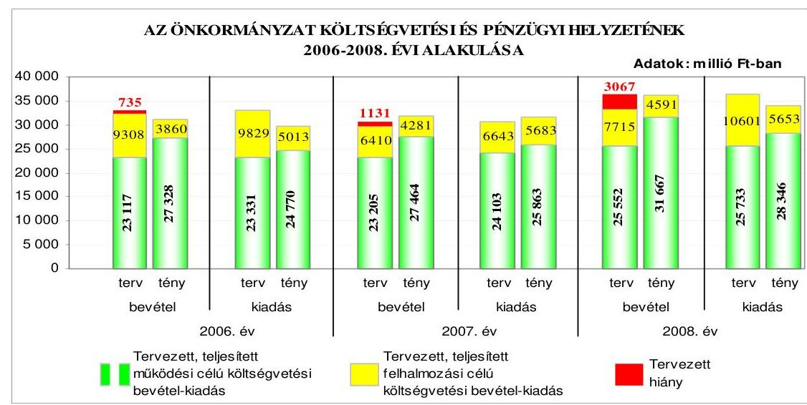

A 2006-2008. évi költségvetések végrehajtása során realizált költségvetési bevételek és teljesített költségvetési kiadások az Önkormányzatnál az előző évhez viszonyítva folyamatosan emelkedtek, a teljesített költségvetési bevételek

---

mindhárom évben fedezetet nyújtottak a megvalósított feladatok teljesített költségvetési kiadásaira. A 2006-2008. években a teljesített működési célú költségvetési kiadásoknál nem volt hiány, míg a felhalmozási célú költségvetési kiadások - alulteljesítésük ellenére - mindhárom évben meghaladták az azonos célú költségvetési bevételeket. A költségvetések végrehajtása során a pénzügyi többlet kialakulásához a felhalmozási célú költségvetési kiadások jelentős - a 2006. és a 2008. években mintegy felének, a 2007. évben közel ötödének feladat, illetve pénzügyi teljesítés áthúzódása miatti - elmaradása, valamint a tervezettet meghaladó működési célú költségvetési bevételek, továbbá a kiadási megtakarítást eredményező intézkedések járultak hozzá. Az Önkormányzat a 2006-2008. években összesen 1009 millió Ft hosszú lejáratú fejlesztési célú hitelt vett igénybe, ezen túl a 2007. évben (a Közgyűlés évközben hozott döntése alapján) 4140 millió Ft összegű, a 2008. évben 3500 millió Ft összegű svájci frank alapú, változó kamatozású, hosszú lejáratú felhalmozási célú kötvényt bocsátott ki. A kötvénykibocsátás - a forint svájci frankhoz viszonyított árfolyamváltozása, valamint a változó kamatmérték miatt - az Önkormányzat számára kockázatot jelent. A kötvények kibocsátásától a tőketörlesztés megkezdéséig várhatóan összesen 588 millió Ft kamatfizetési kötelezettség terheli az Önkormányzatot, amelyből a 2008. év végéig 334 millió Ft-ot fizettek ki. A kötvénykibocsátásból befolyt bevételeket a tervezett célra történő felhasználásig az Önkormányzat betétként lekötötte, ezen túl - a pénzpiaci feltételek bizonytalansága miatt kockázattal járó, az Önkormányzat gazdálkodásának biztonságát veszélyeztető - határidős deviza-ügyleteket is kötöttek az Ötv. előírásaival ellentétesen, mivel a Közgyűlés devizaügyletek kötésére vonatkozó döntést nem hozott, hatáskört nem ruházott át. A 2007. évi kötvénykibocsátás bevételeiből a korábban felvett fejlesztési célú hitelek törlesztésére 2247 millió Ft-ot, valamint a tervezett fejlesztési célú költségvetési kiadások teljesítésére a 2007. évben 461 millió Ft-ot, a 2008. évben 1174 millió Ft-ot használtak fel. A 2008. évben kibocsátott kötvény bevételéből 392 millió Ft-ot fordítottak felújítási feladatok finanszírozására és az európai uniós támogatással megvalósuló beruházásokhoz szükséges saját erő biztosítására. A kötvénykibocsátások tervezett feladatra fel nem használt bevételéből a 2008. év végén 3342 millió Ft pénzeszközként állt rendelkezésre.

Az Önkormányzat a 2006-2008. években folyamatosan - az időszak minden napján fennálló - folyószámlahitelt vett igénybe a számlavezető pénzintézettől, amelynek az év végi vissza nem fizetett állománya az évek sorrendjében 2012 millió Ft, 2398 millió Ft, illetve 2386 millió Ft volt. Az egyes években, a költségvetési rendeletekben tervezett működési célú hiteleket, valamint a fejlesztési célú hitelek egy részét nem vette fel az Önkormányzat, a szükséges fedezetet kötvénykibocsátás bevételeiből, illetve folyószámlahitel igénybevételével biztosította. Az igénybevett folyószámlahitelt az eseti likviditási problémák megoldásán túl a realizált költségvetési bevételekből nem finanszírozott költségvetési kiadások teljesítésére, illetve a korábban felvett hitelek visszafizetésére is fordították. A 2006-2008. években igénybevett folyószámlahiteleket a könyvekben likvid hitelként számolták el annak ellenére, hogy azok nem tekinthetők - az Ötv-ben foglaltak szerinti - likvid hitelnek, mivel éven belül nem fizették vissza.

---

Az Önkormányzat pénzügyi helyzete eladósodási szempontból 2006-2008 között kedvezőtlenül változott, mert a hosszú és rövid lejáratú fizetési kötelezettségek összes forráson belüli aránya - a könyvviteli mérleg szerinti fizetési kötelezettségek mintegy másfélszeresre történő növekedésének hatására - az időszak folyamán nőtt. Az Önkormányzat fizetőképessége a 2006-2008. évek között a kötvénykibocsátásokból származó bevételek hatására javult, azonban a pénzeszközök, a követelések és a forgatási célú értékpapírok együttesen a 2008. év végén sem nyújtottak fedezetet a rövid lejáratú fizetési kötelezettségek kiegyenlítéséhez. Az Önkormányzat pénzügyi helyzete a 2006-2008. évek közötti fizetőképességének javulása ellenére összességében kedvezőtlenül alakult.

Az Önkormányzat fejlesztési célkitűzéseit gazdasági programban ${ }_{1,2}$-ben, településfejlesztési, ágazati, szakmai fejlesztési koncepciókban, valamint fejlesztési tervben ${ }_{1,2,3,4}$-ben határozta meg, amelyek összhangban voltak az NFT-ben, valamint az ÚMFT-ben foglalt pályázati lehetőségekkel. A Közgyűlés és az intézményvezetők a 2006-2009. I. negyedév között európai uniós támogatásra összesen 55 pályázatot nyújtottak be, amelyekből 23 eredményes volt, 20 pályázatot elutasítottak, 12 elbírálása még nem történt meg, emellett 2004-2005 között benyújtott, nyertes pályázatok közül 17 fejlesztési feladat a 2006-2008. években valósult meg. Az Önkormányzat 2006-2009. évi költségvetési rendeletei tartalmazták az európai uniós támogatással megvalósuló fejlesztési feladatok működési és felhalmozási célú költségvetési kiadás és bevétel előirányzatait, valamint a felhalmozási kiadásokat feladatonként, a többéves kihatással járó fejlesztési feladatok előirányzatait éves bontásban, azonban az Ámr. előírása ellenére elkülönítetten nem mutatták be az intézmények által benyújtott európai uniós forrásból megvalósuló programok bevételeit és kiadásait. Az Önkormányzatnál a 2006-2008. években az európai uniós forrásokkal megvalósított, befejezett fejlesztési feladatok teljesített kiadásai a tervezetthez képest 99,7%-ban teljesültek.

Az európai uniós források igénybevételének és felhasználásának önkormányzati szintű feladatait a 2007. évtől pályázati szabályzatban határozták meg. Kijelölték az európai uniós forrásokra vonatkozó pályázatok önkormányzati szintű koordinációs feladatainak és a pályázatnyilvántartás vezetésének felelősét, előírták a pályázatfigyelést végzők és a döntési, illetve döntéselőterjesztési jogkörrel rendelkezők közötti információ-szolgáltatási kötelezettséget, továbbá a pályázatfigyelés, a
 pályázatkészítés és a lebonyolítás rendjét. Rögzítették az európai uniós támogatással megvalósuló fejlesztési feladatok lebonyolításával kapcsolatos folyamatba épített, előzetes és utólagos ellenőrzési feladatokat, továbbá a belső ellenőrzési stratégiát megalapozó kockázatelemzés kiterjedt az európai uniós forrásokkal támogatott fejlesztési feladatokra. A Polgármesteri hivatalban a pályázatfigyelés, a pályázatkészítés, valamint a fejlesztési feladat lebonyolításának személyi és szervezeti feltételeit kialakították. Négy pályázat elkészítésére a polgármester külső szervezettel megbízási szerződéseket kötött, amelyekben előírta a feladatellátás kötelezettségét, azonban a megbízási szerződések felében nem határozta meg a megbízott külső szervezet és a Polgármesteri hivatal képviselője közötti kapcsolattartást, valamint az információk átadásának formáját, tartalmát, módját és a pályázat szakmai és formai követelményeinek biztosítására vonatkozóan a pályázatkészítést végző felelősségét.

---

Az Önkormányzat a 2006-2007. években a „Jósaváros közterületeinek rehabilitációja 1. ütem" című projektet valósította meg, amelynek a hatályos támogatási szerződésben rögzített időbeli megvalósulásáról a fejlesztési feladat lebonyolítója gondoskodott. A kifizetési kérelmek benyújtása és a támogatás folyósítása 109-225 nap közötti időtartamot vett igénybe, az igénylést alátámasztó dokumentumok alaki és tartalmi hiányosságai miatt. Az Önkormányzat a költségvetésében tervezett saját forrást biztosította, a támogatási szerződésben meghatározott célok és indikátorok teljesültek. A folyamatba épített, előzetes és utólagos vezetői ellenőrzési feladatokat végrehajtották, a belső ellenőrzés a projekt megvalósításának folyamatát nem ellenőrizte. Külső ellenőrzést a közreműködő szervezet egy esetben végzett, a könyvviteli nyilvántartás vezetésének és a dokumentumoknak a hiányosságait állapította meg, melyeket a projektvezető a közreműködő szervezet részére az előírt határidőn belül bemutatott.

Az Önkormányzat a szabályozottság és szervezettség tekintetében 2006-2008 között összességében eredményesen készült fel az európai uniós források igénybevételére és a várható támogatások felhasználására, mivel a gazdasági program ${ }_{1,2}$-ben, ágazati, szakmai koncepciókban, tervekben megfogalmazott fejlesztési célkitűzésekhez kapcsolódtak az európai uniós forrásokra benyújtott pályázatok, szabályozták a pályázatfigyelést végzők és a döntési, illetve a döntés előterjesztési jogkörrel rendelkezők közötti információszolgáltatási kötelezettséget, meghatározták a folyamatba épített, előzetes és utólagos vezetői ellenőrzési feladatokat, továbbá a belső ellenőrzési stratégiát megalapozó kockázatelemzés kiterjedt az európai uniós forrásokkal támogatott fejlesztési feladatokra. A Polgármesteri hivatalon belül és külső szervezet megbízásával kialakították a pályázatfigyelés, a pályázatkészítés és a fejlesztési feladat lebonyolításának szervezeti, személyi feltételeit, valamint előírták a fejlesztési feladat lebonyolítását végző ellenőrzési kötelezettségeit. Annak ellenére eredményes volt az Önkormányzat felkészültsége, hogy a külső személlyel, szervezettel kötött szerződések 50%-ában nem írták elő a pályázat szakmai és formai követelményeinek biztosítására vonatkozóan a pályázatkészítést végző felelősségét.

Az Önkormányzat az informatikai stratégiában határozta meg a rövid és középtávú céljait, az elektronikus ügyintézés 3. szintjének megerősítését és a 4. szintjének bevezetését. A hosszú távú célkitűzéseket az informatika területén tapasztalható gyors ütemű változások miatt nem határozták meg. Az e-közigazgatás feladatainak ellátására az Önkormányzat saját tulajdonú gazdasági társaságával kötött szerződést. Az állampolgárok részére az ügyintézést az 1. és 2., illetve 3. elektronikus szolgáltatási szinten valósították meg. A közérdekű adatok közzététele során nem tartották be a vonatkozó IHM rendelet előírását, mivel a közérdekű adatokat az Önkormányzat honlapján nem az előírt tagolásban tették közzé. Az Önkormányzat a 2008. évben az Áht. előírásainak megfelelően tette közzé honlapján az általa nyújtott céljellegű működési és fejlesztési támogatások kedvezményezettjeinek nevét, a támogatások célját, összegét és a támogatási program megvalósítási helyét, valamint a vagyonnal történő gazdálkodással összefüggő, a nettó 5 millió Ft-ot elérő vagy azt meghaladó értékű árubeszerzésre, építési beruházásra, szolgáltatás megrendelésre, vagyonértékesítésre, vagyonhasznosításra vonatkozó szerződések megnevezését, tárgyát, a szerződő felek nevét, a szerződés értékét, határozott időre kötött szerződés esetén annak időtartamát, valamint a közzéteendő adatokban

---

történt változásokat. A 2006-2008. évi beszámolók szöveges indoklásának közzététele - az Ámr. előírásainak megfelelően - az Önkormányzat honlapján megtörtént.

A Polgármesteri hivatalnál a költségvetés tervezési és a zárszámadás készítési folyamatok szabályozottsága összességében alacsony kockázatot jelentett a feladatok megfelelő, szabályszerű végrehajtásában, mivel a jegyző a pénzügyi irányítási és ellenőrzési rendszer keretében a gazdasági szervezet ügyrendjében, az ellenőrzési nyomvonalban, a munkaköri leírásokban és körlevelekben szabályozta a költségvetési tervezés és a zárszámadás készítés rendjét, meghatározta az intézmények részére a költségvetési javaslat összeállításával kapcsolatos követelményeket. Annak ellenére összességében alacsony volt a kockázat, hogy a jegyző nem írta elő annak az ellenőrzését, hogy a Polgármesteri hivatal és az intézmények javasolt előirányzatai megalapozottak-e, hogy az előző évi pénzmaradvány igénybevételét az áthúzódó kötelezettségek fedezeteként megtervezték-e a Polgármesteri hivatalban és az intézményeknél. A költségvetés tervezési és zárszámadás készítési folyamatban a működési hibák megelőzésére, feltárására, kijavítására kialakított belső kontrollok működésének megbízhatósága összességében kiváló volt, mivel a szabályozásban foglaltaknak megfelelően ellenőrizték a költségvetési javaslat összeállításával kapcsolatban meghatározott követelmények érvényesülését, a költségvetési igények indokoltságát, teljesíthetőségét. A zárszámadás készítés folyamatában ellenőrizték az intézményi pénzmaradványok megállapításának szabályszerűségét, az eredeti és a módosított előirányzatok, valamint a teljesítési adatok eltérésének indokoltságát. Annak ellenére összességében kiváló volt a kontrollok működésének megbízhatósága, hogy a 2008. évben nem végezték el a Polgármesteri hivatal és az intézmények javasolt előirányzatai megalapozottságának, az előző évi pénzmaradvány igénybevétel tervezésének ellenőrzését.

A gazdálkodási, a pénzügyi-számviteli és a folyamatba épített ellenőrzési feladatok szabályozottsága alacsony kockázatot jelentett a feladatok megfelelő, szabályszerű végrehajtásában, mivel a jegyző a pénzügyi irányítási és ellenőrzési rendszer keretében elkészítette a gazdasági szervezet ügyrendjét, szabályozta a gazdálkodási és ellenőrzési jogkörök gyakorlásának rendjét, kiadta és aktualizálta a számviteli politikát, ennek keretében a pénzügyi-számviteli szabályzatokat. A Polgármesteri hivatalnál a külső szolgáltatók által végzett karbantartásokkal, kisjavításokkal, a gépek, berendezések, felszerelések beszerzéseivel, valamint az államháztartáson kívülre történő működési és felhalmozási célú pénzeszközátadásokkal kapcsolatos kifizetések során - ezen területek költségvetési súlyának figyelembevételével összefoglalóan értékelve - a szakmai teljesítés igazolás és az utalvány ellenjegyzés működésének megbízhatósága jó volt, mivel a szakmai teljesítés igazolásra a jegyző által kijelölt személyek a gépek, berendezések, felszerelések beszerzéseivel, valamint az államháztartáson kívülre történő működési és felhalmozási célú pénzeszközátadásokkal kapcsolatos kifizetések során ellenőrzési feladataikat elvégezték, a külső szolgáltatók által végzett karbantartási, kisjavítási munkákkal kapcsolatos kifizetések jogosultságát, összegszerűségét és a szerződések, megrendelések, megállapodások szakmai teljesítését - az összegszerűség ellenőrzésével kapcsolatos - eseti hiányosságok mellett ellenőrizték. Az utalványok ellenjegyzője azonban az államháztartáson kívülre nyújtott működési célú pénzeszközátadásokkal kapcso-

---

latos kifizetések utalványainak ellenjegyzése során nem észrevételezte, hogy a „polgármesteri keret" felhasználásáról a 2008. évi költségvetési rendeletben foglaltak ellenére nem az arra kizárólagos hatáskörrel rendelkező polgármester döntött, hanem az alpolgármester, akinek - az Ötv-ben foglaltak ellenére - az átruházott hatáskört a polgármester tovább adta. Az utalványok ellenjegyzője nem észrevételezte továbbá, hogy az Ötv. és a 2008. évi költségvetési rendelet hatásköri előírásaival ellentétes jegyzői rendelkezés miatt hatáskörrel nem rendelkező személy döntött a „civil feladatok" előirányzatai terhére nyújtott támogatásokról, valamint nem kifogásolta, hogy a labdarúgó klub részére a 2008. év decemberében - „2009. évi előleg" címén - teljesített támogatás kifizetését megelőzően a kötelezettségvállalás tárgyával összefüggő kiadási előirányzat a 2008. évi költségvetésben az Áht. előírása ellenére nem állt rendelkezésre.

A Polgármesteri hivatalban a pénzügyi-számviteli feladatoknál alkalmazott informatikai rendszer működésére vonatkozó szabályok hiányosságai közepes kockázatot jelentettek a feladatok szabályszerű végrehajtásában, mivel a katasztrófa elhárítási tervet a 2007-2008. években nem aktualizálták, az informatikai szabályzat a külső fejlesztők hozzáférését az éles rendszerhez nem tiltotta, a pénzügyi-számviteli rendszerből lekérhető ellenőrzési lista (napló) vizsgálatáért felelős személyt nem jelöltek ki, a pénzügyi-számviteli szoftverváltozások ellenőrzésére, tesztelésére vonatkozó eljárást, valamint a pénzügyi-számviteli szoftver mentési eljárásainak módját, rendjét és felelősségi viszonyait nem szabályozták. A hiányosságok ellenére a kialakított belső kontrollok megfelelő végrehajtásuk esetén - a lehetséges hibák többsége ellen védelmet nyújtottak. A Polgármesteri hivatalban az informatikai rendszer működésénél a kontrollok megbízhatósága azonban gyenge volt, mivel nem tesztelték az elmúlt két évben a katasztrófa elhárítási tervet, a pénzügyi-számviteli adatok elektronikus tárolása nem a Polgármesteri hivatalban történt, az alkalmazott szoftver változáskezelési eljárásának ellenőrzését, tesztelését nem végezték el, nem állították elő az adathozzáférésekről, adatmódosításokról, adattörlésekről az ellenőrzési listákat, nem történt meg az elmúlt egy évben annak ellenőrzése, hogy az elmentett állományokból a pénzügyi számviteli adatok teljes körűen helyreállíthatóak-e.

A belső ellenőrzés szervezeti kereteinek kialakítása és szabályozása a belső ellenőrzési feladatok megfelelő, szabályszerű végrehajtásában összességében alacsony kockázatot jelentett, mivel a feladat ellátásának módját és az eljárásrendet az előírásoknak megfelelően szabályozták, a jegyzőnek közvetlenül alárendelt kilencfős belső ellenőrzési egységet hoztak létre, a jegyző által jóváhagyott belső ellenőrzési kézikönyvvel rendelkeztek. Annak ellenére összességében alacsony volt a kockázat, hogy a 2008. évi belső ellenőrzési tervet alátámasztó kockázatelemzés a Polgármesteri hivatalnál és az intézményeknél nem terjedt ki az európai uniós forrásból megvalósított feladatok végrehajtására, az ellenőrzési programok nem tartalmazták a megbízólevél számát, továbbá a feladatok meghatározása során nem biztosították a belső ellenőrzés funkcionális (feladatköri) függetlenségét, mivel egy belső ellenőr munkaköri leírása 2009. júniusáig belső ellenőrzési tevékenységen kívül más tevékenység végrehajtásával összefüggő feladatokat is tartalmazott. A 2009. évi ellenőrzési tervet alátámasztó kockázatelemzés már kiterjedt az európai uniós forrásból megvalósított feladatok végrehajtására is. A belső ellenőrzés működésénél a kialakított kontroll-

---

lok megbízhatósága összességében kiváló volt, mivel a 2008. évi belső ellenőrzési tervben szereplő és a soron kívüli ellenőrzéseket a költségvetési szerveknél és az önkormányzati tulajdonú gazdasági társaságoknál ellenőrzési program alapján végrehajtották. Az ellenőrzésekről készített jelentések a Ber-ben foglalt előírásoknak megfeleltek, az ellenőrzött szervezetek észrevételt nem tettek, a javaslatok realizálása érdekében intézkedési tervet készítettek. A feltárt hiányosságok megszüntetéséről, az intézkedési tervek végrehajtásáról a belső ellenőrzés meggyőződött. A jegyző az Ámr-ben foglalt tartalommal teljesítette nyilatkozattételi kötelezettségét a Polgármesteri hivatal FEUVE rendszere, valamint a belső ellenőrzés működtetéséről, továbbá a polgármester a 2007. és a 2008. évi összefoglaló jelentést - az Ötv. előírásainak megfelelően - a zárszámadással egyidejűleg a Közgyűlés elé terjesztette. Annak ellenére összességében kiváló volt a 2008. évben a belső ellenőrzés működésének megbízhatósága, hogy a belső ellenőrzési feladatok végrehajtása során az Áht. előírása ellenére - 2009. júniusáig - nem biztosították a funkcionális függetlenséget, mivel egy fő belső ellenőrt a belső ellenőrzésen kívül más tevékenység végrehajtásába is bevontak.

Az ÁSZ az Önkormányzat gazdálkodási rendszerét a 2006. évben ellenőrizte átfogó jelleggel, amelynek során 63 szabályszerűségi és kilenc célszerűségi javaslatot tett. Az ÁSZ ellenőrzési tapasztalatait a Közgyűlés megtárgyalta és intézkedési tervben jóváhagyta a tervezett feladatokat és azok elvégzésének határidejét, felelősét. Az ÁSZ ellenőrzés által tett szabályszerűségi javaslatok 83%-át realizálták, 8%-át részben, 9%-át nem teljesítették. A célszerűségi javaslatok közül valamennyi javaslatot megvalósították.

Az intézkedési tervben foglalt határidőre teljesültek a költségvetési rendelet tartalmára vonatkozó javaslatok, mivel az Önkormányzat költségvetési és zárszámadási rendeletébe a kisebbségi önkormányzatok költségvetését a kisebbségi önkormányzatok határozatai alapján építették be, a költségvetési rendeletben bemutatták a közvetett támogatásokat
 tartalmazó kimutatást szöveges indoklással együtt, valamint a működési és felhalmozási célú bevételi és kiadási előirányzatokat mérlegszerűen, továbbá az Önkormányzat rendeletben szabályozta a költségvetés és zárszámadás keretében bemutatandó mérlegek tartalmi követelményeit. A javaslatoknak megfelelően módosították és vezették a kisebbségi önkormányzatok költségvetési előirányzatait, a kisebbségi önkormányzatokkal kötött megállapodásokban rögzítették az elvégzendő feladatokat, azok határidejét. Hasznosultak a gazdálkodás pénzügyi-számviteli szabályozottságára vonatkozó javaslatok, módosították a Polgármesteri hivatal SzMSz-ét, a számviteli politikát és a kapcsolódó szabályzatokat aktualizálták, az Önkormányzat az ellenőrzési kötelezettségének teljesítését a belső ellenőrzés és a FEUVE rendszer, ennek keretében kockázatelemzési és kezelési rendszer működtetésével, a szabálytalanságok kezelésére vonatkozó szabályok meghatározásával biztosította. Az utalványozási jogkör gyakorlói, valamint az érvényesítéssel megbízott és a szakmai teljesítés igazolására kijelölt személyek eleget tettek a munkafolyamatba épített ellenőrzési feladataiknak, a gazdálkodási és ellenőrzési jogkörök gyakorlásával felhatalmazott személyek beszámoltak tevékenységükről a felhatalmazást adó polgármesternek, illetve jegyzőnek. A vagyongazdálkodási rendelet módosításával hasznosították a vagyontárgyak forgalomképesség szerinti besorolásának, valamint az ingyenes vagyonátruhá-

---

zás, a követelés elengedés és a vízi-közmű vagyonnal való gazdálkodás szabályozására vonatkozó javaslatokat. A céljelleggel nyújtott támogatások tekintetében az alapítványi támogatásokkal kapcsolatos döntési jogkörök gyakorlására, a közhasznú szervezetek részére nyújtott támogatások szerződésben rögzített feltételek szerinti folyósítására, a támogatások felhasználásáról számadási kötelezettség előírására és a cél szerinti felhasználás ellenőrzésére tett javaslatokat megvalósították. A kötelezettségvállalásokról vezetett analitikus nyilvántartásból megállapítható az évenkénti kötelezettségvállalás összege, az Ellenőrzési iroda a Polgármesteri hivatalban a 2006. évben és a 2007. év első három negyedévében lefolytatott közbeszerzési eljárások közül öt eljárás ellenőrzését a 2007. évben elvégezte, a középületek akadálymentesítéséről a beruházások, felújítások tervezése és kivitelezése során gondoskodtak.

Részben teljesült a költségvetési hiány megállapítására vonatkozó javaslat, mivel a 2007-2009. évi költségvetési rendeletekben a költségvetési hiány összegét megállapították, azonban - az Áht. előírása ellenére - a 2007-2009. évi költségvetési rendeletekben finanszírozási célú pénzügyi kiadásokat költségvetési kiadásként vettek figyelembe. A jóváhagyott költségvetési előirányzaton belüli gazdálkodás érdekében a jegyző írásban tett intézkedést az Ellenőrzési iroda felé az előirányzat túllépések okainak feltárására, azonban a jegyzői intézkedésben előírtak ellenére az ellenőrzés kapacitás hiányában nem terjedt ki valamennyi - a kiemelt előirányzatait túllépő - költségvetési intézményre. Az Ellenőrzési iroda funkcionális függetlenségének biztosítására irányuló javaslat részben hasznosult, mivel az SzMSz-ben az Ellenőrzési iroda feladatait meghatározták, azonban egy fő belső ellenőrzést végző dolgozó munkaköri leírását - akit a belső ellenőrzésen kívül más feladattal is megbíztak - 2009. júniusáig nem módosították, így a belső ellenőrzés funkcionális függetlensége a módosítás időpontjáig nem valósult meg.

Az Önkormányzat az Ötv. előírása ellenére nem határozta meg, hogy - a lakosság igényeitől és anyagi lehetőségeitől függően - mely feladatokat milyen mértékben lát el. A jegyző az intézkedési tervben rögzített határidőt követően a 2009. évben gondoskodott a Vhr. által előírt költségvetési tartalék igénybevételéből származó költségvetési előirányzatok tervezéséről, a könyvviteli mérlegben kimutatott tulajdoni részesedések év végi értékelésének Vhr-ben előírt elvégzéséről. Határidőt követően, a 2007. évben kezdeményezte a jegyző a vagyongazdálkodási rendeletben az „egyéb gazdálkodó szervezetek és a kezelő szervezetek" fogalmának pontosítását, a „civil feladatok" támogatási előirányzatai feletti jogosultság meghatározását, valamint a pártokkal kötött helységbérleti szerződésekben a bérleti díjak módosítását.

Az Önkormányzatnál az ÁSZ a szakiskolai fejlesztési programra fordított pénzeszközök felhasználását a 2007. évben ellenőrizte, javaslatot nem tett. A közmunkaprogramok támogatására fordított pénzeszközök hasznosulásának ellenőrzését a 2007. évben végezte az ÁSZ, melynek során célszerűségi javaslatokat fogalmazott meg. A polgármester az Önkormányzat foglalkoztatási helyzetének értékelését tartalmazó és a foglalkoztatási helyzet javítását célzó koncepciót elkészítette, azt a Közgyűlés elfogadta. A Polgármester a számvevői jelentés Közgyűléssel történő megismertetésére, a jegyző a közfoglalkoztatási programok eredményességének értékelésére, valamint a „Kormányzati 100 lépés" programra kapott támogatások elszámoltatására vonatkozó javaslatok megvalósí-

---

tására nem intézkedett. A közbeszerzési rendszer működésének ellenőrzéséről a 2008. évben készített számvevői jelentés a munka színvonalának javítása érdekében öt javaslatot fogalmazott meg. A számvevői jelentésben foglaltakat a polgármester előterjesztése alapján a Közgyűlés megtárgyalta, azonban a polgármester a központosított közbeszerzési eljárás lehetőségének vizsgálatára intézkedést nem tett. A jegyző által készített előterjesztés alapján az Önkormányzat a közbeszerzési szabályzatban rögzítette a közbeszerzési eljárások alapján kötött szerződések nyilvántartásának vezetési szabályait, kijelölte annak felelősét. A jegyző a közbeszerzési eljárások eredményességének értékelésére, valamint a közbeszerzési szabályzat - az Európai Unióban letelepedett ajánlattevők és a közösségi áruk számára a közbeszerzési eljárásban nyújtandó nemzeti elbírálás elveivel történő - kiegészítésére intézkedést nem tett.

Az Önkormányzatnál végzett ÁSZ ellenőrzések javaslatai összességében 79%-ban hasznosultak, 6%-ban részben és 15%-ban nem teljesültek.

A helyszíni ellenőrzés megállapításainak hasznosítása mellett javasoljuk:

# a polgármesternek 

a jogszabályi előírások maradéktalan betartása érdekében

1. gondoskodjon az Önkormányzat gazdálkodásának 2006. évi átfogó ellenőrzése során az ÁSZ által részére tett és nem teljesült szabályszerűségi javaslat végrehajtásáról;
2. gondoskodjon az Ötv. 9. § (1) és (3) bekezdésében foglalt feladat- és hatáskörök gyakorlására vonatkozó szabályok betartása során arról, hogy az átmenetileg szabad pénzeszközök (köztük a kötvénykibocsátásból származó bevételek cél szerinti felhasználását megelőző) hasznosításáról a Közgyűlés, vagy átruházott hatáskörrel rendelkező személy/szerv döntsön, ennek során az Önkormányzat gazdálkodásának biztonsága érdekében - a pénzpiaci feltételek bizonytalansága miatt kockázattal járó határidős deviza ügyleteket ne kössenek;
a munka színvonalának javítása érdekében
3. kezdeményezze, hogy a számvevőszéki jelentésben foglaltakat a Közgyűlés tárgyalja meg és a feltárt hiányosságok megszüntetése érdekében készíttessen intézkedési tervet határidők és felelősök megjelölésével;

## a jegyzőnek

a jogszabályi előírások maradéktalan betartása érdekében

1. gondoskodjon az Önkormányzat költségvetési rendeletének végrehajtása során arról, hogy likvid hitelként kizárólag az Ötv. 88. § (3) bekezdés d) pontjában foglaltak szerinti - éven belül felvett és visszafizetett - hiteleket számolják el a könyvekben;

---

a munka színvonalának javítása érdekében
2. tájékoztassa - évente végzett számítások alapján - a Közgyűlést az Önkormányzat eladósodásának növekedésére figyelemmel arról, hogy a hosszú lejáratú, adósságot keletkeztető kötelezettségvállalásokból adódó tőke- és kamatfizetési kötelezettségét az Önkormányzat milyen feltételek biztosítása mellett tudja teljesíteni.

---

# II. RÉSZLETES MEGÁLLAPÍTÁSOK 

## 1. Az ÖNKORMÁNYZAT KÖLTSÉGVETÉSI ÉS PÉNZÜGYI HELYZETE

### 1.1. A tervezett költségvetési bevételek és kiadások alapján a költségvetési egyensúly, a költségvetési hiány oka, finanszírozásának tervezett módja és a költségvetési hiány megállapításának szabályszerűsége

Az Önkormányzatnál a 2006-2009. évben a tervezett költségvetési bevételek főösszege 32425 millió Ft-ról 39597 millió Ft-ra, a költségvetési kiadások 33160 millió Ft-ról 39709 millió Ft-ra növekedtek, azonban ez a növekedés nem volt folyamatos. A tervezett költségvetési bevételek és költségvetési kiadások a 2007. évben csökkentek, a 2008-2009. években növekedtek az előző évhez viszonyítva. Az Önkormányzat 2006-2009. évi költségvetési rendeleteiben a költségvetési bevételek és kiadások nem voltak egyensúlyban, a tervezett költségvetési bevételek nem nyújtottak fedezetet a költségvetési kiadásokra. A költségvetési hiány költségvetési kiadásokhoz viszonyított részaránya a 2006-2009. években 2,2 %, 3,7 %, 8,4 % és 0,3 % volt. A költségvetés hiányát a 2006-2008. években a tervezett működési célú költségvetési bevételek hiánya és a felhalmozási célú költségvetési bevételeket meghaladó összegben tervezett felhalmozási célú kiadások együttesen okozták, a 2009. évben a tervezett költségvetési hiányhoz a felhalmozási célú költségvetési bevételeket meghaladó felhalmozási célú költségvetési kiadások járultak hozzá.

A 2006-2008. évi költségvetési rendeletekben a működési célú költségvetési kiadásoknál a hiányzó forrás az évek sorrendjében 214 millió Ft, 898 millió Ft és 181 millió Ft volt, míg a 2009. évi költségvetésben a tervezett működési célú költségvetési bevételek 142 millió Ft-tal haladták meg az azonos célú költségvetési kiadásokat. A 2006-2009. évi felhalmozási célú költségvetési kiadások 521 millió Ft-tal, 233 millió Ft-tal, 2886 millió Ft-tal és 254 millió Ft-tal haladták meg a felhalmozási célú költségvetési bevételek előirányzatát.
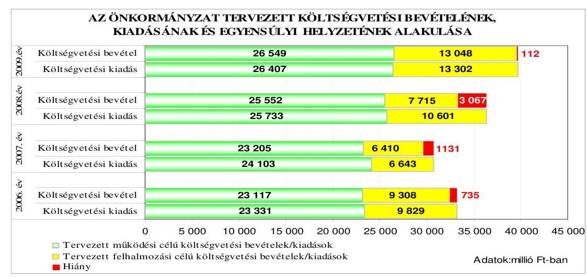

---

Az Önkormányzat a 2006. évi költségvetési rendeletben a költségvetési bevételek és kiadások különbözetét jelentő költségvetési hiány összegét az Áht. 8. § (1) bekezdésében foglaltakat megsértve nem mutatta be. A 2006-2009. évi költségvetési rendeletekben a költségvetés bevételi és kiadási főösszegének megállapításakor az Áht. 8/A. § (7) bekezdésében előírtakat megsértve a finanszírozási célú pénzügyi műveleteket - a 2006. évben értékpapír értékesítéséből származó finanszírozási célú bevételeket, a 2007-2009. években hiteltörlesztéssel kapcsolatos finanszírozási célú kiadásokat - is figyelembe vettek $^{10}$ költségvetési hiányt módosító költségvetési bevételként, illetve költségvetési kiadásként $^{11}$.

Az Önkormányzat tervezett költségvetési kiadásai a tervezett költségvetési bevételeket a 2006. évben 735 millió Ft-tal, a 2007. évben 1131 millió Ft-tal, a 2008. évben 3067 millió Ft-tal és a 2009. évben 112 millió Ft-tal haladták meg, ezzel szemben a 2007-2009. évi költségvetési rendeletekben bemutatott, Közgyűlés által elfogadott költségvetési hiány - a költségvetési kiadások között figyelembe vett hiteltörlesztések miatt - az évek sorrendjében 3735 millió Ft, 6195 millió Ft és 3383 millió Ft volt.

Az Önkormányzat a 2006-2009. évi költségvetési rendeleteiben a költségvetési egyensúly biztosításához hitelek felvételét, továbbá a 2006. évben értékpapírok értékesítését, a 2008. évben felhalmozási célú kötvény kibocsátását tervezte. Az Önkormányzatnál a költségvetési hiány finanszírozására, valamint korábbi években felvett hitelek törlesztésére összesen a 2006. évi költségvetési rendeletben 1660 millió Ft folyószámlahitel, 1089 millió Ft felhalmozási célú hitel felvételét és 297 millió Ft értékben hosszú lejáratú értékpapírok értékesítését tervezték, a 2007. éviben 2560 millió Ft rövid lejáratú működési célú hitel és 1175 millió Ft hosszú lejáratú felhalmozási célú hitel felvételével számoltak, továbbá az év folyamán 4000 millió Ft összegű felhalmozási célú kötvény kibocsátásáról döntött a Közgyűlés. A 2008. évi költségvetési rendeletben 2519 millió Ft rövid lejáratú működési célú, 176 millió Ft hosszú lejáratú felhalmozási célú hitelfelvételt terveztek és 3500 millió Ft összegű kötvény kibocsátásáról határozott a Közgyűlés. A 2009. évi költségvetési rendeletben 2386 millió Ft rövid lejáratú működési célú és 997 millió Ft hosszú lejáratú hitelfelvételt terveztek beruházási célokra. A költségvetési egyensúly javítása érdekében az Önkormányzat a 2006-2009. évi költségvetési rendeletében a Polgármesteri hivatal és a költségvetési intézmények gazdálkodását szabályozó takarékossági intézkedéseket hozott.

[^0]
[^0]: $^{10}$ A polgármester által adott tájékoztatás (6. számú melléklet) szerint a jegyző a 32.276-9/2009. XII. számú utasításban intézkedett arról, hogy a Gazdasági iroda az éves költségvetés tervezése során „az Áht. 8. § (7) bekezdésében foglaltaknak szerezzen érvényt, a költségvetési rendelet-tervezetben a költségvetési kiadások összege ne tartalmazzon hiányt módosító finanszírozási célú kiadásokat."
    $^{11}$ A 2006. évi költségvetési rendeletben a tervezett értékpapír értékesítés 294 millió Ft összegű bevételét a költségvetés bevételi főösszege tartalmazta. A 2007-2009. évi költségvetési rendeletekben a költségvetési kiadások főösszege tartalmazta a rövid és hosszú lejáratú hiteltörlesztések tervezett kiadásait, a 2007. évben 2604 millió Ft, a 2008. évben 3128 millió Ft és a 2009. évben 3271 millió Ft hiteltörlesztést mutattak ki költségvetési kiadásként.

---

A 2006-2009. évi költségvetési rendeletek végrehajtási szabályai
 között a Közgyűlés a költségvetési szervek részére a tervezett jutalmak kifizetésével kapcsolatos korlátozó szabályokat határozott meg, amelyek szerint a tervezett jutalom kifizetésére a tárgyév október 31-e után - a tervezett költségvetési bevételek időarányos teljesítését követően - kerülhet sor, továbbá a 2007-2009. évi költségvetési rendeletekben rögzített szabályozás nem adott lehetőséget a tárgyévben képződő bérmegtakarítás terhére történő jutalomfizetésre. A 2007-2008. évi költségvetési rendeletek végrehajtási szabályai szerint a Közgyűlés a vállalkozási tevékenységet folytató költségvetési intézmények vállalkozási tartalékának felhasználását kizárólag az alaptevékenység ellátását szolgáló feladatra engedélyezte.

A jegyző a költségvetés végrehajtása során a folyamatos likviditás biztosítása érdekében az Ámr. 139. § (1) bekezdése alapján a pénzállomány alakulásáról szükség szerint aktualizált likviditási tervet készített.

# 1.2. A teljesített költségvetési bevételek és kiadások alapján a pénzügyi egyensúly, a pénzügyi hiány oka, finanszírozásának módja és hatása a pénzügyi helyzet alakulására az eladósodás, valamint a fizetőképesség szempontjából 

Az Önkormányzatnál a 2006-2008. évek között teljesített költségvetési bevételek és költségvetési kiadások főösszege folyamatosan emelkedett. A realizált költségvetési bevételek a 2006. évi 31188 millió Ft-ról a 2007. évben 31745 millió Ft-ra, a 2008. évben 36258 millió Ft-ra emelkedtek, a teljesített költségvetési kiadások az előző évihez viszonyítva a 2007. évben 5,9%-kal 31546 millió Ft-ra, a 2008. évben 7,8%-kal 33999 millió Ft-ra növekedtek.
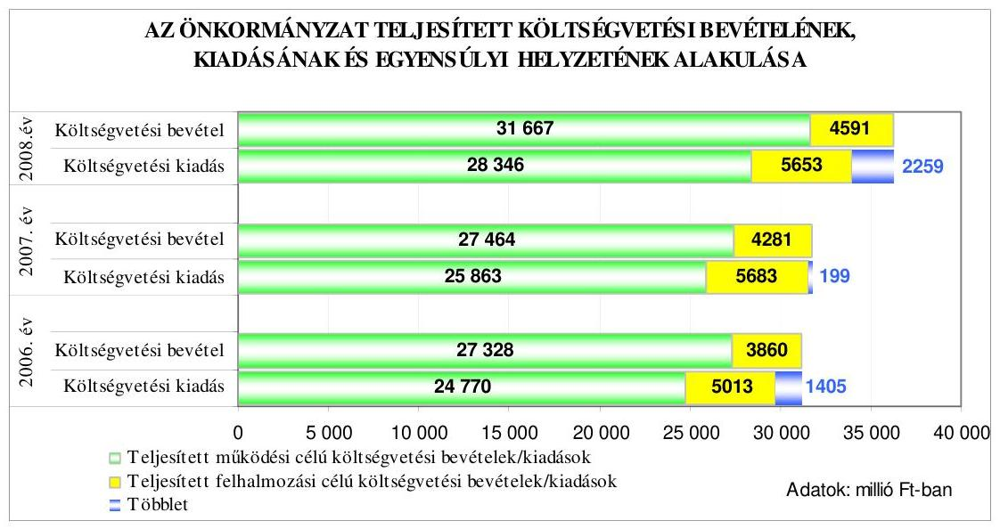

Az Önkormányzatnál a 2006-2008. évi költségvetések végrehajtása során a realizált költségvetési bevételek fedezetet nyújtottak a megvalósított feladatok teljesített költségvetési kiadásaira. A következő évre áthúzódó költségvetési kiadások és a tervet meghaladó bevételek együttes hatására a tervezett költségvetési hiánnyal szemben a 2006. évben 1405 millió Ft, a 2007. évben 199 millió Ft és a 2008. évben 2259 millió Ft összegű bevételi többlet keletkezett. A 2006-2008. években a teljesített működési célú költségvetési

---

bevételek fedezetet biztosítottak az azonos célú kiadásokra, a működési célú költségvetési bevételek többlete 2558 millió Ft, 1601 millió Ft és 3321 millió Ft volt, azonban a felhalmozási célú költségvetési bevételek - 1153 millió Ft-tal, 1402 millió Ft-tal és 1062 millió Ft-tal - maradtak el a felhalmozási célú költségvetési kiadásoktól.

Az Önkormányzatnál a 2006-2009. években tervezett és a 2006-2008. években teljesített működési és felhalmozási célú költségvetési kiadásokra a következő arányban biztosítottak fedezetet a költségvetési bevételek:

Adatok: %-ban

| Megnevezés | 2006.   év |  | 2007.   év |  | 2008.   év |  | 2009.   év |
| :--: | :--: | :--: | :--: | :--: | :--: | :--: | :--: |
|  | Terv | Tény | Terv | Tény | Terv | Tény | Terv |
| Működési célú költségvetési kiadások fedezettsége működési célú költségvetési bevételekből | 99,1 | 110,3 | 96,3 | 106,2 | 99,3 | 111,7 | 100,5 |
| Felhalmozási célú költségvetési kiadások fedezettsége felhalmozási célú költségvetési bevételekből | 94,7 | 77,0 | 96,5 | 75,3 | 72,8 | 81,2 | 98,1 |
| Költségvetési kiadások fedezettsége költségvetési bevételekből | 97,8 | 104,7 | 96,3 | 100,6 | 91,6 | 106,6 | 99,7 |

Az Önkormányzatnál a teljesített költségvetési kiadások költségvetési bevételekből történt fedezettsége a 2006. évről a 2007. évre 4,1 százalékponttal romlott, a 2008. évben 6,0 százalékponttal javult az előző évhez képest, a mutató az egyes években a tervezetthez viszonyítva is kedvező irányban változott.

Az Önkormányzatnál a 2006-2008. években a teljesített költségvetési kiadási főösszegekre vonatkozó fedezettség mutató 6,9 százalékponttal, 4,3 és 15,0 százalékponttal nőtt a tervezetthez képest, a fedezettség éven belüli kedvező alakulása a felhalmozási célú költségvetési kiadások alulteljesítésére, a beruházások és felújítások műszaki teljesítésének, továbbá az iparosított technológiával épült lakóépületek energiatakarékos felújításának támogatásával kapcsolatos pályázatok kiírásának, elbírálásának és pénzügyi teljesítésének elhúzódására, valamint a működési célú költségvetési kiadásokat meghaladó működési célú költségvetési bevételek (köztük a pénzmaradvány igénybevétele, a helyi adó és a költségvetési támogatás) túlteljesítésére vezethető vissza. A teljesített költségvetési kiadások költségvetési bevételekből történt fedezettségének a tervezetthez viszonyított alakulására kedvezően hatott az éves költségvetési rendeletekben - tervezési hiányosság miatt - nem tervezett, de teljesített előző évi pénzmaradvány igénybevétele. Az Önkormányzat az éves költségvetések eredeti előirányzatainak kialakításakor - az Áht. 7. § (2) bekezdésében foglaltakat megsértve - előző évi pénzmaradvány igénybevételét az előző évről áthú-

---

zódó feladatok (kötelezettségek) előirányzatainak fedezeteként a 2006-2008. években nem tervezte meg ${ }^{12}$. A 2009. évi költségvetési rendeletben a Polgármesteri hivatal és az önkormányzati intézmények kötelezettséggel terhelt pénzmaradványát a bevételi előirányzatok között megtervezték. A költségvetés végrehajtása során a helyi adók tervezetthez viszonyított teljesítése a 2006-2008. évek közötti időszakban az évek sorrendjében 106%, 112% és 102% volt, az eltérés valamennyi adónemnél ${ }^{13}$ jelentkező túlteljesítésre vezethető vissza.

Az Önkormányzatnál a 2006-2008. években a költségvetések teljesítése során a tervezett hiány mérséklése érdekében az intézmények szervezeti struktúrájának átalakításával kapcsolatos kiadási megtakarítást, illetve bevételnövelést eredményező intézkedéseket hajtottak végre:

- a Közgyűlés döntése alapján a 2006. évben az oktatási intézményekben végrehajtott szervezeti változások, a racionálisabb feladatellátás érdekében tett intézkedések ${ }^{14}$ közalkalmazotti és a Munka tv. hatálya alá tartozók körében összesen 62,5 fő létszámcsökkenést és 58 millió Ft kiadás megtakarítást eredményeztek. A 2007. évben az oktatási intézmények átszervezése, továbbá a közművelődési intézmények szervezeti átalakítása, valamint a szociális feladatellátást és a Polgármesteri hivatalt érintő - összesen 221 fős közalkalmazotti, köztisztviselői és Munka tv. hatálya alá tartozó dolgozók - létszámcsökkentésének hatására 94 millió Ft-tal csökkent a kiadások összege ${ }^{15}$. A 2008. évben folytatódott az oktatási intézmények átszervezése - a villamos-ipari tanműhely átköltöztetésével és 106 kollégiumi férőhely megszüntetésével ${ }^{16}$-1 millió Ft épület fenntartási kiadás megtakarítást és az épület értékesítésével 110 millió Ft többletbevételt értek el;

[^0]
[^0]:    ${ }^{12}$ Az Önkormányzat a 2006. évben 2656 millió Ft, a 2007. évben 1392 millió Ft, a 2008. évben 2455 millió Ft működési, valamint a 2008. évben 1225 millió Ft felhalmozási célú pénzmaradvány igénybevételét nem tervezte meg az előző évről áthúzódó feladatok (kötelezettségek) előirányzataként.
    ${ }^{13}$ Az Önkormányzat helyi adóbevételei az iparűzési adó, építményadó, idegenforgalmi adó és a pótlékok, bírságok bevételeiből származtak.
    ${ }^{14}$ A Közgyűlés 137/2006. (V. 31.) számú, a Polgármesteri hivatal épülete takarítási munkálatainak vállalkozásba adásáról szóló határozata, valamint a 149/2006. (VI. 28.) számú, a 2006/2007. tanév feladatellátásának racionálisabb megszervezéséről szóló döntése és 201/2006. (IX. 13.) számú, a 2006/2007. tanév indításával kapcsolatos feladatok módosításáról szóló határozata alapján tett intézkedések létszámcsökkenést és kiadási megtakarítást eredményeztek.
    ${ }^{15}$ A Közgyűlés a 134/2007. (VI. 25.) számú határozatában a szociális intézményekben foglalkoztatottak létszámának módosításáról, a 118/2007. (VI. 11.) számú, a 131/2007. (VI. 25.) számú és a 83/2007. (IV. 23.) számú határozatokban a városi közművelődési, nevelési, oktatási intézmények átszervezéséről, oktatási intézmény megszüntetéséről, épülethasznosításról, a 129/2007. (VI. 25.) számú határozatban a 2007/2008. tanév feladatellátásának racionálisabb megszervezéséről hozott határozatot.
    ${ }^{16}$ A Közgyűlés a 179/2008. (VI. 23.) számú a 2008/2009. tanév előkészítéséről, racionálisabb feladatellátásról szóló határozatában foglalt intézkedés alapján kollégiumi férőhelyek megszüntetésére, tanműhely áthelyezésére került sor a 2008. évben.

---

- az Önkormányzat a nem lakás céljára szolgáló helyiségek bérleti díjának mértékét évente emelte, valamint a 2007. évben módosította az idegenforgalmi adóról szóló rendeletét ${ }^{17}$, melyben az adó mértékét 100%-kal növelte. Az intézkedések eredményeként a nem lakás céljára szolgáló helyiségek bérleti díjának emelése a 2006. évben 9 millió forint, a 2007. évben 17 millió Ft és a 2008. évben 13 millió Ft bevételi többletet eredményezett, az idegenforgalmi adó emelésének hatására a 2008. évi helyi adó bevételek 7 millió forinttal emelkedtek.

A 2006-2008. években a felhalmozási célú költségvetési kiadások tervezettől történt elmaradásának hatásaként, valamint a tervezettet meghaladó költségvetési bevételek (előző évi pénzmaradvány igénybevétel, helyi adó és illetékek, normatív állami hozzájárulások, működési célú, államháztartáson belülről történő pénzeszközátvétel bevételei) teljesítésének, továbbá a végrehajtott - eredeti költségvetésben nem tervezett - takarékossági intézkedések eredményeként a teljesített költségvetési bevételek fedezetet nyújtottak az éven belül megvalósított feladatok teljesített költségvetési kiadásaira. A 2006-2008. években 1284 millió Ft, 1054 millió Ft, illetve 2546 millió Ft összegű tervezett kiadás teljesítése maradt el, amely pénzügyileg rendezetlen kötelezettségvállalásként húzódott át a következő költségvetési évre.

Az Önkormányzat a 2006-2008. évi költségvetés végrehajtása során hosszú lejáratú fejlesztési célú hiteleket vett fel, ezen túl a 2007-2008. években felhalmozási célú kötvényt bocsátott ki. Az Önkormányzat hosszú lejáratú hitelállománya a 2006. év végén 4742 millió Ft volt, amely a 2008. év végére - a hitelfelvételek és a törlesztések együttes hatására - 2078 millió Ft-ra csökkent. A 2008. év végi hitelállomány tartalmazta a 2006. évet megelőző években igénybevett beruházási hitelekből fennálló 1156 millió Ft tőketartozást is.

Az Önkormányzat által a 2006-2008. években a hosszú lejáratú hitelek felvételére kötött szerződések jellemzőit mutatja be a következő táblázat:

| Szerződéskötés ideje és célja | Hitel összege millió Ft | Futamidő év, hó | Türelmi idő év, hó | Kamat (fix, vagy változó) |
| :--: | :--: | :--: | :--: | :--: |
| 2006. május 29. „Sikeres Magyarországért"Önkormányzati Infrastruktúra Fejlesztési Hitelprogram |  |  |  |  |
| Iparosított technológiával épült lakóépületek energiatakarékos felújítására (panel plusz program) | 477 | 14 év 9 hó | 2 év 9 hó | változó |

[^0]
[^0]:    ${ }^{17}$ Az Önkormányzat idegenforgalmi adó módosításáról szóló 23/2007. (VI. 26.) számú rendelete 2008. január 1-jén lépett hatályba, amelyben az adó mértéke személyenként és vendégéjszakánként 100 Ft-ról 200 Ft-ra nőtt.

---

| Szerződéskötés ideje és célja | Hitel összege millió Ft | Futamidő év, hó | Türelmi idő év, hó | Kamat   (fix, vagy változó) |
| :--: | :--: | :--: | :--: | :--: |
| 2006. július 12. Önkormányzati Infrastruktúra Fejlesztési Hitelprogram |  |  |  |  |
| Általános beruházási célok megvalósításához (közutak építése, bölcsőde felújítása) | 316 | 9 év 11 hó | 2 év 11 hó | változó |
| Környezetvédelemhez kapcsolódó beruházás (csapadékvízelvezetést szolgáló beruházás), Egészségügyi szolgáltatások fejlesztése (alapellátási központi ügyelet létrehozása) | 127 | 9 év 11 hó | 2 év 11 hó | változó |
| 2007. március 22. „Sikeres Magyarországért"Önkormányzati Infrastruktúra Fejlesztési Hitelprogram |  |  |  |  |
| Iparosított technológiával épült lakóépületek energiatakarékos felújítására (panel plusz program) | 134 | 14 év 6 hó | 2 év 9 hó | változó |

A hosszú lejáratú felhalmozási célú hitelek lehívására a
 szerződéskötés évében, illetve az azt követő években került sor a hitelfelvétel céljának megfelelően a tervezett fejlesztési, felújítási feladatok megvalósításához. A 2006-2008. években kötött hitelszerződések alapján (az Önkormányzat a költségvetési rendeletekben tervezett összesen 2440 millió Ft-ból) 1009 millió Ft beruházási hitelt vett igénybe, amelyekből 2008. december 31-én fennálló hosszúlejáratú hiteltartozása 922 millió Ft volt.

Az Önkormányzat a 2007. és a 2008. években a tervezett felhalmozási célú költségvetési kiadások fedezetének biztosítása érdekében a Közgyűlés 2007. június 25-én ${ }^{18}$ hozott döntése, valamint a 2008. évi költségvetési rendeletben foglaltak alapján összesen 7640 millió Ft összegben bocsátott ki svájci frank alapú kötvényt:

- 2007. július 31-én „Nyíregyháza 2019" elnevezésű, 27 millió svájci frank, 4140 millió Ft névértékű kötvényt bocsátottak ki, a felhalmozási célú devizaalapú hiteltartozások visszafizetése, és a 2007. évi költségvetésben tervezett felhalmozási célú kiadások fedezetének megteremtése céljából. A kötvény változó kamatozású, a kamat mértéke 3 havi „CHF LIBOR" ${ }^{19}+0,8 \%$,

[^0]
[^0]:    ${ }^{18}$ A Közgyűlés 148/2007. (VI. 25.) számú határozatában döntött „az Önkormányzat jelenleg fennálló 2271 millió Ft összegű devizahitel tartozásának visszafizetése céljából, valamit a 2007-2008. évi fejlesztési feladatokra tervezett hitelek felvétele helyett kötvény kibocsátásáról".
    ${ }^{19}$ A „CHF LIBOR" megmutatja a kamatláb mértékét a svájci frankban nyújtott hitelek után a londoni bankközi piacon.

---

futamideje 12 év, a tőketörlesztés 3 év 2 hónap után 2010. szeptember 30-tól kezdődően negyedévenként esedékes;

- a 2008. január 31-én kibocsátott „Nyíregyháza 2032" elnevezésű, 20 millió svájci frank, 3500 millió Ft összegű kötvény, változó kamatozású, futamideje 24 év 2 hónap, a visszafizetés türelmi ideje 5 év 2 hónap. A kamat mértéke "CHF LIBOR" ${ }^{17}+0,67 \%$, a kamat fizetése negyedévenként történik a futamidő kezdetének napjától. A tőke visszafizetése a türelmi idő lejárta után, 2013. március 31-én kezdődik, a törlesztés évente egyenlő részletekben történik. A kötvénykibocsátás célja a hazai és európai uniós pályázatok benyújtásához szükséges saját erő biztosítása, tervezett fejlesztési feladatok megvalósítása.

A forint svájci frankhoz viszonyított árfolyamváltozása, valamint a változó kamatérték miatt az Önkormányzat számára a kötvénykibocsátás kockázatot jelent. A 2008. év végén az Önkormányzat kötvény kibocsátásából fennálló kötelezettségek mérleg szerinti összege 8804 millió Ft volt. A kötvények kibocsátásától a tőketörlesztés megkezdéséig várhatóan összesen 588 millió Ft kamatfizetési kötelezettség terheli az Önkormányzatot, amelyből 2008. december 31-éig 334 millió Ft-ot fizettek ki.

A kötvénykibocsátásokból rendelkezésre álló bevételeket a tervezett célnak megfelelő felhasználást megelőzően betétként helyezték el ${ }^{20}$, ezen túl - a pénzpiaci feltételek bizonytalansága miatt kockázattal járó, ezért az Önkormányzat gazdálkodásának biztonságát veszélyeztető - határidős deviza ügyleteket (adásvételeket) is kötöttek ${ }^{21}$. A határidős adásvételekről a Közgyűlés nem hozott döntést, az ügyletekre vonatkozó hatáskört sem ruházott át, ezáltal a polgármester és a Gazdasági iroda vezetője a devizaügyletek kötésével megsértették az Ötv. 9. § (1) és (3) bekezdésében foglalt előírásokat, mivel az adásvételek megkötéséhez hatáskörrel nem rendelkeztek.

A 2007. évi kötvénykibocsátásból a korábban (a 2001-2005. években) felvett deviza alapú, fejlesztési célokat szolgáló hitelek törlesztésére 2247 millió Ft-ot, valamint a költségvetésben tervezett fejlesztési célú költségvetési kiadások teljesítésére a 2007. évben 461 millió Ft-ot, a 2008. évben 1174 millió Ft-ot használtak fel. A 2008. évben kibocsátott kötvény bevételéből 392 millió Ft-ot fordítottak a felújítási feladatok finanszírozására és az európai uniós támogatással megvalósuló beruházásokhoz szükséges saját erő biztosítására. A kötvénykibocsátások bevételeiből fel nem használt összegből a 2008. év végén 1418 millió Ft a beruházásokra elkülönített számlákon, illetve 1924 millió Ft rövidlejáratú betétben elhelyezett pénzügyi eszközként állt rendelkezésre.

[^0]
[^0]:    ${ }^{20}$ A teljesített - változó időtartamú, változó kamat mértékű - betétlekötésből az Önkormányzatnak a 2008. év végéig összesen 316 millió Ft, a 2009. év első negyedévében 67 millió Ft kamatbevétele származott.
    ${ }^{21}$ Az Önkormányzat a kötvénykibocsátások bevételeiből a felhasználást megelőzően kötött határidős deviza ügyletekkel a 2008. évben 10 millió Ft árfolyamnyereséget realizált.

---

Az Önkormányzat a 2006. évi költségvetés végrehajtása során a gázközmű vagyonból származó kötvényt értékesített, melyből 292 millió Ft bevétele származott.

Az Önkormányzat adósságszolgálatra összesen ${ }^{22}$ a 2006. évben 1028 millió Ft-ot, a 2007. évben 3012 millió Ft-ot és a 2008. évben 756 millió Ft kifizetést teljesített.

A 2006-2009. években a folyószámlahitellel kapcsolatos jellemzőket mutatja be a következő táblázat:

| Megnevezés | 2006.   év | 2007.   év | 2008.   év | 2009.   I. negyedév |
| :-- | :--: | :--: | :--: | :--: |
| A folyószámlahitel keretösszege   (millió Ft-ban) | 2060 | 2560 | 2560 | 2560 |
| Év végén fennálló folyószámlahitel   (millió Ft-ban) | 2012 | 2398 | 2386 | - |
| Folyószámlahitellel zárt napok szá-   ma | 365 | 365 | 366 | 90 |
| A ténylegesen felvett folyószámlahi-   tel átlagos állománya (millió Ft-   ban) | 959,5 | 1689,4 | 1675,1 | 2348,9 |
| A felvett folyószámlahitel minimum   összege (millió Ft-ban) | 430,4 | 1464,7 | 1110,8 | 1168,9 |
| A felvett folyószámlahitel maxi-   mum összege (millió Ft-ban) | 2030,9 | 2558,0 | 2559,2 | 2551,7 |

A polgármester a 2006-2008. években a folyószámla-hitelkeretszerződést a költségvetésben jóváhagyott összegben kötötte meg a pénzintézettel. A folyószámla hitelen kívül a bérkifizetések fedezetének biztosítása érdekében munkabérhitelt vett fel az Önkormányzat, melynek mértékét a 2006-2008. évben a bankszámlaszerződésben az egy havi bérnek megfelelő összegben, a 2009. évben a költségvetési rendeletben 800 millió Ft összegben maximálták. A munkabérhitel 2008. év végén 450 millió Ft volt.

Az Önkormányzatnak a 2006-2008. évek és a 2009. év első negyedév minden napján folyószámlahitel tartozása állt fenn, amelynek az év végi vissza nem fizetett állománya az évek sorrendjében 2012 millió Ft, 2398 millió Ft, illetve 2386 millió Ft volt. Az Önkormányzat a 2006-2008. években a költségvetési rendeletekben tervezett működési hiteleket és a fejlesztési célú hitelek egy részét nem vette fel, a szükséges fedezetet a kötvénykibocsátások bevételeiből, illetve folyószámlahitel igénybevételével biztosította. Az igénybe vett folyószámlahitelt - a bevételek és kiadások eltérő időpontban történő teljesítése miatt jelentkező - eseti, éven belüli likviditási problémák megoldásán túl a realizált költségvetési bevételekből nem finanszírozott költségvetési kiadások teljesítésére, illetve a korábban felvett hitelek visszafizetésére is fordították. A 2006-

[^0]
[^0]:    ${ }^{22}$ Az adatok a kötvénykibocsátás bevételeiből teljesített hiteltörlesztések összegét (a 2007. évben 2247 millió Ft-ot) is tartalmazzák.

---

2008. években igénybe vett folyószámlahiteleket a könyvekben likvid hitelként számolták el annak ellenére, hogy nem tekinthetők - az Ötv. 88. § (3) bekezdés d) pontjában foglaltak szerinti - likvid hitelnek, mivel azokat éven belül nem fizették vissza.

Az Önkormányzat eladósodásának mértékét 2006-2008 között az éves könyvviteli mérleg adataiból számított eladósodási mutató ${ }^{23}$ és az esedékességi aránymutató ${ }^{24}$ mutatja. Az Önkormányzat eladósodása a 2006-2008. években folyamatosan növekedett, mivel a hosszú és rövid lejáratú kötelezettségek állományának növekedése meghaladta az összes forrás állományának növekedését. Az eladósodási mutató a 2006-2008. években 8,6 %, 10,3 % és 13,1 % volt, ami a 2006-2007. évek között 1,7 százalékponttal, a 2007-2008. évek között 2,8 százalékponttal emelkedett a kötvénykibocsátásból származó kötelezettségek és a rövid lejáratú hitelek növekedése miatt.

A 2006. évhez viszonyítva a 2008. év végére a hosszú és rövid lejáratú kötelezettségek együttes állománya 10220 millió Ft-ról 17006 millió Ft-ra 66,4%-kal emelkedett, míg az összes forrás 119102 millió Ft-ról 129444 millió Ft-ra, 8,7%-kal nőtt.

Az esedékességi aránymutató a 2006-2008. években 52,8%-ról, 48,5%-ra, majd 35,8%-ra csökkent. A 2007. és a 2008. évi kötvény kibocsátások hatására a hosszú lejáratú kötelezettségek aránya az összes kötelezettségen belül évről évre emelkedett, míg a rövid lejáratú kötelezettségek aránya évente csökkent, ezáltal a rövidtávon teljesítendő kötelezettségek fizetőképességre gyakorolt hatása mérséklődött.

Az összes kötelezettség állománya 64,1%-kal, a hosszú lejáratú kötelezettségek állománya 126,4%-kal, a rövid lejáratú kötelezettségek állománya 12,8%-kal nőtt a 2006-2008. évek között.

Az Önkormányzat pénzügyi helyzete - a 2006-2008. évek között - eladósodási szempontból kedvezőtlenül változott, annak ellenére, hogy az esedékességi aránymutató értékei javultak az évek folyamán.
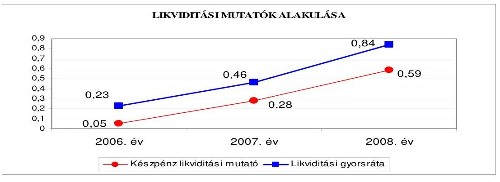

[^0]
[^0]:    ${ }^{23}$ Az eladósodási mutató a hosszú és rövid lejáratú fizetési kötelezettségek önkormányzati összes forráson belüli arányát mutatja.
    ${ }^{24}$ Az esedékességi aránymutató a rövid lejáratú fizetési kötelezettségek arányát fejezi ki az összes - rövid és hosszú lejáratú - fizetési kötelezettségen belül.

---

Az Önkormányzat fizetőképessége a 2006-2008. évek között erősödött, mert a pénzeszközök év végi állománya, valamint követelések és a forgatási célú értékpapírok évente növekvő arányban nyújtott fedezetet a rövid lejáratú kötelezettségekre, ennek ellenére azonban még a 2008. évben sem biztosítottak fedezetet a rövid lejáratú fizetési kötelezettségek teljes összegére.

A készpénz likviditási mutató ${ }^{25}$ a 2006-2008. évek között folyamatosan emelkedett, a 2007. évben a rövid lejáratú kötelezettségek növekedésének mértékét meghaladó pénzeszköz növekedés hatására, a 2008. évben a pénzeszközök növekedése és a rövid lejáratú kötelezettségek csökkenése következtében ${ }^{26}$.

A likviditási gyorsráta ${ }^{27}$ a 2007-2008. évben növekedett az előző év végéhez képest, mivel a 2007. évben a pénzeszközök és követelések együttes összegének növekedése meghaladta a rövid lejáratú kötelezettségek növekedését, a 2008. évben a pénzeszközök és követelések összegének emelkedése mellett a rövid lejáratú kötelezettségek összege csökkent.

Az Önkormányzat pénzügyi helyzete a 2006-2008. évek között a fizetőképességének javulása ellenére - a hitelfelvételek és a kötvénykibocsátás miatti eladósodás következményeként - összességében kedvezőtlenül alakult.

# 2. AZ ÖNKORMÁNYZAT FELKÉSZÜLTSÉGE AZ EURÓPAI UNIÓS FORRÁSOK IGÉNYLÉSÉRE ÉS FELHASZNÁLÁSÁRA, VALAMINT AZ ELEKTRONIKUS KÖZSZOLGÁLTATÁSI FELADATOK ELLÁTÁSÁRA 

2.1. Az európai uniós források igénybevételére és a várható támogatás felhasználására történt felkészülés szabályozottságának, szervezettségének eredményessége

### 2.1.1. Az európai uniós forrásokra történő pályázatok benyújtására vonatkozó döntések összhangja a fejlesztési célkitűzésekkel

Az Önkormányzat helyzetelemzéssel alátámasztott fejlesztési célkitűzéseit gazdasági programban ${ }_{1,2}$-ben, településfejlesztési, ágazati, szakmai, fejlesztési koncepciókban ${ }^{28}$, valamint fejlesztési tervben ${ }_{1,2,3,4}$-ben meghatározta.

[^0]
[^0]:    ${ }^{25}$ A készpénz likviditási mutató kifejezi, hogy a pénzeszközök év végi állománya milyen arányban nyújt fedezetet a rövid lejáratú fizetési kötelezettségekre.
    ${ }^{26}$ A pénzeszközök állománya a 2007. évben közel hétszeresére, a 2008 évben kétszeresére nőtt, míg a rövidlejáratú kötelezettségek összege a 2007. évben 17,4%-kal emelkedett, a 2008. évben 3,9 százalékponttal csökkent az előző évhez hasonlítva.
    ${ }^{27}$ A likviditási gyorsráta mutatja, hogy a rövid lejáratú fizetési kötelezettségek kiegyenlítéséhez a pénzeszközökön túl bevonható követelések, forgatási célú értékpapírok, milyen arányban nyújtottak fedezetet.

 ${ }^{28}$ Közoktatás-feladatellátási, intézményhálózat-működtetési és fejlesztési terv, szolgáltatástervezési koncepció, környezetvédelmi program, turisztikai, valamint a sportkoncepció.

---

A Közgyűlés a gazdasági program ${ }_{1}$-ben a településfejlesztési koncepcióban elfogadott stratégiai programokhoz illeszkedően fejlesztési célként a vállalkozói infrastruktúra, a humán erőforrás, a gazdasági struktúrának megfelelő húzóágazatok (kereskedelem, élelmiszer-feldolgozás, idegenforgalom, logisztika) fejlesztését, a regionális szerepkör erősítését, a környezet- és természetvédelem, valamint az épített környezet fejlesztését és védelmét, a lakosság egészségügyi állapotának javítását, a magas szintű kultúra és közművelődés lehetőségeinek biztosítását, továbbá a szociális biztonság megteremtését rögzítette. A gazdasági program ${ }_{2}$ a fejlesztési célokat, feladatokat a fejlesztési terv ${ }_{2}$-ben elfogadott szakmai irányokkal összhangban határozta meg a gazdaság (iparfejlesztés és logisztika, kereskedelem, idegenforgalom, testvérvárosi kapcsolatok), az európai színvonalú infrastruktúra (közlekedésszervezés, hulladékgazdálkodás, kommunális infrastruktúra), az intézményhálózat (oktatási, szociális és egészségügyi), a szociálpolitikai programok, valamint a kultúra és sport (közművelődési infrastruktúra, kulturális rendezvények, sportintézményhálózat) fejlesztése tekintetében.

A tervezett fejlesztési célkitűzések meghatározásánál figyelembe vették a megvalósítás lehetséges pénzügyi forrásait. Az önkormányzati forrásokon túlmenően külső, elsősorban európai uniós források igénybevételével, valamint egyes projektek ${ }^{29}$ megvalósításához vállalkozói tőke bevonásával számoltak.

A gazdasági program ${ }_{1}$-ben jóváhagyott fejlesztési célkitűzéseket az NFT keretében megjelenő pályázati lehetőségek alapján felülvizsgálták, a módosított fejlesztési feladatokat a fejlesztési terv ${ }_{1}$-ben határozták meg, az ÚMFT operatív programok prioritásait és intézkedéseit a gazdasági program ${ }_{2}$ elkészítésénél figyelembe vették.

Az Önkormányzat 2006-2009. I. negyedéve között európai uniós támogatásokra 55 pályázatot nyújtott be, amelyek 41,8%-a támogatásban részesült, 36,4%-át elutasították, 21,8%-ának az elbírálása 2009. március 31-ig folyamatban volt. Ezen túlmenően a 2004-2005. években benyújtott pályázatok közül 17 fejlesztési feladat megvalósítása áthúzódott a 2006-2008. évekre. Az Önkormányzatnál a Polgármesteri hivatal által benyújtott európai uniós pályázatokról a Közgyűlés, az intézmények által benyújtott pályázatokról az érintett intézmény vezetője döntött.

A benyújtott pályázatok fejlesztési céljai, programjai összhangban voltak a gazdasági program ${ }_{1,2}$-ben, településfejlesztési, ágazati, szakmai, fejlesztési koncepciókban, valamint fejlesztési terv ${ }_{1,2,3,4}$-ben meghatározott célkitűzésekkel.

A Polgármesteri hivatal a 2006-2009. I. negyedév között 34 európai uniós forrásokra irányuló pályázatot nyújtott be, amelyből 13 támogatásban részesült, 13 pályázatot elutasítottak, nyolc pályázatnál a döntés folyamatban van, továbbá 2004-2005 között benyújtott kilenc pályázatban támogatott fejlesztési

[^0]
[^0]:    ${ }^{29}$ Az Önkormányzat a közlekedés infrastruktúra, az önkormányzati ingatlanok hasznosítása, a kereskedelem, a sport és a turizmus fejlesztése területén tervezte a vállalkozói tőke bevonását.

---

feladat megvalósítása és pénzügyi elszámolása a 2006-2008. években fejeződött be az alábbiak szerint:

- a PHARE-Orpheus program ${ }^{30}$ keretében a 2003. évben „Esély Centrum - Egykori laktanya hasznosítása a fogyatékkal élők esélyegyenlőségének növekedése érdekében" címen benyújtott pályázaton az Önkormányzat 729,9 millió Ft európai uniós támogatásban részesült, a saját forrás összege 90,0 millió Ft volt. A fejlesztési feladat megvalósítása a 2006. évben befejeződött;
- a PHARE CBC program ${ }^{31}$ keretében a 2004. évben „Nyíregyháza-Szatmárnémeti gazdaságfejlesztési együttműködése" címen benyújtott pályázaton az Önkormányzat 11,4 millió Ft európai uniós támogatásban részesült, amelyhez 1,3 millió Ft saját forrást biztosított. A fejlesztési feladat megvalósítása a 2006. évben befejeződött;
- a ROP-2.3.1. intézkedés keretében a 2004. évben „Az általános iskolai tanulási környezet és közösségi háttér infrastrukturális és módszertani feltételeinek fejlesztése a nyíregyházi Szőlőskerti Általános Iskolában" címmel benyújtott pályázaton az Önkormányzat 191,9 millió Ft európai uniós és 36,0 millió Ft hazai társfinanszírozásban, valamint az EU Önerő Alapból 7,2 millió Ft támogatásban részesült, a tervezett saját forrás összege 4,8 millió Ft volt. A fejlesztési feladat megvalósítása a 2006. évben befejeződött;
- a ROP-2.2.1. intézkedés keretében a 2004. évben a „Jósaváros közterületeinek rehabilitációja I. ütem" címmel az Önkormányzat kettő partnerével ${ }^{32}$ közösen nyújtott be pályázatot. A projekt teljes bekerülési költsége 333,4 millió Ft volt, amelynek forrásaiból az Önkormányzatra jutó európai uniós támogatás 247,0 millió Ft volt, 49,4 millió Ft hazai társfinanszírozás mellett, az EU Önerő Alap támogatása 20,0 millió Ft, valamint a saját forrás igénye 13,4 millió Ft. A projektben résztvevő partnereket - saját erő biztosítása nélkül - 3,0 millió Ft összegű európai uniós támogatás, valamint 0,6 millió Ft összegű hazai társfinanszírozás illette meg. A fejlesztési feladat megvalósítása a 2007. évben befejeződött;
- a GVOP-4.3.2. intézkedés keretében a 2004. évben az „Önkormányzati adatvagyon másodlagos felhasználásának modellértékű keretrendszere" címmel benyújtott pályázaton az Önkormányzat 98,0 millió Ft európai uniós, továbbá 8,4 millió Ft EU Önerő Alaptámogatásban részesült, a tervezett saját forrás összege 5,6 millió Ft volt. A fejlesztési feladat megvalósítása a 2006. évben befejeződött;
- a HEFOP-3.2.2. intézkedés keretében a 2004. évben a „Térségi Integrált Szakképző Központ létrehozása Nyíregyháza kistérségben" címmel benyújtott pályázaton az Önkormányzat 342,8 millió Ft európai uniós és 114,3 millió Ft hazai támogatást nyert. A fejlesztési feladat megvalósítása a 2008. évben befejeződött, amely saját forrást nem igényelt;
- a HEFOP-4.1.1. intézkedés keretében a 2004. évben a „Térségi Integrált Szakképző Központ infrastrukturális feltételeinek javítása" címmel benyújtott pályázaton az Önkormányzat 628,5 millió Ft európai uniós és 157,1 millió Ft hazai, valamint 38,5 millió Ft EU Önerő Alap támogatásban részesült, a tervezett saját

[^0]
[^0]:    ${ }^{30}$ Phare (Orpheus) 2002/03 „Integrált helyi fejlesztési akciók ösztönzése" című program.
    ${ }^{31}$ Határon átnyúló gazdaságfejlesztés Magyarország-Románia Phare CBC 2003. program.
    ${ }^{32}$ Első Nyírségi Fejlesztési Társaság és a Jósavárosi Értelmiségi Egyesület.

---

forrás összege 25,7 millió Ft volt. A fejlesztési feladat megvalósítása a 2008. évben befejeződött;

- a ROP-2.1.3. intézkedés keretében a 2005. évben a „Rugalmas tömegközlekedési szolgáltatás bevezetése Nyíregyházán" címmel benyújtott pályázaton az Önkormányzat 33,3 millió Ft európai uniós és 6,6 millió Ft hazai támogatásban részesült, a tervezett saját forrás összege 4,4 millió Ft volt. A fejlesztési feladat megvalósítása a 2007. évben befejeződött;
- a ROP-2.2.2. intézkedés keretében a 2005. évben „A nyíregyházi Báthory István és a Vay Ádám laktanyák hasznosítása az esélyegyenlőséget növelő oktatási intézmények korszerű működési feltételeinek megteremtése érdekében" címmel benyújtott pályázaton az Önkormányzat 862,4 millió Ft európai uniós, 172,6 millió Ft hazai, valamint 69,0 millió Ft EU Önerő Alap támogatásban részesült, a tervezett saját forrás összege 46,0 millió Ft volt. A fejlesztési feladat megvalósítása a 2008. évben befejeződött;
- az Európai Bizottság DG EAC ${ }^{33}$ intézkedés keretében a 2006. évben az „Egyenlő Eséllyel Európában - Testvérvárosi találkozó" címen benyújtott pályázaton az Önkormányzat 0,6 millió Ft európai uniós támogatásban részesült, a saját forrás összege 1,3 millió Ft volt. A fejlesztési feladat a 2006. évben befejeződött;
- az EGT és Norvég Finanszírozási Mechanizmus keretében a 2006. évben a „Városképet markánsan meghatározó műemlék Nyírvíz Palota felújítása" címen, a 2007. évben „Kommunális hulladék mennyiségének csökkentésére irányuló tudatformáló tevékenység végzése" címen 765,0 millió Ft, valamint 76,5 millió Ft európai uniós forrásra pályázott az Önkormányzat, a saját erő 135,0 millió Ft, illetve 13,5 millió Ft volt. A bíráló bizottság a pályázatokat formai hiba ${ }^{34}$, illetve forráshiány miatt elutasította;
- az ÉAOP-4.1.5. intézkedés keretében a 2007. évben a „Tündérkert Óvoda felújítása" címen benyújtott pályázaton az Önkormányzat 7,7 millió Ft európai uniós támogatásban részesült, a saját forrás összege 0,8 millió Ft volt. A fejlesztési feladat a 2008. évben befejeződött;
- az ÉAOP-4.1.5. intézkedés keretében a „Családias ellátást nyújtó Idősek Otthona felújítása és fejlesztése" címen a 2007. évben 24,9 millió Ft európai uniós forrásra pályázott az Önkormányzat, a saját erő 2,8 millió Ft volt. A bíráló bizottság a pályázatot szakmai kidolgozottság hiánya ${ }^{35}$ miatt elutasította;
- az ÉAOP-3.1.3. intézkedés keretében a „Nyíregyháza - 4. számú főúti kerékpárút szakasz építése" címen a 2007. évben 51,0 millió Ft európai uniós forrásra pályázott az Önkormányzat, a saját erő 15,0 millió Ft volt. A pályázatot elutasították, mivel nem felelt meg a teljességi követelményeknek (a hiánypótlási felszólítás ellenére nem elszámolható költségeket szerepeltettek a pályázat költségvetésében, valamint a pályázat egyes céljai között ellentmondás volt);
- az ÉAOP-3.1.2. intézkedés keretében a 2007. évben a „Nyíregyháza - Keleti körút építése" című pályázaton az Önkormányzat 399,8 millió Ft európai uniós tá-

[^0]
[^0]:    ${ }^{33}$ Európai Bizottság Erasmus Intézményi „Iránytű Az Egész Életen Át Tartó Tanulás" programja.
    ${ }^{34}$ A pályázathoz nem csatolták a pályázó adatlapját.
    ${ }^{35}$ „A pályázat nem érte el a szakmai megfelelősséghez szükséges minimális pontértéket."

---

mogatásra pályázott, amelyhez 75,0 millió Ft saját forrást kell biztosítani. A fejlesztési feladat megvalósítása a 2009. évben folyamatban van;

- a TÁMOP-2.2.3. intézkedés keretében a 2008. évben a „Nyírségi Szakképzési Szervezési Társaság létrehozása" című pályázaton az Önkormányzat 315,0 millió Ft európai uniós támogatásra pályázott, amely saját forrást nem igényelt. A fejlesztési feladat megvalósítása folyamatban van;
- az ÉAOP-4.1.1. az oktatási-nevelési intézmények fejlesztése intézkedés keretében az Önkormányzat a 2008. évben négy pályázatot nyújtott be oktatási intézmények felújítására és fejlesztésére. A fejlesztésekhez 39,5 millió saját forrás biztosítása mellett, 355,5 millió Ft európai uniós támogatásra pályáztak. A pályázatokat a bíráló bizottság szakmai kidolgozottság hiánya ${ }^{36}$ miatt elutasította;
- az ÉAOP-3.1.4/B. intézkedés keretében a 2008. évben a „Nyíregyháza közösségi közlekedés infrastrukturális fejlesztése" című pályázaton az Önkormányzat 355,0 millió Ft európai uniós támogatásra pályázott, amelyhez 39,7 millió Ft saját forrást tervezett. A fejlesztés megvalósítása folyamatban van;
- a TIOP-1.1.1. intézkedés keretében a 2008. évben „A pedagógiai módszertani reformot támogató informatikai infrastruktúra fejlesztése" című pályázaton az Önkormányzat 400,0 millió Ft európai uniós támogatásra pályázott, amely saját forrást nem igényelt. A fejlesztés megvalósítása folyamatban van;
- az ÉAOP-5.1.2. intézkedés keretében a „Nyíregyháza Bujtos városrész csapadékvízzel veszélyeztetett utcáinak csatornázása" címen a 2008. évben 191,0 millió Ft európai uniós forrásra pályázott az Önkormányzat, a saját forrás szükséglete 21,2 millió Ft volt. A bíráló bizottság a pályázatot forráshiány miatt elutasította;
- a KEOP-6.3.0. intézkedés keretében a „Nyíropen program továbbfejlesztése" címen a 2008. évben 15,3 millió Ft európai uniós forrásra pályázott az Önkormányzat, a saját erő 2,7 millió Ft volt. A bíráló bizottság a pályázatot szakmai kidolgozottság hiánya miatt elutasította, mivel a projekt megvalósítás költségeit nem támasztották alá, egyes projektelemek költségét nem indokolták, a közbeszerzési tervet nem nyújtották be, elmaradt a kockázatok felmérése ezért nem dolgozták ki a kockázatkezelési stratégiát;
- az ÁROP-1.A.2. intézkedés keretében a 2008. évben a „Nyíregyháza Megyei Jogú Város Polgármesteri Hivatal átvilágítása és a szervezet fejlesztése" címú pályázaton az Önkormányzat 50,0 millió Ft európai uniós támogatásra pályázott, amelyhez 5,6 millió Ft saját forrást kell biztosítania. A fejlesztés megvalósítása folyamatban van;
- a KEOP-1.2.3. intézkedés keretében a 2008. évben

 a „Nyíregyháza és térsége szennyvizedvezetési és szennyvíztisztítási programja" című pályázaton az Önkormányzat 9891,9 millió Ft európai uniós támogatásban részesült, amelyhez 2880,4 millió Ft saját forrást tervezett. A fejlesztési feladat megvalósítása folyamatban van;
- az ÉAOP-4.1.3. intézkedés keretében a 2008. évben a „Mentálhigiénés Központ kialakítása" című pályázaton az Önkormányzat 100,0 millió Ft európai uniós támogatásra pályázott, amelynek saját forrás szükséglete 82,1 millió Ft volt. A támogatási szerződés megkötése jelenleg folyamatban van;

[^0]
[^0]:    ${ }^{36}$ „A pályázat nem érte el a szakmai megfelelősséghez szükséges minimális pontértéket."

---

- az ÉAOP-4.1.3. intézkedés keretében a 2008. évben a „Katica bölcsőde felújítása" című pályázaton az Önkormányzat 54,0 millió Ft európai uniós támogatásra pályázott, amelyhez 6,0 millió Ft saját forrást kell biztosítania. A támogatási szerződés megkötése jelenleg folyamatban van;
- a KEOP 1.1.1. intézkedés keretében a „Nyíregyháza Város települési szilárdhulladék-gazdálkodási rendszerének fejlesztése" címen a 2008. évben 169,8 millió Ft európai uniós forrásra pályázott az Önkormányzat, a saját forrás 70,2 millió Ft volt. A bíráló bizottság a pályázatot tartalmi hiányosság miatt elutasította, mivel a pályázat nem tartalmazott kettő teljes értékű változatot, továbbá a projekt tervezett költséghatékonysága nem volt megfelelő;
- a TIOP-3.4.2. intézkedés keretében a „Nyíregyháza Megyei Jogú Város bentlakásos intézményeinek fejlesztése" címen a 2008. évben 113,5 millió Ft európai uniós forrásra pályázott az Önkormányzat, amely 19,2 millió Ft saját forrást igényelt. A bíráló bizottság a pályázatot forráshiány miatt elutasította;
- a TÁMOP-3.1.4. intézkedés keretében a 2008. évben a „Kompetencia alapú oktatás fejlesztés Nyíregyházán" című pályázaton az Önkormányzat 164,0 millió Ft európai uniós támogatást nyert, amely saját forrást nem igényelt. A támogatási szerződés megkötése jelenleg folyamatban van;
- az EGT és Norvég Finanszírozási Mechanizmus keretében a 2008. évben a „Nyíregyháza - Beregszász gazdaságfejlesztési együttműködésének erősítése" című pályázaton az Önkormányzat 11,9 millió Ft európai uniós támogatásra pályázott, amelyhez 1,5 millió Ft saját forrást kell biztosítania. A fejlesztési feladat megvalósítása folyamatban van;
- az Európa a polgárokért program ${ }^{37}$ keretében a 2008. évben a „Sokszínű Európa - Testvérvárosi találkozó" című pályázaton az Önkormányzat 2,2 millió Ft európai uniós támogatásban részesült, amelyet 3,5 millió Ft saját forrással egészített ki. A program megvalósítása folyamatban van;
- az INTERREG ${ }^{38}$ közösségi kezdeményezés keretében a „Százszorszép Óvoda ultra alacsony energiafelhasználású épületté történő átalakítása" címen a 2008. évben az Önkormányzat 34,7 millió Ft európai uniós támogatásra pályázott, amelynek saját forrás igénye 15,3 millió Ft volt. A pályázat nem érte el a támogatáshoz szükséges minimális pontértéket, ezért a bíráló bizottság a pályázatot elutasította;
- az ÉAOP-4.1.1. intézkedés keretében a 2008. évben a „Wesselényi Miklós Középiskola, Szakiskola és Kollégium oktatási épületének rekonstrukciója és bővítése" fejlesztési feladat tervezett kiadása 556,0 millió Ft volt, melynek forrása 500,0 millió Ft európai uniós támogatás, 56,0 millió Ft saját forrás volt. A pályázatot az első fordulóban támogatásban részesítették, a második fordulóban az elbírálás még nem történt meg;
- az ÉAOP-5.1.1. intézkedés keretében a 2008. évben a „Belvárosi terek integrált funkcióbővítő fejlesztése Nyíregyházán" című pályázaton a fejlesztési feladatra az Önkormányzat 2482,5 millió Ft kiadást tervezett, melynek pénzügyi fedezete 1843,6 millió Ft európai uniós támogatás, 638,9 millió Ft saját forrás volt. A pályázatot az első fordulóban támogatásban részesítették, a második fordulóban az elbírálás még nem történt meg;

[^0]
[^0]:    ${ }^{37}$ Európai Bizottság „Európa a Polgárokért Programja".
    ${ }^{38}$ Határon átnyúló, transznacionális és interregionális együttműködés.

---

- a TIOP-1.2.1. intézkedés keretében a 2008. évben a „AGÓRA - Nyíregyháza Multifunkcionális közösségi központ és területi közművelődési tanácsadó szolgálat infrastrukturális feltételeinek kialakítása Nyíregyháza Megyei Jogú Városban" című pályázaton a fejlesztési feladatra az Önkormányzat 2400,0 millió Ft kiadást tervezett, amelynek finanszírozását 1750,0 millió Ft európai uniós támogatás, 650,0 millió Ft saját forrás biztosította. A pályázatot az első fordulóban támogatásban részesítették, a második fordulóban az elbírálás még nem történt meg;
- a TÁMOP-3.3.2. intézkedés keretében a 2008. évben az „Egyenlő bánásmód és szolidaritás a közoktatásban Nyíregyházán" című pályázaton az Önkormányzat 100,0 millió Ft kiadást tervezett, melynek fedezete 100%-os arányban európai uniós támogatás volt. A pályázat elbírálása még nem történt meg;
- a TÁMOP-5.3.1. intézkedés keretében a 2009. évben az „Ajtóprojekt 2. - integrált fejlesztőprogrammal a társadalmi beilleszkedésért" című pályázaton az Önkormányzat 43,0 millió Ft kiadást tervezett, amelynek pénzügyi forrása 100%-os arányban európai uniós támogatás volt. A pályázat elbírálása még nem történt meg;
- az EMVA „Falumegújítás és fejlesztés" programja keretében a 2009. évben a „Közösségi játszóterek kialakítása" című pályázaton az Önkormányzat 24,3 millió Ft kiadást tervezett, amelyet 20,2 millió Ft európai uniós támogatás és 4,1 millió Ft saját forrás finanszírozott. A pályázat elbírálása még nem történt meg;
- a Magyarország - Románia Határon Átnyúló Együttműködési Program keretében a 2009. évben a „Nyíregyháza és Szatmárnémeti testvérvárosi együttműködésének széleskörű fejlesztése", valamint az „Innovációs és Technológiai Központ létesítése Nyíregyházán" című pályázatokon az Önkormányzat 121,3 ezer euró (33,9 millió Ft), illetve 3700,0 ezer euró (999,0 millió Ft) kiadást tervezett, amelynek pénzügyi forrásai 117,0 ezer euró (32,7 millió Ft), illetve 3516,0 ezer euró (949,3 millió Ft) európai uniós támogatás, és 4,3 ezer euró (1,2 millió Ft), illetve 184,0 ezer euró (49,7 millió Ft) saját forrás volt. A pályázatok elbírálása még nem történt meg.

Az Önkormányzat intézményvezetői a 2006-2009. I. negyedév között 21 európai uniós forrásokra irányuló pályázat benyújtásáról döntöttek, amelyből 10 támogatásban részesült, hetet elutasítottak, négy pályázatnál a döntés folyamatban van, továbbá 2004-2005 között benyújtott nyolc pályázat támogatott fejlesztési feladatának a megvalósítása és pénzügyi elszámolása a 2006-2008. években fejeződött be az alábbiak szerint:

- a Mentálhigiénés Központ a HEFOP-2.3.1., HEFOP-2.3.2. és HEFOP-2.2.1 intézkedésekre három pályázatot nyújtott be: a 2004. évben „Hátrányos helyzetű fiatalok és pszichésen sérült emberek képzéssel összekötött foglalkoztatása Nyíregyházán", valamint a „Halmozottan hátrányos helyzetű fiatalok képezhetőségének és foglalkoztathatóságának javítása", a 2007. évben „A társadalmi befogadás elősegítése a szociális területen dolgozó szakemberek képzésével" programok támogatására, amelyek megvalósítására összesen 11,4 millió Ft európai uniós támogatásban részesült. A programok végrehajtása a 2007. és a 2008. években befejeződtek;
- a Göllesz Viktor Speciális Szakiskola és Általános Iskola az EQUAL program keretében a 2004. évben az „Esély a teljes életre III. !" című pályázaton saját forrás biztosítása nélkül 183,4 millió Ft európai uniós és 61,1 millió Ft hazai támogatásban részesült, amely program a 2009. évben befejeződött. Az intézmény főpályázóként és a 13. sz. Általános Iskola társpályázóként vett részt

---

a 2005. évben a HEFOP-2.1.6. intézkedés keretében „A sajátos nevelési igényű tanulók együttnevelése - Esély a teljes életre IV." című pályázaton. A pályázatban meghatározott fejlesztési feladatra az önkormányzati intézmények saját forrás biztosítása nélkül 14,8 millió Ft, illetve 1,5 millió Ft európai uniós, valamint 4,9 millió Ft, illetve 0,6 millió Ft hazai támogatásban részesültek. A fejlesztési feladat a 2008. évben befejeződött;

- az Inczédy György Középiskola, Szakiskola és Kollégium a 2004. évben a HEFOP-2.3.1. intézkedés keretében a „Munkával tanulunk Szabolcsban" címen a Műszaki és Természettudományi Egyesületek Szövetségével, mint főkedvezményezettel közösen nyújtott be pályázatot, amely alapján az intézmény 0,7 millió Ft európai uniós és 0,2 millió Ft hazai támogatásban részesült. Az intézmény a 2006. évben a Socrates/Comenius 1 akció intézkedés keretében „Iskolai együttműködések" című pályázatán saját forrás biztosítása nélkül egymillió Ft európai uniós támogatásban részesült. A fejlesztési feladat a 2007. évben befejeződött;
- a Kazinczy Ferenc Általános Iskola, valamint a Kertvárosi Általános Iskola a HEFOP-3.1.3. intézkedés keretében a 2005. évben az „Újat, jobbat, hatékonyabbat!", illetve a „Változtassunk, hogy változhassunk" című pályázatokon saját forrás biztosítása nélkül 13,5 millió Ft európai uniós támogatásban és 4,5 millió Ft hazai társfinanszírozásban részesült. A fejlesztési feladatok megvalósítása a 2008. évben befejeződött;
- a Zrínyi Ilona Gimnázium a HEFOP-3.1.3. intézkedés keretében a 2005. évben a „Kompetencia alapú pedagógiai program feltételrendszerének kialakítása a nyíregyházi Zrínyi Ilona Gimnázium és Kollégiumban" című pályázaton saját erő biztosítása nélkül 13,5 millió Ft európai uniós és 4,5 millió Ft hazai támogatásban részesült. A fejlesztési feladat a 2008. évben befejeződött;
- a Kölcsey Ferenc Gimnázium a Socrates/Comenius 1 akció intézkedés keretében a 2006. évben a „Különbözőek vagyunk mégis együvé tartozunk" című pályázaton saját forrás biztosítása nélkül 4,1 millió Ft európai uniós támogatásban részesült. A fejlesztési feladat a 2007. évben befejeződött;
- a Lippai János Szakközépiskola és Szakiskola a Leonardo da Vinci program keretében a 2006-2007. években „A külföldi munkahelyi gyakorlat és szakmai továbbképzés biztosítása" témakörökben beadott három pályázathoz összesen 5,5 millió Ft európai uniós támogatásban részesült, amelynek saját forrás igénye 0,4 millió Ft volt. A fejlesztési feladatok a 2007. és a 2009. években befejeződtek;
- a Gyermekjóléti Központ a HEFOP-2.2.1. intézkedés keretében a 2007. évben az „Új kezdet, új lehetőség" című pályázaton saját erő biztosítása nélkül 2,7 millió Ft európai uniós támogatásban részesült, amely megvalósítása a 2008. évben befejeződött. A TÁMOP-5.2.5. intézkedés keretében a 2008. évben a "Nyíregyházán minden gyerek fontos" című pályázaton az intézmény 19,6 millió Ft európai uniós támogatásra pályázott, amelyhez saját forrást nem kell biztosítani. A fejlesztési feladat megvalósítása folyamatban van;
- a Westsik Vilmos Élelmiszeripari Szakközépiskola és Szakiskola a 2007. évben a Leonardo da Vinci program keretében az „Egész életen át tartó tanulás" című pályázaton 2,4 millió Ft európai uniós támogatásban részesült, amelyhez saját forrást nem kellett biztosítani. A fejlesztési feladat a 2008. évben befejeződött. Az intézmény a 2009. évben a program keretében ismét benyújtotta pályázatát az „Egész életen át tartó tanulás" címmel. Az 5,1 millió Ft európai uni-

---

ós támogatással, saját erő nélküli fejlesztési feladat megvalósítása támogatási szerződését még nem írták alá;

- a Mentálhigiénés Központ az ÉAOP-4.1.3. intézkedés keretében a 2008. évben „A Mentálhigiénés Központ fejlesztése" című pályázaton 182,1 millió Ft kiadást tervezett, melynek finanszírozását 100,0 millió Ft európai uniós támogatással, valamint 82,1 millió Ft saját forrással tervezte. A pályázat elbírálása még nem történt meg;
- a Göllesz Viktor Speciális Szakiskola és Általános Iskola a TÁMOP-3.1.6. intézkedés keretében a 2008. évben az „Esély!" című pályázaton 20,0 millió Ft kiadást tervezett, melynek fedezete 100%-ban európai uniós támogatás volt. A pályázat elbírálása még nem történt meg;
- a Kölcsey Ferenc Gimnázium a Socrates/Comenius 1 akció intézkedés keretében a 2009. évben az „Interkulturális nevelés" című pályázaton 5,0 millió Ft kiadást tervezett, melynek forrása 100%-ban európai uniós támogatás volt. A pályázat elbírálása még nem történt meg;
- a Zrínyi Ilona Gimnázium
 a HEFOP-3.1.3. intézkedés keretében a 2009. évben „A kompetencia alapú oktatási programok eszközei elemeinek biztosítása a HEFOP 3.1.3. intézkedésben érintett közoktatási intézmények számára" című pályázaton 9,5 millió Ft kiadást tervezett, melynek forrása 100%-ban európai uniós támogatás. A pályázat elbírálása még nem történt meg.

A 2007-2008. években az intézményvezetők közreműködésével benyújtott pályázatok közül hét pályázatot elutasítottak. A Lippai János Szakközépiskola és Szakiskola a Leonardo da Vinci program keretében benyújtott négy pályázata közül három pályázatot tartalmi hiányosság miatt utasítottak el ${ }^{39}$, míg egy pályázatot tartaléklistára helyeztek. A Kölcsey Ferenc Gimnázium Socrates/Comenius 1 akció intézkedés keretében külföldi partnerekkel együtt -idegen nyelvi képzés céljára - benyújtott három pályázatát elutasították, mivel a külföldi partnereket nemzeti irodájuk nem támogatta.

Az Önkormányzat 2006-2009. évi költségvetési rendeletei tartalmazták az európai uniós támogatással megvalósuló működési és felhalmozási célú költségvetési kiadás és bevétel előirányzatait, a felhalmozási kiadásokat feladatonként, a többéves kihatással járó fejlesztési feladatok előirányzatait éves bontásban, azonban az Ámr. 29. § (1) bekezdés k) pontjában foglalt előírás ellenére elkülönítetten nem mutatták be ${ }^{40}$

[^0]
[^0]:    ${ }^{39}$ A pályázat eredményéről szóló értesítő levél a tartalmi hiányosságokat nem részletezte, azonban lehetőséget biztosított a pályázó számára, hogy „amennyiben az elutasítás indokáról részletes felvilágosítást szeretne kapni, kérjük, hogy jelezze a Leonardo Nemzeti Iroda munkatársának e-mailben vagy telefonon".
    ${ }^{40}$ A 2006-2009. évi költségvetési rendeletek nem tartalmazták elkülönítetten az intézmények - 2006-2009 között benyújtott és a 2004-2006. évekről áthúzódó - európai uniós támogatással megvalósuló programok, projektek bevételi és kiadási előirányzatait.

---

európai uniós forrásból megvalósuló program bevételi és kiadási előirányzatát ${ }^{41}$.

Az Önkormányzatnál 2009. március 31-ig európai uniós forrással megvalósult, valamint folyamatban lévő fejlesztési feladatok tervezett és teljesített kiadásait, annak forrásait a jelentés 4. számú melléklete tartalmazza. Az Önkormányzatnál a 2006-2008. években európai uniós forrásokkal megvalósított, befejezett fejlesztési feladatok teljesített költségvetési kiadása 4362,0 millió Ft volt, amely pénzügyi forrása 3321,9 millió Ft európai uniós, 596,7 millió Ft hazai, 141,0 millió Ft EU Önerő Alap támogatás, valamint 0,1 millió Ft egyéb forrás, továbbá önkormányzati szinten 302,3 millió Ft saját forrás volt.

Az Önkormányzat 2006-2008 között európai uniós forrásokkal támogatott, befejezett fejlesztési feladatainál a finanszírozási források tervezett és tényleges megoszlását a következő ábra mutatja:
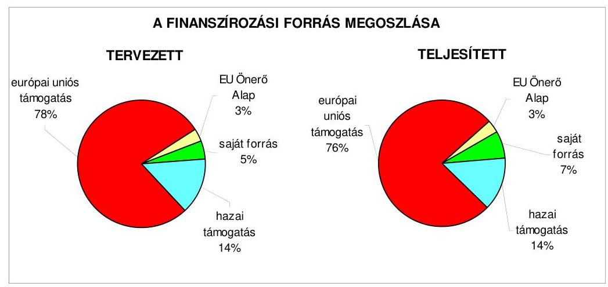

A befejezett fejlesztési feladatok teljesített kiadásai és a fedezetüket biztosító források a tervezetthez képest 99,7%-ban nyertek felhasználást. Nyolc projektnél a tervezett költségvetési kiadások 80,0%-98,5% között teljesültek ${ }^{42}$, mely nem járt feladatelmaradással. A teljesített európai uniós támogatás részaránya kettő

[^0]
[^0]:    ${ }^{41}$ A polgármester által adott tájékoztatás (6. számú melléklet) szerint a jegyző a 32.276-9/2009. XII. számú utasításban intézkedett, hogy a Gazdasági iroda az éves költségvetés tervezése során „az Ámr. 29. § (1) bekezdés k.) pontjában foglaltaknak megfelelően gondoskodjon arról, hogy a költségvetési rendelet-tervezet az intézmények európai uniós támogatással megvalósuló programok, projektek bevétel és kiadási előirányzatait elkülönítetten tartalmazza."
    ${ }^{42}$ A HEFOP 3.2.2. "Térségi Integrált Szakképző Központ létrehozása Nyíregyháza kistérségben" 95,5%, a HEFOP 4.1.1. "Térségi Integrált Szakképző Központ infrastrukturális feltételeinek javítása" 98,5%, a ROP 2.1.3. „Rugalmas tömegközlekedési szolgáltatás bevezetése Nyíregyházán" 90,3%, a ROP 2.2.2. „A nyíregyházi Báthory I. és Vay Á. laktanyák hasznosítása" 97,6%, a HEFOP 2.2.1. „Új kezdet, új lehetőség" 92,6%, az EQUAL program „Esély a teljes életre" 91,0%, a HEFOP 2.1.6. „Sajátos nevelési igényű tanulók együttnevelése - Esély a teljes életre IV." 95,9%, a Socrates/Comenius 1 akció „Iskolai együttműködések" 80,0%.

---

százalékponttal elmaradt a tervezettől, míg a saját forrás teljesített részaránya kettő százalékponttal magasabb volt, mivel a 2006-2008. években 11 projekt a tervezett költségvetési adatokhoz viszonyítva kedvezőbb pénzügyi feltételekkel valósult meg, amelynek következtében kevesebb európai uniós támogatást vett igénybe az Önkormányzat, azonban a „Jósaváros közterületeinek rehabilitációja I. ütem", valamint az „Önkormányzati adatvagyon másodlagos felhasználásának modellértékű keretrendszere" projektek saját forrás igénye - a támogatással nem finanszírozott, előre nem látható többletmunkák teljesített kiadásai miatt - 99,4 millió Ft-tal a tervezett költségvetési kiadásoknál magasabb összegben teljesült.

# 2.1.2. Az európai uniós forrásokhoz kapcsolódóan a pályázatfigyelés, a pályázatkészítés, valamint az európai uniós támogatással megvalósuló fejlesztés lebonyolítása belső rendjének szabályozottsága, a végrehajtás személyi, szervezeti feltételei, az ellenőrzési feladatok meghatározása 

Az európai uniós források igénybevételének és felhasználásának önkormányzati szintű feladatait a 2007. évtől a polgármester és a jegyző pályázati szabályzatban határozta meg.

A pályázati szabályzatban - a Polgármesteri hivatal SzMSz-ében foglaltakkal összhangban - kijelölték az európai uniós forrásokra vonatkozó pályázatok önkormányzati szintű koordinációs feladatainak, valamint a pályázati nyilvántartás vezetésének felelőseit, amelyek a Stratégiai csoport köztisztviselői feladatát képezték. Rögzítették továbbá a pályázatfigyelést végzők és a döntési, illetve döntés-előterjesztési jogkörrel rendelkezők közötti információszolgáltatási kötelezettséget, a pályázatfigyeléssel, a projektek előkészítésével, a pályázat készítésével és benyújtásával, valamint a fejlesztési feladat lebonyolításával kapcsolatos eljárási rendet ${ }^{43}$.

A Stratégiai csoport köztisztviselőinek feladata volt az európai uniós, nemzeti és egyéb pályázati felhívások figyelemmel kísérése, valamint a pályázatok benyújtására szóló javaslat előkészítése és a tisztségviselők elé terjesztése. A Közgyűlés határozata, vagy a tisztségviselői döntés alapján a pályázatok határidőre történő kidolgozása és benyújtása - a Stratégiai csoport koordinálása mellett - a szakirodák köztisztviselőinek feladata volt, valamint ellátták a fejlesztési feladat lebonyolítása során a projektmenedzsment ${ }^{44}$, szervezési, irányítási és pénzügyi tevékenységet is.

A Polgármesteri hivatalban a 2006-2008. években az európai uniós támogatással megvalósuló fejlesztési feladatok lebonyolításával kapcsolatos folyamatba épített, előzetes és utólagos ellenőrzési feladatokat az ellenőrzési nyomvonal, valamint a gazdálkodási jogkörök szabályzata tartalmaz-

[^0]
[^0]:    ${ }^{43}$ Az eljárási rend tartalmazta a feladatokat, a felelősségi köröket és az ellenőrzési kötelezettséget.
    ${ }^{44}$ A pályázati szabályzatban előírtak szerint a projekt menedzser elkészíti a támogatási szerződésben foglaltak alapján a jelentéseket, pénzügyi elszámolásokat, gondoskodik a pályázatban meghatározott indikátorok teljesüléséről, a projekt szakmai és pénzügyi lezárásáról, továbbá felelős a pályázati támogatás hatékony felhasználásáért.

---

ta. A belső ellenőrzési stratégiát megalapozó kockázatelemzés ${ }^{45}$ kiterjedt az európai uniós forrásokkal támogatott fejlesztési feladatokra.

A Polgármesteri hivatalban a pályázatfigyelés személyi, szervezeti feltételeit kialakították, külső személyt, szervezetet a feladatellátásba nem vontak be. A Stratégiai csoport öt fő köztisztviselője a pályázati szabályzat és munkaköri leírásukban előírtak alapján végezte az európai uniós forrásokra irányuló pályázatok figyelését.

Az európai uniós forrásokkal összefüggő pályázatok készítésének személyi, szervezeti feltételeit a Polgármesteri hivatal szervezetén belül és esetenként külső szervezet megbízásával is biztosították. A Stratégiai csoport vezetője és öt munkatársa, továbbá a Szociális, valamint az Oktatási iroda egy-egy köztisztviselője a munkaköri leírásaikban foglaltak szerint vettek részt a pályázatok készítésében és koordinálásában. A 2006-2008. években négy ${ }^{46}$ projekthez kapcsolódóan pályázat készítési feladatokra a polgármester megbízási szerződéseket kötött. A megbízási szerződésekben részletesen meghatározták a feladatellátás kötelezettségét, azonban a szerződések 50%-ában ${ }^{47}$ nem írták elő a megbízott külső szervezetek és a Polgármesteri hivatal képviselője közötti kapcsolattartást, valamint az információk átadásának formáját, tartalmát, módját, továbbá a pályázat szakmai és formai követelményeinek biztosítására vonatkozóan a pályázatkészítést végző felelősségét ${ }^{48}$.

Az európai uniós támogatással megvalósuló fejlesztések lebonyolításának szervezeti, személyi feltételeit a Polgármesteri hivatal szervezeti rendszerében kialakították, ezzel összefüggő feladatellátással külső személyt, szervezetet nem bíztak meg. A fejlesztési feladatok lebonyolítását végző írásban megbízott, kijelölt köztisztviselők a pályázati szabályzatban meghatározottak szerint vettek részt a projektek lebonyolításának teljes folyamatában (projektmenedzselés).

[^0]
[^0]:    ${ }^{45}$ A belső ellenőrzési stratégiát megalapozó 2004-2009. évre vonatkozó kockázatelemzés magas kockázatúnak értékelte az európai uniós forrásból megvalósuló feladatok végrehajtását.
    ${ }^{46}$ Az „Egyenlő bánásmód és szolidaritás a közoktatásban Nyíregyházán", az „AGÓRA Nyíregyháza Multifunkcionális közösségi központ és területi közművelődési tanácsadó szolgálat infrastrukturális feltételeinek kialakítása Nyíregyháza Megyei Jogú Városban", „A pedagógiai módszertani reformot támogató informatikai infrastruktúra fejlesztése", valamint a „Nyíregyháza Város települési szilárdhulladék-gazdálkodási rendszerének fejlesztése" című pályázatok.
    ${ }^{47}$ Az „Egyenlő bánásmód és szolidaritás a közoktatásban Nyíregyházán", valamint az „AGÓRA - Nyíregyháza Multifunkcionális közösségi központ és területi közművelődési tanácsadó szolgálat infrastrukturális feltételeinek kialakítása Nyíregyháza Megyei Jogú Városban" című pályázatok készítésére kötött szerződésekben.
    ${ }^{48}$ A polgármester által adott tájékoztatás (6. számú melléklet) szerint a jegyző a 32.276-9/2009. XII. számú utasításban intézkedett arról, hogy „a külső szervezettel pályázatkészítési feladatra kötött szerződések tartalmazzák a Polgármesteri hivatal képviselőjével való kapcsolattartást, valamint az információ átadás formáját, tartalmát, módját, valamint a felelősség szabályait."

---

# 2.1.3. A fejlesztési feladat lebonyolításánál a feladatellátás rendjére, az ellenőrzési feladatok teljesítésére, valamint a felelősségi szabályokra vonatkozó előírások betartása 

Az Önkormányzat, mint főkedvezményezett a projektben együttműködő kettő partnerével ${ }^{49}$ a 2006-2007. években közösen valósította meg a „Jósaváros közterületeinek rehabilitációja 1. ütem" című projektet, amely adatait a jelentés 5. számú melléklete tartalmazza. A projekt lebonyolítását a polgármester és a jegyző együttes írásbeli megbízása alapján a Városfejlesztési iroda köztisztviselői látták el. A Polgármesteri hivatal kapcsolattartója - az együttműködő partnerek, a kivitelező és a közreműködő szervezet felé - a projektvezető volt, és a projektmenedzsment feladatait további kettő köztisztviselő látta el.

A támogatási szerződést az Önkormányzat a közreműködő szervezettel 2005. december 14-én írta alá, amelyet a projektvezető kezdeményezésére három alkalommal módosítottak. Első alkalommal a beruházás műszaki tartalmának kiegészítése, pontosítása miatt, a második alkalommal - a kivitelezésre szóló közbeszerzési eljárás elhúzódása következtében - a projekt befejezésének időpontja 2006. november 30-ról 2007. augusztus 31-re változott, a harmadik módosítás a pénzügyi források átcsoportosításhoz kapcsolódott ${ }^{50}$.

A projektvezető gondoskodott a projekt hatályos támogatási szerződésben rögzített, a kezdési és befejezési határidők közötti - a projekt megvalósításának kezdő napja 2005. december 15., a fizikai megvalósítás befejezésének időpontja 2007. augusztus 31. volt - megvalósításáról.

A projekt megvalósítása során a támogatási szerződésben foglalt lehetőséggel élve az Önkormányzat előleget vett igénybe. Az európai uniós forrást a támogatási szerződésben ütemezettektől eltérően, de a projekt megvalósításával - a kivitelezővel kötött szerződésben foglalt teljesítményekre és számlázásra vonatkozó követelményekkel - összhangban igényelték, melyet a projektvezető koordinált. A projektvezető a polgármestert a támogatásigénylési határidőt megelőzően a támogatás-igénybevételi ütemét befolyásoló tényezőkről folyamatosan tájékoztatta.

A 2006. március 23-án megindított nyílt közbeszerzési eljárást a bíráló bizottság javaslatára a polgármester - a kivitelezők által benyújtott, a tervezett költségektől magasabb összegű árajánlatai miatt - eredménytelennek nyilvánította, a második közbeszerzési eljárás eredményeként a kivitelezői szerződést 2007. január 22-én írta alá a polgármester. A támogatás igénybevétele nem felelt meg a hatályos támogatási szerződés ütemezésének, mivel a 2005. és a 2006. évekre tervezett 33,6 millió Ft, illetve 262,8 millió Ft igénybevétele 2005-ben a
 közbeszerzési eljárás elhúzódásával összefüggésben elmaradt, a 2006-2008. években 74,1-163,0-

[^0]
[^0]:    ${ }^{49}$ Első Nyírségi Fejlesztési Társaság és a Jósavárosi Értelmiségi Egyesület.
    ${ }^{50}$ A projekt kiviteli terve és az engedélyezési tervdokumentáció költségeiben keletkezett 31,3 millió Ft megtakarítás átcsoportosítását kezdeményezte az Önkormányzat, mivel a kivitelezési költségek - a kivitelezővel kötött vállalkozási szerződés szerint - 81,5 millió Ft-tal haladták meg a tervezett költségeket.

---

59,2 millió Ft-ra teljesült. Az igénybe vett támogatás összege 0,1 millió Ft-tal elmaradt a tervezett támogatás összegétől, mert a pályázatban tervezett jogi tanácsadási díj a projekt megvalósítása során nem merült fel.

Az Önkormányzat a zárójelentéssel együtt négy alkalommal nyújtott be kifizetési kérelmet, amelyekhez három alkalommal egyszerűsített projekt előrehaladási jelentést csatolt.

A közreműködő szervezet mind a négy kifizetési kérelem benyújtását követően hiánypótlásra - elsősorban mellékletek, bankszámla kivonatok, teljesítés igazolás és nyilatkozatok pótlására, illetve a számlaösszesítők javítására ${ }^{51}$ - szólította fel az Önkormányzatot, melynek teljesítését követően a támogatást 109 és 225 nap között folyósította. Az Önkormányzat pénzügyi helyzetére a projekt utófinanszírozása kedvezőtlen hatást nem gyakorolt, mivel az Önkormányzat élt az előleg igénybevételének lehetőségével, továbbá a benyújtott számlák támogatási összegének kifizetése közvetlenül a számlát kibocsátó részére történt, az Önkormányzatra jutó saját erő biztosításának igazolása mellett. Az Önkormányzat a projekt megvalósításához tervezett összesen 13,4 millió Ft saját forrást a 2006-2008. évek költségvetési rendeleteiben biztosította.

A projektvezető a pályázati szabályzatban előírtaknak megfelelően ellenőrzési feladatait ellátta, gondoskodott a projekt tervezett határidőre történő 2007. augusztus 28. -án - befejezéséről, továbbá a pályázatban és a támogatási szerződésben rögzített fejlesztési célok - a közterület rehabilitációja az építési engedélyekben előírtaknak megfelelően megvalósult, a tervezett eszközöket beszerezték - teljesüléséről. A műszaki átadások-átvételek és az indikátorok teljesülésének igazolása a zárójelentésben megtörtént.

A projekt lebonyolítása során felmerült tényleges kiadások összege 401,7 millió Ft volt, ami 71,9 millió Ft-tal meghaladta a tervezett kiadásokat, mivel a kivitelezési szerződésben a projekt bekerülési költsége meghaladta a támogatási szerződésben tervezett összeget, valamint a fejlesztési feladat lebonyolítása során a tervezéskor előre nem látható munkák (elektromos hálózat cseréje, kiszolgáló út építése) finanszírozása is szükségessé vált.

A Polgármesteri hivatalban a projekt kiadásaival és bevételeivel összefüggő folyamatba épített, előzetes és utólagos vezetői ellenőrzési feladatokat az ellenőrzési nyomvonalban és a gazdálkodási jogkörök szabályzatában előírtak szerint elvégezték. A kötelezettségvállalás ellenjegyzését a polgármester által felhatalmazott személy, a bevételek és kiadások szakmai teljesítés igazolását a jegyző által kijelölt személyek az előírt módon szakmailag igazolták, valamint az érvényesítéssel írásban megbízott személy ellátta ellenőrzési feladatait. Az utalvány ellenjegyzője az aláírásával igazolta a szakmai teljesítés igazolás és az érvényesítés megtörténtét, valamint a gazdálkodásra vonatkozó szabályok betartásáról meggyőződött.

[^0]
[^0]:    ${ }^{51}$ Az első kifizetési kérelemhez kapcsolódóan a közreműködő szervezet az Önkormányzat által teljesített hiánypótlás felülvizsgálatát követően ismételt hiánypótlás benyújtására szólította fel az Önkormányzatot.

---

Az Önkormányzatnál a belső ellenőrzés a projekt megvalósításának folyamatát és az ezzel kapcsolatos kötelezettségek teljesítését nem ellenőrizte.

Külső ellenőrzést a közreműködő szervezet a projekt befejezését követően - 2007. október 11-én - egy alkalommal a helyszínen végzett, amelynek során a benyújtott projekt előrehaladási jelentést, az azokat alátámasztó bizonylatokat, a közbeszerzés és a könyvelés dokumentumait ellenőrizte. Megállapította, hogy nem vezették a projekt elkülönített könyvviteli nyilvántartását, a projekt megnyitó ünnepségével kapcsolatos tevékenységeket nem dokumentálták, valamint a projekt használatbavételi engedélye és a fejlesztés II. és III. ütemére vonatkozó engedélyezési tervdokumentáció a Polgármesteri hivatalban a közreműködő szervezet ellenőrzése ideje alatt nem állt rendelkezésre ${ }^{52}$. Az ellenőrzés során feltárt hiányosságokat az Önkormányzat megszüntette, a hiányzó dokumentumokat a projektvezető a közreműködő szervezet felé bemutatta, amelyet 2008. január 30-i nyilatkozatával elfogadott.

Az Önkormányzat a szabályozottság és szervezettség tekintetében 2006-2008 között összességében eredményesen készült fel az európai uniós források igénybevételére és a várható támogatások felhasználására, mivel a gazdasági program ${ }_{1,2}$-ben, ágazati, szakmai koncepciókban, tervekben megfogalmazott fejlesztési célkitűzésekhez kapcsolódtak az európai uniós forrásokra benyújtott pályázatok, szabályozták a pályázatfigyelést végzők és a döntési, illetve a döntés előterjesztési jogkörrel rendelkezők közötti információszolgáltatási kötelezettséget, meghatározták a folyamatba épített, előzetes és utólagos vezetői ellenőrzési feladatokat, továbbá a belső ellenőrzési stratégiát megalapozó kockázatelemzés kiterjedt az európai uniós forrásokkal támogatott fejlesztési feladatokra. A Polgármesteri hivatalon belül és külső szervezet megbízásával kialakították a pályázatfigyelés, a pályázatkészítés és a fejlesztési feladat lebonyolításának szervezeti, személyi feltételeit, valamint előírták a fejlesztési feladat lebonyolítását végző ellenőrzési kötelezettségeit. Annak ellenére eredményes volt az Önkormányzat felkészültsége, hogy a külső személlyel, szervezettel kötött szerződések 50%-ában ${ }^{42}$ nem írták elő a pályázat szakmai és formai követelményeinek biztosítására vonatkozóan a pályázatkészítést végző felelősségét.

# 2.2. Az elektronikus közszolgáltatás feltételeinek kialakítása, a közérdekű gazdálkodási adatok elektronikus közzététele 

Az Önkormányzat a 2005-2008. évekre szóló - a Közgyűlés által jóváhagyott ${ }^{53}$ - informatikai stratégiája tartalmazta a helyzetelemzést, meghatározta a rövid és középtávú célkitűzéseket. A hosszú távú célkitűzéseket az informatika területén tapasztalható gyors ütemű változások miatt nem határozták meg. A rövid és középtávú célkitűzések között rögzítették az elektronikus ügyintézés 3. szintjének megerősítését és a 4. szintjének bevezetését, az önkormányzati intézmények elektronikus beszerzéseinek elterjesztését, a közigazgatási térinformatika fejlesztését, az integrált alkalmazások bevezetését, valamint a köztisztviselők folyamatos informatikai képzését.

Az Önkormányzat az informatikai feladatellátás továbbfejlesztéséhez a 2006-2008. évek között három európai uniós támogatásra nyújtott be pályázatot:

- a GVOP 4.3.2 Az önkormányzati adatvagyon másodlagos hasznosítása intézkedésre a 2004. évben az „Önkormányzati adatvagyon másodlagos felhasználásának modellértékű keretrendszere" címmel benyújtott pályázat támogatást nyert. A 2006. június 30-án befejeződött, 114,9 millió Ft összköltségű projekthez az Önkormányzat 81,9 millió Ft európai uniós támogatást vett igénybe. A projekt eredményeként kialakított integrált önkormányzati rendszer ${ }^{54} 11$ alrendszeren keresztül biztosítja a közérdekű adatok és információk ügyfelek számára történő elérhetőségét, naprakész tájékoztatását;
- a GVOP 4.4.2. Szélessávú hálózat önkormányzatok általi kiépítésének támogatása Magyarország üzletileg kevésbé vonzó településein intézkedésre a 2004. évben a „Szélessávú Internet Nyíregyháza és Kálmánháza ellátatlan településrészein" címmel benyújtott pályázatot a bírálóbizottság a költséghatékonyság hiánya miatt elutasította. A tervezett fejlesztéssel kívánta biztosítani az Önkormányzat a Nyíregyházához tartozó bokortanyákon, valamint Kálmánháza településen az Internethálózat kiépítését, ezáltal az Internetet használó lakosság arányának növelését, részükre az e-közigazgatás alkalmazásának lehetőségét;
- az ÁROP-1.A.2/B. Polgármesteri hivatalok szervezetfejlesztése intézkedésre a 2008. évben a „Nyíregyháza Megyei Jogú Város Polgármesteri Hivatal működésének átvilágítása és a szervezetfejlesztése" címmel benyújtott pályázat támogatást nyert. A szervezetfejlesztésnek kiemelt területe a Polgármesteri hivatal működésének teljes átvilágítása, az ügyfélszolgálati feladatok korszerűsítése, valamint az e-közszolgáltatás fejlesztéséhez szükséges feltételek megteremtése volt. A támogatási szerződést 2009. február 16-án kötötte meg a közreműködő szervezet az Önkormányzattal, amely szerint az 55,5 millió Ft tervezett összköltségű projektet 50,0 millió Ft európai uniós támogatás igénybevételével 2010. február 28-ig tervezik megvalósítani.

Az Önkormányzat az e-közigazgatási feladatok ellátására az - Önkormányzat 100%-os tulajdonában lévő - Nyírinfo Kft-vel kötött szerződést ${ }^{55}$, aki az e-közigazgatási szolgáltatást saját számítógépes informatikai rendszerével, vásárolt szoftvert működtetve végezte.

[^0]
[^0]:    ${ }^{54}$ A nyirhalo.hu weboldalon „Nyíropen" néven érhető el.
    ${ }^{55}$ A szerződés módosítására 2003. június 5-én került sor.

---

Az Önkormányzat a Ket. 160. § (1) bekezdésében kapott felhatalmazás alapján az elektronikus ügyintézés helyi szabályozásáról rendeletet alkotott ${ }^{56}$, amelyben tételesen meghatározták az elektronikus úton intézhető közigazgatási hatósági ügyek körét. Az Önkormányzatnál működtettek e-közigazgatási feladatokat ellátó informatikai rendszert, az ügyintézést 1. és 2., illetve 3. elektronikus szolgáltatási szinten valósították meg. Az állampolgárok részére az ügyintézést 1. elektronikus szinten biztosították a személyi okmányok, a hatósági igazolások, a lakcímváltozás bejelentése vonatkozásában, a 2. elektronikus szolgáltatási szinten biztosították az építési engedélyezés, valamint az egészségüggyel kapcsolatos szolgáltatások ügyintézését. A 3. elektronikus szolgáltatási szinten valósult meg a gépjármű regisztráció intézése, a súlyadó fizetés, a szociális juttatások, támogatások kifizetései és a helyi adózás ügyintézése. A vállalkozások részére az engedélyek ügyintézését az iparűzési adó és a gépjármű súlyadó ügyintézését 3. elektronikus szolgáltatási szinten biztosították. A 4. elektronikus szolgáltatási szintnek megfelelő teljes közvetlen, kétoldalú ügyintézés biztosításának akadálya, hogy a központi jogszabályok nem teszik lehetővé az Önkormányzatok számára az ügyhöz kapcsolódó közigazgatási döntés elektronikus úton történő közlését, továbbá annak bevezetését - az elektronikus aláírás magas hitelesítési költségei miatt - lakossági igény sem sürgette.

Az önkormányzati adóhatóságnak a helyi adózási ügykörökben nincs lehetősége az ügyhöz kapcsolódó közigazgatási döntés elektronikus úton történő megküldésére, mivel az Art. 124. § (1) bekezdés előírása alapján az adóhatósági irat kézbesítését kizárólag postai úton teszi lehetővé, továbbá az Art. 175. § (11) bekezdés előírása alapján csak az állami adóhatóságnak van lehetősége az általános és a nemleges adóigazolás elektronikus űrlapon történő kiállítására és az adózó részére történő megküldésére.

Az e-közigazgatási feladatokat ellátó informatikai rendszer ügyfelek általi igénybevételét nem kísérték figyelemmel az Önkormányzatnál. Az informatikai rendszeren keresztül végzett ügyintézésnek, az egyes ügykörök igénybevételének tapasztalatait nem értékelték.

Az Önkormányzat az Eisztv. 21. § (3) bekezdése alapján 2007. január 1-jétől kötelezett a közérdekű adatok elektronikus közzétételére. A közérdekű adatok közzététele során betartották a 18/2005. (XII. 27.) IHM rendelet 2. § (1) bekezdésének előírását, a közérdekű adatokra való hivatkozást az Önkormányzat honlapján ${ }^{57}$ a megnyitáskor megjelenő oldalon helyezték el, azonban a közzététel nem a 18/2005. (XII 27.) IHM rendelet 2. § (2) bekezdésében előírt tagolásban történt ${ }^{58}$.

[^0]
[^0]:    ${ }^{56}$ Az Önkormányzat 33/2005. (X. 27.) számú rendelete a közigazgatási hatósági eljárásban az elektronikus ügyintézésről.
    ${ }^{57}$ www.nyiregyhaza.hu
    ${ }^{58}$ A polgármester által adott tájékoztatás (6. számú melléklet) szerint a jegyző a 32.276-9/2009. XII. számú utasításban intézkedett arról, hogy „a közérdekű adatok közzétételére a 18/2005. (XII. 27.) IHM rendelet 2. § (2) bekezdésében előírt jegyzék szerinti tagolásban kerüljön sor."

---

Az Önkormányzat az e-közigazgatási feladatok ellátása, a közérdekű információk közzététele érdekében önálló, kizárólag e célra fejlesztett honlapot ${ }^{59}$ üzemeltetett, amely az Önkormányzat hivatalos honlapjáról is elérhető. A honlapot a GVOP 4.3.2. Az önkormányzati adatvagyon másodlagos hasznosítása intézkedés keretében elnyert pályázat során az integrált önkormányzati rendszerrel egy időben hozták létre, amelyen belül kialakítottak a központi ügyfélkapuhoz hasonlóan működő ingyenes helyi ügyfélkaput a helyi adózási feladatok elektronikus ügyintézése érdekében.

A 200 ezer Ft alatti támogatások közzétételének mellőzését - az Áht. 15/A. §
 (2) bekezdése alapján - a 2009. évi költségvetési rendeletben a Közgyűlés lehetővé tette. Az Önkormányzat nem élt az Áht. 15/B. § (1) bekezdésében foglalt lehetőséggel és nem írta elő a nettó ötmillió Ft-nál alacsonyabb összegű szerződések adatainak közzétételi kötelezettségét.

Az Önkormányzat a 2008. évben az Áht. 15/A. § (1) bekezdésében foglaltaknak megfelelően honlapján közzétette az általa nyújtott céljellegű működési és fejlesztési támogatások kedvezményezettjeinek nevét, a támogatások célját, összegét és a támogatási program megvalósítási helyét.

Az Áht. 15/B. § (1) bekezdésében foglaltaknak megfelelően az Önkormányzat honlapján közzétette a pénzeszközei felhasználásával, a vagyonnal történő gazdálkodással összefüggő, a nettó ötmillió Ft-ot elérő vagy azt meghaladó értékű árubeszerzésre, építési beruházásra, szolgáltatás megrendelésre, vagyonértékesítésre, vagyonhasznosításra vonatkozó adatokat, a szerződések megnevezését, tárgyát, a szerződő felek nevét, a szerződés értékét, határozott időre kötött szerződés esetén annak időtartamát, valamint a közzéteendő adatokban történt változásokat.

A 2006-2008. évi beszámolók szöveges indoklásának közzététele - az Ámr. 157/D. § (1) bekezdésének és a 22. számú mellékletének 1.2.5. pontjában előírtak szerint, a Vhr. 40. § (4)-(11) bekezdései tartalmi követelményeinek megfelelően - az Önkormányzat honlapján megtörtént.

# 3. A KÖLTSÉGVETÉSI GAZDÁLKODÁS BELSŐ KONTROLLJAI 

### 3.1. A szabályozottság kockázata a költségvetés tervezési, gazdálkodási, beszámolási és a folyamatba épített, előzetes és utólagos vezetői ellenőrzési feladatoknál

A Polgármesteri hivatalnál a költségvetés tervezési és a zárszámadás készítési folyamatok szabályozottsága összességében alacsony kockázatot jelentett a feladatok megfelelő, szabályszerű végrehajtásában, mivel a jegyző a pénzügyi irányítási és ellenőrzési rendszer keretében a gazdasági szervezet ügyrendjében, az ellenőrzési nyomvonalban, a munkaköri leírásokban és körlevelekben szabályozta a költségvetési tervezés és a zárszámadás készítés rendjét, meghatározta az intézmények részére a költségvetési javaslat összeállít-

[^0]
[^0]:    ${ }^{59}$ www.nyirhalo.hu

---

ásával kapcsolatos követelményeket. Annak ellenére összességében alacsony volt a kockázat, hogy a jegyző nem írta elő annak az ellenőrzését, hogy a Polgármesteri hivatal és az intézmények javasolt előirányzatai megalapozottak-e, hogy az előző évi pénzmaradvány igénybevételét az áthúzódó kötelezettségek fedezeteként megtervezték-e a Polgármesteri hivatalban és az intézményeknél. A jegyző a 2009. évi költségvetés tervezési folyamatában szabályozta a Polgármesteri hivatalnál és az intézményeknél a költségvetés tervezés megalapozottságának, az előző évi pénzmaradvány igénybevétel tervezésének ellenőrzését.

A gazdálkodási, a pénzügyi-számviteli és a folyamatba épített ellenőrzési feladatok szabályozottsága alacsony kockázatot jelentett a feladatok megfelelő, szabályszerű végrehajtásában, mivel a jegyző a pénzügyi irányítási és ellenőrzési rendszer keretében elkészítette a gazdasági szervezet ügyrendjét, szabályozta a gazdálkodási és ellenőrzési jogkörök gyakorlásának rendjét, kiadta és aktualizálta a számviteli politikát, ennek keretében a pénzügyi-számviteli szabályzatokat, elkészítette az ellenőrzési nyomvonalat, a kockázatkezelésre és a szabálytalanságok kezelésére vonatkozó szabályozást.

Az ÁSZ 2006. évben végzett átfogó ellenőrzését követően a gazdálkodási, a pénzügyi-számviteli és a folyamatba épített ellenőrzési feladatok szabályozottsága javult, mivel a jegyző gondoskodott a gazdasági szervezet ügyrendje és a pénzügyi-számviteli szabályzatok kiegészítéséről, valamint kiadta a szabálytalanságok kezelésének eljárásrendjét.

A Polgármesteri hivatal rendelkezett a Közgyűlés által elfogadott informatikai stratégiával. A jegyző által kiadott informatikai biztonsági szabályzat megismertetéséről gondoskodtak. A Polgármesteri hivatalban a pénzügy-számvitel által használt programok adatai informatikai hálózaton keresztül elérhetőek, integrált pénzügyi-számviteli informatikai rendszert 2006. július 1-jétől használtak. A Polgármesteri hivatalban a pénzügyi-számviteli feladatoknál alkalmazott informatikai rendszer működésére vonatkozó szabályok hiányosságai közepes kockázatot jelentettek a feladatok szabályszerű végrehajtásában, mivel a katasztrófa elhárítási tervet a 2007-2008. években nem aktualizálták, az informatikai szabályzat a külső fejlesztők hozzáférését az éles rendszerhez nem tiltotta, a pénzügyi-számviteli rendszerből lekérhető ellenőrzési lista (napló) vizsgálatáért felelős személyt nem jelöltek ki, a pénzügyi-számviteli szoftver-változások ellenőrzésére, tesztelésére vonatkozó eljárást, valamint a pénzügyi-számviteli szoftver mentési eljárásainak módját, rendjét és felelősségi viszonyait nem szabályozták ${ }^{60}$. A hiányosságok ellenére a kialakított belső kontrollok - megfelelő végrehajtásuk esetén - a lehetséges hibák többsége ellen védelmet nyújtottak.

[^0]
[^0]:    ${ }^{60}$ A polgármester által adott tájékoztatás (6. számú melléklet) szerint a jegyző a 32.276-9/2009. XII. számú utasításban előírta a katasztrófa elhárítási terv aktualizálását, a külső fejlesztők éles rendszerhez való hozzáférés letiltását, a pénzügyi-számviteli rendszerből lekérhető ellenőrzési lista (napló) vizsgálatáért felelős személy kijelölését és a pénzügyi-számviteli szoftverváltozások ellenőrzésére, tesztelésére vonatkozó eljárás, valamint a pénzügyi-számviteli szoftver mentési eljárás módjának, rendjének és felelősségi viszonyainak szabályozását.

---

# 3.2. A belső kontrollok működése az önkormányzati források szabályszerű felhasználásában, a költségvetési tervezés, gazdálkodás, beszámolás folyamataiban 

A Polgármesteri hivatalnál a költségvetés tervezési és zárszámadás készítési folyamatban a működésbeli hibák megelőzésére, feltárására, kijavítására kialakított belső kontrollok működésének megbízhatósága összességében kiváló volt, mivel a szabályozásban foglaltaknak megfelelően ellenőrizték, hogy a költségvetési intézmények teljesítették-e a költségvetési javaslat összeállításával kapcsolatban részükre meghatározott követelményeket. Az előírásoknak megfelelően vizsgálták a költségvetési igények indokoltságát, teljesíthetőségét, valamint a tervezett saját bevételek előirányzatai és azok megalapozását szolgáló helyi rendeletek összhangját. A zárszámadás készítés folyamatában ellenőrizték az intézményi pénzmaradványok megállapításának szabályszerűségét, az eredeti és a módosított előirányzatok, valamint a teljesítési adatok eltérésének indokoltságát, felülvizsgálták az intézményi számszaki beszámolók belső, illetve azoknak az adatszolgáltatással való összhangját. Annak ellenére összességében kiváló volt a kontrollok működésének megbízhatósága, hogy a 2008. évben nem végezték el a Polgármesteri hivatal és az intézmények javasolt előirányzatai megalapozottságának, az előző évi pénzmaradvány igénybevétel tervezésének ellenőrzését.

A Polgármesteri hivatal az elemi költségvetésében a külső szolgáltatók által végzett karbantartási, kisjavítási szolgáltatásokkal kapcsolatos kiadások fedezetére a 2008. évben 1068,3 millió Ft eredeti előirányzatot tervezett, mely év közben 1061,5 millió Ft-ra csökkent, a teljesítés 787,0 millió Ft volt. A 2009. évi költségvetésben 944,4 millió Ft eredeti előirányzat szerepelt. A 2008. évben a tervezett dologi kiadásokból az eredeti előirányzat 23,0%-os, a módosított előirányzat 21,8%-os, a teljesítés 18,9%-os, a 2009. évi eredeti előirányzat 2,8%-os részarányt képviselt. Az előirányzat felhasználására vonatkozó kötelezettségvállalások tárgya ${ }^{61}$ összhangban volt az Önkormányzat által ellátott feladatokkal.

A Polgármesteri hivatalnál a külső szolgáltatók által végzett karbantartási, kisjavítási szolgáltatásokkal kapcsolatos kifizetések során a szakmai teljesítésigazolás, és az utalvány ellenjegyzés működésének megbízhatósága összességében kiváló volt, mivel a szerződésekben, megrendelésekben meghatározott feladatok teljesítésének, valamint a kiadások jogosultságának, összegszerűségének ellenőrzését a szakmai teljesítés igazolására a jegyző által kijelölt személyek a gazdálkodási jogkörök szabályzatában előírt módon elvégezték. Az utalványok ellenjegyzője a gazdálkodásra vonatkozó szabályok érvényesüléséről, továbbá a szakmai teljesítésigazolás és az érvényesítés elvégzéséről meggyőződött. Annak ellenére összességében kiváló volt a kontrollok működésének megbízhatósága, hogy a szakmai teljesítés igazolására kijelölt sze-

[^0]
[^0]:    ${ }^{61}$ A megfelelőségi teszt elvégzése során tételesen ellenőrzött külső szolgáltatók által végzett karbantartások, kisjavítások az önkormányzati gépek, berendezések, járművek, továbbá épületek karbantartására, szerelésére, park- és útfenntartásra, játszótéri berendezés karbantartására irányultak.

---

mély a kerékbilincs javításával és az önkormányzati tulajdonú személygépkocsi javításával kapcsolatos kiadások teljesítését megelőzően ellenőrzési feladatainak elvégzését - aláírásával, dátummal és a szakmai teljesítés igazolására vonatkozó rájegyzéssel - igazolta, azonban megfelelő okmány hiányában ezen kiadások összegszerűségét nem ellenőrizte, mivel a szerződések nem tartalmazták a megrendelt szolgáltatás összegét ${ }^{62}$.

A gépek, berendezések és felszerelések beszerzésére a Polgármesteri hivatal a 2008. évi elemi költségvetésében 86,5 millió Ft eredeti előirányzatot tervezett, mely az év közbeni módosításokkal 116,6 millió Ft-ra emelkedett, a 2008. évi teljesítés 66,3 millió Ft volt. A 2009. évi költségvetésben 19,0 millió Ft eredeti előirányzat szerepelt. A 2008. évi eredeti előirányzat 2,4%-os, a módosított előirányzat 3,4%-os, a teljesítés 2,7%-os, a 2009. évi eredeti előirányzat 0,2%-os részarányt képviselt a felhalmozási kiadások előirányzatából. Az előirányzat felhasználásra vonatkozó kötelezettségvállalások összhangban voltak a Polgármesteri hivatal által ellátott feladatokkal ${ }^{63}$.

A Polgármesteri hivatalnál a gépek, berendezések és felszerelések vásárlásával, létesítésével kapcsolatos kifizetések során a szakmai teljesítés igazolás és az utalvány ellenjegyzés működésének megbízhatósága kiváló volt, mivel a szerződésekben, megrendelésekben meghatározott feladatok teljesítésének, valamint a kiadások jogosultságának, összegszerűségének ellenőrzését a szakmai teljesítés igazolására a jegyző által kijelölt személyek a gazdálkodási jogkörök szabályzatában előírt módon elvégezték. Az utalványok ellenjegyzője a gazdálkodásra vonatkozó szabályok érvényesüléséről, továbbá a szakmai teljesítés igazolás és az érvényesítés elvégzéséről meggyőződött.

A Polgármesteri hivatal az elemi költségvetésében a működési és felhalmozási célú pénzeszközátadások államháztartáson kívülre teljesített kifizetéseire a 2008. évben 3763,0 millió Ft eredeti előirányzatot tervezett, mely az évközi módosításokkal 2647,1 millió Ft-ra csökkent, a 2008. évi teljesítés 2135,9 millió Ft volt. Az államháztartáson kívülre átadott pénzeszközök kiadásaiból a működési célú pénzeszközátadások tervezett és módosított előirányzata 33,8%-os, illetve 47,5%-os, a teljesítés 55,9%-os, a felhalmozási célú pénzeszközátadások 66,2%-os, illetve 52,5%-os, a teljesítés 44,1%-os részarányt képviselt a 2008. évben. A támogatási szerződésekben meghatározott célok össz-

[^0]
[^0]:    ${ }^{62}$ A polgármester által adott tájékoztatás (6. számú melléklet) szerint a jegyző a 32.276-9/2009. XII. számú utasításban intézkedett a Polgármesteri hivatal belső szervezeti egységeinek vezetői felé, hogy „a megrendelt szolgáltatás összegét is tartalmazó okmány, szerződés, illetve megrendelés alapján ellenőrizni és szakmailag igazolni kell a kiadások összegszerűségét."
    ${ }^{63}$ A megfelelőségi teszt elvégzése során tételesen ellenőrzött gépek, berendezések és felszerelések vásárlása a Polgármesteri hivatal helyiségeinek hangosítására, szavazórendszer kialakítására, kerékbilincs gyártására, bútorok, berendezések cseréjére, számítás- és ügyvitel technikai eszközök beszerzésére irányultak.

---

hangban voltak az Ötv. 69-70. §-aiban foglalt önkormányzati feladatokkal ${ }^{64}$. A 2009. évi költségvetésben 2648,8 millió Ft eredeti előirányzat szerepelt, melynek 35,7%-át működési célra, 64,3%-át felhalmozási célra tervezték átadni.

A Polgármesteri hivatalnál a működési célú pénzeszközátadások államháztartáson kívülre teljesített kifizetései során a szakmai teljesítés igazolás és az utalvány ellenjegyzés működésének megbízhatósága gyenge volt, mivel az utalványok ellenjegyzője az államháztartáson kívülre nyújtott működési célú pénzeszközátadásokkal kapcsolatos kifizetések utalványainak ellenjegyzése során, a kiadások teljesítését megelőzően nem győződött meg arról, hogy az utalványozás nem sérti-e a gazdálkodásra vonatkozó szabályokat, ugyanis nem állapította meg, hogy a „polgármesteri keret" ${ }^{65}$ terhére az ejtőernyős klub részére verseny megrendezéséhez nyújtott támogatásról a költségvetési rendeletben foglaltak ellenére nem az arra kizárólagos hatáskörrel rendelkező ${ }^{66}$ polgármester döntött, hanem az alpolgármester ${ }^{67}$, akinek a polgármester - az Ötv. 9. § (3) bekezdésében foglaltakat megsértve - az átruházott hatáskört tovább adta ${ }^{68}$. Az utalványok ellenjegyzője nem észrevételezte továbbá, hogy civil szervezetek rendezvényeinek lebonyolításához nyújtott támogatásokról - az Ötv. 9. § (1) és (3) bekezdésében foglaltakat megsértve - hatáskörrel nem rendelkező alpolgármester döntött annak ellenére, hogy részére a Közgyűlés nem adott felhatalmazást a „civil feladatok" előirányzatainak felhasználására ${ }^{69}$. A „civil feladatok" támogatására vonatkozó előirányzatok felhasználásának szabályozására kiadott jegyzői utasítás ${ }^{70}$ - amely szerint a civil szervezetek

[^0]
[^0]:    ${ }^{64}$ A megfelelőségi teszt elvégzése során tételesen ellenőrzött támogatások sport és
 kulturális feladatok ellátását, rendezvények támogatását, önkormányzati feladatok ellátási szerződés keretében történő biztosítását szolgálták, valamint a panelprogram keretében vállalt önkormányzati támogatás részletekben történő teljesítését tartalmazták.
    ${ }^{65}$ A 2008. évi költségvetési rendelet 4. § (2) bekezdésében a 4. számú melléklet szerint a Közgyűlés „polgármesteri keretet" állapított meg, ezen előirányzat erejéig a döntést átruházta a polgármesterre.
    ${ }^{66}$ A 2008. évi költségvetési rendelet végrehajtási szabályainak 5. § (5) bekezdése értelmében a „polgármesteri keret" felhasználásáról a polgármester rendelkezik.
    ${ }^{67}$ A polgármester a 2008. évi „polgármesteri keret" felhasználásáról 2008. április 9-én kiadott rendelkezésében az alpolgármesterek részére 1000-1000 ezer Ft összeg erejéig átruházta a döntési jogkört.
    ${ }^{68}$ A polgármester által adott tájékoztatás (6. számú melléklet) szerint a 32.27612/2009. XII. számú, és a 32.276-13/2009. XII. számú intézkedéssel a 2008. április 9-én kiadott szabályozásban továbbadott döntési hatáskört visszavonta és rendelkezett arról, hogy (az éves keret megtartása mellett) javaslattételi jogot biztosít az alpolgármesterek részére, mely alapján a polgármester hoz döntést.
    ${ }^{69}$ A polgármester által adott tájékoztatás (6. számú melléklet) szerint a jegyző a 32.276-9/2009. XII. számú utasításban intézkedett arról, hogy az utalványok ellenjegyzői az Ámr. 137. § (3) bekezdésében foglaltaknak megfelelően az államháztartáson kívülre nyújtott pénzeszközátadásokkal kapcsolatos kiadások teljesítése előtt kötelesek meggyőződni arról, hogy az utalványozás nem sérti-e a gazdálkodásra vonatkozó szabályokat, hogy az Ötv. 9. § (1)-(3) bekezdésében és a költségvetési rendeletben foglaltaknak megfelelően a Közgyűlés, vagy az általa átruházott hatáskörrel rendelkező személy döntött-e.
    ${ }^{70}$ A jegyző 1855/2006. XII. számú utasítása a civil keret felhasználására.

---

által benyújtott kérelmekre a támogatás összegéről a polgármester, illetve az illetékes alpolgármester hozza meg a döntést - ellentétes az Ötv. 9. § (1) és (3) bekezdése előírásaival, valamint a Közgyűlés által jóváhagyott szabályozással, melyek értelmében ezen előirányzatok felhasználásáról - hatáskör átruházás hiányában - a Közgyűlés volt jogosult döntést hozni ${ }^{71}$.

A 2008. évi költségvetési rendeletben a működési célú pénzeszköz átadások között a „civil feladatok" ellátásának támogatására 10890 ezer Ft kiadási előirányzatot hagyott jóvá a Közgyűlés, melynek felhasználásáról a költségvetés végrehajtási szabályaiban úgy rendelkezett, hogy a támogatások jóváhagyásának hatásköri szabályairól külön rendeletben a Közgyűlés dönt. A helyi önszerveződő közösségek támogatásának rendjéről szóló rendeletet - amely szerint a benyújtott pályázatok támogatásáról a szakbizottságok véleménye, javaslata figyelembe vételével a Közgyűlés dönt - 2009. január 1-jei hatállyal, 2008. április 29-én hagyta jóvá a Közgyűlés.

Az utalvány ellenjegyzője a labdarúgó klub részére 2009. évi támogatási előlegként - 2008. december 16-án - átutalt 7500 ezer Ft teljesítését megelőzően nem győződött meg arról, hogy az utalványozás nem sérti-e a gazdálkodásra vonatkozó szabályokat, nem ellenőrizte a fedezet meglétét, mivel a kiadás teljesítését megelőzően a 2008. évi költségvetési rendeletben nem állt rendelkezésre a kötelezettségvállalás tárgyával összefüggő kiadási előirányzat. A kifizetés teljesítésével megsértették az Áht. 12/A. § (1) bekezdésében foglalt, a jóváhagyott költségvetési előirányzatokon belüli gazdálkodásra vonatkozó kötelezettséget ${ }^{72}$.

A Közgyűlés az Önkormányzat sportkoncepciójával ${ }^{73}$ a labdarúgó klub működésének támogatására vonatkozó 2007-2009. évekre szóló szerződést fogadott el, amelyben meghatározta az önkormányzati támogatás éves mértékét, a folyósítás feltételeit, ütemezését. A Közgyűlés a támogatási szerződésben szereplő, 2007. évben esedékes 52 millió Ft összegű támogatás költségvetési előirányzatát a 2007. évi költségvetési rendeletben hagyta jóvá, a szerződéskötést követő években (a 2008. és a 2009. évben) esedékes 100 millió Ft, illetve 105 millió Ft összegű pénzeszköz átadás fedezetéül szolgáló költségvetési előirányzatokat a 2008. és a 2009. évi költségvetési rendeletben fogadta el. Az Önkormányzat a sportról szóló

[^0]
[^0]:    ${ }^{71}$ A polgármester által adott tájékoztatás (6. számú melléklet) szerint a jegyző a 32.276-10/2009. XII. számú intézkedésével hatályon kívül helyezte az 1855/2006.XII. számú jegyzői utasítást.
    ${ }^{72}$ A polgármester által adott tájékoztatás (6. számú melléklet) szerint a jegyző a 32.276-9/2009. XII. számú utasításban intézkedett arról, hogy az utalványok ellenjegyzői az Ámr. 137. § (3) bekezdésében foglaltaknak megfelelően az államháztartáson kívülre nyújtott pénzeszközátadásokkal kapcsolatos kiadások teljesítése előtt kötelesek meggyőződni arról, hogy az utalványozás nem sérti-e a gazdálkodásra - köztük az Áht. 12/A. § (1) bekezdésében foglaltak betartására - vonatkozó szabályokat; előírta, hogy valamennyi működési célú pénzeszközátadás esetében ellenőrizzék, hogy a kötelezettségvállalás tárgyával összefüggő kiadási előirányzat az Önkormányzat éves költségvetési rendeletében a kiadás teljesítését megelőzően rendelkezésre áll-e.
    ${ }^{73}$ A Közgyűlés 79/2007. (IV. 23.) számú a Nyíregyháza Megyei Jogú Város Sportkoncepciójának módosításáról szóló határozatban jóváhagyta a támogatott sportágakat és a működtető sportszervezetekkel megkötésre kerülő támogatási szerződéseket.

---

rendeletében ${ }^{74}$ lehetőséget biztosított a költségvetési rendeletben jóváhagyott előirányzatokból teljesíthető működési alaptámogatások átütemezésére, megelőlegezésére, melynek szabályait a rendelet 18. §-a rögzítette. Az utalvány ellenjegyzője nem észrevételezte, hogy 7500 ezer Ft összegű támogatás kifizetését „2009. évi előleg" címén 2008. december 16-án annak ellenére teljesítették, hogy a kiutalás időpontjában - a 2009. évi költségvetés jóváhagyását megelőzően - nem állt rendelkezésre a labdarúgó klub működési támogatására kiadási előirányzat, mivel a 2008. évi költségvetésben jóváhagyott 100 millió Ft összegű előirányzatot 2008. november 6-áig felhasználták, a támogatott részére a teljes évi támogatás átutalását teljesítették.

A Polgármesteri hivatalnál a külső szolgáltatók által végzett karbantartással, kisjavítással, a gépek, berendezések, felszerelések beszerzéseivel, valamint az államháztartáson kívülre történő működési és felhalmozási célú pénzeszközátadásokkal kapcsolatos kifizetések során - ezen területek költségvetési súlyának figyelembevételével összefoglalóan értékelve ${ }^{75}$ - a belső kontrollok működésének megbízhatósága jó volt, mivel a szakmai teljesítés igazolására a jegyző által kijelölt személyek a gépek, berendezések, felszerelések beszerzéseivel, valamint az államháztartáson kívülre történő működési és felhalmozási célú pénzeszközátadásokkal kapcsolatos kifizetések során az ellenőrzési feladataikat elvégezték, a külső szolgáltatók által végzett karbantartással, kisjavítással kapcsolatos kifizetéseknél - az összegszerűség ellenőrzésével kapcsolatos eseti hiányosságok mellett - ellenőrizték a kiadások jogosultságát, összegszerűségét és a szerződések, megrendelések, megállapodások szakmai teljesítését. Az utalványok ellenjegyzője azonban az államháztartáson kívülre nyújtott működési célú pénzeszközátadásokkal kapcsolatos kiadások teljesítését megelőzően nem észrevételezte, hogy hatáskörrel nem rendelkező személy döntött a „civil feladatok" támogatási előirányzata, valamint a „polgármesteri keret" terhére nyújtott támogatásokról, továbbá nem kifogásolta, hogy a labdarúgó klub működési támogatására a 2008. év decemberében „2009. évi előleg" címén teljesített kifizetést megelőzően a kötelezettségvállalás tárgyával összefüggő kiadási előirányzat a 2008. évi költségvetésben nem állt rendelkezésre.

A Polgármesteri hivatalnál a pénzügyi-számviteli feladatok ellátásánál alkalmazott informatikai rendszer belső kontrolljainak megbízhatósága gyenge volt, mivel

- nem tesztelték az elmúlt két évben a katasztrófa elhárítási tervet;

[^0]
[^0]:    ${ }^{74}$ Az Önkormányzat 23/2008. (IV. 29.) számú a Nyíregyháza Megyei Jogú Város Sportjáról szóló rendeletben létrehozta a sportkoncepció megvalósításához szükséges feltételrendszert és meghatározta a sport támogatására biztosított összegek felhasználásának szabályait.
    ${ }^{75}$ A kontrollok megbízhatóságának értékelése során az ellenőrzött három terület egyedi értékelési pontszámait a Polgármesteri hivatal 2008. évi költségvetési beszámolójának - a területekre vonatkozó - teljesítési adataiból képzett súlyokkal arányosan összegeztük. Ennek megfelelően a külső szolgáltatókkal végzett karbantartás esetében 25\%-os, a gépek, berendezések felszerelések vásárlásánál 8\%-os, az államháztartáson kívülre történő működési célú pénzeszközátadások esetében 67\%-os súllyal számoltunk.

---

- a pénzügyi-számviteli adatok elektronikus tárolása nem a Polgármesteri hivatalban történt;
- a változáskezelési eljárások ellenőrzését, tesztelését az ellenőrzési feladat szabályozásának hiánya miatt nem végezték el;
- nem állították elő az adathozzáférésekről, adatmódosításokról, adattörlésekről az ellenőrzési listákat; továbbá
- nem történt meg az elmúlt egy évben annak ellenőrzése, hogy az elmentett állományokból a pénzügyi számviteli adatok teljes körűen helyreállíthatóak-e ${ }^{76}$.

# 3.3. A belső ellenőrzési kötelezettség teljesítése, javaslatainak hasznosulása 

Az Önkormányzat a belső ellenőrzési feladatok ellátására a jegyzőnek közvetlenül alárendelt kilencfős belső ellenőrzési egységet - Ellenőrzési irodát - hozott létre.

A belső ellenőrzés szervezeti kereteinek kialakítása és szabályozása a belső ellenőrzési feladatok megfelelő, szabályszerű végrehajtásában összességében alacsony kockázatot jelentett, mivel a belső ellenőrzési kötelezettséget, az Ellenőrzési iroda jogállását és feladatait a Polgármesteri hivatal SzMSz-ében meghatározták, a belső ellenőrzési kézikönyvet a jegyző jóváhagyta, a belső ellenőrzés rendelkezett kockázatelemzéssel alátámasztott stratégiai tervvel és éves ellenőrzési tervvel, az ellenőrzések lefolytatásához ellenőrzési programot készítettek. Annak ellenére összességében alacsony volt a kockázat, hogy a 2008. évi belső ellenőrzési tervet alátámasztó kockázatelemzés nem terjedt ki az európai uniós forrásból megvalósított feladatok végrehajtására ${ }^{77}$ a Polgármesteri hivatalnál és az intézményeknél, valamint az ellenőrzési programok nem tartalmazták a megbízólevél számát ${ }^{78}$. A 2008. évben és a 2009. évben (június 1-jéig) egy fő belső ellenőr munkaköri feladatainak meghatározása során - az Áht. 121/A. § (4) bekezdés e) pontjában foglaltakat megsértve - nem biztosították a funkcionális (feladatköri) függetlenséget, mivel a belső ellenőrzési tevékenységen kívül más tevékenység - informatikai feladatok ellátá-

[^0]
[^0]:    ${ }^{76}$ A polgármester által adott tájékoztatás (6. számú melléklet) szerint a jegyző a 32.276-9/2009. XII. számú utasításban elrendelte a katasztrófa elhárítási terv tesztelését, a pénzügyi-számviteli adatok Polgármesteri hivatalban történő elektronikus tárolását, változáskezelési eljárások ellenőrzését, minden adathozzáférésről, adatmódosításról, adattörlésről ellenőrzési lista (napló) készítését és ellenőrzését, valamint annak ellenőrzését, hogy az elmentett állományokból a pénzügyi számviteli adatok teljes körűen helyreállíthatóak.
    ${ }^{77}$ A 2009. évi ellenőrzési tervet alátámasztó kockázatelemzés kiterjedt az európai uniós forrásból megvalósított feladatok végrehajtására.
    ${ }^{78}$ A polgármester által adott tájékoztatás (6. számú melléklet) szerint a jegyző a 32.276-9/2009. XII. számú utasításban intézkedett arról, hogy az ellenőrzési program a Ber. 23. § (4) bekezdésében foglalt előírásnak megfelelően tartalmazza a megbízólevél számát.

---

sa ${ }^{79}$ - végrehajtásával összefüggő feladatokat is tartalmazott a dolgozó munkaköri leírása.

A jegyző a helyszíni vizsgálat ideje alatt gondoskodott a hiányosság megszüntetéséről és 2009. júniusától biztosította a belső ellenőrzés funkcionális (feladatköri) függetlenségét ${ }^{80}$.

A Közgyűlés által jóváhagyott - a 2008. és a 2009. évekre vonatkozó - belső ellenőrzési terveket a 2004-2009. évekre vonatkozó stratégiai tervben szereplő célkitűzésekkel összhangban készítették el. A 2008. évi belső ellenőrzési tervet megalapozó kockázatelemzés a Polgármesteri hivatalban 11, az intézményeknél 20 területet értékelt magas kockázatúnak, amelyekből Polgármesteri hivatalnál négy, az intézményeknél 19 terület ellenőrzését tartalmazta az ellenőrzési terv. A 2009. évi belső ellenőrzési tervet alátámasztó kockázatelemzés 33 területet értékelt magas kockázatúnak, melyből Polgármesteri hivatalt érintő öt terület kivételével valamennyit szerepeltették a tervben.

A Polgármesteri hivatalnál a 2008. évi belső ellenőrzési tervben a magas kockázatúnak értékelt területek közül az önkormányzati tulajdonú gazdasági társaságokban lévő részesedések értékelésének, a céljelleggel nyújtott támogatások számadásának és

 rendeltetés szerinti felhasználásának, a gyermekétkeztetéssel összefüggő gyermekvédelmi kedvezmények igénybevételének, valamint a költségvetési intézményeknél végzett önkormányzati felújításoknak az ellenőrzését tervezték. Az Önkormányzat intézményeinél a 2008. évben 11 oktatási intézménynél a működés szabályozottságának, szabályszerűségének, az informatikai rendszer biztonságának, valamint a rendelkezésre álló erőforrások gazdaságos felhasználásának vizsgálatát tervezték elvégezni, valamint három jogutód nélkül megszűnt intézménynél a számviteli elszámolások szabályszerűségét, tíz intézményben az átvett pénzeszközök könyvviteli elszámolását, a megyei önkormányzat fenntartásában lévő intézmény működtetésére átadott pénzeszköz felhasználását, három önkormányzati tulajdonú gazdasági társaságnál a kintlévőségeket, valamint három önkormányzati tulajdonú közhasznú társaságnál a vagyon hasznosítását tervezték ellenőrizni.

A magas kockázatúnak értékelt területek közül a Polgármesteri hivatalnál, valamint az intézményeknél nem tervezték a 2008. évi belső ellenőrzési tervben a pénzkezelési szabályzat kialakításának, a városi nagyrendezvények finanszírozásának, a hivatali konyha működésének, a jelenléti ívek és a szabadságos tömb összhangjának, az önkormányzati önként vállalt feladatok finanszírozásának, a kötvények nyilvántartásának, a szakmai tanulmányutak hasznosulásának, továbbá az intézmények kötelezettségei alakulásának ellenőrzését.

[^0]
[^0]:    ${ }^{79}$ Az informatikus végzettségű belső ellenőr a munkaköri leírásban foglaltak szerint kezdeményezi az informatikai stratégia megfogalmazását, rendszeres felülvizsgálatát, kidolgozza az informatikai biztonsági szabályzatot, az adatvédelmi szabályzatot, elvégzi a szabályzatok karbantartását.
    ${ }^{80}$ A jegyző 2009. június 1-i hatállyal áthelyezte a köztisztviselőt az Ellenőrzési iroda állományából.

---

A 2009. évi belső ellenőrzési tervben a Polgármesteri hivatalnál a pénz- és értékkezelés, a rendszeres és eseti ellátások, elektronikus közigazgatási feladatellátás, az önkormányzat felkészültsége az európai uniós források igénylésére és felhasználására, az iparűzési adónál biztosított kedvezmények, mentességek megállapítása, a takarítási és karbantartási feladatok ellátása, valamint a 2008. évi belső ellenőrzések javaslatainak hasznosulása ellenőrzését tervezték. A 2009. évben 14 oktatási intézménynél a működés szabályozottsága, az informatikai rendszer biztonsága, valamint a rendelkezésre álló erőforrások gazdaságos felhasználása ellenőrzését, témavizsgálat keretében a követelések vizsgálatát tervezték, valamint a pedagógusok minőségi kereset kiegészítésének felhasználását, az intézmények nevelési, oktatási szakfeladatonkénti bevételének és kiadásának változását, az önkormányzati tulajdonú gazdasági társaságok kintlévőségeinek, vagyonkezelésének, az Önkormányzat által nyújtott céljellegű támogatások felhasználásának, valamint egy önkormányzati tulajdonú közhasznú társaságnál a beruházások, felújítások szabályszerűségét tervezték ellenőrizni.

A magas kockázatúnak értékelt területek közül a Polgármesteri hivatalnál nem tervezték vizsgálni a 2009. évi belső ellenőrzési tervben a 2008. évben lefolytatott közbeszerzési eljárások lebonyolítását, az Önkormányzat költségvetési és pénzügyi egyensúlyát, a normatív kötött támogatások igénylését és elszámolását, a kisebbségi önkormányzatok gazdálkodásának szabályszerűségét, valamint az önkormányzati többségi tulajdonban lévő gazdasági társaságoknál a humán erőforrás gazdálkodás hatékonyságát.

A belső ellenőrzés működésénél a kialakított kontrollok megbízhatósága összességében kiváló volt, mivel a belső ellenőrzési feladatokat az Ötv. 92. § (7) bekezdésében foglaltaknak megfelelően belső ellenőrzési egység látta el, a 2008. évi belső ellenőrzési tervben szereplő ellenőrzéseket végrehajtották, ezen túl soron kívüli ellenőrzéseket is lefolytattak. Az ellenőrzésekről készített jelentések a jogszabályi előírásoknak megfeleltek, az ellenőrzött szervezetek észrevételt nem tettek, a javaslatok realizálása érdekében intézkedési tervet készítettek. A feltárt hiányosságok megszüntetéséről, az intézkedési tervek végrehajtásáról a belső ellenőrzés meggyőződött. Annak ellenére összességében kiváló volt a belső ellenőrzés működésének megbízhatósága, hogy a 2008. évben a belső ellenőrzési feladatok végrehajtása során - az Áht. 121/A. § (4) bekezdés e) pontjában foglaltakat megsértve - nem biztosították a funkcionális (feladatköri) függetlenséget, mivel egy fő belső ellenőrt a belső ellenőrzésen kívül más tevékenység végrehajtásába is bevontak.

A 2008. évben az ellenőrzési tervben foglaltakon túl a Polgármesteri hivatalnál két témában folytattak le soron kívüli ellenőrzést, ennek keretében az adóügyi feladatokat ellátó dolgozók érdekeltségi jutalékának kifizetéseit, továbbá a 2007. évi tárgyi eszközök leltározásának szabályszerűségét ellenőrizték. Az intézményeknél soron kívüli ellenőrzésre négy témában került sor, melyek során a közoktatási szakszolgáltatások kiadásainak pénzügyi ellenőrzését, a gyermekélelmezéssel kapcsolatos panaszokat, a nyersanyagnorma emelésével kapcsolatos javaslatot, továbbá két önkormányzati tulajdonú gazdasági társaságnál közterület kereskedelmi célú hasznosítását, valamint eszközértékesítés szabályszerűségét vizsgálták.

---

A jegyző az Ámr. 149. § (2) bekezdés c) pontjában foglaltak szerint teljesítette a 2008. évi nyilatkozattételi kötelezettségét a Polgármesteri hivatal FEUVE rendszerének, valamint a belső ellenőrzésnek a működtetéséről. A belső ellenőrzési vezető az előírt tartalommal vezette a nyilvántartást az elvégzett ellenőrzésekről. A polgármester az Ötv. 92. § (10) bekezdés előírásainak megfelelően a Közgyűlés elé terjesztette ${ }^{81}$ a költségvetési szervek éves ellenőrzési jelentései alapján készített 2007. és 2008. évi összefoglaló jelentést a zárszámadási rendelettervezettel egyidejűleg.

# 4. Az ÁSZ KORÁBBI ELLENŐRZÉSI JAVASLATAI ALAPJÁN KÉSZÍTETT INTÉZKEDÉSI TERV VÉGREHAJTÁSA, EREDMÉNYESSÉGE 

### 4.1. Az Önkormányzat gazdálkodási rendszerének átfogó ellenőrzése során tett javaslatok végrehajtására tervezett intézkedések megvalósulása

Az ÁSZ az Önkormányzat gazdálkodási rendszerét a 2006. évben ellenőrizte átfogó jelleggel, amelynek során 63 szabályszerűségi és kilenc célszerűségi javaslatot tett. A polgármester az ÁSZ ellenőrzési tapasztalatairól a Közgyűlés 2006. szeptember 13-i ülésére tájékoztatót készített, melyet a Közgyűlés - a felelősök és a határidők megjelölését tartalmazó - intézkedési tervvel együtt a 199/2006. (IX. 13.) számú határozatában elfogadott.

Az ÁSZ által tett szabályszerűségi javaslatokból az intézkedési tervben foglalt határidőre, illetve a tájékoztatóban megjelölt időpontra 83% hasznosult, 8% részben hasznosult, 9% nem teljesült. A célszerűségi javaslatok 100%-ban hasznosultak.

## A következő szabályszerűségi javaslatok valósultak meg:

- a 2007. évi költségvetési koncepció helyi kisebbségi önkormányzatokra vonatkozó részéről a kisebbségi önkormányzatok elnökeit tájékoztatták ${ }^{82}$, az Önkormányzat 2007. évi költségvetési és a 2006. évi zárszámadási rendeletébe a helyi kisebbségi önkormányzatok költségvetése és zárszámadása a képviselő-testületek - költségvetést, illetve zárszámadást elfogadó - határozatai alapján kerültek beépítésre. A költségvetés és zárszámadás előterjesztésekor tájékoztatásul bemutatandó mérlegek és kimutatások tartalmi követelményeit az Önkormányzat rendeletben ${ }^{83}$ meghatározta. A 2007. évi költ-

[^0]
[^0]:    ${ }^{81}$ A Közgyűlés a 113/2008. (IV. 28.) számú, és a 84/2009. (IV. 27.) számú határozattal fogadta el a 2007. és a 2008. évben végzett önkormányzati ellenőrzések tapasztalatairól szóló összefoglaló jelentést.
    ${ }^{82}$ A kisebbségi önkormányzatok 2007. évi költségvetési koncepció tárgyalásáról jegyzőkönyv, elfogadásáról határozat született.
    ${ }^{83}$ Az Önkormányzat a 21/2006. (VI. 1.) számú az „Önkormányzat költségvetésének előterjesztésekor, valamint a zárszámadás mellékleteként beterjesztendő mérlegek és kimutatások tartalmi meghatározásáról" szóló rendeletében határozta meg a költségvetés és zárszámadás keretében bemutatandó kimutatások tartalmi követelményeit.

---

ségvetési rendeletben a Közgyűlés tájékoztatása céljából a közvetett támogatásokat tartalmazó kimutatást, és annak szöveges indoklását, továbbá a működési és felhalmozási bevételi és kiadási előirányzatokat mérlegszerűen, egymástól elkülönítetten, de együttesen egyensúlyban bemutatták;

- az Önkormányzat 2007. évi költségvetési rendeletében a kisebbségi önkormányzatok jóváhagyott költségvetési előirányzatait a kisebbségi önkormányzatok határozatai alapján módosították, továbbá a helyi kisebbségi önkormányzatok előirányzatairól folyamatos, elkülönített nyilvántartást vezettek;
- a jegyző 2007. január 30-án hatályba helyezte a szabálytalanságok kezelésének eljárásrendjét, a számviteli politikát a devizában kimutatott követelések, kötelezettségek árfolyam különbözete elszámolásának szabályaival kiegészítette. Az eszközök, források értékelési szabályzatában meghatározták a követelések nyilvántartásának rendjét, a követelések év végi értékelésének elveit, dokumentálásának szabályait. A jegyző a 32875/2006. XII. számú rendelkezésében az egységes számviteli rend kialakítására vonatkozó irányelveket megfogalmazta, azokat 2006. május 9-én valamennyi költségvetési szerv részére kiadta. Az SzMSz-ben meghatározták, hogy az Önkormányzat milyen módon biztosítja a kisebbségi önkormányzatok testületi működésének feltételeit. A Közgyűlés módosította ${ }^{84}$ a Polgármesteri hivatal SzMSz-ét, mely tartalmazta a Polgármesteri hivatal alapító okiratának számát, költségvetésének végrehajtására szolgáló számlaszámot, a Polgármesteri hivatalhoz rendelt részben önállóan gazdálkodó költségvetési szerv megjelölését és az általa ellátandó feladatokat, továbbá a módosítás során rendelkezett az ellenőrzési tevékenység ellátásáról, mely szerint az Önkormányzat ellenőrzését belső ellenőrzés útján, valamint a FEUVE rendszer és a kockázatelemzési és kezelési rendszer működtetésével biztosítja. Az analitikus nyilvántartások főkönyvi könyveléssel való egyeztetésének dokumentumait tartalmazó kimutatást elkészítették. A számviteli politika és annak mellékletét képező szabályzatok módosításával a helyi kisebbségi önkormányzatok számviteli elszámolási és pénzkezelési szabályait meghatározták;
- a jegyző írásban rendelkezett a kötelezettségvállalások és az utalványok ellenjegyzésére felhatalmazottak negyedévenkénti beszámolási kötelezettségéről, a felhatalmazottak beszámolási kötelezettségüknek eleget tettek ${ }^{85}$. A költségvetési gazdálkodási és ellenőrzési jogkörök gyakorlásának szabályszerűsége érdekében a polgármester, valamint az általa felhatalmazott személyek eleget tettek utalványozási feladataiknak, valamint az érvényesítéssel jegyző által írásban megbízott személyek elvégezték a munkafolyamatba épített ellenőrzési feladataikat. A szakmai teljesítés igazolására jegyző által kijelölt személyek a munkafolyamatba épített ellenőrzési feladataik ellátá-

[^0]
[^0]:    ${ }^{84}$ A Közgyűlés 133/2006. (V. 31.) számú Nyíregyháza Megyei Jogú Város Polgármesteri hivatala belső szervezeti tagozódásának és ügyrendjének módosításáról szóló határozatában kiegészítette a Polgármesteri hivatal SzMSz-ét.
    ${ }^{85}$ Az ellenjegyzési jogkörök gyakorlásáról 2006. május 11-én kapott tájékoztatást a jegyző a Gazdasági iroda vezetőjétől.

---

sakor a kiadások jogosultságát, összegszerűségét, valamint a szerződés, megállapodás, megrendelés teljesítését ellenőrizték.

- a gazdasági eseményeket magukba foglaló bizonylatok alaki, tartalmi követelményeknek való megfelelése érdekében a bizonylatokon rögzítették az érintett könyvviteli számlákra való hivatkozást, az utalványrendeletre felvezették a könyvviteli rögzítés időpontját és annak igazolását;
- az analitikus nyilvántartásokból készített összesítő feladások biztosították az eszközök, források állományában bekövetkezett változások - növekedések és csökkenések - jogcím szerint történő nyilvántartásba vételét ${ }^{86}$;
- a helyi adók és az adók módjára behajtandó követelések 2005. december 31-i értékelését, az elszámolandó értékvesztés összegének megállapítását az egyszerűsített értékelési eljárás alkalmazásával végezték, ezt követően az értékelés és az értékvesztés elszámolása negyedévenként megtörtént;
- a vagyongazdálkodási rendelet 2006. május 2-ától ${ }^{87}$ tartalmazta a vagyontárgyak forgalomképesség szerint besorolása módosításának, az önkormányzati vagyon ingyenes átadásának és a követelés elengedésének szabályait, a vízi-közmű vagyonnal való gazdálkodásra vonatkozó előírásokat a vízgazdálkodásról szóló 1995. évi LVII. törvényben foglaltakkal összhangban határozta meg. Önkormányzati vagyon értékesítésére a 2007. évi költségvetési törvényben, valamint a vagyongazdálkodási rendeletben meghatározott értékhatár és versenyeztetési szabályok betartásával került sor, forgalomképtelen vagyontárgyat nem értékesítettek. A jegyző utasításban határozta meg az önkormányzati vagyon elidegenítését megelőző értékbecslési készítési kötelezettség szabályait ${ }^{88}$;
- a Gazdasági iroda vezetője intézkedett ${ }^{89}$ a belső szervezeti egységek felé a nettó ötmillió Ft-ot elérő árubeszerzések, építési beruházások, szolgáltatások megrendelésére, valamint a vagyonértékesítésre vonatkozó szerződések közzététele érdekében szükséges adatszolgáltatási kötelezettség teljesítéséről, mely alapján az Önkormányzat közzétételi kötelezettségének - 2006. január 1-jétől visszamenőleg - az Önkormányzat honlapján való közzététellel eleget tett;

[^0]
[^0]:    ${ }^{86}$ A 2006. I. negyedévi állományváltozásokat az 1-4. számú vegyes bizonylatok tartalmazták.
    ${ }^{87}$ Az Önkormányzat vagyongazdálkodási rendeletét a 14/2006. (IV. 27.) számú, „az Önkormányzat vagyonának meghatározásáról, a vagyon feletti tulajdonjog gyakorlásának szabályairól" szóló rendelettel módosította, melyet 2006. május 2-án helyezett hatályba.
    ${ }^{88}$ Az önkormányzati tulajdonú ingatlanvagyon elidegenítéséhez kapcsolódó értékbecslés készítési kötelezettség szabályairól szóló 1855-3/2006.XII. számú jegyzői utasításban előírta a jegyző

 a vagyon elidegenítését megelőző értékbecslési kötelezettséget.
    ${ }^{89}$ A Gazdasági iroda vezetője 2006. április 10-én kelt 24/2006. XII. számú ügyiratban intézkedett a belső szervezeti egységek vezetői felé az adatszolgáltatási kötelezettség teljesítéséről.

---

- az alapítványok, közalapítványok céljellegű támogatására vonatkozó döntéseket - betartva a hatásköri szabályokat - a Közgyűlés hozta meg. A céljelleggel nyújtott támogatások felhasználásáról a számadási kötelezettséget a támogatott szervezet részére előírták, a benyújtott elszámolásokat és a támogatások cél szerinti felhasználását az Ellenőrzési iroda, valamint az Oktatási és a Szociális iroda dokumentáltan ellenőrizték, a támogatás visszafizetési kötelezettségével járó hiányosságot nem állapítottak meg;

A Szociális bizottság a 32/2008. (III. 25.) számú határozatában 11 civil szervezetet kizárt a Szociális bizottság által kiírt pályázatból, mert a támogatási szerződésben meghatározott határidőre nem számoltak el a korábbi pályázaton elnyert támogatás felhasználásáról. A céljelleggel nyújtott támogatások felhasználását a belső ellenőrzés keretében az Ellenőrzési iroda a 2006-2008. években a helyszínen vizsgálta.

- a közhasznú szervezetek írásbeli szerződés alapján részesültek támogatásban, mely tartalmazta a támogatással való elszámolás feltételeit és módját; a 2006. évben a jegyző belső utasításban ${ }^{90}$, a 2008. évben az Önkormányzat - a helyi önszerveződő közösségek támogatásának rendjéről szóló - rendeletében szabályozta a nem szociális jelleggel nyújtott támogatások egységes pályáztatásának, igénylésének, a támogatás nyilvántartásának rendjét, a támogatás folyósításának és felhasználásának ellenőrzését;
- a 2005. évi zárszámadási rendelettervezet az elfogadott költségvetéssel összehasonlítható módon tartalmazta a közvetett támogatásokat a hozzá kapcsolódó szöveges indoklással, valamint a többéves kihatással járó döntéseket számszerűsítve, évenkénti bontásban, továbbá az Önkormányzat zárszámadási rendeletébe a kisebbségi önkormányzatok zárszámadását a képviselőtestületeik határozata alapján építette be. Az Önkormányzat költségvetési szerveit a 2005. évi beszámoló Közgyűlés által történő elfogadásáról a Gazdasági iroda vezetője írásban ${ }^{91}$ tájékoztatta;
- a 2007. évben a jegyző kezdeményezésére módosították a helyi kisebbségi önkormányzatokkal kötött együttműködési megállapodásokat ${ }^{92}$, melyekben rögzítették a költségvetési és zárszámadási, valamint az előirányzat-módosító határozatok elfogadásának és benyújtásának, valamint az Önkormányzat részére történő átadásának határidejét. A Polgármesteri hivatalban a helyi kisebbségi önkormányzatok kötelezettségvállalásairól elkülönített nyilvántartást vezettek, valamint a jegyző kijelölte a kisebbségi önkormányzatok által teljesített bevételek és kiadások szakmai teljesítésének igazolását végző személyt;

[^0]
[^0]:    ${ }^{90}$ A jegyző 2006. május 10-én kelt 1855-2/2006. XII. számú utasítása tartalmazta a nem szociális jelleggel nyújtott támogatások egységes pályáztatási, igénylési rendszerének, a támogatások folyósításának, nyilvántartásának, és felhasználásának ellenőrzési szabályait.
    ${ }^{91}$ A Gazdasági iroda vezetője 2006. április 27-én kelt 12277-4/2006. XII. számú ügyiratban tájékoztatta az intézményvezetőket a költségvetési beszámoló elfogadásáról.
    ${ }^{92}$ A Közgyűlés a 25/2007. (II. 12.) számú „a települési kisebbségi önkormányzatokkal kötendő együttműködési megállapodások” jóváhagyásáról szóló határozat alapján a kisebbségi önkormányzatokkal együttműködési megállapodást kötöttek.

---

- a 2006. évi belső ellenőrzési terv módosítása tartalmazta az ellenőrizendő időszak megjelölését és a soron kívüli feladatok végrehajtásához szükséges ellenőrzési kapacitást;
- a jegyző gondoskodott a kötelezettségvállalások nyilvántartásának vezetéséről, abból az éves kötelezettségvállalás összege megállapítható. A jegyző biztosította a közbeszerzési eljárások közbeszerzési szabályzatban foglaltaknak megfelelő ellenőrzését ${ }^{93}$, az Ellenőrzési iroda a Polgármesteri hivatalban - a 2006. évben és a 2007. év első háromnegyedévében lefolytatott közbeszerzési eljárások közül - a 2007. évben öt közbeszerzési eljárás lebonyolítását ellenőrizte. A fogyatékos személyek jogainak és esélyegyenlőségének biztosítása érdekében a polgármester a beruházások, felújítások kivitelezése során a középületek akadálymentesítéséről gondoskodott.

# A következő szabályszerűségi javaslatok részben hasznosultak: 

- a 2007-2009. évi költségvetési rendelet elkészítésekor a jegyző biztosította a költségvetési rendelettervezetben a tervezett hiány bemutatását, azonban a költségvetési rendelet elkészítése során megsértették az Áht. 8/A. § (7) bekezdésében foglaltakat, mivel a finanszírozási célú pénzügyi kiadásokat költségvetési hiányt módosító tételként vették figyelembe. A 2007. évi költségvetési rendelettervezet előterjesztését a könyvvizsgálói jelentéssel együtt megküldték az önkormányzati képviselők részére, azonban a Pénzügyi bizottság írásos véleményét az Ámr. 29. § (9) bekezdésében foglaltak ellenére nem csatolták a rendelettervezethez;
- a jegyző 2006. május 10-én felhívta az intézményvezetők figyelmét a jóváhagyott költségvetési előirányzatokon belüli gazdálkodásra, továbbá intézkedett az Ellenőrzési iroda felé, hogy a 2005. évi költségvetési beszámoló adatai alapján valamennyi intézménynél és a Polgármesteri hivatalnál vizsgálja meg az előirányzat-túllépések okait, azonban az ellenőrzést - kapacitás hiány miatt - azoknál a költségvetési szerveknél végezték el, amelyek kettő, vagy több kiemelt előirányzatot léptek túl ${ }^{94}$. Az előirányzat-túllépések okának megállapítása alapján felelősségre vonás kezdeményezését nem tartották indokoltnak;
- a költségvetési gazdálkodási és ellenőrzési jogkörök gyakorlásának szabályszerűsége érdekében a kötelezettségvállalás és utalvány-ellenjegyzését végzők nem tartották be maradéktalanul az Ámr. 134. § (9) bekezdésében és a 137. § (3) bekezdésében foglaltakat, mivel az államháztartáson kívülre nyújtott támogatások kötelezettségvállalásainak és utalványainak ellenjegyzése során nem észrevételezték, hogy a kötelezettségvállalás, illetve az utalványozás sérti a gazdálkodásra vonatkozó szabályokat, mivel a 2008. évben a „polgármesteri keret” és a „civil feladatok” előirányzataiból a támogatások

[^0]
[^0]:    ${ }^{93}$ Az Önkormányzat 2007. évi belső ellenőrzési terve tartalmazta a közbeszerzési eljárások lebonyolításának ellenőrzését.
    ${ }^{94}$ A 2005. évi beszámoló adatai alapján 29 intézménynél állapítottak kiemelt előirányzat-túllépést, az Ellenőrzési iroda által végzett ellenőrzésről 2007. január 22-én kelt jegyzőkönyv szerint 13 intézménynél vizsgálták az előirányzat-túllépések okait.

---

nyújtásáról arra hatáskörrel nem rendelkező személyek döntöttek, valamint nem kifogásolták, hogy a labdarugó klub részére teljesített 2009. évi támogatási előleg teljesítését megelőzően a kötelezettségvállalás tárgyával összefüggő kiadási előirányzat a 2008. évi költségvetési rendeletben nem állt rendelkezésre;

- az Önkormányzat a Polgármesteri hivatal SzMSz-ét 2006. július 1-jei hatállyal módosította, az „Ellenőrzési és Minőségügyi Iroda” elnevezését és feladatait módosították ${ }^{95}$, a szabályozásban az Ellenőrzési iroda részére kizárólag ellenőrzési feladatokat határoztak meg, ennek ellenére az Ellenőrzési iroda funkcionális függetlenségét az Áht. 121/A. § (4) bekezdés e) pontjában előírtakat megsértve, a Ber. 6. § (3) bekezdésében foglaltak ellenére nem biztosították, mivel egy dolgozót (2009. június 1-ig) munkaköri leírásában - a Polgármesteri hivatal SzMSz-ében foglaltakat figyelmen kívül hagyva - a belső ellenőrzési tevékenységen kívül más feladatok ellátásával is megbíztak.

# A következő szabályszerűségi javaslatok nem, vagy az intézkedési tervben előírt határidőn túl teljesültek: 

- a 2007. évi költségvetési rendeletben a Vhr. 9. számú melléklet 14. e) pontjában foglaltak ellenére a költségvetési tartalék igénybevételének előirányzata megtervezéséről a jegyző nem gondoskodott ${ }^{96}$;
- a polgármester a Közgyűlésnél nem kezdeményezte, így az Önkormányzat az Ötv. 8. § (2) bekezdésében foglaltakat megsértve nem határozta meg, hogy a lakosság igényeitől és anyagi lehetőségeitől függően mely feladatokat milyen mértékben és módon lát el;
- a 2006. évi költségvetési beszámoló könyvviteli mérlegében a tulajdoni részesedéseket bekerülési értéken mutatták be, azok év végi értékelését a Vhr. 32. § (1) bekezdésében foglaltak ellenére a jegyző nem végeztette el, azonban a 2007. évi költségvetési beszámoló készítése során a tulajdoni részesedéseket értékelték, indokolt esetben értékvesztést számoltak el;
- az „egyéb gazdálkodó szervezetek” és „kezelő szervezetek” fogalmi meghatározását a jegyző az előírt határidőben nem kezdeményezte, azt az Önkormányzat a 2007. évben a vagyongazdálkodási rendelet módosítása ${ }^{97}$ során pontosította;
- a 2007. évi költségvetési rendeletben a „civil feladatok”-ra tervezett előirányzat feletti rendelkezési jogosultságának átadásáról a Közgyűlés nem rendelkezett. A „civil feladatok” előirányzatainak felhasználására adott jegyzői utasítás - amely szerint a civil feladatok előirányzatának felhasználásáról a döntést a polgármester, illetve az alpolgármester hozza meg - ellentétes az Ötv. 9. § (1) és (3) bekezdésében foglaltakkal, mivel a támogatások felhasználásáról szóló döntéshozatalra - hatáskör átruházás hiányában - a Közgyűlés volt jogosult. Az Önkormányzat - az intézkedési tervben foglalt határidőt tekintve késedelmesen, 2009. január 1-jei hatállyal - a helyi önszerveződő közösségek támogatásának rendjéről szóló rendeletében szabályozta a pályázatok elbírálásának, a támogatások odaítélésének rendjét, amely szerint az Önkormányzat költségvetésében évente megtervezett önszerveződő közösségek támogatására szolgáló összegek - közöttük a „civil feladatok” előirányzatának - felhasználásáról a Közgyűlés dönt;

[^0]
[^0]:    ${ }^{95}$ A Közgyűlés - a Polgármesteri hivatal belső szervezeti tagozódásának és ügyrendjének megállapításáról szóló 4/2004. (I. 28.) számú határozatának módosításáról szóló 133/2006. (V. 31.) számú határozata.
    ${ }^{96}$ A 2009. évi költségvetési rendeletben megtervezték a költségvetési tartalék igénybevétel előirányzatát.
    ${ }^{97}$ Az Önkormányzat 2/2007. (I. 23.) számú rendelete az Önkormányzat vagyonának meghatározásáról, a vagyon feletti tulajdonjog gyakorlásának szabályozásáról szóló 21/2004. (VI. 24.) számú rendelet módosításáról.

---

- a helyi pártszervezetekkel kötött helyiségbérleti szerződések módosítására az Ötv. 78. § (1) bekezdésében foglaltak figyelembe vételével a polgármester a 2006. március 21-én megtartott vezetői értekezleten rendelkezett, a szerződéseket a polgármesteri intézkedésben meghatározott határidőt követően ${ }^{98}$ módosították, a bérleti díjat az Közgyűlés 111/2007. (V. 21.) számú „nem lakás céljára szolgáló helyiségek bérleti díj minimumának megállapításáról” szóló határozatában foglalt övezeti besorolásnak megfelelő bérleti díjjal azonos összegben határozta meg.

# A célszerűségi javaslatok hasznosultak: 

- a pénzkezelési szabályzatban a házipénztár napi záró pénzkészletének maximális összegét az átlagos napi pénzforgalom figyelembevételével egymillió forintra csökkentették;
- a Nyírinfo Kht-val kötött ellátási szerződés módosításában ${ }^{99}$ előírták az adatállomány mentésének gyakoriságát, meghatározták a számítógépes programok hozzáférési jogosultságát;
- a pénzügyi-számviteli területen dolgozók munkaköri leírása a Polgármesteri hivatal számviteli politikájával és egyéb szabályzataival összhangban 2006. július 1-jétől tartalmazta a dolgozók munkafolyamatba épített ellenőrzéssel, egyeztetéssel, szoftverhasználattal kapcsolatos feladatait;
- a vagyongazdálkodási rendelet 2007. január 23-ától tartalmazta az értékpapírok vételének, eladásának szabályait és a pénzügyi befektetések rendjét;
- a polgármester a 2006. március 21-én tartott irodavezetői értekezleten a kötelezettségvállalásra felhatalmazott személyektől 2006. február 28-ig, majd ezt követően negyedévenként kért tájékoztatást ${ }^{100}$ az érintettek eleget tettek az általuk végzett kötelezettségvállalásokról szóló beszámolási kötelezettségüknek;

[^0]
[^0]:    ${ }^{98}$ A helyi pártszervezetekkel kötött bérleti szerződéseket a 2006. május 31-re előírt határidővel szemben 2007. június, augusztus és szeptember hónapokban módosították.
    ${ }^{99}$ A Polgármesteri hivatal a Nyírinfo Kht-val 2001. január 29-én kötött szerződést 2006. május 10-én kiegészítette.
    ${ }^{100}$ A 2006. március 21-én tartott vezetői értekezletről készült emlékeztető 3.14. pontjában rendelkezett a polgármester a beszámolási kötelezettségről.

---

- a jegyző megvizsgáltatta a Harmónia Materiál Kft. részére értékesített ingatlan a közgyűlési határozatban meghatározott értékesítési árnál alacsonyabb összegben történő értékesítésének körülményeit, felelősségre vonás kezdeményezését megalapozó hiányosságot, mulasztást nem állapítottak meg;
- az Önkormányzat költségvetési egyensúlyának biztosítása érdekében végrehajtott takarékossági intézkedések és a szervezeti változások hatásait, azok számszerűsítését a 2006-2008. évi zárszámadási rendeletben bemutatták.

A javaslatok hasznosítása eredményeként összességében javult az önkormányzati gazdálkodás, a költségvetési rendeletkészítés szabályszerűsége, a gazdálkodási
 és pénzügyi számviteli feladatok szabályozottsága és működése, a céljellegű támogatások elszámolásának szabályszerűsége.

# 4.2. A zárszámadáshoz kapcsolódó (állami hozzájárulások, támogatások igénylésének és felhasználásának ellenőrzése), valamint a további vizsgálatok esetében a megállapítások, javaslatok alapján tett intézkedések 

Az Önkormányzatnál az ÁSZ a 2006. évi átfogó ellenőrzésen túl a 2006-2008. évek között három vizsgálatot végzett.

- a 2007. évben a szakiskolai fejlesztési programra fordított pénzeszközök felhasználásának ellenőrzése során az ÁSZ nem tett javaslatot;
- a közmunkaprogramok támogatására fordított pénzeszközök hasznosulásának ellenőrzésekor az ÁSZ - a munka színvonalának javítása érdekében - a polgármesternek és a jegyzőnek két-két javaslatot fogalmazott meg. A polgármester intézkedett az Önkormányzat foglalkoztatási helyzetének értékelését tartalmazó, javítását célzó, prioritásokat megfogalmazó koncepció elkészítésére, valamint annak Közgyűlés elé történő terjesztésére ${ }^{101}$. A polgármester a Közgyűlés számvevői jelentés megállapításairól történő tájékoztatására, valamint a jegyző a közfoglalkoztatási programok eredményességi értékelésére, továbbá a „Kormányzati 100 lépés" közfoglalkoztatási programra kapott támogatás elszámoltatására tett javaslatok hasznosításáról nem intézkedett;
- a közbeszerzési rendszer működésének ellenőrzését 2008. évben végezte az ÁSZ, melynek során a polgármesternek kettő, a jegyzőnek három javaslatot tett a munka színvonalának javítása érdekében. A polgármester tájékoztatta a Közgyűlést az ellenőrzés megállapításairól ${ }^{102}$, a megfogalmazott javaslatokról, azonban a központosított közbeszerzési eljárás lehetősé-

[^0]
[^0]:    ${ }^{101}$ A Közgyűlés 21/2009. (II. 16.) számú Nyíregyháza Megyei Jogú Város Közfoglalkoztatási tervéről szóló határozata tartalmazta a 2008. évi közfoglalkoztatás értékelést, a 2009. évi foglalkoztatási tervet.
    ${ }^{102}$ A Közgyűlés 84/2009. (IV. 27.) számú határozatában fogadta el a 2008. évben végzett önkormányzati ellenőrzések tapasztalatairól szóló összefoglaló jelentést, melynek keretében a külső szervek által az Önkormányzatnál végzett ellenőrzésekről beterjesztett beszámolót jóváhagyta.

---

gének vizsgálatáról nem rendelkezett. A jegyző által készített előterjesztés alapján a Közgyűlés - az Önkormányzat Közbeszerzési szabályzatnak megállapításáról szóló 46-2/2008. (III. 3.) számú - határozatot hozott, melyben rendelkezett a közbeszerzési eljárások alapján megkötött szerződések nyilvántartásának vezetéséről, a nyilvántartás vezetéséért felelős megjelölésével. A közbeszerzési eljárások eredményességének értékelésére és a közbeszerzési szabályzatban - az Európai Unióban letelepedett ajánlattevők és a közösségi áruk számára - a közbeszerzési eljárás során nyújtandó nemzeti elbírálás elvének kiegészítésére a jegyző nem intézkedett.

Az Önkormányzatnál végzett ÁSZ ellenőrzések javaslatai összességében 79%-ban hasznosultak, 6%-ban részben és 15%-ban nem teljesültek.
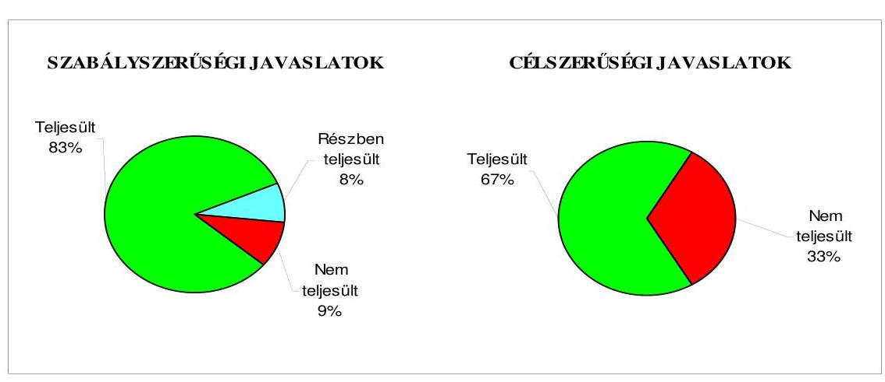

Budapest, 2009. november „. 2....."

Melléklet: $\quad 8 \mathrm{db} \quad 19$ lap
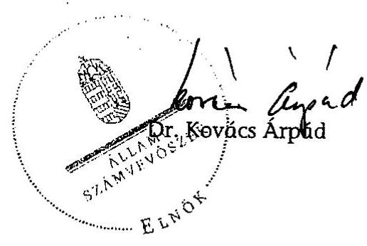

---

Nyíregyháza Megyei Jogú Város Önkormányzata

# Az Önkormányzat gazdálkodását meghatározó adatok, mutatószámok 

| Megnevezés |  |
| :--: | :--: |
| A település állandó lakosainak száma (fő) 2009. január 1-jén | 118874 |
| A Közgyűlés tagjainak a száma (fő) (2008. december 31-én) | 35 |
| A Közgyűlés munkáját segítő állandó bizottságok száma (2008. december 31-én) | 10 |
| A Polgármesteri hivatalban foglalkoztatott köztisztviselők száma (fő) (2008. december 31-én) | 322 |
| Az összes vagyon értéke a 2008. december 31-i könyvviteli mérleg szerint (millió Ft) | 129444 |
| Az adósságállomány (hosszú és rövid lejáratú kötelezettség) 2008. december 31-én (millió Ft) | 18491 |
| Az egy lakosra jutó adósságállomány 2008. december 31-én (Ft) | 155551 |
| Az összes 2008. évben teljesített költségvetési bevétel (millió Ft) | 36258 |
| Ebből: saját bevétel (millió Ft), melyből | 19953 |
| helyi adóbevétel (millió Ft) | 6011 |
| Az egy lakosra jutó 2008. évi költségvetési bevétel (Ft) | 305012 |
| Az egy lakosra jutó 2008. évi saját bevétel (Ft) | 167850 |
| Az egy lakosra jutó 2008. évi helyi adóbevétel (Ft) | 50566 |
| Saját bevétel/Összes költségvetési bevétel aránya a 2008. évben (%) | 55,0 |
| Helyi adó bevétel/Összes költségvetési bevétel aránya a 2008. évben (%) | 16,6 |
| Az összes teljesített költségvetési kiadás a 2008. évben (millió Ft) | 33999 |
| Ebből: felhalmozási célú költségvetési kiadás (millió Ft) | 5653 |
| A 2008. évi költségvetési kiadásból a felhalmozási célú költségvetési kiadás aránya (%) | 16,6 |
| Az egy lakosra jutó 2008. évi költségvetési kiadás (Ft) | 286009 |
| Az egy lakosra jutó 2008. évben teljesített felhalmozási célú költségvetési kiadás (Ft) | 47555 |
| A költségvetési intézmények száma 2008. december 31-én (db) | 60 |
| Ebből: részben önállóan gazdálkodó (db) | 31 |
| A költségvetési intézményekben foglalkoztatott közalkalmazottak száma (fő) (2008. december 31-én) | 3961 |

---

Nyíregyháza Megyei Jogú Város Önkormányzata

# Az önkormányzati vagyon alakulása

|  Mérlegsor
megnevezése | 2006.év
(millió Ft) | 2007. év
(millió Ft) | 2008. év
(millió Ft) | Változás %-a (Előző év=100\%) |  |   |
| --- | --- | --- | --- | --- | --- | --- |
|   |  |  |  | 2007/2006. | 2008/2007. | 2008/2006.  |
|  Immateriális javak | 100 | 155 | 140 | 155,0 | 90,3 | 140,0  |
|  Tárgyi eszközök | 23663 | 24757 | 25768 | 104,6 | 104,1 | 108,9  |
|  ebből: ingatlanok | 19115 | 22015 | 23103 | 115,2 | 104,9 | 120,9  |
|  beruházások | 3143 | 1332 | 1341 | 42,4 | 100,7 | 42,7  |
|  Befektetett pénzügyi eszközök | 7193 | 8223 | 8001 | 114,3 | 97,3 | 111,2  |
|  Üzemeltetésre átadott eszközök | 86654 | 90043 | 89800 | 103,9 | 99,7 | 103,6  |
|  Befektetett eszközök összesen | 117610 | 123178 | 123709 | 104,7 | 100,4 | 105,2  |
|  Forgóeszközök összesen | 1492 | 3109 | 5735 | 208,4 | 184,5 | 384,4  |
|  ebből: követelések | 1007 | 1126 | 1528 | 111,8 | 135,7 | 151,7  |
|  pénzeszközök | 254 | 1774 | 3567 | 698,4 | 201,1 | 1404,3  |
|  Eszközök összesen | 119102 | 126287 | 129444 | 106,0 | 102,5 | 108,7  |
|  Saját tőke összesen | 108500 | 111332 | 108296 | 102,6 | 97,3 | 99,8  |
|  Tartalék összesen | $-666$ | 718 | 2657 | $-107,8$ | 370,1 | $-398,9$  |
|  Kötelezettségek összesen | 11268 | 14237 | 18491 | 126,3 | 129,9 | 164,1  |
|  ebből: hosszú lejáratú kötelezettségek | 4823 | 6718 | 10917 | 139,3 | 162,5 | 226,4  |
|  rövid lejáratú kötelezettségek | 5397 | 6337 | 6089 | 117,4 | 96,1 | 112,8  |
|  Források összesen: | 119102 | 126287 | 129444 | 106,0 | 102,5 | 108,7  |

Forrás: Magyar Államkincstár éves költségvetési beszámoló "01" számú űrlap adatai.

---

Nyíregyháza Megyei Jogú Város Önkormányzata

# Az önkormányzati kötelezettségek alakulása

|  Mérlegsor megnevezése | 2006.év
(millió Ft) | 2007. év
(millió Ft) | 2008. év
(millió Ft) | Változás %-a (Előző év=100\%) |  |   |
| --- | --- | --- | --- | --- | --- | --- |
|   |  |  |  | 2007/2006. | 2008/2007. | 2008/2006.  |
|  Hosszú lejáratú kötelezettségek összesen
ebből: | 4823 | 6718 | 10917 | 139,3 | 162,5 | 226,4  |
|  hosszú lejáratra kapott kölcsönök | 0 | 0 | 0 | 0,0 | 0,0 | 0,0  |
|  tartozások fejlesztési célú kötvénykibocsátásból | 0 | 4160 | 8805 | 0,0 | 211,7 | 0,0  |
|  tartozások működési célú kötvénykibocsátásból | 0 | 0 | 0 | 0,0 | 0,0 | 0,0  |
|  beruházási és fejlesztési hitelek | 4742 | 2481 | 2078 | 52,3 | 83,8 | 43,8  |
|  működési célú hosszú lejáratú hitelek | 0 | 0 | 0 | 0,0 | 0,0 | 0,0  |
|  egyéb hosszú lejáratú kötelezettségek | 81 | 77 | 34 | 95,1 | 44,2 | 42,0  |
|  Rövid lejáratú kötelezettségek összesen
ebből: | 5397 | 6337 | 6089 | 117,4 | 96,1 | 112,8  |
|  rövid lejáratú kölcsönök | 0 | 0 | 0 | 0,0 | 0,0 | 0,0  |
|  rövid lejáratú hitelek | 2012 | 2729 | 2836 | 135,6 | 103,9 | 141,0  |
|  kötelezettségek áruszállításból, szolgáltatásból | 2081 | 2194 | 1843 | 105,4 | 84,0 | 88,6  |
|  garancia- és kezességvállalásból származó kötelezettség | 0 | 0 | 0 | 0,0 | 0,0 | 0,0  |
|  hosszú lejáratra kapott kölcsön következő évet terhelő törlesztő részlete | 20 | 0 | 0 | 0,0 | 0,0 | 0,0  |
|  felhalm.c.kötvény kibocsátásból származó tartozás következő évet terhelő részlete | 0 | 0 | 0 | 0,0 | 0,0 | 0,0  |
|  műk.c.kötvény kibocsátásból származó tartozás következő évet terhelő részlete | 0 | 0 | 0 | 0,0 | 0,0 | 0,0  |
|  beruházási célú hosszú lejáratú hitel következő évet terhelő törlesztő részlete | 299 | 279 | 435 | 93,3 | 155,9 | 145,5  |
|  működési célú hosszú lejáratú hitel következő évet terhelő törlesztő részlete | 0 | 0 | 0 | 0,0 | 0,0 | 0,0  |
|  egyéb hosszú lejáratú kötelezettség következő évet terhelő törlesztő részlete | 37 | 72 | 43 | 194,6 | 59,7 | 116,2  |

Forrás: Magyar Államkincstár éves költségvetési beszámoló "01" számú űrlap adatai.

---

|  Megnevezés | 2006. év |  |  |  | 2007. év |  |  |  | 2008. év |  |  |  | 2009.  |
| --- | --- | --- | --- | --- | --- | --- | --- | --- | --- | --- | --- | --- | --- |
|   | Eredeti | Módosított | Teljesítés
(millió Ft) | Teljesítés/eredeti arányzat % | Eredeti | Módosított | Teljesítés
(millió Ft) | Teljesítés/eredeti arányzat % | Eredeti | Módosított | Teljesítés
(millió Ft) | Teljesítés/eredeti arányzat % | Eredeti előirányzat (millió Ft)  |
|  Működési célú költségvetési bevételek összesen | 23117 | 25011 | 27328 | 118,2 | 23205 | 25783 | 27464 | 118,4 | 25552 | 28735 | 31667 | 123,9 | 26549  |
|  Működési célú költségvetési

 kiadások összesen | 23331 | 25310 | 24770 | 106,2 | 24103 | 27907 | 25863 | 107,3 | 25733 | 29200 | 28346 | 110,2 | 26407  |
|  Működési célú költségvetési bevételek és kiadások egyenlege: hiány-, többlet + | $-214$ | $-299$ | 2558 | 1295,3 | $-898$ | $-2124$ | 1601 | 278,3 | $-181$ | $-465$ | 3321 | 1934,8 | 142  |
|  Felhalmozási célú költségvetési bevételek összesen | 9308 | 5900 | 3860 | 41,5 | 6410 | 5534 | 4281 | 66,8 | 7715 | 7271 | 4591 | 59,5 | 13048  |
|  Felhalmozási célú költségvetési kiadások összesen | 9829 | 6455 | 5013 | 51,0 | 6643 | 5660 | 5683 | 85,5 | 10601 | 9812 | 5653 | 53,3 | 13302  |
|  Felhalmozási célú költségvetési bevételek és kiadások egyenlege: hiány-, többlet+ | $-521$ | $-555$ | $-1153$ | 221,3 | $-233$ | $-126$ | $-1402$ | 601,7 | $-2886$ | $-2541$ | $-1062$ | 36,8 | $-254$  |
|  Költségvetési bevételek összesen | 32425 | 30911 | 31188 | 96,2 | 29615 | 31317 | 31745 | 107,2 | 33267 | 36006 | 36258 | 109,0 | 39597  |
|  Költségvetési kiadások összesen | 33160 | 31765 | 29783 | 89,8 | 30746 | 33567 | 31546 | 102,6 | 36334 | 39012 | 33999 | 93,6 | 39709  |
|  Költségvetési bevételek és kiadások egyenlege: hiány-, többlet+ | $-735$ | $-854$ | 1405 | 291,2 | $-1131$ | $-2250$ | 199 | 117,6 | $-3067$ | $-3006$ | 2259 | 173,7 | $-112$  |
|  Finanszírozási célú pénzügyi bevételek | 3042 | 3188 | 2898 |  | 3735 | 7195 | 7299 |  | 6195 | 6195 | 3953 |  | 3383  |
|  Finanszírozási célú pénzügyi kiadások | 2307 | 2334 | 2334 |  | 2604 | 4945 | 4721 |  | 3128 | 3189 | 593 |  | 3271  |
|  Finanszírozási célú pénzügyi műveletek egyenlege | 735 | 854 | 564 |  | 1131 | 2250 | 2578 |  | 3067 | 3006 | 3360 |  | 112  |

Forrás: - Magyar Államkincstár éves költségvetési beszámoló "80" számú űrlap adatai;

- a 2009. évi adatok esetében az Önkormányzat 2009. évi költségvetése;
- a költségvetési bevétel-kiadás működési-felhalmozási célra történt megosztásánál az analitikus nyilvántartás.

---

4. számú melléklet a V-3001-4/32/2009. számú jelentőshez

Ellenőrzött önkormányzat neve: Nyíregyháza Megyei Jogú Város Önkormányzata Ellenőrzött önkormányzat címe: Nyíregyháza, Kossuth tér 1.

TANÚSÍTVÁNY az európai uniós forrásokkal támogatott célok és programok 2006-2009. évi tervezett és teljesített adatairól

|  Sor-
szám | Az európai uniós forrásokkal
támogatott fejlesztés megnevezése | összes
kötségvetési
kiadás |  |  |  |  |  |  |  |  |  |  |  |  |  |  |  |  |  |  |  |  |  |  |  |  |  |  |  |  |  |  |  |  |  |  |  |  |  |  |  |  |  |  |  |   |
| --- | --- | --- | --- | --- | --- | --- | --- | --- | --- | --- | --- | --- | --- | --- | --- | --- | --- | --- | --- | --- | --- | --- | --- | --- | --- | --- | --- | --- | --- | --- | --- | --- | --- | --- | --- | --- | --- | --- | --- | --- | --- | --- | --- | --- | --- | --- | --- | --- |
|   |  |  |  |  |  |  |  |  |  |  |  |  |  |  |  |  |  |  |  |  |  |  |  |  |  |  |  |  |  |  |  |  |  |  |  |  |  |  |  |  |  |  |  |  |   |
|   |  |  |  |  |  |  |  |  |  |  |  |  |  |  |  |  |  |  |  |  |  |  |  |  |  |  |  |  |  |  |  |  |  |  |  |  |  |  |  |  |  |  |  |  |   |
|   |  |  |  |  |  |  |  |  |  |  |  |  |  |  |  |  |  |  |  |  |  |  |  |  |  |  |  |  |  |  |  |  |  |  |  |  |  |  |  |  |  |  |  |  |   |
|   |  |  |  |  |  |  |  |  |  |  |  |  |  |  |  |  |  |  |  |  |  |  |  |  |  |  |  |  |  |  |  |  |  |  |  |  |  |  |  |  |  |  |  |  |   |
|   |  |  |  |  |  |  |  |  |  |  |  |  |  |  |  |  |  |  |  |  |  |  |  |  |  |  |  |  |  |  |  |  |  |  |  |  |  |  |  |  |  |  |  |  |   |
|   |  |  |  |  |  |  |  |  |  |  |  |  |  |  |  |  |  |  |  |  |  |  |  |  |  |  |  |  |  |  |  |  |  |  |  |  |  |  |  |  |  |  |  |  |   |
|   |  |  |  |  |  |  |  |  |  |  |  |  |  |  |  |  |  |  |  |  |  |  |  |  |  |  |  |  |  |  |  |  |  |  |  |  |  |  |  |  |  |  |  |  |   |
|   |  |  |  |  |  |  |  |  |  |  |  |  |  |  |  |  |  |  |  |  |  |  |  |  |  |  |  |  |  |  |  |  |  |  |  |  |  |  |  |  |  |  |  |  |   |
|   |  |  |  |  |  |  |  |  |  |  |  |  |  |  |  |  |  |  |  |  |  |  |  |  |  |  |  |  |  |  |  |  |  |  |  |  |  |  |  |  |  |  |  |  |   |
|   |  |  |  |  |  |  |  |  |  |  |  |  |  |  |  |  |  |  |  |  |  |  |  |  |  |  |  |  |  |  |  |  |  |  |  |  |  |  |  |  |  |  |  |  |   |
|   |  |  |  |  |  |  |  |  |  |  |  |  |  |  |  |  |  |  |  |  |  |  |  |  |  |  |  |  |  |  |  |  |  |  |  |  |  |  |  |  |  |  |  |  |   |

  |  |  |  |  |  |  |  |  |  |  |  |  |  |  |  |  |  |  |  |  |  |  |  |  |  |  |  |  |  |  |  |  |  |  |   |
|   |  |  |  |  |  |  |  |  |  |  |  |  |  |  |  |  |  |  |  |  |  |  |  |  |  |  |  |  |  |  |  |  |  |  |  |  |  |  |  |  |  |  |  |  |   |
|   |  |  |  |  |  |  |  |  |  |  |  |  |  |  |  |  |  |  |  |  |  |  |  |  |  |  |  |  |  |  |  |  |  |  |  |  |  |  |  |  |  |  |  |  |  |   |
|   |  |  |  |  |  |  |  |  |  |  |  |  |  |  |  |  |  |  |  |  |  |  |  |  |  |  |  |  |  |  |  |  |  |  |  |  |  |  |  |  |  |  |  |  |  |   |
|   |  |  |  |  |  |  |  |  |  |  |  |  |  |  |  |  |  |  |  |  |  |  |  |  |  |  |  |  |  |  |  |  |  |  |  |  |  |  |  |  |  |  |  |  |  |   |
|   |  |  |  |  |  |  |  |  |  |  |  |  |  |  |  |  |  |  |  |  |  |  |  |  |  |  |  |  |  |  |  |  |  |  |  |  |  |  |  |  |  |  |  |  |  |   |
|   |  |  |  |  |  |  |  |  |  |  |  |  |  |  |  |  |  |  |  |  |  |  |  |  |  |  |  |  |  |  |  |  |  |  |  |  |  |  |  |  |  |  |  |  |  |   |
|   |  |  |  |  |  |  |  |  |  |  |  |  |  |  |  |  |  |  |  |  |  |  |  |  |  |  |  |  |  |  |  |  |  |  |  |  |  |  |  |  |  |  |  |  |  |   |
|   |  |  |  |  |  |  |  |  |  |  |  |  |  |  |  |  |  |  |  |  |  |  |  |  |  |  |  |  |  |  |  |  |  |  |  |  |  |  |  |  |  |  |  |  |  |   |
|   |  |  |  |  |  |  |  |  |  |  |  |  |  |  |  |  |  |  |  |  |  |  |  |  |  |  |  |  |  |  |  |  |  |  |  |  |  |  |  |  |  |  |  |  |  |   |
|   |  |  |  |  |  |  |  |  |  |  |  |  |  |  |  |  |  |  |  |  |  |  |  |  |  |  |  |  |  |  |  |  |  |  |  |  |  |  |  |  |  |  |  |  |  |   |
|   |  |  |  |  |  |  |  |  |  |  |  |  |  |  |  |  |  |  |  |  |  |  |  |  |  |  |  |  |  |  |  |  |  |  |  |  |  |  |  |  |  |  |  |  |  |   |
|   |  |  |  |  |  |  |  |  |  |  |  |  |  |  |  |  |  |  |  |  |  |  |  |  |  |  |  |  |  |  |  |  |  |  |  |  |  |  |  |  |  |  |  |  |  |   |
|   |  |  |  |  |  |  |  |  |  |  |  |  |  |  |  |  |  |  |  |  |  |  |  |  |  |  |  |  |  |  |  |  |  |  |  |  |  |  |  |  |  |  |  |  |  |   |
|   |  |  |  |  |  |  |  |  |  |  |  |  |  |  |  |  |  |  |  |  |  |  |  |  |  |  |  |  |  |  |  |  |  |  |  |  |  |  |  |  |  |  |  |  |  |   |
|   |  |  |  |  |  |  |  |  |  |  |  |  |  |  |  |  |  |  |  |  |  |  |  |  |  |  |  |  |  |  |  |  |  |  |  |  |  |  |  |  |  |  |  |  |  |   |
|   |  |  |  |  |  |  |  |  |  |  |  |  |  |  |  |  |  |  |  |  |  |  |  |  |  |  |  |  |  |  |  |  |  |  |  |  |  |  |  |  |  |  |  |  |  |   |
|   |  |  |  |  |  |  |  |  |  |  |  |  |  |  |  |  |  |  |  |  |  |  |  |  |  |  |  |  |  |  |  |  |  |  |  |  |  |  |  |  |  |  |  |

 |  |   |
|   |  |  |  |  |  |  |  |  |  |  |  |  |  |  |  |  |  |  |  |  |  |  |  |  |  |  |  |  |  |  |  |  |  |  |  |  |  |  |  |  |  |  |  |  |  |   |
|   |  |  |  |  |  |  |  |  |  |  |  |  |  |  |  |  |  |  |  |  |  |  |  |  |  |  |  |  |  |  |  |  |  |  |  |  |  |  |  |  |  |  |  |  |  |   |
|   |  |  |  |  |  |  |  |  |  |  |  |  |  |  |  |  |  |  |  |  |  |  |  |  |  |  |  |  |  |  |  |  |  |  |  |  |  |  |  |  |  |  |  |  |  |   |
|   |  |  |  |  |  |  |  |  |  |  |  |  |  |  |  |  |  |  |  |  |  |  |  |  |  |  |  |  |  |  |  |  |  |  |  |  |  |  |  |  |  |  |  |  |  |   |
|   |  |  |  |  |  |  |  |  |  |  |  |  |  |  |  |  |  |  |  |  |  |  |  |  |  |  |  |  |  |  |  |  |  |  |  |  |  |  |  |  |  |  |  |  |  |   |
|   |  |  |  |  |  |  |  |  |  |  |  |  |  |  |  |  |  |  |  |  |  |  |  |  |  |  |  |  |  |  |  |  |  |  |  |  |  |  |  |  |  |  |  |  |  |   |
|   |  |  |  |  |  |  |  |  |  |  |  |  |  |  |  |  |  |  |  |  |  |  |  |  |  |  |  |  |  |  |  |  |  |  |  |  |  |  |  |  |  |  |  |  |  |   |
|   |  |  |  |  |  |  |  |  |  |  |  |  |  |  |  |  |  |  |  |  |  |  |  |  |  |  |  |  |  |  |  |  |  |  |  |  |  |  |  |  |  |  |  |  |  |   |
|   |  |  |  |  |  |  |  |  |  |  |  |  |  |  |  |  |  |  |  |  |  |  |  |  |  |  |  |  |  |  |  |  |  |  |  |  |  |  |  |  |  |  |  |  |  |   |
|   |  |  |  |  |  |  |  |  |  |  |  |  |  |  |  |  |  |  |  |  |  |  |  |  |  |  |  |  |  |  |  |  |  |  |  |  |  |  |  |  |  |  |  |  |  |   |
|   |  |  |  |  |  |  |  |  |  |  |  |  |  |  |  |  |  |  |  |  |  |  |  |  |  |  |  |  |  |  |  |  |  |  |  |  |  |  |  |  |  |  |  |  |  |   |
|   |  |  |  |  |  |  |  |  |  |  |  |  |  |  |  |  |  |  |  |  |  |  |  |  |  |  |  |  |  |  |  |  |  |  |  |  |  |  |  |  |  |  |  |  |  |   |
|   |  |  |  |  |  |  |  |  |  |  |  |  |  |  |  |  |  |  |  |  |  |  |  |  |  |  |  |  |  |  |  |  |  |  |  |  |  |  |  |  |  |  |  |  |  |   |
|   |  |  |  |  |  |  |  |  |  |  |  |  |  |  |  |  |  |  |  |  |  |  |  |  |  |  |  |  |  |  |  |  |  |  |  |  |  |  |  |  |  |  |  |  |  |   |
|   |  |  |  |  |  |  |  |  |  |  |  |  |  |  |  |  |  |  |  |  |  |  |  |  |  |  |  |  |  |  |  |  |  |  |  |  |  |  |  |  |  |  |  |  |  |   |
|   |  |  |  |  |  |  |  |  |  |  |  |  |  |  |  |  |  |  |  |  |  |  |  |  |  |  |  |  |  |  |  |  |  |  |  |  |  |  |  |  |  |  |  |  |  |   |
|   |

---

|  15 | HEFOP-2.3.2. Hátrányos helyzetű határok képviselőivel és foglalkoztathatóságuk javítása | 6,3 | 6,3 |  |  |  |  | 6,3 |  | 6,3 |  |  |   |
| --- | --- | --- | --- | --- | --- | --- | --- |

 --- | --- | --- | --- | --- | --- |
|  16 | HEFOP-3.1.3. "Éjjel, jobban, hatásosabban" | 18,0 | 13,5 | 4,5 |  |  |  | 17,8 |  | 13,4 | 4,4 |  |   |
|  17 | HEFOP-2.1.3. "Változtassunk, hogy változzunk" | 18,0 | 13,5 | 4,5 |  |  |  | 17,8 |  | 13,4 | 4,4 |  |   |
|  18 | HEFOP-2.1.6. A sajátos nevelési igényű tanulók együttnevelése - "Esély a teljes életre" | 21,8 | 16,3 | 5,5 |  |  |  | 20,9 |  | 15,6 | 5,3 |  |   |
|  19 | EQUIL "Esély a teljes életre" | 244,5 | 183,4 | 61,1 |  |  |  | 222,6 |  | 166,9 | 55,7 |  |   |
|  20 | HEFOP-2.3.1. "Munkával tanulunk Szabolcsban" | 0,9 | 0,7 | 0,2 |  |  |  | 0,9 |  | 0,7 | 0,2 |  |   |
|  21 | SOOMFELSZCORRÁKOS 1.akció "Szociális figsútrinálódások" | 1,0 | 1,0 |  |  |  |  | 0,8 | 0,1 | 0,7 |  |  |   |
|  22 | SOOMFELSZCORRÁKOS 1.akció "Különbségek vannak mégis egyek vagyunk" | 4,1 | 4,1 |  |  |  |  | 4,1 |  | 4,1 |  |  |   |
|  23 | HEFOP-3.1.3. Kompetencia alapú pedagógiai program felületrendszerének kialakítása a heterogén 2Hnyi Ileres Gimnázium és Kategóriával | 18,0 | 13,5 | 4,5 |  |  |  | 17,8 |  | 13,4 | 4,5 |  |   |
|  24 | LEONARDO DA VINCI program - "Egész életem át tartó tanulás" | 2,4 | 2,4 |  |  |  |  | 2,7 | 0,2 | 2,4 |  |  | 0,1  |
|  25 | LEONARDO DA VINCI program - "Tartós és esélyegyenlőséget biztosító tanulás" | 1,4 | 1,4 |  |  |  |  | 1,4 |  | 1,4 |  |  |   |
|  26 | LEONARDO DA VINCI program - Lippai a szakmai szatmári határokjének és tudásának fejlesztése gyakorlati képzése Hollandiában | 3,3 | 0,3 | 3,0 |  |  |  | 3,3 | 0,7 | 2,6 |  |  |   |
|  27 | LEONARDO DA VINCI program - A kizárólagosságban vezetői életpálya tartó tanulásának támogatása és ösztönzése | 1,2 | 0,1 | 1,1 |  |  |  | 1,2 | 0,1 | 1,1 |  |  |   |
|   | 1. Bölcsésztudományi fejlesztési feladatok forrása programai | 4274,6 | 193,7 | 3421,5 | 616,3 | 143,1 | 0,0 | 0,0 | 4362,0 | 302,3 | 3321,9 | 596,7 | 141,0  |
|   | Hozzájárulási források megoszlása* | 100,0% | 4,4% | 78,2% | 14,1% | 3,3% | 0,0% | 0,0% | 100,0% | 6,9% | 76,2% | 13,7% | 3,2%  |
|   | II. Folyamatban lévő fejlesztési feladat megnevezése |  |  |  |  |  |  |  |  |  |  |  |   |
|  28 | FROP-3.1.2. Nyíregyháza. Kórói épületek építése | 474,8 | 75,0 | 399,8 |  |  |  |  | 1,0 | 1,0 |  |  |   |
|  29 | TÁRÓP-2.2.5. Nyíregyházi Szakképzési Szervező Társaság ülésterme | 315,0 |  | 315,0 |  |  |  |  | 20,0 | 20,0 |  |  |   |
|  30 | DROP-3.1.4.6. Nyíregyháza közösségi közlekedés infrastruktúrájának fejlesztése | 394,7 | 39,7 | 355,0 |  |  |  |  | 0,5 | 0,5 |  |  |   |
|  31 | TÍOR-1.1.1. A pedagógiai módszertani reformok támogatói informatikai infrastruktúra fejlesztése | 400,0 |  | 400,0 |  |  |  |  |  |  |  |  |   |
|  32 | ARÓP-1.A.2. Nyíregyháza Megyei Jogú Város Polgármesteri hivatala módszertanának fejlesztése és a szervezet fejlesztése | 55,6 | 5,6 | 50,0 |  |  |  |  | 13,0 |  | 13,0 |  |   |
|  33 | REOP-1.2.5. Nyíregyháza és térsége számnyilvántartási és számlaprogramja | 12 772,3 | 2 880,4 | 9 891,9 |  |  |  |  | 434,4 | 132,4 | 302,0 |  |   |
|  34 | Nyíregyháza-Bőngésző gazdaságfejlesztési figsútrinálódásának erősítése | 13,4 | 1,5 | 11,9 |  |  |  |  | 0,2 | 0,2 |  |  |   |

---

|  35. "Kohóhú Európai" - Testvérvárosi Találkozó | 5.7 | 3.5 | 2.2 |  |  |  |  |  |  |  |  |  |  |   |
| --- | --- | --- | --- | --- | --- | --- | --- | --- | --- | --- | --- | --- | --- | --- |
|  36. "TANOP-2.2.5. "Nyíregyháza" minden gyerek
forrásai" | 19.6 |  | 19.6 |  |  |  |  |  |  |  |  |  |  |   |
|  37. "T. Folyamatban lévő fejlesztési feladatok
forrásai összesen" | 14 451,1 | 3 005,7 | 11 445,4 | 0,0 | 0,0 | 0,0 | 0,0 | 476,0 | 154,1 | 321,9 | 0,0 | 0,0 | 0,0 | 0,0  |
|  Finanszírozási források megoszlása* | 100% | 20,8% | 75,2% | 0,0% | 0,0% | 0,0% | 0,0% | 100% | 32,4% | 67,6% | 0,0% | 0,0% | 0,0% | 0,0%  |
|  Fejlesztési feladatok kiadásának forrása
összesen | 18 625,7 | 3 199,4 | 14 666,9 | 616,3 | 143,1 | 0,0 | 0,0 | 4 836,0 | 486,4 | 3 643,8 | 596,7 | 141,0 | 0,0 | 0,1  |
|  Finanszírozási források megoszlása* | 100% | 17,0% | 79,0% | 3,3% | 0,8% | 0,0% | 0,0% | 100% | 9,4% | 75,3% | 12,5% | 2,9% | 0,0% | 0,0%  |

Jelmagyarázat: *A finanszírozási források megoszlására vonatkozó sorokat nem kell kitölteni, azok adatait a program számítja ki.

Nyilatkozat: A tanúsítványban szereplő adatok valódiságát igazolom.

Kiállítás időpontja: 2009. június 18.

---

# ADATLAP 

## az európai uniós forrással támogatott   ROP 2.2.1. „Jósaváros közterületeinek rehabilitációja I. ütem" fejlesztésről

## 1. A PÁLYÁZÓ ADATAI

1.1. A pályázó Önkormányzat neve: Nyíregyháza Megyei Jogú Város Önkormányzata
1.2. A pályázó Önkormányzat címe: 4400 Nyíregyháza, Kossuth tér 1.

## 2. A PROJEKT ÖSSZEGZŐ ADATAI

2.1. A pályázott program megnevezése: ROP 2.2.1. Városi területek rehabilitációja
2.2. A pályázott programon belül a projekt címe: „Jósaváros közterületeinek rehabilitációja I. ütem"
2.3. A pályázatot készítő megnevezése: Polgármesteri hivatal Városfejlesztési iroda
2.4. A pályázat benyújtásának időpontja: 2004. szeptember 30.

### 2.5. A projekt tervezett

- teljes kiadásának összege: 329750000 Ft
- saját forrás: 13334000 Ft
- támogatás: 316416000 Ft
- európai uniós: 247002620 Ft
- hazai társfinanszírozás: 49412380 Ft
- EU Önerő Alap: 20001000 Ft
- a megvalósítás tervezett időpontja (év, hó, nap): 2007. augusztus 31.
2.6 A pályázat elbírálásáról szóló döntés kelte: 2004. december 17.

---

2.7 A pályázat elbírálásának eredménye: támogatott

# 2.8 A projekt teljesített: 

- kiadásának összege: 401743526 Ft
- saját forrás: 85417528 Ft
- támogatás: 316325998 Ft
- európai uniós: 246927620 Ft
- hazai társfinanszírozás: 49397378 Ft
- EU Önerő Alap: 20001000 Ft
- a megvalósítás időpontja: 2007. 08. 31.

## 3. A TÁMOGATÁSI SZERZŐDÉS ADATAI

### 3.1. A támogatási szerződés:

- megkötésének időpontja: 2005. december 14.
- a projekt kezdési és befejezési időpontja: 2005. december 15. - 2007. augusztus 31.
- a projekt összköltsége (kiadása): 329750000 Ft
- a projekt megvalósítás forrásai:
- saját forrás: 13334000 Ft
- európai uniós támogatás: 247002620 Ft
- hazai társfinanszírozás: 49412380 Ft
- EU Önerő Alap: 20001000 Ft
- előírt támogatási határidők: „A kifizetési kérelmeket folyamatosan lehet benyújtani, ha a kifizetési kérelemben igényelt támogatás összege eléri legalább a támogatási összeg 4\%-át."
- előírt fizetési kötelezettségek: -

---

| Kifizetési kérelem   (PEJ/EPEJ) benyújtásának időpontja | Számla   bruttó   összege   (Ft) | Igényelt   támogatási   összeg   (Ft) | Folyósított   támogatás   összege   (Ft) | Támogatás   folyósításának   időpontja   (év,hó,nap) | Benyújtás és a folyósítás között eltelt időtartam (nap) |
| :--: | :--: | :--: | :--: | :--: | :--: |
| Előleg   2006.01.10. |  | 74103750 | 74103750 | 2006.02.17 | 39 |
| 1. 2006.12.06. | 35000000 | 31500000 | 31500000 | 2007.07.20 | 225 |
| 2. 2007.08.09. | 124062646 | 51562646 | 51562646 | 2007.11.30 | 109 |
| 3. 2007.08.22. | 110244380 | 79965604 | 79965604 | 2007.12.13 | 113 |
| 4. 2007.08.30 | 108837872 | 59193000 | 59193000 | 2008.01.28 | 151 |
| Összesen | 378144898 | 296325000 | 296325000 |  |  |

# 5. Ellenőrzések 

### 5.1. A külső ellenőrzések:

- az ellenőrzések száma: 1 db
- az ellenőrzést végző szervek megnevezése: VÁTI Kht.

### 5.2. Szabálytalanságokra vonatkozó adatok:

- mely előírást nem tartotta be az Önkormányzat: a projekt könyvviteli dokumentációja nem állt rendelkezésre; a megnyitóval kapcsolatos tevékenységek nem dokumentáltak, a használatbavételi engedély, valamint a projekt II. és III. ütemének engedélyezési tervdokumentációja nem állt rendelkezésre.
- az előírás nem teljesítésének okai: a könyvviteli dokumentációkat a helyszíni ellenőrzésre nem nyomtatták ki, a megnyitóval kapcsolatos tevékenységeket utólag készítették el, a használatbavételi engedély megkérése a helyszíni vizsgálat ideje alatt volt folyamatban, a projekt II. és III. ütemének engedélyezési tervdokumentációja elkészült, azonban a helyszíni ellenőrzés időpontjáig nem állt az Önkormányzat rendelkezésére.
- a rendezésre előírt

 kötelezettségek: Hiányzó dokumentumok bemutatása.
- a rendezésre előírt kötelezettséget mennyi időn belül teljesítették: könyvviteli dokumentációk bemutatása 13 napon belül; megnyitóval kapcsolatos dokumentációk, valamint a használatbavételi engedély bemutatása 15 napon belül; engedélyezési tervdokumentációk bemutatása 49 napon belül megtörtént.

---

- mekkora időbeli csúszást eredményezett ez a projekt megvalósításában (év, hó, nap): a projekt megvalósításában időbeli csúszást nem okozott.

Kelt: Nyíregyháza, 2009. augusztus 16.
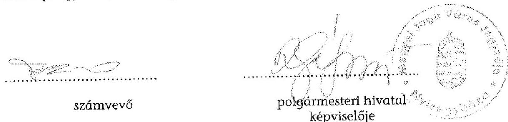

---

# NYÍREGYHÁZA MEGYEI JOGÚ VÁROS POLGÁRMESTERE 

4401 Nyíregyháza, Kossuth tér 1. Pf.: 83.
Telefon: (42) 524-500; Fax: (42) 524-501
E-mail:csabaine@nyirhalo.hu

Száma: 32.276-6/2009. XII.
Tárgy: ÁSZ. vizsgálat megállapításra vonatkozó észrevétel
Melléklet: 4 db levél másolat

## Dr. Kovács Árpád Elnök Úrnak ÁLLAMI SZÁMVEVŐSZÉK

## BUDAPEST

Apáczai Csere János utca 12.
1052

## Tisztelt Elnök Úr!

Nyíregyháza Megyei Jogú Város Önkormányzata gazdálkodási rendszerének 2009. évi ellenőrzéséről készült V-3001-4/32/16/2009. iktatószámú számvevői jelentést megkaptam. A számvevői jelentésben tett megállapításokat megismertem, s arra vonatkozó észrevételt nem kívánok tenni.

Az ellenőrzés során megállapított hibák kijavítására vonatkozó intézkedéseimet mellékelten felterjesztem.

Kérem Elnök Urat, hogy a tett intézkedéseimet az ellenőrzés értékelése során szíveskedjen figyelembe venni.

Nyíregyháza, 2009. október hó 14.-én.

## Üdvözlettel:

CSABÁI LÁSZLÓNÉ

---

# NYÍREGYHÁZA MEGYEI JOGÚ VÁROS POLGÁRMESTERE 

4401 Nyíregyháza, Kossuth tér 1. Pf.: 83. Telefon: (42) 524-500; Fax: (42) 524-501

E-mail: csabaine@nyirhalo.hu

Száma: 32.276-12/2009. XII.
Tárgy: Intézkedés az ÁSZ vizsgálat során feltárt hiányosságok megszüntetésére

Nyíregyháza Megyei Jogú Város
Alpolgármesterének
Giba Tamás Úrnak!

## Helyben

Tisztelt Alpolgármester Úr!

Az Állami Számvevőszék által lefolytatott vizsgálat során hibaként került megállapításra az a gyakorlat, mely szerint a Közgyűlés éves költségvetési rendeletében jóváhagyott polgármesteri keret felhasználása során a keretösszeg meghatározott hányada - 1 millió Ft - felett a rendelkezési jogot átengedtem Alpolgármester Úr részére. Ez a gyakorlat a megállapítás szerint ellentétes az Ötv. 9. § (3) bekezdésében foglaltakkal.

A vizsgálati jelentésben tett megállapítások alapján úgy rendelkezem, hogy a jövőben (az éves keret megtartása mellett) Alpolgármester Úr a benyújtott kérelmekben szereplő összegekre, vagy attól eltérően - figyelemmel a 2009. évi költségvetésről és a költségvetés vitelének szabályairól szóló 4/2009.(II.17.) KGY. számú rendelet 5. § (6) bekezdésében foglaltakra - javaslatot tehet, melynek alapján döntést hozok.

A korábbi 32.276-9/2009. XII. szám alatt kiadott rendelkezésemet a mai nappal visszavonom, és a fentieket 2009. október hó 20-tól kell alkalmazni.

Nyíregyháza, 2009. október hó 20.

Végrehajtás végett kapják:

1. Dr. Szemán Sándor címzetes főjegyző
2. László Géza Gazdasági Iroda vezetője
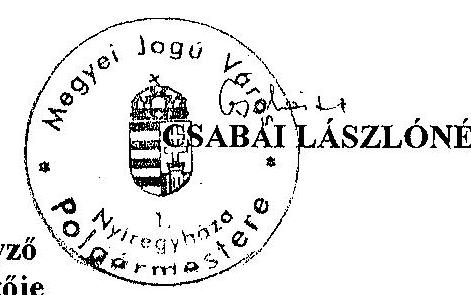

---

# NYÍREGYHÁZA MEGYEI JOGÚ VÁROS POLGÁRMESTERE 

4401 Nyíregyháza, Kossuth tér 1. Pf.: 83.
Telefon: (42) 524-500; Fax: (42) 524-501
E-mail:csabaine@nyirhalo.hu

Száma: 32.276-13/2009. XII.
Tárgy: Intézkedés az ÁSZ vizsgálat során feltárt hiányosságok megszüntetésére

## Nyíregyháza Megyei Jogú Város Alpolgármesterének

Nagy László Úrnak!

## Helyben

Tisztelt Alpolgármester Úr!

Az Állami Számvevőszék által lefolytatott vizsgálat során hibaként került megállapításra az a gyakorlat, mely szerint a Közgyűlés éves költségvetési rendeletében jóváhagyott polgármesteri keret felhasználása során a keretösszeg meghatározott hányada- 1 millió Ft - felett a rendelkezési jogot átengedtem Alpolgármester Úr részére. Ez a gyakorlat a megállapítás szerint ellentétes az Ötv. 9. § (3) bekezdésében foglaltakkal.

A vizsgálati jelentésben tett megállapítások alapján úgy rendelkezem, hogy a jövőben (az éves keret megtartása mellett) Alpolgármester Úr a benyújtott kérelmekben szereplő összegekre, vagy attól eltérően - figyelemmel a 2009. évi költségvetésről és a költségvetés vitelének szabályairól szóló 4/2009.(II.17.) KGY. számú rendelet 5. § (6) bekezdésében foglaltakra - javaslatot tehet, melynek alapján döntést hozok.

A korábbi 32.276-9/2009. XII. szám alatt kiadott rendelkezésemet a mai nappal visszavonom, és a fentieket 2009. október hó 20-tól kell alkalmazni.

Nyíregyháza, 2009. október hó 20.

Végrehajtás végett kapják:

1. Dr. Szemán Sándor címzetes főjegyző
2. László Géza Gazdasági Iroda vezetője
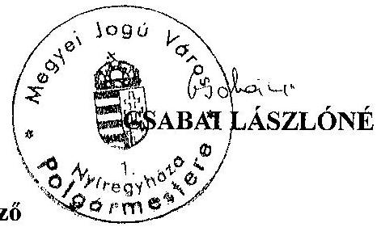

---

# NYÍREGYHÁZA MEGYEI JOGÚ VÁROS CÍMZETES FŐJEGYZŐJE 

4401 Nyíregyháza, Kossuth tér 1. Pf.: 83.
Telefon: (42) 524-530; Fax: (42) 524-531
E-mail: nyhjegyz@nyirhalo.hu; szemansandordr@nyirhalo.hu
Ügyiratszám: 32.276-9/2009. XII

## JEGYZŐI UTASÍTÁS

## Az Állami Számvevőszék által 2009. évben lefolytatott vizsgálat során feltárt hiányosságok megszüntetésére teendő intézkedésekről

A Gazdasági Iroda Vezetője, az ÁSZ által feltárt hiányosságok kijavításáról az alábbiak szerint gondoskodjon:

Az éves költségvetés készítése során
a.) az Áht. 8. § (7) bekezdésében foglaltaknak szerezzen érvényt, a költségvetési rendelet tervezetben a költségvetési kiadások összege ne tartalmazzon hiányt módosító finanszírozási célú kiadásokat.
b.) Az Ámr. 29. § (1) bekezdés k.) pontjában foglaltaknak megfelelően gondoskodjon arról, hogy a költségvetési rendelet - tervezet az intézmények európai uniós támogatással megvalósuló programok, projektek bevételi és kiadási előirányzatait elkülönítetten tartalmazza.
c.) A költségvetési rendelet - tervezet külön mellékletében - az elvégzett számítások alapján - tájékoztatni kell a Közgyűlést az Önkormányzat eladósodottságának helyzetéről, figyelemmel arra, hogy a hosszúlejáratú, adósságot keletkeztető kötelezettség vállalásból adódó tőke- és kamatfizetési kötelezettségeit az Önkormányzat milyen feltételek biztosítása mellett tudja teljesíteni.

Valamennyi Belső Szervezeti Egység Vezetője gondoskodjon az operatív gazdálkodási feladatok végrehajtása során feltárt működési hibák kijavításáról, illetve azok jövőbeni elkerüléséről az alábbiak szerint:
a.) Az Ámr. 135. § (1) -(2) bekezdésében foglaltaknak megfelelően valamennyi karbantartási, kisjavítási szolgáltatással kapcsolatos kifizetés esetében a kiadások teljesítése előtt - a jegyző által kijelölt személynek - a megrendelt szolgáltatás összegét is tartalmazó okmány, szerződés, illetve megrendelés alapján ellenőrizni és szakmailag igazolni kell a kiadások összegszerűségét.
b.) Az Ámr. 137. § (3) bekezdésében foglaltaknak megfelelően az utalványok ellenjegyzői az államháztartáson kívülre nyújtott pénzeszközátadásokkal kapcsolatos kiadások teljesítése előtt - kötelesek meggyőződni arról, hogy az utalványozás nem sérti-e a gazdálkodásra vonatkozó szabályokat, vagy az Ötv. 9. § (1) és (3) bekezdésében és a költségvetési rendeletben foglaltaknak megfelelően a Közgyűlés, vagy az általa átruházott hatáskörrel rendelkező személy döntött-e, továbbá - a Áht. 12/A. § (1) bekezdésében foglaltak betartása érdekében - valamennyi működési célú pénzeszközátadás esetében ellenőrizzék, hogy a kötelezettség tárgyával összefüggő kiadási előirányzat az Önkormányzat éves költségvetési rendeletében a kiadás teljesítését megelőzően rendelkezésre áll-e.

---

c.) A külső szervezettel pályázatkészítési feladatra kötött szerződések tartalmazzák a Polgármesteri hivatal képviselőjével való kapcsolattartást, valamint az információ átadás formáját, tartalmát, módját, valamint a felelősség szabályait.

Az Ellenőrzési Iroda Vezetője gondoskodjon arról, hogy
az ellenőrzési program tartalmában feleljen meg a Ber. 23. § (4) bekezdésében foglalt előírásoknak és tartalmazza a megbízólevél számát.

Az Aljegyző gondoskodjon arról, hogy
a.) a közérdekű adatok közzétételére a 18/2005. (XII. 27.) IHM rendelet 2. § (2) bekezdésében előírt jegyzék szerinti tagolásban kerüljön sor.
b.) Az informatikai rendszer szabályozottságának biztosításáról, belső kontrolljainak működtetéséről:

- a katasztrófa elhárítási terv aktualizálásáról,
- a külső fejlesztők éles rendszerhez való hozzáférés letiltásáról,
- a pénzügyi-számviteli rendszerből lekérhető ellenőrzési lista (napló) vizsgálatáért felelős személy kijelöléséről,
- a pénzügyi-számviteli szoftverváltozások ellenőrzésére, tesztelésére vonatkozó eljárás, valamint a pénzügyi-számviteli szoftver mentési eljárás módjáról, rendjéről és felelősségi viszonyainak szabályozásáról,
- a katasztrófa elhárítási terv teszteléséről,
- a pénzügyi-számviteli adatok Polgármesteri hivatalban történő elektronikus tárolásáról, változáskezelési eljárások ellenőrzéséről, minden adathozzáférésről, adatmódosításról, adattörlésről ellenőrzési lista (napló) készítéséről és ellenőrzésről, valamint annak ellenőrzéséről, hogy az elmentett állományokból a pénzügyi számviteli adatok teljes körűen helyreállíthatóak.

A végrehajtás határideje: folyamatos és 2009. december 31.
Utasításom 2009. október hó 15.-én lép hatályba, végrehajtását a belső ellenőrzés során ellenőriztetni fogom.

Nyíregyháza, 2009. október hó 14.
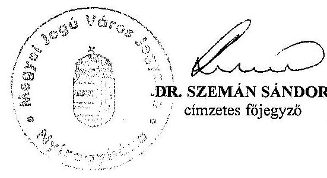

---

# NYÍREGYHÁZA MEGYEI JOGÚ VÁROS CÍMZETES FŐJEGYZŐJE 

4401 Nyíregyháza, Kossuth tér 1. Pf.: 83.
Telefon: (42) 524-530; Fax: (42) 524-531
E-mail: nyhjegyz@nyirhalo.hu; szemansandordr@nyirhalo.hu

Száma: 32.276-10/2009. XII. Tárgy: Intézkedés az ÁSZ vizsgálat során feltárt hiányosságok megszüntetésére

Valamennyi Belső Szervezeti Egység Vezetőjének

## Helyben

Tisztelt Irodavezető Asszony/Úr!

Az Állami Számvevőszék által 2009. évben lefolytatott vizsgálat megállapította, hogy a civil keret felhasználására kiadott 1.855/2006. XII. számú jegyzői utasítást az Ötv. 9. § (1) és (3) bekezdésében foglalt feladat- és hatáskörök gyakorlására vonatkozó szabályokkal ellentétes, így azt 2009. október hó 15-vel visszavonom.

Nyíregyháza, 2009. október hó 14.-én.
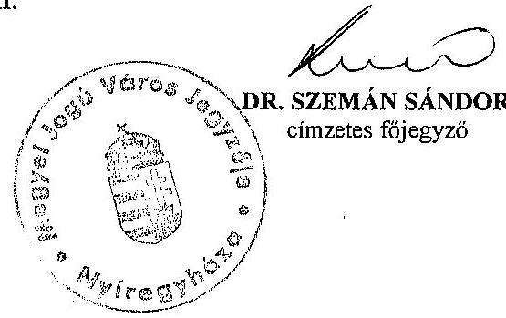

---

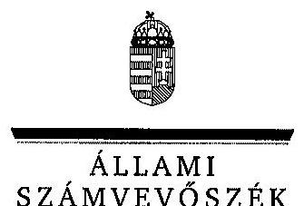

# Csabai Lászlóné úrhölgy, 

polgármester

Nyíregyháza Megyei Jogú Város Önkormányzata

## Nyíregyháza

Kossuth Lajos tér 1.
4400

## Tisztelt Polgármester Asszony!

Köszönettel vettem tájékoztatását a Nyíregyháza Megyei Jogú Város Önkormányzata gazdálkodási rendszerének 2009. évi ellenőrzéséről készült számvevőszéki jelentéshez kapcsolódóan megtett intézkedésekről.

Örömmel értesültem arról, hogy javaslataink egy részét a helyszíni ellenőrzést követően megvalósították, valamint a kiadott jegyzői utasításra vonatkozó tájékoztatásáról, amely szerint javaslatunkra a hosszú lejáratú, adósságot keletkeztető kötelezettségvállalásokból adódó tőkeés kamatfizetési kötelezettségek teljesítésének feltételeiről évente végzett számítások alapján tájékoztatni fogják a Közgyűlést.

A tájékoztatása szerint megvalósított intézkedéseket a számvevőszéki jelentésben az érintett megállapításhoz kapcsolt lábjegyzetben szerepeltettük és a vonatkozó javaslatokat elhagytuk. Ilyennek tekintem a polgármesteri keret támogatási előirányzatainak felhasználásával kapcsolatos szabályozás módosítására, az alpolgármesterek részére tovább adott döntési hatáskörök visszavonására; a költségvetési rendelettervezetben a költségvetési kiadások összegének előírások szerinti meghatározására; az európai uniós támogatással megvalósított programok, projektek bevételi és kiadási előirányzatainak elkülönített tervezésére; a közérdekű adatok előírt tagolás szerinti közzétételére; a civil keret felhasználására kiadott, jogszabállyal ellentétes jegyzői utasítás visszavonására; a karbantartási, kisjavítási szolgáltatásokkal kapcsolatos kiadások összegszerűségének okmányok alapján történő ellenőrzésére, szakmai igazolására; az államháztartáson kívülre nyújtott pénzeszközátadásokkal kapcsolatos kiadások utalványainak ellenjegyzése során a döntési hatáskörök, valamint a fedezet meglétének ellenőrzésére; a belső ellenőrzések lefolytatásához készített ellenőrzési programok tartalmi

---

előírásainak betartására; az európai uniós pályázatok készítésére külső szervezetekkel kötött szerződések kiegészítésére; valamint az informatikai rendszer szabályozottságának biztosítására, a belső kontrolljainak működtetésére irányuló javaslatokat.

Az ellenőrzés lefolytatásához nyújtott segítő közreműködését köszönöm.

Budapest, 2009. október 28.
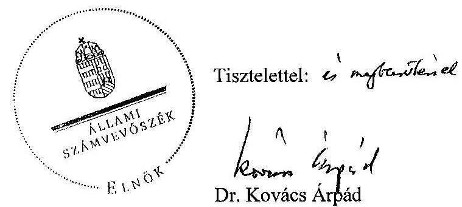

