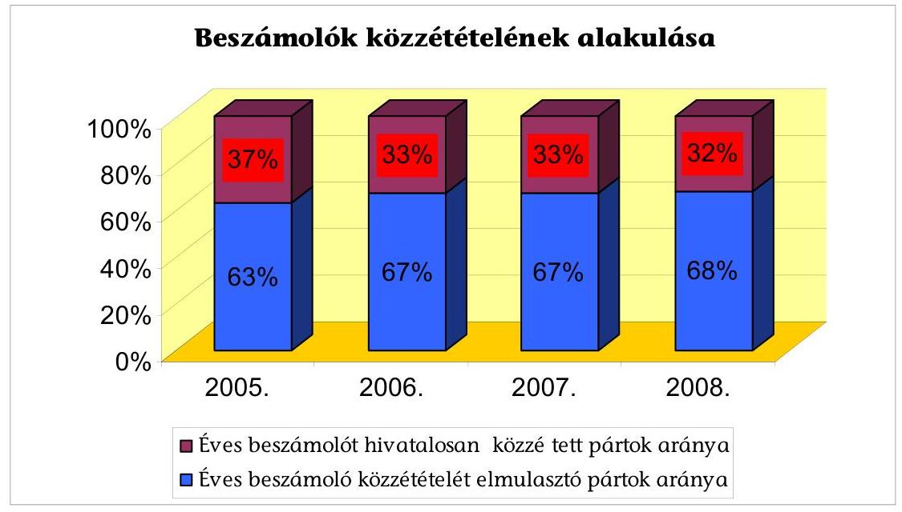
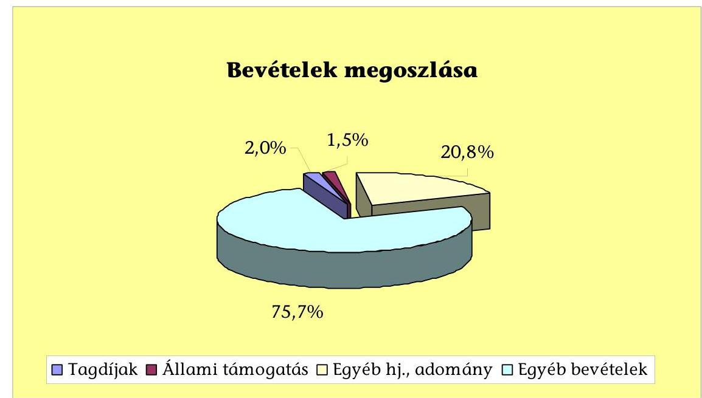
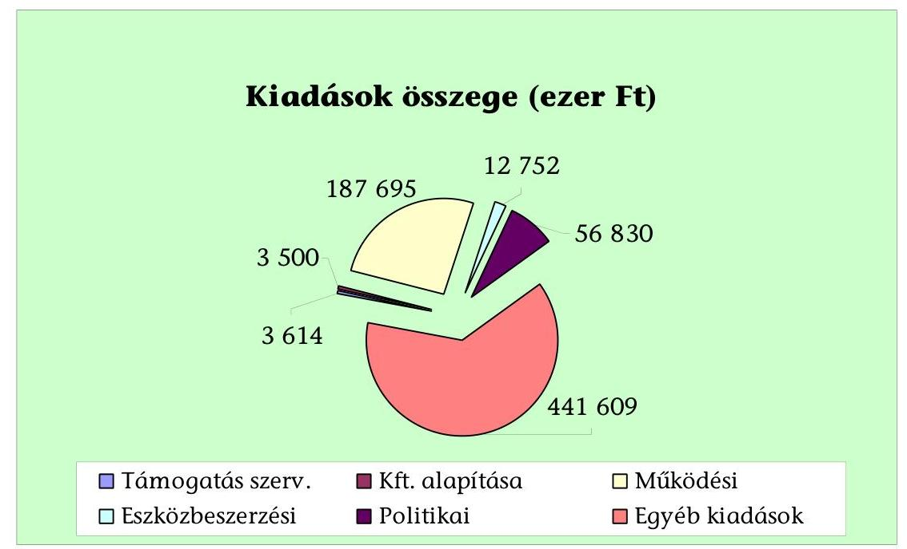
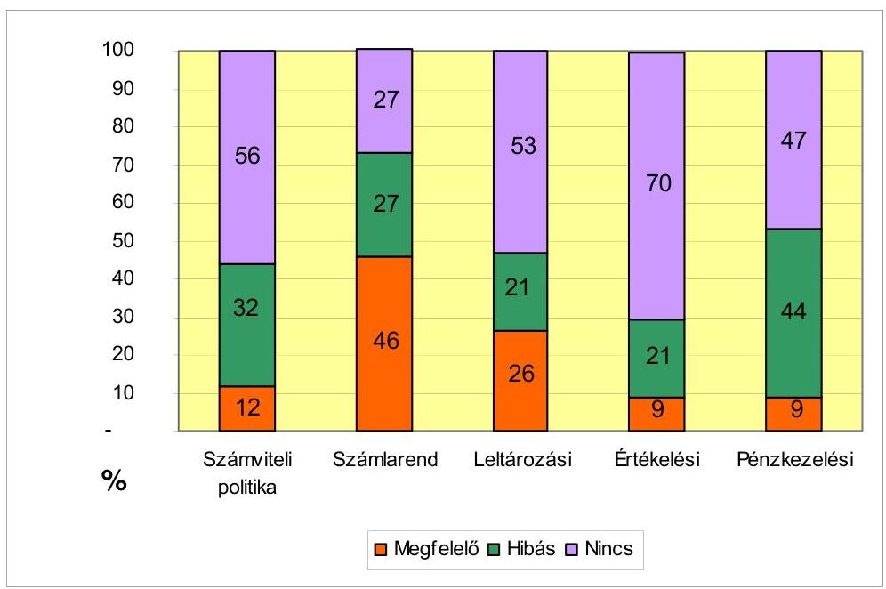
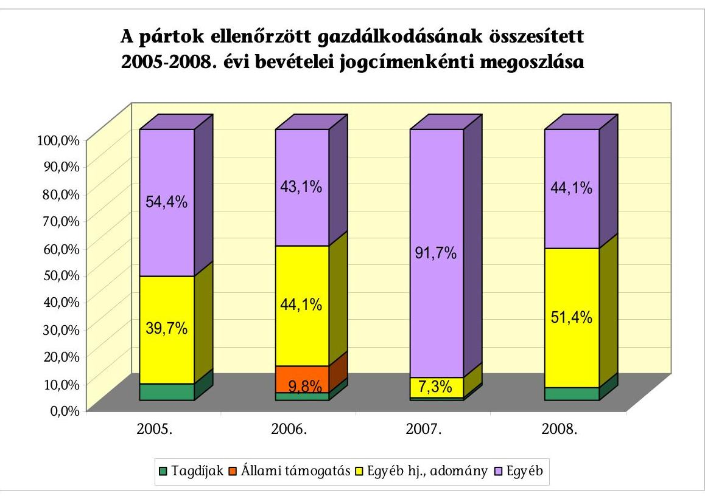
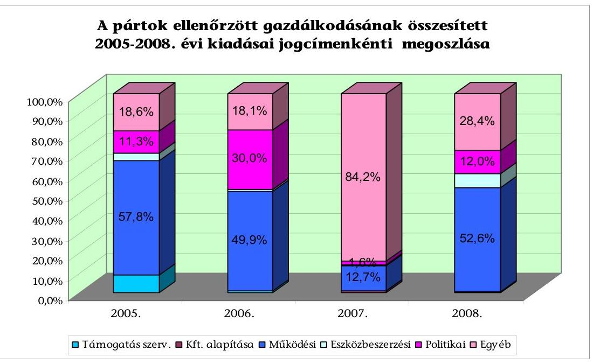
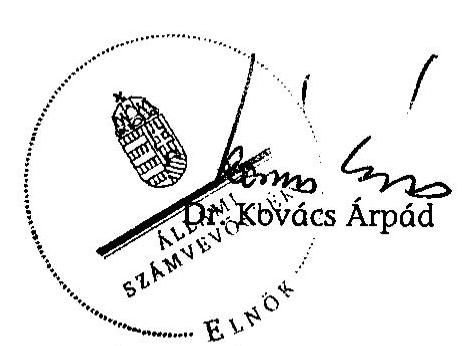

# ÁLLAMI   SZÁMVEVŐSZÉK 

## JELENTÉS

a központi költségvetési támogatásban nem részesülő pártok 2005-2008. évi gazdálkodása törvényességének ellenőrzéséről

---

3. Önkormányzati és Területi Ellenőrzési Igazgatóság
3.1. Szabályszerüségi Ellenőrzési Föcsoport
Iktatószám: V-3005-152/2009.
Témaszám: 940
Vizsgálat-azonosító szám: V-0457
Az ellenőrzést felügyelte:
Dr. Lóránt Zoltán
föigazgató
Az ellenőrzés végrehajtásáért felelős:
Dr. Elek János
általános föigazgató-helyettes
Az ellenőrzést vezette:
Horváth Balázs
főcsoportfőnök-helyettes
Az összefoglaló jelentést készítette:
Tóth István
számvevő tanácsadó
Az ellenőrzést végezték:
Tóth István Dr. Faragóné Tóth Mária Szakmányné Bilik Mária
számvevő tanácsadó számvevő tanácsos számvevő tanácsos
Dr. Veress Tiborné Vincze B. Róbert
számvevő számvevő

# A témához kapcsolódó eddig készített számvevőszéki jelentések: 

címe
sorszáma
Jelentés a pártok beszámolási és beszámoló közzétételi kötelezettsége teljesítésének általános gyakorlatáról
Jelentés a központi költségvetési támogatásban nem részesülő pár- 0517 tok 2001-2004. évi gazdálkodása törvényességének ellenőrzéséről

---

# TARTALOMJEGYZÉK 

BEVEZETÉS ..... 5
I. ÖSSZEGZŐ MEGÁLLAPÍTÁSOK, KÖVETKEZTETÉSEK, JAVASLATOK ..... 7
II. RÉSZLETES MEGÁLLAPÍTÁSOK ..... 13

1. A pártok 2005-2008. évi beszámolási kötelezettségének teljesítése ..... 13
1.1. A beszámolási kötelezettség teljesítésének értékelése, jellemző mutatói ..... 13
1.2. A közzétett 2005-2008. évi beszámolók megbízhatósága, lényeges hibái ..... 14
2. A pártoknak a beszámoló összeállítására és az azt alátámasztó könyvvezetésre vonatkozó belső szabályozása, gyakorlata ..... 16
2.1. A belső számviteli szabályozás rendszere ..... 16
2.2. A könyvvezetés gyakorlata, összhangja a törvényi és a belső előírásokkal ..... 17
2.3. Analitikus nyilvántartások vezetése ..... 19
2.4. A bizonylati elv és a bizonylati fegyelem érvényesülése ..... 19
3. A pártok bevételszerző, gazdálkodó tevékenysége ..... 20
3.1. A pártok 2005-2008. évi felülvizsgált gazdálkodásának bevételei ..... 20
3.2. Tiltott bevételszerző, gazdálkodó tevékenység ..... 21
3.3. A pártok 2005-2008. évi felülvizsgált gazdálkodásának kiadásai ..... 23
4. A gazdálkodással összefüggő egyéb jogszabályokban foglalt előírások betartása ..... 24
5. A pártok belső ellenőrzésének rendszere ..... 26
5.1. A belső ellenőrzés rendszerének szabályozottsága ..... 26
5.2. A belső ellenőrzés múködése ..... 26
6. Az előző ellenőrzés megállapításaira tett intézkedések ..... 26
7. A személyes felelősség megállapítása ..... 27

---

# MELLÉKLETEK 

1. számú Ellenőrzött rendszeres költségvetési támogatásban nem részesült pártok
2. számú Kimutatás az ellenőrzött pártok 2005-2008. évi beszámoló-közzétételi kötelezettségének teljesítéséről
3. számú Éves beszámolót hivatalosan közzétett pártok bevételei és kiadásai felülvizsgálatának eredménye
4. számú Ellenőrzött pártok számviteli szabályozása és gyakorlata
5. számú Számviteli politika és számlarend szabályozási hibáinak jellemzői
6. számú Számviteli politikához kapcsolódó szabályzatok jellemző hibái
7. számú Könyvvezetési és analitikus nyilvántartási hibák jellemzői
8. számú Bizonylatolási hibák jellemzői
9. számú Ellenőrzött pártok felülvizsgált gazdálkodásának 2005-2008. évi bevételei és kiadásai jogcímenkénti összege és megoszlása

## FÜGGELÉKEK

1. számú A Legfőbb Ügyészségnek intézkedés-kezdeményezésre átadott pártok listája
2. számú Törvényességi felhívás az ellenőrzött pártok elnökeinek

---

# RÖVIDÍTÉSEK JEGYZÉKE 

| APEH | Adó- és Pénzügyi Ellenőrzési Hivatal |
| :--: | :--: |
| ÁSZ | Állami Számvevőszék |
| FIMÜV ZRT. | Fővárosi Ingatlankezelő Műszaki Vállalkozói Zártkörűen Müködő Részvénytársaság |
| MNV ZRT. | Magyar Nemzeti Vagyonkezelő Zártkörűen Müködő Részvénytársaság |
| OITH | Országos Igazságszolgáltatási Tanács Hivatala |
| A jelentés mellékleteiben a pártok rövidített neve |  |
| MÖSZP | A MI ÖSSZEFOGÁSUNK SZÖVETSÉG PÁRTJA |
| ÉLŐLÁNC | Élőlánc Magyarországért Párt |
| FKNEP | Független Kisgazda Nemzeti Egység Párt |
| HUMANISTA | Humanista Párt |
| JOBBIK | Jobbik Magyarországért Mozgalom Párt |
| KPSZ | Kisgazda Polgári Szövetségpárt |
| MDU | Magyar Demokratikus Unió |
| MNRP | Magyar Nemzeti Rend Párt |
| MVMP | Magyar Vállalkozók és Munkaadók Pártja |
| MVPP | Magyar Vidék és Polgári Párt |
| MESZ | Magyarok Egymásért Szövetsége |
| MMP | Magyarországi Munkáspárt 2006. |
| MSZDP | Magyarországi Szociáldemokrata Párt |
| MZP | Magyar Zöld Párt |
| MCF | MCF Roma Összefogás Párt |
| ÖSZP | Összmagyar Szövetség Pártja |
| PNNP | Petőfi Nemzeti Néppárt |
| SZDP | Szociáldemokrata Párt |
| TEMP | Tiszta Energiával Magyarországért Párt |
| Árpád Népe | Árpád Népe Magyar Nemzeti Párt |
| Fogyatékosok | Fogyatékosok Pártja |
| FKGP | Független Kisgazda-, Földmunkás- és Polgári Párt |
| Harmadik Utas | Harmadik Utas Magyar Párt |
| Internetes | Internetes Demokrácia Pártja |
| Magyar Függetlenségi | Magyar Függetlenségi Párt |
| MNP | Magyar Nemzeti Párt |
| MaSzePP | Magyar Szegényeket Pártoló Párt |
| Vállalkozó Egységpárt | Magyar Vállalkozó Egységpárt |
| Szolidaritás Párt | Magyarországi Szolidaritás Párt |
| Megújult Roma | Megújult Magyarországi Roma Összefogás Párt |
| Nép Oldali Párt | Nép Oldali Párt |
| NÉPPÁRT.HU | NÉPPÁRT.HU |
| TIP | Társadalmi Igazságosság Pártja |
| Zöld Erő Párt | Zöld Erő Párt |

---

| Art | Az adózás rendjéről szóló - többször módosított - 2003.   évi XCII. Törvény |
| :-- | :-- |
| ÁSZ törvény | Az Állami Számvevőszékről szóló - többször módosított -   1989. évi XXXVIII. törvény |
| párttörvény | A pártok múködéséről és gazdálkodásáról szóló - többször   módosított - 1989. évi XXXIII. törvény |
| számviteli törvény | A számvitelről szóló - többször módosított - 2000. évi C.   törvény |
| Szja. tv. | A személyi jövedelemadóról szóló - többször módosított -   1995. évi CXVII. törvény |
| választási törvény | A választási eljárásról szóló - többször módosított - 1997.   évi C. törvény |
| SZMSZ | Szervezeti és Múködési Szabályzat |

---

# JELENTÉS 

## a központi költségvetési támogatásban nem részesülő pártok 2005-2008. évi gazdálkodása törvényességének ellenőrzéséről

## BEVEZETÉS

Az Állami Számvevőszékről szóló 1989. évi XXXVIII. törvény (ÁSZ törvény) 5. §a, valamint a pártok múködéséről és gazdálkodásáról szóló 1989. évi XXXIII. törvény (párttörvény) 10. § (1) bekezdése alapján a pártok gazdálkodásának ellenőrzésére az Állami Számvevőszék (ÁSZ) jogosult. Az ÁSZ a pártok gazdálkodását az ÁSZ törvény 16. § (2) bekezdése és 17. § (2) bekezdése alapján törvényességi szempontok szerint rendszeresen ellenőrzi.

Az ÁSZ 2009. évi ellenőrzési tervének megfelelően vizsgáltuk a rendszeres központi költségvetési támogatásban nem részesült pártok 2005-2008. évi gazdálkodása törvényességét. A magyarországi pártok többsége, 91\%-a nem jogosult rendszeres központi költségvetési támogatásra, mivel az országgyűlési képviselőválasztás első fordulójában részt vett választók szavazatának $1 \%$-át nem szerezték meg. A központi költségvetési támogatásban nem részesülő pártok esetében csak rendszeres ellenőrzési kötelezettség áll fenn, mivel a párttörvény csak a rendszeres állami költségvetési támogatásban részesülő pártok (9 párt) esetében ír elő kétéves gyakorisággal ellenőrzést. Ebből következően az ellenőrzés jelentőségét nem az ellenőrzött pártok gazdálkodásának nagyságrendje, hanem a jogállamiságból eredő azon garanciális követelmény indokolja, hogy valamennyi párt gazdálkodása törvényességének ellenőrzése biztosított legyen. Legutóbb a 2001-2004. évi gazdálkodási időszakot ellenőriztük ${ }^{1}$.

Az ellenőrzés 98 párt gazdálkodási tevékenységére terjedt ki. Jelen ellenőrzés előkészítése során továbbra is megállapítható volt, hogy Magyarországon napjainkban nem megoldott a pártok társadalmi szervezetektől elkülönült nyilvántartása annak ellenére, hogy az előző jelentésben javasoltuk a nyilvántartás ez irányú továbbfejlesztését ${ }^{2}$.

A rendszeres állami támogatásban nem részesült pártoktól kért adatszolgáltatások összegzése után a következő szervezeteket nem tudtuk az ellenőrzésbe bevonni:

[^0]
[^0]:    ${ }^{1}$ Az ÁSZ 0517. számú jelentése a „Jelentés a központi költségvetési támogatásban nem részesülő pártok 2001-2004. évi gazdálkodása törvényességének ellenőrzéséről".
    ${ }^{2}$ Az OITH-tól kapott információ szerint napirenden van a társadalmi szervezetek nyilvántartásának korszerűsítése.

---

- a kiküldött értesítőlevelet és a tanúsítványt 22 párt sem a székhelyén, sem képviselőjének a megyei bírósági nyilvántartásban szereplő címén nem vette át;
- 17 párt az értesítést átvette, de a tanúsítványt nem küldte vissza;
- 19 párt a tanúsítvány alapján gazdálkodó tevékenységet nem igazolt, nullás adatszolgáltatást teljesített;
- 6 szervezet korábban már megszűnt, vagy nem pártként múködik.

Az említett esetekben (1. számú függelék) az ÁSZ jelzéssel élt az ügyészség felé.
A tanúsítványi adatszolgáltatások felülvizsgálatának eredményeként az alábbiak szerint végeztük a pártok 2005-2008. évi gazdálkodásának törvényességének ellenőrzését:

- 19 párt esetében a helyszíni ellenőrzés lefolytatása volt indokolt.
- 14 párt minimális nagyságrendű gazdálkodási tevékenységére, és további 1 párt halasztási kérelmére tekintettel az egységes módszertani elveknek megfelelő egyszerűsített ellenőrzést (jegyzőkönyv felvétele) végeztünk.
A rendszeres költségvetési támogatásban nem részesült pártok közül az ellenőrzésbe vonható pártokat teljes körben ellenőriztük.

Az ellenőrzés célja annak megállapítása volt, hogy a hatályosan bejegyzett, 2005-2008 közötti időszakban múködött, központi költségvetési támogatásban nem részesült pártok:

- eleget tettek-e párttörvény 9. § (1) bekezdésben előírt éves beszámolási és beszámoló közzétételi kötelezettségüknek, az éves beszámolók a törvényi előírásoknak megfelelnek-e, a könyvvezetéssel és a valósággal megegyező adatokat tartalmaznak-e;
- a könyvvezetés és a gazdálkodás során betartották-e a számvitelről szóló többször módosított - 2000. évi C. tv. (számviteli törvény) és az egyéb jogszabályok rendelkezéseit, a belső gazdálkodási és számviteli előírásokat;
- a múködéshez szabályszerűen igénybe vehető forrásokat használtak-e fel, a párttörvényben engedélyezett gazdálkodó tevékenységet folytattak-e; betar-tották-e a párttörvény 4. § (2)-(3), illetve 6. § (3) bekezdésbe foglalt korlátozásokat.

A beszámolás és gazdálkodás szabályszerűségének törvényességi ellenőrzése a beszámolóval lezárt 2005-2008. évekre terjedt ki. Az ellenőrzést a pénzügyi szabályszerűségi ellenőrzés módszertani szabályai szerint, a pártellenőrzésre kiadott segédletbe foglalt, egységes követelmények alapján hajtottuk végre.

A pártellenőrzéseknél évek óta kifogásoljuk, hogy a párttörvény és a számviteli törvény előírásai nincsenek egymással összhangban, valamint hogy a párttörvény a jogkövető magatartás kikényszerítése érdekében nem tartalmaz megfelelő szankciókat. A hiányosságok megszüntetését is szolgálja a Kormány által T/237. számon, illetve országgyúlési képviselők egyéni indítványaként T/4190. számon benyújtott törvénymódosító javaslat. Előbbit levették a napirendről, utóbbit a jelentés elkészítéséig még nem fogadta el az Országgyúlés.

---

# I. ÖSSZEGZŐ MEGÁLLAPÍTÁSOK, KÖVETKEZTETÉSEK, JAVASLATOK 

A Magyarországon működő, a 2005-2008 közötti időszakban rendszeres költségvetési támogatásban nem részesült pártok gazdálkodásukról egyik évben sem adtak teljes körű, hiteles képet. Az ellenőrzött pártok kétharmada minden évben elmulasztotta a párttörvényben meghatározott beszámoló közzétételét.

A nyilvánosság alacsony szintje mellett az éves gazdálkodásról adott képet torzította, hogy a hivatalosan közzétett beszámolók 80\%-a nem minősült megbízhatónak és valósnak ( 35 megjelentetett éves beszámoló közül 28). A számvevőszéki felülvizsgálattal feltárt lényeges mértékű beszámolási hibák a számviteli törvény előírásainak megsértéséből fakadtak és szabályozási, könyvvezetési, valamint bizonylatolási szabálytalanságokkal egyaránt összefüggtek. A pártok nem szereztek érvényt az éves beszámolók összeállítása során a teljesség, a valódiság, a következetesség elveinek. Az ellenőrzés által megállapított eltérések évenkénti összegét és mértékét a következő táblázat szemlélteti:

| FELTÁRT HIBA | $\mathbf{2 0 0 5 .}$ | $\mathbf{2 0 0 6 .}$ | $\mathbf{2 0 0 7 .}$ | $\mathbf{2 0 0 8 .}$ |
| :-- | :--: | :--: | :--: | :--: |
| I. Bevételek |  |  |  |  |
| Összege ezer Ft | 3849 | 4040 | 6424 | 204098 |
| Mértéke | $60,6 \%$ | $30,7 \%$ | $77,8 \%$ | $124,1 \%$ |
| II. Kiadások |  |  |  |  |
| Összege ezer Ft | 4798 | 1426 | 3060 | 8896 |
| Mértéke | $55,7 \%$ | $10,3 \%$ | $39,9 \%$ | $14,3 \%$ |

A pénzügyi beszámoló közzétételének elmulasztásával, illetve a megbízhatatlan közléssel előidézett - korábban is jellemző - törvényi szabálytalanságokat a hatályos párttörvény nem szankcionálja.

---

A lényeges eltérésben kulcsfontossággal bírt a számviteli szabályozások hiánya, hiányossága. A korábbi ellenőrzési tapasztalatokhoz hasonlóan a vizsgált pártok körében 2005-2008 periódusában megoldatlannak bizonyult a párttörvény és a számviteli törvény egymástól eltérően szabályozott beszámolási rendjének összehangolása. A számviteli törvény által kötelezően előírt, a párt képviselőjének felelősségi körébe utalt számviteli szabályozással a pártok $41,2 \%$-a nem, $29,4 \%$-a hiányosan rendelkezett.

A vizsgált időszakban hatályos számviteli politikák közül csak minden negyedik felelt meg a számviteli törvény és a párttörvény előírásainak, a pártok gazdálkodási sajátosságainak. Jellemzően nem határozták meg a beszámoló öszszeállításának rendjét, az érvényesítendő számviteli alapelveket, a beszámolósorok tartalmi ismérveit és főkönyvi megfelelését, a megbízhatóság szempontjából fontos lényegesség mértékét, a zárlati feladatokat és követelményeket, esetenként ellentmondásosan nem a párttörvényben meghatározott beszámoló készítését írták elő. A számviteli politikához kapcsolódó értékelési, leltározási szabályzatok valamivel több, mint fele; a pénzkezelési szabályzat mindössze három pártnál minősült elfogadhatónak.

Könyvvezetési kötelezettségét is elmulasztotta a számviteli szabályozással nem, vagy hiányosan rendelkező pártok 58\%-a, összességében tizennégy pártnál állapítottuk meg az egyszeres, illetve kettős könyvvitel hiányát. A Magyar Közlönyben megjelentetett éves beszámolók közül tizenkettőnek nem volt könyvvezetési megalapozottsága. A pártok az éves beszámolók alapjául 60\%ban egyszeres könyvvitelt vezettek. A kettős könyvelést teljesítő pártok közül mindössze háromnak a számlarendje minősült megfelelőnek. A szabályozási és személyi feltételek hiányában a pártok fontos számviteli alapelveket nem érvényesítettek a könyvvezetés során: a könyvelés nem tartalmazott minden bevételt és kiadást (teljesség elve); ténylegesen fel nem merült pénzforgalmat könyveltek (valódiság elve); különféle kiadásoknál nem teljesült a jogcímenkénti elszámolás azonossága (következetesség elve); szabályozási hiányosság miatt elmaradt a nem pénzbeli vagyoni hozzájárulások értékelése (egyedi értékelés elve). A számviteli törvénysértések sorában a pártok 35\%-a nem végezte el a szabályszerű könyvviteli zárlatot-nyitást (folytonosság elve).

A főkönyvi könyveléshez kapcsolódó analitikus nyilvántartások körét a pártok kiadott számviteli szabályzatai meghatározták, de a belső előírások betartásáról döntő részt nem gondoskodtak. Négy olyan párt nyilvántartása minősült megfelelőnek, amely a kötelezően előírt szabályozásokkal nem rendelkezett. A pártok egyharmad arányban nem, illetve hiányosan vezették az analitikát, ennek keretében súlyosnak minősült az időszaki pénztárjelentés, valamint a szigorú számadású nyomtatványok nyilvántartása vezetésének elmulasztása.

A bizonylati elv és fegyelem érvényesüléséhez a pártok több mint 90\%-a nem szabályozta bizonylati rendjét. A számviteli törvény rendelkezéseinek sokrétű megszegését állapította meg az ellenőrzés: négy pártnál a bizonylatokat nem őrizték meg, ezáltal meghiúsították a gazdasági események vizsgálatát; kilenc pártnál a pénzügyi tranzakciókat alapbizonylatok, tizenegy pártnál pénztárbizonylatok nélkül bonyolították; a pártok fele nem tartotta be a bizonylatolás alaki és tartalmi követelményeit.

---

A rendszeres költségvetési támogatásban nem részesült, vizsgálatba vont pártok - rendelkezésre bocsátott számviteli bizonylatok tanúsága szerint - 20052008. években együttesen 856623 ezer Ft bevétellel gazdálkodtak.

A pártok gazdálkodásának felülvizsgálata eredményeként az ellenőrzés a párttörvényben meghatározott beszámoló minta jogcímenkénti szerkezetében rögzítette a pártok évenkénti bevételi forrásait, amelynek négy évre összesített adatai megoszlását az alábbi ábra szemlélteti:

Az ellenőrzött pártok tagdíj befizetésének alacsony részaránya abból fakadt, hogy a tagdíjfizetési kötelezettség alapszabályi előírása mellett a pártok közgyűlése jellemzően nem határozta meg a tagdíj mértékét, amelynek hiányában a befizetések elmaradtak.

A 2006. évi általános országgyűlési képviselő-választáson történt jelöltállításra tekintettel az ellenőrzött pártok közül kilenc, együttesen 12270 ezer Ft összegű költségvetési céltámogatásban részesült. A választási törvény által előírt elszámolási kötelezettségnek hat párt nem tett eleget, közülük számviteli nyilvántartása szerint egy párt a 994 ezer Ft összegű költségvetési támogatást nem használta fel, azt bankszámláján tartotta. Az Önkormányzati Minisztérium államtitkára a jelentés-tervezet alapján felszólította az érintett pártok elnökeit az elszámolás teljesítésére, illetve a maradványok visszafizetésére.

A pártok jogi és magánszemélyektől jogszerűen 174970 ezer Ft hozzájárulásban, adományban részesültek. Az ellenőrzés feltárása alapján nem pénzbeli vagyoni hozzájárulásokat hat párt kapott, de annak párttörvény szerinti értékelését elmulasztotta (négyen a helyszíni vizsgálatot követően meghatározták értékét).

Az egyéb bevételek kiugróan magas, 75,7\%-os részarányára döntő hatással volt egy párt saját tulajdonú székházának eladása, amelyből 505000 ezer Ft bevétele származott.

---

A bevételszerző gazdálkodó tevékenység párttörvényben meghatározott korlátozásait - hat párt kivételével - betartották. Az ellenőrzés a következőkben tárt fel tiltott forrásból, illetve tevékenységből származó, a pártot meg nem illető bevételt:

Adatok ezer Ft-ban

| FELTÁRT, A PÁRTOT MEG NEM ILLETŐ BEVÉTEL MEGNEVEZÉSE | ÖSSZEG |
| :-- | --: |
| MCF Roma Összefogás Párt kisebbségi feladatokra nyújtott költségve-   tési támogatást fogadott el | $\mathbf{6 0 0}$ |
| A MI ÖSSZEFOGÁSUNK SZÖVETSÉG PÁRTJA névtelen adományból   teljesítette a törzstőke befizetését | $\mathbf{5 0 0}$ |
| Magyar Demokrata Unió névtelen adományból teljesítette a törzstőke   befizetését | $\mathbf{3 0 0 0}$ |
| Magyarországi Munkáspárt 2006. névtelen adományt fogadott el | $\mathbf{4 5}$ |
| Petőfi Nemzeti Néppárt tulajdonában nem álló, állami ingatlant   adott bérbe | $\mathbf{7 7 9 6}$ |
| Szociáldemokrata Párt tulajdonában nem álló, állami ingatlant adott   bérbe | $\mathbf{1 2 8 2 1}$ |
| Ellenőrzés által feltárt tiltott bevétel együttesen: | $\mathbf{2 4 7 6 2}$ |

A párttörvény által tiltott bevételeket a hatályos szabályozás a központi költségvetésbe rendeli befizetni. A hatályos rendelkezés szerint e körben nem érvényesíthető a bevételszerzés azonos összegű szankcionálása, mivel nincs mód a rendszeres állami támogatásban részesülő pártokhoz hasonló támogatási zárolásra. A Magyarországi Munkáspárt 2006. az ellenőrzés megállapítására a névtelen adománynak megfelelő összeget a központi költségvetésbe önként befizette.

A számviteli bizonylatok szerint az ellenőrzött pártok 2005-2008. években együttesen 706000 ezer Ft kiadást teljesítettek az alábbi jogcímeken:

A pártok ráfordításainak mintegy harmada múködési és politikai kiadásokra teljesültek. Az egyéb kiadások 62,6\%-os magas részarányát hitel visszafizetés és tartozás kiegyenlítés indokolta, amelyből az ingatlanát hasznosító párt

---

355000 ezer Ft teljesítése volt meghatározó. A párttörvényben engedélyezett egyszemélyes kft-t két párt alapított, amelynek forrásaként névtelenül bevételezett adományokat jelöltek meg.

Az adózási, társadalombiztosítási jogszabályok előírásainak a pártok munkáltatóként és kifizetőként - egy párt kivételével - nem tettek eleget. Az adó- és járulékfizetési kötelezettség elmulasztásából fakadóan a nyilvántartások egy pártnál 16167 ezer Ft APEH tartozást mutattak, két párt az adó- és járulékkötelezettség megállapítása nélkül teljesített 3900 ezer Ft megbízási díjat, valamint 5307 ezer Ft költségtérítést, három pártnál nem teljesítették a telefonok magáncélú használatából eredő költségvetési befizetési kötelezettséget. A pártoknál foglalkoztatói és kifizetői minőségben, valamint az alkalmazott és juttatásban részesített magánszemélyek körében egyaránt adóhiány keletkezett, amely az adózás rendje szerint önellenőrzéssel állapítható meg és rendezhető.

A pártok belső ellenőrzése a szabályozási és működési hiányosságok miatt nem tárta fel a pártok gazdálkodásának és számvitelének lényeges hibáit, valamint törvényi és belső előírások megsértését és személyes felelősséggel is járó súlyosabb mulasztásait. A belső kontroll hiányából fakadóan az előző számvevőszéki jelentés felhívásait egy párt nem, négy párt részben hajtotta végre.

A pártok gazdálkodása törvényességének ellenőrzése során megállapítottuk, hogy az önkéntes jogkövetés nem volt megfelelő. Az ellenőrzött harmincnégy párt között egyetlen olyan sem akadt, amely maradéktalanul betartotta volna a pénzügyi gazdálkodásra vonatkozó jogszabályok előírásait. Az ellenőrzés személyes felelősséget állapított meg a párttörvény, a számviteli törvény, az adózási törvények többszöri megsértésével összefüggésben nyolc párt elnökét érintően az éves pénzügyi beszámolási, számviteli szabályozási, könyvvezetési és bizonylatolási, adó- és járulékfizetési kötelezettség elmulasztása, a belső kontroll hiánya miatt.

A hatályos párttörvényben nincs visszatartó erejú szankciója a törvénysértéseknek. Az éves pénzügyi beszámoló közzétételét rendszeresen elmulasztó pártok az ÁSZ felhívására - retorzió nélkül - akár több évre visszamenőleg pótolhatják a gazdálkodási beszámoló hivatalos közzétételét. Hasonlóan nincs szankciója a gazdálkodásról adott nem megbízható tájékoztatásnak sem. A rendszeres állami támogatásban nem részesülő pártoknál nincs mód a tiltott bevétellel azonos mértékű költségvetési zárolásra. A számvevőszéki hatáskör kizárólag a párttörvénybe ütköző módon szerzett bevétel központi költségvetésbe való befizetésének felhívására ad jogosultságot.

A pártok finanszírozásának átláthatóságát és ellenőrizhetőségét érintően jelen körben végzett vizsgálati tapasztalatok ismételten megerősítették, hogy tovább nem tartható fenn a párttörvény - számviteli törvény szabályozásától eltérő ellentmondásosan alkalmazható beszámolási rendje. Az ÁSZ évek óta jelzi kiadott jelentéseiben, hogy a pártok éves beszámolóiban feltárt lényeges hibák egyik eredője a törvények összehangolatlansága, a gazdálkodási beszámoló áttekinthetőségét és valódiságát rontó, pártfüggő szabályozása vagy szabályozatlansága. A hatályos törvényből hiányoznak a gazdálkodásról adott hivatalos közlés megbízhatóságára vonatkozó garanciák is (pl. kötelező könyvvizsgáló megbízása, képesített könyvelő alkalmazása).

---

# A pártok gazdálkodásának átláthatósága fokozott érvényesítéséhez halaszthatatlan a párttörvény módosításának politikai konszenzussal való elfogadása. 

A helyszíni ellenőrzés tapasztalatainak hasznosítása mellett javasoljuk:

## a Kormánynak

Ismételten terjessze elő a pártfinanszírozás átláthatóságának, a pártok elszámoltathatóságának fokozott érvényesítése érdekében a párttörvény módosítását figyelemmel:

1. a pártok számviteli nyilvántartási és beszámolási rendszerét érintő - már évek óta fennálló - ellentmondások feloldására, amelyek a párttörvény és a számviteli törvény között továbbra is fennállnak;
2. a rendszeres állami támogatásban részesülő és a nem részesülő pártok között jelenleg meglévő, a tiltott bevételszerzésre vonatkozó szankcionálási különbség megszüntetésére;
3. az éves beszámolók közzétételét elmulasztó, vagy a gazdálkodásról nem megbízható adatokat közlő pártok visszatartó erejű szankcionálására;
4. a pénzügyi beszámoló megbízhatósága érdekében előírandó garanciális követelményekre, különös tekintettel a kötelező könyvvizsgáló megbízására, képesített könyvelő alkalmazására.

## a pénzügyminiszternek

1. Kísérje figyelemmel a részletes megállapítások 3.2. pontjában érintett pártok befizetési kötelezettségének teljesítését.
2. A kötelezettség nem teljesítése esetén a párttörvény 4. § (4) bekezdésében előírtaknak megfelelően intézkedjen a tartozás adók módjára történő behajtására.

## az önkormányzati miniszternek

Intézkedjen olyan eljárási rend kialakítására, amellyel biztosítható az országgyűlési képviselő-választásra folyósított jelöltarányos támogatás szabályszerű elszámolása, visszafizettetése.

A helyszíni ellenőrzés tapasztalatainak hasznosítása mellett az Állami Számvevőszék felhívja

## a pártok elnökeit:

Tegyenek intézkedéseket a párttörvény 10. § (4) bekezdése alapján a törvényes állapot helyreállítására, a 2. számú függelékben részletezettek szerint.

---

# II. RÉSZLETES MEGÁLLAPÍTÁSOK 

## 1. A PÁrtok 2005-2008. ÉVI BESZÁmolási KÖTELEZETTSÉGÉNEK TELJESÍTÉSE

### 1.1. A beszámolási kötelezettség teljesítésének értékelése, jellemző mutatói

A rendszeres költségvetési támogatásban nem részesült pártok közül az ellenőrzésbe vonható pártokat teljes körben ellenőriztük, tizenkilencet helyszínen, tizenötöt egyszerűsített módon vizsgáltuk (1. számú melléklet).

A költségvetési támogatásban nem részesült pártok kétharmada a párttörvény 9. § (1) bekezdésben előírt beszámolási kötelezettségét minden évben megszegte (2. számú melléklet).

A párttörvény 9. § (1) bekezdése előírja, hogy: „A pártok kötelesek minden év április 30-áig az előző évi gazdálkodásukról szóló beszámolót (zárszámadást) a Magyar Közlönyben, valamint saját honlappal rendelkező pártok a honlapjukon is - e törvény 1. számú mellékletében meghatározott minta szerint - közzétenni."

A párttörvény 9. § (1) bekezdésében előírt kötelezettség elmulasztásához a hatályos törvény nem rendel szankciót.

A pártok 2005-2008. évi beszámolási kötelezettségének teljesítése gazdasági évenként az alábbiak szerint alakult:

| Megnevezés | Gazdasági évek |  |  |  |
| :--: | :--: | :--: | :--: | :--: |
|  | $\mathbf{2 0 0 5 .}$ | $\mathbf{2 0 0 6 .}$ | $\mathbf{2 0 0 7 .}$ | $\mathbf{2 0 0 8 .}$ |
| Beszámolásra kötelezett pártok száma | 19 | 24 | 27 | 34 |
| Közzétételt teljesítő pártok száma | 7 | 8 | 9 | 11 |
| ebből: közzétételi határidőt betartó   pártok száma | 0 | 0 | 1 | 8 |

A 2005-2006-os évekről, határidőben egyetlen beszámolót sem tettek közzé és a 2007. évről is csupán egyet. A 2008. évi beszámolók közül nyolc megjelent határidőben, így az előző évekhez képest feltűnő javulás mutatkozott.

A helyszíni, illetve az egyszerűsített vizsgálatot követően nyolc párt az elmulasztott beszámolási kötelezettségét pótolta: Élőlánc Magyarországért, Független Kisgazda Nemzeti Egység Párt, Magyarok Egymásért Szövetsége, Árpád Népe Magyar Nemzeti Párt, Internetes Demokrácia Pártja, Magyar Függetlenségi Párt, Magyar Nemzeti Párt, Magyar Szegényeket Pártoló Párt.

---

# 1.2. A közzétett 2005-2008. évi beszámolók megbízhatósága, lényeges hibái 

A Magyar Közlönyben közzétett beszámolók pénzügyi adatainak felülvizsgálata alapján az ellenőrzés a beszámolókat minősítette, amelynek eredményét az alábbi összeállítás szemlélteti:

| Beszámoló minősítése | Gazdasági évek |  |  |  |
| :-- | :--: | :--: | :--: | :--: |
|  | $\mathbf{2 0 0 5 .}$ | $\mathbf{2 0 0 6 .}$ | $\mathbf{2 0 0 7 .}$ | $\mathbf{2 0 0 8 .}$ |
| Megbízhatónak minősült | 1 | 2 | 2 | 2 |
| Nem megbízható, nem valós | 6 | 6 | 7 | 9 |
| Ebből: |  |  |  |  |
| - könyvvezetés hiánya miatt: | 3 | 3 | 3 | 3 |
| - lényeges eltérés miatt | 3 | 3 | 4 | 6 |
| Közzétett beszámolók együttesen | $\mathbf{7}$ | $\mathbf{8}$ | $\mathbf{9}$ | $\mathbf{1 1}$ |

Összességében 35 megjelentetett éves beszámoló közül 28 (80\%) nem minősült megbízhatónak és valósnak. A beszámolók közül nem volt ellenőrizhető a Magyar Vidék és Polgári Párt 2005. évi, a Magyarországi Munkáspárt 2006. 20062008. évi, a Magyarországi Szociáldemokrata Párt 2005-2008. évi, az Összmagyar Szövetség Pártja 2006-2008. évi és a Szociáldemokrata Párt 2005. évi beszámolójának valódisága, mivel könyvvezetéssel nem támasztották alá (3. számú melléklet).

A vizsgálat a könyvvezetéssel alátámasztottan nyilvánosságra hozott éves beszámolók közül az alábbiakban nem minősítette megbízhatónak azon pártok beszámolóját, amelyeknél a feltárt hiba mértéke meghaladta a pártellenőrzéseknél egységesen elfogadott $2 \%$-os lényegességi mértéket. ${ }^{3}$

- A Független Kisgazda Nemzeti Egység Párt a 2005. évi beszámolója szerint nem gazdálkodott, ezzel szemben könyvvitele szerint 10 ezer Ft magánszemélytől származó adományban részesült és egyezer Ft bankköltsége merült fel.
- A Humanista Párt 2005-2007 időszakában gazdálkodó tevékenységet nem folytatott (nullás beszámolókat tett közzé), a 2008. évi kiadásait 5\%-os eltéréssel jelentette meg, az egyéb kiadások között nem tüntetett fel 14 ezer Ft bankköltséget.
- A Kisgazda Polgári Szövetségpártnál hasonlóan a 2008. évi beszámoló kiadási oldala tartalmazott $56 \%$-ban hibát, amely abból eredt, hogy a múködési kiadások között politikai kiadást számolt el.
- A Magyar Vállalkozók és Munkaadók Pártja 2007-2008. évi lekönyvelt bevételei 152, illetve 101\%-kal tértek el a közzétett összegtől: 2007-ben 432 ezer Ft összegű magánszemélyektől és 503 ezer Ft összegű jogi személyektől származó adományt a beszámolóban nem tüntetett fel, ugyanakkor az egyéb bevételek között 955 ezer Ft összegben bizonylattal és könyveléssel alá nem támasztott bevételt szerepeltetett. A 2008. évi beszámolóból pedig

[^0]
[^0]:    ${ }^{3}$ Módszertan a pártok gazdálkodása törvényességének ellenőrzéséhez.

---

kimaradt 384 ezer Ft összegű magánszemélyektől és 592 ezer Ft összegű jogi személyektől származó nem pénzbeli adomány értéke; a 2008. évi kiadásait megbízható adatokkal közölte, de a 2007. évi beszámolóban ténylegesen fel nem merült 1162 ezer Ft összegű működési kiadást szerepeltetett.

- A Magyar Vidék és Polgári Párt a 2006-2008 közötti gazdálkodásáról megbízható adatokkal tájékoztatott, 2007-2008 időszakában bevétele nem volt.
- A Magyarok Egymásért Szövetsége határidő után tette közzé 2008. évi beszámolóját, melyben 100000 ezer Ft összegű, egy jogi személytől származó adományt nevesítve a magánszemélytől származó adományok soron szerepeltetett. A kiadási oldalon 8160 ezer Ft összegű eszközbeszerzése alapbizonylat hiányában nem volt ellenőrizhető.
- A Magyarországi Zöld Párt 2005-2008. évi beszámolói lényeges mértékű hibák miatt egyik évben sem minősültek megbízhatónak. A beszámolóból mindegyik évben kimaradt az ingyenes, vagy kedvezményes díjtételű ingatlanhasználat formájában, valamint egyéb formában kapott adományok értéke: 2005-ben 1139 ezer Ft, 2006-ban 479 ezer Ft, 2007-ben 414 ezer Ft, 2008-ban 1768 ezer Ft értékben; a 2005. évi egyéb kiadásai között 1945 ezer Ft összegben hibásan múködési, eszközbeszerzési és politikai kiadásokat számolt el. Hasonlóan 2006-ban 32 ezer Ft múködési kiadást, 2007-2008-ban 393 ezer Ft, illetve 187 ezer Ft múködési és politikai kiadást számolt el az egyéb kiadások között.
- A Petőfi Nemzeti Néppárt 2005-2007 időszakában teljesítette beszámolási és közzétételi kötelezettségét, de a beszámolók lényeges mértékű hibák miatt, egyik évben sem mutattak megbízható és valós képet. 2005-2006-ban összességében 31 ezer Ft egyéb bevételt mutattak ki tagdíjként. A beszámolóból mindegyik évben kimaradt az ingyenes, vagy kedvezményes díjtételű ingatlanhasználat formájában kapott adományok értéke 2005-ben 2155 ezer Ft, 2006-ban 3320 ezer Ft, 2007-ben 4020 ezer Ft értékben; a kiadásokat egyik évben sem a valóságnak megfelelően hozták nyilvánosságra. A támogatás egyéb szervezetnek beszámolósoron múködési kiadást vettek figyelembe 2005-ben 535 ezer Ft, 2006-ban 370 ezer Ft, 2007-ben 216 ezer Ft összegben. 2005-ben 47 ezer Ft, 2006-ban 66 ezer Ft összegben nem a párt kiadásának minősülő kiadást számoltak el. 2006-ban együttesen 118 ezer Ft politikai és múködési kiadást egyéb kiadásként számoltak el.
- A Szociáldemokrata Párt 2006-2007. évi bevételi és kiadási adatai egyaránt lényeges eltérést mutattak; 2008-ban, a beszámolóban szereplő összes kiadás nem tükrözött valós képet. A bevételi oldalon a tagdíjak soron 2006ban az országgyúlési képviselő-választásra kapott 76 ezer Ft költségvetési céltámogatást tagdíjként jelölték, 2007-ben a belső pénzforgalommal összefüggő, 100 ezer Ft halmozódást tartalmazott. A kiadásokból mindhárom évben hiányzott 320 ezer Ft értékkel becsült adó- és járulékköltség, 2007-ben 180 ezer Ft eszközbeszerzési kiadást múködési kiadásként szerepeltettek.
- A Tiszta Energiával Magyarországért Párt 2008. évi beszámolója a belső szabályozásnak megfelelően mutatta a párt bevételeit és kiadásait. A kiadási többlet forrása kölcsön és szállítói tartozás volt.

---

# 2. A PÁrTOKNAK A BESZÁmoló ÖSSZEÁLlítÁsÁra És AZ AZT ALÁTÁMASZTÓ KÖNYVVEZETÉSRE VONATKOZÓ BELSŐ SZABÁLYOZÁSA, GYAKORLATA 

### 2.1. A belső számviteli szabályozás rendszere

Az éves beszámolással összefüggésben feltárt törvényi mulasztások és lényeges hibák a számviteli szabályozottság elégtelenségével párosultak. Az ellenőrzött pártok 29,4\%-a rendelkezett a számviteli törvény 14. § (3)-(5), valamint a 161. § (1)-(3) bekezdéseiben előírt számviteli szabályozással: számviteli politikával és hozzárendelt pénzkezelési, értékelési és leltározási szabályzatokkal, számlarenddel. A szabályozást a pártok 41,2\%-a egyáltalán nem készítette el, 29,4\%-a hiányosan adta ki. Kettő párt a szabályzatait a vizsgálattal érintett időszakon túl helyezte hatályba, illetve a teljes vizsgált időszakra nem rendelkezett szabályzatokkal.

A vizsgált, rendszeres költségvetési támogatásban nem részesült pártok számviteli szabályozottsága megfelelősége szintjét szabályzatonként az alábbiakban ábrázoljuk:

Összességében huszonnégy párt megsértette a számviteli törvény 14. § (9) bekezdésében ${ }^{4}$ előírt kötelezettségét.

A számviteli törvény 14. § (9) bekezdése szerint: „Az újonnan alakuló gazdálkodó a (3)-(4) bekezdés szerinti számviteli politikát, az (5) bekezdés szerint elkészítendő szabályzatokat a megalakulás időpontjától számított 90 napon belül köteles elkészíteni. Törvénymódosítás esetén a változásokat annak hatálybalépését követő 90 napon belül kell a számviteli politikán keresztülvezetni".

[^0]
[^0]:    ${ }^{4}$ 2009. január 1-jétől hatályos rendelkezés 14. § (11) bekezdésre módosult.

---

A számviteli politika felülvizsgálata eredményeként az ellenőrzés tizennégy párt közül tizenegynél állapított meg egy vagy több hiányosságot: hét-hét esetben nem tartalmazta a szabályzat a párttörvény 9. § (1) bekezdésében meghatározott beszámoló közzétételére vonatkozó előírását, a számviteli törvény 3. § (3) bekezdés 5. pontjában meghatározott megbízható és valós képet lényegesen befolyásoló hiba nagyságának rögzítését, az egyéb bevételek tartalmát, a múködési és politikai tevékenység és az egyéb kiadások körét, ismérveit. Nem szabályozta gazdálkodási sajátosságainak megfelelően a számviteli törvény 15-16. $\S$-ban megfogalmazott alapelveket három, a beszámoló összeállításának rendjét öt, valamint a számviteli törvény 164. § (1) bekezdésében előírt zárlati feladatokat egy párt (5. számú melléklet).

Az ellenőrzött pártok közül tizenegynek kellett rendelkeznie a számviteli törvény 161. §-ban előírt számlarenddel, azonban ezt csak nyolc párt készítette el (4. számú melléklet). A számviteli törvény 161. § (2) bekezdés d) pontjában előírt bizonylati rendet csak három párt készített, azok tartalma megfelelt a jogszabályi követelményeknek és a párt gazdálkodási sajátosságainak. Az ellenőrzés a kiadott számlarendekben a számlakapcsolatok előírásának; az analitikák meghatározásának, az egyeztetési előírásoknak, a zárlati feladatok meghatározásának, a bizonylati rendnek; az egyéb hozzájárulások, adományok számlák tartalmi előírásának, az alkalmazott főkönyvi számlák teljes körű kijelölésének hiányát állapította meg (5. számú melléklet).

A számviteli politikához kapcsolódó pénzkezelési, értékelési és leltározási szabályzatok felülvizsgálata eredményeként az ellenőrzés megállapította, hogy mindegyik párt szabályozásában mutatkoztak kisebb-nagyobb hiányosságok (6. számú melléklet).

Pénzkezelési szabályzat1al tizennyolc párt rendelkezett, melyekből tizenkettő esetben hiányzott a 10/2007. (X. 1.) MNB rendeletből adódó kerekítési szabályok érvényesítése. Nyolc párt szabályzata nem tartalmazta teljes körűen a 2007. január 1-jétől hatályban lévő számviteli törvény 14. § (8) bekezdésében szabályozottakat: a készpénz és bankszámla közötti forgalomra, a pénztárellenőrzés gyakoriságára, a pénzszállítás feltételeire, a napi maximális záró pénzkészletre vonatkozó előírásokat.

Az eszközök és források értékelési szabályzatát tíz párt készítette el, amelyeknél két jelentős hibát állapított meg az ellenőrzés. Hét párt nem szabályozta a párttörvény 4. § (5) bekezdésében előírt, nem pénzbeli vagyoni hozzájárulás értékelését, illetve négy párt az állományból történő kivezetést.

A leltárkészítési és leltározási szabályzat1al tizenhat párt rendelkezett. A pártok közül öt nem rögzítette a leltár-előkészítés feladatait, a leltári egyeztetést és leltárellenőrzést. Négy esetben a leltárbizonylatok megőrzésének szabályai és két esetben a leltári körzetek kijelölése hiányzott.

# 2.2. A könyvvezetés gyakorlata, összhangja a törvényi és a belső előírásokkal 

A vizsgált harmincnégy párt közül könyvvezetési kötelezettségének húsz párt tett eleget: kettős könyveléssel nyolc, egyszeres könyveléssel tizenkettő. Az egyszeres könyvvitelt vezető pártok könyvelését két esetben külső vállalkozó, tíz

---

esetben a párt egyik tagja társadalmi munkában végezte. A kettős könyvvitelt alkalmazó pártok közül négy párt könyvelését vezette külső vállalkozó. Könyvvezetési kötelezettségének tizennégy párt nem tett eleget, ebből négy párt a gazdasági események hiánya miatt (4. számú melléklet). A kettős, illetve egyszeres könyvelés elmulasztásával tíz párt megsértette a számviteli törvény 159. §, illetve 162. § (1) bekezdésében foglaltakat.

A számviteli törvény 159. § szerint: „A kettős könyvvitelt vezető gazdálkodó a kezelésében, a használatában, illetve a tulajdonában lévő eszközökről és azok forrásairól, továbbá a gazdasági múveletekről olyan könyvviteli nyilvántartást köteles vezetni, amely az eszközökben (aktivákban) és a forrásokban (passzivákban) bekövetkezett változásokat a valóságnak megfelelően, folyamatosan, zárt rendszerben, áttekinthetően mutatja."

A számviteli törvény 162. § (1) bekezdése szerint: „Az egyszeres könyvvitelt vezető gazdálkodó a kezelésében, a használatában, illetve a tulajdonában lévő pénzeszközökről és azok forrásairól, továbbá a pénzforgalmi gazdasági múveletekről, a pénzforgalmi múveletekhez közvetve kapcsolódó, de tényleges pénzmozgást nem eredményező végleges vagyonváltozásokról, nem pénzben kiegyenlített bevételekről, ráfordításokról olyan könyvviteli nyilvántartást (pénzforgalmi könyvvitel) köteles vezetni, amely ezen eszközökben és forrásokban bekövetkezett változásokat a valóságnak megfelelően, folyamatosan, áttekinthetően mutatja."

A Kisgazda Polgári Szövetségpárt, a Magyarok Egymásért Szövetsége, Árpád Népe Magyar Nemzeti Párt, a Fogyatékosok Pártja, az Internetes Demokrácia Pártja, a Magyar Vállalkozó Egységpárt, a Magyarországi Szolidaritás Párt és a Nép Oldali Párt könyvelése megfelelt a számviteli törvényben előírt követelményeknek. A többi párt könyvvezetésében nem érvényesültek a számviteli törvényben meghatározott alábbi számviteli alapelvek:

- a 15. § (2) bekezdésében előírt teljesség elve, mert a könyvelés nem tartalmazta az egyes pártok összes bevételét és kiadását (hét párt);
- a 15. § (3) bekezdésében előírt valódiság elve, mert a valóságban nem található bevételt, vagy kiadást könyveltek, illetve nem a valós jogcímen könyvelték a kiadásokat (hat párt);
- a 15. § (5) bekezdésében előírt következetesség elve, mert múködési és politikai kiadásokat esetenként egyéb kiadásként könyveltek (három párt);
- a 15. § (6) bekezdésében előírt folytonosság elve, mert a könyvelés nyitó adatai nem egyeztek meg az előző évi könyvelés záró adataival, illetve egyes esetekben a könyvelés folytonossága nem állt fenn (négy párt);
- a 16. § (1) bekezdésében előírt egyedi értékelés elve, mert elmulasztották a nem pénzbeli vagyoni hozzájárulások értékének a párttörvény 4. § (5) bekezdésében előírt értékelését és könyvviteli nyilvántartását, az értékcsökkenés elszámolását (hat párt).

A számviteli alapelveken túlmenően hét párt nem tartotta be teljes körűen a számviteli törvény 164. § könyvviteli zárlatra vonatkozó előírásait. A könyvvezetési szabálytalanságok a pártok éves beszámolójában lényeges hibákhoz vezettek (könyvvezetési hibákat pártonként a 7. számú melléklet tartalmazza).

---

# 2.3. Analitikus nyilvántartások vezetése 

A főkönyvi könyveléshez kapcsolódó analitikus nyilvántartások körét a pártok részben a számviteli politikában, részben a számlarendben, részben pedig a pénzkezelési szabályzatban határozták meg. Az analitikus nyilvántartásokat a számviteli törvény általános előírásainak megfelelően vezette tíz párt, ezen belül több olyan párt nyilvántartása volt szabályszerű, amely számviteli szabályozásokkal nem rendelkezett (4. számú melléklet). Tíz pártnál az analitikák vezetése szabálytalannak minősült: a tárgyi eszközök, a szigorú számadású bizonylatok, a pénztárjelentések, a vevők és szállítók, az elszámolási előlegek nyilvántartásának hiánya miatt. A pénztári nyilvántartás vezetése során nem tartották be a számviteli törvény 165. § (3) bekezdésében előírt határidőt. Tizennégy párt elmulasztotta az analitika vezetését, ezen belül négy párt a gazdasági események hiánya miatt nem rendelkezett analitikával (7. számú melléklet).

### 2.4. A bizonylati elv és a bizonylati fegyelem érvényesülése

A bizonylati elv és fegyelem csak hat pártnál érvényesült, négy párt a bizonylatokat nem őrizte meg, ezzel megsértette a számviteli törvény 169. § (2) bekezdésének előírását (4. számú melléklet).

A számviteli törvény 169. § (2) bekezdése szerint: „A könyvviteli elszámolást közvetlenül és közvetetten alátámasztó számviteli bizonylatot (ideértve a fókönyvi számlákat, az analitikus, illetve részletező nyilvántartásokat is), legalább 8 évig kell olvasható formában, a könyvelési feljegyzések hivatkozása alapján visszakereshető módon megőrizni."

Az ellenőrzés húsz pártnál a számviteli törvény 165. és 167. §-aiba ütköző hibákat tárt fel (négy párt a gazdasági események hiányáról nyilatkozott):

- a gazdasági események megtörténtét igazoló alapbizonylatok részben, vagy egészében hiányoztak kilenc pártnál, nem tartották be a számviteli törvény 165. § (1) bekezdésének előírását;
- a készpénzes gazdasági eseményekről, vagy azok egy részéről elmulasztottak pénztárbizonylatot kiállítani tizenegy pártnál, nem érvényesült a számviteli törvény 165. § (2) bekezdésének előírása;
- a könyvviteli nyilvántartást közvetlenül alátámasztó bizonylatokról tizenhárom pártnál hiányzott az utalványozó aláírása, öt párt esetében a készpénzkezelési bizonylatok egy részéről hiányzott a felvevő, illetve a befizető aláírása, megszegték a számviteli törvény 167. § (1) bekezdés c) pontja előírását;
- a könyvelés alapjául szolgáló bizonylatokról, vagy azok egy részéről hét pártnál hiányzott a könyvelés módjára, az alkalmazott könyvviteli számlára történő hivatkozás, nem tartották be a számviteli törvény 167. § (1) bekezdés h) pontjának előírását;
- a könyvviteli bizonylatokról teljes körűen hiányzott a könyvviteli nyilvántartásokban történt rögzítés időpontja és igazolása tizenhárom pártnál, így nem érvényesült a számviteli törvény 167. § (1) bekezdés i) pontjának előirrása (8. számú melléklet).

---

# 3. A PÁrtok BEVÉTELSZERZŐ, GAZDÁlKODÓ TEVÉKENYSÉGE 

### 3.1. A pártok 2005-2008. évi felülvizsgált gazdálkodásának bevételei

Az ellenőrzött, rendszeres költségvetési támogatásban nem részesült pártok a 2005-2008. években együttesen 856623 ezer Ft bevétellel gazdálkodtak (9. számú melléklet).

A pártok gazdálkodásának felülvizsgálata eredményeként az ellenőrzés a párttörvényben meghatározott beszámoló-minta jogcímenkénti szerkezetében állapította meg a pártok évenkénti bevételi teljesítését, amelynek megoszlását az alábbi diagrammal ábrázoljuk:

Tagdíjak: A gazdálkodás négyéves periódusában az ellenőrzött, költségvetési támogatásban nem részesült pártok bevételének 2\%-a származott tagdíjbefizetésből (összege: 16917 ezer Ft). E bevételek alacsony hányada abból fakadt, hogy a pártok többsége alapszabályában előírta a tagdíjfizetési kötelezettséget, de mértékének a pártok közgyűlése által történő meghatározása hiányában a párttagok befizetései elmaradtak.
Állami támogatás: A 2006. évi általános országgyűlési képviselő-választáson történt jelöltállításra tekintettel az ellenőrzött pártok közül kilenc, együttesen 12270 ezer Ft összegű költségvetési céltámogatásban részesült: Élőlánc Magyarországért Párt 153 ezer Ft, Független Kisgazda Nemzeti Egység Párt 994 ezer Ft, Magyar Demokratikus Unió (Létminimum Alatt Élők és Esélyteremtők Pártja néven részesült a támogatásban) 38 ezer Ft, Magyar Vidék és Polgári Párt 4854 ezer Ft, Magyarok Egymásért Szövetsége 268 ezer Ft, Magyarországi Munkáspárt 2006. 688 ezer Ft, MCF Roma Összefogás Párt 4549 ezer Ft, Szoci-

---

áldemokrata Párt 76 ezer Ft, Független Kisgazda-, Földmunkás és Polgári Párt 650 ezer Ft. A választási törvény 91. § (4) bekezdésében előírt elszámolási kötelezettségének csak az Élőlánc Magyarországért Párt és a Magyarországi Munkáspárt 2006. tett eleget. A Független Kisgazda Nemzeti Egység Párt számviteli nyilvántartása szerint a céltámogatást nem használta fel (bankszámláján maradt). Ezen túlmenően az MCF Roma Összefogás Párt - szintén 2006-ban - a pártok részére tiltott, 600 ezer Ft pályázati támogatást fogadott el.

Egyéb hozzájárulások, adományok: A pártok jogi és magánszemélyektől 178515 ezer Ft (20,8\%) hozzájárulásban, adományban részesültek, amelyből 3545 ezer Ft névtelen volt. Az ellenőrzés feltárása alapján nem pénzbeli vagyoni hozzájárulásokat kapott hat párt, de elmulasztotta azokat a párttörvény 4. § (5) bekezdése értelmében értékelni. Ebből a Jobbik Magyarországért Mozgalom Párt, a Magyar Vállalkozók és Munkaadók Pártja, a Magyarországi Munkáspárt 2006, valamint a Magyarországi Zöld Párt az értékelést a helyszíni vizsgálat során pótolta. A pártok által elfogadott nem pénzbeli vagyoni hozzájárulások az alábbi forrásokból származtak:

- önkormányzattól, jogi és természetes személyektől bérelt helyiség kedvezményes díja és a piaci bérleti díj különbözetéből évente a következő hozzájárulásokat kapták a pártok: 2005-ben 909 ezer Ft, 2006-ban 3117 ezer Ft, 2007ben 2733 ezer Ft, 2008-ban 3004 ezer Ft;
- számviteli szolgáltatás formájában nyújtott nem pénzbeli vagyoni hozzájárulást fogadott el a Magyar Demokratikus Unió 2005-2006. években 1800 ezer Ft; a Magyar Vállalkozók és Munkaadók Pártja 2007. évben 486 ezer Ft, 2008-ban 432 ezer Ft; az MCF Roma Összefogás Párt nem értékelte;
- tagok által nyújtott irodai felszerelések formájában részesült a Magyarországi Munkáspárt 2006. nem pénzbeli vagyoni hozzájárulásban, 2006-2008. években 105 ezer, 102 ezer és 110 ezer Ft összegben.

Egyéb bevételek: A pártok számviteli bizonylatai felülvizsgálatával az ellenőrzés 648319 ezer Ft teljesítést állapított meg, amely a források $75,7 \%$-át jelentette. Az évenkénti adatok alapján a 2007. évi kiugró, 519600 ezer Ft bevételből a Független Kisgazda-, Földmunkás és Polgári Párt saját székház eladásából 505000 ezer Ft származott. E jogcímen az ellenőrzés 20617 ezer Ft tiltott gazdálkodó tevékenységből származó bevételt tárt fel (részletes leírás a következő pontban).

# 3.2. Tiltott bevételszerző, gazdálkodó tevékenység 

A pártok bevételszerző gazdálkodó tevékenysége - hat párt kivételével - igazodott a párttörvény 4. § (2)-(3), valamint 6. § (1) és (3)-(4) bekezdésében meghatározott korlátozásokhoz.

Az ellenőrzés a bevételi sorokhoz kapcsolódóan a következőkben tárt fel tiltott forrásból, illetve tevékenységből származó, a pártokat meg nem illető bevételt: állami támogatásból költségvetési támogatás elfogadása 600 ezer Ft; egyéb hozzájárulásból névtelen adománynak minősült 3545 ezer Ft; egyéb bevételekből nem a párt tulajdonát képező ingatlan hasznosítása 20617 ezer Ft. A tiltott bevétel a vizsgált négy évben összesen: 24762 ezer Ft volt.

---

A párttörvény 4. § (2) bekezdése szerinti a meg nem engedett forrásból származó vagyoni hozzájárulást fogadott el az MCF Roma Összefogás Párt 2006. március 3-án 600 ezer Ft összegben. A 12/2006. (II. 16.) OGY határozat alapján a párt jogelődje, a Magyar Cigány Szervezetek Fóruma társadalmi szervezet részére ítélték oda a támogatást, azzal a feltétellel, hogy „E költségvetési támogatás a nemzeti és etnikai kisebbségek szervezetei müködési költségeinek fedezetére szolgál". Egyrészt a társadalmi szervezet ekkor már pártként működött és rendeltetésétől eltérően pártcélokra használták fel a költségvetési forrást, ezért a céltámogatást vissza kellett volna utalni. A párt a támogatást a párttörvény 4. § (2) bekezdése alapján nem fogadhatta volna el.

A párttörvény 4. § (2) bekezdése szerint: „A párt költségvetési szervtől, továbbá állami vállalattól, állami részvétellel müködő gazdasági társaságtól, közvetlen költségvetési támogatásban vagy költségvetési szervi támogatásban részesülő alapítványtól vagyoni hozzájárulást nem fogadhat el."

A párttörvény 4. § (3) bekezdése által meg nem engedett, névtelen adományt három párt fogadott el:

- A MI ÖSSZEFOGÁSUNK SZÖVETSÉG PÁRTJA 2008-ban 500 ezer Ft törzstőkével a párttörvény 6. § (3) bekezdése alapján engedélyezett egyszemélyes kft-t alapított, de az alapításkor befizetett összeg befizetőjének személyét az ellenőrzés során bemutatott bizonylatok nem igazolták.
- A Magyar Demokratikus Unió 2007-ben 3000 ezer Ft törzstőkével a párttörvény 6. § (3) bekezdésében engedélyezett egyszemélyes kft-t alapított, de az alapításkor befizetett összeg befizetőjének személyét az ellenőrzés során bemutatott bizonylatok nem igazolták.
- A Magyarországi Munkáspárt 2006. 45 ezer Ft értékben fogadott el olyan adományt, melynek befizetője a bizonylatról nem volt megállapítható.

A párttörvény 4. § (2)-(3) bekezdésének megsértése miatt a 4. § (4) bekezdés szerinti jogkövetkezményt kell alkalmazni.

A párttörvény 4. § (4) bekezdése szerint: „Az a párt, amely a (2)-(3) bekezdésben foglalt szabályt megsértve vagyoni hozzájárulást fogadott el, köteles annak értékét - az Állami Számvevőszék felhívására - tizenöt napon belül az állami költségvetésnek befizetni."

A Magyarországi Munkáspárt 2006. a számvevői jelentés átvételét követően a névtelen adománynak megfelelő összeget a központi költségvetésbe önként befizette.

Két ellenőrzött párt a vizsgált időszakban a párttörvény 6. § (1) bekezdés b) pontjában meg nem engedett gazdálkodó tevékenységet folytatott. A Petőfi Nemzeti Néppárt és a Szociáldemokrata Párt a Magyar Állam tulajdonában álló, a Budapest, VIII. Baross u. 61. szám alatti helyiségek egy részét térítés ellenében hasznosította.

A pártok olyan helyiségeket használtak és adtak bérbe, melyek használatának jogszerűségét igazoló - a lakások és helyiségek bérletére, valamint elidegenítésére vonatkozó egyes szabályokról szóló 1993. évi LXXVIII. törvény 2. § (5) bekezdésében előírtak szerint - a vizsgált időszakra vonatkozó szerződéseket az el-

---

lenőrzésnek bemutatni nem tudtak. Az ellenőrzés a helyiséghasználat és bérbeadás jogszerűségének ellenőrzése érdekében megkereste az ingatlan tulajdonosi jogait gyakorló MNV Zrt-t és az üzemeltetéssel megbízott FIMÜV Zrt-t, azonban egyik szervezet sem bocsátott rendelkezésre olyan szerződést, amely a két párt ingatlanhasználatának jogszerűségét bizonyította volna. A pártok hasznosításból származó, könyvelésükben rögzített bevételek, valamint a FIMÜV Zrt. és az MNV Zrt. adatszolgáltatásában szereplő, megfizetett bérleti díj és rezsiköltség összehasonlítása alapján a pártoknak a hasznosításból 20052008. években a következő bevételei származtak:

Adatok: ezer Ft-ban

| Megnevezés | $\mathbf{2 0 0 5 .}$ | $\mathbf{2 0 0 6 .}$ | $\mathbf{2 0 0 7 .}$ | $\mathbf{2 0 0 8 .}$ | Összesen: |
| :-- | --: | --: | --: | --: | --: |
| PNNP | 2974 | 1876 | 1533 | 1414 | $\mathbf{7 7 9 6}$ |
| SZDP | 3022 | 3487 | 3113 | 3199 | $\mathbf{1 2 8 2 1}$ |

A párttörvény 6. § (1) bekezdés b) pontjának megsértése miatt a 6. § (5) bekezdés szerinti rendelkezést kell alkalmazni.

A párttörvény 6. § (1) bekezdés b) pontja szerint: „A párt a tulajdonában álló ingatlanokat és ingókat díj ellenében hasznosíthatja és elidegenítheti."

A párttörvény 6. § (5) bekezdése szerint: „Ha a párt az (1)-(4) bekezdésben foglalt szabályokat megsérti a 4. § (4) bekezdésben meghatározott jogkövetkezményeket kell megfelelően alkalmazni."

# 3.3. A pártok 2005-2008. évi felülvizsgált gazdálkodásának kiadásai 

Az ellenőrzött, rendszeres költségvetési támogatásban nem részesült pártok a 2005-2008. években együttesen 706000 ezer Ft kiadást teljesítettek (9. számú melléklet). A kiadások megoszlását az alábbi ábra szemlélteti:

---

Támogatás szervezeteknek és vállalkozás alapítása címén az ellenőrzött pártok azonos részarányban, együttesen a kiadások 1\%-át fordították. A két kft. 3500 ezer Ft törzstőke befizetése névtelen adományból származott.

Múködési kiadások címén a pártok nyilvántartása 187697 ezer Ft (26,6\%) teljesítést mutatott, mellyel összefüggésben az ellenőrzés megállapította, hogy nyolc párt nem gondoskodott a politikai kiadások elkülönítéséről.

Eszközbeszerzési kiadások címén az értékhatár feletti, illetve alatti tárgyi eszköz beszerzésekre a négyéves gazdálkodási ciklusban 12752 ezer Ft (1,8\%) ráfordítás történt.

A politikai kiadások címén elszámolt 56831 ezer Ft (8\%) kiadás a múködési kiadásoknál jelzettek miatt nem mutatott valós képet a politikai tevékenység ténylegesen felmerült költségéről.

Az egyéb kiadások magas értékét és részarányát (441 610 ezer Ft; 62,6\%) hitel visszafizetés és tartozás kiegyenlítés indokolta, amelyből a Független Kis-gazda-, Földmunkás és Polgári Párt 2007. évi 355000 ezer Ft teljesítése meghatározó volt.

A vizsgált pártok az ellenőrzött időszakban vállalatot nem alapítottak, részvényt és egyéb értékpapírt nem vásároltak, a párttörvény 6. § (3) bekezdésében nem megengedett gazdasági társaságban részesedést nem szereztek.

# 4. A GAZDÁLKODÁSSAL ÖSSZEFÜGGŐ EGYÉB JOGSZABÁLYOKBAN FOGLALT ELŐÍRÁSOK BETARTÁSA 

Az Art 31. §-ban előírt adó- és járulék bevallási kötelezettségeknek a következő pártok - múködésük teljes ciklusában - nem tettek eleget: a Magyar Vállalkozók és Munkaadó Pártja 2008-ban, az MCF Roma Összefogás Párt 2006-2008. években, a Petőfi Nemzeti Néppárt 2005-2008. években, a Tiszta Energiával Magyarországért Párt 2008. évben, a Független Kisgazda-, Földmunkás és Polgári Párt 2005-2008. években, a Magyarországi Szolidaritás Párt 2005-2007. években.

A Magyar Demokratikus Unió az Szja. tv., az Art, valamint a társadalombiztosításról szóló törvényekben meghatározott nyilvántartási, bejelentési, bevallási, levonási és befizetési kötelezettségek teljesítése, valamint a költségtérítések, természetbeni juttatások elszámolásának szabályszerűsége dokumentumok hiányában nem volt ellenőrizhető. Az adó- és járulékfizetési kötelezettség elmulasztását igazolta, hogy a párt 2008. december 28-i bankkivonata a sorban álló tartozások között 16167 ezer Ft APEH tartozást mutatott.

A Magyarok Egymásért Szövetsége a vizsgált években munkaviszony és megbízási jogviszony keretében foglalkoztatott magánszemélyeket. A foglalkoztatáshoz kapcsolódóan az adózási és társadalombiztosítási jogszabályokban előírt nyilvántartási, adó- és járulék bevallási és befizetési kötelezettségének határidőre eleget tett. A párt tulajdonában álló gépkocsik magáncélú használatára való tekintettel az Szja. tv. - vizsgált időszakban hatályos - 70. § szerinti cégautóadót megállapította, bevallotta és megfizette.

---

A párt alkalmazottai részére étkezési hozzájárulást biztosított hideg étel utalvány formájában az Szja. tv. 1. számú melléklet 8. 17. pontjában meghatározott adómentes mértékkel.

Két párt önálló tevékenységre és költségtérítés címén adó- és járulék megállapítás nélkül teljesített kifizetéseket, amelynek évenkénti összegét az alábbi táblázat szemlélteti:

Adatok: ezer Ft-ban

| Megnevezés | $\mathbf{2 0 0 5 .}$ | $\mathbf{2 0 0 6 .}$ | $\mathbf{2 0 0 7 .}$ | $\mathbf{2 0 0 8 .}$ | Összesen: |
| :-- | --: | --: | --: | --: | --: |
| PNNP önálló tevékenységre | 1585 | 915 | 879 | 521 | 3900 |
| PNNP költségtérítés címén | 378 | 319 | 95 | 99 | 891 |
| SZDP költségtérítés címén* | 1104 | 1104 | 1104 | 1104 | 4416 |

* becsült érték az 5-30 ezer Ft/hó/fő közötti rendszeres kifizetések alapján

A Petőfi Nemzeti Néppárt az APEH-hoz nem jelentkezett be, adószámmal annak ellenére nem rendelkezett, hogy a pártnál adó- és járulékköteles kifizetések történtek. A Petőfi Nemzeti Néppárt önálló tevékenységhez (kiadványok szerkesztése, előadói és tiszteletdíjak stb.) kapcsolódó kifizetéseket teljesített megbízási szerződés nélkül magánszemélyek részére számla, illetve adó- és járulék megállapítása nélkül, melyek a magánszemélyek önálló tevékenységéből származó bevételeinek minősültek. Az Szja. tv. 46. § (1) és a 47. § (9) bekezdés szerinti adóelőleg megállapítási, nyilvántartási, adó- és járulék bevallási, befizetési, igazolás kiadási kötelezettségét, mint kifizető a párt nem teljesítette. A párt szabálytalanul térített meg tagok részére telefon, közlekedési, utazási költségeket, mivel a csatolt számlák és menetlevelek alapján a felhasználás hivatalos célja nem volt megállapítható, továbbá az Szja. tv. 5. számú melléklet II. 7. pont előírásai ellenére úti elszámolás (útnyilvántartás) nélkül fizettek ki üzemanyagköltséget. Az így kifizetett összeg az Szja. tv. 4. § (2) bekezdése szerint a magánszemélyek bevételének minősült.

A Szociáldemokrata Párt vezető tisztségviselői rendszeres, havi készpénzkifizetésekben részesültek költségátalány címén elszámolási kötelezettség nélkül. A felvett összegeket számlákkal nem igazolták, így azok a magánszemélyek Szja. tv. 4. § (2) bekezdése szerinti bevételének minősültek. A párt nem vezette a társadalombiztosítás és az adózás kötelező nyilvántartásait.

A vizsgált pártok közül három vezető tisztségviselő részére magántulajdonú gépkocsi hivatali célú használatára tekintettel útnyilvántartás alapján költségtérítést fizetett. Az útnyilvántartások vezetése megfelelt az Szja. tv. - vizsgált időszakban hatályos - 70. §-ában és az 5. számú melléklet II/7. pontjában előírt követelményeknek. A költségtérítés megállapítása során a 60/1992. (IV. 1.) Korm. rendelet 4. § (2)-(3) bekezdéseiben foglaltak szerinti alapnorma figyelembevételével és az APEH által közzétett üzemanyagár alkalmazásával jártak el, így a kifizetés során adóköteles bevétel nem keletkezett.

A pártok tulajdonában álló telefonok magáncélú használatából eredő, az Szja tv. 69. § (12) bekezdés szerinti adófizetési kötelezettségét nem teljesítette a Jobbik Magyarországért Mozgalom Párt, a Magyarok Egymásért Szövetsége és a Szociáldemokrata Párt.

---

# 5. A PÁrTOK BELSŐ ELLENŐRZÉSÉNEK RENDSZERE 

### 5.1. A belső ellenőrzés rendszerének szabályozottsága

Az ellenőrzött harmincnégy párt egyike sem szabályozta átfogóan gazdálkodásának, pénzügyi és számviteli tevékenységének belső ellenőrzési rendszerét, ezen belül tíz párt a belső ellenőrzés szabályozásáról nem gondoskodott.

Választott ellenőrző testület létrehozásáról huszonkettő párt belső szabályzata rendelkezett. A szabályzatok meghatározták a testületek feladatait, hatáskörét, taglétszámát, megválasztásuk és múködésük rendjét. Az ellenőrző testületek felépítése egyszintű volt.

A vezetői és a munkafolyamatba épített ellenőrzés rendjét a kötelező számviteli szabályzatok hiányosan tartalmazták, tizenöt pártnál kizárólag a pénzkezelési szabályzatban határozták meg.

### 5.2. A belső ellenőrzés múködése

Az alapszabály, illetve SZMSZ előírásai szerinti ellenőrző testületet tizennyolc pártnál hozták létre, ebből tizenkét testület konkrét vizsgálatokat nem végzett, tevékenységével nem segítette a pártok gazdálkodásának törvényességét. Dokumentált tényleges ellenőrző tevékenységet a Magyar Nemzeti Rend Párt, a Magyarországi Munkáspárt 2006, a Magyar Zöld Párt, a Szociáldemokrata Párt, a Magyar Szegényeket Pártoló Párt és a Magyarországi Szolidaritás Párt ellenőrző testülete végzett.

A vezetői ellenőrzés dokumentáltan a pártok felénél az utalványozás formájában valósult meg, a többi pártnál hiányosan vagy egyáltalán nem múködött. A munkafolyamatba épített ellenőrzés a pártok kevesebb, mint felénél csak a pénztárellenőrzésre korlátozódott. A belső ellenőrzés szabályozási és múködési hiányosságai miatt a pártoknál nem tárták fel a lényeges gazdálkodási és számviteli hibákat. A nem megfelelő belső kontroll hozzájárult a törvényi és belső előírásokba ütköző, személyes felelősséggel is járó, súlyosabb mulasztásokhoz.

## 6. AZ ELŐZŐ ELLENŐRZÉS MEGÁLLAPÍTÁSAIRA TETT INTÉZKEDÉSEK

A központi költségvetési támogatásban nem részesült pártok 2001-2004. évi gazdálkodása törvényessége tárgyában folytatott 2005. évi ÁSZ ellenőrzés ${ }^{5}$ alapján öt ellenőrzött párt elnökéhez intéztünk felhívást.

A Magyar Vidék és Polgári Párt az ÁSZ felhívásának késve és csak részben tett eleget. A számviteli törvény 14. § (5) bekezdésében előírt számviteli szabályzatokat csak 2009. január 1-jével helyezte hatályba, a könyvvitelhez kapcsolódó analitikus nyilvántartásokat csak részben vezette, nem alakította ki a gazdálkodás, a pénzügy és számviteli tevékenység belső ellenőrzésének szabályozását és nem gondoskodott a belső ellenőrzés múködéséről.

[^0]
[^0]:    ${ }^{5}$ 0517. számú jelentés

---

A Magyarországi Szociáldemokrata Párt felhívás alapján tett intézkedései is csak részben feleltek meg az elvárásoknak. A párt a 2005-2008. években sem tett eleget könyvvezetési kötelezettségének, a számviteli törvény 14. § (5) bekezdésében előírt szabályzatokat is csak 2008. április 19-én helyezte hatályba és a belső ellenőrzés hatékony működéséről továbbra sem gondoskodott.

A Szociáldemokrata Párt a felhívásban foglalt kötelezettségeinek nem tett eleget.

A Független Kisgazda-, Földmunkás és Polgári Párt jelenlegi elnöke csak 2005. november 1-jével került megválasztásra és a korábbi elnök nem adta át a korábbi gazdálkodás dokumentumait, így az ÁSZ felhívását sem. Ezért továbbra sem biztosított a párt tulajdonában álló tárgyi eszközök nyilvántartásának teljes körűsége és a belső ellenőrzés eredményes múködése.

A Magyar Vállalkozó Egységpárt felhívás alapján tett intézkedései nem teljes körűek. A párt a felhívás ellenére nem készítette el a számviteli törvény 14. § (5) bekezdésében előírt szabályzatokat, valamint a 161. § (1) bekezdésben előírt számlarendet.

# 7. A SZEMÉLYES FELELŐSSÉG MEGÁLLAPÍTÁSA 

A párttörvény, a számviteli törvény és az adózási törvények többszöri és súlyos megsértése miatt az ellenőrzés nyolc párt gazdálkodása körében az alapszabályban előírt képviseleti joga alapján az elnök személyes felelősségét állapította meg a következők szerint:

A MI ÖSSZEFOGÁSUNK SZÖVETSÉG PÁRTJA: a párttörvény 9. § (1) bekezdésében előírt beszámoló közzétételi kötelezettség elmulasztása, a számviteli törvény 14. § (3)-(5) bekezdésében meghatározott számviteli politika és kapcsolódó szabályzatok hiánya, a 12. §-ban rögzített könyvvezetési kötelezettség nem teljesítése, továbbá az alapszabály 15/C pontjában rögzített vezetői és munkafolyamatba épített ellenőrzés hiánya.

Magyar Demokratikus Unió: a párttörvény 9. § (1) bekezdésében előírt beszámoló közzétételi kötelezettség elmulasztása, a számviteli törvény 14. § (3)(5) bekezdésében meghatározott számviteli politika és kapcsolódó szabályzatok és a 161. § (1)-(3) bekezdésben előírt számlarend hiánya; a 169. § (2) bekezdésében előírt gazdálkodási dokumentumok, pénzügyi bizonylatok megőrzésének elmulasztása.

Magyar Vidék és Polgári Párt: a párttörvény 9. § (1) bekezdésében előírt beszámoló közzétételi kötelezettség elmulasztása; a számviteli törvény 4. § (1) bekezdésében előírt beszámoló készítési kötelezettség 2005. évi elmulasztása, a számviteli törvény 14. § (3)-(5) bekezdésében meghatározott számviteli politika és kapcsolódó szabályzatok hiánya (2009. január 1-jével helyezték hatályba).

Magyarországi Szociáldemokrata Párt: a számviteli törvény 4. § (1) bekezdésében előírt beszámoló készítési, a 162. § (1)-(2) bekezdésében rögzített könyvvezetési, analitikus nyilvántartás vezetési, a 2005-2006. évekre vonatkozóan a 169. § (2) bekezdésében előírt bizonylat megőrzési kötelezettség elmulasztása.

---

Az MCF Roma Összefogás Párt: a párttörvény 9. § (1) bekezdésében előírt beszámoló közzétételi kötelezettség elmulasztása, a számviteli törvény 14. § (5) bekezdés a)-b) pontjában rögzített leltározási és értékelési szabályzatok hiánya, a 162. § (1) bekezdés szerinti könyvvezetési, a 168. § (3) bekezdésben foglalt szigorú számadású nyilvántartás vezetési kötelezettség elmulasztása, a 167. §-ban szabályozott bizonylatok alaki és tartalmi kellékeinek, a 169. § (2) bekezdésében előírt bizonylat megőrzési szabályok megsértése; a gazdálkodási szabályzat 9. pont (7) bekezdésében rögzített ellenőrzési tevékenység nem megfelelő végrehajtása.

Az Összmagyar Szövetség Párt: a számviteli törvény 14. § (3)-(5) bekezdésében meghatározott számviteli politika és kapcsolódó szabályzatok hiánya, a 12. §-ban rögzített könyvvezetési kötelezettség elmulasztása, a 161. § (3) bekezdésben előírt analitikus nyilvántartás hiánya, a 165. § (1) bekezdésben szabályozott bizonylat kiállítási kötelezettség megsértése, az alapszabály II. fejezet 22. pontjában előírt vezetői és munkafolyamatba épített ellenőrzés elmulasztása.

A Petőfi Nemzeti Néppárt: a számviteli törvény 14. § (3)-(5) bekezdésében meghatározott számviteli politika és kapcsolódó szabályzatok hiánya, a 15. §ban előírt számviteli elvek, a 162. § (1) bekezdés szerinti könyvvezetési kötelezettség és a 167. § (1) bekezdés c), h), i) pontjaiban előírt bizonylatok alaki és tartalmi kellékek hiánya; a párttörvény 6. § (1) b) pontjába ütköző nem megengedett gazdálkodó tevékenység folytatása, az Szja. törvény 46. § (1) bekezdésben foglaltak szerint a teljesített megbízási díjak, telefonszámla kifizetések kifizetői feladatainak elmulasztása; a pénzkezelés összeférhetetlenségi és ellenőrzési előírásainak megsértése.

A Szociáldemokrata Párt: a számviteli törvény 4. § (1) bekezdésében előírt beszámoló készítési kötelezettség 2005. évi elmulasztása, a számviteli törvény 14. § (3)-(5) bekezdésében meghatározott számviteli politika és kapcsolódó szabályzatok hiánya, az Szja. törvény 46. § (1) bekezdésben foglaltak szerint a tisztségviselők pénzbeni, valamint telefonhasználattal megvalósuló természetbeni juttatások kifizetői feladatainak elmulasztása.

Budapest, 2009. november" $\delta$ " "

Melléklet: $\quad 9 \mathrm{db}$
Függelék
2 db

---

# ELLENŐRZÖTT RENDSZERES KÖLTSÉGVETÉSI TÁMOGATÁSBAN NEM RÉSZESÜLT PÁRTOK

|  ELLENŐRZÖTT PÁRT |  |  |   |
| --- | --- | --- | --- |
|  SORSZ. | NEVE | CIME | NYTART.SZ  |
|  I. HELYSZÍNI ELLENŐRZÉSSEL VIZSGÁLT PÁRTOK |  |  |   |
|  1. | A MI ÖSSZEFOGÁSUNK SZÖVETSÉG PÁRTJA (MÖSZP) | 4400 Nyíregyháza, Színház u. 4. | 60013/2008.  |
|  2. | Élőlánc Magyarországért Párt (ÉLŐLÁNC) | 2422 Mezöfalva, Petőfi Sándor utca 4. | 60922/2005.  |
|  3. | Független Kisgazda Nemzeti Egység Párt (FKNEP) | 6500 Baja, Mészöly Gy. utca 28. | 60115/2005.  |
|  4. | Humanista Párt (HUMANISTA) | 1027 Bajvivó u. 1. IV. 1. | 61131/2002.  |
|  5. | Jobbik Magyarországért Mozgalom Párt (JOBBIK) | 1126 Budapest, Márvány u. 33. IV. 1. | 60836/2003.  |
|  6. | Kisgazda Polgári Szövetségpárt (KPSZ) | 2000 Szentendre, Rab Ráby tér 6. | 60296/2007.  |
|  7. | Magyar Demokratikus Unió (MDU) | 1036 Budapest, Lajos u. 51. II/16. | 60372/2005.  |
|  8. | Magyar Nemzeti Rend Párt (MNRP) | 1051 Budapest, Hercegprymás utca 7. | 60443/2008.  |
|  9. | Magyar Vállalkozók és Munkaadók Pártja (MVMP) | 3300 Eger, Deák Ferenc utca 59. | 60045/2007.  |
|  10. | Magyar Vidék és Polgári Párt (MVPP) | 4028 Debrecen, Homok u. 50. | 62536/2002.  |
|  11. | Magyarok Egymásért Szövetsége (MESZ) | 1022 Budapest, Bég utca 3-5. | 60041/2006.  |
|  12. | Magyarország Munkáspárt 2006. (MMP) | 7629 Pécs, Apaffy Mihály u. 45. | 60226/2005.  |
|  13. | Magyarország Szociáldemokrata Párt (MSZDP) | 1094 Budapest, Tompa u 17/A. fszt. 2. | 60691/1989.  |
|  14. | Magyarország Zöld Párt (MZP) | 1149 Budapest, Bibor u. 5. | 60790/1989.  |
|  15. | MCF Roma Összefogás Párt (MCF) | 6120 Kiskunmajsa, Fő u. 130. | 60123/2002.  |
|  16. | Összmagyar Szövetség Pártja (ÖSZP) | 1033 Budapest, Szérűskert utca 2-4. | 60315/2006.  |
|  17. | Petőfi Nemzeti Néppárt (PNNP) | 1082 Budapest, Baross u. 61. | 60654/2003.  |
|  18. | Szociáldemokrata Párt (SZDP) | 1083 Budapest, Baross u. 61. | 60820/1989.  |
|  19. | Tiszta Energiával Magyarországért Párt (TEMP) | 6000 Kecskemét, Petőfi S. u. 1/B. VII/1. | 60238/2007.  |
|  II. EGYSZERÜSÍTETT ELLENŐRZÉSSEL VIZSGÁLT PÁRTOK |  |  |   |
|  20. | Árpád Népe Magyar Nemzeti Párt (Árpád Népe) | 6237 Kecel, II. körzet 85. | 60066/2008.  |
|  21. | Fogyatékosok Pártja (Fogyatékosok) | 1149 Budapest, Kövér Lajos utca 20. fszt. 5. | 60971/2005.  |
|  22. | Független Kisgazda-, Földmunkás és Polgári Párt (FKGP) | 1092 Budapest, Kinizsi utca 22. | 69374/1989.  |
|  23. | Harmadik Utas Magyar Párt (Harmadik Utas) | 4026 Debrecen, Hunyadi J. u. 2. | 60149/2003.  |
|  24. | Internetes Demokrácia Pártja (Internetes) | 3200 Gyöngyös, Kakastánc u. 54. | 60044/2004.  |
|  25. | Magyar Függetlenségi Párt (Magyar Függetlenség) | 6792 Zsombó, Kodály utca 35. | 60040/2005.  |
|  26. | Magyar Nemzeti Párt (MNP) | 8000 Székesfehérvár, Irányi Dániel u. 1. | 60056/2006.  |
|  27. | Magyar Szegényeket Pártoló Párt (MaSzePP) | 2217 Gomba, Nefelejcs u. 33. | 60360/2005.  |
|  28. | Magyar Vállalkozó Egységpárt (Vállalkozó Egységpárt) | 6000 Kecskemét, Batthyány u. 2. | 60033/2000.  |
|  29. | Magyarország Szolidaritás Párt (Szolidaritás Párt) | 1173 Budapest, Borsó utca 64. I/4. | 60207/2007.  |
|  30. | Megújult Magyarország Roma Összefogás Párt (Megújult Roma) | 1072 Budapest, Király utca 53. I/10. | 60945/2007.  |
|  31. | Nép Oldali Párt (Nép Oldali Párt) | 7521 Kaposmérő, Rákóczi utca 91. | 60056/2008.  |
|  32. | NEPPÁRT.HU (NEPPÁRT.HU) | 1132 Budapest, Borbély u. 5-7. | 60423/2003.  |
|  33. | Társadalmi Igazságosság Pártja (TIP) | 1151 Budapest, Szödliget utca 46. | 60470/2008.  |
|  34. | Zöld Erő Párt (Zöld Erő Párt) | 1204 Budapest, Alsóhatár út 169/B. | 60010/2005.  |

---

# KIMUTATÁS   AZ ELLENŐRZÖTT PÁRTOK 2005-2008. ÉVI BESZÁMOLÓ - KÖZZÉTÉTELI KÖTELEZETTSÉGÉNEK TELJESÍTÉSÉRŐL 

| SORSZ. | PÁRT NEVE |  | GAZDÁLKODÁS ÉVE |  |  |  |
| :--: | :--: | :--: | :--: | :--: | :--: | :--: |
|  |  |  | 2005. | 2006. | 2007. | 2008. |
| I. HELYSZINI ELLENŐRZÉSSEL VIZSGÁLT PÁRTOK |  |  |  |  |  |  |
| 1. | A MI ÖSSZEFOGÁSUNK SZÖVETSÉG PÁRTJA (MÖSZP) |  |  |  |  | N |
| 2. | Élőlánc Magyarországért Párt (ÉLÓLÁNC) |  | N | N | N | N |
| 3. | Független Kisgazda Nemzeti Egység Párt (FKNEP) |  | $1^{*}$ | N | N | N |
| 4. | Humanista Párt (HUMANISTA) |  | $1^{*}$ | $1^{*}$ | $1^{*}$ | I |
| 5. | Jobbik Magyarországért Mozgalom Párt (JOBBIK) |  | N | N | N | N |
| 6. | Kisgazda Polgári Szövetségpárt (KPSZ) |  |  |  | N | I |
| 7. | Magyar Demokratikus Unió (MDU) |  | N | N | N | N |
| 8. | Magyar Nemzeti Rend Párt (MNRP) |  |  |  |  | N |
| 9. | Magyar Vállalkozók és Munkaadók Pártja (MVMP) |  |  |  | $1^{* *}$ | I |
| 10. | Magyar Vidék és Polgári Párt (MVPP) |  | $1^{*}$ | $1^{* *}$ | $1^{* *}$ | I |
| 11. | Magyarok Egymásért Szövetsége (MESZ) |  |  | N | N | $1^{*}$ |
| 12. | Magyarország Munkáspárt 2006. (MMP) |  |  | $1^{* *}$ | $1^{* *}$ | I |
| 13. | Magyarország Szociáldemokrata Párt (MSZDP) |  | $1^{*}$ | $1^{*}$ | $1^{*}$ | I |
| 14. | Magyarország Zöld Párt (MZP) |  | $1^{* *}$ | $1^{* *}$ | $1^{* *}$ | I |
| 15. | MCF Roma Összefogás Párt ((MCF) |  |  | N | N | N |
| 16. | Összmagyar Szövetség Pártja (ÖSZP) |  |  | $1^{* *}$ | $1^{* *}$ | I |
| 17. | Petőfi Nemzeti Néppárt (PNNP) |  | $1^{*}$ | $1^{*}$ | I | N |
| 18. | Szociáldemokrata Párt (SZDP) |  | $1^{*}$ | $1^{*}$ | $1^{*}$ | $1^{*}$ |
| 19. | Tiszta Energiával Magyarországért Párt (TEMP) |  |  |  |  | $1^{*}$ |
| II. EGYSZERÚSÍTETT ELLENŐRZÉSSEL VIZSGÁLT PÁRTOK |  |  |  |  |  |  |
| 20. | Árpád Népe Magyar Nemzeti Párt (Árpád Népe) |  |  |  |  | N |
| 21. | Fogyatékosok Pártja (Fogyatékosok) |  | N | N | N | N |
| 22. | Független Kisgazda-, Földmunkás és Polgári Párt |  | N | N | N | N |
| 23. | Harmadik Utas Magyar Párt (Harmadik Utas) |  | N | N | N | N |
| 24. | Internetes Demokrácia Pártja (Internetes) |  | N | N | N | N |
| 25. | Magyar Függetlenségi Párt (Magyar Függetlenség) |  | N | N | N | N |
| 26. | Magyar Nemzeti Párt (MNP) |  |  | N | N | N |
| 27. | Magyar Szegényeket Pártoló Párt (MaSzePP) |  | N | N | N | N |
| 28. | Magyar Vállalkozó Egységpárt   (Vállalkozó Egységpárt) |  | N | N | N | N |
| 29. | Magyarország Szolidaritás Párt (Szolidaritás Párt) |  |  |  | N | N |
| 30. | Megújult Magyarországi Roma Összefogás Párt (Megújult Roma) |  |  |  |  | N |
| 31. | Nép Oldali Párt (Nép Oldali Párt) |  |  |  |  | N |
| 32. | NÉPPÁRT.HU (NÉPPÁRT.HU) |  | N | N | N | N |
| 33. | Társadalmi Igazságosság Pártja (TIP) |  |  |  |  | N |
| 34. | Zöld Erő Párt (Zöld Erő Párt) |  | N | N | N | N |
|  | ÖSSZESEN |  | I: 7 | I:8 | I:9 | I:11 |
|  |  |  | N: 12 | N:16 | N:18 | N:23 |

## Megjegyzés:

I = kötelezettség teljesítve
$\mathrm{N}=$ kötelezettség nem teljesült

* a beszámolót határidő után tették közzé
** a beszámolót 2009-ben az ellenőrzési kiértesítést követően tették közzé

---

# ÉVES BESZÁMOLÓT HIVATALOSAN KÖZZÉTETT PÁRTOK BEVÉTELEI ÉS KIADÁSAI FELÜLVIZSGÁLATÁNAK EREDMÉNYE 

adatok: ezer Ft-ban

|  | 2005. |  | 2006. |  | 2007. |  | 2008. |   |
| --- | --- | --- | --- | --- | --- | --- | --- | --- |
|   | Bevétel | Kiadás | Bevétel | Kiadás | Bevétel | Kiadás | Bevétel | Kiadás  |
|  FKNEP | 0 | 0 |  |  |  |  |  |   |
|  Feltárt eltérés | 10 | 1 |  |  |  |  |  |   |
|  Hiba mértéke | abszolút értékű |  |  |  |  |  |  |   |
|  Beszámoló minősítése | nem nullás |  |  |  |  |  |  |   |
|  HUMANISTA | 0 | 0 | 0 | 0 | 0 | 0 | 286 | 264  |
|  Feltárt eltérés | 0 | 0 | 0 | 0 | 0 | 0 | 0 | 14  |
|  Hiba mértéke | 0 | 0 | 0 | 0 | 0 | 0 | 0 | $5 \%$  |
|  Beszámoló minősítése | megbízható |  | megbízható |  | megbízható |  | kiadás nem valós |   |
|  KPSZ |  |  |  |  |  |  | 234 | 50  |
|  Feltárt eltérés |  |  |  |  |  |  | 0 | 28  |
|  Hiba mértéke |  |  |  |  |  |  | 0 | $56 \%$  |
|  Beszámoló minősítése |  |  |  |  |  |  | kiadás nem valós |   |
|  MVMP |  |  |  |  | 1243 | 1243 | 971 | 907  |
|  Feltárt eltérés |  |  |  |  | 1890 | 1162 | 976 | 0  |
|  Hiba mértéke |  |  |  |  | $152 \%$ | $94 \%$ | $101 \%$ | 0  |
|  Beszámoló minősítése |  |  |  |  | nem megbízható |  | bevétel nem valós |   |
|  MVPP | 363 | 347 | 4859 | 5212 | 0 | 107 | 0 | 68  |
|  Feltárt eltérés | könyvvezetés hiánya |  | 0 | 0 | 0 | 0 | 0 | 0  |
|  Hiba mértéke | lényeges hiba |  | 0 | 0 | 0 | 0 | 0 | 0  |
|  Beszámoló minősítése | nem megbízható |  | megbízható |  | megbízható |  | megbízható |   |
|  MESZ |  |  |  |  |  |  | 155602 | 54029  |
|  Feltárt eltérés |  |  |  |  |  |  | 200000 | 8160  |
|  Hiba mértéke |  |  |  |  |  |  | $129 \%$ | $15 \%$  |
|  Beszámoló minősítése |  |  |  |  |  |  | nem megbízható |   |
|  MMP |  |  | 8083 | 4661 | 8098 | 6369 | 9024 | 6269  |
|  Feltárt eltérés |  |  | könyvvezetés hiánya |  | könyvvezetés hiánya |  | könyvvezetés hiánya |   |
|  Hiba mértéke |  |  | lényeges hiba |  | lényeges hiba |  | lényeges hiba |   |
|  Beszámoló minősítése |  |  | nem megbízható |  | nem megbízható |  | nem megbízható |   |
|  MSZDP | 2526 | 2526 | 3144 | 3144 | 9679 | 9679 | 7362 | 7362  |
|  Feltárt eltérés | könyvvezetés hiánya |  | könyvvezetés hiánya |  | könyvvezetés hiánya |  | könyvvezetés hiánya |   |
|  Hiba mértéke | lényeges hiba |  | lényeges hiba |  | lényeges hiba |  | lényeges hiba |   |
|  Beszámoló minősítése | nem megbízható |  | nem megbízható |  | nem megbízható |  | nem megbízható |   |
|  MZP | 1946 | 4202 | 623 | 1178 | 1317 | 801 | 3430 | 1573  |
|  Feltárt eltérés | 1819 | 3890 | 544 | 64 | 414 | 786 | 3122 | 374  |
|  Hiba mértéke | $94 \%$ | $93 \%$ | $87 \%$ | $5 \%$ | $31 \%$ | $98 \%$ | $91 \%$ | $24 \%$  |
|  Beszámoló minősítése | nem megbízható |  | nem megbízható |  | nem megbízható |  | nem megbízható |   |
|  ÖSZP |  |  | 0 | 0 | 0 | 0 | 0 | 0  |
|  Feltárt eltérés |  |  | könyvvezetés hiányában nullás beszámolót készített |  |  |  |  |   |
|  Hiba mértéke |  |  | lényeges hiba |  | lényeges hiba |  | lényeges hiba |   |
|  Beszámoló minősítése |  |  | nem megbízható |  | nem megbízható |  | nem megbízható |   |
|  PNNP | 4404 | 4411 | 2576 | 2571 | 1534 | 1538 |  |   |
|  Feltárt eltérés | 2193 | 1107 | 3344 | 1042 | 4020 | 432 |  |   |
|  Hiba mértéke | $50 \%$ | $25 \%$ | $130 \%$ | $48 \%$ | $262 \%$ | $28 \%$ |  |   |
|  Beszámoló minősítése | nem megbízható |  | nem megbízható |  | nem megbízható |  |  |   |
|  SZDP | 5288 | 4044 | 5091 | 4882 | 4167 | 3981 | 3811 | 3230  |
|  Feltárt eltérés | könyvvezetés hiánya |  | 152 | 320 | 100 | 680 | 0 | 320  |
|  Hiba mértéke | lényeges hiba |  | $3 \%$ | $7 \%$ | $2 \%$ | $69 \%$ | $0 \%$ | $10 \%$  |
|  Beszámoló minősítése | nem megbízható |  | nem megbízható |  | nem megbízható |  | kiadás nem valós |   |
|  TEMP |  |  |  |  |  |  | 100 | 1887  |
|  Feltárt eltérés |  |  |  |  |  |  | 0 | 0  |
|  Hiba mértéke |  |  |  |  |  |  | 0 | 0  |
|  Beszámoló minősítése |  |  |  |  |  |  | megbízható |   |
|  Közzétette összesen | 7 |  | 8 |  | 9 |  | 11 |   |

---

# ELLENŐRZÖTT PÁRTOK SZÁMVITELI SZABÁLYOZÁSA ÉS GYAKORLATA

|  Párt neve | Belső számviteli szabályozás |  |  |  |  | Könyvvezetés |  | Analitika |  |  | Bizonylatolás |  |   |
| --- | --- | --- | --- | --- | --- | --- | --- | --- | --- | --- | --- | --- | --- |
|   | Számviteli politika | Pénzkazelési szabályzat | Értékelési szabályzat | Leltározási szabályzat | Számla-rend (Bizonylati) | Egyszeres | Kettős | Megfelelő | Hiányos | Nem vezette | Megfelelő | Hiányos | Nem ellen. őrizhető  |
|  I. HELYSZÍNI ELLENŐRZÉSSEL VIZSGÁLT PÁRTOK |  |  |  |  |  |  |  |  |  |  |  |  |   |
|  MOSZP | Nincs | Nincs | Nincs | Nincs | Nem köt. | Nincs |  |  |  | X |  |  | X  |
|  Élőlánc | Van | Van | Van | Van | Van |  | X |  | X |  |  | X |   |
|  FENEP | Van | Van | Nincs | Nincs | Nem köt. | X |  | X |  |  |  | X |   |
|  Humanista | Van* | Nincs | Nincs | Nincs | Nem köt. | Nincs |  |  |  | X |  | X |   |
|  JOBBIK | Van | Van | Van | Van | Van |  | X | X |  |  |  | X |   |
|  KPSZ | Nincs | Van | Nincs | Van | Nem köt. | X |  | X |  |  |  | X |   |
|  MDU | Nincs | Nincs | Nincs | Nincs | Nincs | Nincs |  |  |  | X |  |  | X  |
|  MNRP | Nincs | Nincs | Nincs | Nincs | Nem köt. | Gazdasági esemény hiányában nem vezette |  |  |  | X |  |  | X  |
|  MVMP | Nincs | Van | Nincs | Van | Nincs |  | X |  | X |  |  | X |   |
|  MVPP | Van* | Van* | Van* | Van* | Van* |  | X |  | X |  |  | X |   |
|  MESZ | Van | Van | Van | Van | Van |  | X |  | X |  |  | X |   |
|  MMP | Van | Van | Nincs | Van | Nem köt. | Nincs |  | X |  |  | X |  |   |
|  MSZDP | Van** | Van** | Van** | Van** | Nem köt. | Nincs |  |  | X |  |  | X |   |
|  MZP | Van | Van | Van | Van | Van | X |  |  | X |  |  | X |   |
|  MCF | Van | Van | Nincs | Nincs | Nem köt. | $\begin{gathered} \text { X } \ 2006.09 .05- \ \text { tg } \end{gathered}$ |  |  | X |  |  | X |   |
|  OSZP | Van | Van*** | Van | Van | Van | Nincs |  |  |  | X |  |  | X  |
|  PNNP | Nincs | Nincs | Nincs | Nincs | Nem köt. | X |  |  | X |  |  | X |   |
|  SZDP | Nincs | Nincs | Nincs | Van | Nem köt. | X |  |  | X |  |  | X |   |
|  TEMP | Van | Van | Nincs | Van | Van |  | X |  | X |  |  | X |   |

---

|  Párt neve | Belső számviteli szabályozás |  |  |  |  | Könyvvezetés |  | Analitika |  |  | Bizonylatolás |  |   |
| --- | --- | --- | --- | --- | --- | --- | --- | --- | --- | --- | --- | --- | --- |
|   | Számviteli politika | Pénzkezelési szabályzat | Értékelési szabályzat | Leltározási szabályzat | Számla-rend (Bizonylati) | Egyszeres | Kettős | Szabályos | Hiányos | Nem vezette | Szabályos | Hiányos | Nem ellenőrizhető  |
|  II. EGYSZERÜSÍTETT ELLENÖRZÉSSEL VIZSGÁLT PÁRTOK |  |  |  |  |  |  |  |  |  |  |  |  |   |
|  Árpád Népe | Nincs | Nincs | Nincs | Nincs | Nem köt. | X |  | X |  |  | X |  |   |
|  Fogyatékosok | Nincs | Nincs | Nincs | Nincs | Nem köt. | X |  |  |  | X |  | X |   |
|  FKGP | Van | Van | Van | Van | Van |  | X |  |  | X |  | X |   |
|  Harmadikutas | Nincs | Nincs | Nincs | Nincs | Nem köt. | Nincs |  |  |  | X |  |  | X  |
|  Internetes | Nincs | Nincs | Nincs | Nincs | Nem köt. | X |  | X |  |  |  | X |   |
|  Magyar Függetlenségi | Nincs | Nincs | Nincs | Nincs | Nem köt. | Gazdasági esemény hiányában nem vezette |  |  |  | X |  |  | X  |
|  MNP | Nincs | Nincs | Nincs | Nincs | Nem köt. | X |  | X |  |  |  | X |   |
|  MaSzePP | Nincs | Nincs | Nincs | Nincs | Nem köt. | Nincs |  |  |  | X |  | X |   |
|  Vállalkozó Egységpárt | Nincs | Nincs | Nincs | Nincs | Nincs |  | X | X |  |  | X |  |   |
|  Szolidaritás Párt | Van | Van | Van | Van | Nem köt. | X |  | X |  |  | X |  |   |
|  Megújult Roma | Nincs | Van | Nincs | Nincs | Nem köt. | Gazdasági esemény hiányában nem vezette |  |  |  | X |  |  | X  |
|  Nép Oldali Párt | Nincs | Van | Nincs | Van | Nem köt. | X |  | X |  |  | X |  |   |
|  NEPPART.HU | Nincs | Nincs | Nincs | Nincs | Nem köt. | Nincs |  |  |  | X |  | X |   |
|  TIP | Nincs | Nincs | Nincs | Nincs | Nem köt. | Gazdasági esemény hiányában nem vezette |  |  |  | X |  |  | X  |
|  Zöld Erő Párt | Van | Van | Van | Van | Nem köt. | Nincs |  |  |  | X | X |  |   |
|  Összesen: | Van:15
Nincs: 19 | Van: 18
Nincs: 16 | Van: 10
Nincs: 24 | Van: 16
Nincs: 18 | Van: 8
Nincs: 3
Nem köt
23: | 12
Nincs: 14 | 10 | 10 | 14 | 6 | 20 | 8 |   |

Megjegyzés: * Csak a helyszíni vizsgálattal érintett időszak után helyezték hatályba. ** A szabályzatok 2008. április 19-től hatályosak. *** A szabályzat 2008. március 1-től hatályos

---

# SZÁMVITELI POLITIKA ÉS SZÁMLAREND SZABÁLYOZÁSI HIBÁINAK JELLEMZŐI

|  $\begin{aligned} & \text { S } \ & \text { S } \ & \text { S } \ & \text { S } \ & \text { S } \ & \text { m } \end{aligned}$ | Párt
neve | Számviteli politika |  |  |  |  |  | Számlarend |  |  |  |  |  |  |   |
| --- | --- | --- | --- | --- | --- | --- | --- | --- | --- | --- | --- | --- | --- | --- | --- |
|   |  | Ptv. 9. §
(1) beszá-
moló elő-
írásának
hiánya | Számv. tv.
15-16. §
alapelvek
hiányos
rögzítése | Számv. tv.
3. § (3)
megbízha-
tó és valós
képet bef.
hiba meg-
hat-a | Számv. tv.
17. § (1)
beszámoló
összeállí-
tásának
rendje | Pártbe-
számoló
sorainak
tartalmi
meghatá-
rozása | Számv. tv.
164. § (1)
(3) zárlati
feladatok
előírása | Számla-
kapcso-
latok
előírá-
sának
hiánya | Analiti-
kák
hiányos
megha-
tározása | Egyezte-
tési elő-
írások
hiánya | Zárlati
felada-
tok sza-
bályozás
ának
hiánya | Bizony-
lati sza-
bályzat
hiánya | Egyéb
hozzájá-
rulások,
adomá-
nyok
számlák
tartalmi
hiánya | Tagdíj
főkönyvi
számla
hiánya | Alkalma-
zott fő-
könyvi
számlák
kijelölésé-
nek hiánya  |
|  1. | ELŐLÁNC | X |  | X |  | X |  | X |  |  |  |  |  |  | X  |
|  2. | FKNEP | X | X | X | X | X | X |  |  |  |  |  |  |  |   |
|  3. | HUMANISTA |  |  |  |  |  | X |  |  |  |  |  |  |  |   |
|  4. | JOBBIK | X | X | X | X | X | X | X | X | X | X | X |  |  |   |
|  5. | MMP |  | X |  | X | X | X |  |  |  |  |  |  |  |   |
|  6. | MSZDP | X |  | X |  | X | X |  |  |  |  |  |  |  |   |
|  7. | MZP |  |  | X |  |  | X |  |  |  |  |  | X |  |   |
|  8. | MCF | X |  | X | X | X |  |  |  |  |  |  |  |  |   |
|  9. | MESZ |  |  | X |  |  |  | X | X |  |  | X |  |  | X  |
|  10. | TEMP | X |  |  | X | X |  |  |  |  |  | X |  | X |   |
|  11. | SZOLIDARI-
TÁS | X |  |  |  |  |  |  |  |  |  |  |  |  |   |
|   | Összesen: | 7 | 3 | 7 | 5 | 7 | 6 | 3 | 2 | 1 | 1 | 3 | 1 | 1 | 2  |

---

# SZÁMVITELI POLITIKÁHOZ KAPCSOLÓDÓ SZABÁLYZATOK JELLEMZŐ HIBÁI

|  Sorszám | Párt
neve | Leltározási szabályzat |  |  |  |  | Értékelési szabályzat |  | Pénzkezelési szabályzat |  |  |  |  |   |
| --- | --- | --- | --- | --- | --- | --- | --- | --- | --- | --- | --- | --- | --- | --- |
|   |  | Leltári körzetek hiánya | Leltári bizonylatok megőrzése | Leltár előkészítés feladatai | Leltári egyeztetés | Leltárellendőrzés | Nem pénzbeli adomány értékelési szabályai | Állományból történő kivezetés szabályai | Pénztár ellenőrzés gyakorisága | Kerekítési szabályok | Bizonyi latolási hiányos szabályozása | Pénzszállítás feltételeinek hiánya | Utalványozási jogkör gyakorlójának kijelölése | Készpénz és bankszámla közötti fogalom 14. § (8)  |
|  1. | ELÓLÁNC |  |  |  |  |  | X | X |  |  |  |  | X |   |
|  2. | FKNEP |  |  |  |  |  |  |  | X | X | X |  |  |   |
|  3. | JOBBIK | X | X |  |  |  | X | X |  |  |  | X | X |   |
|  4. | KPSZ |  |  | X | X | X |  |  |  | X |  |  |  | X  |
|  5. | MVMP |  |  |  |  |  |  |  |  | X |  |  |  |   |
|  6. | MESZ |  |  |  |  |  | X | X |  | X |  |  |  |   |
|  7. | MMP |  |  | X | X |  |  |  |  | X |  |  |  | X  |
|  8. | MSZDP |  |  | X | X | X | X | X | X |  |  | X |  | X  |
|  9. | MZP |  | X | X |  | X | X |  |  | X | X |  |  | X  |
|  10. | MCF |  |  |  |  |  |  |  |  | X |  |  |  |   |
|  11. | SZDP | X | X | X | X | X |  |  |  |  |  |  |  |   |
|  12. | TEMP |  | X |  | X | X | X |  |  | X |  |  | X |   |
|  13. | FKGP |  |  |  |  |  |  |  | X | X |  |  |  | X  |
|  14. | SZOLIDARÍTÁS |  |  |  |  |  | X |  |  | X |  |  |  |   |
|  15. | Nép Oldali Párt |  |  |  |  |  |  |  |  | X |  |  |  | X  |
|  16. | Zöld Erő Párt |  |  |  |  |  |  |  |  | X |  |  |  | X  |
|   | Összesen: | 2 | 4 | 5 | 5 | 5 | 7 | 4 | 3 | 12 | 2 | 2 | 3 | 7  |

---

# KÖNYVVEZETÉSI ÉS ANALITIKUS NYILVÁNTARTÁSI HIBÁK JELLEMZŐI

|  Sorszám | Párt
neve | Könyvvezetés |  |  |  |  |  | Analitikus nyilvántartás |  |  |  |  |  |   |
| --- | --- | --- | --- | --- | --- | --- | --- | --- | --- | --- | --- | --- | --- | --- |
|   |  | Valódiság elvének megsértése | Szabálytalan könyvviteli zárlat | Folyto-
nosság elvének sérülése | Teljesség elvének sérülése | Egyedi értéke. lés elve | Követke. zetesség elvének sérülése | Tárgyi eszköz analitika hiánya | Szigorú számadású analitika hiánya | Pénztári nyilvántartás hiánya | Pénztárjelentés szabálytalan vezetése | Elszámolási előlegek nyilvántartása | Vevők analitika hiánya | Szállítók analitika hiánya  |
|  1. | ELÓLÁNC | X | $\mathrm{X}(2005 / 6)$ |  | X | X |  | X | X |  | X |  | X | X  |
|  2. | FKNEP | X | X |  |  |  |  |  |  |  |  |  |  |   |
|  3. | JOBBIK | X |  | X | X | X |  |  |  |  |  |  |  |   |
|  4. | MVMP |  | X |  | X | X |  |  |  |  | X |  |  |   |
|  5. | MVPP |  |  | $\mathrm{X}(2005 / 6)$ |  |  |  |  |  | X |  |  |  |   |
|  6. | MESZ |  |  |  |  |  |  |  | X |  | X |  |  |   |
|  7. | MSZDP |  |  |  |  |  |  | X | X | X |  |  |  |   |
|  8. | MZP |  | X |  | X | X | X |  |  | X |  | X |  |   |
|  9. | MCF |  | X | X | X |  |  |  | X |  |  |  |  |   |
|  10. | PNNP | X | X |  | X | X | X |  | X | X |  |  | X | X  |
|  11. | SZDP | X |  | X |  | X | X |  | X | X |  |  |  |   |
|  12. | TEMP |  |  |  |  |  |  |  | X |  | X |  |  |   |
|  13. | FKGP |  | X |  | X |  |  |  |  |  |  |  |  |   |
|  14. | MNP | X (2006) |  |  |  |  |  |  |  |  |  |  |  |   |
|   | Összesen: | 6 | 7 | 4 | 7 | 6 | 3 | 2 | 7 | 5 | 4 | 1 | 2 | 2  |

---

# BIZONYLATOLÁSI HIBÁK JELLEMZŐI 

| Sorszám | Párt neve | Alapbizonylatok hiánya Számv. tv. 165. § (1) | Pénztárbizonylatok hiánya Számv. tv. 165. § (1)-(2) | Könyve-   lési hivatkozás hiánya | Könyve-   lés időpontja és igazolása | Utalványozás hiánya | Befizető, vagy felvevő aláírásának hiánya |
| :--: | :--: | :--: | :--: | :--: | :--: | :--: | :--: |
|  |  |  |  |  |  |  |  |
| 1. | ÉLŐLÁNC | X |  | X | X | X | X |
| 2. | FKNEP |  | X | X | X | X |  |
| 3. | HUMANISTA |  | X |  |  | X |  |
| 4. | JOBBIK |  |  |  | X |  |  |
| 5. | KPSZ |  | X |  |  | X | X |
| 6. | MVMP |  |  |  | X | X |  |
| 7. | MVPP |  |  |  | X | X |  |
| 8. | MESZ | X |  |  | X | X |  |
| 9. | MSZDP | X 2005-2006. | X | X | X | X |  |
| 10. | MZP | X | X |  |  |  |  |
| 11. | MCF | X |  |  | X | X |  |
| 12. | PNNP | X |  | X | X | X | X |
| 13. | SZDP | X2005. |  | X | X |  | X |
| 14. | TEMP | X |  |  | X | X |  |
| 15. | MuSzePP |  | X |  |  |  |  |
| 16. | Fogyatékosok |  | X | X | X |  |  |
| 17. | FKGP |  | X |  | X | X | X |
| 18. | Internetes |  | X |  |  |  |  |
| 19. | MNP | X2006. | X2006. |  |  |  |  |
| 20. | NÉPPÁRT.HU |  | X |  |  |  |  |
|  | Összesen: | 9 | 11 | 7 | 14 | 13 | 5 |

---

# ELLENŐRZÖTT PÁRTOK FELÜLVIZSGÁLT GAZDÁLKODÁSÁNAK 2005-2008. ÉVI BEVÉTELEI ÉS KIADÁSAI JOGCÍMENKÉNTI ÖSSZEGE ÉS MEGOSZLÁSA

|  MEGNEVEZÉS | 2005. |  | 2006. |  | 2007. |  | 2008. |  | Együttesen |   |
| --- | --- | --- | --- | --- | --- | --- | --- | --- | --- | --- |
|   | Összege ezer Ft | Megoszlás
\% | Összege
ezer Ft | Megoszlás
\% | Összege
ezer Ft | Megoszlás
\% | Összege
ezer Ft | Megoszlás
\% | Összege
ezer Ft | Megoszlás
\%  |
|  BEVÉTELEK |  |  |  |  |  |  |  |  |  |   |
|  Tagdíjak | 1262 | 5,9\% | 3965 | 3,0\% | 5503 | 1,0\% | 6187 | 4,5\% | 16917 | 2,0\%  |
|  Állami támogatás |  |  | 12870 | 9,9\% |  |  |  |  | 12870 | 1,5\%  |
|  Egyéb hozzájárulás, adomány | 8482 | 39,7\% | 57509 | 44,1\% | 41487 | 7,3\% | 71039 | 51,4\% | 178517 | 20,8\%  |
|  Egyéb bevételek | 11647 | 54,4\% | 56205 | 43,1\% | 519600 | 91,7\% | 60867 | 44,1\% | 648319 | 75,7\%  |
|  BEVÉTELEK ÖSSZESEN | 21391 | 100,0\% | 130549 | 100,0\% | 566590 | 100,0\% | 138093 | 100,0\% | 856623 | 100,0\%  |
|  KIADÁSOK |  |  |  |  |  |  |  |  |  |   |
|  Támogatás szervezeteknek | 1655 | 8,7\% | 995 | 0,9\% | 964 | 0,2\% |  |  | 3614 | 0,5\%  |
|  Vállalkozás (Kft) alapítása |  |  |  |  | 3000 | 0,7\% | 500 | 0,4\% | 3500 | 0,5\%  |
|  Müködési kiadások | 10950 | 57,8\% | 53982 | 49,9\% | 57671 | 12,7\% | 65092 | 52,6\% | 187695 | 26,6\%  |
|  Eszközbeszerzési kiadások | 679 | 3,6\% | 1167 | 1,1\% | 2717 | 0,6\% | 8189 | 6,6\% | 12752 | 1,8\%  |
|  Politikai kiadások | 2143 | 11,3\% | 32477 | 30,0\% | 7357 | 1,6\% | 14853 | 12,0\% | 56830 | 8,0\%  |
|  Egyéb kiadások | 3528 | 18,6\% | 19622 | 18,1\% | 383272 | 84,2\% | 35187 | 28,4\% | 441609 | 62,6\%  |
|  KIADÁSOK ÖSSZESEN | 18955 | 100,0\% | 108243 | 100,0\% | 454981 | 100,0\% | 123821 | 100,0\% | 706000 | 100,0\%  |

---

# A LEGFÖBB ÜGYÉSZSÉGNEK INTÉZKEDÉS-KEZDEMÉNYEZÉSRE ÁTADOTT PÁRTOK LISTÁJA

|  AZ ELLENÖRZÖTT PÁRT |  |  |   |
| --- | --- | --- | --- |
|  SORSZ. | NEVE | CIME | NYTART.SZ  |
|  I. NYILVÁNTARTÁSBAN SZEREPLŐ CIMEN NEM TALÁLHATO PÁRTOK |  |  |   |
|  1. | 56-os Szellemiségű Magyar Nemzeti Párt | 1072 Budapest, Király u. 53. I/10. | 60 305/2000.  |
|  2. | A Peches Üldözöttek Szövetségének Pártja | 1073 Budapest,Vörösmarty u. 36. | 60 189/1994.  |
|  3. | Bizonytalanok vagy Nem Szavazók Pártja | 1123 Budapest, Győri u. 14. 4/6. | 60 229/2008.  |
|  4. | EGYSÉG A JÖVÖERT INTEGRÁCIÓS PÁRT | 4324 Kállósemjén, Ady E. u. 2. | 60 019/2004.  |
|  5. | Emberek Jobblétét Teremtők Újszövetség Pártja | 6328 Dunapataj, Ordasi u. 4. | 60 145/2003.  |
|  6. | Európai Reform és Közjóléti Párt | 4431 Nyíregyháza-Sóstófürdő, Vénus u. 8. | 60 153/2005.  |
|  7. | Jog és Igazságosság Párt | 2100 Gödöllő, Szabadság u. 30. | 60 142/2006.  |
|  8. | Kelep Népe Párt Kereszténydemokraták | 1188 Budapest, Vasút u. 113. | 60 695/1989.  |
|  9. | Magyar Autósok és Motorosok Pártja | 1116 Budapest, Kővirágsor 27. | 61 145/2004.  |
|  10. | Magyar Nemzeti Kisemberek Pártja | 5420 Türkeve, József A. u. 25. | 62 216/1997.  |
|  11. | Magyar Nyugdíjasok Pártja | 3526 Miskolc, Katowice u. 8/e. | 63 054/2001.  |
|  12. | Magyar Paraszt Párt | Debrecen, Nagycsere u. 48. | 60 398/1989.  |
|  13. | Magyar Párt | 6000 Kecskemét, Szamos u. 2/A. | 60 106/1991.  |
|  14. | Magyar Szocialista Munkáspárt | 1115 Budapest,Etele u. 36/a. VIII/52. | 60 432/1993.  |
|  15. | Magyar Szociális Zöld Párt | 4324 Kállósemjén, Kossuth u. 190/a. | 60 012/1996.  |
|  16. | Magyarországı Független Szociális Agrárpárt | 1054 Budapest, Zoltán u. 18. III/4. | 60 717/2004.  |
|  17. | Magyarországı Kisebbségek Pártja | 1103 Budapest, Gergely u. 68. | 60 757/2005.  |
|  18. | Magánvállalkozók Pártja | 1119 Budapest, Tétényi u. 100/c. | 60 300/1993.  |
|  19. | Munkaadók és Vállalkozók Pártja | 1062 Budapest, Andrássy u. 54. fszt. 1. | 60 196/2007.  |
|  20. | Panellakók Polgári Párt | 1221 Budapest, Tanító utca 9. | 60 739/2005.  |
|  21. | Reform Kisgazda Párt | 7030 Paks, Tolnai u. 9. | 60 080/2001.  |
|  22. | Új Baloldal Párt | 1142 Budapest, Dorozsmai u. 110. | 60 857/2001.  |
|  II. MEGKERESEST ÁTVETT, DE NEM VALASZOLT PÁRTOK |  |  |   |
|  23. | Független Magyar Demokrata Párt | 1051 Budapest, Nádor u. 36. | 60 792/1989.  |
|  24. | Hazánkért Cselekvő Párt | 1082 Budapest, Baross u. 61. 514. | 61 007/2005.  |
|  25. | Istennel a Nemzetért és a Rászorulók Igazságáért Párt | 2624 Szokolya, Árkai u. 5. | 60 161/2002.  |
|  26. | Keresztény és Szociális Néppárt | 1155 Budapest, Széchenyi u. 3-5. | 60 244/2003.  |
|  27. | Keresztény Európa Párt | 1038 Budapest, Gyöngyvirág utca 41. | 60486/2006.  |
|  28. | Kereszténydemokratapárt-Keresztényszociális Centrum | 8237 Tihany, Lépcsősor u. 3. | 60 041/2005.  |
|  29. | Kölcsönös Gazdasági Segítség Pártja | 7622 Pécs, Nagy Lajos király útja10/b. | 60 176/2004.  |
|  30. | Liberális Roma Unió Párt | 2030 Érd, Harkály u. 56. | 60 189/2002.  |
|  31. | Magyar Legitimista Párt | 1399 Budapest, Népliget Jurta Színház | 61 386/1990.  |
|  32. | Magyar Lét Párt | 9774 Gyanógergenye, Petőfi S. u. 6. | 60 092/2005.  |
|  33. | Magyarországı Roma Unió Néppárt Egyesült Vidékfejlesztő, Város és Faluszépítő, Hagyományőrző Párt | 5932 Gádoros, Rákóczi u. 7. | 60 058/2003.  |
|  34. | NEMZETI KERESZTÉNY POLGÁRI PÁRT | 4400 Nyíregyháza, Toldy u. 65. IV/36. | 60 060/2003.  |
|  35. | Összefogás Esélyegyenlőségért Párt | 8500 Pápa, Kard u. 7. | 60 109/2005.  |
|  36. | Vállalkozók Zöld Pártja | 1087 Budapest, Mosonyi u. 1. fszt. 2. | 60 455/2005.  |
|  37. | Zöld Centrum Párt | 2094 Nagykovácsi, Bajcsy Zs. u. 13. | 60 344/2004.  |
|  38. | Zöld Unió Párt | 2151 Fót, Hargita u. 52. | 60 321/2004.  |
|  39. | Zöldek Pártja | 1134 Budapest, Váci út 39. | 60 013/2006.  |

---

# A LEGFÖBB ÜGYÉSZSÉGNEK INTÉZKEDÉS-KEZDEMÉNYEZÉSRE ÁTADOTT PÁRTOK LISTÁJA

|  AZ ELLENÖRZÖTT PÁRT |  |  |   |
| --- | --- | --- | --- |
|  SORSZ. | NEVE | CIME | NYTART.SZ  |
|  III. BEJEGYZETT, DE TÖRVÉNYES GAZDÁLKODÁST NEM IGAZOLT PÁRTOK |  |  |   |
|  40. | Demokratikus Roma Párt | 2120 Dunakeszi, Dr. Kemény F. u. 7. | 60.060/2000.  |
|  41. | Dolgozók Magyarország Pártja | 2310 Szszentmiklós, Szentmiklósi u.10/c. | 60.391/2004.  |
|  42. | Egészség Párt | 1145 Budapest, Uzsoki u. 49/a. | 60.128/2006.  |
|  43. | Fogyatékkal Élők Pártja | 7623 Pécs, Csend u. 20. | 60.101/2002.  |
|  44. | Földlakók-, Élet-, Igazság-, Béke-, Szabadság Pártja | 6440 Jánoshalma, Biró B. u. 83. | 60.043/1992.  |
|  45. | Független Kisgazdák Országos Pártja | 3987 Bodroghalom, Táncsics u. 29/a. | 62.579/1998.  |
|  46. | Korrupcióellenes Polgári Demokrata Párt | 3200 Gyöngyös, Jászsági u. 3. | 60.087/2001.  |
|  47. | Környezetvédelmi Unió-Párt | 1155 Budapest, Falk Miksa u. 13. | 60.329/2003.  |
|  48. | Magyar Keresztény Roma Párt | 4700 Mátészalka, Széchenyi u. 158. | 60.236/2001.  |
|  49. | Magyar Nemzeti Igazság Párt | 6726 Szeged, Székely sor 5. | 60.159/1993.  |
|  50. | Magyar Nép Pártja | 3525 Miskolc, Dózsa Gy.u. 27. | 62.464/1998.  |
|  51. | Magyar Realista Egység Párt | 7400 Kaposvár, Zárda köz 4. | 60.023/2000.  |
|  52. | Magyar Zsellérek, Kisemmizettek, Kiszolgáltatottak Pártja | 4700 Mátészalka, Fellegvár utca 4. | 60.198/2006.  |
|  53. | Magyarországért Párt | 1151 Budapest, Fő u. 36. | 60.179/2001.  |
|  54. | Megújulás a Holnapért Párt | 2375 Tatárszentgyörgy, Vitéz sor 6. | 60.303/2007.  |
|  55. | Megújult Független Kisgazda Párt | 5462 Vaja, Rohodi u. 2. | 60.160/2003.  |
|  56. | Összefogás Nemzetünk Egészségéért Párt | 1123 Budapest, Kékgolyó u. 6. III/1. | 60.227/2007.  |
|  57. | Roma Egység Párt | 2335 Taksony, Szent Mihály u. 2. | 60.045/2006.  |
|  58. | Sportolók és Sportkedvelők Pártja | 6726 Szeged, Székely sor 5. | 60.083/2001.  |

---

# TÖRVÉNYESSÉGI FELHÍVÁS AZ ELLENŐRZÖTT PÁRTOK ELNÖKEINEK 

A helyszíni ellenőrzés megállapításainak hasznosítása mellett az Állami Számvevőszék felhívja:

## a Mi Összefogásunk Szövetség Pártja elnökét

1. Készíttesse el és tegye közzé a párttörvény 9. § (1) bekezdésben foglaltak szerint a Magyar Közlönyben a Párt könyvvezetéssel és leltárral alátámasztott 2008. évi beszámolóját.
2. Gondoskodjon a számviteli törvény 12. § (1) bekezdése szerint a könyvvezetési kötelezettség teljesítéséről, a számviteli nyilvántartás zárt rendszerének kialakításáról, a számviteli törvény 159. §-ában, illetve 162. § (1) bekezdésében szabályozott könyoviteli nyilvántartás vezetéséről és a 164. §-ban előírt könyoviteli zárlatról.
3. Készíttesse el a Párt sajátosságainak megfelelően, a beszámolási és könyvvezetési szabályok érvényesüléséhez a számviteli törvény 14. § és 161. § (1)-(3) bekezdés előírásaival összhangban a Párt számviteli politikáját; a pénzkezelési, az értékelési, a leltárkészítési és leltározási szabályzatokat, számlarendet, valamint a 161. § (2) bekezdés d) pontja szerint a számlarendet alátámasztó bizonylati rendet.
4. Tegyen eleget a számviteli törvény 169. § (1)-(2) bekezdésben meghatározott bi-zonylat-megőrzési kötelezettségnek.
5. Intézkedjen a Párt szabályszerű gazdálkodó tevékenysége érdekében, hogy a párttörvény 4. § (4) bekezdésének előírása szerint az 500000 Ft összegű névtelen adományból származó bevételt a központi költségvetésbe befizessék.
6. Gondoskodjon a belső kontrollok hierarchikus rendszerének kialakításáról és azok hatékony múködtetéséről, a Párt éves pénzügyi beszámolójának közzététel előtti ellenőrzéséről.

## az Élölánc Magyarországért Párt elnökét

1. Tegye közzé a Párt 2005 - 2008. évi pénzügyi beszámolóit a párttörvény 9. § (1) bekezdésének előírása szerint, a beszámolókat érintő könyvelési hibák javításának figyelembe vételével.
2. Intézkedjen a Párt sajátosságainak megfelelően, a beszámolási és könyvvezetési szabályok számviteli törvény 14. § előírásaival összhangban történő kialakítására:

---

a) a számviteli politika részletesen tartalmazza, hogy mit tekint a Párt a számviteli törvény 14. § (4) bekezdésében meghatározott az értékelés szempontjából jelentős, nem jelentős összegnek, az ellenőrzés, az önellenőrzés által feltárt előző évet, éveket érintő jelentős összegű hibák minősítését a számviteli törvény 3. § (3) bekezdés 3. pontjának megfelelően, továbbá az egyéb bevételek fogalomkörét, a múködési, a politikai tevékenység és az egyéb kiadások körét, ismérveit;
b) az eszközök és források értékelési szabályzatot egészítsék ki az állományból történő kivezetés feltételeinek előírásaival, ezeket alátámasztó bizonylatainak meghatározásával, valamint a párttörvény 4. § (5) bekezdésében előírtak szerint a Párt részére nyújtott nem pénzbeli vagyoni hozzájárulás értékelésével;
c) a pénzkezelési szabályzatban jelöljék meg az utalványozók, hitelintézeti aláírásra jogosultakat, rögzítsék az összeférhetetlenség feltételeit, különös tekintettel a pénztárosi és pénztárellenőri feladatok különválasztására;
d) a számviteli törvény 161. § (1) - (2) bekezdésében előírt számlarendet egészítse ki a főkönyvi könyvelés során alkalmazott számla számokkal, megnevezésekkel, valamint jelöljék ki a számlakapcsolatokat.
3. Rendelje el az analitikus nyilvántartások belső szabályzatoknak megfelelő vezetését.
4. Tegyen eleget a számviteli törvény 69. §-ában és a Párt eszközök és források leltárkészítési és leltározási szabályzatában előírt leltározási kötelezettségének, intézkedjen a befejezetlen beruházási számlán nyilvántartott eszköz számviteli rendezésére.
5. Önellenőrzés keretében tegyenek eleget a számviteli törvény 86. § (3) bekezdés j) pontjában előírtaknak az engedmények vonatkozásában.
6. Intézkedjen, hogy a könyvviteli nyilvántartások az eszközökben és forrásokban bekövetkezett változásokat a valóságnak megfelelően folyamatosan mutassák, figyelemmel a számviteli törvény 159. § előírására.
7. Szerezzen érvényt a számviteli törvény 167. § (1) bekezdés c), h) és i) pontja szerint a bizonylatolás alaki és tartalmi követelményeinek, valamint a 169. § bizonylatok megőrzési szabályainak.
8. Vezessen nyilvántartást az egyéb hozzájárulásokról, adományokról a párttörvény 1. számú melléklete szerinti beszámolóban előírt nevesítési értékhatárok figyelembe vételére.
9. Önellenőrzés keretében vizsgálja felül a Párt tulajdonában álló telefonok, az Szja. törvény 69. § (1) bekezdés m) pontja szerinti magán célú használatából eredő adó- és járulékfizetési kötelezettségét.
10. Szabályozzák a belső ellenőrzés rendjét, biztosítsák annak összehangolt működését.

---

# a Független Kisgazda Nemzeti Egység Párt elnökét 

1. Gondoskodjon a Párt sajátosságainak megfelelően, a beszámolási és könyvvezetési szabályok számviteli törvény 14. § előírásaival összhangban történő kialakítására, hogy:
a) a számviteli politika teljes körűen tartalmazza a beszámolás és a könyvvezetés során érvényesítendő számviteli alapelveket, a párttörvénnyel összhangban lévő beszámoló összeállításának rendjét, feladatait, az évközi és év végi zárlatok időpontjait, feladatait, valamint az egyéb bevételek fogalomkörét, a müködési, a politikai tevékenység és az egyéb kiadások körét, ismérveit, továbbá a beszámoló sorok és az egyszeres könyvvezetés rovatainak kapcsolatát;
b) a pénzkezelési szabályzatban rögzítsék a számviteli törvény 14. § (8) bekezdésével összhangban a pénztárellenőrzés gyakoriságát, a készpénzforgalom kerekítési szabályait, valamint a kiadási pénztárbizonylat kötelező használatát;
c) a leltárkészítési és leltározási szabályzat tartalmazza a pénzeszközök leltározásának módjait, feladatait;
d) az eszközök és források értékesítési szabályzatot a Párt sajátosságaival összhangban készítsék el.
2. Gondoskodjon a számviteli törvény 164. § (3) bekezdésében rögzített szabályszerű zárási feladatok elvégzéséről és dokumentálásáról.
3. Alakítsa ki a számviteli törvény 165. § (1)-(2) bekezdésében szabályozott bizonylati elv érvényesüléséhez a készpénzes kiadások bizonylatolási rendjét.
4. Szerezzen érvényt a számviteli törvény 167. § (1) bekezdéssel összhangban a bizonylatolás alaki és tartalmi követelményeinek, figyelemmel a pénzkezelési szabályzatban rögzített utalványozási és ellenőrzési feladatok dokumentálására.
5. Kezdeményezze az alapszabály szerinti ellenőrző bizottság megválasztását és a belső ellenőrzés szabályszerű müködését a szabályozási, a bizonylatolási, a könyvvezetési és beszámolási hibák megszüntetése érdekében.

## a Humanista Párt elnökét

1. Készítesse el számviteli törvény 14. § (3-5) bekezdésében előírt számviteli politikához kapcsolódó értékelési, leltározási és pénzkezelési szabályzatokat.
2. Intézkedjen a Párt sajátosságainak megfelelően, a beszámolási és könyvvezetési szabályok számviteli törvény 14. § előírásaival összhangban történő kialakítására, hogy a számviteli politika részletesen tartalmazza az év végi zárlatok időpontjait, az egyes eszköz és forráscsoportok választott értékelési eljárásait, az eszközök bekerülési értékének tartalmát, az eszközök minősítési szempontjait.
3. Intézkedjen, hogy a könyvviteli nyilvántartások az eszközökben és forrásokban bekövetkezett változásokat a valóságnak megfelelően folyamatosan mutassák, figyelemmel a számviteli törvény 162. § előírására.

---

4. Intézkedjen a 2005-2008. évek gazdasági eseményeinek bizonylatok alapján történő szabályszerű könyveléséről, a számviteli törvény 15-16. § szabályozása szerinti számviteli elvekre figyelemmel.
5. Intézkedjen a Párt sajátosságaihoz igazodó, a szabályszerű zárási és beszámolási követelményeket kielégítő analitikus nyilvántartások vezetésére és egyeztetésére.
6. Szerezzen érvényt a szabályzataiban a számviteli törvény 167. §-ában meghatározott bizonylatok általános alaki és tartalmi kellékek meglétének, a 168. § szigorú számadású bizonylatok körére előírt kötelezettségeknek, illetve a bizonylatok megőrzésére vonatkozó 169. § követelményeinek.
7. Teremtse meg az összhangot az alapszabály és az SZMSZ között a Számvizsgálói feladatok vonatkozásában.
8. Alakítsa ki a Párt gazdálkodásának, pénzügyi és számviteli tevékenységének belső ellenőrzési rendszerét.

# a Jobbik Magyarországért Mozgalom Párt elnökét 

1. Intézkedjen a könyvvezetési hibák kijavítására a számviteli törvény 15. § (2)-(3) bekezdésben szabályozott teljesség és valódiság elvének érvényesülése érdekében, különös tekintettel a helyi és területi szervezetek gazdálkodási adatainak nyilvántartására.
2. Készíttesse el és tegye közzé a 2005-2008. évi beszámolókat a párttörvény 9. § (1) bekezdésben előírt beszámolási kötelezettség teljesítéséhez.
3. Intézkedjen a Párt sajátosságainak megfelelően, a beszámolási és könyvvezetési szabályok számviteli törvény 14. § és 161. § (2) bekezdés előírásaival összhangban történő kialakítására, hogy:
a) a pénzkezelési szabályzat rögzítse a területi szervezetek sajátos pénzkezelési szabályait, az utalványozást, valamint megfeleljen a sajátos gazdálkodási és a vagyonvédelmi követelményeknek;
b) a számlarend tartalmazza teljes körűen a vezetendő analitikus nyilvántartásokat, az évközi és év végi zárlattal kapcsolatos feladatokat, valamint a főkönyvi kivonat készítés időszakait.
4. Intézkedjen a Párt sajátosságaihoz igazodó, a szabályszerű zárási és beszámolási követelményeket kielégítő analitikus nyilvántartások vezetésére és egyeztetésére, valamint a teljes körű leltározásra a számviteli törvény 69. § (1)-(2) bekezdés előírása érvényesülése érdekében.
5. Szerezzen érvényt a számviteli törvény 167. § (1) bekezdés i) pontja szerint a bizonylatolás alaki és tartalmi követelményeinek.
6. Állapítsa meg 2006-2008. évekre a Párt tulajdonában álló vonalas telefonokkal kapcsolatos kifizetéseket és önellenőrzéssel pótolja a magáncélú használatából eredő adó- és járulékfizetési kötelezettséget az Szja törvény 69. § (12) bekezdés szerint.

---

5. Gondoskodjon a belső kontrollok hatékony müködtetéséről, szabályozza a párttörvény szerinti beszámoló ellenőrzési és jóváhagyási kötelezettségét.

# a Kisgazda Polgári Szövetségpárt elnökét 

1. Készítesse el a számviteli törvény 14. § (3) bekezdésében előírt számviteli politikát a Párt szervezeti sajátosságaihoz igazodóan.
2. A számviteli politikához kapcsolódóan a számviteli törvény 14. § (5) b) pontjának teljesítés érdekében készítesse el az eszközök és források értékelési szabályzatát.
3. Módosítsa a pénzkezelési szabályzatot a számviteli törvény 14. § (8) bekezdésében előírtak érvényesítésével.
4. Módosítsa leltározási szabályzatot a Párt tevékenységének sajátosságait figyelembe véve.
5. Könyvvezetés során érvényesítse a számviteli törvény 162. §-ban előírtakat.
6. Gazdálkodási tevékenység során szerezzen érvényt a számviteli törvény 165-169. $\S$-ban meghatározott bizonylati elv és fegyelem szabályai betartásának.
7. Szabályozzák a belső ellenőrzés rendjét, biztosítsák annak müködését.

## a Magyar Demokratikus Unió elnökét

1. Készíttesse el és tegye közzé a párttörvény 9. § (1) bekezdésben foglaltak szerint a Magyar Közlönyben a Párt könyvvezetéssel és leltárral alátámasztott 2005-2008. évi beszámolóit, figyelembe véve 2006. évben kapott 1800 ezer Ft nem pénzbeli hozzájárulás nevesítését.
2. Tegyen eleget a számviteli törvény 169. § (1)-(2) bekezdésben meghatározott bizonylat megőrzési kötelezettségnek.
3. Készíttesse el a Párt sajátosságainak megfelelően, a beszámolási és könyvvezetési szabályok számviteli törvény 14. § és 161. § (1)-(3) bekezdés előírásaival összhangban a számviteli politikát; a pénzkezelési, az értékelési, a leltárkészítési és leltározási szabályzatokat, számlarendet, valamint a 161. § (2) bekezdés d) pontja szerint a számlarendet alátámasztó bizonylati rendet.
4. Gondoskodjon a számviteli törvény 12. § (1) bekezdése szerint a könyvvezetési kötelezettség teljesítéséről, a számviteli nyilvántartás zárt rendszerének kialakításáról, 2007-2008. években a számviteli törvény 159. §-ában szabályozott könyvviteli nyilvántartás vezetéséről.
5. Intézkedjen a számviteli törvény 164. § (1)-(2) bekezdésben előírt könyvviteli zárlatról.
6. Intézkedjen, hogy a Párt a párttörvény 4. § (4) bekezdésének előírása szerint a 3000000 Ft összegű névtelen adományból származó bevételt a központi költségvetésbe befizesse.

---

7. Gondoskodjon a nem pénzbeli vagyoni hozzájárulás értékeléséről a párttörvény 4. § (5) bekezdésben foglaltakkal összhangban.
8. Intézkedjen az Szja törvényben szabályozottak szerint az adóköteles kifizetéseinek az adózás rendjéről szóló 2003. évi XCII. törvény rendelkezéseinek megfelelő önellenőrzésére, megfizetésére és a Párt egyéb tartozásainak rendezésére.
9. Gondoskodjon az Ellenőrző Bizottság az alapszabály szerinti szabályszerű működtetéséről, a Párt éves pénzügyi beszámolójának ellenőrzéséről, belső ellenőrzési rendszer kialakításáról, hatékony múködéséről.

# a Magyar Nemzeti Rend Párt elnökét 

1. Pótlólag tegye közzé a Párt 2008. évi pénzügyi beszámolóját a párttörvény 9. § (1) bekezdésének előírása szerint.
2. Készítesse el a számviteli törvény 14. § (3)-(5) bekezdésében előírt számviteli szabályzatokat a Párt szervezeti sajátosságaihoz igazodóan.
3. Alakítsa ki a számviteli törvény 159. §-ában, illetve 162. § (1) bekezdésében szabályozott könyvviteli nyilvántartás vezetést. Érvényesítsék a könyvvezetés során a számviteli törvény 15-16. §-ában szabályozott számviteli alapelveket.
4. Gazdálkodási tevékenység során szerezzen érvényt a számviteli törvény 165-169. $\S$-ban meghatározott bizonylati elv és fegyelem szabályai betartásának.
5. Szabályozzák a Párt belső ellenőrzési rendjét, biztosítsák annak hatékony múködését.

## a Magyar Vállalkozók és Munkaadók Pártja elnökét

1. Intézkedjen a 2007-2008. évek könyvelési hibáinak kijavítására a számviteli törvény 15. (2)-(3) bekezdésben, valamint 16. § (1) bekezdésben szabályozott számviteli elvekre figyelemmel.
2. Ismételten készíttesse el és tegye közzé megbízható, valós adatokkal a Párt 20072008. évi módosított pénzügyi beszámolóit.
3. Intézkedjen a Párt sajátosságainak megfelelően, a beszámolási és könyvvezetési szabályok számviteli törvény 14. § és 161. § (2) bekezdés előírásaival összhangban történő kialakítására, hogy:
a) a számviteli politika a számviteli törvény 14. § (3)-(4) bekezdés előírásaival összhangban készüljön el;
b) a pénzkezelési szabályzat rögzítse a területi szervezetek sajátos pénzkezelési szabályait, valamint a készpénzforgalomhoz kapcsolódó kerekítési szabályokat a 10/2007. X. 1. MNB rendeletre való tekintettel;
c) számviteli szabályzatai ne tartalmazzanak a párttörvény 6. § (3)-(4) bekezdés előírásaival ellentétes szabályozást;

---

d) a számviteli törvény 161. § előírása szerinti számlarend és bizonylati szabályzat meghatározásra kerüljön.
4. Intézkedjen a szabályszerű zárási és leltározási feladatok dokumentált elvégzésére, valamint a készpénzforgalom számviteli törvény 165. § (1) bekezdéssel összhangban lévő analitikus nyilvántartására.
5. Szerezzen érvényt a számviteli törvény 167. § (1) bekezdés c) és i) pontja szerint a bizonylatolás alaki és tartalmi követelményeinek.
6. Önellenőrzéssel pótolja az Art. 31. § (5) bekezdése szerinti bevallási kötelezettségét.
7. Gondoskodjon a belső kontrollok hatékony múködtetéséről, az utalványozás és ellenőrzés belső szabályozás szerinti ellátásáról és dokumentálásáról.

# a Magyar Vidék és Polgári Párt elnökét 

1. A párttörvény 9. § (1) bekezdésében foglaltak betartása érdekében 2005-2008. évi beszámolóit saját honlapján tegye közzé, megbízható és valós adatokkal pótolják a Párt 2005. évi pénzügyi beszámolójának összeállítását, megjelentetését.
2. Intézkedjen a Párt sajátosságainak megfelelően, a beszámolási és könyvvezetési szabályok számviteli törvény 14. § előírásaival összhangban történő kialakítására:
a) a számviteli politikában rögzítsék az év végi zárlat időpontját, feladatait; mit tekint a Párt az értékelésnél lényegesnek, nem lényegesnek; jelentős összegű, nem jelentős összegű tételnek; továbbá szabályozzák a párttörvénnyel összhangban lévő beszámoló összeállításának rendjét, valamint az egyéb bevételek, valamint a múködési, politikai és az egyéb kiadások körét, ismérveit;
b) önálló eszközök és források értékelési szabályzatban szabályozzák a párttörvény 4. § (5) bekezdésének előírásai figyelembe vételével a Párt részére nem pénzben nyújtott vagyoni hozzájárulások értékelési módját;
c) a pénzkezelési szabályzatot egészítsék ki a készpénzben és bankszámlán tartott pénzeszközök közötti forgalom rendjének szabályaival és a készpénzforgalom kerekítési szabályaival.
3. Gondoskodjon a pénzkezelési szabályzatban foglaltak gyakorlatban való alkalmazásáról, különös tekintettel a pénztárosi és pénztárellenőri feladatra adandó megbízásra és a pénztárjelentés előírásszerű vezetésére.
4. A gazdálkodás során szerezzen érvényt a számviteli törvény 165-169. §-ban megfogalmazott bizonylati elv és fegyelem előírásainak.
5. Szabályozzák a belső ellenőrzés rendjét, biztosítsák annak összehangolt működését.

---

# a Magyarok Egymásért Szövetsége elnökét 

1. Javítsa a 2008. évi beszámoló ezer Ft-ban megadott sorainak összegeit Ft értékre, a jogi személytől kapott adományt a 4.1.1.1. soron szerepeltesse nevesítve, továbbá a javításokkal ismét tegye közzé a 2008. évi pénzügyi beszámolóját.
2. Intézkedjen a Párt sajátosságainak megfelelően, a beszámolási és könyvvezetési szabályok számviteli törvény 14. § előírásaival összhangban történő kialakítására:
a) az eszközök és források értékelési szabályzata tartalmazza az állományból történő kivezetés bizonylatainak meghatározását, valamint a párttörvény 4. § (5) bekezdésének előírása szerinti, a Párt részére nyújtott nem pénzbeli vagyoni hozzájárulás értékelési módját.
b) a számviteli törvény 161. § (1) - (2) bekezdésében előírt számlarendet egészítse ki a főkönyvi könyvelés során alkalmazott számlákkal; rendelkezzen a főkönyvi számlákhoz kapcsolódó analitikus nyilvántartásokról, alakítsa ki (2) bekezdés d) pontjában előírt, a számlarendben foglaltakat alátámasztó bizonylati rendet a 165-169. §-ban foglaltak betartásával.
3. Tegyen eleget a számviteli törvény 69. §-ában és a Párt eszközök és források leltárkészítési és leltározási szabályzatában előírt leltározási kötelezettségének.
4. Szerezzen érvényt a számviteli törvény 167. § (1) bekezdés szerint a bizonylatolás alaki és tartalmi követelményeinek.
5. Önellenőrzés keretében vizsgálja felül a Párt tulajdonában álló telefonok, az Szja. törvény 69. § (1) bekezdés m) pontja szerinti magán célú használatából eredő adó- és járulékfizetési kötelezettségét.
6. Szabályozzák a Párt belső ellenőrzési rendjét, biztosítsák annak összehangolt és eredményes müködését.

## a Magyarországi Munkáspárt 2006 elnökét

1. Alakítsa ki a Párt könyvvezetési rendjét a szervezeti sajátosságok figyelembevételével, a számviteli törvény 12. § (1) bekezdésében szabályozott könyvvezetési kötelezettség teljesítése érdekében.
2. Intézkedjen, hogy a könyvviteli nyilvántartások az eszközökben és forrásokban bekövetkezett változásokat a valóságnak megfelelően folyamatosan mutassák, figyelemmel a számviteli törvény 162. § előírására.
3. Intézkedjen a 2006-2008. évek gazdasági eseményeinek bizonylatok alapján történő szabályszerű könyveléséről, a számviteli törvény 15-16. § szabályozása szerinti számviteli elvekre figyelemmel.
4. Ismételten készíttesse el és tegye közzé a 2006-2008. évi beszámolókat, ennek keretében gondoskodjon az 500 ezer Ft felett belföldi jogi személytől kapott adományozók összeg szerinti nevesítéséről.

---

5. Intézkedjen a Párt sajátosságainak megfelelően, a beszámolási és könyvvezetési szabályok számviteli törvény 14. § előírásaival összhangban történő kialakítására, hogy:
a) a számviteli politika részletesen tartalmazza a beszámolás és a könyvvezetés során érvényesítendő számviteli alapelveket, a párttörvénnyel összhangban lévő beszámoló összeállításának rendjét, feladatait, az évközi és év végi zárlatok időpontjait, feladatait, valamint az egyéb bevételek fogalomkörét, a múködési, a politikai tevékenység és az egyéb kiadások körét, ismérveit, továbbá a beszámoló sorok és a könyvviteli számlák kapcsolatát;
b) a pénzkezelési szabályzatban rögzítsék a számviteli törvény 14. § (8) bekezdésével összhangban a Párt bankszámlái forgalmának múködtetési rendjét, a maximális napi záró pénzkészlet nagyságát, az ellenőrzés gyakoriságát, valamint a készpénzforgalom kerekítési szabályait;
c) a leltárkészítési és leltározási szabályzat tartalmazza a leltározás előkészítése során elvégzendő feladatokat, valamint a leltárkülönbözetek megállapításának módját.
6. Készítesse el a számviteli törvény 14. § (5) bekezdés b) pont, a 46. § (2)-(4) bekezdés, valamint a párttörvény 4. § (5) bekezdésének előírásai érvényesüléséhez az eszközök és források értékelési szabályzatot.
7. Intézkedjen a Párt sajátosságaihoz igazodó, a szabályszerű zárási és beszámolási követelményeket kielégítő analitikus nyilvántartások vezetésére és egyeztetésére.
8. Szerezzen érvényt a számviteli törvény 167. § (1) bekezdés h) és i) pontja szerint a bizonylatolás alaki és tartalmi követelményeinek.
9. Kezdeményezze a Pénzügyi Ellenőrző Bizottság feladat- és hatáskörének kiegészítését a párttörvény szerinti beszámoló ellenőrzési kötelezettségével.

# a Magyarországi Szociáldemokrata Párt elnökét 

1. Nevesítse a párttörvény 9. § (2) bekezdésében foglaltaknak megfelelően a 2007. és 2008. évi beszámolóiban a belföldi magánszemélyektől kapott, 500 ezer Ft-ot meghaladó adományokat, és a módosításokkal ismét tegye közzé a 207. és 2008. évi beszámolóit.
2. Tegyen eleget a Párt múködésének teljes időszakára kiterjedően a számviteli törvény 12. §-ában előírt könyvvezetési kötelezettség teljesítésének.
3. Intézkedjen a Párt sajátosságainak megfelelően, a beszámolási és könyvvezetési szabályok számviteli törvény 14. § előírásaival összhangban történő kialakítására:
a) a számviteli politika tartalmazza a párttörvény 1. számú mellékletében meghatározott éves beszámoló összeállításának rendjét, az éves beszámoló összeállításának - a párttörvény 9. § (1) bekezdésében előírt - április 30-ai közzétételi határidejét, az év végi zárlatok időpontjait, feladatait, az egyéb bevételek fogalomkörét, a múködési, a politikai tevékenység és az egyéb kiadások körét, ismérveit, az értékelésnél mit tekint a Párt lényegesnek, nem lényegesnek, jelentős összegnek, nem jelentős összegnek, a megbízható és valósképet lényege-

---

sen befolyásoló hiba nagyságát számviteli törvény 3. § (3) bekezdés 5. pontjában meghatározott a megbízható és valós képet lényegesen befolyásoló hiba nagyságának rögzítését;
b) az eszközök és források leltározási szabályzata tartalmazza a leltározás előkészítése során elvégzendő feladatokat, a leltározás technikai feltételeit, a leltározás és az értékelés ellenőrzésének módját, a leltárkülönbözetek megállapításának kezelését;
c) az eszközök és források értékelési szabályzata tartalmazza az állományból történő kivezetés bizonylatainak meghatározását, valamint a párttörvény 4. § (5) bekezdésének előírása szerinti, a Párt részére nyújtott nem pénzbeli vagyoni hozzájárulás értékelési módját;
d) a pénzkezelési szabályzat tartalmazza a számviteli törvény 14. § (8) bekezdésben rögzített előírások közül a készpénzben és bankszámlán tartott pénzeszközök közötti forgalom rendjét, a készpénz állományt érintő pénzmozgások jogcímeit, a napi készpénz záró állomány maximális mértékét, a pénztári ellenőrzés gyakoriságát, a pénzszállítás feltételeit.
4. Tegyen eleget a számviteli törvény 69. §-ában és a Párt eszközök és források leltárkészítési és leltározási szabályzatában előírt leltározási kötelezettségének.
5. Szerezzen érvényt a számviteli törvény 165. § (3) bekezdése szerinti bizonylatok feldolgozási rendjére vonatkozó szabályoknak.
6. Szabályozzák a belső ellenőrzés rendjét, biztosítsák annak összehangolt működését.

# a Magyarországi Zöld Párt elnökét 

1. Intézkedjen a 2006-2008. évek könyvelési hibáinak kijavítására a számviteli törvény 15. (2) és (4)-(5) bekezdésben, valamint 16. § (1) bekezdésben szabályozott számviteli elvekre figyelemmel.
2. Ismételten készíttesse el és tegye közzé a 2006-2008. évi beszámolókat a párttörvény 1. számú melléklete szerinti formában.
3. Intézkedjen a Párt sajátosságainak megfelelően, a beszámolási és könyvvezetési szabályok számviteli törvény 14. § és 161. § (2) bekezdés c) pont előírásaival összhangban történő kialakítására, hogy:
a) a számviteli politika tartalmazza a jelentős összegű és lényeges hiba nagyságát, az évközi és év végi zárlatok időpontjait, feladatait;
b) a pénzkezelési szabályzatban rögzítsék a számviteli törvény 14. § (8) bekezdésével összhangban a Párt bankszámlái forgalmának múködési rendjét, a bankkártya használat rendjét, az összeférhetetlenséget, a vagyonvédelmi követelményekre figyelemmel a maximális napi záró pénzkészlet nagyságát, az ellenőrzés gyakoriságát, valamint a készpénzforgalom kerekítési szabályait;

---

c) az értékelési szabályzat tartalmazza a párttörvény 4. § (5) bekezdés előírásának érvényesüléséhez a nem pénzbeli vagyoni hozzájárulások értékelési szabályait, bizonylatait;
d) a leltárkészítési és leltározási szabályzatban rögzítse a leltározás előkészítése során elvégzendő feladatokat, az egyes eszközök-és források leltározási módjait és gyakoriságát, a leltározás bizonylati rendjét, a leltárfelvétel dokumentumainak feldolgozási és megőrzési módját, valamint a leltározás és az értékelés ellenőrzésének módját;
e) a számlarend rögzítse a politikai tevékenység és az egyéb kiadások körét, ismérveit, valamint az analitikus nyilvántartások és az egyszeres könyvvezetés egyeztetési pontjait.
4. Gondoskodjon a számviteli nyilvántartás zárt rendszerének kialakításáról a számviteli törvény 162. §-ával összhangban.
5. Intézkedjen a Párt sajátosságaihoz igazodó, a szabályszerű zárási és beszámolási követelményeket kielégítő analitikus nyilvántartások vezetésére és egyeztetésére.
6. Szerezzen érvényt a számviteli törvény 165. § (1)-(2) bekezdésében szabályozott bizonylati elvnek, valamint a 167. § (1) bekezdés szerint a bizonylatolás alaki és tartalmi követelményeinek.
7. Intézkedjen az alapszabály szerinti SZB megválasztására és folyamatos müködésére.
8. Gondoskodjon a belső kontrollok hierarchikus rendszerének kialakításáról és azok hatékony müködtetéséről, valamint a pénzkezelésben az összeférhetetlenség megszüntetéséről.

# az MCF Roma Összefogás Párt elnökét 

1. Intézkedjen a Párt 2006-2008. évi gazdasági adatainak könyvviteli rögzítéséről és a könyvviteli nyilvántartás alapján készíttesse el és a párttörvény 9. § (1) bekezdése előírásának megfelelően tegye közzé a 2006-2008. évi gazdasági beszámolókat.
2. Gondoskodjon a számviteli politika módosításáról, hogy az:
a) a párttörvény 1. számú mellékletében előírt minta szerinti beszámoló elkészítését írja elő;
b) a számviteli törvény 3. § (3) bekezdése előírásának megfelelően tartalmazza a lényeges, a nem lényeges, továbbá a jelentős, nem jelentős, valamint a megbízható és valós képet lényegesen befolyásoló hiba meghatározását;
c) tartalmazza az egyéb bevételek, a müködési, a politikai és egyéb kiadások tartalmi meghatározását.
3. Intézkedjen a pénzkezelési szabályzat kiegészítéséről, hogy az tartalmazza a készpénzforgalomhoz kapcsolódó kerekítési szabályokat tekintettel a 10/2007. (X. 1.) MNB rendeletre.

---

4. Gondoskodjon az eszközök és források leltárkészítési és leltározási szabályzatának, valamint az eszközök és források értékelési szabályzatának a számviteli törvény 14. § (5) bekezdése szerint elkészítéséről.
5. Gondoskodjon arról, hogy a Párt könyvelése valamennyi gazdasági esemény adatait tartalmazza.
6. Gondoskodjon arról, hogy a gazdálkodási szabályzatban és a pénzkezelési szabályzatban előírt valamennyi analitikus nyilvántartást vezessék.
7. Intézkedjen, hogy a könyvviteli nyilvántartást alátámasztó bizonylatokról a számviteli törvény 167. § (1) bekezdésében előírt követelményeket maradéktalanul tartsák be.
8. Gondoskodjon a könyvviteli nyilvántartást alátámasztó bizonylatoknak a számviteli törvény 169. § (2) bekezdésében előírt ideg való megőrzéséről.
9. Gondoskodjon az ingyenes könyvviteli szolgáltatás formájában kapott nem pénzbeli vagyoni hozzájárulás értékének megállapításáról és könyvviteli nyilvántartásáról.
10. Gondoskodjon arról, hogy a Párt a párttörvény 4. § (2) bekezdésében nem engedélyezett 600 ezer Ft összegű költségvetési támogatásnak megfelelő összeget a központi költségvetésbe fizesse be.
11. Gondoskodjon a 2006-2008. évekre vonatkozóan az Art. 31. § (5) bekezdésében előírt adóbevallási kötelezettség pótlásáról.
12. Gondoskodjon a pénztáros és a pénztárellenőr pénzkezelési szabályzatban előírt szabályszerű megbízásáról.
13. Gondoskodjon a párt belső ellenőrzési rendszerének az alapszabályban és a pénzkezelési szabályzatban előírtak szerint hatékony működéséről.

# az Összmagyar Szövetség Pártja elnökét 

1. Szüntesse meg a Párt gazdálkodási szabályzatának számviteli törvénnyel ellentétes előírásait, a könyvvezetési kötelezettséget a számviteli törvény 12. § előírásaival összhangban határozza meg.
2. Gondoskodjon a számviteli törvény 12. § (1) bekezdése szerint a könyvvezetési kötelezettség teljesítéséről, a számviteli nyilvántartás zárt rendszerének kialakításáról, a számviteli törvény 159. §-ában, illetve 162. § (1) bekezdésében szabályozott könyvviteli nyilvántartás vezetéséről és a 164. §-ban előírt könyvviteli zárlatról.
3. Készíttesse el a Párt sajátosságainak megfelelően, a beszámolási és könyvvezetési szabályok számviteli törvény 14. § és 161. § (2) bekezdés c) pont előírásaival összhangban a Párt számviteli politikáját; a pénzkezelési, az értékelési, a leltárkészítési és leltározási szabályzatot, valamint az analitikus nyilvántartások rendjét, továbbá teljes körűen a bizonylati rendet.

---

4. Intézkedjen a Párt sajátosságaihoz igazodó, a szabályszerű zárási és beszámolási követelményeket kielégítő analitikus nyilvántartások vezetésére, a szabályszerű leltározásra és egyeztetésre.
5. Szerezzen érvényt a számviteli törvény 165.-169. §-okban szabályozott bizonylati elv és bizonylati fegyelem követelményeinek.
6. Intézkedjen az alapszabály szerinti Ellenőrző Bizottság megválasztására, működési rendjének, feladat- és hatáskörének meghatározására, folyamatos működésére.
7. Gondoskodjon az alapszabály előírásai szerint a belső kontrollok hierarchikus rendszerének kialakításáról és azok hatékony működtetéséről.

# a Petőfi Nemzeti Néppárt elnökét 

1. Intézkedjen a 2005-2008. évek könyvelési hibáinak kijavítására a számviteli törvény 15. (2)-(5) bekezdésben, valamint 16. § (1) bekezdésben szabályozott számviteli elvek érvényesítésére.
2. Ismételten készíttesse el és tegye közzé a párttörvény 9. § (1) bekezdésben foglaltak szerint a Magyar Közlönyben a 2005-2008. évi módosított beszámolókat, nevesítve az 500 ezer Ft feletti belföldi jogi személytől kapott nem pénzbeli hozzájárulás összegét.
3. Készíttesse el a Párt sajátosságainak megfelelően, a beszámolási és könyvvezetési szabályok számviteli törvény 14. § és 161. § (2) bekezdés d) pont előírásaival összhangban a Párt számviteli politikáját; a pénzkezelési, az értékelési, a leltárkészítési és leltározási szabályzatokat, valamint a bizonylati rendet.
4. Szerezzen érvényt az egyszeres könyvvezetés során a számviteli törvény 162. § (1) bekezdésben rögzített követelményeknek.
5. Intézkedjen a számviteli törvény 164. § (3) bekezdésben szabályozott zárási feladatok elvégzésére.
6. Szerezzen érvényt a számviteli törvény 165. § (1)-(3) bekezdésében szabályozott bizonylati elvnek, valamint a 167. § (1) és (3) bekezdés szerint a bizonylatolás alaki és tartalmi, hitelességi követelményeinek.
7. Szüntesse meg a szerződés nélküli szabálytalan kifizetéseket, kizárólag a Párt nevére szóló számlák kifizetését engedélyezze.
8. Tegyen eleget a számviteli törvény 168. § (1)-(3) bekezdésben szabályozott szigorú számadású bizonylatok nyilvántartási, valamint a169. § (2)-(3) bekezdésben meghatározott bizonylat megőrzési kötelezettségnek.
9. Intézkedjen a Párt szabályszerű gazdálkodó tevékenysége érdekében, hogy a párttörvény 4. § (4) bekezdésének előírása szerint a 7796000 Ft összegű tiltott gazdálkodásból származó bevételt a központi költségvetésbe befizessék.
10. Gondoskodjon a nem pénzbeli vagyoni hozzájárulás értékeléséről a párttörvény 4. § (5) bekezdésben foglaltakkal összhangban.

---

11. Intézkedjen a Párt adóhatósághoz történő bejelentésére, valamint az Szja törvényben szabályozottak szerint, a magánszemélyek adóköteles kifizetéseinek az Art. rendelkezéseinek megfelelő önellenőrzésére.
12. Gondoskodjon a pénzkezelésben a pénztárosi és az utalványozói feladatok szétválasztásáról, az összeférhetetlenség megszüntetéséről.
13. Intézkedjen az alapszabály szerinti Számvizsgáló Bizottság múködtetésére, valamint a szabályozási, a bizonylatolási, a könyvelési és beszámolási hibák és egyéb gazdálkodási szabálytalanságok megszüntetése érdekében a belső ellenőrzés rendjének kialakítására és hatékony múködtetésére.

# a Szociáldemokrata Párt elnökét 

1. A 2005-2008. évi beszámolók pénzügyi adatainak megbízható és valós megállapításához önrevízió keretében javíttassa ki az elszámolási és könyvelési hibákat a számviteli törvény 15. § (2)-(3) és 16. § (1) bekezdésben szabályozott számviteli elvekre figyelemmel. Ismételten készítse el és tegye közzé a Párt 2005-2008. évi módosított pénzügyi beszámolóit.
2. Intézkedjen a párttörvény 6. § (1) bekezdés b) pontja előírásának megsértésével szerzett 12821 ezer Ft összegű bevétel értékének központi költségvetésbe való befizetéséről, figyelemmel a párttörvény 4. § (4) bekezdése előírására.
3. Intézkedjen a számviteli törvény 14. §-ában előírt, a Párt gazdálkodási sajátosságait figyelembe vevő számviteli politika, az eszközök és források értékelési, valamint a pénzkezelési szabályzatok elkészittetéséről.
4. Az eszközök és források leltározási szabályzata tartalmazza a leltározás előkészítése során elvégzendő feladatokat, a leltározási egységek (körzetek) kijelölését, a leltározás bizonylati rendjét, a leltár technikai feltételeit, eszközeinek biztosítását, a leltárfelvétel dokumentumainak feldolgozási és megőrzési módját, a leltározás és a könyvvitel adatai egyeztetésének módját, a leltározás és az értékelés ellenőrzésének módját, a leltárkülönbözetek megállapításának és rendszerének módját.
5. Biztosítsa teljes körűen a Párt sajátosságaihoz igazodó analitikus nyilvántartások szabályszerű vezetését és egyeztetését, a számviteli törvény 164. § (3) bekezdésében előírt szabályszerű és teljes körű zárlat végrehajtását.
6. Szerezzen érvényt a számviteli törvény 165. § (3) bekezdés a) pontja és (4) bekezdése előírásainak, a 167. § (1) bekezdésében foglalt bizonylatolási alaki és tartalmi követelményeknek, továbbá a 168. §-ában foglalt szigorú számadási kötelezettségnek.
7. Önellenőrzés keretében vizsgálja felül a Párt vezető tisztségviselőinek juttatott kifizetések és a Párt tulajdonában álló telefonok magán célú használatából eredő adó- és járulékfizetési kötelezettséget, az Szja. törvény 46-47. § és a 69. § (1) bekezdés b) pontja szerint.
8. Szabályozza a belső ellenőrzés rendjét, biztosítsa annak összehangolt és eredményes müködését.

---

9. Tegyen eleget a 0517. számú, a 2001-2004. évekre vonatkozó ÁSZ ellenőrzésről készített jelentésben megfogalmazott felhívásoknak.

# a Tiszta Energiával Magyarországért Párt elnökét 

1. Tegye közzé saját honlapján 2008. évi beszámolóját a párttörvény 9. § (1) bekezdésének megfelelően;
2. Intézkedjen a Párt sajátosságainak megfelelően, a beszámolási és könyvvezetési szabályok számviteli törvény 14. § előírásaival összhangban történő kialakítására, hogy:
a) a számviteli politika részletesen tartalmazza a párttörvénnyel összhangban lévő beszámoló összeállításának rendjét, valamint az egyéb bevételek fogalomkörét, a müködési, a politikai tevékenység és az egyéb kiadások körét, ismérveit;
b) a számviteli törvény 161. § (1) - (2) bekezdésében előírt számlarendet egészítse ki a tagdíj főkönyvi számlával és a főkönyvi könyvelés során alkalmazott számlákkal;
c) alakítsa ki a számviteli törvény 161. § (2) bekezdés d) pontjában előírt, a számlarendben foglaltakat alátámasztó bizonylati rendet;
d) a pénzkezelési szabályzatot egészítsék ki a hitelintézeti aláírásra jogosultak körével, valamint a készpénzforgalom kerekítési szabályaival, továbbá a pénztárbizonylatokat sorolják a pénzforgalomhoz kapcsolódó szigorú számadású nyomtatványok körébe;
e) készítse el a számviteli törvény 14. § (5) bekezdés b) pontjában foglalt önálló eszközök és források értékelési szabályzatát, mely tartalmazza a párttörvény 4. § (5) bekezdésének előírása szerinti, a Párt részére nyújtott nem pénzbeli vagyoni hozzájárulás értékelési módját;
f) a leltárkészítési és leltározási szabályzatot egészítsék ki a leltárfelvétel dokumentumainak feldolgozási és megőrzési módjával.
3. Szerezzen érvényt a számviteli törvény 167. § (1) bekezdés c), h) és i) pontja szerint a bizonylatolás alaki és tartalmi követelményeinek.
4. Szerezzen érvényt a számviteli törvény 168. §-a, szigorú számadású bizonylatokra vonatkozó előírásainak a pénztárbizonylatok vonatkozásában.
5. Rögzítse a Párt számviteli szabályzataiban a számviteli törvény 169. §-ában, a könyvvezetést alátámasztó bizonylatok megőrzésére vonatkozó előírásokat;
6. A munkafolyamatba épített ellenőrzés keretében valósítsa meg az utalványozási jogkör alkalmazását a gyakorlatban.

## az Árpád Népe Magyar Nemzeti Párt elnökét.

1. Gondoskodjon a számviteli törvény 14. § (3) bekezdésében előírt számviteli politikának a Párt sajátosságinak megfelelő elkészítéséről és alkalmazásáról.

---

2. Gondoskodjon a számviteli törvény 14. § (5) bekezdésében előírt értékelési, pénzkezelési és leltározási szabályzatoknak a Párt sajátosságainak megfelelő tartalmú elkészítéséről és alkalmazásáról.

# a Fogyatékosok Pártja elnökét 

1. Készítse el a Párt 2005-2008. évi gazdálkodásáról szóló beszámolókat és azokat a párttörvény 9. § (1) bekezdésében előírtak figyelembevételével tegye közzé.
2. Gondoskodjon a számviteli törvény 14. § (3) bekezdésében előírt számviteli politika, valamint a 14. § (5) bekezdésében előírt eszközök és források értékelési, eszközök és források leltárkészítési és leltározási, valamint a pénzkezelési szabályzatoknak a Párt sajátosságainak figyelembe vételével történő elkészítéséről.
3. Gondoskodjon arról, hogy a pénzmozgásokról a számviteli törvény 165. §-ba előírt, utalványozott bizonylatok kerüljenek kiállításra, valamint, hogy a könyvelést alátámasztó bizonylatok feleljenek meg a 166-167. §-ban előírt formai és tartalmi követelményeknek,

## a Független Kisgazda-, Földmunkás-és Polgári Párt elnökét

1. Intézkedje a Párt 2005-2008. évi kettős könyvelésének önellenőrzéssel történő helyesbítéséről, hogy az a számviteli törvény 15. § (2) bekezdésében megfogalmazott teljesség elvének megfelelően tartalmazza a kötelezettségeket, valamint az azok tejesítésére szolgált bevételeket.
2. Az önellenőrzés végrehajtása után a párttörvény 9. § (1) bekezdése előírásának megfelelően készíttesse el és tegye közzé a Párt 2005-2008. évi gazdálkodásáról szóló beszámolókat.
3. Egészíttesse ki a pénzkezelési szabályzatot, hogy az feleljen meg a számviteli törvény 14. § (8) bekezdése előírásának, valamint tartalmazza az 1 és 2 forintos érmék forgalomból történt kivonása miatt alkalmazandó kerekítési előírásokat.
4. Gondoskodjon arról, hogy:
a) a pénzkezelés és a könyvvezetés során maradéktalanul tartsák be a számviteli törvény 165-167. §-ai előírását.
b) a gazdasági évek lezárásakor tartsák be a számviteli törvény164. § előírásait.
c) a könyvviteli nyilvántartások a Párt valamennyi szervezeti egységének gazdasági eseményét tartalmazzák.
5. Önellenőrzéssel tegyen eleget a 2005-2008. évekre vonatkozóan az Art. 31. § (5) bekezdésében előírt nullás bevallási kötelezettségnek.
6. Gondoskodjon az ellenőrző bizottság rendszeres és hatékony múködéséről.
7. Gondoskodjon arról, hogy az utalványozási jog gyakorlása a jövőben teljes körűen valósuljon meg, pénztári kifizetésre és könyvviteli rögzítésre csak szabályszerűen utalványozott bizonylat alapján kerüljön sor.

---

8. Tegyen eleget a 0513 számú, a 2001-2004. évekre vonatkozó ÁSZ ellenőrzésről készített jelentés 3-4. pontjában megfogalmazott felhívásának.

# a Harmadikutas Magyar Párt elnökét 

1. Készítse el és a párttörvény 9. § (1) bekezdés előírásának figyelembe vételével tegye közzé a Párt 2005-2008. évi gazdálkodásáról szóló beszámolókat.
2. Gondoskodjon a számviteli törvény 14. § (3) bekezdésében előírt számviteli politika, valamint a 14. § (5) bekezdésében előírt kapcsolódó szabályzatok elkészítéséről.
3. Gondoskodjon a Párt gazdasági eseményeinek a számviteli törvény 162. §-ban előírt egyszeres könyvvezetési kötelezettség teljesítéséről.
4. Intézkedjen, hogy a gazdasági eseményeket a számviteli törvény 165-167. §-ban meghatározott tartalmú és formájú bizonylatokkal támasszák alá és azokat a 169. $\S$-ban meghatározott időpontig őrizzék meg.

## az Internetes Demokrácia Pártja elnökét.

1. Gondoskodjon a számviteli törvény 14. § (3) bekezdésében előírt számviteli politikának a Párt sajátosságainak megfelelő elkészítéséről és alkalmazásáról.
2. Gondoskodjon a számviteli törvény 14. § (5) bekezdésében előírt értékelési, pénzkezelési és leltározási szabályzatoknak a Párt sajátosságainak megfelelő tartalmú elkészítéséről és alkalmazásáról.
3. Intézkedjen, hogy a Párt készpénzes bevételekről és kiadásokról a jövőben szabályszerű bizonylatokat állítsanak ki a számviteli törvény 165. §-a előírásainak figyelembevételével.

## a Magyar Függetlenségi Párt elnökét

1. Gondoskodjon a számviteli törvény 14. § (3) bekezdésében előírt számviteli politikának a Párt sajátosságainak megfelelő elkészítéséről és alkalmazásáról.
2. Gondoskodjon a számviteli törvény 14. § (5) bekezdésében előírt értékelési, pénzkezelési és leltározási szabályzatoknak a Párt sajátosságainak megfelelő tartalmú elkészítéséről és alkalmazásáról.

## a Magyar Nemzeti Párt elnökét

1. Gondoskodjon a számviteli törvény 14. § (3) bekezdésében előírt számviteli politikának, a 14. § (5) bekezdésben előírt eszközök és források értékelési, eszközök és források leltárkészítési és leltározási, valamint a pénzkezelési szabályzatának, a Párt sajátosságinak megfelelő elkészítéséről és alkalmazásáról.
2. Gondoskodjon a könyvelés alapjául szolgáló bizonylatoknak a számviteli törvény 169. § (2) bekezdésében előírt időtartamig történő megőrzéséről.

---

# a Magyar Szegényeket Pártoló Párt elnökét 

1. Gondoskodjon a számviteli törvény 14. § (3) bekezdésében előírt számviteli politikának a Párt sajátosságainak megfelelő elkészítéséről és alkalmazásáról.
2. Gondoskodjon a számviteli törvény 14. § (5) bekezdésében előírt értékelési, pénzkezelési és leltározási szabályzatoknak a Párt sajátosságainak megfelelő tartalmú elkészítéséről és alkalmazásáról.
3. Gondoskodjon a számviteli törvény 12. §. (1) bekezdésében előírt könyvvezetési kötelezettség teljesítéséről

## a Magyar Vállalkozó Egységpárt elnökét

1. Intézkedjen a Párt 2005-2008. évi beszámolóinak a Magyar Közlönyben történő közzétételéről.
2. Gondoskodjon a számviteli törvény 14. § (3) bekezdésében előírt számviteli politikának a Párt sajátosságainak megfelelő elkészítéséről és alkalmazásáról.
3. Gondoskodjon a számviteli törvény 14. § (5) bekezdésében előírt értékelési, pénzkezelési és leltározási szabályzatoknak a Párt sajátosságainak megfelelő tartalmú elkészítéséről és alkalmazásáról.
4. Gondoskodjon a számviteli törvény 161. §-ban előírt számlarendnek a Párt sajátosságainak megfelelő tartalmú elkészítéséről és alkalmazásáról.
5. Gondoskodjon arról, hogy az Országos Ellenőrző Bizottság eredményesen lássa el az alapszabályban előírt feladatát.

## a Magyarországi Szolidaritás Párt elnökét

1. Készíttesse el és tegye közzé a párttörvény 9. § (1) bekezdése előírásának megfelelően a Párt 2007-2008. évi gazdálkodásáról szóló beszámolókat.
2. Gondoskodjon a számviteli politikának a Párt sajátosságinak megfelelő beszámolási kötelezettség előírásával történő kiegészítéséről.
3. Gondoskodjon a pénzkezelési szabályzatnak az 1 és 2 forintos címletú érmék bevonásáról szóló 10/2007. (X. 1.) MNB rendelet előírásaira tekintettel a kerekítési szabályok meghatározásával történő kiegészítéséről.
4. Gondoskodjon az értékelési szabályzatnak a párttörvény 4. § (1) bekezdésében előírtakra tekintettel a nem pénzbeli vagyoni hozzájárulások értéke megállapításának szabályaival történő kiegészítéséről.

## a Megújult Magyarországi Roma összefogás Párt elnökét

1. Intézkedjen a Párt 2008. évi beszámolójának a párttörvény 9. § (1) bekezdése szerinti közzétételéről.

---

2. Gondoskodjon a számviteli törvény 14. § (3) bekezdésében előírt számviteli politikának a Párt sajátosságainak megfelelő elkészítéséről és alkalmazásáról.
3. Gondoskodjon a számviteli törvény 14. § (5) bekezdésében előírt értékelési és leltározási szabályzatoknak a Párt sajátosságainak megfelelő tartalmú elkészítéséről és alkalmazásáról.

# a Nép Oldali Pártelnökét 

1. Intézkedjen a Párt 2008. évi beszámolójának a párttörvény 9. § (1) bekezdése szerinti közzétételéről.
2. Gondoskodjon a számviteli törvény 14. § (3) bekezdésében előírt számviteli politikának a Párt sajátosságainak megfelelő elkészítéséről és alkalmazásáról.
3. Gondoskodjon a számviteli törvény 14. § (5) bekezdésében előírt értékelési szabályzatnak a Párt sajátosságainak megfelelő tartalmú elkészítéséről és alkalmazásáról.
4. Gondoskodjon a pénzkezelési szabályzatnak a bankszámlakezelés, a bankszámla és a pénztár közötti pénzmozgás jogcímei és nyilvántartási szabályaival történő kiegészítéséről.

## a NÉPPÁRT.HU elnökét

2. A számviteli törvény 162. §-ban előírt követelmények figyelembe vételével készíttesse el a Párt 2005-2008. évi gazdálkodásának egyszeres könyvvitel szerinti könyvelését.
3. Készíttesse el és a párttörvény 9. § (1) bekezdése előírásának megfelelően tegye közzé a Párt 2005-2008. évi gazdálkodásáról szóló beszámolókat.
4. Gondoskodjon a számviteli törvény 14. § (3) bekezdésében előírt számviteli politikának, a 14. § (5) bekezdésben előírt eszközök és források értékelési, eszközök és források leltárkészítési és leltározási, valamint a pénzkezelési szabályzatának, a Párt sajátosságainak megfelelő elkészítéséről és alkalmazásáról.
5. Gondoskodjon a könyvelés alapjául szolgáló bizonylatoknak a számviteli törvény 169. § (2) bekezdésében előírt időtartamig történő megőrzéséről

## a Társadalmi Igazságosság Pártja elnökét

1. Készíttesse el és a párttörvény 9. § (1) bekezdésében előírtaknak megfelelően a Magyar Közlönyben tegye közzé a Párt 2008. évi gazdálkodásáról szóló beszámolót.
2. Gondoskodjon a számviteli törvény 14. § (3) bekezdésében előírt számviteli politikának, a 14. § (5) bekezdésben előírt eszközök és források értékelési, eszközök és források leltárkészítési és leltározási, valamint a pénzkezelési szabályzatának, a Párt sajátosságinak megfelelő elkészítéséről és alkalmazásáról.

---

# a Zöld Erő Párt elnökét 

1. Tegye közzé a Magyar Közlönyben a Párt 2005-2008. évi gazdálkodásáról szóló beszámolókat.
2. Gondoskodjon a pénzkezelési szabályzatnak a bankszámlakezelés, a bankszámla és a pénztár közötti pénzmozgás jogcímei és nyilvántartási szabályaival, valamint az 1 és 2 forintos érmék bevonásáról szóló 10/2007. (X. 1.) MNB rendeletre figyelemmel a kerekítés és annak dokumentálása szabályaival történő kiegészítéséről.
3. Gondoskodjon a számviteli törvény 12. §-ban előírt könyvvezetési kötelezettség maradéktalan teljesítéséről.