# JELENTÉS 

a Heves Megyei Önkormányzat gazdálkodási rendszerének 2009. évi ellenőrzéséről

---

3. Önkormányzati és Területi Ellenőrzési Igazgatóság
3.3. Átfogó Ellenőrzések Főcsoport
Iktatószám: V-3001-4/30/21/2009.
Témaszám: 933
Vizsgálat-azonosító szám: V0442
Az ellenőrzést felügyelte:
Dr. Lóránt Zoltán
főigazgató
Az ellenőrzés végrehajtásáért felelős:
Dr. Sepsey Tamás
főigazgató-helyettes
Az ellenőrzést vezette:
Puchy Márta
főtanácsos, irodavezető
Az ellenőrzést végezték:
Batkiné Vas Anna Veres Jánosné Nagy Sándorné
számvevő számvevő tanácsos külső szakértő
A témához kapcsolódó eddig készített számvevőszéki jelentések:

# Címe 

sorszáma
Jelentés a Heves Megyei Önkormányzat gazdálkodási rendszerének 0646
2006. évi átfogó ellenőrzéséről

Jelentés a Magyar Köztársaság 2006. évi költségvetése végrehajtásának ellenőrzéséről
Függelék:

- a helyi önkormányzatok beruházásaihoz és rekonstrukcióihoz nyújtott 2006. évi felhalmozási célú támogatások ellenőrzése
Jelentés a helyi és a helyi kisebbségi önkormányzatok gazdálkodási ..... 0726
rendszerének 2006. évi átfogó és egyéb szabályszerűségi ellenőrzé-séről
Jelentés a szakiskolai fejlesztési programra fordított pénzeszközök ..... 0819
felhasználása eredményességének ellenőrzéséről

---

# TARTALOMJEGYZÉK 

BEVEZETÉS ..... 11
I. ÖSSZEGZŐ MEGÁLLAPÍTÁSOK, KÖVETKEZTETÉSEK, JAVASLATOK ..... 16
II. RÉSZLETES MEGÁLLAPÍTÁSOK ..... 24

1. Az Önkormányzat költségvetési és pénzügyi helyzete ..... 24
1.1. A tervezett költségvetési bevételek és kiadások alapján a költségvetési egyensúly, a költségvetési hiány oka, finanszírozásának tervezett módja és a költségvetési hiány megállapításának szabályszerűsége ..... 24
1.2. A teljesített költségvetési bevételek és kiadások alapján a pénzügyi egyensúly, a pénzügyi hiány oka, finanszírozásának módja és hatása a pénzügyi helyzet alakulására az eladósodás, valamint a fizetőképesség szempontjából ..... 26
2. Az Önkormányzat felkészültsége az európai uniós források igénylésére és felhasználására, valamint az elektronikus közszolgáltatási feladatok ellátására ..... 34
2.1. Az európai uniós források igénybevételére és a várható támogatás felhasználására történt felkészülés szabályozottságának, szervezettségének eredményessége ..... 34
2.1.1. Az európai uniós forrásokra történő pályázatok benyújtására vonatkozó döntések összhangja a fejlesztési célkitűzésekkel ..... 34
2.1.2. Az európai uniós forrásokhoz kapcsolódóan a pályázatfigyelés, a pályázatkészítés, valamint az európai uniós támogatással megvalósuló fejlesztés lebonyolítása belső rendjének szabályozottsága, a végrehajtás személyi, szervezeti feltételei, az ellenőrzési feladatok meghatározása ..... 41
2.1.3. A fejlesztési feladat lebonyolításánál a feladatellátás rendjére, az ellenőrzési feladatok teljesítésére, valamint a felelősségi szabályokra vonatkozó előírások betartása ..... 43
2.2. Az elektronikus közszolgáltatás feltételeinek kialakítása, a közérdekű gazdálkodási adatok elektronikus közzététele ..... 45
3. A költségvetési gazdálkodás belső kontrolljai ..... 47
3.1. A szabályozottság kockázata a költségvetés tervezési, gazdálkodási, beszámolási és a folyamatba épített, előzetes és utólagos vezetői ellenőrzési feladatoknál ..... 47
3.2. A belső kontrollok működése az önkormányzati források szabályszerű felhasználásában, a költségvetési tervezés, gazdálkodás, beszámolás folyamataiban ..... 49

---

3.3. A belső ellenőrzési kötelezettség teljesítése, javaslatainak hasznosulása ..... 54
4. Az ÁSZ korábbi ellenőrzési javaslatai alapján készített intézkedési terv végrehajtása, eredményessége ..... 57
4.1. Az Önkormányzat gazdálkodási rendszerének átfogó ellenőrzése során tett javaslatok végrehajtására tervezett intézkedések megvalósulása ..... 57
4.2. A zárszámadáshoz kapcsolódó (állami hozzájárulások, támogatások igénylésének és felhasználásának ellenőrzése), valamint a további vizsgálatok esetében a megállapítások, javaslatok alapján tett intézkedések ..... 62

# MELLÉKLETEK 

1. számú Az Önkormányzat gazdálkodását meghatározó adatok, mutatószámok (1 oldal)
2. számú Az önkormányzati vagyon alakulása (1 oldal)

2/a. számú Az önkormányzati kötelezettségek alakulása (1 oldal)
3. számú Az Önkormányzat 2006-2009. évi költségvetési előirányzatainak és 2006-2008. évi pénzügyi teljesítéseinek alakulása (1 oldal)
4. számú Tanúsítvány az európai uniós forrásokkal támogatott célok és programok 2006-2009. évi tervezett és teljesített adatairól (3 oldal)
5. számú Adatlap az európai uniós forrással támogatott ÉMOP-2007-4.2.2. „Heves Megyei Önkormányzat Vámosgyörki Idősek Otthonának akadálymentesítése" fejlesztésről (3 oldal)
6. számú Sós Tamás, Heves Megye Önkormányzat Közgyűlése elnökének észrevétele (3 oldal)
7. számú Sós Tamás, Heves Megyei Önkormányzat Közgyűlése elnökének észrevétele és adott válasz (1 oldal)

---

# RÖVIDÍTÉSEK JEGYZÉKE 

| Törvények |  |
| :--: | :--: |
| Áht. | az államháztartásról szóló 1992. évi XXXVIII. törvény |
| Eisztv. | az elektronikus információszabadságról szóló 2005. évi XC. törvény |
| Kbt. | a közbeszerzésekről szóló 2003. évi CXXIX. törvény |
| Ket. | a közigazgatási hatósági eljárás és szolgáltatás általános szabályairól szóló 2004. évi CXL. törvény |
| Ötv. | a helyi önkormányzatokról szóló 1990. évi LXV. törvény |
| Rendeletek |  |
| Ámr. | az államháztartás működési rendjéről szóló 217/1998. (XII. 30.) Korm. rendelet |
| Ber. | a költségvetési szervek belső ellenőrzéséről szóló 193/2003. (XI. 26.) Korm. rendelet |
| beruházási szabályzat | Heves Megyei Önkormányzat 9/1996. (XI. 29.) számú rendelete az önkormányzati beruházások előkészítésének, jóváhagyásának, megvalósításának rendjéről |
| ellenőrzési nyomvonal | Heves Megyei Önkormányzat Szervezeti Működési Szabályzatáról szóló 10/2007. (VI. 29.) számú rendelet 6. számú melléklete az Önkormányzati Hivatal Ellenőrzési nyomvonaláról |
| $\mathrm{SzMSz}_{1}$ | Heves Megyei Önkormányzat 6/1992. (VI. 12.) számú rendelete a Heves Megyei Önkormányzat Alapokmányáról |
| $\mathrm{SzMSz}_{2}$ | Heves Megyei Önkormányzat 10/2007. (VI. 29.) számú rendelete a Heves Megyei Önkormányzat Szervezeti Működési Szabályzatáról |
| vagyongazdálkodási   rendelet | Heves Megyei Önkormányzat 13/2006. (VI. 30.) rendelete a Heves Megyei Önkormányzat vagyonáról és vagyongazdálkodás szabályairól |
| Vhr. | az államháztartás szervezetei beszámolási és könyvvezetési kötelezettségének sajátosságairól szóló 249/2000. (XII. 24.) Korm. rendelet |
| 18/2005. (XII. 27.) IHM rendelet | a 18/2005. (XII. 27.) IHM rendelet a közzétételi listákon szereplő adatok közzétételéhez szükséges közzétételi mintákról |
| 11/2006. (VI. 30.) számú rendelet | Heves Megyei Önkormányzat 11/2006. (VI. 30.) számú rendelete a közpénzek felhasználásával, a köztulajdon használatának nyilvánosságával, átláthatóbbá tételével és ellenőrzésének bővítésével kapcsolatos szabályokról |
| 2006. évi költségvetési rendelet | Heves Megyei Önkormányzat 5/2006. (II. 24.) számú rendelete az Önkormányzat 2006. évi költségvetéséről |

---

2007. évi költségvetési rendelet
2008. évi költségvetési rendelet
2009. évi költségvetési rendelet
2006. évi zárszámadási rendelet

2007. évi zárszámadási rendelet

2008. évi zárszámadási rendelet

## Szórövidítések

APEH
áfa
ÁROP
ÁSZ
Belső ellenőrzési csoport

EACEA

Egészségügyi iroda

EGYI

EKOP
e-közigazgatás
ÉMOP
ÉMRFT
FEUVE
főjegyző
főjegyzői intézkedés
gazdasági program ${ }_{1}$
gazdasági program ${ }_{2}$

Heves Megyei Önkormányzat 2/2007. (II. 23.) számú rendelete az Önkormányzat 2007. évi költségvetéséről
Heves Megyei Önkormányzat 8/2008. (II. 29.) számú rendelete az Önkormányzat 2008. évi költségvetéséről
Heves Megyei Önkormányzat 6/2009. (II. 27.) számú rendelete a 2009. évi költségvetéséről
Heves Megyei Önkormányzat 8/2007. (IV. 27.) számú rendelete az Önkormányzat és intézményei 2006. évi gazdálkodásáról
Heves Megyei Önkormányzat 10/2008. (IV. 25.) számú rendelete az Önkormányzat és intézményei 2007. évi gazdálkodásáról
Heves Megyei Önkormányzat 8/2009. (IV. 24.) számú rendelete az Önkormányzat és intézményei 2008. évi gazdálkodásáról

Adó és Pénzügyi Ellenőrzési Hivatal
általános forgalmi adó
ÚMFT Államreform Operatív Program
Állami Számvevőszék
Heves Megyei Önkormányzati Hivatal Belső Ellenőrzési Csoportja
Oktatási, Audiovizuális és Kulturális Végrehajtó Ügynökség (Education, Audiovisual & Culture Executive Agency)
Heves Megyei Önkormányzati Hivatal Egészségügyi és Szociális Irodája
Heves Megyei Önkormányzat Egységes Gyermekvédelmi Intézménye
ÚMFT Elektronikus Közigazgatási Operatív Program
elektronikus közigazgatás
ÚMFT Észak-magyarországi Operatív Program
Észak-magyarországi Regionális Fejlesztési Tanács
folyamatba épített, előzetes és utólagos vezetői ellenőrzés
Heves Megyei Önkormányzat Főjegyzője
a főjegyző 2006. december 12-ei intézkedése a pályázatok figyelésével, nyilvántartásával, készítésével, a megvalósítással és a belső ellenőrzéssel kapcsolatos feladatokról
Heves Megyei Önkormányzat Közgyűlésének 28/2003. (III. 28.) számú határozata az Önkormányzat 2003-2006. évekre szóló gazdasági programjáról
Heves Megyei Önkormányzat Közgyűlésének 132/2007. (IV. 29.) számú határozata az Önkormányzat 2007-2010. évekre szóló gazdasági programjáról

---

| gazdasági szervezet | Heves Megyei Önkormányzati Hivatal Pénzügyi Irodája |
| :--: | :--: |
| gazdasági szervezet ügyrendje | Heves Megye Főjegyzője 005-263-2/2007. számon kiadott utasítása a Heves Megyei Önkormányzati Hivatal gazdasági szervezetének ügyrendjéről, amely 2007. május 1-től lépett hatályba |
| GVOP | NFT Gazdasági Versenyképesség Operatív Program |
| HEFOP | NFT Humán erőforrások fejlesztése Operatív Program |
| Illetékhivatal | Heves Megyei Önkormányzat fenntartásában 2006. december 31-ig működő Illetékhivatal |
| Informatikai csoport | Heves Megyei Önkormányzati Hivatal Informatikai Csoportja |
| Jogi iroda | Heves Megyei Önkormányzati Hivatal Jogi Irodája |
| KDB | Közbeszerzések Tanácsa Közbeszerzési Döntőbizottság |
| Kórház | Heves Megyei Önkormányzat Markhot Ferenc Kórház-Rendelőintézet |
| közbeszerzési szabályzat | Heves Megyei Önkormányzat Közgyűlésének 85/2005. (VIII. 26.) számú határozata az Önkormányzat közbeszerzési szabályzatáról |
| Közgyűlés | Heves Megyei Önkormányzat Közgyűlése |
| Közgyűlés elnöke | Heves Megyei Önkormányzat Közgyűlésének Elnöke |
| közreműködő szervezet | VÁTI Magyar Regionális Fejlesztési és Urbanisztikai Közhasznú Társaság |
| MÁK | Magyar Államkincstár |
| Művelődési iroda | Heves Megyei Önkormányzati Hivatal Művelődési és Sport Irodája |
| Nemzetközi iroda | Heves Megyei Önkormányzati Hivatal Nemzetközi Kapcsolatok és Idegenforgalmi Irodája |
| NFT | Nemzeti Fejlesztési Terv |
| Oktatási és Művelődési bizottság | Heves Megyei Önkormányzat Oktatási és Művelődési Bizottsága |
| Önkormányzat | Heves Megyei Önkormányzat |
| Önkormányzati hivatal | Heves Megyei Önkormányzat Hivatala |
| pénzgazdálkodási hatáskörök szabályzata | Heves Megyei Önkormányzati Hivatal pénzgazdálkodási rendjének szabályzatáról szóló 4/2007. (IV. 1.) számú, a Közgyűlés Elnöke és a Főjegyző által közösen kiadott utasítás |
| Pénzügyi iroda | Heves Megyei Önkormányzati Hivatal Pénzügyi Irodája |
| Pénzügyi bizottság | Heves Megyei Önkormányzat Pénzügyi Bizottsága |
| PHARE | PHARE (Pologne, Hongrie Aide a la Reconstruction Économique) program |

---

| PM | Pénzügyminisztérium |
| :--: | :--: |
| RFKB | Regionális Fejlesztési és Képzési Bizottság |
| SZFP II. | Szakképzési Fejlesztési Program II. |
| Területfejlesztési iroda | Heves Megyei Önkormányzati Hivatal Terület- és Intézményfejlesztési Irodája |
| TISZK | Térségi Integrált Szakképző Központ |
| ÚMFT | Új Magyarország Fejlesztési Terv |
| ügyrend $_{1}$ | 3/2004. (IV. 1.) számú főjegyzői utasítás a Heves Megyei Önkormányzati Hivatal Ügyrendjéről |
| ügyrend $_{2}$ | 5/2007. (XII. 1.) számú főjegyzői utasítás a Heves Megyei Önkormányzati Hivatal Ügyrendjéről |
| Ügyrendi bizottság | Heves Megyei Önkormányzat Ügyrendi Bizottsága |
| Vámosgyörki Idősek Otthonának akadálymentesítése fejlesztési feladat | Heves Megyei Önkormányzat Vámosgyörki Idősek Otthonának akadálymentesítése feladat, melyhez az ÉMOP-2007-4.2.2. „Utólagos akadálymentesítés az önkormányzati feladatokat ellátó intézményekben" intézkedés keretében kiírt pályázaton az Önkormányzat európai uniós támogatásban részesült |

---

# ÉRTELMEZŐ SZÓTÁR 

1. elektronikus szolgáltatási szint
2. elektronikus szolgáltatási szint
3. elektronikus szolgáltatási szint
4. elektronikus szolgáltatási szint
európai uniós források
fejlesztési feladat (projekt)
fejlesztési célkitűzés

Az 1044/2005. (V. 11.) Korm. határozat alapján olyan információs, tájékoztató szolgáltatás, amely csak általános információkat közöl az adott üggyel kapcsolatos teendőkről és a szükséges dokumentumokról.
Az 1044/2005. (V. 11.) Korm. határozat alapján olyan egyirányú kapcsolatot biztosító szolgáltatás, amely az 1. szinten túl biztosítja az adott ügy intézéséhez szükséges dokumentumok, nyomtatványok letöltését, és azok ellenőrzéssel, vagy ellenőrzés nélküli elektronikus kitöltését, amely esetben a dokumentumok benyújtása hagyományos úton történik.
Az 1044/2005. (V. 11.) Korm. határozat alapján olyan kétirányú kapcsolatot biztosító szolgáltatás, amely közvetlen, vagy ellenőrzött kitöltésű dokumentum segítségével biztosítja az elektronikus adatbevitelt és a bevitt adatok ellenőrzését. Az ügy indításához, intézéséhez személyes megjelenés nem szükséges, de az ügyhöz kapcsolódó közigazgatási döntés (határozat, egyéb aktus) közlése, valamint a kapcsolódó illeték-, vagy díjfizetés hagyományos úton történik.
Az 1044/2005. (V. 11.) Korm. határozat alapján olyan teljes közvetlen kétirányú ügyintézési folyamatot biztosító szolgáltatás, amikor az ügyhöz kapcsolódó közigazgatási döntés is elektronikus úton kerül közlésre, illetve a kapcsolódó illeték-, vagy díjfizetés elektronikus úton is intézhető.
A támogatott projekt megvalósítása érdekében, a fejlesztés lebonyolítása során felmerült kiadások finanszírozási forrása.
A fejlesztési feladat (projekt) tartalmilag és formailag részletesen kidolgozott, megfelelő pénzügyi
 háttérrel és végrehajtási ütemezéssel rendelkező fejlesztési terv, amely illeszkedik az Európai Unió, illetve a Nemzeti Fejlesztési Terv és az Új Magyarország Fejlesztési Terv által támogatott programokhoz.
Az önkormányzat által ellátott kötelező, vagy önként vállalt feladatok biztosításának mennyiségi, vagy minőségi fejlesztésére vonatkozó terv. A mennyiségi fejlesztés megvalósulhat beszerzéssel, létesítéssel, bővítéssel, átalakítással.

---

irányító hatóság
közreműködő szervezet
lebonyolítás

A strukturális alapok és a Kohéziós alap forrásainak szabályszerű, hatékony és eredményes felhasználásához szükséges intézményrendszer felső eleme. Az irányító hatóság általános és átfogó felelősséget visel a programok, projektek hatékony és szabályszerű végrehajtásáért. Felelősségi köréből eredően ellenőrzi a közösségi, valamint a hazai jogszabályok betartását, koordinálja az európai uniós források szétosztásának folyamatát, irányítja az intézményrendszer, a statisztikai és a pénzügyi nyilvántartási rendszer működését. Az Új Magyarország Fejlesztési Terv Irányító Hatósága közreműködik az Operatív Program véglegesítésében, irányítja az Operatív Program Program-kiegészítő Dokumentum kidolgozását, és közreműködő szerepet vállal e dokumentumoknak az Európai Bizottsággal történő tárgyalásaiban. Az Irányító Hatóság részt vesz továbbá a költségvetési tervezésében, valamint közreműködő szervezetek bevonásával irányítja a meghirdetett pályázatok és a központi programok végrehajtását.
A közreműködő szervezet az európai uniós támogatást elnyert kedvezményezettekkel kapcsolatot tartó szerv. Az operatív programok közreműködő szervezetei befogadják, nyilvántartják, döntésre előkészítik a pályázatokat, rögzítik a támogatással kapcsolatos adatokat az Egységes Monitoring Informatikai Rendszerben, elvégzik a támogatások előzetes (szerződéskötést megelőző), közbenső (a pénzügyi elszámolás, finanszírozás folyamatában végzett) és utólagos (a támogatott projekt pénzügyi lezárását megelőző) ellenőrzését. Az önkormányzatoknál a leggyakrabban előforduló operatív program a Regionális Fejlesztési Operatív Program végrehajtásában közreműködő szervezetek a VÁTI Kht. és a regionális fejlesztési ügynökségek.
Az európai uniós források felhasználásával megvalósuló fejlesztésre irányuló műszaki, gazdasági (pénzügyi) tevékenységet magában foglaló szervezési, irányítási szolgáltatás. A szervezési szolgáltatás kiterjedhet a pályázatkészítésre, a közbeszerzési eljárás lebonyolításán keresztül a folyamatos műszaki ellenőrzésre, a pénzügyi elszámolásra, a műszaki átadás-átvételre, az üzembe helyezésre, illetve a fejlesztési folyamat egyes elemeire.

---

Nemzeti Fejlesztési Terv Helyzetelemzést, stratégiát a tervezett fejlesztési területek prioritásait, azok céljait és pénzügyi forrásaik megjelölését tartalmazó dokumentum, amelyet a Magyar Köztársaság készített az Európai Unió programozási irányelveinek, célkitűzéseinek megfelelően a fejlődésben lemaradó régiók fejlődésének és strukturális átalakulásának elősegítésére a kiemelt szükségletekre figyelemmel. A Nemzeti Fejlesztési Terv stratégiai fejezetének célja, hogy a 2004-2006 közötti időszakra kijelölje a strukturális alapokból támogatható fejlesztéspolitikai célkitűzéseit és prioritásait. A strukturális alapok operatív programjai: Agrár- és Vidékfejlesztés Operatív Program (AVOP); Gazdasági Versenyképesség Operatív Program (GVOP); Humán erőforrások fejlesztése Operatív Program (HEFOP); Környezetvédelem és infrastruktúra Operatív Program (KIOP); Regionális Fejlesztés Operatív Program (ROP).
Új Magyarország Fejlesztési Terv

Az Új Magyarország Fejlesztési Terv célja a foglalkoztatás bővítése és a tartós növekedés feltételeinek megteremtése. Ennek érdekében 2007-2013 között hat kiemelt területen indított el összehangolt állami és európai uniós fejlesztéseket: a gazdaságban, a közlekedésben, a társadalom megújulása érdekében, a környezet és az energetika területén, a területfejlesztésben és az államreform feladataival összefüggésben. Az Új Magyarország Fejlesztési Terv operatív programjai: Államreform Operatív Program (ÁROP); Elektronikus Közigazgatás Operatív Program (EKOP); Gazdaságfejlesztés Operatív Program (GOP); Környezet és Energia Operatív Program (KEOP); Közlekedés Operatív Program (KÖZOP); Dél-Alföldi Operatív Program (DAOP); Dél-Dunántúli Operatív Program (DDOP); Észak-Alföldi Operatív Program (ÉAOP); Észak-Magyarországi Operatív Program (ÉMOP); Közép-Dunántúli Operatív Program (KDOP); Közép-Magyarországi Operatív Program (KMOP); Nyugat-Dunántúli Operatív Program (NYDOP); Társadalmi Infrastruktúra Operatív Program (TIOP); Társadalmi Megújulás Operatív Program (TÁMOP).
támogatási szerződés A strukturális alapok esetében az irányító hatóságnak, illetve a Kohéziós Alap esetében a közreműködő szervezeteknek a kedvezményezett önkormányzattal kötött szerződése, amely a támogatás felhasználásának részletes feltételeit tartalmazza. Az Új Magyarország Fejlesztési Terv keretében támogatott projektek esetében a támogatási szerződés a kedvezményezett és a Nemzeti Fejlesztési Ügynökség nevében eljáró közreműködő szervezet között jön létre. Nagyprojekt esetén a támogatási szerződést a Nemzeti Fejlesztési Ügynökség ellenjegyzi. A támogatási szerződés képezi a megvalósítás nyomon követésének, finanszírozásának és ellenőrzésének alapját.

---

.

---

# JELENTÉS 

## a Heves Megyei Önkormányzat gazdálkodási rendszerének 2009. évi ellenőrzéséről

## BEVEZETÉS

Az Ötv. 92. § (1) bekezdése, az Állami Számvevőszékről szóló 1989. évi XXXVIII. törvény 2. § (3) bekezdése, valamint az Áht. 120/A. § (1) bekezdése alapján az önkormányzatok gazdálkodását az Állami Számvevőszék ellenőrzi. Az ellenőrzésre az Országgyűlés illetékes bizottságai részére is átadott, országosan egységes ellenőrzési program szerint került sor.

Az Állami Számvevőszék a stratégiájában foglalt célkitűzéseknek megfelelően a helyi önkormányzatok költségvetési gazdálkodási rendszere átfogó ellenőrzésének programját a 2007. évtől megújította, azt kiegészítette további - teljesítmény-ellenőrzési - elemekkel.

## Az ellenőrzés célja annak értékelése volt, hogy az Önkormányzat:

- milyen módon biztosította a költségvetési és a pénzügyi egyensúlyt a költségvetésében és annak teljesítése során, valamint változott-e a hiányzó bevételi források pótlásában a finanszírozási célú pénzügyi műveletek jelentősége, hatása;
- eredményesen készült-e fel a szabályozottság és a szervezettség terén az európai uniós források igénylésére és felhasználására, továbbá biztosította-e az elektronikus közszolgáltatás feltételeit, a gazdálkodási adatok közzétételével a gazdálkodás nyilvánosságát;
- kialakította-e és működtette-e a külső és a belső feltételeknek megfelelően a költségvetés tervezési, gazdálkodási és zárszámadási feladatai belső kontrollrendszerét ${ }^{1}$, ezen tevékenységek szabályszerű ellátásához hozzájárult-e a folyamatba épített, előzetes és utólagos vezetői ellenőrzés, valamint a belső ellenőrzés;
- megfelelően hasznosították-e a korábbi számvevőszéki ellenőrzések megállapításait, szabályszerűségi ${ }^{2}$ és célszerűségi javaslatait.

[^0]
[^0]:    ${ }^{1}$ A gazdálkodás szabályszerűségét biztosító kontrollrendszer alatt értjük a kiépített és működő pénzügyi irányítási és szabályozási rendszert, valamint a belső ellenőrzési funkciók ellátásának rendszerét.
    ${ }^{2}$ A törvényi előírások betartásának elmulasztásakor a részletes megállapítások fejezetben egységesen a törvénysértés megjelölést alkalmazzuk, mivel az ÁSZ nem tehet különbséget a törvényi előírások között.

---

Az ellenőrzés típusa: átfogó ellenőrzés, amely - egy ellenőrzés keretében meghatározott területekre összpontosítva - alkalmazza a szabályszerűségi, valamint a teljesítmény-ellenőrzés jellemzőit.

Az ellenőrzött időszak: az 1., 2. és 4. programpontok tekintetében a 2006-2008. évek és a 2009. I. negyedév, a 3. ellenőrzési programpontnál a 2008. év és a 2009. I. negyedév.

Heves megye lakosainak száma 2009. január 1-jén 265 228 fő volt. A 2006. évi önkormányzati választást követően az Önkormányzat 40 tagú közgyűlésének munkáját nyolc bizottság segítette. Az Önkormányzat mellett a 2007. márciusi 4-i országos és területi kisebbségi önkormányzati képviselő választásokat követően a Heves Megyei Cigány Kisebbségi Önkormányzat működik. A Közgyűlés elnöke az 1998. évi önkormányzati képviselő és polgármester választás óta tölti be tisztségét, a főjegyző személye 2004. január 1-jétől változatlan.

Az Önkormányzat feladatainak végrehajtása érdekében a 2008. évben 31 költségvetési intézményt működtetett, amelyekből 15 önállóan gazdálkodott. A feladatok ellátásában részt vett öt gazdasági társasága és egy közalapítványa. Az Önkormányzat a 2008. évi költségvetési beszámolója szerint 18 670 millió Ft költségvetési bevételt ért el és 19 079 millió Ft költségvetési kiadást teljesített. A könyvviteli mérleg szerint 2008. december 31-én 26 942 millió Ft értékű vagyonnal rendelkezett. Az Önkormányzat vagyona a 2006. évről a 2008. évre 10,8%-kal emelkedett, mivel a tárgyi eszközök 33,2%-os és a követelések 96,1%-os csökkenésének hatásánál nagyobb súlya volt a pénzeszközök és a kötelezettségek 2008. évi 280,7%-os, illetve 132,6%-os növekedésének. A befektetett eszközök összetételének változását, azon belül a tárgyi eszközök értékének csökkenését és az üzemeltetésre átadott eszközök összegének emelkedését a Kórház 2008. évi vagyonkezelésbe adásával összefüggésben átadott ingatlanok, gépek, berendezések és felszerelések értékének ${ }^{3}$ átvezetése okozta. A követelések év végi állományának a 2006. évről a 2007. évre 1387 millió Ft-tal való csökkenéséhez hozzájárult az illetékekhez ${ }^{4}$ kapcsolódó 1337 millió Ft követelés nyilvántartásból való kivezetése. A pénzeszközök 2008. év végi állományának 3057 millió Ft-ra való növekedését a 2007. évi 3000 millió Ft összegű kötvénykibocsátásból származó bevétel betétként történő elhelyezése eredményezte. Az Önkormányzat kötelezettségeinek állománya 2006-2008 között 4671 millió Ft-ra nőtt a kötvénykibocsátáshoz kapcsolódó hosszú lejáratú kötelezettségek és a rövid lejáratú likvid hitel összegének emelkedése, továbbá a szállítói kötelezettségek csökkenésének együttes hatására. A 2008. évben az összes költségvetési bevétel 25,3%-át a saját bevétel biztosította, az összes költségvetési kiadásból a felhalmozási célú kiadások részaránya 8,1% volt. A 2009. évi költségvetési rendeletben 10 714 millió Ft költségvetési bevételt és 10 557 millió Ft költségvetési

[^0]
[^0]:    ${ }^{3}$ A Kórház vagyonkezelésbe átadott eszközeinek nyilvántartás szerinti (nettó) értéke 8577 millió Ft, azoknak az üzemeltetésre átadott eszközök között forgalmi értéken nyilvántartásba vett összege 9027 millió Ft volt 2008. október 31-én.
    ${ }^{4}$ Az egyes pénzügyi tárgyú törvények módosításáról szóló 2006. évi LXI. törvény 249. § (1) bekezdése alapján, 2007. január 1-jétől a Fővárosi Illetékhivatal és a megyei illetékhivatalok megszűntek, ezzel egyidejúleg az illetékhivatalok feladatainak ellátását az APEH Regionális Igazgatóságai vették át.

---

kiadást irányoztak elő. Az Önkormányzati hivatalban dolgozó köztisztviselők száma 2008. december 31-én 63 fő, a költségvetési intézményekben foglalkoztatott közalkalmazottak száma 1972 fő volt. Az Önkormányzat gazdálkodását meghatározó adatokat, mutatószámokat az 1-3. számú mellékletek tartalmazzák.

Az Önkormányzat költségvetési és pénzügyi helyzetét az elemző eljárás módszerével vizsgáltuk. E körben elemeztük a költségvetés egyensúlyi helyzetének alakulását, a tervezett és tényleges költségvetési hiány okait, a mérséklésére tett intézkedéseket, finanszírozásának módját, az Önkormányzat adósságállományának alakulását, összetevőit. Az európai uniós támogatás igénylésére, felhasználására történt felkészülésre vonatkozóan teljesítményellenőrzést végeztünk. Az európai uniós források figyelésére, igénylésére és felhasználására a felkészülést akkor minősítettük eredményesnek, ha a meghatározott szempontok szerinti feltételeknek megfelelt a felkészülés szabályozottsága, szervezettsége, továbbá értékeltük, hogy az igényelt európai uniós támogatások az Önkormányzat által meghatározott fejlesztési célkitűzésekhez kapcsolódtak-e. Az ellenőrzés során felmértük, hogy az e-közszolgáltatási feladat ellátása, illetve bevezetése, működtetése érdekében milyen intézkedéseket tettek, valamint biztosították-e a közérdekű adatok közzétételét. A költségvetési gazdálkodás belső kontrolljainak ellenőrzése során értékeltük, hogy az Önkormányzat hivatalánál a költségvetés tervezési, gazdálkodási, zárszámadás készítési feladatok belső kontrolljainak kiépítettsége és működése megfelelő biztosítékot ad-e a gazdálkodási feladatok megfelelő, szabályszerű ellátására. Felmértük és minősítettük a költségvetés tervezési, a gazdálkodási, a zárszámadás készítési feladatokkal, továbbá a pénzügyi-számviteli területen az informatikával kapcsolatosan kialakított kontrollok megfelelőségét, valamint a kialakított belső kontrollok működésének megbízhatóságát. Értékeltük a belső ellenőrzés szabályozottságát, működési feltételeinek kialakítását, továbbá működésének megbízhatóságát.

Az Önkormányzat hivatalánál értékeltük a gazdálkodás folyamatában kulcsszerepet betöltő belső kontrollok működésének megbízhatóságát, ennek keretében ellenőriztük a szakmai teljesítésigazolásra és az utalvány ellenjegyzésére kialakított kontrollok végrehajtását. Az ellenőrzést a következő, kiemelt kockázatuk alapján kiválasztott ${ }^{5}$ kifizetésekre folytattuk le ${ }^{6}$:

[^0]
[^0]:    ${ }^{5}$ Az önkormányzatok kiemelt előirányzataira vonatkozóan, a vertikális folyamatokra elvégeztük a kockázatok becslését, amelynek eredményeként határoztuk meg a magas kockázatú területeket.
    ${ }^{6}$ A korábbi ellenőrzési tapasztalataink szerint ezeken a területeken a jegyzők nem, vagy hiányosan szabályozták a megbízás, megrendelés, illetve

 beszerzés indokoltságának, szükségességének elbírálására, igazolására, valamint a teljesítések dokumentálására, a kiadások jogosultságának, összegszerűségének ellenőrzésére irányuló kontrollokat. További kockázatot jelentett, ha a külső szolgáltató által végzett karbantartási, kisjavítási munkák 50 ezer Ft alatti megrendeléseire vonatkozóan a jegyzők nem alakították ki a kötelezettségvállalások rendjét és nyilvántartási formáját, valamint a szabályozás elmulasztása esetén nem történt meg az írásbeli kötelezettségvállalás és annak az ellenjegyzése sem.

---

- a külső szolgáltató által végzett karbantartási, kisjavítási szolgáltatásokra,
- a gépek, berendezések, felszerelések beszerzésére, továbbá
- az államháztartáson kívülre teljesített működési és felhalmozási célú pénzeszköz átadásokra.

Az ellenőrzés hatékony elvégzése céljából a vizsgálandó területek kiválasztása során a kockázatokon alapuló megközelítés érvényesült, ezáltal az ellenőrzési erőforrásokat azokra a területekre fókuszáltuk, amelyeken legnagyobb a hibák előfordulási valószínűsége. Az ellenőrzési erőforrások ilyen típusú összpontosításával minimálisra csökkenthető a kívánt ellenőrzési bizonyosság eléréséhez szükséges időráfordítás.

A pénzügyi-számviteli folyamatokban alkalmazott belső kontrollok létezésének és működésének ellenőrzésére a vizsgált három terület 2008. évi és a 2009. I. negyedévi könyvviteli tételeiből területenként egyszerű véletlen mintát vettünk. A kijelölt gazdasági eseményre elvégzett megfelelőségi tesztek alapján értékeltük a kontrollok működésének megbízhatóságát a vizsgált három területre külön-külön, majd összefoglalóan ${ }^{7}$. A helyszíni ellenőrzés megállapításainak részletes dokumentálását megfelelőségi tesztlapokon, elővizsgálati és helyszíni ellenőrzési munkalapokon biztosítottuk. Ezeken a teszt- és munkalapokon a minősítés alapjául szolgáló kérdések és a vonatkozó konkrét jogszabályhelyek megjelölése mellett értékeltük a kialakított belső kontrollokban rejlő kockázatokat ${ }^{8}$ és a kialakított kontrollok működésének megbízhatóságát ${ }^{9}$.

Az ÁSZ korábbi ellenőrzési javaslatai alapján tett intézkedéseket, illetve azok megvalósítását utóellenőrzés keretében vizsgáltuk. A gazdálkodási rendszer átfogó ellenőrzése során megfogalmazott javaslatok végrehajtására tett intézkedések megvalósítását ellenőriztük, az egyéb számvevőszéki ellenőrzések során tett javaslatok esetében pedig a kiadott intézkedéseket tekintettük át.

[^0]
[^0]:    ${ }^{7}$ A vizsgált három terület egyedi értékelési pontszámait a területek költségvetési súlyával arányosan összegeztük.
    ${ }^{8}$ A kialakított belső kontrollokban rejlő kockázatot alacsonynak minősítettük, ha a kontrollok - végrehajtásuk esetén - megfelelő védelmet nyújtanak a hibák bekövetkezése ellen. Közepesnek minősítettük a belső kontrollokban rejlő kockázatot, amennyiben a kontrollok - végrehajtásuk esetén - a lehetséges hibák többsége ellen védelmet nyújtanak. Magasnak értékeltük a kockázatot, ha a kontrollok - kialakításuk hiányában, vagy hiányos kialakításuk miatt - nem nyújtanak elegendő védelmet a lehetséges hibákkal szemben.
    ${ }^{9}$ A kontrollok működésének megbízhatóságát kiválónak értékeltük abban az esetben, ha azok működése - esetleges apróbb hiányosságoktól eltekintve - megfelelt a hibák megelőzésére és kijavítására meghatározott szabályozásnak és a legmagasabb szintű elvárásoknak. Jónak minősítettük a kontrollok működését, ha a hiányosságok száma ugyan jelentős volt, de nem veszélyeztette az ellenőrzött terület hibáinak megelőzését és kijavítását. Amennyiben a kontrollok - kialakításuk hiánya, illetve hiányosságai miatt - nem biztosították a hibák megelőzését, feltárását, kijavítását és ez veszélyeztette az eredményes, megbízható működést, a kontroll működésének megbízhatósága gyenge minősítést kapott.

---

A helyszíni ellenőrzés során kitöltött - az ellenőrzést végző számvevő és az Önkormányzat hivatalának felelős köztisztviselője által aláírt - elővizsgálati és helyszíni ellenőrzési munkalapokat, azok kitöltési útmutatóit, továbbá a megfelelőségi tesztek dokumentumait a Közgyűlés elnöke részére a számvevői jelentéssel egyidejűleg átadtuk.

A jelentés megállapításainak, javaslatainak egyeztetése során a Közgyűlés Elnöke arról adott részletes tájékoztatást - egyidejűleg csatolta azokat a dokumentumokat, amelyek igazolták -, hogy az időközben megtett intézkedésekkel a számvevői jelentésben tett javaslatok egy részét megvalósították. Ezekben az esetekben a jelentés II. Részletes megállapítások fejezetében az adott témához kapcsolt lábjegyzetben a megtett intézkedést feltüntettük és a kapcsolódó javaslatokat elhagytuk.

---

# I. ÖSSZEGZŐ MEGÁLLAPÍTÁSOK, KÖVETKEZTETÉSEK, JAVASLATOK 

Az Önkormányzatnál a 2006-2009. években az előző évhez viszonyítva a tervezett költségvetési bevételek főösszege folyamatosan csökkent, a költségvetési kiadások főösszege 2007-ben és 2009-ben csökkent, amihez hozzájárult 2007-ben az Illetékhivatal APEH-nak történő átadása és a Kórház 2008. évi vagyonkezelésbe adása. A 2006-2008. évi költségvetési rendeletekben a költségvetési bevételek és kiadások egyensúlya nem volt biztosított, a tervezett költségvetési bevételek nem nyújtottak fedezetet a tervezett költségvetési kiadásokra, amit a működési és felhalmozási célú költségvetési bevételeket meghaladó összegben tervezett működési és felhalmozási célú költségvetési kiadások okoztak. A 2009. évi költségvetési rendeletben az Önkormányzat a tervezett működési és felhalmozási célú költségvetési kiadások azonos célú bevételekkel való fedezettségét biztosította. Az Önkormányzat a 2006-2009. évi költségvetési rendeleteiben a
költségvetési egyensúly biztosításához rövid lejáratú likvid- és hosszú lejáratú, fejlesztési célú hitelfelvételt, értékpapírok értékesítését, a bevételek növelését és kiadási megtakarítást eredményező intézkedéseket tervezett. Az Önkormányzat a 2008-2009. évi költségvetési rendeletekben az Áht. előírása ellenére a költségvetési bevételek és kiadások különbségeként a költségvetési hiány, illetve a költségvetési többlet összegét nem mutatta be, valamint a költségvetési hiány finanszírozásáról és a költségvetési többlet felhasználásáról nem rendelkezett, továbbá a 2008. évi költségvetési rendeletben finanszírozási célú pénzügyi műveleteket (értékpapír-értékesítési bevételt) vettek figyelembe költségvetési hiányt módosító költségvetési bevételként. A főjegyző a költségvetés tervezése során a költségvetés végrehajtása, a folyamatos likviditás biztosítása érdekében folyószámla hitelkeretet tervezett, valamint a pénzállomány alakulását bemutató likviditási tervet készített a 2006-2009. években.
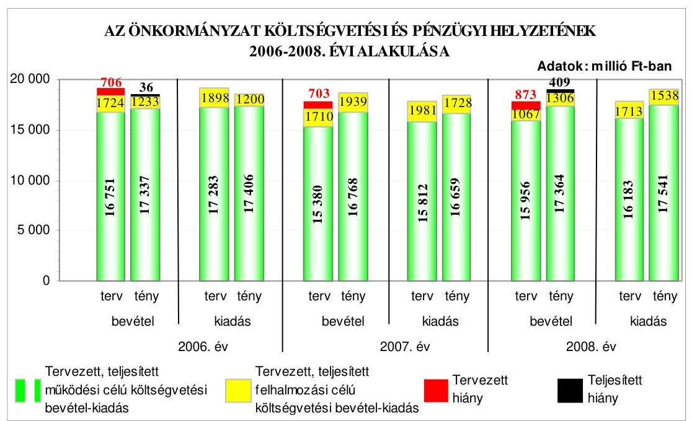

---

A teljesített költségvetési bevételek főösszegének 2006-ról 2007-re történt növekedése mellett a teljesített költségvetési kiadások főösszege csökkent, majd a 2008. évre a költségvetési bevételek csökkenésével szemben a költségvetési kiadások növekedtek. A pénzügyi egyensúly a 2006. és a 2008. években nem volt biztosított, mivel a teljesített költségvetési bevételek és kiadások egyenlege pénzügyi hiányt mutatott. Hiányzó forrás a 2006. évben a teljesített működési célú költségvetési kiadásoknál volt, a 2008. évben pedig mind a működési, mind a felhalmozási célú teljesített költségvetési kiadások meghaladták a teljesített, azonos célú költségvetési bevételeket. A 2007. évben a költségvetés végrehajtása során a pénzügyi egyensúly megvalósult, költségvetési többlet elérését tették lehetővé a működési és felhalmozási célú költségvetési bevételek kiadásokhoz viszonyított túlteljesítései. Az Önkormányzat a költségvetések végrehajtása során a 2006-2007. években tervezett rövid- és hosszú lejáratú hiteleket nem vette igénybe, a Közgyűlés döntése alapján a 2007. év közben 3000 millió Ft értékű, svájci frank alapú, 20 éves futamidejű, felhalmozási célú kötvényt bocsátott ki, amely a forint svájci frankhoz viszonyított árfolyamváltozása és a változó kamatmérték miatt kockázatot jelentett az Önkormányzat számára.

Az Önkormányzat a 2006-2008. években az évközi likviditás biztosítása érdekében folyószámlahitelt vett fel. A 2006-2008. évi költségvetések végrehajtása során érvényesített - a hiánykezelési tervekben foglalt - bevételnövelő és kiadáscsökkentő intézkedések ellenére a folyószámlahitel igénybevétele folyamatos volt, tényleges, átlagos állománya és az év végén fennálló folyószámlahitel összege folyamatosan emelkedett. A folyószámlahitel mellett a 2007-2008. években munkabér-megelőlegezési hitelt is igénybe vettek, amelynek a 2008. év végén vissza nem fizetett állománya is volt. A bevételek növelésére és a kiadási megtakarításokra irányuló intézkedésekkel a költségvetések végrehajtása során a tervezett költségvetési hiány a 2006. és a 2008. években a tervezetthez képest csökkent, a 2007. évben a költségvetési bevételek és kiadások egyensúlyban voltak, az évközi többletbevételeket a tervezett hiány csökkentésére fordították. A 2007. évben kibocsátott kötvényből származó bevételt a tervezett fejlesztési feladatok megvalósításáig - az európai uniós pályázatok saját erőként történő felhasználásáig - 2007-ben értékpapírokban, majd azok lejáratát követően 2008-ban folyamatosan, különböző összegekben és időtartamokra lekötött betétben helyezték el. A kötvény bevételéből a gazdasági program ${ }_{2}$-ben tervezett feladatok finanszírozásához 2008-ban 374 millió Ft-ot, 2009. I. negyedévben 206 millió Ft-ot használtak fel.

Az Önkormányzat pénzügyi helyzete eladósodási szempontból 2006-2008 között kedvezőtlenül változott, mivel a hosszú és a rövid lejáratú fizetési kötelezettségek év végi állományának növekedése meghaladta az összes forrás állományának emelkedését. Az Önkormányzat fizetőképessége 2006-2008 között javult, mivel a pénzeszközök 2008. év végi állománya a 2006. év végi állományhoz képest 2,6-szer magasabb arányban nyújtott fedezetet a rövid lejáratú kötelezettségekre. Az Önkormányzat pénzügyi helyzete 2006-2008 között a fizetőképességének javulása ellenére, a kötvénykibocsátás miatti eladósodás növekedés következményeként összességében kedvezőtlenül alakult.

Az Önkormányzat a fejlesztési célkitűzéseit a gazdasági program ${ }_{1,2}$-ben, ágazati, szakmai tervekben, koncepciókban határozta meg. A fejlesztési célkitűzések összhangban voltak az NFT és az ÜMFT intézkedései keretében megjelenő pályázati lehetőségekkel. A Közgyűlés, a Közgyűlés elnöke és az intézményvezetők döntései alapján 2006-2009. I. negyedév között európai uniós és közösségi kezdeményezés támogatására 42 pályázatot nyújtottak be, amelyekből 16 eredményes volt, hét elbírálása folyamatban van, 19 pályázatot tartalmi, formai hibák, szakmai kidolgozatlanság, pályázati források hiánya miatt elutasítottak. A 2003-2005. években benyújtott, nyertes pályázatok közül 14 fejlesztési feladat megvalósulása, illetve pénzügyi elszámolása a 2006-2009. I. negyedévre áthúzódott. Az Önkormányzat 2006-2009. évi költségvetési rendeletei tartalmazták az európai uniós forrást igénylő fejlesztési feladatok kiadási és bevételi előirányzatait, valamint a felhalmozási kiadásokat feladatonként, azonban az Ámr-ben előírtak ellenére a 2006., a 2007. és a 2009. évi költségvetési rendeletekben a többéves kihatással járó feladatok előirányzatait éves bontásban nem mutatták be. A 2009. évi költségvetési rendelet európai uniós támogatással megvalósuló projektek bevételei és kiadásai elkülönített bemutatására szolgáló melléklete egy projekt bevételeit nem tartalmazta. A 2006-2009. I. negyedévben európai uniós forrással támogatott fejlesztési feladatok tényleges kiadásai a tervezett kiadásokhoz viszonyítva 99,0%-ra teljesültek.

Az európai uniós források igénybevételének és felhasználásának feladatait a 2006-2009. I. negyedévben az ügyrend ${ }_{1-3}$-ben, a gazdasági szervezet ügyrendjében, a főjegyzői intézkedésben, valamint a köztisztviselők munkaköri leírásaiban meghatározták. Kijelölték az önkormányzati szintű pályázatkoordinálás, valamint pályázat-nyilvántartás felelősét, előírták a pályázatfigyelést végzők és a döntési, illetve döntés-előterjesztési jogkörrel rendelkezők közötti információszolgáltatási kötelezettséget, valamint a pályázatfigyelés, pályázatkészítés, fejlesztési feladat lebonyolítás, továbbá a folyamatba épített, előzetes és utólagos vezetői ellenőrzés feladatait. Elmaradt a pályázatkészítéssel összefüggő kapcsolattartás és információáramlás rendjének meghatározása, továbbá a fejlesztési feladat lebonyolítása során a kapcsolattartást nem, az információáramlást csak a közbeszerzési feladatok és a beruházási tevékenység vonatkozásában szabályozták. A belső ellenőrzés stratégiai tervét megalapozó kockázatelemzés 2006-2008 között nem terjedt ki az európai uniós forrásokkal támogatott fejlesztési feladatokra, azonban a 2009-2013. évekre szóló stratégiai tervet alátámasztó kockázatelemzés a „pályázati fejlesztések hasznosulása" területet magában foglalta. Az Önkormányzati hivatalban a pályázatfigyelés, pályázatkészítés és fejlesztési feladat lebonyolítás személyi és szervezeti feltételeit kialakították. Külső szervezettel három pályázat elkészítésére kötöttek szerződést, melyben előírták a feladatellátás kötelezettségeit, a külső szervezet és az Önkormányzati hivatal képviselője közötti kapcsolattartást és a felelősség szabályait, valamint az információk átadásának tartalmát, azonban nem határozták meg annak formáját és módját.

A Vámosgyörki Idősek Otthonának akadálymentesítése fejlesztési feladat megvalósítása - a kiviteli terv készítésének elhúzódása miatt - a támogatási szerződésben meghatározott időponthoz képest késve kezdődött, melyet a közreműködő szervezet a projektmenedzser bejelentése alapján tudomásul vett, azonban a projekt műszaki megvalósítása határidőre megtörtént, pénzügyi elszámolása 2009 májusában folyamatban volt. Az
 európai uniós forrást a támogatási szerződésben ütemezettektől eltérően, de a projekt megvalósításával összhangban igényelték, melyet a fejlesztési feladat lebonyolítója koordinált. A

---

közreműködő szervezet a hiánytalanul benyújtott kifizetési kérelmekre 19-23 naptári napon belül a támogatást folyósította. A 2009. évi költségvetési rendeletben biztosították a projekt megvalósításához szükséges saját forrást, és az Önkormányzat gazdálkodásában nem okozott pénzügyi nehézséget a támogatás megelőlegezése. Az Önkormányzati hivatalnál a folyamatba épített, előzetes és utólagos vezetői ellenőrzési feladatok végrehajtása nyomon követhető volt. A belső ellenőrzés a fejlesztési feladat megvalósítását nem vizsgálta, a közreműködő szervezet egy esetben végzett helyszíni ellenőrzést, melynek során hibát, szabálytalanságot nem állapított meg.

Az Önkormányzat a szabályozottság és szervezettség tekintetében 2006-2009. I. negyedéve között összességében eredményesen készült fel az európai uniós források igénybevételére és a várható támogatások felhasználására, mivel az európai uniós forrásokra benyújtott pályázatai a gazdasági program ${ }_{1,2}$-ben, ágazati, szakmai koncepciókban megfogalmazott fejlesztési célkitűzésekhez kapcsolódtak és szabályozták a pályázatfigyelést végzők és a döntési, illetve döntés-előterjesztési jogkörrel rendelkezők közötti információszolgáltatási kötelezettséget, meghatározták a folyamatba épített, előzetes és utólagos vezetői ellenőrzési feladatokat. Az Önkormányzati hivatalon belül kialakították a pályázatfigyelés és - esetenként külső szervezet igénybevételével - a pályázatkészítés, valamint a fejlesztési feladat lebonyolításának szervezeti, személyi feltételeit. A külső szervezettel a pályázatkészítésre kötött szerződésekben a pályázat szakmai és formai követelményeire vonatkozó felelősség szabályait meghatározták, valamint előírták a fejlesztési feladat lebonyolítását végző ellenőrzési kötelezettségeit, azonban a belső ellenőrzési stratégiát megalapozó kockázatelemzés a 2006-2008. években nem, de a 2009. évben kiterjedt az európai uniós forrásokkal támogatott fejlesztési feladatokra.

Az Önkormányzat informatikai stratégiája tartalmazta az informatikai fejlesztés és az e-közigazgatás feladatainak közép- és hosszú távú célkitűzéseit, melynek keretében az e-közigazgatás 1. elektronikus szolgáltatási szintjének megvalósítását tervezték, ahhoz a személyi, szervezeti feltételeket az Önkormányzati hivatalban biztosították. Az Önkormányzat rendeletben kizárta a hatósági ügyek vagy egyes eljárási cselekmények elektronikus ügyintézésének lehetőségét. Az Önkormányzati hivatal az ügyfelek részére az 1. elektronikus szolgáltatási szint követelményeinek megfelelően, a honlapján tájékoztatást nyújt. A főjegyző az önkormányzati honlapon a 2008. évben közzétette a nem normatív, céljelleggel nyújtott, működési támogatások kedvezményezettjeinek nevére, a támogatás céljára, összegére, valamint a támogatási program megvalósítási helyére vonatkozó adatokat, továbbá az Önkormányzat pénzeszközei felhasználásával, az önkormányzati vagyonnal történő gazdálkodással összefüggő, nettó hárommillió Ft-ot elérő vagy azt meghaladó értékű - árubeszerzésre, építési beruházásra, szolgáltatás megrendelésre, vagyonértékesítésre vonatkozó - szerződések típusát, tárgyát, a szerződést kötő felek nevét, a szerződések értékét, valamint a határozott időre kötött szerződések időtartamát. Az Önkormányzat 2008. évi költségvetési beszámolójának szöveges indokolását az Ámr-ben és a Vhr-ben foglaltak szerint közzétették.

A költségvetés tervezési és zárszámadás-készítési folyamatok szabályozottsága összességében alacsony kockázatot jelentett a feladatok szabályszerű végrehajtásában, mivel a főjegyző a pénzügyi irányítási és ellenőrzési ren-

---

szer keretében szabályozta a költségvetés és zárszámadás elkészítésének rendjét. Meghatározta az intézmények részére a költségvetési javaslat összeállításával kapcsolatos követelményeket, kijelölte a tervezési feladatok koordinálásáért felelős személyeket, előírta a számszaki beszámolók belső és a Közgyűlés által meghatározott adatszolgáltatással való összhangjának ellenőrzését. Annak ellenére összességében alacsony volt a kockázat, hogy a főjegyző a szabályozás keretében nem írta elő az intézmények, valamint az Önkormányzati hivatal szervezeti egységei által benyújtott költségvetési igények indokoltságának és teljesíthetőségének ellenőrzését. A költségvetés tervezési és zárszámadáskészítési folyamatban a működésbeli hibák megelőzésére, feltárására, kijavítására kialakított belső kontrollok működésének megbízhatósága összességében kiváló volt, mivel az Önkormányzati hivatalnál a belső szabályozásban foglaltaknak megfelelően ellenőrizték a költségvetési javaslat összeállításával kapcsolatban meghatározott követelmények érvényesülését. A zárszámadás készítés folyamatában ellenőrizték az intézményi mutatószámok megbízhatóságát, az intézményi pénzmaradványok megállapításának szabályszerűségét, az eredeti és módosított előirányzatok, valamint a teljesítési adatok eltérésének indokoltságát. Annak ellenére összességében kiváló volt a belső kontrollok működésének megbízhatósága, hogy - a kontrollok kialakításának hiányában - nem ellenőrizték az intézmények és az Önkormányzati hivatal szervezeti egységei által benyújtott költségvetési igények indokoltságát és teljesíthetőségét.

A gazdálkodási, a pénzügyi-számviteli és a folyamatba épített ellenőrzési feladatok szabályozottsága összességében alacsony kockázatot jelentett a feladatok szabályszerű végrehajtásában, mivel az Önkormányzati hivatal feladatait az ügyrendben szabályozták. A pénzügyi irányítási és ellenőrzési rendszer keretében a főjegyző elkészítette a gazdasági szervezet ügyrendjét, mely részletesen tartalmazta a szervezet feladatait, a vezetők és beosztottak feladat-, hatás- és jogkörét, a FEUVE-val kapcsolatos szabályozást és eljárási rendet az ellenőrzési nyomvonal, a szabálytalanságok kezelésének szabályozása és a kockázatkezelés rendjének elkészítésével biztosította. Annak ellenére összességében alacsony volt a kockázat, hogy a főjegyző az Önkormányzati hivatal ellenőrzési nyomvonalában nem rögzítette az egyes tevékenység elvégzését igazoló dokumentum fellelési helyét a rendszerben, valamint a kockázatkezelési szabályzatban nem határozta meg az Önkormányzati hivatalban elfogadható kockázati szinteket. Az Önkormányzat 2009. júliusi ülésén a tevékenység elvégzését igazoló dokumentum rendszerben történő fellelési helyének meghatározásával kiegészítette az ellenőrzési nyomvonalat.

Az Önkormányzati hivatalban a külső szolgáltatók által végzett karbantartási, kisjavítási munkákkal, a gépek, berendezések, felszerelések beszerzéseivel, valamint az államháztartáson kívülre történő működési és felhalmozási célú pénzeszközátadásokkal kapcsolatos kifizetések során a pénzügyi-gazdálkodási folyamatokban kialakított belső kontrollok nem működtek megbízhatóan. A szakmai teljesítésigazolás és az utalvány ellenjegyzés működésének megbízhatósága gyenge volt, mert a kiadások teljesítését megelőzően azok jogosultságának, összegszerűségének ellenőrzését, valamint a szerződések, megrendelések szakmai teljesítésének igazolását a főjegyző által kijelölt személyek nem végezték el, illetve a főjegyző kijelölésével nem rendelkező személyek látták el. Az utalványok ellenjegyzése során a főjegyző, illetve az általa felhatal-

---

mazott személyek nem győződtek meg arról, hogy az utalványozás nem sérti-e a gazdálkodásra - köztük a kötelezettségvállalások írásba foglalására és azok ellenjegyzésére, valamint a kötelezettségvállalási jogosultságra - vonatkozó, az Ámr-ben és a pénzgazdálkodási hatáskörök szabályzatában rögzített szabályokat, továbbá nem kifogásolták a szakmai teljesítésigazolás elmaradását, illetve a főjegyző kijelölésével nem rendelkező személyek által végzett szakmai teljesítésigazolásokat.

Az Önkormányzati hivatalban a pénzügyi-számviteli feladatoknál alkalmazott informatikai rendszerek működésének szabályozottsága összességében alacsony kockázatot jelentett a feladatok megfelelő, szabályszerű végrehajtásában, mivel a főjegyző elkészítette az Önkormányzati hivatal katasztrófa elhárítási tervét, szabályozta a pénzügyi-számviteli szoftverek hozzáférési jogosultságának, az egyedi felhasználónév és jelszó használatának, továbbá a pénzügyi-számviteli szoftverek mentésének eljárásrendjét. Annak ellenére összességében alacsony volt a kockázat, hogy a pénzügyi-számviteli rendszerből lekérhető ellenőrzési lista (napló) vizsgálatáért felelős dolgozót nem jelölték ki. Az Önkormányzati hivatalnál a pénzügyi-számviteli feladatok ellátásánál alkalmazott informatikai rendszer működésénél kialakított belső kontrollok megbízhatósága jó volt, mivel biztosították a hozzáférési jogosultság nyilvántartásának vezetését, ellenőrzési lehetőségét, a pénzügyi-számviteli szoftverek változáskezelési eljárásainak ellenőrzését, azonban nem végezték el a katasztrófa elhárítási terv kétévenkénti tesztelését, és az előírások ellenére nem követelték meg a jelszavak használatára előírt szabályok betartását, amely hiányosságok az informatikai rendszerek kontrolljainak megbízható működését nem veszélyeztették.

A belső ellenőrzés szervezeti kereteinek kialakítása és szabályozása a belső ellenőrzési feladatok megfelelő, szabályszerű végrehajtásában összességében alacsony kockázatot jelentett, mivel a feladat ellátásának módját és az eljárásrendet az előírásoknak megfelelően szabályozták, belső ellenőrzési egységet hoztak létre öt fő létszámmal, a főjegyző által jóváhagyott belső ellenőrzési kézikönyvvel rendelkeztek. Annak ellenére összességében alacsony volt a kockázat, hogy a 2008. évi belső ellenőrzési terveket alátámasztó kockázatelemzés nem terjedt ki az Önkormányzati hivatalra - amelyet a 2009. évben elkészítettek -, az önkormányzati intézményeknél az európai uniós forrásból megvalósított feladatok végrehajtására, a közbeszerzési eljárások lebonyolítására, amely területekre vonatkozó kockázatelemzést az intézmények esetében a 2009. évi belső ellenőrzési terv sem tartalmazott. A belső ellenőrzés működésénél kialakított kontrollok megbízhatósága jó volt, az Ötv-ben foglaltaknak megfelelően létrehozták a belső ellenőrzési egységet, az elvégzett (terv szerinti és soron kívüli) ellenőrzésekkel, az intézkedések kezdeményezésével és a javaslatok realizálásának ellenőrzésével a belső ellenőrzés hozzájárult a működésbeli hibák megelőzéséhez, feltárásához, kijavításához. A főjegyző teljesítette nyilatkozattételi kötelezettségét és értékelte a belső kontrollok működését. A Közgyűlés elnöke a költségvetési szervek éves ellenőrzési jelentései alapján készített 2007. és 2008. évi összefoglaló jelentéseket a Közgyűlés elé terjesztette. A 2008. évben - a belső ellenőri kapacitás csökkenése miatt - elmaradt az Önkormányzati hivatalnál a működési és felhalmozási célú pénzeszközátadások államháztartáson kívülre teljesített kifizetéseivel kapcsolatos számadások alapján a rendeltetés szerinti felhasználásra, a közbeszerzési eljárások, valamint a pénz- és értékkezelés rend-

---

jének szabályszerűségére irányuló vizsgálat, továbbá három intézmény „rendszerellenőrzése”. Az ellenőrzések elmaradása nem veszélyeztette, hogy a belső ellenőrzés megelőzze, feltárja, kijavíttassa a lényeges hibákat és szabálytalanságokat. A 2009. évi belső ellenőrzési tervben előírták az államháztartáson kívülre teljesített pénzeszközátadások rendeltetés szerinti felhasználásának ellenőrzését, a közbeszerzési eljárások vizsgálatát, egy intézmény „rendszerellenőrzését”. A 2009. évi belső ellenőrzési tervben az I. negyedévre ütemezett feladatokat megvalósították.

Az Önkormányzat gazdálkodási rendszerének 2006. évi átfogó ellenőrzése során az ÁSZ 24 szabályszerűségi és három célszerűségi javaslatot tett. A javaslatok realizálása érdekében a főjegyző - a felelősöket és a határidőket tartalmazó - intézkedési tervet készített, amit a Közgyűlés elfogadott. Az ÁSZ ellenőrzés által tett javaslatok közül 21 hasznosult, kettő részben, négy pedig nem valósult meg. A végrehajtott javaslatok a költségvetési rendelet tartalmára, a költségvetési rendeletmódosítás határidejének betartására, a jóváhagyott előirányzatokon belüli gazdálkodásra, a pénzügyi-számviteli feladatellátás szabályozottságára, a részesedések év végi értékelésére, a vagyon térítésmentes átadása eseteinek és módjának meghatározására, az ingatlanértékesítés nyilvánosságának biztosítására, a céljelleggel nyújtott támogatások szabályszerűsége érdekében szükséges intézkedések megtételére, továbbá a közbeszerzési eljárások lefolytatására, az akadálymentesítés megvalósítására vonatkoztak. Részben érvényesítették a zárszámadás előterjesztésekor tájékoztatásul bemutatandó kimutatásokkal kapcsolatos javaslatot, mivel az Önkormányzat 2006. évi zárszámadási rendelettervezete tartalmazta a vagyonkimutatást, csatolták a közvetett támogatásokat tartalmazó kimutatást szöveges indoklással, azonban a többéves kihatással járó döntések számszerűsítését évenkénti bontásban és összesítve - az Áht. előírása ellenére - nem mutatták be, az intézmények 2006. évi számszaki beszámolójának elfogadásáról írásban értesítést küldtek, működésük elbírálása azonban az Ámr-ben előírtak ellenére nem történt meg.

Nem hasznosult a főjegyző részére az Önkormányzat pénzállományának alakulását tartalmazó likviditási terv aktualizálására vonatkozó javaslat, mivel az Ámr. előírása ellenére a 2007-2008. évi költségvetési rendeletek módosításakor a likviditási tervet nem módosították, valamint a Kbt. előírása ellenére nem valósult meg a közbeszerzési eljárásokban megkötött szerződések módosításának és teljesítésének határidőben történő közzétételére, továbbá a közbeszerzési eljárások belső ellenőrzés keretében történő vizsgálatára vonatkozó javaslat. Az Önkormányzat a Kbt. előírása ellenére kettő közbeszerzési eljárásban nem tartotta be a szerződés teljesítésére vonatkozó közzététel határidejét, ezért az ÁSZ jogorvoslati eljárás indítását kezdeményezte a KDB-nél, amely a jogsértést megállapította. A munka színvonalának javítása érdekében tett javaslatokat hasznosították, a leltározási és leltárkészítési, valamint pénzkezelési szabályzatokat a főjegyző módosította, és kialakították a pályázati tevékenység koordinálásának rendjét.

Az Önkormányzatnál 2006-2008 között a Magyar Köztársaság 2006. évi költségvetése végrehajtásának ellenőrzése keretében az önkormányzatok beruházásaihoz és rekonstrukcióhoz nyújtott felhalmozási célú támogatások felhasználásának vizsgálatáról készített ellenőrzési jelentésben az
 ÁSZ a főjegyzőnek kettő célszerűségi javaslatot tett. A főjegyző intézkedett a cél- és címzett támogatással, illetve más hazai vagy uniós támogatással megvalósult beruházások komplex értékelésére és belső ellenőrzés keretében történő vizsgálatára. A szakiskolai fejlesztési programra fordított pénzeszközök felhasználása eredményességének ellenőrzéséről készített jelentésben az ÁSZ négy célszerűségi javaslatot tett, amelyekből három hasznosítására intézkedtek. A pályázatokkal kapcsolatos intézményi adatszolgáltatás rendjét szabályozták, a végzett, pályakezdő fiatalok pályakövetési rendszerét kialakították, az intézmények pozícióváltozása elemzését és az elemzés eredményének az Oktatási és Művelődési bizottság elé terjesztését előírták.

Az Önkormányzatnál a 2006-2008. években végzett ÁSZ ellenőrzések javaslatai összességében 79%-ban hasznosultak, 6%-ban részben, 15%-ban nem teljesültek. Az Önkormányzat gazdálkodási rendszerének 2006. évi átfogó ellenőrzése és a zárszámadáshoz, valamint a szakiskolai fejlesztési programra fordított pénzeszközök felhasználása eredményességének ellenőrzéséhez kapcsolódó ellenőrzések javaslatainak végrehajtása eredményeként javult a költségvetés készítés rendje, az Önkormányzat gazdálkodásának szabályozottsága és szabályszerűsége, a pályázatokkal kapcsolatos intézményi adatszolgáltatás rendje.

A helyszíni ellenőrzés megállapításainak hasznosítása mellett javasoljuk:

# a Közgyűlés elnökének 

a munka színvonalának javítása érdekében
kezdeményezze, hogy a számvevőszéki jelentésben foglaltakat a Közgyűlés tárgyalja meg;

## a főjegyzőnek

a munka színvonalának javítása érdekében
1. írja elő az európai uniós források igénybevétel és felhasználása során
a) a pályázatkészítés és a fejlesztési feladat lebonyolítása vonatkozásában a kapcsolattartás és információáramlás rendjét;
b) az európai uniós pályázatok készítésére kötött szerződésekben a feladattal megbízott külső szervezet és az Önkormányzati hivatal képviselője közötti információátadás formáját és módját;
2. intézkedjen az informatikai rendszer szabályozottságának biztosítása és a kialakított belső kontrollok működtetése érdekében
a) a pénzügyi-számviteli rendszerből lekérhető ellenőrzési lista (napló) vizsgálatáért felelős dolgozó kijelölésére, és a vizsgálat lefolytatására;
b) a jelszavak használatára előírt szabályok betartására.

---

# II. RÉSZLETES MEGÁLLAPÍTÁSOK 

## 1. AZ ÖNKORMÁNYZAT KÖLTSÉGVETÉSI ÉS PÉNZÜGYI HELYZETE

### 1.1. A tervezett költségvetési bevételek és kiadások alapján a költségvetési egyensúly, a költségvetési hiány oka, finanszírozásának tervezett módja és a költségvetési hiány megállapításának szabályszerűsége

Az Önkormányzatnál a 2006-2009. években tervezett költségvetési bevételek főösszege az előző évhez viszonyítva folyamatosan - 18475 millió Ftról 10714 millió Ft-ra - csökkent. A költségvetési kiadások főösszege a 2006. évi 19181 millió Ft-ról 2009-re 10557 millió Ft-ra csökkent, amely azonban nem volt folyamatos, mivel az előző évhez képest a 2007. évben 7,2%-kal csökkent, a 2008. évben 0,6%-kal növekedett, majd a 2009. évben a csökkenés 41,0%-os volt. A költségvetési bevételek és kiadások főösszegének előző évhez viszonyított 2007-2009 közötti változásához hozzájárult 2007-ben az Illetékhivatal APEH-nak történt átadása, a 2009. évben a Kórház vagyonkezelésbe adása $^{10}$.

Az Önkormányzatnál a 2006-2008. években a költségvetési egyensúly nem volt biztosított, mivel a tervezett költségvetési bevételek egyik évben sem nyújtottak fedezetet a tervezett költségvetési kiadásokra, a tervezett költségvetési hiány költségvetési kiadásokhoz viszonyított részaránya a 2006. évi 3,7%-ról a 2008. évre 4,9%-ra emelkedett. A 2009. évi költségvetési rendeletben a költségvetési egyensúlyt biztosították, a tervezett költségvetési bevételek főösszege 157 millió Ft-tal meghaladta a tervezett költségvetési kiadások főösszegét. A 2006-2008. évi költségvetési rendeletekben a működési célú költségvetési kiadásoknál hiányzó forrással számoltak, a tervezett működési célú költségvetési bevételek nem nyújtottak fedezetet a működési célú költségvetési kiadásokra, a tervezett felhalmozási célú költségvetési kiadások meghaladták a tervezett felhalmozási célú költségvetési bevételek előirányzatát $^{11}$.

[^0]
[^0]:    $^{10}$ Az Illetékhivatal átadása miatt a 2007. évi működési célú költségvetési kiadások a 2006. évhez képest 275 millió Ft kiadási előirányzat csökkenést, a Kórház 2008. november 1-től történő vagyonkezelésbe adása az Önkormányzat 2009. évi költségvetése bevételi főösszegét 6045 millió Ft-tal, a kiadási főösszegét 6510 millió Ft-tal csökkentette az előző évhez viszonyítva.
    $^{11}$ A 2006-2008. években tervezett működési célú költségvetési bevételek működési célú költségvetési kiadásokhoz viszonyított hiánya 532-432-227 millió Ft, a tervezett felhalmozási célú költségvetési kiadások felhalmozási célú költségvetési bevételekhez viszonyított többlete 174-271-646 millió Ft volt.

---

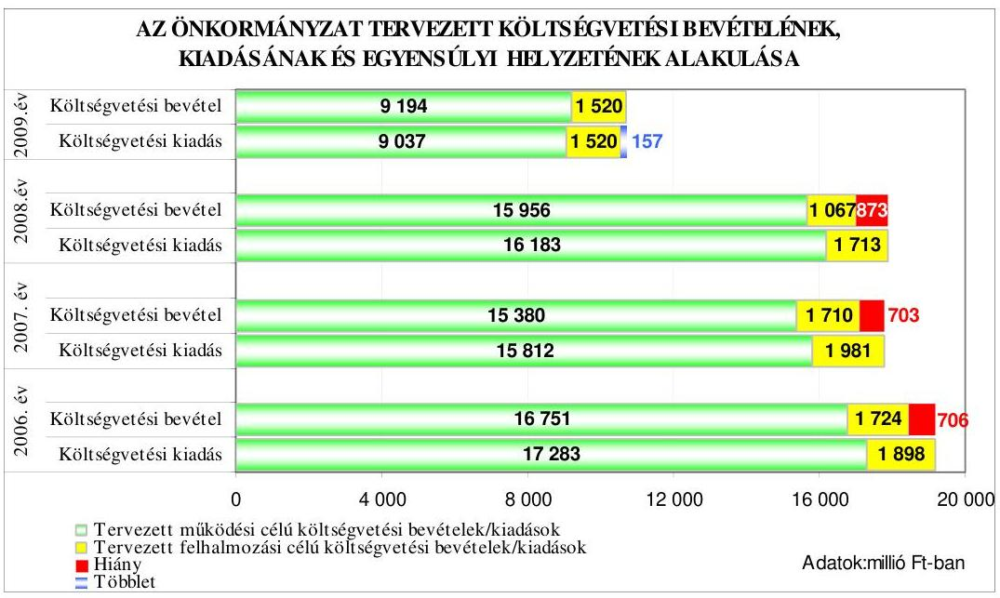

Az Önkormányzat a 2006-2009. évek költségvetési rendeleteiben a költségvetési egyensúly biztosításához a 2006-2009. években rövid lejáratú likvid hitel és a 2006-2007. években hosszú lejáratú, fejlesztési célú hitel felvételét, valamint a 2008. évben forgatási célú értékpapírok értékesítését, továbbá a költségvetési rendeletek meghozatalával egyidejúleg a működési és felhalmozási célú költségvetési bevételt növelő és kiadást csökkentő egyéb intézkedések $^{12}$ megtételét tervezte.

A Közgyűlés - a 2006-2009. években - a működési célú költségvetési bevételek növelése érdekében az intézményi térítési díjak önköltséget közelítő megállapításáról, a kintlévőségek hatékonyabb behajtásáról, „a helyi önkormányzatok működőképességének megőrzését szolgáló kiegészítő támogatások" igénybevételére szóló pályázat benyújtásáról, a szabad pénzmaradványoknak a hiány, illetve hitel csökkentésére történő felhasználásáról, a felhalmozási célú költségvetési bevételek növelésére önkormányzati ingatlanok (Kórház Baktai úti telephelye, a Parádfürdő Idősek Otthona beruházással kiváltandó épülete) hasznosításáról, a központi költségvetési és európai uniós források elnyerése érdekében pályázatok benyújtásáról, továbbá a vagyonhasznosítás során az inflációs hatások bérleti díjakban történő érvényesítéséről döntött.

A Közgyűlés a működési célú költségvetési kiadások csökkentésére 2006-ban az intézményi költségvetési támogatások 2%-ának (125 millió Ft) tartalékba helyezéséről, 2007-ben az intézmények gazdasági és szakmai integrációja miatt az önálló gazdálkodási jogkörű költségvetési intézmények számának 37-ről 14-re módosításáról, továbbá 76,5 fő létszámcsökkentésről határozott, amelyhez kapcsolódóan a 2008. évre 151 millió Ft költségvetési kiadás-megtakarítást terveztek.

A főjegyző a 2006-2009. években a költségvetés tervezése során a költségvetés végrehajtása, a folyamatos likviditás biztosítása érdekében folyószámla hitel-

[^0]
[^0]:    $^{12}$ A Közgyűlés a bevételnövelő, kiadáscsökkentő intézkedéseiről a 20/2006. (II. 24.), a 9/2007. (II. 23.), a 11/2008. (II. 29.) és a 17/2009. (II. 29.) számú határozataiban döntött.

---

keretet tervezett, valamint az Ámr. 139. § (1) bekezdésében foglaltaknak megfelelően a pénzállomány alakulását bemutató likviditási tervet készített.

Az ÁSZ 2006. évi ellenőrzési javaslatainak eleget téve a 2007. évi költségvetési rendeletben a költségvetési bevételek és kiadások főösszegeinek megállapításakor nem számoltak el finanszírozási célú pénzügyi műveleteket költségvetési hiányt módosító költségvetési kiadásként. A 2008. évi költségvetési rendeletben a költségvetési bevételek főösszegének megállapításakor az Áht. 8/A. § (7) bekezdésében előírtakat megsértve finanszírozási célú pénzügyi műveleteket (647 millió Ft összegű értékpapírok értékesítéséből tervezett bevételt) vettek figyelembe költségvetési hiányt módosító költségvetési bevételként. A 2008-2009. évi költségvetési rendeletekben a költségvetési bevételek és kiadások különbségeként a költségvetési hiány, illetve költségvetési többlet összegeit $^{13}$ az Áht. 8. § (1) bekezdésében foglaltakat megsértve nem mutatták be, melynek következtében az Áht. 8/A. § (1) bekezdésében foglaltakat megsértve, a 2008. évben a költségvetési hiány finanszírozásának módjáról, a 2009. évben a költségvetési többlet felhasználásáról nem rendelkeztek $^{14}$.

# 1.2. A teljesített költségvetési bevételek és kiadások alapján a pénzügyi egyensúly, a pénzügyi hiány oka, finanszírozásának módja és hatása a pénzügyi helyzet alakulására az eladósodás, valamint a fizetőképesség szempontjából 

Az Önkormányzatnál a 2006-2008. évek között a teljesített költségvetési bevételek főösszege 18571 millió Ft-ról 18670 millió Ft-ra, a költségvetési kiadások főösszege 18607 millió Ft-ról 19079 millió Ft-ra növekedett, azonban a növekedés nem volt folyamatos. Az előző évhez képest a teljesített költségvetési bevételek főösszege 2007-ben 0,7%-kal nőtt, 2008-ban 0,2%-kal csökkent, míg a teljesített költségvetési kiadások főösszege 2007-re 0,2%-kal csökkent, 2008-ra 3,8%-kal emelkedett.

A pénzügyi egyensúly a 2006. és a 2008. években nem volt biztosított, mivel a teljesített költségvetési bevételek és kiadások egyenlege pénzügyi hiányt mutatott. Hiányzó forrás a 2006. évben a teljesített működési célú költségvetési kiadásoknál volt, a 2008. évben pedig mind a működési, mind a felhalmozási célú teljesített költségvetési kiadások meghaladták a teljesített, azonos célú költségvetési bevételeket. A 2007. évben a költségvetés végrehajtása során a pénzügyi egyensúly megvalósult, költségvetési többlet elérését tették le-

[^0]
[^0]:    $^{13}$ A költségvetési bevételek és kiadások különbsége a 2008. évben 873 millió Ft költségvetési hiány, a 2009. évben 157 millió Ft költségvetési többlet volt.
    $^{14}$ A közbenső egyeztetés során a Közgyűlés elnöke írásban adott tájékoztatása szerint a főjegyző a Pénzügyi irodavezető figyelmét levélben hívta fel, hogy a költségvetési rendelettervezetben a költségvetési bevételek és kiadások főösszegei ne tartalmazzanak finanszírozási célú bevételeket és kiadásokat, a költségvetési bevételek és kiadások különbözeteként mutassa be a tervezett költségvetési hiányt vagy többletet, továbbá határozza meg a költségvetési hiány finanszírozásának, illetve költségvetési többlet felhasználásának módját.

---

hetővé a működési és felhalmozási célú költségvetési bevételek kiadásokhoz viszonyított túlteljesítései.
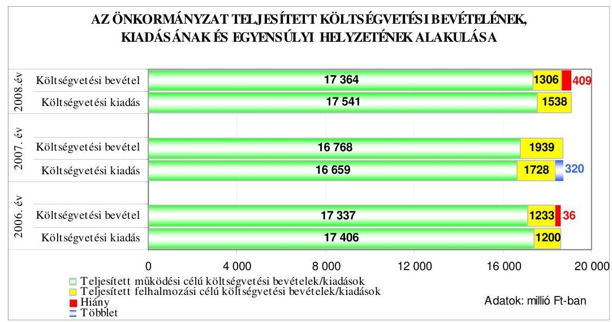

A költségvetési kiadások főösszegének költségvetési bevételekből való fedezettsége a 2006-2008. években a tervadatok alapján nem volt biztosított, 2009-ben a tervezett működési és felhalmozási célú bevételek fedezték a költségvetési kiadásokat. A teljesített költségvetési kiadások költségvetési bevételekből történt fedezettsége a 2006. évhez képest a 2007. évben 1,9 százalékponttal erősödött, a 2008. évben 1,9 százalékponttal romlott.

Az Önkormányzatnál a 2006-2009. években tervezett és a 2006-2008. években teljesített működési és felhalmozási célú költségvetési kiadásokra a következő arányban biztosítottak fedezetet a költségvetési bevételek:

Adatok: %-ban

| Megnevezés | 2006.   év |  | 2007.   év |  | 2008.   év |  | 2009.   év |
| :--: | :--: | :--: | :--: | :--: | :--: | :--: | :--: |
|  | Terv | Tény | Terv | Tény | Terv | Tény | Terv |
| Működési célú költségvetési kiadások fedezettsége működési célú költségvetési bevételekből | 96,9 | 99,6 | 97,3 | 100,7 | 98,6 | 99,0 | 101,7 |
| Felhalmozási célú költségvetési kiadások fedezettsége felhalmozási célú költségvetési bevételekből | 90,8 | 102,7 | 86,3 | 112,2 | 62,3 | 84,9 | 100,0 |
| Költségvetési kiadások fedezettsége költségvetési bevételekből | 96,3 | 99,8 | 96,0 | 101,7 | 95,1 | 97,9 | 101,5 |

A teljesített költségvetési kiadási főösszegre vonatkozó fedezettségi mutató a 2006-2008. években a tervezetthez viszonyítva javult a mú-

---

ködési és felhalmozási célú költségvetési kiadások azonos célú bevételekkel történt fedezettségének tervezetthez képest kedvezőbb alakulása eredményeként. A 2006-2008. években nem tervezett felhalmozási célú költségvetési bevételek, átvett pénzeszközök $^{15}$, önkormányzati vagyonértékesítési, felhalmozási célú költségvetési támogatási és a felhalmozási célra képzett, korábbi évek tartalékaiból igénybevett többletbevételek $^{16}$ teljesültek. A felhalmozási célú költségvetési kiadások fedezettségi mutatója a 2006-2008. évi tervezetthez viszonyítva javult, mivel a tervezett beruházások műszaki és/vagy pénzügyi teljesítéseinek elhúzódása miatt a felhalmozási célú költségvetési kiadások teljesített összegei elmaradtak a tervezettől $^{17}$. A 2006-2008. években a költségvetési rendeletek eredeti előirányzatainak kialakításánál tervezték az előző évi pénzmaradvány igénybevételét, amely az előző évről áthúzódó kötelezettségek előirányzataira is fedezetet biztosított $^{18}$.

Az Önkormányzatnál a 2006-2008. években a költségvetés végrehajtása során a költségvetési hiány csökkentése érdekében a tervezett finanszírozási célú pénzügyi műveleteken kívül - a Közgyűlés által évenként elfogadott hiánykezelési tervekben rögzítettek alapján - a költségvetési bevételek
 növelését és a kiadások csökkentését eredményező intézkedéseket valósítottak meg.

Az Önkormányzat a hiánykezelési tervben foglaltaknak megfelelően „a helyi önkormányzatok működőképességének megőrzését szolgáló kiegészítő támogatások"-ra pályázott, amelyekből a 2006. évben 35 millió forint ${ }^{19}$, a 2007-2008. években 100-150 millió $\mathrm{Ft}^{20}$ támogatást nyert, valamint a 2006. évben zároltak és tartalékba helyeztek az intézmények támogatásából 125 millió Ft-ot, továbbá a 2007. évi intézményi szervezet-átalakítás és ezzel összefüggő létszámcsökkentés hatására a 2008. évben 210 millió Ft kiadási megtakarítást értek el. A Kórház vagyonkezelési jog átadásból és készleteinek értékesítéséből 202 millió Ft, az illetékbevételekből 111 millió Ft többletbevételt realizáltak a 2008. évben. A 2008. évben el-

[^0]
[^0]:    ${ }^{15}$ Az intézmények szakképzési hozzájárulásai, alapítványoktól, vállalkozásoktól eszközbeszerzésre a 2006-2008. években átvett pénzeszközök teljesítése 34-31-60 millió Fttal haladták meg az eredeti előirányzatot.
    ${ }^{16}$ Az Önkormányzatnak a tervezetthez képest a 2006. és a 2008. években az ingatlanértékesítésekből 35-31 millió Ft, 2006-2008 között az önkormányzati költségvetési támogatások felhalmozási célú részéből 181-156-31 millió Ft, a korábbi évek tartalékainak felhalmozási célú igénybevételéből 40-82-27 millió Ft felhalmozási célú költségvetési bevételi többlete volt.
    ${ }^{17}$ A 2006-2008. évi beruházásokra fordított kiadások a tervezetthez képest 614-212-160 millió Ft-tal alacsonyabb összegben teljesültek.
    ${ }^{18}$ A 2008. évben az előző évi pénzmaradvány-igénybevétel 454 millió Ft-ban tervezett összege 79 millió Ft-tal - a Kórház Országos Egészségbiztosítási Alaptól kapott előfinanszírozási összegével - alacsonyabb volt a 2007. évi módosított pénzmaradvány összegétől. Az éves költségvetési rendeletek tervezetében - a kialakult gyakorlat alapján - az előző évi pénzmaradvány igénybevételét az előző évi záró pénzkészlet összegével tervezték meg.
    ${ }^{19}$ Az Önkormányzat önhibájukon kívül hátrányos helyzetben lévő helyi önkormányzatok támogatásából 30 millió forint és a Belügyminisztérium külön keretéből ötmillió forint támogatásban részesült.
    ${ }^{20}$ Az Önkormányzat a működésképtelen helyi önkormányzatok egyéb támogatásából részesült.

---

ért többletbevételek hiánycsökkentő hatását mérsékelte a Kórház vagyonkezelésbe adásával kapcsolatosan felmerült, nem tervezett 440 millió Ft személyi jellegű (végkielégítés, munkáltatói járulékok, passzív táppénz) működési célú költségvetési kiadás.

Az Önkormányzat a 2006-2008. években realizált többletbevételeket és a kiadások csökkentésére tett intézkedések eredményeként elért kiadási megtakarításokat a tervezett költségvetési hiány csökkentésére fordította.

Az Önkormányzat a költségvetés végrehajtása során a pénzügyi helyzet alakításához, a fizetőképesség fenntartásához a 2006-2007. években a tervezett rövid- és hosszú lejáratú hiteleket nem vette igénybe, a gazdasági progra $\mathrm{m}_{2}$-ben meghatározott fejlesztési feladatok megvalósításához és az európai uniós pályázatokhoz szükséges saját forrás biztosítása érdekében a 2007. évben - a Közgyűlés év közben hozott döntése alapján ${ }^{21}$ - 3000 millió Ft értékű felhalmozási célú kötvényt bocsátott ki. A zártkörű forgalomba hozatallal, névre szóló, egy svájci frank névértékű, összesen 19853088 svájci frank névértékű dematerializált kötvényt 20 év futamidőre, 2007. december 20-i értéknappal bocsátották ki. A kibocsátott kötvény változó kamatozású, a kamat mértéke 3 havi CHF LIBOR ${ }^{22}+0,90 \%$, a kamatfizetés negyedévente, első ízben 2008. március 31-én volt esedékes. A svájci frank alapú kötvények - amelyeket kibocsátásukkor azonnal 3000 millió Ft összegben írtak jóvá az Önkormányzat folyószámláján - lejárata 2027. december 20-a, a tőke visszafizetése három év türelmi idő után 2011. év első negyedév végén esedékes, negyedévente 291957 svájci frank összegben. Az Önkormányzatnál a visszavásárlás fedezetéül öt darab ingatlan 2008-2011 között történő értékesítését jelölték meg, amelyek becsült értékesítési árát szakértői vélemény alapján vették figyelembe ${ }^{23}$. A forint svájci frankhoz viszonyított árfolyamváltozása, valamint a változó kamatérték miatt az Önkormányzat számára a kötvénykibocsátás kockázatot jelentett ${ }^{24}$.
${ }^{21}$ A Közgyűlés a 173/2007. (XI. 30.) számú határozatában döntött a „Heves Megye 2027" elnevezéssel kibocsátandó, névre szóló, 3000 millió Ft névértékű, dematerializált kötvény egy részletben történő kibocsátásáról, a döntés megalapozása céljából összehasonlították a kötvénykibocsátás és a hitelfelvétel kockázatát, továbbá számításokat végeztek a kötvény visszavásárlásának fedezetére vonatkozóan.
${ }^{22}$ LIBOR: a London Interbank Offered Rate (londoni bankközi kamatláb) egy kamatláb, amelyet a bankok számolnak fel egymásnak a londoni bankközi piacon az általuk nyújtott hitelek után. CHF LIBOR: kamatláb svájci frankban nyújtott hitelek után a londoni bankközi piacon.
${ }^{23}$ Parádfürdői Idősek Otthona felszabaduló épülete, Kórház mosoda és az Eger, Széchenyi u. 47. szám alatti ingatlan értékelését ingatlanforgalmi igazságügyi szakértő végezte 2006-2007-ben, a Kórház Eger, Baktai u. 37. szám, és Széchenyi u. 27-29. szám alatti ingatlanokat független könyvvizsgálóval értékeltette az Önkormányzat 2007-ben.
${ }^{24}$ A közbenső egyeztetés során a Közgyűlés elnöke írásban adott tájékoztatása szerint „A Közgyűlés tájékoztatása az Önkormányzat adósságállományáról minden beszámolóban eddig is megtörtént és a következő években is folyamatosan történik... a kötvényből származó hozam- és kamatbevételeket is szerepeltetjük a testületi előterjesztések bevételi adatai között. A Pénzügyi Bizottság az igényei szerint még a fentiektől bővebb információkat és számításokat is folyamatosan kap a Pénzügyi Irodától a kötvénnyel kapcsolatos aktuális helyzetről."

---

A kötvénykibocsátásból származó 3000 millió Ft bevételt 2007-ben, a kibocsátás napján egy és három hónapos lejáratú értékpapírokba (tőkegarantált pénzpiaci befektetési jegy, diszkont kincstárjegy) fektették, majd azok 2008. januári, illetve márciusi lejáratát követően folyamatosan, különböző összegekben és időtartamokra lekötött betétben helyezték el. 2008. július 3-án 150 millió Ft-ot 1016949 svájci frankra váltottak át és kötöttek le hat hónapra a kötvénykibocsátó pénzintézetnél, amelynek 2009. január 23-i visszaváltásakor 43,5 millió Ft árfolyamnyereséget realizáltak ${ }^{25}$. A kötvénykibocsátás bevételének befektetéseiből és a betétlekötésekből a 2008. évben az Önkormányzat összesen 176 millió Ft hozam-, illetve kamatbevételt realizált.

A kötvénykibocsátás bevételéből a 2008. évben a fejlesztési feladatok finanszírozásához 374 millió Ft-ot a folyamatban lévő európai uniós támogatással megvalósuló fejlesztési feladatokhoz, valamint különböző pályázatokhoz szükséges saját erő biztosítására, továbbá az intézmények tárgyi feltételeit javító felújításokra, beruházásokra fordított ${ }^{26}$. A lekötött betétben elhelyezett pénzöszszeg 2008. december 31-én 2653 millió Ft volt. A 2009. első negyedévben igénybe vett 206 millió Ft-ot a Buttler-ház megvásárlására (180 millió Ft), illetve az Egri Törökfürdő rekonstrukciójára és az EGYI pétervásárai lakásotthonok akadálymentesítésére fordították.

Az évközi likviditás biztosítása érdekében az Önkormányzat a 2006-2009. évi költségvetési rendeletekben - hitelkeret meghatározásával - folyószámlahitel felvételét engedélyezte a Közgyűlés elnöke számára. A 2006-2009. években a folyószámlahitellel kapcsolatos jellemzőket mutatja be a következő táblázat:
${ }^{25}$ A kötvényből származó bevétel lekötött betétben történő elhelyezéséről és a svájci frankban történő befektetésről minden esetben a Pénzügyi bizottság az SZMSZ 2. számú mellékletében rögzített, átruházott hatáskörében, határozataiban döntött, amelyben felhatalmazta a Közgyűlés elnökét a szükséges intézkedések megtételére, a szerződések aláírására.
${ }^{26}$ Az Önkormányzat a Parádi Idősek Otthona építéséhez, Egri Törökfürdő rekonstrukciójához és a Mátra Múzeum Természettudományi pavilon építéséhez összesen 195,8 millió Ft-ot, valamint különböző pályázatok önerejéhez 82,4 millió Ft-ot, az intézmények tárgyi feltételeit javító felújításokhoz, beruházásokhoz 95,8 millió Ft-ot használt fel.

---

| Megnevezés | $\mathbf{2006.}$   év | $\mathbf{2007.}$   év | $\mathbf{2008.}$   év | $\mathbf{2009.}$   I.   negyedév |
| :-- | :--: | :--: | :--: | :--: |
| A folyószámlahitel keretösszege (mil-   lió Ft-ban) | 1000 | 1200 | 1200 | 1400 |
| Év végén fennálló folyószámlahitel   (millió Ft-ban) | 303 | 572 | 844 | - |
| Folyószámlahitellel zárt napok száma | 365 | 365 | 366 | 90 |
| A ténylegesen felvett folyószámlahitel   átlagos állománya (millió Ft-ban) | 487 | 908 | 699 | 720 |
| A felvett folyószámlahitel minimum   összege (millió Ft-ban) | 15 | 368 | 50 | 495 |
| A felvett folyószámlahitel maximum   összege (millió Ft-ban) | $\mathbf{765}$ | $\mathbf{1042}$ | $\mathbf{1027}$ | $\mathbf{952}$ |

Az Önkormányzat a 2006-2009. években folyószámla hitelkerettel rendelkezett, amelynek összege a 2006. évhez képest a 2009. évre 40\%-kal emelkedett, igénybevétele folyamatos volt. A ténylegesen felvett folyószámlahitel átlagos állománya 2006-2009 között 48\%-kal emelkedett, és az év végén fennálló folyószámlahitel 2006. évi összege a 2008. évre 178\%-kal nőtt, amelyhez a 2008. évben 440 millió Ft-tal hozzájárult a Kórház vagyonkezelésbe adása miatt felmerült többletkiadás.

A folyószámlahitel mellett az Önkormányzat a 2007. évben - április hónaptól - hat alkalommal, összesen 800 millió Ft munkabér-megelölegezési hitelt is igénybe vett, amelyet éven belül visszafizetett, azonban a 2008. év végén vissza nem fizetett állománya volt, az egy alkalommal, november hónapban igénybe vett 200 millió Ft miatt.

Az Önkormányzat hosszú lejáratú kötelezettségének állományi értéke - a könyvviteli mérleg adatai alapján - a 2007-2008. években 3000 millió Ft, illetve 3011 millió Ft volt, amely a kötvénykibocsátásból származó kötelezettségen túl 2008-ban gépkocsi cserék lízingdíjával emelkedett. Adósságszolgálati kötelezettséget az Önkormányzat a 2006-2008. években a rövid lejáratú, illetve folyószámlahitel tartozások, valamint 2008-ban a kötvénykibocsátáshoz kapcsolódó kamatai után teljesített.

Az Önkormányzatnál 2006-2008-ban, az évek sorrendjében, a likvid hiteltörlesztések összegei 217,5-303,0-572,0 millió Ft volt, kamatfizetési kötelezettségre 32,5-68,5-161,0 millió Ft-ot teljesítettek. A 2008. évi 161 millió Ft kamat összegéből 100 millió Ft a kötvénykibocsátáshoz kapcsolódott.

Az Önkormányzat eladósodása 2006-2008 között növekedett, mivel a hosszú és rövid lejáratú fizetési kötelezettségek év végi állományának növekedése meghaladta az összes forrás állományának növekedését. Az eladósodási mutató ${ }^{27}$ a 2006-2008 években 3,5%-os, 16,3%-os és 15,5%-os arányt mutatott, amely 2006-2007 között 12,8 százalékponttal emelkedett a kötvénykibocsátás-

[^0]
[^0]:    ${ }^{27}$ Az eladósodási mutató a hosszú és rövid lejáratú fizetési kötelezettségek önkormányzati összes forráson belüli arányát mutatja.

---

ból származó kötelezettségek növekedése miatt. A mutató 2007-2008 között 0,8 százalékponttal csökkent a Kórház vagyonkezelésbe adásával összefüggő - az áruszállításból, szolgáltatásból eredő 566 millió Ft-ot kitevő - rövid lejáratú kötelezettségek csökkenésének és az Önkormányzat előző évhez képest (472 millió Ft-tal) magasabb 2008. év végi rövid lejáratú hitelállományának együttes hatására.

A 2006. év végéhez viszonyítva a 2008. év végére a hosszú és rövid lejáratú kötelezettségek állományának együttes értéke 840 millió Ft-ról 4175 millió Ft-ra (397\%-kal) emelkedett a hosszú lejáratú kötelezettségek év végi állományának 2007-2008 között bekövetkezett növekedéséből adódóan, ezzel szemben az összes forrás 24312 millió Ft-ról 26942 millió Ft-ra (10,8\%-kal) nőtt.

Az esedékességi aránymutató ${ }^{28}$ a 2006-2008. években folyamatosan csökkent, 100,0%-os, 31,2%-os és 27,9%-os arányt mutatott, mivel a rövid lejáratú kötelezettségek állományának növekedése kisebb mértékű - 38,6% volt, mint az egyéb passzív pénzügyi elszámolások nélkül számított összes fizetési kötelezettség növekedése, ami 397% volt. A rövid lejáratú kötelezettségek év végi
 összegei 2006-2008 közötti időszakban változóan alakultak, az egyes években 840-1360-1164 millió Ft volt, amelynek 2007. évi növekedésében az áruszállításból, szolgáltatásból eredő, 2008-ban az év végén fennálló folyószámlahitel-tartozás volt a meghatározó.

Az eladósodási mutatók 2006-2008 közötti alakulása az Önkormányzat pénzügyi helyzetének eladósodás szempontjából kedvezőtlen változását jelezte, annak ellenére, hogy az esedékességi aránymutató javult.

[^0]
[^0]:    ${ }^{28}$ Az esedékességi aránymutató a rövid lejáratú fizetési kötelezettségek arányát fejezi ki az összes - rövid és hosszú lejáratú - fizetési kötelezettségen belül.

---

Az Önkormányzat fizetőképességének és likviditásának 2006-2008 közötti alakulását mutatja a készpénz likviditási mutató ${ }^{29}$ és likviditási gyorsráta ${ }^{30}$ :
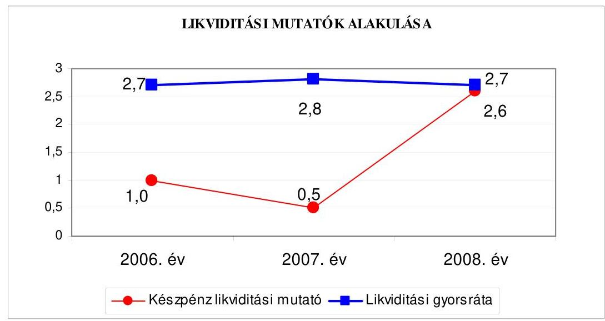

Az Önkormányzat fizetőképessége - 2006-2008 között - évről évre javult, mert a pénzeszközök év végi állománya egyre nagyobb arányban nyújtott fedezetet a rövid lejáratú fizetési kötelezettségek rendezésére. A készpénz likviditási mutató növekedését 2006-2008 között a pénzeszközök év végi állományának ${ }^{31}$ a rövid lejáratú kötelezettségek növekedésének mértékét ${ }^{32}$ meghaladó emelkedése eredményezte. A 2008. évben a kötvénykibocsátásból származó bevételek lekötött betétben történt elhelyezésével a pénzeszközök állománya 2,6-szeres fedezetet nyújtott a rövid lejáratú kötelezettségek teljesítésére.

A 2006. és a 2008. év végén a pénzeszközök mellett a követelések 2,7-szeres fedezetet nyújtottak a rövid lejáratú fizetési kötelezettségek kiegyenlítéséhez. A likviditási gyorsráta a 2007. év végén emelkedett az előző év végéhez képest a kötvénykibocsátás bevételének forgatási célú értékpapírokba történt befektetése következtében, majd a 2008. év végén csökkent a pénzeszközök állományának előző évhez viszonyított - a kötvény bevételéből a fejlesztési feladatokra történt felhasználások eredményeként - alacsonyabb értéke miatt.

A likviditási mutatók 2006-2008 közötti alakulása azt mutatta, hogy az Önkormányzat pénzügyi helyzete fizetési szempontból kedvezően alakult, mivel a pénzeszközök, a hitelviszonyt megtestesítő forgatási célú értékpapírok

[^0]
[^0]:    ${ }^{29}$ A készpénz likviditási mutató kifejezi, hogy a pénzeszközök év végi állománya milyen arányban nyújt fedezetet a rövid lejáratú fizetési kötelezettségekre.
    ${ }^{30}$ A likviditási gyorsráta mutatja, hogy a rövid lejáratú fizetési kötelezettségek kiegyenlítéséhez a pénzeszközökön túl bevonható követelések, forgatási célú értékpapírok milyen arányban nyújtanak fedezetet.
    ${ }^{31}$ A pénzeszközök év végi záró állománya 2006-2008 között 803 millió Ft-ról 3057 millió Ft-ra, 280,7%-kal növekedett.
    ${ }^{32}$ A rövid lejáratú kötelezettségek év végi állománya a 2006. évről a 2008. évre 324 millió Ft-tal (38,6%-kal) növekedett.

---

és a követelések együttes összege mindhárom évben fedezetet biztosított a rövid lejáratú fizetési kötelezettségek pénzügyi teljesítésére. Az Önkormányzat pénzügyi helyzete 2006-2008 között a fizetőképességének javulása ellenére, a kötvénykibocsátás miatti eladósodás következményeként összességében kedvezőtlenül alakult.

# 2. AZ ÖNKORMÁNYZAT FELKÉSZÜLTSÉGE AZ EURÓPAI UNIÓS FORRÁSOK IGÉNYLÉSÉRE ÉS FELHASZNÁLÁSÁRA, VALAMINT AZ ELEKTRONIKUS KÖZSZOLGÁLTATÁSI FELADATOK ELLÁTÁSÁRA 

### 2.1. Az európai uniós források igénybevételére és a várható támogatás felhasználására történt felkészülés szabályozottságának, szervezettségének eredményessége

### 2.1.1. Az európai uniós forrásokra történő pályázatok benyújtására vonatkozó döntések összhangja a fejlesztési célkitűzésekkel

Az Önkormányzat a fejlesztési célkitűzéseit a gazdasági program ${ }_{1-2}$-ben, ágazati, szakmai tervekben, koncepciókban ${ }^{33}$ határozta meg.

A gazdasági program ${ }_{1}$-ben elsődleges célkitűzésként rögzítették az intézmények kötelező feladatellátását szolgáló ingatlanok fokozatos és folyamatos rehabilitációját annak érdekében, hogy azok „megfeleljenek a szakmai minimumkövetelményeknek", a rekonstrukciókkal és fejlesztésekkel megelőzzék az ingatlanok állagromlását, a korszerűsítésekkel, energiaracionalizálás révén csökkenjenek a működtetés és a fenntartás költségei. A gazdasági program ${ }_{1}$ tartalmazta, hogy „valamennyi fejlesztési feladatot illeszteni kell a kistérségek, a megye, a régió, az NFT készülő operatív területfejlesztési programjaihoz" és tovább kell javítani a pályázatokon való részvétel eredményességét.

A gazdasági program ${ }_{2}$-ben prioritásként jelölték meg a kötelező megyei önkormányzati feladatok ellátásán belül az intézményfenntartást és működtetést, az ezzel összefüggő fejlesztési, beruházási feladatokat, melyek végrehajtásához szükséges fedezet biztosítása érdekében - a még hasznosítható önkormányzati vagyon intézmények gyarapodására, szolgáltatási színvonaluk fejlesztésére történő felhasználása mellett - figyelembe kívánták venni a pályázati lehetőségeket.

A gazdasági program ${ }_{2}$-ben a Kórház rekonstrukciója II. ütemének megvalósítását, a fogyatékosok és a szenvedélybetegek ellátására lakóotthonok kialakításának folytatását, hét intézmény akadálymentesítését, a szakosított ellátást biztosító intézmények személyi és tárgyi feltételeinek biztosítását, a gyermekintézmények szakmai munkájának továbbfejlesztését, az intézmények szolgáltatási kínálatának piaci igényekhez igazodó bővítését, a munkaerő-piaci követelmények alapján TISZK-ek létrehozását határozták meg. Döntöttek a megyei és városi

[^0]
[^0]:    ${ }^{33}$ „Heves megye közoktatás feladat-ellátási, intézményhálózat-működtetési és fejlesztési terve" a 2002-2007. és a 2008-2013. évekre, valamint „Heves megye szolgáltatástervezési koncepciója", melynek felülvizsgálata a 2005. és a 2007. években megtörtént.

---

könyvtár szakmai fejlesztéséről, a turizmus területi koncentrációjának csökkentéséről, valamint - a kialakított nemzetközi kapcsolatrendszerre alapozva - a hálózatszerű partnerségek kialakításáról, működtetésében való közreműködésről, a külföldi testvérmegyei kapcsolatok fenntartásáról, az Európai Információs Pont által végzett feladatok további ellátásáról.

A gazdasági program ${ }_{2}$ kidolgozása során figyelembe vették az ÚMFT pályázati lehetőségeit, továbbá a gazdasági program ${ }_{1-2}$-ben rögzítették, hogy a tervezett fejlesztésekhez, beruházásokhoz az Önkormányzat rendelkezésére álló forrásokat európai uniós támogatásokkal egészítik ki.

A 2006-2009. évekre 14 pályázat - melyekkel 2003-2005 között nyertek európai uniós támogatást - megvalósítása, illetve pénzügyi elszámolása áthúzódott.

Az Önkormányzati hivatal kettő projekt, a PHARE integrált helyi fejlesztési akciók ösztönzése keretében az Inter Európa Ház kialakítása és a ROP-1.1.3. Turisztikai vonzerők fejlesztése intézkedésre - Gyöngyös Város Önkormányzatának partnereként - az Orczy-kastély és kert felújítása európai uniós támogatását pályázta meg sikeresen. Az Önkormányzat intézményei egy PHARE-pályázaton részesültek támogatásban és a HEFOP különböző intézkedéseire benyújtott, hét pályázattal nyertek európai uniós forrást, egy önkormányzati intézmény négy projektjét egyéb közösségi forrás - a Leonardo program - finanszírozta, amelyekből egy fejlesztési feladat megvalósítása a 2009. évben folyamatban volt.

A gazdasági program ${ }_{1-2}$-ben, valamint az ágazati, szakmai tervekben, koncepciókban foglalt célkitűzésekkel összhangban a 2006-2009. I. negyedévre vonatkozóan a Közgyűlés 32, a Közgyűlés elnöke egy, az önkormányzati intézmények vezetői kilenc európai uniós támogatást igénylő pályázat benyújtásáról döntöttek. Az Önkormányzat által benyújtott, összesen 42 pályázatból 16 támogatást nyert, hét pályázat elbírálása 2009. május végéig nem fejeződött be, 19 pályázatot elutasítottak.

Az Önkormányzati hivatal által a 2006-2009. I. negyedévben benyújtott, 25 pályázatból hat pályázat támogatást nyert, kettő pályázat értékelése 2009. május végéig nem történt meg, 17 pályázat nem részesült támogatásban:

- az Önkormányzat az Európai Információs Pont működtetéséhez ${ }^{34}$ - a 2006-2008. években - benyújtott, három pályázattal a 2007-2009. évekre (5,5-5,96,0 millió Ft) összesen 17,4 millió Ft európai uniós támogatást nyert el ${ }^{35}, 50\%$-os saját forrás biztosítása mellett, mely a tájékozott és aktív uniós polgárság előmozdítását, a polgárok helyi szintű tájékoztatását szolgálja, az európai intézményeknek pedig lehetőséget nyújt „a helyi szükségletekhez igazított pontos információ terjesztésére";
- az EACEA „Testvérvárosi Kapcsolatok" programjára az Önkormányzat 2006. februárjában a „Helyi és regionális önkormányzatok a felelős turizmusért Európában" című pályázatával az Európai Unió tagállamaiban levő partner megyékkel megrendezendő szakmai konferencia 2,6 millió Ft európai uniós támogatásá-

[^0]
[^0]:    ${ }^{34}$ Az Önkormányzat az Európai Információs Pont működtetéséhez 2005. április 28-án a 2005-2008. évekre szóló, valamint a 2009. január 29-én a 2009-2012. évekre szóló keretmegállapodásokat kötött.
    ${ }^{35}$ Az Önkormányzat az adott évre szóló támogatási megállapodásokat 2007. április 30-án, a 2008. április 30-án, illetve a 2009. március 26-án kötötte meg.

---

ra pályázott. A 4,3 millió Ft költségvetésű projekt támogatását az EACEA elutasította, mivel annak összköltsége nem érte el a minimumként meghatározott értéket;

- az Európai Gazdasági Térség és Norvég Finanszírozási Mechanizmus program keretében az „Adj esélyt! - Esélyteremtő program halmozottan hátrányos helyzetű gyermekek és fiatalok integrációjára" című, az Arany János Általános Iskola és Szakiskola kollégiummal történő bővítésére, rekonstrukciójára benyújtott pályázatot, melyben a projekt tervezett elszámolható költsége 416,5 millió Ft, támogatásigénye 354,0 millió Ft volt, a közreműködő szervezet formai hiányosság (az ellenőrző listát hivatalos aláírás nélkül csatolták), majd a 2006. évben ismét beadott pályázatot forráshiány miatt utasította el. A fejlesztési feladat harmadik alkalommal, a 2007. évben, projekt-koncepcióként történt benyújtása is sikertelen volt: „a Projekt Döntőbizottság döntése alapján nem jutott tovább a következő fordulóba";
- az ÚMFT ÉMOP-2007-4.2.2. „Utólagos akadálymentesítés az önkormányzati feladatokat ellátó intézményekben" intézkedésre a „Heves Megyei Önkormányzat Vámosgyörki Idősek Otthonának akadálymentesítése" című pályázatot nyújtották be, melynek tervezett kiadása 22,4 millió Ft, európai uniós támogatási igénye 20,0 millió Ft, saját forrás szükséglete 2,4 millió Ft volt. A projekt műszaki átadás-átvétele 2009. március 31-én megtörtént, pénzügyi elszámolása május végén folyamatban volt;
- az ÚMFT ÉMOP-2007-4.2.2. „Utólagos akadálymentesítés az önkormányzati feladatokat ellátó intézményekben" intézkedésre a „Heves Megyei Önkormányzat Lőrinci Négy Kincs Gyermekotthonának akadálymentesítése" címmel benyújtott pályázatban tervezett fejlesztési feladat kiadása 11,2 millió Ft volt, melynek fedezetét 10,0 millió Ft európai uniós támogatás és 1,2 millió Ft saját forrás biztosította. A projekt műszaki átadás-átvétele 2009. április 15-én megtörtént, a pénzügyi elszámolás május végéig nem zárult le;
- az ÚMFT ÉMOP-2007-4.2.2. „Utólagos akadálymentesítés az önkormányzati feladatokat ellátó intézményekben" intézkedésre „A Heves Megyei Önkormányzat Markhot Ferenc Kórház-Rendelőintézet kétszintes Rendelőintézeti épületének komplex akadálymentesítése" fejlesztési feladat 29,3 millió Ft összkiadásához 20,0 millió Ft európai uniós támogatást igényelt az Önkormányzat, azonban a pályázat „jogosultsági kritériumok nem teljesítése miatt" került elutasításra, mivel a projektet olyan ingatlanon kívánták megvalósítani, melyet földhasználati jog terhelt, így az nem felelt meg a per- és igénymentességre vonatkozó feltételnek;
- az EACEA „Európa a polgárokért program 2007-2013" 1. alprogramjának Testvérváros programjára, a kompetencia-alapú oktatás nemzetközi gyakorlatának tanulmányozására benyújtott pályázatával az Önkormányzat a projekt 2009. április és 2010. március közötti megvalósítására 1,4 millió Ft európai uniós támogatásban részesült;
- az ÚMFT ÉMOP-2007-4.3.1/2F. „Közoktatás térségi sajátosságokhoz igazodó szervezése és infrastruktúrájának fejlesztése" intézkedés keretében meghirdetett pályázat első fordulójára 2008. januárjában benyújtott, „Tartalomhoz a forma Korszerű oktatási környezet kialakítása az esélyteremtő, versenyképes tudás megszerzéséhez a hatvani Bajza József Gimnázium és Szakközépiskolában" című pályázat 328,2 millió Ft összköltségű, 295,4 millió Ft európai uniós támogatási igényű fejlesztési feladatot foglalt magában, melyhez szükséges 32,8 millió Ft önerőt az Önkormányzat Hatvan Város Önkormányzatával - mint az ingatlan tulajdonosával és konzorciumi taggal - 50-50%-ban megosztva vállalta. A projekt az intézmény rekonstrukciójára, akadálymentesítésére és infrastruktúrájának fejlesztésére irányult. A forráshiány miatt nem támogatott pályázat azonban

---

az ÚMFT ÉMOP-2008-4.3.1/2/2F pályázati konstrukcióban részt vehetett, ezért azt változatlan tartalommal ismételten benyújtották, melyet az irányító hatóság az előzetes döntésében - az összköltség 20,8 millió Ft összeggel történő csökkentése mellett - 307,4 millió Ft összköltséggel támogatásra érdemesnek ítélt. A pályázat második forduló követelményei szerinti kidolgozása 2009. május végén folyamatban volt;

- az ÚMFT ÉMOP-2007-4.3.1/2F. „Közoktatás térségi sajátosságokhoz igazodó szervezése és infrastruktúrájának fejlesztése"
 intézkedésre kiírt pályázat első fordulóján való részvételre benyújtott, „Adj esélyt! - Esélyteremtő program hátrányos helyzetű gyermekek integrációjára" című, az Arany János Általános Iskola és Szakiskolájában kollégiumi férőhelyek és közösségi terek kialakítására irányuló pályázat 253,0 millió Ft összköltségű, 227,7 millió Ft európai uniós támogatást és 25,3 millió Ft saját forrást igénylő fejlesztési feladatot tartalmazott. A forráshiány miatt elutasított pályázatot változatlan tartalommal benyújtották az ÚMFT ÉMOP-2008-4.3.1/2/2F pályázati konstrukcióra, melyet az irányító hatóság az előzetes döntésével - a pályázott támogatási összeggel - támogatásra érdemesnek ítélt. A pályázat 2. forduló követelményeinek megfelelő kidolgozása 2009. május végéig nem fejeződött be;
- az ÚMFT ÉMOP-2007-4.3.1/2F. „Közoktatás térségi sajátosságokhoz igazodó szervezése és infrastruktúrájának fejlesztése" intézkedés keretében közzétett felhívás alapján az „Egyenlő esélyek - Korszerű, egészséges oktatási-, nevelési környezet megteremtése az Észak-magyarországi régió egyetlen, hallássérült gyermekek szervezett nevelését és integrációját segítő szakmai szolgáltató intézményében" címmel benyújtott, a Mlinkó István Egységes Gyógypedagógiai Módszertani Intézetet érintő pályázatban szereplő fejlesztési feladat tervezett összes kiadása 120,3 millió Ft, az igényelt európai uniós támogatás összege 108,3 millió Ft, a saját forrás szükséglete 12,0 millió Ft volt. A pályázat teljességi és jogosultsági követelmények hiánya miatt került elutasításra: a projekt menedzsmentre és a projekt előkészítésre tervezett költségek meghaladták az előírt belső korlátokat, valamint a költségek és a költségvetés szöveges magyarázata közötti összhang nem volt biztosított, továbbá nem nyújtottak be intézményi adatlapokat;
- az ÚMFT ÉMOP-2008-4.3.1/2/2F „Közoktatás térségi sajátosságokhoz igazodó szervezése és infrastruktúrájának fejlesztése" intézkedés pályázati konstrukciójára az Önkormányzat az „SNI tanulók esélyegyenlőségét, társadalmi beilleszkedését segítő művészeti terápiás fejlesztés infrastruktúrájának bővítése" címú - a Szalaparti Egységes Gyógypedagógiai Módszertani Intézetet érintő - és a „Petőfi Sándor Egységes Gyógypedagógiai Módszertani, Pedagógiai Szakszolgálati Intézmény infrastruktúra fejlesztése" című pályázatokat nyújtotta be, melyekben a fejlesztési feladatok tervezett összes költsége 250,0 millió Ft és 241,2 millió Ft, az igényelt európai uniós támogatások összege 225,0 millió Ft és 217,1 millió Ft volt. A közreműködő szervezet mindkét pályázatot az ÉMRFT támogató nyilatkozatának hiánya miatt utasította el;
- az ÚMFT TÁMOP-2.2.3/07/2. „TISZK rendszer továbbfejlesztése" támogatására kiírt, kétfordulós pályázat felhívására az Önkormányzat 2008 januárjában benyújtotta „A Nyugat-hevesi térség szakképzésének fejlesztése szakképzésszervezési társaság létrehozásával" című pályázatot, melyben 200,0 millió Ft összköltségű és európai uniós támogatási igényű projekt megvalósítását tervezték. A pályázatot a közreműködő szervezet az elbírálásból kizárta, mert az „... a teljességi követelményeknek nem tett eleget";
- az ÚMFT ÉMOP-2007-2.1.1/B. „Turisztikai attrakciók fejlesztése" kiírásra az Önkormányzat - az „Eger, Vár Szép-bástya helyreállítása" és „Eger, Vár volt Provizori Palota alatti pincerendszer helyreállítása", valamint „Eger, Vár Gótikus Palota bővítése" címmel - három pályázatot nyújtott be, melyek projektenkénti tervezett

---

költsége 556 millió Ft, európai uniós támogatási igénye 500 millió Ft, saját forrás szükséglete 56 millió Ft volt. A pályázatok elutasításának oka volt mindhárom esetben, hogy a „3. és 4. szakmai értékelési szempontokra ${ }^{36}$ adott részpontszám nem éri el az ezen szempontokra kapható pontok 60\%-át";

- az ÚMFT ÉMOP-2007-2.1.1/B. „Turisztikai attrakciók fejlesztése" pályázati kiírásra a Palóc Út Közhasznú Egyesület által benyújtott, „A Palóc Út tematikus útvonal komplex látogatóbarát fejlesztése" című pályázatban társpályázóként résztvevő Önkormányzat - Parádi Palóc Ház és Palóc információs központ kialakítását célzó - projektjét a teljes költségből 6,9 millió Ft, az igényelt európai uniós támogatásból 6,1 millió Ft érintette. A pályázatot a közreműködő szervezet nem fogadta be, mivel az „a pályázati kiírásban megfogalmazott teljességi követelményeknek nem tett eleget": egy ingatlanhoz tartozó tulajdonosi hozzájárulás hiányzott és öt megvalósítási helyszín rögzítése az adatlapon nem történt meg;
- az ÚMFT TIOP-2.2.2/08/2F. „A sürgősségi ellátás - SO1 és SO2 (és ezeken belül a gyermek sürgősségi ellátás) fejlesztésének támogatása"-ra kiírt pályázaton az Önkormányzat „Az egri Markhot Ferenc Kórház sürgősségi osztályának átfogó rekonstrukciója" című pályázattal vett részt, melyben az 515,4 millió Ft összköltségű projektjéhez 463,9 millió Ft európai uniós támogatást igényelt, 51,5 millió Ft saját forrás biztosítása mellett. A pályázatot a közreműködő szervezet formai hiba miatt - mivel azt nem a módosított adatlapon nyújtották be - elutasította;
- az ÚMFT KEOP-3.3.0. „Az erdei iskola hálózat infrastrukturális fejlesztése" pályázati kiírásra benyújtott, a „Tardosi Ifjúsági és Sporttábor - Erdei iskola infrastrukturális fejlesztése" című, 79,9 millió Ft összegű, 100%-os európai uniós támogatási mértékű projektet magában foglaló pályázatot a közreműködő szervezet formai, tartalmi, szakmai kidolgozottsági hibák, hiányosságok, valamint a pályázati feltételek teljesítésének hiánya miatt utasította el.

Az Önkormányzat intézményei által a 2006-2009. I. negyedévben benyújtott, 17 pályázatból 10 pályázat támogatást nyert, öt pályázat értékelése 2009. május végéig nem történt meg, kettő pályázat nem részesült támogatásban:

- az EACEA „Kultúra program 2007-2013" program keretében a Gárdonyi Géza Színház - gesztorként - benyújtott „Quartet/Európai víziók" című pályázatával, a 2009 októberére tervezett színházi fesztivál megrendezésére 11,1 millió Ft európai uniós támogatásban részesült, melynek saját forrás igénye 13,5 millió Ft volt;
- az ÚMFT TÁMOP-3.2.2/08/A/2 „Területi együttműködések, társulások, hálózati tanulás" támogatására kiírt pályázaton a Pedagógiai Szakmai és Közművelődési Szolgáltató Intézmény a „Megújuló pedagógia: hálózati együttműködés Észak-Magyarországon" címú pályázattal vett részt. Az 500,0 millió Ft költségvetésű, 100%-os európai uniós támogatású projekt megvalósítására - az intézmény, mint főpályázó vezetésével - konzorciumot ${ }^{37}$ hoztak létre. A 2009. február és 2011. január közötti időszakra ütemezett fejlesztési feladatból

[^0]
[^0]:    ${ }^{36}$ A pályázati kiírás szerint a szakmai értékelés 3. kiválasztási szempontja a projekt céljának, indokoltságának és számszerűsíthető eredményeire, a 4. kiválasztási szempontja a projekt szakmai-műszaki és turizmus specifikus minősítésére vonatkozott.
    ${ }^{37}$ A konzorcium tagja volt a Borsod-Abaúj-Zemplén Megyei Pedagógiai Szakmai, Szakszolgálati és Közművelődési Intézet, valamint a Diósgyőri Gimnázium és Városi Pedagógiai Intézet.

---

229,6 millió Ft kiadás és támogatás érinti az intézményt. A pályázat befogadása megtörtént, értékelése 2009. május végéig nem fejeződött be;

- az ÚMFT TÁMOP-5.2.5-08/1 „Gyermekek és fiatalok integrációs programjai" támogatására kiírt pályázaton az EGYI „A Heves Megyei Önkormányzat Egységes Gyermekvédelmi Intézményének integrációs és tanácsadási programja" című pályázattal vett részt. A 20,0 millió Ft összeadással, 100%-ban európai uniós forrásfedezettel tervezett projekt - a pályázatban foglalt összeghez képest csökkentett - 17,4 millió Ft támogatásban részesült, melynek szerződését 2009. március 12-én kötötték meg;
- az ÚMFT TIOP-1.2.3/08/1 „Könyvtári szolgáltatások összehangolt infrastruktúrafejlesztése - 'Tudásdepó-Expressz' támogatására" kiírt pályázatra az intézmény az „Összehangolt könyvtár-infrastruktúra fejlesztés Heves megyében a Bródy Sándor Megyei és Városi Könyvtár vezetésével" címú pályázatot nyújtotta be. A 100%-ban európai uniós forrással fedezett, 97,9 millió Ft költségvetésű projektet hat városi közművelődési intézménnyel és az Eszterházy Károly Tanárképző Főiskolával - konzorciumban - tervezték megvalósítani. A projekt költségéből és támogatásából az intézményt 65,5 millió Ft érinti. A projekt a pályázatban igényelt támogatásban részesült, a szerződéskötés 2009. május végéig nem történt meg;
- az ÚMFT TIOP-1.2.2/08/1 „Múzeumok iskolabarát fejlesztése és oktatási-képzési szerepének infrastrukturális erősítése" pályázati kiírásra a Heves Megyei Múzeumi Szervezet a „Kéz a kézben. Gyermek a történelemben - Az Egri Vár története címü állandó kiállításhoz kapcsolódó múzeumpedagógiai fejlesztések" című, 49,9 millió Ft költségvetésű és európai uniós támogatási igényű projekttel pályázott, melynek regisztrációja 2009 márciusában megtörtént, elbírálása május végén folyamatban volt;
- az ÚMFT TÁMOP-3.2.4/08/01 „Tudásdepó-Expressz - A könyvtári hálózat nem formális és informális képzési szerepének erősítése az élethosszig tartó tanulás érdekében" intézkedésre az Önkormányzat kettő intézménye, a Bródy Sándor Megyei és Városi Könyvtár, valamint - konzorciumi tagként - a Heves Megyei Pedagógiai Szakmai és Közművelődési Szolgáltató Intézmény a „... Könyvtárhasználók igényeinek hatékonyabb kielégítését célzó szolgáltatás-fejlesztés" című pályázatot nyújtotta be. A 99,3 millió Ft költségvetésű, 100%-os európai uniós támogatású projekthez az intézmények (62,1 millió Ft és 14,3 millió Ft) összesen 76,4 millió Ft támogatásban részesültek. A pályázat regisztrációja 2009 márciusában megtörtént, elbírálására május végéig nem került sor;
- az ÚMFT TÁMOP-3.2.8/08/B „Múzeumok Mindenkinek Program - Múzeumok oktatási-képzési szerepének erősítése" pályázati kiírásra a Heves Megyei Múzeumi Szervezet a „Kéz a kézben. Gyermek a történelemben - Az egri vár története címü kiállításhoz kapcsolódó múzeumpedagógiai foglalkozások" című, kettőmillió Ft költségvetésű, 100%-os európai uniós támogatású projekttel pályázott. A pályázat regisztrációja megtörtént, értékelése 2009 májusában folyamatban volt;
- az ÚMFT TIOP-3.4.2-08/1 „Bentlakásos intézmények korszerűsítése" intézkedésre beadott „Heves Megyei Önkormányzat Egységes Gyermekvédelmi Intézménye - lakásotthonok korszerűsítése" címü pályázatban az intézmény az 56,1 millió Ft összköltségű projektjéhez 52,7 millió Ft európai uniós támogatást igényelt, 3,4 millió Ft saját forrás biztosítása mellett. A pályázatot a közreműködő szervezet forráshiány miatt elutasította;
- a „Socrates/Comenius" program „Előkészítő látogatások", illetve „Iskolai Együttműködések" alprogramjaira a Kocsis Albert Zeneiskola által benyújtott pályázat a 2006. évben 0,3 millió Ft, a Vak Bottyán János Műszaki és Közgazdasági Szakközépiskola és Kollégiuma a 2006-2007. években benyújtott, kettő pályá-

---

zatával (2,1-1,5 millió Ft) összesen 3,6 millió Ft európai uniós forrást nyert el, továbbá az EGYI 2009 februárjában benyújtott, 4,9 millió Ft-os költségvetésű pályázatának értékelése május végéig nem történt meg. A projektek az Európai Unió más tagállamainak iskoláival való együttműködés keretében cserelátogatásokat, a tanulási, oktatási módszerekkel kapcsolatos tapasztalatszerzést, információcserét szolgálták, saját forrás biztosítása nélkül;

- a „Socrates/Grundtvig" program, 100%-ban európai uniós forrásból támogatott „Előkészítő látogatások", illetve „Tanulási kapcsolatok" alprogramjai keretében az EGYI „A lehetőség nem ismer határokat" című, a 2006. évben benyújtott pályázatával 2,4 millió Ft, a 2008. évben pályázva 0,2 millió Ft európai uniós támogatásban részesült, mellyel az intézményben nevelt gyermekek oktatása, nevelése során az alapkészségek és a kapcsolatteremtési képességek elsajátításának módszertanát tanulmányozták. A mátraházai Idősek Otthona által a 2007. évben benyújtott, 4,4 millió Ft költségvetésű pályázatot elutasították, mivel „nem maradt meg a támogathatósághoz szükséges három különböző országból származó partner", azonban a 2008. évi pályázatával négymillió Ft európai uniós támogatást nyert el. A 2009 májusában megvalósítás alatt álló projekt az Európai Unió fejlettebb országaiban kialakított ellátórendszer tanulmányozását, a demens betegek ellátásával és az ellátó szakszemélyzet oktatásával kapcsolatos módszertan elsajátítását szolgálja. A Vak Bottyán János Műszaki és Közgazdasági Szakközépiskola és Kollégiuma az „EU kilenc csodája" című, 2008. évi pályázatával 3,1 millió Ft európai uniós támogatásban részesült, mely projekt 2009 májusában folyamatban volt.

Az Önkormányzat 2006-2009. évi költségvetési rendeletei tartalmazták az európai uniós forrást igénylő fejlesztési feladatok kiadási és bevételi előirányzatait, valamint a felhalmozási kiadásokat feladatonként, azonban az Ámr. 29. § (1) bekezdés g) pontjában előírtak ellenére a 2006., a 2007. és a 2009. évi költségvetési rendeletekben ${ }^{38}$ a többéves kihatással járó feladatok ${ }^{39}$ előirányzatait éves bontásban nem mutatták be. A 2009. évi költségvetési rendelet európai uniós támogatással megvalósuló projektek bevételeit és kiadásait elkülönítetten bemutató melléklete
 egy projekt ${ }^{40}$ bevételeit nem foglalta magában ${ }^{41}$.

Az Önkormányzatnál a 2006-2009. I. negyedévben európai uniós forrással megvalósult, valamint folyamatban lévő fejlesztési feladatok tervezett és teljesí-

[^0]
[^0]:    ${ }^{38}$ A 2006. évi költségvetési rendelet 6. számú, a 2007. és a 2009. évi költségvetési rendeletek 5. számú. „Több éves kihatással járó döntésekből származó kötelezettségek célok szerint, évenkénti bontásban" című melléklete.
    ${ }^{39}$ A 2006. évben a Pedagógiai Intézet (HEFOP térségi iskola és óvodafejlesztő központok), valamint a Fogyatékosok Otthona és Rehabilitációs Intézete (HEFOP társadalmi befogadást támogató szolgáltatások infrastrukturális fejlesztése), a 2007. évben a Benedek Elek Általános Iskola (HEFOP felkészítés a kompetencia-alapú oktatásra), a 2009. évben az EGYI (TÁMOP integrációs és tanácsadási program), valamint a mátraházai Idősek Otthona (Socrates/Gruntvig „Tanulási kapcsolatok") projektjeit.
    ${ }^{40}$ A mátraházai Idősek Otthona (Socrates/Gruntvig „Tanulási kapcsolatok") projektje.
    ${ }^{41}$ A közbenső egyeztetés során a Közgyűlés elnöke írásban adott tájékoztatása szerint a főjegyző „levélben intézkedett arra, hogy az Ámr. 29. § (1) bekezdés g) és k) pontjaiban foglaltaknak megfelelően a költségvetési rendelettervezet tartalmazza a többéves kihatással járó európai uniós forrással megvalósuló fejlesztési feladatok előirányzatait éves bontásban, továbbá mutassák be elkülönítetten valamennyi projekt bevételeit is".

---

tett kiadásait, annak forrásait a jelentés 4. számú melléklete tartalmazza. A 2006-2009. I. negyedévben európai uniós forrással támogatott, 29 fejlesztési feladat 69,0%-a (20 projekt) 2009. március 31-éig befejeződött, melyek tényleges kiadásai (1379,6 millió Ft) a tervezett kiadásokhoz (1394,1 millió Ft) viszonyítva 99,0%-ra teljesültek.

Az Önkormányzat 2006-2009. I. negyedév között európai uniós forrásokkal támogatott, befejezett fejlesztési feladatainál a finanszírozási források tervezett és tényleges megoszlását a következő ábra mutatja:
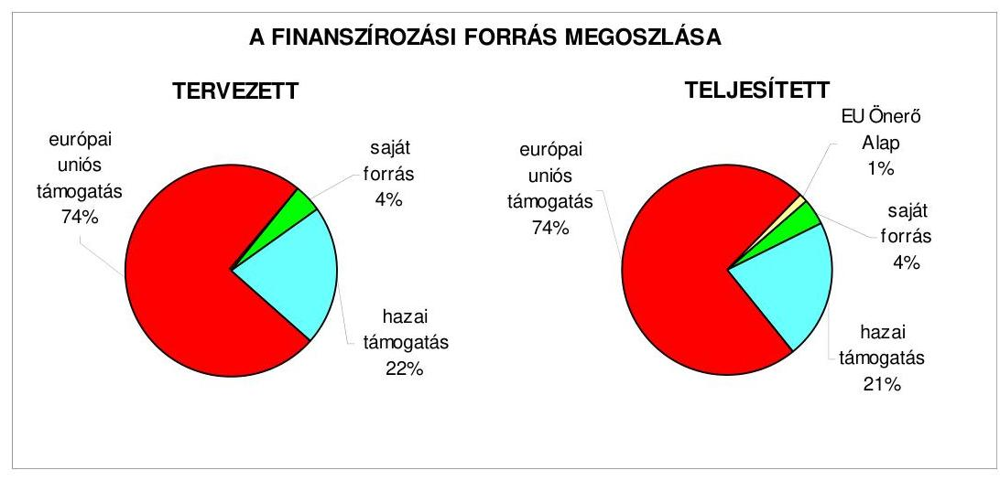
2.1.2. Az európai uniós forrásokhoz kapcsolódóan a pályázatfigyelés, a pályázatkészítés, valamint az európai uniós támogatással megvalósuló fejlesztés lebonyolítása belső rendjének szabályozottsága, a végrehajtás személyi, szervezeti feltételei, az ellenőrzési feladatok meghatározása

Az európai uniós források igénybevételének és felhasználásának feladatait 2006-2009. I. negyedévben az ügyrend ${ }_{1-2}$-ben, a gazdasági szervezet ügyrendjében, a főjegyzői intézkedésben, valamint a köztisztviselők munkaköri leírásaiban előírták.

Az ügyrend ${ }_{1-2}$ az Egészségügyi, a Művelődési, a Nemzetközi és a Területfejlesztési irodák vonatkozásában tartalmazott az európai uniós források igénybevételével és felhasználásával összefüggő - pályázatfigyelési, előkészítési, szervezési, koordinációs, pályázatkészítési, műszaki ellenőrzési, költséggazdálkodási - feladatokat, valamint a köztisztviselők munkaköri leírásaiban - továbbá a fejlesztési, beruházási, tevékenységért felelős Területfejlesztési iroda munkatársai számára az éves teljesítménykövetelményekben is - konkrét, európai uniós pályázatokhoz kapcsolódó feladatokat határoztak meg.

Az önkormányzati szintű pályázatkoordinálás és pályázat-nyilvántartás a pénzügyi, valamint a területfejlesztési irodavezetők feladata, a pályázatfigyelés - a köztisztviselők munkaköri leírásaiban foglaltak szerint - az Önkormányzati hivatal irodáinak kötelezettsége volt. A pályázatfigyelést végzők és a döntési, il-

---

letve döntés-előterjesztési jogkörrel rendelkezők közötti információ-szolgáltatási kötelezettséget ${ }^{42}$, valamint a pályázatfigyelés eljárási rendjét a főjegyzői intézkedés tartalmazta, azonban nem határozták meg a pályázatkészítéssel összefüggő kapcsolattartás és információáramlás rendjét, továbbá a fejlesztési feladat lebonyolítása során alkalmazandó eljárásban a kapcsolattartást nem, az információáramlást csak a közbeszerzési feladatok és a beruházási tevékenység vonatkozásában - a közbeszerzési, illetve a beruházási szabályzatban - szabályozták.

A folyamatba épített, előzetes és utólagos vezetői ellenőrzési feladatokat - az Önkormányzati hivatal tevékenységére, benne - az európai uniós forrásokkal támogatott fejlesztési feladatok lebonyolítására vonatkozóan a pénzgazdálkodási hatáskörök szabályzata és az ellenőrzési nyomvonal tartalmazta. A belső ellenőrzés stratégiai tervét megalapozó kockázatelemzés 2006-2008 között - annak ellenére, hogy a főjegyzői intézkedés előírta azok megvalósítást és elszámolást követő belső ellenőrzését ${ }^{43}$ - nem terjedt ki az európai uniós forrásokkal támogatott fejlesztési feladatokra. A 2009-2013. évekre szóló stratégiai terv és a 2009. évi éves ellenőrzési terv kidolgozását alátámasztó kockázatelemzésben már a belső ellenőrzés a „pályázati fejlesztések hasznosulása" területet is vizsgálta, melyet magas kockázatúnak értékelt.

Az Önkormányzati hivatalban a pályázatfigyelés személyi és szervezeti feltételeit kialakították, abba külső személyt, szervezetet nem vontak be.

A pályázatfigyelési feladatot a Területfejlesztési iroda hat, a Nemzetközi iroda öt, az Egészségügyi iroda három köztisztviselője végezte, és ezzel összefüggésben az egyes szakirodák az illetékességi körükbe tartozó önkormányzati intézmények felé figyelemfelhívással éltek, továbbá az intézmények munkatársai maguk is végeztek pályázatfigyelést.

Az Önkormányzati hivatalban a pályázatkészítés személyi, szervezeti feltételeit kialakították, továbbá három pályázat kidolgozásához külső szervezetet is igénybe vettek.

A pályázatkészítésben a Területfejlesztési iroda hat, a Nemzetközi iroda öt, az Egészségügyi iroda egy, a Művelődési és a Pénzügyi iroda kettő-kettő köztisztviselője szükség szerint vett részt, a munkaköri leírásukban foglaltaknak megfelelően, valamint az önkormányzati intézmények által benyújtott 17 pályázatot azok közalkalmazottjai készítették. A Közgyűlés elnöke a 2007. évben kettő szerződést kötött - a TÁMOP-2.2.3. és az ÉMOP-2007-4.3.1 intézkedésre benyújtott - pályá-

[^0]
[^0]:    ${ }^{42}$ A főjegyzői intézkedés tartalmazta, hogy a pénzügyi, valamint a területfejlesztési irodavezető heti rendszerességgel a vezetői értekezleten tájékoztatja a tisztségviselőket az aktuális pályázati lehetőségekről.
    ${ }^{43}$ A főjegyzői intézkedés 5. pontja tartalmazta a pályázat szabályszerűségi ellenőrzésére, valamint a belső ellenőrzés során - az illetékes ágazati irodával együttműködve - a közszolgáltatás szakmai színvonala pályázati forrás felhasználásával összefüggő javulásának értékelésére vonatkozó feladatokat.

---

zatok ${ }^{44}$ elkészítésére, illetve az Önkormányzat által az ÉMOP-2007-4.3.1 intézkedésre ${ }^{45}$ benyújtott pályázat kidolgozására a 2008. évben Hatvan Város Önkormányzat (mint a pályázatban résztvevő konzorciumi tag) polgármestere kötött szerződést.

A külső szervezettel kötött szerződésekben előírták a feladatellátás kötelezettségeit, a külső szervezet és az Önkormányzati hivatal képviselője közötti kapcsolattartást és - a pályázat szakmai és formai követelményeinek biztosítása érdekében - a felelősség szabályait, valamint az információk átadásának tartalmát, azonban nem határozták meg annak formáját és módját.

Az európai uniós támogatással megvalósított fejlesztési feladatok lebonyolításának szervezeti, projektenkénti személyi feltételeit az Önkormányzati hivatalon belül alakították ki, az ezzel összefüggő feladatokat az Önkormányzati hivatal köztisztviselői látták el, külső személyt, szervezetet nem bíztak meg. Az önkormányzati intézmények vezetői által pályázott és támogatott projektek lebonyolítását az intézmények közalkalmazottai végezték, a Területfejlesztési iroda eseti közreműködésével.

A Területfejlesztési iroda nyolc munkatársa a munkaköri leírásaiban és az éves teljesítménykövetelményeiben meghatározottak szerint vett részt a projektek lebonyolításának teljes folyamatában (projektmenedzselés), vagy egy-egy részterület (közbeszerzési eljárás, műszaki ellenőrzés, forrásigénylés, pénzügyi elszámolás) feladatainak ellátásában.

# 2.1.3. A fejlesztési feladat lebonyolításánál a feladatellátás rendjére, az ellenőrzési feladatok teljesítésére, valamint a felelősségi szabályokra vonatkozó előírások betartása 

Az Önkormányzat a Vámosgyörki Idősek Otthonának akadálymentesítésére benyújtott pályázatával a 22,4 millió Ft-os fejlesztési feladathoz elnyerte az igényelt 20,0 millió Ft összegű európai uniós támogatást, 2,4 millió Ft saját forrás biztosítása mellett. A pályázat és projekt adatait a jelentés 5. számú melléklete tartalmazza. A fejlesztési feladat lebonyolítója a területfejlesztési irodavezető volt.

Az ÉMOP-4.2.2-2007-0106 számú támogatási szerződést 2008. augusztus 25-én kötötték meg, melyet nem módosítottak. A támogatási szerződésben a fejlesztési feladat megvalósításának kezdő időpontjaként meghatározott, 2008. november 15-ével szemben - a kiviteli terv készítésének elhúzódása miatt - a munkaterület átadására és a kivitelezés megkezdésére 2008. december 8-án, a kivitelezésre vonatkozó szerződés aláírásával egy időben került sor. A projektmenedzser a támogatási szerződésben előírt bejelentési kötelezettség alapján

[^0]
[^0]:    ${ }^{44}$ „A Nyugat-hevesi térség szakképzésének fejlesztése szakképzés-szervezési társaság létrehozásával", valamint az „Egyenlő esélyek - Korszerű, egészséges oktatási-, nevelési környezet megteremtése az Észak-magyarországi régió egyetlen, hallássérült gyermekek szervezett nevelését és integrációját segítő szakmai szolgáltató intézményében" című pályázatok,
    ${ }^{45}$ „Tartalomhoz a forma - Korszerű oktatási környezet kialakítása az esélyteremtő, versenyképes tudás megszerzéséhez a hatvani Bajza József Gimnázium és Szakközépiskolában" című pályázat,

---

2008. október 9-én értesítette a közreműködő szervezetet arról, hogy a projekt kezdő időpontja a tervezettől eltér, a fejlesztési feladat megvalósítási szakasza „előre láthatólag 2008. nov. 30.-án" indul, melyet a közreműködő szervezet tudomásul vett.

A fejlesztési feladat - támogatási szerződésben rögzített 2009. június 30-ai határidőre történő megvalósításáról a projektmenedzser gondoskodott, a projekt műszaki kivitelezése a vállalkozási szerződés szerint, 2009. március 31-én befejeződött, műszaki átadás-átvétele megtörtént, pénzügyi elszámolása 2009 májusában folyamatban volt.

Az európai uniós forrást a támogatási szerződésben ütemezettektől eltérően, de a projekt megvalósításával - a kivitelezővel kötött szerződésben foglalt, teljesítményekre és számlázásra vonatkozó követelményekkel ${ }^{46}$ - összhangban igényelték, melyet a fejlesztési feladat lebonyolítója koordinált.

A támogatási szerződésben a projekt elszámolható költségeinek 50,0%-át 2008 IV. negyedévére, 38,2%-át 2009 I. negyedévére és 11,8%-át 2009 II. negyedévére ütemezték, azonban a támogatás igénybevétele az ütemezettől eltérően - az 1-3. számú kifizetési kérelmek benyújtása 2009. március 24-én, április 22-én és június 2-án - történt, tekintettel a kivitelezés tervezetthez képest későbbi kezdési időpontjára, a kivitelező számlázási feltételeire.

A kifizetési kérelmeket alátámasztó számlák, bizonylatok ellenőrzése a támogatás igénybevételét nem hátráltatta. A közreműködő szervezet a hiánytalanul benyújtott kifizetési kérelmekre a támogatást 19-23 napon belül folyósította. Az Önkormányzatnak - mivel a fejlesztési feladat megvalósításának időtartama nem érte el az egy évet - projekt előrehaladási jelentéseket nem kellett készítenie, csak záró jelentés benyújtására kötelezett, melynek határideje 2009. július 30-a.

Az Önkormányzat a 2009. évi költségvetésében biztosította a fejlesztési feladat megvalósításához szükséges 2,4 millió Ft saját forrást, és gazdálkodásában nem okozott pénzügyi nehézséget a támogatás megelőlegezése, a projekt végrehajtásához támogatási előleget nem vett igénybe.

A támogatási szerződésben rögzített célok és indikátorok - az egy akadálymentes intézmény és akadálymentesen elérhető közszolgáltatás - teljesültek, melyet a közreműködő szervezet ellenőrzési jegyzőkönyve is dokumentált.

Az Önkormányzati hivatalnál a pénzgazdálkodási hatáskörök szabályzatában előírt, folyamatba épített, előzetes és utólagos vezetői ellenőrzési feladatokat elvégezték.

A kötelezettségvállalásokat a főjegyző, illetve az általa felhatalmazott pénzügyi irodavezető ellenjegyezte, a szakmai teljesítésigazolást a főjegyző által kijelölt területfejlesztési irodavezető a pénzgazdálkodási hatáskörök szabályzatában meg-

[^0]
[^0]:    ${ }^{46}$ A kivitelező az 1. részszámlát a szerződés főösszege 30%-ának, a 2. részszámlát a 60%-ának megfelelő költségvetési összeghez rendelt műszaki tartalom teljesítésének elfogadását követően nyújthatta be.

---

határozottak szerint elvégezte, az érvényesítési feladatokat - az összegszerűségre, a fedezet meglétére és az alaki követelmények betartására vonatkozó ellenőrzéseket és azok végrehajtásának igazolását - a főjegyző írásbeli megbízásával rendelkező köztisztviselő látta el. Az utalványok ellenjegyzőjeként a pénzügyi irodavezető a kiadási előirányzat és fedezet rendelkezésre állásáról, az érvényesítés és a szakmai teljesítésigazolás megtörténtéről meggyőződött.

A belső ellenőrzés a Vámosgyörki Idősek Otthonának akadálymentesítése fejlesztési feladat megvalósítását 2009. május végéig nem vizsgálta, a közreműködő szervezet egy esetben - az 1. kifizetési kérelem teljesítését megelőzően, 2009. április 7-én - végzett helyszíni ellenőrzést, melynek során hibát, szabálytalanságot nem állapított meg.

Az Önkormányzat a szabályozottság és szervezettség tekintetében 2006-2009. I. negyedév között összességében eredményesen készült fel az európai uniós források igénybevételére és a várható támogatások felhasználására, mivel
 az európai uniós forrásokra benyújtott pályázatai a gazdasági program ${ }_{1,2}$-ben, ágazati, szakmai koncepciókban megfogalmazott fejlesztési célkitűzésekhez kapcsolódtak és szabályozták a pályázatfigyelést végzők és a döntési, illetve döntés-előterjesztési jogkörrel rendelkezők közötti információszolgáltatási kötelezettséget, meghatározták a folyamatba épített, előzetes és utólagos vezetői ellenőrzési feladatokat. Az Önkormányzati hivatalon belül kialakították a pályázatfigyelés és - esetenként külső szervezet igénybevételével - a pályázatkészítés, valamint a fejlesztési feladat lebonyolításának szervezeti, személyi feltételeit. A külső szervezettel a pályázatkészítésre kötött szerződésekben a pályázat szakmai és formai követelményeire vonatkozó felelősség szabályait meghatározták, valamint előírták a fejlesztési feladat lebonyolítását végző ellenőrzési kötelezettségeit, azonban a belső ellenőrzési stratégiát megalapozó kockázatelemzés a 2006-2008. években nem, de a 2009. évben kiterjedt az európai uniós forrásokkal támogatott fejlesztési feladatokra.

# 2.2. Az elektronikus közszolgáltatás feltételeinek kialakítása, a közérdekű gazdálkodási adatok elektronikus közzététele 

Az Önkormányzat 1999. évben elfogadott informatikai stratégiája ${ }^{47}$ tartalmazta a helyzetelemzést, az informatikai fejlesztés és az e-közigazgatási feladatok közép- és hosszú távú célkitűzéseit, melynek keretében az e-közigazgatási feladatok 1. elektronikus szolgáltatási szintjének megvalósítását, működtetését irányozták elő.

Az Önkormányzat a belső információáramlás biztosítása érdekében az Önkormányzati hivatalon belüli, valamint az Önkormányzati hivatalt és az önkormányzati intézményeket átfogó intranet hálózat kiépítését, továbbá a megyei

[^0]
[^0]:    ${ }^{47}$ A Közgyűlés 32/1999. (IV. 30.) számú határozata, melyet a 12/2004. (II. 27.), 12/1/2004. (II. 27.), 7/2005. (I. 28.) és 145/2006. (XII. 15.) számú határozataival módosított.

---

TeIR ${ }^{48}$ bevezetésére és működtetésére való felkészülést tekintette elsődleges feladatának. A 2005. évi módosítás során az informatikai fejlesztési feladatok között a működő TeIR rendszernek az önkormányzati hivatali működési folyamatokba való további integrálása, az intézményeket átfogó intranet hálózat kiépítésének folytatása, a Közgyűlés tájékoztató rendszerének fejlesztése, egyes eljárási cselekmények elektronikus formában történő elvégzése feltételeinek és az elektronikus tájékoztató szolgáltatás kereteinek kialakítása is szerepelt. A 2004. és a 2006. évi módosítások alkalmával a közgyűlési munka számítástechnikai korszerűsítésével és informatikai alapú megszervezésével kapcsolatos fejlesztési feladatokat rögzítették.

Az Önkormányzat a GVOP, az ÁROP, valamint az EKOP intézkedései keretében az e-közigazgatás fejlesztésére kiírt pályázatokon nem vett részt.

Az e-közigazgatás 1. elektronikus szolgáltatási szintjének, a tájékoztatási feladatok ellátásának személyi, szervezeti feltételeit az Önkormányzati hivatalban biztosították.

A főjegyző utasítása ${ }^{49}$ alapján az önkormányzati honlap szerkesztésének koordinálását és felügyeletét - az Önkormányzati hivatal irodái és az Informatikai csoport által delegált tagokból álló - szerkesztőbizottság a főjegyző irányítása mellett végezte, az információs anyagok honlapra történő felhelyezése az Informatikai csoport feladata volt. A honlap karbantartását, információk közzétételét mind az Önkormányzati hivatal irodáinak köztisztviselői, mind a szerkesztőbizottság tagjai kezdeményezhették.

Az 1998 óta működő önkormányzati honlap ${ }^{50}$ fejlesztését, karbantartását, működtetését az Informatikai csoport - a köztisztviselők munkaköri leírásaiban rögzítettek szerint - látta el, saját számítógépes információs rendszeren és saját fejlesztésű szoftverrel, külső szolgáltatótól bérelt tárhely igénybevételével.

Az Önkormányzat - a Ket. 160. § (1) bekezdésében kapott felhatalmazás alapján - az Önkormányzati hivatal elektronikus ügyintézéséről hozott 18/2005. (IX. 30.) számú rendeletében ${ }^{51}$ rögzítette, hogy „hatósági ügyek vagy egyes eljárási cselekmények a 3. §-ban foglaltak kivételével ... elektronikus ügyintézés keretében nem intézhetők", mely rendelet 3. §-a szerint az Önkormányzati hivatal az ügyfelek részére a honlapján tájékoztatást nyújt.

# Az e-közigazgatás 1. elektronikus szolgáltatási szintjének biztosítása 

keretében az Önkormányzat honlapján a személyes gondoskodást nyújtó szakellátási, valamint a gyermek- és bentlakásos intézmények térítési díjairól, továbbá a közérdekű adatok megismerésére irányuló igények teljesítésének rendjéről tájékoztatást nyújtanak, és a közérdekű adatok megismerésére

[^0]
[^0]:    ${ }^{48}$ Területi Információs Rendszer, melynek feladata, hogy adatokat szolgáltasson a területfejlesztési és rendezési tevékenységet folytató közigazgatási szervek és egyéb jogi személyek számára.
    ${ }^{49}$ 6/2004. (V. 24.) főjegyzői utasítás „a hivatal lokális hálózatának működtetéséről és Internet használatáról, alkalmazásáról",
    ${ }^{50}$ www.hevesmegye.hu
    ${ }^{51}$ hatályos 2005. november 1-jétől,

---

irányuló igénybejelentő lap az önkormányzati honlapról letölthető. Az elektronikus szolgáltatások magasabb szintjének elérését egyrészt a pénzügyi források szűkössége és a személyi feltételek hiánya akadályozta, másrészt költséghatékonysági szempontból sem megalapozható a kisszámú hatósági ügy elektronikus úton történő intézésének kialakítása és működtetése ${ }^{52}$.

Az Önkormányzat az Eisztv. 21. § (3) bekezdésében foglaltak szerint 2007. január 1-jétől kötelezett a közérdekű adatok elektronikus úton történő közzétételére. Az Önkormányzat 11/2006. (VI. 30.) számú rendeletben a közzétételi kötelezettséget a „... Kettőszázezer Ft-os összeget elérő vagy azt meghaladó mértékű támogatás nyújtása ...", illetve a „... nettó Hárommillió Ft-ot elérő vagy azt meghaladó értékű ... szerződések ..." esetében írta elő. Az Önkormányzat a 18/2005. (XII. 27.) IHM rendelet 2. § (1) bekezdése szerint a „Közérdekű adatok" elnevezésű hivatkozást az önkormányzati honlap megnyitásakor megjelenő oldalon elhelyezte, a gazdasági adataira vonatkozó közzétételi kötelezettségének a meghatározott szerkezetben tett eleget.

A főjegyző az Áht. 15/A. § (1) bekezdésében előírtaknak megfelelően, a 2008. évben az Önkormányzat által nyújtott, nem normatív, céljellegű, működési támogatások ${ }^{53}$ kedvezményezettjeinek nevére, a támogatás céljára, összegére, továbbá a támogatási program megvalósítási helyére vonatkozó adatokat az önkormányzati honlapon közzé tette, és gondoskodott az Önkormányzati hivatal és az intézmények pénzeszközei felhasználásával, az önkormányzati vagyonnal történő gazdálkodással összefüggő, nettó hárommillió Ft-ot elérő vagy azt meghaladó értékű - árubeszerzésre, építési beruházásra, szolgáltatás megrendelésre, vagyonértékesítésre vonatkozó - szerződések típusának, tárgyának, a szerződést kötő felek nevének, a szerződések értékének, valamint a határozott időre kötött szerződések időtartamának az önkormányzati honlapon történő megjelentetéséről, az Áht. 15/B. § (1) bekezdésében foglaltaknak megfelelően. Az Önkormányzat 2008. évi költségvetési beszámolójának szöveges indokolását az Ámr. 157/D. § (1) bekezdésében hivatkozott 22. számú melléklet 1.2.5. pontjában foglaltaknak megfelelően, a Vhr. 40. § (4)-(11) bekezdésében előírt tartalommal az önkormányzati honlapon közzé tették.

# 3. A KÖLTSÉGVETÉSI GAZDÁLKODÁS BELSŐ KONTROLLJAI 

### 3.1. A szabályozottság kockázata a költségvetés tervezési, gazdálkodási, beszámolási és a folyamatba épített, előzetes és utólagos vezetői ellenőrzési feladatoknál

Az Önkormányzati hivatalnál a költségvetés tervezési és a zárszámadáskészítési folyamatok szabályozottsága összességében alacsony kockázatot jelentett a feladatok megfelelő, szabályszerű végrehajtásában, mivel a főjegyző a pénzügyi irányítási és ellenőrzési rendszer keretében szabályozta a

[^0]
[^0]:    ${ }^{52}$ Külső igény sem merült fel - az Informatikai csoportvezető nyilatkozata szerint - a hatósági ügyek elektronikus úton történő intézésére.
    ${ }^{53}$ Az Önkormányzatnál a 2008. évben fejlesztési célú támogatás odaítélésére és folyósítására nem került sor.

---

költségvetési tervezés és a zárszámadás elkészítés rendjét. Meghatározta az intézmények részére a költségvetési javaslat összeállításával kapcsolatos követelményeket, előírta annak ellenőrzését, hogy a költségvetés tervezéséhez készített intézményi mutatószám felmérés adatai megalapozottak-e. Előírta az intézményi számszaki beszámolók belső, továbbá annak a Közgyűlés által meghatározott adatszolgáltatással való összhangjának, az intézmények által az állami támogatásokkal, hozzájárulásokkal történő elszámoláshoz közölt mutatószámok adatai megbízhatóságának és az intézményi pénzmaradványok szabályszerűségének ellenőrzését. Annak ellenére összességében alacsony volt a kockázat, hogy a főjegyző nem írta elő az intézmények és az Önkormányzati hivatal szervezeti egységei által benyújtott költségvetési igények indokoltságának, valamint teljesíthetőségének ellenőrzését ${ }^{54}$.

# A gazdálkodási, a pénzügyi-számviteli és a folyamatba épített ellen-

őrzési feladatok szabályozottsága összességében alacsony kockázatot jelentett a feladatok szabályszerű végrehajtásában, mivel az Önkormányzati hivatal feladatait az ügyrend ${ }_{2}$-ben ${ }^{55}$ szabályozták. A pénzügyi irányítási és ellenőrzési rendszer keretében a főjegyző elkészítette a gazdasági szervezet ügyrendjét, mely részletesen tartalmazta a szervezet feladatait, a vezetők és beosztottak feladat-, hatás- és jogkörét - a Közgyűlés elnökével közösen - szabályozta a pénzügyi-gazdálkodási hatáskörök gyakorlásának rendjét, valamint kialakította az Önkormányzati hivatal számviteli rendjét. A FEUVE ${ }^{56}$-val kapcsolatos szabályozást és eljárási rendet az ellenőrzési nyomvonal, a szabálytalanságok kezelésének szabályozása és a kockázatkezelés rendjének elkészítésével biztosította, valamint kiadta a pénzügyi-gazdasági, számviteli területen foglalkoztatott köztisztviselők munkaköri leírását. Annak ellenére összességében alacsony volt a kockázat, hogy a főjegyző az Önkormányzati hivatal ellenőrzési nyomvonalában nem rögzítette az egyes tevékenység elvégzését igazoló dokumentum fellelési helyét a rendszerben, a kockázatkezelési szabályzatban nem határozta meg az Önkormányzati hivatalban az elfogadható kockázati szinteket ${ }^{57}$.

A főjegyző előterjesztése alapján az Önkormányzat a 10/2009. (VII. 6.) számú rendeletével elfogadta az ellenőrzési nyomvonal kiegészítését, amely tartalmazta a tevékenység elvégzését igazoló dokumentum rendszerben történő fellelési helyének meghatározását. A gazdálkodási, a pénzügyi-számviteli és a folyamatba épített ellenőrzési feladatok szabályozottsága javult a 2009. évre az ÁSZ által az Önkormányzat gazdálkodási rendszerének 2006. év-

[^0]
[^0]:    ${ }^{54}$ A közbenső egyeztetés során a Közgyűlés elnöke írásban adott tájékoztatása szerint az ellenőrzési nyomvonal kiegészítésével meghatározták az intézmények és az Önkormányzati hivatal szervezeti egységei által benyújtott költségvetési igények indokoltságának, valamint teljesíthetőségének ellenőrzését, melyet az Önkormányzat 10/2009. (VII. 6.) rendeletével elfogadott.
    ${ }^{55}$ Az Önkormányzati hivatal ügyrend ${ }_{2}$-jét az Ügyrendi bizottság - átruházott hatáskörben - a 72/2007. (XI. 16.) számú határozatával hagyta jóvá.
    ${ }^{56}$ 2009. január 1-jétől folyamatba épített előzetes, utólagos és vezetői ellenőrzés,
    ${ }^{57}$ A közbenső egyeztetés során a Közgyűlés elnöke írásban adott tájékoztatása szerint a 2009. évben a kockázatkezelési szabályzatban meghatározták az Önkormányzati hivatalban az elfogadható kockázati szinteket.

---

ben végzett átfogó ellenőrzése során tett javaslatok hasznosítása következtében, mivel a főjegyző gondoskodott az SzMSz ${ }_{1}$ kiegészítéséről az Önkormányzati hivatal alapító okirata és a költségvetés végrehajtását szolgáló számla számával, valamint a Pénzügyi iroda, mint gazdasági szervezet felépítésével. A leltározási- és leltárkészítési szabályzatban meghatározta az üzemeltetésre-kezelésre átadott eszközök kétévenkénti ${ }^{58}$, mennyiségi felvétellel történő leltározási módját, a pénzkezelési szabályzatot kiegészítette a bankszámlák és a házipénztár kapcsolatrendszerének szabályaival.

Az Önkormányzati hivatalban a pénzügyi-számviteli feladatoknál alkalmazott informatikai rendszerek működésének szabályozottsága összességében alacsony kockázatot jelentett a feladatok megfelelő, szabályszerű végrehajtásában, mivel a főjegyző elkészítette az Önkormányzati hivatal katasztrófa elhárítási tervét, szabályozta a pénzügyi-számviteli szoftverek hozzáférési jogosultságának, az egyedi felhasználónév és jelszó használatának, továbbá a pénzügyi-számviteli szoftverek mentésének eljárásrendjét. Annak ellenére összességében alacsony volt a kockázat, hogy a pénzügyi-számviteli rendszerből lekérhető ellenőrzési lista (napló) vizsgálatáért felelős dolgozót nem jelölték ki.

# 3.2. A belső kontrollok működése az önkormányzati források szabályszerű felhasználásában, a költségvetési tervezés, gazdálkodás, beszámolás folyamataiban 

A 2008. évi költségvetés és a zárszámadás készítés folyamatában a működésbeli hibák megelőzésére, feltárására, kijavítására kialakított belső kontrollok működésének megbízhatósága összességében kiváló volt, mivel az Önkormányzati hivatalnál a vonatkozó jogszabályi előírásoknak megfelelően ellenőrizték, hogy a költségvetési intézmények teljesítették-e a költségvetési javaslat összeállításával kapcsolatban részükre meghatározott követelményeket. Vizsgálták továbbá a költségvetési igények megalapozottságát, valamint, hogy megtervezték-e az ismert kötelezettségeket az Önkormányzati hivatalban és az intézményeknél. A szabályozásban foglaltaknak

 megfelelően ellenőrizték a költségvetési tervezéshez készített intézményi mutatószám-felmérés adatainak megalapozottságát, a saját bevételek (intézményi térítési díjak, egyéb szolgáltatási díjak) előirányzatai és a költségvetés megalapozását szolgáló helyi rendeletek összhangját, a zárszámadáshoz közölt intézményi mutatószámok megbízhatóságát, az intézményi pénzmaradványok megállapításának szabályszerűségét, az intézményi eredeti, módosított előirányzatok és a teljesítések eltérésének indokoltságát. Annak ellenére összességében kiváló volt a kialakított belső kontrollok működésének megbízhatósága, hogy - a kontrollok kialakításának hiányában - nem ellenőrizték az intézmények és az Önkormányzati hivatal szervezeti egységei által benyújtott költségvetési igények indokoltságát és teljesíthetőségét.

[^0]
[^0]:    ${ }^{58}$ Az Önkormányzat könyvviteli mérlegében kimutatott eszközök kétévenkénti, mennyiségi felvétellel történő leltározását az Önkormányzat a vagyongazdálkodási rendelet 14. § (3) bekezdésében határozta meg.

---

Az Önkormányzati hivatal a 2008. évi elemi költségvetésében a külső szolgáltatók által végzett karbantartási, kisjavítási munkákkal kapcsolatos kiadások fedezetére négymillió Ft eredeti, nyolcmillió Ft módosított előirányzatot tervezett, a teljesítés hatmillió Ft volt, az eredeti előirányzat 7,2%-a, a módosított előirányzat 1,4%-a, a teljesítés 1,2%-a volt a dologi kiadások előirányzatának. Az Önkormányzati hivatalnál a 2009. évben négymillió Ft eredeti előirányzatot terveztek, ami a dologi kiadások előirányzatának 14,0%-a volt. Az előirányzat felhasználására vonatkozó kötelezettségvállalások (szerződések, megrendelések) tárgya ${ }^{59}$ összhangban volt az Önkormányzat által ellátott kötelező feladatokkal.

Az Önkormányzati hivatalnál a külső szolgáltatók által végzett karbantartási, kisjavítási feladatokkal kapcsolatos kifizetések során a szakmai teljesítésigazolás és az utalvány ellenjegyzés működésének megbízhatósága gyenge volt, mert

- a patakparti kapu javításával kapcsolatos kiadás jogosultságának és összegszerűségének ellenőrzését, valamint a megrendelésben foglaltak szakmai teljesítését a főjegyző által kijelölt személy aláírásával nem igazolta. A gépkocsi parkoló festésével és a gépkocsik javításával kapcsolatos kötelezettségvállalásokat az Ámr. 134. § (8) bekezdésében előírtak ellenére nem foglalták írásba, továbbá a gépkocsik karbantartásával kapcsolatos, 50 ezer Ft-ot el nem érő kifizetések a kötelezettségvállalások ${ }^{60}$ nyilvántartásában nem szerepeltek, így ezen kiadások teljesítését megelőzően a főjegyző által kijelölt személyek - az igazolási kötelezettség végrehajtására irányuló, aláírást és dátumot is tartalmazó rájegyzésük ellenére - okmányok hiányában nem ellenőrizték a kiadás jogosultságát, összegszerűségét, valamint a megrendelésben előírt feladatok teljesítését. A Megyeháza udvar szerkezetének helyreállítására irányuló megrendelés nem tartalmazta a szolgáltatás összegét, ennek hiányában a teljesített kiadás összegszerűségét a szakmai teljesítést igazoló személy nem ellenőrizte;
- az utalványok ellenjegyzője a patakparti kapu javításával kapcsolatos kiadás teljesítését megelőzően nem győződött meg a szakmai teljesítésigazolás megtörténtéről, nem kifogásolta a szakmai teljesítésigazolás elmaradását, továbbá a kiadások teljesítését megelőzően nem ellenőrizte, hogy az utalványozás nem sérti-e a gazdálkodásra vonatkozó szabályokat, mivel nem észrevételezte, hogy a Megyeháza udvar szerkezetének helyreállítására irányuló megrendelésben - a pénzgazdálkodási hatáskörök szabályzatának előírásával ellentétesen - jogosulatlanul a Közgyűlés elnökének felhatalmazásával nem rendelkező személy vállalt kötelezettséget, valamint ezen dokumentum

[^0]
[^0]:    ${ }^{59}$ A külső szolgáltatók által végzett karbantartások, kisjavítások a gépek, berendezések (kapu, radiátor, kazán, tűzoltó-készülékek, telefonvonal, fénymásoló), önkormányzati tulajdonú ingatlanok (gépkocsi parkoló festés, Megyeháza udvarszerkezet helyreállítás) és személygépkocsik karbantartási munkáira irányultak.
    ${ }^{60}$ A pénzgazdálkodási hatáskörök szabályzatában foglaltak szerint a 2008. évben, valamint a 2009. évben május 3-ig éltek az Ámr. 134. § (3) bekezdésében foglalt lehetőséggel, amely szerint nem szükséges írásbeli kötelezettségvállalás az 50 ezer forintot el nem érő kifizetések esetében, azonban ezen kifizetéseket a belső szabályozásban foglaltak ellenére a vezetett nyilvántartás nem tartalmazta.

---

nem tartalmazta a megrendelt szolgáltatás összegét. Az utalványok ellenjegyzője nem kifogásolta, hogy a gépkocsi parkoló festésével és a gépkocsik javításával kapcsolatos kötelezettségvállalást az Ámr. 134. § (8) bekezdésében előírtak ellenére nem foglalták írásba, továbbá, hogy a pinceklub helyiség karbantartására és a leszakadt radiátorok átszerelésére vonatkozó kötelezettségvállalásokat nem előzte meg annak ellenjegyzése.

Az Önkormányzati hivatal a 2008. évi elemi költségvetésében a gépek, berendezések és felszerelések beszerzésére 17 millió Ft eredeti és 66 millió Ft módosított előirányzatot tervezett, az eredeti előirányzat 1,2%-ot, a módosított előirányzat 4,9%-ot képviselt a felhalmozási célú költségvetési kiadások előirányzatából. A teljesítés a 2008. évben elmaradt a módosított tervtől, 31 millió Ft volt. Az Önkormányzati hivatal elemi költségvetésében a 2009. évben 62 millió Ft előirányzatot tervezett. Az előirányzat felhasználásra vonatkozó szerződések, megrendelések tárgya ${ }^{61}$ összhangban volt az Önkormányzat által ellátott kötelező és önként vállalt feladatokkal.

Az Önkormányzati hivatalnál a gépek, berendezések és felszerelések vásárlásával kapcsolatos kifizetések során a szakmai teljesítésigazolás és az utalvány ellenjegyzés működésének megbízhatósága gyenge volt, mert

- a szakmai teljesítés igazolására a főjegyző által kijelölt személy az egészségügyi gép-műszer beszerzéssel kapcsolatos kifizetés teljesítését megelőzően nem ellenőrizte a kiadás jogosultságát és összegszerűségét, szakmailag nem igazolta a szerződés teljesítését. A mátrixnyomtató beszerzésével kapcsolatos kötelezettségvállalást nem foglalták írásba, így a kiadás teljesítését megelőzően a főjegyző által kijelölt személy - az igazolási kötelezettség végrehajtására irányuló, aláírást és dátumot is tartalmazó rájegyzése ellenére - okmány hiányában nem ellenőrizte a kiadás jogosultságát, összegszerűségét, valamint a szerződésben, megrendelésben foglalt feladatok teljesítését. A hangosítási rendszer tartozékai esetében a megrendelés nem tartalmazta a kötelezettségvállalás összegét, ennek hiányában a szakmai teljesítést igazoló nem végezte el az összegszerűség ellenőrzését;
- az utalvány ellenjegyzője az egészségügyi gép-műszer beszerzéssel kapcsolatos kiadás teljesítését megelőzően nem győződött meg a szakmai teljesítésigazolás megtörténtéről, nem kifogásolta, hogy elmaradt a szakmai teljesítés igazolása, továbbá a hangosítási rendszer tartozékainak és a fax készülék, illetve a mátrixnyomtató beszerzésével kapcsolatos kiadások teljesítését megelőzően nem észrevételezte, hogy a kötelezettségvállalásokat az Ámr. 134. § (8) bekezdésében előírtak ellenére nem előzte meg annak ellenjegyzése, illetve, hogy a kötelezettségvállalást nem foglalták írásba.

Az Önkormányzati hivatal a 2008. évi elemi költségvetésében a működési és felhalmozási célú pénzeszközátadások államháztartáson kívülre teljesített kifizetéseire a 84 millió Ft eredeti, 365 millió Ft módosított előirányzatot tervezett, a teljesítés 356 millió Ft volt. Az eredeti előirányzat 100%-ot, a módosított elői-

[^0]
[^0]:    ${ }^{61}$ A megrendelések tárgya a Kórház részére egészségügyi gép-műszer beszerzése, az Önkormányzati hivatalba számítástechnikai, biztonságtechnikai eszköz beszerzések voltak.

---

rányzat 90%-ot képviselt az összes államháztartáson kívüli pénzeszközátadások kiadási előirányzatából. A 2009. évben tervezett 89 millió Ft eredeti előirányzat az összes államháztartáson kívüli pénzeszközátadások kiadási előirányzatának 100%-a volt. A támogatási szerződésekben meghatározott célok ${ }^{62}$ összhangban voltak az Ötv. 8. § (1) bekezdésében foglalt önkormányzati feladatokkal.

Az Önkormányzati hivatalnál a működési és felhalmozási célú pénzeszközátadások államháztartáson kívülre teljesített kifizetései során a szakmai teljesítésigazolás és az utalvány ellenjegyzés működésének megbízhatósága gyenge volt, mert

- a szakmai teljesítés igazolására a főjegyző által kijelölt személyek a Szegletkő Gyermekotthon, a Heves Megyei Területfejlesztési Tanács működése és a Tarnaméráért Kulturális Egyesület rendezvényének, valamint a Heves Megyei Ökölvívó Szövetség működésének támogatásával kapcsolatos kifizetések teljesítését megelőzően nem ellenőrizték a kiadások jogosultságát és összegszerűségét. A főjegyző - szakmai teljesítésigazolásra vonatkozó - írásos kijelölésével nem rendelkező személyek jogosulatlanul igazolták a Gyergyák Magda úszóverseny és a Tai Boksz Egyesület bemutató rendezvény támogatás folyósítását megelőzően a kiadások jogosultságát és összegszerűségét. A szakmai teljesítés igazolására a főjegyző által kijelölt személy a kiadás összegszerűségének ellenőrzését egy közalapítvány támogatására ${ }^{63}$ nyújtott működési célú pénzeszközátadással kapcsolatos kiadás teljesítését megelőzően - az igazolási kötelezettség végrehajtására irányuló, aláírást és dátumot is tartalmazó rájegyzése ellenére - nem észrevételezte, hogy a kifizetés alapját képező bizonylaton (rendelkező levélben) feltüntetett összeg egymillió Ft-tal eltért a 2008. évi költségvetési rendeletben jóváhagyott támogatási összegtől, amely eltérést az utalvány ellenjegyzője ellenőrzése során korrigált;
- az utalványok ellenjegyzője a Szegletkő Gyermekotthon, a Heves Megyei Területfejlesztési Tanács működése és a Tarnaméráért Kulturális Egyesület rendezvényének, valamint a Heves Megyei Ökölvívó Szövetség, illetve a Gyergyák Magda úszóverseny és a Tai Boksz Egyesület bemutató rendezvény támogatásával kapcsolatos kiadások teljesítését megelőzően nem győződött meg a szakmai teljesítésigazolás megtörténtéről, mivel az utalványok ellenjegyzése során nem kifogásolta, hogy elmaradt, illetve nem a kijelölt személy által történt ezen kiadások jogosultságának, valamint összegszerűségének ellenőrzése. Az utalványok ellenjegyzője nem észrevételezte, hogy a sportrendezvényekre nyújtott támogatások ${ }^{64}$ tekintetében - a pénzgazdálkodási hatáskörök szabályzatával ellentétesen - nem a Közgyűlés elnöke, vagy

[^0]
[^0]:    ${ }^{62}$ Az Önkormányzat sport szervezetek működését, azok rendezvényeit, közoktatási-, területfejlesztési közalapítványok működését, illetve fogyatékkal élők gondozását, rendezvényeken való részvételét támogatta.
    ${ }^{63}$ A közalapítványt az Önkormányzat a megye infrastruktúrájának, valamint a környezet védelmének fejlesztése céljából hozta létre és támogatta.
    ${ }^{64}$ A kötelezettségvállaló a döntést hozó a Heves Megyei Önkormányzat Sport, Ifjúsági és Idegenforgalmi Bizottság Elnöke volt a Mátra Rögbi Torna és az ökölvívó verseny támogatások esetében.

---

az általa felhatalmazott személy vállalt kötelezettséget, nem kifogásolta, hogy ezen támogatások, valamint a vakok és gyengén látók táboroztatására, az autista gyermekek gondozására és a filmkészítésre nyújtott támogatások esetében a kötelezettségvállalást az Ámr. 134. § (8) bekezdésében előírtak ellenére nem előzte meg annak ellenjegyzése.

Az Önkormányzati hivatalban a külső szolgáltatók által végzett karbantartási, kisjavítási munkákkal, a gépek, berendezések, felszerelések beszerzéseivel, valamint az államháztartáson kívülre történő működési és felhalmozási célú pénzeszközátadásokkal kapcsolatos kifizetések során a pénzügyigazdálkodási folyamatokban kialakított belső kontrollok nem működtek megbízhatóan. A szakmai teljesítésigazolás és az utalvány ellenjegyzés működésének megbízhatósága gyenge volt, mert a kiadások teljesítését megelőzően azok jogosultságának, összegszerűségének ellenőrzését, valamint a szerződések, megrendelések szakmai teljesítésének igazolását a főjegyző által kijelölt személyek nem végezték el, illetve a főjegyző kijelölésével nem rendelkező személyek látták el. Az utalványok ellenjegyzése során a főjegyző, illetve az általa felhatalmazott személyek nem győződtek meg arról, hogy az utalványozás nem sérti-e a gazdálkodásra - köztük a kötelezettségvállalások írásba foglalására és azok ellenjegyzésére, valamint a kötelezettségvállalási jogosultságra - vonatkozó, az Ámr-ben és a pénzgazdálkodási hatáskörök szabályzatában rögzített szabályokat, továbbá nem kifogásolták a szakmai teljesítésigazolás elmaradását, illetve a főjegyző kijelölésével nem rendelkező személyek által végzett szakmai teljesítésigazolásokat ${ }^{65}$.

Az Önkormányzati hivatalnál a pénzügyi-számviteli feladatok ellátásánál alkalmazott informatikai rendszerek belső kontrolljainak megbízhatósága jó volt, mivel biztosították a hozzáférési jogosultság nyilvántartásának teljes körű és naprakész vezetését, ellenőrzési lehetőségét, a pénzügyi-számviteli szoftverek változáskezelési eljárásainak dokumentált ellenőrzését, az ellenőrzési lista készítését, azonban nem végezték el a katasztrófa elhárítási terv kétévenkénti tesztelését ${ }^{66}$ valamint a pénzügyi-számviteli rendszerből lekérhető ellenőrzési lista (napló) vizsgálatát és az előírások ellenére nem követelték meg a jelszavak használatára előírt szabályok betartását. A feltárt hiányosságok az in-

[^0]
[^0]:    ${ }^{65}$ A közbenső egyeztetés során a Közgyűlés elnöke írásban adott tájékoztatása szerint a főjegyző írásban utasította a Pénzügyi iroda vezetőjét „hogy az operatív gazdálkodás során, a kiadások teljesítése előtt az Ámr. 135. § (1)-(2)
 bekezdéseiben és a pénzgazdálkodási szabályzatban foglaltaknak megfelelően a kijelölt személyek okmányok alapján ellenőrizzék, szakmailag igazolják a kiadások jogosultságát, összegszerűségét, valamint a szerződés, megrendelés, megállapodás teljesítését", továbbá felhívta a figyelmét „hogy a kiadások teljesítése előtt az Ámr. 137. § (3) bekezdésének előírása alapján győződjenek meg arról, hogy az utalványozás nem sérti-e a gazdálkodásra - a kötelezettségvállalások írásba foglalására, azok ellenjegyzésére és a kötelezettségvállalási jogosultságra - vonatkozó, az Ámr. 134. § (8) bekezdésében a pénzgazdálkodási szabályzatban rögzített előírásokat, továbbá arról, hogy a szakmai teljesítésigazolás az Ámr. 135. § (1)-(2) bekezdéseiben foglalt előírások alapján megtörtént-e".
    ${ }^{66}$ A közbenső egyeztetés során a Közgyűlés elnöke írásban adott tájékoztatása szerint a főjegyző írásban hívta fel az Informatikai csoportvezető figyelmét a katasztrófa elhárítási terv kétévenkénti tesztelésére.

---

formatikai rendszerek kontrolljainak megbízható működését nem veszélyeztették.

# 3.3. A belső ellenőrzési kötelezettség teljesítése, javaslatainak hasznosulása 

Az Önkormányzat a belső ellenőrzési feladatok ellátására a főjegyzőnek közvetlenül alárendelt belső ellenőrzési egységet - Belső ellenőrzési csoportot ${ }^{67}$ - hozott létre öt fő létszámmal.

A belső ellenőrzés szervezeti kereteinek kialakítása és szabályozása a belső ellenőrzési feladatok megfelelő, szabályszerű végrehajtásában összességében alacsony kockázatot jelentett, mivel a belső ellenőrzési kötelezettséget, a Belső ellenőrzési csoport jogállását és feladatait az ügyrend ${ }_{2}$-ben meghatározták, a belső ellenőrök funkcionális függetlenségét biztosították, a belső ellenőrzési kézikönyvet a főjegyző jóváhagyta, a belső ellenőrzés rendelkezett stratégiai tervvel és éves ellenőrzési tervvel, az ellenőrzések lefolytatásához ellenőrzési programot készítettek. Annak ellenére összességében alacsony volt a kockázat, hogy a 2008. évi belső ellenőrzési tervet alátámasztó kockázatelemzés nem terjedt ki az Önkormányzati hivatalra, valamint az önkormányzati intézmények tekintetében az európai uniós forrásból megvalósított feladatok végrehajtására és a közbeszerzési eljárások lebonyolítására.

A Közgyűlés által jóváhagyott ${ }^{68}$ - a 2008. és a 2009. évekre vonatkozó - belső ellenőrzési terveket a 2008-2012. és a 2009-2013. évekre vonatkozó stratégiai tervben szereplő célkitűzésekkel összhangban készítették el. A 2008. évi belső ellenőrzési tervet megalapozó kockázatelemzésben a költségvetési intézmények működésének szabályozottságát, a gazdálkodás és a pénzügyi elszámolások szabályszerűségét, továbbá a pénzkezelés szabályszerűségét minősítették magas kockázatúnak, amelyek ellenőrzését a 2008. évi belső ellenőrzési tervben tervezték. Az Önkormányzati hivatalnál és az intézményeknél a 2009. évi belső ellenőrzési tervet megalapozó kockázatelemzésben magas kockázatúnak értékelt területek ellenőrzését tervezték, azonban a kockázatelemzés az intézményeknél nem terjedt ki az európai uniós forrásból megvalósított feladatok végrehajtására és a közbeszerzési eljárások lebonyolítására ${ }^{69}$.

Az Önkormányzati hivatalban a 2008. évi belső ellenőrzési tervben három szabályszerűségi ellenőrzést, a működési és a felhalmozási célú pénzeszközátadások államháztartáson kívülre teljesített kifizetésekkel kapcsolatos számadások alapján a rendeltetés szerinti felhasználás ellenőrzését, a közbeszerzési eljárá-

[^0]
[^0]:    ${ }^{67}$ Az Ellenőrzési csoport létszáma: egy fő belső ellenőrzési vezető, négy fő belső ellenőr.
    ${ }^{68}$ A 2008. évi belső ellenőrzési tervet a Közgyűlés a 123/2007. (XII. 5.) számú, a 2009. évi belső ellenőrzési tervet a 117/2008. (XI. 27.) számú határozatában hagyta jóvá.
    ${ }^{69}$ A közbenső egyeztetés során a Közgyűlés elnöke írásban adott tájékoztatása szerint a főjegyző írásban kezdeményezte a Belső ellenőrzési csoportvezetőnél „hogy a belső ellenőrzési stratégiát megalapozó kockázatelemzés az intézmények vonatkozásában terjedjen ki az európai uniós forrásokból megvalósított feladatok végrehajtására, a közbeszerzési eljárások lebonyolítására".

---

sok szúrópróbaszerű vizsgálatát, valamint a pénz- és értékkezelés rendjének ellenőrzését tervezték. Az Önkormányzat intézményeinél a 2008. évben három témában terveztek ellenőrzést: 13 intézménynél a pénzkezelés, egy önkormányzati társulásnál a gazdálkodás szabályozottságára vonatkozó szabályszerűségi, 30 intézménynél a 2007. évi normatív állami hozzájárulások és a kötött felhasználású támogatások elszámolásának pénzügyi ellenőrzését, továbbá nyolc intézménynél „rendszerellenőrzést" terveztek.

Az Önkormányzati hivatal 2009. évi belső ellenőrzési tervében - a 2008. évben elmaradt ellenőrzésekből - kettő szabályszerűségi ellenőrzést a működési és a felhalmozási célú pénzeszközátadások államháztartáson kívülre teljesített kifizetések elszámolásának vizsgálatára és a közbeszerzési eljárások szúrópróbaszerű ellenőrzésére, valamint egy teljesítményellenőrzést a pályázati forrásokból megvalósult fejlesztések eredményességének ellenőrzésére terveztek. A 2009. évi intézményi belső ellenőrzési tervben 11 szabályszerűségi ellenőrzést az intézményi pénzkezelés szabályszerűségének utóvizsgálatára, 48 pénzügyi ellenőrzést a 2008. évi normatív állami hozzájárulások és a kötött felhasználású támogatások elszámolásának ellenőrzésére, továbbá öt intézménynél - ebből egy, az előző évben elmaradt - „rendszerellenőrzést" terveztek.

A belső ellenőrzés működésénél a kialakított kontrollok megbízhatósága jó volt, mivel az Ötv. 92. § (7) bekezdésében előírtaknak megfelelően belső ellenőrzési egységet hoztak létre, az ellenőrzési programok alapján elvégzett (terv szerinti és azon túli) ellenőrzésekkel, a hibák feltárásával, az intézkedések kezdeményezésével és a javaslatok realizálásának ellenőrzésével a belső ellenőrzés hozzájárult a hiányosságok csökkentéséhez, a főjegyző teljesítette nyilatkozattételi kötelezettségét és értékelte a belső kontrollok működését. A Közgyűlés elnöke a költségvetési szervek éves ellenőrzési jelentései alapján készített 2007. és 2008. évi összefoglaló jelentéseket ${ }^{70}$ a Közgyűlés elé terjesztette. A 2008. évben a belső ellenőri kapacitás csökkenése miatt - elmaradt az Önkormányzati hivatalnál a működési és felhalmozási célú pénzeszközátadások államháztartáson kívülre teljesített kifizetéseivel kapcsolatos számadások alapján a rendeltetés szerinti felhasználásra vonatkozó, a közbeszerzési eljárások szabályszerűségére, valamint a pénz- és értékkezelés rendjére irányuló vizsgálat, továbbá három intézmény „rendszerellenőrzése". Az ellenőrzések elmaradása nem veszélyeztette, hogy a belső ellenőrzés megelőzze, feltárja, kijavíttassa a lényeges hibákat és szabálytalanságokat. A 2009. évi belső ellenőrzési tervben előírták az államháztartáson kívülre teljesített pénzeszközátadások rendeltetés szerinti felhasználásának ellenőrzését, a közbeszerzési eljárások vizsgálatát, egy intézmény „rendszerellenőrzését".

A belső ellenőrzési feladatellátást kedvezőtlenül befolyásolta a személyi feltételek 2007. év végi és a 2008. évközi változása. A Belső ellenőrzési csoport létszáma 2007. december 1-től öt főről négy főre - egy fő gyermekgondozási szabadság igénybevétele miatt -, majd 2008. augusztus 28-tól nyugdíjazás következtében további kettő fővel (ebből egy fő a belső ellenőrzési vezető volt) csökkent. A meg-

[^0]
[^0]:    ${ }^{70}$ A Közgyűlés a 2007. évi összefoglaló jelentést a 21/2008. (II. 29.) számú, a 2008. évit a 68/2008. (IV. 23.) számú határozatával fogadta el.

---

üresedett álláshelyek betöltésére a főjegyző pályázat útján 2008. augusztus 1-től egy fő belső ellenőri állás betöltésére intézkedett, a belső ellenőrök létszáma így 2008. december 31-én három fő volt. A hiányzó kapacitás egy részét a főjegyző a 2008. évben külső szakértő megbízásával ${ }^{71}$ pótolta. A 2008. évi belső ellenőrzési terv módosítását - a kialakult létszámhelyzetre tekintettel - a belső ellenőrzési vezető a főjegyzőnél nem kezdeményezte.

A 2008. évi ellenőrzési tervben foglaltakon felül a MÁK 2008. évi vizsgálata megállapításainak figyelembe vételével ${ }^{72}$ az Önkormányzati hivatalnál pénzügyi ellenőrzést végeztek, amely 10 intézményre is kiterjedt. Az intézményeknél terven felül további 30 intézménynél „a 2008. évi intézményi költségvetési javaslat aránytalanságait", öt intézménynél a 2006-2007. évi szociális foglalkoztatáshoz igénybevett támogatások elszámolása szabályszerűségének, egy intézménynél az áfa visszaigénylés lehetőségének szabályszerűségi vizsgálatát ${ }^{73}$ végezték el, kettő intézménynél bejelentés ${ }^{74}$ alapján folytattak vizsgálatot.

A 2009. évi belső ellenőrzési tervben az I. negyedévre ütemezett feladatokat megvalósították, 48 intézménynél elvégezték a 2008. évi normatív állami hozzájárulások és a kötött felhasználású támogatások elszámolásának pénzügyi vizsgálatát, a Heves Megyei Önkormányzat Pszichiátriai és Szenvedélybetegek Otthonánál „rendszerellenőrzést" és az - előző évről áthúzódó - áfa visszaigénylés lehetőségének szabályszerűségi vizsgálatát.

A 2008. évi és a 2009. I. negyedévi ellenőrzésekről készített jelentések a jogszabályi előírásoknak megfeleltek. Az ellenőrzött szervezetek észrevételt nem tettek, egy intézmény készített intézkedési tervet. A feltárt hiányosságok megszüntetéséről utóvizsgálat és a hiányosságok felszámolásáról készített beszámoló keretében győződött meg a belső ellenőrzés. A belső ellenőrzési vezető az előírt tartalommal vezette a nyilvántartást az elvégzett ellenőrzésekről.
${ }^{71}$ A 2008. május 14-én, június 16-án és szeptember 8-án kötött megbízási szerződések a Heves Megyei Önkormányzat Idősek Otthonánál a pénzkezelés szabályszerűségének, a Heves Megyei Önkormányzat Idősek, Fogyatékosok Otthona és Módszertani Intézetében a 2006-2007. évi szociális foglalkoztatáshoz igénybevett támogatás elszámolása szabályszerűségének ellenőrzésére, továbbá a József Attila Szakközépiskola, Szakiskola és Kollégium működése szabályszerűségének ellenőrzésére vonatkoztak.
${ }^{72}$ A vizsgálat célja annak ellenőrzése volt, hogy „a MÁK vizsgálati jegyzőkönyvében szereplő normatíva igénylés és elfogadott mutatószámok közötti eltérések és az abból adódó jogtalan igénybevétel összege alátámasztott-e".
${ }^{73}$ A vizsgálatot a Heves Megyei Önkormányzat Benedek Elek Általános Iskolában végezték el, ahol az ellenőrzés befejezése áthúzódott a 2009. évre.
${ }^{74}$ A bejelentések alapján a Heves Megyei Önkormányzat Pátzay János Zeneiskolánál a készpénzkezelés, a Heves Megyei Petőfi Sándor Egységes Gyógypedagógiai, Módszertani Pedagógiai Szakszolgálati Intézménynél a bizonylati és okmányfegyelem, a gazdálkodási jogkörök gyakorlása és a teremhasználattal kapcsolatos előírások betartása szabályszerűségi ellenőrzését végezték el.

---

# 4. Az ÁSZ KORÁBBI ELLENŐRZÉSI JAVASLATAI ALAPJÁN KÉSZÍTETT INTÉZKEDÉSI TERV VÉGREHAJTÁSA, EREDMÉNYESSÉGE 

### 4.1. Az Önkormányzat gazdálkodási rendszerének átfogó ellenőrzése során tett javaslatok végrehajtására tervezett intézkedések megvalósulása

Az ÁSZ az Önkormányzat gazdálkodási rendszerét a 2006. évben ellenőrizte átfogó jelleggel, amelynek során 24 szabályszerűségi és három célszerűségi javaslatot tett ${ }^{75}$. A Közgyűlés elnöke az ÁSZ jelentésben foglaltakról a Közgyűlést 2007. február 23-i ülésén tájékoztatta és előterjesztette a főjegyző által - a felelős személyek és a határidők megjelölésével - készített intézkedési tervet, amelyet a Közgyűlés 55/2007. (II. 23.) számú határozatával elfogadott.

Az ÁSZ által tett javaslatokból az intézkedési tervben foglalt határidőre, illetve a tájékoztatóban megjelölt időpontokra $\mathbf{78 \%}$ hasznosult, $\mathbf{7 \%}$ részben, illetve $\mathbf{15 \%}$ nem teljesült. A szabályszerűségi javaslatok $75 \%$-a teljesült, $8 \%$-a részben, $17 \%$-a nem hasznosult. A célszerűségi javaslatok realizálódtak.

## A következő szabályszerűségi javaslatok valósultak meg:

- az Önkormányzat 2007. évi költségvetési rendeletében biztosították, hogy a költségvetési kiadások eredeti előirányzata nem tartalmazott finanszírozási célú pénzügyi műveletet, a hiteltörlesztés összegét elkülönítetten mutatták be, valamint csatolták a Közgyűlés tájékoztatása céljából a közvetett támogatásokat tartalmazó kimutatást szöveges indoklással együtt;
- az Önkormányzat által fenntartott intézmények vezetői a költségvetésük végrehajtása során a jóváhagyott költségvetési előirányzaton belül gazdálkodtak, tárgyévi fizetési kötelezettséget a jóváhagyott kiadási előirányzat mértékéig vállaltak, ennek hatására nem lépték túl a módosított költségvetési előirányzatok főösszegeit. Az intézmények saját hatáskörében végrehajtott előirányzat-változtatásáról december 31-i hatállyal az Önkormányzat 2006. évi költségvetési rendeletének módosítására előterjesztés készült ${ }^{76}$, továbbá a 2007. évi költségvetési rendeletének módosításáról - a rendelkezésre bocsátott központi pótelőirányzatok ütemét figyelembe véve - az Önkormányzat negyedévenként döntött;
- az Önkormányzat a 15/2006. (VIII. 25.) számú rendeletével módosította az $\mathrm{SzMSz}_{1}$-et, kiegészítette az alapító okirat keltével, számával, a költségvetés végrehajtására szolgáló számlaszám megjelölésével, továbbá a Pénzügyi iroda, mint gazdasági szervezet felépítésével;

[^0]
[^0]:    ${ }^{75}$ A javaslatok számszerűsítésénél nem vettük figyelembe azokat, amelyek jogszabályváltozás folytán már nem aktuálisak, illetve egy javaslatnak számoltuk

 azokat a javaslatokat, amelyeket mind a Közgyűlés elnökének, mind a főjegyzőnek címeztünk.
    ${ }^{76}$ Az Önkormányzat 2006. évi költségvetési rendeletének utolsó módosítása az 1/2007. (II. 23.) számú rendelettel történt meg.

---

- a főjegyző intézkedett ${ }^{77}$ a pénztárellenőr ellenőrzési feladatainak a házipénztár-kezelési szabályzatban előírtak szerinti elvégzésére, melynek végrehajtását a 2007. január 2-15-ig terjedő időszak pénztári kifizetési bizonylatainak ellenőrzése alátámasztotta. A Közgyűlés elnöke gondoskodott arról, hogy az értékpapírok adás-vételéről szóló szerződéseket az arra jogosultak kössék meg. Az Önkormányzat által 2007. december 20-án kibocsátott zárkörű kötvényre vonatkozó, a pénzintézettel kötött megbízási szerződésben a kötelezettségvállaló a Közgyűlés elnöke, az ellenjegyző a főjegyző volt;
- a 2006. évi költségvetési beszámoló készítésénél az Önkormányzati hivatalban 2007. február 12-én végezték el a részesedések egyedi értékelését, értékvesztést - indokoltan - nem számoltak el, mert az önkormányzati részesedésű gazdasági társaságoknál a saját tőke összege nem csökkent a 2006. évet megelőző két évben;
- a Közgyűlés elnöke kezdeményezte a vagyongazdálkodási rendelet módosítását ${ }^{78}$ a vagyon térítésmentes átruházása eseteinek és módjának meghatározásával. A vagyon ingyenes átruházását önkormányzati feladatot ellátó szervezet részére közérdekű kötelezettségvállalás, illetve alapítványi hozzájárulás eseteiben a Közgyűlés minősített többségi szavazata alapján tették lehetővé. Az Önkormányzat a 2008. évben ${ }^{79}$ nyilvános versenytárgyalás útján - a gazdasági programban és a 2008. évi költségvetési rendeletben foglalt célkitűzésekkel összhangban - értékesítette az Eger, Ipoly Arnold út 5. szám alatt található, 6674 hrsz-ú, önkormányzati tulajdonú ingatlant. Az ingatlan induló, majd végleges eladási ára megegyezett az ingatlan értékbecslő által meghatározott 26 millió Ft-tal, ami a könyvviteli nyilvántartás szerinti bruttó érték összegétől 3,7 millió Ft-tal magasabb volt. Az ingatlan értékesítést az Önkormányzat honlapján közzétették;
- a Közgyűlés elnöke biztosította, hogy a 11/2006. (VI. 30.) számú önkormányzati rendeletben előírtaknak megfelelően a 2007. évben céljelleggel nyújtott támogatások esetében a támogatás céljának, összegének, a számadási kötelezettség módjának és határidejének meghatározása támogatási szerződésben, illetve kiértesítő levélben megtörténjen. Számadási kötelezettségüknek a 2007. évben a támogatottak határidőre eleget tettek, a rendeltetési célnak megfelelő felhasználást a feladattal megbízott irodák ellenőrizték, a számadási kötelezettség teljesítésének ellenőrzésére vonatkozó megállapítást a támogatásokról vezetett nyilvántartásokban rögzítették. A 2007. évben egy közhasznú szervezetnek nyújtott támogatás célját, az elszámolás

[^0]
[^0]:    ${ }^{77}$ A főjegyző a 005-256-3/2006. számú levélben hívta fel a Pénzügyi iroda vezetőjének figyelmét a pénztárellenőri feladatok pénzkezelési szabályzatban előírt teljesítésére.
    ${ }^{78}$ Az Önkormányzat 16/2006. (VIII. 25.) számú rendelete.
    ${ }^{79}$ A területfejlesztési irodavezető 2009. május 13-án kelt nyilatkozata szerint az Önkormányzati hivatalban a 2007. évben - az Áht. 108. § (1) bekezdésben, illetve a vagyongazdálkodási rendeletben foglaltak hatálya alá tartozó - eredményesen zárult nyilvános versenytárgyalási eljárás ingatlanok értékesítésére, illetve hasznosítására nem volt.

---

határidejét megállapodásban ${ }^{80}$ határozták meg. A főjegyző a 2006. évben elrendelte ${ }^{81}$ a céljellegű támogatások felhasználásának ellenőrzését, melyről készített, 108-229/2006. számú ellenőrzési jelentés tartalmazta, hogy a 2006. évben céljelleggel nyújtott támogatások kifizetésére minden esetben a támogatás céljának, az elszámolás módjának és határidejének meghatározásával került sor a Közgyűlés, illetve - az átruházott hatáskörben eljáró - bizottságok döntése alapján. A 2005. évben nyújtott támogatások esetében a belső ellenőrzés felhívta a Pénzügyi iroda figyelmét a számadási kötelezettséget nem teljesítő szervezetek felszólítására. A 17 támogatott szervezetet érintő összesen 0,7 millió Ft támogatással való elszámolásra - a felszólításokat kiküldték, ez alapján számadási kötelezettségének kilenc szervezet eleget tett, három a támogatás teljes összegét visszafizette. A számadási kötelezettséget nem teljesítők esetében a Pénzügyi iroda felkérte a Jogi irodát ${ }^{82}$ az összesen 0,2 millió Ft összegű követelés behajtására;

- az Önkormányzatnál a 2008. évi őrzés-védelem szolgáltatás vásárlás becsült értékének meghatározása megfelelt a Kbt. 40. § (4) bekezdésében foglaltaknak és lefolytatták az egyszerűsített közbeszerzési eljárást. A 2008. évben lefolytatott közbeszerzési eljárásoknál - indokoltan - kettő vállalkozási szerződést módosítottak és egy vállalkozási szerződést felbontottak ${ }^{83}$;
- az Önkormányzat az intézményi beruházásokhoz és felújításokhoz kapcsolódóan 2006-2008 között kiemelt figyelmet fordított a középületek akadálymentes megközelíthetőségének megoldására, melynek eredményeként ebben az időszakban hat közintézménynél megvalósult, további kettő közintézményben - a 2008. évben elnyert pályázati forrásokból - a 2009. I. negyedévben folyamatban volt az akadálymentes közlekedés feltételeinek biztosítása.

# A következő szabályszerűségi javaslatok részben hasznosultak: 

- az Önkormányzat 2006. évi zárszámadási rendelettervezetében a Közgyűlés tájékoztatása céljából bemutatták a könyvviteli mérlegben szereplő eszközökön és kötelezettségeken kívüli vagyonelemeket is tartalmazó vagyonkimutatást, csatolták továbbá a közvetett támogatásokat tartalmazó kimutatást

[^0]
[^0]:    ${ }^{80}$ A Heves Megyei Területfejlesztési Ügynökség Közhasznú Társaságnak az Önkormányzat a 2007. évi költségvetési rendeletben 10 millió Ft támogatást biztosított, az elszámolás feltételeit és módját a 2007. március 25-én megkötött Megállapodásban rögzítették.
    ${ }^{81}$ Megbízólevél száma: 108-229/2006.
    ${ }^{82}$ A 005-202-13/2007. számú, 2007. március 1-én kelt ügyiratban.
    ${ }^{83}$ Szerződésmódosítás az Egri Gárdonyi Géza Színház műhelyház részleges felújítása, és a Heves Megyei Önkormányzat egészségügyi gép-műszer beszerzése, beüzemelése, üzembe helyezése tárgyú közbeszerzési eljárások esetében volt, előre nem tervezhető kiegészítő munka felmerülése, illetve „bankcsőd miatti szállítási határidőcsúszás" miatt. A szerződés felbontására a Bélapátfalva, Petőfi út 25. sz. alatti intézmény részleges felújítása tárgyú közbeszerzési eljárásban - a kivitelező nem teljesítése miatt - indokoltan került sor.

---

szöveges indokolással ${ }^{84}$, elmaradt azonban - az Áht. 118. § (2) bekezdés 2. d) pontjában foglaltakat megsértve - a többéves kihatással járó döntések számszerűsítését évenkénti bontásban és összesítve tartalmazó, az Önkormányzat rendeletében ${ }^{85}$ - annak 5. számú mellékletében - meghatározott tartalmú kimutatás rendelettervezethez történő csatolása. Az Önkormányzat költségvetési szervei a 2006. évi számszaki beszámolójuk jóváhagyásáról írásban értesítést kaptak, azonban működésük elbírálásáról - az Ámr. 149. § (3) bekezdésében foglaltak ellenére - nem gondoskodtak.

# A következő szabályszerűségi javaslatok nem teljesültek: 

- a főjegyző az Ámr. 139. §-ában foglaltak ellenére nem gondoskodott az Önkormányzat 2007-2008. évi költségvetési rendeletei 7. számú mellékletében meghatározott, az Önkormányzat pénzállományának alakulását tartalmazó likviditási terv év közbeni, szükség szerinti aktualizálásáról ${ }^{86}$;
- a szakmai teljesítésigazolás és az utalvány ellenjegyzés az Önkormányzati hivatalnál a gazdálkodás folyamatában (a külső szolgáltatók által végzett karbantartással, kisjavítási munkákkal, a gépek, berendezések, felszerelések beszerzéseivel, valamint az államháztartáson kívülre történő működési és felhalmozási célú pénzeszközátadásokkal kapcsolatos kifizetések során) az ÁSZ javaslata ellenére nem működött megbízhatóan. A pénzügyi gazdálkodási folyamatokban kialakított belső kontrollok működésének megbízhatósága gyenge volt, mert a kiadások teljesítését megelőzően azok jogosultságának, összegszerűségének ellenőrzését, valamint a szerződések, megrendelések szakmai teljesítésének igazolását az Ámr. 135. § (1)-(2) bekezdésében foglalt előírások ellenére a főjegyző által kijelölt személyek nem végezték el, illetve a főjegyző kijelölésével nem rendelkező személyek látták el. Az utalványok ellenjegyzése során a főjegyző, illetve az általa felhatalmazott személyek az Ámr. 137. § (3) bekezdésében foglaltak ellenére nem győződtek meg arról, hogy az utalványozás nem sérti-e a gazdálkodásra - köztük a kötelezettségvállalási jogosultságra, valamint a kötelezettségvállalások írásba foglalására és azok ellenjegyzésére - vonatkozó szabályokat, továbbá nem végezték el a szakmai teljesítésigazolás megtörténtének az ellenőrzését;
- az Önkormányzat a Kbt. 307. § (1)-(2) bekezdésében előírtakat megsértve, a szerződés módosításától, illetve a szerződés teljesítésétől számított öt munkanapon belül - a 2008. évben - kettő közbeszerzési eljárásban nem tett ele-

[^0]
[^0]:    ${ }^{84}$ A 2006. évi zárszámadási rendelet 21. számú melléklete a vagyonkimutatás, a 22. számú melléklete a közvetett támogatásokról készült kimutatás.
    ${ }^{85}$ Az Önkormányzat költségvetési és zárszámadási rendelete tartalmának meghatározásáról szóló 17/2005. (IX. 30.) számú rendelete, amelyet a 12/2006. (VI. 30.) számú rendelettel módosított.
    ${ }^{86}$ A közbenső egyeztetés során a Közgyűlés elnöke írásban adott tájékoztatása szerint a főjegyző írásban utasította a Pénzügyi irodavezetőt, hogy „az Ámr. 139. § (1) bekezdésében előírtak betartása érdekében az önkormányzat pénzállományának alakulásáról készített likviditási tervet évközben szükség szerint aktualizálja".

---

get közzétételi kötelezettségének ${ }^{87}$, emiatt az ÁSZ a Kbt. 327. § (1) bekezdés b) pontjában foglaltak alapján a helyszíni vizsgálat ideje alatt jogorvoslati eljárás indítását kezdeményezte a KDB-nél, amely a 2009. június 10-én kelt, D.249/5/2009., illetve a június 11-én kelt, D.269/3/2009. számú határozataiban a jogsértést megállapította.

Az Önkormányzat „1 darab új, felső-középkategóriás és 3 darab új, középkategóriás, azonos márkájú személygépkocsi beszerzése, forgalomba helyezése" tárgyú közbeszerzési eljárás eredményeként a 2008. február 6-án kelt, adásvételi szerződést és az ahhoz tartozó hároméves időtartamú egyedi lizingszerződést 2008. február 12-én kötötte meg. Az Önkormányzat az egy évnél hosszabb szerződés esetében a szerződés részteljesítéséről szóló, évenkénti - a 2009. évi - tájékoztató közzétételét 2009. február 27-én, 10 nap késedelemmel kezdeményezte a Közbeszerzési Értesítőben. A „HMÖ Idősek, Fogyatékosok Otthona és Módszertani Intézete Bélapátfalva részleges felújítása" tárgyában, 2008. július 4-én megkötött vállalkozási szerződését az Önkormányzat peren kívüli egyezség keretében 2008. december 18-án felbontotta, azonban a szerződés felbontásáról szóló hirdetmény közzétételét 2009. január 7-én, 10 nap késedelemmel kezdeményezte a Közbeszerzési Értesítőben.

- a főjegyző nem gondoskodott arról, hogy az Önkormányzati hivatal 2007. évi belső ellenőrzési terve tartalmazza a közbeszerzési eljárások szabályszerűségi ellenőrzését ${ }^{88}$, azt először a 2008-2009. évi belső ellenőrzési tervek tartalmazták, a végrehajtás a 2008. évben kapacitáshiány miatt nem történt meg, a 2009. évi belső ellenőrzési tervben július 30-ától augusztus 30-áig ütemezték az ellenőrzés lefolytatását.

# A következő célszerűségi javaslatok hasznosultak: 

- a főjegyző - a vagyongazdálkodási rendeletben előírtak alapján - az Önkormányzati hivatal leltározási- és leltárkészítési szabályzatában az üzemeltetésre, kezelésre átadott eszközök kétévenkénti, tényleges mennyiségi felvétellel történő leltározását határozta meg;
- az Önkormányzati hivatal pénzkezelési szabályzatát - a 2/2006. (III. 1.) számú főjegyzői utasítással - kiegészítve a főjegyző meghatározta a bankszámlák és a pénztár kapcsolatrendszerét, valamint kijelölte azt a bankszámlát (költségvetési elszámolási számla), amelyről készpénz vehető fel;
- a főjegyző 2006. december 12-én intézkedett az Önkormányzati hivatalban végzett pályázati tevékenység koordinálásának megoldására, mely kiterjedt az európai uniós és egyéb pályázatok figyelése, nyilvántartása, megvalósítása és belső ellenőrzése eljárás rendjének szabályozására. Ennek keretében -

[^0]
[^0]:    ${ }^{87}$ A közbenső egyeztetés során a Közgyűlés elnöke írásban adott tájékoztatása szerint a főjegyző írásban utasította a Területfejlesztési iroda vezetőjét „hogy a közbeszerzések lebonyolítása során tegyen eleget a Kbt. 307. § (1) bekezdésében előírt határidőben közzétételi kötelezettségének".
    ${ }^{88}$ A közbenső egyeztetés során a Közgyűlés elnöke írásban adott tájékoztatása szerint a főjegyző írásban felhívta a Belső ellenőrzési csoport
 vezetőjének figyelmét „hogy a 2009. évi ellenőrzési terv maradéktalan végrehajtására tekintettel gondoskodjon a közbeszerzési eljárások szabályszerűségi ellenőrzéséről".

---

az egyéb feladatok meghatározása mellett - a pályázatok koordinálására a Pénzügyi- és a Területfejlesztési irodákat jelölte ki.

# 4.2. A zárszámadáshoz kapcsolódó (állami hozzájárulások, támogatások igénylésének és felhasználásának ellenőrzése), valamint a további vizsgálatok esetében a megállapítások, javaslatok alapján tett intézkedések 

Az Önkormányzatnál az ÁSZ az Önkormányzat gazdálkodási rendszerének 2006. évi átfogó ellenőrzésén túl 2006-2008 között kettő vizsgálatot végzett:

- a Magyar Köztársaság 2006. évi költségvetés végrehajtásának ellenőrzése keretében az Önkormányzat beruházásaihoz és rekonstrukcióhoz nyújtott 2006. évi felhalmozási célú támogatások vizsgálatáról készült számvevői jelentés a főjegyzőnek kettő célszerűségi javaslatot tartalmazott, amelyek hasznosítására intézkedési tervet nem készítettek. A főjegyző a 2007. május 18-i vezetői értekezleten ${ }^{89}$ intézkedett a cél- és címzett támogatással, illetve más hazai vagy uniós támogatással megvalósult beruházások komplex értékelésére, és a 2009. évi belső ellenőrzési tervben ${ }^{90}$ kezdeményezte a fejlesztési támogatásokkal megvalósult beruházások belső ellenőrzését;
- a szakiskolai fejlesztési programra fordított pénzeszközök felhasználása eredményességének ellenőrzéséről készített számvevői jelentésben az ÁSZ a Művelődési iroda vezetőjének négy célszerűségi javaslatot tett, melyek hasznosítására intézkedési terv nem készült. A művelődési irodavezető négy javaslatból három realizálására intézkedett. A pályázatokkal kapcsolatos intézményi adatszolgáltatás rendjét a főjegyző 1/2008. (II. 1.) számú utasításában szabályozta, előírta a gyűjtött adatok, többek között a pályázatok elemzését és - az ahhoz kapcsolódó adatszolgáltatás alapján - azok évenként kettő alkalommal történő pénzügyi és szakmai értékelését. A végzett, pályakezdő fiatalok pályakövetési rendszerének kialakítására a művelődési irodavezető a TÁMOP-2.3.3/07/2. pályázati kiírására, a 2008. január 10-én beadott „A Nyugat-hevesi térség szakképzésének fejlesztése szakképzés-szervezési társaság létrehozásával" című pályázat részeként intézkedett, a pályázat megvalósíthatósági tanulmányában kidolgozta a pályakövetési rendszer működtetése érdekében teendő intézkedéseket. Az SZFP II-ben résztvevő kettő intézmény felé, a 2008. március 19-én kelt, 84/2008/012. számú levelében intézkedett az intézmények „benchmarking" adatbázis használatára épített pozícióváltozás elemzésére és az elemzés eredményének az Oktatási és Művelődési bizottság elé terjesztésére. A művelődési irodavezető a munkaügyi szervezeteknél nem kezdeményezte a pályakezdők elhelyez-

[^0]
[^0]:    ${ }^{89}$ A 2007. május 18-án megtartott vezetői értekezletről készült emlékeztető 15. pontja tartalmazza.
    ${ }^{90}$ A 2009. évi intézkedést indokolta, hogy a 2007. évben végzett ÁSZ ellenőrzést követően első alkalommal 2008. november hónapban fejeződött be címzett támogatással megvalósított beruházás, a Heves Megyei Önkormányzat Parádi Idősek Otthona építése. Az ellenőrzés elvégzését a 2009. évi belső ellenőrzési tervben a IV. negyedévre ütemezték.

---

kedésével kapcsolatos adatok, elemzések biztosítását a gazdaság szükségleteinek megfelelő szakmastruktúra kialakítása céljából, mivel ezek az adatok a 2008. január 1-től megalakult TISZK-eknél és RFKB-nál rendelkezésre állnak.

Az ÁSZ által a 2006-2008. években végzett ellenőrzések javaslatainak összességében 79%-a hasznosult, 6%-a részben, 15%-a nem teljesült. Az Önkormányzat gazdálkodási rendszerének 2006. évi átfogó ellenőrzése és a zárszámadáshoz, valamint a szakiskolai fejlesztési programra fordított pénzeszközök felhasználása eredményességének ellenőrzéséhez kapcsolódó ellenőrzések javaslatainak végrehajtása eredményeként javult a költségvetés készítés rendje, az Önkormányzat gazdálkodásának szabályozottsága és szabályszerűsége, a pályázatokkal kapcsolatos intézményi adatszolgáltatás rendje.
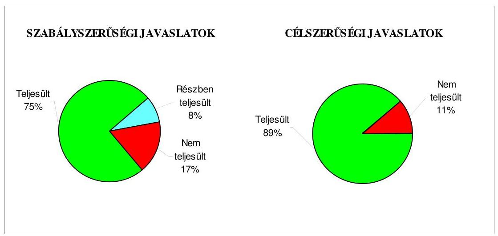

Budapest 2009. november 10.

Melléklet: $\quad 8 \mathrm{db} \quad 14$ lap
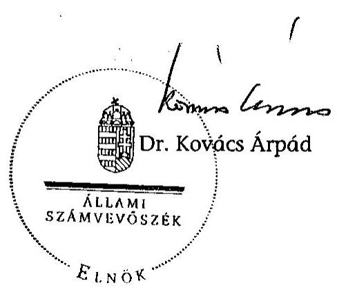

---

# 1. számú melléklet a V-3001-4/30/2009. számú jelentéshez 

## Heves Megyei Önkormányzat

## Az Önkormányzat gazdálkodását meghatározó adatok, mutatószámok

| Megnevezés |  |
| :--: | :--: |
| Heves Megye állandó lakosainak száma (fő) 2009. január 1-jén | 265228 |
| A Közgyűlés tagjainak a száma (fő) (2008. december 31-én) | 40 |
| A Közgyűlés munkáját segítő állandó bizottságok száma (2008. december 31-én) | 8 |
| Az Önkormányzati hivatalban foglalkoztatott köztisztviselők száma (fő) (2008. december 31-én) | 63 |
| Az összes vagyon értéke a 2008. december 31-i könyvviteli mérleg szerint (millió Ft) | 26942 |
| Az adósságállomány (hosszú és rövid lejáratú kötelezettség) 2008. december 31-én (millió Ft) | 4175 |
| Az egy lakosra jutó adósságállomány 2008. december 31-én (Ft) | 15741 |
| Az összes 2008. évben teljesített költségvetési bevétel (millió Ft) | 18670 |
| Ebből: saját bevétel (millió Ft), melyből | 4730 |
| helyi adóbevétel (millió Ft) | 0 |
| Az egy lakosra jutó 2008. évi költségvetési bevétel (Ft) | 70392 |
| Az egy lakosra jutó 2008. évi saját bevétel (Ft) | 17834 |
| Az egy lakosra jutó 2008. évi helyi adóbevétel (Ft) | 0 |
| Saját bevétel/Összes költségvetési bevétel aránya a 2008. évben (%) | 25,3 |
| Helyi adó bevétel/Összes költségvetési bevétel aránya a 2008. évben (%) | 0,0 |
| Az összes teljesített költségvetési kiadás a 2008. évben (millió Ft) | 19079 |
| Ebből: felhalmozási célú költségvetési kiadás (millió Ft) | 1538 |
| A 2008. évi költségvetési kiadásból a felhalmozási célú költségvetési kiadás aránya (%) | 8,1 |
| Az egy lakosra jutó 2008. évi költségvetési kiadás (Ft) | 71934 |
| Az egy lakosra jutó 2008. évben teljesített felhalmozási célú költségvetési kiadás (Ft) | 5799 |
| A költségvetési intézmények száma 2008. december 31-én (db) | 31 |
| Ebből: részben önállóan gazdálkodó (db) | 16 |
| A költségvetési intézményekben foglalkoztatott közalkalmazottak száma (fő) (2008. december 31-én) | 1972 |

---

# Az önkormányzati vagyon alakulása

|  Mérlegsor
megnevezése | 2006.év
(millió Ft) | 2007. év
(millió Ft) | 2008. év
(millió Ft) | Változás %-a (Előző év=100\%) |  |   |
| --- | --- | --- | --- | --- | --- | --- |
|   |  |  |  | 2007/2006. | 2008/2007. | 2008/2006.  |
|  Immateriális javak | 19 | 15 | 9 | 78,9 | 60,0 | 47,4  |
|  Tárgyi eszközök | 21568 | 22479 | 14408 | 104,2 | 64,1 | 66,8  |
|  ebből: ingatlanok | 20163 | 20543 | 13659 | 101,9 | 66,5 | 67,7  |
|  beruházások | 215 | 736 | 71 | 342,3 | 9,6 | 33,0  |
|  Befektetett pénzügyi eszközök | 42 | 36 | 47 | 85,7 | 130,6 | 111,9  |
|  Üzemeltetésre átadott eszközök | 129 | 119 | 9017 | 92,2 | 7577,3 | 6989,9  |
|  Befektetett eszközök összesen | 21758 | 22649 | 23481 | 104,1 | 103,7 | 107,9  |
|  Forgóeszközök összesen | 2554 | 4153 | 3461 | 162,6 | 83,3 | 135,5  |
|  ebből: követelések | 1451 | 64 | 56 | 4,4 | 87,5 | 3,9  |
|  pénzeszközök | 803 | 695 | 3057 | 86,6 | 439,9 | 380,7  |
|  Eszközök összesen | 24312 | 26802 | 26942 | 110,2 | 100,5 | 110,8  |
|  Saját tőke összesen | 22337 | 21513 | 19421 | 96,3 | 90,3 | 86,9  |
|  Tartalék összesen | $-33$ | 157 | 2850 | - | 1815,3 | -  |
|  Kötelezettségek összesen | 2008 | 5132 | 4671 | 255,6 | 91,0 | 232,6  |
|  ebből: hosszú lejáratú kötelezettségek | 0 | 3000 | 3011 | - | 100,4 | -  |
|  rövid lejáratú kötelezettségek | 840 | 1360 | 1164 | 161,9 | 85,6 | 138,6  |
|  Források összesen: | 24312 | 26802 | 26942 | 110,2 | 100,5 | 110,8  |

Forrás: Magyar Államkincstár éves költségvetési beszámoló "01" számú űrlap adatai.

---

# Az önkormányzati kötelezettségek alakulása

|  Mérlegsor megnevezése | 2006.év
(millió Ft) | 2007. év
(millió Ft) | 2008. év
(millió Ft) | Változás %-a (Előző év=100\%) |  |   |
| --- | --- | --- | --- | --- | --- | --- |
|   |  |  |  | 2007/2006. | 2008/2007. | 2008/2006.  |
|  Hosszú lejáratú kötelezettségek összesen
ebből: | 0 | 3000 | 3011 | - | 100,4 | -  |
|  hosszú lejáratra kapott kölcsönök |  |  |  |  |  |   |
|  tartozások fejlesztési célú kötvénykibocsátásból | 0 | 3000 | 3000 | - | 100,0 | -  |
|  tartozások működési célú kötvénykibocsátásból |  |  |  | - | - | -  |
|  beruházási és fejlesztési hitelek |  |  |  |  |  |   |
|  müködési célú hosszú lejáratú hitelek |  |  |  | - | - | -  |
|  egyéb hosszú lejáratú kötelezettségek |  |  | 11 | - | - | -  |
|  Rövid lejáratú kötelezettségek összesen
ebből: | 840 | 1360 | 1164 | 161,9 | 85,6 | 138,6  |
|  rövid lejáratú kölcsönök |  |  |  | - | - | -  |
|  rövid lejáratú hitelek | 303 | 572 | 1044 | 188,8 | 182,5 | 344,6  |
|  kötelezettségek áruszállításból, szolgáltatásból | 503 | 771 | 88 | 153,3 | 11,4 | 17,5  |
|  garancia- és kezességvállalásból származó kötelezettség |  |  |  | - | - | -  |
|  hosszú lejáratra kapott kölcsön következő évet terhelő törlesztő részlete |  |  |  | - | - | -  |
|  felhalm.c.kötvény kibocsátásból szárm.tartozás következő évet terh.részlete |  |  |  | - | - | -  |
|  mük.c.kötvény kibocsátásból szárm.tartozás következő évet terh.részlete |  |  |  | - | - | -  |
|  beruházási c hosszú lejáratú hitel következő évet terhelő törlesztő részlete |  |  |  | - | - | -  |
|  müködési c.hosszú lejáratú hitel következő évet terhelő törlesztő részlete |  |  |  | - | - | -  |
|  egyéb hosszú lejáratú kötelezettség következő évet terhelő törlesztő részlete |  |  | 19 | - | - | -  |

Forrás: Magyar Államkincstár éves költségvetési beszámoló "01" számú űrlap adatai.

---

3. számú melléklet

**Heves Megyei Önkormányzat**

Az Önkormányzat 2006-2009. évi költségvetési előirányzatainak és 2006-2008. évi pénzügyi teljesítéseinek alakulása

|  Megnevezés | 2006. év | 2007. év

 | 2008. év | 2009.  |
| --- | --- | --- | --- | --- |
|   | Eredeti | Módosított | Teljesítés | Teljesítés/  |
|   | előirányzat (millió Ft) | (millió Ft) | eredeti- | (millió Ft)  |
|   |  |  | előirány- |   |
|   |  |  | zat % |   |
|  Működési célú költségvetési bevételek összesen | 16 751 | 17 263 | 17 337 | 103,5  |
|  Működési célú költségvetési kiadások összesen | 17 283 | 17 676 | 17 406 | 100,7  |
|  Működési célú költségvetési bevételek és kiadások egyenlege: hiány-, többlet + | -532 | -413 | -69 | 13,0  |
|  Felhalmozási célú költségvetési bevételek összesen | 1 724 | 2 009 | 1 233 | 71,5  |
|  Felhalmozási célú költségvetési kiadások összesen | 1 898 | 2 202 | 1 200 | 63,2  |
|  Felhalmozási célú költségvetési bevételek és kiadások egyenlege: hiány-, többlet+ | -174 | -193 | 33 | 119,0  |
|  Költségvetési bevételek összesen | 18 475 | 19 271 | 18 571 | 100,5  |
|  Költségvetési kiadások összesen | 19 181 | 19 879 | 18 607 | 97,0  |
|  Költségvetési bevételek és kiadások egyenlege: hiány-, többlet+ | -706 | -608 | -36 | 5,1  |
|  Finanszírozási célú pénzügyi bevételek | 923 | 825 | 221 |   |
|  Finanszírozási célú pénzügyi kiadások | 217 | 217 | 0 |   |
|  Finanszírozási célú pénzügyi műveletek egyenlege | 706 | 608 | 221 |   |

*Forrás: -* Magyar Államkincstár éves költségvetési beszámoló "80" számú űrlap adatai; - a 2009. évi adatok esetében az Önkormányzat 2009. évi költségvetése; - a költségvetési bevétel-kiadás működési-felhalmozási célra tört

---

## 4. számú melléklet a V-3001-4/30/2009. számú jelentéshez

|  Sor-
szám | Az európai uniós forrásokkal támogatott célok és programok 2006-2009. évi tervezett és teljesített adatairól |  |  |  |  |  |  |  |  |  |  |  |  |  |  |  |  |  |   |
| --- | --- | --- | --- | --- | --- | --- | --- | --- | --- | --- | --- | --- | --- | --- | --- | --- | --- | --- | --- |
|   |  |  |  |  |  |  |  |  |  |  |  |  |  |  |  |  |  |  |   |
|   |  |  |  |  |  |  |  |  |  |  |  |  |  |  |  |  |  |  |   |
|   |  |  |  |  |  |  |  |  |  |  |  |  |  |  |  |  |  |  |   |
|   |  |  |  |  |  |  |  |  |  |  |  |  |  |  |  |  |  |  |   |
|   |  |  |  |  |  |  |  |  |  |  |  |  |  |  |  |  |  |  |   |
|   |  |  |  |  |  |  |  |  |  |  |  |  |  |  |  |  |  |  |   |
|   |  |  |  |  |  |  |  |  |  |  |  |  |  |  |  |  |  |  |   |
|   |  |  |  |  |  |  |  |  |  |  |  |  |  |  |  |  |  |  |   |
|   |  |  |  |  |  |  |  |  |  |  |  |  |  |  |  |  |  |  |   |
|   |  |  |  |  |  |  |  |  |  |  |  |  |  |  |  |  |  |  |   |
|   |  |  |  |  |  |  |  |  |  |  |  |  |  |  |  |  |  |  |   |
|   |  |  |  |  |  |  |  |  |  |  |  |  |  |  |  |  |  |  |   |
|   |  |  |  |  |  |  |  |  |  |  |  |  |  |  |  |  |  |  |   |
|   |  |  |  |  |  |  |  |  |  |  |  |  |  |  |  |  |  |  |   |
|   |  |  |  |  |  |  |  |  |  |  |  |  |  |  |  |  |  |  |   |
|   |  |  |  |  |  |  |  |  |  |  |  |  |  |  |  |  |  |  |   |
|   |  |  |  |  |  |  |  |  |  |  |  |  |  |  |  |  |  |  |   |
|   |  |  |  |  |  |  |  |  |  |  |  |  |  |  |  |  |  |  |   |
|   |  |  |  |  |  |  |  |  |  |  |  |  |  |  |  |  |  |  |   |
|   |  |  |  |  |  |  |  |  |  |  |  |  |  |  |  |  |  |  |   |
|   |  |  |  |  |  |  |  |  |  |  |  |  |  |  |  |  |  |  |   |
|   |  |  |  |  |  |  |  |  |  |  |  |  |  |  |  |  |  |  |   |
|   |  |  |  |  |  |  |  |  |  |  |  |  |  |  |  |  |  |  |   |
|   |  |  |  |  |  |  |  |  |  |  |  |  |  |  |  |  |  |  |   |
|   |  |  |  |  |  |  |  |  |  |  |  |  |  |  |  |  |  |  |   |
|   |  |  |  |  |  |  |  |  |  |  |  |  |  |  |  |  |  |  |   |
|   |  |  |  |  |  |  |  |  |  |  |  |  |  |  |  |  |  |  |   |
|   |  |  |  |  |  |  |  |  |  |  |  |  |  |  |  |  |  |  |   |

  |  |  |  |  |  |  |  |  |  |  |  |  |  |  |   |
|   |  |  |  |  |  |  |  |  |  |  |  |  |  |  |  |  |  |  |   |
|   |  |  |  |  |  |  |  |  |  |  |  |  |  |  |  |  |  |  |   |
|   |

---

|  |   |   |   |   |   |   |   |   |   |   |   |   |   |   |   |   |   |   |   |   |   |   |   |   |   |   |   |   |   |   |   |   |   |   |   |   |   |   |   |   |   |   |   |   |   |   |   |   |   |   |   |   |   |   |   |   |   |   |   |   |   |   |   |   |   |   |   |   |   |   |   |   |   |   |   |   |   |   |   |   |   |   |   |   |   |   |   |   |   |   |   |   |   |   |   |   |   |   |   |   |   |   |  

---

|  |   |   |   |   |   |   |   |   |   |   |   |   |   |   |   |   |   |   |   |   |   |   |   |   |   |   |   |   |   |   |   |   |   |   |   |   |   |   |   |   |   |   |   |   |   |   |   |   |   |   |   |   |   |   |   |   |   |   |   |   |   |   |   |   |   |   |   |   |   |   |   |   |   |   |   |   |   |   |   |   |   |   |   |   |   |   |   |   |   |   |   |   |   |   |   |   |   |   |   |   |   |  

---

# ADATLAP 

## az európai uniós forrással támogatott ÉMOP-2007-4.2.2. Heves Megyei Önkormányzat Vámosgyörki Idősek Otthonának akadálymentesítése fejlesztésről

## 1. A PÁLYÁZÓ ADATAI

1.1. A pályázó Önkormányzat neve: Heves Megyei Önkormányzat
1.2. A pályázó Önkormányzat címe: 3300 Eger, Kossuth Lajos u. 9.

## 2. A PROJEKT ÖSSZEGZŐ ADATAI

2.1. A pályázott program megnevezése: ÉMOP-2007-4.2.2. Utólagos akadálymentesítés az önkormányzati feladatokat ellátó intézményekben
2.2. A pályázott programon belül a projekt címe: a Heves Megyei Önkormányzat Vámosgyörki Idősek Otthonának akadálymentesítése
2.3. A pályázatot készítő megnevezése: Heves Megyei Önkormányzati Hivatal (Terület- és Intézményfejlesztési Iroda)
2.4. A pályázat benyújtásának időpontja: 2007. 09. 10.

### 2.5. A projekt tervezett

- teljes kiadásának összege: 22440000 Ft
- saját forrás: 2440000 Ft
- támogatásának összege: 20000000 Ft
- európai uniós: 20000000 Ft
- hazai társfinanszírozás: ---
- EU Önerő Alap: ---
- hitel: ---
- egyéb forrás: ---
- a megvalósítás tervezett időpontja (év, hó, nap): 2009. 06. 30.

---

2.6 A pályázat elbírálásáról szóló döntés kelte: 2008. 05. 16.
2.7 A pályázat elbírálásának eredménye: 20 millió Ft összegű támogatásban részesült a Regionális Fejlesztési Programok Irányító Hatósága vezetőjének döntése szerint (K-2008-ÉMOP-4.2.2-0003085 iktatószámú értesítés)

# 2.8 A projekt teljesített ${ }^{1}$ : 

- kiadásának összege: 22400000 Ft
- saját forrás: 10420928 Ft (megelőlegezés miatt)
- támogatásának összege: 11979072 Ft
- európai uniós: 11979072 Ft
- hazai társfinanszírozás: ---
- EU Önerő Alap: ---
- hitel: ---
- egyéb forrás: ---
- a megvalósítás időpontja: kivitelezés: 2009. 03. 31., pénzügyi elszámolás folyamatban

## 3. A TÁMOGATÁSI SZERZŐDÉS ADATAI

### 3.1. A támogatási szerződés:

- megkötésének időpontja: 2008. 08. 25.
- a projekt kezdési és befejezési időpontja: 2008. 11. 15-2009. 06. 30.
- a projekt összköltsége (kiadása): 22440000 Ft
- a projekt megvalósítás forrásai:
- saját forrás: 2440000 Ft
- európai uniós támogatás: 20000000 Ft
- hazai társfinanszírozás: ---
- EU Önerő Alap: ---
- hitel: ---
- egyéb forrás: ---
- előírt támogatási határidők: ---

[^0]
[^0]:    ${ }^{1}$ 2009. 06. 08-ig

---

- előírt fizetési kötelezettségek: előfinanszírozás

4. A KIFIZETÉSI KÉRELEM ÉS TÁMOGATÁS FOLYÓSÍTÁS ADATAI

| Kifizetési kérelem   (PEJ/EPEJ)   benyújtásának   időpontja | Számla   bruttó   összege   (Ft) | Igényelt   támogatási   összeg   (Ft) | Folyósított   támogatás   összege   (Ft) | Támogatás   folyósításának   időpontja   (év, hó, nap) | Benyújtás   és a   folyósítás   között   eltelt   időtartam   (nap) |
| :--: | :--: | :--: | :--: | :--: | :--: |
| Előleg | --- | --- | --- | --- | --- |
| 2009.03.24. | 6720000 | 5989536 | 5989536 | 2009.04.16. | 23 |
| 2009.04.22. | 6720000 | 5989536 | 5989536 | 2009.05.11. | 19 |
| 2009.06.02. | 8960000 | 7986048 | --- | --- | --- |
| Összesen | 22400000 | 19965120 | 11979072 |  |  |

5. Ellenőrzések

# 5.1. A külső ellenőrzések: 

- az ellenőrzések száma: egy
- az ellenőrzést végző szervek megnevezése: VÁTI Magyar Regionális Fejlesztési és Urbanisztikai Közhasznú Társaság (közreműködő szervezet)

### 5.2. Szabálytalanságokra vonatkozó adatok:

- mely előírást nem tartotta be az Önkormányzat: ---
- az előírás nem teljesítésének okai: ---
- a rendezésre előírt kötelezettségek: ---
- a rendezésre előírt kötelezettséget mennyi időn belül teljesítették: ---
- mekkora időbeli csúszást eredményezett ez a projekt megvalósításában (év, hó, nap): --

Eger, 2009. június 5.
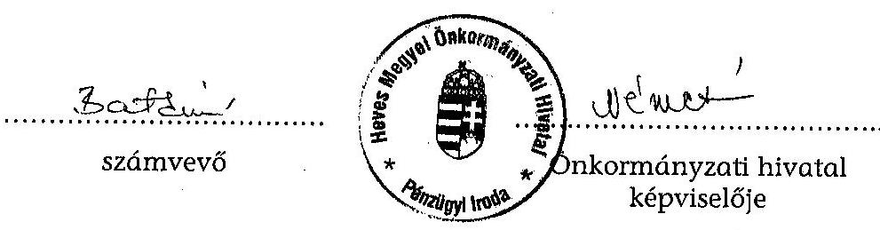

---

# Heves Megyei Közgyűlés Elnöke 

42-16/2009/005.

Tárgy: Intézkedés az ÁSZ jelentésben foglaltakra Melléklet: Intézkedési terv

Dr. Kovács Árpád Elnök Úr Állami Számvevőszék

## Budapest

Tisztelt Elnök Úr!
Az Állami Számvevőszék által a Heves Megyei Önkormányzat gazdálkodási rendszerének 2009. évi ellenőrzéséről készített jelentést megkaptam.

A Jelentésben megfogalmazott megállapításokat és javaslatokat megismertem, azokkal egyetértek, így az Állami Számvevőszékről szóló 1989. évi XXXVIII. törvény 25. § (1) bekezdésében foglalt észrevételi lehetőséggel nem kívánok élni.

Egyidejűleg mellékelem azt az intézkedési tervet, melyet a helyszíni ellenőrzés megállapításainak hasznosítása mellett tett javaslatok megvalósítására készíttettem és a Közgyűlés soron következő ülésén terjesztem elő.

Az előzetes egyeztetésnek megfelelően a számvevőszéki jelentés megállapításairól, javaslatairól, valamint ennek végrehajtása érdekében tett intézkedésekről a Közgyűlést a jelentés véglegesítését követő közgyűlésen tájékoztatom.

Az Önkormányzat nevében köszönetemet fejezem ki az ÁSZ ellenőrzést végző munkatársainak a korrekt és  igényes vizsgálatért és a folyamatos, segítőkész szakmai egyeztetésekért.

Eger, 2009. október 17.
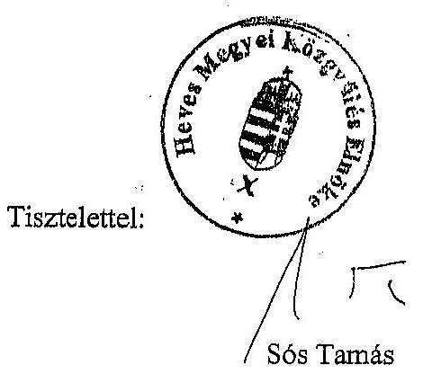

---

# Heves Megye Főjegyzője 

42-17/2009/005.

Tárgy: Intézkedési terv az ÁSZ 2009. évi ellenőrzésének megállapításaira

## Heves Megyei Önkormányzati Hivatal

Helyben

Az Állami Számvevőszék Elnöke október 9-én küldte meg a Heves Megyei Önkormányzat gazdálkodási rendszerének 2009. évi ellenőrzéséről készült Állami Számvevőszéki Jelentést. A számvevői jelentésben megfogalmazott javaslatokra vonatkozóan a munka színvonalának javítása érdekében az alábbi feladatokat határozom meg:

1. Az európai uniós források igénybevételével és felhasználásával kapcsolatos hivatali belső szabályozást ki kell egészíteni:

- a pályázatkészítés és a fejlesztési feladatok lebonyolítása vonatkozásában a kapcsolattartás és információáramlás rendjének meghatározásával,
- az európai uniós pályázatok készítésére kötött szerződésekben a feladattal megbízott külső szervezet és az Önkormányzati Hivatal képviselője közötti információátadás formájának és módjának szabályozásával.

Felelős: Terület-és Intézményfejlesztési Iroda vezetője Határidő: 2009. november 30.
2. Az informatikai rendszer szabályozottságának biztosítása és a kialakított belső kontrollok működtetése érdekében:

- ki kell jelölni a pénzügyi-számviteli rendszerből lekérhető ellenőrzési lista (napló) vizsgálatáért felelős dolgozót, amelyet a munkaköri leírásában is szerepeltetni kell és egyidejűleg elő kell írni számára a folyamatosan végzendő ellenőrzés követelményét.

Felelős: Informatikai csoport vezetője
Pénzügyi Iroda vezetője
Határidő: 2009. október 31.,
majd folyamatos

- az informatikai rendszerek adatvédelmi biztonsága érdekében a jelszavak használatának előírt szabályait minden dolgozó fokozottan tartsa be.

Felelős: Informatikai csoport vezetője
Egészségügyi és Szociális Iroda vezetője
Művelődési és Sportiroda vezetője
Nemzetközi Kapcsolatok és Idegenforgalmi
Iroda vezetője

---

Pénzügyi Iroda vezetője
Terület-és Intézményfejlesztési Iroda vezetője
Határidő: 2009. november 30.,
majd folyamatos

Eger, 2009. október 18.
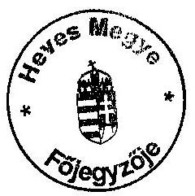
Dr. Benkár József

Kapják:

1. Egészségügyi és Szociális Iroda
2. Művelődési és Sportiroda
3. Nemzetközi Kapcsolatok és Idegenforgalmi Iroda
4. Pénzügyi Iroda
5. Terület-és Intézményfejlesztési Iroda
6. Informatikai Csoport
7. Belső Ellenőrzési Csoport
8. Irattár

---

# SZÁMVEVŐSZÉK 

V-3001-4/30/20/2009.

## Sós Tamás úr,

Közgyűlés elnöke
Heves Megyei Önkormányzat

Eger
Kossuth L. u.

 9. sz.
3300

## Tisztelt Elnök Úr!

Köszönettel vettem a Heves Megyei Önkormányzat gazdálkodási rendszerének 2009. évi ellenőrzéséről szóló jelentésben feltárt hiányosságok megszüntetésére összeállított intézkedési tervet, amely megjelöli a feladatok elvégzéséért felelős személyeket és a határidőket is.

Az intézkedési terv végrehajtásával a megállapított hiányosságok megszüntethetők, az abban foglaltak megvalósítását a későbbiekben - az Állami Számvevőszék évenkénti ellenőrzési tervének figyelembevételével - ellenőrizzük.

Kérem, hogy munkája során kísérje figyelemmel az intézkedési tervben foglalt feladatok végrehajtását!

További munkájukhoz sok sikert kívánok!
Budapest, 2009. november "3"
Tisztelettel:
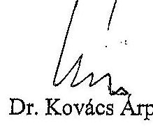
