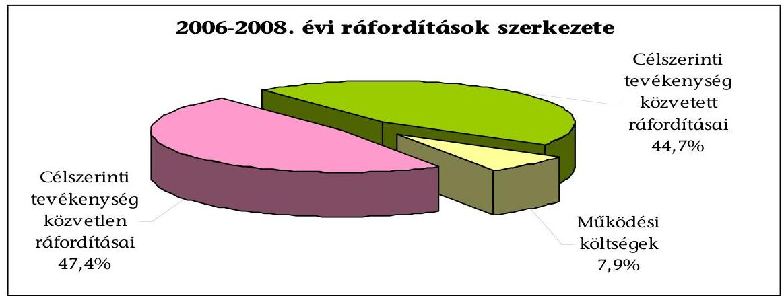
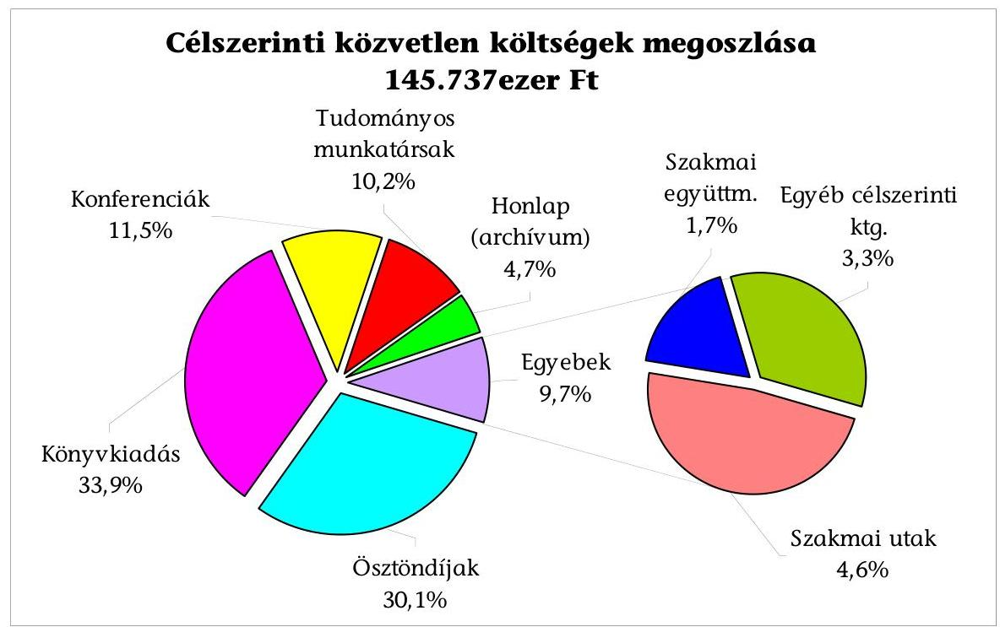
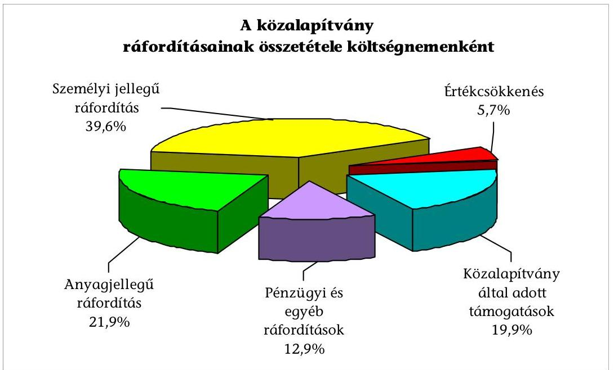
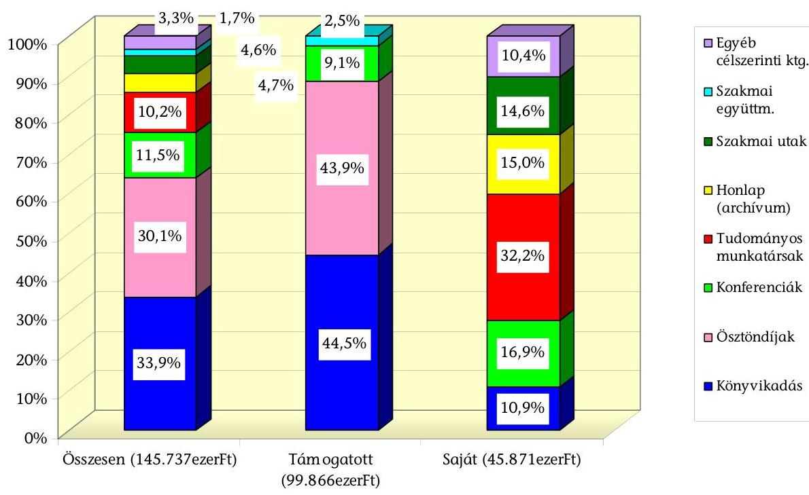
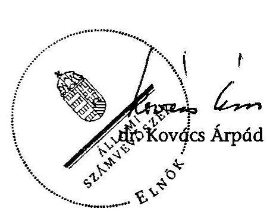

# ÁLLAMI   SZÁMVEVŐSZÉK 

## JELENTÉS

a Habsburg-kori Kutatások Közalapítvány gazdálkodásának ellenőrzéséről

---

# 3. Önkormányzati és Területi Ellenőrzési Igazgatóság 

3.1. Szabályszerűségi Ellenőrzési Főcsoport

Iktatószám: V-3013-30/2009.
Témaszám: 950
Vizsgálat-azonosító szám: V-0462

## Az ellenőrzést felügyelte:

Dr. Lóránt Zoltán
főigazgató
Az ellenőrzés végrehajtásáért felelős:
Dr. Elek János
általános főigazgató-helyettes
Az ellenőrzést vezette:
Solymár Ágnes
osztályvezető főtanácsos
Az összefoglaló jelentést készítette:
Kulcsár Lászlóné
számvevő
Az ellenőrzést végezték:
Brebán Andrea
Kulcsár Lászlóné
Robák Ferencné
számvevő tanácsos
számvevő tanácsos

---

# TARTALOMJEGYZÉK 

BEVEZETÉS ..... 7
I. ÖSSZEGZŐ MEGÁLLAPÍTÁSOK, KÖVETKEZTETÉSEK, JAVASLATOK ..... 9
II. RÉSZLETES MEGÁLLAPÍTÁSOK ..... 16

1. A közalapítvány működésének szabályozottsága és szabályossága ..... 16
1.1. Az alapító okirat ..... 16
1.2. A szervezeti és működési szabályzat ..... 18
1.3. A kuratórium működése ..... 19
2. A gazdálkodás és könyvvezetés szabályozottsága, szabályossága ..... 21
2.1. Az éves költségvetések ..... 21
2.2. A gazdálkodási tevékenység ..... 21
2.3. A számviteli szabályzatok ..... 22
2.4. A könyvvezetés rendszere ..... 24
3. A beszámolási kötelezettség teljesítése ..... 25
4. A bevételek és ráfordítások ..... 26
4.1. A bevételek alakulása és összetétele ..... 26
4.2. A kapott támogatásokkal történő elszámolás ..... 27
4.3. A ráfordítások alakulása és összetétele ..... 28
5. A közalapítvány célszerinti tevékenysége ..... 30
5.1. A közalapítvány által végzett célszerinti tevékenységek összetétele ..... 30
5.2. A célszerinti tevékenység ..... 31
5.2.1. Ösztöndíjak ..... 32
5.2.2. Könyvkiadás ..... 35
5.2.3. Egyéb célszerinti tevékenység ..... 35
6. Az ellenőrzési rendszer ..... 37

## MELLÉKLETEK

1. számú melléklet A Habsburg-kori Kutatások Közalapítvány bevételei és költségei, ráfordításai
2. számú melléklet Habsburg-kori Kutatások Közalapítvány célszerinti tevékenysége
3. számú melléklet A Habsburg-kori Kutatások Közalapítvány által elszámolt tiszteletdíjak és költségtérítések

---

# 2

---

# RÖVIDÍTÉSEK JEGYZÉKE 

| Alapító | Magyar Köztársaság Kormánya |
| :-- | :-- |
| FB | Felügyelő Bizottság |
| Intézet | Habsburg Történeti Intézet |
| Khtv. | A közhasznú szervezetekről szóló 1997. évi CLVI. törvény |
| Közalapítvány | Habsburg-kori Kutatások Közalapítvány |
| Pályáztatási szabályzat | A Habsburg-kori Kutatások Közalapítvány pályáztatási és   támogatási szabályzata |
| Ptk. | A Polgári Törvénykönyvről szóló 1959. évi IV. törvény |
| SZMSZ | Szervezeti és Működési Szabályzat |
| Számviteli rendelet | A számviteli törvény szerinti egyes egyéb szervezetek be-   számoló-készítési és könyvvezetési kötelezettségének sajá-   tosságairól szóló 224/2000. (XII. 19.) Korm. rendelet |
| Szt. | A számvitelről szóló 2000. évi C. törvény |
| OKM | Oktatási és Kulturális Minisztérium |

---

.

---

# ÉRTELMEZŐ SZÓTÁR 

Alapítvány bevételei

Alapítvány költségei (kiadásai)

A vállalkozási tevékenység bevétele, az alapítványi célú tevékenység bevételei (minden olyan bevétel, amely nem a vállalkozási tevékenységhez kapcsolódó befizetés, ideértve a céltámogatást is) [115/1992. (VII. 23.) Korm. rendelet 3. § (1) bekezdésének a)-b) pontja].

A vállalkozási tevékenység közvetlen költségei, az alapítványi célú tevékenység közvetlen költségei, az alapítvány kezelő szervének költségei (kiadásai) és az egyéb közvetett költségek (kiadások) [115/1992. (VII. 23.) Korm. rendelet 3. § (2) bekezdésének a); (b); c) pontja].
Minden olyan tevékenység, amely a létesítő okiratban megjelölt célkitűzés elérését közvetlenül szolgálja [Khtv. 26. § b) pontja].

Közhasznú egyszerűsített éves beszámoló

Közhasznú tevékenység

Közhasznúsági jelentés

Támogatás
Vezető tisztségviselő a közalapítványoknál

A közalapítvány olyan alapítvány, amelyet az Országgyűlés, a Kormány, valamint a helyi önkormányzat vagy kisebbségi önkormányzat képviselő-testülete közfeladat ellátásának folyamatos biztosítása céljából hoz létre [Ptk. 2006. VIII. 23-ig hatályos 74/G. § (1) bekezdése].
A közhasznú nyilvántartásba vett közalapítványoknál mérlegből, közhasznú eredmény-kimutatásból és tájékoztató adatokból áll [224/2000. (XII. 19.) Korm. rendelet 6. § (8) bekezdése, illetve 4. és 6 . számú melléklete].
A társadalom és az egyén közös érdekeinek kielégítésére irányuló, a közhasznú közalapítvány alapító okiratában szereplő cél szerinti tevékenység a törvényben meghatározott körben [Khtv. 26. § c) pontja].
Tartalmazza a számviteli beszámolót; a költségvetési támogatás felhasználását; a vagyon felhasználásával kapcsolatos kimutatást; a cél szerinti juttatások kimutatását; a központi költségvetési szervtől, az elkülönített állami pénzalaptól, a helyi önkormányzattól, a települési önkormányzatok társulásától és mindezek szerveitől kapott támogatás mértékét; a közhasznú szervezet vezető tisztségviselőinek nyújtott juttatások értékét, illetve összegét; a közhasznú tevékenységről szóló rövid tartalmi beszámolót [Khtv. 19. § (3) bekezdése].
Pénzbeli és nem pénzbeli juttatás [Khtv. 26. § j) pontja].
A közalapítvány kuratóriumának és felügyelő bizottságának elnöke és tagja, a közalapítvánnyal munkaviszonyban vagy munkavégzésre irányuló egyéb jogviszonyban álló, az alapító okirat szerint egyszemélyi felelős vezető feladatot ellátó személy [Khtv. 26. § m) pontja].

---

# 6

---

# JELENTÉS   a Habsburg-kori Kutatások Közalapítvány gazdálkodásának ellenőrzéséről 

## BEVEZETÉS

A Magyar Köztársaság Kormánya (alapító) a Habsburg-kori Kutatások Közalapítványt (közalapítvány) a Polgári Törvénykönyvről szóló 1959. évi IV. törvény (Ptk.) 74/G. §-a alapján, továbbá a muzeális intézményekről, a nyilvános könyvtári ellátásról és a közművelődésről szóló 1997. évi CXL. törvény 73. § (1) és (2) bekezdésében meghatározott feladatok ellátására a 1216/2002. (XII. 28.) Korm. határozattal közhasznú szervezetként hozta létre. A közalapítvány számára az alapító okirat a közhasznú szervezetekről szóló 1997. évi CLVI. törvény (Khtv.) 26. § c) 3., 6. és 19. pontjaiban rögzített közhasznú tevékenységek végzését írta elő. ${ }^{1}$ A közalapítvány felett az alapítót megillető jogkört az oktatási és kulturális miniszter gyakorolja.

A közalapítvány célja Magyarország európai integrációjának a társadalomtudományok eszközeivel történő elősegítése, továbbá Magyarország helyének meghatározása, oktatása és népszerűsítése az egyetemes európai történelemben, amelynek keretében végzett tevékenységei:

- a Habsburg Birodalom és öröksége témakörökben tudományos tevékenység és kutatás;
- az egyetemi doktori képzés segítése;
- kiadványok szerkesztése, kiadása;
- hazai és nemzetközi pályázatok, illetve ösztöndíjak kiírása a Habsburg Birodalom témájában, történelmi és társadalomtudományi témakörökben;
- konferenciák, szakmai konzultációk szervezése;
- Habsburg történeti internetes (online) távképzés kidolgozása;
- a fenti témakörökben új tudományos projektek indítása és meglévő projektek átvétele;
- nemzetközi együttműködés kialakítása.

[^0]
[^0]:    ${ }^{1}$ A Khtv. 26. § c) 3. tudományos tevékenység, kutatás; 6. kulturális örökség megóvása; 19. euroatlanti integráció elősegítése tevékenységeket jelöli meg.

---

A közalapítvány a tevékenységei megvalósítása érdekében létrehozta és működtette a Habsburg Történeti Intézetet (intézet). Az intézet a feladatok végrehajtásaként a Habsburg-kor témaköreihez kapcsolódóan pályázatokat írt ki, szakembereket kért fel kutatómunkák elvégzésére, könyvek kiadását támogatta, konferenciákat szervezett vagy támogatott, szakmai együttműködést folytatott a médiával, továbbá a közalapítvánnyal együtt életműdíjat adományozott hazai neves történészeknek.

A közalapítvány alapító okiratban meghatározott induló vagyona 20 millió Ft volt, ebből az alapító 10 millió Ft törzsvagyont állapított meg. Feladatai ellátásához a központi költségvetésből a 2006-2008. évekre összesen 282 millió Ft címzett támogatást kapott, emellett 14 millió Ft egyéb támogatásban részesült.

Az Állami Számvevőszék (ÁSZ) az államháztartásról szóló 1992. évi XXXVIII. törvény és egyes kapcsolódó törvények módosításáról szóló 2006. évi LXV. törvény 1. § (2) bekezdésének e) pontja alapján ellenőrzi a közalapítványok gazdálkodásának törvényességét és célszerűségét. Az Állami Számvevőszékről szóló 1989. évi XXXVIII. törvény 2. § (5) bekezdése alapján ellenőrzi a közalapítványoknál az állami költségvetésből nyújtott támogatás és az ingyenesen juttatott alapítói vagyon felhasználását.

Az Állami Számvevőszék a közalapítvány gazdálkodásának szabályszerűségi ellenőrzését helyszíni ellenőrzés keretében első alkalommal végezte, amely a 2006. január 1-jétől 2008. év december 31-éig tartó időszakra terjedt ki. Az ellenőrzés során feladat volt annak értékelése, hogy:

- a közalapítvány alapító okirata és belső szabályzatai megteremtették-e a költségvetési támogatás felhasználásának törvényes kereteit;
- a közalapítvány gazdálkodása megfelelt-e a vonatkozó jogszabályok, az alapító okirat és a belső szabályzatok előírásainak;
- a közalapítvány a kapott állami támogatást szabályosan, rendeltetésszerűen használta-e fel az alapító okiratban meghatározott céljainak megvalósítása és feladatainak ellátása érdekében.

Az ellenőrzés során a szabályozásokat a vonatkozó jogszabályok és az alapító okirat előírásaival való összehasonlítással, a képviseleti jog gyakorlását a szerződések teljes körű vizsgálatával, a bankszámla feletti rendelkezést és a házipénztár szabályszerűségét az ellenőrzött évekre egy-egy negyedév forgalmának ellenőrzésével, a beszámolók szabályosságát azok sorainak a főkönyvi kivonatok és leltárak adatainak összevetésével végeztük el. Tételesen ellenőriztük a kuratóriumi határozatok meghozatalának szabályosságát, a közbeszerzésekről szóló törvény előírásainak betartását, a kapott költségvetési és nem költségvetési támogatások felhasználására kötött szerződéseket és a támogatások felhasználásával való elszámolások szabályosságát. Tanúsítvány alapján elemeztük a közalapítvány célszerinti tevékenységének összetételét, ezen belül tételes vizsgálatra kerültek a támogatott és saját rendezésű konferenciák, a könyvkiadások, a meghívásos kutatási ösztöndíjak, a szakmai utak, nemzetközi együttműködések és a Habsburg történeti online digitális archívum. Az intézet ösztöndíjprogramját évi 25%-os mintavétel alapján ellenőriztük.

---

# I. ÖSSZEGZŐ MEGÁLLAPÍTÁSOK, KÖVETKEZTETÉSEK, JAVASLATOK 

A közalapítvány a kapott állami és egyéb támogatásokat szabályosan, rendeltetésszerűen használta fel az alapító okiratban meghatározott céljai megvalósítása érdekében. A közalapítvány céljainak megvalósítását szolgáló 300 300 ezer Ft összegű bevételeinek 96,3%-a származott a központi költségvetésből, amelyet egyrészt címzett központi költségvetési támogatásként, másrészt költségvetési fejezettől, egyedi elbírálás alapján, a felhasználás céljának pontos megjelölésével kapott. Az összes bevétel 2,7%-a költségvetésen kívüli gazdálkodó szervezetektől, 1,0%-a pedig az átmenetileg szabad pénzeszközök hasznosításából realizálódott. A támogatásokról készült szerződések szabályszerűek voltak, a közalapítvány eleget tett a szerződésekben meghatározott elszámolási kötelezettségeinek. A címzett támogatást nyújtó OKM a 2007-2008. években késve biztosította a működési és tudományos tevékenység költségeinek fedezetét, ez a közalapítványnál tervezési és működési bizonytalanságot okozott a támogatási szerződés megkötésének időpontjáig. A támogatásokat célszerinti tevékenységeinek, illetve a támogatási szerződések előírásainak megfelelően használta fel. A költségvetésen kívüli gazdálkodó szervezetektől származó támogatás befogadásáról a kuratórium az alapító okirat előírásától eltérően nem döntött, de a beszámolók elfogadásához kapcsolódóan tudomásul vette azok felhasználását.

A közalapítvány az ellenőrzött években összesen 307 366 ezer Ft ráfordítást számolt el, amelynek 92,1%-át az alapító okiratban meghatározott célszerinti tevékenységére és 7,9%-át a kuratórium és az FB működésére fordította.

A működéssel kapcsolatos költségek és ráfordítások az alapító okiratban rögzített 10%-os mértéket nem haladták meg. A kuratórium az alapító okirat rendelkezésének megfelelően, SZMSZ-ében szabályozta a tiszteletdíjak és költségtérítések kifizetésének szabályait. A szabályozást és az annak alapján évente betervezett ráfordítást az alapító képviseletében eljáró miniszter előzetesen jóváhagyta. A tiszteletdíjak, költségtérítések kifizetésének módja és mértéke megfelelt az alapító okirat és az SZMSZ szabályozásának.

---

A közalapítvány az alapító által létrehozott intézettel szorosan együttműködve ellátott célszerinti tevékenységei a 2006-2008. években összhangban voltak az alapító okiratban megjelölt célokkal, minden esetben azokat szolgálták. A tevékenységek a Habsburg-kori történelmi időszakot átölelő témájú feladatok megvalósításához kapcsolódtak. A közalapítvány évente ösztöndíjakat adományozott, belföldön és külföldön történő könyvkiadást támogatott, konferenciákat és szakmai utakat szervezett, tudományos projektek és nemzetközi együttműködések kialakításában is részt vett, honlapján kialakította és működtette a Habsburg történeti online archívumot. A honlap húszezer oldalt meghaladó dokumentációs anyagot (sok esetben több nyelven) tartalmaz, amely mind a szakmai, mind a laikus érdeklődők számára online hozzáférést jelent. A közalapítvány és az intézet teljes körűen eleget tett az alapító által meghatározott fő működési céljának, megvalósította Magyarország európai integrációjának a társadalomtudományok eszközeivel történő elősegítését.

A közalapítvány 2006-2008-ban végzett közvetlen célszerinti tevékenységeinek összetételét szemlélteti a következő diagram.

A közalapítvány közvetlen célszerinti tevékenységének mintegy kétharmadát képviselték a könyvkiadásra és ösztöndíjakra fordított összegek, egy-egy tizedét a konferenciák és a tudományos munkatársak finanszírozására fordították, ezeken felüli tevékenységei a
 ráfordítások hetét tették ki.

A közalapítvány célszerinti tevékenységét egyrészt saját szervezetén belül, másrészt támogatások nyújtásával végezte.

A közalapítvány közvetlen célszerinti tevékenysége ráfordításaiból 68,5%-ban támogatást nyújtott (az ösztöndíjakat teljes egészében, a könyvkiadás 90%-át és a konferenciák 53%-át) és 31,5%-ot tették ki a saját szervezésben megvalósított egyéb események.

---

A kuratórium által elfogadott pályáztatási és támogatási szabályzat kizárólag a kilenchónapos ösztöndíjakra vonatkozó kiírási, bírálati és jóváhagyási feltételeket tartalmazta. A közalapítvány a támogatás nyújtása mellett végzett tevékenységek esetében (kivéve a kilenchónapos ösztöndíjra vonatkozó pályáztatást), az alapító okirat és a jogszabályi rendelkezéstől ${ }^{2}$ eltérően, pályázat kiírása nélkül nyújtotta támogatásait, amely a három év alatt elszámolt 99 866 ezer Ft összes támogatás 67,6%-át tette ki. A támogatási szerződéseket szabályzataiban meghatározottak szerint kötötte, azokat a kuratórium elnökhelyettese aláírta.

A közalapítvány támogatta a hazai és a külföldi könyvkiadást, továbbá a Századok történelmi folyóiratot. A támogatott szervezeteket - kettő kivételével - az előírt határidőn túl számoltatta el. Az újabb összegeket kiutalta annak ellenére, hogy a támogatott az előző időszaki támogatással elszámolt volna. Gazdálkodó szervezettől kapott támogatását a szerződésben meghatározott könyv kiadásának előkészítésére fordította.

Az ösztöndíjszerződések (ösztöndíjas és meghívásos ösztöndíjasok egyaránt) esetében a kuratórium a szerződések 15,9%-ánál a szerződés megkötését megelőzően, 84,1%-ánál az alapító okirat, valamint a közalapítvány pályáztatási szabályzata előírásaitól eltérően, a szerződés megkötését követően hozta meg döntését, azokat a beszámolókhoz kapcsolódóan utólag hagyta jóvá.

A konferenciák megvalósításáról és a támogatásnyújtással megvalósított konferenciáknál a támogatás mértékéről a kuratórium két eset kivételével határozott, a két konferenciára fordított 2450 ezer Ft-ról csak a szerződéskötést követően, utólag határozott jóváhagyólag.

Az ellenőrzött időszakban, a közalapítvány nevében a kuratórium elnökhelyettese egy esetben díjat tűzött ki, amely illeszkedett a közalapítvány célszerinti tevékenységébe, de erről a kuratórium nem döntött. További egy esetben támogatást nyújtott történelmi témájú szimpóziumon való részvételhez, azonban azt a kuratórium csak a közhasznúsági jelentés elfogadásával utólag hagyta jóvá.

Az alapító okirat előírása szerint 2007. december 31-én lejárt a kuratórium és a felügyelő bizottság megbízatása. A kuratórium a jogszabályi ${ }^{3}$ lehetőséggel élve folytatta tevékenységét, az alapító a tisztségviselők mandátumának lejárata miatt az alapító okirat módosítását a helyszíni ellenőrzés befejezését követően jóváhagyta (a bírósági bejegyzés folyamatban van). Az alapító okirat és annak módosításai egyebekben a vonatkozó jogszabályi előírásoknak megfeleltek. Az alapító okirat rendelkezett az intézet létrehozásáról, amely a közalapítvány célszerinti szakmai tevékenységét látta el. Az intézet igazgatóját a kuratórium az összeférhetetlenségi szabályok figyelembevételével nevezte ki. Az

[^0]
[^0]:    ${ }^{2}$ Az államháztartásról szóló 1992. évi XXXVIII. törvény és egyes kapcsolódó törvények módosításáról szóló 2006. évi LXV. törvény 1. § (2) bekezdés c) pontja írja elő a pályázat kiírási kötelezettséget.
    ${ }^{3}$ Ptk. 74/C. § (1) bekezdésének megfelelően a mandátum lejárata az új kezelőszerv kijelölésekor válik hatályossá.

---

alapító okirat a beszámolók közzétételének módjára vonatkozó előírásokat ellentmondásosan szabályozta, mert egyrészt megjelölte, hogy mely médiumokban kell megtenni a közzétételt, de egyúttal a kuratóriumot is felhatalmazta a közzététel módjának meghatározására.

A közalapítvány szervezeti és működési szabályzatát (SZMSZ) és annak módosítását az alapító okirat előírásának megfelelően elkészítette, azt a kuratórium elfogadta, amelyben megjelölték a kuratórium hatáskörét, a közalapítvány és az intézet feladatkörét és az alkalmazási szabályokat. A közalapítványnál a képviseleti jog gyakorlása az alapító okirat és az SZMSZ előírásainak megfelelően valósult meg. A közalapítványi beszámolók közzétételi módját az alapító okirat és az SZMSZ eltérően szabályozta, részben ez is okozta, hogy nem megfelelően tették közzé.

A kuratórium az alapító okirat előírásának megfelelő számban ülésezett, 45 döntéséből hármat az alapító okirat előírásától eltérő szavazati aránnyal hozott meg. Az írásbeli szavazások alkalmával nem tartották be az alapító okirat előírásait, mivel az eldöntető javaslatok nem kerültek továbbításra, döntéshozatalra az összes kuratóriumi tag részére. A kuratóriumi ülésekről készült emlékeztetők, jegyzőkönyvek és a határozatok tára megfeleltek a vonatkozó jogszabályi előírásoknak.

A közalapítvány bevételeinek felhasználásáról, gazdálkodásáról az éves költségvetésekben rendelkezett, azokban az alapító okirat előírásától eltérően a bevételeket nem tervezték, a költségek és ráfordítások összege megegyezett az alapítótól származó költségvetési támogatás összegével. Az alapító okirat és a vonatkozó jogszabályi előírásának megfelelően elkészítették, a kuratórium elfogadta a vagyonkezelési és befektetési szabályzatot. A szabályozással ellentétesen a kuratórium előzetesen nem határozott az állampapírok vásárlásáról, azt a beszámolók elfogadásakor utólag vette tudomásul. A közalapítványnál a közbeszerzési értékhatárt meghaladó árubeszerzés és szolgáltatás igénybevétele nem volt.

A közalapítvány a számlarend és az eszközök és források értékelési szabályzata kivételével rendelkezett a számviteli törvényben előírt, a könyvvezetés és az éves beszámolók elkészítésének rendjét meghatározó számviteli szabályzatokkal. Az értékelési eljárásokat azonban a számviteli politika tartalmazta. A számviteli politikát a kuratórium 2003-ban fogadta el, aktualizálásáról nem gondoskodott. A szabályzatokban a kis értékű eszközök értékmegjelölését nem aktualizálták a számviteli törvény módosításával, illetve annak gyakorlati alkalmazásával összhangban. A szabályzatokban nem vették figyelembe teljes mértékben a közalapítvány működésének és gazdálkodásának sajátosságait. A közalapítvány számviteli politikája nem rendelkezett a vonatkozó jogszabály szerinti célszerinti költségeken belül a közvetlen és közvetett költségek tartalmáról, nyilvántartásuk és elkülönítésük módjáról. A szabályozás hiánya ellenére a gyakorlatban a kuratórium meghatározta az egyes tevékenységeire fordítandó összegeket, a nyilvántartásában a tevékenységekhez kapcsolódó munkaszámok alapján elkülönítették a költségeket. A számviteli politikához kapcsolódó szabályzatok közül az ellenőrzött időszakban csak a pénzkezelési szabályzatot módosították (2008. május), melyet a kuratórium elfogadott. A szabályzat nem rendelkezett a pénztárellenőrzés gyakoriságáról. A szabályzatok a

---

feltárt hiányosságok ellenére is megteremtették a központi költségvetési támogatás felhasználásának törvényes kereteit.

A könyvvezetést a törvényi előírásnak megfelelően, a kettős könyvvitel rendszerében végezték, a gazdasági események alapbizonylatainak idősorrendben történt, számítógépes feldolgozásával. A számviteli rendszer alkalmas volt a támogatások és azok terhére elszámolt ráfordítások jogcím szerinti, és a támogató által előírtak szerinti elszámolására. A számviteli rendszerből az ellenőrzéshez szükséges adatokat biztosították. A belső szabályzatokban előírt egyedi nyilvántartásokat vezették, azoknak a főkönyvi adatokkal való egyeztetését elvégezték. A pénzforgalmi tételekhez a közalapítvány nevére kiállított alapbizonylatok, az egyéb tételekhez könyvelési feladások kapcsolódtak. A számviteli politika előírásának megfelelően a könyvviteli zárlattal kapcsolatos feladatokat elvégezték. A készpénzes és banki átutalással teljesített kifizetések utalványozása szabályosan megtörtént.

A közalapítvány a beszámoló készítési kötelezettségnek az ellenőrzött időszakban a vonatkozó jogszabályi előírás szerint és a számviteli politikában meghatározott módon eleget tett. A számviteli beszámolókat a megbízott könyvvizsgáló hitelesítő záradékkal látta el, az FB elfogadásra ajánlotta. A számviteli beszámolók adatai az év végi főkönyvi kivonatok adataiból levezethetőek voltak, azokat leltárral alátámasztották. A közalapítvány a 2006-2008. évekre vonatkozóan az éves közhasznúsági jelentéseket a vonatkozó jogszabályi rendelkezés szerinti szerkezetben és tartalommal készítette el, azzal az eltéréssel, hogy a vagyon felhasználásával kapcsolatos kimutatást a kiegészítő melléklet tartalmazta, amelyet mellékelt a közhasznúsági jelentéshez. A kuratórium a számviteli beszámolókat és a közhasznúsági jelentéseket a vonatkozó jogszabályi előírásoknak megfelelően, az alapító okiratban rögzített szavazati aránnyal fogadta el. A kuratórium a törvényi és az alapító okiratbeli rendelkezéseknek megfelelően a közalapítvány működéséről az éves beszámolók és közhasznúsági jelentések, szakmai beszámolók megküldésével eleget tett az alapító felé fennálló beszámolási kötelezettségének. A közalapítvány éves közhasznúsági jelentéseit, számviteli beszámolóit, gazdálkodásának és működésének legfontosabb adatait a vonatkozó jogszabályi rendelkezésnek megfelelően honlapján közzétette és az alapító okirat rendelkezése szerint székhelyén kifüggesztette, azonban nem hozta nyilvánosságra az alapító okiratban előírt, országos napilap útján.

Az alapító a közalapítvány működésének és gazdálkodásának ellenőrzésére háromfős FB-t nevezett ki, akik ügyrendjük szerint megfelelő számban üléseztek, részt vettek a kuratóriumi üléseken, véleményezték a beszámolókat és szabályzatokat, a véleményeket a kuratórium döntéseinél figyelembe vette. A alapítói jogokat gyakorló miniszter az éves beszámolókon, a kuratóriumba és az FB-be delegált tagokon, valamint az éves támogatási szerződések végrehajtásának ellenőrzésével megbízott kapcsolattartón keresztül látta el a szakmai munka és a gazdálkodás ellenőrzését. A folyamatba épített vezetői ellenőrzést a kuratórium elnökhelyettese a képviseleti, az elnökhelyettes és a titkár az utalványozási jog, valamint a munkáltatói jogkör gyakorlása során látta el. Az ösztöndíjasok tevékenységét az intézet igazgatója, a kuratórium egyes tagjai és a tudományos tanácsadók kontrollálták.

---

A helyszíni ellenőrzés megállapításainak hasznosítása mellett javasoljuk:

# az oktatási és kulturális miniszternek 

1. Tegyen javaslatot a Kormánynak az alapító okirat módosítására a beszámolók közzététele módjára vonatkozó belső ellentmondásának megszüntetésére.
2. A támogatási szerződések megkötésekor hozza összhangba a támogatásból finanszírozandó valamennyi költségtétel elszámolásának és felhasználhatóságának határidejét a szerződéskötés időpontjával.

## a közalapítvány kuratóriumának

1. Módosítsa a közalapítvány és az intézet belső szabályzatait a következők figyelembevételével:
a) a pályáztatási és támogatási szabályzatát egészítse ki, a támogatással járó valamennyi célszerinti feladata megvalósításához kapcsolódó eljárási renddel;
b) határozza meg a számviteli politikában a közhasznú szervezetekről szóló 1997. évi CLVI. törvény 18. § (1) és (3) bekezdéseivel összhangban a költségek elkülönítési módját;
c) aktualizálja a számviteli törvény változásainak megfelelően a közalapítvány számviteli politikáját;
d) egészítse ki a pénzkezelési szabályzatot a számvitelről szóló 2000. évi C. törvény 14. § (8) bekezdés előírásának megfelelően a pénztárellenőrzés gyakoriságának meghatározásával;
e) az alapító okirat előírásaival hozza összhangba a Szervezeti és Működési Szabályzatban megjelölt dokumentumok közzétételére vonatkozó előírásokat.
2. Gondoskodjon a számlarendnek a számvitelről szóló 2000. évi C. törvény 161. § (2) bekezdés d) pontjának megfelelő elkészítéséről.
3. Tegyen eleget az adott támogatásokra vonatkozóan az államháztartásról szóló 1992. évi XXXVIII. törvény és egyes kapcsolódó törvények módosításáról szóló 2006. évi LXV. törvény 1. § (2) bekezdés c) pontja, illetve az alapító okirat V.4. pontja szerinti pályázat kiírási kötelezettségének, valamint a támogatások nyújtását megelőzően hozza meg döntéseit.
4. Követelje meg, hogy a közalapítvány a támogatási szerződések szerinti határidőben számoltassa el a támogatottakat a nyújtott támogatások felhasználásáról.
5. Tartsa be az alapító okirat előírásait a kuratóriumi üléseken való határozathozatal, közalapítványnak adott támogatások befogadása, az állampapír vásárlás előzetes jóváhagyása, a beszámoló és a közhasznúsági jelentés előírt országos napilapban való megjelentetése során.

---

6. Gondoskodjon arról, hogy az írásos szavazások alkalmával, még a döntéshozatal előtt, valamennyi kuratóriumi tag kapja meg a határozathozatal szempontjából szükséges dokumentumokat.

---

# II. RÉSZLETES MEGÁLLAPÍTÁSOK 

## 1. A KÖZALAPÍTVÁNY MŰKÖDÉSÉNEK SZABÁLYOZOTTSÁGA ÉS SZABÁLYOSSÁGA

### 1.1. Az alapító okirat

A közalapítványt a Fővárosi Bíróság 2003. február 2-án jogerőre emelkedett 12. Pk. 60.026/2003/4. számú végzésével, a Khtv. 22. § (3) bekezdése alapján közhasznú szervezetnek minősítve vette nyilvántartásba. Az alapító okirat a Ptk. 74/B. § (1) bekezdésével összhangban megjelölte a közalapítvány nevét, céljait, székhelyét, a céljára rendelt vagyont és annak felhasználási módját. A közalapítvány az alapító okirat felhatalmazása alapján a célszerinti tevékenysége megvalósítására létrehozta a Habsburg Történeti Intézetet (intézet), amely nem önálló jogi személyként végzi a szakmai munkát.

A közalapítvány alapító okiratát a vizsgált időszakban az alapító
 egy alkalommal módosította, a Habsburg-kori Kutatások Közalapítvány Alapító Okiratának módosításáról szóló 1006/2006. (I. 20.) Korm. határozat rendelte el a közzétételt. Az alapítót megillető jogosultságokat gyakorló miniszter a Ptk. 74/G. § (6) bekezdése ${ }^{4}$, illetve az államháztartásról szóló 1992. évi XXXVIII. törvény és egyes kapcsolódó törvények módosításáról szóló 2006. évi LXV. törvény 1. § (2) bekezdés f) pontja ${ }^{5}$ előírásai szerint az alapító okiratot és azok módosításait nyilvánosságra hozta.

A közzétételre a Magyar Közlöny 2006. III. 21.-i számában került sor 2006. január 12-i aláírási dátummal. A módosítással kizárólag a felügyelő bizottság összetétele változott, egy tag lemondása és az új tag megválasztása miatt.

Az alapító okirat a Ptk. 74/C. § (1) bekezdésének megfelelően megjelölte a közalapítvány kezelő szervét, a héttagú kuratóriumot (elnök, elnökhelyettes és öt kurátor). A Khtv. 7. § (2) bekezdés a) pontjával összhangban előírta a kuratórium üléseinek gyakoriságára, összehívásának rendjére, nyilvánosságára, határozatképességére és a határozathozatal módjára vonatkozó szabályokat. Tartalmazta a Khtv. 7. § (3) bekezdés a)-c) pontjainak megfelelően a határozatok nyilvántartásának közlési és nyilvánosságra hozatali módját és az iratokba való betekintés rendjét.

A Khtv. 7. § (2) bekezdés c) pontjának megfelelően kijelölte a kuratórium ellenőrző szervét, a háromtagú Felügyelő Bizottságot (FB). A Khtv 10. § (2) bekezdésével összhangban előírta az FB számára, hogy ügyrendjét az alapító okirat szabályozásait figyelembe véve saját maga állapítsa meg.

[^0]
[^0]:    ${ }^{4}$ Hatályos 2006. augusztus 23-ig
    ${ }^{5}$ Hatályos 2006. augusztus 24-től

---

A Khtv. 11. § (1) és (2) bekezdéseiben foglaltakkal egyezően előírta, hogy az FBnek a közalapítvány működése és gazdálkodása ellenőrzéseiről az alapítónak évenként be kell számolnia, az FB tanácskozási joggal részt vehet a kuratórium ülésein.

Az alapító okirat tartalmazta a Khtv. 7. § (2) bekezdés b) pontja értelmében a kuratóriumi tagok, a Khtv. 8. § (2) bekezdés szerint az FB tagok kinevezésénél figyelembe veendő összeférhetetlenségi szabályokat.

Az alapító okirat a Khtv. 7. § (2) bekezdés d) pontjával összhangban meghatározta a közalapítvány éves beszámolója jóváhagyásának módjára vonatkozó szabályokat, továbbá a Khtv. 7. § (3) bekezdés d) pontjának megfelelően a közhasznú szervezet működésének, szolgáltatásai igénybevételének módját. A beszámolói közzétételének szabályait az alapító okirat kétféleképpen szabályozta.

Az alapító okirat X. 1. i) pontja szerint a kuratórium kizárólagos döntési jogkörébe tartozik az éves beszámolók jóváhagyása, a közhasznúsági jelentések elfogadása, illetve a nyilvánosságra hozatal módjának meghatározása. Az alapító okirat X. 2. g) pontja viszont azt írja elő, hogy a beszámolót és a közhasznúsági jelentést a közalapítványnál elhelyezett faliújságra történő kifüggesztéssel hozza nyilvánosságra, valamint a közhasznúsági jelentést a Népszabadságban közzé kell tennie.

Az alapító okirat a Ptk. 74/B. § (6) bekezdésének és a Khtv. 4. § (1) bekezdésének megfelelően jelölte meg a gazdálkodási szabályokat. Az alapító a közalapítvány számára lehetővé tette, hogy olyan gazdálkodó szervezetben vehessen részt, amely nem veszélyezteti a közalapítvány céljait és működését, legalább többségi irányítást biztosító befolyással rendelkezik, felelőssége nem haladhatja meg a vagyoni hozzájárulás mértékét, valamint a vállalkozási tevékenysége során az alapítói vagyont és a költségvetési támogatást nem használhatja fel.

A közalapítvány a vizsgált időszakban tulajdonosként nem vett részt semmilyen gazdálkodó szervezetben, vállalkozási tevékenységet nem végzett.

Az alapító okirat a Khtv. 16. § (1) bekezdésének előírásait, hogy váltót, illetve más hitelviszonyt megtestesítő értékpapírt bocsásson ki, a közalapítvány nem szabályozta. A Khtv. 16. § (2) bekezdésének előírásait az alapító okiratban szerepeltette, erre tekintettel megtiltotta a közalapítvány számára a hitelfelvételt, valamint a vagyon és a költségvetési támogatás hitelfedezetként való felajánlását.

A közalapítvány az ellenőrzött időszakban váltót, illetve más hitelviszonyt megtestesítő értékpapírt nem bocsátott ki, hitelt nem vett fel.

A Khtv. 17. §-ban foglaltakkal összhangban előírta befektetési szabályzat készítését és annak kuratóriumi elfogadását. Az alapító okiratban a befektetési és vagyonkezelési tevékenység szabályozása megfelelt a Khtv. 16. és 17. §-ai előírásainak. Az alapító okirat, összhangban a Ptk. 74/C. § (4) bekezdésében foglaltakkal, megjelölte a közalapítvány képviseletére jogosult személyeket és a képviseleti jog gyakorlásának módját, terjedelmét.

---

Az alapító okirat XIV. 1. pontja szerint a közalapítvány képviseletét a kuratórium elnöke és az elnökhelyettese önállóan látja el. Az alapító hozzájárult, hogy a kuratórium a közalapítvány alkalmazottjának képviseleti jogot biztosítson.

Az alapító okirat a Ptk. 29. § (3) bekezdésében foglaltakkal összhangban, megjelölte a bankszámla felett rendelkező személyeket is.

A közalapítvány bankszámlája felett a kuratórium elnöke, elnökhelyettese, az intézet igazgatója, egy kurátor és az alapítvány titkára közül bármely két fő együttesen rendelkezhetett.

A közalapítványnál a képviseleti jog gyakorlása az alapító okirat és az SZMSZ előírásainak megfelelően történt. A munkaszerződéseket minden esetben a munkáltatói jogokat gyakorló személyek és a munkavállalók kötötték.

A közalapítvány és az intézet a vizsgált időszakban 147 szerződést kötött, a szerződéseket minden esetben a képviseletre jogosult személyek írták alá. A szerződések 41,5%-át az elnökhelyettes, 8,2%-át az intézet igazgatója, 0,7%-át a kuratórium titkára és 49,6%-át az elnökhelyettes és az intézet igazgatója közösen látták el névjegyükkel.

A közalapítvány és az intézet a MÁK-nál nyitotta pénzforgalmi számláit (ehhez két intézeti bankkártya kapcsolódott), rendelkezett továbbá két MÁK VIP kártyával, melyek a közalapítványi titkár és az intézet igazgatója használatában voltak, valamint értékpapír számlát is nyitott. A bankszámlák feletti rendelkezőként bejelentettek megegyeztek az alapító okiratban és az SZMSZ-ben meghatározott személyekkel.

A banki átutalásokat a közalapítvány elektronikusan, a MÁK által működtetett UGiro, majd az Elektra rendszerrel végezte, a bankszámlához elektronikus hozzáférési jogot csak a bejelentettek kaptak, az utalásokat ily módon csak ők végezték, teljesítve ezzel utalványozási kötelezettségüket is.

Az alapító okirat a kuratórium tekintetében a VIII. 1. pontban, az FB tekintetében a XI. 1. pontban rögzítette, hogy a megbízatásuk 2007. december 31-éig szól. Az alapító az alapító okirat módosításáról a helyszíni ellenőrzést követően kormányhatározattal döntött, a Fővárosi Bíróság nyilvántartásba vétele folyamatban van. A kuratórium mandátuma lejárt, de a Ptk. 74/C. § (1) bekezdésének megfelelően az ellenőrzött időszakban mindvégig működött.

# 1.2. A szervezeti és működési szabályzat 

A kuratórium a közalapítvány szervezeti és működési szabályzatát 2005. május 22-i ülésén az alapító okiratban előírt minősített többséggel elfogadta, az ellenőrzött években az SZMSZ nem módosult.

A közalapítvány SZMSZ-e az alapító okirattal összhangban szabályozta a kuratórium, a kuratórium elnökének és elnökhelyettesének, a közalapítvány titkárságának, titkárának, valamint az intézet igazgatójának feladat- és hatáskörét, továbbá a foglalkoztatottakra vonatkozó alkalmazási szabályokat.

---

Az SZMSZ helyett a közalapítvány titkársága két munkatársának (pénzügyi előadó és ügyviteli alkalmazott) feladatkörét a közalapítvány „Belső Szabályzat”-a tartalmazta.

Az SZMSZ a képviseleti és a bankszámla feletti rendelkezési jog gyakorlását az alapító okirattal összhangban szabályozta, annak felhatalmazása alapján az intézet igazgatójának képviseleti jogot biztosított, megjelölve a képviseleti jog gyakorlásának módját, illetőleg terjedelmét.

Az SZMSZ 18. § 3. pontjában rögzítettek szerint az intézet igazgatója önállóan jogosult a képviseletre a közalapítvány szakmai feladatainak ellátását meg nem haladó ügyek körében.

Az SZMSZ a bankszámla feletti rendelkezési jog gyakorlását az alapító okirattal összhangban szabályozta. Előírásra került, hogy a bankszámla feletti rendelkezéshez minden esetben két jogosult személy együttes aláírása szükséges. A közalapítvány az alapító okiratban meghatározott pályázatok és beszámolók közzétételi módját az SZMSZ-ben eltérően szabályozta, az SZMSZ-t nem igazították az alapító okirat korábbi módosításához.

Az alapító okirat IV.1. és X. 2. g) pontjai a Népszabadságban való közzétételt ír elő, az SZMSZ 2. §-a és a 8. § 4. pontja a Magyar Hírlapot jelöli meg.

# 1.3. A kuratórium működése 

Az alapító okirat X. 2. pontja előírta, hogy a kuratórium évente minimum kétszer ülésezik, szabályozta a határozatképességet és a határozathozatal módját. A kuratórium a vizsgált időszakban az alapító okirat előírásának megfelelő számban ülésezett.

2006-ban két ülés és egy email szavazás, 2007-ben két ülés és két email szavazás, 2008-ban két ülés és egy email szavazás; a 2007. és a 2008. évi egy-egy ülésen egy kurátor számítógépes internet kapcsolaton keresztül vett részt, illetve szavazott.

A határozatképességhez kuratóriumi tagok legalább felének szavazata szükséges, kivétel a kétharmados többséggel elfogadandó határozatok (az SZMSZ megállapítása és módosítása; az éves gazdálkodási terv és mérleg megállapítása; az éves beszámoló jóváhagyása; éves szinten a működési költségek fedezésére szolgáló források felhasználása). A határozathozatalra nyílt szavazással, egyszerű szótöbbséggel kerül sor, szavazategyenlőség esetén az elnök szavazata dönt.

A vizsgált időszakban a kuratórium 45 határozatot hozott. A határozathozatalok során a kétharmados szótöbbséggel meghozandó döntéseknél egy esetben nem, két esetben utólagos írásbeli szavazás miatt az ülés időpontját követően teljesült az alapító okirat szavazati arányra vonatkozó előírása, megsértve ezzel az alapító okirat X.2. a) és b) pontjait.

A 2006. május 25-i kuratóriumi ülésen a kuratórium elnökhelyettese és három kurátor vett részt, három határozatot hoztak, melyből kettő (2006. évi költségvetés és a 2005. évi beszámoló) meghozatalához nem volt meg a kétharmados többség. A számvevői jelentések egyeztetési szakaszában rendelkezésre bocsátott dokumentumok alapján két kuratóriumi tag az ülést követően 5. napon küldte

---

meg elfogadó írásos véleményét (a költségvetést illetve a beszámolót az ülés előtt megkapták).

A 2007. évi költségvetéshez két döntés kapcsolódott. A 2007. február 26-ai írásos szavazás alkalmával azt négyen kapták meg döntésre és hagyták jóvá, a jegyzőkönyvek között a szavazás email váltásai, valamint határozatok tára is tartalmazta a döntést, azonban ehhez kétharmados többség kellett, e döntés a kuratórium titkára szerint csak tájékoztató jellegű volt, mert minden évben a beszámolókkal együtt, a májusi kuratóriumi ülésen fogadták el a végleges költségvetést. A 2007. május 25-én megtartott kuratóriumi ülésen már meg volt a kétharmados többség.

A határozatok meghozatala során az alapító okirat előírása szerint, a jelenlétükben akadályoztatott kurátorok szavazhattak levélben, telefaxon vagy elektronikus levelező rendszeren keresztül. Az írásbeli szavazás részletes szabályait az alapító okirat előírásainak megfelelően az SZMSZ 9. § 4. pontja tartalmazta, azonban nem tért ki az ily módon történő szavazások lebonyolításának folyamatára.

Az írásbeli szavazások esetében nem tartották be az alapító okirat X. 2. a) pontját, ugyanis az eldöntendő kérdések nem kerültek továbbításra mind a hét kuratóriumi tag részére, hanem a kuratóriumi titkár, hatáskörét túllépve döntött róla, hogy mely körben küldi ki elektromos levelező rendszeren keresztül a javaslatokat. Ennek következtében az így meghozott tizenkét határozatot, bár a szükséges szavazati aránnyal hozták meg, de ezek esetében a kuratórium, mint testület döntési jogai csak részben érvényesültek.

A négy írásos szavazásból két alkalommal (kilenc határozat) az elnökhelyettes és három kurátor részére, másik két esetben (három határozat) az elnökhelyettes és öt kurátor részére került kiküldésre, határozathozatalra a javaslat. A határozatok közül öt a meghívásos pályázati ösztöndíjakhoz, három rendezendő konferenciákhoz, kettő pénzügyi szabályzatokhoz, egy-egy könyvkiadáshoz, illetve a 2007. évi költségvetés
 elfogadásához kapcsolódott.

A kuratóriumi ülésekről készített emlékeztetők az alapító okirat X. 2. e) pontjának előírása szerint tartalmazták a határozatok szó szerinti szövegét, a döntést támogatók és ellenzők személyét. Az emlékeztetőket az alapító okirat előírásaitól eltérően csak a kuratórium elnökhelyettese írta alá. Az emlékeztetők mellett az ülésekről szó szerinti jegyzőkönyvek is készültek. A jegyzőkönyveket a kuratóriumi ülések levezető elnöke, a jegyzőkönyvvezető és a jegyzőkönyv hitelesítője minden esetben aláírta.

Mind az üléseken, mind az írásos szavazás útján meghozott kuratóriumi határozatokat rögzítették a határozatok könyvébe, amely az alapító okirat előírásaitól eltérően nem tartalmazta a döntést támogatók és ellenzők arányát, személyét. A határozatok könyvét a kuratórium elnökhelyettese minden esetben ellenjegyezte.

A rendelkezésre bocsátott kuratóriumi ülések szó szerinti jegyzőkönyvei alapján minden esetben beazonosítható volt a határozatot hozók személye, valamint a hozzájuk kapcsolódó emlékeztetők és a határozatok könyve egyéb adatai összhangban voltak.

---

A kuratórium négy tagja a kuratóriumi üléseken kívül is részt vett a közalapítvány szakmai tevékenységének folytatásában is (bírálatok, szemináriumok, konferenciák). Az alapító okirat X. 2. e) pontjaival összhangban a kuratórium döntéseit az érintettekkel írásban közölte, valamint a kuratórium döntéseinek nyilvánosságát a határozatok a közalapítvány székhelyén elhelyezett faliújságra történt kifüggesztésével biztosította.

A kuratórium az intézet igazgatóját a Khtv. 8-9. §-aiban foglalt összeférhetetlenségi szabályok, valamint az alapító okirat előírásai figyelembevételével nevezte ki.

# 2. A GAZDÁLKODÁS ÉS KÖNYVVETÉS SZABÁLYOZOTTSÁGA, SZABÁLYOSSÁGA 

### 2.1. Az éves költségvetések

A közalapítvány az alapító okirat előírásainak megfelelően az éves költségvetését elkészítette, a kuratórium a 2008. évi költségvetést az előírt, minősített szótöbbséggel elfogadta. A 2007. évi költségvetést az első szavazáskor (2007. február 26.) nem kétharmados többséggel fogadta el, azt követően megvolt a minősített többség (2007. május 25.). A 2006. évi költségvetést az alapító okirattal ellentétesen nem a kuratóriumi ülés időpontjában, csak az ülést követő 5. napon fogadta el kétharmados szótöbbséggel.

Az alapító okirat a közalapítvány költségvetésére vonatkozóan az elfogadás szabályait határozta meg, tartalmára vonatkozóan kizárólag a működési költségekhez kapcsolódóan fogalmazott meg elvárásokat.

Az alapító okirat VI. fejezet 9. pontja előírta, hogy a közalapítvány működési költségei a kuratóriumi- és az FB-tagok tiszteletdíját, költségtérítését, valamint a kuratórium működésével kapcsolatos költségeket tartalmazzák, azok nem haladhatják meg az éves tervezett költségvetés kiadásainak a tíz százalékos mértékét.

A költségvetésekben a bevételeket külön nem tervezték, azonban a költségként, ráfordításként tervezett összegek minden esetben megegyeztek a támogatási szerződésekben rögzített költségvetési támogatásokkal. A közalapítvány költségvetései keretében kimutatta a célszerinti tevékenységekre fordítható főbb kiadáscsoportokat, valamint az alapító okirat szerinti működésre fordítható költségeket.

A költségek és ráfordítások tervezése teljes körű és megalapozott volt, a számviteli nyilvántartással is megegyező munkaszám szerinti bontásban készült.

### 2.2. A gazdálkodási tevékenység

Az alapító okirat előírásával és a Khtv. 17. §-ban foglaltakkal összhangban a közalapítvány elkészítette, a kuratórium elfogadta a vagyonkezelési és befektetési szabályzatot, amelyben a vagyonelemekkel való gazdálkodásra vonatkozó szabályokon túl meghatározták a befektetési elveket, a vezetendő nyilvántartásokat és a választható befektetési formákat.

---

A közalapítvány befektetési és vagyonkezelési szabályzatát a kuratórium 2005. május 22-i ülésén fogadta el, ebben a kuratórium előírta, hogy a közalapítvány szabad pénzeszközeit, betétjeit, értékpapírjait a Magyar Államkincstárnál megnyitott számlákon köteles vezetni.

A közalapítvány az alapító okirat előírásának megfelelően átmenetileg szabad pénzeszközeit diszkontkincstárjegyek vásárlásával kamatoztatta, befektetési céllal, tartósan csak a törzstőkét kötötte le szintén a Magyar Államkincstárnál forgalmazott államkötvényben. Az állampapírok vásárlásáról a vagyonkezelési és befektetési szabályzat IV. 2. pontjával ellentétesen a kuratórium határozattal nem döntött.

A szabályzat IV. 2. pontja szerint a szabad pénzeszközök befektetésének engedélyezése a kuratórium hatáskörébe tartozik. A kuratórium a napi teendők végzésére felhatalmazta a kuratórium elnökhelyettesét és a közalapítvány titkárát, akik aláírók is az állampapír-vásárláskor.

A közalapítvány a közbeszerzésekről szóló 2003. évi CXXIX. törvény hatálya alá tartozó közbeszerzések tekintetében a törvény 22. § (1) bekezdés f) pontja értelmében ajánlatkérőnek minősül. Az ellenőrzött időszakban a vállalkozói megbízások értéke évenként nem haladta meg a nemzeti közbeszerzési értékhatárt, így a közalapítványnak közbeszerzési eljárás lefolytatási kötelezettsége nem keletkezett.

# 2.3. A számviteli szabályzatok 

A közalapítvány gazdálkodásának, könyvvezetésének és éves beszámolói elkészítésének belső szabályozási rendszere a számvitelről szóló 2000. évi C. törvény (Szt.) és a Khtv. által kötelezően előírt szabályozáson alapult.

A közalapítvány az ellenőrzött években, az Szt. 14. § (3-5) bekezdései előírásaival összhangban, rendelkezett számviteli politikával, ennek keretében az eszközök és a források leltárkészítési és leltározási szabályzatával, valamint pénzkezelési szabályzattal. Külön nem készített eszközök és a források értékelésére szabályzatot, azonban a követendő értékelési eljárásokat a számviteli politika eszköz- és forráscsoportonként tartalmazta.

Az Szt. 14. § (5) bekezdése szerint a számviteli politika keretében el kell készíteni az eszközök és a források leltárkészítési és leltározási szabályzatát, az eszközök és a források értékelési szabályzatát és a pénzkezelési szabályzatot.

A szabályzatok a vizsgált időszak alatt azok tervezeteinek 2006. évi előkészítése ellenére nem kerültek aktualizálásra, nem tartalmazták a közalapítvány gazdálkodására jellemző sajátos elszámolásokat, a következőkben felsorolt hiányosságok részben emiatt merültek fel.

A közalapítvány a 2006. november 24-i kuratóriumi ülésre beterjesztette a módosított selejtezési, leltárkészítési és leltározási, a pénzkezelési, az eszközök és források értékelési szabályzatokat, valamint a számviteli politikát, azonban az FB elnöke a szabályzatokon változtatásokat javasolt, ezért a kuratórium a várható további módosítások miatt elhalasztotta a döntést. Ezt követően kizárólag a pénzkezelési szabályzat módosítása került 2008. május 6-án elfogadásra.

---

A számviteli politikában az Szt. vonatkozó szabályainak megfelelően rögzítették a gazdálkodásra és az elszámolásokra vonatkozó számviteli alapelveket, a könyvvezetés módját, az éves beszámoló választott formáját, elkészítésének rendjét és időpontját, a számviteli elszámolás és az értékelés szempontjából lényeges és jelentős összegű hiba mértékét, az egyes eszköz- és forráscsoportok választott értékelési eljárásait.

A számviteli politika nem tartalmazta az alapítványi célú tevékenység közvetlen (szakmai) és közvetett (működési) költségeinek körét, elkülönítésük módját, amelyről a Khtv. 18. § (3) bekezdése, és az alapítványok gazdálkodási rendjéről szóló 115/1992. (VII. 23.) Korm. rendelet 3. § (2) bekezdése és 5. §-a rendelkeznek.

A számviteli politika a továbbutalási céllal kapott támogatások nyilvántartására vonatkozó előírása nem felelt meg az Szt. szerint egyes egyéb szervezetek beszámoló-készítési és könyvvezetési kötelezettségeinek sajátosságairól szóló 224/2000. (XII. 19.) Korm. rendeletnek (számviteli rendelet).

A továbbutalási céllal kapott támogatást a számviteli politika szerint kötelezettségként, a számviteli rendelet 16. § (6) bekezdése szerint egyéb bevételként kell kimutatni.

A szabályzatot nem aktualizálták, ugyanis nem vezették benne át az Szt. változásait, mint a 80. § (2) bekezdése 2006. január 1-jétől hatályos módosítását, amely szerint 50 ezer forintról 100 ezer forintra emelkedett a használatbavételkor értékcsökkenési leírásként egy összegben elszámolható vagyoni értékű jogok, szellemi termékek, tárgyi eszközök értékhatára.

A közalapítvány leltárkészítési, leltározási és selejtezési szabályzata az Szt. 69. § (1) bekezdése rendelkezései szerinti tartalommal készült. A szabályzat meghatározta a leltározás módját, dokumentálását, a leltár kiértékelésének, az eltérések megállapításának módját és dokumentálását, a felelősségre vonás lehetőségét. A leltárnyomtatványokat szigorú számadásra kötelezettnek minősítette és szabályozta a selejtezés rendjét.

Az időszakban hatályos pénzkezelési szabályzat csak részben felelt meg az Szt. 14. § (8) bekezdésének.

A vizsgált időszakban hatályos, 2003-ban elfogadott szabályzat az Szt. 14. § (8) bekezdése rendelkezéseitől eltérően nem rendelkezett a banki átutalások rendjéről, a napi készpénz záró állományának maximális mértékéről (ezt a 2005. évi ún. belső szabályzat 500 ezer Ft-ban maximalizálta), a készpénzben és a bankszámlán tartott pénzeszközök közötti forgalomról.

A 2008. májusában elfogadott pénzkezelési szabályzat egy kivétellel megfelelt a jogszabályi követelményeknek (a készpénzellenőrzés gyakoriságát nem határozták meg).

A közalapítvány nem rendelkezett számlarenddel, melynek készítési kötelezettségét az Szt. 161. § (1) bekezdése írja elő. A könyvvezetésben használható főkönyvi számlák megnevezését a rendelkezésre bocsátott számlatükör tartalmazta.

---

# 2.4. A könyvvezetés rendszere 

Az ellenőrzött időszakban a közalapítvány könyvvezetését és éves beszámolóinak összeállítását külső könyvelő szervezet végezte. A számviteli szolgáltatás körébe tartozó feladatok vezetésével, a beszámoló elkészítésével megbízott társaság alkalmazottja rendelkezett az Szt. 151. § (1) bekezdésében előírt képesítéssel, szerepelt a Pénzügyminisztérium könyvviteli szolgáltatást végzőkről vezetett névjegyzékében.

A könyvvezetést az Szt. 12. § (3) bekezdés rendelkezésének megfelelően, a kettős könyvvitel rendszerében vezették. A könyvelési rendszerből az ellenőrzéshez szükséges adatokat biztosították, az alkalmazott könyvelő program az ellenőrzött években azonos volt. A számviteli rendszer alkalmas volt a központi költségvetésből, a nem állami forrásból származó támogatások és egyéb bevételek jogcím szerinti, illetve a támogató által előírtaknak megfelelő elszámolására. A kapott támogatásokat a főkönyvi könyvelésben a finanszírozás forrása szerint, az egyes támogatásokhoz köthető ráfordításokat pedig kódszámok segítségével, elkülönítetten tartották nyilván.

A 2006-2008. években a közhasznú, egyszerűsített éves beszámolók adatai az év végi főkönyvi kivonatokból levezethetőek voltak, a beszámoló sorokhoz kapcsolódó főkönyvi számlák adataival megegyeztek. A közalapítvány az értékpapírok esetében az egy évnél hosszabb lejáratú államkötvények értékét a befektetett eszközök helyett a forgóeszközök között tartotta nyilván és mutatta ki, ennek azonban a mérleg főösszegére és az eredményre nem volt hatása.

A 2016/C jelű államkötvényeket a közalapítvány 2006. május 18-án vásárolta a törzstőke megőrzése céljából. Az államkötvények lejárata 2016. február 12-e, névértéke 10500 ezer Ft, vételi és nyilvántartási értéke 9999 ezer Ft volt.

A 2006-2008. években az egyszerűsített éves beszámolók mérlegét leltárral alátámasztották, azok megfeleltek a leltározási szabályzatban foglaltaknak.

A házipénztári nyilvántartások vezetésének, a készpénzállomány ellenőrzésének szabályait a pénzkezelési szabályzat rögzítette. A szabályzatokban előírt nyilvántartásokat vezették, a havi pénztári zárásokat dokumentálták. A pénzkezelés gyakorlati szabályozását kiegészítő ún. belső szabályzat előírta, hogy a pénztárba történő be- és kifizetéseket a közalapítvány titkárának utasítására, aláírt bizonylat mellékelésével lehet végrehajtani. A kifizetéseket a közalapítvány titkára a bizonylatok 98%-ánál utalványozta. Azokban az esetekben, amikor a közalapítvány titkára volt a pénz felvevője, minden pénztárbizonylatot a kuratóriumi elnökhelyettese utalványozott. A kifizetési pénztárbizonylatokat a pénztárellenőr aláírta.

A közalapítvány valutapénztárt is működtetett, az ellenőrzött években három-három különféle devizát tartott. A valutapénztár vezetésének gyakorlata, a kifizetések utalványozása megfelelt a forintpénztár esetében kialakított szabályoknak, a valutapénztárakat év végén, szabályosan zárták. A 2008. májusában elfogadott pénzkezelési szabályzat tért ki a valutapénztár vezetésére, a korábbiak nem.

---

# 3. A BESZÁMOLÁSI KÖTELEZETTSÉG TELJESÍTÉSE 

A közalapítvány eleget tett beszámoló készítési kötelezettségének, a 2006-2008. évek gazdálkodásáról, a számviteli rendelet 6. § (4) bb) pontja szerint választható, és a számviteli politika által előírt közhasznú egyszerűsített éves beszámolót készített. A számviteli beszámolókat, a közhasznú egyszerűsített éves beszámolókat az Szt. 20. § (6) bekezdésének megfelelően a - képviseleti joggal rendelkező - kuratórium elnökhelyettese írta alá.

A közalapítvány a beszámolási kötelezettségének a közhasznú egyszerűsített éves beszámoló elkészítésével tett eleget, amelynek részei: mérleg, eredménykimutatás (és tájékoztató adatok), kiegészítő melléklet.

A 2006-2008. évekről készített közhasznú egyszerűsített éves beszámolókat a számviteli rendelet 19. § (1) bekezdés rendelkezésének megfelelően könyvvizsgáló ellenőrizte, ellenőrzéséről jelentést készített, a beszámolókat
 hitelesítő záradékkal látta el. Az ellenőrzött években a közhasznúsági jelentést, a közhasznú egyszerűsített éves beszámolót az FB képviselője a kuratórium ülésén elfogadásra ajánlotta, azokat a kuratórium megtárgyalta, a Khtv. 19. § (1) bekezdésének megfelelően egyidejűleg, a számviteli rendelet 20. § (7) bekezdésére és a számviteli politikára tekintettel május 31-éig és az alapító okiratban előírt kétharmados szavazati aránnyal fogadta el.

A kuratórium a 2006. évi beszámolót 2007. május 25-én 4/2007.05.25. számú határozattal (öt igennel), a 2007. évi beszámolót 2008. május 30-án 3/2008.05.30. számú határozattal (öt igennel), a 2008. évi beszámolót 2009. május 27-ei ülésén 2/2009.05.27. számú határozattal (öt igennel) fogadta el.

A kuratórium a 2006. és 2007. évekre vonatkozóan a Ptk. 2006. augusztus 23-ig hatályos 74/G. § (8) bekezdése, illetve az államháztartásról szóló 1992. évi XXXVIII. törvény és egyes kapcsolódó törvények módosításáról szóló 2006. évi LXV. törvény 1. § (2) bekezdés e) pontjának rendelkezéseinek megfelelően beszámolt az alapítónak a közalapítvány vagyoni helyzetéről és gazdálkodásáról, a számviteli beszámolói, közhasznúsági jelentései, szakmai beszámolók, könyvvizsgálói záradékok és jelentések, pénzügyi beszámolók és tájékoztató adatok megküldésével az alapító okiratban megjelölt június 30-i határidőig. A kuratórium a közalapítvány előző évi működéséről az alapító okiratban előírt február 28-i határidőig oly módon teljesítette, hogy az előző évi december hónapban a szakmai beszámolókat továbbította az alapító részére (a kuratórium által a novemberi üléseken elfogadott).

Az alapító okirat VI. 7. pontja szerint „a kuratórium minden évben február 28-ig köteles az alapítónak írásban beszámolni a közalapítvány előző évi működéséről, június 30-ig pedig vagyoni helyzetéről és gazdálkodásának legfontosabb adatairól”.

A közalapítvány a 2006. évre vonatkozóan 2007. május 29-ével, 2007. évre vonatkozóan 2008. május 30-ával, 2008. évre vonatkozóan 2009. május 28-ával küldte meg az alapító képviseletében eljáró miniszter részére a közhasznúsági jelentést és a közhasznú, egyszerűsített éves beszámolót.

A gazdálkodás legfontosabb adatainak nyilvánosságra hozatali kötelezettségét a közalapítvány a 2006-2007. évekre vonatkozóan nem teljesítette teljes körűen. A közalapítvány éves közhasznúsági jelentéseit és számviteli beszámolóit -

---

benne gazdálkodásának, működésének legfontosabb adatait - a Khtv. 19. § (5) bekezdés rendelkezése szerint saját honlapján és az alapító okirat X. 2. g) pontjának rendelkezése szerint székhelyén, faliújságon történő kifüggesztéssel közzétette, azonban országos napilapban nem jelentette meg.

A közalapítvány a vizsgált időszakban az éves közhasznúsági jelentéseket a Khtv. 19. § (3) bekezdésben előírtaknak megfelelő szerkezetben és tartalommal készítette el, azzal az eltéréssel, hogy Khtv. 19. § (3) bekezdés c) pontjában előírt vagyon felhasználásával kapcsolatos kimutatást a közhasznú, egyszerűsített éves beszámoló részeként készített kiegészítő melléklet tartalmazta.

A közhasznúsági jelentés Khtv. 19. § (3) bekezdése szerint magában foglalja az éves (számviteli) beszámolót, a költségvetési támogatás felhasználását, a vagyon felhasználásával kapcsolatos kimutatást, a cél szerinti juttatások kimutatását, a központi költségvetéstől kapott támogatás mértékét, a közhasznú szervezet vezető tisztségviselőinek nyújtott juttatások összegét, valamint a közhasznú tevékenységről szóló rövid tartalmi beszámolót.

A kuratórium a 2006-2008. évek éves közhasznúsági jelentéseit megtárgyalta, és a Khtv. 19. § (1) és (2) bekezdésében foglaltakkal összhangban, az alapító okirat előírásának megfelelő szavazati aránnyal fogadta el.

# 4. A bevételek és ráfordítások 

### 4.1. A bevételek alakulása és összetétele

A közalapítvány éves beszámolói szerint 2006-2008. években összesen 300 300 ezer Ft bevétellel rendelkezett. Minden évben az Szt. 44. § (2) bekezdésének előírásai szerint szabályszerűen elhatárolták a befolyt és a tárgyévben felhasználásra nem kerülő összegeket. A bevételek 94,0%-a (282 259 ezer Ft) származott az Oktatási és Kulturális Minisztériumtól (OKM) címzett központi költségvetési támogatásként, 2,3%-a (6865 ezer Ft) az Informatikai és Hírközlési Minisztérium (IHM) egyedi támogatásából, a közalapítvány részére juttatott költségvetési támogatás 96,3%-ot tett ki. Az összes bevétel 2,7%-a (8052 ezer Ft) költségvetésen kívüli gazdálkodó szervezetektől, 1,0%-a (3124 ezer Ft) pedig az átmenetileg szabad pénzeszközök hasznosításából realizálódott.

A kuratórium a nem költségvetési forrásból származó támogatások (három támogatás 8052 ezer Ft értékben) befogadásáról az alapító okirattal ellentétesen előzetesen nem hozott döntést, a titkári beszámolók elfogadásához kapcsolódóan csak azok felhasználását hagyta jóvá utólagosan.

A közalapítványnak a vizsgált időszak alatt vállalkozási tevékenységből nem származott bevétele és nem volt bevétellel járó célszerinti tevékenysége sem (tanulmányokból, könyvkiadásokból, konferenciából és egyéb tudományos munkából nem realizált bevételt).

A Khtv. 26. § l) pont alapján a vállalkozási tevékenység a jövedelem- és vagyonszerzésre irányuló vagy azt eredményező gazdasági tevékenység, ide nem értve a bevétellel járó cél szerinti tevékenységet.

---

A bevételek évenkénti alakulását az 1. sz. melléklet és az alábbi táblázat szemlélteti:
adatok: ezer Ft-ban

| Megnevezés | Szerződés szerinti támogatás |  |  |  | Elhatárolás |  |  | Elszámolt   bevétel |
| :--: | :--: | :--: | :--: | :--: | :--: | :--: | :--: | :--: |
|  | 2006 | 2007 | 2008 | Összesen | 2009-re | 2005-ről |  |  |
| Költségvetési címzett támogatás | 94000 | 94000 | 94000 | 282000 | 14570 | 14829 |  | 282259 |
| IHM támogatás | 7000 |  |  | 7000 | 135 |  |  | 6865 |
| Nem költségvetési támogatás |  | 7000 | 1052 | 8052 |  |  |  | 8052 |
| Egyéb bevétel | 1007 | 957 | 1160 | 3124 |  |  |  | 3124 |
| Összesen: | 102007 | 101957 | 96212 | 300176 | 14705 | 14829 |  | 300300 |

A Szt. 16. § (2) bekezdése alapján az olyan gazdasági események kihatásait, amelyek két vagy több üzleti évet is érintenek, az adott időszak bevételei és költségei között olyan arányban kell elszámolni, ahogyan az alapul szolgáló időszak és az elszámolási időszak között megoszlik. A közalapítvány bevételeinek elhatárolásánál az Szt. 44. § (2) bekezdése szerint járt el, az egyéb bevételként elszámolt támogatás összegéből az üzleti évben költséggel, ráfordítással nem ellentételezett összegeket passzív elhatárolásként mutatta ki.

# 4.2. A kapott támogatásokkal történő elszámolás 

A közalapítvány az éves költségvetési törvények szerint minden ellenőrzött évben 94 000 ezer Ft címzett támogatásról kötött támogatási szerződést az OKM-mel (összesen 282 000 ezer Ft).

Az Szt. előírásának megfelelően a támogatás felhasználásának 2009-re áthúzódó részét, 14 570 ezer Ft-ot határolt el a könyvvezetés.

A vizsgált időszakban a közalapítvány nyilvános pályázaton nem indult, egyedi elbírálás alapján, a felhasználási cél konkrét megjelölésével kapott 7000 ezer Ft támogatást az IHM-től.

Az informatikai fejlesztésre kapott támogatást a támogatásból beszerzett eszközök tárgyévet terhelő értékcsökkenését számolta el a közalapítvány bevételként. Ez a vizsgált időszakban összesen 6865 ezer Ft, a fennmaradó 135 ezer Ft elhatárolásra került.

A minisztériumokkal kötött támogatási szerződések szabályosan, a Khtv. 14. § (2) bekezdésének megfelelően meghatározták a támogatással való elszámolás feltételeit és módját. A minisztériumok és a közalapítvány részéről a szerződés teljesítése érdekében kapcsolattartó személyeket neveztek meg.

A címzett költségvetési támogatásról szóló szerződések a támogatási összegeket kuratórium és intézet működési költségei és tudományos feladatok, valamint pályázati költségek bontásban tartalmazták, a megbontás alapja a közalapítvány előzetes terve volt.

---

Az OKM a szerződéssel adott támogatások felhasználásának elszámolását két részletben írta elő, a működési és tudományos költségek tételeivel a költségvetési év december 31-éig, a pályázati költségekkel a következő év április 30-áig kellett elszámolni. Az OKM a támogatási szerződéseket 2006-ban január, 2007-ben április, 2008-ban március hónapban kötötte meg a közalapítvánnyal. A 2007. és a 2008. években a működési költségekre nem volt meg a szerződéskötés időpontjáig a fedezet, így a közalapítvány csak bizonytalan helyzetben tervezhetett. A kuratórium és intézet a működési költségeire és tudományos feladatokra tárgyév december 31-ig fel nem használt támogatást, a közalapítvány az OKM engedélyével a pályázati költségekre csoportosította át, ezzel fedezte folyamatos működési kiadásait a következő támogatási szerződés megkötéséig.

A közalapítvány az ellenőrzött időszakban, három esetben összesen 8052 ezer Ft olyan bevételhez jutott, amely nem a központi költségvetésből származott és meghatározott tevékenység finanszírozására használhatta fel. A közalapítvány a kapott támogatások felhasználásával a szerződésekben előírt feltételeknek megfelelően számolt el, a rendelkezésére álló forrásokat az alapító okirat szerinti, illetve a szerződésekben meghatározott célokra fordította.

# 4.3. A ráfordítások alakulása és összetétele 

A közalapítvány a 2006-2008. évek között 307 365 ezer Ft ráfordítást számolt el célszerinti tevékenységére és működésére. A ráfordítások között mindhárom évben a legnagyobb arányt (39,6%) a személyi jellegű ráfordítások tették ki, amelyen belül állandó nagyságot képviselt az alkalmazottak elszámolt bérköltsége, amely évente azonos nagyságrendet képviselt.

A ráfordítások közel egy-egyötödét tették ki az időszakban az anyagjellegű ráfordítások (21,9%) és a közalapítvány által nyújtott támogatások (19,9%) értéke. A pénzügyi és egyéb ráfordítások 12,9%-ot tettek ki.

---

A közalapítvány ráfordításainak évenkénti alakulását és összetételét az 1. számú melléklet tartalmazza.

Az ellenőrzött években a közalapítvány ráfordításainak 92,1%-a célszerinti és egyben közhasznú tevékenységét szolgálta. A ráfordítások 7,9%-a a kuratórium és az FB működésével kapcsolatban merült fel. A közalapítvány a célszerinti tevékenységet közvetlenül szolgáló tevékenységekre használta fel a célszerinti ráfordítások 51,5%-át, közvetetten szolgáló tevékenységekre a 48,5%-át.

A közalapítvány célját közvetlenül szolgáló tevékenységek keretében kizárólag az alapító okirat szerinti feladatokat látta el a közalapítvány, támogatással vagy saját szervezésben megvalósított tevékenység keretében.

A célszerinti tevékenység közvetett költségei között mutatta ki az alkalmazottak (négy fő) béreit, a közalapítvány székhelyének fenntartási költségeit, az irodai költségeket. A költségek indokoltan kerültek a célszerinti költségek között kimutatásra, mert feladataik végrehajtása kizárólag a célszerinti tevékenységek megvalósítására irányultak, ahhoz szorosan kapcsolódtak.

A kuratórium és FB költségei között került kimutatásra a tagjaik számára kifizetett tiszteletdíjak, költségtérítések értéke, ezek járulékai és a kuratóriumi ülések költségei.

A Habsburg-kori Kutatások Közalapítvány által elszámolt tiszteletdíjak és költségtérítések adatainak évenkénti alakulását a 3. számú melléklet tartalmazza.

A közalapítvány nem szabályozta a közhasznú és a célszerinti költségeken belül a közvetlen és közvetett költségek körét, tartalmát, nyilvántartási és elkülönítési szabályait. A gyakorlatban a költségvetések tartalmazták az egyes tevékenységekre fordítandó összegeket, és ezekhez munkaszámokat rendeltek, amelyek segítségével a nyilvántartásokban az egyes tevékenységekhez kapcsolódó költségeket elkülönítették.

A Khtv. 18. § (1) bekezdése szerint a közhasznú szervezetnek a cél szerinti tevékenységéből, illetve vállalkozási tevékenységéből származó bevételeit és ráfordításait elkülönítetten kell nyilvántartani. A (3) bekezdés szerint a közhasznú szervezet költségei a közhasznú tevékenység érdekében felmerült közvetlen költségek, az egyéb cél szerinti tevékenység érdekében felmerült közvetlen költségek, a vállalkozási tevékenység érdekében felmerült közvetlen költségek, a közhasznú és egyéb vállalkozási tevékenység érdekében felmerült közvetett költségek.

Az alapító okirat működési költségekre vonatkozó előírását a közalapítvány betartotta, a működéssel kapcsolatos költségek az alapító okiratban előírt
 tervezett kiadások 10%-os mértékét egyik évben sem haladták meg. A közalapítvány az időszakban 24321 ezer Ft-ot számolt működési költségekre, amely az időszakban a költségvetésekben tervezett ráfordításoknak átlagosan 8,6%-át jelentette.

A kuratórium és az FB tagok tiszteletdíjai, költségtérítései és működéséhez kapcsolódó költségek aránya a költségvetés kiadásain belül 2006-ban 8,5%, 2007-ben 9,1% és 2008-ban 8,4% volt.

---

Az alapító okirat alapján a kuratórium tiszteletdíjat és költségtérítést állapíthatott meg, fizethetett a kuratórium és az FB tagjai részére. A közalapítvány az alapító okirat előírásaival összhangban, SZMSZ-ében határozta meg a tiszteletdíjak és költségtérítések kifizetésének szabályait, amelyet az alapító képviseletében eljáró miniszter előzetesen jóváhagyott. A közalapítvány éves költségvetései az alapítótól kapott költségvetési támogatások mellékletét képezték, amelyben a tiszteletdíjak és költségtérítések tervezett értékei is szerepeltek, így az alapító képviseletében eljáró miniszter azokat a szerződés aláírásával jóváhagyta. A 2006-2008. években a kifizetett tiszteletdíjak mértéke nem haladta meg az alapító okiratban és az SZMSZ-ben megjelölt mértéket, a kifizetések minden esetben megfeleltek az SZMSZ szabályozásának.

Az alapító okirat VI. 9. pontjának előírása szerint „a kuratórium és az FB tagjainak tiszteletdíja nem lehet magasabb, mint a mindenkori köztisztviselői illetményalap kétszerese, kivéve a kuratórium elnökének és elnökhelyettesének tiszteletdíját, amely nem haladhatja meg a mindenkori köztisztviselői illetményalap nyolcszorosát".

A közalapítvány a kurátorok számára a szabályozott költségátalány felett az SZMSZ előírásának megfelelően a közalapítvány tevékenységéhez kapcsolódó munkájuk során felmerült és igazolt kiküldetési költségeket számolta el. Az FB tagjai részére az alapító okirat felhatalmazása alapján fizettek tiszteletdíjat.

A közalapítvány az ellenőrzött években összesen 9360 ezer Ft tiszteletdíjat és 3973 ezer Ft költségtérítést számolt el a kuratórium tagjai, 4120 ezer Ft tiszteletdíjat számolt az FB tagjai részére.

# 5. A KÖZALAPÍTVÁNY CÉLSZERINTI TEVÉKENYSÉGE 

A közalapítvány az alapító okirat felhatalmazása alapján a célszerinti tevékenység, illetve a célszerinti feladatok ellátására hozta létre a Habsburg Történeti Intézetet, amely e tevékenységeket, a közalapítvánnyal közösen folytatta. Az intézet nem önálló jogi személy, valamennyi célszerinti feladat ellátásához kapcsolódó szerződést a közalapítvány nevében a képviseletre jogosult személyek kötötték. A közalapítvány által évente elvégzett feladatok összhangban voltak az alapító okiratban megfogalmazott célokkal és az intézetre meghatározott tevékenységekkel, az előírt feladatokat teljes körűen végezte a közalapítvány.

A közalapítvány tevékenységével hozzájárult a Habsburg-kori kutatások iránt érdeklődő, illetve fogékony hazai és külföldi fiatal történészek pályakezdésének és szakmai fejlődésének, képzésének elősegítéséhez, valamint a korszak történelmi emlékeinek rendszerezéséhez és a lehetőségekhez képest minél szélesebb körben történő terjesztéséhez.

### 5.1. A közalapítvány által végzett célszerinti tevékenységek összetétele

A közalapítvány a vizsgált időszakban a kuratórium és az FB működésére 24321 ezer Ft-ot költött, a közvetett célszerinti ráfordítása 137307 ezer Ft-ot tett ki, a célszerinti közvetlen költsége összege 145737 ezer Ft volt. A 47,4% rész-

---

arányt képviselő célszerinti közvetlen költségek összetételét, főbb tevékenységcsoportok szerinti alakulást szemlélteti a következő diagram:

A célszerinti közvetlen költségek 68,5%-át támogatásként (támogatási vagy együttműködési szerződés keretében) nyújtotta a közalapítvány, 31,5%-át a saját szervezetén belüli tevékenységek tették ki. E ráfordításokon belül a könyvkiadás és az ösztöndíjnyújtás képezte a legnagyobb arányt, külön-külön mintegy 1/3 részesedéssel. Ezeken túl kialakította és karbantartotta honlapját, amelyen kutatásaiból, ösztöndíjasainak tanulmányaiból, támogatott könyveinek részbeni vagy teljes anyagából, a konferenciák tartalmi bemutatásaiból olyan archívumot, dokumentumtárat hozott létre, amely elősegíti a közalapítvány és az intézet tevékenységének, valamint az általuk vizsgált történelmi korszak minden érdeklődő részére való megismertetését.

Az 1. sz. melléklet tartalmazza a célszerinti közvetlen költségek évenkénti alakulását, fontosabb tevékenységenkénti bontásban, e szerint a végzett tevékenységek tartalmilag azonosak a három évben, az összegükben tapasztalt eltéréseket a célfeladatok prioritásának, a tudományos igényű munkák elkészültének időbeli változásai okozták.

# 5.2. A célszerinti tevékenység 

A közalapítvány 2004-ben elkészítette és a kuratórium elfogadta a pályáztatási és támogatási szabályzatát (pályáztatási szabályzat), amely kizárólag a kilenchónapos ösztöndíjakra vonatkozó kiírási, bírálati és jóváhagyási feltételeket tartalmazta, az egyéb támogatásokra vonatkozóan nem készítettek szabályzatot.

A közalapítvány a támogatás nyújtása mellett végzett tevékenységek esetében (99 866 ezer Ft), a kilenchónapos ösztöndíjra vonatkozó pályáztatás kivételével

---

(32 400 ezer Ft), az alapító okirat V. 4. pontjának, és az államháztartásról szóló 1992. évi XXXVIII. törvény és egyes kapcsolódó törvények módosításáról szóló 2006. évi LXV. törvény 1. § (2) bekezdés c) pontjának rendelkezését megsértette, mivel pályázat kiírása nélkül nyújtott támogatást. ${ }^{6}$

Az államháztartásról szóló 1992. évi XXXVIII. törvény és egyes kapcsolódó törvények módosításáról szóló 2006. évi LXV. törvény 1. § (2) bekezdés c) pontja szerint a közalapítvány pályázat kiírása nélkül évente a vagyona 5%-ának mértékéig, de legfeljebb összesen egymillió forint (közvetlen vagy közvetett) támogatást nyújthat az alapító okiratban foglalt célokra. Az alapító okirat V. 4. pontja szerint a közalapítvány köteles pályázatot kiírni, ha az általa nyújtott cél szerinti juttatás az évi egymillió forintot meghaladja, kivéve, ha törvény vagy kormányrendelet a közalapítvány közfeladatára tekintettel más eljárási rendet állapít meg.

# 5.2.1. Ösztöndíjak 

A közalapítvány a vizsgált időszakban, évente egy alkalommal pályázatot írt ki 9 hónapos ösztöndíjra, a Habsburg Birodalom és Magyarország közel négy évszázados (1526-1918 közötti) közös története meghatározó témaköreinek kutatásához és a Habsburg-magyar kapcsolatok kevéssé vizsgált problémáinak feltárásához kapcsolódóan, erre a három év alatt 32400 ezer Ft-ot fordított. A pályázati kiírásokban meghatározták a pályázati feltételeket, a támogatás jellegét, az ösztöndíj folyósításának időintervallumát, a szükséges dokumentumok felsorolását, illetve a benyújtás módját és határidejét, valamint a döntés közzétételének időpontját. A pályázati kiírás megjelent a honlapon, az alapító okirat és az SZMSZ által előírt napilapban közzétételre került.

Az alapító okirat IV.1. pontja előírta, hogy a pályázati feltételeket a Népszabadságban és a Századok című folyóiratban közzé kell tenni, a közalapítvány a közzétételi kötelezettséget közlemény formájában - hivatkozva a honlapon található dokumentumra - a Népszabadságban és a Magyar Nemzetben teljesítette (2006.01.28., 2007.02.03. és 2008.02.23.).

A kuratórium a 9 hónapos ösztöndíjak vonatkozásában a munkatervek és költségvetések elfogadása keretében arról döntött, hogy minden évben 12 fő részesül ösztöndíjban, évenként 10800 ezer Ft/év összegben. A beérkezett pályázatok közül, a pályáztatási szabályzat előírásainak megfelelően, bíráló bizottsági ülésen választották ki az ösztöndíjra jogosult 12 főt.

A bíráló bizottsági döntést követően az érintetteket levélben értesítették, majd megkötötték a szabályszerű támogatási szerződéseket, melyeket a közalapítvány részéről a kuratórium elnökhelyettese és az intézet igazgatója írta alá. Az alapító okirat valamint a pályáztatási szabályzat előírásaitól eltérően, a szerződéskötések előtt a kuratórium, az alapító okirat és a támogatási szabályzattal ellentétesen, egy kivétellel nem döntött a támogatottak személyéről, azokat az időszaki és az éves beszámolók keretében tudomásul vette.

[^0]
[^0]:    ${ }^{6}$ A pályáztatás nélkül nyújtott támogatások a vizsgált időszakban az összes támogatás értékének 67,6%-át tették ki.

---

Az alapító okirat X.1.n) pontja szerint a közalapítvány által nyújtott támogatásokról, és a pályáztatási szabályzat hatodik bekezdése szerint az ösztöndíj odaítéléséről a bíráló bizottság javaslata alapján a kuratórium dönt. Egy esetben volt döntés a szerződéskötést megelőzően, amikor a bírálat alapján nyertes pályázó helyére a rangsorban következő pályázó került 2006. május 25-én (a korábbi nyertes pályázó nem rendelkezett a megkövetelt doktori fokozattal).

A bíráló bizottsági ülésre az ügyviteli alkalmazott előterjesztést készített, amely tartalmazta a pályázati feltételeknek való megfelelés kiértékelését, meghívta a kuratórium elnökhelyettesét, három kurátort, három tanácsadói munkatársat, az alapítványi titkárt, illetve az intézet igazgatóját. A bírálatokról a 2007. évi döntés kivételével olyan jegyzőkönyvet nem vezettek, amelyből kiderült volna, hogy kik hozták a döntéseket. Az üléseken jelenléti ívet sem vezettek, a döntést hozók személye a 2006. és a 2008. évben ily módon nem volt megállapítható. A közalapítvány a bíráló bizottsági döntéseket, szabályzataikkal ellentétesen, egyben kuratóriumi döntésnek is tekintette - a kuratóriumi tagok bíráló bizottsági ülésen való részvétele miatt -, azonban erről kuratóriumi határozatot nem hozott.

Az ellenőrzött ösztöndíjas támogatási szerződések minden esetben olyan pályázókkal kerültek megkötésre, akik megfeleltek a kiírás szerinti feltételeknek.

Mindegyik szerződés tartalmazta, hogy a szerződéskötéstől számított harmadik év végén kell leadni a végleges beszámolót, közben az első év végén részbeszámolót kell készíteni, szemináriumokon (2006. év) és éves konferenciákon (2007., 2008. évek) kell részt venni. Az ösztöndíjakat 9 hónapon keresztül, havi 100 ezer Ft folyósításával biztosították.

Az ösztöndíjasok teljesítették az előírt szemináriumonkénti, 2007-től éves konferenciákon (évente 2 alkalommal) való megjelenési kötelezettséget és az ehhez kapcsolódó tájékoztatás megtartását, leadták a részbeszámolókat.

Az ösztöndíjas pályázók ún. zártkörű pályáztatás keretében részt vehettek bécsi kutatásban, ezzel a lehetőséggel a vizsgált időszak alatt 18 ösztöndíjas (50,0%) élt. Ennek alapját, a közalapítvány bécsi Collegium Hungaricummal kötött együttműködési megállapodása teremtette meg. A zártkörű pályázati felhívás a közalapítvány honlapján évente közzétételre került.

A pályázaton kizárólag az ösztöndíjas programban résztvevők indulhattak, akik 1-2 hónapos bécsi kutatásra kaptak lehetőséget, és az együttműködés értelmében a Collegium Hungaricum ingyenes szállást biztosított részükre. Az utazással és az ott tartózkodással kapcsolatos minden költséget a pályázók viselték. A zártkörű pályázatra jelentkező valamennyi ösztöndíjas megkapta a bécsi kutatási lehetőséget.

A 2003-2005. évben kötött szerződésekhez kapcsolódó végleges tanulmány leadása egy kivétellel határidőben megtörtént. Egy ösztöndíjas határidő módosítást kért, az új határidőre elkészítette a tanulmányt. A tanulmányokat azok leadását követően a megbízott kuratóriumi tagok és/vagy az intézet tanácsadói fogadták el.

A közalapítvány a Századok című folyóirattal kötött együttműködési szerződés keretében minden évben megjelentette az arra érdemes ösztöndíjasok tanulmányait, ezzel is széleskörű publicitást adva tevékenységüknek.

---

A Századok folyóiratban megjelenő tanulmányok a 2003-2005. évek ösztöndíjasainak munkáit mutatták be, évente hat-hét tanulmányt kiválasztva a folyóirat, illetve a közalapítvány szakemberei lektorálását követően.

Az ösztöndíjas pályázatokat az FB a vizsgált időszak alatt kétszer ellenőrizte, melynek során a szerződéses feltételek teljesülését vizsgálta. A megállapított hiányosságot a kuratórium határidő módosítások megadásával oldotta meg.

Az FB 2006. évben végzett vizsgálata nem állapított meg hiányosságot. A 2007. évi vizsgálat alkalmával a 2003. évi ösztöndíjasok esetében végzett vizsgálatot, amely kiterjedt a tanulmányok, kéziratok leadásának vizsgálatára. Ennek eredményeként került sor a kuratórium elnökhelyettese által aláírt határidő módosítások megadására. Ezt követően a módosított határidőig valamennyi ösztöndíjas eleget tett szerződéses kötelezettségének. 2007. évben ellenőrzésre kerültek továbbá a 2006. évi ösztöndíjasok részidős kötelezettségeinek teljesítései, melyet az FB rendben talált.

A közalapítvány folyamatban és kialakításban lévő projektjei tevékenységének segítéséhez meghívásos ösztöndíjas pályáztatás keretében kutatókat, a témaköröket jól ismerő, azok feltérképezésére és elemzésére alkalmas szakembereket keresett meg tanulmányok, bibliográfiák és dokumentáció készítési feladatok elvégzésére, ezekhez kapcsolódóan a 2006-2008. években 11400 ezer Ft-ot számolt el. A vizsgált időszakban a közalapítvány 27 meghívásos ösztöndíjas támogatási szerződést kötött.

A kuratórium 27 szerződésből 9 esetben hozott döntést a szerződés megkötését megelőzően, 18 alkalommal, az alapító okirattal ellentétesen, a szerződéskötést követően a beszámolók elfogadása keretében tudomásul
 vette a nyújtott ösztöndíjakat.

A szerződéskötéseket minden esetben megelőzte egy hivatalos meghívás, tanulmány, monográfia, egyéb kutatómunka elvégzésére (a leveleket az intézet igazgatója és a közalapítvány titkára írták alá). Ezt követően került sor a szerződés megkötésére, melyben a közalapítvány ösztöndíj formájában támogatást nyújtott a tanulmány megírására, megjelölve a szerződéses feltételeket.

A 27 szerződéshez kapcsolódó 24 tanulmány leadása 2008. év végéig megtörtént, három tanulmányt 2009-ben kell bemutatni.

A közalapítvány a leadott tanulmányok teljes, vagy rövidített változatát honlapján megjelentette, két tanulmányt támogatott konferenciájához használt fel. Öt tanulmány egy 2008. évi könyvkiadáshoz kapcsolódott, egy tanulmány (több személy közreműködésével készült), a Ki-kicsoda a Habsburg Birodalomban című könyvsorozat megjelentetéséhez kerül felhasználásra.

Két tanulmány egy 2008. május 27-én rendezett konferenciához (jazz és ragtime a Monarchiában) kapcsolódott. Öt tanulmány a Térerő című, a Kossuth tér történetét bemutató könyvhöz készített tanulmányokat. A Ki-kicsoda a Habsburg Birodalomban bibliográfia és tanulmánysorozat megjelentetéséhez kapcsolódóan a 2003., a 2005. és 2006. évek meghívásos ösztöndíjas támogatási szerződései teljesültek, a tanulmányok leadásra kerültek, a könyvsorozat megjelentetésére 2009-ben kerül sor.

---

# 5.2.2. Könyvkiadás 

Az ellenőrzött időszakban a közalapítvány részt vett a hazai és a nemzetközi könyvkiadásban, elindította saját intézeti könyvsorozatát. A vizsgált időszakban belföldi könyvkiadás támogatására 31 289 ezer Ft-ot, a külföldire 18 067 ezer Ft-ot fordított, emellett 2550 ezer Ft-tal támogatta a Magyar Történelmi Társulat Századok című folyóiratának megjelenését. A könyvkiadáshoz kapcsolódó támogatás 90%-ban a költségvetési címzett támogatás felhasználásával történt (46 906 ezer Ft), 10%-a forrása a GGK Direct Kft. támogatása (5000 ezer Ft) volt.

Az ellenőrzött időszakban folyósított támogatásból külföldön hat, Magyarországon összesen tizenhárom könyv jelent meg. A határozatok tára szerint a kuratórium a könyvkiadással kapcsolatban egyedi határozatot kétszer hozott levélszavazás útján, a többi esetben a költségvetési tervek és a beszámolók elfogadásával, az alapító okirattal ellentétesen, utólag döntött a támogatások megítéléséről.

Egyedi döntések: 2005. októberében a Századok folyóirat megjelenéséhez 750 ezer Ft támogatást, 2007. februárjában a tervezetten felül 3788 ezer Ft felhasználását ítélte meg az Új Mandátum Könyvkiadó támogatásához levélszavazással a kuratórium.

A támogatottakkal a kuratórium elnökhelyettese kötött támogatási szerződést a közalapítvány nevében. A szerződések meghatározták a támogatás elszámolási határidejét és módját. A támogatottak, két eset kivételével, elszámolásaikat határidőn túl küldték el a közalapítványnak, a titkárság munkatársai ellenőrizték azokat.

A Magyar Ruszisztikai Intézet, az Új Mandátum Könyvkiadó egy-egy szerződés, a Századok Szerkesztősége három szerződés, a Magyar Tanulmányok és Kiadványok Központja két szerződés esetében számolt el határidőn túl.

A folyamatosan támogatott szervezetek esetében az új szerződések aláírásának feltételéül nem kötötték ki az előző időszak támogatásával történő elszámolást.

A GGK Direct Kft.-től Az Osztrák-Magyar Monarchia számokban kapott 5000 ezer Ft-os támogatást (a könyv megjelentetésével kapcsolatos munkálatokra fordíthatta a közalapítvány), az elszámolások tanúsága szerint a 2006. és 2007. években statisztikai adatok rendszerezése és adatrögzítés, társadalomtudományi kutatás, szervezési feladatok, adatgyűjtés, társadalomtörténeti adatgyűjtés, feldolgozás, szerkesztés, nyomdai előkészítés, birtokstatisztikai adatok egyeztetése és rögzítése, társadalmi struktúra adatgyűjtés, adatrendszerezés címen használták fel. A szolgáltatásokat végző szállítókkal megbízási szerződéseket kötött a közalapítvány. A kötet a 2009-es helyszíni vizsgálatunk idején a közalapítványi titkár tájékoztatása szerinti szerkesztés alatt áll.

### 5.2.3. Egyéb célszerinti tevékenység

Az ellenőrzött időszakban a közalapítvány összesen tizennégy konferencia megtartásában vett részt, amelyekre az időszakban 16 790 ezer Ft-ot fordított. Minden konferenciát a meghirdetett tartalommal - az elszámolások és a konferenciák meghívói alapján - rendeztek meg, kitűzött céljukat elérték. A konferenciák megvalósítása háromféle módon, saját rendezésben (kettő), együttműködés keretében (nyolc), illetve más rendezésében (négy), a közalapítvány által nyújtott támogatás mellett történt. A saját és közös rendezésű konferenciák költségeit szabályosan számolta el a közalapítvány. A közös rendezésű konferenciák esetében a szerződéses partnerek a vállalt tevékenységhez kapcsolódó költségeket fizették meg, két konferencia esetében a közalapítvány 3052 ezer Ft értékű támogatást kapott külső szervezetektől.

A konferenciák megvalósításáról és a támogatásnyújtással megvalósított konferenciáknál a támogatás mértékéről a kuratórium két eset kivételével az alapító okirattal összhangban határozott, a két konferenciára fordított 2450 ezer Ft-ról, az alapító okirattal ellentétesen, csak a szerződéskötést követően, utólag határozott jóváhagyólag.

A kuratórium 2006-ban a Nándorfehérvár-Belgrád 1456. és 2008-ban a Modern magyar külpolitika - a jelen múltja konferencia esetében a támogatásokról csak a szerződéskötés után döntött jóváhagyólag.

A támogatottakkal, a közalapítvány nevében, a kuratórium elnökhelyettese kötötte a támogatási szerződést, amelyek meghatározták a támogatás elszámolási határidejét és módját. A támogatásnyújtással megvalósított konferenciák esetében - a megküldött elszámolások alapján - a támogatottak a szerződésben meghatározott feladatokat elvégezték, az elszámolások megfeleltek a támogatási szerződések előírásainak, szerződésszegés nem fordult elő. Az elszámolásokat a közalapítvány munkatársai minden esetben ellenőrizték.

Az elszámolásokban a közalapítvány munkatársai ellenőrizték, hogy a szerződés szerint megküldendő összes dokumentumot benyújtották-e, az elszámolás dokumentumai és meghívók alapján a szerződés szerinti témában, a meghatározott feladatokat a támogatott ellátta-e.

A szakmai utak - a kiküldetési rendelvények alapján - minden esetben a közalapítvány alapító okiratban meghatározott célját szolgálták. Ezek a könyvkiadási tevékenységet, a konferenciák szervezését vagy meghívottként azokon való részvételt, illetve az alapító okiratban megjelölt nemzetközi együttműködési tevékenység kialakítását segítették. A szakmai utakat kiküldetés keretében rendelte el a kuratórium elnökhelyettese.

A kiküldetési rendelvények alapján a közalapítvány munkatársai, ösztöndíjasai a 2006. évben öt, a 2007. évben tíz, a 2008. évben hét szakmai úton vettek részt. A közalapítvány az időszakban belföldi szakmai utakra 1821 ezer Ft-ot, külföldi szakmai utakra 4896 ezer Ft-ot számolt el.

A közalapítvány a 2005. évben az Informatikai és Hírközlési Minisztériumnál pályázati úton nyert 7000 ezer Ft támogatásból létrehozta honlapján digitális archívumát. A dokumentumtár a közalapítvány honlapján a www.habsburg.org.hu címen érhető el, amelyen bárki számára megtekinthető és letölthető formában közzétette ösztöndíjasai kutatási tevékenységének, kiadványainak, korábbi televíziós együttműködésének keretében keletkezett dokumentumait, a konferenciák meghívóját és ismertetőjét.

---

A közalapítvány csatlakozott a Benda Gyula történész emlékére meghirdetett emlékpályázathoz, amelyhez az egyik 50 ezer Ft értékű díj megfizetését, támogatását ajánlotta fel, erről a kuratórium nem hozott határozatot, a támogatásként kifizetett és elszámolt összeget a kuratórium elnökhelyettesének e témával kapcsolatos levelezése igazolta.

A Benda Gyula pályázatot egyetemi hallgatók, illetve 35 évnél fiatalabb kutatók számára hirdették meg, amelyre a pályázók munkáit várták társadalomtörténeti, gazdaságtörténeti, valamint történeti demográfiai témában. A nyertesek dijait a Hajnal István Kör és a Habsburg Történeti Intézet ajánlotta fel 50 ezer - 50 ezer Ft értékben. A pályázatra a megadott határidőig tíz munka érkezett be.

A Vas megyei levéltárat 50 ezer Ft-tal támogatta a közalapítvány, hogy a levéltár egy dolgozója részt vegyen a 2008. évben a 38. Mogersdorf Nemzetközi Kultúrtörténeti Szimpóziumon, erről a kuratórium a közhasznúsági jelentés elfogadásával, az alapító okirattal ellentétesen, utólag döntött. A támogatási szerződést a közalapítvány részéről a kuratórium elnökhelyettese és az intézet igazgatója írta alá.

A támogatási szerződést 2008. június 2-án írták alá a szerződő felek, míg a támogatás utólagos jóváhagyására a 2008. évi közhasznúsági jelentés elfogadásakor 2009. május 27-én került sor.

# 6. Az ellenőrzési Rendszer 

Az alapítói jogokat gyakorló oktatási és kulturális miniszter ellenőrzési feladatát a kuratórium beszámoltatásával gyakorolta, valamint kijelölte a kuratórium elnökhelyettesét és a háromtagú FB egy tagját. Az éves támogatási szerződésekben kapcsolattartóként a minisztérium egyik munkatársát jelölte ki. Az ellenőrzött időszak valamennyi kuratóriumi ülésén részt vett a kuratórium elnökhelyettese, a szerződések teljesítésével kapcsolatban megbízott minisztériumi alkalmazott és egy kivételével az FB OKM által delegált tagja.

Az FB elkészítette és 2004-ben elfogadta ügyrendjét, rendszeresen ülésezett, az ülésekről jegyzőkönyvet készített. Tagjai részt vettek a kuratóriumi üléseken. Ellenőrizték a közalapítvány tevékenységét, munkájukról jelentést készítettek, a kuratórium elfogadta az FB ajánlásait. Az FB tagjai megbízásuk lejárta után (2007. december 31.) is folytatták munkájukat.

A tagok közötti munkamegosztás alapján vizsgálták a beszámolók pénzügyi részét, a közalapítvány szabályzatait és minden évben a közalapítvány ösztöndíjas pályázatait. Az FB 2006. novemberi ülésén megvizsgálta a közalapítvány gazdálkodási szabályzatai módosítására készített tervezeteket. Azok elfogadását nem javasolta. A kuratórium a szabályzatok elfogadásáról szóló határozathozatalt elnapolta.

A kuratórium által megbízott könyvvizsgáló jelentéseiben feltárt hiányosságok korrekciója nem történt meg teljes körűen, így a könyvvizsgáló észrevételét követően sem aktualizálták a számviteli politikát és a gazdálkodás egyéb szabályzatait.

---

A kuratórium az SZMSZ-ben szabályozta az elnökhelyettes feladatait. Eszerint részt vesz az intézet munkatervének és költségvetésének kidolgozásában és folyamatosan ellenőrzi annak tevékenységét. Az alapító okirat és az igazgató munkaszerződése szerint vele szemben a közvetlen munkáltatói jogokat az elnökhelyettes gyakorolta. A kuratóriumi titkárság alkalmazottaival szemben a közvetlen munkáltatói jogokat - így az utasítási és ellenőrzési jogokat - a kuratórium titkára gyakorolta.

Az intézet igazgatója rendszeresen beszámolt a kuratóriumnak a végzett szakmai munkáról, a közalapítvány titkára a szakmai munka pénzügyi vonatkozásairól. Jelentésük részét képezte az alapítónak küldött éves beszámolónak. Az intézet tudományos tanácsadóit az igazgató számoltatta be éves munkájukról. Az ösztöndíjasok beszámoltatását a kuratórium tagjai, az intézet igazgatója és a tudományos tanácsadók végezték.

A kuratórium elnökhelyettese a közalapítvány dolgozóinak kiadta a munkaköri leírásokat. A folyamatba épített vezetői ellenőrzést az elnökhelyettes a képviseleti és a munkáltatói jogkör gyakorlása során látta el. A pénztáros és a pénztárellenőr folyamatosan dokumentálta munkáját.

Budapest, 2009. november 5.

Melléklet: $\quad 3 \mathrm{db} \quad 3$ lap

---

# HABSBURG-KORI KUTATÁSOK KÖZALAPÍTVÁNY BEVÉTELEI ÉS KÖLTSÉGEI, RÁFORDÍTÁSAI

|  Ssz. | Megnevezés | 2006. év | 2007. év | 2008. év | Összesen | Értékedatok: ezer Ft-ban  |
| --- | --- | --- | --- | --- | --- | --- |
|   |  |  |  |  |  | 2008.12.31-ig befolyt, de következő években felhasználható bevételek  |
|  1. | Támogatás alapítótól | 80 000 | 118 000 | 84 259 | 282 259 | 14 570  |
|  2. | Támogatás központi költségvetésből (pályázat) | 2 486 | 3 288 | 1 091 | 6 865 | 135  |
|  3. | Pályázati úton nyert nem költségvetési támogatás | 3 774 | 4 278 |  | 8 052 |   |
|  4. | Egyéb támogatások |  |  |  |  |   |
|  5. | Egyéb bevételek | 1 007 | 957 | 1 160 | 3 124 | 0  |
|  I. | Bevételek összesen (1+2+3+4+5) | 87 267 | 127 523 | 86 510 | 291 300 | 14 705  |
|  6. | Anyag- anyagjellegű költségek | 1 633 | 1 794 | 1 694 | 5 121 | 1 561  |
|   | nyomtatványok, irodaszerek |

 543 | 788 | 634 | 1 965 | 1 381  |
|  7. | Igénybevett szolgáltatások költségei | 10 295 | 23 960 | 17 074 | 53 836 | 1 431  |
|   | javítás, karbantartás | 1 082 | 1 594 | 1 266 | 3 942 | 1 344  |
|   | belföldi, külföldi kiküldés | 1 352 | 3 034 | 1 865 | 6 251 | 1 305  |
|   | posta, telefon, fax | 2 630 | 2 441 | 2 170 | 7 241 | 1 295  |
|   | rendezvények | 626 | 468 | 139 | 5 243 | 1 165  |
|   | tolmácsolás, fordítás | 116 | 1 688 | 252 | 2 056 | 1 056  |
|   | tudományos tanácsadás | 2 808 | 3 872 | 3 888 | 19 366 | 1 056  |
|   | könyvelés, könyvvizsgálat | 3 984 | 3 816 | 3 486 | 11 280 | 1 056  |
|   | lektorálás, nyomdai előkészítés | 47 | 1 932 | 266 | 7 243 | 1 056  |
|   | humán kutatás | 0 | 1 052 | 0 | 1 052 | 0  |
|   | igénybe vett egyéb szolgáltatások | 6 150 | 4 263 | 3 749 | 14 162 | 1 056  |
|  8. | Egyéb szolgáltatások költsége | 928 | 157 | 933 | 2 516 | 0  |
|   | büntető költség | 187 | 178 | 163 | 508 | 0  |
|   | egyéb | 741 | 479 | 770 | 1 290 | 0  |
|  9. | Anyagjellegű ráfordítások (6+7+8) | 21 555 | 26 411 | 19 288 | 67 378 | 0  |
|  10. | Bérköltség | 26 288 | 20 528 | 26 041 | 79 302 | 0  |
|   | alkalmazottak bérköltsége | 20 516 | 20 277 | 20 599 | 61 202 | 0  |
|   | tiszteletdíj | 4 000 | 4 680 | 4 200 | 12 460 | 0  |
|   | egyéb bérköltség (megb. 6t. egyéb) | 1 170 | 2 022 | 1 242 | 4 434 | 0  |
|  11. | Személyi jellegű egyéb kifizetések | 3 413 | 5 956 | 5 664 | 16 033 | 0  |
|   | reprezentáció, üzleti ajándék költség | 109 | 99 | 0 | 208 | 0  |
|   | üzleti vendéglátás | 1 018 | 2 146 | 1 010 | 3 374 | 0  |
|   | egyéb személyi jellegű kifizetések | 2 286 | 4 711 | 4 654 | 11 651 | 0  |
|  12. | Bérjárulások | 8 444 | 9 138 | 8 745 | 20 327 | 0  |
|  13. | Személyi jellegű ráfordítások (10+11+12) | 38 143 | 43 073 | 40 450 | 121 655 | 0  |
|  14. | Tárgyi eszköz terv szerinti értékcsökkenése | 6 281 | 6 358 | 4 267 | 10 506 | 0  |
|  15. | Kísérleti tárgyi eszközök értékcsökkenése | 35 | 259 | 187 | 481 | 0  |
|  16. | Értékcsökkenési leírás (14+15) | 6 316 | 6 617 | 4 454 | 17 381 | 0  |
|  17. | A közalapítvány által adott támogatások | 24 607 | 24 995 | 11 598 | 33 205 | 0  |
|  18. | Pénzügyi és egyéb rendkívüli ráfordítások | 3 926 | 22 283 | 13 529 | 39 738 | 0  |
|  II. | Költségek és ráfordítások (9+13+16+17+18) | 94 248 | 123 313 | 89 733 | 307 364 | 0  |
|  19. | Cél szerinti tevékenység költségei és ráfordításai (célszerinti közvetlen költségek) | 41 155 | 68 238 | 36 344 | 145 237 | 0  |
|  20. | Cél szerinti tevékenység költségei és ráfordításai (célszerinti közvetett költségek) | 45 134 | 46 631 | 45 543 | 137 308 | 0  |
|  21. | Kezelőszerv és egyéb közvetett költségek (működési költségek) | 7 959 | 8 510 | 7 852 | 24 371 | 0  |

Akárcsak az Állami Számvevőszékről szóló 1989. évi XXXVII. törvény 24. § c) pontja alapján aláírásommal kijelentem, hogy a feltüntetett adatok teljesek és a közalapítvány nyilvántartásaival, okmányaival mindenben egyeznek.

Budapest, 2009. 06. hó 16. nap

Habsburg-kori Kutatások Közalapítvány 1. P.H.

R. J. T.

---

2. melléklet a V-3013/2009. sz. jelentéshez

HABSBURG-KORI KUTATÁSOK KÖZALAPÍTVÁNY CÉLSZERINTI TEVÉKENYSÉGE

|  Ssz. | Megnevezés | 2006. év | 2007. év | 2008. év | Összesen | Költségvetési forrás | Egyéb forrás  |
| --- | --- | --- | --- | --- | --- | --- | --- |
|  1 | Osztóndíj pályázatok | 10 800 | 10 800 | 10 800 | 32 400 | 32 400 |   |
|  2 | Meghívásos pályázatok | 4 070 | 6 430 | 940 | 11 440 | 11 440 |   |
|  3 | Belföldi könyvkiadás | 7 811 | 16 778 | 6 700 | 31 289 | 26 289 | 5 000  |
|  4 | Külföldi könyvkiadás | 1 000 | 11 139 | 5 928 | 18 067 | 18 067 |   |
|  5 | Konferenciák-saját szervezésben/elszámolásban | 2 500 | 3 440 | 1 795 | 7 735 | 4 682 | 3 053  |
|  6 | Konferenciák-együttműködésben-átadott pénzzel | 3 868 | 5 165 | 0 | 9 055 | 9 055 |   |
|  7 | Szakmai együttműködések (Századok) | 1 350 | 600 | 600 | 2 550 | 2 550 |   |
|  8 | Díjak | 0 | 65 | 0 | 65 | 65 |   |
|  9 | Belföldi szakmai utak | 703 | 599 | 519 | 1 821 | 1 821 |   |
|  10 | Külföldi szakmai utak | 1 027 | 2 387 | 1 482 | 4 896 | 4 895 | -1  |
|  11 | Tudományos munkatársak | 4 283 | 5 147 | 5 383 | 14 793 | 14 793 |   |
|  12 | Honlap (archívum) | 2 488 | 3 289 | 1 091 | 6 865 | 0 | 6 865  |
|  13 | Célszerinti tevékenység technikai költségei | 1 268 | 2 370 | 1 126 | 4 761 | 4 761 |   |
|  Cél szerinti közvetlen költségek | 41 155 | 68 238 | 36 344 | 145 737 | 130 519 | 15 218 |   |
|  Cél szerinti közvetett költségek | 45 134 | 46 631 | 45 543 | 137 308 | 137 308 |  |   |
|  Központi (működési költségek) | 7 559 | 8 510 | 7 852 | 24 321 | 24 321 |  |   |
|  Mindösszesen | 94 248 | 133 379 | 83 735 | 307 365 | 292 148 | 15 217 |   |

Alulírott az Állami Számvevőszékről szóló 1989. évi XXXVIII. törvény 24. § c) pontja alapján aláírásommal kijelentem, hogy a feltüntetett adatok teljesek és a közalapítvány nyilvántartásával, okmányaival mindenben egyeznek.

Budapest, 2009. 06. hó. 6. nap

P.H.

Képviseletre jogosult aláírása

Habsburg-kori Kutatások Közalapítvány 1.

Tanúsítványok (végleges)2

---

3. sz. melléklet a V-3013/2009 sz. jelentéshez

HABSBURG-KORI KUTATÁSOK KÖZALAPÍTVÁNY ÁLTAL ELSZÁMOLT TISZTELETDIJAK ÉS KÖLTSÉGTÉRÍTÉSEK

|  Megnevezés | 2006. év | 2007. év | 2008. év | Összesen  |
| --- | --- | --- | --- | --- |
|   | létszám (fő) | kifizetett összeg | létszám (fő) | kifizetett összeg  |
|  1. Kuratórium tagok tiszteletdíja | 1 | 3 120 | 1 | 3 120  |
|  2. FB tagok tiszteletdíja | 3 | 1 480 | 3 | 1 560  |
|  1. Tiszteletdíjak összesen (1+2) | 4 | 4 680 | 4 | 4 680  |
|  3. Kuratórium tagok költségtérítés |  |  |  |   |
|  - költségtérítés átalány |  |  |  |   |
|  - kiküldetési költségek (szállásdíj, út ktg., napidíj) |  |  |  |   |
|  - egyéb költség megtérítése |  |  |  |   |
|  4. FB tagok költségtérítés |  |  |  |   |
|  - kiküldetési költségek (szállásdíj, út ktg., napidíj) |  |  |  |   |
|  - személygépkocsi-használat és utazási költség |  |  |  |   |
|  II. Költségtérítések összesen (3+4) |  |  |  |   |
|  III. Járulékok |  |  |  |   |
|  IV. Kuratórium ülésekhez kapcsolódó költségek |  |  |  |   |
|  V. Központi (működési) költségek (I.+II.+III.+IV.) |  |  |  |   |

Alulírott az Állami Számvevőszékről szóló 1989. évi XXXVIII. törvény 24. § c) pontja alapján aláírásommal kijelentem, hogy a feltüntetett adatok teljesek és a közalapítvány nyilvántartásaival, okmányaival mindenben egyeznek.

Budapest, 2009.

P. H.

Habsburg-kori Kutatások Közalapítvány I.

Rajv Szav

Képviseletre jogosult aláírása

