# 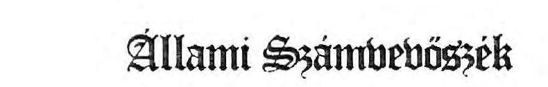 

## JELENTÉS

a Budapest. V. Dorottya u. 1. sz. alatti Gerbeaud-ház privatizációs folyamatának

- 1991. júliusában készített ÁSZ vizsgálat utóellenőrzéséről
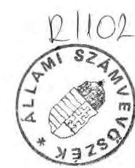

---

A vizsgálatot vezette: dr. Molnár Barnabás tanácsos

Az ellenőrzést végezte: dr.Molnár Barnabás tanácsos
dr. Borísz József tanácsos

---

# T A R T A L O M J E G Y Z É K

## 1. Bevezetés

1. Az utóvizsgálat célja ..................................................................................................................................................................................................................................................................................................................................................................................................................................................................................................................................................................................................................................................................................................................................................................................................................................................................................................................................................................................................................................................................................................................................................................................................................................................................................................................................................................................................................................................................................................................................................................................................................................................................................................................................................................................................................................................................................................................................................................................................................................................................................................................................................................................................................................................................................................................................................................................................................................................................................................................................................................................................................................................................................................................................................................................................................................................................................................................................................................................................................................................................................................................................................................................................................................................................................................................................................

---

Állami Számvevőszék
V-9-19/1992.
Témaszám: 110 .

# J E L E N T É S 

a Budapest, V. Dorottya u. 1. sz. alatti Gerbeaud-ház privatizációs folyamatának

- 1991. júliusában készített ÁSZ vizsgálat utóellenőrzéséről

## I.

## B E V E Z E T É S

1. Az utóvizsgálat célja

Annak megállapítása, hogy az Állami Vagyonügynökség (ÁVÜ) a Budapest, V. Dorottya u. 1. sz. alatti Gerbeaud-ház privatizációs folyamatának ellenőrzéséről 1991. júliusában készült ÁSZ vizsgálati jelentésben megfogalmazott intézkedési javaslatokat hogyan hajtotta végre, az akkor még függőben és folyamatban lévő kérdéseket időközben hogyan rendezte.

Az ellenőrzött szervezet: Állami Vagyonügynökség
Budapest, V. Vigadó u. 6.

Ellenőrzött időszak: 1989. október - 1992. március

A helyszíni ellenőrzés kezdetének és befejezésének idöpontja: 1992. február 25-töl - 1992. március 25-ig

---

2. Az 1991. júliusában készített ÁSZ vizsgálat megfogalmazott javaslatai

Az Állami Számvevőszék a Gerbeaud-ház privatizációját 1991. januárjában és 1991. júliusában vizsgálta. A tapasztalatok alapján az ÁVÜ Igazgatótanácsától és az ÁVÜ ügyvezetésétől a következőket kértük:

- minősítse az ÁvÜ-nek a Gerbeaud-ház privatizálása során tanúsított kockázatvállalásait az ésszerűségi szempontok figyelembevételével,
- vizsgálja meg a német Betriebs und Beteiligung GmbH-nak (GSB) megállapított 2 millió USA dollár úgynevezett "kárösszeg" kifizetése indokoltságát,
- számoltassa be - soronkívül - az ÁVÜ ügyvezetését az ÁVÜ Confidentia GmbH között létrejött, az irodaházak vagyonértékelésére vonatkozó szerződés teljesítésére történt kifizetések indokoltságáról, a két fél között lévő 1991. április 8-i külön nyilatkozatban foglaltakra, továbbá a megbízott Confidentia GMK cégbejegyzésének, jogosultságának megállapításaira is tekintettel,
- gondoskodjon az ÁvÜ ügyvezetésével együtt az ÁvÜ és a GSB között 1991. március 29-én kötött megállapodások maradéktalan végrehajtásáról, ebben a Gerbeaud-ház értékesítésének az épület bérlői részéről megfogalmazott igényeket is figyelembe vevő feszültségmentes végrehajtásáról,
s mindezekről írásban tájékoztassa az Állami Számvevőszéket.

Az ÁVÜ ügyvezetésének javasoltuk továbbá, hogy biztosítsa minden egyes nem magyar nyelven kötött és kötelezettséget vállaló

---

szerződés magyar nyelvű hiteles változatának valamennyi illetékes ÁVÚ igazgatóság, illetékes gazdasági vezetö részére történő időbeni el juttatását, a vállalt kötelezettségek teljesitése és az ezekre történő kifizetések ellenőrizhetősége cél jából.

# 11 . 

## MEGÁLLA P Í T Á S O K

## 1. Az ÁVÚ Igazgatótanácsának minösitései az ÁSZ által javasolt kérdésekben

- Az ÁVÚ Igazgatótanácsa az ÁVÚ kockázatvállalását a következők figyelembevételével indokoltnak tartotta:
"....a vizsgált szerződések megkötése - ha egyszer már az ÁVÚ saját hibájából is előnytelen apportálást eszközölt - végül is a kényszerhelyzetben indokolt volt. Ugyanis csak e szerződések révén volt lehetséges a GSB GmbH előjogainak megszüntetése és a jogi helyzet tisztázása. Sajnálatos tény, hogy az épület ügyében folytatott tárgyalások során az ÁVÜ ügyvezetése hibás jogértelmezésböl kiindulva állapodott meg egy elővásárlási joggal terhelt pályázat kiírásában. Ezt követően a GSB GmbH-val kötött egyezségi megállapodást az Igazgatótanács elfogadhatónak tekintette..."
"...Az 1990. októberében a GSB GmbH-val kötött elsö megállapodás során kétségtelenül súlyos hibát követett el az Ügynökség apparátusa, amikor információ hiányában figyelmen kívül hagyta az SZDSZ által az ügyben kezdeményezett pert. Az Igazgatótanács ezért az Ügynökség ügyvezetését erős bírálatban részesítette..." (1. sz. melléklet).

---

- A 2 millió USA dollár kárösszeggel kapcsolatbsan a következők szerint minősít: "Tekintettel arra, hogy a kártérités helyett szakértői munka megrendelését ajánlotta 'fel az ÁVÜ a GSB-nek, a kártérités összegéről nem született megállapodás; helyette a GSB által végzendő, mintegy 12 milliárd Ft-nyi értékelendő vagyonérték szokásos piaci, 1-1,5 \%-os értékű ellenszo1gáltatásban állapodott meg az ÁVÜ."
- Az Igazgatótanács beszámoltatta az ÁVU ügyvezetését a GSB-vel és érdekegységeivel kötött szerzödésekre történő 155 MFt összegü kifizetések jogosságáról és e nagyságrend ellen nem emelt kifogást. További kifizetésekről az Igazgatótanács nem adott tájékoztatást.
- A hazai Confidentia GMK - melynek számlájára történt az átutalás - cégbejegyzésére vonatkozóan érvényes cégbejegyzést a Fővárosi Bíróság cégbíróságának túlterheltségére hivatkozással az ÁVU Igazgatótanácsa nem tudott megállapítani, csak az 1991. április 16-i cégbejegyzés iránti kérelmet lelték fel.

Az Igazgatótanács döntéseit tulajdonosi hatáskörben hozza. Ha döntéseik törvényesek, akkor megtámadásukra, felülbírálatukra nincs mód. Ennek figyelembevételével az Állami Számvevőszék részéről csak azt kívánjuk rögzíteni, hogy a kritika mellett egyéb szankció nem volt, holott hátrányos anyagi következményei voltak az ügyletnek, az Igazgatótanács által is elismerten. Végül is nem minősítették azt a kérdést, hogy károkozás történt-e.

---

2. Az ÁVÜ-nek a GSB GmbH-val és a Confidentia GmbH-val kötött 1991. márciusi és árpilisi egyezségi megállapodásainak teljesitése

- Megállapitást nyert, hogy az ÁVÜ 1991. április 24-én 75 MFt-ot (elöleget), 1991. július 4-én pedig 80 MFt-ot, összességében 155 MFt-ot fizetett ki a két külföldi magánszemély - a GSB GmbH és Conf identia GmbH érdekeltségú, németországi Stoffel és testvére - által Magyarországon alapított Confidentia GMK 801040290. sz. számlájára a szintén Stoffel érdekeltségủ német Confidentia GmbH-val 1991. március 29-én kötött tanácsadói szerződés és 1991. április 8-i nyilatkozat alapján az Elsö Magyar Irodaház Kft. tulajdonát képező 12 ingatlan - szerződésben 16 ingatlan - értékbecslésére (2., 3., 4., 5., 6., 7., 8., 9., 10., 11., 12. sz. mellékletek) .

A fellelt dokumentumokból megállapitható, hogy a munkákat a Confidentia GMK végezte el, alvállalkozók igénybevételével. A GMK-nak 1991. évben főfoglalkozású dolgozója nem volt, így kizárólag alvállalkozókkal dolgoztatott. Alvállalkozója volt a Confidentia (Vermögensverwaltung) GmbH, amellyel az ÁVÜ az 1991. márciusi-áprilisi szerződést, illetve megállapodást kötötte. A Confidentia (Vermögensverwaltung) GmbH részére a GMK 1.736 .000 USA dollár értékben (Ft értéke: 132.537.524) utalt át az 1991. szeptember 5-i számla alapján. Még egy alvállalkozó volt, az IMMO-C00P Kft. (alapitója Egenhoffer Péter és Ungvári Mária) 20 MFt értékben, az 1991. december 6-i számla alapján és további 4 MFt összeg értékben pénzügyi, gazdasági tanácsadás, szolgáltatás nyújtásával.

A 12 irodaház forgalmi értékelését a Confidentia GmbH és a Confidentia GMK felhatalmazása alapján Egenhoffer Péter, mint a GSB Trade Invest Kft. ügyvezető igazgatója nyújtotta

---

be az Ávü-hőz. A számlázást a Conf identia GMK végezte, ame lynek neve az értékbecslő anyagokon is szèrepel. Az Ávü elöprivatizációs programigazgatósága a munkák elvégzését igazolta, elötte az Ybl Miklós Müszaki Főiskolával szakmailag felülvizsgáltatta.

A Confidentia GMK-nak az ÁvÜ-vel vagy a Confidentia GmbH-va1 az értékbecslési munkákra külön szerzödése nem volt (13., 14., 15. sz. mellékletek). Így nem állapítható meg az sem, hogy a szolgáltatás ellenértékét az ÁvÜ milyen alapon utalta közvetlenül a Confidentia GMK-nak, illetve az 1991. április 8-i külön nyilatkozatban szereplő mentességek tulajdonképpen kit is illetnek meg. Erre az ÁvÜ észrevételeiben sincs válasz.

- A Confidentia GMK cégbejegyzése 1991. március 11-én még nem történt meg. A Fővárosi Bíróság, mint Cégbíróság a GMK 1991. április 15-i társasági szerződésen alapuló és 1991. április 16-i cégbejegyzési kérelmét 01-04-0235244. számon lajstromozta. Említett Cégbíróság 1991. december 12-én 30 napos határidővel hiánypótlásra hívta fel a GMK figyelmét, melyet a két külföldi magánszemély 1992. január 16-án teljesített. A két külföldi alapítónak a társasági szerződésben elöírt 1991. április 18-i határidőig USA dollárban vagy német márkábán be kellett volna fizetnie 800 eFt összegü társasági törzstökét. Ennek befizetésére a Cégbíróságon nem találtunk dokumentumot (16. sz. melléklet).
- 1991. XII. 20-án az ÁvÜ a Confidentia GMK számlájára újabb 62 MFt-ot utalt át költségtérítésként, melyet a Confidentia GMK az 1992. január 17-én kelt rendelkezö levél alapján DEM-ben utalt át a Confidentia (Vermögensverwaltungs) GmbH javára. Erröl az összegröl a rendelkezésünkre bocsátott ÁvÜ Igazgatótanácsi ülések jegyzőkönyveiben nem tesznek említést. A Confidentia GMK a 62 MFt-ot egyéb passzív el-

---

számolásként szerepe1tette az 1991. évi mérlegében. Az ÁVÜ részéről korábbiakban történt 155 MFt-os kifizetés $80 \%$-át árbevételként, $20 \%$-át ÁFA-ként szerepe1tette. Ennek dokumentációját a 17. sz. me1lékletként csatolt APEH vizsgálat tartalmazza.

A Conf identia GMK 1991. évre 193 eFt nyereséget, 77 eFt vállalkozási nyereségadót, 367 eFt ÁFÁ-t vallott be. Személyi jövedelemadó kifizetése nem volt, alkalmazottat nem foglalkoztatott. A GMK nyeresége terhére külföldre történő átutalást - az APEH vizsgálat szerint - nem teljesített. A Confidentia GMK-nak így összesen is csak 444 eFt adóbeval1ása szerepe1t 1991. év után (8. sz. me1léklet). A 62 MFt költségtérítés kifizetésének jogosságát a fel1e1t dokumentumokból így nem tartjuk elfogadhatónak. Az ÁVÜ-nek ezen kifizetése nélkü1özi a jogszabályi hivatkozásokat és az alátámasztó, részletes számításokat. A 62 milliós kifizetés konkrét mértéke és jogossága az ÁVÜ és a Confidentia GmbH között létrejött szerződésbő1, megállapodásból, vagy külön nyilatkozatból nem állapítható meg, így elfogadhatatlan az ÁVÜ azon indoklása, hogy a kifizetéseket a szerződésben a feladat teljesítéséhez és nem külön számlaadáshoz kötötték a felek. A kifizetések tényéhez is, - de nem a mértékéhez csak abban az esetben teremtett volna elegendő jogalapot az 1991. március 29-i szerződés, ha a kifizetések az ÁVÜ-ve1 jogviszonyban álló Conf identia GmbH részére történtek volna.

A Confidentia GmbH-va1 kötött ÁVÜ közös nyilatkozat szerint csak ténylegesen kivetett és kifizetett terheket kel1 az ÁVÜ-nek átvállalnia. A 62 MFt-os "quazi" kártérítés kifizetése pedig ezen részletes dokumentumok beszerzése nélkül történt meg az ÁVÜ részéről.

---

Az sem állapítható meg, hogy ezen összeg - ténylegesen a GMK-t vagy a GmbH-t illeti-e és ténylegesen ki vette igénybe. Ugyanis a Confidentia GmbH a Confidentia GMK alvállalkozója is lett egyben. A Magyarországon nem bejegyzett Confidentia GMK 1991. évi eredmény és adókimutatásának lényeges módosulása várható az APEH előrejelzése alapján.

Az ÁVÜ a Confidentia GmbH-val kötött szerzödésében, külön nyilatkozatában adó-, illeték-, vám- és egyéb tehermentességet vállalt a GmbH vagy nem magyar alvállalkozója, magyarországi leányvállalatai részére. Rögzítették azt is, hogy ha valamilyen oknál fogva kivetésre, illetve kifizetésre került bármilyen - a magyar törvények alapján kivetett - adó, vám, illeték, úgy az ÁvÜ köteles megtéríteni, elkerülendő bármely ebből eredő kárt. Lehetővé teszi számukra a nyereség USD-ben való teljes kivitelét, azon jogszabályi feltétel kikötése nélkül, amely a társaságnál forintfedezet rendelkezésre állását írja elő. Elfogadható az ÁvÜ azon észrevétele, hogy a magyar joghatóságok alá tartozó és a magyar jog szerint müködő vegyesvállalatra a szerződésben történő külön utalás nélkül is vonatkoznak az 1988. évi XXIV. törvény rendelkezései, mint mögöttes kötelező jogi előírás.
Továbbá kiviteli feltétel és korlát alól mentette fel a társaságok vezető tisztségviselőit, üzletvezetéssel megbízott tagjait, a felügyelőbizottság tagjait és külföldi alkalmazottait a társaságtól élvezett jövedelmük után. Mindezekre az ÁvÜ-nek törvényes felhatalmazása nem volt, mivel az adóelengedésre, adómérséklésre stb. kizárólag törvényi előírás intézkedhet.

Az ÁvÜ-nek a Confidentia GmbH-val 1991. április 8-i közös nyilatkozata szerint a Confidentia GmbH-nak az irodaházak vagyonértékelésére vonatkozó konzultációs szerződést csak a

---

Confidentia GmbH valamely Magyarországon bejegyzett leányvállalatára van joga átruházni. Ilyen leányvállalata Magyarországon ismereteink szerint nincs, mivel a Confidentia GMK-t nem a Confidentia GmbH alapította, sőt még a GMK alapitói között sem lelhető fel. A Confidentia GMK alapítója ugyanis két magánszemély volt.

E kérdés a kettős adózással kapcsolatos, további - az Állami Számvevőszék hatáskörén kívül eső - vizsgálatot igénylő kérdés. Az Állami Számvevőszéknek ugyanis nincs joga közvetlenül vizsgálatot folytatnia a $100 \%$-os külföldi tulajdonban lévő érintett társaságokban.

- A 12 irodaház vagyonérékeléséért az ÁvÚ összességében 217 MFt-ot fizetett ki, mely lényegesen meghaladja a kártérítésként figyelembevett és megbízási munkára átváltoztatatt 2 millió USD összeget. A szolgáltatások és ellenszolgáltatások feltűnő aránytalansága állapítható meg a magyar vagyonértékelő társaságok áraival történő összehasonlítás esetében.

A Confidentia GmbH-val 1991. március 29-én kötött kozultációs szerződésben 16 iroda ingatlan értékbecslésére szerződött az ÁvÚ, összesen 2 millió USA \$-nak megfelelő forint ellenértékủ dijért és jutalékért. Mivel csak 12 iroda ingatlan értékbecslésére került sor az ÁvÚ Igazgatótanácsa döntése következtében, így a szerződést, illetve a kifizetést ennek megfelelően kellett volna módosítani. Az értékbecslésből kimaradt 4 ingatlanra jutó 500 ezer USA \$-nak megfelelő forint ellenértéket indokolatlanul fizették ki.

---

# 3. A bírósági ügyek állása 

A GSB GmbH-nak nem volt érvényes jogcíme a Gerbeaud-ház tulajdonjogára, érvényes jogcímme1 egyedül a GSB Trade Invest Kft rendelkezett. Ebből következöen azonban elsődlegesen a kár is a GSB Trade Invest Kft-nél jelentkezhetett volna. A GSB GmbH-nál csak mint egyik alapítónál, közvetett módon jelentkezhetne a kár, a többi alapítót is érintve.

Az ÁVÜ döntéseinél nem vette figyelembe az alábbiakat:

- a GSB Trade Invest Kft. cégbejegyzó végzése ellen a Legfelsőbb Bíróság elnökének törvényességi óvása alapján hozott 1990. július 3-i legfelsőbb bírósági törvényességi határozat e társaság cégbejegyzését törvénysértőnek itélte. A magyar jog szerint az alapító szerződés semmis, mert abban az állami tulajdonban lévő Gerbeaud-házat a GAMSZOV - jogszabályellenesen - ellenszolgáltatás nélkül adta a társaság tulajdonába.

A Legfelsőbb Bíróság törvényességi határozata alapján az ingatlan tulajdonjogának átruházására érvényes jogcím nem volt, ennek hiányában pedig a GSB GmbH-t semmilyen jogosultság nem illette meg.

A cégbejegyzó végzés ellen a Legfelsőbb Bíróság elnöke által emelt törvényességi óvást értelemszerüen csak a végzés ellen lehet emelni (Pp. 27. §. (1) bek.), a törvényességi óvásos eljárás a rendkívüli perorvoslat tárgya ez a törvénysértő végzés volt. A törvényességi határozat rendelkezö része csak a végzésre tehetett megállapítást, kimondta, hogy az törvénysértő. A törvénysértés tényállását az indoklásban fejti ki. A GAMSZOV ingyenes mellékszolgáltatásként a Gerbeaud-házat nem adhatja tulajdonba, mert az 1979. évi II. tv. és végrehajtására kiadott 23/1979. (VI.28.) MT rendeletbe ütközik, a társasági szerződés tehát semmis. A Gt. 17. §-a alapján a társasá-

---

gokra is alkalmazni kell a Ptk. rendelkezését, így a szerződések érvénytelenségéről rendelkező $\overline{2} 34 . \S$-t, valamint a 117. §-t is. A Ptk. 200. §. (2) bekezdése alapján a jogszabályba ütköző szerződés egyértelműen semmis. A semmisséget nem kell semmi lyen el járásnak megelöznie, a cégel járásban pedig az 1989. évi 23. tvr. 15. §. (1) bekezdése értelmében ezt hivatalból kell figyelembe venni.

Az ÁVÜ-tól, mint az állam tulajdonosi jogainak gyakorlójától ilyen jellegủ bírósági jelzés esetén elvárható lett volna - egyben jogilag is tisztább helyzetet teremtett volna - a bírósági eljárás befejezésének bevárása, a kötelezettségvállalások helyett, vagy érdekeinek sérelmét legalább jelezhette volna a Cégbíróságnak.
Nem tartjuk elfogadhatónak az ÁVÜ azon nyilatkozatait, amelyek arra hivatkoznak, hogy az eljáró cégbíró nem észlelte a semmisséget és a jogügylet az ÁVÜ alapítása előtt köttetett, és így az ÁVÜ nem tehetett mást, mint kötelmi jogi szerződéssel biztosított magának tulajdoni igényt a Gerbeaud-házra.

- Az 1990. évi LXXI. törvény 3. §. (2) bekezdése 1990. szeptember 18-án megszüntette az ÁVÜ 1990. július 14-én - a GSB Trade Invest Kft. társasági szerződését módosító megállapodás megtiltásáról - hozott határozata elleni bíról felülvizsgálati lehetőséget. Kifogásoljuk, hogy az ÁVÜ erre való hivatkozással nem intézkedett a Bíróságnál az ellene indított perben, amikor az eljáró bíró nem alkalmazta e törvényt. A vizsgálat során csak arról találtunk dokumentumot, hogy a PKKB 1991. május 22 -ére kitűzött tárgyalását a felek közös kérelmére még ma is szüneteteltetik. A per várhatóan csak 1992. május 22 -én fog megszünni.
- Az ingatlanbérlőknek - a GSB Trade Invest Kft. alapítói szerződése érvényetelenségének megállapítása iránt - a GAMSZOV és GSB Trade Invest perében a Fövárosi Bíróság

---

1990. október 20-i itélete kimondta az alapítói szerzödés érvénytelenségét, vagyis az ingatlanátruházás érvénytelenségét. A társaság által benyújtott fellebbezést a Legfelsőbb Bíróság 1991. december 17-én tárgyalta. Az elsőfokú bíróság ítéletét hatályon kívül helyezte, és az elsőfokú bíróságot a per újratárgyalására utasította (18. sz. melléklet). Figyelemmel arra körülményre, hogy a felperesek keresetüket leszállították és csak a perköltségre tartották fenn azt, így az elsőfokú bíróság kizárólag a perköltség viselésében dönthet.

A bírósági ügyek állásával kapcsolatos megállapításainkban nem az ÁVÜ perbeli részvételének hiányát kifogásoljuk, hanem az ÁVÜ részéről elvárható gondosság hiányát, illetve a korábbi vizsgálatunkban is kifogásolt túlzott kockázatvállalást bírósági eljárás bevárása nélkül.
4. A Gerbeaud-ház privatizációjának jelenlegi állása

- Az ÁVÜ Igazgatótanácsa négy ülésen tárgyalta az épület privatizálásának sorsát (19/a, b, c, d, sz. mellékletek). Legutoljára, dokumentáltan a Gerbeaud-ház 100 \%-os tulajdonjogának értékesítéséhez járult hozzá. Az erre való, tenderfelhívás elkészült, de nem adták ki a Gerbeaud-házat érintő, még le nem zárult polgári perekre és a függő jogi helyzetre is hivatkozással. Üzletrészként történő értékesítési elképzeléssel az épületet az ÁVÜ által 1992. február 10-én 1 MFt törzstökével alapított és 1992. február 20-án cégnyilvántartásba vett Dorottya Vagyonkezelő és Szolgáltató Kft-be vitték be 1992. február 24-én 1500 MFt értékben. A Kft törzstökéjét 1501 MFt-ra emelték meg. E változást a cégbíróság is bejegyezte. Minderről a rendelkezésünkre bocsátott igazgatótanácsi határozatok kivonata szerint nem

---

történt igazgatótanácsi döntés. Ilyen szolgáltató társaság alapítására az ÁvÚ sem törvényl, sem kormánÿfelhatalmazással nem bir (20., 21. sz. mellékletek).

Megállapításunkban nem az ÁvÜ-nek mint az állam tulajdonosi jogai gyakorlójának társaságalapítási jogát vitatjuk. Kizárólag, mint a saját jogán tulajdonoskénti társaságalapításának jogát kifogásoljuk, azt, hogy e társaságalapításoknál az ÁvÜ a tulajdonos és nem a Magyar Állam.

A 4/1991.(II.13.) PM rendelet ilyen társaságalapítását az ÁvÜ számára nem tette lehetővé, ezt a Fővárosi Cégbíróság is észrevételezte már a Belvárosi Irodaház Kft-nél és a PRI-MAN Kft-nél, amikor megtagadta a Kft-k bejegyzését a kormány elözetes engedélye nélkül.

Mindezek függvényében nincs indoka a Dorottya Kft-nek a Komárom-Esztergom Megyei Cégbíróságon való bejegyeztetésére, a kft törzstőkéjének e cégbíróságon való felemelésére', majd a társaság székhelyének Esztergomból Budapestre való áthelyezésére.

Ismerettel rendelkezünk arról, hogy az ÁvÜ 1991. novembre-ében-decemberében elöterjesztést készített a kormány részére az ÁvÜ társaság alapításainak engedélyezésére. Az ÁvÜ tájékoztatása szerint az előterjesztés kérdésében még kormánydöntés nem született.

- Az ÁvÜ nem intézkedett a cégbíróságnál az 1991. március 29-i megállapodásokban, szerződésekben rögzített - a GSB TI Kft-t érintő - társasági változásoknak a cégbíróságnál történő bejelentésére. Erre nem hívta fel a megállapodásokat nem ismerő, de érdekelt GAMSZOV figyelmét sem. A társasága-

---

lapítási jogosultsággal és a GSB TI Kft-ben változatlan arányú társasági tagsággal rendelkező GAMSZOV-nak e változásokról tudnia kellett volna.

Az ÁVÜ a GSB Trade Invest Kft ügyvezetésénél sem tett kezdeményezést a változások jogi úton történő rendezésére. Az ÁVÜ a GSB GmbH-val 1991. március 29-én kötött megállapodásában mindezekre ígéretet tett, ellenkező esetben a GSB GmbH-val kötött megállapodásban foglaltak sem léphetnek érvénybe és újabb kártérítési igény keletkezhet az 1990. október 20-i megállapodásban foglaltak fennmaradása mellett. A GAMSZOV a bírósági ügyek mielőbbi rendezésére tervez lépéseket ( $22 / a, b$, c. és 23 . sz. mellékletek).

- A Gerbeaud-ház múködtetésére 5 MFt törzstőkével létrehozott GSB Trade Invest Kft. jelenleg bejegyzett cég Magyarországon, vagyonát a társaság nagyobb részben már felélte a GAMSZOV nyilatkozata szerint, ezért fenntartása indokolatlan.
- A bérlőknek az épületből történő kiköltöztetése - részben kártérítés fejében - várhatóan rövid időn belül befejeződik.

Az épületben üzemelő Gerbeaud cukrászda továbbra is az épületben marad. A cukrászda bérleti jogviszonyát 30 MFt ellenérték fejében a Hungar Hotels Vállalattal 30 évre szóló felmondási tilalommal, határozatlan idöre meghosszabbították. Négy bérlővel a bérleti szerződés alapján a bérleti jogviszonyt elhelyezési kötelezettség és kártérítés nélkül felmondták, egy bérlővel ugyanerre közös megegyezéssel került sor. A Mirelite Rt 110 MFt-ot kapott, az államigazgatási határozattal megerősített bérletéből kártérítés ellenében való kiköltözése fejében. 1991. szeptember 9-én a GAMSZOV-val

---

is megállapodtak mintegy 50 MFt kártérítési összeg ellenértékért történő kiköltözésre, melyet 1992. februárí levele alapján a GAMSZOV utólagosan kevesel és kiköltözését az anyagi feltételek újbóli megegyezéséhez köti (24., 25. sz. mellékletek).
5. Az ÁVÚ bizonylatolás hiányosságai

Az ÁVÚ 1991. augusztus 16-tól külső szakfordítót bízott meg az idegennyelvű speciális, jogi szövegek magyar nyelvű szakfordítására. A vizsgálat kapcsán arról győződtünk meg, hogy nem mindenről készült magyar nyelvű szakfordítás, s azokat az ÁVÜ illetékes egységei sem kapják meg minden szükséges esetben.

A magyarországi müködésű Confidentia GNK csatolt 1991. június 20-i, 1991. szeptember 18-i és 19-i fizetési felhívásai német nyelvűek. E fizetési felszólítások a számlázás legelemibb követelményeit sem elégítik ki, mivel e fizetési felszólításokon fellelhető tartalom a számla kötelező tartalmát előíró törvényi előírásoknak csak a töredékét tartalmazza. Az ÁVÚ pedig ezen felszólításokra, azokat számlaként kezelve fizetett. E fizetési felszólítások magyar nyelvü változatait az ÁSZ vizsgálathoz sem tudták rendelkezésünkre bocsátani. Azonos helyzet ez ügy kapcsán már másodszor fordult elő.

A magyar nyelvű fordításokat minden esetben a mindenki előtt tiszta helyzet teremtése miatt tartjuk elengedhetetlennek. Így nem fordulhat elő az a sajnálatos tény, hogy az ÁVÚ gazdasági ügyekért felelős vezetője külön magyar nyelvű tájékoztatást kér a Confidentia GNK német és angol nyelvű - a 62 millió Ft költségtérítés átutalására vonatkozó - intézkedésére.

---

III.

# ÖSSZEFOGLALÓ KÖVETKEZTETÉSEK ÉS JAVASLATOK 

## 1. Összefoglaló következtetések

A Gerbeaud-ház privatizációnának bonyolult ügye az 1991. jú1 iusi vizsgálat óta sem rendeződött le. Az ügy tovább bonyolódott. Ezt bizonyítja a bírósági perek lezáratlansága is.

Az ÁVÜ Igazgatótanácsa az ÁSZ 1991. júliusi vizsgálatára adott tájékoztatásában elismerte az ÁVÜ-nek saját hibájából is előnytelen apportálás eszközlését, de e kényszerhelyzet folytán a vizsgált szerződések megkötését indokoltnak tartotta. Elismerte továbbá azt, hogy az ÁVÜ hibás jogértelmezésböl kiindulva állapodott meg egy elővásárlási joggal terhelt pályázat kiírásában. Ezt követően a GSB-vel kötött egyezségi megállapodást elfogadhatónak tekintette és a 155 MFt összegü megbízási díj addigi kifizetését nem kifogásolta meg.

A privatizációs ügy bonyolódását elősegítette az ÁVÜ-nek az a magatartása, hogy az üggyel kapcsolatosan, - a még le nem zárult polgári perekre és függő jogi helyzetre való hivatkozással - ezidáig nem intézkedett. Az ingatlan tulajdonjogi kérédésének eldöntését kizárólag bírósági úton tartja lehetségesnek. A bírósági döntések nem várt elhúzódása, az ÁVÜ által szerződéssel vállalt és a külföldi fél által is elfogadott társasági változásoknak cégbíróságnál való bejegyeztetési hiánya, a GAMSZOV kihagyása is, a külföldi fél és annak más hazai társasági partnere részére teremt újabb bizalmatlansági és támadási lehetőséget.

---

Az ÁvÜ nem élt azzal a lehetöséggel, hogy jogszabályi változás folytán vagyoni kérdésekben hozott döntései bírói úton nem támadhatók, a bírósági döntések az ÁvÜ részére jogértelmezés szempontjából is kedvező lehetöséget teremtettek. A különböző perek egyesítését, a perek lezárását a rendezés és megnyugvás érdekében a GAMSZOV-val együtt kezdeményezni kellett volna.

A bírósági ügyek vonatkozásában az ÁvÜ-nek kizárólag a passziv magatartását kifogásoltuk meg és azt, hogy nem tett meg mindent a tiszta helyzet teremtése, a hátrányos helyzetek kiküszöbölése érdekében, holott erre több lehetőség kinálkozott.

A munkákat a Confidentia GMK (Magyarországon ezideig még nem bejegyzett cég) végezte el, szerződéskötés nélkül, alvállalkozókkal. Legfőbb alvállalkozója a külföldi Confidentia (Vermögensverwaltungs) GmbH volt. Az adómentességek, költségtérítések jogosságának és mértékének megállapítása külön vizsgálatot igényel, amelyet az ÁSZ az APEH-nél kezdeményez. A $100 \%$-os külföldi tulajdonlás miatt az ÁSZ a Confidentia GMK-nál és a Confidentia (Vermögensverwaltungs) GmbH-nál a vizsgálatot kö̀̀vetett módon, a felelős állami szervek intézkedésein keresztül vizsgálta.

A vizsgálat nem találta megalapozottnak az ÁvÜ 62 millió Ft-os pótlólagos kifizetését az ÁvÜ által felhozott azon kizárólagos indok alapján, hogy a pótlólagos kifizetés szerzödéses jogcímen alapul. Ugyanakkor a szolgáltatások és az ellenszolgáltatások feltűnő aránytalanságát és 500.000 USA \$-nak megfelelő forint ellenérték jogosulatlan kifizetését is megállapítottuk.

---

Az ÁvÜ nem járt el körültekintően, amikor meg sem kisérelte, hogy a 12 iroda ingatlan vagyonértékelését versenyeztesse, vagy legalább tájékozódjon, hogy e munkát milyen ellenértékért végezték volna el mások, olyan dokumentumok alapján mint, ame1yek a 12 db irodaépületre elözetesen rendelkezésére álltak a Confidentia GMK-nak. Így a vagyonértékelésekre összességében kifizetett 217 millió Ft összeg megitélésünk szerint kimeríti a szolgáltatások és ellenszolgáltatások feltünő aránytalanságát.

Az ÁvÜ a vizsgálati jelentésre adott észrevételeiben sem ad érdemben választ, így feltételezhetően a válaszadás időpontjában még maga sem tudja, hogy konkrétan miért fizetett ki 62 millió Ft-ot, s miért nem többet vagy kevesebbet, s azt a valóságban milyen adók átvállalására, milyen adók, vagy költségek kompenzálására fizette ki költségtérítés címén. Kifzetését az ÁvÜ megalapozottnak tekinti, de e megalapozottságot semmivel nem tudja alátámasztani.

A Gerbeaud-ház privatizációjának jelenlegi állása még ma sem megnyugtató. Az ÁvÜ az ingatlant egy olyan, saját maga által alapított Kft-be vitte be - üzletrészként való értékesítési elképzeléssel -, melynek alapítására nem volt törvényes joga. Az ügy lezárása érdekében a még nyitott kérdésekben tiszta jogi helyzetet kell teremteni, s ezt követően történjék intézkedés az épület mielőbbi privatizálására és a GSB Trade-Invest Kft jogutód nélküli megszüntetésére.

E privatizációs ügy kapcsán rendkívül sok tisztázatlan jogi helyzet teremtődött. Ezek: a Confidentia GmbH-val kötött szerződés és külön megállapodás vitatható értelmezése, a 62 millió Ft-os kifizetés ellenőrizhetetlensége, a károkozás meghatározhatósága, a szolgáltatás és ellenszolgáltatás feltünő aránytalanságának megállapíthatósága, a vagyonértéke1ési

---

munka csökkenésével szükségessé váló szerzödésmódosítás és kifizetés csökkenésének elmaradása, a bírósági eljárások be nem várása, idegen nyelvű szerződések magyar nyelvű hiánya.

Az ÁVÜ-nek - mint az állam tulajdonosi jogai gyakorlójának a tőle általában elvárható gondosság hiányát is több esetben észrevételeztük.

A vizsgálati megállapításokat az ÁSZ az ÁVÜ ügyvezetésének a vonatkozó törvényi elöírásoknak megfelelően 1992. április 9-én egyeztetésre átadta. Erre 1992. április 21-én kaptuk meg a választ (26. sz. melléklet). Az észrevételek döntő többségét a vizsgálatot végzők nem fogadták el. Az ÁVÜ válaszából elfogadottakat e jelentésben átvezettük. Az elfogadott észrevételeket és véleményeltéréseket az ÁVÜ ügyvezető igazgatójának 1992. április 28-án megküldtük (27. sz. melléklet).

Az ÁSZ Elnöki értekezlete 1992. május 4-én már e véleményeltérés birtokában tárgyalta a vizsgálati jelentést. Jelen anyag az Elnöki értekezlet állásfoglalásait is tartalmazza.

# 2. Javaslatok 

- Az Állami Vagyonügynökség kezdeményezze a Fővárosi Bíróság Cégbírósága felé a Confidentia GMK társasági szerződésében meghatározott 800 eFt összegű törzstőkének a két külföldi alapító által DEM-ben való befizetését.
Az Állami Vagyonügynökség kezdeményezze a bíróságok felé azokat a további lépéseket, amelyek megteremtik a feltételeit annak, hogy a Confidentia GMK cégbejegyzésének esetleges elmaradásából az államot kár és egyéb hátrány ne érje. (E kezdeményezéseket a Confidentia GMK cégbejegyzésének igényelt tisztánlátása érdekében tartjuk szükségesnek,

---

figyelembe véve azt a körülményt is, hogy az-ÁvÜ e javaslatok teljesitéséhez nem rendelkezik el járásjogi képeséggel a hivatkozott bíróságok előtti ügyekben.)

- Az Állami Vagyonügynökség és a GAMSZOV együttesen kezdeményezze a peres eljárások mielőbbi lezárását, a társasági változások cégbírósági bejegyzését, a GSB Trade Invest Kft jogutód nélküli megszüntetését, e privatizációs ügy mielőbbi megnyugtató lezárását.
- Az Állami Vagyonügynökség tegyen lépeseket a GAMSZOV kiköltözésével kapcsolatos meglévő megállapodás érvényesítésére, vagy ha ez nem lehetséges, az új feltételekben való mielőbbi megállapodás megkötésére.
- Az Állami Vagyonügynökség Igazgatótanácsa követel je meg az ÁvÜ ügyvezetésétől a számlázás előírt követelményeinek szigorú betartását, valamennyi használt belsó dokumentum magyar nyelvi változatát az egyértelműség, a tisztánlátás és az ellenőrzés igényelte követhetőség érdekében.
- Az Állami Vagyonügynökség Igazgatótanácsa vizsgálja meg az ÁvÜ-nek a Conf identia GMK részére történő 62 MFt-os kártérítési és az értékbecslési munkákból kimaradt 4 ingatlanra jutó 500000 USA \$-nak megfelelő forint ellenértékủ kifizetés jogosságát és szabályszerűségét. Mindezek függvényében értékel je az ÁvÜ-nek a GSB GmbH-val, a Conf identia GmbH-val 1991. március 29-én és április 8-án kötött egyezségi megállapodásait és szerződéseit, kiemelten a konkrét vagyonértékelési munkára vonatkozó szerződés hiányosságait, a 16 irodaház vagyonértékelése helyett 12 irodaház vagyonértékelésének változatlan összegủ kifizetéseit, a vagyonértékelésre vonatkozó szolgáltatások és ellenszolgáltatások feltűnő aránytalanságát.

---

- Az Állami Vagyonügynökség Igazgatótanácsa számoltassa be az ÁVÜ ügyvezetését valamennyi külföldi féllel kötött szerzödéseiben, megállapodásaiban vállalt mentességadásairól, egyéb kötelezettségvállalásairól.
- Az Állami Vagyonügynökség Igazgatótanácsa be1söleg szabályozza le az ÁVÜ-nek - ezen belül az egyes igazgatóságoknak - a privatizáció során alkalmazandó kockázatvállalási és kötelezettségvállalási körét, különös tekintettel a külföldi kötelezettségvállalásaira, a különböző bírósági esetekre. Biztosítsa az ÁVÜ tel jes munkájának belsö ügyrendi szabályozottságát is.
- Az Állami Vagyonügynökség Igazgatótanácsa vizsgálja felül az ÁVÜ-nek a Dorottya Vagyonkezelö és Szolgáltató Kft alapítására és a Gerbeaud-ház ingatlannak társaságba való vitelére vonatkozó intézkedését. Az ismertetett körülmények mellett szabja meg az ingatlan privatizálásának módját és idejét.

Indokolt az ÁVÜ már bejegyzett, illetve cégbírósági bejegyzésre már beterjesztett további társaságalapításainak az Igazgatótanács részéről történő felülvizsgálata. A felülvizsgálat alapján az ÁVÜ által jogalap nélkül alapított társaságok megszüntetésére tegye meg a szükséges intézkedéseket.

- Az Állami Vagyonügynökség Igazgatótanácsa és ügyvezetése értékel je e privatizáció kapcsán kifejtett szakmai munkát és szükség szerint a személyi felelősséget is állapítsa meg.
- A Pénzügyminiszter hatáskörében segitse elö, hogy az APEH elnöke soron kívül vizsgálja meg a Confidentia GMK, Confi-

---

dentia (Vermögensverwal tungs) GmbH, a GSB Trade Invest Beruházás Szervező Kft., az IMMO-COOP Kft. és a Trade Invest Kft. adózási kötelezettségeit - tekintettel az ÁVÜ által kifizetett 62 millió Ft kártérítésre -, továbbá a Conf identia GMK, külföldre történő átutalásai jogosságát. Ennek alapján tegye meg a szükséges intézkedéseket.

Budapest, 1992. május 4.

Me11éklet: 32 db 77 lap
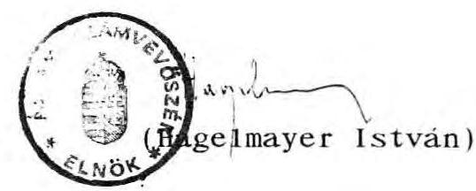

---

Állami Számvevőszék
V-9-19/1992.
Témaszám: 110 .

# M E L L É K L E T E K 

a Budapest, V. Dorottya u. 1.sz. alatti Gerbeaud-ház privatizációs folyamatának

- 1991. júliusában készített ÁSZ vizsgálat utóellenőrzésének jelentéséhez

---

# T A R T A L O M J E G Y Z É K 

1. sz. melléklet

Az ÁVÚ Igazgatótanács elnökének 1991. október 22-i valasza az ÁSZ vizsgálattal kapcsolatosan
2. sz. melléklet

A 75 millió Ft-ról szóló számla
3. sz. melléklet

Átutalási megbizás 75 millió Ft összegröl
4. sz. melléklet

A Conf identia GMK német nyelvű levele (számla?) 80 millió Ft összeg átutalására
5. sz. melléklet

Átutalási megbizás 80 millió Ft összegröl
6. sz. melléklet

A Confidentia Vermögensvenwaltungs GmbH német nyelvű levele 62 millió Ft összeg átutalására
7. sz. melléklet

A Confidentia Vermögensvenwaltungs GmbH angol nyelvü levele 62 millió Ft összeg átutalására
8. sz. melléklet

A Confidentia GMK adóterheinek ÁVÜ részéről történő 62 millió Ft megtérítésére vonatkozó magyar nyelvű levél
9. sz. melléklet

Átutalási megbizás 62 millió Ft összegröl
10. sz. melléklet

1991. március 29-én kelt konzultációs szerződés magyar nyelvü másolata
11. sz. melléklet

1991. április 8-án kelt, az ÁVÜ részéről adott külön nyilatkozat
12. sz. melléklet

1991. március 29-én kelt megállapodás magyar nyelvü másolata a GSB GmbH visszalépésére

---

13. sz. melléklet

A 12 irodaház forgalmi értékbecslésének két-két példányban való átadását tartalmazó levél
14. sz. melléklet

Az Yb1 Miklós Müszaki Főiskola szakvéleménye az irodaház program keretében elvont ingatlanokról készült értékbecslésekröl
15. sz. melléklet

Az ÁVÜ Elöprivatizációs Programigazgatóság igazolása az első Magyar I rodaház Kft. tulajdonába lévő i rodaépületek értékelésének határidőre és hiánytalanul történő elkészitéséről
16. sz. melléklet

A Fővárosi Bíróság Cégbíróság vezetőjének tájékoztatása a Conf identia GMK cégbejegyzésére vonatkozóan
17. sz. melléklet

Az APEH Fővárosi Igazgatóságának levele a Conf identia GMK-nál 1992. március 13-17. között végzett célvizsgálat eredményéről
18. sz. melléklet

A Magyar Köztársaság Legfelsőbb Bíróság 1991.december 17-i Pf.III. 20.270/1991/15.sz. végzés másolata
19/a, b, c, d. sz. melléklet
Az ÁVÜ Igazgatótanácsának a Gerbeaud-ház privatizációjával kapcsolatos (1991. október 24-i, 1991. szeptember 25-i, 1991. szeptember 9-i, 1991. május 8-i) jegyzőkönyvi kivonatai
20. sz. melléklet

A Komárom-Esztergom Megyei Bíróság Cégbíróságának végzése a Dorottya Vagyonkezelő Szolgáltató Kft. cégbejegyzésére
21. sz. melléklet

A Komárom-Esztergom Megyei Bíróság Cégbíróságának végzése a Dorottya Vagyonkezelő Szolgáltató Kft. cégbejegyzésének módosítására
22/a, b, c. sz. melléklet
A Fővárosi Bíróság Cégbíróságának a GSB Trade Invest Kft. cégbejegyzésére vonatkozó dokumentumok
23. sz. melléklet

A GAMSZOV-nak az ÁVÜ-höz irt 1992. februári ke1tezésű levele a Bp., V. Dorottya u. 1.sz. alatti ingatlan jogi helyzetének tisztázására

---

24. sz. melléklet

A GAMSZOV és az ÁVÜ 1991. szeptember 9-én kelt megállapodása a Bp., V. Dorottya u.1.sz. alatti ingatlanból való kiköltözés feltételeire
25. sz. melléklet

A GAMSZOV 1992. februárí keltezésű levele az ÁVÜ-nek a Bp., V. Dorottya u.1.sz. alatti ingatlan kezelői jogának elvonásával kapcsolatos vagyonjogi megállapodásra
26. sz. melléklet

Az ÁVÜ ügyvezető igazgatójának észrevételei az utóvizsgálat megállapításaira (1992. április 21.)
27. sz. melléklet

Az ÁSZ Vagyonkezelő Főcsoportjának válasza az ÁVÜ észrevételeire (1992. április 28.)
28. sz. melléklet

Az ÁSZ Elnökének az ÁVÜ Igazgatótanácsa elnökének - a Gerbe-aud-ház privatizációs jelentés észrevételezésére 1992. május 5 -én - megküldött levele
29. sz. melléklet

Az ÁSZ Elnökének dr. Szabó Tamás tárcanélküli miniszterhez - a Gerbeaud-ház privatizációs jelentés észrevételezésére 1992. május 6-án - megküldött levele
30. sz. melléket

Dr. Szabó Tamás tárca nélküli miniszter válasza az ÁSZ elnökének
31. sz. melléklet

Az ÁSZ elnökének viszontválasza dr. Szabó Tamás tárca nélküli miniszternek
32. sz. melléklet

Dr. Pongrácz Tibor, az ÁVÜ Igazgatótanács elnökének válaszlevele az ÁSZ elnökéhez

Budapest, 1992. június

---

# Igazgatótanács Elnöke 

Hagelmayer István úr az Állami Számvevőszék elnöke részé e
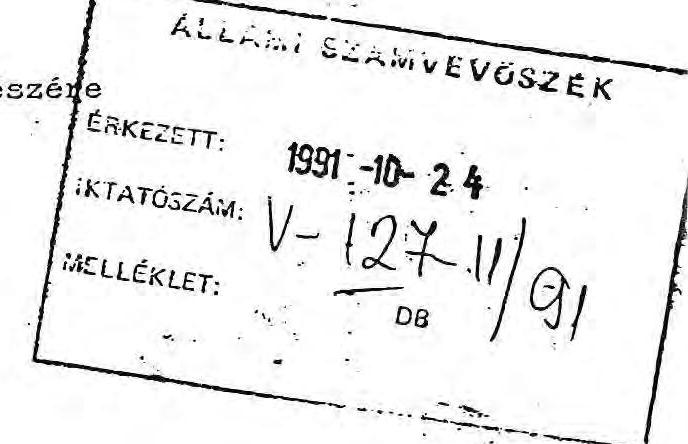

Tisztelt Hagelmayer Or!

Köszönettel vettem az Állami Számvevőszék Compack RT privatizációjával és a Gerbeaud-ház ügyével foglalkozó jelentését. Különösen kedvezőnek találom az ügyek olyan megközelítését, mely a privatizáció során szükségszerűen megjelenő üzleti vonásokat jóindulatúan kezeli.

Az Állami Vagyonügynökség Igazgatótanácsa a jelentéseket áttanulmányozta és az azokban szereplő javaslatok alapján beszámoltatta az ügyvezetést.

Ennek alapján az alábbiakról kivánom Ont tájékoztatni:
Az Igazgatótanács teljes mértékben egyetért a Számvevőszék azon felvetésével, mely szerint a Compack RT privatizációja során történt hiba nem vet jó fényt a magyar privatizáció folyamatára. Tekintettel arra, hogy e hiba részben fordítási pontatlanságból származott, az Állami Vagyonügynökség szerződést kötött egy szakfordító céggel a fordítások elvégzése illetve ellenőrzése érdekében. A kiirástól eltérő szerződés aláirást azonban privatizációs és gazdaságpolit-i megfontolások is indokolták. Az Állami Vagyonügynökség ügyvezetése elismerte, hogy a pályázattól eltérő végsõ megállapodás visszatetszést keltő lehet, ezért az ügyvezetés a jövőben a pályázat szövege szerinti szerződések megkötésére fog törekedni.

---

Az Igazgatótanács a Gerbeaud-ház ügyében arra a megállapításra jutott, hogy a vizsgált szerződések megkötése - ha egyszer már az AVU saját hibájából is előnytelen apportálást eszközölt - végül. is a kényszerhelyzetben indokolt volt. Ugyanis csak e szerződések révén volt lehetséges a GSB előjogainak megszüntetése és a jogi helyzet tisztázása. Sajnálatos tény, hogy az épület ügyében folytatott tárgyalások során az AVU ügyvezetése hibás jogértelmezésből kiindulva állapodott meg egy elővásárlási joggal terhelt pályázat kiírásában. Ezt követően a GSB-vel kötött egyezségi megállapodást az Igazgatótanács elfogadhatónak tekintette. Hosszadalmas tárgyalások után csupán ilyen módon sikerült a GSB Gerbeaud-házzal kapcsolatos előjogait megszüntetni és tiszta jogi helyzetet teremteni.

Az 1990. októberében a GSB-vel kötött első megállapodás során kétségtelenül sulyos hibát követett el az Ugynökség apparátusa amikor információ hiányában figyelmen kívül hagyta az SZDSZ által az ügyben kezdeményezett pert. Ennek következtében teljesen érthető és jogos volt a negativ sajtóvisszhang. Az Igazgatótanács ezért az Ugynökség ügyvezetését erős birálatban részesítette.

A jelentés hiányolta a GSB-nek fizetendő kártérítés összegének kiszámítását dokumentáló iratokat. Tekintettel arra, hogy a kártérítés helyett szakértői munka megrendelését ajánlotta fel az AVU a GSB-nek, a kártérítés összegéről nem született megállapodás; helyette a GSB által végzendő, mintegy 12 md forintnyi értékelendő vagyonérték szokásos piaci, 1-1,5 \%-os értékú ellenszolgáltatásban állapodott meg az AVU.
Az Igazgatótanács beszámoltatta az ügyvezetést arról is, hogy jogosan utaltak-e át összesen 155 millió Forintot a GSB-vel és érdekeltségeivel kötött szerződések alapján a Confidentia cégnek. Megállapította, hogy a fizetésekre a szerződés előirásai szerint került sor, a teljes összeg kiegyenlitése csak a szerződés teljesitése után történt. A szerződés teljesítését az Előprj=atizációs igazdaság munkatársa igazolta.

A Confidentia GMK cégbejegyzés iránti kérelmét 1991. április 16-án nyujtották be a Fővárosi Cégbirósághoz, a cégbejegyzésre azonban a cégbiróság tulterheltsége miatt még nem került sor. A Gt 25. par (3) bekezdése alapján azonban a társaság tevékenységét a cégbejegyzés megtörténte elött is megkezdheti.

---

Megköszönöm Önnek és munkatársainak az Állami Vagyonügynökség ügyeinek kritikus, a dolgok jobbitását célzó munkáját.

A válasz késedelmes elküldéséért elnézést kérek, a véleményét az Igazgatótanács már régebben kialakította és rögzítette.

A további eredményes együttmüködés reményében
tisztelettel köszönti:
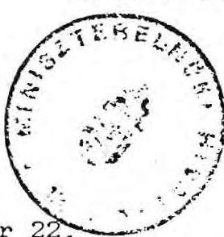

Dr. Mádl Ferenc

Budapest, 1991. október $22^{\circ}$

---

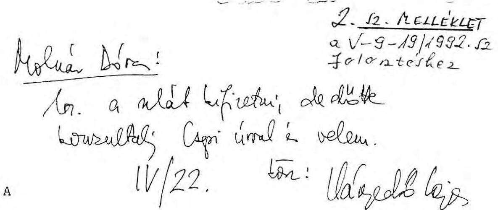

Az 1991. ~~augusztus 4-i~~ Tanácsadói Szerződésnek megfelelően a számlát igy állitjuk ki:

75.000.000.- Forint

Kérem, hogy az átutalást a mi bankszámlánkra a Magyar Takarékszövetkezeti Banknál

számlaszám: 801040090

teljesítse.

Gerberud-hál

Üdvözlettel

L. Stoffel

Fiechteis.

Crep. h.

74/24.

---

# TERHELESI ÉRTESÍTÉS

## ATUTALÁSI MEGBIZÁS

**Ertestjük Önöket, hogy a fenti keltő megbízásuk alapján az alábbi összeggel bankszámáujakat megterheliük.**

|  A címzett: |  |  |  | Az elismert bankszámla tulajdonosának neve és székhelye:  |
| --- | --- | --- | --- | --- |
|  Állami Vagyonlégműködés |  |  | Magyar Tuhayékszágyűkség |   |
|  1051 Bp. Vigyás u. 6. |  |  |  |   |
|  |   |   |   |   |
|  pénzforgalmi jelzőszáma: | Jelölőadat | Beruházást |  |   |
|   |  | együzenést | elsülködő |   |
|  232-90190-7511 | 4815 |  |  |   |
|  Közlemény: |  |  |  | A teljesítés napja:  |
|  |   |   |   |   |
|  Confidentia Gb. | 001040090 | sz. szá. |  |   |
|  javára |  |  |  |   |
|  szám |  |  |  |   |
|  bekezdés |  |  |  |   |
|  4511/41 | 5639.5/31127511 |  |  |   |
|  |   |   |   |   |
|   |  |  |  | Cszesen: Ft  |
|  |   |   |   |   |
|  MAGYAR NEMZETI BANK |  |  |  | Terv szerinti fizetésnél a fizetés esedékességének napja:  |
|  |   |   |   |   |
|  |   |   |   |   |
|  |   |   |   |   |
|  |   |   |   |   |
|  |   |   |   |   |
|  |   |   |   |   |
|  |   |   |   |   |
|  |   |   |   |   |
|  |   |   |   |   |
|  |   |   |   |   |
|  |   |   |   |   |
|  |   |   |   |   |
|  |   |   |   |   |
|  |   |   |   |   |
|  |   |   |   |   |
|  |   |   |   |   |
|  |   |   |   |   |
|  |   |   |   |   |
|  |   |   |   |   |
|  |   |   |   |   |
|  |   |   |   |   |
|  |   |   |   |   |
|  |   |   |   |   |
|  |   |   |   |   |
|  |   |   |   |   |
|  |   |   |   |   |
|  |   |   |   |   |
|  |   |   |   |   |
|  |   |   |   |   |
|  |   |   |   |   |
|  |   |   |   |   |

---

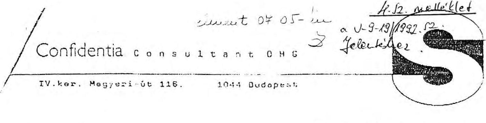

# Confidentia Consultant OHG

IV.ker. Megyeri-6t 116, 1044 Budapest

## Per Telefax

Troubandatelie
Herrn Dr. Caepi
Vigado u. 6
1051 Budapest, v.
Ungarn

## Inge Zeicher

Unsere Zeicher
Datum

20.06.91

## Rechnung

Gemäß unserem Schreiben vom 12.06.91 erlauben wir uns, eine weitere Abschlagszahlung in Höhe von

AG.000.000,00

in Rechnung zu stellen.

Confidentia Consultant OHG

Confidentia Consultant OHG - Sitz: 3.06.91

Geschäftsführer: Ludwig Siebel, Manfred Stifter
Büroverbindung: Magyar Tekaszkazürekkezett Gy. K. Konto-Nr. 80104290

---

# TERHELESI ÉRTESÍTÉS

## ÁTUTALÁSI MEGBÍZÁS

**BELIGENT 19**

Értesítjük Önöket, hogy a fenti keltő megbízásuk alapján az alábbi összeggel bankszámlájukat megterheittük.

A címzett:

**Allem Vagyonligny**

1091 Bp. Vígató u. 3.

Az elismert bankszámla tulajdonosának neve és székhelye:

**Lagym Vakaschvetővetészeti Bank**

**Kegondíts Igazgatónág Balázs**

|  pénzforgalmi jelzőszáma: | Jelölőadat | Beruházást  |
| --- | --- | --- |
|   |  | Egyébünk tételköd  |
|  129-60100-7311 | 4919 |   |
|  Közlemény: |  | A teljesítés napja:  |
|  **219-93690** |  |   |
|  **Az átutalt összeg: Ft** |  |   |
|  **7511/79** |  |   |
|  **5639 5/2112+511** |  |   |
|  **Uszesen: Ft** |  |   |
|  **60.000.000,-** |  |   |

**MAGYAR NEMZETI BANK**

Tery szerinti fizetésnél a fizetés szedékességének napja:

---

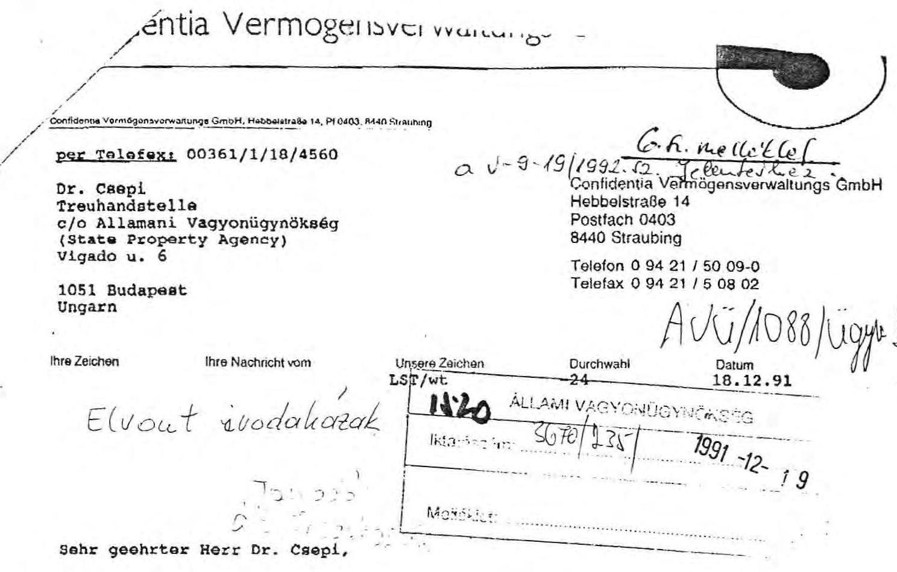

Sehr geehrter Herr Dr. Csepi,
ich bestätige Ihnen hiermit, daß bei der Firma Confidentia bzw. bei einer Tochtergesellschaft oder Muttergesellschaft bzw. bei den Herren Ludwig und Manfred Stoffel persönlich aus dem mit Ihnen abgeschlossenen Beratervertrag bzw. aus dem ausgebezahlten Betrag in Höhe von 155 Mio. Forint mindenstens

62 Mio. Forint an Steuern
anfallen.

Mit freundlichen Grüßen
Confidentia
Vermögensverwaltungs GmbH
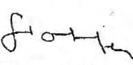

Ludwig Stoffel
T. Mohal Dova!
keyn mbes utal
at.
$0 L 54$
Utana keaja Udyed

---

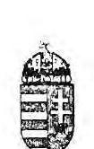

# PÉNZÜGYMINISZTÉRIUM

ÁLLAMTITKÁR
63.046/1992.

Dr. Hagelmayer István úr
e1nök
Állami Számvevőszék

Budapest

Tisztelt Hagelmayer Úr!

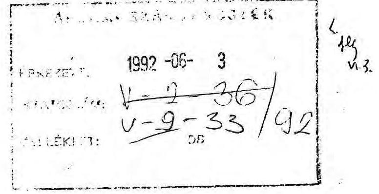

A Gerbaud-ház privatizációjának utóvizsgálatáról összeállított jelentést megköszönöm. Az ügyben a Számvevőszék vizsgálatát korrektnek, alaposnak tartom.

Egyértelmű számomra, hogy a jelentés megállapításai, javaslatai az állami érdek messzemenő védelmét tükrözik, ezért azokat nem vitatom. Kétségtelen, hogy, amint azt az ÁVÜ a korábbi állásfoglalása is tartalmazza, az ügyvezetés terhére mulasztás, gondatlanság róható fel az ügy kapcsán.

Indokoltnak tartom, hogy javaslatukkal egyezően a jelentésben rögzített megállapításokat, szükségesnek ítélt intézkedéseket az Igazgatótanács napirendjére tűzze, megvitassa, viszonylag rövid időn belül. Annak kimeneteléről haladéktalanul tájékoztatni fogom E1nök urat.

Egyetértve azzal a javaslatával, hogy az APEH vizsgálja meg, az ügyben érintett társaságok eleget tettek-e az előírt kötelezettségeiknek, egyidejűleg intézkedem az APEH e1nökénél a vizsgálat soron kívüli elvégzésére. Célszerủnek azt tartom, ha az ehhez szükséges információkat az APEH közvetlenül az ÁSZ vizsgálatot vezető munkatársától szerezhetné meg.

Budapest, 1992. május 27.

Tisztelettel:

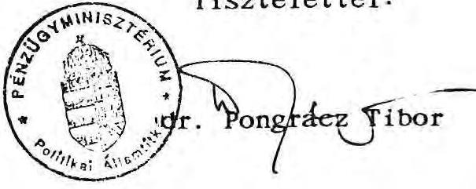

---

# Confidentia Vermögensverwaltungs oHG

Confidentia Vermögensverwaltungs OHG Gosekstraße 14, PL 5403, 8440 Straubing
per Telefax: 00361-1-18/4560

Dr. Csepi a V-9-19/1992 2. Telematik e 2
Treuhandstelle 1900 Confidentia Vermögensverwaltungs oHG
c/o Allamani Vagyonügyoökseg VACYONÜGYNÖKSEG Hebbelstraße 14
(State Property Agency) Postfach 0403
Vigado u. 6 8440 Straubing
Telefon 0 94 21/36 12 - 18
Telefax 0 94 21/5 08 02

H - 1051 Budapest

Ihre Zeichen 1051-12- 18 Telefax 0 94 21/5 08 02

ISt-Be 5009-24 18.12.1991

Dear Mr. Csepi,

I would like to confirm, that either Confidentia or a subsidiary company or the main-
company or Ludwig und Manfred Stoffel are obligeded to pay taxes in the amount
of
at least 62 Millions Forint

according to the consultancy contract of March the 29th.

After having received the amount of 62 Millions Forint we are not having further
demands according to the consultancy contract of March the 29th.

Your sincerly

CONFIDENTIA
Vermögensverwaltungs oHG

Fom
Ludwig Stoffel

Confidentia Vermögensverwaltungs GmbH · Sitz Straubing · Amtsgericht Straubing HR B 9558
Geschäftsführer: Ludwig Stoffel, Manfred Stoffel, Hanns-Peter Gröschl und Ulrich Voll
Bankverbindung: Sparkasse Straubing-Bogen, (BLZ 742 500 00) Kto.-Nr. 1 110 13

---

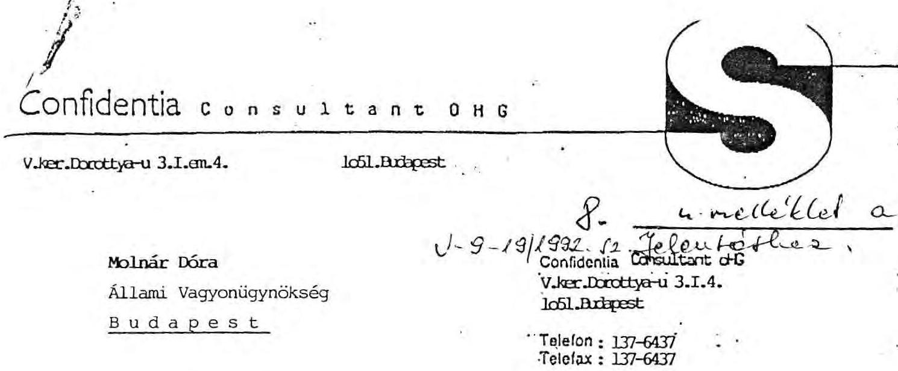

# Confidentia Consultant d'HG

V.ker. Dorottya-u 3.I.em.4.

Ic61. Budapest

Molnár Dóra
Állami Vagyonügynökség
Budapest

V-9-19/1992-12 Jelenfejthez
Confidentia Consultant d'HG
V.ker. Dorottya-u 3.I.4.
Ic61. Budapest

Telefon: 137-6437
Telefax: 137-6437

Ilve Zeichen
Ilve Nachricht vom
Unsere Zeichen
Datum 1991. dec. 20.

Tisztelt Bölgyem!

Kérése alapján rögzítjük, hogy az Állami Vagyonügynökség és a Confidentia GmbH 1991. március megállapodása alapján a Confidentia Konzultáns Gmk a megállapodással kapcsolatos tevékenységéből eredő adóterhelt ÁVU megtéríti.

Ezért megerősítjük, hogy a 62.000.000.-Ft-ot költségtérítésként a Confidentia Konzultáns Gmk Takarékszövetkezeti Bank Rt-nél vezetett 219-98698-801040290 sz. számlájára kérjük átutalni.

Szíves intézkedését köszönjük.

Tisztelettel:

Confidentia Konzultáns Gmk.

Confidentia Consultant d'HG
Sitz: Budapest
Geschäftsführer: Ludwig Stoffel, Manfred Stoffel
Bankverbindung: Magyar Takarékszövetkezeti Bank, Konto-Nr. 001040200

---

# 9. 12. melleklető

## 1-9-19/1992. 12. Jelentőke

### TERHELESI ÉRTESÍTÉS

#### ATUTALÁSI MEGBIZÁS

**Budapest, 1992. 11.12.20**

Ertégünk önüket, hogy a fenti keltő megbízásuk alapján az alábbi összeggel bankszámlájukat megterheltük.

|  A díszel | A ellent  |
| --- | --- |
|  Állami Vagyonügynökség | Takarókszövetkezeti Bank  |
|  1051. bp. Vígadó u. 6. | Budapest  |

|  Pénzforgalmi jelzőszáma: | Jelölőnőt | Beruházási  |
| --- | --- | --- |
|  232-50190-7511 | 4015 |   |

|  Közelemény: | A teljesítés napja: | Az átutalt összeg: F1  |
| --- | --- | --- |
|  |   |   |

**Confidentia Konsultáns GmbH**

801040290 sz. szla javára

1991. márc. 29-i szerz. alapján

**MAGYAR NEMZETI BANK**

Terv szerinti fizetéssel a fizetés szodóasszághozó napjai

**MAGYAR NEMZETI BANK**

---

# 10. h. melle'kleta 

$1-9-1911992 .2 . \int$ felevisib

Konzultációs Szerzodés
1991. március 29

Ezen SZERZODES (az alábbiakban, minden csatolt es a szerzodes szerves részst képezo adattai együtt, mint "Szerzodes") létrejott 1991 marcius 29 -én, egyreszrol a Magyar köztársaság Állami Vagyonugynöksége (Budapest V. Vigado u. ó., Hagyarorszag, az alábbiakban mint "SPA" ill. "VU"), mÁsreszrol nevszerint a Confidentia GmbH ( megnevezendö vállalot: az alábbiakban mint "Tanácsado") kózott.

Melyben SPA arra az elnatározásra jutott, hogy a tanácsadot megbizza a Projecttel kapcsolatos tanácsadástól, szerzodésben foglalt feltételek szerint.

Ezért most a felek a következök szerint megállapodásra jutottak:
I. Meghatározások
(i) "Szerzödés": jelenti ezen megállapodást a SPA és a Tanácsadó között.
(ii) "Fél": értelemszerüen jelenti a Tanácsadot vagy a SPA-t.

---

(iii) "Project": a III. pontban meghatározott, a Tanácsadó által kivitelezésre keruio munkát jeienti.
(iv) "Szolgáltatások": A Szerzodés értelmében a Tanácsado által kivitelezendó, és a III. pontban meghatározott munkat jelentik.
(v) "Kezdési Gátum": a III. pontban meghatározott dátum.
(vi) "Altanácsado": jelenti bármely jogiszemélyt, akivel a Tanácsado alvállalkozói szerzödést köt, a IV.3.2. ponitban foglalt rendelkezéseknek megfelelően.
(vii) "Harmadik fél": jelenti bármely az SPA-n, Tanácsadon vagy Altanácsadon kivüli személyt vagy jogiszemélyt. (viii)"Alkalmazandó jog": jelenti az érvényben lévó törvenyeket és más torvenyereju rendelkezéseket.

# II. Megbizás 

SPA az alábbiakban megbizza a Tanácsadot az alábbiakban meghatározott feltételek szerint kivitelezendo tanácsadói szolgáltatások elvégzésével, mely megbizást Tanácsadó elfogadja és a IV. pontban meghatározott feltételek szerint teljesiti. A szerzodésben foglalt kötelezettségek elfogadása érdekében a felek elismerik, hogy semmilyen a szerzodésben foglalt rendelkezés nem értelmezheto képviseleti megbizásnak, s amennyiben SPA kifejezetten nem ad felhatalmazást, a Tanácsadonak semmi modon sem áll jogában SPA-t képviselna. Ez a megbizás a szolgáltatások elvégzésének egyedüli és kizarolagos jogát biztositja Tanácsado számára, melyben SPA vállalja, hogy jelen Szerzodés érvényessége alatt a Szolgáltatásokkal kapcsolatban Harmadik felet nem biz meg a Tanácsado elozetes irásbeli beleegyezése nélkül.

---

# III. A PROJECT 

A Project kivitelezése érdekében a Tanácsadó által vegzendó Szolgáltatások: az Elso Magyar Irodaház Kft. tulajdonát képezó lá ingatlan értékbecslése.

## IV. A Tanácsadó kötelezettségei

1.) A Tanácsadó az alábbiakban kijelenti, miszerint rendelkezik az ingatlanok értékbecsléséhez és az ezzel kapcsolatos tevekénységekhez szükséges széleskörü tapasztalatokkal, szakmai ismeretekkel, személyzeti és müszaki hátterrel; valamint megfelelö ismeretekkel rendelkezik a magyar gazdasági helyzetrol és jogi lehetósegekrol éppúgy mint a gazdasági helyzetrol. folyamatokról, eröforrásokról, hátterröl. A fent emiitett összee információ birtokában Tanácsadó vállalja jelen Szerzödésben foglalt kötelezettségeinek teljesiteset, az ilyen tevékenységet folytató vállalatoktól általánosságban elvárható körültekintéssel, szorgalommal, hatékonysággal, gazdaságossággal. Minden a Szerzödéssel vagy Szolgáltatásokkal összefüggö kérdésben köteles a SPA hü tanácsadójaként eljárni, s minden esetben köteles a SPA jogos érdekeit szemelött tartani, és támogatni az Altanácsadókkal és Harmadik Fellel szemben.
2.) Ezen Tanácsadó köteles a Szolgáltatások kivitelezésére alkalmas képzett, tapasztalt alkalmazottakat foglalkoztatni. A Szolgáltatásokat végző alkalmazottak irányitásáért teljes mértékben felelős és teljes

---

felelöséggel tartozik az alkalmazottak által vagy a nevukben elvégzett munkáért. A Project kivitelezésében szereplö szakemberek listáját közzé kell-tonni, amennyiben SPA igényt tart rá.
3.) A Tanácsadónak, a SPA jóváhagyását igénylö tevékenységei
3.1. A Tanácsadonak lehetösége van, a SPA elözetes irásos beleegyezését követöen. kicserélni bármely a Projectben eredetileg alkalmazott szakembert. Amennyiben igy cselekszik, úgy köteles olyan személyt alkalmazni, aki szakmai felkészültsége alapján alkalmas a rábizott feladatok ellátására.
3.2. A Tanácsadonak elözetes irásbeli beleegyezést követöen -a Szolgáltatások elvégzését segitendö- jogában áll alvállalkozói szerzödést kötni szaktanácsadokkal (személyekkel vagy jogi személyekkel). A Tanácsado minden esetben teljes felelöséggel tartozik a jelen Szerzodéssel kapcsolatos Szolgáltatások Alvállalkozók ill. alkalmazottaik által történö kivitelezéseért. Valamely altanácsadó Tanácsadó általi megbizása nem jelent a Szerzödés 4. pontjában megállapított dijazást meghaladó járulékos költségeket SPA számára. Máskülönben a Tanácsadó nem köthet alvállalkozói szerzödést, s nem ruházhatja át a Szerzödésböl eredö jogait és kötelességeit.
4.) Bizalmas információk

A Tanácsadó és alvállalkozói kötelessek minden a Szerzödés kivitelezése érdekében kapott ill. beszerzett információt

---

szigorúan bizalmasan kezelni, s a Szerzödés keretébe tartozo információkat, a Szerzödés érvényessége alatt ill. lejáratát követö két évig nem tehetik közzé. A Tanácsadó ezt vállalja a Projectben nem szereplö alkalmazottai nevében is. A Projectben résztvevó szakértök és/vagy altanácsadok kötelesek egy titoktartási megállapodást személyesen, aláirni.

A Tanácsadó együttes és egyéni felelöséggel tartozik a fenti kötelezettségvállalás említett személyek vagy jogi személyek általi esetleges megszegése esetén. Ugyanez tartozik bármely, a Tanácsadó által a Projectben megbizott Altanácsadóra.

Mindazonáltal, amennyiben a Project kivitelezesehez valamely bizalmas információ nyilvánosságra hozatala szükséges, akkor ez csak az itt szereplö 4. bekezdés elöirásainak megfelelöen törtenhet.
5.) A SPA tulajdonát képező dokumentumok
5.1. A Szerződés felmondása vagy lejárta esetén a Tanácsadó köteles minden a SPA és a magyar kormány vagy bármely hatósága által a Projecttel kapcsolatban átadott okmányt SPA részére azonnal visszajuttatni, mint a SPA tulajdonát képező okmányokat.
5.2. Továbbá, bármely okmánynak, melyet a Tanácsadó a Szolgáltatások kivitelezése érdekében készitett, a SPA tulajdonába kell kerülnie, s mint ilyet a SPA részére el kell juttatni, legkésöbb a Szerzödés felmondásáig vagy lejártaig, egy részletes leltárral együtt. A Tanácsadó

---

megorizheti ezen okmányok egy példányát, de a Szerzödés kereten kivül nem használhatja fel ezeket.
5.) A SPA tulajdonát képezo egyéb vagyontárgyak

Mindenfajta a Tanácsado által a Szerzödés teljesitése érdekében létrehozott vagy beszerzett vagyontárgy -különös tekintettel a SPA által rendelkezésre bocsátott anyagi eszközökre- a SPA-t illeti, s részére a Szerzödés felbontása vagy lejárta esetén el kell juttatni.
7.) A Tanácsadó jelentései

A Tanácsadó köteles a Szerzödés egész idötartama alatt -kethavonta- tömör, irásos beszámolót késziteni és benyújtani, melyben összefoglalja az általa kivitelezett Szolgáltatásokat és 'meghatározza a Project teljesitéséhez szükséges lépéseket.
8.) A Tanácsadó felelössége

A Tanácsadó az alábbiakban garantálja SPA-nak a Szerzödésben foglalt kötelezettségek maradéktalan teljesitését, az ezen pont 1. bekezdésében foglalt elöírásoknak megfelelöen. Amennyiben a Tanácsadó elmulasztja szerzödéses kötelezettségeit -a Szerzödés ezen pontjának i. bekezdésében foglaltak szerint- teljesiteni, úgy ez a Szerzödés megszegésének tekintendö, és SPA-t feljogositja a következökre:
(i) jogilag megalapozza ezen Szerzödés felbontását a VIII. pontban foglaltak szerint;
(ii) ezenkivül SPA kárteritésre jogosult.

---

9.) SPA Tanácsadó általi kártalanítása

A Tanácsadó köteles SPA-t, -mind a Szerzödés érvényessége alatt, mind ezt követöen- teljes mértékben kártalanitani minden veszteség, rongálás, sérülés, haláleset, költség, tevékenység, eljárás, , követelés, reklamáció kapcsán a SPA-t vagy Harmadik felet ért kárért, -beleértve de nem kizárólag a jogi költségeket-, abban az esetben, ha ez a veszteség, rongálás, sérülés, haláleset a Tanácsadó -vagy Altanácsadója vagy valamelyikük alkalmazottjának- múlasztásából, törvénytelen cselekedetéból vagy szerzödésszegéséból fakad.
V. SPA kötelezettségei
1.) Információ szolgáltatás

A Szolqáltatások kivitelezése érdekében SPA ellátja a Tanácsadót mindazon információval, melyre Tanacsadónak a Project teljesitéséhez indokoitan szüksége van. A Tanácsadó betekinthet bármely a Projectben szereplö vállalat könyvelésébe, vagyonjegyzékébe és egyéb olyan okmányaiba, anyagaiba, melyek a Tanácsadó tevékenységével kapcsolatosak. SPA egyetért azzal, hogy a szolgáltatott információk és anyagok tudomása szerint nem tartalmaznak tényelröl valótlan vagy félrevezetö közlést, sem az eredményhez szükséges tényeket nem hallgatják el, illetve nem tartalmaznak ésszerütlen vagy valószinüleg ésszerütlen feltevéseken alapuló véleményeket.

---

2.) Engedélyek beszerzése

SPA vállalja, hogy a Project kivitelezéséhez szükséges összes hatósági beleegyezést és engedélyt a megfelelö idöben beszerzi.
3.) A partner alkalmazottainak listája

A SPA köteles a Tanácsadószámára egy alkalmazotti listát átadni, melynek összetételét a Felek megállapodása rögziti. A SPA továbbá közzé teszi Tanácsadó számára az ügyben érintett vezetök és egyéb olyan alkalmazottak listáját, akik segítségére lehetnek.
(4.) Dijazás

A Szerzödésben foglalt, és a Tanácsadó által kivitelezett Szolgáltatások figyelembevételével, SPA köteles a Tanácsadót az alábbiak szerint, kizárólag forintban díjazni.
4.1. Dijak és jutalékok összesen:

USD 2.900.000.- forint ellenértéke
4.2. A díjak és jutalékok $50 \%$-át a Tanácsadó bankszámlájára kell utalni forintban, a Szerzödés aláirását követö 8 napon belül. A visszamaradó 50 \%-os forintban fizetendő összeq azt követöen esedékes, hogy a Tanácsadó az SPA-nak benyújtotta a Szerződésben szereplö Project hiánytalan teljesitéséröl szóló jegyzökönyvet.
4.3. A felmerülö költségek a Tanácsadót terhelik, kivéve ha külön irásban más rendelkezés nem születik.

---

4.4. Amennyiben SPA bármely okbol a Tanácsadó meqbizását vagy a Szerzödést visszavonja. érvényteleniti vagy felmondja, úgy Tanácsado az ezen bekezdés 4.1. pontjában meghatározott ajjak, és jutalékok 50 \%-ra jogosult.
5.) SPA felelössége; kártalanitás
5.1. SPA felelóséggel tartozik Tanácsadónak, miszerint a Szerzödésben foglalt kötelezettségeinek eleget tesz, az ilyen jogi személytöl általában elvárható körültekintéssel.
5.2. Kártalanitás

SPA köteles a Tanácsadót -mind a Szerzödés érvényessége alatt mind ezt követöen- teljes mértékben kártalanitani minden veszteség, rongálás, sérülés. haláleset, költség, tevékenység, sijarás, követelés, reklamáció kapcsán a Tanácsadot vagy Harmadik feiet ért kárért, beleértve de nem kizárólag a jogi költségeket, abban az esetben, ha ez a veszteség, rongálás, sérülés vagy haláleset a SPA -vagy alkalmazottai vagy képviselöihanyagságából, törvénytelen cselekedetéböl vagy szerzödésszegéséböl fakad.
VI. Szerzödés módosítás

Jelen Szerzödés rendelkezéseinek és feltételeinek módosítása, -beleértve a Szolgáltatások céljának módosítását- csak a Felek irásos megállapodásával lehetséges. Mindkét fél köteles a másik fél által benyújtott módosító inditványt megfontolni.

---

VII. Altalanos rendelkezesek
1.) Meghatalmazott kepviselok

Barmely a Szerzodéshez szükséges tevèkenységet, vagy okmányt kivitelezheti:
(i) SPA részèröl: Dr. Csepi Lajos, ügyvezetö igazgató
(ii) Tanácsadó részèröl: Ludwig Stoffel, ügvezetö igazgató
2.) értesitésok

A Szerzödéssel kapcsolatos bármilyen értesitést vagy megegyezést irásban kell a másik fél részére eljuttatni, ajánlott levél, telex vagy fax útján, illetve személyesen.
3.) Szerzödés nyelve

Ezen Szerzodés nyelve az angol.
Kelt 1991. március 29 -én

Allami Vagyonügynökség
Confidentia GmbH

---

$$
\begin{aligned}
& \text { D. u. melle' } \\
& \text { Dela U-9-19/1992-12. } \\
& \text { Jelenfeilhe }
\end{aligned}
$$

Nyilatkozat

Az Allami Vagyonügynökség garantálja miszerint a Confidentia GmbH es bármely nem magyar alvallalkozó, alkalmazott illetve képviselö mentes minden magyar adótól, vámtól, illetektól és egyéb terhektól, a Confidentia GmbH (és/vagy alkalmazottja, képviselöje vagy alvallalkozója) részére történő, és a Szolgáltatások teljesitésével kapcsolatban eszközölt kifizetéseket illetően.

Mindazonáltal, ha valamilyen oknál fogva a Confidentia GmbH és/vagy magyarországi leányvállalatai, a nem magyar alvállalkozó és/vagy a nem magyar képviselö vagy alkalmazott kifizetett bármilyen a magylar törvények alapján kivetett adót, vámot illetéket, a SPA köteles a megfelelő idön belül részükre megteríteni, elkerülendő bármely ebböl eredó kárt.

Az Allami Vagyonügynökség felkérheti a Confidentia GmbH-t, és/vagy a Confidentia GmbH-nak joga van a konzultációs Szerződést átruházni a Confidentia GmbH valamely Magyarorszagon bejegyzett leányvállalatára, valamint a magyar törvényeknek megfelelően joga van profitját USD-ben a magyar adózást követöen- Németországba átutalnia, amennyiben a Confidentia leányvállalatában eszközölt tökebefektetése is USD-ben történt.

Budapest, 1991.04.08.

Allami Vagyonügynökség
Confidentia GmbH

---

$$
\text { a } \cup-9-19 / 1992 \cdot \text {. }
$$

# GSB visszalepesi 

MEGALLAPODAS
1991 marcius 29.
mely létrejött.
a GSB Betriebs- und Beteiligungs-GmbH, NSZK, 8440 Straubing, Hebbelstr. 14. (az alábbiakban mint "GSB GmbH"), úgyis mint a GSB-kereskedelmi es Befektetési Kft (1051 Budapest. Dorottya u. 1., az alabbiakban mint "J-V" vagy a "Vegyesvállalat") tagja
es
az Allami Vagyonügynökség, 1051 Budapest., Vigadó u. 6. mint magyar aliami hatóság, ( az alábbiakban mint SPA vagy AVG) úgyis mint a Gabonatorgalmi es Malomipari Szogaltató Vállalat, 1051 Budapest, Dorottya u. 1. ( az alábbiakban mint "GAMSZOV") tagsági jogainak külön meghatalmazáson alapuló képviselöje, a GSB Kereskedelmi és Befektetési Kftben.

## között

azzal a cellal, hogy a felek kölcsönösen és elfogadható feltételekkel rendezik a "Budapest V.ker.. Dorottya u. 1. sz. alatti épület" jövöbeni és jogi helyzetét, melyet érint a GSB-Kereskedelmi és Befektetési KFT. 1989 december 20-i Társaság Szerződése valamint ennek 1990 majus 3-4-i módosítása (az alábbiakban mint "Vegleges Szöveg"),

---

illetöleg a szerzödö felek között 1990 október 20-án aláirt szerzödés (a továbbiakban mint "Októberi Szerzödés").

A Szerzödö felek figyelembe veszik, az SZDSZ és az emiitett ingatlan berloi által - a GSB Kereskedelmi és Befektetési Kft Társasági Szerzödésének néhány eredeti elöirása, a SPA 192/1/11/1990. sz. határozata, a Legfelsőbb Biróság Cg. törv. II.30.859/1990/12. sz. döntése, a GSB GmbH és SPA 1990 október 20-i Szerzödése és a Fövárosi Biróság 5.P.24.734/1990/8. sz.itélete - ellen benyúitott keresetét.

Ezen Megállapodás a felek 1990 október 20-i szerzödésének helyébe lép, új elemet hozva a felek kiozottl viszonjbe. A felek megállapodnak miszerint legfobb céljuk a fenti megállapodásokkal, nézeteltrésekkel, határozatokkal és itéletekkel kapcsolatos viták megfelelö rendezése, valamint hogy a megállapodásban megnevezett feleket és egynást tisztességes partnereknek tekintik.

Jelen szerzödés létrejött a mai napon, az alábbi feltételekkel:

1) A szerzödö felek ezennel visszavonhatatlanul felbontottnak tekintik a Budapest V., Dorottya u. 1. sz. alatti épületrol szólo 1990 október 20-án Budapesten illetve Straubingban aláirt szerzödésüket.

2) A szerződő felek egyúttal abban is megállapodnak, hogy minden -a GSB Kereskedelmi és Befektetési Kft alapitásakor december 20-án és 1990 május 3-án és 4-én aláirt Társasági Szerzödésben szereplö- rendelkezés, mely valamilyen módon összefüggésbe hoznato az épülettei és/vagy annak

---

tulajdonjogával, érvényét veszti, a tagok által elvégzendö kiegészitö szolgaltatásokra vonatkozöan. GSB GmbH ennek érdekében vállaja, hogy a közgyülésen az erre vonatkozo inditványt szavazással elfogadja, és GAMSZOV-val egyetértésben utasitja a managert a tárgyra vonatkozo értesités Cégbírósáq felé történö benyújtására.
(3) A GSB ezennel az alábbiakat garantálja SPA részére:
a) GSB a német törvenyeknek megfelelöen létrehozott és jogszerűen müködö vállalat, s rendelkezik minden képességgel, hogy tulajdont birtokoljon, müködlessen, és béreljen, illetve az alábbiak szerinti üzleti tevékenységet folytasson.
b) A GSB rendelkezik minden szükséges feltétellel és engedéllyel, mely a Megállapodásban meghatározott kötelezettségek, valamint az egyéb idevágo szerzödésekben. okmányokban vagy okiratokban szereplö feladatok teljesitéséhez szükséges.
c) Ezt a Megállapodást, melyben a GSB GmbH az egyik fél, s amelyet a felek megvitattak, GSB köteles a megfelelö módon teljesiteni. A GSB GmbH jogszerú, érvényes és jogeros kötelezettség vállalását jelenti minden ilyen szerzödés, okmány és okirat, melyek egyúttal elöirásaiknak megfelelöen érvényesithetök a GSB GmbH-val szemben.
d) Jelen Megállapodás teljesitése, valamint az itt megvitatott okmányok és okiratok, melyekben GSB GmbH az egyik fél, nem sérthetik (i) a GSB GmbH alapitó és müködést szabályzo okiratait, (ii) nem sérthetik a GSB-re vonatkozó

---

törvényeket és jogszabályokat illetve (iii) nem jelentheti olyan érvényes szerzödés vagy megállapodás megszegését vagy késedelmes teljesitését, melyben GSB GmbH az egyik fél vagy amelyben érdekelt. Jelen Megállapodás GSB GmbH általi teljesitéséhez nem szükséges egyetlen német kormányzati szerv illetve hatósáq, sem egyéb a GSB-re befolyással lévö biróság jóváhagyása illetve engedélye.
e) A GSB GmbH nem ruházta át harmadik félre a jelen megállapodásban meghatározott szerzödésekben lefektetett jogait és kötelezettségeit.

# 4.) Biztositékok és nyilatkozatok fennmaradása 

A felek ezennel megállapodnak, hogy minden a Megállapodásban foglalt biztositék és nyilatkozat illetve minden igazolás, okmány és egyéb a Megállapodással kapcsolatban továbbitott okirat, a megállapodás kivitelezését és lejártát,valamint az itt megvitatott üzletek lebonyolítását követöen is meghatározatlan idöre megörzendö, tekintet nélkül a felek vagy törvényes képviselöik illetve szakértöik vagy független könyvvizsgálóik által végzett bárminemü vizsgálatra.

## 5) Altalános kártalanitás

Mindkét a megállapodásban szereplö fél köteles a másik felet kártalanitani minden veszteség, rongálás, sérülés, költség -beleértve de nem kizárólag a megállapodással kapcsolatban felmerült jogi viták költségeit- kapcsán felmerült minden összegért, kiadásért vagy valamely tevékenyseggel, perrel, eljárással, követeléssel, folyamodvánnyal, adózással vagy

---

itelettel összefüggésben feimerült kárért (az alábbiakban "Veszteségek")

EGYE日 RENDELKEZESEK

# 6) További biztositék 

Amennyiben az alábbi dátumot követöen bármikor, bármilyen továbbí feladat, közlés, igazolás, kérvény, okirat illetve okmány vagy egyéb lépés 'illetve dolog szükséges a SPA épülettel kapcsolatos jogainak átruházásához, helyesbitéséhez illetve megerösitéséhez vagy ezen Megállapodásban szereplö valamely ügylet kivitelezéséhez, a SPA vagy a GSB GmbH -esettöl függöen- a másik fél kérelmét követöen, haladéktalanul kötêles kivitelezni és továbbítani minden ilyen szükséges okiratot, és köteles minden szükséges lépést megtenni ezen jogcímek átruházására, helyesbitésére és megerösitésére vonatkozóan, illetve eqyéb módon támogatni jelen Megállapodás törekvéseit.
7) Utódok és megbizottak

Jelen Megállapodás minden feltétele és rendelkezése, és minden a jelen Megállapodásnak megfelelöen felmondandó illetve módosítandó egyéb szerzodés, a felek érdekeit kell hogy szolgálja, illetve a felekre nézve kötelezo érvényü.
8) Jogfeladás és Kiegészitések
a) Ezen Megállapodás csak minden itt szereplö fél által aláirt írásos okirattal módosítható vagy egészíthetó ki. Ezen Megállapodás rendelkezései csakis a jogfeladásba

---

beleegyezö fèl irásos okiratával függeszthetök fel. Semmilyen a Megallapodással kapcsolatos lópés, beleértve de nem kizárólag bármilyen, valamely fèl nevében vagy által végzett, vizsgálat nem jelentheti a másik fél teljesitéssel és szabatossággal kapcsolatos kötelezettségeinek megszünését, tekintettel az itt szereplö megállapodásban foglalt kijelentésekre, biztositékokra, kötelezettségekre és megállapodásokra. Valamely fél, ezen Megállapodás valamely rendelkezésének megszegésével kapcsolatos, jogfeladása nem jelenti a hasonló szerzödésszegéssel kapcsolatos további jogfeladást és nem tekinthetö az egyéb ill. ezt követö szerzödésszegésekkel kapcsolatos jogfeladásnak.
b) Az itt meghatározott jogok és jogorvoslati lehetöségek gyakorlásának valamely fél általi elmulasztása vagy késedelme nem minösül jogfelmondásnak, s valamely ilyen jog vagy jogorvoslat valamely fél általi egyszeri vagy részleges felhasználása nem zárja ki sem ezek késöbbi felhasználását, sem egyéb jogok és jogorvoslati lehetöségek igénybevételét. Minden jelen okmány szerinti jogorvoslat kimulativ és nem képez kivételt a törvény által nyújtott egyéb jogorvoslatok alól.
9) Kiváltságok

Semmilyen a Megállapodásban foglalt megállapítás nem célozza a Megállapodásban szereplö vagy ebböl következö jogok, felelösségek, jogorvoslatok, kötelezettségek

---

szerzödésben szereplo feleken, illetve utódailion kivül másra történö átruházását.
10) Ervenyes jog

A megállapodásra érvényes jog, a svajci jog, a jelen megállapodáskor érvényben lévö nemzetközi magántörvenyek utasitásaira vonatkozó utalásainak nélkülözésével.
11) Egyetlen a Megállapodásban szerepló fël sem élvez eljárások alóli mentességet. Bármely a Megállapodásbol vagy ezzel kapcsolatban felmerülö vitát, nézetelterest vagy követelést, beleértve az érvényével, megszegésével, lejártával vagy felmondásával kapcsolatos kérdéseket, az UNCITRAL "Választott, birósáqokra - a Megállapodas idöpontjában- érvényes szabályainak" valamint a Magyar- és Gsztrák Kereskedelmi Kamara Megállapodásában szereplo rendelkezéseknek (mely az itt emlitett utalással a Megállapodás részének tekintendo) a figyelembevetelével. kizárólag a bécsi Kereskedelmi Kamara Választott birósáqának van joga véglegesen eldönteni. A választott birak száma 3. mindegyikük tökéletes angol nyelvtudással. Mindegyik fel egy biró kijelölésére jogosult. Amennyiben valamely fél az UNCITRAL elöirásai által megszabott határidön belül elmulasztja kijelölni bíraját, úgy számára a Bécsi Kereskedelmi Kamara elnöke, mint kijelölö hatóság, fogja kijelölni a választott birát. A felek által választott birak kötelesek megegyezni a harmadik választott biró személyében, aki a testület elnökeként fog tevékenykedni. Amennyiben a két választott bíro nem tud a harmadik bíro személyét illetően megállapodni, a beiktatásukat követö huszonegy (21) naptári napon belül, úgy a harmadik birát a kijelölö hatóság

---

nevezi meg. A választott biróságl eljárás helyszine Bécs. Ausztria. Az eljárás nyelve angol. A választott birák döntése a feiekre nézve végleges és jogerös, és bármilyen a valasztott birák által hozott itélet az illetékes biróság által érvényesithetö. A SFA kijelenti, hogy a jelen Megállapodással összefüggö vitákkal kapcsolatos választott birói itéletek, a magyar törvenyeknek megfelelöen érvényesithetök. A GSB GmbH kijelenti, hogy a jelen Megállapodással összefüggö vitákkal kapcsolatos választott birói itéletek, a német törvényeknek megfelelöen érvényesithetök.
12) Dijak es költségek

Minden fèl köteles a Megállapodás -és minden az ebben a Megállapodásban említett egyéb megállapodáselökészitésével, kivitelezésével és teljesitésével kapcsolatban nála felmerült költségeit saját maga viselni.
13) A Megállapodásban használt nyelv

Ezen Megállapodás nyelve az angol.
14) Beosztás és tagolás

Jelen Megállapodás beosztása és tagolása csak a szövegben történö eligazodást hivatott segíteni, s semmi nemü befolyása nincs jelen Megállapodás értelmezésére és jelentésére.
15) Másodpéldányok

---

Ezen Megallapodas korlátlanul sokszorosithato, mely peldanyok mindegyike eredetinek tekintendó, melyek össszességükben egyetlen és ugyanazon okiratot képezik.

A felek a fentiekben megállapodtak, 1991. március 29-én:

| Allami Vagyonügynökség részéröl: | GSB GmbH részéröl: |
| :--: | :--: |
| Dr. Csepi Lajos ügyvezetó igazgató | Ludwig Stoffel ügvezetó igazgató |

---

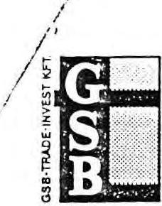

# GSB-TRADE INVEST

Beruházást Szervező Korlátolt Felelősségű Társaság

1051 Budapest, V. Dorottya utca 1.
Telefon: 118-2965; 118-3900/355./208.

1. kiadó:

Telefon:

Iktatószám: A7/91

Úgyintézzük:

Hivatkozási szám:

Dr. Csepi Lajos Űr
ügyvezető igazgató

Állami Vagyonügynökség

Budapest

Tisztelt Csepi Űr!

A Confidentia GmbH ill. a Confidentia Konzultáns Gmk meghatalmazása alapján mellékelten átadjuk az Első Magyar Irodaház Kft tulajdonát képező 12 db. irodaház forgalmi értékelését tartalmazó dokumentációt 2-2 példányban.

A munka a Confidentia GmbH és ÁVÜ között 1991. március 29-én létrejött "CONSULTANCY CONTRACT" alapján készült.

A fentiek alapján a vonatkozó számlát a Confidentia Gmk fogja önöknél benyújtani.

Budapest, 1991. június 18.

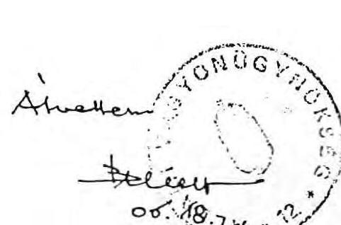

Egenhoffer Péter
ügyvezető igazgató

a Confidentia GmbH és Confidentia Konzultáns Gmk felhatalmazása alapján

---

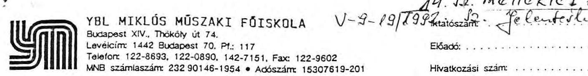

Állami Vagyonügynökség
Előprivatizációs Programigazgatóság
Rácz Ernő
igazgató

Budapest.
Tisztelt Igazgató Úr!

V-9-19/793
Mestozzate: Pe Centele
Elôadó:
Hivatkozási szám:

Megtisztelô felkérésére elvégeztem az Irodaház program keretében elvont ingatlanokról készült értékbecslések felülvizsgálatát.

Csatolom a felülvizsgálati szakvéleményt.
További megbízások esetén is készséggel állok rendelkezésre.

Budapest, 1991. szeptember 20.
dr. Nagy Béla
intézetigazgató
a mûszaki tudomány kandidátusa

---

# FELÜLVIZSGÁLATI SZAKVÉLEMÉNY 

az IRODAHÁZ programba tartozó ingatlanok értékbecsléséról

Az Állami Vagyonügynökség Előprivatizációs Programigazgatóság Rácz Ernő igazgató úr megbízott, hogy az Irodaház program keretében elvont belvárosi irodaházakról a KONFIDENTIA GmbH. által összeállított értékbecsléseket vizsgáljam meg és készítsek felülvizsgálati szakvéleményt.

A munka elvégzéséhez a megbízó rendelkezésemre bocsájtotta az elkészült értékbecsléseket.

Az anyagok részletes áttanulmányozása, a rendelkezésemre álló információk és a kialakult szakmai gyakorlat alapján szakértői állásfoglalásom a következő:
1.) A KONFIDENTIA GmbH. a szóbanforgó 12 épületről egyenként készített értékbecslések, azok külön-külön egymástól függetlenül is felhasználhatók.

Az elkészült szakvélemények módszere, felépítése, tárgyalása azonos, bizonyos szükségszerũ átfedéseket is tartalmaz, a szakszerũ szakmai összehasonlítások elvégzésére alkalmas.
2.) Az értékbecslések széleskörũ adatbázisa, felmérésekre, összehasonlító információkra támaszkodnak.

---

Az összeállítások kiállítása szép, a munka körültekintő, alapos, szssszerű.

Pótolható, kisebb hiányosság - a rendelkezésemre bocsájtott példányokról - hiányzik a pecsét és a készítő névaláírása.
3.) Megállapítható, hogy a szakvélemény készítōi a magyarországi ingatlan, irodaház helyzetet jól ismerik.
4.) Az értékbecslés minden ingatlan esetében két módszert alkalmaz:

- a forgalmi értékek becslését
- a hozamszámítást.

A két módszer eredménye minden esetben jelentősen eltér egymástól. A forgalmi értékek magasabbak, a hozamszámítással meghatározott áraknál.

Valószínűsíthető, hogy az ingatlanok reális piaci értéke a két érték között van.

Az adatok az ingatlanokkal kapcsolatos üzleti megállapodások, megfontolások előkészítésére alkalmasak.
5.) Az értékbecslések során alkalmazott számítás metodikája a hazai gyakorlattól eltér, módszereinek egyes részletei is vitathatók, de kétségtelen egyéni, egyedi elbírálásra ad lehetőséget.

Helyeselhető a hazai inflációs határok és magas kamatláb kiszúrése érdekében alkalmazott DM-re történő átszámítás.

---

6.) Az Irodaház program keretébe tartozó ingatlanok értékbecslései jol hasznosíthatók a további teendők meghatározására.

Feltétlenül figyelembe kell venni, azt a tényt, hogy a magyar gyakorlatban az Irodaház program teljesen, új, szokatlan megoldások alkalmazását is lehetővé teszi.

# Összefoglalva: 

A KONFIDENTIA GmbH. által az elvont belvárosi irodaházakról készített értékbecslések - kisebb hiányosságaik ellenére is - jól használhatók, gondos, alapos, körültekintő, szakszerű, a magyar gyakorlatot ismerő tevékenység eredményeként jöttek létre.

Budapest, 1991. szeptember 20.
dr. Nagy Béla
intézetigazgató
a műszaki tudomány kandidátusa

---

# I G A Z O L Á S 

Igazolom, hogy a Confodentia GmbH ill. megbizottja - a Confidentia GmbH és ÁvU között 1991.március 29-én létrejött "CONSULTANCY CONTRACT" alapján - az Első Magyar Irodaház Kft tulajdonában lévő irodaépületek értékelését határidőre és hiánytalanul elkészítette és az erről készült dokumentációt 2 példányban hiánytalanul átvettük.

Fentiek alapján a vonatkozó szerződés szerinti számla benyújtható.

Budapest, 1991. június 18.
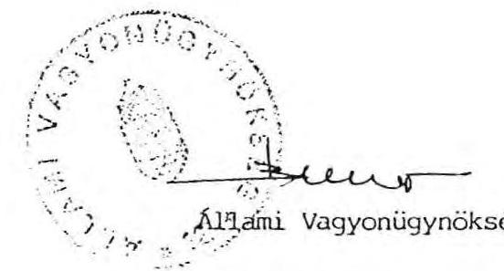

---

FÖVÁROSI BIRÓSÁG MINT
CÉGBIRÓSÁG VEZETŐJE
1992.Vez.XIV.H. 37.

ÁLLAMI SZÁMVEVŐSZÉK
Dr. Molnár Barnabás úrnak
Budapest
Apáczai Csere János u.lo. 1052
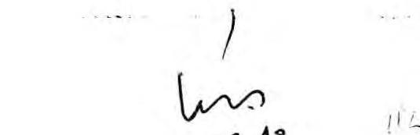
$10^{1} 9402,13$
1992. február 26-án történt megkeresésére válaszolva, mellékelten megküldöm a 01-04-0235244 cégjegyzékszámon lévő Confidentia Konzultáns GMK. résziratait további szives felhasználás végett.

A cég bejegyzése még nem történt meg és az iratok között nincs utalás arra, hogy a tagok vagyoni hozzájárulásukat befizették volna.

Budapest, 1992. március 11. napján

Dr. Tőkés Géza sk.
mb.csoportvezető-helyettes biró
a A. A. Bánány a teléül:
Brunner Öszkárné
leiró
Melléklet: 3 db gyorsmásolt
társasági szerződés

---

# TÁRSASÁGI SZERZŐDÉS 

amely létrejött a jelen okirat 4. pontjában megnevezett szerződő felek, tagok között, az alulirott helyen és napon, a következő feltételekkel:

1. Gazdasági Munkaközösség: időtartama

A tagok ezennel a többször módositott 1988.VI.tv.alapján, a cégbejegyzéstől függő hatállyal a jelen szerződés aláírásának napjától kezdődő meghatározatlan időre, gazdasági munkaközösséget (a továbbiakban: Társaság) alapitanak.
2. A Társaság cégneve
cégnév: Confidentia Konzultáns Gnk.
rövid neve: Confidentia Gnk.
német nyelvü elnevezése: Confidentia Consultant GHG
3. Székhely

Budapest,
cim: 1044. Budapest, IV.ker. Megyeri-út 116.
4. Vagyoni hozzájárulás. Tagok
4.1. A Társaság alapitó vagyona 800.000.- (Nyolcszázezer) Ft, amely a tagok itt meghatározott vagyoni hozzájárulásából (a továbbiakban vagyoni betét vagy betét) áll:
4.2. Ludwig Stoffel, (Wohnhaft in) 8440.Sztraubing Hebbelstr,.6. lakos készpénzbetétje: $400.000 .-\mathrm{Ft}$
4.3. Manfred Stoffel, 8440. Straubing Simon Höle Str.15. lakos készpénzbetétje: $400.000 .-\mathrm{Ft}$
4.4. A betétek teljes összegét USD-ban vagy DEM-ben készpénzben, a jelen okirat aláírásától számitott három (3) napon belül kell elhelyezni a nyitandó letéti bankszámlára.

---

5. Tevékenységi kör

EÁOR 2221 Beruházás- és épitményfenntartás szervezése, lebonyolitása és beruházási fővállalkozás
7222 Anyagi jellegü egyéb tevékenység
7418 Müszaki-gazdasági szolgáltatás
7422 Munka- és üzemszervezés
7423 Egyéb gazdasági jellegü szolgáltatás
6. Döntéshozatal, Taggyülés
6.1. A Társaság ügyeiben a tagok taggyülésen kivül vagy taggyülésen határoznak. A taggyülést bármelyik tag, a Társaság székhelyére vagy a tagok lakhelyére, a szükséghez képest, de legalább évente egy alkalommal, a napirend nyolc (8) nappal korábban történt kézbesítése mellett hívja össze. A taggyülés határozatképes, ha azon valamennyi tag képviselve van. Ha a taggyülés az ott megjelentek számára tekintettel nem lenne határozatképes, akkor az ettől számított nyolc (8) napon túli, de negyvenöt (45) napon belüli időpontra összehívott újabb taggyülés az eredetileg összehívott taggyülés napirendjére fölvett kérdésekben a megjelentek számára tekintet nélkül határozatképes lesz, föltéve, ha e megismételt taggyülés meghívója tartalmazta ezt a figyelmeztetést.
6.2. Ha a törvény szigorubb rendelkezést nem tartalmaz, a tagok vagy a taggyülés határozatát szótöbbséggel hozza. A tagokat egy-egy szavazat illeti meg. Szavazategyenlőség esetén az üzletvezetéssel megbizott tag (az ügyvezető) szavazata dönt.
7. Képviselet, Ugyvezető

A Társaság ügyeinek intézését és képviseletét az azzal megbizott, ügyvezető címet viselő tag vagy tagok látják el, ennek során dönt (enek) a Társaság szokásos üzleti tevékenységébe tartozó kérdésekben. A Társaság első ügyvezetője, az első öt (5) üzleti évre egyedül Ludwig Stoffel, aki jelen okirat aláírásával e megbizatását elfogadja.

---

8. Cégjegyzés

A cég `jegyzése akként történik, hogy a Társaság cégnevéhez az ügyvezető vagy ügyvezetők bármelyike önállóan irja a nevét.
9. Nyereségfölosztás

A mérleg szerinti tiszta eredmény (nyereség) a tagokat betéteik arányában illeti meg.
10. Tagsági viszony, fölmondás, tag halála

A tagsági viszony, vagy az ahhoz kapcsolódó vagy azzal járó bármely jog nem forgalomképes. Tagsági viszonyát bármely tag három hónapra fölmondhatja, ezzel a Társaság megszünik. Tag halála esetén örököse a tagsági viszonyt folytathatja.
11. Üzleti év

A Társaság első üzleti éve a cégbejegyzéstől függő hatállyal, a jelen okirat aláírásának napjával kezdődik, az üzleti évek egyebekben megegyeznek a naptári évekkel.

Kelt Budapesten, 1991. április hó 15 .napján
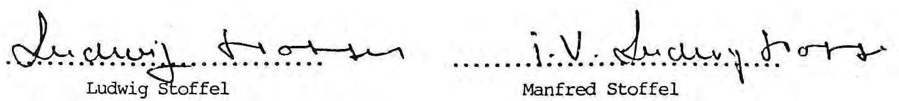

Ellepjegyezte:
138. 138. 138. 138. 138.

---

# Társasági szerződés módosítása

Szerződő felek a Fővárosi Bíróság, mint Cégbíróság által Cg 01-04-235244.sz. alatt a cégjegyzékbe bejegyzett társaság szerződését az alábbiak szerint módosítják.

A társasági szerződés 5. pontja, a társaság tevékenységi köre az alábbi tevékenységekkel bővül:

- 5211 Áruk, műszaki-, szellemi termékek és szolgáltatások (kiv.: 4/1990. KeM.r.1-2.sz.mell.)
- 5212 Külkereskedelmi fővállalkozási tevékenység (kiv.: 4/1990. KeM.r.1-2.sz.mell.)
- 5213 Külkereskedelmi képviseleti, ügynöki tevékenység (kiv.: 4/1990. KeM.r.1-2.sz.mell.)
- 5219 Egyéb külkereskedelmi szolgáltatás (kiv.: 4/1990. KeM.r.1-2.sz.mell.)

A társasági szerződés jelen módosítással nem érintett részei változatlanok.

A szerződő felek mint társasági tagok ezen szerződésmódosítást annak megismerése, átolvasása után, mint akaratukkal mindenben megegyezőt aláírták és magukra nézve kötelező érvényűnek jelentik ki.

Budapest, 1991. július 15.

---

**DR. SALAMON EDIT**

**V. 138. sz. Ugyvéd**

**Manfred Stoffel**

**Ludwig Stoffel**

1136 Bp., Fürst S. u. 31.

Tel.: 129-4951

A társasági szerződés módosítást készítette és ellenjegyezte:

---

# Társasági szerzödés   m ó d o s i t á s a 

Szerződő felek a Fővárosi Bíróság, mint Cégbíróság által Cg. 01-04-235244.sz. alatt a cégjegyzékbe bejegyzett társasági szerződését az alábbiak szerint módosítják.

Módosul a társasági szerződés 2. pontja:
Cégnév: CONZULTANS Gmk.
Rövidített neve: CONZULTANS Gmk.
Német nyelvú elnevezése: CONSULTANT OHG.
A társasági szerződés a következő ponttal egészül ki:
12./ A tagok személyes közremüködésének módjai:
A tagok kölcsönösen kötelezettséget vállalnak arra, hogy a közös gazdasági cél elérése érdekében személyes tevékenységükkel együttmüködnek.

A tagokat személyes közremüködésük alapján dijazás illeti meg, amelynek mértékét az elvégzett feladat nagyságához a közgyûlés állapítja meg.

A társasági szerződés jelen módosítással nem érintett részei változatlanok.

A szerződő felek mint társasági tagok ezen szerződésmódosítást annak megismerése, átolvasása után, mint akaratukkal mindenben megegyezőt aláírták és magukra nézve kötelezõ érvényünek jelentik ki.

Budapest, 1992. január 16.

A társasági szerződés módosítást készítette és ellenjegyezte:
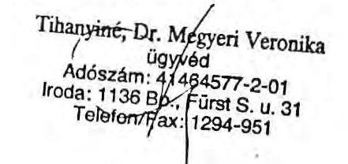
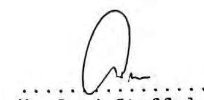

---

ADO- ĖS PÉNZÜGYI ELLENÖRZÉSI HIVATAL FÖVÁROSI IGAZGATÓSÁGA Igazgató
$7121428032 / 310 / 92$

Állami Számvevőszék
Vagyonkezelő Főcsopọrt
dr. Kovács Árpád
fôcsoportvezető úrnak

Budapest.
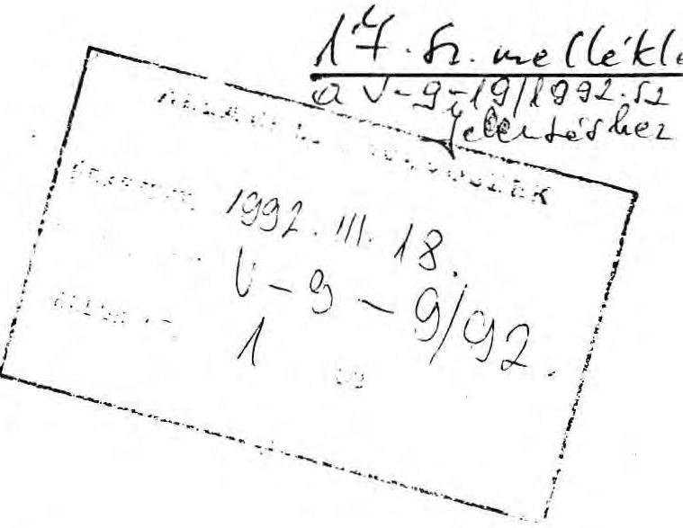

T i s z t e l t Uram!

Hivatkozással a V-9-2/1992.sz. megkeresésükre, mellékelten megküldöm Igazgatóságunk reviziós jelentését, mely a Confidentia Konzultáns GMK-nál 1992. március 13-17-ig szóló célvizsgálat keretében történt megállapításaink ról ad tájékoztatást.

Budapest, 1992. március 18.
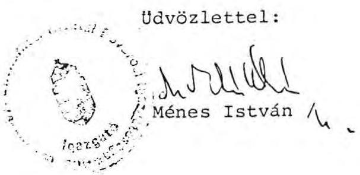

---

Adó- és Pénzügyi Ellenôrzési
Hivatal
Fôvárosi Igazgatósága
II/C/XII. Osztály .
Budapest, IX. Haller u. 3-5.

Revizori jelentés
a CONFIDENTIA KONZULTÁNS GMK-nál /1044 Budapest, Megyeri u. 116/ 1992. március 13.-tól március 17-ig
az Állami Számvevôszék megkeresése alapján végzett ellenôrzés megállapításairól

Adószám: 28142001201
Vizsgálati naplószám: 081/92.
Vállalkozási forma: GMK

---

A jelentés készült:
Az ellenôrzést elrendelte:

Az ellenôrzés tárgya:
Az ellenôrzés alá vont idôszak:
Az ellenôrzést végezték:

1992. március 17.-én
az APEH Fôvárosi Igazgatósága
"C" Főosztály XII. Osztálya
a 34552/1992. sz. megbízólevéllel
célvizsgálat
1991. év

Király Gyula fôrevizor
Szánthó István fôrevizor

---

# Bevezetô rész 

Az Állami Számvevôszék Vagyonkezelõ Fôcsoport 1992. február 26.-án kelt megkeresése alapján 1992. március 13 - 17-e között elvégeztük a társaság pénzügyi ellenôrzését.

Az ellenôrzés során tett adóhatósági megállapításokat külön jegyđ̃okönyv tartalmazza.

A GMK-t Ludwig Stoffel 8440 Straubing Hebbel str. 6. lakos, és Manfred Stoffel 8440 Straubing Simon Höle str. 15. lakos alakította meg, az 1991. április 15 -én kelt társasági szerzôdés szerint 400.000 - 400.000 Ft készpénz vagyoni hozzájárulással.
A társasági szerzôdést a Cégbírósághoz 01-04-235244 cégbejegyzési kérelem számon a Cégbírósághoz benyújtották, azonban a cégbejegyzés a vizsgálat idôpontjáig nem történt meg.

A társaság az adóhatósághoz bejelentkezett (adószáma: 28142001), ÁFA adóalany, egyszerüsített kettős könyvvitelt vezet.

---

# Megállapítások 

A Számvevőszék megkeresésében szereplő kérdésekre, a lefolytatott ellenôrzés alapján az alábbiakat jelentjük:

1. Az Állami Vagyonügynökség által a GMK részére 1991. évben kifizetett (átutalt) összegek:
1991. április 29-én beérkezett 75.000.000 Ft
1991. julius 9-én beérkezett 80.000.000 Ft
1991. december 28-án beérkezett 62.000.000 Ft.

A rendelkezésünkre bocsátott okmányok alapján 1992. évben az ÁVÜ a GMK részére nem utalt át pénzt.
Az összegek a GMK Magyar Takarékszövetkezeti Bank RT Regionális Igazgatóságnál (1054 Budapest, Szabadság tér 14.) vezetett 801040290 számú számlára érkeztek.

Az április 29-én átutalt 75.000 eFt-ot és a julius 9-én átutalt 80.000 eFt-ot a GMK $80 \%$ - $20 \%$ arányban megbontotta és árbevételként, illetve fizetendő ÁFA-ként könyvelte le.

Az 1991. december 28-án beérkezett 62.000 eFt-ot Egyéb pénzügyi elszámolásba könyvelte és 1991. évi mérlegében Egyéb passzív elszámolásként
, szerepeltetett.
A 62.000 eFt-ot az 1992. január 17.-én kelt rendelkező levél alapján átutaltatta DEM-ben a Confidentia Vermögensverwaltungs GmbH javára
2. A GMK a bevételek megszerzésével kapcsolatban az alábbi alvállalkozóknak teljesített kifizetést.

---

- Confidentia Vermögensverwaltungs GmbH Hebbelstrasse 14 D - 8440 Straubing részére az 1991. 09. 05-én kelt számla alapján
1.736.000 USD összeget, melynek Ft értékét 132.537 .524 Ft-ban állapította meg
- IMMO-COOP KFT (1031 Budapest, Örlö u. 14.) részére 1991. 12. 06-án teljesített számla alapján
$16.000 .000+4.000 .000$ ÁFA $=20.000 .000 \mathrm{Ft}$ összeget

Fentieken túlmenően az IMMO-COOP KFT a GMK részére $3.200 .000+800.000=$ $=4.000 .000$ Ft értékú pénzügyi-gazdasági tanácsadás szolgáltatást nyújtott.

A GMK 1991. évben alkalmazottat nem foglalkoztatott.
3. A GMK 1991. évre vonatkozóan az alábbi adókat vallotta be:

Vállalkozási nyereségadó
77 eFt (befiz: 92.02.05.)
Általános forgalmi adó
367 eFt (befiz: 92.01.17.)
Személyi jövedelemadó köteles kifizetés nem volt.
4. A társaság 1991. évi árbevétele 131.114 eFt
különféle bevétel 20.940 eFt
összes költség 125.861 eFt
különféle ráford. 26.000 eFt
1991. évi nyeresége 193 eFt

A GMK nyeresége terhére külföldre történő átutalás nem történt.

---

A társaság által megállapított eredmény és a bevallott adó a vizsgálat során tett megállapítások miatt lényegesen módosul.
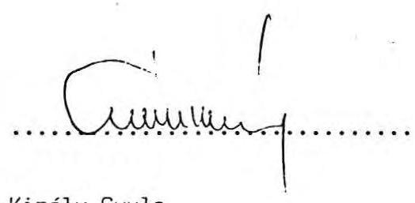

Király Gyula
fôrevizor

Szánthó István
fôrevizor

---

A Magyar Köztársaság Legfelsőbb Bírósááa
Ff.III. 20 270/1991/15. szám

A Magyar Köztársaság Legfelsőbb Bírósága a Budapesti 41. számu Ugyvédi Iroda /1042. Bp. Arpád u. 75., ügyintéző: dr. Mészáros István Ugyvéd/ által képviselt Mirelite Külkereskedelmi Rt /1051 Bp. Dorottya u. 1/ II.r., Hungária Szálloda és Etterem Vállalat /1364. Budapest, Petőfi S.u. 14/ III.r. és Szabad Demokraták Szövetsége /1084. Bp. Déri Miksa u. 10/ IV.r., felpereseknek, a dr. Sebők Vilmos jogtanácsos által képviselt Gabonaforgalmi és Malomipari Szolgáltató Vállalat /1369. Bp. Pf. 368/ I.r., és a Budapesti 136. számu Ugyvédi Iroda /1136. Budapest, Fürst S. u. 31., Ugyintéző: dr. Salamon Edit Ugyvéd/ által képviselt GSB Trade Invest Beruházást Szervező Kft II.r. alperesek ellen jognyilatkozat érvénytelenségének megállapítása iránt meginditott perében, amely perbe az alperesek pernyertessége érdekében beavatkozott a dr. Nagy Péter Ugyvéd /1117. Bp. Budafoki ut 79/ által képviselt GSB Betriebs- und Beteiligungs GmbH, /Straubing, Bahnhof str 9. Németország/ a Fővárosi Bíróság 1990. évi október hó 20. napján hozott 5.P.24 734/1990/8. számu itélete ellen a II.r. alperes részéről 9. sorszám alatt benyujtott fellebbezés folytán az 1991. évi december hó 17. napján megtartott tárgyalás alapján meghozta a következö

# $v$ é g $z$ é $s t:$ 

A Legfelsőbb Bíróság az elsőfoku bíróság itéletét hatályon kívül helyezi és ugyanezt a bíróságot a per újabb tárgyalására és ujabb határozat hozatalára utasítja.

A felperesek és a II.r. alperes fellebbezési eljárási költségét egyaránt 100000 - 100000 /Egyszázezer-egyszázezer/ forintban, a beavatkozó hasonló költségét 50000 /Ötvenezer/ forintban állapítja meg.

## I n d o k o l á s

A II.r. alperes korlátolt felelősségú társaságot az 1989. december 20-án kelt társasági szerződéssel hozta létre az I.r. alperes, a beavatkozó, valamint a TRADE INVEST Befektetési és Kereskedelmi Kft, amely utóbbinak tagjai a beavatkozó, valamint magánszemélyek. A társasági szerződés 4. 9-a szerint a társaság célja az I.r. alperes kezelésében és a Magyar Âllam tulajdonában levő, a budapesti 672. sz. tulajdoni lapon 24472 hrsz. alatt felvett kb. 7000 m 2 beépített területü felépitményes ingatlannak a kiüritése, felujítása, átalakítása és szál-

---

Pf.III.20 270/1991/15
lodakénti üzemeltetése. Az emlitett ingatlan természetben a Budapest, V., Dorottya u. l. szám alatt található. 1950-ben államositás utján került a Magyar Állam tulajdonába, kezelöje 1965 óta az I.r. alperes. Elhelyezö hatósági határozat, illetve bérleti szerzödés alapján jogszerü használói az épületnek a II. és III.r. felperesek, valamint a per volt I.r. felperese.

A társasági szerződés mellékszolgáltatás cimü 28. §-a szerint ezt az ingatlant az I.r. alperes a társaság kizárólagos tulajdonába adja. Ugyanakkor a beavatkozó mellékszolgáltatásként arra vállalt kötelezettséget, hogy maximum 1,6 milliárd forint erejéig fedezi az ingatlan bérlői elhelyezésének, az ingatlan korszerüsitésének, felujitásának költségeit. A társasági szerződés alapján a fővárosi kerületek földhivatala a II.r. alperes tulajdonjogát perbeli ingatlanra bejegyezte.

A II.r. alperes cégbejegyzése ellen a legfőbb ügyész törvényességi óvást emelt. Az óvás nyomán a Legfelsőbb Biróság Cg.törv.II. 30 859/1990/12. számon törvényességi határozatot hozott, amelyben a cégbejegyzést elrendelő végzést - a végzés törvénysértő voltának megállapítása mellett - hatályában fenntartotta. A felek a szerződésüket a mellékszolgáltatások vonatkozásában még a törvényességi határozatot megelőzően, 1990. május 3-án módosították, majd azt - a törvényességi határozatban írt utmutatásnak megfelelően az Állami Vagyonügynökséghez jóváhagyásra benyujtották. Az Állami Vagyonügynökség a 192/1/II/1990. számu határozatával a módosított társasági szerződés megkötését megtiltotta.

A jelen per IV.r. felperese az elsőfoku bírósághoz 5.P. 22 123/ 1990. számon benyujtott keresetében kérte annak megállapítását, hogy az I.r. alperesnek az a jognyilatkozata, amellyel a II.r. alperesre ruházta a perbeli ingatlan tulajdonjogát, semmis. A IV.r. felperes által kezdeményezett eljárást a bíróság a Legfelsőbb Bíróság Cg.törv.II. 30 859/1990. számu eljárása befejeződéséig felfüggesztette, a Legfelsőbb Bíróság azonban a Pf.I. 20 632/1990/1. számu végzésével az elsőfoku bíróság felfüggesztő végzését hatályon kívül helyezte és az elsőfoku bíróságot a per tárgyalásának folytatására utasította.

Időközben a P. 24 734/1990. számon a jelen per I-II.r. és III. r. felperesei is keresetet terjesztettek elő az elsőfoku biróságnál, kérve a tulajdonjog átruházására irányuló jognyilatkozat érvénytelenségének megállapítását. A per tárgyának azonossága folytán az elsőfoku bíróság a két ügyet egyesítette és együttesen bírálta el.

Az I.r. felpores a per első tárgyalásán elállt a keresetétől, igy az ő vonatkozásában a per megszüntetésre 'erült sor. A II-III-IV.r. felperesek kereseti kérelmüket az eredeti tartalom-

---

Ff.III.20 270/1991/15.
mal tartották fenn. Az alperesek és a beavatkozó a kereset elutasítását kérték arra hivatkozással, hogy a felperesekkel jogviszonyban nem állnak, igy a felperesek a Pp 2. §a és 46. §-a szerint nem rendelkeznek kereshetőségi joggal.

Az elsőfoku biróság itéletével megállapította, hogy az I.r. alperesnek az az 1989. december 20-i jognyilatkozata, amelylyel a Budapest, V., 672. számu tulajdoni lapon 24472. hrsz alatt felvett ingatlant a II.r. alperesre ruházta, érvénytelen. Kötelezte az alpereseket és a beavatkozót a perköltség megfizetésére. Itélete indokolásában rámutatott az elsőfoku biróság arra, hogy a II-III-IV.r. felperesek a Pp 123. §-ának második fordulata alapján voltak jogosultak a megállapitási kereset előterjesztésére, mert a kért megállapitás jogaik megóvása érdekében szükséges. A II-III.r. felperesek az ingatlan jogszerü használói, igy érdekeiket sulyosan sértheti az ingatlan szerződés szerinti átruházása, a IV.r. felperes pedig mint társadalmi szervezet a társadalmi érdek képviseletében jogosult hivatkozni arra, hogy a szerződés egyebek között a szolgáltatás - ellenszolgáltatás aránytalansága miatt is - a társadalom érdekeibe ütközik, s mint ilyen semmis. Az elsőfoku biróság az átruházó nyilatkozat létrejöttének érvénytelenségét a 32/1969.(IX.30.) Korm. rendelet 7. §-ának b/ pontja alapján találta megállapithatónak, de hivatkozott arra is, hogy magának a II.r. alperes társaságnak a létrejöttéhez is hiányzott a pénzügyminiszter és a kereskedelmi miniszter engedélye.

Az elsőfoku biróság itélete ellen még annak kézbesitése elôtt az I. és II.r. alperesek nyujtottak be fellebbezést, utóbb azonban fellebbezését csak a II.r. alperes tartotta fenn, kérve az elsőfoku itélet megváltoztatását és a kereset elutasítását. Fellebbezéssel élt még a beavatkozó is, azt azonban az elsőfoku biróság a Pp 237. §-a alapján hivatalból elutasította, mert a fellebbezési illeték lerovása iránti hiánypótlási kötelezettségének határidőben nem tett eleget a beavatkozó. A beavatkozó ezt követően a fellebbezését csatlakozó fellebbezésként tartotta fenn, ezt azonban a Legfelsőbb Biróság utasította el a Pp 244. §-ának (3) bekezdése alapján. A csatlakozó fellebbezés benyujtásának joga ugyanis csak a fellebbezó fél ellenfelét illeti meg, a beavatkozó azonban az általa támogatott II.r. alperes fellebbezéséhez kívánt csatlakozó fellebbezést benyujtani, amire törvényi lehetőség nincs.

A felperesek az elsőfoku itélet helybenhagyását kérték. Utóbb a másodfoku eljárásban - tekintettel arra, hogy az Állami Vagyonügynökség és a beavatkozó felbontották a közöttük fennállt korábbi megállapodást és az Állami Vagyonügynökség nyitott pályázatot hirdetett meg az épület hasznosítására - a felperesek keresetüket leszállították és csak a perköltségre tartották fenn azt.

---

Ff.III.20 270/1991/15.

A fellebbezés az alábbiak szerint alapos.
A felperesek keresete az I.r. alperes, a beavatkozó, valamint a perben nem állt TRADE INVEST Befektetési- és Kereskedelmi Kft. által kötött társasági szerződés egyik kikötése semmisségének megállapítására irányult. A perbeli igén jelentős értékü ingatlannak az I.r. alperes által mellékszolgáltatásként a társaság tulajdonába adása, olyan alapvető rendelkezése a társasági szerződésnek, amelynek esetleges semmissége esetén a Ptk 239. §-a (1) bekezdésének c/ pontja szerinti részleges semmisség nem jöhetne szóba, hanem az egész szerződés megdől. Az elsőfoku bíróság a keresettel támadott szerződési nyilatkozat érvénytelenségét megállapította, semmivel sem indokolta azonban azt, hogy miért a részleges érvénytelenség kivételes szabályát találta alkalmazhatónak és miért nem állapította meg a Ptk 239. §-ának (1) bekezdése alapján az egész szerződés érvénytelenségét.

Az elsőfoku bíróság ugy hozott itéletet, hogy a szerződő felek közül csak az I.r. alperes állt perben, mig a másik szerződő fél csak beavatkozóként, a harmadik pedig egyáltalán nem vett részt a perben. Az egész szerződés semmisségének megállapítására vezethető jogvitában a társasági szerződést meekötő valamennyi félnek perben kellett volna állnia. Lényeges eljárási szabályt sértett az elsőfoku bíróság akkor, amikor nem gondoskedott valamennyi szerződő fél peres félként való perbenállásáról. Nivel uj személyek perbelépésére a másodfoku eljárásban már nincs mód, az elsőfoku bíróságnak ez a mulasztása olyan - a másodfoku eljárásban nem orvosolható - lényeges eljárási szabálysértés, amely az elsőfoku eljárás megismétlését teszi szükségessé, s ezért a Legfelsőbb Bíróságnak az elsőfoku bíróság itéletét a Pp 252. §-ának (3) bekezdése alapján a fellebbezési kérelem és ellenkérelem korlátaira tekintet nélkül hatályon kivül kellett helyeznie és az elsőfoku bíróságot a per ujabb tárgyalására és ujabb határozat hozatalára kellett utasítania.

A lefolytatandó uj eljárásban az elsőfoku biróságnak gondoskodni kell valamennyi szerződő fél perbenállásáról. A jogkérdés érdemi eldöntésekor az elsőfoku bíróságnak figyelemmel kell lennie arra is, hogy a másodfoku eljárásban a felperesek keresetüket a perköltségre leszállitották. A perköltség viselés kérdésében való állásfogaláshoz azonban mindenképpen szükséges a jogkérdés eldöntése.

Vizsgálni kell a felperesek perbeli legitimációjának kérdését is. A Legfelsőbb Bíróság egy iránymutató eseti döntésében /Pf.I.20 431/1990/9. BH 1991/3/107/ már kifejtette, hogy a Ptk 234. §-ának (1) bekezdése szerinti hivatkozási lehetőség nem jelent egyben keresetindítási jogosultságot is. A semmis

---

Ff.III.20 270/1991/15
szerződéssel kapcsolatos perinditási lehetőséget csak jogi érdekeltség vagy perlési jogosultságot biztosító jogszabályi felhatalmazás alapozhatja meg.

Hivel a Legfelsőbb Biróság a per újabb tárgyalását rendelte el, a Pp 252. §-a (4) bekezdésének második mondata alapján csak megállapította a peres felek fellebbezési eljárási költségeit, azok viselése kérdésében, majd az elsőfoku bíróságnak kell határoznia. Ezzel kapcsolatban utal a Legfelsőbb Biróság arra, hogy a szerződés semmissége iránti perben a pertárgy értéke azonos a szerződéssel létrehozott társaság törzstőkéjével, vagyis helyesen 5000000 forint.

Budapest, 1991. december 17.

Dr. Baranyai János sk. a tanács elnöke, dr. Wellmann György sk. előadó biró, dr. Kazay László sk. biró

A kiadmány hiteléül
Tou
Ugykezeló

---

1991. 24. 24.

19/a. 12. mellékleda
U-9-19/1992. 0. Se beleille.

5/ a Gerbeaud-ház alagazarol keszített
elbterjesztés: az Igazgatótanács megtárgyalta. Nem
támogatta, hogy a ház értékesítési folyamataának technikai
izbonyolítását ingatlanközvetítő cég végezze, hiszen a
munka zeme már elkészült.

A következő határozatot hozta:

2. sz. határozat:

Az Igazgatótanács hozzájárult a Gerbeaud-ház 100%-os
tulajdonjogának értékesítéséhez az elöterjesztés
mellékletét képező pályázati kiírásnak megfelelően.

---

1991. mept. 25.

191h. h. mellekled
U-9-19/1992. 0. felemkik

vejte.

11, az Allami űzámévészék által készített
jelentésben kifizhető Company és a Gerősaudzköz ügvetői
entől tájékoztatót, - amelyben az ügyvezetés önkritikát
gyakorolt - jöváhagyólag tudomásul vette az
Igazgatótandos. Felkérte az AVO ügyvezetését arra, hogy a
tájékoztató tartalmának megfelelően adjon választ az
Allami űzámvévészéknek az általuk felvetett problémákra.

---

# 1991. magatentor 9.

19/c. 12. mellélet

a V-9-19/1992. 12.

Jelen 10/102.

---

Az Igazgatótanács áttekintette az Állami Számvevőszék vizsgálati anyagát, amely a Gerbeaud-ház és a Compack privátizációs folyamatának ellenőrzéséről szól. Az ÁZI által kifogásolt kérdésekre önkritikus hangvételű írásos választ kell készíteni és az IT következő ülése elé kell terjeszteni.

A Gerbeaud-házzal kapcsolatban egyhangulag a következő határozatot hozta az Igazgatótanács:

10. sz. határozat:

- az Ügyvezetés vizsgálja felül a GSB-nek, az elővásárlási jogáról való lemondásáért megállapított összege jogosultságát, valamint a GSB GmbH privátizálásból való kilépésére vonatkozó egyezségi megállapodásai megalapozottságát.

---

- az Ugyvezetés számoljon be az irodaházakat értékelö Confidentia Kft felé történő kifizetések jogosultságáról
- a vizsgálat eredményérôl irásos tájékoztatót kell késziteni és az Igazgatótanács szeptember 13-i ülése elé kell terjeszteni

A Compack ìt. ügyében egyhangulag a következôképp határozott az Igazgatótanács:

---

# 1994. wuijus 8. 

## $19 / d . h$ nelleller

$U-9-19 / 1922 \cdot 5 \cdot$ Yelemelele

$$
\begin{aligned}
& \text { 8/ A Berbeaud ház hasznosítására korabban } \\
& \text { meghirgtetett tender feltételeinek rendezesére folvtatott } \\
& \text { targvalások eredmenyét összegezve az Igazgatótanács } \\
& \text { megallapitotta, hogy a versenykiirás feltételeinek } \\
& \text { módositása szükséges. Ezek megalapozását elis kell } \\
& \text { késziteni. A végleges feltételeket közolni kell } \\
& \text { mindazokkal, akik a tenderanyagot felvették. } \\
& \text { Amennyiben a pályázaton elérhetis árban nem tükrozbdik az } \\
& \text { elérhetis legmagasabb érték, célszerú az értékesités } \\
& \text { helyett az épület hasznosítását az EMI programhoz } \\
& \text { kapcsolni. } \\
& \text { Egyhangú szavazással az Igazgatótanács a következis } \\
& \text { határozatot hozta: }
\end{aligned}
$$

---

# 8. sz. hatarozat: 

- Az Ügynökség Igazgatótanácsa az 1990. évi VII. törveny 12. -ában biztositott jodkörénél fogva a Budapest V. Dorottya u. 1. sz. alatti ingatlant a GAMSZOV-tól azonnali hatállyal elvonja. Ezzel egyidejüleg az FM egyetértésével a vállalat megszüntetését kezdeményezi.
- A pályázati feltételek módosításával kapcsolatos elbkészitést követben a Gerbeaud ház tender felhivását a GSB elbvásárlási jogának kiiktatásával újra ki kell adni. A felhivást az épület elárverezésére kell módositani. A felhivásban szerepeltetni kell az épületre vonatkozó jelenleg érvényes épitészeti elbirásokat is.
- A Gerbeaud ház jelenlegi bérlbivel meg kell állapodni az épület mielbbbi kiüritését biztosító feltételekrbl.

---

interface/pr1: /bin/stty: cannot open

A Komárom-Esztergom Megyei Bíróság mint Cégbíróság. 11-09-002256/02 szám

# V E G Z E S 

A Komárom-Esztergom Megyei Bíróság mint Cégbíróság a(z) "DOROTTYA" Vagyonkezelö és Szolgáltató Korlátolt Felelösségü Társaság kérelmére elrendeli a társaságnak a 11-09-002256 szám alatti cégnyilvántartásba vételét az alábbi adatokkal:

1 Altalános adatok
Bejegyezve : 1992. február 20.
Cégforma : Korlátolt felelösségú társaság
Adószám : nincs megadva
Reláció : HU

2 A cég elnevezése
2/001 "DOROTTYA" Vagyonkezelö és Szolgáltató Korlátolt Felelösségú Társaság

3 A cég rövidített elnevezése(i)
3/001 "DOROTTYA" Kft.

5 A cég székhelye
5/001 2890 Tata Kocsi u. 18.

---

| 8 | A társasági szerződés (alapszabály, alapító okirat, létesító okirat) kelte |
| :--: | :--: |
| $8 / 001$ | 1992.02 .10 |
| 9 | A cég tevékenységi köre(i) - TEAOR szám szerint |
| $9 / 001$ | 6719 A pénzügyi tevékenység máshova nem sorolt kiegészítő szolgáltatásai |
| $9 / 002$ | 7010 Saját vagy bérelt ingatlan hasznosítása |
| $9 / 003$ | 7412 Számviteli, könyvvizsgálói és adószakértői tevékenység |
| $9 / 004$ | 7414 Uzletviteli tanácsadás |
| 10 | A cég tevékenysége megkezdésének (a müködés megkezdésének) idöpontja |
| $10 / 001$ | 1992.02 .19 |
| 11 | A müködés idötartama (határozott, határozatlan), határozott idötartamú müködés esetén a müködés befejező idöpontja |
| $11 / 001$ | Határozatlan |
| 12 | A cég vagyona (törzstökéje, vagy alaptőkéje) |
| $12 / 001$ | 1000000 ft Egymillió ft |
| 13 | A cégjegyzés módja (önálló vagy együttes) |
| $13 / 001$ | A céget az ügyvezető önállóan jegyzi. |

---

15 A cégjegyzésre jogosult(ak) neve, tisztsége, lakóhelye

15/001 Szabó Béla ügymati
HU 1032 Budapest Bogdáni u. 8/a.

17 A könyvvizsgáló(k) neve vagy cége, lakóhelye vagy székhelye

17/001 Cégjegyzékszám: nincs megadva
dr. Marton István
HU 1031 Budapest Amfiteátrum u. 26.

# Tagjegyzék 

1 Allami Vagyonügynökség
HU Vígadó u. 6.
Smiaror
A törzsbetét összege 1000000.-ft Egymillió ft, ebböl készpénz 1000000.-ft, apport 0.-ft.

---

A bíróság a cég nyilvántartásba vételéről a kérelmezöt jelen végzés 2 pld-nak, a záradékolt alapító okirat 2 pldnak, valamint 2 db cimpéldány megküldésével azzal értesíti, hogy a bejegyzett cégjegyzésre jogosult(ak) az üzleti aláírásai(ka)t a cégjegyzéssel azonos módon köteles(ek) teljesíteni. 20 e. ft. bejegyzési illetéi lerovása megtörtént.

Tatabánya, 1992. február 20.
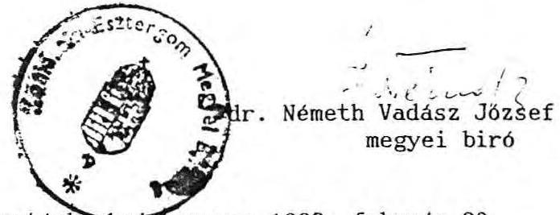

Cégnyilvántartásba-bejegyezve: 1992. február 20.
A kiadmány hiteléul:

---

# A Komárom-Esztergom Megyei Bíróság mint Cégbíróság. 

$11-09-002256 / 03$ szám

## V E G Z E S

A Komárom-Esztergom Megyei Bíróság mint Cégbíróságnál 11-09-002256 cégjegyzékszámon nyilvántartásba vett "DOROTTYA" Vagyonkezelö és Szolgáltató Korlátolt Felelösségü Társaság cégügyében a biróság a cég kérelme alapján elrendeli az alábbi változások bejegyzését:

A társasági szerződés (alapszabály, alapító okirat, létesító okirat)

Módosítva: 1992. február 24. napján.

12 A cég vagyona (törzstökéje, vagy alaptökéje)
12/001 1000000 ft Egymillió ft
Törölve: 1992. február 24-i hatállyal.
12/002 1501000000.-ft Egyailliárd-ötszázegymillió ft, ebböl készpénz 1000000.-ft, apport 1500000000.-ft.

Hatályos: 1992. február 24. napjától.

18 A felügyelöbizottsági tagok neve, lakóhelye
18/001 dr.Kárpáti Zsuzsanna
HU 1025 Budapest Vihorlát u. 7/b.
Hatályos: 1992. február 24. napjától.
18/002 Barta Károly
HU 1162 Budapest Pemete tér 3.

---

Hatályos: 1992. február 24. napjától.
18/003 dr. Székely Péter
HU 1113 Budapest Kosztolányi D. tér 5.
Hatályos: 1992. február 24. napjától.
A bíróság a módosítás bejegyzéséról a kérelmezöt jelen végzés 2 pld-nak, 2 pld. határozat megküldésével értesíti. A kérelemre 92.000.-Ft illetéket leróttak.

Tatabánya, 1992. február 25.
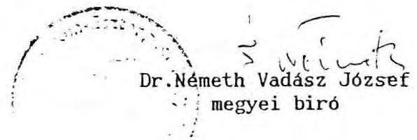

Cégnyilvántartásba bejegyezve: 1992. február 25.
A kiadmány hiteléül:

---

Fővárosi Biróság mint cégbiróság
Ügyszám: ol-o9-o65426/5-I.szám

$$
\text { a } u-9-19 / 1992 . \text {. } \cdot \text { feberkile: }
$$

# V é g zé s 

A Fővárosi Biróságon mint cégbiróságon ol-o9-o65426 szaim cégjegyzékszám alatt bejegyzett GBS -TRADE-INVEST Beruházást Szervező Kft. cégügyében a biróság a Pp. 95.§/1/ bekezdése alapján felhivja a társaság jogi képviselójét, hogy a vágzéa mellékelten megküldött, a Legfelsőbb Biróság Cg.törv.II.3o859/ 1990/12.számu határozatában foglaltakra figyelemmel az 1990. május 3.napján kell szerződés-módositẳban foglaltakra figyelemmel az Állami Vagyonügynökség döntését a äsxıaвsıxba a végzés kézbesítésétől számitott 30 napon belül csatolják be,

## xaiaminkxaxbixósághsxxbanyu3kskkx

valamint - ha az Állami Vagyonügynökség a mellékszolgáltatásnak a szerződés-módosításában megjelölt módoson történt teljesítéséhez hozzájáárult, a mellékszoltáltatás miatti megváltozott tagjegyzéke 2 példányát is csatolják.

Azxí
A szerződés-módosítással érintett könyvvizsgáló és felügyelő bizottsági tagok törlétésre irányuló kérelem esetében pedig a cégközlönyi kötelező közzététel miatt 4.000 Ft közzétételi dij befizetését igazolják. /2/1989. /III.22./ IM.sz.rendelet 6.§/1/ bekezdés d./ pontja./

B u da p e s t.199o.szeptember 18.napján.

$$
\text { Miv) } 1 / 21
$$

Dr. Horváth Matild
f.b.biró

LI: Végzés 1 példánya a Lefelsóbb Biróság határozatának 1 példányával Dr.Nagy Féter Ügyvédnek
52.sz.ÜMK:

---

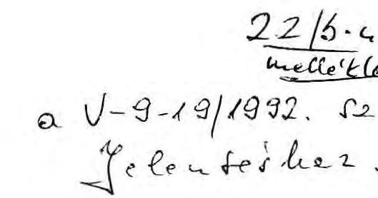

T・ Fővárosi Biróság mint Cégbíróság! Ugyiratszám: 10/6 0109065426/6-I.szám

T・Dr・Horváth Matild sk・

Tisztelt Cégbíróság!

A Fővárosi Biróságon mint Cégbíróságon 01-09-065426 cégjegyzékszám alatt bejegyzett GBS-TRADE-INVEST Beruházást Szervezõ Kft cégügyében a tárgyalások a Vagyonügynökséggel folyamatban vannak, várhatóan 1 hónapon belül /Igazgatótanácsi ülés szükséges a Vagyonügynökségnél a határozathozatalhoz/ a döntés részünkre kedvezően megszületik. Erre tekintettel kérem, hogy a T. Cégbíróság a Vagyonügynökségi hatá rozat becsatolására 1 hónapos határidőt adni szíveskedjék. Ugyancsak a határidőn belül csatolom a tagjegyzéket és az egyéb igazolásokat.

A határidő módosításáért szíves elnézésüket kérjük, de a tárgyalások a Vagyonügynökségnél most fejeződtek be, és a határozat meghozatala a közeljövőben várható.

1990. október 25.

Tisztelettel:
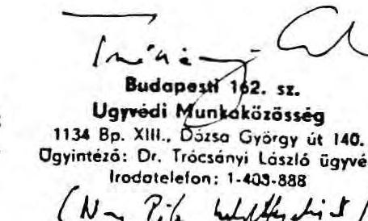

Ugyvédi Munkoközösség
1134 8p. Xill., Dúita György út 140.
Ugyintéza: Dr. Trócsányi László ügyvéd
Irodotetefon: 1-403-888
(Ny. P.ía Uffidit)
Dr. Nagy Péter
jogi képviselö

---

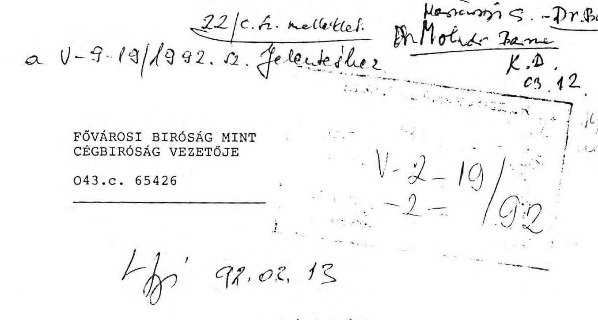

GSB - TRADE - INVEST Beruházást Szervezố KFT. cégügyében a biróság felhivja, hogy 15 napon belül

- pénzbírság terhével - tegyen eleget az 5/I. sorszámu végzésnek.

Budapest, 1991. február 12. napján

Dr. Tőkés Géza sk. biro
a kiadmány hiteléül:
Brunner Oszkárné
leiró

Cimzett: dr.Nagy Péter
1054.BUDAPEST, Bajcsy-Zsilinszky u.40.I.em.l.

---

# GABONAFORGALMI ES MALOMIPARI SZOLGALTATÓ VALLALAT 

$1992 / 3 / 310$
Tárgy: a Budapest, Dorottya u. 1. sz. alatti ingatlan jogi helyzete

A vállalatunk - ez idô szerint elbocsátott igazgatója által kötött társasági szerzôdés és a kapcsolódó, valamint módosító megállapodások alapján - tisztázatlan és függô jogi helyzetbe került a Budapest, Dorottya u. 1. sz. alatti irodaház ügyében.

Korábban a vállalat illetékes vezetői általános meghatalmazást adtak Önöknek az irodaházat érintő ügyek rendezésében, amely felhatalmazások azonban - idóbeli korlátozottságuk folytán - lejártak.
Önök a meghatalmazás alapján és egyéb jogkörükben eljárva különböző megállapodásokat kötöttek a GSB GmbH-val, amelynek tartalmáról, az abból folyó kötelezettségeinkről és jogainkról ezidáig nem volt módunk ismereteket szerezni.
Természetesen abban az esetben, ha a szóbanforgó ügy minden vonatkozásban rendezôdött volna az Önök intézkedései nyomán - úgy, hogy ezzel kapcsolatban vállalatunknak nincs is teendôje -, akkor néhány összefüggő részletkérdés kivételével nem éreznénk kötelezettséget és felelősséget arra, hogy az ügyben érdemi lépéseket tegyünk, vagy részletes információt kérjünk Önöktől.

A jelen idôszakban azonban azt kellett konstatálnunk, hogy a szóbanforgó irodaház ügyében korábban született elsôfokú birrósági döntést hatályon kívül hèlyezték, s az ügy érdemi újratárgyalását rendelték el, mégpedig olyan másodfokú bírósági útmutatással, amely esetleg meröben új helyzetet teremthet.
Ezzel egyidejûleg tényként kell megállapítanunk, hogy a GSB TI KFT jogi sorsát illetően az ügy nem jutott nyugvópontra.

Vállalatunk részéről ez idô szerint egyik legfontosabb kötelezettségünknek tekintjük azt, hogy a jogi helyzet esetleges módosulása esetén is biztosítsuk az állam tulajdonosi érdekeinek a védelmét, a nyilvánvalóan elônytelen - ezúttal más módon nem minősített - megállapodások megsemmisítését.
Megismerve a még nem kézbesített, de hozzáférhetô Legfelsőbb Bíróság-i döntést, számunkra nyilvánvalóvá vált, hogy az új eljárásban a vállalatunknak kényszerũen sokkal aktívabb szerepet kell vállalni, mint eddig.

---

Az eljárásjogi kényszer mellett ezt indokolja az is, hogy az ügy bírósági szakaszában részünkről látszik lehetôség olyan kérelmek és indítványok elôterjesztésére, amelyek feltételezéseink szerint szükségesek az ÁVÜ által képviselt eddigi álláspont alátámasztására, illetve az állami (nemzetgazdasági) érdekek érvényesítésére.

Fentiek miatt tájékoztatjuk Ünöket, hogy lépéseket tettünk annak érdekében, hogy a vállalat (ezen keresztül az állam) megfelelően képviselve legyen a bírósági eljárásban, s hogy a GSB TI KFT, mint cég ügyei tisztázódjanak, s lehetőleg rendezôdjenek.

Természetesen nem nélkülözhetõ az Ünök és vállalatunk szoros együttmûködése az ügyben, ezért tisztelettel kérjük, hogy szíveskedjenek hivatalosan bennünket írásban tájékoztatni arról, hogy

- mikor és milyen megállapodásokat kötöttek a GSB TI KFT rajtunk kívül álló tagjaival a társaságot és az ingatlant érintően a meghatalmazásunk alapján,
- az elöbbiekkel kötött megállapodások végrehajtása megtörtént-e, a külsõ érintettek a vállalt kötelezettségeiket teljesítették-e, az ügy minden összefüggését érintően (beleértve a pereket is) rendezôdött-e?

Tisztelettel indítványozom, hogy az Ünök és közöttem, illetve a jelenlegi helyzetre figyelemmel kijelölt képviselônk között egy minden kérdésre kiterjedõ egyeztetésre kerüljön sor.

Szíves tájékoztatásukra közlöm, hogy a GSB TI KFT tagjaként 1992. március 16-ra taggyûlést hívtunk össze, mert ez a vonatkozó törvényi rendelkezések szerint már régebb óta mellőzhetetlen lett volna, illetve mert a függő ügyek céget érintő részének rendezése enélkül nem biztosítható.

Budapest, 1992. február

Tisztelettel:
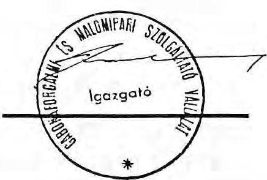

---

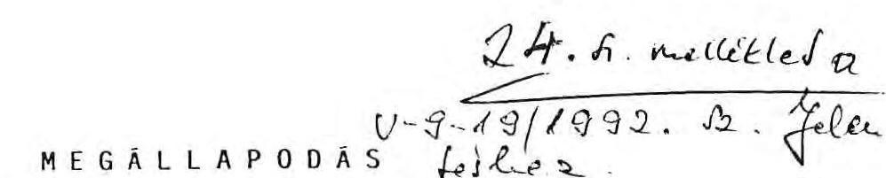
mely létrejött az alulírott napon és helyen egyrészröl az Állami Vagyonügynökség, 1051 Budapest, V., Vigadó u. 6. (továbbiakban: ÁVü), másrészről a Gabonaforgalmi és Malomiapri Szolgáltató Vállalat, 1051 Budapest, V., Dorottya u. 1. (továbbiakban: GAMSZOV) között a következők szerint:
1./ Felek megállapítják, hogy a Budapest, V., Dorottya u. 1. szám alatti a budapesti V. kerületi 672 tulajdoni lapon 24.472 hrsz. alatt felvett felépítményes ingatlan a Magyar Állam tulajdonát képezi és az korábban a GAMSZOV kezelésében volt. Az Ávü 1991. május 8-i hatállyal az ingatlant a GAMSZOV vagyonalapjából elvonta. Az Ávü az ingatlant hasznosítani kívánja, ezért szükségessé vált annak kiürítése.

A jelen megállapodást a felek annak érdekében kötötték meg, hogy a GAMSZOV az V. Dorottya u. 1. szám alatti ingatlanból kiköltözik és az általa jelenleg használt területeket kiürített állapotban az Ávü-nek 1991. december 31. napjáig átadja.
2./ az 1./ pontban foglaltak végrehajtása érdekében a felek megállapodnak abban, hogy a GAMSZOV eredményes gazdálkodását jelentősen befolyásolo, az 1./ pontban megjelölt ingatlanon belül elhelyezett és müködő ún. RBV és Iparági Laboratorium (továbbiakban: Laboratorium) megfelelő helyre történő áthelyezése is szükségessé vált, a konyhával és az irodaterületekkel együtt.
3./ Ávü a Laboratorium 1991. december 31. napjáig történő kiköltözése érdekében vállalja - figyelembe véve az Econplan Mérnöki KFT által részletesen kimunkált adatokat és annak árát -, hogy 45 millió 700 ezer R-ot (azaz Negyvenöt millió hétszázezer forintot) GAMSZOV-nak megfizet az alábbi ütemezésben.

---

- 1991. december 31-ig 20 millio forintot;
- 1992. június 30-ig 10 millió forintot;
- 1992. november 30-ig 15 millio 700 ezer forintot.

Megtéríti továbbá a GAMSZOV azon igazolt költségeit, amelyek a Laboratórium kétszeri kiköltözésével merülnek fel. Ezen költségek azonban a 3 millio forintot nem haladhatják meg.
4./ GAMSZOV vállalja, hogy a Laboratórium végleges helyre történő áthelyezéséig terjedő időszakban annak müködési feltételeit bérlet útján vagy egyéb módon maga biztosítja.
5./ Felek megállapodnak, hogy a GAMSZOV által jelenlegi helyén üzemeltetett konyha és ahhoz tartozó berendezési tárgyak, valamint étterem új helyre történő áttelepítéséhez, az új helyen_a működéshez szükséges infrastruktúra kialakításához szükséges igazolt költségeket az ÁvÜ a GAMSZOV részére a számla benyújtását követő 15 napon belül kifizeti.
6./ A GAMSZOV vállalja, hogy az 1./ pontban jelzett ingatlanban használt iroda területeit 1991. december 31. napjáig kiürített állapotban az ÁvÜ-nek átadja. Az ÁvÜ vállalja, hogy a Belvárosi Irodaház KFT-n keresztül segítséget nyújt a GAMSZOV-nak egy $500 \mathrm{~m}^{2}$ hasznos alapterületü irodabérlet keresésében a Soroksári út 24. szám alatti telephelye körzetében. A Belvárosi Irodaház KFT 1991. szeptember 30-ig legalább három darab bérleményt kínál fel.

---

7./ GAMSZOV vállalja ha 1991. december 31. napjáig az általa használt területet nem üríti ki, akkor 1992. január 1-től a kiköltözés napjáig helyiség használati díjként az $1 \mathrm{~m}^{2}$ re jutó havi bérleti díj tízszeresét köteles megfizetni az ÄVÜ-nek. Vállalja továbbá, hogy a jelen megállapodás meghiusulásából eredő igazolt károkat az ÄVÜ részére megfizeti.

A jelen megállapodást a felek, mint számukra kötelező erejűt, tudomásul veszik.

Budapest, 1991. szeptember 9.
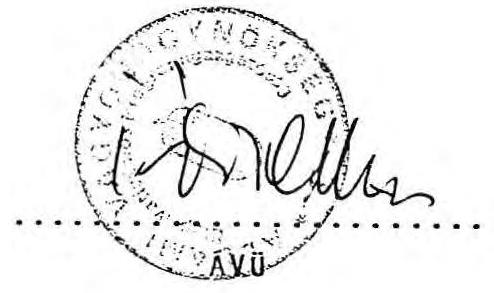

Gabonoforgolml és Molomipor, Szolgáltotó Vüllolat 1369 BUDAPEST, Dorottya u. 1.

---

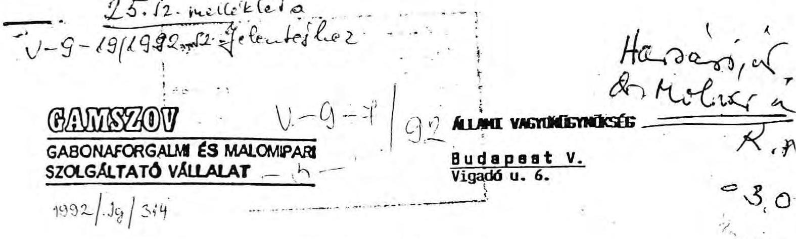

Tárgy: a Budapest, Dorottya u. 1. sz. alatti ingatlan kezelôi jogának elvonásával kapcsolatos vagyonjogi megállapodás

# Tisztelt Vagyonügynäkség! 

A vállalatunk kezelésében volt Budapest, Dorottya u. 1. sz. alatti, 24.472. hrsz-ú ingatlan kezelôi jogának elvonásával összefüggésben hozott, kezelôi jog-megvonást tartalmazó, 1991. május 8-i keltũ határozatuk alapján "miegállapodás" született az ingatlan kiürítésérôl és átadásáról 1991. szeptember 9-én.

A szóbanforgó ingatlant érintő egyéb sajátos függő jogi kérdésekre, a Belvárosi Irodaház Kft függő jogi státuszára, az említett kft szeptember 9-i "megállapodás" szerinti kötelezettségei teljesíthetôségére és általában a "megállapodás" egyenértékűségére figyelemmel ezúton tisztelettel azt vagyunk kénytelenek az Önök tájékoztatására közölni, hogy a Budapest, Dorottya u. 1. sz. alatti ingatlan kiürítése és átadása akkor és abban az esetben történhet meg, ha az említett szeptember 9-i "megállapodás" anyagi feltételei tekintetében új megegyezés születik.
Kifejezetten hangsúlyozni szeretnénk, hogy vállalatunk a körvonalaiban ismert állami irodaház-hasznosítási koncepció megvalósítását nem hátráltatni, hanem elôsegíteni szándékozik.
(Ezzel függ össze, hogy a GSB TRADE INVEST ügyben is az állam pozícióit erôsítõ lépésekre határoztuk el magunkat.)
Ennek során azonban a vállalat és a vállalati kollektíva érdekeit nekünk, mint vállalati vezetőknek, érvényesítenünk, Önöknek pedig - mint állami tisztségviselőknek - méltányolniuk kell.
1991. szeptemberét követôen nyilvánvalóvá vált, hogy a vállalat az 1991. szeptember 9-i feltételek szerint nem tudja jelentôs veszteségek nélkül ellentételezni az irodaház kezelôi jogának megvonásával összefüggô gazdasági hátrányokat, másszóval a szóbanforgó "megállapodás" felülvizsgálata és módosítása indokolt.

---

Figyelemmel arra, hogy Ünïk az ügy egészét tekintve a legtöbb információval rendelkeznek, ezúton mellőzzük azon egyéb megállapodások részletezését, amelyek az, épület kiürítésével kapcsolatosak.

A magunk részéről tisztelettel csak azt és annyit kérünk, hogy szíveskedjenek a korábbi megállapodás felülvizsgálata tekintetében felhatalmazott személyt kijelölni, s az ügyben velünk a szükséges egyeztetést lefolytatni.

Ennek, illetve az egyeztetés eredményessége reményében a magunk részéről folytatjuk azon intézkedések megtételét, amelyeknek végén az épület birtokba adása is megtörténhet.

Budapest, 1992. február
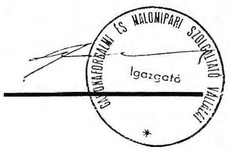

---

# 26.12. melléklet a 

## 27. 27. melléklet

Ügyvezető igazgató

Dr. Kovács Arpád úr, Főcsoportfőnök
Allami Számvevőszék
Budapest

Tisztelt Főcsoportfőnök Ur!

Szives felhasználásra mellékelten küldöm a Gerbeaud-vizsgálat utóellenőrzéséhez tett észrevételeinket.

A késedelemért szives elnézését kérem.

Budapest, 1992. április 17.

## Kelen iktéti!

T. de. Vtholide Bame

Kélek néin epy - a meptereltel neniuti és a hordthi' er ujysen tett gyahodatneh megfelel' tetele vellent. Mit tudunh eltopedni'
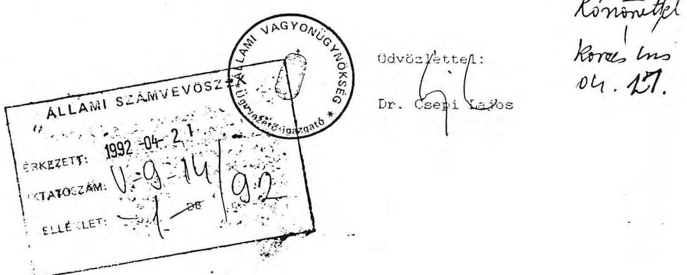

---

# Eszrevételek 

Az Allami Számvevöszék által készített " Jelentés a Budapest, V. Dorottya u. 1. sz. alatti Gerbaud-ház privatizációs folyamatának - 1991. júliusában készített ASZ vizsgálat - utóellenőrzéséről " címet viselö anyaghoz.

## Eszrevételek a Megállapítások c. részhez

## 9. old. 2. bekezdéséhez

Alláspontunk szerint - amint azt korábban kifejtettük - nem volt szükség arra, hogy a Confidentia GMK külön is szerzödjon az AVüvel az értékbecslési munkálatok elvégzésére.

A szerzödés IV. 3.1. pontja alapján a tanácsadó cég a szerzödés III. pontjában foglalt szolgáltatások teljesítésére alvállalkozót, altanácsadót vehet igénybe az AVU irásbeli hozzájárulásával.

Az április 8-án kelt Nyilatkozat szerint a Confidentia GmbH a tanácsadói szerzödésben foglalt jogait jogosult átruházni valamely Magyarországon bejegyzett leányvállalatára.
10. old. 2. bekezdéséhez

Elismerve a 62 MFt - téves informacion alapulo költségtéritésként történö utólagos kifizetését, annak átutalásával összefüggésben meg kell említeni egyrészt azt, hogy a tanácsadói szerzödést az AVU külföldi fellel kötötte, akire nem vonatkoznak a magyar számlázási követelmények, másrészt a kifizetéseket a szerzödésben a feladat teljesitéséhez és nem külön számlaadáshoz kötötték a felek.
Ezért úgy véljük, hogy a kifizetésekhez elegendö jogalapot teremtett az 1991. március 29.-i tanacsadol szertados es az ahhoz kapcsolódó áprilisi nyilatkozat, mely a szerzédest kiegészitette és egyértelmúsítette oly módon, hogy az AVU a Confidentia részére megállapított dijat netto dijként értelmezi, mely mentes bárminemú adótól, illetéktöl és más tehertöl. Ez természetesen nem jelentette az adó megfizetése alóli kibújást, hiszen egyben az is rögzitésre került, hogy ha a confidentiának vagy a többi erintett személynek a magyar jog szerint bárminemú adót. dijat stb. kellene fizetnie, úgy azt az AVU megtéríti, vagyis nem adómentességet garantált az AVU, mivel az adót az adóhatóság a magyar jog alapján természetesen beszedhetis ezt a deklarácio nem érinti. A magyar üzleti gyakorlatban is általánosan elfogadott az, hogy az ellenértéket netto ár + adó /AFA/ formulával határozzák meg. Az AVU is ezt tette azzal, hogy az ellenortók adó részét külön nyilatkozat fogja át.

---

# 11. old. 1. bekezdéséhez 

Ami a Confidentia GmbH magyar leányvállalatánál képzėdött nyereség USD-ben való kiviteleñek AVU Általi garantálását jelenti, a - magyar joghatóság alá tartozó és a magyar jog szerint müködä - vegyesvállalatra a szerzédésben történä külön utalás nélkül is vonatkoznak az 1988. évi XXIV. tv. rendelkezései, mint mögöttes kötelezä jogi eläirás.
Igy az említett kitétel külön, szerzédésben történä megismetlés nélkül is kötelezä erövel bir: nem állt az AVU szándékában ennek megkerülése, mivel kifejezett utalás is szerepel a szerzédésben arra, hogy a devizatranszferre a magyar eläirások vonatkoznak.

Mint az eläzä pontnál arra kitértem, az AVU a tanácsadói szerzédésben közölt netto vételárat egészitette ki azzal, hogy a vételár részeként határoztá meg a társaság által fizetendä adót is. ezért nem lehetett szó ado elengedésräl, mivel az adóhatóság adóbehajtási jogát ez a nyilatkozat nem érinti, igy az AVU semmilyen törvénysértést nem követett el.

## 11. old. utolsó bekezdéséhez

A tanácsadói szerzédésben szereplä 16 irodaház vagyonértékelése helyett azért készült el 12 irodaház értékelése, mert az Igazgatótanács döntését utóbb megváltoztatta és a 16 irodaház helyett 12-t hagyott a programban, ebbäl következäen ezeket kellett csak értékelni.

## 12. oldalon foglaltakhoz

A GSB GmbH-nak soha nem volt jogcime a Gerbaud-ház tulajdonjogára, érvényes jogcimmel a GSB-Trade-Invest Kft rendelkezett.

Az 1989. 12. 20-án kötött társasági szerzédés jelenleg is érvényes az 1991. majusi módosításnak AVU részéről torténä megtiltása miatt.

Az 1989-ben kötött társaság szerzédés semmisséget a Legfelsöbb Bíróság törvényességi határozatának rendelkező részében nem mondta ki, igy az - függetlenül a birósáa által lefolytatandó új eljárástól - máig is érvényes. A semmisség hivatkozott lehetöségét - meghatározott szövegkörnyezetben. bizonyos körülmények függvényében - csak az indokolás tartalmazza.

A Gerbaud-házzal kapcsolatos SZDSZ által inditott perben a Legfelsöbb Bíróság Ff.III.20. 271/1991/15 sz. itélete indokolásában rámutatott arra, hogy a felperesek perbeli legitimációját vizsgálnia kell az I. fokú biróságnak, ugyanis, " ... a Ftk. 234. par. /1/ bekezdése szeinti hivatkozási lehetäség nem jelent egyben perindítási jogosultságot is. A semmis szerzädéssel kapcsolatos perindítási lehetäséget csak jogi

---

érdekeltseg vagy perlési jogosultságot biztosito jrgszabályi felhatalmazás alapozhatja meg..." Ebböl következöen sz ügyben hatóságként eljáró cegbiróság, illetve földhivatal veheti kizárólag figyelembe a semmisséget külön eljárás nólkül; mivel ezt a cegbírói végzés nem tette meg, az AVU kész helyzet elé került, hiszen az AVU tv. szerint az AVU jogköre nem terjed ki az 1990. március 1. elött kötött ügyletekre. Ennélfogva az AVU nem tehetott mást, mint kötelmi jogi szerzödéssel biztosított magának tulajdoni igenyt a Gerbaud házra.

Mégegyszer hangsúlyozom, hogy a társasági szerzödésre az 1990. évi VIII. tv. alapján az Allami Vagyonügynökségnek kompetenciája nem volt, mivel az müködésének megkezdése elött köttetett, ezért a Legfelsöbb Bíróság állandó bírói gyakorlata alapján az AVU nem nyerhetett volna meg egy semmisségi keresetet, mivel nincs a perben felperesi legitimációja. Ezért erre vonatkozó mulasztással az AVU nem marasztalható el.

Az Allami Vagyonügynökség által 1990. októberében kötött szerzödés éppen e társasági szerzödés egyébként várható jogkövetkezményeit volt hivatott elhárítani a nyilvános pályázat elöirásával.
Ezen szerzödés alapján - kötelmi jogi jogcímen - biztosította vált az ingatlan tulajdoniogi helyzete, függetlenül a folyamatban lévö polgári perek kimeneteletöl.

# 13. oldal 1. bekezdéséhez 

Az 1990. évi LXXI. tv. valóban megszüntette az Allami Vagyonugynökség döntéseinek birósági felülvizsgálatát, ám (- mint azt az eddigi tapasztalatok is mutatják - az AVU, mint tulajdonos perelhetö és ellene tulajdoniogi igény is érvényesithetö).

Az említett törvény azonban nem rendelkezett arról, hogy rendelkezéseit a folyamatban lévö ügyekre is alkalmazni kell, igy azt a már folyamatban lévö perben nem alkalmazhattuk.

## 13. old. utolsó bekezdéséhez

Ellentétben a leírtakkal az AVU nem a kárpótlási torveny alól való kivonási szándéka miatt döntött az üzletrészként torténö értékesités mellett. A döntésnek kifejezetten üzletpolitikai és célszerüségi ókai voltak: nagyobb verseny és magasabb ár elérése.

## 14. old. 1. bekezdéséhez

A leírtakkal ellentétben az Igazgatótanács - az AVU vezetöi értekezletének 1991. okt. 14-i döntését követően - az épület örtökesítésére vonatkozó dokumentációk áttekintésével egyidejüleg 1991. okt. 24 -en hozzájárult a pályázati kiírásban szereplö Dorottya Kft alapításához.

---

Nem ertek egyet azzal a megállapítással, hogy az ava társaság alapítására vonatkozóan nem bir sem törvènvi, sem - ermányzati felhatalmazassal.
Az AVU-t, mint az allam tulajdonosi jogainak gyakorlóját megilleti a Ptk-n alapulo - a tulajdonosi jog elemét képezö rendelkezési jog gyakorlása is.
Az AVU-re vonatkozó 1990. évı VII. tv. 12.par. /2/ bek. szerint az AVU jogosult a vállalatokra bizott vagyont - társaság alapitás vagy értékesités céljából - elvonni.
Az 1989. évı XIII. tv. alapján az AVU által végrehajtott átalakulások szintén a társaság törveny szerinti társaság alapítási jogon alapulnak - függetlenül az általános jogutódás kérdésétöl, - hiszen e törveny is mögöttes jogszabályként utal az 1988. évı VI. törvény társaság alapításra vonatkozó rendelkezéseinek alkalmazandóságára.

A konkrét esetben a Cegbíróság álláspontja szerint sem volt törvenyi akadálya annak, hogy az AVU 1992. februárjában társaságot alapítson. Ezért sem volt szükség külön kormányzati felhatalmazásra a társaság megalapításához.

# 14. old. 2. bekezdéséhez 

A GAMSZOV az 1990. október 20-án adott meghatalmazását 1991. február 1-én 1991. szeptember 20. napjáig terjedö idötartamra meghosszabbította. A megnatalmazás arra vonatkozott, hogy az AVU a GAMSZOV-ot " ... az átalakítandó üzletresze vonatkozásában teljes jogkörrel képviselje, az üzletreszre vonatkozo szerzédest. ideértve az esetleges jogról való lemondást is, aláírja..."

Az AVU ezen meghatalmazas alapján nem volt jogosult a Cegbíroság - és más rendes bíróság - előtt a GAMSZOV nevében eljárni, ezt egyébként a Pp. - mint a cégügyekben alkalmazandó mögöttes jog jogi képviseletre vonatkozó szabályozása sem teszi lehetőve.
A perbeli képviseletet a Pp. szerint is a GAMSZOV-nak kellett volna saját ügyében ellátnia. Megjegyzem egyébként, hogy a GSBTrade Invest Kft-re vonatkozó cégügyben az eljárásra maga a Kft jogosult a cég eljárási tvr alapján, ezért meg a GAMSZOV sem járhatott volna el a GSB-TI Kft helyett. Ezért ebben a vonatkozásban mulasztás nem terheli az AVU-t.

## 14. old. utolsó bekezdéséhez

Fontatlan megállapítást tartalmaz a 14.old. utolsó bekezdése, mert a HungarHotels Vállalattal kötött bérleti szerzédés határozatlan idöre szöl, 30 évre szóló felmondási tilalommal.

## 15. old. 2. bekezdéséhez

A korábbi gyakorlat szerint valóban nem készült magyar nyelvũ szakfordítás minden idegen nyelvũ okiratról.
A TYPORAMA-val kötött szerzödés jelenleg ezt biztosítja.

---

A fordítások hozzáférhetáségével kapcsolatosan minden esetben szem elött tartandó az üzleti titok, igy egyes szerzödésekhez valóban nem férhet hozzá az AVU minden egysége.
A közelmúltban döntött az ügyvezetés arról, hogy a Titkársagon felállít egy szerzödéstárat, anol minden fontos dokumentum megtalálható. Az itt tárolt dokumentumokba az érintett ügyintézök megfelelä felhatalmazással tekinthetnek be.

# 16. old. utolsó bekezdéséhez 

A szamlázással kapcsolatosan a 10. old. 2. bekezdésénél már kifentettekre utalok vissza.

## észrevételek az összefoglalo következtetések és javaslatok c. rész

Összefoglalo következtetések 16. old. utolsó bekezdéséhez és a Javaslatok 1. és 2. bekezdésében megfogalmazottakhoz

Az AVU intézkedési kötelezettsége csak azon perekre tejedhet ki, melyben félként vagy más perbeli személylent megjelenik.
Az AVU-nek nem lévén - a Pp. szerint is érvényesnek minösithetö -megnatalmazasa más perek vitelére, nem tehet azzal összefugge intézkedéseket. Köthet viszont olyan szerzödéseket, amelyek révén peren kivül illetve peres birósági döntéstöl függetlenül onáilo jogcímet teremt a Gerbaud ház tulajdonjogi helyzetének rendezésére. Ezt tette az AVU is, és igy az esetleges perektöi független jogi lenetéséget teremtett a Gerbaud ház jogi helyzetének rendezésére, amellyel akkor él az AVU. ha a folyamatban levä perekben az AVU-re nézve kedvezätlen itélet születik. Megjegyzem egyébként, hogy a folyamatban levä perekben a kereseti kerelmek többsége összefügg ugyan a Gerbaud házzal, de közvetlenül nem arra irányul, az AVU ezek nem mindegyikében peres fél ezért a perbeli beavatkozásra a jogi lehetöség limitait.

Összefoglalo következtetések 17. old. 1. bekezdéséhez és 17. old. utolsó bekezdéséhez

A 13. old. 1. bekezdéséhez füzött észrevételek e pontnal is irányadóak, vagyis a folyamatban levä peres ügyekre nem alkalmazható az 1990zLXXI törvény elöirása, igy az AVU ezzel nem marasztalható el.

- összefoglalo következtetések 17.old. 2. bekezdéséhez:

Mégegyszer hangsúlyozom, hogy az AVU nem garantált adómentességet. Az adómentesség adóbehajtás, adófizetés alóli mentességet jelent, vagyis azt, hogy az APEH nem követelhet adófizetést. Az AVU ilyen katelezettséget nem vállalt és nem is vállalhatott, tehát a vizsgálati jelentés e tekintetben teves.

---

# - összefoglaló következtetések a 17.old. 3. bekezdéséhez: 

Hangsúlyozom, hogy a 62 millió forint kifizetése szerzàdéses jogcimen alapul, igy megalapozottnak tekinthetö.

A feltünö értékkülönbséget illetöen utalok a Legfelsőb Bíróság ez ügyben követett állandó gyakorlatára, amely a feltünö értékaránytalanságot $50 \%$ eltérés alatt egyaltalán nem állapitja meg a piaci viszonyok jelentös mozgása miatt. Ezérz a Szamvevöszék jelentése akkor tehet birósági jogkörbe tartozo megállapitásokat, ha a biróság jogerös itéletet hozott: ennek valószinüsége viszont a fent kifejtett birói gyakorlat miatt kicsi, ezért az AVU nem akarta önmagát eleve vesztes pernek kitenní és jelentös presztizsveszteseget is okozni ezzel saját magának. Egy ilyen per kimenetele ugyanis jelentösen megtépázna azt a mèltóságot, amelyet a hazai privatizáció vezénylése igényel a szakmai és közvélemény szemében. Az AVU jogpolitikája arra irányul, hogy kètes peres ügyekbe ne keveredjen, kizárólag biztos pereket kezdeményezzen a jogi szakmai tekintély megovasa érdekében.

Javaslatok 18.old. 1. és 2. bekezdéséhez
Az itt javasolt feladatokat az AVU nem tudja teljesiteni, mert nem rendelkezik eljárásjogi képességgel a hivatkozott bíróságok elötti ügyekben.

Javaslatok 18. old. 4. bekezdéséhez
Az AVU uzleti szempontból nem kiván változtatni a GAMSZOV-val kötött szerzödésben szereplö, a GAMASZOV-ot megilletö anyagi igényeken abból kiindulva, hogy a megkötött szerzödes a felekre kötelezö. Furcsa lenne egyébként, ha a Számvevöszék kérné fel az AVU-t arra, hogy számára hatrányosan változtassa meg a megkötott szerzödés feltételeit.

Javaslatok 19. old. 1. bekezdéséhez
A vagyonértékelésre vonatkozó tanácsadol szerzödes hiányosságaival összefüggésben meg kell említeni azt, hogy a jelentés erröl korábban nem tett említést, nem jelölte meg azokat a konkrét tényeket, amelyen ez a következtetés alapszik. Megjegyzem, hogy a kifogásolt tanácsadói szerzödés a Világbank ajánlásain alapul teljes egészében.

Javaslatok 19. old. utolsó bekezdéséhez
Az Igazgatótanács már döntött a Dorottya Kft alapítása ügyében.

---

Javaslatok a 20. old. elsö bekezdéséhez
Az AVU Jogi Igazgatósááára vonatkozó konkrét kritikat a jelentés nem tartalmaz, igy nem érthetäek a "hátranyos esetekre" utalások sem. Kerjük ennek bävebb kifejtését, amely ezt a globális elmarasztalást alátámasztja.

Budapest. 1992. aprilis 18.

Dr Csopi Lojos
ueyvezetä igazgato

---

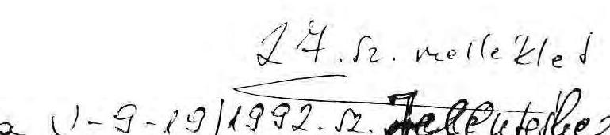

Vagyonkezelö Föcsoport
Budapest, 1992. április 27.
$V-9-16 / 1992$.

DR. C S E P I LAJOS úr, az Állami Vagyonügynökség ügyvezető Igazgatója

# B U D A P E S T 

Tisztelt Csepi Úr!

Nellékelten, elöírásaink szerint megküldöm a Gerbeaud-ház privatizációjával kapcsolatos számvevöl jelentésre tett észrevételeire a vizsgálatot végzö munkatársaim válaszát.

Jelzem, hogy a jelentés a válaszban rögzítettek szerint kerül pontosításra és elnöki aláírásra előterjesztésre.
Ezt követően a jelentést az Igazgatótanács elnöke részére Elnök úr ugyancsak 8 napos észrevételezésre megküldi és végül a választ csatolva terjeszti be az arra illetékeseknek.

Nelléklet: 1 db

Tisztelettel
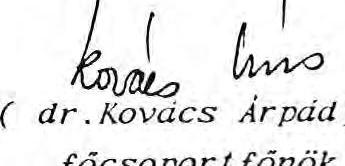
(dr.Kovács Árpaid)
föcsoportfönök

---

# VÁ L A S Z 

a Gerbeaud-ház privatizációjának utóellenőrzéséről készült V-9-14/1992. sz. számvevői jelentésre tett
ÁvÜ észrevételekre

Az Állami Vagyonügynökség 1992. április 17-ei dátummal elkészítette és április 21 -én megküldte a Gerbeaud-ház privatizációjának utóellenőrzésére tett észrevételeit. Álláspontunkat az ÁvÜ által tett észrevételek sorrendjének megfelelően a következőkben adjuk meg. Egyben jelezzük, hogy az elnöki jóváhagyásra előterjesztett szövegtervezetben e szerint fogunk el járni.

- Az Állami Vagyonügynökség azon álláspontját, mely szerint a Confidentia GMK-nak - mint a Confidentia GmbH hazai alvállalkozójának - nem kellett volna szerződnie az ÁvÜ-vel, nem tudjuk elfogadni, fenntartjuk a jelentésben leírtakat. Csak akkor fogadhattuk volna el az ÁvÜ észrevételét, ha a kifizetés is közvetlenül a Confidentia GmbH-nak történik, amellyel az ÁvÜ szerződött. Az ÁvÜ a Confidentia GMK-val nem volt szerződéses jogviszonyban, a Confidentia GMK-nak külön írásbeli meghatalmazása a Confidentia GmbH részéről nem volt arra vonatkozóan, hogy a munkákat a Confidentia GMK végezze el. Így nem állapítható meg az sem, hogy leírtak figyelembevételével a szolgáltatás ellenértékét az ÁvÜ milyen alapon

---

utalta közvetlenül a Confidentia GMK-nak, illetve az 1991. április 8-i külön nyilatkozatban szereplő́ mentességek tulajdonképpen kit is illetnek meg. Erre az ÁVÜ észrevételeiben sem találunk választ.

- A 62 millió Ft-os költségtérítés - téves információra való hivatkozó - az ÁVÜ részéről jogosnak itélt kifizetését nem tudjuk elfogadni, mivel annak mértéke ellenőrizhetőségére semminemú választ nem kaptunk. A 62 milliós kifizetés konkrét mértéke és jogossága az ÁVÜ és a Confidentia GmbH között létrejött szerződésbő1, megállapodásból vagy külön nyilatkozatból nem állapítható meg, így elfogadhatatlan az ÁVÜ azon indoklása, hogy a kifizetéseket a szerződésben a feladat teljesitéséhez és nem külön számlaadáshoz kötötték a felek. A kifizetések tényéhez is - de nem a mértékéhez - csak abban az esetben teremtett volna elegendő jogalapot az 1991. március 29-i szerződés, ha a kifizetések az ÁVÜ-vel jogviszonyban álló Confiedentia GmbH részére történtek volna. Ismereteink szerint az ÁVÜ a 155 millió Ft-os, két ütemben kifizetett összeget bruttó módon ÁFA-val növelt értéken fizette ki a Confidentia GMK-nak a vagyonértékelési munkáért, így ÁFA visszatérítésre sem teremthető lehetőség a Confidentia GMK részére.
Változatlanul fenntartjuk a számlázásra vonatkozó megállapításainkat is, mivel nem külföldi, hanem magyarországi társaság számlázott, így rá is a magyar számlázás törvényi előírásai vonatkoznak.

Az 1991. április 8-i különnyilatkozat 1. bekezdésében az ÁVÜ az összes kifizetésre adó-, vám-, illeték- és egyéb tehermentességet vállalt. Ugyanezen különnyilatkozat 2. bekezdésében azt rögzítették, hogy ha valamilyen oknál fogva kivetésre, illetve kifizetésre kerül bármilyen - a magyar törvé-

---

nyek alapján kivetett - adó, vám, illeték, úgy az ÁVÜ köteles megtéríteni, elkerülendó bármely ebből eredő kárt. Az Állami Számvevőszék hitelesnek csak ezen különnyilatkozatban szereplő kötelezettség-vállalásokat tudja elfogadni.

- Elfogadjuk az ÁVÜ azon észrevételét, hogy a magyar joghatóságok alá tartozó és a magyar jog szerint müködő vegyesvállalatra a szerződésben történő külön utalás nélkül is vonatkoznak az 1988. évi XXIV. törvény rendelkezései, mint mögöttes kötelező jogi előírás. Az ÁVÜ a külön megállapodásban ezt nem szerepeItette.
- A Confidentia GmbH-val 1991. március 29-én kötött kozultációs szerződésben 16 iroda ingatlan értékbecslésére szerződött az ÁVÜ, összesen 2 millió USA \$-nak megfelelő forint ellenértékủ dijért és jutalékért. Mivel csak 12 iroda ingatlan értékbecslésére került sor az ÁVÜ Igazgatótanácsa döntése következtében, így a szerződést, illetve a kifizetést ennek megfelelően kellett volna módosítani és az értékbecslésbő1 kimaradt 4 ingatlanra jutó 500 ezer USA \$-nak megfelelő forint ellenértéket indokolatlanul fizették ki.
- Az Állami Számvevőszék elfogadja az ÁVÜ azon megjegyzését, hogy a GSB GmbH-nak soha nem volt jogcíme a Gerbeaud-ház tulajdonjogára, érvényes jogcímme1 a GSB Trade Invest Kft. rendelkezett. Ebből következően azonban elsődlegesen a kár is a GSB Trade Invest Kft-nél jelentkezhetett volna. A GSB GmbH-nál csak mint egyik alapítónál, közvetett módon jelentkezhetne a kár, a többi alapítót is érintve.

Vizsgálati anyagunk is tartalmazta, hogy a Legfelsőbb Bíróság elnőkének törvényességi óvása alapján hozott 1990. július 3-i legfelsőbb bírósági törvényességi határozat - a GSB Trade Invest Kft cégbejegyzó végzése ellen - e társaság

---

cégbejegyzését törvénysértőnek itélte és a törvénysértés tényállását nem a rendelkező részben, hanem az indoklásban fejti ki. Az ÁVÜ-töl, mint az állam tulajdonosi jogainak gyakorlójától ilyen jellegü bírósági jelzés esetén elvárható lett volna a bírósági eljárás befejezésének bevárása, a kö-telezettség-vállalások helyett, illetve e jelzésnek figyelembevétele az ÁVÜ későbbi döntéseinél.

Nem tartjuk elfogadhatónak az ÁvÜ azon nyilatkozatait, amelyek arra hivatkoznak, hogy az eljáró cégbíró nem észlelte a semmisséget és a jogügylet az ÁvÜ alapítása előtt köttetett, és így az ÁvÜ nem tehetett mást, mint kötelmi jogi szerződéssel biztosított magának tulajdoni igényt a Ger-beaud-házra. Jogilag tisztább helyzetet teremtett volna, ha az ÁvÜ bevárja a bírósági eljárás befejezését, vagy mint az állam tulajdonosi jogainak gyakorlója érdekeinek sérelmét legalább jelezte volna a Cégbíróságnak.

A bírósági ügyek állásával kapcsolatos megállapításainkban nem az ÁvÜ perbeli részvételének hiányát kifogásoltuk, hanem az ÁvÜ részéről elvárható gondosság hiányát, illetve a korábbi vizsgálatunkban is kifogásolt túlzott kockázatvállalást bírósági eljárás bevárása nélkül.

- Az 1990. évi LXXI. törvény megszüntette az ÁvÜ döntéseinek bírósági felülvizsgálatát. Változatlanul kifogásoljuk, hogy az ÁvÜ erre való hivatkozással nem intézkedett a bíróságnál az ellene indított perben, amikor az eljáró bíró nem alkalmazta a törvényt.
- Az ÁvÜ Igazgatótanácsának 1991. október 24-ei üléséről rendelkezésünkre bocsátott kivonat nem tartalmazza az Igazgatótanács hozzá járulását a Dorottya Kft alapításához.

---

- Elfogadjuk az ÁVÜ-nek azon észrevételét, hogy a Gerbeaud-háznak a Dorottya Kft-be való vitelét nem a kárpótlási törvény alóli kivonási szándék vezette.
Megállapításunkban nem az ÁVÜ-nek mint az állam tulajdonosi jogai gyakorlójának társaságalapítási jogát vitatjuk. Kizárólag, mint a saját jogán tulajdonoskénti társaságalapításának jogát kifogásoljuk azt, hogy e társaságalapításoknál az ÁVÜ a tulajdonos és nem a Magyar Állam.

A 4/1991.(II.13.) PM rendelet ilyen társaságalapítását az ÁVÜ számára nem tette lehetővé, ezt a Fővárosi Cégbíróság is észrevételezte már a Belvárosi Irodaház Kft-nél és a PRI-MAN Kft-nél, amikor megtagadta a Kft-k bejegyzését a kormány előzetes engedélye nélkül.

Mindezek függvényében nincs indoka a Dorottya Kft-nek a Komárom-Esztergom Megyei Cégbíróságon való bejegyeztetésére, a kft törzstökéjének e cégbíróságon való felemelésére, majd a társaság székhelyének Esztergomból Budapestre való áthelyezésére.

Ismerettel rendelkezünk arról, hogy az ÁVÜ 1991. novemberé-ben-decemberében előterjesztést készített a kormány részére az ÁVÜ társaság alapításainak engedélyezésére. Az ÁVÜ tájékoztatása szerint az előterjesztés kérdésében még kormánydöntés nem született.

- Elfogadjuk az ÁVÜ azon tájékoztatását, hogy a GAMSZOV az 1990. október 20-án adott meghatalmazását 1991. február 1-jén 1991. szeptember 20-ig terjedő időtartamra meghosszabbította. Változatlanul hiányoljuk, hogy a GAMSZOV nem kapott tájékoztatást az ÁVÜ-nek a GSB GmbH-val, a Confidentia GmbH-val kötött jogügyleteiröl. Az ÁVÜ nem hívta fel a GAMSZOV figyelmét a megváltozott helyzetnek megfelelö perbe-

---

1i képviseletre, illetve a GSB Trade Invest Kft ügyvezetésénél sem tett kezdeményezést a val tozások jogi úton történő rendezésére. Az ÁVÚ a GSB GmbH-val 1991. március 29-én kötött megállapodásában erre ígéretet tett, ellenkező esetben a GSB GmbH-val kötött megállapodásban foglaltak sem léphetnek érvénybe és újabb kártérítési igény keletkezhet az 1990. október 20-i megállapodásban foglaltak fennmaradása mellett.

- Elfogadjuk annak közlését, hogy a Hungar Hotels Vállalattal kötött bérleti szerződés határozatlan idöre szól, 30 évre szóló felmondási tilalommal.
- Változatlanul fenntartjuk azon megállapításunkat, hogy nem mindenről készült magyar nyelvű szakfordítás. Ezt a vizsgálati jelentésünkben közölt példákkal bizonyítottuk.
A magyar nyelvü fordításokat minden esetben a mindenki elött tiszta helyzet teremtése miatt tartjuk elengedhetetlennek. Így nem fordulhat elő az a sajnálatos tény, hogy az ÁVÚ gazdasági ügyekért felelős vezetője külön magyar nyelvü tájékoztatást kér a Conf identia GMK német és angol nyelvü - a 62 millió Ft költségtérítés átutalására vonatkozó - intézkedésére.
- Az összefoglaló következtések megállapításait változatlanul fenntartjuk, a vizsgálati jelentésben tett megállapítások és jelen álláspontunkban közöltek miatt.
Hangsúlyozzuk, hogy a bírósági ügyek vonatkozásában az ÁVƯ-nek kizárólag a passzív magatartását kifogásoltuk meg és azt, hogy nem tett meg mindent a tiszta helyzet teremtése, a hátrányos helyzetek kiküszöbölése érdekében, holott erre több lehetőség kínálkozott.

---

- Az ÁvÜ azon megállapítása, hogy a 62 millió Ft kártérités kifizetése szerződéses jogcímen alapul, s így megalapozottnak tekinthető, nem fogadható el s a feltűnő értékkülönbségre vonatkozó megállapításainkat is fenntartjuk a következőkre alapozva.

Megitélésünk szerint az ÁvÜ nem járt el körültekintően, amikor meg sem kisérelte, hogy a 12 iroda ingatlan vagyonértékelését versenyeztesse, vagy legalább tájékozódjon, hogy e munkát milyen ellenértékért végezték volna el mások, olyan dokumentumok alapján mint, amelyek a 12 db irodaépületre elözetesen rendelkezésére álltak a Conf identia GMK-nak. Így a vagyonértékelésekre összességében kifizetett 217 millió Ft összeget e munkáért megalapozatlannak minősítjük, me1y megitélésünk szerint kimeríti a szolgáltatások és ellenszolgáltatások feltűnő értékkülönbségét.

Az ÁvÜ érdemben nem ad választ, így feltételezhetően a válaszadás időpontjában még maga sem tudja, hogy konkrétan miért fizetett ki 62 millió Ft-ot, s miért nem többet vagy kevesebbet, s azt a valóságban milyen adók átvállalására, milyen adók, vagy költségek kompenzálására fizette ki költségtérítés címén. Kifzetését az ÁvÜ megalapozottnak tekinti, de e megalapozottságot semmivel nem tudja alátámasztani.

- Megértjük az első két javaslatunkra írt azon ÁvÜ választ, hogy e javaslatok teljesítéséhez az ÁvÜ nem rendelkezik eljárásjogi képességgel a hivatkozott bíróságok előtti ügyekben. Javaslatainkat ennek megfelelően tartalmailag átszövegezzük, de változatlanul fenntartjuk, a leírt okok miatt. Ugyanis - szerintünk - az Állami Vagyonügynökségnek mindent meg kell tennie és kezdeményeznie kell a cégbejegyzés kérdésében is a tisztánlátást.

---

- Az Állami Számvevőszék javaslatai között csak az̃t szerepe1tette, hogy az ÁVÜ haladéktalanul gondoskodjon a GAMSZOV újólagos anyagi igényének elbirálásáról.
Megitélésünk szerint ebből nem következik az az érthetetlen ÁVÜ megjegyzés, hogy az ÁSZ arra kényszeriti az ÁVÜ-t; hogy a maga számára hátrányosan változtassa meg a GAMSZOV-val korábban megkötött szerződési feltételeket. Mi csak azt kértük, hogy mielőbb történjék meg az elbirálás, mert ellenkező esetben a GAMSZOV nem költözik ki az épületből és a Gerbeaud-ház privatizációjára eddig kifizetett 400 millió Ft-ot meghaladó összeg felhasználásának indokoltsága is újból felszínre kerülhet. Az Állami Számvevőszék jogkörénél fogva sem utasíthatja az ÁVÜ-t hátrányos helyzet bevállalására, így ez ügyben is szabadon dönt az ÁVÜ.
- Az Állami Vagyonügynökség Igazgatótanácsa és ügyvezetése részére változatlanul javasoljuk, hogy értékel je az ÁVÜ Jogi Igazgatóságának a Gerbeaud-ház privatizációja kapcsán kifejtett szakmai munkáját és a megfelelő intézkedéseket tegye meg.

Javaslatunkban szereplő egyéb kitételeket töröljük. Ezen értékelést azért tartjuk szükségesnek, mivel az ügy kapcsán rendkívüli sok tisztázatlan jogi helyzet (a Confidentia GmbH-val kötött szerződés és külön megállapodás vitatható értelmezése, a 62 millió Ft-os kifizetés ellenörizhetetlensége, a károkozás meghatározhatósága, a szolgáltatás és ellenszolgáltatás feltűnő értékkülönbségének megállapíthatósága, a vagyonértékelési munka csökkenésével szükségessé váló szerződésmódosítás és kifizetés csökkenésének elmaradása, a bírósági eljárások be nem várása, idegen nyelvű szerződések magyar nyelvű hiánya stb.) teremtődött.

---

Az ÁVÜ az állam tulajdonosi jogainak gyakorlójaként passziv módon viselkedett. Az általában elvárható gondosság hiányát több megállapításunk támasztja alá.

Budapest, 1992. április 28.
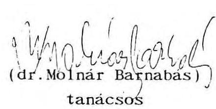
(dr. Molnár Barnabas)
tanácsos
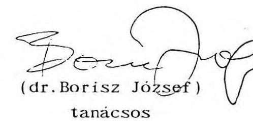

---

28. sz. melléklet a V-9-19/1992. sz. jelentéshez Budapest, 1992. május 5. V-9-20/1992.

Dr. P O N G R Á C Z TIBOR úr, az Állami Vagyonügynökség. Igazgatótanácsának elnöke

# B U D A P E S T 

Tisztelt Pongrácz Úr!

Az Állami Számvevöszék a Gerbeaud-ház privatizációjával kapcsolatban - az 1991. júliusában készített ÁsZ vizsgálat vonatkozásában - utóvizsgálatot végzett. Az utóvizsgálatról készített "Jelentés"-t az Állami Számvevöszék Elnöki értekezlete elfogadta.

Tekintettel arra, hogy az utóvizsgálati "Jelentés" az Ön irányítása alá tartozó Igazgatótanács részére Javasol intézkedéseket, a "Jelentés"-t csatoltan megküldöm.

Tájékoztatom, Elnök urat arról, hogy az ÁVÜ ügyvezető igazgatója a vonatkozó törvényt elöírásoknak megfelelően egyeztetésre átadott "Jelentés"-re észrevételeket tett (Jelentés 26. sz. melléklete). Azok döntő többségét a vizsgálatot végzők nem fogadták el. Az elfogadott észrevételeket a jelentésben átvezettük. Az elfogadott észrevételeket és véleményeltéréseket válaszlevélben az ÁVÜ ügyvezető igazgatójának megküldtük (Jelentés 27. sz. melléklete).

---

Kérem Elnök urat, hogy az Állami Számvevöszékröl szóló 1989. évt XXXV111. törvény 25. szakaszában foglaltaknak megfelelően a "Jelentés" megállapításaira és javaslataira - egyetértés esetén is - 8 napon belül írásbeli észrevételi tenni, megtett intézkedéseiről pedig 30 napon belül tájékoztatni sziveskedjék.

Tajékoztatom Elnök urat arról, hogy a "Jelentés"-t észrevételezésre megküldtem a privatizációért felelós dr. Szabó Tamás tárcanélküli miniszter úrnak.

Egyben jelzem azt is, hogy "Jelentés"-t a törvényt elöírásnak megfelelő határldóben megkapott észrevételetvel együtt küldöm meg az érdekeltek részére.

Melléklet

Tisztelettel
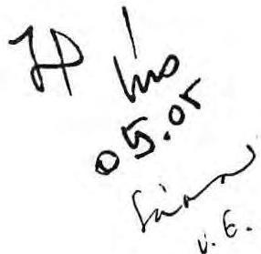
(Hagelmayer István )

---

29.sz. melléklet a V-9-19/1992. sz. jelentéshez Budapest, 1992. május 6. V-9-20/1992.

Dr.S Z A B Ó TAMÁS úr, tárcanélkülí miniszter

# B U D A P E S T 

Tisztelt Miniszter Úr!

Az Állami Számvevôszék a Gerbeaud-ház privatizációjával kapcsolatban - az 1991. Júltusában készített ÁSZ vizsgálat vonatkozásában - utóvizsgálatot végzett. Az utóvizsgálatról készített "Jelentés"-t az Állami Számvevôszék Elnöki értekeztele elfogadta.

Tekintettel arra, hogy az utóvizsgálat az Állami Vagyonügynökség e konkrét privatizációs tevékenységével kapcsolatos és a "Jelentés" az Ön hatáskörébe tartozó Állami Vagyonügynökség ügyvezetése és az Igazgatótanács részére Javasol intézkedéseket, a "Jelentés"-t csatoltan megküldöm.

Tájékoztatom Miniszter urat arról, hogy az ÁVÜ ügyvezetõ Igazgatója a vonatkozó törvényt elöírásoknak megfelelöen az egyeztetésre átadott "Jelentés"-re észrevételeket tett (Jelentés 26. sz. melléklete). Azok döntö többségét a vizsgálatot végzök nem fogadták el. Az elfogadott észrevételeket a jelentésben átvezettük. Az elfogadott észrevételeket és véleményeltéréseket válaszlevélben az ÁVÜ ügyvezető Igazgatójának megküldtük (Jelentés 27. sz. melléklete).

---

A szamvevöszékt "Jelentés"-t észrevételezés és a szükséges intézkedések megtétele céljából a mat napon az Allamt Vagyonügynökség Igazgatótanácsa elnökének megküldtem.

Kérem Mintszter urat, hogy az 1989. évt XXXV111. törvény 25. szakaszában foglaltaknak megfelelően a jelentés megállapításatra - egyetértés esetén is - 8 napon belül írásbeli észrevételt tenni szíveskedjék.

Tajékoztatom Mintszter urat arról, hogy a "Jelentés"-t - a jelzett határldöben megkapott észrevételekkel együtt - küldöm meg az érdekeltek részére.
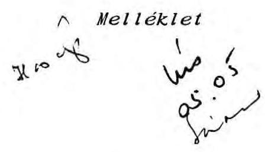

Tisztelettel
Hagel
( Hagelmayer István )

---

DR H A G E L M A Y E R ISTVAN úr az Allami Számvevőszék elnöke

B U D A P E S T

Tisztelt Hagelmayer Ur!

A Gerbaud-ház privatizációjával összefüggésben az Allami Számvevőszék által lefolytatott utóvizsgálatról készített és az Állami Számvevőszék Elnöki értekezlete által elfogadott Jelentésben foglaltakra észrevételeimet az alábbiakban foglalom össze:

# Eszrevételek a Megállapítások c. részhez 

Az Allami Vagyonügynökség által a Confidentia Gmk-nak költségtérítésként kifizetett 62 MFt-al összefüggésben álláspontom az, hogy az 1991. március 29-i tanácsadói szerződés és az azt kiegészítő április 8-i nyilatkozat ehhez elegendő jogalapot szolgáltattak, amit a Ptk 198. paragrafus /1/ bekezdése is alátámaszt.
A Ptk. 200. par./1/ bekezdésében írtakat alapul véve, ezen szerződésekben az AVU a kifizetéseket a szerződő fél által ellátandó feladat teljesítéséhez, s nem számlaadáshoz kötötte. A szerződő partner külföldi lévén, rá nem vonatkoznak a magyar jog számlaadásra vonatkozó rendelkezései.

A 62 Mft kifizethetőségével összefüggésben a 7. oldal utolsó bekezdésében foglaltakat pontosítom azzal, hogy az április 8-i nyilatkozat pontos fordításából kitünően az AVU-nek nem csak a ténylegesen kivetett és kifizetett terheket / did pay / kellett átvállalnia, hanem azokat is, melyeket a szerződő félnek bármilyen oknál fogva ki kellene fizetnie / were to pay /.

Az AVU álláspontjának elfogadása miatt kérem törölni a jelentés 18. oldalának második bekezdését.

A 8. oldal 3. bekezdésével összefüggésben utalok arra, hogy az AVU az április 8-i nyilatkozatban ugyanazon jogokat biztosította a társaságok alkalmazottainak és képviselöinek, mint amit magának a társaságnak mint jogi személynek, azaz e személyeknek olyan magyar adó, vám és illeték megtérítését vallalta, amit ténylegesen kivetettek és kifizettek, továbbá amit

---

ki kellene fizetni. Ezért, - akárcsak a társaság részére nyújtott fenti fizetési garanciával - az AVU nem adóelengedéséról, illetve adómérsékléséról szerzödött, hanem a már fent írt kifizetéseket a szerzödésben megállapított nettó díj részeként szerepeltette.

A Jelentés 10. oldala arra utal, hogy a Legfelsőb Bíróság törvényességi óvás folytán hozott határozata alapján nem volt érvényes jogcím az ingatlan tulajdonjogának átruházására.
E határozat a törvénysértés tényét valóban megállapította, ám a törvénysértó cégbejegyzést hatályában fenntartotta és nem semmisítette meg. Feltehetően ezen oknál fogva döntött úgy a cégbíróság, hogy a semmisséget nem veszi hivatalból figyelembe. A cégbíróság ezen, hatályában fenntartott végzése teremthetett jogalapot a GSB Trade Invest Kft részéről az ingatlan tulajdonjogára.
Mindezek aláján úgy vélem, hogy védhető az az álláspont, mely az 1989. XII. 20-án kötött - a Gerbaud-ház mellékszolgáltatásként történó rendelkezésre bocsátását eszközlő - társasági szerződés jelenleg is érvényes, annak májusi módosítását elutasító AVU döntés miatt.
Az AVU nem volt ügyfél ezen társaság bejegyzését célzó cégeljárásban, ezért is helytálló azon hivatkozása, mely szerint az ingatlan társaságba vitele az AVU létrejöttét megelózó idöre tehető, így más lehetósége nem lévén, kötelmi úton - szerződéssel - biztosította magának az ingatlan tulajdoni igényét.

A 11. oldal első francia bekezdésében hivatkozott 1990. évi LXXI. tv. hatályba lépésével és a folyamatban lévő ügyekre történó alkalmazhatóságával kapcsolatosan egyetértek az AVU azon álláspontjával, hogy külön törvényi felhatalmazás nélkül a folyamatban lévő ügyekre a törvény rendelkezései nem vonatkoztak. Álláspontom szerint, amenyiben a per folytatódna, úgy az eljáró bíróságnak ítéletében - e jogszabály módosítással összerüggésben - döntenie kell a felperesi legitimáció kérdéséről is.

A 12. oldal első bekezdése is a már kifejtetteket támasztja alá: a Gerbaud-ház tulajdonjogát megváltoztató, az ingatlant társasági tulajdonba adó társasági szerződés semmissége iránt indított perben ezidáig nem született jogerós bírósági döntés. azaz nincs olyan ítélet, mely a semmisséget deklarálná.

Az Igazgatótanács 1991. október 24-én a ház értékesítésére kiírt pályázat keretében, a pályázati dokumentáció elfogadásával döntött a kiírásban szereplő Dorottya Kft alapításáról.

Az Allami Vagyonügynökség nézetem szerint rendelkezik társaságalapitási joggal. A Jelentésben írtakat ki kell egészítenem azzal, hogy a 4/1991. /II.13./ PM rendelet 1991. december 31-el hatályát vesztette, így az nem vonatkozhatott a Dorottya Kft alapítására.
Az 1989. évi XIII. tv. , továbbá az 1990. évi VII. tv. 12. par. /2/ bekezdése kifejezetten is utal az AVU társaság alapítási

---

jogára - enélkül az AVU nem láthatná el törvényben biztosított feladatát.
Olyan társaság alapítás során, ahol az AVU ingatlant apportál, azért kerül az AVU - és nem a Magyar Állam - tulajdonosként feltüntetésre, mert az AVU által apportált, a Magyar Állam tulajdonában és AVU kezelésében álló ingatlan kezelói jogát a hatályos 1987. évi I. tv., a földtörvény 12. szakasza értelmében gazdasági társaság nem szerezheti meg. A gazdasági társaság csak tulajdonjogot szerezhet, így az AVU - hasonlóan más állami szervhez - a kezelói jogot mint quasi tulajdonjogot viszi be a gazdasági társaságba. s ennek fejeiben szerez a társaság tulajdont a volt állami ingatlan felett. Az ilyen társaság alapításoknál az apportált rész arányában csak az AVU. mint az adott társaság tagja lehet tulajdonos és nem a Magyar Állam. mint elvont jogi kategória. Ezt deklarálja az 1990. évi VII. tv. 1. par /1/ bekezdése, mely szerint az AVU a hozzá tartozó állami vagyon tekintetében gyakorolja az állam tulajdonosi jogait.
Az AVU társaság alapítási jogának hiányát jogerós bírói döntés sem mondta még ki. Az AVU e tárgyban csak tervezte egy Kormány elóterjesztés benyújtását, ám arra ezidáig nem került sor.

A GSB Trade Invest Kft további fenntartásáról a kft tagjainak együttesen kell dönteniük. Az AVU nem tagja e kft-nek, de a helyzet rendezésében természetesen közremüködik.

A Jelentésnek az összefoglaló következtetések és Javaslatok c. fejezeténél a már korábban is kifejtett észrevételeimre csak visszautalok.

A 16. oldal utolsó bekezdésében foglalt azon állítással szemben, miszerint az AVU az ingatlan tulajdonjogi sorsát kizárólag peres úton tarja rendezhetőnek, utal ok arra, hogy az AVU éppen az ingatlan tulajdonjogára alapvető kihatással lévő perek bizonytalan kimenetelére tekintettel rendezte a Gerbaud-ház tulajdonjogi sorsát kötelmi jogi szerződésekkel.

Az 1990. évi LXXI. tv. nem tartalmazott a hatályba léptetés - és ezzel összefüggésben a folyamatban levó ügyekben való alkalmazhatóság - tekintetében rendelkezéseket, a jogértelmezés bizonytalansága miatt az AVU pedig nem marasztalható el.

Az ingatlannal összefüggő bírósági perek közül csupán egyetlen perben lépett fel félként az AVU, a többi perben még perbeli résztvevóként sem jelent meg.

A konzultációs szerződésen alapuló kifizetések kapcsán a Ftk szerinti feltűnő aránytalanság megállapítása a bíróság hatáskörébe tartozik.

A március 29-én kötött szerződések és ezeket kiegészítő április

---

8-i nyilatkozat szorosan kapcsolódnak egymáshoz, mindegyik az ingatlan jogi helyzetének tisztázását segítette elő, egymással szerves összefüggésben. A konzultációs szerzödésben megállapított dijazás ezért, az irodaházak értékelésének diját és a GSB GmbH visszalépéséért fizetett ellenértéket együttesen, külön bontás nélkül tartalmazta.

A konzultációs szerzödésben foglalt 16 irodaház vagyonértékelését - erre vonatkozó kötelező jogszabályi elóirás hiányában - nem pályáztatta az AVU.

A Dorottya Kft alapítását sem törvény, sem más jogszabály nem tiltotta, így az AVU erre vonatkozó jogosultsága jelenleg létezik.

A privatizációs úgy kapcsán a Számvevőszék szerint " sok tisztázatlan jogi helyzet teremtődött". Ezek között olyanokat is megemlítenek, / pl. a szerződés és külön megállapodás vitatható értelmezése, a károkozás meghatározhatósága / melyek meglétét a Jelentés nem alapozza meg.

A bírósági ügyek tisztázására vonatkozó javaslattal olyan formában értek egyet, hogy az AVU-nek elő kell segítenie a jogi rendezést, de a rendezés elmaradása - egy per kivételével, a perbeli légitimáció hiányában - nem róható terhére.

A - Világbanki ajánláson alapuló - vagyonértékelési munkára vonatkozó konzultációs szerződés hiányosságait a jelentés tételesen nem mutatta ki.

Kérem észrevételeim figyelembe vételét.

Budapest, 1992. május 19.
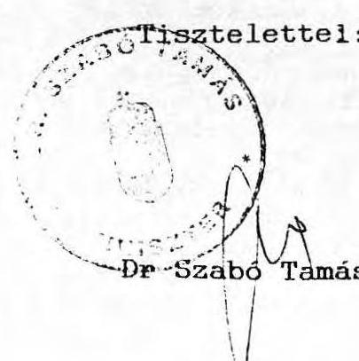

---

Budapest, 1992. június 5 -n. $\mathrm{V}-9 / 27 / 1992$.

DR S Z A B 0 TAMAS úr
tárca nélküli miniszter

# B U D A P E S T 

Tisztelt Miniszter Ur!

Köszönettel vettem levelét, amelyben kérésemnek megfelelően kifejti észrevételeit a Gerbeaud-ház privatizációjáról szóló vizsgálatunk megállapításaival kapcsolatban.

Tekintettel arra, hogy az ön levelében foglaltak lényegében megegyeznek azzal, amit az ügyben elmarasztalt AVU Jogi Igazgatósága képviselt, szükségesnek tartottam, hogy munkatársaim ismételten, tételesen indokolják álláspontunkat. Az erről szóló összeállítást levelemhez csatolom. Nagyon remélem, hogy a mellékletben kifejtett érvanyag Miniszter úr számára is meggyőző lesz és elfogadja azt. Ezzel kapcsolatban szeretném megemlíteni, hogy idôközben megkaptam dr. Pongrácz Tibor úr észrevételeit tartalmazó levelét is. Az Allami Vagyonügynökség Igazgató Tanácsának elnöke a vizsgálatot korrektnek, alaposnak tartja, az abban foglalt megállapításokat nem vitatja, sôt jelzi, hogy az ügyvezetés terhére mulasztás, gondatlanság róható fel az ügyben. Mindezek alapján az Igazgató Tanács elnöke egyetért javaslatainkkal.

A jövőben is szándékomban áll, hogy Miniszter úr részére tájékoztatás, illetve személyes véleménye megismerése céljából a privatizációval kapcsolatos vizsgálatainkról szóló jelentéseinket megküldjem. Szeretném jelezni azt is, hogy az esetenkénti véleménykülönbségeket a magam részéről az ügyek természetes velejárójának tartom. Aitalánosságban úgy érzékelem, hogy az egyes akciók szabályosságának megitélése rendkívül bonyolult, s a törvényalkotók szándékainak megfelelő helyes állásfoglalás kialakítása többféle jogi szakvé-

---

lemény ütköztetése után érhetõ csak el. Természetes az is, hogy az ellenôrzõ szervezet nézõpontja is szükségszerũen kũlönbözik az ellenôrzôttétõl.

Az Allami Számvevôszék tudatában van annak, hogy az Allami Vagyonügynökség döntéseit tulajdonosi jogkörében hozza. Ezzel kapcsolatos felelőssége nem osztható. Annak végsõ eldöntése pedig, hogy egy intézkedés törvényes alapokon nyug-szik-e vagy sem, a bíróság illetékességi körébe tartozik. Tudomásul kell vennünk tehát azt; hogy a Gerbeaud-ház privatizációjához hasonló ügyek végsõ lezárása hosszadalmas folyamat és az ASZ vizsgálat e folyamatnak csak egy közbensõ, bár igen fontos eleme.

Végezetül szeretném jelezni Miniszter úrnak, hogy munkánkat a messzemenõ együttmüködési szándék vezérli és örömmel vesszük, ha megállapításainkra - akár ellentétes megközelítéssel - részletes és körültekintõ vélemény érkezik. Szeretném ezt megköszönni elõre is Miniszter úrnak.
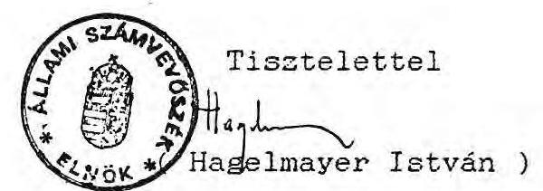

Melléklet

---

Melléklet a V-9/27/92. sz. levélhez

Az ÁSZ munkatársainak álláspontja a dr. Szabó Tamás tárca nélküli mintszter úr által aláirt és 559/10/ÁvÜ/92. számon küldött észrevételekkel kapcsolatban.

Az észrevételek sorrendjében az álláspontunk a következő:

- Változatlanul nem tudjuk elfogadni azon véleményt, hogy az Állami Vagyonügynökség által a Confidentla GNK-nak költségtéritésként kiflzetett 62 millió Ft összeg jogos, s arra az 1991. március 29-t tanácsadót szerzödés és az azt klegészítő ápritis 8-t nyilatkozat elegendó jogalapot szolgáltattak, azzal az indokkal, hogy az ÁvÜ a kiflzetéseket a szerződő fél által ellátandó feladat teljesítéséhez és nem a számlaadáshoz kötötte, valamint a szerződő partner külföldi, így rá nem vonatkoznak a magyar jog számlaadásra vonatkozó rendelkezései.

A 62 millió Ft kártérítési összeg kiflzetéséhez felsorolt jogalapokat - a kiflzetett összeg bizonyíthatatlansága következtében - nem tartjuk megalapozottnak. A kötelezettségek kiflzetéséhez bizonyítottan objektiv jogalap szükséges, különben a kiflzetés semmisnek minösítendő. Mivel az említett kártérítési összeg kiflzetésére a számlázást végző Confidentla GNK magyar vállalkozónak történt, így rá is a magyar számlázás törvényt elöírásai vonatkoznak. A teljesítés az esedékességet alapozza csak meg, a számlázás alól nem ment fel. Számla adási kötelezettség a világon mindenütt fennáll. A szerződésre a magyar jog az irányadó, külön megállapodás nélkül is (Bécsi konvenctó és Nemzetközi magánjogi törvény). Így a jelentés 8. oldalának 2., illetve 3. bekezdését kérésének megfelelően törölni, illetve másként értelmezni nem tudjuk. Azokat jelzett szerzödésböl és külön megállapodásból - mint ténylegesen leírtakat - vettük át.

---

- Változatlanul fenntartjuk megállapításunkat (10. oldal), hogy a Legfelsőbb Bíróság törvényességi óvás folytán hozott határozata alapján nem volt érvényes jogcím az ingatlan tulajdonjogának alruházására. E határozat a törvénysértés tényét, igy a semmlsséget megállapította, igy a tulajdonjog bejegyzésére sohasem kerülhetett volna sor, mert akkor a tulajdonátruházás minösült volna semmısnek. Az AVÜ késöbbi döntéseinél figyelembe kellett volna vennte a semmlsségi döntést és nem kellett volna kötelmi úton - szerzödéssel - biztositanta magának az ingatlan tulajdont igényét. Nem fogadható el az az AVÜ Indok sem, hogy az 1990. évt LXXI. törvény a folyamatban lévó ügyekre - külön rendelkezés nélkül - nem vonatkozik.

Fő szabály tlyen esetben az, hogyha ntncs külön rendelkezés a hatálybalépésröl, akkor a hatály mindenre szól. Így az AVÜ-nek tudnta kellett arról, hogy az 1990. évt LXXI. tv. 3. § (2) bekezdése 1990. szeptember 18-án megszüntette az AVÜ 1990. jultus 14-én - a GSB Trade Invest Kft. társasági szerzödését módosító megállapodás megtlításáról - hozott határozata ellent bírót felülvizsgálat lehetöségét.

- Elfogadjuk azon észrevételét, hogy a 4/1991. (11.13.) PM rendelet 1991. december 31-ével hatályát vesztette, igy az nem vonatkozhatott az 1992. február 12-én alapitott. Dorottya Kft. alapítására. E hlvatkozot rendelet csak külön engedéllyel tette lehetővé 1991. december 31-ig az AVÜ társaságalapításatt. Ilyenröl nem volt tudomásunk. Az AVÜ-nek 1992. január 1-jétöl eszközölt társaságalapításalnál sem mint az állami tulajdonosi jogat gyakorlójának társaságalapítást jogát vitattuk, hanem saját jogán, tulajdonoskénti társaságalapítását, mely kifogásolást változatlanul fenntartjuk érvényes törvényt és kormányfelhatalmazás hiányában. Megltélésünk szerint az AVÜ társaságalapításalra vonatkozó kormányelöterjesztés tervezete is jelzl e bizonytalanság megszüntetésének szükségességét.

---

- Egyetértünk azzal, hogy a GSB Trade Invest Kt. továbbí fenntartásáról a Kft. tagjainak együttesen kell dönteniük.
- Összefoglaló következtetésünkben azt rögzitettiük, hogy az Ávü az Ingatlan tulajdonjogi kérdésének eldöntését kizárólag bírósági úton tartja lehetségesnek. Ennek ellentmond az Ávü-nek azon lépése, hogy a Gerbeaud-ház ingatlant a Dorottya Kft-be vitte be a bírósági ügyek lezárása elött.
- Mi nem marasztaltuk el az Ávü-t azért, mert nem élt azzal a lehetöséggel, hogy jogszabályi változás folytán vagyoni kérdésekben hozott döntéselt bíról úton nem támadhatók a bírósági döntések az ÁvÜ részére jogértelmezés szempontjából is kedvező lehetöséget teremtettek. Csak azt vetettük fel, hogy az Ávü nem él ezzel a lehetöségekkel.
- Nem vitattuk azt, hogy az ingatlannal összefüggö bírósági perek közül csupán egyetlen perben lépett fel félként az Ávü, a többı perben még perbelt résztvevöként sem jelent meg. Egyetértünk azon felvetésével, hogy a bírósági ügyek rendezésének elmaradása nem róható fel az Ávü terhére. Az ÁSZ a bírósági ügyek vonatkozásában az Ávü-nek kizárólag a passziv magatartását kifogásolja.
- Elfogadjuk azon észrevételét, hoġy a konzultáctós szerzödésen alapuló kiflzetések kapcsán a Ptk. szerint feltưnó aránytalanság megállapítása a bíróság hatáskörébe tartozik.
- Az 1991. március 29-én kötött szerződések és ezeket kiegészitő áprllis 8-t nyilatkozat kapcsolódását, értelmezését jelentésünkben részleteztük. Leírtakat az ott szereplő indokok alapján fenntartjuk, így változatlanul vitatjuk, jogosulatlannak tartjuk az 500.000 USD dollárnak megfelelő forint ellenérték kiflzetését is.

---

- Tudomásul vesszük, hogy a 16 Irodaház vagyonértékelését az AVU̇ kötelezö jogszabályt elöírás hiányában nem pályáztatta.
- Változatlanul fenntartjuk azon állításunkat, hogy e privatizációs ügy kapcsán "sok tisztázatlan jogi helyzet teremtödött". Példaként hoztuk fel a szerzödés és külön megállapodás vitatható értelmezését, a károkozás meghatározhatóságát. Megállapításainkat megalapozza a 62 millió Ft kártérités jogtalan kifizetése, az 500.000 USD dollárnak megfelelö forlnt ellenérték jogosulatIan kifizetése, feltünö aránytalanságának birósági felvetése.
- A vagyonértékelést munkáért eszközölt kifizetések vonatkozásában változatlanul fenntartjuk azon állításunkat, hogy a szolgáltatások és ellenszolgáltatások feltünö aránytalansága állapítható meg a magyar vagyonértékeló társaságok áratval történő összehasonlítás esetében. Vagyis, ha magyar vagyonértékelök végezték volna a munkát, akkor összehasonlíthatatlanul alacsonyabb áron is szerzödhettek volna.

Budapest, 1992. június 5.