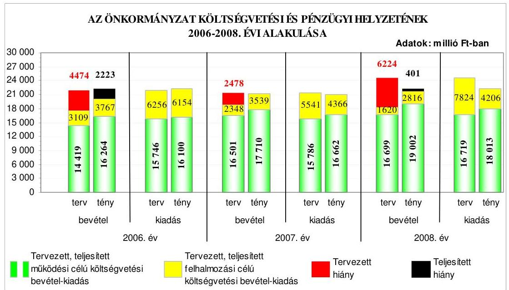
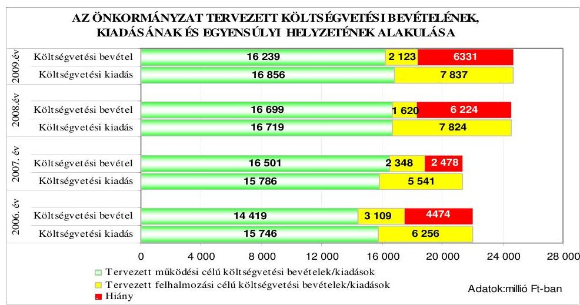
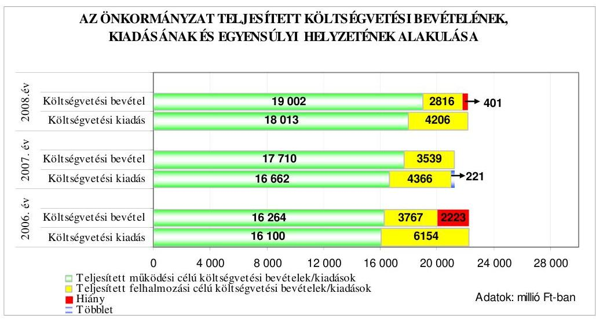
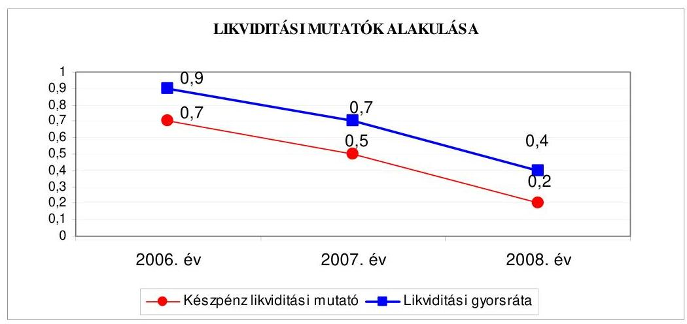
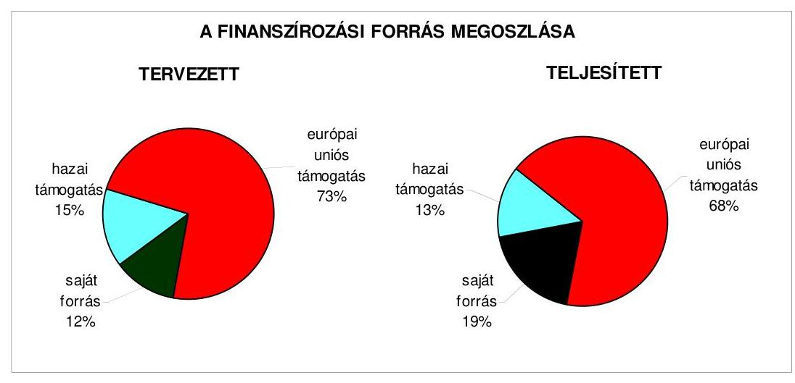
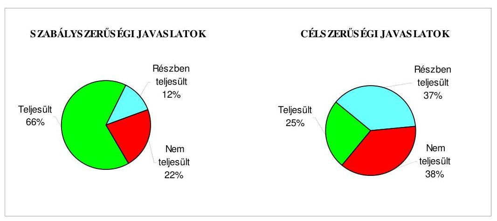
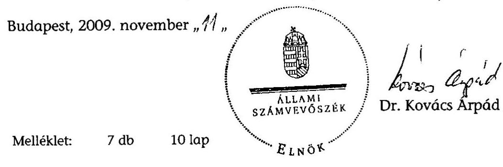
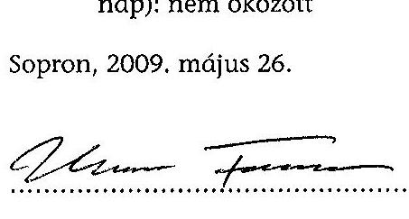
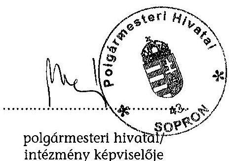
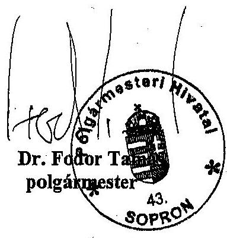

# JELENTÉS 

Sopron Megyei Jogú Város Önkormányzata gazdálkodási rendszerének 2009. évi ellenőrzéséről

---

# 3. Önkormányzati és Területi Ellenőrzési Igazgatóság 

3.3. Átfogó Ellenőrzések Főcsoport

Iktatószám: V-3001-4/29/19/2009.
Témaszám: 933
Vizsgálat-azonosító szám: V0441

## Az ellenőrzést felügyelte:

Dr. Lóránt Zoltán
főigazgató
Az ellenőrzés végrehajtásáért felelős:
Dr. Sepsey Tamás
főigazgató-helyettes
Az ellenőrzést vezette:
Varga József
főtanácsos, irodavezető
Az ellenőrzést végezték:
Dr. Fátrainé Zsebedics Kalmár István Unger Ferenc
Katalin számvevő tanácsos
főtanácsadó
A témához kapcsolódó eddig készített számvevőszéki jelentések:
címe
sorszáma
Jelentés Sopron Megyei Jogú Város Önkormányzata gazdálkodási ..... 0655
rendszerének 2006. évi átfogó ellenőrzéséről
Jelentés a Magyar Köztársaság 2006. évi költségvetési végrehajtásának ellenőrzéséről

Függelék:
a helyi önkormányzatokat a 2006. évben megillető norma-
tív állami hozzájárulás igénylésének és elszámolásának el-
lenőrzése
Jelentés a helyi és a helyi kisebbségi önkormányzatok gazdálkodási ..... 0726 rendszerének 2006. évi átfogó és egyéb szabályszerűségi ellenőrzéséről

---

# TARTALOMJEGYZÉK 

BEVEZETÉS ..... 11
I. ÖSSZEGZŐ MEGÁLLAPÍTÁSOK, KÖVETKEZTETÉSEK, JAVASLATOK ..... 16
II. RÉSZLETES MEGÁLLAPÍTÁSOK ..... 28

1. Az Önkormányzat költségvetési és pénzügyi helyzete ..... 28
1.1. A tervezett költségvetési bevételek és kiadások alapján a
költségvetési egyensúly, a költségvetési hiány oka,
finanszírozásának tervezett módja és a költségvetési hiány
megállapításának szabályszerűsége ..... 28
1.2. A teljesített költségvetési bevételek és kiadások alapján a pénzügyi
egyensúly, a pénzügyi hiány oka, finanszírozásának módja és
hatása a pénzügyi helyzet alakulására az eladósodás, valamint a
fizetőképesség szempontjából ..... 29
2. Az Önkormányzat felkészültsége az európai uniós források igénylésére és
felhasználására, valamint az elektronikus közszolgáltatási feladatok
ellátására ..... 39
2.1. Az európai uniós források igénybevételére és a várható támogatás
felhasználására történt felkészülés szabályozottságának,
szervezettségének eredményessége ..... 39
2.1.1. Az európai uniós forrásokra történő pályázatok benyújtására
vonatkozó döntések összhangja a fejlesztési célkitűzésekkel ..... 39
2.1.2. Az európai uniós forrásokhoz kapcsolódóan a
pályázatfigyelés, a pályázatkészítés, valamint az európai
uniós támogatással megvalósuló fejlesztés lebonyolítása
belső rendjének szabályozottsága, a végrehajtás személyi,
szervezeti feltételei, az ellenőrzési feladatok meghatározása ..... 47
2.1.3. A fejlesztési feladat lebonyolításánál a feladatellátás
rendjére, az ellenőrzési feladatok teljesítésére, valamint a
felelősségi szabályokra vonatkozó előírások betartása ..... 50
2.2. Az elektronikus közszolgáltatás feltételeinek kialakítása, a
közérdekű gazdálkodási adatok elektronikus közzététele ..... 53
3. A költségvetési gazdálkodás belső kontrolljai ..... 55
3.1. A szabályozottság kockázata a költségvetés tervezési, gazdálkodási,
beszámolási és a folyamatba épített, előzetes és utólagos vezetői
ellenőrzési feladatoknál ..... 55
3.2. A belső kontrollok múködése az önkormányzati források
szabályszerű felhasználásában, a költségvetési tervezés,
gazdálkodás, beszámolás folyamataiban ..... 56

---

3.3. A belső ellenőrzési kötelezettség teljesítése, javaslatainak hasznosulása ..... 60
4. Az ÁSZ korábbi ellenőrzési javaslatai alapján készített intézkedési terv végrehajtása, eredményessége ..... 63
4.1. Az Önkormányzat gazdálkodási rendszerének átfogó ellenőrzése során tett javaslatok végrehajtására tervezett intézkedések megvalósulása ..... 63
4.2. A zárszámadáshoz kapcsolódó (állami hozzájárulások, támogatások igénylésének és felhasználásának ellenőrzése), valamint a további vizsgálatok esetében a megállapítások, javaslatok alapján tett intézkedések ..... 68

# MELLÉKLETEK 

1. számú Az Önkormányzat gazdálkodását meghatározó adatok, mutatószámok (1 oldal)
2. számú Az önkormányzati vagyon alakulása (1 oldal)

2/a. számú Az önkormányzati kötelezettségek alakulása (1 oldal)
3. számú Az Önkormányzat 2006-2009. évi költségvetési előirányzatainak és 20062008. évi pénzügyi teljesítéseinek alakulása (1 oldal)
4. számú Tanúsítvány az európai uniós forrásokkal támogatott célok és programok 2006-2009. évi tervezett és teljesített adatairól (2 oldal)
5. számú Adatlap az európai uniós forrással támogatott „Sopron Belváros-Deák tér Rehabilitációs program" fejlesztésről (3 oldal)
6. számú Dr. Fodor Tamás, Sopron Megyei Jogú Város Önkormányzata polgármesterének észrevétele (1 oldal)

---

# RÖVIDÍTÉSEK JEGYZÉKE 

## Törvények

Áht.
Eisztv.

Htv.

Kbt.
Nek. tv.

Ötv.
Szoctv.

## Rendeletek

Ámr.
Ber.
IHM rendelet

SzMSz

Vhr.
2006. évi költségvetési rendelet

2007. évi költségvetési rendelet

2008. évi költségvetési rendelet

2009. évi költségvetési rendelet

2006. évi zárszámadási rendelet
az államháztartásról szóló 1992. évi XXXVIII. törvény
az elektronikus információszabadságról szóló 2005. évi XC. törvény
a helyi önkormányzatok és szerveik, a köztársasági megbízottak, valamint egyes centrális alárendeltségú szervek feladat- és hatásköreiről szóló 1991. évi XX. törvény
a közbeszerzésekről szóló 2003. évi CXXIX. törvény
a nemzeti és etnikai kisebbségek jogairól szóló 1993. évi LXXVII. törvény
a helyi önkormányzatokról szóló 1990. évi LXV. törvény
a szociális igazgatásról és szociális ellátásokról szóló 1993. évi III. törvény
az államháztartás múködési rendjéről szóló 217/1998. (XII. 30.) Korm. rendelet
a költségvetési szervek belső ellenőrzéséről szóló 193/2003. (XI. 26.) Korm. rendelet
a közzétételi listákon szereplő adatok közzétételéhez szükséges közzétételi mintákról szóló 18/2005. (XII. 27.) IHM rendelet
Sopron Megyei Jogú Város Önkormányzatának 18/2007. (VI. 1.) számú rendelete az Önkormányzat Szervezeti és Múködési Szabályzatáról
az államháztartás szervezetei beszámolási és könyvvezetési kötelezettségének sajátosságairól szóló 249/2000. (XII. 24.) Korm. rendelet

Sopron Megyei Jogú Város Önkormányzatának 4/2006. (III. 9.) számú rendelete az Önkormányzat 2006. évi költségvetéséről
Sopron Megyei Jogú Város Önkormányzatának 9/2007. (III. 1.) számú rendelete az Önkormányzat 2007. évi költségvetéséről
Sopron Megyei Jogú Város Önkormányzatának 4/2008. (II. 29.) számú rendelete az Önkormányzat 2008. évi költségvetéséről
Sopron Megyei Jogú Város Önkormányzatának 5/2009. (III. 5.) számú rendelete az Önkormányzat 2009. évi költségvetéséről
Sopron Megyei Jogú Város Önkormányzatának 15/2007. (IV. 27.) számú rendelete az Önkormányzat 2006. évi zárszámadásának elfogadásáról

---

2007. évi zárszámadási rendelet

2008. évi zárszámadási rendelet

## Szórövidítések

ÁSZ
EKOP
e-közigazgatás
FEUVE
GVOP
IBSz
IGSz
informatikai stratégia ${ }_{1}$
informatikai stratégia ${ }_{2}$

IVS
jegyzó
Kötelezettségvállalási szabályzat

Közgazdasági osztály
Közgyűlés
NFT
Önkormányzat
PM
polgármester
Polgármesteri hivatal
Polgármesteri hivatal SzMSz-e

Polgármesteri iroda
PRO Kultúra Kht.
Többcélú társulás
ÜMFT
Ügyrend

Sopron Megyei Jogú Város Önkormányzatának 12/2008. (IV. 28.) számú rendelete az Önkormányzat 2007. évi zárszámadásának elfogadásáról
Sopron Megyei Jogú Város Önkormányzatának 11/2009. (V. 7.) számú rendelete az Önkormányzat 2008. évi zárszámadásának elfogadásáról

Állami Számvevőszék
ÜMFT Elektronikus Közigazgatási Operatív Program
elektronikus közigazgatás
folyamatba épített, előzetes és utólagos vezetői ellenőrzés
NFT Gazdasági Versenyképesség Operatív Program
Informatikai Biztonsági Szabályzat
Intézmények Gazdasági Szolgálata
Sopron Megyei Jogú Város Önkormányzata Polgármesteri Hivatalának Informatikai Stratégiája a 2004-2006. évekre
Sopron Megyei Jogú Város Önkormányzata Polgármesteri Hivatalának Informatikai Stratégia tervezete a 20072009. évekre
a Közgyűlés 53/2008. (II. 28.) számú határozatával elfogadott Integrált Városfejlesztési Stratégia
Sopron Megyei Jogú Város Önkormányzatának jegyzője
a polgármester és a jegyző által jóváhagyott 40152-36/ 2007. számú szabályzat a kötelezettségvállalások rendjéről
Sopron Megyei Jogú Város Önkormányzata Polgármesteri Hivatalának Közgazdasági Osztálya
Sopron Megyei Jogú Város Önkormányzatának Közgyűlése
Nemzeti Fejlesztési Terv
Sopron Megyei Jogú Város Önkormányzata
Pénzügyminisztérium
Sopron Megyei Jogú Város Önkormányzatának polgármestere
Sopron Megyei Jogú Város Önkormányzatának Polgármesteri Hivatala
a Polgármesteri hivatal 40153-34/2007. számú, a polgármester és a jegyző által jóváhagyott Szervezeti és Múködési Szabályzata
Sopron Megyei Jogú Város Önkormányzata Polgármesteri Hivatalának Polgármesteri irodája
PRO KULTURA SOPRON Színházi és Kulturális Közhasznú Társaság
Sopron-Fertőd Kistérség Többcélú Társulása
Új Magyarország Fejlesztési Terv
a polgármester és a jegyző által jóváhagyott 40153/2008.

---

Városfejlesztési Kft.
Városfejlesztési osztály

Váti Kft.
számú szabályzat a Közgazdasági osztály ügyrendjéről Soproni Városfejlesztési Korlátolt Felelősségú Társaság Sopron Megyei Jogú Város Önkormányzata Polgármesteri Hivatalának Városfejlesztési Osztálya
VÂTI Magyar Regionális Fejlesztési és Urbanisztikai Nonprofit Kft.

---

.

---

# ÉRTELMEZŐ SZÓTÁR 

1. elektronikus szolgáltatási szint
2. elektronikus szolgáltatási szint
3. elektronikus szolgáltatási szint
4. elektronikus szolgáltatási szint

EMIR
európai uniós források
fejlesztési feladat (projekt)
fejlesztési célkitúzés

Az 1044/2005. (V. 11.) Korm. határozat alapján olyan információs, tájékoztató szolgáltatás, amely csak általános információkat közöl az adott üggyel kapcsolatos teendőkről és a szükséges dokumentumokról.
Az 1044/2005. (V. 11.) Korm. határozat alapján olyan egyirányú kapcsolatot biztosító szolgáltatás, amely az 1. szinten túl biztosítja az adott ügy intézéséhez szükséges dokumentumok, nyomtatványok letöltését, és azok ellenőrzéssel, vagy ellenőrzés nélküli elektronikus kitöltését, amely esetben a dokumentumok benyújtása hagyományos úton történik.
Az 1044/2005. (V. 11.) Korm. határozat alapján olyan kétirányú kapcsolatot biztosító szolgáltatás, amely közvetlen, vagy ellenőrzött kitöltésű dokumentum segítségével biztosítja az elektronikus adatbevitelt és a bevitt adatok ellenőrzését. Az ügy indításához, intézéséhez személyes megjelenés nem szükséges, de az ügyhöz kapcsolódó közigazgatási döntés (határozat, egyéb aktus) közlése, valamint a kapcsolódó illeték-, vagy díffizetés hagyományos úton történik.
Az 1044/2005. (V. 11.) Korm. határozat alapján olyan teljes közvetlen kétirányú ügyintézési folyamatot biztosító szolgáltatás, amikor az ügyhöz kapcsolódó közigazgatási döntés is elektronikus úton kerül közlésre, illetve a kapcsolódó illeték-, vagy díffizetés elektronikus úton is intézhető.
Egységes Monitoring Informatikai Rendszer az Európai Unió által nyújtott egyes pénzügyi támogatások felhasználásával megvalósuló programok, projektek figyelemmel kísérésére kialakított számítógépes nyilvántartási rendszer, amely a programok és a projektek adatait gyúti, rendszerezi és tartja nyilván.
A támogatott projekt megvalósítása érdekében, a fejlesztés lebonyolítása során felmerült kiadások finanszírozási forrása.
A fejlesztési feladat (projekt) tartalmilag és formailag részletesen kidolgozott, megfelelő pénzügyi háttérrel és végrehajtási ütemezéssel rendelkező fejlesztési terv, amely illeszkedik az Európai Unió, illetve a Nemzeti Fejlesztési Terv és az Új Magyarország Fejlesztési Terv által támogatott programokhoz.
Az önkormányzat által ellátott kötelező, vagy önként vállalt feladatok biztosításának mennyiségi, vagy minőségi fejlesztésére vonatkozó terv. A mennyiségi fejlesztés megvalósulhat beszerzéssel, létesítéssel, bővítéssel, átalakítással.

---

hazai társfinanszírozás irányító hatóság
kamat swap ügylet
kedvezményezett
központi program
közreműködő szervezet

A központi költségvetési és az elkülönített állami pénzalapokból származó finanszírozás.
A strukturális alapok és a Kohéziós alap forrásainak szabályszerű, hatékony és eredményes felhasználásához szükséges intézményrendszer felső eleme. Az irányító hatóság általános és átfogó felelősséget visel a programok, projektek hatékony és szabályszerű végrehajtásáért. Felelősségi köréből eredően ellenőrzi a közösségi, valamint a hazai jogszabályok betartását, koordinálja az európai uniós források szétosztásának folyamatát, irányítja az intézményrendszer, a statisztikai és a pénzügyi nyilvántartási rendszer múködését. Az Új Magyarország Fejlesztési Terv Irányító Hatósága közreműködik az Operatív Program véglegesítésében, irányítja az Operatív Program Program-kiegészítő Dokumentum kidolgozását, és közreműködő szerepet vállal e dokumentumoknak az Európai Bizottsággal történő tárgyalásaiban. Az Irányító Hatóság részt vesz továbbá a költségvetési tervezésében, valamint közreműködő szervezetek bevonásával irányítja a meghirdetett pályázatok és a központi programok végrehajtását.
valamely tőkeösszegre rögzített kamatláb alapján számított fix kamat és - bizonyos piaci kamatlábhoz, feltételhez igazított - változó kamatláb alapján számított változó kamatösszeg meghatározott időközönkénti cseréje

Az a helyi önkormányzat, amely a támogatási szerződést kedvezményezettként aláíra, a projektet, illetve a központi programhoz kapcsolódó támogatott önkormányzati programot végrehajtja.
Az ország egészére, több régióra, egy régióra vonatkozó, de mindenképpen az önkormányzat közigazgatási területén túlmutató program, amelynél a támogatott programok kiválasztása pályáztatás nélkül, előre meghatározott feltételrendszer szerint történik, a kedvezményezettek közvetlen megkeresésével. Az Európai Unió pénzügyi alapja a Kohéziós alap, a környezetvédelem és a közlekedés terén nyújt lehetőséget az egyes tagországoknak központi programok megvalósítására.
A közreműködő szervezet az európai uniós támogatást elnyert kedvezményezettekkel kapcsolatot tartó szerv. Az operatív programok közreműködő szervezetei befogadják, nyilvántartják, döntésre előkészítik a pályázatokat, rögzítik a támogatással kapcsolatos adatokat az Egységes Monitoring Informatikai Rendszerben, elvégzik a támogatások előzetes (szerződéskötést megelőző), közbenső (a pénzügyi elszámolás, finanszírozás folyamatában végzett) és utólagos (a támogatott projekt pénzügyi lezárását megelőző) ellenőrzését. Az önkormányzatoknál a leg-

---

gyakrabban előforduló operatív program a Regionális Fejlesztési Operatív Program végrehajtásában közreműködő szervezetek a VÂTI Kht., 2009-től VÂTI Nonprofit Kft. és a regionális fejlesztési ügynökségek.

A Kohéziós alap kettő közreműködő szervezete (Nemzeti Fejlesztési és Gazdasági Minisztérium, Környezetvédelmi és Vízügyi Minisztérium) a támogatott projektek végrehajtásához kapcsolódó operatív feladatokat látják el. Ennek keretében megkötik a szerződéseket a projekt kedvezményezettjével, folyamatosan nyomon követik a teljesítéseket, lebonyolítják a támogatások kifizetését, vezetik az Egységes Monitoring Informatikai Rendszert.
lebonyolítás
operatív program

Nemzeti Fejlesztési Terv
regionális program
Új Magyarország Fejlesztési Terv
gyakrabban előforduló operatív program a Regionális Fejlesztési Operatív Program végrehajtásában közreműködő szervezetek a VÂTI Kht., 2009-től VÂTI Nonprofit Kft. és a regionális fejlesztési ügynökségek.

A Kohéziós alap kettő közreműködő szervezete (Nemzeti Fejlesztési és Gazdasági Minisztérium, Környezetvédelmi és Vízügyi Minisztérium) a támogatott projektek végrehajtásához kapcsolódó operatív feladatokat látják el. Ennek keretében megkötik a szerződéseket a projekt kedvezményezettjével, folyamatosan nyomon követik a teljesítéseket, lebonyolítják a támogatások kifizetését, vezetik az Egységes Monitoring Informatikai Rendszert.
Az európai uniós források felhasználásával megvalósuló fejlesztésre irányuló műszaki, gazdasági (pénzügyi) tevékenységet magában foglaló szervezési, irányítási szolgáltatás. A szervezési szolgáltatás kiterjedhet a pályázatkészítésre, a közbeszerzési eljárás lebonyolításán keresztül a folyamatos műszaki ellenőrzésre, a pénzügyi elszámolásra, a műszaki átadás-átvételre, az üzembe helyezésre, illetve a fejlesztési folyamat egyes elemeire.
Az Európai Bizottság által jóváhagyott, a Közösségi Támogatási Keret végrehajtására vonatkozó, több évre szóló intézkedésekhez kapcsolódó prioritások egységes rendszerét tartalmazó dokumentum.
Helyzetelemzést, stratégiát a tervezett fejlesztési területek prioritásait, azok céljait és pénzügyi forrásaik megjelölését tartalmazó dokumentum, amelyet a Magyar Köztársaság készített az Európai Unió programozási irányelveinek, célkitűzéseinek megfelelően a fejlődésben lemaradó régiók fejlődésének és strukturális átalakulásának elősegítésére a kiemelt szükségletekre figyelemmel. A Nemzeti Fejlesztési Terv stratégiai fejezetének célja, hogy a 2004-2006 közötti időszakra kijelölje a strukturális alapokból támogatható fejlesztéspolitikai célkitűzéseit és prioritásait. A strukturális alapok operatív programjai: Agrár és Vidékfejlesztési Operatív Program (AVOP); Gazdasági Versenyképesség Operatív Program (GVOP); Humánerőforrás-fejlesztési Operatív Program (HEFOP); Környezetvédelmi és Infrastruktúra-fejlesztési Operatív Program (KIOP); Regionális Fejlesztési Operatív Program (ROP).
Az ágazati és regionális prioritásokat egyaránt tartalmazó operatív program regionális prioritása, illetve támogatási konstrukciója.
Az Új Magyarország Fejlesztési Terv célja a foglalkoztatás bővítése és a tartós növekedés feltételeinek megteremtése. Ennek érdekében 2007-2013 között hat kiemelt területen indított el összehangolt állami és európai uniós fejlesztéseket: a gazdaságban, a közlekedésben, a társadalom

---

megújulása érdekében, a környezet és az energetika területén, a területfejlesztésben és az államreform feladataival összefüggésben. Az Új Magyarország Fejlesztési Terv operatív programjai: Államreform Operatív Program (ÁROP); Elektronikus Közigazgatás Operatív Program (EKOP); Gazdaságfejlesztés Operatív Program (GOP); Környezet és Energia Operatív Program (KEOP); Közlekedés Operatív Program (KÖZOP); Dél-Alföldi Operatív Program (DAOP); Dél-Dunántúli Operatív Program (DDOP); Észak-Alföldi Operatív Program (ÉAOP); Észak-Magyarországi Operatív Program (ÉMOP); Közép-Dunántúli Operatív Program (KDOP); Közép-Magyarországi Operatív Program (KMOP); Nyugat-Dunántúli Operatív Program (NYDOP); Társadalmi Infrastruktúra Operatív Program (TIOP); Társadalmi Megújulás Operatív Program (TÁMOP).
támogatási szerződés
A strukturális alapok esetében az irányító hatóságnak, illetve a Kohéziós Alap esetében a közremúködő szervezeteknek a kedvezményezett önkormányzattal kötött szerződése, amely a támogatás felhasználásának részletes feltételeit tartalmazza. Az Új Magyarország Fejlesztési Terv keretében támogatott projektek esetében a támogatási szerződést a kedvezményezett és a Nemzeti Fejlesztési Úgynökség nevében eljáró közremúködő szervezet között jön létre. Nagyprojekt esetén a támogatási szerződést az Nemzeti Fejlesztési Úgynökség ellenjegyzi. A támogatási szerződés képezi a megvalósítás nyomon követésének, finanszírozásának és ellenőrzésének alapját.

---

# JELENTÉS 

## Sopron Megyei Jogú Város Önkormányzata gazdálkodási rendszerének 2009. évi ellenőrzéséről

## BEVEZETÉS

Az Ötv. 92. § (1) bekezdése, az Állami Számvevőszékről szóló 1989. évi XXXVIII. törvény 2. § (3) bekezdése, valamint az Áht. 120/A. § (1) bekezdése alapján az önkormányzatok gazdálkodását az Állami Számvevőszék ellenőrzi. Az ellenőrzésre az Országgyúlés illetékes bizottságai részére is átadott, országosan egységes ellenőrzési program szerint került sor.

Az Állami Számvevőszék a stratégiájában foglalt célkitűzéseknek megfelelően a helyi önkormányzatok költségvetési gazdálkodási rendszere átfogó ellenőrzésének programját a 2007. évtől megújította, azt kiegészítette további - teljesít-mény-ellenőrzési - elemekkel.

## Az ellenőrzés célja annak értékelése volt, hogy az Önkormányzat:

- milyen módon biztosította a költségvetési és a pénzügyi egyensúlyt a költségvetésében és annak teljesítése során, valamint változott-e a hiányzó bevételi források pótlásában a finanszírozási célú pénzügyi műveletek jelentősége, hatása;
- eredményesen készült-e fel a szabályozottság és a szervezettség terén az európai uniós források igénylésére és felhasználására, továbbá biztosította-e az elektronikus közszolgáltatás feltételeit, a gazdálkodási adatok közzétételével a gazdálkodás nyilvánosságát;
- kialakította-e és múködtette-e a külső és a belső feltételeknek megfelelően a költségvetés tervezési, gazdálkodási és zárszámadási feladatai belső kontrollrendszerét ${ }^{1,}$ ezen tevékenységek szabályszerű ellátásához hozzájárult-e a folyamatba épített, előzetes és utólagos vezetői ellenőrzés, valamint a belső ellenőrzés;

[^0]
[^0]:    ${ }^{1}$ A gazdálkodás szabályszerűségét biztosító kontrollrendszer alatt értjük a kiépített és múködő pénzügyi irányítási és szabályozási rendszert, valamint a belső ellenőrzési funkciók ellátásának rendszerét.

---

- megfelelően hasznosították-e a korábbi számvevőszéki ellenőrzések megállapításait, szabályszerűségi ${ }^{2}$ és célszerűségi javaslatait.

Az ellenőrzés típusa: átfogó ellenőrzés, amely - egy ellenőrzés keretében meghatározott területekre összpontosítva alkalmazza a szabályszerűségi, valamint a teljesítmény-ellenőrzés jellemzőit.

Az ellenőrzött időszak: az 1., 2. és 4. programpontok tekintetében a 20062008. évek és 2009. I. negyedév, a 3. ellenőrzési programpontnál a 2008. év és 2009. I. negyedév.

Sopron megyei jogú város lakosainak száma 2009. január 1-jén 57244 fő volt. A 2006. évi önkormányzati választást követően az Önkormányzat 26 tagú Közgyűlésének munkáját hét állandó bizottság segítette. A helyi önkormányzat mellett a 2006. évi önkormányzati választásokat követően négy kisebbségi önkormányzat ${ }^{3}$ működött. A Cigány Kisebbségi Önkormányzat 2007. júniusában megszűnt. A polgármester a 2006. évi önkormányzati képviselő és polgármester választás óta tölti be tisztségét, a jegyző személye 2006. február 1-jén változott.

Az Önkormányzat feladatainak végrehajtása érdekében a 2008. évben 32 költségvetési intézményt múködtetett, amelyekből kettő önállóan gazdálkodott. A feladatok ellátásában részt vett öt gazdasági társasága, továbbá nyolc alapítványa. Az Önkormányzat a 2008. évi költségvetési beszámolója szerint 21818 millió Ft költségvetési bevételt ért el és 22219 millió Ft költségvetési kiadást teljesített, melyre a forrást likviditási célú hitel felvételével és a 2005. évi fejlesztési hitelkeret lehívásával biztosította. 2008. december 31-én a könyvviteli mérleg szerint 57054 millió Ft értékű vagyonnal rendelkezett. Az Önkormányzat vagyona a 2006. év végi állományhoz viszonyítva 4,6\%-kal emelkedett, ezen belül az üzemeltetésre átadott eszközök állománya 52,9\%-kal nőtt, a beruházások állománya közel a felére csökkent, melyet a már elkészült szennyvízelvezető víziközmú beruházás aktiválása és üzemeltetésre átadása okozott. Ugyanezen időszakban a kötelezettségek állománya 36,4\%-kal, ezen belül tartozások fejlesztési célú kötvénykibocsátásból 25,5\%-kal ( 3206 millió Ft-ra), a beruházási és fejlesztési hitelek állománya 43,7\%-kal nőtt. A Közgyűlés a 2008. évben 7000 millió Ft fejlesztési célú kötvény kibocsátásáról döntött. A 2009. évben kibocsátott kötvény 2033. év végéig folyamatosan emelkedő mértékben jelent további kötelezettséget az Önkormányzatnak. A rövid lejáratú kötelezettségeken belül a rövid lejáratú hitelek állománya közel megkétszereződött, a 2008. év végén 3226 millió Ft volt. Az összes költségvetési bevétel 42,4\%-át a saját bevétel, illetve 16,1\%-át a helyi adó bevétel biztosította a 2008. évben. Az összes költségvetési kiadásból a felhalmozási célú kiadás részaránya a 2008. évben $18,9 \%$ volt. A 2009. évi költségvetési rendeletben 18362 millió Ft költségvetési bevételt és 24693 millió Ft költségvetési kiadást irányoztak elő. A Polgármesteri hivatalban dolgozó köztisztviselők száma 2008. december 31-én

[^0]
[^0]:    ${ }^{2}$ A törvényi előírások betartásának elmulasztásakor a részletes megállapítások fejezetben egységesen a törvénysértés megjelölést alkalmazzuk, mivel az ÁSZ nem tehet különbséget a törvényi előírások között.
    ${ }^{3}$ Kisebbségi önkormányzatok: bolgár, cigány, horvát, német

---

240 fő, a költségvetési intézményekben foglalkoztatott közalkalmazottak száma 2525 fő volt. Az Önkormányzat gazdálkodását meghatározó adatokat, mutatószámokat az 1-3. számú mellékletek tartalmazzák.

Az Önkormányzat költségvetési és pénzügyi helyzetét az elemző eljárás módszerével vizsgáltuk. E körben elemeztük a költségvetés egyensúlyi helyzetének alakulását, a tervezett és tényleges költségvetési hiány okait, a mérséklésére tett intézkedéseket, finanszírozásának módját, az Önkormányzat adósságállományának alakulását, összetevőit. Az európai uniós támogatás igénylésére, felhasználására történt felkészülésre vonatkozóan teljesítményellenőrzést végeztünk. Az európai uniós források figyelésére, igénylésére és felhasználására a felkészülést akkor minősítettük eredményesnek, ha a meghatározott szempontok szerinti feltételeknek megfelelt a felkészülés szabályozottsága, szervezettsége, továbbá értékeltük, hogy az igényelt európai uniós támogatások az Önkormányzat által meghatározott fejlesztési célkitűzésekhez kapcsolódtak-e. Az ellenőrzés során felmértük, hogy az e-közszolgáltatási feladat ellátása, illetve bevezetése, működtetése érdekében milyen intézkedéseket tettek, valamint biztosí-tották-e a közérdekú adatok közzétételét. A költségvetési gazdálkodás belső kontrolljainak ellenőrzése során értékeltük, hogy az Polgármesteri hivatalnál a költségvetés tervezési, gazdálkodási, zárszámadás készítési feladatok belső kontrolljainak kiépítettsége és múködése megfelelő biztosítékot ad-e a gazdálkodási feladatok megfelelő, szabályszerű ellátására. Felmértük és minősítettük a költségvetés tervezési, a gazdálkodási, a zárszámadás készítési feladatokkal, továbbá a pénzügyi-számviteli területen az informatikával kapcsolatosan kialakított kontrollok megfelelőségét, valamint a kialakított belső kontrollok múködésének megbízhatóságát. Értékeltük a belső ellenőrzés szabályozottságát, múködési feltételeinek kialakítását, továbbá múködésének megbízhatóságát.

A Polgármesteri hivatalnál értékeltük a gazdálkodás folyamatában kulcsszerepet betöltő belső kontrollok múködésének megbízhatóságát, ennek keretében ellenőriztük a szakmai teljesítésigazolásra és az utalvány ellenjegyzésére kialakított kontrollok végrehajtását. Az ellenőrzést a következő, kiemelt kockázatuk alapján kiválasztott ${ }^{4}$ kifizetésekre folytattuk le ${ }^{5}$ :

- a külső szolgáltató által végzett karbantartási, kisjavítási szolgáltatásokra,
- a gépek, berendezések, felszerelések beszerzésére, továbbá

[^0]
[^0]:    ${ }^{4}$ Az önkormányzatok kiemelt előirányzataira vonatkozóan, a vertikális folyamatokra elvégeztük a kockázatok becslését, amelynek eredményeként határoztuk meg a magas kockázatú területeket.
    ${ }^{5}$ A korábbi ellenőrzési tapasztalataink szerint ezeken a területeken a jegyzők nem, vagy hiányosan szabályozták a megbízás, megrendelés, illetve beszerzés indokoltságának, szükségességének elbírálására, igazolására, valamint a teljesítések dokumentálására, a kiadások jogosultságának, összegszerűségének ellenőrzésére irányuló kontrollokat. További kockázatot jelentett, ha a külső szolgáltató által végzett karbantartási, kisjavítási munkák 50 ezer Ft alatti megrendeléseire vonatkozóan a jegyzők nem alakították ki a kötelezettségvállalások rendjét és nyilvántartási formáját, valamint a szabályozás elmulasztása esetén nem történt meg az írásbeli kötelezettségvállalás és annak az ellenjegyzése sem.

---

- az államháztartáson kívülre teljesített múködési és felhalmozási célú pénzeszköz átadásokra.

Az ellenőrzés hatékony elvégzése céljából a vizsgálandó területek kiválasztása során a kockázatokon alapuló megközelítés érvényesült, ezáltal az ellenőrzési erőforrásokat azokra a területekre fókuszáltuk, amelyeken legnagyobb a hibák előfordulási valószínűsége. Az ellenőrzési erőforrások ilyen típusú összpontosításával minimálisra csökkenthető a kívánt ellenőrzési bizonyosság eléréséhez szükséges időráfordítás.

A pénzügyi-számviteli folyamatokban alkalmazott belső kontrollok létezésének és múködésének ellenőrzésére a vizsgált három terület 2008. évi és a 2009. I. negyedévi könyvviteli tételeiből területenként egyszerű véletlen mintát vettünk. A kijelölt gazdasági eseményre elvégzett megfelelőségi tesztek alapján értékeltük a kontrollok múködésének megbízhatóságát a vizsgált három területre kü-lön-külön, majd összefoglalóan ${ }^{6}$. A helyszíni ellenőrzés megállapításainak részletes dokumentálását megfelelőségi tesztlapokon, elővizsgálati és helyszíni ellenőrzési munkalapokon biztosítottuk. Ezeken a teszt- és munkalapokon a minősítés alapjául szolgáló kérdések és a vonatkozó konkrét jogszabályhelyek megjelölése mellett értékeltük a kialakított belső kontrollokban rejlő kockázatokat ${ }^{7}$ és a kialakított kontrollok múködésének megbízhatóságát ${ }^{8}$.

Az ÁSZ korábbi ellenőrzési javaslatai alapján tett intézkedéseket, illetve azok megvalósítását utóellenőrzés keretében vizsgáltuk. A gazdálkodási rendszer átfogó ellenőrzése során megfogalmazott javaslatok végrehajtására tett intézkedések megvalósítását ellenőriztük, az egyéb számvevőszéki ellenőrzések során tett javaslatok esetében pedig a kiadott intézkedéseket tekintettük át.

A helyszíni ellenőrzés során kitöltött - az ellenőrzést végző számvevő és a Polgármesteri hivatal felelős köztisztviselője által aláírt - elővizsgálati és helyszíni ellenőrzési munkalapokat, azok kitöltési útmutatóit, továbbá a megfelelőségi

[^0]
[^0]:    ${ }^{6}$ A vizsgált három terület egyedi értékelési pontszámait a területek költségvetési súlyával arányosan összegeztük.
    ${ }^{7}$ A kialakított belső kontrollokban rejlő kockázatot alacsonynak minősítettük, ha a kontrollok - végrehajtásuk esetén - megfelelő védelmet nyújtanak a hibák bekövetkezése ellen. Közepesnek minősítettük a belső kontrollokban rejlő kockázatot, amennyiben a kontrollok - végrehajtásuk esetén - a lehetséges hibák többsége ellen védelmet nyújtanak. Magasnak értékeltük a kockázatot, ha a kontrollok - kialakításuk hiányában, vagy hiányos kialakításuk miatt - nem nyújtanak elegendő védelmet a lehetséges hibákkal szemben.
    ${ }^{8}$ A kontrollok múködésének megbízhatóságát kiválónak értékeltük abban az esetben, ha azok múködése - esetleges apróbb hiányosságoktól eltekintve - megfelelt a hibák megelőzésére és kijavítására meghatározott szabályozásnak és a legmagasabb szintű elvárásoknak. Jónak minősítettük a kontrollok múködését, ha a hiányosságok száma ugyan jelentős volt, de nem veszélyeztette az ellenőrzött terület hibáinak megelőzését és kijavítását. Amennyiben a kontrollok - kialakításuk hiánya, illetve hiányosságai miatt - nem biztosították a hibák megelőzését, feltárását, kijavítását és ez veszélyeztette az eredményes, megbízható múködést, a kontroll múködésének megbízhatósága gyenge minősítést kapott.

---

tesztek dokumentumait a polgármester részére a számvevői jelentéssel egyidejűleg átadtuk.

A jelentést az ÁSZ-ról szóló 1989. évi XXXVIII. tv. 25. § (1) bekezdése alapján észrevétel közlése céljából megküldtük Sopron Megyei Jogú Város Önkormányzata polgármesterének. A kapott észrevételt a jelentés 6 . számú melléklete tartalmazza.

---

# 1. ÖSSZEGZŐ MEGÁLLAPÍTÁSOK, KÖVETKEZTETÉSEK, JAVASLATOK 

Az Önkormányzatnál a 2006-2009. években a tervezett költségvetési bevételek és kiadások főösszege növekedett, azonban a növekedés nem volt folyamatos, mert a 2007. évi költségvetésben a költségvetési a kiadások főösszege, a 2008. évi költségvetésben a költségvetési bevételek főösszege az előző évihez viszonyítva csökkent. A költségvetési bevételek és kiadások egyensúlya a 20062009. évi költségvetési rendeletekben nem volt biztosított, a tervezett költségvetési bevételek nem nyújtottak fedezetet a költségvetési kiadásokra, amit - a 2007. év kivételével - a tervezett múködési célú költségvetési kiadások múködési célú költségvetési bevételeket meghaladó előirányzata, a felhalmozási célú költségvetési bevételeket meghaladó összegben tervezett felhalmozási célú költségvetési kiadások okoztak. Az Önkormányzat a 2006-2009. évi költségvetési rendeleteiben a költségvetési egyensúly biztosításához rövid lejáratú múködési, illetve hosszúlejáratú felhalmozási célú hitelek felvételét, valamint fejlesztési célú kötvény kibocsátását tervezte. A 2007-2009. évi költségvetési bevételek és kiadások főösszegeinek költségvetési rendeletben történt megállapításakor az Áht. előírását betartották.

Az Önkormányzatnál a 2006-2008. évek között a teljesített költségvetési bevételek főösszege folyamatosan emelkedett. A költségvetési kiadások főösszege hullámzóan változott, a 2006-2007. években csökkent, majd a 2008. évben növekedett az előző év adatához viszonyítva.

Az Önkormányzatnál a 2006. és 2008. évi költségvetések végrehajtása során a teljesített költségvetési bevételek nem nyújtottak fedezetet a teljesített költségvetési kiadásokra, ezt a pénzügyi hiányt a felhalmozási célú költségvetési bevéte-

---

leket meghaladó összegben teljesített felhalmozási célú kiadások okozták, amelyhez a forrást hosszú lejáratú hitelek felvételével és kötvénykibocsátások bevételével biztosították. A 2007. évben is történt kötvénykibocsátás annak ellenére, hogy kiadások finanszírozásához erre nem volt szükség, mivel a tervezett költségvetési hiánnyal szemben a múködési célú költségvetési bevételi többlet hatására bevételi többlet keletkezett. Az Önkormányzat a tervezett költségvetési hiány mérséklésére, a pénzügyi egyensúly kialakítása érdekében szervezési és egyéb intézkedéseket tett 2007-2009. I. negyedévben azonban az intézkedéseknek jelentős befolyásoló, illetve számszerúsíthető hatása a pénzügyi egyensúlyra nem volt.

Az Önkormányzat a 2006-2007. években három alkalommal összesen 3250 millió Ft összegben svájci frank alapú 20 éves lejáratú változó kamatozású kötvényt, a 2009. évben egy alkalommal 7000 millió Ft 25 éves futamidejú, változó kamatozású forint alapú kötvényt bocsátott ki. A kötvénykibocsátásokból származó forrást a 2006-2008. években a tervezett fejlesztési célokra használták fel. A 2009. évi kötvénykibocsátás bevételéből fejlesztési célú hiteleket fizettek vissza, felhalmozási célú kiadást teljesítettek, valamint 3000 millió Ft-ot betétként lekötöttek. A 2009. évi kötvénykibocsátás tőketörlesztése három év türelmi idő után 2012. március 30-tól kezdődően esedékes. A tőketörlesztés a futamidő alatt folyamatosan növekvő mértékű, a 2012. évi 100 millió Ft-tal szemben a 2028-2033. évek közötti időszakban évi 500 millió Ft. A kötvénykibocsátások a forint svájci frankhoz viszonyított árfolyamváltozása, valamint a változó kamatmérték miatt az Önkormányzat számára kockázatot jelentenek. Az Önkormányzat az évközi likviditás biztosítása érdekében a 2006-2009. I. negyedéve között folyamatosan folyószámlahitelt, valamint a 2008. év végén további rulírozó jellegű hitelt vett igénybe. Az 1000 millió Ft összegű rulírozó jellegű működési hitelt 2009. év elején visszafizették. A Közgyűlés döntése alapján a 2008. évben 2279 millió Ft svájci frank alapú folyószámlahitelt vettek igénybe, ennek igénybevétele visszafizetése során végzett forintátváltásoknál a 2008. évben összesen 150 millió Ft árfolyamveszteség keletkezett, amelyet mérsékelt a forint és svájci frank hitelek eltérő kamata miatti kamatmegtakarítás.

Az Önkormányzat a 2006-2008. években folyamatosan - az időszak minden napján fennálló - folyószámlahitelt vett igénybe a számlavezető pénzintézettől, amelynek az év végi vissza nem fizetett állománya az évek sorrendjében 1730 millió Ft, 2145 millió Ft, illetve 2226 millió Ft volt. A 2006-2008. években igénybevett folyószámlahiteleket a könyvekben likvid hitelként számolták el annak ellenére, hogy azok nem tekinthetők - az Ötv-ben foglaltak szerinti likvid hitelnek, mivel éven belül nem fizették vissza.

Az Önkormányzat pénzügyi helyzete a 2006-2008. évek között mind az eladósodási, mind pedig a fizetőképességi szempontból összességében kedvezőtlenül alakult. A 2009. I. félévben a fizetőképesség kedvező változása mellett tovább fokozódott az eladósodás.

Az Önkormányzat fejlesztési célkitúzéseit ágazati, szakmai fejlesztési koncepciókban, tervekben és az IVS-ben rögzítették. Az európai uniós forrásokra történő pályázatok benyújtására vonatkozó döntések az ágazati, szakmai fejlesztési koncepciókban, tervekben foglalt célkitűzésekkel összhangban voltak. A fejlesztési célkitűzések meghatározásánál a megvalósítás lehetséges pénzügyi

---

forrásait figyelembe vették. Az NFT és az ÚMFT keretében megjelenő pályázati lehetőségek alapján a fejlesztési célkitűzéseket nem módosították. Az áthúzódó 13 pályázatból 11 fejlesztési feladat a 2006-2008. években valósult meg. A Közgyűlés és az intézményvezetők 2006-2009. I. negyedéve között európai uniós és közösségi kezdeményezés támogatására összesen 36 pályázatot nyújtottak be, amelyekből 15 sikeres volt, 12 pályázat elbírálása még nem történt meg. Négy pályázatot forráshiány, négy pályázatot tartalmi, egy pályázatot formai hiányosság miatt elutasítottak.

Az Önkormányzat 2006-2009. évi költségvetési rendeletei tartalmazták az európai uniós forrást igénylő fejlesztési feladatok költségvetési kiadási és bevételi előirányzatait, a többéves kihatással járó európai uniós támogatással megvalósuló feladatokat. Az Ámr. előírása ellenére az európai uniós támogatással megvalósuló programok, projektek bevételeit, kiadásait, valamint az önkormányzaton kívüli ilyen projektekhez történő hozzájárulásokat nem az előírt szerkezetben mutatták be a költségvetési rendeletekben.

Az Önkormányzat az európai uniós források igénybevételének és felhasználásának önkormányzati feladatait a Polgármesteri hivatal SzMSz-ében, ügyrendjében, pályázatkezelési szabályzatokban, jegyzői utasításokban, a köztisztviselők munkaköri leírásaiban, valamint városfejlesztési szerződésben határozták meg. Az Önkormányzatnál szabályozott az európai uniós források pályázatkezelésére vonatkozó eljárásrend. A Polgármesteri hivatalon belül kijelölték a pályázatkoordinátori feladatokat ellátókat. A pályázatfigyelést végzők és a döntés-előterjesztési jogkörrel rendelkezők közötti információszolgáltatási kötelezettséget a szabályozásban rögzítették, elmaradt azonban az önkormányzati szintű pályázat nyilvántartás felelősének meghatározása, továbbá a döntéselőterjesztési jogkörrel rendelkező és a fejlesztési feladat lebonyolítója (projektmenedzser) közötti kapcsolattartás rendjének szabályozása. A pályázatkezelési szabályzatok tartalmazták a pályázati lehetőségek figyelemmel kísérését, a pályázatok elkészítésének és benyújtásának folyamatát, a támogatási szerződés megkötésére és elszámolására vonatkozó feladatokat. Az európai uniós támogatással megvalósuló fejlesztési feladatok lebonyolításával kapcsolatos folyamatba épített, előzetes és utólagos ellenőrzési feladatokat szabályozták, a kötelezettségvállalási szabályzatban és a munkaköri leírásokban rögzítették az operatív gazdálkodással kapcsolatos jogköröket. A belső ellenőrzési stratégiát megalapozó kockázatelemzés célszerűsége ellenére nem terjedt ki az európai uniós forrásokkal támogatott fejlesztési feladatokra, az éves belső ellenőrzési tervekben az európai uniós forrással támogatott projektek ellenőrzési feladatát nem írták elő. A pályázatfigyelés személyi és szervezeti feltételeit egyrészt a Polgármesteri hivatalon belül alakították ki, másrészt a Soproni Városfejlesztési Kft-vel kötött városfejlesztési szerződés is tartalmazta a pályázatfigyelésre vonatkozó feladat-ellátási kötelezettséget. A szerződésben rögzítették a megbízott szervezet és a Polgármesteri hivatal képviselője közötti kapcsolattartást, az információk átadásának formáját, tartalmát, módját, a felelősség szabályainak rögzítése azonban annak indokoltsága ellenére elmaradt. A pályázatkészítés személyi és szervezeti feltételeit a Polgármesteri hivatalon belül kialakították. A köztisztviselők a munkaköri leírásaikban foglaltak szerint végezték pályázatkészítői feladatukat. A pályázatkezelési szabályzatban lehetővé tették külső szakértő, pályázatkészítő cég bevonását a feladat elvégzésére, mely lehetőséggel több alkalommal éltek. Az Önkormányzat intézményei a pályázatfigyelési és

---

pályázatkezelési feladatokat saját hatáskörben végezték. Az európai uniós támogatással megvalósított fejlesztések lebonyolítási feladatait a Polgármesteri hivatal köztisztviselői, az intézmények közalkalmazottai, valamint külső cégek szakértői végezték. A külső szervezetekkel kötött szerződésekben előírták a feladat ellátási kötelezettséget, azonban a projektek lebonyolítására kötött öt szerződésből kettő esetben elmaradt a kapcsolattartás és a személyre szóló felelősségi szabályok, egy szerződésben az ellenőrzés rendjének rögzítése.

Az Önkormányzat a 2004. évben sikeresen pályázott a ROP 2.2. intézkedésre a „Sopron Belváros-Deák tér Rehabilitációs program" címmel. A támogatási szerződésben jelzett időpontban a projekt nem kezdődött meg, melynek okai az előkészítő munkák elhúzódása és a projektmenedzsment személyében történő változás volt. A befejezési határidő a kezdés időpontjának csúszása miatt húzódott el. A projektmenedzsment és a projektmenedzsmentet segítő szolgáltatás keretében tájékoztatták az Önkormányzatot a projekt előrehaladásáról, a célok és indikátorok teljesülését akadályozó tényezőkről. A folyamatba épített, előzetes és utólagos vezetői ellenőrzési feladatokat a szabályozásban foglaltaknak megfelelően végezték el. A Váti Kht. a projekt előrehaladását kettő alkalommal ellenőrizte, egy alkalommal utánkövetést végzett. A polgármester intézkedett a megállapított hiányosságok pótlásáról. A projekt könyvvizsgálatra kötelezett volt. A független könyvvizsgálói jelentés korlátozó záradékot tartalmazott, mivel az elszámolásból hiányzott egy számla, továbbá el nem számolható költségeket mutattak ki benne.

Az Önkormányzat a szabályozottság és szervezettség tekintetében a 2006-2008. években eredményesen felkészült az európai uniós források igénybevételére és a várható támogatások felhasználására, mivel pályázatai a fejlesztési koncepciókhoz kapcsolódtak, a jegyző szabályozta a pályázatkezelés, rendjét, kialakította a fejlesztési feladatok lebonyolításának szervezeti, személyi feltételeit, a FEUVE-vel kapcsolatos feladatokat, előírták a fejlesztési feladat lebonyolítását végzők ellenőrzési kötelezettségeit. Nem terjedtek ki azonban a belső ellenőrzési stratégiát, éves ellenőrzési tervet megalapozó kockázatelemzések az európai uniós forrásokkal támogatott fejlesztési feladatokra, figyelmen kívül hagyva azok nagy számát.

Az Önkormányzat a 2008. évben informatikai stratégiával nem rendelkezett. A 2006 novemberében elkészített - a 2007-2009. évekre vonatkozó - informatikai stratégia ${ }_{2}$-t a Közgyűlés nem tárgyalta meg, azt jegyző nem adta ki. Az Önkormányzat az elektronikusan végezhető közigazgatási hatósági eljárási cselekményekről szóló rendeletében az eljárások elektronikus úton való intézését nem engedélyezte. A Polgármesteri hivatalban múködtetett e-közigazgatási feladatokat ellátó informatikai rendszer 2008. évben a 2. elektronikus szolgáltatási szintet biztosította. Az Önkormányzat az informatikai feladatellátás továbbfejlesztéséhez az informatikai stratégia ${ }_{1}$-re alapozva a 2004. évben a GVOP keretében kiírt támogatásért sikertelenül pályázott. Az Önkormányzat az IHM rendeletben előírtak ellenére a „közérdekü adatok" jegyzékét honlapján nem alakította ki. Az Önkormányzat az Áht-ban meghatározott közzétételi kötelezettségének nem tett eleget, mivel az Önkormányzat a honlapján a pénzeszközei felhasználásával és a vagyonnal történő gazdálkodással összefüggő adatok közül az Önkormányzat intézményeire vonatkozó adatokat teljes körűen nem tették közzé. A 2006-2008. évi költségvetési beszámolók szöveges indok-

---

lásait az Ámr-ben előírtak ellenére nem tették közzé az Önkormányzat honlapján. Az informatikai rendszer ügyfelek általi igénybevételét nem kísérték figyelemmel, annak tapasztalatait nem értékelték.

Az Önkormányzat hivatalánál a költségvetés tervezési és a zárszámadás készítési folyamatok szabályozottsága összességében alacsony kockázatot jelentett a feladatok megfelelő, szabályszerű végrehajtásában, mivel a jegyző a pénzügyi irányítási és ellenőrzési rendszer keretében a Polgármesteri hivatal SzMSz-ében, jegyzői utasításokban, körlevelekben szabályozta a költségvetési tervezés és a zárszámadás készítés rendjét, meghatározta az intézmények részére a költségvetési javaslat összeállításával kapcsolatos követelményeket. Annak ellenére összességében alacsony volt a kockázat, hogy nem írták elő annak ellenőrzését, hogy a Polgármesteri hivatal és az intézmények költségvetési javaslatukat az Ámr. előírásainak megfelelően dolgozták-e ki.

A költségvetés tervezési és zárszámadás készítési folyamatban a belső kontrollok múködésének megbízhatósága jó volt, mivel a szabályozásban foglaltaknak megfelelően ellenőrizték, hogy az intézmények teljesítették-e a költségvetési javaslat összeállításával kapcsolatban részükre meghatározott követelményeket és a költségvetési tervezéshez készített intézményi mutatószám felmérés adatai megalapozottak-e. Ellenőrizték a zárszámadás készítése során az állami támogatásokkal, hozzájárulásokkal történő elszámoláshoz közölt mutatószámok megbízhatóságát. A hiányos szabályozás miatt nem ellenőrizték, hogy a Polgármesteri hivatal és az intézmények költségvetési javaslatukat az Ámr. előírásainak megfelelően dolgozták-e ki. Az előírás ellenére nem végezték el dokumentáltan az intézmények pénzmaradvány megállapítása szabályszerűségének ellenőrzését, az intézményi számszaki beszámolók belső, valamint annak a Közgyűlés által meghatározott adatszolgáltatással való összhangját. A megállapított hiányosságok nem veszélyeztették a költségvetés tervezés és zárszámadás készítés hibáinak megelőzését, feltárását és kijavítását.

A gazdálkodási, a pénzügyi-számviteli és a folyamatba épített ellenőrzési feladatok szabályozottsága összességében alacsony kockázatot jelentett a feladatok megfelelő, szabályszerű végrehajtásában, mivel a jegyző meghatározta a Polgármesteri hivatal SzMSz-ét, jóváhagyta a gazdasági szervezet ügyrendjét, a kötelezettségvállalás, ellenjegyzés, utalványozás és érvényesítés rendjét szabályozták. Annak ellenére összességében alacsony volt a kockázat, hogy az 50 ezer Ft-ot el nem érő kül- és belföldi reprezentációval összefüggő kifizetések esetében a kötelezettségvállalás rendjét, és nyilvántartásának formáját nem rögzítették. A jegyző nem határozta meg a követelések év végi értékelésének elveit, az adókövetelések tekintetében az egyszerűsített értékelési eljárás során alkalmazandó besorolási elveket, dokumentálási szabályokat, az értékelések ellenőrzéséért felelős munkaköröket. Az ellenőrzési nyomvonal meghatározása nem felelt meg az Ámr-ben foglaltaknak. A kockázatkezelésre vonatkozó eljárásrendet nem készítették el. A még fennálló hiányosságok ellenére az ÁSZ 2006. évben végzett átfogó ellenőrzését követően a folyamatba épített ellenőrzési feladatok szabályozottsága javult.

A Polgármesteri hivatalban a múködésbeli hibák megelőzésére, feltárására, kijavítására kialakított belső kontrollok múködésének megbízhatósága a gépek, berendezések és felszerelések beszerzésénél, és a külső szolgáltatók által

---

végzett karbantartásokkal, kisjavításokkal kapcsolatos kifizetéseknél összességében kiváló volt, mivel a karbantartásokra, beszerzésekre vonatkozó szerződésekben, megrendelésekben meghatározott feladatok, célok teljesítésének, a kiadások jogosultságának, összegszerűségének ellenőrzését a szakmai teljesítés igazolására kijelölt személyek a kötelezettségvállalási szabályzatban előírt módon elvégezték. Az utalványok ellenjegyzője a gazdálkodásra vonatkozó szabályok érvényesüléséről, továbbá a szakmai teljesítésigazolás és az érvényesítés elvégzéséről meggyőződött. Az érvényesítő a gazdasági esemény tartalmának megfelelően jelölte ki a könyvviteli elszámolásra szolgáló főkönyvi számlaszámot. Az államháztartáson kívülre nyújtott múködési és felhalmozási célú pénzeszközátadásokkal kapcsolatos kifizetések teljesítése során a kontrollok múködésének megbízhatósága gyenge volt, mivel a Panel Plusz hiteltörlesztések igazolására a jegyző által kijelölt személyek a szakmai teljesítést nem a kötelezettségvállalási szabályzatban előírt módon igazolták, a szakmai teljesítés igazolás az első lakáshoz jutók támogatásánál elmaradt, így a kifizetés jogosultságának, összegszerűségének szakmai igazolása, ellenőrzése nem történt meg. Az utalványok ellenjegyzője az államháztartáson kívülre nyújtott múködési és felhalmozási célú pénzeszközátadásokkal kapcsolatos Panel Plusz hiteltörlesztések utalványainak ellenjegyzése során a kifizetését megelőzően nem győződött meg arról, hogy a szakmai teljesítés igazolását nem a kötelezettségvállalási szabályzatban előírt módon végezték el, a kiadások jogosultsága és összegszerűsége ellenőrzése elmaradt. Nem kifogásolta, hogy az első lakáshoz jutók támogatásánál a kifizetést megelőzően a szakmai teljesítés igazolását nem végezték el, a kifizetés jogosultságának, összegszerűségének ellenőrzése elmaradt. Nem győződött meg a támogatás kifizetését megelőzően a gazdálkodásra vonatkozó szabályok betartásáról, az Ötv-ben foglaltak ellenére egy alapítványi támogatásról nem a Közgyűlés döntött. A kontrollok múködésének hiánya miatt nem megfelelő összeg, illetve jogosulatlan részére történő kifizetésre nem került sor. A Polgármesteri hivatalnál a külső szolgáltatók által végzett karbantartásokkal, kisjavításokkal, a gépek, berendezések, felszerelések beszerzéseivel, valamint az államháztartáson kívülre történő múködési és felhalmozási célú pénzeszközátadásokkal kapcsolatos kifizetések során - ezen területek költségvetési súlyának figyelembevételével összefoglalóan értékelve - a belső kontrollok múködésének megbízhatósága összességében gyenge volt.

A Polgármesteri hivatalban a pénzügyi-számviteli feladatoknál alkalmazott informatikai rendszer múködésére vonatkozó szabályok hiányosságai közepes kockázatot jelentettek a feladatok szabályszerű végrehajtásában, mivel a Polgármesteri hivatal nem rendelkezett informatikai stratégiával, katasztrófa elhárítási tervvel, a Polgármesteri hivatal eljárásrendje nem tartalmazta a hozzáférési jogosultságok ellenőrzését. A jelszavak kezelése a pénzügyi-számviteli rendszer esetében nem szabályozott, a pénzügyi-számviteli rendszerből lekérhető ellenőrzési lista vizsgálatáért felelős személyt nem jelöltek ki, a pénzügyiszámviteli szoftver-változások ellenőrzésére, tesztelésére vonatkozó eljárást nem szabályozták. A hiányosságok ellenére a kialakított belső kontrollok - végrehajtásuk esetén - a lehetséges hibák többsége ellen védelmet nyújtottak. A Polgármesteri hivatalnál az informatikai rendszer 2008. évi múködtetésénél a múködésbeli hibák megelőzésére, feltárására, kijavítására kialakított kontrollok megbízhatósága jó volt, mivel a Polgármesteri hivatalban vezetett hozzáférési jogosultságra vonatkozó nyilvántartás teljes körűségét és naprakészségét, a pénzügyi és számviteli integrált rendszerben tárolt hozzáférési jogosultságok el-

---

lenőrizhetőségét és a mentéseket tartalmazó adathordozók védelmét biztosították, azonban a felhasználói leírásokban előírt, a szoftver elemeire vonatkozó változáskezelési eljárások ellenőrzését, tesztelését nem dokumentálták. Nem kényszerítették ki a pénzügyi-számviteli szoftverekben a jelszavakra előírt szabályok teljes körű betartását. Továbbá szabályzás hiányában az ellenőrzési lista vizsgálata nem történt meg. Nem ellenőrizték, hogy az elmentett állományokból a pénzügyi számviteli adatok teljes körűen helyreállíthatók-e. A megállapított hiányosságok nem veszélyeztették az alkalmazott informatikai rendszer megbízható múködését.

A belső ellenőrzés szervezeti kereteinek kialakítása és szabályozása a belső ellenőrzési feladatok megfelelő szabályszerű végrehajtásában összességében alacsony kockázatot jelentett, mivel a feladat ellátásának módját és az eljárásrendet az előírásoknak megfelelően szabályozták, négyfős belső ellenőrzési csoportot hoztak létre, az egység jogállását a Polgármesteri hivatal SzMSz-ében meghatározták, a belső ellenőrök funkcionális függetlenségét biztosították. Annak ellenére összességében alacsony volt a kockázat, hogy a 2008. és a 2009. évi belső ellenőrzési terveket alátámasztó kockázatelemzés nem terjedt ki az európai uniós forrásból megvalósított feladatok végrehajtására, a közbeszerzési eljárások lebonyolítására, az Önkormányzat többségi irányítást biztosító befolyása alatt működő gazdasági társaságok múködtetésére. A 2008. és a 2009. évekre vonatkozó éves belső ellenőrzési terveket a Közgyűlés az Ötv-ben előírt határidő után mintegy két héttel hagyta jóvá A stratégiai tervet elkészítették, évente felülvizsgálták, kockázatelemzéssel alátámasztották. A kockázatelemzés alapján a 2008. évben magas kockázatú területet nem tártak fel, a 2009. évben az átszervezéssel létrehozott IGSz múködését minősítették magas kockázatúnak, az átszervezés ellenőrzését a 2009. évi ellenőrzési tervbe beépítették.

A belső ellenőrzés múködésénél a kialakított kontrollok megbízhatósága öszszességében kiváló volt, mivel a belső ellenőrzés ellátásának módja megfelelt az Ötv-ben előírtaknak, a belső ellenőrzésre négyfővel önálló szervezeti egységet hoztak létre, a tervezett ellenőrzéseket a Polgármesteri hivatalban végrehajtották, az intézményeknél az ellenőrzéseket elvégezték, az ellenőrzéseket a belső ellenőrzési vezető által jóváhagyott ellenőrzési program alapján végezték el. Annak ellenére összességében kiváló volt a belső ellenőrzés múködésének megbízhatósága, hogy a 2008. évben tervezett a Közgyűlés által hozott intézményi átszervezési döntések végrehajtásának, hatásának vizsgálata elmaradt, mely ellenőrzést a 2009. évi ellenőrzési ütemtervbe beépítették. A 2009. évben tervezett ellenőrzéseket nem az ütemezésnek megfelelően hajtották végre. A feladatok közül a magas kockázatúnak értékelt területen az átszervezéssel érintett, IGSz-hez tartozó 30 részben önállóan gazdálkodó költségvetési intézménynél folytattak ellenőrzést, melyről egy belső ellenőri jelentés készült. Az elmaradt vizsgálatokat a jegyző egyetértésével átütemezték. A jegyző a nyilatkozattételi kötelezettségét teljesítette, a polgármester a 2007. és a 2008. évi összefoglaló jelentést a Közgyűlés elé terjesztette. A hibák feltárásával és az intézkedések kezdeményezésével, a javaslatok realizálásának ellenőrzésével a belső ellenőrzés hozzájárult a hiányosságok csökkentéséhez.

Az Önkormányzat gazdálkodási rendszerének 2006. évi átfogó ellenőrzéséről készített számvevőszéki jelentés 41 szabályszerűség és nyolc célszerűségi ja-

---

vaslatot tartalmazott. A jelentést a Közgyűlés megtárgyalta és intézkedési tervben jóváhagyta a tervezett feladatokat és azok elvégzésének határidejét, felelősét. Az ÁSZ ellenőrzés által tett javaslatok 59\%-át realizálták, 16\%-a részben hasznosult, és $25 \%$-a nem teljesült. A szabályszerűségi javaslatok $66 \%$-a realizálódott, $12 \%$-a részben hasznosult, $22 \%$-a nem teljesült. A célszerűségi javaslatok $25 \%$-át realizálták $37 \%$-a részben hasznosult, $38 \%$-a nem teljesült.

A végrehajtott javaslatok a költségvetési koncepció, rendelet-tervezet előterjesztéséhez, a költségvetési rendelet szerkezetére, a tervezett költségvetési hiány bemutatására, a költségvetés módosítására, a gazdálkodás és a pénzügyiszámviteli feladatellátás szabályozottságára, a költségvetési gazdálkodási, ellenőrzési jogkörök gyakorlásának szabályszerűségére, a gazdasági eseményeket magukba foglaló bizonylatok adatainak számviteli nyilvántartásokban történő rögzítésére, a részesedések év végi értékelésére, a vagyongazdálkodási feladatokra, a céljelleggel nyújtott támogatásoknál a számadási kötelezettség előírására, a rendeltetésszerű felhasználás ellenőrzésére, a közbeszerzési eljárásokra, a zárszámadási rendelet szerkezetére, a kisebbségi önkormányzatokkal kötött megállapodások felülvizsgálatára, a jegyző Ámr-ben rögzített nyilatkozattételi kötelezettségére, a középületek akadálymentesítésére és az Önkormányzat kötelező és önként vállalt feladatainak meghatározására vonatkoztak.

Részben érvényesítették az alapítványok, közalapítványok támogatására tett javaslatot. A 2007. évben az alapítványi támogatásokról a Közgyűlés rendelkezett, a 2008. évben az Ötv-ben foglaltak ellenére, egy esetben bizottsági döntés született. A működési és felhalmozási célú pénzeszkózátadások államháztartáson kívülre teljesített Panel Plusz hiteltörlesztéseknél a szakmai teljesítés igazoló nem az előírt módon végezte el, az első lakáshoz jutók támogatásánál elmaradt a szakmai teljesítések igazolása. Az utalványozás az utalványrendeleteken megtörtént, az utalvány ellenjegyzője azonban az Ámr-ben előírtak ellenére nem győződött meg a gazdálkodásra vonatkozó szabályok betartásáról egy alapítványi támogatásnál, valamint a nem előírt módon elvégzett szakmai teljesítésigazolás ellenére is ellenjegyezte az utalványokat, az első lakáshoz jutók támogatásánál nem kifogásolta a szakmai teljesítés igazolás hiányát. A közvetett támogatásokat és a többéves kihatással járó döntések számszerűsítését tartalmazó kimutatást a 2007. évi költségvetés és zárszámadás előterjesztésekor bemutatták, az Áht-ban foglaltak ellenére azonban szöveges indoklás nélkül. A Szoctv-ben előírt jelzőrendszeres házi segítségnyújtást a Többcélú társulás útján látták el, a szenvedélybetegek átmeneti otthona ellátás megszervezéséről nem gondoskodtak.

Nem hasznosult az Ámr-ben a költségvetési koncepció tartalmára, a Polgármesteri hivatal SzMSz-ében a gazdasági szervezet kijelölésére, az ellenőrzési nyomvonal pénzügyi lebonyolítás területére, a követelés elengedés módjának, eseteinek, az ingyenes vagyonátruházás eseteinek szabályozására vonatkozó javaslat, a Htv-ben előírt, az Önkormányzat költségvetési szerveinek egységes számviteli rendjére, a Vhr-ben az áruszállításból és szolgáltatásnyújtásból származó követelésekre, az egyszerűsített értékelési eljárás alá vont adókövetelésekre tett javaslat. Követelés elengedésére, ingyenes vagyonátruházásra nem került sor. Az intézkedési tervben foglalt határidőn túl egészítették ki az Önkormányzat SzMSz-ét a Nek. tv-ben foglaltakkal, módosították a vagyongaz-

---

dálkodási rendeletet a versenyeztetési kötelezettség előírásainak az Áht-ban foglaltak betartása érdekében.

A munka színvonalának javítása érdekében tett javaslatokból hasznosult a pénzügyi-számviteli dolgozók munkaköri leírására, a biztonságos feladatellátást segítő üzemeltetésre vonatkozó javaslat. Részben valósult meg az integrált könyvelési, pénzügyi rendszer programjának alkalmazásánál felmerült hiányosságok miatt és a céljellegű támogatásokkal kapcsolatos javaslat. A új integrált pénzügyi-számviteli, informatikai program a 2008. évi költségvetési beszámolót nem szolgálta ki teljes körűen. A céljellegű támogatások egységes pályáztatási igénylési rendszerét kidolgozták, a támogatás rendeltetésszerű felhasználásának ellenőrzési szabályait, felelőseit, a kapcsolódó nyilvántartás vezetésének tartalmi követelményeit azonban nem határozták meg. Nem hasznosult a pénz- és értékpapír kezelésre vonatkozó szabályzat kiegészítésére, a korlátozottan forgalomképes vagyon forgalomképesség szerinti besorolása megváltoztatási módjának szabályozására, az operatív gazdálkodási, ellenjegyzési jogkörrel felhatalmazottak beszámoltatása módjának szabályozására vonatkozó javaslat. Korlátozottan forgalomképes vagyon elidegenítésére nem került sor.

Az Önkormányzatnál az ÁSZ a 2006. évi átfogó ellenőrzésen túl a 2006-2008. években egy vizsgálatot végzett. A helyi önkormányzatokat a 2006. évben megillető normatív hozzájárulás és átengedett személyi jövedelemadó elszámolásának ellenőrzéséről készített számvevői jelentés a jegyző részére három szabályszerűségi és kettő célszerűségi javaslatot fogalmazott meg. A szabályszerűségi és célszerűségi javaslatokra az intézkedéseket megtették. A szociális ellátások iránti igényt felülvizsgáltatták. A jegyző intézkedett az intézményi adatszolgáltatás intézményben vezetett alapdokumentumokra kiterjedő dokumentált ellenőrzésére. Az intézményvezetőket tájékoztatták az ÁSZ ellenőrzés tapasztalatairól és a normatív adatszolgáltatás szabályairól. A közoktatási intézményekben az óvodai csoportokra és az iskolai évfolyamokra meghatározott maximális csoport és osztálylétszámok betartását a Közgyűlés határozattal előírta, továbbá felhatalmazta az alpolgármestert, hogy indokolt esetben az Oktatási Hivatal engedélyét szerezze be. Az alapfokú művészeti képzést végző intézmények vezetőinek figyelmét - intézményvezetői értekezleten - felhívták a térítési díjak helyi rendelet szerinti beszedésére.

Az Önkormányzatnál végzett ÁSZ ellenőrzések javaslatai összességében 63\%-ban hasznosultak, 15\%-ban részben teljesültek, 22\%-ban nem valósultak meg.

A helyszíni ellenőrzés megállapításainak hasznosítása mellett javasoljuk:

# a polgármesternek 

a jogszabályi előírások maradéktalan betartása érdekében

1. gondoskodjon arról, hogy az alapítványok támogatásáról az Ötv. 10. § (1) bekezdés d) pontjában foglaltaknak megfelelően a Közgyűlés döntsön;

---

2. gondoskodjon az Önkormányzat gazdálkodásának 2006. évi átfogó ellenőrzése során az ÁSZ által részére tett és nem teljesült javaslatok végrehajtásáról;
a munka színvonalának javítása érdekében
3. kezdeményezze, hogy a számvevőszéki jelentésben foglaltakat a Közgyűlés tárgyalja meg és a feltárt hiányosságok megszüntetése érdekében készíttessen intézkedési tervet a határidők és felelősök megjelölésével;

# a jegyzőnek 

a jogszabályi előírások maradéktalan betartása érdekében

1. gondoskodjon, hogy a költségvetési rendeletek előterjesztései az Ámr. 29. § (1) bekezdés k) pont szerinti tartalommal, elkülönítetten tartalmazzák az európai uniós forrással megvalósuló célok és programok bevételeit is;
2. gondoskodjon az Önkormányzat költségvetési rendeletének végrehajtása során arról, hogy likvid hitelként kizárólag az Ötv. 88. § (3) bekezdés d) pontjában foglaltak szerinti - éven belül felvett és visszafizetett - hiteleket számolják el a könyvekben;
3. gondoskodjon a közérdekű gazdálkodási adatok közzétételénél arról, hogy:
a) hozzák létre a 18/2005. (XII. 27.) IHM rendelet 2. § (1) bekezdésében előírtakat figyelembe véve az Önkormányzat honlapján a „Közérdekú adatok" menüpontot, illetve adatcsoportot;
b) megtörténjen a céljellegú múködési és fejlesztési támogatások kedvezményezettjei nevének, a támogatás céljának, összegének, továbbá a támogatási program megvalósítási helyének közzététele az Áht. 15/A. (1) bekezdésében előírtaknak megfelelően;
c) tegye közzé az Önkormányzat pénzeszközei felhasználásával, a vagyonnal történő gazdálkodásával összefüggő, nettó ötmillió Ft-ot elérő vagy azt meghaladó értékű építési beruházásra, árubeszerzésre, szolgáltatás megrendelésére vonatkozó szerződések megnevezését, típusát, tárgyát, a szerződést kötő felek nevét, a szerződés értékét, a határozott időre kötött szerződések időtartamát és a szerződéssel kapcsolatos adatok változásait az előírt határidőn belül az Áht. 15/B. (1) bekezdésében előírtaknak megfelelően;
d) tegye közzé az Polgármesteri hivatal éves költségvetési beszámolóinak szöveges indoklását az Ámr. 157/D. § (1) bekezdésében foglaltak alapján a 22. számú melléklet 1.2.5. pontjában előírtakat betartva;
4. szabályozza a kötelezettségvállalási szabályzatában meghatározott, 50 ezer Ft-ot el nem érő kötelezettségvállalások rendjét és nyilvántartási formáját az Ámr. 134. § (3) bekezdésében előírtaknak megfelelően;
5. írja elő az Ámr. 145/A. § (1)-(2) bekezdés és a 145/B. (1) bekezdés figyelembe vételével annak ellenőrzését, hogy a Polgármesteri hivatal és az intézmények költségve-

---

tési javaslatukat az Ámr. 26. § előírásainak megfelelően dolgozták-e ki és gondoskodjon annak dokumentált ellenőrzéséről;
6. határozza meg a gazdálkodási, a pénzügyi-számviteli és a folyamatba épített ellenőrzési feladatok szabályszerű végrehajtási feltételeinek kialakítása érdekében a Vhr. 8. § (17) bekezdésében foglaltak szerint a követelések év végi értékelésének elveit, az adókövetelések tekintetében a Vhr. 8. § (18) bekezdésében és a 31/A. §-ban foglaltak szerint az egyszerűsített értékelési eljárás során alkalmazandó besorolási elveket, dokumentálási szabályokat;
7. gondoskodjon az intézményi eredeti, a módosított előirányzatok és a teljesítések eltérése indokoltságának, valamint az intézményi számszaki beszámoló belső, illetve a jegyző által meghatározott adatszolgáltatással való összhangjának az Ámr. 149. § (3) bekezdés c) és d) pontjaiban foglaltak szerinti dokumentált ellenőrzéséről;
8. gondoskodjon az operatív gazdálkodás során a múködésbeli hibák megelőzése, feltárása, kijavítása érdekében arról, hogy:
a) az államháztartáson kívülre nyújtott pénzeszközátadások teljesítése előtt a jegyző által kijelölt személyek - az Ámr. 135. § (1)-(2) bekezdésében foglaltaknak és a helyi szabályozásnak megfelelően - okmányok alapján ellenőrizzék, szakmailag igazolják azok jogosultságát, összegszerűségét;
b) az utalványok ellenjegyzői győződjenek meg az államháztartáson kívülre nyújtott pénzeszközátadásokkal kapcsolatos kiadás teljesítése előtt az Ámr. 137. § (3) bekezdésének előírása alapján arról, hogy az alapítványok támogatásáról az Ötv. 10. § (1) bekezdés d) pontjában foglaltaknak megfelelően a Közgyűlés döntötte, valamint a helyi szabályzat szerint előírt módon megtörtént-e a szakmai teljesítésigazolás;
9. egészítse ki a gazdálkodási, a pénzügyi-számviteli és a folyamatba épített ellenőrzési feladatok szabályszerű végrehajtási feltételeinek kialakítása érdekében az Ámr. 145/B. § (1) bekezdésében előírtak és az Ámr. 145/A. § (3) bekezdésében hivatkozott „Útmutató az ellenőrzési nyomvonal kialakításához" módszertan alapján az ellenőrzési nyomvonalat, hogy az tartalmazza a költségvetési gazdálkodás folyamatát;
10. készítse el a gazdálkodási, a pénzügyi-számviteli és a folyamatba épített ellenőrzési feladatok szabályszerű végrehajtási feltételeinek kialakítása érdekében az Ámr. 145/C. §-ban előírtak és az „Útmutató a kockázatkezelés kialakításához" módszertan alapján a kockázatkezelési eljárásrendet;
11. kezdeményezze az éves belső ellenőrzési terv Ötv. 92. § (6) bekezdésében előírt határidőben történő jóváhagyását;
12. gondoskodjon az Önkormányzat gazdálkodásának 2006. évi átfogó ellenőrzése során az ÁSZ által részére tett és még nem teljesült javaslatok végrehajtásáról;
a munka színvonalának javítása érdekében
13. tájékoztassa - évente végzett számítások alapján - a Közgyűlést az Önkormányzat eladósodásának növekedésére figyelemmel arról, hogy a hosszú lejáratú, adósságot

---

keletkeztető kötelezettségvállalásokból adódó tőke és kamatfizetési kötelezettségét az Önkormányzat milyen feltételek biztosítása mellett tudja teljesíteni;
14. határozza meg a belső szabályozásban az önkormányzati szintű pályázatnyilvántartás felelősét;
15. a pályázatfigyelés, a pályázatkészítés és a fejlesztési feladatok lebonyolítása során
a) a pályázatfigyelésre megkötött szerződésekben rögzítsék a felelősség szabályait;
b) a pályázatkészítésre kötött szerződések tartalmazzák a megbízott külső személy, szervezet és a Polgármesteri hivatal képviselője közötti kapcsolattartást, az információk átadásának formáját, tartalmát, módját;
c) a fejlesztési feladatok lebonyolítására kötött szerződésekben határozzák meg a projektmenedzser és a Polgármesteri hivatal képviselője közötti kapcsolattartás, az ellenőrzés rendjét és a személyre szóló felelősségi szabályokat;
16. terjessze ki a belső ellenőrzési stratégiát megalapozó kockázatelemzést az európai uniós forrásból megvalósított feladatok végrehajtására a Polgármesteri hivatalban és az intézményeknél, a közbeszerzési eljárások lebonyolítására a Polgármesteri hivatalban és az intézményeknél, továbbá az Önkormányzat többségi irányítást biztosító befolyása alatt múködő gazdasági társaságokra, közhasznú társaságokra;
17. az informatikai rendszer szabályozottságának biztosítása, belső kontrolljainak múködtetése érdekében:
a) vizsgáltassa felül az informatikai stratégiát, gondoskodjon annak Közgyűlés általi elfogadásáról vagy jegyzői kiadásáról;
b) készíttessen informatikai katasztrófa elhárítási tervet és végeztesse el annak tesztelését;
c) gondoskodjon a számítástechnikai eszközök hozzáférési jogosultságára vonatkozó eljárásrend kiegészítéséről és a végrehajtás ellenőrzéséről;
d) akadályozza meg a külső fejlesztők „éles" rendszerhez való hozzáférését;
e) gondoskodjon a pénzügyi-számviteli rendszerből lekérhető ellenőrzési lista (napló) vizsgálatáért felelős személy kijelöléséről, minden adathozzáférésről, adatmódosításról, adattörlésről ellenőrzési lista készítéséről és ellenőrzéséről;
f) készítse el a pénzügyi-számviteli szoftver-változások ellenőrzésére, tesztelésére vonatkozó eljárás szabályozását és gondoskodjon az ellenőrzés, tesztelés dokumentált elvégzéséről;
g) gondoskodjon annak ellenőrzéséről, hogy az elmentett állományokból a pénz-ügyi-számviteli adatok teljes körűen helyreállíthatók-e.

---

# II. RÉSZLETES MEGÁLLAPÍTÁSOK 

## 1. Az ÖNKORMÁNYZAT KÖLTSÉGVETÉSI ÉS PÉNZÜGYI HELYZETE

### 1.1. A tervezett költségvetési bevételek és kiadások alapján a költségvetési egyensúly, a költségvetési hiány oka, finanszírozásának tervezett módja és a költségvetési hiány megállapításának szabályszerűsége

Az Önkormányzatnál a 2006-2009. években a tervezett költségvetési bevételek főösszege 17528 millió Ft-ról 18362 millió Ft-ra, a költségvetési kiadások főöszszege 22002 millió Ft-ról 24693 millió Ft-ra növekedett, azonban a növekedés sem a bevételek, sem a kiadások esetében nem volt folyamatos. A 2007. évi költségvetésben a költségvetési a kiadások főösszege 3,1\%-kal, a 2008. évi költségvetésben a költségvetési bevételek főösszege 2,8\%-kal volt alacsonyabb az előző évinél.

Az Önkormányzat 2006-2009. évi költségvetési rendeleteiben a költségvetési bevételek és kiadások nem voltak egyensúlyban, mivel a tervezett költségvetési bevételek nem nyújtottak fedezetet a tervezett költségvetési kiadásokra. A tervezett múködési célú költségvetési kiadásokra a 2006. évben, valamint a 2008-2009. években nem nyújtottak fedezetet a tervezett működési célú költségvetési bevételek. A 2006-2009. évi tervezett felhalmozási célú költségvetési kiadások meghaladták a felhalmozási célú költségvetési bevételek előirányzatát. A 2006. évben, valamint a 2008-2009. években a költségvetés hiányát a tervezett működési célú költségvetési bevételek hiánya és a felhalmozási célú költségvetési bevételeket meghaladó összegben tervezett felhalmozási célú költségvetési kiadások együttesen okozták. A 2007. évi költségvetés hiánya a felhalmozási célú költségvetési bevételeket meghaladó összegben tervezett felhalmozási célú költségvetési kiadások miatt alakult ki.

---

Az Önkormányzat a 2006-2009. évi költségvetési rendeleteiben a költségvetési egyensúly biztosításához rövid lejáratú múködési, illetve hosszú lejáratú felhalmozási célú hitelek felvételét, valamint a 2009. évben 7000 millió Ft összegű fejlesztési célú kötvény kibocsátását tervezte. A meglévő, hitelviszonyt megtestesítő és befektetési célú értékpapírok értékesítését egyik évben sem tervezték.

A 2006-2008. évi költségvetési rendeletekben évenként 2279 millió Ft, a 2009. évi költségvetési rendeletben 2800 millió Ft likviditási hitel, valamint a 2006-2008. évi költségvetési rendeletekben 4028 millió Ft, 2379 millió Ft, 6336 millió Ft öszszegben felhalmozási célú hitel felvételét tervezték.

A költségvetési egyensúly elősegítése érdekében - a 2006-2009. évi költségvetési rendeletekben tervezetteken túl - további intézkedéseket tettek a kiadások csökkentésére. Ezek kiterjedtek az oktatási intézményekben új szakmai programok indításához szükséges finanszírozási feltételek korlátozására, a feladatváltozás miatt megüresedett álláshelyek zárolására, a Polgármesteri hivatalban az óvatos gazdálkodás követelményeinek érvényre juttatására. A jegyző a 2006-2009. évi költségvetések készítésekor a költségvetés végrehajtása érdekében a folyamatos likviditás feltételeinek kialakításához folyószámlahitelt tervezett, valamint likviditási tervet készített.

A 2006. évi költségvetési rendeletet a jegyző úgy állította össze, hogy a költségvetési bevételi és kiadási főösszegek az Áht. 8/A. § (7) bekezdésében előírtakat megsértve finanszírozási célú pénzügyi műveletek bevételeit és kiadásait is tartalmazták. A 2007-2009. évi költségvetési bevételek és kiadások főösszegeinek költségvetési rendeletben történt megállapításakor az Áht. 8/A. § (7) bekezdésében előírtakat betartva nem vettek figyelembe finanszírozási célú pénzügyi műveleteket a költségvetési hiányt, illetve költségvetési többletet módosító költségvetési bevételként és költségvetési kiadásként.

# 1.2. A teljesített költségvetési bevételek és kiadások alapján a pénzügyi egyensúly, a pénzügyi hiány oka, finanszírozásának módja és hatása a pénzügyi helyzet alakulására az eladósodás, valamint a fizetőképesség szempontjából 

Az Önkormányzatnál a 2006-2008. évek között a teljesített költségvetési bevételek főösszege folyamatosan emelkedett. A költségvetési kiadások főösszege a 2006-2007. években csökkent, a 2008. évben növekedett az előző év adatához viszonyítva.

Az Önkormányzatnál a 2006. és 2008. évi költségvetések teljesítése során a teljesített költségvetési bevételek nem nyújtottak fedezetet a teljesített költségvetési kiadásokra, a 2007. évben azonban a tervezett költségvetési hiánnyal szemben bevételi többlet keletkezett.

---

A teljesített múködési célú költségvetési bevételek a 2006-2008. években fedezetet biztosítottak a teljesített múködési célú költségvetési kiadásokra. A felhalmozási célú költségvetési kiadások a 2006-2008. években 2387 millió Fttal, 827 millió Ft-tal és 1390 millió Ft-tal haladták meg a felhalmozási célú költségvetési bevételeket. A 2006. és a 2008. évi pénzügyi hiányt a felhalmozási célú költségvetési bevételeket meghaladó összegben teljesített felhalmozási célú költségvetési kiadások okozták. A 2007. évben a múködési célú költségvetési bevételi többlet fedezetet nyújtott a felhalmozási célú költségvetési bevételeket meghaladó összegű felhalmozási célú költségvetési kiadásokra.

Az Önkormányzatnál a 2006-2009. években tervezett és a 2006-2008. években teljesített múködési és felhalmozási célú költségvetési kiadásokra a következő arányban biztosítottak fedezetet a költségvetési bevételek:

Adatok: \%-ban

| Megnevezés | 2006.   év |  | 2007.   év |  | 2008.   év |  | 2009.   év |
| :--: | :--: | :--: | :--: | :--: | :--: | :--: | :--: |
|  | Terv | Tény | Terv | Tény | Terv | Tény | Terv |
| Múködési célú költségvetési kiadások fedezettsége múködési célú költségvetési bevételekből | 91,6 | 101,0 | 104,5 | 106,3 | 99,9 | 105,5 | 96,3 |
| Felhalmozási célú költségvetési kiadások fedezettsége felhalmozási célú költségvetési bevételekből | 49,7 | 61,2 | 42,4 | 81,1 | 20,7 | 66,9 | 27,1 |
| Költségvetési kiadások fedezettsége a költségvetési bevételekből | 79,7 | 90,0 | 88,4 | 101,0 | 74,6 | 98,2 | 74,4 |

---

Az Önkormányzatnál a 2006-2009. években a tervezett költségvetési bevételek a költségvetési kiadásokra nem biztosítottak fedezetet, a fedezettségi arány az időszak folyamán - a 2007. év kivételével - gyengült. A teljesített költségvetési kiadások fedezettsége a 2006. évről a 2007. évre 11 százalékponttal növekedett.

# A teljesített költségvetési kiadási főösszegre vonatkozó fedezettségi 

mutató a 2006-2008. években a tervezetthez képest kedvezően alakult, amely változást a működési és a felhalmozási célú költségvetési bevételek azonos célú kiadásokat meghaladó túlteljesítése, valamint a felhalmozási célú költségvetési kiadások eredeti előirányzatokhoz viszonyított elmaradása okozta.

#### Abstract

A 2006. évi múködési célú költségvetési kiadásokra vonatkozó fedezettségi mutató tervadathoz viszonyított növekedését a múködési célú költségvetési bevétek 12,8\%-os túlteljesítése eredményezte. A múködési célú költségvetési bevételek tervezett szint feletti alakulását befolyásolta az intézményi múködési bevételek ( $17 \%$-os), az illeték bevételek ( $34,4 \%$-os), valamint az előző évi pénzmaradvány igénybevétel majdnem hetvenszeres ( 394 millió Ft-os) eredeti előirányzat feletti teljesítése.

A 2007. évi teljesített felhalmozási célú költségvetési kiadásokra vonatkozó fedezettségi mutató tervadathoz viszonyított növekedése a felhalmozási célú költségvetési kiadások tervezettnél alacsonyabb összegű teljesítésének ( $78,8 \%$ ) és a felhalmozási célú költségvetési bevételek túlteljesítésének ( $150,7 \%$ ) együttes hatására alakult ki. A felhalmozási célú költségvetési kiadások eredeti előirányzat alatti teljesítését a beruházási, felújítási kiadások elmaradása, elhúzódása okozta. A felhalmozási célú költségvetési bevételek túlteljesítését a támogatás értékű felhalmozási bevételek, az önkormányzati lakások és helyiségek értékesítése, a felhalmozási célú önkormányzati támogatások, az előző évi pénzmaradvány igénybevétel eredeti előirányzatot meghaladó realizálása eredményezte.

A 2008. évi költségvetési kiadási főösszegre vonatkozó fedezettségi mutató tervadathoz viszonyított növekedését a felhalmozási célú költségvetési kiadások eredeti előirányzatokhoz viszonyított $46,2 \%$-os ( 3618 millió Ft) elmaradása, valamint a felhalmozási célú költségvetési bevételek (köztük a támogatásértékű felhalmozási bevétel, valamint az előző évi pénzmaradvány igénybevétel) összesen 73,8\%-os (1196 millió Ft) túlteljesítése eredményezte. A 2008. évben a felújítási és beruházási kiadások $80,3 \%$-ban, illetve $50,3 \%$-ban teljesültek.

A helyi adók esetében az eredeti előirányzatokat a 2006. évben 8,5\%-kal, a 2007. évben $17,7 \%$-kal, a 2008. évben $6,4 \%$-kal haladták meg a teljesített bevételek. A 2007. évi eltérés tervezési hiányosságokra vezethető vissza, mivel az iparűzési adó esetében nem vették figyelembe az adózók számának előző évi adatokhoz viszonyított $2,6 \%$-os növekedését, továbbá az adóalap ugyanezen időszakra vonatkozó $19,1 \%$-os emelkedését.

Az Önkormányzat a 2006-2009. évi költségvetések eredeti előirányzatainak kialakításakor az előző évi pénzmaradvány igénybevételét az előző évről áthúzódó feladatok (kötelezettségek) előirányzatainak fedezeteként megtervezte. A tárgyévi feladatok finanszírozására nem terveztek előző évi pénzmaradvány igénybevételt annak ellenére, hogy indokolt lett volna. A 2008. évben az előző években képzett tartalékokat teljes körűen felhasználták. Az összes pénzmarad-

---

vány kiadási előirányzatból felhalmozási célra a 2006. évben 77,3\%-ot, a 2007. évben $90,3 \%$-ot, a 2008. évben $85,2 \%$-ot, a 2009. évben pedig $95,6 \%$-ot terveztek.

Az Önkormányzat a 2006-2008. közötti időszakban beruházási, felújítási feladatait - a 2006. évi beruházások kivételével - a tervezett szint alatt valósította meg, mivel felújítási feladatokra az eredeti előirányzat 76,0-71,1-80,3\%át, beruházásra 121,6-92,1-50,3\%-át fordították. A 2008. évi beruházások alacsonyabb teljesítési aránya tervezési hiányosságra vezethető vissza, mivel a beruházások előkészítése érdekében éven túl induló beruházásokat is tartalmazott a 2008. évi költségvetési rendelet. A felújítási kiadások tervezése megosztottan az előző évi áthúzódó kötelezettségvállalásokra, valamint az új induló feladatokra történt. Az előirányzatok alulteljesítésére döntő részben az új induló feladatok esetében került sor, amely alapvetően a sikertelen pályázati tevékenység következtében jelentkező forráshiány miatti feladatelmaradás következménye.

Az Önkormányzat a 2006-2008. évi költségvetések végrehajtása során a pénzügyi egyensúlyt a likviditási célú és hosszú lejáratú hitelek felvételéből, kötvény kibocsátásának bevételeiből biztosította. A 2006. évben a tényleges pénzügyi hiányon felüli mértékben vontak be finanszírozási célú pénzeszközöket az éves gazdálkodásba. A 2007. évben a realizált költségvetési bevételek és a teljesített költségvetési kiadások különbözete alapján jelentkező bevételi többlet ellenére 336 millió Ft összegű kötvényt bocsátott ki az Önkormányzat.

A finanszírozási célú pénzügyi műveleteken kívül az Önkormányzat szervezési és egyéb intézkedéseket tett a költségvetési hiány mérséklése, a pénzügyi egyensúly kialakítása érdekében a 2007-2009. I. negyedévben. Az intézkedéseknek - melyek a költségvetési szervek gazdálkodási rendjének megváltoztatására, intézményi létszámcsökkentésekre, a közbeszerzés helybeni központosítására terjedtek ki - jelentős befolyásoló, illetve számszerűsíthető hatása a pénzügyi egyensúlyra nem volt.

Az Önkormányzat hosszú lejáratú beruházási és fejlesztési hitelállománya a könyvviteli mérleg adatok alapján a 2006. év végén 2228 millió Ft, a 2007. év végén 2726 millió Ft, a 2008. év végén 3202 millió Ft volt.

Az Önkormányzat 2005. november 21-én az Önkormányzati Fejlesztési Hitelprogram keretében két hosszú lejáratú hitelkeret szerződést kötött, melyek 289,8 millió Ft, illetve 1291,2 millió Ft összegben biztosítottak hitelkeretet egyrészt a szennyvízelvezetési, szennyvíztisztítási, csapadékvíz elvezetési, árvíz- és belvíz elleni védekezési beruházásokhoz, másrészt a helyi közutak építéséhez, a közvilágítási és belső világítási hálózatok fejlesztéséhez, korszerűsítéséhez, valamint az önkormányzati tulajdonú létesítmények felújításához. A beruházások forrásösszetételében a felvett hitelek $90 \%$-ot jelentettek. A rendelkezésre tartási időt mindkét hitelszerződés esetében 2007. október 6-ról 2008. augusztus 31-re módosították. A cél szerinti felhasználás mindkét hitel esetében megtörtént. A hitelek lejárati ideje 20 év.

---

A pénzügyi egyensúlyi helyzet elősegítése érdekében a Közgyűlés a 226/2007. (VI. 28.) számú határozatában öt (a 2003-2004. években felvett, illetve egy esetben a 2007. évben közhasznú társaságától átvett) fejlesztési célú hitel átütemezéséről döntött, amely szerint a 2009-2012. években lejáró hitelek tőketörlesztését 2019-ig kiterjesztették. Az átütemezés hatására a 2007-2011. években az Önkormányzat 901 millió Ft összegű tőketörlesztési kötelezettség alól mentesül. A hitel visszafizetése egy esetben (mélygarázs beruházási hitel) a 2012-2019. évekre húzódik át. A további négy hitelt és kamatait a 2009. évi kötvénykibocsátás bevételéből törlesztették a 2009. évben.

A Közgyűlés a 15/2008. (II. 28) számú határozatában döntött 2279 millió Ft svájci frank kamatozású folyószámlahitel igénybevételéről. A svájci frankban történt folyószámlahitel igénybevétele-visszafizetése során végzett forintátváltások során a 2008. évben hat hónapban árfolyam nyereség, öt hónapban árfolyamveszteség, ezek egyenlegeként 150 millió Ft árfolyamveszteség keletkezett. A számításánál figyelembe vett ügyleteknél - a Ft és svájci frank hitelek általában eltérő kamatlába miatt - 76 millió Ft becsült kamatmegtakarítás keletkezett, ami mérsékelte a svájci frank eladáskori-vételkori árfolyamának különbözetéből származó veszteséget.

Az Önkormányzat a 2006-2007. években három alkalommal összesen 3250 millió Ft összegben bocsátott ki svájci frank alapú kötvényt. A 2009. évben egy alkalommal bocsátottak ki 7000 millió Ft összegben forint alapú kötvényt. Valamennyi kötvénykibocsátás esetében a döntések megalapozásához pénzintézeti ajánlatot kértek be:

- a Közgyűlés 2006. június 22-én két kötvény kibocsátásáról döntött. A Közgyűlés 172/2006 (VI. 22.) számú határozata alapján az Önkormányzat 2006. július 28-án „Sopron Kötvény" elnevezésű, 1141 millió Ft összegű, svájci frank alapú kötvényt bocsátott ki beruházási finanszírozási igényeinek biztosítására, a 2006. évi költségvetésben szereplő beruházási célhitel felvételének kiváltására. A kötvény változó kamatozású, futamideje 20 év, a kamatfizetés 2006. szeptember 30-tól félévente esedékes, kamatlába hat havi SHF LIBOR $+0,75 \%{ }^{9}$, a tőketörlesztés három év türelmi idő után, 2009. szeptember 30-tól kezdődően félévente esedékes. A Közgyűlés 173/2006 (VI. 22.) számú határozata alapján az Önkormányzat 2006. július 28-án „Sopron 2026. Kötvény" elnevezésű, 1773 millió Ft összegű, svájci frank alapú kötvényt bocsátott ki a beruházási finanszírozási igényeinek biztosítására, a 2006. évi költségvetésben szereplő beruházási célhitel felvételének kiváltására. A kötvény változó kamatozású, futamideje 20 év, a kamatfizetés a 2006. szeptember 30-tól félévente esedékes, kamatlába hat havi CHF LIBOR $+0,85 \%$, a tőketörlesztés három év türelmi idő után, 2009. szeptember 30-tól kezdődően félévente esedékes. A két kötvénykibocsátáshoz kapcsolódó kamatfeltétel eltér, mivel a kockázatok mérséklése érdekében az ügyletek

[^0]
[^0]:    ${ }^{9}$ LIBOR: a London Interbank Offered Rate (londoni bankközi kamatláb) egy kamatláb, amelyet bankok számolnak fel egymásnak a londoni bankközi piacon az általuk nyújtott hitelek után. CHF LIBOR: kamatláb svájci frankban nyújtott hitelek után a londoni bankközi piacon.

---

lebonyolításával a Közgyűlés a fenti határozatok alapján két pénzintézetet bízott meg;

- a Közgyűlés 227/2007. (VI. 28.) számú határozata alapján az Önkormányzat 2007. október 3-án „Sopron 2027. Kötvény" elnevezésű, 336 millió Ft öszszegű, svájci frank alapú kötvényt bocsátott ki a panel épületek felújítási pályázataihoz az önkormányzati önerő biztosítására, a 2007. évi költségvetésben szereplő hitelfelvétel kiváltására. A kötvény változó kamatozású, futamideje 20 év, a kamatfizetés 2008. március 31-től félévente esedékes, kamatlába hat havi CHF LIBOR $+0,39 \%$, a tőketörlesztés három év türelmi idő után, 2010. szeptember 30-tól kezdődően félévente esedékes;
- a Közgyűlés 375/2008. (XI. 27.) sz. határozata alapján az Önkormányzat 2009. január 9-én „Sopron 2033. Kötvény" elnevezésű, 7000 millió Ft összegű, forint alapú kötvényt bocsátott ki a felhalmozási célú kiadások finanszírozására. A kötvény változó kamatozású, futamideje 25 év, a kamatfizetés 2009. március 31-től félévente esedékes, kamatlába hat havi BUBOR $+1,15 \%{ }^{10}$, a tőketörlesztés három év türelmi idő után, 2012. március 30-tól kezdődően félévente esedékes. A tőketörlesztés a futamidő alatt folyamatosan növekvő mértékű, a 2012. évi 100 millió Ft-tal szemben a 20282033 közötti időszakban évenként 500 millió Ft.

Az Önkormányzat 2006-2007. évi költségvetési rendeleteiben fejlesztési célú hitelek felvételét tervezte, helyettük kötvényt bocsátott ki. A 2009. évi költségvetési rendelet a tervezett kötvénykibocsátásból származó bevételt tartalmazta.

A kötvények kibocsátásából fennálló fizetési kötelezettségek összege a 2008. év végén a könyvviteli mérleg szerint 3289 millió Ft volt, amelyet növel a 2009. január 9-én kibocsátott 7000 millió Ft összegű kötvény miatti fizetési kötelezettség. A Közgyűlés a kötvénykibocsátásokról szóló határozatok meghozatalakor a döntéskor ismert pénzpiaci feltételekkel számolt. A forint svájci frankhoz viszonyított árfolyamváltozása, valamint a változó kamatmérték miatt az Önkormányzat számára a kötvénykibocsátások kockázatot jelentenek.

Az Önkormányzat a 2006. évi kötvénykibocsátásaiból származó 2914 millió Ft összegű forrásából a 2006. évben felhasznált 1926 millió Ft-ot, melyet az egészségügy, a védelem, az igazgatás, a gazdaság, az oktatás, a sport területein fejlesztési és felújítási feladatokra fordított. A fennmaradó 988 millió Ft maradvánnyal a 2007. évre áthúzódó beruházásokat finanszírozták. A 2007. évi kötvénykibocsátás bevételét a kibocsátáskor meghatározott célnak (panel felújítás) megfelelően használták fel. A 2009. évi kötvénykibocsátás esetében a felhasználási cél (felhalmozási célú kiadások finanszírozása) megjelölése lehetővé tet-

[^0]
[^0]:    ${ }^{10}$ Budapesti bankközi forint hitelkamatláb. Az MNB állapítja meg a mértékét a banki kamatok figyelembevételével és teszi közzé minden nap ezt az irányadó kamatlábat.

---

te a korábbi számlavezető bank ${ }^{11}$ által felmondott nyolc, összesen 1713,9 millió Ft értékű fejlesztési célú hitel 2009 áprilisában történő visszafizetését a 2009. évi kötvénykibocsátás bevételéből. A 2009. évi kötvénykibocsátás bevételéből - a fejlesztési célú hitelek visszafizetésén túlmenően 2009. I. félévben összesen 3969,8 millió Ft felhalmozási célú kiadást finanszíroztak, további 3000 millió Ft-ot pedig 2500 millió Ft-os és 500 millió Ft-os megosztásban betétként lekötöttek.

Befektetési célú értékpapírt (belföldi államkötvény, állományi érték 921 ezer Ft) váltottak be 2006. augusztus 8 -án 1815 ezer Ft forgalmi értéken.

Az Önkormányzat adósságszolgálata 2006-2008 között folyamatosan emelkedett, a 2006. év végén 1909 millió Ft, a 2007. év végén 2874 millió Ft, a 2008. év végén 2993 millió Ft volt. Az adósságszolgálat a 2009. évben várhatóan 6778 millió Ft, a 2010. évben 4264 millió Ft, a 2011. évben 4263 millió Ft, a 2012. évben 4337 millió Ft lesz. A 2006-2012 évek közötti adósságszolgálat öszszesen 27418 millió Ft, a 2009-2012. évekre vonatkozóan várhatóan együttesen 19642 millió Ft lesz. Az adósságszolgálat magába foglalja a hitelek és kötvények tőke- és kamattörlesztésének összegét. A 2009. évben az adósságszolgálat $84,5 \%$-a, a 2010. évben $72,3 \%$-a, a 2011. évben $72,6 \%$-a, a 2012. évben $73,7 \%$-a a tőketörlesztés.

A 2009. évi költségvetési rendeletben foglaltak alapján az adósságot keletkeztető Ötv. 88. § (2) bekezdése szerinti éves kötelezettségvállalás felső határát betartották.

A 2006-2009. években a folyószámlahitellel kapcsolatos jellemzőket mutatja be a következő táblázat:

| Megnevezés | $\begin{gathered} 2006 . \\ \text { év } \end{gathered}$ | $\begin{gathered} 2007 . \\ \text { év } \end{gathered}$ | $\begin{gathered} 2008 . \\ \text { év } \end{gathered}$ | $\begin{gathered} 2009 . \\ \text { I. } \\ \text { negyedév } \end{gathered}$ |
| :--: | :--: | :--: | :--: | :--: |
| A folyószámlahitel keretösszege (mil-   lió Ft-ban) | 2279 | 2279 | 2279 | 2279 |
| Év végén fennálló folyószámlahitel (millió Ft-ban) | 1730 | 2145 | 2226 | - |
| Folyószámlahitellel zárt napok száma | 363 | 365 | 366 | 90 |
| A ténylegesen felvett folyószámlahitel átlagos állománya (millió Ft-ban) | 1417 | 1359 | 2048 | 1797 |
| A felvett folyószámlahitel minimum összege (millió Ft-ban) | 85 | 389 | 1238 | 851 |
| A felvett folyószámlahitel maximum összege (millió Ft-ban) | 2261 | 2255 | 2251 | 2226 |

[^0]
[^0]:    ${ }^{11}$ Számlavezető bank váltásra került sor 2009. május 1-től, mivel az Önkormányzat kötelezte magát arra, hogy a 2009. évi kötvénykibocsátás futamideje alatt költségvetési elszámolási számláját a kötvénykibocsátásban közreműködő banknál vezeti.

---

Az Önkormányzat a folyamatos pénzügyi egyensúlyi helyzet biztosításához a 2006-2009. I. negyedév között folyamatosan vett igénybe folyószámlahitelt. A 2006-2008. években a folyószámla-hitelkeret szerződést a költségvetési rendeletekben és külön közgyűlési határozatokban megállapított összegben kötötték meg a pénzintézettel ${ }^{12}$. A 2007. december 31-i és 2008. december 31-i folyószámla-hitelállomány az előző évi záró állományhoz képest 24,0\%-kal, illetve 3,8\%-kal növekedett. A 2008. év december 31-én fennálló hitelállomány a folyószámla-hitelkeret összegének 97,7\%-a. Az igénybe vett folyószámlahitelt a bevételek és kiadások eltérő időpontban történő teljesítése miatt jelentkező eseti, éven belüli likviditási problémák megoldásán túl a realizált költségvetési bevételekből nem finanszírozott költségvetési kiadások teljesítésére, illetve a korábban felvett hitelek visszafizetésére is fordították. A 2006-2008. években igénybe vett folyószámlahiteleket a könyvekben likvid hitelként számolták el annak ellenére, hogy nem tekinthetők - az Ötv. 88. § (3) bekezdés d) pontjában foglaltak szerinti - likvid hitelnek, mivel azokat éven belül nem fizették vissza.

A folyószámlahitelen túlmenően a 2008. december 16-án a közszolgáltatási és államigazgatási feladatok folyamatos múködtetéséhez vettek fel éven belüli lejáratú rulírozó jellegú, változó kamatozású (egy havi BUBOR $+1,5 \%$ ) hitelt vettek fel 1000 millió Ft összegben a 2008. december 16. - 2009. január 5. közötti futamidőre ${ }^{13}$. Év végén ezt a hitelállományt a rövid lejáratú hitelek között szerepeltették. A hitel visszafizetése a 2009. évben megtörtént.

Az éves könyvviteli mérleg adataiból számított eladósodási mutató ${ }^{14}$ és az esedékességi aránymutató ${ }^{15}$ az Önkormányzat eladósodásának mértékét jelzi.

Az eladósodási mutató a 2006-2008. években folyamatosan emelkedett, alakulása - 16,0-17,0-20,6\% - az eladósodás fokozódását jelzi. A 20062008. években a rövid- és a hosszú lejáratú kötelezettségek év végi állománya együttes értékének az összes forráson belüli aránya évről évre nőtt. A rövid lejáratú kötelezettségek állománya a 2006-2007. évek között 1,1\%-kal, majd a 2007. év végéről a 2008. év végére 1355 millió Ft-tal ( $34 \%$-kal) növekedett, a rövid lejáratú hitelek 50,4\%-os növekedése, valamint a felhalmozási célú kötvénykibocsátásból a következő évet terhelő rész megjelenése miatt. A hosszú lejáratú kötelezettségek 2006. év végi állománya a kötvénykibocsátás, valamint a beruházási és fejlesztési hitelek állományának emelkedése miatt a 2008. év végére 1626 millió Ft-tal növekedett. Az eladósodáshoz a 2007. évben hozzájárult a PRO Kultúra Kht. 240 millió Ft összegű hiteltartozásának átvállalása, va-

[^0]
[^0]:    ${ }^{12}$ A 2008. december 3-án kötött folyószámla-hitelkeret szerződésben 2279 millió Ft-ban állapították meg a hitelkeret összegét a 2008. november 15-től 2009. április 30-ig tartó időszakra.
    ${ }^{13}$ A Közgyűlés 376/2008. (XI. 27.) számú határozata alapján felvett hitel.
    ${ }^{14}$ Az eladósodási mutató a hosszú- és rövid lejáratú fizetési kötelezettségek önkormányzati összes forráson belüli arányát mutatja.
    ${ }^{15}$ Az esedékességi aránymutató a rövid lejáratú fizetési kötelezettségek arányát fejezi ki az összes - rövid- és hosszú lejáratú - fizetési kötelezettségen belül.

---

lamint a szennyvíz-elvezető víziközmú társulási beruházás megvalósításához kapcsolódó 71 millió Ft összegú tartozás és járulékainak jogszabályi előírások miatti átvétele. A 2009. I. félévi mérlegjelentés adatai alapján az eladósodás gyorsabb ütemben nőtt, mint a megelőző években, az eladósodási mutató 33,5\%-ra emelkedett. A mutató alakulására döntő befolyásoló hatással a 2009. évi kötvénykibocsátás, valamint a rövid lejáratú kötelezettségek - 2008. december 31-i állományhoz viszonyított - 57,3\%-os növekedése volt.

Az esedékességi aránymutató a 2006. év végi 45,2\%-ról a 2007. év végén 41,8\%-ra csökkent, a 2008. év végén pedig 45,5\%-ra növekedett. A 2007. évben - az egyéb passzív pénzügyi elszámolások nélküli - összes fizetési kötelezettség 809 millió Ft-os $(9,3 \%)$ növekedése mellett a rövid lejáratú kötelezettségek növekedési üteme ( $1,2 \%$ ) csökkent, ezáltal a rövid távon teljesítendő kötelezettségek eladósodásra gyakorolt hatása mérséklődött. Az esedékességi mutató 2008. év végi, előző év végéhez viszonyított 3,7 százalékpontos növekedésének oka, hogy a rövid lejáratú fizetési kötelezettség állományának növekedési aránya (34,0\%) meghaladta az összes fizetési kötelezettség növekedési ütemét (23,3\%). Erősödött a rövid távon teljesítendő kötelezettségek eladósodásra gyakorolt hatása. A 2009. I. félévi mérlegjelentés adatai alapján az esedékességi aránymutató $44,5 \%$.

Az Önkormányzat pénzügyi helyzete - a 2006-2009. I. félév között - eladósodási szempontból kedvezőtlenül változott, mivel ebben az időszakban a hosszúlejáratú kötelezettségek 143,6\%-kal, a rövid lejáratú kötelezettségek $136,7 \%$-kal emelkedtek.

A készpénz likviditási mutató ${ }^{16}$ a 2006-2008. évek között folyamatosan csökkent. A pénzeszközök év végi állománya már 2006-ban sem nyújtott fedezetet a rövid lejáratú fizetési kötelezettségekre, az azt következő években az Önkormányzat fizetőképessége folyamatosan tovább romlott. Az év végi készpénzállomány az időszak alatt több mint felére (48,2\%) csökkent, a rövid lejá-

[^0]
[^0]:    ${ }^{16}$ A készpénz likviditási mutató kifejezi, hogy a pénzeszközök év végi állománya milyen arányban nyújt fedezetet a rövid lejáratú fizetési kötelezettségekre.

---

ratú kötelezettségek állománya pedig a 2006. év végi 3940 millió Ft-ról 2008. december 31-re 5340 millió Ft-ra emelkedett. A 2009. I. félévi mérlegjelentés adatai alapján a rövid lejáratú kötelezettségek 9324 millió Ft-ra növekedtek, a pénzeszközök állománya pedig - a kötvénykibocsátásból származó bevételből történt betételhelyezés miatt - 3,2-szeresére nőtt a 2008. december 31-i adathoz viszonyítva, így a készpénz likviditási mutató kedvezően változott, értéke 0,4 volt.

A likviditási gyorsráta ${ }^{17}$ a 2006-2008. évek között folyamatosan csökkent, mivel év végén a pénzeszközök és követelések együttesen egyre kisebb arányban nyújtottak fedezetet a rövid lejáratú fizetési kötelezettségekre. A pénzeszközök és a rövid lejáratú kötelezettségek folyamatos kedvezőtlen irányú változását nem tudta ellensúlyozni a követelések - a mutató szempontjából - kedvező alakulása, amely a 2007. év végén 7,3\%-os, 2008. december 31én pedig $10 \%$-os növekedést jelentett az előző év végi állományhoz képest. A 2009. I. félévi mérlegjelentés adatai alapján a pénzeszközök állományának és a követelések állományának - a 2008. december 31-i adathoz viszonyított -223,9\%-os, illetve $225,6 \%$-os növekedése hatására a likviditási gyorsráta kedvezően változott, értéke 0,8 volt.

Az Önkormányzat pénzügyi helyzete a 2006-2008. évek könyvviteli mérleg adatai alapján a fizetőképesség szempontjából kedvezőtlenül alakult, mivel a rövid lejáratú kötelezettségekre fedezetet a pénzeszközök, valamint a pénzeszközök és követelések együttesen egyre kisebb arányban biztosítottak. A 2009. I. félévi adatok a likviditási helyzet javulását jelzik, mert a hosszú lejáratú kötelezettséget növelő, kötvénykibocsátásból származó pénzeszközök nem kerültek teljes mértékben felhasználásra.

Az Önkormányzat pénzügyi helyzete a 2006-2008. évek között mind az eladósodási, mind pedig a fizetőképességi szempontból összességében kedvezőtlenül alakult. A 2009. I. félévben a fizetőképesség kedvező változása mellett, tovább fokozódott az eladósodás.

[^0]
[^0]:    ${ }^{17}$ A likviditási gyorsráta mutatja, hogy a rövid lejáratú fizetési kötelezettségek kiegyenlítéséhez a pénzeszközökön túl bevonható követelések, forgatási célú értékpapírok milyen arányban nyújtanak fedezetet.

---

# 2. Az ÖNKORMÁNYZAT FELKÉSZÜLTSÉGE AZ EURÓPAI UNIÓs FORRÁSOK IGÉNYLÉSÉRE ÉS FELHASZNÁLÁSÁRA, VALAMINT AZ ELEKTRONIKUS KÖZSZOLGÁLTATÁSI FELADATOK ELLÁTÁSÁRA 

2.1. Az európai uniós források igénybevételére és a várható támogatás felhasználására történt felkészülés szabályozottságának, szervezettségének eredményessége

### 2.1.1. Az európai uniós forrásokra történő pályázatok benyújtására vonatkozó döntések összhangja a fejlesztési célkitűzésekkel

Az Önkormányzat a fejlesztési célkitűzéseit gazdaságfejlesztési, ágazati, szakmai fejlesztési koncepciókban, tervekben és az IVS-ben rögzítette. Az európai uniós forrásokra történő pályázatok benyújtására vonatkozó döntések az ágazati szakmai fejlesztési koncepciókban, tervekben foglalt célkitűzésekkel összhangban voltak.

Az Önkormányzat elkészíttette a város gazdaságfejlesztési koncepcióját, melyet a Közgyűlés a 183/2005. (VI. 30.) számú, valamint a 184/2005. (VI. 30.) számú határozataival hagyott jóvá. A Közgyűlés a 110/2007. (IV. 26.) számú határozatában döntött a gazdaságfejlesztési koncepció felülvizsgálatáról.

A Közgyűlés 53/2008. (II. 28.) számú határozatával elfogadta az IVS dokumentumot és a mellékletét képező Anti-szegregációs tervet, valamint az Akcióterületi tervet. Az IVS - mint középtávú, integrált és stratégiai szemléletű gondolkodást megtestesítő fejlesztési dokumentum - elkészítése előfeltétele volt a 20072013 évek közötti ROP által finanszírozott városrehabilitációs célú támogatások megszerzésének.

Az IVS-ben a belváros rehabilitációján - amely a városrehabilitáció elsődleges akcióterülete a 2013-ig terjedő tervezési időszakra vonatkozóan - túlmenően meghatározták a város egészét érintő fejlesztési elképzeléseket. A város középtávú kiemelt célja a gazdaságfejlesztés, a gazdaság modernizálása. A város épített értékeinek megőrzését biztosító városrehabilitációs célon túlmenően meghatározták a városrészi célokat is. Főbb városrészi célok voltak: a Belvárosban az Óváros élővé tétele, a Kurucdombon az életminőség javítása; az északi városrészen korszerű nemzetközi üzleti szolgáltató központok vonzása a városrész területére; az Ipari park funkcióinak módosítása; a Jereván lakótelepen az életminőség javítása; a Lövérekben a természet és zöldterület védelem és fejlesztés; az iparterületeken a gazdaságfejlesztés, befektető vonzás, megfelelő telephelykínálat biztosítása; egyéb területeken turizmusfejlesztés, vonzerőfejlesztés.

További fejlesztési célkitűzéseket fogalmaztak meg a szociális szolgáltatástervezési koncepcióban, a közlekedésfejlesztési koncepcióban, a területfejlesztési koncepcióban, a sportkoncepcióban, az esélyegyenlőségi programban, tervben, a környezetvédelmi programban, a közmunkaprogramban, a közoktatási és esélyegyenlőségi helyzetelemzés és tervben, az ingatlangazdálkodási tervben, valamint a hulladékgazdálkodási tervben. A fejlesztési célkitűzések megalapozását helyzetelemzések, helyzetfeltárások, környezettanulmányok támasztották

---

alá. Az Önkormányzatnál a megvalósítás lehetséges pénzügyi forrásait figyelembe vették a fejlesztési célkitűzések meghatározásánál. A saját források (köztük a finanszírozási bevételek) mellett számoltak az állami és az európai uniós pályázati források igénybevételével.

Az ágazatai, szakmai fejlesztési koncepciókat, terveket és az IVS-t a fejlesztési célkitúzések megváltoztatása nélkül módosították, mivel a bennük megfogalmazott fejlesztési célkitűzések összhangban voltak az NFT-ben meghatározott operatív programok célkitűzéseivel, illetve a 2007-2013. évekre vonatkozóan az ÚMFT fejlesztési célkitűzéseivel.

Az Önkormányzatnál 2006-2009. I. negyedév között európai uniós forrásokkal összefüggő fejlesztési feladatokról - pályázatot eredményező döntés 36 alkalommal történt. Pályázat benyújtásáról 22 döntés szólt, 14 döntés pedig európai uniós forrással támogatott projekt megvalósításában partnerségi, konzorciumi megállapodás alapján való részvételre vonatkozott, melyből hat az intézményekhez kapcsolódott. A 22 benyújtott pályázat $41 \%$-a sikeres volt, $32 \%$-át elutasították, $27 \%$-ának az elbírálása 2009. március 31-ig folyamatban volt. A partnerségi, konzorciumi pályázatok $43 \%$-a támogatásban részesült, $21 \%$-át eredménytelennek minősítették, $36 \%$-ának elbírálása 2009. márciusig 31-ig nem történt meg. A benyújtott pályázatok közül egy az NFT célkitűzéseihez, 21 projekt az ÚMFT programjaihoz kapcsolódott.

A 2001-2005. években benyújtott pályázatok közül 11 fejlesztési feladat megvalósítása áthúzódott a 2006-2008. évekre, két további áthúzódó projekt ${ }^{18}$ megvalósítása 2009. március 31-én még nem fejeződött be.

A támogatásban részesült pályázatok, projektek tervezett és teljesített kiadásait, a kiadást finanszírozó forrásokat a jelentés 4. számú melléklete tartalmazza. Ennek alapján az Önkormányzat a projektek megvalósításához 2074 millió Ft uniós támogatásban részesült, amelyhez 1166 millió Ft hazai támogatás és 499 millió Ft saját erő kapcsolódott.

A Polgármesteri hivatal 2006. év előtt benyújtott, de a 2006. évre is áthúzódó pályázatai a következők voltak:

- az ISPA Kohéziós Alap Környezetvédelem, szennyvízelvezetés és kezelés „Sopron régió csatornázási és szennyvíztisztitási program" címen a 2001. évben Ágfalva, Harka, Kópháza, Fertőrákos községekkel benyújtott 2708,9 millió Ft európai uniós, 2167,1 millió Ft társfinanszírozás és 541,8 millió Ft saját forrás igényű pályázat megvalósítása folyamatban van, befejezési határideje 2010. december 31;
- az Önkormányzat ROP-2.2.1. intézkedés keretében a 2004. évben „Sopron Bel-város-Deák tér rehabilitációs programja" címen 498,7 millió Ft európai uniós forrásra benyújtott nyertes pályázaton 484,1 millió Ft európai uniós támogatás-

[^0]
[^0]:    ${ }^{18}$ ISPA/Kohéziós alap program Sopron régió csatornázási és szennyvízprogram projekt, Hálózatban EMAS-szal a fenntartható fejlődésért.

---

ban részesült, amely 96,9 millió Ft társfinanszírozással és 137,9 millió Ft saját forrással 2007. szeptember 21-én megvalósult;

- a 2004. évben a Phare CBC 2003 Program keretében a „Határon átnyúló közlekedési infrastruktúra hálózatok Magyarország-Ausztria" címen benyújtott nyertes pályázat, Fertő tó körüli kerékpárút és Sopron összekötés tervezése a 2006. évben 16,4 millió Ft európai uniós támogatással, 5,6 millió Ft társfinanszírozással és 2,0 millió Ft önkormányzati saját forrással megvalósult;
- az EMAS Környezetirányítási rendszer („LIFE 04ENV/UK 000816 NEST") program keretében a 2004. évben „Hálózatban EMAS-szal a fenntartható fejlődésért" címen benyújtott nyertes pályázaton 10 millió Ft európai uniós támogatásban részesült, amely 7,4 millió Ft saját forrás felhasználással folyamatban van, tervezett befejezése 2009. október 30;
- az Önkormányzat a KEOP Nagyprojektek előkészítése keretében a 2005. évben „Győr-Mosonmagyaróvár-Sopron Hulladékgazdálkodási Rendszer pályázat előkészítése" címen a 403,8 millió Ft európai uniós támogatással megvalósuló projekt előkészítésének tervezéséhez 37,6 millió Ft saját forrást használt fel 2008. december 31-i bejezéssel;
- a 2005. évben a Phare CBC 2003 Program keretében a „Határon átnyúló turizmusfejlesztési hálózatok Magyarország-Ausztria" címen benyújtott nyertes pályázat, Sopron, Deák tér turisztikai központ 71,1 millió Ft európai uniós támogatással, 23,7 millió Ft hazai társfinanszírozással és 10,5 millió Ft saját forrással 2006. október 30-án valósult meg;
- az INTERREG III/A program keretében a 2005. évben „A Lővérek és Sopron belvárosának tehermentesítése a vasút okozta környezeti károktól" címen benyújtott és a 2007. évben befejeződött pályázaton az Önkormányzat 22,5 millió Ft európai uniós és 5,4 millió Ft társfinanszírozásban részesült, a saját forrás összege 1,4 millió Ft volt. A „Kerékpárút építés Ágfalva és Sopron között" címen benyújtott pályázat 2007. október 31-én befejeződött, amely 79,4 millió Ft európai uniós támogatásból, 16,1 millió Ft társfinanszírozásból és 36,9 millió Ft saját forrásból valósult meg.

Az intézmények által a 2006. év előtt benyújtott, de a 2006. évre is áthúzódó pályázatok a következők voltak:

- EQUAL Esélyteremtés a foglalkoztatásban a 2004. évben a Vas- és Villamosipari Szakképző Iskola és Gimnázium által „Visszatérés a társadalomba (Elítéltek munkaerő-piaci reintegrációjának elősegítése)" címen benyújtott nyertes pályázat megvalósítása 22,5 millió Ft európai uniós támogatással és 7,5 Ft hazai társfinanszírozással 2006. június 27-én befejeződött;
- a HEFOP 4.2.1-P program keretében a NAPSZAK Integrált Intézmény által a 2004. évben, „A fogyatékosok nappali ellátásnak fejlesztése Sopron térségében" címen benyújtott nyertes pályázat 92,4 millió Ft európai uniós támogatással és 5,9 millió Ft saját forrás felhasználásával 2007. január 31-én befejeződött;
- a HEFOP 3.1.2. program keretében a Handler Nándor Szakképző Iskola a 2004. évben benyújtott „Az egész életen át tartó tanulásra felkészitő kompetencia alapú nevelési-oktatási hálózat müködtetése a Nyugat-dunántúli régióban" című pályázaton 7,8 millió Ft európai uniós forrásra pályázott. A program 2007. március 31-én megvalósult;
- a HEFOP 3.1.3 program keretében a Lackner Kristóf Általános Iskola a 2005. évben benyújtott „Felkészités a kompetencia alapú oktatásra" című pályázatá-

---

ban 15 millió Ft európai uniós forrásra pályázott. A 2008. évben megvalósult program pénzügyi forrása 11,2 millió Ft európai uniós támogatás, valamint 3,8 millió Ft hazai társfinanszírozás volt;

- HEFOP 3.1.3 program keretében a Soproni Idegenforgalmi, Kereskedelmi, Vendéglátó Szakképző Iskola és Kollégium által a 2005. évben benyújtott „Felkészités a kompetencia alapú oktatásra" című pályázatában 13,6 millió Ft európai uniós forrásra pályázott. A 2008. évben megvalósult program pénzügyi forrása 10,2 millió Ft európai uniós támogatás, valamint 3,4 millió Ft hazai társfinanszírozás volt;
- a SOCRATES Program keretében a Lackner Kristóf Általános Iskola által a 2006. évben „Az élethosszig tartó tanulás" címen iskolai együttműködések támogatása céllal benyújtott és elnyert 2,4 millió Ft európai uniós támogatást 2007. július 31-ig felhasználták.

A Polgármesteri hivatal 2006-2009. években benyújtott pályázatai az alábbiak voltak:

- az NYDOP-3.2.1/B pályázat keretében a 2008. évben a „Komplex fejlesztés a dinamikus és fenntartható közösségi közlekedésért Sopronban)" címen benyújtott pályázat megvalósítása 331,2 millió Ft európai uniós forrással és 37 millió Ft saját forrással folyamatban van, tervezett befejezése 2010. november 4;
- az ÁROP-1-A-2/B. program keretében a 2008. évben „Sopron megyei jogú város önkormányzatának szervezetfejlesztése" címen nyújtott be pályázatot az Önkormányzat 40,6 millió Ft európai uniós forrásra, melyhez 4,5 millió Ft saját erő felhasználását tervezte. A fejlesztés folyamatban van, tervezett befejezése 2010. június 5;
- a TIOP-3.1.1. intézkedés keretében az Önkormányzat 2008. évben „A TISZK rendszerhez kapcsolódó infrastruktúra fejlesztés a Sopron-Fertőd Kistréség Térségi Integrált Szakképző Központ keretében" 885,7 millió Ft európai uniós támogatás igénybevételére pályázott, 100 millió Ft saját forrás felhasználásával. A fejlesztés megvalósítása folyamatban van, tervezett befejezése 2010.december 31;
- a TÁMOP-2.2.3. intézkedés keretében az Önkormányzat a 2008. évben „A szak- és felnőttképzés struktúrájának, szervezésének és irányításának átalakítása a Sopron-Fertőd kistérség területén Térségi Integrált Szakképző Központ keretében" címú fejlesztési feladathoz 400 millió Ft európai uniós támogatásban részesült. A fejlesztés megvalósítása folyamatban van, tervezett befejezése 2010. augusztus 31;
- az NYDOP-4.3.1/B. pályázat keretében a 2007. évben a „Biztonságos és fenntartható kerékpáros közlekedésért a Fertő-Neusiedler See kultúrtájon" címmel benyújtott 0,7 millió Ft európai uniós támogatásra 0,2 millió Ft saját forrás felhasználással elnyert pályázat támogatási szerződésének megkötése még nem történt meg;
- a KÖZOP Kiemelt Projekt „Sopron, Kőszegi úti különszintú vasúti kereszteződés" című pályázat keretében a 2007. évben 3140,3 millió Ft európai uniós forrásra nyújtott be az Önkormányzat pályázatot. A pályázat elbírálása még nem történt meg;
- a Central Europe Programme - Centrope Capacity program keretében a 2008. évben a „Fenntartható városi és regionális együttmüködés a policentrikus területfejlesztés érdekében egy versenyképes régióban" címmel nyújtott be 66,8 millió Ft

---

európai uniós támogatáshoz, 11,8 millió Ft saját forrás finanszírozására vállalt kötelezettséget az Önkormányzat. A pályázat elbírálása még nem történt meg;

- a TIOP-1.2.1 intézkedés keretében a 2008. évben „Agóra létrehozása Sopronban, a Russ villában" címmel pályázott az Önkormányzat (főkedvezményezett Szombathely Megyei Jogú Város Önkormányzata) 1661,7 millió Ft európai uniós támogatásra, 184,3 millió Ft saját forrás felhasználásával. A pályázat elbírálása még nem történt meg;
- a Culture 2007-2013 Programme keretében a 2008. évben a „Nyitott Határok Páneurópai Piknik 2009" címmel, kulturális rendezvények lebonyolítására nyújtott be pályázatot az Önkormányzat. A pályázott projekt 16,4 millió Ft európai uniós támogatás, 3,3 millió Ft hazai társfinanszírozás és 13,2 millió Ft saját forrás felhasználásával elnyert pályázat támogatási szerződésének megkötése még nem történt meg;
- a KEOP 2.3.0 program keretében a 2008. évben „Sopron térségi települési szi-lárdhulladék-lerakók rekultivációja I. ütem" című projektre benyújtott 3064,7 millió Ft európai uniós támogatásra nyújtott be pályázatot. A pályázat elbírálása még nem történt meg;
- a TÁMOP-3.1.4 program keretében a 2008. évben nyújtott be pályázatot az Önkormányzat a „Kompetencia alapú oktatás elterjesztése a soproni közoktatási rendszer minden szintjét átfogó módszertani fejlesztésen keresztül" címmel 106,4 millió Ft európai uniós nyertes pályázat támogatási szerződésének megkötése még nem történt meg;
- az NYDOP-5-3-1/2F pályázat keretében a 2008. évben a „Közoktatási infrastruktúra és szolgáltatások fejlesztése (Egészséges életmódra nevelés fejlesztése a Trefort tértí Óvoda korszerúsítésével Sopronban)" címen 135,8 millió Ft európai uniós forrásra 15,1 millió Ft saját forrás felhasználással nyújtott be pályázatot. A pályázat elbírálása még nem történt meg;
- az NYDOP-5-3-1/2F pályázat keretében a 2008. évben a „Közoktatási infrastruktúra és szolgáltatások fejlesztése (a Soproni Petőfi Sándor Általános Iskola és Alapfokú Müvészetoktatási Intézmény modernizációja)" címen 186,0 millió Ft európai uniós forrásra, 20,7 millió Ft saját forrás felhasználással nyújtott be pályázatot. A pályázat elbírálása még nem történt meg;
- a TIOP-1.1.1-07/1 pályázatra a 2008. évben benyújtott „Sopron digitális tanítás - Digitális tanulás" című fejlesztés keretében digitális táblákat kapnak az iskolák. A pályázat elbírálása még nem történt meg;
- az NYDOP-5.1.1. program keretében a 2008. évben az Önkormányzat „A Soproni Zöld Ág Bölcsőde férőhelybővítése a komplex ellátás biztositása érdekében" című programra nyújtott be pályázatot, 49,5 millió Ft európai uniós támogatás és 5,5 millió Ft saját forrás felhasználással. A pályázat elbírálása megtörtént, a támogatási szerződést még nem írták alá;
- INTERREG Ausztria-Magyarország Határon Átnyúló Együttmúködés Operatív Program keretében a 2008. évben az Önkormányzat „Pannon-Fertő régió határon átnyúló vizellátás fejlesztés"-re 538,6 millió Ft európai uniós forrásra, 63,4 millió Ft hazai társfinanszírozással nyújtott be pályázatot. A pályázat elbírálása megtörtént, a támogatási szerződést még nem írták alá;
- az INTERREG Magyarország-Szlovákia határon átnyúló együttműködési program 2007-2013 keretében a 2008. évben benyújtott pályázat „Barátság határok nélkül" címmel, közvetlen együttmúködés a testvérvárosi kapcsolatok kereté-

---

ben a művészeti, sportolói, ifjúsági területeken céllal 11,0 millió Ft európai uniós forrással és 0,7 millió Ft saját forrás és 1,3 millió Ft társfinanszírozás felhasználásával valósul meg. A pályázat elbírálása megtörtént, a támogatási szerződést még nem írták alá;

- a KEOP-2.2.3 intézkedés keretében a 2008. évben nyújtott be pályázatot a „Hegykő-Fertőszentmiklós vízbázis diagnosztikai vizsgálata" projekt 77,4 millió Ft európai uniós nyertes pályázata támogatási szerződésének elbírálása megtörtént, a támogatási szerződést még nem írták alá;
- az NYDOP-3.1.1. program keretében a 2008. évben nyújtott be pályázatot az Önkormányzat „A városközpont értékmegőrző megújítása" címmel 599,7 millió Ft európai uniós támogatásra 478,0 millió Ft saját forrás felhasználásával. A pályázat elbírálása megtörtént, a támogatási szerződést még nem írták alá;
- a TIOP-2.2.2. intézkedés keretében a 2008. évben az Önkormányzat „Sürgősségi ellátás fejlesztése Sopronban a minőségi betegellátásért" című, 339,7 millió Ft összegű pályázatát tartalmi hiányosságok miatt elutasították. A pályázat egyrészt az építészeti szempontoknak nem felelt meg, másrészt nem támogatható eszközbeszerzést ütemezett be. A pályázat egyeztetése folyamatban van;
- a Central Europe Programme keretében a 2009. évben a „Zöld városi közlekedési rendszerek" című programra benyújtott 131,5 millió Ft európai uniós támogatás és 15,5 millió Ft hazai társfinanszírozás és 7,7 millió saját forrás igényű pályázatának elbírálása még nem történt meg;
- Közép-Európa 2007-2013 Határon átnyúló együttműködési program keretében a 2009. évben „Európai Borostyánút" címen, az európai borostyánút közös védjegy létrehozása, illetve a térség gazdasági, kulturális örökségének kihasználásával versenyképes idegenforgalmi kínálat összeállítása céllal benyújtott 22,1 millió Ft európai uniós támogatás és 3,9 millió Ft saját forrás igényű pályázat elbírálása még nem történt meg;
- az Ausztria-Magyarország Határon Átnyúló Együttmúködési Program 20072013 keretében a 2009. évben benyújtott „Út a szabadságba" című, a határrégió közös történelmi és kulturális örökségében rejlő turisztikai lehetőségek kihasználása céllal, 55,3 millió Ft európai uniós támogatás és 6,5 millió Ft hazai társfinanszírozás és 3,5 millió Ft saját forrást igénylő pályázat elbírálása még nem történt meg;
- az Ausztria-Magyarország Határon Átnyúló Együttműködési Program 20072013 keretében a 2009. évben benyújtott „A 2009-es Haydn emlékév nemzetközi piaci értékesítése" című 15,8 millió Ft európai uniós támogatás és 1,9 millió Ft hazai társfinanszírozással 0,9 saját forrás felhasználással tervezett pályázat elbírálása még nem történt meg.

Az intézmények által a 2006-2009. év között benyújtott pályázatok a következők voltak:

- a Hivatásos Önkormányzati Tűzoltóság az Ausztria-Magyarország Határon Átnyúló Együttműködési Program 2007-2013 keretében a 2008. évben benyújtott „Kétnyelvü kiképzőközpont létrehozása a határon átnyúló tüzoltóképzésért" című, 13,1 millió Ft európai uniós támogatás és 1,5 millió Ft hazai társfinanszírozás és 0,8 millió Ft saját forrás nyertes pályázat megvalósításának várható befejezése 2011. december 31;
- a Hivatásos Önkormányzati Tűzoltóság az Ausztria-Magyarország Határon Átnyúló Együttműködési Program 2007-2013 keretében a 2008. évben benyúj-

---

tott „Regionális közös kockázat-megelőzés és katasztrófavédelmi együttmüködés a Győr-Moson-Sopron és Burgenland térségében " című, 13,1 millió Ft európai uniós támogatás és 1,5 millió Ft hazai társfinanszírozás és 0,8 millió Ft saját forrás nyertes pályázat megvalósításának várható befejezése 2010. december 31.

Tartalmi hiányosság miatt utasították el a következő négy pályázatot:

- a HEFOP 2.2.1 intézkedés keretében a 2006. évben „A szociális területen dolgozó szakemberek és civil szervezetek önkénteseinek felkészitése a hátrányos helyzetü társadalmi csoportok beilleszkedésében, s foglalkoztatottságának elősegitése érdekében végzett munkájukhoz" programot tervezte az Önkormányzat megvalósítani 5,6 millió Ft európai uniós forrással. A pályázat tartalmi hiányosságok miatt elutasításra került, mivel a projekt képzési eleme nem megfelelően került bemutatásra, óraszámok hiányában a napidíjak realitása nem volt megállapítható, nem szerepeltették a képzettséget szerzők számát, a költségvetés szöveges indoklása elnagyolt volt;
- az NYDOP-5.1.1 program keretében a 2007. évben a „Sopron, Lenkey utcai orvosi rendelő komplex akadálymentesitési programja" című program megvalósításához 15,8 millió Ft európai uniós támogatás felhasználására pályázott az Önkormányzat. A pályázat szakmai megfelelősége biztosított volt, azonban az esélyegyenlőségi és környezeti fenntarthatósági szempontoknak nem felelt meg, ezért a pályázatot elutasították;
- az Active citizenship, Európa a polgárokért közösségi kezdeményezés keretében a 2008. évben a „Polgárok találkozója a testvérvárosi kapcsolatok keretén belül" című program megvalósításához 0,8 millió Ft európai uniós támogatásra pályázott az Önkormányzat. Az európaiságra irányuló tartalom minősége nem volt megfelelő, ezért a pályázatot tartalmi hiányosságok miatt elutasították;
- a KEOP-5.1.0 program keretében a 2008. évben a „Közvilágitási rendszer energia hatékony korszerüsitése Sopronban" címú pályázatban 15,8 millió Ft európai uniós forrás felhasználására pályázott az Önkormányzat. A pályázatot tartalmi hiányosságok miatt elutasították, mivel a pályázat nem tartalmazta a világítás korszerűsítés szükségességének pontos ismertetését, a feszültségszabályozás eredménye tényleges számítással nem volt alátámasztva, a pályázatban szereplő villamos energia megtakarítás mértéke megalapozatlan volt, valamint a pénzügyi követelményeknek sem felelt meg a pályázat, mivel a világítótest pótlást nem vette figyelembe.

Forráshiány miatt utasították el a következő négy pályázatot:

- az „EGT és Norvég Finanszírozási Mechanizmusok" program keretében a 2007. évben az „Európai örökség múzeuma és Liszt emlékház kiállítási-kulturális bázis kialakítása a Rejpál-házban" című programot tervezte megvalósítani 539,9 millió Ft európai uniós támogatással és 95,3 millió Ft saját forrás felhasználásával;
- az NYDOP-5.3.1 program keretében a 2008. évben a „Közoktatási infrastruktúra és szolgáltatások fejlesztése (Versenyképes tudás megszerzéséhez szükséges infrastrukturális és eszközfejlesztés a soproni Fáy András Szakközépiskolában)" című program megvalósításához 182 millió Ft európai uniós támogatásra benyújtott pályázatot;
- az NYDOP-2.1.1 program keretében a 2008. évben a „Fertőrákosi Barlangszínház - Köfejtő értékmegőrző és értéknövelő turisztikai célú fejlesztése" című 799,0 millió Ft összegű európai uniós támogatásra benyújtott pályázatot;

---

- az NYDOP-4.1.1. program keretében a 2008. évben a „Sopron, Rák-patak 2,2 km hosszú belterületi szakaszának meder rekonstrukciója a vízkár-veszélyeztetettség csökkentése érdekében" című, 127,4 millió Ft európai uniós támogatásra benyújtott pályázatot.

Formai hiányosság miatt utasították el a Central Europe Programme keretében a 2008. évben a „Városfallal körülvett városok" című programra benyújtott 13,3 millió Ft európai uniós és 2,3 millió Ft saját forrás igényú támogatás pályázatot, mivel a vezető partner (Alsó-Ausztria) pályázati anyagát nem találták megfelelően kidolgozottnak.

A támogató döntését követően nem került sor visszalépésre, pályázat viszszavonásra.

Az Önkormányzat 2006-2009. évi költségvetési rendeletei tartalmazták az európai uniós forrást igénylő fejlesztési feladatok költségvetési kiadási és bevételi előirányzatait, a többéves kihatással járó európai uniós támogatással megvalósuló feladatokat. Az Ámr. 29. § (1) bekezdés k) pont előírása ellenére az európai uniós támogatással megvalósuló programok, projektek pénzforgalmát, valamint az önkormányzaton kívüli ilyen projektekhez történő hozzájárulásokat nem az előírt szerkezetben, a bevételi adatok nélkül mutatták be a költségvetési rendeletekben.

A befejezett fejlesztési feladatok kiadásai és a fedezetét biztosító források az európai uniós források esetében 5\%-kal a tervezett szint alatt maradtak, a saját források aránya 7\%-kal növekedett, amelyet elsősorban a „Sopron BelvárosDeák tér Rehabilitációs program" fejlesztés, valamint a „Kerékpárút építés Ágfalva és Sopron között" projekt tényleges forrásösszetételének változása okozott.

---

# 2.1.2. Az európai uniós forrásokhoz kapcsolódóan a pályázatfigyelés, a pályázatkészítés, valamint az európai uniós támogatással megvalósuló fejlesztés lebonyolítása belső rendjének szabályozottsága, a végrehajtás személyi, szervezeti feltételei, az ellenőrzési feladatok meghatározása 

Az európai uniós források igénybevételének és felhasználásának önkormányzati szintű feladatait a Polgármesteri hivatal SzMSz-ében, a Polgármesteri iroda, majd a Városfejlesztési és a Közgazdasági osztály ügyrendjeiben, a pályázatkezelési szabályzatokban, jegyzői utasításokban, a köztisztviselők munkaköri leírásaiban, valamint a városfejlesztési szerződésben határozták meg.

A 2007. évtől hatályos Polgármesteri hivatali SzMSz-ben rögzítették a polgármester feladatai között az európai uniós pályázatok felügyeletét. A Polgármesteri iroda ügyrendjében a 2006. április 1-2007. június 30. közötti időszakra, a Városfejlesztési osztály ügyrendjében pedig 2007. július 1-től határozták meg a pályázatfigyelési, pályázatmenedzselési, konkrét pályázatokra javaslattételi és pályázatkészítési feladatokat.

Az Önkormányzatnál a 2003. évtől szabályozott az európai uniós források pályázatkezelésére vonatkozó eljárásrend. A pályázatkezelési szabályzatok ${ }^{19}$ tartalmazták a pályázati lehetőségek figyelemmel kísérését, a pályázatok elkészítésének és benyújtásának folyamatát, a támogatási szerződések megkötésére és az elszámolására vonatkozó feladatokat, a 2007. évtől pedig a pályázatfigyelő és pályázatkészítő munkacsoport működését. Tartalmazták továbbá a projektek lebonyolítási feladatai közül a közbeszerzési, a pályázatok tartalmi és formai ellenőrzési feladatait, a véleményezési rendszert, az előrehaladási és zárójelentések készítésének, a projektek elszámolásának felelőseit. A pályázatkezelési szabályzatok hatálya kiterjedt a Polgármesteri hivatalra és az Önkormányzat által fenntartott intézményekre. A szabályzatokban foglaltak alapján európai uniós forrásokra vonatkozó pályázatokkal összefüggésben a Polgármesteri hivatalon belül az önkormányzati szintű pályázatkoordinálás feladatainak felelőse 2007. június 30 -ig a pályázatkoordinátor, ezt követően a Városfejlesztési osztály pályázati és közbeszerzési csoportjának, a pályázatfigyelő és pályázatkészítő munkacsoportjának, valamint a pályázat szakmai felelősének közös felelősségét rögzítették. A pályázatfigyelő és pályázatkészítő munkacsoport múködéséről szóló, 2008. szeptember 15-től hatályos jegyzői utasítás szerint az egyes pályázatok személyi felelősét a munkacsoport tagjai közül a polgármester jelöli ki. Az önkormányzati szintű pályázat nyilvántartás felelősének meghatározására a szabályozásban nem került sor. A pályázatkezelési szabályzatokban meghatározták a pályázatfigyelést végzők és a dön-tés-előterjesztési jogkörrel rendelkezők közötti információ-szolgáltatási kötelezettséget, azonban elmaradt a döntés-előterjesztési jogkörrel rendelkező és a fejlesztési feladat lebonyolítója (projektmenedzsere) közötti kapcsolattartás rendjének szabályozása.

[^0]
[^0]:    ${ }^{19}$ A jegyző a pályázatkezelési szabályzatokat a 40152-12/2003. és a 40152/-14/2007. ügyiratszámon adta ki.

---

A 2006-2009. I. negyedév közötti időszakra vonatkozóan a Polgármesteri hivatalban az európai uniós támogatással megvalósuló fejlesztési feladatok lebonyolításával kapcsolatos folyamatba épített, előzetes és utólagos vezetői ellenőrzési feladatokat szabályozták. A kötelezettségvállalási szabályzatban és a munkaköri leírásokban rögzítették az operatív gazdálkodással kapcsolatos jogköröket.

A belső ellenőrzési stratégiát, valamint az éves ellenőrzési tervet megalapozó kockázatelemzés - indokoltsága ellenére - nem terjedt ki az európai uniós forrásokkal támogatott fejlesztési feladatokra. A 2006-2009. évek éves ellenőrzési tervei az európai uniós forrással támogatott projektek ellenőrzési feladatát nem írták elő.

Három jegyzői utasítás ${ }^{20}$ rendelkezett a pályázatfigyelő és pályázatkészítő munkacsoport létrehozásáról. A pályázatfigyelő és pályázatkészítő munkacsoport mellett a jegyző a 2009. január 28-án kiadott 40310-5/2009. számú utasításban IVS munkacsoportot hozott létre.

A Polgármesteri iroda és a Városfejlesztési osztály pályázati csoportjának pályázati referensei, a Közgazdasági osztály fejlesztési ügyintézője, a pályázatfigyelő és pályázatkészítő munkacsoport tagjainak munkaköri leírásaiban a 2006. évtől folyamatosan szerepeltették a pályázatkezelési feladatokat. Ezek tartalmazták a pályázatfigyelési, pályázatkészítési, pályázatellenőrzési, pályázatbenyújtási, hiánypótlási, pályázatkövetési, támogatási szerződéskötési, ajánlat kérési, szerződéskötési, végrehajtási, bonyolítási és pénzügyi kezelési tevékenységeket. A munkaköri leírásokban a 2006. évtől rögzítették a feladatellátásra vonatkozó tájékoztatási, információszolgáltatási kötelezettséget, a koordinációs tevékenységet, a belső és külső munkakapcsolatok rendjét, a felelősség kérdését.

A komplex városfejlesztési és város rehabilitációs feladatokhoz kapcsolódó fejlesztési források felhasználására a Közgyűlés 2009-ben megalapította ${ }^{21}$ a Soproni Városfejlesztési Kft-t. A 100\%-os önkormányzati tulajdonú gazdasági társaság és az Önkormányzat városfejlesztési szerzödést kötött ${ }^{22}$, melyben részletesen meghatározták a Városfejlesztési Kft. feladatait ${ }^{23}$. A Városfejlesztési Kft. feladatai között szerepel a pályázatfigyelés, a pályázatkészítés és a fejlesztések lebonyolítása.

Az európai uniós forrásokra irányuló pályázatfigyelés személyi és szervezeti feltételeit egyrészt a Polgármesteri hivatalon belül alakították ki, ahol a köztisztviselők a munkaköri leírásaikban foglalt előírások figyelembevételével végezték a pályázatfigyeléssel kapcsolatos feladatokat, másrészt a Városfejlesztési Kft-vel kötött városfejlesztési szerződés a 2009. évtől tartalmazta a további

[^0]
[^0]:    ${ }^{20}$ A jegyző 40149-3/2007. számú, 40149-20/2008. számú, 40149-22/2008. számú, 40149-26/2007. számú utasításai.
    ${ }^{21}$ a Közgyűlés 15/2009. (II. 26.) számú határozatával
    ${ }^{22}$ a Közgyűlés 53/2009. (II. 26.) számú határozatával
    ${ }^{23}$ Az Önkormányzat 2/2009. (II. 27.) számú rendelete a város rehabilitációhoz kapcsolódó feladatok ellátásáról.

---

pályázati források figyelését. A 2006. évben egy, a 2007. évben hat, a 2008. évben és 2009. I. negyedévében pályázatfigyelési feladattal - munkaköri leírásukban rögzítve - kilenc fő köztisztviselőt bíztak meg. Az intézmények esetében intézményvezetői hatáskörbe tartozott a pályázatfigyelés. 2008. július 1-től a pályázati csoport munkájának összehangolására, múködésének koordinálására csoportvezetőt neveztek ki.

A Polgármesteri Iroda Polgármesteri csoportjában 2006. május 2-től 2007. év június 30-ig egy fő pályázati referenst foglalkoztattak. A Városfejlesztési osztályon belül a pályázati csoportban 2007. július 1-től egy fő pályázati-közbeszerzési és egy fő pályázati referens, majd 2008. június 16 -tól három fő pályázati referens alkalmazására került sor. A pályázatfigyelő és pályázatkészítő munkacsoportot a 2007. évben hozták létre a pályázati lehetőségek optimális kihasználása érdekében a Polgármesteri hivatal különböző szakterületen dolgozó munkatársainak bevonásával.

A Városfejlesztési Kft-vel a 2009. évben kötött városfejlesztési szerződés a pályázatfigyelésre vonatkozóan tartalmazta a feladatellátás kötelezettségeit, a megbízott szervezet és a Polgármesteri hivatal képviselője közötti kapcsolattartást, az információk átadásának formáját, tartalmát, módját, azonban - indokoltsága ellenére - elmaradt a felelősség szabályainak rögzítése.

Az európai uniós forrásokra irányuló pályázatkészítés személyi- és szervezeti feltételeit a Polgármesteri hivatalon belül kialakították. A köztisztviselők a munkaköri leírásaikban foglalt előírások figyelembevételével végezték a pályázatkészítői feladatukat. A pályázatkezelési szabályzatban és a pályázatfigyelő és pályázatkészítő munkacsoportot létrehozó jegyzői utasításban lehetővé tették külső szakértő, pályázatkészítő cég bevonását a feladat elvégzésére. Ezzel a lehetőséggel több esetben éltek a 2006-2009. I. negyedév közötti időszakban. Az intézmények részére intézményi hatáskörben biztosított volt a pályázatkészítés.

A Polgármesteri hivatalban a pályázatok személyi felelőse készíti el a pályázatok szakmai anyagát a pályázati csoport munkatársainak közremúködésével. Amennyiben a pályázati dokumentáció elkészítése különleges szakértelmet igényel, vagy a belső kapacitás nem biztosítja a pályázati dokumentáció határidőre történő összeállítását, a polgármester engedélyezheti az Önkormányzat költségvetése terhére külső erőforrás bevonását.

A 2006-2008. években és a 2009. év I. negyedévében az európai uniós források elnyerésére benyújtott 29 pályázatból 12 pályázatot a Polgármesteri hivatal köztisztviselői 17 pályázatot megbízott külső szervezetek készítettek el. A pályázatkészítési feladatok ellátására kötött szerződésekben előírták a feladatellátás kötelezettségeit. A megbízott külső szervezet és a Polgármesteri hivatal képviselője közötti kapcsolattartást a szerződések 47\%-a, az információk átadásának formáját $53 \%$-a, tartalmát, módját $66 \%$-a, valamint a felelősség szabályait $13 \%$-a nem tartalmazta.

Az európai uniós támogatással megvalósított fejlesztések lebonyolítási feladatait az Polgármesteri hivatal köztisztviselői, az intézmények közalkalmazottai, valamint külső cégek szakértői végezték. A 2006. évben kettő fő, a 2007.

---

évben hét fő, a 2008. évben és 2009. március 31-én 10 fő köztisztviselő munkaköri leírásában szerepelt a fejlesztési feladatok lebonyolításában való részvétel, illetve a projektmenedzseri feladatok ellátása. A városfejlesztési projektre vonatkozóan a projektmenedzseri feladatokat a 2009. évtől a Városfejlesztési Kft. látja el.

Az IVS-ben szereplő pályázatokhoz, projektekhez kapcsolódó feladatok koordinálására az aljegyző vezetésével munkacsoportot hoztak létre, melynek tagja a főépítész, a jogtanácsos, egy fő pályázati referens és a vagyongazdálkodási csoportvezető.

A fejlesztési feladatok lebonyolításának ellátására kötött szerződésekben - amelyek a „Sopron Belváros-Deák tér rehabilitációs programja", „Sopron Régió csatornázási és szennyvíztisztitási program", „Pannon-Fertő régió határon átnyúló vizellátás fejlesztés", „Sopron Megyei Jogú Város szervezetfejlesztése", „Komplex fejlesztés a dinamikus és fenntartható közösségi közlekedésért Sopronban" pályázatokhoz kapcsolódtak - előírták a feladatellátás kötelezettségét, azonban a projektek lebonyolítására kötött öt szerződésből kettő esetében elmaradt a kapcsolattartás és a személyre szóló felelősségi szabályok, egy szerződésben az ellenőrzés rendjének rögzítése.

# 2.1.3. A fejlesztési feladat lebonyolításánál a feladatellátás rendjére, az ellenőrzési feladatok teljesítésére, valamint a felelősségi szabályokra vonatkozó előírások betartása 

Az Önkormányzat, mint főkedvezményezett 2004. június 13-án pályázatot nyújtott be a ROP 2.2. intézkedésre a „Sopron Belváros-Deák tér Rehabilitációs Program" címmel a projektben közreműködő hat ${ }^{24}$ partnerével közösen. A pályázatot a Városüzemeltetési iroda készítette. A pályázat benyújtásáról a Közgyűlés a 200/2004. (VI. 14.) számú határozatával döntött.

A támogatási szerződést 2005. június 27-én írták alá. A projekt támogatási szerződés szerinti teljes bekerülési költsége 665,0 millió Ft, melyből európai uniós támogatás 498,7 millió Ft, a hazai társfinanszírozás 99,8 millió Ft, a saját forrás 66,5 millió Ft.

A támogatási szerződést négy alkalommal módosították. A módosítások következményeként költségátcsoportosítások történtek a költségvetés fő sorai között, illetve a projekt időtartamának meghosszabbítására került sor, a kivitelezői közbeszerzési eljárás lefolytatásának, az előkészítő munkák (közművek fejlesztése), a Deák tér alatt húzódó Rák patak boltozata részletes vizsgálatának, a Győr-Moson-Sopron megyei Múzeumok Igazgatósága által végzett feltáró jellegű munkálatok elhúzódása, illetve a projektmenedzsment személyében történt változás miatt.

[^0]
[^0]:    ${ }^{24}$ Közreműködő partnerek voltak: Soproni Kereskedelmi Kamara, Tercia Kft, PRO Kultúra Kht., Deák Téri Általános Iskola, Nyugat-Magyarországi Egyetem Alkalmazott Művészeti Intézet, Soproni Múzeum.

---

A támogatási szerződésben rögzítettek szerint a projekt megvalósításának kezdő napja 2005. június 28-a volt, a fizikai megvalósítás befejezésének időpontját 2007. június 29-ben, majd a módosítás után 2007. október 31-ben határozták meg. A támogatási szerződés 4.9. pontjában rögzítették, hogy a projekt befejezettnek, megvalósultnak akkor tekinthető, ha a szerződésben megjelölt, támogatott feladat, cél a szerződésben meghatározottak szerint és a hatósági engedélyekben foglaltaknak megfelelően teljesült. A részbekezdésben ismertetett okok miatt a támogatási szerződésben rögzített időpontban a projekt nem kezdődött meg. Az Önkormányzat a zárójelentést és a záró fizetési kérelmet 2007. október 31 -én nyújtotta be.

A Polgármesteri hivatal kapcsolattartója a támogatás igénybevételi ütem betartását akadályozó okról, annak hiányában, tájékoztatást nem kapott. A támogatás igénybevétel tervezett ütemezését nem hátráltatták a projekt előrehaladási jelentés felülvizsgálata, valamint a támogatás kifizetésének igénylését alátámasztó számlák, bizonylatok ellenőrzésének észrevételei. Az Önkormányzat költségvetésében a fejlesztési feladat megvalósításához szükséges saját forrást folyamatosan, a támogatási szerződésben foglaltak szerint biztosították, indokolt esetben a támogatást megelőlegezték. Támogatás megelőlegezésre és rendezésére négy esetben került sor. Az önkormányzati elszámolás alapján a megelőlegezés és rendezés összege a 2006. évben 2,5 millió Ft és 148 millió Ft, a 2007. évben 94 millió Ft, 2008. évben pedig 125 millió Ft volt. A vállalt saját forrás hiánya, késedelme nem akadályozta a tervezett kiadási ütemezés tartását, saját forrást kiváltó pénzintézeti hitelt nem vettek fel. Az utófinanszírozás pénzügyi zavarokat nem okozott.

A projektmenedzsment szolgáltatás és a projektmenedzsmentet segítő szolgáltatás keretében a szerződésekben foglaltaknak megfelelően tájékoztatták az Önkormányzatot a projekt előrehaladásáról, a célok és indikátorok teljesülését akadályozó tényezőkről. A folyamatos kapcsolattartást, egyeztetést a kooperációs jegyzőkönyvek igazolják.

Az Önkormányzat a projekt tervezett ütemezéstől eltérő megvalósítása miatt kérte a támogatótól az előleggel történő elszámolás határidejének meghoszszabbítását 42 munkanappal. Támogatás igénybevétel az előlegen túlmenően négy alkalommal történt. Az előleget 2005. szeptember 20-án, az utolsó támogatást 2008. augusztus 6-án írták jóvá az Önkormányzat számláján. A polgármester 2007. október 31-én nyilatkozott, hogy a támogatási szerződésben meghatározott saját forráson felüli önerőt ( 49 millió Ft) az Önkormányzat finanszírozza.

A kötelezettségvállalási szabályzatban előírt folyamatba épített ellenőrzési feladatokat elvégezték.

A kiadási bizonylatok esetében a kötelezettségvállalás ellenjegyzését az arra felhatalmazott személy elvégezte. A szakmai teljesítés igazolását a kiadások és bevételek esetében a jegyző által kijelölt személyek a kötelezettségvállalási szabályzatban előírt módon elvégezték. A jegyző által a szabályozásban érvényesítéssel megbízott és megfelelő szakmai képesítéssel rendelkező személyek a szakmai teljesítés igazolás alapján ellenőrizték az összegszerűséget, a fedezet meglétét és az

---

előírt követelmények betartását. Az utalvány ellenjegyző̉e az aláírásával igazol-
tan ellenőrizte, hogy a szakmai teljesítés igazolása és az érvényesítés, valamint a
gazdálkodásra vonatkozó szabályok betartása a vonatkozó szabályozás szerint
történt.
A belső ellenőrzés a projekt megvalósítását nem vizsgálta. A projekt előrehaladását a Váti Kft. első alkalommal 2006. október 26-án a Polgármesteri hivatalban tartott helyszíni vizsgálat során ellenőrizte. A vizsgálat időpontjában a projekt megvalósulásának aránya $47 \%$-os volt, a projekt fenntarthatóságát a pályázatban foglaltak szerint megfelelően biztosítottnak találták. Hiányosságként állapította meg, a teljesítés igazolások benyújtásának elmaradását hat esetben. A polgármester intézkedett a hiányosságok pótlásáról. A projekt előrehaladását a Váti Kft. második alkalommal 2007. november 13-án a beruházás helyszínén vizsgálta. Megállapította, hogy a beruházás a tervnek megfelelően, határidőig megvalósult. A projekt megvalósulásának becsült aránya $100 \%$ volt. A projekt tevékenységek áttekintése alapján megállapította, hogy az építés megvalósult, az eszközbeszerzés nem valósult meg, mert a projektmenedzsment iroda nem került felállításra (külső cégeket bíztak meg a projektmenedzseri feladattal) a projekt eredményes megvalósulását segítő szolgáltatások megvalósultak. A program eredményeképpen megújult a Deák tér közmúhálózata és parkfelülete, felújították az úthálózatot, új játszótér, szökőkút, több zöldfelület, kialakított mútárgyak, multifunkcionális épület állt rendelkezésre. Az eredmény indikátorok a támogatási szerződésben jóváhagyott célérték szerint valósultak meg. Az indikátorok teljesülésének igazolása a zárójelentésben megtörtént. A Váti Kft. harmadik alkalommal 2008. december 18án az utánkövetési időszakban a Polgármesteri hivatalban és a beruházás helyszínén tartott ellenőrzést, hiányosságot, szabálytalanságot nem állapított meg, ezért visszafizetési kötelezettség előírására sem került sor.

A projekt könyvvizsgálatra kötelezett volt. A független könyvvizsgálói jelentés korlátozó záradékot tartalmazott. A korlátozás indoka, hogy az elszámolás nem tartalmazott egy 2,5 millió Ft értékű számlát, továbbá 12,7 millió Ft értékben el nem számolható költségeket mutattak ki benne. A támogatás öszszegét csökkentették a könyvvizsgáló véleményének figyelembe vételével.

Az Önkormányzat a szabályozottság és szervezettség tekintetében a 20062008. évek között eredményesen felkészült az európai uniós források igénybevételére és a várható támogatások felhasználására, mivel az európai uniós forrásokra benyújtott pályázatai a gazdasági programban, ágazati, szakmai koncepciókban, tervekben, IVS-ben megfogalmazott fejlesztési célkitűzésekhez kapcsolódtak, a jegyző szabályozta a pályázatfigyelést végzők és a döntési, illetve a döntés előterjesztési jogkörrel rendelkezők közötti információszolgáltatási kötelezettséget, a Polgármesteri hivatalon belül kialakították - esetenként külső szervezet megbízásával - a pályázatfigyelés, a pályázatkészítés és a fejlesztési feladat lebonyolításának szervezeti, személyi feltételeit, a FEUVE-vel kapcsolatos szabályozási, folyamatba épített ellenőrzési feladatokat elvégezték, előírták a fejlesztési feladat lebonyolítását végzők ellenőrzési kötelezettségeit. Nem terjedtek ki azonban a belső ellenőrzési stratégiát, éves ellenőrzési tervet megalapozó kockázatelemzések az európai uniós forrásokkal támogatott fejlesztési feladatokra, figyelmen kívül hagyva azok nagy számát.

---

# 2.2. Az elektronikus közszolgáltatás feltételeinek kialakítása, a közérdekú gazdálkodási adatok elektronikus közzététele 

Az Önkormányzat a 2008. évben nem rendelkezett elfogadott informatikai stratégiával. A 2006. év novemberében elkészített - a 2007-2009. évekre vonatkozó - informatikai stratégia ${ }_{2}$-t, a Közgyűlés nem tárgyalta meg, azt a jegyző nem adta ki.

Az informatikai stratégia ${ }_{2}$-tervezet a helyzetelemzést követően célként az elektronikus ügyintézés 2-es szintjének maradéktalan megvalósítását tűzte ki. A 20042006. évekre vonatkozó, a 201/2004. (VI. 14.) számú határozattal elfogadott informatikai stratégia ${ }_{1}$ tartalmazta a helyzetelemzést, meghatározta a rövid- és középtávú célokat, nem tartalmazta az elérni kívánt elektronikus szolgáltatási szintet.

Az Önkormányzat az informatikai feladatellátás továbbfejlesztéséhez az informatikai stratégia ${ }_{1}$-re alapozva a 2004. évben GVOP keretében kiírt támogatásért pályázott. A GVOP-4.3.1.-2004-07-0007/4.0 számon benyújtott és befogadott pályázat támogatást nem nyert, az elutasítás indoka, valamint a pályázat tartalma nem ismert ${ }^{25}$.

Az önkormányzati szintű e-közigazgatási feladatok ellátását a Polgármesteri hivatal szervezetén belül öt főből álló Informatikai csoport segítette. Az e-közigazgatási szolgáltatás keretében a saját számítógépes információs rendszeren alkalmazott, vásárolt szoftverek üzemeltetését, az önkormányzati honlap frissítését, karbantartását az Informatikai csoport köztisztviselői végezték, a munkaköri leírásukban foglaltak szerint.

Az Önkormányzat a Ket. 160. § (1) bekezdésében kapott felhatalmazás alapján az elektronikus ügyintézés közigazgatási hatósági eljárás során történő kizárásáról szóló 41/2005. (X. 28.) számú rendeletében rögzítette, hogy „Sopron Megyei Jogú Város Közgyúlése, átruházott hatáskörben szervei, a jegyző, a Polgármesteri Hivatal ügyintézője hatáskörébe és illetékességébe tartozó közigazgatási hatósági ügy - a www.magyarorszag.hu Kormányzati Portál felületén elérhető, elektronikus úton is gyakorolható, az ágazati jogszabályokban megjelölt ügyek és eljárási cselekmények kivételével - elektronikus úton nem intézhető." Az Önkormányzat:

- az állampolgárok vonatkozásában a személyi okmányokkal, hatósági igazolásokkal, a lakcímbejelentéssel, kapcsolatos ügyintézést az 1. elektronikus szolgáltatás szintjén, a gépjármú regisztrációval, a gépjármúadó fizetésével, az építési engedélyezéssel, szociális juttatásokkal, támogatások fizetéseivel, a helyi adózással valamint az egészségüggyel összefüggő szolgáltatásokkal kapcsolatos ügyintézést a 2. elektronikus szolgáltatás szintjén;

[^0]
[^0]:    ${ }^{25}$ A Polgármesteri hivatal a pályázatot a kapcsolódó ügyiratokkal együtt 2006. január 18-án leselejtezte, majd 2008 januárjában megsemmisítette.

---

- a vállalkozások vonatkozásában a vállalkozási igazolvány igénylése, pótlása és megszűnése miatti visszaadás, az iparűzési adóval, a gépjárműadóval és a telephely engedélyezéssel kapcsolatos ügyintézést a 2. elektronikus szolgáltatás szintjén biztosította.

Az e-ügyintézés magasabb szolgáltatási szinten történő ellátását és a meglévő számítástechnikai eszközök és programok fejlesztését a pénzügyi források hiánya akadályozta. A Polgármesteri hivatalban az e-közigazgatási feladatokat ellátó informatikai rendszer ügyfelek általi igénybevételét nem kísérték figyelemmel, csak a látogatottságot mérték.

Az Önkormányzat az éves költségvetési rendeleteiben szabályozta, hogy a közzétételi kötelezettség nem terjed ki az adott gazdasági évben a 200 ezer Ft értékhatár alatti, nem normatív, céljellegú, múködési és fejlesztési támogatások adatainak nyilvánosságra hozatalára.

Az Önkormányzat az Eisztv. 21. § (3) bekezdésében előírtakat figyelembe véve a közérdekú adatok elektronikus úton történő közzétételére 2007. január 1-től kötelezett. Az Önkormányzat a 18/2005. (XII. 27.) IHM rendelet 2. § (1) bekezdésében előírtak ellenére a „közérdekú adatok" jegyzékét honlapján nem alakította ki a rendelet 1. számú melléklete szerinti tagolásban. A 2008. évben az intézmények pénzeszközei felhasználásával, a vagyonnal történő gazdálkodásával összefüggő, nettó ötmillió Ft-ot elérő vagy azt meghaladó értékű építési beruházásra, árubeszerzésre, szolgáltatás megrendelésére vonatkozó szerződések megnevezésének, tárgyának, a szerződést kötő felek nevének, a szerződések értékének, valamint a határozott időre kötött szerződések időtartamának megjelentetéséről a jegyző nem gondoskodott, ezzel megsértette az Áht. 15/B. § (1) bekezdésében előírtakat.

A Polgármesteri hivatalban az Áht. 15/A. és 15/B. §-aiban előírtakat figyelembe véve a közérdekú adatok nyilvánosságra hozatalának eljárási rendjét, az adatok honlapon ${ }^{26}$ történő megjelenítésének felelőseit a polgármester és a jegyző a 40152-13/2007. számú együttes utasításban határozta meg 2007. július 1től ${ }^{27}$. A NAVISION integrált pénzügyi-számviteli informatikai rendszer bevezetését követően módosított együttes utasítást ${ }^{28}$ a Polgármesteri hivatalban nem tartották be, mivel nem biztosították az adatok 60 napon belüli közzétételét. Az ellenőrzés megkezdésekor - 2009. április 27-én - az Önkormányzat honlapján az üvegzseb menüpontban a támogatások közzétételének utolsó frissítése 2008. október 3-án, a szerződések vonatkozásában pedig 2008. november 5-én történt $\mathrm{meg}^{29}$.

[^0]
[^0]:    ${ }^{26}$ www.sopron.hu
    ${ }^{27}$ Ezt megelőzően 2007. január 1-től a 40152/2007. számú együttes utasítás volt hatályban.
    ${ }^{28}$ A polgármester és a jegyző által 2008. szeptember 15-én kiadott, 2008. november 1től hatályos 40152-14/2008. számú együttes utasítás.
    ${ }^{29}$ A helyszíni vizsgálat ideje alatt a támogatások és szerződések adattartalmát egy alkalommal 2009. május 5-én frissítették.

---

Az Áht. 15/A. § (1) bekezdés előírását megsértve a jegyző az Önkormányzat által nyújtott nem normatív céljellegú fejlesztési és múködési támogatások kedvezményezettjeinek nevét, a támogatás célját, a támogatás összegét valamint támogatási program megvalósítási helyét a szerződések 61\%-nál nem tette közzé. A közzétett céljellegú múködési és felhalmozási támogatásoknál a közzététel tartalmazta a támogatások kedvezményezettjeinek nevét, a támogatás célját, összegét, továbbá a támogatási program megvalósítási helyét. Az Önkormányzat a vagyonnal történő gazdálkodással összefüggő - nettó ötmillió forintot elérő vagy azt meghaladó értékű - árubeszerzésre, építési beruházásra, szolgáltatás megrendelésre, vagyonértékesítésre, vagyonhasznosításra vonatkozó szerződések megnevezését, típusát, tárgyát, a szerződést kötő felek nevét, a szerződés értékét, a határozott időre kötött szerződések időtartamát és a szerződéssel kapcsolatos adatok változásait a közzétett szerződések tartalmazták. A szerződések 87\%-át az Önkormányzat nem tette közzé, megsértve ezzel az Áht. 15/B. § (1) bekezdés előírását. Az intézmények által kötött szerződések adatait az Önkormányzat honlapján nem tették közzé.

A jegyző a Polgármesteri hivatal 2007. és 2008. évi költségvetési beszámolóinak szöveges indoklását az Ámr. 157/D. § (1) bekezdésében hivatkozott 22. számú melléklet 1. 2. 5. pontjában foglaltak ellenére nem tette közzé.

# 3. A KÖLTSÉGVETÉSI GAZDÁLKODÁS BELSŐ KONTROLLJAI 

### 3.1. A szabályozottság kockázata a költségvetés tervezési, gazdálkodási, beszámolási és a folyamatba épített, előzetes és utólagos vezetői ellenőrzési feladatoknál

A 2008. évben a Polgármesteri hivatalban a költségvetés tervezési és a zárszámadás készítési folyamatok szabályozottsága összességében alacsony kockázatot jelentett a feladatok megfelelő, szabályszerű végrehajtásában, mivel a jegyző a pénzügyi irányítási és ellenőrzési rendszer keretében a Polgármesteri hivatal SzMSz-ében, jegyzői utasításokban, körlevelekben szabályozta a költségvetési tervezés és a zárszámadás készítés és ellenőrzés rendjét, meghatározta az intézmények részére a költségvetési javaslat összeállításával kapcsolatos követelményeket. Annak ellenére összességében alacsony volt a kockázat, hogy nem írták elő annak ellenőrzését, hogy a Polgármesteri hivatal és az intézmények költségvetési javaslatukat az Ámr. 26. § előírásainak megfelelően dolgozták-e ki.

A Polgármesteri hivatalban a 2008. évben a gazdálkodási, a pénzügyiszámviteli és a folyamatba épített ellenőrzési feladatok szabályozottsága összességében alacsony kockázatot jelentett a feladatok megfelelő, szabályszerű végrehajtásában, mivel a jegyző meghatározta a Polgármesteri hivatal SzMSz-ét, jóváhagyta a gazdasági szervezet ügyrendjét, a kötelezettségvállalás, ellenjegyzés, utalványozás és érvényesítés rendjét. Annak ellenére összességében alacsony volt a kockázat, hogy a Polgármesteri hivatalban éltek az Ámr. 134. § (3) bekezdésében foglalt lehetőséggel, amely szerint nem szükséges írásbeli kötelezettségvállalás az egyedileg 50 ezer Ft-ot el nem

---

érő bel- és külföldi reprezentációs kifizetések esetében, azonban ennek rendjét és nyilvántartási formáját a belső szabályzatban nem rögzítették. A jegyző nem határozta meg a követelések év végi értékelésének elveit, az adókövetelések tekintetében az egyszerűsített értékelési eljárás során alkalmazandó besorolási elveket, dokumentálási szabályokat, az értékelések ellenőrzéséért felelős munkaköröket. Az ellenőrzési nyomvonalat elkészítették, kialakítása azonban nem felelt meg az Ámr. 145/B. § és a Pénzügyminisztérium „Útmutató az ellenőrzési nyomvonal kialakításához" módszertani útmutatójában foglaltaknak, mivel nem tartalmazza az elvégzendő tevékenységeket, feladatokat, utalást arra, hogy az elvégzendő tevékenységeket, feladatokat mely belső szabályzatok tartalmazzák, azok végrehajtásáért felelős szervezeti egység (személy) megnevezését, egyértelmú megfeleltetését, kapcsolatát, az ellenőrzési pontokat, az egyes tevékenység, feladat elvégzését igazoló dokumentum megnevezését és fellelhetési helyét a rendszerben. A kockázatkezelésre vonatkozó eljárásrendet nem készítették el.

Az ÁSZ 2006. évben végzett átfogó ellenőrzését követően - a még fennálló hiányosságok ellenére - javult a gazdálkodási, pénzügyi-számviteli és a folyamatba épített ellenőrzési feladatok szabályozottsága, mivel a jegyző gondoskodott a pénzügyi-számviteli szabályzatok kiegészítéséről.

A Polgármesteri hivatalban a pénzügyi-számviteli feladatoknál alkalmazott informatikai rendszer múködésére vonatkozó szabályok hiányosságai közepes kockázatot jelentettek a feladatok szabályszerű végrehajtásában, mivel a Polgármesteri hivatal nem rendelkezett informatikai stratégiával, az informatikával kapcsolatos szabályok megismertetéséről nem gondoskodtak. A Polgármesteri hivatal nem rendelkezett üzletmenet folytonossági tervvel vagy katasztrófa elhárítási tervvel, a pénzügyi-számviteli rendszer esetében nem szabályozott a jelszavak kezelése, a Polgármesteri hivatal eljárásrendje nem tartalmazta a hozzáférési jogosultságok ellenőrzését, a szabályozás a külső fejlesztők hozzáférését az éles rendszerhez nem tiltotta, nem szabályozott az informatikai fejlesztési és üzemeltetési feladatok formális szétválasztása a Polgármesteri hivatal integrált pénzügyi-számviteli szoftver belső munkatársak általi fejlesztésénél, a pénzügyi-számviteli rendszerből lekérhető ellenőrzési lista (napló) vizsgálatáért felelős személyt nem jelöltek ki, a pénzügyiszámviteli szoftver-változások ellenőrzésére, tesztelésére vonatkozó eljárást nem szabályozták. A hiányosságok ellenére a kialakított belső kontrollok - végrehajtásuk esetén - a lehetséges hibák többsége ellen védelmet nyújtottak.

# 3.2. A belső kontrollok múködése az önkormányzati források szabályszerű felhasználásában, a költségvetési tervezés, gazdálkodás, beszámolás folyamataiban 

A költségvetés tervezési és zárszámadás készítési folyamatban a múködésbeli hibák megelőzésére, feltárására, kijavítására kialakított belső kontrollok múködésének megbízhatósága jó volt, mivel a szabályozásban foglaltaknak megfelelően ellenőrizték, hogy az intézmények teljesítették-e a költségvetési javaslat összeállításával kapcsolatban részükre meghatározott követelményeket és a költségvetési tervezéshez készített intézményi mutatószám felmérés adatai

---

megalapozottak-e. Ellenőrizték a zárszámadás készítése során az állami támogatásokkal, hozzájárulásokkal történő elszámoláshoz közölt mutatószámok megbízhatóságát, a Polgármesteri hivatal és az intézmények javasolt előirányzatainak megalapozottságát, az ismert kötelezettségek megtervezését. Az ellenőrzés a 2008. évi beruházási kiadások előirányzatainak tervezésének ellenőrzése nem történt meg, mivel nem észrevételezték, hogy a beruházási kiadások előirányzatai éven túl induló beruházásokat is tartalmaztak, emiatt a 2008. évben a beruházási előirányzat 50,3\%-ra teljesült. A hiányos szabályozás miatt nem ellenőrizték, hogy a Polgármesteri hivatal és az intézmények költségvetési javaslatukat az Ámr. 26. § előírásainak megfelelően dolgozták-e ki. Az előírás ellenére nem végezték el az intézményi pénzmaradvány megállapítás szabályszerűségének ellenőrzését, valamint nem vizsgálták az intézményi számszaki beszámolók belső, valamint annak a Közgyűlés által meghatározott adatszolgáltatással való összhangját, továbbá az intézményi előirányzatok és a teljesítések eltérésének indokoltságát. A megállapított hiányosságok nem veszélyeztették a költségvetés tervezés és zárszámadás készítés hibáinak megelőzését, feltárását és kijavítását.

A Polgármesteri hivatal az elemi költségvetésében a külső szolgáltatók által végzett karbantartási, kisjavítási szolgáltatásokkal kapcsolatos kiadások fedezetére a 2008. évben 766 millió Ft eredeti, 901 millió Ft módosított előirányzatot tervezett. A 2008. évben előirányzat túllépés nem volt, a teljesítés 560 millió Ft volt. Az eredeti előirányzat 33,5\%-át, a módosított $24,4 \%$-át, a teljesítés $5,1 \%$-át képezte a dologi kiadások előirányzatának, illetve teljesítésének. A 2009. évben eredeti előirányzatként 900 millió Ft-ot terveztek, mely a dologi kiadások 33,1\% át képezte. Az előirányzat felhasználására vonatkozó kötelezettségvállalások (szerződések, megrendelések) tárgya ${ }^{30}$ összhangban volt az Önkormányzat által ellátott kötelező és önként vállalt feladatokkal.

A Polgármesteri hivatalban a külső szolgáltatók által végzett karbantartási, kisjavítási feladatokkal kapcsolatos kifizetések során a szakmai teljesítésigazolás és az utalvány ellenjegyzés múködésének megbízhatósága kiváló volt, mivel az épület-, építmény, a telefonközpont karbantartására, fénymásolók, egészségügyi gépek, berendezések javítására, forgalomirányító eszköz karbantartására vonatkozó szerződésekben, megrendelésekben meghatározott feladatok, célok teljesítésének, a kiadások jogosultságának, összegszerűségének ellenőrzését a szakmai teljesítés igazolására kijelölt személyek a kötelezettségvállalási szabályzatban előírt módon elvégezték. Az utalványok ellenjegyzője meggyőződött a szakmai teljesítésigazolás és az érvényesítés elvégzéséről, valamint a gazdálkodásra vonatkozó további szabályok érvényesüléséről.

Az Önkormányzat az elemi költségvetésében a gépek, berendezések és felszerelések beszerzésére a 2008. évben 238 millió Ft eredeti és 479 millió Ft módosított előirányzatot tervezett. A 2008. évben előirányzat túllépés nem volt,

[^0]
[^0]:    ${ }^{30}$ A külső szolgáltatók által végzett karbantartások, kisjavítások az önkormányzati gépek, járművek, továbbá épületek karbantartási munkáira irányultak.

---

a teljesítés 215 millió Ft volt. Az eredeti előirányzat 5,3\%-ot, a módosított előirányzat $8,3 \%$-ot, a teljesítés - elmaradva a módosított tervtől - 9,5\%-ot képviselt a felhalmozási célú kiadások előirányzataiból, illetve a teljesítésből. A 2009. évben eredeti előirányzatként 130 millió Ft előirányzatot terveztek, mely a felhalmozási kiadásokon belül 4,7\%-ot képviselt. Az előirányzat felhasználásra vonatkozó kötelezettségvállalások tárgya összhangban volt az Önkormányzat által ellátott kötelező és önként vállalt feladatokkal.

A Polgármesteri hivatalban a gépek, berendezések és felszerelések vásárlásával kapcsolatos kifizetések során a szakmai teljesítésigazolás és az utalvány ellenjegyzés múködésének megbízhatósága kiváló volt, mivel a szerződésekben, megrendelésekben meghatározott számítástechnikai és kommunikációs, irodatechnikai eszközök, térfigyelő kamerarendszer beszerzése, játszóterek építése, PET palack tömörítők, köztéri padok és egészségügyi berendezések beszerzésére vonatkozó szerződésekben, megrendelésekben meghatározott feladatok teljesítésének, a kiadások jogosultságának, összegszerűségének ellenőrzését a szakmai teljesítés igazolására kijelölt személyek a kötelezettségvállalási szabályzatban előírt módon végezték. Az utalványok ellenjegyzője meggyőződött a szakmai teljesítésigazolás és az érvényesítés elvégzéséről, valamint a gazdálkodásra vonatkozó további szabályok érvényesüléséről.

A Polgármesteri hivatal az elemi költségvetésben a múködési és felhalmozási célú pénzeszközátadások államháztartáson kívülre teljesített kifizetéseire a 2008. évben 1788 millió Ft eredeti és 1892 millió Ft módosított kiadási előirányzatot tervezett, a teljesítés 1815 millió Ft volt. A múködési célra átadott pénzeszközök az eredeti előirányzatból $72 \%$-ot, a módosított előirányzatból $74 \%$-ot képviseltek, a teljesítés $72 \%$ volt.

A 2009. évben eredeti előirányzatként 1700 millió Ft-ot terveztek, melyből a működési pénzeszközátadás aránya 69\%-ot képviselt. A támogatási szerződésekben, megállapodásokban meghatározott célok ${ }^{31}$ összhangban voltak az Ötv. 8. § (1) bekezdésében foglalt önkormányzati feladatokkal.

A Polgármesteri hivatalban a múködési és felhalmozási célú pénzeszközátadások államháztartáson kívülre teljesített kifizetései során a szakmai teljesítés igazolás és az utalvány ellenjegyzés múködésének megbízhatósága gyenge volt, mert:

- a szakmai teljesítés igazolására a jegyző által kijelölt személyek a Panel Plusz hiteltörlesztéseknél a szakmai teljesítést nem a kötelezettségvállalási szabályzatban előírt módon igazolták, a szakmai teljesítés igazolás az első lakáshoz jutók támogatásánál elmaradt, így a kifizetés jogosultságának, összegszerűségének szakmai igazolása, ellenőrzése nem történt meg;

[^0]
[^0]:    ${ }^{31}$ A támogatások a sport, oktatási, kulturális, egyházi és nyugdíjas szervezetek különböző rendezvényeinek, kiadványainak támogatására, továbbá energiatakarékossági programok megvalósítására irányultak.

---

- az utalványok ellenjegyzője az államháztartáson kívülre nyújtott múködési és felhalmozási célú pénzeszközátadásokkal kapcsolatos Panel Plusz hiteltörlesztések utalványainak ellenjegyzése során, a kifizetést megelőzően nem győződött meg arról, hogy a szakmai teljesítés igazolását nem a kötelezettségvállalási szabályzatban előírt módon végezték el, a kiadások jogosultsága és összegszerűsége ellenőrzése elmaradt. Nem kifogásolta, hogy az első lakáshoz jutók támogatásánál a kifizetést megelőzően a szakmai teljesítés igazolását nem végezték el. Nem győződött meg a „Testvériség Néptánc Alapít-vány"-nak nyújtott támogatás kifizetését megelőzően a gazdálkodásra vonatkozó szabályok betartásáról, mivel nem észrevételezte, hogy az Ötv. 10. § (1) bekezdés d) pontjában foglaltakat megsértve az alapítványi támogatásról a Közgyűlés nem döntött.

A Polgármesteri hivatalban a külső szolgáltatók által végzett karbantartásokkal, kisjavításokkal, a gépek, berendezések, felszerelések beszerzéseivel, valamint az államháztartáson kívülre történő működési és felhalmozási célú pénzeszközátadásokkal kapcsolatos kifizetések során a Panel Plusz hiteltörlesztéseknél - ezen területek költségvetési súlyának figyelembevételével összefoglalóan értékelve ${ }^{32}$ - a belső kontrollok múködésének megbízhatósága összességében gyenge volt, mert a múködési és felhalmozási célú pénzeszközátadások államháztartáson kívülre teljesített kifizetései során a szakmai teljesítés igazolására a jegyző által kijelölt személyek a kiadás jogosultságának, összegszerűségének ellenőrzését a kiadások teljesítését megelőzően nem a kötelezettségvállalási szabályzatban előírt módon végezték el, a szakmai teljesítés igazolás az első lakáshoz jutók támogatásánál elmaradt és ezt az utalványok ellenjegyzője nem kifogásolta, az alapítványi támogatás kifizetésénél nem észrevételezte a gazdálkodásra vonatkozó szabályok megsértését, a „Testvériség Néptánc Alapítvány"-nak nyújtott támogatásról a Közgyűlés nem döntött. A kontrollok múködésének kieséséből nem megfelelő összeg, illetve jogosulatlan részére történő kifizetésre nem került sor.

A Polgármesteri hivatalban az informatikai rendszer 2008. évi múködtetésénél a múködésbeli hibák megelőzésére, feltárására, kijavítására kialakított kontrollok megbízhatósága jó volt, mivel a Polgármesteri hivatalban vezetett hozzáférési jogosultságra vonatkozó nyilvántartás teljes körűségét és naprakészségét, a pénzügyi és számviteli integrált rendszerben tárolt hozzáférési jogosultságok ellenőrizhetőségét és a mentéseket tartalmazó adathordozók védelmét biztosították, azonban a felhasználói leírásokban előírt, a szoftver elemeire vonatkozó változáskezelési eljárások ellenőrzését, tesztelését nem dokumentálták. Nem követelték meg a pénzügyi-számviteli szoftverekben a jelszavakra előírt szabályok teljes körű betartását. Továbbá szabályzás hiányában az ellenőrzési lista vizsgálata nem történt meg, nem ellenőrizték, hogy az elmentett állomá-

[^0]
[^0]:    ${ }^{32}$ A kontrollok megbízhatóságának értékelése során az ellenőrzött három terület egyedi értékelési pontszámait az Polgármesteri hivatal 2008. évi költségvetési beszámolójának - a területekre vonatkozó - teljesítési adataiból képzett súlyokkal arányosan összegeztük. Ennek megfelelően a külső szolgáltatókkal végzett karbantartás esetében 26\%-os, a gépek, berendezések felszerelések vásárlásánál $8 \%$-os, az államháztartáson kívülre történő múködési célú pénzeszközátadások esetében 66\%-os súllyal számoltunk.

---

nyokból a pénzügyi számviteli adatok helyreállíthatók-e. A megállapított hiányosságok nem veszélyeztették az alkalmazott informatikai rendszer megbízható működését.

# 3.3. A belső ellenőrzési kötelezettség teljesítése, javaslatainak hasznosulása 

Az Önkormányzat a belső ellenőrzési feladatok ellátására a jegyzőnek közvetlenül alárendelt négy főből álló belső ellenőrzési egységet - Ellenőrzési csoportot ${ }^{33}$ - hozott létre. Az Önkormányzat tagja a Többcélú társulásnak, amelybe társult önkormányzatok belső ellenőrzési feladatait is a Polgármesteri hivatal Ellenőrzési csoportja ${ }^{34}$ látta el. Az ellenőrzési kapacitásnak a 2008. évben 73\%-át fordították, a 2009. évben 56\%-át tervezték az Önkormányzat belső ellenőrzésére. A Többcélú társulásnál a 2008. évben 14 ellenőrzést végeztek el, a 2009. évre 15 ellenőrzést terveztek.

A belső ellenőrzés szervezeti kereteinek kialakítása és szabályozása a belső ellenőrzési feladatok megfelelő szabályszerű végrehajtásában összességében alacsony kockázatot jelentett, mivel a belső ellenőrzési kötelezettséget, az egység jogállását és feladatait a Polgármesteri hivatal SzMSz-ében meghatározták, a belső ellenőrök funkcionális függetlenségét biztosították, a belső ellenőrzési kézikönyvet a jegyző jóváhagyta, a belső ellenőrzési vezetői feladatokat a belső ellenőrzési vezető munkaköri leírásában rögzítették, a belső ellenőrzés rendelkezett kockázatelemzéssel alátámasztott stratégiai tervvel és éves ellenőrzési tervvel, az ellenőrzések lefolytatásához ellenőrzési programot készítettek. Annak ellenére összességében alacsony volt a kockázat, hogy a 2008. és a 2009. évi belső ellenőrzési terveket alátámasztó kockázatelemzés nem terjedt ki az európai uniós forrásból megvalósított feladatok végrehajtására, a közbeszerzési eljárások lebonyolítására, az Önkormányzat többségi irányítást biztosító befolyása alatt működő gazdasági társaságok múködtetésére.

A stratégiai tervet elkészítették, évente felülvizsgálták, kockázatelemzéssel alátámasztották. A kockázatelemzés alapján a 2008. évben magas kockázatú területet nem tártak fel, a 2009. évben az átszervezéssel létrehozott IGSz múködését minősítették magas kockázatúnak, az átszervezés ellenőrzését a 2009. évi ellenőrzési tervbe beépítették.

A belső ellenőrzés stratégai céljaként a 2008. évben a gazdasági feladatellátásban megvalósuló szervezeti „integrációk" gazdaságosságának, hatékonyságának vizsgálatát, a FEUVE folyamatos értékelését határozták meg. A 2009. évi stratégiai célokat kiegészítették a központosított közbeszerzés rendszerének, hatékonysá-

[^0]
[^0]:    ${ }^{33}$ Az Ellenőrzési csoport létszáma: egy fő belső ellenőrzési vezető, három fő belső ellenőr.
    ${ }^{34}$ A Többcélú társulás 41709/2005. számon kiadott Belső Ellenőrzési Kézikönyve II. fejezet belső ellenőrzési alapszabályokban a belső ellenőrzési erőforrások biztosítása bekezdésében foglaltak szerint.

---

gának és az államháztartáson kívülre teljesített működési és felhalmozási célú pénzeszközátadások kifizetésének céljaival.

A 2008. és a 2009. évekre vonatkozó éves belső ellenőrzési terveket a Közgyűlés az Ötv. 92. § (6) bekezdésében előírtakat megsértve, határidő után mintegy két héttel hagyta jóvá ${ }^{35}$. A Közgyűlés által jóváhagyott ${ }^{36}$ - a 2008. és 2009. évekre vonatkozó - belső ellenőrzési terveket a stratégiai tervben szereplő célkitűzésekkel összhangban készítették el. A Polgármesteri hivatal feladataira vonatkozó kockázatelemzést nem készítettek, a tervezésnél a stratégiai tervben megjelölt célokat, az adott évben a Közgyűlés által hozott gazdasági döntéseket és a jogszabályi előírásokat vették figyelembe.

A Polgármesteri hivatalban a 2008. évi belső ellenőrzési terv szerint négy ellenőrzést, a közbeszerzési tevékenység működését, a civil szervezeteknek az Önkormányzat költségvetéséből céljelleggel nyújtott támogatások ellenőrzését, a Polgármesteri hivatal működési bevételekkel történő gazdálkodását, és a Közgazdasági osztály átfogó vizsgálatát tervezték. Az Önkormányzat intézményeinél a 2008. évben kilenc vizsgálatot terveztek, nyolc intézménynél annak vizsgálatát, hogy a pénzügyi lebonyolítási, beszámolási és ellenőrzési rendszerek keretében biztosított-e a szabályszerűség, a szabályozottság, a gazdaságosság, a hatékonyság és az eredményesség. Tervezték továbbá az átszervezéssel érintett intézményeknél az átszervezési döntések végrehajtásának és hatásának vizsgálatát.

A 2009. évi belső ellenőrzési tervben, a Polgármesteri hivatalban négy ellenőrzést terveztek, a gazdálkodás általános szervezettségét és az államháztartáson kívülre teljesített működési célú pénzeszközátadások kifizetésének vizsgálatát, a központosított közbeszerzés rendszerének hatékonyságát, a FEUVE rendszer múködését, továbbfejlesztése eredményének vizsgálatát. Az Önkormányzat intézményeinél a 2009. évben három ellenőrzést terveztek. Az IGSz-nél a szabályszerűség, szabályozottság, gazdaságosság hatékonyság és eredményesség vizsgálatát, továbbá az átszervezés miatt a Közgyűlés elvárásainak érvényesülését, tervezték ellenőrizni. Ehhez kapcsolódóan - külön vizsgálat keretében - az IGSz-hez tartozó 30 részben önállóan gazdálkodó költségvetési intézmény részéről igénybevett pénzügyi-gazdasági szolgáltató tevékenység minősítését, továbbá a Középiskolai Kollégium szakmai és pénzügyi integrációja hatékonyságának vizsgálatát tervezték, melynek célja az intézményi átszervezések gazdaságossága, hatékonysága volt.

A belső ellenőrzés működésénél a kialakított kontrollok megbízhatósága összességében kiváló volt, mivel a belső ellenőrzés ellátásának módja megfelelt az Ötv-ben előírtaknak, a tervezett ellenőrzéseket a Polgármesteri hivatalban végrehajtották, az intézményeknél a tervezett ellenőrzéseket lefolytatták, az ellenőrzéseket a belső ellenőrzési vezető által jóváhagyott ellenőrzési

[^0]
[^0]:    ${ }^{35}$ Az Ötv. 92. § (6) bekezdésében előírt határidő: előző év november 15.
    ${ }^{36}$ A 2008. évi ellenőrzési tervet a Közgyűlés a 327/2007. (XI. 29.), a 2009. évi ellenőrzési tervet a 349/2008. (XI. 27.) számú határozatával hagyta jóvá.

---

program alapján végezték el. Annak ellenére összességében kiváló volt a belső ellenőrzés múködésének megbízhatósága, hogy a 2008. évben elmaradt az intézményi átszervezési döntések végrehajtásának és hatásának tervezett vizsgálata. Az elmaradás oka az volt, hogy a közgyűlési döntések év közben születtek meg, emiatt szakmailag indokoltan csak kellő tapasztalati adatok alapján látták azok értékelhetőségét.

A 2009. évben tervezett ellenőrzéseket nem az ütemezésnek megfelelően hajtották végre. A feladatok közül az átszervezéssel érintett, magas kockázatúnak értékelt területen a 30 részben önállóan gazdálkodó költségvetési intézménynél folytattak ellenőrzést, melyről egy belső ellenőri jelentés készült. Az elmaradt vizsgálatokat a jegyző egyetértésével átütemezték. Az átütemezésre a tervezés időszakában nem ismert, a költségvetési szervek jogállásáról szóló 2008. évi CV. tv. és ehhez kapcsolódó 2009 márciusában megjelent PM módszertani segédlet feladatokat előíró követelményeinek ismeretében került sor.

A 2008. évben és 2009. I. félévben soron kívüli ellenőrzésre nem került sor.
Az ellenőrzésekről készített jelentések megfeleltek a Ber-ben foglaltaknak, értékelték a rendelkezésre álló információkat, tartalmaztak ajánlásokat, következtetéseket és javaslatokat. A végrehajtott ellenőrzések megállapításaival kapcsolatban az ellenőrzöttek észrevételt nem tettek, a feltárt hiányosságok megszüntetése érdekében intézkedési tervet készítettek. Az intézkedési tervben foglaltak, illetve a feltárt hiányosságok megszüntetéséről a belső ellenőrök az intézkedési terv végrehajtásáról készített beszámolók alapján és egyéb módon - külön jegyzői körlevélben ${ }^{37}$ kért beszámoltatás útján - meggyőződtek.

A belső ellenőrzési vezető az előírt tartalommal vezette a nyilvántartást az elvégzett ellenőrzésekről. A jegyzö az Ámr. 149. § (2) bekezdés c) pontjában előírtak szerint a Polgármesteri hivatalra vonatkozóan teljesítette az Ámr. 23. számú mellékletében rögzített nyilatkozattételi kötelezettségét, értékelte a belső kontrollok múködését. A polgármester az Ötv. 92. § (10) bekezdés előírásainak megfelelően a Közgyűlés elé terjesztette a költségvetési szervek éves ellenőrzési jelentései alapján készített 2007. és 2008. évi összefoglaló jelentést a zárszámadási rendelettervezettel egyidejűleg. A hibák feltárásával és az intézkedések kezdeményezésével, a javaslatok realizálásának ellenőrzésével a belső ellenőrzés hozzájárult a hiányosságok csökkentéséhez.

[^0]
[^0]:    ${ }^{37}$ A jegyző által 2009. április 2-án kiadott 40560/2009. számú körlevél.

---

# 4. Az ÁSZ korÁbbi ELLENŐRZÉSI JAVASLATAI ALAPJÁN KÉSZíTETT INTÉZKEDÉSI TERV VÉGREHAJTÁSA, EREDMÉNYESSÉGE 

### 4.1. Az Önkormányzat gazdálkodási rendszerének átfogó ellenőrzése során tett javaslatok végrehajtására tervezett intézkedések megvalósulása

Az ÁSZ az Önkormányzat gazdálkodását a 2006. évben ellenőrizte átfogó jelleggel, melynek során 41 szabályszerűségi és nyolc célszerűségi javaslatot tett. A javaslatok realizálása érdekében a jegyző - a felelősöket és a határidőket tartalmazó - intézkedési tervet készített.

Az Önkormányzat gazdálkodási rendszerének átfogó ellenőrzéséről készült tájékoztatót és az intézkedési tervet a Közgyűlés megtárgyalta és a 15/2007. (I. 25.) számú határozatával elfogadta. A Közgyűlés kérésére a jegyző a javaslatok realizálásáról 2008. február 28-án beszámolt ${ }^{38}$.

Az intézkedési terv elfogadását követően értékpapír vásárlására nem került sor, behajthatatlanság miatt követelést nem töröltek, üzletrészt nem értékesítettek. Követelés elengedésére nem került sor, ingyenes vagyonátruházás nem volt.

Az ÁSZ ellenőrzés által tett javaslatok 59\%-át realizálták, 16\%-a részben hasznosult és $25 \%$-a nem teljesült. A szabályszerűségi javaslatok $66 \%$-a realizálódott, $12 \%$-a részben hasznosult, $22 \%$-a nem teljesült. A célszerűségi javaslatok $25 \%$-át realizálták $37 \%$-a részben hasznosult, $38 \%$-a nem teljesült.

## A következő szabályszerűségi javaslatok valósultak meg:

- a 2007. évi költségvetési rendelettervezet előkészítésekor biztosították, hogy a költségvetési kiadás és a költségvetési bevétel nem tartalmazott finanszírozási célú pénzügyi műveletet, a tervezett hiányt bemutatták. A 2008. évi költségvetési koncepció előterjesztéséhez a kisebbségi önkormányzatok arról alkotott véleményét csatolták. A költségvetési és zárszámadási rendelettervezetekhez a Pénzügyi bizottság és a könyvvizsgálói jelentés csatolásáról gondoskodtak. A 2007. évi költségvetési rendeletben az Ámr. előírásainak megfelelően az Önkormányzat költségvetési szerveinek bevételeit, működési fenntartási előirányzatait főbb jogcímcsoportonként és kiemelt előirányzatonként bemutatták;
- a 2007. évi költségvetési rendelet módosításainál a kapott pótelőirányzatok miatti előirányzat-módosítás negyedéven belül megtörtént, a költségvetési rendelet utolsó módosítását a Vhr-ben foglalt határidőben végezték el;
- a leltározás rendjéről szóló szabályzat 2007. július 1-jétől tartalmazza az üzemeltetésre átadott eszközök leltározásának feladatait, a szabályzat mó-

[^0]
[^0]:    ${ }^{38}$ A Közgyűlés a 47/2008. (II. 28.) számú határozatával fogadta el a beszámolót.

---

dosításával elrendelték az ingatlanok és az üzemeltetésre átadott eszközök évente, mennyiségi felvétellel történő leltározását;

- a szakmai teljesítés igazolásának módját a jegyző belső szabályozásban rögzítette;
- a kisebbségi önkormányzatoknál a szakmai teljesítést igazoló személyek kijelölése megtörtént;
- a kisebbségi önkormányzatok elszámolására vonatkozó számviteli politika és számlarend előírásait meghatározták;
- a kötelezettségvállalások írásba foglalása a gép, berendezés, felszerelés beszerzéseknél, a külső szolgáltatók által végzett karbantartási kisjavítási munkáknál megtörtént. Az intézkedési tervben foglalt határidőt követően a nem termékértékesítésből, szolgáltatásból eredő bevételeket utalványozták;
- az adás-vételi szerződéseknél a kötelezettségvállalások ellenjegyzése megtörtént;
- a kötelezettségvállalások nyilvántartási rendszeréből megállapítható a Polgármesteri hivatalnál és a kisebbségi önkormányzatoknál az évenkénti kötelezettségvállalások, illetve a rendelkezésre álló, kötelezettségvállalással nem terhelt, szabad előirányzatok összege;
- a kötelezettségvállalások rendjéről szóló szabályzatban a kötelezettségvállalásra és azok ellenjegyzésére jogosultakat a hatáskörrel rendelkezők írásban felhatalmazták;
- az integrált pénzügyi, számviteli, informatikai program biztosította a könyvviteli rögzítés időpontjának feltüntetésére vonatkozó előírást;
- a részesedések értékelése a 2006. évi könyvviteli mérleg készítése során a számviteli politikában foglalt értékelési elveknek megfelelően megtörtént;
- a vagyongazdálkodási rendeletben előírt értékbecslési kötelezettségnek az ingatlanértékesítéseknél eleget tettek;
- az önkormányzati lakások és helyiségek bérletéről szóló önkormányzati rendeletet a 35/2006. (XI. 15.) számú rendelettel módosították, hogy a pártok kedvezményes helyiségbérleti lehetőségét megszüntessék. A pártok, társadalmi szervezetek és egyesültekre vonatkozó külön szabályokra vonatkozó címet „a frakciókra, társadalmi szervezetekre és egyesületekre vonatkozó külön szabályok"-ra változtatták, a külön szabályokban rögzített bérleti díjjal bérelt helyiségeket a Közgyűlés frakcióinak biztosították, a bérleti szerződéseket módosították;
- a 2007. évi költségvetési előirányzatok terhére támogatott szervezetekkel a támogatási szerződéseket (megállapodásokat) megkötötték, a számadási kötelezettséget előírták, a támogatott szervezetek a részükre előírt számadási kötelezettséget teljesítették. A Polgármesteri hivatal a számadásokat, a támogatások felhasználását ellenőrizte, a támogatás céljától eltérő felhasználást nem állapított meg. A közhasznú szervezeteknek nyújtott céljellegú

---

támogatások esetén szerződésben előírták a támogatással való elszámolás feltételeit és módját;

- a közbeszerzési eljárásban az ajánlatok elbírálásáról készített írásbeli öszszegzést a távollevő ajánlattevőknek a Kbt-ben foglalt határidőben megküldték. A 2008. évi belső ellenőrzési tervben a Polgármesteri hivatal közbeszerzési eljárásai ellenőrzését tervezték és végrehajtották. A közbeszerzési szabályzat dokumentálásra vonatkozó szabályait betartották;
- az Önkormányzat 2007. évi zárszámadási rendelettervezetét a költségvetéssel összehasonlítható módon állították össze, amely tartalmazta a Polgármesteri hivatal kiemelt előirányzatainak teljesítését összesítve, továbbá az európai uniós támogatással megvalósuló projektek előirányzatainak teljesítését;
- a kisebbségi önkormányzatokkal 2007 januárjában új megállapodást kötöttek, gondoskodtak a gazdálkodási jogkörök jogszabályi előírásoknak megfelelő és a Polgármesteri hivatal belső szabályzataival összhangban történő szabályozásáról;
- a jegyző a Polgármesteri hivatalra vonatkozóan teljesítette az Ámr. 23. számú mellékletében rögzített nyilatkozattételi kötelezettségét;
- a Közgyűlés az SzMSz 7. számú mellékletében meghatározta a kötelezően ellátandó és önként vállalt feladatokat;
- a középületek akadálymentessé tétele érdekében az intézményi beruházások és felújítások megvalósításakor folytatták az akadálymentesítést. A 2006-2008. években 10 intézményt érintően külső rámpákat, intézményi vizesblokk felújításokat végeztek el, valamint megtörtént a Széchenyi István Gimnázium és a Foreno Kht. (Szociális Foglalkoztató) akadálymentesítése.

# A következő szabályszerűségi javaslatok részben hasznosultak: 

- a működési és felhalmozási célú pénzeszközátadások államháztartáson kívülre teljesített, a társasházaktól átvállalt Panel Plusz hiteltörlesztéseknél a szakmai teljesítés igazoló nem a kötelezettségvállalási szabályzatban előírt módon végezte el a szakmai teljesítés igazolását, az első lakáshoz jutók támogatásánál a szakmai teljesítés igazolása elmaradt, így a kifizetés jogosultságának, összegszerűségének, a szerződés, megrendelés, megállapodás teljesítésének ellenőrzése ezen tételeknél nem történt meg. Az érvényesítő az Ámr. 135. § (3) bekezdésében ${ }^{39}$ foglalt feladatát - az első lakáshoz jutók támogatása kifizetésének kivételével - elvégezte;
- a gép, berendezés, felszerelés beszerzések, a külső szolgáltatók által végzett karbantartási kisjavítási munkák kifizetéseit, az államháztartáson kívülre teljesített múködési és felhalmozási célú pénzeszközátadásokat utalványozták. A múködési és felhalmozási célú pénzeszközátadások államháztartáson kívülre teljesített kifizetéseinél az utalványok ellenjegyzője az Ámr.

[^0]
[^0]:    ${ }^{39}$ Az Ámr. 135. § (1) bekezdése 2007. január 1-jétől (3) bekezdésre változott.

---

134. (9) bekezdés c) pontjában és 137. § (3) bekezdésében foglaltak ellenére nem győződött meg a gazdálkodásra vonatkozó szabályok betartásáról, mivel nem kifogásolta, hogy a „Testvériség Néptánc Alapítvány" számára céljelleggel nyújtott támogatásról nem a Közgyűlés döntött, valamint nem az előírt módon elvégzett szakmai teljesítés igazolás ellenére is ellenjegyezte az utalványokat a múködési és felhalmozási célú pénzeszközátadások államháztartáson kívülre teljesített kifizetései során a társasházaktól átvállalt Panel Plusz hiteltörlesztéseknél, továbbá nem kifogásolta a szakmai teljesítés igazolásának elmaradását az első lakáshoz jutók támogatásánál;

- az alapítványok, közalapítványok támogatásáról a 2007. évben a Közgyűlés rendelkezett, a 2008. évben az Ötv. 10. § (1) bekezdés d) pontjában előírtakat megsértve a „Testvériség Néptánc Alapítvány"-nak nyújtott támogatásról a Közgyűlés nem döntött;
- a 2007. évi költségvetés és a zárszámadás előterjesztésekor a Közgyűlésnek tájékoztatásul bemutatták az Áht. 118. § (1) bekezdés 2. c) ${ }^{40}$ és az Áht. 118. § (2) bekezdés 2. e) pont szerint a közvetett támogatásokat, szöveges indokolást azonban nem csatoltak. A többéves kihatással járó döntések számszerűsítését tartalmazó kimutatást évenkénti bontásban és összesítve bemutatták, azonban az Áht. 118. § (1) bekezdés 2. b) és (2) bekezdés 2. d) pontja ellenére szöveges indokolás nélkül;
- a Szoctv. 86. § (2) bekezdés c) pontjában előírt jelzőrendszeres házi segítségnyújtást az Önkormányzat megbízásából a Többcélú társulás látja el, azonban a szenvedélybetegek átmeneti otthona ellátásának megszervezéséről a Szoctv. 86. § (2) bekezdés d) pontjában foglaltak ellenére nem gondoskodtak.

# A következő szabályszerűségi javaslatok nem teljesültek: 

- a 2008. évi költségvetési koncepció nem tartalmazta az Ámr. 28. § (1) bekezdésében előírt helyben képződő bevételeket és ismert kötelezettségeket;
- az Önkormányzat költségvetési szerveinek egységes számviteli rendjét a jegyző a Htv. 140. § (1) bekezdés c) pontjában foglaltakat megsértve nem alakította ki;
- a Vhr. 8. § (17) bekezdés b-d) pontjában foglaltak ellenére nem határozták meg az áruszállításból és szolgáltatásnyújtásból származó követelés értéke meghatározásának módját, a számlázás és a követelésekkel kapcsolatos adatok nyilvántartásának rendjét, az adósminősítés szempontjait, követeléstípusonként a kis összegű követelések év végi meghatározásának elveit, dokumentálásának szabályait;
- nem határozták meg a Vhr. 31/A. (1) bekezdésében rögzített követelések esetében a Vhr. 8. § (18) bekezdésében előírtak alapján az egyszerűsített ér-

[^0]
[^0]:    ${ }^{40}$ Az Áht. módosítása miatt a 116. § 9. és 10. pontja 2007. január 1-jétől: 118. § (1) bekezdés 2. b) és c), a 118. § (2) bekezdés 2. d) és e) pontokra változott.

---

tékelési eljárás alá vont adókövetelések negyedévenkénti besorolásának elveit, dokumentálásának szabályait, valamint a Vhr. 31/A. § (3) bekezdésében előírtak szerint az adók- és adók módjára behajtható köztartozásokkal kapcsolatos követelések értékelésére az értékvesztési mutatókat adónemenként, minősítési kategóriánként, tapasztalati adatok alapján. Az értékvesztés összegét év közben az adókövetelések tekintetében a MÁK által biztosított helyi adó program alapján számított összegben számolták el, annak ellenére, hogy az értékelési szabályzat nem tartalmazza az adókövetelések tekintetében a MÁK által biztosított helyi adó programba épített egyszerűsített értékelési eljárás alkalmazásának lehetőségét, illetve a dokumentálási szabályokat;

- az ellenőrzési nyomvonal pénzügyi lebonyolítás területére történő kiegészítéséről az Ámr. 145/B. § (1) bekezdésében foglaltak ellenére nem gondoskodtak;
- az Ámr. 17. § (1) bekezdésében foglaltak ellenére a Polgármesteri hivatal SzMSz-ében a gazdasági szervezetet nem jelölték ki ${ }^{41}$;
- az intézkedési tervben foglalt határidő után mintegy nyolc hónappal terjesztették a Közgyűlés elé a vagyongazdálkodási rendelet annak érdekében történő módosítását, hogy az ne tartalmazzon az Áht. 108. § (1) bekezdésében előírtaktól eltérő esetekben a versenyeztetési kötelezettség alóli felmentést;
- az intézkedési tervben foglalt határidő után mintegy nyolc hónappal fogadta el a Közgyűlés a vagyongazdálkodási rendelet módosítását, a módosítással az Áht. 108. § (1) bekezdésében előírtaktól eltérő esetekben a versenyeztetési kötelezettség alóli felmentést megszüntette;
- a követelés elengedésének módját és eseteit, valamint az ingyenes vagyonátruházás eseteit az Áht. 108. § (2) bekezdésében foglaltak ellenére rendeletben nem szabályozták. Követelés elengedésre, ingyenes vagyonátruházásra nem került sor.

# A következő célszerúségi javaslatok hasznosultak: 

- a pénzügyi-számviteli dolgozók munkaköri leírásában az ellenőrzési pontokat meghatározták;
- a biztonságos feladatellátást segítő üzemeltetés érdekében gondoskodtak az IBSz Internet-használatra, biztonsági kérdésekre, vírusok elleni védekezésre történő kiegészítéséről.

A célszerúségi javaslatok közül három részben valósult meg, mivel

- az integrált könyvelési, pénzügyi rendszer programjának alkalmazásánál felmerült hiányosságok miatt 2008. október 1-től új integrált pénzügyi-

[^0]
[^0]:    ${ }^{41}$ A Polgármesteri hivatal SzMSz-ének 2009. július 1-től hatályos III. fejezete tartalmazza, hogy a Polgármesteri hivatal gazdasági szervezete a Közgazdasági osztály.

---

számviteli, informatikai programot (NAVISION) alkalmaznak, a program azonban a 2008. évi költségvetési beszámolót nem szolgálta ki teljes körűen;

- a 2008. október 1-től alkalmazott integrált programhoz felhasználói leírással rendelkeznek, üzemeltetési dokumentáció azonban nem áll rendelkezésre;
- a céljellegú támogatások egységes pályáztatási, igénylési rendszerét kidolgozták, a támogatás rendeltetésszerú felhasználásának ellenőrzési szabályait, felelőseit, a kapcsolódó nyilvántartás vezetésének tartalmi követelményeit azonban nem határozták meg.

# A következő célszerúségi javaslatok nem teljesültek: 

- a pénz- és értékpapír kezeléséről szóló szabályzatot nem egészítették ki a bankszámlák feletti rendelkezési jogosultság, a pénztár helyettesítési rendjének meghatározásával;
- a korlátozottan forgalomképes vagyon forgalomképesség szerinti besorolásának megváltoztatási módját nem szabályozták, korlátozottan forgalomképes vagyon elidegenítésére nem került sor;
- a jegyző nem szabályozta az operatív gazdálkodási, ellenjegyzési jogkörrel felhatalmazottak beszámoltatásának módját.

A javaslatok hasznosítása eredményeként javult a költségvetési és zárszámadási rendeletkészítés szabályszerűsége, a gazdálkodási, a pénzügyi-számviteli és a folyamatba épített ellenőrzési feladatok szabályozottsága, valamint a vagyongazdálkodás és a közbeszerzés szabályszerűsége, továbbá a céljellegú támogatásoknál a támogatási szerződések megkötésének, a számadási kötelezettség előirása és a támogatás rendeltetésszerú felhasználásának szabályszerűsége.

### 4.2. A zárszámadáshoz kapcsolódó (állami hozzájárulások, támogatások igénylésének és felhasználásának ellenőrzése), valamint a további vizsgálatok esetében a megállapítások, javaslatok alapján tett intézkedések

Az Önkormányzatnál az ÁSZ a 2006. évi átfogó ellenőrzésen túl a 2006-2008. évek között egy vizsgálatot végzett.

Az ÁSZ 2007-ben vizsgálta a helyi önkormányzatokat a 2006. évben megillető normatív hozzájárulás és átengedett személyi jövedelemadó elszámolását. Az ellenőrzésről készült számvevői jelentés a polgármesternek egy célszerúségi, a jegyző részére három szabályszerűségi és egy célszerűségi javaslatot fogalmazott meg. A javaslatok hasznosítására intézkedési tervet nem készítettek, de megvalósították azokat.

A polgármester a szociális ellátások iránti igényt felülvizsgáltatta. Az Egyesített Szociális Intézmény esetében feltárt férőhely-megoszlással kapcsolatos javaslat

---

alapján intézkedések történtek; pályázat útján felújítást végeznek, melynek során férőhely átcsoportosításra kerül sor, összhangban a jogszabályi változásokkal és a jogos ellátások iránti igénybejelentésekkel. A férőhelyek alapító okiratban, múködési engedélyben történő módosításának megkezdésére intézkedtek. A jegyző intézkedett az intézményi adatszolgáltatás intézményben vezetett alapdokumentumokra kiterjedő, megfelelően dokumentált ellenőrzésére. A Polgármesteri hivatal oktatási szakreferense és intézményi gazdálkodási ügyintézője munkaköri leírását az ellenőrzési feladattal és annak dokumentálásával kiegészítették. Az intézményvezetőket 2007. június 5-6-7-én megtartott értekezleten tájékoztatták az ÁSZ ellenőrzés tapasztalatairól és a normatív adatszolgáltatás szabályairól. A közoktatási intézményekben az óvodai csoportokra és az iskolai évfolyamokra meghatározott maximális csoport és osztálylétszámok betartását a Közgyűlés 209/2007. (VI. 28.) számú határozata előírta és a Közgyűlés az alpolgármestert felhatalmazta, hogy indokolt esetben az Oktatási Hivatal engedélyét megfelelő határidőben szerezze be. Az alapfokú művészeti képzést végző intézmények vezetőinek figyelmét - a 2007 júniusában megtartott intézményvezetői értekezleten - felhívták a térítési díjak helyi rendelet ${ }^{42}$ szerinti beszedésére.

A javaslatok hasznosulásának szabályszerűségi és célszerűségi javaslatok szerinti csoportosításban való megoszlását a következő ábra mutatja be:

Az Önkormányzatnál végzett ÁSZ ellenőrzések javaslatai összességében 63\%-ban hasznosultak, 15\%-ban részben, 22\%-ban nem teljesültek.

${ }^{42}$ Az Önkormányzat 52/2005. (XII. 21.) számú rendelete a közoktatási intézményekben fizetendő térítési díjakról, tandíjakról.

---

Sopron Megyei Jogú Város Önkormányzata

# Az Önkormányzat gazdálkodását meghatározó adatok, mutatószámok 

| Megnevezés |  |
| :--: | :--: |
| A település állandó lakosainak száma (fő) 2009. január 1-jén | 57244 |
| A Közgyűlés tagjainak a száma (fő) (2008. december 31-én) | 26 |
| A Közgyűlés munkáját segítő állandó bizottságok száma (db) (2008. december 31-én) | 7 |
| A Polgármesteri hivatalban foglalkoztatott köztisztviselők száma (fő) (2008. december 31-én) | 240 |
| Az összes vagyon értéke a 2008. december 31-i könyvviteli mérleg szerint (millió Ft) | 57054 |
| Az adósságállomány (hosszú és rövid lejáratú kötelezettség) 2008. december 31-én (millió Ft) | 12559 |
| Az egy lakosra jutó adósságállomány 2008. december 31-én (Ft) | 219394 |
| Az összes 2008. évben teljesített költségvetési bevétel (millió Ft) | 21818 |
| Ebből: saját bevétel (millió Ft), melyből | 9255 |
| helyi adóbevétel (millió Ft) | 3523 |
| Az egy lakosra jutó 2008. évi költségvetési bevétel (Ft) | 381140 |
| Az egy lakosra jutó 2008. évi saját bevétel (Ft) | 161676 |
| Az egy lakosra jutó 2008. évi helyi adóbevétel (Ft) | 61544 |
| Saját bevétel/Összes költségvetési bevétel aránya a 2008. évben (\%) | 42,4 |
| Helyi adó bevétel/Összes költségvetési bevétel aránya a 2008. évben (\%) | 16,1 |
| Az összes teljesített költségvetési kiadás a 2008. évben (millió Ft) | 22219 |
| Ebből: felhalmozási célú költségvetési kiadás (millió Ft) | 4206 |
| A 2008. évi költségvetési kiadásból a felhalmozási célú költségvetési kiadás aránya (\%) | 18,9 |
| Az egy lakosra jutó 2008. évi költségvetési kiadás (Ft) | 388145 |
| Az egy lakosra jutó 2008. évben teljesített felhalmozási célú költségvetési kiadás (Ft) | 73475 |
| A költségvetési intézmények száma 2008. december 31-én (db) | 32 |
| Ebből: részben önállóan gazdálkodó (db) | 30 |
| A költségvetési intézményekben foglalkoztatott közalkalmazottak száma (fő) (2008. december 31-én) | 2525 |

---

Sopron Megyei Jogú Város Önkormányzata

Az önkormányzati vagyon alakulása

|  Mérlegsor
megnevezése | 2006.év
(millió Ft) | 2007. év
(millió Ft) | 2008. év
(millió Ft) | Változás \%-a (Előző év=100\%) |  |   |
| --- | --- | --- | --- | --- | --- | --- |
|   |  |  |  | 2007/2006. | 2008/2007. | 2008/2006.  |
|  Immateriális javak | 246 | 268 | 344 | 108,9 | 128,4 | 139,8  |
|  Tárgyi eszközök | 41236 | 42056 | 40337 | 102,0 | 95,9 | 97,8  |
|  ebből: ingatlanok | 33978 | 34853 | 35744 | 102,6 | 102,6 | 105,2  |
|  beruházások | 5378 | 5531 | 2941 | 102,8 | 53,2 | 54,7  |
|  Befektetett pénzügyi eszközök | 1407 | 1564 | 1483 | 111,2 | 94,8 | 105,4  |
|  Üzemeltetésre átadott eszközök | 7810 | 8820 | 11942 | 112,9 | 135,4 | 152,9  |
|  Befektetett eszközök összesen | 50699 | 52708 | 54106 | 104,0 | 102,7 | 106,7  |
|  Forgóeszközök összesen | 3837 | 3286 | 2948 | 85,6 | 89,7 | 76,8  |
|  ebből: követelések | 957 | 1027 | 1130 | 107,3 | 110,0 | 118,1  |
|  pénzeszközök | 2583 | 1933 | 1244 | 74,8 | 64,4 | 48,2  |
|  Eszközök összesen | 54536 | 55994 | 57054 | 102,7 | 101,9 | 104,6  |
|  Saját tőke összesen | 43084 | 44333 | 43621 | 102,9 | 98,4 | 101,2  |
|  Tartalék összesen | 2244 | 1389 | 874 | 61,9 | 62,9 | 38,9  |
|  Kötelezettségek összesen | 9208 | 10272 | 12559 | 111,6 | 122,3 | 136,4  |
|  ebből: hosszú lejáratú kötelezettségek | 4783 | 5546 | 6409 | 116,0 | 115,6 | 134,0  |
|  rövid lejáratú kötelezettségek | 3940 | 3985 | 5340 | 101,1 | 134,0 | 135,5  |
|  Források összesen: | 54536 | 55994 | 57054 | 102,7 | 101,9 | 104,6  |

Forrás: Magyar Államkincstár éves költségvetési beszámoló "01" számú űrlap adatai.

---

Sopron Megyei Jogú Város Önkormányzata

# Az önkormányzati kötelezettségek alakulása

|  Mérlegsor megnevezése | 2006.év
(millió Ft) | 2007. év
(millió Ft) | 2008. év
(millió Ft) | Változás \%-a (Előző év=100\%) |  |   |
| --- | --- | --- | --- | --- | --- | --- |
|   |  |  |  | 2007/2006. | 2008/2007. | 2008/2006.  |
|  Hosszú lejáratú kötelezettségek összesen
ebből: | 4783 | 5546 | 6409 | 116,0 | 115,6 | 134,0  |
|  hosszú lejáratra kapott kölcsönök | - | - | - | - | - | -  |
|  tartozások fejlesztési célú kötvénykibocsátásból | 2555 | 2820 | 3206 | 110,4 | 113,7 | 125,5  |
|  tartozások müködési célú kötvénykibocsátásból | - | - | - | - | - | -  |
|  beruházási és fejlesztési hitelek | 2228 | 2726 | 3203 | 122,4 | 117,5 | 143,8  |
|  müködési célú hosszú lejáratú hitelek | - | - | - | - | - | -  |
|  egyéb hosszú lejáratú kötelezettségek | - | - | - | - | - | -  |
|  Rövid lejáratú kötelezettségek összesen
ebből: | 3940 | 3985 | 5340 | 101,1 | 134,0 | 135,5  |
|  rövid lejáratú kölcsönök | 115 | 121 | 136 | 105,2 | 112,4 | 118,3  |
|  rövid lejáratú hitelek | 1730 | 2145 | 3226 | 124,0 | 150,4 | 186,5  |
|  kötelezettségek áruszállításból, szolgáltatásból | 1240 | 1158 | 1171 | 93,4 | 101,1 | 94,4  |
|  garancia- és kezességvállalásból származó kötelezettség | - | - | - | - | - | -  |
|  hosszú lejáratra kapott kölcsön következő évet terhelő törlesztő részlete | - | - | - | - | - | -  |
|  felhalm.c.kötvény kibocsátásból szárm.tartozás következő évet terh.részlete | - | - | 83 | - | - | -  |
|  mük.c.kötvény kibocsátásból szárm.tartozás következő évet terh.részlete | - | - | - | - | - | -  |
|  beruházási c hosszú lejáratú hitel következő évet terhelő törlesztő részlete | 432 | 246 | 243 | 56,9 | 98,8 | 56,3  |
|  müködési c.hosszú lejáratú hitel következő évet terhelő törlesztő részlete | - | - | - | - | - | -  |
|  egyéb hosszú lejáratú kötelezettség következő évet terhelő törlesztő részlete | - | - | - | - | - | -  |

Forrás: Magyar Államkincstár éves költségvetési beszámoló "01" számú űrlap adatai.

---

Sopron Megyei Jogú Város Önkormányzata

Az Önkormányzat 2006-2009. évi költségvetési előirányzatainak és 2006-2008. évi pénzügyi teljesítéseinek alakulása

|  Megnevezés | 2006. év |  |  |  | 2007. év |  |  |  | 2008. év |  |  |  | 2009.  |
| --- | --- | --- | --- | --- | --- | --- | --- | --- | --- | --- | --- | --- | --- |
|   | Eredeti | Módosított | Teljesítés (millió Ft) | Teljesítés/ eredeti előirányzath | Eredeti | Módosított | Teljesítés (millió Ft) | Teljesítés/ eredeti előirányzath | Eredeti | Módosított | Teljesítés (millió Ft) | Teljesítés (millió Ft) | Eredeti  |
|   | előirányzat (millió Ft) |  |  |  | előirányzat (millió Ft) |  |  |  |  |  |  |  | előirány-  |
|  Müködési célú költségvetési bevételek összesen | 14419 | 15396 | 16264 | 112,8 | 16501 | 17598 | 17710 | 107,3 | 16699 | 18100 | 19002 | 113,8 | 16239  |
|  Müködési célú költségvetési kiadások összesen | 15746 | 16598 | 16100 | 102,2 | 15786 | 17146 | 16662 | 105,5 | 16719 | 18774 | 18013 | 107,7 | 16856  |
|  Müködési célú költségvetési bevételek és kiadások egyenlege: hiány-, többlet + | $-1327$ | $-1202$ | 164 | 112,4 | 715 | 452 | 1048 | 146,6 | $-20$ | $-674$ | 989 | 5045,0 | $-617$  |
|  Felhalmozási célú költségvetési bevételek összesen | 3109 | 3895 | 3767 | 121,2 | 2348 | 3196 | 3539 | 150,7 | 1620 | 2291 | 2816 | 173,8 | 2123  |
|  Felhalmozási célú költségvetési kiadások összesen | 6256 | 7150 | 6154 | 98,4 | 5541 | 6128 | 4366 | 78,8 | 7824 | 7842 | 4206 | 53,8 | 7837  |
|  Felhalmozási célú költségvetési bevételek és kiadások egyenlege: hiány-, többlet+ | $-3147$ | $-3255$ | $-2387$ | 75,9 | $-3193$ | $-2932$ | $-827$ | 25,9 | $-6204$ | $-5551$ | $-1390$ | 22,4 | $-5714$  |
|  Költségvetési bevételek összesen | 17528 | 19291 | 20031 | 114,3 | 18849 | 20794 | 21249 | 112,7 | 18319 | 20392 | 21818 | 119,1 | 18362  |
|  Költségvetési kiadások összesen | 22002 | 23748 | 22254 | 101,1 | 21327 | 23274 | 21028 | 98,6 | 24543 | 26616 | 22219 | 90,5 | 24693  |
|  Költségvetési bevételek és kiadások egyenlege: hiány-, többlet+ | $-4474$ | $-4457$ | $-2223$ | 49,7 | $-2478$ | $-2480$ | 221 | 108,9 | $-6224$ | $-6224$ | $-401$ | 6,4 | $-6331$  |
|  Finanszírozási célú pénzügyi bevételek | 6308 | 6308 | 3857 |  | 4658 | 4658 | 1006 |  | 8615 | 8615 | 1693 |  | 9800  |
|  Finanszírozási célú pénzügyi kiadások | 1834 | 1851 | 407 |  | 2180 | 2178 | 235 |  | 2391 | 2391 | 232 |  | 3469  |
|  Finanszírozási célú pénzügyi műveletek egyenlege | 4474 | 4457 | 3450 |  | 2478 | 2480 | 771 |  | 6224 | 6224 | 1461 |  | 6331  |

Forrás: - Magyar Államkincstár éves költségvetési beszámoló "80" számú űrlap adatai;

- a 2009. évi adatok esetében az Önkormányzat 2009. évi költségvetése;
- a költségvetési bevétel-kiadás müködési-felhalmozási célra történt megosztásánál az analitikus nyilvántartás.

---

Ellenőrzőtt önkormányzat neve: Sopron Megyei Jogú Város Önkormányzata Ellenőrzőtt önkormányzat címe: Sopron, Fő tér 1.

# TANÚSÍTVÁNY

az európai uniós forrásokkal támogatott célok és programok 2006-2009. évi tervezett és teljesített adatairól

|  Sor-
szám | Az európai uniós forrásokkal
támogatott fejlesztés megnevezése | Összes
köllségve-
tést
kiadás | Tervezett költségvetési adatok (millió Ft)
az összes kiadást finanszírozó források |  |  |  |  |  |  |  |  |  |  |  |  |  |  |  |  |  |  |  |  |  |  |  |  |  |  |  |   |
| --- | --- | --- | --- | --- | --- | --- | --- | --- | --- | --- | --- | --- | --- | --- | --- | --- | --- | --- | --- | --- | --- | --- | --- | --- | --- | --- | --- | --- | --- | --- | --- | --- |
|   |  |  |  |  |  |  |  |  |  |  |  |  |  |  |  |  |  |  |  |  |  |  |  |  |  |  |  | az összes kiadást finanszírozó források |  |  |   |
|   |  |  |  |  |  |  |  |  |  |  |  |  |  |  |  |  |  |  |  |  |  |  |  |  |  |  |  |  |  |  |  |   |
|  1. |  | I. Befejezett fejlesztési feladatok: |  |  |  |  |  |  |  |  |  |  |  |  |  |  |  |  |  |  |  |  |  |  |  |  |  |  |  |  |  |   |
|  2. |  | ROF-2.2.1. „Sopron Bénéres-Dedé tér
mitalitálózás programjai" | 663 | 66 | 499 | 100 | 0 | 0 | 0 | 719 | 138 | 484 | 97 | 0 | 0 | 0 |  |  |  |  |  |  |  |  |  |  |  |  |  |  |  |   |
|  3. |  | Pisze CBC 2003 Program „Háléron átnyúló
közlekedési infrastruktúra hálózatok
Magyarország-Ausztria" Fertő tó körüli
kerétpárót és Sopron ösztakolata tervezése | 24 | 2 | 16 | 6 | 0 | 0 | 0 | 24 | 2 | 16 | 6 | 0 | 0 |  |  |  |  |  |  |  |  |  |  |  |  |  |  |  |  |   |
|  4. |  | NSDP Magyonyintéki előkészítése
„Opói-Mosormagyartivári-Sopron Hulladék-
gazdálkodási Rendszer pályázat előkészítése" | 38 | 38 | 0 | 0 | 0 | 0 | 0 | 38 | 38 | 0 | 0 | 0 |  |  |  |  |  |  |  |  |  |  |  |  |  |  |  |  |  |   |
|  5. |  | Pisze CBC 2003 Program „Háléron átnyúló
Sopron Hulladék-
gazdálkodási Rendszer pályázat előkészítése" | 116 | 15 | 76 | 25 | 0 | 0 | 0 | 106 | 11 | 71 | 24 | 0 | 0 | 0 |  |  |  |  |  |  |  |  |  |  |  |  |  |  |  |   |
|  6. |  | INTERREG III/A program keretében „A Lüvérek
és Sopron beikészízenek terhormonásütése a
vasút okozta környezeti kámátái" | 30 | 2 | 22 | 6 | 0 | 0 | 0 | 27 | 1 | 21 | 5 | 0 | 0 |  |  |  |  |  |  |  |  |  |  |  |  |  |  |  |  |   |
|  7. |  | INTERREG III/A program keretében „Kerékpárót
építés Ágfokra és Sopron között" | 139 | 14 | 104 | 21 | 0 | 0 | 0 | 132 | 37 | 79 | 16 | 0 | 0 | 0 |  |  |  |  |  |  |  |  |  |  |  |  |  |  |  |   |
|  8. |  | EGUHL Esátuteremítés a foglalkoztatásban
„Visszatérés a társadalomba (Elliálték munkaerő-
jűen reintegrációjának elősegítése)" Vásv és
Vilamosípari fizjációzópák, és Gimnázium | 31 | 0 | 23 | 8 | 0 | 0 | 0 | 30 | 0 | 22 | 8 | 0 | 0 |  |  |  |  |  |  |  |  |  |  |  |  |  |  |  |  |   |
|  9. |  | HEFOP 4.2.1 program „A fogyatékosok nappali
ellátásnak fejlesztése Sopron térségében"
(NAPSZAK Integrált intézmény) | 98 | 6 | 92 | 0 | 0 | 0 | 98 | 6 | 92 | 0 | 0 | 0 |  |  |  |  |  |  |  |  |  |  |  |  |  |  |  |  |  |   |
|  10. |  | HEFOP 3.1.2. program „Az egész ősten át tartó
terudásra felkészítő kompetencia alapú neveikói
intatási hálózat működésése a Nyugat-dunántúl
Hajtószó" (Hándor Sándor Szakkapoľ iskola) | 8 | 0 | 8 | 0 | 0 | 0 | 0 | 8 | 0 | 8 | 0 | 0 | 0 |  |  |  |  |  |  |  |  |  |  |  |  |  |  |  |  |  |   |
|  11. |  | HEFOP 3.1.3 program k „Felkészítés a
kompetencia alapú oktatásra"Lackner Kóstól
Általános Iskola | 15 | 0 | 11 | 4 | 0 | 0 | 0 | 15 | 0 | 11 | 4 | 0 | 0 |  |  |  |  |  |  |  |  |  |  |  |  |  |  |  |  |  |   |

1. olóai

---

|  Sorszám | Az európai uniós forrásokkal támogatott fejlesztés megnevezése | Összes költségvetési adatok (millió Ft) az összes kiadást finanszírozó források |  |  |  |  |  |  |  |  |  |  |  |  |  |  |   |
| --- | --- | --- | --- | --- | --- | --- | --- | --- | --- | --- | --- | --- | --- | --- | --- | --- | --- |
|   |  |  |  |  |  |  |  |  |  |  |  |  |  | az összes kiadást finanszírozó források |  |  |   |
|   |  |  |  |  |  |  |  |  |  |  |  |  |  | támogatás |  |  |   |
|   |  |  |  |  |  |  |  |  |  |  |  |  |  |  |  |  |   |
|   |  |  | sajt |  |  |  |  |  |  |  |  |  |  |  |  |  |   |
|   |  |  | forrás |  |  |  |  |  |  |  |  |  |  | európai |  |  |   |
|   |  |  |  |  |  |  |  |  |  |  |  |  |  |  |  |  |   |
|   |  |  |  |  |  |  |  |  |  |  |  |  |  |  |  |  |   |
|  12. | HEFOP 3.1.3 program „Fehésztiás a |  |  |  |  |  |  |  |  |  |  |  |  |  |  |  |   |
|   | kompetencia alapú oktatásra" (Sopron) |  |  |  |  |  |  |  |  |  |  |  |  |  |  |  |   |
|   | idegrőforgalmi, Kereskedeleti, Vendéglátó |  |  |  |  |  |  |  |  |  |  |  |  |  |  |  |   |
|   | Szakképző Iskola és Kollégium) |  |  |  |  |  |  |  |  |  |  |  |  |  |  |  |   |
|  13. |  |  |  |  |  |  |  |  |  |  |  |  |  |  |  |  |   |
|   |  |  |  |  |  |  |  |  |  |  |  |  |  |  |  |  |   |
|  14. |  |  |  |  |  |  |  |  |  |  |  |  |  |  |  |  |   |
|   |  |  |  |  |  |  |  |  |  |  |  |  |  |  |  |  |   |
|  15. |  |  |  |  |  |  |  |  |  |  |  |  |  |  |  |  |   |
|   |  |  |  |  |  |  |  |  |  |  |  |  |  |  |  |  |   |
|  16. |  |  |  |  |  |  |  |  |  |  |  |  |  |  |  |  |   |
|   |  |  |  |  |  |  |  |  |  |  |  |  |  |  |  |  |   |
|  17. | az ISPA Kohéziós Alap Környezetvédelem, |  |  |  |  |  |  |  |  |  |  |  |  |  |  |  |   |
|   | szannyvissívezetés és keretés „Sopron régió |  |  |  |  |  |  |  |  |  |  |  |  |  |  |  |   |
|   | csatornázási és szennyvörösztrétái program" |  |  |  |  |  |  |  |  |  |  |  |  |  |  |  |   |
|  18. |  |  |  |  |  |  |  |  |  |  |  |  |  |  |  |  |   |
|   |  |  |  |  |  |  |  |  |  |  |  |  |  |  |  |  |   |
|  19. | EMAS Környezetrányítási rendszer (JJFE |  |  |  |  |  |  |  |  |  |  |  |  |  |  |  |   |
|   | IMEKVISK DEMYS NÉSÍT program „Hálózatban |  |  |  |  |  |  |  |  |  |  |  |  |  |  |  |   |
|   | EMAS-szal a fenntartható fejlődését" |  |  |  |  |  |  |  |  |  |  |  |  |  |  |  |   |
|  20. |  |  |  |  |  |  |  |  |  |  |  |  |  |  |  |  |   |
|   |  |  |  |  |  |  |  |  |  |  |  |  |  |  |  |  |   |
|  21. | AROP-1-A-2/B. program keretében a 2008. évben |  |  |  |  |  |  |  |  |  |  |  |  |  |  |  |   |
|   | „Sopron megyei jogú város önkormányzatának |  |  |  |  |  |  |  |  |  |  |  |  |  |  |  |   |
|   | szervezettfejlesztése" |  |  |  |  |  |  |  |  |  |  |  |  |  |  |  |   |
|  22. |  |  |  |  |  |  |  |  |  |  |  |  |  |  |  |  |   |
|   |  |  |  |  |  |  |  |  |  |  |  |  |  |  |  |  |   |
|  23. | 1ÁMOP-2.2. „A szaki- és felnőttkapási |  |  |  |  |  |  |  |  |  |  |  |  |  |  |  |   |
|   | struktúrájával, szervezésének és irányításának |  |  |  |  |  |  |  |  |  |  |  |  |  |  |  |   |
|   | átalakítása a Sopron-Pertőd közlenség területén" |  |  |  |  |  |  |  |  |  |  |  |  |  |  |  |   |
|   | Társégi integrált Szakképző Központ keretében" |  |  |  |  |  |  |  |  |  |  |  |  |  |  |  |   |
|  24. |  |  |  |  |  |  |  |  |  |  |  |  |  |  |  |  |   |
|   |  |  |  |  |  |  |  |  |  |  |  |  |  |  |  |  |   |
|  25. | II. Folyamalban lévő fejlesztési feladatok |  |  |  |  |  |  |  |  |  |  |  |  |  |  |  |   |
|   | forrás összesen |  |  |  |  |  |  |  |  |  |  |  |  |  |  |  |   |
|  26. | 7.234 |  |  |  |  |  |  |  |  |  |  |  |  |  |  |  |   |
|   |  |  |  |  |  |  |  |  |  |  |  |  |  |  |  |  |   |
|  27. | 100% |  |  |  |  |  |  |  |  |  |  |  |  |  |  |  |   |
|   |  |  |  |  |  |  |  |  |  |  |  |  |  |  |  |  |   |
|  28. | 8.418 |  |  |  |  |  |  |  |  |  |  |  |  |  |  |  |   |
|   |  |  |  |  |  |  |  |  |  |  |  |  |  |  |  |  |   |
|  29. | Finanszírozási források megoszlása* |  |  |  |  |  |  |  |  |  |  |  |  |  |  |  |   |
|   |  |  |  |  |  |  |  |  |  |  |  |  |  |  |  |  |   |
|  30. | 100% |  |  |  |  |  |  |  |  |  |  |  |  |  |  |  |   |
|   |  |  |  |  |  |  |  |  |  |  |  |  |  |  |  |  |   |
|  31. | 9.995 |  |  |  |  |  |  |  |  |  |  |  |  |  |  |  |   |
|   |  |  |  |  |  |  |  |  |  |  |  |  |  |  |  |  |   |
|  32. | 100% |  |  |  |  |  |  |  |  |  |  |  |  |  |  |  |   |
|   |  |  |  |  |  |  |  |  |  |  |  |  |  |  |  |  |   |
|  33. | 100% |  |  |  |  |  |  |  |  |  |  |  |  |  |  |  |   |
|   |  |  |  |  |  |  |  |  |  |  |  |  |  |  |  |  |   |
|  34. | 9.995 |  |  |  |  |  |  |  |  |  |  |  |  |  |  |  |   |
|   |  |  |  |  |  |  |  |  |  |  |  |  |  |  |  |  |   |
|  35. | 100% |  |  |  |  |  |  |  |  |  |  |  |  |  |  |  |   |
|   |  |  |  |  |  |  |  |  |  |  |  |  |  |  |  |  |   |
|  36. | 9.995 |  |  |  |  |  |  |  |  |  |  |  |  |  |  |  |   |
|   |  |  |  |  |  |  |  |  |  |  |  |  |  |  |  |  |   |
|  37. | 9.995 |  |  |  |  |  |  |  |  |  |  |  |  |  |  |  |   |
|   |  |  |  |  |  |  |  |  |  |  |  |  |  |  |  |  |   |
|  38. | 9.995 |  |  |  |  |  |  |  |  |  |  |  |  |  |  |  |   |
|   |  |  |  |  |  |  |  |  |  |  |  |  |  |  |  |  |   |
|  39. | 9.995 |  |  |  |  |  |  |  |  |  |  |  |  |  |  |  |   |
|   |  |  |  |  |  |  |  |  |  |  |  |  |  |  |  |  |   |
|  40. | 9.995 |  |  |  |  |  |  |  |  |  |  |  |  |  |  |  |   |
|   |  |  |  |  |  |  |  |  |  |  |  |  |  |  |  |  |   |
|  41. | 9.995 |  |  |  |  |  |  |  |  |  |  |  |  |  |  |  |   |
|   |  |  |  |  |  |  |  |  |  |  |  |  |  |  |  |  |   |
|  42. | 9.995 |  |  |  |  |  |  |  |  |  |  |  |  |  |  |  |   |
|   |  |  |  |  |  |  |  |  |  |  |  |  |  |  |  |  |   |
|  43. | 9.995 |  |  |  |  |  |  |  |  |  |  |  |  |  |  |  |   |
|   |  |  |  |  |  |  |  |  |  |  |  |  |  |  |  |  |   |
|  44. | 9.995 |  |  |  |  |  |  |  |  |  |  |  |  |  |  |  |   |
|   |  |  |  |  |  |  |  |  |  |  |  |  |  |  |  |  |   |
|  45. | 9.995 |  |  |  |  |  |  |  |  |  |  |  |  |  |  |  |   |
|   |  |  |  |  |  |  |  |  |  |  |  |  |  |  |  |  |   |
|  46. | 9.995 |  |  |  |  |  |  |  |  |  |  |  |  |  |  |  |   |
|   |  |  |  |  |  |  |  |  |  |  |  |  |  |  |  |  |   |
|  47. | 9.995 |  |  |  |  |  |  |  |  |  |  |  |  |  |  |  |   |
|   |  |  |  |  |  |  |  |  |  |  |  |  |  |  |  |  |   |
|  48. | 9.995 |  |  |  |  |  |  |  |  |  |  |  |  |  |  |  |   |
|   |  |  |  |  |  |  |  |  |  |  |  |  |  |  |  |  |   |
|  49. | 9.995 |  |  |  |  |  |  |  |  |  |  |  |  |  |  |  |   |
|   |  |  |  |  |  |  |  |  |  |  |  |  |  |  |  |  |   |
|  50. | 9.995 |  |  |  |  |  |  |  |  |  |  |  |  |  |  |  |   |
|   |  |  |  |  |  |  |  |  |  |  |  |  |  |  |  |  |   |
|  51. | 9.995 |  |  |  |  |  |  |  |  |  |  |  |  |  |  |  |   |
|   |  |  |  |  |  |  |  |  |  |  |  |  |  |  |  |  |   |
|  52. | 9.995 |  |  |  |  |  |  |  |  |  |  |  |  |  |  |  |   |
|   |  |  |  |  |  |  |  |  |  |  |  |  |  |  |  |  |   |
|  53. | 9.995 |  |  |  |  |  |  |  |  |  |  |  |  |  |  |  |   |
|   |  |  |  |  |  |  |  |  |  |  |  |  |  |  |  |  |   |
|  54. | 9.995 |  |  |  |  |  |  |  |  |  |  |  |  |  |  |  |   |
|   |  |  |  |  |  |  |  |  |  |  |  |  |  |  |  |  |   |
|  55. | 9.995 |  |  |  |  |  |  |  |  |  |  |  |  |  |  |  |   |
|   |  |  |  |  |  |  |  |  |  |  |  |  |  |  |  |  |   |
|  56. | 9.995 |  |  |  |  |  |  |  |  |  |  |  |  |  |  |  |   |
|   |  |  |  |  |  |  |  |  |  |  |  |  |  |  |  |  |   |
|  57. | 9.995 |  |  |  |  |  |  |  |  |  |  |  |  |  |  |  |   |
|   |  |  |  |  |  |  |  |  |  |  |  |  |  |  |  |  |   |
|  58. | 9.995 |  |  |  |  |  |  |  |  |  |  |  |  |  |  |  |   |
|   |  |  |  |  |  |  |  |  |  |  |  |  |  |  |  |  |   |
|  59. | 9.995 |  |  |  |  |  |  |  |  |  |  |  |  |  |  |  |   |
|   |  |  |  |  |  |  |  |  |  |  |  |  |  |  |  |  |   |
|  60. | 9.995 |  |  |  |  |  |  |  |  |  |  |  |  |  |  |  |   |
|   |  |  |  |  |  |  |  |  |  |  |  |  |  |  |  |  |   |
|  61. | 9.995 |  |  |  |  |  |  |  |  |  |  |  |  |  |  |  |   |
|   |  |  |  |  |  |  |  |  |  |  |  |  |  |  |  |  |   |
|  62. | 9.995 |  |  |  |  |  |  |  |  |  |  |  |  |  |  |  |   |
|   |  |  |  |  |  |  |  |  |  |  |  |  |  |  |  |  |   |
|  63. | 9.995 |  |  |  |  |  |  |  |  |  |  |  |  |  |  |  |   |
|   |  |  |  |  |  |  |  |  |  |  |  |  |  |  |  |  |   |
|  64. | 9.995 |  |  |  |  |  |  |  |  |  |  |  |  |  |  |  |   |
|   |  |  |  |  |  |  |  |  |  |  |  |  |  |  |  |  |   |
|  65. | 9.995 |  |  |  |  |  |  |  |  |  |  |  |  |  |  |  |   |
|   |  |  |  |  |  |  |  |  |  |  |  |  |  |  |  |  |   |
|  66. | 9.995 |  |  |  |  |  |  |  |  |  |  |  |  |  |  |  |   |
|   |  |  |  |  |  |  |  |  |  |  |  |  |  |  |  |  |   |
|  67. | 9.995 |  |  |  |  |  |  |  |  |  |  |  |  |  |  |  |   |
|   |  |  |  |  |  |  |  |  |  |  |  |  |  |  |  |  |   |
|  68. | 9.995 |  |  |  |  |  |  |  |  |  |  |  |  |  |  |  |   |
|   |  |  |  |  |  |  |  |  |  |  |  |  |  |  |  |  |   |
|  69. | 9.995 |  |  |  |  |  |  |  |  |  |  |  |  |  |  |  |   |
|   |  |  |  |  |  |  |  |  |  |  |  |  |  |  |  |  |   |
|  70. | 9.995 |  |  |  |  |  |  |  |  |  |  |  |  |  |  |  |   |
|   |  |  |  |  |  |  |  |  |  |  |  |  |  |  |  |  |   |
|  71. | 9.995 |  |  |  |  |  |  |  |  |  |  |  |  |  |  |  |   |
|   |  |  |  |  |  |  |  |  |  |  |  |  |  |  |  |  |   |
|  72. | 9.995 |  |  |  |  |  |  |  |  |  |  |  |  |  |  |  |   |
|   |  |  |  |  |  |  |  |  |  |  |  |  |  |  |  |  |   |
|  73. | 9.995 |  |  |  |  |  |  |  |  |  |  |  |  |  |  |  |   |
|   |  |  |  |  |  |  |  |  |  |  |  |  |  |  |  |  |   |
|  74. | 9.995 |  |  |  |  |  |  |  |  |  |  |  |  |  |  |  |   |
|   |  |  |  |  |  |  |  |  |  |  |  |  |  |  |  |  |   |
|  75. | 9.995 |  |  |  |  |  |  |  |  |  |  |  |  |  |  |  |   |
|   |  |  |  |  |  |  |  |  |  |  |  |  |  |  |  |  |   |
|  76. | 9.995 |  |  |  |  |  |  |  |  |  |  |  |  |  |  |  |   |
|   |  |  |  |  |  |  |  |  |  |  |  |  |  |  |  |  |   |
|  77. | 9.995 |  |  |  |  |  |  |  |  |  |  |  |  |  |  |  |   |
|   |  |  |  |  |  |  |  |  |  |  |  |  |  |  |  |  |   |
|  78. | 9.995 |  |  |  |  |  |  |  |  |  |  |  |  |  |  |  |   |
|   |  |  |  |  |  |  |  |  |  |  |  |  |  |  |  |  |   |
|  79. | 9.995 |  |  |  |  |  |  |  |  |  |  |  |  |  |  |  |   |
|   |  |  |  |  |  |  |  |  |  |  |  |  |  |  |  |  |   |
|  80. | 9.995 |  |  |  |  |  |  |  |  |  |  |  |  |  |  |  |   |
|  81. | 9.995 |  |  |  |  |  |  |  |  |  |  |  |  |  |  |  |   |
|  82. | 9.995 |  |  |  |  |  |  |  |  |  |  |  |  |  |  |  |   |
|  83. | 9.995 |  |  |  |  |  |  |  |  |  |  |  |  |  |  |  |   |
|  84. | 9.995 |  |  |  |  |  |  |  |  |  |  |  |  |  |  |  |   |
|  85. | 9.995 |  |  |  |  |  |  |  |  |  |  |  |  |  |  |  |   |
|  86. | 9.995 |  |  |  |  |  |  |  |  |  |  |  |  |  |  |  |   |
|  87. | 9.995 |  |  |  |  |  |  |  |  |  |  |  |  |  |  |  |  |   |
|  88. | 9.995 |  |  |  |  |  |  |  |  |  |  |  |  |  |  |  |  |   |
|  89. | 9.995 |  |  |  |  |  |  |  |  |  |  |  |  |  |  |  |  |   |
|  90. | 9.995 |  |  |  |  |  |  |  |  |  |  |  |  |  |  |  |  |   |
|  91. | 9.995 |  |  |  |  |  |  |  |  |  |  |  |  |  |  |  |  |   |
|  92. | 9.995 |  |  |  |  |  |  |  |  |  |  |  |  |  |  |  |  |   |
|  93. | 9.995 |  |  |  |  |  |  |  |  |  |  |  |  |  |  |  |  |   |
|  94. | 9.995 |  |  |  |  |  |  |  |  |  |  |  |  |  |  |  |  |   |
|  95. | 9.995 |  |  |  |  |  |  |  |  |  |  |  |  |  |  |  |  |   |
|  96. | 9.995 |  |  |  |  |  |  |  |  |  |  |  |  |  |  |  |  |   |
|  97. | 9.995 |  |  |  |  |  |  |  |  |  |  |  |  |  |  |  |  |   |
|  98. | 9.995 |  |  |  |  |  |  |  |  |  |  |  |  |  |  |  |  |   |
|  99. | 9.995 |  |  |  |  |  |  |  |  |  |  |  |  |  |  |  |  |   |
|  100. | 9.995 |  |  |  |  |  |  |  |  |  |  |  |  |  |  |  |  |   |
|  101. | 9.995 |  |  |  |  |  |  |  |  |  |  |  |  |  |  |  |  |   |
|  102. | 9.995 |  |  |  |  |  |  |  |  |  |  |  |  |  |  |  |  |   |
|  103. | 9.995 |  |  |  |  |  |  |  |  |  |  |  |  |  |  |  |  |  |   |
|  104. | 9.995 |  |  |  |  |  |  |  |  |  |  |  |  |  |  |  |  |  |   |
|  105. | 9.995 |  |  |  |  |  |  |  |  |  |  |  |  |  |  |  |  |  |   |
|  106. | 9.995 |  |  |  |  |  |  |  |  |  |  |  |  |  |  |  |  |  |   |
|  107. | 9.995 |  |  |  |  |  |  |  |  |  |  |  |  |  |  |  |  |  |   |
|  108. | 9.995 |  |  |  |  |  |  |  |  |  |  |  |  |  |  |  |  |  |   |
|  109. | 9.995 |  |  |  |  |  |  |  |  |  |  |  |  |  |  |  |  |  |   |
|  110. | 9.995 |  |  |  |  |  |  |  |  |  |  |  |  |  |  |  |  |  |  |   |
|  111. | 9.995 |  |  |  |  |  |  |  |  |  |  |  |  |  |  |  |  |  |  |   |
|  112. | 9.995 |  |  |  |  |  |  |  |  |  |  |  |  |  |  |  |  |  |  |   |
|  113. | 9.995 |  |  |  |  |  |  |  |  |  |  |  |  |  |  |  |  |  |  |   |
|  114. | 9.995 |  |  |  |  |  |  |  |  |  |  |  |  |  |  |  |  |  |  |   |
|  115. | 9.995 |  |  |  |  |  |  |  |  |  |  |  |  |  |  |  |  |  |  |   |
|  116. | 9.995 |  |  |  |  |  |  |  |  |  |  |  |  |  |  |  |  |  |  |   |
|  117. | 9.995 |  |  |  |  |  |  |  |  |  |  |  |  |  |  |  |  |  |  |   |
|  118. | 9.995 |  |  |  |  |  |  |  |  |  |  |  |  |  |  |  |  |  |  |  |   |
|  119. | 9.995 |  |  |  |  |  |  |  |  |  |  |  |  |  |  |  |  |  |  |  |   |
|  120. | 9.995 |  |  |  |  |  |  |  |  |  |  |  |  |  |  |  |  |  |  |  |   |
|  121. | 9.995 |  |  |  |  |  |  |  |  |  |  |  |  |  |  |  |  |  |  |  |   |
|  122. | 9.995 |  |  |  |  |  |  |  |  |  |  |  |  |  |  |  |  |  |  |  |   |
|  123. | 9.995 |  |  |  |  |  |  |  |  |  |  |  |  |  |  |  |  |  |  |  |  |   |
|  124. | 9.995 |  |  |  |  |  |  |  |  |  |  |  |  |  |  |  |  |  |  |  |  |   |
|  125. | 9.995 |  |  |  |  |  |  |  |  |  |  |  |  |  |  |  |  |  |  |  |  |  |   |
|  126. | 9.995 |  |  |  |  |  |  |  |  |  |  |  |  |  |  |  |  |  |  |  |  |   |
|  127. | 9.995 |  |  |  |  |  |  |  |  |  |  |  |  |  |  |  |  |  |  |  |  |  |   |
|  128. | 9.995 |  |  |  |  |  |  |  |  |  |  |  |  |  |  |  |  |  |  |  |  |  |   |
|  129. | 9.995 |  |  |  |  |  |  |  |  |  |  |  |  |  |  |  |  |  |  |  |  |  |  |   |
|  130. | 9.995 |  |  |  |  |  |  |  |  |  |  |  |  |  |  |  |  |  |  |  |  |  |   |
|  131. | 9.995 |  |  |  |  |  |  |  |  |  |  |  |  |  |  |  |  |  |  |  |  |  |  |   |
|  132. | 9.995 |  |  |  |  |  |  |  |  |  |  |  |  |  |  |  |  |  |  |  |  |  |  |   |
|  133. | 9.995 |  |  |  |  |  |  |  |  |  |  |  |  |  |  |  |  |  |  |  |  |  |  |  |   |
|  134. | 9.995 |  |  |  |  |  |  |  |  |  |  |  |  |  |  |  |  |  |  |  |  |  |  |  |   |
|  135. | 9.995 |  |  |  |  |  |  |  |  |  |  |  |  |  |  |  |  |  |  |  |  |  |  |  |   |
|  136. | 9.995 |  |  |  |  |  |  |  |  |  |  |  |  |  |  |  |  |  |  |  |  |  |  |  |   |
|  137. | 9.995 |  |  |  |  |  |  |  |  |  |  |  |  |  |  |  |  |  |  |  |  |  |  |  |   |
|  138. | 9.995 |  |  |  |  |  |  |  |  |  |  |  |  |  |  |  |  |  |  |  |  |  |  |  |   |
|  139. | 9.995 |  |  |  |  |  |  |  |  |  |  |  |  |  |  |  |  |  |  |  |  |  |  |  |   |
|  140. | 9.995 |  |  |  |  |  |  |  |  |  |  |  |  |  |  |  |  |  |  |  |  |  |  |  |   |
|  141. | 9.995 |  |  |  |  |  |  |  |  |  |  |  |  |  |  |  |  |  |  |  |  |  |  |  |  |   |
|  142. | 9.995 |  |  |  |  |  |  |  |  |  |  |  |  |  |  |  |  |  |  |  |  |  |  |  |   |
|  143. | 9.995 |  |  |  |  |  |  |  |  |  |  |  |  |  |  |  |  |  |  |  |  |  |   |
|  144. | 9.995 |  |  |  |  |  |  |  |  |  |  |  |  |  |  |  |  |  |  |  |  |  |   |
|  145. | 9.995 |  |  |  |  |  |  |  |  |  |  |  |  |  |  |  |  |  |  |  |   |
|  146. | 9.995 |  |  |  |  |  |  |  |  |  |  |  |  |  |  |  |  |  |  |   |
|  147. | 9.995 |  |  |  |  |  |  |  |  |  |  |  |  |  |  |  |  |  |  |   |
|  148. | 9.995 |  |  |  |  |  |  |  |  |  |  |  |  |  |  |  |  |  |   |
|  149. | 9.995 |  |  |  |  |  |  |  |  |  |  |  |  |  |  |  |  |  |  |   |
|  150. | 9.995 |  |  |  |  |  |  |  |  |  |  |  |  |  |  |  |  |  |   |
|  151. | 9.995 |  |  |  |  |  |  |  |  |  |  |  |  |  |  |  |  |  |  |   |
|  152. | 9.995 |  |  |  |  |  |  |  |  |  |  |  |  |  |  |  |  |  |  |   |
|  153. | 9.995 |  |  |  |  |  |  |  |  |  |  |  |  |  |  |  |  |  |  |  |   |
|  154. | 9.995 |  |  |  |  |  |  |  |  |  |  |  |  |  |  |  |  |  |   |
|  155. | 9.995 |  |  |  |  |  |  |  |  |  |  |  |  |  |  |  |  |   |
|  156. | 9.995 |  |  |  |  |  |  |  |  |  |  |  |  |  |  |  |   |
|  157. | 9.995 |  |  |  |  |  |  |  |  |  |  |  |  |  |  |   |
|  158. | 9.995 |  |  |  |  |  |  |  |  |  |  |  |  |  |   |
|  159. | 9.995 |  |  |  |  |  |  |  |  |  |  |  |  |  |  |  |   |
|  160. | 9.995 |  |  |  |  |  |  |  |  |  |  |  |  |  |  |   |
|  17. | 9.995 |  |  |  |  |  |  |  |  |  |  |  |  |  |  |   |
|  161. | 9.995 |  |  |  |  |  |  |  |  |  |  |  |  |  |  |   |
|  17. | 9.995 |  |  |  |  |  |  |  |  |  |  |  |  |  |  |   |
|  18. | 9.995 |  |  |  |  |  |  |  |  |  |  |  |  |  |   |
|  18. | 9.99 |  |  |  |  |  |  |  |  |  |  |  |  |  |  |   |
|  19. | 9.99 |  |  |  |  |  |  |  |  |  |  |  |  |  |  |  |   |
|  19. | 9.99 |  |  |  |  |  |  |  |  |  |  |  |  |  |  |  |  |  |  |  |  |  |  |  |  |  |  |  |  |  |   |
|  20. | 10. | 11. | 12. | 13. | 11. | 14. | 11. | 12. | 13. | 13. | 13. | 14. | 13. | 14. | 14. | 15. | 16. | 17. | 18. | 19. | 11. | 15. | 19. | 12. | 14. | 14. | 15. | 17. | 18. | 19. | 11. | 14. | 11. | 14. | 11. | 14. | 12. | 15. | 16. | 17. | 18. | 19. | 11. | 14. | 11. | 14. | 11. | 15. | 19. | 11. | 14. | 12. | 14. | 13. | 13. | 14. | 13. | 14. | 13. | 14. | 13. | 14. | 13. | 14. | 14. | 14. | 14. | 13. | 15. | 16. | 17. | 18. | 11. | 15. | 17. | 18. | 19. | 11. | 14. | 11. | 14. | 13. | 14. | 11. | 14. | 11. | 14. | 12. | 14. | 13. | 14. | 13. | 14. | 13. | 14. | 13. | 14. | 13. | 14. | 13. | 14. | 14. | 13. | 14. | 14. | 14. | 13. | 15. | 15. | 16. | 17. | 18. | 19. | 11. | 15. | 16. | 17. | 18. | 19. | 11. | 14. | 11. | 14. | 11. | 14. | 11. | 14. | 11. | 14. | 11. | 14. | 11. | 14. | 11. | 14. | 11. | 14. | 12. | 14. | 13. | 14. | 13. | 13. | 14. | 13. | 14. | 13. | 14. | 13. | 14. | 13. | 14. | 13. | 14. | 13. | 14. | 13. | 14. | 14. | 14. | 14. | 14. | 14. | 14. | 14. | 14. | 14. | 14. | 14. | 14. | 15. | 15. | 16. | 17. | 18. | 11. | 14. | 14. | 14. | 14. | 14. | 14. | 14. | 14. | 15. | 16. | 17. | 18. | 19. | 11. | 14. | 14. | 14. | 14. | 14. | 14. | 14. | 14. | 14. | 14. | 14. | 14. | 14. | 14. | 14. | 14. | 14. | 14. | 14. | 14. | 14. | 14. | 14. | 14. | 14. | 14. | 14. | 14. | 14. | 14. | 14. | 14. | 14. | 14. | 14. | 14. | 14. | 14. | 14. | 14

---

# ADATLAP 

## az európai uniós forrással támogatott 2006-2009. évi pályázott programról

## 1. A PÁLYÁZÓ ADATAI

1.1. A pályázó Önkormányzat/intézmény neve: Sopron Megyei Jogú Város Önkormányzata
1.2. A pályázó Önkormányzat/intézmény címe:9400 Sopron Fő tér 1.

## 2. A PROJEKT ÖSSZEGZŐ ADATAI

2.1. A pályázott program megnevezése:Regionális Fejlesztés Operatív Program
2.2. A pályázott programon belül a projekt címe: Sopron Belváros- Deák tér rehabilitációs programja
2.3. A pályázatot készítõ megnevezése:Sopron MJV Önkormányzata Városüzemeltetési Iroda
2.4. A pályázat benyújtásának idöpontja:2004. június 13.

### 2.5. A projekt tervezett

- teljes kiadásának összege: 665.000.000,-
- támogatásának összege: 598.500.000,-
- európai uniós: 498.730.050,-
- hazai társfinanszírozás: 99.769.950,-
- EU Önerő Alap:-
- hitel:-
- egyéb forrás: saját: $\mathbf{6 6 . 5 0 0 . 0 0 0 , -}$
- a megvalósítás tervezett időpontja (év, hó, nap):2004.09.01-2006.10.30
- a megvalósítás tervezett időpontjának módosítása: (mert ha módosul a támogatási szerződés, akkor módosulhat a megvalósítás tervezett időpontja is) 2005.06.28-2007.06.28

---

- a pályázat benyújtásáról szóló testületi döntés száma, kelte, a saját forrás vállalásáról szóló testületi döntés száma, kelte 200/2004. (VI.14.) Khgy határozat
2.6 A pályázat elbírálásáról szóló döntés kelte:2005.02.28.
2.7 A pályázat elbírálásának eredménye: nyert (Magyar Terület- és regionális Fejlesztési Hivatal)
2.8. Az elutasított pályázatnál az elutasítás okai:-
2.9. A pályázat tartalék státuszba helyezett-e: igen- nem

# 2.10. A projekt teljesített: 

- kiadásának összege: 718.948.621,-
- támogatásának összege: 580.954.602,-
- európai uniós: 484.109.470,-
- hazai társfinanszírozás: 96.845.272,-
- EU Önerő Alap:
- hitel:
- egyéb forrás:saját forrás ..... 137.994.019,-
- a megvalósítás idöpontja: 2007.szeptember 21.

## 3. A TÁMOGATÁSI SZERZŐDÉS ADATAI

### 3.1. A támogatási szerzödés:

- megkötésének idöpontja: 2005.júnlus 27.
- módosításának idöpontja, a módosítás oka: 2005. szeptember 19. ld. támogatási szerzödés módosítása
- a projekt kezdési és befejezési idöpontja:2005.06.28. - 2007.06.28.
- a projekt összköltsége (kiadása):665.000.000,-
- a projekt megvalósítás forrásai:
- saját forrás: 66.500.000,-
- európai uniós támogatás: 498.730.050,-
- hazai társfinanszírozás: 99.769.950,-
- EU Önerő Alap:
- hitel:
- egyéb forrás:
- elöírt támogatási határidők:

---

- előírt fizetési kötelezettségek: a támogatási szerződés alapján a fizetési kötelezettségek időbeli ütemezését kell figyelembe venni

4. A KIFIZETÉSI KÉRELEM ÉS TÁMOGATÁS FOLYÓSÍTÁS ADATAI

| Kifizetési kérelem (PEJ/EPEJ) benyújtásának időpontja |  | Számla   bruttó   összege   (Ft) | Igényelt   támogatási   összeg   (Ft) | Folyósitott   támogatás   összege   (Ft) | Támogatás   folyósitásának   időpontja   (év, hó, nap) | Benyújtás és a folyósítás között eltelt időtartam (nap) |
| :--: | :--: | :--: | :--: | :--: | :--: | :--: |
|  | Elöleg |  |  | 149.625 .000 | 2005. 09. 20. |  |
| 1 | 2006.03.20. | 30.264.336- | 27.237.902. | 27.237 .901 | 2006. 08. 23. | 155 |
| 2 | 2006.08.24. | 206.937.009 | 186.243.308 | 184.630 .875 | 2006. 12. 06. | 102 |
| 3 | 2007.05.18. | 104.501 .400 | 94.051 .260 | 94.051 .260 | 2007. 11. 14. | 179 |
| 4 | 2007.10.31 | 372.577.794 | 335.320 .015 | 125.409 .566 | 2008. 08. 06. | 279 |
|  | Összesen | 714.280 .539 | 642.852 .485 | 580.954 .602 |  |  |

# 5. ELLENÓRZÉSEK 

### 5.1. A külső ellenőrzések:

- az ellenőrzések száma: 2
- az ellenőrzést végző szervek megnevezése:VÁTI Kht

### 5.2. Szabálytalanságokra vonatkozó adatok:

- mely előírást nem tartotta be az Önkormányzat/intézmény: teljesítésigazolások, jkv-k hiánya
- az előírás nem teljesítésének okai:
- a rendezésre előírt kötelezettségek:míhamarabbi pótlás
- a rendezésre előírt kötelezettséget mennyi időn belül teljesítették:10 nap
- mekkora időbeli csúszást eredményezett ez a projekt megvalósításában (év, hó, nap): nem okozott

Sopron, 2009. május 26.

számvevö/tanácsos

polgármesteri hivatal/ intézmény képviselője

---

# 6. számú melléklet 

a V-3001-4/33/2009. számú jelentéshez

## SOPRON MEGYEI JOGÚ VÁROS

## Dr. FODOR TAMÁS

polgármester

Ügyiratszám: 41263-3/2009.

## Dr. Kovács Árpád elnök   Állami Számvevőszék

## Tisztelt ÁSZ Elnök Úr!

Tájékoztatom, hogy a Sopron Megyei Jogú Város Önkormányzata gazdálkodási rendszerének 2009. évi ellenőrzéséről készített jelentésében foglalt megállapításokra az Állami Számvevőszékről szóló 1989. évi XXXVIII. törvény 25. § (1) bekezdése alapján észrevételt tenninem kivánok. Az elrendelt intézkedéseimröl a jogszabályban elöírt határidőn belül külön levélben tájékoztatom. A végleges jelentésben az általam korábban tett, és az ÁSZ által el nem fogadott észrevételek feltüntetését nem kérem.

Sopron, 2009. november 3.

Tisztelettel:
