# JELENTÉS 

Hódmezővásárhely Megyei Jogú Város Önkormányzata gazdálkodási rendszerének 2009. évi ellenőrzéséről

---

# 3. Önkormányzati és Területi Ellenőrzési Igazgatóság 

## Átfogó Ellenőrzési Főcsoport

Iktatószám: V-3001-4/28/19/2009.
Témaszám: 933
Vizsgálat-azonosító szám: V0440

## Az ellenőrzést felügyelte:

Dr. Lóránt Zoltán
főigazgató
Az ellenőrzés végrehajtásáért felelős:
Dr. Sepsey Tamás
főigazgató-helyettes
Az ellenőrzést vezette:
Dr. Csecserits Imréné
főcsoportfőnök-helyettes
Az ellenőrzést végezték:
Csiszárné dr. Kosik Palágyiné dr. Gömöri Kisapáti Angéla Mária Katalin számvevő
irodavezető, főtanácsadó számvevő

A témához kapcsolódó eddig készített számvevőszéki jelentések: címe
sorszáma
Jelentés a Hódmezővásárhely Megyei Jogú Város Önkormányzata 0663 gazdálkodási rendszerének 2006. évi átfogó ellenőrzéséről
Jelentés a helyi és a helyi kisebbségi önkormányzatok gazdálkodási 0726 rendszerének 2006. évi átfogó és egyéb szabályszerűségi ellenőrzéséről
Jelentés a Sport XXI. Létesítményfejlesztési Program keretében támogatott önkormányzati PPP beruházások megvalósításának és az önkormányzati feladatok ellátására gyakorolt hatása ellenőrzéséről

---

# TARTALOMJEGYZÉK 

BEVEZETÉS ..... 11
I. ÖSSZEGZŐ MEGÁLLAPÍTÁSOK, KÖVETKEZTETÉSEK, JAVASLATOK ..... 16
II. RÉSZLETES MEGÁLLAPÍTÁSOK ..... 27

1. Az Önkormányzat költségvetési és pénzügyi helyzete ..... 27
1.1. A tervezett költségvetési bevételek és kiadások alapján a költségvetési egyensúly alakulása, a költségvetési hiány oka, finanszírozásának tervezett módja és a költségvetési hiány megállapításának szabályszerűsége ..... 27
1.2. A teljesített költségvetési bevételek és kiadások alapján a pénzügyi egyensúly, a pénzügyi hiány oka, finanszírozásának módja és hatása a pénzügyi helyzet alakulására az eladósodás, valamint a fizetőképesség szempontjából ..... 28
2. Az Önkormányzat felkészültsége az európai uniós források igénylésére és felhasználására, valamint az elektronikus közszolgáltatási feladatok ellátására ..... 40
2.1. Az európai uniós források igénybevételére és a várható támogatás felhasználására történt felkészülés szabályozottságának, szervezettségének eredményessége ..... 40
2.1.1. Az európai uniós forrásokra történő pályázatok benyújtására vonatkozó döntések összhangja a fejlesztési célkitűzésekkel ..... 40
2.1.2. Az európai uniós forrásokhoz kapcsolódóan a pályázatfigyelés, a pályázatkészítés, valamint az európai uniós támogatással megvalósuló fejlesztés lebonyolítása belső rendjének szabályozottsága, a végrehajtás személyi, szervezeti feltételei, az ellenőrzési feladatok meghatározása ..... 48
2.1.3. A fejlesztési feladat lebonyolításánál a feladatellátás rendjére, az ellenőrzési feladatok teljesítésére, valamint a felelősségi szabályokra vonatkozó előírások betartása ..... 50
2.2. Az elektronikus közszolgáltatás feltételeinek kialakítása, a közérdekű gazdálkodási adatok elektronikus közzététele ..... 53
3. A költségvetési gazdálkodás belső kontrolljai ..... 55
3.1. A szabályozottság kockázata a költségvetés tervezési, gazdálkodási, beszámolási és a folyamatba épített, előzetes és utólagos vezetői ellenőrzési feladatoknál ..... 55
3.2. A belső kontrollok múködése az önkormányzati források szabályszerű felhasználásában, a költségvetési tervezés, gazdálkodás, beszámolás folyamataiban ..... 57

---

3.3. A belső ellenőrzési kötelezettség teljesítése, javaslatainak hasznosulása ..... 61
4. Az ÁSZ korábbi ellenőrzési javaslatai alapján készített intézkedési terv végrehajtása, eredményessége ..... 66
4.1. Az Önkormányzat gazdálkodási rendszerének átfogó ellenőrzése során tett javaslatok végrehajtására tervezett intézkedések megvalósulása ..... 66
4.2. A zárszámadáshoz kapcsolódó (állami hozzájárulások, támogatások igénylésének és felhasználásának ellenőrzése), valamint a további vizsgálatok esetében a megállapítások, javaslatok alapján tett intézkedések ..... 70

# MELLÉKLETEK 

1. számú Az Önkormányzat gazdálkodását meghatározó adatok, mutatószámok (1 oldal)
2. számú Az önkormányzati vagyon alakulása (1 oldal)

2/a. számú Az önkormányzati kötelezettségek alakulása (1 oldal)
3. számú Az Önkormányzat 2006-2009. évi költségvetési előirányzatainak és 20062008. évi pénzügyi teljesítéseinek alakulása (1 oldal)
4. számú Tanúsítvány az európai uniós forrásokkal támogatott célok és programok 2006-2009. évi tervezett és teljesített adatairól (1 oldal)
5. számú Adatlap az európai uniós forrással támogatott az európai uniós forrással támogatott „elektronikus ügyfélszolgálat és korszerü térinformatikai megoldások bevezetése Hódmezővásárhely Megyei Jogú Városban" GVOP-4.3.1.-2004.-06-0001/4.0 fejlesztésről (4 oldal)
6. számú Dr. Lázár János polgármester úr és Dr. Korsós Ágnes jegyző úrhölgy közös észrevétele (2 oldal)
7. számú Dr. Lázár János polgármester észrevételére adott válaszlevél (1 oldal)

---

# RÖVIDÍTÉSEK JEGYZÉKE 

## Törvények

Áht.
Eisztv.
Ötv.
Számv. tv.

## Rendeletek

Ámr.
Ber.
Polgármesteri hivatal ügyrendje $_{1}$

Polgármesteri hivatal ügyrendje $_{2}$
$\mathrm{SzMSz}_{1}$

SzMSz $_{2}$
vagyongazdálkodási rendelet

Vhr.

18/2005. (XII. 27.) IHM rendelet

2006. évi költségvetési rendelet

2007. évi költségvetési rendelet

2008. évi költségvetési rendelet
az államháztartásról szóló 1992. évi XXXVIII. törvény az elektronikus információszabadságról szóló 2005. évi XC. törvény
a helyi önkormányzatokról szóló 1990. évi LXV. törvény
a számvitelről szóló 2000 . évi C. törvény
az államháztartás múködési rendjéről szóló 217/1998. (XII. 30.) Korm. rendelet
a költségvetési szervek belső ellenőrzéséről szóló 193/2003. (XI. 26.) Korm. rendelet
az SzMSz 1 4. számú melléklete Hódmezővásárhely Megyei Jogú Város Önkormányzat Polgármesteri hivatalának ügyrendjéről
az $\mathrm{SzMSz}_{2}$ 1. számú melléklete Hódmezővásárhely Megyei Jogú Város Önkormányzat Polgármesteri hivatalának ügyrendjéről
Hódmezővásárhely Megyei Jogú Város Önkormányzatának 35/1994. (XII. 23.) számú rendelete Hódmezővásárhely Megyei Jogú Város Önkormányzatának és szerveinek szervezeti és múködési szabályairól
Hódmezővásárhely Megyei Jogú Város Önkormányzatának 52/2006. (XI. 10.) számú rendelete Hódmezővásárhely Megyei Jogú Város Önkormányzatának és szerveinek szervezeti és múködési szabályairól
Hódmezővásárhely Megyei Jogú Város Önkormányzatának 10/2007. (II. 12.) számú rendelete az önkormányzati vagyonnal való gazdálkodás szabályairól
az államháztartás szervezetei beszámolási és könyvvezetési kötelezettségének sajátosságairól szóló 249/2000. (XII. 24.) Korm. rendelet
a közzétételi listákon szerelő adatok közzétételéhez szükséges közzétételi mintákról szóló 18/2005. (XII. 27.) IHM rendelet
Hódmezővásárhely Megyei Jogú Város Önkormányzatának 13/2006. (II. 27.) számú rendelete az Önkormányzat 2006. évi költségvetéséről
Hódmezővásárhely Megyei Jogú Város Önkormányzatának 5/2007. (II. 12.) számú rendelete az Önkormányzat 2007. évi költségvetéséről
Hódmezővásárhely Megyei Jogú Város Önkormányzatának 1/2008. (II. 11.) számú rendelete az Önkormányzat 2008. évi költségvetéséről

---

2009. évi költségvetési rendelet
2010. évi költségvetés végrehajtásáról szóló rendelet
2011. évi költségvetés végrehajtásáról szóló rendelet
2012. évi költségvetés végrehajtásáról szóló rendelet
2013. évi költségvetés végrehajtásáról szóló rendelet
2014. évi zárszámadási rendelet
2015. évi zárszámadási rendelet
2016. évi zárszámadási rendelet

## Szórövidítések

AVOP
ÁROP
ÁSZ
Belső ellenőrzési csoport
Corvin Mátyás szakközépiskola

DAOP
EGT
e-közszolgáltatás
Erzsébet Kórház-
Rendelőintézet
Eötvös József szakközépiskola
EU Önerő Alap

Hódmezővásárhely Megyei Jogú Város Önkormányzatának 6/2009. (II. 13.) számú rendelete az Önkormányzat 2009. évi költségvetéséről
Hódmezővásárhely Megyei Jogú Város Önkormányzatának 14/2006. (II. 27.) számú rendelete az Önkormányzat 2006. évi költségvetéséről
Hódmezővásárhely Megyei Jogú Város Önkormányzatának 6/2007. (II. 12.) számú rendelete az Önkormányzat 2007. évi költségvetéséről
Hódmezővásárhely Megyei Jogú Város Önkormányzatának 2/2008. (II. 11.) számú rendelete az Önkormányzat 2008. évi költségvetéséről
Hódmezővásárhely Megyei Jogú Város Önkormányzatának 7/2009. (II. 13.) számú rendelete az Önkormányzat 2009. évi költségvetéséről
Hódmezővásárhely Megyei Jogú Város Önkormányzatának 30/2007. (V. 3.) számú rendelete az Önkormányzat 2006. évi zárszámadásáról
Hódmezővásárhely Megyei Jogú Város Önkormányzatának 19/2008. (V. 6.) számú rendelete az Önkormányzat 2007. évi zárszámadásáról
Hódmezővásárhely Megyei Jogú Város Önkormányzatának 13/2009. (V. 4.) számú rendelete az Önkormányzat 2008. évi zárszámadásáról

NFT Agrár- és Vidékfejlesztési Operatív Program
ÚMFT Államreform Operatív Program
Állami Számvevőszék
Hódmezővásárhely Megyei Jogú Város Önkormányzata Polgármesteri Hivatalának Belső Ellenőrzési Csoportja
Hódmezővásárhely Megyei Jogú Város Önkormányzatának Corvin Mátyás Kereskedelmi és Vendéglátóipari Szakközépiskola és Szakiskola Intézménye
ÚMFT Dél-Alföldi Operatív Program
Európai Gazdasági Térség
elektronikus közszolgáltatás
Hódmezővásárhely Megyei Jogú Város Önkormányzatának Erzsébet Kórház-Rendelőintézet Intézménye
Hódmezővásárhely Megyei Jogú Város Önkormányzatának Eötvös József Szakközépiskola Intézménye
a Magyar Köztársaság 2007. évi költségvetéséről szóló 2006. évi CXXVII. törvény - 5. számú mellékletének 12. pontja alapján - központi költségvetési hozzájárulást biztosít a helyi önkormányzatok és jogi személyiségű társulásaik számára, azok európai uniós fejlesztési célú pályázataihoz szükséges saját forrás kiegészítésére

---

FEUVE
gazdasági program

GVOP
Hajléktalanokat ellátó egyesített intézmény
HEFOP
INTERREG - IV.C
jegyzö
József Attila általános iskola
Kabinet iroda
KEOP
ROP KIEPR

KIOP

Közgyűlés
közreműködő szervezet
MÁK
NFT
Önkormányzat
Pedagógiai és Szociális
Szolgáltató Központ
polgármester
Polgármesteri hivatal
TÁMOP
TIOP
Többcélú Társulás
ÚMFT
Városstratégiai iroda
Városfejlesztési és üzemeltetési iroda
folyamatba épített, előzetes és utólagos vezetői ellenőrzés
Hódmezővásárhely Megyei Jogú Város Önkormányzata Közgyűlésének 564/2005.(IX. 15.) számú határozata az Önkormányzat gazdaságfejlesztési stratégiájáról
NFT Gazdasági Versenyképesség Operatív Program
Hódmezővásárhely Megyei Jogú Város Önkormányzatának Hajléktalanokat Ellátó Egyesített Intézménye
NFT Humánerőforrás-fejlesztési Operatív Program határon átnyúló, transznacionális és interregionális együttműködés
Hódmezővásárhely Megyei Jogú Város Önkormányzatának Jegyzője
Hódmezővásárhely Megyei Jogú Város Önkormányzatának József Attila Általános Iskola Intézménye
Hódmezővásárhely Megyei Jogú Város Önkormányzata Polgármesteri Hivatalának Kabinet Irodája
ÚMFT Környezet és Energia Operatív Program
NFT Regionális Operatív Program Kiemelt Programja város-rehabilitáció céljára
NFT Környezetvédelmi és Infrastruktúrafejlesztési Operatív Program
Hódmezővásárhely Megyei Jogú Város Önkormányzatának Közgyűlése
IT Információs Társadalom Kht., a 2007. évtől MAG Magyar Gazdaságfejlesztési Központ Zrt.
Magyar Államkincstár
Nemzeti Fejlesztési Terv
Hódmezővásárhely Megyei Jogú Város Önkormányzata Hódmezővásárhely Megyei Jogú Város Önkormányzatának Pedagógiai és Szociális Szolgáltató Központ Intézménye
Hódmezővásárhely Megyei Jogú Város Önkormányzatának Polgármestere
Hódmezővásárhely Megyei Jogú Város Önkormányzatának Polgármesteri Hivatala
ÚMFT Társadalom Megújulás Operatív Program
ÚMFT Társadalmi Infrastruktúra Operatív Program
Hódmezővásárhelyi Többcélú Kistérségi Társulás Új Magyarország Fejlesztési Terv
Hódmezővásárhely Megyei Jogú Város Önkormányzata Polgármesteri Hivatalának Városstratégiai Irodája
Hódmezővásárhely Megyei Jogú Város Önkormányzata Polgármesteri Hivatalának Városfejlesztési és Üzemeltetési Irodája

---

.

---

# ÉRTELMEZŐ SZÓTÁR 

1. elektronikus szolgáltatási szint
2. elektronikus szolgáltatási szint
3. elektronikus szolgáltatási szint
4. elektronikus szolgáltatási szint
európai uniós források
fejlesztési feladat (projekt)
fejlesztési célkitűzés
hazai társfinanszírozás
kedvezményezett

Az 1044/2005. (V. 11.) Korm. határozat alapján olyan információs, tájékoztató szolgáltatás, amely csak általános információkat közöl az adott üggyel kapcsolatos teendőkről és a szükséges dokumentumokról.
Az 1044/2005. (V. 11.) Korm. határozat alapján olyan egyirányú kapcsolatot biztosító szolgáltatás, amely az 1. szinten túl biztosítja az adott ügy intézéséhez szükséges dokumentumok, nyomtatványok letöltését, és azok ellenőrzéssel, vagy ellenőrzés nélküli elektronikus kitöltését, amely esetben a dokumentumok benyújtása hagyományos úton történik.
Az 1044/2005. (V. 11.) Korm. határozat alapján olyan kétirányú kapcsolatot biztosító szolgáltatás, amely közvetlen, vagy ellenőrzött kitöltésű dokumentum segítségével biztosítja az elektronikus adatbevitelt és a bevitt adatok ellenőrzését. Az ügy indításához, intézéséhez személyes megjelenés nem szükséges, de az ügyhöz kapcsolódó közigazgatási döntés (határozat, egyéb aktus) közlése, valamint a kapcsolódó illeték-, vagy díffizetés hagyományos úton történik.
Az 1044/2005. (V. 11.) Korm. határozat alapján olyan teljes közvetlen kétirányú ügyintézési folyamatot biztosító szolgáltatás, amikor az ügyhöz kapcsolódó közigazgatási döntés is elektronikus úton kerül közlésre, illetve a kapcsolódó illeték-, vagy díffizetés elektronikus úton is intézhető.
A támogatott projekt megvalósítása érdekében, a fejlesztés lebonyolítása során felmerült kiadások finanszírozási forrása.
A fejlesztési feladat (projekt) tartalmilag és formailag részletesen kidolgozott, megfelelő pénzügyi háttérrel és végrehajtási ütemezéssel rendelkező fejlesztési terv, amely illeszkedik az Európai Unió, illetve a Nemzeti Fejlesztési Terv és az Új Magyarország Fejlesztési Terv által támogatott programokhoz.
Az önkormányzat által ellátott kötelező, vagy önként vállalt feladatok biztosításának mennyiségi, vagy minőségi fejlesztésére vonatkozó terv. A mennyiségi fejlesztés megvalósulhat beszerzéssel, létesítéssel, bővítéssel, átalakítással.
A központi költségvetési és az elkülönített állami pénzalapokból származó finanszírozás.
Az a helyi önkormányzat, amely a támogatási szerződést kedvezményezettként aláírja, a projektet, illetve a központi programhoz kapcsolódó támogatott önkormányzati programot végrehajtja.

---

közreműködő szervezet
lebonyolítás
operatív program

Nemzeti Fejlesztési Terv

A közreműködő szervezet az európai uniós támogatást elnyert kedvezményezettekkel kapcsolatot tartó szerv. Az operatív programok közreműködő szervezetei befogadják, nyilvántartják, döntésre előkészítik a pályázatokat, rögzítik a támogatással kapcsolatos adatokat az Egységes Monitoring Informatikai Rendszerben, elvégzik a támogatások előzetes (szerződéskötést megelőző), közbenső (a pénzügyi elszámolás, finanszírozás folyamatában végzett) és utólagos (a támogatott projekt pénzügyi lezárását megelőző) ellenőrzését. Az önkormányzatoknál a leggyakrabban előforduló operatív program a Regionális Fejlesztési Operatív Program végrehajtásában közreműködő szervezetek a VÁTI Kht. és a regionális fejlesztési ügynökségek.
A Kohéziós alap kettő közreműködő szervezete (Nemzeti Fejlesztési és Gazdasági Minisztérium, Környezetvédelmi és Vízügyi Minisztérium) a támogatott projektek végrehajtásához kapcsolódó operatív feladatokat látják el. Ennek keretében megkötik a szerződéseket a projekt kedvezményezettjével, folyamatosan nyomon követik a teljesítéseket, lebonyolítják a támogatások kifizetését, vezetik az Egységes Monitoring Informatikai Rendszert.
Az európai uniós források felhasználásával megvalósuló fejlesztésre irányuló műszaki, gazdasági (pénzügyi) tevékenységet magában foglaló szervezési, irányítási szolgáltatás. A szervezési szolgáltatás kiterjedhet a pályázatkészítésre, a közbeszerzési eljárás lebonyolításán keresztül a folyamatos műszaki ellenőrzésre, a pénzügyi elszámolásra, a műszaki átadás-átvételre, az üzembe helyezésre, illetve a fejlesztési folyamat egyes elemeire.
Az Európai Bizottság által jóváhagyott, a Közösségi Támogatási Keret végrehajtására vonatkozó, több évre szóló intézkedésekhez kapcsolódó prioritások egységes rendszerét tartalmazó dokumentum.
Helyzetelemzést, stratégiát a tervezett fejlesztési területek prioritásait, azok céljait és pénzügyi forrásaik megjelölését tartalmazó dokumentum, amelyet a Magyar Köztársaság készített az Európai Unió programozási irányelveinek, célkitűzéseinek megfelelően a fejlődésben lemaradó régiók fejlődésének és strukturális átalakulásának elősegítésére a kiemelt szükségletekre figyelemmel. A Nemzeti Fejlesztési Terv stratégiai fejezetének célja, hogy a 2004-2006 közötti időszakra kijelölje a strukturális alapokból támogatható fejlesztéspolitikai célkitűzéseit és prioritásait. A strukturális alapok operatív programjai: Agrár és Vidékfejlesztési Operatív Program (AVOP); Gazdasági Versenyképesség Operatív Program (GVOP); Humánerőforrás-fejlesztési Operatív Program (HEFOP); Környezetvédelmi és Infrastruktúra-fejlesztési Operatív Program (KIOP); Regionális Fejlesztési Operatív Program (ROP).

---

regionális program

Új Magyarország Fejlesztési Terv
támogatási szerződés

Az ágazati és regionális prioritásokat egyaránt tartalmazó operatív program regionális prioritása, illetve támogatási konstrukciója.
Az Új Magyarország Fejlesztési Terv célja a foglalkoztatás bővítése és a tartós növekedés feltételeinek megteremtése. Ennek érdekében 2007-2013 között hat kiemelt területen indított el összehangolt állami és európai uniós fejlesztéseket: a gazdaságban, a közlekedésben, a társadalom megújulása érdekében, a környezet és az energetika területén, a területfejlesztésben és az államreform feladataival összefüggésben. Az Új Magyarország Fejlesztési Terv operatív programjai: Államreform Operatív Program (ÁROP); Elektronikus Közigazgatás Operatív Program (EKOP); Gazdaságfejlesztés Operatív Program (GOP); Környezet és Energia Operatív Program (KEOP); Közlekedés Operatív Program (KÖZOP); Dél-Alföldi Operatív Program (DAOP); Dél-Dunántúli Operatív Program (DDOP); Észak-Alföldi Operatív Program (ÉAOP); Észak-Magyarországi Operatív Program (ÉMOP); Közép-Dunántúli Operatív Program (KDOP); Közép-Magyarországi Operatív Program (KMOP); Nyugat-Dunántúli Operatív Program (NYDOP); Társadalmi Infrastruktúra Operatív Program (TIOP); Társadalmi Megújulás Operatív Program (TÁMOP).
A strukturális alapok esetében az irányító hatóságnak, illetve a Kohéziós Alap esetében a közremúködő szervezeteknek a kedvezményezett önkormányzattal kötött szerződése, amely a támogatás felhasználásának részletes feltételeit tartalmazza. Az Új Magyarország Fejlesztési Terv keretében támogatott projektek esetében a támogatási szerződést a kedvezményezett és a Nemzeti Fejlesztési Ügynökség nevében eljáró közremúködő szervezet között jön létre. Nagyprojekt esetén a támogatási szerződést az Nemzeti Fejlesztési Ügynökség ellenjegyzi. A támogatási szerződés képezi a megvalósítás nyomon követésének, finanszírozásának és ellenőrzésének alapját.

---

.

---

# JELENTÉS 

## Hódmezővásárhely Megyei Jogú Város Önkormányzata gazdálkodási rendszerének 2009. évi ellenőrzéséről

## BEVEZETÉS

Az Ötv. 92. § (1) bekezdése, az Állami Számvevőszékről szóló 1989. évi XXXVIII. törvény 2. § (3) bekezdése, valamint az Áht. 120/A. § (1) bekezdése alapján az önkormányzatok gazdálkodását az Állami Számvevőszék ellenőrzi. Az ellenőrzésre az Országgyúlés illetékes bizottságai részére is átadott, országosan egységes ellenőrzési program szerint került sor.

Az Állami Számvevőszék a stratégiájában foglalt célkitűzéseknek megfelelően a helyi önkormányzatok költségvetési gazdálkodási rendszere átfogó ellenőrzésének programját a 2007. évtől megújította, azt kiegészítette további - teljesít-mény-ellenőrzési - elemekkel.

## Az ellenőrzés célja annak értékelése volt, hogy az Önkormányzat:

- milyen módon biztosította a költségvetési és a pénzügyi egyensúlyt a költségvetésében és annak teljesítése során, valamint változott-e a hiányzó bevételi források pótlásában a finanszírozási célú pénzügyi műveletek jelentősége, hatása;
- eredményesen készült-e fel a szabályozottság és a szervezettség terén az európai uniós források igénylésére és felhasználására, továbbá biztosította-e az elektronikus közszolgáltatás feltételeit, a gazdálkodási adatok közzétételével a gazdálkodás nyilvánosságát;
- kialakította-e és működtette-e a külső és a belső feltételeknek megfelelően a költségvetés tervezési, gazdálkodási és zárszámadási feladatai belső kontrollrendszerét ${ }^{1}$ : ezen tevékenységek szabályszerű ellátásához hozzájárult-e a folyamatba épített, előzetes és utólagos vezetői ellenőrzés, valamint a belső ellenőrzés;

[^0]
[^0]:    ${ }^{1}$ A gazdálkodás szabályszerűségét biztosító kontrollrendszer alatt értjük a kiépített és működő pénzügyi irányítási és szabályozási rendszert, valamint a belső ellenőrzési funkciók ellátásának rendszerét.

---

- megfelelően hasznosították-e a korábbi számvevőszéki ellenőrzések megállapításait, szabályszerűségi ${ }^{2}$ és célszerűségi javaslatait.

Az ellenőrzés típusa: átfogó ellenőrzés, amely - egy ellenőrzés keretében meghatározott területekre összpontosítva alkalmazza a szabályszerűségi, valamint a teljesítmény-ellenőrzés jellemzőit.

Az ellenőrzött időszak: az 1., 2. és 4. programpontok tekintetében a 20062008. évek és 2009. I. negyedév, a 3. ellenőrzési programpontnál a 2008. év és 2009. I. negyedév.

Hódmezővásárhely megyei jogú város lakosainak száma 2009. január 1-jén 47395 fő volt. A 2006. évi önkormányzati választást követően az Önkormányzat 24 tagú Közgyűlésének munkáját hat állandó bizottság segítette. A helyi önkormányzat mellett a 2006. évi önkormányzati választásokat követően kettő kisebbségi önkormányzat ${ }^{3}$ működött. A polgármester a 2002. évi önkormányzati képviselő és polgármester választás óta tölti be tisztségét, a jegyző személye 2001. óta változatlan.

Az Önkormányzat feladatainak végrehajtása érdekében a 2008. évben 18 költségvetési intézményt múködtetett, amelyekből négy önállóan gazdálkodott. A feladatok ellátásában részt vett nyolc gazdasági társasága, továbbá négy alapítványa. Az Önkormányzat a 2008. évi költségvetési beszámolója szerint 17472 millió Ft költségvetési bevételt ért el és 16235 millió Ft költségvetési kiadást teljesített. 2008. december 31-én a könyvviteli mérleg szerint 36886 millió Ft értékű vagyonnal rendelkezett. Az Önkormányzat vagyona a 2006. év végi állományhoz viszonyítva 2\%-kal csökkent. Az eszközök összetétele a 2006. évi kötvénykibocsátásból származó 12069 millió Ft bevétel 2007. és 2008. évi felhasználásának és részben betétként történt elhelyezésének hatására változott. Harmadára csökkent a forgóeszközök, ezen belül 79,4\%-kal a pénzeszközök év végi állománya, a megvalósított beruházások hatására 14,9\%-kal növekedett az ingatlanok, a betétlekötések hatására 63,3\%-kal a befektetett pénzügyi eszközök év végi állománya. Az üzemeltetésre átadott eszközök év végi állománya a 2007. évben az előző év végéhez viszonyítva 59,5\%-kal nőtt, mivel a 2007. évben az intézményfenntartói jog átadásával egyidejűleg az érintett intézmények önkormányzati épületei üzemeltetésre a Többcélú Társulásnak, az egyházaknak és a szociális foglalkoztatást végző gazdasági társaságnak átadásra kerültek. A 2006-2008. évek között az Önkormányzat hosszú lejáratú kötelezettségei 15,5\%-kal emelkedtek, a rövid lejáratú kötelezettségei 19,8\%-kal csökkentek, elsősorban a folyószámlahitel állományból a 2008. évben hosszú lejáratú hitellé átminősített 2000 millió Ft következtében. Az összes költségvetési bevétel $37 \%$-át a saját bevétel, $10 \%$-át a helyi adó bevétel biztosította a 2008. évben. Az összes költségvetési kiadásból a felhalmozási célú kiadás részaránya a 2008. évben 17\% volt. A 2009. évi költségvetési rendeletben 14750 millió Ft költségvetési bevételt és 15305 millió Ft költségvetési kiadást irányoztak elő.

[^0]
[^0]:    ${ }^{2}$ A törvényi előírások betartásának elmulasztásakor a részletes megállapítások fejezetben egységesen a törvénysértés megjelölést alkalmazzuk, mivel az ÁSZ nem tehet különbséget a törvényi előírások között.
    ${ }^{3}$ Kisebbségi önkormányzatok: cigány, német.

---

A Polgármesteri hivatalban dolgozó köztisztviselők száma 2008. december 31én 169 fő, a költségvetési intézményekben foglalkoztatott közalkalmazottak száma 1333 fő volt. Az Önkormányzat gazdálkodását meghatározó adatokat, mutatószámokat az 1-3. számú mellékletek tartalmazzák.

Az Önkormányzat költségvetési és pénzügyi helyzetét az elemző eljárás módszerével vizsgáltuk. E körben elemeztük a költségvetés egyensúlyi helyzetének alakulását, a tervezett és tényleges költségvetési hiány okait, a mérséklésére tett intézkedéseket, finanszírozásának módját, az Önkormányzat adósságállományának alakulását, összetevőit. Az európai uniós támogatás igénylésére, felhasználására történt felkészülésre vonatkozóan teljesítményellenőrzést végeztünk. Az európai uniós források figyelésére, igénylésére és felhasználására a felkészülést akkor minősítettük eredményesnek, ha a meghatározott szempontok szerinti feltételeknek megfelelt a felkészülés szabályozottsága, szervezettsége, továbbá értékeltük, hogy az igényelt európai uniós támogatások az Önkormányzat által meghatározott fejlesztési célkitűzésekhez kapcsolódtak-e. Az ellenőrzés során felmértük, hogy az e-közszolgáltatási feladat ellátása, illetve bevezetése, működtetése érdekében milyen intézkedéseket tettek, valamint biztosí-tották-e a közérdekú adatok közzétételét. A költségvetési gazdálkodás belső kontrolljainak ellenőrzése során értékeltük, hogy a Polgármesteri hivatalnál a költségvetés tervezési, gazdálkodási, zárszámadás készítési feladatok belső kontrolljainak kiépítettsége és múködése megfelelő biztosítékot ad-e a gazdálkodási feladatok megfelelő, szabályszerű ellátására. Felmértük és minősítettük a költségvetés tervezési, a gazdálkodási, a zárszámadás készítési feladatokkal, továbbá a pénzügyi-számviteli területen az informatikával kapcsolatosan kialakított kontrollok megfelelőségét, valamint a kialakított belső kontrollok múködésének megbízhatóságát. Értékeltük a belső ellenőrzés szabályozottságát, múködési feltételeinek kialakítását, továbbá múködésének megbízhatóságát.

A Polgármesteri hivatalnál értékeltük a gazdálkodás folyamatában kulcsszerepet betöltő belső kontrollok múködésének megbízhatóságát, ennek keretében ellenőriztük a szakmai teljesítésigazolásra és az utalvány ellenjegyzésére kialakított kontrollok végrehajtását. Az ellenőrzést a következő, kiemelt kockázatuk alapján kiválasztott ${ }^{4}$ kifizetésekre folytattuk le ${ }^{5}$ :

- a külső szolgáltató által végzett karbantartási, kisjavítási szolgáltatásokra,

[^0]
[^0]:    ${ }^{4}$ Az önkormányzatok kiemelt előirányzataira vonatkozóan, a vertikális folyamatokra elvégeztük a kockázatok becslését, amelynek eredményeként határoztuk meg a magas kockázatú területeket.
    ${ }^{5}$ A korábbi ellenőrzési tapasztalataink szerint ezeken a területeken a jegyzők nem, vagy hiányosan szabályozták a megbízás, megrendelés, illetve beszerzés indokoltságának, szükségességének elbírálására, igazolására, valamint a teljesítések dokumentálására, a kiadások jogosultságának, összegszerűségének ellenőrzésére irányuló kontrollokat. További kockázatot jelentett, ha a külső szolgáltató által végzett karbantartási, kisjavítási munkák 50 ezer Ft alatti megrendeléseire vonatkozóan a jegyzők nem alakították ki a kötelezettségvállalások rendjét és nyilvántartási formáját, valamint a szabályozás elmulasztása esetén nem történt meg az írásbeli kötelezettségvállalás és annak az ellenjegyzése sem.

---

- a gépek, berendezések, felszerelések beszerzésére, továbbá
- az államháztartáson kívülre teljesített múködési és felhalmozási célú pénzeszköz átadásokra.

Az ellenőrzés hatékony elvégzése céljából a vizsgálandó területek kiválasztása során a kockázatokon alapuló megközelítés érvényesült, ezáltal az ellenőrzési erőforrásokat azokra a területekre fókuszáltuk, amelyeken legnagyobb a hibák előfordulási valószínűsége. Az ellenőrzési erőforrások ilyen típusú összpontosításával minimálisra csökkenthető a kívánt ellenőrzési bizonyosság eléréséhez szükséges időráfordítás.

A pénzügyi-számviteli folyamatokban alkalmazott belső kontrollok létezésének és múködésének ellenőrzésére a vizsgált három terület 2008. évi könyvviteli tételeiből területenként egyszerű véletlen mintát vettünk. A kijelölt gazdasági eseményre elvégzett megfelelőségi tesztek alapján értékeltük a kontrollok múködésének megbízhatóságát a vizsgált három területre külön-külön, majd öszszefoglalóan ${ }^{6}$. A helyszíni ellenőrzés megállapításainak részletes dokumentálását megfelelőségi tesztlapokon, elővizsgálati és helyszíni ellenőrzési munkalapokon biztosítottuk. Ezeken a teszt- és munkalapokon a minősítés alapjául szolgáló kérdések és a vonatkozó konkrét jogszabályhelyek megjelölése mellett értékeltük a kialakított belső kontrollokban rejlő kockázatokat ${ }^{7}$ és a kialakított kontrollok múködésének megbízhatóságát ${ }^{8}$.

Az ÁSZ korábbi ellenőrzési javaslatai alapján tett intézkedéseket, illetve azok megvalósítását utóellenőrzés keretében vizsgáltuk. A gazdálkodási rendszer átfogó ellenőrzése során megfogalmazott javaslatok végrehajtására tett intézkedések megvalósítását ellenőriztük, az egyéb számvevőszéki ellenőrzések során tett javaslatok esetében pedig a kiadott intézkedéseket tekintettük át.

A helyszíni ellenőrzés során kitöltött - az ellenőrzést végző számvevő és a Polgármesteri hivatal felelős köztisztviselője által aláírt - elővizsgálati és helyszíni

[^0]
[^0]:    ${ }^{6}$ A vizsgált három terület egyedi értékelési pontszámait a területek költségvetési súlyával arányosan összegeztük.
    ${ }^{7}$ A kialakított belső kontrollokban rejlő kockázatot alacsonynak minősítettük, ha a kontrollok - végrehajtásuk esetén - megfelelő védelmet nyújtanak a hibák bekövetkezése ellen. Közepesnek minősítettük a belső kontrollokban rejlő kockázatot, amennyiben a kontrollok - végrehajtásuk esetén - a lehetséges hibák többsége ellen védelmet nyújtanak. Magasnak értékeltük a kockázatot, ha a kontrollok - kialakításuk hiányában, vagy hiányos kialakításuk miatt - nem nyújtanak elegendő védelmet a lehetséges hibákkal szemben.
    ${ }^{8}$ A kontrollok múködésének megbízhatóságát kiválónak értékeltük abban az esetben, ha azok múködése - esetleges apróbb hiányosságoktól eltekintve - megfelelt a hibák megelőzésére és kijavítására meghatározott szabályozásnak és a legmagasabb szintű elvárásoknak. Jónak minősítettük a kontrollok múködését, ha a hiányosságok száma ugyan jelentős volt, de nem veszélyeztette az ellenőrzött terület hibáinak megelőzését és kijavítását. Amennyiben a kontrollok - kialakításuk hiánya, illetve hiányosságai miatt - nem biztosították a hibák megelőzését, feltárását, kijavítását és ez veszélyeztette az eredményes, megbízható múködést, a kontroll múködésének megbízhatósága gyenge minősítést kapott.

---

ellenőrzési munkalapokat, azok kitöltési útmutatóit, továbbá a megfelelőségi tesztek dokumentumait a polgármester részére a számvevői jelentéssel egyidejűleg átadtuk.

A jelentés megállapításainak, javaslatainak egyeztetése során a polgármester és a jegyző arról adott részletes tájékoztatást, hogy az időközben megtett intézkedésekkel a számvevői jelentésben tett néhány javaslatot ${ }^{9}$ megvalósították. A megtett intézkedéseket a jelentés II. Részletes megállapítások fejezetében az adott témához kapcsolt lábjegyzetben feltüntettük és a vonatkozó javaslatokat elhagytuk.

A jelentést az ÁSZ-ról szóló 1989. évi XXXVIII. tv. 25. § (1) bekezdése alapján észrevétel közlése céljából megküldtük Hódmezővásárhely Megyei Város Önkormányzata polgármesterének. A kapott tájékoztatást és az arra adott válaszlevelet a jelentés 6-7. számú mellékletei tartalmazzák.

[^0]
[^0]:    ${ }^{9}$ A számvevői jelentésben a helyszíni ellenőrzés során a jegyzőnek 19 szabályszerűségi és négy célszerűségi javaslatot tettünk, melyből kettő szabályszerűségit elhagytunk, valamint két szabályszerűségi, illetve két célszerűségi javaslatot módosítottunk.

---

# I. ÖSSZEGZŐ MEGÁLLAPÍTÁSOK, KÖVETKEZTETÉSEK, JAVASLATOK 

Az Önkormányzatnál a tervezett költségvetési bevételek főösszege az előző évhez viszonyítva a 2007. évben növekedett, a 2008-2009. években folyamatosan csökkent. A tervezett költségvetési kiadások főösszege a 2006. évről a 2009. évre folyamatosan csökkent a megtakarítási intézkedések (intézményfenntartói jog átadása, létszámcsökkentés) hatására. A 2006. és a 2009. évi költségvetési rendeletben a tervezett költségvetési bevételek nem nyújtottak fedezetet a tervezett költségvetési kiadásokra, a költségvetési egyensúly nem állt fent, a 20072008. években a költségvetés egyensúlya biztosított volt. Az Önkormányzat a költségvetési rendeletben a költségvetési egyensúly biztosításához a 2006. évben rövid- és hosszú lejáratú, a 2009. évben rövid lejáratú hitel felvételét tervezte. A 2007-2009. évi költségvetési bevételek és kiadások főösszegeinek költségvetési rendeletben történt megállapításakor az Áht-ban előírtakat betartva a finanszírozási célú pénzügyi műveletek bevételeit-kiadásait nem vették figyelembe költségvetési hiányt módosító költségvetési bevételként és kiadásként.
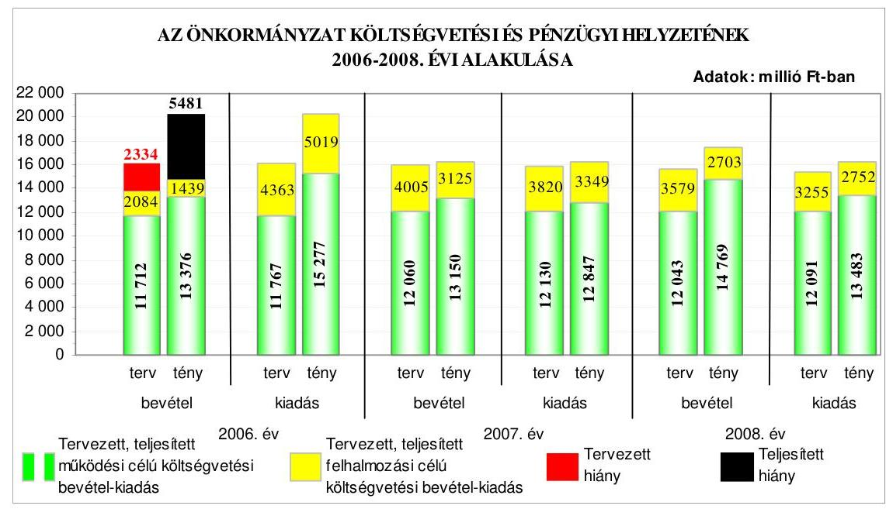

Az Önkormányzat a költségvetés végrehajtása során a 2006. évben a tervezettnél nagyobb hiányt teljesített, a 2007. évben a tervezettnél kisebb, a 2008. évben a tervezettnél nagyobb összegű pénzügyi többletet ért el, amelyet a 2006. évi kötvénykibocsátásból származó bevétel egy részének 2007-2008. évi rendelkezésre állása okozott. A 2006. évi pénzügyi hiányt a teljesített múködési célú költségvetési bevételek hiánya és a felhalmozási célú költségvetési bevételeket meghaladó összegben teljesített felhalmozási célú költségvetési kiadások együttesen okozták. A 2006. és a 2008. évi költségvetés eredeti előirányzatainak tervezésénél az Áht-ban foglalt előírások ellenére az előző évi pénzmaradvány igénybevételét az előző évről áthúzódó feladatok (kötelezettségek) előirányzatainak fedezeteként nem tervezték meg. Az Önkormányzatnál a költségvetés vég-

---

rehajtása során a 2006. évben a költségvetési hiány csökkentése, a 2007-2008. években a költségvetési többlet növelése érdekében a tervezett finanszírozási célú pénzügyi műveleteken kívül bevételnövelést, illetve kiadási megtakarítást eredményező egyéb intézkedéseket hoztak. Az Önkormányzat a 2006. évi költségvetés végrehajtása során a pénzügyi egyensúlyt rövid- és hosszú lejáratú hitelfelvétellel, kötvénykibocsátással biztosította. A 2007. és a 2008. években a teljesített költségvetési bevételek - a felvett hitelek nélkül - fedezetet nyújtottak a költségvetési kiadásokra, ennek ellenére az Önkormányzat a 2007. évben rövid lejáratú, a 2008. évben rövid- és hosszú lejáratú hitelt vett fel. Az Önkormányzat a likviditás biztosítása érdekében a 2006-2008. években folyószámlahitelt, a bérkifizetésekhez munkabérhitelt, a 2008. évben rövid lejáratú forgóeszközhitelt vett igénybe.

Az Önkormányzat a költségvetési elszámolási számláról megelőlegezett közmű beruházási kiadások megtérítésére a közmű beruházások lebonyolítási számláiról a 2006-2008. években összesen 36 millió Ft-ot utalt át a költségvetési elszámolási számlára. Az átutalt összegeket - a Vhr. előírása ellenére - kölcsönfelvételként számolták el a könyvvitelben annak ellenére, hogy azok a közműberuházás kiadásához történő lakossági hozzájárulások voltak, ezért tartalmuk szerint felhalmozási célú pénzeszköz átvételnek minősültek.

Az Önkormányzat - likviditási gondjaik enyhítésére, pályázati támogatás megelőlegezésére - nyolc intézményét a 2008. évben nem támogatásban részesítette, hanem az Ötv-ben foglaltakkal ellentétben kölcsönt nyújtott részükre. Az Önkormányzat által nyújtott kölcsön tényleges tartalma szerint támogatás (intézményfinanszírozás) volt, így a könyvviteli elszámolásban kölcsönként történő kimutatással a Polgármesteri hivatalban nem tartották be a Számv. tv. előírásait, továbbá a kölcsönnel kapcsolatosan a követeléseknek és kötelezettségeknek a valós állományi értéknél 7,9 millió Ft-tal magasabb összegben történt kimutatásával nem tartották be a Számv. tv-nek a valódiság elvére vonatkozó előírását.

Az Önkormányzat 2006-2008 között egy alkalommal, rövid- és hosszú lejáratú fejlesztési, működési hiteltörlesztésre, garanciavállalásokra, beruházási és múködési célra 2006. szeptember 22-én bocsátott ki 12069 millió Ft összegű, svájci frank alapú kötvényt. A kötvénykibocsátás az Önkormányzat számára kockázatot jelent a forint svájci frankhoz viszonyított árfolyamváltozása, valamint a változó kamatmérték miatt. Az Önkormányzat a kötvénykibocsátásból származó forrásból a 2008. év végéig a tervezett célokra 9857 millió Ft-ot használt fel. A kötvénykibocsátásból származó bevételt a felhasználásig betétekben helyezték el, amelyeknél a lehívásokkal csökkentett összeg folyamatosan kamatozott, továbbá a polgármester a Közgyűlés felhatalmazása alapján - a pénzpiaci feltételek bizonytalansága miatt kockázattal járó - azonnali és opciós deviza műveleteket is végzett.

A Polgármesteri hivatalban a Nyugdíjas Lakópark bérlői által a bérleti jog megszerzésének ellenértékeként fizetett egyszeri belépési hozzájárulást a Vhr-ben foglaltak ellenére nem az önkormányzati sajátos felhalmozási és tőkebevételek, hanem a pénzügyi befektetések bevételei között számolták el.

---

Az Önkormányzat 2006-2008 közötti pénzügyi helyzete eladósodásának kismértékű fokozódása és fizetőképességének romlása miatt a 2006. és a 2008. évek között összességében kedvezőtlenül alakult.

Az Önkormányzat a 2006-2009. évek fejlesztési célkitűzéseit helyzetelemzéssel alátámasztott gazdasági programban, városfejlesztési tervben, integrált városfejlesztési stratégiában, valamint az ágazati, szakmai, fejlesztési koncepciókban határozta meg. A fejlesztési célkitűzések összhangban voltak az NFT és az ÚMFT intézkedései keretében megjelenő pályázati lehetőségekkel. A 20062008. évek között az európai uniós források és a közösségi támogatások megszerzésére az Önkormányzat összesen 35 pályázat benyújtásáról döntött. Az Önkormányzat által, vagy részvételével benyújtott pályázatok közül 16 támogatásban részesült, 13 pályázatot elutasítottak, hat pályázat elbírálása még nem történt meg.

Az Önkormányzat 2006-2008. évi költségvetési rendeletei az Áht. előírásai ellenére nem tartalmazták valamennyi európai uniós támogatással megvalósuló projekt kiadási és bevételi előirányzatát, valamint a 2006. és a 2007. évi költségvetési rendeletek az Ámr. előírása ellenére nem tartalmazták valamennyi európai uniós forrással megvalósuló fejlesztési feladat kiadásait feladatonként, azonban a 2009. évi költségvetési rendeletben már szerepeltek az európai uniós forrást igénylő fejlesztési feladatok és azok kiadási és bevételi előirányzatai. A 2007. évi és a 2009. évi költségvetési rendeletekben az Ámr. előírása ellenére nem mutatták be valamennyi, európai uniós támogatással megvalósuló, többéves kihatással járó feladat kiadási és bevételi előirányzatát éves bontásban, továbbá a 2006-2009. évi költségvetési rendeletek az Ámr. előírása ellenére nem elkülönítetten tartalmazták az európai uniós támogatással megvalósuló programok, projektek bevételeit és kiadásait.

Az Önkormányzatnál a 2006-2009. években az európai uniós források igénybevételének és felhasználásának feladatait a Polgármesteri hivatal ügy-rend ${ }_{1,2}$-jében, a köztisztviselők munkaköri leírásaiban határozták meg. A szabályozás kiterjedt a pályázatfigyelést végzők és a döntési jogkörrel rendelkezők közötti információ-szolgáltatási kötelezettség előírására, meghatározták az európai uniós forrásokra irányuló pályázatfigyelés, pályázatkészítés, a fejlesztések lebonyolításának eljárási rendjét, azonban nem jelölték ki az önkormányzati szintű pályázat-nyilvántartás vezetésének felelősét. A pályázatok - köztük az európai uniós forrásokkal támogatott fejlesztési feladatok - lebonyolításával kapcsolatos FEUVE előírásokat az ellenőrzési nyomvonal tartalmazta. Belső ellenőrzési stratégiát megalapozó kockázatelemzés nem készült, így nem értékelték az európai uniós forrásokkal támogatott fejlesztési feladatok kockázati tényezőit.

Az Önkormányzatnál az európai uniós forrásokra irányuló pályázatfigyelés, pályázatkészítés és a fejlesztési feladat lebonyolításának személyi, szervezeti feltételeit a Polgármesteri hivatal szervezetén belül kialakították, valamint ezen feladatokkal külső személyt, szervezetet is megbíztak. A pályázatfigyelésre kötött szerződésben előírták a feladatellátás kötelezettségeit, a kapcsolattartás, az információk átadásának formáját, tartalmát, módját, azonban a felelősség szabályait nem rögzítették. A pályázatkészítésre kötött szerződésekben előírták a feladatellátás kötelezettségeit, a gazdasági társaságok képviselői és a Pol-

---

gármesteri hivatal köztisztviselői közötti kapcsolattartást, az információk átadásának formáját, tartalmát, módját, a felelősség szabályait. A fejlesztés lebonyolítási feladat ellátására kötött szerződésekben meghatározták a feladatellátás kötelezettségét, a kapcsolattartás rendjét, azonban az ellenőrzési feladatokat és a személyre szóló felelősségi szabályokat nem rögzítették.

Az Önkormányzat a 2004. évben sikeresen pályázott a GVOP 4.3.1. Szolgáltató önkormányzat intézkedés keretében az „Elektronikus ügyfélszolgálat és korszerü térinformatikai megoldások bevezetés Hódmezővásárhely Megyei Jogú Városban" című fejlesztés megvalósítására. A fejlesztés megvalósítása, a kiadások alapján a projekt előrehaladási jelentések, valamint a kifizetési kérelmek benyújtása a módosított támogatási szerződésben meghatározott ütemezésnek megfelelően haladt. A fejlesztési feladat megvalósításához az Önkormányzat a 20062007. évi költségvetéseiben a saját forrást biztosította. A Polgármesteri hivatalnál a fejlesztés kiadásaival és bevételeivel összefüggő folyamatba épített, előzetes és utólagos vezetői ellenőrzési feladatokat a gazdálkodási jogkörök szabályzatában előírtak szerint végezték el. A projekt megvalósítását a közremúködő szervezet kettő alkalommal ellenőrizte, szabálytalanságra vonatkozó megállapítást nem tett.

Az Önkormányzat a szabályozottság és szervezettség tekintetében 2006-2008 között összességében annak ellenére nem készült fel eredményesen az európai uniós források igénybevételére és a várható támogatások felhasználására, hogy az európai uniós forrásokra benyújtott pályázatai a gazdaságfejlesztési stratégiában, városfejlesztési tervben, integrált városfejlesztési stratégiában, ágazati, szakmai koncepciókban, tervekben megfogalmazott fejlesztési célkitűzésekhez kapcsolódtak, szabályozta a pályázatfigyelést végző és a döntési, illetve a döntés előterjesztési jogkörrel rendelkezők közötti információszolgáltatás kötelezettségét, rögzítette a folyamatba épített, előzetes és utólagos vezetői ellenőrzési feladatokat, kialakította a Polgármesteri hivatalon belül és külső szervezet igénybevételével a pályázatfigyelés, a pályázatkészítés és a fejlesztési feladat lebonyolításának szervezeti, személyi feltételeit, meghatározta a külső személlyel, szervezettel kötött szerződésekben a pályázat szakmai és formai követelményeire vonatkozóan a pályázatkészítést végző felelősségét. Nem készült azonban a belső ellenőrzési stratégiát megalapozó kockázatelemzés, így nem értékelték az európai uniós forrásokkal támogatott fejlesztési feladatok kockázati tényezőit, továbbá nem írták elő a fejlesztési feladat lebonyolítását végző ellenőrzési kötelezettségeit.

A Közgyűlés az informatikai stratégiában meghatározta a közép- és hosszú távú fejlesztési célokat, az e-közszolgáltatás ellátásának személyi és tárgyi feltételét biztosította. Az Önkormányzat a GVOP 4.3.1. Szolgáltató önkormányzat intézkedés keretében 290,5 millió Ft, az ÁROP 1.A.2/B. A polgármesteri hivatalok szervezetfejlesztése intézkedés keretében 50 millió Ft európai uniós támogatásban részesült. Az Önkormányzatnál az e-közszolgáltatás keretében történő ügyintézést az állampolgárok és a vállalkozások részére a 3. elektronikus szolgáltatási szinten biztosították a gépjárműadó, a szociális juttatások, támogatások fizetése, a helyi adó, az egészségüggyel kapcsolatos szolgáltatások, a kereskedelmi üzletek működési, a telepengedélyezési ügyek intézése körében. A Közgyűlés lehetővé tette az elektronikusan intézhető eljárási cselekmények intézését.

---

A 2008. évben a nem normatív, céljellegú múködési támogatások teljesített kifizetései esetében az Áht. előírása ellenére nem tették közzé a támogatás megvalósítási helyére vonatkozó adatot, valamint a céljellegú felhalmozási támogatások teljesített kifizetéseinek 60\%-a esetében nem tették közzé a támogatások kedvezményezettjeinek nevére, a támogatás céljára, összegére, megvalósítási helyére vonatkozó adatokat az Önkormányzat honlapján. A 2008. évben a Polgármesteri hivatal által kötött nettó ötmillió Ft-ot elérő, vagy azt meghaladó értékű szerződések 30\%-ánál az Áht. előírása ellenére nem tették közzé a szerződések megnevezését (típusát), a szerződés tárgyát, értékét, a szerződést kötő felek nevét, a határozott időre kötött szerződések időtartamát, valamint az intézmények által kötött szerződések esetében nem tették közzé a szerződés megnevezését (típusát). Az Önkormányzat honlapján az Ámr-ben foglaltaknak eleget téve közzétették a 2006-2008. évekre vonatkozó éves költségvetési beszámolók szöveges indokolását.

A Polgármesteri hivatalban a 2008. évben a költségvetés tervezési és a zárszámadás készítési folyamatok szabályozottsága összességében alacsony kockázatot jelentett a feladatok megfelelő, szabályszerű végrehajtásában, mivel a jegyző a pénzügyi irányítási és ellenőrzési rendszer keretében meghatározta az intézmények részére a költségvetési javaslat összeállításával kapcsolatos követelményeket, kijelölte a tervezési és a zárszámadási feladatok koordinálásáért felelős személyeket. Annak ellenére összességében alacsony volt a kockázat, hogy a jegyző nem szabályozta a költségvetési tervezés és zárszámadás elkészítés rendjét, továbbá nem írta elő annak ellenőrzését, hogy a Polgármesteri hivatal és az intézmények költségvetési javaslatukat az Ámr. előírásainak megfelelően dolgozták-e ki. A jegyző a költségvetés készítésének és végrehajtásának rendjére vonatkozó szabályzatot 2009. március 31-én elkészítette.

A Polgármesteri hivatalban a költségvetés tervezési és zárszámadás készítési folyamatban a múködésbeli hibák megelőzésére, feltárására, kijavítására kialakított belső kontrollok múködésének megbízhatósága összességében kiváló volt, mivel a szabályozásban foglaltaknak megfelelően a jegyző ellenőriztette, hogy a költségvetési tervezés folyamatában a költségvetési intézmények teljesítettéke a költségvetési javaslat összeállításával kapcsolatban részükre meghatározott követelményeket, a zárszámadás készítés folyamatában az intézmények által az állami támogatásokkal, hozzájárulásokkal történő elszámoláshoz közölt mutatószámok adatai megbízhatóak-e. Annak ellenére összességében kiváló volt a kontrollok múködésének megbízhatósága, hogy a költségvetés tervezési folyamatában a szabályozás hiánya miatt nem ellenőrizték, hogy a Polgármesteri hivatal és az intézmények költségvetési javaslatukat az Ámr. előírásainak megfelelően dolgozták-e ki, így nem észrevételezték, hogy a költségvetési tervezet nem tartalmazta a 2008. évben három, a 2009. évben két európai uniós támogatással megvalósuló célkitúzés bevételi előirányzatait.

A Polgármesteri hivatalban a 2008. évben a gazdálkodási, a pénzügyiszámviteli és a folyamatba épített ellenőrzési feladatok szabályozottságának hiányosságai közepes kockázatot jelentettek a feladatok szabályszerű végrehajtásában, mivel nem rögzítették a Polgármesteri hivatal ügyrend ${ }_{2}$-jében a Polgármesteri hivatal alapító okiratának keltét, számát, telephelyeinek megnevezését, a hozzárendelt részben önálló költségvetési szervek felsorolását, ezen

---

szerveknél és saját szervezeti egységeinél a pénzügyi-gazdasági tevékenységet ellátó személyek feladatkörének, munkakörének meghatározását; a Polgármesteri hivatal gazdasági szervezete nem rendelkezett az Ámr-ben előírt tartalmú ügyrenddel; a jegyző nem határozta meg az értékelések ellenőrzéséért felelős munkaköröket, nem rögzítette az érintett dolgozók munkaköri leírásaiban az értékeléssel, annak ellenőrzésével, illetve a selejtezéssel kapcsolatos feladatokat; az ellenőrzési nyomvonal kialakításánál nem azonosították a folyamatokat és folyamatgazdákat, nem határozták meg a tevékenységcsoportokat, az elvégzendő tevékenységeket, feladatokat, az adott tevékenység/feladat és a végrehajtásáért felelős szervezeti egység (személy) megnevezését, egyértelmű megfeleltetését, az egyes tevékenység, feladat elvégzését igazoló dokumentum fellelési helyét a rendszerben; a kockázatkezelési eljárásrend nem tartalmazta az elfogadható kockázati szint meghatározását, azonban a kialakított belső kontrollok végrehajtásuk esetén - a lehetséges hibák többsége ellen védelmet nyújtottak.

A Polgármesteri hivatalban a külső szolgáltatók által végzett karbantartás, kisjavítás főkönyvi számláin elszámolt gazdasági eseményeknél, valamint a gépek, berendezések, felszerelések beszerzésével és az államháztartáson kívülre történő működési és felhalmozási célú pénzeszközátadásokkal kapcsolatos kifizetések során a szakmai teljesítésigazolás és az utalvány ellenjegyzés múködésének megbízhatósága összességében kiváló volt, mivel a vonatkozó szerződésekben, megrendelésekben, megállapodásokban, közgyűlési határozatokban meghatározott feladatok teljesítésének, a kiadások jogosultságának, összegszerűségének ellenőrzését a szakmai teljesítésigazolásra kijelölt személyek a gazdálkodási jogkörök szabályzatában előírt módon elvégezték. Az utalvány ellenjegyzője a gazdálkodásra vonatkozó szabályok érvényesüléséről, továbbá a szakmai teljesítésigazolás és az érvényesítés elvégzéséről meggyőződött. Annak ellenére összességében kiváló volt a kontrollok működésének megbízhatósága, hogy a Polgármesteri hivatalban a számítógép beszerzésre, a bútorbeszerzésre, a hűtőszekrény beszerzésre, és a két db televízió beszerzésére fordított kiadásoknál a szakmai teljesítés igazolását a jegyző írásos kijelölésével nem rendelkező személy jogosulatlanul végezte, továbbá az utalvány ellenjegyzője nem kifogásolta a jogosulatlan személy által végzett szakmai teljesítésigazolást.

Az érvényesítő a Vhr-ben foglaltak ellenére nem a gazdasági esemény tartalmának megfelelően jelölte ki a könyvviteli elszámolásra szolgáló főkönyvi számlaszámot az elmaradt beruházás tervezési díja, a szakfordítás, továbbá a bérlakás, üzlethelyiség és egyéb ingatlan felújítás bérleti díjba beszámított öszszegének elszámolása során, mivel az ezen gazdasági eseményekhez kapcsolódó kiadásokat a külső szolgáltató által végzett karbantartási, kisjavítási munkák kiadásaihoz számolták el.

A Polgármesteri hivatal rendelkezett informatikai stratégiával, valamint informatikai biztonsági szabályzattal. A Polgármesteri hivatalban a pénzügyiszámviteli feladatoknál alkalmazott informatikai rendszerek múködésére vonatkozó szabályok hiányosságai közepes kockázatot jelentettek a feladatok szabályszerű végrehajtásában, mivel a Polgármesteri hivatal nem rendelkezett eljárásrenddel a hozzáférési jogosultságokra, belső szabályzatban nem tiltották meg a külső fejlesztők hozzáférését az éles pénzügyi-számviteli programokhoz, nem jelölték ki az ellenőrzési lista (napló) vizsgálatáért felelős dolgozót, azon-

---

ban a kialakított belső kontrollok - végrehajtásuk esetén - a lehetséges hibák többsége ellen védelmet nyújtottak.

A Polgármesteri hivatalnál a pénzügyi-számviteli feladatok ellátásánál alkalmazott informatikai rendszerek belső kontrolljainak megbízhatósága jó volt, mivel biztosították a Polgármesteri hivatalban vezetett hozzáférési jogosultságra vonatkozó nyilvántartás teljes körűségét és naprakészségét, a főkönyvi könyvelési rendszerben tárolt hozzáférési jogosultságok ellenőrizhetőségét, a beépített jelszóvédelmi előírások betartását a pénzügyi és számviteli szoftvereknél, a pénzügyi-számviteli rendszer adatait az informatikai biztonsági szabályzatban előírt gyakorisággal mentették, azonban az előírások ellenére nem tesztelték a katasztrófa elhárítási tervet a 2007. és a 2008. évben, továbbá az integrált pénzügyi-számviteli rendszer hozzáférési jogosultságai még tartalmaztak fejlesztői és személyhez nem köthető felhasználói azonosítókat, a szoftver elemeire vonatkozó változáskezelési eljárások ellenőrzését, tesztelését nem dokumentálták, a felelős személy kijelölésének hiányában nem vizsgálták felül szabályzatban előírt rendszerességgel az ellenőrzési listákat (naplókat). A feltárt hiányosságok nem veszélyeztették az informatikai rendszerek megbízható múködését.

A belső ellenőrzés szervezeti kereteinek kialakítása és szabályozásának hiányosságai a belső ellenőrzési feladatok megfelelő, szabályszerű végrehajtásában közepes kockázatot jelentettek, mivel az $\mathrm{SzMSz}_{2}$-t nem módosították a Többcélú Társulással a 2008. évben a belső ellenőrzési feladatok ellátásáról kötött megállapodásnak megfelelően; az ellenőrzési munka megtervezéséhez a Ber-ben foglaltak ellenére nem készítettek kockázatelemzést a stratégiai, valamint a 2008-2009. évi ellenőrzési tervek alátámasztására; az ellenőrzési programok nem tartalmazták az ellenőrzések módszerét és az ellenőrzési feladatokat; az ellenőrzések lefolytatásához összeállított ellenőrzési programokat a Berben foglaltakkal ellentétben nem a belső ellenőrzési vezető hagyta jóvá; a Többcélú Társulással kötött feladat-ellátási megállapodásban nem írták elő a belső ellenőrzési stratégiai tervet megalapozó kockázatelemzés folyamatába a jegyző bevonásának kötelezettségét, és nem rendelkeztek arról, hogy a belső ellenőrzési vezető számára meghatározott tevékenységeket milyen módon látják el.

A belső ellenőrzés működésénél a kialakított kontrollok megbízhatósága jó volt, mivel a belső ellenőrzés ellátása a Belső ellenőrzési csoport keretében valósult meg, a jegyző a feladatellátás során biztosította az ellenőrzést végzők funkcionális (szervezeti és feladatköri) függetlenségét, valamennyi vizsgálatról ellenőrzési jelentést készítettek, az ellenőrzött szervezetek intézkedési tervet állítottak össze, a belső ellenőrzési vezető a jogszabályban előírt tartalommal nyilvántartást vezetett az elvégzett ellenőrzésekről, valamint az ellenőrzési jelentésekben tett megállapítások, javaslatok hasznosulásáról, a végrehajtott intézkedésekről. Azonban a 2008. évi belső ellenőrzési tervben foglalt feladatokat részben hajtották végre, mivel a Polgármesteri hivatalnál és az intézményeknél a tervezett ellenőrzések 80\%-ban valósultak meg, továbbá kockázatelemzés hiányában a kockázatok értékelése elmaradt. A jegyző a 2008. évi költségvetési beszámoló keretében beszámolt a FEUVE, valamint a belső ellenőrzés múködéséről. A polgármester a 2008. évi zárszámadási rendelettel egyidejűleg az

---

Ötv. előírásának megfelelően a Közgyűlés elé terjesztette az éves összefoglaló ellenőrzési jelentést.

Az ÁSZ a 2006. évben ellenőrizte az Önkormányzat gazdálkodási rendszerét átfogó jelleggel, melynek során összesen 46 javaslatot tett ( 38 szabályszerűségit és 8 célszerűségit). A polgármester a Közgyűlés elé terjesztette a számvevőszéki jelentést, a vizsgálatról készített beszámolót és a hiányosságok megszüntetése érdekében készített intézkedési tervet, melyet a Közgyűlés elfogadott. Az ÁSZ által tett szabályszerűségi javaslatok 83\%-a realizálódott, 7\%-a részben, 10\%-a nem hasznosult. A célszerűségi javaslatok 100\%-a megvalósult. A költségvetési koncepció, a költségvetési és a zárszámadási rendelet összeállítására, tartalmára, szerkezetére, mellékleteire, a költségvetési rendeletmódosításra, illetve a jóváhagyott előirányzatokon belüli gazdálkodásra, a gazdálkodás és a pénzügyiszámviteli feladatellátás szabályozottságára, a költségvetési gazdálkodási és ellenőrzési jogkörök gyakorlására, a céljelleggel nyújtott támogatásokra, a közbeszerzési eljárások lefolytatására, a belső ellenőrzési rendszer működésére, az éves ellenőrzési jelentés tartalmára tett szabályszerűségi javaslatok közül 33 teljesült.

Három szabályszerűségi javaslat részben hasznosult: a jegyző gondoskodott arról, hogy a Polgármesteri hivatalban a tárgyévi költségvetések végrehajtása során a jóváhagyott kiadási előirányzatok mértékéig vállaljanak fizetési kötelezettséget, azonban a 2007. és 2008. évi költségvetések végrehajtása során nyolc intézmény az Áht-ban foglaltak ellenére túllépte az előirányzatokat és fedezet nélkül vállalt kötelezettséget; a 2008. évben az Áht-ban foglaltak ellenére a nem normatív, céljellegú múködési támogatások teljesített kifizetései esetében nem tették közzé a támogatás megvalósítási helyére vonatkozó adatot, valamint a céljellegú felhalmozási támogatások teljesített kifizetéseinek 60\%-a esetében nem tették közzé a támogatások kedvezményezettjeinek nevére, a támogatás céljára, összegére, megvalósítási helyére vonatkozó adatokat az Önkormányzat honlapján, továbbá a Polgármesteri hivatal által kötött nettó ötmillió Ft-ot elérő, vagy azt meghaladó értékű szerződések 30\%-ánál nem tették közzé a szerződések megnevezését (típusát), a szerződés tárgyát, értékét, a szerződést kötő felek nevét, a határozott időre kötött szerződések időtartamát, valamint az intézmények által kötött szerződések esetében a szerződés megnevezését (típusát).

Négy szabályszerűségi javaslat nem teljesült, mivel a költségvetési és zárszámadási rendeletekben az Áht-ban és az Ámr-ben foglalt előírások ellenére nem mutatták be a Polgármesteri hivatalban és az intézményeknél a felújítási előirányzatok teljesítését célonként, a felhalmozási kiadások teljesítését feladatonként, valamint nem különítették el az európai uniós támogatásból megvalósítandó fejlesztési feladatokat; a belső ellenőrzés stratégiai és éves tervek meghatározására tett javaslatokhoz kapcsolódóan a jegyző nem biztosította, hogy a Ber-ben foglalt előírásnak megfelelően a belső ellenőrzési vezető kockázatelemzés alapján készítse el a stratégiát és a 2008. évi belső ellenőrzési tervet; a jegyző nem gondoskodott az utólagos elszámolásra felvett összegek pénzkezelési szabályzatban foglalt határidőn belüli elszámolását elmulasztók, valamint a határidőn túli elszámolások megszüntetése érdekében a kifizetés jogszerűségének ellenőrzési kötelezettségét elmulasztók felelősségre vonásáról; a pártok részére biztosított helyiségek bérleti díjára vonatkozó javaslat nem teljesült, mivel

---

az Önkormányzat egy párt részére a piaci árnál alacsonyabb bérleti díj ellenében, és három párt részére továbbra is ingyenesen biztosított helyiséget, ezzel nem tett eleget az Alkotmányban és az Ötv-ben foglaltaknak.

Az ÁSZ ellenőrzés által tett valamennyi célszerűségi javaslat teljesült. Szabályozták a gazdálkodási és ellenőrzési jogkörök gyakorlására felhatalmazottak beszámoltatásának rendjét, gondoskodtak annak végrehajtásáról. A jegyző a 2007. évi költségvetési és zárszámadási rendeletben biztosította, hogy a Polgármesteri hivatal terv- és tényadatai között a címrendben foglaltak szerint a hozzárendelt, részben önállóan gazdálkodó intézmények adatait bemutassák.

Az ÁSZ a 2009. évben fejezte be a Sport XXI. Létesítmény-fejlesztési Program keretében támogatott önkormányzati PPP beruházások megvalósításának és az önkormányzati feladatok ellátására gyakorolt hatása ellenőrzésének vizsgálatát, amelynek során három szabályszerűségi és kilenc célszerűségi javaslattal élt. Az ellenőrzés megállapításai, javaslatai alapján a Közgyűlés intézkedési terv elkészítéséről döntött.

A helyszíni ellenőrzés megállapításainak hasznosítása mellett javasoljuk:

# a polgármesternek 

a jogszabályi előírások maradéktalan betartása érdekében

1. gondoskodjon az Önkormányzat gazdálkodásának 2006. évi átfogó ellenőrzése során az ÁSZ által részére tett és nem teljesült szabályszerűségi javaslat végrehajtásáról;
a munka színvonalának javítása érdekében
2. kezdeményezze, hogy a számvevőszéki jelentésben foglaltakat a Közgyűlés tárgyalja meg és a feltárt hiányosságok megszüntetése érdekében készíttessen intézkedési tervet a határidők és felelősök megjelölésével;

## a jegyzönek

a jogszabályi előírások maradéktalan betartása érdekében

1. gondoskodjon az Áht. 7. § (2) bekezdésében foglaltak betartása érdekében arról, hogy a költségvetés eredeti előirányzatainak tervezésénél az előző évi pénzmaradvány igénybevételét az előző évről áthúzódó feladatok (kötelezettségek) előirányzatainak fedezeteként tervezzék meg;
2. intézkedjen annak érdekében, hogy az Ötv. 89. § (1) bekezdésében foglaltaknak megfelelően az intézmények támogatásban részesüljenek, valamint gondoskodjon arról, hogy a gazdasági események a tényleges tartalmuknak megfelelően kerüljenek a könyvviteli nyilvántartásban elszámolásra;
3. gondoskodjon arról, hogy az Áht. 15/A. § (1) bekezdésében foglaltakat betartva, a nem normatív, céljellegú fejlesztési támogatások kedvezményezettjeinek nevére, a

---

támogatás céljára, összegére, a támogatási program megvalósítási helyére vonatkozó adatokat közzétegyék;
4. gondoskodjon arról, hogy az Áht. 15/B. § (1) bekezdésében foglaltaknak megfelelően, az Önkormányzat pénzeszközei felhasználásával, a vagyonnal történő gazdálkodással összefüggő - a nettó ötmillió forintot elérő, vagy azt meghaladó értékű szerződések megnevezését (típusát), tárgyát, értékét, a szerződést kötő felek nevét, a határozott időre kötött szerződés időtartamát, valamint ezen adatok változásait közzétegyék;
5. gondoskodjon a múködésbeli hibák megelőzésére, feltárására kialakított kontrollok szabályozása és múködtetése során - az Ámr. 145/A. § (1)-(2) bekezdéseiben, továbbá a 145/B. § (1) bekezdésében foglaltakat figyelembe véve - annak ellenőrzéséről, hogy a Polgármesteri hivatal és az intézmények költségvetési javaslatukat az Ámr. 26. § előírásainak megfelelően dolgozták-e ki;
6. a gazdálkodási, a pénzügyi-számviteli és a folyamatba épített ellenőrzési feladatok szabályszerű végrehajtási feltételeinek kialakítása érdekében
a) kezdeményezze előterjesztés készítésével az Ámr. 13/A. § (3) bekezdés b) és i) pontja alapján a Polgármesteri hivatal ügyrend,-jének kiegészítését az alapító okirat keltével, azonosítójával, a Polgármesteri hivatalhoz, mint költségvetési szervhez rendelt más költségvetési szervek felsorolásával, valamint ezen szerveknél, illetve saját szervezeti egységeinél a pénzügyi-gazdasági tevékenységet ellátó személyek feladatkörének, munkakörének meghatározásával;
b) egészítse ki az Ámr. 145/B. § (1) bekezdésében előírtak, és az Ámr. 145/A. § (3) bekezdésében hivatkozott „Útmutató az ellenőrzési nyomvonal kialakításához" módszertan alapján az ellenőrzési nyomvonalat, hogy az tartalmazza a folyamatok és folyamatgazdák azonosítását, a tevékenységcsoportok meghatározását, az elvégzendő tevékenységek, feladatok, az adott tevékenység/feladat és a végrehajtásáért felelős szervezeti egység (személy) megnevezését, egyértelmú megfeleltetését, az egyes tevékenység, feladat elvégzését igazoló dokumentum fellelési helyét a rendszerben;
c) egészítse ki az Ámr. 145/C. § (2) bekezdésében foglaltak és az Ámr. 145/A. § (3) bekezdésében hivatkozott Pénzügyminisztériumi „Útmutató a kockázatkezelés kialakításához" módszertan alapján a kockázatkezelési eljárásrendet az elfogadható kockázati szint meghatározásával;
7. gondoskodjon az operatív gazdálkodás során a múködésbeli hibák megelőzése, feltárása, kijavítása érdekében arról, hogy
a) a gépek, berendezések, felszerelések beszerzésével kapcsolatos kiadások teljesítése előtt a szakmai teljesítésigazolást - az Ámr. 135. § (1)-(2) bekezdésében foglaltaknak megfelelően - a jegyző által kijelölt személyek végezzék el;
b) az utalványok ellenjegyzői a gépek, berendezések, felszerelések beszerzésével kapcsolatos kiadások teljesítése előtt az Ámr. 137. § (3) bekezdésének előírása alapján ellenőrizzék, hogy a szakmai teljesítésigazolást az arra kijelölt személyek végezték-e el;

---

8. gondoskodjon arról, a Vhr. 9. számú melléklete 9. c) pontjában foglalt előírásoknak megfelelően, hogy az elmaradt beruházás tervezési diját, a szakfordítás kiadását az egyéb üzemeltetési kiadások között számolják el;
9. kezdeményezze a Ber. 4. § (2) bekezdése alapján az SzMSz ${ }_{2}$ módosítását a Többcélú Társulással a belső ellenőrzési feladatok ellátására kötött megállapodásban foglaltak figyelembevételével és a Ber. 4/A. § (2) bekezdésében foglaltak szerint rendelkezzenek arról hogy a belső ellenőrzési vezető számára a Ber. 12. §-ában meghatározott tevékenységeket milyen módon látják el;
10. gondoskodjon a Ber. 19. §-ában foglalt előírásnak megfelelően arról, hogy a belső ellenőrzési vezető készítsen a stratégiai és az éves ellenőrzési tervekhez kockázatelemzést, amely terjedjen ki az európai uniós forrással támogatott fejlesztési feladatokra is, valamint végezze el a kockázatok értékelését;
11. gondoskodjon arról, hogy az ellenőrzési programokat a Ber. 23. § (3) bekezdésének megfelelően a belső ellenőrzési vezető hagyja jóvá;
12. gondoskodjon arról, hogy a Ber. 23. § (4) bekezdésében foglaltaknak megfelelően valamennyi ellenőrzési program tartalmazza az ellenőrzések módszerét, és az ellenőrzési feladatokat;
13. gondoskodjon az Önkormányzat gazdálkodásának 2006. évi átfogó ellenőrzése során az ÁSZ által részére tett és nem teljesült szabályszerűségi javaslatok végrehajtásáról;
a munka színvonalának javítása érdekében
14. tájékoztassa - évente végzett számítások alapján - a Közgyűlést az Önkormányzat eladósodására figyelemmel arról, hogy a hosszú lejáratú, adósságot keletkeztető kötelezettségvállalásokból adódó tőke és kamatfizetési kötelezettségét az Önkormányzat milyen feltételek biztosítása mellett tudja teljesíteni;
15. gondoskodjon arról, hogy az európai uniós forrásokra vonatkozó pályázatokkal öszszefüggő szabályozásban kijelöljék az önkormányzati szintű pályázat nyilvántartás vezetésének felelősét, továbbá kezdeményezze, hogy az európai uniós pályázatfigyelésre kötött szerződésekben rögzítsék a felelősség szabályait, a fejlesztés lebonyolítására kötött szerződésekben rögzítsék az ellenőrzési feladatokat és a személyre szóló felelősségi szabályokat;
16. intézkedjen a pénzügyi-számviteli szoftverek esetében a külső fejlesztők éles rendszerhez való hozzáférési jogosultságának tiltására;
17. gondoskodjon az informatikai rendszer múködésének megbízhatósága érdekében a katasztrófa elhárítási terv időszakonkénti teszteléséről, a személyhez nem köthető felhasználói azonosítók megszüntetéséről, a szoftverek elemeire vonatkozó változáskezelési eljárások ellenőrzésének, tesztelésének dokumentálásáról, az ellenőrzési listák (naplók) szabályzatban előírt rendszerességgel történő ellenőrzéséről.

---

# II. RÉSZLETES MEGÁLLAPÍTÁSOK 

## 1. AZ ÖNKORMÁNYZAT KÖLTSÉGVETÉSI ÉS PÉNZÚGYI HELYZETE

### 1.1. A tervezett költségvetési bevételek és kiadások alapján a költségvetési egyensúly alakulása, a költségvetési hiány oka, finanszírozásának tervezett módja és a költségvetési hiány megállapításának szabályszerűsége

Az Önkormányzatnál a tervezett költségvetési bevételek főösszege az előző évhez viszonyítva a 2007. évben növekedett, 2008-2009 között csökkent. A tervezett költségvetési kiadások főösszege 2006-2009 között folyamatosan csökkent. A 2006. és a 2009. évben a tervezett költségvetési bevételek nem nyújtottak fedezetet a tervezett költségvetési kiadásokra, a költségvetési egyensúly nem volt biztosított, a 2007. és a 2008. évben a költségvetés egyensúlya biztosított volt, mivel a költségvetési bevételek fedezetet nyújtottak a költségvetési kiadásokra.

A múködési célú költségvetési bevételeknél-kiadásoknál 2006-2008 között hiányt, a 2009. évben többletet terveztek. A tervezett felhalmozási célú költségvetési kiadások a 2007. és a 2008. évben nem, de a 2006. és 2009. években meghaladták a felhalmozási célú költségvetési bevételeket ${ }^{10}$.
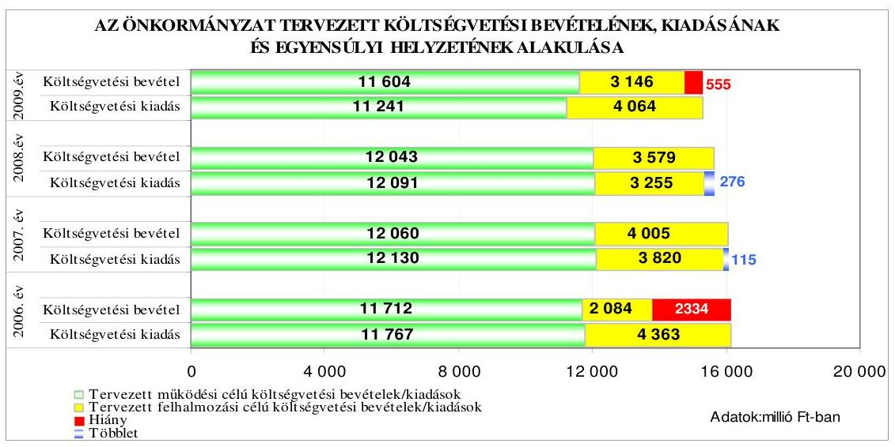

[^0]
[^0]:    ${ }^{10}$ A tervezett felhalmozási célú költségvetési kiadások a 2006. évben 2279 millió Ft-tal, a 2009. évben 918 millió Ft-tal haladták meg a tervezett felhalmozási célú költségvetési bevételeket, a 2007-2008. években azonban a tervezett felhalmozási célú költségvetési bevételek 185 millió Ft-tal és 324 millió Ft-tal meghaladták a tervezett felhalmozási célú költségvetési kiadásokat.

---

A 2006. évi költségvetés hiányát a tervezett múködési bevételek hiánya és a felhalmozási célú költségvetési bevételeket meghaladó összegben tervezett felhalmozási célú költségvetési kiadások együttesen okozták. A 2009. évi költségvetés hiányát a felhalmozási célú költségvetési bevételeket meghaladó összegben tervezett felhalmozási célú költségvetési kiadások okozták, melyet nem ellensúlyozott a múködési célú költségvetési bevételi többlet. Az Önkormányzat a költségvetési rendeleteiben a költségvetési egyensúly biztosításához a 2006. évben rövid- és hosszú lejáratú, a 2009. évben rövid lejáratú hitel felvételét tervezte, a költségvetési hiány finanszírozására - eredeti előirányzatként - kötvénykibocsátást nem terveztek. A 2006. és a 2009. évi költségvetési és az azzal együtt jóváhagyott költségvetés végrehajtásáról szóló rendeletekben nem rendelkeztek költségvetési egyensúlyt javító intézkedésről.

A 2006-2009. évi költségvetések tervezése során a jegyző gondoskodott a likviditás feltételeinek kialakításáról a folyószámla hitelkeret és a rövid lejáratú hitelbevétel tervezésével, a költségvetés végrehajtása érdekében a pénzállomány alakulásáról likviditási terv készíttetésével, amelyet év közben folyamatosan aktualizáltak. A 2006. évi költségvetési rendeletben a költségvetési bevételi és kiadási főösszeg megállapításakor az Áht. 8/A. § (7) bekezdésében foglaltakat megsértve finanszírozási célú pénzügyi múveletet (hitelfelvételt és -törlesztést) is figyelembe vettek költségvetési hiányt módosító költségvetési bevételként és kiadásként. Az ÁSZ előző - a gazdálkodás 2006. évi átfogó - ellenőrzése során tett javaslatának eleget téve a 2007-2009. évi költségvetési bevételek és kiadások főösszegeinek költségvetési rendeletben történt megállapításakor az Áht. 8/A. § (7) bekezdésében előírtakat betartották, mert finanszírozási célú pénzügyi múveletet nem vettek figyelembe költségvetési hiányt módosító költségvetési bevételként és kiadásként.

# 1.2. A teljesített költségvetési bevételek és kiadások alapján a pénzügyi egyensúly, a pénzügyi hiány oka, finanszírozásának módja és hatása a pénzügyi helyzet alakulására az eladósodás, valamint a fizetőképesség szempontjából 

Az Önkormányzatnál a teljesített költségvetési bevételek főösszege a 2006. évről a 2008. évre folyamatosan növekedett, ezzel szemben a teljesített költségvetési kiadások főösszege az előző évhez képest a 2007. évre csökkent, a 2008. évre minimális mértékben növekedett.
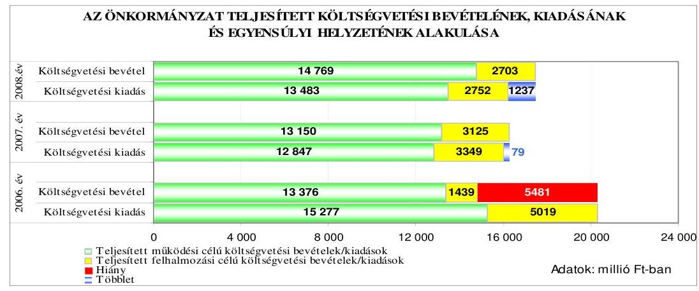

---

A 2006. évi költségvetés teljesítése során a tervezettnél mintegy kétszer nagyobb összegű pénzügyi hiányt a teljesített múködési célú költségvetési bevételek tervezettnél magasabb összegű hiánya és a felhalmozási célú költségvetési bevételeket tervezettnél nagyobb összegben meghaladó teljesített felhalmozási célú költségvetési kiadások együttesen okozták. A 2007. és a 2008. évben a tervezett pénzügyi egyensúly fennállt, pénzügyi többlet keletkezett, amelyet a 2006. évi kötvénykibocsátásból származó bevétel 2007-2008. évi rendelkezésre állása eredményezett ${ }^{11}$. A 2007. és 2008. években a múködési célú költségvetési bevételek - növekvő összegben (303-1286 millió Ft) - fedezetet nyújtottak a múködési célú költségvetési kiadásokra. A 2006-2008. években a felhalmozási célú költségvetési kiadások évről évre csökkenő mértékben haladták meg a felhalmozási célú költségvetési bevételeket.

Az Önkormányzatnál a 2006-2009. években tervezett és a 2006-2008. években teljesített múködési és felhalmozási célú költségvetési kiadásokra a következő arányban biztosítottak fedezetet a költségvetési bevételek:

Adatok: \%-ban

| Megnevezés | 2006.   év |  | 2007.   év |  | 2008.   év |  | 2009.   év |
| :--: | :--: | :--: | :--: | :--: | :--: | :--: | :--: |
|  | Terv | Tény | Terv | Tény | Terv | Tény | Terv |
| Múködési célú költségvetési kiadások fedezettsége múködési célú költségvetési bevételekből | 99,5 | 87,6 | 99,4 | 102,4 | 99,6 | 109,5 | 103,2 |
| Felhalmozási célú költségvetési kiadások fedezettsége felhalmozási célú költségvetési bevételekből | 47,8 | 28,7 | 104,8 | 93,3 | 109,9 | 98,2 | 77,4 |
| Költségvetési kiadások fedezettsége költségvetési bevételekből | 85,5 | 73,0 | 100,7 | 100,5 | 101,8 | 107,6 | 96,4 |

A tervezett és teljesített költségvetési kiadások bevételi fedezettsége a 2006-2008. évek között folyamatosan növekedett. A 2009. évi tervezett fedezettség aránya azonban 5,4 százalékponttal csökkent az előző évhez viszonyítva. A tervezett és teljesített költségvetési kiadások bevételi fedezettségének aránya eltérő volt, mivel a kiadások teljesített fedezettségének aránya a tervezettnél a 2006. évben 12,5 százalékponttal, a 2007. évben 0,2 százalékponttal alacsonyabb, a 2008. évben 5,8 százalékponttal magasabb volt.

[^0]
[^0]:    ${ }^{11}$ A 2006. évi kötvénykibocsátásból származó bevétel 2006. évben fel nem használt öszszege a 2006. év végi pénzmaradvány részét képezte, melynek következő évekbeli igénybevétele, mint költségvetési bevétel jelent meg az Önkormányzat 2007-2008. évi költségvetési beszámolóiban.

---

A 2006. évben a teljesített költségvetési kiadások fedezettségének tervezettnél kedvezőtlenebb alakulását befolyásolta, hogy a működési célú költségvetési bevételek $14,2 \%$-os túlteljesítése mellett a múködési célú költségvetési kiadásokat a tervezettnél $29,8 \%$-kal, a költségvetési kiadásokon belül a dologi és egyéb folyó kiadások együttes összegét a tervezettnél $72,1 \%$-kal magasabb összegben ${ }^{12}$ teljesítették. A múködési célú költségvetési bevételek túlteljesítését az előző évi pénzmaradvány nem tervezett igénybevétele, valamint az intézményi múködési bevétel $58,1 \%$-os túlteljesítése tette lehetővé. A felhalmozási kiadásokat $15,0 \%$-kal túlteljesítették annak ellenére, hogy - elsősorban a tervezett ingatlanértékesítések elmaradása miatt - a tervezett felhalmozási célú bevételek a tervezett bevételi mérték 69,0\%-ában teljesültek.

Az Önkormányzatnál a felújítási és beruházási kiadások teljesítése a 2006. évben $36,5 \%$-kal illetve $30,3 \%$-kal meghaladta az eredeti előirányzatot, mert eredeti feladathoz kötött vagy céltartalék - előirányzatként nem tervezett út és ingatlan felújításokat, valamint ingatlanvételeket valósítottak meg, melyekre forrást év közben az előző évi pénzmaradványból, felhalmozási célra átvett pénzeszközökből és a tervezettnél magasabb összegű finanszírozási célú pénzügyi bevételből (rövid- és hosszú lejáratú hitel, kötvény) biztosítottak.

A 2007. évben a teljesített költségvetési kiadások fedezettségének tervezettnél kedvezőtlenebb alakulását befolyásolta, hogy míg a tervezett felhalmozási célú költségvetési bevételeket a tervezett mérték 78\%-ában teljesítették, addig a felhalmozási célú költségvetési kiadásokat $12,3 \%$-kal alulteljesítették.

A 2008. évben a teljesített költségvetési kiadások fedezettségének tervezettnél kedvezőbb alakulását - elsősorban a tervezettnél magasabb összegben elért árfolyam és kamatbevétel, és az előző évi pénzmaradvány tervezettnél nagyobb mértékű igénybevétele miatti - múködési célú költségvetési bevételi többlet biztosította, amely többlet ellensúlyozta a felhalmozási célú költségvetési bevételek $75,5 \%$-os teljesítése miatti bevételkiesést. A felhalmozási célú költségvetési bevétel tervezettnél alacsonyabb összegű teljesítését elsősorban a tervezett ingatlanértékesítési bevétel elmaradása okozta.

A 2006. és a 2008. évi költségvetés eredeti előirányzatainak tervezésénél - megsértve az Áht. 7. § (2) bekezdésében foglaltakat - nem számoltak az előző évi pénzmaradvány igénybevételével az előző évről áthúzódó feladatok (kötelezettségek) előirányzatainak fedezeteként ${ }^{13}$.

[^0]
[^0]:    ${ }^{12}$ A 2006. évben a dologi és egyéb folyó kiadások esetében a 2193 millió Ft-os többletkiadást elsősorban a nem tervezett 904 millió Ft realizált árfolyamveszteség, a tervezettet 167 millió Ft-tal meghaladó kamatkiadás, az eredeti előirányzatnál magasabb öszszegben teljesült készletbeszerzési ( 166 millió Ft-tal), szolgáltatási ( 714 millió Ft-tal) és általános forgalmi adó ( 164 millió Ft-tal) kiadások okozták.
    ${ }^{13}$ A 2006. évben a tervezésnél eredeti előirányzatként nem vettek figyelembe 758 millió Ft múködési és 77 millió Ft felhalmozási célú pénzmaradvány igénybevételt. A 2008. évben eredeti előirányzatként nem számoltak a tervezettnél 811 millió Ft-tal nagyobb múködési, 138 millió Ft-tal nagyobb felhalmozási célú pénzmaradvány igénybevételével.

---

A közbenső egyeztetés során a polgármester és a jegyző által közösen adott észrevétel szerint az Áht. 7. § (2) bekezdése „feltételes módban („tervezhető") rendelkezik a pénzmaradványnak a költségvetés eredeti előirányzatonkénti tervezéséről. Az államháztartás múködési rendjéről szóló 217/1998. (XII. 30.) Korm. rendelet 66. § (4) bekezdése értelmében az „önkormányzati költségvetési szerv pénzmaradványát a helyi ön-kormányzat képviselő-testülete a zárszámadási rendeletével egy időben hagyja jóvá", a tárgyévet követő év április 30-ig. Önkormányzatunk 2006. évben a zárszámadással egy időben jóváhagyott pénzmaradvány összegével módosított költségvetését 25/2006. (VI. 6.) számú rendeletével hagyta jóvá.
2007. és 2008. években a pénzmaradvány azon része került eredeti előirányzatként a költségvetésben megtervezésre, ahol a hitelek visszafizetésére - a Közgyülés korábbi döntésének megfelelően - az óvadéki betétben elhelyezett összeg jelentett a forrást, illetve ahol a beruházások forrásaként a forrás-felhasználási betét került megjelölésre. Egyebekben a pénzmaradvány a költségvetés 34/2007. (VI. 11.) Kgy. számú, illetve a 30/2008. (VI. 6.) Kgy. sz. költségvetési rendelet módosításokkal került elöirányzatként beemelésre."

Az észrevétel nem megalapozott, mivel az Áht. 7. § (2) bekezdése alapján a költségvetés készítésekor a feladat ellátásához teljesíthető jóváhagyott kiadásokat, és a teljesítendő várható bevételeket - így pl. a kötelezettségvállalással terhelt áthúzódó feladatok kiadási-bevételi előirányzatait, amelyek a költségvetés készítésekor már ismert kötelezettségek, valamint költségvetési hiány esetén bevételi forrásként a feladattal nem terhelt, szabad pénzmaradvány igénybevételének lehetőségét - tartalmaznia kell a költségvetésnek.

Az Önkormányzatnál a költségvetés végrehajtása során a 2006. évben a költségvetési hiány csökkentése, a 2007-2008. években a költségvetési többlet növelése érdekében kiadási megtakarítást, illetve bevételnövelést eredményező egyéb intézkedéseket hoztak.

A Közgyűlés - a gyermeklétszám, a kórházi aktív ágyszám csökkenése, az intézmények működésének átszervezése, az intézmény fenntartói jog átadása miatt - önkormányzati szinten központi forrás igénybevételével a 2006. évben 110, a 2007. évben 1063, a 2008. évben 21 álláshely megszüntetéséről döntött a költségvetés jóváhagyását követően. Ennek hatására a 2008. évben összességében az intézmény átadások miatt 1207 millió Ft, a létszámcsökkentésből 540 millió Ft éves megtakarítást értek el a 2005. évhez viszonyítva.

Az Önkormányzat a 2006. évi költségvetés végrehajtása során a pénzügyi egyensúlyt rövid- és hosszú lejáratú hitelfelvétellel, és kötvénykibocsátásból elért bevétellel biztosította:

- az Önkormányzat a 2006. évben a NFT keretében elnyert vissza nem térítendő támogatások előfinanszírozása céljából 453 millió Ft, múködési célra 300 millió Ft, fejlesztési célra 600 millió Ft rövid lejáratú hitelt vett igénybe;
- a Magyar Fejlesztési Bank Önkormányzati Fejlesztési Hitelprogramja keretében az Önkormányzat 2005. január 7-én 1000 millió Ft összegű kölcsön felvételére kötött szerződést közutak építése, önkormányzati tulajdonú létesítmények felújítása céljából 20 éves futamidővel, három év tőketörlesztési tü-

---

relmi idővel, változó kamatozással. A hitelkeretből a 2006. évben a belterületi utak rehabilitációjára 895 millió Ft lehívása történt meg.

A 2007. és a 2008. években a teljesített költségvetési bevételek - a felvett hitelek nélkül - fedezetet nyújtottak a költségvetési kiadásokra, ennek ellenére az Önkormányzat a 2007. évben rövid lejáratú, a 2008. évben rövid- és hosszú lejáratú hitelt vett fel:

- a 2007. évben 120 millió Ft, a 2008. évben 26 millió Ft rövid lejáratú kölcsönt vett fel egy gazdasági társaságától a hitelcél megjelölése nélkül, a mindenkori jegybanki alapkamatnak megfelelő kamatra, továbbá a 2007. évben 167 millió Ft, a 2008. évben 78 millió Ft összeget egy pénzintézettől a munkahelyteremtő támogatások megelőlegezésére;
- az Önkormányzat a folyószámlahitel állományából 2000 millió Ft-ot a 2008. december 29-én kötött hitelszerződésben kedvezőbb kamatozású, hoszszú lejáratú, devizanemcserére lehetőséget adó fejlesztési hitellé alakított át 18 éves futamidővel, három év tőketörlesztési türelmi idővel, változó kamatozással. A hosszú lejáratú hitel felhasználása a szerződés szerinti célokra - a 2007-2008. években aktivált, több mint 2000 millió Ft értékű beruházás finanszírozására - a 2007-2008. években megtörtént. Az első tőketörlesztő részlet befizetésének határideje 2011. december 31., az első kamatfizetés esedékessége 2008. december 31. volt.

Az Önkormányzat hosszú lejáratú beruházási hitelállománya a 2006. év végén 1898 millió Ft volt, amely a 2008. év végére 3401 millió Ft-ra növekedett a 2007-2008. évi hiteltörlesztések, továbbá a devizában felvett hitelek 2008. év végi értékelése során - a devizaárfolyam növekedés következtében - elszámolt kötelezettségnövekedés, és a 2008. évben a folyószámlahitelből 2000 millió Ft hosszú lejáratú hitellé történt átminősítés együttes hatására.

Az Önkormányzat 2006-2008 között egy alkalommal, 2006. szeptember 22-én bocsátott ki 12069 millió Ft (69,4 millió svájci frank) összegben ${ }^{14}$ kötvényt ${ }^{15}$.

A „Hódmezővásárhely I. Kötvény" elnevezésű svájci frank alapú kötvényt a korábban felvett - a kibocsátott kötvénynél kedvezőtlenebb kondíciókkal rendelkező - rövid- és hosszú lejáratú hitelek visszafizetésére, illetve az egyéb rövid- és hosszú lejáratú hitelek lejáratkori törlesztésére, továbbá az Önkormányzat pályázataihoz, beruházásaihoz önerő biztosítására tervezték felhasználni. A kötvénynél kedvezőbb kondíciókkal rendelkező hitelek lejáratkori törlesztéséig, valamint a beruházásokhoz szükséges önerőigény biztosításáig a kötvénykibocsátásból befolyt bevételt betétben tervezték kamatoztatni. A kötvény változó kamatozású, futamideje 19 év 11 hó 9 nap, a tőketörlesztés türelmi ideje 4 év 6 hó 9 nap, a kamatfizetés és tőketörlesztés első alkalommal 2011. március 31-én, majd félévente esedékes.

[^0]
[^0]:    ${ }^{14}$ A 69,4 millió svájci frank névértékű kötvény kibocsátáskori árfolyama 173,9 Ft/CHF volt.
    ${ }^{15}$ a Közgyűlés 414/2006. (IX. 7.) számú határozata

---

A kötvénykibocsátás bevételéből a 2006. évben 31 millió Ft-ot működési, 36 millió Ft-ot felhalmozási célra, 2192 millió Ft-ot a korábban felvett hosszú lejáratú, fejlesztési célú, 1700 millió Ft-ot a rövid lejáratú múködési célú hitelek törlesztésére, 535 millió Ft-ot kezességvállalásra, garanciavállalásra kívántak igénybe venni. A fennmaradó összegből 131 millió Ft általános tartalékba, továbbá a már felvett és 2007. évtől 2015. évig esedékes hiteltörlesztések, kezességvállalások fedezetére 4444 millió Ft, a beruházások önerejének finanszírozására 3000 millió Ft céltartalékba helyezésével számoltak.

Az Önkormányzatnál a 2006. évben a hiteltörlesztések, kezességvállalások fedezetére képzett 4444 millió Ft céltartalékból a 2007-2015. években 1312 millió Ft-ot rövid lejáratú múködési, 2936 millió Ft-ot hosszú lejáratú felhalmozási célú hiteltörlesztésre, 196 millió Ft-ot kezességvállalásra, garanciavállalásra terveztek felhasználni.

A kötvény kibocsátásából fennálló kötelezettség összege a 2008. év végén a Vhr. 33. § (1) bekezdésében foglaltak alapján elvégzett értékelés során elkövetett számítási hiba következtében a könyvviteli mérleg szerint 11378 millió Ft volt ${ }^{16}$. A Közgyűlés a kötvénykibocsátásról szóló határozat meghozatalakor a döntéskor ismert pénzpiaci feltételekkel számolt. A kötvénykibocsátásból származó fizetési kötelezettség teljesítésénél a forint svájci frankhoz viszonyított árfolyamváltozása, valamint a változó kamatmérték az Önkormányzat számára kockázatot jelent.

A kötvény bevételéből 2006. október 2-án a svájci frank alapú devizabetétszámlára utaltak át „forrás-felhasználási betéti szerződés" alapján 17,6 millió svájci frankot ${ }^{17} 30$ napos lekötésre, továbbá 2006. október 4-én az „óvadéki szerződés" alapján 25,8 millió svájci frankot ${ }^{18}$ 2026. szeptember 15-i lejárattal, mindkét esetben hat havi CHF LIBOR ${ }^{19}-0,15 \%$ kamatozással. Az óvadéki szerződés 2006. október 5-i módosításában a devizabetét-számla záró egyenlegét, 43,4 millió svájci frankot betétként kötötték le 2026. szeptember 15-i lejárattal, a korábbinál kedvezőbb, három havi CHF LIBOR -0,05\% kamatmértékkel. A devizabetét-számlán elhelyezett - óvadéki és forrás-felhasználási betétekből történt esetenkénti lehívásokkal csökkentett - összeg folyamatosan kamatozott.

A kötvényt kibocsátó bankkal kötött, 2006. szeptember 21-én kelt forrásfelhasználási és óvadéki szerződésekben rögzítették, hogy a betétként lekötött öszszeget a forrás-felhasználási szerződés esetében kizárólag beruházásokra, az óva-

[^0]
[^0]:    ${ }^{16}$ A közbenső egyeztetés során a polgármester és a jegyző által adott észrevétel szerint az értékelési különbözet 960 millió Ft-tal történő helyesbítése, és így a kötvény kibocsátásából fennálló kötelezettség összegének 12338 millió Ft-ban történő kimutatása 2009. szeptember 14-én megtörtént.
    ${ }^{17}$ A 17,6 millió svájci frank átutalása 172,3 Ft/CHF árfolyamon, 3032 millió Ft értékben történt meg.
    ${ }^{18}$ A 25,8 millió svájci frank átutalása 172,54 Ft/CHF árfolyamon, 4444 millió Ft értékben történt meg.
    ${ }^{19}$ LIBOR: a London Interbank Offered Rate (londoni bankközi kamatláb) egy kamatláb, amelyet a bankok számolnak fel egymásnak a londoni bankközi piacon az általuk nyújtott hitelek után. CHF LIBOR: kamatláb svájci frankban nyújtott hitelek után a londoni bankközi piacon.

---

déki szerződés esetében pedig hiteltörlesztésekre fordíthatja az Önkormányzat, ennek érdekében a bank a betétként lekötött összeget zárolta, azt az Önkormányzat csak a bank jóváhagyásával használhatta fel.

A 2007. évben az óvadéki és forrás-felhasználási betéteket külön-külön devizabe-tét-számlákon helyezték el, majd a 2008. évben a költségvetési elszámolási számla pénzellátással kapcsolatos számlájához kapcsolódó alszámlákat nyitottak a forintra átváltott betéteknek.

A svájci frank árfolyamának forinthoz viszonyított emelkedése miatt az óvadéki betétből 2008. augusztus 25 -én 5,4 millió svájci frankot, 2008. szeptember 30-án 5,6 millió svájci frankot, 2008. október 18-án 1,2 millió svájci frankot átváltottak forintra összesen 1976 millió Ft értékben ${ }^{20}$, majd az esedékes hiteltörlesztéseket, kamatfizetéseket ( 234 millió Ft) követően fennmaradó összeget (1742 millió Ft) forintbetétben lekötötték. Az Önkormányzat a betételhelyezésen túl - a pénzpiaci feltételek bizonytalansága miatt kockázattal járó azonnali és - a kibocsátott kötvény névértékének erejéig - opciós deviza múveleteket is végzett.

A Közgyűlés 2007. július 30-i ülésén felhatalmazást adott ${ }^{21}$ a polgármesternek, hogy az Önkormányzat által kibocsátott kötvény névértékének erejéig maximum két hónapos opció kiírásával határidős, származékos deviza műveleteket folytasson. A Közgyűlés felhatalmazása alapján a polgármester az Önkormányzat által kibocsátott 69,4 millió svájci frank névértékű kötvény erejéig 2007. szeptember 21. és október 5. között hat esetben két hónapos deviza eladási opciós ügyletet kötött, amely 41,7 millió Ft opciós díjbevételt eredményezett a 2007. évben.

A Közgyűlés 2007. november 8-i ülésén engedélyezte a polgármester részére, hogy a továbbiakban is folyamatosan folytasson származékos deviza műveleteket ${ }^{22}$. Ez alapján a polgármester a 2007. évben még kettő esetben két hónapos deviza eladási, a 2008. évben 28 esetben egy-két hónapos, két esetben tíz hónapos időtar-

[^0]
[^0]:    ${ }^{20}$ A 12,2 millió svájci frank esetében a forintra történő átváltást a svájci frank árfolyamának a 2008. július 11-i 141,8 Ft/CHF-ről 2008. augusztus 25 -re és 2008. szeptember 30-ra 160,87 Ft/CHF-re, majd 2008. október 18-ra 176 Ft/CHF-re történt emelkedése miatt végezték el.
    ${ }^{21}$ a Közgyűlés 485/2007. (VII. 30.) számú határozata
    ${ }^{22}$ a Közgyűlés 606/2007. (XI. 8.) számú határozata

---

tamú deviza eladási és vételi ${ }^{23}$ opciós ügylettet ${ }^{24}$ kötött, amelyek a 2008. évben 127,2 millió Ft opciós díjbevételt biztosítottak az Önkormányzat ${ }^{25}$ számára.

Az Önkormányzat a kötvénykibocsátásból származó 12069 millió Ft forrásból - a vizsgálat részére elkészített adatszolgáltatás alapján - a 2006-2008. években garanciavállalás miatti kötelezettség teljesítésére 612 millió Ft-ot, beruházási célra 4112 millió Ft-ot, működési célra 212 millió Ft-ot vett igénybe, további 4921 millió Ft-ot pedig korábbi rövid- és hosszú lejáratú múködési, és fejlesztési célú hitelek törlesztésére fordított.

A 2006. évben az Önkormányzat a kötvény kibocsátásából származó bevételből garanciavállalásra 569 millió Ft-ot, beruházási célra 2977 millió Ft-ot vett igénybe, 2437 millió Ft-ot pedig rövid- és hosszú lejáratú múködési, és fejlesztési célú hitelek visszafizetésére fordított. A 2007. évben garanciavállalásra 43 millió Ft-ot, beruházási célra 418 millió Ft-ot, múködési célra 182 millió Ft-ot vett igénybe, 2096 millió Ft-ot pedig rövid- és hosszú lejáratú múködési, és fejlesztési célú hitelek törlesztésére fordított. A 2008. évben beruházási célra 717 millió Ft-ot, múködési célra 30 millió Ft-ot vett igénybe, 388 millió Ft-ot pedig hosszú lejáratú fejlesztési célú hitel törlesztésére fordított.

# A kötvénykibocsátás bevételéből a 2008. év végén 2212 millió Ft állt 

rendelkezésre, amelyekből a 2009. évben felhalmozási kiadásra és hiteltörlesztésre 721 millió Ft-ot terveznek felhasználni.

A kötvényből származó - beruházási, hiteltörlesztési célra még fel nem használt bevételből a 2008. év végén 1032 millió Ft hosszú lejáratú, 710 millió Ft rövid lejáratú - óvadéki - betétben volt, 467 millió Ft a költségvetési elszámolási számlához kapcsolódó forrás-felhasználási célú alszámlán, hárommillió Ft pedig a forrás-felhasználási célú devizabetét-számlán szerepelt.

Az Önkormányzat adósságszolgálatra a 2006. évben 3453 millió Ft, a 2007. évben 2440 millió Ft, a 2008. évben 731 millió Ft kiadást teljesített, melyet a 2006. évben 3006 millió Ft, a 2007. évben 2139 millió Ft, a 2008. évben 388 millió Ft összegben a 2006. évi kötvény kibocsátásából származó bevételből finanszírozott.

A Polgármesteri hivatalban a Nyugdíjas Lakópark bérlői által a bérleti jog megszerzésének ellenértékeként fizetett egyszeri belépési hozzájárulást a Vhr. 9. számú melléklete 14. c) pontjában foglaltak ellenére nem az önkormányzati

[^0]
[^0]:    ${ }^{23}$ A 2008. évben kötött és lejárt 28 db deviza opciós ügyletből 22 db eladási, hat db vételi opció volt.
    ${ }^{24}$ A devizában kibocsátott kötvényhez kapcsolódó, egyidőben folyamatban lévő deviza opciós ügyletek értéke nem haladta meg a kibocsátott kötvény névértékét (69,4 millió svájci frankot).
    ${ }^{25}$ Az Önkormányzatnak a 2007. évben összesen 187 millió Ft, a 2008. évben 1424 millió Ft bevétele volt a devizában lévő kötvénnyel és a deviza alapú hitelekkel végrehajtott határidős származékos deviza műveletekből és devizanemek átváltásából származó árfolyamnyereségből, opciós díjbevételből, azonban ezen műveletek sem tudták teljes mértékben ellensúlyozni a devizában lévő kötvény és a deviza alapú hitelek év végi értékelésekor elszámolt, illetve pénzügyileg realizált árfolyamveszteségét a 2007. (196 millió Ft) és a 2008. évben (1432 millió Ft).

---

sajátos felhalmozási és tőkebevételek, hanem a pénzügyi befektetések bevételei között számolták el ${ }^{26}$.

Az Önkormányzat a költségvetési elszámolási számláról megelőlegezett közmű beruházási kiadások megtérítésére a közmű beruházások lebonyolítási számláiról a 2006. évben 21 millió Ft-ot, a 2007. évben kilenc millió Ft-ot, a 2008. évben hat millió Ft-ot utalt át a költségvetési elszámolási számlára. Az átutalt összegeket - a Vhr. 9. számú melléklete 4. g) pontjában foglaltak ellenére - kölcsönfelvételként számolták el a könyvvitelben annak ellenére, hogy azok a közműberuházás kiadásához történő lakossági hozzájárulások voltak, ezért tartalmuk szerint felhalmozási célú pénzeszköz átvételnek minősültek ${ }^{27}$.

Az Önkormányzat - a likviditási gondok enyhítésére, a pályázati támogatások megelőlegezésére - az Erzsébet Kórház-Rendelőintézetet, a Németh László Könyvtárat és hat oktatási intézményt a 2008. évben nem támogatásban részesített, hanem az Ötv. 89. § (1) bekezdésében előírtakat megsértve kölcsönt nyújtott részükre. Az Önkormányzat által nyújtott kölcsön tényleges tartalma szerint támogatás (intézményfinanszírozás) volt, így a könyvviteli elszámolásban kölcsönként történő kimutatással az Önkormányzat megsértette a Számv. tv. 16. § (3) bekezdésében a tartalom elsődlegessége a formával szemben számviteli alapelvre vonatkozó előírást, továbbá a kölcsönnel kapcsolatosan a követeléseknek és kötelezettségeknek a valós állományi értéknél 7,9 millió Ft-tal magasabb összegben történt kimutatásával megsértették a Számv. tv. 15. § (3) bekezdésében a valódiság elvére vonatkozó előírást. Az intézmények esetében a kölcsön felvétele sérti az Áht. 100/E § (1) bekezdés a) pontjában előírtakat.

A közbenső egyeztetés során a polgármester és a jegyző által közösen adott észrevétel szerint: „Nem értünk egyet a 34. oldalon tett azon megállapítással, hogy „Az Önkormányzat - a likviditási gondok enyhítésére, a pályázati támogatások megelőlegezésére - az Erzsébet Kórház-rendelőintézetet, a Németh László Könyvtárat és hat oktatási intézményt a 2008. évben nem támogatásban részesített, hanem az Ötv. 89. § (1) bekezdésében foglaltakat megsértve kölcsönt nyújtott részükre."

Az Ötv. 89. § (1) bekezdése értelmében a „helyi önkormányzat az intézményét támogatásban részesíti". A törvényben foglaltaknak megfelelően Önkormányzatunk 2008. évben valamennyi, így az ÁSZ által kiemelt intézményeinek müködéséhez is támogatást nyújtott. Azokban az esetekben ahol a pályázat benyújtásához önerőt kellett biztosítani, a Közgyűlés eseti döntése alapján külön támogatás került megállapításra. Amennyiben a pályázat benyújtásához önerő nem volt szükséges, de a pályázati forrásokat meg kellett előlegezni, azt az intézmény nem múködési költségei terhére tette, hanem ahhoz az

[^0]
[^0]:    ${ }^{26}$ A közbenső egyeztetés során a polgármester és a jegyző által adott észrevétel szerint: „2009. szeptember 14-vel a tárgyévet érintő Nyugdíjas lakópark bérlő által a beköltözés feltételeként fizetett egyszeri hozzájárulást a 933261 Egyéb pénzügyi befektetések fókönyvi számláról a 93229 Egyéb önkormányzati vagyon bérbeadásából származó bevétel főkönyvi számlára átvezettük."
    ${ }^{27}$ A közbenső egyeztetés során a polgármester és a jegyző által adott észrevétel szerint 2009. július 1-től a könyvvitelben eddig ilyen jogcímen tévesen lekönyvelt tételek könyvelését módosították, valamint az ezt követően ilyen jogcímen felmerülő tételeket is így számolták el.

---

Önkormányzattól kölcsönt igényelt. A kölcsön folyósitására Ptk. szabályai szerint került sor."

Az észrevétel nem megalapozott, mivel az Ötv. 89. § (1) bekezdése alapján az intézmények feladatellátásához szükséges múködési és felhalmozási célú kiadások fedezetét az Önkormányzat támogatásként biztosítja. Az intézmények esetében a kölcsön felvétele sérti az Áht. 100/E § (1) bekezdés a) pontjában előírtakat. A Ptk. általában tárgyalja a különféle szerződéstípusok alkalmazását, azonban az Önkormányzat és intézménye esetében konkrét, egyedi szabályozást az Ötv. és az Áht. ad, és e két speciális jogi személy közötti pénzügyi kapcsolatban ezen jogszabályok az elsődlegesen meghatározóak.

A 2006-2009. években a folyószámlahitellel kapcsolatos jellemzőket mutatja be a következő táblázat:

| Megnevezés | $\mathbf{2 0 0 6 .}$   év | $\mathbf{2 0 0 7 .}$   év | $\mathbf{2 0 0 8 .}$   év | $\mathbf{2 0 0 9 .}$ I.   negyedév |
| :-- | :--: | :--: | :--: | :--: |
| A folyószámlahitel keretösszege (mil-   lió Ft-ban) | 1500 | 3000 | $3000^{28}$ | 1000 |
| Év végén fennálló folyószámlahitel   (millió Ft-ban) | 1467 | 2876 | 1027 | - |
| Folyószámlahitellel zárt napok szá-   ma | 362 | 365 | 366 | 90 |
| A ténylegesen felvett folyószámlahi-   tel átlagos állománya (millió Ft-ban) | 1273,2 | 2831,6 | 2944,5 | 967,0 |
| A felvett folyószámlahitel minimum   összege (millió Ft-ban) | 22,4 | 1453,8 | 1009,3 | 750,0 |
| A felvett folyószámlahitel maximum   összege (millió Ft-ban) | 1568,5 | 3015,5 | 3029,4 | 1010,0 |

A 3000 millió Ft-os szerződés szerinti folyószámla hitelkeretet a 2008. december 29-i szerződésmódosításban 1000 millió Ft-ra csökkentették, 2000 millió Ft-ot hosszú lejáratú fejlesztési hitellé átminősítve. A 2008. év végén a folyószámlahitel állománya 1027 millió Ft volt, amely a hitelszerződésben rögzített 1000 millió Ft hitelkeretet meghaladta ${ }^{29}$, azonban a 2008. évi költségvetés végrehajtásáról szóló rendeletben meghatározott 3000 millió Ft hitelkeretet nem lépte túl. A folyószámlahitel 2006-2009. I. negyedév között tartalmában már nem likviditási hitel, hanem hosszú lejáratú hitel volt, mert egy évnél hosszabb időn át folyamatosan fennállt. A folyószámla hitelen kívül a bérkifizetésekhez 2007-2008. években 250 millió Ft munkabérhitelt, a 2008. évben 100 millió Ft rövid lejáratú forgóeszközhitelt is felvett az Önkormányzat. A forgóeszközhitelt a 2008. évben visszafizették, a munkabérhitel - amelyet 2007. május 18. és a 2009. I. negyedév között folyamatosan igénybe vettek - 2007. és 2008. év végi állománya 250 millió Ft volt.

[^0]
[^0]:    ${ }^{28}$ A szerződés szerinti folyószámla hitelkeret összege 2008. december 29-től a korábbi 3000 millió Ft-ról 1000 millió Ft-ra csökkent.
    ${ }^{29}$ A számlavezető bank általános szerződési feltételei alapján a szerződés szerinti folyószámlahitel keret túllépését az igénybevett folyószámla hitelkeretet meghaladóan is elszámolt bankköltségek okozták.

---

Az Önkormányzat eladósodása ${ }^{30}$ a 2006-2008. évek között - a 2006. évi kötvénykibocsátás miatt a megyei jogú városok önkormányzatainak országos átlagát ${ }^{31}$ figyelembe véve a 2006. évi kiemelkedően magas arányúnak minősülő eladósodáshoz viszonyítva - kismértékben tovább fokozódott, mivel az eladósodási mutató a 2006. évi 51,4\%-ról a 2007. évre 51,7\%-ra, a 2008. évre 54,3\%ra emelkedett. A növekedést a hosszú és rövid lejáratú fizetési kötelezettségek állományának 2006-2008 közötti 3,6\%-os emelkedése és az Önkormányzat öszszes eszköz-forrás állományának 2\%-os csökkenése együttesen eredményezte. A vagyon csökkenésében szerepet játszott a befejezett nagyberuházások miatt a tárgyi eszközöknél bekövetkezett növekedés - 2006-ban 2865 millió Ft, 2007ben 3304 millió Ft, 2008-ban 2818 millió Ft - miatt évente növekvő mértékben elszámolt értékcsökkenés.

A 2009. I. félévi előzetes mérleg szerint az eszközök értéke a 2008. év végéhez viszonyítva $4,2 \%$-kal nőtt, 38450 millió Ft , ami 822 millió Ft-tal haladja meg a 2006. év végi értéket.

A hosszú és rövid lejáratú kötelezettségekből a rövid lejáratú fizetési kötelezettségek a 2006-2007. években $33,8 \%$-os és $36,4 \%$-os arányt, a 2008. évben 26,2\%-os arányt képviseltek. A rövid lejáratú kötelezettségek 2007. évi - előző évhez képest - növekvő részesedését a rövid lejáratú fizetési kötelezettségek állományának növekedése és a hosszú lejáratú kötelezettség állományának csökkenése együttesen eredményezték, ezáltal a rövidtávon teljesítendő fizetési kötelezettségek eladósodásra gyakorolt hatása erősödött. A 2008. évre számított esedékességi ${ }^{32}$ aránymutató előző évhez viszonyított 10,2 százalékpontos javulását a rövid lejáratú fizetési kötelezettségek arányának csökkenése eredményezte, amelyet a 2000 millió Ft folyószámlahitel hosszú lejáratú hitellé történő átminősítése okozott.

Az Önkormányzat fizetőképességének, likviditásának a 2006-2008. évek közötti alakulását mutatja a készpénz likviditási mutató ${ }^{33}$ és a likviditási gyorsráta ${ }^{34}$ :

[^0]
[^0]:    ${ }^{30}$ Az eladósodási mutató a hosszú és rövid lejáratú fizetési kötelezettségek önkormányzati összes forráson belüli arányát mutatja.
    ${ }^{31}$ A megyei jogú városi önkormányzatok átlagos eladósodási mutatója a 2008. évi teljesítési adatok alapján $13,0 \%$ volt.
    ${ }^{32}$ Az esedékességi aránymutató a rövid lejáratú fizetési kötelezettségek arányát fejezi ki az összes - rövid- és hosszú lejáratú - fizetési kötelezettségen belül.
    ${ }^{33}$ A készpénz likviditási mutató kifejezi, hogy a pénzeszközök év végi állománya milyen arányban nyújt fedezetet a rövid lejáratú fizetési kötelezettségekre.
    ${ }^{34}$ A likviditási gyorsráta mutatja, hogy a rövid lejáratú fizetési kötelezettségek kiegyenlítéséhez a pénzeszközökön túl bevonható követelések, forgatási célú értékpapírok milyen arányban nyújtanak fedezetet.

---

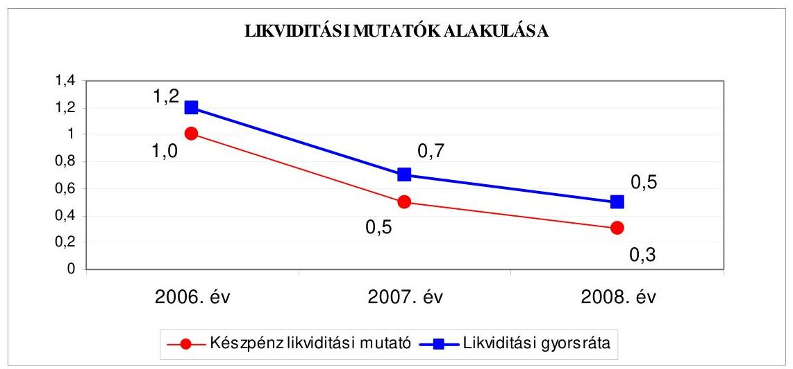

Az Önkormányzat fizetőképessége 2006-2008 között folyamatosan romlott, mert míg a pénzeszközök ${ }^{35}$ és a pénzeszközökön túl bevonható követelések év végi állománya a 2006. év végén fedezetet nyújtott a rövid lejáratú kötelezettségek kiegyenlítéséhez, addig a 2007. évben 70\%-ban, a 2008. év végén már csak 50\%-ban nyújtottak fedezetet a rövid lejáratú kötelezettségek finanszírozásához ${ }^{36}$.

A likviditás szempontjából különös jelentőséggel bír az a tény, hogy az Önkormányzat 1032 millió Ft összegű készpénzét 2008-ban hosszú lejáratú betétben helyezte el, és mint ilyen a számviteli nyilvántartásban befektetésnek minősül, ezért a likviditás számításánál figyelmen kívül marad.

A likviditási mutatók 2006-2008 közötti csökkenése jelzi, hogy az Önkormányzat pénzügyi helyzete - a 2006-2008. évek között - fizetőképességi szempontból kedvezőtlenül alakult, mivel a követelések és pénzeszközök együttes összege csökkenő arányban - a 2008. év végén 50\%-ban nyújtottak fedezetet a rövid lejáratú fizetési kötelezettségek pénzügyi teljesítésére.

Az Önkormányzat 2006-2008 közötti pénzügyi helyzete eladósodásának kismértékű fokozódása és fizetőképességének csökkenése miatt összességében kedvezőtlenül változott.

[^0]
[^0]:    ${ }^{35}$ A pénzeszközök 2008. év végi állománya nem tartalmazta a kötvénybevételből a hosszú lejáratú betétben elhelyezett, és ezért a befektetett pénzügyi eszközök között szereplő 1032 millió Ft-ot. A pénzeszközök év végi záró állományának 2006-2008 közötti 5283 millió Ft-os ( $79,4 \%$-os) csökkenését a 2006. évben kibocsátott kötvényből származó bevételből képzett tartalék múködési és felhalmozási célú költségvetési kiadásokra, finanszírozási célú pénzügyi műveletekre (hiteltörlesztés) történt felhasználása, illetve hosszú lejáratú betétben történt elhelyezése okozta.
    ${ }^{36}$ A rövid lejáratú kötelezettségek év végi állománya a 2006. évről a 2008. évre 1291 millió Ft-tal ( $19,8 \%$-kal) csökkent elsősorban a folyószámlahitelből 2000 millió Ft hosszú lejáratú hitellé alakításának, a szállítói tartozás év végi állománya folyamatos, 2484 millió Ft-ról 2661 millió Ft-ra, a tárgyévi költségvetést terhelő rövid lejáratú kötelezettségek állománya 21 millió Ft-ról 349 millió Ft-ra növekedésének eredményeként.

---

# 2. Az ÖNKORMÁNYZAT FELKÉSZÜLTSÉGE AZ EURÓPAI UNIÓs FORRÁSOK IGÉNYLÉSÉRE ÉS FELHASZNÁLÁSÁRA, VALAMINT AZ ELEKTRONIKUS KÖZSZOLGÁLTATÁSI FELADATOK ELLÁTÁSÁRA 

2.1. Az európai uniós források igénybevételére és a várható támogatás felhasználására történt felkészülés szabályozottságának, szervezettségének eredményessége

### 2.1.1. Az európai uniós forrásokra történő pályázatok benyújtására vonatkozó döntések összhangja a fejlesztési célkitűzésekkel

Az Önkormányzat a 2006-2009. évek fejlesztési célkitűzéseit helyzetelemzéssel alátámasztott gazdasági programban, városfejlesztési tervben, integrált városfejlesztési stratégiában, valamint az ágazati, szakmai, fejlesztési koncepciókban ${ }^{37}$ határozta meg.

A Közgyűlés a 2005. évben alkotta meg gazdasági programját, mely a 2006-2013. évekre tartalmazta azokat a fejlesztési célokat, melyeket az Önkormányzat a gazdasági szolgáltatások, a munkaerő, a tradícióra építő, egyúttal innovatív gazdaságfejlesztés, a turizmus és kultúra fejlesztése, a versenyképes agrártermelés kialakítása, valamint a komplex térségfejlesztés területén kívánt elérni. A Közgyűlés a gazdasági programját a 2006-2008. években nem módosította, mivel az abban megfogalmazott fejlesztési célok összhangban álltak az NFT-ben és az ÚMFT-ben meghatározott operatív programok prioritásaival. A gazdasági program a fejlesztési célkitűzések megvalósításának lehetséges pénzügyi forrásául a hazai, valamint az európai uniós forrásokat jelölte meg. A 2006-2008. években a Közgyűlés a költségvetési koncepció elfogadásával ${ }^{38}$ egyidejűleg évente a gazdasági programban foglaltakat megerősítette.

A Közgyűlés a 625/2006. (XII. 7.) számú határozatával fogadta el a városfejlesztési tervet, amely elemeiben az ÚMFT-hez és annak operatív programjaihoz illeszkedett és ennek megfelelően határozta meg a fejlesztések lehetséges forrásait, a saját forrás mellett megjelölve a befektetési forrásokat is. Célkitűzései a hosszú távú városfejlesztési koncepció időszakára, a 2007-2013. évekre vonatkoztak.

A fejlesztési terv célként jelölte meg a belváros rehabilitációját, az intézmények fejlesztését, a turisztikai, szabadidős feladatellátást, az infrastruktúra (ezen belül a közterületek, a csapadékvíz elvezető hálózat, az út- és kerékpárút-hálózat) fejlesztését, a lakásügyi feladatokat (ezen belül az építési telkek kialakítását, a szo-

[^0]
[^0]:    ${ }^{37}$ Hosszú távú városfejlesztési koncepció, Szociális szolgáltatástervezési koncepció, Közoktatási feladat-ellátási, intézményhálózat-múködtetési és fejlesztési terv, Egészséges Vásárhely Program.
    ${ }^{38}$ a Közgyűlés 632/2006. (XII. 13.) számú, 668/2007. (XI. 29.) számú, 599/2008. (XI. 27.) számú határozata

---

ciális lakásépítést, a lakótelepek rehabilitációját), az energetikai feladatokat, a környezetvédelmet, az ipari park fejlesztését és az egyházi épületek felújítását.

A Közgyűlés a 2008. évben alkotta meg az integrált városfejlesztési stratégiát ${ }^{39}$, amely összegezte az Önkormányzat addig elkészült stratégiáit, azokra építve elemezte a város helyzetét, a 2008-2013. évekre vonatkozóan megfogalmazta a település jövőképét, meghatározta célrendszerét, összhangban az ÚMFT-ben megfogalmazott operatív programok prioritásaival.

Az integrált városfejlesztési stratégia a település tematikus céljai között jelölte meg a közművelődési hagyományokra építve a kulturális és térségi közművelődési központi funkció kialakítását, az önkormányzati ellátórendszer modernizációját, a gazdaságfejlesztést, ezen belül a közlekedésfejlesztést, az ipari park bővítését, a turizmusfejlesztést, a közösségépítést. A stratégia anti-szegregációs beavatkozási tervet is tartalmazott.

Az Önkormányzat a 2006-2008. évek között európai uniós források és közösségi támogatások megszerzésére összesen 35 pályázat benyújtásáról döntött, amelyek közül 31-ben önállóan, további négy pályázat benyújtásában társpályázóként, partnerként vett részt. Az Önkormányzat által, vagy részvételével benyújtott pályázatok közül 16 (13 önálló, három társpályázóként) támogatásban részesült, 13 pályázatot elutasítottak, hat pályázat (öt önálló, egy társpályázóként) elbírálása még nem történt meg. A benyújtott pályázatok $46 \%$-a támogatott, $37 \%$-a elutasított volt. A pályázatokban szereplő célok összhangban voltak a gazdasági programban, városfejlesztési tervben, integrált városfejlesztési stratégiában, valamint az ágazati, szakmai, fejlesztési koncepciókban meghatározott célkitűzésekkel. A vizsgált időszakban benyújtott pályázatokon túlmenően a 2004-2005. években kezdeményezett pályázatok közül 12 fejlesztési feladat megvalósítása áthúzódott a 2006-2009. évekre, melyek közül öt az Önkormányzat intézményeinek pályázata volt.

A Polgármesteri hivatal által 2006. előtt benyújtott, de a vizsgált időszakra is áthúzódó pályázatok a következők voltak:

- a 2004. évben a GVOP 4.3.1. intézkedés keretében az „Elektronikus ügyfélszolgálat és korszerü térinformatikai megoldások bevezetés" című, 340 millió Ft összköltségű fejlesztés megvalósításához 249,8 millió Ft európai uniós, 40,7 millió Ft hazai támogatásban részesültek, az EU Önerő Alapból történő támogatás 24,9 millió Ft, a saját forrás 24,5 millió Ft volt;
- a HEFOP 2.2.1. intézkedés keretében a szociális területen dolgozó szakemberek képzésének 23,1 millió Ft költségéhez 16,5 millió Ft európai uniós, 5,5 millió Ft hazai támogatásban részesültek, a saját forrás 1,1 millió Ft volt;
- az AVOP 3.2.21. intézkedés keretében benyújtott négy pályázaton a külterületi utak építésének 228,1 millió Ft összköltségéhez 128,4 millió Ft európai uniós, 42,8 millió Ft hazai, 30,1 millió Ft EU Önerő Alapból történő támogatásban részesültek, a saját forrás 26,8 millió Ft volt;
- az AVOP 3.2.23. intézkedés keretében az 58,4 millió Ft összköltségű állatvásártér építéséhez 18,7 millió Ft európai uniós, 6,3 millió Ft hazai, 20 millió Ft EU

[^0]
[^0]:    ${ }^{39}$ a Közgyűlés 332/2008. (VI. 6.) számú határozata

---

Önerő Alapból történő támogatásban részesültek, a saját forrás 13,4 millió Ft volt.

Az intézmények által 2006. előtt benyújtott, de a vizsgált időszakra is áthúzódó pályázatok a következők voltak:

- a HEFOP 4.2.1. intézkedés keretében a 2004. évben a Hajléktalanokat ellátó egyesített intézmény által kezdeményezett, „Esélyt mindenkinek" című, hajléktalanok nappali melegedőjének bővítését, fejlesztését megvalósító 174,2 millió Ft összköltségű fejlesztés pénzügyi elszámolása még nem zárult le; a Pedagógiai és szociális szolgáltató központ intézményegysége által kezdeményezett, fogyatékossággal élők nappali intézményének kialakítását megvalósító „Együtt könnyebb" című, 189 millió Ft összköltségű projekt 2007. június 30 -án befejeződött;
- a HEFOP 3.1.3. intézkedés keretében a 2005. évben a kompetencia-alapú oktatásra való felkészülés céljából a Corvin Mátyás szakközépiskola „Kulcs Európába" címmel, az Eötvös József szakközépiskola „KOMPiskola" címmel, a József Attila általános iskola „Kulcs a jövöhöz" címmel benyújtott, egyenként 18 millió Ft kiadással tervezett programjai a 2008. évben befejeződtek, a „Kulcs a jövöhöz" című pályázat pénzügyi elszámolása még nem zárult le.

A Polgármesteri hivatal 2006. óta benyújtott pályázatai az alábbiak voltak:

- a HEFOP 2.1.5. intézkedés keretében a 2006. évben benyújtott és a 2008. évben megvalósított „Kéz a kézben" címú, a halmozottan hátrányos helyzetú tanulók iskolai esélyegyenlőségének megteremtését célzó pályázaton az Önkormányzat, mint főkedvezményezett és 11 intézménye, mint kedvezményezettek 35,5 millió Ft európai uniós, 11,8 millió Ft hazai támogatásban részesült. A projekt 2008. március 31 -én befejeződött, pénzügyi elszámolása még nem zárult le, benyújtásának tervezett határideje 2008. június 30. volt;
- az EGT és a Norvég Finanszírozási Mechanizmus keretében a 2006. évben az Önkormányzat „Környezetvédelem - Környezetvédelmi oktatás: Regionális környezeti nevelő központ kialakítás a Mártélyi Tájvédelmi Körzet területén" címmel nyújtott be pályázatot 292,2 ezer euró ( 80,4 millió Ft) elnyerése érdekében. A projekt tervezett teljes kiadása 511,4 ezer euró ( 140,7 millió Ft), a pályázatot támogatásra érdemesnek ítélték, a támogatási szerződést még nem kötötték meg;
- a HEFOP 2.1.1. intézkedés keretében a 2006. évben „Együtt a holnapért" címen, 20 millió Ft európai uniós támogatás elnyerése érdekében benyújtott pályázatot a szakmai kidolgozottság hiányosságai miatt utasították el;
- a DAOP 3.1.2. intézkedés keretén belül a 2007. évben a Többcélú Társulás által benyújtott pályázaton a „Hódmezővásárhely és Mindszent településeket összekötő közlekedési kerékpárút építése" című fejlesztés Hódmezővásárhely és Mindszent Önkormányzatainak összefogásával valósult meg a 2009. évben. A projekt tervezett kiadása 288,9 millió Ft, a kapott európai uniós támogatás 260 millió Ft, a saját forrás 28,9 millió Ft volt, amelyből a Hódmezővásárhelyre jutó saját forrás 11,1 millió Ft volt. A pénzügyi elszámolás még nem zárult le, benyújtásának tervezett határideje 2009. január 15. volt;
- a DAOP 3.1.1. intézkedés keretében az Önkormányzat a 2007. évben benyújtott pályázaton „A Hód-Ipari parkot és a 47-es föközlekedési utat összekötő külterületi út építése" című projekt megvalósításának 649,5 millió Ft kiadásához 552,1 millió Ft európai uniós támogatást kapott, a saját forrás 97,4 millió Ft volt. A fejlesztés megvalósítása folyamatban van, várható befejezési időpontjaként 2009. december 31-ét határozták meg;

---

- a DAOP 1.1.1/A. intézkedés keretében az Önkormányzat a 2007. évben benyújtott pályázatban a „Hódmezővásárhely Ipari parkban iparvágány épitése" című projekt megvalósításának 548,2 millió Ft kiadásához 248,9 millió Ft európai uniós támogatást kapott, a saját forrás 299,3 millió Ft volt. A fejlesztés megvalósítása folyamatban van, tervezett befejezési időpontjául 2010. december 13-át jelölték ki;
- a DAOP 4.3.1. intézkedés keretében a 2007. évben négy pályázatot utasítottak el: az Önkormányzat „Hódmezővásárhely, Corvin Mátyás szakközépiskola akadálymentesítése" című, 16,7 millió Ft összköltségű fejlesztéshez 15 millió Ft európai uniós támogatást igényelt, a pályázatot annak tartalmi hiányosságai miatt utasították el; a „Hódmezővásárhely, Liszt Ferenc általános iskola akadálymentesítése" című, 16,7 millió Ft összköltségű fejlesztéshez 15 millió Ft európai uniós támogatást igényelt, a pályázatot azért utasították el, mert az nem felelt meg a pályázati feltételeknek; a „Hódmezővásárhely, Brunszvik Teréz Óvoda akadálymentesítése" című, 12 millió Ft összköltségű fejlesztéshez 10 millió Ft európai uniós támogatást igényelt, a pályázatot formai hiányosság miatt utasították el; a „Hódmezővásárhely, Erzsébet Kórház-Rendelőintézet B épületének akadálymentesítése" című, 16,7 millió Ft összköltségű fejlesztéshez 15 millió Ft európai uniós támogatást igényelt, a pályázatot a szakmai kidolgozottság hiányosságai miatt utasították el;
- a KEOP 1.2.0/1F intézkedés keretében a 2008. évben „Hódmezővásárhely városrészeinek szennyvíz tisztítása és elvezetése, csatornahálózat kiépítése" címmel pályázott az Önkormányzat 104,2 millió Ft összköltségű fejlesztéshez 66,5 millió Ft európai uniós támogatás elnyerése érdekében. A pályázatot elutasították, mert az nem felelt meg a pályázati feltételeknek;
- a DAOP 4.2.1. intézkedés keretében az Önkormányzat a 2008. évben benyújtott pályázatban „A Varga Tamás Általános Iskola felújítása és teljes körú akadálymentesítése" című projekt megvalósításának 245,9 millió Ft kiadásához 221,4 millió Ft európai uniós támogatást kapott, a Közgyűlés vállalta a 24,5 millió Ft összegű önerőt. A támogatási szerződést még nem kötötték meg;
- a DAOP 4.2.1. intézkedés keretében a 2008. évben három pályázatot elutasítottak: az Önkormányzat „A Tornyai János múzeum látogatóbarát fejlesztése" című programot 299,5 millió Ft kiadással tervezte megvalósítani, amelyhez 254,6 millió Ft európai uniós forrást igényelt. A pályázatot tartalmi hiányosság miatt utasították el; az Önkormányzat „A Szent István utcai iskola főépületének felújítása, bővítése és akadálymentesítése" című fejlesztést 556 millió Ft kiadással tervezte megvalósítani, amelyhez 500 millió Ft európai uniós forrásra benyújtott pályázatát, valamint a „Hódmezővásárhely, Exner Leó Óvoda felújítása és akadálymentesítése" című, 222,3 millió Ft kiadást igénylő fejlesztéshez 200 millió Ft európai uniós forrásra benyújtott pályázatát azért utasították el, mert a pályázati keretösszeg kimerült;
- a DAOP 2.1.1./B. intézkedés keretében a 2008. évben benyújtott pályázatokon az Önkormányzat a „Hódmezővásárhelyi Emlékpont időszaki kiállítás látogatóbarát fejlesztése" című projekt 198 millió Ft költségéhez 159,4 millió Ft európai uniós támogatásban részesült, a saját forrás 38,6 millió Ft volt. A fejlesztés tervezett befejezési időpontja 2010. március 31.; a DAOP 2.1.1./E intézkedés keretében a „Hódmezővásárhely aktív turisztikai fejlesztése a Mártélyi Üdülőterületen és a kapcsolódó kerékpárút mentén" című projekt 50 millió Ft összegű kiadását 25 millió Ft európai uniós támogatás és 25 millió Ft saját forrás fedezte. A fejlesztés tervezett befejezési időpontjaként 2009. szeptember 30-át határozták meg;

---

- a DAOP 2.1.1. intézkedés keretében a 2008. évben az Önkormányzat a „Népi épitészeti mesterség-történeti kiállítóhelyek turisztikai célú, látogatóbarát fejlesztése Hódmezővásárhelyen" című projektet 292,6 millió Ft kiadással tervezte megvalósítani, amelyhez 247,7 millió Ft európai uniós forrásra pályázott. A pályázatot elutasították, mert az nem felelt meg a pályázati feltételeknek;
- az INTERREG-IV.C intézkedés keretében a 2008. évben nyújtott be pályázatot az Önkormányzat, mint vezető partner további 11 külföldi önkormányzattal közösen a „CeRamICa - Kerámiai és népi kismesterségek fejlesztésének együttmüködési programja" címmel a kulturális örökség megőrzése, a helyi gazdaság fejlesztése, munkahelyek teremtése céljából. A támogatási szerződés alapján az Önkormányzat részaránya 480,6 ezer euró ( 125,8 millió Ft), amelyből 408,5 ezer euró ( 106,9 millió Ft) az Önkormányzatra eső európai uniós támogatás, 18,9 millió Ft a saját forrás. A fejlesztés megvalósítása folyamatban van, tervezett befejezési időpontjául 2011. szeptember 30-át jelölték ki;
- a DAOP 3.1.2. intézkedés keretén belül a 2008. évben a Többcélú Társulás a „Hódmezővásárhelyi Kistérségi közösségi közlekedés fejlesztése" című, 211,4 millió Ft költségű fejlesztéshez 190,2 millió Ft európai uniós támogatásban részesült. A projekt megvalósítását a Többcélú Társulás Önkormányzatainak összefogásával tervezték, a Hódmezővásárhelyre jutó saját forrás 17,8 millió Ft. A fejlesztés megvalósítása folyamatban van, tervezett befejezési időpontjaként 2010. március 31-ét határozták meg;
- a TIOP 1.1.1. intézkedés keretében a 2008. évben benyújtott pályázatban az Önkormányzat „Intelligens iskolarendszer megvalósítása" című fejlesztéshez 107 db iskolai munkaállomás, 89 db tantermi csomag, 9 db szerver csomag, 6 db szavazó csomag, 5 db kiegészítő SNI IKT csomag eszköz természetbeni beszerzését igényelte. A pályázatot támogatásra érdemesnek ítélték, a támogatási szerződést még nem kötötték meg;
- a DAOP 5.2.1./A. intézkedés keretében a 2008. évben benyújtott pályázaton az Önkormányzat a „Belterületi belvíz és csapadékvíz elvezetés támogatása" című fejlesztés 87,3 millió Ft költségéhez 74,2 millió Ft európai uniós, 4,4 millió Ft hazai támogatásban részesült, a saját forrás 8,7 millió Ft volt. A fejlesztés megvalósítása folyamatban van, tervezett befejezési időpontjaként 2009. december 31-ét határozták meg;
- a HEFOP 2.1.9. intézkedés keretében az Önkormányzat a 2008. évben benyújtott, „Kéz a kézben nyáron" című program megvalósítására a halmozottan hátrányos helyzetű gyermekek nyári táboroztatásának 8,8 millió Ft kiadásához 6,6 millió Ft európai uniós, 2,2 millió Ft hazai támogatásban részesült. A projekt 2008. szeptember 30-án befejeződött;
- a TIOP 1.2.1. intézkedés keretében a 2008. évben benyújtott pályázatban az Önkormányzat „Mindennap kultúra - Petőfi Müvelődési Központ felújítása és bővítése" című, 1547,6 millió Ft összköltségű projekt megvalósításához 1430,7 millió Ft európai uniós támogatást igényelt. A pályázatot még nem bírálták el;
- a KEOP 1.2.0/1F. intézkedés keretében a 2008. évben az Önkormányzat a „Hódmezővásárhely városrészeinek szennyvíz tisztítása és elvezetése, csatornahálózat kiépítése" című fejlesztést 104,2 millió Ft kiadással tervezte megvalósítani, amelyhez 88,6 millió Ft európai uniós forrásra pályázott. A pályázatot a szakmai kidolgozottság hiányosságai miatt utasították el;
- a KEOP 6.2.0/A. intézkedés keretében a 2008. évben az Önkormányzat „Kerékpártároló kialakítása Hódmezővásárhelyen" című fejlesztést 8,7 millió Ft kiadással tervezte megvalósítani, amelyhez 7,8 millió Ft európai uniós forrásra pá-

---

lyázott. A pályázatot a szakmai kidolgozottság hiányosságai miatt utasították el;

- a KEOP 6.2.0/B. intézkedés keretében a 2008. évben az Önkormányzat „Tudatos fogyasztói magatartás és életmód kialakítása, megerősítése Hódmezővásárhelyen, a Németh László iskola segítségével" című projektet 189 millió Ft kiadással tervezte megvalósítani, amelyhez 157 millió Ft európai uniós forrásra pályázott. A pályázatot a szakmai kidolgozottság hiányosságai miatt utasították el;
- az ÁROP 1.A.2/B. intézkedés keretében a 2008. évben benyújtott pályázaton az Önkormányzat „Hódmezővásárhely Megyei Jogú Város Polgármesteri hivatal szervezetfejlesztése" című projekt 55,6 millió Ft összegű kiadásához 50 millió Ft európai uniós támogatásban részesült, a saját forrás 5,6 millió Ft volt. A fejlesztés megvalósítása folyamatban van, tervezett befejezési időpontjaként 2010. április 30 -át határozták meg;
- a TIOP 2.2.2. intézkedés keretében a 2008. évben benyújtott pályázatban az Önkormányzat „Az Erzsébet Kórház-Rendelőintézet sürgősségi fogadóhelyének fejlesztése sürgősségi osztályá" című projekt 284,6 millió Ft összegű kiadáshoz 256,1 millió Ft európai uniós támogatást igényelt, a Közgyűlés a szükséges önerőt vállalta. A pályázatot még nem bírálták el;
- a ROP KIEPR-2008-0008. kiemelt program keretében a 2008. évben benyújtott pályázatban az Önkormányzat a „Tornyai János Kulturális Városrehabilitáció" című fejlesztés 1081 millió Ft összegű kiadásához 860 millió Ft európai uniós támogatást igényelt, a Közgyűlés a szükséges önerőt vállalta. A pályázatot még nem bírálták el;
- a TÁMOP 5.2.5. intézkedés keretében a 2008. évben benyújtott pályázaton az Önkormányzat a „Hódmezővásárhelyi összefogás a drog prevencióért" című projekt 16,3 millió Ft kiadásának teljes összegéhez európai uniós támogatásban részesült. A program megvalósítása folyamatban van, tervezett befejezési időpontjaként 2010. február 2-át határozták meg;
- a TÁMOP 3.3.2. intézkedés keretében a 2008. évben az Önkormányzat és a Többcélú Társulás közösen nyújtott be pályázatot „Együtt, hogy jobb legyen esélyegyenlőségi programok végrehajtásának támogatása" címmel 100 millió Ft európai uniós támogatás elnyerése érdekében, amely a projekt tervezett teljes kiadásának felelt meg. A pályázatot még nem bírálták el;
- a DAOP 3.1.1. intézkedés keretében a 2008. évben benyújtott pályázatban az Önkormányzat a „Belterületi gyüjtő utak korszerüsitése a Belvárosban és Csúcs városrészben" című fejlesztés 309,8 millió Ft összegű kiadásához 201,4 millió Ft európai uniós támogatást igényelt. A pályázatot befogadták, elbírálása még nem történt meg;
- a KEOP 1.2.0./1F. intézkedés keretében a 2008. évben benyújtott pályázaton az Önkormányzat a „Kishomok városrész szennyvízcsatornázása" című fejlesztés 49,3 millió Ft kiadásához 37 millió Ft európai uniós támogatást kapott, a Közgyűlés a szükséges önerőt vállalta. A támogatási szerződés még nem kötötték meg;
- a TÁMOP 3.1.4. intézkedés keretében a 2008. évben benyújtott pályázatban az Önkormányzat a „Kompetencia alapú oktatás, egyenlő hozzáférés Hódmezővásárhely közoktatási intézményeiben" című projekt megvalósításához 147 millió Ft európai uniós támogatást igényelt, amely a projekt tervezett teljes kiadásának felelt meg. A pályázatot még nem bírálták el.

---

Az Önkormányzat 2006-2008. évi költségvetési rendeletei - az Áht. 69. § (1) bekezdésében előírtakat megsértve - nem tartalmazták a HEFOP 3.1.3. intézkedés keretében a kompetencia-alapú oktatásra való felkészülés céljából a Corvin Mátyás szakközépiskolában a „Kulcs Európába" címmel, az Eötvös József szakközépiskolában a „KOMPiskola" címmel, a József Attila általános iskolában a „Kulcs a jövőhöz" címmel megvalósult projektek egyenként 18 millió Ft kiadási, valamint pályázatonként 13,5 millió Ft európai uniós és 4,5 millió Ft hazai támogatás bevételeit. A 2009. évi költségvetési rendelet már bemutatta valamennyi, európai uniós támogatással megvalósuló múködési és felhalmozási feladat kiadási és bevételi előirányzatát.

A 2006. és a 2007. évi költségvetési rendeletek - az Ámr. 29. § (1) bekezdés d) pontjában előírtak ellenére - nem tartalmazták feladatonként az európai uniós forrással megvalósuló következő fejlesztési feladatok kiadásait:

- a 2006. évi költségvetési rendelet nem tartalmazta az AVOP 3.2.21. „Mezőgazdasághoz kötődő infrastruktúra fejlesztése" intézkedés keretében megvalósuló négy útépítési projekt, az AVOP 3.2.23. intézkedés keretében a „Hódmezővásárhelyen állatvásártér építése" című fejlesztés kiadásait feladatonként; a HEFOP 3.1.3. intézkedés keretében a kompetencia-alapú oktatásra való felkészülés céljából a Corvin Mátyás szakközépiskolában a „Kulcs Európába" címmel, az Eötvös József szakközépiskolában a „KOMPiskola" címmel, a József Attila általános iskolában a „Kulcs a jövőhöz" címmel megvalósult projektek felhalmozási kiadásait feladatonként;
- a 2007. évi költségvetési rendelet nem tartalmazta az AVOP 3.2.21. „Mezőgazdasághoz kötődő infrastruktúra fejlesztése" intézkedés keretében megvalósuló négy útépítési projekt felhalmozási kiadásait feladatonként, valamint a HEFOP 3.1.3. intézkedés keretében a kompetencia-alapú oktatásra való felkészülés céljából a Corvin Mátyás szakközépiskolában a „Kulcs Európába" címmel, az Eötvös József szakközépiskolában a „KOMPiskola" címmel, a József Attila általános iskolában a „Kulcs a jövőhöz" címmel megvalósult projektek felhalmozási kiadásait feladatonként.

A 2007. évi és a 2009. évi költségvetési rendeletekben - az Áht. 118. § (1) bekezdés 2. b) pontjában és az Ámr. 29. § (1) bekezdés g) pontjában foglalt előírás ellenére - nem mutatták be valamennyi, európai uniós támogatással megvalósuló, többéves kihatással járó feladat bevételi és kiadási előirányzatait éves bontásban ${ }^{40}$.

A 2007. évi költségvetési rendelet nem tartalmazta a HEFOP 3.1.3. intézkedés keretében a kompetencia-alapú oktatásra való felkészülés céljából a Corvin Mátyás szakközépiskolában a „Kulcs Európába" címmel, az Eötvös József szakközépiskolában a „KOMPiskola" címmel, a József Attila általános iskolában a „Kulcs a jövő-

[^0]
[^0]:    ${ }^{40}$ A közbenső egyeztetés során a polgármester és a jegyző által adott észrevétel szerint az Önkormányzat a 27/2009. (IX. 5.) számú rendeletével módosította a 2009. évi költségvetését. „A módosítással beépítésre került a 13. számú melléklet, mely éves bontásban, kiemelt előirányzatonként és feladatonként tartalmazza az Európai Uniós forrásból megvalósuló valamennyi projektet, illetve az azokhoz történő hozzájárulást."

---

höz" címmel megvalósult projektek 2008. évre áthúzódó bevételi és kiadási előirányzatait.

A 2009. évi költségvetési rendelet nem tartalmazta az INTERREG-IV.C intézkedés keretében megvalósuló „CeRamICa - Kerámiai és népi kismesterségek fejlesztésének együttmüködési programja" című projekt előirányzatait, valamint a TÁMOP 5.2.5. intézkedés keretében megvalósuló „Hódmezővásárhelyi összefogás a drog prevencióért" című projekt bevételi és kiadási előirányzatait.

A 2006-2009. évi költségvetési rendeletek - az Ámr. 29. § (1) bekezdés k) pontjában előírtak ellenére - nem elkülönítetten tartalmazták az európai uniós támogatással megvalósuló programok, projektek bevételeit és kiadásait, valamint az Önkormányzaton kívüli ilyen projektekhez történő hozzájárulásokat.

A támogatásban részesült pályázatok, projektek tervezett és teljesített kiadásait, a kiadásokat finanszírozó forrásokat a jelentés 4. számú melléklete (tanúsítvány) tartalmazza ${ }^{41}$.

Az Önkormányzatnál az európai uniós forrásokkal támogatott, befejezett fejlesztési feladatok 2006-2008 közötti finanszírozási forrásainak tervezett és tényleges megoszlását a következő ábra mutatja:
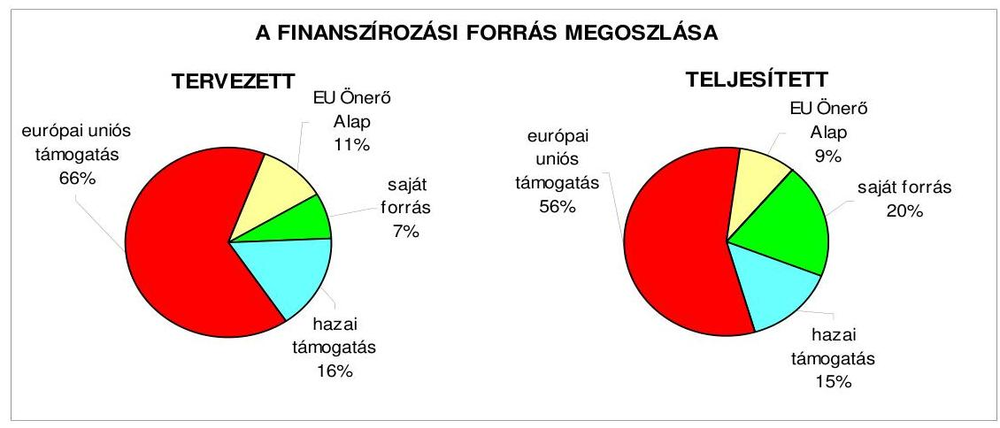

A befejezett fejlesztési feladatok teljesített kiadásai és a fedezetüket biztosító források a tervezetthez képest 110,3\%-ban teljesültek. A 2006-2008 között teljesített európai uniós támogatás $10 \%$-kal, az EU Önerő Alap támogatása $2 \%$-kal volt kevesebb a tervezettnél. Az eltérést a 2006. év előtt megkezdett 10 programnál az okozta, hogy az Önkormányzat a 2005. évben támogatási előlegben részesült. A vizsgált időszakban a saját forrás aránya a tervezett 7\%-ról a teljesítés során 20\%-ra növekedett, melyet részben a projektekhez kapcsolódó, de a pályázatban nem támogatott kiadás okozott, részben a támogatások folyósításának lebonyolítás alatt történt - évek közötti - átütemezése miatt következett be.

[^0]
[^0]:    ${ }^{41}$ A 2006. év előtt kezdeményezett fejlesztések tervezett és teljesített költségvetési kiadásai és az azokat finanszírozó források a 4. számú tanúsítványban a vizsgált időszakra eső arányos összeggel szerepelnek.

---

# 2.1.2. Az európai uniós forrásokhoz kapcsolódóan a pályázatfigyelés, a pályázatkészítés, valamint az európai uniós támogatással megvalósuló fejlesztés lebonyolítása belső rendjének szabályozottsága, a végrehajtás személyi, szervezeti feltételei, az ellenőrzési feladatok meghatározása 

Az Önkormányzatnál a 2006-2009. években az uniós források igénybevételének és felhasználásának feladatait a Polgármesteri hivatal ügy-rend ${ }_{1,2}$-je határozta meg, pályázati szabályzattal az Önkormányzat nem rendelkezett.

#### Abstract

A jegyző 2009. április 7-i hatállyal adta ki az európai uniós támogatások pénzügyi lebonyolításáról és elszámolásáról szóló szabályzatot, mely a pénzkezelésről, finanszírozásról, kifizetésről, a projekt költségeinek, kiadásainak elszámolásáról tartalmaz rendelkezéseket, nem szabályozza azonban az európai uniós forrásokhoz kapcsolódóan a pályázatfigyelés, pályázat-készítés, valamint az európai uniós forrással megvalósuló fejlesztés lebonyolításának belső eljárási rendjét.

A Polgármesteri hivatalon belül az önkormányzati szintű pályázatkoordinálás feladatainak felelőseként a Polgármesteri hivatal ügyrend ${ }_{1}$-je a Városstratégiai irodát, a Polgármesteri hivatal ügyrend ${ }_{2}$-je a Városfejlesztési és üzemeltetési irodát jelölte ki. A szabályozás kiterjedt a pályázatfigyelést végzők és a döntési jogkörrel rendelkezők közötti információ-szolgáltatási kötelezettség előírására, ezt az érintett köztisztviselők munkaköri leírása is tartalmazta.

A kijelölt irodák feladata volt a Polgármesteri hivatal szervezeti egységeinek tájékoztatása az aktuális pályázati és forráslehetőségekről, az információáramlás biztosítása a döntéshozók felé, a pályázati kiírások figyelése, a pályázati javaslatok megtétele érdekében kapcsolattartás az érintett más irodákkal, intézményekkel.

A Polgármesteri hivatalon belül az önkormányzati szintű pályázat-nyilvántartás vezetésének felelősét nem jelölték ki.

A Polgármesteri hivatal ügyrend ${ }_{1,2}$-jében meghatározták az európai uniós forrásokra irányuló pályázatfigyelés, pályázatkészítés eljárási rendjét, az érintett köztisztviselők munkaköri leírásában szerepelt a feladat meghatározása, a kapcsolattartási, információ-áramlási kötelezettség előírása.

A Polgármesteri hivatal ügyrend ${ }_{1,2}$-je alapján a kijelölt iroda feladata volt a pályázatkészítés körében „a fejlesztési projektek kidolgozása és koordinálása, ehhez szükség szerint az érintett irodákkal és városi intézményekkel a kapcsolattartás, a múszaki paraméterek és tervezési feladatok meghatározása a Müszaki irodával közösen, a beruházások pénzügyi finanszírozásának és ütemezésének meghatározása a Közgazdasági irodával közösen, kapcsolattartás a területfejlesztés megyei, regionális, és országos szerveivel és az uniós támogatások koordinációját végző szervekkel".

A Polgármesteri hivatal ügyrend ${ }_{1,2}$-je nem határozta meg az európai uniós forrásokkal támogatott fejlesztés lebonyolításával kapcsolatos eljárási rendet. A projekt megvalósítására vonatkozóan a feladatokat, a hatásköröket, a kapcsolattartás és az információáramlás rendjét a 2006-2009. években a fejlesztési feladat megvalósításában résztvevő köztisztviselők munkaköri leírásai előírták.

---

A 2006-2008. években a Városfejlesztési és üzemeltetési iroda hat köztisztviselőjének munkaköri leírása tartalmazta a projektek megvalósítására vonatkozó lebonyolítási, elszámolási, beruházás ellenőrzési, kapcsolattartási kötelezettséget.

A Polgármesteri hivatalnál a pályázatok - köztük az európai uniós forrásokkal támogatott fejlesztési feladatok - lebonyolításával kapcsolatos FEUVE előírásokat az ellenőrzési nyomvonal tartalmazta. Belső ellenőrzési stratégiát megalapozó kockázatelemzés nem készült, így nem értékelték az európai uniós forrásokkal támogatott fejlesztési feladatok kockázati tényezőit.

Az Önkormányzatnál a 2006-2009. években az európai uniós forrásokra irányuló pályázatfigyelés személyi, szervezeti feltételeit a Polgármesteri hivatal szervezetén belül kialakították, a feladat három köztisztviselő munkaköri leírásában szerepelt. Ezen felül az Önkormányzat a 2004. évben egy gazdasági társasággal határozatlan idejű megbízási szerződést kötött a pályázatfigyelési feladatok ellátására. A szerződésben előírták a feladatellátás kötelezettségeit, a megbízott gazdasági társaság és a Polgármesteri hivatal köztisztviselői közötti kapcsolattartást, az információk átadásának formáját, tartalmát, módját. A megbízási szerződésben azonban indokoltsága ellenére a felelősség szabályait nem rögzítették.

A pályázatkészítés személyi, szervezeti feltételeit a 2006-2009. években a Polgármesteri hivatal szervezetén belül biztosították, a feladat a 2006. évben három, a 2007-2009. években hat köztisztviselő munkaköri leírásában szerepelt. Az Önkormányzat a 2006-2008. években pályázatkészítésre külső szervezettel 11 esetben kötött megbízási, illetve vállalkozási szerződést. A szerződésekben előírták a feladatellátás kötelezettségeit, a gazdasági társaságok képviselői és a Polgármesteri hivatal köztisztviselői közötti kapcsolattartást, az információk átadásának formáját, tartalmát, módját, a felelősség szabályait.

Az Önkormányzatnál a 2006-2009. években az európai uniós támogatással megvalósuló fejlesztési feladatok lebonyolításának szervezeti és projektenkénti személyi feltételeit a Polgármesteri hivatalon belül biztosították. A Polgármesteri hivatalban három köztisztviselő munkaköri leírásában szerepelt a nevesített fejlesztési feladatok lebonyolításában való részvétel, négy köztisztviselő munkaköri leírásában a projektmenedzseri feladatok ellátásának általános kötelezettsége.

A munkaköri leírásokban rögzített lebonyolítási feladatokon felül egy köztisztviselő egyedi, határozott idejű megbízási szerződés alapján látta el a DAOP 2007-2.1.1./E. intézkedés keretében a „Hódmezővásárhely aktív turisztikai fejlesztése a Mártélyi Üdülőterületen és a kapcsolódó kerékpárút mentén" című nyertes pályázat projektmenedzseri feladatait.

Az Önkormányzat a 2006-2008. években a projektek lebonyolítására külső magánszeméllyel kettő esetben kötött megbízási szerződést, külső szervezettel további kettő projekt lebonyolítására kötött vállalkozási szerződést. A fejlesztés lebonyolítására kötött három szerződésben meghatározták a kapcsolattartás rendjét, valamennyi szerződésben előírták a feladatellátás kötelezettségét. A szerződésekben az ellenőrzés rendjét és a személyre szóló felelősségi szabályokat nem rögzítették.

---

# 2.1.3. A fejlesztési feladat lebonyolításánál a feladatellátás rendjére, az ellenőrzési feladatok teljesítésére, valamint a felelősségi szabályokra vonatkozó előírások betartása 

A GVOP 4.3.1. Szolgáltató önkormányzat intézkedés keretében az Önkormányzat 2004. június 2-án nyújtott be pályázatot „Elektronikus ügyfélszolgálat és korszerü térinformatikai megoldások bevezetése" címmel 342,9 millió Ft értékű fejlesztés megvalósításához, melyhez 300 millió Ft európai uniós támogatást igényelt. A Közgyűlés a 42,9 millió Ft önerőt a 466/2004. (VII. 8.) számú határozatában vállalta.

A támogatási szerződést 2005. szeptember 1-én kötötte meg az Önkormányzat, amely alapján a 332 millió Ft összköltségű fejlesztési feladat finanszírozásához a támogató 290,5 millió Ft vissza nem térítendő támogatást nyújtott. A támogatás mértéke a projekt összköltségének 87,5\%-a volt, melyből $86 \%$, azaz 249,8 millió Ft volt az európai uniós támogatás, $14 \%$, azaz 40,7 millió Ft volt a hazai társfinanszírozás. Az Önkormányzat 2005. október 26-án pályázatot nyújtott be az EU Önerő Alaphoz, amelyből a 2006. április 7-én megkötött támogatási szerződés alapján 24,9 millió Ft támogatásban részesült. Az Önkormányzat saját forrása 16,6 millió Ft volt. A projekt megvalósítása 2007. május 31-én befejeződött, pénzügyi elszámolása azonban csak 2009. január 15-én zárult le a közreműködő szervezet értesítőlevelével.

A támogatási szerződésben a projekt megvalósításának kezdő napját 2005. szeptember 2-ában, befejezésének tervezett időpontját 2007. február 28-ában, az utolsó kifizetési kérelem benyújtásának határidejét 2007. április 12-ében határozták meg. A támogatási szerződés előírta a támogatás igénybevételének a 2005-2007. évek közötti ütemezését ${ }^{42}$.

A támogatási szerződést három alkalommal módosították:

- a támogatási szerződést első alkalommal 2005. október 28-án az Önkormányzat kezdeményezésére módosították, mert az Önkormányzat támogatási előleg nyújtását kérte. A támogatási előleg a teljes támogatási összeg 25\%-a, azaz 72,6 millió Ft volt, melyet 2005. december 5-én folyósított a közreműködő szervezet;
- a 2007. március 21-én benyújtott második módosítási kérelemben az Önkormányzat a projekt befejezési dátumának módosítását kezdeményezte 2007. március 31-ére, arra hivatkozással, hogy a műszaki átadás eredetileg tervezett időpontja néhány, időközben felmerült további fejlesztési igény miatt nem tartható. A támogatási szerződést 2007. június 26-án módosították, a projekt befejezésének tervezett időpontját 2007. május 31. napjában, az utolsó kifizetési kérelem benyújtásának határidejét 2007. július 15. napjában határozták meg;
- a támogatási szerződést harmadik alkalommal a közreműködő szervezet 2007. november 22-én megküldött kezdeményezésére 2008. április 28-án módosították. A módosítás alapján a projekt befejezésének tervezett napja

[^0]
[^0]:    ${ }^{42}$ A támogatás tervezett évenkénti ütemezése a 2005-2006-2007. években: 12,5-116,3203,1 millió Ft, a támogatás tényleges évenkénti üzemezése a módosított támogatási szerződés alapján a 2005-2006-2007. években 8,1-214,9-67,5 millió Ft volt.

---

2007. szeptember 2-ára módosult, az utolsó kifizetési kérelem benyújtásának határidejét 2007. október 17. napjában határozták meg, a tényleges folyósításoknak megfelelően módosult továbbá a támogatás igénybevételének a 2005-2007. évek közötti ütemezése.

# A fejlesztési feladat kezdési és befejezési határidők közötti megvalósításáról, a kapcsolattartásról a Polgármesteri hivatal ügyrend ${ }_{1,2}$-je által kijelölt iroda köztisztviselője a munkaköri leírásában, valamint a polgármester által kiadott projektvezetői kijelölésben foglaltak szerint gondoskodott. 

A fejlesztési feladat megvalósítása a támogatási szerződésben rögzített időpontban kezdődött meg. A módosított támogatási szerzödésben meghatározott ütemezésnek megfelelően haladt a fejlesztés kivitelezése, a projekt előrehaladási jelentések, valamint a kifizetési kérelmek benyújtása. A projekt megvalósítása során az Önkormányzat négy projekt előrehaladási jelentéshez nyújtott be kifizetési kérelmet, ezen felül a zárójelentéssel együtt hat alkalommal nyújtott be projekt előrehaladási jelentést. A közremúködő szervezet valamennyi kifizetési kérelem benyújtását követően hiánypótlásra szólította fel az Önkormányzatot, melyek elsősorban a benyújtott számlákhoz tartozó termékek feltüntetésére, a számlák és számlaösszesítők szabályos aláírására, az igénybevett szolgáltatások pótlólagos megbontására vonatkoztak. A közreműködő szervezet minden esetben elfogadta a határidőben teljesített hiánypótlásokat.

A támogatás igénybevétel tervezett ütemezésének tartását az európai uniós támogatás kifizetésének igénylésénél a projekt előrehaladási jelentés felülvizsgálata, valamint a támogatás kifizetésének igénylését alátámasztó számlák, bizonylatok ellenőrzésének észrevételei hátráltatták, mivel a kifizetési kérelmek benyújtása és annak folyósítása között eltelt időtartam 98 és 156 nap között volt. A közreműködő szervezet csak a kifizetési kérelmek benyújtását követő 55-75 nap elteltével szólította fel hiánypótlásra az Önkormányzatot, majd annak határidőben történt teljesítését követően kettő kifizetési kérelem esetében további 69, illetve 78 nap múlva folyósította a támogatást. (A kifizetési kérelmek adatainak összegzését az 5. számú melléklet tartalmazza.)

A fejlesztési feladat megvalósításához az Önkormányzat a 2005-2007. évi költségvetéseiben a saját forrást biztosította, a kiadások finanszírozásához hitelt nem vett fel. Az Önkormányzat eleget tett a megelőlegezés követelményének, a fejlesztés utófinanszírozási rendszere nem okozott pénzügyi zavarokat. A projekt műszaki megvalósítása 2007. május 31-én befejeződött, a támogatási szerződésben rögzített célok és indikátorok teljesültek.

Az Önkormányzat a 2005-2006-2007. évi költségvetéseiben 327,4-122,2244,5 millió Ft összegben tervezte a projekt kiadási előirányzatát, a teljesített kiadás az évek sorrendjében 11,7-130-230,6 millió Ft volt, összesen 372,3 millió Ft. A projekt keretében elszámolható, teljesített kiadásának összege 339,9 millió Ft volt. Ezen túlmenően az Önkormányzat 32,4 millió Ft összegben a projekt keretében el nem számolható szoftver-fejlesztést valósított meg, továbbá szakmai tanácsadást vett igénybe, melyek az iktató- és a térinformatikai rendszer múködte-

---

téséhez, a korábbi és a fejlesztéssel megvalósított rendszer közötti átjárhatóság biztosításához elengedhetetlenek voltak.

A Közgyűlés az európai uniós támogatással megvalósuló fejlesztés állásáról, a projektben meghatározott célok és feladatok teljesüléséről évente ${ }^{43}$ tájékoztatást kapott.

A Polgármesteri hivatalnál a fejlesztés kiadásaival és bevételeivel összefüggő folyamatba épített, előzetes és utólagos vezetői ellenőrzési feladatokat a gazdálkodási jogkörök szabályzatában előírtak szerint végezték el, a kötelezettségvállalás, utalványozás ellenjegyzése, a szakmai teljesítés igazolása, valamint az érvényesítési jogkörök gyakorlása megfelelően múködött.

A belső ellenőrzés a fejlesztési feladat megvalósítását a 2006-2008. években nem vizsgálta. A projekt megvalósítását a közremúködő szervezet az Önkormányzatnál kettő alkalommal ellenőrizte, helyszíni közbenső ellenőrzés keretében 2006. február 23-án, valamint a pénzügyi lezáráshoz kapcsolódó helyszíni ellenőrzés keretében 2008. november 26-án. Szabálytalanságra vonatkozó megállapítást a külső ellenőrzések nem tettek, a pénzügyi lezáráshoz kapcsolódó ellenőrzés egy meghatalmazás hiánya miatt hiánypótlási igényt rögzített. A közreműködő szervezet a 2009. január 15-én kelt értesítésével fogadta el a projekt megvalósításának záró beszámolóját.

Az Önkormányzat a szabályozottság és szervezettség tekintetében 2006-2008 között összességében annak ellenére nem készült fel eredményesen az európai uniós források igénybevételére és a várható támogatások felhasználására, hogy az európai uniós forrásokra benyújtott pályázatai a gazdasági programban, városfejlesztési tervben, integrált városfejlesztési stratégiában, ágazati, szakmai koncepciókban, tervekben megfogalmazott fejlesztési célkitúzésekhez kapcsolódtak, szabályozta a pályázatfigyelést végző és a döntési, illetve a döntés előterjesztési jogkörrel rendelkezők közötti információszolgáltatás kötelezettségét, rögzítette a folyamatba épített, előzetes és utólagos vezetői ellenőrzési feladatokat, kialakította a Polgármesteri hivatalon belül és külső szervezet igénybevételével a pályázatfigyelés, a pályázatkészítés és a fejlesztési feladat lebonyolításának szervezeti, személyi feltételeit, meghatározta a külső személylyel, szervezettel kötött szerződésekben a pályázat szakmai és formai követelményeire vonatkozóan a pályázatkészítést végző felelősségét. Nem készült azonban a belső ellenőrzési stratégiát megalapozó kockázatelemzés, így nem értékelték az európai uniós forrásokkal támogatott fejlesztési feladatok kockázati tényezőit, továbbá nem írták elő a fejlesztési feladat lebonyolítását végző ellenőrzési kötelezettségeit.

[^0]
[^0]:    ${ }^{43}$ A Közgyűlés 31/2006. (I. 27.) számú határozata, 8/2007. (I. 11.) számú határozata, a Közgyűlés 2008. október 2-i ülésének 9. napirendi pontja keretében beszámoló az elektronikus ügyintézés helyzetéről.

---

# 2.2. Az elektronikus közszolgáltatás feltételeinek kialakítása, a közérdekú gazdálkodási adatok elektronikus közzététele 

A Közgyűlés a 2007. évben fogadta el ${ }^{44}$ az Önkormányzat informatikai stratégiáját, amely tartalmazta a helyzetelemzést, meghatározta az e-közszolgáltatás polgármesteri hivatali és intézményi hálózatra vonatkozó közép- és hosszú távú fejlesztési céljait. Hosszú távú fejlesztési célként a 4. elektronikus szolgáltatási szint elérését tűzték ki.

Az Önkormányzat a 2004. évben nyújtott be pályázatot a GVOP 4.3.1. Szolgáltató önkormányzat intézkedés keretében az „Elektronikus ügyfélszolgálat és korszerü térinformatikai megoldások bevezetése" címmel, melyhez 290,5 millió Ft európai uniós támogatást nyert el. A projekt műszakilag 2007. május 31-én befejeződött, a fejlesztés az Önkormányzatnál lehetővé tette a 3. elektronikus szolgáltatási szint alkalmazását, bevezették az elektronikus iktató- és ügymenetkezelő, valamint az egységes térinformatikai rendszert.

Az Önkormányzat a 2008. évben az ÁROP 1.A.2/B. A polgármesteri hivatalok szervezetfejlesztése intézkedés keretén belül „Hódmezővásárhely Megyei Jogú Város Polgármesteri hivatal szervezetfejlesztése" címmel nyújtott be pályázatot, mellyel 50 millió Ft európai uniós támogatást nyert el. A fejlesztéssel a Polgármesteri hivatalban korszerűsítik az ügyfélszolgálati folyamatokat, az ügyfelekkel, felügyeleti szervekkel való intézményesített kapcsolattartást. A projekt megvalósításának határideje 2010. április 30.

Az e-közszolgáltatási feladatok ellátásának személyi feltételeit a Polgármesteri hivatalon belül biztosították, az e-közszolgáltatás feladatainak saját számítógépes információs rendszeren keresztül történő működtetését, a vásárolt szoftverek üzemeltetését, az önkormányzati honlap ${ }^{45}$ frissítését, karbantartását a Kabinet irodán belül az informatikai csoport köztisztviselői végezték a munkaköri leírásukban foglaltak szerint.

A Közgyűlés 9/2007. (II. 2.) számú rendelete ${ }^{46}$ valamennyi hatósági ügytípuson ${ }^{47}$ belül összesen 62 pontban sorolta fel az elektronikusan intézhető eljárási cselekményeket, más elektronikus hatósági ügyintézést kizárt.

Az Önkormányzatnál az önkormányzati szolgáltatások e-közszolgáltatás keretében történő ügyintézését az állampolgárok részére a 3. elektronikus szolgáltatási szinten biztosították a gépjárműadó, a szociális juttatások, támogatások fizetése, a helyi adó, az egészségüggyel kapcsolatos szolgáltatások körében, a

[^0]
[^0]:    ${ }^{44}$ A Közgyűlés 347/2007. (VI. 7.) számú határozatával elfogadta el az Informatikai koncepció és munkatervet.
    ${ }^{45}$ www.hodmezovasarhely.hu
    ${ }^{46}$ A Közgyűlés 9/2007. (II. 2.) számú rendelete az elektronikus hatósági ügyintézés és szolgáltatás helyi szabályozásáról.
    ${ }^{47}$ Építéshatósági, helyi adó, ipar-kereskedelmi, környezetvédelmi, szociális ügyekben, panasz ügyekben.

---

2. elektronikus szolgáltatási szinten az építési engedélyezési ügyekben, és az 1. elektronikus szolgáltatási szinten a személyi okmányokkal, hatósági igazolásokkal, lakcímváltozás bejelentéssel kapcsolatos ügyekben. A vállalkozások részére a 3. elektronikus szolgáltatási szintet biztosították az iparűzési adó, a gépjárműadó, a kereskedelmi üzletek működési, a telepengedélyezési ügyek intézéséhez. A teljes kétirányú ügyintézés bevezetésének, a 4. elektronikus szolgáltatási szint elérésének a szoftverfejlesztés területén pénzügyi akadályai voltak. Az Önkormányzatnál a 2007. évtől figyelemmel kísérték az e-közszolgáltatási feladatokat ellátó informatikai rendszer ügyfelek általi igénybevételét.

#### Abstract

A Közgyűlés a 2008. október 2-i ülésén értékelte a GVOP intézkedés keretén belül megvalósított elektronikus önkormányzati rendszer múködésének a 2007-2008. évi tapasztalatait. A tájékoztató bemutatta az elektronikus ügyfélforgalom adatait, ezen belül a rendszeren keresztül beküldött űrlapok, közérdekú bejelentések, az ügyfélkapus regisztrált felhasználók számát. A 2008. évben az Önkormányzatnál az építéshatósági, a helyi adó, a szociális ágazatban összesen 1178 elektronikus ügyindítást regisztráltak.

Az Önkormányzat az Eisztv. 21. § (3) bekezdése alapján a közérdekű adatok elektronikus úton történő közzétételére 2008. július 1-től kötelezett. A Közgyűlés a 254/2007. (V. 8.) számú határozatával fogadta el a közérdekú adatok megismerésére irányuló igények teljesítésének rendjéről szóló szabályzatát. Ennek végrehajtására a polgármester és a jegyző 2009. április 30-i hatállyal utasítást adott $\mathrm{ki}^{48}$ a közérdekú adatok közzétételi kötelezettségének teljesítéséről, mely meghatározta az adatok honlapon történő megjelenítésének és frissítésének felelőseit.

A közérdekű adatok közzététele során betartották a 18/2005. (XII. 27.) IHM rendelet 2. § (1) és (2) bekezdésének előírását, mivel a közérdekú adatokra való hivatkozást az Önkormányzat honlapján a megnyitáskor megjelenő oldalon helyezték el, valamint a közzétett információk honlapon történő elérhetősége, elrendezése és tartalmi szerkezete a meghatározott tagolásban történt.

Az Önkormányzat honlapján a 2008. évben nyújtott céljellegú múködési és felhalmozási támogatások kedvezményezettjeinek nevét, a támogatás célját, összegét, a támogatási program megvalósítási helyét - az Áht. 15/A. § (1) bekezdésében foglaltakat megsértve - hiányos tartalommal tették közzé, mivel a nem normatív, céljellegú múködési támogatások teljesített kifizetései esetében nem tették közzé a támogatás megvalósítási helyére vonatkozó adatot ${ }^{49}$, valamint a céljellegú felhalmozási támogatások teljesített kifizetéseinek $60 \%$-a esetében nem tették közzé a támogatások kedvezményezettjeinek nevére, a támogatás céljára, összegére, megvalósítási helyére vonatkozó adatokat az Önkormányzat honlapján.

[^0]
[^0]:    ${ }^{48}$ H-1-3797/2009. számú utasítás
    ${ }^{49}$ A közbenső egyeztetés során a polgármester és a jegyző által adott észrevétel szerint a jegyző a 03-5959-7/2009. számú utasításban intézkedett annak érdekében, hogy a támogatott címe helyett a támogatott program megvalósítási helye kerüljön feltüntetésre.

---

A honlapon az Önkormányzat pénzeszközei felhasználásával, a vagyonnal történő gazdálkodással összefüggő, nettó ötmillió Ft-ot elérő, vagy azt meghaladó értékű - árubeszerzésre, építési beruházásra, szolgáltatás megrendelésére, vagyonértékesítésre, vagyonhasznosításra vonatkozó - szerződések megnevezését, tárgyát, a szerződést kötő felek nevét, a szerződés értékét, határozott időre kötött szerződés esetében annak időtartamát - az Áht. 15/B. § (1) bekezdésében foglaltakat megsértve - hiányos tartalommal tették közzé, mivel a Polgármesteri hivatal által kötött szerződések 30\%-ánál nem tették közzé a szerződések megnevezését (típusát), a szerződés tárgyát, értékét, a szerződést kötő felek nevét, a határozott időre kötött szerződések időtartamát, valamint az intézmények által kötött szerződések esetében nem tették közzé a szerződés megnevezését (típusát).

Az Önkormányzat honlapján az Ámr. 157/D. § (1) bekezdésében és a 22. számú melléklet 1.2.5. pontjában előírtaknak megfelelően, a Vhr. 40. § (4)-(11) bekezdései szerinti tartalmi követelményeket figyelembe véve tették közzé a 2006-2008. évekre vonatkozó éves költségvetési beszámolók szöveges indoklását.

# 3. A KÖLTSÉGVETÉSI GAZDÁLKODÁs BELSŐ KONTROLLJAI 

### 3.1. A szabályozottság kockázata a költségvetés tervezési, gazdálkodási, beszámolási és a folyamatba épített, előzetes és utólagos vezetői ellenőrzési feladatoknál

A költségvetés tervezési és a zárszámadás készítési folyamatok szabályozottsága összességében alacsony kockázatot jelentett a feladatok megfelelő, szabályszerű végrehajtásában, mivel a jegyző a pénzügyi irányítási és ellenőrzési rendszer keretében meghatározta az intézmények részére a költségvetési javaslat összeállításával kapcsolatos követelményeket, kijelölte a tervezési és a zárszámadási feladatok koordinálásáért felelős személyeket. Annak ellenére összességében alacsony volt a kockázat, hogy a jegyző nem szabályozta a költségvetési tervezés és zárszámadás elkészítés rendjét, továbbá nem írta elő annak ellenőrzését, hogy a Polgármesteri hivatal és az intézmények költségvetési javaslatukat az Ámr. 26. § előírásainak megfelelően dolgozták-e ki. A jegyző a költségvetés készítésének és végrehajtásának rendjére vonatkozó szabályzatot 2009. március 31-én elkészítette, mely azonban nem írta elő annak ellenőrzését, hogy a Polgármesteri hivatal és az intézmények költségvetési javaslatukat az Ámr. 26. § előírásainak megfelelően dolgozták-e ki.

A közbenső egyeztetés során a polgármester és a jegyző által közösen adott észrevétel szerint: „Az önkormányzat költségvetési javaslatát - az Ámr. 21. § (2) bekezdés b) pontja alapján a továbbiakban koncepció - az Ámr. 28. § rendelkezéseinek megfelelően kell összeállítani. A vizsgálatban megjelölt Ámr. 26. § véleményünk szerint nem az önkormányzatokra, hanem a Kormány költségvetési javaslatának összeállítására vonatkozik."

Az észrevétel nem megalapozott: mivel az észrevételben hivatkozott Ámr. 21. § (2) bekezdés b) pontja a költségvetési tervezés munkaszakaszaként a helyi önkormányzat esetében a költségvetési koncepció elkészítését rögzíti, az Ámr. 28. §-

---

a pedig a költségvetési koncepció összeállításával, egyeztetésével, előterjesztésével kapcsolatos feladatokat részletezi. Az Ámr. az észrevételben foglaltaktól eltérően nem tartalmaz olyan rendelkezést, amely szerint a 26 . §-ban foglaltak nem vonatkoznak az önkormányzatokra, ezért a javaslatot a továbbiakban is indokoltnak tartjuk.

A Polgármesteri hivatalban a 2008. évben a gazdálkodási, a pénzügyiszámviteli és a folyamatba épített ellenőrzési feladatok szabályozottságának hiányosságai közepes kockázatot jelentettek a feladatok szabályszerű végrehajtásában, mivel nem rögzítették a Polgármesteri hivatal ügyrend,-jében a Polgármesteri hivatal alapító okiratának keltét, számát, telephelyeinek megnevezését, a hozzárendelt részben önálló költségvetési szervek felsorolását, ezen szerveknél és saját szervezeti egységeinél a pénzügyigazdasági tevékenységet ellátó személyek feladatkörének, munkakörének meghatározását; a Polgármesteri hivatal gazdasági szervezete nem rendelkezett az Ámr. 17. § (5) bekezdésében előírt ügyrenddel ${ }^{50}$; a jegyző nem határozta meg az értékelések ellenőrzéséért felelős munkaköröket ${ }^{51}$, nem rögzítette az érintett dolgozók munkaköri leírásaiban az értékeléssel, annak ellenőrzésével, valamint a selejtezéssel kapcsolatos feladatokat ${ }^{52}$; az ellenőrzési nyomvonal kialakításánál nem azonosították a folyamatokat és folyamatgazdákat, nem határozták meg a tevékenységcsoportokat, az elvégzendő tevékenységeket, feladatokat, az adott tevékenység/feladat és a végrehajtásáért felelős szervezeti egység (személy) megnevezését, egyértelmú megfeleltetését, az egyes tevékenység, feladat elvégzését igazoló dokumentum fellelési helyét a rendszerben; a kockázatkezelési eljárásrend nem tartalmazta az elfogadható kockázati szint meghatározását, azonban a kialakított belső kontrollok - végrehajtásuk esetén - a lehetséges hibák többsége ellen védelmet nyújtottak.

A Polgármesteri hivatal rendelkezett a Közgyűlés által elfogadott informatikai stratégiával, valamint a polgármester és jegyző által kiadott informatikai biztonsági szabályzattal. Az informatikával kapcsolatos szabályzatok megismertetéséről gondoskodtak. A pénzügyi-számviteli feladatoknál használt programok adatai az informatikai hálózaton keresztül elérhetőek voltak. A Polgármesteri hivatalban a pénzügyi-számviteli feladatok ellátására 2006. január 1-től integrált informatikai rendszert vezettek be.

A Polgármesteri hivatalban a pénzügyi-számviteli feladatoknál alkalmazott informatikai rendszerek múködésére vonatkozó szabályok hiányosságai közepes kockázatot jelentettek a feladatok szabályszerű végrehajtásában, mivel a Polgármesteri hivatal nem rendelkezett eljárásrend-

[^0]
[^0]:    ${ }^{50}$ A polgármester és a jegyző által adott mellékelt tájékoztatás szerint a jegyző 2009. október 1-i hatállyal elkészítette a gazdasági szervezet ügyrendjét.
    ${ }^{51}$ A polgármester és a jegyző által adott mellékelt tájékoztatás szerint az értékelési szabályzatot kiegészítették az értékelések ellenőrzéséért felelős munkakörökkel.
    ${ }^{52}$ A közbenső egyeztetés során a észrevétel szerint az érintett dolgozók munkaköri leírása 2009. szeptember 15-i hatállyal kiegészítésre került az értékeléssel és annak ellenőrzésével, valamint a selejtezéssel kapcsolatos feladatok meghatározásával.

---

del a hozzáférési jogosultságokra ${ }^{53}$, belső szabályzatban nem tiltották meg a külső fejlesztők hozzáférését az éles pénzügyi-számviteli programokhoz ${ }^{54}$, nem jelölték ki az ellenőrzési lista (napló) vizsgálatáért felelős dolgozót, azonban a kialakított belső kontrollok - végrehajtásuk esetén - a lehetséges hibák többsége ellen védelmet nyújtottak.

A közbenső egyeztetés során a polgármester és a jegyző által közösen adott észrevétel szerint: „Az ellenőrzés során magas kockázati elemként értékelte az ÁSZ a pénzügyi számviteli rendszer jogosultság kezelésénél, hogy a fejlesztők részére felhasználónevet és elérést biztosítottunk az éles pénzügyi rendszerhez. Ezt az indokolja, hogy a fejlesztők hozzáférjenek a rendszerhez. A fejlesztő céggel a hivatalnak érvényes szerződése van helpdesk szolgáltatás tekintetében, ami a napi problémák mihamarabbi elhárítását segíti. Ennek a feladatnak az ellátásához elengedhetetlen a rendszer elérése, és a jogosultság biztosítása a fejlesztők részére. Természetesen a felek között fennálló szerződés biztosítja az Önkormányzatot az adatai védelméről."

Az észrevétel nem megalapozott, mivel az informatikai fejlesztőktől igényelt „helpdesk" szolgáltatás ellátásához nem szükséges az éles rendszerhez történő hozzáférés biztosítása. Az esetleges problémák fejlesztők általi megoldását célszerűen elősegítheti egy „tesztrendszer" kialakítása, működtetése. A fejlesztők célszerűen a napi problémák elhárítását a Polgármesteri hivatal felelős köztisztviselői részére adott tanácsadással, útmutatással oldhatják meg, az éles rendszerhez történő hozzáférésük növeli a működtetés megbízhatóságának kockázatát, amelyet nem ellensúlyoz a fennálló szerződésben rögzített felelősség.

# 3.2. A belső kontrollok múködése az önkormányzati források szabályszerű felhasználásában, a költségvetési tervezés, gazdálkodás, beszámolás folyamataiban 

A Polgármesteri hivatalnál a költségvetési tervezés és a zárszámadás készítési folyamatban a múködésbeli hibák megelőzésére, feltárására, kijavítására kialakított belső kontrollok múködésének megbízhatósága öszszességében kiváló volt, mivel a szabályozásban foglaltaknak megfelelően a jegyző ellenőriztette, hogy a költségvetési tervezés folyamatában a költségvetési intézmények teljesítették-e a költségvetési javaslat összeállításával kapcsolatban részükre meghatározott követelményeket, az intézmények és a Polgármesteri hivatal szervezeti egységeinek költségvetési igényei megalapozottak, indokoltak és teljesíthetők-e, a költségvetési tervezéshez készített intézményi mutatószám felmérés adatai megalapozottak-e, továbbá, hogy a zárszámadás készítés folyamatában az intézmények által az állami támogatásokkal, hozzájárulásokkal történő elszámoláshoz közölt mutatószámok adatai megbízható-ak-e, az intézmények pénzmaradvány megállapítása szabályszerű volt-e. Annak ellenére összességében kiváló volt a kontrollok múködésének megbízhatósága, hogy a költségvetés tervezési folyamatában a szabályozás hiánya miatt

[^0]
[^0]:    ${ }^{53}$ A polgármester és a jegyző által adott mellékelt tájékoztatás szerint a jegyző 2009. szeptember 15-én meghatározta az integrált gazdasági és gazdálkodási informatikai rendszer hozzáférési jogosultságainak eljárásrendjét.
    ${ }^{54}$ Az integrált pénzügyi-számviteli rendszer működtetésére kötött szolgáltatási szerződésben a szerződő felek engedélyezték a fejlesztők hozzáférését az éles rendszerhez.

---

nem ellenőrizték, hogy a Polgármesteri hivatal és az intézmények költségvetési javaslatukat az Ámr. 26. § előírásainak megfelelően dolgozták-e ki, így nem észrevételezték, hogy a 2008. évi költségvetési rendelet tervezete nem tartalmazta a HEFOP 3.1.3. intézkedés keretében a kompetencia-alapú oktatásra való felkészülés céljából a Corvin Mátyás szakközépiskolában a „Kulcs Európába" címmel, az Eötvös József szakközépiskolában a „KOMPiskola" címmel, a József Attila általános iskolában a „Kulcs a jövőhöz" címmel megvalósult projektek egyenként 18 millió Ft kiadási, valamint pályázatonként 13,5 millió Ft európai uniós és 4,5 millió Ft hazai támogatás bevételi előirányzatait, valamint a 2009. évi költségvetési rendelet nem tartalmazta az INTERREG-IV.C intézkedés keretében európai uniós támogatással megvalósuló „CeRamICa - Kerámiai és népi kismesterségek fejlesztésének együttmüködési programja" című projekt, valamint a TÁMOP 5.2.5. intézkedés keretében megvalósuló „Hódmezővásárhelyi összefogás a drog prevencióért" című projekt bevételi és kiadási előirányzatait.

A Polgármesteri hivatal elemi költségvetése a 2008. évben 198 millió Ft eredeti, 211 millió Ft módosított, a 2009. évben 326 millió Ft eredeti előirányzatot tartalmazott a külső szolgáltató által végzett karbantartási, kisjavítási szolgáltatásokkal kapcsolatos kiadások fedezetére, amely a dologi kiadások eredeti előirányzatának a 2008. évben 7,6\%-át, a 2009. évben 11,4\%-át, a 2008. évi módosított előirányzat 6,4\%-át képezte. A 2008. évi teljesítés elmaradt az eredeti és módosított tervtől, 59 millió Ft volt. Az előirányzat felhasználására vonatkozó kötelezettségvállalások (szerződések, megrendelések) tárgya ${ }^{55}$ összhangban volt az Önkormányzat által ellátott feladatokkal.

A Polgármesteri hivatalnál a külső szolgáltató által végzett karbantartási, kisjavítási feladatokkal kapcsolatos kifizetések főkönyvi számláin elszámolt gazdasági eseményeknél a szakmai teljesítésigazolás és az utalvány ellenjegyzés múködésének megbízhatósága összességében kiváló volt, mivel az önkormányzati gépek, járművek, épületek karbantartási munkáira vonatkozó szerződésekben, megrendelésekben meghatározott feladatok teljesítésének, a kiadások jogosultságának, összegszerűségének ellenőrzését a szakmai teljesítésigazolásra kijelölt személyek a gazdálkodási jogkörök szabályzatában előírt módon elvégezték. Az utalvány ellenjegyzője a gazdálkodásra vonatkozó szabályok érvényesüléséről, továbbá a szakmai teljesítésigazolás és az érvényesítés elvégzéséről meggyőződött. Annak ellenére összességében kiváló volt a kontrollok múködésének megbízhatósága, hogy a Polgármesteri hivatalban az irattároló gépek javítására fordított 55310 Ft összegű kifizetésnél a jegyző írásos kijelölésével nem rendelkező személy a szakmai teljesítésigazolást jogosulatlanul végezte, továbbá az utalvány ellenjegyzője nem kifogásolta a jogosulatlan személy által végzett szakmai teljesítésigazolást.

Az érvényesítő az elmaradt beruházás tervezési díja és a szakfordítás számviteli elszámolásakor nem a gazdasági esemény tartalmának megfelelően jelölte ki a könyvviteli elszámolásra szolgáló főkönyvi számlaszámot, mert a Vhr. 9. számú mellékletének 9. c) pontjában foglalt előírásokkal ellentétben a külső szol-

[^0]
[^0]:    ${ }^{55}$ A külső szolgáltatók által végzett karbantartások, kisjavítások az önkormányzati gépek, járművek, továbbá épületek karbantartási munkáira irányultak.

---

gáltató által végzett karbantartási, kisjavítási szolgáltatások kiadásai főkönyvi számlát jelölte ki az egyéb üzemeltetési kiadás főkönyvi számla helyett. Továbbá a külső szolgáltató által végzett karbantartási, kisjavítási szolgáltatások kiadásai főkönyvi számlát jelölte ki a Vhr. 9. számú mellékletének 1. g), 4. c) és d) pontjában foglalt előírásokkal ellentétben a bérlakás, üzlethelyiség és egyéb ingatlan felújítás bérleti díjba beszámított összegeinek elszámolására, annak ellenére, hogy az ingatlan felújítás bérleti díjba beszámított teljes összegét aktiváláskor az ingatlanok állománya főkönyvi számlán a rövid, vagy hosszú kötelezettségekkel szemben, majd a havi bérleti díjba történő beszámítást az érintett kötelezettség főkönyvi számlákkal szemben kell elszámolni ${ }^{56}$.

A Polgármesteri hivatal elemi költségvetése a gépek, berendezések és felszerelések beszerzésére a 2008. évben 25 millió Ft eredeti és 95 millió Ft módosított, a 2009. évben 119 millió Ft eredeti előirányzatot tartalmazott. Az eredeti előirányzat a 2008. évben 1,9\%-ot, a 2009. évben 5,7\%-ot, a 2008. évi módosított előirányzat $3,3 \%$-ot képviselt a felhalmozási célú kiadások előirányzatából. A 2008. évi teljesítés elmaradt a módosított tervtől, 63 millió Ft volt. Az előirányzat felhasználására vonatkozó kötelezettségvállalások tárgya ${ }^{57}$ összhangban volt az Önkormányzat által ellátott feladatokkal.

A Polgármesteri hivatalnál a gépek, berendezések és felszerelések beszerzésével, létesítésével kapcsolatos kiadások teljesítése során a szakmai teljesítésigazolás és az utalvány ellenjegyzés múködésének megbízhatósága gyenge volt, mert

- a Polgármesteri hivatalban a számítógép beszerzésre fordított 260000 Ft , a bútorbeszerzésre fordított 4500000 Ft , a hűtőszekrény beszerzésre fordított 149992 Ft , a két db televízió beszerzésére fordított 496666 Ft összegű kifizetéseknél a szakmai teljesítés igazolását a jegyző írásos kijelölésével nem rendelkező személy jogosulatlanul végezte, így a kiadások jogosultságának, összegszerűségének, a szerződés, megrendelés szerinti teljesítésének ellenőrzésére kialakított kontroll nem múködött megfelelően;
- az utalványok ellenjegyzője a kifizetést megelőzően - aláírása ellenére nem győződött meg a szakmai teljesítésigazolás megtörténtéről, mert nem észrevételezte, hogy a számítógép, a bútor, a hűtőszekrény és a televíziók beszerzésére vonatkozó kifizetéseknél a szakmai teljesítés igazolását a jegyző írásos kijelölésével nem rendelkező személy írta alá.

[^0]
[^0]:    ${ }^{56}$ A közbenső egyeztetés során a polgármester és a jegyző által adott észrevétel szerint: „2009. április 1-től a Vhr. 9. számú melléklete 1. g), 4. c) és d) pontjaiban foglalt előírásoknak megfelelően számoljuk el a bérlakás, üzlethelyiség és egyéb ingatlan felújítás bérleti díjba történő beszámítását. A teljes összeggel aktiváláskor az ingatlanok állománya főkönyvi számlán a kötelezettségekkel szemben számoljuk el a beszámítandó összeget. A kötelezettségek állományát negyedévente a tényleges értékre módosítjuk."
    ${ }^{57}$ Számítógép, tűzjelző berendezés, riasztórendszer, TV, díszvilágítás, ablakátbeszélő hangosítási rendszer, ügyfélhívó rendszer, videó megfigyelő rendszer, telefonközpont, mezőgazdasági gépek, bútorok, hűtőszekrény, polcrendszer, fénymásoló gép, öntözőrendszer kiépítése, vásárlása.

---

A Polgármesteri hivatal elemi költségvetése a múködési és felhalmozási célú pénzeszközátadások államháztartáson kívülre teljesített kifizetéseire a 2008. évben 820 millió Ft eredeti, 778 millió Ft módosított, a 2009. évben 483 millió Ft eredeti előirányzatot tartalmazott. A 2008. évi eredeti és módosított, valamint a 2009. évi eredeti előirányzat 100\%-ot képviselt az összes államháztartáson kívüli múködési célú pénzeszközátadások kiadási előirányzatából. A 2008. évi teljesítés elmaradt az eredeti és módosított tervtől, 362 millió Ft volt. A támogatási szerződésekben, közgyűlési határozatokban meghatározott célok ${ }^{58}$ összhangban voltak az Ötv. 8. § (1) bekezdésében foglalt önkormányzati feladatokkal.

A Polgármesteri hivatalnál a múködési és felhalmozási célú pénzeszközátadások államháztartáson kívülre teljesített kifizetései során a szakmai teljesítésigazolás és az utalvány ellenjegyzés múködésének megbízhatósága kiváló volt, mivel a vállalkozások, társadalmi szervezetek, társasházak, önkormányzati tulajdonú gazdasági társaságok támogatására vonatkozó megállapodásokban, közgyűlési határozatokban meghatározott feladatok teljesítésének, a kiadások jogosultságának, összegszerűségének ellenőrzését a szakmai teljesítés igazolására kijelölt személyek a gazdálkodási jogkörök szabályzatában előírt módon elvégezték. Az utalvány ellenjegyző́je a gazdálkodásra vonatkozó szabályok érvényesüléséről, továbbá a szakmai teljesítésigazolás és az érvényesítés elvégzéséről meggyőződött.

A Polgármesteri hivatalban a külső szolgáltatók által végzett karbantartás, kisjavítás főkönyvi számláin elszámolt gazdasági eseményeknél, valamint a gépek, berendezések, felszerelések beszerzésével és az államháztartáson kívülre történő múködési és felhalmozási célú pénzeszközátadásokkal kapcsolatos kifizetések során a szakmai teljesítésigazolás és az utalvány ellenjegyzés múködésének megbízhatósága összességében kiváló volt, mivel a vonatkozó szerződésekben, megrendelésekben, megállapodásokban, közgyűlési határozatokban meghatározott feladatok teljesítésének, a kiadások jogosultságának, összegszerűségének ellenőrzését a szakmai teljesítésigazolásra kijelölt személyek a gazdálkodási jogkörök szabályzatában előírt módon elvégezték. Az utalvány ellenjegyzője a gazdálkodásra vonatkozó szabályok érvényesüléséről, továbbá a szakmai teljesítésigazolás és az érvényesítés elvégzéséről meggyőződött. Annak ellenére összességében kiváló volt a kialakított kontrollok múködésének megbízhatósága, hogy a Polgármesteri hivatalban az irattároló gépek javítására, a számítógép beszerzésre, a bútorbeszerzésre, a hűtőszekrény beszerzésre, a két db televízió beszerzésére teljesített kifizetéseknél a szakmai teljesítés igazolását a jegyző írásos kijelölésével nem rendelkező személy jogosulatlanul végezte, továbbá az utalvány ellenjegyzője nem kifogásolta a jogosulatlan személy által végzett szakmai teljesítésigazolást.

[^0]
[^0]:    ${ }^{58}$ A kifizetések önkormányzati tulajdonú kft. törzstőke visszapótlása, víziközmű társulat múködési költség támogatása, társasházak felújítási alapjába az önkormányzati bérlakások után esedékes hozzájárulás befizetése, vállalkozásoknak munkahelyteremtő támogatás nyújtása, magánszemélyeknek közműfejlesztési támogatás kifizetése, háziorvosok támogatása vizitdíj pótlására, sportegyesületek támogatása céljára történtek.

---

A Polgármesteri hivatalnál a pénzügyi-számviteli feladatok ellátásánál alkalmazott informatikai rendszerek belső kontrolljainak megbízhatósága jó volt, mivel biztosították a Polgármesteri hivatalban vezetett hozzáférési jogosultságra vonatkozó nyilvántartás teljes körűségét és naprakészségét, a főkönyvi könyvelési rendszerben tárolt hozzáférési jogosultságok ellenőrizhetőségét, a beépített jelszóvédelmi előírások betartását a pénzügyi és számviteli szoftvereknél, a pénzügyi-számviteli rendszer adatait az informatikai biztonsági szabályzatban előírt gyakorisággal mentették, azonban az előírások ellenére nem tesztelték a katasztrófa elhárítási tervet az elmúlt két évben, továbbá az integrált pénzügyi-számviteli rendszer hozzáférési jogosultságai még tartalmaztak fejlesztői és személyhez nem köthető felhasználói azonosítókat, a szoftver elemeire vonatkozó változáskezelési eljárások ellenőrzését, tesztelését nem dokumentálták, a felelős személy kijelölésének hiányában ${ }^{59}$ nem vizsgálták felül szabályzatban előírt rendszerességgel az ellenőrzési listákat (naplókat). A feltárt hiányosságok nem veszélyeztették az informatikai rendszerek megbízható múködését.

# 3.3. A belső ellenőrzési kötelezettség teljesítése, javaslatainak hasznosulása 

Az Önkormányzat a belső ellenőrzési feladatok ellátására a jegyzőnek közvetlenül alárendelt belső ellenőrzési egységet - Belső ellenőrzési csoportot ${ }^{60}$ - hozott létre. A Közgyűlés 690/2007. (XI. 29.) számú határozata szerint az „Önkormányzatnál a belső ellenőrzési feladatokat Többcélú Kistérségi Társuláson belül, munkaszervezeti feladatellátás keretében, a munkaszervezet feladatával megbízott önkormányzati hivatal szervezeti egységében kívánja ellátni". A döntés alapján az Önkormányzat és a Többcélú Társulás feladat-ellátási megállapodást kötött 2008. február 8-án.

A belső ellenőrzés szervezeti kereteinek kialakítása és szabályozásának hiányosságai a belső ellenőrzési feladatok megfelelő, szabályszerű végrehajtásában közepes kockázatot jelentettek, mivel

- az $\mathrm{SzMSz}_{2}$-t nem módosították a változásokkal, miszerint a Közgyűlés jóváhagyásával kötött megállapodás alapján a 2008. évtől az Önkormányzat a belső ellenőrzési feladatok ellátásáról Többcélú Társulás keretén belül, a Polgármesteri hivatalon belül kialakított Belső ellenőrzési csoport útján gondoskodik;
- a Többcélú Társulással kötött megállapodásban a Ber. 4/A. § (2) bekezdésében foglaltak ellenére nem rendelkeztek arról, hogy a belső ellenőrzési veze-

[^0]
[^0]:    ${ }^{59}$ A közbenső egyeztetés során a polgármester és a jegyző által adott észrevétel szerint a pénzügyi informatikai rendszer által előállított ellenőrzési listák (naplók) vizsgálatáért felelős személyek kijelölése megtörtént. A felelősök e tevékenysége a munkaköri leírásukban rögzítésre került 2009. szeptember 15-től.
    ${ }^{60}$ A Belső ellenőrzési csoport létszáma: egy fő belső ellenőrzési vezető, három fő nyolc órában és egy fő négy órában foglalkoztatott belső ellenőr.

---

tő számára a Ber. 12. §-ában meghatározott tevékenységeket milyen módon látják el;

- az ellenőrzési munka megtervezéséhez a Ber. 18. §-ában foglaltak ellenére nem készítettek kockázatelemzést a stratégiai, valamint a 2008-2009. évi ellenőrzési terv alátámasztására;
- a Ber. 23. § (4) bekezdésében foglaltak ellenére nem tartalmazták az elkészített ellenőrzési programok az ellenőrzések módszerét, továbbá az ellenőrzések 17\%-ánál az ellenőrzési feladatokat;
- a Ber. 23. § (3) bekezdésében foglaltakkal ellentétben az ellenőrzési programokat nem a belső ellenőrzési vezető, hanem a jegyző hagyta jóvá;
- a Többcélú Társulással kötött feladat-ellátási megállapodásban nem írták elő a belső ellenőrzési stratégiai tervet megalapozó kockázatelemzés folyamatában a jegyző bevonásának kötelezettségét.

A kialakított szervezet - szabályszerű működése esetén - a lehetséges hibák többsége ellen védelmet nyújtott, mivel az $\mathrm{SzMSz}_{2}$-ben meghatározták a belső ellenőrzési kötelezettséget, a Belső ellenőrzési csoport feladatát, valamint a belső ellenőrök jogállását. A belső ellenőrzési kézikönyvben előírták a belső ellenőrzést végzők feladatait, amelynek alapján biztosították a funkcionális függetlenséget az éves ellenőrzési terv, az ellenőrzési program elkészítése és végrehajtása során, az ellenőrzési módszerek kiválasztásakor, a következtetések és ajánlások kidolgozása tekintetében és a jelentés elkészítésekor.

A 2008. évben a jóváhagyott munkatervben ${ }^{61}$ a Polgármesteri hivatalban összesen 20 - 12 szabályszerűségi és nyolc pénzügyi - ellenőrzést terveztek:

- szabályszerűségi ellenőrzés keretében a szabályzatok jogszabályi megfelelőségét, a beruházási, fejlesztési, fenntartási számlák iktatásának rendjét, a leltározási szabályzat aktualizálását, a fordulónapi leltárak teljes körűségét, az analitikus nyilvántartások vezetését, az aktív, a passzív, a függő, az átfutó, és a kiegyenlítő számlák tartalmát, a Városfejlesztési és üzemeltetési iroda szerződéskötési gyakorlatát, a befejezetlen beruházások számviteli nyilvántartását, az üzembe helyezési és állományba vételi bizonylatok meglétét, a műszaki átadások szabályszerűségét, az esetleges késedelmek okának vizsgálatát, valamint a közbeszerzési eljárások alapján kötött szerződésekben foglalt értékeket meghaladó kifizetések indokoltságának vizsgálatát tervezték;
- pénzügyi ellenőrzés keretében az értékvesztés és a pénzmaradvány elszámolását, havonta a pénztár készpénz állományának alakulását és az elszámolásra kiadott előlegek elszámolását, az analitikus nyilvántartások és a főkönyvi adatok egyezőségét, a kötelezettségvállalások összhangját a rendelkezésre álló előirányzatokkal, a bérszámfejtések és a kifizetések egyezőségét

[^0]
[^0]:    ${ }^{61}$ A Közgyűlés az 595/2007. (XI. 8.) számú határozatával hagyta jóvá a 2008. évi belső ellenőrzési tervet.

---

a MÁK adatainak figyelembevételével, a határidős pénzügyi elszámolások végrehajtását, a vevők, az adósok és a kintlévőségek behajtására tett intézkedések hatékonyságát, a szállítói állomány alakulását, a civil szervezetek, a sportegyesületek és az egyházak részére biztosított céljellegú támogatások elszámolásának vizsgálatát tervezték.

A 2008. évben az Önkormányzat felügyelete alá tartozó költségvetési intézményeknél és gazdasági társaságoknál összesen 13 témakörben 30 szervezeti egység ellenőrzését tervezték:

- szabályszerűségi ellenőrzés keretében a gazdasági tevékenység szabályozottságát, a szabályzatoknak megfelelő múködést, a munkaügyi nyilvántartások meglétét, a vizitdíjjal kapcsolatos intézményi utasítások, a belső szabályok, elszámolások jogszabályi előírásokkal való összhangját, a rendelőintézeti labordiagnosztikai tevékenység vizsgálatát, a közbeszerzési eljárások szabályszerűségét, valamint az előző évek megállapításaira tett intézkedések utóellenőrzését;
- pénzügyi ellenőrzés keretében a költségvetési intézményeknél ${ }^{62}$ a pénzmaradvány elszámolását, a zárszámadáshoz a mérlegtételek alátámasztását, a pénztári, banki nyilvántartások vezetését, a pénz- és értékkezelés rendjét, a térítési díjakból befolyt bevételek és díjhátralékok alakulását, az óvodai csoportlétszámok, mutatószámok, az óvodai normatív költségvetési hozzájárulás alapjául szolgáló nyilvántartások, igénylések helyességét, a 2008. évi beszámoló adatai alapján a vevői, szállítói állomány alakulását, az oktatási intézmények pénzügyi, gazdasági vizsgálatát, a gazdasági társaságoknál a 2007. évi átszervezések költségkihatását, a személyi, dologi kiadások változásának ellenőrzését.

# A 2009. évben a Polgármesteri hivatalban 13 ellenőrzést irányoztak elő, melyekből nyolc szabályszerűségi és öt pénzügyi volt: 

- szabályszerűségi ellenőrzés keretében az önkormányzati támogatások felhasználásának és elszámolásának ellenőrzését civil szervezeteknél, sportegyesületeknél, a közbeszerzési eljárás alapján megkötött vállalkozói szerződésekben foglalt összeget meghaladó kifizetések indokoltságát, a szerződések és kötelezettségvállalások összhangjának ellenőrzését, a beruházási, fejlesztési, fenntartási feladatokra vonatkozó számlák iktatásának rendjét, a 2007. évi leltározás vizsgálata során tett vezetői intézkedések utóellenőrzését, az Önkormányzat gazdasági társaságai 2008. évi beszámolóinak felülvizsgálatát, a 2007. évben végzett ellenőrzések javaslataira 2008. évben tett intézkedések ellenőrzését, az ÁSZ 2006. évi vizsgálatára készített intézkedési terv végrehajtásának ellenőrzését tervezték;
- pénzügyi ellenőrzés keretében a Polgármesteri hivatalban az Önkormányzat eredményes pályázatai határidőhöz kötött elszámolásainak teljesítését,

[^0]
[^0]:    ${ }^{62}$ A Hódmezővásárhelyi Hivatásos Önkormányzati Tűzoltóság, az Erzsébet KórházRendelőintézet, a Tornyai János Múzeum és Közművelődési Központ, az Eötvös József Szakközépiskola, valamint a Polgármesteri hivatal gazdasági szervezete által kezelt öt, részben önállóan gazdálkodó költségvetési intézmény ellenőrzését tervezték.

---

a helyi adóbevételek alakulását, az adóhátralékok csökkentésére tett intézkedések eredményességét, a pénzmaradvány-kimutatás ellenőrzését, valamint a vevők, az adósok, a kintlévőségek behajtására tett intézkedések hatékonyságának ellenőrzését tervezték.

Az Önkormányzat felügyelete alá tartozó költségvetési intézményeknél és gazdasági társaságoknál a 2009. évben összesen 24 szervezet ellenőrzését tervezték az alábbi nyolc témakörben:

- szabályszerűségi ellenőrzés keretében tervezték a selejtezések, a használaton kívül helyezett tárgyi eszközök értékesítésének összehasonlítását a szabályzatban foglaltakkal, a gazdálkodási és ellenőrzési jogkörök gyakorlását, a gazdasági társaságoknál a pénzügyi-gazdasági tevékenységek szabályozottságát, múködését, a 2008. évi ellenőrzések során megállapított hiányosságok megszüntetésére tett intézkedések ellenőrzését;
- pénzügyi ellenőrzés keretében a pénzmaradványok zárszámadás előtti alakulásának, a pénz- és értékkezelés rendjének, a dolgozók munkába járáshoz nyújtott utazási költségtérítés elszámolásának, valamint a 2009. I. félévi beszámolóban foglaltak alapján a vevői, szállítói állomány alakulásának ellenőrzését tervezték.

Az elmaradt 10 ellenőrzésből négy szabályszerűségi ellenőrzés a Polgármesteri hivatalt, hat az intézményeket és a gazdasági társaságokat érintette:

- a Polgármesteri hivatalnál a beruházási, fejlesztési, fenntartási számlák iktatási rendjének; a befejezetlen beruházások számviteli nyilvántartásainak, az üzembe helyezési és az állományba vételi bizonylatok meglétének, a műszaki átadások szabályszerűségének és az esetleges késedelmek okának; az aktív, a passzív, a függő, az átfutó, a kiegyenlítő számlák tartalmának;
- az intézményeknél három oktatási intézmény pénzügyi, gazdasági ellenőrzése; az Erzsébet Kórház-Rendelőintézetnél a pénz- és értékkezelés rendjének, a vevő- és szállítói állomány alakulásának, valamint az Önkormányzat gazdasági társaságainak pénzügyi vizsgálata maradt el.

A belső ellenőrzés múködésénél a kialakított kontrollok megbízhatósága jó volt, mivel a belső ellenőrzés ellátási módja megfelelt az Ötv. 92. § (7) bekezdésében előírtaknak. Az elvégzett vizsgálatokról ellenőrzési jelentést készítettek, melyek tartalmazták az eredményeket és a hiányosságokat összefoglaló tömör értékeléseket, következtetéseket, ajánlásokat és javaslatokat a hiányosságok felszámolására, a folyamatok hatékonyabb, eredményesebb múködése érdekében. A Belső ellenőrzési csoport által tett javaslatok alapján az ellenőrzött szervezetek intézkedési tervet állítottak össze, a belső ellenőrzési vezető az elvégzett ellenőrzésekről, az ellenőrzési jelentésekben tett megállapítások, javaslatok hasznosulásáról, a végrehajtott intézkedésekről a jogszabályban előírt tartalommal nyilvántartást vezetett. A belső ellenőrök meggyőződtek a Polgármesteri hivatal és az intézmények gazdálkodásában feltárt hiányosságok megszüntetéséről, egyrészt a tárgyévet megelőző évek vizsgálatainak utóellenőrzésével, másrészt az intézkedési tervek végrehajtásáról szóló, az ellenőrzött intézmények által 2009. január 31-ig elkészített és megküldött beszámolók alapján. Azonban az Önkormányzatnál a 2008. évi belső ellenőrzési tervben

---

foglalt feladatok csak 80\%-ban valósultak meg, továbbá a belső ellenőrzési kézikönyvben előírtak ellenére nem végeztek kockázatelemzést, így nem történt meg az ellenőrzés céljai szerinti kockázatos területek rangsorolása, az európai uniós támogatással megvalósuló projektek lebonyolítását nem ellenőrizték, és a Ber. 23. § (3) bekezdésében előírtak ellenére nem a belső ellenőrzési vezető által jóváhagyott ellenőrzési program alapján végezték az ellenőrzéseket. A belső ellenőrzés működésében megállapított hiányosságok nem veszélyeztették, hogy a belső ellenőrzés megelőzze, feltárja, kijavíttassa a lényeges hibákat és szabálytalanságokat.

A Belső ellenőrzési csoport a 2008. évben a tervezett 50 ellenőrzésből 40 szervezetet érintően végzett vizsgálatot a soron kívüli ellenőrzésekkel együtt. A belső ellenőrzési munkatervben 12\%-ban határozták meg a soron kívüli ellenőrzésekre vonatkozó éves kapacitás igényt, azonban a jegyző 11 esetben rendelt el soron kívüli ellenőrzést, amely az éves munkaterv 21\%-át képezte. A soron kívüli ellenőrzések miatt az éves munkatervet a Közgyűlés módosította. Az Önkormányzatnál a Belső ellenőrzési csoportban bekövetkezett személycserék és a soron kívüli ellenőrzések számának növekedése együttesen okozta a tervezett ellenőrzések elmaradását.

A soron kívüli ellenőrzésekből négy a Polgármesteri hivatalt, hét az intézményeket és a gazdasági társaságokat érintette:

- a Polgármesteri hivatal két irodájában a számlák és a kötelezettségvállalások nyilvántartási rendjét, az egyik kisebbségi önkormányzat részére biztosított 2008. évi önkormányzati és céljellegú támogatások (a csatkai zarándokút költségeinek) felhasználását, elszámolását; valamint egy társaság által az Önkormányzat részére végzett munkákra vonatkozó kötelezettségvállalások vezetését ellenőrizték;
- az oktatási intézményeknél a 2008. I. félévi beszámolóikban kimutatott elő-irányzat-túllépést, a felújítási és karbantartási munkálatoknál a pénzkezelési gyakorlatot, az informatikai eszközbeszerzések során felmerült összeférhetetlenséget vizsgálták, az önkormányzati tulajdonú gazdasági társaságok közül egy Kht. gazdálkodását ellenőrizték.

A belső ellenőrzést végzők az ellenőrzések során a Kalmár Zsigmond Szakközépiskolánál előirányzat túllépés miatt fegyelmi eljárás megindítására okot adó cselekményt tártak fel, amelynek során az előírt eljárási követelményeket betartották.

A jegyző az Ámr-ben előírt formában teljesítette a 2008. évi nyilatkozattételi kötelezettségét a Polgármesteri hivatal FEUVE rendszere, valamint a belső ellenőrzés múködtetéséről.

A polgármester a 2008. évi zárszámadási rendelettervezettel egyidejúleg az Ötv. 92. § (10) bekezdésében előírtakat teljesítve a Közgyúlés elé terjesztette a költségvetési szervek éves ellenőrzési jelentései alapján készített összefoglaló ellenőrzési jelentést.

---

A belső ellenőrzés működése a 2006. évi átfogó ÁSZ ellenőrzés során tett javaslatok hasznosítása következtében javult, mivel a jegyző a törvényi előírásnak megfelelően a belső ellenőrzés ellátását a Közgyűlés döntése alapján szervezte meg, a belső ellenőri létszám növelésével az ellenőri kapacitás a feladatok nagyságrendjéhez igazodott.

# 4. Az ÁSZ KORÁBBI ELLENŐRZÉSI JAVASLATAI ALAPJÁN KÉSZÍTETT INTÉZKEDÉSI TERV VÉGREHAJTÁSA, EREDMÉNYESSÉGE 

### 4.1. Az Önkormányzat gazdálkodási rendszerének átfogó ellenőrzése során tett javaslatok végrehajtására tervezett intézkedések megvalósulása

Az ÁSZ az Önkormányzat gazdálkodási rendszerét a 2006. évben ellenőrizte átfogó jelleggel, amelynek során összesen 46 javaslatot tett, amelyből 38 szabályszerűségi és nyolc célszerűségi ${ }^{63}$ volt. A polgármester a Közgyülés elé terjesztette a számvevőszéki jelentést, a vizsgálatról készített beszámolót és a hiányosságok megszüntetése érdekében készített intézkedési tervet, amelyet a Közgyülés a 148/2007. (III. 1.) számú határozatával elfogadott.

Az ÁSZ által tett javaslatokból az intézkedési tervben foglalt határidőre a szabályszerűségi javaslatok $83 \%$-a realizálódott, $7 \%$-a részben, illetve $10 \%$-a nem hasznosult. A célszerűségi javaslatok 100\%-a megvalósult.

## A következő szabályszerűségi javaslatok valósultak meg:

- a jegyző gondoskodott arról, hogy a költségvetési rendelettervezet előterjesztéséhez csatolják a Pénzügyi-gazdasági bizottság véleményét; a költségvetési szervekkel történt költségvetési előirányzatokról folytatott egyeztetéseket írásban rögzítették; átdolgozták az Ámr. előírásainak megfelelően a költségvetési rendelet címrendjét; a jegyző gondoskodott a 2007. évi költségvetési és zárszámadási rendeletben az Önkormányzatra összesített személyi, dologi és egyéb folyó kiadások, a munkaadót terhelő járulékok, az ellátottak pénzbeni juttatásai kiemelt előirányzati, valamint teljesítési adatainak bemutatásáról; a jegyző intézkedésére a 2007. évi költségvetési rendelettervezetben bemutatták a múködési, fenntartási előirányzatok összegét önállóan és részben önállóan gazdálkodó költségvetési szervenként; a Közgyűlés rendeletben meghatározta az összevont mérlegek, a több éves kihatással járó döntések számszerűsítését, valamint a közvetett támogatásokat tartalmazó

[^0]
[^0]:    ${ }^{63}$ Az értékelhető szabályszerűségi és célszerűségi javaslatok száma eggyel csökkent, mivel a kisebbségi önkormányzatok együttmúködési megállapodásának kiegészítésére, az előirányzat módosítások benyújtásának határidejére, a költségvetési rendelet módosításokhoz a helyi kisebbségi önkormányzatok határozatai alapján történő változatlan tartalmú beépítésére a polgármester és a jegyző részére is tettünk javaslatot, amelyet egy javaslatként vettünk figyelembe.
    A célszerűségi javaslatok számának csökkenését az eredményezte, hogy egy szabályszerűségi javaslat a jegyző részére a címrendre és a költségvetési szerkezetére vonatkozó rendelkezést is tartalmazott, így azt egy javaslatként vettük figyelembe.

---

kimutatások és szöveges indoklásuk tartalmi követelményeit; a Közgyűlés a képviselői alap felhasználásáról szóló rendeletét ${ }^{64}$ hatályon kívül helyezte az Ötv. 9. § (3) bekezdésében foglalt, a hatáskör átruházására vonatkozó előírások betartása érdekében; a jegyző a 2007-2009. évi költségvetési rendelet elkészítésekor biztosította, hogy a költségvetési rendelettervezetben ne vegyenek figyelembe költségvetési kiadásként költségvetési hiányt módosító finanszírozási célú pénzügyi műveletet; a 2007. évi költségvetés és zárszámadás előterjesztésekor a Közgyűlésnek bemutatták a közvetett támogatásokat tartalmazó kimutatást, a szöveges indokolással együtt;

- a jogszabályban előírt határidőn belül megtörtént a 2007. évi költségvetési rendelet módosítása, és visszamenőleges hatállyal csak a központi támogatásokból származó, adott költségvetési évet terhelő előirányzat-átvezetéseket végezték el;
- az intézmények az éves beszámolójuk jóváhagyásáról írásban kaptak értesítést;
- a számviteli politikában ${ }^{65}$ és a kapcsolódó szabályzatokban a jegyző meghatározta a kisebbségi önkormányzatok gazdálkodásával összefüggő sajátos feladatokat, az együttműködési megállapodásokat kiegészíttették az elő-irányzat-módosítások benyújtásának határidejére vonatkozó előírásokkal;
- a jegyző a 2008. évi költségvetési beszámoló keretében eleget tett a FEUVE működtetésére vonatkozó beszámolási kötelezettségének;
- a gazdasági eseményeket magukba foglaló bizonylatok alaki és tartalmi követelményeknek való megfelelése érdekében felvezették az utalványrendeletekre az elszámolásra szolgáló könyvviteli számlára történő hivatkozást, a könyvviteli nyilvántartásokban történő rögzítés időpontját, a rögzítés elvégzésének igazolását és a bizonylat kiállítójának megjelölését, a kötelezettségvállalás nyilvántartásba vételének sorszámát; a gazdálkodási jogkörök gyakorlása a helyi szabályzatban előírtaknak megfelelően történt;
- az Önkormányzat 2007. évi könyvviteli mérlegében a tulajdonában lévő részesedéseket egyéb tartós részesedésként kimutatták; a 2007. évben kettő gazdasági társaságnál az év végi értékeléseket a jogszabályi előírásoknak megfelelően elvégezték, valamint az üzemeltetésre átadott eszközök (víziközmű vagyon) számviteli nyilvántartásba-vételét pontosították;
- a polgármester gondoskodott a versenyeztetési rendelet módosításáról, melynek keretében megszüntették a kötelező versenyeztetési kötelezettség alól felmentést lehetővé tevő kivételezési szabályozást, valamint érvényt szereztek a versenyeztetési rendelet előírásainak; biztosították a vagyongazdálkodási rendelet értékhatárhoz kötött hatásköri szabályainak betartását a vagyonértékesítések során. A vagyongazdálkodásról szóló rendeletben

[^0]
[^0]:    ${ }^{64}$ A Közgyűlés a képviselői alap felhasználásáról szóló 11/1999. (IV. 1.) számú rendeletét a 16/2007. (III. 5.) számú rendeletével hatályon kívül helyezte.
    ${ }^{65}$ A polgármester és a jegyző kiegészítette a számviteli politikát a 21. ponttal, amely szerint annak rendelkezései a helyi kisebbségi önkormányzatokra is vonatkoznak.

---

meghatározták a vagyonelemek forgalomképesség szerinti besorolásának változtatási módját, eseteit, és a 2007. évben a forgalomképtelennek minősített vagyontárgy, ingatlan értékesítése előtt azok forgalomképessé történő átsorolását a vagyongazdálkodásról szóló rendeletben foglaltaknak megfelelően végezték el a Közgyűlés jóváhagyásával;

- a polgármester gondoskodott arról, hogy az alapítványok részére nyújtott céljellegú támogatásokról a Közgyűlés hozzon döntést; a jegyző biztosította a támogatott szervezetek részére a számadási kötelezettség előírását, a közhasznú szervezetek esetében meghatározták a támogatással való elszámolás feltételeit és módját, visszafizetési kötelezettséget írtak elő az elszámolást nem teljesítő szervezetek részére; a jegyző gondoskodott arról, hogy a támogatások közzététele során a támogatási program megvalósítási helyét nyilvánosságra hozzák; három évre kizárták a támogatásból azt a támogatottat, akinek visszatérítési kötelezettsége keletkezik; visszatérítési kötelezettséget írtak elő a céltól eltérően történő felhasználás esetére a mindenkori jegybanki alapkamat kétszeresével növelt összegben; a helyi önkormányzati rendeletben foglaltaknak megfelelően a belső ellenőrzés éves munkatervének részét képezik ${ }^{66}$ a céljellegú támogatások számadásának és a cél szerinti felhasználásának vizsgálatai;
- a jegyző eleget téve a jogszabályi előírásoknak a belső ellenőrzés ellátását a Közgyűlés döntése alapján szervezte meg; biztosította, hogy az éves ellenőrzési jelentés tartalmazza a belső ellenőrzés által tett megállapítások és javaslatok hasznosulását. A Közgyűlés a belső ellenőri feladatok ellátásához a belső ellenőri létszámot kapacitás felmérés alapján megemelte. A belső ellenőrzési feladatok szabályszerű ellátásának biztosítására a tervezett ellenőrzésekhez elkészítették az ellenőrzési programot;
- a jegyző előterjesztése alapján a Közgyűlés a 2007. évben az $\mathrm{SzMSz}_{2}$-ben meghatározta a kötelező és önként vállalt feladatokat;
- a középületek akadálymentesítéséről a felújítások során gondoskodtak. A 2007. évben egy egészségügyi intézménynél végeztek saját forrásból akadálymentesítést és a 2009. évben egy iskola felújítása során tervezték annak elvégzését.

# A következő szabályszerűségi javaslatok részben hasznosultak: 

- a jegyző gondoskodott arról, hogy a Polgármesteri hivatalban a tárgyévi költségvetések végrehajtása során a jóváhagyott kiadási előirányzatok mértékéig vállaljanak fizetési kötelezettséget, azonban a 2007. és a 2008. évi költségvetések végrehajtása során a polgármesternek tett javaslat ellenére nyolc intézmény Áht. 12/A. § (1) és a 93. § (1) bekezdésében foglalt előírásokat megsértve túllépte az előirányzatokat és fedezet nélkül vállalt kötelezettséget;

[^0]
[^0]:    ${ }^{66}$ A 2007. évben ellenőrizték a civil szervezetek, sportegyesületek, egyházak részére a 2006. évben nyújtott támogatások elszámolását és cél szerinti felhasználását.

---

- a múködési és fejlesztési célú támogatások kedvezményezettjeinek nevére, a támogatás céljára, összegére vonatkozó adatok $60 \%$-át feltüntették, azonban az Áht. 15/A. § (1) bekezdésében foglaltakat megsértve a jegyző nem gondoskodott a támogatás megvalósítási helyére vonatkozó adatok Önkormányzat honlapján történő közzétételéről;
- az Önkormányzat honlapján a pénzeszközei felhasználásával, a vagyonnal történő gazdálkodással összefüggő, nettó ötmillió Ft-ot elérő, vagy azt meghaladó értékű - árubeszerzésre, építési beruházásra, szolgáltatás megrendelésére, vagyonértékesítésre, vagyonhasznosításra vonatkozó - szerződések közzétételére vonatkozó javaslatnak részben tettek eleget, mivel az Áht. 15/B. § (1) foglaltakat megsértve az érintett szerződések 30\%-a esetében a jegyző nem gondoskodott a szerződések megnevezésének (típusának), a szerződés tárgyának, értékének, a szerződést kötő felek nevének, a határozott időre kötött szerződések időtartamának, valamint az intézmények által kötött szerződések esetében a szerződés megnevezésének (típusának) a közzétételéről.

# A következő szabályszerűségi javaslatok nem teljesültek: 

- a jegyző a 2006. évi zárszámadási, valamint a 2007-2008. évi költségvetési és zárszámadási rendelet-tervezetben megsértette az Áht. 69. § (1) bekezdésében és az Ámr. 29. § (1) bekezdés d) pontjában foglalt előírásokat, mert nem mutatta be a Polgármesteri hivatalban és az intézményeknél a felújítási előirányzatokat célonként, a felhalmozási kiadásokat feladatonként, valamint nem különítették el az európai uniós támogatásból megvalósítandó fejlesztési feladatokat ${ }^{67}$;
- a belső ellenőrzés stratégiai és éves tervei meghatározására tett javaslatokhoz kapcsolódóan a jegyző a Ber. 18. §-ában foglalt előírás ellenére nem gondoskodott arról, hogy a belső ellenőrzési vezető kockázatelemzést végezzen;
- a jegyző nem gondoskodott az utólagos elszámolásra felvett összegek pénzkezelési szabályzatban foglalt határidőn belüli elszámolásának elmulasztása esetében az elkövetők felelősségre vonásáról, valamint a határidőn túli elszámolások megszüntetése érdekében a gazdálkodásra vonatkozó előírásokat sértő kötelezettségvállalást és kifizetési utalványt szabálytalanul ellenjegyzők és a kifizetés jogszerűségének ellenőrzési kötelezettségét elmulasztó szakmai teljesítést igazolók felelősségre vonásáról ${ }^{68}$;

[^0]
[^0]:    ${ }^{67}$ A közbenső egyeztetés során a polgármester és a jegyző által adott észrevétel szerint: az Önkormányzat a 27/2009. (IX. 5.) számú rendeletével módosította a 2009. évi költségvetését. „A módosítással beépítésre került a 13. számú melléklet, mely éves bontásban, kiemelt előirányzatonként és feladatonként tartalmazza az Európai Uniós forrásból megvalósuló valamennyi projektet, illetve azokhoz történő hozzájárulást. A Polgármesteri Hivatalban és az intézményeknél a felújítási előirányzatokat célonként, a felhalmozási kiadásokat feladatonként mutatjuk be."
    ${ }^{68}$ A 2006. évi ellenőrzés során tapasztalt hiányosságokat a belső ellenőrzés a 2008. évi vizsgálatai során jelezte, azonban a 2009. évi előleg nyilvántartó füzetben foglaltak szerint a szabálytalanság továbbra is fennáll.

---

- a pártok részére biztosított helyiségek bérleti díjára vonatkozó, polgármesternek tett javaslat nem teljesült, mivel az Önkormányzat egy párt részére a piaci árnál alacsonyabb mértékű bérleti díj ellenében, és három párt részére továbbra is ingyenesen biztosított helyiséget, ezzel nem tett eleget az Alkotmány 70/A. §-ában foglalt előírásoknak és megsértette az Ötv. 78. § (1) bekezdésében foglaltakat.

A célszerúségi javaslatok 100\%-ban hasznosultak, mivel a jegyző szabályozta a gazdálkodási és ellenőrzési jogkörök gyakorlására felhatalmazottak beszámoltatásának rendjét; a polgármester és a jegyző gondoskodott a gazdálkodási és ellenőrzési jogkörök gyakorlóinak beszámoltatásáról, amely szabályzatuk szerint vezetői értekezletek alkalmával történik. A jegyző biztosította, hogy a 2007. évi költségvetési rendeletben, valamint a 2007. évi zárszámadásban a Polgármesteri hivatal gazdálkodásának terv- és tényadatai között bemutassák - a címrendben foglaltak szerint - a hozzárendelt, részben önállóan gazdálkodó költségvetési intézmények adatait, összhangban a központi információs rendszer keretében elkészített, a Polgármesteri hivatalra vonatkozó adatszolgáltatással.

# 4.2. A zárszámadáshoz kapcsolódó (állami hozzájárulások, támogatások igénylésének és felhasználásának ellenőrzése), valamint a további vizsgálatok esetében a megállapítások, javaslatok alapján tett intézkedések 

Az ÁSZ 2009. január hónapban fejezte be a Sport XXI. Létesítmény-fejlesztési Program keretében támogatott önkormányzati PPP beruházások megvalósításának és az önkormányzati feladatok ellátására gyakorolt hatása ellenőrzésének helyszíni vizsgálatát. Az elkészített számvevői jelentésben három szabályszerűségi és kilenc célszerűségi javaslat szerepelt. Az ellenőrzés megállapításait a Közgyűlés 2009. szeptember 3-án megtárgyalta és a 359/2009. (IX. 3.) számú határozatában rendelkezett arról, hogy a feltárt hiányosságok kijavítása érdekében intézkedési terv készüljön, amelynek előterjesztési határideje 2009. október 1 .

Az ÁSZ által az Önkormányzat gazdálkodásának 2006. évi átfogó ellenőrzése során tett szabályszerűségi és célszerűségi javaslatok összességében 84\%-ban hasznosultak, 7\%-ban részben és 9\%-ban nem teljesültek. A javaslatok hasznosulásának szabályszerűségi és célszerűségi javaslatok szerinti csoportosításban való megoszlását a következő ábra szemlélteti:

---

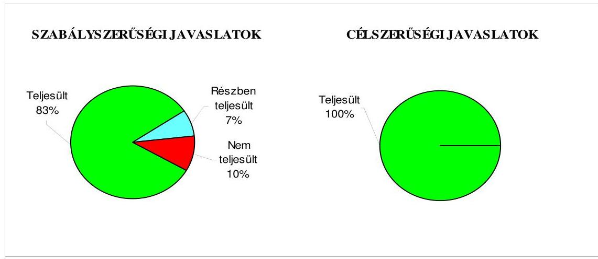

Budapest, 2009. november" 16 "

Melléklet: $\quad 8 \mathrm{db} \quad 12$ lap
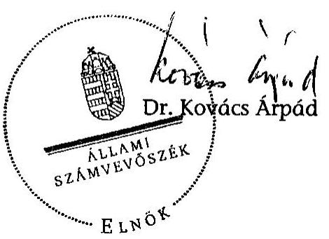

---

# Az Önkormányzat gazdálkodását meghatározó adatok, mutatószámok 

| Megnevezés |  |
| :--: | :--: |
| A település állandó lakosainak száma (fő) 2009. január 1-jén | 47395 |
| A Közgyűlés tagjainak a száma (fő) (2008. december 31-én) | 24 |
| A Közgyűlés munkáját segítő állandó bizottságok száma (2008. december 31-én) | 6 |
| A Polgármesteri hivatalban foglalkoztatott köztisztviselők száma (fő) (2008. december 31-én) | 169 |
| Az összes vagyon értéke a 2008. december 31-i könyvviteli mérleg szerint (millió Ft) | 36886 |
| Az adósságállomány (hosszú és rövid lejáratú kötelezettség) 2008. december 31-én (millió Ft) | 20015 |
| Az egy lakosra jutó adósságállomány 2008. december 31-én (Ft) | 422302 |
| Az összes 2008. évben teljesített költségvetési bevétel (millió Ft) | 17472 |
| Ebből: saját bevétel (millió Ft), melyből | 6436 |
| helyi adóbevétel (millió Ft) | 1734 |
| Az egy lakosra jutó 2008. évi költségvetési bevétel (Ft) | 368646 |
| Az egy lakosra jutó 2008. évi saját bevétel (Ft) | 135795 |
| Az egy lakosra jutó 2008. évi helyi adóbevétel (Ft) | 36586 |
| Saját bevétel/Összes költségvetési bevétel aránya a 2008. évben (\%) | 36,8 |
| Helyi adó bevétel/Összes költségvetési bevétel aránya a 2008. évben (\%) | 9,9 |
| Az összes teljesített költségvetési kiadás a 2008. évben (millió Ft) | 16235 |
| Ebből: felhalmozási célú költségvetési kiadás (millió Ft) | 2752 |
| A 2008. évi költségvetési kiadásból a felhalmozási célú költségvetési kiadás aránya (\%) | 17,0 |
| Az egy lakosra jutó 2008. évi költségvetési kiadás (Ft) | 342547 |
| Az egy lakosra jutó 2008. évben teljesített felhalmozási célú költségvetési kiadás (Ft) | 58065 |
| A költségvetési intézmények száma 2008. december 31-én (db) | 18 |
| Ebből: részben önállóan gazdálkodó (db) | 14 |
| A költségvetési intézményekben foglalkoztatott közalkalmazottak száma (fő) (2008. december 31-én) | 1333 |

---

# Az önkormányzati vagyon alakulása

|  Mérlegsor
megnevezése | 2006.év
(millió Ft) | 2007. év
(millió Ft) | 2008. év
(millió Ft) | Változás \%-a (Előző év=100\%) |  |   |
| --- | --- | --- | --- | --- | --- | --- |
|   |  |  |  | 2007/2006. | 2008/2007. | 2008/2006.  |
|  Immateriális javak | 189 | 326 | 199 | 172,6 | 61,0 | 105,4  |
|  Tárgyi eszközök | 24335 | 24220 | 26290 | 99,5 | 108,5 | 108,0  |
|  ebből: ingatlanok | 21778 | 22706 | 25012 | 104,3 | 110,2 | 114,9  |
|  beruházások | 1572 | 667 | 467 | 42,4 | 70,0 | 29,7  |
|  Befektetett pénzügyi eszközök | 1953 | 2429 | 3189 | 124,4 | 131,3 | 163,3  |
|  Üzemeltetésre átadott eszközök | 2823 | 4503 | 4434 | 159,5 | 98,5 | 157,1  |
|  Befektetett eszközök összesen | 29300 | 31478 | 34112 | 107,4 | 108,4 | 116,4  |
|  Forgóeszközök összesen | 8328 | 5544 | 2774 | 66,6 | 50,0 | 33,3  |
|  ebből: követelések | 1292 | 1342 | 1118 | 103,9 | 83,3 | 86,5  |
|  pénzeszközök | 6656 | 3696 | 1373 | 55,5 | 37,1 | 20,6  |
|  Eszközök összesen | 37628 | 37022 | 36886 | 98,4 | 99,6 | 98,0  |
|  Saját tőke összesen | 11332 | 13750 | 14212 | 121,3 | 103,4 | 125,4  |
|  Tartalék összesen | 6448 | 3632 | 2255 | 56,3 | 62,1 | 35,0  |
|  Kötelezettségek összesen | 19848 | 19640 | 20419 | 99,0 | 104,0 | 102,9  |
|  ebből: hosszú lejáratú kötelezettségek | 12801 | 12157 | 14780 | 95,0 | 121,6 | 115,5  |
|  rövid lejáratú kötelezettségek | 6526 | 6969 | 5235 | 106,8 | 75,1 | 80,2  |
|  Források összesen: | 37628 | 37022 | 36886 | 98,4 | 99,6 | 98,0  |

Forrás: Magyar Államkincstár éves költségvetési beszámoló "01" számú űrlap adatai.

---

# Az önkormányzati kötelezettségek alakulása

|  Mérlegsor megnevezése | 2006.év
(millió Ft) | 2007. év
(millió Ft) | 2008. év
(millió Ft) | Változás \%-a (Előző év=100\%) |  |   |
| --- | --- | --- | --- | --- | --- | --- |
|   |  |  |  | 2007/2006. | 2008/2007. | 2008/2006.  |
|  Hosszú lejáratú kötelezettségek összesen
ebből: | 12801 | 12157 | 14780 | 95,0 | 121,6 | 115,5  |
|  hosszú lejáratra kapott kölcsönök | 26 | 11 | 0 | 42,3 | 0,0 | 0,0  |
|  tartozások fejlesztési célú kötvénykibocsátásból | 10862 | 10578 | 11378 | 97,4 | 107,6 | 104,8  |
|  tartozások működési célú kötvénykibocsátásból |  |  |  |  |  |   |
|  beruházási és fejlesztési hitelek | 1898 | 1559 | 3401 | 82,1 | 218,2 | 179,2  |
|  müködési célú hosszú lejáratú hitelek |  |  |  |  |  |   |
|  egyéb hosszú lejáratú kötelezettségek | 14 | 9 | 1 | 64,3 | 11,1 | 7,1  |
|  Rövid lejáratú kötelezettségek összesen
ebből: | 6526 | 6969 | 5235 | 106,8 | 75,1 | 80,2  |
|  rövid lejáratú kölcsönök | 0 | 0 | 68 |  |  |   |
|  rövid lejáratú hitelek | 3273 | 3387 | 1548 | 103,5 | 45,7 | 47,3  |
|  kötelezettségek áruszállításból, szolgáltatásból | 2484 | 2593 | 2661 | 104,4 | 102,6 | 107,1  |
|  garancia- és kezességvállalásból származó kötelezettség |  |  |  |  |  |   |
|  hosszú lejáratra kapott kölcsön következő évet terhelő törlesztő részlete | 19 | 20 | 11 | 105,3 | 55,0 | 57,9  |
|  felhalm.c.kötvény kibocsátásból szárm.tartozás következő évet terh.részlete |  |  |  |  |  |   |
|  mük.c.kötvény kibocsátásból szárm.tartozás következő évet terh.részlete |  |  |  |  |  |   |
|  beruházási c hosszú lejáratú hitel következő évet terhelő törlesztő részlete | 350 | 347 | 308 | 99,1 | 88,8 | 88,0  |
|  müködési c.hosszú lejáratú hitel következő évet terhelő törlesztő részlete |  |  |  |  |  |   |
|  egyéb hosszú lejáratú kötelezettség következő évet terhelő törlesztő részlete | 2 | 2 | 7 | 100,0 | 350,0 | 350,0  |

Forrás: Magyar Államkincstár éves költségvetési beszámoló "01" számú űrlap adatai.

---

# Az Önkormányzat 2006-2009. évi költségvetési előirányzatainak és 2006-2008. évi pénzügyi teljesítéseinek alakulása

|  Megnevezés | 2006. év |  |  |  | 2007. év |  |  |  | 2008. év |  |  |  | 2009.  |
| --- | --- | --- | --- | --- | --- | --- | --- | --- | --- | --- | --- | --- | --- |
|   | Eredeti | Módosított | Teljesítés (millió Ft) |  | Eredeti | Módosított |  | Teljesítés (millió Ft) |  | Eredeti | Módosított |  | Eredeti  |
|   | előirányzat (millió Ft) |  |  |  | előirányzat (millió Ft) |  | előirányzat (millió Ft) |  |  |  | előirányzat (millió Ft) |  | előirányzat (millió Ft)  |
|  Müködési célú költségvetési bevételek összesen | 11712 | 13558 | 13376 | 114,2 | 12060 | 13457 | 13150 | 109,0 | 12043 | 15381 | 14769 | 122,6 | 11604  |
|  Müködési célú költségvetési kiadások összesen | 11767 | 14606 | 15277 | 129,8 | 12130 | 13745 | 12847 | 105,9 | 12091 | 15544 | 13483 | 111,5 | 11241  |
|  Müködési célú költségvetési bevételek és kiadások egyenlege: hiány-, többlet + | $-55$ | $-1048$ | $-1901$ | 3456,4 | $-70$ | $-288$ | 303 | 532,9 | $-48$ | $-163$ | 1286 | 2779,2 | 363  |
|  Felhalmozási célú költségvetési bevételek összesen | 2084 | 2439 | 1439 | 69,0 | 4005 | 4414 | 3125 | 78,0 | 3579 | 4775 | 2703 | 75,5 | 3146  |
|  Felhalmozási célú költségvetési kiadások összesen | 4363 | 14087 | 5019 | 115,0 | 3820 | 4500 | 3349 | 87,7 | 3255 | 4661 | 2752 | 84,5 | 4064  |
|  Felhalmozási célú költségvetési bevételek és kiadások egyenlege: hiány-, többlet+ | $-2279$ | $-11648$ | $-3580$ | 157,1 | 185 | $-86$ | $-224$ | $-221,1$ | 324 | 114 | $-49$ | $-115,1$ | $-918$  |
|  Költségvetési bevételek összesen | 13796 | 15997 | 14815 | 107,4 | 16065 | 17871 | 16275 | 101,3 | 15622 | 20156 | 17472 | 111,8 | 14750  |
|  Költségvetési kiadások összesen | 16130 | 28693 | 20296 | 125,8 | 15950 | 18245 | 16196 | 101,5 | 15346 | 20205 | 16235 | 105,8 | 15305  |
|  Költségvetési bevételek és kiadások egyenlege: hiány-, többlet+ | $-2334$ | $-12696$ | $-5481$ | 234,8 | 115 | $-374$ | 79 | 68,7 | 276 | $-49$ | 1237 | 448,2 | $-555$  |
|  Finanszírozási célú pénzügyi bevételek | 4544 | 15873 | 15252 |  | 3472 | 4333 | 2010 |  | 3312 | 3918 | 2161 |  | 1314  |
|  Finanszírozási célú pénzügyi kiadások | 2210 | 3177 | 2538 |  | 3587 | 3959 | 2184 |  | 3588 | 3869 | 2337 |  | 759  |
|  Finanszírozási célú pénzügyi műveletek egyenlege | 2334 | 12696 | 12714 |  | $-115$ | 374 | $-174$ |  | $-276$ | 49 | $-176$ |  | 555  |

Forrás: - Magyar Államkincstár éves költségvetési beszámoló "80" számú űrlap adatai;

- a 2009. évi adatok esetében az Önkormányzat 2009. évi költségvetése;
- a költségvetési bevétel-kiadás működési-felhalmozási célra történt megosztásánál az analitikus nyilvántartás.

---

# TANÚSÍTVÁNY

az európai uniója forrásokkal támogatott célok és programok 2008-2009. évi tervezett és teljesített adatairól (a hívelet, továbbá az önálló és részben önálló intézmények által benyújtott pályázatok alapján)

|   |  |  |  |  |  |  |  |  |  |  |  |  |  |  |  |  |  |  |  |  |  |  |  |  |  |  |  |  |  |  |  |  |  |  |  |  |  |  |  |  |  |  |  |  |  |   |
| --- | --- | --- | --- | --- | --- | --- | --- | --- | --- | --- | --- | --- | --- | --- | --- | --- | --- | --- | --- | --- | --- | --- | --- | --- | --- | --- | --- | --- | --- | --- | --- | --- | --- | --- | --- | --- | --- | --- | --- | --- | --- | --- | --- | --- | --- | --- | --- | --- | --- | --- | --- |
|   |  |  |  |  |  |  |  |  |  |  |  |  |  |  |  |  |  |  |  |  |  |  |  |  |  |  |  |  |  |  |  |  |  |  |  |  |  |  |  |  |  |  |  |  |  |  |  |  |   |
|   |  |  |  |  |  |  |  |  |  |  |  |  |  |  |  |  |  |  |  |  |  |  |  |  |  |  |  |  |  |  |  |  |  |  |  |  |  |  |  |  |  |  |  |  |  |  |  |  |   |
|   |  |  |  |  |  |  |  |  |  |  |  |  |  |  |  |  |  |  |  |  |  |  |  |  |  |  |  |  |  |  |  |  |  |  |  |  |  |  |  |  |  |  |  |  |  |  |  |  |   |
|   |  |  |  |  |  |  |  |  |  |  |  |  |  |  |  |  |  |  |  |  |  |  |  |  |  |  |  |  |  |  |  |  |  |  |  |  |  |  |  |  |  |  |  |  |  |  |  |   |
|   |  |  |  |  |  |  |  |  |  |  |  |  |  |  |  |  |  |  |  |  |  |  |  |  |  |  |  |  |  |  |  |  |  |  |  |  |  |  |  |  |  |  |  |  |  |  |  |  |   |
|   |  |  |  |  |  |  |  |  |  |  |  |  |  |  |  |  |  |  |  |  |  |  |  |  |  |  |  |  |  |  |  |  |  |  |  |  |  |  |  |  |  |  |  |  |  |  |  |  |   |
|   |  |  |  |  |  |  |  |  |  |  |  |  |  |  |  |  |  |  |  |  |  |  |  |  |  |  |  |  |  |  |  |  |  |  |  |  |  |  |  |  |  |  |  |  |  |  |  |  |   |
|   |  |  |  |  |  |  |  |  |  |  |  |  |  |  |  |  |  |  |  |  |  |  |  |  |  |  |  |  |  |  |  |  |  |  |  |  |  |  |  |  |  |  |  |  |  |  |  |  |   |
|   |  |  |  |  |  |  |  |  |  |  |  |  |  |  |  |  |  |  |  |  |  |  |  |  |  |  |  |  |  |  |  |  |  |  |  |  |  |  |  |  |  |  |  |  |  |  |  |  |   |
|   |  |  |  |  |  |  |  |  |  |  |  |  |  |  |  |  |  |  |  |  |  |  |  |  |  |  |  |  |  |  |  |  |  |  |  |  |  |  |  |  |  |  |  |  |  |  |  |  |   |
|   |  |  |  |  |  |  |  |  |  |  |  |  |  |  |  |  |  |  |  |  |  |  |  |  |  |  |  |  |  |  |  |  |  |  |  |  |  |  |  |  |  |  |  |  |  |  |  |  |  |   |
|   |  |  |  |  |  |  |  |  |  |  |  |  |  |  |  |  |  |  |  |  |  |  |  |  |  |  |  |  |  |  |  |  |  |  |  |  |  |  |  |  |  |  |  |  |  |  |  |  |  |   |
|   |  |  |  |  |  |  |  |  |  |  |  |  |  |  |  |  |  |  |  |  |  |  |  |  |  |  |  |  |  |  |  |  |  |  |  |  |  |  |  |  |  |  |  |  |  |  |  |  |  |   |
|   |  |  |  |  |  |  |  |  |  |  |  |  |  |  |  |  |  |  |  |  |  |  |  |  |  |  |  |  |  |  |  |  |  |  |  |  |  |  |  |  |  |  |  |  |  |  |  |  |  |   |
|   |  |  |  |  |  |  |  |  |  |  |  |  |  |  |  |  |  |  |  |  |  |  |  |  |  |  |  |  |  |  |  |  |  |  |  |  |  |  |  |  |  |  |  |  |  |  |  |  |  |   |
|   |  |  |  |  |  |  |  |  |  |  |  |  |  |  |  |  |  |  |  |  |  |  |  |  |  |  |  |  |  |  |  |  |  |  |  |  |  |  |  |  |  |  |  |  |  |  |  |  |  |   |
|   |  |  |  |  |  |  |  |  |  |  |  |  |  |  |  |  |  |  |  |  |  |  |  |  |  |  |  |  |  |  |  |  |  |  |  |  |  |  |  |  |  |  |  |  |  |  |  |  |  |   |
|   |  |  |  |  |  |  |  |  |  |  |  |  |  |  |  |  |  |  |  |  |  |  |  |  |  |  |  |  |  |  |  |  |  |  |  |  |  |  |  |  |  |  |  |  |  |  |  |  |  |   |
|   |  |  |  |  |  |  |  |  |  |  |  |  |  |  |  |  |  |  |  |  |  |  |  |  |  |  |  |  |  |  |  |  |  |  |  |  |  |  |  |  |  |  |  |  |  |  |  |  |  |   |
|   |  |  |  |  |  |  |  |  |  |  |  |  |  |  |  |  |  |  |  |  |  |  |  |  |  |  |  |  |  |  |  |  |  |  |  |  |  |  |  |  |  |  |  |  |  |  |  |  |  |   |
|   |  |  |  |  |  |  |  |  |  |  |  |  |  |  |  |  |  |  |  |  |  |  |  |  |  |  |  |  |  |  |  |  |  |  |  |  |  |  |  |  |  |  |  |  |  |  |  |  |  |   |
|   |  |  |  |  |  |  |  |  |  |  |  |  |  |  |  |  |  |  |  |  |  |  |  |  |  |  |  |  |  |  |  |  |  |  |  |  |  |  |  |  |  |  |  |  |  |  |  |  |  |   |
|   |  |  |  |  |  |  |  |  |  |  |  |  |  |  |  |  |  |  |  |  |  |  |  |  |  |  |  |  |  |  |  |  |  |  |  |  |  |  |  |  |  |  |  |  |  |  |  |  |  |   |
|   |  |  |  |  |  |  |  |  |  |  |  |  |  |  |  |  |  |  |  |  |  |  |  |  |  |  |  |  |  |  |  |  |  |  |  |  |  |  |  |  |  |  |  |  |  |  |  |  |  |   |
|   |  |  |  |  |  |  |  |  |  |  |  |  |  |  |  |  |  |  |  |  |  |  |  |  |  |  |  |  |  |  |  |  |  |  |  |  |  |  |  |  |  |  |  |  |  |  |  |  |  |   |
|   |  |  |  |  |  |  |  |  |  |  |  |  |  |  |  |  |  |  |  |  |  |  |  |  |  |  |  |  |  |  |  |  |  |  |  |  |  |  |  |  |  |  |  |  |  |  |  |  |  |   |
|   |  |  |  |  |  |  |  |  |  |  |  |  |  |  |  |  |  |  |  |  |  |  |  |  |  |  |  |  |  |  |  |  |  |  |  |  |  |  |  |  |  |  |  |  |  |  |  |  |  |   |
|   |  |  |  |  |  |  |  |  |  |  |  |  |  |  |  |  |  |  |  |  |  |  |  |  |  |  |  |  |  |  |  |  |  |  |  |  |  |  |  |  |  |  |  |  |  |  |  |  |  |   |
|   |  |  |  |  |  |  |  |  |  |  |  |  |  |  |  |  |  |  |  |  |  |  |  |  |  |  |  |  |  |  |  |  |  |  |  |  |  |  |  |  |  |  |  |  |  |  |  |  |  |   |
|   |  |  |  |  |  |  |  |  |  |  |  |  |  |  |  |  |  |  |  |  |  |  |  |  |  |  |  |  |  |  |  |  |  |  |  |  |  |  |  |  |  |  |  |  |  |  |  |  |  |   |
|   |  |  |  |  |  |  |  |  |  |  |  |  |  |  |  |  |  |  |  |  |  |  |  |  |  |  |  |  |  |  |  |  |  |  |  |  |  |  |  |  |  |  |  |  |  |  |  |  |  |  |   |
|   |  |  |  |  |  |  |  |  |  |  |  |  |  |  |  |  |  |  |  |  |  |  |  |  |  |  |  |  |  |  |  |  |  |  |  |  |  |  |  |  |  |  |  |  |  |  |  |  |  |  |   |
|   |  |  |  |  |  |  |  |  |  |  |  |  |  |  |  |  |  |  |  |  |  |  |  |  |  |  |  |  |  |  |  |  |  |  |  |  |  |  |  |  |  |  |  |  |  |  |  |  |  |  |   |
|   |  |  |  |  |  |  |  |  |  |  |  |  |  |  |  |  |  |  |  |  |  |  |  |  |  |  |  |  |  |  |  |  |  |  |  |  |  |  |  |  |  |  |  |  |  |  |  |  |  |  |   |
|   |  |  |  |  |  |  |  |  |  |  |  |  |  |  |  |  |  |  |  |  |  |  |  |  |  |  |  |  |  |  |  |  |  |  |  |  |  |  |  |  |  |  |  |  |  |  |  |  |  |  |   |
|   |  |  |  |  |  |  |  |  |  |  |  |  |  |  |  |  |  |  |  |  |  |  |  |  |  |  |  |  |  |  |  |  |  |  |  |  |  |  |  |  |  |  |  |  |  |  |  |  |  |  |   |
|   |  |  |  |  |  |  |  |  |  |  |  |  |  |  |  |  |  |  |  |  |  |  |  |  |  |  |  |  |  |  |  |  |  |  |  |  |  |  |  |  |  |  |  |  |  |  |  |  |  |  |   |
|   |  |  |  |  |  |  |  |  |  |  |  |  |  |  |  |  |  |  |  |  |  |  |  |  |  |  |  |  |  |  |  |  |  |  |  |  |  |  |  |  |  |  |  |  |  |  |  |  |  |  |   |
|   |  |  |  |  |  |  |  |  |  |  |  |  |  |  |  |  |  |  |  |  |  |  |  |  |  |  |  |  |  |  |  |  |  |  |  |  |  |  |  |  |  |  |  |  |  |  |  |  |  |  |   |
|   |  |  |  |  |  |  |  |  |  |  |  |  |  |  |  |  |  |  |  |  |  |  |  |  |  |  |  |  |  |  |  |  |  |  |  |  |  |  |  |  |  |  |  |  |  |  |  |  |  |  |   |
|   |  |  |  |  |  |  |  |  |  |  |  |  |  |  |  |  |  |  |  |  |  |  |  |  |  |  |  |  |  |  |  |  |  |  |  |  |  |  |  |  |  |  |  |  |  |  |  |  |  |  |   |
|   |  |  |  |  |  |  |  |  |  |  |  |  |  |  |  |  |  |  |  |  |  |  |  |  |  |  |  |  |  |  |  |  |  |  |  |  |  |  |  |  |  |  |  |  |  |  |  |  |  |  |   |
|   |  |  |  |  |  |  |  |  |  |  |  |  |  |  |  |  |  |  |  |  |  |  |  |  |  |  |  |  |  |  |  |  |  |  |  |  |  |  |  |  |  |  |  |  |  |  |  |  |  |  |  |   |
|   |  |  |  |  |  |  |  |  |  |  |  |  |  |  |  |  |  |  |  |  |  |  |  |  |  |  |  |  |  |  |  |  |  |  |  |  |  |  |  |  |  |  |  |  |  |  |  |  |  |  |  |   |
|   |  |  |  |  |  |  |  |  |  |  |  |  |  |  |  |  |  |  |  |  |  |  |  |  |  |  |  |  |  |  |  |  |  |  |  |  |  |  |  |  |  |  |  |  |  |  |  |  |  |  |  |   |
|   |  |  |  |  |  |  |  |  |  |  |  |  |  |  |  |  |  |  |  |  |  |  |  |  |  |  |  |  |  |  |  |  |  |  |  |  |  |  |  |  |  |  |  |  |  |  |  |  |  |  |  |   |
|   |  |  |  |  |  |  |  |  |  |  |  |  |  |  |  |  |  |  |  |  |  |  |  |  |  |  |  |  |  |  |  |  |  |  |  |  |  |  |  |  |  |  |  |  |  |  |  |  |  |  |  |  |   |
|   |  |  |  |  |  |  |  |  |  |  |  |  |  |  |  |  |  |  |  |  |  |  |  |  |  |  |  |  |  |  |  |  |  |  |  |  |  |  |  |  |  |  |  |  |  |  |  |  |  |  |  |  |   |
|   |  |  |  |  |  |  |  |  |  |  |  |  |  |  |  |  |  |  |  |  |  |  |  |  |  |  |  |  |  |  |  |  |  |  |  |  |  |  |  |  |  |  |  |  |  |  |  |  |  |  |  |  |   |
|   |  |  |  |  |  |  |  |  |  |  |  |  |  |  |  |  |  |  |  |  |  |  |  |  |  |  |  |  |  |  |  |  |  |  |  |  |  |  |  |  |  |  |  |  |  |  |  |  |  |  |  |  |   |
|   |  |  |  |  |  |  |  |  |  |  |  |  |  |  |  |  |  |  |  |  |  |  |  |  |  |  |  |  |  |  |  |  |  |  |  |  |  |  |  |  |  |  |  |  |  |  |  |  |  |  |  |  |   |
|   |  |  |  |  |  |  |  |  |  |  |  |  |  |  |  |  |  |  |  |  |  |  |  |  |  |  |  |  |  |  |  |  |  |  |  |  |  |  |  |  |  |  |  |  |  |  |  |  |  |  |  |  |   |
|   |  |  |  |  |  |  |  |  |  |  |  |  |  |  |  |  |  |  |  |  |  |  |  |  |  |  |  |  |  |  |  |  |  |  |  |  |  |  |  |  |  |  |  |  |  |  |  |  |  |  |  |  |   |
|   |  |  |  |  |  |  |  |  |  |  |  |  |  |  |  |  |  |  |  |  |  |  |  |  |  |  |  |  |  |  |  |  |  |  |  |  |  |  |  |  |  |  |  |  |  |  |  |  |  |  |  |  |   |
|   |  |  |  |  |  |  |  |  |  |  |  |  |  |  |  |  |  |  |  |  |  |  |  |  |  |  |  |  |  |  |  |  |  |  |  |  |  |  |  |  |  |  |  |  |  |  |  |  |  |  |  |  |   |
|   |  |  |  |  |  |  |  |  |  |  |  |  |  |  |  |  |  |  |  |  |  |  |  |  |  |  |  |  |  |  |  |  |  |  |  |  |  |  |  |  |  |  |  |  |  |  |  |  |  |  |  |  |   |
|   |  |  |  |  |  |  |  |  |  |  |  |  |  |  |  |  |  |  |  |  |  |  |  |  |  |  |  |  |  |  |  |  |  |  |  |  |  |  |  |  |  |  |  |  |  |  |  |  |  |  |  |  |   |
|   |  |  |  |  |  |  |  |  |  |  |  |  |  |  |  |  |  |  |  |  |  |  |  |  |  |  |  |  |  |  |  |  |  |  |  |  |  |  |  |  |  |  |  |  |  |  |  |  |  |  |  |  |   |
|   |  |  |  |  |  |  |  |  |  |  |  |  |  |  |  |  |  |  |  |  |  |  |  |  |  |  |  |  |  |  |  |  |  |  |  |  |  |  |  |  |  |  |  |  |  |  |  |  |  |  |  |  |   |
|   |  |  |  |  |  |  |  |  |  |  |  |  |  |  |  |  |  |  |  |  |  |  |  |  |  |  |  |  |  |  |  |  |  |  |  |  |  |  |  |  |  |  |  |  |  |  |  |  |  |  |  |  |  |   |
|   |  |  |  |  |  |  |  |  |  |  |  |  |  |  |  |  |  |  |  |  |  |  |  |  |  |  |  |  |  |  |  |  |  |  |  |  |  |  |  |  |  |  |  |  |  |  |  |  |  |  |  |  |  |   |
|   |  |  |  |  |  |  |  |  |  |  |  |  |  |  |  |  |  |  |  |  |  |  |  |  |  |  |  |  |  |  |  |  |  |  |  |  |  |  |  |  |  |  |  |  |  |  |  |  |  |  |  |  |   |
|   |  |  |  |  |  |  |  |  |  |  |  |  |  |  |  |  |  |  |  |  |  |  |  |  |  |  |  |  |  |  |  |  |  |  |  |  |  |  |  |  |  |  |  |  |  |  |  |  |  |  |  |  |  |   |
|   |  |  |  |  |  |  |  |  |  |  |  |  |  |  |  |  |  |  |  |  |  |  |  |  |  |  |  |  |  |  |  |  |  |  |  |  |  |  |  |  |  |  |  |  |  |  |  |  |  |  |  |  |  |  |   |
|   |  |  |  |  |  |  |  |  |  |  |  |  |  |  |  |  |  |  |  |  |  |  |  |  |  |  |  |  |  |  |  |  |  |  |  |  |  |  |  |  |  |  |  |  |  |  |  |  |  |  |  |  |  |  |  |   |
|   |  |  |  |  |  |  |  |  |  |  |  |  |  |  |  |  |  |  |  |  |  |  |  |  |  |  |  |  |  |  |  |  |  |  |  |  |  |  |  |  |  |  |  |  |  |  |  |  |  |  |  |  |  |  |  |   |
|   |  |  |  |  |  |  |  |  |  |  |  |  |  |  |  |  |  |  |  |  |  |  |  |  |  |  |  |  |  |  |  |  |  |  |  |  |  |  |  |  |  |  |  |  |  |  |  |  |  |  |  |  |  |  |  |  |   |
|   |  |  |  |  |  |  |  |  |  |  |  |  |  |  |  |  |  |  |  |  |  |  |  |  |  |  |  |  |  |  |  |  |  |  |  |  |  |  |  |  |  |  |  |  |  |  |  |  |  |  |  |  |  |  |  |  |  |   |
|   |  |  |  |  |  |  |  |  |  |  |  |  |  |  |  |  |  |  |  |  |  |  |  |  |  |  |  |  |  |  |  |  |  |  |  |  |  |  |  |  |  |  |  |  |  |  |  |  |  |  |  |  |  |  |  |  |  |  |  |   |
|   |  |  |  |  |  |  |  |  |  |  |  |  |  |  |  |  |  |  |  |  |  |  |  |  |  |  |  |  |  |  |  |  |  |  |  |  |  |  |  |  |  |  |  |  |  |  |  |  |  |  |  |  |  |  |  |  |  |  |  |  |   |
|   |  |  |  |  |  |  |  |  |  |  |  |  |  |  |  |  |  |  |  |  |  |  |  |  |  |  |  |  |  |  |  |  |  |  |  |  |  |  |  |  |  |  |  |  |  |  |  |  |  |  |  |  |  |  |  |  |  |  |  |  |  |   |
|   |  |  |  |  |  |  |  |  |  |  |  |  |  |  |  |  |  |  |  |  |  |  |  |  |  |  |  |  |  |  |  |  |  |  |  |  |  |  |  |  |  |  |  |  |  |  |  |  |  |  |  |  |  |  |  |  |  |  |  |  |  |  |   |
|   |  |  |  |  |  |  |  |  |  |  |  |  |  |  |  |  |  |  |  |  |  |  |  |  |  |  |  |  |  |  |  |  |  |  |  |  |  |  |  |  |  |  |  |  |  |  |  |  |  |  |  |  |  |  |  |  |  |  |  |  |  |  |  |  |  |  |  |   |
|   |  |  |  |  |  |  |  |  |  |  |  |  |  |  |  |  |  |  |  |  |  |  |  |  |  |  |  |  |  |  |  |  |  |  |  |  |  |  |  |  |  |  |  |  |  |  |  |  |  |  |  |  |  |  |  |  |  |  |  |  |  |  |  |  |  |  |  |  |  |  |  |  |  |  |  |  |  |  |  |  |  |  |  |  |  |  |  |  |  |  |  |  |  |  |  |  |  |  |  |  | 

---

# ADATLAP 

## az európai uniós forrással támogatott „elektronikus ügyfélszolgálat és korszerü térinformatikai megoldások bevezetése Hódmezővásárhely Megyei Jogú Városban" GVOP-4.3.1.-2004.-06-0001/4.0 fejlesztésröl

## 1. A PÁLYÁZÓ ADATAI

1.1. A pályázó Önkormányzat/intézmény neve: Hódmezővásárhely Megyei Jogú Város Önkormányzata
1.2. A pályázó Önkormányzat/intézmény címe: Hódmezővásárhely Kossuth tér 1 .

## 2. A PROJEKT ÖSSZEGZŐ ADATAI

2.1. A pályázott program megnevezése: Szolgáltató önkormányzat GVOP-4.3.1.-2004. Az e-közigazgatás fejlesztése
2.2. A pályázott programon belül a projekt címe: Elektronikus ügyfélszolgálat és korszerü térinformatikai megoldások bevezetése Hódmezővásárhely Megyei Jogú Városban
2.3. A pályázatot készítô megnevezése: Hódmezővásárhely Megyei Jogú Város Önkormányzat Polgármesteri Hivatal

Polgármesteri Iroda Városi Informatikai Csoport
Müszaki Iroda
2.4. A pályázat benyújtásának időpontja: 2004. június 02.

### 2.5. A projekt tervezett

- teljes kiadásának összege: 342858000 Ft
- támogatásának összege: 300000000 Ft
- európai uniós: 300000000 Ft
- hazai társfinanszírozás: -
- EU Önerő Alap: -

---

- hitel: -
- egyéb forrás: 42858000 Ft
- a megvalósítás tervezett időpontja (év, hó, nap): 2006. július 31.
2.6 A pályázat elbírálásáról szóló döntés kelte: 2004. november 26.
2.7 A pályázat elbírálásának eredménye: Gazdasági és Közlekedési Minisztérium 2004. november 26 -án kelt támogató levele alapján támogatásra érdemes
2.8. Az elutasított pályázatnál az elutasítás okai: nem releváns
2.9. A pályázat tartalék státuszba helyezett-e: igen- nem

# 2.10. A projekt teljesített: 

- kiadásának összege: 339901250 Ft
- támogatásának összege: 290456250 Ft
- európai uniós: 249792375 Ft
- hazai társfinanszírozás: 40663875 Ft
- EU Önerő Alap: 24896250 Ft
- hitel: -
- egyéb forrás: 24548750 Ft
- a megvalósítás időpontja: 2007. május 31.

## 3. A TÁMOGATÁSI SZERZŐDÉS ADATAI

### 3.1. A támogatási szerződés:

- megkötésének időpontja: 2005. szeptember 01., módosítások 2005. október 28., 2007. június 26., 2008. április 23.
- a projekt kezdési és befejezési időpontja: 2005. szeptember 02. és 2007. február 28.
- a projekt összköltsége (kiadása): 331950000 Ft , évenkénti ütemezése:

2005-ben: 12500000 Ft
2006-ban: 116335000 Ft
2007-ben 203115000 Ft

- a projekt megvalósítás forrásai:
- saját forrás: 41493750 Ft
- európai uniós támogatás: 249792375 Ft

---

- hazai társfinanszírozás: 40663875 Ft
- EU Önerő Alap: -
- hitel: -
- egyéb forrás: -
- előírt támogatási határidők: a számlák és a számlaösszesítő, valamint az egyéb szükséges iratok hiánytalan benyújtását követő 60 napon belül
- előírt fizetési kötelezettségek:

2005-ben: 12500000 Ft
2006-ban: 116335000 Ft
2007-ben 203115000 Ft
4. A KIFIZETÉSI KÉRELEM ÉS TÁMOGATÁS FOLYÓSÍTÁS ADATAI

| Kifizetési kérelem   (PEI) benyújtásá-   nak   idópontja | Számla   bruttó   összege   (Ft) | Igényelt   támogatási   összeg   (Ft) | Folyósitott   támogatás   összege   (Ft) | Támogatás   folyósitásának   idópontja   (év.hó.nap) | Benyújtás   és a fo-   lyósitás   között   eltelt   idótartam   (nap) |
| :-- | :-- | :-- | :-- | :-- | :-- |

| 0 . | 2005.09.19. | Előleg | 72614062 | 72614062 | 2005.12.05. | 76 |
| :--: | :--: | :--: | :--: | :--: | :--: | :--: |
| 1.   PEI | 2005.12.14.   (1. sz. kifi-   zetési kére-   lem) | 9303750 | 8140781 | 8140781 | 2006.05.08. | 144 |
| 2.   PEI | 2005.03.10. | Nem volt kifizetési kérelem. |  |  |  |  |
| 3.   PEI | 2006.04.12.   (2. sz. kifi-   zetési kére-   lem) | 100605750 | 15415968 | 13053470 | 2006.09.15. | 156 |
| 4.   PEI | 2006.06.29. | Nem volt kifizetési kérelem. |  |  |  |  |
| 5.   PEI | 2006.09.12. | Nem volt kifizetési kérelem. |  |  |  |  |
| 6.   PEI | 2006.12.15. | Nem volt kifizetési kérelem. |  |  |  |  |
| 7.   PEI | 2007.03.14.   (3. sz. kifi-   zetési kére-   lem) | 147651250 | 129194844 | 129194844 | 2007.06.22. | 98 |

---

| Kifizetési kérelem   (PEJ) benyújtásá-   nak   idópontja | Számla   bruttó   összege   (Ft) | Igényelt   támogatási   összeg   (Ft) | Folyósitott   támogatás   összege   (Ft) | Támogatás   folyósitásának   idópontja   (évhó,nap) | Benyújtás   és a fo-   lyósitás   között   eltelt   idótartam   (nap) |
| :-- | :-- | :-- | :-- | :-- | :-- | :-- |

# 5. Ellenőrzések 

### 5.1. A külső ellenőrzések:

- az ellenőrzések száma: 2 db (2006. február 23. és 2008. november 26.)
- az ellenőrzést végző szervek megnevezése: IT Információs Társadalom Kht., Magyar Gazdaságfejlesztési Központ Zrt.
5.2. Szabálytalanságokra vonatkozó adatok: nem tártak fel szabálytalanságot
- mely előírást nem tartotta be az Önkormányzat/intézmény:
- az előírás nem teljesítésének okai:
- a rendezésre előírt kötelezettségek:
- a rendezésre előírt kötelezettséget mennyi időn belül teljesítették:
- mekkora időbeli csúszást eredményezett ez a projekt megvalósításában (év, hó, nap):

Kelt: Hódmezővásárhely, 2009. június 16.

Palágyiné dr. Gömöri Katalin számvevő

Dr. Korsós Ágnié jegyző

---

# HÓDMEZÓVÁSÁRHELY MEGYEI JOGÚ VÁROS POLGÁRMESTERI HIVATAL 

6800 HÓDMEZÓVÁSÁRHELY, KOSSUTH TÉR 1. * POSTAFIÓK: 23. TELEFON: (62) 530-100 * FAX: (62) 530-192

Szám: 22-10568-8/2009.
Tárgy: Észrevétel Ász jelentésre Hiv.sz: V-3001-4/28/16/2009.

## Állami Számvevőszék Dr. Kovács Árpád Elnök

Budapest 4. Pf. 54. 1364

Tisztelt Elnök Úr!

Hódmezővásárhely Megyei Jogú Város Önkormányzata gazdálkodási rendszerének 2009. évi ellenőrzéséről készült számvevőszéki jelentést 2009. október 22-én kézhez vettük.

A jelentésben foglaltakkal kapcsolatosan az alábbi észrevételt tesszük:
Köszönjük Elnök Úrnak, hogy a vizsgálat során, a közbensõ egyeztetéseket követően megtett intézkedéseink a jelentésben feltüntetésre kerültek, azokat a Részletes megállapítások fejezet lábjegyzetei tartalmazzák, és az eszekre vonatkozó javaslatok a jelentésben már nem szerepelnek.

Kérjük Elnök Urat, hogy a korábban megtett észrevételeink a végleges jelentés szövegében is a megállapítások között feltüntetésre kerüljenek, természetesen az ÁSZ azzal kapcsolatos álláspontjának egyidejű közlése mellett.

Tájékoztatni szeretném Elnök Urat, hogy az elözetes jelentésre megtett észrevételeinket követően - a feltárt hiányosságok megszüntetése érdekében - az alábbi intézkedések születtek:

A II. Részletes megállapítások 3.1. pontjában közepes kockázatúnak értékelte a vizsgálat, hogy „a Polgármesteri Hivatal Gazdasági Szervezete nem rendelkezett ügyrenddel; a jegyző nem határozta meg az értékelések ellenőrzéséért felelős munkaköröket..."

---

- Polgármesteri Hivatal gazdasági szervezetének ügyrendjét elkészítettük, az 2009. október 1-jén hatályba lépett.
- Értékelési szabályzatot kiegészítettük az értékelésért felelős munkakörökkel és az értékelés ellenőrzéséért felelős munkakörökkel. Mellékletként csatoljuk az érvényes Eszközök és Források Értékelési Szabályzatát.
3.1 pontjában közepes kockázatúnak értékelte a vizsgálat, hogy a pénzügyiszámviteli feladatoknál alkalmazott informatikai rendszerek müködése vonatkozásában a Polgármesteri Hivatal nem rendelkezett eljárásrenddel a hozzáférési jogosultságokra.
- A pénzügy, számvitel területén használt CT-EcoSTAT integrált gazdasági és gazdálkodási rendszer hozzáférési jogosultságának eljárásrendje elkészült, melyet mellékletként csatolunk.

Kérem a az időközben megtett intézkedések is kerüljenek feltüntetésre a részletes megállapítások lábjegyzeteiben, és az azokra vonatkozó javaslatok a jelentésbe ne kerüljenek bele.

Az Állami Számvevőszék végleges jelentését, annak megérkezését követő első rendes Közgyűlés elé terjesztjük, és a jelentésben feltárt hiányosságok megszüntetése érdekében intézkedési tervet készítünk.

Hódmezővásárhely, 2009. október 30.
Tisztelettel:
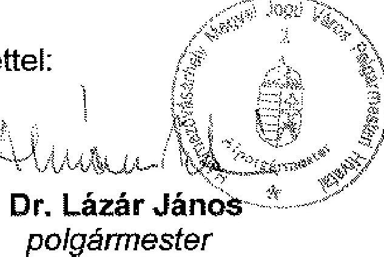

Dr. Lázár János
polgármester
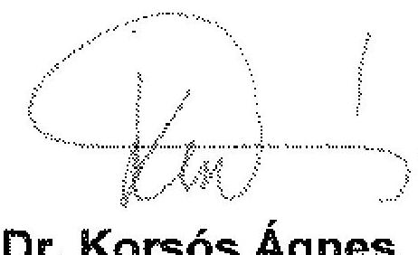

---

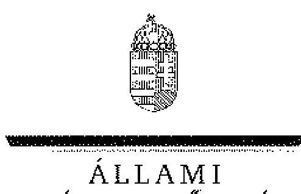

# Dr. Lázár János úr, 

polgármester
Hódmezővásárhely Megyei Jogú Város Önkormányzata
Hódmezővásárhely, Pf. 23.
Kossuth tér 1.
6801

## Tisztelt Polgármester Úr!

Köszönettel vettem Hódmezővásárhely Megyei Jogú Város Önkormányzata gazdálkodási rendszerének 2009. évi ellenőrzéséről készült számvevőszéki jelentéshez küldött tájékoztatását a megtett intézkedésekről.

Örömmel értesültem arról, hogy megállapításaink, javaslataink egy részét az ellenőrzést követően megvalósitották, a hiányosságokat megszüntették. A tájékoztatása, illetve az ahhoz csatolt mellékletek alapján megvalósult intézkedéseket a számvevőszéki jelentésben az érintett megállapításhoz kapcsolt lábjegyzetben szerepeltetjük és a számvevői jelentésben tett, vonatkozó javaslatokat elhagyjuk.

Ilyennek tekintjük, hogy intézkedtek a Polgármesteri hivatal gazdasági szervezetének feladatait meghatározó ügyrend elkészítéséről, kiegészítették az értékelési szabályzatot, kialakították a pénzügyi-számviteli területen alkalmazott informatikai rendszer hozzáférési jogosultságaira vonatkozó eljárásrendet.

Az ellenőrzés lefolytatásához nyújtott segítő közreműködését köszönöm.
Budapest, 2009. november " 40 ".

Tisztelettel:
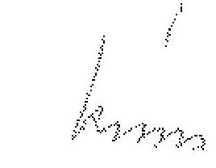

Dr. Kovács Árpád