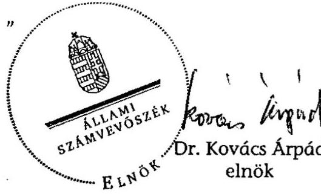
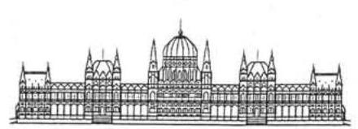
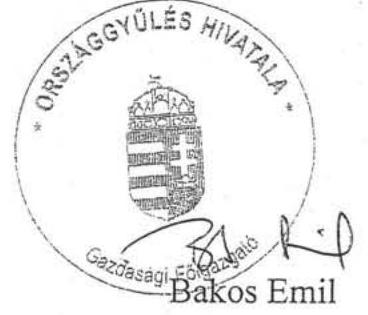
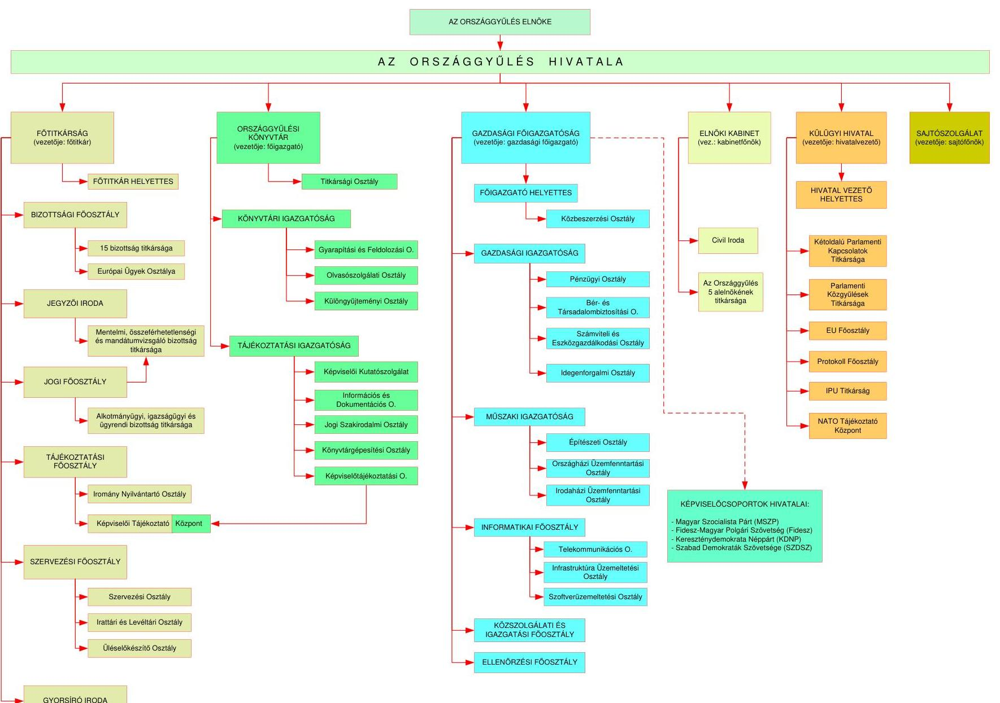
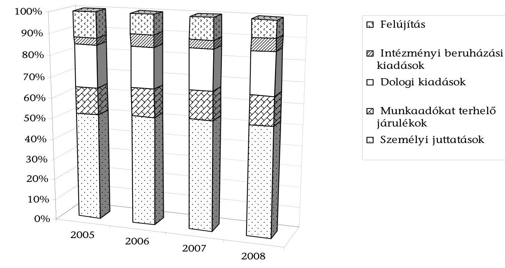
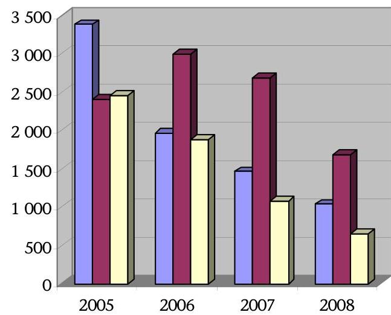

# ÁLLAMI   SZÁMVEVŐSZÉK 

## JELENTÉS

az Országgyűlés fejezet működésének ellenőrzéséről

---

# 2. Államháztartás Központi Szintjét Ellenőrző Igazgatóság 

2.3. Átfogó Ellenőrzési Főcsoport

Iktatószám: V-2001-48/2009.
Témaszám: 938
Vizsgálat-azonosító szám: V-0437

## Az ellenőrzést felügyelte:

## Bihary Zsigmond

főigazgató
Az ellenőrzés végrehajtásáért felelős:
Hegedűsné dr. Müllern Veronika
főcsoportfőnök

## Az ellenőrzést vezette:

## Hudik Zoltán

főcsoportfőnök-helyettes

## Az ellenőrzést végezték:

## Balkay Attila

számvevő tanácsos, tanácsadó

## Dr. Jártas Ágnes

számvevő tanácsos, tanácsadó

## Dr. Pataki Magdolna

számvevő tanácsos, főtanácsadó

## A témához kapcsolódó eddig készített számvevőszéki jelentések:

| címe | sorszáma |
| :-- | :--: |
| Éves jelentések központi költségvetés előirányzatai megalapozottságáról (évente) | 0449, 0550, 0641, 0736 |
| Éves jelentések a központi költségvetés zárszámadásainak ellenőrzéséről (évente) | 0443, 0540, 0628, 0724 |
| Jelentés az Országgyűlés fejezet működésének ellenőrzéséről | 0551 |

---

# TARTALOMJEGYZÉK 

BEVEZETÉS ..... 5
I. ÖSSZEGZŐ MEGÁLLAPÍTÁSOK, KÖVETKEZTETÉSEK, JAVASLATOK ..... 8
II. RÉSZLETES MEGÁLLAPÍTÁSOK ..... 12

1. A költségvetési gazdálkodás kontroll környezete ..... 12
1.1. A költségvetési fejezet működésének szabályozási környezete és szervezeti háttere ..... 12
1.2. A költségvetés tervezésének és végrehajtásának kontrollelemei ..... 15
1.3. A költségvetési gazdálkodás monitoringja, a belső ellenőrzés rendszere ..... 18
2. A hivatali szervek feladatellátása az OGY működésének támogatásában ..... 21
2.1. A folyamatos működés feltételeinek megteremtése ..... 21
2.2. A beruházások és felújítások tervezésének és végrehajtásának rendszere ..... 25
2.3. Az informatikai fejlesztések az országgyűlési munka támogatására, a nyilvánosság biztosítására ..... 27
2.4. A nemzetközi kapcsolattartás és külügyi tevékenység támogatottsága ..... 29
2.5. A könyvtári szolgáltatások fejlesztése ..... 31
3. Az országgyűlési képviselőcsoportok gazdálkodási rendszere ..... 34
3.1. A képviselőcsoportok költségvetési támogatásának, anyagi ellátásának szabályozási háttere ..... 34
3.2. A képviselőcsoportok gazdálkodásának kontrollkörnyezete ..... 35
4. Az Állambiztonsági Szolgálatok Történeti Levéltára működése ..... 38
4.1. A működés szabályozási környezete ..... 38
4.2. A feladat ellátás eredményessége ..... 40
4.3. A működés forrásbiztosítása, a gazdálkodás hatékonysága és kontrolljai ..... 43
MELLÉKLETEK
5. sz. melléklet Észrevételek
6. sz. melléklet Az OGY Hivatalának szervezeti felépítése 2009. március 20-tól
7. sz. melléklet Az OGY Hivatala és a Levéltár kiemelt előirányzatai teljesítésének alakulása

---

4. sz. melléklet Az Országgyűlés fejezet és az OGY Hivatala főbb létszámadatai

5/A. sz. melléklet A képviselőcsoportok ellátási keretfelhasználása
5/B. sz. melléklet A képviselőcsoportok működési-, bér- és kiegészítő keretfelhasználása
6. sz. melléklet Az állampolgári ügyiratok számának alakulása

---

# RÖVIDÍTÉSEK JEGYZÉKE 

| ÁBTL tv. | 2003. évi III. törvény az elmúlt rendszer titkosszolgálati tevékenységének feltárásáról és az Állambiztonsági Szolgálatok Történeti Levéltára létrehozásáról |
| :--: | :--: |
| Áhsz. | 249/2000. (XII. 24.) számú Kormányrendelet az államháztartás szervezetei beszámolási és könyvvezetési sajátosságairól |
| Áht. | 1992. évi XXXVIII. törvény az államháztartásról, többször módosított |
| Ámr. | 217/1998. (XII. 30.) Korm. rendelet az államháztartás működési rendjéről |
| ÁSZ | Állami Számvevőszék |
| Ber. | 193/2003. (XI. 26.) Korm. rendelet a költségvetési szervek belső ellenőrzéséről |
| EP | Európai Parlament |
| eParlament | elektronikus parlament |
| EU | Európai Unió |
| FEUVE | folyamatba épített előzetes és utólagos vezetői ellenőrzés |
| GF | OGY Hivatala gazdasági főigazgató |
| Házszabály | 46/1994. (IX. 30.) OGY határozat a Magyar Köztársaság Országgyűlésének Házszabályáról |
| ifm | iratfolyóméter |
| Kbt. | 2003. évi CXXIX. törvény a közbeszerzésekről |
| Könyvtár | Országgyűlési Könyvtár |
| Kszjt. | 2008. évi CV. törvény a költségvetési szervek jogállásáról és gazdálkodásáról |
| KT | Közbeszerzések Tanácsa |
| Kttv. | 1990. évi LVI. törvény az országgyűlési képviselők tiszteletdíjáról, költségtérítéséről és kedvezményeiről |
| Ktv. | 1992. évi XXIII. törvény a köztisztviselők jogállásáról |
| Levéltár | Állambiztonsági Szolgálatok Történeti Levéltára |
| MÉD | muzeális értékű dokumentumok |
| MeH | Miniszterelnöki Hivatal |
| Mt. | 1992. évi XXII. törvény a Munka Törvénykönyvéről |
| NKÖM | Nemzeti Kulturális Örökség Minisztériuma |
| OGY | Országgyűlés |
| OGY Hivatala, Hivatal | Országgyűlés Hivatala |
| PAIR | Parlamenti Információs Rendszer |
| PM | Pénzügyminisztérium |
| SzMSz | Szervezeti és Működési Szabályzat |
| Szt. | 2000. évi C. törvény a számvitelről |
| VPN | Virtuális magánhálózat |

---

.

---

# JELENTÉS   az Országgyűlés fejezet működésének ellenőrzéséről 

## BEVEZETÉS

Az Országgyűlés munkaszervezete az Országgyűlés Hivatala (OGY Hivatala), a Parlament folyamatos működésével, gazdasági és általános igazgatási ügyeinek intézésével, valamint a képviselők és tisztségviselők tevékenységének segítésével kapcsolatos feladatok ellátását biztosítja.

Az OGY Hivatala önálló, egymással mellérendeltségi viszonyban álló hivatali szervekből áll, amelyek az Országgyűlés elnökének közvetlen irányítása mellett működnek. A hivatal működését a jogszabályok, a Házszabály ${ }^{1}$, az állami irányítás egyéb jogi eszközei, a Szervezeti és Működési Szabályzat, illetve az annak mellékletét képező szabályzatok, utasítások és az OGY elnökének rendelkezései határozzák meg. A költségvetés végrehajtása során a hivatali szervek vezetői a gazdasági főigazgató által rendelkezésükre bocsátott keretekkel maguk gazdálkodnak.

Az Országgyűlés a működését szolgáló pénzügyi kereteket maga állapítja meg az éves költségvetési törvényekben az Országgyűlés fejezet címein (az OGY Hivatala és a Fejezeti kezelésű előirányzatok). A költségvetési tervet az Országgyűlés elnöke - az OGY Házbizottság egyetértésével, az OGY Költségvetési, pénzügyi és számvevőszéki bizottsága véleményének beszerzése után - bocsátja a Kormány rendelkezésére, a költségvetési törvényjavaslat elkészítéséhez.

A költségvetési fejezet előirányzatai fedezik a képviselőcsoportok működési kiadásait is, ahhoz igazodva, ahogy azokról az országgyűlési képviselők tiszteletdíjáról, költségtérítéséről és kedvezményeiről szóló törvényi szabályozás ${ }^{2}$ rendelkezett. A képviselőcsoportok, mint részjogkörű költségvetési egységek a részükre megállapított működési keretek tekintetében gazdálkodhatnak önállóan.

Az Állambiztonsági Szolgálatok Történeti Levéltára (Levéltár) állami szaklevéltár, jogi személy, a Történeti Hivatal jogutódja, működését az Országgyűlés elnöke felügyeli. A Levéltár alaptevékenységei a rábízott iratanyag megfelelő őrzése, kezelése, az érintettek számára - törvényben meghatározott feltételekkel - a személyes adataik megismeréséhez való joguk gyakorlásának biztosítása, továbbá a kezelt iratanyagában lehetővé váló kutatásokkal a történeti múltfeltárás segítése. Alapításáról, feladatai ellátásáról törvény ${ }^{3}$ rendelkezett.

Az Állami Számvevőszék 2005-ben végzett legutóbb átfogó ellenőrzést az Országgyűlés költségvetési fejezetnél, emellett minden évben véleményezte az éves költségvetési javaslatok megalapozottságát (a fejezet 1-4. költségvetési címeinek tekintetében), továbbá ellenőrizte a költségvetés végrehajtásáról készített beszámolókat.

A jelen ellenőrzés célja annak értékelése volt, hogy az Országgyűlés fejezetnél:

- a belső kontrollrendszer kiépítése, működtetése képes-e megfelelően támogatni a parlamenti munkát, a hivatali működés céljaként meghatározott igazgatási, gazdálkodási feladatok és szolgáltatások eredményes ellátását;
- a költségvetési intézmények és ezen belül a képviselőcsoportok gazdálkodási hatáskörébe utalt költségvetési források tervezésének, felhasználásának kontrolljai segítették-e a döntésre jogosultak beavatkozásainak gazdaságosságát, hatékonyságát;
- hasznosították-e a korábbi számvevőszéki ellenőrzések megállapításait, javaslatait.

Az ellenőrzés az Országgyűlés folyamatos működésével, gazdasági és általános igazgatási ügyeinek intézésével, valamint a képviselők és tisztségviselők tevékenységének segítésével kapcsolatos feladatellátás, valamint a költségvetési fejezet felügyelete alatt álló költségvetési intézmények (OGY Hivatala, Levéltár) belső kontrollrendszerére irányult, rendszerszemléletben értékelte az országgyűlési képviselőcsoportok gazdálkodásának kontroll elemeit.

A kontrollkörnyezet, a kockázatértékelés, a kontrolltevékenységek, az információ és kommunikáció, a monitoring, valamint a nyomon követés áttekintésével az értékelés középpontjában az állt, hogy a költségvetési fejezetnél olyan kontrollokat építettek-e ki, illetve működtettek, amelyek képesek a tevékenységeket és az elvégzésükhöz szükséges erőforrásokat a kitűzött, meghatározott célokhoz a legmegfelelőbb módon, hatékonyan és eredményesen hozzárendelni.

Az ellenőrzés a költségvetési fejezet irányító és önállóan gazdálkodó szervezeteire, az együttműködés területeire terjedt ki, továbbá a fejezeti szintű tervezésben, gazdálkodásban, az intézmények felügyeletében és ellenőrzésében érintett szervezeteket, valamint az OGY folyamatos működését biztosító, a képviselők, a bizottságok és az OGY tisztségviselőinek tevékenységét segítő szervezeteket érintette. Az ellenőrzés a fejezeti irányítás és az intézményi gazdálkodás 2005-2008 közötti időszakát fogta át, ezen belül hangsúlyozottan az utóbbi két év feladatellátására irányult, de indokolt esetben a helyszíni ellenőrzés befejezéséig terjedő időszak folyamataira is kiterjedt.

[^0]
[^0]:    ${ }^{3}$ Az elmúlt rendszer titkosszolgálati tevékenységének feltárásáról és az Állambiztonsági Szolgálatok Történeti Levéltára létrehozásáról szóló 2003. évi III. tv. (ÁBTL tv.)

---

Az Országgyűlés fejezet 2008. évi költségvetése végrehajtására, a költségvetési beszámolója megbízhatóságára vonatkozó pénzügyi-szabályszerűségi ellenőrzést az Állami Számvevőszék külön program alapján hajtotta végre. A megállapításokat a Magyar Köztársaság 2008. évi költségvetése végrehajtásának ellenőrzéséről szóló számvevőszéki jelentés tartalmazza.

Az ellenőrzés nem érintette ugyanakkor a költségvetési fejezethez sorolt azon intézményeket (költségvetési címeket), melyekre az OGY Hivatala gazdasági főigazgatójának a fejezeti jogosítványa - a jogszabályok értelmében - nem terjedt ki. Nem vizsgáltuk továbbá az OGY törvényalkotási munkájának érdemét érintő hivatali közreműködés (jogi-szakmai tevékenységek) eredményességét, mivel ennek ellenőrzésére intézményünknek nincs törvényi felhatalmazása.

Az ellenőrzés végrehajtására az Állami Számvevőszékről szóló 1989. évi XXXVIII. törvény 2. § (3), 16. § (2), illetve 17. § (3) bekezdésben foglaltak adtak jogszabályi alapot.

A jelentést az Állami Számvevőszékről szóló 1989. évi XXXVIII. törvény III. fejezet 25. § (1) bekezdésének megfelelően észrevételezésre megküldtük Bakos Emil úrnak, az Országgyűlés Gazdasági Főigazgatójának, aki a költségvetési fejezetnél folyó gazdálkodási tevékenység értékelését reálisnak tartotta, így ahhoz észrevételt nem tett. A Főigazgató úr levelében (1. sz. melléklet) jelezte továbbá, hogy a jelentésben megfogalmazott javaslat végrehajtására a szükséges időben intézkedik.

---

# I. ÖSSZEGZŐ MEGÁLLAPÍTÁSOK, KÖVETKEZTETÉSEK, JAVASLATOK 

Az Országgyűlés munkaszervezete az Országgyűlés Hivatala (OGY Hivatala), a működtetéséhez szükséges forrásokat (előirányzatokat) az Országgyűlés költségvetési fejezetben biztosítja a központi költségvetés. A fejezet irányító szervének vezetője az OGY Hivatalának gazdasági főigazgatója. A költségvetési fejezetben - az Országgyűlés közhatalmi jellegével összefüggésben - több olyan költségvetési cím is helyet kapott, melyek gazdálkodása felett a fejezeti jogosítványokat ténylegesen nem a gazdasági főigazgató gyakorolja. (Ez utóbbi költségvetési címek finanszírozása - a feladat-ellátás jogszabályi rendezésének hiányában ${ }^{4}$ - miniszteri utasítások alapján történt, ugyan ebből eredően az érintetteket hátrány nem érte.)

Az Országgyűlés hivatali szervei ${ }^{5}$ költségvetési gazdálkodása tekintetében az általános gazdálkodási szabályok mellett a sajátosságok érvényesíthetőségét a Házszabály biztosítja. Az irányadó szabályokhoz igazodóan és racionálisan (átláthatóan, átfedésektől mentesen) alakították ki a szervezeti hátteret, azok belső szabályozásait, az irányítás, együttműködés és végrehajtás kontrolljait, az elnöki felügyeleti és ellenőrző funkciók érvényesítésének biztosítékait. Az adatszolgáltatások (kimutatások, előterjesztések, beszámolók, bevallások) rendje a folyamatos kontroll, a folyamatba épített ellenőrzés szerves részét képezte, lehetővé téve az időbeni beavatkozást a gazdasági folyamatokba.

Az OGY Hivatala költségvetését ${ }^{6}$ az Országgyűlés maga állapítja meg úgy, hogy a költségvetési tervezés folyamatában érvényesül az elnöki irányítás, felügyelet, továbbá - a Kormány rendelkezésére bocsátás előtt - az OGY Házbizottság és az OGY Költségvetési, pénzügyi és számvevőszéki bizottságának kontrollja. A költségvetés tervezése során a hivatali szervek kialakított tervszámai biztosították az éves költségvetési tervek tarthatóságát, megalapozták a biztonságos kötelezettségvállalásokat. Az egyes kiadási előirányzatok tartalmát, mértékét a feladatok prioritásához igazodva határozták meg. Az előirányzatok felhasználásánál a költséghatékonyságra való törekvés érvényesítése volt jellemző.

A törvényi szabályozás ${ }^{7}$ a parlamenti
 képviselőcsoportok működésének költségvetési támogatásáról - működési, ellátási, illetmény, és illetménykiegészítő keretek - normatív módon rendelkezett. (Ez a jogszabály szólt címé-

[^0]
[^0]:    ${ }^{4}$ A hiányosság felszámolását a Magyar Köztársaság 2010. évi költségvetéséről szóló az Országgyűlésnek 2009. szeptember 11-én benyújtott - T/10554. számú törvényjavaslat elfogadása jelenti
    ${ }^{5}$ Lásd 2. sz. melléklet
    ${ }^{6}$ Lásd 3. sz. melléklet
    ${ }^{7}$ Az országgyűlési képviselők tiszteletdíjáról, költségtérítéséről és kedvezményeiről szóló 1990. évi LVI. törvény (Kttv.)

---

ből adódóan is az országgyűlési képviselők tiszteletdíjáról, költségtérítéséről és kedvezményeiről is, azonban ezekkel kapcsolatban a képviselőcsoportoknak gazdálkodási feladata nincs.)

A képviselőcsoportok hivatalai - mint az OGY Hivatala részjogkörű költségvetési egységei - a működési keretükkel gazdálkodhattak önállóan. Ennek belső szabályzatait a sajátosságaiknak megfelelően, ugyanakkor az államháztartási jogszabályokkal, valamint az OGY Hivatala szabályozási követelményeivel összhangban határozták meg. A képviselőcsoportok keretgazdálkodásába épített és az OGY Hivatala által ellátott monitoring funkciók, illetve kontroll mechanizmusok alkalmasnak bizonyultak az előírásoktól eltérő forrásfelhasználás megelőzésére, feltárására. (A megszűnt képviselőcsoport költségvetési és vagyoni elszámoltatása megtörtént.)

A költségvetés előírás szerű végrehajtása érdekében körültekintő gazdasági főigazgatói szabályzatok, utasítások segítették a költségvetési keretekkel való gazdálkodást, a pénzgazdálkodási funkciók gyakorlását, a költségvetési beszámolók készítését, melyek egyben egyértelművé tették a számonkérés is. A gazdálkodás különböző szintjeihez igazodóan létesített integrált pénzügyigazdasági nyilvántartó rendszer használata lehetővé tette az előirányzatfelhasználások nyomon követését, a beszerzések monitoringját.

A költségvetési fejezetnél a belső ellenőrzés szabályozottsága megfelelt a jogszabályi előírásoknak, működésének személyi és tárgyi feltételeit megteremtették. A fejezeti felügyelet ellenőrzései évente elvégezték az intézményi beszámolók ellenőrzését, az OGY Hivatala belső ellenőrzései keretében elsősorban a számviteli és a beszámolási rendszer megbízhatóságára és szabályszerűségére koncentráltak.

Az Országgyűlés működésének személyi feltételei teljesülését az OGY Hivatala költségvetési létszámának alakulása (4. sz. melléklet) tükrözte, ami magában foglalta a választott képviselőket, a képviselőcsoportok alkalmazottait, a hivatal szervek köztisztviselőit és fizikai alkalmazottait. A hivatali szervek képviselők és a frakciók alkalmazottai nélkül számított - létszáma a takarékossági intézkedések következtében csökkent (2005-2008 között 644-ről 605 főre), ezzel együtt elegendőnek bizonyult az Országgyűlés működésével összefüggő feladatok ellátására. Ugyanakkor a személyi juttatások növekedése az illetményalap változtatásának, a személyi juttatások jogszabályi módosításának és a bérintézkedések együttes hatásaként következett be.

A képviselői jövedelmek alakulására az Országgyűlés hivatali szerveinek nincs ráhatása, annak mindenkori szabályairól a törvényhozás dönt. Az OGY Hivatalának feladatai a képviselői tiszteletdíjak, költségtérítések előzők alapján számítható előirányzatainak biztosítására, azok folyósítására, valamint a kép-viselőtestület-váltással kapcsolatos fejezeti kezelésű előirányzatok tervezésére, azokból a személyi jellegű kifizetések teljesítésére, illetve az elhelyezési, eszközellátási feltételek javítását szolgáló előirányzat-felhasználásra korlátozódnak. Megállapítható volt, hogy a hivatali szervek a jogkörükben szabályszerűen jártak el, a fejezeti kezelésű előirányzatok felhasználása a gazdaságossági szempontok szem előtt tartásával célszerű volt.

---

Az elhelyezési feltételek biztosítása összetett feladatok elé állította az OGY Hivatalát, alapvetően a kapacitásigények és az épületek (Országház, Országgyűlés Irodaháza) adottságainak összhangba hozásának terén. Célirányos helyiséggazdálkodással a parlamenti, képviselői munkavégzéshez elfogadható elhelyezési körülményeket tudtak biztosítani. Ehhez szükség volt a korábban kisegítő tevékenységre használt területek felszabadítására, átalakítására is, amire egyes tevékenységek elektronizálása következtében és külső raktárak igénybevételével nyílt lehetőség. A folyamatos üzemeltetés feltételeinek teljesülését igazolta, hogy az infrastruktúra működtetésében a képviselők és a hivatali állomány munkáját hátráltató műszaki üzemzavar nem fordult elő.

A beruházások, felújítások átgondolt koncepciókon, megalapozott középtávú elképzeléseken alapultak. Ezen a területen is előfordultak műszakilag indokolt, de forrás-hiány miatt tárgyévben nem teljesíthető igények. Ezek hiányérzetét részben oldani tudta, hogy a műszaki szakterület a prioritásokat megfelelően kezelte. A szükséges felújításokat úgy ütemezték, hogy azok a folyamatos munkavégzést minimálisan, csak a legszükségesebb mértékben zavarják.

A beszerzések bonyolítása a jogszabályokkal összhangban történt. A kockázatokat a beruházási, felújítási szerződések körültekintő megkötésével igyekeztek a minimálisra csökkenteni, a szerződések tartalmazták a teljesítés garanciális elemeit. Gazdasági előnyöket elsősorban a közbeszerzési eljárások széleskörű alkalmazásával tudtak elérni.

Az Országgyűlés munkájának támogatása és nyilvánossága érdekében egyre bővülő informatikai fejlesztések voltak/vannak folyamatban (többek között a Parlamenti Információs Rendszer, a távmunka támogatása, az elektronikus futárposta szolgáltatás), mindezeket jól átgondolt informatikai stratégia alapozta meg. Az OGY Hivatala pénzügyi-gazdasági informatikai rendszerei képesek eredményesen támogatni a gazdálkodási feladatok ellátását, az együttműködő szervezeti egységek közötti információ átadást, a nyilvántartások naprakészségét. A fejlesztésre, működtetésre és karbantartásra vonatkozó szerződésekben egyértelműen és számonkérésre alkalmas módon rögzítették a vállalkozói tevékenységeket, ezzel gondoskodtak a biztonságos működtetés és rendelkezésre állás feltételeiről.

A parlamenti diplomácia része a magyar külügyi tevékenységnek. Az Országgyűlés széles nemzetközi (két- és többoldalú) kapcsolatrendszerrel rendelkezik, különös hangsúlyt helyez a szomszédos államok parlamentjeivel való kapcsolattartásra. A teljesség igénye nélkül a nemzetközi kapcsolatok legnagyobb területeit az EU, a NATO és a kisebbségi ügyek alkotják, ugyanakkor nemzetközi parlamenti szervezetekbe is aktívan bekapcsolódtak az oda delegált képviselők (pl. ET, NATO, EBESZ Parlamenti Közgyűlése, Interparlamentáris Unió). A Külügyi Hivatal stabil szervezeti struktúrával látta el feladatait, a működés kontrollelemei kiforrottak, megbízhatóak. A külföldi kiküldetések és a külföldi delegációk fogadásának rendjét, a pénzügyi folyamatok menetét előírás szerűen és a számon-kérhetőség követelményét is betartva alakították ki.

Az Országgyűlési Könyvtár - mint országos feladatkörű, tudományos, nyilvános (de nem kölcsönző) szakkönyvtár és információs központ aktív részese a parlamenti működést kiszolgáló tájékoztató, nyilvántartó tevékenységeknek.

---

Alaptevékenységi kötelezettségei ellátása mellett folyamatosan és célirányosan (a belső és külső igényekhez igazodva) fejlesztette/fejleszti az adatbázisait, a belső hálózati és internetes szolgáltatásait. Az állományvédelmet és a parlamenti munka nyilvánosságának növelését egyaránt szolgálta a parlamenti iratanyag folyamatos digitalizálása. A könyvtár muzeális értékű dokumentumait szabályozott keretek között kezelték, a szakmailag szükségesnek ítélt feladatokat elvégezték. A takarékos gazdálkodáshoz szükséges költségvetési források rendelkezésre álltak.

Az Országgyűlés elnöke felügyeli az Állambiztonsági Szolgálatok Történeti Levéltára (Levéltár) működését, a költségvetési gazdálkodása feletti fejezeti felügyeletet a hatályos szabályozásoknak megfelelően az OGY Hivatala gazdasági főigazgatója gyakorolta. A Levéltár gazdálkodását az előírások betartása, mértéktartó és célirányos tervezés, takarékosság jellemezte. A korábban tapasztalt ügyrendi hiányosságot, elszámolási hibákat - a 2005. évi számvevőszéki ellenőrzés javaslatait hasznosítva - felszámolták. Úgy az intézményi, mint a felügyeleti belső ellenőrzések hatékony kontrollnak bizonyultak a költségvetési gazdálkodás szabályszerű vitelében.

A Levéltár sokrétű, párhuzamosan végzendő feladatai (iratállomány-kezelés, információs kárpótlás, történeti múltfeltárás, kutatás) ellátásának nehézségi fokát több külső tényező együttes hatása növelte. Ilyenek voltak - azon túl, hogy az átvett, őrzött iratok jellege eleve speciális kezelést igényel - a forrásanyagok átadási hullámai és közismert hiányosságai, a szolgáltatásigénybevétel függősége az állampolgári és kutatói érdeklődés intenzitásától. Az adott körülmények közötti munkavégzés növekvő hatékonyságát tükrözte az egyes évek elintézett/elintézetlen ügyei arányának kedvező alakulása, a tudományos forrásközlések szélesedése (publikációk, internetes megjelenés) úgy a szakmai körök, mint a civil társadalom részére.

A Levéltár működtetésére alapvetően az elmúlt rendszer titkosszolgálati tevékenységének feltárásával kapcsolatos szabályozások az irányadók. Ezért a további levéltári működés eredményességére értelemszerűen kihat, hogy e szabályozások esetleges módosításánál (melyek az utóbbi években időnként felmerültek) kellően figyelembe veszik-e a végrehajtó intézmény adottságait, a döntéshozó célok teljesíthetőségének költségvonzatait.

A helyszíni ellenőrzés megállapításainak hasznosítása mellett javasoljuk:

# a költségvetési fejezet vezetőjének: 

gondoskodjon a felügyeleti jogkörében - az elmúlt rendszer titkosszolgálati tevékenységének feltárásával kapcsolatos törvény szükségessé váló módosításának parlamenti előkészítése során - arról, hogy az Állambiztonsági Szolgálatok Történeti Levéltára a fejlesztési igények és a működés költségvetési hatásainak bemutatásával segítse a jogalkotók, döntéshozók munkáját.

---

# II. RÉSZLETES MEGÁLLAPÍTÁSOK 

## 1. A KÖLTSÉGVETÉSI GAZDÁLKODÁS KONTROLL KÖRNYEZETE

### 1.1. A költségvetési fejezet működésének szabályozási környezete és szervezeti háttere

Az Országgyűlés költségvetési fejezet különböző költségvetési címek, alcímek, előirányzatok együttese. A fejezet elnevezését adó Országgyűlés működését biztosító előirányzatokon kívül itt jelenítették meg az Állambiztonsági Szolgálatok Történeti Levéltára költségvetését, valamint az Országgyűlés működésével közvetlenül összefüggésben nem álló költségvetési címeket is. Ebből következően a költségvetési fejezet egyes címeire eltérő szabályozás irányadó.

Az államháztartás működési rendjét meghatározó jogszabály ${ }^{8}$ általános jelleggel nevesítette az OGY Hivatala gazdasági főigazgatóját a fejezeti irányító szerv vezetőjeként. A gazdasági főigazgató azonban ténylegesen az 1-4 címek tekintetében gyakorolja az előirányzatok tervezési, előirányzat-módosítási, - felhasználási, beszámolási, információszolgáltatási és ellenőrzési jogokat és teljesíti az ezzel összefüggő kötelezettségeket, mivel a további költségvetési címek esetében más jogszabályok ${ }^{9}$ a meghatározók.

Az OGY Hivatala gazdasági főigazgatója nem rendelkezik fejezeti jogosítvánnyal a Közbeszerzések Tanácsa (5. cím) a kisebbségi szervezetek (6. cím) a pártok és pártalapítványok (7. és 8. cím) a médiumokhoz kapcsolódó támogatások (10-15. cím) továbbá 2006-tól az országos kisebbségek és intézményeik (16-17. cím) felett.

Általában az éves költségvetési törvények rendelkeztek az általánostól eltérő szabályokról, a gazdasági főigazgató fejezeti irányítása alá nem tartozó költségvetési címek esetében ez legutóbb az 1996. évi költségvetésről szóló 1995. évi CXXI. törvényben fordult elő. E hiányosság rendezése érdekében a gazdasági főigazgató levélben fordult a PM-hez (GF 216/2009. sz. levél). A tapasztalt szabályozási hiányosság az érintett előirányzatok finanszírozásánál nem okozott hátrányt, ugyanis azok kezeléséről PM utasítások kellő részletességgel rendelkeztek. (PI. 4/2008. (PK. 3.), vagy az 1/2009. (II. 20.) PM utasítás)

A PM a Magyar Köztársaság 2010. évi költségvetéséről szóló - az Országgyűlésnek 2009. szeptember 11-én benyújtott - T/10554. számú törvényjavaslatban (62. §) rendezi a szabályozás hiányosságát.

[^0]
[^0]:    ${ }^{8}$ Az államháztartás működési rendjéről szóló 217/1998. (XII. 30.) Korm. rendelet (Ámr.)
    ${ }^{9}$ Pl. a pártok működéséről és gazdálkodásáról szóló 1989. évi XXXIII. törvény, a rádiózásról és a televíziózásról szóló 1996. évi I. törvény, a nemzeti és etnikai kisebbségek jogairól szóló 1993. évi LXXVII. törvény

---

Az 1994-ben OGY határozattal ${ }^{10}$ elfogadott Házszabály rögzíti a költségvetési gazdálkodás fő szabályait. A költségvetési szervek jogállásáról és gazdálkodásáról szóló 2008. évi CV. törvény - (Kszjt.) rendelkezései - az OGY sajátos helyzetének érvényesíthetősége érdekében írták elő a Házszabály jogszabályként történő kezelését.

A Kszjt. 58. §-a szerint a törvény 1. §-ának és 15. §-ának alkalmazásában jogszabályon, 3. §-a (5) bekezdésének és 8. §-a (2) és (7) bekezdésének alkalmazásában törvényen „az Országgyűlés Hivatala tekintetében az Országgyűlés Házszabályát is érteni kell." E kitétel nélkül ellentmondásba került volna a Házszabály rendelkezése a Kszjt-vel a költségvetési szerv egyes működési feltételeire nézve (pl. a jogszabályban meghatározott szerv vagy személy irányítása, törvényben meghatározott szakmai követelmények megléte, a költségvetési szerv felügyeletének jogszabályi meghatározottsága stb.)

Az Országgyűlés Hivatali Szervei irányítási rendszerét, az irányítók fel-adat-, hatás- és felelősségi köreit átláthatóan, átfedésektől mentesen alakították ki, az SzMSz-t a hivatal tevékenységi körében bekövetkezett változásoknak megfelelően aktualizálták.

Az SzMSz külön-külön részletezi a Hivatali Szerv vezetőjének, helyettes vezetőjének feladat- és hatáskörét általában, de külön is kitér a főtitkár, a gazdasági főigazgató és a könyvtár főigazgatója, továbbá a főtitkár helyettese és a gazdasági főigazgató-helyettes feladataira és
 hatáskörére. A 6-8. §-okban a szervezeti egység vezetője és a köztisztviselő feladat- és hatásköreit, majd az ügykezelő és fizikai alkalmazott feladatát határozza meg.

A Hivatali Szervek belső tagozódási egységei racionálisan, a feladatok terjedelméhez igazodva igazgatóságként, főosztályként, illetve irodaként kerültek meghatározásra. A szervezeti egységek rendelkeztek a munkavállalók feladatellátásának számon kérhetőségét biztosító utasításokkal, szerződésekkel.

A Hivatali Szervek vezetőivel, a vezető beosztású és beosztott köztisztviselőivel, ügykezelőivel és fizikai alkalmazottaival kapcsolatos részletes munkaügyi feladatokat a hatályos jogszabályok alapján és az SzMSz-ben foglaltakkal összhangban a Hivatal egységes közszolgálati szabályzata, valamint a Kollektív Szerződés tartalmazza. A szabályozás megkövetelte a feladatellátás teljes körű és részletes, számon kérhető meghatározását, ami a munkaköri leírásokban teljesült.

Az OGY Hivatala szervezeti felépítése igazodik a Házszabályban meghatározott feladatokhoz, ezekkel összhangban határozta meg a szervezeti rendszert és az egyes hivatali szervek feladatait az SzMSz. Eszerint a Hivatali Szervek egymás mellé rendelt viszonyban állnak egymással.

Az Országgyűlés Hivatala Szervezeti és Működési Szabályzatának kiadásáról szóló 4/2003. számú elnöki rendelkezés a Házszabályban rögzített feladatok típusaihoz rendelt szervezeti egységeket, melyek feladatait részletesen meghatározta. E szerint a Hivatali Szervek a Főtitkárság, a Gazdasági Főigazgatóság, az Elnöki Kabinet, a Külügyi Hivatal, a Sajtószolgálat és az Országgyűlési Könyvtár.

[^0]
[^0]:    ${ }^{10}$ 46/1994. (IX. 30.) OGY határozat a Magyar Köztársaság Országgyúlésének Házszabályáról

---

A Házszabály 145. § (1) bekezdése által a Hivatalnak az Országgyűlés ülésszakai, ülései, továbbá a bizottsági ülések előkészítése és lefolytatása keretében meghatározott feladatai a Főtitkársághoz kapcsolódnak. A 145. § (2) bekezdésében az Országgyűlés gazdasági, műszaki és általános igazgatási ügyeinek intézése keretében meghatározott feladatokat a Gazdasági Főigazgatóság látja el. A 145. § (3) bekezdése szerint az Országgyűlés elnöke és alelnökei titkársági feladatainak az ellátása keretében előírt feladatok végrehajtása az Elnöki Kabinethez tartozik. A hivatkozott paragrafus (4) bekezdésében jelölt, az Országgyűlés két- és többoldalú nemzetközi kapcsolataival összefüggő hivatali tevékenység ellátása a Külügyi Hivatal feladata. Az (5) bekezdésben az Országgyűléssel kapcsolatos sajtótevékenység ellátása keretében meghatározott feladatok felelőse a Sajtószolgálat, míg a (6) bekezdés szerinti, az Országgyűlés könyvtári, szakirodalmi információs ellátása keretében előírt feladatokat az Országgyűlési Könyvtár látja el.

A Házszabályban meghatározottakon túl az OGY Hivatala feladatkörébe tartoznak a Nemzeti Fenntartható Fejlődési Tanács közjogi jogállásáról, jogköréről, összetételéről és feladatairól, valamint működési kereteiről szóló 57/2008. (V. 22.) OGY határozatban, és a Rendőrségről szóló 1994. évi XXXIV. törvény 6/C. §-a (3) bekezdésében meghatározott feladatok. A Nemzeti Fenntartható Fejlődési Tanács Titkársága 5 fővel, a Független Rendészeti Panasztestület Titkársága 16 fővel látja el feladatait.

A Gazdasági Főigazgatóság szervezeti tagozódása, létszáma (295 fő), anyagi és tárgyi feltételei biztosították a gazdálkodási feladatok szabályszerű és hatékony végrehajtását. A szervezetek megfelelően elkülönült helyiségekben, a kölcsönös kommunikációt biztosító feltételek mellett működtek (intranet, telefon, egyéb elérhetőség).

Az OGY Hivatala gazdálkodásának szabályozottsága gondos, körültekintő. A feladataikat a vonatkozó jogszabályokkal összhangban álló, saját működési sajátosságait figyelembevevő és érvényesítő belső szabályozási környezetben látják el, melyet a gazdasági főigazgató szabályzatai vagy utasításai biztosítottak. A vezetés hangsúlyt fektetett arra, hogy belső szabályai aktuálisan kövessék a jogszabályi változásokat.

A szabályzatok az érintettek felelősségének meghatározásával, világos, egyértelműen követendő gazdasági-szervezési követelményeket, intézkedéseket írtak elő. A számvitel rendjét, a vagyoni biztonságot és a gazdasági műveletek törvényi szabályosságát szolgáló szabályzatok összhangban vannak a számvitelről szóló 2000. évi C. törvény (Szt.) és az államháztartás szervezetei beszámolási és könyvvezetési sajátosságairól szóló 249/2000. (XII. 24.) számú Korm. rend. (Áhsz.) vonatkozó előírásaival. Ezeken túlmenően a gazdasági főigazgató olyan részletszabályokat is megalkotott, amelyek az OGY Hivatala működési sajátosságainak egyértelmű számviteli kezelhetőségét könnyítette meg. A gazdálkodás szabályosságát megalapozó szabályzatok a belső ellenőrzés feladatait, módszereit, hasznosítását, illetve a szabálytalanságok megelőzését, elkerülésének lehetőségeit meghatározták. Az illetménnyel, munkabérrel és a létszámmal való gazdálkodásról szóló gazdasági főigazgatói szabályzat rendelkezéseiben megfelelt a vonatkozó jogszabályi előírásoknak. A fejezeti kezelésű előirányzatok felhasználásának belső szabályai igazodtak a törvényi előírásokhoz (Áht.), megalapozták az előirányzatok szabályos felhasználását.

---

Az OGY Hivatala pénzügyi-gazdasági informatikai rendszerei működésének szabályozási és szerződési háttere biztosítja az informatikai szolgáltatások biztonságos működését és rendelkezésre állását. A rendszerek és az informatikai infrastruktúra fejlesztésére, működtetésére és karbantartására vonatkozó szerződések egyértelműen és számonkérésre alkalmasan rögzítik a vállalkozói tevékenységeket, felelősségeket, illetve a teljesítések módját, a határidőket. A rendszerek működtetésére vonatkozó belső szabályzatok (SzMSz, illetve a gazdasági informatikai rendszer biztonsági és katasztrófa rendjéről szóló 6/2004. sz. GF utasítás) az üzemeltetés biztonságát és a rendszerek rendelkezésre állását biztosító feladat- és felelősségi köröket számonkérésre alkalmas módon határozták meg.

Az üzemeltetés biztonságával összefüggő lényeges eljárásokat (pl. katasztrófa forgatókönyv, helyreállítási tesztek, naplózás) meghatározták. Ezen eljárásrendek közül egyedül a katasztrófa-kezelési eljárások nem tartalmaztak az informatikai biztonsági ajánlásokban meghatározott részletességű munkautasításokat. Ugyanakkor a feladatot ellátó vállalkozó szerződéses kötelezettsége keretében rendelkezik helyreállítási tervvel.

A felhasználók jogosultság rendszerét a szabályozás tartalmazza. Az üzemeltetés eseményeinek naplózását végrehajtották. Az informatikai rendszerek üzembiztos működésének szervezeti, személyi és tárgyi feltételeit megteremtették. Az adatmentések végrehajtásának, a biztonsági másolatok kezelésének rendjét kidolgozták, alkalmazták. A rendszerek működésében - a kialakított infrastruktúra és a mentésekre vonatkozó eljárások - a kockázatokat minimalizálták, a rendszer működtetésének eredendő kockázata az üzemeltetés felelősei előtt ismert és kezelhető mértékű.

Az OGY Hivatala 2007-ben egy vállalkozás bevonásával az ÁSZ informatikai ellenőrzési módszertana alapján informatikai biztonsági auditor végzett. A feltárt biztonsági kockázatokat a hivatal szabályzataiban, továbbá vonatkozó vállalkozási szerződéseiben figyelembe vették.

# 1.2. A költségvetés tervezésének és végrehajtásának kontrollelemei 

Az Országgyűlés Hivatalának feladata, hogy biztosítsa az Országgyűlés folyamatos működését és segítse a képviselők és az Országgyűlés tisztségviselői tevékenységét ${ }^{11}$. A feladat teljesítéséhez szükséges költségvetés előkészítéséről, elfogadásáról és végrehajtásáról a Házszabály több paragrafusa rendelkezett.

Az Országgyűlés az OGY Hivatala költségvetését - a központi költségvetés részeként - maga állapítja meg (Házszabály 135. §). A Házbizottság - többek között - kialakítja az Országgyűlés Hivatala költségvetésének elkészítésére vonatkozó elveket, az éves költségvetési tervet az OGY elnökének irányítása mellett a gazdasági főigazgató készíti el. A költségvetési tervet az Országgyűlés elnöke - az OGY Házbizottság egyetértésével, az OGY Költségvetési, pénzügyi és

[^0]
[^0]:    ${ }^{11}$ Előírta a Házszabály 144. § (1) bekezdése

---

számvevőszéki bizottsága véleményének beszerzése után - bocsátja a Kormány rendelkezésére, a költségvetési törvényjavaslat elkészítéséhez.

Az éves tervezés előkészítése során a Hivatali Szervek igénytámasztása után a költségvetési keretszámok és lehetőségek ismeretében terveiket visszatervezték. A gazdasági tervező szervek és az OGY működését támogató többi funkcionális szerv minden évben közös megegyezésen alapuló tervszámokat alakítottak ki, ami az éves költségvetési tervek tarthatóságát, a biztonságos kötelezettségvállalásokat megalapozta és biztosította.

Az egyes kiadási előirányzatok tartalma, mértéke a feladatok prioritási súlya alapján került meghatározásra. Elsődleges prioritása volt minden esetben a képviselő-testület juttatásait, működésének közvetlen feltételeit szolgáló, jogszabályban ${ }^{12}$, illetve a Házszabályban előírt források biztosítása.

A Házszabály 16. § (1) előírja, hogy a képviselőcsoportok működési költségeiről az Országgyűlés Hivatala és a hozzá tartozó fejezeti kezelésű előirányzatok költségvetésén belül, elkülönítve kell gondoskodni. A 82. § a bizottságok működésének költségeit illetően rendelkezik így, továbbá, hogy az ideiglenes vagy az év közben újonnan alakuló állandó bizottságok működésének költségeire az Országgyűlés Hivatala költségvetésén belül - csak erre a célra felhasználható - tartalékot kell képezni. Ezt a tartalékot a gazdasági főigazgató kezeli. A bizottságok működésének költségeit (felhasználását) az Országgyűlés elnökének 2/2003. számú rendelkezése szabályozza.

Az éves költségvetések végrehajtásáért a gazdasági főigazgató felelős (Házszabály 135. § (3) bek.). A végrehajtást - az Országgyűlés munkája megszervezéséről gondoskodó személy minőségében - az Országgyűlés elnöke felügyeli. Ennek keretében, az Országgyűlés elnöke a belső gazdálkodási szabályzatokban is rögzítetten folyamatosan figyelemmel kíséri a belső ellenőrzés folyamatát, a 15 M Ft beszerzési érték feletti eszközök feleslegessé nyilvánítását, a köztisztviselők részére kifizetésre kerülő juttatásokat, a külkapcsolatok szervezését és a 25 M Ft-ot meghaladó összegű kötelezettségvállalásokat.

Az OGY Hivatala gazdasági főigazgatójának irányítása alá tartozó 1-4. költségvetési címek 2005. évi kiadási előirányzatainak teljesítése 16 643,6 M Ft, a 2008. évi tervezett előirányzat 17 190,5 M Ft volt.

A költségvetés végrehajtása során a Hivatali Szervek vezetői - a szervek egymás mellé rendelt helyzetéből következően - a gazdasági főigazgató által rendelkezésükre bocsátott keretekkel önállóan, fegyelmezetten gazdálkodtak, a keretek túllépése, kényszerű előirányzat módosítás nem fordult elő. A képviselőcsoportok - a vonatkozó törvények alapján - a részükre megállapított illetmény, illetményt kiegészítő, működési és ellátási kereteiket a hivatali ${ }^{13}$ és saját belső gazdálkodási szabályzataik szerint használták fel.

[^0]
[^0]:    ${ }^{12}$ Az országgyűlési képviselők tiszteletdíjáról, költségtérítéséről és kedvezményeiről szóló 1990. évi LVI. törvény
    ${ }^{13}$ 17/1997. számú gazdasági főigazgatói szabályzat az országgyűlési képviselők és a képviselőcsoportok ellátási rendjéről

---

A pénzgazdálkodási funkciók gyakorlásának rendjéről szóló 9/1997. számú gazdasági főigazgatói szabályzat meghatározta a Hivatal pénzgazdálkodása körébe tartozó kötelezettségvállalás, érvényesítés, utalványozás, ellenjegyzés módját. A szabályzat előírásainak érvényesítése - a gazdasági lépések szabályosságának megalapozásán túl - a gazdálkodás ésszerűségét is szolgálta.

A kötelezettségvállalás célszerűségét "Előterjesztés" dokumentumban kell rögzíteni, amiben szerepeltetni kell a kötelezettségvállalás rövid leírását, indokoltságát, a szabadkézi vételes esetek árajánlatainak elemzését, számszerűsíthető esetekben gazdaságossági számítást, alternatíva bemutatását, fedezetének megjelölését. A 9/1997. sz. GF szabályzat 2. sz. melléklete meghatározza azokat a témaköröket, melyek kötelezettségvállalásként az alapfeladat körébe tartozó szellemi tevékenységként külső szolgáltatási szerződés keretében végeztethetőek el. (Pl. idegenvezetés, gyorsírás, lektorálás, szerkesztés, fotózás, nyelvoktatás stb.)

Az előirányzatok felhasználásánál a takarékossági szemlélet, a költséghatékonyságra való törekvés érvényesítése volt jellemző. Törekedtek a közbeszerzési eljárások árcsökkentő hatásának érvényesítésére a piaci árak széleskörű feltérképezésére. (2005-ben 70, 2006-ban 25, 2007-ben 34, 2008-ban 28 eljárást bonyolítottak le.) Ahol mód volt rá, csatlakoztak a központosított közbeszerzési rendszerhez.

Az OGY Hivatala Számviteli politikájában ${ }^{14}$ például a terven felüli értékcsökkenéshez kötődő értékelést nem írt elő, mert a befektetett eszközöket az Áhsz.-ben megadott leírási kulcsok alapján számított teljes időtartam alatt használni fogja. Az eszközök használatban lévőnek minősülnek a használatba vételtől kezdve mindaddig, amíg azok feleslegessé nem válnak, kivezetésre nem kerülnek.

Költségmegtakarítást értek el az e-Parlament projekt keretében a papír alapú futárposta elektronikussá tételével, a 2004-ben bevezetett e-Futár szolgáltatással, ami egyes iratoknál évente ezres nagyságrendű papíralapú példány kiváltását jelentette. A korábban éves átlagban 1800-1900 papír alapú példányszám évi 750 körülire csökkent. 2008-tól a MÁK számára az átutalások elektronikus úton teljesülnek, mely mind a papírfelhasználás, mind a MÁK által felszámított tranzakciós díjak csökkenését eredményezte.

A kommunikációs szolgáltatások költségeinek 17-32%-os visszaszorítását sikerült elérni a 2006-ban kötött új szerződésekkel, melyek eredményeképpen létrejött az egymás közötti nulla forintos beszélgetés. Többféle műszaki megoldás, valamint az energiatakarékos fényforrások alkalmazása az épületek üzemeltetési költségeit csökkentette. Az Országgyűlési Könyvtárnál több, alacsony érdeklődést kiváltó kiadvány lemondása, az OGY Hivatalánál
 a sokszorosítás korszerűsítése 2006-tól 51%-os megtakarítást eredményezett.

A takarékosságot szolgálták a készpénz-helyettesítő fizetési eszközként igénybe vett kincstári kártyák. A VIP ezüst, illetve arany kártya a külföldi kiküldetéssel kapcsolatos kiadások kiegyenlítésére, külföldön bankjegykiadó automatából történő készpénzfelvételre szolgált. A kártyák használatáról az ideiglenes külföldi kiküldetésekről és külföldi vendégek fogadásáról szóló szabályzat rendelkezett (2/2004. sz. GF szabályzat). Az intézményi kártyát a Hivatal készletbeszerzésre,

[^0]
[^0]:    ${ }^{14}$ 4/2001. sz. gazdasági főigazgatói szabályzat a számviteli politikáról és a számviteli rendről, 33/B. pont

---

tárgyi eszköz beszerzésre, valamint nem rendszeres szolgáltatások ellenértékének kiegyenlítésére használta.

A gazdasági főigazgató a költségvetési beszámolók határidőre történő elkészítése érdekében minden évben utasításokat adott ki, melyek a beszámoló elkészítésének határidőit figyelembe véve megfeleltek a vonatkozó jogszabályoknak. Az utasítások a költségvetés végrehajtásának elszámolásához kapcsolódó feladatokra egyértelmű iránymutatást és felelősöket határoztak meg.

A leltárról készített kimutatást a Számviteli és Eszközgazdálkodási Osztályra (SZEGO) kellett továbbítani, és a költségvetési beszámoló mellékleteként megőrizni. A képviselőcsoportok a kincstári számla utolsó napi egyenlegét mutató értesítőt a Pénzügyi Osztályra és a SZEGO-ra is kötelesek voltak megküldeni. A befejezetlen beruházás és felújítás december 31-i állományát egyeztetni kellett a Műszaki Igazgatósággal és az Informatikai Főosztállyal. A kiadások költségviselőkre való felosztása érdekében a számviteli szabályzatban foglaltaknak megfelelően a szervezeti egységeknek össze kellett állítani a vetítési alapokat. A SZEGO Számviteli csoport a költségfelosztás részleteiről kimutatást készített, stb.

A létszámadatok megfelelő elkészítéséért a Közszolgálati és Igazgatási Főosztály, Bér és Társadalombiztosítási Osztály, feldolgozás tekintetében a SZEGO Számviteli csoport volt felelős, a működési keretekre vonatkozóan a képviselőcsoportok hivatalai feleltek.

# 1.3. A költségvetési gazdálkodás monitoringja, a belső ellenőrzés rendszere 

Elsősorban az OGY Hivatala SzMSz-e, emellett az egyes gazdasági főigazgatói szabályzatok is tartalmaznak olyan rendelkezéseket, melyek célja, hogy az OGY elnöke gazdálkodással kapcsolatos kontroll tevékenységei érvényesítéséhez a szükséges információk eljussanak. Jellemzően a vezetői értekezleteken történő szóbeli beszámoltatás gyakorlata alakult ki, ahol pl. a gazdálkodási kérdésekkel összefüggésben a gazdasági főigazgató számol be a költségvetési előirányzatok felhasználásáról, a főbb kiadásokról, kiemelt projektekről, az ellenőrzési terv végrehajtásának helyzetéről.

Az OGY elnökének informálására a Hivatali szervek az SzMSz előírásának megfelelően benyújtották a féléves munkaterveiket, valamint a gazdasági főigazgató az adott év ellenőrzési tervéről adott tájékoztatást. Azok végrehajtásáról a vezetők az elnök által meghatározott módon kötelesek voltak beszámolni.

Szóbeli utasítás alapján valamennyi ellenőrzési jegyzőkönyv felterjesztésre került az OGY elnökének. A Házelnök a 25 M Ft-ot meghaladó kötelezettségvállalásról, a köztisztviselők legalább egyharmadát érintő jutalmazásról, külső rendezvények megtartásáról előzetes tájékoztatást kap. A külföldi kiküldetések engedélyezési tervét az OGY elnöke hagyja jóvá, a tervben nem szereplő utazásokat személyesen, akadályoztatása esetén kabinetfőnöke engedélyezi.

A gazdasági főigazgató és a gazdasági igazgató valamennyi, az előirányzattal gazdálkodó vezetők pedig saját keretük, előirányzataik helyzetéről a gazdálkodási informatikai rendszer nyújtotta lehetőségekkel élve folyamatosan képesek tájékozódni. A Gazdasági Igazgatóság a költségvetési előirányzatból

---

lebontott gazdálkodási kereteket folyamatosan figyelemmel kíséri a kerettúllépések elkerülése érdekében, az évközi változásokat megfelelően kezeli.

A működéshez szükséges, a folyamatos ellátást biztosító beszerzések előkészítése során a raktári készleteket elemezték, a felesleges és selejtes készletek értékesítését előkészítették, lebonyolították. Az integrált pénzügyi-gazdasági nyilvántartó rendszert folyamatosan fejlesztették, újabb lekérdezési lehetőségeket alakítottak ki (pl. kötelezettségvállalások nyilvántartása).

A gazdasági események folyamatos kontrollját, a folyamatba épített ellenőrzés szerves részét képezik és az időbeni beavatkozás lehetőségét biztosítják a gazdasági szervezetek (főigazgató-helyettes titkársága, a Gazdasági Igazgatóság osztályai) havi, negyedéves, féléves és éves gyakorisággal készített, valamint eseti adatszolgáltatásai (kimutatások, előterjesztések, beszámolók, bevallások), melyek felhasználói úgy a Hivatal vezetői, mint az együttműködő társigazgatóságok, főosztályok.

Az OGY Hivatala gazdasági főigazgatója a munkáját úgy szervezte, hogy a fejezet felügyeletét ellátó funkciójának gyakorlása keretében folyamatosan figyelemmel tudja kísérni a Hivatal gazdálkodásának menetét, az éves tervek kidolgozását, illetve megvalósítását és a váratlan feladatok megoldását. Heti rendszerességgel vezetői értekezleteken tájékozódik az aktuális feladatok végrehajtásának helyzetéről, szükség esetén beavatkozik a folyamatokba.

A Levéltár, mint a költségvetési fejezet önálló, teljes gazdálkodási jogkörű költségvetési szerve gazdálkodásának felügyelete a gazdasági főigazgató kontrolljával a gazdasági főigazgató-helyettes és titkársága, valamint az Ellenőrzési Főosztály útján valósul meg, ami a gazdálkodási folyamatokat (a költségvetési javaslat elkészítése, a kincstári költségvetés megállapítása, pénzmaradvány jóváhagyása, előirányzatok módosítása, az elemi költségvetés jóváhagyása, beszámoló elkészítése) és a költségvetési gazdálkodás ellenőrzését foglalta magában.

A költségvetési fejezet belső ellenőrzési rendszere megfelelt a vonatkozó jogszabályi rendelkezéseknek. Az OGY Hivatala és a Levéltár belső ellenőrzési szabályzatai igazodtak az Áht., a költségvetési szervek belső ellenőrzéséről szóló 193/2003. (XI. 26.) Korm. rendelet (Ber.) előírásaihoz, elkészítésük során a pénzügyminisztérium közzétett módszertani útmutatóit figyelembe vették. A belső ellenőrök szervezeti és funkcionális függetlenségét biztosították, a belső ellenőrzés vezetőit kijelölték. A belső ellenőrzés működéséhez szükséges szabályozási-, személyi- és tárgyi feltételeket megteremtették, a belső ellenőrzés felelősségi- és hatásköre meghatározott. A belső ellenőrzés tervezési és beszámolási rendszere mindkét intézménynél biztosítja az átláthatóságot és az értékelhetőséget.

A fejezet belső ellenőrzését az OGY Hivatalánál főosztályi szintű szervezetben két fő köztisztviselő, a Levéltárnál külső megbízott látta el.

Az ellenőrzési rendszer folyamatai a tervezés, a végrehajtás és a beszámolás tekintetében is megfelelően dokumentáltak. Az éves ellenőrzési tervek elkészítését megelőzően kockázatelemzéseket készítettek, amelyek eredményeit figyelembe vették a tervek elkészítésénél. Az éves ellenőrzési terv végrehajtásáról és a végrehajtott ellenőrzések főbb tapasztalatairól a belső ellenőrzés beszámolt, a beszámolóban a tervek eltérő végrehajtását (a soron kívüli, illetve az elmaradt feladatokat) megindokolták.

Az OGY Hivatala belső ellenőrzése 2005. évben 10, 2006. évben 13, 2007. évben 10, 2008. évben 13 ellenőrzést zárt le. A Hivatal ezek keretében a képviselőcsoportok gazdálkodását is - azok sajátosságait figyelembe véve - rendszeresen ellenőrizte.

A fejezeti felügyelet ellenőrzési feladatainak ellátása mellett - melynek keretében évente a fejezeti költségvetési beszámoló benyújtását megelőzően elvégzik az intézményi beszámolók ellenőrzését - az OGY Hivatala belső ellenőrzése a hivatalt érintő ellenőrzéseinek fókuszában a számviteli és a beszámolási rendszer megbízhatósága és szabályszerűsége állt, emellett a gazdálkodás hatékonyságát és célszerűségét érintő ellenőrzéseket is végeztek. Az ellenőrzések irányultsága, gyakorisága elősegítette az OGY Hivatal éves beszámolóinak megbízhatóságát, amit az ÁSZ ellenőrzései is alátámasztottak. ${ }^{15}$

A költségvetési beszámolókkal kapcsolatban a belső ellenőrzés minden esetben maradéktalanul és szakszerűen végrehajtotta a főkönyvi kivonatok és a beszámoló adatainak tartalmi és számszaki egyezőségi ellenőrzését, a bizonylatolás szabályosságának vizsgálatát, továbbá a mérlegadatok leltárral való alátámasztottságának és a leltárak hitelességének ellenőrzését. A belső ellenőrzés rendszeresen ellenőrizte a félévi beszámolókat is.

A leltározási tevékenységet minden évben vizsgálták, továbbá ellenőrizték az eszköz- és készletnyilvántartó rendszer működésének megbízhatóságát, a számviteli rend megfelelőségét, a számlázási rend és a szigorú számadású bizonylatok kezelésének szabályszerűségét, a tételes eszköz és készletleltár valódiságát és megbízhatóságát.

Az ellenőrzés során vizsgálták a selejtezések cél- és szabályszerűségét, a leltározás szervezettségét és végrehajtásának módszerbeli megfelelőségét, dokumentáltságát, ezek alapján minősítették a leltár hitelességét. Az ellenőrzések megállapították, hogy a selejtezések, feleslegessé nyilvánítások célszerűek, szabályszerűek, a leltározás adatai kétséget kizáróan hitelesek voltak.

Az intézmények pénzügyi-gazdasági folyamataiba épített vezetői és munkatársi ellenőrzések (FEUVE) rendszere szabályozott, annak érvényesülését a belső ellenőrzés vizsgálta. Az intézmények a gazdálkodásban rejlő kockázatok kezelése érdekében kockázatkezelési szabályzataikat kiadták. Az OGY Hivatala érintett szervezeti egységei félévente végeztek kockázatelemzéseket, a kockázat-nyilvántartásokat elkészítették.

Az intézmények az Ámr. 149. § (2) bekezdés c) pontjában előírtak szerint, az Ámr. 23. számú melléklete szerint értékelték a FEUVE rendszer működését és az éves költségvetési beszámolóval megküldték a felügyeleti szervnek. Az ellenőrzési jelentések megállapításairól az intézményi vezetés minden esetben tájékoztatást

[^0]
[^0]:    ${ }^{15}$ 0824-F Függelék a Magyar Köztársaság 2007. évi költségvetése végrehajtásának helyszíni ellenőrzéséhez; 0724-F Függelék a Magyar Köztársaság 2006. évi költségvetése végrehajtásának helyszíni ellenőrzéséhez; 0628-F Függelék a Magyar Köztársaság 2005. évi költségvetése végrehajtásának helyszíni ellenőrzéséhez.

---

kapott, a kapcsolódó intézkedéseket meghozták, az indokolt esetekben az utóellenőrzéseket elvégezték.

A fejezeti felügyelet - az Áht. 49. § p) pontjában előírt kötelezettségének megfelelően - a folyamatba épített, előzetes és utólagos vezetői ellenőrzési, valamint belső ellenőrzési rendszer működtetéséről évente tájékoztatta a pénzügyminisztériumot.

# 2. A hivatali SZERVEK feladATELLÁTÁSA az OGY működésének TÁMOGATÁSÁBAN 

### 2.1. A folyamatos működés feltételeinek megteremtése

Az OGY Hivatala egyes években engedélyezett költségvetési létszáma - tartalmazva a választott képviselőket, a képviselőcsoportok alkalmazottait, valamint a hivatal köztisztviselőit és alkalmazottait - igazodott a parlamenti munkához, valamint a hivatal költségvetéséből finanszírozott új feladatokhoz, a létszám biztosította az Országgyűlés működésével összefüggő feladatok ellátását.

Az intézményi létszámváltozások hátterében a parlamenti munka sajátosságai (pl. EP képviselők és ellátásuk, frakciók alakulása, átalakulása, megszűnése, bizottságok számának változása), valamint a hivatal feladatkörének változásai (pl. az Egyes Fontos Tisztségeket Betöltő Személyeket Vizsgáló Bizottság megszűnése, a Független Rendészeti Panasztestület megalakulása) álltak.

A Hivatal létszáma 2005-2008 között 1200 fő körül alakult. A személyi juttatások összege 2005-ben 8 167,2 M Ft-ról 2008-ban 9 108,5 M Ft-ra, közel 1 Mrd Ft-tal növekedett. A növekedést az illetményalap-változása, a személyi juttatásokra vonatkozó jogszabályi változások, valamint bérpolitikai intézkedések együttes hatása eredményezte. A munkaadó által fizetett járulékok összege 2 045,2 M Ft-ról 2 330,8 M Ft-ra emelkedett.

A képviselők és a frakciók alkalmazottai nélkül számított hivatali létszám (a hivatali szervek létszáma) 2005-2008 között 39 fővel (644-ről 605 főre) csökkent a takarékossági intézkedések keretében. A létszámcsökkenés minden szervezeti egységre kiterjedt, de a legnagyobb mértékben a létszám mintegy felét, illetve negyedét kitevő Gazdasági Főigazgatóságot és Főtitkárságot érintette.

Az Alkotmányban deklarált képviselői függetlenség anyagi feltételeit a rendszerváltással egyidejűleg törvényi szabályozással ${ }^{16}$ teremtették meg, annak mértékét a törvényalkotó a mérlegelési jogkörében döntheti el.

A képviselők tiszteletdíja alapdíjból és a különböző tisztségek után járó pótdíjból állt, a tiszteletdíjon felül költségtérítési átalányra, valamint szállásköltségtérítésre voltak jogosultak. Az alapdíjból és a tisztségek utáni pótdíjból álló tiszteletdíj szja-köteles és nyugdíjjárulék alapot képezett, míg a költségtérítések korábban adómentes juttatásnak számítottak (2009. február 1-jei hatállyal a költségtérítési átalányt már 15% szja terhelte, a szállásköltség térítés továbbra is adómentes juttatás).

A törvényi szabályozás (Kttv.) figyelemmel volt arra, hogy a képviselők többsége nem Budapesten lakik, illetőleg nem itt választották meg, ami egyaránt érvényesült mind a költségátalány, mind a szállásköltség vonatkozásában. A költségtérítést az OGY Hivatala a Kttv. alapján a képviselő által a lakóhelyére vonatkozóan tett nyilatkozat alapján köteles számfejteni, a jogi szabályozás adott keretei között a nyilatkozat hitelességéért egyedül a képviselő tartozik felelősséggel.

A díjazás és a költségtérítések rendszere 2006 júniusától a korábbinál takarékosabb, illetve differenciáltabb lett, a költségtérítési átalány számítási módjának megváltoztatása évente mintegy 100 millió Ft kiadáscsökkenést eredményezett.

2006-ban csökkentették a bizottságok számát, az első bizottsági tagság utáni díjazás növelése mellett a másodikért
 járó lényegesen csökkent; felére csökkent azon képviselők költségtérítési átalánya, akik közgyűlési, képviselő-testületi tisztségviselőként, illetve tagként - nyilatkozatuk szerint - költségtérítésben részesülnek; az OGY alelnökeinek egyéb juttatásai államtitkári szintre csökkentek; megszűnt a képviselők ingyenes tömegközlekedési lehetősége.
2007. év folyamán felerősödött a javadalmazás általános felülvizsgálata iránti igény, az indítványok kellő támogatottságának hiányában azonban a juttatások átfogó rendezése elmaradt. A 2009. májusában benyújtott egyéni képviselői indítványokat megtárgyalva, kiegészítve az Országgyűlés 2010. január 1-i hatályba lépéssel módosította az Alkotmányt és a Kttv.-t ${ }^{17}$, miszerint a képviselői függetlenséget biztosító tiszteletdíj, kedvezmények és költségtérítések helyett bevezetésre kerül a javadalmazás fogalma, a költségtérítési átalányt felváltó választókerületi pótlék és a szállásköltség-térítést felváltó lakhatási támogatás (melyek adó- és társadalombiztosítási járulékköteles, számlával ellentételezhető jövedelemmé válnak). A képviselői költségtérítésekre vonatkozó népszavazás elmaradásával annak 4-5 Mrd Ft-ra becsült összege nem terheli a központi költségvetést.

A módosítás nyomán az OGY Hivatalának a jövedelemadó-előleg kiszámítására, levonására kell figyelmet fordítania, ezen túlmenően a hivatalt többletfeladat nem terheli. A képviselők a felmerült költségeikkel az egyéni jövedelemadó bevallásukban számolnak el, nettó jövedelmüket a módosítás csak 2010. januártól érinti.

Az OGY Hivatalának előzetes becsléseken alapuló tájékoztatása szerint - azzal együtt, hogy egyes képviselők jövedelme növekedhet - összességében az egyenleg az államháztartás szintjén nullszaldós lehet, amennyiben az OGY fejezet költségvetési támogatási többletét a befolyó adó- és járulék bevételi többlet várhatóan fedezni fogja.

A 2006. évi képviselőtestület váltással kapcsolatos személyi jellegű kifizetések (járandóságok és munkaadókat terhelő járulékok) tényleges teljesítése alacsonyabb lett a tervezettnél, ami a beszerzéseknél tapasztalt gazdaságos

[^0]
[^0]:    ${ }^{17}$ Az egyes képviselői juttatások és kedvezmények megszüntetéséről szóló 2009. évi LXV. törvény, hatályba lép 2010. január 1-én

---

megoldások mellett jelentős mértékű megtakarítást eredményezett az e célra biztosított fejezeti kezelésű előirányzat felhasználásában.

A személyi juttatások a tervezett 1023300 E Ft helyett 616521 E Ft-ot, a munkaadókat terhelő járulékok 289200 E Ft helyett 180100 E Ft összegű kiadással terhelték a költségvetést.

A jóváhagyott 2110 M Ft-ból 2006. évben összesen 1357 M Ft előirányzatot csoportosított át a felügyeleti szerv a felhasználást bonyolító Hivatalhoz, a fennmaradó 753 M Ft-ot, valamint az átcsoportosított előirányzatból kötelezettségvállalással nem terhelt 7 M Ft előirányzat maradványt, összesen 760 M Ft-ot két ütemben felajánlotta az államháztartás egyensúlyi helyzetének javításához szükséges intézkedésekről szóló 2106/2006. (VI. 15.) Korm. határozatban foglalt felkéréshez kapcsolódóan.

Az OGY Hivatala helyiséggazdálkodását sokrétűvé teszi, hogy az Országgyűlés munkájához a plenáris ülések helyszíne mellett biztosítani kell a tisztségviselők elhelyezését, a bizottságok munkájához szükséges tárgyalótermeket, a képviselőcsoportok tagjainak, illetve az egyéni képviselők irodai elhelyezését. A frakciók és a független képviselők, valamint az általuk foglalkoztatott frakció hivatali köztisztviselők irodai elhelyezéséről a négyévenkénti képviselőváltások alkalmával a parlamentbe bejutott pártokkal egyetértésben gondoskodik a hivatal gazdasági főigazgatója. Az értékes országházi területek jobb hasznosítása érdekében 2002-2006. között - nem utolsó sorban fejlesztések (e-parlament, efutárposta) eredményeként - a korábban kiegészítő tevékenységre használt terület felszabadításával, átalakításával összesen $1242 \mathrm{~m}^{2}$ hasznos területet nyertek, pl. irodák, tárgyalók, fénymásoló helyiségek kialakításával.

A parlamenti munkavégzés feltételeiről alapvetően gondoskodó OGY Hivatal munkatársai részben az Országházban, részben az OGY Irodaházban kaptak helyet, attól függően, hogy milyen szoros kapcsolatban állnak a törvényhozó munkával.

Bonyolította a helyzetet az Országház épületének közös használata a Miniszterelnöki Hivatallal, amire tekintettel a fenntartási költségek megosztását a Miniszterelnöki Hivatalt ellátó Központi Szolgáltatási Főigazgatósággal folyamatosan aktualizált megállapodásokkal rendezték.

Az Országház, az Országgyűlés Irodaháza, a Balassi Bálint utcai lakóépület és kazán, a Hargita téri raktárépület és a Lupa-szigeti pihenő működtetése, a műszaki feltételek biztosítása az OGY Hivatala Műszaki Igazgatóságának feladatát képezi. A feladatok szabályozottsága (hivatali SzMSz, igazgatóság ügyrendje, munkaköri leírások), az ellátásuk szervezeti háttere megfelelő, a munkatársak az előírt szakképesítéssel rendelkeznek. A folyamatos üzemeltetés során felmerülő karbantartási feladatokat és leggyakoribb, speciális hely- és szakismeretet igénylő problémákat igyekeznek saját szakemberekkel megoldani.

A Műszaki Igazgatóság keretében asztalos és kárpitos-, kőműves-, festő-, bádogos, víz- és fűtésszerelő-, lakatos-, villanyszerelő-, és általános karbantartó műhely működik, az Országház és az Irodaház épülete között olyan elosztásban, hogy mindkét helyen megoldható legyen szükség esetén az azonnali beavatkozás. A

---

szakszervizt igénylő karbantartásokat egyszerű közbeszerzési eljárások keretében kötött szerződésekkel oldották meg.

Az épületüzemeltetés területén az eszközök előírt felülvizsgálatain túl igyekeztek megteremteni a takarékos üzemeltetés feltételeit a szerződött teljesítmény betartásának figyelésével, a szabályozhatóság megteremtésével, az elosztószekrények korszerűsítésével, a gázszolgáltató versenyeztetésével annak 2009. évi lehetővé válását követően.

Az Országház és az Irodaház takarítását a biztonsági szempontok figyelembe vételével kialakított területeken - 2008. évtől már a főemelet egyes helyiségeiben is - külső vállalkozókkal oldották meg, ami a hivatal Ellenőrzési Főosztálya által e területen végzett teljesítményellenőrzés megállapítása szerint egyértelműen megtakarítást eredményezett.

A gépjármű állomány működtetése és a kapcsolódó nyilvántartások (menetlevél, üzemanyag, biztosítások, szervizelés stb.) megfelelően rendezettek és ellenőrizhetőek voltak. Az OGY Hivatala tulajdonában lévő gépjárművek használatának rendjét - az országgyűlési képviselőcsoportok használatában lévők kivételével - a folyamatosan aktualizált gazdasági főigazgatói utasítás szabályozza olyan alapelvek mentén, melyek biztosítják a járművek biztonságos, gazdaságos üzemeltetését, az Országgyűlés, illetve a Hivatal feladatainak fontossági sorrendjéhez igazodóan.

A gépkocsik üzemanyag ellátását - központi közbeszerzéshez csatlakozva - szerződés alapján, rendszámra szóló üzemanyagkártyával oldották meg, az üzemeltetési szolgálat folyamatos fogyasztás-figyelemmel kísérése mellett. (A túlfogyasztást az OGY Hivatala a gépjármű vezetőjével megtérítette.)

A frakciók által használt személygépkocsik beszerzését, a járművek casco és felelősségbiztosítását, az üzemanyag ellátást és a javíttatást a hivatali közbeszerzési eljárások keretein belül biztosították számukra. E gépjárművek beszerzését és fenntartását azonban a frakciók az ellátási és működési keretükből finanszírozzák.

A gépjárműbeszerzések és cserék ütemezésére az átgondoltság, a gazdaságos üzemeltetés szempontjainak figyelembevétele volt jellemző.

A hivatali gépjárművek száma a 2004. évi 53 db-ról 2009-re 46-ra csökkent úgy, hogy a 2008-ban megalakult Nemzeti Fenntartható Fejlődési Tanács és a Független Rendészeti Panasztestület részére is biztosítani kellett 1-1 személygépkocsit feladataik ellátásához. A hivatali gépjárművek beszerzési/bruttó értéke - az átlagos beszerzési árak folyamatos növekedése ellenére a 2004. évi 449,8 M Ft-ról 2009. évre 278,9 M Ft-ra csökkent.

A 2006. évi ciklusváltáskor az alelnökök által használt első autók államtitkári szintűre történő cseréje helyett azok további, gazdaságos használatáról döntött az OGY Hivatala, tekintettel azok életkorára (4 év). A Kttv. 1. § (6) bekezdésének 2006. évi módosítása alapján az alelnökök 2006. június 5-től a korábbi miniszteri helyett az államtitkárt megillető juttatásokra jogosultak, így őket ekkortól a korábbi kettő helyett egyetlen személyi használatú személygépkocsi használata illette meg. A korábbi második személygépkocsik leadásával, azoknak a hivatal ún. taxi parkjába kerülésével „felfrissültek" az ottani járművek, a legrégebbi, 7 éves, 150-200 ezer km-t futottakat értékesíteni tudták. A továbbhasznált jármű-

---

vek cseréjére 2008. évben került sor, amikortól a legjobb állapotban lévőt alelnöki tartalékként tovább üzemeltették, hármat pedig az előírtnál több, 8 árajánlatot bekérve értékesítettek. Az alelnökök számára alapfelszereltségű, kisebb kategóriájú, teljesítményű járműveket szereztek be.

A ciklusváltáshoz kapcsolódó ütemezett feladatok között szerepelt a képviselők személyi leltárában szereplő eszközök, a képviselői tartozások elszámoltatását a hivatal Ellenőrzési Főosztálya 2006. júliusban elvégezte. Az ekkor még függőben lévő néhány ügy (telefon-keret túllépés megfizetése, laptopok, mobiltelefonok megvásárlása) rendezése 2006. augusztusára megtörtént.

A ciklusváltás előkészítése keretében a 2005. évi beszámoló alátámasztására szolgáló leltárak kapcsán egyeztetéssel ellenőrizték a személyi leltárak hitelességét, melyeket minden érintett aláírt. Az újra nem választott, érintett képviselőket személyre szóló levélben értesítették tartozásaikról és az elszámolással kapcsolatos feladataikról. Vitatott tartozás nem volt.

Az OGY Hivatala a választásokat követően a mandátumot nem szerzett képviselők esetében az érintetteknek értékesíthető tárgyak köréről és az értékbecslés módjáról - a ciklusváltást megelőzően - hozott vezetői döntés alapján a számlázás alapjául szolgáló árlistát független értékbecslőkkel készíttette el (a mobiltelefonok értékbecslését saját hatáskörben, a szolgáltató cégek véleményének figyelembe vételével végezték el). Az értékesítéseket megelőző feleslegessé nyilvánítási eljárásokat dokumentáltan szabályszerűen lefolytatták, az eszközöket a nyilvántartásból kivezették, az adatokat a számlázáshoz átadták.

A 2006. évi ciklusváltás során nem szűnt meg egyik frakció sem, így a működési és ellátási keretek lezárását csak a 11 független képviselő esetében kellett végrehajtani. Az alakuló ülés napjával lezárt kereteken túllépés nem volt, ennek lehetőségét a folyamatba épített ellenőrzés fokozásával akadályozták meg. E kontroll eredményességét az Ellenőrzési Főosztály utólagos ellenőrzése visszaigazolta.

# 2.2. A beruházások és felújítások tervezésének és végrehajtásának rendszere 

Az OGY Hivatala kezelésében levő ingatlanok építési, épületgépészeti és egyéb adottságai ismeretében egy-egy területre (épületrészre vagy szakmai területre) vonatkozó beruházás, felújítás megkezdése előtt a műszaki szakterület helyzetfelméréseket végzett. Ez adott alapot a lehetséges megoldási módok felvázolására, aminél figyelemmel voltak az épületek egészére, illetve egyes részeire jellemző sajátos használati szokásokra (igényekre) is. A javaslataikat, terveiket a hivatal gazdasági főigazgatójával minden esetben egyeztették, jóváhagyatták. Így az OGY Hivatala beruházásai, felújításai átgondolt koncepciókon, műszakilag megalapozott középtávú elképzeléseken alapultak/alapulnak.

A villamos- és biztonságtechnikai berendezések felülvizsgálatára, felújítására, a felvonók, szellőzési, fűtési, használati melegvíz-ellátó és klimatizálási rendszerek üzemeltetésére, felújítására, valamint a lakatosipari szakterületre 2005-2009. évekre vonatkozó középtávú terv készült, melyben az igényeket rangsorolva, a várható pénzügyi lehetőségek függvényében valósítják meg.

---

A Műszaki Igazgatóság kialakult gyakorlata szerint az éves munkaterv előkészítésekor felméri a szakterület kockázatait és azok kezelési módját, melyet külön tervben rögzítenek. A jóváhagyott tárgyévi - dologi, beruházási, felújítási - keretek felosztása során a javaslatokban összeállított igényeket rangsorolják, aminek figyelembevételével terjesztik tételenkénti indoklással az egyes feladatokhoz hozzá rendelt előirányzatokat tartalmazó javaslatot gazdasági főigazgatói jóváhagyásra. Az előirányzat módosítások hasonlóan, indoklással kerültek a gazdasági főigazgatóhoz.

A műszakilag indokolt, de keret hiányában vagy egyéb okból a tárgyévben nem megoldható igényeket folyamatosan figyelemmel kísérte és rangsorolta a Műszaki Igazgatóság.  Ugyanakkor az is érthető volt, hogy a tartalék terhére elsősorban a folyamatos működést szolgáló évközi többletkiadásokra biztosítottak pótelőirányzatot. Az integrált pénzügyi rendszerben folyamatosan nyomon követik az érintett osztályok előirányzatait, kötelezettségvállalásait és felhasználásait. A tevékenységek dokumentáltságából megállapíthatóan hatékonyan működött a folyamatba épített vezetői ellenőrzés.

Az Országház épületének felújítási ütemét a finanszírozhatóság mellett az építőipari kapacitás (kőbányászat, kőfaragás), továbbá az épület folyamatos használhatóságának követelménye is befolyásolta. A külső felújítás munkálatai a korábbi részleges felújításokat követően, a '90-es évek első felében váltak intenzívvé. A finanszírozhatóság kezdeti bizonytalansága miatt ekkor csupán az elvégzendő munkálatok sorrendjét, és a várható (a magas infláció miatt bizonytalan) bekerülési költséget lehetett megtervezni. A Pénzügyminisztériummal 1997-ben kötött hosszú távú megállapodás eredményeként az évi 1-1,5 Mrd Ft igényű munkálatok előre láthatóvá, tervezhetővé váltak. Emellett az 1990-es évek végére letisztultak a teljes kőcserés felújítási technológia részletkérdései és oldódtak a nyersanyag beszerezhetőség kockázatai is. A megvalósítás folyamatában a teljes dunai homlokzat felújítása ez évben elkészült. A következő ütemre vonatkozó szerződés már 2008
 decemberében aláírásra került, annak keretében a IV-VIII. sz. homlokzat állványépítésének előkészítése van folyamatban.

Szisztematikus felújítással gondoskodnak az Irodaház korszerűsítéséről. A falak borítását 10-13-szor átfesthető üvegszálas tapétával oldották meg, a fűtés-hűtés 1-2 éven belül helyileg szabályozható, gazdaságos rendszerét alakítják ki az egész épületben, a folyosókat a korábbi elhasznált, balesetveszélyes borítás helyett modern burkoló anyaggal látták el. A régi, rossz állapotú fa ablakokat folyamatosan cserélik azonos típusú, hőhíd-mentes alumínium ablakokra a beruházási keret által behatárolt ütemben. Az Irodaház északi burkolatának cseréje is indokolt lenne, mivel nincs alatta hőszigetelés, másrészt rendszeres felülvizsgálatot igényel a folyamatosan meglazuló elemek kiszűrése, megerősítése, de eddig a jóváhagyott felújítási keretek nem nyújtottak rá fedezetet.

A gazdaságossági szempontokat elsősorban a közbeszerzési eljárások megfelelő alkalmazásával tudták érvényesíteni. Ehhez a jogszabályokkal összhangban elkészített, folyamatosan aktualizált beszerzési szabályzatokkal rendelkeztek. A Közbeszerzési Osztály a jóváhagyott költségvetési keretekkel rendelkező szervekkel egyeztetve készítette el az éves közbeszerzési tervet.

Az OGY Hivatala beszerzései ugyan nem tartoznak a központosított közbeszerzések hatálya alá, de önkéntes csatlakozással kihasználták a hatályos keretszerződések által nyújtott lehetőségeket. Az ezen körbe tartozó beszerzések

---

mintegy 80%-át központosított beszerzéssel rendezik, nagyobb tételeknél újraindított versenyeztetéssel további árelőnyt elérve. A közbeszerzési értékhatárt elérő beszerzések esetén törekedtek a központosított közbeszerzési eljárás alkalmazására, így nem a hivatalnak kellett lefolytatnia a költséges és hosszadalmas közbeszerzési eljárást.

A ciklusváltásra biztosított előirányzatok terhére az Országházban a frakciók és a tisztségviselők helyiségeit, az Irodaházban a frakciók igényeihez igazodva az irodákat újították fel. Az irodafelújításokat a megrendelő által elfogadott minőségben és határidőre a korábban közbeszerzéssel kiválasztott, keretszerződéssel lekötött vállalkozások végezték el.

Központosított közbeszerzéssel történt az irodák bebútorozása, az országgyűlési képviselők távmunka végzésének segítését szolgáló eszközök megvásárlása, a képviselőcsoportoknál a szükségessé vált informatikai munkaállomások cseréje.

A beruházási, felújítási szerződések kötésénél az esetleges kockázatokat megfelelően kezelték, olyan garanciális elemeket alkalmaztak, melyek biztosítják a vállalt munkák határidőre való elvégzését, a megrendelt minőségben. A kivitelezés folyamatait dokumentáltan megfelelő kontroll kísérte. A teljesítések igazolásának rendjét belső szabályzat kellő részletességgel tartalmazza, melyet a vizsgált esetekben betartották.

Pl.: jóteljesítési garancia kikötésével - általában a vállalási nettó díj 5%-ának megfelelő összegben; a vállalkozó felelősségbiztosítással kell, hogy rendelkezzen a szerződés szerinti munkára; 24 havi jótállás kikötése az elvégzett munkára; 1 éven belül utó-felülvizsgálat megtartása, az észlelt hibák sürgős kijavítása térítésmentesen; a határidőre el nem végzett munkára 50% meghiúsulási kötbér felszámítása.

A folyamatban lévő munkákat a hivatal szakemberei folyamatosan figyelemmel kísérték, észrevételeiket az építési naplóban rögzítették, annak vezetését a vállalkozótól is számon kérték. Az elszámolás, a számla befogadása az elvégzett munkák tételes felmérését követően történt. A belső vegyes felújításoknál az anyag- és díjtételek ellenőrzéséhez a hivatal korábban szerződéssel, majd saját árszakértőt foglalkoztatott. A külső felújítás teljesítésigazolását is belső munkatársak látják el 2005. év óta, kiváltva ezzel a korábban külső, lebonyolító cég tevékenységét.

# 2.3. Az informatikai fejlesztések az országgyűlési munka támogatására, a nyilvánosság biztosítására 

A tájékoztatási adatokat kezelő, az információkat előállító, valamint a nyilvános elérhetőségét biztosító rendszerek fejlesztését kellően megalapozta - a helyzetfeltárások, elemzések eredményeinek felhasználásával készített - az OGY Hivatala által 2004. év végén kiadott Informatikai Stratégia. A megvalósítás folyamatában a stratégiai célkitűzések mentén a biztonságos üzemvitel, valamint a felhasználói igények együttes kielégítésére törekedtek. A stratégia célok teljesültek, több területen (pl. e-futár rendszer, a hivatali infrastruktúra technikai megoldásai, hálózatkorszerűsítés) a 2004-es terveket túl is teljesítették. A fejlesztések eredményességét 2009. januárban értékelte a hivatal, egyúttal meghatározták a jövőbeni elérendő célkitűzéseket.

---

Az országgyűlési munka támogatása és nyilvánossága érdekében az ellenőrzött időszakban többek között a Parlamenti Információs Rendszerrel (PAIR), a távmunka támogatással, az elektronikus futárposta szolgáltatással, az ülésterem szavazatszámláló- és konferencia rendszerrel és az általános infrastruktúrával kapcsolatban az OGY Hivatala az informatikai rendszerek alkalmazhatóságát javító, a működési hatékonyságot növelő fejlesztéseket végzett.

#### Abstract

A PAIR integrált informatikai rendszerként a külső és belső tájékoztatás egyik eszköze, a fejlesztések az internetes és az adatbázis technológia fejlődését kihasználva alapvetően az OGY munkájának belső (képviselők, szakértők) és külső (kormányzat, közigazgatás) résztvevőit támogatták, ugyanakkor a rendszerben kezelt és keletkező információk nyilvánosan is elérhetőek a Parlament honlapján, biztosítva a működés nyomon követhetőségét és átláthatóságát. A fejlesztések keretében a rendszerben felhasználóbarát felületeket és részletesebb keresési funkciókat alakítottak ki. A PAIR rendszerből a Parlament munkájával összefüggésben nyilvános munkaanyagok és tárgyalás előkészítő anyagok, illetve információk on-line módon és statikus táblázatok formájában az interneten elérhetőek. A korlátozottan publikus információk (pl. bizottsági ajánlás tervezetek) kizárólag a kormányzat és a közigazgatás szereplői által érhetők el, a nem a nyilvánosságnak szánt információk pedig - a felhasználók jogosultságához kötötten - a belső hálózaton érhetőek el a munkatársak számára. A Hivatal a tájékoztatási és információs szolgáltatások elérését internetes technológia alkalmazásával elkülönülő platformokon, portál szolgáltatásokkal biztosítja a különböző felhasználói csoportok számára. A szolgáltatásokkal összefüggő tartalmi és technológiai (pl. hálózatkorszerűsítés, szerverkonszolidáció, központi adattároló rendszer ${ }^{18}$ ) fejlesztések növelték a használhatóságot és a munkavégzés hatékonyságát.

A bizottsági ülések meghívóinak és irományainak feldolgozására belső fejlesztéssel kialakított informatikai rendszer adatbázis-vezérelten kezeli a bizottsági meghívókat és a hozzájuk kapcsolódó irományokat, azok információtartalmát, lehetővé téve azok keresését, több szempontú lekérdezését, elemzését. A rendszerben tárolt meghívók és kapcsolódó információk teljes körű tájékoztatást nyújtanak a képviselők munkájához. A rendszer a bizottsági meghívók és adataik tárolása mellett azok feldolgozásával többletinformációt nyújt a bizottsági ülésrendre vonatkozóan, a munka szervezésével és a bizottság működésével kapcsolatban.

A parlamenti távmunka kialakítása érdekében végrehajtott fejlesztések és beszerzések is eredményesen szolgálták a parlamenti munka hatékonyabbá tételét. A 2006. évi ciklusváltás során a képviselők részére új technológiai megoldások igénybevételére alkalmas laptop számítógépek beszerzésére és átadására került sor. Az egységes központi telepítésű laptopok a távmunka végzéséhez szükséges biztonsági követelményeknek megfelelnek (pl. titkosított háttértár), a virtuális hálózati (VPN) környezetben a biztonságos azonosítás érdekében chipkártya-eszközöket alkalmaznak. A fejlesztések eredményeként a távmunka szolgáltatás keretében a képviselők teljes körben hozzáférnek a hivatali alkalmazásokhoz.

[^0]
[^0]:    ${ }^{18}$ A központi adattároló rendszer a szerver virtualizáció mellett lehetővé tette, hogy a korábbi ciklusok adatait nem archív adattárakon, hanem azonnal elérhető adatterületen lehessen használni, így növelte a szolgáltatások gyorsaságát.

---

Az elmúlt időszak terven felüli fejlesztéseként valósult meg az elektronikus futárposta rendszer (e-Futár) fejlesztése, amely a korábban papír alapon terjesztett dokumentumokhoz, már elektronikus úton nyújt hozzáférést. A szolgáltatás - a Házszabály által előírt tartalmi és szerkezeti követelményeit alkalmazva - az e-mail és a portál rendszer távoli elérése segítségével hatékonyan támogatja a képviselői munkát és csökkentette a hagyományos szállítási és nyomtatási költségeket. Az e-Futár szolgáltatás biztosítja a parlamenti irományok, jogszabálytervezetek, bizottsági meghívók képviselőkhöz juttatását (irományok esetében a Házszabálynak megfelelően szöveg és formahű másolatban), a képviselői irományok benyújtását, továbbá támogatja a nyilvánosság számára az információk, irományok publikálását.

Az OGY Hivatala 2008-ban egy vállalkozással átfogó informatikai audit vizsgálatot végeztetett, amely érintette a tájékoztatási adatokat kezelő, az információkat előállító, valamint a nyilvános elérhetőségét biztosító rendszerek üzemeltetés-biztonságát és adatvédelmét. Az audit az információbiztonsági rendszer kockázatait felmérte, biztonsági megoldásait általánosságban megfelelőnek értékelte, az azonosított kockázatokat a hivatal szabályzatok kiadásával és intézkedésekkel kezelte. A tájékoztatási adatokat kezelő, az információkat előállító, valamint a nyilvános elérhetőségét biztosító rendszerek üzemeltetés-biztonsága és adatvédelme kielégítő volt. Az adatvagyon egyediségére és értékére tekintettel a biztonságosabb megoldás érdekében a tárgyhavi mentések adathordozóinak külön helyiségben történő tárolására a gazdasági főigazgató már intézkedett.

# 2.4. A nemzetközi kapcsolattartás és külügyi tevékenység támogatottsága 

A Külügyi Hivatal az Országgyűlés nemzetközi kapcsolatainak szervezéséért és a külügyi tevékenységet végző képviselők külpolitikai felkészítéséért felelős hivatali szerv, az OGY elnökének közvetlen alárendeltségében működik. Ugyanakkor nem tartozik a Külügyi Hivatal tevékenységi körébe a frakciók hivatalos nemzetközi tevékenysége, annak szervezését és finanszírozását a képviselőcsoportok hivatalai végzik.

Az Országgyűlés elnöke parlamenti elnökként és közjogi funkciójából adódóan is részt vesz az Országgyűlés és a Magyar Köztársaság külkapcsolataiban és az állami protokollban. Az alelnökök a parlamenti kapcsolatok keretében utaznak, a bizottságok nemzetközi kapcsolatai a szakmai tapasztalatcserét és az együttműködést segítik elő. Az Országgyűlés és a Kormány európai uniós ügyekben történő együttműködését, valamint az Európai Parlament magyarországi képviselőinek jogállását törvények szabályozták.

Az Országgyűlés folyamatosan figyelemmel kíséri a határokon túl élő kisebbségek helyzetét. A határokon túli magyarokkal történő kapcsolattartás egyik formája a 2004. óta működő Kárpát-medencei Magyar Képviselők Fóruma, amely a nemzetpolitikát érintő stratégiai ügyekkel foglalkozik, s amelynek titkárságát az Országgyűlés Külügyi Hivatala adja. A magyar törvényhozás 2008-ban határozatot fogadott el, amelyben konzultatív testületként saját intézményének ismeri el a fórumot, és ennek jegyében saját költségvetéséből biztosítja annak működését.

---

A hivatali tevékenység kereteit a Házszabály, az OGY Hivatala SzMSz-e és a Külügyi Hivatal Ügyrendje adta meg. A tevékenységeket az egyes beosztásokhoz (pl. tanácsadó, referatúra-vezető) tartozó feladat-meghatározásokkal és a dolgozók munkaköri leírásaiban konkretizálták.

A Külügyi Hivatal a vizsgált években stabil szervezeti struktúrával, változatlan személyi vezetéssel látta el feladatait. Létszáma az OGY Hivatala engedélyezett létszámának csökkenése következtében kis mértékben (26-ról 24 főre) csökkent.

A Külügyi Hivatal tett javaslatot az OGY elnökének az Országgyűlés éves nemzetközi programjára, kialakította a más államok parlamentjeivel való együttműködés kereteit. Szakmai felkészítést nyújtott az OGY elnökének, alelnökeinek, bizottságainak, baráti tagozatainak, a nemzetközi parlamenti szervezetekbe delegált országgyűlési küldöttségeknek, részükre háttéranyagot, rendszeres tájékoztatót (Európai Értesítő, Kisebbségi Figyelő, NATO elemzések) biztosított. A hivatal szervezte a parlamenti delegációk fogadását, nemzetközi rendezvények lebonyolítását, gondoskodott azok dokumentálásáról. A hivatal működteti a NATO Tájékoztató Központot, továbbá az EU Főosztályon keresztül tartott kapcsolatot az uniós intézményekkel és a többi tagállammal, illetve az Európai Parlament képviselőivel.

A külügyi tevékenység szakmai és pénzügyi feladatait a szabályzatok kellően részletezték, azok megoszlanak a Külügyi Hivatal és a Gazdasági Főigazgatóság között. A szakmai és szervezési szempontból a Külügyi Hivatal az előkészítő és a koordináló, továbbá keretgazdaként gazdálkodott a részére jóváhagyott pénzügyi keretekkel. A külföldi kiküldetések rendjét és a külföldi delegációk fogadásának szabályait a tervszerűség betartásához és számonkérésre alkalmas módon alakították ki. A Gazdasági Főigazgatóság biztosította a pénzügyi lebonyolítást, figyelemmel kísérve a keretek alakulását, amiről havonta tájékoztatta a Hivatalt.

A Külügyi Hivatal vezetője éves engedélyezési tervet készít az elnöki szintű delegációcserékre, illetve a bizottsági és delegációs ki- és beutazásokra. A tervet a finanszírozási feltételek megléte esetén, a gazdasági főigazgató egyetértését követően az OGY elnöke hagyja jóvá. A tervben nem szereplő utazásokat a Külügyi Hivatal előterjesztése, a gazdasági főigazgató ellenjegyzése alapján az OGY elnöke engedélyezi, az utazásokra minden esetben engedéllyel került sor. Az engedélyezési terv képezi az alapját a kiküldetések szakmai lebonyolításának és pénzügyi teljesítésének.

A külföldi delegációk fogadására szintén előzetes
 költségterv készül a létszám, a program és a várható költségek feltüntetésével, melynek fedezetét a gazdasági főigazgató hagyja jóvá. (5%-ot meghaladó túllépés esetén indokolási kötelezettség van). A tényleges költségeket bizonylatokkal kell igazolni. Az ajándékozásra fordítható költségeket külön tartják nyilván, a felhasználásáról a Külügyi Hivatal rendelkezik a reprezentációs kiadásokról szóló gazdasági főigazgatói szabályzatba foglalt ajándékozási keretösszegek alapján.

A kialakított szabályozási környezetben külföldi kiküldetésekre, valamint a delegációk fogadására tervszerűen, szakmailag indokoltan és nem utolsó sorban a pénzügyi fedezet megléte esetén kerülhetett sor, melynek érvényesülését folyamatosan mind a Külügyi Hivatal, mind a Gazdasági Igazgatóság figyelemmel kísérte.

---

A Külügyi Hivatal rendelkezésére álló - külföldi napidíjakra, dologi kiadásokra, illetve megbízási díjakra fordítható - pénzügyi kereteket az előző év során megfogalmazott igények mentén, a jóváhagyott tárgyévi költségvetés alapján határozták meg.

A külföldi napidíjakra 2005-2008 között minden évben 45 M Ft állt rendelkezésre, míg a dologi kiadásokra biztosított keret kis mértékben (220 M Ft-ról 230 M Ft-ra) emelkedett (a 4,5%-os emelkedés nem érte el az időszakban bekövetkezett áremelkedés mértékét). A tényleges felhasználást az évközi keretmódosítások és átcsoportosítások is befolyásolták. Az éves felhasználás minden évben a módosított kereteken belül történt.

A szakterületet a belső ellenőrzés 2008-ban vizsgálta a 2005-2008 közötti időszak külföldi kiküldetéseire és külügyi tevékenységére kiterjedően.

# 2.5. A könyvtári szolgáltatások fejlesztése 

Az Országgyúlési Könyvtár a magyar és külföldi parlamenti kiadványok, törvényhozási dokumentumok egyedülálló gyűjteményével rendelkezik, mindemellett az ENSZ, valamint az Európai Unió letéti könyvtára. A Házszabályban meghatározott közgyűjteményi és parlamenti feladatok ellátása érdekében a Könyvtár 1997-től az OGY Hivatala szervezetének és feladatrendszerének része.

A Könyvtár kiemelt feladata az OGY Hivatala alapító okiratában meghatározott körben a hazai szakirodalom teljes körű és a külföldi szakirodalom válogató jellegű beszerzése és feldolgozása, a magyar és külföldi parlamentek, az ENSZ és szakosított szervezetei, valamint az Európai Unió hivatalos kiadványainak és az európai integráció válogatott szakirodalmának gyűjtése és feldolgozása.

Az „OGY Hivatala alaptevékenysége keretében ellátja - többek között - az állam-és jogtudomány, a politikatudomány, a legújabb kori magyar és egyetemes történelem, valamint a magyar parlament dokumentumainak országos feladatkörű tudományos, nyilvános szak és információs feladatait". (Alapító okirat)

A könyvtári szolgáltatások igénybevétele - szintén a Házszabály rendelkezése értelmében - az alapszolgáltatások tekintetében az országgyűlési képviselők, szakértőik, az OGY Hivatalának munkatársai, továbbá meghatározott kör (pl. pedagógusok, 70 év fölötti nyugdíjasok) részére ingyenes. A könyvtár egyéb használói az igénybe vehető szolgáltatásokért (pl. könyvtár és adatbázis használat, digitális, vagy papír másolatok készítése) térítési díjat fizetnek, melynek az igénybevétel szempontjából kellően differenciált összege nyilvános, a közzétételéről gondoskodtak.

A Könyvtár állománya 2005-2008 között összesen 49414 db könyvtári egységgel ${ }^{19}$ gyarapodott, a 2008. decemberi állománya 881778 könyvtári egység.

[^0]
[^0]:    ${ }^{19}$ Könyvek, bekötött, vagy tékázott folyóiratok, kép- és elektronikus dokumentumok is

---

A könyvtár olvasótermében, a kutatószobákban és a külön-gyűjteményekben a hét hat napján (a nyári pár hetes szünet kivételével), összesen 58 órában 175 hely áll az olvasók rendelkezésére. 2005-2008. évek alatt a Könyvtárban 16800 fő jelent meg 88936 alkalommal 336816 darab dokumentumot használva. Az olvasó és tájékoztatási szolgálatokhoz (szóban, írásban, vagy elektronikus úton) a 2005-2008. időszakban összesen több mint 79 ezer igénnyel, vagy problémával összefüggő megkeresés (referensz-kérdés) érkezett.

Az általános könyvtári szolgáltatásokon túlmenően, alapvetően az országgyűlési munka támogatására, de nem utolsó sorban az olvasók széleskörű igényeinek kiszolgálása érdekében egyedi (egyes területeken az országban egyedülálló) szolgáltatásokat fejlesztettek, szerveztek. A parlamenti munka jogi és politológiai információ-ellátását támogatják a Könyvtár - esetenként már az 1980-as évek óta tartó - adatgyűjtéssel kialakított saját építésű adatbázisai, melyek 2005 és 2008 között 269358 tétellel gyarapodtak. További tizennégy előfizetett adatbázis segíti még a parlamenti munkát.

Az adatbázisok (Magyar jogi és társadalomtudományi adatbázis, Külföldi jogi adatbázis, Hazai sajtófigyelő adatbázis, Világpolitikai Információk adatbázisa stb.) használata során felkínált bibliográfiai rekordok alapján a Könyvtár állományából kiválasztott eredeti anyagok használhatók fel a képviselők és egyéb felhasználók munkájában. Az adatbázisok az OGY Hivatala belső hálózatán és a könyvtárban húsz olvasói számítógépen érhetők el.

A Parlament épületében az országgyűlési képviselők, a szakértők és az OGY Hivatala munkatársai számára 2006-ban alakítottak ki tájékoztató szolgáltatást a Széchenyi István képviselői olvasóteremben. Itt érhetők el a különféle műfajú és témájú - a könyvtár munkatársai által szerkesztett - háttéranyagok (pl. évfordulókról, eseményekről), illetve kutatószolgálati anyagok (jelentések, elemzések, szemlék, meghallgatási háttéranyagok, információs levelek, kronológiák stb.). A tájékoztatási- és kutatószolgálat ezek mellett az EP, ET és más európai parlamentek képviselői és bizottságai számára is segítséget nyújt (Pl. 2008-ban 50 témában). A szakmai információk iránti igények felmérését, a szakszerű tájékoztatás és elemző munka előfeltételeit szolgálta, hogy a könyvtár bizottsági referensei rendszeresen részt vettek a parlamenti bizottságok ülésein, a főigazgató a Házbizottság, tájékoztatási igazgató a Bizottsági Értekezlet állandó meghívottja.

A raktározási feltételek nagymértékben javultak a - 2005 januárjában kialakított, illetve a mintegy 4500 ifm anyag mozgatását érintő raktárköltöztetés után beüzemelt - külső raktár használatba vételével. Ez egyben hozzájárult az Országház elhelyezési gondjainak enyhítéséhez. A külső raktár állományához való olvasói hozzáférést heti két beszállítással teszik lehetővé. A hozzáférések tervezhetőségét segíti az integrált könyvtári rendszer - Interneten is elérhető katalógusában a külső raktári anyagok jelzése.

A Könyvtár teljes tárolási kapacitása 23614 ifm (ebből a külső raktárban 9911 ifm), szabad tárolási kapacitása 1718 ifm (ebből a külső raktárban 1155 ifm). A külső raktár forgalma a 2005-2008. években összesen 7110 dokumentum volt, ugyanakkor a raktározási elgondolás megalapozottságát támasztja alá, hogy a külső raktár forgalma töredéke a Könyvtár teljes időszaki forgalmának (336 816 darab dokumentum).

---

A Könyvtár az állomány- és állagvédelemmel összefüggő feladatait ellátta. Restaurálásra az áttekintett évek alatt - a Nemzeti Kulturális Alap támogatásával együtt - mintegy 6 millió Ft-ot fordítottak. Az állományvédelemmel összefüggő kötészeti tevékenységre összesen 7,9 M Ft-ot fordítottak, melyből 1234 kötet könyv, 847 kötet újság és 1260 kötet folyóirat védelmét oldották meg.

Az OGY könyvtári dokumentumai között elkülönítetten - 2005-től új raktárhelyiségben, biztonságos elhelyezéssel - őrizték a muzeális értékű dokumentumokat (MÉD). A muzeális besorolás feltételeinek 2005. évi - jogszabályi úton ${ }^{20}$ történt - módosítása következtében a könyvtár muzeális dokumentumainak köre jelentősen, közel tizenötszörösére bővült. A jogszabály előírta a muzeális dokumentumok szakszerű kezelésének, megóvásának a könyvtár szabályzatában történő rögzítését, anélkül, hogy annak szakmai részleteire kitért volna. Ezzel a szabályozás a szakszerű kezelés és megóvás felelősségét a muzeális dokumentummal rendelkező könyvtárra testálta. Ebből eredően akkor merülhet fel kockázat, ha a szakmailag indokolt feladatellátásnak finanszírozhatósági korlátai vannak.

A Könyvtár rendelkezik a muzeális dokumentumai tárolásának, kezelésének és használatának rendjét előíró szabályzattal, aminek betartásával 2006-ban megkezdték a bővült muzeális állomány leválogatását és besorolását (a helyszíni ellenőrzés lezárásáig mintegy 8000 kötetet helyeztek el a MÉD-raktárban). A muzeális állomány kutatási értékét a forgalmi adatok is éreztetik, az állomány dokumentumait 2005 és 2008 között 451 esetben használták.

A Könyvtár főigazgatója tájékoztatása szerint: „a könyvtár vezetése jelenleg vizsgálja, hogy a korábbi szigorú szabályozást fenntartsa-e az egész muzeális állományra, vagy alkalmazza-e a 2005-ös NKÖM rendelet megengedőbb szabályait"

A 2003-ban befejezett az 1870-1994. december 31-ig állományba vett dokumentumokat érintő teljes körű állomány-ellenőrzést követően megkezdték az 1995. január 1.- 2003. december 31. között állományba vett dokumentumok soron kívüli, részleges ellenőrzését. (A 2008-ban befejezett ellenőrzés leltárhiányként 699 dokumentumot regisztrált.) A könyvtárban elvégzett leltározások során regisztrált hiányok mértéke mindkét esetben a vonatkozó jogszabályban ${ }^{21}$ megengedett mennyiség alatt maradt.

A könyvtár kezelésében lévő parlamenti iratanyag egyedülálló köz-, társadalom-, politikai és kultúrtörténeti forrás-együttes. A Könyvtár egyrészt a parlamenti iratanyag állományvédelme, másrészt a tájékoztatási szolgáltatások bővítése érdekében 2005 és 2008 között mintegy 600000 oldal digitalizálását, valamint könyvtári és kevés tartalmi korlátozással internetes közzétételét (mpgy.ogyk.hu címen) végezte el. A digitális adatbázisban az elektronikus dokumentumok az eredetiek hű másai, emellett az optikai karakterfelismeréssel létrehozott szöveg támogatja a keresést, a találatok megjelenítését, a szöveg másolását.

[^0]
[^0]:    ${ }^{20}$ A muzeális könyvtári dokumentumok kezelésével és nyilvántartásával kapcsolatos szabályokról szóló 22/2005. (VII.18.) NKÖM rendelet
    ${ }^{21}$ A könyvtári állomány ellenőrzéséről (leltározásáról) és az állományból történő törlésről szóló szabályzat kiadásáról szóló 3/1975. (VIII. 17.) KM-PM együttes rendelet

---

Az 1861-1990. évek iratanyagát felölelő parlamenti gyűjtemény digitális adatbázisában megtalálhatóak az országgyűlés naplói, irományai, az 1886-1944 közötti almanachok és az 1848-1990 közötti házszabályok.

A belső hálózati, illetve az internetes szolgáltatásokat érintő informatikai fejlesztések a könyvtári szolgáltatások hatékonyságának növekedését is eredményezték. Az integrált könyvtári rendszer 2005-2008 között beszerzett és alkalmazásba vett szolgáltatásai (katalógus, adatbázisok integrálása) a képviselői és az olvasói információ ellátását támogatták. A nyilvános olvasói ellátás keretében a Könyvtár a vakok és gyengén látók részére a könyvtári szolgáltatások igénybevétele céljából beszerzett egy felolvasó készüléket és egy képernyőadatokat nagyító készüléket is.

A Könyvtár hivatali működésében a szakmai feladatok tervezése és beszámolása jól áttekinthető. A szakmai beszámolók és statisztikai adatszolgáltatások részletessége lehetővé teszi a Könyvtár működésének kontrollját.

A Könyvtár 2005-2008 években saját hatáskörében összesen 430 M Ft költségvetési forrást használt fel szolgáltatásaival összefüggésben, ami nem tartalmazta a használt helyiségekre és a külső raktárra fordított üzemeltetési és felújítási költségeket, valamint a munkatársak személyi juttatásait és azok járulékait.

# 3. AZ ORSZÁGGYŰLÉSI KÉPVISELŐCSOPORTOK GAZDÁLKODÁSI RENDSZERE 

### 3.1. A képviselőcsoportok költségvetési támogatásának, anyagi ellátásának szabályozási háttere

A parlamenti képviselőcsoportok költségvetési támogatásának, anyagi ellátásának céljára - forrásoldalról az OGY Hivatala költségvetésében - ún. működési keret, ellátási keret, illetmény és kiegészítő illetménykeret felhasználhatóságáról rendelkeztek a szabályozások. A Házszabály definiálta a képviselőcsoport fogalmát, meghatározta a megalakulásának és megszűnésének feltételeit és gazdálkodásának szabályait. Az Kttv. normatív módon határozta meg számukra a működési, ellátási és illetménykeretet, valamint az illetmény-kiegészítő keretet.

A működési keret a képviselőcsoport működésével járó kiadások fedezetére szolgál. A Kttv. egyértelmű eligazítást ad ahhoz is, hogy mekkora összegű működési támogatásra jogosultak. A működési támogatás a Kincstárnál vezetett, a képviselőcsoport névre szóló előirányzat felhasználási keretszámláján, havonta jelenik meg, melynek utalását az OGY Hivatala Pénzügyi Osztálya kezdeményezi, készpénzes kifizetéseik lebonyolítására házipénztárt működtetnek.

---

A képviselőcsoportok és a független képviselő ellátási kerete az OGY Hivatala által térítésmentesen nyújtott - főigazgatói szabályzatban rögzített ${ }^{22}$ - alapellátást (irodai elhelyezés, alapvető berendezés, felszerelés, Internet stb.) meghaladó felszerelések, eszközök, szolgáltatások beszerzésére nyújt fedezetet, melyre a képviselőcsoport vezetője (meghatalmazottja) vállalhat kötelezettséget. A keretösszeg meghatározásáról szintén a Kttv. rendelkezett (6. § (1) bek.).

A képviselőcsoportok illetménykerete a munkájukat segítő köztisztviselők alkalmazásának pénzügyi feltételeit biztosítja illetmény formában, illetve megbízási jogviszony esetén megbízási díjként. A képviselőcsoportok éves illetménykeretük 10%-ának megfelelő kiegészítő illetménykeretre is igényt tarthatnak a saját mérlegelési jogkörükbe
 tartozó juttatások, jutalom biztosítására, ennek terhére azonban köztisztviselő nem alkalmazható. A Kttv. normatív módon lehetővé tesz az EU-hoz való csatlakozással összefüggésben további foglalkoztatást, azonban ezekkel együtt a köztisztviselők létszáma a képviselőcsoport tagjainak számát nem haladhatja meg (Kttv. 6. § (2), (3) bek.). Az illetmények, illetve juttatások közterheit, továbbá a Ktv. által kötelezően előírt egyéb juttatásokat az OGY hivatali szervezetének költségvetése fedezi.

A képviselőcsoportok működésével kapcsolatos költségekről az OGY Hivatala költségvetésén belül, elkülönítve kell gondoskodni, mely keret terhére a képviselőcsoport vezetőjének rendelkezése alapján vállalhat a frakció kötelezettséget és teljesíthet kifizetést (Házszabály 16. §).

A működési és az ellátási keret terhére vásárolt tárgyi eszközök az OGY Hivatala tulajdonát képezik. Ugyanakkor azokat a képviselők mindaddig birtokolhatják, ameddig mandátummal rendelkeznek (Kttv. 6/A. §). A képviselő számára az OGY hivatali szervezetén keresztül igénybe vett, és a munkájához kapcsolódó postai és távközlési szolgáltatás ingyenes, térítésmentesen jogosult igénybe venni az OGY Hivatala által működtetett elemző, információs és dokumentációs szolgáltatásokat, továbbá az OGY kiadványait és hivatalos dokumentumait. (Kttv. 6. § (5), (6), (7) bek.).

A munkáltatói jogok gyakorlásáról - a 2006-2010-es országgyűlési ciklusra vonatkozóan - minden képviselőcsoporttal megállapodás született az OGY Hivatala gazdasági főigazgatója és az egyes frakcióvezetők között, melyekben a törvényi kötelezettségek és a házszabály előírásainak figyelembe vételével pontosan meghatározták a főigazgató által gyakorolt, illetve a főigazgató által átruházott és a frakcióvezető által gyakorolható munkáltatói jogokat. A Házszabály rendelkezett arról is, hogy a képviselőcsoport gazdálkodására a központi költségvetési szervek gazdálkodására vonatkozó szabályokat kell megfelelően alkalmazni.

# 3.2. A képviselőcsoportok gazdálkodásának kontrollkörnyezete 

A képviselőcsoportok a működési kerettel való gazdálkodás tekintetében önállóságot élveznek, annak szabályait maguk határozhatták meg. Az ellátási, illetmény és kiegészítő keretek felhasználási, elszámolási szabá-

[^0]
[^0]:    ${ }^{22}$ 17/1997. számú gazdasági főigazgatói szabályzat az országgyűlési képviselők és a képviselőcsoportok ellátási rendjéről. 15. sz. melléklet

---

lyait, a képviselőcsoportok hivatalainak adatszolgáltatási és egyéb kötelezettségeit viszont az OGY gazdasági főigazgatója által kiadott - folyamatosan aktualizált - szabályzatot ${ }^{23}$ követve határozták meg. A pénzgazdálkodás körébe tartozó gazdasági tevékenységek (kötelezettségvállalás, érvényesítés, utalványozás, ellenjegyzés) tekintetében - az államháztartási szabályokon túl - szintén gazdasági főigazgatói szabályzat ${ }^{24}$ az irányadó.

A képviselőcsoportok hivatalai részjogkörű költségvetési egységet képeznek az OGY Hivatala címben és az Ámr. 38. §-a alapján elemi költségvetés készítésére kötelezettek. Az elemi költségvetés kizárólag a képviselőcsoportok hatáskörében elszámolt működési keret felhasználási jogcímeit tartalmazza, mivel az ellátási keret, továbbá az illetménykeret és 10%-os kiegészítése az OGY Hivatala költségvetésében integráltan jelenik meg.

A képviselőcsoportok gazdálkodási szabályai az államháztartás, valamint az OGY Hivatala szabályozási követelményeivel összhangban álltak, biztosították a felelősségi körök elhatárolását, azok aktualizálására általában kellő figyelmet fordítottak. A belső ellenőrzés által esetenként kifogásolt szabályozási, illetve szervezési hiányosságokat a frakciók pótolták, megoldották.

A szabályzatok meghatározták a frakcióhivatalok irányításának rendjét és felelőseit, az egyes képviselőcsoportok szervezetének és működésének, a gazdálkodási tevékenységek (tervezés, beszámolás, ellenőrzés) felelőseit. Az Áht. előírásainak megfelelően a frakcióvezetők szabályzatokat adtak ki a gazdálkodási rend, a pénztár-kezelés, továbbá a gazdálkodási funkciók megosztása vonatkozásában. A Frakcióhivatal dolgozóinak egyes juttatásairól (üdülés, albérlet, képzés, beiskolázás stb.), valamint a közbeszerzési eljárások szabályairól szintén rendelkeztek.

A frakciók a készpénzforgalom bonyolítása érdekében megfelelő pénzkezelési szabályzattal rendelkeztek. A pénzkezelés és tárolás biztonsági szabályait, a kifizetés és bevételezés szabályait, valamint a pénztárellenőrzés rendjét betartották.

Általánosan jellemző volt, hogy a szabályzatokban és munkaköri leírásokban részletesen rögzítették a gazdálkodási jogosítványok és felelősségek rendszerét, ezáltal a gazdálkodással összefüggő döntéshozatal felelősei azonosíthatók voltak. A gazdálkodási feladatokat ellátó alkalmazottak munkaköri leírásokkal rendelkeztek, feladatellátásuk számon kérhetősége biztosított volt.

Az önálló hatáskörbe utalt költségvetési előirányzatok tervezése a Kttv., az OGY Hivatala főigazgatói szabályzatai, továbbá az éves tervezésre vonatkozó szabályok szerint történt. Az OGY Hivatala rendszeresen segítséget nyújtott a tervdokumentáció elkészítéséhez. Az OGY Hivatala a képviselő csoportokat megillető keretek összegét a képviselői létszámnak megfelelően állapította meg. A képviselőcsoportok a működési keret elemi költségvetését minden évben az OGY Hivatala gazdasági főigazgatója jóváhagyásával készítették el.

[^0]
[^0]:    ${ }^{23}$ Az országgyűlési képviselők és a képviselőcsoportok ellátási rendjéről szóló 17/1997. számú gazdasági főigazgatói szabályzat
    ${ }^{24}$ A pénzgazdálkodási funkciók gyakorlásának rendjéről szóló 9/1997. számú gazdasági főigazgatói szabályzat

---

A frakciók az éves költségvetésük végrehajtásáról a beszámolókat előírás szerűen, a vonatkozó hivatali szabályzatoknak és utasításoknak megfelelően, határidőre elkészítették. Azokat az OGY Hivatala főigazgatója, illetve a frakcióvezető rendre elfogadta. Az esetleges túlköltés elkerülése érdekében az ellátási, az illetmény, illetve a 10%-os illetmény kiegészítő keret előirányzatainak felhasználását a fejezeti irányítás figyelemmel kísérte, azok havi állásáról rendszeres tájékoztatást küldött a frakciók részére. Ezen keretek terhére a frakciók az OGY Hivatala gazdasági igazgatója ellenjegyzése mellett vállaltak kötelezettségeket. (Mindössze egy esetben fordult elő, hogy a képviselőcsoport túllépte ellátási keretét, akkor az OGY Hivatala a frakció következő évi keretét csökkentette.)

A kereteket csak a jogszabályokban, illetve hivatali szabályokban meghatározott célokra használhatták fel a frakciók. Pénzforgalmat az OGY Hivatala folyamatba épített kontrollja mellett, bizonylattal alátámasztottan teljesítettek. (A frakciók működési, ellátási és illetmény kereteinek felhasználásáról az 5/A. és 5/B. sz. mellékletek adnak információt.)

A képviselőcsoportok részére az OGY Hivatala alapszolgáltatásként biztosított irodai helyiségeket, eszközöket (alapbútorzat, alapvető irodagépek és számítástechnikai eszközöket), emellett a képviselőcsoportnak is volt lehetősége - a működési és ellátási keretéből - a működéséhez szükséges eszközök megvásárlására. A képviselőcsoport gazdálkodása keretében a vagyongazdálkodás feladatai a frakció rendelkezésére álló vagyontárgyak meglétére, valamint a helyiségleltárak változásainak követésére koncentrálódtak, a vagyongazdálkodás egyéb feladatait az OGY Hivatala látta el. A frakciók az eszköznyilvántartás adatait az OGY Hivatalával negyedévente tételesen egyeztették.

A frakciók a készletek bevételezésére nem kötelezettek, a képviselőcsoportok számítógépes nyilvántartó programban vezették az általuk használt egyéb eszközök analitikus könyvelését (vagyonnyilvántartás).

A vagyontárgyak épületen belüli mozgatása, áthelyezése csak a nyilvántartás egyidejű átvezetése mellett megengedett. A frakció tagjai a részükre biztosított vagyoni eszközök (mobiltelefon, laptop, digitális kamera stb.) megőrzéséért személyi-, illetőleg szobaleltár alapján anyagi felelősséggel tartoznak. Ciklusváltáskor a személyi leltárba átvett eszközökkel a frakció tagjai tételesen elszámoltak, hiány esetén - a személyi felelősség megállapítását követően - az eszköz értékét a felelős megtérítette.

Az OGY Hivatala leltározása egy esetben, a képviselőváltás alkalmával történt költözködéssel összefüggésben állapított meg olyan kis összegű hiányt, melynél a frakcióhivatal gazdasági vezetőjének vizsgálata szerint - tekintettel a rendkívüli körülményekre - az objektív felelősség feltételei nem álltak fenn, gondatlanságra utaló jelet nem találtak.

Költségvetési és vagyoni elszámoltatásra ez évben frakció megszűnésével kapcsolatosan is sor került, melyet az OGY Hivatala gazdasági főigazgatója intézkedési terve alapján folytatták le. Lezárták az illetmény, bér és személyzeti feladatokat, a bérkeretet, a működési és ellátási keretet, rendezték az informatikai és telekommunikációs feladatokat, a vagyongazdálkodás terén tisztázatlan, lezáratlan kérdés nem maradt. A házipénztárt lezárták, a tételes pénztárellenőrzést követő-

---

en az egyenleget a kincstári számlára befizették. A kincstári számlát az utolsó pénzforgalmat követően az OGY Hivatala lezárta, a zárást a MÁK visszaigazolta.

A tárgyi eszközök selejtezése kizárólagosan OGY Hivatala hatáskörében történt, a frakció által használt eszközöket azok avulása esetén visszaadták az OGY Hivatalának. A képviselőcsoportok a működéshez már nem szükséges, vagy nem megfelelő gépjárműveiket - a feleslegessé nyilvánítási jegyzőkönyv kiállítása mellett, az OGY Hivatala gazdasági főigazgatója egyetértésével - az állami vagyonról szóló 2007. évi CVI. törvény 33. § (2) bekezdése felhatalmazása alapján az állami vagyonnal való gazdálkodásról szóló 254/2007. (X. 4.) Korm. rendelet 48. §-a alkalmazásával a legmagasabb becsült forgalmi értéken (több ajánlat bekérésével, a legmagasabb árat kínáló vevőnek) értékesítették. A befolyt vételárakat az OGY Hivatala az adott képviselőcsoport ellátási keretére átcsoportosította.

A frakciók működési függetlenségének biztosítása érdekében a gazdálkodásukat a számvevőszéki ellenőrzések célszerűségi és eredményességi szempontok szerint nem vizsgálhatják ${ }^{25}$. Ugyanakkor a képviselőcsoportok gazdálkodásába épített és az OGY Hivatala által ellátott monitoring funkciók, illetve kontroll mechanizmusok, szabályszerűségi ellenőrzések alkalmasak az előírásoktól eltérő forrásfelhasználás megelőzésére, vagy esetlegesen elkövetett szabálytalanságok feltárására (pl. a megengedettnél nagyobb keretfelhasználás).

A forrásfelhasználás és a könyvvezetés előírásainak, a kötelezettségvállalások írásbeliségi, ellenjegyzési és nyilvántartási követelményeinek, valamint a kifizetések bizonylati alátámasztásának dokumentumait és a bizonylatokhoz kapcsolódó előírások érvényesülését az intézményi belső ellenőrzések, valamint a beszámolók megbízhatósági és szabályszerűségi ellenőrzései évente vizsgálták. Emellett az intézményi belső ellenőrzés kétévente elvégezte a frakciók keretgazdálkodásának átfogó törvényességi ellenőrzését (legutóbb a 2008. és 2009. években).

A megszűnt képviselőcsoport költségvetési és vagyoni elszámoltatását az OGY Hivatala végrehajtotta. Ennek keretében a képviselőcsoport hivatala elszámolt a vagyontárgyakkal, az illetmény, bér és személyzeti feladatokat, valamint a bér-, a működési- és az ellátási keretek elszámolását rendezte.

# 4. Az Állambiztonsági Szolgálatok Történeti Levéltára MŰKÖDÉSE 

### 4.1. A működés szabályozási környezete

A jogszabályok és a levéltári szakmai előírások több irányban határoztak meg feladatokat a Levéltár számára. Előírták a volt állambiztonsági szervek 1944. december 21. és 1990. február 14. között keletkeztetett iratainak, valamint az egyes fontos, valamint közbizalmi és közvélemény-formáló tisztségeket betöltő személyeket ellenőrző bizottságok iratanyagainak megfelelő őrizését és kezelését. Az érintettek számára a törvényben meghatározott feltételekkel biztosítani

[^0]
[^0]:    ${ }^{25}$ Az Állami Számvevőszékről szóló 1989. évi XXXVIII. törvény 16. § (2). bekezdése

---

kell a személyes adataik megismeréséhez való joguk gyakorlását (információs kárpótlás). A Levéltár kezelt iratanyagában lehetővé kell tenni a kutatási tevékenység folytatását, melyek mellett történettudományi kutatásokat is végeznek.

A Levéltár működését illetően alapvetően a 2003. évi III. tv. az irányadó szabályozás. A feladatok ellátását - a tevékenységi körre vonatkozó egyéb jogszabályok mellett - az elmúlt rendszer titkosszolgálati tevékenységének feltárásáról és a Levéltár létrehozásáról 2003. évi III. törvény végrehajtásáról 43/2003. (III.31.) Korm. rend., valamint a Levéltár belső szabályzatai együttesen határozták meg. Az ellenőrzött időszakban többször felmerült a törvényi szabályozás módosítása, azonban a realizálására még nem került sor.

A 2003. évi III. törvénynek több, a jogalkalmazást nehezítő pontatlanságáról és következetlenségéről a Levéltár több ízben egyeztetett az adatvédelmi biztossal. Az adatvédelmi biztos $813 / \mathrm{K} / 2003$. számú ajánlásában felkérte a jogalkotót a törvény módosítására, többek között a megfigyeltek információs joga, a közszereplők szabályozásának pontosítása, az azonosítás céljából megismerhető adatok egyértelműsítése érdekében.

A törvény módosítása és ahhoz kapcsolódó alkotmány-módosítás 2005 elején került napirendre. Az IRM által előkészített módosítás célja az volt, hogy minél szélesebb körben biztosítsa az iratok megismerését és az információs kárpótlást az egykori megfigyelteknek, amit az anonimizálás nélkül megismerhető adatok körének bővítésével, valamint az iratok internetes közzétételével kívántak elérni.

Az Országgyűlés elfogadta a módosítást (T/14230), a törvény azonban nem lépett hatályba, mivel az Alkotmánybíróság egyes rendelkezéseit alkotmányellenesnek találta és hatályon kívül helyezte ${ }^{26}$.

A Kormány 190/2007. (VII. 23.) rendeletével szakértői bizottság felállítását rendelte el
 az állambiztonsági iratok átadásának értékelése céljából. A bizottság jelentése - többek között - bírálta a hatályos törvény rendelkezéseit és sürgette a törvény pontatlanságából fakadó hibák megszüntetését. A bizottság törvénymódosításra irányuló javaslatai pl. a nyilvánosságra hozhatóság és az anonimizálás megszüntetése tekintetében a 2005-ös törvénymódosításhoz képest is szélesebb körűek voltak. A bizottsági jelentést 2008 őszén a Nemzetbiztonsági Kabinet és a Kormánykabinet megtárgyalta a törvénymódosítás szabályozási koncepciójának előkészítésére, az IRM kapott megbízást. A helyszíni ellenőrzés lezárásáig ilyen tartalmú előterjesztés még nem készült.

Mind az állampolgári ügyek, mind a tudományos kutatások terén nem tekinthetők kellően rendezettnek az információk, adatok nyilvánosságra hozhatóságának feltételei és azok összhangba hozása az alkotmányos normákkal.

A Levéltár lényegében a jogszabályokban megtestesülő egyéni és kollektív információs kárpótlás teljesülésének letéteményese, ezért az is jelentősséggel bír, hogy a szabályozás módosításához az intézmény működési feltételei igazodjanak. Természetesen az elmúlt rendszer titkosszolgálati tevékenységének feltárásával, az információs kárpótlással, történeti kutatásokkal kapcsolatos szabályozási keretek kialakítása alapvetően társadalmi elégtételszerzést és átlátható

[^0]
[^0]:    ${ }^{26} 37 / 2005$. (X. 5.) számú AB határozat

---

közéleti viszonyokat szolgáló politikai döntések folyamata. Ugyanakkor nem elhanyagolható e társadalmi-politikai célok teljesíthetőségéhez a végrehajthatóság feltételeinek számba vétele sem, ami a módosítás előkészítése szakaszában a jogalkotásról szóló 1987. évi XI. törvény előírásainak betartására, az intézményi működési feltételek és a módosításhoz kapcsolódó költségvetési hatások részletes felmérésére és bemutatására hívja fel a figyelmet.

# 4.2. A feladat ellátás eredményessége 

A jogelőd Történeti Hivataltól 2003-ban Levéltárhoz került mintegy 3000 ifm iratanyag - a törvényben meghatározott iratátadási kötelezettség végrehajtása következményeként - évente bővült, 2008 végéig 807,8 ifm gyarapodás történt. Az iratanyagok átvétele, rendezése és feldolgozása az átadási kötelezettségre vonatkozó előírások teljesítése függvényében nem egyenletes terhelésként jelentkezett a Levéltárnál. Emellett a feladatellátásnál olyan külső adottságokkal kellett szembesülni, mint a forrásanyagot jellemző korlátozó tényezők (pusztulások/pusztítások miatti irat hiányosságok, átadásra kötelezett intézményeknél törvényes keretek között időlegesen visszatartott iratok, átadott iratállomány rendezetlensége). Ilyen nehezített feltételek között is a Levéltár a 2007. évi beszámolójában már azt jelentette, hogy „a levéltári feldolgozás egy évtizedének eredményeként már csak az iratanyag 4,8%-át tekinthetjük rendezetlen állapotúnak, melyhez jelenleg még levéltári segédlettel sem rendelkezünk."

A szakmailag legszükségesebbnek ítélt állományvédelmi feladatokat ellátták, a megfelelő raktározási feltételeket megteremtették. A 2003-2005 közötti iratátvétel során szükségesnek tartott tároló kapacitást az épület adottságaihoz mérten kialakították. A raktárak, valamint a szerver-szoba klimatikus viszonyainak folyamatos mérése és szükség szerinti riasztás lehetősége érdekében a számítógépes hálózattal összekötött mérőrendszert építettek ki.

A levéltári iratanyag döntő többsége savas papír, amelyeket a restaurálási eljárás után igyekeznek kivonni a használatból. Ennek érdekében az iratok digitalizálása, mint a preventív állományvédelem egyik eszköze előtérbe került, aminek megvalósíthatóságát pályázattal elnyert támogatás segítette. A papíralapú iratok közül - a célszerűséget szem előtt tartva - elsősorban a kutatások szempontjából nagyobb érdeklődésre számot tartó, illetőleg a rossz fizikai állapotú operatív és vizsgálati dossziékat digitalizálták.

A Levéltár a Norvég Alap pályázatán 2009-ben 480353 Euró támogatást nyert savtalanító berendezésre és a savtalanított iratok digitalizálására szolgáló műhely kialakítására. A Levéltár műhelyében 2001-től 2007 végéig 159 dossziét, összesen 30315 fólió terjedelmű iratanyagot, 120 db kötetet és közel kétezer fényképet, 2008-ban további 29 dossziét, 4030 fóliónyi iratot, 300 fotót és 2 térképet restauráltak.

A Levéltárnak még át nem adott iratok fogadásához (becslések alapján mintegy 300 ifm) - ami az iratminősítések feloldásának függvénye és időben később jelentkező, elhúzódó folyamat - a tárolókapacitás még nem áll rendelkezésre. A tároló-hely bővítést az intézmény udvara alá süllyesztett új raktár kialakításával tervezik megoldani, melynek előkészítését megkezdték. A felügyeleti szerv a szükséges előirányzatokat biztosította.

---

Az elmúlt rendszer titkosszolgálati tevékenységének feltárásáról és a Levéltár létrehozásáról szóló törvény megalkotásának célja az elmúlt rendszer állambiztonsági szolgálatai tevékenységének megismerése mellett az áldozatok információs kárpótlása. Az ezzel összefüggő jogok gyakorlását a szabályozások meghatározott feltételekhez (pl. érintettség, hozzátartozó meghatározása, tudományos kutatói minősítés stb.) kötötték/kötik.

A Levéltár ez irányú szolgáltatásait az állampolgári és kutatói igények konkrét természetéhez igazítva végezte/végzi. A szolgáltatásokhoz nélkülözhetetlen feltárásokkal párhuzamosan folyó iratanyag rendezés, archiválás intenzív munkavégzést követelt a személyi állománytól. A mennyiségi adatok mellett a munkateljesítmény elismerésénél figyelemmel kell lenni az ügyek egyediségére, illetve a szolgáltatások igénybevételének egyenetlen eloszlására is.

Az információs kárpótlás keretében elvégzett munka nagyságrendjét jellemzi, hogy 2008 decemberéig összesen 22753 állampolgár fordult a Levéltárhoz és jogelődjéhez. Az igénylők egyharmadára, 7600 főre vonatkozóan találtak adatot, illetve iratot, ezekhez kapcsolódóan mintegy 412000 oldal másolatot adtak ki.

Az állampolgári kérelmek számának alakulása azt mutatta, hogy az érdeklődést az időnként felmerülő „ügynök ügyek" jelentősen befolyásolták. Ezek hatására beadott állampolgári kérelmek - a forgalom éves, vagy éveken átnyúló, hosszabb távon általában csökkenést mutató trendjét megtörve - jelentős terhelést idéztek elő. 2005-2008 között öt alkalommal, a megelőző hónapok forgalmi adataihoz képest több esetben akár 7-8 szoros növekedés következett be.

A szabályozások az állampolgári kérelmek ügyintézésére nem határoztak meg határidőt, éppen a feltárások korrekt teljesítése érdekében. E célt szem előtt tartva az ügyintézést általában több hónapos várakozási idő jellemzi, mivel a feltáráshoz mintegy 60 millió oldal áttekintése, az azokon szereplő személyek egyedi azonosítása szükséges. Pl. egy nemleges válasz adott esetben több munkát igényelhet, mint sok más, de könnyebben fellelhető oldal kiadása. (Az ügyfélszolgálati nyilvántartása szerint a több mint egy éven túl beadott kérelmek száma 2009. május végén meghaladta 60-at.) Az információs kárpótlás eredményességének növelését szolgálják az ismételt kutatások (újrafuttatások), amivel az iratbeérkezések jellegéből adódott hiányosságokat ellensúlyozzák.

A beérkezett újabb iratok adatbázis növelő hatása, illetve a belső iratfeltárás levéltári munkatársak folyamatosan bővülő szakmai tapasztalatára épülő - előrehaladása következtében az „irattalálat" növekvő tendenciát mutatott, az új kérelmek és a megismételt kutatások (újrafuttatások) körében egyaránt. A Levéltár által „hivatalból", illetve állampolgári kérelemre megismételt kutatások az esetek harmadában új adatokat eredményeztek.

A 2005-2008. évek forgalmi adatainak levéltári kimutatása (6. sz. melléklet) jól szemlélteti az információs kárpótlás eredményességét. A beadott kérelmek csökkenő tendenciája mellett kedvezően alakult az elintézett és elintézésre váró ügyiratok aránya. A munkateljesítményt az ügyiratok elintézésével összefüggésben kiadott fénymásolt oldalak száma is jellemzi, mivel ez a feladatellátás az ún. anonimizálási kötelezettségre tekintettel - jelentős kutatói-kapacitás terhelést jelent.

---

Az állampolgári kérelmek ügyintézéséhez minőségbiztosítási és szakmai kontrollrendszert alakítottak ki, illetve alkalmaznak. Az ellenőrzés által véletlenszerűen kiválasztott 19 ügyirat mindegyikében - a kutatási eljárásrendnek megfelelően - érvényesítették és az illetékes vezetők igazolták a minőség és a szakmaiság biztosítékait.

A Levéltár törvényben előírt feladata a történeti múltfeltárás segítésében való közreműködés. Az ennek érdekében végzett iratfeltárás, feldolgozás és előkészítés a kutatók által preferált témakörök mentén jelent meg hangsúlyosan az intézmény tevékenységben. Az elmúlt években a kutatóknak kiadott másolatokon kívül az iratokból megismerhető információkkal is segítették a kutatást.

A Levéltári Kutatási Kuratórium 2832 személy részére engedélyezett tudományos kutatói tevékenységet, mindössze három kérelmező visszautasítása mellett. A kutatói megkeresések (megjelenések) - a 2003. évi visszaesést követően (938 megkeresés) - folyamatosan növekedtek (2008: 3191 megkeresés), a kutatók igen széles területen (3653 tárgykörben) végeztek feltáró munkát, részükre 2008 végéig 616000 oldal másolatot adott ki a Levéltár.

A Levéltár éves kutatási munkatervei alapján folyt a történettudományi feltáró munka, az államvédelem-állambiztonság témaköreit érintő történettudományi (alapvetően intézménytörténeti és archontológiai szempontú) kutatásokra koncentrálva. A szakmai körök és a civil társadalom információ-ellátása érdekében rendkívül sok irányban értek el eredményeket.

A Levéltár 2003 óta 9 kiadványt jelentetett meg, emellett éves beszámolóiban munkatársainak nagyszámú publikációit (évente 50-70) rendszeresen bemutatta. 2007-től a Levéltár a tudományos forrásközlés követelményeinek megfelelő publikáció, feldolgozás, valamint az iratfeltárás eredményeinek „gyorsközlése" érdekében Betekintő ${ }^{27}$ című elektronikus folyóiratot jelentet meg. A Levéltár az internetes megjelenésen kívül DVD-ket is szerkeszt és ad ki, valamint szakmai kapcsolatot tart külföldi társlevéltárakkal.

A Levéltár az informatikai rendszerét a funkcionalitásra és a hatékonyabb feladatellátásra figyelemmel fejlesztette, annak érdekében, hogy az mind a feldolgozói, mind a kutató-munkát támogassa. Az integrált informatikai rendszer már alkalmassá vált az iratanyag kétharmadát kitevő dossziék adatainak, tárolt információinak (pl. nevek, digitális dokumentumok, kapcsolódó dokumentumok, megjegyzések) nyilvántartására, emellett megfelelően támogatja az ügyfélszolgálat tevékenységét. A rendszer alkalmas az elektronikus munkafolyamatok utólagos ellenőrzésére, értékelésére, egyes tevékenységek teljesítményének mérésére, összehasonlítására. A központi adatbázis szervezése lehetővé tette a publikus adatbázisok internetes megjelenítését ${ }^{28}$.

A dossziék adatainak részletes feltárását (névmutatózás, kivonat készítése, földrajzi vagy időbeli vonatkozások rögzítése stb.) célszerűen nem „szisztematikusan", egy adott sorozat első darabjától kezdve végezték, mivel mind a kutatói,

[^0]
[^0]:    ${ }^{27}$ www.betekinto.hu
    ${ }^{28}$ www.abtl.hu

---

mind pedig a betekintői érdeklődés alapján néhány meghatározóan fontos téma körvonalazódott. A Levéltár e dossziék feldolgozására és szükség szerinti digitalizálására helyezte a fő hangsúlyt, s csak fokozatosan terjesztette ki a feldolgozó munkát, ezért az adatbázis a főbb nyomvonalak és egyedi kutatások mentén alakul és formálódik.

E munka keretében több mint 240 ezer kartont digitalizáltak. A digitalizált iratokat folyamatosan töltik be a központi adatbázisba. Emellett évente átlagosan 90100 ezer új névvel és 120-130 ezer új kapcsolat-adattal gazdagodott az adatbázis. A számítógépes adatbázisban rögzítve vannak a 180000 dossziényi iratanyag mindegyikének alapadatai, mintegy feléből a korábbi regisztráció szerinti, 3000 dossziéból pedig a teljes körű névmutató. 2008 végéig az adatbázisban 927000 olyan állampolgár nevét rögzítették, akiket a törvény hatálya alá eső 1944-1990. közötti időszakban regisztráltak az egykori államvédelmi-állambiztonsági szervek.

A kutatást és a kereshetőséget jól támogatja a Levéltár iratanyagának számítógépes névmutatózása, melynek eredményeként megvalósuló adatbázisából meg lehet állapítani, hogy adott személy mely iratokban szerepel. A dossziék tárgya, főbb adatai, a benne szereplő legfontosabb nevek már szerepelnek a létrehozott adatbázisban, emellett rögzítették az összes korabeli névmutató kartont, illetve a rajtuk lévő személyek adatait.

Az informatikai rendszer működtetésének szerződési háttere megfelelő keretet ad az informatikai szolgáltatások biztonságos működéséhez, a Levéltár által ellátott informatikai feladatok pedig biztosítják az alkalmazások rendelkezésre állását. A szolgáltatások bővítését és a teljesítmény növelését szolgáló fejlesztések mellett ugyanakkor a biztonságos működés követelményének fokozottabb érvényesítésére is szükséges - a rendszergazda felelősségi körébe utalt adatmentési feladatokról részletes és számonkérésre alkalmas eljárásrend kialakításával - kellő hangsúlyt fektetni.

A Levéltár az éves beszámolási kötelezettségének rendre eleget tett, azokat 2005-2008 között a Nemzetbiztonsági Bizottság két alkalommal tűzte napirendre (a 2005. és 2006. évi beszámolókat összevontan tárgyalta meg).

# 4.3. A működés forrásbiztosítása, a gazdálkodás hatékonysága és kontrolljai 

A Levéltár az Országgyűlés fejezeten belül önálló cím, teljes gazdálkodási jogkörű költségvetési szerv. A fejezeti felügyelet az előírásoknak megfelelően a gazdálkodás területeire (kincstári költségvetés megállapítása, pénzmaradvány jóváhagyása, előirányzatok módosítása, intézkedés az elemi költségvetés, beszámolás elkészítésére, költségvetési gazdálkodás ellenőrzése)
 terjedt ki.

Az intézmény az éves költségvetések tervezési folyamatában jelezte a fejezeti költségvetés tervezéséért felelős szervnek a mértéktartó költségvetési igényét, amit a költségvetési cím előirányzatainak kialakítása során figyelembe vettek. A beruházások, felújítások tervezése során érzékelhető volt a célszerűség, a takarékos megoldásokra törekvés. A költségvetési források lényegében biztosították az alapító okiratban rögzített feladatok ellátásához szükséges személyi és tárgyi feltételeket. Rendelkezésre álltak a törvény alapján az engedélyezett létszámú munkavállalónak járó személyi juttatások, valamint a takarékos gazdálkodást feltételező működés előirányzatai.

A Levéltár kiadásainak forrása alapvetően költségvetési támogatás volt, mivel a saját bevételei a kiadási előirányzatok mindössze 1-1,5%-át érték el. A 2005-2008. években közel azonos költségszinten gazdálkodtak, kiadásaik évente 717-780 M Ft között alakultak.

Az engedélyezett létszám bővítését az átadott iratmennyiséghez kapcsolódó feladataik ellátása indokolta. A költségvetésben a személyi juttatások és a munkaadókat terhelő járulékok arányának növekedéséhez (2008-ban már 76%) - a létszámnövelés mellett - a köztisztviselői illetményalap növelése (2006-ban és 2008-ban) és a személyi juttatásokat érintő jogszabályi változások ugyanúgy hozzájárultak.

A 2004-ben jóváhagyott létszámot (84 fő) 2005-ben 94 főre, 2006-ban 99 főre emelték, amely 2007-2008-ban is változatlan maradt.

A Levéltár megnövekedett feladatai ellátása indokolttá tette az elhelyezésére szolgáló épület átalakítását is (irattárakat, új irodahelyiségeket alakítottak ki), melynek munkálatai 2004-ben befejeződtek. Ezt követően nagyobb jelentőségű beruházás végrehajtására nem volt szükség, a költségvetés által biztosított kereteket alapvetően a szakmai munkát támogató fejlesztésekre, beszerzésekre (informatikai eszközök, fénymásolók, szkennerek, szerver) és kisebb felújításokra (pl. nyílászárók cseréje, szigetelések) fordították.

Az üzemeltetés és a beruházások kapcsán nem csak törekedtek a költségtakarékos megoldásokra és az energia felhasználás csökkentésére, azok eredményesnek is bizonyultak.

A régi nyílászárók folyamatos cseréje hatására csökkent a levéltár fűtési energia felhasználása. 2008. évben hasonló céllal az épület déli szárnyának rendkívül rossz állapotú vakolatát újították fel, továbbá az év végén az épület energia felhasználásának költségcsökkentése céljából szakértő céggel tanulmányt készíttettek, melynek javaslatait a pénzügyi helyzet, illetve pályázat útján bevonható cégek árajánlatának figyelembevételével igyekeznek hasznosítani.

A szolgáltatások díját kedvezőbb feltételű szerződés megkötésével (pl. Internet, mobil telefonszolgáltató) vagy egyéb intézkedések bevezetésével (pl. személyes telefonkódok) is csökkentették.

Az épület karbantartásnál, felújításánál figyelmet fordítottak az épület műemlék jellegére, ez viszont esetenként megnehezítette a modern, takarékosabb üzemeltetési szempontokat is figyelembe vevő megoldások alkalmazását.

A pénzügyi-gazdasági folyamatokba épített ellenőrzések (FEUVE) rendszere szabályozott volt, annak érvényesülését az intézményi belső ellenőrzés vizsgálta. Az intézmény a gazdálkodásában rejlő kockázatok kezelésére vonatkozó előírásokat a FEUVE szabályzat részeként határozták meg, éves gyakorisággal végeztek kockázatelemzéseket, készítettek kockázat-nyilvántartásokat.

Az intézményi belső ellenőrzések a gazdálkodás szabályozottságára, szabályszerűségére és a folyamatok dokumentáltságára irányultak. (A belső ellenőr 2005. évben 5, 2006. évben 3, 2007. évben 7, 2008. évben 6 ellenőrzést zárt le.) A Levéltár a fejezeti felügyelet részére évente számolt be a belső ellenőrzés helyzetéről, az ellenőrzési terv végrehajtásáról, az ellenőrzések főbb megállapításairól, javaslatairól, a meghozott intézkedésekről.

A Levéltár vezetésének intézkedései hatékonynak bizonyultak a korábbi (2005. évi) számvevőszéki ellenőrzés által feltárt hiányosságok (ügyrend hiánya, elszámolási tévedések, bizonylati fegyelem hiánya) felszámolásában.

A megfelelő szabályozottságot az ügyrend megalkotásával (47/2005. sz. főigazgatói utasítás) biztosították, a belső szabályzatok és munkaköri leírások a feladatokat, jogköröket és hatásköröket meghatározták. Módosították a pénzkezelési, az értékelési, az önköltség-számítási, a közszolgálati, a közbeszerzési és a gazdálkodási szabályzatot, valamint a számlarendet tartalmazó számviteli politikát. Az elszámolási tévedéseket kivizsgálták, módosítottak az utalványozási, érvényesítési, ellenjegyzési gyakorlaton.

Az OGY Hivatala belső ellenőrzése is kiemelt figyelmet fordított a Levéltár működésének szabályosságára és javaslataival segítette a hiányosságok kiküszöbölését. Az ellenőrzés ez alkalommal nem talált az intézményi gazdálkodással összefüggő szabálytalanságot, hiányosságot.

Budapest, 2009. november " $\uparrow$ " " 

Melléklet: $\quad 6 \mathrm{db} \quad 11$ lap

---

# MELLÉKLETEK 

A V-2001-48/2009. SZ. JELENTÉSHEZ

---

| 1. sz. melléklet | Észrevétel |
| :-- | :-- |
| 2. sz. melléklet | Az OGY Hivatalának szervezeti felépítése 2009. március 20-tól |
| 3. sz. melléklet | Az OGY Hivatala és a Levéltár kiemelt előirányzatai teljesíté- |
|  | sének alakulása |
| 4. sz. melléklet | Az Országgyűlés fejezet és az OGY Hivatala főbb létszámada- |
|  | tai |
| 5/A. sz. melléklet | A képviselőcsoportok ellátási keretfelhasználása |
| 5/B. sz. melléklet | A képviselőcsoportok működési-, bér- és kiegészítő keret- |
|  | felhasználása |
| 6. sz. melléklet | Az állampolgári ügyiratok számának alakulása |

---

AZ ORSZÁGGYÜLÉS HIVATALA GAZDASÁGI FŐIGAZGATÓJA 1357 BUDAPEST, KOSSUTH L. TÉR 1-3.

GF- 1793 / 2 / 2009.

# Dr. Kovács Árpád úr, 

Állami Számvevőszék
elnöke
Budapest
Apáczai Csere János utca 10.
1052

## Tisztelt Elnök Úr!

Az Országgyűlés fejezet ellenőrzéséről készített számvevőszéki jelentést áttekintettük.

Az Állami Számvevőszék hivatalunknál első ízben alkalmazott rendszerellenőrzést, mely hangsúlyosan felhívta a figyelmünket a belső kontroll-rendszerek kiépítésének és működtetésének jelentőségére, és arra, hogy azoknak alapvető befolyásuk van a gazdasági folyamatokba való beavatkozások eredményességére és hatékonyságára. Munkatársaim alkalmazkodtak az új típusú ellenőrzés elvárásaihoz, és segítették a számvevők munkáját.

A jelentés a fejezetnél folyó gazdálkodási tevékenységet reálisan értékeli, így ahhoz észrevételt nem teszünk.

A jelentésben megfogalmazott javaslat végrehajtására a szükséges időben intézkedem.

Budapest, 2009. november 09.

Tisztelettel:

---

## **AZ OGY HIVATALÁNAK SZERVEZETI FELÉPÍTÉSE 2009. MÁRCIUS 20-TÓL**

---

# AZ ORSZÁGGYÜLÉS HIVATALA KIEMELT ELŐIRÁNYZATAI TELJESÍTÉSÉNEK ALAKULÁSA

|  Adatok M Ft-ban |  |  |  |  |  |  |  |  |  |  |  |   |
| --- | --- | --- | --- | --- | --- | --- | --- | --- | --- | --- | --- | --- |
|   | 2005 |  |  | 2006 |  |  | 2007 |  |  | 2008 |  |   |
|   | Kiadás | Bevétel | Támogatás | Kiadás | Bevétel | Támogatás | Kiadás | Bevétel | Támogatás | Kiadás | Bevétel | Támogatás  |
|  Országgyúlés Hivatala |  |  | 15299,4 |  |  | 16627,7 |  |  | 15582,9 |  |  | 16393,7  |
|  Működési költségvetés |  | 543,4 | 12946,3 |  | 590,2 | 14199,4 |  | 686,7 | 13442,2 |  | 671,2 | 14386,2  |
|  Személyi juttatások | 8167,2 |  |  | 8927,0 |  |  | 8534,1 |  |  | 9108,5 |  |   |
|  Munkaadókat terhelő járulékok | 2045,2 |  |  | 2247,7 |  |  | 2162,4 |  |  | 2330,9 |  |   |
|  Dologi kiadások | 3206,9 |  |  | 3263,8 |  |  | 3050,3 |  |  | 3397,7 |  |   |
|  Egyéb működési célú támogatások, kiadások | 25,3 |  |  | 3,7 |  |  | 1,2 |  |  |  |  |   |
|  Felhalmozási költségvetés |  | 31,7 | 2353,1 |  | 30,5 | 2428,3 |  | 777,5 | 2140,7 |  | 26,1 | 2007,5  |
|  Intézményi beruházási kiadások | 523,6 |  |  | 983,7 |  |  | 617,2 |  |  | 990,9 |  |   |
|  Felújítás | 1901,3 |  |  | 1552,6 |  |  | 1624,6 |  |  | 1367,4 |  |   |
|  Egyéb intézményi felhalmozási kiadások | 0,3 |  |  |  |  |  | 18,1 |  |  | 4,0 |  |   |
|  Kölcsönök | 8,2 | 8,2 |  | 30,4 | 30,4 |  | 15,8 | 15,8 |  | 16,6 | 16,6 |   |

---

# AZ OGY HIVATALA KIADÁSAINAK MEGOSZLÁSA 

Megjegyzés: Az egyéb működési célú és az egyéb intézményi felhalmozási kiadások, valamint a kölcsönök összesítve sem érték el az éves kiadások 1%-át

---

# AZ ÁLLAMBIZTONSÁGI SZOLGÁLATOK TÖRTÉNETI LEVÉLTÁRA KIEMELT ELŐIRÁNYZATAI TELJESÍTÉSÉNEK ALAKULÁSA

|  Adatok M Ft-ban |  |  |  |  |  |  |  |  |  |  |  |   |
| --- | --- | --- | --- | --- | --- | --- | --- | --- | --- | --- | --- | --- |
|   | 2005 |  |  | 2006 |  |  | 2007 |  |  | 2008 |  |   |
|   | Kiadás | Bevétel | Támogatás | Kiadás | Bevétel | Támogatás | Kiadás | Bevétel | Támogatás | Kiadás | Bevétel | Támogatás  |
|  Állambiztonsági Szolgálatok Történeti Levéltára |  |  | 756,7 |  |  | 693,2 |  |  | 736,2 |  |  | 760,3  |
|  Működési költségvetés |  | 8,9 |  |  | 10,7 |  |  | 11,7 |  |  | 8,3 |   |
|  Személyi juttatások | 358,6 |  |  | 400,9 |  |  | 428,4 |  |  | 457,4 |  |   |
|  Munkaadókat terhelő járulékok | 103,3 |  |  | 121,1 |  |  | 126,0 |  |  | 135,1 |  |   |
|  Dologi kiadások | 128,0 |  |  | 138,9 |  |  | 136,4 |  |  | 147,0 |  |   |
|  Egyéb működési célú támogatások, kiadások |  |  |  |  |  |  |  |  |  |  |  |   |
|  Felhalmozási költségvetés |  | 1,5 |  |  | 4,9 |  |  | 1,4 |  |  | 0,2 |   |
|  Intézményi beruházási kiadások | 160,9 |  |  | 43,9 |  |  | 70,5 |  |  | 29,5 |  |   |
|  Felújítás | 10,8 |  |

 | 8,2 |  |  | 6,5 |  |  | 8,5 |  |   |
|  Egyéb intézményi felhalmozási kiadások |  |  |  |  |  |  | 7,0 |  |  |  |  |   |
|  Kölcsönök | 4,0 |  |  | 3,5 | 6,6 |  | 3,4 |  |  | 1,8 | 6,0 |   |

---

# AZ ORSZÁGGYŰLÉS FEJEZET ÉS AZ OGY HIVATALA FŐBB LÉTSZÁMADATAI 

Az Országgyűlés fejezet engedélyezett létszáma

|  | $\mathbf{2 0 0 5}$ | $\mathbf{2 0 0 6}$ | $\mathbf{2 0 0 7}$ | $\mathbf{2 0 0 8}$ |
| :-- | --: | --: | --: | --: |
| OGY Hivatala | 1275 | 1261 | 1239 | 1250 |
| ÁBTL | 94 | 99 | 99 | 99 |
| Fejezet összesen | 1369 | 1360 | 1338 | 1349 |

Az OGY Hivatalánál foglalkoztatottak létszáma és besorolása

|  | $\mathbf{2 0 0 5}$ | $\mathbf{2 0 0 6}$ | $\mathbf{2 0 0 7}$ | $\mathbf{2 0 0 8}$ |
| :-- | --: | --: | --: | --: |
| Országgyűlési képviselők és választott tisztviselők | 386 | 393 | 386 | 391 |
| EP képviselők | 24 | 24 | 24 | 24 |
| Köztisztviselők | 615 | 612 | 579 | 575 |
| Fizikai alkalmazottak | 164 | 177 | 196 | 200 |
| Összesen | 1189 | 1206 | 1185 | 1190 |

Az OGY Hivatala szervezeti egységei és engedélyezett létszámuk 2005-2008

|  | $\mathbf{2 0 0 5}$ | $\mathbf{2 0 0 6}$ | $\mathbf{2 0 0 7}$ | $\mathbf{2 0 0 8}$ |
| :-- | --: | --: | --: | --: |
| Főtitkárság | 173 | 176 | 162 | 162 |
| Gazdasági Főigazgatóság | 318 | 308 | 301 | 300 |
| Elnöki Kabinet és alelnöki titkárságok | 32 | 29 | 26 | 27 |
| Külügyi Hivatal | 26 | 26 | 24 | 24 |
| Sajtószolgálat | 9 | 9 | 9 | 9 |
| Országgyúlési Könyvtár | 86 | 87 | 80 | 80 |
| ET Információs és Dokumentációs Központ | - | - | 3 | 3 |
| Összesen: | 644 | 635 | 605 | 605 |

---

# A KÉPVISELŐCSOPORTOK ELLÁTÁSI KERETFELHASZNÁLÁSA

|  Képviselőcsoportok ellátási keretfelhasználása 2005. (adatok Ft-ban) |  |  |  |  |  |   |
| --- | --- | --- | --- | --- | --- | --- |
|   | MSZP | SZDSZ | MDF | FIDESZ | FÜGGETLENEK | ÖSSZESEN  |
|  2004. évi maradvány | 9121874 | 2530977 | 535105 | -228038 | 507453 | 12467371  |
|  2005. évi keret | 112140000 | 12600000 | 5040000 | 104370000 | 8767500 | 242917500  |
|  Gépjármű eladásból származó bevétel |  |  | 3604057 | 1626000 |  | 5230057  |
|  Rendelkezésre álló keret összesen | 121261874 | 15130977 | 9179162 | 105767962 | 9274953 | 260614928  |
|  Felhasználás összesen | 98278010 | 9393652 | 7170109 | 100397155 | 9043492 | 224282418  |
|  Keretmaradvány | 22983864 | 5737325 | 2009053 | 5370807 | 231461 | 36332510  |

|  Képviselőcsoportok ellátási keretfelhasználása 2006. (adatok Ft-ban) |  |  |  |  |  |  |   |
| --- | --- | --- | --- | --- | --- | --- | --- |
|   | MSZP | SZDSZ | MDF | FIDESZ | KDNP | FÜGGETLENEK | ÖSSZESEN  |
|  2005. évi maradvány | 22983864 | 5737325 | 2009053 | 5370807 |  | 267655 | 36368704  |
|  2006. évi keret | 121417374 | 13030800 | 6665981 | 98929762 | 9542477 | 3071196 | 252657590  |
|  Gépjármű eladásból származó bevétel | 3465500 | 2760583 |  | 787333 |  |  | 7013416  |
|  Rendelkezésre álló keret összesen | 147866738 | 21528708 | 8675034 | 105087902 | 9542477 | 3338851 | 296039710  |
|  Felhasználás összesen | 101485784 | 9223647 | 8245329 | 87247505 | 6661387 | 2995019 | 215858671  |
|  Keretmaradvány | 46380954 | 12305061 | 429705 | 17840397 | 2881090 | 343832 | 80181039  |

---

|  Képviselőcsoportok ellátási keretfelhasználása 2007. (adatok Ft-ban) |  |  |  |  |  |  |   |
| --- | --- | --- | --- | --- | --- | --- | --- |
|   | MSZP | SZDSZ | MDF | FIDESZ | KDNP | FÜGGETLENEK | ÖSSZESEN  |
|  2006. évi maradvány | 46380954 | 12305061 | 429705 | 17840397 | 2881090 | 343832 | 80181039  |
|  2007. évi keret | 125690400 | 13248000 | 7286400 | 93667200 | 15124800 | 938400 | 255955200  |
|  Gépjármű eladásból származó bevétel | 3008333 |  | 3333333 |  |  |  | 6341666  |
|  Rendelkezésre álló ke- ret összesen | 175079687 | 25553061 | 11049438 | 111507597 | 18005890 | 1282232 | 342477905  |
|  Felhasználás összesen | 136292245 | 21718030 | 8552808 | 110371968 | 15529414 | 925760 | 293390225  |
|  Keretmaradvány | 38787442 | 3835031 | 2496630 | 1135629 | 2476476 | 356472 | 49087680  |
|  Képviselőcsoportok ellátási keretfelhasználása 2008. (adatok Ft-ban) |  |  |  |  |  |  |   |
|   | MSZP | SZDSZ | MDF | FIDESZ | KDNP | FÜGGETLENEK | ÖSSZESEN  |
|  2007. évi maradvány | 38787442 | 3835031 | 2496630 | 1135629 | 2476476 | 356472 | 49087680  |
|  2008. évi keret | 132009075 | 13740075 | 7478775 | 97081688 | 15885150 | 2376975 | 268571738  |
|  Gépjármű eladásból származó bevétel | 3450000 |  |  | 415000 | 1044167 |  | 4909167  |
|  Rendelkezésre álló ke- ret összesen | 174246517 | 17575106 | 9975405 | 98632317 | 19405793 | 2733447 | 322568585  |
|  Felhasználás összesen | 169855280 | 16695993 | 9323840 | 98632112 | 13888635 | 1797130 | 310192990  |
|  Keretmaradvány | 4391237 | 879113 | 651565 | 205 | 5517158 | 936317 | 12375595  |

---

# A KÉPVISELŐCSOPORTOK MÜKÖDÉSI-, BÉR- ÉS KIEGÉSZÍTŐ KERET-FELHASZNÁLÁSA 

A FIDESZ-Magyar Polgári Szövetség képviselőcsoportja működési keret felhasználása (adatok Ft-ban)

| KIADÁSOK | 2005 | 2006 | 2007 | 2008 | ÖSSZESEN |
| :-- | --: | --: | --: | --: | --: |
| Felhalmozási kiadások | 535178 | 0 | 100800 | 108000 | 743978 |
| Személyi juttatások | 67989125 | 56213464 | 23063438 | 44249113 | 191515140 |
| Munkáltatót terhelő   járulékok | 18989389 | 15574600 | 7589593 | 13179124 | 55332706 |
| Dologi kiadások | 214860828 | 236159 | 264084 | 245383859 | 960488187 |
|  |  | 287 | 213 |  |  |
| Készletbeszerzések | 5612861 | 4998199 | 6176727 | 6813210 | 23600997 |
| Szolgáltatások | 11579236 | 15201273 | 21515541 | 15383102 | 63679152 |
| Egyéb dologi- és   folyókiadás | 197668731 | 215959815 | 236391945 | 223187547 | 873208038 |
| KIADÁSOK ÖSSZESEN: | 302374520 | 307947351 | 294838044 | 302920096 | 1208080011 |
| FORRÁSOK | 2005 | 2006 | 2007 | 2008 |  |
| Előző évi maradvány   (Bankszámla 01.01. napi   egyenlege) | 1952576 | 66056 | 80132 | 1843368 |  |
| Tárgyévi támogatás | 300488000 | 307961 | 296601 | 301098960 |  |
|  |  | 427 | 280 |  |  |
| FORRÁSOK ÖSSZESEN: | 302440576 | 308027483 | 296681412 | 302942328 |  |
| Tárgyévi maradvány: | $\mathbf{6 6 0 5 6}$ | $\mathbf{8 0 1 3 2}$ | $\mathbf{1 8 4 3 3 6 8}$ | $\mathbf{2 2 2 3 2}$ |  |

A FIDESZ-Magyar Polgári Szövetség képviselőcsoport bér- és kiegészítő keret felhasználása (adatok M Ft-ban,a decemberi számfejtéssel bezárólag)

|  | 2005 |  | 2006 |  | 2007 |  | 2008 |  |
| :--: | :--: | :--: | :--: | :--: | :--: | :--: | :--: | :--: |
|  | Felhasználás | Maradvány | Felhasználás | Maradvány | Felhasználás | Maradvány | Felhasználás | Maradvány |
| Bér | 330,7 | 13,1 | 332,4 | 7,5 | 309,9 | 12,2 | 308,7 | 29,4 |
| 10\% | 28,6 | 6,8 | 23,1 | 12,1 | 25,9 | 11,4 | 25,9 | 12,4 |

---

| A Kereszténydemokrata Néppárt képviselőcsoportja működési keret felhasználása (adatok Ft-ban) |  |  |  |  |  |
| :--: | :--: | :--: | :--: | :--: | :--: |
| KIADÁS JOGCÍME | 2006. | 2007. | 2008. | ÖSSZESEN |  |
| Felhalmozási kiadások | 11988882 | 12620804 | 110000 | 24719686 |  |
| Személyi juttatások | 711300 | 812000 | 1225000 | 2748300 |  |
| Munkáltatót terhelő járulékok | 533449 | 895107 | 1678535 | 3107091 |  |
| Dologi kiadások | 42149337 | 84522649 | 103106224 | 229778210 |  |
| Készletbeszerzések | 4692541 | 3361526 | 1936255 | 9990322 |  |
| Szolgáltatások | 4042043 | 6104046 | 4641334 | 14787423 |  |
| Egyéb dologi- és folyókiadás | 33414753 | 75057077 | 96528635 | 205000465 |  |
| KIADÁSOK ÖSSZESEN: | 55382968 | 98850560 | 106119759 | 260353287 |  |
| FORRÁSOK | 2006. | 2007. | 2008. |  |  |
| Előző évi maradvány (Bankszámla 01.01. napi egyenlege) |  | 9295040 | 12984000 |  |  |
| Tárgyévi támogatás | 64678008 |
 | 102539520 | 107694360 |  |  |
| FORRÁSOK ÖSSZESEN: | 64678008 | 111834560 | 120678360 |  |  |
| Tárgyévi maradvány: | 9295040 | 12984000 | 14558601 |  |  |

A Kereszténydemokrata Néppárt képviselőcsoportja bér- és kiegészítő keret felhasználása (adatok M Ft-ban,a decemberi számfejtéssel bezárólag)

|  | 2005 |  | 2006 |  | 2007 |  | 2008 |  |
| :--: | :--: | :--: | :--: | :--: | :--: | :--: | :--: | :--: |
|  | Felhasználás | Maradvány | Felhasználás | Maradvány | Felhasználás | Maradvány | Felhasználás | Maradvány |
| Bér | - | - | 38,6 | 16,2 | 99,5 | 8,6 | 108 | 5,3 |
| 10\% | - | - | 1,2 | 4,2 | 5,7 | 6,8 | 6,7 | 8,5 |

---

| A Magyar Demokrata Fórum képviselőcsoportja működési keret felhasználása (adatok Ft-ban) |  |  |  |  |  |  |
| :--: | :--: | :--: | :--: | :--: | :--: | :--: |
| KIADÁS JOGCÍME | 2005. | 2006. | 2007. | 2008. | ÖSSZESEN |  |
| Felhalmozási kiadások | 7192839 | 0 | 7873932 | 8319900 | 23386671 |  |
| Személyi juttatások | 24328000 | 7974061 | 287375 | 4800000 | 37389436 |  |
| Munkáltatót terhelő járulékok | 6967340 | 2464158 | 603901 | 2052126 | 12087525 |  |
| Dologi kiadások | 45008561 | 52099882 | 66858225 | 78900692 | 242867360 |  |
| Készletbeszerzések | 2821122 | 3586737 | 2977881 | 2012933 | 11398673 |  |
| Szolgáltatások | 17450694 | 17797887 | 24278709 | 31660366 | 91187656 |  |
| Egyéb dologi- és folyókiadás | 24736745 | 30715258 | 39601635 | 45227393 | 140281031 |  |
| KIADÁSOK ÖSSZESEN: | 83496740 | 62538101 | 75623433 | 94072718 | 315730992 |  |
| FORRÁSOK | 2005. | 2006. | 2007. | 2008. |  |  |
| Előző évi maradvány (Bankszámla 01.01. napi egyenlege) | 12134473 | 8089 | 97062 | 31002269 |  |  |
| Tárgyévi támogatás | 71370356 | 62627074 | 106528640 | 87519060 |  |  |
| FORRÁSOK ÖSSZESEN: | 83504829 | 62635163 | 106625702 | 118521329 |  |  |
| Tárgyévi maradvány: | 8089 | 97062 | 31002269 | 24448611 |  |  |

A Magyar Demokrata Fórum képviselőcsoportja bér- és kiegészítő keret felhasználása (adatok M Ft-ban,a decemberi számfejtéssel bezárólag)

|  | 2005 |  | 2006 |  | 2007 |  | 2008 |  |
| :--: | :--: | :--: | :--: | :--: | :--: | :--: | :--: | :--: |
|  | Felhasználás | Maradvány | Felhasználás | Maradvány | Felhasználás | Maradvány | Felhasználás | Maradvány |
| Bér | 37,9 | 2,9 | 44,2 | 0,8 | 47,8 | 0,9 | 49,3 | 0,4 |
| 10\% | 4,2 | 1,9 | 4,7 | 0,9 | 2,5 | 2,4 | 3,1 | 3,4 |

---

| A Magyar Szocialista Párt képviselőcsoportja működési keret felhasználása (adatok Ft-ban) |  |  |  |  |  |  |
| :--: | :--: | :--: | :--: | :--: | :--: | :--: |
| KIADÁS JOGCÍME | 2005 | 2006 | 2007 | 2008 | ÖSSZESEN |  |
| Felhalmozási kiadások | 24971829 | 2259584 | 941820 | 21380400 | 49553633 |  |
| Személyi juttatások | 16512123 | 0 | 0 | 0 | 16512123 |  |
| Munkáltatót terhelő járulékok | 5994616 | 342503 | 1100543 | 995257 | 8432919 |  |
| Dologi kiadások | 144998276 | 232530010 | 197871170 | 213636382 | 789035838 |  |
| Készletbeszerzések | 5674672 | 6599550 | 3516546 | 6860167 | 22650935 |  |
| Szolgáltatások | 42974731 | 52798983 | 42334888 | 41950883 | 180059485 |  |
| Egyéb dologi- és folyókiadás | 96348873 | 173131477 | 152019736 | 164825332 | 586325418 |  |
| KIADÁSOK ÖSSZESEN: | 192476844 | 235132097 | 199913533 | 236012039 | 863534513 |  |
| FORRÁSOK | 2005 | 2006 | 2007 | 2008 |  |  |
| Előző évi maradvány (Bankszámla 01.01. napi egyenlege) | 18977365 | 5521 | 4273 | 17159220 |  |  |
| Tárgyévi támogatás | 173505000 | 235130849 | 217068480 | 227980890 |  |  |
| FORRÁSOK ÖSSZESEN: | 192482365 | 235136370 | 217072753 | 245140110 |  |  |
| Tárgyévi maradvány: | 5521 | 4273 | 17159220 | 9128071 |  |  |

A Magyar Szocialista Párt képviselőcsoportja bér- és kiegészítő keret felhasználása (adatok M Ft-ban, a decemberi számfejtéssel bezárólag)

|  | 2005 |  | 2006 |  | 2007 |  | 2008 |  |
| :--: | :--: | :--: | :--: | :--: | :--: | :--: | :--: | :--: |
|  | Felhasználás | Maradvány | Felhasználás | Maradvány | Felhasználás | Maradvány | Felhasználás | Maradvány |
| Bér | 362,5 | 6,9 | 337,2 | 58,5 | 398,3 | 53,5 | 444,4 | 30,9 |
| 10\% | 31,4 | 5,5 | 24,2 | 15,2 | 30 | 11 | 34,3 | 11,6 |

---

| A Szabad Demokraták Szövetsége képviselőcsoportja működési keret felhasználása (adatok Ft-ban) |  |  |  |  |  |  |
| :--: | :--: | :--: | :--: | :--: | :--: | :--: |
| KIADÁS JOGCÍME | 2005. | 2006. | 2007. | 2008. | ÖSSZESEN |  |
| Felhalmozási kiadások | 3088225 | 18402900 | 4581645 | 4878978 | 30951748 |  |
| Személyi juttatások |  |  |  |  |  |  |
| Munkáltatót terhelő járulékok | 129780 | 263490 | 604837 | 873426 | 1871533 |  |
| Dologi kiadások | 54899451 | 63094794 | 68098492 | 109644024 | 295736761 |  |
| Készletbeszerzések | 8791439 | 11048663 | 10012789 | 8901573 | 38754464 |  |
| Szolgáltatások | 12857961 | 9623741 | 10716726 | 9749972 | 42948400 |  |
| Egyéb dologi- és folyókiadás | 33250051 | 42422390 | 47368977 | 90992479 | 214033897 |  |
| KIADÁSOK ÖSSZESEN: | 110117456 | 140117184 | 151372466 | 223696252 | 625293358 |  |
| FORRÁSOK | 2005. | 2006. | 2007. | 2008. |  |  |
| Előző évi maradvány (Bankszámla 01.01. napi egyenlege) | 21993712 | 32010256 | 30895216 | 50417158 |  |  |
| Tárgyévi támogatás | 68134000 | 80646144 | 92806916 | 97028120 |  |  |
| FORRÁSOK ÖSSZESEN: | 90127712 | 112656400 | 123702132 | 147445278 |  |  |
| Tárgyévi maradvány: | 32010256 | 30895216 | 50417158 | 32048850 |  |  |

A Szabad Demokraták Szövetsége képviselőcsoportja bér- és kiegészítő keret felhasználása (adatok M Ft-ban,a decemberi számfejtéssel bezárólag)

|  | 2005 |  | 2006 |  | 2007 |  | 2008 |  |
| :--: | :--: | :--: | :--: | :--: | :--: | :--: | :--: | :--: |
|  | Felhasználás | Maradvány | Felhasználás | Maradvány | Felhasználás | Maradvány | Felhasználás | Maradvány |
| Bér | 77,9 | 23 | 76,7 | 31,1 | 80,7 | 37,2 | 92 | 28,1 |
| 10\% | 5 | 8,2 | 1,2 | 14,5 | 5,5 | 3,4 | 7,6 | 3,5 |

---

# AZ ÁLLAMPOLGÁRI ÜGYIRATOK SZÁMÁNAK ALAKULÁSA 

| Évek | Beadott   állampol-   gári   kérelmek   száma | Elintézett   ügyiratok   száma | Elintézésre   váró   ügyiratok   száma | Előkészített   (anonimizált)   fénymásolatok   száma |
| :--: | :--: | :--: | :--: | :--: |
| 2005 | 3378 | 2410 | 2457 | 27016 |
| 2006 | 1958 | 2990 | 1880 | 38406 |
| 2007 | 1462 | 2680 | 1080 | 42425 |
| 2008 | 1039 | 1681 | 652 | 42463 |

- Beadott állampolgári kérelmek száma
■ Elintézett ügyiratok száma
■ Elintézésre váró ügyiratok száma

Budapest, 2009. november

