# JELENTÉS 

a Budapest Főváros XIV. kerület Zugló Önkormányzata gazdálkodási rendszerének 2009. évi ellenőrzéséről

---

# 3. Önkormányzati és Területi Ellenőrzési Igazgatóság 

## Átfogó Ellenőrzési Főcsoport

Iktatószám: V-3001-4/23/22/2009.
Témaszám: 933
Vizsgálat-azonosító szám: V0451

## Az ellenőrzést felügyelte:

Dr. Lóránt Zoltán
főigazgató
Az ellenőrzés végrehajtásáért felelős:
Dr. Sepsey Tamás
főigazgató-helyettes
Az ellenőrzést vezette:
Molnár Gyula Mihály
igazgatóhelyettes
Az ellenőrzést végezték:
Dr. Karáné Kőszegi Kisgergely István Dr. Telkes Imre
Zsuzsanna számvevő tanácsos
főtanácsadó

A témához kapcsolódó eddig készített számvevőszéki jelentések:
címe
sorszáma
Jelentés Budapest Főváros XIV. kerület Zugló Önkormányzata gaz- 0659 dálkodási rendszerének 2006. évi átfogó ellenőrzéséről
Jelentés a Magyar Köztársaság 2006. évi költségvetése végrehajtá- 0724 sának ellenőrzéséről
Függelék:
A kötött felhasználású támogatások 2006. évi felhasználásának ellenőrzése
Jelentés a helyi és helyi kisebbségi önkormányzatok gazdálkodási 0726 rendszerének 2006. évi átfogó és egyéb szabályszerűségi ellenőrzéséről
Jelentés a fővárosi önkormányzatot és a kerületi önkormányzato- 0756 kat osztottan megillető bevételek 2007. évi megosztásáról szóló önkormányzati rendelet felülvizsgálatáról

---

# TARTALOMJEGYZÉK 

BEVEZETÉS ..... 11
I. ÖSSZEGZŐ MEGÁLLAPÍTÁSOK, KÖVETKEZTETÉSEK, JAVASLATOK ..... 16
II. RÉSZLETES MEGÁLLAPÍTÁSOK ..... 25

1. Az Önkormányzat költségvetési és pénzügyi helyzete ..... 25
1.1. A tervezett költségvetési bevételek és kiadások alapján a költségvetési egyensúly alakulása, a költségvetési hiány oka, finanszírozásának tervezett módja és a költségvetési hiány megállapításának szabályszerűsége ..... 25
1.2. A teljesített költségvetési bevételek és kiadások alapján a pénzügyi egyensúly alakulása, a pénzügyi hiány oka, finanszírozásának módja és hatása a pénzügyi helyzetre az eladósodás, valamint a fizetőképesség szempontjából ..... 27
2. Az Önkormányzat felkészültsége az európai uniós források igénylésére és felhasználására, valamint az elektronikus közszolgáltatási feladatok ellátására ..... 34
2.1. Az európai uniós források igénybevételére és a várható támogatás felhasználására történt felkészülés szabályozottságának, szervezettségének eredményessége ..... 34
2.1.1. Az európai uniós forrásokra történő pályázatok benyújtására vonatkozó döntések összhangja a fejlesztési célkitűzésekkel ..... 34
2.1.2. Az európai uniós forrásokhoz kapcsolódóan a pályázatfigyelés, a pályázatkészítés, valamint az európai uniós támogatással megvalósuló fejlesztés lebonyolítása belső rendjének szabályozottsága, a végrehajtás személyi, szervezeti feltételei, az ellenőrzési feladatok meghatározása ..... 39
2.1.3. A fejlesztési feladat lebonyolításánál a feladatellátás rendjére, az ellenőrzési feladatok teljesítésére, valamint a felelősségi szabályokra vonatkozó előírások betartása ..... 40
2.2. Az elektronikus közszolgáltatás feltételeinek kialakítása, a közérdekű gazdálkodási adatok elektronikus közzététele ..... 43
3. A költségvetési gazdálkodás belső kontrolljai ..... 45
3.1. A szabályozottság kockázata a költségvetés tervezési, gazdálkodási, beszámolási és a folyamatba épített, előzetes és utólagos vezetői ellenőrzési feladatoknál ..... 45
3.2. A belső kontrollok múködése az önkormányzati források szabályszerű felhasználásában, a költségvetési tervezés, gazdálkodás, beszámolás folyamataiban ..... 46

---

3.3. A belső ellenőrzési kötelezettség teljesítése, javaslatainak hasznosulása ..... 50
4. Az ÁSZ korábbi ellenőrzési javaslatai alapján készített intézkedési terv végrehajtása, eredményessége ..... 53
4.1. Az Önkormányzat gazdálkodási rendszerének átfogó ellenőrzése során tett javaslatok végrehajtására tervezett intézkedések megvalósulása ..... 53
4.2. A zárszámadáshoz kapcsolódó (állami hozzájárulások, támogatások igénylésének és felhasználásának ellenőrzése), valamint a további vizsgálatok esetében a megállapítások, javaslatok alapján tett intézkedések ..... 58

# MELLÉKLETEK 

1. számú Az Önkormányzat gazdálkodását meghatározó adatok, mutatószámok (1 oldal)
2. számú Az önkormányzati vagyon alakulása (1 oldal)

2/a. számú Az önkormányzati kötelezettségek alakulása (1 oldal)
3. számú Az Önkormányzat 2006-2009. évi költségvetési előirányzatainak és 20062008. évi pénzügyi teljesítéseinek alakulása (1 oldal)
4. számú Tanúsítvány az európai uniós forrásokkal támogatott célok és programok 2006-2009. évi tervezett és teljesített adatairól (1 oldal)
5. számú Adatlap az európai uniós forrással támogatott „elektronikus önkormányzati szolgáltatások" fejlesztésről (4 oldal)
6. számú Dr. Weinek Leonárd úr, Budapest Főváros XIV. kerület Zugló Önkormányzata polgármestere által adott tájékoztatás (2 oldal)
7. számú Dr. Weinek Leonárd úr, Budapest Főváros XIV. kerület Zugló Önkormányzata polgármestere tájékoztatására adott válasz (1 oldal)

---

# RÖVIDÍTÉSEK JEGYZÉKE 

## Törvények

Áht.
Eisztv.
Htv.

Kbt.
Ötv.
Ptv.
Számv. tv.
Szoctv.

## Rendeletek

Ámr.
Ber.
18/2005. (XII. 27.) IHM rendelet
önkormányzati SzMSz
vagyongazdálkodási rendelet

Vhr.
2006. évi költségvetési rendelet
2007. évi költségvetési rendelet
2008. évi költségvetési rendelet
az államháztartásról szóló 1992. évi XXXVIII. törvény az elektronikus információszabadságról szóló 2005. évi XC. törvény
a helyi önkormányzatok és szerveik, a köztársasági megbízottak, valamint egyes centrális alárendeltségű szervek feladat- és hatásköreiről szóló 1991. évi XX. törvény
a közbeszerzésekről szóló 2003. évi CXXIX. törvény
a helyi önkormányzatokról szóló 1990. évi LXV. törvény a pártok múködéséről és gazdálkodásáról szóló 1989. évi XXXIII. törvény
a számvitelről szóló 2000. évi C. törvény
a szociális igazgatásról és szociális ellátásokról szóló 1993. évi III. törvény
az államháztartás múködési rendjéről szóló 217/1998. (XII. 30.) Korm. rendelet
a költségvetési szervek belső ellenőrzéséről szóló 193/2003. (XI. 26.) Korm. rendelet
a közzétételi listákon szereplő adatok közzétételéhez szükséges közzétételi mintákról szóló 18/2005. (XII. 27.) IHM rendelet

Budapest Főváros XIV. kerület Zugló Önkormányzata 1/2007. (II. 23.) számú rendelete a Képviselő-testület Szervezeti és Múködési Szabályzatáról
Budapest Főváros XIV. kerület Zugló Önkormányzata 14/2004. (III. 29.) számú rendelete az Önkormányzat vagyonáról, a vagyontárgyak feletti tulajdonosi jogok gyakorlásáról
az államháztartás szervezetei beszámolási és könyvvezetési kötelezettségének sajátosságairól szóló 249/2000. (XII. 24.) Korm. rendelet
Budapest Főváros XIV. kerület Zugló Önkormányzata 6/2006. (III. 14.) számú rendelete a 2006. évi költségvetéséről
Budapest Főváros XIV. kerület Zugló Önkormányzata 8/2007. (III. 13.) számú rendelete a 2007. évi költségvetéséről
Budapest Főváros XIV. kerület Zugló Önkormányzata 12/2008. (III. 7.) számú rendelete a 2008. évi költségvetéséről

---

2009. évi költségvetési rendelet

2007. évi átmeneti gazdálkodási rendelet

2006. évi zárszámadási rendelet

2008. évi zárszámadási rendelet

Budapest Főváros XIV. kerület Zugló Önkormányzata 8/2009. (III. 23.) számú rendelete a 2009. évi költségvetéséről
Budapest Főváros XIV. kerület Zugló Önkormányzata 45/2006. (XII. 19.) számú rendelete az átmeneti gazdálkodásról
Budapest Főváros XIV. kerület Zugló Önkormányzata 23/2007. (VI. 1.) számú rendelete a 2006. évi zárszámadásáról
Budapest Főváros XIV. kerület Zugló Önkormányzata 16/2009. (V. 29.) számú rendelete a 2008. évi zárszámadásáról

# Szórövidítések 

ÁROP
ÁSZ
BM
Belső ellenőrzési osztály
Cserepesház
EGT
EGYMI
e-közigazgatás
FEUVE
gazdasági program
gazdasági szervezet ügyrendje
gazdálkodási jogkörök szabályzata ${ }_{1}$
gazdálkodási jogkörök szabályzata ${ }_{2}$

Államreform Operatív Program
Állami Számvevőszék
Belügyminisztérium
Budapest Főváros XIV. kerület Zugló Önkormányzat Polgármesteri Hivatalának Belső Ellenőrzési Osztálya
Cserepesház, Zuglói Múvelődési Ház
Európai Gazdasági Térség
Egységes Gyógypedagógiai Módszertani Intézmény
elektronikus közigazgatás
folyamatba épített, előzetes és utólagos vezetői ellenőrzés
Budapest Főváros XIV. kerület Zugló Önkormányzatának Képviselő-testülete által a 2007-2010. évekre szóló 356/2007. (IV. 24.) számú határozatában jóváhagyott gazdasági programja
2/2009. (IV. 29.) számú polgármesteri és jegyzői együttes utasítás a Budapest Főváros XIV. kerület Zugló Önkormányzata Polgármesteri Hivatal Pénzügyi Osztályának ügyrendjéről
Budapest Főváros XIV. kerület Zugló Önkormányzat 1/2008. számú Polgármesteri és Jegyzői együttes utasítása az önkormányzat kötelezettségvállalás, érvényesítés, utalványozás és ellenjegyzés rendjéről, hatályos 2008. január 3-tól 2008. február 7-ig
Budapest Főváros XIV. kerület Zugló Önkormányzat 2/2008. számú Polgármesteri és Jegyzői együttes utasítása az önkormányzat kötelezettségvállalás, érvényesítés, utalványozás és ellenjegyzés rendjéről, hatályos 2008. február 8-tól 2008. április 21-ig

---

gazdálkodási jogkörök szabályzata ${ }_{3}$

Budapest Főváros XIV. kerület Zugló Önkormányzat 3/2008. számú Polgármesteri és Jegyzői együttes utasítása az önkormányzat kötelezettségvállalás, érvényesítés, utalványozás és ellenjegyzés rendjéről, hatályos 2008. április 22-től 2008. július 28-ig
gazdálkodási jogkörök szabályzata ${ }_{4}$
Budapest Főváros XIV. kerület Zugló Önkormányzat 4/2008. számú Polgármesteri és Jegyzői együttes utasítása az önkormányzat kötelezettségvállalás, érvényesítés, utalványozás és ellenjegyzés rendjéről, hatályos 2008. július 29-től 2008. október 1-ig
gazdálkodási jogkörök szabályzata ${ }_{5}$
Budapest Főváros XIV. kerület Zugló Önkormányzat 5/2008. számú Polgármesteri és Jegyzői együttes utasítása az önkormányzat kötelezettségvállalás, érvényesítés, utalványozás és ellenjegyzés rendjéről, hatályos 2008. október 2-től 2009. március 23-ig
GVOP
NFT Gazdasági Versenyképesség Operatív Program
HEFOP
NFT Humánerőforrás-fejlesztési Operatív Program
Informatikai osztály
Budapest Főváros XIV. kerületi Zugló Önkormányzata Polgármesteri Hivatalának Informatikai Osztálya
IVS
Integrált Városfejlesztési Stratégia
jegyző
Budapest Főváros XIV. kerület Zugló Önkormányzat jegyzője
Képviselő-testület
Budapest Főváros XIV. kerület Zugló Önkormányzat Képviselő-testülete
KEOP
ÚMFT Környezet és Energia Operatív Program
KMOP
ÚMFT Közép-magyarországi Operatív Program
NFT
Nemzeti Fejlesztési Terv
Oktatási, múvelődési osztály

Budapest Főváros XIV. kerületi Zugló Önkormányzat Polgármesteri Hivatalának Oktatási, Múvelődési Osztálya
Önkormányzat
Budapest Főváros XIV. kerület Zugló Önkormányzata
Önkormányzat Közoktatási Intézkedési Terve

Önkormányzat Közoktatási-feladatellátási, Intézményhá-lózat-múködtetési és Fejlesztési Terve. Jóváhagyta a Képvi-selő-testület 28/2004. (I. 27.) számú határozatával.
PEJ
Projekt előrehaladási jelentés
Pénzügyi bizottság
Budapest Főváros XIV. kerületi Zugló Önkormányzatának Pénzügyi Bizottsága
Pénzügyi osztály
Budapest Főváros XIV. kerületi Zugló Önkormányzat Polgármesteri Hivatalának Pénzügyi Osztálya
PM
Pénzügyminisztérium
polgármester
Budapest Főváros XIV. kerület Zugló Önkormányzat polgármestere

---

| Polgármesteri hivatal | Budapest Főváros XIV. kerület Zugló Önkormányzata   Polgármesteri Hivatala |
| :-- | :-- |
| polgármesteri hivatali | $3 / 2009$. (IV. 27.) számú polgármesteri és jegyzői együt- |
| SzMSz | tes utasítás a Budapest Főváros XIV. kerület Zugló Ön- |
|  | kormányzata Polgármesteri Hivatalának hivatali Szer- |
|  | vezeti és Múködési Szabályzatáról |
| Polgármesteri kabinet | Budapest Főváros XIV. kerületi Zugló Önkormányzata |
|  | Polgármesteri Hivatalának Polgármesteri Kabinetje |
| TÁMOP | ÚMFT Társadalmi Megújulás Operatív Program |
| ÚMFT | Új Magyarország Fejlesztési Terv |
| Városfejlesztési osztály | Budapest Főváros XIV. kerületi Zugló Önkormányzata |
|  | Polgármesteri Hivatalának Városfejlesztési Osztálya |

---

# ÉRTELMEZŐ SZÓTÁR 

1. elektronikus szolgáltatási szint
2. elektronikus szolgáltatási szint
3. elektronikus szolgáltatási szint
4. elektronikus szolgáltatási szint
európai uniós források
fejlesztési feladat (projekt)
fejlesztési célkitűzés
hazai társfinanszírozás

Az 1044/2005. (V. 11.) Korm. határozat alapján olyan információs, tájékoztató szolgáltatás, amely csak általános információkat közöl az adott üggyel kapcsolatos teendőkről és a szükséges dokumentumokról.
Az 1044/2005. (V. 11.) Korm. határozat alapján olyan egyirányú kapcsolatot biztosító szolgáltatás, amely az 1. szinten túl biztosítja az adott ügy intézéséhez szükséges dokumentumok, nyomtatványok letöltését, és azok ellenőrzéssel, vagy ellenőrzés nélküli elektronikus kitöltését, amely esetben a dokumentumok benyújtása hagyományos úton történik.
Az 1044/2005. (V. 11.) Korm. határozat alapján olyan kétirányú kapcsolatot biztosító szolgáltatás, amely közvetlen, vagy ellenőrzött kitöltésű dokumentum segítségével biztosítja az elektronikus adatbevitelt és a bevitt adatok ellenőrzését. Az ügy indításához, intézéséhez személyes megjelenés nem szükséges, de az ügyhöz kapcsolódó közigazgatási döntés (határozat, egyéb aktus) közlése, valamint a kapcsolódó illeték-, vagy díffizetés hagyományos úton történik.
Az 1044/2005. (V. 11.) Korm. határozat alapján olyan teljes közvetlen kétirányú ügyintézési folyamatot biztosító szolgáltatás, amikor az ügyhöz kapcsolódó közigazgatási döntés is elektronikus úton kerül közlésre, illetve a kapcsolódó illeték-, vagy díffizetés elektronikus úton is intézhető.
A támogatott projekt megvalósítása érdekében, a fejlesztés lebonyolítása során felmerült kiadások finanszírozási forrása.
A fejlesztési feladat (projekt) tartalmilag és formailag részletesen kidolgozott, megfelelő pénzügyi háttérrel és végrehajtási ütemezéssel rendelkező fejlesztési terv, amely illeszkedik az Európai Unió, illetve a Nemzeti Fejlesztési Terv és az Új Magyarország Fejlesztési Terv által támogatott programokhoz.
Az önkormányzat által ellátott kötelező, vagy önként vállalt feladatok biztosításának mennyiségi, vagy minőségi fejlesztésére vonatkozó terv. A mennyiségi fejlesztés megvalósulhat beszerzéssel, létesítéssel, bővítéssel, átalakítással.
A központi költségvetési és az elkülönített állami pénzalapokból származó finanszírozás.

---

irányító hatóság
kedvezményezett
közreműködő szervezet

A strukturális alapok és a Kohéziós alap forrásainak szabályszerű, hatékony és eredményes felhasználásához szükséges intézményrendszer felső eleme. Az irányító hatóság általános és átfogó felelősséget visel a programok, projektek hatékony és szabályszerű végrehajtásáért. Felelősségi köréből eredően ellenőrzi a közösségi, valamint a hazai jogszabályok betartását, koordinálja az európai uniós források szétosztásának folyamatát, irányítja az intézményrendszer, a statisztikai és a pénzügyi nyilvántartási rendszer múködését. Az Új Magyarország Fejlesztési Terv Irányító Hatósága közreműködik az Operatív Program véglegesítésében, irányítja az Operatív Program Program-kiegészítő Dokumentum kidolgozását, és közreműködő szerepet vállal e dokumentumoknak az Európai Bizottsággal történő tárgyalásaiban. Az Irányító Hatóság részt vesz továbbá a költségvetési tervezésében, valamint közreműködő szervezetek bevonásával irányítja a meghirdetett pályázatok és a központi programok végrehajtását.
Az a helyi önkormányzat, amely a támogatási szerződést kedvezményezettként aláírja, a projektet, illetve a központi programhoz kapcsolódó támogatott önkormányzati programot végrehajtja.
A közreműködő szervezet az európai uniós támogatást elnyert kedvezményezettekkel kapcsolatot tartó szerv. Az operatív programok közreműködő szervezetei befogadják, nyilvántartják, döntésre előkészítik a pályázatokat, rögzítik a támogatással kapcsolatos adatokat az Egységes Monitoring Informatikai Rendszerben, elvégzik a támogatások előzetes (szerződéskötést megelőző), közbenső (a pénzügyi elszámolás, finanszírozás folyamatában végzett) és utólagos (a támogatott projekt pénzügyi lezárását megelőző) ellenőrzését. Az önkormányzatoknál a leggyakrabban előforduló operatív program a Regionális Fejlesztési Operatív Program végrehajtásában közreműködő szervezetek a VÁTI Kht. és a regionális fejlesztési ügynökségek.
A Kohéziós alap kettő közreműködő szervezete (Nemzeti Fejlesztési és Gazdasági Minisztérium, Környezetvédelmi és Vízügyi Minisztérium) a támogatott projektek végrehajtásához kapcsolódó operatív feladatokat látják el. Ennek keretében megkötik a szerződéseket a projekt kedvezményezettjével, folyamatosan nyomon követik a teljesítéseket, lebonyolítják a támogatások kifizetését, vezetik az Egységes Monitoring Informatikai Rendszert.

---

lebonyolítás

Nemzeti Fejlesztési Terv

Új Magyarország Fejlesztési Terv

Az európai uniós források felhasználásával megvalósuló fejlesztésre irányuló műszaki, gazdasági (pénzügyi) tevékenységet magában foglaló szervezési, irányítási szolgáltatás. A szervezési szolgáltatás kiterjedhet a pályázatkészítésre, a közbeszerzési eljárás lebonyolításán keresztül a folyamatos műszaki ellenőrzésre, a pénzügyi elszámolásra, a műszaki átadás-átvételre, az üzembe helyezésre, illetve a fejlesztési folyamat egyes elemeire.
Helyzetelemzést, stratégiát a tervezett fejlesztési területek prioritásait, azok céljait és pénzügyi forrásaik megjelölését tartalmazó dokumentum, amelyet a Magyar Köztársaság készített az Európai Unió programozási irányelveinek, célkitűzéseinek megfelelően a fejlődésben lemaradó régiók fejlődésének és strukturális átalakulásának elősegítésére a kiemelt szükségletekre figyelemmel. A Nemzeti Fejlesztési Terv stratégiai fejezetének célja, hogy a 2004-2006 közötti időszakra kijelölje a strukturális alapokból támogatható fejlesztéspolitikai célkitűzéseit és prioritásait. A strukturális alapok operatív programjai: Agrár és Vidékfejlesztési Operatív Program (AVOP); Gazdasági Versenyképesség Operatív Program (GVOP); Humánerőforrás-fejlesztési Operatív Program (HEFOP); Környezetvédelmi és Infra-struktúra-fejlesztési Operatív Program (KIOP); Regionális Fejlesztési Operatív Program (ROP).
Az Új Magyarország Fejlesztési Terv célja a foglalkoztatás bővítése és a tartós növekedés feltételeinek megteremtése. Ennek érdekében 2007-2013 között hat kiemelt területen indított el összehangolt állami és európai uniós fejlesztéseket: a gazdaságban, a közlekedésben, a társadalom megújulása érdekében, a környezet és az energetika területén, a területfejlesztésben és az államreform feladataival összefüggésben. Az Új Magyarország Fejlesztési Terv operatív programjai: Államreform Operatív Program (ÁROP); Elektronikus Közigazgatás Operatív Program (EKOP); Gazdaságfejlesztés Operatív Program (GOP); Környezet és Energia Operatív Program (KEOP); Közlekedés Operatív Program (KÖZOP); Dél-Alföldi Operatív Program (DAOP); Dél-Dunántúli Operatív Program (DDOP); Észak-Alföldi Operatív Program (ÉAOP); Észak-Magyarországi Operatív Program (ÉMOP); Közép-Dunántúli Operatív Program (KDOP); Közép-Magyarországi Operatív Program (KMOP); Nyugat-Dunántúli Operatív Program (NYDOP); Társadalmi Infrastruktúra Operatív Program (TIOP); Társadalmi Megújulás Operatív Program (TÁMOP).

---

támogatási szerződés

A strukturális alapok esetében az irányító hatóságnak, illetve a Kohéziós Alap esetében a közremúködő szervezeteknek a kedvezményezett önkormányzattal kötött szerződése, amely a támogatás felhasználásának részletes feltételeit tartalmazza. Az Új Magyarország Fejlesztési Terv keretében támogatott projektek esetében a támogatási szerződést a kedvezményezett és a Nemzeti Fejlesztési Ügynökség nevében eljáró közremúködő szervezet között jön létre. Nagyprojekt esetén a támogatási szerződést az Nemzeti Fejlesztési Ügynökség ellenjegyzi. A támogatási szerződés képezi a megvalósítás nyomon követésének, finanszírozásának és ellenőrzésének alapját.

---

# JELENTÉS   a Budapest Főváros XIV. kerület Zugló Önkormányzata gazdálkodási rendszerének 2009. évi ellenőrzéséről 

## BEVEZETÉS

Az Ötv. 92. § (1) bekezdése, az Állami Számvevőszékről szóló 1989. évi XXXVIII. törvény 2. § (3) bekezdése, valamint az Áht. 120/A. § (1) bekezdése alapján az önkormányzatok gazdálkodását az Állami Számvevőszék ellenőrzi. Az ellenőrzésre az Országgyúlés illetékes bizottságai részére is átadott, országosan egységes ellenőrzési program szerint került sor.

Az Állami Számvevőszék a stratégiájában foglalt célkitűzéseknek megfelelően a helyi önkormányzatok költségvetési gazdálkodási rendszere átfogó ellenőrzésének programját a 2007. évtől megújította, azt kiegészítette további - teljesít-mény-ellenőrzési - elemekkel.

## Az ellenőrzés célja annak értékelése volt, hogy az Önkormányzat:

- milyen módon biztosította a költségvetési és a pénzügyi egyensúlyt a költségvetésében és annak teljesítése során, valamint változott-e a hiányzó bevételi források pótlásában a finanszírozási célú pénzügyi műveletek jelentősége, hatása;
- eredményesen készült-e fel a szabályozottság és a szervezettség terén az európai uniós források igénylésére és felhasználására, továbbá biztosította-e az elektronikus közszolgáltatás feltételeit, a gazdálkodási adatok közzétételével a gazdálkodás nyilvánosságát;
- kialakította-e és működtette-e a külső és a belső feltételeknek megfelelően a költségvetés tervezési, gazdálkodási és zárszámadási feladatai belső kontrollrendszerét ${ }^{1}$ ezen tevékenységek szabályszerű ellátásához hozzájárult-e a folyamatba épített, előzetes és utólagos vezetői ellenőrzés, valamint a belső ellenőrzés;

[^0]
[^0]:    ${ }^{1}$ A gazdálkodás szabályszerűségét biztosító kontrollrendszer alatt értjük a kiépített és múködő pénzügyi irányítási és szabályozási rendszert, valamint a belső ellenőrzési funkciók ellátásának rendszerét.

---

- megfelelően hasznosították-e a korábbi számvevőszéki ellenőrzések megállapításait, szabályszerűségi ${ }^{2}$ és célszerűségi javaslatait.

Az ellenőrzés típusa: átfogó ellenőrzés, amely - egy ellenőrzés keretében meghatározott területekre összpontosítva alkalmazza a szabályszerűségi, valamint a teljesítmény-ellenőrzés jellemzőit.

Az ellenőrzött időszak: az 1., 2. és 4. programpontok tekintetében a 20062008. évek és 2009. I. negyedév, a 3. ellenőrzési programpontnál a 2008. év és 2009. I. negyedév.

Budapest Főváros XIV. kerület Zugló Önkormányzata lakosainak száma 2009. január 1-jén 112399 fő volt. A 2006. évi önkormányzati választást követően az Önkormányzat 34 tagú Képviselő-testületének munkáját 12 állandó bizottság segítette. A helyi önkormányzat mellett a 2006. évi önkormányzati választásokat követően 11 kisebbségi önkormányzat ${ }^{3}$ múködött. A polgármester a 2006. évi önkormányzati képviselő- és polgármester-választás óta tölti be tisztségét, a jegyző személye a 2008. évben változott.

Az Önkormányzat feladatainak végrehajtása érdekében a 2008. évben 57 költségvetési intézményt múködtetett, amelyekből hat önállóan gazdálkodott. A feladatok ellátásában részt vett egy gazdasági társasága, egy közhasznú társasága ${ }^{4}$, négy közalapítványa, továbbá egy társulás. Az Önkormányzat a 2008. évi költségvetési beszámolója szerint 27843 millió Ft költségvetési bevételt ért el és 24730 millió Ft költségvetési kiadást teljesített. 2008. december 31-én a könyvviteli mérleg szerint 89867 millió Ft értékű vagyonnal rendelkezett. Az Önkormányzat vagyona a 2006. év végi állományhoz viszonyítva 2,3\%-kal emelkedett, ezen belül a pénzeszközök év végi állományának növekedése volt a meghatározó ( $229,2 \%$-kal), miközben a befektetett eszközök értéke 4,5\%-kal, 3793 millió Ft-tal csökkent. A kötelezettségek állománya 133,8\%-kal emelkedett, 7939 millió Ft-ra, ezen belül a hosszú lejáratú kötelezettségek állománya közel harmincszorosára növekedett, az 5739 millió Ft összegű fejlesztési célú kötvénykibocsátás miatt. Az összes költségvetési bevétel 53,9\%-át a saját bevétel, illetve $28,9 \%$-át a helyi adóbevétel biztosította a 2008. évben. Az összes költségvetési kiadásból a felhalmozási célú kiadás részaránya a 2008. évben 12,2\% volt. A 2009. évi költségvetési rendeletben 33394 millió Ft költségvetési bevételt és 33602 millió Ft költségvetési kiadást irányoztak elő. A Polgármesteri hivatalban dolgozó köztisztviselők száma 2008. december 31-én 269 fő, a költségvetési intézményekben foglalkoztatott közalkalmazottak száma 2759 fő volt. Az Önkormányzat gazdálkodását meghatározó adatokat, mutatószámokat az 1-3. számú mellékletek tartalmazzák.

[^0]
[^0]:    ${ }^{2}$ A törvényi előírások betartásának elmulasztásakor a részletes megállapítások fejezetben egységesen a törvénysértés megjelölést alkalmazzuk, mivel az ÁSZ nem tehet különbséget a törvényi előírások között.
    ${ }^{3}$ Kisebbségi önkormányzatok: bolgár, cigány, görög, horvát, lengyel, német, örmény, román, ruszin, szerb, szlovák.
    ${ }^{4}$ A Zuglói Filharmónia Kht. 2009. január 31-ével alakult át nonprofit kft-vé.

---

Az Önkormányzat költségvetési és pénzügyi helyzetét az elemző eljárás módszerével vizsgáltuk. E körben elemeztük a költségvetés egyensúlyi helyzetének alakulását, a tervezett és tényleges költségvetési hiány okait, a mérséklésére tett intézkedéseket, finanszírozásának módját, az Önkormányzat adósságállományának alakulását, összetevőit. Az európai uniós támogatás igénylésére, felhasználására történt felkészülésre vonatkozóan teljesítményellenőrzést végeztünk. Az európai uniós források figyelésére, igénylésére és felhasználására a felkészülést akkor minősítettük eredményesnek, ha a meghatározott szempontok szerinti feltételeknek megfelelt a felkészülés szabályozottsága, szervezettsége, továbbá értékeltük, hogy az igényelt európai uniós támogatások az Önkormányzat által meghatározott fejlesztési célkitűzésekhez kapcsolódtak-e. Az ellenőrzés során felmértük, hogy az e-közszolgáltatási feladat ellátása, illetve bevezetése, működtetése érdekében milyen intézkedéseket tettek, valamint biz-tosították-e a közérdekű adatok közzétételét. A költségvetési gazdálkodás belső kontrolljainak ellenőrzése során értékeltük, hogy a Polgármesteri hivatalnál a költségvetés tervezési, gazdálkodási, zárszámadás készítési feladatok belső kontrolljainak kiépítettsége és működése megfelelő biztosítékot ad-e a gazdálkodási feladatok megfelelő, szabályszerű ellátására. Felmértük és minősítettük a költségvetés tervezési, a gazdálkodási, a zárszámadás készítési feladatokkal, továbbá a pénzügyi-számviteli területen az informatikával kapcsolatosan kialakított kontrollok megfelelőségét, valamint a kialakított belső kontrollok működésének megbízhatóságát. Értékeltük a belső ellenőrzés szabályozottságát, működési feltételeinek kialakítását, továbbá működésének megbízhatóságát.

A Polgármesteri hivatalnál értékeltük a gazdálkodás folyamatában kulcsszerepet betöltő belső kontrollok működésének megbízhatóságát, ennek keretében ellenőriztük a szakmai teljesítésigazolásra és az utalvány ellenjegyzésére kialakított kontrollok végrehajtását. Az ellenőrzést a következő, kiemelt kockázatuk alapján kiválasztott ${ }^{5}$ kifizetésekre folytattuk le ${ }^{6}$ :

- a külső szolgáltató által végzett karbantartási, kisjavítási szolgáltatásokra,
- a gépek, berendezések, felszerelések beszerzésére, továbbá
- az államháztartáson kívülre teljesített múködési és felhalmozási célú pénzeszközátadásokra.

[^0]
[^0]:    ${ }^{5}$ Az önkormányzatok kiemelt előirányzataira vonatkozóan, a vertikális folyamatokra elvégeztük a kockázatok becslését, amelynek eredményeként határoztuk meg a magas kockázatú területeket.
    ${ }^{6}$ A korábbi ellenőrzési tapasztalataink szerint ezeken a területeken a jegyzők nem, vagy hiányosan szabályozták a megbízás, megrendelés, illetve beszerzés indokoltságának, szükségességének elbírálására, igazolására, valamint a teljesítések dokumentálására, a kiadások jogosultságának, összegszerűségének ellenőrzésére irányuló kontrollokat. További kockázatot jelentett, ha a külső szolgáltató által végzett karbantartási, kisjavítási munkák 50 ezer Ft alatti megrendeléseire vonatkozóan a jegyzők nem alakították ki a kötelezettségvállalások rendjét és nyilvántartási formáját, valamint a szabályozás elmulasztása esetén nem történt meg az írásbeli kötelezettségvállalás és annak az ellenjegyzése sem.

---

Az ellenőrzés hatékony elvégzése céljából a vizsgálandó területek kiválasztása során a kockázatokon alapuló megközelítés érvényesült, ezáltal az ellenőrzési erőforrásokat azokra a területekre fókuszáltuk, amelyeken legnagyobb a hibák előfordulási valószínűsége. Az ellenőrzési erőforrások ilyen típusú összpontosításával minimálisra csökkenthető a kívánt ellenőrzési bizonyosság eléréséhez szükséges időráfordítás.

A pénzügyi-számviteli folyamatokban alkalmazott belső kontrollok létezésének és működésének ellenőrzésére a vizsgált három terület 2008. évi könyvviteli tételeiből területenként egyszerű véletlen mintát vettünk. A kijelölt gazdasági eseményre elvégzett megfelelőségi tesztek alapján értékeltük a kontrollok múködésének megbízhatóságát a vizsgált három területre külön-külön, majd öszszefoglalóan ${ }^{7}$. A helyszíni ellenőrzés megállapításainak részletes dokumentálását megfelelőségi tesztlapokon, elővizsgálati és helyszíni ellenőrzési munkalapokon biztosítottuk. Ezeken a teszt- és munkalapokon a minősítés alapjául szolgáló kérdések és a vonatkozó konkrét jogszabályhelyek megjelölése mellett értékeltük a kialakított belső kontrollokban rejlő kockázatokat ${ }^{8}$ és a kialakított kontrollok múködésének megbízhatóságát ${ }^{9}$.

Az ÁSZ korábbi ellenőrzési javaslatai alapján tett intézkedéseket, illetve azok megvalósítását utóellenőrzés keretében vizsgáltuk. A gazdálkodási rendszer átfogó ellenőrzése során megfogalmazott javaslatok végrehajtására tett intézkedések megvalósítását ellenőriztük, az egyéb számvevőszéki ellenőrzések során tett javaslatok esetében pedig a kiadott intézkedéseket tekintettük át.

A helyszíni ellenőrzés során kitöltött - az ellenőrzést végző számvevő és a Polgármesteri hivatal felelős köztisztviselője által aláírt - elővizsgálati és helyszíni ellenőrzési munkalapokat, azok kitöltési útmutatóit, továbbá a megfelelőségi tesztek dokumentumait a polgármester részére a számvevői jelentéssel egyidejűleg átadtuk.

[^0]
[^0]:    ${ }^{7}$ A vizsgált három terület egyedi értékelési pontszámait a területek költségvetési súlyával arányosan összegeztük.
    ${ }^{8}$ A kialakított belső kontrollokban rejlő kockázatot alacsonynak minősítettük, ha a kontrollok - végrehajtásuk esetén - megfelelő védelmet nyújtanak a hibák bekövetkezése ellen. Közepesnek minősítettük a belső kontrollokban rejlő kockázatot, amennyiben a kontrollok - végrehajtásuk esetén - a lehetséges hibák többsége ellen védelmet nyújtanak. Magasnak értékeltük a kockázatot, ha a kontrollok - kialakításuk hiányában, vagy hiányos kialakításuk miatt - nem nyújtanak elegendő védelmet a lehetséges hibákkal szemben.
    ${ }^{9}$ A kontrollok múködésének megbízhatóságát kiválónak értékeltük abban az esetben, ha azok múködése - esetleges apróbb hiányosságoktól eltekintve - megfelelt a hibák megelőzésére és kijavítására meghatározott szabályozásnak és a legmagasabb szintű elvárásoknak. Jónak minősítettük a kontrollok múködését, ha a hiányosságok száma ugyan jelentős volt, de nem veszélyeztette az ellenőrzött terület hibáinak megelőzését és kijavítását. Amennyiben a kontrollok - kialakításuk hiánya, illetve hiányosságai miatt - nem biztosították a hibák megelőzését, feltárását, kijavítását és ez veszélyeztette az eredményes, megbízható múködést, a kontroll múködésének megbízhatósága gyenge minősítést kapott.

---

A jelentés megállapításainak, javaslatainak egyeztetése során a polgármester arról adott részletes tájékoztatást - egyidejúleg csatolta azokat a dokumentumokat, amelyek igazolták -, hogy az időközben megtett intézkedésekkel a számvevői jelentésben tett néhány javaslatot ${ }^{10}$ megvalósították. A megtett intézkedéseket a jelentés II. Részletes megállapítások fejezetében az adott témához kapcsolt lábjegyzetben feltüntettük és a vonatkozó javaslatokat elhagytuk.

A jelentést az ÁSZ-ról szóló 1989. évi XXXVIII. tv. 25. § (1) bekezdése alapján észrevétel közlése céljából megküldtük a Budapest Főváros XIV. kerület Zugló Önkormányzat polgármesterének. A kapott tájékoztatást a jelentés 6. számú melléklete, az arra adott választ a 7. számú melléklet tartalmazza.

[^0]
[^0]:    ${ }^{10}$ A számvevői jelentésben a helyszíni ellenőrzés során a polgármesternek egy szabályszerűségi javaslatot tettünk, melyet elhagytunk. A jegyzőnek 12 szabályszerűségi és kettő célszerűségi javaslatot tettünk, melyből hét szabályszerűségi és egy célszerűségi javaslatot elhagytunk.

---

# I. ÖSSZEGZŐ MEGÁLLAPÍTÁSOK, KÖVETKEZTETÉSEK, JAVASLATOK 

Az Önkormányzatnál a 2006-2009. években a tervezett költségvetési bevételek és kiadások főösszege változó tendenciát mutatott, mivel az előző évhez képest a 2007. évre növekedett, a 2008. évre csökkent, majd a 2009. évre újból növekedett. Az Önkormányzat a 2006-2007. és 2009. évi költségvetési rendeleteiben a költségvetési bevételek és kiadások egyensúlyát nem biztosította, mivel a tervezett költségvetési kiadások meghaladták a tervezett költségvetési bevételeket. Az Önkormányzat a 2006-2007. és 2009. évek költségvetési rendeleteiben a hiány finanszírozásához, illetve a költségvetési egyensúly biztosításához hoszszú lejáratú hitelek felvételét, a 2008. évben felhalmozási célú kötvény kibocsátását, valamint bevételt növelő és kiadást csökkentő intézkedések megtételét tervezte. Az Önkormányzatnál a 2006-2009. évi költségvetési rendeletekben a költségvetési kiadási és a 2006. év költségvetési rendeletben a bevételi főösszeg megállapításakor nem vették figyelembe az Áht-ban foglaltakat, mivel finanszírozási célú pénzügyi műveleteket vettek figyelembe költségvetési hiányt módosító költségvetési bevételként a 2006. évi költségvetési rendeletben és költségvetési kiadásként a 2006-2009. évi költségvetési rendeletekben. Az Önkormányzat megszüntette a hiányosságot a 2009. évi költségvetési rendelet 2009. szeptemberi módosításakor.
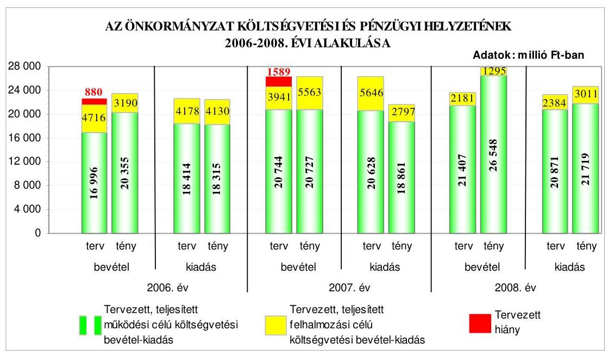

A 2006. évről a 2007. évre - a teljesített költségvetési bevételek főösszegének növekedése mellett - a teljesített költségvetési kiadások főösszege csökkent, míg a 2008. évre a költségvetési bevételek és kiadások főösszege növekedett az előző évhez képest. A költségvetés végrehajtása során a tényleges egyensúlyi helyzet a tervezetthez viszonyítva javult, a 2006-2007. években a tervezett költségvetési hiánnyal szemben pénzügyi többlet keletkezett. A 2008. évben a tervezett költségvetési többletbevételt meghaladó pénzügyi többletet értek el. A teljesített

---

múködési célú költségvetési bevételek és kiadások egyenlege a 2006-2008. években többletet eredményezett, amely a 2006. és a 2008. évben fedezetet biztosított a teljesített felhalmozási célú költségvetési bevételeket meghaladó teljesített felhalmozási célú költségvetési kiadásokra. A 2007. évben a teljesített felhalmozási célú költségvetési kiadások nem haladták meg a teljesített felhalmozási célú költségvetési bevételeket. A 2006-2008. években a költségvetési bevételi többletet a teljesített múködési célú költségvetési bevételek többlete eredményezte, melyhez a 2007. évben a felhalmozási célú költségvetési többletbevétel is hozzájárult.

A múködési célú költségvetési bevételek közül a helyi adók a 2006-2008. években a jóváhagyott eredeti költségvetési előirányzathoz képest túlteljesültek, ami nem vezethető vissza tervezési hiányosságra, mivel az iparűzési és az idegenforgalmi adó a fővárosi forrásmegosztás részét képezi. A 2006-2009. években a múködési és a felhalmozási célú költségvetési bevételek között figyelembe vették az előző évi pénzmaradványt az áthúzódó kötelezettségek forrásaként. A tervezett pénzmaradvány 2006. és 2008. évi eredeti előirányzatának nagyságrendje - az előző évi módosított pénzmaradvány 14\%, illetve 57\%-a - tervezési hiányosságra vezethető vissza, mivel a pénzmaradvány $86 \%-43 \%$-át az előző évi pénzmaradványról szóló rendelet elfogadását követően az éves költségvetési rendelet első módosítása tartalmazta. A felhalmozási célú költségvetési kiadásokon belül a beruházási és a felújítási kiadások tervezetthez viszonyított 2006. és 2008. évi többletteljesítése, illetve a 2007. évben a tervtől való elmaradás nem tervezési hiányosságból eredt, hanem abból, hogy az eredeti előirányzaton túlmenően a kötelezettségvállalással terhelt pénzmaradvány és a céltartalék összege volt a forrásuk, illetve a teljesítés elmaradása az informatikai beruházásokhoz kapcsolódó projekt utómunkálatainak elhúzódására és a benyújtott számlák utófinanszírozással történt folyósítására vezethető vissza.

A 2006-2007. évi költségvetések végrehajtása során a pénzügyi helyzet alakításához, a fizetőképesség fenntartásához az Önkormányzat hosszú lejáratú, fejlesztési célú hiteleket vett igénybe, továbbá a 2008. évben fejlesztési céllal kötvényt bocsátott ki. A Képviselő-testület a kötvénykibocsátásról szóló döntés meghozatalakor a döntéskor ismert pénzpiaci feltételekkel számolt. A forint svájci frankhoz viszonyított árfolyamváltozása, valamint a változó kamatmérték miatt az Önkormányzat számára a kötvénykibocsátás kockázatot jelent. Az Önkormányzat pénzügyi helyzete a 2006. évről a 2008. évre eladósodásának növekedése miatt összességében kedvezőtlenül alakult, azonban az Önkormányzat fizetőképessége kiemelkedően kedvező volt, mert a likviditási mutatók jelentősen meghaladták a 2008. évben vizsgált Budapest fővárosi kerületek likviditási mutatóinak (a készpénz likviditási mutatónál közel tízszeresen, a likviditási gyorsrátánál több mint ötszörösen) az átlagos mértékét.

Az Önkormányzat rendelkezett a Képviselő-testület által jóváhagyott gazdasági programmal, valamint ágazati, szakmai fejlesztési koncepciókkal. Az Önkormányzat az európai uniós támogatással megvalósítandó fejlesztésekre a 2006-2009. I. negyedévben 15 pályázatot nyújtott be. Ebből kilenc sikerrel zárult, négyet elutasítottak, kettő elbírálása 2009. július végéig nem történt meg. Öt projekt befejeződött és négy megvalósítása elkezdődött. Az NFT, valamint az ÚMFT keretében megpályázott projektek összhangban voltak az Önkormányzat fejlesztési célkitűzéseivel. Az Önkormányzat költségvetési rendeletei az Áht.

---

és az Ámr. előírásai ellenére nem tartalmazták elkülönítetten az európai uniós forrást igénylő fejlesztési feladatok megnevezését, bevételi és kiadási előirányzatait.

Az Önkormányzatnál a Polgármesteri hivatal három köztisztviselőjének munkaköri leírásában, valamint 2009. májusától jegyzői és polgármesteri együttes utasításban határozták meg az európai uniós források igénybevételének és felhasználásának feladatait. A szabályozás magába foglalta a pályázatfigyelés és pályázatkészítés, továbbá a fejlesztés lebonyolításával kapcsolatos eljárási rendet. A FEUVE előírásai vonatkoztak az európai uniós forrásokkal támogatott fejlesztési feladatokra is. A pályázatfigyelés, a pályázatkészítés és a fejlesztési feladat lebonyolításának személyi és szervezeti feltételeit elsősorban a Polgármesteri hivatalon belül alakították ki. A GVOP-4.3.1. „Az elektronikus önkormányzati szolgáltatások fejlesztése" projekt pályázatkészítésébe bevontak külső szakmai szervezetet, a projekt megvalósítását és az egyes szakmai feladatok teljesítésének tesztelését, teljesítésének nyomon követését megbízás alapján külső céggel végeztették. A tervezett projekt a módosított támogatási szerződésekben foglalt határidőn belül megvalósult, és az elnyert 284 millió Ft európai uniós támogatás felhasználása a jogszabályi előírásoknak megfelelően megtörtént.

Az Önkormányzat a szabályozottság és szervezettség tekintetében a 20062008. években nem készült fel eredményesen az európai uniós források igénybevételére és a várható támogatások felhasználására annak ellenére, hogy a benyújtott pályázatok az Önkormányzat gazdasági programjában, ágazati, szakmai koncepciókban, tervekben megfogalmazott célkitűzésekhez kapcsolódtak, valamint a folyamatba épített előzetes és utólagos vezetői ellenőrzési feladatok a szabályozás szerint kiterjedtek az európai uniós forrásokkal megvalósuló fejlesztési célokra, továbbá a pályázatfigyelés, a pályázatkészítés és a fejlesztési feladat lebonyolításának szervezeti, személyi feltételeit biztosították, azonban átfogó szabályozás hiányában a pályázatkészítést, valamint a pályázatfigyelést végző és a döntési, illetve a döntés-előterjesztési jogkörrel rendelkezők közötti információszolgáltatási kötelezettséget nem írták elő, a belső ellenőrzési stratégiát megalapozó kockázatelemzést nem terjesztették ki az európai uniós forrásokkal támogatott fejlesztési feladatokra, továbbá nem határozták meg a fejlesztési feladat lebonyolítását végző ellenőrzési kötelezettségét. A jegyző és a polgármester a 2009. évben az együttes utasítás kiadásával a szabályozásbeli hiányosságot megszüntette.

Az Önkormányzat rendelkezett informatikai stratégiával a 2006-2009. évek közötti időszakban. Az Önkormányzat a GVOP pályázati cél keretében „elektronikus önkormányzati szolgáltatások fejlesztése"címen 284 millió Ft támogatásban részesült. A projekt a 2007. évben megvalósult és az e-közigazgatás múködésének feltételeit javította. Az Önkormányzat „a Zuglói Polgármesteri Hivatal szervezetfejlesztése" című pályázatát az ÁROP keretében 45 millió Ft támogatásban részesítették, a projekt megvalósítása a 2009. évben elkezdődött. Az Önkormányzat az elektronikus ügyintézés szabályairól rendeletet alkotott, melyben felsorolták azokat a közigazgatási hatósági ügyeket, amelyek elektronikus úton is intézhetők, a többi ügyfajtát kizárták az elektronikusan intézhető ügyek köréből. Az e-közigazgatást az Önkormányzat saját számítógépes információs rendszerén keresztül, vásárolt szoftverekkel a Polgármesteri hivatalon belül működtette. A Polgármesteri hivatalban az e-közigazgatás keretében történő

---

ügyintézést egyes ügykörökben 1., 2. és 3. elektronikus szolgáltatási szinten valósították meg.

Az Önkormányzat honlapjának nyitó oldala megfelelt a vonatkozó IHM rendeletben előírt szerkezeti követelményeknek és közzététel is ez alapján történt. Az Önkormányzat nem tett eleget az Eisztv. és az Áht. alapján előírt közzétételi kötelezettségének, mivel a céljellegú működési és felhalmozási támogatások kedvezményezettjeinek nevét, a támogatás célját, összegét és a támogatási program helyét közétették ugyan, azonban az Áht. előírása ellenére a közzététel a társasházaknak nyújtott támogatás esetében a döntéshozatalt követő 60 napon túl, év végén a támogatás elszámolását és az összeg utalását követően történt. Az Áht. előírása ellenére az elektronikus közzététel elmaradt a vagyonértékesítési, illetve szolgáltatási szerződések esetében, míg az intézmények által megkötött szerződések típusát a közzététel során nem szerepeltették. Az Önkormányzat közzétette a 2008. évi költségvetési beszámoló szöveges indoklását az Ámr-ben előírtaknak megfelelően, azonban az nem felelt meg a Vhr-ben előírt tartalmi követelményeknek, mert a szöveges indoklásban nem ismertették a kötelezettségállomány alakulását és az azt befolyásoló tényezőket, a könyvviteli mérlegben kimutatott részesedések szöveges értékelése nem történt meg, a táblázatos kimutatásban nem szerepeltették a részesedések mennyiségét, az Önkormányzat könyvvizsgálatra kötelezett volt, azonban erre a kötelezettségre a költségvetési beszámoló kiegészítő mellékletében utalás nem történt.

A költségvetés tervezési és zárszámadás készítési folyamatok szabályozottsága alacsony kockázatot jelentett a feladatok megfelelő, szabályszerű végrehajtásában, mivel a jegyző a pénzügyi irányítási és ellenőrzési rendszer keretében szabályozta a költségvetési tervezés és zárszámadás elkészítési rendjét, meghatározta a Polgármesteri hivatalban és az intézményeknél a költségvetési javaslat összeállításával kapcsolatos követelményeket, előírta a költségvetési tervezéshez készített intézményi mutatószám felmérés adatai megalapozottságának, az intézmények által az állami támogatásokkal, hozzájárulásokkal történő elszámoláshoz közölt mutatószámok adatai megbízhatóságának, valamint az intézményi pénzmaradványok kimunkálása szabályszerűségének ellenőrzését. A költségvetési tervezési és zárszámadás készítési folyamatban a múködésbeli hibák megelőzésére, feltárására, kijavítására kialakított belső kontrollok múködésének megbízhatósága kiváló volt, mivel a Polgármesteri hivatalban és az intézményeknél az előírásoknak megfelelően ellenőrizték, hogy az intézmények teljesítették-e a költségvetési javaslat összeállításával kapcsolatban részükre meghatározott követelményeket, megalapozottak-e az intézményi mutatószám felmérés adatai, valamint a zárszámadás készítés folyamatában az állami támogatásokkal, hozzájárulásokkal történő elszámoláshoz közölt mutatószámok adatai megbízhatóságát és az intézmények pénzmaradvány megállapításának szabályszerűségét.

A gazdálkodási, a pénzügyi-számviteli és a folyamatba épített ellenőrzési feladatok szabályozottságának hiányosságai közepes kockázatot jelentettek a feladatok megfelelő, szabályszerű végrehajtásában, mivel a Polgármesteri hivatal 2009. áprilisig nem rendelkezett a Képviselő-testület által jóváhagyott SzMSz-el, valamint a pénzügyi irányítási és ellenőrzési rendszer keretében a jegyző nem készítette el a gazdasági szervezet ügyrendjét, azonban a kialakított belső kontrollok - végrehajtásuk esetén - a lehetséges hibák többsége ellen

---

védelmet nyújtottak. A jegyző a FEUVE-val kapcsolatosan elkészítette az ellenőrzési nyomvonalat, azonban az nem tartalmazta, hogy a tevékenységeket részletesen mely szabályzat tartalmazza, és a tevékenységek elvégzését igazoló dokumentumok megnevezését és fellelési helyét a rendszerben. A jegyző elkészítette a kockázatkezelési eljárásrendet, az azonban nem tartalmazta a kockázatok folyamatgazdáit, értékelését, kategóriákba sorolását, nyilvántartását, a válaszintézkedéseket, a kockázati szint meghatározását, a kockázati környezet rendszeres felülvizsgálatát, valamint a szabálytalanságok kezeléséről szóló eljárásrend nem mutatta be a szabálytalanságok észlelése esetén teendő intézkedések nyomon követését. A gazdálkodási, a pénzügyi-számviteli és a folyamatba épített ellenőrzési feladatok szabályozottsága javult a 2009. évre a korábbi ÁSZ vizsgálat javaslatainak hasznosulása következtében, mivel a jegyző módosította a kötelezettségvállalás, utalványozás, érvényesítés rendjét és belső szabályzatban rögzítette a szakmai teljesítésigazolás módját.

A Polgármesteri hivatalnál a karbantartási, kisjavítási szolgáltatások, a gépek, berendezések és felszerelések beszerzése, valamint az államháztartáson kívülre történő működési, illetve felhalmozási célú pénzeszközátadások gazdasági eseményei között elszámolt kiadások teljesítése során a belső kontrollok múködésének megbízhatósága jó volt, mivel a külső szolgáltató által végzett karbantartási, kisjavítási szolgáltatásokkal, a gépek, berendezések, felszerelések beszerzésével, létesítésével kapcsolatos kiadások teljesítése során a feladatok teljesítésének, a kiadás jogosultságának, összegszerűségének ellenőrzését a szakmai teljesítés igazolására kijelölt személyek a gazdálkodási jogkörök szabályzata ${ }_{1,2,3,4,5}$-ben előírt módon elvégezték. Az utalvány ellenjegyzője a gazdálkodásra vonatkozó szabályok érvényesüléséről, továbbá a szakmai teljesítésigazolás és az érvényesítés elvégzéséről meggyőződött, azonban a múködési és a felhalmozási célú pénzeszközátadások államháztartáson kívülre teljesített gazdasági események között elszámolt kiadások teljesítése során a szakmai teljesítésigazolásra kijelölt személyek a folyamatba épített ellenőrzési feladataikat a gazdálkodási jogkörök szabályzata ${ }_{1,2,3,4,5}$-ben foglaltak ellenére nem végezték el. Az utalványok ellenjegyzője a múködési, valamint a felhalmozási célú támogatások kifizetéseit megelőzően nem győződött meg a szakmai teljesítésigazolás belső szabályzatban előírt módon való megtörténtéről, a gazdálkodásra vonatkozó szabályok érvényesülését, továbbá az érvényesítés elvégzését ellenőrizte. A szakmai teljesítésigazolás és az utalvány ellenjegyzés múködésében megállapított hiányosságok azonban nem veszélyeztették a lényeges hibák, szabálytalanságok, megelőzését, feltárását és kijavítását.

A Polgármesteri hivatalban az informatikai rendszerek múködésének szabályozottsága összességében alacsony kockázatot jelentett, mivel az Önkormányzat rendelkezett a Képviselő-testület által elfogadott informatikai stratégiával, az arra jogosult munkatársak részére elérhetők voltak a pénzügyszámvitel által használt programok. A Polgármesteri hivatalban a 2008. évtől bevezették az integrált pénzügyi-számviteli informatikai rendszert. A 2006. évben kiadott informatikai biztonsági szabályzatot 2009. februárban felülvizsgálták és korszerűsítették. Az alkalmazott informatikai rendszerek belső kontrolljainak megbízhatósága összességében jó volt, mivel a hozzáférési jogosultságok ellenőrizhetőségét biztosították, megvalósították a pénzügyi-számviteli prog-

---

ramokban a jelszavakra előírt szabályok teljes körű betartását, dokumentálták a változáskezelési eljárások ellenőrzését, illetve tesztelését, azonban az előírt rendszerességgel nem ellenőrizték az ellenőrzési listát, valamint az elmúlt egy évben nem bizonyosodtak meg arról, hogy az elmentett állományból a pénz-ügyi-számviteli adatok teljes körűen helyreállíthatók-e. A feltárt hiányosságok azonban nem veszélyeztették az informatikai rendszerek megbízható múködését.

A belső ellenőrzés szervezeti kereteinek kialakítása és szabályozása a belső ellenőrzési feladatok megfelelő szabályszerű végrehajtásában összességében alacsony kockázatot jelentett, mivel a Képviselő-testület meghatározta a belső ellenőrzés ellátási módját, biztosította a belső ellenőrök funkcionális függetlenségét. A belső ellenőrzés rendelkezett a Képviselő-testület által jóváhagyott stratégiai tervvel, éves ellenőrzési tervvel a 2008. és 2009. évre, és a belső ellenőrzési kézikönyv, valamint az ellenőrzések lefolytatásához készített ellenőrzési programok tartalma megfelelő volt. Annak ellenére összességében alacsony volt a kockázat, hogy a stratégiai terv nem kockázatelemzésen alapult, valamint a belső ellenőrzési kézikönyv nem tartalmazta a belső ellenőrzési tevékenység minőségét biztosító eljárásokat. A belső ellenőrzés szervezeti kereteinek megfelelő, szabályszerű kialakítása és szabályozása javult a 2009. évre az előző ÁSZ vizsgálat során tett javaslatok hasznosulásával, mivel a jegyző biztosította a belső ellenőrök szervezeti függetlenségét, gondoskodott a stratégiai terv, valamint a soron kívüli ellenőrzés esetében ellenőrzési program elkészítéséről.

A belső ellenőrzés múködésénél a kialakított kontrollok megbízhatósága jó volt, mivel a belső ellenőrzéseket ellenőrzési program alapján hajtották végre, minden elvégzett vizsgálatról ellenőrzési jelentés készült, az ellenőrzöttek intézkedési tervet készítettek, az elvégzett ellenőrzésekről a belső ellenőrzési vezető nyilvántartást vezetett. A 2008. évi ellenőrzési tervben a Polgármesteri hivatalnál tervezett ellenőrzések közül négy ellenőrzésből hármat, míg az intézményeknél a tervezett ellenőrzések 97\%-át teljesítették. A belső ellenőrzés működésében megállapított hiányosságok nem veszélyeztették, hogy a belső ellenőrzés megelőzze, feltárja, kijavíttassa a lényeges hibákat és szabálytalanságokat. A soron kívüli ellenőrzés keretében egy intézmény szabályszerű működését vizsgálták. A jegyző teljesítette az Ámr-ben előírt, belső kontroll rendszerekre vonatkozó nyilatkozattételi kötelezettségét. A polgármester a 2007. és a 2008. évi zárszámadási rendeletekkel egyidejűleg az Ötv-ben előírtak teljesítésére a Képviselő-testület elé terjesztette az Önkormányzat által alapított és felügyelt költségvetési szervek éves ellenőrzési jelentései alapján összeállított éves összefoglaló ellenőrzési jelentést, melyet a Képviselő-testület határozataival elfogadott.

Az Önkormányzat gazdálkodási rendszerének 2006. évi átfogó ellenőrzéséről készített számvevői jelentés 41 szabályszerűségi és hat célszerűségi javaslatot tartalmazott. A javaslatok megvalósulása érdekében a felelősök és a határidők megjelölésével a jegyző intézkedési tervet készített, valamint a polgármester és a jegyző utasításokat adott ki az illetékes szervezeti egységek vezetőinek a hiányosságok megszüntetésére. A Képviselő-testület a 2007. júniusi ülésén tárgyalta meg a 2006. évi átfogó ellenőrzésről készült jelentést, és ezzel egyidejűleg tájékoztatást kapott az addig megtett intézkedésekről. Az ÁSZ ellenőrzés által

---

tett javaslatok 66,0\%-a megvalósult, 8,5\%-a részben, 25,5\%-a nem teljesült. A szabályszerűségi javaslatok 63,4\%-a realizálódott, 9,8\%-a részben valósult meg, $26,8 \%$-a nem hasznosult. A hat célszerűségi javaslat $84 \%$-a realizálódott, $16 \%$-a nem teljesült.

A szabályszerűségi javaslatok közül az intézkedési tervben foglalt határidőre teljesítette a polgármester a Pénzügyi bizottság és a kisebbségi önkormányzatok véleményének költségvetési koncepcióhoz, költségvetési rendelettervezethez történő csatolására, a költségvetés és a zárszámadás előterjesztésekor tájékoztatásul bemutatandó összevont mérlegek és a többéves kihatással járó döntések rendeletben történő meghatározására, a Pénzügyi Bizottság által a hitelfelvétel megalapozottságának vizsgálatára, a középületek akadálymenetesítésére, illetve a jegyző az utolsó előirányzat módosítás határidejére, minden érvényesítő esetében az összeférhetetlenségi követelmények betartására, a kötelezettségvállalások írásba foglalására, a bevételek szakmai teljesítésigazolására, a nem pénzforgalmi gazdasági események elszámolására, az analitikus nyilvántartás és a főkönyvi könyvelés közötti egyeztetés elvégzésére, a kötelezettségvállalások nyilvántartására, a bizonylatok kiállítására, a folyamatba épített ellenőrzési feladatok elvégzésére, az ingatlanok mennyiségi leltározására, a céljelleggel juttatott támogatások célnak megfelelő felhasználásának ellenőrzésére, a FEUVE múködéséről történő beszámoltatásra, a pénzmaradvány összegének meghatározására, a kisebbségi önkormányzatok határozatainak beépítésére, a belső ellenőrzési feladatok szabályszerű ellátásának biztosítására vonatkozó javaslatokat.

A jegyző részben teljesítette a több éves kihatással járó döntések bemutatására vonatkozó javaslatot, amelyek között csak az adósságszolgálatot jelenítette meg, az Áht. előírását figyelmen kívül hagyva a több évre kiható egyéb önkormányzati döntésen alapuló múködési és felhalmozási célú kötelezettségvállalásokat nem tüntette fel, a több éves kihatással járó döntések szöveges indoklását a költségvetés előterjesztésekor tájékoztatásul a Képviselő-testület részére nem készítette el. A költségvetési rendeletben bemutatta a költségvetési hiányt, de abban az Áht. előírása ellenére finanszírozási célú kiadást költségvetési hiányt módosító költségvetési kiadásként vett figyelembe, az államháztartáson kívülre juttatott támogatások esetében a számviteli bizonylatok nem feleltek meg az Ámr. előírásának, mert nem tartalmazták a szakmai teljesítés igazolását, amelyről az utalvány ellenjegyzője nem győződött meg.

A szabályszerűségi javaslatok közül az előírt határidőben a polgármester nem intézkedett az Ámr-ben foglaltak ellenére a Képviselő-testület 30 napon belüli tájékoztatásáról az intézmények saját hatáskörben végrehajtott előirányzatmódosításairól, az Áht. előírása ellenére a vagyongazdálkodásról szóló rendelet módosításáról az ingyenes vagyonátadás módjának és a követelés elengedés eseteinek szabályozása érdekében, a Munkáspárt részére megállapított kedvezményes helyiség-bérleti díj megszüntetéséről, mert nem történt meg a szerződés felbontása és az elmaradt bérleti díj beszedése, az Önkormányzat által ellátott feladatok módjával és mértékével kapcsolatban a Képviselő-testület Ötv. alapján történő döntéséről. A jegyző nem teljesítette az Ámr. előírása ellenére a polgármesteri hivatali SzMSz-ének és a Pénzügyi osztály ügyrendjének elkészítésére vonatkozó javaslatot, amelyért az Ámr. szerint a jegyző a felelős. Felelősségre vonást kezdeményező javaslatot nem tettünk, mert a mulasztásért felelős

---

személy köztisztviselői jogviszonya megszűnt. A jegyző nem intézkedett továbbá az intézkedési tervben megjelölt határidőre a pénzeszközátadások Vhr. előírásának megfelelő tagolásáról, az üzemeltetésre átadott eszközök a Vhr-ben foglaltaknak megfelelő számviteli nyilvántartásáról, az intézményi beszámolók Ámr-ben előírtak szerinti felülvizsgálatáról és az intézmények értesítéséről, a kisebbségi önkormányzatokkal kötött megállapodások módosításáról, hogy az Ámr. előírásának megfelelően tartalmazza a jegyző felkérését az előirányzat módosítási és a zárszámadási határozattervezetek elkészítésére, a Ber. alapján a belső ellenőrzés stratégiai tervének elkészítéséről. A javaslatok hasznosítása határidőn túl megtörtént.

A hasznosult célszerűségi javaslatok alapján a polgármester a Képviselőtestület elé terjesztette a számvevői jelentést, a Képviselő-testület a végrehajtott szervezeti változásokról szakmai és gazdasági értékelést tartalmazó előterjesztések alapján döntött, a polgármester előírta a kötelezettségvállalók és az utalványozók, valamint a jegyző az ellenjegyzők beszámolási kötelezettségét, a felhatalmazottak kötelezettségüket teljesítették. A jegyző a házi pénztárban tartható készpénz mennyiségét csökkentette, bevezette a pénzügyi-számviteli feladatok ellátásához kapcsolódó integrált pénzügyi-számviteli informatikai rendszert. A jegyző nem gondoskodott a közbeszerzési eljárások kockázatelemzésen alapuló belső ellenőrzéséről.

A Magyar Köztársaság 2006. évi költségvetés végrehajtásának ellenőrzése keretében az Önkormányzatnál 2007. május hónapban volt ÁSZ ellenőrzés. „A 2006 évi kötött felhasználású támogatások ellenőrzése" című vizsgálat hat szabályszerűségi és három célszerűségi javaslatot tartalmazott, amelyekre egy kivétellel határidőben intézkedtek. A polgármester a Képviselő-testületet határidőn túl, a 2009. évben tájékoztatta az ÁSZ ellenőrzés tapasztalatairól.

Az ÁSZ 2007. október hónapban elvégezte az Önkormányzatnál a Fővárosi Önkormányzatot és a kerületi önkormányzatokat osztottan megillető bevételek 2007. évi megosztásáról szóló fővárosi önkormányzati rendelet felülvizsgálatát. A számvevői jelentés három célszerűségi javaslatot tartalmazott, amelyekre intézkedés történt.

A 2006-2008. években az Önkormányzatnál végzett ÁSZ ellenőrzések javaslatai összességében 71\%-ban hasznosultak, 7\%-ban részben teljesültek, 22\%-ban nem valósultak meg.

A helyszíni ellenőrzés megállapításainak hasznosítása mellett javasoljuk:

# a polgármesternek 

a munka színvonalának javítása érdekében
kezdeményezze, hogy a számvevőszéki jelentésben foglaltakat a Képviselő-testület tárgyalja meg, és a feltárt hiányosságok megszüntetésére készíttessen intézkedési tervet a határidők és felelősök megjelölésével;

---

# a jegyzőnek 

a jogszabályi előírások maradéktalan betartása érdekében

1. gondoskodjon arról, hogy az intézmények által elnyert európai uniós támogatások előirányzatai az Áht. 118. § (1) bekezdés 2 b) pontja, valamint az Ámr. 29. § (1) bekezdés d), g) és k) pontjai előírásainak megfelelően az Önkormányzat éves költségvetési rendeleteiben szerepeljenek;
2. gondoskodjon arról, hogy az Ámr. 157/D. § (1) bekezdés előírása alapján az éves költségvetési beszámoló közzététele során érvényesüljenek a beszámoló szöveges indoklását előíró Vhr. 40. §-ának követelményei;
3. gondoskodjon az Ámr. 145/C. § (1)-(4) bekezdéseiben előírtak és az Ámr. 145/A. § (3) bekezdésében hivatkozott „Útmutató a kockázatkezelés kialakításához" módszertan alapján a kockázatkezelési eljárásrend kiegészítéséről, hogy az tartalmazza a kockázatok azonosítását, folyamatgazdáit, értékelését, kategóriákba sorolását, nyilvántartását, a kockázati szint meghatározását és a kockázati környezet rendszeres felülvizsgálatát;
4. egészítse ki az Ámr. 145/A. § (5) bekezdésében előírtak és az Ámr. 145/A. § (3) bekezdésében hivatkozott „Útmutató a szabálytalanságok kezeléséhez" módszertan alapján a szabálytalanságok kezelésének eljárásrendjét az intézkedések nyomon követésével;
5. gondoskodjon arról, hogy a belső ellenőrzés stratégiai terve a Ber. 19. § alapján kockázatelemzésen alapuljon;
a munka színvonalának javítása érdekében
6. gondoskodjon a belső ellenőrzés keretében az éves ellenőrzési tervben foglaltak teljesítéséről, a közbeszerzés tervezett ellenőrzésének végrehajtásáról.

---

# II. RÉSZLETES MEGÁLLAPÍTÁSOK 

## 1. AZ ÖNKORMÁNYZAT KÖLTSÉGVETÉSI ÉS PÉNZÚGYI HELYZETE

### 1.1. A tervezett költségvetési bevételek és kiadások alapján a költségvetési egyensúly alakulása, a költségvetési hiány oka, finanszírozásának tervezett módja és a költségvetési hiány megállapításának szabályszerűsége

Az Önkormányzatnál a 2006-2009. években a tervezett költségvetési bevételek (az évek sorrendjében 21 712-24 685-23 588-33 394 millió Ft) és kiadások (az évek sorrendjében 22 592-26 274-23 255-33 602 millió Ft) főösszege változó tendenciát mutatott, mivel az előző évhez képest a 2007. évre növekedett, a 2008. évre csökkent, majd a 2009. évre újból növekedett.

Az Önkormányzat a 2006-2009. években tervezett költségvetési bevételeinek és kiadásainak, valamint egyensúlyi helyzetének alakulását a következő ábra szemlélteti:
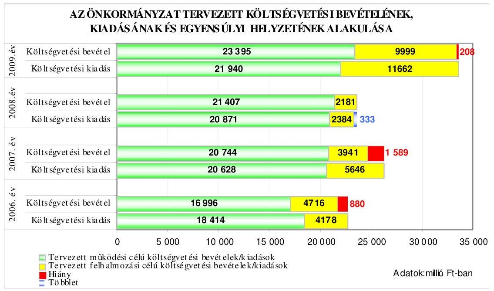

Az Önkormányzat a 2006-2007. és 2009. évi költségvetési rendeleteiben a költségvetési bevételek és kiadások egyensúlyát nem biztosította, mivel a tervezett költségvetési kiadások meghaladták a tervezett költségvetési bevételeket. A költségvetés egyensúlya 2008-ban biztosított volt. A múködési célú költségvetési kiadás eredeti előirányzatát a 2006. évben hiányzó forrással tervezték meg, azonban a 2007-2009. évi költségvetés tervezése során a működési célú bevételek fedezték a múködési célú kiadásokat. A tervezett felhalmozási célú költségvetési bevételek 2006-ban fedezték a felhalmozási célú költségvetési

---

kiadásokat. A tervezett felhalmozási célú költségvetési kiadások a 2007-2009. években folyamatosan meghaladták a tervezett költségvetési felhalmozási célú bevételeket.

A költségvetési bevételek hiányát a 2006. évben a tervezett múködési célú költségvetési bevételek hiánya okozta, míg a 2007. és 2009. években a felhalmozási célú költségvetési bevételeket meghaladó összegben tervezett felhalmozási célú kiadások eredményezték. A 2008. évben a 333 millió Ft költségvetési többletet a tervezett múködési célú költségvetési bevétel és kiadás 536 millió Ft többletének és a felhalmozási célú költségvetési bevétel és kiadás 203 millió Ft költségvetési hiányának különbsége okozta.

Az Önkormányzat a 2006-2007. és 2009. évek költségvetési rendeleteiben a hiány finanszírozásához, illetve a költségvetési egyensúly biztosításához hosszú lejáratú hitelek felvételét, a fejlesztések forrásának biztosításához a 2008. évben felhalmozási célú kötvény kibocsátását, valamint bevételt növelő és kiadást csökkentő intézkedések megtételét tervezte:

- a Képviselő-testület a 2006. évi költségvetési rendeletben 1032 millió Ft, a 2007. évben 1793 millió Ft, a 2009. évben 576 millió Ft hosszú lejáratú felhalmozási célú hitel felvételéről döntött;
- a Képviselő-testület kötvény kibocsátásáról hozott határozatot - a gazdaságossági számítás figyelembevételével - a 2007. évben, mely alapján a 2008. évi költségvetési rendelet módosításában felhalmozási céllal 5000 millió Ft kötvény kibocsátását hagyta jóvá;

A Képviselő-testület a 2007. évben a forgalomképtelen, illetve korlátozottan forgalomképes törzsvagyont érintő fejlesztések megvalósítása érdekében külső források bevonását tervezte a fejlesztések finanszírozásához. A finanszírozási konstrukciókra vonatkozóan gazdasági elemzést készítettek, amely alapján a Képvise-lő-testület a 953/2007. (XI. 13.) számú határozatában a hitelfelvételi korlát által megengedett mértékű kötvény kibocsátásáról döntött. A Képviselő-testület az 1025-1027/2007. (XII. 11.) számú határozatai szerinti feltételeknek megfelelő 5000 millió Ft svájci frank alapú kötvény zártkörű forgalomba hozatalát hagyta jóvá, a legalacsonyabb összegű ajánlattevő ajánlatának elfogadásával. Az Önkormányzat kötelezettséget vállalt arra, hogy a kötvény futamideje alatt a kötvényt és járulékait a költségvetésbe betervezi és jóváhagyja.

- a 2006-2009. évi költségvetési rendeletekben előírták, hogy szerződéskötéskor minden esetben ki kell kötni késedelmi kamatot, mely nem lehet kevesebb a mindenkori jegybanki alapkamat kétszeresénél, új szerződéskötéskor a használatba adott ingatlanért, tárgyi eszközökért legalább a fenntartásukat biztosító mértékű használati díjat kell kikötni, továbbá intézmények alapítványokat, társadalmi szervezeteket nem támogathatnak. A jóváhagyott bevételi előirányzaton felüli többletbevétel és a jóváhagyott előző évi előirányzat kötelezettségvállalással nem terhelt maradványa általános tartalékba helyezendő és a Képviselő-testület döntése alapján használható fel. A Képvise-lő-testület felhatalmazta a polgármestert arra, hogy az átmenetileg szabad pénzeszközök - bankbetétben vagy kizárólag állampapírokban történő - lekötéséről döntsön. Az Önkormányzat a 2007. évi költségvetési rendeletében 15 fős létszámcsökkentésről határozott a Polgármesteri hivatalban;

---

- az Önkormányzat döntött az intézményi térítési díjak megállapításáról a 2006-2009. években, a lakások bérleti díjának 2007. és 2009. évi emeléséről, továbbá a 2007-2008. évek között intézmények megszüntetését, illetve egyesítését tervezte.

A jegyző a költségvetés tervezése során, a költségvetés végrehajtása érdekében, a likviditás feltételeinek kialakításáról, a pénzállomány alakulásáról az Ámr. 139. § (1) bekezdése előírásának megfelelően likviditási terv készítésével gondoskodott, melynek aktualizálását a költségvetési rendelet a tárgyhónapot megelőző hó 20 -ig írta elő.

Az Önkormányzatnál a 2006-2009. évi költségvetési rendeletekben a kiadási és a 2006. év költségvetési rendeletben a bevételi főösszeg megállapításakor megsértették az Áht. 8/A. § (7) bekezdésében foglaltakat, mivel finanszírozási célú pénzügyi múveleteket (hosszú lejáratú hiteltörlesztéssel kapcsolatos kiadásokat, valamint bevételeket) vettek figyelembe költségvetési hiányt módosító költségvetési bevételként a 2006. évi költségvetési rendeletben és költségvetési kiadásként a 2006-2009. évi költségvetési rendeletekben ${ }^{11}$.

A költségvetés bevételi és kiadási főösszegei az éves költségvetési rendeletekben felhalmozási célra a 2006. évben 1032 millió Ft hosszú lejáratú hitelfelvételt és a 2006-2009. években, az évek sorrendjében 152 millió Ft, 204 millió Ft, 333 millió Ft, 368 millió Ft hiteltörlesztést tartalmaztak.

# 1.2. A teljesített költségvetési bevételek és kiadások alapján a pénzügyi egyensúly alakulása, a pénzügyi hiány oka, finanszírozásának módja és hatása a pénzügyi helyzetre az eladósodás, valamint a fizetőképesség szempontjából 

A 2006. évről a 2007. évre - a teljesített költségvetési bevételek (az évek sorrendjében 23 545-26 290-27 843 millió Ft) főösszegének növekedése mellett - a teljesített költségvetési kiadások (az évek sorrendjében 22 445-21 65824730 millió Ft) föösszege csökkent, míg a 2008. évre a költségvetési bevételek és kiadások főösszege növekedett.

A pénzügyi egyensúly fennállt a 2006-2008. évi költségvetések teljesítése során. A teljesített múködési célú költségvetési bevételek és kiadások egyenlege a 2006-2008. években többletet eredményezett, amely a 2006. és a 2008. évben fedezetet biztosított a teljesített felhalmozási célú költségvetési bevételeket meghaladó teljesített felhalmozási célú költségvetési kiadásokra. A 2007. évben a teljesített felhalmozási célú költségvetési kiadások nem haladták meg a teljesített felhalmozási célú költségvetési bevételeket. A 2006-2008. években a költségvetési bevételi többletet a teljesített múködési célú költségvetési bevételek többlete eredményezte, melyhez a 2007. évben a felhalmozási célú költségvetési többletbevétel is hozzájárult.

[^0]
[^0]:    ${ }^{11}$ A közbenső egyeztetés során a polgármester által adott tájékoztatás szerint az Önkormányzat a 30/2009. (IX. 21.) számú rendeletében intézkedett a költségvetési hiány Áht. 8/A. § (7) bekezdésében foglaltaknak megfelelő megállapításáról.

---

A teljesített költségvetési bevételek és kiadások, valamint az egyensúlyi helyzet alakulását szemlélteti a következő ábra:
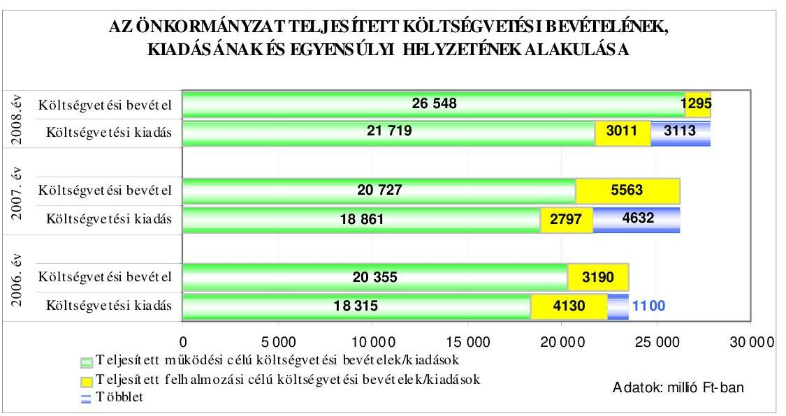

A költségvetési kiadások költségvetési bevételekkel való fedezettsége a tervadatok alapján a 2006. évről a 2007. évre csökkent, majd a 2008. évre növekedett. A 2009. évi tervadat az előző évhez képest szintén csökkenést mutatott. A tényadatok alapján a fedezettségi mutató a 2006. évről a 2007. évre növekedett, a 2008. évre csökkent. A költségvetési kiadási főösszegre vonatkozó fedezettségi mutató tervezettől történő eltérését a múködési és a felhalmozási célú költségvetési kiadások fedezettségi mutatójának a tervezettől eltérő alakulása együttesen okozta. A költségvetés végrehajtása során a tényleges egyensúlyi helyzet a tervezetthez viszonyítva javult, a 2006-2007. években a tervezett költségvetési hiánnyal szemben nem alakult ki pénzügyi hiány. A 2006-2007. években keletkezett évközi többletbevételeket az általános tartalékba helyezték, felhasználásáról a Képviselő-testület döntött. A 2008. évben a tervezett költségvetési többletbevételt meghaladó pénzügyi többlet keletkezett.

A költségvetési bevételek az eredeti előirányzathoz képest a 2006-2008. években az évek sorrendjében 108,4\%-ra, 106,5\%-ra, illetve 118,0\%-ra teljesültek, míg a költségvetési kiadások $0,7 \%$-kal, $17,6 \%$-kal maradtak el a tervezettől, illetve $6,3 \%$-kal haladták meg a tervezettet. A költségvetési bevételek eredeti előirányzathoz viszonyított túlteljesítését a 2006-2008. években az intézményi múködési bevételek, a helyi adóbevételek és az azokhoz kapcsolódó pótlékok, bírságok, a közterületek hasznosításából származó bevételek, a kamat és osztalék bevétel tervezettnél kedvezőbb alakulása, valamint a 2006. és 2008. évben a rendelkezésre álló előző évi pénzmaradvány 14,5\%-os, illetve 57,2\%-os tervezése okozta. A költségvetési kiadások eredeti előirányzathoz viszonyított alulteljesítésének oka a 2006-2007. években a beruházási, felújítási kiadások és az államháztartáson kívüli felhalmozási célú pénzeszközátadások tervezettől történő elmaradása volt.

---

Az Önkormányzatnál a 2006-2009. években tervezett és a 2006-2008. években teljesített működési és felhalmozási célú költségvetési kiadásokra a következő arányban biztosítottak fedezetet a költségvetési bevételek:

Adatok: \%-ban

| Megnevezés | 2006.   év |  | 2007.   év |  | 2008.   év |  | 2009.   év |
| :--: | :--: | :--: | :--: | :--: | :--: | :--: | :--: |
|  | Terv | Tény | Terv | Tény | Terv | Tény | Terv |
| Múködési célú költségvetési kiadások fedezettsége múködési célú költségvetési bevételekből | 92,3 | 111,1 | 100,6 | 109,9 | 102,6 | 122,2 | 106,6 |
| Felhalmozási célú költségvetési kiadások fedezettsége felhalmozási célú költségvetési bevételekből | 112,9 | 77,2 | 69,8 | 198,9 | 91,5 | 43,0 | 85,7 |
| Költségvetési kiadások fedezettsége költségvetési bevételek-   böl | 96,1 | 104,9 | 94,0 | 121,4 | 101,4 | 112,6 | 99,4 |

A múködési célú költségvetési bevételek közül a helyi adók a 2006-2008. években a jóváhagyott eredeti költségvetési előirányzathoz képest túlteljesültek - 5,6\%-kal, 9,2\%-kal és 3,0\%-kal -, ami az iparűzési és idegenforgalmi adóbevétel növekedéséből adódott. A túlteljesítés nem vezethető vissza tervezési hiányosságra, mivel az iparűzési és az idegenforgalmi adó a fővárosi forrásmegosztás részét képezi.

A 2006-2009. években a múködési és a felhalmozási célú költségvetési bevételek között figyelembe vették az előző évi pénzmaradványt az áthúzódó kötelezettségek forrásaként. A tervezett pénzmaradványt az előző évi módosított pénzmaradvány 14,5-251,1-57,2-95,7\%-ában határozták meg a 2006-2009. évi költségvetések tervezése során. A pénzmaradvány 2006. és 2008. évi eredeti előirányzatának nagyságrendje tervezési hiányosságra vezethető vissza, mivel a pénzmaradvány $14,5 \%-57,2 \%$-át az éves költségvetési rendelet, a $85,5 \%$ -$42,8 \%$-át az előző évi pénzmaradványról szóló rendelet elfogadását követően az éves költségvetési rendelet első módosítása tartalmazta. A 2007. évi pénzmaradvány túltervezése több mint $50 \%$-ban a kerületközpont létrehozásához kapcsolódó értékesítési szerződés fizetési határidejének módosításából adódott.

Az értékesítés során a 2006. évben beérkezett előlegeket (1590 millió Ft) a szerződés teljes mértékű teljesítéséig nem lehetett végleges bevételként elszámolni, hanem függő tételként, amelyet a 2007. évi költségvetés készítésekor a pénzmaradvány részeként vettek figyelembe. A 2007. évi költségvetésben eredeti előirányzatként, az értékesítés tényleges összegének és az előlegnek a különbsége (2370 millió Ft) került megtervezésre az eredeti szerződés határidőinek ismeretében. A telekhatár kitűzési problémák módosították a teljesítés határidejét. A módosított szerződés szerinti összes bevétel a 2007. évben teljesült.

---

A felhalmozási célú költségvetési kiadásokon belül a beruházási kiadások tervezetthez viszonyított teljesítése a 2006-2008. évek közötti időszakban 235,2-86,2-195,8\% volt, a 2007. évben a tervtől való elmaradás az informatikai beruházásokhoz kapcsolódó projekt utómunkálatainak elhúzódására vezethető vissza. A felújítási kiadások tervezetthez viszonyított teljesítése a 20062008. évek közötti időszakban 210,0-69,7-214,5\% volt, a 2007. évben az önkormányzati lakásfelújítások elmaradásának oka, hogy a fűtéskorszerűsítéshez megítélt támogatásból megvalósuló korszerűsítést csak fűtési szezonon kívül lehetett elvégezni és a benyújtott számlákra utófinanszírozással történt a folyósítás. A 2006. és 2008. évi többletteljesítés oka, hogy a beruházások és a felújítások forrása az eredeti előirányzaton túlmenően a kötelezettséggel terhelt pénzmaradvány, illetve a céltartalék összege, amely nem tervezési hiányosságból eredt.

Az Önkormányzat intézkedett bevételeinek növelése és kiadásainak csökkentése céljából.

A 2007. és a 2009. évben megemelte az önkormányzati tulajdonú lakások lakbérének mértékét. A Zuglói Egészségügyi Szolgálat belső átszervezéssel központi raktárt hozott létre, amely következtében 20 millió Ft-tal csökkent az Önkormányzattól kapott működési támogatás. A Képviselő-testület a 2007. évi költségvetési rendeletben a Polgármesteri hivatal két ütemben (2007. április 1-től 10 fő, július 5 -től 5 fő) történő létszámcsökkentéséről, a 745/2007. (IX. 4.) számú határozatban a Zeg-Zug Zuglói Gyermekház jogutóddal történő megszüntetéséről 2008. február 1-jei hatállyal döntött, jogutód intézményként a Cserepesházat jelölte ki, továbbá a 844-845/2007. (X. 2.) számú határozataiban öt önállóan gazdálkodó intézmény jogkörét részben önállóan gazdálkodóra változtatta 2008. január 1-jétől, mely 46 millió Ft/év megtakarítással járt. A Zuglói Ifjúsági Innovációs és Tanácsadó Iroda 2008. május 1-jétől a Cserepesház tagintézménye lett. A dolgozói létszám a 2006. évről a 2007. évre 62,7 fővel csökkent, a 2008. évre az előző évhez képest 7,5 fővel nőtt. A 420/2008. (IV. 22.) számú Képviselő-testületi határozat alapján a polgármester keretmegállapodást kötött az önként vállalt feladatként múködtetett középfokú oktatási feladat ellátásához kapcsolódóan a Fővárosi Önkormányzattal a normatív hozzájárulás ( $80 \mathrm{Ft} /$ tanév/fő a 2008-2009es tanévben) átutalásáról.

A 2006-2007. évi költségvetések végrehajtása során a pénzügyi helyzet alakításához, a fizetőképesség fenntartásához az Önkormányzat hosszú lejáratú, fejlesztési célú hiteleket vett igénybe, továbbá a 2008. évben fejlesztési céllal kötvényt bocsátott ki. A Képviselő-testület a kötvénykibocsátásról szóló döntés meghozatalakor a döntéskor ismert pénzpiaci feltételekkel számolt ${ }^{12}$. A forint svájci frankhoz viszonyított árfolyamváltozása, valamint a változó kamatmérték miatt az Önkormányzat számára a kötvénykibocsátás kockázatot jelent.

[^0]
[^0]:    ${ }^{12}$ A fejlesztésekhez kapcsolódó finanszírozási konstrukciók 2007. év novemberében történt áttekintése során figyelembe vették az adósságot keletkeztető éves kötelezettségvállalás felső határát a 6372,3 millió Ft-ot, amely alapján a költségvetés éves szinten 1000-1500 millió Ft adósságszolgálat teljesítésére nyújt fedezetet.

---

A Képviselő-testület a 408/2008. (IV. 22.) számú határozatában felkérte a jegyzőt, hogy folyamatos tájékoztatást készítsen a kötvényfelhasználás alakulásáról, beleértve az adósságszolgálat időbeli eloszlását és a fejlesztések további éves fenntartási költségeit. A 2008. április 11-én aláírt „Zugló 2028" kötvény okirat alapján a betétként lekötött összegből 2008. augusztus 7-én 1856 millió Ft-ot lehívtak a 2008. évben megvalósuló fejlesztések finanszírozására. A Képviselő-testület az 1000/2008. (IX. 23.) számú határozatában tudomásul vette a kötvénykibocsátás eredményéről és a forrás felhasználásáról szóló jelentést, amely szerint az Önkormányzatnak a 2008. évben a kötvénykibocsátásából alacsonyabb kamatfizetési kötelezettsége keletkezett, mint amennyit a betétként történő lekötésekből bevételként realizált. Az Önkormányzat 2008. szeptember 23-ig a kötvény után 96 millió Ft kamatot fizetett, a kötvénykibocsátásból származó bevétel lekötéséből a realizált kamat 270 millió Ft volt.

A 2006-2008. években felvett hosszú lejáratú hitelekkel és kötvénykibocsátással kapcsolatos jellemzőket mutatja be a következő táblázat:

| Szerződéskötés ideje és célja | Hitel összege millió Ft | Futamidő év, hó | Türelmi idő év, hó | Kamat (fix, vagy változó) |
| :--: | :--: | :--: | :--: | :--: |
| 2006. március 3. |  |  |  |  |
| Panel Plusz Hitelprogram: lakóépület felújítás | 100 | 5 év | 2 év | változó |
| 2006. augusztus 21. |  |  |  |  |
| Lakásfelújítás (OTP) | 210 | 4 év és 10 hó | 1 év | változó |
| Panel Plusz Hitelprogram: lakóépület felújítás | 500 | 4 év és 10 hó | 1 év | változó |
| Önkormányzati Fejlesztési Hitelprogram: közoktatás intézményi felújítás | 289,4 | 4 év és 10 hó | 1 év | változó |
| Önkormányzati Fejlesztési Hitelprogram: városüzemeltetés (útépítés, park- és játszótér-rekonstrukció) | 32,4 | 4 év és 10 hó | 1 év | változó |
| 2008. április 11. |  |  |  |  |
| „Zugló 2028" fejlesztési célú kötvény | 5000 | 20 év | 3 év | változó |
| 2008. június 13. |  |  |  |  |
| Lakásfelújítás (OTP) | 226,3 | 5 év | 1 év | változó |

Az Önkormányzat felhalmozási célokra a 2006-2008. évek közötti időszakban 1358 millió Ft hosszú lejáratú hitelt vett igénybe és 5000 millió Ft kötvényt bocsátott ki.

---

A hosszú lejáratú hitel felvételi céljával azonosan került felhasználásra, amelyről a 2006-2008. év végi beszámoló előterjesztések részletes tájékoztatást tartalmaztak. A Képviselő-testület a 336-337/2008. (III. 31.) számú határozataiban döntött arról, hogy a kötvénykibocsátásból származó bevétel felhasználása a költségvetésekben elkülönítve jelenjen meg és minden kapcsolódó beruházást és kiadást a Képviselő-testület hagy jóvá. A kötvénykibocsátás eredményeiről és a forrás felhasználásáról szóló jelentést a Képviselő-testület a 2008. szeptember 23-i ülésén tudomásul vette.

A kötvénykibocsátásból származó bevétel teljesített felhasználása a Képviselőtestület által elfogadott „A 2008-2013. időszak forgalomképtelen, illetve korlátozottan forgalomképes törzsvagyont érintő fejlesztések ütemezése" címú - évente felülvizsgálandó - koncepcióban foglaltaknak megfelelően történt. Elkészült kettő parkrekonstrukció ( 7,3 millió Ft), egy-egy óvoda tető-, illetve alapvezeték felújítása, négy általános iskolában az elektromos kapacitás bővítése, az alapvezetékek, valamint a sportpályák felújítása. A további fejlesztéseknél folyamatban van a tervezési, az építési engedélyezési vagy a közbeszerzési eljárás, illetve a kivitelezés.

Az Önkormányzat nem vett fel folyószámlahitelt, rövid lejáratú hitelt, nem bocsátott ki múködési célra kötvényt, továbbá nem értékesített hitelviszonyt megtestesítő befektetési vagy forgatási célú értékpapírt. Az Önkormányzat a hosszú lejáratú kötelezettségek törlesztésével kapcsolatos éves adósságszolgálatra a 2006-2008. években az évek sorrendjében 156,5-207,5-519,5 millió Ft kiadást teljesített. A 2009. évben 619,4 millió Ft előirányzatot terveztek.

Az Önkormányzat eladósodásának alakulását mutatja az eladósodási mutató ${ }^{13}$ és az esedékességi aránymutató ${ }^{14}$ :

- az eladósodási mutató a 2006. évről a 2008. évre folyamatosan emelkedett, az évek sorrendjében 0,9-1,0-7,7\% volt, ami az Önkormányzat eladósodásának fokozódását jelezte. Az eladósodási mutató évenkénti emelkedését az önkormányzati beruházásokhoz igénybe vett fejlesztési célú hitelek állományának növekedése okozta, emiatt a hosszú és a rövid lejáratú fizetési kötelezettségek állományának évenkénti növekedése meghaladta az Önkormányzat könyvviteli mérlegében kimutatott összes forrása állományának növekedését. Az eladósodási mutató 2008. évi jelentős (közel hét százalékpontos) emelkedését a 2008. évi 5000 millió Ft kötvénykibocsátás okozta;
- az esedékességi aránymutató 2006. évről 2008. évre történő folyamatos csökkenése, az évek sorrendjében 74,0-54,3-9,8\% azt mutatja, hogy a rövid távon teljesítendő kötelezettségek fizetőképességre gyakorolt hatása mérséklődött. A 2008. évre - az előző évhez képest jelentősen (közel 45 százalékponttal) csökkent az esedékességi aránymutató az összes fizetési kötelezettség növekedése következtében.

[^0]
[^0]:    ${ }^{13}$ Az eladósodási mutató a hosszú és rövid lejáratú fizetési kötelezettségek önkormányzati összes forráson belüli arányát mutatja.
    ${ }^{14}$ Az esedékességi aránymutató a rövid lejáratú fizetési kötelezettségek arányát fejezi ki az összes - rövid és hosszú lejáratú - fizetési kötelezettségen belül.

---

Az Önkormányzat pénzügyi helyzete eladósodási szempontból a 2006-2008. évek között összességében kedvezőtlenül alakult a kötvénykibocsátás és a hoszszú lejáratú hitelfelvételek miatt.

Az Önkormányzat fizetőképessége megfelelő volt, mivel a pénzeszközök év végi állománya a 2006-2008. években fedezetet biztosított a rövid lejáratú kötelezettségek pénzügyi rendezésére. A likviditási mutatók 2006-2008. évi értékét befolyásolta, hogy a hosszú lejáratú hitelekből és a kötvénykibocsátásból származó bevételek lekötött betétként az év végén pénzeszközként álltak rendelkezésre. A készpénz likviditási mutató ${ }^{15}$ a 2006. évről a 2008. évre folyamatosan emelkedett, jelezve, hogy a pénzeszközök egyre növekvő arányban képesek fedezetet biztosítani a rövid lejáratú fizetési kötelezettségek pénzügyi teljesítésére. A likviditási gyorsráta ${ }^{16}$ a 2006-2008. évek alatt folyamatosan emelkedett, mivel a rövid lejáratú kötelezettségek pénzügyi teljesítésébe a pénzeszközök mellett bevont követelések és forgatási célú értékpapírok növekvő arányban biztosították a fedezetet.

Az Önkormányzat fizetőképességének alakulását a következő ábra szemlélteti:
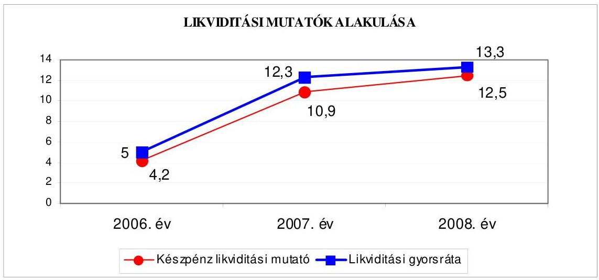

A készpénz likviditási mutató és a likviditási gyorsráta a 2006. évről a 2008. évre történő emelkedése az Önkormányzat fizetőképessége kedvező változását jelzi.

Az Önkormányzat pénzügyi helyzete a 2006. évről a 2008. évre az eladósodás növekedése miatt összességében kedvezőtlenül alakult, azonban az Önkormányzat fizetőképessége kiemelkedően kedvező volt, hiszen a likviditási mutatók jelentősen meghaladták a 2008. évben vizsgált Budapest fővárosi ke-

[^0]
[^0]:    ${ }^{15}$ A készpénz likviditási mutató kifejezi, hogy a pénzeszközök év végi állománya milyen arányban nyújt fedezetet a rövid lejáratú fizetési kötelezettségekre.
    ${ }^{16}$ A likviditási gyorsráta mutatja, hogy a rövid lejáratú fizetési kötelezettségek kiegyenlítéséhez a pénzeszközökön túl bevonható követelések, forgatási célú értékpapírok milyen arányban nyújtanak fedezetet.

---

rületek likviditási mutatóinak (a készpénz likviditási mutatónál közel tízszeresen, a likviditási gyorsrátánál több mint ötszörösen) az átlagos mértékét ${ }^{17}$.

# 2. AZ ÖNKORMÁNYZAT FELKÉSZÜLTSÉGE AZ EURÓPAI UNIÓS FORRÁSOK IGÉNYLÉSÉRE ÉS FELHASZNÁLÁSÁRA, VALAMINT AZ ELEKTRONIKUS KÖZSZOLGÁLTATÁSI FELADATOK ELLÁTÁSÁRA 

2.1. Az európai uniós források igénybevételére és a várható támogatás felhasználására történt felkészülés szabályozottságának, szervezettségének eredményessége

### 2.1.1. Az európai uniós forrásokra történő pályázatok benyújtására vonatkozó döntések összhangja a fejlesztési célkitűzésekkel

Az Önkormányzat rendelkezett a Képviselő-testület által jóváhagyott gazdasági programmal. A 2006-2009. évekre vonatkozó fejlesztési célkitűzéseket a gazdasági programon kívül a Képviselő-testület által elfogadott ágazati, szakmai, fejlesztési koncepciókban és tervekben rögzítették.

A szakmai koncepciókban és a gazdasági programban kiemelt feladatként határozták meg az óvodai nevelés, az általános iskolai intézményi ellátás, a közművelődés, a szociális alapszolgáltatások, valamint az elektronikus önkormányzati szolgáltatások fejlesztését.

A tervezett fejlesztési célkitűzések meghatározásánál figyelembe vették a megvalósítás lehetséges pénzügyi forrásait. Az önkormányzati forrásokon túlmenően számoltak külső, hazai és elsősorban európai uniós források bevonásával. A fejlesztési koncepciókban, az IVS-ben és a gazdasági programban szereplő fejlesztési célkitűzések összhangban voltak az NFT-ben, valamint az ÚMFT-ben megjelent pályázati lehetőségekkel.

Az Önkormányzatnál 15 esetben döntöttek a 2006-2009. évekre vonatkozóan európai uniós forrásokkal összefüggő fejlesztési feladatokról. A Polgármesteri hivatalnak hét, az intézményvezetőknek nyolc benyújtott pályázata volt. A pályázatok közül kilenc sikeres volt, négyet elutasítottak, kettő elbírálása még nem zárult le.

- a Képviselő-testület 484/2004. (V. 14.) számú határozata alapján a GVOP4.3.1. „elektronikus önkormányzati szolgáltatások fejlesztése" intézkedésre az Önkormányzat a 2004. évben pályázatot nyújtott be, melyet az Önkormányzat informatikai stratégiája alapozott meg. A projekttervezet összköltsége 378,2 millió Ft volt. Az Önkormányzat 283,7 millió Ft támogatást nyert el, melyből 212,7 millió Ft az európai uniós forrás, és 71,0 millió Ft a hazai

[^0]
[^0]:    ${ }^{17}$ A helyi önkormányzatok gazdálkodási rendszerének 2008. évi ellenőrzéséről nyilvánosságra hozott 0927 számú jelentés alapján a Budapest fővárosi kerületeknél a 2008. évben a készpénz likviditási mutató átlagos mértéke 1,3 , míg a likviditási gyorsráta átlagos mértéke 2,5 volt.

---

támogatás és 94,5 millió Ft saját forrás. A saját forrást 56,7 millió EU Önerő Alap támogatásból részben kiváltotta. A támogatási szerződést 2005. június 14-én írták alá. A projekt megvalósításának befejező napjaként 2007. január 30-át jelölték meg. A projekt a támogatási szerződésekben foglaltak szerint megvalósult;

- a HEFOP-2.2.1. „a társadalmi befogadás elősegítése, a szociális területen dolgozó szakemberek képzésével" intézkedésre a Zuglói Családsegítő és Gyermekjóléti Központ 2004. évben pályázatot nyújtott be „szakmai tevékenység fejlesztése és az interprofesszionális együttmüködés, mint esélyteremtés" címmel. Az elnyert támogatás 12,3 millió Ft volt, melyből 9,2 millió Ft az európai uniós támogatás és 3,1 millió Ft a hazai forrás. Saját forrás biztosítására nem volt szükség. A támogatási szerződést 2005. december 9-én írták alá. A szerződésben rögzítették, hogy a projekt megvalósításának kezdő napja 2005. március 1., befejezésének határideje 2007. február 28. A projekt a támogatási szerződésekben foglaltak szerint megvalósult;
- a HEFOP-3.1.3. „felkészités a kompetencia-alapú oktatásra" intézkedésre a Herman Ottó Általános Iskola a 2005. évben pályázatot nyújtott be „Herman Ottó a HOlnap Iskolája" címmel. A pályázatot az Önkormányzat Közoktatási Intézkedési Terve, valamint Közoktatási és Esélyegyenlőségi Programja alapozta meg. Az intézmény a pályázaton 18,0 millió Ft támogatást nyert el, melyből 13,5 millió Ft európai uniós, és 4,5 millió Ft a hazai forrás. A pályázati önrész biztosítására nem volt szükség. A projekt a támogatási szerződésben foglaltak szerint megvalósult;
- a HEFOP-3.1.4. „a kompetencia-alapú oktatás elterjesztése" intézkedésre a Zuglói Pedagógiai Szakmai Központ a 2005. évben „tevékeny gyermek, tevékeny jóvó" címmel pályázatot nyújtott be. A pályázati igényt az intézménynek a kompetencia-alapú oktatás elterjesztésére irányuló szakmai koncepciója alapozta meg. Az intézmény 74,7 millió Ft támogatást nyert, melyből 56,0 millió Ft európai uniós, 18,7 millió Ft hazai támogatás volt. Saját forrás biztosítására nem volt szükség. A támogatási szerződést 2006. május 9-én írták alá. A szerződésben rögzítették, hogy a projekt megvalósításának kezdő napja 2006. április 1-je, befejezésének határideje 2008. április 1-je. A projekt a támogatási szerződésekben foglaltak szerint megvalósult;
- a HEFOP-2.1.6. „a sajátos nevelésú, igényú tanulók együttnevelése" intézkedésre a Zuglói Benedek Elek EGYMI a 2005. évben főkedvezményezettként pályázatot nyújtott be. A támogatási igényt az Önkormányzat Közoktatási Intézkedési Terve, valamint Közoktatási Esélyegyenlőségi Programja alapozta meg. A elnyert támogatás 35,0 millió Ft volt, melyből 26,3 millió Ft európai uniós forrás, 8,7 millió Ft a hazai támogatás, saját forrás biztosítására nem volt szükség. A támogatási szerződést 2006. október 3-án írták alá. A szerződésben rögzítették, hogy a projekt megvalósításának kezdő napja 2006. március 1., befejezésének határideje 2008. április 30. A főkedvezményezett részére 21,7 millió Ft, míg a kedvezményezettek közül a Heltai Gáspár Általános Iskolának 2,5 millió Ft, a Móra Ferenc Általános Iskolának 2,3 millió Ft, a Németh Imre Általános Iskolának 2,6 millió Ft, a József Attila Általános Iskolának 2,8 millió Ft, a Meseház Óvodának 3,1 millió Ft támogatást ítéltek meg. A projekt a támogatási szerződésekben foglaltak szerint megvalósult;

---

- a Képviselő-testület 918/2007. (XI. 13.) számú határozata alapján a KMOP4.5.3. „az önkormányzatok, illetőleg önkormányzati feladat-ellátást biztositó egyes közszolgáltatások akadálymentesitése" intézkedésre az Önkormányzat a Benedek Elek EGYMI komplex akadálymentesítése céljából a 2007. évben pályázatot nyújtott be, melyet az Önkormányzat intézményeinek akadálymentesítésével kapcsolatos ütemterve alapozott meg. A fejlesztés tervezett költsége 66,1 millió Ft volt. Az Önkormányzat 25,0 millió Ft támogatást nyert, melyből 25,0 millió Ft az európai uniós támogatás, hazai támogatás nem volt. A vállalt saját forrás a pályázatban 40,0 millió Ft volt, amely a közbeszerzési eljárás során 7,7 millió Ft-tal megemelkedett és az Önkormányzat többletkiadását jelentette. A támogatási szerződést 2008. augusztus 4-én írták alá. A projekt kezdési időpontja 2008. október 1., befejezésének határideje 2009. augusztus 3. A projekt megvalósítása folyamatban van;
- az EGT és Norvég Finanszírozású Mechanizmus programhoz kapcsolódóan a Móra Ferenc Általános Iskola 2007. évben pályázatot nyújtott be „a geotermikus energia hasznosítása" tárgyában. A projekt tervezett összköltsége 255,4 millió Ft volt. Az Önkormányzat 217,1 millió Ft támogatásért pályázott, és 38,3 millió Ft önrész biztosítását vállalata. A pályázat kétfordulós volt. Az első forduló értékelése során a tízszeres túljelentkezés következtében az intézmény pályázata nem került a második fordulóba;
- a Képviselő-testület 1075/2008. (IX. 23.) számú határozata alapján az ÁROP-3.A.1/B. szervezetfejlesztési intézkedésre az Önkormányzat a 2008. évben pályázatot nyújtott be „a Zuglói Polgármesteri Hivatal szervezetfejlesztése" címmel, melyet az Önkormányzat informatikai stratégiája alapozott meg. A projekt tervezett költsége 50 millió Ft volt. Az Önkormányzat a pályázaton 45,0 millió Ft támogatást nyert, melyből 42,5 millió Ft európai uniós és 2,5 millió Ft a hazai támogatás volt. Az Önkormányzat 5,0 millió Ft saját forrás biztosítását vállalta. Az Önkormányzatot a pályázat pozitív elbírálásáról 2009. március 23-án értesítették, a támogatási szerződés aláírásának előkészítése folyamatban van;
- a KMOP-4.5.2/B. „a szociális alapszolgáltatásokhoz és gyermekjóléti alapellátásokhoz való hozzáférés javitása és a szolgáltatások minőségének komplex fejlesztése" intézkedésre „a Zuglói Családsegitő és Gyermekjóléti Központ komplex fejlesztése" címmel az Önkormányzat a 2008. évben pályázatot nyújtott be, melyet az Önkormányzat szolgáltatástervezési koncepciója alapozott meg. A projekt tervezett költsége 107,2 millió Ft. A pályázat kétfordulós, az első forduló elbírálása 2009. január 15-én megtörtént, melynek során a projektet 96,5 millió Ft összegben támogatásra érdemesnek értékelték. Az Önkormányzat 10,7 millió Ft saját forrás biztosítását vállalta;
- a TÁMOP-5.2.5. „gyermekek és fiatalok integrációs programja" intézkedésre a 2008. évben a Cserepesház „benned a létra - Cserepesház Zuglói Ifjúsági Iroda esélynövelő célzatú komplex fejlesztő programja" címmel a 2008. évben pályázatot nyújtott be. A pályázati igényt a Képviselő-testület 1051/2007. (XII. 13.) számú határozatával elfogadott Zuglói Ifjúsági Cselekvési Terve alapozta meg. Az intézmény 10,3 millió Ft támogatást nyert, melyből 8,8 millió Ft európai uniós, és 1,5 millió Ft hazai támogatás. Saját forrás biztosítására

---

nem volt szükség. A támogatási szerződést 2009. március 12-én írták alá. A projekt megvalósítása elkezdődött;

- a TÁMOP-3.1.6. „az Egységes Gyógypedagógiai Módszertani Intézmények által nyújtott szolgáltatások fejlesztése a sajátos nevelési igényú gyermekek, tanulók együttnevelésének érdekében" intézkedésre a 2008. évben a Zuglói Benedek Elek EGYMI konzorciumi pályázatot ${ }^{18}$ nyújtott be „egyensúlyban a világgal" címmel. A pályázati igényt a konzorcium tagjainak Közoktatási Esélyegyenlőségi Programjai, valamint az Önkormányzat Közoktatási Intézkedési Terve alapozta meg. A Képviselő-testület az intézmény pályázaton való részvételét az 1041/2008. (IX. 23.) számú határozatában támogatta. A konzorcium vezetője 20,0 millió Ft támogatásért pályázott, saját forrás biztosítására nem volt szükség. A pályázat befogadása 2008. december 3-án megtörtént, elbírálására még nem került sor;
- a TÁMOP-5.2.5. „gyermekek és fiatalok integrációs programjai" intézkedésre a 2008. évben a Zuglói Családsegítő és Gyermekjóléti Központ „tanulással, családdal együtt lesz esélyünk" komplex fejlesztő programja címmel a 2008. évben pályázatot nyújtott be, melyet az Önkormányzat Közoktatási Esélyegyenlőségi Programja alapozott meg. Az intézmény 19,0 millió Ft támogatásért pályázott, saját forrás biztosítására nem volt szükség. A pályázatot a bírálók elutasították, mert a költségvetés szöveges indoklását elnagyoltnak tartották és a tervezett megvalósítás költséghatékonyságát nem látták biztosítottnak;
- a Képviselő-testület 30/2008. (I. 22.) számú határozata alapján „a közoktatási intézmények beruházásának támogatása" a KMOP-4.6.1/B. intézkedésre az Önkormányzat a 2008. évben pályázatot nyújtott be „a kompetencia-alapú oktatást elősegitő, fenntartható infrastrukturális fejlesztés a Mezö Ferenc Általános Iskolában" címmel. A projekt tervezett költsége 361,0 millió Ft volt. Az Önkormányzat 250,0 millió Ft támogatásért pályázott, és 111,0 millió Ft saját forrás biztosítását vállalta. A pályázatot forráshiányra hivatkozva elutasították;
- a Képviselő-testület 35/2008. (I. 12.) számú határozata alapján a KMOP4.6.1/B. intézkedésre az Önkormányzat a 2008. évben pályázatot nyújtott be a Móra Ferenc Általános Iskola fejlesztésére „álmaink iskolája, iskolások álma az esélyegyenlőséget, környezettudatos szemlélet kialakítását és színvonalas oktatást segitő iskola modernizáció" címmel, melyet az Önkormányzat Közoktatási Intézkedési Terve és Esélyegyenlőségi Programja alapozott meg. A projekt tervezett összköltsége 278,4 millió Ft volt. Az Önkormányzat 249,6 millió Ft támogatásért pályázott, és 28,8 millió Ft saját forrás biztosítását vállalta. A pályázatot forráshiányra hivatkozva elutasították.
- a Képviselő-testület 28/2009. (I. 27.) számú határozata alapján a KEOP5.1.0. „az energetikai hatékonyság fokozása" intézkedésre az Önkormányzat a 2009. évben „a közoktatási intézmények energetikai hatékonyságának növelése

[^0]
[^0]:    ${ }^{18}$ A konzorcium vezetője: a Zuglói Benedek Elek EGYMI, tagjai: a Zuglói Logopédiai Intézet, az Autizmus Alapítvány Egységes Gyógypedagógiai Módszertani Intézmény és a Budapest XVII. kerületi EGYMI.

---

Zuglóban" címmel pályázatot nyújtott be. A projekt tervezett költsége 278,6 millió Ft. Az Önkormányzat 40,6 millió Ft támogatásért pályázott, és 238,0 millió Ft saját forrás biztosítását vállalta. A pályázat befogadása megtörtént, elbírálására még nem került sor;

Az Önkormányzat 2006-2009. évekre vonatkozó költségvetési rendeletei nem tartalmazták elkülönítetten az európai uniós forrást igénylő fejlesztési feladatok megnevezését, bevételi és kiadási előirányzatait. Az intézmények által elnyert támogatások az Áht. 118. § (1) bekezdés 2 b) pontja, valamint az Ámr. 29. § (1) bekezdés d), g) és k) pontjai előírása ellenére - a Cserepesház 2009. évi előirányzatának kivételével - az éves költségvetési rendeletekben elkülönítetten nem jelentek meg.

Az Önkormányzat európai uniós forrásokkal támogatott és megvalósult fejlesztési feladatainál - a 2006-2009. I. félévéig - a finanszírozási források tervezett és tényleges megvalósulását a következő ábra mutatja:
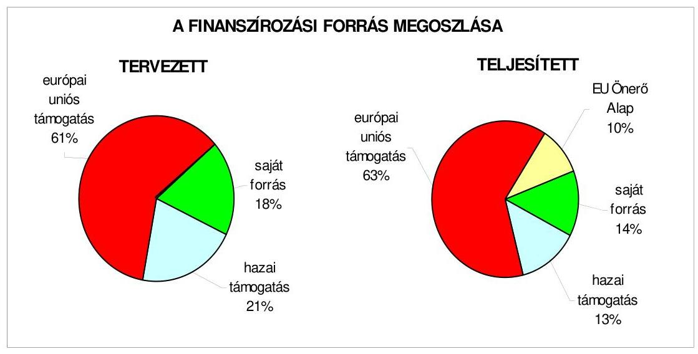

Az Önkormányzatnak az öt megvalósult projekt tervezett költségvetési kiadása 518,2 millió Ft, amelyből a saját forrás 94,5 millió Ft, az európai uniós támogatás 317,7 millió Ft és a hazai támogatás 106,0 millió Ft volt. A teljesített kiadások összességében 26,7 millió Ft-tal meghaladták a tervezettet. A túlteljesítést egyrészt a GVOP-4.3.1. program 35,4 millió Ft többletköltsége okozta, mivel a tervezéskor nem számoltak a közbeszerzési eljárást lebonyolító, valamint a projekt szakmai lebonyolítását ellenőrző szervezet megbízási díjával. A négy HEFOP-os pályázat tervezett kiadása viszont összességében 8,7 millió Ft-tal alulteljesült, mivel egyrészt a pedagógusképzésekre hétvégeken került sor, ezért helyettesítésükről nem kellett gondoskodni, másrészt a programok Budapesten valósultak meg, így utazási és szállásköltségek nem merültek fel.

A forrásösszetétel a tervezetthez képest kettő helyen változott. Egyrészt a GVOP4.3.1. az elektronikus önkormányzati szolgáltatások fejlesztése projektnél az Önkormányzat 56,7 millió Ft BM támogatást nyert el az EU Önerő Alapból, mellyel a saját támogatási forrásigényét részben kiváltotta, másrészt a közreműködő szervezet a 283,7 millió Ft támogatás forrás összetételét szerződésmódosítással megváltoztatta, mivel a tervezett 75\%- európai uniós támogatást

---

86\%-ra emelte, míg a tervezett 25\% hazai forrást 14\%-ra csökkentette. A jelentés 4. számú melléklete tartalmazza az európai uniós forrásból támogatott célok és programok tervezett és tényleges adatait.

# 2.1.2. Az európai uniós forrásokhoz kapcsolódóan a pályázatfigyelés, a pályázatkészítés, valamint az európai uniós támogatással megvalósuló fejlesztés lebonyolítása belső rendjének szabályozottsága, a végrehajtás személyi, szervezeti feltételei, az ellenőrzési feladatok meghatározása 

A 2006-2007. években a Polgármesteri kabinet, majd a 2008. évben a Városfejlesztési osztály három köztisztviselőjének munkaköri leírásában határozták meg az európai uniós források igénybevételének és felhasználásának feladatait, az önkormányzati szintű pályázat koordinálását, valamint a pályázati nyilvántartás vezetését. Az európai uniós források igénybevételének és felhasználásának részletes feladatait 2009. május 25 -ig nem írták elő.

A jegyző és a polgármester 2009. május 25 -én pályázati szabályzatot adott $\mathrm{ki}^{19}$, melyben rendelkeztek az európai uniós és a hazai forrásokból származó pályázatok készítésének, beadásának, lebonyolításának és a támogatás felhasználásának szabályairól. A pályázati szabályozás kiterjedt a pályázatfigyelést végzők és a döntési, illetve döntés-előterjesztési jogkörrel rendelkezők közötti in-formáció-szolgáltatási kötelezettség előírására, az európai uniós forrásokra irányuló pályázatfigyelés és pályázatkészítés, valamint az európai uniós forrásokkal támogatott fejlesztés lebonyolításával kapcsolatos eljárási rendre, továbbá az európai uniós forrásokra irányuló pályázat ügymenetének belső ellenőrzési kötelezettségére is. A folyamatba épített, előzetes és utólagos vezetői ellenőrzés előírásai érvényesek voltak az európai uniós forrásokkal támogatott projektekre is. Az éves belső ellenőrzési tervet megalapozó kockázatelemzés a 2009. évet megelőzően nem terjedt ki az európai uniós forrásokkal támogatott fejlesztési feladatokra.

A pályázatfigyelés és pályázatkészítés személyi és szervezeti feltételeit nem kizárólag a Polgármesteri hivatalon belül alakították ki. A pályázatfigyelést és pályázatkészítést munkaköri feladatként a 2006-2007. években a Polgármesteri kabinet, a 2008. évtől a Városfejlesztési osztály munkatársai, valamint az intézményvezetők végezték. Külső szervezetet ${ }^{20}$ is megbíztak esetenként pályázatkészítéssel. A szerződésekben előírták a feladatellátás kötelezettségét, a megbízott külső szervezet és a Polgármesteri hivatal képviselője közötti kapcsolattartás rendjét, az információk átadásának formáját, tartalmát, módját, valamint a felelősség szabályait.

[^0]
[^0]:    ${ }^{19}$ A 4/2009. (V. 25.) számú jegyzői és polgármesteri együttes utasítás.
    ${ }^{20}$ Külső szervezet készítette, illetve részt vállalt a következő programok összeállításában: GVOP-4.3.1. „elektronikus önkormányzati szolgáltatások fejlesztése", KMOP-4.5.3. „az önkormányzatok, illetőleg önkormányzati feladatellátást biztosító egyes közszolgáltatások akadálymentesítése", KEOP-5.1.0. „a közoktatási intézmények energiahatékonyságának növelése Zuglóban".

---

Az európai uniós forrásokkal támogatott fejlesztések lebonyolításának szervezeti, projektenkénti személyi feltételeit a Polgármesteri hivatalon belül, illetve az intézményeknél alakították ki. Kettő esetben (a GVOP-4.3.1. és a KMOP-4.5.3. programnál) megbízási szerződéssel külső szervezetet is bevontak a fejlesztési feladat megvalósításának lebonyolításába. A szerződésben rögzítették a feladatellátás kötelezettségét, a kapcsolattartás és ellenőrzés rendjét, valamint a személyre szóló felelősségi szabályokat.

# 2.1.3. A fejlesztési feladat lebonyolításánál a feladatellátás rendjére, az ellenőrzési feladatok teljesítésére, valamint a felelősségi szabályokra vonatkozó előírások betartása 

Az Önkormányzat által a 378,2 millió Ft összkiadással tervezett „elektronikus önkormányzati szolgáltatások fejlesztése" projekt ${ }^{21}$ a GVOP-4.3.1. pályázati cél keretében 283,7 millió Ft támogatást nyert. A támogatási szerződést 2005. június 14-én kötötte meg a közreműködő szervezet az Önkormányzattal. A támogatási szerződést három alkalommal módosították. A szerződésmódosításokra a közbeszerzési eljárás elhúzódása, az önkormányzati saját forrás, valamint az európai uniós támogatás forrásösszetételének megváltozása miatt volt szükség.

Az Önkormányzat külső szervezet bevonásával gondoskodott a projektnek a hatályos támogatási szerződésekben rögzített megvalósításáról, a kezdési és befejezési határidőket a támogatási szerződés módosításaiban rögzítetteknek megfelelően betartották.

A jegyző az 5/2005. (VIII. 1.) számú utasításával a megvalósítás érdekében projekt szervezetet hozott létre és ehhez kapcsolódóan szervezeti és múködési szabályzatot adott ki. A szervezet feladata a projekt megvalósítása a fővállalkozó és a vevőoldali projekttámogató cég közreműködésével, a projekt szervezeten keresztül a projektvezető - az Informatikai osztályvezető - irányításával.

A projekt szakmai bonyolultságára és magas költségigényére tekintettel az Önkormányzat közbeszerzési eljárással választotta ki a projektet megvalósító szervezetet ${ }^{22}$ és azt a szervezetet, mely a szakmai teljesítést figyelemmel kíséri ${ }^{23}$, részt vesz továbbá a projekt végrehajtásának koordinálásában, menedzselésében, a monitoring és ellenőrzési tevékenység végzésében, a minőségbiztosítási és tesztelési tevékenység ellátásában. A két szervezettel a feladatok elvégzésére az Önkormányzat megbízási szerződést kötött, melynek határidői összhangban voltak a támogatási szerződéssel.

[^0]
[^0]:    ${ }^{21}$ A megvalósítás fő céljai: a Polgármesteri hivatal hatékonyságának és szolgáltató jellegének erősítése, a meglévő közigazgatási és adminisztratív alkalmazások integrálásával, interaktív WEB szolgáltatások kialakítása a lakosság és vállalkozások számára, kis- és középvállalkozások versenyképessége növelésének elősegítése.
    ${ }^{22}$ E szervezetet tekintették fővállalkozónak.
    ${ }^{23}$ Ezt a szervezetet tekintették a vevőoldali projekttámogató cégnek.

---

A projekt a módosított támogatási szerződésben foglalt 2007. május 16-i határidőben befejeződött, melyet a közreműködő szervezet által megbízott szervezet helyszíni ellenőrzési jegyzőkönyve is alátámasztott. Az Önkormányzat a módosított határidőknek megfelelően négy kifizetési kérelmet nyújtott be, az előírásoknak megfelelő PEJ-ek csatolásával. A kifizetési kérelmek és a támogatás folyósítás adatait a jelentés 5. számú melléklete mutatja be. A négy kifizetési kérelmen kívül beadásra került még hat olyan PEJ, amely csak a projekt szakmai előrehaladásáról adott jelentést.

A támogatás igénylési határidők és a fizetési kérelmek beadása összhangban volt a módosított támogatási szerződésekkel. Így a támogatás igénybevételi ütem betartását akadályozó ok nem merült fel.

A közreműködő szervezet a támogatás kifizetésének igénylését alátámasztó számlákat, bizonylatokat rendben találta, hiánypótlás elrendelése nem történt. A támogatás folyósítása a kifizetési kérelem benyújtását követő 84-111 napon belül megtörtént ${ }^{24}$. A támogatás igénybevétel tervezett ütemezésének tartását a PEJ-ek felülvizsgálta nem hátráltatta.

A fejlesztési feladat megvalósításához tervezett saját forrást biztosították. A projekt kiadásaiból a pályázat beadásakor 94,6 millió Ft saját forrással számoltak. Az Önkormányzat a 2006. évben a BM-nél EU Önerő Alap támogatásért pályázott. Az Önkormányzat 56,7 millió Ft támogatásban részesült, mellyel a saját forrását részben kiváltotta. A projekt tervezett költsége a pályázat beadásakor 378,2 millió Ft volt. A tényleges kiadások 413,6 millió Ft-ot tettek ki. A 35,4 millió Ft többlet kiadása abból keletkezett, hogy tervezéskor nem számoltak a közbeszerzési eljárást lebonyolító szervezet, valamint a projekt szakmai megvalósítását ellenőrző szervezet megbízási díjával. A többletköltséget az Önkormányzat Képviselő-testületi döntés alapján biztosította. A felmerült többletköltségek nem késleltették a tervezett kiadási ütemezés tartását.

A strukturális alap által támogatott projekt megvalósítása során az Önkormányzat eleget tett a megelőlegezés követelményének. A költségvetés céltartalékán biztosították a saját forrást és az előirányzat felhasználási ütemtervben figyelembe vették, hogy a támogatás utólag érkezik, ezért nem okozott gondot a támogatott fejlesztés utófinanszírozása.

A támogatási szerződésben rögzített célok és indikátorok teljesülését akadályozó tényezők nem merültek fel. A fejlesztési feladat lebonyolítója a megbízót kettő alkalommal értesítette - először a közbeszerzési eljárás elhúzódásakor, másodszor a saját forrás finanszírozás belső összetételének megváltozásakor - a támogatási feltételek változásáról. Ennek alapján történt kettő alkalommal a támogatási szerződés módosítása.

Az Önkormányzatnál a gazdálkodási jogkörök gyakorlására kiadott szabályzat előírásainak megfelelően végezték az európai uniós támogatással megvalósuló

[^0]
[^0]:    ${ }^{24}$ A támogatási szerződés nem tartalmazott arra vonatkozó előírást, hogy az elfogadott fizetési kérelmet követően mennyi időn belül kell utalni a támogatást.

---

projektek esetében a folyamatba épített, előzetes és utólagos vezetői ellenőrzési feladatokat.

A belső ellenőrzés munkatervében nem szerepelt a projekt megvalósításának ellenőrzése.

A külső ellenőrzés három alkalommal végzett helyszíni ellenőrzést az Önkormányzatnál az európai uniós forrásból támogatott fejlesztési feladat megvalósítása folyamatában. Először az első kifizetési kérelemben foglalt PEJ elszámolás valódiságát vizsgálta a helyszínen a közremúködő szervezet a támogatás kiutalása előtt. Másodszor a pénzügyi elszámolás lezárását megelőző helyszíni ellenőrzés történt 2008. április 30-án. Az ellenőrzés hiányosságokat tárt fel. Az elektronikus ügyintézésről az ellenőrök nem tudtak meggyőződni, mivel az ügyfélkapus csatlakozás az ellenőrzés időpontjában nem múködött. A közbeszerzés lezárásaként a közbeszerzési értesítőben a projekt befejezésére vonatkozó tájékoztatást az Önkormányzat nem jelentette meg. A hiányosságok miatt a záró helyszíni ellenőrzést 2008. szeptember 4-én megismételték, ekkor már mindent rendben találtak. Ennek alapján megtörtént a projekt pénzügyi elszámolásának lezárása. Az ellenőrzések során visszafizetési kötelezettséget nem állapítottak meg. A polgármester intézkedése nyomán az ellenőrzés által megállapított hiányosságokat megszüntették.

Az Önkormányzat a szabályozottság és szervezettség tekintetében a 20062008. években nem készült fel eredményesen az európai uniós források igénybevételére és a várható támogatások felhasználására annak ellenére, hogy az európai uniós forrásokra benyújtott pályázatok az Önkormányzat gazdasági programjában, ágazati, szakmai koncepciókban, tervekben megfogalmazott célkitűzésekhez kapcsolódtak, a pályázatfigyelés, a pályázatkészítés és a fejlesztési feladatok lebonyolításának szervezeti, személyi feltételeit biztosították, valamint a folyamatba épített, előzetes és utólagos vezetői ellenőrzési feladatok a szabályozás szerint kiterjedtek az európai uniós forrásokkal megvalósuló fejlesztési feladatokra, azonban a szabályozás hiányában a pályázatfigyelést és pályázatkészítést, valamint a pályázatfigyelést végző és a döntési illetve a döntés-előterjesztési jogkörrel rendelkezők közötti információszolgáltatási kötelezettséget nem írták elő, a belső ellenőrzési stratégia, az éves ellenőrzési tervet megalapozó kockázatelemzés nem terjedt ki az európai uniós forrásokkal támogatott fejlesztési feladatokra, továbbá nem határozták meg a fejlesztési feladat lebonyolítását végző ellenőrzési kötelezettségét. A jegyző és a polgármester a hiányosságot 2009. május 25-én megszüntette, mivel a 4/2009. (V. 25.) számú együttes utasításban rendelkezett a pályázati szabályzatról. A szabályzatban részletesen meghatározták az európai uniós és a hazai forrásokkal támogatott fejlesztések előkészítésének, beadásának és lebonyolításának részletes eljárási rendjét.

---

# 2.2. Az elektronikus közszolgáltatás feltételeinek kialakítása, a közérdekú gazdálkodási adatok elektronikus közzététele 

Az Önkormányzat rendelkezett a 2006-2009. évek közötti időszakban a Képviselő-testület által elfogadott informatikai stratégiával ${ }^{25}$. A Képviselőtestület által elfogadott dokumentum részletes helyzetelemzést tartalmazott. A közép és hosszú távú célkitűzések megvalósítása során számoltak az integrált hálózat kiépítésével, az önkormányzati portál megvalósításával, az ügyfélszolgálat korszerűsítésével, valamint az e-kózigazgatás 3. elektronikus szintjének bevezetésével.

Az Önkormányzat a 2004. évben pályázott a GVOP támogatásért, annak 4.3. komponensére, melynek során 283,7 millió Ft támogatást nyert el. A támogatási szerződést 2005. július 14-én írták alá. A projekt a módosított támogatási szerződésekben rögzített 2007. május 16. határidővel megvalósult. Az Önkormányzat a 2008. évben ÁROP-3.A.1/B. programon „a zuglói Polgármesteri hivatal szervezetfejlesztése" címmel is pályázott, melynek során 45,0 millió Ft támogatást nyert el. A támogatási szerződést 2009. május 29-én írták alá. A megvalósítás tervezett kezdő időpontja a szerződésben rögzítettek szerint 2009. május 15., tervezett befejező napja 2010. november 15. A projekt megvalósítása a tervezett időben elkezdődött.

Az e-kózigazgatási feladatok ellátásának személyi, szervezeti feltételeit a Polgármesteri hivatalon belül az Informatikai osztály hat fővel biztosította. Az ekózigazgatási szolgáltatást az Önkormányzat saját számítógépes információs rendszerén keresztül, vásárolt programokkal múködtették.

Az Önkormányzat a 39/2005. (X. 28.) számú rendelete szabályozta az elektronikus ügyintézést. A rendelet 1. számú mellékletében felsorolták azokat az ügyítípusokat, amelyek elektronikusan intézhetők, a többi ügyfajtát kizárták az elektronikusan intézhetők köréből:

- az állampolgárok vonatkozásában: a személyi okmányokkal és az egészségüggyel kapcsolatos szolgáltatásokkal az e-ügyintézést az 1. elektronikus szolgáltatás szintjén, a hatósági igazolásokkal, a lakcímváltozás bejelentésével, a gépjármú regisztrációjával, a súlyadó fizetésével, az építési engedélyezéssel, a szociális juttatásokkal, a támogatások kifizetésével, valamint a helyi adózással kapcsolatos e-ügyintézést a 2. elektronikus szolgáltatás szintjén;
- a vállalkozások vonatkozásában: a vállalkozói igazolvány igénylésével, pótlásával és megszűnése miatti visszaadással, az iparűzési adóval és a gépjármú súlyadóval kapcsolatos e-ügyintézést a 2. elektronikus szolgáltatás szintjén, valamint az engedélyekkel kapcsolatos e-ügyintézést a 3. elektronikus szolgáltatás szintjén biztosították.

[^0]
[^0]:    ${ }^{25}$ A dokumentumot a Képviselő-testület 32/2004. (I. 27.) számú határozatával fogadta el.

---

A teljes közvetlen, kétoldalú ügyintézés feltételeit az Önkormányzatnál nem biztosították, mivel az e-közigazgatáshoz kapcsolódó meglévő számítástechnikai eszközök és programok fejlesztését a pénzügyi források hiánya akadályozta. Az Önkormányzatnál figyelemmel kísérték az e-közigazgatási feladatokat ellátó informatikai rendszer ügyfelek általi igénybevételét és értékelték annak tapasztalatait.

Az Áht. 15/B. § (1) bekezdése előírásait az Önkormányzat költségvetési rendeleteiben szigorította, mivel a nettó öt millió Ft összegű szerződésekre vonatkozó közzétételi értékhatárt 500 ezer Ft-ban határozta meg.

A honlap megnyitásakor megjelenő oldalon a közzétételi listák által előírt adatokat tartalmazó jegyzék megfelelt a 18/2005. (XII. 27.) IHM rendelet előírásának. A „Közérdekü adatok" elnevezésű hivatkozást elhelyezték a nyitó oldalon. Az Önkormányzat honlapján ${ }^{26}$ a 18/2005. (XII. 27.) IHM rendeletben előírt gazdálkodási adatok közzétételi kötelezettségének nem tett eleget, mivel az Áht. 15/A. § (1) bekezdésében foglaltak alapján elektronikusan közzétette ugyan a céljellegú múködési és felhalmozási támogatások kedvezményezettjeinek nevét, a támogatás célját, összegét, továbbá a támogatási program megvalósítási helyét, azonban a társasházaknak nyújtott felhalmozási támogatások közzététele nem a döntés meghozatalát követő 60 napon belül történt ${ }^{27}$, hanem - az utófinanszírozás miatt - december hónapban a felhasználásról benyújtott elszámolást és támogatás utalást követően.

A Polgármesteri hivatal az Önkormányzat pénzeszközei felhasználásával, a vagyonnal történő gazdálkodással összefüggő - a nettó 500 ezer Ft-ot elérő, vagy azt meghaladó értékű - árubeszerzésre, építési beruházásra, szolgáltatás megrendelésre, vagyonértékesítésre, vagyonhasznosításra, vagy vagyoni értékű jog átadására, valamint koncesszióba adásra vonatkozó szerződések közül a 2006-2009. évek költségvetési rendeleteinek vonatkozó előírásai ellenére nem tette közzé a vagyonértékesítési és szolgáltatási szerződéseit, valamint az intézmények által megkötött szerződések esetében nem közölték annak típusát ${ }^{28}$.

Az Önkormányzat által közzétett - az Ámr. 22. számú melléklet 5. sorában meghatározott - 2008. évi éves költségvetési beszámoló szöveges indoklása nem felelt meg a Vhr. 40. § (4) és (9), valamint (11) bekezdésében rögzített tartalmi követelményeknek, nem tartották be az Ámr. 157/D. § (1) bekezdésében foglalt előírást.

[^0]
[^0]:    ${ }^{26}$ A honlap elérhetősége: „www.zuglo.hu".
    ${ }^{27}$ A polgármester mellékelt tájékoztatása szerint a gazdálkodási jogkörök szabályzatának módosításával a polgármester és a jegyző intézkedett, hogy a felhalmozási célú támogatások közzététele a döntéshozatalt követő 60 napon belül megtörténjen.
    ${ }^{28}$ A polgármester mellékelt tájékoztatása szerint a jegyző intézkedett, hogy a vagyonértékesítésre és a szolgáltatási szerződésekre vonatkozó adatokat tegyék közzé, valamint az intézmények esetében a szerződések típusát is tüntessék fel.

---

A közzététel során a szöveges indoklásban nem ismertették a teljes kötelezettségállomány alakulását befolyásoló tényezőket, valamint a könyvviteli mérlegben kimutatott részesedések szöveges értékelését, a táblázatos kimutatásban nem szerepeltették a részesedés mennyiségét, az Önkormányzat könyvvizsgálati kötelezettségére a költségvetési beszámoló kiegészítő mellékletében nem történt utalás.

# 3. A KÖLTSÉGVEtÉsi GAZDÁlKODÁs BELSŐ KontROlljai 

### 3.1. A szabályozottság kockázata a költségvetés tervezési, gazdálkodási, beszámolási és a folyamatba épített, előzetes és utólagos vezetői ellenőrzési feladatoknál

A költségvetés tervezési és zárszámadás készítési folyamatok szabályozottsága alacsony ${ }^{29}$ kockázatot jelentett a feladatok megfelelő, szabályszerű végrehajtásában, mivel a jegyző a pénzügyi irányítási és ellenőrzési rendszer keretében szabályozta a költségvetési tervezés és zárszámadás elkészítési rendjét, meghatározta a Polgármesteri hivatalban és az intézményeknél a költségvetési javaslat összeállításával kapcsolatos követelményeket, előírta a költségvetési tervezéshez készített intézményi mutatószám felmérés adatai megalapozottságának, az intézmények által az állami támogatásokkal, hozzájárulásokkal történő elszámoláshoz közölt mutatószámok adatai megbízhatóságának, valamint az intézményi pénzmaradványok kimunkálása szabályszerűségének ellenőrzését.

A gazdálkodási, a pénzügyi-számviteli és a folyamatba épített ellenőrzési feladatok szabályozottságának hiányosságai közepes kockázatot jelentettek a feladatok megfelelő, szabályszerű végrehajtásában, mivel a Polgármesteri hivatal nem rendelkezett a Képviselő-testület által jóváhagyott SzMSz-el, valamint a pénzügyi irányítási és ellenőrzési rendszer keretében a jegyző nem készítette el a gazdasági szervezet ügyrendjét, azonban a kialakított belső kontrollok - végrehajtásuk esetén - a lehetséges hibák többsége ellen védelmet nyújtottak. A jegyző a FEUVE-val kapcsolatosan elkészítette az ellenőrzési nyomvonalat, azonban az nem mutatta be, hogy a tevékenységeket részletesen mely szabályzat tartalmazza és a tevékenységek elvégzését igazoló dokumentumok megnevezését és fellelési helyét a rendszerben ${ }^{30}$. A jegyző elkészítette a kockázatkezelési eljárásrendet, az azonban nem tartalmazta a kockázatok folyamatgazdáit, értékelését, kategóriákba sorolását, nyilvántartását, a válaszintézkedéseket, a kockázati szint meghatározását, a kockázati környezet rendszeres felülvizsgálatát, valamint a szabálytalanságok kezeléséről szóló eljárásrend nem mutatta be a szabálytalanságok észlelése esetén teendő intézkedések nyomon követését. Az önkormányzati SzMSz 19. § (3) bekezdésében ka-

[^0]
[^0]:    ${ }^{29}$ A kialakított belső kontrollokban rejlő kockázatot alacsonynak minősítettük, ha a kontrollok - végrehajtásuk esetén - megfelelő védelmet nyújtanak a hibák bekövetkezése ellen.
    ${ }^{30}$ A polgármester mellékelt tájékoztatása szerint a FEUVE szabályzatáról szóló 36/2009. (X. 20.) számú jegyzői utasítás tartalmazza, hogy a tevékenységek mely szabályzatban találhatók meg (2. számú melléklet), valamint szervezeti egységenként a tevékenységek elvégzését igazoló dokumentumok megnevezését és fellelési helyét (4. számú melléklet).

---

pott felhatalmazás alapján a polgármester és a jegyző együttes utasításban ${ }^{31}$ hagyta jóvá a polgármesteri hivatali SzMSz-t és a gazdasági szervezet ügyrendjét 2009. áprilisában.

A gazdálkodási, a pénzügyi-számviteli és a folyamatba épített ellenőrzési feladatok szabályozottsága javult a 2009. évre a korábbi ÁSZ vizsgálat javaslatainak hasznosulása következtében, mivel a jegyző módosította a kötelezettségvállalás, utalványozás, érvényesítés rendjét és belső szabályzatban rögzítette a szakmai teljesítésigazolás módját.

A Polgármesteri hivatal rendelkezett a Képviselő-testület által jóváhagyott informatikai stratégiával. Az informatikai biztonsági szabályzat az ügyrend 15. sz. melléklete, mely tartalmazta az informatikai rendszer múködését fenyegető veszélyek elhárítását, a számítástechnikai eszközök és programok védelmi intézkedéseit, a vírusvédelmet és titkosítást és a programok mentését. Az Önkormányzat rendelkezett biztonsági szabályzattal, melyet 2009. februárban vizsgáltak felül. A jegyző gondoskodott az informatikával kapcsolatos szabályzatok megismertetéséről és változások nyomon követéséről. A Polgármesteri hivatalon belül az arra jogosult munkatársak részére az informatikai hálózaton elérhetők a pénzügyi-számviteli programok. A Polgármesteri hivatalban 2008. évtől bevezették az integrált pénzügyi-számviteli informatikai rendszert.

A Polgármesteri hivatalban a pénzügyi-számviteli feladatoknál alkalmazott informatikai rendszerek múködésének szabályozottsága összességében alacsony kockázatot jelentett a feladatok megfelelő, szabályszerű végrehajtásában, mivel szabályozták a hozzáférési jogosultság eljárási rendjét, valamint a pénzügyi-számviteli programok mentési eljárásait és az ellenőrzési lista lekérhető az integrált pénzügyi-számviteli informatikai rendszerből. Annak ellenére összességében alacsony volt a kockázat, hogy a külső cég által fejlesztett pénzügyi-számviteli programok esetében a szabályzatokban nem tiltott a külső fejlesztők hozzáférése az éles rendszerhez.

# 3.2. A belső kontrollok múködése az önkormányzati források szabályszerű felhasználásában, a költségvetési tervezés, gazdálkodás, beszámolás folyamataiban 

A költségvetési tervezési és zárszámadás készítési folyamatban a múködésbeli hibák megelőzésére, feltárására, kijavítására kialakított belső kontrollok múködésének megbízhatósága kiváló ${ }^{32}$ volt, mivel a Polgármesteri hivatalban és az intézményeknél az előírásoknak megfelelően ellenőrizték, hogy az intézmények teljesítették-e a költségvetési javaslat összeállításával kapcsolatban részükre meghatározott követelményeket, megalapozot-

[^0]
[^0]:    ${ }^{31}$ 3/2009. számú polgármesteri és jegyzői utasítás Budapest-Zugló Polgármesteri hivatalának Szervezeti és Múködési Szabályzatáról.
    ${ }^{32}$ A kontrollok múködésének megbízhatóságát kiválónak értékeltük abban az esetben, ha azok múködése - esetleges apróbb hiányosságoktól eltekintve - megfelelt a hibák megelőzésére és kijavítására meghatározott szabályozásnak és a legmagasabb szintű elvárásoknak.

---

tak-e az intézményi mutatószám felmérés adatai, valamint a zárszámadás készítés folyamatában az állami támogatásokkal, hozzájárulásokkal történő elszámoláshoz közölt mutatószámok adatai megbízhatóságát és az intézmények pénzmaradvány megállapításának szabályszerűségét.

A Polgármesteri hivatal a 2008. évi költségvetésében a külső szolgáltatók által végzett karbantartási, kisjavítási szolgáltatásokkal kapcsolatos kiadások fedezetére 980,5 millió Ft eredeti előirányzatot tervezett, amely összeg 1098,8 millió Ft-ra nőtt, a 2008. évi teljesítés 851,0 millió Ft volt. Az eredeti és a módosított előirányzat $28 \%$-os, a teljesítés $27 \%$-os részarányt képviselt a dologi kiadásokból. A 2009. évi költségvetésben 837,4 millió Ft eredeti előirányzatot terveztek, ami a dologi kiadások 24,5\%-át képezte. Az előirányzatok felhasználása során a megrendelések, szerződések tárgya ${ }^{33}$ összhangban volt a Polgármesteri hivatal által ellátott feladatokkal. A Polgármesteri hivatalnál a külső szolgáltató által végzett karbantartási, kisjavítási munkák gazdasági eseményei között elszámolt kiadások teljesítése során a szakmai teljesítésigazolás és az utalvány ellenjegyzés müködésének megbízhatósága összességében kiváló ${ }^{34}$ volt, mivel a kamerák, fénymásoló, hirdetőoszlopok, sportpálya, játszótér, önkormányzati lakások, számítógépes rendszer, programok, kazán karbantartására, szerelésére, park- és útfenntartásra vonatkozó szerződésekben, megrendelésekben meghatározott feladatok teljesítésének, a kiadások jogosultságának, összegszerűségének ellenőrzését a szakmai teljesítés igazolására kijelölt személyek a gazdálkodási jogkörök szabályzata ${ }_{1,2,3,4,5}$-ben előírt módon elvégezték. Az utalvány ellenjegyzője a gazdálkodásra vonatkozó szabályok érvényesüléséről, továbbá a szakmai teljesítésigazolás és az érvényesítés elvégzéséről meggyőződött. Annak ellenére összességében kiváló volt a kontrollok múködésének megbízhatósága, hogy a tápegység-karbantartáshoz kapcsolódó kifizetésnél nem a jegyző által kijelölt személy végezte el a szakmai teljesítésigazolást.

A tápegységek karbantartását az informatikai osztály rendelte meg és a szakmai teljesítés igazolását az informatikai osztály vezetője végezte el, aki nem volt kijelölve szakmai teljesítésigazolásra.

A Polgármesteri hivatal a gépek, berendezések és felszerelések beszerzésével, létesítésével kapcsolatos kiadások fedezetére a 2008. évi költségvetésben 67,5 millió Ft eredeti előirányzatot határozott meg, amely összeg az év közbeni módosítások következtében 109,1 millió Ft-ra nőtt, a 2008. évi teljesítés összege 79,8 millió Ft volt. Az eredeti előirányzat 9,8\%-ot, a módosított előirányzat 4,0\%-ot, míg a teljesítés 7,5\%-ot képviselt a felhalmozási kiadásokból. A 2009. évi költségvetésben 36,3 millió Ft eredeti előirányzatot terveztek, a felhalmozási kiadá-

[^0]
[^0]:    ${ }^{33}$ Kamerák, fénymásoló, hirdetőoszlopok, sportpálya, játszótér, önkormányzati lakások, számítógépes rendszer, programok, kazán karbantartására, szerelésére, park- és útfenntartásra teljesítettek kifizetéseket.
    ${ }^{34}$ A kontrollok múködésének megbízhatóságát kiválónak értékeltük abban az esetben, ha azok múködése - esetleges apróbb hiányosságoktól eltekintve - megfelelt a hibák megelőzésére és kijavítására meghatározott szabályozásnak és legmagasabb szintű elvárásoknak.

---

sok 1,4\%-át. Az előirányzatok felhasználása során a szerződések tárgya ${ }^{35}$ összhangban volt a Polgármesteri hivatal által ellátott feladatokkal. A Polgármesteri hivatalnál a gépek, berendezések és felszerelések beszerzése, létesítése gazdasági eseményei között elszámolt kiadások teljesítése során a szakmai teljesítésigazolás és az utalvány ellenjegyzés múködésének megbízhatósága kiváló volt, mivel a gépek, berendezések, felszerelések beszerzésére vonatkozó szerződésekben, megrendelésekben meghatározott feladatok teljesítésének, a kiadás jogosultságának, összegszerűségének ellenőrzését a szakmai teljesítés igazolására kijelölt személyek a gazdálkodási jogkörök szabályzata ${ }_{1,2,3,4,5}$-ben előírt módon elvégezték. Az utalvány ellenjegyzője a gazdálkodásra vonatkozó szabályok érvényesüléséről, továbbá a szakmai teljesítésigazolás és az érvényesítés elvégzéséről meggyőződött.

A Polgármesteri hivatal a múködési célú pénzeszközátadások államháztartáson kívülre teljesített kiadásainak fedezetére a 2008. évi költségvetésben 301,6 millió Ft eredeti előirányzatot tervezett, amely összeg az év közbeni módosítások következtében 473,1 millió Ft-ra nőtt, a 2008. évi teljesítés 401,5 millió Ft volt. Az eredeti előirányzat 35,5\%-ot, a módosított 26,5\%-ot, a teljesítés $29,8 \%$-ot képviselt az államháztartáson kívüli pénzeszközátadások kiadási előirányzatból. A 2009. évi költségvetésben tervezett 403,3 millió Ft múködési célú pénzeszközátadás előirányzat az államháztartáson kívüli pénzeszközátadások előirányzatának 20,1\%-a volt. A Polgármesteri hivatal a felhalmozási célú pénzeszközátadások államháztartáson kívülre teljesített kiadásainak fedezetére a 2008. évi elemi költségvetésben 548,0 millió Ft eredeti előirányzatot tervezett, amely összeg az év közbeni módosítások következtében 1309,0 millió Ft-ra nőtt, a 2008. évi teljesítés 944,0 millió Ft volt. Az eredeti előirányzat 64,5\%-ot, a módosított 73,5\%-ot, a teljesítés 70,2\%-ot képviselt az államháztartáson kívüli pénzeszközátadások kiadási előirányzatból, míg a 2009. évi elemi költségvetésben megtervezett 1596,3 millió Ft 79,8\%-ot. Az előirányzatok felhasználására vonatkozó megállapodásokban, támogatási szerződésekben ${ }^{36}$ meghatározott cél összhangban volt az önkormányzati feladatokkal.

A Polgármesteri hivatalnál a múködési és a felhalmozási célú pénzeszközátadások államháztartáson kívülre teljesített kifizetései során a szakmai teljesítésigazolás és az utalvány ellenjegyzés múködésének megbízhatósága gyenge volt, mivel a múködési és felhalmozási célú pénzeszközátadások során a kiadás jogosultságának, összegszerűségének ellenőrzését a szakmai teljesítés igazolására kijelölt személyek a gazdálkodási jogkörök szabályzata ${ }_{1,2,3,4,5}$-ben előírt módon nem

[^0]
[^0]:    ${ }^{35}$ Számítógépegységek, memóriák, szerver beszerzésére, fejlesztésére, lézertávmérő, telefon beszerzésére történtek kifizetések.
    ${ }^{36}$ A megfelelőségi teszt elvégzése során tételesen ellenőrzött államháztartáson kívülre teljesített múködési célú pénzeszközátadások társadalmi szervezetek múködésének, kulturális céljainak támogatására, míg az államháztartáson kívülre teljesített felhalmozási célú pénzeszközátadások társasházak felújításának, lakásbérleti jogviszony megváltására irányultak.

---

végezték el ${ }^{37}$. Az utalványok ellenjegyzője a múködési, valamint a felhalmozási célú támogatások kifizetéseit megelőzően nem győződött meg a szakmai teljesítésigazolás belső szabályzatban előírt módon való megtörténtéről. Az utalvány ellenjegyzője a gazdálkodásra vonatkozó szabályok érvényesüléséről, továbbá az érvényesítés elvégzéséről meggyőződött.

A Polgármesteri hivatalnál a külső szolgáltató által végzett karbantartási, kisjavítási szolgáltatásokkal, a gépek, berendezések, felszerelések beszerzésével, létesítésével kapcsolatos, továbbá a múködési és a felhalmozási célú pénzeszközátadások államháztartáson kívülre teljesített gazdasági események között elszámolt kiadások teljesítése során - a három terület költségvetési súlyának figyelembevételével értékelve ${ }^{38}$ - a szakmai teljesítésigazolás és utalvány ellenjegyzés múködésének megbízhatósága jó volt, mivel a külső szolgáltató által végzett karbantartási, kisjavítási szolgáltatásokkal, a gépek, berendezések, felszerelések beszerzésével, létesítésével kapcsolatos kiadások teljesítése során a feladatok teljesítésének, a kiadás jogosultságának, összegszerűségének ellenőrzését a szakmai teljesítés igazolására kijelölt személyek a gazdálkodási jogkörök szabályzata ${ }_{1,2,3,4,5}$-ben előírt módon elvégezték. Az utalvány ellenjegyzője a gazdálkodásra vonatkozó szabályok érvényesüléséről, továbbá a szakmai teljesítésigazolás és az érvényesítés elvégzéséről meggyőződött. Azonban a múködési és a felhalmozási célú pénzeszközátadások államháztartáson kívülre teljesített gazdasági események között elszámolt kiadásoknál a kiadás jogosultságának, összegszerűségének ellenőrzését a szakmai teljesítés igazolására kijelölt személyek a gazdálkodási jogkörök szabályzata ${ }_{1,2,3,4,5}$-ben előírt módon nem végezték el. Az utalványok ellenjegyzője a múködési, valamint a felhalmozási célú támogatások kifizetéseit megelőzően nem győződött meg a szakmai teljesítésigazolás belső szabályzatban előírt módon való megtörténtéről, a gazdálkodásra vonatkozó szabályok érvényesülését, továbbá az érvényesítés elvégzését ellenőrizte. A szakmai teljesítésigazolás és az utalvány ellenjegyzés múködésében megállapított hiányosságok azonban nem veszélyeztették a lényeges hibák, szabálytalanságok, megelőzését, feltárását és kijavítását.

A Polgármesteri hivatalban a pénzügyi-számviteli feladatok ellátásánál az alkalmazott informatikai rendszerek belső kontrolljainak megbízhatósága összességében jó volt, mivel a hozzáférési jogosultságokra vonatkozó nyilvántartást teljes körűen és naprakészen vezették, a hozzáférési jogosult-

[^0]
[^0]:    ${ }^{37}$ A közbenső egyeztetés során a polgármester által adott tájékoztatás szerint a jegyző a 2009. szeptember 16-án kelt levelében intézkedett a szakmai teljesítésigazolást és az utalvány ellenjegyzést végzők felé a múködési és felhalmozási célú pénzeszközátadások esetében a szakmai teljesítésigazolás során feltárt hiányosság megszüntetése érdekében.
    ${ }^{38}$ A kontrollok múködése megbízhatóságának értékelése során a három vizsgált terület egyedi értékelési pontszámait a területek relatív költségvetési súlyával arányosan öszszegeztük. Ennek megfelelően a kontrollok múködésének megbízhatósága minősítését a külső szolgáltatókkal végzett karbantartás esetében $46 \%$-os, a gépek, berendezések és felszerelések vásárlásánál $11 \%$-os, az államháztartáson kívülre történő múködési és a felhalmozási célú pénzeszközátadások esetében $43 \%$-os súlyarány figyelembevételével végeztük.

---

ságok ellenőrizhetőségét biztosították, megvalósították a pénzügyi-számviteli programokban a jelszavakra előírt szabályok betartását, dokumentálták a változás kezelési eljárások ellenőrzését, illetve tesztelését, azonban az előírások ellenére az előírt rendszerességgel nem ellenőrizték az ellenőrzési listát, valamint az elmúlt egy évben nem ellenőrizték, hogy az elmentett állományból a pénz-ügyi-számviteli adatok teljes körűen helyreállíthatók-e ${ }^{39}$. A feltárt hiányosságok azonban nem veszélyeztették az informatikai rendszerek megbízható múködését.

# 3.3. A belső ellenőrzési kötelezettség teljesítése, javaslatainak hasznosulása 

Az Önkormányzat a belső ellenőrzési feladatok ellátására a jegyzőnek közvetlenül alárendelt öt fős belső ellenőrzési egységet hozott létre.

A belső ellenőrzés szervezeti kereteinek kialakítása és szabályozása a belső ellenőrzési feladatok megfelelő, szabályszerű végrehajtásában összességében alacsony kockázatot jelentett, mivel a belső ellenőrzés ellátási módját - belső ellenőrzési egység létrehozásával - meghatározta a Képviselőtestület, a jegyző jóváhagyta a belső ellenőrzési kézikönyvet, továbbá meghatározta a belső ellenőrzési vezető feladatait. A belső ellenőrzés rendelkezett a jegyző által jóváhagyott stratégiai tervvel ${ }^{40}$, a 2008. és a 2009. évre vonatkozó éves ellenőrzési tervvel ${ }^{41}$. A belső ellenőrzési kézikönyv, valamint az ellenőrzések lefolytatásához készített ellenőrzési programok tartalma megfelelő volt. Annak ellenére összességében alacsony volt a kockázat, hogy a stratégiai terv az előírások ellenére nem kockázatelemzésen alapult, valamint a belső ellenőrzési kézikönyv nem tartalmazta a belső ellenőrzési tevékenység minőségét biztosító eljárásokat.

Az éves ellenőrzési terv részeként elkészítették az azt megalapozó kockázatelemzést, amelyben magas kockázatúnak értékelték a 2008. évben a Pénzügyi osztály szerződéseinek, az újonnan alakuló két önkormányzati gazdasági társaság, valamint a normatív támogatások felhasználásának az ellenőrzését. A 2009. évi ellenőrzési tervben négy utóvizsgálati feladatot, a normatív támogatások, egy közhasznú társaság, egy pénzügyi szabályszerűségi ellenőrzést, valamint a Zuglói Vagyonkezelő Zrt-től átvett feladatok ellátásának az ellenőrzését minősítették magas kockázatúnak. Ezen területek ellenőrzését a 2008. és 2009. évi éves ellenőrzési tervekben tervezték, és meghatároztak kapacitást a soron kívüli feladatokra is.

[^0]
[^0]:    ${ }^{39}$ A polgármester mellékelt tájékoztatása szerint a jegyző intézkedett annak érdekében, hogy a Pénzügyi osztályon az ellenőrzési listát havi rendszerességgel ellenőrizzék, valamint 2009. október 5-én meggyőződtek a pénzügyi-számviteli adatok teljes körű helyreállíthatóságáról.
    ${ }^{40}$ A jegyző 2007. május 14-én hagyta jóvá a stratégiai tervet.
    ${ }^{41}$ A Képviselő-testület a 2008. és a 2009. évi belső ellenőrzési terveket a 908/2007. (XI. 13.) és az 1294/2008. (XI. 18.) számú határozataival hagyta jóvá.

---

A 2008. évi belső ellenőrzési terv 75 ellenőrzést tartalmazott ${ }^{42}$, ebből négy vizsgálatot a Polgármesteri hivatalban, 69 ellenőrzést az intézményeknél, kettő vizsgálatot az önkormányzat gazdasági társaságainál terveztek. A 2008. évi ellenőrzési tervbe a Polgármesteri hivatalban négy szabályszerűségi, míg az intézményeknél 68 pénzügyi és három szabályszerűségi ellenőrzést állítottak be.

A 2008. évi ellenőrzési terv Polgármesteri hivatali ellenőrzései a Pénzügyi osztály által kezelt kötelezettségvállalások szabályozottságára, az előző ÁSZ vizsgálat során tett megállapításokra készített intézkedési terv végrehajtására, a közbeszerzések és a leltározás szabályszerűségének az ellenőrzésére irányult. A tervezett intézményi ellenőrzések érintették az intézményi gazdálkodás szabályozottságát utóvizsgálat keretében egy intézménynél, a normatív hozzájárulásokat 51 intézménynél, 17 intézmény pénzügyi szabályszerűségi vizsgálatát, valamint a Zuglói Vagyonkezelő Zrt. megszűnésével létrejövő új gazdasági társaság és új költségvetési szerv megalakulásának, múködésének a vizsgálatát.

A 2009. évi belső ellenőrzési terv 74 ellenőrzést tartalmazott ${ }^{43}$, amelyből öt vizsgálatot (négy szabályszerűségi és egy megbízhatósági) a Polgármesteri hivatalban, 69 ellenőrzést az intézményeknél (65 pénzügyi és négy szabályszerűségi ellenőrzést) terveztek.

A 2009. évi ellenőrzési terv a Polgármesteri hivatalban a leltározásra, a közbeszerzésekre, az Oktatási, művelődési osztály által kötött szerződések ellenőrzésére, az Önkormányzat által nyújtott céljellegú támogatásokra, valamint a Polgármesteri hivatal ellenőrzési nyomvonalának a felülvizsgálatára terjedt ki. Az intézmények ellenőrzése során azok gazdálkodásának szabályozottságát, múködését 13 esetben, a normatív hozzájárulásokat 51 intézménynél, az intézkedési tervben foglaltak utóellenőrzését négy intézménynél, valamint egy esetben az Önkormányzattól átvett feladatok végrehajtását tervezték vizsgálni.

A belső ellenőrzés szervezeti kereteinek megfelelő, szabályszerú kialakítása és szabályozása javult az előző ÁSZ vizsgálat során tett javaslatok hasznosulásával, mivel a jegyző biztosította a belső ellenőrök szervezeti függetlenségét, gondoskodott stratégiai terv elkészítéséről, jóváhagyásáról.

# A belső ellenőrzés múködésénél a kialakított kontrollok megbízhatósága jó volt, mivel a belső ellenőrzést önálló osztály végezte, a belső ellenőrzéseket ellenőrzési program alapján hajtották végre, minden elvégzett vizsgálatról készítettek megfelelő ellenőrzési jelentést, az ellenőrzöttek intézkedési tervet állítottak össze, az elvégzett ellenőrzésekről a belső ellenőrzési vezető nyilvántartást vezetett, azonban a 2008. évi belső ellenőrzési tervben megtervezett ellenőrzések közül három ellenőrzést nem hajtottak végre ${ }^{44}$, az éves ellenőrzési 

[^0]
[^0]:    ${ }^{42}$ Az éves ellenőrzési terv nem megfelelő helyen mutatta be a normatív támogatások ellenőrzését, valamint a Polgármesteri hivatal ellenőrzéseinél nem ellenőrzési feladatokat is feltüntettek.
    ${ }^{43}$ Az éves ellenőrzési terv nem megfelelő helyen mutatta be a normatív támogatások ellenőrzését, valamint a Polgármesteri hivatal ellenőrzéseinél nem ellenőrzési feladatokat is feltüntettek.
    ${ }^{44}$ A három ellenőrzésből kettő az elmaradt szervezeti átalakítás miatt nem valósult meg.

---

tervet megalapozó kockázatelemzés során a magas kockázatúnak értékelt területek értékelése nem kockázatkezelési eljárásrenden alapult. A belső ellenőrzés működésében megállapított hiányosságok nem veszélyeztették, hogy a belső ellenőrzés megelőzze, feltárja, kijavíttassa a lényeges hibákat és szabálytalanságokat.

A vizsgálatok lefolytatásához külső szakértőt nem vettek igénybe. Ellenőrzés megszakítása egy esetben történt a 2008. évben, rendkívüli szabadság igénybevétele miatt.

A 2008. évi ellenőrzési tervben a tervezett ellenőrzések közül Polgármesteri hivatalnál négy ellenőrzésből három, míg az intézményeknél, 71 ellenőrzésből 69 ellenőrzést ( $97,2 \%$-át) hajtottak végre. A tervezett ellenőrzések közül egy beiskolázás, kettő a vagyonkezelő gazdasági társaság megszüntetésének, valamint a feladatok ellátását átvevő költségvetési szerv megalapításának elmaradása miatt nem valósult meg. A 2008. évben a kockázatelemzésben magas kockázatúnak értékelt egy tervezett ellenőrzést a Polgármesteri hivatalban végrehajtották, míg az intézményeknél tervezett hat magas kockázatú ellenőrzésből kettő elmaradt ${ }^{45}$. A Polgármesteri hivatalban a 2008. évi ellenőrzési tervben tervezett négy ellenőrzés közül három szabályszerűségi ellenőrzést végeztek el.

A 2008. évi ellenőrzési tervben meghatározott négy Polgármesteri hivatali ellenőrzés közül teljesült a 2007. évi leltározás, egy szervezeti egység múködésének szabályozottságára, az előző ÁSZ vizsgálat során tett megállapításokra készített intézkedési terv végrehajtására vonatkozó ellenőrzés. A tervezett 71 intézményi ellenőrzés közül 69 valósult meg, ebből 17 intézmény gazdálkodásának, szabályozottságának és múködésének, 51 intézmény normatív hozzájárulásának, valamint egy intézménynek az utóvizsgálata volt.

A soron kívüli egy szabályszerűségi ellenőrzés a Zuglói Sportközpont és Pedagógiai Szakszolgálat Intézményét érintette, amelyet a Polgármesteri hivatalhoz érkezett írásos beadvány miatt rendeltek el.

Az elvégzett belső ellenőrzésekről készített 2008. évi ellenőrzési jelentések értékelték a rendelkezésre álló információkat, tartalmaztak ajánlásokat, következtetéseket, javaslatokat, az ellenőrzöttek egy esetben tettek észrevételt. Az ellenőrzöttek által készített intézkedési tervek végrehajtásáról, a Polgármesteri hivatal és az intézmények gazdálkodásában feltárt hiányosságok megszüntetéséről a belső ellenőrzés az intézkedési terv végrehajtásáról szóló beszámolókon keresztül győződött meg. A belső ellenőrzési vezető az elvégzett ellenőrzésekről megfelelő tartalommal nyilvántartást vezetett.

A jegyző teljesítette az Ámr. 23. számú mellékletében rögzített formában a belső kontroll rendszerekre vonatkozó nyilatkozattételi kötelezettségét. A polgármester a 2007. és a 2008. évi zárszámadási rendeletekkel egyidejúleg az

[^0]
[^0]:    ${ }^{45}$ A kettő magas kockázatúnak értékelt ellenőrzés a Vagyonkezelő Zrt. átalakulásával létrejött gazdasági társaság és költségvetési szerv ellenőrzése lett volna, azonban Képvi-selő-testületi döntés alapján az átalakítás gazdasági társasággá, illetve költségvetési intézménnyé nem jött létre.

---

Ötv. 92. § (10) bekezdésében előírtak teljesítésére a Képviselő-testület elé terjesztette az Önkormányzat által alapított és felügyelt költségvetési szervek éves ellenőrzési jelentései alapján összeállított éves összefoglaló ellenőrzési jelentéseket, melyet a Képviselő-testület határozataival ${ }^{46}$ elfogadott.

# 4. Az ÁSZ KORÁBBI ELLENŐRZÉSI JAVASLATAI ALAPJÁN KÉSZíTETT INTÉZKEDÉSI TERV VÉGREHAJTÁSA, EREDMÉNYESSÉGE 

### 4.1. Az Önkormányzat gazdálkodási rendszerének átfogó ellenőrzése során tett javaslatok végrehajtására tervezett intézkedések megvalósulása

Az Önkormányzat gazdálkodási rendszerének 2006. évi átfogó ellenőrzéséről készített számvevői jelentés 41 szabályszerűségi és hat célszerűségi javaslatot ${ }^{47}$ tartalmazott. A javaslatok megvalósulása érdekében a felelősök és a határidők megjelölésével a jegyző intézkedési tervet készített és utasításokat adott ki a hiányosságok megszüntetésére. A javaslatok alapján a polgármester is intézkedett, igazoló jelentést kért, illetve utasításokat adott ki az illetékes szervezeti egységek vezetőinek. A Képviselő-testület megtárgyalta a 2006. évi átfogó ellenőrzésről készült jelentést, és ezzel egyidejúleg tájékoztatást is kapott az addig megtett intézkedésekről, melyet az 530/2007. (VI. 26.) számú határozatával jóváhagyott.

Az ÁSZ ellenőrzés által tett javaslatok 66,0\%-a megvalósult, 8,5\%-a részben hasznosult, $25,5 \%$-a nem teljesült. A szabályszerűségi javaslatok $63,4 \%$-a megvalósult, $9,8 \%$-a részben teljesült, $26,8 \%$-a nem hasznosult. A hat célszerűségi javaslat $84 \%$-a megvalósult, $16 \%$-a nem teljesült.

A következő szabályszerűségi javaslatok valósultak meg az intézkedési tervben rögzített határidőre:

- a polgármester csatolta a Pénzügyi bizottság és a kisebbségi önkormányzatok véleményét a 2007. évi költségvetési koncepcióhoz, valamint a Pénzügyi bizottság véleményét a 2007. évi költségvetési rendelettervezethez. A Képviselő-testület a költségvetés és a zárszámadás előterjesztésekor tájékoztatásul bemutatandó összevont mérlegeket, a többéves kihatással járó döntésekről és a közvetett támogatásokról bemutatandó kimutatásokat a 2007. évi átmeneti gazdálkodási rendeletben határozta meg;

[^0]
[^0]:    ${ }^{46}$ A Képviselő-testület a 642/2008. (V. 27.) és a 424/2009. (V. 26.) számú határozataival fogadta el az éves összefoglaló ellenőrzési jelentéseket.
    ${ }^{47}$ Egy javaslatnak számoltuk a feladatellátás során az oktatási intézményekben a létszámcsökkenés által indokolt szervezeti módosításokra és az egyéb szervezeti változások szakmai, gazdasági hatásának vizsgálatára vonatkozóan a polgármesternek címzett javaslatot.

---

- a Képviselő-testület a 2006. évi költségvetésről szóló rendeletet a 2006. december 31-ig indokolttá vált előirányzat módosításokra vonatkozóan a 6/2007. (II. 18.) számú rendelettel határidőben, az előírt határidőn túl - a Kincstár hibás adatszolgáltatása miatt - kettő alkalommal ${ }^{48}$ módosította. A polgármester gondoskodott arról, hogy a 2006. évi költségvetés végrehajtása során az intézmények a jóváhagyott előirányzatokon belül gazdálkodjanak;
- a kötelezettségvállalás, érvényesítés, utalványozás és ellenjegyzés rendjéről szóló szabályozásban minden érvényesítőre biztosították az összeférhetetlenségi követelmények betartását;
- a Pénzügyi Bizottság a hitel felvételének indokait és megalapozottságát a 2007. évben vizsgálta ${ }^{49}$. Gondoskodtak a kötelezettségvállalások írásba foglalásáról, és arról hogy a szakmai teljesítés igazolás a bevételek esetében is megtörténjen, az érvényesítést az előírt elszámolási számla feltüntetésével az arra jogosult végezze el. A nem pénzforgalmi gazdasági eseményeket az adósok-vevők és a szállítók esetében a tárgy negyedévet követő hó 12. napjáig elszámolták, a számlarendben előírták az analitikus nyilvántartások és a főkönyvi könyvelés közötti egyeztetést, kijelölték az egyeztetésért felelős személyt és rendelkeztek a dokumentálásáról. Az integrált pénzügyiszámviteli informatikai rendszer 2008. január 1-jétől történt bevezetésével biztosították a kötelezettségvállalások naprakész nyilvántartását és az évenkénti kötelezettségvállalás összegének megállapítását;
- a munkáltatói kölcsön folyósításával és a törlesztésével összefüggő gazdasági eseményekről az utalványrendeletet kiállították, a bizonylatokon a folyamatba épített ellenőrzési feladatokat a szakmai teljesítést igazoló, az érvényesítő, az utalványozó, és az utalvány ellenjegyzője elvégezte;
- a jegyző gondoskodott az ingatlanok mennyiségi felvétellel történő leltározásáról és az értékelési szabályzatban rögzítettek szerint a részesedések és a követelések értékeléséről;
- a céljelleggel juttatott támogatások célnak megfelelő felhasználását a 2007. évtől szakmai beszámoló és pénzügyi elszámolás alapján ellenőrizték;
- az önállóan gazdálkodó költségvetési szervek a 2006. évi beszámolójuk keretében beszámoltak a FEUVE múködéséről, és erről az előírt nyilatkozatot csatolták a zárszámadási rendelettervezethez;
- a 2007. évi költségvetésről szóló rendeletben a 2006. évi pénzmaradvány összegét az előírásnak megfelelően határozták meg és a 2006. évi költségvetési beszámolóban és a mérlegben kimutatott összeggel megegyezően hagyták jóvá;

[^0]
[^0]:    ${ }^{48}$ A Képviselő-testület a 13/2007. (IV. 2.) számú és a 20/2007. (V. 4.) számú rendeletekkel módosította a 2006. évi költségvetési rendeletet.
    ${ }^{49}$ A Pénzügyi Bizottság a 225/2007. (VIII. 30.) számú határozatában javasolta a Képvi-selő-testületnek a lakásfelújításhoz kapcsolódó 226,3 millió Ft kedvezményes kamatozású hitel felvételét.

---

- a 2006. évi zárszámadási rendeletben a kisebbségi önkormányzatok határozatai beépítésre kerültek;
- a jegyző eleget tett a törvényi előírásnak és biztosította a belső ellenőrök szervezeti függetlenségét, valamint gondoskodott arról, hogy a soron kívüli ellenőrzések esetében ellenőrzési program készüljön;
- a polgármester gondoskodott a középületek akadálymenetesítésének tervezése és végrehajtása során a Fot-ban foglalt határidők figyelembevételéről.

# A következő szabályszerűségi javaslatok részben hasznosultak: 

- a 2007. évi költségvetésben bemutatták a közvetett támogatásokat tartalmazó kimutatást és annak szöveges indoklását, azonban a több éves kihatással járó döntések között csak az adósságszolgálatot (hiteltörlesztéseket) mutatták be, az ezek után várhatóan felmerülő kamatfizetési kötelezettséget nem, továbbá a több évre kiható egyéb önkormányzati döntésen alapuló múködési és felhalmozási célú kötelezettségvállalásokat sem tüntették fel, a több éves kihatással járó döntések szöveges indoklását - az Áht. 118. § (1) bekezdés 2. b) pontja előírását megsértve - a költségvetés előterjesztésekor tájékoztatásul a Képviselő-testület részére nem készítették el. A 2007. évi költségvetési rendeletben bemutatták a költségvetési hiányt, de abban az Áht. 8/A. § (7) bekezdés előírását megsértve, finanszírozási célú kiadást (a fejlesztési célú hiteltörlesztést) költségvetési hiányt módosító költségvetési kiadásként vettek figyelembe;
- a számviteli bizonylatokat a Számv. tv. 165. § (1) bekezdése alapján minden gazdasági eseményre kiállították, azonban az államháztartáson kívülre juttatott támogatások esetében a számviteli bizonylatok nem feleltek meg az Ámr. 135. § (1) bekezdésben meghatározott előírásnak, mert nem tartalmazták a szakmai teljesítés igazolását. Az utalvány ellenjegyző̉je az államháztartáson kívülre nyújtott támogatások esetében nem végezte el maradéktalanul a munkafolyamatba épített ellenőrzési feladatait, mert az Ámr. 137. § (3) bekezdése alapján nem győződött meg a szakmai teljesítésigazolás megtörténtéről.

## A következő szabályszerűségi javaslatok nem teljesültek:

- az intézmények saját hatáskörben végrehajtott előirányzat-módosításairól 30 napon belül - a jegyző által készített előterjesztéssel - nem tájékoztatták a Képviselő-testületet az Ámr. 53. § (6) bekezdésében foglaltaknak megfelelően, azonban 2007. május 15 -től a tájékoztatás folyamatosan megtörtént;
- a polgármesteri hivatali SzMSz-t és a Pénzügyi osztály ügyrendjét az intézkedési tervben megjelölt határidőre nem készítették el, ezzel az Ámr. 17. § (5) bekezdésében előírtaknak nem tettek eleget. A gazdálkodási feladatok, hatáskörök szabályozatlanságáért, az Ámr. 17. § (5) bekezdése szerinti ügyrend hiányáért a jegyző a felelős, mivel az Áht. 121. § (1) bekezdésében foglaltak alapján a pénzügyi irányítási és ellenőrzési rendszer szabályozása, továbbá az Áht. 97. § (1) bekezdése alapján a költségvetési szerv gazdálkodásában a szakmai hatékonyság biztosítása a jegyző feladata volt. A jegyző a pénzügyi és ellenőrzési rendszer szabályozását annak ellenére elmulasz-

---

totta, hogy az Ámr. 23. számú melléklete alapján nyilatkozott arról, hogy az előírásoknak megfelelően gondoskodott a Polgármesteri hivatalnál a belső kontroll rendszerek szabályszerű, hatékony, eredményes és gazdaságos működéséről. Felelősségre vonást kezdeményező javaslatot nem tettünk, mert a mulasztásért felelős személy köztisztviselői jogviszonya megszűnt. A polgármesteri hivatali SzMSz-t és a Pénzügyi osztály ügyrendjét 2009. áprilisában adták ki;

- a Polgármesteri hivatal számlatükrében a pénzeszközátadások tagolása nem felelt meg a Vhr. 9. számú melléklete szerinti számlatükörben és a 3. f) pontban, továbbá a 14. pontban előírtaknak, mivel az nem biztosította a pénzeszközátadások jogszabályi előírásoknak megfelelő elkülönített nyilvántartását;
- az üzemeltetésre átadott eszközök számviteli nyilvántartása a Vhr. 20. § (1) bekezdésében foglaltaknak megfelelően, az intézkedési tervben meghatározott határidőre nem történt meg, az átvezetésről 2007. január 2-án gondoskodtak;
- a vagyongazdálkodásról szóló rendelet módosítása az ingyenes vagyonátadás módjának és a követelés elengedés eseteinek szabályozása érdekében nem történt meg az intézkedési tervben kitűzött határidőre. A vagyongazdálkodási rendeletet a 19/2007. (V. 1.) számú rendelettel módosították, majd az 55/2007. (XII. 19.) számú rendelettel kiegészítették, amely megfelelt az Áht. 108. § (2) bekezdésében foglalt előírásnak. A Munkáspárt részére a Ptv. 4. § (2) bekezdésében megfogalmazott céllal ellentétes, párt részére nyújtott közvetett támogatásnak megfelelő kedvezményes helyiség bérleti díj megszüntetése céljából a piaci bérleti díjra vonatkozó szerződés megkötésére 2006. december 1-jén felszólították a Munkáspártot, azonban annak megkötése és az emelt bérleti díj fizetése, ennek elmaradását követően a szerződés felbontása, a helyiség kiürítése és az elmaradt bérleti díj beszedése nem történt meg ${ }^{50}$;
- a jegyző nem gondoskodott az intézkedési tervben megjelölt határidőre az intézményi beszámolók Ámr. 149. § (3) bekezdés a) és b) pontjában előírtak szerinti felülvizsgálatáról és az Ámr. 149. § (5) bekezdése alapján a múködésük felülvizsgálatáról nem értesítették az intézményeket. A 2008. évi költségvetés végrehajtásáról és az intézményi pénzmaradvány elfogadásáról az előírásoknak megfelelően tájékoztatták az intézményvezetőket;
- a kisebbségi önkormányzatokkal 2007. februárban kötött megállapodásokban nem az intézkedési tervben megállapított határidőre szerepeltették az Ámr. 29. § (3) bekezdésének megfelelően a jegyző felkérését az előirányzat módosítási és a zárszámadási határozattervezetek elkészítésére. A kisebbségi önkormányzatok kötelezettségvállalásairól az elkülönített analitikus nyilvántartás vezetése nem az intézkedési terv szerinti határidőben, hanem az

[^0]
[^0]:    ${ }^{50}$ A polgármester mellékelt tájékoztatása szerint a Munkáspárt 2009. október 26-án megkötötte a helyiség használatára vonatkozó, piaci bérleti díjat tartalmazó bérleti szerződést.

---

integrált pénzügyi-számviteli informatikai rendszer 2008. január 1-jei bevezetésekor történt meg;

- a jegyző nem gondoskodott arról, hogy a Ber. 12. § b) pontja alapján a belső ellenőrzési vezető az intézkedési terv szerinti határidőre elkészítse a stratégiai tervet. A stratégiai terv 2007. május 14-én elkészült;
- a Képviselő-testület nem az intézkedési tervben foglalt határidőre, hanem a 2009. évi költségvetési rendelet függelékében döntött az Ötv. 8. § (2) bekezdése alapján az Önkormányzat által ellátott feladatok módjáról és mértékéről.

Az intézkedési tervben rögzített határidőre részben hasznosult és nem teljesült javaslatok hasznosítása határidőn túl megtörtént.

# A hasznosult célszerúségi javaslatok: 

- a polgármester a Képviselő-testület elé terjesztette a számvevőszéki jelentést, és beszámolt a feltárt hiányosságok megszüntetése érdekében megtett intézkedésekről. A tájékoztatót a Képviselő-testület elfogadta;
- a Képviselő-testület a végrehajtott szervezeti változásokról szakmai és gazdasági értékelést tartalmazó előterjesztések alapján döntött;
- a 3/2007. számú polgármesteri és jegyzői együttes utasításban az átruházott hatáskörben végzett utalványozásról, illetve a kötelezettségvállalás és az utalvány ellenjegyzéséről előírták a felhatalmazottak beszámolási kötelezettségét. A felhatalmazottak kötelezettségüket feljegyzés formájában teljesítették;
- a házi pénztárban a pénztár zárlatkor tartható készpénz mennyiségét csökkentették kettő millió Ft-ra, a vagyonbiztosítási szerződés kiterjed a páncélszekrényben elhelyezett készpénzre is, a változtatást a pénzkezelési szabályzaton átvezették;
- a pénzügyi-számviteli feladatok ellátásához kapcsolódó, integrált pénzügyiszámviteli informatikai számítógépes informatikai rendszer bevezetése 2007 januárjában megkezdődött, aktiválása 2008. január 1-jével megtörtént;

## Nem hasznosult célszerúségi javaslat:

A jegyző nem gondoskodott a közbeszerzési eljárások kockázatelemzésen alapuló belső ellenőrzéséről.

A javaslatok hasznosítása eredményeként összességében javult a gazdálkodási és a pénzügyi-számviteli feladatok szabályozottsága, a leltározási kötelezettség teljesítése, a céljelleggel nyújtott támogatások szabályszerűsége és megvalósult a belső ellenőrzés függetlensége.

---

# 4.2. A zárszámadáshoz kapcsolódó (állami hozzájárulások, támogatások igénylésének és felhasználásának ellenőrzése), valamint a további vizsgálatok esetében a megállapítások, javaslatok alapján tett intézkedések 

Az ÁSZ 2007. május hónapban ellenőrizte a Magyar Köztársaság 2006 évi költségvetés végrehajtásának ellenőrzése keretében a kötött felhasználású támogatások 2006. évi felhasználását. A jelentés hat szabályszerűségi és három célszerűségi javaslatot tartalmazott, a javaslatokhoz intézkedési tervet nem készítettek, azonban azokra egy kivétellel határidőben intézkedtek.

A jegyző intézkedett a szabályszerűségi javaslatokkal kapcsolatban, hogy:

- a 2007. évi szakmai és informatikai fejlesztési feladatok elszámolása a költségvetési törvény 5. számú melléklete előírásainak figyelembevételével történjen;
- az Önkormányzat fenntartásában lévő személyes gondoskodást végző intézmények 2007. évi továbbképzési tervei a jogszabályi előírások betartásával készüljenek;
- a nem teljes hónapra járó rendszeres szociális ellátások megállapítása és kifizetése a jogszabályi előírásoknak megfelelően történjen, továbbá az ÁSZ ellenőrzés által megállapított pótlólag járó különbözeteket a jogosultak részére kifizessék;
- a bentlakásos szociális intézményekben elhelyezett időskorúak járadékát a jogszabályi előírásoknak megfelelően 100\%-ban igényeljék;
- az időskorúak járadéka jogosultsági feltételeit a jogszabályi előírásoknak megfelelően felülvizsgálják;
- a normatív lakásfenntartási támogatás egy hónapra jutó összegét a Szoctv. előírásainak megfelelően állapítsák meg.

A jegyző intézkedett a célszerűségi javaslatokkal kapcsolatban, hogy:

- az ÁSZ ellenőrzés által megállapított visszafizetési kötelezettséget az Önkormányzat teljesítse;
- a közcélú és a közhasznú munkavégzés költségeit a 2007. évtől a számvitelben elkülönítetten tartsák nyilván.

A polgármester nem intézkedett a 2007. évben a Képviselő-testület felé a célszerűségi javaslattal kapcsolatban, hogy az ÁSZ ellenőrzés tapasztalatairól a tájékoztatás megtörténjen. A polgármester a tájékoztatást a Képviselő-testület 2009. március 31-i ülésén adta meg.

Az ÁSZ 2007. október hónapban ellenőrizte az Önkormányzatnál a Fővárosi Önkormányzatot és a kerületi önkormányzatokat osztottan megillető bevételek 2007. évi megosztásáról szóló fővárosi önkormányzati rendelet

---

felülvizsgálatát. A számvevői jelentés három célszerűségi javaslatot tartalmazott. A javaslatokkal kapcsolatban a jegyző intézkedési tervet nem adott ki, azonban intézkedett a feladat végrehajtása érdekében, hogy a következő évi forrásmegosztási rendelettervezet véleményezésekor vegyék figyelembe a forrásmegosztási törvénynek való megfelelőséget, az adatok ellenőrzését minden szakfeladatra vonatkozóan végezzék el és a forrásmegosztáshoz kapcsolódó adatok dokumentumait őrizzék meg.

A 2006-2008. években az Önkormányzatnál végzett ÁSZ ellenőrzések javaslatai összességében 71\%-ban hasznosultak, 7\%-ban részben teljesültek, 22\%-ban nem valósultak meg.

Az Önkormányzatnál végzett ÁSZ ellenőrzések során tett javaslatok hasznosulásának szabályszerűségi és célszerűségi javaslatok szerinti csoportosításban való megoszlását a következő ábra mutatja be:
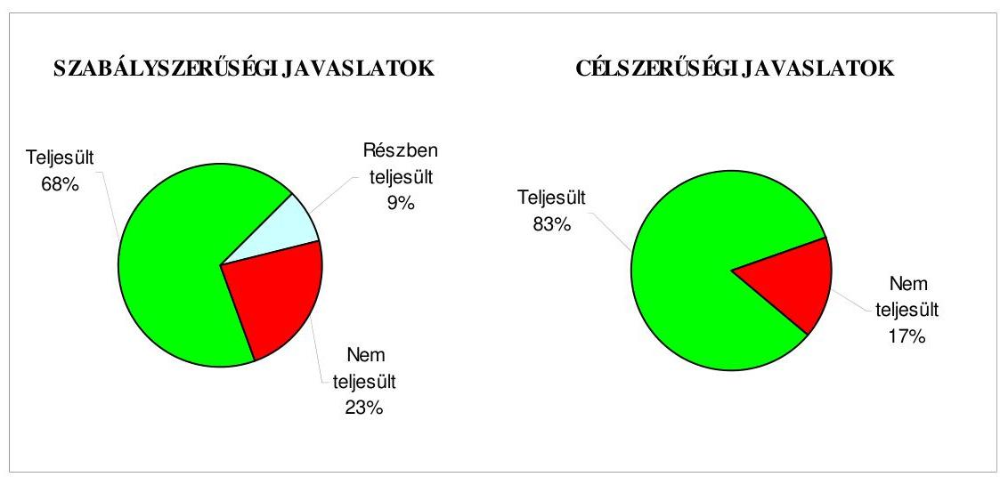

Budapest, 2009. november „ 26 "

Melléklet: $\quad 8 \mathrm{db} \quad 12$ lap
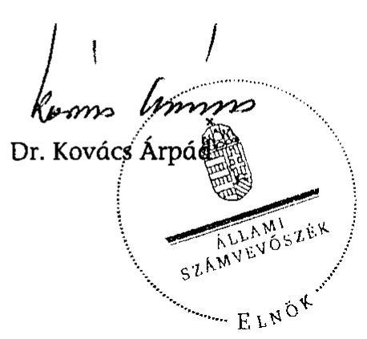

---

Budapest Főváros XIV. kerület Zugló Önkormányzata

# Az Önkormányzat gazdálkodását meghatározó adatok, mutatószámok 

| Megnevezés |  |
| :--: | :--: |
| A település állandó lakosainak száma (fő) 2009. január 1-jén | 112399 |
| A Képviselő-testület tagjainak a száma (fő) (2008. december 31-én) | 34 |
| A Képviselő-testület munkáját segítő állandó bizottságok száma (2008. december 31-én) | 12 |
| A Polgármesteri hivatalban foglalkoztatott köztisztviselők száma (fő) (2008. december 31-én) | 269 |
| Az összes vagyon értéke a 2008. december 31-i könyvviteli mérleg szerint (millió Ft) | 89867 |
| Az adósságállomány (hosszú és rövid lejáratú kötelezettség) 2008. december 31-én (millió Ft) | 6909 |
| Az egy lakosra jutó adósságállomány 2008. december 31-én (Ft) | 61469 |
| Az összes 2008. évben teljesített költségvetési bevétel (millió Ft) | 27843 |
| Ebből: saját bevétel (millió Ft), melyből | 14996 |
| helyi adóbevétel (millió Ft) | 8054 |
| Az egy lakosra jutó 2008. évi költségvetési bevétel (Ft) | 247716 |
| Az egy lakosra jutó 2008. évi saját bevétel (Ft) | 133418 |
| Az egy lakosra jutó 2008. évi helyi adóbevétel (Ft) | 71655 |
| Saját bevétel/Összes költségvetési bevétel aránya a 2008. évben (\%) | 53,9 |
| Helyi adó bevétel/Összes költségvetési bevétel aránya a 2008. évben (\%) | 28,9 |
| Az összes teljesített költségvetési kiadás a 2008. évben (millió Ft) | 24730 |
| Ebből: felhalmozási célú költségvetési kiadás (millió Ft) | 3011 |
| A 2008. évi költségvetési kiadásból a felhalmozási célú költségvetési kiadás aránya (\%) | 12,2 |
| Az egy lakosra jutó 2008. évi költségvetési kiadás (Ft) | 220020 |
| Az egy lakosra jutó 2008. évben teljesített felhalmozási célú költségvetési kiadás (Ft) | 26788 |
| A költségvetési intézmények száma 2008. december 31-én (db) | 57 |
| Ebből: részben önállóan gazdálkodó (db) | 51 |
| A költségvetési intézményekben foglalkoztatott közalkalmazottak száma (fő) (2008. december 31-én) | 2759 |

---

Budapest Főváros XIV. kerület Zugló Önkormányzata

# Az önkormányzati vagyon alakulása

|  Mérlegsor
megnevezése | 2006.év
(millió Ft) | 2007. év
(millió Ft) | 2008. év
(millió Ft) | Változás \%-a (Előző év=100\%) |  |   |
| --- | --- | --- | --- | --- | --- | --- |
|   |  |  |  | 2007/2006. | 2008/2007. | 2008/2006.  |
|  Immateriális javak | 113 | 632 | 677 | 559,3 | 107,1 | 599,1  |
|  Tárgyi eszközök | 68328 | 64627 | 65323 | 94,6 | 101,1 | 95,6  |
|  ebből: ingatlanok | 66624 | 63486 | 63849 | 95,3 | 100,6 | 95,8  |
|  beruházások | 971 | 437 | 784 | 45,0 | 179,4 | 80,7  |
|  Befektetett pénzügyi eszközök | 2672 | 2417 | 2329 | 90,5 | 96,4 | 87,2  |
|  Üzemeltetésre átadott eszközök | 12635 | 12417 | 11626 | 98,3 | 93,6 | 92,0  |
|  Befektetett eszközök összesen | 83748 | 80093 | 79955 | 95,6 | 99,8 | 95,5  |
|  Forgóeszközök összesen | 4105 | 6655 | 9912 | 162,1 | 148,9 | 241,5  |
|  ebből: követelések | 437 | 642 | 504 | 146,9 | 78,5 | 115,3  |
|  pénzeszközök | 2566 | 4996 | 8447 | 194,7 | 169,1 | 329,2  |
|  Eszközök összesen | 87853 | 86748 | 89867 | 98,7 | 103,6 | 102,3  |
|  Saját tőke összesen | 83395 | 79920 | 73586 | 95,8 | 92,1 | 88,2  |
|  Tartalék összesen | 1063 | 4960 | 8342 | 466,6 | 168,2 | 784,8  |
|  Kötelezettségek összesen | 3395 | 1868 | 7939 | 55,0 | 425,0 | 233,8  |
|  ebből: hosszú lejáratú kötelezettségek | 212 | 387 | 6234 | 182,5 | 1610,9 | 2940,6  |
|  rövid lejáratú kötelezettségek | 604 | 459 | 675 | 76,0 | 147,1 | 111,8  |
|  Források összesen: | 87853 | 86748 | 89867 | 98,7 | 103,6 | 102,3  |

Forrás: Magyar Államkincstár éves költségvetési beszámoló "01" számú űrlap adatai.

---

Budapest Főváros XIV. kerület Zugló Önkormányzata

# Az önkormányzati kötelezettségek alakulása

|  Mérlegsor megnevezése | 2006.év
(millió Ft) | 2007. év
(millió Ft) | 2008. év
(millió Ft) | Változás \%-a (Előző év=100\%) |  |   |
| --- | --- | --- | --- | --- | --- | --- |
|   |  |  |  | 2007/2006. | 2008/2007. | 2008/2006.  |
|  Hosszú lejáratú kötelezettségek összesen
ebből: | 212 | 387 | 6234 | 182,5 | 1610,9 | 2940,6  |
|  hosszú lejáratra kapott kölcsönök | 6 |  |  | 0,0 |  | 0,0  |
|  tartozások fejlesztési célú kötvénykibocsátásból |  |  | 5739 |  |  |   |
|  tartozások müködési célú kötvénykibocsátásból |  |  |  |  |  |   |
|  beruházási és fejlesztési hitelek | 206 | 387 | 495 | 187,9 | 127,9 | 240,3  |
|  müködési célú hosszú lejáratú hitelek |  |  |  |  |  |   |
|  egyéb hosszú lejáratú kötelezettségek |  |  |  |  |  |   |
|  Rövid lejáratú kötelezettségek összesen
ebből: | 604 | 459 | 675 | 76,0 | 147,1 | 111,8  |
|  rövid lejáratú kölcsönök |  |  |  |  |  |   |
|  rövid lejáratú hitelek |  |  |  |  |  |   |
|  kötelezettségek áruszállításból, szolgáltatásból | 366 | 155 | 206 | 42,3 | 132,9 | 56,3  |
|  garancia- és kezességvállalásból származó kötelezettség |  |  |  |  |  |   |
|  hosszú lejáratra kapott kölcsön következő évet terhelő törlesztő részlete | 8 | 6 |  | 75,0 | 0,0 | 0,0  |
|  felhalm.c.kötvény kibocsátásból szárm.tartozás következő évet terh.részlete |  |  |  |  |  |   |
|  mük.c.kötvény kibocsátásból szárm.tartozás következő évet terh.részlete |  |  |  |  |  |   |
|  beruházási c. hosszú lejáratú hitel következő évet terhelő törlesztő részlete | 101 | 249 | 368 | 246,5 | 147,8 | 364,4  |
|  müködési c.hosszú lejáratú hitel következő évet terhelő törlesztő részlete |  |  |  |  |  |   |
|  egyéb hosszú lejáratú kötelezettség következő évet terhelő törlesztő részlete |  |  |  |  |  |   |

Forrás: Magyar Államkincstár éves költségvetési beszámoló "01" számú űrlap adatai.

---

Budapest Főváros XIV. kerület Zugló Önkormányzata

Az Önkormányzat 2006-2009. évi költségvetési előirányzatainak és 2006-2008. évi pénzügyi teljesítéseinek alakulása

|  Megnevezés | 2006. év |  |  |  | 2007. év |  |  |  | 2008. év |  |  |  | 2009.  |
| --- | --- | --- | --- | --- | --- | --- | --- | --- | --- | --- | --- | --- | --- |
|   | Eredeti | Módosított | Teljesítés | Teljesítés/ eredeti elöirány- | Eredeti | Módosított | Teljesítés | Teljesítés/ eredeti elöirány- | Eredeti | Módosított | Teljesítés | Teljesítés/ eredeti elöirány-zat | Eredeti  |
|   | előirányzat (millió Ft) |  | (millió Ft) |  | előirányzat (millió Ft) |  | (millió Ft) |  | (millió Ft) |  | (millió Ft) |  | (millió Ft)  |
|  Müködési célú költségvetési bevételek összesen | 16 996 | 20 163 | 20 355 | 119,8 | 20 744 | 20 011 | 20 727 | 99,9 | 21 407 | 26 591 | 26 548 | 124,0 | 23 395  |
|  Müködési célú költségvetési kiadások összesen | 18 414 | 21 140 | 18 315 | 99,5 | 20 628 | 21 710 | 18 861 | 91,4 | 20 871 | 24 751 | 21 719 | 104,1 | 21 940  |
|  Müködési célú költségvetési bevételek és kiadások egyenlege: hiány-, többlet + | -1 418 | -977 | 2 040 | 243,9 | 116 | -1 699 | 1 866 | 1 608,6 | 536 | 1 840 | 4 829 | 900,9 | 1 455  |
|  Felhalmozási célú költségvetési bevételek összesen | 4 716 | 6 644 | 3 190 | 67,6 | 3 941 | 5 908 | 5 563 | 141,2 | 2 181 | 2 415 | 1 295 | 59,4 | 9 999  |
|  Felhalmozási célú költségvetési kiadások összesen | 4 178 | 6 647 | 4 130 | 98,9 | 5 646 | 5 223 | 2 797 | 49,5 | 2 384 | 9 563 | 3 011 | 126,3 | 11 662  |
|  Felhalmozási célú költségvetési bevételek és kiadások egyenlege: hiány-, többlet+ | 538 | -3 | -940 | -274,7 | -1 705 | 685 | 2 766 | 262,2 | -203 | -7 148 | -1 716 | 845,3 | -1 663  |
|  Költségvetési bevételek összesen | 21 712 | 26 807 | 23 545 | 108,4 | 24 685 | 25 919 | 26 290 | 106,5 | 23 588 | 29 006 | 27 843 | 118,0 | 33 394  |
|  Költségvetési kiadások összesen | 22 592 | 27 787 | 22 445 | 99,3 | 26 274 | 26 933 | 21 658 | 82,4 | 23 255 | 34 314 | 24 730 | 106,3 | 33 602  |
|  Költségvetési bevételek és kiadások egyenlege: hiány-, többlet+ | -880 | -980 | 1 100 | 225,0 | -1 589 | -1 014 | 4 632 | 391,5 | 333 | -5 308 | 3 113 | 934,8 | -208  |
|  Finanszírozási célú pénzügyi bevételek | 1 032 | 1 132 | 114 |  | 1 793 | 1 218 | 519 |  | 0 | 5 657 | 5 577 |  | 576  |
|  Finanszírozási célú pénzügyi kiadások | 152 | 152 | 151 |  | 204 | 204 | 191 |  | 333 | 349 | 349 |  | 368  |
|  Finanszírozási célú pénzügyi műveletek egyenlege | 880 | 980 | -37 |  | 1 589 | 1 014 | 328 |  | -333 | 5 308 | 5 228 |  | 208  |

Forrás: - Magyar Államkincstár éves költségvetési beszámoló "80" számú űrlap adatai;

- a 2009. évi adatok esetében az Önkormányzat 2009. évi költségvetése;
- a költségvetési bevétel-kiadás működési-felhalmozási célra történt megosztásánál az analitikus nyilvántartás.

---

Budapest Főváros XV. karület Zugló Önkormányzata 1145 Budapest, Pétervárad u. 2.

# TANÚSÍTVÁNY

az európai uniós forrásokkal támogatott célok és programok 2006-2009. évi tervezett és teljesített adatairól

|  Sor-
szám | Az európai uniós forrásokkal
támogatott fejlesztés megnevezése | Tervezett költségvetési adatok (mibö Ft) |  |  |  |  |  |  |  |  |  |  |  |  |  |  |  | Telfesített költségvetési adatok (mibö Ft) |  |  |  |  |  |   |
| --- | --- | --- | --- | --- | --- | --- | --- | --- | --- | --- | --- | --- | --- | --- | --- | --- | --- | --- | --- | --- | --- | --- | --- | --- | --- |
|   |  |  |  |  |  |  |  |  |  |  |  |  |  |  |  |  |  |  |  | az összes kiadást finanszírozó források |  |  |  |  |   |
|   |  |  |  |  |  |  |  |  |  |  |  |  |  |  |  |  |  |  |  |  |  |  |  |  |   |
|   |  |  |  |  |  |  |  |  |  |  |  |  |  |  |  |  |  |  |  |  |  |  |  |  |   |
|   |  |  |  |  |  |  |  |  |  |  |  |  |  |  |  |  |  |  |  |  |  |  |  |  |   |
|   |  |  |  |  |  |  |  |  |  |  |  |  |  |  |  |  |  |  |  |  |  |  |  |  |   |
|   |  |  |  |  |  |  |  |  |  |  |  |  |  |  |  |  |  |  |  |  |  |  |  |  |   |
|  1. | 1. Berüjezett fejlesztési feladat megnevezése |  |  |  |  |  |  |  |  |  |  |  |  |  |  |  |  |  |  |  |  |  |  |  |   |
|  2. |  | 378,2 |  |  |  |  |  |  |  |  |  |  |  |  |  |  |  |  |  |  |  |  |  |  |   |
|   |  |  |  |  |  |  |  |  |  |  |  |  |  |  |  |  |  |  |  |  |  |  |  |  |   |
|   |  |  |  |  |  |  |  |  |  |  |  |  |  |  |  |  |  |  |  |  |  |  |  |  |   |
|   |  |  |  |  |  |  |  |  |  |  |  |  |  |  |  |  |  |  |  |  |  |  |  |  |   |
|   |  |  |  |  |  |  |  |  |  |  |  |  |  |  |  |  |  |  |  |  |  |  |  |  |   |
|   |  |  |  |  |  |  |  |  |  |  |  |  |  |  |  |  |  |  |  |  |  |  |  |  |   |
|   |  |  |  |  |  |  |  |  |  |  |  |  |  |  |  |  |  |  |  |  |  |  |  |  |   |
|   |  |  |  |  |  |  |  |  |  |  |  |  |  |  |  |  |  |  |  |  |  |  |  |  |   |
|   |  |  |  |  |  |  |  |  |  |  |  |  |  |  |  |  |  |  |  |  |  |  |  |  |   |
|   |  |  |  |  |  |  |  |  |  |  |  |  |  |  |  |  |  |  |  |  |  |  |  |  |   |
|   |  |  |  |  |  |  |  |  |  |  |  |  |  |  |  |  |  |  |  |  |  |  |  |  |   |
|   |  |  |  |  |  |  |  |  |  |  |  |  |  |  |  |  |  |  |  |  |  |  |  |  |   |
|   |  |  |  |  |  |  |  |  |  |  |  |  |  |  |  |  |  |  |  |  |  |  |  |  |   |
|   |  |  |  |  |  |  |  |  |  |  |  |  |  |  |  |  |  |  |  |  |  |  |  |  |   |
|   |  |  |  |  |  |  |  |  |  |  |  |  |  |  |  |  |  |  |  |  |  |  |  |  |   |
|   |  |  |  |  |  |  |  |  |  |  |  |  |  |  |  |  |  |  |  |  |  |  |  |  |   |
|   |  |  |  |  |  |  |  |  |  |  |  |  |  |  |  |  |  |  |  |  |  |  |  |  |   |
|   |  |  |  |  |  |  |  |  |  |  |  |  |  |  |  |  |  |  |  |  |  |  |  |  |   |
|   |  |  |  |  |  |  |  |  |  |  |  |  |  |  |  |  |  |  |  |  |  |  |  |  |   |
|   |  |  |  |  |  |  |  |  |  |  |  |  |  |  |  |  |  |  |  |  |  |  |  |  |   |
|   |  |  |  |  |  |  |  |  |  |  |  |  |  |  |  |  |  |  |  |  |  |  |  |  |   |
|   |  |  |  |  |  |  |  |  |  |  |  |  |  |  |  |  |  |  |  |  |  |  |  |  |   |
|   |  |  |  |  |  |  |  |  |  |  |  |  |  |  |  |  |  |  |  |  |  |  |  |  |   |
|   |  |  |  |  |  |  |  |  |  |  |  |  |  |  |  |  |  |  |  |  |  |  |  |  |   |
|   |  |  |  |  |  |  |  |  |  |  |  |  |  |  |  |  |  |  |  |  |  |  |  |  |   |
|   |  |  |  |  |  |  |  |  |  |  |  |  |  |  |  |  |  |  |  |  |  |  |  |  |   |
|   |  |  |  |  |  |  |  |  |  |  |  |  |  |  |  |  |  |  |  |  |  |  |  |  |   |
|   |  |  |  |  |  |  |  |  |  |  |  |  |  |  |  |  |  |  |  |  |  |  |  |  |   |
|   |  |  |  |  |  |  |  |  |  |  |  |  |  |  |  |  |  |  |  |  |  |  |  |  |   |
|   |  |  |  |  |  |  |  |  |  |  |  |  |  |  |  |  |  |  |  |  |  |  |  |  |   |
|   |  |  |  |  |  |  |  |  |  |  |  |  |  |  |  |  |  |  |  |  |  |  |  |  |   |
|   |  |  |  |  |  |  |  |  |  |  |  |  |  |  |  |  |  |  |  |  |  |  |  |  |   |
|   |

---

# ADATLAP 

## az európai uniós forrással támogatott „Elektronikus önkormányzati szolgáltatások" fejlesztésről

## 1. A PÁLYÁZÓ ADATAI

1.1. A pályázó Budapest Főváros XIV. kerület Zugló Önkormányzata
1.2. A pályázó 1145 Budapest, Pétervárad u. 2.

## 2. A PROJEKT ÖSSZEGZŐ ADATAI

2.1. A pályázott program megnevezése: GVOP-4.3.1.
2.2. A pályázott programon belül a projekt címe: „Elektronikus önkormányzati szolgáltatások fejlesztése"
2.3. A pályázatot készítő megnevezése: FRAMACO Kft.
2.4. A pályázat benyújtásának időpontja: 2004. május 30.

### 2.5. A projekt tervezett

- teljes kiadásának összege: 378,2 millió Ft
- saját forrás: 94,5 millió Ft
- támogatás: 283,7 millió Ft
- európai uniós: 212,7 millió Ft
- hazai társfinanszírozás: 71,0 millió Ft
- EU Önerő Alap:
- hitel:
- egyéb forrás:
- a megvalósítás tervezett időpontja (év, hó, nap): 2006. november 15.

---

2.6 A pályázat elbírálásáról szóló döntés kelte: 2004. december 15.
2.7 A pályázat elbírálásának eredménye: nyertes

# 2.8 A projekt teljesített: 

- kiadásának összege: 380,8 millió Ft
- saját forrás: 40,4 millió Ft
- támogatás: 283,7 millió Ft
- európai uniós: 212,7 millió Ft
- hazai társfinanszírozás: 56,7 millió Ft
- EU Önerő Alap:
- hitel:
- egyéb forrás:
- a megvalósítás időpontja: 2007. május 16.

## 3. A TÁMOGATÁSI SZERZŐDÉS ADATAI

### 3.1. A támogatási szerződés:

- megkötésének időpontja: 2005. június 14.
- a projekt kezdési és befejezési időpontja: 2005. szeptember 12. - 2007. május 16. (a szerződésmódosításokhoz igazodóan)
- a projekt összköltsége (kiadása): 378,2 millió Ft
- a projekt megvalósítás forrásai:
- saját forrás: 94,5 millió Ft
- európai uniós támogatás: 212,7 millió Ft
- hazai társfinanszírozás: 71,0 millió Ft
- EU Önerő Alap:
- hitel:
- egyéb forrás:
- előírt támogatási határidők: 2006. év: 235,5 millió Ft - 2007. év 48,2 millió Ft szerződésmódosítás után
- előírt fizetési kötelezettségek: 2006. év 198,1 millió Ft - 2007. év 85,6 millió Ft szerződésmódosítás után

---

| Kifizetési kérelem   (PEJ/EPEJ) benyújtásának időpontja | Számla   bruttó   összege   (Ft) | Igényelt támogatási összeg   (Ft) | Folyósitott   támogatás   összege   (Ft) | Támogatás   folyósitásá-   nak   időpontja   (év,hó,nap) | Benyújtás és a folyósítás között eltelt időtartam (nap) |
| :--: | :--: | :--: | :--: | :--: | :--: |
| Előleg igénybevételére nem került sor |  |  |  |  |  |
| 1 2006. 03. 24. | 213620000 | 160215002 | 160215002 | $\begin{array}{r} 2006.06 . \\ 16 . \end{array}$ | 84 |
| 2 2006. 06. 30. | 50400000 | 37800000 | 37800000 | $\begin{array}{r} 2006.10 . \\ 19 . \end{array}$ | 111 |
| 3 2007. 03. 07. | 45600000 | 34200000 | 34200000 | $\begin{array}{r} 2007.06 . \\ 22 . \end{array}$ | 107 |
| 4 2007. 05. 29. | 71160000 | 51434998 | 51434998 | $\begin{array}{r} 2007.09 . \\ 06 . \end{array}$ | 100 |
| Összesen | 380780000 | 283650000 | 283650000 |  |  |

# 5. Ellenőrzések 

### 5.1. A külső ellenőrzések:

- az ellenőrzések száma: 3
- az ellenőrzést végző szervek megnevezése: Magyar Gazdaságfejlesztési Zrt.

### 5.2. Szabálytalanságokra vonatkozó adatok:

- mely előírást nem tartotta be az Önkormányzat: a második ellenőrzés során 2008. április 30 -án az ellenőrök az elektronikus ügyintézés müködéséről nem tudtak meggyőződni, a közbeszerzés lezárásaként a Közbeszerzési Értesítőben a projekt befejezésére irányuló tájékoztatást az Önkormányzat nem jelentette meg;
- az előírás nem teljesítésének okai: az ügyfélkapus csatlakozás az ellenőrzés időpontjában nem müködött, illetve a közzététel elmaradt;
- a rendezésre előírt kötelezettségek: a hiányosságok kijavítása, illetve a megjelentetés pótlása;
- a rendezésre előírt kötelezettséget mennyi időn belül teljesítették: a Közbeszerzési Értesítőben a projekt befejezésére irányuló tájékoztatást 2008.

---

július 14-én tették közzé. Az ügyfélkapu a záróellenőrzéskor már működött, így már nem volt akadálya a záróellenőrzés lefolytatásának;

- mekkora időbeli csúszást eredményezett ez a projekt megvalósításában: az említett hiányosságok nem eredményezték a projekt megvalósításának csúszását.

Kelt: 2009. július „ 02 . "
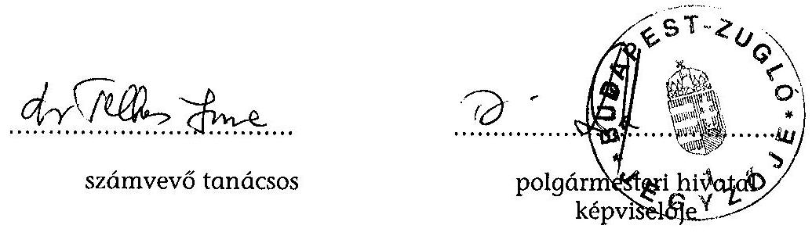

---

Budapest főváros XIV. kerület
6. számú melléklet

Zugló Önkormányzat
a V-3001-4/23/2009. számú jelentéshez

Polgármestere

- 1145 Budapest, Pétervárad u. 2.

# Állami Számvevőszék 

1052 Budapest
Apáczai Csere János utca 10.

## Dr. Kovács Árpád

Elnök Úr részére

Tisztelt Elnök Úr!
Tájékoztatom, hogy Budapest főváros XIV. kerület Zugló Önkormányzata gazdálkodási rendszerének 2009. évi ellenőrzéséről szóló V-3001-4/23/2/2009. iktatószámú, 933 témaszámú, V0451 vizsgálat-azonosító számú számvevői jelentésben foglalt javaslatokra a mai napig az alábbi intézkedéseket tettem.

1. A kötelezettségvállalás, érvényesítés, utalványozás és ellenjegyzés rendjéről szóló utasítás módosításával intézkedtem, hogy az Áht. 15/A § (1) bekezdés előirása alapján a felhalmozási célú támogatások közzététele a döntéshozatait követő 60 napon belül megtörténjen. A módosított utasítás 2009. október 15 -én lépett hatályba.
A közzététel megtekinthető a www.zuglo.hu weboldalon. Elérhetőség: föoldal önkormányzat - gazdálkodási adatok - 2009. évben folyósított támogatások.
2. Az Áht. 15/B § (1) bekezdés előírásai alapján közzétételre kerültek a 2009. évi vagyonértékesítésre vonatkozó adatok, valamint megjelölésre került az önállóan müködő és gazdálkodó intézmények esetében a szerződések típusa is.
A közzététel megtekinthető a www.zuglo.hu honlapon. Elérhetősége: föoldal - önkormányzat - gazdálkodási adatok - szerződési adatok.
3. 2009. október 05 -én a Manna integrált pénzügyi nyilvántartó rendszerben visszatöltésre került a 2009. szeptember 30-án elmentett adatállomány. A csatolt forgatókönyv, valamint a jegyzőkönyv megállapításai, és az azt alátámasztó egyeztető listák alapján megállapításra került, hogy a pénzügyi-számviteli adatok teljes körüen helyreállíthatóak az elmentett adatállományból.
Intézkedtem, hogy a Manna integrált pénzügyi nyilvántartó rendszerből kinyerhető ellenőrzési listákat a Pénzügyi osztályon havi rendszerességgel ellenőrizzék.
4. 2009. október 19-én Budapest főváros XIV. kerület Zugló Önkormányzata részéről aláírásra került a Magyar Kommunista Munkáspárt új bérleti szerződése az Ilka utca 32. számú ingatlanra vonatkozóan. A szerződés szerint a bérleti díj havi összege 2009. szeptember 01-től 2.240.- Ft/m2/hó.

---

5. 2009. november 1-jén hatályba lépett a 36/2009. számú jegyzöi utasítás a folyamatba épített, előzetes és utólagos vezetői ellenőrzésről, amelyet az Ámr.145/B. § (1)-(4) bekezdésében előírtak, és az Ámr. 145/A.§ (3) bekezdésében hivatkozott „Útmutató az ellenőrzési nyomvonal kialakításához" módszertan alapján kiegészítettünk a tevékenységek elvégzését igazoló dokumentumok megnevezésével, és fellelési helyével.

Az 1-4 pontokban foglaltakról szóló dokumentumokat a Jegyző a 2009.október 20-án kelt leveléhez csatoltan a Számvevőszék felé megküldött. Az 5. pontban foglaltak elvégzéséről jelen levelemhez csatolom a 36/2009.számú jegyzöi utasítást, valamint elektronikus formában a mellékleteket.

Budapest, 2009. november 10.

Tisztelettel:
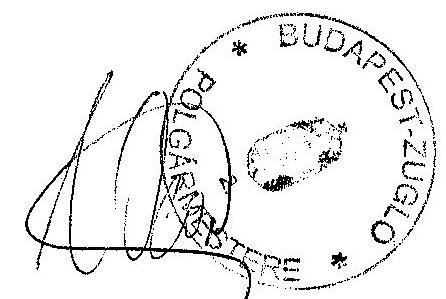
dr. Weinek Leonárd
polgármester

---

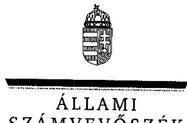

ÁLLAMI
SZÁMVEVÔSZÉK

7. számú melléklet a V-3001-4/23/2009. számú jelentéshez

ELNÖK

Ikt.szám: V-3001-4/23/21/2009.

# Dr. Weinek Leonard úr, 

polgármester
Budapest Főváros XIV. kerület Zugló Önkormányzata

## Budapest

Pétervárad u. 2.
1145

## Tisztelt Polgármester Úr!

Köszönettel vettem a Budapest Főváros XIV. kerület Zugló Önkormányzata gazdálkodási rendszerének 2009. évi ellenőrzéséről készült számvevőszéki jelentéshez küldött tájékoztatását a megtett intézkedésekről.

Örömmel értesültem arról, hogy megállapításaink, javaslataink egy részét az ellenőrzést követően megvalósították, a hiányosságokat megszüntették. A tájékoztatása alapján megvalósult intézkedéseket a számvevőszéki jelentésben az érintett megállapításhoz kapcsolt lábjegyzetben szerepeltetjük és a számvevői jelentésben tett, vonatkozó javaslatokat elhagyjuk.

Ilyennek tekintjük, hogy intézkedtek a felhalmozási célú támogatások, valamint a vagyonértékesítésre és szolgáltatási szerződésekre vonatkozó adatok közzétételéről, a FEUVE szabályzat kiegészítéséről, a pénzügyi-számviteli adatok helyreállíthatóságáról, a párt által használt helyiség bérleti szerződésének megkötéséről.

Az ellenőrzés lefolytatásához nyújtott segítő közreműködését köszönöm.
Budapest, 2009. november „ 24"
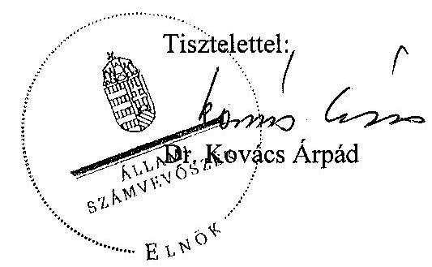