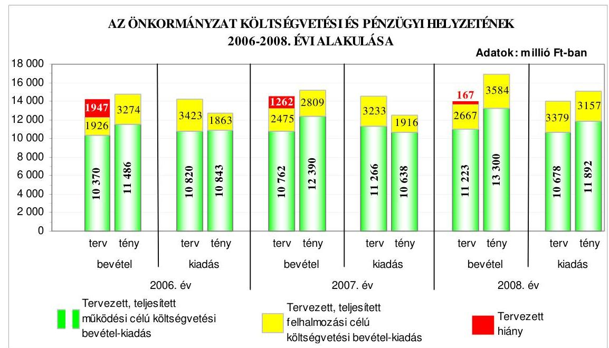
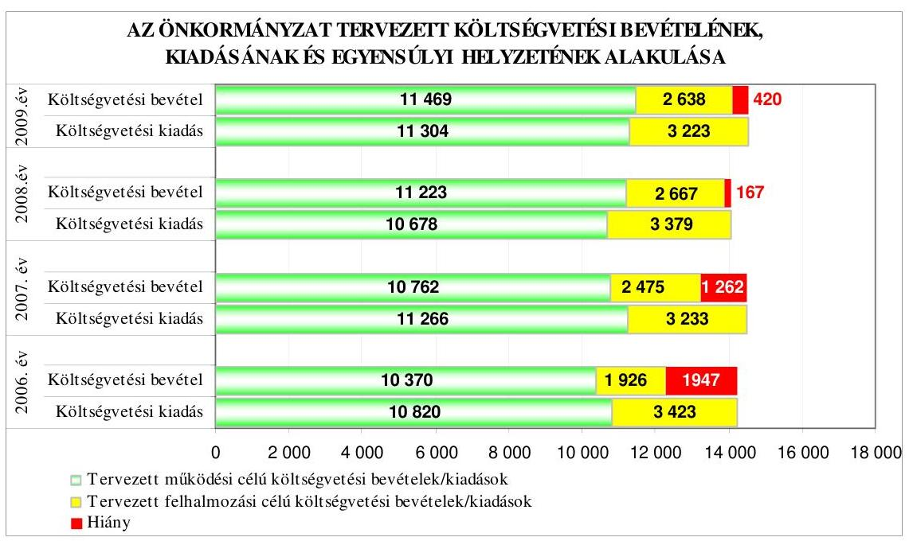
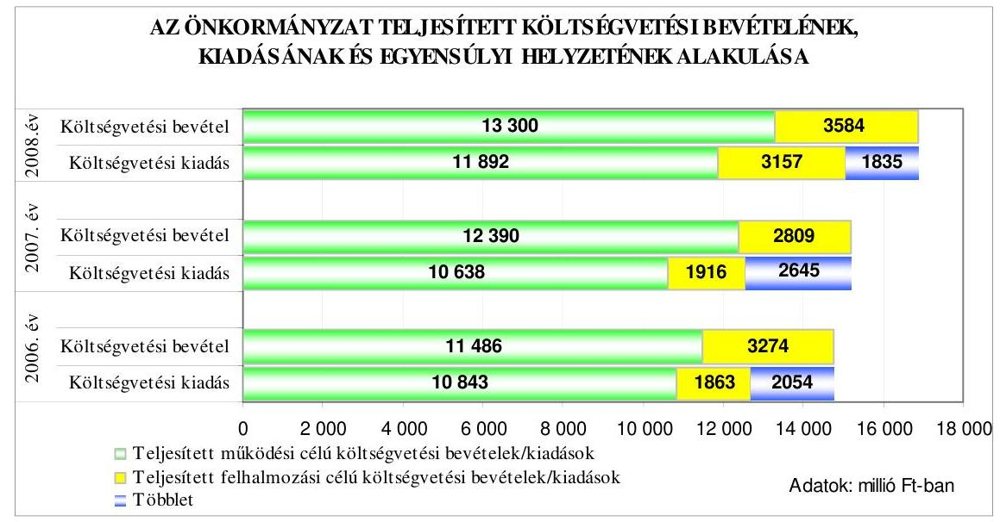
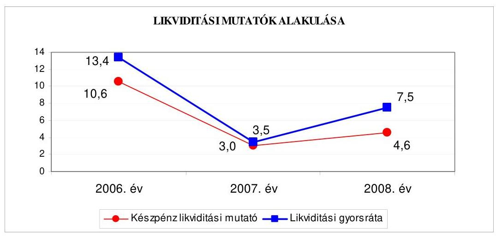
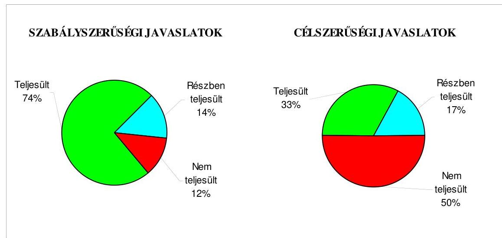
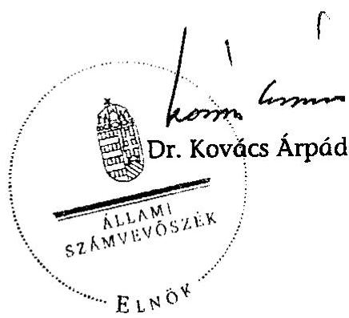
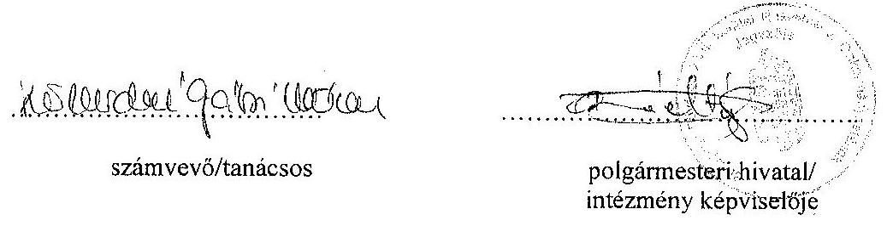
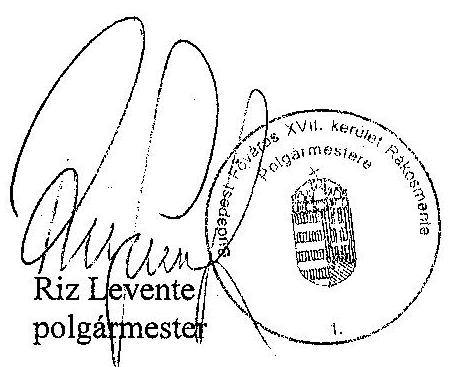
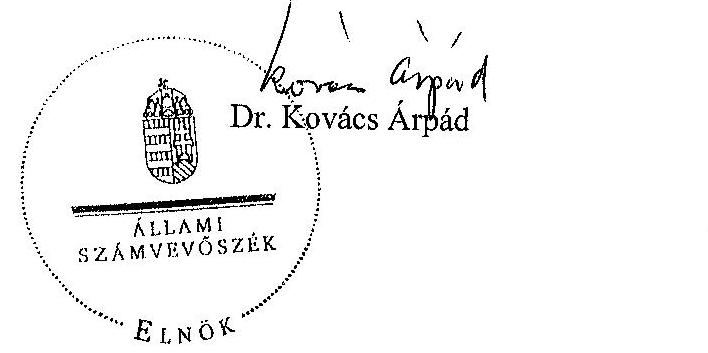

# JELENTÉS 

a Budapest Főváros XVII. kerület Rákosmente Önkormányzata gazdálkodási rendszerének 2009. évi ellenőrzéséről

---

# 3. Önkormányzati és Területi Ellenőrzési Igazgatóság 

## Átfogó Ellenőrzési Főcsoport

Iktatószám: V-3001-4/24/22/2009.
Témaszám: 933
Vizsgálat-azonosító szám: V0452

## Az ellenőrzést felügyelte:

Dr. Lóránt Zoltán
főigazgató
Az ellenőrzés végrehajtásáért felelős:
Dr. Sepsey Tamás
főigazgató-helyettes
Az ellenőrzést vezette:
Molnár Gyula Mihály
igazgatóhelyettes
Az ellenőrzést végezték:
Dr. Kiss Károly
tunácsadó
Köllödné Gátai Mária Nagy Ervin Barnabás számvevő számvevő tanácsos

## A témához kapcsolódó eddig készített számvevőszéki jelentések:

| címe | sorszáma |
| :-- | :--: |
| Jelentés Budapest Főváros XVII. kerület Önkormányzata gazdálko-   dási rendszerének 2006. évi átfogó ellenőrzéséről | 0658 |
| Jelentés a helyi és helyi kisebbségi önkormányzatok gazdálkodási   rendszerének 2006. évi átfogó és egyéb szabályszerűségi ellenőrzé-   séről | 0726 |
| Jelentés a fővárosi önkormányzatot és a kerületi önkormányzato-   kat osztottan megillető bevételek 2007. évi megosztásáról szóló   önkormányzati rendelet felülvizsgálatáról | 0756 |

---

# TARTALOMJEGYZÉK 

BEVEZETÉS ..... 11
I. ÖSSZEGZŐ MEGÁLLAPÍTÁSOK, KÖVETKEZTETÉSEK, JAVASLATOK ..... 16
II. RÉSZLETES MEGÁLLAPÍTÁSOK ..... 26

1. Az Önkormányzat költségvetési és pénzügyi helyzete ..... 26
1.1. A tervezett költségvetési bevételek és kiadások alapján a költségvetési egyensúly alakulása, a költségvetési hiány oka, finanszírozásának tervezett módja és a költségvetési hiány megállapításának szabályszerűsége ..... 26
1.2. A teljesített költségvetési bevételek és kiadások alapján a pénzügyi egyensúly alakulása, a pénzügyi hiány oka, finanszírozásának módja és hatása a pénzügyi helyzetre az eladósodás, valamint a fizetőképesség szempontjából ..... 28
2. Az Önkormányzat felkészültsége az európai uniós források igénylésére és felhasználására, valamint az elektronikus közszolgáltatási feladatok ellátására ..... 34
2.1. Az európai uniós források igénybevételére és a várható támogatás felhasználására történt felkészülés szabályozottságának, szervezettségének eredményessége ..... 34
2.1.1. Az európai uniós forrásokra történő pályázatok benyújtására vonatkozó döntések összhangja a fejlesztési célkitűzésekkel ..... 34
2.1.2. Az európai uniós forrásokhoz kapcsolódóan a pályázatfigyelés, a pályázatkészítés, valamint az európai uniós támogatással megvalósuló fejlesztés lebonyolítása belső rendjének szabályozottsága, a végrehajtás személyi, szervezeti feltételei, az ellenőrzési feladatok meghatározása ..... 38
2.1.3. A fejlesztési feladat lebonyolításánál a feladatellátás rendjére, az ellenőrzési feladatok teljesítésére, valamint a felelősségi szabályokra vonatkozó előírások betartása ..... 39
2.2. Az elektronikus közszolgáltatás feltételeinek kialakítása, a közérdekú gazdálkodási adatok elektronikus közzététele ..... 41
3. A költségvetési gazdálkodás belső kontrolljai ..... 45
3.1. A szabályozottság kockázata a költségvetés tervezési, gazdálkodási, beszámolási és a folyamatba épített, előzetes és utólagos vezetői ellenőrzési feladatoknál ..... 45
3.2. A belső kontrollok múködése az önkormányzati források szabályszerű felhasználásában, a költségvetési tervezés, gazdálkodás, beszámolás folyamataiban ..... 47

---

3.3. A belső ellenőrzési kötelezettség teljesítése, javaslatainak hasznosulása ..... 50
4. Az ÁSZ korábbi ellenőrzési javaslatai alapján készített intézkedési terv végrehajtása, eredményessége ..... 54
4.1. Az Önkormányzat gazdálkodási rendszerének átfogó ellenőrzése során tett javaslatok végrehajtására tervezett intézkedések megvalósulása ..... 54
4.2. A zárszámadáshoz kapcsolódó (állami hozzájárulások, támogatások igénylésének és felhasználásának ellenőrzése), valamint a további vizsgálatok esetében a megállapítások, javaslatok alapján tett intézkedések ..... 61

# MELLÉKLETEK 

1. számú Az Önkormányzat gazdálkodását meghatározó adatok, mutatószámok (1 oldal)
2. számú Az önkormányzati vagyon alakulása (1 oldal)

2/a. számú Az önkormányzati kötelezettségek alakulása (1 oldal)
3. számú Az Önkormányzat 2006-2009. évi költségvetési előirányzatainak és 20062008. évi pénzügyi teljesítéseinek alakulása (1 oldal)
4. számú Tanúsítvány az európai uniós forrásokkal támogatott célok és programok 2006-2009. évi tervezett és teljesített adatairól (1 oldal)
5. számú Adatlap az európai uniós forrással támogatott a belterületi utak fejlesztéséről (3 oldal)
6. számú Riz Levente úr, Budapest Főváros XVII. kerület Rákosmente Önkormányzata polgármestere által adott tájékoztatás ( 3 oldal)
7. számú Riz Levente úr, Budapest Főváros XVII. kerület Rákosmente Önkormányzata polgármestere tájékoztatására adott válasz (2 oldal)

---

# RÖVIDÍTÉSEK JEGYZÉKE 

## Törvények

Áht.
Eisztv.
Fot.
Htv.

Ötv.

## Rendeletek

2006. évi költségvetési rendelet
2006. évi zárszámadási rendelet
2007. évi költségvetési rendelet
2007. évi zárszámadási rendelet
2008. évi költségvetési rendelet
2008. évi zárszámadási rendelet
2009. évi költségvetési rendelet

Ámr.
Ber.
18/2005. (XII. 27.) IHM. rendelet
önkormányzati SzMSz
az államháztartásról szóló 1992. évi XXXVIII. törvény az elektronikus információszabadságról szóló 2005. évi XC. törvény
a fogyatékos személyek jogairól és esélyegyenlőségük biztosításáról szóló 1998. évi XXVI. törvény
a helyi önkormányzatok és szerveik, a köztársasági megbízottak, valamint egyes centrális alárendeltségű szervek feladat- és hatásköreiről szóló 1991. évi XX. törvény
a helyi önkormányzatokról szóló 1990. évi LXV. törvény

Budapest Főváros XVII. kerület Rákosmente Önkormányzatának 5/2006. (III. 9.) számú rendelete a 2006. évi költségvetésről
Budapest Főváros XVII. kerület Rákosmente Önkormányzata Önkormányzatának 22/2007. (V. 22.) számú rendelete a 2006. évi zárszámadásáról
Budapest Főváros XVII. kerület Rákosmente Önkormányzatának 6/2007. (III. 14.) számú rendelete a 2007. évi költségvetésről

Budapest Főváros XVII. kerület Rákosmente Önkormányzatának 21/2008. (V. 19.) számú rendelete a 2007. évi zárszámadásáról

Budapest Főváros XVII. kerület Rákosmente Önkormányzatának 9/2008. (III. 19.) számú rendelete a 2008. évi költségvetésről
Budapest Főváros XVII. kerület Rákosmente Önkormányzatának 22/2009. (V. 22.) számú rendelete a 2008. évi zárszámadásáról

Budapest Főváros XVII. kerület Rákosmente Önkormányzatának 13/2009. (III. 13.) számú rendelete a 2009. évi költségvetésről
az államháztartás múködési rendjéről szóló 217/1998. (XII. 30.) Korm. rendelet
a költségvetési szervek belső ellenőrzéséről szóló 193/2003. (XI. 26.) Korm. rendelet
a közzétételi listákon szereplő adatok közzétételéhez szükséges közérdekű adatok közzétételéről szóló 18/2005. (XII. 27.) IHM rendelet
Budapest Főváros XVII. kerület Rákosmente Önkormányzatának 21/2003. (V. 7.) számú rendelete az Önkormányzat Szervezeti és Múködési Szabályzatáról

---

vagyongazdálkodási rendelet

Vhr.

## Szórövidítések

ÁROP
ÁSZ
EGT Norvég Finanszírozási Mechanizmus
EKOP
e-közigazgatás
EU Programiroda
euro
FEUVE
gazdasági program

Informatikai fejlesztési program

Integrált városfejlesztési stratégia
jegyzó
Képviselő-testület
kisebbségi önkormányzatok

KMOP
Közlekedésfejlesztési akcióterv

NFT

Budapest Főváros XVII. kerület Rákosmente Önkormányzatának 52/2004. (X. 27.) számú rendelete az önkormányzat vagyonáról való rendelkezési jog gyakorlásának szabályairól
az államháztartás szervezetei beszámolási és könyvvezetési kötelezettségének sajátosságairól szóló 249/2000. (XII. 24.) Korm. rendelet

ÚMFT Államreform Operatív Program
Állami Számvevőszék
az Európai Gazdasági Térség és a Norvég Finanszírozási Mechanizmusok Közösségi Kezdeményezés
ÚMFT Elektronikus Közigazgatási Operatív Program
elektronikus közigazgatás
Budapest Főváros XVII. kerület Rákosmente Önkormányzata Polgármesteri hivatalának EU Programirodája
az Európai Unió közös valutája
folyamatba épített, előzetes és utólagos vezetői ellenőrzés
Budapest Főváros XVII. Kerület Rákosmente Önkormányzatának Képviselő-testülete által a 2009-2010. évekre szóló 632/2008. (XII. 11.) számú határozatában jóváhagyott gazdasági programja
Budapest Főváros XVII. Kerület Rákosmente Önkormányzatának Képviselő-testülete által a 75/2007. (III. 22.) számú határozatában elfogadott informatikai fejlesztési programja
Budapest Főváros XVII. Kerület Rákosmente Önkormányzatának Képviselő-testülete által a 296/2008. (VI. 11.) számú határozatában elfogadott integrált városfejlesztési stratégiája
Budapest Főváros XVII. kerület Rákosmente Önkormányzat Jegyzője
Budapest Főváros XVII. kerület Rákosmente Önkormányzatának Képviselő-testülete
Budapest Főváros XVII. kerület Rákosmente bolgár, cigány, görög, lengyel, német, örmény, román, ruszin, szlovák Kisebbségi Önkormányzatai
Közép-magyarországi Operatív Program
Budapest Főváros XVII. kerület Rákosmente Önkormányzatának Képviselő-testülete által 454/2007. (XII. 13.) számú határozatával elfogadott Közlekedésfejlesztési akcióterve

Nemzeti Fejlesztési Terv

---

Önkormányzat
PEJ
Pénzügyi bizottság
Polgármesteri hivatali SzMSz
polgármester
Polgármesteri hivatal
Polgármesteri iroda
Rákosmente Kft.
szakmai teljesítésigazolásra vonatkozó utasítás $_{1}$
szakmai teljesítésigazolásra vonatkozó utasítás $_{2}$
szakmai teljesítésigazolásra vonatkozó utasítás $_{3}$
TÁMOP
ÚMFT

Budapest Főváros XVII. kerület Rákosmente Önkormányzata
Projekt Előrehaladási Jelentés
Budapest Főváros XVII. kerület Rákosmente Önkormányzatának Pénzügyi Bizottsága
Budapest Főváros XVII. kerület Rákosmente Önkormányzata Képviselő-testület 380/2007. (VIII. 30.) számú határozata a Polgármesteri Hivatal Szervezeti és Múködési Szabályzatáról
Budapest Főváros XVII. kerület Rákosmente Önkormányzatának Polgármestere
Budapest Főváros XVII. kerület Rákosmente Önkormányzat Polgármesteri hivatala
Budapest Főváros XVII. kerület Rákosmente Önkormányzat Polgármesteri hivatalának Polgármesteri Irodája
Rákosmente Városüzemeltető, Kivitelező, Karbantartó és Szolgáltató Korlátolt Felelősségű Társaság
A szerződések, megrendelések, megállapodások teljesítésének szakmai igazolásáról kiadott 4/2007. számú polgármesteri és jegyzői együttes utasítás
A szerződések, megrendelések, megállapodások teljesítésének szakmai igazolásáról kiadott 2/2008. számú polgármesteri és jegyzői együttes utasítás
A szerződések, megrendelések, megállapodások teljesítésének szakmai igazolásáról kiadott 1/2009. számú polgármesteri és jegyzői együttes utasítás
ÚMFT Társadalmi Megújulás Operatív Program
Új Magyarország Fejlesztési Terv

---

.

---

# ÉRTELMEZŐ SZÓTÁR 

1. elektronikus szolgáltatási szint
2. elektronikus szolgáltatási szint
3. elektronikus szolgáltatási szint
4. elektronikus szolgáltatási szint

EMIR
európai uniós források
fejlesztési feladat (projekt)
fejlesztési célkitúzés

Az 1044/2005. (V. 11.) Korm. határozat alapján olyan információs, tájékoztató szolgáltatás, amely csak általános információkat közöl az adott üggyel kapcsolatos teendőkről és a szükséges dokumentumokról.
Az 1044/2005. (V. 11.) Korm. határozat alapján olyan egyirányú kapcsolatot biztosító szolgáltatás, amely az 1. szinten túl biztosítja az adott ügy intézéséhez szükséges dokumentumok, nyomtatványok letöltését, és azok ellenőrzéssel, vagy ellenőrzés nélküli elektronikus kitöltését, amely esetben a dokumentumok benyújtása hagyományos úton történik.
Az 1044/2005. (V. 11.) Korm. határozat alapján olyan kétirányú kapcsolatot biztosító szolgáltatás, amely közvetlen, vagy ellenőrzött kitöltésű dokumentum segítségével biztosítja az elektronikus adatbevitelt és a bevitt adatok ellenőrzését. Az ügy indításához, intézéséhez személyes megjelenés nem szükséges, de az ügyhöz kapcsolódó közigazgatási döntés (határozat, egyéb aktus) közlése, valamint a kapcsolódó illeték-, vagy díffizetés hagyományos úton történik.
Az 1044/2005. (V. 11.) Korm. határozat alapján olyan teljes közvetlen kétirányú ügyintézési folyamatot biztosító szolgáltatás, amikor az ügyhöz kapcsolódó közigazgatási döntés is elektronikus úton kerül közlésre, illetve a kapcsolódó illeték-, vagy díffizetés elektronikus úton is intézhető.
Egységes Monitoring Informatikai Rendszer az Európai Unió által nyújtott egyes pénzügyi támogatások felhasználásával megvalósuló programok, projektek figyelemmel kísérésére kialakított számítógépes nyilvántartási rendszer, amely a programok és a projektek adatait gyúti, rendszerezi és tartja nyilván.
A támogatott projekt megvalósítása érdekében, a fejlesztés lebonyolítása során felmerült kiadások finanszírozási forrása.
A fejlesztési feladat (projekt) tartalmilag és formailag részletesen kidolgozott, megfelelő pénzügyi háttérrel és végrehajtási ütemezéssel rendelkező fejlesztési terv, amely illeszkedik az Európai Unió, illetve a Nemzeti Fejlesztési Terv és az Új Magyarország Fejlesztési Terv által támogatott programokhoz.
Az önkormányzat által ellátott kötelező, vagy önként vállalt feladatok biztosításának mennyiségi, vagy minőségi fejlesztésére vonatkozó terv. A mennyiségi fejlesztés megvalósulhat beszerzéssel, létesítéssel, bővítéssel, átalakítással.

---

hazai társfinanszírozás irányító hatóság
kedvezményezett
központi program
lebonyolítás
operatív program
Nemzeti Fejlesztési Terv

A központi költségvetési és az elkülönített állami pénzalapokból származó finanszírozás.
A strukturális alapok és a Kohéziós alap forrásainak szabályszerű, hatékony és eredményes felhasználásához szükséges intézményrendszer felső eleme. Az irányító hatóság általános és átfogó felelősséget visel a programok, projektek hatékony és szabályszerű végrehajtásáért. Felelősségi köréből eredően ellenőrzi a közösségi, valamint a hazai jogszabályok betartását, koordinálja az európai uniós források szétosztásának folyamatát, irányítja az intézményrendszer, a statisztikai és a pénzügyi nyilvántartási rendszer múködését. Az Új Magyarország Fejlesztési Terv Irányító Hatósága közremúködik az Operatív Program véglegesítésében, irányítja az Operatív Program Program-kiegészítő Dokumentum kidolgozását, és közreműködő szerepet vállal e dokumentumoknak az Európai Bizottsággal történő tárgyalásaiban. Az Irányító Hatóság részt vesz továbbá a költségvetési tervezésében, valamint közreműködő szervezetek bevonásával irányítja a meghirdetett pályázatok és a központi programok végrehajtását.
Az a helyi önkormányzat, amely a támogatási szerződést kedvezményezettként aláírja, a projektet, illetve a központi programhoz kapcsolódó támogatott önkormányzati programot végrehajtja.
Az ország egészére, több régióra, egy régióra vonatkozó, de mindenképpen az önkormányzat közigazgatási területén túlmutató program, amelynél a támogatott programok kiválasztása pályáztatás nélkül, előre meghatározott feltételrendszer szerint történik, a kedvezményezettek közvetlen megkeresésével. Az Európai Unió pénzügyi alapja a Kohéziós alap, a környezetvédelem és a közlekedés terén nyújt lehetőséget az egyes tagországoknak központi programok megvalósítására.
Az európai uniós források felhasználásával megvalósuló fejlesztésre irányuló műszaki, gazdasági (pénzügyi) tevékenységet magában foglaló szervezési, irányítási szolgáltatás. A szervezési szolgáltatás kiterjedhet a pályázatkészítésre, a közbeszerzési eljárás lebonyolításán keresztül a folyamatos műszaki ellenőrzésre, a pénzügyi elszámolásra, a műszaki átadás-átvételre, az üzembe helyezésre, illetve a fejlesztési folyamat egyes elemeire.
Az Európai Bizottság által jóváhagyott, a Közösségi Támogatási Keret végrehajtására vonatkozó, több évre szóló intézkedésekhez kapcsolódó prioritások egységes rendszerét tartalmazó dokumentum.
Helyzetelemzést, stratégiát a tervezett fejlesztési területek prioritásait, azok céljait és pénzügyi forrásaik megjelölését tartalmazó dokumentum, amelyet a Magyar Köztársaság

---

regionális program

Új Magyarország Fejlesztési Terv
készített az Európai Unió programozási irányelveinek, célkitűzéseinek megfelelően a fejlődésben lemaradó régiók fejlődésének és strukturális átalakulásának elősegítésére a kiemelt szükségletekre figyelemmel. A Nemzeti Fejlesztési Terv stratégiai fejezetének célja, hogy a 2004-2006 közötti időszakra kijelölje Magyarország Strukturális Alapokból támogatható fejlesztéspolitikai célkitűzéseit és prioritásait. A Strukturális Alapok operatív programjai: Agrár és Vidékfejlesztési Operatív Program (AVOP); Gazdasági Versenyképesség Operatív Program (GVOP); Humánerőfor-rás-fejlesztési Operatív Program (HEFOP); Környezetvédelmi és Infrastruktúra-fejlesztési Operatív Program (KIOP); Regionális Fejlesztési Operatív Program (ROP).
Az ágazati és regionális prioritásokat egyaránt tartalmazó operatív program regionális prioritása, illetve támogatási konstrukciója.
Az Új Magyarország Fejlesztési Terv célja a foglalkoztatás bővítése és a tartós növekedés feltételeinek megteremtése. Ennek érdekében 2007-2013 között hat kiemelt területen indított el összehangolt állami és európai uniós fejlesztéseket: a gazdaságban, a közlekedésben, a társadalom megújulása érdekében, a környezet és az energetika területén, a területfejlesztésben és az államreform feladataival összefüggésben. Az Új Magyarország Fejlesztési Terv operatív programjai: Államreform Operatív Program (ÁROP); Elektronikus Közigazgatás Operatív Program (EKOP); Gazdaságfejlesztés Operatív Program (GOP); Környezet és Energia Operatív Program (KEOP); Közlekedés Operatív Program (KÖZOP); Dél-Alföldi Operatív Program (DAOP); Dél-Dunántúli Operatív Program (DDOP); Észak-Alföldi Operatív Program (ÉAOP); Észak-Magyarországi Operatív Program (ÉMOP); Közép-Dunántúli Operatív Program (KDOP); Közép-Magyarországi Operatív Program (KMOP); Nyugat-Dunántúli Operatív Program (NYDOP); Társadalmi Infrastruktúra Operatív Program (TIOP); Társadalmi Megújulás Operatív Program (TÁMOP).
támogatási szerződés
A strukturális alapok esetében az irányító hatóságnak, illetve a Kohéziós Alap esetében a közremúködő szervezeteknek a kedvezményezett önkormányzattal kötött szerződése, amely a támogatás felhasználásának részletes feltételeit tartalmazza. Az Új Magyarország Fejlesztési Terv keretében támogatott projektek esetében a támogatási szerződést a kedvezményezett és a Nemzeti Fejlesztési Ügynökség nevében eljáró közremúködő szervezet között jön létre. Nagyprojekt esetén a támogatási szerződést az Nemzeti Fejlesztési Ügynökség ellenjegyzi. A támogatási szerződés képezi a megvalósítás nyomon követésének, finanszírozásának és ellenőrzésének alapját.

---

.

---

# JELENTÉS 

## a Budapest Főváros XVII. kerület Rákosmente Önkormányzata gazdálkodási rendszerének 2009. évi ellenőrzéséről

## BEVEZETÉS

Az Ötv. 92. § (1) bekezdése, az Állami Számvevőszékről szóló 1989. évi XXXVIII. törvény 2. § (3) bekezdése, valamint az Áht. 120/A. § (1) bekezdése alapján az önkormányzatok gazdálkodását az Állami Számvevőszék ellenőrzi. Az ellenőrzésre az Országgyűlés illetékes bizottságai részére is átadott, országosan egységes ellenőrzési program szerint került sor.

Az Állami Számvevőszék a stratégiájában foglalt célkitűzéseknek megfelelően a helyi önkormányzatok költségvetési gazdálkodási rendszere átfogó ellenőrzésének programját a 2007. évtől megújította, azt kiegészítette további - teljesít-mény-ellenőrzési - elemekkel.

## Az ellenőrzés célja annak értékelése volt, hogy az Önkormányzat:

- milyen módon biztosította a költségvetési és a pénzügyi egyensúlyt a költségvetésében és annak teljesítése során, valamint változott-e a hiányzó bevételi források pótlásában a finanszírozási célú pénzügyi műveletek jelentősége, hatása;
- eredményesen készült-e fel a szabályozottság és a szervezettség terén az európai uniós források igénylésére és felhasználására, továbbá biztosította-e az elektronikus közszolgáltatás feltételeit, a gazdálkodási adatok közzétételével a gazdálkodás nyilvánosságát;
- kialakította-e és működtette-e a külső és a belső feltételeknek megfelelően a költségvetés tervezési, gazdálkodási és zárszámadási feladatai belső kontrollrendszerét ${ }^{1}$, ezen tevékenységek szabályszerű ellátásához hozzájárult-e a folyamatba épített, előzetes és utólagos vezetői ellenőrzés, valamint a belső ellenőrzés;

[^0]
[^0]:    ${ }^{1}$ A gazdálkodás szabályszerűségét biztosító kontrollrendszer alatt értjük a kiépített és működő pénzügyi irányítási és szabályozási rendszert, valamint a belső ellenőrzési funkciók ellátásának rendszerét.

---

- megfelelően hasznosították-e a korábbi számvevőszéki ellenőrzések megállapításait, szabályszerűségi ${ }^{2}$ és célszerűségi javaslatait.

Az ellenőrzés típusa: átfogó ellenőrzés, amely - egy ellenőrzés keretében meghatározott területekre összpontosítva alkalmazza a szabályszerűségi, valamint a teljesítmény-ellenőrzés jellemzőit.

Az ellenőrzött időszak: az 1., 2. és 4. programpontok tekintetében a 20062008. évek és a 2009. I. negyedéve, a 3. ellenőrzési programpontnál a 2008. év és a 2009. I. negyedéve.

Budapest Főváros XVII. kerület Rákosmente lakosainak száma 2009. január 1-jén 85684 fő volt. A 2006. évi önkormányzati választást követően az Önkormányzat 29 tagú Képviselő-testületének munkáját 12 állandó bizottság segítette. A helyi önkormányzat mellett a 2006. évi önkormányzati választásokat követően kilenc ${ }^{3}$ kisebbségi önkormányzat múködött. A polgármester a 2006. évi önkormányzati képviselő- és polgármester-választás óta tölti be tisztségét, a jegyző személye a 2007. évben változott.

Az Önkormányzat feladatainak végrehajtása érdekében a 2008. évben 43 költségvetési intézményt múködtetett, amelyekből kettő önállóan gazdálkodott. A feladatok ellátásában részt vett egy gazdasági társasága, továbbá hét közalapítványa. Az Önkormányzat a 2008. évi költségvetési beszámolója szerint 16884 millió Ft költségvetési bevételt ért el és 15049 millió Ft költségvetési kiadást teljesített. A könyvviteli mérleg 2008. december 31-i adata szerint 59625 millió Ft értékű vagyonnal rendelkezett. Az Önkormányzat vagyona a 2008. év végére a 2006. év végi állományhoz viszonyítva 1,5\%-kal, 881 millió Ft-tal emelkedett. A forgóeszközök állománya 7,1\%-kal nőtt, elsősorban a követelések 548 millió Ft-os növekedése, illetve a pénzeszközök 378 millió Ft-os csökkenése következtében. A befektetett eszközök állománya összesen 1,2\%-kal (679 millió Ft-tal) emelkedett, amit a tárgyi eszközök 491 millió Ft-os, valamint az üzemeltetésre átadott eszközök 217 millió Ft-os növekedése eredményezett. A tárgyi eszközállomány növekedését elsősorban az ingatlanok állományának 1574 millió Ft-os emelkedése, valamint a beruházások állományának 1118 millió Ft-os csökkenése befolyásolta. A kötelezettségek állománya a 2006. évhez viszonyítva a 2008. évre mindössze $0,3 \%$-kal nőtt, ezen belül a hosszú lejáratú kötelezettségek 170 millió Ft-tal mérséklődtek, a rövid lejáratú kötelezettségek 187 millió Ft-tal emelkedtek. A saját tőke a 2006. évhez viszonyítva a 2008. év végére $2,2 \%$-kal, 56531 millió Ft-ra emelkedett, a tartalék összege 16,4\%-kal, 1692 millió Ft-ra csökkent. Az összes költségvetési bevétel 47,5\%-át a saját bevétel, illetve $35,7 \%$-át a helyi adóbevétel biztosította a 2008. évben. Az összes költségvetési kiadásból a felhalmozási célú kiadások részaránya a 2008. évben $21 \%$ volt. A 2009. évi költségvetési rendeletben 14107 millió Ft költségvetési bevételt és 14527 millió Ft költségvetési kiadást irányoztak elő. A

[^0]
[^0]:    ${ }^{2}$ A törvényi előírások betartásának elmulasztásakor a részletes megállapítások fejezetben egységesen a törvénysértés megjelölést alkalmazzuk, mivel az ÁSZ nem tehet különbséget a törvényi előírások között.
    ${ }^{3}$ Kisebbségi önkormányzatok: bolgár, cigány, görög, lengyel, német, örmény, román, ruszin, szlovák.

---

Polgármesteri hivatalban dolgozó köztisztviselők száma 2008. december 31-én 308 fő, a költségvetési intézményekben foglalkoztatott közalkalmazottak száma 2005 fő volt. Az Önkormányzat gazdálkodását meghatározó adatokat, mutatószámokat az 1-3. számú mellékletek tartalmazzák.

Az Önkormányzat költségvetési és pénzügyi helyzetét az elemző eljárás módszerével vizsgáltuk. E körben elemeztük a költségvetés egyensúlyi helyzetének alakulását, a tervezett és tényleges költségvetési hiány okait, a mérséklésére tett intézkedéseket, finanszírozásának módját, az Önkormányzat adósságállományának alakulását, összetevőit. Az európai uniós támogatás igénylésére felhasználására történt felkészülésre vonatkozóan teljesítmény-ellenőrzést végeztünk. Az európai unós források figyelésére, igénylésére és felhasználására a felkészülést akkor minősítettük eredményesnek, ha a meghatározott szempontok szerinti feltételeknek megfelelt a felkészülés szabályozottsága, szervezettsége, továbbá értékeltük, hogy az igényelt európai uniós támogatások az Önkormányzat által meghatározott fejlesztési célkitűzésekhez kapcsolódtak-e. Az ellenőrzés során felmértük, hogy az e-közszolgáltatási feladat ellátása, illetve bevezetése, működtetése érdekében milyen intézkedéseket tettek, valamint biztosí-tották-e a közérdekú adatok közzétételét. A költségvetési gazdálkodás belső kontrolljainak ellenőrzése során értékeltük, hogy a Polgármesteri hivatalnál a költségvetés tervezési, gazdálkodási, zárszámadás készítési feladatok belső kontrolljainak kiépítettsége és múködése megfelelő biztosítékot ad-e a gazdálkodási feladatok megfelelő, szabályszerű ellátására. Felmértük és minősítettük a költségvetés tervezési, a gazdálkodási, a zárszámadás készítési feladatokkal, továbbá a pénzügyi-számviteli területen az informatikával kapcsolatosan kialakított kontrollok megfelelőségét, valamint a kialakított belső kontrollok múködésének megbízhatóságát. Értékeltük a belső ellenőrzés szabályozottságát, múködési feltételeinek kialakítását, továbbá múködésének megbízhatóságát.

A Polgármesteri hivatalnál értékeltük a gazdálkodás folyamatában kulcsszerepet betöltő belső kontrollok múködésének megbízhatóságát, ennek keretében ellenőriztük a szakmai teljesítés igazolására és az utalvány ellenjegyzésére kialakított kontrollok végrehajtását. Az ellenőrzést a következő, kiemelt kockázatuk alapján kiválasztott ${ }^{4}$ kifizetésekre folytattuk le ${ }^{5}$ :

- a külső szolgáltató által végzett karbantartási, kisjavítási szolgáltatásokra,

[^0]
[^0]:    ${ }^{4}$ Az önkormányzatok kiemelt előirányzataira vonatkozóan a vertikális folyamatokra elvégeztük a kockázatok becslését, amelynek eredményeként határoztuk meg a magas kockázatú területeket.
    ${ }^{5}$ A korábbi ellenőrzési tapasztalataink szerint ezeken a területeken a jegyzők nem, vagy hiányosan szabályozták a megbízás, megrendelés, illetve beszerzés indokoltságának, szükségességének elbírálására, igazolására, valamint a teljesítések dokumentálására, a kiadások jogosultságának, összegszerűségének ellenőrzésére irányuló kontrollokat. További kockázatot jelentett ha a külső szolgáltató által végzett karbantartási, kisjavítási munkák 50 ezer Ft alatti megrendeléseire vonatkozóan a jegyzők nem alakították ki a kötelezettségvállalások rendjét és nyilvántartási formáját, valamint a szabályozás elmulasztása esetén nem történt meg az írásbeli kötelezettségvállalás és annak az ellenjegyzése sem.

---

- a gépek, berendezések, felszerelések beszerzésére, továbbá
- az államháztartáson kívülre teljesített múködési és felhalmozási célú pénzeszközátadásokra.

Az ellenőrzés hatékony elvégzése céljából a vizsgálandó területek kiválasztása során a kockázatokon alapuló megközelítés érvényesült, ezáltal az ellenőrzési erőforrásokat azokra a területekre fókuszáltuk, amelyeken legnagyobb a hibák előfordulási valószínűsége. Az ellenőrzési erőforrások ilyen típusú összpontosításával minimálisra csökkenthető a kívánt ellenőrzési bizonyosság eléréséhez szükséges időráfordítás.

A pénzügyi-számviteli folyamatokban alkalmazott belső kontrollok létezésének és múködésének ellenőrzésére a vizsgált három terület 2008. évi könyvviteli tételeiből területenként egyszerű véletlen mintát vettünk. A kijelölt gazdasági eseményre elvégzett megfelelőségi tesztek alapján értékeltük a kontrollok múködésének megbízhatóságát a vizsgált három területre külön-külön, majd öszszefoglalóan ${ }^{6}$. A helyszíni ellenőrzés megállapításainak részletes dokumentálását megfelelőségi tesztlapokon, elővizsgálati és helyszíni ellenőrzési munkalapokon biztosítottuk. Ezeken a teszt- és munkalapokon a minősítés alapjául szolgáló kérdések és a vonatkozó konkrét jogszabályhelyek megjelölése mellett értékeltük a kialakított belső kontrollokban rejlő kockázatokat ${ }^{7}$ és a kialakított kontrollok múködésének megbízhatóságát ${ }^{8}$.

Az ÁSZ korábbi ellenőrzési javaslatai alapján tett intézkedéseket, illetve azok megvalósítását utóellenőrzés keretében vizsgáltuk. A gazdálkodási rendszer átfogó ellenőrzése során megfogalmazott javaslatok végrehajtására tett intézkedések megvalósítását ellenőriztük, az egyéb számvevőszéki ellenőrzések során tett javaslatok esetében pedig a kiadott intézkedéseket tekintettük át.

A helyszíni ellenőrzés során kitöltött - az ellenőrzést végző számvevő és a Polgármesteri hivatal felelős köztisztviselője által aláírt - elővizsgálati és helyszíni

[^0]
[^0]:    ${ }^{6}$ A vizsgált három terület egyedi értékelési pontszámait a területek költségvetési súlyával arányosan összegeztük.
    ${ }^{7}$ A kialakított belső kontrollokban rejlő kockázatot alacsonynak minősítettük, ha a kontrollok - végrehajtásuk esetén - megfelelő védelmet nyújtanak a hibák bekövetkezése ellen. Közepesnek minősítettük a belső kontrollokban rejlő kockázatot, amennyiben a kontrollok - végrehajtásuk esetén - a lehetséges hibák többsége ellen védelmet nyújtanak. Magasnak értékeltük a kockázatot, ha a kontrollok - kialakításuk hiányában, vagy hiányos kialakításuk miatt - nem nyújtanak elegendő védelmet a lehetséges hibákkal szemben.
    ${ }^{8}$ A kontrollok múködésének megbízhatóságát kiválónak értékeltük abban az esetben, ha azok múködése - esetleges apróbb hiányosságoktól eltekintve - megfelelt a hibák megelőzésére és kijavítására meghatározott szabályozásnak és a legmagasabb szintű elvárásoknak. Jónak minősítettük a kontrollok múködését, ha a hiányosságok száma ugyan jelentős volt, de nem veszélyeztette az ellenőrzött terület hibáinak megelőzését és kijavítását. Amennyiben a kontrollok - kialakításuk hiánya, illetve hiányosságai miatt - nem biztosították a hibák megelőzését, feltárását, kijavítását és ez veszélyeztette az eredményes, megbízható múködést, a kontroll múködésének megbízhatósága gyenge minősítést kapott.

---

ellenőrzési munkalapokat, azok kitöltési útmutatóit, továbbá a megfelelőségi tesztek dokumentumait a polgármester részére a számvevői jelentéssel egyidejűleg átadtuk.

A jelentés megállapításainak, javaslatainak egyeztetése során a polgármester arról adott részletes tájékoztatást - egyidejűleg csatolta azokat a dokumentumokat, amelyek igazolták -, hogy az időközben megtett intézkedésekkel a számvevői jelentésben tett néhány javaslatot ${ }^{9}$ megvalósították. A megtett intézkedéseket a jelentés II. Részletes megállapítások fejezetében az adott témához kapcsolt lábjegyzetben feltüntettük és a vonatkozó javaslatokat elhagytuk.

A jelentést az ÁSZ-ról szóló 1989. évi XXXVIII. tv. 25. § (1) bekezdése alapján észrevétel közlése céljából megküldtük a Budapest Főváros XVII. kerület Rákosmente Önkormányzat polgármesterének. A kapott tájékoztatást a jelentés 6 . számú melléklete, az arra adott választ a 7 . számú melléklet tartalmazza.

[^0]
[^0]:    ${ }^{9}$ A számvevői jelentésben a helyszíni ellenőrzés során a jegyzőnek 24 szabályszerűségi és 11 célszerűségi javaslatot tettünk, melyből 20 szabályszerűségi és öt célszerűségi javaslatot elhagytunk.

---

# I. ÖSSZEGZŐ MEGÁLLAPÍTÁSOK, KÖVETKEZTETÉSEK, JAVASLATOK 

Az Önkormányzatnál a 2006-2009. évek között tervezett bevételek és kiadások főösszege - a 2008. évi kiadási előirányzatok kivételével - az előző évhez viszonyítva folyamatosan emelkedett. A 2006-2009. évi eredeti előirányzatok alapján a tervezett költségvetési bevételek nem biztosítottak fedezetet a tervezett költségvetési kiadásokra, a költségvetés egyensúlya nem volt biztosított. A költségvetési hiány mértéke a költségvetési kiadásokhoz viszonyítva 2008-ig folyamatosan csökkent, a 2009. évben az előző évhez képest emelkedett. Az Önkormányzat a költségvetési egyensúly biztosításához a 2006-2009. évi költségvetési rendeletekben rövid lejáratú hitelfelvételeket tervezett. Az Önkormányzat a költségvetés végrehajtásához szükséges likviditás folyamatos biztosítása érdekében - a költségvetési rendelettervezet végrehajtási szabályai között - az éven belüli hitelfelvétel hatásköri szabályainak meghatározásával, valamint a jegyző a költségvetési rendelettervezethez likviditási terv készítésével gondoskodott. Az Önkormányzat az Áht. előírásai ellenére a 2007-2009. évi költségvetési rendeletekben finanszírozási célú pénzügyi műveleteket is figyelembe vett költségvetési hiányt módosító költségvetési bevételként és kiadásként, illetve a 2006. évben nem mutatta be a költségvetés hiányt.

A 2006-2008. években mind a múködési, mind a felhalmozási célú teljesített költségvetési bevételek meghaladták a teljesített azonos célú költségvetési kiadásokat. A teljesített költségvetési kiadások fedezettsége a 2006-2008. évek közötti időszakban a tervezetthez viszonyítva évről-évre javult. A tervezett költségvetési hiánnyal szemben a 2006-2008. évek mindegyikében pénzügyi többlet alakult ki. A tervezetthez viszonyított teljesítések eltérésének okai közül tervezési hiányosságra vezethető vissza az előző évi pénzmaradványból származó bevétel 2006-2009. évi nem megalapozott eredeti előirányzata.

---

A 2006-2008. évi költségvetések végrehajtása során az Önkormányzat sem múködési, sem felhalmozási célokra rövid, illetve hosszú lejáratú hitelt nem vett igénybe és ilyen célra kötvényt sem bocsátott ki. Az Önkormányzat a 2007. évben a 2004-2005. évben keletkezett fejlesztési célú lízing tartozás kiváltása céljából bocsátott ki kötvényt. A kötvénykibocsátásból származó forrásokat a kibocsátási célnak megfelelő feladatokra használták fel. A Képviselő-testület a kötvénykibocsátásról szóló döntés meghozatalakor a döntéskor ismert pénzpiaci feltételekkel számolt. A forint svájci frankhoz viszonyított árfolyamváltozása, valamint a változó kamatmérték miatt az Önkormányzat számára a kötvénykibocsátás kockázatot jelentett. A 2006-2008. években az Önkormányzat nem vett igénybe folyószámlahitelt.

Az Önkormányzat eladósodása a 2006-2008. évek között összességében növekedett, az Önkormányzat eladósodási mutatója a megelőző évhez viszonyítva 2007-ben romló, majd 2008-ban javuló tendenciát jelzett. Az Önkormányzat fizetőképessége a 2006-2008. évek között ugyan rosszabbodott, azonban a pénzeszközök 2008. év végi állománya így is közel ötszörös fedezetet nyújtott az év végén fennálló rövid lejáratú fizetési kötelezettségek rendezésére. Az Önkormányzat pénzügyi helyzete a 2006. évről a 2008. évre összességében nem változott, mivel az eladósodás mértéke azonos szinten volt, az Önkormányzat fizetőképessége ugyan gyengült, azonban a likviditási mutatók így is meghaladták a Budapest fővárosi kerületek 2008. évi likviditási mutatóinak (a készpénz likviditási mutatónál több mint kettő és félszeresen, a likviditási gyorsrátánál közel háromszorosan) az átlagos mértékét.

Az Önkormányzat fejlesztési célkitűzéseit a Képviselő-testület által jóváhagyott gazdasági programban, az Integrált városfejlesztési stratégiában és a Közlekedésfejlesztési akciótervben határozta meg. Az Önkormányzat a 2006-2008. évek között önállóan 18 esetben, konzorciumi tagként egy esetben nyújtott be uniós forrással támogatott fejlesztésre pályázatot. A benyújtott pályázatok közül hét támogatott volt, egy pályázat elbírálása folyamatban van. A 20062009. évek költségvetési rendeletei a felhalmozási célú kiadások és bevételek előirányzatai között szerepeltették az európai uniós forrásból megvalósuló fejlesztési feladatokat, azonban az Ámr. előírása ellenére a költségvetési rendeletek nem tartalmazták elkülönítetten az európai uniós támogatással megvalósuló programok, projektek bevételeit és kiadásait, valamint az Önkormányzaton kívüli ilyen projektekhez történő hozzájárulásokat.

Az Önkormányzat 2009. márciusáig az európai uniós források igénybevételéhez, felhasználásához kapcsolódóan szabályzattal nem rendelkezett. A jegyző és a polgármester által a 2009. évben a pályázati projektek megvalósulásának folyamatáról kiadott utasításban meghatározták az önkormányzati szintű pályázatkoordinálás feladatát, a pályázatfigyelést végzők és a döntési, illetve döntés-előkészítési jogkörrel rendelkezők közötti információszolgáltatási kötelezettséget, a pályázatfigyelés és -készítés eljárásrendjét, a fejlesztés lebonyolításával kapcsolatos eljárási rendet, de nem határozták meg az önkormányzati szintű pályázat-nyilvántartás felelősét. A belső ellenőrzési stratégiát megalapozó kockázatelemzés az európai uniós forrásokkal támogatott fejlesztési feladatokra nem terjedt ki. A fejlesztési feladat lebonyolítását végző ellenőrzési kötelezettségeit nem írták elő. Az európai uniós források pályázatfigyelésével és a pályázatkészítéssel összefüggő feladatok ellátását gazdasági társasá-

---

gokkal kötött megbízási szerződéssel, illetve saját dolgozókkal biztosították. Az Önkormányzat által a 2006-2009. első negyedévében benyújtott 19 pályázatból 12 pályázatot az EU Programiroda dolgozói, hét pályázatot külső szervezet készített el. A gazdasági társasággal a pályázatfigyelésre és -készítésre a 20072009. I. negyed évben kötött megbízási szerződésben előírták a feladatellátás kötelezettségét, a megbízott külső szervezet és a Polgármesteri hivatal képviselője közötti információk átadásának formáját, tartalmát és módját, de 2009. év januárjáig nem határozták meg a megbízott külső szervezet és a Polgármesteri hivatal képviselője közötti kapcsolattartás, valamint a felelősség szabályait. A gazdasági társasággal kötött, a 2009. évre vonatkozó megbízási szerződést kiegészítették a felelősségi szabályokkal és kapcsolattartó személyekkel. Az európai uniós támogatással megvalósuló fejlesztési feladatok lebonyolításával az Önkormányzat valamennyi nyertes pályázatánál saját dolgozóit bízta meg.

Az Önkormányzat a szabályozottság és a szervezettség tekintetében a 2006-2008. évek között annak ellenére nem készült fel eredményesen az európai uniós források igénybevételére és a várható támogatások felhasználására, hogy az európai uniós forrásokra történő pályázatok a gazdasági programban és az ágazati, szakmai koncepciókban meghatározott fejlesztési feladatokhoz kapcsolódtak, a pályázatfigyelés, a pályázatkészítés és a fejlesztési feladat lebonyolításának szervezeti, személyi feltételeit biztosították, a folyamatba épített, előzetes és utólagos vezetői ellenőrzési feladatokat a gazdálkodásra vonatkozó területen szabályozták. Azonban nem határozták meg a pályázatfigyelést végző és a döntési, illetve a döntés-előterjesztési jogkörrel rendelkezők közötti információszolgáltatás kötelezettségét, a belső ellenőrzési stratégiát (éves ellenőrzési tervet) megalapozó kockázatelemzés nem terjedt ki az európai uniós forrásokkal támogatott fejlesztési feladatokra, a külső szervezettel kötött szerződésben nem határozták meg - a pályázat szakmai és formai követelményeinek biztosítására vonatkozóan - a pályázatkészítést végző felelősségét, valamint nem írták elő a fejlesztési feladat lebonyolítását végző ellenőrzési kötelezettségeit.

A Képviselő-testület által 2007. márciusában elfogadott Informatikai fejlesztési program tartalmazta az informatikai helyzetelemzést és a középtávú - a 2009. év végéig megvalósítandó - célkitűzéseket. A program hosszú távú célkitűzéseket nem tartalmazott. A célkitűzésekben nem határozták meg, hogy az eközigazgatási feladatok megvalósításához az elektronikus szolgáltatás mely szintjének elérését tervezik megvalósítani. Az Önkormányzatnál múködtettek e-közigazgatási feladatokat ellátó informatikai rendszert az elektronikusan nyújtandó közszolgáltatások interneten keresztül történő igénybevételének biztosítására. Az Önkormányzat az e-közigazgatási feladat ellátásának személyi feltételeit vállalkozási szerződéssel biztosította, az informatikai rendszer üzemeltetésére, valamint az Önkormányzat honlapjának szerkesztésére gazdasági társaságokkal kötött szerződést. Az e-közigazgatási szolgáltatást és feladatokat saját számítógépes információs rendszeren keresztül, vásárolt programmal látták el. Az Önkormányzat rendeletben határozta meg, hogy a közigazgatási hatósági ügyek nem intézhetők elektronikus úton. Az Önkormányzat az eközigazgatás keretében történő ügyintézést 1., illetve 2. elektronikus szolgáltatási szinten biztosította egyes ügyfajtáknál. A teljes közvetlen, kétoldalú ügyintézés megvalósításához szükséges további fejlesztéseket a pénzügyi és a számí-

---

tástechnikai feltételek hiánya akadályozta. Az Önkormányzat az eközigazgatási feladatokat ellátó informatikai rendszer ügyfelek általi igénybevételét nem kísérte figyelemmel és nem értékelte annak tapasztalatait. Az Önkormányzat az Eisztv. előírása ellenére honlapján nem a vonatkozó IHM rendeletben meghatározott szerkezeti rendben tett eleget a gazdasági adatok közzétételi kötelezettségének. Az Önkormányzat honlapján 2009. júliusában a közérdekű adatok meghatározott szerkezetben történő közzétételének kereteit kialakították, de az adatok egyharmadának hozzáférhetőségét nem biztosították.

Az Önkormányzat az Áht-ban előírtak ellenére a céljellegű működési és felhalmozási támogatások $80 \%$-át - a támogatás kedvezményezettjeinek nevét, a támogatás célját, összegét, a támogatási program megvalósítási helyét - elektronikusan nem tette közzé. Az Önkormányzat - az Áht. előírása ellenére - a pénzeszközei felhasználásával, vagyonnal történő gazdálkodásával összefüggő, a nettó ötmillió forintot elérő vagy azt meghaladó értékű árubeszerzésre, építési beruházásra, szolgáltatás megrendelésre vonatkozó szerződések kilenc tizedét megnevezését (típusát), tárgyát, a szerződést kötő felek nevét, a szerződés értékét, határozott időre kötött szerződés esetében annak időtartamát - elektronikusan nem tette közzé. A támogatási szerződések, illetve az árubeszerzésre, építési beruházásra, szolgáltatás megrendelésre vonatkozó szerződések közzétételét 2009 szeptemberében pótolták. Az Önkormányzat által közzétett 2007. évi költségvetési beszámoló szöveges indoklása nem felelt meg a Vhr-ben rögzített tartalmi követelményeknek.

A költségvetés tervezési és a zárszámadás készítési folyamatok szabályozottságának hiányosságai közepes kockázatot jelentettek a feladatok szabályszerű végrehajtásában, mivel a jegyző nem szabályozta annak ellenőrzését, hogy a Polgármesteri hivatal és az intézmények költségvetési javaslatukat az Ámr. előírásainak megfelelően dolgozták-e ki, javasolt előirányzatai megalapozottak-e, az ismert kötelezettségeket megtervezték-e a Polgármesteri hivatalban és az intézményeknél, az általuk benyújtott költségvetési igények indo-koltak-e, illetve teljesíthetőek-e, a saját bevételek (helyi adók, intézményi térítési díjak, egyéb szolgáltatási díjak) előirányzatai és a költségvetés megalapozását szolgáló helyi rendeletek összhangja biztosított-e, valamint az intézményi pénzmaradványok kimunkálása szabályszerűen történt-e. Polgármesteri és jegyzői együttes utasításban 2009. szeptemberében rendelkeztek a költségvetés tervezés és a zárszámadás készítés folyamatában a Polgármesteri Hivatal és az intézmények költségvetési javaslatának kidolgozási menetének, az előirányzatok megalapozottságának ellenőrzése során elvégzendő feladatok szabályozásáról. A kialakított belső kontrollok azonban - végrehajtásuk esetén - a lehetséges hibák többsége ellen védelmet nyújtottak.

A költségvetés tervezési és zárszámadás készítési folyamatban a kontrollok múködésének megbízhatósága gyenge volt, mert a hiányos szabályozás miatt nem végezték el annak ellenőrzését, hogy a Polgármesteri hivatal és az intézmények költségvetési javaslatukat az Ámr. előírásainak megfelelően dolgozták-e ki, javasolt előirányzataik megalapozottak-e, az ismert kötelezettségeket megtervez-ték-e a Polgármesteri hivatalban és az intézményeknél, az általuk benyújtott költségvetési igények indokoltak-e, illetve teljesíthetőek-e, valamint a saját bevételek előirányzatai és a költségvetés megalapozását szolgáló helyi rendeletek

---

összhangja biztosított-e. Az intézmények pénzmaradvány megállapítása szabályszerűségének, illetve az intézményi eredeti, a módosított előirányzatok és a teljesítések eltérése indokoltságának, továbbá az intézményi számszaki beszámoló belső, valamint annak a Képviselő-testület által meghatározott adatszolgáltatással való összhangjának ellenőrzése nem történt meg.

A gazdálkodási, a pénzügyi-számviteli és a folyamatba épített ellenőrzési feladatok szabályozottsága összességében alacsony kockázatot jelentett a feladatok megfelelő, szabályszerű végrehajtásában, mivel elkészítették a gazdasági szervezet ügyrendjét, a jegyző a pénzügyi irányítási és ellenőrzési rendszer keretében szabályozta a munkafolyamatba épített ellenőrzési jogkörök gyakorlásának rendjét. A jegyző elkészítette a Polgármesteri hivatal ellenőrzési nyomvonalát, a szabálytalanságok kezelésének eljárásrendjét, valamint a kockázatkezelési eljárásrendet. Annak ellenére összességében alacsony volt a kockázat, hogy a gazdasági szervezet ügyrendjében nem határozták meg a vezetők és más dolgozók feladat-, hatás- és jogkörét, a leltározási szabályzatban az ingatlanok tekintetében kétévenkénti gyakoriságú leltározási kötelezettség írtak elő annak ellenére, hogy arra helyi rendeleti szintű szabályozás nem volt. A rendeleti szintű szabályozást a Képviselő-testület - 2009. májusában - megalkotta. A jegyző a selejtezési szabályzatban nem rendelkezett az üzemeltetésre, kezelésre átadott eszközök selejtezésére vonatkozóan a döntéshozatalra jogosultak köréről, valamint az önköltségszámítás rendjéről. Az eszközök hasznosítási, selejtezési szabályzatát kiegészítették az üzemeltetésre átadott eszközök tekintetében a döntéshozatalra jogosultak körével, valamint a jegyző 2009. szeptemberében kiadta a Polgármesteri Hivatal önköltségszámítási szabályzatát. A dolgozók munkaköri leírása nem tartalmazta az értékelések ellenőrzéséért felelős munkakört, illetve a feladat ellátásának kötelezettségét. Az ellenőrzési nyomvonalban nem rögzítették az egyes tevékenység/feladat elvégzését igazoló dokumentum fellelhetési helyét a rendszerben. A kockázatkezelési eljárásrend kialakítása során a kockázatok értékelésének szabályozása és kategóriába sorolása nem történt meg.

A Polgármesteri hivatalnál a karbantartási, kisjavítási szolgáltatások, a gépek, berendezések és felszerelések beszerzése, valamint az államháztartáson kívülre történő működési, illetve felhalmozási célú pénzeszközátadások gazdasági eseményei között elszámolt kiadások teljesítése során a belső kontrollok múködésének megbízhatósága kiváló volt, mivel a szerződésekben, megállapodásokban, megrendelésekben meghatározott feladatok teljesítésének, a kiadások jogosultságának, összegszerűségének ellenőrzését a szakmai teljesítés igazolására kijelölt személyek a jegyzői utasításban előírt módon elvégezték. Az utalványok ellenjegyzője a gazdálkodásra vonatkozó szabályok érvényesüléséről, továbbá a szakmai teljesítésigazolás és az érvényesítés elvégzéséről meggyőződött.

A Polgármesteri hivatalban a pénzügyi-számviteli feladatoknál alkalmazott informatikai rendszerek múködésére vonatkozó szabályok hiányosságai magas kockázatot jelentettek a feladatok szabályszerű végrehajtásában, mivel a Polgármesteri hivatalban a hozzáférési jogosultságokra vonatkozóan eljárásrend nem készült, nem rögzítették a Polgármesteri hivatal pénzügyi-számviteli programjaihoz a külső fejlesztők által történő hozzáférésének tilalmát, nem

---

volt biztosított a pénzügyi-számviteli rendszerből ellenőrzési lista lekérése, nem volt szabályozott a pénzügyi-számviteli programváltozások ellenőrzésére, tesztelésére vonatkozó eljárás, valamint a pénzügyi-számviteli program mentési eljárása keretében a felelősségi viszonyokat nem szabályozták. A Polgármesteri hivatalnál a pénzügyi-számviteli feladatok ellátásánál alkalmazott informatikai rendszerek belső kontrolljainak megbízhatósága gyenge volt, mivel nem biztosították a pénzügyi és számviteli integrált rendszerben tárolt adatok hozzáférési jogosultságok korlátozását a fejlesztők vonatkozásában, a pénzügyiszámviteli program elemeire vonatkozó változáskezelési eljárások, illetve a változáskezelési eljárások ellenőrzésének, tesztelésének dokumentálását, valamint a pénzügyi-számviteli programban ellenőrzési lista készítését (naplózás) minden adathozzáférésről, adatmódosításról, adattörlésről.

A belső ellenőrzés szervezeti kereteinek kialakítása és szabályozása a belső ellenőrzési feladatok megfelelő szabályszerű végrehajtásában összességében alacsony kockázatot jelentett, mivel a belső ellenőrzési feladatok ellátása - a Belső Ellenőrzési Csoport létrehozásával - megfelelt az Ötv-ben előírtaknak, a polgármesteri hivatali SzMSz-ben meghatározták a belső ellenőrzést végző személy jogállását, feladatait, a belső ellenőrzési kötelezettséget, a jogszabályi előírásoknak megfelelő tartalmú belső ellenőrzési kézikönyvet a jegyző jóváhagyta, a belső ellenőrzés rendelkezett kockázatelemzéssel alátámasztott stratégiai tervvel, és a Képviselő-testület által jóváhagyott éves ellenőrzési tervekkel. Az ellenőrzések lefolytatásához ellenőrzési programot készítettek, valamint meghatározták a belső ellenőrzések nyilvántartásának kialakításával kapcsolatos előírásokat. Annak ellenére összességében alacsony volt a kockázat, hogy a jegyző a Ber-ben foglaltak ellenére a belső ellenőrzési vezető 2008. évben történt közszolgálati jogviszonyának megszűnését követően belső ellenőrzési vezető kinevezéséről nem gondoskodott, és az ellenőrzések lefolytatásához összeállított ellenőrzési programokat a jegyző hagyta jóvá. A foglalkoztatott belső ellenőrök számát nem a feladatokkal, stratégiai tervben foglaltakkal összhangban állapították meg. A kockázatelemzés nem terjedt ki a közbeszerzési eljárások lebonyolítására, az Önkormányzat többségi irányítást biztosító befolyása alatt működő gazdasági társaság működésére, valamint az európai uniós forrásokkal támogatott fejlesztési feladatokra. A 2009. évi éves ellenőrzési tervhez 2009. szeptemberében elkészített kockázatelemzés kiterjedt a közbeszerzési eljárások lebonyolítására, az Önkormányzat többségi irányítást biztosító befolyása alatt működő gazdasági társaság múködésére, valamint az európai uniós forrásokkal támogatott fejlesztési feladatokra. A belső ellenőrzés működésénél a kialakított kontrollok megbízhatósága jó volt, mivel a belső ellenőrzési feladat ellátása a Belső Ellenőrzési Csoport keretében valósult meg, a jegyző a belső ellenőrzési feladatok végrehajtása során biztosította az ellenőrzést végzők funkcionális (szervezeti és feladatköri) függetlenségét, a 2008. évi ellenőrzési tervben szereplő intézményi ellenőrzéseket végrehajtották. Az elvégzett vizsgálatokról jogszabályban előírt szerkezeti, tartalmi követelményeknek megfelelő ellenőrzési jelentéseket készítettek, az ellenőrzött szervezetek intézkedési tervet állítottak össze, a jogszabályban előírt tartalommal nyilvántartást vezettek az elvégzett ellenőrzésekről, valamint az ellenőrzési jelentésekben tett megállapítások, javaslatok hasznosulásáról, a végrehajtott intézkedésekről. A polgármester az Ötv. előírásának megfelelően, a zárszámadási rendelettervezettel egyidejűleg a Képviselő-testület elé terjesztette a költségvetési szervek éves ellenőrzési jelenté-

---

sei alapján készített 2008. évi összefoglaló jelentést. A 2008. évi ellenőrzési tervben azonban a Polgármesteri hivatalra vonatkozó ellenőrzéseket - az évközben felmerült soron kívüli célvizsgálati igények miatt, ellenőrzési kapacitás hiányában - nem végezték el, a belső ellenőrzési tevékenység minőségét biztosító felülvizsgálati eljárásokat a belső ellenőrzési vezető a kézikönyvben előírtak ellenére nem folytatta le. A belső ellenőrzés működésében megállapított hiányosságok nem veszélyeztették, hogy a belső ellenőrzés megelőzze, feltárja, kijavíttassa a lényeges hibákat és szabálytalanságokat.

Az ÁSZ a 2006. évben végezte az Önkormányzat gazdálkodási rendszerének átfogó ellenőrzését, a jelentés 35 szabályszerűségi és hat célszerűségi javaslatot tartalmazott. A javaslatok megvalósulása érdekében a felelősök és a határidők megjelölésével részletes intézkedési terv készült, amelyet a polgármester és a jegyző adott ki.

A szabályszerűségi javaslatok közül az intézkedési tervben foglalt határidőre teljesült a költségvetési koncepcióval, a költségvetési rendelet összeállításával, jóváhagyása rendjével, tartalmával és szerkezetével összefüggő javaslatok négyötöde. A Polgármesteri hivatal és az Önkormányzat intézményei jóváhagyott előirányzatokon belüli gazdálkodására, a gazdálkodás és a pénzügyiszámviteli feladatellátás szabályozottságára, a költségvetési és ellenőrzési jogkörök gyakorlásának szabályszerűségére, a gazdasági eseményeket magukba foglaló bizonylatok adatainak számviteli nyilvántartásokban történő rögzítésére, a leltározási kötelezettség teljesítésére, a követelések, részesedések, értékpapírok év végi értékelésének szabályszerűségére, a selejtezések szabályszerű végrehajtására, az Önkormányzat által nyújtott céljellegú támogatások rendeltetésszerű felhasználásának ellenőriztetésére, valamint a közbeszerzési eljárások lefolytatására vonatkozó javaslatok teljesültek. A vagyongazdálkodási feladatok és döntési hatáskörök meghatározásához kapcsolódó javaslatok kétötöde, a kisebbségi önkormányzatokkal kötött megállapodások felülvizsgálatához, a gazdálkodási és ellenőrzési jogköreinek szabályozottságára és végrehajtásának szabályszerűségére vonatkozó javaslatok kétharmada hasznosult. A belső ellenőrzési rendszer kialakítására, a stratégiai és éves tervek meghatározására, a belső ellenőrzés lefolytatására, az éves ellenőrzésekről a Képviselő-testület tájékoztatására irányuló javaslatok kétharmada realizálódott. A középületek akadálymentesítésének megvalósítását - a pénzügyi feltételek hiánya miatt - az intézkedési terv módosítása szerint 2013. év végi határidővel tervezik.

Részben hasznosult a kisebbségi önkormányzatok gazdálkodási és ellenőrzési jogköreinek szabályozottságára és végrehajtásának szabályszerűségére vonatkozó javaslat, mivel a jegyző a kisebbségi önkormányzatok gazdálkodásával összefüggő sajátosságokat a pénzkezelési szabályzatban rögzítette, azonban a számviteli politikában a Vhr-ben előírtak ellenére a kisebbségi önkormányzatokra vonatkozó szabályozás nem történt meg. Az Önkormányzat által nyújtott céljellegú fejlesztési támogatások - az Áht-ban előírt - közzétételére irányuló javaslatnak a jegyző részben tett eleget, mivel az Önkormányzat honlapján a közzététel lehetőségét biztosította, de a támogatások egyötöde a 2007. évben nem került közzétételre. A vagyongazdálkodási rendeletet kiegészítették a vagyonkezelés joga átengedésének versenyeztetési szabályaival, azonban a vagyon használatának, illetve hasznosítási jogának átengedésére vonatkozó versenyeztetési szabályok nem kerültek meghatározásra. A vagyongazdálkodási

---

rendeletet a vagyon használata, illetve hasznosítási joga átengedésének versenyeztetési szabályaival a 2009. évben kiegészítették. Az Áht-ban foglaltak ellenére továbbra is meghatároztak pályáztatási (árverési) kötelezettség mellőzését biztosító kivételt, meghatározott közösségi célt, vagy közhasznú feladatot szolgáló ingatlan hasznosítása esetén. A 2007-2009 I. félév időszakban az önkormányzati tulajdonú ingatlanokat érintő jogügylet során a törvénysértő rendeleti szabályozást nem alkalmazták. A polgármester nem intézkedett a Fővárosi Vízmúvek Zrt. részére - az Ötv. és a vízgazdálkodásról szóló törvény előírásai ellenére - térítésmentesen átadott víznyomócső önkormányzati tulajdonba való visszavételéről, illetve fővárosi önkormányzati tulajdonba adásáról, ugyanakkor a 2007. év óta eltelt időszakban önkormányzati beruházásban megvalósított víziközmű beruházások a műszaki átadást követően befejezetlen beruházásként, térítésmentesen a Fővárosi Önkormányzat részére kerültek átadásra, a vagyongazdálkodásról szóló önkormányzati rendelet előírásainak megfelelően. A polgármester részben gondoskodott a pártok közvetett támogatásának megszüntetéséről, mivel az Ötv-ben foglaltak ellenére az Önkormányzat tulajdonában álló ingatlanok pártszervezetek részére történő bérbeadásánál a bérleti díjak a 2006-2008. években nem a piaci viszonyoknak megfelelően kerültek meghatározásra. A 2009. I. félévben egy párt esetében állt fenn a helyiségek piaci alapú bérleti díjához képest kedvezőbb (alacsonyabb) bérleti díj ellenében történő használat.

Nem teljesült az intézkedési tervben foglalt határidőre az Önkormányzat gazdasági programjának elfogadására vonatkozó javaslat, mivel a polgármester a Htv-ben, valamit az Ötv-ben foglaltak ellenére az intézkedési tervben meghatározott határidőig - 2007. márciusáig - gazdasági programtervezet hiányában nem terjesztette a Képviselő-testület elé elfogadásra a gazdasági programot. A Képviselő-testület a gazdasági programját 2008. decemberi ülésén fogadta el. A jegyző nem gondoskodott az Önkormányzatnál és költségvetési szerveinél a 2006-2009. I. félév időszakában lefolytatott közbeszerzési eljárások belső ellenőrzési vizsgálat keretében történő ellenőrzéséről. A polgármester nem kezdeményezte, hogy a Képviselő-testület az Ötv-ben foglaltakat figyelembevételével határozza meg a lakosság igényeitől és az Önkormányzat anyagi lehetőségétől függően a feladatok ellátásának mértékét és módját. A Ber-ben foglaltak ellenére a foglalkoztatott belső ellenőrök számát nem a feladatokkal, a stratégiai tervben foglaltakkal összhangban állapították meg.

A célszerúségi javaslatok egyharmada hasznosult, egy javaslat részben realizálódott. A jegyző nem gondoskodott a felhasználói igények elbírálására jogosultak kijelöléséről, valamint nem intézkedett, hogy a céljelleggel nyújtott támogatások felhasználásának ellenőrzése érdekében a megállapodásokban a szöveges beszámoló készítési kötelezettség előírásra kerüljön, továbbá a Polgármesteri hivatalban nem alakítottak ki olyan nyilvántartást, amely tartalmazta a céljelleggel nyújtott támogatásokhoz kapcsolódóan az elszámolási kötelezettséget és annak teljesítését. A támogatási szerződésekben 2009. augusztusától a szöveges beszámoló készítési kötelezettség előírásra került. A jegyző nem gondoskodott arról, hogy a 2007-2009. évi ellenőrzési tervek tartalmazzanak a vagyongazdálkodásra vonatkozó ellenőrzési feladatot.

A 2007. évi zárszámadáshoz kapcsolódóan az ÁSZ vizsgálta a fővárosi önkormányzatot és a kerületi önkormányzatokat osztottan megillető bevételek 2007.

---

évi megosztásáról szóló fővárosi önkormányzati rendelet végrehajtását az Önkormányzatnál, melynek során javaslatot nem tett.

A 2006-2008. években az ÁSZ által végzett ellenőrzések során tett javaslatok 68\%-ban hasznosultak, 15\%-ban részben valósultak meg és 17\%-ban nem teljesültek.

A helyszíni ellenőrzés megállapításainak hasznosítása mellett javasoljuk:

# a polgármesternek 

a jogszabályi előírások maradéktalan betartása érdekében

1. gondoskodjon az Önkormányzat gazdálkodásának 2006. évi átfogó ellenőrzése során az ÁSZ által részére tett és nem teljesült szabályszerűségi és célszerűségi javaslatok végrehajtásáról;
a munka színvonalának javítása érdekében
2. kezdeményezze, hogy a számvevőszéki jelentésben foglaltakat a Képviselő-testület tárgyalja meg és a feltárt hiányosságok megszüntetése érdekében készíttessen intézkedési tervet a határidők és felelősök megjelölésével;

## a jegyzőnek

a jogszabályi előírások maradéktalan betartása érdekében

1. biztosítsa az Áht. 8/A. § (7) bekezdésében foglaltak alapján, hogy a költségvetési rendeletekben finanszírozási célú pénzügyi műveleteket ne vegyenek figyelembe költségvetési hiányt, illetve költségvetési többletet módosító költségvetési bevételként, illetve költségvetési kiadásként;
2. gondoskodjon az Áht. 7. § (2) bekezdése alapján, az éves költségvetési rendelettervezet előkészítése során az előző évi kötelezettségvállalások áthúzódó kiadásainak, valamint azok forrásaként az előző évi pénzmaradványnak reális összegben való figyelembe vételéről;
3. a belső ellenőrzés szabályszerű kereteinek kialakítása és működtetése érdekében gondoskodjon arról, hogy a belső ellenőrzési kézikönyvben előírt, belső ellenőrzési tevékenység minőségét biztosító felülvizsgálati eljárásokat a belső ellenőrzési vezető végezze el;
4. gondoskodjon az Önkormányzat gazdálkodásának 2006. évi átfogó ellenőrzése során az ÁSZ által részére tett és nem teljesült szabályszerűségi és célszerűségi javaslatok végrehajtásáról;
a munka színvonalának javítása érdekében
5. intézkedjen, hogy elemezzék és értékeljék az e-közigazgatási feladatokat ellátó informatikai rendszer ügyfelek általi igénybevételét;

---

6. gondoskodjon a Polgármesteri hivatalnál az informatikai rendszerek szabályozottságának biztosítása, a belső kontrolljainak múködtetése érdekében
a) a hozzáférési jogosultságokra vonatkozóan eljárásrend elkészítéséről;
b) a Polgármesteri hivatalban pénzügyi-számviteli programokhoz a külső fejlesztők bármilyen típusú hozzáférése tilalmának szabályzatban történő rögzítéséről, valamint arról, hogy a pénzügyi és számviteli integrált rendszerben tárolt hozzáférési jogosultságok ne tartalmazzanak fejlesztői hozzáférési jogosultságot;
c) a pénzügyi-számviteli rendszerből ellenőrzési lista (napló) lekérésének feltételeiről, valamint a pénzügyi-számviteli programban - minden adathozzáférésről, adatmódosításról, adattörlésről - ellenőrzési lista készítéséről;
d) a pénzügyi-számviteli program-változások ellenőrzésére, tesztelésére vonatkozó eljárások szabályozásáról, illetve dokumentálásáról;
e) a pénzügyi-számviteli program mentési eljárása keretében a felelősségi viszonyok szabályozásáról.

---

# II. RÉSZLETES MEGÁLLAPÍTÁSOK 

## 1. AZ ÖNKORMÁNYZAT KÖLTSÉGVETÉSI ÉS PÉNZÜGYI HELYZETE

### 1.1. A tervezett költségvetési bevételek és kiadások alapján a költségvetési egyensúly alakulása, a költségvetési hiány oka, finanszírozásának tervezett módja és a költségvetési hiány megállapításának szabályszerűsége

Az Önkormányzatnál a 2006., a 2007. és a 2009. években a tervezett költségvetési bevételek és kiadások főösszege az előző évhez viszonyítva folyamatosan növekedett. A 2008. évben az előző évhez viszonyítva a tervezett költségvetési bevételek növekedtek, a tervezett költségvetési kiadások csökkentek.

A tervezett költségvetési bevételek főösszege a 2006. évben 12296 millió Ft, a 2007. évben 13237 millió Ft, a 2008. évben 13890 millió Ft, a 2009. évben 14107 millió Ft volt. Az Önkormányzatnál a 2006-2009. közötti időszakban a tervezett költségvetési kiadások főösszege az egyes években, sorrendben 14243 millió Ft, 14499 millió Ft, 14057 millió Ft és 14527 millió Ft volt.

A 2006-2009. évi eredeti előirányzatok alapján a költségvetési bevételek nem nyújtottak fedezetet a költségvetési kiadásokra, a költségvetés egyensúlya nem volt biztosított. A múködési célú költségvetési kiadásokat a 20062007. években hiányzó forrással tervezték meg, a 2008-2009. évi költségvetésekben a működési célú költségvetési bevételek fedezték a működési célú költségvetési kiadásokat. A tervezett felhalmozási célú költségvetési kiadások a 2006-2009. évek közötti időszakban folyamatosan meghaladták a tervezett felhalmozási célú költségvetési bevételeket.

A költségvetési hiány mértéke a 2006-2008. évek időszakában a költségvetési kiadásokhoz viszonyítva folyamatosan csökkent - a 2006. évben 13,6\%, a 2007. évben 8,7\%, a 2008. évben 1,2\% -, majd a 2009. évben 2,9\%-ra emelkedett. A 2006. évi és a 2007. évi költségvetések hiányát a múködési célú költségvetési bevételek hiánya és a felhalmozási célú bevételeket meghaladó felhalmozási célú kiadások együttesen, a 2008. évi és a 2009. évi költségvetések hiányát a felhalmozási célú bevételeket meghaladó felhalmozási célú kiadások okozták.

---

Az Önkormányzat 2006-2009. évi költségvetési helyzetének bemutatása a tervezett múködési és felhalmozási célú költségvetési bevételek és kiadások bontásban:

Az Önkormányzat a költségvetési egyensúly biztosításához a 20062009. évi költségvetési rendeletekben rövid lejáratú hitelfelvételeket tervezett, hosszú lejáratú hitelfelvétellel, illetve múködési célú kötvénykibocsátással, valamint hitelviszonyt megtestesítő értékpapírok értékesítésével nem számoltak.

A jegyző az Önkormányzat költségvetésének végrehajtásához szükséges likviditás folyamatos biztosítása érdekében a költségvetési rendelettervezet végrehajtási szabályai között az éven belüli hitelfelvétel meghatározásával, valamint a költségvetési rendelettervezet mellékleteként likviditási terv készítésével gondoskodott. A 2006-2009. évek közötti időszakban a költségvetések tervezése során rögzítették az évközi többletbevételek hiány csökkentésére történő felhasználását, illetve az önkormányzati költségvetési intézmények takarékos múködésének általános előírását. Az éves költségvetési rendeletekben a költségvetés egyensúlyának biztosításához egyéb intézkedéseket nem írtak elő.

Az Önkormányzat 2006-2009. évi költségvetési rendeleteiben a költségvetési bevételi és kiadási főösszeg megállapításakor megsértették az Áht. 8/A. § (7) bekezdésében foglaltakat, mivel finanszírozási célú pénzügyi múveleteket (hitelfelvételből származó bevételeket ${ }^{10}$, illetve kölcsöntörlesztéssel, köt-

[^0]
[^0]:    ${ }^{10}$ A 2006. évi költségvetési rendeletben a költségvetési bevételek között 1979 millió Ft likvid hitel felvétele szerepelt.

---

vény tőke- és lízingdíj törlesztéssel kapcsolatos kiadásokat ${ }^{11}$ ) vettek figyelembe költségvetési egyensúlyt módosító költségvetési bevételként, valamint kiadásként. A költségvetés bevételeinek és kiadásainak különbségeként - a finanszírozási múveletek figyelembevétele nélkül - a költségvetés tervezett hiánya a 2006. évben 1947 millió Ft, a 2007. évben 1262 millió Ft, a 2008. évben 167 millió Ft, a 2009. évben 420 millió Ft volt.

# 1.2. A teljesített költségvetési bevételek és kiadások alapján a pénzügyi egyensúly alakulása, a pénzügyi hiány oka, finanszírozásának módja és hatása a pénzügyi helyzetre az eladósodás, valamint a fizetőképesség szempontjából 

Az Önkormányzatnál a 2006-2008. évek közötti időszakban a teljesített költségvetési bevételek főösszege az előző évhez viszonyítva emelkedett, miközben a tényleges költségvetési kiadások főösszege a 2007. évben csökkent, a 2008. évben növekedett.

Az Önkormányzatnál a teljesített költségvetési bevételek főösszege a 2006. évi 14760 millió Ft-ról a 2008. évben 16884 millió Ft-ra növekedett. A teljesített költségvetési kiadások főösszege a 2006. évi 12706 millió Ft-ról a 2007. évben 12554 millió Ft-ra csökkent, a 2008. évben azonban 15049 millió Ft-ra emelkedett.

Az Önkormányzat 2006-2008. évi költségvetései teljesítése során fennállt a pénzügyi egyensúly, mindhárom költségvetési évet pénzügyi többlet-

[^0]
[^0]:    ${ }^{11}$ A költségvetési kiadások között a 2006-2009. évi költségvetési rendeletekben eredeti előirányzatként 32 millió Ft, 33 millió Ft, 35 millió Ft és 35 millió Ft ingatlanvásárláshoz kapcsolódó hosszú lejáratú kölcsöntörlesztést, illetve a 2008-2009. évi költségvetési rendeletekben 113 millió Ft és 125 millió Ft kötvény tőketörlesztést, valamint a 2008. évi költségvetési rendeletben 911 millió Ft lízingdíj kiegyenlítését vettek figyelembe.

---

tel zárta. A pénzügyi többlet összege a 2007. évben növekedett, a 2008. évben csökkent az előző évi mértékhez képest.

A 2006-2008. évek közötti időszakban a teljesített múködési célú költségvetési bevételek fedezték a teljesített múködési célú költségvetési kiadásokat, a teljesített múködési célú bevételeknek a teljesített múködési célú kiadásokhoz viszonyított többlete a költségvetési kiadási főösszegre vonatkozó fedezettségi mutatót kedvező irányban befolyásolta, illetve hozzájárult a pénzügyi többlethez.

A 2006-2008. években a teljesített felhalmozási célú költségvetési kiadásokat meghaladták a teljesített felhalmozási célú költségvetési bevételek. A 2006-2008. évek közötti időszakban a felhalmozási célú költségvetési kiadások fedezettsége a tervezetthez viszonyítva kedvezően alakult. A felhalmozási célú költségvetési bevételek túlteljesítése, illetve a felhalmozási célú költségvetési kiadások eredeti előirányzattól való elmaradása együttes hatásként az önkormányzati szintű pénzügyi többletet növelte, annak jelentős részét tette ki.

Az Önkormányzatnál a 2006-2009. években tervezett és a 2006-2008. években teljesített múködési és felhalmozási célú költségvetési kiadásokra a következő arányban biztosítottak fedezetet a költségvetési bevételek:

Adatok: \%-ban

| Megnevezés | 2006.   év |  | 2007.   év |  | 2008.   év |  | 2009.   év |
| :--: | :--: | :--: | :--: | :--: | :--: | :--: | :--: |
|  | Terv | Tény | Terv | Tény | Terv | Tény | Terv |
| Múködési célú költségvetési kiadások fedezettsége múködési célú költségvetési bevételekből | 95,8 | 105,9 | 95,5 | 116,5 | 105,1 | 111,8 | 101,5 |
| Felhalmozási célú költségvetési kiadások fedezettsége felhalmozási célú költségvetési bevételekből | 56,3 | 175,7 | 76,5 | 146,6 | 78,9 | 113,5 | 81,9 |
| Költségvetési kiadások fedezettsége költségvetési bevételek-   böl | 86,3 | 116,2 | 91,3 | 121,1 | 98,8 | 112,2 | 97,1 |

A teljesített költségvetési kiadási főösszegre vonatkozó fedezettségi mutató a 2006-2008. évek közötti időszakban a tervezett adatokból számított mutatóhoz viszonyítva kedvező irányban változott.

Az Önkormányzatnál eredeti költségvetési előirányzatként az előző évi pénzmaradvány igénybevételét a 2006-2009. évek közötti időszakban az előző évi módosított pénzmaradvány 0-52-66-58\%-ában tervezték meg a bevételek között a költségvetésekben az áthúzódó kötelezettségek forrásaként. A pénzmaradvány igénybevétel eredeti előirányzatának alacsony nagyságrendje tervezési

---

hiányosság volt, ez szerepet játszott a költségvetési hiány kialakulásában. Az Önkormányzat az Áht. 7. § (2) bekezdését megsértve, nem gondoskodott az éves költségvetési rendelettervezet előkészítése során az előző évi kötelezettségvállalások áthúzódó kiadásainak, valamint azok forrásaként az előző évi pénzmaradványnak reális összegben való figyelembe vételéről. A költségvetési rendeletekben annak ellenére nem tervezték megfelelően az előző évi kötelezettségvállalások forrását, hogy az előző évi kötelezettségvállalások pénzmaradvány terhére teljesítendő kiadásai az eredeti előirányzatok tervezésekor ismertek voltak. Az Önkormányzat kötelezettséggel terhelt pénzmaradványának előirányzatként való figyelembe vételét a 2006-2009. évi költségvetési rendeletek módosításai során - a pénzmaradványnak a zárszámadáskor történő jóváhagyását követően - minden évben rendezték.

Az előző évi pénzmaradvány működési célú igénybevételét a 2006. és a 2007. évben nem tervezték, a 2008. évben 457,0 millió Ft-ot, a 2009. évben 52,4 millió Ftot irányoztak elő a bevételek között. A múködési célra történő pénzmaradvány felhasználás a 2006-2008. évek időszakában ténylegesen 432,1 millió Ft, 484,8 millió Ft, illetve 696,0 millió Ft volt. Az előző évi pénzmaradvány felhalmozási célú igénybevételét a 2006. évben nem tervezték, a 2007., 2008., 2009. évben 1058,2 millió Ft-ot, 1828,0 millió Ft-ot, illetve 914,7 millió Ft-ot irányoztak elő. A felhalmozási célra történő pénzmaradvány felhasználás a 2006-2008. években 1445,3 millió Ft-ot, 1544,4 millió Ft-ot, illetve 2783,1 millió Ft-ot tett ki.

A helyi adók tervezetthez viszonyított teljesítése a 2006-2008. évek közötti időszakban az évek sorrendjében 111-110-107\% volt. Az eltérés oka az Önkormányzatot megillető, a forrásmegosztás keretében elszámolt iparűzési adóbevétel tervezetthez viszonyított magasabb teljesítése volt.

A beruházási kiadások tervezetthez viszonyított teljesítése a 2006-2008. évek közötti időszakban 64-44-84\% volt. Az eredeti tervtől való elmaradásokat az önkormányzati beruházások előkészítési (közbeszerzések) és esetenként kivitelezési munkáinak elhúzódása, emiatt a pénzügyi teljesítések következő évre történő áttolódása, valamint a beruházási célok sorrendjének évközbeni megváltozása okozta.

A felújítási kiadások eredeti előirányzathoz viszonyított teljesítése a 2006-2008. évek közötti időszakban 52-143-233\% volt, amit a felújítások kiadási előirányzatainak megvalósulása során az évek közötti áthúzódások, illetve az előre nem látható műszaki okok indokoltak.

A beruházási és felújítási kiadások megvalósítására, az eredeti előirányzatok teljesülésére vonatkozóan nem állapítható meg tervezési hiányosság, a tényleges alul-, illetve túlteljesítés nem az előirányzatok megalapozatlan összeállítására volt visszavezethető.

Az Önkormányzatnál a pénzügyi egyensúly biztosítása érdekében kiadási megtakarítást eredményező létszámcsökkentéseket (pedagógus létszámcsökkentés a kötelező óraszámok változásához igazodóan), valamint intézményi átszervezéseket (Budapest XVII. kerület Újlak utcai uszoda vagyonkezelésbe adása; Móra Ferenc Általános Iskola, Pedagógiai Szakmai Szolgáltató Központ és Pedagógiai Szakszolgáltató Központ összevonása) hajtottak végre. Az Önkormányzatnál a

---

2006-2008. években keletkezett évközi többletbevételeket a költségvetési hiány csökkentésére fordították.

A 2006-2008. évi költségvetések végrehajtása során az Önkormányzat a pénzügyi fedezet biztosításához, a fizetőképesség fenntartásához hosszú lejáratú, fejlesztési célú hiteleket nem vett igénybe, nem vett fel sem folyószámla-, sem más rövid lejáratú hitelt, továbbá nem értékesített hitelviszonyt megtestesítő befektetési, vagy forgatási célú értékpapírt.

Az Önkormányzatnál a 2007. évben a jelentős beruházásként megvalósított iskolafejlesztéshez kapcsolódó lízingdíj fizetési kötelezettségek kötvénykibocsátással történő kiváltásáról határoztak, ami a döntést előkészítő számítások szerint közel 200 millió Ft megtakarítást eredményez az eredeti törlesztési határidővel számolva.

A Képviselő-testület a 869/2003. (XI. 20.) határozatában döntött arról, hogy a Hősök Tere Általános Iskola bővítését, illetve a szükséges berendezési és felszerelési tárgyi eszközök beszerzését deviza alapú (euro) pénzügyi líingszerződések keretében valósítja meg. (A kettő líingszerződésen kívül négy euro-alapú kölcsönszerződés is létrejött az épület bővítéséhez szükséges telkek megvásárlása kapcsán. Ezek a kölcsönszerződések a 2004. évben, öt éves futamidővel kerültek aláírásra, így ezek törlesztése a 2009. évben befejeződik.) Az iskolabővítési beruházás 2005. októberében befejeződött. A lízingdíj törlesztése 2006. január 2-ától negyedévente volt esedékes. Az épületbővítésre a líingszerződést 10 éves, az ingóságokra vonatkozó líingszerződést öt éves futamidőre kötötték.

A 2007. december 10-én lebonyolított kötvénykibocsátásnál a tőke visszafizetése, illetve annak kamatfizetési kötelezettsége egy negyedévvel vált el egymástól. A svájci frank alapú, névre szóló, dematerializált kötvények zártkörű forgalomba hozatallal kerültek kibocsátásra. A 870 millió Ft összegű kötvénykibocsátás kamatfizetése 2007. december 31-én, a tőke törlesztése a 2008. év március 31-én volt esedékes első alkalommal, majd minden negyedév utolsó napján történik a tőke és a kamat fizetése. A kötvénykibocsátás nyolcéves futamidővel és változó (három havi CHF LIBOR ${ }^{12}+0,45 \%$ ) kamatozással történt.

A Képviselő-testület a kötvénykibocsátásról szóló döntés ${ }^{13}$ meghozatalakor a döntéskor ismert pénzpiaci feltételekkel számolt. A forint svájci frankhoz viszonyított árfolyamváltozása, valamint a változó kamatmérték miatt az Önkormányzat számára a kötvénykibocsátás kockázatot jelent. Ugyanakkor a svájci frankban történő kötvénykibocsátás nem járt nagyobb kockázattal, mint az euro alapú lízingtartozás, mivel a futamidő alatt az árfolyamváltozásokból eredő kockázatokkal mindkét esetben azonos mértékben kellett számolni.

[^0]
[^0]:    ${ }^{12}$ LIBOR: a London Interbank Offered Rate (londoni bankközi kamatláb) egy kamatláb, amelyet bankok számolnak fel egymásnak a londoni bankközi piacon az általuk nyújtott hitelek után. CHF LIBOR: kamatláb svájci frankban nyújtott hitelek után a londoni bankközi piacon.
    ${ }^{13}$ A Képviselő-testület 377/2007. (VIII. 30.) számú határozata a kötvénykibocsátásról.

---

Az Önkormányzat a kötvénykibocsátásból származó pénzeszközöket a kibocsátási célnak megfelelően, a korábbi - közoktatási célú intézményi fejlesztéshez kapcsolódó - lízingdíj szerződésből eredő kiadások kiváltására fordította.

Az Önkormányzat és a számlavezető pénzintézet közötti szerződésben a folyószámla hitelkeret összegét a 2007. év februárjában 1200 millió Ft-ban rögzítették, majd a 2008. év júliusában 1500 millió Ft-ra növelték. A 2006-2008. években az Önkormányzatnál folyószámlahitel igénybevételére nem került sor ${ }^{14}$, év végi ki nem egyenlített folyószámlahitel tartozás nem volt. A hitelkeret rendelkezésre tartásáért az Önkormányzatnak nem kellett jutalékot fizetnie.

Az Önkormányzat könyvviteli mérlegadataiból számított eladósodási mutatója ${ }^{15}$ előbb romlott, majd javult, az évek sorrendjében 1,9\%-3,4\%-1,9\% volt. Az Önkormányzat eladósodása a 2006-2008. évek között nem változott. Az eladósodási mutató 2007. évi jelentős (1,5 százalékpontos) romlását a hosszú lejáratú kötelezettségeknek a kötvénykibocsátás miatti 755 millió Ft-os növekedése, míg a 2008. évi javulást a lízingszerződés lezárásából adódó kötelezettség csökkenés okozta.

Az Önkormányzat könyvviteli mérleg szerinti - az egyéb passzív pénzügyi elszámolások nélkül számított - kötelezettségeiből a rövid lejáratú kötelezettségek az évek sorrendjében 18,4\%-60,8\%-34,3\% közötti arányt képviseltek. Az esedékességi aránymutató ${ }^{16}$ 2007. évi romlása a rövid lejáratú kötelezettségek állományának növekvő részaránya miatt azt jelezte, hogy a rövid lejáratú fizetési kötelezettségek állománya jóval nagyobb mértékben növekedett, mint az összes fizetési kötelezettség állománya, így a rövid távon teljesítendő fizetési kötelezettségek fizetőképességre gyakorolt hatása erősödött, a 2008. évben pedig ezzel ellentétes tendencia volt megfigyelhető.

Az Önkormányzat fizetőképessége a 2006-2008. évek között romlott, azonban a készpénz likviditási mutató ${ }^{17}$ alapján a pénzeszközök év végi állománya a 2008. évben így is közel ötszörös fedezetet nyújtott az év végén fennálló rövid lejáratú fizetési kötelezettségek rendezésére. A rövid lejáratú fizetési kötelezettségek pénzeszközökből történő azonnali kiegyenlítésének lehetősége csökkent, mivel az év végi pénzeszközállomány 17\%-os mérséklődése a rövid lejáratú kötelezettségek $89 \%$-os növekedése mellett következett be.

[^0]
[^0]:    ${ }^{14}$ A 2009. év II. negyedévében három napon keresztül vettek igénybe folyószámlahitelt 32-35-51 millió Ft összegben.
    ${ }^{15}$ Az eladósodási mutató a hosszú és rövid lejáratú fizetési kötelezettségek önkormányzati összes forráson belüli arányát mutatja.
    ${ }^{16}$ Az esedékességi aránymutató a rövid lejáratú fizetési kötelezettségek arányát fejezi ki az összes - rövid és hosszú lejáratú - fizetési kötelezettségen belül.
    ${ }^{17}$ A készpénz likviditási mutató kifejezi, hogy a pénzeszközök év végi állománya milyen arányban nyújt fedezetet a rövid lejáratú fizetési kötelezettségekre.

---

A fizetőképesség a likviditási gyorsráta ${ }^{18}$ alapján a 2006-2008. évek között előbb romló, majd javuló tendenciát mutatott. A rövid lejáratú fizetési kötelezettségek kiegyenlítésébe a pénzeszközök és a pénzeszközökön túl bevonható követelések együttes értéke a 2006. és a 2007. évben több mint 13-szoros, illetve háromszoros mértékben, a 2008. évben hét és félszeresen fedezte a rövid lejáratú fizetési kötelezettségeket.

Az Önkormányzat pénzügyi helyzete a 2006. évről a 2008. évre összességében nem változott, mivel az eladósodás mértéke azonos szinten volt, az Önkormányzat fizetőképessége ugyan gyengült, azonban a likviditási mutatók így is meghaladták a Budapest fővárosi kerületek 2008. évi likviditási mutatóinak (a készpénz likviditási mutatónál több mint kettő és félszeresen, a likviditási gyorsrátánál közel háromszorosan) az átlagos mértékét ${ }^{19}$.

[^0]
[^0]:    ${ }^{18}$ A likviditási gyorsráta mutatja, hogy a rövid lejáratú fizetési kötelezettségek kiegyenlítéséhez a pénzeszközökön túl bevonható követelések, forgatási célú értékpapírok milyen arányban nyújtanak fedezetet.
    ${ }^{19}$ A helyi önkormányzatok gazdálkodási rendszerének 2008. évi ellenőrzéséről nyilvánosságra hozott 0927 számú jelentés alapján a Budapest fővárosi kerületeknél a 2008. évben a készpénz likviditási mutató átlagos mértéke 1,9 , míg a likviditási gyorsráta átlagos mértéke 2,7 volt.

---

# 2. Az ÖNKORMÁNYZAT FELKÉSZÜLTSÉGE AZ EURÓPAI UNIÓs FORRÁSOK IGÉNYLÉSÉRE ÉS FELHASZNÁLÁSÁRA, VALAMINT AZ ELEKTRONIKUS KÖZSZOLGÁLTATÁSI FELADATOK ELLÁTÁSÁRA 

2.1. Az európai uniós források igénybevételére és a várható támogatás felhasználására történt felkészülés szabályozottságának, szervezettségének eredményessége

### 2.1.1. Az európai uniós forrásokra történő pályázatok benyújtására vonatkozó döntések összhangja a fejlesztési célkitűzésekkel

Az Önkormányzat a 2006-2008. évekre gazdasági programmal nem rendelkezett, a 2009-2010. évekre vonatkozó gazdasági programot 2008. decemberében hagyta jóvá a Képviselő-testület. A fejlesztési célkitűzéseket a gazdasági programon kívül a Képviselő-testület által elfogadott ágazati, szakmai koncepciókban - szociális szolgáltatástervezési koncepcióban, oktatási koncepcióban, a Közlekedésfejlesztési akciótervben és az Integrált városfejlesztési stratégiában - rögzítették.

A gazdasági programban a csapadékvíz elvezetésével, a csatornázással, a földutak aszfaltozásával, a közlekedési lehetőségek fejlesztésével, a bölcsődei és óvodai férőhelybővítéssel, valamint a növekvő lakosságszámhoz igazodóan a hiányzó infrastruktúra kialakításával kapcsolatos feladatok szerepeltek. Az Integrált városfejlesztési stratégia a 2007-2013. évek közötti időszak pályázati rendszeréhez igazodóan - a KMOP integrált városfejlesztési akció című prioritás keretében kiírt város rehabilitációs pályázatokon való részvétel hangsúlyozott igénybevételével a kerület közép és hosszú távú fejlesztéseit határozta meg. A Közlekedésfejlesztési akciótervben a 2008-2013. évek közötti időszakban P+R és B+R parkolók kialakítását, a kerület földutjainak szilárd burkolattal történő ellátását, vasúti megállóhelyek létesítését és a Metro és a Hév vonalainak összekötésén alapuló kötöttpályás kapcsolat kiépítését tervezték európai uniós forrásból megvalósítani.

A gazdasági programban, a Közlekedésfejlesztési akciótervben és az Integrált városfejlesztési stratégiában meghatározott fejlesztési feladatokat az ÜMFT-ben megjelenő fejlesztési lehetőségeket figyelembe véve alakították ki, az ezekben meghatározott fejlesztési célkitűzéseket nem módosították. A fejlesztési célkitűzések megvalósításának lehetséges pénzügyi forrásaként saját forrás és európai uniós pályázati források igénybevételét jelölték meg.

A 2006-2009. I. negyedévben az Önkormányzat a gazdasági programban és az Integrált városfejlesztési stratégiában meghatározott célkitűzésekkel összhangban az európai uniós forrásokból megvalósítható fejlesztésekre önállóan 18 esetben, konzorciumi tagként egy esetben pályázott. A Képviselőtestület 18 pályázat esetében döntött a pályázaton való részvételről és a megvalósításhoz szükséges önerőről. Egy önállóan gazdálkodó intézmény által benyújtott, önrészt nem igénylő pályázat esetében az intézmény vezetője döntött a pályázat benyújtásáról.

A benyújtott pályázatok $37 \%$-a (hét db) támogatott volt, egy pályázat elbírálása folyamatban van. Az Önkormányzat a támogató döntés után nem vont

---

vissza pályázatot. Az elutasított pályázatok esetében az elutasítás jellemző okai a pályázati források hiánya és a tartalmi kidolgozatlanság voltak.

Az elutasított pályázatokból egy formai, három tartalmi hiányosság és öt forráshiány miatt került elutasításra, valamint kettő nem felelt meg a pályázati kiírás feltételeinek.

Az Önkormányzatnak a 2009. év I. negyedév végéig - ÚMFT keretében elnyert - pályázati pénzből megvalósított befejezett fejlesztése nem volt, a folyamatban lévő hat projektekhez kapcsolódóan PEJ leadására még nem került sor.

Az Önkormányzat által benyújtott pályázatok:

- az Európai Bizottság Oktatásügyi és Kulturális Főigazgatóság „Town Twinning" program keretben az Önkormányzat a Keresztúr nevű települések találkozójának finanszírozására pályázatot nyújtott be a 2007. évben. A rendezvény tervezett összege 5,7 millió Ft volt, 5,0 millió Ft-ot európai uniós forrásból, 0,7 millió Ft-ot saját forrásból terveztek finanszírozni. A rendezvény 2007. augusztus 24-26. között megrendezésre került;
- a KMOP-2007-4.5.3 intézkedés keretében az Önkormányzat a Móra Ferenc Általános Iskola, az EGYMI és Készségfejlesztő Speciális Szakiskolai Előkészítő intézménye komplex akadálymentesítésére pályázatot nyújtott be a 2007. évben. A beruházás tervezett kiadása 15,4 millió Ft volt, 10,0 millió Ft-ot európai uniós forrásból, 5,4 millió Ft-ot saját forrásból terveztek finanszírozni. A projekt tervezett befejezési időpontja 2009. szeptember 7.;
- a KMOP-2007-4.5.3 intézkedés keretében az Önkormányzat a Virágoskert Értelmi Sérültek Napközi és Átmeneti Otthonának komplex akadálymentesítésére pályázatot nyújtott be a 2007. évben. A beruházás tervezett kiadása 15,5 millió Ft volt, 10,0 millió Ft-ot európai uniós forrásból, 5,5 millió Ft-ot saját forrásból terveztek finanszírozni. A projekt tervezett befejezési időpontja 2009. július 28.;
- a KMOP-2007-2-1-1/B intézkedés keretében az Önkormányzat a kerület földes utcáinak felújítására pályázatot nyújtott be a 2007. évben. A beruházás tervezett kiadása 772,4 millió Ft volt, 500,0 millió Ft-ot európai uniós forrásból, 272,4 millió Ft-ot hitel felvételével terveztek finanszírozni. A pályázat 733,8 millió Ft értékben - 475,0 millió Ft támogatással, 258,8 millió Ft önrésszel - került elfogadásra. A projekt tervezett befejezési időpontja 2009. augusztus 31.;
- a KMOP-2007-5.2.2/B intézkedés keretében az Önkormányzat Rákosmente kerületközpont fejlesztésére „Újitsuk meg együtt Keresztúr köztereit" címmel pályázatot nyújtott be a 2008. évben. A beruházás tervezett kiadása 2051,8 millió Ft volt, 1308,6 millió Ft-ot európai uniós forrásból, 743,2 millió Ft-ot saját forrásból terveztek finanszírozni. A projekt a támogatás elbírálásának első fordulójában támogatott volt;
- a KMOP-2007-4.5.3 intézkedés keretében az Önkormányzat a XVII. kerületi Orvosi Rendelő komplex akadálymentesítésére pályázatot nyújtott be a 2007. évben. A beruházás tervezett kiadása 27,5 millió Ft volt, 24,7 millió Ft-

---

ot európai uniós forrásból, 2,8 millió Ft-ot saját forrásból terveztek finanszírozni. A pályázat tartalmi hiányosság miatt elutasításra került;

- a KMOP-2007-4.6.1a közoktatási intézmények beruházásainak támogatása, eszközbeszerzés és infrastruktúra fejlesztés intézkedés keretében az Önkormányzat a 2007. évben pályázatot nyújtott be a „Kicsi nekünk ez a ház, kirúgom az oldalát - ajándék a Mézeskalács Óvoda 95. születésnapjára" címen. A beruházás tervezett kiadása 319,6 millió Ft volt, 250,0 millió Ft-ot európai uniós forrásból, 69,6 millió Ft-ot hitel felvételével terveztek finanszírozni. A benyújtott pályázat forráshiány miatt elutasításra került;
- a közoktatási intézmények beruházásainak támogatására, eszközbeszerzésre és infrastruktúra fejlesztésére a KMOP-2007-4.6.1 intézkedés keretében az Önkormányzat a 2007. évben pályázatot nyújtott be „Gyújtópontban a Sugár Suli" címen. A beruházás tervezett kiadása 354,9 millió Ft volt, 250,0 millió Ft-ot európai uniós forrásból, 104,9 millió Ft-ot hitelfelvételből terveztek finanszírozni. A benyújtott pályázat forráshiány miatt elutasításra került;
- a KMOP-2007-4.6.1 a közoktatási intézmények beruházásainak támogatása, eszközbeszerzés és infrastruktúra fejlesztése intézkedés keretében az Önkormányzat a 2007. évben pályázatot nyújtott be „Esélyegyenlőség a Diadal Úti Általános Iskolában a XXI. Század küszöbén" címen. A beruházás tervezett kiadása 305,6 millió Ft volt, 250,0 millió Ft-ot európai uniós forrásból, 55,6 millió Ft-ot saját forrásból terveztek megvalósítani. A benyújtott pályázat nem felelt meg a pályázati feltételeknek;
- a KMOP-2007-2.1.2 a kerékpárutak fejlesztése intézkedés keretében az Önkormányzat a 2007. évben pályázatot nyújtott a Rákos-patak menti turisztikai kerékpárút kialakítására. A beruházás tervezett kiadása 310,1 millió Ft volt, 248,1 millió Ft-ot európai uniós forrásból, 62,0 millió Ft-ot saját forrásból terveztek megvalósítani. A benyújtott pályázat formai hiányosság miatt elutasításra került;
- a KMOP-2007-4.6.1/B-2 a közoktatási intézmények beruházásainak támogatása, eszközbeszerzés és infrastruktúra fejlesztése intézkedés keretében „Az esélyegyenlőség diadala" címen az Önkormányzat a 2007. évben átdolgozva újra benyújtotta a Diadal Úti Általános Iskola fejlesztésére már korábban benyújtott és elutasított pályázatát. A projekt tervezett kiadása 302,2 millió Ft volt, 250,0 millió Ft-ot európai uniós forrásból, 52,1 millió Ft-ot saját forrásból terveztek megvalósítani. A benyújtott pályázat nem felelt meg a pályázati feltételeknek;
- a KMOP-2007-4.6.1/2 a közoktatási intézmények beruházásainak támogatása, eszközbeszerzés és infrastruktúra fejlesztése intézkedés keretében az Önkormányzat a 2007. évben „Kicsi nekünk ez a ház, kirúgom az oldalát- ajándék a Mézeskalács Óvoda 95. születésnapjára" címen átdolgozva, újra benyújtotta a korábban elutasított pályázatát. A beruházás tervezett kiadása 310,4 millió Ft volt, 250,0 millió Ft-ot európai uniós forrásból, 60,4 millió Ft-ot saját forrásból terveztek finanszírozni. A benyújtott pályázat forráshiány miatt elutasításra került;

---

- a KMOP-2007-4.6.1/2 a közoktatási intézmények beruházásainak támogatása, eszközbeszerzés és infrastruktúra fejlesztése intézkedés keretében az Önkormányzat a 2007. évben pályázatot nyújtott be „Gyújtópontban a Sugár Sulí" címen átdolgozva, újra benyújtotta a korábban elutasított pályázatát. A beruházás tervezett kiadása 363,3 millió Ft volt, 250,0 millió Ft-ot európai uniós forrásból, 113,3 millió Ft-ot saját forrást hitelfelvételből terveztek finanszírozni. A benyújtott pályázat forráshiány miatt elutasításra került;
- az Önkormányzat a 2008. évben konzorciumi tagként részt vesz a parkolók és csomópontok fejlesztése KMOP-2007-2.3.1/C intézkedés keretében a fővárosi vasútállomások P+R és B+R fejlesztések megvalósításában. A projekt tervezett összege 173,7 millió Ft volt, melyet teljes összegben európai uniós forrásból terveztek megvalósítani. A projekt tervezett befejezési időpontja 2010. február 28.;
- az ÁROP-2008-3.A. 1 intézkedés keretében az Önkormányzat a 2008. évben a Polgármesteri hivatalban a szervezeti folyamatok korszerűsítésére pályázatot nyújtott be. A fejlesztés tervezett kiadása 47,8 millió Ft volt, 43,0 millió Ft-ot európai uniós forrásból, 4,8 millió Ft-ot saját forrásból terveztek finanszírozni. A pályázatban meghatározott fejlesztés feladatelmaradással ${ }^{20}$ csökkentett összegben ( 47,4 millió Ft összköltség és 4,7 millió Ft önerő meghatározásával) támogatásra került, a támogatási szerződést még nem kötötték meg;
- az EGT Norvég finanszírozási Mechanizmusok a fogyatékos személyek esélyegyenlősége intézkedés keretében az Önkormányzat a 2008. évben pályázatot nyújtott be az Egyesített Szolgáltató Központ és Gyermekjóléti Központ telephelyének akadálymentesítésére. A beruházás tervezett kiadása 5,4 millió Ft volt, 4,2 millió Ft-ot európai uniós forrásból, 1,2 millió Ft-ot saját forrásból terveztek finanszírozni. A projekt tervezett befejezési időpontja 2009. szeptember 3.;
- a TÁMOP 5.2.5/08/A intézkedés keretében „A gyermekeknek nem csak fészket kell adni, hanem szárnyakat is" címmel a XVII. kerületi Gyermekjóléti Központ szolgáltatásainak bővítésére az Önkormányzat a 2008. évben pályázatot nyújtott be. A fejlesztés tervezett kiadása 19,9 millió Ft volt, melyet teljes öszszegben európai uniós forrásból terveztek megvalósítani. A benyújtott pályázat tartalmi hiányosság miatt elutasításra került;
- a szociális alapszolgáltatások és gyermekjóléti alapellátások infrastrukturális fejlesztése KMOP-2008-4.5.1 intézkedés keretében az Önkormányzat a 2008. évben pályázatot nyújtott be a Holdsugár gondozási Központ felújítása és új szolgáltatással történő bővítése céljából. A beruházás tervezett kiadása 47,7 millió Ft volt, 42,9 millió Ft-ot európai uniós forrásból, 4,8 millió Ft-ot saját forrást hitelfelvételből terveztek finanszírozni. A benyújtott pályázat forráshiány miatt elutasításra került;
- a TÁMOP 5.2.5/08/1 intézkedés keretében „Egészséges élet kerülő út nélkül" címmel a Budapest Főváros XVII. Kerület Rákosmente Önkormányzata

[^0]
[^0]:    ${ }^{20}$ A projekt megvalósítását lezáró rendezvény kiadásaival csökkentve került elfogadásra a benyújtott pályázat.

---

Egészségügyi Szolgálat intézménye a 2008. évben pályázatot nyújtott be. A fejlesztés tervezett kiadása 18,9 millió Ft volt, melyet teljes összegben európai uniós forrásból terveztek megvalósítani. A benyújtott pályázat tartalmi hiányosság miatt elutasításra került.

A 2006-2009. évek költségvetési rendeletei a felhalmozási célú kiadások és bevételek előirányzatai között szerepeltették az európai uniós forrásból megvalósuló fejlesztési feladatokat, azonban az Ámr. 29. § (1) bekezdés k) pontjának előirása ellenére a költségvetési rendeletek nem tartalmazták elkülönítetten az európai uniós támogatással megvalósuló programok, projektek bevételeit és kiadásait ${ }^{21}$. Az Önkormányzatnak a 2006-2008. években európai uniós forrásból megvalósított, több éves kihatással járó fejlesztése nem volt.

# 2.1.2. Az európai uniós forrásokhoz kapcsolódóan a pályázatfigyelés, a pályázatkészítés, valamint az európai uniós támogatással megvalósuló fejlesztés lebonyolítása belsö rendjének szabályozottsága, a végrehajtás személyi, szervezeti feltételei, az ellenőrzési feladatok meghatározása 

Az Önkormányzatnál 2009. márciusáig az európai uniós forrásokhoz kapcsolódóan nem határozták meg a pályázatfigyelést végző és a döntési, illetve a döntés-előterjesztési jogkörrel rendelkezők közötti információszolgáltatás kötelezettségét, a belső ellenőrzési stratégiát (éves ellenőrzési tervet) megalapozó kockázatelemzés nem terjedt ki az európai uniós forrásokkal támogatott fejlesztési feladatokra, a külső személlyel, szervezettel kötött szerződésben nem határozták meg - a pályázat szakmai és formai követelményeinek biztosítására vonatkozóan - a pályázatkészítést végző felelősségét, valamint nem írták elő a fejlesztési feladat lebonyolítását végző ellenőrzési kötelezettségeit. A jegyző és a polgármester 2009. március 27 -én a pályázati projektek megvalósulásának folyamatáról kiadott utasításában kijelölték az önkormányzati szintű pályázatkoordinálás feladatának felelősét, meghatározták a pályázatfigyelést végzők és a döntési, illetve döntés-előkészítési jogkörrel rendelkezők közötti információszolgáltatási kötelezettséget, a pályázatfigyelés és -készítés eljárásrendjét, a fejlesztés lebonyolításával kapcsolatos eljárási rendet, de nem határozták meg az önkormányzati szintű pályázat-nyilvántartás felelősét.

Az utasítás alapján az európai uniós pályázatokkal kapcsolatos feladatok ellátásáért a Polgármesteri iroda alá tartozó EU Programiroda felelős. A pályázati projektekkel kapcsolatos koordinálási feladatokat a programiroda vezetője irányítja. Az európai uniós pályázatok figyelése az EU Programiroda dolgozói és a megbízott gazdasági társaság mellett a Polgármesteri hivatal valamennyi dolgozójának feladata. A projektek előkészítéséért és megvalósításáért a Polgármesteri iro-

[^0]
[^0]:    ${ }^{21}$ A közbenső egyeztetés során a polgármester által adott tájékoztatás szerint az Önkormányzat 2009. évi költségvetési rendeletét módosító 29/2009. (VIII. 31.) rendelettel az európai uniós támogatással megvalósuló programok, projektek bevételei, kiadásai elkülönített bemutatása külön mellékletben történt meg.

---

da vezetője által - fejlesztési feladatonként - kinevezett „projekt munkacsoport" felelős.

Az európai uniós forrásokból támogatott fejlesztési feladatok lebonyolítására vonatkozó előzetes és utólagos vezetői ellenőrzési feladatokat külön nem, hanem a FEUVE keretein belül szabályozták. A belső ellenőrzési stratégiát megalapozó kockázatelemzés az európai uniós forrásokkal támogatott fejlesztési feladatokra nem terjedt ki.

Az európai uniós források pályázatfigyelésével összefüggő feladatok végrehajtásának személyi, szervezeti feltételeit az Önkormányzatnál kialakították, a feladatot részben gazdasági társasággal kötött megbízási szerződéssel, részben - a pályázati projektek megvalósításának folyamatáról kiadott utasítás alapján - saját dolgozókkal látták el. A Polgármesteri iroda vezetőjének munkaköri leírása a 2007. évtől tartalmazta a pályázatfigyelés feladatát ${ }^{22}$.

A Polgármesteri hivatalon belül a pályázatkészítés személyi, szervezeti feltételeit az EU Programiroda 2007. évben történő kialakításával és gazdasági társasággal kötött szerződéssel biztosították. Az Önkormányzat által a 20062009. I. negyedévben benyújtott 18 európai uniós pályázatból a pályázatkészítés feladatát hat pályázat esetében gazdasági társasággal kötött megbízási szerződéssel biztosították, 12 pályázat esetében az EU Programiroda dolgozói látták el ezeket a feladatokat.

A gazdasági társasággal a pályázatfigyelésre és -készítésre kötött megbízási szerződésben előírták a feladatellátási kötelezettséget, a megbízott külső szervezet és a Polgármesteri hivatal képviselője közötti információk átadásának formáját, tartalmát és módját, de 2009. év januárjáig nem határozták meg a megbízott külső szervezet és a Polgármesteri hivatal képviselője közötti kapcsolattartás, valamint a felelősség szabályait ${ }^{23}$. Az európai uniós támogatással megvalósuló fejlesztési feladatok lebonyolításával az Önkormányzat valamennyi nyertes pályázatánál saját dolgozóit - az EU Programiroda köztisztviselőit - bízta meg. A fejlesztési feladat lebonyolítását végző ellenőrzési kötelezettségeit nem írták elő.

# 2.1.3. A fejlesztési feladat lebonyolításánál a feladatellátás rendjére, az ellenőrzési feladatok teljesítésére, valamint a felelősségi szabályokra vonatkozó előírások betartása 

Az Önkormányzat a KMOP-2.1.1/B-2007-0054 pályázati cél keretében, a kerület földes utcáinak felújítására nyert el támogatást. A pályázat feladatelmaradás nélküli 5\%-os költségcsökkentéssel került elfogadásra. A 2008. május 28-án megkötött támogatási szerződés alapján a fejlesztés 475,0 millió Ft európai uniós támogatásból és 258,8 millió Ft saját forrásból kerül megvalósításra 2009. augusztus 31-ig. A projekt lebonyolítását a támogatási

[^0]
[^0]:    ${ }^{22}$ A főépítész munkaköri leírása a 2009. évtől tartalmazta a pályázatfigyelés feladatát.
    ${ }^{23}$ A gazdasági társasággal kötött egy évre szóló megbízási szerződést 2009. január 5-én kiegészítették a felelősségi szabályokkal és kapcsolattartó személyekkel.

---

szerződésnek megfelelően, időben elkezdték. A fejlesztési feladat lebonyolítását az EU Programiroda dolgozói végezték. A fejlesztési feladat megvalósítására - a saját forrás és a megelőlegezés biztosítására - a költségvetésben a 2008. évben 306,8 millió Ft, a 2009. évben 781,5 millió Ft előirányzatot terveztek a belterületi utak szilárd burkolattal történő ellátására címen. A 2009. év I. negyedévéig a kivitelezés előkészítésére (jogi szolgáltatás, tanácsadás, műszaki tervek) 13,7 millió Ft kiadás merült fel, ezen gazdasági események tekintetében a szabályozásnak megfelelően végezték el a FEUVE feladatokat. PEJ benyújtására nem került sor. Belső illetve külső ellenőrzés - a 2009. év I. negyedévének végéig - az európai uniós forrásból támogatott fejlesztési feladat megvalósítását nem vizsgálta.

Az Önkormányzat a szabályozottság és a szervezettség tekintetében a 20062008. évek között annak ellenére nem készült fel eredményesen az európai uniós források igénybevételére és a várható támogatások felhasználására, hogy az európai uniós forrásokra történő pályázatok a gazdasági programban, és az ágazati, szakmai koncepciókban meghatározott fejlesztési feladatokhoz kapcsolódtak, a pályázatfigyelés, a pályázatkészítés és a fejlesztési feladat lebonyolításának szervezeti, személyi feltételeit biztosították, a folyamatba épített, előzetes és utólagos, vezetői ellenőrzési feladatokat a gazdálkodásra vonatkozó területen szabályozták, azonban nem határozták meg a pályázatfigyelést végző és a döntési, illetve a döntéselőterjesztési jogkörrel rendelkezők közötti információszolgáltatás kötelezettségét, a belső ellenőrzési stratégiát és az éves ellenőrzési tervet megalapozó kockázatelemzés nem terjedt ki az európai uniós forrásokkal támogatott fejlesztési feladatokra, a külső személlyel, szervezettel kötött szerződésben nem határozták meg - a pályázat szakmai és formai követelményeinek biztosítására vonatkozóan - a pályázatkészítést végző felelősségét, valamint nem írták elő a fejlesztési feladat lebonyolítását végző ellenőrzési kötelezettségeit ${ }^{24}$.

A közbenső egyeztetés során a polgármester észrevétele szerint: „A jelentés részletes megállapítások részében kijelenti, hogy Rákosmente Önkormányzata a szabályozottság és szervezettség tekintetében a 2006-2008. évek között annak ellenére nem készült fel eredményesen az európai uniós források igénybevételére, hogy a pályázatok elnyeréséhez szükséges szervezeti feltételeket biztosította. Rákosmente Önkormányzata 2007-ben a Polgármesteri Hivatal Polgármesteri Irodájának keretében létrehozta az EU Programirodát, melynek feladata az önkormányzat számára sikeres európai uniós pályázatok megírása és azok lebonyolítása. Álláspontunk szerint az önkormányzat eredményesen felkészült az európai uniós források igénybevételére és a támogatások várható felhasználására, ezt igazolja a 2007 óta müködő, gyakorlott szakemberekből álló szervezeti háttér, s az elmúlt két esztendő alatt megítélt több mint 1,7 Md Ft uniós támogatási összeg, amely önkormányzatunk éves költségvetését tekintve jelentős fejlesztési forrást tesz ki. Az önkormányzat felkészültségét az európai uniós pályázatok elkészítésére és megvalósítására vonatkozóan mindezek alapján eredményesnek és sikeresnek értékeljük."

[^0]
[^0]:    ${ }^{24}$ A közbenső egyeztetés során a polgármester által adott tájékoztatás szerint a 2009. szeptember 11-ei hatállyal a polgármester és a jegyző által kiadott 5/2009. számú együttes utasításban meghatározásra került a nyilvántartásért felelős, valamint a lebonyolítások ellenőrzéséért felelős személy.

---

#### Abstract

Az észrevétel nem megalapozott, mivel a számvevői jelentés részletes megállapítások fejezetében - a 2006-2008. évek vonatkozásában - az ÁSZ által meghatározott lényegességi szempontok, szintek figyelembevételével rögzítettük, hogy az Önkormányzat a szabályozottság és a szervezettség tekintetében nem készült fel eredményesen az európai uniós források igénybevételére és a várható támogatások felhasználására. Az ÁSZ által meghatározott kritériumok szerint amennyiben kettőnél több lényegességi szempontra, szintre vonatkozó megállapítás nemleges, akkor a szabályozottság és szervezettség tekintetében a minősítés az, hogy az önkormányzat nem készült fel eredményesen. A lényegességi szempontok, szintek értékelése alapján a nem megfelelő minősítést az eredményezte, hogy az Önkormányzat nem teljesített négy lényegességi szempontot, szintet. Az Önkormányzat felkészültségének minősítésében az elnyert európai uniós támogatások nagyságrendje - az ÁSZ vizsgálat által figyelembe veendő kritériumok alapján - nem mérvadó a megítélés szempontjából.

A pályázati projekt megvalósulásának folyamatáról 2009. márciusában készült utasításban az Önkormányzat meghatározta a pályázatfigyelést végző és a döntési, illetve a döntés-előterjesztési jogkörrel rendelkezők közötti információszolgáltatás kötelezettségét, valamint a 2009. évre a pályázatkészítési feladat ellátásáról gazdasági társasággal kötött szerződés tartalmazta - a pályázat szakmai és formai követelményeinek biztosítására vonatkozóan a pályázatkészítést végző felelősségét.

# 2.2. Az elektronikus közszolgáltatás feltételeinek kialakítása, a közérdekú gazdálkodási adatok elektronikus közzététele 

A Képviselő-testület által 2007. márciusában elfogadott Informatikai fejlesztési program tartalmazta az informatikai helyzetelemzést és a középtávú - a 2009. év végéig megvalósítandó - célkitúzéseket. A program hosszú távú célkitűzéseket nem tartalmazott.

A célkitűzések között integrált ügyviteli rendszer, dokumentumkezelő rendszer bevezetése, interneten keresztül bonyolított telefonrendszer kialakítása, valamint térinformatikai rendszer bevezetése szerepelt.

A célkitúzésekben nem határozták meg, hogy az e-közigazgatási feladatok megvalósításához az elektronikus szolgáltatás mely szintjének elérését tervezik ${ }^{25}$.

Az Önkormányzat a 2006-2008. évek között nem pályázott az e-közigazgatás fejlesztésére kiírt támogatásra.

Az Önkormányzatnál e-közigazgatási feladatokat ellátó informatikai rendszert múködtettek az elektronikusan nyújtandó közszolgáltatások interneten keresztül ${ }^{26}$ történő igénybevételének biztosítására. Az Önkormányzat az e-

[^0]
[^0]:    ${ }^{25}$ A polgármester mellékelt tájékoztatása szerint a 2008-2010. évekre vonatkozó Szervezetfejlesztési stratégiában a hosszú távú célkitűzéseket, valamint az elérni kívánt elektronikus szolgáltatás szint meghatározásra került.
    ${ }^{26}$ Az Önkormányzat honlapja www.rakosmente.hu címen érhető el.

---

közigazgatási feladat ellátásának személyi feltételeit vállalkozási szerződéssel biztosította, az informatikai rendszer üzemeltetésére, valamint az Önkormányzat honlapjának szerkesztésére gazdasági társaságokkal kötött vállalkozói szerződést. Az e-közigazgatási feladatokat saját számítógépes információs rendszeren keresztül, vásárolt programmal látták el.

Az Önkormányzat az elektronikus ügyintézés szabályairól - a Ket. 160. § (1) bekezdése alapján - rendeletet alkotott ${ }^{27}$, melyben meghatározta, hogy a közigazgatási hatósági ügyek nem intézhetőek elektronikus úton.

Az Önkormányzat az e-közigazgatás keretében történő ügyintézést az állampolgárok részére az építési engedélyezés, a szociális juttatások, támogatások, illetve a helyi adózás ügyintézése körében a 2. elektronikus szolgáltatási szinten, az egészségüggyel kapcsolatos szolgáltatások esetében az 1. elektronikus szolgáltatási szinten oldották meg. Az üzleti vállalkozások részére az engedélyekkel kapcsolatos ügyintézést a 2. elektronikus szolgáltatási szinten biztosították. A teljes közvetlen, kétoldalú ügyintézés megvalósításához szükséges további fejlesztéseket a pénzügyi és számítástechnikai feltételeinek hiánya akadályozta.

Az Önkormányzat az e-közigazgatási feladatokat ellátó informatikai rendszer ügyfelek általi igénybevételét nem kísérte figyelemmel és nem értékelte annak tapasztalatait.

Az Önkormányzat 2007. január 1-től az Eisztv. 21. § (3) bekezdése alapján kötelezett volt a közérdekú adatok közzétételére. Az Önkormányzat a nettó öt millió Ft-nál alacsonyabb összegű szerződések kötelező közzétételét előíró, valamint a 200 ezer Ft-ot el nem érő támogatások közzétételének mellőzhetőségéről rendeletet nem alkotott.

Az Önkormányzat az Eisztv. 21. § (3) bekezdésének előírását megsértve honlapján nem tett eleget a gazdasági adatok közzétételi kötelezettségének a 18/2005. (XII. 27.) IHM rendelet 2. § (1) bekezdésében meghatározott szerkezeti rendben, az Önkormányzat honlapjának megnyitásakor a közérdekú adatok elnevezés nem szerepelt.

A 2009. év júniusában az Önkormányzat honlapján a közérdekú adatokat a 18/2005. (XII. 27.) IHM rendelet 2. § (1) bekezdésében meghatározott szerkezetben történő közzétételének kereteit kialakították, de a közzéteendő adatok állománya 15 esetben nem volt elérhető. Az Önkormányzat honlapjának megnyitásakor a közérdekú adatok elnevezést feltüntették.

A közbenső egyeztetés során a polgármester észrevétele szerint: „A Polgármesteri Hivatal honlapját felülvizsgálva a 18/2005 (XII. 27.) IHM rendelet 2. § (1) bekezdésében meghatározott szerkezeti rendben közzétettük a szükséges adatokat, a korábban hiányzó adatok pótlása folyamatban. Ezzel kapcsolatosan szükségesnek tartom megjegyezni, hogy álláspontunk szerint a közzétételi listákon szereplő adatok közzétételéhez szükséges közzétételi mintákról szóló 18/2005. (XII. 27.) IHM rendelet személyi hatálya nem terjed ki az önkormányzatokra. A rendelet 1. § (1) bekezdése szerint

[^0]
[^0]:    ${ }^{27}$ Az Önkormányzat 40/2005. (X. 26.) számú rendelete az elektronikus hatósági ügyintézésből kizárt ügytípusokról.

---

a rendelet hatálya az elektronikus információszabadságról szóló 2005. évi XC. törvény (Eitv.) 3. § (1) és (2) bekezdéseiben meghatározott közfeladatot ellátó szervekre terjed ki. Az önkormányzatok viszont - mint önálló jogi személyiségü jogalanyok - nem közfeladatot ellátó szervek. A helyi önkormányzatokról szóló 1990. évi LXV. törvény (Ötv.) valamint az önkormányzatok müködését szabályozó egyéb jogszabályok alapján egyértelmüen megállapítható, hogy a települési önkormányzatok a közfeladatok ellátásának kötelezettjei, amely kötelezettségeiknek - többnyire - az általuk fenntartott költségvetési szervek (polgármesteri hivatal, iskolák, óvodák, szociális intézmények, stb.) mint önálló jogi személyiséggel rendelkező jogalanyok útján tesznek eleget. Az önkormányzati fel-adat-ellátási kötelezettség körébe tartozó közfeladatokat ténylegesen ellátó szervek (mint amilyen például az Ötv-ben a képviselő-testület szerveként definiált polgármesteri hivatal) mint jogalanyok tehát az Eitv. és ezzel együtt a 18/2005. (XII. 27.) IHM rendelet személyi hatálya alá tartoznak, maguk az önkormányzatok viszont - mivel nem minősülnek szervnek - nem tartoznak egyik fent említett jogszabály személyi hatálya alá sem. Az Eitv. hatályba léptetéséről rendelkező 21. § (3) bekezdés sem írja felül a törvény személyi hatályáról rendelkező 3. § (1)-(2) bekezdéseit, amikor az „önkormányzatok vonatkozásában" kifejezést használja, mivel ez esetben is az önkormányzatok kötelezettségeivé tett feladatokat ténylegesen ellátó szervekről van szó.

Az észrevétel nem megalapozott, mivel az önkormányzatok közzétételi kötelezettségére a 18/2005. (XII. 27.) IHM rendelet előírásait alkalmazni kell, amely a rendelet 5. § (2) bekezdésében foglaltak alapján egyértelműen megállapítható: „E rendelet rendelkezéseit a megyei önkormányzatok és az 50 000-nél nagyobb lakónépességü városok vonatkozásában 2007. január 1-jétől, az egyéb helyi önkormányzatok, továbbá az egyéb közfeladatot ellátó szervek vonatkozásában legkésőbb 2008. július 1jétől kell alkalmazni."

Az Önkormányzat az Áht. 15/A. § (1) bekezdését megsértve a 2008. évre vonatkozóan, a céljellegú múködési és felhalmozási támogatások 80\%át - a támogatás kedvezményezettjeinek nevét, a támogatás célját, összegét, a támogatási program megvalósítási helyét - elektronikusan nem tette közzé ${ }^{28}$.

A 2008. évben az Önkormányzat honlapján a céljellegú fejlesztési és múködési támogatások nem a „támogatási szerződések nyilvánosságra hozatala", hanem a „nyilvános szerződések" címszó alatt szerepeltek.

Az Önkormányzat intézményei a 2008. évben céljellegú támogatást nem nyújtottak.

Az Önkormányzat az Áht. 15/B. § (1) bekezdésében előírtakat megsértve a 2008. évre vonatkozóan, a pénzeszközei felhasználásával, vagyonnal történő gazdálkodásával összefüggő, a nettó ötmillió forintot elérő vagy azt meghaladó értékű árubeszerzésre, építési beruházásra, szolgáltatás megrendelésre vonatkozó szerződések 90\%-át - a szerződés megnevezését (típusát), tárgyát, a szerződést kötő felek nevét, a szerződés értékét, határozott

[^0]
[^0]:    ${ }^{28}$ A közbenső egyeztetés során a polgármester által adott tájékoztatás szerint támogatási szerződéseket az Önkormányzat honlapján közzétették.

---

időre kötött szerződés esetében annak időtartamát - elektronikusan nem tette közzé ${ }^{29}$.

Az önkormányzati intézmények által kötött szerződések adatainak közzétételéről nem gondoskodtak ${ }^{30}$.

Az Önkormányzat által közzétett - az Ámr. 22. számú melléklet 5. sorában meghatározott - a 2007. évi költségvetési beszámoló szöveges indoklása nem felelt meg a Vhr. 40. § (4) és (7)-(11) bekezdéseiben rögzített tartalmi követelményeknek ${ }^{31}$.

Az Önkormányzat az „E-önkormányzat - Önkormányzati rendelettár" címszó alatt közzétette a 2007. évi beszámoló szöveges értékelését, amely tartalmilag nem felelt meg az éves költségvetési beszámoló kiegészítő mellékletére vonatkozó követelményeknek. A szöveges indokolásban nem ismertették azokat a tényezőket, amelyek befolyásolták a tárgyidőszakban ellátott alaptevékenységet, az előirányzatok tervezettől eltérő felhasználását, nem mutatták be azokat a rendkívüli eseményeket vagy azokat a körülményeket, amelyek a pénzügyi helyzetre, az eszközök nagyságára és összetételének alakulására hatással voltak, és a költségvetés összeállításánál még nem voltak ismertek, illetve pénzügyileg nem kerültek rendezésre, nem indokolták továbbá a teljes kötelezettségállomány alakulását befolyásoló tényezőket. Nem készült szöveges értékelés a külön kormányrendeletek alapján összeállított adatszolgáltatásban bemutatott európai uniós támogatási programok, továbbá az azokkal kapcsolatban felhasznált saját költségvetési források alakulásáról, az előirányzatok teljesítését befolyásoló tényezőkről. A szöveges indokolásban nem sorolták fel részletesen a közalapítványok, az alapítványok számára a térítésmentesen juttatott eszközök értékét. A könyvviteli mérlegben kimutatott részesedések a szöveges értékelésben nem kerültek bemutatásra azon gazdasági társaságok neve, székhelye - a részesedés mennyisége és értéke feltüntetése mellett -, amelyben az Önkormányzat részesedéssel rendelkezik. A szöveges magyarázatok között nem került bemutatásra az Önkormányzat számviteli politikájának változása és annak hatása. Az Önkormányzat könyvvizsgálati kötelezettségére a beszámoló kiegészítő mellékletében kiemelten és egyértelműen nem utaltak.

[^0]
[^0]:    ${ }^{29}$ A közbenső egyeztetés során a polgármester által adott tájékoztatás szerint a megkötött szolgáltatási, építési és árubeszerzési szerződéseket az Önkormányzat honlapján közzétették.
    ${ }^{30}$ A Rákosmente Egészségügyi Szolgálat a 2008. évben a gyermekfelügyeleti ellátás, valamint a felnőtt ügyeleti ellátás biztosítására kötött 7,8 millió Ft, illetve 50,3 millió Ft értékben szerződést.
    ${ }^{31}$ A közbenső egyeztetés során a polgármester által adott tájékoztatás szerint a 2008. évi költségvetési beszámoló szöveges indoklását közzétették, az tartalmilag megfelelt a Vhr-ben rögzített követelményeknek.

---

# 3. A KÖLTSÉGVEtÉSI GAZDÁlKODÁs BELSŐ KONTROLLJAI 

### 3.1. A szabályozottság kockázata a költségvetés tervezési, gazdálkodási, beszámolási és a folyamatba épített, előzetes és utólagos vezetői ellenőrzési feladatoknál

A költségvetés tervezési és a zárszámadás készítési folyamatok szabályozottságának hiányosságai közepes kockázatot jelentettek a feladatok szabályszerű végrehajtásában, mivel a jegyző nem szabályozta:

- annak ellenőrzését, hogy a Polgármesteri hivatal és az intézmények költségvetési javaslatukat a jogszabályi előirásoknak megfelelően dolgozták-e ki, javasolt előirányzataik megalapozottak-e, az ismert kötelezettségeket megtervezték-e, az általuk benyújtott költségvetési igények indokoltak, illetve teljesíthetőek-e, valamint a saját bevételek (helyi adók, intézményi térítési díjak, egyéb szolgáltatási díjak) előirányzatai és a költségvetés megalapozását szolgáló helyi rendeletek összhangja biztosított-e ${ }^{32}$;
- az intézményi pénzmaradványok kimunkálása szabályszerűségének ellenőrzését annak érdekében, hogy azzal megalapozzák az intézményi pénzmaradvány képviselő-testületi felülvizsgálatát és jóváhagyását;
azonban a kialakított belső kontrollok - végrehajtásuk esetén - a lehetséges hibák többsége ellen védelmet nyújtottak.

A gazdálkodási, a pénzügyi-számviteli és a folyamatba épített ellenőrzési feladatok szabályozottsága összességében alacsony kockázatot jelentett a feladatok megfelelő, szabályszerű végrehajtásában, mivel elkészítették a gazdasági szervezet ügyrendjét, a jegyző a pénzügyi irányítási és ellenőrzési rendszer keretében szabályozta a munkafolyamatba épített ellenőrzési jogkörök gyakorlásának rendjét, amelynek során meghatározta a szakmai teljesítés igazolásának módját, kijelölte a szakmai teljesítés igazolását végző személyeket, írásban megbízta az érvényesítőket, biztosította a felhatalmazásoknál, a megbízásoknál és a kijelöléseknél az összeférhetetlenségi követelmények érvényesülését. A jegyző elkészítette a Polgármesteri hivatal ellenőrzési nyomvonalát, a szabálytalanságok kezelésének eljárásrendjét, valamint a kockázatkezelési eljárásrendet. Annak ellenére összességében alacsony volt a kockázat, hogy a gazdasági szervezet ügyrendjében nem határozták meg a vezetők és más dolgozók feladat-, hatás- és jogkörét ${ }^{33}$, a 2008. szeptember 15-étől hatályos leltá-

[^0]
[^0]:    ${ }^{32}$ A közbenső egyeztetés során a polgármester által adott tájékoztatás szerint a 6/2009. számú polgármesteri és jegyzői együttes utasításban - a költségvetés tervezés, a költségvetési beszámolás, a pénzmaradvány elszámolás és felülvizsgálat rendjéről - 2009. szeptember 14-i hatállyal rendelkeztek a költségvetés tervezés és a zárszámadás készítés folyamatában a Polgármesteri Hivatal és az intézmények költségvetési javaslatának kidolgozási menetének, az előirányzatok megalapozottságának ellenőrzése során elvégzendő feladatok szabályozásáról.
    ${ }^{33}$ A polgármester mellékelt tájékoztatása szerint a gazdasági szervezet ügyrendjének 1. számú mellékletében meghatározták a vezetők és más dolgozók feladat- és hatáskörét, valamint felelősségi körét.

---

rozási szabályzatban az ingatlanok tekintetében kétévenkénti gyakoriságú leltározási kötelezettség írtak elő, azonban arra helyi rendeleti szintű szabályozás nem volt ${ }^{34}$. A jegyző nem rendelkezett a selejtezési szabályzatban az üzemeltetésre, kezelésre átadott eszközök selejtezésére vonatkozóan a döntéshozatalra jogosultak köréről, valamint az önköltségszámítás rendjéről ${ }^{35}$. A dolgozók munkaköri leírása nem tartalmazta az értékelések ellenőrzéséért felelős munkakört, illetve a feladat ellátásának kötelezettségét ${ }^{36}$. Az ellenőrzési nyomvonalban nem rögzítették az egyes tevékenység/feladat elvégzését igazoló dokumentum fellelhetési helyét a rendszerben ${ }^{37}$. A kockázatkezelési eljárásrend kialakítása során a kockázatok értékelésének szabályozása és kategóriába sorolása nem történt meg $^{38}$.

A gazdálkodási, a pénzügyi-számviteli és a folyamatba épített ellenőrzési feladatok szabályozottsága javult a 2009. évre a korábbi ÁSZ vizsgálat javaslatainak hasznosulása következtében, mivel a jegyző az intézmények egységes számviteli rendjét kialakította, a pénzkezelési szabályzatban a kisebbségi önkormányzatok gazdálkodásával összefüggő szabályokat rögzítette.

A Polgármesteri hivatal rendelkezett a Képviselő-testület által - a 75/2007. (III. 22.) határozattal - elfogadott, a 2007-2009. időszakra vonatkozó Informatikai fejlesztési programmal. A jegyző a Polgármesteri hivatalra vonatkozó informatikai védelmi szabályzatot ${ }^{39}$ kiadta. Az informatikai szabályzatok megismertetése irodai szintű munkaértekezletek keretében történt meg. A Polgármesteri hivatalban a pénzügy-számvitel által használt programok adatai informatikai hálózaton, központi szerveren keresztül elérhetőek voltak. A Polgármesteri hivatalban integrált pénzügyi-számviteli informatikai rendszert vezettek be, 2001. január 1-től.

[^0]
[^0]:    ${ }^{34}$ A Képviselő-testület - az ÁSZ ellenőrzés ideje alatt - a 21/2009. (V. 12.) számú rendeletében adott felhatalmazást az ingatlanok esetében a leltározás két évenkénti végrehajtására.
    ${ }^{35}$ A közbenső egyeztetés során a polgármester által adott tájékoztatás szerint az eszközök hasznosítási, selejtezési szabályzatát kiegészítették az üzemeltetésre átadott eszközök tekintetében a döntéshozatalra jogosultak körével. A jegyző 2009. szeptember 10-én kiadta a Polgármesteri Hivatal önköltségszámítási szabályzatát.
    ${ }^{36}$ A közbenső egyeztetés során a polgármester által adott tájékoztatás szerint a gazdasági területen lévő vezetők munkaköri leírásainak kiegészítése megtörtént (2009. szeptember 14-én) az értékelési feladatok ellenőrzésére vonatkozóan.
    ${ }^{37}$ A közbenső egyeztetés során a polgármester által adott tájékoztatás szerint az ellenőrzési nyomvonal 2009. augusztus 24-i hatállyal kiegészítésre került az egyes tevékenység/feladat elvégzését igazoló dokumentum fellelhetőségi helyével.
    ${ }^{38}$ A közbenső egyeztetés során a polgármester által adott tájékoztatás szerint a FEUVE szabályzatban a kockázatkezelési eljárásrend kiegészítésre került a kockázatok értékelésének és kategóriába sorolásának szabályaival.
    ${ }^{39}$ A 2006. december 1-ével kiadott számítástechnikai védelmi szabályzatot a 2009. április 6-án hatályba léptett számítástechnikai védelmi szabályzat helyezte hatályon kívül.

---

A Polgármesteri hivatalban a pénzügyi-számviteli feladatoknál alkalmazott informatikai rendszerek múködésére vonatkozó szabályok hiányosságai magas kockázatot jelentettek a feladatok szabályszerű végrehajtásában, mivel a Polgármesteri hivatalban:

- a hozzáférési jogosultságokra vonatkozóan eljárásrend nem készült;
- nem rögzítették a Polgármesteri hivatal pénzügyi-számviteli programjaihoz a külső fejlesztők bármilyen típusú hozzáférésének tilalmát;
- nem volt biztosított a pénzügyi-számviteli rendszerből ellenőrzési lista (napló) lekérése, amelyből megállapítható, hogy melyik azonosítóval, mikor végezték a műveleteket, és mi volt a műveletek pontos tartalma;
- nem volt szabályozott a pénzügyi-számviteli programváltozások ellenőrzésére, tesztelésére vonatkozó eljárás;
- a pénzügyi-számviteli program mentési eljárása keretében a felelősségi viszonyokat nem szabályozták.

# 3.2. A belső kontrollok múködése az önkormányzati források szabályszerű felhasználásában, a költségvetési tervezés, gazdálkodás, beszámolás folyamataiban 

A költségvetés tervezési és zárszámadás készítési folyamatban a kontrollok múködésének megbízhatósága gyenge volt, mert a hiányos szabályozás miatt nem végezték el

- annak ellenőrzését, hogy a Polgármesteri hivatal és az intézmények költségvetési javaslatukat a jogszabályi előírásnak megfelelően dolgozták-e ki, javasolt előirányzataik megalapozottak-e, az ismert kötelezettségeket megter-vezték-e a Polgármesteri hivatalban és az intézményeknél, az általuk benyújtott költségvetési igények indokoltak, illetve teljesíthetőek-e, valamint a saját bevételek (helyi adók, intézményi térítési díjak, egyéb szolgáltatási díjak) előirányzatai és a költségvetés megalapozását szolgáló helyi rendeletek összhangja biztosított-e;
- az intézmények pénzmaradvány megállapítása szabályszerűségének, illetve az intézményi eredeti, a módosított előirányzatok és a teljesítések eltérése indokoltságának ellenőrzését;
- az intézményi számszaki beszámoló belső, valamint annak a Képviselőtestület által meghatározott adatszolgáltatással való összhangjának ellenőrzését ${ }^{40}$.

A Polgármesteri hivatalnál a külső szolgáltatók által végzett karbantartási, kisjavítási szolgáltatásokkal kapcsolatos kiadások fedezetére a 2008. évi

[^0]
[^0]:    ${ }^{40}$ A polgármester mellékelt tájékoztatása szerint a Gazdasági Irodára vonatkozó ellenőrzési nyomvonal módosításra került, abban meghatározták a költségvetés és a zárszámadás tervezés folyamatában az ellenőrzési feladatokat.

---

elemi költségvetésben 23,4 millió Ft eredeti előirányzatot terveztek, amely öszszeg az év közben történt módosításokkal 23,9 millió Ft-ra emelkedett, a 2008. évi teljesítés 13,5 millió Ft volt. A tervezett dologi kiadásokból az eredeti előirányzat 5,3\%-os, a módosított előirányzat 5,2\%-os, illetve a teljesítés 3,9\%részarányt képviselt. A 2009. évben 29,4 millió Ft volt az eredeti előirányzat, melyet 2009. I. félévéig Képviselő-testület 33,6 millió Ft-ra módosított. A tervezett dologi kiadásokon belül a karbantartási, kisjavítási szolgáltatásokkal kapcsolatos kiadások eredeti előirányzata 6,6\%-os, a módosított előirányzat 6,4\%os részarányt képviselt. A megrendelésben, szerződésben meghatározott munka tárgya ${ }^{41}$ összhangban volt a Polgármesteri hivatal által ellátott feladatokkal. A Polgármesteri hivatalnál a karbantartási, kisjavítási szolgáltatások gazdasági eseményei között elszámolt kiadások teljesítése során a szakmai teljesítésigazolás és az utalvány ellenjegyzés múködésének megbízhatósága kiváló volt, mivel az út- és járda karbantartásokra, számítástechnikai eszközök szervizelésére, klímaberendezések szerelésére vonatkozó szerződésekben, megrendelésekben, megállapodásokban meghatározott feladatok teljesítésének, a kiadások jogosultságának, összegszerűségének ellenőrzését a szakmai teljesítés igazolására kijelölt személyek a szakmai teljesítés igazolására vonatkozó utasítás ${ }_{1,2,3}$ ban előírt módon elvégezték. Az utalvány ellenjegyzője a gazdálkodásra vonatkozó szabályok érvényesüléséről, továbbá a szakmai teljesítésigazolás és az érvényesítés elvégzéséről meggyőződött.

A Polgármesteri hivatalnál a gépek, berendezések, felszerelések beszerzésével, létesítésével kapcsolatos kiadások fedezetére a 2008. évi költségvetésben 80 millió Ft eredeti előirányzatot terveztek, az év közbeni módosításokkal a Képviselő-testület a módosított előirányzatot 73,7 millió Ft összegben határozta meg, a teljesítés 14,5 millió Ft összegű volt. Az eredeti előirányzat 2,7\%os, a módosított előirányzat 1,4\%-os, a teljesítés 0,7\%-os részarányt képviselt a tervezett, illetve teljesített felhalmozási célú kiadásokból. A 2009. évben 74,6 millió Ft volt az eredeti előirányzat, amelyet 2009. I. félévéig a Képviselőtestület 133,8 millió Ft-ra emelt. A tervezett felhalmozási célú kiadásokon belül a gépek, berendezések, felszerelések beszerzésével, létesítésével kapcsolatos kiadások eredeti előirányzata 2,6\%-os, a módosított előirányzat 2,1\%-os részarányt képviselt. A szerződésben meghatározott beszerzések tárgya ${ }^{42}$ összhangban volt a Polgármester hivatal által ellátott feladatokkal. A Polgármesteri hivatalnál a gépek, berendezések, felszerelések beszerzése, létesítése gazdasági eseményei között elszámolt kiadások teljesítése során a szakmai teljesítésigazolás és az utalvány ellenjegyzés müködésének megbízhatósága kiváló volt, mivel a számítógépek és monitorok, az irodai bútorok, valamint a klímaeszközök beszerzésére vonatkozó szerződésekben, megrendelésekben, megállapodásokban meghatározott feladatok teljesítésének, a kiadások jogosultságának, összegszerűségének ellenőrzését a szakmai teljesítés igazolására kijelölt szemé-

[^0]
[^0]:    ${ }^{41}$ A megfelelőségi teszt elvégzése során ellenőrzött külső szolgáltatók által végzett karbantartások, kisjavítások út- és járda, valamint zöldterület karbantartásokra, iroda- és számítástechnikai eszközök javítására, a klímaberendezések szervizelésére irányultak.
    ${ }^{42}$ A megfelelőségi teszt elvégzése során ellenőrzött gépek, berendezések és felszerelések beszerzésével, létesítésével kapcsolatos kiadások számítógépek és monitorok, irodai bútorok, valamint klímaeszközök beszerzésére irányultak.

---

lyek a szakmai teljesítés igazolására vonatkozó utasítás ${ }_{1,2,3}$-ban előírt módon elvégezték. Az utalvány ellenjegyző̉je a gazdálkodásra vonatkozó szabályok érvényesüléséről, továbbá a szakmai teljesítésigazolás és az érvényesítés elvégzéséről meggyőződött.

A Polgármesteri hivatal a múködési célú pénzeszközátadások államháztartáson kívülre teljesített kiadásainak fedezetére a 2008. évi elemi költségvetésben 95,5 millió Ft eredeti előirányzatot tervezett, amely összeg az év közbeni módosítások következtében 169,7 millió Ft-ra nőtt, a 2008. évi teljesítés 144,9 millió Ft volt. Az eredeti előirányzat $85,6 \%$-ot, a módosított $63,4 \%$-ot, a teljesítés $64,6 \%$-ot képviselt az államháztartáson kívüli pénzeszközátadások kiadási előirányzatból. A 2009. évi elemi költségvetésben tervezett 82,1 millió Ft, valamint a 2009. I. félévéig megállapított módosított előirányzat 146,3 millió Ft előirányzat az államháztartáson kívüli pénzeszközátadások előirányzatának $89,1 \%$-a, illetve $83,5 \%$-a volt. A Polgármesteri hivatal a felhalmozási célú pénzeszközátadások államháztartáson kívülre teljesített kiadásainak fedezetére a 2008. évi elemi költségvetésben 6 millió Ft eredeti előirányzatot tervezett, amely összeg az év közbeni módosítások következtében 78,1 millió Ftra nőtt, a teljesítés 55,3 millió Ft volt. Az eredeti előirányzat 5,4\%-ot, a módosított $29,1 \%$-ot, a teljesítés $24,6 \%$-ot képviselt az államháztartáson kívüli pénzeszközátadások kiadási előirányzatból. A 2009. évi elemi költségvetésben eredeti előirányzatot nem terveztek, a 2009. I. félévéig a Képviselő-testület 18,9 millió Ft összegű módosított előirányzat állapított meg, amely az államháztartáson kívüli pénzeszközátadások kiadási előirányzatának 10,8\%-a volt. Az előirányzatok felhasználására vonatkozó megállapodásokban, támogatási szerződésekben ${ }^{43}$ meghatározott cél összhangban volt az önkormányzati feladatokkal. A Polgármesteri hivatalnál az államháztartáson kívülre teljesített múködési és a felhalmozási célú pénzeszközátadások gazdasági eseményei között elszámolt kiadások teljesítése során a szakmai teljesítésigazolás és az utalvány ellenjegyzés múködésének megbízhatósága kiváló volt, mivel a társadalmi szervezetek, magánszemélyek kulturális és sport céljainak támogatására, társasház felújításokra, egyházak támogatására vonatkozó szerződésekben, megállapodásokban meghatározott célok teljesítésének, a kiadások jogosultságának, összegszerűségének ellenőrzését a szakmai teljesítés igazolására kijelölt személyek a szakmai teljesítés igazolására vonatkozó utasítás ${ }_{1,2,3}$-ban előírt módon elvégezték. Az utalvány ellenjegyzője a gazdálkodásra vonatkozó szabályok érvényesüléséről, továbbá a szakmai teljesítésigazolás és az érvényesítés elvégzéséről meggyőződött.

A Polgármesteri hivatalnál a karbantartási, kisjavítási szolgáltatások, a gépek, berendezések és felszerelések beszerzése, valamint az államháztartáson kívülre történő múködési, illetve felhalmozási célú pénzeszközátadások gazdasági eseményei között elszámolt kiadások teljesítése során a belső kontrollok múködésének megbízhatósága kiváló volt, mivel a szerződésekben, megrendelésekben meghatározott feladatok teljesítésének, a kiadások jogosultsá-

[^0]
[^0]:    ${ }^{43}$ A megfelelőségi teszt elvégzése során ellenőrzött államháztartáson kívülre teljesített múködési, illetve felhalmozási célú pénzeszközátadás társadalmi szervezetek, magánszemélyek kulturális és sport céljainak támogatására, társasház felújításokra, egyházak támogatására történt.

---

gának, összegszerűségének ellenőrzését a szakmai teljesítés igazolására kijelölt személyek a gazdálkodási jogkörök szabályzatában előírt módon elvégezték. Az utalvány ellenjegyzője a gazdálkodásra vonatkozó szabályok érvényesüléséről, továbbá a szakmai teljesítésigazolás és az érvényesítés elvégzéséről meggyőződött.

A Polgármesteri hivatalnál a pénzügyi-számviteli feladatok ellátásánál alkalmazott informatikai rendszerek belső kontrolljainak megbízhatósága gyenge volt, mivel nem biztosították

- a pénzügyi és számviteli integrált rendszerben tárolt hozzáférési jogosultságok tekintetében, hogy azok ne tartalmazzanak fejlesztőket;
- a pénzügyi-számviteli program elemeire vonatkozó változáskezelési eljárások, illetve a változáskezelési eljárások ellenőrzésének, tesztelésének dokumentálását;
- pénzügyi-számviteli programban ellenőrzési lista készítését (naplózás) minden adathozzáférésről, adatmódosításról, adattörlésről.

# 3.3. A belső ellenőrzési kötelezettség teljesítése, javaslatainak hasznosulása 

A Képviselő-testület a Polgármesteri hivatal szervezetéről, munkarendjéről és ügyfélfogadási rendjéről szóló 25/1996.(V. 17.) számú rendeletében Belső Ellenőrzési Csoportot hozott létre, a belső ellenőrzési feladatok ellátásának módja ${ }^{44}$ megfelelt az Ötv. 92. § (7) bekezdésében előírtaknak. A Polgármesteri hivatali SzMSz-ben a Belső Ellenőrzési Csoport közvetlen jegyzői alárendeltségét, irányítását rögzítették, a belső ellenőrzés funkcionális függetlenségét biztosították.

A belső ellenőrzés szervezeti kereteinek kialakítása és szabályozása a belső ellenőrzési feladatok megfelelő, szabályszerű végrehajtásában összességében alacsony kockázatot jelentett, mivel a Polgármesteri hivatali SzMSzben meghatározták a belső ellenőrzést végző egység jogállását, feladatait, a belső ellenőrzési kötelezettséget, a jogszabályi előírásoknak megfelelő tartalmú belső ellenőrzési kézikönyvet a jegyző jóváhagyta, a belső ellenőrzés rendelkezett kockázatelemzéssel alátámasztott stratégiai tervvel, és a Képviselő-testület által jóváhagyott éves ellenőrzési tervekkel. Az ellenőrzések lefolytatásához ellenőrzési programot készítettek, valamint meghatározták a belső ellenőrzések nyilvántartásának kialakításával kapcsolatos előírásokat. Annak ellenére öszszességében alacsony volt a kockázat, hogy a jegyző a belső ellenőrzési vezető 2008. április 28-án történt közszolgálati jogviszonyának megszűnését követően nem gondoskodott belső ellenőrzési vezető kinevezéséről ${ }^{45}$, az ellenőrzések le-

[^0]
[^0]:    ${ }^{44}$ A fővárosi és fővárosi kerületi, megyei, megyei jogú városi önkormányzatoknál 2007. január 1-jétől kötelező a belső ellenőrzési egység létrehozása, kivéve, ha társulás keretében látják el a belső ellenőrzést.
    ${ }^{45}$ A polgármester mellékelt tájékoztatása szerint nyilvános pályáztatás útján kiválasztásra került a Polgármesteri hivatalnál a belső ellenőrzési vezető, és kinevezése 2009. november 1-jén megtörtént.

---

folytatásához összeállított ellenőrzési programokat - a belső ellenőrzési vezető közszolgálati jogviszonyának megszűnését követően - a jegyző hagyta jóvá ${ }^{46}$. A belső ellenőrzési vezető feladatai között nem írták elő az éves ellenőrzési terv megküldésére, valamint az ellenőrzés megszakítására vagy felfüggesztésére vonatkozó szabályokat. ${ }^{47}$ A foglalkoztatott belső ellenőrök számát nem a feladatokkal, stratégiai tervben foglaltakkal összhangban állapították meg ${ }^{48}$.

A belső ellenőrzés létszáma a 2008. év elején három fő volt, amely az intézményi ellenőrzési, a Polgármesteri hivatal hatósági ügyintézésére vonatkozó ellenőrzési feladatok - a 2008. évben hat db - és az év folyamán elrendelt soron kívüli ellenőrzések - ennek keretében a panasz kivizsgálások magas száma, amely a 2008. évben kilenc db volt - miatt nem állt arányban a szervezet által ellátandó feladatokkal. A nem megfelelő ellenőri kapacitás miatt a 2008. évben az intézmények tekintetében egyes ellenőrzési feladatokat ${ }^{49}$ külső szolgáltatóval láttak el. A tervezett ellenőrzési feladatok ellátását nehezítette a 2008. évben, illetve a 2009. évben a nyugdíjazások - a belső ellenőrzési vezető és egy fő belső ellenőr - miatti további létszámcsökkenés. A belső ellenőrzési vezetői és belső ellenőri státuszok betöltésére kiírt pályázatok nem vezettek eredményre ${ }^{50}$.

A kockázatelemzés nem terjedt ki a közbeszerzési eljárások lebonyolítására, az Önkormányzat többségi irányítást biztosító befolyása alatt működő gazdasági társaság múködésére, valamint az európai uniós forrásokkal támogatott fejlesztési feladatokra ${ }^{51}$.

A 2007-2011. évekre vonatkozó stratégiai terv, valamint a 2008. évi és a 2009. évi belső ellenőrzési tervek kockázatelemzésen alapultak, amelyekben a Polgármesteri hivatal és az intézmények belső szabályozottságát, valamint a tervezési folyamatokat minősítették magas kockázatúnak.

A Polgármesteri hivatalban a 2008. évi belső ellenőrzési terv szerint nyolc ellenőrzést terveztek, pénzügyi ellenőrzés keretében a támogatásra át-

[^0]
[^0]:    ${ }^{46}$ A Ber. 23. § (3) bekezdése előírja, hogy az ellenőrzési programot a belső ellenőrzési vezető hagyja jóvá.
    ${ }^{47}$ A közbenső egyeztetés során a polgármester által adott tájékoztatás szerint a 2009. szeptember 10-ei hatállyal kiadott belső ellenőrzési kézikönyvben rögzítették a belső ellenőrzési vezető éves ellenőrzési terv megküldésére, valamint az ellenőrzés megszakítására vagy felfüggesztésére vonatkozó feladatait.
    ${ }^{48}$ A közbenső egyeztetés során a polgármester által adott tájékoztatás szerint a jegyző 2009. július 9-ei hatállyal gondoskodott egy fő belső ellenőr kinevezéséről.
    ${ }^{49}$ A 2008. évben kilenc részben önállóan gazdálkodó költségvetési szerveknél - oktatási-nevelési intézményeknél -, valamint egy múvelődési intézménynél tervezett ellenőrzések elvégzésére gazdasági társasággal kötöttek megbízási szerződést, 2008. november 25-én.
    ${ }^{50}$ A 2008. évben, illetve 2009. I. félévében összesen hat alkalommal kerültek meghirdetésre a megüresedett belső ellenőrzési vezetői és belső ellenőri álláshelyek.
    ${ }^{51}$ A közbenső egyeztetés során a polgármester által adott tájékoztatás szerint a 2009. évi éves ellenőrzési tervhez 2009. szeptember 14-én készült kockázatelemzés kiterjedt a közbeszerzési eljárások lebonyolítására, az Önkormányzat többségi irányítást biztosító befolyása alatt működő gazdasági társaság (Rákosmente Kft.) működésére, valamint az európai uniós forrásokkal támogatott fejlesztési feladatokra.

---

adott pénzeszközök felhasználásának, elszámolásának, szabályszerűségi ellenőrzés keretében az államigazgatási, önkormányzati hatósági jogkör gyakorlásának ${ }^{52}$, valamint az informatikai rendszer ellenőrzését. Az Önkormányzat felügyelete alá tartozó költségvetési intézményeket érintően 16 ellenőrzést terveztek, kilenc esetben az intézmények pénzügyi-gazdasági tevékenysége szabályozottságának, szabályszerű működésének ellenőrzését, valamint a 2008. évi normatív állami hozzájárulások igénylését és elszámolását 12 oktatási-nevelési intézmény és hat szociális ellátást biztosító intézményben, továbbá hat művelődési intézménynél a múködésük szabályozottságának ellenőrzését.

A 2009. évi belső ellenőrzési tervben a Polgármesteri hivatal tekintetében 10 ellenőrzés szerepelt, az államigazgatási, önkormányzati hatósági jogkör gyakorlásának ${ }^{53}$, valamint az informatikai rendszer múködésének ellenőrzését tervezték. Az intézményekre vonatkozóan tervezet 11 ellenőrzés keretében kilenc intézménynél a pénzügyi-gazdasági tevékenység szabályozottságának, szabályszerű működésének, a 2009. évi normatív állami hozzájárulások igénylésének és elszámolásának, valamint szabályszerűségi ellenőrzés keretében a Tanuszoda múködésének vizsgálatát tervezték.

# A belső ellenőrzés múködésénél a kialakított kontrollok megbízhatósága jó volt, mivel a belső ellenőrzési feladat ellátása a Belső Ellenőrzési Csoport keretében valósult meg, a jegyző a belső ellenőrzési feladatok végrehajtása során biztosította az ellenőrzést végzők funkcionális (szervezeti és feladatköri) függetlenségét, a 2008. évi éves ellenőrzési tervben szereplő intézményi ellenőrzéseket - ennek keretében a kockázatelemzésben magas kockázatúnak értékelt területek ellenőrzését - végrehajtották. Az elvégzett vizsgálatokról jogszabályban előírt szerkezeti, tartalmi követelményeknek megfelelő ellenőrzési jelentéseket készítettek, az ellenőrzött szervezetek kettő esetben tettek észrevételt, illetve 10 esetben intézkedési tervet állítottak össze. A jogszabályban előírt tartalommal nyilvántartást vezettek az elvégzett ellenőrzésekről, valamint az ellenőrzési jelentésekben tett megállapítások, javaslatok hasznosulásáról, a végrehajtott intézkedésekről. A feltárt hiányosságok megszüntetéséről az ellenőrzött szervezetnél az intézkedési terv végrehajtásáról készített beszámoló alapján győződtek meg. A jegyző teljesítette a Polgármesteri hivatal folyamatba épített, előzetes és utólagos vezetői ellenőrzésének, valamint a belső ellenőrzésnek a működtetéséről a jogszabályban rögzített formában a nyilatkozattételi kötelezettségét. 

#### Abstract

${ }^{52}$ A Polgármesteri hivatalon belül - többek között - tervezték a Családvédelmi csoportnál a szociális tanulmányi ösztöndíj megállapításának és elszámolásának ellenőrzését, valamint a gyermekvédelmi támogatás ügyintézésének vizsgálatát, a Gazdasági irodánál a helyi adók előírásával és beszedésével kapcsolatos feladatok ellátásának ellenőrzését. ${ }^{53}$ A Polgármesteri hivatalon belül a 2008. évben elmaradt ellenőrzések ismételt betervezésén túl tervezték a Humánszolgáltató csoportnál a közgyógyellátás és a méltányos egészségügyi szolgáltatásra való jogosultság megállapításának vizsgálatát, a Családvédelmi csoportnál a gyámügyi és gyermekvédelmi feladatok ellátásának ellenőrzését.

---

A polgármester az Ötv. 92. § (10) bekezdés előírásainak megfelelően, a zárszámadási rendelettervezettel egyidejűleg a Képviselő-testület elé terjesztette ${ }^{54}$ a költségvetési szervek éves ellenőrzési jelentései alapján készített 2008. évi összefoglaló jelentést. Azonban a 2008. évi ellenőrzési tervben a Polgármesteri hivatalra vonatkozó ellenőrzéseket nem végezték el. Az ellenőrzések elmaradásának oka, hogy az évközben felmerült soron kívüli célvizsgálati igények - a Polgármesteri hivatal ügyintézési tevékenységével kapcsolatos panaszbejelentések kivizsgálása ${ }^{55}$, továbbá a jegyző által elrendelt soron kívüli ellenőrzések - miatt a rendelkezésre álló ellenőri kapacitás nem biztosította a tervezett vizsgálatok lefolytatását. A belső ellenőrzési tevékenység minőségét biztosító felülvizsgálati eljárásokat a belső ellenőrzési vezető a kézikönyvben előírtak ellenére nem végezte el. A belső ellenőrzés múködésében megállapított hiányosságok nem veszélyeztették, hogy a belső ellenőrzés megelőzze, feltárja, kijavíttassa a lényeges hibákat és szabálytalanságokat.

A Polgármesteri hivatalban a 2008. évi ellenőrzési tervben nem tervezett, kettő soron kívüli - pénzügyi - ellenőrzést végeztek: a 2008. március 9-i népszavazásra biztosított központi normatív támogatás elszámolásának, valamint az Oktatási, Kulturális és Sport iroda múködésének, gazdálkodásának ellenőrzése. A 2009. évben az időközi önkormányzati választás pénzügyi lebonyolítását ellenőrizték soron kívül. Az Önkormányzat felügyelete alá tartozó költségvetési intézményeket ${ }^{56}$, valamint az Önkormányzatnak 100\%-os tulajdonú gazdasági társaságát ${ }^{57}$ érintően összesen három soron kívüli vizsgálatot végeztek.

A belső ellenőrzés múködése a 2006. évi átfogó ÁSZ ellenőrzés során tett javaslatok hasznosítása következtében javult, mivel a jegyző biztosította a belső ellenőrzés szervezeti függetlenségét a közvetlen jegyzői irányítás megteremtésével, gondoskodott az előírt iskolai végzettségű belső ellenőrök alkalmazásáról, valamint a stratégiai és az éves ellenőrzési tervek kockázatelemzés alapján történő elkészítéséről. A jegyző a 2008. évi költségvetési beszámoló keretében eleget tett a FEUVE és a belső ellenőrzés múködtetésére vonatkozó beszámolási kötelezettségének.

[^0]
[^0]:    ${ }^{54}$ A Képviselő-testület a 277/2009. (V. 21.) számú határozatában elfogadta a polgármester által előterjesztett, a belső ellenőrzésről és az Önkormányzat által alapított és fenntartott költségvetési szervek 2008. évi ellenőrzési tapasztalatairól készített éves öszszefoglaló jelentést, további követelményeket nem állapított meg.
    ${ }^{55}$ A 2008. év folyamán kilenc esetben vizsgált panaszbejelentést a belső ellenőrzés.
    ${ }^{56}$ A jegyző a Gyermekjóléti Központ esetében az új intézményvezető kérésére, a Móra Ferenc Általános Iskolában a 2007. évre tervezett ellenőrzés elmaradása miatt rendelt el ellenőrzést.
    ${ }^{57}$ A Rákosmente Kft. soron kívüli ellenőrzését a belső ellenőrzési vezető kezdeményezésére rendelte el a jegyző.

---

# 4. Az ÁSZ KORÁBBI ELLENŐRZÉSI JAVASLATAI ALAPJÁN KÉSZÍTETT INTÉZKEDÉSI TERV VÉGREHAJTÁSA, EREDMÉNYESSÉGE 

### 4.1. Az Önkormányzat gazdálkodási rendszerének átfogó ellenőrzése során tett javaslatok végrehajtására tervezett intézkedések megvalósulása

Az ÁSZ a 2006. évben végezte az Önkormányzat gazdálkodási rendszerének átfogó ellenőrzését, a jelentés 35 szabályszerűségi és hat célszerűségi javaslatot tartalmazott. A javaslatok megvalósulása érdekében a felelősök és a határidők megjelölésével részletes intézkedési terv készült ${ }^{58}$, amelyet a Polgármester és a jegyző 2006. december 22-i dátummal adott ki. A számvevőszéki ellenőrzés által készített jelentést a Képviselő-testület a 2008. május 15-i ülésén ismerte meg, annak tudomásul vételéről a 248/2008. (V. 15.) számú határozatával döntött.

Az intézkedési tervben előírt határidőre az ÁSZ által tett javaslatok 68\%-a megvalósult, $15 \%$-a részben, $17 \%$-a nem teljesült. A szabályszerűségi javaslatok $74 \%$-a realizálódott, $14 \%$-a részben valósult meg, $12 \%$-a nem hasznosult. A célszerűségi javaslatok $33 \%$-a realizálódott, $17 \%$-a részben hasznosult, $50 \%$ a nem teljesült.

A következő szabályszerűségi javaslatok valósultak meg az intézkedési tervben rögzített határidőre:

- a költségvetési koncepció és a költségvetési rendelet összeállítására, jóváhagyásának rendjére, tartalmára, szerkezetére, mellékleteire, a végrehajtás szabályaira tett javaslatok realizálása érdekében a Képviselő-testület 49/2006. (XII. 22.) számú rendeletében meghatározta az összevont mérlegek, a több éves kihatással járó döntések számszerúsítését, valamint a közvetett támogatásokat tartalmazó kimutatások és szöveges indoklásuk tartalmi követelményeit. A 2007-2009. évi költségvetési és a 2006-2008. évi zárszámadási rendeletetek előterjesztésekor a Képviselő-testületnek bemutatták a közvetett támogatásokat tartalmazó kimutatást, illetve annak szöveges indoklását. A 2006. évi költségvetési rendelet módosításában, majd az ezt követő évek költségvetési rendeleteiben a költségvetési bevételek és kiadások közötti különbségként a költségvetési hiány összege bemutatásra került. A kisebbségi önkormányzatok költségvetéseit a 2006. évi költségvetési rendelet módosítását követően minden évben a költségvetési rendeletek külön mellékletében mutatták be, amely részletesen tartalmazta a kisebbségi önkormányzatok bevételeit is;
- a Polgármesteri hivatal és az Önkormányzat intézményei a 2007. évben betartották a jóváhagyott előirányzatokon belüli gazdálkodásra vonatkozó előírást, tárgyévi fizetési kötelezettséget a jóváhagyott kiadási előirányzatok mértékéig vállaltak;

[^0]
[^0]:    ${ }^{58}$ Az intézkedési tervet egyes pontjainak megvalósítási határidői tekintetében kettő alkalommal módosították, 2007. január 17-én és 2008. szeptember 19-én.

---

- a jegyző az intézmények egységes számviteli rendjét - a számviteli politika meghatározásánál alkalmazandó egységes szempontok körlevélben ${ }^{59}$ történő kiadásával - kialakította;
- a kötelezettségvállalások írásba foglalása minden esetben megtörtént, a kötelezettségvállalás ellenjegyzésére felhatalmazottak eleget tettek a fedezet meglétére, a gazdálkodási szabályok betartására vonatkozó munkafolyamatba épített ellenőrzési feladataiknak. A szakmai teljesítés igazolását az arra kijelöltek elvégezték, az érvényesítő, az utalványozó, valamint az utalvány ellenjegyzője az érvényesítés és utalványozás során munkafolyamatba épített feladatainak eleget tett. A teljesített kiadások elszámolására a főkönyvi számlákon minden esetben a számlaosztályok tartalmára vonatkozó előírások alapján került sor;
- a 2007. évi leltározás során a leltározási és leltárkészítési szabályzatban előírtaknak megfelelően elvégezték a mennyiségi felvétellel történő leltározást, az üzemeltetésre átadott eszközök leltározását a feladat ellátásával megbízott Rákosmente Kft. elvégezte és az üzemeltetésre átadott eszközök leltárát a beszámoló elkészítéséhez az Önkormányzatnak átadta;
- az Önkormányzat a 2006. évi beszámolójában a vevők és az adósok értékvesztésének elszámolását a jogszabályban és az értékelési szabályzatban előírtaknak megfelelően elvégezték. A kárpótlási jegyek tekintetében a 2006. I. félévi mérleg elkészítésekor az elszámolt értékvesztés visszaírása megtörtént;
- a 2007. év áprilisában végrehajtott selejtezés során a jegyző gondoskodott a szabályzat előírásának megfelelően a selejtezési bizottság kijelöléséről;
- a vagyongazdálkodási rendelet módosításával ${ }^{60}$ megszüntették a víziközmű vagyon közszolgáltatók részére történő ingyenes átadásának lehetőségét. A módosított rendeleti szabályozás alapján a Fővárosi Önkormányzatnak adható át térítésmentesen az Önkormányzat beruházásában megvalósuló új víziközmú;
- a polgármester gondoskodott a vagyongazdálkodási rendeletben meghatározott előírások betartásáról, a forgalomképes önkormányzati tulajdonú ingatlanok értékesítése során az eladási ár megállapítását minden esetben hat hónapnál nem régebben elkészített forgalmi értékbecsléssel támasztották alá;
- a jegyző gondoskodott a céljellegú támogatások rendeltetésszerú felhasználásának ellenőrzéséről;

[^0]
[^0]:    ${ }^{59}$ Az intézmények részére 2007. február 15-i dátummal kiadott körlevél.
    ${ }^{60}$ A 38/2006. (XII. 22.) számú rendelettel, 2007. január 1-i hatállyal.

---

- az Önkormányzatnál lefolytatott közbeszerzési eljárások során, a kiírt közbeszerzési eljárás ajánlattételi felhívásában közölték az ajánlatok részszempontok szerinti tartalmi elemeinek értékelése során adható pontszámok alsó és felső határait;
- a kisebbségi önkormányzatokkal kötött együttműködési megállapodásokat a Képviselő-testület megtárgyalta és az 528/2006. (XII. 21.) számú határozatával jóváhagyta. Az együttműködési megállapodásokban egységesen szabályozták a kisebbségi önkormányzati zárszámadási határozat-tervezetek előkészítését és a határozatok Önkormányzat részére történő átadásának határidejét;
- a belső ellenőrzés szervezeti függetlenségét a közvetlen jegyzői irányítással biztosították, a belső ellenőrök előírt iskolai végzettségére vonatkozóan előírásnak eleget tettek. A 2007-2011. évekre vonatkozó stratégiai tervet, valamint az éves ellenőrzési terveket kockázatelemzés alapján készítették el. A 2006-2008. évekre vonatkozó éves ellenőrzési jelentéseket elkészítették, a zárszámadási rendelettervezettel egyidejűleg a Képviselő-testület elé terjesztették a költségvetési szervek éves ellenőrzési jelentései alapján készített éves összefoglaló jelentést;
- az Önkormányzatnál a 2006-2008. években egy iskola, két óvoda és egy művelődési ház akadálymentesítését megoldották, a többi középületek akadálymentesítésének megvalósítását - a pénzügyi feltételek hiánya miatt - az intézkedési terv módosítása szerint 2013. december 31-i határidővel tervezik.

# A következő szabályszerűségi javaslatok részben hasznosultak: 

- a vagyongazdálkodási rendeletet kiegészítették a vagyonkezelés joga átengedésének versenyeztetési szabályaival ${ }^{61}$, azonban a vagyon használatának, illetve hasznosítási jogának átengedésére vonatkozó versenyeztetési szabályok nem kerültek meghatározásra ${ }^{62}$. Az Áht. 108. § (1) bekezdésében foglaltakat megsértve továbbra is meghatároztak pályáztatási (árverési) kötelezettség mellőzését biztosító kivételt ${ }^{63}$. A 2007-2009. I. félév időszakban az önkormányzati tulajdonú ingatlanokat érintő jogügylet során a törvénysértő rendeleti szabályozást nem alkalmazták.

[^0]
[^0]:    ${ }^{61}$ A vagyongazdálkodási rendeletet módosító 29/2007. (VI. 26.) számú rendelet és az ezzel megállapított melléklet a vagyonkezelői jog átadására vonatkozó versenyeztetési eljárás szabályairól.
    ${ }^{62}$ A közbenső egyeztetés során a polgármester által adott tájékoztatás szerint a vagyongazdálkodási rendeletet - a 34/2009. (IX. 17.) számú rendelettel - a vagyon használata, illetve hasznosítási joga átengedésének versenyeztetési szabályaival kiegészítették.
    ${ }^{63}$ Amennyiben az értékesíteni kívánt ingatlan meghatározott közösségi célt, vagy közhasznú feladatot szolgál, nem kell árverést lefolytatni.

---

A polgármester nem intézkedett ${ }^{64}$ a Fővárosi Vízmúvek Zrt. részére - az Ötv. és a vízgazdálkodásról szóló törvény előírásai ellenére - térítésmentesen átadott víznyomócső önkormányzati tulajdonba való visszavételéről, illetve fővárosi önkormányzati tulajdonba adásáról, ugyanakkor a 2007. év óta eltelt időszakban önkormányzati beruházásban megvalósított víziközmű beruházások a műszaki átadást követően befejezetlen beruházásként, térítésmentesen a Fővárosi Önkormányzat részére kerültek átadásra, a vagyongazdálkodásról szóló önkormányzati rendelet előírásainak megfelelően;

- az Áht. 15/A. § (1) bekezdésben előírt közzétételi kötelezettségnek a jegyző részben tett eleget, mivel az Önkormányzat honlapján a közzététel lehetőségét biztosította, de a céljellegú támogatások 20\%-a a 2007. évben nem került közzétételre;
- a polgármester nem gondoskodott a pártok közvetett támogatásának megszüntetéséről az Ötv. 78. § (1) bekezdésében foglaltak betartása és a szabályszerű vagyongazdálkodás érdekében, mivel az Önkormányzat tulajdonában álló ingatlanok pártszervezetek részére történő bérbeadásánál a bérleti díjak a 2006-2008. években nem a piaci viszonyoknak megfelelően kerültek meghatározásra. A XVII. Kerületi Munkáspárttal a 2006-2007. évekre kötött bérleti szerződés a piaci ár hatodáért biztosította a használatot, a 2008. évben a helyiséget nem használták, a 2009. évben a $418 \mathrm{Ft} / \mathrm{m}^{2} /$ hó bérleti díj ellenében történő ideiglenes használat megfelelt a hasonló adottságú helyiségek piaci alapú bérleti díjának. A Magyar Igazság és Élet Pártja a 2007. év decemberéig jogalap nélkül, ingyenesen használt önkormányzati tulajdonú helyiséget a 2008. év januárjában visszaadta az Önkormányzatnak. A Független Kisgazda Párt a 2006. évtől $645 \mathrm{Ft} / \mathrm{m}^{2} /$ hó bérleti díjat fizetett, szerződésük 2009. június 18 -án szűnt meg, a helyiséget visszaadták az Önkormányzatnak. A FIDESZ-KDNP XVII. kerületi Tagszervezete 2008-ban $361 \mathrm{Ft} / \mathrm{m}^{2} /$ hó, 2009-ben $383 \mathrm{Ft} / \mathrm{m}^{2} /$ hó bérleti díjat fizetett a használatában lévő $83 \mathrm{~m}^{2}$-es helyiségért. Ez a hasonló adottságú helyiségek bérleti díjának $43 \%$-át jelentette (összehasonlító adat csak az általában lényegesen magasabb díjú, kereskedelmi tevékenységú bérleti igénybevételre vonatkozóan állt rendelkezésre);

A polgármester mellékelt tájékoztatása szerint: „Az Önkormányzat módosította a FIDESZ-szel kötött bérleti szerződést, visszamenőleg 2009. január 1. napjától 45 000,- Ft + Áfa összegben, mely az érintett kerületrészben alkalmazott piaci bérleti díjaknak megfelel. A szerződést 2009. szeptember 14. napján aláírták a felek. A bérleti díj mértékével kapcsolatos észrevétel kapcsán meg kívánom jegyezni, hogy a tanúsítványban közölt $883 \mathrm{Ft} / \mathrm{m}^{2} /$ hó bérleti díj a városrészben jel-

[^0]
[^0]:    ${ }^{64}$ A polgármester mellékelt tájékoztatása szerint 2007. november 14. napján az Önkormányzat nevében Fohsz Tivadar alpolgármester feljelentést tett a Btk. 225. §-ába ütköző és aszerint minősülő hivatali visszaélés bűntettének, valamint a Btk. 319. § (1) bekezdésébe ütköző és 319. § (3) bekezdés b) pontja szerint minősülő hűtlen kezelés bűntettének megalapozott gyanúja miatt. A nyomozást a Nemzeti Nyomozó Iroda Gazdaságvédelmi Főosztály Gazdasági Bűnözés Elleni Osztálya folytatta le. A nyomozó hatóság a 2009. április 30 -án kelt határozatával a nyomozást megszüntette.

---

lemző kereskedelmi tevékenységek bérleti diját tartalmazza. Mindez nem hasonlítható össze az iroda céljára szolgáló piaci bérlemények dijazásával. A lakások és helyiségek bérletére, valamint az elidegenitésükre vonatkozó egyes szabályokról 1993. évi LXXVIII. törvény 38. § (1) bekezdése kimondja, hogy a felek a helyiségbér összegében szabadon állapodnak meg. A helyiség bérleti dijának meghatározásakor a felek számos szempont - a hasznosítás módja, ideje, a helyiség funkciója, fekvése, a helyiség állapota, belső elrendezése, közmüvekkel történő ellátottsága stb. - figyelembe vételét követően hozzák meg döntésüket. Mellékletként csatolom a bérleti dijak kapcsán kigyüjtött példákat."

Az észrevétel nem megalapozott, mivel a helyi pártszervezettel kötött bérleti szerződés tekintetében továbbra sem teljesült a bérleti díj tekintetében a piaci típusú bérleti díj mértéknek való megfelelés. Az Önkormányzat által kiállított tanúsítvány alapján az érintett kerületrészben $883 \mathrm{Ft} / \mathrm{m}^{2} / \mathrm{hó}$ a hasonló adottságú helyiség piaci alapú bérleti díj. Az irodai célú bérlet esetére sem rendeleti, sem konkrét bérleti jogviszony alapján kimutatott összehasonlító adat nem állt rendelkezésre. A helyi pártszervezettel kötött bérleti szerződés szerint a bérleti díj $542 \mathrm{Ft} / \mathrm{m}^{2} / \mathrm{hó}$, amely a hasonló adottságú helyiségek bérleti díjának $61 \%$-át jelenti. Mindezekre tekintettel a vonatkozó javaslatunkat továbbra is fenntartjuk.

- a jegyző a kisebbségi önkormányzatok gazdálkodásával összefüggő sajátosságokat a pénzkezelési szabályzatban rögzítette, azonban a számviteli politikában - Vhr. 8. § (3) bekezdésében előírtak ellenére - a kisebbségi önkormányzatokra vonatkozó szabályozás nem történt meg ${ }^{65}$.

# A következő szabályszerüségi javaslatok nem teljesültek: 

- a polgármester a Htv. 139. § (1) bekezdés a) pontja valamit az Ötv. 91. § (1) bekezdésben foglaltakat megsértve, az intézkedési tervben meghatározott határidőig - 2007. márciusáig - nem terjesztette a Képviselő-testület elé elfogadásra a gazdasági programot. A jegyző és a polgármester által 2008. szeptember 22-én módosított intézkedési tervben a megvalósítás határidejét 2008. decemberére határozták meg, de ez a határidő ellentétes az Ötv. 91. § (7) bekezdésében foglaltakkal, mely szerint a gazdasági programot a Képvi-selő-testület az alakuló ülését követő hat hónapon belül fogadja el. A Kép-viselő-testület a gazdasági programját 2008. december 11-én fogadta el;
- az Önkormányzatnál és költségvetési szerveinél a 2006-2009. I. félév időszakában lefolytatott közbeszerzési eljárásokat - a Kbt. 308. § (2) bekezdésében foglalt előírást megsértve - belső ellenőrzési vizsgálat keretében nem ellenőrizték;
- a polgármester nem kezdeményezte, hogy a Képviselő testület határozza meg a lakosság igényeitől és az Önkormányzat anyagi lehetőségétől függő-

[^0]
[^0]:    ${ }^{65}$ A közbenső egyeztetés során a polgármester által adott tájékoztatás szerint a 2009. szeptember 1-jén kiadott számviteli politikában a kisebbségi önkormányzatokra vonatkozó szabályozás megtörtént.

---

en a feladatok ellátásának mértékét és módját, megsértve ezzel az Ötv. 8. § (2) bekezdésében foglaltakat;

A közbenső egyeztetés során a polgármester észrevétele szerint: „Az ÁSZ által az Önkormányzat gazdálkodási rendszerének 2006. évi átfogó ellenőrzéséről készített jelentés megállapítása szerint „a Képviselő-testület - az Ötv. előírásai ellenére - a lakossági igények és az Önkormányzat anyagi lehetőségeitől függően nem határozta meg a feladatai ellátásának módját és mértékét." Ezért az ÁSZ a polgármesternek tett javaslatai között javasolta, hogy a polgármester „kezdeményezze, hogy a Képviselő-testület az Ötv. 8. § (2) bekezdésében foglaltak alapján határozza meg, hogy a lakosság igényeitől és az Önkormányzat anyagi lehetőségeitől függően, mely feladatokat milyen mértékben és módon lát el." Az ÁSZ számvevői által az Önkormányzat gazdálkodási rendszerének 2009. évi ellenőrzéséről készített számvevői jelentés megállapítása szerint „a polgármester nem kezdeményezte, hogy a Képviselő-testület az Ötv-ben foglaltak figyelembevételével határozza meg a lakosság igényeitől és az Önkormányzat anyagi lehetőségeitől függően a feladatok ellátásának mértékét és módját." Álláspontom szerint az Ötv. nem tartalmaz olyan rendelkezést, amely alapján a Képviselő-testületnek az ÁSZ jelentésében foglaltak szerinti döntést kellene hoznia a helyi önkormányzatokról szóló 1990. évi LXV. törvény (Ötv.) 8. §. (1)-(5) bekezdései szerint. A feladat- és hatáskörök fővárosi és a kerületi önkormányzatok közötti megosztásáról az Ötv. 63-63/A §-ai rendelkeznek.

Jogértelmezésem szerint az Ötv. nem írja elő, hogy a Képviselő-testületnek egyetlen döntésben kell - mintegy összefoglalva - rögzítenie, meghatároznia, hogy mely önkormányzati feladatokat milyen mértékben és módon lát el (a „meghatározza" kifejezés alatt itt nem feltétlenül határozat, s kiváltképp nem egyetlen határozat értendő). Másrészt mind a lakossági igények, mind az önkormányzatok - köztük Rákosmente Önkormányzata anyagi lehetőségei folyamatosan változnak, így a feladatellátás mértéke és módja is ezek függvényében változhat - s a mindennapi tapasztalat alapján változik is. Álláspontom szerint az Ötv-nek az a rendelkezése, mely szerint a települési önkormányzat az Ötv. 8. § (1) bekezdésében foglalt körben meghatározza, hogy mely feladatokat milyen mértékben és módon lát el, az Önkormányzat müködése során a Képviselő-testület egyes szak- illetve részterületeket érintő döntéseiben érvényesül, illetve nyilvánul meg. E döntések körébe tartozik - egyebek mellett - különösen:

- a mindenkori éves költségvetési rendelet (amely meghatározza a kötelezően ellátandó feladatok ellátásában közremúködő intézmények - óvodák, iskolák, stb. - müködésének anyagi feltételeit, a helyi közutak fenntartására fordítható forrásokat - lásd: Ötv. 8. § (1) - éppúgy, mint a lakosság önszerveződő közösségeinek - lásd: Ötv. 8. § (5) - vagy a sport - lásd: Ötv. 8. § (1) - támogatására biztosított tárgyévi előirányzatokat);
- az intézmények alapító okiratainak jóváhagyásáról szóló döntések (amelyek az alapító okiratok rendelkezései által meghatározzák az alapfeladatok ellátásában közremüködő intézmények által ellátandó feladatokat, s ezáltal az önkormányzati feladatellátás módját és mértékét);
- az oktatás-nevelés területén a nem önkormányzati fenntartókkal kötött közoktatási megállapodások (amelyek egyúttal szintén a feladatellátás módját is érintő döntések);
- a közoktatásról szóló 1993. évi LXXIX. törvény 85. § (4) bekezdésében meghatározottak szerint a 166/2006. (IV.20.) Kt. határozattal elfogadott közoktatási intézkedési terv (amely a közoktatási törvény rendelkezéseinek megfelelően tartalmazza az Önkormányzat közoktatási feladatai megszervezéséhez szükséges intézményhálózatmüködtetési és -fejlesztési tervet);
- a XVII. kerületi óvodák, általános iskolák és gimnáziumok finanszírozási elveit tartalmazó, a 331/2009. (VI. 18.) Kt. határozattal elfogadott koncepció (amely rögzíti

---

egyebek mellett azt is, hogy a kötelezően finanszirozandó feladatokon túl milyen tevékenységeket finansziroz a fenntartó);

- az óvodákban és az iskolákban inditható csoportok és osztályok számának minden év elején történő meghatározása (amely által a fenntartó biztositja, hogy minden ellátási kötelezettsége alá tartozó gyermek ellátásban részesüljön);
- a szociális igazgatásról és szociális ellátásokról szóló 1993. évi III. törvény rendelkezéseinek megfelelően elkészített, a 646/2004. (XII. 16.) Kt. határozattal jóváhagyott és kétévente rendszeresen felülvizsgált szolgáltatástervezési koncepció (amely a szociálisan rászorult személyek részére biztosítandó szolgáltatási feladatokat határozza meg).

Az e körbe tartozó döntések - rendeletek, koncepcionális és egyedi döntések - sora hoszszan folytatható.

Összegezve: álláspontom szerint a Képviselő-testület eleget tett az Ötv. 8. § (2) bekezdésében foglaltaknak azáltal, hogy részben hosszabb távra szóló, részben rövidebb időszakra vagy egy-egy évre szóló - határozat vagy rendelet formájában meghozott - döntéseivel meghatározta, illetve a változó lakossági igényekre és az Önkormányzat változó anyagi lehetőségeire figyelemmel rendszeresen felülvizsgálja, hogy - az éppen adott körülmények között - mely önkormányzati feladatokat milyen mértekben és módon lát el. ${ }^{66}$

Az észrevétel nem megalapozott, mivel az önkormányzatok feladatait a törvények az önkormányzat típusától, a település nagyságától függően, esetenként a megoldási módban választási lehetőséget biztosítva rögzítik. A feladatok és források értékeléséhez a jogszabályban előírt feladatellátási kötelezettség teljesítéséhez szükséges, hogy a Képviselő-testület az Ötv. 8. § (2) bekezdése alapján maga határozza meg, hogy a lakosság igényei alapján, anyagi lehetőségétől függően mely feladatot, milyen mértékben és módon kíván ellátni intézményei, szolgáltatási szerződések vagy megbízások segítségével. Az Ön által említett költségvetési rendeletek, intézményi alapító okiratok, közoktatási megállapodások, intézkedési tervek, koncepciók nem alkalmasak arra, hogy összefoglalóan, a kerület polgárai számára áttekinthetően tartalmazzák és bemutassák az Önkormányzat által ellátandó feladatok mértékét és módját.

- a Ber. 4. § (6) bekezdésben foglaltak ellenére a foglalkoztatott belső ellenőrök számát nem a feladatokkal, stratégiai tervben foglaltakkal összhangban állapították meg.

A célszerúségi javaslatok közül kettő hasznosult, a polgármester a Kép-viselő-testület elé terjesztette a számvevőszéki jelentést, a feltárt hiányosságok megszüntetése érdekében intézkedési tervet készíttetett, valamint a Polgármesteri hivatal pénztára esetében a megfelelő vagyonvédelmet biztosították ${ }^{66}$. A célszerúségi javaslatok közül egy részben valósult meg, mivel a Képviselőtestület a 75/2007. (III. 22.) számú határozatában elfogadta a Polgármesteri hivatal informatikai fejlesztési programját, de a jegyző nem gondoskodott az informatikai katasztrófa elhárítási szabályzat elkészítéséről az intézkedési terv-

[^0]
[^0]:    ${ }^{66}$ A Polgármesteri hivatal pénztára páncélszekrénnyel és riasztóval ellátott helyiségben van kialakítva, továbbá a hivatal épületében 24 órás folyamatos portaszolgáltat múködik.

---

ben meghatározott határideig ${ }^{67}$, valamint a védelmi szabályzatot nem egészítették ki a felhasználói igények elbírálására jogosultak kijelölésével.

A célszerúségi javaslatok közül három nem teljesült, mivel a vagyongazdálkodási rendeletet nem egészítették ki a vagyonelemek forgalomképesség szerinti megváltoztatása módjának és eseteinek meghatározásával. A jegyző nem intézkedett, hogy a céljelleggel nyújtott támogatások felhasználásának ellenőrzése érdekében a megállapodásokban a szöveges beszámoló készítési kötelezettség előírásra kerüljön ${ }^{68}$, valamint a Polgármesteri hivatalban nem alakítottak ki olyan nyilvántartást, amely tartalmazta a céljelleggel nyújtott támogatásokhoz kapcsolódóan az elszámolási kötelezettséget és annak teljesítését. A jegyző nem gondoskodott arról, hogy a 2007-2009. évi ellenőrzési tervek tartalmazzanak a vagyongazdálkodásra vonatkozó ellenőrzési feladatot.

A javaslatok hasznosítása eredményeként összességében javult a költségvetési gazdálkodási és ellenőrzési jogkörök gyakorlásának, a költségvetési, illetve zárszámadási rendeletkészítés és a közbeszerzés szabályszerűsége, továbbá a kisebbségi önkormányzatokkal kapcsolatos szabályozottság, valamint a belső ellenőrzés szabályozottsága és múködése.

# 4.2. A zárszámadáshoz kapcsolódó (állami hozzájárulások, támogatások igénylésének és felhasználásának ellenőrzése), valamint a további vizsgálatok esetében a megállapítások, javaslatok alapján tett intézkedések 

Az Önkormányzatnál az ÁSZ a gazdálkodási rendszer 2006. évi átfogó ellenőrzésén kívül a 2006-2008. évek között a fővárosi önkormányzatot és kerületi önkormányzatokat osztottan megillető bevételek 2007. évi megosztásáról szóló önkormányzati rendelet felülvizsgálatát végezte el, a számvevői jelentésben az Önkormányzat részére javaslat megfogalmazására nem került sor.

A 2006-2008. években az ÁSZ által végzett ellenőrzések során tett javaslatok 68\%-ban hasznosultak, 15\%-ban részben valósultak meg és $17 \%$-ban nem teljesültek.

[^0]
[^0]:    ${ }^{67}$ Az informatikai katasztrófa elhárítási szabályzatot a jegyző 2009. április 9-én adta ki, az intézkedési tervben meghatározott határidő 2007. június 30-a volt.
    ${ }^{68}$ A közbenső egyeztetés során a polgármester által adott tájékoztatás szerint a támogatási szerződésekben 2009. augusztus 1-jétől a szöveges beszámoló készítési kötelezettség is előírásra került.

---

A javaslatok hasznosulásának szabályszerűségi és célszerűségi javaslatok szerinti csoportosításban való megoszlását a következő ábra mutatja be:

Budapest, 2009. november " 27 "

---

Budapest Főváros XVII. kerület Rákosmente Önkormányzata

# Az Önkormányzat gazdálkodását meghatározó adatok, mutatószámok 

| Megnevezés |  |
| :--: | :--: |
| A kerület állandó lakosainak száma (fő) 2009. január 1-jén | 85684 |
| A Képviselő-testület tagjainak a száma (fő) (2008. december 31-én) | 29 |
| A Képviselő-testület munkáját segítő állandó bizottságok száma (2008. december 31-én) | 12 |
| A Polgármesteri hivatalban foglalkoztatott köztisztviselők száma (fő) (2008. december 31-én) | 308 |
| Az összes vagyon értéke a 2008. december 31-i könyvviteli mérleg szerint (millió Ft) | 59625 |
| Az adósságállomány (hosszú és rövid lejáratú kötelezettség) 2008. december 31-én (millió Ft) | 1154 |
| Az egy lakosra jutó adósságállomány 2008. december 31-én (Ft) | 13468 |
| Az összes 2008. évben teljesített költségvetési bevétel (millió Ft) | 16884 |
| Ebből: saját bevétel (millió Ft), melyből | 8019 |
| helyi adóbevétel (millió Ft) | 6027 |
| Az egy lakosra jutó 2008. évi költségvetési bevétel (Ft) | 197050 |
| Az egy lakosra jutó 2008. évi saját bevétel (Ft) | 93588 |
| Az egy lakosra jutó 2008. évi helyi adóbevétel (Ft) | 70340 |
| Saját bevétel/Összes költségvetési bevétel aránya a 2008. évben (\%) | 47,5 |
| Helyi adó bevétel/Összes költségvetési bevétel aránya a 2008. évben (\%) | 35,7 |
| Az összes teljesített költségvetési kiadás a 2008. évben (millió Ft) | 15049 |
| Ebből: felhalmozási célú költségvetési kiadás (millió Ft) | 3157 |
| A 2008. évi költségvetési kiadásból a felhalmozási célú költségvetési kiadás aránya (\%) | 21,0 |
| Az egy lakosra jutó 2008. évi költségvetési kiadás (Ft) | 175634 |
| Az egy lakosra jutó 2008. évben teljesített felhalmozási célú költségvetési kiadás (Ft) | 36845 |
| A költségvetési intézmények száma 2008. december 31-én (db) | 43 |
| Ebből: részben önállóan gazdálkodó (db) | 41 |
| A költségvetési intézményekben foglalkoztatott közalkalmazottak száma (fő) (2008. december 31-én) | 2005 |

---

Budapest Főváros XVII. kerület Rákosmente Önkormányzata

# Az önkormányzati vagyon alakulása

|  Mérlegsor
megnevezése | 2006.év
(millió Ft) | 2007. év
(millió Ft) | 2008. év
(millió Ft) | Változás \%-a (Előző év=100\%) |  |   |
| --- | --- | --- | --- | --- | --- | --- |
|   |  |  |  | 2007/2006. | 2008/2007. | 2008/2006.  |
|  Immateriális javak | 54 | 50 | 47 | 92,6 | 94,0 | 87,0  |
|  Tárgyi eszközök | 54573 | 53750 | 55064 | 98,5 | 102,4 | 100,9  |
|  ebből: ingatlanok | 52056 | 52398 | 53630 | 100,7 | 102,4 | 103,0  |
|  beruházások | 2229 | 1068 | 1111 | 47,9 | 104,0 | 49,8  |
|  Befektetett pénzügyi eszközök | 121 | 113 | 99 | 93,4 | 87,6 | 81,8  |
|  Üzemeltetésre átadott eszközök | 1132 | 1092 | 1349 | 96,5 | 123,5 | 119,2  |
|  Befektetett eszközök összesen | 55880 | 55005 | 56559 | 98,4 | 102,8 | 101,2  |
|  Forgóeszközök összesen | 2864 | 4299 | 3066 | 150,1 | 71,3 | 107,1  |
|  ebből: követelések | 578 | 573 | 1126 | 99,1 | 196,5 | 194,8  |
|  pénzeszközök | 2218 | 3632 | 1840 | 163,8 | 50,7 | 83,0  |
|  Eszközök összesen | 58744 | 59304 | 59625 | 101,0 | 100,5 | 101,5  |
|  Saját tőke összesen | 55321 | 53589 | 56531 | 96,9 | 105,5 | 102,2  |
|  Tartalék összesen | 2025 | 3479 | 1692 | 171,8 | 48,6 | 83,6  |
|  Kötelezettségek összesen | 1398 | 2236 | 1402 | 159,9 | 62,7 | 100,3  |
|  ebből: hosszú lejáratú kötelezettségek | 928 | 781 | 758 | 84,2 | 97,1 | 81,7  |
|  rövid lejáratú kötelezettségek | 209 | 1209 | 396 | 578,5 | 32,8 | 189,5  |
|  Források összesen: | 58744 | 59304 | 59625 | 101,0 | 100,5 | 101,5  |

Forrás: Magyar Államkincstár éves költségvetési beszámoló "01" számú űrlap adatai.

---

Budapest Főváros XVII. kerület Rákosmente Önkormányzata

# Az önkormányzati kötelezettségek alakulása

|  Mérlegsor megnevezése | 2006.év
(millió Ft) | 2007. év
(millió Ft) | 2008. év
(millió Ft) | Változás \%-a (Előző év=100\%) |  |   |
| --- | --- | --- | --- | --- | --- | --- |
|   |  |  |  | 2007/2006. | 2008/2007. | 2008/2006.  |
|  Hosszú lejáratú kötelezettségek összesen
ebből: | 928 | 781 | 758 | 84,2 | 97,1 | 81,7  |
|  hosszú lejáratra kapott kölcsönök | 10 | 7 | 3 | 70,0 | 42,9 | 30,0  |
|  tartozások fejlesztési célú kötvénykibocsátásból | 0 | 755 | 755 | 0,0 | 100,0 |   |
|  tartozások működési célú kötvénykibocsátásból | 0 | 0 | 0 | 0 | 0 | 0  |
|  beruházási és fejlesztési hitelek | 54 | 19 | 0 | 35,2 | 0,0 | 0,0  |
|  müködési célú hosszú lejáratú hitelek | 0 | 0 | 0 | 0 | 0 | 0  |
|  egyéb hosszú lejáratú kötelezettségek | 864 | 0 | 0 | 0,0 | 0,0 | 0,0  |
|  Rövid lejáratú kötelezettségek összesen
ebből: | 209 | 1209 | 396 | 578,5 | 32,8 | 189,5  |
|  rövid lejáratú kölcsönök | 0 | 0 | 0 | 0 | 0 | 0  |
|  rövid lejáratú hitelek | 0 | 0 | 0 | 0 | 0 | 0  |
|  kötelezettségek áruszállításból, szolgáltatásból | 64 | 164 | 210 | 256,3 | 128,0 | 328,1  |
|  garancia- és kezességvállalásból származó kötelezettség | 0 | 0 | 0 | 0 | 0 | 0  |
|  hosszú lejáratra kapott kölcsön következő évet terhelő törlesztő részlete | 3 | 3 | 3 | 100,0 | 100,0 | 100,0  |
|  felhalm.c.kötvény kibocsátásból szárm.tartozás következő évet terh.részlete | 0 | 108 | 126 | 0 | 116,7 | 0  |
|  mük.c.kötvény kibocsátásból szárm.tartozás következő évet terh.részlete | 0 | 0 | 0 | 0 | 0 | 0  |
|  beruházási c hosszú lejáratú hitel következő évet terhelő törlesztő részlete | 33 | 35 | 20 | 106,1 | 57,1 | 60,6  |
|  müködési c.hosszú lejáratú hitel következő évet terhelő törlesztő részlete | 0 | 0 | 0 | 0 | 0 | 0  |
|  egyéb hosszú lejáratú kötelezettség következő évet terhelő törlesztő részlete | 81 | 868 | 0 | 1071,6 | 0,0 | 0,0  |

Forrás: Magyar Államkincstár éves költségvetési beszámoló "01" számú űrlap adatai.

---

Budapest Főváros XVII. kerület Rákosmente Önkormányzata

Az Önkormányzat 2006-2009. évi költségvetési előirányzatainak és 2006-2008. évi pénzügyi teljesítéseinek alakulása

|  Megnevezés | 2006. év |  |  |  | 2007. év |  |  |  | 2008. év |  |  |  | 2009.  |
| --- | --- | --- | --- | --- | --- | --- | --- | --- | --- | --- | --- | --- | --- |
|   | Eredeti | Módosított | Teljesítés (millió Ft) | Teljesítés/ eredeti előirány- zat % | Eredeti | Módosított | Teljesítés (millió Ft) | Teljesítés/ eredeti előirány- zat % | Eredeti | Módosított | Teljesítés (millió Ft) | Teljesítés/ eredeti előirány- zat % | Eredeti  |
|   | előirányzat (millió Ft |  |  |  | előirányzat (millió Ft |  |  |  | előirányzat (millió Ft |  |  |  | előirány- zat (millió Ft)  |
|  Működési célú költségvetési bevételek összesen | 10 370 | 11 092 | 11 486 | 110,8 | 10 762 | 11 673 | 12 390 | 115,1 | 11 223 | 12 984 | 13 300 | 118,5 | 11 469  |
|  Működési célú költségvetési kiadások összesen | 10 820 | 11 746 | 10 843 | 100,2 | 11 266 | 12 076 | 10 638 | 94,4 | 10 678 | 12 714 | 11 892 | 111,4 | 11 304  |
|  Működési célú költségvetési bevételek és kiadások egyenlege: hiány-, többlet + | -450 | -654 | 643 | -142,9 | -504 | -403 | 1 752 | -347,6 | 545 | 270 | 1 408 | 258,3 | 165  |
|  Felhalmozási célú költségvetési bevételek összesen | 1 926 | 3 834 | 3 274 | 170,0 | 2 475 | 3 227 | 2 809 | 113,5 | 2 667 | 3 807 | 3 584 | 134,4 | 2 638  |
|  Felhalmozási célú költségvetési kiadások összesen | 3 423 | 4 859 | 1 863 | 54,4 | 3 233 | 4 619 | 1 916 | 59,3 | 3 379 | 6 212 | 3 157 | 93,4 | 3 223  |
|  Felhalmozási célú költségvetési bevételek és kiadások egyenlege: hiány-, többlet+ | -1 497 | -1 025 | 1 411 | -94,3 | -758 | -1 392 | 893 | -117,8 | -712 | -2 405 | 427 | -60,0 | -585  |
|  Költségvetési bevételek összesen | 12 296 | 14 926 | 14 760 | 120,0 | 13 237 | 14 900 | 15 199 | 114,8 | 13 890 | 16 791 | 16 884 | 121,6 | 14 107  |
|  Költségvetési kiadások összesen | 14 243 | 16 605 | 12 706 | 89,2 | 14 499 | 16 695 | 12 554 | 86,6 | 14 057 | 18 926 | 15 049 | 107,1 | 14 527  |
|  Költségvetési bevételek és kiadások egyenlege: hiány-, többlet+ | -1 947 | -1 679 | 2 054 | -105,5 | -1 262 | -1 795 | 2 645 | -209,6 | -167 | -2 135 | 1 835 | -1 098,8 | -420  |
|  Finanszírozási célú pénzügyi bevételek | 1 979 | 1 711 | 0 |  | 1 295 | 1 828 | 870 |  | 1 226 | 2 278 | 0 |  | 580  |
|  Finanszírozási célú pénzügyi kiadások | 32 | 32 | 29 |  | 33 | 33 | 32 |  | 1 059 | 143 | 143 |  | 160  |
|  Finanszírozási célú pénzügyi műveletek egyenlege | 1 947 | 1 679 | -29 |  | 1 262 | 1 795 | 838 |  | 167 | 2 135 | -143 |  | 420  |

*Forrás:* - Magyar Államkincstár éves költségvetési beszámoló "80" számú űrlap adatai; - a 2009. évi adatok esetében az Önkormányzat 2009. évi költségvetése; - a költségvetési bevétel-kiadás működési-felhalmozási célra történt megosztásánál az analitikus nyilvántartás.

---

4. számú melléklet a V-3001-4/24/2009. számú jelentéshez

Elenőrzőtt önkormányzat neve: Budapest Főváros XVII. Karúat Rákosmente Önkormányzata Elenőrzőtt önkormányzat címe 1173 Budapest, Pasó út 165.

TANÚSÍTVÁNY az európai uniós forrásokkal támogatott célok és programok 2006-2009. évi tervezett és teljesített adatairól

|  Sor-
szám | Az európai uniós forrásokkal
támogatott fejlesztés megnevezése
(és) kiadás |  |  |  |  |  |  |  |  |  |  |  |  |  |  |  |  |  |  |  |  |  |  |  |  |  |  |  |  |  |  |  |  |  |  |  |  |  |  |  |  |  |  |   |
| --- | --- | --- | --- | --- | --- | --- | --- | --- | --- | --- | --- | --- | --- | --- | --- | --- | --- | --- | --- | --- | --- | --- | --- | --- | --- | --- | --- | --- | --- | --- | --- | --- | --- | --- | --- | --- | --- | --- | --- | --- | --- | --- | --- | --- | --- | --- |
|   |  |  |  |  |  |  |  |  |  |  |  |  |  |  |  |  |  |  |  |  |  |  |  |  |  |  |  |  |  |  |  |  |  |  |  |  |  |  |  |  |  |  |   |
|   |  |  |  |  |  |  |  |  |  |  |  |  |  |  |  |  |  |  |  |  |  |  |  |  |  |  |  |  |  |  |  |  |  |  |  |  |  |  |  |  |  |  |  |   |
|   |  |  |  |  |  |  |  |  |  |  |  |  |  |  |  |  |  |  |  |  |  |  |  |  |  |  |  |  |  |  |  |  |  |  |  |  |  |  |  |  |  |  |  |   |
|   |  |  |  |  |  |  |  |  |  |  |  |  |  |  |  |  |  |  |  |  |  |  |  |  |  |  |  |  |  |  |  |  |  |  |  |  |  |  |  |  |  |  |  |   |
|   |  |  |  |  |  |  |  |  |  |  |  |  |  |  |  |  |  |  |  |  |  |  |  |  |  |  |  |  |  |  |  |  |  |  |  |  |  |  |  |  |  |  |  |   |
|   |  |  |  |  |  |  |  |  |  |  |  |  |  |  |  |  |  |  |  |  |  |  |  |  |  |  |  |  |  |  |  |  |  |  |  |  |  |  |  |  |  |  |  |   |
|   |  |  |  |  |  |  |  |  |  |  |  |  |  |  |  |  |  |  |  |  |  |  |  |  |  |  |  |  |  |  |  |  |  |  |  |  |  |  |  |  |  |  |  |   |
|   |  |  |  |  |  |  |  |  |  |  |  |  |  |  |  |  |  |  |  |  |  |  |  |  |  |  |  |  |  |  |  |  |  |  |  |  |  |  |  |  |  |  |  |  |   |
|   |  |  |  |  |  |  |  |  |  |  |  |  |  |  |  |  |  |  |  |  |  |  |  |  |  |  |  |  |  |  |  |  |  |  |  |  |  |  |  |  |  |  |  |  |   |
|   |  |  |  |  |  |  |  |  |  |  |  |  |  |  |  |  |  |  |  |  |  |  |  |  |  |  |  |  |  |  |  |  |  |  |  |  |  |  |  |  |  |  |  |  |   |
|   |  |  |  |  |  |  |  |  |  |  |  |  |  |  |  |  |  |  |  |  |  |  |  |  |  |  |  |  |  |  |  |  |  |  |  |  |  |  |  |  |  |  |  |  |   |
|   |  |  |  |  |  |  |  |  |  |  |  |  |  |  |  |  |  |  |  |  |  |  |  |  |  |  |  |  |  |  |  |  |  |  |  |  |  |  |  |  |  |  |  |  |  |   |
|   |  |  |  |  |  |  |  |  |  |  |  |  |  |  |  |  |  |  |  |  |  |  |  |  |  |  |  |  |  |  |  |  |  |  |  |  |  |  |  |  |  |  |  |  |  |   |
|   |  |  |  |  |  |  |  |  |  |  |  |  |  |  |  |  |  |  |  |  |  |  |  |  |  |  |  |  |  |  |  |  |  |  |  |  |  |  |  |  |  |  |  |  |  |   |
|   |  |  |  |  |  |  |  |  |  |  |  |  |  |  |  |  |  |  |  |  |  |  |  |  |  |  |  |  |  |  |  |  |  |  |  |  |  |  |  |  |  |  |  |  |  |   |
|   |  |  |  |  |  |  |  |  |  |  |  |  |  |  |  |  |  |  |  |  |  |  |  |  |  |  |  |  |  |  |  |  |  |  |  |  |  |  |  |  |  |  |  |  |  |   |
|   |  |  |  |  |  |  |  |  |  |  |  |  |  |  |  |  |  |  |  |  |  |  |  |  |  |  |  |  |  |  |  |  |  |  |  |  |  |  |  |  |  |  |  |  |  |   |
|   |  |  |  |  |  |  |  |  |  |  |  |  |  |  |  |  |  |  |  |  |  |  |  |  |  |  |  |  |  |  |  |  |  |  |  |  |  |  |  |  |  |  |  |  |  |   |
|   |  |  |  |  |  |  |  |  |  |  |  |  |  |  |  |  |  |  |  |  |  |  |  |  |  |  |  |  |  |  |  |  |  |  |  |  |  |  |  |  |  |  |  |  |  |   |
|   |  |  |  |  |  |  |  |  |  |  |  |  |  |  |  |  |  |  |  |  |  |  |  |  |  |  |  |  |  |  |  |  |  |  |  |  |  |  |  |  |  |  |  |  |  |   |
|   |  |  |  |  |  |  |  |  |  |  |  |  |  |  |  |  |  |  |  |  |  |  |  |  |  |  |  |  |  |  |  |  |  |  |  |  |  |  |  |  |  |  |  |  |  |   |
|   |  |  |  |  |  |  |  |  |  |  |  |  |  |  |  |  |  |  |  |  |  |  |  |  |  |  |  |  |  |  |  |  |  |  |  |  |  |  |  |  |  |  |  |  |  |  |   |
|   |  |  |  |  |  |  |  |  |  |  |  |  |  |  |  |  |  |  |  |  |  |  |  |  |  |  |  |  |  |  |  |  |  |  |  |  |  |  |  |  |  |  |  |  |  |  |   |
|   |  |  |  |  |  |  |  |  |  |  |  |  |  |  |  |  |  |  |  |  |  |  |  |  |  |  |  |  |  |  |  |  |  |  |  |  |  |  |  |  |  |  |  |  |  |  |   |
|   |  |  |  |  |  |  |  |  |  |  |  |  |  |  |  |  |  |  |  |  |  |  |  |  |  |  |  |  |  |  |  |  |  |  |  |  |  |  |  |  |  |  |  |  |  |  |   |
|   |  |  |  |  |  |  |  |  |  |  |  |  |  |  |  |  |  |  |  |  |  |  |  |  |  |  |  |  |  |  |  |  |  |  |  |  |  |  |  |  |  |  |  |  |  |  |   |
|   |  |  |  |  |  |  |  |  |  |  |  |  |  |  |  |  |  |  |  |  |  |  |  |  |  |  |  |  |  |  |  |  |  |  |  |  |  |  |  |  |  |  |  |  |  |  |   |
|   |  |  |  |  |  |  |  |  |  |  |  |  |  |  |  |  |  |  |  |  |  |  |  |  |  |  |  |  |  |  |  |  |  |  |  |  |  |  |  |  |  |  |  |  |  |  |   |
|   |  |  |  |  |  |  |  |  |  |  |  |  |  |  |  |  |  |  |  |  |  |  |  |  |  |  |  |  |  |  |  |  |  |  |  |  |  |  |  |  |  |  |  |  |  |  |   |
|   |  |  |  |  |  |  |  |  |  |  |  |  |  |  |  |  |  |  |  |  |  |  |  |  |  |  |  |  |  |  |  |  |  |  |  |  |  |  |  |  |  |  |  |  |  |  |   |
|   |  |  |  |  |  |  |  |  |  |  |  |  |  |  |  |  |  |  |  |  |  |  |  |  |  |  |  |  |  |  |  |  |  |  |  |  |  |  |  |  |  |  |  |  |  |  |   |
|   |  |  |  |  |  |  |  |  |  |  |  |  |  |  |  |  |  |  |  |  |  |  |  |  |  |  |  |  |  |  |  |  |  |  |  |  |  |  |  |  |  |  |  |  |  |  |   |
|   |  |  |  |  |  |  |  |  |  |  |  |  |  |  |  |  |  |  |  |  |  |  |  |  |  |  |  |  |  |  |  |  |  |  |  |  |  |  |  |  |  |  |  |  |  |  |   |
|   |  |  |  |  |  |  |  |  |  |  |  |  |  |  |  |  |  |  |  |  |  |  |  |  |  |  |  |  |  |  |  |  |  |  |  |  |  |  |  |  |  |  |  |  |  |  |  |   |
|   |  |  |  |  |  |  |  |  |  |  |  |  |  |  |  |  |  |  |  |  |  |  |  |  |  |  |  |  |  |  |  |  |  |  |  |  |  |  |  |  |  |  |  |  |  |  |  |   |
|   |  |  |  |  |  |  |  |  |  |  |  |  |  |  |  |  |  |  |  |  |  |  |  |  |  |  |  |  |  |  |  |  |  |  |  |  |  |  |  |  |  |  |  |  |  |  |  |   |
|   |  |  |  |  |  |  |  |  |  |  |  |  |  |  |  |  |  |  |  |  |  |  |  |  |  |  |  |  |  |  |  |  |  |  |  |  |  |  |  |  |  |  |  |  |  |  |  |   |
|   |  |  |  |  |  |  |  |  |  |  |  |  |  |  |  |  |  |  |  |  |  |  |  |  |  |  |  |  |  |  |  |  |  |  |  |  |  |  |  |  |  |  |  |  |  |  |  |   |
|   |  |  |  |  |  |  |  |  |  |  |  |  |  |  |  |  |  |  |  |  |  |  |  |  |  |  |  |  |  |  |  |  |  |  |  |  |  |  |  |  |  |  |  |  |  |  |  |   |
|   |  |  |  |  |  |  |  |  |  |  |  |  |  |  |  |  |  |  |  |  |  |  |  |  |  |  |  |  |  |  |  |  |  |  |  |  |  |  |  |  |  |  |  |  |  |  |  |   |
|   |  |  |  |  |  |  |  |  |  |  |  |  |  |  |  |  |  |  |  |  |  |  |  |  |  |  |  |  |  |  |  |  |  |  |  |  |  |  |  |  |  |  |  |  |  |  |  |   |
|   |  |  |  |  |  |  |  |  |  |  |  |  |  |  |  |  |  |  |  |  |  |  |  |  |  |  |  |  |  |  |  |  |  |  |  |  |  |  |  |  |  |  |  |  |  |  |  |   |
|   |  |  |  |  |  |  |  |  |  |  |  |  |  |  |  |  |  |  |  |  |  |  |  |  |  |  |  |  |  |  |  |  |  |  |  |  |  |  |  |  |  |  |  |  |  |  |  |   |
|   |  |  |  |  |  |  |  |  |  |  |  |  |  |  |  |  |  |  |  |  |  |  |  |  |  |  |  |  |  |  |  |  |  |  |  |  |  |  |  |  |  |  |  |  |  |  |  |   |
|   |  |  |  |  |  |  |  |  |  |  |  |  |  |  |  |  |  |  |  |  |  |  |  |  |  |  |  |  |  |  |  |  |  |  |  |  |  |  |  |  |  |  |  |  |  |  |  |   |
|   |  |  |  |  |  |  |  |  |  |  |  |  |  |  |  |  |  |  |  |  |  |  |  |  |  |  |  |  |  |  |  |  |  |  |  |  |  |  |  |  |  |  |  |  |  |  |  |   |
|   |  |  |  |  |  |  |  |  |  |  |  |  |  |  |  |  |  |  |  |  |  |  |  |  |  |  |  |  |  |  |  |  |  |  |  |  |  |  |  |  |  |  |  |  |  |  |  |   |
|   |  |  |  |  |  |  |  |  |  |  |  |  |  |  |  |  |  |  |  |  |  |  |  |  |  |  |  |  |  |  |  |  |  |  |  |  |  |  |  |  |  |  |  |  |  |  |  |   |
|   |  |  |  |  |  |  |  |  |  |  |  |  |  |  |  |  |  |  |  |  |  |  |  |  |  |  |  |  |  |  |  |  |  |  |  |  |  |  |  |  |  |  |  |  |  |  |  |   |
|   |  |  |  |  |  |  |  |  |  |  |  |  |  |  |  |  |  |  |  |  |  |  |  |  |  |  |  |  |  |  |  |  |  |  |  |  |  |  |  |  |  |  |  |  |  |  |  |  |   |
|   |  |  |  |  |  |  |  |  |  |  |  |  |  |  |  |  |  |  |  |  |  |  |  |  |  |  |  |  |  |  |  |  |  |  |  |  |  |  |  |  |  |  |  |  |  |  |  |  |   |
|   |  |  |  |  |  |  |  |  |  |  |  |  |  |  |  |  |  |  |  |  |  |  |  |  |  |  |  |  |  |  |  |  |  |  |  |  |  |  |  |  |  |  |  |  |  |  |  |  |   |
|   |  |  |  |  |  |  |  |  |  |  |  |  |  |  |  |  |  |  |  |  |  |  |  |  |  |  |  |  |  |  |  |  |  |  |  |  |  |  |  |  |  |  |  |  |  |  |  |  |   |
|   |  |  |  |  |  |  |  |  |  |  |  |  |  |  |  |  |  |  |  |  |  |  |  |  |  |  |  |  |  |  |  |  |  |  |  |  |  |  |  |  |  |  |  |  |  |  |  |  |   |
|   |  |  |  |  |  |  |  |  |  |  |  |  |  |  |  |  |  |  |  |  |  |  |  |  |  |  |  |  |  |  |  |  |  |  |  |  |  |  |  |  |  |  |  |  |  |  |  |  |   |
|   |  |  |  |  |  |  |  |  |  |  |  |  |  |  |  |  |  |  |  |  |  |  |  |  |  |  |  |  |  |  |  |  |  |  |  |  |  |  |  |  |  |  |  |  |  |  |  |  |   |
|   |  |  |  |  |  |  |  |  |  |  |  |  |  |  |  |  |  |  |  |  |  |  |  |  |  |  |  |  |  |  |  |  |  |  |  |  |  |  |  |  |  |  |  |  |  |  |  |  |   |
|   |  |  |  |  |  |  |  |  |  |  |  |  |  |  |  |  |  |  |  |  |  |  |  |  |  |  |  |  |  |  |  |  |  |  |  |  |  |  |  |  |  |  |  |  |  |  |  |  |   |
|   |  |  |  |  |  |  |  |  |  |  |  |  |  |  |  |  |  |  |  |  |  |  |  |  |  |  |  |  |  |  |  |  |  |  |  |  |  |  |  |  |  |  |  |  |  |  |  |  |   |
|   |  |  |  |  |  |  |  |  |  |  |  |  |  |  |  |  |  |  |  |  |  |  |  |  |  |  |  |  |  |  |  |  |  |  |  |  |  |  |  |  |  |  |  |  |  |  |  |  |   |
|   |  |  |  |  |  |  |  |  |  |  |  |  |  |  |  |  |  |  |  |  |  |  |  |  |  |  |  |  |  |  |  |  |  |  |  |  |  |  |  |  |  |  |  |  |  |  |  |  |   |
|   |  |  |  |  |  |  |  |  |  |  |  |  |  |  |  |  |  |  |  |  |  |  |  |  |  |  |  |  |  |  |  |  |  |  |  |  |  |  |  |  |  |  |  |  |  |  |  |  |   |
|   |  |  |  |  |  |  |  |  |  |  |  |  |  |  |  |  |  |  |  |  |  |  |  |  |  |  |  |  |  |  |  |  |  |  |  |  |  |  |  |  |  |  |  |  |  |  |  |  |  |   |
|   |  |  |  |  |  |  |  |  |  |  |  |  |  |  |  |  |  |  |  |  |  |  |  |  |  |  |  |  |  |  |  |  |  |  |  |  |  |  |  |  |  |  |  |  |  |  |  |  |  |  |   |
|   |  |  |  |  |  |  |  |  |  |  |  |  |  |  |  |  |  |  |  |  |  |  |  |  |  |  |  |  |  |  |  |  |  |  |  |  |  |  |  |  |  |  |  |  |  |  |  |  |  |  |  |   |
|   |  |  |  |  |  |  |  |  |  |  |  |  |  |  |  |  |  |  |  |  |  |  |  |  |  |  |  |  |  |  |  |  |  |  |  |  |  |  |  |  |  |  |  |  |  |  |  |  |  |  |  |   |
|   |  |  |  |  |  |  |  |  |  |  |  |  |  |  |  |  |  |  |  |  |  |  |  |  |  |  |  |  |  |  |  |  |  |  |  |  |  |  |  |  |  |  |  |  |  |  |  |  |  |  |  |   |
|   |  |  |  |  |  |  |  |  |  |  |  |  |  |  |  |  |  |  |  |  |  |  |  |  |  |  |  |  |  |  |  |  |  |  |  |  |  |  |  |  |  |  |  |  |  |  |  |  |  |  |  |  |   |
|   |  |  |  |  |  |  |  |  |  |  |  |  |  |  |  |  |  |  |  |  |  |  |  |  |  |  |  |  |  |  |  |  |  |  |  |  |  |  |  |  |  |  |  |  |  |  |  |  |  |  |  |  |  |   |
|   |  |  |  |  |  |  |  |  |  |  |  |  |  |  |  |  |  |  |  |  |  |  |  |  |  |  |  |  |  |  |  |  |  |  |  |  |  |  |  |  |  |  |  |  |  |  |  |  |  |  |  |  |  |  |   |
|   |  |  |  |  |  |  |  |  |  |  |  |  |  |  |  |  |  |  |  |  |  |  |  |  |  |  |  |  |  |  |  |  |  |  |  |  |  |  |  |  |  |  |  |  |  |  |  |  |  |  |  |  |  |  |   |
|   |  |  |  |  |  |  |  |  |  |  |  |  |  |  |  |  |  |  |  |  |  |  |  |  |  |  |  |  |  |  |  |  |  |  |  |  |  |  |  |  |  |  |  |  |  |  |  |  |  |  |  |  |  |  |  |   |
|   |  |  |  |  |  |  |  |  |  |  |  |  |  |  |  |  |  |  |  |  |  |  |  |  |  |  |  |  |  |  |  |  |  |  |  |  |  |  |  |  |  |  |  |  |  |  |  |  |  |  |  |  |  |  |  |  |   |
|   |  |  |  |  |  |  |  |  |  |  |  |  |  |  |  |  |  |  |  |  |  |  |  |  |  |  |  |  |  |  |  |  |  |  |  |  |  |  |  |  |  |  |  |  |  |  |  |  |  |  |  |  |  |  |  |  |  |  |  |   |
|   |  |  |  |  |  |  |  |  |  |  |  |  |  |  |  |  |  |  |  |  |  |  |  |  |  |  |  |  |  |  |  |  |  |  |  |  |  |  |  |  |  |  |  |  |  |  |  |  |  |  |  |  |  |  |  |  |  |  |  |  |  |   |
|   |  |  |  |  |  |  |  |  |  |  |  |  |  |  |  |  |  |  |  |  |  |  |  |  |  |  |  |  |  |  |  |  |  |  |  |  |  |  |  |  |  |  |  |  |  |  |  |  |  |  |  |  |  |  |  |  |  |  |  |  |  |  |  |  |   |
|   |  |  |  |  |  |  |  |  |  |  |  |  |  |  |  |  |  |  |  |  |  |  |  |  |  |  |  |  |  |  |  |  |  |  |  |  |  |  |  |  |  |  |  |  |  |  |  |  |  |  |  |  |  |  |  |  |  |  |  |  |  |  |  |  |  |  |  |   |
|   |  |  |  |  |  |  |  |  |  |  |  |  |  |  |  |  |  |  |  |  |  |  |  |  |  |  |  |  |  |  |  |  |  |  |  |  |  |  |  |  |  |  |  |  |  |  |  |  |  |  |  |  |  |  |  |  |  |  |  |  |  |  |  |  |  |  |  |  |  |  |  |   |
|   |  |  |  |  |  |  |  |  |  |  |  |  |  |  |  |  |  |  |  |  |  |  |  |  |  |  |  |  |  |  |  |  |  |  |  |  |  |  |  |  |  |  |  |  |  |  |  |  |  |  |  |  |  |  |  |  |  |  |  |  |  |  |  |  |  |  |  |  |  |  |  |  |  |  |  |  |  |  |  |  |  |  |  |  |  |  |  |  |  |  |  |  |  |  |  |  |  |  |  |  | 

---

# ADATLAP 

## az európai uniós forrással támogatott „Rákosmente földes utcáinak felújítása" fejlesztésről

## 1. A PÁLYÁZÓ ADATAI

1.1. A pályázó Önkormányzat/intézmény neve: Budapest Főváros XVII. kerület Rákosmente Önkormányzata
1.2. A pályázó Önkormányzat/intézmény címe: Budapest, 1173 Pesti út 165.

## 2. A PROJEKT ÖSSZEGZŐ ADATAI

2.1. A pályázott program megnevezése: Belterületi utak fejlesztése KMOP-2007-2.1.1/B
2.2. A pályázott programon belül a projekt címe: Rákosmente földes utcáinak felújítása
2.3. A pályázatot készítő megnevezése: szerződés alapján Aditus Zrt.
2.4. A pályázat benyújtásának időpontja: 2007. november 29.

### 2.5. A projekt tervezett

- teljes kiadásának összege: 772388402 Ft
- támogatásának összege:
- európai uniós: $500000000 \mathrm{Ft}$
- hazai társfinanszírozás:
- EU Önerő Alap:
- hitel:
- egyéb forrás: saját forrás: 272388402 Ft
- a megvalósítás tervezett időpontja (év, hó, nap): 2008.03.03.-2008.12.31.
2.6 A pályázat elbírálásáról szóló döntés kelte: 2008.03.04.
2.7 A pályázat elbírálásának eredménye: csökkentett összköltségủ támogatásra ítélt, a projekt teljes költségének 5\%-os csökkentésével, feladatelmaradás nélkül.

---

2.8. Az elutasított pályázatnál az elutasítás okai:
2.9. A pályázat tartalék státuszba helyezett-e: igen- nem
2.10. A projekt teljesitett:

- kiadásának összege: 13650000 Ft (az előkészítéshez kapcsolódó számláknak csak $95 \%$-a lesz a projekt keretében elszámolható)
- támogatásának összege:
- európai uniós:
- hazai társfinanszírozás:
- EU Önerő Alap:
- hitel:
- egyéb forrás:
- a megvalósítás időpontja:

3. A TÁMOGATÁSI SZERZŐDÉS ADATAI
3.1. A támogatási szerződés:

- megkötésének időpontja: 2008.05.28.
- a projekt kezdési és befejezési időpontja: 2008.06.01.-2009.08.31.
- a projekt összköltsége (kiadása): 733768982 Ft
- a projekt megvalósítás forrásai:
- saját forrás: európai uniós támogatás: 475000000 Ft
- hazai társfinanszírozás:
- EU Önerő Alap:
- hitel: 258768982 Ft
- egyéb forrás:
- előírt támogatási határidők: 2009. augusztus 31.
- előírt fizetési kötelezettségek:

---

4. A KIFIZETÉSI KÉRELEM ÉS TÁMOGATÁS FOLYÓSÍTÁS ADATAI

| Kifizetési kérelem   (PEJ/EPEJ) benyújtásának   időpontja | Számla   bruttó   összege   (Ft) | Igényelt   támogatási   összeg   (Ft) | Folyósitott   támogatás   összege   (Ft) | Támogatás   folyósiításának   időpontja   (évhónap) | Benyújtás és a   folyósiítás   között   eltelt időtar-   tam   (nap) |
| :-- | :-- | :-- | :-- | :-- | :-- |

# Előleg 

## Összesen

## 5. ELLENÖRZÉSEK

### 5.1. A külső ellenőrzések:

- az ellenőrzések száma:
- az ellenőrzést végző szervek megnevezése:

5.2. Szabálytalanságokra vonatkozó adatok:

- mely előírást nem tartotta be az Önkormányzat/intézmény:
- az előírás nem teljesítésének okai:
- a rendezésre előírt kötelezettségek:
- a rendezésre előírt kötelezettséget mennyi időn belül teljesítették:
- mekkora időbeli csúszást eredményezett ez a projekt megvalósításában (év, hó, nap):

Kelt: 2009. június 11.

---

# BUDAPESTFÖVÁROS XVILKERÜLET RÁKOSMENTE POLGÁRMESTERE 

1173 Budapest, Pesti út 165. Leveleím:1656 Bp. Pf.:110. Tel.:253-3306 Fax: 253-3313 E-mail: onkormanyzat@pohil7.hu

Iktatószám: 11-42/3/009.
Tárgy: számvevői jelentésre észrevétel
Ügyintéző: Némethné Sári Irén
Telefon: 253-3392

## Állami Számvevőszék   Önkormányzati és Területi Ellenőrzési Igazgatóság   Fővárosi Ellenőrzési Főosztály

## Budapest

Pf.: 54.
1364
Dr. Kovács Árpád
Elnök úr
részére

## Tisztelt Elnök Úr!

Budapest Főváros XVII. kerület Rákosmente Önkormányzata gazdálkodási rendszerének 2009. évi ellenőrzéséről szóló jelentés alapján annak megállapításaihoz és javaslataihoz az alábbi észrevételeket teszem.

## Az ÁSZ 2009. évi vizsgálatának megállapításaira vonatkozó észrevételek:

1.) A jegyzőnek a jogszabályi előírások maradéktalan betartása érdekében tett javaslat 3. pontja alapján tett intézkedése:
A Gazdasági Irodára vonatkozó ellenőrzési nyomvonal módosításra került. Beépítésre kerültek:

- a Polgármesteri Hivatal és az intézmények költségvetési javaslatának (megalapozottsági, indokoltsági és teljesíthetőségi) ellenőrzése mellett az Ámr. 26. §-a alapján a felülvizsgálat is,
- az Önkormányzat bevételi előirányzatának ellenőrzése a költségvetést megalapozó helyi rendeletek alapján,
- a zárszámadás készítése során ellenőrzésre kerül az intézmények előirányzata és teljesítése eltérésének vizsgálata,
- az intézményi pénzmaradvány megállapításának szabályszerűségi vizsgálata,
- az intézményi beszámolók számszaki ellenőrzése a helyi rendelkezések és belső összefüggések alapján.

---

2.) A 4. ponthoz: A gazdasági szervezet ügyrendjének 1. sz. mellékletében szabályoztuk a vezetők és a szerv pénzügyi-gazdasági feladatainak ellátásáért felelős alkalmazottak feladat- és hatáskörét, felelősségi körét.
3.) Az 5. ponthoz: Nyilvános pályáztatás útján kiválasztásra került a Polgármesteri Hivatalnál a belső ellenőrzési vezető. Kinevezése 2009. november 1-jén megtörtént. Ezen időponttól Ő látja el a Ber. 23. § (3) bekezdésében foglaltaknak megfelelő belső ellenőrzési vezetői feladatokat.
4.) A 7. ponthoz: Mellékelten küldjük a 443/2005. (X.20.) Kt. határozatot, a 418/2008. (VIII.28.) Kt. határozatot és az annak mellékletét képező 2008-2010 évekre vonatkozó Szervezetfejlesztési Stratégiát.

# Egyebek 

## Pártok helységbérlete

Észrevételezzük, hogy a helyi pártszervezettel kötött bérleti szerződéssel kapcsolatos, előző levelünkben jelzett intézkedésünket (melyben visszamenőleges hatállyal a városrészben irodafunkcióra jellemző, emelt összegű, piaci viszonyoknak megfelelő bérleti díjat szabtunk ki) nem szerepeltették a részletes megállapítások között.
A bérleti díj mértékével kapcsolatos észrevétel kapcsán meg kívánom jegyezni, hogy a tanúsítványban közölt $883 \mathrm{Ft} / \mathrm{m}^{2} /$ hó bérleti díj a városrészben jellemző kereskedelmi tevékenységek bérleti díját tartalmazza. Mindez nem hasonlítható össze az iroda céljára szolgáló piaci bérlemények díjazásával.

A lakások és helyiségek bérletére, valamint az elidegenítésükre vonatkozó egyes szabályokról 1993. évi LXXVIII. törvény 38. § (1) bekezdése kimondja, hogy a felek a helyiségbér összegében szabadon állapodnak meg.

A helyiség bérleti dijának meghatározásakor a felek számos szempont - a hasznosítás módja, ideje, a helyiség funkciója, fekvése, a helyiség állapota, belső elrendezése, közművekkel történő ellátottsága stb. - figyelembe vételét követően hozzák meg döntésüket.

Mellékletként csatolom a bérleti díjak kapcsán kigyűjtött példákat.

## Ingyenes víziközmü-átadás

Az ÁSZ-jelentés tervezetének megállapításai között szerepel, hogy „a polgármester nem intézkedett a Fővárosi Vízmúvek Zrt. részére - az Ötv. és a vízgazdálkodásról szóló törvény előírásai ellenére - térítésmentesen átadott víznyomócső önkormányzati tulajdonba való visszavételéről, illetve fővárosi önkormányzati tulajdonba adásáról."
Észrevételünk: az ÁSZ által hivatkozott, 2003-2004. években a Fővárosi Vízmúvek Zrt. részére - az Ötv. és a vízgazdálkodásról szóló törvény előírásai ellenére - ingyenesen átadott víziközmű kapcsán tett ÁSZ-megállapítás következményeként Dr. Hoffman Attila polgármester 2006. szeptember 7. napján írásbeli figyelmeztetésben részesítette Kiss Lajos alpolgármestert, Barna Andor alpolgármestert, valamint a Polgármesteri Hivatal illetékes munkatársait.
2007. november 14. napján Fohsz Tivadar alpolgármester feljelentést tett a Btk. 225. §-ába ütköző és a szerint minősülő hivatali visszaélés büntettének, valamint a Btk. 319. § (1) bekezdésébe ütköző és 319 . § (3) bekezdés b) pontja szerint minősülő hütlen kezelés büntettének megalapozott gyanúja miatt.

A büntetőeljárást a Nemzeti Nyomozó Iroda Gazdaságvédelmi Főosztály Gazdasági Bűnözés Elleni Osztálya 29015-294/2007.bü. számon indította meg, illetve folytatta le.

---

Az eljárás során igazságügyi könyvszakértő került bevonásra, aki megállapította, hogy ,, a közmüvek téritésmentes átadásával Budapest Fôváros XVII. kerület Rákosmente Önkormányzatának nem keletkezett vagyoni hátránya."
2009. április 30-án a Nemzeti Nyomozó Iroda Gazdaságvédelmi Főosztály Gazdasági Bünözés Elleni Osztálya a büntetőeljárást megszüntette, az eljárást megszüntető döntést azzal indokolta, hogy ,, a kerületi önkormányzat részéről a közmüvek átadása a szolgáltatónak, illetve a Fôvárosi Önkormányzatnak megfelelt az erre vonatkozóan a különbözö önkormányzatok által folytatott gyakorlatnak. A közmüvek átadásával a fenntartási költségek viselése alól mentesül az önkormányzat, igy ez számára elönyös."

A fentiek után a tárgyi közmủátadások ügyében az Önkormányzat részéről további intézkedés nem volt indokolt. Hangsúlyozom - mint azt az ÁSZ-jelentés tervezete is megállapítja - a 2006. október 1-től kezdődő önkormányzati ciklusban az önkormányzati víziközmű beruházások a műszaki átadást követően befejezetlen beruházásként, térítésmentesen a Fővárosi Önkormányzat részére kerültek átadásra, a vagyongazdálkodásról szóló önkormányzati rendeletnek megfelelően.

A további javaslatok tekintetében - mint azt már előző levelünkben is jeleztük - intézkedési terv készül, melyet a Képviselő-testülettel ismertetni fogok.

Munkájukat, javaslataikat megköszönve tisztelettel üdvözli,

Budapest, 2009. november 10.

# Mellékletek: 

- Gazdasági Iroda ellenőrzési nyomvonal
- Úgyrend 1. sz. melléklete: a gazdasági szervezet vezetőjének, a szerv pénzügyigazdasági feladatainak ellátásáért felelős alkalmazottainak feladat- és hatásköre
- Tanúsítvány a bérleti díjakról
- Nemzeti Nyomozó Iroda Gazdasági Bűnözés Elleni Osztály 2009. április 30-án kelt határozata
- 443/2005. (X.20.) Kt. határozat
- 41/2008. (VIII.28.) Kt. határozat
- Szervezetfejlesztési stratégia 2008-2010

---

Ikt.szám: V-3001-4/24/21/2009.

# Riz Levente úr, 

polgármester
Budapest Főváros XVII. kerület Rákosmente Önkormányzata

Budapest
Pesti út 165 .
1173

## Tisztelt Polgármester Úr!

Köszönettel megkaptam Budapest Főváros XVII. kerület Rákosmente Önkormányzat gazdálkodási rendszerének 2009. évi ellenőrzéséről készült számvevőszéki jelentéshez tett észrevételeit, valamint tájékoztatását a megtett intézkedésekről.

Örömmel értesültem arról, hogy megállapításaink, javaslataink egy részét az ellenőrzést követően megvalósították, a hiányosságokat megszüntették. A tájékoztatása alapján megvalósult intézkedéseket a számvevőszéki jelentésben az érintett megállapításhoz kapcsolt lábjegyzetben szerepeltetjük és a vonatkozó javaslatokat elhagyjuk.

Ilyennek tekintjük, hogy a Szervezetfejlesztési stratégiában meghatározták az informatikai rendszer tekintetében a hosszú távú célkitüzéseket, az elérni tervezett elektronikus szolgáltatási szintet. Elfogadtuk továbbá, hogy a gazdasági szervezet ügyrendjének 1. számú mellékletében meghatározták a vezetők és más dolgozók feladat- és hatáskörét, valamint felelősségi körét, a költségvetés tervezésének és a zárszámadás készitésének folyamatában az ellenőrzések elvégzésére intézkedtek, továbbá, hogy belső ellenőrzési vezetőt neveztek ki. Az ÁSZ korábbi ellenőrzési javaslatainak hasznosulásával kapcsolatosan a térítésmentesen átadott víziközmű önkormányzati tulajdonba való visszavétele érdekében tett intézkedés alapján az erre vonatkozó korábbi ÁSZ javaslatot realizáltnak tekintjük.

A helyi pártszervezettel kötött bérleti szerződés tekintetében továbbra sem teljesül a bérleti dij tekintetében a piaci típusú bérleti dij mértéknek való megfelelés. Az Önkormányzat által kiállított tanúsítvány alapján az érintett kerưletrészben $883 \mathrm{Ft} / \mathrm{m}^{2} / \mathrm{hó}$ a hasonló adottságú helyiség piaci alapú bérleti díja. Az irodai célú bérlet esetére sem rendeleti, sem konkrét bérleti jogviszony alapján kimutatott összehasonlító adat nem állt rendelkezésre. A helyi pártszervezettel kötött bérleti szerződés szerint a bérleti dij $542 \mathrm{Ft} / \mathrm{m}^{2} / \mathrm{hó}$, amely a hasonló adottságú helyiségek

---

bérleti dijának $61 \%$-át jelenti. Mindezekre tekintettel a vonatkozó javaslatunkat továbbra is fenntartjuk.

Köszönöm Polgármester Úr és munkatársai ellenőrzés során tanúsított hozzáállását, amellyel az ellenőrzés megvalósításában részt vettek, azt segítették

Budapest, 2009. november „27"
Tisztelettel: is myfessilend
