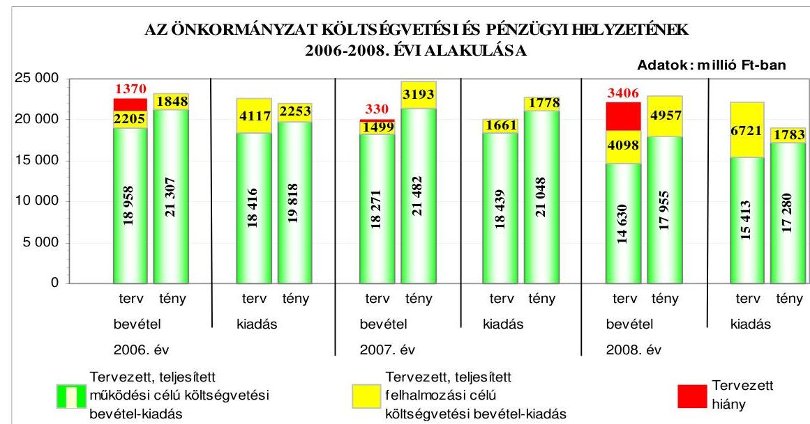
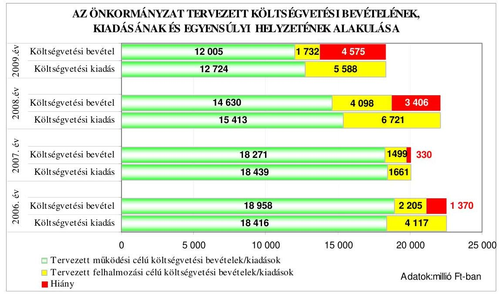
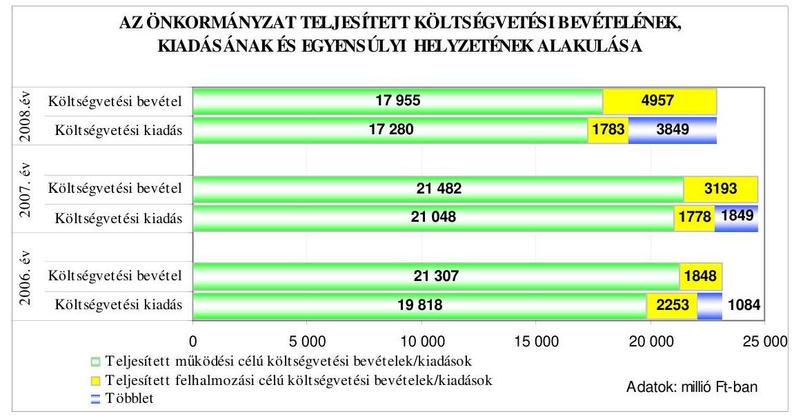
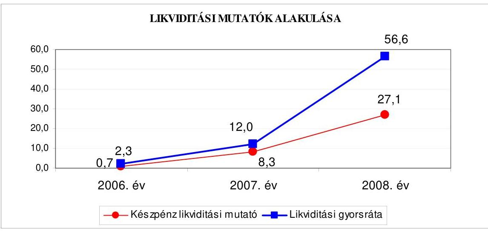
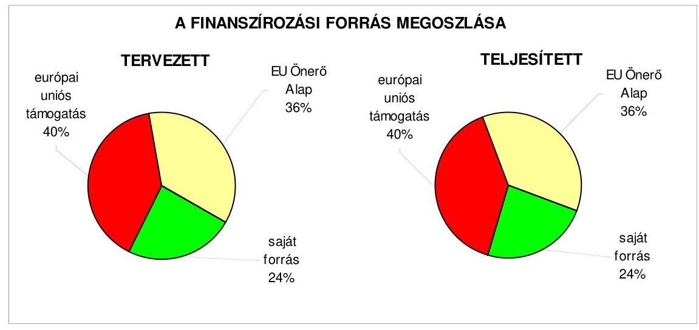
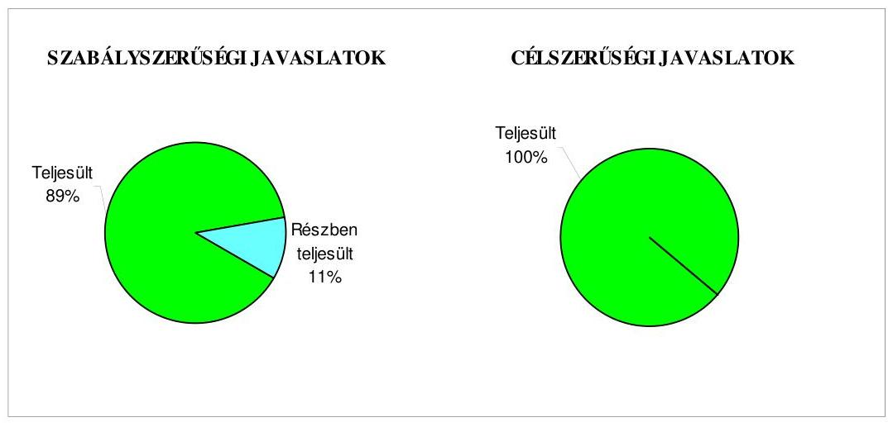
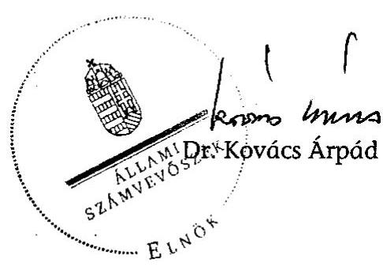
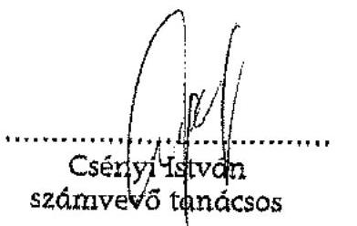
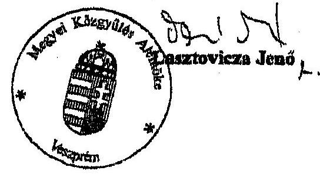

# ÁLLAMI   SZÁMVEVŐSZÉK 

## JELENTÉS

a Veszprém Megyei Önkormányzat gazdálkodási rendszerének 2009. évi ellenőrzéséről

---

3. Önkormányzati és Területi Ellenőrzési Igazgatóság
3.3. Átfogó Ellenőrzések Főcsoport
Iktatószám: V-3001-4/34/19/2009.
Témaszám: 933
Vizsgálat-azonosító szám: V0446
Az ellenőrzést felügyelte:
Dr. Lóránt Zoltán
főigazgató
Az ellenőrzés végrehajtásáért felelős:
Dr. Sepsey Tamás
főigazgató-helyettes
Az ellenőrzést vezette:
Kántor Ilona
főtanácsadó, irodavezető
Az ellenőrzést végezték:
Szarvas Szilárd Csényi István Szabó Leonóra Ildikó
számvevő tanácsos számvevő tanácsos számvevő
A témához kapcsolódó eddig készített számvevőszéki jelentések:

# Címe 

sorszáma
Jelentés Veszprém Megyei Önkormányzat gazdálkodási rendszerének 2006. évi átfogó ellenőrzéséről
Jelentés a 2006. évi országgyűlési, valamint önkormányzati és 0722 nemzeti, etnikai kisebbségi képviselőválasztások lebonyolításához felhasznált pénzeszközök ellenőrzéséről
Jelentés a helyi és a helyi kisebbségi önkormányzatok gazdálkodási 0726 rendszerének 2006. évi átfogó és egyéb szabályszerűségi ellenőrzéséről
Jelentés a közbeszerzési rendszer múködésének ellenőrzéséről 0831
Jelentés a sürgősségi betegellátó rendszer kialakítására, fejlesztésére 0924 fordított pénzeszközök felhasználásának ellenőrzéséről

---

# TARTALOMJEGYZÉK 

BEVEZETÉS ..... 11
I. ÖSSZEGZŐ MEGÁLLAPÍTÁSOK, KÖVETKEZTETÉSEK, JAVASLATOK ..... 16
II. RÉSZLETES MEGÁLLAPÍTÁSOK ..... 27

1. Az Önkormányzat költségvetési és pénzügyi helyzete ..... 27
1.1. A tervezett költségvetési bevételek és kiadások alapján a
költségvetési egyensúly, a költségvetési hiány oka,
finanszírozásának tervezett módja és a költségvetési hiány
megállapításának szabályszerűsége ..... 27
1.2. A teljesített költségvetési bevételek és kiadások alapján a pénzügyi
egyensúly, a pénzügyi hiány oka, finanszírozásának módja és
hatása a pénzügyi helyzet alakulására az eladósodás, valamint a
fizetőképesség szempontjából ..... 29
2. Az Önkormányzat felkészültsége az európai uniós források igénylésére és
felhasználására, valamint az elektronikus közszolgáltatási feladatok
ellátására ..... 37
2.1. Az európai uniós források igénybevételére és a várható támogatás
felhasználására történt felkészülés szabályozottságának,
szervezettségének eredményessége ..... 37
2.1.1. Az európai uniós forrásokra történő pályázatok benyújtására
vonatkozó döntések összhangja a fejlesztési célkitűzésekkel ..... 37
2.1.2. Az európai uniós forrásokhoz kapcsolódóan a
pályázatfigyelés, a pályázatkészítés, valamint az európai
uniós támogatással megvalósuló fejlesztés lebonyolítása
belső rendjének szabályozottsága, a végrehajtás személyi,
szervezeti feltételei, az ellenőrzési feladatok meghatározása ..... 43
2.1.3. A fejlesztési feladat lebonyolításánál a feladatellátás
rendjére, az ellenőrzési feladatok teljesítésére, valamint a
felelősségi szabályokra vonatkozó előírások betartása ..... 46
2.2. Az elektronikus közszolgáltatás feltételeinek kialakítása, a
közérdekű gazdálkodási adatok elektronikus közzététele ..... 49
3. A költségvetési gazdálkodás belső kontrolljai ..... 53
3.1. A szabályozottság kockázata a költségvetés tervezési, gazdálkodási,
beszámolási és a folyamatba épített, előzetes és utólagos vezetői
ellenőrzési feladatoknál ..... 53
3.2. A belső kontrollok múködése az önkormányzati források
szabályszerű felhasználásában, a költségvetési tervezés,
gazdálkodás, beszámolás folyamataiban ..... 55

---

3.3. A belső ellenőrzési kötelezettség teljesítése, javaslatainak hasznosulása ..... 59
4. Az ÁSZ korábbi ellenőrzési javaslatai alapján készített intézkedési terv végrehajtása, eredményessége ..... 62
4.1. Az Önkormányzat gazdálkodási rendszerének átfogó ellenőrzése során tett javaslatok végrehajtására tervezett intézkedések megvalósulása ..... 62
4.2. A zárszámadáshoz kapcsolódó (állami hozzájárulások, támogatások igénylésének és felhasználásának ellenőrzése), valamint a további vizsgálatok esetében a megállapítások, javaslatok alapján tett intézkedések ..... 67

# MELLÉKLETEK 

1. számú Az Önkormányzat gazdálkodását meghatározó adatok, mutatószámok (1 oldal)
2. számú Az önkormányzati vagyon alakulása (1 oldal)

2/a. számú Az önkormányzati kötelezettségek alakulása (1 oldal)
3. számú Az Önkormányzat 2006-2009. évi költségvetési előirányzatainak és 20062008. évi pénzügyi teljesítéseinek alakulása (1 oldal)
4. számú Tanúsítvány az európai uniós forrásokkal támogatott célok és programok 2006-2009. évi tervezett és teljesített adatairól (1 oldal)
5. számú Adatlap az európai uniós forrással támogatott „A pápai Acsády Ignác Szakképző Iskola és Kollégium energiarendszer korszerüsítése" fejlesztésről (4 oldal)
6. számú Lasztovicza Jenő úr, a Veszprém Megyei Önkormányzat Közgyűlés elnökének észrevétele (1 oldal)

---

# RÖVIDÍTÉSEK JEGYZÉKE 

## Törvények

Áht.
Eisztv.

Kbt.
Ket.

Ötv.
Számv. tv.

## Rendeletek

Ámr.
Ber.
18/2005. (XII. 27.) IHM rendelet

ÖTM rendelet

Vhr.
ellenőrzési nyomvonal ${ }_{1}$
ellenőrzési nyomvonal ${ }_{2}$
hivatali SzMSz

SzMSz
vagyongazdálkodási rendelet
2006. évi költségvetési rendelet
az államháztartásról szóló 1992. évi XXXVIII. törvény az elektronikus információszabadságról szóló 2005. évi XC. törvény
a közbeszerzésekről szóló 2003. évi CXXIX. törvény
a közigazgatási hatósági eljárás és szolgáltatás általános szabályairól szóló 2004. évi CXL. törvény
a helyi önkormányzatokról szóló 1990. évi LXV. törvény a számvitelről szóló 2000. évi C. törvény
az államháztartás működési rendjéről szóló 217/1998. (XII. 30.) Korm. rendelet
a költségvetési szervek belső ellenőrzéséről szóló 193/2003. (XI. 26.) Korm. rendelet
a közzétételi listákon szereplő adatok közzétételéhez szükséges közzétételi mintákról szóló 18/2005. (XII. 27.) IHM rendelet
a helyi önkormányzati képviselők és polgármesterek, valamint a kisebbségi önkormányzati képviselők választása költségeinek normatíváiról, tételeiről, elszámolási és belső ellenőrzési rendjéről szóló 4/2006. (VIII. 1.) ÖTM rendelet
az államháztartás szervezetei beszámolási és könyvvezetési kötelezettségének sajátosságairól szóló 249/2000. (XII. 24.) Korm. rendelet
Veszprém Megyei Önkormányzat 23/2005. (XII. 08.) számú rendeletével jóváhagyott ellenőrzési nyomvonala (2005. november 30 -ától hatályos)
Veszprém Megyei Önkormányzat 16/2008. (VI. 13.) számú rendeletével jóváhagyott ellenőrzési nyomvonala (2008. július 1-jétől hatályos)
Veszprém Megyei Önkormányzat 13/2000. (XI. 23.) számú rendeletének 9. számú melléklete a Veszprém Megyei Önkormányzat Hivatalának Szervezeti és Múködési Rendjéről
Veszprém Megyei Önkormányzat 13/2000. (XI. 23.) számú rendelete a Veszprém Megyei Önkormányzat Szervezeti és Múködési Szabályzatáról
Veszprém Megyei Önkormányzat 8/2002. (IX. 20.) számú rendelete az Önkormányzat vagyonáról és a vagyonkezelés-, gazdálkodás szabályairól
Veszprém Megyei Önkormányzat 1/2006. (II. 23.) rendelete az Önkormányzat 2006. évi költségvetéséről

---

2007. évi költségvetési rendelet
2008. évi költségvetési rendelet
2009. évi költségvetési rendelet

## Szórövidítések

APEH
ÁFA
ÁROP
ÁSZ
AVOP
Beruházási, Közbeszerzési és Vagyonkezelési Iroda

Egészségügyi, Szociális és Gyermekvédelmi Iroda

EKOP
e-közigazgatás
EU Önerő Alap támogatás

FEUVE
FEUVE kézikönyv
főjegyzö
Főjegyzői iroda
Gazdasági iroda
Gazdasági iroda ügyrendje

Gazdasági irodavezető
gazdasági program ${ }_{1}$

Veszprém Megyei Önkormányzat 2/2007. (II. 28.) rendelete az Önkormányzat 2007. évi költségvetéséről
Veszprém Megyei Önkormányzat Közgyűlésének 6/2006. (II. 26.) rendelete az Önkormányzat 2008. évi költségvetésének megállapításáról
Veszprém Megyei Önkormányzat 3/2009. (II. 25.) rendelete az Önkormányzat 2009. évi költségvetéséről

Adó és Pénzügyi Ellenőrzési Hivatal
általános forgalmi adó
Államreform Operatív Program
Állami Számvevőszék
Agrár és Vidékfejlesztési Operatív Program
Veszprém Megyei Önkormányzat Hivatalának Beruházási, Közbeszerzési és Vagyonkezelési Irodája

Veszprém Megyei Önkormányzat Hivatalának Egészségügyi, Szociális és Gyermekvédelmi Irodája

ÚMFT Elektronikus Közigazgatási Operatív Program elektronikus közigazgatás
a Magyar Köztársaság 2007. évi költségvetéséről szóló 2006. évi CXXVII. törvény - 5. számú mellékletének 12. pontja alapján - központi költségvetési hozzájárulást biztosít a helyi önkormányzatok és jogi személyiségű társulásaik számára, azok európai uniós fejlesztési célú pályázataihoz szükséges saját forrás kiegészítésére
folyamatba épített, előzetes és utólagos vezetői ellenőrzés
Folyamatba épített, előzetes és utólagos vezetői ellenőrzési kézikönyv
Veszprém Megyei Önkormányzat Főjegyzője
Veszprém Megyei Önkormányzat Hivatalának Főjegyzői Irodája
Veszprém Megyei Önkormányzat Hivatalának Gazdasági Irodája
Veszprém Megyei Önkormányzat Hivatala Gazdasági Ügyrendjének 6. számú melléklete, amely a főjegyző jóváhagyásával 2007. július 1-jétől hatályos
Veszprém Megyei Önkormányzat Hivatala Gazdasági Irodájának vezetője
a Veszprém Megyei Önkormányzat 177/2003. (VI. 12.) számú határozatával elfogadott, a 2003-2006. évekre vonatkozó gazdasági programja

---

| gazdasági program $_{2}$ | a Veszprém Megyei Önkormányzat 44/2007. (IV. 19.) számú határozatával elfogadott, a 2007-2010. évekre vonatkozó gazdasági programja |
| :--: | :--: |
| GVOP | NFT Gazdasági Versenyképesség Operatív Program |
| HEFOP | Humánerőforrás-fejlesztési Operatív Program |
| Illetékhivatal | Veszprém Megyei Önkormányzat Illetékhivatala |
| Informatikai csoport | Veszprém Megyei Önkormányzat Hivatalának Informatikai Csoportja |
| informatikai stratégia ${ }_{1}$ | a Veszprém Megyei Önkormányzat Hivatalának Középtávú számítástechnikai fejlesztési koncepciója a 2004-2006. évekre, melyet a főjegyző 2003. november 15-én hagyott jóvá |
| informatikai stratégia $_{2}$ | a Veszprém Megyei Önkormányzat Hivatalának Középtávú számítástechnikai fejlesztési koncepciója a 2007-2009. évekre, melyet a főjegyző 2007. január 2án hagyott jóvá |
| irányító hatóság | NFÜ KIOP Irányító Hatóság, Budapest |
| KDOP | Közép-Dunántúli Operatív Program |
| KELER Zrt. | Központi Elszámolóház és Értéktár Zrt. |
| KIOP | Környezetvédelmi és Infrastruktúra-fejlesztési Operatív Program |
| közbeszerzési szabályzat | Veszprém Megyei Önkormányzat 77/2004. (VI. 17.) számú határozatával elfogadott közbeszerzési szabályzata |
| Közgyűlés | Veszprém Megyei Önkormányzat Közgyűlése |
| Közgyűlés elnöke | Veszprém Megyei Önkormányzat Közgyűlésének Elnöke |
| közreműködő szervezet | Energiaközpont Kht. Budapest, mint a KIOP-1.7.OF számú támogatási program, „A pápai Acsády Ignác Szakképző Iskola és Kollégium" közremüködő szervezete |
| MÁK | Magyar Államkincstár |
| megyei kórház, 2008 áprilisától Kórház Zrt. | Veszprém Megyei Csolnoky Ferenc Kórház- Rendelőintézet Veszprém |
| NFT | Nemzeti Fejlesztési Terv |
| NFÜ | Nemzeti Fejlesztési Ügynökség |
| Önkormányzat | Veszprém Megyei Önkormányzat |
| Önkormányzat hivatala | Veszprém Megyei Önkormányzat Hivatala |
| Pénzügyi bizottság | Veszprém Megyei Önkormányzat Közgyűlésének Pénzügyi és Ellenőrzési Bizottsága |
| stratégiai terv $_{1}$ | a Veszprém Megyei Önkormányzat 2004-2009. évekre vonatkozó, a főjegyző által 2004. július 19-én jóváhagyott stratégiai ellenőrzési terve |

---

| stratégiai terv $_{2}$ | a Veszprém Megyei Önkormányzat 99/2008. (VI. 12.)   számú határozatával elfogadott 2008-2010. évekre vonat-   kozó stratégiai ellenőrzési terve |
| :-- | :-- |

szakmai teljesítésigazo-
lásról szóló szabályzat

TÁMOP
TIOP
TISZK
ÚMFT
ügyrend
a szakmai teljesítés igazolásának módjáról és az azt végző személyek kijelöléséről, a főjegyző által kiadott, 2008. január 1-jétől hatályos szabályzat
ÚMFT Társadalmi Megújulás Operatív Program
ÚMFT Társadalmi Infrastruktúra Operatív Program
Térségi Integrált Szakképző Központ
Új Magyarország Fejlesztési Terv
Veszprém Megyei Önkormányzat Hivatala Gazdasági
Ügyrendje, amely a főjegyző által jóváhagyott, 2007. július 1-jétől hatályos

---

# ÉRTELMEZŐ SZÓTÁR 

1. elektronikus szolgáltatási szint
2. elektronikus szolgáltatási szint
3. elektronikus szolgáltatási szint
4. elektronikus szolgáltatási szint

EMIR
európai uniós források
fejlesztési feladat (projekt)
fejlesztési célkitúzés

Az 1044/2005. (V. 11.) Korm. határozat alapján olyan információs, tájékoztató szolgáltatás, amely csak általános információkat közöl az adott üggyel kapcsolatos teendőkről és a szükséges dokumentumokról.
Az 1044/2005. (V. 11.) Korm. határozat alapján olyan egyirányú kapcsolatot biztosító szolgáltatás, amely az 1. szinten túl biztosítja az adott ügy intézéséhez szükséges dokumentumok, nyomtatványok letöltését, és azok ellenőrzéssel, vagy ellenőrzés nélküli elektronikus kitöltését, amely esetben a dokumentumok benyújtása hagyományos úton történik.
Az 1044/2005. (V. 11.) Korm. határozat alapján olyan kétirányú kapcsolatot biztosító szolgáltatás, amely közvetlen, vagy ellenőrzött kitöltésű dokumentum segítségével biztosítja az elektronikus adatbevitelt és a bevitt adatok ellenőrzését. Az ügy indításához, intézéséhez személyes megjelenés nem szükséges, de az ügyhöz kapcsolódó közigazgatási döntés (határozat, egyéb aktus) közlése, valamint a kapcsolódó illeték-, vagy díffizetés hagyományos úton történik.
Az 1044/2005. (V. 11.) Korm. határozat alapján olyan teljes közvetlen kétirányú ügyintézési folyamatot biztosító szolgáltatás, amikor az ügyhöz kapcsolódó közigazgatási döntés is elektronikus úton kerül közlésre, illetve a kapcsolódó illeték-, vagy díffizetés elektronikus úton is intézhető.
Egységes Monitoring Informatikai Rendszer az Európai Unió által nyújtott egyes pénzügyi támogatások felhasználásával megvalósuló programok, projektek figyelemmel kísérésére kialakított számítógépes nyilvántartási rendszer, amely a programok és a projektek adatait gyúti, rendszerezi és tartja nyilván.
A támogatott projekt megvalósítása érdekében, a fejlesztés lebonyolítása során felmerült kiadások finanszírozási forrása.
A fejlesztési feladat (projekt) tartalmilag és formailag részletesen kidolgozott, megfelelő pénzügyi háttérrel és végrehajtási ütemezéssel rendelkező fejlesztési terv, amely illeszkedik az Európai Unió, illetve a Nemzeti Fejlesztési Terv és az Új Magyarország Fejlesztési Terv által támogatott programokhoz.
Az önkormányzat által ellátott kötelező, vagy önként vállalt feladatok biztosításának mennyiségi, vagy minőségi fejlesztésére vonatkozó terv. A mennyiségi fejlesztés megvalósulhat beszerzéssel, létesítéssel, bővítéssel, átalakítással.

---

hazai társfinanszírozás irányító hatóság
kedvezményezett
központi program
közreműködő szervezet

A központi költségvetési és az elkülönített állami pénzalapokból származó finanszírozás.
A strukturális alapok és a Kohéziós alap forrásainak szabályszerű, hatékony és eredményes felhasználásához szükséges intézményrendszer felső eleme. Az irányító hatóság általános és átfogó felelősséget visel a programok, projektek hatékony és szabályszerű végrehajtásáért. Felelősségi köréből eredően ellenőrzi a közösségi, valamint a hazai jogszabályok betartását, koordinálja az európai uniós források szétosztásának folyamatát, irányítja az intézményrendszer, a statisztikai és a pénzügyi nyilvántartási rendszer múködését. Az Új Magyarország Fejlesztési Terv Irányító Hatósága közreműködik az Operatív Program véglegesítésében, irányítja az Operatív Program Program-kiegészítő Dokumentum kidolgozását, és közreműködő szerepet vállal e dokumentumoknak az Európai Bizottsággal történő tárgyalásaiban. Az Irányító Hatóság részt vesz továbbá a költségvetési tervezésében, valamint közreműködő szervezetek bevonásával irányítja a meghirdetett pályázatok és a központi programok végrehajtását.
Az a helyi önkormányzat, amely a támogatási szerződést kedvezményezettként aláírja, a projektet, illetve a központi programhoz kapcsolódó támogatott önkormányzati programot végrehajtja.
Az ország egészére, több régióra, egy régióra vonatkozó, de mindenképpen az önkormányzat közigazgatási területén túlmutató program, amelynél a támogatott programok kiválasztása pályáztatás nélkül, előre meghatározott feltételrendszer szerint történik, a kedvezményezettek közvetlen megkeresésével. Az Európai Unió pénzügyi alapja a Kohéziós alap, a környezetvédelem és a közlekedés terén nyújt lehetőséget az egyes tagországoknak központi programok megvalósítására.
A közreműködő szervezet az európai uniós támogatást elnyert kedvezményezettekkel kapcsolatot tartó szerv. Az operatív programok közreműködő szervezetei befogadják, nyilvántartják, döntésre előkészítik a pályázatokat, rögzítik a támogatással kapcsolatos adatokat az EMIR-ben, elvégzik a támogatások előzetes (szerződéskötést megelőző), közbenső (a pénzügyi elszámolás, finanszírozás folyamatában végzett) és utólagos (a támogatott projekt pénzügyi lezárását megelőző) ellenőrzését. Az önkormányzatoknál a leggyakrabban előforduló operatív program a Regionális Fejlesztési Operatív Program végrehajtásában közreműködő szervezetek a VÁTI Kht. és a regionális fejlesztési ügynökségek.
A Kohéziós alap kettő közreműködő szervezete (Nemzeti Fejlesztési és Gazdasági Minisztérium, Környezetvédelmi és Vízügyi Minisztérium) a támogatott projektek végrehaj-

---

lebonyolítás
operatív program

Nemzeti Fejlesztési Terv
regionális program
tásához kapcsolódó operatív feladatokat látják el. Ennek keretében megkötik a szerződéseket a projekt kedvezményezettjével, folyamatosan nyomon követik a teljesítéseket, lebonyolítják a támogatások kifizetését, vezetik az EMIR-t.
Az európai uniós források felhasználásával megvalósuló fejlesztésre irányuló műszaki, gazdasági (pénzügyi) tevékenységet magában foglaló szervezési, irányítási szolgáltatás. A szervezési szolgáltatás kiterjedhet a pályázatkészítésre, a közbeszerzési eljárás lebonyolításán keresztül a folyamatos műszaki ellenőrzésre, a pénzügyi elszámolásra, a műszaki átadás-átvételre, az üzembe helyezésre, illetve a fejlesztési folyamat egyes elemeire.
Az Európai Bizottság által jóváhagyott, a Közösségi Támogatási Keret végrehajtására vonatkozó, több évre szóló intézkedésekhez kapcsolódó prioritások egységes rendszerét tartalmazó dokumentum.
Helyzetelemzést, stratégiát a tervezett fejlesztési területek prioritásait, azok céljait és pénzügyi forrásaik megjelölését tartalmazó dokumentum, amelyet a Magyar Köztársaság készített az Európai Unió programozási irányelveinek, célkitűzéseinek megfelelően a fejlődésben lemaradó régiók fejlődésének és strukturális átalakulásának elősegítésére a kiemelt szükségletekre figyelemmel. A Nemzeti Fejlesztési Terv stratégiai fejezetének célja, hogy a 2004-2006 közötti időszakra kijelölje a strukturális alapokból támogatható fejlesztéspolitikai célkitűzéseit és prioritásait. A strukturális alapok operatív programjai: Agrár és Vidékfejlesztési Operatív Program (AVOP); Gazdasági Versenyképesség Operatív Program (GVOP); Humánerőforrás-fejlesztési Operatív Program (HEFOP); Környezetvédelmi és Infrastruktúra-fejlesztési Operatív Program (KIOP); Regionális Fejlesztési Operatív Program (ROP).
Az ágazati és regionális prioritásokat egyaránt tartalmazó operatív program regionális prioritása, illetve támogatási konstrukciója.

---

Új Magyarország Fejlesztési Terv
támogatási szerződés

Az Új Magyarország Fejlesztési Terv célja a foglalkoztatás bővítése és a tartós növekedés feltételeinek megteremtése. Ennek érdekében 2007-2013 között hat kiemelt területen indított el összehangolt állami és európai uniós fejlesztéseket: a gazdaságban, a közlekedésben, a társadalom megújulása érdekében, a környezet és az energetika területén, a területfejlesztésben és az államreform feladataival összefüggésben. Az Új Magyarország Fejlesztési Terv operatív programjai: Államreform Operatív Program (ÁROP); Elektronikus Közigazgatás Operatív Program (EKOP); Gazdaságfejlesztés Operatív Program (GOP); Környezet és Energia Operatív Program (KEOP); Közlekedés Operatív Program (KÖZOP); Dél-Alföldi Operatív Program (DAOP); Dél-Dunántúli Operatív Program (DDOP); Észak-Alföldi Operatív Program (ÉAOP); Észak-Magyarországi Operatív Program (ÉMOP); Közép-Dunántúli Operatív Program (KDOP); Közép-Magyarországi Operatív Program (KMOP); Nyugat-Dunántúli Operatív Program (NYDOP); Társadalmi Infrastruktúra Operatív Program (TIOP); Társadalmi Megújulás Operatív Program (TÁMOP).
A strukturális alapok esetében az irányító hatóságnak, illetve a Kohéziós Alap esetében a közremúködő szervezeteknek a kedvezményezett önkormányzattal kötött szerződése, amely a támogatás felhasználásának részletes feltételeit tartalmazza. Az Új Magyarország Fejlesztési Terv keretében támogatott projektek esetében a támogatási szerződést a kedvezményezett és a Nemzeti Fejlesztési Ügynökség nevében eljáró közremúködő szervezet között jön létre. Nagyprojekt esetén a támogatási szerződést az Nemzeti Fejlesztési Ügynökség ellenjegyzi. A támogatási szerződés képezi a megvalósítás nyomon követésének, finanszírozásának és ellenőrzésének alapját.

---

# JELENTÉS 

## a Veszprém Megyei Önkormányzat gazdálkodási rendszerének 2009. évi ellenőrzéséről

## BEVEZETÉS

Az Ötv. 92. § (1) bekezdése, az Állami Számvevőszékről szóló 1989. évi XXXVIII. törvény 2. § (3) bekezdése, valamint az Áht. 120/A. § (1) bekezdése alapján az önkormányzatok gazdálkodását az Állami Számvevőszék ellenőrzi. Az ellenőrzésre az Országgyúlés illetékes bizottságai részére is átadott, országosan egységes ellenőrzési program szerint került sor.

Az Állami Számvevőszék a stratégiájában foglalt célkitűzéseknek megfelelően a helyi önkormányzatok költségvetési gazdálkodási rendszere átfogó ellenőrzésének programját a 2007. évtől megújította, azt kiegészítette további - teljesít-mény-ellenőrzési - elemekkel.

## Az ellenőrzés célja annak értékelése volt, hogy az Önkormányzat:

- milyen módon biztosította a költségvetési és a pénzügyi egyensúlyt a költségvetésében és annak teljesítése során, valamint változott-e a hiányzó bevételi források pótlásában a finanszírozási célú pénzügyi műveletek jelentősége, hatása;
- eredményesen készült-e fel a szabályozottság és a szervezettség terén az európai uniós források igénylésére és felhasználására, továbbá biztosította-e az elektronikus közszolgáltatás feltételeit, a gazdálkodási adatok közzétételével a gazdálkodás nyilvánosságát;
- kialakította-e és működtette-e a külső és a belső feltételeknek megfelelően a költségvetés tervezési, gazdálkodási és zárszámadási feladatai belső kontrollrendszerét ${ }^{1}$, ezen tevékenységek szabályszerű ellátásához hozzájárult-e a folyamatba épített, előzetes és utólagos vezetői ellenőrzés, valamint a belső ellenőrzés;

[^0]
[^0]:    ${ }^{1}$ A gazdálkodás szabályszerűségét biztosító kontrollrendszer alatt értjük a kiépített és múködő pénzügyi irányítási és szabályozási rendszert, valamint a belső ellenőrzési funkciók ellátásának rendszerét.

---

- megfelelően hasznosították-e a korábbi számvevőszéki ellenőrzések megállapításait, szabályszerűségi ${ }^{2}$ és célszerűségi javaslatait.

Az ellenőrzés típusa: átfogó ellenőrzés, amely - egy ellenőrzés keretében meghatározott területekre összpontosítva alkalmazza a szabályszerűségi, valamint a teljesítmény-ellenőrzés jellemzőit.

Az ellenőrzött időszak: az 1., 2. és 4. programpontok tekintetében a 20062008. évek és 2009. I. negyedév, a 3. ellenőrzési programpontnál a 2008. év és 2009. I. negyedév.

Veszprém megye lakosainak száma - a megyeszékhely Veszprém megyei jogú város lakosai nélkül - 2009. január 1-jén 308897 fő volt. A 2006. évi önkormányzati választást követően az Önkormányzat 40 tagú Közgyűlésének munkáját kilenc állandó bizottság segítette. A helyi önkormányzat mellett a 2007. március 4-én megtartott területi kisebbségi önkormányzati választásokat követően kettő kisebbségi önkormányzat ${ }^{3}$ működött. A Közgyűlés elnöke a 2006. évi önkormányzati képviselő és polgármester választás óta tölti be tisztségét, a főjegyző személye 1997. április 1-je óta változatlan.

Az Önkormányzat feladatainak végrehajtása érdekében a 2008. évben 49 költségvetési intézményt múködtetett, amelyekből három önállóan gazdálkodott. A feladatok ellátásában részt vett két gazdasági társasága, továbbá hét alapítványa. Az Önkormányzat a 2008. évi költségvetési beszámolója szerint a finanszírozási célú pénzügyi műveletek nélkül 22912 millió Ft költségvetési bevételt ért el és 19063 millió Ft költségvetési kiadást teljesített, 2008. december 31-én a könyvviteli mérleg szerint 22407 millió Ft értékű vagyonnal rendelkezett. Az Önkormányzat vagyona a 2006. év végi állományhoz viszonyítva a 2008. év végére $11,4 \%$-kal emelkedett. A tárgyi eszközökön belül az ingatlanok és a beruházások együttes értéke $21,8 \%$-kal csökkent, ugyanakkor az üzemeltetésre átadott eszközök értéke 17,2-szeresére, az egyéb tartós részesedések értéke 59,5szeresére emelkedett, mivel a korábban költségvetési intézményként működő megyei kórházat 2008 áprilisában gazdasági társasággá alakította az Önkormányzat. A követelések 97,2\%-os, valamint a rövid lejáratú kötelezettségek 95,2\%-os csökkenését elsősorban az illetékkel kapcsolatos követelések és kötelezettségek APEH-nak történő átadása, valamint a megyei kórház szállítókkal szembeni tartozásának államháztartáson kívülre kerülése okozta. A 2007 decemberében kibocsátott 5000 millió Ft kötvény értékesítéséből származó bevétel betétként történő elhelyezése, és államkötvények vásárlása miatt a 2008. év végére a pénzeszközök állománya 1,8 -szorosára, az értékpapírok állománya 4,4-szeresére, ugyanakkor a hosszú lejáratú kötelezettségek állománya 95,1szeresére növekedett. Az összes költségvetési bevétel $25,7 \%$-át a saját bevétel, 9,5\%-át az illetékbevétel biztosította a 2008. évben. Az összes költségvetési kiadásból a felhalmozási célú kiadás részaránya a 2008. évben 9,4\% volt. A 2009. évi költségvetési rendeletben 13737 millió Ft költségvetési bevételt és

[^0]
[^0]:    ${ }^{2}$ A törvényi előírások betartásának elmulasztásakor a részletes megállapítások fejezetben egységesen a törvénysértés megjelölést alkalmazzuk, mivel az ÁSZ nem tehet különbséget a törvényi előírások között.
    ${ }^{3}$ Területi kisebbségi önkormányzatok: cigány, német.

---

18312 millió Ft költségvetési kiadást irányoztak elő. Az Önkormányzat hivatalában dolgozó köztisztviselők száma 2008. december 31-én 88 fő, a költségvetési intézményekben foglalkoztatott közalkalmazottak száma 3488 fő volt. (Az Önkormányzat gazdálkodását meghatározó adatokat, mutatószámokat az 13. számú mellékletek tartalmazzák.)

Az Önkormányzat költségvetési és pénzügyi helyzetét az elemző eljárás módszerével vizsgáltuk. E körben elemeztük a költségvetés egyensúlyi helyzetének alakulását, a tervezett és tényleges költségvetési hiány okait, a mérséklésére tett intézkedéseket, finanszírozásának módját, az Önkormányzat adósságállományának alakulását, összetevőit. Az európai uniós támogatás igénylésére, felhasználására történt felkészülésre vonatkozóan teljesítményellenőrzést végeztünk. Az európai uniós források figyelésére, igénylésére és felhasználására a felkészülést akkor minősítettük eredményesnek, ha a meghatározott szempontok szerinti feltételeknek megfelelt a felkészülés szabályozottsága, szervezettsége, továbbá értékeltük, hogy az igényelt európai uniós támogatások az Önkormányzat által meghatározott fejlesztési célkitűzésekhez kapcsolódtak-e. Az ellenőrzés során felmértük, hogy az e-közszolgáltatási feladat ellátása, illetve bevezetése, működtetése érdekében milyen intézkedéseket tettek, valamint biztosí-tották-e a közérdekű adatok közzétételét. A költségvetési gazdálkodás belső kontrolljainak ellenőrzése során értékeltük, hogy az Önkormányzat hivatalánál a költségvetés tervezési, gazdálkodási, zárszámadás készítési feladatok belső kontrolljainak kiépítettsége és működése megfelelő biztosítékot ad-e a gazdálkodási feladatok megfelelő, szabályszerű ellátására. Felmértük és minősítettük a költségvetés tervezési, a gazdálkodási, a zárszámadás készítési feladatokkal, továbbá a pénzügyi-számviteli területen az informatikával kapcsolatosan kialakított kontrollok megfelelőségét, valamint a kialakított belső kontrollok működésének megbízhatóságát. Értékeltük a belső ellenőrzés szabályozottságát, működési feltételeinek kialakítását, továbbá működésének megbízhatóságát.

Az Önkormányzat hivatalánál értékeltük a gazdálkodás folyamatában kulcsszerepet betöltő belső kontrollok múködésének megbízhatóságát, ennek keretében ellenőriztük a szakmai teljesítésigazolásra és az utalvány ellenjegyzésére kialakított kontrollok végrehajtását. Az ellenőrzést a következő, kiemelt kockázatuk alapján kiválasztott ${ }^{4}$ kifizetésekre folytattuk le ${ }^{5}$ :

[^0]
[^0]:    ${ }^{4}$ Az önkormányzatok kiemelt előirányzataira vonatkozóan, a vertikális folyamatokra elvégeztük a kockázatok becslését, amelynek eredményeként határoztuk meg a magas kockázatú területeket.
    ${ }^{5}$ A korábbi ellenőrzési tapasztalataink szerint ezeken a területeken a jegyzők nem, vagy hiányosan szabályozták a megbízás, megrendelés, illetve beszerzés indokoltságának, szükségességének elbírálására, igazolására, valamint a teljesítések dokumentálására, a kiadások jogosultságának, összegszerűségének ellenőrzésére irányuló kontrollokat. További kockázatot jelentett, ha a külső szolgáltató által végzett karbantartási, kisjavítási munkák 50 ezer Ft alatti megrendeléseire vonatkozóan a jegyzők nem alakították ki a kötelezettségvállalások rendjét és nyilvántartási formáját, valamint a szabályozás elmulasztása esetén nem történt meg az írásbeli kötelezettségvállalás és annak az ellenjegyzése sem.

---

- a külső szolgáltató által végzett karbantartási, kisjavítási szolgáltatásokra,
- a gépek, berendezések, felszerelések beszerzésére, továbbá
- az államháztartáson kívülre teljesített múködési és felhalmozási célú pénzeszköz átadásokra.

Az ellenőrzés hatékony elvégzése céljából a vizsgálandó területek kiválasztása során a kockázatokon alapuló megközelítés érvényesült, ezáltal az ellenőrzési erőforrásokat azokra a területekre fókuszáltuk, amelyeken legnagyobb a hibák előfordulási valószínűsége. Az ellenőrzési erőforrások ilyen típusú összpontosításával minimálisra csökkenthető a kívánt ellenőrzési bizonyosság eléréséhez szükséges időráfordítás.

A pénzügyi-számviteli folyamatokban alkalmazott belső kontrollok létezésének és múködésének ellenőrzésére a vizsgált három terület 2008. évi és 2009. első negyedévi könyvviteli tételeiből területenként egyszerű véletlen mintát vettünk. A kijelölt gazdasági eseményre elvégzett megfelelőségi tesztek alapján értékeltük a kontrollok múködésének megbízhatóságát a vizsgált három területre kúlön-külön, majd összefoglalóan ${ }^{6}$. A helyszíni ellenőrzés megállapításainak részletes dokumentálását megfelelőségi tesztlapokon, elővizsgálati és helyszíni ellenőrzési munkalapokon biztosítottuk. Ezeken a teszt- és munkalapokon a minősítés alapjául szolgáló kérdések és a vonatkozó konkrét jogszabályhelyek megjelölése mellett értékeltük a kialakított belső kontrollokban rejlő kockázatokat ${ }^{7}$ és a kialakított kontrollok múködésének megbízhatóságát ${ }^{8}$.

Az ÁSZ korábbi ellenőrzési javaslatai alapján tett intézkedéseket, illetve azok megvalósítását utóellenőrzés keretében vizsgáltuk. A gazdálkodási rendszer átfogó ellenőrzése során megfogalmazott javaslatok végrehajtására tett intézkedések megvalósítását ellenőriztük, az egyéb számvevőszéki ellenőrzések során tett javaslatok esetében pedig a kiadott intézkedéseket tekintettük át.
${ }^{6}$ A vizsgált három terület egyedi értékelési pontszámait a területek költségvetési súlyával arányosan összegeztük.
${ }^{7}$ A kialakított belső kontrollokban rejlő kockázatot alacsonynak minősítettük, ha a kontrollok - végrehajtásuk esetén - megfelelő védelmet nyújtanak a hibák bekövetkezése ellen. Közepesnek minősítettük a belső kontrollokban rejlő kockázatot, amennyiben a kontrollok - végrehajtásuk esetén - a lehetséges hibák többsége ellen védelmet nyújtanak. Magasnak értékeltük a kockázatot, ha a kontrollok - kialakításuk hiányában, vagy hiányos kialakításuk miatt - nem nyújtanak elegendő védelmet a lehetséges hibákkal szemben.
${ }^{8}$ A kontrollok múködésének megbízhatóságát kiválónak értékeltük abban az esetben, ha azok múködése - esetleges apróbb hiányosságoktól eltekintve - megfelelt a hibák megelőzésére és kijavítására meghatározott szabályozásnak és a legmagasabb szintű elvárásoknak. Jónak minősítettük a kontrollok múködését, ha a hiányosságok száma ugyan jelentős volt, de nem veszélyeztette az ellenőrzött terület hibáinak megelőzését és kijavítását. Amennyiben a kontrollok - kialakításuk hiánya, illetve hiányosságai miatt - nem biztosították a hibák megelőzését, feltárását, kijavítását és ez veszélyeztette az eredményes, megbízható múködést, a kontroll múködésének megbízhatósága gyenge minősítést kapott.

---

A helyszíni ellenőrzés során kitöltött - az ellenőrzést végző számvevő és az Önkormányzat hivatalának felelős köztisztviselője által aláírt - elővizsgálati és helyszíni ellenőrzési munkalapokat, azok kitöltési útmutatóit, továbbá a megfelelőségi tesztek dokumentumait a Közgyűlés elnökének részére a számvevői jelentéssel egyidejűleg átadtuk.

A jelentés megállapításainak, javaslatainak egyeztetése során a Közgyűlés elnöke arról adott részletes tájékoztatást - csatolta azokat a dokumentumokat, amelyek igazolták -, hogy az időközben megtett intézkedésekkel a számvevői jelentésben tett javaslatot közül 21-et teljes körűen megvalósítottak ${ }^{9}$. A megtett intézkedéseket a jelentés I. Összegző megállapítások, következtetések, javaslatok fejezetében összefoglalóan, a II. Részletes megállapítások fejezetében az adott témához kapcsolt lábjegyzetben tüntettük fel, a vonatkozó javaslatokat elhagytuk.

A jelentést az ÁSZ-ról szóló 1989. évi XXXVIII. tv. 25. § (1) bekezdése alapján észrevétel közlése céljából megküldtük a Veszprém Megyei Önkormányzat Közgyűlés elnökének. A kapott észrevételt a jelentés 6 . számú melléklete tartalmazza.

[^0]
[^0]:    ${ }^{9}$ A számvevői jelentésben a helyszíni ellenőrzés során a Közgyűlés elnökének egy szabályszerűségi és egy célszerűségi javaslatot tettünk, melyből a szabályszerűségi javaslatot elhagytuk. A főjegyzőnek 16 szabályszerűségi és öt célszerűségi javaslatot tettünk, melyből valamennyi szabályszerűségi, továbbá négy célszerűségi javaslatot elhagytunk.

---

# I. ÖSSZEGZŐ MEGÁLLAPÍTÁSOK, KÖVETKEZTETÉSEK, JAVASLATOK 

Az Önkormányzat tervezett költségvetési bevételei 2006-2009 között folyamatosan csökkentek. A költségvetési kiadási előirányzatok az előző évihez képest a 2007. és a 2009. években csökkentek, a 2008. évben az intézményhálózat bővülése és a kötvényfelhasználás költségvetési kiadásként történő tervezése miatt emelkedtek. A költségvetési bevételek és kiadások egyensúlya a 2006-2009. évi költségvetési rendeletekben nem volt biztosított, a tervezett költségvetési bevételek nem nyújtottak fedezetet a költségvetési kiadásokra, amit a 2007-2009. években a tervezett múködési célú költségvetési bevételek hiánya, valamint a 2006-2009. években a felhalmozási célú költségvetési bevételeket meghaladó összegben tervezett felhalmozási célú költségvetési kiadások okoztak.

Az Önkormányzat a költségvetési rendeleteiben a költségvetési egyensúly biztosításához a 2006. évben múködési célú hitel, a 2006. és a 2008. években felhalmozási célú hitelek felvételét, a 2008-2009. években értékpapírok értékesítését tervezte.

Az Önkormányzat a 2006. évi költségvetési rendeletben a költségvetési hiány összegét nem mutatta be, valamint az ÁSZ korábbi ellenőrzési javaslata ellenére a 2008-2009. évek költségvetési rendeleteiben a költségvetés bevételi főösszegének megállapításakor - az Áht. előírása ellenére - finanszírozási célú pénzügyi műveletek bevételeit is figyelembe vette a költségvetési hiányt módosító költségvetési bevételként. A 2009. évi költségvetési rendelet módosításában a költségvetési bevételi és kiadási főösszegek megállapításakor - az Áht. előírásainak megfelelően - finanszírozási célú pénzügyi műveleteket nem vettek figyelembe költségvetési hiányt, illetve többletet módosító bevételként, illetve kiadásként.

---

A 2006-2008. évi költségvetések teljesítése során a teljesített költségvetési bevételek fedezetet nyújtottak a teljesített költségvetési kiadásokra, pénzügyi többlet keletkezett a tervezettet meghaladó mértékű költségvetési bevételek és a költségvetési kiadási megtakarítást eredményező intézkedések eredményeként. A pénzügyi többlet kialakulásában a 2006. évben meghatározó volt az illetékbevételi többlet és a saját bevételeknél elért bevételi többlet, a 2007. évben a Balatontourist Zrt.-ben meglévő részesedés értékesítéséből származó, nem tervezett bevétel, a 2008. évben a saját bevételek többlete, továbbá mindhárom évben a tervezettnél magasabb összegű támogatásértékű bevétel. A 2007-2008. években a költségvetési bevételt növelte a tervezettet 159,3\%-kal, illetve 46,9\%kal meghaladóan igénybe vett előző évi pénzmaradvány. A 2006. és a 2008. években kiadási megtakarítást biztosított az egészségügyi beruházás, valamint a kötvénykibocsátás bevételéből tervezett fejlesztések elmaradása.

A biztosított pénzügyi egyensúly ellenére az Önkormányzat a 2006. évben konkrét fejlesztési célok finanszírozásához hosszú lejáratú fejlesztési hitelt vett fel, a 2007. évben a hosszú távú felhalmozási célok megvalósítása érdekében 5000 millió Ft összegű svájci frank alapú, változó kamatozású kötvényt bocsátott ki, továbbá a 2007. évben 818 millió Ft forgatási célú, hitelviszonyt megtestesítő értékpapírt értékesített. A 2006. évben kettő napra átlagosan 14 millió Ft folyószámla hitelt, a felügyelete alá tartozó megyei kórház adósságállományának kezelése és likviditásának biztosítása érdekében a 2007. évben 97 napra átlagosan 85 millió Ft rulírozó hitelt vett igénybe az Önkormányzat.

A kötvénykibocsátás az Önkormányzat számára kockázatot jelent a forint svájci frankhoz viszonyított árfolyamváltozása, valamint a változó kamatmérték miatt. A kötvénykibocsátásból származó bevétel kilenctizedét állampapírokba fektették, illetve lekötött betétben kamatoztatták, egytizedének felhasználásával - a pénzpiaci feltételek bizonytalansága miatt kockázattal járó azonnali és határidős deviza ügyleteket kötöttek.

Az Önkormányzat pénzügyi helyzete 2006-2008 között eladósodási szempontból kedvezőtlenül változott, mert folyamatosan és jelentősen növekedett a hosszú és rövid lejáratú fizetési kötelezettségek együttes összegének aránya az összes forráson belül, melynek következtében a 2008. év végén fennálló fizetési kötelezettség az összes forrás $27,8 \%$-át tette ki. Az Önkormányzat fizetőképessége - a kötvénykibocsátásból származó bevétel hatására - jelentős mértékben javult, mert a pénzeszközök, a követelések és a forgatási célú, hitelviszonyt megtestesítő értékpapírok együttesen növekvő arányban nyújtottak fedezetet a rövid lejáratú fizetési kötelezettségek kiegyenlítéséhez. A 2008. év végén 56,6szoros fedezet állt rendelkezésre a rövid lejáratú fizetési kötelezettségek teljesítéséhez. Az Önkormányzat pénzügyi helyzete a 2006-2008. évek között fizetőképességének jelentős javulása ellenére - a kötvénykibocsátás következményeként fokozódó eladósodásának hatására - összességében kedvezőtlenül alakult.

Az Önkormányzat a fejlesztési célkitúzéseit a gazdasági program ${ }_{1,2}$-ben, valamint ágazati fejlesztési koncepciókban, szakmai tervekben határozta meg. A fejlesztési célkitűzések összhangban voltak az NFT és az ÚMFT intézkedései keretében megjelenő pályázati lehetőségekkel. Az Önkormányzat hivatala és az önkormányzati intézmények 2006-2009. I. negyedévben az európai uniós források megszerzésére összesen 22 pályázatot nyújtottak be. A benyújtott pá-

---

lyázatokban szereplő célok az Önkormányzat kötelező és önként vállalt feladataihoz kapcsolódtak és összhangban voltak a gazdasági program ${ }_{1,2}$-ben, valamint az ágazati fejlesztési koncepciókban rögzített célkitűzésekkel. A 20062009. I. negyedév között benyújtott pályázatok 55\%-a támogatásban részesült, melyek egyharmada befejeződött, egyharmada folyamatban van, egyharmada esetében a támogatási szerződést még nem kötötték meg. A pályázatok 45\%-át elutasították. Az Önkormányzat 2006-2009. évi költségvetési rendeletei tartalmazták az európai uniós támogatással megvalósuló múködési és felhalmozási feladatok kiadási és bevételi előirányzatait, valamint a felhalmozási kiadásokat feladatonként, azonban az Áht. előírása ellenére nem mutatták be a többéves kihatással járó döntések számszerúsítését, ezen belül az európai uniós támogatások igénybevételével megvalósuló feladatok előirányzatait éves bontásban. A 2009. évi költségvetési rendelet módosítása - az Áht. előírásainak megfelelően - tartalmazta a többéves kihatással járó döntések számszerúsítését, ezen belül az európai uniós támogatások igénybevételével megvalósuló feladatok előirányzatait éves bontásban. Az európai uniós támogatással megvalósuló programok, projektek bevételi és kiadási előirányzatait elkülönítetten a 20062009. évi költségvetési rendeletek nem tartalmazták, azokat a 2009. évi költségvetési rendelet módosítása során mutatták be. Az európai uniós támogatással megvalósuló, támogatási szerződéssel rendelkező fejlesztési feladatok 57\%-a 2006-2008 között befejeződött, melyek teljesített kiadásai a tervezethez képest 96,9\%-ban teljesültek, az eltérést az időközbeni ÁFA adókulcs változásból eredő csökkenés okozta.

A 2006-2008. I. félévben európai uniós források igénybevételének és felhasználásának feladatait szabályzatban nem határozták meg, 2008. július 1-től a hivatali SzMSz-ben és a köztisztviselők munkaköri leírásaiban ezen feladatok szabályozása megtörtént. A hivatali SzMSz-ben 2008. július 1-től a Beruházási, Közbeszerzési és Vagyonkezelési Iroda feladataként írták elő a pályázati rendszer múködésének és az európai uniós pályázatok figyelésének, készítésének, menedzselésének és nyilvántartásainak biztosítását. Az önkormányzati pályázatokkal és projektekkel kapcsolatos múködési rendet 2009. február 1-től a hivatali SzMSz előírásai mellett elnöki - főjegyzői együttes utasításban határozták meg. Az elnöki - főjegyzői együttes utasításban rögzítették az Önkormányzat hivatala és az intézmények pályázati tevékenységének koordinálását, az európai uniós forrásokra vonatkozó pályázatokkal összefüggésben az Önkormányzat hivatalán belül az önkormányzati szintű pályázatkoordinálás, valamint a pályázat nyilvántartás felelősét, a folyamatba épített előzetes és utólagos vezetői ellenőrzés szabályait. Az elnöki - főjegyzői együttes utasítás kiterjedt a pályázatfigyelést végzők és a döntési, illetve a döntés-előterjesztési jogkörrel rendelkezők közötti információ-szolgáltatási kötelezettség előírására, továbbá magában foglalta az európai uniós forrásokra irányuló pályázatfigyelés, pályázatkészítés, valamint az európai uniós forrással támogatott fejlesztés lebonyolításával kapcsolatos eljárási rend meghatározását. Az európai uniós források pályázatfigyelésével, pályázatkészítésével, valamint a fejlesztési feladat lebonyolításával összefüggő feladatok végrehajtásának személyi, szervezeti feltételeit a 2006-2008. I félévében az Önkormányzat hivatalában és - három esetben a pályázatkészítés feladatára vonatkozóan - külső vállalkozás megbízásával, 2008. június 11 -től az Önkormányzat hivatalában és a pályázatok felét érintően külső szolgáltatóval kötött szerződéssel is biztosították. A szerződé-

---

sekben előírták a feladat ellátási kötelezettségeket, a megbízott külső szervezet és az Önkormányzat hivatalának képviselője közötti kapcsolattartást, az információk átadásának formáját, tartalmát, módját és a felelősség szabályait, a lebonyolításra vonatkozó szerződésben az ellenőrzési kötelezettséget.

Az Önkormányzatnál a KIOP-2005-1.7.0.f program keretében „A pápai Acsády Ignác Szakképző Iskola és Kollégium energiarendszer korszerüsítése" fejlesztési feladat megvalósítása, a kiadások teljesítése a támogatási szerződésben rögzített kezdési és befejezési határidőknek megfelelő ütemezésben, a támogatások igénybevétele a tervezett határidőn túl történt. A támogatási szerződésben meghatározott ütemezésnek megfelelően haladt a beruházás kivitelezése és a kiadások teljesítése alapján a projekt előrehaladási jelentések benyújtása. Az Önkormányzat a zárójelentést és az utolsó kifizetési kérelmet a támogatási szerződésben előírt határidőn túl nyújtotta be. Az elnyert támogatás 96,9\%-át használták fel, a fel nem használt támogatási összegről az Önkormányzat lemondott. A kifizetések során a támogatás utófinanszírozási rendszere nem okozott pénzügyi zavarokat az Önkormányzat gazdálkodásában. A fejlesztés megvalósításának pénzügyi forrásai rendelkezésre álltak, a kiadások megelőlegezését az Önkormányzat saját forrásból biztosította.

Az Önkormányzat hivatalában a kötelezettségvállalás, utalványozás, ellenjegyzés szabályzatában foglaltak figyelembe vételével végezték el az európai uniós támogatással megvalósult fejlesztési feladat kiadásaival és bevételeivel összefüggő folyamatba épített ellenőrzési - ellenjegyzési, szakmai teljesítésigazolási, érvényesítési - feladatokat. A fejlesztés megvalósítását a belső ellenőrzés a 2009. évben vizsgálta. Az ellenőrzés a támogatási szerződésben foglalt feltételeknek megfelelő felhasználást állapított meg a támogatás összegét illetően. A belső ellenőri jelentés szabálytalanságra vonatkozó megállapítást nem tartalmazott. A közremúködő szervezet két alkalommal, az irányító hatóság egy alkalommal végzett le ellenőrzést, a megvalósítással kapcsolatos szabálytalanságot, visszafizetési kötelezettséget nem állapítottak meg.

Az Önkormányzat 2006-2008. I. félév között a szabályozottság és szervezettség tekintetében összességében annak ellenére nem készült fel eredményesen az európai uniós források igénybevételére és a várható támogatások felhasználására, hogy pályázatai a gazdasági program ${ }_{1,2}$-ben, ágazati koncepciókban megfogalmazott célkitűzésekhez kapcsolódtak, a pályázatfigyelés, pályázatkészítés és a lebonyolítás szervezeti és személyi feltételeit biztosította, a külső szervezettel kötött szerződésben a pályázat formai és szakmai követelményeinek biztosítására vonatkozóan meghatározta a pályázat készítő felelősségét, továbbá a folyamatba épített, előzetes és utólagos vezetői ellenőrzési feladatok szabályozása kiterjedt az európai uniós támogatással megvalósuló feladatokra is. A szabályozásban azonban nem rögzítették a pályázatfigyelést végzők és a döntési, illetve a döntés-előterjesztési jogkörrel rendelkezők közötti információszolgáltatási kötelezettséget, a belső ellenőrzési stratégiát megalapozó kockázatelemzés nem készült, így az nem terjedt ki az európai uniós forrásokkal támogatott fejlesztési feladatokra, nem írták elő fejlesztési feladatok lebonyolítását végző ellenőrzési kötelezettségeit.

A 2008. II. félévtől az Önkormányzat a szabályozottság és szervezettség tekintetében eredményesen készült fel az európai uniós források igénybevételére és

---

a várható támogatások felhasználására, mivel a 2006-2008. I. félévben megtett intézkedéséken túlmenően szabályozásban rögzítették a pályázatfigyelést végzők, és a döntési, illetve a döntés-előterjesztési jogkörrel rendelkezők közötti információszolgáltatási kötelezettséget, éves belső ellenőrzési tervet megalapozó kockázatelemzés készült, mely kiterjedt az európai uniós forrásokkal támogatott fejlesztési feladatokra, továbbá előírták a fejlesztési feladatok lebonyolítását végző ellenőrzési kötelezettségeit is. Az Önkormányzat hivatalán belül és külső szervezet igénybevételével kialakították a pályázatfigyelés, a pályázatkészítés és a fejlesztési feladat lebonyolításának szervezeti, személyi feltételeit. Biztosították, hogy a külső szervezettel a pályázatkészítésre kötött szerződésben a pályázat szakmai és formai követelményeire vonatkozó felelősség meghatározásra kerüljön, valamint előírták a fejlesztési feladat lebonyolítását végző ellenőrzési kötelezettségeit.

Az Önkormányzat informatikai stratégiá ${ }_{1,2}$-ja tartalmazta az informatikai fejlesztés és az e-közigazgatás feladatainak középtávú célkitűzéseit. Az informatikai stratégia ${ }_{1,2}$ az e-közigazgatási feladatok 2. elektronikus szolgáltatási szintjének megvalósításához szükséges célkitűzések meghatározását tartalmazta. Az e-közigazgatási feladatok ellátásának személyi feltételeit az Önkormányzat hivatalán belül biztosították, az e-közigazgatási szolgáltatás keretében a saját számítógépes információs rendszeren keresztül, vásárolt szoftverek üzemeltetésével az Informatikai csoport köztisztviselői végezték a munkaköri leírásukban foglaltak szerint. A Közgyűlés önkormányzati rendeletben kizárta a hatósági ügyek, vagy egyes eljárási cselekmények elektronikus ügyintézésének lehetőségét. Az e-közigazgatási feladatot ellátó informatikai rendszer ügyfelek általi igénybevételét nem vizsgálták.

A közérdekú adatok közzététele az Eisztv-ben foglaltak és a vonatkozó rendelet előírásait figyelembe véve az önkormányzati honlapon történt, ugyanakkor a közérdekű adatok jegyzéke nem a vonatkozó rendeletben előírt tagolásában mutatta be az általános közzétételi lista szerinti gazdálkodási adatokat tartalmazó közzétételi egységeket, vagy az arra vonatkozó hivatkozást. A főjegyző a 2008. évben gondoskodott az Önkormányzat hivatala pénzeszközei felhasználásával, a vagyonnal történő gazdálkodással összefüggő, nettó öt millió forintot elérő, vagy azt meghaladó értékű építési beruházásra, árubeszerzésre, szolgáltatás megrendelésére, vagyonértékesítésre, vagyonhasznosításra, vagyon, vagy vagyoni értékű jog átadásra vonatkozó szerződések jogszabályban meghatározott adatainak közzétételéről, azonban az Önkormányzat által nyújtott nem normatív, céljellegú működési és felhalmozási támogatások kedvezményezettjei nevének, a támogatás céljának, összegének, továbbá a támogatási program megvalósítási helyének honlapon történő közzétételéről - az Áht. előírásait figyelmen kívül hagyva - nem gondoskodott. A Közgyűlés elnöke és a főjegyzó 2009. októberben együttes utasításban rendelték el a nem normatív céljellegú múködési és fejlesztési támogatásoknak az Áht. előírásainak megfelelő közzétételét. A 2008. évben az intézmények által nyújtott nem normatív, céljellegú múködési és felhalmozási támogatások, valamint az intézmények által kötött, az Önkormányzat pénzeszközei felhasználásával, a vagyonnal történő gazdálkodásával összefüggő, nettó öt millió Ft-ot elérő, vagy azt meghaladó értékű építési beruházásra, árubeszerzésre, szolgáltatás megrendelésére, vagyonértékesítésre, vagyonhasznosításra, vagyon, vagy vagyoni értékú

---

jog átadásra vonatkozó szerződések jogszabályban meghatározott adatainak közzétételénél nem tartották be az Eisztv. előírásait, mivel a intézmények költségvetéséből nyújtott támogatások és az intézmények által kötött szerződések jogszabályban közzétételre előírt adatait nem az Önkormányzat honlapján a „Közérdekú adatok" menüpont alatt, hanem az intézmények honlapján tették közzé. Az Önkormányzat 2006-2008. évi költségvetési beszámolóinak szöveges indokolással történő közzététele megtörtént, azonban a szöveges indoklások tartalma nem felelt meg a Vhr-ben előírt egyes tartalmi követelményeknek, mert nem tartalmazták az európai uniós és egyéb támogatási programok keretében beérkezett pénz- és egyéb eszközök, továbbá az azokkal kapcsolatban felhasznált saját költségvetési források alakulását, az előirányzatok teljesítését befolyásoló tényezőket, valamint a közalapítványok, alapítványok által ellátott feladatokra teljesített kifizetések, illetve a térítésmentesen juttatott eszközök értékének részletes felsorolását. Az Önkormányzat költségvetési és zárszámadási rendeletei egyes mellékletei tartalmának meghatározásáról szóló rendeletét 2009 szeptemberében a Közgyűlés a Vhr. előírásainak megfelelően kiegészítette az európai uniós és egyéb támogatási programokat bemutató mellékletekkel.

Az Önkormányzat hivatalánál a költségvetés tervezési és a zárszámadás készítési folyamatok szabályozottsága összességében alacsony kockázatot jelentett a feladatok megfelelő, szabályszerű végrehajtásában, mivel a főjegyző a pénzügyi irányítási és ellenőrzési rendszer keretében az ügyrendben, a Gazdasági iroda ügyrendjében, az ellenőrzési nyomvonal ${ }_{1,2}$-ban, a munkaköri leírásokban és körlevelekben szabályozta a költségvetési tervezés és a zárszámadás készítés rendjét, meghatározta az intézmények részére a költségvetési javaslat összeállításával kapcsolatos követelményeket. Annak ellenére összességében alacsony volt a kockázat, hogy az Önkormányzat hivatalában nem írták elő a saját bevételek előirányzatai és a költségvetés megalapozását szolgáló helyi rendeletek összhangjának ellenőrzését. A főjegyző 2009 augusztusában a Gazdasági iroda ügyrendjében és az érintett dolgozó munkaköri leírásában előírta a saját bevételek előirányzatai és a költségvetés megalapozását szolgáló helyi rendeletek összhangjának ellenőrzési feladatait.

A költségvetés és zárszámadás készítés folyamatában a múködésbeli hibák megelőzésére, feltárására, kijavítására kialakított belső kontrollok múködésének megbízhatósága összességében kiváló volt, mivel a belső szabályozásban foglaltaknak megfelelően a főjegyző gondoskodott annak ellenőrzéséről, hogy a költségvetési intézmények biztosították-e a költségvetési javaslat összeállításával kapcsolatban a részükre meghatározott követelmények érvényesülését, a költségvetési igények indokoltságát, teljesíthetőségét. A zárszámadás készítés folyamatában ellenőrizték az állami támogatásokkal, hozzájárulásokkal történő elszámoláshoz az intézmények által közölt mutatószámok adatainak megbízhatóságát, valamint az intézményi pénzmaradványok megállapításának szabályszerűségét. Annak ellenére összességében kiváló volt a kialakított belső kontrollok megbízhatósága, hogy az ellenőrzési feladatok előírásának hiánya miatt, nem ellenőrizték a költségvetés tervezés folyamatában a saját bevételek előirányzatai és a költségvetés megalapozását szolgáló önkormányzati rendeletek összhangját, továbbá az előírások ellenére az intézményi eredeti, a módosított előirányzatok és a teljesítések eltérésének indokoltságát, valamint az intézményi számszaki beszámoló belső, valamint annak a Közgyűlés által meg-

---

határozott adatszolgáltatással való összhangját. A főjegyző 2009 augusztusában a Gazdasági iroda ügyrendjében és az érintett dolgozó munkaköri leírásában előírta az intézményi előirányzatok és teljesítése eltérése indokoltságának ellenőrzését, az intézményi számszaki beszámolók belső, illetve annak a Közgyűlés által meghatározott adatszolgáltatással való összhangjának ellenőrzését.

# A gazdálkodási, a pénzügyi-számviteli és a folyamatba épített ellen- 

órzési feladatok szabályozottsága összességében alacsony kockázatot jelentett a feladatok megfelelő, szabályszerű végrehajtásában, mivel a főjegyző a pénzügyi irányítás és ellenőrzési rendszer keretében szabályozta a Gazdasági iroda felépítését és feladatait, jóváhagyta a Gazdasági iroda ügyrendjét, a számviteli politikáját és a kapcsolódó szabályzatokat, számlarendet, elkészítette az ellenőrzési nyomvonalat, és a szabálytalanságok kezelésére vonatkozó eljárásrendet. Annak ellenére összességében alacsony volt a kockázat, hogy a Gazdasági iroda ügyrendje nem tartalmazta a beosztottak feladat-, hatás- és jogkörét, az értékelési szabályzatban az értékelések ellenőrzéséért felelős munkaköröket, a selejtezési szabályzatban pedig az üzemeltetésre átadott eszközökre vonatkozóan a döntéshozatalra jogosultak körét nem határozták meg. A főjegyző 2009 augusztusában a Gazdasági iroda ügyrendjében és az érintettek munkaköri leírásaiban meghatározta a feladat-, és hatásköröket, a szükséges tartalmi elemekkel kiegészítette az értékelési szabályzatot, és a selejtezési szabályzatot. A főjegyző a kockázatok kezelésének rendjét nem szabályozta, melynek hiányában nem határozta meg a kockázat azonosítását, a kockázatok folyamatgazdáit, értékelését és kategóriába sorolását, az elfogadható kockázati szintet, a kockázat nyilvántartását, a kockázatokra adható válaszok megvalósíthatóságának mérlegelését, a válaszintézkedések beépítését a folyamatba, valamint a kockázati környezet rendszeres felülvizsgálatát. A kockázatok kezelésének rendjét a Közgyűlés 2009 szeptemberében rendeletben határozta meg.

Az Önkormányzat hivatalánál a külső szolgáltatók által végzett karbantartási, kisjavítási szolgáltatásokkal, a gépek, berendezések, felszerelések beszerzésével, továbbá a működési és felhalmozási célú pénzeszközátadások államháztartáson kívülre teljesített kifizetések során a belső kontrollok működésének megbízhatósága gyenge volt, mert a múködési és felhalmozási célú pénzeszközátadások államháztartáson kívülre teljesített kifizetései során a főjegyző által kijelölt személyek a szakmai teljesítés igazolását - a kiadás jogosultságának, öszszegszerűségének ellenőrzését - a kiadások teljesítését megelőzően nem végezték el. A főjegyző 2009 augusztusában szabályozta az államháztartáson kívülre nyújtott múködési és felhalmozási célú pénzeszközátadások szakmai teljesítés igazolásának rendjét. Az utalványok ellenjegyzője az államháztartáson kívülre történő pénzeszközátadások esetében nem kifogásolta a szakmai teljesítés igazolásának hiányát. A külső szolgáltatók által végzett karbantartási, kisjavítási szolgáltatások kifizetéseinél három, a gépek, berendezések, felszerelések beszerzéseinek kifizetéseinél kettő esetben nem az előírt módon végezték el a szakmai teljesítés igazolását. Az utalványok ellenjegyzője nem észrevételezte, hogy a szakmai teljesítés igazolását nem az előírt módon, illetve a gépek, berendezések, felszerelések beszerzéseinek kifizetéseinél nem a főjegyző által megbízott személy végezte el. A Közgyűlés elnöke és a főjegyző 2009. októberben együttes utasításban intézkedtek arról, hogy a szakmai teljesítés igazolására kijelölt

---

személyek és az utalványok ellenjegyzői az előírt módon teljesítsék gazdálkodási jogkörükkel kapcsolatos feladataikat.

Az Önkormányzat hivatalában a pénzügyi-számviteli feladatoknál alkalmazott informatikai rendszerek múködésének szabályozottsága összességében alacsony kockázatot jelentett, mivel rendelkeztek informatikai stratégiával, biztonsági szabályzattal és katasztrófa elhárítási tervvel, továbbá szabályozták a hozzáférési jogosultságokat és a mentési eljárásokat. Annak ellenére összességében alacsony volt a kockázat, hogy nem nevezték ki a pénzügyi-számviteli rendszerből lekérhető ellenőrzési lista vizsgálatáért felelős dolgozót. A pénz-ügyi-számviteli feladatok ellátásánál alkalmazott informatikai rendszerek belső kontrolljainak megbízhatósága összességében kiváló volt, mivel biztosították a hozzáférési jogosultságok ellenőrizhetőségét és naprakészségét, valamint a mentéseket tartalmazó adathordozók védelmét, dokumentálták a szoftverelemek változáskezelési eljárását. Annak ellenére összességében kiváló volt a kontrollok múködésének a megbízhatósága, hogy nem vizsgálták rendszeresen a pénzügyi-számviteli rendszerből lekérhető ellenőrzési listát, továbbá nem ellenőrizték, hogy a mentett állományokból helyreállíthatóak-e teljes körűen a pénzügyi-számviteli adatok. A főjegyző az ellenőrzési listák vizsgálatával, továbbá a mentett állományokból helyreállítható adatok ellenőrzésével kapcsolatos feladatokat 2009 szeptemberében az informatikai csoportvezető munkaköri leírásában írta elő.

A belső ellenőrzés szervezeti kereteinek kialakítása és szabályozása a belső ellenőrzési feladatok megfelelő szabályszerű végrehajtásában összességében alacsony kockázatot jelentett, mivel a hivatali SzMSz-ben kialakították a belső ellenőrzési egységet, meghatározták annak jogállását, feladatait, a főjegyző és a Közgyűlés által jóváhagyott belső ellenőrzési kézikönyvben meghatározták a belső ellenőrzési vezető feladatait, a belső ellenőrzés rendelkezett stratégiai tervvel és Közgyűlés által jóváhagyott éves ellenőrzési tervvel, az ellenőrzések lefolytatásához a jogszabálynak megfelelő tartalommal ellenőrzési programot készítettek, meghatározták az ellenőrzések nyilvántartásával kapcsolatos előírásokat. Annak ellenére összességében alacsony volt a kockázat, hogy a foglalkoztatott belső ellenőrök számát nem kapacitás-felmérés alapján, az ellátandó feladatokkal összhangban állapították meg, valamint a stratégiai terv ${ }_{1,2}$ nem kockázatelemzés alapján készült. A 2009. évi belső ellenőrzési tervhez készített kockázatelemzés indokoltsága ellenére nem terjedt ki az intézményeknél lefolytatott közbeszerzések, illetve közbeszerzési eljárások ellenőrzésére, az Önkormányzat többségi irányítást biztosító befolyása alatt működő gazdasági társaságok működésére, valamint a kedvezményezett szervezeteknél az Önkormányzat költségvetéséből céljelleggel nyújtott támogatások rendeltetés szerinti felhasználására. Az ellenőrzések lefolytatásához készített ellenőrzési programot a Ber. előírása ellenére nem a belső ellenőrzési vezető, hanem a főjegyző hagyta jóvá. A főjegyző 2009 szeptemberében a stratégiai terv alátámasztására kockázatelemzést készíttetett, melyben a belső ellenőrök számát kapacitás-felmérés alapján határozták meg. A stratégiai tervhez készített kockázatelemzés kiterjedt az intézményeknél lefolytatott közbeszerzésekre, közbeszerzési eljárásokra, az Önkormányzat által céljelleggel nyújtott támogatások rendeltetésszerú felhasználására és az Önkormányzat többségi irányítást biztosító befolyása alá tartozó gazdasági társaságok múködésére. A főjegyző a belső ellenőrzési vezető

---

munkaköri leírását kiegészítette azzal, hogy 2009 októberétől jogosult aláírni a belső ellenőrök részére készített megbízólevelet és az ellenőrzési programot.

A belső ellenőrzés működésénél a kialakított kontrollok megbízhatósága öszszességében kiváló volt, mivel a belső ellenőrzés ellátásának módja megfelelt az Ötv. előírásainak, a főjegyző a 2008. évi belső ellenőrzési tervben foglaltaknak megfelelően belső ellenőr és külső szolgáltatók bevonásával gondoskodott a költségvetési szervek ellenőrzésének végrehajtásáról, a kockázatelemzésben magas kockázatúnak értékelt területek tervezett ellenőrzését végrehajtották, az ellenőrzésekről készített jelentések az előírásoknak megfelelő tartalommal készültek, a belső ellenőr az előírt tartalommal nyilvántartást vezetett az elvégzett ellenőrzésekről. Annak ellenére összességében kiváló volt a belső ellenőrzés működésének a megbízhatósága, hogy az intézményeknél nem ellenőrizték az európai uniós források fogadására való felkészültség belső szabályozását, továbbá a közbeszerzéseket, illetve a közbeszerzési eljárásokat. Az ellenőrzés során a belső ellenőrök az ellenőrzött szervezetek 29\%-nál tettek javaslatot, ugyanakkor az intézményvezetők 73\%-a nem készített intézkedési tervet a hiányosságok megszüntetése érdekében. A főjegyző 2009 júliusában kiadott utasítása alapján az ellenőrzött szervek, illetve szervezeti egységek vezetői kötelesek az ellenőrzés megállapításaira és javaslataira az előírásoknak megfelelő intézkedési tervet készíteni. A főjegyző a jogszabályban előírt formában teljesítette a 2008. évi nyilatkozattételi kötelezettségét az Önkormányzat hivatala FEUVE rendszerének és belső ellenőrzésének a működtetéséről. A Közgyűlés elnöke az Önkormányzat felügyelete alá tartozó költségvetési szervek ellenőrzési jelentései alapján készített 2007. és 2008. évi összefoglaló jelentéseket a Közgyűlés elé terjesztette a zárszámadással egyidejűleg.

Az ÁSZ az Önkormányzat gazdálkodását a 2006. évben ellenőrizte átfogó jelleggel, melynek során 13 szabályszerűségi és négy célszerűségi javaslatot tett. A javaslatok realizálása érdekében a főjegyző intézkedési tervet készített, amit a Közgyűlés elfogadott. Az ÁSZ ellenőrzés által tett javaslatok 88\%-át megvalósították, $12 \%$ részben teljesült. A végrehajtott javaslatok a költségvetési rende-let-tervezet előkészítésére, tartalmára, a jóváhagyott előirányzatokon belüli gazdálkodás érvényesítésére, a gazdálkodás és a pénzügyi-számviteli feladatellátás szabályozottságára, a költségvetési gazdálkodási, ellenőrzési jogkörök gyakorlásának szabályszerűségére, a gazdasági események adatainak könyvekben történő megfelelő rögzítésére, a követelések év végi értékelésére, a vagyongazdálkodási feladatok és döntési hatáskörök meghatározására, a köztulajdon használata nyilvánosságának biztosítására, a céljelleggel nyújtott támogatásokról szóló döntések, a támogatások felhasználásának, elszámolásának szabályszerűségére, a közbeszerzési eljárások lefolytatására, a pénzmaradvány elszámolási és felülvizsgálati rendjére és az akadálymentesítéssel kapcsolatos feladatokra vonatkoztak. Részben tettek eleget az Áht. előírásainak a költségvetési rendelet főösszegének jóváhagyása, a jóváhagyott előirányzatokon belüli gazdálkodás érvényesítése vonatkozásában. A 2009. évi költségvetési rendelet módosításában a költségvetési bevételi és kiadási föösszegek megállapításakor - az Áht. előírásainak megfelelően - finanszírozási célú pénzügyi műveleteket nem vettek figyelembe költségvetési hiányt, illetve többletet módosító bevételként, illetve kiadásként. Az Önkormányzat hivatalában a szakmai teljesítés igazolására kijelölt személyek és az utalványok ellenjegyzői nem tet-

---

tek eleget a gazdálkodási jogkörükkel kapcsolatos feladataiknak az államháztartáson kívülre történő működési és felhalmozási célú pénzeszközátadásokkal, karbantartási, kisjavítási szolgáltatásokkal, valamint a gépek, berendezések, felszerelésekkel kapcsolatos kifizetések során. A Közgyűlés elnöke és a főjegyző 2009. októberében együttes utasításban intézkedtek arról, hogy a szakmai teljesítés igazolására kijelölt személyek és az utalványok ellenjegyzői az előírt módon teljesítsék gazdálkodási jogkörükkel kapcsolatos feladataikat.

A munka színvonalának javítása érdekében tett javaslatokat hasznosították. Felülvizsgálták és kiegészítették a gazdasági program ${ }_{2}$-ot, az értékpapírforgalmat a KELER Zrt.-nél nyitott együttes rendelkezésű alszámlán bonyolították, az értékpapírok forgalmára vonatkozó eljárásrendet a vagyongazdálkodási rendeletben szabályozták.

Az Önkormányzatnál az ÁSZ a 2006. évi átfogó ellenőrzésen túl a 2006-2008. évek között három vizsgálatot végzett. A 2006. évi országgyűlési, valamint önkormányzati és nemzeti, etnikai kisebbségi képviselőválasztások lebonyolításához felhasznált pénzeszközök ellenőrzéséről készített számvevői jelentés négy javaslatot tartalmazott, melynek alapján a főjegyző utasította a Gazdasági irodavezetőt az utalványozási és ellenjegyzési feladatokra, valamint a bizonylatok alaki és tartalmi követelményeire vonatkozó jogszabályi előírások betartására. Az Önkormányzat közbeszerzési rendszere múködésének ellenőrzése során az ÁSZ két szabályszerűségi és hét célszerűségi javaslatot tett, melynek eredményeként az Önkormányzat közbeszerzési szabályzatát módosították, a közbeszerzésekről szóló éves beszámolót elkészítették, az ellenőrzési nyomvonalat kiegészítették a szerződés-módosításokkal kapcsolatos feladatokkal, a főjegyző intézkedett a hirdetmények feladására vonatkozó előírások betartásáról, valamint a munkaköri leírások kiegészítéséről. A sürgősségi betegellátó rendszer kialakítására, fejlesztésére fordított pénzeszközök felhasználásának ellenőrzéséről készített jelentés az Önkormányzat részére nem tartalmazott javaslatot.

Az ÁSZ által az Önkormányzat gazdálkodásának 2006. évi átfogó ellenőrzése, valamint a 2007-2009. években végzett további ellenőrzések során tett szabályszerűségi és célszerűségi javaslatok összességében 93\%-ban hasznosultak, 7\%ban részben teljesültek. A gazdálkodás 2006. évi átfogó ellenőrzése és az egyéb ellenőrzések javaslatainak végrehajtása eredményeként javult a költségvetés és a zárszámadás készítés rendje, valamint az Önkormányzat gazdálkodásának szabályszerűsége.

A helyszíni ellenőrzés megállapításainak hasznosítása mellett javasoljuk:

# a Közgyűlés elnökének 

a munka színvonalának javítása érdekében
kezdeményezze, hogy a számvevőszéki jelentésben foglaltakat a Közgyűlés tárgyalja meg és a feltárt hiányosságok megszüntetése érdekében készíttessen intézkedési tervet a határidők és felelősök megjelölésével;

---

# a föjegyzönek 

a munka színvonalának javítása érdekében
tájékoztassa - évente végzett számítások alapján - a Közgyűlést az Önkormányzat eladósodásának növekedésére figyelemmel arról, hogy a hosszú lejáratú, adósságot keletkeztető kötelezettségvállalásokból adódó tőke és kamatfizetési kötelezettségét az Önkormányzat milyen feltételek biztosítása mellett tudja teljesíteni.

---

# II. RÉSZLETES MEGÁLLAPÍTÁSOK 

## 1. AZ ÖNKORMÁNYZAT KÖLTSÉGVETÉSI ÉS PÉNZÜGYI HELYZETE

### 1.1. A tervezett költségvetési bevételek és kiadások alapján a költségvetési egyensúly, a költségvetési hiány oka, finanszírozásának tervezett módja és a költségvetési hiány megállapításának szabályszerűsége

Az Önkormányzatnál a tervezett költségvetési bevételek 2006-2009 között folyamatosan csökkentek. A tervezett múködési célú költségvetési bevételek folyamatos csökkenését a saját bevételek, az átengedett személyi jövedelemadó és a támogatásértékű bevételek csökkenése, valamint a költségvetési támogatások növekedése együttesen okozta. A tervezett felhalmozási célú költségvetési bevételek csökkenését a 2007. és a 2009. években alapvetően az előző évi pénzmaradvány igénybevételének csökkenése eredményezte. A 2008. évben a tervezett felhalmozási célú költségvetési bevételek az értékesített tárgyi eszközök és immateriális javak bevétele, továbbá az előző évi pénzmaradvány igénybevétele növekedésének, valamint az értékesített pénzügyi befektetések tervezett előirányzatai csökkenésének együttes hatására növekedtek.

A tervezett költségvetési kiadások 2006-2009 között csökkentek, azonban a csökkenés nem volt folyamatos, a főösszeg a 2006. évi 22533 millió Ftról a 2007. évre 20100 millió Ft-ra csökkent, a 2008. évben 22134 millió Ft-ra növekedett, majd a 2009. évben 18312 millió Ft-ra ismét csökkent. A 2007. évben a tervezett múködési célú költségvetési kiadások az előző évi szinten maradtak, ugyanakkor a tervezett felhalmozási célú költségvetési kiadások a tervezett beruházások száma és nagyságrendje, továbbá az előző évi pénzmaradványból képzett tartalék csökkenése miatt 59,7\%-kal csökkentek. A 2008. évben az előző évhez viszonyítva, a megszüntetett álláshelyek, továbbá a létszámfelvételek és bérnövekmények együttes hatása eredményeként alacsonyabb személyi juttatások, munkaadót terhelő járulékok, valamint az intézményi megszüntetésekből és átvételekből adódóan a dologi kiadások mérséklődése miatt csökkentek a tervezett múködési célú költségvetési kiadások. A tervezett felhalmozási célú költségvetési bevételek viszont a 2008. évben kiemelkedő mértékben, 2,73-szeresére növekedtek a pénzmaradvány felhalmozási célra történő igénybevételére történő tervezése miatt. A 2009. évben valamennyi tervezett kiemelt előirányzat csökkent az előző évhez képest, amit alapvetően a múködési kiadások és bevételek körében a már gazdasági társaságként múködtetett megyei kórház költségvetésből való kikerülése, a felhalmozási kiadások és bevételek körében pedig a felújítások és a beruházások, valamint a pénzmaradvány csökkenése okozott.

---

A 2006-2009. évi eredeti előirányzatok alapján nem volt biztosított a költségvetési egyensúly, a tervezett költségvetési kiadások minden évben meghaladták a költségvetési bevételeket. A költségvetési bevételeken belül a múködési célú költségvetési bevételek 2006-2009 között csak a 2006. évben haladták meg a múködési célú költségvetési kiadásokat. A tervezett felhalmozási célú költségvetési kiadások 2006-2009 között minden évben - a 2009. évben különösen kiemelkedő mértékben, 222,6\%-kal - meghaladták a tervezett felhalmozási célú költségvetési bevételeket.

A költségvetés hiányát a 2006. évben a felhalmozási célú költségvetési bevételeket meghaladó összegben tervezett felhalmozási célú költségvetési kiadások, a 2007-2009. években a tervezett múködési célú költségvetési bevételek hiánya, valamint a felhalmozási célú költségvetési bevételekkel nem fedezett tervezett felhalmozási célú költségvetési kiadások együttesen okozták.

A pénzügyi egyensúly biztosításához az Önkormányzat 2006-2009 között az évközi többletbevétel hiányt csökkentő felhasználását, rövid lejáratú múködési, illetve hosszú lejáratú felhalmozási célú hitelek felvételét, értékpapírok értékesítését tervezte. A költségvetési rendeletekben kiadási megtakarítást eredményező intézkedést, továbbá múködési vagy felhalmozási célú kötvénykibocsátást nem terveztek.

A 2006. évben 150 millió Ft rövid lejáratú folyószámlahitel, regionális egészségügyi beruházáshoz 1000 millió Ft fejlesztési hitel, a 2006. évben múzeumi kiállítóhely kialakításához 20 millió Ft, a 2006. és 2008. években szociális intézmények mosodáinak rekonstrukciójához 200 millió Ft, illetve 154 millió Ft fejlesztési hitel felvételét hagyta jóvá a Közgyűlés. Forgatási célú, hitelviszonyt megtestesítő értékpapírok eladását a 2008-2009. években 2500 millió Ft, illetve 3600 millió Ft értékben tervezték a költségvetési rendeletekben.

---

A 2006-2009. években az Önkormányzat 300-650-300-150 millió Ft folyószámla hitelkerettel ${ }^{10}$ rendelkezett, továbbá a főjegyző az Ámr. 139. § (1) bekezdése előírásának megfelelően - a pénzállomány alakulását bemutató - éves likviditási terv ${ }^{11}$ készítésével gondoskodott a költségvetés végrehajtása érdekében a likviditás feltételeinek kialakításáról.

Az Önkormányzat a 2006. évi költségvetési rendeletben nem mutatta be a költségvetési bevételek és kiadások különbségeként tervezett hiányt, továbbá az ÁSZ korábbi ellenőrzési javaslata ellenére a 2008-2009. évi költségvetési rendelet-tervezetekben az Áht. 8/A. § (7) bekezdésében előírtakat megsértve a finanszírozási célú pénzügyi műveletek bevételeit - a tervezett hitelfelvételekből és értékpapír értékesítésből származó bevételeket - költségvetési hiányt módosító költségvetési bevételként számolták el ${ }^{12}$.

A 2008. évben 154 millió Ft fejlesztési hitelt, a 2008-2009. években 2500 millió Ft, illetve 3600 millió Ft értékpapír értékesítésből származó bevételt tartalmazott az Önkormányzat költségvetési rendeleteiben tervezett bevételi főösszeg.

A Közgyűlés a 23/2009. (IX. 24.) számú rendelettel módosította a 2009. évi költségvetési rendeletet, melyben a költségvetési bevételek és kiadások főösszege nem tartalmazott finanszírozási célú pénzügyi műveletet.

# 1.2. A teljesített költségvetési bevételek és kiadások alapján a pénzügyi egyensúly, a pénzügyi hiány oka, finanszírozásának módja és hatása a pénzügyi helyzet alakulására az eladósodás, valamint a fizetőképesség szempontjából 

Az Önkormányzatnál a teljesített költségvetési bevételek és kiadások főösszegei a 2007. évben növekedtek, a 2008. évben csökkentek az előző évhez viszonyítva. A 2006-2008. években a teljesített költségvetési bevételek főösszege 23 155-24 675-22 912 millió Ft, a teljesített költségvetési kiadások főöszszege 22 071-22 826-19 063 millió Ft volt. A vizsgált években biztosított volt a pénzügyi egyensúly, a teljesített költségvetési bevételek fedezetett nyújtottak a költségvetési kiadásokra, az Önkormányzatnak mindhárom évben folyamatosan növekvő bevételi többlete keletkezett.

[^0]
[^0]:    ${ }^{10}$ A szerződések szerint egy évre rendelkezésre álló folyószámla hitelkeretekről a 27/2006. (IV. 20.), az 50/2007. (IV. 19.), és a 105/2008. (VI. 12.) számú határozatokban döntött a Közgyűlés.
    ${ }^{11}$ A havi részletezettségben készült éves előirányzat-felhasználási terveket az Önkormányzat költségvetéséről szóló rendeleteinek mellékleteként hagyta jóvá a Közgyűlés.
    ${ }^{12}$ A közbenső egyeztetés során a Közgyűlés elnöke által adott tájékoztatás szerint a költségvetési többletet, vagy hiányt módosító finanszírozási célú bevételek és kiadások bemutatása érdekében a Közgyűlés a 22/2009. (IX. 24.) számú rendeletével módosította az Önkormányzat költségvetési és zárszámadási rendeletei egyes mellékletei tartalmának meghatározásáról szóló 10/2005. (IX. 16.) számú rendeletét.

---

Az Önkormányzat 2006-2008. évi költségvetéseinek teljesítése során a múködési célú költségvetési bevételek fedezetet nyújtottak a múködési célú költségvetési kiadásokra. A felhalmozási célú költségvetési kiadások a 2006. évben 405 millió Ft-tal meghaladták a felhalmozási célú költségvetési bevételeket, a 2007-2008. évek között azonban a felhalmozási célú költségvetési bevételek fedezték a felhalmozási célú költségvetési kiadásokat.

A 2006. évben a felhalmozási célú költségvetési bevételeket meghaladó felhalmozási célú költségvetési kiadások $84,2 \%$-át a múködési célú költségvetési bevételi többlet egy részének felhasználásával, $15,8 \%$-át hosszú lejáratú fejlesztési hitel felvételével finanszírozta az Önkormányzat. A pénzügyi többletek kialakulását a 2006. évben a múködési célú költségvetési bevételi többlet, a 20072008. években a múködési és a felhalmozási célú költségvetési bevételi többletek együtt eredményezték.

Az Önkormányzatnál a 2006-2009. években tervezett és a 2006-2008. években teljesített múködési és felhalmozási célú költségvetési kiadásokra a következő arányban biztosítottak fedezetet a költségvetési bevételek:

---

Adatok: \%-ban

| Megnevezés | 2006.   év |  | 2007.   év |  | 2008.   év |  | 2009.   év |
| :--: | :--: | :--: | :--: | :--: | :--: | :--: | :--: |
|  | Terv | Tény | Terv | Tény | Terv | Tény | Terv |
| Múködési célú költségvetési kiadások fedezettsége múködési célú költségvetési bevételekből | 102,9 | 107,5 | 99,1 | 102,1 | 94,9 | 103,9 | 94,3 |
| Felhalmozási célú költségvetési kiadások fedezettsége felhalmozási célú költségvetési bevételekből | 53,6 | 82,0 | 90,3 | 179,6 | 61,0 | 278,0 | 31,0 |
| Költségvetési kiadások fedezettsége költségvetési bevételek-   böl | 93,9 | 104,9 | 98,4 | 108,1 | 84,6 | 120,2 | 75,0 |

A 2006-2008. években a teljesített költségvetési kiadások főösszegére vonatkozó fedezettségi mutatók kedvezően alakultak a tervezett költségvetési kiadások főösszegére vonatkozó fedezettségi mutatókhoz viszonyítva, a tényleges költségvetési egyensúlyi helyzet folyamatosan javult. A fedezettségi mutató irányának kedvező változását, mértékének javulást az eredményezte, hogy a működési és a felhalmozási célú költségvetési kiadásokra vonatkozó fedezettségi mutatók a tervezetthez képest kedvezőbben alakultak. A teljesített múködési célú költségvetési bevételek folyamatosan növekvő mértékben haladták meg a tervezett múködési célú költségvetési bevételeket, a teljesített múködési célú költségvetési kiadások növekedése a múködési célú költségvetési bevételeknél kisebb mértékű volt. A teljesített felhalmozási célú költségvetési bevételek a 2006. évben nem érték el, a 2007-2008. években viszont meghaladták a tervezettet, a teljesített felhalmozási célú költségvetési kiadások a 2006. és 2008. évben alulteljesültek, a 2007. évi növekedés mértéke pedig a felhalmozási célú költségvetési bevételeknél kisebb mértékű volt.

A költségvetési hiány megszüntetése érdekében az Önkormányzat évközi költségvetési többletbevételeket ért el, kiadási megtakarítást eredményező intézkedéseket tett. Az elért költségvetési bevételi többletbevételek és a költségvetési kiadások 2007. és 2008. évi csökkenése, valamint 2007. évi növekedése együttesen mindhárom vizsgált évben biztosította a költségvetés egyensúlyát az Önkormányzat számára.

A 2006. évben 1992 millió Ft többletbevétel folyt be, melyben meghatározó volt a saját bevételek, az illetékbevétel, valamint a támogatásértékű bevételek növekedése. A költségvetési kiadások csökkenéséhez hozzájárult a 1000 millió Ft értékben tervezett egészségügyi beruházás elmaradása.

A 2007. évben a 4906 millió Ft többletbevétel részét képezte az előző évi pénzmaradvány nem tervezett, de igénybe vett része, a támogatásértékű bevételek növekménye, a költségvetési támogatások többletbevétele, a tárgyi eszközök és immateriális javak értékesítéséből származó bevételi többlet. Egyedi bevételnöve-

---

lő tényezőt jelentett, hogy a vizsgált éveket megelőzően értékesített Balatontourist Zrt. részvénycsomag ${ }^{13}$ ellenértékéből a tárgyévi részleten felül a következő évre esedékes 1010 millió Ft összeget is kifizette a vevő. A teljesített kiadások öszszességében 2726 millió Ft többlete $55,6 \%$-a volt az elért többletbevételnek. A költségvetési bevételeket és kiadásokat egyaránt növelte, hogy az Önkormányzat kilenc közoktatási intézmény felügyeletét vette át 2007. szeptember 1-től.

A 2008. évben a 4184 millió Ft bevételi többletet a saját bevételek, a támogatásértékű bevételek és a költségvetési támogatások növekedése, valamint a nem tervezett, de igénybe vett pénzmaradvány okozta. A költségvetési többlet keletkezésében meghatározó szerepet játszott, hogy a kötvénykibocsátás 5000 millió Ft-os bevételét eredeti előirányzatként tervezték, de felhasználásról nem döntöttek, ezért a céltartalékok között tervezett felhalmozási célú költségvetési kiadások sem teljesültek.

A 2006-2008. években a költségvetési kiadási megtakarítások érdekében több intézkedést hozott a Közgyűlés, melyek eredményeként az Önkormányzat számításai szerint a 2007. évben 603 millió Ft, a 2008. évben 305 millió Ft, megtakarítást értek el.

Az Önkormányzat 2006-ban csökkentette a Csecsemő és Fogyatékosok Otthonában az engedélyezett férőhelyek számát, majd ehhez viszonyítva határozta meg a múködtetés személyi és tárgyi feltételeit. A 2007-ben hat múzeumi kiállítóhelyet átadtak települési önkormányzatoknak, megszüntettek két intézményt és egy veszteségesen múködő közhasznú társaságot ${ }^{14}$, a gyermekvédelmi intézményeken belül felszámoltak négy lakásotthont. A 2008. évben a Kabóca Bábszínház felügyeletét átadták Veszprém Megyei Jogú Városnak, a Csecsemő és Fogyatékosok Otthonát a hatékonyabb múködtetés reményében a Területi Gyermekvédelmi Szakszolgálathoz integrálták. A 2007. július - 2009. január közötti időszakban 46 intézményt soroltak át részben önállóan gazdálkodó költségvetési szervvé, melyek pénzügyi-gazdasági feladatait az Önkormányzat hivatala, valamint a 2008. április 24-én az Önkormányzat által erre a feladatra alapított Tapolca Környéki Intézmények Gazdasági Irodája látja el. A 2006-2009. években az intézmények működtetésének racionalizálása során összesen 481 álláshelyet szüntetett meg az Önkormányzat.

A költségvetés készítésekor a várható pénzmaradvány igénybevételének tervezése a 2007., valamint a 2009. években nem volt megalapozott. A 2007. és a 2009. években a várható pénzmaradvány igénybevétel megállapításakor ugyanis nem vették figyelembe a pénzmaradványt terhelő, előző évről áthúzódó valamennyi kötelezettséget, annak ellenére, hogy ezek a tervezéskor már ismertek voltak. Az eredeti előirányzatként tervezett pénzmaradvány az

[^0]
[^0]:    ${ }^{13}$ A Közgyűlés 74/2005. (VI. 16.) számú határozata alapján az 1209 millió Ft névértékű Balatontourist Zrt. részvénycsomagot 4040 millió Ft-ért értékesítette az Önkormányzat. A vételárat a szerződésben foglaltaktól eltérően három részletben, 2005-ben 1010 millió Ft, 2006-ban 1010 millió Ft, 2007-ben 2020 millió Ft összegben fizette meg a vevő.
    ${ }^{14}$ Közigazgatási és Informatikai Szolgáltató Iroda; Sztehlo Gábor Általános Iskola, Készségfejlesztő Speciális Szakiskola, Kollégium és Gyermekotthon; Európai Információs Pont Kht.

---

előző évi módosított pénzmaradványhoz viszonyítva a 2007. évben annak 59,2\%-át, a 2009. évben annak 43,8\%-át nem tartalmazta ${ }^{15}$.

A 2006-2008. években az intézmények részéről év közben felmerült igények miatt a teljesített felújítási kiadások 96-37-55 millió Ft-tal meghaladták a tervezett előirányzatokat, amire az előirányzatok átcsoportosításával és a befolyt felhalmozási többletbevételek felhasználásával biztosított fedezetet az Önkormányzat. A 2006. évben a tervezett beruházási kiadási előirányzattól 1054 millió Ft-tal elmaradó teljesített kiadás fő oka volt, hogy az Egészségügyi Minisztérium nem írta ki azt a pályázatot, amelyen egy onkológiai központ ${ }^{16}$ létrehozása érdekében kívánt részt venni az Önkormányzat, ezért - részben fejlesztési hitelből megvalósítani tervezett beruházás megkezdése - elmaradt. A 2007-2008. évek között a tervezettel azonos szinten teljesültek a beruházási kiadások. A teljesített felújítási és beruházási kiadások tervezetthez viszonyított eltérése nem vezethető vissza tervezési hiányosságra.

A 2006-2008. évi költségvetések végrehajtása során biztosított volt a pénzügyi egyensúly, a teljesített költségvetési bevételek fedezetet nyújtottak a teljesített költségvetési kiadásokra, ennek ellenére az Önkormányzat hosszú lejáratú, fejlesztési célú hiteleket vett igénybe, fejlesztési céllal kötvényt bocsátott ki, valamint forgatási célú, hitelviszonyt megtestesítő értékpapírokat értékesített. Az Önkormányzat a Balácapusztán múzeumi kiállítóhelyként múködő római kori villagazdaság fejlesztéséhez 20 millió Ft, a felügyelete alá tartozó szociális intézmények mosodáinak rekonstrukciójához 200 millió Ft hitelkeretre kötött szerződést. A rendelkezésre álló hitelkeretekből 2006-ban 20 millió Ft-ot, a 2006-2008 évek között 44-2-131 millió Ft-ot (a hitelkeret 88,5\%-át) vettek igénybe a szerződésben megjelölt célokkal összhangban. Az Önkormányzat a 2006. évben az onkológiai központ elmaradt pályázati kiírása miatt a feladattal összefüggésben tervezett 1000 millió Ft fejlesztési hitelre nem kötött szerződést. Az Önkormányzatot terhelő, folyamatosan növekvő adósságszolgálat ${ }^{17}$ a 2006-2008. években a felvett fejlesztési hitelekből, valamint a kötvénykibocsátásból eredően 0,6-3,6-157 millió Ft, az év végén fennálló hitelállomány a vizsgált időszakban 64-68-179 millió Ft volt.

A Közgyűlés három pénzintézet ajánlatának összehasonlítása alapján a 169/2007. (X. 10.) számú határozatában döntött arról, hogy 5000 millió Ft névértékben, svájci frank alapú kötvényt bocsát ki fejlesztési célok megvalósítása érdekében.

A kötvénykibocsátás céljaként a Regionális Onkológiai és Sugárterápiás Centrum létesítését, a sürgősségi betegellátás fejlesztését, az Észak-Balatoni Regionális Te-

[^0]
[^0]:    ${ }^{15}$ A tervezett pénzmaradvány igénybevétel a 2007. évben 387,5 millió Ft, a 2009. évben 1580,0 millió Ft, a beszámolóban szereplő előző évi módosított pénzmaradvány a 2007. évben 950,1 millió Ft, a 2009. évben 2812,6 millió Ft volt.
    ${ }^{16}$ A Közgyűlés a 80/2005. (VI. 16.) számú rendeletében döntött a Regionális Onkológiai és Sugárterápiás Centrum létrehozásáról a megyei kórházon belül.
    ${ }^{17}$ A 2006-2008. években a kötvény után, valamint a 2006-2007. években a fejlesztési hitelek után csak kamatot fizetett, a 2008. évben a fejlesztési hitelek után már tőkét is törlesztett az Önkormányzat.

---

lepülési Szilárdhulladék-kezelési projekt megvalósításában való részvételt, az Önkormányzat felügyelete alá tartozó intézmények energiarendszerének korszerűsítését, további, konkrétan meg nem nevezett, infrastruktúrát javító beruházások támogatását, közműszolgáltatásokban való tulajdonosi szerep érvényesítését, valamint az állami vagyon privatizációjában történő részvételt fogadta el a Közgyűlés.

A „Veszprém megye fejlődéséért" elnevezéssel 2007. december 20-án kibocsátott kötvény futamidejét 20 évben, a kötvények össznévértékét 33331 ezer svájci frankban (kibocsátáskori árfolyamon számítva 5000 millió Ft-ban), a változó kamatlábat hat havi CHF LIBOR ${ }^{18}+$ évi $0,6 \%$-ban rögzítették. A Közgyűlés a kötvénykibocsátásról szóló határozat meghozatalakor a döntéskor ismert pénzpiaci feltételekkel számolt. A forint svájci frankhoz viszonyított árfolyamváltozása, valamint a változó kamatmérték miatt az Önkormányzat számára a kötvénykibocsátás kockázatot jelent. A kamatokat félévente, valamint a lejárat napján kell megfizetnie az Önkormányzatnak, a tőke törlesztésére ugyanakkor öt év türelmi időt biztosított a forgalmazó ${ }^{19}$.

A kötvénykibocsátást megelőzően meghatározott felhasználásra vonatkozó célkitűzések megvalósítására még nem került sor. Az Önkormányzat a kötvénykibocsátásból származó bevétel $90 \%$-át - 4500 millió Ft-ot - államilag garantált értékpapírokba fektette, illetve öt pénzintézetnél különböző futamidejű és hozamú tartós betétekben helyezte el, a fennmaradó $10 \%$ felhasználásával a kibocsátó pénzintézettel szoros együttműködésben azonnali és határidős devizaügyleteket kötöttek. A 2007. december 20. és 2009. március 31. közötti időszakban az Önkormányzat kamatfizetési kötelezettsége 269 millió Ft volt, ugyanakkor a kötvényből származó bevétel befektetésével és forgatásával 664 millió Ft hozamot ért el.

A 2007. évben az előző évben vásárolt 818 millió Ft értékű forgatási célú, hitelviszonyt megtestesítő értékpapírját eladta az Önkormányzat.

Az Önkormányzat folyószámla hitelt a 2006. évben, mindössze kettő napra vett igénybe, mivel a fennálló likviditási probléma megoldásához a lekötött tartós betétet, annak lejárata előtt nem törte fel. A 2007. évben a folyószámla hitelkeret mellett közgyűlési felhatalmazás alapján háromoldalú megállapodásban 140 millió Ft, majd további 160 millió Ft, illetve 50 millió Ft rulírozó hitelt is igényelt az Önkormányzat két intézménye ${ }^{20}$ számára, adósságállományuk kezelésre és likviditásuk biztosítására. Az Önkormányzatnak a vizsgált időszakban év végén fennálló likvid hitelállománya nem volt.

[^0]
[^0]:    ${ }^{18}$ LIBOR: London Interbank Offered Rate (londoni bankközi kamatláb) egy kamatláb, amelyet a bankok számolnak fel egymásnak a londoni bankközi piacon az általuk nyújtott hitelek után. CHF LIBOR: kamatláb svájci frankban nyújtott hitelek után a londoni bankközi piacon.
    ${ }^{19}$ A kamatfizetés minden év március 31-én és szeptember 30-án, valamint 2027. december 20-án történik, a tőketörlesztés első időpontja 2012. szeptember 30.
    ${ }^{20}$ Veszprém Megyei Csolnoky Ferenc Kórház-Rendelőintézet; Veszprémi Petőfi Színház

---

A 2006-2009. években a folyószámlahitellel kapcsolatos jellemzőket mutatja be a következő táblázat:

| Megnevezés | $\mathbf{2 0 0 6 .}$   év | $\mathbf{2 0 0 7 .}$   év | $\mathbf{2 0 0 8 .}$   év | 2009.   I. negyedév |
| :-- | :--: | :--: | :--: | :--: |
| A folyószámlahitel keretösszege   (millió Ft-ban) | 300 | 650 | 300 | 150 |
| Év végén fennálló folyószámlahitel   (millió Ft-ban) | - | - | - | - |
| Folyószámlahitellel zárt napok száma | 2 | 97 | - | - |
| A ténylegesen felvett folyószámlahitel   átlagos állománya (millió Ft-ban) | 14 | 85 | - | - |
| A felvett folyószámlahitel minimum   összege (millió Ft-ban) | 10 | 20 | - | - |
| A felvett folyószámlahitel maximum   összege (millió Ft-ban) | 18 | 140 | - | - |

Az éves könyvviteli mérleg adataiból számított eladósodási mutató ${ }^{21}$ és az esedékességi aránymutató ${ }^{22}$ az Önkormányzat eladósodásának mértékét mutatja.

Az Önkormányzat eladósodása a 2006-2008. években folyamatosan növekedett, mivel a növekvő hosszú lejáratú fizetési kötelezettségek és a csökkenő rövid lejáratú fizetési kötelezettségek együttes állománya növekedett, ugyanakkor a 2007. évben a kötelezettségek együttes állományánál kisebb mértékben növekedett, a 2008. évben pedig csökkent az önkormányzati források értéke. Az eladósodási mutató a vizsgált években 13,5\%-25,5\%-27,8\% volt, melynek jelentős változását alapvetően a kötvénykibocsátás okozta. Az esedékességi aránymutató folyamatosan 97,6\%-ról 12,4\%-ra, majd 2,0\%-ra csökkent a 2006-2008. évek között, ami azt jelzi, hogy a rövid lejáratú kötelezettségek fizetőképességre gyakorolt hatása évről-évre mérséklődött. A rövid lejáratú fizetési kötelezettségek arányának csökkenését a 2007-2008. évek között a hosszú lejáratú fizetési kötelezettségek kötvénykibocsátás miatti növekedése, valamint az Illetékhivatal és a megyei kórház önkormányzati költségvetési körből való kikerülése miatti kötelezettségcsökkenés okozta ${ }^{23}$.

Az Önkormányzat pénzügyi helyzete - az esedékességi aránymutató javulása ellenére - eladósodási szempontból, a kötvénykibocsátással összefüggésben keletkezett hosszú távú fizetési kötelezettség miatt kedvezőtlenül alakult.

[^0]
[^0]:    ${ }^{21}$ Az eladósodási mutató a hosszú és rövid lejáratú fizetési kötelezettségek önkormányzati összes forráson belüli arányát mutatja.
    ${ }^{22}$ Az esedékességi aránymutató a rövid lejáratú fizetési kötelezettségek arányát fejezi ki az összes - rövid és hosszú lejáratú - fizetési kötelezettségen belül.
    ${ }^{23}$ A 2007. évben az Illetékhivatal APEH-ba történő integrálása a kötelezettségek 1775 millió Ft összegű csökkenését vonta maga után, a 2008. évben a megyei kórház szállítói tartozásainak átadása a Kórház Zrt. részére az áruszállításból és szolgáltatás vásárlásból származó 710 millió Ft kötelezettség közel 2/3-át jelentették.

---

Az Önkormányzat fizetőképességének és likviditásának a 2006-2008. évek közötti alakulását mutatja a készpénz likviditási mutató ${ }^{24}$ és a likviditási gyorsráta $^{25}$. Az Önkormányzat fizetőképessége 2006-2008 között évről-évre javult, mivel a hitelviszonyt megtestesítő értékpapírok egyre nagyobb arányú és a pénzeszközök 2007. évi növekedése, valamint a követelések folyamatos és a pénzeszközök 2008. évi csökkenése együttesen egyre nagyobb arányban nyújtottak fedezetet a rövid lejáratú fizetési köztelezettségek pénzügyi teljesítéséhez. A készpénz likviditási mutató javulását a 2007. évben a pénzeszközök $212 \%$-os növekedése és a rövid lejáratú fizetési kötelezettségek év végi állományának 73\%-os csökkenése, a 2008. évi további javulását a pénzeszközök előző évhez viszonyított csökkenését meghaladó arányban csökkenő rövid lejáratú fizetési kötelezettségek okozták. A 2006-2008. években a rövid lejáratú kötelezettségek csökkentek, ugyanakkor a kötvénykibocsátásból származó bevételből történt magyar államkötvény vásárlás és betét elhelyezés miatt a forgatási célú, hitelviszonyt megtestesítő értékpapírok állománya és a pénzeszközök növekedtek, amelyek eredményeként a likviditási gyorsráta - a megyei önkormányzatok likviditási gyorsrátájának országos átlagához viszonyítva ${ }^{26}$ - a 2008. év végén kiemelkedően magas volt. A likviditási mutatók 2006-2008 közötti alakulása alapján az Önkormányzat pénzügyi helyzete fizetőképességi szempontból kedvezően alakult.

Az Önkormányzat pénzügyi helyzete 2006-2008 között a fizetőképességének jelentős javulása ellenére, a kötvénykibocsátás miatti eladósodás következményeként összességében kedvezőtlenül alakult.

[^0]
[^0]:    ${ }^{24}$ A készpénz likviditási mutató kifejezi, hogy a pénzeszközök év végi állománya milyen arányban nyújt fedezetet a rövid lejáratú fizetési kötelezettségekre.
    ${ }^{25}$ A likviditási gyorsráta mutatja, hogy a rövid lejáratú fizetési kötelezettségek kiegyenlítéséhez a pénzeszközökön túl bevonható követelések, forgatási célú, hitelviszonyt megtestesítő értékpapírok milyen arányban nyújtanak fedezetet.
    ${ }^{26}$ A megyei önkormányzatok átlagos likviditási gyorsrátája a 2008. évi teljesítési adatok alapján 7,0 volt.

---

# 2. Az ÖNKORMÁNYZAT FELKÉSZÜLTSÉGE AZ EURÓPAI UNIÓs FORRÁSOK IGÉNYLÉSÉRE ÉS FELHASZNÁLÁSÁRA, VALAMINT AZ ELEKTRONIKUS KÖZSZOLGÁLTATÁSI FELADATOK ELLÁTÁSÁRA 

2.1. Az európai uniós források igénybevételére és a várható támogatás felhasználására történt felkészülés szabályozottságának, szervezettségének eredményessége

### 2.1.1. Az európai uniós forrásokra történő pályázatok benyújtására vonatkozó döntések összhangja a fejlesztési célkitűzésekkel

Az Önkormányzat fejlesztési célkitűzéseit a 2006-2009. évekre a gazdasági program ${ }_{1,2}$-ben, valamint ágazati fejlesztési koncepciókban ${ }^{27}$ határozta meg.

A gazdasági program ${ }_{1}$ tartalmazta az egészségügyi és szociális szakellátások, a gyermekvédelem, az oktatás és képzés, a közművelődés, a kultúra, a sport, a turizmus, a vagyongazdálkodás területére vonatkozó célkitűzéseket, valamint a nemzeti és etnikai kisebbségekkel, az Európai Uniós tagságra való felkészüléssel, a nemzetközi kapcsolatokkal és a regionális együttműködéssel összefüggő feladatokat. A gazdasági program ${ }_{1}$-ben meghatározták az Önkormányzat pénzügyi helyzetével, likviditásával kapcsolatos feladatokat, a bevételek növelésére, illetve a kiadások racionalizálására tervezett intézkedéseket.

A gazdasági program ${ }_{2}$-ben rögzítették, hogy kiemelt feladatként kell kezelni az intézmények működőképességének megőrzését, működésük racionalizálásával, a kapacitások és szükségletek egyensúlyának megteremtésével, a megváltozott finanszírozási feltételekhez való alkalmazkodással. A gazdasági program ${ }_{2}$ tartalmazta a fejlesztési elképzeléseket, a megye kohézióját erősítő tennivalókat a gaz-daság- a környezet- az infrastruktúra- és a turizmusfejlesztéssel, a kultúra és a művészetek, az ifjúság és a sport támogatásával, valamint a nemzeti és etnikai kisebbségekkel kapcsolatos, a kötelező és önként vállal feladatokat, kiegészítve a finanszírozási, gazdálkodási feladatokkal, a kiemelt fejlesztésekkel, továbbá. a nemzetközi és belföldi kapcsolatokkal és a regionális együttműködéssel összefüggő feladatokat.

A gazdasági program ${ }_{1,2}$-ben, valamint ágazati, szakmai fejlesztési koncepciókban rögzített fejlesztési célkitűzéseket helyzetelemzéssel és értékeléssel alátámasztották. A megvalósítás lehetséges pénzügyi forrásait figyelembe vették a fejlesztési célkitűzések meghatározásánál.

A gazdasági program ${ }_{1}$-ben rögzítették, hogy hitel és adósságszolgálati terhek nélkül indíthatók azok a szakmai fejlesztések, amelyek a négy évre szóló programban megfogalmazásra kerültek. A költségvetési bevételek növelése érdekében elő-

[^0]
[^0]:    ${ }^{27}$ A 2003-2006. és a 2007-2010. évekre vonatkozó gyermek-és ifjúságvédelmi koncepciók, közoktatási feladat-ellátási, intézményhálózat múködtetési és fejlesztési tervek, kulturális koncepciók, sportkoncepciók, szociális szolgáltatástervezési koncepciók, turisztikai koncepciók, kórházak szakmai fejlesztési tervei, fogyatékos-ügyi programok, közoktatás esélyegyenlőségi tervek.

---

írták, hogy intézményfejlesztési és modernizációs programokat kell előkészíteni a pályázatokon való részvétel érdekében együttmúködést kell kialakítani az oktatási intézményeket megyei fenntartásba adó önkormányzatokkal az intézmények fejlesztésének pénzügyi finanszírozásában.

A gazdasági program ${ }_{2}$-ben előírták, hogy ki kell használni az EU által nyújtott lehetőségeket, mivel e források nélkül nagyobb beruházást, rekonstrukciót a jelenlegi költségvetési szabályozás keretei között a megyei önkormányzat nem tud megvalósítani. A tervezett beruházások megvalósítása érdekében erőteljes pályázati tevékenység folytatását, a pályázati önerő megteremtése érdekében az éves költségvetésekben növekvő összegű pályázati keretet biztosítását határozták el, ennek érdekében nem zárkóztak el a hitelfelvételtől sem.

Az Önkormányzat a gazdasági program ${ }_{1,2}$-t nem módosította, mivel a megfogalmazott fejlesztési célkitűzések összhangban voltak az európai uniós forrásokhoz kapcsolódóan az NFT-ben és az ÚMFT-ben meghatározott célokkal.

Az Önkormányzat a 2006-2009. I. negyedéve között összesen 22 pályázat benyújtásáról döntött. Az Önkormányzat hivatala 16, az intézmények hat pályázatot nyújtottak be, amelyekben szereplő célok az Önkormányzat kötelező és önként vállalt feladataihoz kapcsolódtak és összhangban voltak a gazdasági program ${ }_{1,2}$, valamint az ágazati, szakmai fejlesztési koncepciókban rögzített célkitűzésekkel. Az Önkormányzat hivatala által a 2006-2009. években benyújtott pályázatok közül nyolcat elutasítottak, nyolc támogatásban részesült, amelyek közül négy projekt esetében a támogatási szerződést még nem kötötték meg, három projekt megvalósítása még nem zárult le, egy projekt befejeződött. Az intézmények által benyújtott pályázatok közül kettőt elutasítottak, négy támogatásban részesült, ebből három projekt befejeződött, egy projekt megvalósítása még folyamatban volt. A benyújtott pályázatokból 54,5\%-os részarányt képviseltek a támogatott pályázatok. A nem támogatott pályázatok $70 \%$-a esetében pályázati források hiánya, 10-10\%-a esetében formai, tartalmi hiányosság, illetve a pályázati feltételek hiánya volt az elutasítás indoka. Az Önkormányzat a támogató döntés után nem lépett vissza, nem vont vissza pályázatot. A megkötött támogatási szerződések alapján 504 millió Ft európai uniós támogatást, 21 millió Ft hazai támogatást, valamint 81 millió Ft EU Önerő Alap-támogatást nyertek el és 60 millió Ft saját forrást biztosítottak. A támogatásban részesült pályázatok tervezett és ténylegesen teljesített kiadásait, valamint a kiadásokat finanszírozó forrásokat a 4. számú melléklet (tanúsítvány) tartalmazza.

Az Önkormányzat hivatala által benyújtott pályázatok a következők voltak:

- a KIOP-2005-1.7.0.f Energiagazdálkodás környezetbarát fejlesztése program keretén belül az Önkormányzat „A pápai Acsády Ignác Szakképző Iskola és Kollégium energiarendszer korszerüsítése" címen nyújtott be pályázatot 2006. január 30-án. A pályázott projekt tervezett kivitelezési költsége 225228 ezer Ft, az igényelt európai uniós támogatás összege 90091 ezer Ft, a saját forrás összege 135137 ezer Ft volt. A nyertes pályázat alapján a támogatási szerződést 2006. november 15-én kötötték meg, a projekt megvalósítása 2007. augusztus 30-án befejeződött;
- a KDOP-2007-5.3.2 Utólagos akadálymentesítés támogatása (Egyenlő esélyű hozzáférés a közszolgáltatásokhoz) program keretében „Külsővati idősek otthona komplex akadálymentesítése" címen 2007. szeptember 4-én pályázatot nyúj-

---

tott be az Önkormányzat. A pályázott projekt tervezett teljes kiadásainak öszszege 25356 ezer Ft, az igényelt európai uniós támogatás összege 20000 ezer Ft, a saját forrás összege 5356 ezer Ft volt. A pályázat pozitív elbírálását követően a támogatási szerződést 2008. május 30 -án kötötték meg, a projekt megvalósítása még nem fejeződött be;

- a KDOP-2008-5.1.1-2-2f Közoktatási Infrastrukturális Fejlesztés program keretében az Önkormányzat „A minőségi és környezettudatos oktatás feltételeinek megteremtése a Bakony szívében III. Béla Gimnázium, Müvészeti Szakközépiskola és Alapfokú Müvészetoktatási Intézmény fejlesztése", a „Kisfaludy Sándor Gimnázium, Szakképzö Iskola kollégium és alapfokú Müvészetoktatási Intézmény infrastrukturális fejlesztése", a „Pápa, Türr István Gimnázium és Kollégium infrastrukturális fejlesztése" , „A balatonalmádi Magyar - Angol Tannyelvü Gimnázium és Kollégium korszerüsítése", a „Lóczy Lajos Gimnázium, Két Tanítási Nyelvü Idegenforgalmi Szakközépiskola és Kollégium infrastrukturális felújítása, a minőségi közoktatás feltételeinek megteremtése" címen nyújtott be öt pályázatot 2008. január 28-án. A pályázott projektek tervezett kivitelezési költsége összesen 1956700 ezer Ft, az igényelt európai uniós támogatás összege összesen 1471160 ezer Ft, a saját forrás összege összesen 485540 ezer Ft volt. A pályázatokat 2008. augusztus 26án elbírálták és „forráshiány" miatt elutasították;
- a KDOP-2008-5.1.1-2-2f Közoktatási Infrastrukturális Fejlesztés program keretében „Kozmutza Flóra Általános Iskola, Készségfejlesztő Speciális Szakiskola és Kollégium speciális integráció forrásközponttá fejlesztése" címen nyújtott be pályázatot az Önkormányzat 2008. január 28-án. A pályázott projekt tervezett teljes kiadásainak összege 466059 ezer Ft, az igényelt európai uniós támogatás öszszege 249994 ezer Ft, a saját forrás összege 216065 ezer Ft volt. A pályázat 2008. augusztus 28 -ai pozitív elbírálását követően a projekt a második fordulóba került. A második fordulóban 2009. március 22-én nyújtott be pályázatot az Önkormányzat. A pályázat támogatásban részesült, a támogatási szerződést 2009. július 23-án kötötték meg. A támogatási szerződés szerint a program befejezésének időpontja 2010. augusztus 31.;
- a TÁMOP-2.2.3/07/2 A szak- és felnőttképzés struktúrájának átalakítása program keretében „Esélyt a jövőnek!" címen 2008. február 8-án nyújtott be pályázatot az Önkormányzat. A pályázott projekt tervezett kiadásainak összege 344481 ezer Ft volt, melyet teljes egészében európai uniós támogatásból terveztek finanszírozni. A tervezettől eltérően a pályázat 331881 ezer Ft támogatásban részesült, a támogatási szerződést 2009. február 18-án kötötték meg, a program befejezésének tervezett időpontja 2010. december 31.;
- a TÁMOP-2.2.3/07/2 A szak- és felnőttképzés struktúrájának átalakítása program keretében „Globális kihívások, lokális válaszok" címen ugyancsak 2008. február 8-án nyújtott be pályázatot az Önkormányzat. A pályázott projekt tervezett kiadásainak összege 375000 ezer Ft volt, melyet szintén teljes egészében európai uniós támogatásból terveztek finanszírozni. A pályázat elbírálásáról 2008. május 23-án elutasító döntés született, melynek indokaként a TISZK szervezeti formájában a pályázat első és második fordulója között bekövetkezett változást jelölték meg;
- a KDOP-2007-2.1.1/B „Régió arculatát meghatározni képes turisztikai vonzerők" program keretében „Balácapuszta római kori villagazdaság kiemelt régészeti lelőhely és a veszprémi Mütárgyház egymásra épülö fejlesztése" címen az Önkormányzat pályázatot nyújtott be 2008. február 25-én. A pályázott projekt tervezett kivitelezési költsége 469993 ezer Ft, az igényelt európai uniós támogatás összege 399494 ezer Ft, a saját forrás összege 70499 ezer Ft volt. A pályázatot 2008. március 5-én elutasították, mivel az „a pályázati kiírásban megfo-

---

galmazott teljességi követelményeknek nem tett eleget" (az igényelt támogatás összege nem érte el a minimálisan igényelhető támogatás összegét);

- a TIOP-1.1.1-07-1 A pedagógiai módszertani reformot támogató informatikai infrastruktúra fejlesztése program keretében az Önkormányzat „Út a jövő információs társadalmába" címmel 2008. március 13-án nyújtott be pályázatot. A pályázat keretében - 0,5 millió Ft és 700 millió Ft közötti konkrét támogatási összeg meghatározása nélkül, 100\%-ban európai uniós támogatással finanszírozva - 669 iskolai számítógépes munkaállomás és kapcsolódó eszközök beszerzését tervezték. A pályázat elbírálásáról 2008. október 19-én pozitív döntés született, a szerződés megkötésére még nem került sor;
- a TIOP-3.1.1 TISZK rendszerhez kapcsolódó infrastrukturális fejlesztések program keretében „Esélyt a jövőnek! Bakony SzaSzet megalakulásának támogatása" címmel, 2008. június 25 -én nyújtott be pályázatot az Önkormányzat. A pályázott projekt tervezett teljes kiadásának összege 899999 ezer Ft, az igényelt európai uniós támogatás összege 809999 ezer Ft, a saját forrás összege 90000 ezer Ft volt. A pályázatot 2009. január 2-án elbírálták és „forráshiány" miatt elutasították;
- a TIOP-3.4.2-08/1 Bentlakásos intézmények korszerűsítése program keretében az Önkormányzat „Veszprém megyei lakásotthonokban élő gyermekek életkörülményeinek javitása" címmel 2008. október 21-én nyújtott be pályázatot. A pályázott projekt tervezett teljes kiadásának összege 54810 ezer Ft, az igényelt európai uniós támogatás összege 51521 ezer Ft, a saját forrás összege 3289 ezer Ft volt. A pályázatot 2009. március 3-án elbírálták, eredményes lett, a támogatási szerződés megkötésére a helyszíni vizsgálat befejezéséig nem került sor;
- a TÁMOP-3.1.4 Kompetencia alapú oktatás, egyenlő hozzáférés - Innovatív intézményekben program keretében „Kompetencia alapú oktatás, egyenlő hozzáférés innovativ intézményekben" címmel az Önkormányzat 2009. január 16-án nyújtott be pályázatot. A pályázott projekt tervezett teljes kiadásának összege 117327 ezer Ft volt, melyet 100\%-ban európai uniós támogatásból terveztek finanszírozni. A pályázat 2009. május 6-án eredményesnek ítélték, a támogatási szerződés megkötésére a helyszíni vizsgálat befejezéséig nem került sor;
- a TIOP-1.2.2 Múzeumok iskolabarát fejlesztése és oktatás-képzési szerepének infrastrukturális erősítése program keretei belül az Önkormányzat „Laczkó Dezső Múzeum oktató és foglalkoztató termének kialakítása" címmel 2009. március 2-án nyújtott be pályázatot. A pályázott projekt tervezett teljes kiadásának összege 44256 ezer Ft volt, melyet teljes egészében európai uniós támogatásból terveztek finanszírozni. A pályázatot befogadták, annak elbírálásáról 2009. július 16-án támogató döntés született. A támogatási szerződés megkötésére a helyszíni vizsgálat befejezéséig nem került sor.

Az intézmények pályázatai az alábbiak voltak:

- a Veszprém Megyei Pedagógiai Intézet és Szakszolgálat 2005. október 13-án sikeres pályázatot nyújtott be a HEFOP-3.1.4/05/1 A kompetencia alapú oktatás elterjesztése programon belül a „Kulcs a holnaphoz"A kompetencia-alapú oktatás elterjesztése Veszprém megyében" címmel. A 79986 ezer Ft kiadással tervezett, önrészt nem igénylő projektre 59990 ezer Ft európai uniós és 19996 ezer Ft hazai támogatást igényeltek. A nyertes pályázat alapján a támogatási szerződést 2006. május 17-én kötötték meg. A támogatási szerződés szerinti befejezési határidő 2008. március 1-je volt. A projekt lezárása a pénzügyi elszámolások elhúzódása miatt még nem fejeződött be;

---

- a AVOP-3.5.2 Szociális helyzet javítása intézkedés, Közösségi programok alintézkedés keretében a Veszprém Megyei Közművelődési Intézet három pályázatot nyújtott be 2006. november 11-én. Az „Alkotó Emberek Kulturális Szem$l e$ " című projekt tervezett teljes kiadásainak összege 1050 ezer Ft, az igényelt európai uniós támogatás összege 748 ezer Ft, a hazai társfinanszírozás összege 250 ezer Ft, a saját forrás összege 52 ezer Ft volt. A nyertes pályázat alapján a támogatási szerződést 2007. augusztus 13-án kötötték meg, a projekt megvalósítása 2008. június 30-án befejeződött. A „Mobil Civil Börze Rendezvénysorozat" című projekt tervezett teljes kiadásainak összege ugyancsak 1050 ezer Ft, az igényelt európai uniós támogatás összege 748 ezer Ft, a hazai társfinanszírozás összege 250 ezer Ft, a saját forrás összege 52 ezer Ft volt. A nyertes pályázat alapján a támogatási szerződést 2007. augusztus 13-án kötötték meg, a projekt megvalósítása 2008. június 23-án befejeződött. A „Gerence - Marcal Rába Térségi Összművészeti Fesztivál" című projekt tervezett teljes kiadásainak összege szintén 1050 ezer Ft, az igényelt európai uniós támogatás összege 748 ezer Ft, a hazai társfinanszírozás összege 250 ezer Ft, a saját forrás összege 52 ezer Ft volt. A nyertes pályázat alapján a támogatási szerződést 2007. szeptember 18-án kötötték meg, a projekt megvalósítása 2008. június 23-án befejeződött;
- a TÁMOP-5.2.5 Gyermekek és fiatalok integrációs programjai program keretében a Veszprém Megyei Lakásotthonok Igazgatósága 2008. szeptember 3-án „Más - Kép" Lakásotthonokban élő gyermekek és fiatalok integrációjának segitése" címmel pályázatot nyújtott be. A pályázott projekt tervezett teljes kiadásának összege 19962 ezer Ft volt, melyet 100\%-ban európai uniós támogatásból terveztek finanszírozni. A pályázatot 2008. december 18-án elbírálták és elutasították, mivel „a költségvetés szöveges indoklása miatt a költségvetés értékelése nehézkes, így a szakmai tartalom és a tervezett költségek közötti összefüggés szinte értékelhetetlen. Így a költségvetés nem érte el a minimum 7 pontot az értékelésnél";
- a TÁMOP-3.2.8/08/B Múzeumok Mindenkinek" Program múzeumok oktatásiképzési szerepének erősítése program keretében a Veszprém Megyei Múzeumi Igazgatóság 2009. március 26-án „Találkozási pont: a múzeum!" címmel pályázatot nyújtott be. A pályázott projekt tervezett teljes kiadásának összege 6969 ezer Ft volt, melyet teljes mértékben európai uniós támogatásból terveztek finanszírozni. A pályázatot 2009. május 26-án elbírálták és „forráshiány" miatt elutasították.

Az Önkormányzat 2006-2009. évi költségvetési rendeletei megfeleltek az Áht. 69. § (1) bekezdésben meghatározott tartalmi követelményeknek ${ }^{28}$. A költségvetési rendeletek az Ámr. 29. § (1) bekezdés d) pontjában foglaltaknak eleget téve tartalmazták a felhalmozási kiadásokat feladatonként, de az Ámr. 29. § (1) bekezdés k) pontjában előírtak ellenére elkülönítetten nem tartalmazták az európai uniós támogatással megvalósuló programok, projektek kiadási és bevételi előirányzatait ${ }^{29}$. A költségvetési rendeletek előterjesztésekor az Áht. 118. § (1) bekezdés 2. b) pontjában előírtakat megsértve nem mutatták be a többéves ki-

[^0]
[^0]:    ${ }^{28}$ Az előírásnak megfelelően tartalmazták az Önkormányzat és az önállóan működő és gazdálkodó költségvetési szervek kiemelt előirányzatait, köztük az Önkormányzat által kijelölt felhalmozások (beruházások, felújítások és az egyéb felhalmozási célú kiadások, támogatások) előirányzatait.
    ${ }^{29}$ Az Önkormányzat 2009. évi költségvetésének módosításáról szóló 10/2009. (VI. 25.) számú rendelet $1 / a$ és $2 / a$ számú mellékletei tartalmazták az európai uniós támogatással megvalósuló programok, projektek kiadási és bevételi előirányzatait.

---

hatással járó döntések számszerűsítését, a feladatok előirányzatait évenkénti bontásban, illetve az Ámr. 29. § (1) bekezdés g) pontjában előírtak ellenére a többéves kihatással járó európai uniós támogatások igénybevételével megvalósított feladatok előirányzatait éves bontásban ${ }^{30}$. A Közgyűlés a 23/2009. (IX. 24.) számú rendelettel módosította a 2009. évi költségvetési rendeletet, melyben bemutatták a többéves kihatással járó döntések számszerúsítését, a feladatok előirányzatait évenkénti bontásban.

Az Önkormányzat 2006-2009. I. negyedéve közötti európai uniós forrásokkal támogatott, megvalósított fejlesztési feladatainál a finanszírozási források tervezett és teljesített megoszlását a következő diagram mutatja:

Az európai uniós forrással támogatott befejezett fejlesztések tervezett kiadása 229 millió Ft volt, ami a 2009. év március 31-ig 222 millió Ft-ra ( $96,9 \%$-ra) teljesült, melynek során a finanszírozási források részaránya nem változott. Az utófinanszírozás keretében folyósított EU Önerő Alapból elnyert támogatás esetében az Önkormányzat a kiadásokat megelőlegezte. A pályázati források fedezetére az éves céltartalék előirányzaton belül „egységes pályázati keret"-et különítettek el, ezért a feladatok megvalósításához nem volt szükség saját forrást kiváltó hitel felvételére, illetve hitelgarancia igénybevételére.

[^0]
[^0]:    ${ }^{30}$ A közbenső egyeztetés során a Közgyűlés elnöke által adott tájékoztatás szerint a többéves kihatással járó döntések számszerúsítése, valamint a feladatok előirányzatait évenkénti bontásban tartalmazó mellékletek bemutatása érdekében a Közgyűlés a 22/2009. (IX. 24.) számú rendeletével módosította az Önkormányzat költségvetési és zárszámadási rendeletei egyes mellékletei tartalmának meghatározásáról szóló 10/2005. (IX. 16.) számú rendeletét.

---

# 2.1.2. Az európai uniós forrásokhoz kapcsolódóan a pályázatfigyelés, a pályázatkészítés, valamint az európai uniós támogatással megvalósuló fejlesztés lebonyolítása belső rendjének szabályozottsága, a végrehajtás személyi, szervezeti feltételei, az ellenőrzési feladatok meghatározása 

Az európai uniós források igénybevételének és felhasználásának feladatait 2008. július 1-től a Közgyűlés a hivatali SzMSz-ben ${ }^{31}$ rögzítette, a vizsgált időszakban ezt megelőzően ezen feladatok szabályzatban való rögzítése nem történt meg. Az önkormányzati pályázatokkal és projektekkel kapcsolatos működési rendet 2009. február 1-től a hivatali SzMSz előírásai mellett a Közgyűlés elnöke és a főjegyző az 1/2009. (I. 19.) számú elnöki - főjegyzői együttes utasításban határozták meg.

A hivatali SzMSz-ben 2008. július 1-től a Beruházási, Közbeszerzési és Vagyonkezelési Iroda feladataként írták elő a pályázati rendszer működésének és az európai uniós pályázatok figyelésének, készítésének, menedzselésének és nyilvántartásainak biztosítását. Az elnöki - főjegyzői együttes utasításban 2009. február 1-től ezen túlmenően rögzítették az Önkormányzat hivatala és az intézmények pályázati tevékenységének koordinálását, az európai uniós forrásokra vonatkozó pályázatokkal összefüggésben az Önkormányzat hivatalán belül az önkormányzati szintű pályázatkoordinálás, valamint a pályázat nyilvántartás felelősét. Az elnöki - főjegyzői együttes utasítás kiterjedt a pályázatfigyelést végzők és a döntési, illetve a döntés-előterjesztési jogkörrel rendelkezők közötti információ-szolgáltatási kötelezettség előírására, továbbá magában foglalta az európai uniós forrásokra irányuló pályázatfigyelés, pályázatkészítés, valamint az európai uniós forrással támogatott fejlesztés lebonyolításával kapcsolatos eljárási rend meghatározását.

A hivatali SzMSz-ben, továbbá az elnöki - főjegyzői együttes utasításban a Beruházási, Közbeszerzési és Vagyonkezelési Iroda feladataként előírt pályázatfigyelési, koordinálási, nyilvántartási, információszolgáltatási, kapcsolattartási, javaslattételi, döntés előkészítési, pályázatkészítési és fejlesztés lebonyolítási feladatokat, és felelősségi szabályokat az iroda munkatársainak munkaköri leírásaiban is rögzítették.

Az Önkormányzat hivatalánál az európai uniós forrásokkal támogatott fejlesztési feladatok lebonyolításával kapcsolatos folyamatba épített ellenőrzési feladatokat a kötelezettségvállalás, utalványozás, ellenjegyzés szabályzata, 2008. július 1-től a FEUVE kézikönyv valamint az ellenőrzési nyomvonal - V. egyéb pénzügyi irányítási folyamatok fejezet, 19. „pályázatfigyelés" valamint 20. „pályázatok kidolgozása és megvalósítása" pontjai - tartalmazta. Az Önkormányzat stratégiai terv ${ }_{1,2}$-ét megalapozó kockázatelemzés nem készült, így az nem, hanem csak a 2009. évi ellenőrzési

[^0]
[^0]:    ${ }^{31}$ A hivatali SzMSz-t, 2008. július 1-i hatállyal a Közgyűlés 16/2008. (VI. 13.) számú rendeletével módosította, melyben a Beruházási, Közbeszerzési és Vagyonkezelési Iroda feladatkörét kiegészítette a „Pályázatok figyelése, készítése, menedzselése" feladatcsoporttal.

---

tervet megalapozó kockázatelemzés terjedt ki az európai uniós forrásokkal támogatott fejlesztési feladatokra.

Az európai uniós források pályázatfigyelésével, pályázatkészítésével, valamint a fejlesztési feladat lebonyolításával összefüggő feladatok végrehajtásának személyi, szervezeti feltételeit a 2006-2007. években az Önkormányzat hivatalában és - három esetben ${ }^{32}$ a pályázatkészítés feladatát - külső vállalkozás megbízásával, 2008 június 11-től az Önkormányzat hivatalában és a pályázatok $50 \%$-át érintően külső szolgáltatóval kötött szerződéssel is biztosították.

Az Önkormányzat gyorsított meghívásos közbeszerzési eljárás eredményeként az Új Magyarország Fejlesztési Terv pályázati felhívásaihoz kapcsolódó pályázatfigyelési szolgáltatás teljesítése, valamint ajánlatkérő által beadni kívánt pályázatokhoz projektek előkészítése, pályázatírás, megvalósíthatósági tanulmányok készítése és a támogatott projektek menedzselése 2008. június 11-én (2013. december 31-ig terjedően) megbízási szerződést kötött.

A pályázatfigyelés személyi, szervezeti feltételeit a 2006-2008. I. félévében az Önkormányzat hivatalán belül alakították ki, melynek során a feladatokat a Beruházási, Közbeszerzési és Vagyonkezelési Irodához rendelték. 2008. június 11-től külső szolgáltatók bevonásával egészültek ki a pályázatfigyelés személyi, szervezeti feltételei.

A Beruházási, Közbeszerzési és Vagyonkezelési Iroda vezetőjének munkaköri leírásában a munkaköréhez tartozó feladatként határozták meg a beruházások megvalósításához illeszkedő pályázatok figyelemmel kísérését és a pályázatok ágazati irodákkal együttmúködve történő - elkészítését, valamint a pályázat kiírójával és a finanszírozást lebonyolító szervvel való folyamatos kapcsolattartást.

A pályázatfigyelés fő felelőse - az elnöki - főjegyzői együttes utasításban, valamint a munkaköri leírásában meghatározottak szerint - a Beruházási, Közbeszerzési és Vagyonkezelési Iroda pályázati referense volt, mellette a Beruházási, Közbeszerzési és Vagyonkezelési Iroda két fő műszaki referense, az ágazati irodák ${ }^{33}$, illetve külső szolgáltató is nyomon követte a megjelenő pályázati kiírásokat. A pályázati referens munkaköri leírásban 2008. május 5-től rögzített feladata volt felkutatni a pályázati lehetőségeket, ezekről tájékoztatni az Önkormányzat hivatalának vezetését, figyelemmel kísérni a pályázati kiírásokat és javaslatot tenni a pályázatok elkészítésére, segíteni az intézmények pályázati tevékenységét.

A külső szolgáltatóval kötött megbízási szerződésben - a hivatali SzMSz előírásaival összhangban - 2008. június 11-től előírták a feladat ellátási kötelezettségeket, a megbízott külső szervezet és az Önkormányzat hivatalának képviselője kö-

[^0]
[^0]:    ${ }^{32}$ Ezek: A KIOP-2005-1.7.0.f Energiagazdálkodás környezetbarát fejlesztése program keretén belül „A pápai Acsády Ignác Szakképző Iskola és Kollégium energiarendszer korszerűsítése", valamint ehhez a projekthez BM Saját Forrás kiegészítése pályázat készítése, továbbá a KDOP-2007-5.3.2 Utólagos akadálymentesítés támogatása (Egyenlő esélyű hozzáférés a közszolgáltatásokhoz) program keretében „Külsővati idősek otthona komplex akadálymentesítése" című pályázat.
    ${ }^{33}$ Ezek: az Egészségügyi, Szociális és Gyermekvédelmi Iroda, az Oktatási és Közművelődési Iroda, a Gazdasági Iroda, a Térségi Kapcsolatok Irodája.

---

zötti kapcsolattartást, az információk átadásának formáját, tartalmát, módját az ellenőrzés rendjét és a felelősség szabályait.

A pályázatkészítés személyi, szervezeti feltételeit a 2006-2009. években az Önkormányzat hivatalán belül a Beruházási, Közbeszerzési és Vagyonkezelési Irodához rendelten alakították ki, továbbá pályázatkészítési feladatok elvégzésére külső szolgáltatókkal kötöttek szerződéseket.

A Beruházási, Közbeszerzési és Vagyonkezelési Irodavezetőjének munkaköri leírásában munkaköri feladataként írták elő, hogy - a pályázati kiírással érintett ágazati iroda vezetőjével együtt - javaslatot tegyen a pályázatokon történő indulás tekintetében, majd a részvételről szóló döntést követően a Pályázat Előkészítő Munkacsoport összetételére és megalakításának időpontjára vonatkozóan, ezt követően pályázati felelősként irányítsa a pályázati eljárás lefolytatását, továbbá műszaki, szakmai és formai szempontból ellenőrizze - vagy az általa megbízott személlyel ellenőriztesse - a pályázati dokumentációt, továbbá tegyen javaslatot a Projekt Irányító Bizottság összetételére.

A pályázati referens 2008. április 30-án kelt munkaköri leírás szerinti feladata a kijelölt projektek esetében elkészíteni a pályázatot, javaslatot tenni a projektmunkacsoport összetételére, a külső- és belső kommunikáció megszervezésére, külső pályázatíró bevonása esetén folyamatos kapcsolatot tartva ellenőrizni, koordinálni a pályázatírói munkát, sikeres pályázat esetén közreműködni a támogatási szerződés megkötésében, adatbázist felépíteni a folyamatban lévő pályázatok adataiból és gondoskodni annak naprakészségéről.

A külső szolgáltatókkal kötött megbízási szerződésekben - a hivatali SzMSz előírásaival összhangban - előírták a feladat ellátási kötelezettségeket, a megbízott külső szervezet és az Önkormányzat hivatalának képviselője közötti kapcsolattartást, az információk átadásának formáját, tartalmát, módját az ellenőrzés rendjét és a felelősség szabályait.

Az európai uniós források igénybevételével megvalósuló fejlesztések lebonyolítási feladatainak szervezeti feltételeit az Önkormányzat hivatalán belül a 2006-2008. július 11. közötti időszakban a Beruházási, Közbeszerzési és Vagyonkezelési Irodához rendelten alakították ki, továbbá 2008. július 11-től külső szolgáltatókkal kötöttek szerződéseket.

A Beruházási, Közbeszerzési és Vagyonkezelési Irodavezető ügyrendben rögzített és munkaköri leírás szerinti feladata volt gondoskodni a nyertes pályázatok műszaki megvalósításának megszervezéséről, monitoringjáról, elszámolásáról, lezárásáról, előrehaladási és zárójelentéseinek elkészítéséről, a pályázati projekt előírás szerinti dokumentálásáról.

A pályázati referens munkaköri leírás szerinti és az elnöki - főjegyzői együttes utasításban rögzített feladata volt figyelemmel kísérni a támogatási szerződések végrehajtását, helyszínen ellenőrizni a projekt előrehaladását, javaslatot kidolgozni a változás-kezelésre, segíteni a projektek elszámolását, folyamatosan kapcsolatot tartani a projekt irányító hatóságával, folyamatosan ellenőrizni a projekt pályázatban megjelölt indikátorainak megvalósulását, elkészíteni az előrehaladási és zárójelentéseket, vagy szervezni azok elkészítését. Az iroda két fő műszaki referensének munkaköri leírása tartalmazta kijelölésük esetén a projektmenedzsment munkájában történő részvétel kötelezettségét (pályázat műszaki,

---

szakmai tartalmának meghatározása, a pályázat elkészítése, a megvalósítás, elszámolás, monitoring lebonyolítása tekintetében).

A külső szolgáltatóval kötött megbízási szerződésben - a hivatali SzMSz előírásaival összhangban - előírták a feladat ellátási kötelezettségeket, a megbízott külső szervezet és az Önkormányzat hivatalának képviselője közötti kapcsolattartást, az információk átadásának formáját, tartalmát, módját az ellenőrzés rendjét és a felelősség szabályait.

# 2.1.3. A fejlesztési feladat lebonyolításánál a feladatellátás rendjére, az ellenőrzési feladatok teljesítésére, valamint a felelősségi szabályokra vonatkozó előírások betartása 

Az Önkormányzat hivatala a KIOP-2005-1.7.0.f Energiagazdálkodás környezetbarát fejlesztése program keretén belül „A pápai Acsády Ignác Szakképzö Iskola és Kollégium energiarendszer korszerüsítése" címen nyújtott be pályázatot 225,2 millió Ft értékú fejlesztés megvalósításához, melyhez 90,1 millió Ft európai uniós támogatást igényelt. A projekt keretében új kondenzációs kazánok beépítését, fútőkészülék cseréket, a fűtéskorszerűsítéshez kapcsolódó gázhálózat fejlesztését, kéményfelújítást, szakipari helyreállításokat terveztek megvalósítani. Az európai uniós támogatás elnyerésére benyújtott pályázattal párhuzamosan az EU Önerő Alap támogatás elnyerésére is eredményesen pályáztak 81,1 millió Ft összegben. Az európai uniós forrással kapcsolatos támogatási szerződést - amely a pályázottal azonos nagyságrendú európai uniós támogatást tartalmazta - az Önkormányzat az NFÜ KIOP Irányító Hatóságával 2006. november 15-én, az EU Önerő Alapból származó forrásra vonatkozó támogatási szerződést - amely 81,1 millió Ft támogatási összegről szólt az Önkormányzati és Területfejlesztési Minisztériummal 2007. január 26-án kötötte meg. A projekt megvalósítása 2007. augusztus 30-án befejeződött, a pénzügyi elszámolás 2008. június 10-én lezárult.

A támogatási szerződés szerint a projekt megvalósításának kezdő napját 2006. augusztus 16-ában, a megvalósítás befejezésének tervezett időpontját 2007. augusztus 30-ában, a lehetséges utolsó kifizetési kérelem benyújtásának időpontját 2007. szeptember 20-ában határozták meg. A támogatási szerződést a megvalósítás időszakában egy alkalommal módosították, a módosítás nem járt a támogatás összegének változtatásával.

A 2006. november 15-én megkötött, KIOP-1.7.0F-05/1.-2006-01-0021/3 számú támogatási szerződés 7.1 pontjában foglaltakat 2007. május 9-én a támogatás ütemezésének változtatásával módosították, melynek eredményeként a 2006. évben 55,6 millió Ft, a 2007. évben 34,5 millió Ft támogatás igénybe vételére volt lehetőség. A támogatási szerződés egyéb rendelkezései változatlanok maradtak.

A fejlesztési feladat múszaki megvalósítása, a kiadások teljesítése a támogatási szerződésben rögzített kezdési és befejezési határidőknek megfelelő ütemezésben, a tervezett támogatások igénybevétele azonban nem a tervezett határidőben történt meg. A módosított támogatási szerződésben meghatározott fizikai ütemezésnek megfelelően haladt a beruházás kivitelezése és a kiadások teljesítése alapján a projekt előrehaladási jelentések, valamint a kifizetési kérelmek benyújtása. A támogatás-igénylési határidőt

---

megelőzően a támogatási szerződésben meghatározott támogatásigénybevételi ütem betartását akadályozó körülmény nem merült fel. (A kifizetési kérelmek adatainak összegzését az 5 . számú melléklet tartalmazza.)

Az Önkormányzat a támogatási szerződés alapján előleget igényelt, ezen túlmenően három projekt előrehaladási jelentést és egy zárójelentést nyújtott be, melyekhez három kifizetési kérelem kapcsolódott. A zárójelentéshez kapcsolódó, 2007. október 12 -én kelt kifizetési kérelem a támogatási szerződésben meghatározott határidőt 22 nappal haladta meg, a folyósított támogatás pedig 2008. június 10 -én került átutalásra az Önkormányzat költségvetési elszámolási számlájára.

A támogatás igénylése és jóváírása között eltelt 242 naptári napos késedelmet az okozta, hogy a kifizetési kérelem felülvizsgálata során észlelt hiányosságok pótlása érdekében a közremúködő szervezet a kérelem benyújtását követően 152 nap múlva levelében kiegészítést kért, melyet az Önkormányzat határidőben teljesített. A közremúködő szervezet a hiánypótlás teljesítését 12 nap múlva - a kifizetési kérelem befogadását igazoló - levelével nyugtázta, a kifizetési kérelem végleges befogadásának dátuma 2008. május 26 volt.

Az Önkormányzat a projekt előrehaladási jelentéseket támogatási szerződésben előírt határidőben, a zárójelentést, az utolsó kifizetési kérelmet határidőn túl nyújtotta be. Az elnyert támogatást nem használták fel teljes összegben, a fel nem használt 2,8 millió Ft összegű támogatásról - a közremúködő szervezet felhívására - a 2009. június 10 -én kelt nyilatkozatával az Önkormányzat lemondott.

A kifizetések során a támogatás utófinanszírozási rendszere pénzügyi zavarokat az Önkormányzat gazdálkodásában nem okozott. A fejlesztés megvalósításának pénzügyi forrásai - az Önkormányzat 2006. és 2007. évi költségvetéseiben rendelkezésre álltak, a kiadások megelőlegezését az Önkormányzat saját forrásból biztosította. A támogatási szerződésben meghatározott fejlesztési feladatok megvalósítása során - pályázat költségvetésében nem tervezett - többletkiadások nem merültek fel, a teljesített kiadások összege, az ÁFA csökkenés eredményeként, 6,9 millió Ft-tal (3,1\%-kal) kevesebb volt a tervezettnél.

Az Önkormányzat hivatalában a kötelezettségvállalás, utalványozás, ellenjegyzés szabályzatában foglaltak figyelembe vételével végezték el az európai uniós támogatással megvalósult fejlesztési feladat kiadásaival és bevételeivel összefüggő folyamatba épített, előzetes és utólagos vezetői ellenőrzési feladatokat. A kötelezettségvállalás, az utalvány ellenjegyzését az arra felhatalmazott személy végezte, a bevételek és kiadások teljesítésének szakmai igazolását a kijelölt személy az előírt módon hajtotta végre, az érvényesítéssel megbízott ellenőrzési feladatát végrehajtotta.

A Közgyűlés által elfogadott ${ }^{34}$ 2009. évi belső ellenőrzési tervben szerepelt az Önkormányzat hivatalánál elvégzendő, az „Uniós forrásból megvalósitott be-

[^0]
[^0]:    ${ }^{34}$ A Közgyűlés a 170/2008. (XI. 13.) számú határozatával elfogadta el az Önkormányzat 2009. évi belső ellenőrzési tervét.

---

ruházás lebonyolítása" tárgyú vizsgálat. (A 2006-2008. években ilyen tárgyú vizsgálatokat nem terveztek). A tervezett ellenőrzés a 2005-2008. évekre terjedt ki, az ellenőrzés célja - a rendelkezésre álló bizonylatok tételes felülvizsgálata és helyszíni szemle alapján - annak megállapítása volt, hogy a támogatási szerződésben foglalt feltételeknek megfelelően került-e felhasználásra a támogatás. A vizsgálat tapasztalatait a 2009. április 6-án kelt belső ellenőri jelentésben rögzítették, a belső ellenőrzés szabálytalanságra vonatkozó megállapítást nem tett, intézkedést igénylő megállapításként rögzítette, hogy "2013-ig minden évben eleget kell tenni a szerzödés szerint a költségvetési beszámoló küldési, valamint a projekt nyomon követési jelentési kötelezettségnek". Az Önkormányzat a projekt nyomon követési jelentést 2009. március 10-én, a 2008. évi beszámolóját 2009. május 6-án megküldte a közreműködő szervezet részére.

Az európai uniós forrásból támogatott „A pápai Acsády Ignácz Szakképző Iskola és Kollégium energiarendszer korszerüsítése" című fejlesztési feladatot a megvalósulás folyamatában a helyszínen külső ellenőrzés három esetben vizsgálta. A közremüködő szervezet két alkalommal, az irányító hatóság egy alkalommal folytatott le ellenőrzést. A külső ellenőrzések visszafizetési kötelezettséget nem állapítottak meg.

A közreműködő szervezet által lefolytatott első vizsgálatra 2006. december 5-én került sor. A helyszíni ellenőrzés célja a projekthez benyújtott előlegfizetési kérelemhez kapcsolódóan a közölt adatok és információk megfelelőségének ellenőrzése volt, különös tekintettel a beruházás megvalósításával kapcsolatos eredeti dokumentumok rendelkezésre állására. Az ellenőrzés szabálytalanságra vonatkozó megállapítást nem tett.

A közreműködő szervezet által lefolytatott második helyszíni vizsgálat 2007. december 20-án történt meg. Az ellenőrzés céljaként a projekthez benyújtott fizetési kérelemhez kapcsolódóan a közölt adatok és információk megfelelőségének ellenőrzését, valamint a zárójelentésben foglaltak valódiságának ellenőrzését jelölték meg, különös tekintettel a beruházás megvalósításával kapcsolatos eredeti dokumentumok rendelkezésre állására. Az ellenőrzés szabálytalanságra vonatkozó megállapítást nem tett.

Az irányító hatóság által lefolytatott vizsgálatra 2008. március 11-én került sor. A vizsgálat tárgya a projekt megvalósítására lefolytatott nyílt közbeszerzési eljárás dokumentumainak ellenőrzése volt. Az ellenőrzés kifogásolta a Kbt. 8. § (3) bekezdése szerinti dokumentumok hiányát (bíráló bizottsági jegyzőkönyv, bírálati lapok), de megjegyezte, hogy, a jogsértés csekély súlya az eljárás eredményét nem befolyásolta, a Kbt. alapelveit nem sértette, rögzítette, hogy a lefolytatott közbeszerzési eljárással kapcsolatban intézkedésre nincs szükség, azonban az Önkormányzat közbeszerzési szabályzatát a döntéshozatali, illetőleg dokumentálási rend vonatkozásában indokolt lenne módosítani. Az Önkormányzat a javaslatot figyelembe véve 2008. december 18-án módosította a közbeszerzési szabályzatát.

Az Önkormányzat a szabályozottság és szervezettség tekintetében 2006-2008. I. félév között összességében annak ellenére nem készült fel eredményesen az európai uniós források igénybevételére és a várható támogatások felhasználására, hogy az európai uniós forrásokra benyújtott pályázatai a gazdasági program ${ }_{1,2}$-ban, ágazati, szakmai koncepciókban, tervekben megfogalmazott célkitűzésekhez kapcsolódtak, a pályázatfigyelés, pályázatké-

---

szítés és a feladatok lebonyolításának szervezeti, személyi feltételeit biztosította, külső szervezettel kötött szerződésben a pályázat formai és szakmai követelményeinek biztosítására vonatkozóan meghatározta a pályázat készítő felelősségét, továbbá meghatározta a folyamatba épített, előzetes és utólagos, vezetői ellenőrzési feladatokat. Azonban szabályozásban nem rögzítették a pályázatfigyelést végzők, és a döntési, illetve a döntés-előterjesztési jogkörrel rendelkezők közötti információszolgáltatási kötelezettséget, a belső ellenőrzési stratégiát megalapozó kockázatelemzés nem terjedt ki az európai uniós forrásokkal támogatott fejlesztési feladatokra, nem írták elő a fejlesztési feladatok lebonyolítását végző ellenőrzési kötelezettségeit.

Az Önkormányzat a 2008. II. félévtől a szabályozottság és szervezettség tekintetében eredményesen készült fel az európai uniós források igénybevételére és a várható támogatások felhasználására, mivel a gazdasági program ${ }_{1,2}$ ban, ágazati, szakmai koncepciókban, tervekben megfogalmazott célkitűzésekhez kapcsolódtak az európai uniós forrásokra benyújtott pályázatok, szabályozta a pályázatfigyelést végzők és a döntési, illetve a döntés előterjesztési jogkörrel rendelkezők közötti információszolgáltatási kötelezettséget, meghatározta a folyamatba épített, előzetes és utólagos, vezetői ellenőrzési feladatokat, továbbá az éves ellenőrzési tervet megalapozó kockázatelemzés kiterjedt az európai uniós forrásokkal támogatott feladatokra. Az Önkormányzat hivatalán belül és külső szervezet igénybevételével kialakították a pályázatfigyelés, a pályázatkészítés és a feladat lebonyolításának szervezeti, személyi feltételeit. Biztosították, hogy a külső szervezettel a pályázatkészítésre kötött szerződésben a pályázat szakmai és formai követelményeire vonatkozó felelősség meghatározásra kerüljön, valamint előírták a fejlesztési feladat lebonyolítását végző ellenőrzési kötelezettségét.

# 2.2. Az elektronikus közszolgáltatás feltételeinek kialakítása, a közérdekú gazdálkodási adatok elektronikus közzététele 

Az Önkormányzat a 2006-2008. évben középtávú informatikai stratégiával rendelkezett. A főjegyző által a 2004-2006. évekre vonatkozón 2003. november 15 -én kiadott informatikai stratégia ${ }_{1}$, továbbá a 2007-2009. évekre vonatkozóan 2007. január 2-án kiadott informatikai stratégia ${ }_{2}$ helyzetelemzést tartalmazott, melyre alapozottan meghatározta a középtávú célokat.

Az informatikai stratégia ${ }_{1,2}$-ben rögzítették az Önkormányzat 2003-2006. évi és a 2006-2009. évi informatikai környezetét, a számítástechnikai hardver és szoftver ellátottság helyzetét, az informatikai támogatottságra épülő ellátandó önkormányzati feladatokat, valamint részletezték a megvalósítandó célokat, meghatározva a prioritásokat.

Az informatikai stratégia ${ }_{1}$-ben kiemelt feladatként határozták meg a naprakész vírusvédelmet, a korszerübb munkaállomások, operációs rendszerek és irodai alkalmazások használatára történő átállást, integrált gazdasági rendszer bevezetését. Az informatikai stratégia ${ }_{2}$-ben kiemelt feladatként határozták meg egy korszerú szerverhelyiség kialakítását, az e-mail szolgáltatást ellátó szerver korszerúbbre cserélését, a naprakész vírusvédelmet, korszerúbb gépek, operációs rend-

---

szerek és irodai alkalmazások használatára történő átállást, az integrált gazdasági rendszerhez tartozó eszközök bővítését.

Az informatikai stratégia ${ }_{1,2}$ az e-közigazgatási feladatok 2. elektronikus szolgáltatási szintjének megvalósításához szükséges feladatok meghatározását tartalmazta. Az Önkormányzat hivatalában működtetett eközigazgatási feladatokat ellátó informatikai rendszer az 2. elektronikus szolgáltatási szint követelményeinek felelt meg a 2006-2008. években, mivel az elektronikus úton intézhető ügyekkel kapcsolatos teendőkről és a szükséges dokumentumokról a honlapon történő tájékoztatáson túl az egyes ügyek intézéséhez szükséges dokumentumok, nyomtatványok letöltése és azok elektronikus kitöltése biztosított volt, de a dokumentumok benyújtása hagyományosan történhetett. Az informatikai stratégia1-ben megfogalmazott célokhoz kapcsolódó programok alapján kiépítették az Önkormányzat hivatalának helyi informatikai hálózatát, megteremtették az intézményekkel a közvetlen elektronikus kapcsolatot, létrehozták a saját fejlesztésű honlapot ${ }^{35}$.

Az e-közigazgatási feladatok ellátásának személyi feltételeit az Önkormányzati hivatalon belül biztosították. Az e-közigazgatási feladatokat a saját számítógépes információs rendszeren keresztül, vásárolt szoftverek üzemeltetésével, az Informatikai csoport köztisztviselői végezték, a munkaköri leírásukban foglaltak szerint.

Az Önkormányzat az elektronikus ügyintézésről szóló 14/2005. (X. 21.) számú rendeletében ${ }^{36}$ - a Ket. 160. § (1) bekezdésében foglalt felhatalmazás alapján az Önkormányzat hivatalában folyó államigazgatási és hatósági ügyekben az elektronikus ügyintézést kizárta. Az e-közigazgatási feladatot ellátó informatikai rendszer ügyfelek általi igénybevételét nem vizsgálták. A honlap látogatottságáról az alkalmazott szoftver látogatottsági statisztikát készít.

Az Eisztv. 21. § (3) bekezdése alapján az Önkormányzat a közérdekű adatok elektronikus közzétételére 2007. január 1-jétől kötelezett. Az önkormányzati honlapon a 18/2005. (XII. 27.) IHM rendelet 2. § (1) bekezdésében előírtak alapján - a megnyitáskor megjelenő oldalon szerepel a „Közérdekü adatok" elnevezés - ugyanakkor a közérdekű adatok jegyzéke nem a 18/2005. (XII. 27.) IHM rendelet 1. számú mellékletének tagolásában mutatja be az általános közzétételi lista szerinti adatokat tartalmazó közzétételi egységeket, vagy az arra vonatkozó hivatkozást ${ }^{37}$.

[^0]
[^0]:    ${ }^{35}$ Az Önkormányzat honlapjának címe: www.vpmegye.hu.
    ${ }^{36}$ A rendeletet 1. §-át a 2006. március 1-i hatállyal a Közgyűlés 2/2006. (II. 23.) számú rendeletének 1. §-a módosította azzal, hogy az ügyek azon kivételekkel nem intézhetők elektronikus úton, melyek esetében magasabb szintű jogszabály rendelkezései alapján biztosítani kell az elektronikus út ügyfél által történő igénybevételének lehetőségét.
    ${ }^{37}$ A honlapon a „Gazdálkodási adatok"-on belül szerepelnek az Áht. 15/A. § (1) bekezdés, 15/B. § (1) bekezdés szerinti adatok és az Ámr. 157/D. § (1) bekezdés alapján a költségvetési beszámolók szöveges indoklásai, azonban a múködés törvényességére, ellenőrzésekre vonatkozó adatok nem voltak elérhetők.

---

A 200000 Ft alatti támogatások közzétételének mellőzését - az Áht. 15/A. § (2) bekezdése alapján - a Közgyűlés a 2006-2009. évi költségvetési rendeleteikben lehetővé tette.

A főjegyző az Áht. 15/A. § (1) bekezdés és az Önkormányzat éves költségvetési rendeletei előírásait megsértve, nem gondoskodott az Önkormányzat által a 2008. évben nyújtott nem normatív, céljellegú múködési és felhalmozási támogatások kedvezményezettjei nevének, a támogatás céljának, összegének, továbbá a támogatási program megvalósítási helyének honlapon történő közzétételéröl ${ }^{38}$.

A 200000 Ft alatti támogatások közzétételének megfelelő szabályozása ellenére, egy-egy beruházási, alapítványi, egyházi, valamint kettő egyesületi, egyenként 200000 Ft összegű támogatásának közzétételét elmulasztották.

A főjegyzö az Áht. 15/B. § (1) bekezdésben foglaltaknak eleget téve gondoskodott a 2008. évben az Önkormányzat hivatala pénzeszközei felhasználásával, a vagyonnal történő gazdálkodással összefüggő - a nettó öt millió Ft-ot elérő, vagy azt meghaladó értékú - árubeszerzésre, építési beruházásra, szolgáltatás megrendelésére, vagyonértékesítésre, vagyongyarapításra, vagyon, vagy vagyoni értékű jog átadására, valamint koncesszióba adásra vonatkozó szerződések - megnevezésének, tárgyának, a szerződést kötő felek nevének, a szerződés értékének, határozott időre kötött szerződések esetében annak időtartamának - közzétételéről.

A 2008. évben egy intézmény által nyújtott nem normatív, céljellegú felhalmozási támogatás, valamint az intézmények pénzeszközei felhasználásával, a vagyonnal történő gazdálkodásával összefüggő, nettó öt millió Ft-ot elérő, vagy azt meghaladó értékú építési beruházásra, árubeszerzésre, szolgáltatás megrendelésére, vagyonértékesítésre, vagyonhasznosításra, vagyon, vagy vagyoni értékú jog átadásra vonatkozó szerződések meghatározott adatainak közzétételénél megsértették az Eisztv. 3. § (2) bekezdésében előírtakat, mert a balatonfüredi Széchenyi Ferenc Kertészeti Szakképző Iskola és Kollégium által a 2008. évben nyújtott felhalmozási támogatást ${ }^{39}$ nem az Önkormányzat, hanem az intézmény honlapján, a támogatás összegének és a támogatási program megvalósítási helyének feltüntetése nélkül, a szerződések adatait nem az Önkormányzat honlapján a „Közérdekú adatok" menü pont alatt, ha-

[^0]
[^0]:    ${ }^{38}$ A közbenső egyeztetés során a Közgyűlés elnöke és a főjegyző által adott (05/50$7 / 2009$. számú) tájékoztatás szerint a 127-5/2009. (X. 22.) számú elnöki-főjegyzői együttes utasításban rendelték el a nem normatív céljellegú múködési és fejlesztési támogatások jogszabályi előírásoknak megfelelő közzétételét, valamint az utasítás végrehajtásának félévenkénti belső ellenőrzését.
    ${ }^{39}$ Az intézmény Balatonfüred Város Önkormányzata részére nyújtott 20500 ezer Ft öszszegű támogatást a balatonfüredi önkormányzat tulajdonában lévő épületek - öltöző, szaktanterem - felújításához.

---

nem az „Kezdőlap/Intézmények" elérési útvonalon az intézmények honlapján tették közzé ${ }^{40}$.

A közbenső egyeztetés során a Közgyűlés elnöke és a főjegyző által közösen adott észrevétel szerint: Az Áht. 15/A. § (1), (2) bekezdés, a 15/B. § (1), (2), (3) bekezdés, az Eisztv. 2. § (1), (2), (3) bekezdés, a 18/2005. (XII. 27.) IHM rendelet 2. § (1) bekezdés, továbbá az Ötv. 1. § (1) bekezdés, 6. § (1) bekezdés „értelmezése alapján álláspontunk szerint - a Veszprém Megyei Önkormányzat intézményei (adatfelelős), mint közfeladatot ellátó szervek választásuk szerint saját, vagy felügyeletüket, szakmai irányításukat ellátó szerv (Veszprém Megyei Önkormányzat) által fenntartott honlapon is eleget tehetnek közzétételi kötelezettségüknek. A Veszprém Megyei Önkormányzat e jogszabályi értelmezésnek megfelelően a honlappal rendelkező intézmények vonatkozásában valamennyi az elektronikus információszabadságról szóló törvényben, valamint a végrehajtására kiadott IHM rendeletben foglaltaknak megfelelően az intézmények honlapján rendelte el a közérdekú adatok közzétételét. A megyei önkormányzat honlapján a „Közérdekú adatok" menüpont alatt csak abban az esetben kellene valamennyi intézmény közzéteendő adatait szerepeltetnünk - köztük a szerződésekre vonatkozókat is -, ha az intézmények nem rendelkeznének saját honlappal, vagy a megyei önkormányzat úgy döntött volna, hogy valamennyi irányítása alá tartozó szerv vonatkozásában központilag gondoskodik a közzétételről."

Az észrevétel abban a vonatkozásban nem megalapozott, hogy az Eisztv. 3. § (2) bekezdése alapján az Önkormányzatnak az elektronikus közzétételi kötelezettség teljesítése tekintetében a saját honlapján kell - a vonatkozó jogszabályokban előírt tartalmi és formai követelmények betartásával - eleget tennie, tekintettel arra, hogy a hivatkozott jogszabályi rendelkezésben lehetővé tett választási lehetőség a feltételek hiánya miatt az Önkormányzat részére nem biztosított. Ezzel összefüggésben megjegyezzük, hogy az Ötv. 6. § (1) bekezdése az önkormányzat számára állapít meg feladatokat, a 8. § (1) bekezdés részletezi a feladat-ellátásai kötelezettséget a települési önkormányzatok részére. A megyei önkormányzatok feladatairól az Ötv. 69. § (1) bekezdése szól. Az Ötv. 77. § (1) bekezdése szerint „Az önkormányzat közszolgáltatásokat nyújt. Saját tulajdonnal rendelkezik és költségvetési bevételeivel, kiadásaival önállóan gazdálkodik." A fenti jogszabályhelyekből levonható az a következtetés, hogy a jogi szabályozás alanya (adatfelelős) az Eisztv. esetében sem lehet más, mint az önkormányzat, mert a feladatot az önkormányzat látja el, a közszolgáltatásokat az önkormányzat nyújtja, az önkormányzat vagyona egységes. Ezt az értelmezést erősíti, hogy az Eisztv. 21. § (3) bekezdése a megyei önkormányzatok és az 50000 főnél nagyobb lakónépességű városok esetében írta elő a honlapon történő közzétételi kötelezettséget 2007. január 1-i hatállyal, más helyi önkormányzatok, továbbá az egyéb közfeladatot ellátó szervek esetében pedig 2008. július 1. volt a határidő. A szövegezésből is levonható az a következtetés, hogy a jogalkotó az önkormányzatot tekintette közfeladatot ellátó szervnek, és az önkormányzatoktól megkülönböztette az egyéb közfeladatot ellátó szervet. Következésképp az önkormányzatot a közérdekú adatok közzététele szempontjából sem lehet megbontani az önkormányzat hivatalára, önállóan működő és gazdálkodó költségvetési szervekre, mert erre sem az Ötv., sem az Eisztv. nem ad lehetőséget. Figyelemmel kell lenni arra is, hogy a közérdekű adatok megismerhetősége alapvető állampolgári jog, annak érvényesülését nem lehet megnehezíteni azzal, hogy az állampolgár az Önkormányzat esetében mint-

[^0]
[^0]:    ${ }^{40}$ A közbenső egyeztetés során a Közgyűlés elnöke és a főjegyző által adott (05/507/2009. számú) tájékoztatás szerint a főjegyző intézkedett az intézmények kifogásolt adatainak az Önkormányzat honlapján történő közzétételéről.

---

egy 50 honlapon keresgélje: a vagyonnal kapcsolatban melyik intézmény, milyen döntést hozott.

A főjegyző gondoskodott a 2006-2008. évek költségvetési beszámolói szöveges indoklásának az Ámr. 157/D. § (1) bekezdésben hivatkozott 22. számú melléklet 1.2.5. pontjában foglalt előírások szerinti közzétételéről, azonban ezek tartalma teljes körűen nem felelt meg a Vhr. 40. § (7)-(8) bekezdéseiben előírtaknak, mert a költségvetési beszámolók szöveges indoklásai nem tartalmazták az európai uniós és egyéb támogatási programok keretében beérkezett pénz- és egyéb eszközök, továbbá az azokkal kapcsolatban felhasznált saját költségvetési források alakulását, az előirányzatok teljesítését befolyásoló tényezőket, valamint a közalapítványok, alapítványok által ellátott feladatokra teljesített kifizetések, illetve a térítésmentesen juttatott eszközök értékének részletes felsorolását ${ }^{41}$.

# 3. A KÖLTSÉGVETÉSI GAZDÁLKODÁS BELSŐ KONTROLLJAI 

### 3.1. A szabályozottság kockázata a költségvetés tervezési, gazdálkodási, beszámolási és a folyamatba épített, előzetes és utólagos vezetői ellenőrzési feladatoknál

Az Önkormányzat hivatalánál a költségvetés tervezési és a zárszámadás készítési folyamatok szabályozottsága összességében alacsony kockázatot jelentett a feladatok megfelelő, szabályszerű végrehajtásában, mivel a főjegyző a pénzügyi irányítási és ellenőrzési rendszer keretében az ügyrendben, a Gazdasági iroda ügyrendjében, az ellenőrzési nyomvonal ${ }_{1,2}$-ban, a munkaköri leírásokban és körlevelekben szabályozta a költségvetési tervezés és a zárszámadás készítés rendjét, meghatározta az intézmények részére a költségvetési javaslat összeállításával kapcsolatos követelményeket. A munkaköri leírásokban előírták a költségvetési tervezéshez készített intézményi mutatószám felmérés adatainak, az intézmények által az állami támogatásokkal, hozzájárulásokkal történő elszámoláshoz közölt mutatószámok adatai megbízhatóságának és az intézményi pénzmaradványok kimunkálása szabályszerűségének ellenőrzését. Annak ellenére összességében alacsony volt a kockázat, hogy az Önkormányzat hivatalában nem írták elő a saját bevételek előirányzatai és a költségvetés megalapozását szolgáló helyi rendeletek összhangjának

[^0]
[^0]:    ${ }^{41}$ A közbenső egyeztetés során a Közgyűlés elnöke által adott tájékoztatás szerint a Közgyűlés a 22/2009. (IX. 24.) számú rendeletével kiegészítette az Önkormányzat költségvetési és zárszámadási rendeletei egyes mellékletei tartalmának meghatározásáról szóló 10/2005. (IX. 16.) számú rendeletét, az európai uniós és egyéb támogatási programok keretében beérkezett pénz- és egyéb eszközök, és az azokkal kapcsolatban felhasznált saját költségvetési források előirányzatainak alakulását, teljesítését, valamint a közalapítványok, alapítványok által ellátott feladatokra teljesített kifizetéseket és térítésmentesen juttatott eszközöket bemutató mellékletekkel.

---

ellenőrzését ${ }^{42}$, továbbá nem jelölték ki a tervezési és a zárszámadási feladatok koordinálásáért felelős személyeket ${ }^{43}$.

Az Önkormányzat hivatalában a 2008. évben a gazdálkodási, a pénzügyiszámviteli és a folyamatba épített ellenőrzési feladatok szabályozottsága összességében alacsony kockázatot jelentett a feladatok megfelelő, szabályszerű végrehajtásában, mivel a főjegyző a pénzügyi irányítás és ellenőrzési rendszer keretében szabályozta a Gazdasági iroda felépítését és feladatait, jóváhagyta a Gazdasági iroda ügyrendjét, számviteli politikáját és a kapcsolódó szabályzatokat, számlarendet, elkészítette az ellenőrzési nyomvonalat, és a szabálytalanságok kezelésére vonatkozó eljárásrendet. A főjegyző az ügyrendben és a kötelezettségvállalás, utalványozás, ellenjegyzés és érvényesítés rendjének szabályzatában szabályozta a gazdálkodási és ellenőrzési jogkörök rendjét. Az SzMSz és a hivatali SzMSz tartalmazta Gazdasági iroda felépítését és feladatait. Annak ellenére összességében alacsony volt a kockázat, hogy az ügyrend, illetve a Gazdasági iroda ügyrendje az Ámr. 17. § (5) bekezdésében előírtak ellenére nem tartalmazta a beosztottak feladat-, hatás- és jogkörét, az értékelési szabályzatban az értékelések ellenőrzéséért felelős munkaköröket, a selejtezési szabályzatban pedig az üzemeltetésre átadott eszközökre vonatkozóan a döntéshozatalra jogosultak körét nem határozták meg ${ }^{44}$. A főjegyző az Ámr. 145/C. § és a Pénzügyminisztérium „Útmutató a kockázatkezelés kialakításához" módszertani útmutató figyelembevételével a kockázatok kezelésének rendjét nem szabályozta, melynek hiányában nem határozta meg a kockázat azonosítását, a kockázatok folyamatgazdáit, értékelését és kategóriákba sorolását, az elfogadható kockázati szintek meghatározását, a kockázat nyilvántartását, a kockázatokra adható válaszok megvalósíthatóságának mérlegelését, a válaszintézkedések beépítését a folyamatba, valamint a kockázati környezet rendszeres felülvizsgálatát ${ }^{45}$.

[^0]
[^0]:    ${ }^{42}$ A közbenső egyeztetés során a Közgyűlés elnöke által adott tájékoztatás szerint a Gazdasági iroda ügyrendjének, valamint az érintett dolgozó munkaköri leírásának a saját bevételek előirányzatai és a költségvetés megalapozását szolgáló helyi rendeletek összhangjának ellenőrzésére vonatkozó kiegészítése 2009. augusztus 15-én megtörtént.
    ${ }^{43}$ A költségvetési ügyintéző I. 2009. március 1-jétől érvényes munkaköri leírása tartalmazta a tervezési és a zárszámadási feladatok koordinálását.
    ${ }^{44}$ A közbenső egyeztetés során a Közgyűlés elnöke által adott tájékoztatás szerint a főjegyző 2009. augusztus 15-én a Gazdasági iroda ügyrendjében, valamint a pénzügyigazdasági feladatokkal megbízott dolgozók munkaköri leírásaiban szabályozta a fel-adat-, és hatásköröket, valamint a helyettesítés, a belső és külső kapcsolattartás rendjét. A főjegyző 2009. augusztus 6-án kiegészítette az értékelési szabályzatot az értékelésért felelős munkakör meghatározásával, a felesleges vagyontárgyak hasznosításának és selejtezésének szabályzatát az üzemeltetésre átadott eszközök selejtezésével kapcsolatosan döntéshozatalra jogosultak körével.
    ${ }^{45}$ A közbenső egyeztetés során a Közgyűlés elnöke által adott tájékoztatás szerint a Közgyűlés a 14/2009. (IX. 24.) számú rendelettel módosította a kockázatkezelési eljárásrendet, amely tartalmazza a kockázatok azonosítását, folyamatgazdáit, értékelését és kategóriába sorolását, az elfogadható kockázati szintek meghatározását, a kockázatokra adható válaszok megvalósíthatóságának mérlegelését, a válaszintézkedésekre és a kockázati környezet rendszeres felülvizsgálatára vonatkozó előírásokat.

---

Az Önkormányzat hivatalában a pénzügyi-számviteli feladatoknál alkalmazott informatikai rendszerek múködésének szabályozottsága összességében alacsony kockázatot jelentett a feladatok megfelelő, szabályszerű végrehajtásában, mivel az Önkormányzat hivatala rendelkezett számítógépes üzemeltetési és adatvédelmi szabályzattal, amely tartalmazta a katasztrófa elhárítási tervet, a hozzáférési jogosultságok meghatározásának eljárásrendjét, és a pénzügyi-számviteli szoftverek mentési eljárásait. Annak ellenére összességében alacsony volt a kockázat, hogy nem nevezték ki a pénzügyi-számviteli rendszerből lekérhető ellenőrzési lista vizsgálatáért felelős dolgozót ${ }^{46}$.

# 3.2. A belső kontrollok múködése az önkormányzati források szabályszerű felhasználásában, a költségvetési tervezés, gazdálkodás, beszámolás folyamataiban 

Az Önkormányzat hivatalánál a költségvetés és zárszámadás készítés folyamatában a múködésbeli hibák megelőzésére, feltárására, kijavítására kialakított belső kontrollok múködésének megbízhatósága összességében kiváló volt, mivel az Önkormányzat hivatalánál a szabályozásban foglaltaknak megfelelően a főjegyző ellenőriztette, hogy a költségvetési intézmények teljesítették-e a költségvetési javaslat összeállításával kapcsolatban a részükre meghatározott követelményeket, az intézmények és az Önkormányzat hivatala szervezeti egységeinek költségvetési igényei megalapozottak, indokoltak és teljesíthetők-e, továbbá, hogy a költségvetési tervezéshez készített intézményi mutatószám felmérés adatai megalapozottak-e. A zárszámadás készítés folyamatában ellenőrizték az állami támogatásokkal, hozzájárulásokkal történő elszámoláshoz az intézmények által közölt mutatószámok adatainak megbízhatóságát, valamint az intézményi pénzmaradványok megállapításának szabályszerűségét. Annak ellenére összességében kiváló volt a kialakított belső kontrollok megbízhatósága, hogy az ellenőrzési feladat előírásának hiánya miatt, nem ellenőrizték a költségvetés tervezés folyamatában a saját bevételek előirányzatai és a költségvetés megalapozását szolgáló önkormányzati rendeletek összhangját, az előírások ellenére az intézményi eredeti, a módosított előirányzatok és a teljesítések eltérésének indokoltságát, az intézményi számszaki beszámoló belső, valamint annak a Közgyűlés által meghatározott adatszolgáltatással való összhangját ${ }^{47}$, továbbá a 2008-2009. évek költségvetési rende-let-tervezetekben a finanszírozási célú pénzügyi műveletek bevételeit, mivel azokat költségvetési hiányt módosító költségvetési bevételként számolták el.

Az ÁSZ 2006. évben végzett átfogó ellenőrzését követően javult a költségvetés és zárszámadás készítés folyamata, mivel a főjegyző gondoskodott az intézmé-

[^0]
[^0]:    ${ }^{46}$ A közbenső egyeztetés során a Közgyűlés elnöke által adott tájékoztatás szerint 2009. szeptember 9-én a főjegyző kiegészítette az informatikai csoportvezető munkaköri leírását, melyben a pénzügyi-számviteli rendszerből lekérdezhető ellenőrzési lista vizsgálatára vonatkozó felelőssége rögzítésre került.
    ${ }^{47}$ A főjegyző a Gazdasági iroda ügyrendjében és az érintett dolgozó munkaköri leírásában 2009. augusztus 15-én előírta az intézményi előirányzatok és eltérése indokoltságának ellenőrzését, az intézményi számszaki beszámolók belső, illetve annak a Közgyűlés által meghatározott adatszolgáltatással való összhangjának ellenőrzését.

---

nyek 2007. évi pénzmaradvány megállapításának szabályszerűségéről, a 20072009. évi költségvetési koncepciókhoz, a 2007-2009. évi költségvetési és a 20072008. évi zárszámadási rendelettervezetekhez egyidejűleg előterjesztették a Pénzügyi bizottság véleményét, továbbá a költségvetés intézményi bevételi előirányzatainak megalapozásához szükséges rendelettervezeteket.

Önkormányzat hivatalában a 2008. évi elemi költségvetésben a külső szolgáltatók által végzett karbantartási, kisjavítási szolgáltatásokkal kapcsolatos kiadások fedezetére 10 millió Ft eredeti előirányzatot terveztek, mely az év közbeni módosításokkal 17,7 millió Ft-ra emelkedett, a 2008. évi teljesítés 5,5 millió Ft volt. A 2009. évi költségvetésben 13 millió Ft előirányzat szerepelt. Az eredeti előirányzat 3,7\%-ot és a teljesítés 1,0\%-ot képviselt a 2008. évi tervezett, illetve teljesített dologi kiadásokból. Az előirányzat felhasználására vonatkozó kötelezettségvállalások - szerződések, megrendelések - tárgya ${ }^{48}$ összhangban volt az Önkormányzat hivatala által ellátott feladatokkal.

Az Önkormányzat hivatalában a külső szolgáltató által végzett karbantartási, kisjavítási szolgáltatásokkal kapcsolatos kifizetések során a szakmai teljesítés igazolás és az utalvány ellenjegyzés müködésének megbízhatósága összességében kiváló volt, mivel a karbantartási szerződésekben, a karbantartási és javítási munkák megrendelésében meghatározott feladatok teljesítésének, a kiadások jogosultságának, összegszerűségének ellenőrzését a szakmai teljesítés igazolására kijelölt személyek az ügyrendben és a szakmai teljesítésigazolásról szóló szabályzatban előírt módon elvégezték. Az utalvány ellenjegyzője a gazdálkodásra vonatkozó szabályok érvényesüléséről, továbbá a szakmai teljesítés igazolás és érvényesítés elvégzéséről meggyőződött. Annak ellenére összességében kiváló volt a kontrollok múködésének a megbízhatósága, hogy a szakmai teljesítés igazolására kijelölt személy a személygépkocsi javítási munkáival kapcsolatos kiadás teljesítése során a kifizetés összegszerűségét nem ellenőrizte, mivel a megrendelések nem tartalmazták a személygépkocsik javításra vonatkozó kötelezettségvállalás összegét ${ }^{49}$.

Az Önkormányzat hivatalában a 2008. évi elemi költségvetésben a gépek, berendezések és felszerelések beszerzésére 48,8 millió Ft eredeti előirányzatot terveztek, mely az év közbeni módosításokkal 237,7 millió Ft-ra emelkedett, a 2008. évi teljesítés 235,5 millió Ft volt. A 2009. évi költségvetésben 21,8 millió Ft előirányzat szerepelt. Az eredeti előirányzat 5,0\%-ot és a teljesítés 23,7\%-ot képviselt a 2008. évi tervezett, illetve teljesített felhalmozási célú ki-

[^0]
[^0]:    ${ }^{48}$ A megfelelőségi teszt elvégzése során ellenőrzött külső szolgáltató által végzett karbantartások, kisjavítások az önkormányzati tulajdonú ingatlan tetőszerkezetének javítására, informatikai rendszer, számítástechnikai eszközök, gépjárművek, irodai gépek, javítására, karbantartására irányultak.
    ${ }^{49}$ A közbenső egyeztetés során a Közgyűlés elnöke által adott (05/50-7/2009. számú) tájékoztatás szerint a 02-127-5/2009. (X. 22.) számú elnöki - főjegyzői együttes utasításban elrendelték, hogy a karbantartási, kisjavítási szolgáltatásokkal kapcsolatos kiadások teljesítése előtt, a főjegyző által a szakmai teljesítés igazolás végrehajtására kijelölt személyek a jogszabályi előirások alapján ellenőrizzék, szakmailag igazolják azok jogosultságát és összegszerűségét, továbbá az utalványok ellenjegyzői győződjenek meg a szakmai teljesítésigazolás előírt módon való megtörténtéről.

---

adásokból. Az előirányzat felhasználására vonatkozó kötelezettségvállalások az Önkormányzat hivatala és az Önkormányzat által fenntartott intézmények feladatainak megvalósítását szolgálták ${ }^{50}$.

Az Önkormányzat hivatalában a gépek, berendezések és felszerelések gazdasági eseményei között elszámolt kiadások teljesítése során a szakmai teljesítés igazolás és az utalvány ellenjegyzés múködésének megbízhatósága összességében kiváló volt, mivel az egészségügyi-, orvosi- és gép-műszerbeszerzések, fűtéskorszerűsítés, mosodák rekonstrukciójával kapcsolatos gépek, számítógépek, monitorok, számítástechnikai kiegészítő eszközök, bútorok, polcok, mobiltelefonok és klíma beszerzésékre vonatkozó szerződésekben, megrendelésekben meghatározott feladatok teljesítésének, a kiadások jogosultságának, összegszerűségének ellenőrzését a szakmai teljesítés igazolására kijelölt személyek az ügyrendben és a szakmai teljesítésigazolásról szóló szabályzatban előírt módon elvégezték. Az utalvány ellenjegyzője a gazdálkodásra vonatkozó szabályok érvényesüléséről, továbbá a szakmai teljesítés igazolás és érvényesítés elvégzéséről meggyőződött. Annak ellenére összességében kiváló volt a kontrollok múködésének a megbízhatósága, hogy a klíma berendezés beszerzéséhez és a szerver szoba kialakításához kapcsolódó kiadások teljesítését megelőzően a kifizetések szakmai teljesítés igazolását - a kifizetés jogosultságának, összegszerűségének, szakmai teljesítésének ellenőrzését - a főjegyző írásos kijelölésével nem rendelkező személy végezte, és az utalvány ellenjegyzője nem kifogásolta a jogosulatlan személy által végzett szakmai teljesítés igazolásokat, valamint a nyomtatók beszerzésével kapcsolatos kiadás teljesítése során a szakmai teljesítés igazolását végző nem ellenőrizte a kiadás összegszerűségét, mivel a kifizetés alapját képező bizonylaton szereplő összeg 9760 Ft-tal kevesebb volt, mint a kötelezettségvállalás alapját képező megrendelésben szereplő összeg ${ }^{51}$.

Az Önkormányzat hivatalában a 2008. évi elemi költségvetésben a múködési célú pénzeszköz átadások államháztartáson kívülre teljesített kiadásainak fedezetére 206,3 millió Ft eredeti előirányzatot terveztek, mely összeg az év közbeni módosítások következtében 596,2 millió Ft-ra emelkedett, a 2008. évi teljesítés 565,3 millió Ft volt. Felhalmozási célú pénzeszköz államháztartáson kívülre történő átadásának fedezetére a 2008. évi költségvetésben 10 millió Ft eredeti előirányzatot terveztek, mely összeg az év közbeni módosítások következtében 60,9 millió Ft-ra emelkedett, a teljesítés 54,6 millió Ft volt. Az államháztartáson kívülre átadott pénzeszközök kiadásaiból a múködési célú

[^0]
[^0]:    ${ }^{50}$ A megfelelőségi teszt elvégzése során ellenőrzött gépek, berendezések és felszerelések beszerzésével, létesítésével kapcsolatos kiadások egészségügyi, orvosi gép-műszerbeszerzések, fűtéskorszerűsítések, mosodák rekonstrukciójával kapcsolatos gépek, számítógépek és monitorok, számítástechnikai kiegészítő eszközök, bútorok, polcok, mobiltelefon, klíma beszerzésére irányultak.
    ${ }^{51}$ A közbenső egyeztetés során a Közgyűlés elnöke által adott (05/50-7/2009. számú) tájékoztatás szerint a 02-127-5/2009. (X. 22.) számú elnöki - főjegyzői együttes utasításban elrendelték, hogy a gépek, berendezések, felszerelések beszerzésével kapcsolatos kiadások teljesítése előtt, a főjegyző által a szakmai teljesítés igazolás végrehajtására kijelölt személyek a jogszabályi előírások alapján ellenőrizzék, szakmailag igazolják azok jogosultságát és összegszerűségét, továbbá az utalványok ellenjegyzői győződjenek meg a szakmai teljesítésigazolás előírt módon való megtörténtéről.

---

pénzeszköz átadások tervezett előirányzata $95,4 \%$, a módosított előirányzata $90,7 \%$, valamint teljesítése $91,2 \%$ volt, a felhalmozási célú pénzeszköz átadások tervezett előirányzata $4,6 \%$, a módosított előirányzata $9,3 \%$, valamint teljesítése $8,8 \%$-os részarányt képviselt. A 2009. évi költségvetésben 170 millió Ft előirányzatot terveztek, melynek $83,9 \%$-a múködési célú és $16,1 \%$-a pedig felhalmozási célú pénzeszközátadás államháztartáson kívülre. A 2008. évi előirányzatok felhasználása során a támogatási szerződésekben ${ }^{52}$ meghatározott célok összhangban voltak az Ötv. 8. § (1) bekezdésében meghatározott önkormányzati feladatokkal.

Az Önkormányzat hivatalánál a múködési és a felhalmozási célú pénzeszközátadások államháztartáson kívülre teljesített kifizetései során a szakmai teljesítés igazolás és az utalvány ellenjegyzés múködésének megbízhatósága gyenge volt, mert a szakmai teljesítés igazolására a főjegyző által kijelölt személyek nem igazolták aláírásukkal a Balatonfüred Városért Alapítványnak, a Pápa és Vidéke Honvéd Kulturális Egyesületnek, az Egyesített Szociális Otthonnak, a Veszprém Megyei Sporttanácsnak, a Művészetek házának és a Diák Judo Clubnak nyújtott támogatások esetében a kifizetés jogosultságát, összegszerűségét, és ezt az utalványok ellenjegyzője nem kifogásolta ${ }^{53}$.

Az Önkormányzat hivatalánál a külső szolgáltatók által végzett karbantartási, kisjavítási szolgáltatásokkal, a gépek, berendezések, felszerelések beszerzésével, továbbá a múködési és felhalmozási célú pénzeszközátadások államháztartáson kívülre teljesített kifizetések során - ezen területek költségvetési súlyának figyelembevételével összefoglalóan értékelve ${ }^{54}$ - a belső kontrollok múködésének megbízhatósága gyenge volt, mert a múködési és felhalmozási célú pénzeszközátadások államháztartáson kívülre teljesített kifizetései során a főjegyző által kijelölt személyek a szakmai teljesítés igazolását - a kiadás jogosultságának, összegszerűségének ellenőrzését - a kiadások teljesítését megelőzően nem végezték el. Az utalványok ellenjegyzője az államháztartáson kívülre történő pénzeszközátadások esetében nem kifogásolta a szakmai teljesítés igazolásának hiányát. A külső szolgáltatók által végzett karbantartási, kisjavítási szolgáltatások kifizetéseinél három, a gépek, berendezések, felszerelések beszerzéseinek kifizetéseinél kettő esetben nem az előírt módon végezték el a szakmai

[^0]
[^0]:    ${ }^{52}$ A megfelelőségi teszt elvégzése során ellenőrzött államháztartáson kívülre teljesített múködési és felhalmozási célú pénzeszköz átadások az Önkormányzat sport, kulturális, szociális, egyházi és különböző egyesületi rendezvények, kiadványok támogatására irányult.
    ${ }^{53}$ A közbenső egyeztetés során a Közgyűlés elnöke által adott tájékoztatás szerint 2009. augusztus 6-án a főjegyző kiegészítette a szakmai teljesítés igazolás módjáról és az azt végző személyek kijelöléséről szóló szabályzatot az államháztartáson kívülre nyújtott múködési és felhalmozási célú pénzeszközátadások szakmai teljesítés igazolására vonatkozó előírásokkal.
    ${ }^{54}$ A kontrollok megbízhatóságának értékelése során az ellenőrzött három terület egyedi értékelési pontszámait az Önkormányzat hivatal 2008. évi költségvetési beszámolójának - a területekre vonatkozó - teljesítési adataiból képzett súlyokkal arányosan összegeztük. Ennek megfelelően a külső szolgáltatókkal végzett karbantartás esetében 10\%os, a gépek, berendezések felszerelések vásárlásánál $38 \%$-os, az államháztartáson kívülre történő múködési célú pénzeszközátadások esetében 52\%-os súllyal számoltunk.

---

teljesítés igazolását. Az utalványok ellenjegyzője nem észrevételezte, hogy a szakmai teljesítés igazolását nem az előírt módon, illetve a gépek, berendezések, felszerelések beszerzéseinek kifizetéseinél nem a főjegyző által megbízott személy végezte el.

Az Önkormányzat hivatalánál a pénzügyi-számviteli feladatok ellátásánál alkalmazott informatikai rendszerek belső kontrolljainak megbízhatósága összességében kiváló volt, mivel intézkedtek a katasztrófa elhárítási terv teszteléséről, biztosították a hozzáférési jogosultságok nyilvántartásának teljes körűségét, naprakészségét és ellenőrizhetőségét, gondoskodtak a hozzáférési jelszavakra előírt szabályok betartásáról, a változáskezelési eljárások ellenőrzéséről és teszteléséről, valamint az archiválásról. Annak ellenére összességében kiváló volt a kontrollok múködésének megbízhatósága, hogy nem vizsgálták rendszeresen a pénzügyi-számviteli rendszerből lekérhető ellenőrzési listát, továbbá nem ellenőrizték, hogy az elmentett állományokból helyreállíthatóake teljes körűen a pénzügyi-számviteli adatok ${ }^{55}$.

# 3.3. A belső ellenőrzési kötelezettség teljesítése, javaslatainak hasznosulása 

Az Önkormányzat a belső ellenőrzési kötelezettséget, a belső ellenőrzést végző jogállását és feladatait a hivatali SzMSz-ben meghatározta. Az Önkormányzatnál a Ber. 4. § (6) bekezdésében foglaltak ellenére a foglalkoztatott belső ellenőrök számát nem kapacitás-felmérés alapján állapították meg. A hivatali SzMSz a belső ellenőrzési feladatainak ellátását, valamint a felügyelete alá tartozó költségvetési szervek ellenőrzését egy fő főállású belső ellenőr foglalkoztatásával határozta meg ${ }^{56}$.

A belső ellenőrzés szervezeti kereteinek kialakítása és szabályozása a belső ellenőrzési feladatok megfelelő szabályszerű végrehajtásában összességében alacsony kockázatot jelentett, mivel a hivatali SzMSz-ben kialakították a belső ellenőrzési egységet, meghatározták annak jogállását, feladatait, a főjegyző és a Közgyűlés által jóváhagyott belső ellenőrzési kézikönyvben meghatározták a belső ellenőrzési vezető feladatait, a belső ellenőrzés rendelkezett stratégiai tervvel és Közgyűlés által jóváhagyott éves ellenőrzési tervvel, az ellenőrzések lefolytatásához a jogszabálynak megfelelő tartalommal ellenőrzési programot készítettek, meghatározták az ellenőrzések nyilvántartásával kapcsolatos előírásokat. Annak ellenére összességében alacsony volt a kockázat, hogy a foglalkoztatott belső ellenőrök számát nem az ellátandó feladatokkal összhangban állapították meg, valamint a stratégiai terv ${ }_{1,2}$ nem kockázat-

[^0]
[^0]:    ${ }^{55}$ A közbenső egyeztetés során a Közgyűlés elnöke által adott tájékoztatás szerint 2009. szeptember 9-én a főjegyző kiegészítette az informatikai csoportvezető munkaköri leírását a pénzügyi-számviteli rendszerből lekérdezhető ellenőrzési lista felülvizsgálatára, és az elmentett adatállományok helyreállíthatóságának ellenőrzésére vonatkozó feladatokkal.
    ${ }^{56}$ A hivatali SzMSz-en túl a Közgyűlés 187/2007. (XI. 8.) számú határozata szerint a „Közgyűlés a Belső Ellenőrzési Egység működtetését 2008. évre 1 fő köztisztviselői jogállású belső ellenőr és külső erőforrás bevonásával oldja meg".

---

elemzés alapján készült. A 2009. évi belső ellenőrzési terhez készített kockázatelemzés nem terjedt ki az intézményeknél lefolytatott közbeszerzések, illetve közbeszerzési eljárások ellenőrzésére, az Önkormányzat többségi irányítást biztosító befolyása alatt működő gazdasági társaságok működésére, valamint a kedvezményezett szervezeteknél az Önkormányzat költségvetéséből céljelleggel nyújtott támogatások rendeltetés szerinti felhasználására. Az ellenőrzések lefolytatásához készített ellenőrzési programot nem a belső ellenőrzési vezető, hanem a főjegyző hagyta jóvá ${ }^{57}$.

A 2009. évi belső ellenőrzési tervet alátámasztó kockázatelemzés magas kockázatúnak értékelte az Önkormányzat hivatalánál a közbeszerzési eljárások lebonyolítását, az Önkormányzati hivatal szabályozottságát, az európai uniós források fogadására való felkészülés belső szabályozását, az Önkormányzat forrásainak megoszlását és a kötvénykibocsátásból származó bevételek kezelését. A kockázatelemzés magas kockázatúnak minősítette valamennyi intézmény gazdálkodását (a magas pontszámú kockázati tényezők - átszervezés, a rendszer komplexitása, bevétel/költségszintek - miatt). A 2008. és 2009. évi ellenőrzési terveket a belső ellenőr készítette el, a soron kívüli feladatokra a 2008. évre a munkanap kapacitás $15 \%$-át, a 2009. évre $25 \%$-át tartalékolta.

A Közgyűlés által jóváhagyott 2008. évi belső ellenőrzési tervhez nem készítettek kockázatelemzést, a 2009. évi belső ellenőrzési terv a 2009. évi belső ellenőrzési tervhez készített kockázatelemzésben magas kockázatúnak értékelt területeket tartalmazta.

A 2008. évi belső ellenőrzési terv ${ }^{58}$ szerint az Önkormányzat hivatalában a szabályzatok felülvizsgálatát, a 2007. évi beszámoló adatainak ellenőrzését és a költségvetésből céljelleggel nyújtott támogatások felhasználásának helyszíni ellenőrzését tervezték. Az Önkormányzat költségvetési intézményei közül 33 intézménynél négy témában - a 2007. I. félévi beszámoló és az eszközök átadása, a szakfeladatokra való költségfelosztás, a szakképzési hozzájárulás címén átengedett pénzeszközök felhasználása, valamint a Kórház Zrt. jogszabályi előírásoknak megfelelő gazdasági társasági formába történt átalakulása terveztek ellenőrzést.

[^0]
[^0]:    ${ }^{57}$ A főjegyző 2009. szeptember 1-én jóváhagyott - az Önkormányzat 2009. szeptember 1.-2014. augusztus 31. közötti időszakra vonatkozó - stratégiai ellenőrzési tervéhez kockázatelemzést készíttetett, melyben a belső ellenőrök számát kapacitás-felmérés alapján egy fő köztisztviselői jogviszonyban foglalkoztatott belső ellenőr alkalmazásával, továbbá az éves ellenőrzési tervben foglaltakhoz igazodva eseti megbízások alapján határozták meg. A stratégiai tervhez készített kockázatelemzés kiterjedt az intézményeknél lefolytatott közbeszerzésekre, közbeszerzési eljárásokra, az Önkormányzat által céljelleggel nyújtott támogatások rendeltetésszerú felhasználására és az Önkormányzat többségi irányítást biztosító befolyása alatt működő gazdasági társaságok múködésére. A főjegyző a belső ellenőrzési vezető munkaköri leírását 2009. október 1-től kiegészítette azzal, hogy jogosult aláíni belső ellenőrök részére készített megbízólevelét és programot.
    ${ }^{58}$ A Közgyűlés 187/2007. (XI. 8.) számú határozatában döntött az Önkormányzat 2008. évi belső ellenőrzési tervének jóváhagyásáról.

---

A 2009. évi belső ellenőrzési terv ${ }^{59}$ az Önkormányzat hivatalában hat, az Önkormányzat 42 intézményénél pedig négy témában tartalmazott ellenőrzéseket. Ennek keretében tervezték az Önkormányzat hivatalánál a közbeszerzési eljárások szabályozerúségének, az európai uniós forrásokból megvalósított beruházások lebonyolításának, az Önkormányzat hivatalának szabályozottsága és a szabályozottságnak megfelelő múködésének, a pályázatkészítési rend kialakításának, a költségvetésből céljelleggel nyújtott támogatások felhasználásának, valamint egy többségi irányítást biztosító befolyás alatt múködő gazdasági társaság 2008. évi gazdálkodásának ellenőrzését. Az intézményeknél a 2008. évi beszámolók, a 2009. január 1-jei átszervezéssel kapcsolatos eszközátadások, és a 2008. évi gazdálkodás és vagyonvédelem ellenőrzését tervezték.

A belső ellenőrzés múködésénél a kialakított kontrollok megbízhatósága összességében kiváló volt, mivel a belső ellenőrzés ellátásának módja megfelelt az Ötv. előírásainak, a főjegyző a 2008. évi belső ellenőrzési tervben foglaltaknak megfelelően gondoskodott a költségvetési szervek ellenőrzésének végrehajtásáról, a kockázatelemzésben magas kockázatúnak értékelt területek tervezett ellenőrzését végrehajtották, az ellenőrzésekről készített jelentések az előírásoknak megfelelő tartalommal készültek, a belső ellenőr az előírt tartalommal nyilvántartást vezetett az elvégzett ellenőrzésekről, a főjegyző a jogszabályban előírt formában teljesítette a 2008. évi nyilatkozattételi kötelezettségét az Önkormányzat hivatala FEUVE rendszerének és belső ellenőrzésének a múködtetéséről, a Közgyűlés elnöke az Önkormányzat felügyelete alá tartozó költségvetési szervek ellenőrzési jelentései alapján készített 2007. és 2008. évi összefoglaló jelentéseket ${ }^{60}$ a Közgyűlés elé terjesztette a zárszámadással egyidejúleg. Annak ellenére összességében kiváló volt a belső ellenőrzés múködésének a megbízhatósága, hogy az intézményeknél nem ellenőrizték az európai uniós források fogadására való felkészültség belső szabályozását, továbbá a közbeszerzéseket, illetve a közbeszerzési eljárásokat. Az ellenőrzéseket a főjegyző által jóváhagyott ellenőrzési programok alapján hajtották végre. Az ellenőrzött szervezetek a feltárt hiányosságok megszüntetésére négy témában 11 ellenőri jelentésben javasolt hiányosságok felszámolására nem készítettek intézkedési tervet. Az Önkormányzat hivatalában a gépjárművek üzemanyag felhasználásának ellenőrzéséről készült jelentés hét, a 2007 évi beszámoló ellenőrzéséről készített jelentés kettő javaslatában jelzett hiányosság megszüntetése érekében nem készült intézkedési terv. Az intézményeknél kettő témában kilenc ellenőrzés során készített jelentésben feltárt 20 javaslatban összefoglalt hiányosság megszüntetése érdekében nem készítettek intézkedési tervet az intézményvezetők ${ }^{61}$. Az ellenőrzés a 2008. évben ellenőrzött szervezeteknél feltárt hiányosságok megszüntetéséről az intézményvezetők által készített beszámolókból győződött

[^0]
[^0]:    ${ }^{59}$ A Közgyűlés 170/2008. (XI. 13.) számú határozatában döntött az Önkormányzat 2009. évi belső ellenőrzési tervének jóváhagyásáról.
    ${ }^{60}$ A Közgyűlés a 64/2008. (IV. 24.) számú határozatával a 2007. évre vonatkozó, a 39/2009. (IV. 23.) számú határozatával a 2008. évre vonatkozó, az ellenőrzés múködéséről szóló összefoglaló ellenőrzési jelentést elfogadta.
    ${ }^{61}$ A közbenső egyeztetés során a Közgyűlés elnöke által adott tájékoztatás szerint a főjegyző intézkedése alapján a 2009. július 31. után készült belső ellenőrzési jegyzőkönyvek tartalmazzák az intézkedési terv készítésének kötelezettségét.

---

meg. Az ellenőrzést végzők az ellenőrzés során büntető-, szabálysértési-, kártérítési, vagy fegyelmi eljárás megindítására okot adó cselekményt nem tártak fel.

A főjegyző a belső ellenőrzési egység működtetését a 2008. évben és a 2009. I. negyedévben egy fő köztisztviselő jogállású belső ellenőr és külső erőforrások bevonásával oldotta meg. A 2008.évben a főjegyző két magánszeméllyel kötött megbízási szerződést kettő, illetve egy intézmény utóellenőrzésére, valamint nyolc-nyolc intézményben a normatív állami hozzájárulás alapját képező mutatószámok nyilvántartásának és szakképzési hozzájárulás címén átengedett pénzeszközök felhasználásának ellenőrzésére. A főjegyző a 2009. I. negyedévben egy magánszeméllyel kötött megbízási szerződést 10 intézményben a normatív állami hozzájárulás alapját képező mutatószámok helyességének a felülvizsgálatára.

A 2008. évi belső ellenőrzési terv szerinti ellenőrzéseket az ütemezésnek megfelelően végrehajtották. A soron kívüli kapacitás terhére, a munkaterven felül az Önkormányzat hivatalában négy, 16 intézményben hat témában végeztek soron kívüli ellenőrzést.

Az Önkormányzat hivatalában a nemzetközi ifjúsági kapcsolatok ápolására fordított pénzeszközök felülvizsgálatát, a reprezentációs költségek ellenőrzését, a külföldi kiküldetésekre kifizetett napidíjak felülvizsgálatát, valamint a hivatali gépjármúvekkel kapcsolatos nyilvántartások ellenőrzését végezték el. A normatív állami hozzájárulás alapját képező mutató számok nyilvántartásának ellenőrzését nyolc költségvetési intézménynél ellenőrizték. Egy-egy intézményben a szakfeladatok költségeinek az elszámolását, a leltározási tevékenységet, a pénztár, a pót-előirányzati kérelem megalapozottságát, valamint a múszaki dolgozók iskolai végzettségét vizsgálták.

A 2009. I. negyedévben az ellenőrzési tervben foglaltakon kívül az Önkormányzat hivatalánál egy, 17 intézményénél pedig összesen hat témában végeztek ellenőrzést.

Az Önkormányzat hivatalában a munkabérelőlegek nyilvántartásának ellenőrzését végezték el. A normatív állami hozzájárulás alapját képező mutató számok nyilvántartásának ellenőrzését 10 költségvetési intézménynél ellenőrizték. Három intézményben került sor a munkaügyi nyilvántartások ellenőrzésére, egy-egy intézménynél a 2008. évi beszámolóhoz kapcsolódó leltározási tevékenység végrehajtását, a gépjármúhasználat szabályozását, gyakorlati alkalmazását, a dolgozók elhelyezését, valamint a mérőóra állások átadás-átvételét ellenőrizték.

# 4. Az ÁSZ KORÁBBI ELLENŐRZÉSI JAVASLATAI ALAPJÁN KÉSZÍTETT INTÉZKEDÉSI TERV VÉGREHAJTÁSA, EREDMÉNYESSÉGE 

### 4.1. Az Önkormányzat gazdálkodási rendszerének átfogó ellenőrzése során tett javaslatok végrehajtására tervezett intézkedések megvalósulása

Az ÁSZ az Önkormányzat gazdálkodását a 2006. évben ellenőrizte átfogó jelleggel, melynek során 13 szabályszerűségi és négy célszerűségi javaslatot tett. A hibák és hiányosságok megszüntetése érdekében a főjegyző az ellenőrzés ideje

---

alatt intézkedéseket tett, továbbá a javaslatok realizálása érdekében - a felelősöket és a határidőket tartalmazó - intézkedési tervet készített. A Közgyűlés az Önkormányzat gazdálkodási rendszerének 2006. évi átfogó ellenőrzéséről készült ÁSZ jelentést megismerte, az intézkedési tervet megtárgyalta és a 99/2006. (IX. 14.) számú határozatával elfogadta.

Az ÁSZ ellenőrzés által tett javaslatok 88\%-át realizálták, 12\%-a részben hasznosult. A szabályszerűségi javaslatok 85\%-a realizálódott, 15\%-a részben hasznosult. A célszerűségi javaslatok realizálódtak.

# A következő szabályszerűségi javaslatok valósultak meg: 

- a 2006. évi átfogó ellenőrzés közbeeső egyeztetésére tett intézkedések eredményeként a Közgyűlés elnöke csatolta a Pénzügyi bizottság írásos véleményét és határozatát a 2007-2009. évi költségvetési koncepció és költségvetési rendelettervezetek előterjesztéseihez. A Pénzügyi bizottság a 2007-2009. évi költségvetési koncepciókat megtárgyalta - és a 75/2006. (XII. 6.), a 104/2007. (XII. 12.), a 94/2008. (XII. 3.) számú határozattal - elfogadta. Az Önkormányzat a 2007-2009. évi költségvetési rendelettervezeteit a Közgyűlés elnöke a Pénzügyi bizottság írásos véleményével - a 2/2007. (II. 7.), a 2/2008. (II. 12.) és a 6/2009. (II. 9.) határozatával - terjesztette a Közgyűlés elé;
- a vállalkozási tevékenységből származó tartalék felhasználásának szabályait az Ámr. 69. § (3) bekezdésében foglalt előírásokkal összhangban az Önkormányzat 2006. évi módosított költségvetési rendeletében szabályozták;
- a Közgyűlés elnöke a szociális intézményekben fizetendő térítési díjak, valamint az étkezési nyersanyagnormák megállapításáról szóló rendelettervezetet a 2007. évtől a költségvetési rendelettervezetek benyújtásával egyidejűleg a Közgyűlés elé terjesztette. A Közgyűlés a 2007. évi költségvetési rendelettel egyidejűleg hagyta jóvá az Önkormányzat fenntartásában lévő személyes gondoskodást nyújtó szakosított szociális intézmények térítési díjáról szóló 11/1997. (XI. 27.) számú rendelet módosítását;
- a Közgyűlés elnöke és a főjegyző együttes körlevélben hívta fel az intézményvezetők figyelmét a kiemelt előirányzatokon belüli gazdálkodás kötelezettségére az Áht. 12/A. § (1) bekezdésében, valamint az Áht. 93. § (1) bekezdésében foglaltak betartása érdekében. A Közgyűlés minden évben felkérte a főjegyzőt, hogy kísérje figyelemmel az intézményi költségvetések végrehajtását, és a kiemelt előirányzatait jelentős mértékben túllépő intézmények esetében végeztessen vizsgálatot, szükség esetén tegyen javaslatot annak rendezésére;
- a 2007. év végén a követelés állományának, ezen belül a kisösszegű követelések értékelése során az Önkormányzat hivatalánál betartották a Vhr-ben és az eszközök és források értékelési szabályzatában előírtakat;
- a főjegyző a 01/21-3/2006. számú rendelkezésével utasította a Gazdasági irodavezetőt arra, hogy a felhalmozási célú pénzeszközátadásokat államháztartáson kívülre a főkönyvi könyvelésben a tényleges tartalmuknak megfelelően szerepeltessék, továbbá hogy 2006. június 30 -ig gondoskodjon a

---

bérbeadás útján hasznosított ingatlanok üzemeltetésre átadott eszközök főkönyvi és analitikus nyilvántartásából történő kivezetéséről. A megtett intézkedések eredményeként a teljesített kifizetéseknél a gazdasági eseményeket a tényleges tartalmuknak megfelelően mutatták ki a főkönyvi könyvelésben. Az üzemeltetésre, kezelésre átadott eszközök között szabálytalanul nyilvántartott - bérbe adott - ingatlanok állományának átvezetése 2006. június 30-i időponttal, 126111205 Ft értékben megtörtént;

- a főjegyző a 01/21-3/2006. számú rendelkezésével intézkedett az Önkormányzat könyvviteli mérlegében 1993. óta változatlan összegben szerepelő kötvénykibocsátásból származó kötelezettség év végi értékelésének végrehajtásáról. Ezt követően a Közgyűlés elnöke a 2006. évi költségvetési beszámolóhoz kapcsolódóan, az eszközök és források értékelési szabályzatában előírtaknak megfelelően engedélyezte a megyei kórház új szárnyának építéséhez 1987. évben kibocsátott bemutatóra szóló kötvény be nem váltott részének kötelezettségállományból történő kivezetését. Az 500,4 ezer Ft összegű kötelezettség főkönyvi és analitikus könyvelésben történő kivezetésére 2007. február 9-én került sor;
- a Közgyűlés elnöke kezdeményezte a vagyongazdálkodási rendelet Áht. 108. § (1) bekezdésében előírtaknak megfelelő módosítását ${ }^{62}$, melynek során meghatározták a vagyon elidegenítése, használati, illetve hasznosítási jogának átengedése esetén a nyilvános versenyeztetés kötelezettség szabályait, értékhatárát, úgy hogy a vagyongazdálkodási rendelet a nyilvános versenyeztetés kötelezettsége alóli kivételeket kizárólag az Áht. 108. § (1) bekezdésében felsoroltaknak megfelelően tartalmazza. Az Önkormányzat az Áht. 108. § (1) bekezdésében és a vagyongazdálkodási rendeletében előírtakat betartva, a 2007. évben nyilvános versenytárgyalás útján értékesítette a tulajdonában levő Balatonalmádi 2347/2, 2348, 2350 és 2351 hrsz-ú ingatlanokat. Az ingatlanok értékesítése során a versenykiírásban meghatározott feltételeket betartották, az adásvételi szerződés jogszabályban meghatározott adatait az Önkormányzat honlapján (www.vpmegye.hu) közzétették;

A Közgyűlés a 74/1992. (VI. 26.) számú határozatában hozzájárult a Balatonalmádi, Óvári Ferenc utcai volt nevelőotthon ingatlanainak elidegenítéséhez. Az ingatlan együttest az 1992-2007. évek között nem sikerült értékesíteni. A Közgyűlés elnökének megrendelésére 2007. július 20-án készített - 122/2007. számú - értékbecslői szakvélemény szerint a négy ingatlan együttesen számított forgalmi értéke 237930000 Ft volt. Az Önkormányzat a négy ingatlan együttes értékesítésére nyilvános versenytárgyalást hirdetett. A hirdetményt - a vagyongazdálkodási rendelet előírása szerint, mely legalább egy megyei és egy országos lapban történő közzétételt határozott meg - a Veszprém Megyei Napló 2007. augusztus 11-i, a Magyar Nemzet 2007. augusztus 11-i és az Expressz Hirdetési Újság 2007. augusztus 13-i, 14-i és 15-i számaiban, valamint az Önkormányzat honlapján jelentette meg. Az ingatlanok együttes kikiáltási árát a hirdetményben bruttó 300000000 Ft-ban ( 250000000 Ft +50000000 Ft ÁFA) határozták meg. A versenytárgyalást - melyen egy pályázó, jelent meg - a hirdetménynek megfelelően 2007. szeptember 4-én 13 órakor az Önkormányzat hivatalos helyiségében lefoly-

[^0]
[^0]:    ${ }^{62}$ A Közgyűlés 10/2006. (IX. 22.) számú rendeletével módosította a 8/2002.(IX. 20.) számú a vagyonáról és a vagyonkezelés-, gazdálkodás szabályairól szóló rendeletét.

---

tatták. A versenytárgyalás közjegyző jelenlétében zajlott le, melynek jegyzőkönyvét közjegyzői okiratba foglalták. Az ajánlattevővel a vagyongazdálkodási rendelet 16. §-ának előírásainak megfelelően - mely szerint a vagyont elidegeníteni a versenytárgyaláson legjobb ajánlatot tevő részére lehet -, az ingatlanegyüttesre vonatkozó adásvételi szerződést 2007. szeptember 19-én kötötték meg a kikiáltási árral egyező, bruttó 300000000 Ft-os vételáron. A szerződésben a felek rögzítették, hogy az ingatlan-együttesre Balatonalmádi Város Önkormányzatának elővásárlási joga van, az elővásárlási jogra vonatkozó nyilatkozatot az Önkormányzat szerzi be és a Balatonalmádi Város Önkormányzata Képviselőtestületének határozatát a kézhezvételtől számított három napon belül a vevő részére átadja. Balatonalmádi Város Önkormányzata Képviselő-testülete a 279/2007. (IX. 27.) számú határozatában elővásárlási jogáról lemondott, melyről a határozat megküldésével az Önkormányzat értesítette a vevőt. Az adásvételi szerződés szerinti vételárat a vevő határidőre megfizette, az ingatlan együttes birtokba adása/vétele 2007. november 12-én megtörtént. Az Önkormányzat tulajdonára vonatkozó változást a Balatonfüredi Körzeti Földhivatal a 44607/2007. (X. 4.) számú határozatával az ingatlan nyilvántartásba bejegyezte.

- a céljelleggel nyújtott támogatások szabályszerűsége érdekében tett javaslatok realizálásához kapcsolódóan a főjegyző 2006. június 27 -én kelt levelében felszólította a számadási kötelezettség teljesítését elmulasztókat elszámolási kötelezettségükre. A felszólítást követően a Veszprémi Liszt Ferenc Kórustársaság, a Magyar Tartalékosok Szövetsége és a Devecseri SE elszámolt a támogatás célszerinti felhasználásáról. A Közgyűlés a 2006. évi költségvetési rendeletének 15. § (1) bekezdésében 2006. január 1-jétől a támogatások utófinanszírozását írta elő. Ezt követően a támogatási szerződésben előírt számadási kötelezettség teljesítése után volt lehetőség a támogatási összeg kifizetésére;
- az ÁSZ a 2008. évben témavizsgálat keretében az Önkormányzatnál végrehajtotta a közbeszerzési rendszer múködésének ellenőrzését. A vizsgálat kiterjedt a korábbi számvevőszéki ellenőrzések által - így a 2006. évben lefolytatott, az Önkormányzat gazdálkodási rendszerének átfogó ellenőrzéséről készített jelentésben - a közbeszerzésekre vonatkozóan tett javaslatok végrehajtására is. A vizsgálat megállapította, hogy a főjegyző részére a korábbi számvevőszéki ellenőrzés által a közbeszerzési eljárásokkal kapcsolatban tett javaslat - mely szerint a Kbt. 2. § (1)-(2) bekezdéseiben előírtakra tekintettel, a Kbt. 402. §-ában meghatározott értékhatárokra figyelemmel folytassák le a közbeszerzési eljárásokat - hasznosult, a 2007. évben közbeszerzési eljárás mellőzésére nem került sor;
- a főjegyző utasította a Gazdasági irodavezetőt, hogy a pénzmaradvány megállapításánál tartsa be a Vhr. 21. § (1) bekezdésében, valamint a Vhr. 39. § (4) bekezdésében foglalt előírásokat. A főjegyzői utasításnak eleget téve a 2007. évben a pénzmaradvány megállapításánál elkülönítve mutatták ki az előző években képzett tartalékok fel nem használt részét, továbbá a beszámolóban nem képezték a pénzmaradvány részét a forgatási célú, hitelviszonyt megtestesítő értékpapírok;
- az akadálymentesítés megvalósítására készített intézkedési tervet a Közgyűlés a 38/2006. (IV. 20.) számú határozatával fogadta el, melynek végrehajtása keretében nyolc intézményben valósult meg a tervezett akadálymentesítés.

---

# A következő szabályszerűségi javaslatok részben hasznosultak: 

- a 2007. évtől a költségvetési rendeletekben elkülönítetten mutatták ki a költségvetési hiányt, ugyanakkor az Áht. 8/A. § (7) bekezdésének előírásait megsértve a jóváhagyott költségvetési bevételi főösszeg a 2008. és 2009. évben is tartalmazta a költségvetési hiányt módosító finanszírozási célú pénzügyi műveletek bevételeit ${ }^{63}$;
- a főjegyző felhívta a Gazdasági irodavezető figyelmét arra, hogy az érvényesítés, az utalványozás, az ellenjegyzés végrehajtása és a kötelezettségvállalás nyilvántartásának vezetése során tartsák be a hatályos jogszabályokat, a hiányosságokat pedig haladéktalanul szüntessék meg. A megtett intézkedések eredményeként az Önkormányzat hivatalánál az Ámr. előírásainak megfelelően a bevételek szakmai teljesítés igazolása megtörtént, az érvényesítők az utalványokon (utalványrendeleteken) feltüntették a kötelezettségvállalás nyilvántartásba vételi sorszámát. Az Önkormányzat hivatalában ugyanakkor az államháztartáson kívülre történő működési és felhalmozási célú pénzeszkózátadásokkal kapcsolatos kifizetések során a kiadások teljesítését megelőzően azok jogosultságának, összegszerűségének ellenőrzését, valamint a szerződések, megrendelések szakmai teljesítésének igazolását nem végezték el. A külső szolgáltatók által végzett karbantartási, kisjavítási szolgáltatások kifizetéseinél három esetben a szakmai teljesítés igazolója a kifizetés összegszerűségét nem ellenőrizte, és a gépek, berendezések, felszerelések beszerzéseinek kifizetéseinél kettő esetben a szakmai teljesítés igazolását nem a főjegyző által megbízott személy végezte el. Az utalványok ellenjegyzője nem észrevételezte, hogy a szakmai teljesítés igazolását nem az előírt módon, illetve nem a főjegyző által megbízott személy végezte el ${ }^{64}$.

A tett szabályszerűségi javaslatok hasznosítása eredményeként összességében javult az önkormányzati gazdálkodás, a költségvetési rendeletkészítés szabályszerűsége, a gazdálkodási és pénzügyi-számviteli feladatok szabályozottsága és múködése, a céljellegú támogatások elszámolásának szabályszerűsége.

[^0]
[^0]:    ${ }^{63}$ A közbenső egyeztetés során a Közgyűlés elnöke és a főjegyző által adott (05/50$7 / 2009$. számú) tájékoztatás szerint a költségvetési többletet, vagy hiányt módosító finanszírozási célú bevételek és kiadások jogszabályhoz igazodó bemutatása érdekében a Közgyűlés a 22/2009. (IX. 24.) számú rendeletével módosította az Önkormányzat költségvetési és zárszámadási rendeletei egyes mellékletei tartalmának meghatározásáról szóló 10/2005. (IX. 16.) számú rendeletét.
    ${ }^{64}$ A közbenső egyeztetés során a Közgyűlés elnöke által adott tájékoztatás szerint a 02-127-5/2009. (X. 22.) számú elnöki - főjegyzői együttes utasításban elrendelték, hogy a karbantartási, kisjavítási szolgáltatásokkal, gépek, berendezések, felszerelések beszerzésével kapcsolatos kiadások teljesítése előtt, a főjegyző által a szakmai teljesítés igazolás végrehajtására kijelölt személyek a jogszabályi előírások alapján ellenőrizzék, szakmailag igazolják azok jogosultságát és összegszerűségét, továbbá az utalványok ellenjegyzői győződjenek meg a szakmai teljesítésigazolás előírt módon való megtörténtéről.

---

# A következő célszerúségi javaslatok hasznosultak: 

- a Közgyűlés a 44/2007. (IV. 19.) számú határozatával fogadta el az Önkormányzat gazdasági programját ${ }_{2}$, amelynek a szociális szakellátásra vonatkozó része tartalmazta a hajléktalanok otthoni és rehabilitációs intézményi feladatainak ellátását. A Közgyűlés 204/2008. (XII. 4.) számú határozata alapján az Önkormányzat szerződést kötött az Alkohol-Drogsegély Ambulancia Egyesülettel a Veszprém megyei regisztrált hajléktalanok fogadására vonatkozóan;
- a pénzügyi befektetések biztonságának növelése és a befektetési kockázat csökkentése érdekében az Önkormányzat kezdeményezésére 2006. június 28án módosították a KELER Zrt.-nél, az értékpapírok forgalmazására vonatkozó szerződést, melynek eredményeként az Önkormányzat együttes rendelkezésű alszámlát nyitott, ezt követően a megbízásokat kettős aláírással nyújtotta be az Önkormányzat és a pénzintézet;
- az értékpapírok vétele és eladása, valamint a kapcsolódó szerződések során követendő eljárási rendet a Közgyűlés az Önkormányzat vagyongazdálkodási rendeletében szabályozta.

### 4.2. A zárszámadáshoz kapcsolódó (állami hozzájárulások, támogatások igénylésének és felhasználásának ellenőrzése), valamint a további vizsgálatok esetében a megállapítások, javaslatok alapján tett intézkedések

Az Önkormányzatnál az ÁSZ az önkormányzat gazdálkodásának 2006. évi átfogó ellenőrzésén kívül a 2006-2008. évek között három vizsgálatot végzett:

A 2006. évi országgyúlési, valamint önkormányzati és nemzeti, etnikai kisebbségi képviselőválasztások lebonyolításához felhasznált pénzeszközök ellenőrzéséről a 2007. évben készített jelentés a főjegyző számára három szabályszerűségi és egy célszerűségi javaslatot tartalmazott. A célszerűségi javaslat alapján a jelentés tartalmát a Közgyűlés megismerte és a 159/2007. (IX. 13.) számú határozattal elfogadott intézkedési tervben előírta, hogy a szabályszerűségi javaslatok megvalósítása érdekében a főjegyző a soron következő választás lebonyolításakor:

- gondoskodjon arról, hogy az Ámr. 136. § (1) és 137. § (1) bekezdéseiben foglalt előírásoknak megfelelően az utalványozást és az ellenjegyzést az arra írásban felhatalmazott személyek végezzék;
- tartsa be és tartassa be a választási pénzeszközök tekintetében az utalványozási és ellenjegyzési feladatokra az Ámr. 134. § (2) bekezdésében, valamint az ÖTM rendelet 1. § (2) bekezdés b) pontjában foglalt előírásokat;

---

- intézkedjen, hogy a választásokkal kapcsolatos valamennyi bizonylat feleljen meg a Számv. tv. 165. § (2) bekezdésében, valamint a 167. § (1) bekezdés c) pontjában előírt alaki és tartalmi követelményeknek.

Az Önkormányzat közbeszerzési rendszere múködésének 2008. évi ellenőrzése során a Közgyűlés elnökének hat célszerűségi, a főjegyzőnek két szabályszerűségi és egy célszerűségi javaslatot tett az ÁSZ. A feltárt hiányosságokat a Közgyűlés 100/2008. (VI. 12.) számú határozatával elfogadott intézkedési terv végrehajtásával megszüntették.

A szabályszerűségi és célszerűségi javaslatok a következőképpen hasznosultak:

- az Önkormányzat közbeszerzési szabályzatát a Közgyűlés a 157/2008. (IX. 18.) határozatával módosította, amely kiterjedt a Kbt. 1. §, 8. § és 9. §ában foglalt előírások alapján az európai uniós alapelvek, a bíráló bizottság feladatainak és felelősségi körének, a hivatalos közbeszerzési tanácsadó feladata és felelőssége keretszabályainak, valamint az egyszerű közbeszerzési eljárásban ajánlattételre felhívott ajánlattevők körének kiválasztására vonatkozó elvek meghatározására;
- a Közgyűlés elnöke elkészítette és beterjesztette az Önkormányzat 2008. évi közbeszerzéseiről szóló beszámolót, melyet a Közgyűlés az 52/2009. (IV. 23.) számú határozatával elfogadott;
- a Közgyűlés a 16/2008. (VI. 13.) számú rendeletével módosította az Önkormányzat ellenőrzési nyomvonalát, megjelölve a szerződések módosításával, teljesítésével kapcsolatos teendőket, határidőket és felelősöket;
- a főjegyző 2008. július 3-án hívta fel a vagyonkezelési csoportvezető figyelmét a Kbt. 307. § (1) bekezdésében a hirdetmények feladására vonatkozó előírások betartására, továbbá kiegészítette az Egészségügyi, Szociális és Gyermekvédelmi Iroda vezetőjének, valamint jogi és egészségügyi referensének munkaköri leírását a feladatkörükbe tartozó közbeszerzési feladatokkal, felelősségi és hatáskörökkel.

A sürgősségi betegellátó rendszer kialakítására, fejlesztésére fordított pénzeszközök felhasználásának 2008. évi ellenőrzéséről a 2009. első negyedévében készített jelentés az Önkormányzat számára nem tartalmazott javaslatot.

Az ÁSZ által az Önkormányzat gazdálkodásának 2006. évi átfogó ellenőrzése, valamint a 2007-2009. években végzett további ellenőrzések során tett szabályszerűségi és célszerűségi javaslatok összességében 93\%-ban hasznosultak, 7\%-ban részben teljesültek.

---

A javaslatok hasznosulásának szabályszerűségi és célszerűségi javaslatok szerinti csoportosításban való megoszlását a következő ábra szemlélteti:

Budapest, 2009. december „ 1 „

Melléklet: 7 db 10 lap

---

# Veszprém Megyei Önkormányzat 

## Az Önkormányzat gazdálkodását meghatározó adatok, mutatószámok

| Megnevezés |  |
| :--: | :--: |
| A megye állandó lakosainak száma (fő) 2009. január 1-jén* | 308897 |
| A Közgyűlés tagjainak a száma (fő) (2008. december 31-én) | 40 |
| A Közgyűlés munkáját segítő állandó bizottságok száma (2008. december 31-én) | 9 |
| Az Önkormányzati hivatalban foglalkoztatott köztisztviselők száma (fő) (2008. december 31-én) | 88 |
| Az összes vagyon értéke a 2008. december 31-i könyvviteli mérleg szerint (millió Ft) | 22407 |
| Az adósságállomány (hosszú és rövid lejáratú kötelezettség) 2008. december 31-én (millió Ft) | 6230 |
| Az egy lakosra jutó adósságállomány 2008. december 31-én (Ft) | 20169 |
| Az összes 2008. évben teljesített költségvetési bevétel (millió Ft) | 22912 |
| Ebből: saját bevétel (millió Ft), melyből | 5881 |
| helyi adóbevétel (illeték) (millió Ft) | 2178 |
| Az egy lakosra jutó 2008. évi költségvetési bevétel (Ft) | 74174 |
| Az egy lakosra jutó 2008. évi saját bevétel (Ft) | 19039 |
| Az egy lakosra jutó 2008. évi helyi adóbevétel (Ft) | 7051 |
| Saját bevétel/Összes költségvetési bevétel aránya a 2008. évben (\%) | 25,7 |
| Helyi adó bevétel (illeték)/Összes költségvetési bevétel aránya a 2008. évben (\%) | 9,5 |
| Az összes teljesített költségvetési kiadás a 2008. évben (millió Ft) | 19063 |
| Ebből: felhalmozási célú költségvetési kiadás (millió Ft) | 1783 |
| A 2008. évi költségvetési kiadásból a felhalmozási célú költségvetési kiadás aránya (\%) | 9,4 |
| Az egy lakosra jutó 2008. évi költségvetési kiadás (Ft) | 61713 |
| Az egy lakosra jutó 2008. évben teljesített felhalmozási célú költségvetési kiadás (Ft) | 5772 |
| A költségvetési intézmények száma 2008. december 31-én (db) | 49 |
| Ebből: részben önállóan gazdálkodó (db) | 46 |
| A költségvetési intézményekben foglalkoztatott közalkalmazottak száma (fő) (2008. december 31-én) | 3488 |

[^0]
[^0]:    * Megjegyzés: A megyék esetében a lakosságszám a megyei jogú város lakosságszáma nélkül értendő!

---

# Veszprém Megyei Önkormányzat

## Az önkormányzati vagyon alakulása

|  Mérlegsor
megnevezése | 2006.év
(millió Ft) | 2007. év
(millió Ft) | 2008. év
(millió Ft) | Változás \%-a (Előző év=100\%) |  |   |
| --- | --- | --- | --- | --- | --- | --- |
|   |  |  |  | 2007/2006. | 2008/2007. | 2008/2006.  |
|  Immateriális javak | 33 | 43 | 40 | 130,3 | 93,0 | 121,2  |
|  Tárgyi eszközök | 12706 | 13412 | 9676 | 105,6 | 72,1 | 76,2  |
|  ebből: ingatlanok | 10444 | 10805 | 8306 | 103,5 | 76,9 | 79,5  |
|  beruházások | 395 | 756 | 168 | 191,4 | 22,2 | 42,5  |
|  Befektetett pénzügyi eszközök | 683 | 67 | 1741 | 9,8 | 2598,5 | 254,9  |
|  Üzemeltetésre átadott eszközök | 207 | 319 | 3555 | 154,1 | 1114,4 | 1717,4  |
|  Befektetett eszközök összesen | 13629 | 13841 | 15012 | 101,6 | 108,5 | 110,1  |
|  Forgóeszközök összesen | 6486 | 8903 | 7395 | 137,3 | 83,1 | 114,0  |
|  ebből: követelések | 3453 | 135 | 97 | 3,9 | 71,9 | 2,8  |
|  pénzeszközök | 1900 | 5931 | 3413 | 312,2 | 57,5 | 179,6  |
|  Eszközök összesen | 20115 | 22744 | 22407 | 113,1 | 98,5 | 111,4  |
|  Saját tőke összesen | 15441 | 10950 | 12626 | 70,9 | 115,3 | 81,8  |
|  Tartalék összesen | 1022 | 5187 | 2903 | 507,5 | 56,0 | 284,1  |
|  Kötelezettségek összesen | 3652 | 6607 | 6878 | 180,9 | 104,1 | 188,3  |
|  ebből: hosszú lejáratú kötelezettségek | 64 | 5067 | 6104 | 7917,2 | 120,5 | 9537,5  |
|  rövid lejáratú kötelezettségek | 2646 | 714 | 126 | 27,0 | 17,6 | 4,8  |
|  Források összesen: | 20115 | 22744 | 22407 | 113,1 | 98,5 | 111,4  |

Forrás: Magyar Államkincstár éves költségvetési beszámoló "01" számú űrlap adatai.

---

# Veszprém Megyei Önkormányzat

## Az önkormányzati kötelezettségek alakulása

|  Mérlegsor megnevezése | 2006.év
(millió Ft) | 2007. év
(millió Ft) | 2008. év
(millió Ft) | Változás \%-a (Előző év=100\%) |  |   |
| --- | --- | --- | --- | --- | --- | --- |
|   |  |  |  | 2007/2006. | 2008/2007. | 2008/2006.  |
|  Hosszú lejáratú kötelezettségek összesen
ebből: | 64 | 5067 | 6104 | 7917,2 | 120,5 | 9537,5  |
|  hosszú lejáratra kapott kölcsönök | 0 | 0 | 0 | - | - | -  |
|  tartozások fejlesztési célú kötvénykibocsátásból | 0 | 5000 | 5926 | - | 118,5 | -  |
|  tartozások müködési célú kötvénykibocsátásból | 0 | 0 | 0 | - | - | -  |
|  beruházási és fejlesztési hitelek | 64 | 66 | 179 | 103,1 | 271,2 | 279,7  |
|  müködési célú hosszú lejáratú hitelek | 0 | 0 | 0 | - | - | -  |
|  egyéb hosszú lejáratú kötelezettségek | 0 | 0 | 0 | - | - | -  |
|  Rövid lejáratú kötelezettségek összesen
ebből: | 2646 | 714 | 126 | 27,0 | 17,6 | 4,8  |
|  rövid lejáratú kölcsönök | 31 | 0 | 0 | - | - | -  |
|  rövid lejáratú hitelek | 0 | 1 | 0 | - | - | -  |
|  kötelezettségek áruszállításból, szolgáltatásból | 840 | 710 | 113 | 84,5 | 15,9 | 13,5  |
|  garancia- és kezességvállalásból származó kötelezettség | 0 | 0 | 0 | - | - | -  |
|  hosszú lejáratra kapott kölcsön következő évet terhelő törlesztő részlete | 0 | 0 | 0 | - | - | -  |
|  felhalm.c.kötvény kibocsátásból szárm.tartozás következő évet terh.részlete | 0 | 0 | 0 | - | - | -  |
|  mük.c.kötvény kibocsátásból szárm.tartozás következő évet terh.részlete | 0 | 0 | 0 | - | - | -  |
|  beruházási c. hosszú lejáratú hitel következő évet terhelő törlesztő részlete | 0 | 0 | 13 | - | - | -  |
|  müködési c.hosszú lejáratú hitel következő évet terhelő törlesztő részlete | 0 | 0 | 0 | - | - | -  |
|  egyéb hosszú lejáratú kötelezettség következő évet terhelő törlesztő részlete | 0 | 0 | 0 | - | - | -  |

Forrás: Magyar Államkincstár éves költségvetési beszámoló "01" számú űrlap adatai.

---

# Az Önkormányzat 2006-2009. évi költségvetési előirányzatainak és 2006-2008. évi pénzügyi teljesítéseinek alakulása

|  Megnevezés | 2006. év |  |  |  | 2007. év |  |  |  | 2008. év |  |  |  | 2009.  |
| --- | --- | --- | --- | --- | --- | --- | --- | --- | --- | --- | --- | --- | --- |
|   | Eredeti | Módosított | Telje-sítés (millió Ft) | Teljesítés/ eredeti előirány-zat $\%$ | Eredeti | Módosított | Telje-sítés (millió Ft) | Teljesítés/ eredeti előirány-zat $\%$ | Eredeti | Módosított | Telje-sítés (millió Ft) | Teljesítés/ eredeti előirány-zat $\%$ | Eredeti  |
|   | előirányzat (millió Ft) |  |  |  | előirányzat (millió Ft) |  |  |  | előirányzat (millió Ft) |  |  |  |   |
|  Müködési célú költségvetési bevételek összesen | 18958 | 20640 | 21307 | 112,4 | 18271 | 21258 | 21482 | 117,6 | 14630 | 18036 | 17955 | 122,7 | 12005  |
|  Müködési célú költségvetési kiadások összesen | 18416 | 19897 | 19818 | 107,6 | 18439 | 21594 | 21048 | 114,1 | 15413 | 17863 | 17280 | 112,1 | 12724  |
|  Müködési célú költségvetési bevételek és kiadások egyenlege: hiány-, többlet + | 542 | 743 | 1489 | 274,7 | $-168$ | $-336$ | 434 | 358,3 | $-783$ | 173 | 675 | 186,2 | $-719$  |
|  Felhalmozási célú költségvetési bevételek összesen | 2205 | 3007 | 1848 | 83,8 | 1499 | 3342 | 3193 | 213,0 | 4098 | 4546 | 4957 | 121,0 | 1732  |
|  Felhalmozási célú költségvetési kiadások összesen | 4117 | 4120 | 2253 | 54,7 | 1661 | 6783 | 1778 | 107,0 | 6721 | 4249 | 1783 | 26,5 | 5588  |
|  Felhalmozási célú költségvetési bevételek és kiadások egyenlege: hiány-, többlet+ | $-1912$ | $-1113$ | $-405$ | 21,2 | $-162$ | $-3441$ | 1415 | 973,5 | $-2623$ | 297 | 3174 | 221,0 | $-3856$  |
|  Költségvetési bevételek összesen | 21163 | 23647 | 23155 | 109,4 | 19770 | 24600 | 24675 | 124,8 | 18728 | 22582 | 22912 | 122,3 | 13737  |
|  Költségvetési kiadások összesen | 22533 | 24017 | 22071 | 97,9 | 20100 | 28377 | 22826 | 113,6 | 22134 | 22112 | 19063 | 86,1 | 18312  |
|  Költségvetési bevételek és kiadások egyenlege: hiány-, többlet+ | $-1370$ | $-370$ | 1084 | 179,1 | $-330$ | $-3777$ | 1849 | 660,3 | $-3406$ | 470 | 3849 | 213,0 | $-4575$  |
|  Finanszírozási célú pénzügyi bevételek | 1370 | 370 | 64 | - | 330 | 6277 | 5002 | - | 3406 | 630 | 131 | - | 4575  |
|  Finanszírozási célú pénzügyi kiadások | 0 | 0 | 118 | - | 0 | 2500 | 1682 | - | 0 | 1100 | 1106 | - | 0  |
|  Finanszírozási célú pénzügyi műveletek egyenlege | 1370 | 370 | $-54$ | - | 330 | 3777 | 3320 | - | 3406 | $-470$ | $-975$ | - | 4575  |

Forrás: - Magyar Államkincstár éves költségvetési beszámoló "80" számú űrlap adatai;

- a 2009. évi adatok esetében az Önkormányzat 2009. évi költségvetése;
- a költségvetési bevétel-kiadás működési-felhalmozási célra történt megosztásánál az analitikus nyilvántartás.

---

# TANÚSÍTVÁNY

az ourópai uniós forrásokkal támogatott célok és programok 2006-2008. évi tervezett és teljesített adatairól

|  Sor-
szám | Az ourópai uniós forrásokkal
támogatott fejlesztés megnevezése |  |  |  |  |  |  |  |  |  |  |  |  |  |  |  |  |  |   |
| --- | --- | --- | --- | --- | --- | --- | --- | --- | --- | --- | --- | --- | --- | --- | --- | --- | --- | --- | --- |
|   |  |  |  |  |  |  |  |  |  |  |  |  |  |  |  |  |  |  |   |
|   |  |  |  |  |  |  |  |  |  |  |  |  |  |  |  |  |  |  |   |
|   |  |  |  |  |  |  |  |  |  |  |  |  |  |  |  |  |  |  |   |
|   |  |  |  |  |  |  |  |  |  |  |  |  |  |  |  |  |  |  |   |
|   |  |  |  |  |  |  |  |  |  |  |  |  |  |  |  |  |  |  |   |
|   |  |  |  |  |  |  |  |  |  |  |  |  |  |  |  |  |  |  |   |
|   |  |  |  |  |  |  |  |  |  |  |  |  |  |  |  |  |  |  |   |
|   |  |  |  |  |  |  |  |  |  |  |  |  |  |  |  |  |  |  |   |
|   |  |  |  |  |  |  |  |  |  |  |  |  |  |  |  |  |  |  |   |
|   |  |  |  |  |  |  |  |  |  |  |  |  |  |  |  |  |  |  |   |
|   |  |  |  |  |  |  |  |  |  |  |  |  |  |  |  |  |  |  |   |
|   |  |  |  |  |  |  |  |  |  |  |  |  |  |  |  |  |  |  |   |
|   |  |  |  |  |  |  |  |  |  |  |  |  |  |  |  |  |  |  |   |
|   |  |  |  |  |  |  |  |  |  |  |  |  |  |  |  |  |  |  |   |
|   |  |  |  |  |  |  |  |  |  |  |  |  |  |  |  |  |  |  |   |
|   |  |  |  |  |  |  |  |  |  |  |  |  |  |  |  |  |  |  |   |
|   |  |  |  |  |  |  |  |  |  |  |  |  |  |  |  |  |  |  |   |
|   |  |  |  |  |  |  |  |  |  |  |  |  |  |  |  |  |  |  |   |
|   |  |  |  |  |  |  |  |  |  |  |  |  |  |  |  |  |  |  |   |
|   |  |  |  |  |  |  |  |  |  |  |  |  |  |  |  |  |  |  |   |
|   |  |  |  |  |  |  |  |  |  |  |  |  |  |  |  |  |  |  |   |
|   |  |  |  |  |  |  |  |  |  |  |  |  |  |  |  |  |  |  |   |
|   |  |  |  |  |  |  |  |  |  |  |  |  |  |  |  |  |  |  |   |
|   |  |  |  |  |  |  |  |  |  |  |  |  |  |  |  |  |  |  |   |
|   |  |  |  |  |  |  |  |  |  |  |  |  |  |  |  |  |  |  |   |
|   |  |  |  |  |  |  |  |  |  |  |  |  |  |  |  |  |  |  |   |
|   |  |  |  |  |  |  |  |  |  |  |  |  |  |  |  |  |  |  |   |
|   |  |  |  |  |  |  |  |  |  |  |  |  |  |  |  |  |  |  |   |
|   |  |  |  |  |  |  |  |  |  |  |  |  |  |  |  |  |  |  |   |
|   |  |  |  |  |  |  |  |  |  |  |  |  |  |  |  |  |  |  |   |
|   |  |  |  |  |  |  |  |  |  |  |  |  |  |  |  |  |  |  |   |
|  

---

# ADATLAP 

## az európai uniós forrással támogatott pápai Acsády Ignác Szakképző Iskola és Kollégium Energiarendszer korszerüsítése fejlesztésröl

## 1. A PÁLYÁZÓ ADATAI

1.1. A pályázó Önkormányzat neve: Veszprém Megyei Önkormányzat
1.2. A pályázó Önkormányzat címe: 8200 Veszprém, Megyeház tér 1.

## 2. A PROJEKT ÖSSZEGZŐ ADATAI

2.1. A pályázott program megnevezése: KIOP-2005-1.7.0.f Energiagazdálkodás környezetbarát fejlesztése
2.2. A pályázott programon belül a projekt címe: „A pápai Acsády Ignác Szakképző Iskola és Kollégium energiarendszer korszerűsítése"
2.3. A pályázatot készítõ megnevezése: ICT EURÓPA TENDERHÁZ Gazdaságfejlesztési Tanácsadó és Szolgáltató Kít.
2.4. A pályázat benyújtásának időpontja: 2006. január 30.

### 2.5. A projekt tervezett

- teljes kiadásának összege: 225228000 Ft.
- saját forrás: 54054720 Ft .
- támogatás: 171173280 Ft .
- európai uniós: 90091200 Ft .
- hazai társfinanszírozás: -

---

- EU Önerő Alap: 81082080 Ft.
- hitel: -
- egyéb forrás: -
- a megvalósítás tervezett időpontja (év, hó, nap): 2006. szeptember 30.
2.6 A pályázat elbírálásáról szóló döntés kelte: 2006. augusztus 4.
2.7 A pályázat elbírálásának eredménye: pozitív

# 2.8 A projekt teljesített: 

- kiadásának összege: 218325896 Ft.
- saját forrás: 52398215 Ft.
- támogatás: 165927681 Ft.
- európai unlós: 87330358 Ft .
- hazai társfinanszírozás: -
- EU Önerő Alap: 78597323 Ft.
- a megvalósítás időpontja: 2007. augusztus 30.

## 3. A TÁMOGATÁSI SZERZŐDÉSEK ${ }^{1}$ ADATAI

### 3.1. A támogatási szerződés:

- megkötésének időpontja: 2006. november 15., 2007. január 26.
- a projekt kezdési és befejezési időpontja: 2006. 08. 16 - 2007. 08. 30.
- a projekt összköltsége (kiadása): 225228000 Ft .
- a projekt megvalósítás forrásai:
- saját forrás: $135136800 \mathrm{Ft}^{2} ., 54054720 \mathrm{Ft}^{3}$
- európai uniós támogatás: 90091200 Ft .
- hazai társfinanszírozás: -
- EU Önerő Alap: 81082080 Ft.
- előírt támogatási határidők: -
- előírt fizetési kötelezettségek: -

[^0]
[^0]:    ${ }^{1}$ Európai uniós támogatással és az EU Önerő Alappal kapcsolatos szerződések.
    ${ }^{2}$ Az európai uniós támogatási szerződés szerint.
    ${ }^{3}$ Az EU Önerő Alappal kapcsolatos szerződés szerint.

---

| Kifizetési kérelem   (PEJ/EPEJ) benyújtá-   sának   idópontja | Számla   bruttó   összege   (ezer Ft) | Igényelt   támogatási   összeg   (ezer Ft) | Folyósitott   támogatás   összege   (ezer Ft) | Támogatás   folyósitása-   nak   idópontja   (év,hó,nap) | Benyújtás és   a folyósitás   között   eltelt idötar-   tam   (nap) |
| :-- | :--: | :--: | :--: | :--: | :--: |
| 1. Előleg | - | - | 22523 | 2007.01 .23 |  |
| 2. 01. számú PEJ   2007. 04. 10. | 50000 | 20000 | - | - | - |
| 3. 02. számú PEJ   2007. 04. 10. | 89000 | 35600 | 35600 | 2007.07 .09 | 90 |
| 4. 03. számú PEJ   2007. 07. 13. | - | - | - | - | - |
| 5. Zárójelentés   2007. 10. 12. | 79326 | 31730 | 29207 | 2008.06 .10 | 242 |
| Összesen | 218326 | 87330 | 87330 | - | - |

# 5. EllenÓrzéSEK 

### 5.1. A külső ellenőrzések:

- az ellenőrzések száma: 3 db.
- az ellenőrzést végző szervek megnevezése:

NFÜ KIOP Irányító Hatóság
NFÜ KIOP Közreműködő Szervezet (Energiaközpont Kht.)

### 5.2. Szabálytalanságokra vonatkozó adatok:

- mely előírást nem tartotta be az Önkormányzat: -
- az előírás nem teljesítésének okai: -
- a rendezésre előírt kötelezettségek: -
- a rendezésre előírt kötelezettséget mennyi időn belül teljesítették: -

---

- mekkora idóbeli csúszást credményezett ez a projekt megvalósításában (év, hó, nap): -

Veszprém 2009. október 14.

Csérlyi távón
számvevố tanácsos

Csajka Györgyné adatszolgáltató

---

# Veszprém Megyei Önkormányzat KözgYülésének 

## ELNOSE

8200 Veszprém, Megyeház tér 1. Tel.: (88)545-011, Fax: (88)545-096
E-mail: mokslnok@vpmcgye.hu
Szám: 05/50-9/2009.

Állami Számvevőszék
Dr. Kovács Árpád
el a ök

## Budapest

Ápáczai Csere János u. 10.
1052

## Tisztelt Elnök Úr!

A Veszprém Megyei Önkormányzat gazdálkodási rendszerének 2009. évi ellenőrzéséről készített jelentés megállapításaira nem kívánunk észrevételt tenni. A végleges jelentésbe beépültek az egyeztetéseket követöen tett intézkedések, amelyeket az Állami Számvevőszék elfogadott.

A Veszprém Megyei Önkormányzat további munkáját segítő ellenőrzésüket és a javaslataikat köszönöm.

Veszprém, 2009, november 13.
Tisztelettel:
