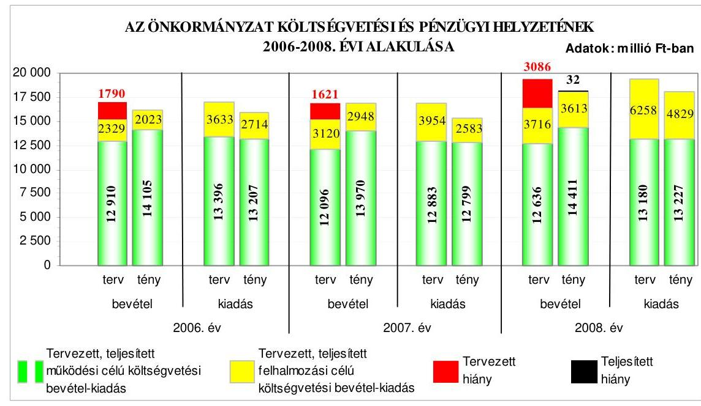
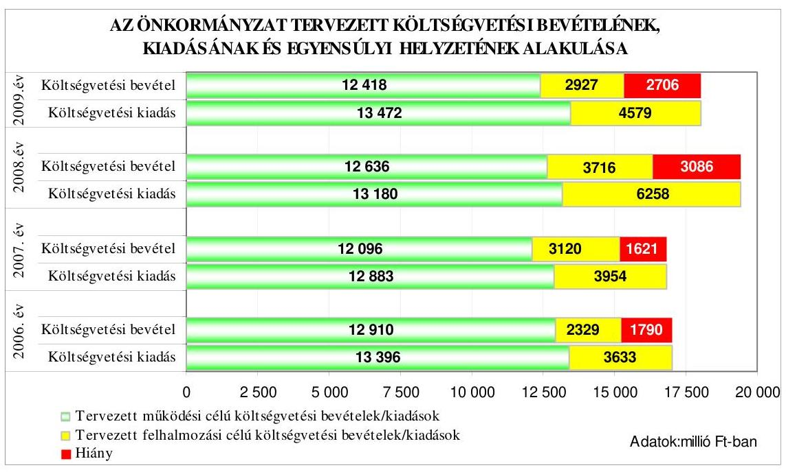
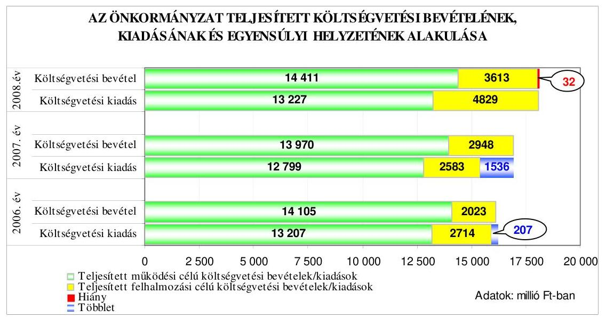
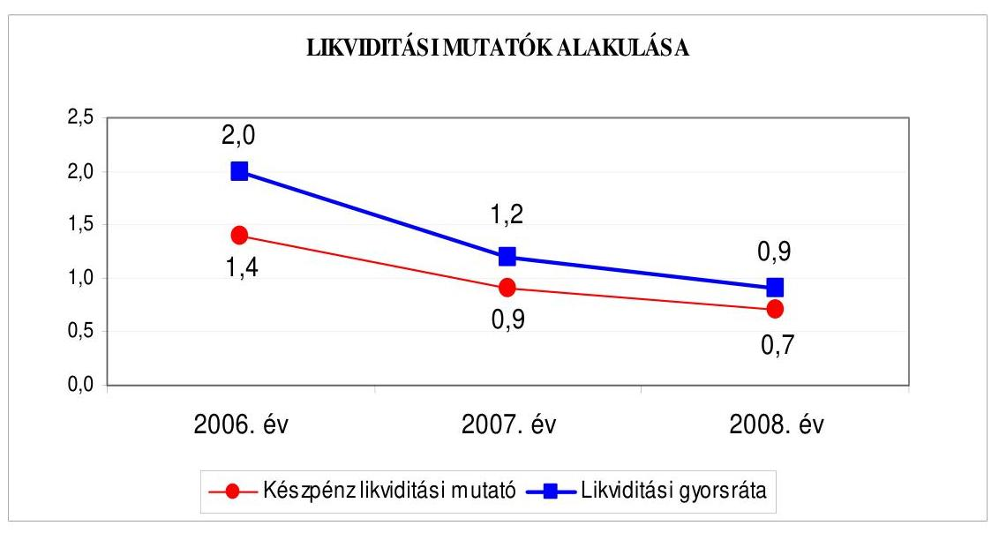
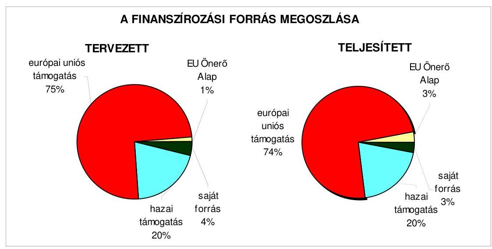
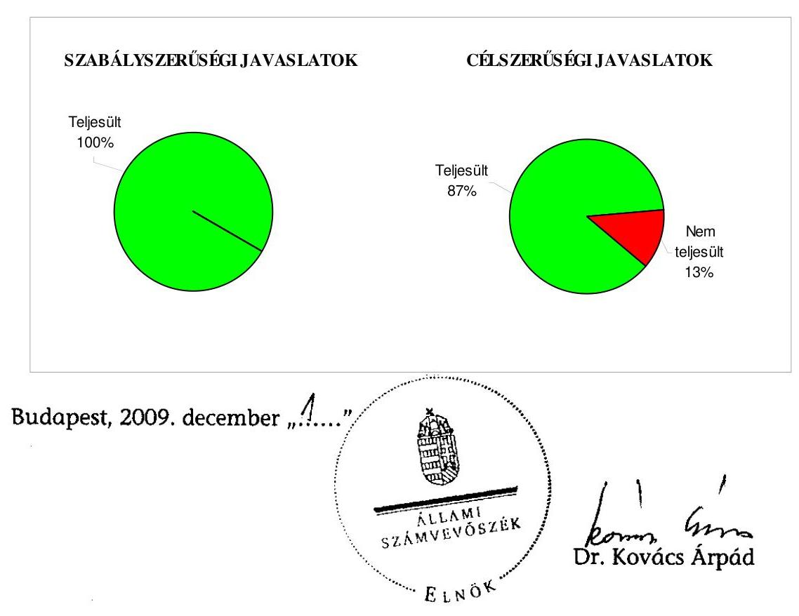
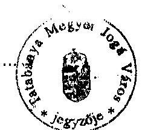
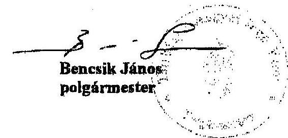

# ÁLLAMI   SZÁMVEVŐSZÉK 

## JELENTÉS

## Tatabánya Megyei Jogú Város Önkormányzata gazdálkodási rendszerének 2009. évi ellenőrzéséről

---

# 3. Önkormányzati és Területi Ellenőrzési Igazgatóság 

3.3. Átfogó Ellenőrzések Főcsoport

Iktatószám: V-3001-4/31/19/2009.
Témaszám: 933
Vizsgálat-azonosító szám: V0445

## Az ellenőrzést felügyelte:

Dr. Lóránt Zoltán
főigazgató
Az ellenőrzés végrehajtásáért felelős:
Dr. Sepsey Tamás
főigazgató-helyettes
Az ellenőrzést vezette:
Gyüre Lajosné
tanácsadó
Az ellenőrzést végezték:
Böröcz Imre
Szeibel Gáborné Koltayné Szepesi Zsuzsanna főtanácsadó, irodavezető számvevő külső szakértő

## A témához kapcsolódó eddig készített számvevőszéki jelentések:

Jelentés Tatabánya Megyei Jogú Város Önkormányzata gazdálko- 0644 dási rendszerének 2006. évi átfogó ellenőrzéséről
Jelentés a Magyar Köztársaság 2006. évi költségvetése végrehajtásának ellenőrzéséről

Függelék:
A helyi önkormányzatok 2006. évi normatív hozzájárulás igénylésének és elszámolásának ellenőrzéséről
Jelentés a helyi és a helyi kisebbségi önkormányzatok gazdálkodási rendszerének 2006. évi átfogó és egyéb szabályszerűségi ellenőrzéséről

---

# TALOMJEGYZÉK 

BEVEZETÉS ..... 9
I. ÖSSZEGZŐ MEGÁLLAPÍTÁSOK, KÖVETKEZTETÉSEK, JAVASLATOK ..... 14
II. RÉSZLETES MEGÁLLAPÍTÁSOK ..... 21

1. Az Önkormányzat költségvetési és pénzügyi helyzete ..... 21
1.1. A tervezett költségvetési bevételek és kiadások alapján a költségvetési egyensúly alakulása, a költségvetési hiány oka, finanszírozásának tervezett módja és a költségvetési hiány megállapításának szabályszerűsége ..... 21
1.2. A teljesített költségvetési bevételek és kiadások alapján a pénzügyi egyensúly alakulása, a pénzügyi hiány oka, finanszírozásának módja és hatása a pénzügyi helyzetre az eladósodás, valamint a fizetőképesség szempontjából ..... 23
2. Az Önkormányzat felkészültsége az európai uniós források igénylésére és felhasználására, valamint az elektronikus közszolgáltatási feladatok ellátására ..... 30
2.1. Az európai uniós források igénybevételére és a várható támogatás felhasználására történt felkészülés szabályozottságának, szervezettségének eredményessége ..... 30
2.1.1. Az európai uniós forrásokra történő pályázatok benyújtására vonatkozó döntések összhangja a fejlesztési célkitűzésekkel ..... 30
2.1.2. Az európai uniós forrásokhoz kapcsolódóan a pályázatfigyelés, a pályázatkészítés, valamint az európai uniós támogatással megvalósuló fejlesztés lebonyolítása belső rendjének szabályozottsága, a végrehajtás személyi, szervezeti feltételei, az ellenőrzési feladatok meghatározása ..... 35
2.1.3. A fejlesztési feladat lebonyolításánál a feladatellátás rendjére, az ellenőrzési feladatok teljesítésére, valamint a felelősségi szabályokra vonatkozó előírások betartása ..... 37
2.2. Az elektronikus közszolgáltatás feltételeinek kialakítása, a közérdekű gazdálkodási adatok elektronikus közzététele ..... 39
3. A költségvetési gazdálkodás belső kontrolljai ..... 41
3.1. A szabályozottság kockázata a költségvetés tervezési, gazdálkodási, beszámolási és a folyamatba épített, előzetes és utólagos vezetői ellenőrzési feladatoknál ..... 41
3.2. A belső kontrollok múködése az önkormányzati források szabályszerű felhasználásában, a költségvetési tervezés, gazdálkodás, beszámolás folyamataiban ..... 42

---

3.3. A belső ellenőrzési kötelezettség teljesítése, javaslatainak hasznosulása ..... 44
4. Az ÁSZ korábbi ellenőrzési javaslatai alapján készített intézkedési terv végrehajtása, eredményessége ..... 47
4.1. Az Önkormányzat gazdálkodási rendszerének átfogó ellenőrzése során tett javaslatok végrehajtására tervezett intézkedések megvalósulása ..... 47
4.2. A zárszámadáshoz kapcsolódó (állami hozzájárulások, támogatások igénylésének és felhasználásának ellenőrzése), valamint a további vizsgálatok esetében a megállapítások, javaslatok alapján tett intézkedések ..... 50
MELLÉKLETEK

1. számú Az Önkormányzat gazdálkodását meghatározó adatok, mutatószámok (1 oldal)
2. számú Az önkormányzati vagyon alakulása (1 oldal)

2/a. számú Az önkormányzati kötelezettségek alakulása (1 oldal)
3. számú Az Önkormányzat 2006-2009. évi költségvetési előirányzatainak és 20062008. évi pénzügyi teljesítéseinek alakulása (1 oldal)
4. számú Tanúsítvány az európai uniós forrásokkal támogatott célok és programok 2006-2009. évi tervezett és teljesített adatairól (2 oldal)
5. számú Adatlap az európai uniós forrással támogatott KDOP-5.3.2-2007-0064 „Akadálymentesen adj esélyt - Tatabánya, Kőrösi Csoma Sándor Általános Iskola akadálymentesítése" fejlesztésről (3 oldal)
6. számú Bencsik János úr, Tatabánya Megyei Jogú Város Önkormányzata polgármesterének észrevétele (1 oldal)

---

# RÖVIDÍTÉSEK JEGYZÉKE 

## Törvények

Áht.
Eisztv.

Ket.

Ötv.
Számv. tv.

## Rendeletek

Ámr.
Ber.
Vhr.

18/2005. (XII. 27.) IHM rendelet

2006. évi költségvetési rendelet

2006. évi zárszámadási rendelet

2007. évi költségvetési rendelet

2008. évi költségvetési rendelet

2008. évi zárszámadási rendelet

2009. évi költségvetési rendelet
vagyongazdálkodási rendelet
az államháztartásról szóló 1992. évi XXXVIII. törvény az elektronikus információszabadságról szóló 2005. évi XC. törvény
a közigazgatási hatósági eljárás és szolgáltatás általános szabályairól szóló 2004. évi CXL. törvény
a helyi önkormányzatokról szóló 1990. évi LXV. törvény a számvitelről szóló 2000. évi C. törvény
az államháztartás múködési rendjéről szóló 217/1998. (XII. 30.) Korm. rendelet
a költségvetési szervek belső ellenőrzéséről szóló 193/2003. (XI. 26.) Korm. rendelet
az államháztartás szervezetei beszámolási és könyvvezetési kötelezettségének sajátosságairól szóló 249/2000. (XII. 24.) Korm. rendelet
a közzétételi listákon szereplő adatok közzétételéhez szükséges közzétételi mintákról szóló 18/2005. (XII. 27.) IHM rendelet
Tatabánya Megyei Jogú Város Önkormányzatának 6/2006. (II. 28.) számú rendelete az Önkormányzat 2006. évi költségvetéséről és végrehajtásának szabályairól
Tatabánya Megyei Jogú Város Önkormányzatának 17/2007. (IV. 26.) számú rendelete a 2006. évi zárszámadásról
Tatabánya Megyei Jogú Város Önkormányzatának 9/2007. (II. 23.) számú rendelete az Önkormányzat 2007. évi költségvetéséről és végrehajtásának szabályairól
Tatabánya Megyei Jogú Város Önkormányzatának 16/2008. (IV. 28.) számú rendelete a 2007. évi zárszámadásról
Tatabánya Megyei Jogú Város Önkormányzatának 4/2008. (II. 29.) számú rendelete az Önkormányzat 2008. évi költségvetéséről és végrehajtásának szabályairól
Tatabánya Megyei Jogú Város Önkormányzatának 21/2009. (IV. 24.) számú rendelete a 2008. évi zárszámadásról
Tatabánya Megyei Jogú Város Önkormányzatának 16/2009. (II. 27.) számú rendelete az Önkormányzat 2009. évi költségvetéséről és végrehajtásának szabályairól
Tatabánya Megyei Jogú Város Önkormányzatának 30/2000. (VI. 22.) számú rendelete az önkormányzati vagyonnal való gazdálkodásról

---

# Szórövidítések 

ÁFA
Általános Iskola, Speciális Szakiskola

ÁROP
ÁSZ
Egyesített Szociális Intézmények
EKOP
e-közigazgatás
Ellenőrzési iroda
EU Önerő Alap
FEUVE
főjegyző
gazdasági program ${ }_{1}$
gazdasági program ${ }_{2}$
gazdálkodási jogkörök szabályzata ${ }_{1}$
gazdálkodási jogkörök szabályzata ${ }_{2}$

Hulladékgazdálkodási Társulás
informatikai stratégia

Kistérségi Társulás
Közbeszerzési szabályzat

Közgyűlés
NFT
Okmányiroda
Önkormányzat
általános forgalmi adó
Éltes Mátyás Egységes Gyógypedagógiai Módszertani Intézmény, Általános Iskola, Speciális Szakiskola és Egységes Pedagógiai Szolgálat
ÚMFT Államreform Operatív Program
Állami Számvevőszék
Tatabánya Megyei Jogú Város Önkormányzata Egyesített Szociális Intézményei
ÚMFT Elektronikus Közigazgatási Operatív Program elektronikus közigazgatás
Tatabánya Megyei Jogú Város Polgármesteri Hivatalának Pénzügyi Ellenőrzési Irodája
Önkormányzatok európai uniós, valamint hazai fejlesztési pályázati saját forrás kiegészítésének támogatása
folyamatba épített, előzetes és utólagos vezetői ellenőrzés
Tatabánya Megyei Jogú Város Önkormányzat Címzetes Főjegyzője
Tatabánya Megyei Jogú Város Önkormányzat Közgyűlésének 288/2003. (XII. 18.) számú határozata az Önkormányzat 2003-2006. évekre vonatkozó gazdasági programjáról
Tatabánya Megyei Jogú Város Önkormányzat Közgyűlésének 217/2007. (VIII. 30.) számú határozata az Önkormányzat 2007-2010. évekre vonatkozó gazdasági programjáról
Kötelezettségvállalás, utalványozás, ellenjegyzés, érvényesítés és szakmai igazolás szabályozása (kiadta a polgármester és a főjegyző 2006. szeptember 1-jén)
Kötelezettségvállalás, utalványozás, ellenjegyzés, érvényesítés és szakmai igazolás szabályozása (kiadta a polgármester és a főjegyző 2007. február 23-án)
Duna-Vértes Köze Regionális Hulladékgazdálkodási Társulás
Tatabánya Megyei Jogú Város Önkormányzat Közgyűlésének 144/2006. (V. 25.) számú határozatával elfogadott „E-Közigazgatás központú intelligens település- és térségfejlesztési stratégia"
Tatabányai Többcélú Kistérségi Társulás
Tatabánya Megyei Jogú Város Önkormányzat Közgyűlésének 140/2004. (V. 19.) számú határozatával elfogadott Közbeszerzési Szabályzat
Tatabánya Megyei Jogú Város Önkormányzat Közgyűlése Nemzeti Fejlesztési Terv
Tatabánya Megyei Jogú Város Polgármesteri Hivatalának Okmányirodája
Tatabánya Megyei Jogú Város Önkormányzata

---

pályázati szabályzat

PEJ
polgármester
Polgármesteri hivatal
Polgármesteri hivatali SzMSz

Stratégiai iroda
ÚMFT
ügyrend

VÁTI Kht.
záró PEJ

A főjegyző által 2006. március 1-jén kiadott Európai Uniós Pályázatok szabályzata
Projekt Előrehaladási Jelentés
Tatabánya Megyei Jogú Város Önkormányzat Polgármestere
Tatabánya Megyei Jogú Város Önkormányzat Polgármesteri Hivatala
Tatabánya Megyei Jogú Város Önkormányzat Közgyűlésének 57/2007. (II. 22.) számú határozata a Polgármesteri Hivatal Szervezeti és Múködési Szabályzatáról
Tatabánya Megyei Jogú Város Önkormányzat Polgármesteri Hivatalának Stratégiai és Kontrolling Irodája
Új Magyarország Fejlesztési Terv
Tatabánya Megyei Jogú Város Önkormányzat Polgármesteri Hivatala Gazdasági Szervezetének Úgyrendje (jóváhagyta a főjegyzó 2007. november 30-án, hatályos 2007. december 1-től)
VÁTI Magyar Regionális Fejlesztési és Urbanisztikai Közhasznú Társaság
Záró Projekt Előrehaladási Jelentés

---

# ÉRTELMEZŐ SZÓTÁR 

1. elektronikus szolgáltatási szint
2. elektronikus szolgáltatási szint
3. elektronikus szolgáltatási szint
4. elektronikus szolgáltatási szint
európai uniós források
fejlesztési feladat (projekt)
fejlesztési célkitúzés
hazai társfinanszírozás

Az 1044/2005. (V. 11.) Korm. határozat alapján olyan információs, tájékoztató szolgáltatás, amely csak általános információkat közöl az adott üggyel kapcsolatos teendőkről és a szükséges dokumentumokról.
Az 1044/2005. (V. 11.) Korm. határozat alapján olyan egyirányú kapcsolatot biztosító szolgáltatás, amely az 1. szinten túl biztosítja az adott ügy intézéséhez szükséges dokumentumok, nyomtatványok letöltését, és azok ellenőrzéssel, vagy ellenőrzés nélküli elektronikus kitöltését, amely esetben a dokumentumok benyújtása hagyományos úton történik.
Az 1044/2005. (V. 11.) Korm. határozat alapján olyan kétirányú kapcsolatot biztosító szolgáltatás, amely közvetlen, vagy ellenőrzött kitöltésű dokumentum segítségével biztosítja az elektronikus adatbevitelt és a bevitt adatok ellenőrzését. Az ügy indításához, intézéséhez személyes megjelenés nem szükséges, de az ügyhöz kapcsolódó közigazgatási döntés (határozat, egyéb aktus) közlése, valamint a kapcsolódó illeték-, vagy díjfizetés hagyományos úton történik.
Az 1044/2005. (V. 11.) Korm. határozat alapján olyan teljes közvetlen kétirányú ügyintézési folyamatot biztosító szolgáltatás, amikor az ügyhöz kapcsolódó közigazgatási döntés is elektronikus úton kerül közlésre, illetve a kapcsolódó illeték-, vagy díjfizetés elektronikus úton is intézhető.
A támogatott projekt megvalósítása érdekében, a fejlesztés lebonyolítása során felmerült kiadások finanszírozási forrása.
A fejlesztési feladat (projekt) tartalmilag és formailag részletesen kidolgozott, megfelelő pénzügyi háttérrel és végrehajtási ütemezéssel rendelkező fejlesztési terv, amely illeszkedik az Európai Unió, illetve a Nemzeti Fejlesztési Terv és az Új Magyarország Fejlesztési Terv által támogatott programokhoz.
Az önkormányzat által ellátott kötelező, vagy önként vállalt feladatok biztosításának mennyiségi, vagy minőségi fejlesztésére vonatkozó terv. A mennyiségi fejlesztés megvalósulhat beszerzéssel, létesítéssel, bővítéssel, átalakítással.
A központi költségvetési és az elkülönített állami pénzalapokból származó finanszírozás.

---

irányító hatóság
kedvezményezett
közreműködő szervezet
lebonyolítás
operatív program

A strukturális alapok és a Kohéziós alap forrásainak szabályszerű, hatékony és eredményes felhasználásához szükséges intézményrendszer felső eleme. Az irányító hatóság általános és átfogó felelősséget visel a programok, projektek hatékony és szabályszerű végrehajtásáért. Felelősségi köréből eredően ellenőrzi a közösségi, valamint a hazai jogszabályok betartását, koordinálja az európai uniós források szétosztásának folyamatát, irányítja az intézményrendszer, a statisztikai és a pénzügyi nyilvántartási rendszer múködését. Az Új Magyarország Fejlesztési Terv Irányító Hatósága közreműködik az Operatív Program véglegesítésében, irányítja az Operatív Program Program-kiegészítő Dokumentum kidolgozását, és közreműködő szerepet vállal e dokumentumoknak az Európai Bizottsággal történő tárgyalásaiban. Az Irányító Hatóság részt vesz továbbá a költségvetési tervezésében, valamint közreműködő szervezetek bevonásával irányítja a meghirdetett pályázatok és a központi programok végrehajtását.
Az a helyi önkormányzat, amely a támogatási szerződést kedvezményezettként aláírja, a projektet, illetve a központi programhoz kapcsolódó támogatott önkormányzati programot végrehajtja.
A közreműködő szervezet az európai uniós támogatást elnyert kedvezményezettekkel kapcsolatot tartó szerv. Az operatív programok közreműködő szervezetei befogadják, nyilvántartják, döntésre előkészítik a pályázatokat, rögzítik a támogatással kapcsolatos adatokat az Egységes Monitoring Informatikai Rendszerben, elvégzik a támogatások előzetes (szerződéskötést megelőző), közbenső (a pénzügyi elszámolás, finanszírozás folyamatában végzett) és utólagos (a támogatott projekt pénzügyi lezárását megelőző) ellenőrzését. Az önkormányzatoknál a leggyakrabban előforduló operatív program a Regionális Fejlesztési Operatív Program végrehajtásában közreműködő szervezetek a VÁTI Kht. és a regionális fejlesztési ügynökségek.
Az európai uniós források felhasználásával megvalósuló fejlesztésre irányuló műszaki, gazdasági (pénzügyi) tevékenységet magában foglaló szervezési, irányítási szolgáltatás. A szervezési szolgáltatás kiterjedhet a pályázatkészítésre, a közbeszerzési eljárás lebonyolításán keresztül a folyamatos műszaki ellenőrzésre, a pénzügyi elszámolásra, a műszaki átadás-átvételre, az üzembe helyezésre, illetve a fejlesztési folyamat egyes elemeire.
Az Európai Bizottság által jóváhagyott, a Közösségi Támogatási Keret végrehajtására vonatkozó, több évre szóló intézkedésekhez kapcsolódó prioritások egységes rendszerét tartalmazó dokumentum.

---

Nemzeti Fejlesztési Terv Helyzetelemzést, stratégiát a tervezett fejlesztési területek prioritásait, azok céljait és pénzügyi forrásaik megjelölését tartalmazó dokumentum, amelyet a Magyar Köztársaság készített az Európai Unió programozási irányelveinek, célkitűzéseinek megfelelően a fejlődésben lemaradó régiók fejlődésének és strukturális átalakulásának elősegítésére a kiemelt szükségletekre figyelemmel. A Nemzeti Fejlesztési Terv stratégiai fejezetének célja, hogy a 2004-2006 közötti időszakra kijelölje a strukturális alapokból támogatható fejlesztéspolitikai célkitűzéseit és prioritásait. A strukturális alapok operatív programjai: Agrár és Vidékfejlesztési Operatív Program (AVOP); Gazdasági Versenyképesség Operatív Program (GVOP); Humánerőforrás-fejlesztési Operatív Program (HEFOP); Környezetvédelmi és Infrast-ruktúra-fejlesztési Operatív Program (KIOP); Regionális Fejlesztési Operatív Program (ROP).
Új Magyarország Fejlesztési Terv

Az Új Magyarország Fejlesztési Terv célja a foglalkoztatás bővítése és a tartós növekedés feltételeinek megteremtése. Ennek érdekében 2007-2013 között hat kiemelt területen indított el összehangolt állami és európai uniós fejlesztéseket: a gazdaságban, a közlekedésben, a társadalom megújulása érdekében, a környezet és az energetika területén, a területfejlesztésben és az államreform feladataival összefüggésben. Az Új Magyarország Fejlesztési Terv operatív programjai: Államreform Operatív Program (ÁROP); Elektronikus Közigazgatás Operatív Program (EKOP); Gazdaságfejlesztés Operatív Program (GOP); Környezet és Energia Operatív Program (KEOP); Közlekedés Operatív Program (KÖZOP); Dél-Alföldi Operatív Program (DAOP); Dél-Dunántúli Operatív Program (DDOP); Észak-Alföldi Operatív Program (ÉAOP); Észak-Magyarországi Operatív Program (ÉMOP); Közép-Dunántúli Operatív Program (KDOP); Közép-Magyarországi Operatív Program (KMOP); Nyugat-Dunántúli Operatív Program (NYDOP); Társadalmi Infrastruktúra Operatív Program (TIOP); Társadalmi Megújulás Operatív Program (TÁMOP).
támogatási szerződés A strukturális alapok esetében az irányító hatóságnak, illetve a Kohéziós Alap esetében a közremúködő szervezeteknek a kedvezményezett önkormányzattal kötött szerződése, amely a támogatás felhasználásának részletes feltételeit tartalmazza. Az Új Magyarország Fejlesztési Terv keretében támogatott projektek esetében a támogatási szerződést a kedvezményezett és a Nemzeti Fejlesztési Ügynökség nevében eljáró közremúködő szervezet között jön létre. Nagyprojekt esetén a támogatási szerződést az Nemzeti Fejlesztési Ügynökség ellenjegyezi. A támogatási szerződés képezi a megvalósítás nyomon követésének, finanszírozásának és ellenőrzésének alapját.

---

# JELENTÉS 

## Tatabánya Megyei Jogú Város Önkormányzata gazdálkodási rendszerének 2009. évi ellenőrzéséről

## BEVEZETÉS

Az Ötv. 92. § (1) bekezdése, az Állami Számvevőszékről szóló 1989. évi XXXVIII. törvény 2. § (3) bekezdése, valamint az Áht. 120/A. § (1) bekezdése alapján az önkormányzatok gazdálkodását az Állami Számvevőszék ellenőrzi. Az ellenőrzésre az Országgyúlés illetékes bizottságai részére is átadott, országosan egységes ellenőrzési program szerint került sor.

Az Állami Számvevőszék a stratégiájában foglalt célkitűzéseknek megfelelően a helyi önkormányzatok költségvetési gazdálkodási rendszere átfogó ellenőrzésének programját a 2007. évtől megújította, azt kiegészítette további - teljesít-mény-ellenőrzési - elemekkel.

Az ellenőrzés célja annak értékelése volt, hogy az Önkormányzat:

- milyen módon biztosította a költségvetési és a pénzügyi egyensúlyt a költségvetésében és annak teljesítése során, valamint változott-e a hiányzó bevételi források pótlásában a finanszírozási célú pénzügyi műveletek jelentősége, hatása;
- eredményesen készült-e fel a szabályozottság és a szervezettség terén az európai uniós források igénylésére és felhasználására, továbbá biztosította-e az elektronikus közszolgáltatás feltételeit, a gazdálkodási adatok közzétételével a gazdálkodás nyilvánosságát;
- kialakította-e és működtette-e a külső és a belső feltételeknek megfelelően a költségvetés tervezési, gazdálkodási és zárszámadási feladatai belső kontrollrendszerét ${ }^{1}$, ezen tevékenységek szabályszerű ellátásához hozzájárult-e a folyamatba épített, előzetes és utólagos vezetői ellenőrzés, valamint a belső ellenőrzés;

[^0]
[^0]:    ${ }^{1}$ A gazdálkodás szabályszerűségét biztosító kontrollrendszer alatt értjük a kiépített és múködő pénzügyi irányítási és szabályozási rendszert, valamint a belső ellenőrzési funkciók ellátásának rendszerét.

---

- megfelelően hasznosították-e a korábbi számvevőszéki ellenőrzések megállapításait, szabályszerűségi ${ }^{2}$ és célszerűségi javaslatait.

Az ellenőrzés típusa: átfogó ellenőrzés, amely - egy ellenőrzés keretében meghatározott területekre összpontosítva alkalmazza a szabályszerűségi, valamint a teljesítmény-ellenőrzés jellemzőit.

Az ellenőrzött időszak: az 1., 2. és 4. programpontok tekintetében a 20062008. évek és 2009. I. negyedév, a 3. ellenőrzési programpontnál a 2008. év és 2009. I. negyedév.

Tatabánya Megyei Jogú Város lakosainak száma 2009. január 1-jén 71302 fő volt. A 2006. évi önkormányzati választást követően az Önkormányzat 27 tagú Közgyűlésének munkáját kilenc állandó bizottság segítette. Az Önkormányzat mellett a 2006. évi önkormányzati választásokat követően öt kisebbségi önkormányzat ${ }^{3}$ működött. A polgármester az 1990. évi választás óta tölti be tisztségét, a főjegyző személye is az 1990. év óta változatlan. Az Önkormányzat feladatainak végrehajtása érdekében a 2008. évben 50 költségvetési intézményt múködtetett, amelyekből 24 önállóan gazdálkodott. A feladatok ellátásában részt vett hét gazdasági társasága, továbbá 15 alapítványa. Az Önkormányzat a 2008. évi költségvetési beszámolója szerint 18024 millió Ft költségvetési bevételt ért el és 18056 millió Ft költségvetési kiadást teljesített. A könyvviteli mérleg szerint 2008. december 31-én 28888 millió Ft értékű vagyonnal rendelkezett. Az Önkormányzat vagyona a 2006. év végi állományhoz viszonyítva 23,8\%-kal növekedett, amiben a beruházások 3641 millió Ft-os emelkedése volt a meghatározó. A források között a kötelezettségek állománya 2006-2008 között a háromszorosára emelkedett az Élményfürdő és Strand létesítéséhez igénybevett pénzügyi lízing és a beruházási hitelek felvétele miatt. Az összes költségvetési bevétel 52,6\%-át a saját bevétel, $27,4 \%$-át a helyi adó bevétel biztosította a 2008. évben. Az összes költségvetési kiadásból a felhalmozási célú kiadások részaránya a 2008. évben $26,7 \%$ volt. A 2009. évi költségvetési rendeletben 15345 millió Ft költségvetési bevételt és 18051 millió Ft költségvetési kiadást irányoztak elő. A Polgármesteri hivatalban dolgozó köztisztviselők száma 2008. december 31-én 246 fő, a költségvetési intézményekben foglalkoztatott közalkalmazottak száma 1771 fő volt. (Az Önkormányzat gazdálkodását meghatározó adatokat, mutatószámokat az 1-3. számú mellékletek tartalmazzák.)

Az Önkormányzat költségvetési és pénzügyi helyzetét az elemző eljárás módszerével vizsgáltuk. E körben elemeztük a költségvetés egyensúlyi helyzetének alakulását, a tervezett és tényleges költségvetési hiány okait, a mérséklésére tett intézkedéseket, finanszírozásának módját, az Önkormányzat adósságállományának alakulását, összetevőit. Az európai uniós támogatás igénylésére, felhasználására történt felkészülésre vonatkozóan teljesítményellenőrzést végeztünk. Az európai uniós források figyelésére, igénylésére és felhasználására a felkészülést akkor minősítettük eredményesnek, ha a meghatározott szempont-

[^0]
[^0]:    ${ }^{2}$ A törvényi előírások betartásának elmulasztásakor a részletes megállapítások fejezetben egységesen a törvénysértés megjelölést alkalmazzuk, mivel az ÁSZ nem tehet különbséget a törvényi előírások között.
    ${ }^{3}$ Települési kisebbségi önkormányzatok: cigány, görög, lengyel, német, szlovák.

---

ok szerinti feltételeknek megfelelt a felkészülés szabályozottsága, szervezettsége, továbbá értékeltük, hogy az igényelt európai uniós támogatások az Önkormányzat által meghatározott fejlesztési célkitűzésekhez kapcsolódtak-e. Az ellenőrzés során felmértük, hogy az e-közszolgáltatási feladat ellátása, illetve bevezetése, működtetése érdekében milyen intézkedéseket tettek, valamint biztosí-tották-e a közérdekű adatok közzétételét. A költségvetési gazdálkodás belső kontrolljainak ellenőrzése során értékeltük, hogy a Polgármesteri hivatalnál a költségvetés tervezési, gazdálkodási, zárszámadás-készítési feladatok belső kontrolljainak kiépítettsége és működése megfelelő biztosítékot ad-e a gazdálkodási feladatok megfelelő, szabályszerű ellátására. Felmértük és minősítettük a költségvetés tervezési, a gazdálkodási, a zárszámadás-készítési feladatokkal, továbbá a pénzügyi-számviteli területen az informatikával kapcsolatosan kialakított kontrollok megfelelőségét, valamint a kialakított belső kontrollok működésének megbízhatóságát. Értékeltük a belső ellenőrzés szabályozottságát, működési feltételeinek kialakítását, továbbá működésének megbízhatóságát.

A Polgármesteri hivatalnál értékeltük a gazdálkodás folyamatában kulcsszerepet betöltő belső kontrollok működésének megbízhatóságát, ennek keretében ellenőriztük a szakmai teljesítésigazolásra és az utalvány ellenjegyzésére kialakított kontrollok végrehajtását. Az ellenőrzést a következő, magas kockázatuk alapján kiválasztott ${ }^{4}$ kifizetésekre folytattuk le ${ }^{5}$ :

- a külső szolgáltató által végzett karbantartási, kisjavítási szolgáltatásokra,
- a gépek, berendezések, felszerelések beszerzésére, továbbá
- az államháztartáson kívülre teljesített múködési és felhalmozási célú pénzeszköz átadásokra.

Az ellenőrzés hatékony elvégzése céljából a vizsgálandó területek kiválasztása során, a kockázatokon alapuló megközelítés érvényesült, ezáltal az ellenőrzési erőforrásokat azokra a területekre fókuszáltuk, amelyeken legnagyobb a hibák előfordulási valószínűsége. Az ellenőrzési erőforrások ilyen típusú összpontosításával minimálisra csökkenthető a kívánt ellenőrzési bizonyosság eléréséhez szükséges időráfordítás.

[^0]
[^0]:    ${ }^{4}$ Az önkormányzatok kiemelt előirányzataira vonatkozóan, a vertikális folyamatokra elvégeztük a kockázatok becslését, amelynek eredményeként határoztuk meg a magas kockázatú területeket.
    ${ }^{5}$ A korábbi ellenőrzési tapasztalataink szerint ezeken a területeken a jegyzők nem, vagy hiányosan szabályozták a megbízás, a megrendelés, illetve a beszerzés indokoltságának, szükségességének elbírálására, igazolására, valamint a teljesítések dokumentálására, a kiadások jogosultságának, összegszerűségének ellenőrzésére irányuló kontrollokat. További kockázatot jelentett, ha a külső szolgáltató által végzett karbantartási, kisjavítási munkák 50 ezer Ft alatti megrendeléseire vonatkozóan a jegyzők nem alakították ki a kötelezettségvállalások rendjét és nyilvántartási formáját, valamint a szabályozás elmulasztása esetén nem történt meg az írásbeli kötelezettségvállalás és annak az ellenjegyzése sem.

---

A pénzügyi-számviteli folyamatokban alkalmazott belső kontrollok létezésének és múködésének ellenőrzésére a vizsgált három terület 2008. évi és a 2009. I. negyedévi könyvviteli tételeiből területenként egyszerű véletlen mintát vettünk. A kijelölt gazdasági eseményre elvégzett megfelelőségi tesztek alapján értékeltük a kontrollok múködésének megbízhatóságát a vizsgált három területre külön-külön, majd összefoglalóan ${ }^{6}$. A helyszíni ellenőrzés megállapításainak részletes dokumentálását megfelelőségi tesztlapokon, elővizsgálati és helyszíni ellenőrzési munkalapokon biztosítottuk. Ezeken a teszt- és munkalapokon a minősítés alapjául szolgáló kérdések és a vonatkozó konkrét jogszabályhelyek megjelölése mellett értékeltük a kialakított belső kontrollokban rejlő kockázatokat ${ }^{7}$ és a kialakított kontrollok múködésének megbízhatóságát ${ }^{8}$.

Az ÁSZ korábbi ellenőrzési javaslatai alapján tett intézkedéseket, illetve azok megvalósítását utóellenőrzés keretében vizsgáltuk. A gazdálkodási rendszer átfogó ellenőrzése során megfogalmazott javaslatok végrehajtására tett intézkedések megvalósítását ellenőriztük, az egyéb számvevőszéki ellenőrzések során tett javaslatok esetében pedig a kiadott intézkedéseket tekintettük át.

A helyszíni ellenőrzés során kitöltött - az ellenőrzést végző számvevő és a Polgármesteri hivatal felelős köztisztviselője által aláírt - elővizsgálati és helyszíni ellenőrzési munkalapokat, azok kitöltési útmutatóit, továbbá a megfelelőségi tesztek dokumentumait a polgármester részére a számvevői jelentéssel egyidejűleg átadtuk.

A számvevői jelentés megállapításainak, javaslatainak egyeztetése során a polgármester arról adott részletes tájékoztatást, hogy az időközben megtett intézkedésekkel a javaslatok egy részét ${ }^{9}$ megvalósították. A megtett intézkedéseket a jelentés II. Részletes megállapítások fejezetében az adott témához kapcsolt lábjegyzetben feltüntettük és a vonatkozó javaslatokat elhagytuk.

[^0]
[^0]:    ${ }^{6}$ A vizsgált három terület egyedi értékelési pontszámait a területek költségvetési súlyával arányosan összegeztük.
    ${ }^{7}$ A kialakított belső kontrollokban rejlő kockázatot alacsonynak minősítettük, ha a kontrollok - végrehajtásuk esetén - megfelelő védelmet nyújtanak a hibák bekövetkezése ellen. Közepesnek minősítettük a belső kontrollokban rejlő kockázatot, amennyiben a kontrollok - végrehajtásuk esetén - a lehetséges hibák többsége ellen védelmet nyújtanak. Magasnak értékeltük a kockázatot, ha a kontrollok - kialakításuk hiányában, vagy hiányos kialakításuk miatt - nem nyújtanak elegendő védelmet a lehetséges hibákkal szemben.
    ${ }^{8}$ A kontrollok múködésének megbízhatóságát kiválónak értékeltük abban az esetben, ha azok múködése - esetleges apróbb hiányosságoktól eltekintve - megfelelt a hibák megelőzésére és kijavítására meghatározott szabályozásnak és a legmagasabb szintű elvárásoknak. Jónak minősítettük a kontrollok múködését, ha a hiányosságok száma ugyan jelentős volt, de nem veszélyeztette az ellenőrzött terület hibáinak megelőzését és kijavítását. Amennyiben a kontrollok - kialakításuk hiánya, illetve hiányosságai miatt - nem biztosították a hibák megelőzését, feltárását, kijavítását és ez veszélyeztette az eredményes, megbízható múködést, a kontroll múködésének megbízhatósága gyenge minősítést kapott.
    ${ }^{9}$ A számvevői jelentésben egy szabályszerűségi és három célszerűségi javaslatot tettünk, amelyből a megvalósított egy szabályszerűségi és egy célszerűségi javaslatot elhagytuk.

---

A jelentést az ÁSZ-ról szóló 1989. évi XXXVIII. tv. 25. § (1) bekezdése alapján észrevétel közlése céljából megküldtük Tatabánya Megyei Jogú Város Önkormányzata polgármesterének. A kapott észrevételt a jelentés 6 . számú melléklete tartalmazza.

---

# I. ÖSSZEGZŐ MEGÁLLAPÍTÁSOK, KÖVETKEZTETÉSEK, JAVASLATOK 

Az Önkormányzat 2006-2009 között tervezett költségvetési bevételei és kiadásai az előző évhez viszonyítva a 2007. és a 2009. években csökkentek, a 2008. évben növekedtek. A költségvetési bevételek és kiadások egyensúlya nem volt biztosított, a tervezett múködési célú költségvetési bevételek nem nyújtottak fedezetet a múködési célú költségvetési kiadásokra, a tervezett felhalmozási célú költségvetési kiadások meghaladták a felhalmozási célú költségvetési bevételeket. Az Önkormányzat a 2006-2009. évek költségvetési rendeleteiben a költségvetési hiány finanszírozására és a korábbi években felvett hitelek visszafizetésére rövid lejáratú múködési célú és hosszú lejáratú felhalmozási célú hitelek felvételével, továbbá a 2009. évben kötvénykibocsátás bevételeivel számolt.

A 2006-2008. évi költségvetések végrehajtása során az Önkormányzat teljesített költségvetési bevételei folyamatosan növekedtek, a teljesített költségvetési kiadásai a 2007. évi csökkenést követően a 2008. évben emelkedtek. A realizált költségvetési bevételek a 2006-2007. években fedezetet nyújtottak a megvalósított feladatok költségvetési kiadásaira, míg a 2008. évben a teljesített költségvetési kiadások meghaladták a teljesített költségvetési bevételeket. A 2006-2008. években a teljesített múködési célú költségvetési bevételek és kiadások egyensúlya biztosított volt, míg a felhalmozási célú költségvetési kiadások mindhárom évben meghaladták a felhalmozási célú költségvetési bevételeket. A pénzügyi többlet kialakulásához és a 2008. évben a pénzügyi hiány tervezettnél alacsonyabb összegének eléréséhez hozzájárult, hogy a múködési célú költségvetési bevételek túlteljesültek, a felhalmozási célú költségvetési kiadások - a beruházások, illetve azok pénzügyi teljesítésének következő évre történő át-

---

húzódása miatt - a tervezettől elmaradtak. A költségvetési bevételek túlteljesítésében szerepet játszott, hogy az Önkormányzat az éves költségvetések előirányzatai között - az Áht. előírásától eltérően - az előző évben jóváhagyott, de áthúzódó feladatok (kötelezettségek) ismert kiadásával és annak fedezetével, a várható le nem kötött pénzmaradvánnyal nem számolt. A Közgyűlés a 2007. évben döntött arról, hogy az Élményfürdő és Strand beruházást pénzügyi lízing igénybevételével valósítja meg. A létesítmény 2009. májusi birtokbavételétől a svájci frank alapú kötelezettség alapján számított 5280 millió Ft tőkerész és a 1540 millió Ft kamat összegének 20 éves futamidejű kifizetése megkezdődött. A fejlesztési feladatok finanszírozásához 2009 szeptemberében a Közgyűlés döntése alapján 2600 millió Ft értékű, euró alapú kötvényt bocsátottak ki. A forint devizákhoz viszonyított árfolyamváltozása, valamint a változó kamatérték miatt az Önkormányzat számára a 2007. évben kötött szerződés szerinti pénzügyi lízing és a 2009. évi kötvénykibocsátás kockázatot jelent.

Az Önkormányzat pénzügyi helyzete eladósodási szempontból 2006-2008 között kedvezőtlenül változott, mert a hosszú és rövid lejáratú fizetési kötelezettségek összes forráson belüli aránya - a hitelek állományának emelkedése miatt - az időszak folyamán nőtt. Az Önkormányzat fizetőképessége a 2006-2008. évek között romlott, mert a pénzeszközök, valamint a követelések év végi állománya évente csökkenő arányban nyújtott fedezetet a rövid lejáratú kötelezettségekre. Az Önkormányzat pénzügyi helyzete - a hitelfelvételekből, a pénzügyi líingszerződésből eredő eladósodás következményeként és a fizetőképesség romlása miatt - összességében kedvezőtlenül változott.

Az Önkormányzat fejlesztési célkitűzéseit a gazdasági program ${ }_{1,2}$-ben, ágazati, szakmai koncepciókban és tervekben határozta meg, amelyek összhangban voltak az NFT-ben, valamint ÚMFT-ben foglalt pályázati lehetőségekkel. Az Önkormányzat 2006-2008 között 20 pályázatot nyújtott be, amelyekből 13 eredményes volt, kettő elbírálása folyamatban van, öt pályázatot elutasítottak. A 2004-2005. években benyújtott pályázatok közül öt fejlesztési feladat megvalósítása áthúzódott a 2006-2008. évekre. Az Önkormányzat 2006-2009. évekre vonatkozó költségvetési rendeletei tartalmazták az európai uniós támogatással megvalósuló fejlesztési feladatok múködési és felhalmozási célú kiadásainak és bevételeinek előirányzatait, a felhalmozási kiadásokat feladatonként, a többéves kihatással járó döntések előirányzatait éves bontásban, továbbá elkülönítetten bemutatták az európai uniós forrásokkal megvalósuló programok, projektek bevételeit és kiadásait. Az Önkormányzatnál a 2006-2008. években az európai uniós forrásokkal megvalósított, befejezett fejlesztési feladatok kiadásai a tervezetthez képest $99,7 \%$-ban teljesültek.

Az európai uniós források igénybevételének és felhasználásának önkormányzati szintű feladatait pályázati szabályzatban határozták meg, kijelölték a Polgármesteri hivatalon belül a pályázat-koordinálás feladatainak, valamint a pályázati nyilvántartás vezetésének a felelősét. A szabályozás kiterjedt a pályázatfigyelést végzők és a döntési, illetve a döntés-előkészítési jogkörrel rendelkezők közötti információ-szolgáltatási kötelezettség előírására. Szabályozták a pályázatfigyelés, a pályázatkészítés, valamint az európai uniós forrással támogatott fejlesztések lebonyolításával kapcsolatos eljárás rendjét, a folyamatba épített, előzetes és utólagos vezetői ellenőrzési feladatokat, továbbá a belső ellenőrzési stratégiát megalapozó kockázatelemzés kiterjedt az európai uniós for-

---

rásokkal támogatott fejlesztési feladatokra. Biztosították az európai uniós források pályázatfigyelésével, pályázatkészítésével, valamint a fejlesztési feladat lebonyolításával összefüggő feladatok végrehajtásának személyi, szervezeti feltételeit. Pályázatkészítési feladatokat a Polgármesteri hivatal köztisztviselői végeztek, valamint négy pályázat elkészítésére külső szervezettel a polgármester szerződést kötött, amelyben meghatározta a feladatellátás kötelezettségét, a Polgármesteri hivatal és a megbízott közötti kapcsolattartást, az információk átadásának formáját, tartalmát és módját, valamint a felelősség szabályait. A fejlesztések lebonyolítási feladatait a Polgármesteri hivatal köztisztviselői végezték, egy projekt esetében a polgármester külső szervezet részére megbízást adott, amelyben előírta a feladatellátás kötelezettségét, a kapcsolattartás és az ellenőrzés rendjét, továbbá a személyre szóló felelősségi szabályokat.

Az Önkormányzat a KDOP intézkedés keretén belül a 2008. évben benyújtott, az „Akadálymentesen adj esélyt - Tatabánya, Kőrösi Csoma Sándor Általános Iskola akadálymentesítése" című pályázata támogatásban részesült. A fejlesztési feladat lebonyolítója gondoskodott a projekt támogatási szerződésben rögzített időbeli megvalósulásáról, a célok teljesüléséről, valamint a támogatás igénybevételéről. A fejlesztési feladat megvalósításához a költségvetésben tervezett saját forrás rendelkezésre állt. A folyamatba épített, előzetes és utólagos vezetői ellenőrzési feladatokat a szabályozásban előírt módon elvégezték. A külső ellenőrzés egy alkalommal helyszíni ellenőrzést végzett, amelynek során szabálytalanságra vonatkozó megállapítást nem tett.

Az Önkormányzat a szabályozottság és szervezettség tekintetében 2006-2008 között eredményesen készült fel az európai uniós források igénybevételére és a várható támogatások felhasználására, mivel a gazdasági program ${ }_{1,2}$-ben, az ágazati, szakmai koncepciókban, tervekben megfogalmazott célkitűzésekhez kapcsolódtak az európai uniós forrásokra benyújtott pályázatok. A pályázati szabályzat tartalmazta a pályázatfigyelést végző és a döntési, illetve döntés előterjesztési jogkörrel rendelkezők közötti információszolgáltatás kötelezettségét, meghatározták a folyamatba épített, előzetes és utólagos vezetői ellenőrzési feladatokat, továbbá a belső ellenőrzési stratégiát megalapozó kockázatelemzés kiterjedt az európai uniós forrásokkal támogatott fejlesztési feladatokra. A Polgármesteri hivatalon belül kialakították a pályázatfigyelés, a pályázatkészítés és a fejlesztési feladat lebonyolításának szervezeti, személyi feltételeit, továbbá négy pályázat készítésére és egy fejlesztési feladat lebonyolítására külső szervezetet is megbíztak. A külső szervezettel kötött szerződésben meghatározták - a pályázat szakmai és formai követelményeinek biztosítására vonatkozóan - a pályázatkészítést végző felelősségét, valamint előírták a fejlesztési feladat lebonyolítását végző részére az ellenőrzési kötelezettséget.

Az Önkormányzat az informatikai stratégiában fogalmazta meg a rövid és középtávú céljait, az elektronikus ügyintézés 3. illetve 4. szintjének a bevezetését. A 2009. évben az „Új szervezési-múködési kultúra kialakítása Tatabánya városának Polgármesteri Hivatalában" elnevezésű, ÁROP keretébe tartozó pályázattal 34,7 millió Ft támogatást nyert. Az e-közigazgatási feladatok ellátásának személyi feltételeit az Okmányirodában biztosították, az e-közigazgatási feladatokat ellátó informatikai rendszert múködtettek. Az Önkormányzat élt a Ket-ben foglalt felhatalmazással, az elektronikus ügyintézés lehetőségét kizárta, a honlapján a közérdekű adatok jegyzéket kialakította, a gazdálkodási adatok közzé-

---

tételi egységet elhelyezte. Az Önkormányzat a 2008. évben az Áht. előírásainak megfelelően közzétette az általa nyújtott céljellegű működési és fejlesztési támogatások kedvezményezettjeinek nevét, a támogatások célját, összegét, a támogatási program megvalósulásának a helyét. A főjegyző az Áht. előírásainak megfelelően gondoskodott az árubeszerzésre, építési beruházásra, szolgáltatás megrendelésére, vagyonértékesítésre, vagyonhasznosításra vonatkozó szerződések megnevezésének, tárgyának, a szerződő felek nevének, a szerződések értékének, valamint a határozott időre kötött szerződések időtartamának közzétételéről. A 2007-2008. évi beszámolók szöveges indoklásának közzététele - az Ámr. előírásainak megfelelően - az Önkormányzat honlapján megtörtént.

A Polgármesteri hivatalban a 2008. évben a költségvetés tervezési és a zár-számadás-készítési folyamatok szabályozottsága alacsony kockázatot jelentett a feladatok szabályszerű végrehajtásában, mivel a főjegyző a pénzügyi irányítási és ellenőrzési rendszer keretében, a Polgármesteri hivatal ügyrendjében, az ellenőrzési nyomvonalban és körlevelekben szabályozta a költségvetési tervezés és a zárszámadás elkészítésének rendjét, meghatározta az intézmények részére a költségvetési javaslat összeállításával kapcsolatos követelményeket. A költségvetés tervezési és zárszámadás-készítési folyamatban a belső kontrollok múködésének megbízhatósága összességében kiváló volt, mivel a főjegyző az előírásoknak megfelelően ellenőriztette, hogy a költségvetési intézmények teljesítették-e a költségvetési javaslat összeállításával kapcsolatban részükre meghatározott követelményeket, a költségvetés tervezéséhez készített intézményi mutatószám felmérés adatai megalapozottak-e. Vizsgálták az intézmények által benyújtott költségvetési igények indokoltságát, teljesíthetőségét. A 2008. évi zárszámadás készítésekor dokumentáltan ellenőrizték az intézmények által az állami támogatásokkal történő elszámoláshoz kötött mutatószámok adatainak megbízhatóságát, az intézmények pénzmaradványának szabályszerűségét. Annak ellenére összességében kiváló volt a kontrollok múködésének megbízhatósága, hogy a 2008. évben nem végezték el a Polgármesteri hivatal és az intézmények javasolt előirányzatai közül az előző évi pénzmaradvány igénybevétel és az azt terhelő, előző évről áthúzódó kötelezettségek tervezésének ellenőrzését.

A 2008. évben a gazdálkodási, a pénzügyi-számviteli és a folyamatba épített ellenőrzési feladatok szabályozottsága alacsony kockázatot jelentett a feladatok szabályszerű végrehajtásában, mivel a főjegyző a pénzügyi irányítási és ellenőrzési rendszer keretében elkészítette a gazdasági szervezet ügyrendjét, a gazdálkodási jogkörök szabályzatát ${ }_{2}$, kiadta és aktualizálta a számviteli politikát, a kapcsolódó szabályzatokat és a számlarendet, valamint kialakította az ellenőrzési nyomvonalat, a kockázatkezelésre és a szabálytalanságok kezelésére vonatkozó eljárásrendet. A Polgármesteri hivatalnál a külső szolgáltatók által végzett karbantartási, kisjavítási feladatokkal, a gépek, berendezések és felszerelések vásárlásával, valamint az államháztartáson kívülre történő múködési és felhalmozási célú pénzeszközátadásokkal kapcsolatos kifizetések során a szakmai teljesítésigazolás és az utalvány ellenjegyzés múködésének megbízhatósága kiváló volt, mivel a szakmai teljesítésigazolására a főjegyző által kijelölt személyek a szerződések, a megrendelések, a megállapodások teljesítésének, a kiadások jogosultságának, összegszerűségének ellenőrzését a helyi szabályozásban előírt módon elvégezték. Az utalványok ellenjegyzője a gazdálko-

---

dásra vonatkozó szabályok érvényesüléséről, továbbá a szakmai teljesítésigazolás és az érvényesítés elvégzéséről meggyőződött.

A Polgármesteri hivatalban a pénzügyi-számviteli feladatoknál alkalmazott informatikai rendszer múködésének szabályozottsága alacsony kockázatot jelentett a feladatok szabályszerű végrehajtásában, mivel a főjegyző kiadta az informatikai biztonsági szabályzatot. Rendelkeztek üzletmenet folytonossági, valamint katasztrófa elhárítási tervekkel, szabályozták a pénzügyi-számviteli szoftver mentési eljárásait, módját. A Polgármesteri hivatalnál a pénzügyiszámviteli feladatok ellátásánál alkalmazott informatikai rendszerek belső kontrolljainak megbízhatósága kiváló volt, mivel tesztelték az üzletmenetfolytonossági tervet, és biztosított volt a hozzáférési jogosultságokra vonatkozó nyilvántartás teljes körűsége és naprakészsége. A pénzügyi és számviteli integrált rendszerben tárolt hozzáférési jogosultságok ellenőrizhetőek voltak, valamint betartották a jelszavakra előírt szabályokat. A pénzügyi-számviteli szoftver biztosította az ellenőrzési lista elkészítését minden adathozzáférésről, adatmódosításról, adattörlésről.

Az Önkormányzat a belső ellenőrzési feladatok ellátására a főjegyzőnek közvetlenül alárendelt négyfős belső ellenőrzési egységet hozott létre. A belső ellenőrzés szervezeti kereteinek kialakítása és szabályozása a belső ellenőrzési feladatok megfelelő, szabályszerű végrehajtásában összességében alacsony kockázatot jelentett, mivel a feladat ellátásának módját és az eljárásrendet az előírásoknak megfelelően szabályozták, a belső ellenőrzési kézikönyvet a főjegyző jóváhagyta, a Polgármesteri hivatal SzMSz-ében meghatározták a belső ellenőrzést végző egység jogállását, feladatát. A belső ellenőrök rendelkeztek az előírt iskolai végzettséggel, funkcionális függetlenségüket biztosították. A belső ellenőrzés rendelkezett kockázatelemzésen alapuló stratégiai tervvel, valamint a Közgyűlés által jóváhagyott éves ellenőrzési tervvel. Annak ellenére összességében alacsony volt a kockázat, hogy a kockázatelemzés nem terjedt ki az Önkormányzat többségi irányítást biztosító befolyása alatt működő gazdasági társaságok múködésére, valamint a kedvezményezett szervezeteknél az Önkormányzat költségvetéséből céljelleggel nyújtott támogatások rendeltetés szerinti felhasználására. A belső ellenőrzés múködésénél a kialakított kontrollok megbízhatósága kiváló volt, mivel az Önkormányzatnál a belső ellenőrzés ellátásának módja megfelelt az előírásoknak, az Ellenőrzési iroda a tervezett ellenőrzéseket a Polgármesteri hivatalban és az intézményekben a belső ellenőrzési vezető által jóváhagyott ellenőrzési program alapján hajtotta végre. Az ellenőrzöttek az intézkedési terveket megküldték a belső ellenőrzési vezető részére, aki az elvégzett ellenőrzésekről, valamint a jelentésben tett megállapításokról, a javaslatok hasznosulásáról az előírt tartalommal vezetette a nyilvántartást. A tervezett ellenőrzéseket a 2008. évben végrehajtották, ezen túl soron kívüli ellenőrzéseket is végeztek, a 2009. I. negyedévi teljesítés az ellenőrzési terv üteme szerint alakult. A főjegyző az Ámr. előírásainak megfelelően eleget tett nyilatkozattételi kötelezettségének. A polgármester az Ötv. előírásai szerint a zárszámadási rendelettervezettel egyidejűleg a Közgyűlés elé terjesztette a költségvetési szervek éves ellenőrzési tapasztalatai alapján elkészített 2008. évi összefoglaló jelentést.

Az ÁSZ az Önkormányzat gazdálkodási rendszerét a 2006. évben ellenőrizte átfogó jelleggel, amelynek során 23 szabályszerűségi és hét célszerűségi javaslatot

---

tett. Az ÁSZ ellenőrzési megállapításait a Közgyűlés megtárgyalta és jóváhagyta a felelősök és a határidő megjelölését tartalmazó intézkedési tervet. Az ÁSZ ellenőrzés által tett javaslatok hasznosítására a polgármester és a főjegyző intézkedett, a szabályszerűségi javaslatokat teljes körűen, a célszerűségi javaslatokat 86\%-ban hasznosították, egy javaslat 2009. augusztusában hasznosult.

Az ÁSZ szabályszerűségi javaslatainak teljesítésével az Önkormányzat a költségvetési rendeleteiben a költségvetési bevételek és költségvetési kiadások főöszszegeit az előírásoknak megfelelően határozta meg, a tervezett költségvetési hiányt a költségvetési rendeletekben bemutatta. A költségvetési rendeletet határidőben módosították, a Polgármesteri hivatal és az intézmények a költségvetési kiadási előirányzataikat nem lépték túl. A Közgyűlés jóváhagyta a Polgármesteri hivatal és a Hulladékgazdálkodási Társulás közötti együttműködési megállapodást. A főjegyző az adósok egyedi értékelésének szempontrendszerét meghatározta, amelyet alkalmaztak és értékvesztést számoltak el. A gazdálkodási jogkörök szabályzatát; kiegészítették, az ellenjegyzéssel felhatalmazottak, a szakmai teljesítésigazolásra kijelöltek és az érvényesítéssel megbízottak a munkafolyamatba épített ellenőrzési feladataikat elvégezték. Az Önkormányzat a vagyongazdálkodási rendelet módosításával kiegészítette a követelésekről való lemondás eseteit és módját, az államháztartáson kívülre történő térítésmentes vagyonátadáskor a vagyongazdálkodási rendelet előírásait betartották. A pártok által igénybevett helyiségek bérleti díj kedvezményét megszüntették. A céljelleggel - nem szociális ellátásként - jutatott támogatások felhasználásáról szóló elszámolásokat és a rendeltetés szerinti felhasználást ellenőrizték, a 2006. évi támogatásból a rendeltetési céltól eltérően felhasznált összeget ( 8650 Ft-ot) a támogatott visszafizette. A Közgyűlés a Közbeszerzési szabályzat kisebbségi önkormányzatokra vonatkozó kiterjesztését hatályon kívül helyezte, a közbeszerzési eljárás alapján megkötött vállalkozói szerződések módosításáról és részteljesítéséről szóló tájékoztatási kötelezettséget teljesítették. A Közgyűlés módosította, kiegészítette a kisebbségi önkormányzatokkal kötött megállapodásokat. Az Önkormányzat a középületek akadálymentessé tételét a felújítások, rekonstrukciók és az új beruházások során biztosította.

A célszerűségi javaslatok alapján a főjegyző kiadta a céljelleggel nyújtott támogatások nyilvántartásának és rendeltetésszerű felhasználásának ellenőrzési szabályzatát, a költségvetési rendelettervezet előkészítése során a „pénzalapok" elnevezés használatát megszüntette, a szakmai teljesítésigazolás módja szabályait kiegészítette és a kiutalt, de visszaérkezett segélyek manuális nyilvántartását megszüntette. Az átmenetileg szabad pénzeszközök betétben történő elhelyezéséhez a legkedvezőbb lekötési lehetőséget pályázati úton, pénzintézeti ajánlatok, önkormányzati számítások alapján választották ki. Egy célszerűségi javaslat nem hasznosult, a főjegyző által elkészítendő költségvetési, előirány-zat-módosítási, zárszámadási határozat-tervezetek kisebbségi önkormányzatok részére történő átadási határidejét a Polgármesteri hivatal és a kisebbségi önkormányzatok közötti együttműködési megállapodásokba 2009. augusztus hónapjában építették be.

A javaslatok hasznosítása eredményeként javult az önkormányzati gazdálkodás, a költségvetési rendeletkészítés szabályszerűsége, a jóváhagyott előirányzatokon belüli gazdálkodás, a gazdálkodási és pénzügyi-számviteli feladatok

---

szabályozottsága és múködése, a céljellegú támogatások elszámolásának szabályszerűsége.

A Magyar Köztársaság 2006. évi költségvetés végrehajtásának ellenőrzése keretében a 2006. évi normatív állami hozzájárulás igénylésének és elszámolásának ellenőrzésekor az ÁSZ a polgármesternek egy szabályszerűségi és egy célszerűségi, a főjegyzőnek négy szabályszerűségi javaslatot tett, amelyekre a szükséges intézkedéseket megtették. Az ellenőrzési tapasztalatokról szóló tájékoztatáskor a Közgyűlés elfogadta a főjegyző által készített intézkedési tervet. Az ellenőrzés során feltárt jogtalanul igénybe vett normatív hozzájárulás viszszafizetésére azonnal intézkedtek.

Az Önkormányzatnál végzett ÁSZ ellenőrzések javaslatai összességében 97\%ban határidőn belül teljesültek és 3\%-ban a határidőt követően hasznosultak.

A helyszíni ellenőrzés megállapításainak hasznosítása mellett javasoljuk:

# a polgármesternek 

a munka színvonalának javítása érdekében
kezdeményezze, hogy a Közgyűlés a számvevőszéki jelentésben foglaltakat tárgyalja meg, valamint kövesse figyelemmel a főjegyző által készített intézkedési terv végrehajtását;

## a föjegyzönek

a munka színvonalának javítása érdekében
tájékoztassa - évente végzett számítások alapján - a Közgyűlést az Önkormányzat eladósodásának növekedésére figyelemmel arról, hogy a hosszú lejáratú, adósságot keletkeztető kötelezettségvállalásokból adódó tőke- és kamatfizetési kötelezettségét az Önkormányzat milyen feltételek biztosítása mellett tudja teljesíteni.

---

# II. RÉSZLETES MEGÁLLAPÍTÁSOK 

## 1. AZ ÖNKORMÁNYZAT KÖLTSÉGVETÉSI ÉS PÉNZÜGYI HELYZETE

### 1.1. A tervezett költségvetési bevételek és kiadások alapján a költségvetési egyensúly alakulása, a költségvetési hiány oka, finanszírozásának tervezett módja és a költségvetési hiány megállapításának szabályszerűsége

Az Önkormányzatnál a 2006-2009. években a tervezett költségvetési bevételek főösszege 15239 millió Ft-ról 15345 millió Ft-ra, a költségvetési kiadások főöszszege 17029 millió Ft-ról 18051 millió Ft-ra növekedett. A tervezett költségvetési bevételek és költségvetési kiadások ${ }^{10}$ a 2007. és a 2009. években csökkentek, a 2008. évben növekedtek az előző évhez viszonyítva. Az Önkormányzat 2006-2009. évi költségvetési rendeleteiben a költségvetési bevételek és kiadások nem voltak egyensúlyban, a tervezett költségvetési bevételek nem nyújtottak fedezetet a költségvetési kiadásokra. A költségvetési hiány költségvetési kiadásokhoz viszonyított részaránya a 2006-2009. években $10,5 \%$, $9,6 \%, 15,9 \%$ és $15,0 \%$ volt. A költségvetés hiányát a tervezett működési célú költségvetési bevételek hiánya és a felhalmozási célú költségvetési bevételeket meghaladó összegben tervezett felhalmozási célú kiadások okozták.

[^0]
[^0]:    ${ }^{10}$ Az éves költségvetési beszámolókban szereplő eredeti előirányzatok, amelyek a 2007. évben nem tartalmazták az év közben kistérségi müködtetésre átadott Egyesített Szociális Intézmények költségvetésének adatait.

---

Az Önkormányzat a 2006-2009. évek költségvetési rendeleteiben a költségvetési egyensúly biztosításához hitelek felvételét, továbbá a 2009. évben felhalmozási célú kötvény kibocsátását tervezte.

A költségvetési hiány finanszírozására, valamint a korábbi években felvett hitelek törlesztésére a 2006. évi költségvetési rendeletben 483 millió Ft rövid lejáratú múködési célú hitel és 1515 millió Ft felhalmozási célú hitel felvételét tervezték, a 2007. évben 818 millió Ft rövid lejáratú múködési célú hitel és 1035 millió Ft hosszú lejáratú felhalmozási célú hitel felvételével számoltak. A 2008. évi költségvetési rendeletben 438 millió Ft rövid lejáratú múködési célú és 2932 millió Ft hosszú lejáratú felhalmozási célú hitelfelvételt irányzott elő az Önkormányzat. A 2009. évi költségvetési rendeletben 215 millió Ft rövid lejáratú múködési célú és 288 millió Ft hosszú lejáratú felhalmozási célú hitelfelvételt terveztek, valamint 2600 millió Ft összegű felhalmozási célú kötvény kibocsátásával számoltak.

A költségvetési egyensúly javítása érdekében a 2006-2009. évek költségvetéseinek előkészítése során a Közgyűlés a bevételek növelése, a kiadások csökkentése érdekében intézkedéseket hozott, amelyek várható pénzügyi hatásait már az eredeti előirányzatokba beépítették. Az éves költségvetések a költségvetési intézmények és a Polgármesteri hivatal múködését érintő, gazdálkodását takarékosságra ösztönző előírásokat tartalmaztak.

A Közgyűlés 2006-2008 között az intézményi térítési díjakat, valamint az építményadó egyes tételeit évente, a vállalkozók kommunális adóját a 2006. és a 2008. években megemelte, a 2008. évtől bevezette az idegenforgalmi adót. A takarékossági intézkedések körében a Polgármesteri hivatal személyi jellegű és dologi kiadásait a 2007. évre 70 millió Ft-tal, a 2009. évre 50 millió Ft-tal csökkentette, a városüzemeltetéssel kapcsolatos kiadásokat a 2007. évre 63 millió Ft-tal, a 2009. évre 212 millió Ft-tal mérsékelte. A költségvetések gazdálkodási szabályai között szerepelt a 2006. évben a költségvetési szervek működési bevételi többletei felhasználásának korlátozása, a 2007. évtől az előző évi pénzmaradvány személyi juttatásra fordításának feltételhez kötése, a 2006-2009. években a fejlesztések indításához a fedezet megléte szükségességének előírása, az intézményi alapfeladat keretében szellemi tevékenységre irányuló szerződéskötési lehetőség korlátozása.

A főjegyző a költségvetés tervezése során - a költségvetés végrehajtása, a folyamatos likviditás biztosítása érdekében - beépítette a folyószámlahitel igénybevételének és a hitelek felvételének a lehetőségét a 2006-2009. években összeállított költségvetési rendelettervezetekbe. Az Ámr. 139. § (1) bekezdése előírásának megfelelően - a pénzállomány alakulását bemutató - éves likviditási terv aktualizálásáról, valamint a folyamatos likviditásmenedzselésről gondoskodott.

Az ÁSZ korábbi ellenőrzési javaslatának eleget téve a 2007-2009. évi költségvetési rendeletekben a költségvetési bevételek és költségvetési kiadások főösszegeit az Áht. 8/A. § (7) bekezdésében előírtaknak megfelelően határozták meg.

---

# 1.2. A teljesített költségvetési bevételek és kiadások alapján a pénzügyi egyensúly alakulása, a pénzügyi hiány oka, finanszírozásának módja és hatása a pénzügyi helyzetre az eladósodás, valamint a fizetőképesség szempontjából 

Az Önkormányzatnál a 2006-2008. évek között teljesített költségvetési bevételek folyamatosan növekedtek, a teljesített költségvetési kiadások a 2007. évi csökkenést követően a 2008. évben emelkedtek. A realizált költségvetési bevételek a 2006. évi 16128 millió Ft-ról a 2007. évben 16918 millió Ft-ra, a 2008. évben 18024 millió Ft-ra nőttek, a teljesített költségvetési kiadások az előző évihez viszonyítva a 2007. évben 3,4\%-kal 15382 millió Ft-ra csökkentek, a 2008. évben 17,4\%-kal 18056 millió Ft-ra növekedtek.

Az Önkormányzatnál a 2006-2007. évi költségvetések végrehajtása során a tervezett költségvetési hiánnyal szemben a realizált költségvetési bevételek fedezetet nyújtottak a teljesített költségvetési kiadásokra. Ez annak a következménye volt, hogy a felhalmozási célú költségvetési kiadások a beruházások és a 2007. évben a felújítások műszaki, pénzügyi teljesítésének elhúzódása ${ }^{11}$ miatt a tervezettől elmaradtak, ugyanakkor a költségvetési bevételek (előző évi pénzmaradvány igénybevétel, helyi adó és illetékbevétel, a kapott költségvetési támogatások összege és az intézményi működési bevételek) teljesítése a tervezettet meghaladta. A 2008. évben pénzügyi hiány keletkezett, a felhalmozási célú költségvetési bevételeket meghaladó összegű felhalmozási célú költségvetési kiadások teljes összegére a múködési célú költségvetési bevételi többlet nem nyújtott fedezetet.

[^0]
[^0]:    ${ }^{11}$ A beruházási tervadatok teljesítése a 2006. évben 61,2\%, a 2007. évben 64,1\%, a 2008. évben $85,1 \%$ volt. A felújítások hasonló tartalmú éves mutatói $122,3 \%, 85,1 \%$ és $142,1 \%$ voltak.

---

Az Önkormányzatnál az éves költségvetések végrehajtása során a 2006-2008. években 898 millió Ft, 1171 millió Ft és 1184 millió Ft múködési célú pénzügyi többlet keletkezett. A realizált felhalmozási célú költségvetési bevételnél a 2007. évben 365 millió Ft-tal alacsonyabb, míg a 2006. évben 691 millió Ft-tal, a 2008. évben 1216 millió Ft-tal magasabb felhalmozási célú költségvetési kiadást teljesítettek.

Az Önkormányzatnál a 2006-2009. években tervezett és a 2006-2008. években teljesített működési és felhalmozási célú költségvetési kiadásokra a következő arányban biztosítottak fedezetet a költségvetési bevételek:

Adatok: \%-ban

| Megnevezés | 2006.   év |  | 2007.   év |  | 2008.   év |  | 2009.   év |
| :--: | :--: | :--: | :--: | :--: | :--: | :--: | :--: |
|  | Terv | Tény | Terv | Tény | Terv | Tény | Terv |
| Múködési célú költségvetési kiadások fedezettsége múködési célú költségvetési bevételekből | 96,4 | 106,8 | 93,9 | 109,1 | 95,9 | 109,0 | 92,2 |
| Felhalmozási célú költségvetési kiadások fedezettsége felhalmozási célú költségvetési bevételekből | 64,1 | 74,5 | 78,9 | 114,1 | 59,4 | 74,8 | 63,9 |
| Költségvetési kiadások fedezettsége költségvetési bevételek-   ből | 89,5 | 101,3 | 90,4 | 110,0 | 84,1 | 99,8 | 85,0 |

Az Önkormányzatnál a teljesített költségvetési kiadások fedezettsége a költségvetési bevételekből a 2006. évről a 2007. évre 8,7 százalékponttal javult, majd a 2008. évben 10,2 százalékponttal romlott az előző évhez képest, a mutató mindhárom évben a tervezetthez viszonyítva kedvező irányban változott.

Az Önkormányzat az éves költségvetések előirányzatai között - az Áht. 7. § (2) bekezdésében foglaltakat megsértve - nem számolt ${ }^{12}$ az előző évben jóváhagyott, de áthúzódó feladatok (kötelezettségek) ismert kiadásával és annak fedezetével, a várható le nem kötött pénzmaradvánnyal ${ }^{13}$.

[^0]
[^0]:    ${ }^{12}$ Az Önkormányzat intézményei nem terveztek az előző évi pénzmaradvány igénybevételére eredeti előirányzatot. A Polgármesteri hivatal az előző év módosított pénzmaradványa tárgyévi igénybevételének a 2007. évben 75\%-ával ( 0,9 milliárd Ft-tal), a 2008. évben 66\%-ával ( 1,3 milliárd Ft-tal) nem számolt az elemi költségvetésében.
    ${ }^{13}$ A közbenső egyeztetés során a polgármester által adott tájékoztatás részét képező intézkedési terv szerint a főjegyző 2009. október 21-én kiadta az 1/2009. számú Jegyzői Utasítást, amelyben előírta a költségvetés tervezése során követendő eljárás keretében az előző évi pénzmaradvány és az azt terhelő kiadások Áht. 7. § (2) bekezdésének megfelelő tervezését és ennek teljesítésekor - az Ámr. 145/A. § (1) bekezdés előírása alapján - a munkafolyamatba épített ellenőrzési feladatok végrehajtását.

---

Az Önkormányzat a 2006-2009. években a költségvetések teljesítése során a tervezett hiány mérséklése érdekében az intézményi struktúrát módosította, létszámcsökkentéseket hajtott végre:

- az Egyesített Szociális Intézmények 2007 második félévtől kistérségi múködtetésre történő átadásával az Önkormányzat által foglalkoztatottak létszáma 374 fővel csökkent, a vállalt folyamatos önkormányzati támogatás mellett elért éves megtakarítás 120 millió Ft;
- 2006-2008 között minden évben és 2009 I. negyedévében intézményi átvilágításokon alapuló, valamint a tanévindítási feladatok körében, a hatékonyabb és gazdaságosabb feladatellátás érdekében hozott intézkedések együtt 165 fős létszámcsökkentéssel jártak és éves szinten 0,5 milliárd Ft kiadási megtakarítást eredményeztek. A létszámcsökkentések közel 90\%-át a 2007. és a 2009. években hajtották végre, amikor a Közgyűlés a nevelési-oktatási és közművelődési feladatok létszámváltozásait, finanszírozhatóságát megalapozó döntéseket hozott ${ }^{14}$. Az Önkormányzat költségvetési szervei közül a 2006. év elején még 26 önállóan gazdálkodott, ami a struktúra módosítása következtében - a 2009. évben végrehajtott változtatásokat is figyelembe véve - 10 önállóan múködő és gazdálkodó költségvetési szervre csökkent.

Az Önkormányzat a 2006-2008. évi költségvetések végrehajtása során hosszú lejáratú fejlesztési célú hiteleket vett fel, amelyek év végi állománya a könyvviteli mérlegek szerint ${ }^{15}$ a 2006. év végén 3497 millió Ft volt, a 2008. év végére a törlesztések és újabb hitelfelvételek együttes hatására - 5471 millió Ft-ra emelkedett. A 2008. év végi hitelállomány 32\%-a a 2006. évet megelőző években igénybevett beruházási hitelekből fennálló tőketartozás.

Az Önkormányzat által a 2006-2008. években a hosszú lejáratú hitelek felvételére kötött szerződések jellemzőit mutatja be a következő táblázat:

| Szerződéskötés ideje és célja | Hitel   összege   (millió Ft) | Futam-   idő   (év, hó) | Türelmi   idő   (év, hó) | Kamat   (fix,   vagy   válto-   zó) |
| :-- | :-- | :-- | :-- | :-- |

2006. február 24. A 2006. évi költségvetésben tervezett beruházási feladatok finanszírozása

Panel plusz program és további 20 beruházás, 3 felújítás

[^0]
[^0]:    ${ }^{14}$ A Közgyűlés a 83/2007. (III. 22.) számú és 55/2009. (III. 26.) számú határozataiban döntött a létszámváltozásokról.
    ${ }^{15}$ A hosszú lejáratú kötelezettségként és a rövid lejáratú kötelezettségek között a következő évet terhelő törlesztési kötelezettségként kimutatott együttes hitelállomány.

---

| Szerződéskötés ideje és célja | Hitel összege (millió Ft) | Futamidő (év, hó) | Türelmi idő (év, hó) | Kamat   (fix,   vagy   válto-   zó) |
| :--: | :--: | :--: | :--: | :--: |
| 2007. július 30. „Sikeres Magyarországét Önkormányzati Infrastruktúra Fejlesztési Hitelprogram" |  |  |  |  |
| Jászai Mari Színház, Népház, Városi Könyvtár rekonstrukciója, bővítése | 1700 | 19 év 10 hó | 2 év 10 hó | változó |
| Intézményeknél, közterületeken (út, járda, parkoló, játszótér, vízelvezető) 20072009 között induló 14 felújítás és 13 beruházás | 236 | 19 év 10 hó | 2 év 10 hó | változó |
| Környezetvédelemhez kapcsolódó 5 beruházás (csapa-dékvíz-elvezetések, nyíltárok tervezés, kivitelezés) | 64 | 19 év 10 hó | 2 év 10 hó | változó |
| 2008. november 28. „Sikeres Magyarországét Önkormányzati Infrastruktúra Fejlesztési Hitelprogram" |  |  |  |  |
| Jászai Mari Színház, Népház, Városi Könyvtár rekonstrukciója (a Közkincs program keretében) | 500 | 19 év 4 hó | 2 év 10 hó | változó |

Az Önkormányzat a 2006-2008. években a költségvetési rendeleteiben tervezett összesen 5481 millió Ft-tal szemben 3716 millió Ft beruházási hitelt vett igénybe. A hitelek összegének 31\%-át a 2005. évben, 69\%-át a 2006-2008 között megkötött szerződések szerinti hitelkeretek terhére vették igénybe, a hitelfelvétel céljának megfelelően a tervezett fejlesztési, felújítási feladatok megvalósításához. Az Önkormányzat a költségvetés végrehajtása során a 2006-2007. években annak ellenére vett fel hosszú lejáratú hiteleket, hogy a teljesített költségvetési bevételek a felvett hitelek nélkül is fedezetet nyújtottak a költségvetési kiadásokra.

A hosszú lejáratú hitelek visszafizetésekor a tőketörlesztések és annak kamatfizetési kötelezettségei időben elváltak egymástól. Az Önkormányzat adósságszolgálatra a 2006. évben 321 millió Ft-ot, a 2007. évben 395 millió Ft-ot, és a 2008. évben 551 millió Ft kifizetést teljesített.

A 2009. évi költségvetést megalapozó döntések körében a Közgyưlés ${ }^{16} 2600$ millió Ft svájci frank vagy euró alapú kötvény kibocsátásáról döntött a

[^0]
[^0]:    ${ }^{16}$ A Közgyűlés a 10/2009. (I. 29.) számú határozatában döntött a kötvény zárt körben, egy összegben, 20-25 éves futamidővel, 3 év türelmi idővel és változó kamatozással történő kibocsátásának szándékáról.

---

tervezett felhalmozási célú költségvetési bevételek összegét meghaladó felhalmozási célú kiadások fedezetének biztosítása érdekében. Az ajánlatok hiánya, majd a kiválasztott bank ajánlati feltételeinek megváltozása miatt a szerződéskötésre 2009. augusztus 25 -én, a kötvényjegyzésre 2009. szeptember 4-én került sor ${ }^{17}$.

Az Önkormányzat hosszú lejáratú kötelezettségét növelte, hogy az Élményfürdő és Strand létesítése nyílt végú pénzügyi lízing igénybevételével valósult meg. A fejlesztési koncepció, az elő-megvalósíthatósági tanulmány és az elvi engedélyezési dokumentáció ismeretében készült előterjesztés alapján a Közgyűlés 2007 júniusában döntött ${ }^{18}$ a beruházáshoz szükséges forrás pénzügyi lízing útján történő biztosításáról. A hitellel szemben a pénzügyi lízing alkalmazása melletti érvek között szerepelt, hogy az ÁFA az egyösszegű teher helyett 20 éves futamidő alatt elosztva jelentkezik, a tervezés és kivitelezés külön pályáztatásának kötelezettsége nélkül hat hónappal rövidebb lehet a megvalósítási idő. A Közgyűlés a 327/2007. (XII. 13.) számú határozatában a közbeszerzési eljárás lezárásaként elfogadta az egyetlen ajánlattevő konzorcium svájci frank alapú, a tőkére 4955 millió Ft és a kamatra 2217 millió Ft összegű ${ }^{19}$ ajánlatát. A 2007. december 22-én kötött lízingszerződést a szerződő felek a külső körülmények, feltételek megváltozása miatt 2009. május 22-én módosították. A lízingdíj részét képező kamat mértékének módosításában ${ }^{20}$ és a „Pénzügyi Válság" kedvezőtlen hatásainak megosztásában állapodtak meg ${ }^{21}$. A létesítmény 2009. április 30-ra tervezett birtokbaadása 2009. május 18-án történt meg, a módosított összegű lízingdíj és fizetési ütemezés szerint az 5280 millió Ft tőkerész és a 1540 millió Ft kamat ${ }^{22}$ 2029. május 1-ig tartó negyedévenkénti megfizetése 2009 második negyedévében megkezdődött.

A Polgármesteri hivatal a 2008. év végén - az eredeti lízingszerződés szerinti kötelezettségvállalás alapján - a főkönyvi nyilvántartásában a tőke és kamat együttes összegét kötelezettségként a tőkeváltozással szemben előírta. A számviteli elszámolással megsértette a Számv. tv. 68. § (2) bekezdésének előírását, mert az előírt kötelezettség tartalmazta a pénzügyi lízinggel kapcsolatosan fizetendő kamat összegét is. A főkönyvi könyvelés nem felelt meg továbbá a Vhr.

[^0]
[^0]:    ${ }^{17}$ A 9409 db, egyenként 1000 euró névértékű és együtt 9409 ezer euró összegű változó kamatozású kötvény utolsó törlesztő részlete 2019. szeptember 4-én esedékes, az induló kamatláb mértéke $6,5780 \%$.
    ${ }^{18}$ A Közgyűlés a 200/2007. (VI. 21.) számú határozatában fogadta el a fejlesztési koncepciót, írta elő a pénzügyi lízing szolgáltatásra a közbeszerzési pályázat lefolytatását.
    ${ }^{19}$ A tőke és kamat $148,34 \mathrm{Ft} /$ svájci frank árfolyamon számítva.
    ${ }^{20}$ A három hónapos CHF LIBOR-hoz kapcsolt további, a kamatot meghatározó mutatószám (kamatfelár) $+1,9 \%$-ról $+2,75 \%$-ra módosult. (LIBOR: a London Interbank Offered Rate (londoni bankközi kamatláb) egy kamatláb, amelyet bankok számolnak fel egymásnak a londoni bankközi piacon az általuk nyújtott hitelek után. CHF LIBOR: kamatláb svájci frankban nyújtott hitelek után a londoni bankközi piacon.)
    ${ }^{21}$ A lízingdíj koefficiens mértékét ötévenként, vagy az Önkormányzat kezdeményezésére felülvizsgálják, a lízingbeadó a szerződésmódosítási díjról lemondott, kötelezettséget vállalt arra, hogy csak az igazolt forrásköltség növekedést terheli át a lízingbevevőre.
    ${ }^{22}$ A tőke és kamat $182,35 \mathrm{Ft} /$ svájci frank árfolyamon számítva.

---

15. § (3) bekezdésében és 26 . § (3) bekezdés a) pontjában foglalt előírásoknak sem, mert elmaradt az eszközök között a pénzügyi lízing keretében átvett létesítmény kimutatása, valamint az egyéb hosszú lejáratú kötelezettség elszámolása a 2008. évben - a tényleges pénzügyi lízingbe vételt megelőzően - történt, és ezen kötelezettségeket nem a lízingbeadó által számlázott ellenérték alapján, hanem az eredeti lízingszerződés adatai alapján számolták el. A Polgármesteri hivatal a számviteli elszámolást a 2009. év első féléves mérleg-jelentés előkészítésekor korrigálta (az eszközök között a létesítményt kimutatta, valamint a kötelezettség összegét a lízingbeadó által számlázott ellenértéknek megfelelően pontosította).

A forint devizákhoz viszonyított árfolyamváltozása, valamint a változó kamatérték miatt az Önkormányzat számára a kötvénykibocsátás és a pénzügyi lízing kockázatot jelent.

Az Önkormányzat 2006 első félévére 500 millió Ft, majd 2006. július 1-től 2009. március 20-ig folyamatosan 700 millió Ft-os folyószámlahitel-kerettel rendelkezett. Az Önkormányzat 2006-2008 között, valamint 2009 első negyedévében folyószámlahitelt nem vett fel, az átmenetileg szabad pénzeszközeit rendszeresen lekötött betétben helyezte el.

A lekötött betétállomány összege 100-2000 millió Ft között alakult, a magasabb összegeket a helyi adók szeptemberi befizetései időszakában kötötték le. A lekötött betétállománnyal rendelkező napok aránya 2006-2008 között 67\%-ról 96\%ra emelkedett, 2009 első negyedévében $83 \%$ volt. A lekötött betétállomány éves kamata a 2006-2007. években 19,4 millió Ft és 46,1 millió Ft volt. A 2008. évben elért 96,3 millió Ft kamatbevétel a tárgyévi adósságszolgálat kamatrészére kifizetett összeg $36 \%$-át fedezte. A lekötött betétek kamathozama 2009 első negyedévében 16,8 millió Ft volt.

Az Önkormányzat eladósodásának mértékét jelzik 2006-2008 között az éves könyvviteli mérleg adataiból számított eladósodási mutatók ${ }^{23}$ és az esedékességi aránymutatók ${ }^{24}$. Az Önkormányzat eladósodása a 2006-2008. években folyamatosan növekedett, mivel a hosszú és rövid lejáratú kötelezettségek állományának növekedése meghaladta az összes forrás állományának növekedését. Az eladósodási mutató a 2006-2007. években 19,0\% és 20,3\% volt, ami a 2008. évben a beruházási és fejlesztési hitelek állományának növekedése, majd a pénzügyi lízing elszámolásának hatására - a megyei jogú városok önkormányzatainak országos átlagát ${ }^{25}$ meghaladó mértékűre - 50,9\%-ra emelkedett.

A 2006. évhez viszonyítva a 2008. év végére a hosszú és rövid lejáratú kötelezettségek együttes állománya a könyvviteli mérleg adatai szerint 4434 millió Ft-ról

[^0]
[^0]:    ${ }^{23}$ Az eladósodási mutató a hosszú és rövid lejáratú fizetési kötelezettségek önkormányzati összes forráson belüli arányát mutatja.
    ${ }^{24}$ Az esedékességi aránymutató a rövid lejáratú fizetési kötelezettségek arányát fejezi ki az összes - rövid és hosszú lejáratú - fizetési kötelezettségen belül.
    ${ }^{25}$ A megyei jogú városi önkormányzatok 2008. évi teljesítési adatai alapján számított átlagos eladósodási mutató $13,0 \%$ volt.

---

14713 millió Ft-ra 231,8\%-kal emelkedett, az összes forrás 23330 millió Ft-ról 28888 millió Ft-ra 23,8\%-kal nőtt.

Az esedékességi aránymutató a 2006-2007. években 26,4\%-ról, 29,8\%-ra emelkedett, ami a 2008. évben 16,4\%-ra csökkent. A felvett fejlesztési hitelek állományának folyamatos növekedése és a 2008. évben a pénzügyi lízing elszámolásának hatására a hosszú lejáratú kötelezettségek aránya az összes kötelezettségen belül emelkedett, míg a rövid lejáratú kötelezettségek aránya csökkent, ezáltal a rövidtávon teljesítendő kötelezettségek fizetőképességre gyakorolt hatása mérséklődött.

A könyvviteli mérlegekben kimutatott összes kötelezettség állománya a 20062008. évek között 209,8\%-kal, amelyből a hosszú lejáratú kötelezettségek állománya $276,9 \%$-kal, a rövid lejáratú kötelezettségek állománya $105,9 \%$-kal nőtt.

Az Önkormányzat pénzügyi helyzete - a 2006-2008. évek között - eladósodási szempontból kedvezőtlenül változott, annak ellenére, hogy az esedékességi aránymutató értéke javult a 2008. évben.

Az Önkormányzat fizetőképességének és likviditásának a 2006-2008. évek közötti alakulását mutatja a készpénz likviditási mutató ${ }^{26}$ és a likviditási gyorsráta $^{27}$. Az Önkormányzat fizetőképessége - a likviditási mutatók alapján - a 2006-2008. évek között romlott, mert a pénzeszközök, valamint a követelések év végi állománya évente csökkenő arányban nyújtott fedezetet a rövid lejáratú kötelezettségekre, a 2008. évben a rövid lejáratú fizetési kötelezettségek 90\%ára biztosított fedezetet.

[^0]
[^0]:    ${ }^{26}$ A készpénz likviditási mutató kifejezi, hogy a pénzeszközök év végi állománya milyen arányban nyújt fedezetet a rövid lejáratú fizetési kötelezettségekre.
    ${ }^{27}$ A likviditási gyorsráta mutatja, hogy a rövid lejáratú fizetési kötelezettségek kiegyenlítéséhez a pénzeszközökön túl bevonható követelések, forgatási célú értékpapírok milyen arányban nyújtanak fedezetet.

---

A készpénz likviditási mutató a 2006-2008. évek között csökkent, a 2007. évben a pénzeszköz csökkenésének és a rövid lejáratú kötelezettségek növekedésének együttes hatására, a 2008. évben a pénzeszköz növekedést meghaladó mértékű rövid lejáratú kötelezettség emelkedés hatására ${ }^{28}$. A likviditási gyorsráta a 2007. és a 2008. években csökkent a megelőző év végéhez képest, mivel a 2007. évben a pénzeszközök és követelések együttes összegének csökkenése mellett a rövid lejáratú kötelezettségek növekedtek, a 2008. évben a pénzeszközök és követelések együttes összegének emelkedését meghaladta a rövid lejáratú kötelezettségek növekedése.

Az Önkormányzat pénzügyi helyzete - a fejlesztési hitelek felvételével, a pénzügyi lízing igénybevételével összefüggő eladósodás következményeként és a fizetőképesség romlása miatt - összességében kedvezőtlenül változott.

# 2. AZ ÖNKORMÁNYZAT FELKÉSZÜLTSÉGE AZ EURÓPAI UNIÓS FORRÁSOK IGÉNYLÉSÉRE ÉS FELHASZNÁLÁSÁRA, VALAMINT AZ ELEKTRONIKUS KÖZSZOLGÁLTATÁSI FELADATOK ELLÁTÁSÁRA 

### 2.1. Az európai uniós források igénybevételére és a várható támogatás felhasználására történt felkészülés szabályozottságának, szervezettségének eredményessége

### 2.1.1. Az európai uniós forrásokra történő pályázatok benyújtására vonatkozó döntések összhangja a fejlesztési célkitűzésekkel

Az Önkormányzat a középtávú fejlesztési célkitűzéseit a gazdasági program ${ }_{1,2}$-ben, ágazati, szakmai koncepciókban, fejlesztési tervekben határozta meg ${ }^{29}$, amelyek összhangban voltak az NFT-ben, valamint az ÚMFT-ben foglalt pályázati lehetőségekkel.

A 2003-2006. évekre vonatkozó gazdasági program ${ }_{1}$ tartalmazta azokat a fejlesztési terveket, amelyeket az Önkormányzat az intézményi beruházások, a városrendezés, a lakáshelyzet, a környezetvédelem területén kívánt megvalósítani. Fejlesztési célként a városrendezési feladatokat (út-, járda-, közmú- és parkhálózat folyamatos karbantartása és fejlesztése), a környezetvédelmi beruházásokat, a kommunális fejlesztéseket, az intézményfejlesztési feladatokat (korszerűtlen eszközök felújítása, cseréje, új eszközök beszerzése), az ipari park fejlesztését, valamint a kereskedelem és a szolgáltatás gazdaságfejlesztését tűzték ki. A gazdasági program ${ }_{2}$ struktúrájában továbbvitte a gazdasági prog-

[^0]
[^0]:    ${ }^{28}$ A pénzeszközök állománya a 2007. évben egyötödével csökkent, a 2008. évben egyharmadával nőtt, míg a rövidlejáratú kötelezettségek összege 2006-2008 között - a pénzügyi lízing elszámolás nélkül - közel kétharmadával emelkedett, a lízingelszámolással megduplázódott.
    ${ }^{29}$ A Közgyűlés 15/2006. (II. 8.) számú határozatával a Kistérségi és Szociális Koncepciót, 227/2008. (VIII. 28.) számú határozatával a Városfejlesztési Stratégiát és az Antiszegregációs programot, 240/2008. (VIII. 28.) számú határozatával a Közoktatási feladatellátási, intézményhálózat-működtetési, fejlesztési és intézkedési tervét elfogadta.

---

ram ${ }_{1}$-ben megfogalmazott fejlesztési irányokat, kiegészítette az időközben lezajlott változások nyomán jelentkező új igényekkel, amelyek a környezetvédelemre (klímastratégia, illetve klímaprogram kidolgozása, szmog-riadó terv), a közlekedésfejlesztésre (a megkezdett feladatok folytatása), valamint a közgyűiteményi feladatokra (Városi Múzeum - Ipari Skanzen) vonatkoztak.

A Kistérségi és Szociális Koncepcióban célként fogalmazták meg a foglalkoztatás növelését, szakképzett dolgozók foglalkoztatását, az intézményi dolgozók képzési lehetőségének biztosítását és fejlesztését, a szociális intézmények tárgyi feltételeinek javítását, valamint akadálymentesítését. A Városfejlesztési Stratégia célként jelölte meg a dinamikus gazdaságfejlesztést, a városkép megújítását, a lakótelepek rehabilitációját, a városrészek közötti közlekedési kapcsolatok fejlesztését, az utak felújítását, kerékpárutak építését, a parkolási lehetőségek javítását, a zöldfelületek minőségi javítását, a sportlétesítmények fejlesztését. Az Anti-szegregációs program a Városfejlesztési Stratégiával összhangban a szociális szempontból hátrányos területek felszámolását, átépítését, a szociális lakásgazdálkodás fejlesztését, az oktatásban lévő esélyegyenlőséget tartalmazta. Az Önkormányzat a Közoktatási feladatellátási, intézményhálózat-múködtetési, fejlesztési és intézkedési tervét a Kistérségi Társulással közösen fogadta el, amely tartalmazta az épületek akadálymentesítését, az intézmények felújítási-karbantartási munkálatait, a vi-lágítás-korszerűsítést, a tárgyi feltételek biztosítását az oktatás területén, valamint a sajátos nevelési igényű tanulók társadalmi integrációjának segítését.

A 2006-2008. években tervezett fejlesztési célkitűzések meghatározásánál figyelembe vették a megvalósítás lehetséges pénzügyi forrásait. Az önkormányzati forrásokon túlmenően külső - elsősorban európai uniós - források igénybevételével számoltak.

Az Önkormányzat a gazdasági program ${ }_{1,2}$-ben, valamint az ágazati, szakmai, fejlesztési koncepciókban, tervekben foglalt célkitűzésekkel összhangban a 2006-2009. I. negyedévre vonatkozóan 20 európai uniós támogatást igénylő pályázatot nyújtott be, amelyek $65 \%$-a támogatott, $10 \%$-a bírálat alatt lévő, $25 \%$-a elutasított volt. A 2004-2005. években benyújtott pályázatok közül öt fejlesztési feladat megvalósulása és pénzügyi elszámolása áthúzódott a 2006-2008. évekre.

Az Önkormányzat pályázatai az alábbiak voltak:

- a GVOP-4.3.2. intézkedés keretén belül az Önkormányzat a 2004. évben az „Adattár az önkormányzati adatvagyon másodlagos felhasználására" című, 95 millió Ft összköltségű - a 2006. évben befejezett - fejlesztés megvalósításához 71 millió Ft európai uniós, 12 millió Ft hazai, továbbá hétmillió Ft EU Önerő Alap támogatásban részesült, a saját forrás ötmillió Ft volt;
- a HEFOP-2.2.1. intézkedés keretében az Önkormányzat a 2004. évben a „Társadalmi befogadás elősegítése tudásfejlesztő innovatív továbbképzésekkel a KözépDunántúli Régióban" elnevezésű, 13 millió Ft összköltségű fejlesztési feladat megvalósításához 10 millió Ft európai uniós, hárommillió Ft hazai támogatásban részesült, amelyet a 2008. évben a pályázati cél szerint felhasználtak;
- az Önkormányzat kettő pályázattal vett részt a 2004. évben a középszintű szakképző rendszer átalakításának elősegítésére, a „Térségi Integrált Szakképzési Központ szakképzési fejlesztés programjának végrehajtására Tatabányán" elnevezésű programokban: a HEFOP-3.2.2. intézkedés keretén belül a 442 millió Ft összköltségű fejlesztési feladat megvalósításához 332 millió Ft európai uniós,

---

110 millió Ft hazai támogatásban; a HEFOP-4.1.1. intézkedés keretén belül a 742 millió Ft összköltségű fejlesztési feladat megvalósításához 556 millió Ft európai uniós, 139 millió Ft hazai támogatásban részesült, 47 millió Ft saját forrás biztosítása mellett. A fejlesztések megvalósítása a 2008. évben befejeződött;

- a HEFOP-2.1. intézkedés keretén belül az Önkormányzat a 2005. évben a „Másként ugyanoda - az inkluzív oktatás bevezetése Tatabányán, a munkaerőpiaci esélyegyenlőség megteremtéséért" című, 35 millió Ft összköltségű fejlesztés megvalósításához 26 millió Ft európai uniós és kilencmillió Ft hazai támogatásban részesült, amely a 2008. évben felhasználást nyert;
- a KDOP-4.2.1. intézkedés keretében az Önkormányzat a 2007. évben benyújtotta a „Szent István út rekonstrukciója (I. ütem)" című pályázatát, amely támogatásban részesült. A 243 millió Ft összköltségű - 2010. február 12-ig tervezett befejezési határidejű - projekt megvalósítását 109 millió Ft európai uniós támogatás, és 134 millió Ft saját forrás finanszírozta;
- a KDOP-5.3.2. intézkedés keretében az Önkormányzat a 2007. évben benyújtotta az „Akadálymentesen adj esélyt - Tatabánya, Kőrösi Csoma Sándor Általános Iskola akadálymentesítése" elnevezésű pályázatát, amelyhez támogatást nyert. A 29 millió Ft összköltségű - 2009. április 30-ig befejezett - projekt forrásösszetétele 20 millió Ft európai uniós támogatás és kilencmillió Ft saját forrás volt;
- a KDOP-5.3.2. intézkedés keretében az Önkormányzat a 2007. évben benyújtotta a „Sárberki Óvoda akadálymentesítése" pályázatát. A kilenc millió Ft összköltségű fejlesztési feladat megvalósításához - 2009. április 16-ig befejezett nyolc millió Ft európai uniós támogatásban részesült, amely egymillió Ft saját forrással egészült ki;
- a KDOP-4.2.2. intézkedés keretén belül az Önkormányzat a 2007. évben benyújtotta a „Kerékpárút építése a Szent Borbála tértől a Bláthy Ottó útig" elnevezésű pályázatát. A projekt tervezett összköltsége 60 millió Ft, amelynek forrásösszetétele 48 millió Ft európai uniós támogatás, 12 millió Ft saját forrás volt. A pályázatot elutasították, mivel a szakmai értékelés szempontrendszere szerinti minősítés alapján a szakmai megfelelősséghez szükséges minimális pontértéket nem érte el;
- a TIOP-1.1.1. intézkedés keretén belül a 2008. évben az Önkormányzat benyújtotta a „Pedagógiai, módszertani reformot támogató informatikai infrastruktúra fejlesztése Tatabánya iskoláiban" című pályázatát. A pályázati döntésről 2008. október 19-én értesültek, a támogatási szerződés megkötését követően lesz ismert az eszközök beszerzésének mennyisége, összetétele és értéke;
- a KDOP-4.2.2. intézkedés keretén belül az Önkormányzat a 2008. évben benyújtotta a „Kerékpárút építése" elnevezésű pályázatát. A pályázati döntés alapján a támogatási szerződés aláírása 2009. április 2-án megtörtént. A 2010. május 15-i tervezett befejezési határidejű projekt tervezett összköltsége 69 millió Ft volt, amely finanszírozására 53 millió Ft európai uniós, valamint 16 millió Ft saját forrás áll a rendelkezésre;
- a KEOP-6.1.0/B. intézkedés keretén belül az Önkormányzat a 2008. évben benyújtotta az „Önkéntes alapon müködő széndioxid-semlegesitő rendszer létrehozása a Tatabányai Kistérségben" elnevezésű pályázatát. A támogatási szerződést 2009. május 5-én aláírták. A 2010. június 30 -ig tervezett befejezési határidejű projekt tervezett összköltsége 11 millió Ft volt, ebből 9 millió Ft európai uniós, 1 millió Ft hazai támogatás, valamint 1 millió Ft saját forrás;

---

- az ÁROP-1.A.2/B. intézkedés keretében az Önkormányzat a 2008. évben benyújtotta az „Új szervezési-müködési kultúra kialakítása Tatabánya városának Polgármesteri Hivatalában" című pályázatát. A támogatási szerződést 2009. június 8 -án írták alá. A 2010. október 30-i tervezett befejezési határidejű projekt bekerülési költsége 38,6 millió Ft volt, amely forrásösszetétele 32,8 millió Ft európai uniós és 1,9 millió Ft hazai támogatás, 3,9 millió Ft saját forrás;
- a TÁMOP-3.1.4. intézkedés keretén belül az Önkormányzat a 2008. évben a „Kompetencia alapú oktatás, egyenlő hozzáférés - innovativ intézményekben" pályázatát benyújtotta. A pályázat elbírálásáról a jóváhagyó döntés 2009. május 5 -én megérkezett, a támogatási szerződés aláírása még nem történt meg. A 2010. augusztus 31. tervezett befejezési határidejú projekt bekerülési költsége 107 millió Ft, amely forrása 91 millió Ft európai uniós és 16 millió Ft hazai támogatás;
- az URBACT II ${ }^{30}$ nemzetközi együttmúködés keretén belül az Önkormányzat a 2008. évben benyújtotta az „URBAMECO városi hátrányos területek fejlesztése" című pályázatát, amely támogatásban részesült. A 13,3 millió Ft összköltségű - 2009. június 30-ig tervezett befejezési határidejú - projekt forrásösszetétele 10,6 millió Ft európai uniós támogatás, 2,7 millió Ft saját forrás;
- a TÁMOP-3.3.2. intézkedés keretén belül az Önkormányzat a 2008. évben benyújtotta az „Esélyegyenlőségi programok megvalósításának támogatása Tatabányán" elnevezésű pályázatot, amely támogatásban részesült. A 99,9 millió Ft összköltségű - 2011. március 31-ig tervezett befejezési határidejú - projekt forrása 100\%-ban európai uniós támogatás;
- a TIOP-1.2.1. intézkedés keretén belül az Önkormányzat a 2008. évben benyújtotta az „AGÓRA-multifunkcionális közösségi központok és területi közmúvelődés tanácsadó szolgálat infrastrukturális feltételeinek kialakítása" elnevezésű pályázatát. A 1868,8 millió Ft tervezett összköltségű projekt - befejezési határideje 2011. június 30. - forrásösszetétele 1588 millió Ft-os európai uniós támogatás, valamint 280,8 millió Ft saját forrás. A pályázat elbírálása folyamatban van;
- a KDOP-5.1.1. intézkedés keretén belül az Önkormányzat a 2008. évben benyújtotta a „Sárberki Általános Iskola energiatakarékos felújítása, bővítése és teljes körú akadálymentesítése" elnevezésű pályázatát, amely támogatásban részesült. A 283 millió Ft tervezett összköltségű pályázat - 2010. december 31-i befejezési határidejú - forrásösszetétele 240 millió Ft európai uniós támogatás, valamint 43 millió Ft saját forrás;
- a KDOP-3.1.1.1.D. intézkedés keretén belül az Önkormányzat a 2008. évben benyújtotta a „Tatabánya Megyei Jogú Város - Városközpontú rehabilitáció" elnevezésű pályázatát. Az 1349 millió Ft tervezett összköltségű pályázat - 2011. szeptember 30-i befejezési határidejú - forrásösszetétele 996 millió Ft európai uniós támogatás, valamint 353 millió Ft saját forrás. A pályázat elbírálása még nem történt meg;
- a TÁMOP-3.1.6. intézkedés keretén belül a 2008. évben az Önkormányzat Általános Iskolája, Speciális Szakiskolája intézménye benyújtotta az „Egy mindenkiért, mindenki együtt" címú pályázatát, amely támogatást nyert. A 20 millió Ft tervezett összköltségű pályázat - 2011. január 31-ig tervezett befejezési határidejú - finanszírozásának forrása európai uniós támogatás;

[^0]
[^0]:    ${ }^{30}$ Az Európai Bizottság által 2007. október 2-án jóváhagyott operációs program.

---

- a KDOP-5.1.1/2F. intézkedés keretén belül az Önkormányzat a 2008. évben benyújtotta a „Sárberki Általános Iskola energiatakarékos felújítása, bővítése és teljes körü akadálymentesitése" elnevezésű pályázatát. A projekt tervezett összköltsége 296 millió Ft, amely forrásösszetétele 250 millió Ft európai uniós támogatás, 46 millió Ft saját forrás volt. A pályázatot forráshiányra való hivatkozással elutasították;
- a KDOP-5.1.1/2F. intézkedés keretén belül az Önkormányzat a 2008. évben benyújtotta a „Dózsakerti Óvoda energiatakarékos felújítása, bővítése és teljes körü akadálymentesitése" elnevezésű pályázatát. A projekt tervezett összköltsége 190 millió Ft, amely forrásösszetétele 150 millió Ft európai uniós támogatás, 40 millió Ft saját forrás volt. A pályázatot forráshiányra való hivatkozással elutasították;
- a KDOP-5.2.2/B. intézkedés keretén belül az Önkormányzat a 2008. évben benyújtotta az „Óvárosi Bölcsőde teljes körű felújítása és férőhelybővítése" elnevezésű pályázatát. A projekt tervezett összköltsége 108 millió Ft, amely forrásösszetétele 80 millió Ft európai uniós támogatás, 28 millió Ft saját forrás volt. A pályázatot forráshiányra való hivatkozással elutasították;
- A KEOP-7.1.1.1. Települési szilárdhulladék-gazdálkodási rendszerek fejlesztése intézkedés keretén belül az Önkormányzat a 2008. évben a Hulladékgazdálkodási Társulás tagjaként kettő alkalommal vett részt a „Duna-Vértes Köze Regionális Hulladékgazdálkodási Rendszer" címú ${ }^{31}$ pályázatban. A megvalósítandó projekt tervezett összköltsége 11294 millió Ft. Az előkészítésre vonatkozó pályázatot első alkalommal elutasították, második alkalommal támogatásban részesült. A 442 millió Ft összköltségű - 2011. május 31-ig tervezett befejezési határidejű - projekt forrásösszetétele 319 millió Ft európai uniós, 57 millió Ft hazai támogatás, 66 millió Ft saját forrás, amelyből az Önkormányzatra jutó kiadás 149 millió Ft, amit 108 millió Ft európai uniós és 19 millió Ft hazai és 22 millió Ft saját forrás finanszíroz.

Az Önkormányzat a pályázatban vállalt saját forrást biztosította. Az Önkormányzat 2006-2009. évi költségvetési rendeletei tartalmazták az európai uniós forrást igénylő fejlesztési feladatok múködési és felhalmozási célú költségvetési kiadási és bevételi előirányzatait, a felhalmozási kiadásokat feladatonként, a többéves kihatással járó európai uniós forrásból megvalósuló fejlesztési feladatok előirányzatait éves bontásban, továbbá elkülönítetten az európai uniós támogatással megvalósuló projektek bevételeit és kiadásait.

Az Önkormányzatnál 2009. március 31-ig európai uniós forrással megvalósult, valamint folyamatban lévő fejlesztési feladatok tervezett és teljesített kiadásait, azok forrásait a jelentés 4. számú melléklete tartalmazza. Az Önkormányzatnál a 2006-2008. években európai uniós forrásokkal megvalósított, befejezett fejlesztési feladatok teljesített költségvetési kiadása 1361 millió Ft volt, amely pénzügyi forrása 1009 millió Ft európai uniós, 272 millió Ft hazai és 35 millió Ft EU Önerő Alap támogatás, egymillió Ft egyéb forrás (kamat), valamint 44 millió Ft saját forrás volt.

[^0]
[^0]:    ${ }^{31}$ A pályázatot a Hulladékgazdálkodási Társulás nyújtotta be, amelynek 86 tagja van.

---

Az Önkormányzat 2006-2008 között európai uniós forrással támogatott, befejezett fejlesztési feladatainál a finanszírozási források tervezett és teljesített megoszlását a következő ábra mutatja:

A befejezett fejlesztési feladatok teljesített kiadásai és a fedezetüket biztosító források a tervezetthez képest $99,7 \%$-ban nyertek felhasználást. Négy projektnél ${ }^{32}$ a tervezett költségvetési kiadások $88 \%-92 \%$ között teljesültek. Öt projekt megvalósításához a tervezett európai uniós támogatásokat 75\%-99\% között használták fel, a közbeszerzési eljárások során a kivitelezők kedvezőbb ajánlatai miatt. A teljesített európai uniós támogatás és a saját forrás részaránya egy-egy százalékponttal elmaradt a tervezettől, mivel az EU Önerő Alap részaránya kettő százalékponttal nőtt. Az Önkormányzat az „Integrált Szakképzési Központ szakképzési fejlesztési programjának végrehajtása Tatabányán" című pályázatánál a költségvetés tervezése során a kiadásokat finanszírozó források között az EU Önerő Alapból származó 28 millió Ft támogatással nem számolt.

# 2.1.2. Az európai uniós forrásokhoz kapcsolódóan a pályázatfigyelés, a pályázatkészítés, valamint az európai uniós támogatással megvalósuló fejlesztés lebonyolítása belső rendjének szabályozottsága, a végrehajtás személyi, szervezeti feltételei, az ellenőrzési feladatok meghatározása 

Az európai uniós források igénybevételének és felhasználásának önkormányzati szintű feladatait a 2006-2009. évekre pályázati szabályzatban határozták meg. A Polgármesteri hivatalon belül az önkormányzati szintű pályázat-koordinálással, valamint az önkormányzati szintű pályázati

[^0]
[^0]:    ${ }^{32}$ A HEFOP-2.1.6/05/1. „Másként ugyanoda - az inkluzív oktatás bevezetése Tatabányán, a munkaerő-piaci esélyegyenlőség megteremtésért"; a HEFOP-2.2.1.-P-2004. „Társadalmi befogadás elősegítése tudásfejlesztő innovatív továbbképzésekkel a KözépDunántúli Régióban"; a KDOP-5.3.2-2007-0064."Akadálymentesen adj esélyt - Tatabánya, Kőrösi Csoma Sándor Általános Iskola akadálymentesítése"; a KDOP-5.3.2-2007-0065. „Sárberki Óvoda akadálymentesítése" pályázatok.

---

nyilvántartás vezetésével kapcsolatos feladatok felelősének a Stratégiai iroda vezetőjét jelölték ki. A szabályozás kiterjedt a pályázatfigyelést végzők és a döntési, illetve a döntés-előkészítési jogkörrel rendelkezők közötti információszolgáltatási kötelezettség előírására. Szabályozták a pályázatfigyelés, a pályázatkészítés, valamint az európai uniós forrással támogatott fejlesztés lebonyolításával kapcsolatos - feladat, kapcsolattartás, információ-áramlás, felelősség, ellenőrzés - eljárás rendjét.

A 2004. évben létrehozott Stratégiai iroda tíz fő köztisztviselőjének munkaköri feladata volt az európai uniós, nemzeti és egyéb pályázati felhívások figyelemmel kísérése, az Önkormányzat fejlesztési céljaihoz igazodó pályázati felhívásról az Stratégiai irodavezető tájékoztatása. Az Önkormányzat gazdasági programjaiban kitűzött fejlesztési céloknak megfelelő pályázati kiírásokról a Stratégiai irodavezetőnek írásos feljegyzés formájában tájékoztatási kötelezettsége volt a szakirodák felé, ezt követően javaslattételt kellett megfogalmazni a polgármester, a főjegyző részére a pályázaton való indulásra. A pályázati szabályzat „végrehajtással kapcsolatos szakaszában" részletesen, személyre szabottan meghatározták a pályázatfigyeléssel, pályázatkészítéssel, valamint az európai uniós forrással támogatott fejlesztési feladatok lebonyolításával, az ellenőrzéssel kapcsolatos feladatokat, a felelősség szabályait.

A Polgármesteri hivatalban a 2006-2008. években az európai uniós támogatással megvalósuló fejlesztési feladatok lebonyolításával kapcsolatos folyamatba épített, előzetes és utólagos vezetői ellenőrzési feladatokat az ellenőrzési nyomvonal, a gazdálkodási jogkörök szabályzata ${ }_{2}$, valamint a pályázati szabályzat tartalmazta. A belső ellenőrzési stratégiát megalapozó kockázatelemzés kiterjedt az európai uniós forrásokkal támogatott fejlesztési feladatokra.

Az európai uniós források pályázatfigyelésével, pályázatkészítésével, valamint a fejlesztési feladatok lebonyolításával összefüggő feladatok végrehajtásának személyi, szervezeti feltételeit biztosították. A Stratégiai iroda köztisztviselői végezték a pályázati szabályzatban és a munkaköri leírásukban előírtak alapján az európai uniós forrásokra irányuló pályázatok figyelését. Pályázatfigyelési feladatok ellátásával külső személyt, szervezetet nem bíztak meg.

A Polgármesteri hivatalban a pályázatkészítés szervezeti és személyi feltételeit kialakították, továbbá négy pályázat kidolgozásához külső szervezetet is igénybe vettek.

A 2006-2008. években benyújtott pályázatok közül 14 alkalommal a Stratégiai iroda köztisztviselői, a munkaköri leírásokban rögzítetteknek megfelelően készítették el a pályázati dokumentációt, továbbá a külső szervezetek bevonásával elkészített négy projekt esetében adminisztratív feladatokat láttak el. A TIOP-1.2.1. intézkedés keretében „AGÓRA-multifunkcionális közösségi központok és területi közmüvelődés tanácsadó szolgálat infrastrukturális feltételeinek kialakítása", az ÁROP1.A.2/B. intézkedés keretében „Új szervezési-müködési kultúra kialakítása Tatabánya Polgármesteri hivatalában", a TÁMOP-3.1.4. intézkedés keretében a "Kompetencia alapú oktatás, egyenlő hozzáférés innovatív intézményekben", a TÁMOP-3.3.2-08/2-2008-0042 intézkedés keretében „Esélyegyenlőségi programok megvalósitásának támogatása Tatabányán" című pályázatok előkészítésére külső szervezetekkel a polgármester szerződéseket kötött.

---

A külső szervezetekkel kötött szerződésekben előírták a feladatellátás kötelezettségét, a Polgármesteri hivatal és a megbízott közötti kapcsolattartást, az információk átadásának formáját, tartalmát és módját, valamint meghatározták a pályázat szakmai és formai követelményeinek biztosítása érdekében - a felelősségi szabályokat.

Az európai uniós támogatással megvalósuló fejlesztések lebonyolítási feladatai ellátásának személyi feltételeit a Polgármesteri hivatal szervezetén belül kialakították, illetve egy alkalommal külső szervezetet is megbíztak.

A Stratégiai iroda köztisztviselői - a Polgármesteri hivatal érintett szakirodái (oktatási, népjóléti, beruházási, városüzemeltetési) köztisztviselőinek bevonásával láttak el fejlesztési feladatok lebonyolítását a munkaköri leírásokban, valamint a pályázati szabályzatban meghatározottak szerint. A TIOP-1.2.1. intézkedés keretében az „AGÓRA-multifunkcionális közösségi központok és területi közmüvelődés tanácsadó szolgálat infrastrukturális feltételeinek kialakítása" című projekt lebonyolítására 2009. április 14-én a polgármester külső szervezettel kötött szerződést.

A fejlesztési feladat lebonyolítására kötött vállalkozási szerződésben előírták a feladatellátás kötelezettségét, a kapcsolattartás és az ellenőrzés rendjét, továbbá meghatározták a személyre szóló felelősségi szabályokat.

# 2.1.3. A fejlesztési feladat lebonyolításánál a feladatellátás rendjére, az ellenőrzési feladatok teljesítésére, valamint a felelősségi szabályokra vonatkozó előírások betartása 

Az Önkormányzat 2007. szeptember 13-án benyújtott, a KDOP-5.3.2-20070064 jelű, „Akadálymentesen adj esélyt - Tatabánya, Kőrösi Csoma Sándor Általános Iskola akadálymentesítése" című pályázata eredményesen zárult. A projekt tervezett bekerülési költsége 29,5 millió Ft volt, amely finanszírozását 20 millió Ft európai uniós támogatás, valamint 9,5 millió Ft-os saját forrás fedezte. A pályázat és a projekt adatait a jelentés 5 . számú melléklete tartalmazza. A projekt lebonyolításának a feladatát a Polgármesteri hivatal köztisztviselői látták el.

Az európai uniós forrással támogatott beruházás lebonyolítási, kapcsolattartási feladatait a Stratégiai iroda kettő köztisztviselője látta el, a munkaköri leírásukban, valamint a pályázati szabályzatban rögzítetteknek megfelelően.

Az Önkormányzat a támogatási szerződést a Váti Kht-vel 2008. május 29-én kötötte meg, amelyet egy alkalommal, 2008. szeptember 30-án módosítottak.

Az akadálymentesítési koncepció a Kőrösi Csoma Sándor Általános Iskola régi épületrészének a földszintjét, az emeletét és az uszodát egyaránt érintette, amely szerint az épületek közösségi funkciói mindkét szinten akadálymentesen megközelíthetővé váltak. A fizikai akadálymentesítés részeként az épület előtt akadálymentes parkolót alakítottak ki, a főbejáratnál a szintkülönbség áthidalására rámpát, a szintek közötti közlekedést segítve liftet építettek be, infokommunikációs átalakításokkal. A VÁTI Kht. szerződésmódosítást kezdeményezett a szerződéshez kapcsolódó költségvetési táblázat sorainak megnevezésében, amely a bekerülési költséget, a támogatás összegét nem változtatta meg. A költségek közötti átcsoportosításra az Önkormányzat változásjelentést nyújtott be,

---

amelyben az építési beruházáson belül az info-kommunikációs kiadások 1,6 millió Ft-tal megemelkedtek, az épület fizikai akadálymentesítési kiadásainak a terhére. A szerződésmódosítással egyidejúleg a változásjelentésben kért módosítás is átvezetésre került, a támogatási szerződés I. számú módosításában.

A támogatási szerződésben rögzítettek szerint a projekt megvalósításának kezdő napja 2008. június 17-e volt, a megvalósítás befejezésének időpontját 2008. december 31-ében határozták meg.

A fejlesztési feladat lebonyolítását végző köztisztviselők gondoskodtak a projekt támogatási szerződésben rögzített időbeli megvalósulásáról, a záró PEJ beadási határidőt megelőzően - a pályázati szabályzatban foglaltaknak megfelelően tájékoztatták a polgármestert, a főjegyzőt, a Stratégiai iroda vezetőjét a támogatás-igénybevételi ütem betartásáról. A támogatási igénybevétel tervezett ütemezésének tartását az európai uniós támogatás kifizetésének igénylésénél nem hátráltatta a PEJ felülvizsgálata, a támogatás kifizetésének igénylését alátámasztó számlák, bizonylatok ellenőrzésének észrevételei.

A támogatási szerződés 3.3.2. pontja szerint a kifizetési kérelem benyújtásának a határideje a projekt megvalósítási határidejét követő egy hónap - 2009. január 31. - volt. Az Önkormányzat a záró PEJ-t - amely tartalmazta a kifizetési kérelmet is -, 2009. január 26-án nyújtotta be a VÁTI Kht. részére. A kifizetési kérelmeket alátámasztó dokumentumok ellenőrzése és a támogatás folyósítása 88 napot vett igénybe, mivel a VÁTI Kht. észrevételt tett a záró PEJ-ben foglaltakra. A formai és tartalmi hiányosságokat - adatpontosítás a közölt adatokra, hiányzó bankszámlaszám pótlása, összegző adat feltüntetése, változás bejelentő a költségátcsoportosításról, vállalkozói szerződés másolatának ismételt benyújtása - az Önkormányzat pótolta. A fejlesztési feladat a tervezett beruházás bekerülési költségéhez képest 7,5 millió Ft-tal alacsonyabb összegben - a kivitelező kedvezőbb árajánlata és számlája miatt - teljesült.

A fejlesztési feladat megvalósításához a költségvetésben tervezett saját forrás rendelkezésre állt, azt a támogatási szerződésben foglalt ütemezésben biztosították. A fejlesztésnél az Önkormányzat eleget tett a megelőlegezés követelményének, az utófinanszírozás rendszere a gazdálkodásban nem okozott pénzügyi nehézségeket. A támogatási szerződésben rögzített célok és indikátorok - az épület külső-belső akadálymentesítése, a parkolóhelyek kialakítása, az épületen belüli és info-kommunikációs átalakítások - teljesültek.

A Polgármesteri hivatalban a projekt kiadásaival és bevételeivel összefüggő folyamatba épített ellenőrzési feladatokat a gazdálkodási jogkörök szabályzata ${ }_{2}$ alapján elvégezték. A kötelezettségvállalás ellenjegyzését a főjegyző, a bevételek és kiadások szakmai teljesítésigazolását a főjegyző által kijelölt - a projekt lebonyolításában résztvevő - köztisztviselők az előírt módon elvégezték, továbbá az érvényesítéssel írásban megbízott személy ellátta az ellenőrzési feladatait. Az utalvány ellenjegyzője az aláírásával igazolta a szakmai teljesítésigazolás és az érvényesítés megtörténtét, valamint a gazdálkodásra vonatkozó szabályok betartását. A belső ellenőrzés nem vizsgálta az európai uniós forrásból támogatott fejlesztési feladat megvalósítását, azt a záró PEJ beadását követően - a támogatás folyósítását megelőzően - a helyszínen a Váti Kht. ellenőrizte. A külső ellenőrzés nem tett szabálytalanságra vonatkozó megállapítást, a projekt megvalósulásának állapotát az ellenőrzés időpont-

---

jában befejezettnek, a hiánypótlás felhívásra átadott levélben foglaltak teljesítése esetén a záró-beszámolót elfogadhatónak minősítette.

Az Önkormányzat a szabályozottság és szervezettség tekintetében 2006-2008 között eredményesen készült fel az európai uniós források igénybevételére és a várható támogatások felhasználására, mivel a gazdasági progra $\mathrm{m}_{1,2}$-ben, az ágazati, szakmai koncepciókban, tervekben megfogalmazott célkitűzésekhez kapcsolódtak az európai uniós forrásokra benyújtott pályázatok. A pályázati szabályzat tartalmazta a pályázatfigyelést végző és a döntési, illetve döntés-előterjesztési jogkörrel rendelkezők közötti információszolgáltatás kötelezettségét, meghatározták a folyamatba épített, előzetes és utólagos vezetői ellenőrzési feladatokat, továbbá a belső ellenőrzési stratégiát megalapozó kockázatelemzés kiterjedt az európai uniós forrásokkal támogatott fejlesztési feladatokra. A Polgármesteri hivatalon belül kialakították a pályázatfigyelés, a pályázatkészítés és a fejlesztési feladat lebonyolításának szervezeti, személyi feltételeit, továbbá négy pályázat készítésére és egy fejlesztési feladat lebonyolítására külső szervezetet is megbíztak. A külső szervezettel kötött szerződésben meghatározták - a pályázat szakmai és formai követelményeinek biztosítására vonatkozóan - a pályázatkészítést végző felelősségét, valamint előírták a fejlesztési feladat lebonyolítását végző részére az ellenőrzési kötelezettséget.

# 2.2. Az elektronikus közszolgáltatás feltételeinek kialakítása, a közérdekú gazdálkodási adatok elektronikus közzététele 

Az Önkormányzat rendelkezett a Közgyúlés által elfogadott informatikai stratégiával ${ }^{33}$, amely tartalmazta a helyzetértékelést, megállapította, hogy az Önkormányzat informatikai rendszere a 2. elektronikus szolgáltatási szintet biztosítja. Az általános információk közlése és az adott üggyel kapcsolatos dokumentumok bemutatása mellett lehetőséget nyújt az ügyintézéshez szükséges dokumentumok, nyomtatványok letöltésére, azok kitöltésére. Az informatikai stratégia középtávú célként a 3., illetve a 4. elektronikus szolgáltatási szint elérését jelölte meg. Meghatározták a kitűzött cél elérése érdekében ellátandó feladatokat és azok időbeni ütemezését.

Az Önkormányzat 2009. március 23-án az „Új szervezési-múködési kultúra kialakítása Tatabánya városának Polgármesteri Hivatalában" elnevezésű, ÁROP1.A.2/B. intézkedéshez kapcsolódó pályázatával 34,7 millió Ft támogatást nyert el, amely a projekt elszámolható költségének $90 \%$-a volt. A támogatási szerződés megkötésének és a projekt megvalósítási időszakának kezdő időpontja 2009. június 8 -a volt, a projekt megvalósításának tervezett határideje 2010. október 30-a.

Az e-közigazgatási feladatok ellátásának személyi feltételeit a Polgármesteri hivatalon belül az Okmányirodában 32 fő, az internetes információs tájékoztatást négy fő köztisztviselő közremúködésével biztosí-

[^0]
[^0]:    ${ }^{33}$ A Közgyűlés a 144/2006. (V. 25.) számú határozatával fogadta el Tatabánya Megyei Jogú Város e-közigazgatás központú intelligens település- és térségfejlesztés stratégiáját.

---

tották. Az Önkormányzat az e-közigazgatási feladatait saját számítógépes információs rendszerén keresztül látta el. Az internetes információs tájékoztató szolgáltatást saját szoftverrel valósították meg.

Az Önkormányzatnál e-közigazgatási feladatokat ellátó informatikai rendszert múködtettek. Az Önkormányzat élt a Ket. 160. § (1) bekezdésében foglalt felhatalmazással és az elektronikus ügyintézés lehetőségét kizárta ${ }^{34}$. Az ügyfeleket az e-közigazgatás körébe tartozó okmányirodai ügykörökben a honlapon ${ }^{35}$ tájékoztatták. Az e-közigazgatás keretében az állampolgárok részére a személyi okmányokkal, lakcímváltozással, a hatósági igazolásokkal, gépjármú regisztrációval, gépjármúadó fizetéssel, az építési engedélyezéssel, szociális juttatások, támogatások kifizetésével, helyi adózással, a vállalkozások esetében az iparúzési adó, gépjármúadó ügyek intézésének lehetőségét ${ }^{36}$ a 2., az egészségüggyel kapcsolatos ügyek intézését az 1. elektronikus szolgáltatási szinten biztosították.

Az Önkormányzat az Eisztv. 21. § (3) bekezdésében előírtakat figyelembe véve a közérdekű adatok elektronikus úton történő közzétételére 2007. január 1-től kötelezett. A főjegyző 2008. július 5-én kiadta a Tatabánya Megyei Jogú Város hivatalos honlapjának múködtetéséről szóló szabályzatot. Az Önkormányzat a 18/2005. (XII. 27.) IHM rendelet 2. § (1) bekezdésében előírt „közérdekü adatok" jegyzékét kialakította, honlapján a közzétételi egységek között a gazdálkodási adatok közzétételi egységet elhelyezte.

Az Önkormányzat a 2008. évben az Áht. 15/A. § (1) bekezdésében foglaltaknak megfelelően honlapján közzétette az általa nyújtott céljellegú múködési és fejlesztési támogatások kedvezményezettjeinek nevét, a támogatások célját, összegét és a támogatási program megvalósításának helyét.

A főjegyzö a 2008. évben gondoskodott a Polgármesteri hivatal pénzeszközei felhasználásával, a vagyonnal történő gazdálkodással öszszefüggő, valamennyi árubeszerzésre, építési beruházásra, szolgáltatás megrendelésére, vagyonértékesítésre és vagyonhasznosításra vonatkozó szerződés megnevezésének, tárgyának, a szerződéseket kötő felek nevének, a szerződések értékének, valamint a határozott időre kötött szerződések időtartamának megjelentetéséről az Áht. 15/B. § (1) bekezdésében előírtaknak megfelelően.

Az Önkormányzat hivatala a 2007-2008. évek költségvetési beszámolójának szöveges indoklását az Ámr. 157/D. § (1) bekezdésében hivatkozott 22. számú melléklet 1.2.5. pontjában foglaltaknak megfelelően közzétette.

[^0]
[^0]:    ${ }^{34}$ Az Önkormányzat 47/2005. (XI. 30.) számú rendelete.
    ${ }^{35}$ A honlap www.tatabanya.hu néven érhető el.
    ${ }^{36}$ Azoknak az állampolgároknak, akik rendelkeznek regisztrációs azonosítóval, 2007. január 1-től a www.magyarorszag.hu honlapon, a kormányzati portálon keresztül közvetetten lehetőségük van a személyi okmányok, lakcímváltozás bejelentése, gépjármú vezetői engedély ügyek intézésének elektronikus elindítására.

---

# 3. A KÖLTSÉGVEtÉSI GAZDÁlKODÁs BELSŐ KONTROLLJAI 

### 3.1. A szabályozottság kockázata a költségvetés tervezési, gazdálkodási, beszámolási és a folyamatba épített, előzetes és utólagos vezetői ellenőrzési feladatoknál

A 2008. évben a Polgármesteri hivatalban a költségvetés tervezési és a zárszámadás készítési folyamatok szabályozottsága alacsony kockázatot jelentett a feladatok megfelelő, szabályszerű végrehajtásában, mivel a főjegyző a pénzügyi irányítási és ellenőrzési rendszer keretében a gazdasági szervezet ügyrendjében, a FEUVE rendszer részeként elkészített ellenőrzési nyomvonalban szabályozta a költségvetési tervezés és a zárszámadás-készítés rendjét, ütemtervben határozta meg az intézmények részére a költségvetési javaslat öszszeállításával kapcsolatos követelményeket, előírta annak ellenőrzését, hogy az intézmények és a hivatali szervezeti egységek által benyújtott költségvetési igények indokoltak-e, teljesíthetőek-e, kijelölte a költségvetés tervezési és zárszám-adás-készítési feladatok koordinálásáért felelős személyeket.

A Polgármesteri hivatalban a 2008. évben a gazdálkodási, a pénzügyiszámviteli és a folyamatba épített ellenőrzési feladatok szabályozottsága alacsony kockázatot jelentett a feladatok megfelelő, szabályszerű végrehajtásában, mivel a Közgyűlés jóváhagyta a Polgármesteri hivatal SzMSz-ét, a főjegyző a pénzügyi irányítási és ellenőrzési rendszer keretében jóváhagyta a gazdasági szervezet ügyrendjét, a gazdálkodási jogkörök szabályzatát ${ }_{2}$, ezen belül az 50 ezer Ft alatti kifizetésekhez kapcsolódó kötelezettségvállalások rendjét és nyilvántartási formáját, kiadta és aktualizálta a számviteli politikát és a kapcsolódó pénzügyi-számviteli szabályzatokat, számlarendet, elkészítette az ellenőrzési nyomvonalat, a kockázatkezelésre és a szabálytalanságok kezelésére vonatkozó szabályozást.

A Polgármesteri hivatal rendelkezett informatikai stratégiával ${ }^{37}$. A Polgármesteri hivatalban a pénzügyi-számviteli feladatoknál alkalmazott informatikai rendszerek múködésének szabályozottsága alacsony kockázatot jelentett a feladatok megfelelő, szabályszerű végrehajtásában, mivel a főjegyző kiadta az informatikai biztonsági szabályzatot. A Polgármesteri hivatalban integrált pénzügyi-számviteli informatikai rendszert vezettek be. Gondoskodtak az informatikával kapcsolatos szabályzatok dolgozókkal való megismertetéséről, amely írásban, egyéni megismerési nyilatkozatok formájában történt. Rendelkeztek üzletmenet-folytonossági, valamint katasztrófa elhárítási tervekkel, amelyek aktualizálásra kerültek. Szabályozták a jelszavak kezelését a pénzügyi-számviteli rendszerben, kinevezték a felelős dolgozót az ellenőrzési napló vizsgálatára. Szabályozták a pénzügyi-számviteli szoftver mentési eljárásait, a módját, az idejét, az eljárás rendjét, a felelősség viszonyait.

[^0]
[^0]:    ${ }^{37}$ A Közgyűlés a 144/2006. (V. 25.) számú határozatával fogadta el az informatikai stratégiát.

---

# 3.2. A belső kontrollok múködése az önkormányzati források szabályszerű felhasználásában, a költségvetési tervezés, gazdálkodás, beszámolás folyamataiban 

A költségvetés tervezési és zárszámadás-készítési folyamatban a múködésbeli hibák megelőzésére, feltárására, kijavítására kialakított belső kontrollok múködésének megbízhatósága összességében kiváló volt, mivel a Polgármesteri hivatalnál az előírásoknak megfelelően a főjegyző dokumentáltan ellenőriztette, hogy a költségvetési intézmények teljesítették-e a költségvetési javaslat összeállításával kapcsolatban a részükre meghatározott követelményeket, a költségvetési igények indokoltságát, teljesíthetőségét, az intézményi mutatószámok megalapozottságát, megbízhatóságát, az intézmények pénzmaradvány megállapításának szabályszerűségét. Annak ellenére összességében kiváló volt a belső kontrollok megbízhatósága, hogy a 2008. évben az előírások ellenére nem végezték el a Polgármesteri Hivatal és az intézmények javasolt előirányzatai közül az előző évi pénzmaradvány igénybevétel és az azt terhelő, előző évről áthúzódó kötelezettségek tervezésének ellenőrzését.

A Polgármesteri hivatal az elemi költségvetésében a külső szolgáltatók által végzett karbantartási, kisjavítási szolgáltatásokkal kapcsolatos kiadások fedezetére a 2008. évben 639,8 millió Ft eredeti, 594,2 millió Ft módosított előirányzatot tervezett, a teljesítés 522,2 millió Ft volt. Az eredeti előirányzat $34,7 \%$-át, a módosított $30,2 \%$-át, a teljesítés $29,7 \%$-át képezte a dologi kiadások előirányzatának, illetve teljesítésének. A 2009. évi elemi költségvetésben 568,5 millió Ft eredeti előirányzatot terveztek, amely a tervezett dologi kiadások 25,0\%-a. Az előirányzat felhasználására vonatkozó kötelezettségvállalások (szerződések, megrendelések) tárgya ${ }^{38}$ összhangban volt a Polgármesteri hivatal feladataival. A Polgármesteri hivatalban a külső szolgáltatók által végzett karbantartási, kisjavítási feladatokkal kapcsolatos kifizetések során a szakmai teljesítésigazolás és az utalvány ellenjegyzés múködésének megbízhatósága kiváló volt, mert a szakmai teljesítés igazolására a főjegyzö által kijelölt személyek a szerződésekben, megrendelésekben meghatározott feladatok, célok teljesítésének, a kiadások jogosultságának, összegszerűségének ellenőrzését a helyi szabályozásban előírt módon elvégezték. Az utalványok ellenjegyzője a gazdálkodásra vonatkozó szabályok érvényesüléséről, továbbá a szakmai teljesítésigazolás és az érvényesítés elvégzéséről meggyőződött.

A Polgármesteri hivatal 2008. évi elemi költségvetésében a gépek, berendezések és felszerelések beszerzésével, létesítésével kapcsolatos kiadások fedezetére 144,1 millió Ft eredeti előirányzatot terveztek, amelyet év közben 28,2 millió Ft-ra módosítottak, a teljesítés 21,5 millió Ft volt. Az eredeti előirányzat $3,0 \%$-os, a módosított előirányzat $5,9 \%$-os, a teljesítés $5,1 \%$-os részarányt képviselt a felhalmozási célú kiadásokból. A 2009. évi elemi költségvetésben ötmillió Ft eredeti előirányzatot terveztek, amely a tervezett felhalmozási kiadások egy százalékát sem érte el. A 2008. évi előirányzatok felhasználása

[^0]
[^0]:    ${ }^{38}$ A megfelelőségi teszt elvégzése során tételesen ellenőrzött külső szolgáltatók által végzett karbantartások, kisjavítások az önkormányzati épületek víz, villany, tetőszigetelési munkálataira, parkok, utak karbantartására irányultak.

---

során a kötelezettségvállalások tárgya ${ }^{39}$ összhangban volt a Polgármesteri hivatal feladataival. A Polgármesteri hivatalban a gépek, berendezések és felszerelések vásárlásával kapcsolatos kifizetések során a szakmai teljesítésigazolás és az utalvány ellenjegyzés múködésének megbízhatósága kiváló volt, mivel a szerződésekben, megrendelésekben meghatározott feladatok, célok teljesítésének, a kiadások jogosultságának, összegszerűségének ellenőrzését a szakmai teljesítés igazolására kijelölt személyek a helyi szabályozásban előírt módon elvégezték. Az utalványok ellenjegyzője a gazdálkodásra vonatkozó szabályok érvényesüléséről, továbbá a szakmai teljesítésigazolás és az érvényesítés elvégzéséről meggyőződött.

A Polgármesteri hivatal elemi költségvetésében a múködési és felhalmozási célú pénzeszközátadások államháztartáson kívülre teljesített kifizetéseire a 2008. évben 719,1 millió Ft eredeti és 1149,3 millió Ft módosított előirányzatot terveztek, a teljesítés 1004,0 millió Ft volt. Az államháztartáson kívülre átadott pénzeszközök kiadásaiból a múködési célú pénzeszközátadások tervezett és módosított előirányzata $91,2 \%$-os, illetve $74,3 \%$-os, a teljesítés $83,6 \%$-os, a felhalmozási célú pénzeszközátadások $8,8 \%$-os, illetve $24,7 \%$-os, a teljesítés $16,4 \%$-os részarányt képviselt. A 2009. évi elemi költségvetésben 867,6 millió Ft eredeti előirányzat szerepelt, amelynek $83,6 \%$-át múködési célra, $16,4 \%$-át felhalmozási célra tervezték átadni. A támogatási szerződésekben meghatározott célok ${ }^{40}$ összhangban voltak az Ötv. 8. § (1) bekezdésében foglalt önkormányzati feladatokkal. A Polgármesteri hivatalban a múködési és felhalmozási célú pénzeszközátadások államháztartáson kívülre teljesített kifizetései során a szakmai teljesítésigazolás és az utalvány ellenjegyzés múködésének megbízhatósága kiváló volt, mivel a megállapodásokban, támogatási szerződésekben meghatározott célok teljesítésének, a kiadás jogosultságának, összegszerűségének ellenőrzését a szakmai teljesítés igazolására kijelölt személyek a helyi szabályozásban előírt módon végezték. Az utalványok ellenjegyzője a gazdálkodásra vonatkozó szabályok érvényesüléséről, továbbá a szakmai teljesítésigazolás és az érvényesítés elvégzéséről meggyőződött.

A Polgármesteri hivatalban a külső szolgáltatók által végzett karbantartással, kisjavítással, a gépek, berendezések, felszerelések beszerzéseivel, valamint az államháztartáson kívülre történő múködési és felhalmozási célú pénzeszközátadásokkal kapcsolatos kifizetések során a belső kontrollok múködésének megbízhatósága kiváló volt, mivel a karbantartási, kisjavítási szolgáltatásokkal, a gépek, berendezések és felszerelések beszerzéseivel, valamint az államháztartáson kívülre történő múködési és felhalmozási célú pénzeszköz átadásokkal kapcsolatos kifizetéseknél a szakmai teljesítésigazolásra a főjegyző által kijelölt személyek ellenőrizték a kifizetések jogosultságát, összegszerűségét és a szerződések, megrendelések, megállapodások szakmai teljesítését, vala-

[^0]
[^0]:    ${ }^{39}$ A megfelelőségi teszt elvégzése során tételesen ellenőrzött gépek, berendezések és felszerelések beszerzésével kapcsolatok kiadások számítástechnikai, biztonságtechnikai eszközök, fogászati alapellátás gépeinek, berendezéseinek beszerzésére irányultak.
    ${ }^{40}$ A megfelelőségi teszt elvégzése során tételesen ellenőrzött támogatások az önkormányzat oktatási, egészségügyi, szociális, sport és kulturális feladatainak ellátását, rendezvények támogatását szolgálták.

---

mint az utalványok ellenjegyzője meggyőződött a gazdálkodásra vonatkozó szabályok betartásáról, továbbá ellenőrizte a szakmai teljesítésigazolás és az érvényesítés megtörténtét.

A Polgármesteri hivatalban a pénzügyi-számviteli feladatok ellátásánál alkalmazott informatikai rendszerek belső kontrolljainak megbízhatósága kiváló volt, mivel tesztelték az üzletmenet folytonossági tervet, biztosított volt a hozzáférési jogosultságokra vonatkozó nyilvántartás teljes körűsége és naprakészsége. A pénzügyi és számviteli integrált rendszerben tárolt hozzáférési jogosultságok ellenőrizhetőségét biztosították, amely csak állományban lévő dolgozókat tartalmazott, nem tartalmazott fejlesztőket, valamint személyhez nem köthető azonosítókat. Betartották a pénzügyi-számviteli szoftvereknél a jelszavakra előírt szabályokat. A pénzügyi-számviteli szoftver elemeire vonatkozó változáskezelési eljárásokat, illetve a változáskezelési eljárások ellenőrzését, tesztelését dokumentálták. A pénzügyi-számviteli szoftver biztosította az ellenőrzési lista elkészítését minden adathozzáférésről, adatmódosításról és adattörlésről, továbbá a mentéseket tartalmazó adathordozók védelmét a környezeti ártalmaktól, az illetéktelen hozzáféréstől.

# 3.3. A belső ellenőrzési kötelezettség teljesítése, javaslatainak hasznosulása 

Az Önkormányzat a belső ellenőrzési feladatok ellátására a főjegyzőnek közvetlenül alárendelt négyfős belső ellenőrzési egységet - Ellenőrzési irodát - hozott létre.

Az Önkormányzat a környező települések önkormányzataival azok belső ellenőrzési feladatainak megoldására is társult. A Társulási megállapodás szerint az Ellenőrzési iroda belső ellenőrei közül egy fő vesz részt a társult önkormányzatok hivatalai, valamint az intézmények belső ellenőri feladatainak ellátásában. A megállapodás az Önkormányzat költségvetési szerveinek belső ellenőrzésével kapcsolatos feladatokat nem tartalmazott.

A belső ellenőrzés szervezeti keretei kialakítása és szabályozása a belső ellenőrzési feladatok megfelelő, szabályszerű végrehajtásában összességében alacsony kockázatot jelentett, mivel a Polgármesteri hivatal SzMSz-ében meghatározták a belső ellenőrzést végző egység jogállását, feladatait, a belső ellenőrzési vezető személyét, feladatait. A belső ellenőrök funkcionális függetlenségét biztosították, rendelkeztek a Ber-nek megfelelő iskolai végzettséggel, a létszámot kapacitás-felmérés alapján állapították meg. A főjegyző által jóváhagyott belső ellenőrzési kézikönyvben előírták, hogy a jelentések tartalmazzanak az ellenőrzési programnak megfelelően következtetéseket, javaslatokat, a múködéssel, gazdálkodással, tevékenységgel kapcsolatos előnyös és hátrányos összefüggéseket, összefoglaló, rövid, tömör, lényegre törő értékelést az eredményekről és hiányosságokról, valamint javaslatokat, ajánlásokat a hiányosságok felszámolására. A belső ellenőrzés rendelkezett kockázatelemzésen alapuló stratégiai tervvel, valamint a Közgyűlés által elfogadott éves ellenőrzési tervvel. A belső ellenőrzési vezető jóváhagyásával elkészítették az ellenőrzések lefolytatásához az ellenőrzési programokat. Meghatározták a belső ellenőrzések nyilvántartásával kapcsolatos előírásokat, a belső ellenőrzési vezető kialakította az ellenőrzési javaslatok alapján megtett intézkedések nyomon kö-

---

vetéséről a nyilvántartást. Annak ellenére összességében alacsony volt a kockázat, hogy a kockázatelemzés nem terjedt ki az Önkormányzat többségi irányítást biztosító befolyása alatt működő gazdasági társaságok múködésére, valamint a kedvezményezett szervezeteknél az Önkormányzat költségvetéséből céljelleggel nyújtott támogatások rendeltetés szerinti felhasználására ${ }^{41}$.

A stratégiai tervet alátámasztó kockázatelemzésben a kockázatok értékelésénél a területek mindegyikét alacsony, vagy közepes kockázatúnak minősítették. A Közgyűlés által jóváhagyott - a 2008. és a 2009. évekre vonatkozó - ellenőrzési tervek tartalmazták a kockázatelemzésben közepes kockázatúnak értékelt területek ellenőrzését.

# A 2008. évi ellenőrzési tervben 19 szabályszerűségi ellenőrzés szerepelt, amelyből kettő a Polgármesteri hivatal, 17 az intézmények ellenőrzésére irányult. Az ellenőrzések tervezése során 30\% ellenőrzési kapacitást tartalékoltak soron kívüli ellenőrzésekre. A Polgármesteri hivatalnál a képviselői keretek, valamint a 2007. évi tárgyi eszközök leltározásának ellenőrzését tartalmazta az éves ellenőrzési terv. Az önkormányzati intézményeknél szabályszerűségi ellenőrzést terveztek három óvodai egységben ${ }^{42}$, a Művészetoktatási Intézményben, négy általános iskolai egységben ${ }^{43}$, az Általános Iskola és Speciális Szakiskolában, kettő szakiskola és szakközépiskolában ${ }^{44}$, a kettő gimnáziumban ${ }^{45}$, a Művelődési Ház Gazdasági Egységben ${ }^{46}$, a Múzeumban, az Egyesített Szociális Intézményben. A szabályszerűségi ellenőrzések között tervezték a 2007. évi normatív állami hozzájárulás igénylésének és elszámolásá-

[^0]
[^0]:    ${ }^{41}$ A közbenső egyeztetés során a polgármester által adott tájékoztatás részét képező intézkedési terv szerint a főjegyző - a 2009. október 15-i hatállyal módosított a Belső Ellenőrzési Kézikönyvben - meghatározta az Önkormányzat többségi irányítást biztosító befolyása alatt működő gazdasági társaságok múködésére, valamint a kedvezményezett szervezeteknél az Önkormányzat költségvetéséből céljelleggel nyújtott támogatások rendeltetés szerinti felhasználására vonatkozó kockázatelemzés szabályait. Az elkészített kockázatelemzés eredménye alapján állította össze a 2010. évi ellenőrzési munkaterv javaslatot. A polgármester tájékoztatását követően a 2010. évi belső ellenőrzési tervet a javaslatnak megfelelően a Közgyűlés a 262/2009. (X. 22.) számú határozatában elfogadta.
    ${ }^{42}$ A Gyermekkert Óvodai Egységhez négy óvoda, a Lila Óvodai Egységhez öt óvoda, a Ságvári Óvodai Egységhez három óvoda kapcsolódott, mint részben önállóan gazdálkodó intézmény.
    ${ }^{43}$ A Kodály Zoltán Általános Iskolai Egységhez kettő általános iskola, a Sárberki Általános Iskolai Egységhez három általános iskola, a Széchenyi Általános Iskolai Egységhez három általános iskola, a Dózsa György Általános Iskolai Egységhez egy óvoda tartozott.
    ${ }^{44}$ A Fellner Jakab Általános Iskola, Szakközépiskola és Szakiskola, valamint a Kereskedelmi és Vendéglátóipari Szakközépiskola és Szakiskola ellenőrzését tervezték.
    ${ }^{45}$ Az Árpád Gimnázium és a Bárdos Gimnázium ellenőrzését tervezték.
    ${ }^{46}$ A Művelődési Ház Gazdasági Egységhez négy művelődési otthon kapcsolódott: a Kertvárosi Bányász Művelődési Otthon, a Bánhidai Puskin Művelődési Ház, az Alsógallai József Attila Művelődési Ház, a Felsőgallai Széchenyi István Művelődési Ház.

---

nak az ellenőrzését ${ }^{47}$. Az intézményeknél szabályszerűségi ellenőrzéseket terveztek, amelyek kiterjedtek az intézményi gazdálkodás egész területére: a banki és pénztári bizonylatok, a munkaerő- és bérgazdálkodás, a készlet- és tárgyi eszköz gazdálkodás, az étkezés elszámolása, a számviteli és analitikus nyilvántartások vezetése, a bevételek-kiadások teljesítése, az éves beszámolók tartalmi felülvizsgálatának az ellenőrzésére, a korábbi ellenőrzési jelentésekben megállapított hiányosságok kijavításának az utóellenőrzésére, a javaslatok hasznosulására.

A 2009. évi belső ellenőrzési tervben 19 szabályszerűségi ellenőrzési feladat szerepelt, ebből három a Polgármesteri hivatalnál, 16 az intézményeknél. A Polgármesteri hivatalnál tervezett szabályszerűségi ellenőrzések a 2008. évi banki, pénztári bizonylatok, az Önkormányzat által céljelleggel nyújtott támogatások nyilvántartásának, elszámolásának, rendeltetés szerinti felhasználásának, az elszámolási határidő betartásának, a 2008. évi képviselői keretek felhasználásának ellenőrzésére vonatkoztak. Az intézmények szabályszerűségi ellenőrzését kettő óvodai egységben ${ }^{48}$, kettő általános iskolai egységben ${ }^{49}$, az Általános Iskola és Speciális Szakiskolában, a kettő gimnáziumban ${ }^{50}$, három szakközépiskolában ${ }^{51}$, az Egészségügyi és Szociális Alapellátó Intézményben, a Levéltárban, a Népházban, a Tűzoltóságnál, a Városi Könyvtárban tervezték. Szabályszerűségi ellenőrzésként tervezték a 2008. évi normatív állami hozzájárulás igénylésének és elszámolásának ellenőrzését ${ }^{52}$.

A belső ellenőrzés múködésénél a kialakított kontrollok megbízhatósága kiváló volt, mivel az Önkormányzatnál a belső ellenőrzés ellátásának módja megfelelt az Ötv. 92. § (7) bekezdésében foglaltaknak, a belső ellenőrzési feladatokat belső ellenőrzési egység látta el, a 2008. évben tervezett ellenőrzéseket a Polgármesteri hivatalban és az intézményekben a belső ellenőrzési vezető által jóváhagyott ellenőrzési program alapján hajtották végre. A belső ellenőrzésekről készült jelentések megfeleltek a jogszabályi előírásoknak, az ellenőrzöttek nem tettek észrevételt. Az ellenőrzöttek elkészítették az intézkedési terveket, amelyeket megküldtek a belső ellenőrzési vezető részére. A belső ellenőrök a feltárt hiányosságok megszüntetéséről utóvizsgálattal (a következő ellenőrzés során), illetve az intézkedési terv végrehajtásáról készített beszámoló felülvizsgálatával győződtek meg. A belső ellenőrzési vezető az elvégzett ellenőrzésekről, valamint a jelentésben tett megállapítások, javaslatok hasznosulásáról nyilvántartást vezetett. A főjegyző nyilatkozattételi kötelezettségének az Ámr. 149. § (2) bekezdés c) pontjában előírt formában eleget tett. A polgármester az

[^0]
[^0]:    ${ }^{47}$ Egy óvodai egységben, egy általános iskolában, egy gimnáziumban, és az Egyesített Szociális Intézményben terveztek ellenőrzést.
    ${ }^{48}$ A Gyermekkert Óvodai Egységben, a Lila Óvodai Egységben terveztek ellenőrzést.
    ${ }^{49}$ A Sárberki Általános Iskola Gazdasági Egységben, a Bólyai Általános Iskolai Gazdasági Egységben terveztek ellenőrzést
    ${ }^{50}$ Az Árpád Gimnáziumban, a Bárdos Gimnáziumban terveztek ellenőrzést.
    ${ }^{51}$ A Mikes Kelemen Felnőtt és Ifjúsági Középiskolában, a Péch Antal Műszaki Szakközépiskolában, a Kossuth Közgazdasági Szakközépiskolában terveztek ellenőrzést.
    ${ }^{52}$ Óvodákban, általános és középiskolákban, szociális intézményekben terveztek ellenőrzést.

---

Ötv. 92. § (10) bekezdés előírásainak megfelelően a zárszámadási rendelettervezettel egyidejűleg a Közgyűlés elé terjesztette ${ }^{53}$ a költségvetési szervek éves ellenőrzési tapasztalatai alapján készített 2008. évi összefoglaló jelentést. A Polgármesteri hivatalnál tervezett kettő ellenőrzést, és a költségvetési intézményeknél tervezett 17 ellenőrzést a 2008. évi belső ellenőrzési terv szerinti ütemezésnek megfelelően végrehajtották. A tervezett tartalékkapacitás terhére, a terven felül kettő soron kívüli szabályszerűségi ellenőrzést is végeztek. A soron kívüli ellenőrzések a Közművelődés Háza Kht-nál, valamint az Önkormányzat 2007. évi költségvetéséből céljelleggel támogatott 13 szervezetnél (egyesület, alapítvány) a támogatás nyújtásának és elszámolásának szabályszerűségi ellenőrzésére terjedtek ki.

A 2009. I. negyedévben az éves ellenőrzési tervben tervezett 19 ellenőrzés közül 9 szabályszerűségi ellenőrzést végeztek el, soron kívüli ellenőrzés nem történt. Az elvégzett ellenőrzések az éves ellenőrzési tervben foglalt megvalósítási ütemterv szerint alakultak. Az elvégzett szabályszerűségi ellenőrzések a Polgármesteri hivatal 2008. évi banki, pénztári bizonylatainak, az Önkormányzat által a 2008. évben céljelleggel támogatott szervezetek (tíz szervezet) nyilvántartásainak, elszámolásainak, a határidő betartásának, a 2008. évi képviselői keretek felhasználásának ellenőrzésére vonatkoztak. Az intézményi ellenőrzéseket kettő gimnáziumban, a Levéltárban, a Városi Könyvtárban, az Egészségügyi és Szociális Alapellátónál, egy szakközépiskolában végezték, ezek során az intézményi gazdálkodás szabályszerűségét ellenőrizték.

# 4. Az ÁSZ korÁbbi ELLENŐRZÉsi JAVASLATAI ALAPJÁN KÉSZíTETT INTÉZKEDÉSI TERV VÉGREHAJTÁSA, EREDMÉNYESSEGE 

### 4.1. Az Önkormányzat gazdálkodási rendszerének átfogó ellenőrzése során tett javaslatok végrehajtására tervezett intézkedések megvalósulása

Az ÁSZ az Önkormányzat gazdálkodási rendszerét a 2006. évben ellenőrizte átfogó jelleggel, amelynek során 23 szabályszerűségi és hét célszerűségi javaslatot tett. A polgármester az ÁSZ ellenőrzési megállapításairól a Közgyűlés részére tájékoztatót készített, amelyet a Közgyűlés a felelősök és a határidő megjelölését tartalmazó intézkedési tervvel együtt a 249/2006. (XII. 14.) számú határozatában elfogadott.

Az ÁSZ által tett szabályszerűségi javaslatok a tájékoztatókban és az intézkedési tervben foglalt határidőknek megfelelően teljesültek, a célszerüségi javaslatok 86\%-ban hasznosultak, egy javaslat 2009. augusztusában hasznosult.

[^0]
[^0]:    ${ }^{53}$ A Közgyűlés a 21/2009. (IV. 24.) számú határozatával fogadta el a 2008. évben végzett önkormányzati ellenőrzések tapasztalatairól szóló összefoglaló jelentést.

---

# A szabályszerűségi javaslatok megvalósultak: 

- az Önkormányzat a 2007-2009. évek költségvetési rendeleteiben a költségvetési bevételek és költségvetési kiadások főösszegeit az előírásoknak megfelelően határozta meg, a tervezett költségvetési hiányt a költségvetési rendeletekben bemutatta;
- a 2006. évben a második negyedévtől a központi pótelőirányzatok esetében a költségvetési rendelet módosításáról az Önkormányzat határidőben (negyedéven belül) döntött. A főjegyző a 2006. augusztus 7-i levélben felhívta az Önkormányzat költségvetési szervei vezetőinek a figyelmét a jóváhagyott előirányzatokon belüli gazdálkodás követelményére, a lehetséges szankciókra. A Polgármesteri hivatal és az intézmények a 2006. évben a jóváhagyott kiadási előirányzatok mértékéig vállaltak tárgyévi fizetési kötelezettséget;
- a Közgyűlés a 198/2006. (VIII. 24.) számú határozatában jóváhagyta a Polgármesteri hivatal és a Hulladékgazdálkodási Társulás közötti együttműködési megállapodást és döntött a Polgármesteri hivatal számviteli politikájának a részben önálló költségvetési szervére történő kiterjesztéséről. A főjegyző az adósok egyedi értékelésének szempontrendszerét (az adós minősítésére, fizetőképessége megítélésére, a követelések érvényesítési esélyei meghatározására) az eszközök és források értékelési szabályzatának 2006. szeptember 27-i módosításában, majd a 2007. január 1-től hatályos egységes szerkezetben kiadott szabályzatban határozta meg;
- a főjegyző a 2006. augusztus 18-án kiadott körlevelében, valamint a 2006. szeptember 1-jén kiadott gazdálkodási jogkörök szabályzatában; elrendelte az ellenjegyzéssel felhatalmazott, a szakmai teljesítésigazolásra kijelölt és az érvényesítéssel megbízott személyek részére a munkafolyamatba épített ellenőrzési kötelezettségük maradéktalan teljesítését, akik a feladataikat az előírásoknak megfelelően elvégezték;
- a Polgármesteri hivatal a 2006. évi könyvviteli mérlegének összeállításához a hátralékos vevőállomány értékelési feladatainak végrehajtása alapján az értékvesztést elszámolta;
- a polgármester kezdeményezésére az Önkormányzat a 22/2006. (V. 29.) számú rendeletben módosította a vagyongazdálkodási rendeletet, amelyben kiegészítette a követelésekről való lemondás eseteit és módját. Az államháztartáson kívülre - a Mozgáskorlátozottak Komárom-Esztergom Megyei Egyesületének - történő térítésmentes vagyonátadáskor a vagyongazdálkodási rendelet előírásait betartották, az ingatlant a Közgyűlés 228/2007. (VIII. 30.) számú határozata alapján és közhasznú feladatokra adtak át. A pártok részére megállapított helyiségbérleti díjakat - a bérlők 2006. augusztus 18-i értesítését követő szerződés felmondással és szerződésmódosítással - a lakóövezetnek megfelelő helyiségbérleti díjak szintjéhez igazították, a hatályos bérleti szerződés nem tartalmaz kedvezményes helyiséghasználatot;
- a Közgyűlés a helyi adóból jogtalan támogatás nyújtására vonatkozó döntési lehetőséget a 199/2006. (VIII. 24.) számú határozattal visszavonta, alapítvány támogatása a Közgyűlés hatáskörében történt. A főjegyző gondoskodott a céljelleggel - nem szociális ellátásként - juttatott támogatások fel-

---

használásáról szóló elszámolások ellenőrzéséről és intézkedése alapján 2006. augusztus 23-án a 2006. évi támogatásból a 8650 Ft rendeltetési céltól eltérő felhasználást a támogatott visszafizette;

- a Közgyűlés a Közbeszerzési szabályzat kisebbségi önkormányzatokra vonatkozó kiterjesztését a 200/2006. (VIII. 24.) számú határozatával hatályon kívül helyezte. A főjegyző a Közbeszerzési Értesítőben való közzététel, illetve a Közbeszerzések Tanácsa felé történő információ szolgáltatás céljából gondoskodott a közbeszerzési eljárás alapján megkötött vállalkozói szerződések módosításáról és részteljesítéséről szóló tájékoztatásról;
- a főjegyző által előkészített tervezetek alapján a Közgyűlés a 250/2006. (XII. 14.) számú határozatával módosította a kisebbségi önkormányzatokkal kötött megállapodásokat, amelyek a kiegészítésekkel tartalmazták a Polgármesteri hivatal felkérését a kisebbségi önkormányzati gazdálkodás feladatainak végrehajtására, a költségvetési-, előirányzat módosítási- és zárszámadási határozatok elfogadásának és a Polgármesteri hivatal részére történő átadásának határidejét;
- az Önkormányzat a középületek akadálymentessé tételét a felújítások, rekonstrukciók és az új beruházások során az előírásoknak megfelelően biztosította. Az önkormányzati intézményekben az akadálymentes közlekedés feltételeit költségvetési források, illetve pályázati úton elnyert támogatások igénybevételével alakítják ki, 2006-2008 között és 2009 első negyedévében akadálymentesítési feladatokra mintegy 140 millió Ft-ot fordítottak.

# A következő célszerúségi javaslatok hasznosultak: 

- a főjegyző 2006. szeptember 20-án kiadta a céljelleggel nyújtott támogatások nyilvántartásának és rendeltetésszerú felhasználásának ellenőrzési szabályzatát;
- a főjegyző a 2007. évi költségvetési rendelettervezet előkészítése során a „pénzalapok" elnevezés használatát megszüntetette, helyette az „előirányzati keretek" megfogalmazást vezette be;
- a főjegyző a szakmai teljesítésigazolás módját a 2006. augusztus 18-i körlevelében, valamint a 2006. szeptember 1-jén kiadott gazdálkodási jogkörök szabályzatában ${ }_{1}$ az igazolási feladatok részletezésével kiegészítette;
- a főjegyző a kiutalt, de visszaérkezett segélyek manuális nyilvántartását - a vonatkozó adatok informatikai rendelkezésre állására tekintettel - 2006. augusztus 1-től megszüntette;
- 2006-2009 között az átmenetileg szabad pénzeszközök betétben történő elhelyezéséhez a legkedvezőbb lekötési lehetőséget pályázati úton, pénzintézeti ajánlatok, önkormányzati számítások alapján választották ki.

Egy célszerúségi javaslat az előírt határidőt követően - 2009. augusztus hónapjában - teljesült. A főjegyző által elkészítendő költségvetési, előirány-zat-módosítási, zárszámadási határozat-tervezetek kisebbségi önkormányzatok részére történő átadási határidejét a Polgármesteri hivatal és a kisebbségi önkormányzatok közötti együttműködési megállapodások módosításakor nem

---

építették be. A Közgyűlés a kisebbségi önkormányzatokkal kötött együttműködési megállapodások - főjegyző által előkészített - módosítását a 192/2009. (VIII. 27.) számú határozattal elfogadta.

A javaslatok hasznosítása eredményeként javult az önkormányzati gazdálkodás, a költségvetési rendeletkészítés szabályszerűsége, a jóváhagyott előirányzatokon belüli gazdálkodás, a gazdálkodási és pénzügyi-számviteli feladatok szabályozottsága és múködése, a céljellegú támogatások elszámolásának szabályszerűsége.

# 4.2. A zárszámadáshoz kapcsolódó (állami hozzájárulások, támogatások igénylésének és felhasználásának ellenőrzése), valamint a további vizsgálatok esetében a megállapítások, javaslatok alapján tett intézkedések 

Az Önkormányzatnál a 2006. évi átfogó ellenőrzésen túl az ÁSZ a 2006-2008. évek között egy vizsgálatot végzett. A Magyar Köztársaság 2006. évi költségvetés végrehajtásának ellenőrzése keretében a 2006. évi normatív állami hozzájárulás igénylésének és elszámolásának ellenőrzésekor az ÁSZ a polgármesternek egy szabályszerűségi és egy célszerűségi, a főjegyzőnek négy szabályszerűségi javaslatot tett, amelyekre a szükséges intézkedéseket megtették. Az ellenőrzési tapasztalatokról szóló tájékoztatáskor a Közgyűlés a 185/2007. (VI. 21.) számú határozatával elfogadta a főjegyző által készített intézkedési tervet. Az ellenőrzés során feltárt jogtalanul igénybe vett normatív hozzájárulás visszafizetésére azonnal intézkedtek, míg a további szabályszerűségi javaslatokra a végrehajtási határidő folyamatos volt, vagy a 2007. évi normatív állami hozzájárulás elszámolásához igazodott.

A főjegyző a szociális bentlakásos elhelyezést biztosító intézményi ellátás (különös tekintettel a demens betegek intézményi ellátása) normatív hozzájárulása igénylése és elszámolása szabályszerűségének biztosítására, valamint az oktatásinevelési intézmények osztályainak, csoportjainak létszámhatárára vonatkozó előírások betartására a Polgármesteri hivatal illetékes irodavezetőit, szolgálatvezetőjét és az intézményvezetőket jelölte ki. A közoktatási maximális létszámhatárok indokolt túllépéséhez az engedélyezés kezdeményezésével és a fejlesztő, felzárkóztató óvodai nevelésben, iskolai oktatásban részt vevő gyermekek, tanulók kis létszámú óvodai csoportban, iskolai osztályban történő megszervezésével a Polgármesteri hivatal illetékes irodavezetőjét és szolgálatvezetőjét bízta meg. Az érintettekkel ismertetett intézkedési terv a kötelező napközi otthoni ellátás és a kedvezményes étkeztetés alapdokumentumainak és nyilvántartásainak pontos vezetésére és adatszolgáltatására az intézményvezetők felelősségét tartalmazta.

---

Az Önkormányzatnál végzett ÁSZ ellenőrzések javaslatai összességében 97\%-ban határidőn belül teljesültek és 3\%-ban a határidőt követően - 2009. augusztus hónapjában - hasznosultak.

Melléklet: $\quad 7 \mathrm{db} \quad 10$ lap

---

# Az Önkormányzat gazdálkodását meghatározó adatok, mutatószámok 

| Megnevezés |  |
| :--: | :--: |
| A település állandó lakosainak száma (fő) 2009. január 1-jén | 71302 |
| A Közgyűlés tagjainak a száma (fő) (2008. december 31-én) | 27 |
| A Közgyűlés munkáját segítő állandó bizottságok száma (2008. december 31-én) | 9 |
| A Polgármesteri hivatalban foglalkoztatott köztisztviselők száma (fő) (2008. december 31-én) | 246 |
| Az összes vagyon értéke a 2008. december 31-i könyvviteli mérleg szerint (millió Ft) | 28888 |
| Az adósságállomány (hosszú és rövid lejáratú kötelezettség) 2008. december 31-én (millió Ft) | 14713 |
| Az egy lakosra jutó adósságállomány 2008. december 31-én (Ft) | 206348 |
| Az összes 2008. évben teljesített költségvetési bevétel (millió Ft) | 18024 |
| Ebből: saját bevétel (millió Ft), melyből | 9478 |
| helyi adóbevétel (millió Ft) | 4944 |
| Az egy lakosra jutó 2008. évi költségvetési bevétel (Ft) | 252784 |
| Az egy lakosra jutó 2008. évi saját bevétel (Ft) | 132928 |
| Az egy lakosra jutó 2008. évi helyi adóbevétel (Ft) | 69339 |
| Saját bevétel/Összes költségvetési bevétel aránya a 2008. évben (\%) | 52,6 |
| Helyi adó bevétel/Összes költségvetési bevétel aránya a 2008. évben (\%) | 27,4 |
| Az összes teljesített költségvetési kiadás a 2008. évben (millió Ft) | 18056 |
| Ebből: felhalmozási célú költségvetési kiadás (millió Ft) | 4829 |
| A 2008. évi költségvetési kiadásból a felhalmozási célú költségvetési kiadás aránya (\%) | 26,7 |
| Az egy lakosra jutó 2008. évi költségvetési kiadás (Ft) | 253233 |
| Az egy lakosra jutó 2008. évben teljesített felhalmozási célú költségvetési kiadás (Ft) | 67726 |
| A költségvetési intézmények száma 2008. december 31-én (db) | 50 |
| Ebből: részben önállóan gazdálkodó (db) | 26 |
| A költségvetési intézményekben foglalkoztatott közalkalmazottak száma (fő) (2008. december 31-én) | 1771 |

---

# Az önkormányzati vagyon alakulása

|  Mérlegsor
megnevezése | 2006.év
(millió Ft) | 2007. év
(millió Ft) | 2008. év
(millió Ft) | Változás \%-a (Előző év=100\%) |  |   |
| --- | --- | --- | --- | --- | --- | --- |
|   |  |  |  | 2007/2006. | 2008/2007. | 2008/2006.  |
|  Immateriális javak | 148 | 140 | 141 | 94,6 | 100,7 | 95,3  |
|  Tárgyi eszközök | 17446 | 17772 | 22036 | 101,9 | 124,0 | 126,3  |
|  ebből: ingatlanok | 16104 | 15780 | 17243 | 98,0 | 109,3 | 107,1  |
|  beruházások | 280 | 1084 | 3921 | 387,1 | 361,7 | 1400,4  |
|  Befektetett pénzügyi eszközök | 987 | 943 | 984 | 95,5 | 104,3 | 99,7  |
|  Üzemeltetésre átadott eszközök | 2204 | 2937 | 3023 | 133,3 | 102,9 | 137,2  |
|  Befektetett eszközök összesen | 20785 | 21792 | 26184 | 104,8 | 120,2 | 126,0  |
|  Forgóeszközök összesen | 2544 | 2878 | 2704 | 113,1 | 94,0 | 106,3  |
|  ebből: követelések | 788 | 508 | 505 | 64,5 | 99,4 | 64,1  |
|  pénzeszközök | 1604 | 1283 | 1716 | 80,0 | 133,7 | 107,0  |
|  Eszközök összesen | 23329 | 24670 | 28888 | 105,7 | 117,1 | 123,8  |
|  Saját tőke összesen | 17156 | 17306 | 11992 | 100,9 | 69,3 | 69,9  |
|  Tartalék összesen | 1268 | 1869 | 1695 | 147,4 | 90,7 | 133,7  |
|  Kötelezettségek összesen | 4906 | 5495 | 15201 | 112,0 | 276,6 | 309,8  |
|  ebből: hosszú lejáratú kötelezettségek | 3265 | 3514 | 12306 | 107,6 | 350,2 | 376,9  |
|  rövid lejáratú kötelezettségek | 1169 | 1493 | 2407 | 127,7 | 161,2 | 205,9  |
|  Források összesen: | 23330 | 24670 | 28888 | 105,7 | 117,1 | 123,8  |

Forrás: Magyar Államkincstár éves költségvetési beszámoló "01" számú űrlap adatai.

---

# Az önkormányzati kötelezettségek alakulása

|  Mérlegsor megnevezése | 2006.év
(millió Ft) | 2007. év
(millió Ft) | 2008. év
(millió Ft) | Változás \%-a (Előző év=100\%) |  |   |
| --- | --- | --- | --- | --- | --- | --- |
|   |  |  |  | 2007/2006. | 2008/2007. | 2008/2006.  |
|  Hosszú lejáratú kötelezettségek összesen
ebből: | 3265 | 3514 | 12306 | 107,6 | 350,2 | 376,9  |
|  hosszú lejáratra kapott kölcsönök | 0 | 0 | 0 |  |  |   |
|  tartozások fejlesztési célú kötvénykibocsátásból | 0 | 0 | 0 |  |  |   |
|  tartozások működési célú kötvénykibocsátásból | 0 | 0 | 0 |  |  |   |
|  beruházási és fejlesztési hitelek | 3265 | 3514 | 5111 | 107,6 | 145,4 | 156,5  |
|  müködési célú hosszú lejáratú hitelek | 0 | 0 | 0 |  |  |   |
|  egyéb hosszú lejáratú kötelezettségek | 0 | 0 | 7195 |  |  |   |
|  Rövid lejáratú kötelezettségek összesen
ebből: | 1169 | 1493 | 2407 | 127,7 | 161,2 | 205,9  |
|  rövid lejáratú kölcsönök | 0 | 0 | 0 |  |  |   |
|  rövid lejáratú hitelek | 0 | 0 | 0 |  |  |   |
|  kötelezettségek áruszállításból, szolgáltatásból | 89 | 182 | 138 | 204,5 | 75,8 | 155,1  |
|  garancia- és kezességvállalásból származó kötelezettség | 0 | 0 | 0 |  |  |   |
|  hosszú lejáratra kapott kölcsön következő évet terhelő törlesztő részlete | 0 | 0 | 0 |  |  |   |
|  felhalm.c.kötvény kibocsátásból szárm.tartozás következő évet terh.részlete | 0 | 0 | 0 |  |  |   |
|  mük.c.kötvény kibocsátásból szárm.tartozás következő évet terh.részlete | 0 | 0 | 0 |  |  |   |
|  beruházási c hosszú lejáratú hitel következő évet terhelő törlesztő részlete | 232 | 282 | 360 | 121,6 | 127,7 | 155,2  |
|  müködési c.hosszú lejáratú hitel következő évet terhelő törlesztő részlete | 0 | 0 | 0 |  |  |   |
|  egyéb hosszú lejáratú kötelezettség következő évet terhelő törlesztő részlete | 0 | 0 | 535 |  |  |   |

Forrás: Magyar Államkincstár éves költségvetési beszámoló "01" számú űrlap adatai.

---

3. számú melléklet

V-3001-4/31/2009. számú jelentéshez

# Az Önkormányzat 2006-2009. évi költségvetési előirányzatainak és 2006-2008. évi pénzügyi teljesítéseinek alakulása

|  Megnevezés | 2006. év |  |  |  | 2007. év |  |  |  | 2008. év |  |  |  | 2009.  |
| --- | --- | --- | --- | --- | --- | --- | --- | --- | --- | --- | --- | --- | --- |
|   | Eredeti | Módosított | Teljesítés
(millió Ft) | Teljesítés/
eredeti
előirány-
zat % | Eredeti | Módosított | Teljesítés/
emellió Ft) | Teljesítés/
emellió Ft) | Eredeti | Módosított | Teljesítés
(millió Ft) | Teljesítés/
emellió Ft) | Eredeti
előirány-
zat (millió
Ft)  |
|  Működési célú költségvetési bevételek összesen | 12 910 | 13 966 | 14 105 | 109,3 | 12 096 | 13 900 | 13 970 | 115,5 | 12 636 | 14 043 | 14 411 | 114,0 | 12 418  |
|  Működési célú költségvetési kiadások összesen | 13 396 | 14 005 | 13 207 | 98,6 | 12 883 | 13 901 | 12 799 | 99,3 | 13 180 | 14 083 | 13 227 | 100,4 | 13 472  |
|  Működési célú költségvetési bevételek és kiadások
egyenlege: hiány-, többlet + | -486 | -39 | 898 |  | -787 | -1 | 1 171 |  | -544 | -40 | 1 184 |  | -1 054  |
|  Felhalmozási célú költségvetési bevételek összesen | 2 329 | 2 215 | 2 023 | 86,9 | 3 120 | 3 293 | 2 948 | 94,5 | 3 716 | 3 913 | 3 613 | 97,2 | 2 927  |
|  Felhalmozási célú költségvetési kiadások összesen | 3 633 | 3 200 | 2 714 | 74,7 | 3 954 | 3 635 | 2 583 | 65,3 | 6 258 | 5 565 | 4 829 | 77,2 | 4 579  |
|  Felhalmozási célú költségvetési bevételek és
kiadások egyenlege: hiány-, többlet+ | -1 304 | -985 | -691 | 53,0 | -834 | -342 | 365 |  | -2 542 | -1 652 | -1 216 | 47,8 | -1 652  |
|  Költségvetési bevételek összesen | 15 239 | 16 181 | 16 128 | 105,8 | 15 216 | 17 193 | 16 918 | 111,2 | 16 352 | 17 956 | 18 024 | 110,2 | 15 345  |
|  Költségvetési kiadások összesen | 17 029 | 17 205 | 15 921 | 93,5 | 16 837 | 17 536 | 15 382 | 91,4 | 19 438 | 19 648 | 18 056 | 92,9 | 18 051  |
|  Költségvetési bevételek és kiadások egyenlege:
hiány-, többlet+ | -1 790 | -1 024 | 207 |  | -1 621 | -343 | 1 536 |  | -3 086 | -1 692 | -32 | 1,0 | -2 706  |
|  Finanszírozási célú pénzügyi bevételek | 1 998 | 1 245 | 1 245 |  | 1 853 | 574 | 514 |  | 3 370 | 1 967 | 1 957 |  | 3 104  |
|  Finanszírozási célú pénzügyi kiadások | 208 | 221 | 201 |  | 232 | 231 | 216 |  | 284 | 275 | 282 |  | 398  |
|  Finanszírozási célú pénzügyi műveletek egyenlege | 1 790 | 1 024 | 1 044 |  | 1 621 | 343 | 298 |  | 3 086 | 1 692 | 1 675 |  | 2 706  |

*Forrás:* - Magyar Államkincstár éves költségvetési beszámoló "80" számú űrlap adatai; - a 2009. évi adatok esetében az Önkormányzat 2009. évi költségvetése; - a költségvetési bevétel-kiadás működési-felhalmozási célra történt megosztásánál az analitikus nyilvántartás.

---

## TANÚSÍTVÁNY

az európai uniós forrásokkal támogatott célok és programok 2006-2009. évi tervezett és teljesített adatairól

|  Sor-
szám | Az európai uniós forrásokkal
támogatott fejlesztés megnevezése |  |  |  |  |  |  |  |  |  |  |  |  |  |  |  |  |  |  |  |  |  |  |  |  |  |  |  |  |  |  |  |  |  |  |  |  |  |  |  |  |  |   |
| --- | --- | --- | --- | --- | --- | --- | --- | --- | --- | --- | --- | --- | --- | --- | --- | --- | --- | --- | --- | --- | --- | --- | --- | --- | --- | --- | --- | --- | --- | --- | --- | --- | --- | --- | --- | --- | --- | --- | --- | --- | --- | --- | --- | --- |
|   |  |  |  |  |  |  |  |  |  |  |  |  |  |  |  |  |  |  |  |  |  |  |  |  |  |  |  |  |  |  |  |  |  |  |  |  |  |  |  |  |  |  |   |
|   |  |  |  |  |  |  |  |  |  |  |  |  |  |  |  |  |  |  |  |  |  |  |  |  |  |  |  |  |  |  |  |  |  |  |  |  |  |  |  |  |  |  |  |   |
|   |  |  |  |  |  |  |  |  |  |  |  |  |  |  |  |  |  |  |  |  |  |  |  |  |  |  |  |  |  |  |  |  |  |  |  |  |  |  |  |  |  |  |  |   |
|   |  |  |  |  |  |  |  |  |  |  |  |  |  |  |  |  |  |  |  |  |  |  |  |  |  |  |  |  |  |  |  |  |  |  |  |  |  |  |  |  |  |  |  |   |
|   |  |  |  |  |  |  |  |  |  |  |  |  |  |  |  |  |  |  |  |  |  |  |  |  |  |  |  |  |  |  |  |  |  |  |  |  |  |  |  |  |  |  |  |   |
|   |  |  |  |  |  |  |  |  |  |  |  |  |  |  |  |  |  |  |  |  |  |  |  |  |  |  |  |  |  |  |  |  |  |  |  |  |  |  |  |  |  |  |  |   |
|   |  |  |  |  |  |  |  |  |  |  |  |  |  |  |  |  |  |  |  |  |  |  |  |  |  |  |  |  |  |  |  |  |  |  |  |  |  |  |  |  |  |  |  |   |
|   |  |  |  |  |  |  |  |  |  |  |  |  |  |  |  |  |  |  |  |  |  |  |  |  |  |  |  |  |  |  |  |  |  |  |  |  |  |  |  |  |  |  |  |  |   |
|   |  |  |  |  |  |  |  |  |  |  |  |  |  |  |  |  |  |  |  |  |  |  |  |  |  |  |  |  |  |  |  |  |  |  |  |  |  |  |  |  |  |  |  |  |   |
|   |  |  |  |  |  |  |  |  |  |  |  |  |  |  |  |  |  |  |  |  |  |  |  |  |  |  |  |  |  |  |  |  |  |  |  |  |  |  |  |  |  |  |  |  |   |
|   |  |  |  |  |  |  |  |  |  |  |  |  |  |  |  |  |  |  |  |  |  |  |  |  |  |  |  |  |  |  |  |  |  |  |  |  |  |  |  |  |  |  |  |  |   |
|   |  |  |  |  |  |  |  |  |  |  |  |  |  |  |  |  |  |  |  |  |  |  |  |  |  |  |  |  |  |  |  |  |  |  |  |  |  |  |  |  |  |  |  |  |   |
|   |  |  |  |  |  |  |  |  |  |  |  |  |  |  |  |  |  |  |  |  |  |  |  |  |  |  |  |  |  |  |  |  |  |  |  |  |  |  |  |  |  |  |  |  |  |   |
|   |  |  |  |  |  |  |  |  |  |  |  |  |  |  |  |  |  |  |  |  |  |  |  |  |  |  |  |  |  |  |  |  |  |  |  |  |  |  |  |  |  |  |  |  |  |   |
|   |  |  |  |  |  |  |  |  |  |  |  |  |  |  |  |  |  |  |  |  |  |  |  |  |  |  |  |  |  |  |  |  |  |  |  |  |  |  |  |  |  |  |  |  |  |   |
|   |  |  |  |  |  |  |  |  |  |  |  |  |  |  |  |  |  |  |  |  |  |  |  |  |  |  |  |  |  |  |  |  |  |  |  |  |  |  |  |  |  |  |  |  |  |   |
|   |  |  |  |  |  |  |  |  |  |  |  |  |  |  |  |  |  |  |  |  |  |  |  |  |  |  |  |  |  |  |  |  |  |  |  |  |  |  |  |  |  |  |  |  |  |   |
|   |  |  |  |  |  |  |  |  |  |  |  |  |  |  |  |  |  |  |  |  |  |  |  |  |  |  |  |  |  |  |  |  |  |  |  |  |  |  |  |  |  |  |  |  |  |   |
|   |  |  |  |  |  |  |  |  |  |  |  |  |  |  |  |  |  |  |  |  |  |  |  |  |  |  |  |  |  |  |  |  |  |  |  |  |  |  |  |  |  |  |  |  |  |   |
|   |  |  |  |  |  |  |  |  |  |  |  |  |  |  |  |  |  |  |  |  |  |  |  |  |  |  |  |  |  |  |  |  |  |  |  |  |  |  |  |  |  |  |  |  |  |   |
|   |  |  |  |  |  |  |  |  |  |  |  |  |  |  |  |  |  |  |  |  |  |  |  |  |  |  |  |  |  |  |  |  |  |  |  |  |  |  |  |  |  |  |  |  |  |   |
|   |  |  |  |  |  |  |  |  |  |  |  |  |  |  |  |  |  |  |  |  |  |  |  |  |  |  |  |  |  |  |  |  |  |  |  |  |  |  |  |  |  |  |  |  |  |   |
|   |  |  |  |  |  |  |  |  |  |  |  |  |  |  |  |  |  |  |  |  |  |  |  |  |  |  |  |  |  |  |  |  |  |  |  |  |  |  |  |  |  |  |  |  |  |   |
|   |  |  |  |  |  |  |  |  |  |  |  |  |  |  |  |  |  |  |  |  |  |  |  |  |  |  |  |  |  |  |  |  |  |  |  |  |  |  |  |  |  |  |  |  |  |   |
|   |  |  |  |  |  |  |  |  |  |  |  |  |  |  |  |  |  |  |  |  |  |  |  |  |  |  |  |  |  |  |  |  |  |  |  |  |  |  |  |  |  |  |  |  |  |   |
|   |  |  |  |  |  |  |  |  |  |  |  |  |  |  |  |  |  |  |  |  |  |  |  |  |  |  |  |  |  |  |  |  |  |  |  |  |  |  |  |  |  |  |  |  |  |   |
|   |  |  |  |  |  |  |  |  |  |  |  |  |  |  |  |  |  |  |  |  |  |  |  |  |  |  |  |  |  |  |  |  |  |  |  |  |  |  |  |  |  |  |  |  |  |   |
|   |  |  |  |  |  |  |  |  |  |  |  |  |  |  |  |  |  |  |  |  |  |  |  |  |  |  |  |  |  |  |  |  |  |  |  |  |  |  |  |  |  |  |  |  |  |   |
|   |  |  |  |  |  |  |  |  |  |  |  |  |  |  |  |  |  |  |  |  |  |  |  |  |  |  |  |  |  |  |  |  |  |  |  |  |  |  |  |  |  |  |  |  |  |   |
|   |  |  |  |  |  |  |  |  |  |  |  |  |  |  |  |  |  |  |  |  |  |  |  |  |  |  |  |  |  |  |  |  |  |  |  |  |  |  |  |  |  |  |  |  |  |   |
|   |  |  |  |  |  |  |  |  |  |  |  |  |  |  |  |  |  |  |  |  |  |  |  |  |  |  |  |  |  |  |  |  |  |  |  |  |  |  |  |  |  |  |  |  |  |   |
|   |  |  |  |  |  |  |  |  |  |  |  |  |  |  |  |  |  |  |  |  |  |  |  |  |  |  |  |  |  |  |  |  |  |  |  |  |  |  |  |  |  |  |  |  |  |   |
|   |  |  |  |  |  |  |  |  |  |  |  |  |  |  |  |  |  |  |  |  |  |  |  |  |  |  |  |  |  |  |  |  |  |  |  |  |  |  |  |  |  |  |  |  |  |   |
|   |  |  |  |  |  |  |  |  |  |  |  |  |  |  |  |  |  |  |  |  |  |  |  |  |  |  |  |  |  |  |  |  |  |  |  |  |  |  |  |  |  |  |  |  |  |  |   |
|   |  |  |  |  |  |  |  |  |  |  |  |  |  |  |  |  |  |  |  |  |  |  |  |  |  |  |  |  |  |  |  |  |  |  |  |  |  |  |  |  |  |  |  |  |  |  |   |
|   |  |  |  |  |  |  |  |  |  |  |  |  |  |  |  |  |  |  |  |  |  |  |  |  |  |  |  |  |  |  |  |  |  |  |  |  |  |  |  |  |  |  |  |  |  |  |   |
|   |  |  |  |  |  |  |  |  |  |  |  |  |  |  |  |  |  |  |  |  |  |  |  |  |  |  |  |  |  |  |  |  |  |  |  |  |  |  |  |  |  |  |  |  |  |  |   |
|   |  |  |  |  |  |  |  |  |  |  |  |  |  |  |  |  |  |  |  |  |  |  |  |  |  |  |  |  |  |  |  |  |  |  |  |  |  |  |  |  |  |  |  |  |  |  |   |
|   |  |  |  |  |  |  |  |  |  |  |  |  |  |  |  |  |  |  |  |  |  |  |  |  |  |  |  |  |  |  |  |  |  |  |  |  |  |  |  |  |  |  |  |  |  |  |   |
|   |  |  |  |  |  |  |  |  |  |  |  |  |  |  |  |  |  |  |  |  |  |  |  |  |  |  |  |  |  |  |  |  |  |  |  |  |  |  |  |  |  |  |  |  |  |  |   |
|   |  |  |  |  |  |  |  |  |  |  |  |  |  |  |  |  |  |  |  |  |  |  |  |  |  |  |  |  |  |  |  |  |  |  |  |  |  |  |  |  |  |  |  |  |  |  |   |
|   |  |  |  |  |  |  |  |  |  |  |  |  |  |  |  |  |  |  |  |  |  |  |  |  |  |  |  |  |  |  |  |  |  |  |  |  |  |  |  |  |  |  |  |  |  |  |   |
|   |  |  |  |  |  |  |  |  |  |  |  |  |  |  |  |  |  |  |  |  |  |  |  |  |  |  |  |  |  |  |  |  |  |  |  |  |  |  |  |  |  |  |  |  |  |  |   |
|   |  |  |  |  |  |  |  |  |  |  |  |  |  |  |  |  |  |  |  |  |  |  |  |  |  |  |  |  |  |  |  |  |  |  |  |  |  |  |  |  |  |  |  |  |  |  |   |
|   |  |  |  |  |  |  |  |  |  |  |  |  |  |  |  |  |  |  |  |  |  |  |  |  |  |  |  |  |  |  |  |  |  |  |  |  |  |  |  |  |  |  |  |  |  |  |   |
|   |  |  |  |  |  |  |  |  |  |  |  |  |  |  |  |  |  |  |  |  |  |  |  |  |  |  |  |  |  |  |  |  |  |  |  |  |  |  |  |  |  |  |  |  |  |  |   |
|   |  |  |  |  |  |  |  |  |  |  |  |  |  |  |  |  |  |  |  |  |  |  |  |  |  |  |  |  |  |  |  |  |  |  |  |  |  |  |  |  |  |  |  |  |  |  |   |
|   |  |  |  |  |  |  |  |  |  |  |  |  |  |  |  |  |  |  |  |  |  |  |  |  |  |  |  |  |  |  |  |  |  |  |  |  |  |  |  |  |  |  |  |  |  |  |   |
|   |  |  |  |  |  |  |  |  |  |  |  |  |  |  |  |  |  |  |  |  |  |  |  |  |  |  |  |  |  |  |  |  |  |  |  |  |  |  |  |  |  |  |  |  |  |  |   |
|   |  |  |  |  |  |  |  |  |  |  |  |  |  |  |  |  |  |  |  |  |  |  |  |  |  |  |  |  |  |  |  |  |  |  |  |  |  |  |  |  |  |  |  |  |  |  |   |
|   |  |  |  |  |  |  |  |  |  |  |  |  |  |  |  |  |  |  |  |  |  |  |  |  |  |  |  |  |  |  |  |  |  |  |  |  |  |  |  |  |  |  |  |  |  |  |  |   |
|   |  |  |  |  |  |  |  |  |  |  |  |  |  |  |  |  |  |  |  |  |  |  |  |  |  |  |  |  |  |  |  |  |  |  |  |  |  |  |  |  |  |  |  |  |  |  |  |   |
|   |  |  |  |  |  |  |  |  |  |  |  |  |  |  |  |  |  |  |  |  |  |  |  |  |  |  |  |  |  |  |  |  |  |  |  |  |  |  |  |  |  |  |  |  |  |  |  |   |
|   |  |  |  |  |  |  |  |  |  |  |  |  |  |  |  |  |  |  |  |  |  |  |  |  |  |  |  |  |  |  |  |  |  |  |  |  |  |  |  |  |  |  |  |  |  |  |  |   |
|   |  |  |  |  |  |  |  |  |  |  |  |  |  |  |  |  |  |  |  |  |  |  |  |  |  |  |  |  |  |  |  |  |  |  |  |  |  |  |  |  |  |  |  |  |  |  |  |   |
|   |  |  |  |  |  |  |  |  |  |  |  |  |  |  |  |  |  |  |  |  |  |  |  |  |  |  |  |  |  |  |  |  |  |  |  |  |  |  |  |  |  |  |  |  |  |  |   |
|   |  |  |  |  |  |  |  |  |  |  |  |  |  |  |  |  |  |  |  |  |  |  |  |  |  |  |  |  |  |  |  |  |  |  |  |  |  |  |  |  |  |  |  |  |  |  |  |   |
|   |  |  |  |  |  |  |  |  |  |  |  |  |  |  |  |  |  |  |  |  |  |  |  |  |  |  |  |  |  |  |  |  |  |  |  |  |  |  |  |  |  |  |  |  |  |  |  |   |
|   |  |  |  |  |  |  |  |  |  |  |  |  |  |  |  |  |  |  |  |  |  |  |  |  |  |  |  |  |  |  |  |  |  |  |  |  |  |  |  |  |  |  |  |  |  |  |  |   |
|   |  |  |  |  |  |  |  |  |  |  |  |  |  |  |  |  |  |  |  |  |  |  |  |  |  |  |  |  |  |  |  |  |  |  |  |  |  |  |  |  |  |  |  |  |  |  |  |   |
|   |  |  |  |  |  |  |  |  |  |  |  |  |  |  |  |  |  |  |  |  |  |  |  |  |  |  |  |  |  |  |  |  |  |  |  |  |  |  |  |  |  |  |  |  |  |  |  |   |
|   |  |  |  |  |  |  |  |  |  |  |  |  |  |  |  |  |  |  |  |  |  |  |  |  |  |  |  |  |  |  |  |  |  |  |  |  |  |  |  |  |  |  |  |  |  |  |  |   |
|   |  |  |  |  |  |  |  |  |  |  |  |  |  |  |  |  |  |  |  |  |  |  |  |  |  |  |  |  |  |  |  |  |  |  |  |  |  |  |  |  |  |  |  |  |  |  |  |   |
|   |  |  |  |  |  |  |  |  |  |  |  |  |  |  |  |  |  |  |  |  |  |  |  |  |  |  |  |  |  |  |  |  |  |  |  |  |  |  |  |  |  |  |  |  |  |  |  |  |   |
|   |  |  |  |  |  |  |  |  |  |  |  |  |  |  |  |  |  |  |  |  |  |  |  |  |  |  |  |  |  |  |  |  |  |  |  |  |  |  |  |  |  |  |  |  |  |  |  |  |   |
|   |  |  |  |  |  |  |  |  |  |  |  |  |  |  |  |  |  |  |  |  |  |  |  |  |  |  |  |  |  |  |  |  |  |  |  |  |  |  |  |  |  |  |  |  |  |  |  |  |  |   |
|   |  |  |  |  |  |  |  |  |  |  |  |  |  |  |  |  |  |  |  |  |  |  |  |  |  |  |  |  |  |  |  |  |  |  |  |  |  |  |  |  |  |  |  |  |  |  |  |  |  |   |
|   |  |  |  |  |  |  |  |  |  |  |  |  |  |  |  |  |  |  |  |  |  |  |  |  |  |  |  |  |  |  |  |  |  |  |  |  |  |  |  |  |  |  |  |  |  |  |  |  |  |   |
|   |  |  |  |  |  |  |  |  |  |  |  |  |  |  |  |  |  |  |  |  |  |  |  |  |  |  |  |  |  |  |  |  |  |  |  |  |  |  |  |  |  |  |  |  |  |  |  |  |  |   |
|   |  |  |  |  |  |  |  |  |  |  |  |  |  |  |  |  |  |  |  |  |  |  |  |  |  |  |  |  |  |  |  |  |  |  |  |  |  |  |  |  |  |  |  |  |  |  |  |  |  |  |   |
|   |  |  |  |  |  |  |  |  |  |  |  |  |  |  |  |  |  |  |  |  |  |  |  |  |  |  |  |  |  |  |  |  |  |  |  |  |  |  |  |  |  |  |  |  |  |  |  |  |  |  |  |   |
|   |  |  |  |  |  |  |  |  |  |  |  |  |  |  |  |  |  |  |  |  |  |  |  |  |  |  |  |  |  |  |  |  |  |  |  |  |  |  |  |  |  |  |  |  |  |  |  |  |  |  |  |  |   |
|   |  |  |  |  |  |  |  |  |  |  |  |  |  |  |  |  |  |  |  |  |  |  |  |  |  |  |  |  |  |  |  |  |  |  |  |  |  |  |  |  |  |  |  |  |  |  |  |  |  |  |  |  |   |
|   |  |  |  |  |  |  |  |  |  |  |  |  |  |  |  |  |  |  |  |  |  |  |  |  |  |  |  |  |  |  |  |  |  |  |  |  |  |  |  |  |  |  |  |  |  |  |  |  |  |  |  |  |  |   |
|   |  |  |  |  |  |  |  |  |  |  |  |  |  |  |  |  |  |  |  |  |  |  |  |  |  |  |  |  |  |  |  |  |  |  |  |  |  |  |  |  |  |  |  |  |  |  |  |  |  |  |  |  |  |  |   |
|   |  |  |  |  |  |  |  |  |  |  |  |  |  |  |  |  |  |  |  |  |  |  |  |  |  |  |  |  |  |  |  |  |  |  |  |  |  |  |  |  |  |  |  |  |  |  |  |  |  |  |  |  |  |  |  |  |   |
|   |  |  |  |  |  |  |  |  |  |  |  |  |  |  |  |  |  |  |  |  |  |  |  |  |  |  |  |  |  |  |  |  |  |  |  |  |  |  |  |  |  |  |  |  |  |  |  |  |  |  |  |  |  |  |  |  |  |  |   |
|   |  |  |  |  |  |  |  |  |  |  |  |  |  |  |  |  |  |  |  |  |  |  |  |  |  |  |  |  |  |  |  |  |  |  |  |  |  |  |  |  |  |  |  |  |  |  |  |  |  |  |  |  |  |  |  |  |  |  |  |   |
|   |  |  |  |  |  |  |  |  |  |  |  |  |  |  |  |  |  |  |  |  |  |  |  |  |  |  |  |  |  |  |  |  |  |  |  |  |  |  |  |  |  |  |  |  |  |  |  |  |  |  |  |  |  |  |  |  |  |  |  |  |  |   |
|   |  |  |  |  |  |  |  |  |  |  |  |  |  |  |  |  |  |  |  |  |  |  |  |  |  |  |  |  |  |  |  |  |  |  |  |  |  |  |  |  |  |  |  |  |  |  |  |  |  |  |  |  |  |  |  |  |  |  |  |  |  |  |  |   |
|   |  |  |  |  |  |  |  |  |  |  |  |  |  |  |  |  |  |  |  |  |  |  |  |  |  |  |  |  |  |  |  |  |  |  |  |  |  |  |  |  |  |  |  |  |  |  |  |  |  |  |  |  |  |  |  |  |  |  |  |  |  |  |  |  |  |   |
|   |  |  |  |  |  |  |  |  |  |  |  |  |  |  |  |  |  |  |  |  |  |  |  |  |  |  |  |  |  |  |  |  |  |  |  |  |  |  |  |  |  |  |  |  |  |  |  |  |  |  |  |  |  |  |  |  |  |  |  |  |  |  |  |  |  |  |  |   |
|   |  |  |  |  |  |  |  |  |  |  |  |  |  |  |  |  |  |  |  |  |  |  |  |  |  |  |  |  |  |  |  |  |  |  |  |  |  |  |  |  |  |  |  |  |  |  |  |  |  |  |  |  |  |  |  |  |  |  |  |  |  |  |  |  |  |  |  |  |  |  |  |   |
|   |  |  |  |  |  |  |  |  |  |  |  |  |  |  |  |  |  |  |  |  |  |  |  |  |  |  |  |  |  |  |  |  |  |  |  |  |  |  |  |  |  |  |  |  |  |  |  |  |  |  |  |  |  |  |  |  |  |  |  |  |  |  |  |  |  |  |  |  |  |  |  |  |  |  |  |   |
|   |  |  |  |  |  |  |  |  |  |  |  |  |  |  |  |  |  |  |  |  |  |  |  |  |  |  |  |  |  |  |  |  |  |  |  |  |  |  |  |  |  |  |  |  |  |  |  |  |  |  |  |  |  |  |  |  |  |  |  |  |  |  |  |  |  |  |  |  |  |  |  |  |  |  |  |  |  |  |  |  |  |   |
|   |  |  |  |  |  |  |  |  |  |  |  |  |  |  |  |  |  |  |  |  |  |  |  |  |  |  |  |  |  |  |  |  |  |  |  |  |  |  |  |  |  |  |  |  |  |  |  |  |  |  |  |  |  |  |  |  |  |  |  |  |  |  |  |  |  |  |  |  |  |  |  |  |  |  |  |  |  |  |  |  |  |  |  |  |  |  |   |
|   |  |  |  |  |  |  |  |  |  |  |  |  |  |  |  |  |  |  |  |  |  |  |  |  |  |  |  |  |  |  |  |  |  |  |  |  |  |  |  |  |  |  |  |  |  |  |  |  |  |  |  |  |  |  |  |  |  |  |  |  |  |  |  |  |  |  |  |  |  |  |  |  |  |  |  |  |  |  |  |  |  |  |  |  |  |  |  |   |
|   |  |  |  |  |  |  |  |  |  |  |  |  |  |  |  |  |  |  |  |  |  |  |  |  |  |  |  |  |  |  |  |  |  |  |  |  |  |  |  |  |  |  |  |  |  |  |  |  |  |  |  |  |  |  |  |  |  |  |  |  |  |  |  |  |  |  |  |  |  |  |  |  |  |  |  |  |  |  |  |  |  |  |  |  |  |  |  |  |  |  |  |  |  |  |  |  |  |  |  | 

---

|  Sorszám | Az európai uniós forrásokkal támogatott fejlesztés megnevezése | Összes költségvetési adatok (millió Ft) az összes kiadási finanszírozó források |  |  |  |  |  |  |  |  |  |  |  |  |  |  |  |  |   |
| --- | --- | --- | --- | --- | --- | --- | --- | --- | --- | --- | --- | --- | --- | --- | --- | --- | --- | --- | --- |
|   |  |  |  |  |  |  |  |  |  |  |  |  |  | az összes kiadási finanszírozó források |  |  |  |  |   |
|   |  |  |  |  |  |  |  |  |  |  |  |  |  |  |  |  |  |  |   |
|   |  |  |  |  |  |  |  |  |  |  |  |  |  |  |  |  |  |  |   |
|   |  |  |  |  |  |  |  |  |  |  |  |  |  |  |  |  |  |  |   |
|   |  |  |  |  |  |  |  |  |  |  |  |  |  |  |  |  |  |  |   |
|   |  |  |  |  |  |  |  |  |  |  |  |  |  |  |  |  |  |  |   |
|   |  |  |  |  |  |  |  |  |  |  |  |  |  |  |  |  |  |  |   |
|   |  |  |  |  |  |  |  |  |  |  |  |  |  |  |  |  |  |  |   |
|   |  |  |  |  |  |  |  |  |  |  |  |  |  |  |  |  |  |  |   |
|   |  |  |  |  |  |  |  |  |  |  |  |  |  |  |  |  |  |  |   |
|   |  |  |  |  |  |  |  |  |  |  |  |  |  |  |  |  |  |  |   |
|   |  |  |  |  |  |  |  |  |  |  |  |  |  |  |  |  |  |  |   |
|   |  |  |  |  |  |  |  |  |  |  |  |  |  |  |  |  |  |  |   |
|   |  |  |  |  |  |  |  |  |  |  |  |  |  |  |  |  |  |  |   |
|   |  |  |  |  |  |  |  |  |  |  |  |  |  |  |  |  |  |  |   |
|   |  |  |  |  |  |  |  |  |  |  |  |  |  |  |  |  |  |  |   |
|   |  |  |  |  |  |  |  |  |  |  |  |  |  |  |  |  |  |  |   |
|   |  |  |  |  |  |  |  |  |  |  |  |  |  |  |  |  |  |  |   |
|   |  |  |  |  |  |  |  |  |  |  |  |  |  |  |  |  |  |  |   |
|   |  |  |  |  |  |  |  |  |  |  |  |  |  |  |  |  |  |  |   |
|   |  |  |  |  |  |  |  |  |  |  |  |  |  |  |  |  |  |  |   |
|   |  |  |  |  |  |  |  |  |  |  |  |  |  |  |  |  |  |  |   |
|   |  |  |  |  |  |  |  |  |  |  |  |  |  |  |  |  |  |  |   |
|   |  |  |  |  |  |  |  |  |  |  |  |  |  |  |  |  |  |  |   |
|   |  |  |  |  |  |  |  |  |  |  |  |  |  |  |  |  |  |  |   |
|   |  |  |  |  |  |  |  |  |  |  |  |  |  |  |  |  |  |  |   |
|   |  |  |  |  |  |  |  |  |  |  |  |  |  |  |  |  |  |  |   |
|   |  |  |  |  |  |  |  |  |  |  |  |  |  |  |  |  |  |  |   |
|   |  |  |  |  |  |  |  |  |  |  |  |  |  |  |  |  |  |  |   |
|   |  |  |  |  |  |  |  |  |  |  |  |  |  |  |  |  |  |  |   |
|   |  |  |  |  |  |  |  |  |  |  |  |  |  |  |  |  |  |  |   |
|   |  |  |  |  |  |  |  |  |  |  |  |  |  |  |  |  |  |  |   |
|  

---

# ADATLAP 

## az európai uniós forrással támogatott KDOP-5.3.2-20070064 ,,Akadálymentesen adj esélyt - Tatabánya, Körösi Csoma Sándor Általános Iskola akadálymentesítése" fejlesztésröl

## 1. A PÁLYÁZÓ ADATAI

1.1. A pályázó Önkormányzat neve: Tatabánya Megyei Jogú Város Önkormányzata
1.2. A pályázó Önkormányzat címe: 2800 Tatabánya, Fő tér 6.

## 2. A PROJEKT ÖSSZEGZŐ ADATAI

2.1. A pályázott program megnevezése:

KDOP-2009-5.3.2. Egyenlő esélyű hozzáférés a közszolgáltatásokhoz (Akadálymentesítés)
2.2. A pályázott programon belül a projekt címe:

Akadálymentesen adj esélyt - Tatabánya, Kőrösi Csoma Sándor Általános Iskola akadálymentesítése
2.3. A pályázatot készítő megnevezése:

Tatabánya Megyei Jogú Város Polgármesteri Hivatala
2.4. A pályázat benyújtásának időpontja:
2007. szeptember 13.
2.5. A projekt tervezett

- teljes kiadásának összege: 29534586 Ft
- saját forrás: 9534586 Ft
- támogatásának összege: 20000000 Ft
- európai uniós: 20000000 Ft
- hazai társfinanszírozás: -

---

- a megvalósítás tervezett időpontja (év, hó, nap): 2008. december 31.
2.6 A pályázat elbírálásáról szóló döntés kelte: 2008. március 28.
2.7 A pályázat elbírálásának eredménye: Támogatott, 20000000 Ft

# 2.8 A projekt teljesített: 

- kiadásának összege: 22021821 Ft
- saját forrás: 7108643 Ft
- támogatásának összege: 14913178 Ft
- európai uniós:14 913178 Ft
- hazai társfinanszírozás: -
- a megvalósítás időpontja: 2008. június 17 - 2008. december 31.

## 3. A TÁMOGATÁSI SZERZŐDÉS ADATAI

### 3.1. A támogatási szerződés:

- megkötésének időpontja: 2008. május 29.
- a projekt kezdési és befejezési időpontja: 2008. június 17 - 2008. december 31.
- a projekt összköltsége (kiadása): 29534586 Ft
- a projekt megvalósítás forrásai:
- saját forrás: 9534586 Ft
- európai uniós támogatás: 20000000 Ft
- előírt támogatási határidők: 2009. január 31.

A támogatási szerződésben foglaltak alapján egy PEJ beadására volt szükség, amely egyben a záró PEJ-nek is megfelelt. A VÁTI Kht. a záró PEJ-ben foglalt hiányosságok pótlását, javítását követően gondoskodott az európai uniós támogatás átutalásáról.

---

4. A KIFIZETÉSI KÉreLEM És TÁMOGATÁs FOLYÓsÍTÁs ADATAI

| Kifizetési kérelem   (PEJ/EPEJ) benyújtá-   sának   időpontja | Számla   bruttó   összege   (Ft) | Igényelt   támogatási   összeg   (Ft) | Folyósitott   támogatás   összege   (Ft) | Támogatás   folyósitásá-   nak   időpontja   (év, hó, nap) | Benyújtás és   a folyósítás   között   eltelt időtar-   tam   (nap) |
| :--: | :--: | :--: | :--: | :--: | :--: |
| Előleg | - | - | - | - | - |
| 2009. 01. 26. | 22021821 | 14913178 | 14778686 | 2009.04.21 | 86 |
|  |  |  | 134492 | 2009.04.23 | 88 |

# 5. EllenŐrzÉsek 

5.1. A külső ellenőrzések: a Közreműködő Szervezet részéről

- az ellenőrzések száma: egy (2009. március 3.)
- az ellenőrzést végző szervek megnevezése: VÁTI Kht. Székesfehérvári Területi Iroda
5.2. Szabálytalanságokra vonatkozó adatok:
- mely előírást nem tartotta be az Önkormányzat: -
- az előírás nem teljesítésének okai: -
- a rendezésre előírt kötelezettségek: -
- a rendezésre előírt kötelezettséget mennyi időn belül teljesítették: -
- mekkora időbeli csúszást eredményezett ez a projekt megvalósításában (év, hó, nap): -

Tatabánya, 2009. október 8.
számvevő/tanácsos
polgármesteri hivatal
képviselője

---

# TATABÁNYA   MEGYEI JOGÚ VÁROS JEGYZÓJE   CIMZETES FÓJEGYZÓ 

$101-453 / 5 / 2009$

## Állami Számvevőszék

Dr. Kovács Árpád
Elnök

## Budapest

Apáczal Csere János utca 10.
1052

Tisztelt Elnök Úr!

A Tatabánya Megyei Jogú Város Önkormányzata gazdálkodási rendszerének 2009. évi ellenőrzéséről szóló jelentésre észrevételt nem teszünk.

Ezúton szeretném megköszönni az Állami Számvevőszék munkatársainak a korrekt, szakszerű magatartását, a vizsgálat alatt tanúsított kollegialitását.

Tatabánya, 2009. november 26.

Tisztelettel:
