# JELENTÉS 

az APEH által kialakított ellenőrzési portfólió és kockázatkezelési rendszer célszerűségének és eredményességének ellenőrzéséről

---

2. Államháztartás Központi Szintjét Ellenőrző Igazgatóság
2.1. Teljesítmény Ellenőrzési FőcsoportIktatószám: V-2002-049/2009.Témaszám: 943Vizsgálat-azonosító szám: V0436
Az ellenőrzést felügyelte:
Bihary Zsigmond
főigazgató
Az ellenőrzés végrehajtásáért felelős:
Dr. Zöldréti Attila
főcsoportfőnök
Az ellenőrzést vezette:
Vörös Mária
osztályvezető főtanácsos
Az ellenőrzést végezték:
Józsa Ferencné
számvevő
Temesváry Miklós
számvevő tanácsos

Kapronczai Gabriella Oláh Róbert
számvevő tanácsos, számvevő tanácsos
Temessáru Miklós
számvevő tanácsos

A témához kapcsolódó eddig készített számvevőszéki jelentések:
címe
sorszáma
Jelentés az Adó- és Pénzügyi Ellenőrzési Hivatal múködésének 0616 ellenőrzéséről (2006)
Jelentés a költségvetést megillető áfabevételek realizálásának 0717 ellenőrzéséről (2007)
Jelentés a Magyar Köztársaság 2006. évi költségvetése végrehajtásának ellenőrzéséről (2007)
Jelentés a Pénzügyminisztérium fejezet múködésének ellenőrzéséről 0801 (2008)
Jelentés a Magyar Köztársaság 2007. évi költségvetése végrehajtásának ellenőrzéséről (2008)
Jelentés a költségvetést megillető játékadó beszedési rendszerének 0832 ellenőrzése (2008)

---

# TARTALOMJEGYZÉK 

BEVEZETÉS ..... 9
I. ÖSSZEGZŐ MEGÁLLAPÍTÁSOK, KÖVETKEZTETÉSEK, JAVASLATOK ..... 15
II. RÉSZLETES MEGÁLLAPÍTÁSOK ..... 22

1. Az APEH ellenőrzési tevékenysége ..... 22
1.1. Az ellenőrzések tervezési rendszere ..... 22
1.2. Kockázatkezelés és ellenőrzésre kiválasztás rendszere ..... 25
1.3. Az ellenőrzési tevékenység eredményessége ..... 28
2. Az APEH hátralékkezelési tevékenysége ..... 36
2.1. A hátralékállomány nyilvántartása ..... 36
2.2. Hátralékkezelés ..... 37
2.3. Hátralékállomány alakulása ..... 38
2.3.1. A beszedett hátralékok alakulása ..... 44
2.3.2. Törölt hátralékok alakulása ..... 45
3. Az APEH hatósági tevékenysége ..... 46
4. Az APEH feladatainak, létszámának és szervezeti felépítésének változásai ..... 49
4.1. Feladat- és létszámbővülések ..... 49
4.2. Szervezeti struktúra ..... 52

## MELLÉKLETEK

1. sz. Észrevétel
2. sz. Tanúsítványok
3. sz. VIES rendszer adatainak kockázati tényezőnkénti felhasználhatóságának korlátjai
4. sz. Az APEH feladatainak változása 2005-2008 között

---

.

---

# RÖVIDÍTÉSEK JEGYZÉKE 

| áfa | Általános forgalmi adó |
| :--: | :--: |
| Áfa tv. ${ }^{1}$ | Az általános forgalmi adóról szóló 1992. évi LXXIV. tv. |
| Áfa tv. ${ }^{2}$ | Az általános forgalmi adóról szóló 2007. évi CXXVII. tv. |
| APEH, Hivatal | Adó- és Pénzügyi Ellenőrzési Hivatal |
| APEH SZTADI | APEH Számítástechnikai és Adóelszámolási Intézete |
| APEH tv. | Az Adó- és Pénzügyi Ellenőrzési Hivatalról szóló 2002. évi LXV. tv. (hatályon kívül helyezve: 2007. január 1.) |
| Art. | Az adózás rendjéről szóló 2003. évi XCII. tv. |
| ATAR | Adattárház rendszer |
| ÁSZ | Állami Számvevőszék |
| Bizottság | Európai Bizottság |
| Btk. | A Büntető Törvénykönyvről szóló 1978. évi IV. tv. |
| CAJF rendszer | Centralizált adó- és járulék-folyószámla rendszer |
| Ctv. | A cégnyilvánosságról, a bírósági cégeljárásról és a végelszámolásról szóló 2006. évi V. tv. |
| Csőd tv. | A csődeljárásról, a felszámolási eljárásról szóló 1991. évi XLIX. tv. |
| EU | Európai Unió |
| KAIG | Kiemelt Adózók Igazgatósága |
| PM | Pénzügyminisztérium |
| SZF | Szerencsejáték Felügyelet |
| szja | személyi jövedelemadó |
| SzMSz | Szervezeti és Múködési Szabályzat |
| Takarnet | Térképen Alapuló Kataszteri Rendszer |
| VIES | Value Added Tax Information Exchange System / Hozzáadott érték-adó információ csere rendszer |
| VIR | Vezetői Információs Rendszer |
| VHK projekt | Végrehajtás Korszerűsítése projekt |
| VHR | Hátralékkezelési és Végrehajtási Rendszer |

---

.

---

# ÉRTELMEZŐ SZÓTÁR 

| Adócsalás | Aki az adókötelezettség megállapítása szempontjából je-   lentős tényre (adatra) vonatkozóan valótlan tartalmú   nyilatkozatot tesz, vagy ilyen tényt (adatot) a hatóság elől   elhallgat, és ezzel vagy más megtévesztő magatartással az   adóbevételt csökkenti adócsalást követ el. (Forrás: Btk.   310. § (1) bek.) |
| :--: | :--: |
| Adókülönbözet | A bevallott (bejelentett), bevallani (bejelenteni) elmulasztott vagy a bevallás (bejelentés) alapján kivetett, kiszabott és az adóhatóság által utólag megállapított adó, költségvetési támogatás különbözete, vagy a büntető bíróság által jogerősen megállapított adóbevétel -csökkenés, illetőleg a jogosulatlanul igénybe vett költségvetési támogatás. (Forrás: Art. 178. § 3. pont) |
| Adómorál | Az embereknek az adózáshoz, illetve az adóztatáshoz fűződő viszonyát jelenti, vagyis hogy milyen hajlandóságot mutatnak az adó megfizetésére. |
| Adórés | Az adott adózási rendszerből adódó elméleti adóbevétel (tehát, ha mindenki pontosan megfizetné az adóját) és a ténylegesen befolyó adóbevétel közötti különbség. Ez egy becsült összeg. |
| Adós | Az az adóalany, amely tartozását az esedékességkor nem tudta, vagy előre láthatóan nem tudja kiegyenlíteni; ill. a vámtartozás megfizetésére köteles bármely személy. (Forrás: Art. 150. § és a Tanács 1992. október 12-i 2913/92 EGK rendelet 4. cikk. 12. pont) |
| Adótartozás | Az esedékességkor meg nem fizetett adó és a jogosulatlanul igénybe vett költségvetési támogatás. (Forrás: Art. 178. § (4) bek.) |
| Adóteljesítmény | Az adózó bruttó módon számított (költségvetési támogatással, adókedvezménnyel, adómentességgel növelt) öszszes, elévülési időn belüli adókötelezettségének egy évre vetített átlaga, amelyben az általános forgalmi adó esetében a fizetendő, továbbá az előzetesen felszámított és levonható általános forgalmi adó értékei közül a nagyobb abszolút értéket kell figyelembe venni. |
| Adatok gyüjtését célzó ellenőrzés | Az adóhatóság az adózónál a helyszínen gyüjt olyan előzetes információkat, melyeket később az utólagos ellenőrzésnél bizonyítékként használhat fel, tehát bevallások utólagos ellenőrzését alapozza meg. Ilyen típusú ellenőrzés: a nyugta- és számlaadási kötelezettség ellenőrzése próbavásárlással, a leltárellenőrzés, a be nem jelentett alkalmazott foglalkoztatásának az ellenőrzése, bejelentett tények, adatok, körülmények valódiságának ellenőrzése. |
| Adatpiac | Olyan adattárház, amely egyetlen témakörre, konkrét alkalmazási területre fókuszál, és általában a felhasználók egy szűkebb csoportját szolgálja ki: pl. egy-egy régió igényeit, a központi adatraktár illetve más régiók felhasz- |

---

Adattárház

Csalás

Csődeljárás

Egyes adókötelezettségek teljesítésére irányuló ellenőrzés

Egyéni vállalkozó
Ellenőrzés fajtái

Ellenőrzési irányelv

Ellenőrzési portfólió

Felszámolási eljárás

Felügyeleti intézkedés
nálói számára alrendszerként tárol adatokat. Az adatpiacok nagyfokú rugalmasságot tesznek lehetővé, mivel az egyes területek lehetőségeihez igazíthatók.
Egy szervezet történeti adatainak fő tárhelye. Az adatait a szervezetben található más informatikai rendszerektől veszi át. Célja, hogy a döntéstámogató rendszereket, a vezetői információs rendszereket lássa el adatokkal.
Aki jogtalan haszonszerzés végett mást tévedésbe ejt, vagy tévedésben tart és ezzel kárt okoz, csalást követ el. (Forrás: Btk. 318. § (1) bek.)
Olyan eljárás, amelynek során az adós - a csőd-egyezség megkötése érdekében - fizetési haladékot kezdeményez, illetve csődegyezség megkötésére tesz kísérletet. (Forrás: Csődtv. 1. § (2) bek.)
A jogszabályok az adózók számára a bevallási és befizetési kötelezettség mellett különböző egyéb kötelezettségek teljesítését is előírják, az Art. önállóan nevesített ellenőrzési fajtaként határozza meg ezek vizsgálatát. Ezen ellenőrzés keretében elsősorban a bejelentésre, bevallásra, adatszolgáltatásra, a különböző nyilvántartások vezetésére, a bizonylatok kiállítására, megőrzésére, a könyvvezetésre vonatkozó előírások betartásának vizsgálatára kerül sor.
Vállalkozói igazolvánnyal rendelkező magánszemély. (Forrás: Szja tv. 2. § 17. pont)
Bevallások vizsgálatára irányuló (ideértve az egyszerúsített ellenőrzést is), az állami garancia beváltásához kapcsolódó, az egyes adókötelezettségek teljesítésére irányuló, az adatok gyújtését célzó, valamint az illetékkötelezettségek teljesítésére vonatkozó ellenőrzések.
Az aktuális gazdasági folyamatokra, az adópolitikai célkitűzésekre, a jogszabályváltozásokra, a gazdálkodási típusokra, az adóbevételi érdekeket leginkább sértő magatartásformákra, illetőleg az adóbevételi szempontból legnagyobb kockázatot jelentő adózói csoportokra kiemelt figyelemmel szabályozza az adóhatóság ellenőrzési kapacitásainak felhasználását. Az ellenőrzési irányelv tartalmazza az adott év kiemelt vizsgálati céljait, az ellenőrizendő főbb tevékenységi köröket (szakma, ágazat), az ellenőrzési típusok tervezett arányszámait.
Az ellenőrzések ellenőrzési típusonkénti összetétele. A portfólióban az APEH meghatározza, hogy a revizori kapacitásának hány százalékát rendeli az egyes ellenőrzési típusokhoz.
Olyan eljárás, amelynek célja, hogy fizetésképtelen adós jogutód nélküli megszüntetése során a hitelezők meghatározott módon kielégítést nyerjenek. (Forrás: Csődtv. 1. § (3) bek.)

Az általános jogorvoslati eljárás (II. fokú határozat, peres

---

Harmadik ország területe
Inkasszó
Kockázatkezelés
Közösségen belüli szolgáltatásnyújtás
Közösségen belüli termékbeszerzés

Közösségen belüli termékértékesítés

Közösségen belüli ügylet

Körhintacsalás

Megtérülési mutató
Mulasztási bírság

Működő adóalanyok
eljárások) mellett az adózók igénybe vehetik a felügyeleti intézkedési kérelem (mint rendkívüli jogorvoslat) lehetőségét is. Ez alapján az elsőfokú határozatok vonatkozásában a Központi Hivatal, a másodfokú határozatok vonatkozásában az APEH elnöke, illetve ismételt kérelem esetén a pénzügyminiszter jár el. A felsoroltak kérelemre, vagy hivatalból felügyeleti intézkedést kell, hogy tegyenek, ha az ügyben eljárt adóhatóság határozata, önálló fellebbezéssel megtámadható végzése (intézkedése) jogszabálysértő, vagy a határozat, az önálló fellebbezéssel megtámadható végzés meghozatalára (intézkedésre) jogszabálysértő módon nem került sor.
Olyan terület, amely kívül esik az Európai Közösség területén. (Forrás: Áfa tv. ${ }^{1}$ 13. § 27. pont, Áfa tv. ${ }^{2}$ 4. §. (3) bek.) Azonnali beszedési megbízás. (Forrás: 1992. évi XXXVIII. tv. 18/C § (3) bek.)
Meghatározott kockázati tényezők figyelembevétele az adóalanyok ellenőrzésre kiválasztása során.
Bármely szolgáltatásnyújtás, amely a 77/388/EGK irányelv 28 (b) cikkének C, D, E és F része alá tartozik.
Ingó vagyon felett tulajdonosi rendelkezési jog megszerzése a 77/388/EGK irányelv 28 (a) cikkének (3) bekezdése szerint.
A termék felett a tulajdonosként való rendelkezés olyan megszerzése, függetlenül attól, hogy a küldeménykénti feladást vagy a fuvarozást akár az értékesítő, akár a beszerző vagy - bármelyikük javára - más végzi, amelyben a termék a küldeménykénti megérkezésekor vagy a fuvarozás befejezésekor a Közösség más tagállamában van, mint ahol az a küldeménykénti feladásakor vagy a fuvarozás megkezdésekor volt. (Forrás: Áfa tv. ${ }^{2}$ 21. § (1) bek.)
Bármely termékértékesítés, amelyet a 77/388/EGK irányelv 22. cikke (6) bekezdésének (b) pontjában megjelölt összesítő bevallásban fel kell tüntetni.
Közösségen belüli termékértékesítés vagy szolgáltatásnyújtás, valamint a Közösségen belüli termékbeszerzés és szolgáltatás igénybevétel.(lásd előző két fogalom)
Azt a folyamatot jelenti, amikor az uniós tagországok között szállított áruk után az adóalanyok jogtalanul igényelnek vissza áfát úgy, hogy a csaló cégek köröztetik a termékeket a tagországok között, és be nem fizetett áfát igényelnek vissza.
A beszedett hátralék és az összes hátralék hányadosa
A bejelentési, adatszolgáltatási kötelezettségét késedelmesen, hibásan, valótlan adattartalommal, vagy hiányosan teljesítő adózó részére megállapított fizetési kötelezettség. (Forrás: Art. 172. § (1) bek. a) pont)
A teljes adóalanyi kör a technikai megszűnt és véglegesen megszűnt adóalanyok kivételével.

---

Nem önálló tevékenységet folytató magánszemély

Önálló tevékenységet folytató magánszemély

Számlagyár
Végelszámolás

VIES

Aki munkaviszonyban folytat tevékenységet, európai parlamenti, országgyúlési, helyi önkormányzati képviselői tevékenységet, a társas vállalkozás magánszemély tagja, akinek személyes közremüködéséért kapott juttatást a társas vállalkozás költségei között számolják el.
Aki olyan tevékenységet folytat, amelynek eredményeként bevételhez jut, és amely e törvény szerint nem tartozik a nem önálló tevékenység körébe. Ide tartozik különösen az egyéni vállalkozó, a mezőgazdasági őstermelő, a bérbeadó, a választott könyvvizsgáló tevékenysége, a gazdasági társaság magánszemély tagja által külön szerződés szerint teljesített mellékszolgáltatás. (Forrás: Szja tv.16.§)
Szolgáltatás, illetve tényleges áruforgalom nélkül olyan számla kiállítása, amely alapján áfa igényelhető vissza.
Olyan eljárás, amelynek során a nem fizetésképtelen gazdálkodó szervezet - a jogutód nélküli megszűnése kapcsán - a hitelezőit kielégíti. (Forrás: Ctv. 94. §)

Hozzáadott érték-adó információ csere rendszer / a közösségi adószámok érvényességére vonatkozó információk és a negyedéves forgalmi adatok tagállamok közötti áramlását biztosító szabványosított és ezért az egész EU-ban egységes üzenettovábbító hálózat. (Forrás: Bizottság 2004. okt. 29-i 1925/2004. EK rendelet)

---

# JELENTÉS 

## az APEH által kialakított ellenőrzési portfólió és kockázatkezelési rendszer célszerűségének és eredményességének ellenőrzéséről

## BEVEZETÉS

Az Adó- és Pénzügyi Ellenőrzési Hivatal (továbbiakban: APEH, Hivatal) feladata az adók és járulékok, és az illetékek (továbbiakban: adók) beszedése, az adóvisszaigénylések, illetve adó-visszatérítések pénzügyi rendezése, valamint mindezek nyilvántartása, ellenőrzése, a kintlévőségek behajtása. Jogállását, szervezetét, feladatait és eljárási szabályait, területi szervezeteinek illetékességét a vizsgált időszakban az Adó- és Pénzügyi Ellenőrzési Hivatalról szóló 2002. évi LXV. tv., az adózás rendéről szóló 2003. évi XCII. törvény, illetve 2007. január 1-jétől a 273/2006. (XII. 23.) Korm. rendelet rögzíti. Múködésének irányítását és felügyeletét a pénzügyminiszter gyakorolja.

A pénzügyminiszter hatáskörébe tartozik az adópolitika előkészítése, az adóból származó költségvetési bevételi előirányzatok megtervezése és azok beszedésének felügyelete. A miniszter az államháztartásért való felelőssége körében irányítja az APEH tevékenységét, amely a jogszabályi előírások betartása mellett felelős az adópolitika végrehajtásáért ${ }^{1}$.

Az adópolitika következetlenségekre visszavezethetően gyakoriak az adózást érintő jogszabályi változások, a strukturális átalakításokat nem előzik meg hatástanulmányok, a többletfeladatot és a Hivatal egyes múködési feltételeit megállapító döntések előkészítetlenek. Mindezek együttesen hatással vannak nemcsak a gazdaságban végbemenő reálfolyamatokra és ezen keresztül az adóalanyok jogkövető magatartására, hanem a Hivatal feladatvégrehajtásának hatékonyságára és eredményességére is.

Ez is hozzájárul ahhoz, hogy a gazdasági válság következtében felerősödött társadalmi és gazdasági problémák a Hivatal szintjén jelentkeznek. Ezek megoldása azonban - miután az APEH végrehajtó szerepkörű szervezet - nem tartozik a hatáskörébe.

A költségvetésnek bevételkiesése származik az adóelkerülésekből. A nemzetközi viszonylatban magasnak minősíthető hazai adóterhelés növeli az adóalanyok adóelkerülési kockázatvállalási hajlandóságát. Az APEH feladata az adók beszedése mellett az adóalanyok jogkövető magatartásra késztetése. Ennek eszköze az ellenőrzés, amelynek eredményességét alapvetően meghatározza az el-

[^0]
[^0]:    ${ }^{1}$ 169/2006 (VII. 28.) Korm. rendelet a pénzügyminiszter feladat- és hatásköréről

---

lenőrzésre kiválasztáshoz alkalmazott kockázati tényezők köre és azok értékei, továbbá az ellenőrzések lefolytatásának szakszerűsége.

Az Art.-ban ${ }^{2}$ rögzített főbb ellenőrzési típusok:

- a bevallások utólagos vizsgálata (ezen belüli altípusok: legnagyobb adóteljesítményűek ellenőrzése, vagyonosodási, bevallás kiegészítése alapján elrendelt, azonnali, átalakuló és megszűnő vállalkozások, valamint kiutalás előtti ellenőrzések),
- egyes adókötelezettségek teljesítésére irányuló ellenőrzések,
- adatok gyűjtését célzó ellenőrzések,
- ellenőrzéssel lezárt időszakra vonatkozó ismételt ellenőrzések.

A Hivatal a stratégiájában és az ellenőrzési irányelveiben megfogalmazott célok megvalósításához tervezési eszközként alkalmazza az ellenőrzési portfóliót, amelyben ellenőrzési típusonként határozza meg a prioritásokat és rendeli hozzá a revizori kapacitást.

Az ellenőrzés a 2006. január 1 - 2008. december 31. közötti időszakot foglalja magában, figyelemmel kísérve a helyszíni ellenőrzés lezárásáig bekövetkezett változásokat.

Az APEH a vizsgált időszakban 11 főbb jogcímen szedett be adókat, járulékokat és illetékeket. Ezek a következők: társasági adó, személyi jövedelemadó, általános forgalmi adó, egyszerűsített vállalkozási adó, játékadó, társadalombiztosítási járulék, munkaadói járulék, munkavállalói járulék, egészségügyi hozzájárulás, magánnyugdíj pénztári tagok befizetései, illetékek. Az Art.-on kívül egyéb jogszabályok 83 jogcímen írnak elő adóbeszedési és ellenőrzési feladatokat. Ezek az adók módjára behajtandó tartozások, és ezeknek csak egy része jelent költségvetési bevételt.

Az ellenőrzési portfólió ellenőrzési típusonkénti tervezett arányszámai a vizsgált időszakban a következők szerint alakultak:

[^0]
[^0]:    ${ }^{2}$ Az adózás rendjéről szóló 2003. évi XCII. tv.

---

| Az ellenőrzési típusok arányszámainak százalékos alakulása |  |  |  |
| :--: | :--: | :--: | :--: |
| Megnevezés | 2006 | 2007 | 2008 |
| Bevallások utólagos ellenőrzése | 62,4\% | 66,4\% | 61,9\% |
| Ebből: |  |  |  |
| legnagyobb adóteljesítményűek | $15,0 \%$ | $9,6 \%$ | $10,0 \%$ |
| vagyongyarapodási | $1,5 \%$ | $22,6 \%$ | $10,7 \%$ |
| bevallás kiegészítése alapján elrendelt | $0,1 \%$ | $0,1 \%$ | $0,1 \%$ |
| átalakuló, megszűnő válalkozások | $15,0 \%$ | $13,5 \%$ | $12,7 \%$ |
| kiutalás előtti | $20,0 \%$ | $10,0 \%$ | $8,3 \%$ |
| Állami garancia beváltásához kapcsolódó | 0,1\% | 0,1\% | 0,1\% |
| Egyes adókötelezettségek teljesítésére irányuló | 27,0\% | 25,2\% | 29,4\% |
| Adatok gyűjtését célzó | 10,0\% | 8,0\% | 8,4\% |
| Lezárt időszakra vonatkozó ismételt | 0,5\% | 0,3\% | 0,2\% |
| Egyéb Art.-on kivüli ellenőrzések | - | - | - |

Forrás: ellenőrzési irányelvek
Az Állami Számvevőszék (továbbiakban: ÁSZ) az állami költségvetés végrehajtásának ellenőrzése keretében minden évben vizsgálja a bevételi előirányzatok teljesítését, az előirányzatoktól való eltérés okait, és minősíti a bevételek elszámolásának megbízhatóságát, ezért ellenőrzésünk nem terjedt ki az előirányzatok tervezésére és teljesítések alakulásának értékelésére, de figyelembe vettük az ellenőrzések megállapításait.

Az APEH által beszedett adó- és adójellegű bevételek 2005-ről 2008-ra összesen 40,8\%-kal növekedtek. A bevétel növekedésének mintegy 51\%-a az szja és a társadalombiztosítási bevételek növekedéséből származott (1. számú diagram). A 2008 végén kezdődő nemzetközi pénzügyi-gazdasági válság hatása várhatóan csak a 2009 évi összesített adatokban mutatkozik meg. A 2009. I. félévére vonatkozó adatok nem teljes körűek és a jelentés csak tájékoztatás céljából tartalmazza.
1. számú diagram
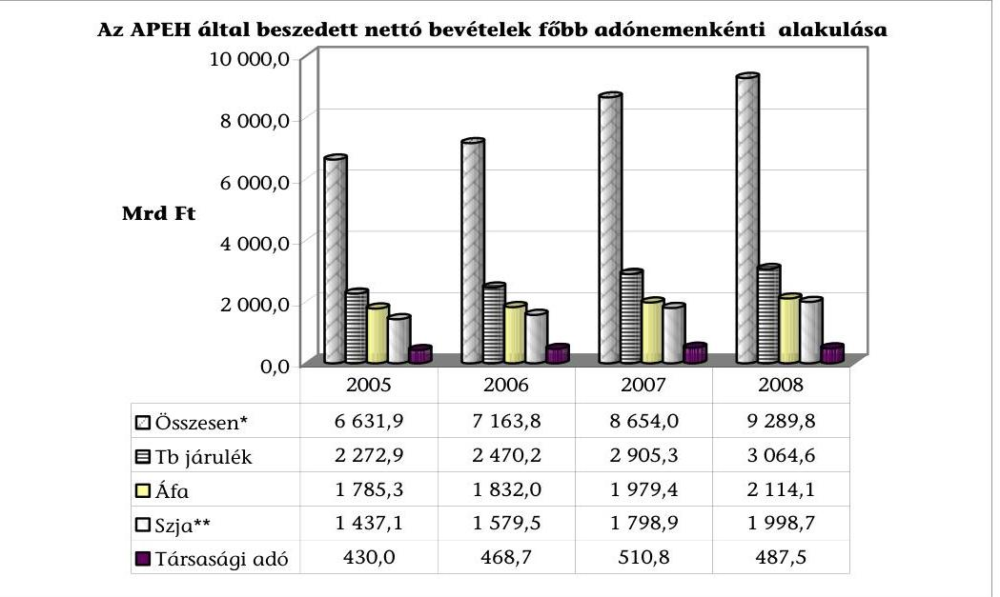

Forrás: 1. számú tanúsítvány
*A 2007-2008. évi adatok magukban foglalják az illetékeket és a magánnyugfij pénztári bevételeket is
** Az önkormányzatokat megillető szja részt is tartalmazza.

---

Az APEH által beszedett három legnagyobb összegű adó- és járulékbevétel közül az szja-bevételek növekedése a bérfejlesztéseken felül az adózási feltételeket, járulék mértékeket érintő jogszabályi változásokra vezethető vissza. 2006-ban folytatódott a kedvezmények érvényesíthetőségének szigorítása. Az adózás rendjét érintő módosítások, valamint számos adót érintő változás (pl. az adómértékek változása, kedvezmények csökkenése) hatására a bevétel 2006-ban közel 10\%-kal haladta meg a 2005. évit. 2007-ben az egyik legjelentősebb módosítás a személyi jövedelemadó mértékét érintette, valamint az összevont jövedelem részét képezi 2007. január 1-jétől a nyugdíj-jövedelem. 2006 szeptemberében (kamatjövedelem 20\%-os adója, a természetbeni juttatások), illetve 2007 januárjától (munkáltatónál adóköteles béren kívüli juttatások adómértékének 44\%-ról 54\%-ra emelése) bevezetett intézkedések hozzájárultak a költségvetés bevételeinek növekedéséhez.

Az általános forgalmi adó (továbbiakban: áfa) esetében a növekedési ütem előző évekhez viszonyított mérséklődését okozta egyrészt az adókulcsok 2006. évi változása (a $25 \%$-os adókulcs $20 \%$-ra való csökkentése és a $15 \%$-os adókulcs megszüntetése), másrészt, hogy 2007-ben az export tevékenység (2006. évi 15 959,3 Mrd Ft-ról 2007-ben 17 462,2 Mrd Ft-ra) és a beruházások miatt a vállalkozások áfa-visszaigénylései (2006. évi 498,6 Mrd Ft-tól 2007-ben $512,0 \mathrm{Mrd}$ Ft-ra) ${ }^{3}$ nőttek.

A társadalombiztosítási járulék bevételek növekedéséhez 2006-ban hozzájárult a fizetési kötelezettség felső határának, továbbá 2006. szeptember 1-jétől a biztosítottat érintő egészségbiztosítási járulék mértékének 4\%-ról 6\%-ra emelése, amelynek hatása a 2007. évi bevételekre is áthúzódott. A magánszemélyek egészségbiztosítási járulékának mértéke 2007. január 1-jétől további 1\%ponttal növekedett.

Az adóbevételek növekedéséhez - a felsoroltakon felül - hozzájárult az adóalanyok számának mintegy 5\%-os emelkedése is (2. számú diagram).

[^0]
[^0]:    ${ }^{3}$ Forrás: APEH Világa 2008.

---

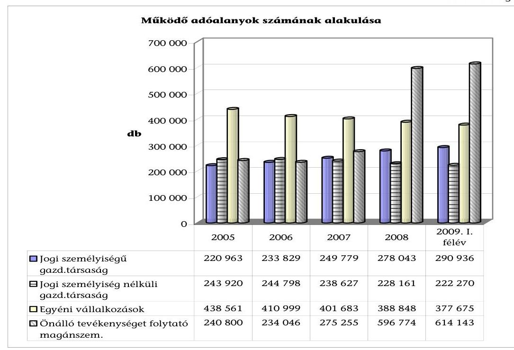

Forrás: 2. számú tanúsítvány
A személyi jövedelemadót (továbbiakban: szja) bevallók száma a vizsgált időszakban összesen 4,4\%-kal (a 2005. évi 4469121 fơről 2008. évre 4665730 före) növekedett. A múködő adóalanyok száma 28,3\%-kal (a 2005. évi 1144244 db-ról 2008. évre 1491826 db-ra) emelkedett. Ezen belül növekedés az önálló tevékenységet folytató magánszemélyek (147,8\%), valamint a jogi személyiségú gazdasági társaságok ( $25,8 \%$ ) számában következett be. Emelkedett a technikai ( $20,3 \%$ ), illetve véglegesen ( $23,1 \%$ ) megszűnt, továbbá a felszámolás, végelszámolás és csődeljárás alatt álló ( $40,1 \%$ ) adóalanyok aránya is, de számukat tekintve ezek a növekedések (51 379 adóalany) az adóalanyok összes számához viszonyítva nem érték el az 1\%-ot.

A vizsgált időszakban a Hivatal kiadásai 2005-ről 2008-ra közel 77\%-kal növekedtek. Az egyes évek adatai azonban egymással nem összehasonlíthatók, mivel mind a feladatai, mind a létszáma a vizsgált időszakban folyamatosan bővültek. Ezekkel összefüggésben módosította szervezeti felépítését: 2007-ben a szervezetébe integrálódtak az illetékhivatalok és a Szerencsejáték Felügyelet (továbbiakban: SZF), továbbá a megyei igazgatóságok összevonásával regionális szervezetet alakított ki. Létszáma 3673 fővel nőtt, ebből 1456 fő az integrációval került a Hivatalhoz. Bevételei 40\%-kal nőttek (2. számú táblázat), nem mutatható ki azonban, hogy a növekményhez milyen mértékben járultak hozzá az adómértékek változásai és milyen mértékben az APEH intézkedései.
2. számú táblázat

Az APEH kiadásainak alakulása 2005-2008 között

| Megnevezés | $\mathbf{2 0 0 5}$ | $\mathbf{2 0 0 6}$ | $\mathbf{2 0 0 7}$ | $\mathbf{2 0 0 8}$ |
| :-- | --: | --: | --: | --: |
| Elszámolt költségvetési kiadás   (Mrd Ft) | 68,2 | 84,6 | 106,5 | 120,7 |
| Költségvetési bevételek (Mrd Ft) | 6631,9 | 7163,8 | 8654,0 | 9289,8 |

Forrás: APEH Világa, 1. számú tanúsítvány

---

Az ellenőrzés célja annak értékelése volt, hogy az APEH

- hogyan alakította ki az ellenőrzési portfólióját, hasznosította-e az adatszolgáltatóktól kapott, illetve a belső adatokat, információkat, továbbá az egyes ellenőrzési típusok esetében milyen kockázati tényezőket vesz figyelembe az adóalanyok ellenőrzésre kiválasztása során;
- hátralékkezelésre kialakított eljárásrendje eredményes-e, a hátralékok nyilvántartási rendszerei, az alkalmazott informatikai rendszerei, valamint a beszedésre tett intézkedései hozzájárultak-e a hátralékállomány minél teljesebb körű beszedéséhez;
- humánerőforrás-elosztási gyakorlata segítette-e a feladatok eredményes ellátását;
- hasznosította-e a korábbi számvevőszéki ellenőrzések megállapításait, javaslatait.

Az ellenőrzés szempontrendszerét előtanulmánnyal alapoztuk meg. Az ellenőrzéshez a teljesítményellenőrzés módszerét alkalmaztuk, az értékelés alapját képező teljesítmény-kritériumokat az ellenőrzöttek bevonásával alakítottuk ki. A kritériumok alapján mutatószámokat képeztünk, amelyek értékeit a tanúsítványokban bekért adatok alapján határoztuk meg. A minőségi mutatók alakulásához kérdőíveket állítottuk össze, valamint a helyszíni ellenőrzés keretében további dokumentumokat kértünk be.

Ellenőrzésünk során figyelembe vettük az EU tagállamok számvevőszékei képviselőiből álló, nemzetközi pénzügyi csalások elleni küzdelem céljából kialakított ún. áfa-munkacsoport közös, illetve párhuzamos ellenőrzéseinek tapasztalatait és ajánlásait. Figyelmet fordítottunk arra, hogy a Hivatal hogyan veszi figyelembe kockázati tényezőként az ellenőrzések végrehajtását segítő és az EU által kialakított Hozzáadott érték-adó információ csere rendszerből (továbbiakban: VIES) nyerhető információkat és adatokat.

Az ÁSZ korábbi ellenőrzéseiben megfogalmazott javaslatokra a vizsgált szervezetek által tett intézkedéseket utóellenőrzések keretében vizsgáltuk. Az utóellenőrzések megállapításait az adott témakörök értékelése során fogalmaztuk meg.

A helyszíni ellenőrzésbe bevont szervezetek: Pénzügyminisztérium (továbbiakban: PM), az APEH központja, valamennyi regionális igazgatósága.

Az ellenőrzésre az Állami Számvevőszékről szóló 1989. évi XXXVIII. tv. 2. § (4) bekezdése alapján kerül sor.

A jelentést egyeztetésre megküldtük a pénzügyminiszternek. Válaszlevelét az 1. számú melléklet tartalmazza.

---

# I. ÖSSZEGZŐ MEGÁLLAPÍTÁSOK, KÖVETKEZTETÉSEK, JAVASLATOK 

Az APEH a középtávú stratégiáiban megfogalmazott célok figyelembevételével alakította ki az éves ellenőrzési irányelveket. Ezekben célként fogalmazta meg pl. az adóelkerülés elleni eredményesebb fellépést, a költségvetési bevételek minél teljesebb körű beszedését, a hatósági munka színvonalának emelését, az adókötelezettségek teljesítését elősegítő szolgáltatások fejlesztését. Az éves irányelvekben a Hivatal meghatározta az adóhatósági jelenlét főbb irányait, vagyis azokat az adózói köröket, amelyekre az adott évi ellenőrzései elsődlegesen irányulnak, valamint a kiemelten kezelendő kockázati szempontokat, amelyeket elemzésekkel, értékelésekkel megalapozott. Az éves irányelvekben megfogalmazott célkitűzések teljesülését a Hivatal nem mérte, illetve nem értékelte, hogy az egyes évek eredményei milyen mértékben járultak hozzá az ellenőrzési stratégiájában kitűzött célok megvalósításához.

A vizsgált időszakra vonatkozó középtávú stratégiáiban célként fogalmazta meg az adóalanyok jogkövető magatartásának, azaz az adórés alakulásának figyelemmel kisérését, miközben az arra ható tényezők nem mindegyike kapcsolódik adóhatósági feladatellátáshoz. Az adórés kialakulását alapvetően két fő tényező befolyásolja: az adóztató rendszer eredményessége és az adózási fegyelem. Az adómorál javulása a tényleges adóbevételek növekedését jelenti, anélkül, hogy megváltozna az adó mértéke. Ez a vizsgált időszakban folyamatosan változott, ezért az adóbevételek növekedéséből nem lehet következtetni az adómorál javulására. Így az ellenőrzések eredményességének mérésére kialakított mutatókból közvetlenül nem vezethető le, hogy van-e összefüggés az adóhatósági jelenlét és az adóalanyok jogkövető magatartásának változása között.

A Hivatal ellenőrzési portfóliója - amelyet az Art. előírásaival összhangban minden évben összeállít, és amely része az éves ellenőrzési irányelv dokumentumnak - az ellenőrzések tervezésének egyik eszköze. Ebben meghatározza az ellenőrzési típusok tervezett arányszámait a felhasználható revizori kapacitások arányában. A tervezésnek e módja esetében a humánerőforrás-kapacitás arányok nem vezethetők le a tervezési dokumentumokban (stratégiák, éves irányelvek) megfogalmazott célkitűzésekből és feladatokból, továbbá nem teszi lehetővé a kapacitások rugalmas felhasználását, mivel azok a szervezeti struktúra által alapvetően meghatározottak. A vizsgált években a főbb ellenőrzési típusok esetében viszonylag azonos szinten alakultak. Az ellenőrzési portfóliónak egy konzisztens tervezési rendszer egyik eszközekénti alkalmazását korlátozza azonban, hogy a Hivatalnak folyamatosan változó feltételek (pl. feladatbővítések, a létszám ellentétes irányú változtatásai) mellett kell megfelelnie a kormány elvárásainak.

---

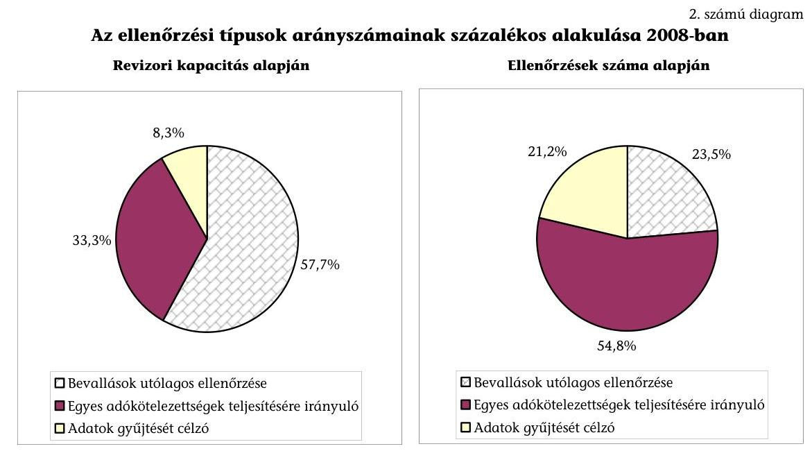

Forrás: 5. sz. tanúsítvány
Az ellenőrzési portfólió orientálja az ellenőrzési szakterületet az irányelvekben megfogalmazott célok megvalósítására, ugyanakkor nem alkalmas az ellenőrzési tevékenység utólagos értékelésére, mivel az APEH feladat-végrehajtásának nem célja, hanem eszköze a humánerőforrás-kapacitás felhasználása.

Az APEH a vizsgált évek mindegyikében több mint 5 millió adóalany adóbevallásait kezelte. Az ellenőrzésre kiválasztás alapvetően kockázatkezelésen alapult, azaz olyan adózói köröket és adózói magatartás típusokat határoztak meg, amelyek esetében magas az adóelkerülés kockázata. A vizsgált időszakban az összes ellenőrzésnek több mint háromnegyedét kockázatkezelés alapján rendelték el. Ez az arány 2005-ben 81\%, 2008-ban 76\% volt. Az aránycsökkenés oka a jogszabály által előírt kötelező ellenőrzések arányának növekedése.

Az APEH célszerűen alakította ki az adóalanyok ellenőrzésre kiválasztását segítő kockázatkezelési rendszerét. Központilag fogalmazza meg a különböző vizsgálati célokhoz kapcsolódó kockázati tényezőket, ezzel biztosítva a kockázatkezelési rendszerek egységes alkalmazását, amelyek együttesen több mint 200 darab - a vizsgált években folyamatosan bővülő - kockázati tényezőt foglalnak magukban. A regionális igazgatóságok a helyi sajátosságok figyelembe vételével határozzák meg a kockázati tényezők paramétereinek értékeit az egyes feladatokhoz, vizsgálati típusokhoz, témákhoz rendelve.

Mind az új kockázati tényezők meghatározásához, mind a meglévők aktualizálásához a Hivatal figyelembe vette a gazdasági környezet változásait, továbbá matematikai-statisztikai módszereket alkalmaz. Kockázati tényezők pl. bevallott járulék bérköltséghez viszonyított aránya, bevallási kötelezettség teljesítésének százalékos mértéke, befizetési fegyelemmel kapcsolatos mutatók, korábbi revíziók fajlagos feltárásai, külföldi értékesítés, illetve beszerzés részaránya és változása, csalásra hajlamos adózók érdekeltségi köreibe tartozó (kapcsolt) vállalkozások és magánszemélyek adatai. Korlátozott mértékben tudja felhasználni a VIES rendszerből, mint külső adatszolgáltatásból nyert adatokat magának a rendszernek a hiányosságai miatt.

---

A vizsgált időszakban szabályozott volt az ellenőrzésre kiválasztás eljárásrendje, folyamata és dokumentálása. Az ellenőrzések nyomon követésére kialakított informatikai rendszer regisztrálja a kiválasztási eljárás minden lépését, ezáltal adatokat biztosít a folyamat utólagos ellenőrzése számára. A vizsgált időszakban a Hivatal folyamatosan bővítette a kiválasztáshoz alkalmazott adatállományok körét, de a kiválasztás támogatásához több, egymástól elkülönítetten múködő informatikai rendszert alkalmazott, vagyis nem alakított ki egységes adatállományt annak érdekében, hogy egy adóalanyra vonatkozóan valamennyi információ egy adatállományban álljon rendelkezésre.

A Hivatal a teljesítményértékelési és ösztönzési rendszerében meghatározza azokat a mutatókat, amelyekkel az igazgatóságok, és ennek részeként az ellenőrzési szakterületeik teljesítményeit méri. E mutatók és a beszámoltatás rendszere ösztönöznek az éves irányelvekben megfogalmazott célok megvalósítására, de csak részben alkalmasak az irányelvekben megfogalmazott egyes célok megvalósulása mértékének mérésére. A Hivatal által az ellenőrzések eredményességének mérésére kialakított mutatók nem alkalmasak a szakterület egészének átfogó értékelésére. A mutatók többsége több ellenőrzési típus esetében is felhasználható, a Hivatal azonban nem határozta meg azokat a mutatókat, amelyek együttes értékelése lehetővé teszi az ellenőrzési irányelvekben kitűzött célok megvalósulása mértékének mérését. Lehetővé teszik az eredményesség alakulásának különböző szempontok szerinti értékelését, azonban arra a mutatók összetevőin kívül több egyéb tényező is hatással van. Ilyen tényezők pl. a kockázati szempontok és azok paramétereinek meghatározása, az adómértékek változásai, a revizorok száma és szakmai felkészültsége, az ellenőrzések egyes „altípusonkénti" eltérő időszükséglete és nem utolsó sorban a gazdasági-társadalmi-politikai környezet, amely befolyásolja az adóalanyok jogkövető magatartásának alakulását. A különböző tényezők egyidőben, de eltérő mértékben hatnak, és ezek a hatások nem választhatók szét, így külön-külön nem mérhetők.

A vizsgált időszakban a feldolgozórendszerek fejlesztésének eredményeként teljes körűvé vált a hátralékok nyilvántartása. Az elektronikus bevallás egyre szélesebb körű elterjedése, valamint a megyei bevallás feldolgozó rendszerekről a központi feldolgozó rendszerekre való fokozatos áttérés hatására csökkent a be-vallás-feldolgozás átlagos időigénye.

A Hivatal nem az Art. előírásait, illetve belső szabályzatait figyelembe véve tesz intézkedéseket a hátralékállomány teljes körének „haladéktalan" hátralékkezelésbe vonásáról ${ }^{4}$, hanem a humánerőforrás-kapacitása függvényében kockázati paraméterek alapján kiválasztja az állományból azokat a hátralék-tételeket, amelyekre megindítja a végrehajtási cselekményeket. A kialakított gyakorlatot azzal indokolja, hogy a folyószámlán nyilvántartott kötelezettségekre nem indítható végrehajtási eljárás felülvizsgálat nélkül, továbbá az Art. azt is meghatározza számára, hogy - amennyiben a végrehajtási eljárást megindítja - mi-

[^0]
[^0]:    ${ }^{4}$ Az APEH hátralékkezelésre kialakított eljárásrendjét az ÁSZ a korábbi ellenőrzése során már kifogásolta. A részletes megállapításokat és javaslatait A költségvetést megillető áfabevételek realizálásának ellenőrzéséről 2007 júliusában nyilvánosságra hozott ÁSZ jelentés (0717) tartalmazza.

---

lyen intézkedéseket milyen határidőre köteles megtenni, ehhez azonban nem elegendő a rendelkezésére álló humánerőforrás-kapacitás.

Az APEH folyamatosan méri a hátralékkezelésbe vont hátralékállomány alakulását, és csak közvetve figyeli a hátralékkezelésbe nem vont hátralékállomány összesen értékét. Nem követi nyomon ugyanakkor - mivel az informatikai rendszere sem jelzi -, hogy a hátralékkezelésbe nem vont hátralékok mennyi ideje állnak fenn. Ennek következménye, hogy ezen tételek esetében fokozottabban áll fenn az elévülés lehetősége, ami kedvezőtlenül hat az adófizetési fegyelemre.

A vizsgált időszakban a beszedett hátralékok teljes összege 42\%-kal nőtt, amelynek 97-98\%-át az azonnali beszedési megbízások kibocsátása, valamint a végrehajtási cselekmények megindítását követő önkéntes adózói befizetések tették ki. A hátralékállomány mind összegét, mind a változás tendenciáját tekintve azonban kedvezőtlenül alakult, 2005-ről 2008-ra 77\%-kal ( 746 Mrd Fttal), nettó 1710 Mrd Ft-ra nőtt. Ezen belül a nem múködő adóalanyok hátraléka 116\%-kal, a múködő adóalanyoké pedig 37\%-kal növekedett. A Hivatal évente növekvő összegben törölt hátralékokat: 2005-ben 65,9 Mrd Ft-ot, 2006ban 84,3 Mrd Ft-ot, 2007-ben 78,4 Mrd Ft-ot, 2008-ban 92,4 Mrd Ft-ot. A hátraléktörlések közel felét (2008-ban 46 Mrd Ft-ot) az elévülés miatti törlések tették $\mathrm{ki}^{3}$.
3. számú diagram

Nettó hátralékállomány alakulása
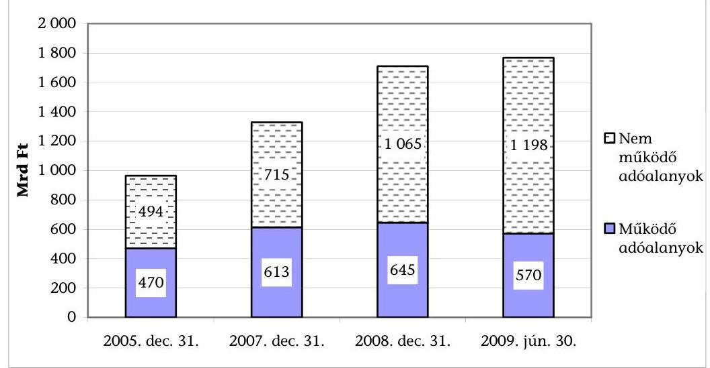

Forrás: 8. sz. tanúsítvány, APEH 2006. évi beszámolója
Megjegyzés: A 2006 évi hátralékra vonatkozó adatok nem tükrözik a valós hátralékállományt. A kimutatott hátralékállomány nem valós voltát az ÁSZ a 0724-es számú a Magyar Köztársaság 2006. évi költségvetése végrehajtásának ellenőrzéséről szóló (2007. augusztusi) jelentése is megállapította.

A szakterületi irányelv minden évben kiemelt feladatként határozta meg a kisösszegú hátralékok - célszerűen fizetési felszólítással történő - kezelését. A Hi-

[^0]
[^0]:    ${ }^{3}$ A törlések jogcímek szerinti megoszlását a 2.3.2 pont részletezi.

---

vatal érdekeltségi rendszere a végrehajtási szakterület számára hátralék megtérülési mutatót (a hátralékállományból az adott évben behajtandó hátralék öszszege) határoz meg, amely a nagy összegű hátralékok hátralékkezelésbe vonását ösztönözi. A végrehajtási cselekmények megkezdésére tett intézkedések elmaradása ezért főként a kisösszegű hátralékok esetében állt fenn.

A hátralékok fennállási idejének hosszabbodásával egyre magasabb a hátralékkezelésbe nem vont hátralékok aránya: a 2008. december 31-i állapot szerint a 4,2 millió működő adózói hátralék-tételből 3,1 millió ( $73,8 \%$ ) tételt, ezen belül a működő adózói körben a 60 napnál régebben fennálló hátralék-tételek közel kétharmadát, a 360 napnál régebbiek 69\%-át a Hivatal nem vonta hátralékkezelésbe. A 60 napnál hosszabb ideje fennálló hátralék-tételek több mint 2/3-nál a hátralék fennállását a hátralékkezelésbe vonás elmaradása okozta.
4. számú diagram

Hátralékos tételek száma a hátralékok fennállási ideje szerint
(2008. december 31.)
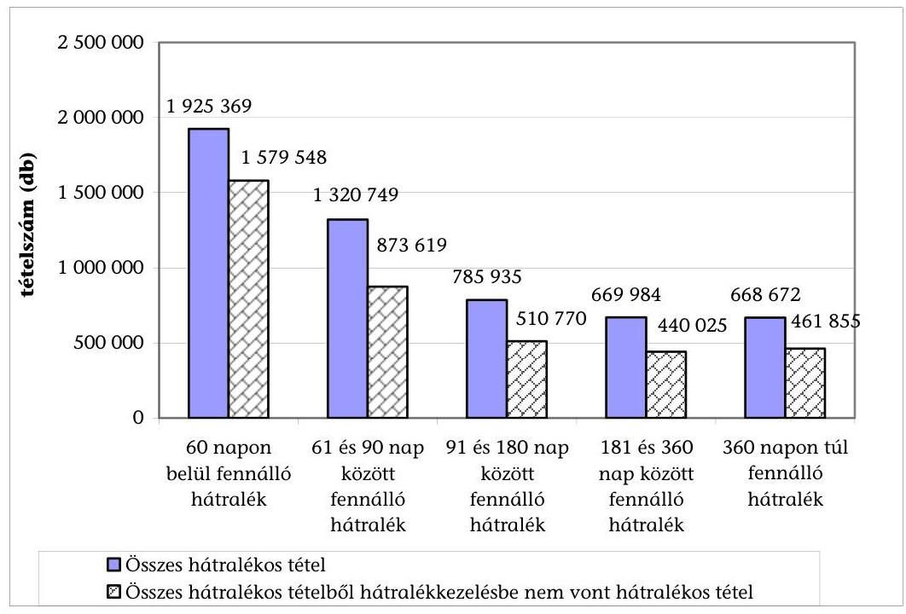

Forrás: 11. számú tanúsítvány
A hátralékkezelésbe nem vont hátralékállomány értékelése pozitívabb képet mutat, ha az értékelés alapjául nem a hátralékos tételek számát, hanem a hátralékok összegét vesszük. 2008. december 31.-i állapot szerint a 645 Mrd Ft múködő adózói hátralékösszegből 292 Mrd Ft-ot (45,3\%) nem vont az APEH hátralékkezelésbe. Ezen belül a működő adózói körben a 60 napnál régebben fennálló hátralékösszegek 36,5\%-át, a 360 napnál régebbiek 53,4\%-át a Hivatal nem vonta hátralékkezelésbe.

A kormánynak az APEH közép-, illetve hosszabb távú (2002-2008 közötti) múködésével kapcsolatos elvárásai, valamint a Hivatal feladat-végrehajtása feltételeinek meghatározására tett intézkedései nem voltak konzisztensek. Míg

---

2003-ban az elvárás a feladat-végrehajtás hatékonyságának növelése volt, amelynek céljából ${ }^{6}$ mintegy 1300 fős létszámcsökkentést rendeltek el, ugyanakkor 2006-ban a többletfeladatok eredményesebb ellátását fogalmazták meg, amelyhez 2217 (1717+500) fő felvételét engedélyezték. Ezen felül az integrációval további 1456 fő került át a Hivatalhoz. A vizsgált időszakra vonatkozó elvárás megfogalmazására, illetve az ehhez kapcsolódó jogszabályok módosításának előkészítésére 2004-2005. években került sor, abban az időszakban, amikor az ezen időszakot megelőző kormányzati döntés szerinti létszámleépítést hajtotta végre a Hivatal. A 2003-ban és 2004-ben elrendelt létszámcsökkentések eredményeként elért megtakarítások ezekben az években fedezték a leépítések költségeit.
5. számú diagram

Az APEH engedélyezett zárólétszámának alakulása 2000-2008 között
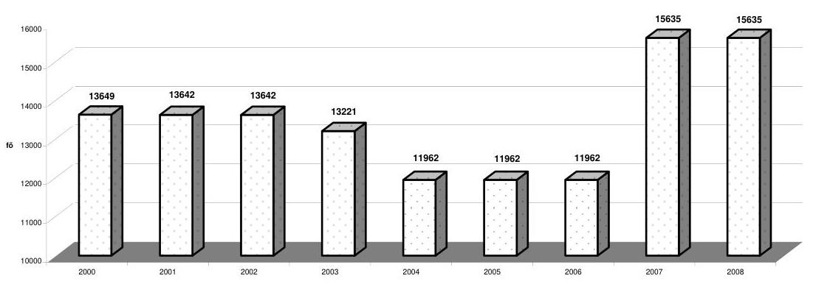

Az illetékhivatalok és a Szerencsejáték Felügyelet 2007. évben az APEH szervezetébe integrálódtak, és ezzel egyidőben alakította ki a Hivatal a regionális szervezeti struktúrát. A szervezeti átalakításokat előkészítette és az átszervezések során felmerült főbb problémákat (pl. változó illetékességű terület miatt kialakult létszámhiány, területi széttagoltság, illetékügyekben eltérő eljárási gyakorlat, informatikai támogatottság hiánya) megoldotta.

A Hivatal megkezdte az egyes szakterületeken a feladatellátáshoz szükséges humánerőforrás-kapacitás rendszeres és azonos mutatószámokon alapuló tervezése, elemzése módszerének kidolgozását ${ }^{7}$, amelyet azonban a helyszíni ellenőrzés lezárásáig nem fejezett be. A módszertan-tervezetben meghatározott mutatószámok alapján végzett elemzésekről dokumentumokat nem tudott az ÁSZ ellenőrzés számára átadni. A 2007. évi létszámfejlesztések közül az 1717 fős létszámbővítést megelőzően készített hatástanulmányokat, elemzéseket

[^0]
[^0]:    ${ }^{6}$ A területet az ÁSZ már korábban vizsgálta. A részletes megállapításokat a Pénzügyminisztérium fejezet múködésének ellenőrzéséről 2008 márciusában nyilvánosságra hozott ÁSZ jelentés (0801) tartalmazza.
    ${ }^{7}$ Az ÁSZ a korábbi ellenőrzése során javaslatot tett a humánerőforrás tervezése módszerének kidolgozására. A részletes megállapításokat az Adó- és Pénzügyi Ellenőrzési Hivatalmúködésének ellenőrzéséről 2006 júniusában nyilvánosságra hozott ÁSZ jelentés (0616) tartalmazza.

---

(becslésen alapuló számvetéseket), azonban nem ezen mutatószámok alkalmazásával.

Az átszervezések, illetve létszámfejlesztések végrehajtását követően a PM nem követelte meg, az APEH pedig nem készített elemzést, értékelést azok megvalósításának célszerűségéről, az elvárt hatások, eredmények teljesüléséről.

A helyszíni ellenőrzés megállapításainak hasznosítása mellett javasoljuk:

# a pénzügyminiszternek 

1. Alakíttassa ki az adórés mérésének módszerét, hogy értékelhető legyen az adóalanyok jogkövető magatartásának javítása érdekében hozott intézkedések hatása.
2. Írja elő az Adó- és Pénzügyi Ellenőrzési Hivatal elnöke számára, hogy
a) vizsgálja felül és módosítsa a Hivatal ellenőrzési stratégiájának a fekete- és szürkegazdaság mérésére vonatkozó célkitűzéseit;
b) intézkedjen olyan mutatószámok kidolgozásáról, amelyek alkalmasak egyrészt az éves ellenőrzési irányelvekben meghatározott célkitűzések megvalósulásának, másrészt valamennyi ellenőrzési típus eredményességének mérésére, továbbá gondoskodjon arról, hogy azok összhangban legyenek a teljesítményértékelési és ösztönzési rendszerében már meglévő mutatókkal;
c) tegyen eleget az APEH működésének ellenőrzéséről készült (0616) ÁSZ jelentésre kidolgozott intézkedési tervnek: véglegeztesse a humánerőforrás-kapacitás rendszeres és azonos mutatószámokon alapuló tervezésének módszerét, továbbá készíttessen ilyen elemzéseket;
d) vizsgáltassa felül a hátralékkezelés eljárásrendjét, továbbá alakíttasson ki olyan informatikai rendszert, amely támogatja a hátralékok teljes körének hátralékkezelésbe vonását.

---

# II. RÉSZLETES MEGÁLLAPÍTÁSOK 

## 1. Az APEH ElLENŐRZÉSI TEVÉKENYSÉGE

### 1.1. Az ellenőrzések tervezési rendszere

Az APEH az Art. 90. §-a előírásainak eleget téve évente meghatározta ellenőrzési irányelvét, amelyeket a stratégiáiban megfogalmazott célok figyelembevételével alakított ki. A 2003-2007. évekre és a 2008-2012. évekre vonatkozó középtávú stratégiáiban célként fogalmazta meg pl. az adóelkerülés elleni eredményesebb fellépést, a költségvetési bevételek minél teljesebb körű beszedését, a hatósági munka színvonalának emelését, az adókötelezettségek teljesítését elősegítő szolgáltatások fejlesztését.

Az éves irányelvekben a Hivatal meghatározta az adóhatósági jelenlét főbb irányait, vagyis azokat az adózói köröket, amelyekre az adott évi ellenőrzései elsődlegesen irányulnak (pl. tartósan veszteséges adózók, szállítmányozó cégek, építőipari vállalkozások, számítástechnikai eszközöket és alkatrészeket forgalmazók, áfa kötelezettségüket minimalizálók), valamint a kiemelten kezelendő kockázati szempontokat (pl. kapcsolt vállalkozások közötti áralkalmazás és költségelszámolás, körbeszámlázásos ügyletek, ingatlan tranzakciók). Az adózói körök ellenőrzésre kijelölését a korábbi ellenőrzések tapasztalataival, adatgyűjtésekkel, a külső adatszolgáltatások adatainak felhasználásával, tevékenységbontású statisztikákkal (pl. jövedelmezőségről, illetve kockázati szempontok alakulásáról) alapozta meg.

Mintegy 100 lánccsaló adatait elemezte az irányelvek megalapozásához annak érdekében, hogy az országhatáron belüli és azon túl nyúló körbeszámlázásos ügyletek, értékesítési láncolatok kockázati tényezőit meghatározzák.

## Az éves irányelvekben megfogalmazott célkitűzések teljesülését a Hivatal nem mérte, illetve nem értékelte, hogy az egyes évek eredményei milyen mértékben járultak hozzá az ellenőrzési stratégiájában kitűzött célok megvalósításához.

A Hivatal a vizsgált időszakban kidolgozta „az APEH stratégiájának végrehajtását segítő szervezési dokumentumot", amely alapján 2009-től a stratégiájában, illetve irányelveiben kitűzött célok megvalósulását tervezi mérni. Ilyen célkitűzések pl. adómorál javítása, adóelkerülő magatartások gyors feltárása, következetes szankcionálás, feketegazdaság fehérítése, az adóbevételi szempontból kiemelt kockázatot jelentő gazdasági folyamatok és magatartási formák vizsgálata. A stratégiai kérdésekkel foglalkozó Projekt Tanács 2009 áprilisában elfogadta ezt az ún. „transzformációs tervet".

A vizsgált időszakra vonatkozó középtávú stratégiáiban célként fogalmazta meg az adóalanyok jogkövető magatartásának, azaz az adórés alakulásának figyelemmel kisérését, miközben az arra ható tényezők nem mindegyike kapcsolódik adóhatósági feladatellátáshoz. Az adórés kialakulását alapvetően két fő tényező befolyásolja: az adóztató

---

rendszer eredményessége és az adózási fegyelem. Az adómorál javulása a tényleges adóbevételek növekedését jelenti, anélkül, hogy megváltozna az adó mértéke. Ez a vizsgált időszakban folyamatosan változott, vagyis az adóbevételek növekedéséből nem lehet következtetni az adómorál javulására. Az ellenőrzések eredményességének mérésére kialakított mutatókból közvetlenül nem vezethető le, hogy van-e összefüggés az adóhatósági jelenlét és az adóalanyok jogkövető magatartásának változása között.

Az APEH 2003-2007. évekre vonatkozó ellenőrzési és végrehajtási stratégiájában megfogalmazta, hogy alapfeladata az elméleti és a tényleges adóbevétel közötti különbség, az un. adórés csökkentése. Ennek megvalósításához szükséges feladatokat is meghatározta. Ezt azonban az adott időszakban nem valósította meg, így a 2008-2012. évekre vonatkozó stratégiájában is megfogalmazásra került, mint becslési módszer kidolgozása a fekete- és szürkegazdaság mérésére.

A Hivatal ellenőrzési portfóliója - amelyet az Art. előírásaival összhangban minden évben összeállít, és amely része az éves ellenőrzési irányelv dokumentumnak - az ellenőrzések tervezésének egyik eszköze. Ebben meghatározza az ellenőrzési típusok tervezett arányszámait a felhasználható revizori kapacitások arányában. A tervezésnek e módja esetében a humánerőforráskapacitás arányok nem vezethetők le a tervezési dokumentumokban (stratégiák, éves irányelvek) megfogalmazott célkitűzésekből és feladatokból, továbbá nem teszi lehetővé a kapacitások rugalmas felhasználását, mivel azok a szervezeti struktúra által alapvetően meghatározottak. A vizsgált években a főbb ellenőrzési típusok esetében viszonylag azonos szinten alakultak. Az ellenőrzési portfóliónak egy konzisztens tervezési rendszer egyik eszközekénti alkalmazását korlátozza azonban, hogy a Hivatalnak folyamatosan változó feltételek (pl. feladatbővítések, a létszám ellentétes irányú változtatásai) mellett kell megfelelnie a kormány elvárásainak. Az ellenőrzési portfólió orientálja az ellenőrzési szakterületet az irányelvekben megfogalmazott célok megvalósítására, ugyanakkor nem alkalmas az ellenőrzési tevékenység utólagos értékelésére, mivel az APEH feladatvégrehajtásának nem célja, hanem eszköze a humánerőforrás-kapacitás felhasználása.

Az APEH tájékoztatása szerint az ellenőrzési irányelvben meghatározott ellenőrzési portfólió több tényezős folyamat együttes értékelésének eredményeképpen alakult ki. Egyrészt a jogszabályváltozásból fakadó feladatok, a pénzügyminisztériumi, kormányzati elvárások, külső ellenőrző szervek korábbi megállapításai, aktuális gazdasági folyamatok, jelenségek, másrészt a saját ellenőrzés-előkészítő munkájuk értékelése alapján történik az ellenőrzések irányvonalának kijelölése. Minden évben megállapítja az adózók adóteljesítmény mutatóját, meghatározza az elévülési időn belül legnagyobb bruttó költségvetési kapcsolattal rendelkező, rendszeresen vizsgálandó 3000-es adózói kört.

A tervezési mód következménye, hogy a vizsgált években egyrészt a portfólióban meghatározott kapacitásarányok a főbb ellenőrzési típusok esetében viszonylag azonos szinten alakultak, másrészt az elvégzett ellenőrzések számának alakulásában nem tükröződnek a kapacitás-elosztás szerinti prioritások. A Hivatal az ellenőri kapacitások tervezésekor a bevallások utólagos ellenőrzésére helyezte a hangsúlyt (2006ban $62,4 \%, 2007$-ben $66,4 \%, 2008$-ban $61,9 \%$ ), ami az ellenőrzések számát figyelembe véve nem érte el az ellenőrzések egyharmadát (2006-ban 29,0\%,

---

2007-ben 27,5\%, 2008-ban 23,5\%), miközben ezen ellenőrzések eredményeznek a költségvetés számára többlet adóbevételt. Az ellenőrzések számát tekintve - a bevallások utólagos ellenőrzésére fordított revizori nap az ellenőrzés jellegéből adódóan többszöröse az egyéb ellenőrzésekre fordított időszükségletnek - az egyes adókötelezettségek teljesítésére irányuló ellenőrzésekből végezték az igazgatóságok a legtöbbet (2006-ban 52\%, 2007-ben 47,4\%, 2008-ban 54,8\%), amelyek a kiszabott mulasztási bírság erejéig jelentenek költségvetési bevételt (3. számú táblázat).

Pl. 1 kiemelt adózó vizsgálatára átlagosan 20, egy-egy adónem ellenőrzésre 5-7, kiutalás előtti ellenőrzésre 2-3, az adatgyűjtésre 1, az egyes adókötelezettségek teljesítésének ellenőrzésekor pedig 1,5-2 revizori napot fordítottak az igazgatóságok.
3. számú táblázat

Az ellenőrzési típusok arányszámainak százalékos alakulása

| Megnevezés | 2006 |  |  | 2007 |  |  | 2008 |  |  |
| :--: | :--: | :--: | :--: | :--: | :--: | :--: | :--: | :--: | :--: |
|  | Revizori kapacitás |  | Ellenőrzések száma alapján | Revizori kapacitás |  | Ellenőrzések száma alapján | Revizori kapacitás |  | Ellenőrzések száma alapján |
|  | Terv | Tény |  | Terv | Tény |  | Terv | Tény |  |
| Utólagos | $62,4 \%$ | $61,5 \%$ | 29,0\% | $66,4 \%$ | $65,1 \%$ | 27,5\% | $61,9 \%$ | $57,9 \%$ | 23,5\% |
| Elóból:   legnagyobb adóteljesítményűek vagyongyarapodási bevallás kiegészítése alapján elrendelt átalakuló, megszűnő válalkozások kiutalás előtti | $\begin{aligned} & 15,0 \% \\ & 1,5 \% \\ & 0,1 \% \end{aligned}$ | $\begin{aligned} & 14,4 \% \\ & 2,4 \% \\ & 0,40 \% \end{aligned}$ | $\begin{aligned} & 2,5 \% \\ & 1,1 \% \\ & 0,30 \% \end{aligned}$ | $\begin{aligned} & 9,6 \% \\ & 22,6 \% \\ & 0,1 \% \end{aligned}$ | $\begin{aligned} & 13,2 \% \\ & 28,3 \% \\ & 0,1 \% \end{aligned}$ | $\begin{aligned} & 3,4 \% \\ & 16,5 \% \\ & 0,1 \% \end{aligned}$ | $\begin{aligned} & 10,0 \% \\ & 10,7 \% \\ & 0,1 \% \end{aligned}$ | $\begin{aligned} & 12,7 \% \\ & 17,7 \% \\ & 0,0 \% \end{aligned}$ | $\begin{aligned} & 2,7 \% \\ & 8,3 \% \\ & 0,0 \% \end{aligned}$ |
|  |  |  |  |  |  |  |  |  |  |
|  |  |  |  |  |  |  |  |  |  |
| Állami garancia beváltásához kapcsolódó | $0,1 \%$ | $0,1 \%$ | $0,0 \%$ | $0,1 \%$ | $0,1 \%$ | $0,0 \%$ | $0,1 \%$ | $0,1 \%$ | $0,0 \%$ |
| Egyes adókötelezettségek teljesitésére irányuló | $27,0 \%$ | $29,8 \%$ | $52,0 \%$ | $25,2 \%$ | $25,7 \%$ | $47,4 \%$ | $29,4 \%$ | $33,3 \%$ | $54,8 \%$ |
| Adatok gyüjtését célzó | $10,0 \%$ | $8,2 \%$ | $18,8 \%$ | $8,0 \%$ | $8,8 \%$ | $24,9 \%$ | $8,4 \%$ | $8,3 \%$ | $21,2 \%$ |
| Lezárt időszakra vonatkozó ismételt | $0,5 \%$ | $0,2 \%$ | $0,1 \%$ | $0,3 \%$ | $0,2 \%$ | $0,1 \%$ | $0,2 \%$ | $0,2 \%$ | $0,1 \%$ |
| Egyéb Art.-on kivált ellenőrzések | -- | $0,1 \%$ | $0,1 \%$ | -- | $0,1 \%$ | $0,1 \%$ | -- | $0,2 \%$ | $0,4 \%$ |

Forrás: ellenőrzési irányelvek és 5. sz. tanúsítvány

2008-ban növekvő hangsúlyt kaptak a lezárt időszakot nem eredményező (egyes adókötelezettségek teljesítésére irányuló, adatok gyűjtését célzó) ellenőrzések, amelyek az utólagos ellenőrzések megalapozását segítik.

Pl. Az utólagos ellenőrzések elrendelését megelőzi egyes adókötelezettségek teljesítésére irányuló ellenőrzés, amely alapján döntenek arról, hogy az adott adóalanynál indokolt-e utólagos ellenőrzés elrendelése.

Az „egyes adókötelezettségek teljesítésére irányuló", továbbá az „adatok gyűjtését célzó" ellenőrzések célja az utólagos ellenőrzésekre fordított kapacitás hatékonyabbá és eredményesebbé tétele.

Az utólagos ellenőrzések száma 2005-2007. években folyamatosan, mintegy a felére csökkent, 2008-ban 2007. évhez viszonyítva pedig 10\%-kal nőtt (6. szá-

---

mú diagram), az összes ellenőrzések számához viszonyított részaránya a vizsgált években folyamatosan csökkent (3. számú táblázat).
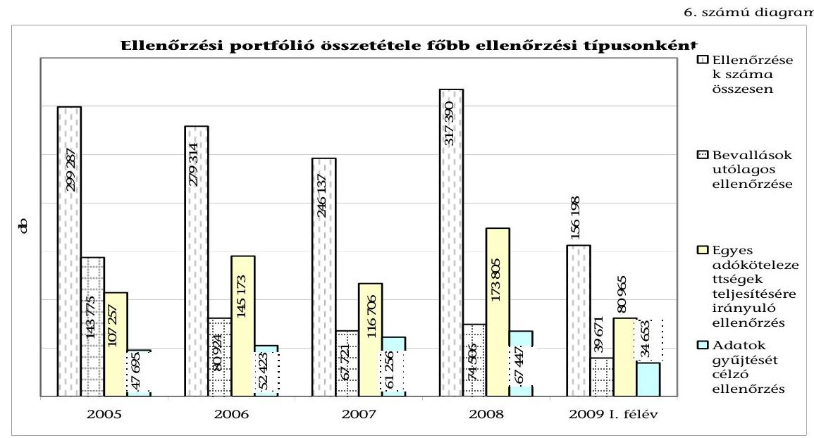

Forrás: 3. számú tanúsítvány
Az utólagos ellenőrzésekre a Hivatal az ellenőri kapacitás 57,9-65,1\%-át fordította (3. számú táblázat). Ezen belül az egyes években más-más ellenőrzési típusra fordítottak nagyobb revizori kapacitást: 2006-ban az átalakuló, megszűnő vállalkozás ellenőrzésére, 2007-ben a vagyongyarapodási vizsgálatokra, 2008-ban pedig az előző két év kiemelt ellenőrzési típusai közel azonos nagyságrendet képviseltek (5. számú tanúsítvány).

Az egyes adókötelezettségek teljesítésére irányuló ellenőrzésekre az ellenőrzési kapacitás 25,7-33,3\%-át fordították. A 2008. évi aránynövekedést az újonnan alakult vállalkozások preventív vizsgálatának, az egészségügyi szolgáltatásra jogosultság és a minimum adóalapot bevallók célvizsgálatának kiemelt feladatként történt végrehajtása eredményezte.

# 1.2. Kockázatkezelés és ellenőrzésre kiválasztás rendszere 

Az APEH a vizsgált évek mindegyikében több mint 5 millió adóalany (2. számú tanúsítvány) adóbevallásait kezelte. Az adóalanyok közül a humánerőforráskapacitása függvényében választ ki ellenőrzésre. A kiválasztás alapvetően kockázatkezelésen alapul, azaz olyan adózói köröket és adózói magatartás típusokat határoznak meg - figyelembe véve a stratégiájában, illetve éves ellenőrzési irányelveiben megfogalmazott célokat is -, amelyek esetében magas az adóelkerülés kockázata.

A vizsgált időszakban az összes ellenőrzésnek több mint háromnegyedét kockázatkezelés alapján rendelték el. Ez az arány 2005-ben 81\%, 2008-ban 76\% volt. Az aránycsökkenés oka a jogszabály által előírt kötelező ellenőrzések arányának növekedése.

Az összes ellenőrzésen belül a bevallások utólagos ellenőrzésének több mint 90\%át kockázatkezelés alapján választották ki, ezen belül a kiutalás előtti ellenőrzé-

---

sek 95-99\%-át, a vagyonosodási vizsgálat 85-97\%-át kockázatkezelés alapján rendelik el az igazgatóságok (4. számú tanúsítvány).

Nem kockázatkezelés alapján történnek az Art.-ban meghatározott kötelezően elvégzendő, valamint a véletlenszerűen kijelölt adóalanyok ellenőrzései. Ilyen kötelező ellenőrzések pl. felszámolás, végelszámolás, nyomozó hatóságok megkeresése, az ÁSZ elnökének felhívása, az adópolitikáért felelős miniszter utasítása.

# Az APEH a vizsgált időszakban folyamatosan fejlesztette az adó- 

alanyok ellenőrzésre kiválasztásához alkalmazott kockázatkezelési rendszereit, bővítette a kockázati tényezők körét. Meghatározásukhoz, elemzésükhöz, illetve aktualizálásukhoz matematikai-statisztikai módszereket alkalmazott, amelyhez figyelembe vette a gazdasági környezet változásait. Az új típusú csalások - mint pl. az országhatáron belüli és azon túl nyúló körbeszámlázásos ügyletek, értékesítési láncolatok - felderítése érdekében kockázati tényezőket alakított ki, amelyekhez figyelembe vette a nemzetközi tapasztalatokat és a közösségi kereskedelmi forgalom ellenőrzésével kapcsolatos jelentéseket. A rendszerek folyamatos fejlesztésével segítette a célirányos ellenőrzésre kiválasztást.

A törzsjellegű információk körét 2007-ben az adószám felfüggesztésre vonatkozó információkkal, 2008-ban a csoportos áfa adóalanyiságra, az őstermelői minősítésre, továbbá a külföldi tulajdonosra, ügyvezetőre vonatkozó adatokkal bővítette ki. 2008-tól a bevallás alapján képzett mutatók kiegészültek az összesítő nyilatkozatban és az áfa bevallásban vallott közösségi termékértékesítések közötti eltérés arányával, valamint az operatív és egyéb ellenőrzések adataival (pl. operatív ellenőrzések, megállapítással zárult ellenőrzések, nyugta- és számlaadási kötelezettség elmulasztása miatti megállapítások, összes zárással vagy felfüggesztéssel végződő ellenőrzések, adóvizsgálatok száma).

Matematikai-statisztikai módszer alkalmazásával kialakított kockázati tényezők pl. az alvállalkozói teljesítmény részaránya, egyéb ráfordítás aránya, pénzeszközök aránya, bevallott járulék bérköltséghez viszonyított aránya, bevallási kötelezettség teljesítésének százalékos mértéke, befizetési fegyelemmel kapcsolatos mutatók, korábbi revíziók fajlagos feltárása.

Gazdasági környezet változásait figyelemmel kísérő kockázati tényezők pl. külföldi értékesítés, illetve beszerzés részaránya és változása, csalásra hajló adózók érdekeltségi köreibe tartozó vállalkozások és magánszemélyek adatai.

A kapcsolt vállalkozások ellenőrzésének célja annak megakadályozása, hogy a vállalkozások transzferárak alkalmazásával kikerüljék vagy csökkentsék adófizetési kötelezettségüket. A kiválasztási rendszer segíti a kapcsolt vállalkozások feltérképezését és az ellenőrzésre való kiválasztást.

Az igazgatóságok tapasztalatai alapján jellemző, hogy az egymás közötti ügyletek során a független partnerekhez képest eltérő árakat alkalmaznak, a megállapítások a ki nem számlázott szolgáltatások díjaira és azok adóvonzatára, illetve a kapcsolt vállalkozási jogviszony bejelentésének elmulasztására vonatkoznak. Jellemző megállapítások:

- a kapcsolt társaságok nem minden esetben számlázzák tovább azokat a tételeket, melyeket más független felek esetében kivétel nélkül megtennének;
- az egymásnak nyújtott kamatmentes kölcsön miatti adóalap korrekciós kötelezettség elmarad;

---

- azonos magánszemélyek tulajdonában lévő egyik társaság EVA alanyként a másik társaságnak úgymond „fiktív" tevékenységet számláz, ily módon lehetővé téve az adózási alóli jövedelem-kivételt.

Az adókülönbözetek összege a bekért legnagyobb 5-5 igazgatóságonkénti megállapítások esetében pl. a Közép-magyarországi Regionális Igazgatóságnál 2007ben 13,6 M Ft és 50,0 M Ft, 2008-ban 17,9 M Ft és 186,3 M Ft, a Közép-dunántúli Regionális Igazgatóságnál 2007-ben 10,9 M Ft és 18,4 M Ft, 2008-ban 1,3 M Ft és 48,7 M Ft közötti alakult. A mintaként kiválasztott esetek alapján megállapítható, hogy az ebben a körben végzett ellenőrzések után kiszabott adókülönbözeteket az adóalanyok megfizetik: a Közép-dunántúli Regionális Igazgatóság kimutatásai szerint a mintaként kiválasztott határozatokból 2007-ben a teljes, 2008-ban a folyamatban lévő bírósági eljárás kivételével a teljes összeg befolyt.

# A vizsgált időszakban szabályozott volt az ellenőrzésre kiválasztás eljárásrendje, folyamata és dokumentálása. Az ellenőrzések nyomon követésére kialakított informatikai rendszer regisztrálja a kiválasztási eljárás minden lépését, ezáltal adatokat biztosít a folyamat utólagos ellenőrzése számára. A vizsgált időszakban folyamatosan bővítette a kiválasztáshoz alkalmazott adatállományok körét, de a kiválasztás támogatásához több, egymástól elkülönítetten múködő informatikai rendszert alkalmaz, vagyis nem alakított ki egységes adatállományt annak érdekében, hogy egy adóalanyra vonatkozóan valamennyi információ egy adatállományban álljon rendelkezésre. 

Előírta egyrészt, hogy az adóteljesítmények alapján kialakított adózói kategóriánként milyen arányban kell ellenőrzésre kiválasztani annak érdekében, hogy az adóteljesítménytől függetlenül valamennyi kategóriából válasszanak ki ellenőrzésre, másrészt meghatározta a kiválasztási folyamatban szereplők felelősségi és döntési körét.

A kiválasztás során a következő adatforrásokat használja fel: az adózó által benyújtott bevallások, az adatszolgáltatások, az adózó adófizetéseit és a részére teljesített kiutalásokat tartalmazó nyilvántartások, az adózónál korábban végzett ellenőrzések tapasztalatai, vagy más hatóságtól, más adózóktól szerzett adatok.

A helyszíni vizsgálat ideje alatt folyamatban volt egy egységes un. adattárház kialakítása, amely alapul szolgál a 2010 végére bevezetni tervezett új kiválasztási rendhez. Ebben célkitúzésként megfogalmazták az egy adóalanyra vonatkozó valamennyi információ egy adatállományból történő elérhetőségének szükségességét. Az adattárház kialakításával a szolgáltatott adatok teljes körű hasznosítását tervezi a kockázati paraméterek meghatározása, a kiválasztás támogatása, valamint az ellenőrzések eredményesebbé tétele érdekében.

Az APEH a kockázatkezelés rendszerét célszerűen alakította ki. Központilag fogalmazza meg a különböző vizsgálati célokhoz kapcsolódóan figyelembe venni javasolt kockázati tényezőket, ezzel biztosítva a kockázatkezelési rendszerek egységes alkalmazását, amelyek együttesen több mint 200 - a vizsgált években folyamatosan bővülő - kockázati tényezőt foglalnak magukban. A regionális igazgatóságok a helyi sajátosságok figyelembevételével határozzák meg a kockázati tényezők paramétereinek értékeit az egyes feladatokhoz, vizsgálati típusokhoz, témákhoz rendelve. A paraméterek értékét jellegűknek megfelelő időközönként aktualizálják felhasználva az adóbevallások és a korábbi ellenőrzések adatait. A paraméterek egy része kötelezően alkalmazandó, másik része vá-

---

lasztható, illetve állítható. A Hivatal elsősorban a kiutalás előtti ellenőrzésekre való kiválasztáshoz alkalmaz kötelező paramétereket.

A központilag javasolt kockázati tényezőket elsősorban az adóalanyok költségvetési kapcsolatai alapján csoportosítják. Kockázati csoportok: törzsjellegű adatok, adózó kapcsolatai, kapcsolt vállalkozások száma, adóteljesítmény mutatók, be-vallás-kötelezettségi mutatók.

Aktualizálások rendszeressége pl. adóteljesítmények értéke évente négyszer, az el nem évült időszakon belüli illetékesség váltások száma félévente, kiemelt adózói körbe sorolás évente.

Kiutalás előtti ellenőrzés esetében kötelezően alkalmazandó (informatikailag beépített) paraméter pl. köztartozással rendelkező adóalanynak adó-visszatérítés nem teljesíthető.

# Az APEH a külső adatszolgáltatóktól elektronikus úton kapott adatoknak nem teljes, de növekvő hányadát használja fel kockázati tényezőként az ellenőrzésre kiválasztáshoz. Ennek oka részben, hogy a kockázati tényezők kialakításakor figyelembe kell venni az adatvédelmi törvény ${ }^{8}$ korlátozásait. A kockázatkezeléshez nem hasznosítottakat kontroll-adatként veszi figyelembe az ellenőrzései végrehajtása során. 

A külső adatszolgáltatók által átadott adatállomány adataiból nem hasznosítják pl. a befektetési szolgáltatások adatszolgáltatásait, az adókedvezményre jogosító igazolásokat. Ezeket az adatokat a regionális igazgatóságok az ellenőrzések lefolytatása során egyedi lekérdezéssel használják fel.

Az adatvédelmi törvény és ennek alapján az adatvédelmi biztos állásfoglalása nem teszi lehetővé egyes magánszemélyekre vonatkozó adatok csoportos bekérését. Ilyen adatok pl. utazási irodáktól a drága utazásokon résztvevőkről adatszolgáltatás, múkincsvásárlások, bankszámlák tételes forgalma.

Továbbra is csak korlátozott mértékben tudja felhasználni a „Hozzáadott értékadó információcsere" rendszerből (továbbiakban: VIES), mint külső adatszolgáltatásból nyert adatokat magának a rendszernek a hiányosságai miatt. E hiányosságok részletezését a 3. számú melléklet tartalmazza.

### 1.3. Az ellenőrzési tevékenység eredményessége

Az ellenőrzési tevékenység eredményessége több résztevékenység együttes hatásaként jelentkezik, ilyen tevékenységek a kockázati tényezők és paraméterek meghatározása, a kiválasztási rendszer alkalmazása és az ellenőrzések szakszerű lefolytatása.

A Hivatal a teljesítményértékelési és ösztönzési rendszerében (továbbiakban: ösztönzési rendszer) meghatározza azokat a mutatókat, amelyekkel az igazgatóságok, és ennek részeként az ellenőrzési szakterületeik teljesítményeit méri. A beszámoltatás rendszere, valamint az ösztönzési rendszerben megha-

[^0]
[^0]:    ${ }^{8}$ A személyes adatok védelméről és a közérdekű adatok nyilvánosságáról szóló 1992. évi LXIII. tv.

---

tározott mutatók, mint elvárások ösztönöznek az éves irányelvekben megfogalmazott célok (pl. adóminimalizálók ellenőrzése, TB alapok vizsgálata, újonnan alakult vállalkozások ellenőrzése) megvalósítására, de csak részben alkalmasak az irányelvekben megfogalmazott egyes célok megvalósulása mértékének mérésére. Az irányelvek kiemelt vizsgálati célokat, az ellenőrzési típusok arányszámait határozzák meg, míg az ösztönzési rendszerben alkalmazott mutatók csak egyes ellenőrzési feladatokra fogalmaznak meg kritériumokat. Ilyenek pl. vagyongyarapodásos vizsgálatok ütemezett teljesítése, rendszeresen vizsgálandó kiemelt adózók ellenőrzéseinek ütemezett teljesítése, ellenőrzöttségi szint alakulása az áfa-regisztrált adózói körben.

A Hivatal véleménye szerint egy ellenőrzés eredményessége nem kizárólag az öszszegszerú megállapításokban keresendő, hanem az ellenőrzések preventív hatásában is. Oly módon és eszközökkel igyekszik hatni az adózókra, hogy növekedjen az önkéntes jogkövető magatartást tanúsítók aránya. Ebbe beletartozik a fokozott adóhatósági jelenlét, a társhatósági közös vizsgálatok, az ellenőrzöttségi szint emelése egyes területeken, a teljes adózói életút figyelemmel kísérése a megalakulástól a megszűnésig, kiemelten a gyakran székhelyet változtatókra, továbbá az újonnan alakult vállalkozásokra. Eredményesnek tekinti azokat a vizsgálatokat is, ahol segítő jelleggel tesz észrevételeket - főleg új vállalkozásoknál - annak érdekében, hogy azok később jogkövető magatartást folytassanak.

# A Hivatal által az ellenőrzések eredményességének mérésére kialakított mutatók nem alkalmasak a szakterület egészének átfogó értékelésére. A mutatók többsége több ellenőrzési típus esetében is felhasználható, a Hivatal azonban nem határozta meg azokat a mutatókat, amelyek együttes értékelése lehetővé teszi az ellenőrzési irányelvekben kitűzött célok megvalósulása mértékének mérését. 

Az utólagos ellenőrzések eredményességének mérésére képzett mutatók pl. megállapítások összege, megállapítással zárult ellenőrzések aránya, adószám felfüggesztés kezdeményezések száma (2007 második felétől), egy vizsgálatra jutó adókülönbözet összege, egy revizori napra jutó adókülönbözet összege, az egyes adózói kategóriában kockázatkezeléssel és véletlenszerüen kiválasztott adózóknál tett megállapítások aránya és összege.

Nyilvántartja az egyes években beszedett adók, továbbá az ellenőrzésekkel megállapított bruttó-nettó adókülönbözet összegeit adónemenként, de nem mutatja ki pl., hogy az áfa, illetve az szja kiutalás előtti ellenőrzéseket megelőző, az egyes adókötelezettségek teljesítésére, illetve adatgyűjtésre irányuló ellenőrzések alapján hány esetben döntött ellenőrzés lefolytatásáról, továbbá azt sem, hogy az ellenőrzési megállapításokból mekkora összeget realizált ${ }^{9}$.

Az APEH - az ÁSZ korábbi ellenőrzési megállapítására tett intézkedése eredményeként - az igazgatóságok éves teljesítményértékelései keretében 2007. évtől kezdődően - kísérleti jelleggel - alkalmazta „az ellenőrzések során megállapított és az ebből befolyt jogerős nettó adókülönbözet aránya" mutatót.

[^0]
[^0]:    ${ }^{9}$ Ezt az ÁSZ korábbi vizsgálatában már kifogásolta. A részletes megállapításokat az Adó- és Pénzügyi Ellenőrzési Hivatal múködésének ellenőrzéséről (0616) 2006 júniusában nyilvánosságra hozott jelentés tartalmazza.

---

A PM szerint a mutató kísérleti jellegű számításnak tekinthető, mivel az adóhiányok megfizetésének pontos kimutatását az elszámolási szabályok nem teszik lehetővé. Az Art. 43. § (3) bekezdése rendelkezik a befizetések elszámolásának esedékességi sorrendjéről, továbbá a 129. § (1) bekezdés b) pontja és a 170. § (2) bekezdése alapján az adóhatóság - többek között - az adózót a terhére megállapított adókülönbözet megfizetésére kötelezi azzal, hogy a befizetés teljesítésekor figyelembe veheti az adott adónemen fennálló túlfizetését is. Így pontosan nem mutatható ki, hogy a befizetett összegből - amennyiben nem a teljes összeg teljesítésére kerül sor - mennyi vonatkozik az ellenőrzés során megállapított adókülönbözet kiegyenlítésére.

Az utólagos ellenőrzések eredményességét a Hivatal több mutatószám alapján is értékeli, ezek közül azonban a következő mutatók alakulása szolgáltat információt az éves ellenőrzési irányelvi prioritások meghatározásához:

- a megállapítással zárult ellenőrzések aránya;
- megállapított nettó adókülönbözet összege, ehhez kapcsolódóan az egy vizsgálatra jutó és az egy revizori napra jutó megállapított adókülönbözet öszszege;
- az adószám felfüggesztés kezdeményezések száma (2007 második felétől).

# Az egyes mutatók lehetővé teszik az eredményesség alakulásának különböző szempontok szerinti értékelését, azonban annak változására a mutatók összetevőin kívül több egyéb tényező is hatással van. 

Ilyen tényezők pl. az említett első mutatószám esetében a kockázati tényezők és azok paramétereinek meghatározása, a második mutató esetében az adómértékek változásai, a revizorok száma és szakmai felkészültsége, az ellenőrzések egyes „altípusonkénti" eltérő időszükséglete. Az említett tényezőkön felül nem elhanyagolható a gazdasági-társadalmi-politikai környezet hatása az APEH eredményességére, amely környezet befolyásolja az adóalanyok jogkövető magatartásának alakulását. A különböző tényezők egyidőben, de eltérő mértékben hatnak, és ezek a hatások nem választhatók szét, így külön-külön nem mérhetők.

A vizsgált időszakban a megállapítással zárult ellenőrzések átlagos aránya közel azonos szinten alakult. Az arányok alakulásában nem tükröződik a kockázatkezelési és kiválasztási rendszerek fejlesztéseinek eredménye. Emellett az egyes igazgatóságok kockázatkezelési és kiválasztási gyakorlata is eltérő színvonalú.

A megállapítással zárult ellenőrzések aránya az igazgatóságoknál - a Kiemelt Adózók Igazgatósága kivételével - 2007-ben 19-33\%, 2008-ban 15-28\% között alakult, valamennyinél romlott (5. számú tanúsítványok). Az átlagosnál magasabb megállapítási arányszámokat azok az igazgatóságok érték el, ahol a kockázatkezelési és kiválasztási rendszer használatában nagyobb gyakorlattal rendelkeznek (Észak-magyarországi Regionális Igazgatóságnál hamarabb kezdték el egy kiválasztási rendszer alkalmazását, mint a többi igazgatóságnál).

Az Észak-magyarországi Regionális Igazgatóság érte el mindkét évben a legmagasabb megállapítása arányt. A 2007-ben kimutatott 33\%-os átlagos arányon belül az egyéni vállalkozások és magánszemélyek ellenőrzése esetében 41\%-os megállapítási arányt mutattak ki, ami ebben az adózói típusnál szintén a legmagasabb a többi igazgatósághoz hasonlítva.

---

A Közép-magyarországi Regionális Igazgatóságon az egy vizsgálatra jutó megállapítások összege - a Kiemelt Adózók Igazgatóságé után - a legmagasabb, de ez a magasabb adóteljesítményú adózói körből és nem a megállapítással zárult ellenőrzések arányából következik. Ez az arány 2007-ben 26\%, 2008-ban 20\%-volt, ami a kiválasztási rendszer kevésbé eredményes alkalmazására utal. Az adóalanyoknak mintegy fele ennek az igazgatóságnak az illetékességi körébe tartozik.

A megállapítással zárult ellenőrzések legalacsonyabb aránya 2007-ben a Nyu-gat-dunántúli (19\%), 2008-ban pedig a Dél-dunántúli Regionális Igazgatóságnál (15\%) volt. A Nyugat-dunántúli Regionális Igazgatóságnál 2008-ban is csak $17 \%$-os volt ez az arány.

Az átlagos megállapítási arány 21-25\% közötti alakulását az összes ellenőrzés közel felét kitevő „egyes adókötelezettségek teljesítésére irányuló" ellenőrzések alacsony (4-6\%) megállapítási aránya okozta. Ez azzal magyarázható, hogy ezeknél az ellenőrzéseknél nem minden esetben szab ki mulasztási bírságot, a megállapítással zárult ellenőrzések közé azonban csak a mulasztási bírság kiszabásával záruló ellenőrzéseket sorolja be. A bevallások utólagos ellenőrzése esetében ez az arány 2006-ban jelentős mértékben ( $33 \%$-ról $60 \%$-ra) javult, majd azt követően fokozatosan csökkent. A 2006. évi pozitív irányú változást elsősorban a legnagyobb adóteljesítményú adóalanyok vizsgálata, a vagyonosodási vizsgálatok és a kiutalás előtti vizsgálatok megállapítási arányának javulása okozta (4. számú táblázat).

| 4. számú táblázat |  |  |  |  |
| :--: | :--: | :--: | :--: | :--: |
| Megállapítással zárult ellenőrzések arányának alakulása |  |  |  |  |
| adatok \%-ban |  |  |  |  |
| Ellenőrzési típusok | 2005 | 2006 | 2007 | 2008 |
| Bevallások utólagos | 33 | 60 | 57 | 55 |
| ebből: |  |  |  |  |
| legnagyobb adóteljesítményúek | 48 | 69 | 60 | 60 |
| vagyonosodási vizsgálatok | 65 | 70 | 65 | 65 |
| bevallás kiegészítése alapján elredelt | 59 | 53 | 69 | 67 |
| azonnali | 72 | 69 | 65 | 54 |
| átalakuló, megszűnő vállalkozások | 33 | 38 | 48 | 44 |
| kiutalás előtti | 45 | 74 | 55 | 53 |
| Egyes adókötelezettségek teljesítése | 6 | 5 | 5 | 4 |
| ebből: |  |  |  |  |
| induló vállalkozások* |  |  |  | 10 |
| Adatok gyüjtése | 29 | 25 | 28 | 25 |
| Ellenőrzéssel lezárt időszakra vonatkozó ismételt | 86 | 92 | 88 | 86 |
| Art.-on kívüli | 16 | 34 | 32 | 28 |
| Átlagos arány: | 23 | 25 | 25 | 21 |

Forrás: 5. számú tanúsítvány

Az APEH a „megállapítással zárult ellenőrzések aránya" mutatóval külön méri a múködő adózók utólagos adóellenőrzéseinek eredményességét. A vizsgált időszakban a múködő adózók utólagos adóellenőrzései az összes ellenőrzésnek 9-13\%-át tették ki. A megállapítással zárult ellenőrzések aránya a vizsgált években kis mértékben, de folyamatosan növekedett ( $62 \%$-ról $66 \%$-ra). Az egyes adózói kategóriákon belül eltérő tendenciák mutathatók ki: a legnagyobb adóteljesítményű adóalanyok esetében a 2. kategóriában jelentős javulás (a 2005. évi 53\%-ról 2008-ban 70\%-ra), a kategórián kívüli adóalanyok esetében pedig nagyarányú romlás (a 2006. évi 78\%-ról 2008-ban 60\%-ra) volt tapasztalható (5. számú táblázat).

---

5. számú táblázat

Müködő adózók utólagos adóellenőrzései eredményességének alakulása

| Adózói kategória | Összes ellenőrzések száma (db) |  |  |  | Megállapitással zárult ellenőrzések száma (db) |  |  |  | Megállapitással zárult ellenőrzések aránya (\%) |  |  |  |
| :--: | :--: | :--: | :--: | :--: | :--: | :--: | :--: | :--: | :--: | :--: | :--: | :--: |
|  | 2005 | 2006 | 2007 | 2008 | 2005 | 2006 | 2007 | 2008 | 2005 | 2006 | 2007 | 2008 |
| 1. Kategória | 2584 | 1834 | 1921 | 1503 | 1800 | 1332 | 1258 | 1082 | $70 \%$ | $73 \%$ | $65 \%$ | $72 \%$ |
| 2. Kategória | 1127 | 1395 | 1149 | 1069 | 602 | 844 | 726 | 753 | $53 \%$ | $61 \%$ | $63 \%$ | $70 \%$ |
| 3. Kategória | 1821 | 1803 | 1461 | 1539 | 943 | 975 | 746 | 975 | $52 \%$ | $54 \%$ | $51 \%$ | $63 \%$ |
| 4. Kategória | 2536 | 2739 | 2206 | 2345 | 1261 | 1486 | 1210 | 1528 | $50 \%$ | $54 \%$ | $55 \%$ | $65 \%$ |
| 5. Kategória | 2979 | 3550 | 3361 | 3421 | 1622 | 2053 | 1999 | 2264 | $54 \%$ | $58 \%$ | $59 \%$ | $66 \%$ |
| 6. Kategória | 3521 | 4107 | 3863 | 4171 | 2042 | 2458 | 2464 | 2680 | $58 \%$ | $60 \%$ | $64 \%$ | $64 \%$ |
| 7. Kategória | 3955 | 4280 | 3539 | 4258 | 2409 | 2675 | 2348 | 2899 | $61 \%$ | $63 \%$ | $66 \%$ | $68 \%$ |
| 8. Kategória | 3339 | 4133 | 4178 | 5161 | 2255 | 2659 | 2934 | 3562 | $68 \%$ | $64 \%$ | $70 \%$ | $69 \%$ |
| 9. Kategória | 792 | 1346 | 1001 | 1037 | 536 | 668 | 606 | 650 | $68 \%$ | $50 \%$ | $61 \%$ | $63 \%$ |
| 0. Kategória | 1942 | 2241 | 3270 | 1992 | 1292 | 1586 | 2434 | 1522 | $67 \%$ | $71 \%$ | $74 \%$ | $76 \%$ |
| Kategórián kivüliek | 3345 | 3650 | 6306 | 6664 | 2482 | 2832 | 4131 | 3970 | $74 \%$ | $78 \%$ | $66 \%$ | $60 \%$ |
| Összesen: | 27941 | 31078 | 32255 | 33160 | 17244 | 19568 | 20856 | 21885 | $62 \%$ | $63 \%$ | $65 \%$ | $66 \%$ |

Forrás: APEH kimutatás

Az ellenőrzéssel megállapított nettó adókülönbözetek összege a vizsgált időszakban folyamatosan, mintegy 2,3 -szeresére nőtt. A növekmény $86,25 \%$-a áfá-ból, $8,92 \%$-a szja-ból, $2,91 \%$-a társasági adóból, $1,55 \%$-a pedig társadalombiztosítási járulékból származott. Az áfa adónemben megállapított nettó adókülönbözet több mint $80 \%$-os aránya azt mutatja, hogy az áfa-bevételek biztosítása a költségvetés számára magas kockázatú (6. számú táblázat).
6. számú táblázat

| Megállapított nettó adókülönbözetek főbb adónemenkénti alakulása |  |  |  |  |  |  |  |
| :--: | :--: | :--: | :--: | :--: | :--: | :--: | :--: |
| Megnevezés | 2005 |  | 2006 |  | 2007 |  | 2008 |
|  | M Ft | aránya | M Ft | aránya | M Ft | aránya | M Ft | aránya |
| Társasági adó | 9687,2 | 4,8\% | 10419,3 | 3,4\% | 8338,4 | 2,3\% | 17419,9 | 3,7\% |
| Szja | 12011,5 | 5,9\% | 14118,4 | 4,7\% | 39992,9 | 11,2\% | 35725,8 | 7,6\% |
| Áfa | 167885,8 | 82,8\% | 259651,9 | 85,9\% | 291819,7 | 81,8\% | 397045,5 | 84,8\% |
| EVA | 606,2 | 0,3\% | 47,1 | 0,0\% | 59,3 | 0,0\% | 83,1 | 0,0\% |
| Játékadó | 1,7 | 0,0\% | 9,3 | 0,0\% | 2,1 | 0,0\% | 28,1 | 0,0\% |
| Társadalombiztosítási járulék | 5556,5 | 2,7\% | 7374,5 | 2,4\% | 6770,1 | 1,9\% | 9685,1 | 2,1\% |
| Munkaadói   járulék | 404,7 | 0,2\% | 348,2 | 0,1\% | 300,2 | 0,1\% | 491,6 | 0,1\% |
| Munkavállalói   járulék | 69,3 | 0,0\% | 104,1 | 0,0\% | 83,1 | 0,0\% | 93,6 | 0,0\% |
| Egészségügyi hozzájárulás | 1116,3 | 0,6\% | 1518,2 | 0,5\% | 5387,7 | 1,5\% | 4045,1 | 0,9\% |
| Magánnyugdíj Pénztár bevételei | 94,3 | 0,0\% | 78,4 | 0,0\% | 65,4 | 0,0\% | 81,5 | 0,0\% |
| Egyéb bevételek | 5234,5 | 2,6\% | 8575,5 | 2,8\% | 3878,8 | 1,1\% | 3652,6 | 0,8\% |
| Összesen | 202668,0 | 100,0\% | 302245,0 | 100,0\% | 356697,7 | 100,0\% | 468351,9 | 100,0\% |

Forrás: 6. számú tanúsítvány
Az áfa adónemben a megállapított adókülönbözet összege 2005-ről 2008-ra közel a 2,4-szeresére nőtt. A megállapított adókülönbözet összegének növekedése alátámasztja annak indokoltságát, hogy az ellenőrzési

---

irányelvek kiemelt ellenőrzési feladatként fogalmazták meg az áfa minimalizáló adózók ellenőrzését, az országhatáron belül és az országhatáron túl nyúló körbeszámlázásos ügyletek, értékesítési láncolatok vizsgálatát.

Az APEH ellenőrzési tapasztalatai szerint az értékesítési láncolatok kialakításának célja a láncolatot indító megrendelő fizetendő áfájának csökkentése, több szereplő közbeiktatása a folyamat követhetetlensége céljából, a feketemunka produktumának legalizálása, a foglalkoztatás közterheinek minimálisra szorítása, számlák előállítása minimális haszonkulccsal. A láncolaton belül több vállalkozás azonos tulajdonosi körhöz köthető, akik igyekeznek minél hosszabb és bonyolultabb láncszerkezetet kialakítani.

A körbeszámlázásos és láncolatos ügyletek ellenőrzése az esetek többségében szoros összefüggésben van az adóminimalizálók ellenőrzésével, mivel az ellenőrzések tapasztalatai alapján a láncolatos ügyletek közbenső szereplői adóminimalizálók. Ezek az adózók fiktív számlákkal, alapbizonylat nélkül, illetve tárgyi mentes tevékenység végzéséről szóló számlák után is levonható áfát szerepeltetnek a nyilvántartásaikban, így csökkentve adófizetési kötelezettségüket. Jellemző még, hogy a számla kibocsátója elmulasztja az adóbevallását elkészíteni, az adót megfizetni, illetve nyilvántartásait nem vezeti.

A Hivatal az ellenőrzések eredményességét további két fajlagos mutatóval is méri, ezek a következők: egy vizsgálatra, illetve egy revizori napra jutó „megállapított nettó adókülönbözet".

Az egyes adózói kategóriákban az egy vizsgálatra jutó megállapítások összege - egy kategória kivételével - folyamatosan emelkedett (1. számú grafikon). Az 1. kategóriába tartóznak azok a legnagyobb adóteljesítményú adóalanyok (kiemelt 3000), amelyek rendszeres (legalább 3 évenkénti) ellenőrzését azt Art. 90. § (2) bek.-e előírja. A kiemelt adóalanyok rendszeres utólagos ellenőrzésének indokoltságát az említett két fajlagos mutató szerinti érték alátámasztja.

Az APEH az adóalanyokat adóteljesítményük alapján 10 kategóriába sorolja, és valamennyi kategóriából választ ki ellenőrzésre annak érdekében, hogy az adózók ellenőrzési fenyegetettsége adóteljesítményüktől független legyen.

A költségvetési bevételek szempontjából magasabb kockázatot jelentő 1.-3. adózói kategóriákban folyamatosan emelkedett az egy vizsgálatra jutó megállapítások összege, miközben az ellenőrzések száma 2005-ről 2007-re 33068 db-ról 24747 db-ra csökkent, 2008-ban ugyan 27831 db-ra növekedett, de nem érte el a 2006. évi számot (7. számú tanúsítvány).

---

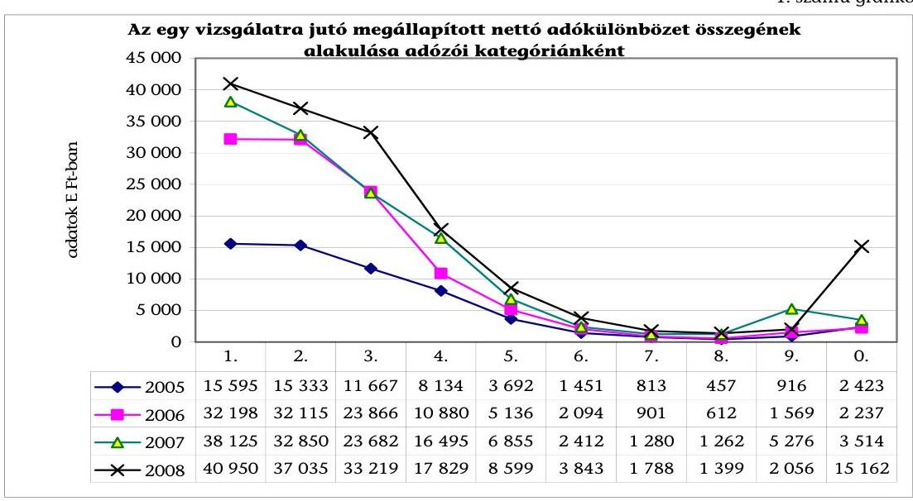

Forrás: 7. számú tanúsítvány
A vizsgált időszakban a legnagyobb adóteljesítményű adóalanyok esetében az egy revizori napra jutó megállapítások összege 2,1-szeresére nőtt (7. számú táblázat), miközben a megállapítással zárult ellenőrzések aránya 48$69 \%$ között alakult (4. számú táblázat). Az ellenőrzések gyakoriságát az is indokolja, hogy

- ebben az adózói körben is előfordulnak olyan fantom cégek, amelyek csalási szándékkal tevékenykednek, és jelentős kárt okoznak a költségvetésnek;
- a megállapított magas adókülönbözet megfizetésére az adóalanyok többsége fedezettel rendelkezik, így ezen megállapított adókülönbözetek realizálásának kockázata alacsony.
7. számú táblázat

Egy revizori napra jutó megállapítások összegeinek alakulása
adatok E Ft-ban

| Ellenőrzési típusok | 2005 | 2006 | 2007 | 2008 |
| :-- | --: | --: | --: | --: |
| Bevallások utólagos | 625 | 1059 | 1233 | 1581 |
| ebből: |  |  |  |  |
| legnagyobb adóteljesítményűek | 654 | 1102 | 1547 | 1414 |
| vagyonosodási vizsgálatok | 761 | 888 | 502 | 606 |
| bevallás kiegészítése alapján elredelt | 90 | 56 | 134 | 682 |
| azonnali | 199 | 209 | 2057 | 213 |
| átalakuló, megszűnő vállalkozások | 1051 | 1472 | 2415 | 2131 |
| kiutalás előtti | 580 | 1187 | 1245 | 894 |
| Ellenőrzéssel lezárt időszakra | -757 | 778 | 2989 | -341 |
| vonatkozó ismételt | 156 | 176 | 214 | 32 |
| Art.-on kívüli | 431 | 653 | 810 | 915 |
| Összesen: |  |  |  |  |

A kiutalás előtti ellenőrzések eredményessége az egy revizori napra jutó megállapítás összege alapján 2005-2007. években folyamatosan javult, majd 2008ban a megállapítás összege csökkent (7. számú táblázat). A megállapítással zárult ellenőrzések arányában nem mutatható ki az előzetes ellenőrzések, továbbá a kockázatkezelési és kiválasztási rendszer fejlesztésének hatása (4. számú

---

táblázat), ugyanis - a 2006. évi kiugró érték kivételével - a megállapítással zárult ellenőrzések aránya 2007. és 2008. években csökkent.

A kiutalás előtti ellenőrzések számának alakulása csak az egyes adókötelezettségek teljesítésére irányuló ellenőrzések számának alakulásával együtt értelmezhető az előzetes ellenőrzések lefolytatása miatt (2. számú grafikon). Az egyes adókötelezettségek teljesítésére irányuló ellenőrzések szabályszerűségi vizsgálatok és ezért adókülönbözetet nem állapítanak meg. A kiutalás előtti ellenőrzések száma ugyan a vizsgált időszakban csökkent, de a két vizsgálati típus számának együttes elemzése alapján nem vonható le az a következtetés, hogy az igazgatóságok kevesebb figyelmet fordítottak volna ennek ellenőrzésére.
2. számú grafikon
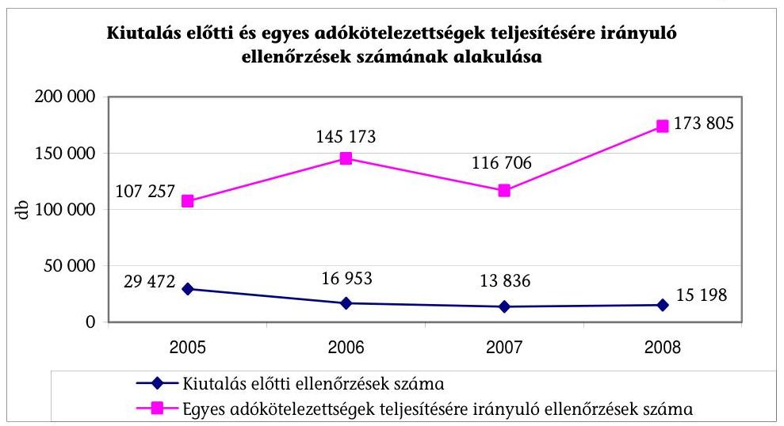

Forrás: 5. számú tanúsítvány
Az APEH eleget tett az Art. 90. § (7) bek. azon előírásának, hogy az adott évben jogelőd nélkül alakult gazdasági társaságok legalább 20\%-át kockázatelemzés alapján ellenőrzésre ki kell választani. Ezen ellenőrzések célja azon vállalkozások kiszűrése, amelyek nem léteznek, vagy nem rendelkeznek a vállalkozás folytatásához szükséges alapvető feltételekkel (pl. nem létező telephely, eszközbeszerzés, munkavállalók felvétele). 2008-ban 42981 gazdasági társaság alakult, amelyből az APEH 9370 vállalkozást vizsgált kockázatelemzés alapján. A vizsgálatokból 981 ellenőrzés hiúsult meg. Az ellenőrzések eredményességét mutatja, hogy a vállalkozások 9,7\%nál (909 vállalkozás) kezdeményezték az igazgatóságok az adószám felfüggesztését annak érdekében, hogy ezzel megakadályozzák az esetleges jövőbeni adóvisszaéléseket.

A vagyongyarapodási vizsgálatok elrendelése célszerúnek minősíthető, mivel a vizsgált adózói körben megnövekedett a jelentősebb jövedelmet feltüntető bevallások száma. A vagyongyarapodási vizsgálatok célja az eltitkolt bevételek feltárása, a jogkövető magatartás kikényszerítése. Az APEH 2007-ben folytatta le a legtöbb ilyen ellenőrzést ( 11186 db ). Az igazgatóságok nem rendelkeztek megfelelő gyakorlattal a vagyongyarapodási vizsgálatok lefolytatására, ami nehezítette a jogszabályban előírt határidők betartását.

---

Nehézséget jelent ennél a vizsgálati típusnál a jogszabályban előírt határidők betartása, mivel a vizsgált adózók, illetve képviselőik minden jogszabályi lehetőséget kihasználnak az ellenőrzés időbeli elhúzása érdekében. A jogszabály lehetőséget ad arra, hogy az adóalany vagy képviselője a jogorvoslati kérelemmel együtt nyújtsa be bizonyítékait, ezzel új eljárás lefolytatását kényszerítik ki, ami növeli az elévülés kockázatát.

A vagyongyarapodási vizsgálatok eredményes lefolytatása érdekében az APEH 2008-ban ellenőrzési módszertant dolgozott ki. Az ellenőrzések eredményessége több szempont alapján értékelhető: a megállapítással zárult ellenőrzések aránya meghaladta az utólagos ellenőrzések megállapítási arányát, az egy revizori napra jutó megállapítások összege azonban változó tendenciát mutatott (7. számú táblázat). A megállapított adókülönbözet realizálása szempontjából az ellenőrzések eredményessége nem értékelhető, mivel az igazgatóságok az ellenőrzés számára - kettő kivételével - nem mutatták ki a 10-10 legnagyobb megállapításaikból befolyt összegeket. A két igazgatóság által tett megállapításokból a vizsgált időszakban nem származott költségvetési bevétel.

Az egyik igazgatóságnál 2007-ben 179,5 M Ft és 633,4 M Ft, 2008-ban 76,3 M Ft és 2970,2 M Ft intervallum között alakult a 10-10 legnagyobb megállapítás öszszege, amely nem tartalmazza a kiszabott bírságok összegét.

# 2. Az APEH HÁTRALÉKKEZELÉSI TEVÉKENYSÉGE 

A hátralékállomány a bevallott, de az esedékességig meg nem fizetett adókból, járulékokból, az ellenőrzési megállapításokból az esedékességig meg nem fizetett adókból, járulékokból, illetve szankciókból, továbbá a külső megkeresések alapján az adók módjára behajtandó köztartozásokból alakul ki.

### 2.1. A hátralékállomány nyilvántartása

Az APEH az adózók befizetéseit és fizetési kötelezettségeit a Centralizált adó- és járulék-folyószámla rendszerben (továbbiakban: CAJF rendszer) tartja nyilván. A rendszer az alaprendszerekből érkező tranzakciós adatok könyvelésével állítja elő az adózók egyenlegét, a hátralékok képzése és nyilvántartása is e rendszerben történik. A feldolgozórendszerek és a CAJF adatkapcsolat fejlesztésének eredményeként teljes körúvé vált a hátralékok nyilvántartása. Az elektronikus bevallás egyre szélesebb körű elterjedése, valamint a megyei bevallás feldolgozó rendszerekről a központi feldolgozó rendszerekre való fokozatos áttérés hatására csökkent a bevallás-feldolgozás átlagos időigénye.

Az azonnal feldolgozható banki befizetések átlagos feldolgozási ideje 2007-ben és 2008-ban 2 munkanap volt, a tisztázást igénylő befizetések feldolgozása 2007ben átlagosan 17,2 napig tartott, amely 2008-ra 12,6 napra javult. Postai befizetések esetén az azonnal feldolgozható tételek 2007-ben átlagosan 6 nap alatt kerültek könyvelésre (a terheléstől számítva), ez az érték 2008-ra 5 napra csökkent. A tisztázást igénylő tételek esetén az átlagos feldolgozási idő 2007-ban 37,3 napról 2008-ra 13,3 napra javult.

---

# 2.2. Hátralékkezelés 

A Hivatal nem az Art. 150. § (3) bek. előírásait, illetve belső szabályzatait figyelembe véve tesz intézkedéseket a hátralékállomány teljes körének „haladéktalan" hátralékkezelésbe vonásáról, hanem a hu-mánerőforrás-kapacitása függvényében kockázati paraméterek alapján kiválasztja az állományból azokat a hátralék-tételeket, amelyekre megindítja a végrehajtási cselekményeket.

Az Art. 150. § (3) bekezdése szerint: „Az adótartozás behajtása érdekében a tartozást megállapító vagy nyilvántartó adóhatóság a végrehajtható okirat alapján a végrehajtás iránt haladéktalanul intézkedik.". A kapcsolódó indoklás: „Az eredményes végrehajtás egyik feltétele a gyorsaság, ezért a törvény az illetékes adóhatóságot az adótartozás behajtása érdekében szükséges intézkedések, végrehajtási cselekmények haladéktalan megtételére kötelezi."

A Hivatal a kialakított gyakorlatot azzal indokolja, hogy egyrészt a folyószámlán nyilvántartott kötelezettségekre nem indítható végrehajtási eljárás felülvizsgálat nélkül, másrészt az Art. 150.-161. §-ai azt is meghatározzák számára, hogy - amennyiben a végrehajtási eljárást megindítja - milyen intézkedéseket milyen határidőre köteles megtenni, ehhez azonban nem elegendő a rendelkezésére álló humánerőforrás-kapacitás. A hatékony feladatellátás érdekében a végrehajtási eljárásokat csak a kockázati tényezők figyelembevételével kiválasztott állományra kezdi meg. Az említett jogszabály nem teszi lehetővé számára annak mérlegelését, hogy milyen esetekben kell megindítania a végrehajtási eljárást. A jogszabályi előírás szerinti gyakorlat kialakításának célszerúségét támasztja alá az a statisztikai kimutatás (7. számú diagram), hogy a Hivatal által kibocsátott inkasszó, illetve a fizetési felszólítás alapján az adózók önkéntes befizetései a beszedett hátralékoknak mekkora hányadát teszik ki.

A szakterületi irányelv minden évben kiemelt feladatként határozta meg a kisösszegű hátralékok - célszerűen fizetési felszólítással történő - kezelését. A Hivatal érdekeltségi rendszere a végrehajtási szakterület számára hátralék megtérülési mutatót (a hátralékállományból az adott évben behajtandó hátralék összege) határoz meg, amely a nagy összegű hátralékok hátralékkezelésbe vonását ösztönözi. A végrehajtási cselekmények megkezdésére tett intézkedések elmaradása ezért főként a kisösszegű hátralékok esetében állt fenn. A kiválasztás során a regionális igazgatóságok a kiválasztandó tételek nagyságrendjének meghatározásánál szưrési paramétereket állítanak be, amelyeknél figyelembe veszik a helyi sajátosságokat.

A mutató kialakításakor a Hivatal figyelembe vette, hogy az egyes években a hátralékállomány legnagyobb hányadát az 50 M Ft feletti hátralékok tették ki. A társadalombiztosítás pénzügyi alapjait megillető tartozások esetében az APEH elnöke a 2005. július 31-én kelt intézkedési tervében előírta a hátralékok változásának monitorozását és prioritást adott a 20 millió forintot meghaladó hátralékok kezelésének.

Az informatikai rendszerek és nyilvántartások nem támogatják teljes körűen a teljes hátralékállomány hátralékkezelésbe vonását. A Hivatal folyamatosan méri a hátralékkezelésbe vont hátralékállomány alakulását, és csak közvetve figyeli (a teljes és a hátralékkezelésbe vont állomány különbségeként) a hátralékkezelésbe nem vont hátralékállomány összesen érté-

---

két. Nem követi nyomon, mivel az informatikai rendszere sem jelzi, hogy a hátralékkezelésbe nem vont hátralékok mennyi ideje állnak fenn. Ennek következménye, hogy ezen tételek esetében fennáll az elévülés lehetősége, ami kedvezőtlenül hat az adófizetési fegyelemre.

A folyószámla rendszerből az összes hátralék lekérdezhető, de ott nem mutatják ki, hogy mely tételeket vontak hátralékkezelésbe. A Hátralékkezelési és Végrehajtási Rendszerben pedig csak a hátralékkezelésbe vont hátralékokat tartják nyilván, így a hátralékkezelésbe nem vont hátralékokról egyik rendszer sem tud információt szolgáltatni. Az adatok csak a két nyilvántartás tételes egyeztetésével állíthatók elő. A Hivatal a helyszíni ellenőrzés számára a hátralékok keletkezésének időpontja szerint kért adatokat egyedi programfejlesztéssel tudta előállítani.

A hátralékkezelési és végrehajtási tevékenységet segítő informatikai rendszer a fejlesztések ellenére nem alkalmas az egyre nagyobb ütemben és számban keletkező hátralékok kezelésének (csoportos kezelés) teljes körű támogatására, valamint korlátozottan nyújt segítséget a határidők figyelésében, azok betartásában, illetve betartatásában. A Végrehajtási és Hátralékkezelési rendszer (továbbiakban: VHR) kizárólag a fizetési felszólításokra vonatkozóan rendelkezik direkt határidő figyelő funkcióval, egyéb végrehajtási cselekményekhez (pl. inkasszó, letéti számlára érkező befizetések felosztása) kapcsolódó határidők lejártának figyelését, jelzését az érintett adózók listázásának lehetőségével biztosítja.
2007. december 31. és 2008. december 31. között a hátralékállomány 604150 tétellel növekedett (8. számú tanúsítvány).

A Hivatal 2008 szeptemberében egy fejlesztési projektet indított el (Végrehajtás Korszerűsítése), amelynek legfontosabb célkitűzése a hátralékok tömeges kezelését lehetővé tevő funkciók kialakítása, a rendelkezésre álló belső és külső információkhoz való gyors hozzáférés biztosítása, valamint a statisztikai és elemző szolgáltatások integrálása a Hivatal Adattárház rendszerébe (továbbiakban: ATAR).

A VHR a határidők betartását nem jelzéssel, hanem - egyes végrehajtási cselekmények esetében - a kapcsolódó határidők listázási lehetőségével támogatja. A kérdőíves felmérés során az igazgatóságok részéről szakmai igényként fogalmazódott meg az ügyintézők és vezetők munkáját támogató figyelő automatizmusok kialakítása (pl. nem figyelmezteti az ügyintézőt, hogy a foglalástól számított 30 nap letelt). A Végrehajtás Korszerűsítése (továbbiakban: VHK) projekt célkitűzései között szerepel a határidő figyelés kiterjesztése a végrehajtási cselekmények szélesebb körére.

# 2.3. Hátralékállomány alakulása 

A vizsgált időszakban a hátralékállomány mind összegét, mind a változás tendenciáját tekintve kedvezőtlenül alakult, a 2005. évi 964 Mrd Ft-ról 2008 végére 1710 Mrd Ft-ra, 77\%-kal (azaz 746 Mrd Ft-tal) nőtt. A teljes hátralékállományon belül a múködő adózóké 470 Mrd Ft-ról 645 Mrd Ft-ra, 37\%-kal (175 Mrd Ft-tal), a nem múködő adózóké pedig 571 Mrd Ft-tal ( 494 Mrd Ft-ról 1065 Mrd Ft-ra), több mint kétszeresére (216\%ra) nőtt. Ez utóbbi növekedésének oka döntően a felszámolással, valamint az adószám felfüggesztést követően törölt adószámmal érintett vállalkozások

---

számának emelkedése. Fenti adatokból megállapítható, hogy míg 2005-ben a nem múködő adózók hátralékállománya a teljesnek 51\%-át tette ki, 2008-ban ez az arány 62\%-ra emelkedett (8. számú táblázat).

A hátralékos tételek száma ugyanebben az időszakban 3,3 millió db-ról 4,6 millió db-ra ( $40 \%$-kal) nőtt.
8. számú táblázat

Hátralékállomány és hátralékos tételek számának alakulása

| Év | Adózói kör | Hátralék |  | Hátralékos tételek száma |  |
| :--: | :--: | :--: | :--: | :--: | :--: |
|  |  | Mrd Ft | Változás 2005 \% ában | E db | Változás 2005 \% ában |
| 2005 | Teljes   Múködő   Nem múködő | $\begin{array}{r} 964,4 \\ 469,8 \\ 494,6 \end{array}$ |  | $\begin{array}{r} 3254 \\ 3000 \\ 254 \end{array}$ |  |
| 2006* |  |  |  |  |  |
| 2007 | Teljes   Múködő   Nem múködő | $\begin{array}{r} 1328,5 \\ 612,6 \\ 715,9 \end{array}$ | $\begin{array}{r} 138 \% \\ 130 \% \\ 145 \% \end{array}$ | $\begin{array}{r} 3977 \\ 3640 \\ 337 \end{array}$ | $\begin{array}{r} 122 \% \\ 121 \% \\ 133 \% \end{array}$ |
| 2008 | Teljes   Múködő   Nem múködő | $\begin{array}{r} 1710,4 \\ 645,0 \\ 1065,4 \end{array}$ | $\begin{array}{r} 177 \% \\ 137 \% \\ 215 \% \end{array}$ | $\begin{array}{r} 4581 \\ 4170 \\ 411 \end{array}$ | $\begin{array}{r} 141 \% \\ 139 \% \\ 162 \% \end{array}$ |
| $\begin{gathered} 2009 . \text { I. } \\ \text { félév } \end{gathered}$ | Teljes   Múködő   Nem múködő | $\begin{array}{r} 1767,7 \\ 569,6 \\ 1198,1 \end{array}$ |  |  |  |

Forrás: 8. és 18. sz. tanúsítvány, APEH 2006. évi beszámolója

* A 2006 évi hátralékra vonatkozó adatok nem tükrözik a valós hátralékállományt. A kimutatott hátralékállomány nem valós voltát az ÁSZ a 0724-es számú a Magyar Köztársaság 2006. évi költségvetése végrehajtásának ellenőrzéséről szóló (2007. augusztus) jelentése is megállapította.

A Hivatal által tett intézkedések (pl. az informatikai fejlesztések, humánerőfor-rás-kapacitás $12 \%$-os növelése, a munkamódszerek bővülése) mellett a hátralékállomány növekedéséhez külső és belső tényezők egyaránt hozzájárultak.

Külső tényezők:

- Közel 103 Mrd Ft-os (mintegy 14\%-os) növekedést eredményezett, hogy az Adó-és Pénzügyi Ellenőrzési Hivatalról szóló 273/2006. (XII. 23.) Korm. rendelet 10. § (9) bek. 2007. január 1-jei ${ }^{10}$ hatállyal a Hivatal feladatkörébe utalta az illetékek és a magánnyugdíj-pénztári befizetések hátralékainak beszedését. Az illetékből származó hátralék a 2007. évi illetékhez kapcsolódó feladatok integrációjának évében 88 Mrd Ft volt, amely 2008 végére 94 Mrd Ft-ra nőtt. A magánnyugdíj-pénztári befizetésekhez kapcsolódó hátralék állománya 2007. évi 6 Mrd Ft-ról, 2008-ra 9 Mrd Ft-ra emelkedett. A 2005-2008. időszakban a hátralékos adózók számának 1328 ezer darabos, illetve fős növekedésén belül a magánnyugdíj pénztári és illeték hátralékosok számának növekedése 743 ezret tett ki.
- Külső tényezőként figyelembe kell venni az ország gazdasági-társadalmipolitikai környezetét is, amelyeknek változásai hatással vannak az adóalanyok gazdasági-pénzügyi helyzetére (pl. körbetartozások, korlátozott pá-

[^0]
[^0]:    ${ }^{10}$ A 2007. január 1-je előtti időszakban az APEH a magánnyugdíj-pénztári hátralékokat külső megkeresésre szedte be, ezért az nem növelte az APEH hátralékállományát.

---

lyázati, illetve hitelfelvételi lehetőségek, ebből adódó likviditási problémák), ezáltal adózási fegyelmére.

Belső tényező:

- A hátralékállomány növekedéséhez hozzájárult a nagy összegű revíziós megállapítások számának emelkedése, amelyek esetében a beszedhetőség kockázata a vizsgált időszakban megnőtt. Ilyen megállapításokat eredményezhetnek azok az ellenőrzések (pl. „számlagyárak", „körhinta" és egyéb pénzügyi csalások feltárása), amelyeknek elvégzése a költségvetés védelme szempontjából akkor is szükséges, ha azok megállapításaiból nem keletkezik közvetlen bevétel.

A Hivatal elemzése megállapította - ezt az ÁSZ a helyszíni ellenőrzés során részletes vizsgálatra kiválasztott minta értékelése is alátámasztott -, hogy az 50 legnagyobb hátralékos adózó hátraléka tette ki pl. a 2009. májusi hátralékállomány $13,4 \%$-át, amelynek $78,6 \%$-a ( $234,7 \mathrm{Mrd}$ Ft-ból 184,5 Mrd Ft) revíziós megállapítás következménye. Az elemzés alá vont 50 hátralékos közül csak 11 volt működő adózó, a többi adózóból 24 felszámolás, 1 végelszámolás alatt állt, 12 megszűnt és 2 magánszemély is szerepelt a listában. A 24 felszámolás alatti cég közül 18 esetben kezdeményezte a Hivatal a felszámolást.

# A 2008. év végi hátralékállomány közel felét a nagy összegű ( 50 M Ft 

feletti) hátralékok tették ki. A több mint 4,5 millió hátralék-tételből mindössze 3889 darab ( $0,08 \%$ ) haladta meg az 50 M Ft -ot, azonban ezen tételek öszszege a teljes hátralékállomány $45 \%$-át, több mint a 771 Mrd Ft-ot tett ki. (9. számú táblázat)

Az 50 M Ft feletti 3889 db hátralékos tételen belül csak 587 tartozott a múködő adózói körbe, 94,5 Mrd Ft-os hátralékállománnyal.
9. számú táblázat

| Teljes hátralékállomány értékhatár szerinti összetétele |  |  |  |  |  |  |  |  |  |
| :--: | :--: | :--: | :--: | :--: | :--: | :--: | :--: | :--: | :--: |
|  | 1 M Ft alatti |  | 1-10 M Ft között |  | 10-50 M Ft között |  | 50 M Ft felett |  | Összesen |
|  | Összeg (Mrd |  | Összeg |  | Összeg |  | Összeg |  | Összeg (Mrd |
| Év | Ft) | \% | (Mrd Ft) | \% | (Mrd Ft) | \% | (Mrd Ft) | \% | Ft) |
| 2005 | 255,4 | 26,5\% | 224,0 | 23,2\% | 164,4 | 17,0\% | 320,7 | 33,3\% | 964,4 |
| 2006* |  |  |  |  |  |  |  |  |  |
| 2007 | 300,4 | 22,6\% | 282,7 | 21,3\% | 221,3 | 16,7\% | 524,0 | 39,4\% | 1328,5 |
| 2008 | 325,7 | 19,0\% | 329,3 | 19,3\% | 284,4 | 16,6\% | 771,1 | 45,1\% | 1710,4 |

Forrás: 8. sz. tanúsítvány

* A 2006. évi hátralékra vonatkozó adatok nem tükrözik a valós hátralékállományt. A kimutatott hátralékállomány nem valós voltát az ÁSZ a 0724-es számú a Magyar Köztársaság 2006. évi költségvetése végrehajtásának ellenőrzéséről szóló (2007. augusztus) jelentése is megállapította

A 2005-2008. évi adatok alapján a müködő adózói körön belül a kis összegü ( 1 M Ft alatti) hátralékok aránya a legmagasabb (42-46,9\%), az 1-10 M Ft közöttiek részaránya 28,3-30,1\%, a 10 M Ft felettieké pedig 24,8$29,8 \%$ között alakult (10. számú táblázat).

---

10. számú táblázat

A múködő adózói kör hátralékállományának értékhatár szerinti összetétele

| Év | 1 M Ft alatti |  | 1-10 M Ft között |  | 10-50 M Ft között |  | 50 M Ft felett |  | Összesen |
| :--: | :--: | :--: | :--: | :--: | :--: | :--: | :--: | :--: | :--: |
|  | Összeg   (Mrd Ft) | \% | Összeg   (Mrd Ft) | \% | Összeg   (Mrd Ft) | \% | Összeg   (Mrd Ft) | \% | Összeg   (Mrd Ft) |
| 2005 | 220,4 | 46,9\% | 133,1 | 28,3\% | 55,4 | 11,8\% | 60,9 | 13,0\% | 469,8 |
| 2006* |  |  |  |  |  |  |  |  |  |
| 2007 | 255,0 | 41,6\% | 175,1 | 28,6\% | 80,0 | 13,1\% | 102,4 | 16,7\% | 612,6 |
| 2008 | 270,8 | 42,0\% | 194,2 | 30,1\% | 85,4 | 13,2\% | 94,5 | 14,7\% | 645,0 |

Forrás: 8. sz. tanúsítvány

* A 2006. évi hátralékra vonatkozó adatok nem tükrözik a valós hátralékállományt. A kimutatott hátralékállomány nem valós voltát az ÁSZ a 0724-es számú a Magyar Köztársaság 2006. évi költségvetése végrehajtásának ellenőrzéséről szóló (2007. augusztusú) jelentése is megállapította

A vizsgált időszakban a hátralék-tételek 96\%-ot meghaladó részét a kis összegű, 1 M Ft alatti hátralékok tettét ki, az 1-10 M Ft közötti hátra-lék-tételek aránya 2-3\% között alakult, a 10 M Ft -ot meghaladó hátralékok aránya $0,5 \%$ alatt maradt. Az 1 M Ft alatti hátralékok száma a vizsgált időszakban 1,3 millió darabbal nőtt, 2008 végén megközelítette a 4,6 millió darabot. (11. számú táblázat)

11. számú táblázat

Hátralékos tételek számának értékhatár szerinti összetétele

|  | 1 M Ft alatti |  | 1-10 M Ft között |  | 10-50 M Ft között |  | 50 M Ft felett |  | Összesen |
| :--: | :--: | :--: | :--: | :--: | :--: | :--: | :--: | :--: | :--: |
| Év | Tétel db | \% | Tétel db | \% | Tétel db | \% | Tétel db | \% | Tétel db |
| 2005 | 3155964 | 97,0\% | 87728 | 2,7\% | 8145 | 0,3\% | 1705 | 0,1\% | 3253542 |
| 2006* |  |  |  |  |  |  |  |  |  |
| 2007 | 3851256 | 96,8\% | 112319 | 2,8\% | 10828 | 0,3\% | 2727 | 0,1\% | 3977130 |
| 2008 | 4434101 | 96,8\% | 129536 | 2,8\% | 13754 | 0,3\% | 3889 | 0,1\% | 4581280 |

Forrás: 8. sz. tanúsítvány

* A 2006. évi hátralékra vonatkozó adatok nem tükrözik a valós hátralékállományt. A kimutatott hátralékállomány nem valós voltát az ÁSZ a 0724-es számú a Magyar Köztársaság 2006. évi költségvetése végrehajtásának ellenőrzéséről szóló (2007. augusztusú) jelentése is megállapította.

A teljes hátralékállományon belül a társadalombiztosítási járulék összegének aránya a 2005. évi 19\%-ról 2008-ban 13\%-ra, az egyéb hátralékok aránya 39\%-ról 37\%-ra csökkent, az áfa-hátralékösszegek aránya ugyanebben az időszakban 27\%-ról 34\%-ra nőtt (7. számú diagram).

---

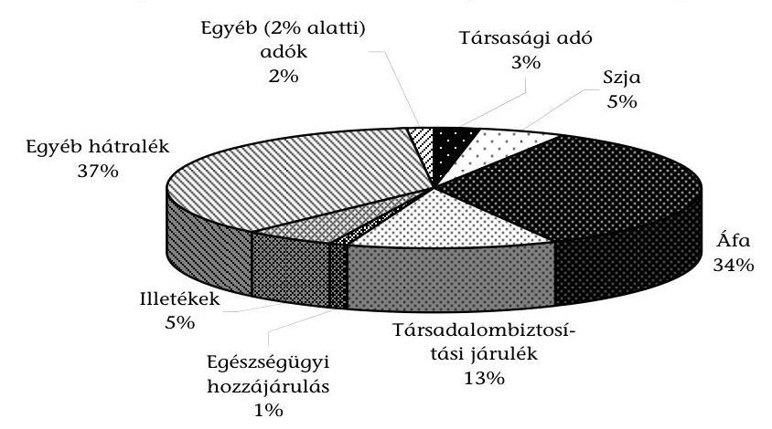

Forrás: 10. számú tanúsítvány
A vizsgált időszakban a hátralékállomány növekedéséhez legnagyobb mértékben az áfa adónemben keletkezett hátralékok növekedése járult hozzá. Az összes ( 746 Mrd Ft-os) növekménynek közel a fele (43\%-a, azaz 324 Mrd Ft) az áfából, 5\%-a ( $37,5 \mathrm{Mrd}$ Ft) a társadalombiztosítási járulékból, 3,7\%-a ( $27,4 \mathrm{Mrd}$ Ft) a személyi jövedelem adóból, 1,9\%-a ( $14,6 \mathrm{Mrd}$ Ft) a társasági adóból származott (10. számú tanúsítvány).

A kiválasztott tételekre a végrehajtási cselekmények megindítását késlelteti, hogy azok megkezdése előtt, majd minden egyes cselekményt megelőzően az ügyintézőknek 6-8 alaprendszerben kell ellenőrizniük, hogy a folyószámla rendszerben tárolt adatok megfelelnek-e a valóságnak és nincs-e feldolgozás alatt valamilyen hátralékot érintő információ (3. számú grafikon).

A hátralékkezelésbe nem vont hátralékállomány értékelése pozitívabb képet mutat, ha az értékelés alapjául nem a hátralékos tételek számát, hanem a hátralékok összegét vesszük. 2008. december 31.-i állapot szerint a 645 Mrd Ft müködő adózói hátralékösszegből 292 Mrd Ft-ot (45,3\%) nem vont az APEH hátralékkezelésbe. Ezen belül a müködő adózói körben a 60 napnál régebben fennálló hátralékösszegek 36,5\%-át, a 360 napnál régebbiek 53,4\%-át a Hivatal nem vonta hátralékkezelésbe.

---

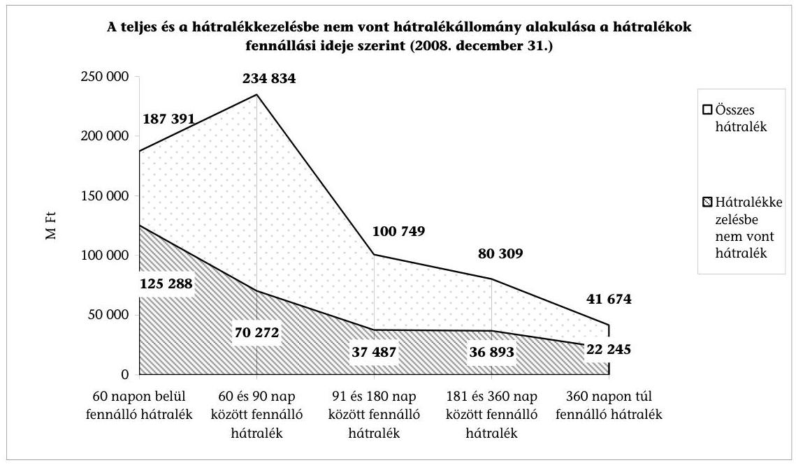

Forrás: 11. számú tanúsítvány

A Hátralékkezelési és végrehajtási rendszer (továbbiakban VHR) kialakításával és fejlesztésével a végrehajtási cselekmények többsége informatikai rendszerrel támogatott, továbbá a végrehajtás során felhasználható belső és külső információforrások köre is bővült. Javult a vagyonfeltárás informatikai támogatottsága azáltal, hogy bővült az ügyintézők által elérhető külső nyilvántartások köre (Gépjármú-nyilvántartási Információs Rendszer, Takarnet) is, az eljárások lefolytatásához szükséges információk azonban csak több nyilvántartásból (külső és belső) kérdezhetők le.

A helyszíni ellenőrzés alatt folyamatban voltak a vagyonfeltáráshoz szükséges belső információk ATAR rendszerbe gyújtését, illetve a külső nyilvántartások lekérdezésének egyszerúsítését célzó fejlesztések. A Hivatal tájékoztatása szerint a Takarnet rendszerrel való online kapcsolat kialakítása a Takarnet-nél ehhez szükséges fejlesztések elmaradása miatt nem valósítható meg a Végrehajtási Korszerúsítése (továbbiakban: VHK) projekt keretében.

A 2008. december 31-i állapot szerint a 4,2 millió múködő adózói hátraléktételből 3,1 millió ( $73,8 \%$ ) tétel nem volt hátralékkezelésbe vonva. Ezen belül a teljes múködő hátralék-tételszám 54,8\%-a (2,3 millió) már legalább 60 napja, $11 \%$-a ( 462 ezer) pedig legalább 360 napja fennállt. A 60 napnál régebben fennálló, hátralékkezelésbe nem vont hátralékok értéke meghaladta a 167 Mrd Ft-ot, a 360 napnál régebben fennálló hátralékok esetében a hátralékkezelésbe nem vont hátralékok értéke 22 Mrd Ft fölött volt (4. számú diagram).

A hátralékok fennállási idejének hosszabbodásával egyre magasabb a hátralékkezelésbe nem vont hátralékok aránya: a múködő adózói körben a 60 napnál régebben fennálló hátralék-tételek közel kétharmadát, a 360 napnál régebbiek 69\%-át a Hivatal nem vonta hátralékkezelésbe. A 60 napnál hosszabb ideje fennálló hátralék-tételek több mint 2/3-nál a hátralék fennállását nem a behajtás elhúzódása, hanem hátralékkezelésbe vonás elmaradása okozta.

---

# 2.3.1. A beszedett hátralékok alakulása 

A hátralékállomány alakulását befolyásolja az év közben keletkezett, a beszedett és a törölt hátralékok összegének alakulása. Az APEH a hátralékállományt - folyamatos változása miatt - december 31-i állapotban, a beszedett és a törölt hátralékok összegét viszont az adott évre vonatkozóan kumulált összegként mutatja ki. Ebből következően csak a december 31-i állapot szerinti hátralékállományok hasonlíthatók össze, vagyis nem számolható ki, hogy a Hivatal az adott évben a hátralékállománynak milyen arányát szedte be.

A hátralékkezeléssel, végrehajtással beszedett hátralékok teljes öszszege a vizsgált időszakban $42 \%$-kal nőtt, a végrehajtási cselekmények értékösszege pedig több mint kétszeresére emelkedett. Az informatikai támogatottság fejlesztésének hatására megnövekedett az adminisztratív végrehajtási cselekmények (inkasszó, jövedelem letiltás, nyilvántartásból történő gépjárműfoglalás) száma. Ennek eredményeként a beszedett hátralékok 97-98\%-át az azonnali beszedési megbízások kibocsátása, valamint a végrehajtási cselekmények megindítását követő önkéntes adózói befizetések tették ki (8. számú diagram). A fennmaradó $2-3 \%$ bevételt az ingó és ingatlan értékesítések, illetve egyéb végrehajtási intézkedések eredményezték.
8. számú diagram
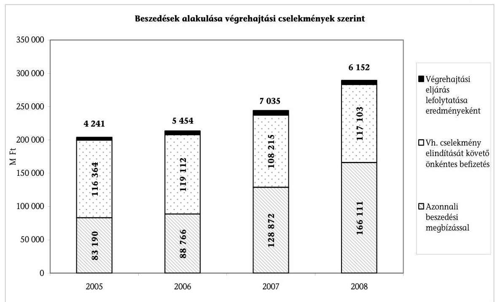

Forrás: 12. sz. tanúsítvány

A beszedések adónemenkénti eloszlása - néhány kivételtől eltekintve - a hátralékállomány eloszlásával arányosan alakult. Az áfa adónemben fennálló hátralékokat a Hivatal csökkenő arányban szedte be, amely a már említett nagy összegű, a beszedhetőség szempontjából kockázatos revíziós megállapítások növekedésére vezethető vissza. Az szja hátralékok behajtása a többi adónemhez viszonyítva eredményesebb volt, 31-40\% között alakult. Az egyéb hátralékok behajtáson belüli aránya 7-9\% között mozgott lényegesen elmaradva az

---

egyéb hátralékok hátralékállományon belüli - 30\%-ot meghaladó - részesedésétől. (12. számú táblázat)

12. számú táblázat

Hátralékállomány és beszedett háralékok alakulása fóbb adónemenként

| Megnevezés |  | 2005 | 2006* | 2007 | 2008 | 2009.1. félév |
| :--: | :--: | :--: | :--: | :--: | :--: | :--: |
| Társasági adó | Hátralék összege (Mrd Ft) | 34 | 44 | 46 | 49 | 62 |
|  | Beszedett hátralék összege (Mrd Ft) | 11 | 12 | 14 | 17 | 7 |
|  | Beszedett és hátralék összeg aránya | $32 \%$ | $27 \%$ | $30 \%$ | $35 \%$ | $11 \%$ |
| Személyi jövedelemadó | Hátralék összege (Mrd Ft) | 63 | 201 | 82 | 90 | 101 |
|  | Beszedett hátralék összege (Mrd Ft) | 20 | 19 | 25 | 36 | 18 |
|  | Beszedett és hátralék összeg aránya | $32 \%$ | $9 \%$ | $31 \%$ | $40 \%$ | $18 \%$ |
| Áfa | Hátralék összege (Mrd Ft) | 262 | 319 | 413 | 587 | 669 |
|  | Beszedett hátralék összege (Mrd Ft) | 89 | 87 | 80 | 86 | 42 |
|  | Beszedett és hátralék összeg aránya | $34 \%$ | $27 \%$ | $19 \%$ | $15 \%$ | $6 \%$ |
| Társadalom biztosítási járulék | Hátralék összege (Mrd Ft) | 181 | 356 | 196 | 218 | 231 |
|  | Beszedett hátralék összege (Mrd Ft) | 56 | 66 | 81 | 87 | 41 |
|  | Beszedett és hátralék összeg aránya | $31 \%$ | $19 \%$ | $41 \%$ | $40 \%$ | $18 \%$ |

Forrás: 10. számú tanúsítvány

* A 2006. évi hátralékra vonatkozó adatok nem tükrözik a valós hátralékállományt. A kimutatott hátralékállomány nem valós voltát az ÁSZ a 0724-es számú a Magyar Köztársaság 2006. évi költségvetése végrehajtásának ellenőrzéséről szóló (2007. augusztusi) jelentése is megállapította.

# 2.3.2. Törölt hátralékok alakulása 

Az Art. a hátralékállomány csökkentését a beszedés mellett - meghatározott feltételekhez kötötten - a hátralékok törlésével is lehetővé teszi. A Hivatal évente növekvő összegben törölt hátralékokat: 2005-ben 65,9 Mrd Ft-ot, 2006-ban 84,3 Mrd Ft-ot, 2007-ben 78,4 Mrd Ft-ot, 2008-ban 92,4 Mrd Ft-ot (13. számú táblázat). A hátraléktörlések közel felét ( $49,7 \%$-át) az elévülés miatti törlések tették ki (2008-ban 46 Mrd Ft-ot). A behajthatatlanság miatti törlés aránya 2005-ben 29\% (19,1 Mrd Ft), 2006-ban 41,9\% (35,3 Mrd Ft), 2007-ben 36,2\% ((28,4 Mrd Ft), 2008-ban 36,3\% (33,8 Mrd Ft) volt. A méltányosságból törölt hátralékok éves értéke 8-9 Mrd Ft között mozgott, a hátralékállományon belüli aránya folyamatosan csökkent ( $14,1 \%$-ról $9,4 \%$-ra). A cégtörlés miatt törölt hátralékok 4-6 Mrd Ft között változtak.

---

| Hátraléktörlések alakulása |  |  |  |  |  |
| :--: | :--: | :--: | :--: | :--: | :--: |
|  | 2005 | 2006 | 2007 | 2008 | $\begin{gathered} 2009 . \text { I. } \\ \text { félév } \end{gathered}$ |
| Méltányosságból törölt hátralék (Mrd Ft) | 9,3 | 6,6 | 9,3 | 8,6 |  |
| Növekedés \% (előző év =100\%) | - | 71,8\% | 140,1\% | 92,9\% |  |
| Növekedés \% (2005 =100\%) | - | 71,8\% | 100,5\% | 93,4\% |  |
| Behajthatatlanság miatt törölt hátralék (Mrd Ft) | 19,1 | 35,3 | 28,4 | 33,8 |  |
| Növekedés \% (előző év =100\%) | - | 184,6\% | 80,4\% | 119,0\% |  |
| Növekedés \% (2005 =100\%) | - | 184,6\% | 148,4\% | 176,7\% |  |
| Elévülés miatt törölt hátralék (Mrd Ft) | 33,3 | 36,2 | 34,1 | 45,9 |  |
| Növekedés \% (előző év =100\%) | - | 108,8\% | 94,2\% | 134,6\% |  |
| Növekedés \% (2005 =100\%) | - | 108,8\% | 102,5\% | 137,9\% |  |
| Cégtörlés miatt törölt hátralék (Mrd Ft) | 4,1 | 6,1 | 6,5 | 3,9 |  |
| Növekedés \% (előző év =100\%) | - | 146,6\% | 107,0\% | 60,6\% |  |
| Növekedés \% (2005 =100\%) | - | 146,6\% | 156,8\% | 95,1\% |  |
| Törlések összesen (Mrd Ft) | 65,9 | 84,3 | 78,4 | 92,4 | 88,9 |

Forrás: 13. sz. tanúsítvány
Az APEH az elévülés miatt törölt hátralékok 72,9-75,6\%-át a működő adózók hátralékállományából törölte (14. számú táblázat). Ez a kedvezőtlen arány öszszefügg egyrészt azzal, hogy a korábban végrehajtás alá vont, de behajthatatlan tartozásokat a végrehajtáshoz való jog elévülését követően törlik, másrészt nem a hátralékállomány teljes körét vonja hátralékkezelésbe, hanem a végrehajtási cselekményeket kiválasztással indítják el. Az informatikai rendszere sem jelzi, hogy az egyes hátralékok mennyi ideje állnak fenn, ezért magas az elévülés kockázata.
14. számú táblázat

| Elévülés miatt törölt hátralékok alakulása |  |  |  |  |
| :--: | :--: | :--: | :--: | :--: |
| Megnevezés | 2005 | 2006 | 2007 | 2008 |
|  | Mrd Ft | Mrd Ft | Mrd Ft | Mrd Ft |
| Elévülés miatt törölt összes   hátralék | 33,3 | 36,2 | 34,1 | 45,9 |
| Ebből: |  |  |  |  |
| Múködő adózói körben | 25,2 | 27,3 | 25,7 | 33,5 |
| Nem múködő adózói körben | 8,1 | 8,9 | 8,4 | 12,4 |

# 3. Az APEH hatósági tevékenysége 

Az APEH hatósági tevékenysége a feladatellátás szakmai színvonalát tekintve összességében pozitívnak értékelhető annak ellenére, hogy a vizsgált időszakban hozott elsőfokú határozatokat helybenhagyó másodfokú határozatok aránya a 2005. évi 86,3\%-ról 2008-ban 78,4\%-ra csökkent. Ugyanilyen irányú a változás az összes határozaton belül az ellenőrzésekhez kapcsolódó I. fokú határozatok megalapozottságát tekintve. 2006-ban a helybenhagyó II. fokú határozatok aránya meghaladta a $80 \%$-ot, 2008-ban azonban ez nem érte el a $70 \%$-ot. A negatív irányú változás a szervezeti átalakulásokkal, ezen belül is az illetékhivatalok integrációjával, valamint ezekhez kapcsolódóan a humánerőforrás mennyiségi és minőségi változásaival hozhatók összefüggésbe. A határozatok és perek alakulásának értékelése során figyelembe kell venni továbbá, hogy az adóalanyok egyre növekvő számban éltek a fellebbezési és a jogorvoslati kérelem benyújtásának lehetőségével.

2006-2008 között az ellenőrzéssel kapcsolatban benyújtott fellebbezések 55,6\%kal, a II. fokú határozatok száma 55,4\%-kal emelkedett (15. számú táblázat). A

---

tárgyidőszakban benyújtott fellebbezések száma 4725 db-ról 7352 db-ra, a kiadott II. fokú határozatok száma 4031 db-ról 6266 db-ra emelkedett.

A vagyongyarapodási vizsgálatok során hozott I. fokú határozatok 2006-ban 72,7\%-a, 2007-ben 72,8\%-a, 2008-ban 65,8\%-a emelkedett jogerőre. (17. sz. tanúsítvány)
15. számú táblázat

Az APEH közigazgatási határozatai számának alakulása

| Megnevezés | 2005 | 2006 |  | 2007 |  | 2008 |  |
| :--: | :--: | :--: | :--: | :--: | :--: | :--: | :--: |
|  | db | db | előző évhez   viszonyitott   aránya | db | előző évhez   viszonyított   aránya | db | előző évhez   viszonyított   aránya |
| APEH által kiadott összes határozat: |  |  |  |  |  |  |  |
| I. fokú határozat | 751552 | 656915 | 87,4\% | 1950744 | 297,0\% | 2258021 | 115,8\% |
| Fellebbezések | 10346 | 10747 | 103,9\% | 15222 | 141,6\% | 16430 | 107,9\% |
| Fellebezések aránya | $1,4 \%$ | $1,6 \%$ |  | $0,8 \%$ |  | $0,7 \%$ |  |
| II. fokú határozat | 9649 | 9377 | 97,2\% | 12262 | 130,8\% | 13661 | 111,4\% |
| II. fokú határozatból helybenhagyó döntés | 8323 | 7985 | 95,9\% | 9346 | 117,0\% | 10704 | 114,5\% |
| Helybenhagyó döntés aránya | 86,3\% | 85,16\% |  | 76,2\% |  | 78,4\% |  |
| Ebből ellenőrzési határozat: |  |  |  |  |  |  |  |
| I. fokú határozat | 161339 | 92263 | 57,2\% | 87162 | 94,5\% | 95726 | 109,8\% |
| Fellebbezések | 4593 | 4725 | 102,9\% | 5848 | 123,8\% | 7352 | 125,7\% |
| Fellebezések aránya | 2,8\% | 5,1\% |  | 6,7\% |  | 7,7\% |  |
| II. fokú határozat | 4237 | 4031 | 95,1\% | 4670 | 115,9\% | 6266 | 134,2\% |

Forrás: 15 és 16 .sz. tanúsítványok

A II. fokú határozatokkal szemben indított perek esetében a bíróságok mintegy 85\%-ban részben vagy egészben helybenhagyták az APEH határozatát. A megnyert perek a pertárgyértéket tekintve is pozitívan alakultak, az átlagosnál nagyobb ügyeket az APEH megnyerte.

A bíróságok által hatályon kívül helyezett határozatok száma 2005-ben 15,6\%-a, 2006-ban 16,8\%-a, 2007-ben 14\%-a, 2008-ban 13,6\% volt. A pertárgyérték tekintetében a megnyert perek aránya 2005-ban 89,4\%, 2006-ban 87,9\%, 2007-ben $84,1 \%, 2008$-ban $87,2 \%$ volt. (15. sz. tanúsítvány)

Az ellenőrzési határozatok ellen benyújtott keresetek esetében 2006-ban 814 db, 2007-ben 813 db, 2008-ban 1176 db jogerős ítélet született. Ez a Hivatallal szemben kezdeményezett és lezárult perek 2006-ban 88,4\%, 2007-ben $63 \%$-át, 2008-ban $73 \%$-át jelentette. Az ítéletek 2006-ban $25 \%$-ban ( 204 db ), 2007-ben 17,8\%-ban ( 145 db ) 2008-ban 20,1\%-ban ( 237 db ) helyezte hatályon kívül a bíróság az APEH határozatait.

A Legfelsőbb Bíróságnál kezdeményezett jogorvoslati eljárások 2006ban 85\%-ban, 2007-ben 84\%-ban, 2008-ban 82\%-ban helybenhagyással, ezen belül az ellenőrzési megállapításokkal szemben kezdeményezett eljárások ugyanilyen arányban végződtek. Ez utóbbi az eljárások mintegy $70 \%$-át teszik ki. Az ügyek mintegy $3 \%$-ában, 2006-ban 4 db , 2007-ben és 2008-ban 9-9 db ügyben született olyan ítélet, amely új eljárás elrendelése nélkül az APEH határozatát hatályon kívül helyezte.

---

A Legfelsőbb Bíróságnál kezdeményezett jogorvoslatok száma 2008-ban mintegy 40\%-kal nőtt a korábbi évekhez képest. Míg 2006-ban 278 db, 2007-ben 270 db eljárást kezdeményeztek, 2008-ban már 446 db ügyben kértek jogorvoslatot. Ezen belül kiemelkedően (75\%) nőtt a felperesek (adóalanyok) kérelmére indult eljárások száma. Ellenőrzési ügyekben 2006-ban 264 db, 2007-ben 197 db, 2008-ban 306 db ügyben ( 234 db ügyben a felperes, 72 db ügyben az alperes kérelmére) indult eljárás. (éves beszámolók)
I. fokú ellenőrzési határozattal szemben 2005-ben 331 db, 2006-ban 219 db, 2007ben 214 db , 2008-ban 518 db (242\%) felügyeleti intézkedési kérelmet nyújtottak be az adózók. A Központi Hivatal 2005-ben az elbírált kérelmek 79,2\%-ában, 2006ban 83,4\%-ában, 2007-ben 77,5\%-ában, 2008-ban 71,6\%-ában mellőzte a felügyeleti intézkedést. (16. sz. tanúsítvány)

Az APEH elnöke 2007-ben 154 ügyben, 2008-ban 81\%-kal több, 279 db ügyben bírált el II. fokú ellenőrzési határozattal szemben benyújtott felügyeleti intézkedés iránti kérelmet ${ }^{11}$. 2007-ben a kérelmek 74,7\%-ban, 2008-ban 81,0\%ában a másodfokú határozatot helytállónak tartotta, azaz mellőzte a felügyeleti intézkedést. (16. sz. tanúsítvány)

Az APEH egészét tekintve az első- és másodfokon jogerőre emelkedett határozatok ellen benyújtott felügyeleti intézkedés iránti kérelmek száma a 2007. évi 687 dbról több mint kétszeresére, 1534 db-ra nőtt. Felügyeleti intézkedésre 2007-ben 130 db (19\%), 2008-ban 323 db esetben (22\%) volt szükség. (éves beszámoló)

A Hivatal az adóalanyok jogkövető magatartásra-késztetése érdekében fokozottan élt a bírságolás jogintézményének lehetőségével. Az ellenőrzési megállapítások alapján kiszabott szankciók összege a vizsgált években megduplázódott: 2005-ben 127,6 Mrd Ft, 2006-ban 154,7 Mrd Ft, 2007-ben 191,7 Mrd Ft, 2008-ban 274,0 Mrd Ft volt. A növekedés egyrészt az ellenőrzésekkel feltárt nettó adókülönbözet mintegy 130\%-os növekedésének, másrészt a szigorúbb bírságolási gyakorlat következménye. Ez utóbbi eredményeként az adóbírság szintje a 2005. évi 40,1\%-ról, 2008-ban 46,2\%-ra emelkedett. (16. számú táblázat).
16. számú táblázat

Az APEH szankcionálási gyakorlatának föbb mutatói

|  |  |  |  |  |
| :-- | --: | --: | --: | --: |
| Megnevezés | 2005 | 2006 | 2007 | 2008 |
| jogerős ellenőrzési szankció | 127571 | 154685 | 191722 | 274095 |
| Ebből: |  |  |  |  |
| kiszabott adóbírság | 70542 | 91072 | 118889 | 167675 |
| kivetett mulasztási bírság | 3055 | 3537 | 4011 | 7255 |
| kiszabott késedelmi pótlék | 53974 | 60077 | 68822 | 99166 |

Forrás: APEH éves beszámolók

[^0]
[^0]:    ${ }^{11}$ Az APEH a II. fokú határozat ellen benyújtott felülvizsgálati kérelmeket ügycsoportonként nem tartja nyilván. Ugyancsak nem áll rendelkezésre ügycsoport szerinti bontásban adat 2005-2006. években meghozott felügyeleti intézkedési kérelmek elbírálásáról. (16. sz. tanúsítvány)

---

# 4. Az APEH feladatainak, létszámának És SZERVEZeti felépítÉSÉNEK VÁltozÁSAI 

### 4.1. Feladat- és létszámbővülések

A vizsgált években a Hivatal feladatai folyamatosan bővültek. Alapvető változást jelentett e téren a korábban a megyei önkormányzatok felügyelete alá tartozó illetékhivatalok, valamint a korábban a PM közvetlen felügyelete alá tartozó SZF feladatainak 2007. január 1-jétől kezdődő átvétele, de többletfeladatot eredményezett az Art. és egyéb jogszabályok módosításai is.

Új feladatok pl. minimum adóalap vizsgálata, utólagos ellenőrzések kiterjesztése, illetékek teljesítésének ellenőrzése, gázártámogatás igénylés jogszerúségének vizsgálata. A vizsgált években elrendelt feladatváltozások részletes listáját a 4. számú melléklet tartalmazza.

Az illetékhivatalok APEH-ba történő integrálását a 2118/2006. (IV. 30.) Korm. határozat ${ }^{12}$ írta elő, a SZF integrációját ${ }^{13}$ a kormányzati szervezet-átalakítással összefüggő törvénymódosításokról szóló 2006. évi CIX. tv. alapján hajtották végre.

Az APEH engedélyezett létszáma a vizsgált időszakban 3673 fővel (11 962 főről 15635 főre), 30,7\%-al növekedett. Dolgozói létszáma ezzel összefüggésben öszszesen 3482 fővel (11 668 fơről 15150 före), 29,8\% változott, ebből a területi szervek létszáma 3198 fővel, közel $32 \%$-kal, a központi szervezeteké (Hivatali Központ, APEH SZTADI, Oktatási Igazgatóság) pedig 284 fővel, 17,4\%-kal emelkedett. (3. sz. tanúsítvány)

A 3673 fős (engedélyezett) létszámnövekedésből 1456 fő az illetékhivatal, illetve az SZF integrációjával került a Hivatalhoz. 1717 fő felvételét a 2146/2007. (VII. 27.) Korm. határozat, a létszám további 500 fős növelését pedig a 2007. évi költségvetési törvény tette lehetővé az APEH számára. A Hivatal a kormányhatározatban elrendelt 1717 fő létszámbővítés szükségességéhez hatástanulmányokat, elemzéseket (becslésen alapuló számvetéseket) készített. Az 500 fős létszámfejlesztés megalapozásához a kormányzati döntés egyedi eljárása miatt nem készült, illetve nem is készülhetett elemzés, illetve tanulmány.

Az 1717 fős létszámbővítést - amelyet a Hivatal kezdeményezett a PM-nél - a kormány által „a feketegazdaság kifehérítésére" meghirdetett programban megfogalmazott a többletfeladatok végrehajtásához igényelte. Az 1717 fős státuszból az ellenőrzési szakterület létszámát 1205 fővel, a végrehajtási és hátralékkezelési szakterületét 375 fővel, az irányítás-múködtetés területét 137 fővel növelte. A PM az említett feladatok végrehajtásában érintett intézmények erőforrás igényéről szóló, korábban hivatkozott Korm. határozat előkészítése során részletezte a létszámigény szükségességét.

[^0]
[^0]:    ${ }^{12}$ Az államháztartás hatékony múködését elősegítő szervezeti átalakításokról és az azokat megalapozó intézkedésekről szóló 2118/2006. (IV. 30.) Korm. határozat 1. számú melléklete
    ${ }^{13}$ Az ÁSZ az integráció hatását már korábban értékelte, az ezzel kapcsolatos részletes megállapításokat a Költségvetést megillető játékadó beszedési rendszerének ellenőrzéséről készített (2008. szeptember) ÁSZ jelentés (0832) tartalmazza.

---

Az 500 fős létszámbővítésre a döntést a miniszterelnök az APEH 2006. június 30án megtartott országos vezetői értekezletén jelentette be, amely bejelentést nem előzött meg kormányhatározat. Ezt a bővítést azon teljesítményelvárásához kapcsolta, hogy az APEH 2007-ben 10 ezer vagyongyarapodási vizsgálatot folytasson le. A pénzügyminiszter ezt követően előírta az APEH számára 2007. évre a 10 ezer darab vagyonosodási ellenőrzés elvégzését. (APEH elnökének címzett, 472/18/2007. ikt. sz. levél)

A szakterületeken belül az ellenőrzési terület dolgozói létszáma 2005-2008 közötti időszakban 1617 fővel ( 3776 főről 5393 főre), 43\%kal, növekedett, arányuk a szervezeten belül azonban az illetékhivatalok és a SZF integrációja hatására $32 \%$-ról $35 \%$-ra változott. (3. sz. tanúsítvány) A végrehajtással foglalkozó munkatársak száma ezen időszak alatt 468 fővel (2305-ről 2773-ra) nőtt, részarányuk a szervezeten belül 20\%-ról 18\%-ra csökkent. Az illetékhivatalok integrációjával az adóügyi terület dolgozói létszáma 1355 fővel (2884 főről 4239 főre) növekedett, arányuk $25 \%$-ról $28 \%$-ra változott. A működtetési terület (ideértve az informatikát is) létszáma 5 fővel (2750-ről 2745 főre) csökkent, arányuk $24 \%$-ról $18 \%$-ra mérséklődött.

# Nem konzisztensek a kormányzatnak a Hivatal múködésén belül a személyi állománnyal összefüggő közép-, illetve hosszabb távú intézkedései. 

A Hivatal számára a vizsgált időszakban előírt többletfeladatok egy része az EU-s adózási direktívák változásaihoz, a kettős adóztatást kizáró egyezmények előírásainak módosulásához, túlnyomó többsége azonban a hazai gazdasági folyamatok alakulása alapján megfogalmazott kormányzati elvárásokhoz és az azokkal összefüggő jogszabályváltozásokhoz kapcsolódott. A Hivatallal szembeni - vizsgált időszakot érintő - kormányzati elvárások kialakítására, megfogalmazására, illetve az ezekhez kapcsolódó jogszabályok módosítására 2004-2005. években került sor, éppen azokban az években, amikor az ezen időszakot megelőző kormányzati döntést végrehajtó mintegy 1300 fős (2003-ban 1100 fő, 2004-ben 180 fő) létszám leépítését hajtotta végre a Hivatal. A létszámcsökkentés céljaként a Hivatal múködési kiadásainak csökkentését, a fel-adat-végrehajtás hatékonyságának növelését ${ }^{14}$ határozta meg.

A 2003. és 2004. évi létszámleépítés egyszeri kiadásai mintegy 2,3 Mrd Ft és $0,4 \mathrm{Mrd}$ Ft, végrehajtásával az éves megtakarítás 2,8 Mrd Ft és 0,5 Mrd Ft volt. A csökkentett létszámból adódó megtakarítások - a felmentési idők és a felvételi eljárások elhúzódása miatt - mintegy 2,5-3 éven keresztül érvényesültek. Nem számszerűsíthető kiadással jár azonban az új kollégák betanítása, amely folyamatban elengedhetetlen a régi munkatársak közreműködése. Az APEH tájékoztatása szerint legalább két év szükséges ahhoz, hogy az új munkatársak kellő jártasságra tegyenek szert és alkalmasak legyenek önálló feladat-végrehajtásra.

## Az átszervezések, illetve létszámfejlesztések végrehajtását követően a PM nem követelte meg, az APEH pedig nem készített elemzést, értékelést azok megvalósításának célszerűségéről, az elvárt hatások, eredmények teljesüléséről.

[^0]
[^0]:    ${ }^{14}$ A témakör az ÁSZ már korábban vizsgálta. A részletes megállapításokat az Adó- és Pénzügyi Ellenőrzési Hivatal múködésének ellenőrzéséről 2006 júniusában készített ÁSZ jelentés (0616) tartalmazza.

---

Az ÁSZ korábbi ellenőrzési javaslata alapján a pénzügyminiszter Intézkedési Tervet készített, és feladatként határozta meg az APEH elnöke számára a humánerő-forrás-kapacitás felhasználásával kapcsolatos elemzések, értékelések készítését. AZ APEH elnöke a pénzügyminiszternek 2006. október 31-én írt levélében beszámolt arról, hogy a humánerőforrás kapacitás mutatószámokon alapuló tervezési és elemzési módszerének kidolgozását megkezdte, továbbá bemutatta az elemzés során figyelembeveendő alapelveket és addig elkészült mutatószámokat. Az ÁSZ a helyszíni ellenőrzése során kérte a Hivataltól a kidolgozott és jóváhagyott módszertan, valamint az annak alapján elvégzett elemzések dokumentumait, azonban ilyeneket nem tudott az ellenőrzés rendelkezésére bocsátani.
2005. december 5-től 2006. december 31-ig hatályos Szervezeti és Működési Szabályzat (továbbiakban: SzMSz) rendszeres erőforrás allokációs számításokat és elemzés készítését írta elő. 2007. január 1-től az SzMSz ezen előírása megszűnt, az illetékes szervezeti egység számára koordinációs feladatot ír elő a szakterületi feladatellátáshoz szükséges humánerőforrás mérésével, tervezésével és elemzésével kapcsolatos munkát érintően. A Hivatal álláspontja szerint a humánerőforrás elosztás elemzési kötelezettsége nem vezethető le az SzMSz -beli feladatokból.

A Hivatal álláspontja szerint a 2007. évi régiós szervezeti átalakítás, az illetékhivatalok és a Szerencsejáték Felügyelet integrációja, valamint a feladatbővülésekhez kapcsolódó létszámnövelés olyan összetett egyidejű strukturális változásokat jelentettek, amelyek miatt ezek elkülönített hatásának, teljesítményváltozásainak kimutatására nincs megfelelő módszer. Ugyanakkor a Hivatal a tevékenységéről és működéséről szóló rendszeres gyakoriságú beszámolókban, valamint az igazgatóságok teljesítményének negyedévenkénti értékelése alkalmával ezeket a megváltozott feladatellátással kapcsolatos eredményeket, mutatókat kiemelt figyelemmel követte és értékelte.

A Hivatal még 2007. évben beszámolt a PM részére az 1717 fős létszámfejlesztés akkor még folyamatban lévő - helyzetéről, de sem ebben a beszámolóban, sem később nem részletezte, hogy milyen számszerűsített teljesítményváltozást várt el az egyes szakterületek és ellenőrzési feladatok vonatkozásában a többletkapacitással és ezzel szemben mit ért el. A PM, illetve a Hivatal nem készített értékelést arról, hogy az integráció ténylegesen milyen összegű megtakarítást jelentett, illetve mennyivel nőtt az adóbeszedés hatékonysága és eredményessége.

A 2057/2008. (V. 14.) Korm. határozat az APEH Központi Hivatala, valamint a területi szervezetei részére számszerű létszámkeretet határoz meg.

Az APEH személyi állományát a régiósítást és az integrációt megelőzően a 6\% alatti fluktuáció jellemezte. 2007-ben ez 10\% feletti mértékre nőtt, részben a régiós átszervezés és integráció következtében. A fluktuáció 2007. évi aránynövekedésének másik oka, hogy a nyugdíjazással kapcsolatos jogszabályok változása miatt sokan megszüntették jogviszonyukat.

2005-ben összesen 193 fő, 2006-ban 206 fő, 2007-ben már 503 fő, 2008-ban pedig 657 fő ment nyugdíjba. 2005-ben a nyugdíjazás a fluktuáció $24,5 \%$-át, 2006ban $30,9 \%$-át, 2007-ben $41,5 \%$-át, 2008-ban $48,2 \%$-át tette ki (19. számú tanúsítvány). Különösen magas volt a nyugdíjazással megszűnt munkaviszony aránya a Dél-dunántúli és a Nyugat-dunántúli Regionális igazgatóságokon, ahol 2008-ban mintegy $60 \%$-át tette ki a teljes fluktuációnak.

A fluktuációval összefüggésben alakult az üres álláshelyek száma: 2007. évet megelőzően nem érte el az 1\%-ot és 2008-ban is csak kis mértékben haladta ezt

---

meg (1,02\%). 2007-ben ez az arány 9,1\% volt (21. számú tanúsítvány), ennek oka, hogy a létszámfejlesztést az előírt ${ }^{15}$ határidőre (2007. december 31.) az APEH nem tudta végrehajtani. Mind a fluktuáció, mind pedig a létszámbővítések hatására megnövekedett az 5 évnél kevesebb szakmai gyakorlattal rendelkezők aránya (20. számú tanúsítvány). 2005-ben az adóellenőrök 20\%-a, 2008ban $43,5 \%$-a tartozott ebbe a kategóriába. (a Közép-magyarországi Regionális Igazgatóságon ez az arány meghaladta 2008-ban az 52,84\%-ot.)

A létszámfejlesztések eredményeként javult a Hivatal személyi állományának minőségi mutatója, nőtt mind a felsőfokú képzettséggel, mind pedig a nyelvismerettel rendelkezők száma.

# 4.2. Szervezeti struktúra 

A Hivatal a szervezet struktúráját a vizsgált időszakban részben a feladatbővülésekkel ${ }^{16}$ összefüggésben (két szervezet 2007. évi integrációja), részben szervezetkorszerűsítés céljából alakította át.

Az SZF integrációjával - az említett ÁSZ vizsgálat megállapításai szerint megvalósultak az azt elrendelő törvény indokolásában kitűzött célok, így különösen az indokolatlan párhuzamosságok megszüntetése, az állam hatósági funkcióinak egységesítése, valamint a kiadások csökkentése. Az illetékügyi hatáskör integrációjával kapcsolatos feladat szakmai-, jogi-, illetve pénzügyi feltételeinek és hatásainak előzetes elemzését az APEH már 2005 áprilisában elkészítette. Az integráció megvalósulásával egységessé váltak a múködés és a jogalkalmazás szempontjai az ellenőrzési szakterületen.

2007-ben végrehajtott szervezeti korszerűsítés keretében a megyei igazgatóságok összevonásával - két szervezeti egység kivételével - azonos szervezeti felépítésű regionális igazgatóságokat alakított ki ${ }^{17}$. A két szervezeti egység közül az egyik a Kiemelt Adózók Igazgatósága (továbbiakban: KAIG), amelynek speciális helyzetét az országos hatáskörű feladatok jelentik, a másik a Középmagyarországi Regionális Igazgatóság, amely több tényező szempontjából a legnagyobb igazgatóság.

Az APEH-nél valamennyi régióban - a Közép-magyarországit kivéve - egységes szervezeti felépítést alakítottak ki, az adott igazgatóság létszámától függő számú főosztályi, osztályi bontásban. A feladatokat 2007-ben kettő (adó- és illetékügy, valamint ellenőrzés és végrehajtás), 2008-tól három tevékenységi blokkban (adóés illetékügy, végrehajtás és felszámolás, valamint ellenőrzés) látják el. Az egyes szakmai blokkokba tartozó főosztályokat szakigazgatók irányítják, akik közvetlenül a régió élén álló igazgató irányítása alá tartoznak. A szakmai főosztályok-

[^0]
[^0]:    ${ }^{15}$ A fekete gazdaság elleni küzdelemmel kapcsolatos feladatokról, a végrehajtásban érintett intézmények erőforrásigényéről szóló 2146/2007. (VII. 27.) Korm. határozat 1. pontja
    ${ }^{16}$ A Hivatal 2005-2006. években végrehajtott átszervezéseinek értékelését már korábban vizsgálta. A részletes megállapításokat egyrészt az Adó- és Pénzügyi Ellenőrzési Hivatal múködésének ellenőrzéséről 2006 júniusában készített ÁSZ jelentés (0616), másrészt a Pénzügyminisztérium fejezet múködésének ellenőrzéséről 2008 márciusában készített ÁSZ jelentés (0801) tartalmazza.
    ${ }^{17}$ A 2005-2006 közötti átszervezéseket az Adó- és Pénzügyi Ellenőrzési Hivatal múködésének ellenőrzéséről 2006 júniusában készített ÁSZ jelentés (0616) értékelte.

---

hoz tartozó osztályok legtöbbjének múködési területe a korábbi megye. Az átszervezések során tényleges összevonásra főként a szakmai feladatot kiszolgáló funkcionális területeken (humánpolitika, tervezés-elemzés, gazdálkodás, jogi, belső ellenőrzési) került sor, az érintett főosztályok közvetlenül a régiós igazgató felügyelete alá kerültek, múködési területük a régió egészére kiterjed. A hét régiós igazgatóság létrejöttével párhuzamosan átalakult a Fővárosi és Pest megyei Kiemelt Adózók Igazgatósága, melynek jogutódja az országos hatáskörú KAIG lett. Feladatköre a jogelőd szervezethez képest jelentősen kibővült, az ország valamennyi régiójából a KAIG-hoz tartoznak a jogszabályban meghatározott kiemelt adózók, továbbá új feladatként országos szinten látja el a központosított ellenőrzési feladatokat és a kizárólagos illetékességú adózókkal kapcsolatos tevékenységeket. A központosított ellenőrzésekkel lehetővé válik mind az országhatáron belüli, mind az országhatáron túl nyúló ügyletek, értékesítési láncolatok egy szervezet általi koncentrált ellenőrzése.

A Közép-magyarországi Regionális Igazgatóság a legnagyobb adóalanyi körrel rendelkezik, földrajzilag a legnagyobb az illetékességi területe, a legnagyobb a létszáma.

Az integráció és annak a regionális szervezetkorszerűsítéssel történő közel azonos időbeli megvalósítása célszerű volt. A Hivatal a szervezeti átalakításokat előkészítette. Az átszervezések során felmerült főbb problémák egy részét (pl. változó illetékességú terület miatt kialakult létszámhiány, területi széttagoltság, illetékügyekben eltérő eljárási gyakorlat, informatikai támogatottság hiánya) határidőre megoldotta, voltak azonban olyanok (pl. új kollégák felvételének időszükséglete a kötelező pályázati rendszer alkalmazása miatt és fizikai elhelyezésük), amelyek megoldása elhúzódott.

Budapest, 2009. decembert,
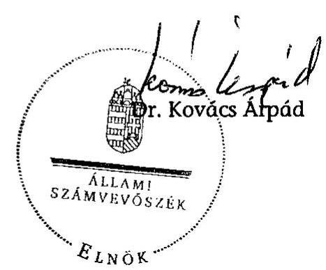

Melléklet: $\quad 4 \mathrm{db} \quad 35$ lap

---

# MELLÉKLETEK

---

# ÉSZREVÉTEL

---

H-1051 BUDAPEST V., JÓZSEF NÁDOR TÉR 2-4. POSTACIM: 1369 BUDAPEST, POSTAFIÓK 481.

TELEFON: (36-1) 327-2100, (+36) 30 371-2100
FAX: (36-1) 318-2570

PÉNZÜGYMINISZTER

Dr. Kovács Árpád úr
elnök

Állami Számvevőszék

Budapest

E-MAIL: peter.oszko@pm.gov.hu

Iktatószám: 738/34/2009.
Hiv.szám: V-2002-047/2009
Ügyintéző: Schrenk László
Tárgy: Ász jelentés

Bihany a.
komu 1m
11,24,
loud
M.27

Tisztelt Elnök Úr!

Az APEH által kialakított ellenőrzési portfólió és kockázatkezelési rendszer
célszerűségének és eredményességének ellenőrzéséről készült jelentést köszönettel
megkaptam.

Tekintettel arra, hogy az előzetes egyeztetések során az egyes kérdéseket érintően a
Pénzügyminisztérium álláspontját figyelembe vették, illetőleg a jelentés szövegét ennek
megfelelően alakították, a jelentés vonatkozásában vitás kérdés nem maradt, ezért az abban
foglaltakkal kapcsolatosan észrevételt nem teszek.

Elnök úr a V-2002-047/2009. iktatószámú levele utolsó bekezdésében az ellenőrzés alapján
elrendelt pénzügyminiszteri intézkedésekről kért tájékoztatást, mellyel kapcsolatban a
jelentés 21. oldalán található, a pénzügyminiszternek megfogalmazott javaslatok
alapulvételével a következőkről tájékoztatom:

Jelen levelemmel egyidejűleg előírtam az Adó- és Pénzügyi Ellenőrzési Hivatal elnöke
számára, hogy

1. Tegyen javaslatot az adórés mérése módszerének kialakítására, hogy értékelhető
legyen az adóalanyok jogkövető magatartásának javítása érdekében hozott intézkedések
hatása.

---

2. a) Vizsgálja felül és módosítsa az állami adóhatóság ellenőrzési stratégiájának a fekete- és szürkegazdaság mérésére vonatkozó célkitűzéseit.
b) Intézkedjen olyan mutatószámok kidolgozásáról, amelyek alkalmasak egyrészt az éves ellenőrzési irányelvekben meghatározott célkitűzések megvalósulásának, másrészt valamennyi ellenőrzési típus eredményességének mérésére, továbbá gondoskodjon arról, hogy azok összhangban legyenek az állami adóhatóság teljesítményértékelési és ösztönzési rendszerében már meglévő mutatókkal;
c) Tegyen eleget az APEH müködésének ellenőrzéséről készült (0616) ÁSZ jelentésre kidolgozott intézkedési tervnek: véglegezze a humánerőforrás-kapacitás rendszeres és azonos mutatószámokon alapuló tervezésének módszerét, továbbá készítsen ilyen elemzéseket.
d) Vizsgálja felül a hátralékkezelés eljárásrendjét, továbbá alakítson ki olyan informatikai rendszert, amely támogatja a hátralékok teljes körének hátralékkezelésbe vonását.

Az előírt feladatok végrehajtására az Adó- és Pénzügyi Ellenőrzési Hivatal elnöke részére megállapított határidő folyamatos azzal, hogy a feladat-végrehajtás állásáról negyedévente köteles írásban beszámolni.

Kérem tájékoztatásom szíves elfogadását.
Budapest, 2009. november 23.

Tisztelettel:
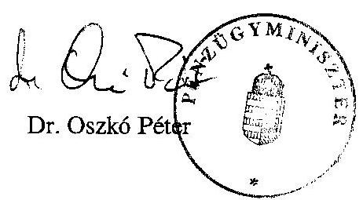

---

# TANÚSÍTVÁNYOK (1-21-ig)

---

# Tanúsítványok jegyzéke 

| Sorsz.: | Megnevezés |
| :--: | :--: |
| 1. sz. | az adó- és adójellegű bevételek alakulásáról (2005-2008) |
| 2. sz. | az adóalanyok számának alakulásáról (2005-2008) |
| 3. sz. | az APEH dolgozó létszámának alakulásáról (2005-2008) |
| $4 / a-4 / d . s z$. | a kockázati szempontok alapján ellenőrzésre kiválasztás eredményességének ellenőrzési típusonkénti alakulásáról (2005, 2006, 2007, 2008) |
| $5 / a-5 / d . s z$. | az ellenőrzések eredményességének alakulásáról ellenőrzési típusonként (2005, 2006, 2007, 2008) |
| 6. sz. | az ellenőrzések eredményességeinek alakulásáról főbb adónemenként (2005-2008) |
| $7 / a-7 / d . s z$. | az ellenőrzések eredményességeinek alakulásáról adózói kategóriánként (2005, 2006, 2007, 2008) |
| $8 / a-8 / d . s z$. | a hátralékállomány értékhatáronkénti és adózói kör szerinti alakulásáról (2005, 2006, 2007, 2008) |
| 9. sz. | a hátralékállomány adózói kör szerinti alakulásáról (20052008) |
| 10. sz. | a hátralékállomány adónemenkénti alakulásáról (20052008) |
| $11 / a-11 / b . s z$. | a működő adózók közül hosszabb ideje hátralékosok és a hátralékkezelésbe nem vont hátralékosok számáról és a hátralék összegéről 2008. 12. 31-én |
| $12 / a-12 / d . s z$. | a behajtási tevékenység kiemelt adatainak adózói körönkénti alakulásáról (2005, 2006, 2007, 2008) |
| $13 / a-13 / d . s z$. | a hátralék-törlések adónemenkénti alakulásáról (2005, 2006, 2007, 2008) |
| $14 / a-14 / d . s z$. | a hátralék-törlések adózói kör szerinti alakulásáról (2005, 2006, 2007, 2008) |
| 15. sz. | a közigazgatási határozatok, perek számának alakulásáról (2005-2008) |
| 16. sz. | az ellenőrzéssel kapcsolatos jogorvoslati eljárások alakulásáról (2005-2008) |
| 17. sz. | a 2006. és a 2008. években zárult vagyongyarapodási vizsgálatok alapján hozott határozatok alakulásáról |

---

| 18. sz. | a hátralékállomány adónemek szerinti alakulásáról   (2005-2008) |
| :--: | :-- |
| 19. sz. | a munkaviszony megszüntetésének alakulásáról   (2005-2008) |
| 20. sz. | az APEH személyi állományának szakmai gyakorlati idố   szerinti megoszlásáról (2005-2008) |
| 21. sz. | az üres álláshelyek számáról (2005-2008) |

---

### Tanúsítvány az adó- és adójellegű bevételek alakulásáról

|  Megnevezés | 2005 |  | 2006 |  | 2007 |  | 2008 |   |
| --- | --- | --- | --- | --- | --- | --- | --- | --- |
|   | Netto | Bruttó | Netto | Bruttó | Netto | Bruttó | Netto | Bruttó  |
|  Társasági adó | 430,0 | 514,3 | 488,7 | 541,1 | 510,8 | 604,3 | 487,5 | 592,8  |
|  Szia | 1 437,1 | 1 515,9 | 1 579,5 | 1 676,7 | 1 798,9 | 1 921,3 | 1 998,7 | 2 109,0  |
|  Ála | 1 785,3 | 3 070,6 | 1 832,0 | 3 096,4 | 1 979,4 | 3 459,5 | 2 114,1 | 3 603,7  |
|  Játékadó | 66,4 | 66,4 | 71,5 | 71,5 | 71,5 | 71,5 | 72,7 | 72,8  |
|  Munkaadói járulék | 172,6 | 173,6 | 184,8 | 188,6 | 201,4 | 202,8 | 211,5 | 212,3  |
|  Munkavállalói járulék | 52,3 | 53,4 | 63,4 | 64,7 | 93,0 | 92,0 | 97,6 | 98,3  |
|  EVA | 91,4 | 91,7 | 143,5 | 143,1 | 152,8 | 153,5 | 166,5 | 167,2  |
|  Társadalombíz losítási járulék | 2 272,9 | 2 282,6 | 2 470,2 | 2 507,8 | 2 905,3 | 2 915,1 | 3 064,6 | 3 075,3  |
|  Egészségügyi hozzájárulás | 164,4 | 167,3 | 107,7 | 111,9 | 113,5 | 117,0 | 119,0 | 123,1  |
|  Magánnyugdíj Pénztár bevételei |  |  |  |  | 286,0 | 287,0 | 352,6 | 354,2  |
|  Illetékek |  |  |  |  | 146,3 | 152,3 | 158,6 | 153,6  |
|  Egyéb bevételek | 159,5 | 181,7 | 242,5 | 265,9 | 395,1 | 448,5 | 446,4 | 503,1  |
|  Összesen | 6 631,9 | 8 117,5 | 7 163,8 | 8 667,7 | 8 654,0 | 10 424,6 | 9 289,8 | 11 065,4  |

Fenti adatok hőelességét igazolom.

Kelt: Budapest, 2009. április 21.

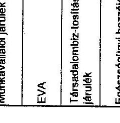

---

## 2. sz. tanúsítvány az adóalanyok számának alakulásáról 2005-2008

|  Müködő adóalanyí kör | Száma (db) | aránya % | Száma (db) | aránya % | Növekedés előző évhez viszonyítva (b) | Száma (db) | aránya % | Növekedés előző évhez viszonyítva (b) | Száma (db) | aránya % | Növekedés előző évhez viszonyítva (b)  |
| --- | --- | --- | --- | --- | --- | --- | --- | --- | --- | --- | --- |
|  Müködő adóalany összesen | 1 229 105 | 23,84% | 1 210 667 | 23,30% | -18 439 | 1 252 914 | 23,41% | 42 247 | 1 577 325 | 29,07% | 324 411  |
|  Alapítvány |  |  |  |  |  |  |  |  |  |  |   |
|  Jogi személyiségű gazdasági társaságok | 220 963 | 4,29% | 233 829 | 4,50% | 12 865 | 249 779 | 4,57% | 15 950 | 278 043 | 5,12% | 28 264  |
|  Jogi személyiség nélkül gazdasági társaságok | 243 920 | 4,73% | 244 798 | 4,71% | 878 | 238 627 | 4,46% | -6 171 | 228 161 | 4,20% | -10 466  |
|  Köllésbevétel szervezetek | 10 528 | 0,20% | 10 453 | 0,20% | -75 | 9 886 | 0,18% | -567 | 9 599 | 0,18% | -287  |
|  Egyéb szervezetek | 74 334 | 1,44% | 76 542 | 1,47% | 2 208 | 77 684 | 1,45% | 1 142 | 75 900 | 1,40% | -1 784  |
|  Egyéni vállalkozások | 438 561 | 8,51% | 410 999 | 7,91% | -27 562 | 401 683 | 7,51% | -9 316 | 388 848 | 7,17% | -12 835  |
|  Örülő tevékenységet folytató magánszemélyek | 240 800 | 4,67% | 234 046 | 4,51% | -6 754 | 275 255 | 5,14% | 41 209 | 596 774 | 11,00% | 321 519  |
|  SZJA bevallók összesen | 4 469 121 | 86,70% | 4 468 824 | 86,02% | -397 | 4 597 714 | 85,91% | 128 850 | 4 665 730 | 85,98% | 68 016  |
|  Müködtőlőval elszámolók | 2 340 906 | 45,41% | 2 432 391 | 46,82% | 91 485 | 3 504 008 | 65,47% | 1 071 617 | 3 688 595 | 67,98% | 184 587  |
|  SZJA bevallást adók | 2 117 167 | 41,07% | 2 026 909 | 39,02% | -90 258 | 1 081 893 | 20,21% | -945 016 | 971 432 | 17,90% | -110 461  |
|  Müködtőlőval elszámolók | 1 104 811 | 2,12% | 1 131 593 | 2,53% | 22 110 | 145 685 | 2,72% | 14 092 | 131 732 | 2,43% | -13 953  |
|  Tachnikal megszűnt adóalanyok |  |  |  |  |  |  |  |  |  |  |   |
|  Összesen | 5 164 811 | 100% | 5 195 017 | 100% | 40 206 | 5 351 954 | 100% | 156 937 | 5 426 259 | 100% | 74 305  |
|  Véglegesen megszűnt adóalanyok |  |  |  |  |  |  |  |  |  |  |   |
|  Összesenből: Müködő közösségi adószámmal rendelkezők | 80 064 | 1,55% | 86 985 | 1,67% | 6 921 | 68 481 | 1,28% | -18 504 | 98 562 | 1,82% | 30 081  |
|  Összesenből: Müködő közösségi adószámmal rendelkezők | 99 457 | 1,55% | 122 806 | 1,67% | 23 349 | 150 461 | 1,28% | 27 655 | 186 173 | 1,82% | 35 712  |

*Az adókoszli adómegtőlapítési késő adózók is az SZJA bevallók körébe tartoznak.

**A felszámolási-, végelszámolási-, és csődeljárás alatt álló adózókat is SZJA Heiligabendmódok, 100000000000000000000000000000000000000000000000000000000000000000000000000000000000000000000000000000000000000000000000000000000000000000000000000000000000000000000000000000000000000000000000000000000

---

|   |  |  |  |  |  |  |  |  |  |  |  |  |  |  |  |  |  |  |  |  |  |  |  |  |  |  |  |  |  |  |  |  |  |  |  |  |  |   |
| --- | --- | --- | --- | --- | --- | --- | --- | --- | --- | --- | --- | --- | --- | --- | --- | --- | --- | --- | --- | --- | --- | --- | --- | --- | --- | --- | --- | --- | --- | --- | --- | --- | --- | --- | --- | --- | --- | --- | --- | --- |
|   |  |  |  |  |  |  |  |  |  |  |  |  |  |  |  |  |  |  |  |  |  |  |  |  |  |  |  |  |  |  |  |  |  |  |  |  |  |  |   |
|   |  |  |  |  |  |  |  |  |  |  |  |  |  |  |  |  |  |  |  |  |  |  |  |  |  |  |  |  |  |  |  |  |  |  |  |  |  |  |   |
|   |  |  |  |  |  |  |  |  |  |  |  |  |  |  |  |  |  |  |  |  |  |  |  |  |  |  |  |  |  |  |  |  |  |  |  |  |  |  |   |
|   |  |  |  |  |  |  |  |  |  |  |  |  |  |  |  |  |  |  |  |  |  |  |  |  |  |  |  |  |  |  |  |  |  |  |  |  |  |  |   |
|   |  |  |  |  |  |  |  |  |  |  |  |  |  |  |  |  |  |  |  |  |  |  |  |  |  |  |  |  |  |  |  |  |  |  |  |  |  |  |   |
|   |  |  |  |  |  |  |  |  |  |  |  |  |  |  |  |  |  |  |  |  |  |  |  |  |  |  |  |  |  |  |  |  |  |  |  |  |  |  |   |
|   |  |  |  |  |  |  |  |  |  |  |  |  |  |  |  |  |  |  |  |  |  |  |  |  |  |  |  |  |  |  |  |  |  |  |  |  |  |  |   |
|   |  |  |  |  |  |  |  |  |  |  |  |  |  |  |  |  |  |  |  |  |  |  |  |  |  |  |  |  |  |  |  |  |  |  |  |  |  |  |   |
|   |  |  |  |  |  |  |  |  |  |  |  |  |  |  |  |  |  |  |  |  |  |  |  |  |  |  |  |  |  |  |  |  |  |  |  |  |  |  |   |
|   |  |  |  |  |  |  |  |  |  |  |  |  |  |  |  |  |  |  |  |  |  |  |  |  |  |  |  |  |  |  |  |  |  |  |  |  |  |  |   |
|   |  |  |  |  |  |  |  |  |  |  |  |  |  |  |  |  |  |  |  |  |  |  |  |  |  |  |  |  |  |  |  |  |  |  |  |  |  |  |   |
|   |  |  |  |  |  |  |  |  |  |  |  |  |  |  |  |  |  |  |  |  |  |  |  |  |  |  |  |  |  |  |  |  |  |  |  |  |  |  |   |
|   |  |  |  |  |  |  |  |  |  |  |  |  |  |  |  |  |  |  |  |  |  |  |  |  |  |  |  |  |  |  |  |  |  |  |  |  |  |  |   |
|   |  |  |  |  |  |  |  |  |  |  |  |  |  |  |  |  |  |  |  |  |  |  |  |  |  |  |  |  |  |  |  |  |  |  |  |  |  |  |   |
|   |  |  |  |  |  |  |  |  |  |  |  |  |  |  |  |  |  |  |  |  |  |  |  |  |  |  |  |  |  |  |  |  |  |  |  |  |  |  |   |
|   |  |  |  |  |  |  |  |  |  |  |  |  |  |  |  |  |  |  |  |  |  |  |  |  |  |  |  |  |  |  |  |  |  |  |  |  |  |  |   |
|   |  |  |  |  |  |  |  |  |  |  |  |  |  |  |  |  |  |  |  |  |  |  |  |  |  |  |  |  |  |  |  |  |  |  |  |  |  |  |   |
|   |  |  |  |  |  |  |  |  |  |  |  |  |  |  |  |  |  |  |  |  |  |  |  |  |  |  |  |  |  |  |  |  |  |  |  |  |  |  |   |
|   |  |  |  |  |  |  |  |  |  |  |  |  |  |  |  |  |  |  |  |  |  |  |  |  |  |  |  |  |  |  |  |  |  |  |  |  |  |  |   |
|   |  |  |  |  |  |  |  |  |  |  |  |  |  |  |  |  |  |  |  |  |  |  |  |  |  |  |  |  |  |  |  |  |  |  |  |  |  |  |   |
|   |  |  |  |  |  |  |  |  |  |  |  |  |  |  |  |  |  |  |  |  |  |  |  |  |  |  |  |  |  |  |  |  |  |  |  |  |  |  |   |
|   |  |  |  |  |  |  |  |  |  |  |  |  |  |  |  |  |  |  |  |  |  |  |  |  |  |  |  |  |  |  |  |  |  |  |  |  |  |  |   |
|   |  |  |  |  |  |  |  |  |  |  |  |  |  |  |  |  |  |  |  |  |  |  |  |  |  |  |  |  |  |  |  |  |  |  |  |  |  |  |   |
|   |  |  |  |  |  |  |  |  |  |  |  |  |  |  |  |  |  |  |  |  |  |  |  |  |  |  |  |  |  |  |  |  |  |  |  |  |  |  |   |
|   |  |  |  |  |  |  |  |  |  |  |  |  |  |  |  |  |  |  |  |  |  |  |  |  |  |  |  |  |  |  |  |  |  |  |  |  |  |  |   |
|   |  |  |  |  |  |  |  |  |  |  |  |  |  |  |  |  |  |  |  |  |  |  |  |  |  |  |  |  |  |  |  |  |  |  |  |  |  |  |   |
|   |  |  |  |  |  |  |  |  |  |  |  |  |  |  |  |  |  |  |  |  |  |  |  |  |  |  |  |  |  |  |  |  |  |  |  |  |  |  |   |
|   |  |  |  |  |  |  |  |  |  |  |  |  |  |  |  |  |  |  |  |  |  |  |  |  |  |  |  |  |  |  |  |  |  |  |  |  |  |  |   |
|   |  |  |  |  |  |  |  |  |  |  |  |  |  |  |  |  |  |  |  |  |  |  |  |  |  |  |  |  |  |  |  |  |  |  |  |  |  |  |   |
|   |  |  |  |  |  |  |  |  |  |  |  |  |  |  |  |  |  |  |  |  |  |  |  |  |  |  |  |  |  |  |  |  |  |  |  |  |  |  |   |
|   |  |  |  |  |  |  |  |  |  |  |  |  |  |  |  |  |  |  |  |  |  |  |  |  |  |  |  |  |  |  |  |  |  |  |  |  |  |  |   |
|   |

---

tanúsítvány a kockázati szempontok alapján ellenőrzésre kiválasztás eredményepsségének ellenőrzési típusonkénti alakulásáról 2005. év

APEI1-összesen

|  Ellenőrzési típusok megnevezése | Elvégzett ellenőrzések száma összesen (db) | Megállapítással zárult ellenőrzések |  | Kockázati szempontok alapján kiválasztás eredményeként elvégzett ellenőrzések |  |  | Megállapítással zárult ellenőrzések |   |
| --- | --- | --- | --- | --- | --- | --- | --- | --- |
|   |  | száma (db) | aránya (%) | száma (db) | aránya (%) | fajlagos nettó megállapítás (E Ft) | száma (db) | aránya (%)  |
|  Bevallások utólagos ellenőrzése | 143 775 | 47 624 | 33 | 137 736 | 96 | 1 301 | 44 085 | 32  |
|  ebből |  |  |  |  |  |  |  |   |
|  legnagyobb adóteljesítményű adózók ellenőrzése | 5 057 | 2 423 | 48 | 5 077 | 100 | 8 102 | 2 407 | 47  |
|  nagymononlási vizsgálatok | 619 | 404 | 60 | 602 | 97 | 5 764 | 373 | 62  |
|  bevallás kiegészítése alapján elredeti ellenőrzések | 187 | 111 | 59 | 187 | 100 | 403 | 111 | 58  |
|  azonnal ellenőrzések | 310 | 224 | 72 | 310 | 100 | 1 407 | 224 | 72  |
|  áttekintett, adókötelezettségüket megszűnéstő vagy más jogutód nélkül megszűnő vállalkozások ellenőrzése | 22 846 | 7 464 | 33 | 22 151 | 97 | 2 345 | 7 005 | 32  |
|  kiutalás előtti ellenőrzések | 29 472 | 13 173 | 45 | 27 909 | 95 | 1 599 | 12 634 | 45  |
|  Áltemi garancia bevallásához kapcsolódó ellenőrzés | 51 | 0 | 0 | 48 | 94 | 0 | 0 | 0  |
|  Egyes adókötelezettségek teljesítésére irányuló ellenőrzés | 107 257 | 6 701 | 6 | 94 104 | 88 | 3 | 5 226 | 6  |
|  Adatok gyűjtését záró ellenőrzések | 47 695 | 13 615 | 29 | 9 598 | 0 | 0 | 2 804 | 29  |
|  Ellenőrzéssel lezárt időszakra vonatkozó ismételt ellenőrzés | 225 | 163 | 60 | 32 | 14 | 1 400 | 19 | 50  |
|  Egyéb Art.-on kívüli ellenőrzések | 254 | 45 | 16 | 250 | 88 | 168 | 24 | 10  |
|  Összesen: | 299 287 | 68 178 | 23 | 241 738 | 81 | 743 | 52 170 | 22  |

Kelt: Budapest, 2008 t.5.29.

7_elt_eredmény_elt_fípus_0829.xls

---

tanúsítvány a kockázati szempontok alapján ellenőrzésre kiválasztás eredményességének ellenőrzési típusonkénti alakulásáról 2006. év

APEH összesen

|  Ellenőrzési típusok megnevezése | Elvégzett ellenőrzések száma összesen (db) | Megállapítással zárult ellenőrzések |  | Kockázati szempontok alapján kiválasztás eredményeként elvégzett ellenőrzések |  |  | Megállapítással zárult ellenőrzések |   |
| --- | --- | --- | --- | --- | --- | --- | --- | --- |
|   |  | száma (db) | aránya (%) | száma (db) | aránya (%) | fajlagos nettó megállapítás (E Ft) | száma (db) | aránya (%)  |
|  Bevallások utólagos ellenőrzése | 80 924 | 48 513 | 80 | 74 861 | 93 | 3 586 | 45 247 | 60  |
|  eladó: |  |  |  |  |  |  |  |   |
|  legnagyobb adófeljesztményt adózók ellenőrzése | 2 039 | 1 402 | 69 | 1 990 | 98 | 21 874 | 1 371 | 69  |
|  vegyenemelési vizsgálatok | 879 | 518 | 70 | 817 | 93 | 5 921 | 569 | 70  |
|  bevallás kiegészítése alapján elindult ellenőrzések | 249 | 132 | 53 | 249 | 100 | 262 | 132 | 53  |
|  semmió ellenőrzések | 135 | 96 | 69 | 139 | 100 | 1 359 | 96 | 69  |
|  ésszesen: adókőtelezettségüket megszüntető vagy más jógutód nélkül megszűnő vállalkozások ellenőrzése | 21 008 | 7 921 | 38 | 20 334 | 97 | 3 504 | 7 488 | 37  |
|  tudatási edző ellenőrzések | 16 953 | 12 520 | 74 | 15 833 | 93 | 2 902 | 12 033 | 76  |
|  Állami garancia beváltásához kapcsolódó ellenőrzés | 113 | 2 | 2 | 107 | 95 | 0 | 0 | 0  |
|  Egyes adókőtelezettségek teljesítésére irányuló ellenőrzés | 145 173 | 7 613 | 5 | 126 252 | 87 | 4 | 5 687 | 0  |
|  Adatok gyűjtését záró ellenőrzések | 52 423 | 12 954 | 25 | 6 736 | 19 | 0 | 2 492 | 26  |
|  Ellenőrzéssel lezárt időszakra vonatkozó ismételt ellenőrzés | 267 | 246 | 97 | 13 | 4 | 16 | 9 | 69  |
|  Egyéb Art.-on kivüli ellenőrzések | 414 | 141 | 34 | 344 | 83 | 123 | 80 | 23  |
|  Összesen: | 279 314 | 69 469 | 25 | 211 313 | 76 | 1 273 | 53 515 | 25  |

7_ell_eredmény_ell_típus_0529.xls

---

tamisítvány a kockázati szempontok alapján ellenőrzésre kiválasztás eredményességének ellenőrzési típusonkénti alakulásáról 2007. év

|  Ellenőrzési típusok megnevezése | Elvégzett ellenőrzések száma összesen (db) | Megállapítással zárolt ellenőrzések |  | Kockázati szempontok alapján kiválasztás eredményeként elvégzett ellenőrzések |  |  |  | Ebből |   |
| --- | --- | --- | --- | --- | --- | --- | --- | --- | --- |
|   |  | száma (db) | aránya (%) | száma (db) | aránya (%) | fajlagos nettó megállapítás (E Ft) | száma (db) | aránya (%) | fajlagos nettó megállapítás (E Ft)  |
|  Bevallások utólagos ellenőrzése | 67 721 | 38 462 | 57 | 62 306 | 92 | 4 630 | 35 202 | 56 | 8 195  |
|  eladó |  |  |  |  |  |  |  |  |   |
|  legnegyebb adókéjesítményű adózék ellenőrzése | 2 289 | 1 366 | 60 | 2 245 | 58 | 18 563 | 1 336 | 60 | 31 193  |
|  vagyonosodási vizsgálatok | 11 186 | 7 297 | 65 | 10 465 | 54 | 3 436 | 6 873 | 66 | 5 231  |
|  bevallás kiegészítése alapján elindult ellenőrzések | 52 | 36 | 89 | 52 | 100 | 927 | 36 | 69 | 1 339  |
|  szomszél ellenőrzések | 62 | 40 | 55 | 62 | 100 | 16 947 | 40 | 69 | 26 268  |
|  átalakulát, adókőtelezetővágyúkat megszüntető vagy más jogutód nélkül megszűnő vállalkozások ellenőrzése | 18 917 | 8 989 | 48 | 18 336 | 97 | 5 054 | 8 632 | 47 | 10 737  |
|  biztatás előző ellenőrzések | 13 636 | 7 613 | 55 | 13 347 | 96 | 2 747 | 7 362 | 55 | 4 960  |
|  Állami garancia beváltásához kapcsolódó ellenőrzés | 70 | 0 | 0 | 69 | 95 | 0 | 0 | 0 | 0  |
|  Egyes adókőtelezetőségek teljesítésére irányuló ellenőrzés | 116 708 | 6 248 | 5 | 98 350 | 84 | 12 | 4 658 | 5 | 0  |
|  Adatok gyűjtését célzó ellenőrzések | 61 268 | 17 310 | 28 | 21 097 | 34 | 0 | 5 913 | 28 | 0  |
|  Ellenőrzéssel lezárt időszakra vonatkozó ismétlett ellenőrzés | 254 | 224 | 88 | 23 | 0 | 54 | 14 | 61 | 88  |
|  Egyéb Art.-on kivált ellenőrzések | 130 | 41 | 32 | 120 | 92 | 636 | 32 | 27 | 2 384  |
|  Összesen: | 246 137 | 62 305 | 25 | 181 935 | 74 | 1 592 | 45 818 | 25 | 6 298  |

Kelt: Budapest, 2009. cC 39.

R.H.

Alákás

---

## 4/d. sz. tanúsítvány

|  Elendrzési típusok megnevezése | Elvégzett
ellenőrzések száma
összesen (db) | Megállapítással zárult ellenőrzések |  | Kockázati szempontok alapján kiválasztás eredményeket
elvégzett ellenőrzések |  |  |  | Ebből |  |   |
| --- | --- | --- | --- | --- | --- | --- | --- | --- | --- | --- |
|   |  | száma (db) | aránya (%) |  |  |  |  |  | Megállapítással zárult ellenőrzések |   |
|   |  | szám (db) |  |  |  |  |  |  | szám (db) | aránya (%)  |
|  Bevallások utólagos ellenőrzése | 74 508 | 40 845 | 55 | 67 657 | 91 | 4 917 | 36 514 | 54 | 9 111 |   |
|  eladó |  |  |  |  |  |  |  |  |  |   |
|  legnagyobó adójeljesítményű adózók ellenőrzése | 1 990 | 1 198 | 80 | 1 946 | 98 | 25 900 | 1 170 | 60 | 43 078 |   |
|  vagyonosodási vizsgálatok | 6 204 | 4 050 | 65 | 5 200 | 65 | 4 079 | 3 455 | 65 | 6 281 |   |
|  bevallás kiegészítése alapján elsedett ellenőrzések | 9 | 6 | 67 | 9 | 100 | 3 378 | 6 | 67 | 5 067 |   |
|  azonnal ellenőrzések | 24 | 13 | 54 | 24 | 100 | 1 765 | 13 | 54 | 3 258 |   |
|  áttekintett, adóidbeszetségüket megszüntető vagy más jogutód | 24 026 | 10 495 | 44 | 23 362 | 97 | 4 206 | 10 058 | 43 | 9 769 |   |
|  nélkül megszűnő vállalkozások ellenőrzése | 15 198 | 8 031 | 53 | 15 087 | 69 | 1 827 | 7 935 | 53 | 3 473 |   |
|  kiadási időt ellenőrzések | 148 | 1 | 1 | 148 | 100 | 0 | 1 | 1 | 0 |   |
|  Egyes adóidteleszetségek teljesítésére irányuló ellenőrzés | 173 805 | 7 773 | 4 | 150 532 | 87 | 1 | 6 232 | 4 | 0 |   |
|  eladó |  |  |  |  |  |  |  |  |  |   |
|  lelkelt vállalkozások | 8 399 | 827 | 10 | 8 314 | 99 | 0 | 837 | 10 | 0 |   |
|  Adatok gyűjtését célzó ellenőrzések | 67 447 | 16 779 | 25 | 22 588 | 33 | 0 | 5 656 | 25 | 0 |   |
|  Ellenőrzéssel lezárt időszakra vonatkozó ismételt ellenőrzés | 253 | 217 | 86 | 30 | 14 | 1 357 | 24 | 67 | 2 036 |   |
|  Egyéb ArL-on kivált ellenőrzések | 1 231 | 342 | 28 | 761 | 62 | 22 | 97 | 13 | 134 |   |
|  Összesen: | 317 390 | 65 957 | 21 | 241 722 | 76 | 1 377 | 48 554 | 20 | 6 853 |   |

Kelt: Budapest, 2009. LfC: 49.

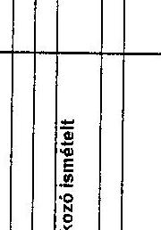

---

5/a. sz. tanúsítvány az ellenőrzések eredményezésből az alánolásáról ellenőrzési típusunként 2 005

|  Ellenőrzési típusok | Éllendőrzések |  |  |  | Adótállásbázisé |  |  |  | Adótábláig |  |  |  | Adótábláig |  |  |  |  |   |
| --- | --- | --- | --- | --- | --- | --- | --- | --- | --- | --- | --- | --- | --- | --- | --- | --- | --- | --- |
|   |  |  |  |  |  |  |  |  |  |  |  |  |  |  |  |  |  |   |
|  Ellenőrzési típusok | Összes | Megállapítással |  |  |  |  |  |  |  |  |  |  |  |  |  |  |  |   |
|   |  |  |  |  |  |  |  |  |  |  |  |  |  |  |  |  |  |   |
|   | db | db | nap | e Ft | e Ft | e Ft | e Ft | e Ft | e Ft | % | e Ft | e Ft | e Ft | e Ft | e Ft | % |  |   |
|  1 | 2 | 3 | 4 | 5 | 6 | 7+5-8 | 8 | 9 | 10 | 11+10/8 | 12 | 13 | 14+1/3 | 15+7/4 | 16+3/2 |  |  |   |
|  Bevallások utólagos ellenőrzése | 143 775 | 47 624 | 324 892 | 221 868 609 | 18 670 165 | 203 198 344 | 39 837 767 | 178 473 019 | 70 836 220 | 40 | 2 058 303 | 52 116 586 | 4 267 | 625 | 33 |  |  |   |
|  adódi |  |  |  |  |  |  |  |  |  |  |  |  |  |  |  |  |  |   |
|  legnagyobb adóidejrelményt adózói ellenőrzése | 5 057 | 2 423 | 64 581 | 56 512 185 | 14 280 223 | 42 231 962 | 6 414 123 | 38 953 273 | 12 800 141 | 33 | 463 003 | 10 427 273 | 17 430 | 654 | 46 |  |  |   |
|  vagyonozotási vizsgálatok | 618 | 404 | 4 148 | 3 168 878 | 11 492 | 3 157 395 | 0 | 3 697 490 | 1 510 913 | 41 | 1 243 | 1 245 947 | 7 815 | 761 | 65 |  |  |   |
|  bevallás kiegészítése alapján átadási ellenőrzése | 167 | 111 | 839 | 76 072 | 742 | 75 330 | 0 | 58 866 | 17 588 | 30 | 253 | 13 105 | 679 | 90 | 59 |  |  |   |
|  azonosító ellenőrzések | 310 | 224 | 2 194 | 443 762 | 7 481 | 436 282 | 317 | 500 709 | 248 695 | 55 | 4 828 | 186 074 | 1 948 | 199 | 72 |  |  |   |
|  adatkult, adódiélőzetségület megvizsgáló vagy más jogsétál nélkül megelőző ellenőrzések ellenőrzése | 22 848 | 7 464 | 49 614 | 53 068 960 | 928 135 | 52 142 825 | 3 407 | 53 879 776 | 26 547 657 | 48 | 1 182 679 | 24 714 682 | 6 988 | 1 051 | 33 |  |  |   |
|  kiutalás előtti ellenőrzések | 29 472 | 13 173 | 78 642 | 54 521 828 | 8 909 305 | 45 612 523 | 39 349 642 | 41 572 584 | 8 176 732 | 26 | 36 055 | 443 250 | 3 463 | 580 | 45 |  |  |   |
|  Átlenú garancia bevallásábon kapcsolódó ellenőrzés | 51 | 0 | 275 | 0 | 0 | 0 | 0 | 0 | 0 | 0 | 0 | 0 | 0 | 0 | 0 |  |  |   |
|  Egyes adókötelenzetségek teljesítésére irányuló ellenőrzés | 107 257 | 8 701 | 109 550 |  |  |  |  |  |  |  | 254 849 |  |  |  |  |  |  |   |
|  adath |  |  |  |  |  |  |  |  |  |  |  |  |  |  |  |  |  |   |
|  reduk vállalkozások |  |  |  |  |  |  |  |  |  |  |  |  |  |  |  |  |  |   |
|  Adatok gyűjtését célzó ellenőrzések | 47 695 | 13 015 | 33 834 |  |  |  |  |  |  |  | 734 278 |  |  |  |  | 25 |  |   |
|  Ellenőrzéssel lezárt időszabja vonatkozó leválatát ellenőrzés | 225 | 193 | 822 | 262 242 | 684 469 | -522 227 | 0 | 139 637 | 37 565 | 37 | 2 089 | 14 849 | -3 224 | -757 | 86 |  |  |   |
|  Egyéb Art. on kivált ellenőrzések | 284 | 45 | 569 | 91 909 | 0 | 91 909 | 0 | 5 177 | 0 | 0 | 415 | 6 475 | 2 042 | 159 | 16 |  |  |   |
|  Összesen | 288 287 | 88 178 | 468 962 | 222 222 659 | 19 594 634 | 202 668 625 | 39 837 767 | 178 617 833 | 70 873 785 | 40 | 3 048 931 | 52 137 910 | 2 973 | 431 | 23 |  |  |   |

- Az Art. - 2009. január 1.jétől hatályos - 90.§ (7) bekezdése alapján végzett vizsgálatokat tartalmazza.

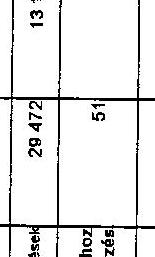

---

|  5/b. sz. tanúsítvány az ellenőrzések eredményességének alaballásáról ellenőrzési típusosként |  |  |  |  |  |  |  |  |  |  |  |  |  |  |  |  |   |
| --- | --- | --- | --- | --- | --- | --- | --- | --- | --- | --- | --- | --- | --- | --- | --- | --- | --- |
|  FEDS-Írásosztal |  |  |  |  |  |  |  |  |  |  |  |  |  |  |  |  |   |
|  |   |   |   |   |   |   |   |   |   |   |   |   |   |   |   |   |   |
|  |   |   |   |   |   |   |   |   |   |   |   |   |   |   |   |   |   |
|  |   |   |   |   |   |   |   |   |   |   |   |   |   |   |   |   |   |
|  |   |   |   |   |   |   |   |   |   |   |   |   |   |   |   |   |   |
|  |   |   |   |   |   |   |   |   |   |   |   |   |   |   |   |   |   |
|  |   |   |   |   |   |   |   |   |   |   |   |   |   |   |   |   |   |
|  |   |   |   |   |   |   |   |   |   |   |   |   |   |   |   |   |   |
|  |   |   |   |   |   |   |   |   |   |   |   |   |   |   |   |   |   |
|  |   |   |   |   |   |   |   |   |   |   |   |   |   |   |   |   |   |
|  |   |   |   |   |   |   |   |   |   |   |   |   |   |   |   |   |   |
|  |   |   |   |   |   |   |   |   |   |   |   |   |   |   |   |   |   |
|  |   |   |   |   |   |   |   |   |   |   |   |   |   |   |   |   |   |
|  |   |   |   |   |   |   |   |   |   |   |   |   |   |   |   |   |   |
|  |   |   |   |   |   |   |   |   |   |   |   |   |   |   |   |   |   |
|  |   |   |   |   |   |   |   |   |   |   |   |   |   |   |   |   |   |
|  |   |   |   |   |   |   |   |   |   |   |   |   |   |   |   |   |   |
|  |   |   |   |   |   |   |   |   |   |   |   |   |   |   |   |   |   |
|  |   |   |   |   |   |   |   |   |   |   |   |   |   |   |   |   |   |
|  |   |   |   |   |   |   |   |   |   |   |   |   |   |   |   |   |   |
|  |   |   |   |   |   |   |   |   |   |   |   |   |   |   |   |   |   |
|  |   |   |   |   |   |   |   |   |   |   |   |   |   |   |   |   |   |
|  |   |   |   |   |   |   |   |   |   |   |   |   |   |   |   |   |   |
|  |   |   |   |   |   |   |   |   |   |   |   |   |   |   |   |   |   |
|  |   |   |   |   |   |   |   |   |   |   |   |   |   |   |   |   |   |
|  |   |   |   |   |   |   |   |   |   |   |   |   |   |   |   |   |   |
|  |   |   |   |   |   |   |   |   |   |   |   |   |   |   |   |   |   |
|  |   |   |   |   |   |   |   |   |   |   |   |   |   |   |   |   |   |
|  |   |   |   |   |   |   |   |   |   |   |   |   |   |   |   |   |   |
|  |   |   |   |   |   |   |   |   |   |   |   |   |   |   |   |   |   |
|  |   |   |   |   |   |   |   |   |   |   |   |   |   |   |   |   |   |
|  |   |   |   |   |   |   |   |   |   |   |   |   |   |   |   |   |   |

---

|  5/c-1. sz. tanúsítvány az ellenőrzések eredményességének alakulásáról ellenőrzési típusonként |  |  |  |  |  |  |  |  |  |  |  |  |  |  |   |
| --- | --- | --- | --- | --- | --- | --- | --- | --- | --- | --- | --- | --- | --- | --- | --- |
|  APRH összesen | Ellenőrzések |  |  | Adótváltobítési |  |  |  | Adótviség |  |  |  |  |  |  |   |
|   | Összcs | Megállapítással |  |  |  |  |  |  |  |  |  |  |  |  |   |
|   |  |  |  |  |  |  |  |  | Adót |  |  |  |  |  |   |
|  Ellenőrzési típusok | Összcs | Megállapítással |  |  |  |  |  |  |  |  |  |  |  |  |   |
|   |  |  |  |  |  |  |  |  |  |  |  |  |  |  |   |
|   | db | db |  |  |  |  |  |  |  |  |  |  |  |  |   |
|  1 | 2 | 3 | 4 | 5 | 6 | 7+5-6 | 8 | 9 | 10 | 11+10/9 | 12 | 13 | 14+7/3 | 15+7/4 | 16+3/2  |
|  Összállások szükséges ellenőrzése | 67 721 | 38 442 |  | 286 548 | 363 246 667 | 8 889 190 | 353 357 477 | 31 569 494 | 287 930 446 | 130 362 886 | 45 | 3 356 040 | 77 221 995 | 8 182 | 1 233  |
|  utasító |  |  |  |  |  |  |  |  |  |  |  |  |  |  |   |
|  legnegyebb adótalpojónényű adózás ellenőrzése | 2 266 | 1 305 |  | 37 308 | 85 026 430 | 7 294 691 | 57 731 739 | 13 074 905 | 41 405 468 | 15 904 341 | 38 | 708 336 | 9 207 228 | 42 263 | 1 547  |
|  vegyenesszület vizsgálatok | 11 184 | 7 287 |  | 81 053 | 40 811 845 | 140 154 | 40 871 691 | 1 341 | 28 499 576 | 14 131 072 | 50 | 25 252 | 10 718 943 | 5 574 | 502  |
|  lassabia kinyitottulás alapján követeli ellenőrzések | 52 | 36 |  | 360 | 48 209 | 21 | 48 168 | 1 | 58 554 | 29 148 | 50 | 75 | 20 134 | 1 339 | 134  |
|  normalt ellenőrzések | 82 | 82 |  | 511 | 1 051 439 | 724 | 1 050 715 | 0 | 1 051 519 | 525 575 | 50 | 1 095 | 312 172 | 26 268 | 2 057  |
|  Alatáratát, adóköteleszetegyikai megoldásait vagy más jogukat vallat vesprőlő vétalkorások ellenőrzése | 18 917 | 8 869 |  | 38 470 | 93 604 134 | 688 701 | 92 915 433 | 46 974 | 80 421 643 | 39 918 253 | 50 | 1 608 424 | 32 861 642 | 10 337 | 2 415  |
|  Vezetés edző ellenőrzések | 13 836 | 7 613 |  | 29 176 | 36 716 587 | 402 717 | 36 313 870 | 30 770 890 | 29 018 546 | 6 817 973 | 23 | 24 744 | 368 267 | 4 770 | 1 245  |
|  Álland garanciai összállásakor kapcsolódó ellenőrzés | 70 | 0 |  | 370 | 0 | 0 | 0 | 0 | 0 | 0 | 0 | 0 | 0 | 0 | 0  |
|  Kigyes adóköteleszetegyikai teljesülésére irányuló ellenőrzés | 116 705 | 6 248 |  | 113 273 |  |  |  |  |  |  |  | 293 822 |  |  |   |
|  utasító |  |  |  |  |  |  |  |  |  |  |  |  |  |  |   |
|  Adatát vállalkozások* |  |  |  |  |  |  |  |  |  |  |  |  |  |  |   |
|  Adatok gyűjtését célzó ellenőrzések | 61 259 | 17 310 |  | 38 778 |  |  |  |  |  |  |  | 1 036 815 |  |  |   |
|  Ellenőrzéssel hozási változása vonatkozó tanulsak ellenőrzés | 254 | 224 |  | 1 089 | 6 611 506 | 3 356 978 | 3 254 530 | 0 | 3 778 305 | 43 545 | 1 | 1 560 | 27 963 | 14 529 | 2 989  |
|  Egyéb Árt- orr búgál ellenőrzések | 130 | 41 |  | 491 | 85 676 | 0 | 85 676 | 0 | 42 371 | 2 525 | 0 | 855 | 17 875 | 2 090 | 214  |
|  Összesen: | 248 131 | 62 305 |  | 440 457 | 389 943 849 | 13 249 169 | 359 837 683 | 31 569 494 | 291 781 122 | 130 408 969 | 45 | 4 688 879 | 77 267 883 | 5 729 | 810  |

- Az Árt. - 2008. január 1 (déli hatályos - 90.§ (7) bekezdése alapján végzett vizsgálatokat tartalmazza.

---

|  5/c-2, sz. tanúsítvány az alacsholcsok eredményemleghozó aktiválataról elfordítását típusa oként 2007 |  |  |  |  |  |  |  |  |  |  |  |  |  |  |  |  |  |   |
| --- | --- | --- | --- | --- | --- | --- | --- | --- | --- | --- | --- | --- | --- | --- | --- | --- | --- | --- |
|  Adatkortyáladó program |  |  |  |  |  |  |  |  |  |  |  |  |  |  |  |  |  |   |
|  |   |   |   |   |   |   |   |   |   |   |   |   |   |   |   |   |   |   |
|  |   |   |   |   |   |   |   |   |   |   |   |   |   |   |   |   |   |   |
|  |   |   |   |   |   |   |   |   |   |   |   |   |   |   |   |   |   |   |
|  |   |   |   |   |   |   |   |   |   |   |   |   |   |   |   |   |   |   |
|  |   |   |   |   |   |   |   |   |   |   |   |   |   |   |   |   |   |   |
|  |   |   |   |   |   |   |   |   |   |   |   |   |   |   |   |   |   |   |
|  |   |   |   |   |   |   |   |   |   |   |   |   |   |   |   |   |   |   |
|  |   |   |   |   |   |   |   |   |   |   |   |   |   |   |   |   |   |   |
|  |   |   |   |   |   |   |   |   |   |   |   |   |   |   |   |   |   |   |
|  |   |   |   |   |   |   |   |   |   |   |   |   |   |   |   |   |   |   |
|  |   |   |   |   |   |   |   |   |   |   |   |   |   |   |   |   |   |   |
|  |   |   |   |   |   |   |   |   |   |   |   |   |   |   |   |   |   |   |
|  |   |   |   |   |   |   |   |   |   |   |   |   |   |   |   |   |   |   |
|  |   |   |   |   |   |   |   |   |   |   |   |   |   |   |   |   |   |   |
|  |   |   |   |   |   |   |   |   |   |   |   |   |   |   |   |   |   |   |
|  |   |   |   |   |   |   |   |   |   |   |   |   |   |   |   |   |   |   |
|  |   |   |   |   |   |   |   |   |   |   |   |   |   |   |   |   |   |   |
|  |   |   |   |   |   |   |   |   |   |   |   |   |   |   |   |   |   |   |
|  |   |   |   |   |   |   |   |   |   |   |   |   |   |   |   |   |   |   |
|  |   |   |   |   |   |   |   |   |   |   |   |   |   |   |   |   |   |   |
|  |   |   |   |   |   |   |   |   |   |   |   |   |   |   |   |   |   |   |
|  |   |   |   |   |   |   |   |   |   |   |   |   |   |   |   |   |   |   |
|  |   |   |   |   |   |   |   |   |   |   |   |   |   |   |   |   |   |   |
|  |   |   |   |   |   |   |   |   |   |   |   |   |   |   |   |   |   |   |
|  |   |   |   |   |   |   |   |   |   |   |   |   |   |   |   |   |   |   |
|  |   |   |   |   |   |   |   |   |   |   |   |   |   |   |   |   |   |   |
|  |   |   |   |   |   |   |   |   |   |   |   |   |   |   |   |   |   |   |
|  |   |   |   |   |   |   |   |   |   |   |   |   |   |   |   |   |   |   |
|  |   |   |   |   |   |   |   |   |   |   |   |   |   |   |   |   |   |   |
|  |   |   |   |   |   |   |   |   |   |   |   |   |   |   |   |   |   |   |
|  |   |   |   |   |   |   |   |   |   |   |   |   |   |   |   |   |   |   |

---

|  5/c-3. sz. tanúsítvány az ellenőrzések eredményességének alátulásáról ellenőrzési típusunként |  |  |  |  |  |  |  |  |  |  |  |  |  |  |  |  |  |   |
| --- | --- | --- | --- | --- | --- | --- | --- | --- | --- | --- | --- | --- | --- | --- | --- | --- | --- | --- |
|  Adatszegékek szerveni nagyszerűen, fizetés nagyszerűen fizetésben fenntartott |  |  |  |  |  |  |  |  |  |  |  |  |  |  |  |  |  |   |
|  Előzőnivel
öppend | Összes | Megállapítással
elvét | Rendezés nap |  |  |  |  |  |  |  |  |  |  |  |  |  |  |   |
|   | db | db |  |  |  |  |  |  |  |  |  |  |  |  |  |  |  |   |
|   |  |  |  |  |  |  |  |  |  |  |  |  |  |  |  |  |  |   |
|   |  |  |  |  |  |  |  |  |  |  |  |  |  |  |  |  |  |   |
|  1 | 2 | 3 | 4 |  |  |  |  |  |  |  |  |  |  |  |  |  |  |   |
|  |   |   |   |   |   |   |   |   |   |   |   |   |   |   |   |   |   |   |
|  |   |   |   |   |   |   |   |   |   |   |   |   |   |   |   |   |   |   |
|  |   |   |   |   |   |   |   |   |   |   |   |   |   |   |   |   |   |   |
|  |   |   |   |   |   |   |   |   |   |   |   |   |   |   |   |   |   |   |
|  |   |   |   |   |   |   |   |   |   |   |   |   |   |   |   |   |   |   |
|  |   |   |   |   |   |   |   |   |   |   |   |   |   |   |   |   |   |   |
|  |   |   |   |   |   |   |   |   |   |   |   |   |   |   |   |   |   |   |
|  |   |   |   |   |   |   |   |   |   |   |   |   |   |   |   |   |   |   |
|  |   |   |   |   |   |   |   |   |   |   |   |   |   |   |   |   |   |   |
|  |   |   |   |   |   |   |   |   |   |   |   |   |   |   |   |   |   |   |
|  |   |   |   |   |   |   |   |   |   |   |   |   |   |   |   |   |   |   |
|  Egz. tanúsítvány |  |  |  |  |  |  |  |  |  |  |  |  |  |  |  |  |  |   |
|  |   |   |   |   |   |   |   |   |   |   |   |   |   |   |   |   |   |   |
|  |   |   |   |   |   |   |   |   |   |   |   |   |   |   |   |   |   |   |
|  |   |   |   |   |   |   |   |   |   |   |   |   |   |   |   |   |   |   |
|  |   |   |   |   |   |   |   |   |   |   |   |   |   |   |   |   |   |   |
|  |   |   |   |   |   |   |   |   |   |   |   |   |   |   |   |   |   |   |
|  |   |   |   |   |   |   |   |   |   |   |   |   |   |   |   |   |   |   |
|  |   |   |   |   |   |   |   |   |   |   |   |   |   |   |   |   |   |   |
|  |   |   |   |   |   |   |   |   |   |   |   |   |   |   |   |   |   |   |
|  |   |   |   |   |   |   |   |   |   |   |   |   |   |   |   |   |   |   |
|  |   |   |   |   |   |   |   |   |   |   |   |   |   |   |   |   |   |   |
|  |   |   |   |   |   |   |   |   |   |   |   |   |   |   |   |   |   |   |
|  |   |   |   |   |   |   |   |   |   |   |   |   |   |   |   |   |   |   |
|  |   |   |   |   |   |   |   |   |   |   |   |   |   |   |   |   |   |   |
|  |   |   |   |   |   |   |   |   |   |   |   |   |   |   |   |   |   |   |
|  |   |   |   |   |   |   |   |   |   |   |   |   |   |   |   |   |   |   |
|  |   |   |   |   |   |   |   |   |   |   |   |   |   |   |   |   |   |   |
|  |   |   |   |   |   |   |   |   |   |   |   |   |   |   |   |   |   |   |
|  |   |   |   |   |   |   |   |   |   |   |   |   |   |   |   |   |   |   |
|  |   |   |   |   |   |   |   |   |   |   |   |   |   |   |   |   |   |   |
|  |   |   |   |   |   |   |   |   |   |   |   |   |   |   |   |   |   |   |
|  |   |   |   |   |   |   |   |   |   |   |   |   |   |   |   |   |   |   |
|  |   |   |   |   |   |   |   |   |   |   |   |   |   |   |   |   |   |   |
|  |   |   |   |   |   |   |   |   |   |   |   |   |   |   |   |   |   |   |
|  |   |   |   |   |   |   |   |   |   |   |   |   |   |   |   |   |   |   |
|  |   |   |   |   |   |   |   |   |   |   |   |   |   |   |   |   |   |   |
|  |   |   |   |   |   |   |   |   |   |   |   |   |   |   |   |   |   |   |
|  |   |   |   |   |   |   |   |   |   |   |   |   |   |   |   |   |   |   |
|  |   |   |   |   |   |   |   |   |   |   |   |   |   |   |   |   |   |   |
|  |   |   |   |   |   |   |   |   |   |   |   |   |   |   |   |   |   |   |
|  |   |   |   |   |   |   |   |   |   |   |   |   |   |   |   |   |   |   |
|  |   |   |   |   |   |   |   |   |   |   |   |   |   |   |   |   |   |   |

---

|  5/c-4. sz. tanúsítvány
Tanúsítvány
sz. elterítéshez
sz. elterítéshez
sz. elterítéshez
tárpánok |  |  |  |  |  |  |  |  |  |  |  |  |  |  |   |
| --- | --- | --- | --- | --- | --- | --- | --- | --- | --- | --- | --- | --- | --- | --- | --- | --- |
|  Alámenépítési sorvatai megnevezése
Észekedési fegesítés
tanúsítvány |  |  |  |  |  |  |  |  |  |  |  |  |  |  |  |   |
|  Előműgési
fizetett | Összes
meglényben
akad |  |  |  |  |  |  |  |  |  |  |  |  |  |  |   |
|   |  |  |  |  |  |  |  |  |  |  |  |  |  |  |  |   |
|   |  |  |  |  |  |  |  |  |  |  |  |  |  |  |  |   |
|   |  |  |  |  |  |  |  |  |  |  |  |  |  |  |  |   |
|  1 | 2 | 3 | 4 | 5 | 6 | 7 | 8 | 9 | 10 | 11 | 12 | 13 | 14 | 15 | 16 | 17  |
|  Elterelítés |  |  |  |  |  |  |  |  |  |  |  |  |  |  |  |   |
|  1000000000000000000000000000000000000000000000000000000000000000000000000000000000000000000000000000000000000000000000000000000000000000000000000000000000000000000000000000000000000000000000000000000000

---

|  5/c-5, sz. tanúsítvány az ellenőrzések eredményességének alakulásáról ellenőrzési típusokból (KKF) |  |  |  |  |  |  |  |  |  |  |  |  |  |  |  |  |  |  |   |
| --- | --- | --- | --- | --- | --- | --- | --- | --- | --- | --- | --- | --- | --- | --- | --- | --- | --- | --- | --- |
|  Személyes |  |  |  |  |  |  |  |  |  |  |  |  |  |  |  |  |  |  |   |
|  Előzőcésú típusok | Összesen | Megállapítványa | Hozózik vép. | Tanulás | Jóváh. | Hozózi szótáírás, bősz. | Visszaforból | Alapítványa | Hozzapát | Személyes | Hozzapát | Hozzapát | Személyes | Hozzapát | Személyes | Hozzapát | Személyes | Hozzapát | Személyes  |
|   |  |  |  |  |  |  |  |  |  |  |  |  |  |  |  |  |  |  |   |
|  1 | 2 | 3 | 4 | 5 | 6 | 7+8-9 | 8 | 9 | 10 | 11+10/9 | 12 | 13 | 14+7/3 | 15+7/4 | 16+9/2 | 17+10/9 | 18+7/4 | 19+9/2 | 20  |
|  Hozzabékonat |  |  |  |  |  |  |  |  |  |  |  |  |  |  |  |  |  |  |   |
|  Személyes |  |  |  |  |  |  |  |  |  |  |  |  |  |  |  |  |  |  |   |
|  Személyes |  |  |  |  |  |  |  |  |  |  |  |  |  |  |  |  |  |  |   |
|  Hozzapát |  |  |  |  |  |  |  |  |  |  |  |  |  |  |  |  |  |  |   |
|  Hozzapát |  |  |  |  |  |  |  |  |  |  |  |  |  |  |  |  |  |  |   |
|  Személyes |  |  |  |  |  |  |  |  |  |  |  |  |  |  |  |  |  |  |   |
|  Hozzapát |  |  |  |  |  |  |  |  |  |  |  |  |  |  |  |  |  |  |   |
|  Hozzapát |  |  |  |  |  |  |  |  |  |  |  |  |  |  |  |  |  |  |   |
|  Hozzapát |  |  |  |  |  |  |  |  |  |  |  |  |  |  |  |  |  |  |   |
|  Hozzapát |  |  |  |  |  |  |  |  |  |  |  |  |  |  |  |  |  |  |   |
|  Hozzapát |  |  |  |  |  |  |  |  |  |  |  |  |  |  |  |  |  |  |   |
|  Hozzapát |  |  |  |  |  |  |  |  |  |  |  |  |  |  |  |  |  |  |   |
|  Hozzapát |  |  |  |  |  |  |  |  |  |  |  |  |  |  |  |  |  |  |   |
|  Hozzapát |  |  |  |  |  |  |  |  |  |  |  |  |  |  |  |  |  |  |   |
|  Hozzapát |  |  |  |  |  |  |  |  |  |  |  |  |  |  |  |  |  |  |   |
|  Hozzapát |  |  |  |  |  |  |  |  |  |  |  |  |  |  |  |  |  |  |   |
|  Hozzapát |  |  |  |  |  |  |  |  |  |  |  |  |  |  |  |  |  |  |   |
|  Hozzapát |  |  |  |  |  |  |  |  |  |  |  |  |  |  |  |  |  |  |   |
|  Hozzapát |  |  |  |  |  |  |  |  |  |  |  |  |  |  |  |  |  |  |   |
|  Hozzapát |  |  |  |  |  |  |  |  |  |  |  |  |  |  |  |  |  |  |   |
|  Hozzapát |  |  |  |  |  |  |  |  |  |  |  |  |  |  |  |  |  |  |   |
|  Hozzapát |  |  |  |  |  |  |  |  |  |  |  |  |  |  |  |  |  |  |   |
|  Hozzapát |  |  |  |  |  |  |  |  |  |  |  |  |  |  |  |  |  |  |   |
|  Hozzapát |  |  |  |  |  |  |  |  |  |  |  |  |  |  |  |  |  |  |   |
|  Hozzapát |  |  |  |  |  |  |  |  |  |  |  |  |  |  |  |  |  |  |   |
|  Hozzapát |  |  |  |  |  |  |  |  |  |  |  |  |  |  |  |  |  |  |   |
|  Hozzapát |  |  |  |  |  |  |  |  |  |  |  |  |  |  |  |  |  |  |   |
|  Hozzapát |  |  |  |  |  |  |  |  |  |  |  |  |  |  |  |  |  |  |   |
|  Hozzapát |  |  |  |  |  |  |  |  |  |  |  |  |  |  |  |  |  |  |   |
|  Hozzapát |  |  |  |  |  |  |  |  |  |  |  |  |  |  |  |  |  |  |   |
|  Hozzapát |  |  |  |  |  |  |  |  |  |  |  |  |  |  |  |  |  |  |   |
|  Hozzapát |  |  |  |  |  |  |  |  |  |  |  |  |  |  |  |  |  |  |   |
|  Hozzapát |  |  |  |  |  |  |  |  |  |  |  |  |  |  |  |  |  |  |   |
|  Hozzapát |  |  |  |  |  |  |  |  |  |  |  |  |  |  |  |  |  |  |   |
|  Hozzapát |  |  |  |  |  |  |  |  |  |  |  |  |  |  |  |  |  |  |   |
|  Hozzapát |  |  |  |  |  |  |  |  |  |  |  |  |  |  |  |  |  |  |   |
|  Hozzapát |  |  |  |  |  |  |  |  |  |  |  |  |  |  |  |  |  |  |   |
|  H

---

|  5/c-6. sz. tanúsítvány |  |  |  |  |  |  |  |  |  |  |  |  |  |  |  |  |  |  |   |
| --- | --- | --- | --- | --- | --- | --- | --- | --- | --- | --- | --- | --- | --- | --- | --- | --- | --- | --- | --- |
|  Tanúsítvány az ellenőrzések eredményességének elolultásáról ellenőrzési típusuként |  |  |  |  |  |  |  |  |  |  |  |  |  |  |  |  |  |  |   |
|  Azelőző |  |  |  |  |  |  |  |  |  |  |  |  |  |  |  |  |  |  |   |
|  Előzőnési típusok | Összesen | Megállapítással vétel | Rákódás nap | Széltetés nap |  |  |  |  |  |  |  |  |  |  |  |  |  |  |   |
|   |  |  |  |  |  |  |  |  |  |  |  |  |  |  |  |  |  |  |   |
|   |  |  |  |  |  |  |  |  |  |  |  |  |  |  |  |  |  |  |   |
|  1 | 2 | 3 | 4 | 5 | 6 | 7 | 8 | 9 | 10 | 11 | 12 | 13 | 14 | 15 | 16 | 17 | 18 | 19 | 20  |
|  |   |   |   |   |   |   |   |   |   |   |   |   |   |   |   |   |   |   |   |
|  |   |   |   |   |   |   |   |   |   |   |   |   |   |   |   |   |   |   |   |
|  |   |   |   |   |   |   |   |   |   |   |   |   |   |   |   |   |   |   |   |
|  |   |   |   |   |   |   |   |   |   |   |   |   |   |   |   |   |   |   |   |
|  |   |   |   |   |   |   |   |   |   |   |   |   |   |   |   |   |   |   |   |
|  |   |   |   |   |   |   |   |   |   |   |   |   |   |   |   |   |   |   |   |
|  |   |   |   |   |   |   |   |   |   |   |   |   |   |   |   |   |   |   |   |
|  |   |   |   |   |   |   |   |   |   |   |   |   |   |   |   |   |   |   |   |
|  |   |   |   |   |   |   |   |   |   |   |   |   |   |   |   |   |   |   |   |
|  |   |   |   |   |   |   |   |   |   |   |   |   |   |   |   |   |   |   |   |
|  |   |   |   |   |   |   |   |   |   |   |   |   |   |   |   |   |   |   |   |
|  |   |   |   |   |   |   |   |   |   |   |   |   |   |   |   |   |   |   |   |
|  |   |   |   |   |   |   |   |   |   |   |   |   |   |   |   |   |   |   |   |
|  |   |   |   |   |   |   |   |   |   |   |   |   |   |   |   |   |   |   |   |
|  |   |   |   |   |   |   |   |   |   |   |   |   |   |   |   |   |   |   |   |
|  |   |   |   |   |   |   |   |   |   |   |   |   |   |   |   |   |   |   |   |
|  |   |   |   |   |   |   |   |   |   |   |   |   |   |   |   |   |   |   |   |
|  |   |   |   |   |   |   |   |   |   |   |   |   |   |   |   |   |   |   |   |
|  |   |   |   |   |   |   |   |   |   |   |   |   |   |   |   |   |   |   |   |
|  |   |   |   |   |   |   |   |   |   |   |   |   |   |   |   |   |   |   |   |
|  |   |   |   |   |   |   |   |   |   |   |   |   |   |   |   |   |   |   |   |
|  |   |   |   |   |   |   |   |   |   |   |   |   |   |   |   |   |   |   |   |
|  |   |   |   |   |   |   |   |   |   |   |   |   |   |   |   |   |   |   |   |
|  |   |   |   |   |   |   |   |   |   |   |   |   |   |   |   |   |   |   |   |
|  |   |   |   |   |   |   |   |   |   |   |   |   |   |   |   |   |   |   |   |
|  |   |   |   |   |   |   |   |   |   |   |   |   |   |   |   |   |   |   |   |
|  |   |   |   |   |   |   |   |   |   |   |   |   |   |   |   |   |   |   |   |
|  |   |   |   |   |   |   |   |   |   |   |   |   |   |   |   |   |   |   |   |
|  |   |   |   |   |   |   |   |   |   |   |   |   |   |   |   |   |   |   |   |
|  |   |   |   |   |   |   |   |   |   |   |   |   |   |   |   |   |   |   |   |
|  |   |   |   |   |   |   |   |   |   |   |   |   |   |   |   |   |   |   |   |
|  |

---

|  5/c-7. sz. tanúsítvány |  |  |  |  |  |  |  |  |  |  |  |  |  |  |  |  |  |  |   |
| --- | --- | --- | --- | --- | --- | --- | --- | --- | --- | --- | --- | --- | --- | --- | --- | --- | --- | --- | --- |
|  Tanúsítvány az előzőtípások eredményességének alakulásáról ellenőrzési típusunként |  |  |  |  |  |  |  |  |  |  |  |  |  |  |  |  |  |  |   |
|  Szároviáfok |  |  |  |  |  |  |  |  |  |  |  |  |  |  |  |  |  |  |   |
|  |   |   |   |   |   |   |   |   |   |   |   |   |   |   |   |   |   |   |   |
|  Előzőtípási típusa | Összesen | Megállalásosított | Rövőziós nap | Ischlón | Javón | Szabó göbölés lehet | Visszabandó |  |  |  |  |  |  |  |  |  |  |  |   |
|   | db | db | nap |  |  |  |  |  |  |  |  |  |  |  |  |  |  |  |   |
|  1 | 2 | 3 | 4 | 5 | 6 | 7=5.6 | 8 | 9 | 10 | 11=1000 | 12 | 13 | 14=113 | 15=218 | 16=92 |  |  |  |   |
|  Hóvalókuló
szólagos
változások | 6 081 | 4 524 | 30 925 | 19 345 678 | 556 651 | 18 787 021 | 1 053 123 | 17 203 197 | 7 390 859 | 43 | 136 411 | 4 121 891 | 4 149 | 609 | 69 |  |  |  |   |
|  Szabó
göbölés
haladási
módos | 100 | 65 | 2 282 | 1 662 969 | 229 213 | 1 433 756 | 0 | 1 255 663 | 304 857 | 24 | 23 784 | 150 743 | 15 062 | 626 | 90 |  |  |  |   |
|  Veszprém
hóvalókuló
szopót | 1 345 | 999 | 6 261 | 3 439 699 | 12 975 | 3 426 661 | 0 | 2 846 027 | 1 412 358 | 50 | 5 092 | 1 111 627 | 3 430 | 414 | 74 |  |  |  |   |
|  Hóvalókuló
szopót |  |  |  |  |  |  |  |  |  |  |  |  |  |  |  |  |  |  |   |
|  Hóvalókuló
szopót |  |  |  |  |  |  |  |  |  |  |  |  |  |  |  |  |  |  |   |
|  Hóvalókuló
szopót | 11 | 0 | 60 | 9 333 | 67 | 8 246 | 0 | 3 898 | 1 947 | 50 | 110 | 785 | 1 031 | 104 | 73 |  |  |  |   |
|  Hóvalókuló
szopót |  |  |  |  |  |  |  |  |  |  |  |  |  |  |  |  |  |  |   |
|  Hóvalókuló
szopót | 1 785 | 760 | 5 335 | 2 215 126 | 28 116 | 2 187 210 | 9 789 | 2 173 104 | 1 042 810 | 46 | 93 112 | 612 399 | 2 878 | 418 | 43 |  |  |  |   |
|  Hóvalókuló
szopót |  |  |  |  |  |  |  |  |  |  |  |  |  |  |  |  |  |  |   |
|  Hóvalókuló
szopót | 866 | 757 | 1 566 | 1 231 209 | 23 035 | 1 209 169 | 1 043 624 | 1 245 967 | 223 226 | 59 | 1 803 | 12 221 | 1 516 | 772 | 90 |  |  |  |   |
|  Hóvalókuló
szopót |  |  |  |  |  |  |  |  |  |  |  |  |  |  |  |  |  |  |   |
|  Hóvalókuló
szopót |  |  |  |  |  |  |  |  |  |  |  |  |  |  |  |  |  |  |   |
|  Hóvalókuló
szopót | 15 316 | 810 | 12 144 |  |  |  |  |  |  |  |  | 15 285 |  |  |  |  |  |  |   |
|  Hóvalókuló
szopót |  |  |  |  |  |  |  |  |  |  |  |  |  |  |  |  |  |  |   |
|  Hóvalókuló
szopót |  |  |  |  |  |  |  |  |  |  |  |  |  |  |  |  |  |  |   |
|  Hóvalókuló
szopót | 7 255 | 1 912 | 4 343 |  |  |  |  |  |  |  |  | 122 505 |  |  |  |  |  |  |   |
|  Hóvalókuló
szopót |  |  |  |  |  |  |  |  |  |  |  |  |  |  |  |  |  |  |   |
|  Hóvalókuló
szopót | 27 | 27 | 95 | 17 252 | 111 761 | -84 509 |  |  |  |  |  |  |  |  |  |  |  |  |   |
|  Hóvalókuló
szopót |  |  |  |  |  |  |  |  |  |  |  |  |  |  |  |  |  |  |   |
|  Hóvalókuló
szopót |  |  |  |  |  |  |  |  |  |  |  |  |  |  |  |  |  |  |   |
|  Hóvalókuló
szopót |  |  |  |  |  |  |  |  |  |  |  |  |  |  |  |  |  |  |   |
|  Hóvalókuló
szopót |  |  |  |  |  |  |  |  |  |  |  |  |  |  |  |  |  |  |   |
|  Hóvalókuló
szopót |  |  |  |  |  |  |  |  |  |  |  |  |  |  |  |  |  |  |   |
|  Hóvalókuló
szopót |  |  |  |  |  |  |  |  |  |  |  |  |  |  |  |  |  |  |   |
|  Hóvalókuló
szopót |  |  |  |  |  |  |  |  |  |  |  |  |  |  |  |  |  |  |   |
|  Hóvalókuló
szopót |  |  |  |  |  |  |  |  |  |  |  |  |  |  |  |  |  |  |   |
|  Hóvalókuló
szopót |  |  |  |  |  |  |  |  |  |  |  |  |  |  |  |  |  |  |   |
|  Hóvalókuló
szopót |  |  |  |  |  |  |  |  |  |  |  |  |  |  |  |  |  |  |   |
|  Hóvalókuló
szopót |  |  |  |  |  |  |  |  |  |  |  |  |  |  |  |  |  |  |   |
|  Hóvalókuló
szopót |  |  |  |  |  |  |  |  |  |  |  |  |  |  |  |  |  |  |   |
|  Hóvalókuló
szopót |  |  |  |  |  |  |  |  |  |  |  |  |  |  |  |  |  |  |   |
|  Hóvalókuló
szopót |  |  |  |  |  |  |  |  |  |  |  |  |  |  |  |  |  |  |   |
|  Hóvalókuló
szopót |  |  |  |  |  |  |  |  |  |  |  |  |  |  |  |  |  |  |   |
|  Hóvalókuló
szopót |  |  |  |  |  |  |  |  |  |  |  |  |  |  |  |  |  |  |   |
|  Hóvalókuló
szopót |  |  |  |  |  |  |  |  |  |  |  |  |  |  |  |  |  |  |   |
|  Hóvalókuló
szopót |  |  |  |  |  |  |  |  |  |  |  |  |  |  |  |  |  |  |   |
|  Hóvalókuló
szopót |  |  |  |  |  |  |  |  |  |  |  |  |  |  |  |  |  |  |   |
|  Hóvalókuló
szopót |  |  |  |  |  |  |  |  |  |  |  |  |  |  |  |  |  |  |   |
|  Hóvalókuló
szopót |  |  |  |  |  |  |  |  |  |  |  |  |  |  |  |  |  |  |   |
|  Hóvalókuló
szopót |  |  |  |  |  |  |  |  |  |  |  |  |  |  |  |  |  |  |   |
|  Hóvalókuló
szopót |  |  |  |  |  |  |  |  |  |  |  |  |  |  |  |  |  |  |   |
|  Hóvalókuló
szopót |  |  |  |  |  |  |  |  |  |  |  |  |  |  |  |  |  |  |   |
|  Hóvalókuló
szopót |  |  |  |  |  |  |  |  |  |  |  |  |  |  |  |  |  |  |   |
|  Hóvalókuló
szopót |  |  |  |  |  |  |  |  |  |  |  |  |  |  |  |  |  |  |   |
|  Hóvalókuló
szopót |  |  |  |  |  |  |  |  |  |  |  |  |  |  |  |  |  |  |   |
|  Hóvalókuló
szopót |  |  |  |  |  |  |  |  |  |  |  |  |  |  |  |  |  |  |   |
|  Hóvalókuló
szopót |  |  |  |  |  |  |  |  |  |  |  |  |  |  |  |  |  |  |   |
|  Hóvalókuló
szopót |  |  |  |  |  |  |  |  |  |  |  |  |  |  |  |  |  |  |   |
|  Hóvalókuló
szopót |  |  |  |  |  |  |  |  |  |  |  |  |  |  |  |  |  |  |   |
|  H

---

|  5/c-8. sz. tanúsítvány az ellenőrzések eredményességének eloladások alacskafel újvonalakat |  |  |  |  |  |  |  |  |  |  |  |  |  |  |  |  |  |   |
| --- | --- | --- | --- | --- | --- | --- | --- | --- | --- | --- | --- | --- | --- | --- | --- | --- | --- | --- |
|  Adószáplánk szervesz megnevezése 200 de tároló fragorába igazgatódó |  |  |  |  |  |  |  |  |  |  |  |  |  |  |  |  |  |   |
|  Elővonalakat |  |  |  |  |  |  |  |  |  |  |  |  |  |  |  |  |  |   |
|  Személy | Összesen | Megállapítással |  |  |  |  |  |  |  |  |  |  |  |  |  |  |  |   |
|   |  |  |  |  |  |  |  |  |  |  |  |  |  |  |  |  |  |   |
|  |   |   |   |   |   |   |   |   |   |   |   |   |   |   |   |   |   |   |
|  |   |   |   |   |   |   |   |   |   |   |   |   |   |   |   |   |   |   |
|  |   |   |   |   |   |   |   |   |   |   |   |   |   |   |   |   |   |   |
|  |   |   |   |   |   |   |   |   |   |   |   |   |   |   |   |   |   |   |
|  |   |   |   |   |   |   |   |   |   |   |   |   |   |   |   |   |   |   |
|  |   |   |   |   |   |   |   |   |   |   |   |   |   |   |   |   |   |   |
|  |   |   |   |   |   |   |   |   |   |   |   |   |   |   |   |   |   |   |
|  |   |   |   |   |   |   |   |   |   |   |   |   |   |   |   |   |   |   |
|  |   |   |   |   |   |   |   |   |   |   |   |   |   |   |   |   |   |   |
|  |   |   |   |   |   |   |   |   |   |   |   |   |   |   |   |   |   |   |
|  |   |   |   |   |   |   |   |   |   |   |   |   |   |   |   |   |   |   |
|  |   |   |   |   |   |   |   |   |   |   |   |   |   |   |   |   |   |   |
|  |   |   |   |   |   |   |   |   |   |   |   |   |   |   |   |   |   |   |
|  |   |   |   |   |   |   |   |   |   |   |   |   |   |   |   |   |   |   |
|  |   |   |   |   |   |   |   |   |   |   |   |   |   |   |   |   |   |   |
|  |   |   |   |   |   |   |   |   |   |   |   |   |   |   |   |   |   |   |
|  |   |   |   |   |   |   |   |   |   |   |   |   |   |   |   |   |   |   |
|  |   |   |   |   |   |   |   |   |   |   |   |   |   |   |   |   |   |   |
|  |   |   |   |   |   |   |   |   |   |   |   |   |   |   |   |   |   |   |
|  |   |   |   |   |   |   |   |   |   |   |   |   |   |   |   |   |   |   |
|  |   |   |   |   |   |   |   |   |   |   |   |   |   |   |   |   |   |   |
|  |   |   |   |   |   |   |   |   |   |   |   |   |   |   |   |   |   |   |
|  |   |   |   |   |   |   |   |   |   |   |   |   |   |   |   |   |   |   |
|  |   |   |   |   |   |   |   |   |   |   |   |   |   |   |   |   |   |   |
|  |   |   |   |   |   |   |   |   |   |   |   |   |   |   |   |   |   |   |
|  |   |   |   |   |   |   |   |   |   |   |   |   |   |   |   |   |   |   |
|  |   |   |   |   |   |   |   |   |   |   |   |   |   |   |   |   |   |   |
|  |   |   |   |   |   |   |   |   |   |   |   |   |   |   |   |   |   |   |
|  |   |   |   |   |   |   |   |   |   |   |   |   |   |   |   |   |   |   |
|  |   |   |   |   |   |   |   |   |   |   |   |   |   |   |   |   |   |   |
|  |   |   |   |   |   |   |   |   |   |   |   |   |   |   |   |   |   |   |

---

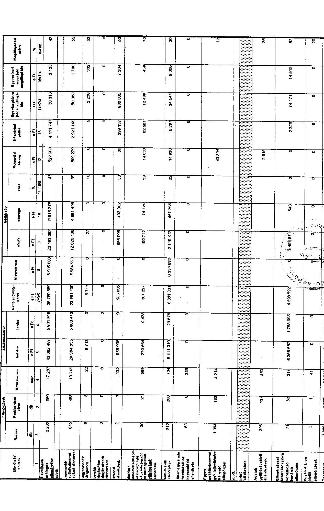

# 5/c-9. sz. tanúsítvány

|  Árhatékolások |  |  |  |  |  |  |  |  |  |  |  |  |  |  |  |  |  |  |  |  |  |  |  |  |  |  |  |  |  |  |  |  |  |  |  |  |  |  |  |  |   |
| --- | --- | --- | --- | --- | --- | --- | --- | --- | --- | --- | --- | --- | --- | --- | --- | --- | --- | --- | --- | --- | --- | --- | --- | --- | --- | --- | --- | --- | --- | --- | --- | --- | --- | --- | --- | --- | --- | --- | --- | --- | --- | --- | --- |
|  5/c-9. sz. tanúsítvány |  |  |  |  |  |  |  |  |  |  |  |  |  |  |  |  |  |  |  |  |  |  |  |  |  |  |  |  |  |  |  |  |  |  |  |  |  |  |  |  |  |   |
|  5/c-9. sz. tanúsítvány |  |  |  |  |  |  |  |  |  |  |  |  |  |  |  |  |  |  |  |  |  |  |  |  |  |  |  |  |  |  |  |  |  |  |  |  |  |  |  |  |  |   |
|  5/c-9. sz. tanúsítvány |  |  |  |  |  |  |  |  |  |  |  |  |  |  |  |  |  |  |  |  |  |  |  |  |  |  |  |  |  |  |  |  |  |  |  |  |  |  |  |  |  |   |
|  5/c-9. sz. tanúsítvány |  |  |  |  |  |  |  |  |  |  |  |  |  |  |  |  |  |  |  |  |  |  |  |  |  |  |  |  |  |  |  |  |  |  |  |  |  |  |  |  |  |   |
|  5/c-9. sz. tanúsítvány |  |  |  |  |  |  |  |  |  |  |  |  |  |  |  |  |  |  |  |  |  |  |  |  |  |  |  |  |  |  |  |  |  |  |  |  |  |  |  |  |  |   |
|  5/c-9. sz. tanúsítvány |  |  |  |  |  |  |  |  |  |  |  |  |  |  |  |  |  |  |  |  |  |  |  |  |  |  |  |  |  |  |  |  |  |  |  |  |  |  |  |  |  |  |   |
|  5/c-9. sz. tanúsítvány |  |  |  |  |  |  |  |  |  |  |  |  |  |  |  |  |  |  |  |  |  |  |  |  |  |  |  |  |  |  |  |  |  |  |  |  |  |  |  |  |  |  |   |
|  5/c-9. sz. tanúsítvány |  |  |  |  |  |  |  |  |  |  |  |  |  |  |  |  |  |  |  |  |  |  |  |  |  |  |  |  |  |  |  |  |  |  |  |  |  |  |  |  |  |  |   |
|  5/c-9. sz. tanúsítvány |  |  |  |  |  |  |  |  |  |  |  |  |  |  |  |  |  |  |  |  |  |  |  |  |  |  |  |  |  |  |  |  |  |  |  |  |  |  |  |  |  |  |   |
|  5/c-9. sz. tanúsítvány |  |  |  |  |  |  |  |  |  |  |  |  |  |  |  |  |  |  |  |  |  |  |  |  |  |  |  |  |  |  |  |  |  |  |  |  |  |  |  |  |  |  |   |
|  5/c-9. sz. tanúsítvány |  |  |  |  |  |  |  |  |  |  |  |  |  |  |  |  |  |  |  |  |  |  |  |  |  |  |  |  |  |  |  |  |  |  |  |  |  |  |  |  |  |  |   |
|  5/c-9. sz. tanúsítvány |  |  |  |  |  |  |  |  |  |  |  |  |  |  |  |  |  |  |  |  |  |  |  |  |  |  |  |  |  |  |  |  |  |  |  |  |  |  |  |  |  |  |   |
|  5/c-9. sz. tanúsítvány |  |  |  |  |  |  |  |  |  |  |  |  |  |  |  |  |  |  |  |  |  |  |  |  |  |  |  |  |  |  |  |  |  |  |  |  |  |  |  |  |  |  |   |
|  5/c-9. sz. tanúsítvány |  |  |  |  |  |  |  |  |  |  |  |  |  |  |  |  |  |  |  |  |  |  |  |  |  |  |  |  |  |  |  |  |  |  |  |  |  |  |  |  |  |  |   |
|  5/c-9. sz. tanúsítvány |  |  |  |  |  |  |  |  |  |  |  |  |  |  |  |  |  |  |  |  |  |  |  |  |  |  |  |  |  |  |  |  |  |  |  |  |  |  |  |  |  |  |   |
|  5/c-9. sz. tanúsítvány |  |  |  |  |  |  |  |  |  |  |  |  |  |  |  |  |  |  |  |  |  |  |  |  |  |  |  |  |  |  |  |  |  |  |  |  |  |  |  |  |  |  |   |
|  5/c-9. sz. tanúsítvány |  |  |  |  |  |  |  |  |  |  |  |  |  |  |  |  |  |  |  |  |  |  |  |  |  |  |  |  |  |  |  |  |  |  |  |  |  |  |  |  |  |  |   |
|  5/c-9. sz. tanúsítvány |  |  |  |  |  |  |  |  |  |  |  |  |  |  |  |  |  |  |  |  |  |  |  |  |  |  |  |  |  |  |  |  |  |  |  |  |  |  |  |  |  |  |   |
|  5/c-9. sz. tanúsítvány |  |  |  |  |  |  |  |  |  |  |  |  |  |  |  |  |  |  |  |  |  |  |  |  |  |  |  |  |  |  |  |  |  |  |  |  |  |  |  |  |  |  |   |
|  5/c-9. sz. tanúsítvány |  |  |  |  |  |  |  |  |  |  |  |  |  |  |  |  |  |  |  |  |  |  |  |  |  |  |  |  |  |  |  |  |  |  |  |  |  |  |  |  |  |  |   |
|  5/c-9. sz. tanúsítvány |  |  |  |  |  |  |  |  |  |  |  |  |  |  |  |  |  |  |  |  |  |  |  |  |  |  |  |  |  |  |  |  |  |  |  |  |  |  |  |  |  |  |   |
|  5/c-9. sz. tanúsítvány |  |  |  |  |  |  |  |  |  |  |  |  |  |  |  |  |  |  |  |  |  |  |  |  |  |  |  |  |  |  |  |  |  |  |  |  |  |  |  |  |  |  |   |
|  5/c-9. sz. tanúsítvány |  |  |  |  |  |  |  |  |  |  |  |  |  |  |  |  |  |  |  |  |  |  |  |  |  |  |  |  |  |  |  |  |  |  |  |  |  |  |  |  |  |  |   |
|  5/c-9. sz. tanúsítvány |  |  |  |  |  |  |  |  |  |  |  |  |  |  |  |  |  |  |  |  |  |  |  |  |  |  |  |  |  |  |  |  |  |  |  |  |  |  |  |  |  |  |   |
|  5/c-9. sz. tanúsítvány |  |  |  |  |  |  |  |  |  |  |  |  |  |  |  |  |  |  |  |  |  |  |  |  |  |  |  |  |  |  |  |  |  |  |  |  |  |  |  |  |  |  |   |
|  5/c-9. sz. tanúsítvány |  |  |  |  |  |  |  |  |  |  |  |  |  |  |  |  |  |  |  |  |  |  |  |  |  |  |  |  |  |  |  |  |  |  |  |  |  |  |  |  |  |  |   |
|  5/c-9. sz. tanúsítvány |  |  |  |  |  |  |  |  |  |  |  |  |  |  |  |  |  |  |  |  |  |  |  |  |  |  |  |  |  |  |  |  |  |  |  |  |  |  |  |  |  |  |   |
|  5/c-9. sz. tanúsítvány |  |  |  |  |  |  |  |  |  |  |  |  |  |  |  |  |  |  |  |  |  |  |  |  |  |  |  |  |  |  |  |  |  |  |  |  |  |  |  |  |  |  |   |
|  5/c-9. sz. tanúsítvány |  |  |  |  |  |  |  |  |  |  |  |  |  |  |  |  |  |  |  |  |  |  |  |  |  |  |  |  |  |  |  |  |  |  |  |  |  |  |  |  |  |  |   |
|  5/c-9. sz. tanúsítvány |  |  |  |  |  |  |  |  |  |  |  |  |  |  |  |  |  |  |  |  |  |  |  |  |  |  |  |  |  |  |  |  |  |  |  |  |  |  |  |  |  |  |   |
|  5/c-9. sz. tanúsítvány |  |  |  |  |  |  |  |  |  |  |  |  |  |  |  |  |  |  |  |  |  |  |  |  |  |  |  |  |  |  |  |  |  |  |  |  |  |  |  |  |  |  |   |
|  5/c-9. sz. tanúsítvány |  |  |  |  |  |  |  |  |  |  |  |  |  |  |  |  |  |  |  |  |  |  |  |  |  |  |  |  |  |  |  |  |  |  |  |  |  |  |  |  |  |  |   |
|  5/c-9. sz. tanúsítvány |  |  |  |  |  |  |  |  |  |  |  |  |  |  |  |  |  |  |  |  |  |  |  |  |  |  |  |  |  |  |  |  |  |  |  |  |  |  |  |  |  |  |   |
|  5/c-9. sz. tanúsítvány |  |  |  |  |  |  |  |  |  |  |  |  |  |  |  |  |  |  |  |  |  |  |  |  |  |  |  |  |  |  |  |  |  |  |  |  |  |  |  |  |  |  |   |
|  5/c-9. sz. tanúsítvány |  |  |  |  |  |  |  |  |  |  |  |  |  |  |  |  |  |  |  |  |  |  |  |  |  |  |  |  |  |  |  |  |  |  |  |  |  |  |  |  |  |  |   |
|  5/c-9. sz. tanúsítvány |  |  |  |  |  |  |  |  |  |  |  |  |  |  |  |  |  |  |  |  |  |  |  |  |  |  |  |  |  |  |  |  |  |  |  |  |  |  |  |  |  |  |   |

---

5/d-1. sz. tanúsítvány az ellenőrzések eredményetségének alakulásáról ellenőrzési típusunként 2008

|  Előműködési típusok |  |  |  |  |  |  |  |  |  |  |  |  |  |  |  |   |
| --- | --- | --- | --- | --- | --- | --- | --- | --- | --- | --- | --- | --- | --- | --- | --- | --- |
|   |  |  |  |  | Adótállásárcel |  |  |  |  | Adóitmegy |  |  |  |  |  |   |
|   | Összesen | Megállapításos
cég |  |  |  |  |  |  |  |  |  |  |  |  |  |   |
|   |  |  |  |  |  |  |  |  |  | Alapja | Összesen |  |  |  |  |   |
|   |  |  |  |  |  |  |  |  |  |  |  |  |  |  |  |   |
|   |  |  |  |  |  |  |  |  |  |  |  |  |  |  |  |   |
|   | db | db |  |  |  |  |  |  |  |  |  |  |  |  |  |   |
|  1 | 2 | 3 | 4 | 5 | 6 | 7-5.4 | 8 | 9 | 10 | 11+109 | 12 | 13 | 14+203 | 15+214 | 16+302 |   |
|  Bevállásak utólagos ellenőrzése | 74 509 | 40 845 | 296 512 | 476 984 653 | 8 321 934 | 468 642 716 | 22 165 874 | 399 837 289 | 183 519 593 | 40 | 5 244 214 | 111 403 037 | 11 474 | 1 581 | 59 |   |
|  adatok |  |  |  |  |  |  |  |  |  |  |  |  |  |  |  |   |
|  egyszerűbb időtípusosítványi adatok ellenőrzése | 1 990 | 1 198 | 37 804 | 58 664 230 | 5 231 489 | 53 452 742 | 2 550 297 | 45 572 959 | 17 236 439 | 39 | 1 003 844 | 11 730 205 | 44 618 | 1 414 | 60 |   |
|  vagyonosodási vizsgálatok | 6 204 | 4 050 | 52 497 | 31 957 134 | 120 340 | 31 836 794 | 1 822 | 28 708 378 | 14 193 943 | 49 | 25 175 | 9 776 531 | 7 861 | 606 | 66 |   |
|  bevallás kiegészítés alapján átvetett ellenőrzések | 9 | 8 | 45 | 30 401 | 0 | 30 401 | 0 | 32 001 | 15 922 | 50 | 0 | 12 721 | 5 067 | 682 | 67 |   |
|  azonnali ellenőrzések | 24 | 13 | 199 | 49 778 | 7 422 | 42 356 | 501 | 33 720 | 15 099 | 45 | 498 | 6 853 | 3 258 | 213 | 54 |   |
|  áramtudó, adótintetszettségével megszűnéni vagy más jogszerűbb időtípusosítások ellenőrzése | 24 026 | 10 495 | 46 279 | 99 380 422 | 762 428 | 98 617 994 | 73 497 | 88 011 747 | 43 859 488 | 50 | 2 641 355 | 33 885 440 | 9 397 | 2 131 | 44 |   |
|  műszáz-sötét ellenőrzések | 15 199 | 8 031 | 30 900 | 28 264 903 | 649 795 | 27 615 173 | 21 551 975 | 24 814 747 | 5 219 279 | 21 | 18 607 | 340 021 | 3 439 | 894 | 53 |   |
|  Átlenni garancia bevallásához kapcsolódó ellenőrzés | 148 | 1 | 617 | 0 | 0 | 0 | 0 | 0 | 0 | 0 | 0 | 0 | 0 | 0 | 1 |   |
|  Egyen adótintetszettségük teljesítésére irányuló ellenőrzés | 173 805 | 7 773 | 170 510 |  |  |  |  |  |  |  |  | 462 388 |  |  |  | 4  |
|  adatok |  |  |  |  |  |  |  |  |  |  |  |  |  |  |  |   |
|  műző |  |  |  |  |  |  |  |  |  |  |  |  |  |  |  |   |
|  műző vállalkozások* | 8 389 | 827 | 8 863 |  |  |  |  |  |  |  |  | 24 511 |  |  |  | 10  |
|  Adatok gyűjtését célzó ellenőrzések | 67 447 | 16 779 | 42 351 |  |  |  |  |  |  |  |  | 2 876 894 |  |  |  | 25  |
|  Ellenőrzéssel lezárt időszakra vonatkozó levélést ellenőrzés | 253 | 217 | 947 | 797 529 | 1 110 227 | -322 699 | 0 | 597 441 | 61 272 | 10 | 5 235 | 37 855 | -1 487 | -341 | 86 |   |
|  Egyéb Art.-on kivált ellenőrzések | 1 231 | 342 | 994 | 31 914 | 66 | 31 648 | 0 | 14 001 | 6 726 | 49 | 226 | 8 204 | 93 | 32 | 28 |   |
|  Összesen | 317 390 | 69 987 | 511 931 | 477 764 095 | 9 432 227 | 468 361 868 | 22 165 874 | 399 448 731 | 183 587 591 | 40 | 8 589 452 | 111 449 106 | 7 101 | 915 | 21 |   |

- Az Art. - 2008. január 1-jóló hatályos - 90 § (7) bekezdése alapján végzett vizsgálatokat tartalmazza.

5/d-1. sz. tanúsítvány

---

|  5/d-2. sz. tanúsítvány |  |  |  |  |  |  |  |  |  |  |  |  |  |  |  |  |  |  |   |
| --- | --- | --- | --- | --- | --- | --- | --- | --- | --- | --- | --- | --- | --- | --- | --- | --- | --- | --- | --- |
|  Tanúsítvány az ellenőrzések szobadryasatajának elásulásáról ellenőrzési típusosítást |  |  |  |  |  |  |  |  |  |  |  |  |  |  |  |  |  |  |   |
|  Abitőrségének szerveni megem. Szélességének szerveni megnevezése. Kivőre megnevezési fragnok és sorozstévé |  |  |  |  |  |  |  |  |  |  |  |  |  |  |  |  |  |  |   |
|  Előszázhatá
fizetett | Összesen | Megállapítand
akad | Összesen | Megállapítand
akad | Összesen | Szabai | Szabai | Szabai | Szabai | Szabai | Szabai | Szabai | Szabai | Szabai | Szabai | Szabai | Szabai | Szabai | Szabai  |
|   | db | db |  |  |  |  |  |  |  |  |  |  |  |  |  |  |  |  |   |
|  1 | 2 | 3 | 4 | 5 | 6 | 7+5-6 | 8 | 9 | 10 | 11+10-9 | 12 | 13 | 14+10-9 | 15+10-9 | 16+10-9 | 17+10-9 | 18+10-9 | 19+10-9 | 20+10-9  |
|  Előszázhatá
száblájára
elöblázásra
szülic | 28 809 | 15 812 | 107 874 | 220 248 495 | 2 209 491 | 218 040 004 | 12 813 985 | 176 610 064 | 81 803 611 | 45 | 2 410 543 | 63 916 652 | 13 996 | 2 025 | 64 | 2 025 | 64 | 2 025 | 64  |
|  Egyszerint
szabálytartozó
szabály elnevezése | 852 | 462 | 15 411 | 23 949 427 | 728 205 | 23 220 217 | 899 910 | 20 563 425 | 8 400 559 | 45 | 336 483 | 6 740 052 | 48 175 | 1 507 | 51 | 1 507 | 51 | 1 507 | 51  |
|  Egyszerint
szabálytartozó
szabály elnevezése | 2 881 | 1 730 | 23 780 | 16 262 822 | 82 843 | 16 175 878 | 1 822 | 14 303 876 | 7 030 873 | 45 | 7 992 | 4 401 384 | 9 304 | 686 | 60 | 60 | 60 | 60 | 60  |
|  Szabálytartozó
szabály elnevezése | 9 | 3 | 28 | 3 368 | 0 | 3 268 | 0 | 172 | 40 | 23 | 0 | 0 | 1 089 | 117 | 50 | 50 | 50 | 50 | 50  |
|  Szabálytartozó
szabály elnevezése | 0 | 0 | 0 | 0 | 0 | 0 | 0 | 0 | 0 | 0 | 0 | 0 | 0 | 0 | 0 | 0 | 0 | 0 | 0  |
|  Szabálytartozó
szabály elnevezése | 8 420 | 5 540 | 15 370 | 72 178 260 | 508 704 | 71 689 698 | 865 | 82 014 450 | 30 921 607 | 53 | 1 591 634 | 25 800 973 | 12 637 | 4 661 | 60 | 4 661 | 60 | 4 661 | 60  |
|  Szabálytartozó
szabály elnevezése | 9 271 | 3 201 | 19 478 | 15 949 355 | 195 297 | 15 754 008 | 12 732 875 | 13 776 324 | 2 633 448 | 15 | 3 510 | 225 387 | 4 922 | 669 | 25 | 669 | 25 | 669 | 25  |
|  Szabálytartozó
szabály elnevezése | 0 | 0 | 14 | 0 | 0 | 0 | 0 | 0 | 0 | 0 | 0 | 0 | 0 | 0 | 0 | 0 | 0 | 0 | 0  |
|  Szabálytartozó
szabály elnevezése | 58 733 | 1 421 | 50 568 |  |  |  |  |  |  |  |  |  |  |  |  |  |  |  |   |
|  Szabálytartozó
szabály elnevezése | 3 771 | 48 | 4 451 |  |  |  |  |  |  |  |  |  |  |  |  |  |  |  |   |
|  Szabálytartozó
szabály elnevezése | 21 952 | 4 544 | 14 192 |  |  |  |  |  |  |  |  |  |  |  |  |  |  |  |   |
|  Szabálytartozó
szabály elnevezése | 75 | 93 | 278 | 183 790 | 403 868 | -220 098 | 0 | 115 263 | 21 735 | 15 | 4 450 | 13 895 | -3 668 | -1 007 | 79 | 79 | 79 | 79 | 79  |
|  Szabálytartozó
szabály elnevezése | 236 | 176 | 134 | 979 | 66 | 0 | 0 | 3 231 | 1 615 | 50 | 60 | 631 | 5 | 7 | 74 | 74 | 74 | 74 | 74  |
|  Szabálytartozó
szabály elnevezése | 109 997 | 21 831 | 172 892 | 220 434 281 | 2 813 428 | 317 825 898 | 12 813 985 | 219 729 592 | 81 620 861 | 45 | 2 397 303 | 63 831 482 | 9 861 | 1 261 | 20 | 20 | 20 | 20 | 20  |

*Az Izt.* 2008. január 1-jétől hatályos - 80 § (7) bekezdése alapján végzett vizsgálatával tartalmazza.

---

|   |  |  |  |  |  |  |  |  |  |  |  |  |  |  |  |  |  |  |  |  |  |  |  |  |  |  |  |  |  |  |  |  |  |  |  |  |  |  |  |  |  |  |  |  |  |  |  |  |  |  |  |  |  |  |  |  |  |  |  |  |  |  |  |  |  |  |  |  |  |  |  |  |  |  |  |  |  |  |  |  |  |  |  |  |  |  |  |  |  |  |  |  |  |  |  |  |  |  |  |  |  |  |  |  |  |  |  | 

---

Tanúsítvány az ellenőrzések eredményességének elállításáról ellenőrzési típusnaként 2008

|  Elmeksírálhatat |  |  |  |  |  |  |  |  |  |  |  |  |  |  |  |  |  |   |
| --- | --- | --- | --- | --- | --- | --- | --- | --- | --- | --- | --- | --- | --- | --- | --- | --- | --- | --- |
|   |  |  |  |  |  |  |  |  |  |  |  |  |  |  |  |  |  |   |
|   |  |  |  |  |  |  |  |  |  |  |  |  |  |  |  |  |  |   |
|  |   |   |   |   |   |   |   |   |   |   |   |   |   |   |   |   |   |   |
|  |   |   |   |   |   |   |   |   |   |   |   |   |   |   |   |   |   |   |
|  |   |   |   |   |   |   |   |   |   |   |   |   |   |   |   |   |   |   |
|  |   |   |   |   |   |   |   |   |   |   |   |   |   |   |   |   |   |   |
|  |   |   |   |   |   |   |   |   |   |   |   |   |   |   |   |   |   |   |
|  |   |   |   |   |   |   |   |   |   |   |   |   |   |   |   |   |   |   |
|  |   |   |   |   |   |   |   |   |   |   |   |   |   |   |   |   |   |   |
|  |   |   |   |   |   |   |   |   |   |   |   |   |   |   |   |   |   |   |
|  |   |   |   |   |   |   |   |   |   |   |   |   |   |   |   |   |   |   |
|  |   |   |   |   |   |   |   |   |   |   |   |   |   |   |   |   |   |   |
|  |   |   |   |   |   |   |   |   |   |   |   |   |   |   |   |   |   |   |
|  |   |   |   |   |   |   |   |   |   |   |   |   |   |   |   |   |   |   |
|  |   |   |   |   |   |   |   |   |   |   |   |   |   |   |   |   |   |   |
|  |   |   |   |   |   |   |   |   |   |   |   |   |   |   |   |   |   |   |
|  |   |   |   |   |   |   |   |   |   |   |   |   |   |   |   |   |   |   |
|  |   |   |   |   |   |   |   |   |   |   |   |   |   |   |   |   |   |   |
|  |   |   |   |   |   |   |   |   |   |   |   |   |   |   |   |   |   |   |
|  |   |   |   |   |   |   |   |   |   |   |   |   |   |   |   |   |   |   |
|  |   |   |   |   |   |   |   |   |   |   |   |   |   |   |   |   |   |   |
|  |   |   |   |   |   |   |   |   |   |   |   |   |   |   |   |   |   |   |
|  |   |   |   |   |   |   |   |   |   |   |   |   |   |   |   |   |   |   |
|  |   |   |   |   |   |   |   |   |   |   |   |   |   |   |   |   |   |   |
|  |   |   |   |   |   |   |   |   |   |   |   |   |   |   |   |   |   |   |
|  |   |   |   |   |   |   |   |   |   |   |   |   |   |   |   |   |   |   |
|  |   |   |   |   |   |   |   |   |   |   |   |   |   |   |   |   |   |   |
|  |   |   |   |   |   |   |   |   |   |   |   |   |   |   |   |   |   |   |
|  |   |   |   |   |   |   |   |   |   |   |   |   |   |   |   |   |   |   |
|  |   |   |   |   |   |   |   |   |   |   |   |   |   |   |   |   |   |   |
|  |   |   |   |   |   |   |   |   |   |   |   |   |   |   |   |   |   |   |
|  |   |   |   |   |   |   |   |   |   |   |   |   |   |   |   |   |   |   |
|  |   |   |   |   |   |   |   |   |   |   |   |   |   |   |   |   |   |   |

---

|  5/d-5. sz. tanúsítvány az ellenőrzések arányosztályok alakulásáról ellenőrzési öpszemként 2008 |  |  |  |  |  |  |  |  |  |  |  |  |  |  |  |   |
| --- | --- | --- | --- | --- | --- | --- | --- | --- | --- | --- | --- | --- | --- | --- | --- | --- |
|  Személyes |  |  |  |  |  |  |  |  |  |  |  |  |  |  |  |   |
|  Állatcsodhatók |  |  |  |  |  |  |  |  |  |  |  |  |  |  |  |   |
|  Elmezőbbég |  |  |  |  |  |  |  |  |  |  |  |  |  |  |  |   |
|  Személyes |  |  |  |  |  |  |  |  |  |  |  |  |  |  |  |   |
|  Személyes |  |  |  |  |  |  |  |  |  |  |  |  |  |  |  |   |
|  Hozzék |  |  |  |  |  |  |  |  |  |  |  |  |  |  |  |   |
|  Személyes |  |  |  |  |  |  |  |  |  |  |  |  |  |  |  |   |
|  Hozzék |  |  |  |  |  |  |  |  |  |  |  |  |  |  |  |   |
|  Személyes |  |  |  |  |  |  |  |  |  |  |  |  |  |  |  |   |
|  Hozzék |  |  |  |  |  |  |  |  |  |  |  |  |  |  |  |   |
|  Személyes |  |  |  |  |  |  |  |  |  |  |  |  |  |  |  |   |
|  Hozzék |  |  |  |  |  |  |  |  |  |  |  |  |  |  |  |   |
|  Személyes |  |  |  |  |  |  |  |  |  |  |  |  |  |  |  |   |
|  Hozzék |  |  |  |  |  |  |  |  |  |  |  |  |  |  |  |   |
|  Személyes |  |  |  |  |  |  |  |  |  |  |  |  |  |  |  |   |
|  Hozzék |  |  |  |  |  |  |  |  |  |  |  |  |  |  |  |   |
|  Személyes |  |  |  |  |  |  |  |  |  |  |  |  |  |  |  |   |
|  Hozzék |  |  |  |  |  |  |  |  |  |  |  |  |  |  |  |   |
|  Személyes |  |  |  |  |  |  |  |  |  |  |  |  |  |  |  |   |
|  Hozzék |  |  |  |  |  |  |  |  |  |  |  |  |  |  |  |   |
|  Személyes |  |  |  |  |  |  |  |  |  |  |  |  |  |  |  |   |
|  Hozzék |  |  |  |  |  |  |  |  |  |  |  |  |  |  |  |   |
|  Személyes |  |  |  |  |  |  |  |  |  |  |  |  |  |  |  |   |
|  Hozzék |  |  |  |  |  |  |  |  |  |  |  |  |  |  |  |   |
|  Személyes |  |  |  |  |  |  |  |  |  |  |  |  |  |  |  |   |
|  Hozzék |  |  |  |  |  |  |  |  |  |  |  |  |  |  |  |   |
|  Személyes |  |  |  |  |  |  |  |  |  |  |  |  |  |  |  |   |
|  Hozzék |  |  |  |  |  |  |  |  |  |  |  |  |  |  |  |   |
|  Személyes |  |  |  |  |  |  |  |  |  |  |  |  |  |  |  |   |
|  Hozzék |  |  |  |  |  |  |  |  |  |  |  |  |  |  |  |   |
|  Személyes |  |  |  |  |  |  |  |  |  |  |  |  |  |  |  |   |
|  Hozzék |  |  |  |  |  |  |  |  |  |  |  |  |  |  |  |   |
|  Személyes |  |  |  |  |  |  |  |  |  |  |  |  |  |  |  |   |
|  Hozzék |  |  |  |  |  |  |  |  |  |  |  |  |  |  |  |   |
|  Személyes |  |  |  |  |  |  |  |  |  |  |  |  |  |  |  |   |
|  Hozzék |  |  |  |  |  |  |  |  |  |  |  |  |  |  |  |   |
|  Személyes |  |  |  |  |  |  |  |  |  |  |  |  |  |  |  |   |
|  Hozzék |  |  |  |  |  |  |  |  |  |  |  |  |  |  |  |   |
|  Személyes |  |  |  |  |  |  |  |  |  |  |  |  |  |  |  |   |
|  Hozzék |  |  |  |  |  |  |  |  |  |  |  |  |  |  |  |   |
|  Személyes |  |  |  |  |  |  |  |  |  |  |  |  |  |  |  |   |
|  Hozzék |  |  |  |  |  |  |  |  |  |  |  |  |  |  |  |   |
|  Személyes |  |  |  |  |  |  |  |  |  |  |  |  |  |  |  |   |
|  Hozzék |  |  |  |  |  |  |  |  |  |  |  |  |  |  |  |   |
|  Személyes |  |  |  |  |  |  |  |  |  |  |  |  |  |  |  |   |
|  Hozzék |  |  |  |  |  |  |  |  |  |  |  |  |  |  |  |   |
|  Személyes |  |  |  |  |  |  |  |  |  |  |  |  |  |  |  |   |
|  Hozzék |  |  |  |  |  |  |  |  |  |  |  |  |  |  |  |   |
|  Személyes |  |  |  |  |  |  |  |  |  |  |  |  |  |  |  |   |
|  Hozzék |  |  |  |  |  |  |  |  |  |  |  |  |  |  |  |   |
|  Személyes |  |  |  |  |  |  |  |  |  |  |  |  |  |  |  |   |
|  Hozzék |  |  |  |  |  |  |  |  |  |  |  |  |  |  |  |   |
|  Személyes |  |  |  |  |  |  |  |  |  |  |  |  |  |  |  |   |
|  Hozzék |  |  |  |  |  |  |  |  |  |  |  |  |  |  |  |   |
|  Személyes |  |  |  |  |  |  |  |  |  |  |  |  |  |  |  |   |
|  Hozzék |  |  |  |  |  |  |  |  |  |  |  |  |  |  |  |   |
|  Személyes |  |  |  |  |  |  |  |  |  |  |  |  |  |  |  |   |
|  Hozzék |  |  |  |  |  |  |  |  |  |  |  |  |  |  |  |   |
|  Személyes |  |  |  |  |  |  |  |  |  |  |  |  |  |  |  |   |
|  Hozzék |  |  |  |  |  |  |  |  |  |  |  |  |  |  |  |   |
|  Személyes |  |  |  |  |  |  |  |  |  |  |  |  |  |  |  |   |
|  Hozzék |  |  |  |  |  |  |  |  |  |  |  |  |  |  |  |   |
|  Személyes |  |  |  |  |  |  |  |  |  |  |  |  |  |  |  |   |
|  Hozzék |  |  |  |  |  |  |  |  |  |  |  |  |  |  |  |   |
|  Személyes |  |  |  |  |  |  |  |  |  |  |  |  |  |  |  |   |
|  Hozzék |  |  |  |  |  |  |  |  |  |  |  |  |  |  |  |   |
|  Személyes |  |  |  |  |  |  |  |  |  |  |  |  |  |  |  |   |
|  Hozzék |  |  |  |  |  |  |  |  |  |  |  |  |  |  |  |   |
|  Személyes |  |  |  |  |  |  |  |  |  |  |  |  |  |  |  |   |
|  Hozzék |  |  |  |  |  |  |  |  |  |  |  |  |  |  |  |   |
|  Személyes |  |  |  |  |  |  |  |  |  |  |  |  |  |  |  |   |
|  Hozzék |  |  |  |  |  |  |  |  |  |  |  |  |  |  |  |   |
|  Személyes |  |  |  |  |  |  |  |  |  |  |  |  |  |  |  |   |
|  Hozzék |  |  |  |  |  |  |  |  |  |  |  |  |  |  |  |   |
|  Személyes |  |  |  |  |  |  |  |  |  |  |  |  |  |  |  |   |
|  Hozzék |  |  |  |  |  |  |  |  |  |  |  |  |  |  |  |   |
|  Személyes |  |  |  |  |  |  |  |  |  |  |  |  |  |  |  |   |
|  Hozzék |  |  |  |  |  |  |  |  |  |  |  |  |  |  |  |   |
|  Személyes |  |  |  |  |  |  |  |  |  |  |  |  |  |  |  |   |
|  Hozzék |  |  |  |  |  |  |  |  |  |  |  |  |  |  |  |   |
|  Személyes |  |  |  |  |  |  |  |  |  |  |  |  |  |  |  |   |
|  Hozzék |  |  |  |  |  |  |  |  |  |  |  |  |  |  |  |   |
|  Személyes |  |  |  |  |  |  |  |  |  |  |  |  |  |  |  |   |
|  Hozzék |  |  |  |  |  |  |  |  |  |  |  |  |  |  |  |   |
|  Személyes |  |  |  |  |  |  |  |  |  |  |  |  |  |  |  |   |
|  Hozzék |  |  |  |  |  |  |  |  |  |  |  |  |  |  |  |   |
|  Személyes |  |  |  |  |  |  |  |  |  |  |  |  |  |  |  |   |
|  Hozzék |  |  |  |  |  |  |  |  |  |  |  |  |  |  |  |   |
|  Személyes |  |  |  |  |  |  |  |  |  |  |  |  |  |  |  |   |
|  Hozzék |  |  |  |  |  |  |  |  |  |  |  |  |  |  |  |   |
|  Személyes |  |  |  |  |  |  |  |  |  |  |  |  |  |  |  |   |
|  Hozzék |  |  |  |  |  |  |  |  |  |  |  |  |  |  |  |   |
|  Személyes |  |  |  |  |  |  |  |  |  |  |  |  |  |  |  |   |
|  Hozzék |  |  |  |  |  |  |  |  |  |  |  |  |  |  |  |   |
|  Személyes |  |  |  |  |  |  |  |  |  |  |  |  |  |  |  |   |
|  Hozzék |  |  |  |  |  |  |  |  |  |  |  |  |  |  |  |   |
|  Személyes |  |  |  |  |  |  |  |  |  |  |  |  |  |  |  |   |
|  Hozzék |  |  |  |  |  |  |  |  |  |  |  |  |  |  |  |   |
|  Személyes |  |  |  |  |  |  |  |  |  |  |  |  |  |  |  |   |
|  Hozzék |  |  |  |  |  |  |  |  |  |  |  |  |  |  |  |   |
|  Személyes |  |  |  |  |  |  |  |  |  |  |  |  |  |  |  |   |
|  Hozzék |  |  |  |  |  |  |  |  |  |  |  |  |  |  |  |   |
|  Személyes |  |  |  |  |  |  |  |  |  |  |  |  |  |  |  |   |
|  Hozzék |  |  |  |  |  |  |  |  |  |  |  |  |  |  |  |   |
|  Személyes |  |  |  |  |  |  |  |  |  |  |  |  |  |  |  |   |
|  Hozzék |  |  |  |  |  |  |  |  |  |  |  |  |  |  |  |   |
|  Személyes |  |  |  |  |  |  |  |  |  |  |  |  |  |  |  |   |
|  Hozzék |  |  |  |  |  |  |  |  |  |  |  |  |  |  |  |   |
|  Személyes |  |  |  |  |  |  |  |  |  |  |  |  |  |  |  |   |
|  Hozzék |  |  |  |  |  |  |  |  |  |  |  |  |  |  |  |   |
|  Személyes |  |  |  |  |  |  |  |  |  |  |  |  |  |  |  |   |
|  Hozzék |  |  |  |  |  |  |  |  |  |  |  |  |  |  |  |   |
|  Személyes |  |  |  |  |  |  |  |  |  |  |  |  |  |  |  |   |
|  Hozzék |  |  |  |  |  |  |  |  |  |  |  |  |  |  |  |   |
|  Személyes |  |  |  |  |  |  |  |  |  |  |  |  |  |  |  |   |
|  Hozzék |  |  |  |  |  |  |  |  |  |  |  |  |  |  |  |   |
|  Személyes |  |  |  |  |  |  |  |  |  |  |  |  |  |  |  |   |
|  Hozzék |  |  |  |  |  |  |  |  |  |  |  |  |  |  |  |   |
|  Személyes |  |  |  |  |  |  |  |  |  |  |  |  |  |  |  |   |
|  Hozzék |  |  |  |  |  |  |  |  |  |  |  |  |  |  |  |   |
|  Személyes |  |  |  |  |  |  |  |  |  |  |  |  |  |  |  |   |
|  Hozzék |  |  |  |  |  |  |  |  |  |  |  |  |  |  |  |   |
|  Személyes |  |  |  |  |  |  |  |  |  |  |  |  |  |  |  |   |
|  Hozzék |  |  |  |  |  |  |  |  |  |  |  |  |  |  |  |   |
|  Személyes |  |  |  |  |  |  |  |  |  |  |  |  |  |  |  |   |
|  Hozzék |  |  |  |  |  |  |  |  |  |  |  |  |  |  |  |   |
|  Személyes |  |  |  |  |  |  |  |  |  |  |  |  |  |  |  |   |
|  Hozzék |  |  |  |  |  |  |  |  |  |  |  |  |  |  |  |   |
|  Személyes |  |  |  |  |  |  |  |  |  |  |  |  |  |  |  |   |
|  Hozzék |  |  |  |  |  |  |  |  |  |  |  |  |  |  |  |   |
|  Személyes |  |  |  |  |  |  |  |  |  |  |  |  |  |  |  |   |
|  Hozzék |  |  |  |  |  |  |  |  |  |  |  |  |  |  |  |   |
|  Személyes |  |  |  |  |  |  |  |  |  |  |  |  |  |  |  |   |
|  Hozzék |  |  |  |  |  |  |  |  |  |  |  |  |  |  |  |   |
|  Személyes |  |  |  |  |  |  |  |  |  |  |  |  |  |  |  |   |
|  Hozzék |  |  |  |  |  |  |  |  |  |  |  |  |  |  |  |   |
|  Személyes |  |  |  |  |  |  |  |  |  |  |  |  |  |  |  |   |
|  Hozzék |  |  |  |  |  |  |  |  |  |  |  |  |  |  |  |   |
|  Személyes |  |  |  |  |  |  |  |  |  |  |  |  |  |  |  |   |
|  Hozzék |  |  |  |  |  |  |  |  |  |  |  |  |  |  |  |   |
|  Személyes |  |  |  |  |  |  |  |  |  |  |  |  |  |  |  |   |
|  Hozzék |  |  |  |  |  |  |  |  |  |  |  |  |  |  |  |   |
|  Személyes |  |  |  |  |  |  |  |  |  |  |  |  |  |  |  |   |
|  Hozzék |  |  |  |  |  |  |  |  |  |  |  |  |  |  |  |   |
|  Személyes |  |  |  |  |  |  |  |  |  |  |  |  |  |  |  |   |
|  Hozzék |  |  |  |  |  |  |  |  |  |  |  |  |  |  |  |   |
|  Személyes |  |  |  |  |  |  |  |  |  |  |  |  |  |  |  |   |
|  Hozzék |  |  |  |  |  |  |  |  |  |  |  |  |  |  |  |   |
|  Személyes |  |  |  |  |  |  |  |  |  |  |  |  |  |  |  |   |
|  Hozzék |  |  |  |  |  |  |  |  |  |  |  |  |  |  |  |   |
|  Személyes |  |  |  |  |  |  |  |  |  |  |  |  |  |  |  |   |
|  Hozzék |  |  |  |  |  |  |  |  |  |  |  |  |  |  |  |   |
|  Személyes |  |  |  |  |  |  |  |  |  |  |  |  |  |  |  |   |
|  Hozzék |  |  |  |  |  |  |  |  |  |  |  |  |  |  |  |   |
|  Személyes |  |  |  |  |  |  |  |  |  |  |  |  |  |  |  |   |
|  Hozzék |  |  |  |  |  |  |  |  |  |  |  |  |  |  |  |   |
|  Személyes |  |  |  |  |  |  |  |  |  |  |  |  |  |  |  |   |
|  Hozzék |  |  |  |  |  |  |  |  |  |  |  |  |  |  |  |   |
|  Személyes |  |  |  |  |  |  |  |  |  |  |  |  |  |  |  |   |
|  Hozzék |  |  |  |  |  |  |  |  |  |  |  |  |  |  |  |   |
|  Személyes |  |  |  |  |  |  |  |  |  |  |  |  |  |  |  |   |
|  Hozzék |  |  |  |  |  |  |  |  |  |  |  |  |  |  |  |   |
|  Személyes |  |  |  |  |  |  |  |  |  |  |  |  |  |  |  |   |
|  Hozzék |  |  |  |  |  |  |  |  |  |  |  |  |  |  |  |   |
|  Személyes |  |  |  |  |  |  |  |  |  |  |  |  |  |  |  |   |
|  Hozzék |  |  |  |  |  |  |  |  |  |  |  |  |  |  |  |   |
|  Személyes |  |  |  |  |  |  |  |  |  |  |  |  |  |  |  |   |
|  Hozzék |  |  |  |  |  |  |  |  |  |  |  |  |  |  |  |   |
|  Személyes |  |  |  |  |  |  |  |  |  |  |  |  |  |  |  |   |
|  Hozzék |  |  |  |  |  |  |  |  |  |  |  |  |  |  |  |   |
|  Személyes |  |  |  |  |  |  |  |  |  |  |  |  |  |  |  |   |
|  Hozzék |  |  |  |  |  |  |  |  |  |  |  |  |  |  |  |   |
|  Személyes |  |  |  |  |  |  |  |  |  |  |  |  |  |  |  |   |
|  Hozzék |  |  |  |  |  |  |  |  |  |  |  |  |  |  |  |   |
|  Személyes |  |  |  |  |  |  |  |  |  |  |  |  |  |  |  |  |   |
|  Hozzék |  |  |  |  |  |  |  |  |  |  |  |  |  |  |  |  |   |
|  Személyes |  |  |  |  |  |  |  |  |  |  |  |  |  |  |  |  |   |
|  Hozzék |  |  |  |  |  |  |  |  |  |  |  |  |  |  |  |  |   |
|  Személyes |  |  |  |  |  |  |  |  |  |  |  |  |  |  |  |  |   |
|  Hozzék |  |  |  |  |  |  |  |  |  |  |  |  |  |  |  |  |   |
|  Személyes |  |  |  |  |  |  |  |  |  |  |  |  |  |  |  |  |   |
|  Hozzék |  |  |  |  |  |  |  |  |  |  |  |  |  |  |  |  |   |
|  Személyes |  |  |  |  |  |  |  |  |  |  |  |  |  |  |  |  |  |   |
|  Hozzék |  |  |  |  |  |  |  |  |  |  |  |  |  |  |  |  |  |   |
|  Személyes |  |  |  |  |  |  |  |  |  |  |  |  |  |  |  |  |  |   |
|  Hozzék |  |  |  |  |  |  |  |  |  |  |  |  |  |  |  |  |  |   |
|  Személyes |  |  |  |  |  |  |  |  |  |  |  |  |  |  |  |  |  |   |
|  Hozzék |  |  |  |  |  |  |  |  |  |  |  |  |  |  |  |  |  |   |
|  Személyes |  |  |  |  |  |  |  |  |  |  |  |  |  |  |  |  |  |   |
|  Hozzék |  |  |  |  |  |  |  |  |  |  |  |  |  |  |  |  |  |   |
|  Személyes |  |  |  |  |  |  |  |  |  |  |  |  |  |  |  |  |  |   |
|  Hozzék |  |  |  |  |  |  |  |  |  |  |  |  |  |  |  |  |  |  |   |
|  Személyes |  |  |  |  |  |  |  |  |  |  |  |  |  |  |  |  |  |  |   |
|  Hozzék |  |  |  |  |  |  |  |  |  |  |  |  |  |  |  |  |  |  |   |
|  Személyes |  |  |  |  |  |  |  |  |  |  |  |  |  |  |  |  |  |  |   |
|  Hozzék |  |  |  |  |  |  |  |  |  |  |  |  |  |  |  |  |  |  |   |
|  Személyes |  |  |  |  |  |  |  |  |  |  |  |  |  |  |  |  |  |  |   |
|  Hozzék |  |  |  |  |  |  |  |  |  |  |  |  |  |  |  |  |  |  |  |   |
|  Személyes |  |  |  |  |  |  |  |  |  |  |  |  |  |  |  |  |  |  |  |   |
|  Hozzék |  |  |  |  |  |  |  |  |  |  |  |  |  |  |  |  |  |  |  |   |
|  Személyes |  |  |  |  |  |  |  |  |  |  |  |  |  |  |  |  |  |  |  |   |
|  Hozzék |  |  |  |  |  |  |  |  |  |  |  |  |  |  |  |  |  |  |  |   |
|  Személyes |  |  |  |  |  |  |  |  |  |  |  |  |  |  |  |  |  |  |  |   |
|  Hozzék |  |  |  |  |  |  |  |  |  |  |  |  |  |  |  |  |  |  |  |   |
|  Személyes |  |  |  |  |  |  |  |  |  |  |  |  |  |  |  |  |  |  |  |   |
|  Hozzék |  |  |  |  |  |  |  |  |  |  |  |  |  |  |  |  |  |  |  |   |
|  Személyes |  |  |  |  |  |  |  |  |  |  |  |  |  |  |  |  |  |  |  |   |
|  Hozzék |  |  |  |  |  |  |  |  |  |  |  |  |  |  |  |  |  |  |  |  |   |
|  Személyes |  |  |  |  |  |  |  |  |  |  |  |  |  |  |  |  |  |  |  |   |
|  Hozzék |  |  |  |  |  |  |  |  |  |  |  |  |  |  |  |  |  |  |  |   |
|  Személyes |  |  |  |  |  |  |  |  |  |  |  |  |  |  |  |  |  |  |  |   |
|  Hozzék |  |  |  |  |  |  |  |  |  |  |  |  |  |  |  |  |  |  |  |  |   |
|  Személyes |  |  |  |  |  |  |  |  |  |  |  |  |  |  |  |  |  |  |  |  |   |
|  Hozzék |  |  |  |  |  |  |  |  |  |  |  |  |  |  |  |  |  |  |  |  |   |
|  Személyes |  |  |  |  |  |  |  |  |  |  |  |  |  |  |  |  |  |  |  |  |   |
|  Hozzék |  |  |  |  |  |  |  |  |  |  |  |  |  |  |  |  |  |  |  |  |  |   |
|  Személyes |  |  |  |  |  |  |  |  |  |  |  |  |  |  |  |  |  |  |  |  |  |   |
|  Hozzék |  |  |  |  |  |  |  |  |  |  |  |  |  |  |  |  |  |  |  |  |  |   |
|  Személyes |  |  |  |  |  |  |  |  |  |  |  |  |  |  |  |  |  |  |  |  |  |   |
|  Hozzék |  |  |  |  |  |  |  |  |  |  |  |  |  |  |  |  |  |  |  |  |  |   |
|  Személyes |  |  |  |  |  |  |  |  |  |  |  |  |  |  |  |  |  |  |  |  |  |  |   |
|  Hozzék |  |  |  |  |  |  |  |  |  |  |  |  |  |  |  |  |  |  |  |  |  |  |   |
|  Személyes |  |  |  |  |  |  |  |  |  |  |  |  |  |  |  |  |  |  |  |  |  |  |   |
|  Hozzék |  |  |  |  |  |  |  |  |  |  |  |  |  |  |  |  |  |  |  |  |  |  |   |
|  Személyes |  |  |  |  |  |  |  |  |  |  |  |  |  |  |  |  |  |  |  |  |  |  |   |
|  Hozzék |  |  |  |  |  |  |  |  |  |  |  |  |  |  |  |  |  |  |  |  |  |  |  |   |
|  Személyes |  |  |  |  |  |  |  |  |  |  |  |  |  |  |  |  |  |  |  |  |  |  |  |   |
|  Hozzék |  |  |  |  |  |  |  |  |  |  |  |  |  |  |  |  |  |  |  |  |  |  |  |   |
|  Személyes |  |  |  |  |  |  |  |  |  |  |  |  |  |  |  |  |  |  |  |  |  |  |  |   |
|  Hozzék |  |  |  |  |  |  |  |  |  |  |  |  |  |  |  |  |  |  |  |  |  |  |  |   |
|  Személyes |  |  |  |  |  |  |  |  |  |  |  |  |  |  |  |  |  |  |  |  |  |  |  |   |
|  Hozzék |  |  |  |  |  |  |  |  |  |  |  |  |  |  |  |  |  |  |  |  |  |  |  |   |
|  Hozzék |  |  |  |  |  |  |  |  |  |  |  |  |  |  |  |  |  |  |  |  |  |  |   |
|  Személyes |  |  |  |  |  |  |  |  |  |  |  |  |  |  |  |  |  |  |  |  |  |  |  |   |
|  Hozzék |  |  |  |  |  |  |  |  |  |  |  |  |  |  |  |  |  |  |  |  |  |  |   |
|  Személyes |  |  |  |  |  |  |  |  |  |  |  |  |  |  |  |  |  |  |  |  |  |  |   |
|  Hozzék |  |  |  |  |  |  |  |  |  |  |  |  |  |  |  |  |  |  |  |  |  |   |
|  Személyes |  |  |  |  |  |  |  |  |  |  |  |  |  |  |  |  |  |  |  |  |  |   |
|  Személyes |  |  |  |  |  |  |  |  |  |  |  |  |  |  |  |  |  |  |  |  |   |
|  Személyes |  |  |  |  |  |  |  |  |  |  |  |  |  |  |  |  |  |  |  |   |
|  Személyes |  |  |  |  |  |  |  |  |  |  |  |  |  |  |  |  |  |  |  |   |
|  Személyes |  |  |  |  |  |  |  |  |  |  |  |  |  |  |  |  |  |  |   |
|  Személyes |  |  |  |  |  |  |  |  |  |  |  |  |  |  |  |  |  |  |   |
|  Személyes |  |  |  |  |  |  |  |  |  |  |  |  |  |  |  |  |  |  |   |
|  Személyes |  |  |  |  |  |  |  |  |  |  |  |  |  |  |  |  |  |  |   |
|  Személyes |  |  |  |  |  |  |  |  |  |  |  |  |  |  |  |  |  |  |   |
|  Személyes |  |  |  |  |  |  |  |  |  |  |  |  |  |  |  |  |  |  |   |
|  Személyes |  |  |  |  |  |  |  |  |  |  |  |  |  |  |  |  |  |  |   |
|  Személyes |  |  |  |  |  |  |  |  |  |  |  |  |  |  |  |  |  |   |
|  Személyes |  |  |  |  |  |  |  |  |  |  |  |  |  |  |  |  |   |
|  |  |  |  |  |  |  |  |  |  |  |  |  |  |  |  |  |  |   |
|  |  |  |  |  |  |  |  |  |  |  |  |  |  |  |  |  |  |   |
|  |  |  |  |  |  |  |  |  |  |  |  |  |  |  |  |  |   |
|  |  |  |  |  |  |  |  |  |  |  |  |  |  |  |  |   |
|  |  |  |  |  |  |  |  |  |  |  |  |  |  |  |  |   |
|  |  |  |  |  |  |  |  |  |  |  |  |  |  |  |  |   |
|  |  |  |  |  |  |  |  |  |  |  |  |  |  |  |   |
|  |  |  |  |  |  |  |  |  |  |  |  |  |  |   |
|  |  |  |  |  |  |  |  |  |  |  |  |  |  |   |
|  |  |  |  |  |  |  |  |  |  |  |  |  |  |  |  |   |
|  |  |  |  |  |  |  |  |  |  |  |  |  |  |   |
|  |  |  |  |  |  |  |  |  |  |  |  |  |  |   |
|  |  |  |  |  |  |  |  |  |  |  |  |  |   |
|  |  |  |  |  |  |  |  |  |  |  |  |  |  |   |
|  |  |  |  |  |  |  |  |  |  |  |  |  |  |   |
|  |  |  |  |  |  |  |  |  |  |  |  |  |   |
|  |  |  |  |  |  |  |  |  |  |  |   |
|  |  |  |  |  |  |  |  |  |  |  |  |  |   |
|  |  |  |  |  |  |  |  |  |  |  |  |   |
|  |  |  |  |  |  |  |  |  |  |  |   |
|  |  |  |  |  |  |  |  |  |  |  |  |   |
|  |  |  |  |  |  |  |  |  |  |  |  |  |   |
|  |  |  |  |  |  |  |  |  |  |   |
|  |  |  |  |  |  |  |  |  |  |  |  |   |
|  |  |  |  |  |  |  |  |  |  |  |  |  |   |
|  |  |  |  |  |  |  |  |  |  |  |   |
|  |  |  |  |  |  |  |  |  |  |  |  |   |
|  |  |  |  |  |  |  |  |  |  |  |  |  |   |
|  |  |  |  |  |  |  |  |  |  |  |  |   |
|  |  |  |  |  |  |  |  |  |  |  |  |   |
|  |  |  |  |  |  |  |  |  |  |  |  |  |   |
|  |  |  |  |  |  |  |  |  |  |  |  |  |  |  |  |  |  |  |  |  |  |  |  |  |  |  |  |  |  |  |   |    |       |         |             |          |        |            |    |           |  |  |             |  |         |  |  |  |   |            |  |            |  |  |             |  |             |  |            |  |  |  |              |  |           |  |  |  |  |  |  |            |  |         |  |  |          |  |  |           |  |             |  |            |  |              |          |  |  |  |              |  |  |             |  |  |            |  |             |  |            |  |  |               |  |  |              |  |            |  |  |              |  |  |             |  |  |             |  |              |  |  |             |  |             |  |             |  |  |             |  |             |  |             |  |              |  |               |  |           |  |                |  |             |  |              |  |             |  |  |              |  |           |  |  |            |  |             |  |             |  |            |  |  |               |  |             |  |           |  |           |  |          |  |  |              |  |             |  |            |  |  |            |  |  |           |  |           |  |            |  |            |  |            |  |              |  |             |           |           |  |          |  |             |  |             |            |           |  |             |  |             |  |             |  |               |           |  |  |              |  |            |            |  |            |  |            |  |               |  |               |             |  |               |  |             |  |             |  |               |            |            |  |             |  |              |  |             |  |              |  |             |  |               |  |               |           |  |              |  |              |  |               |  |              |  |             |  |             |           |  |            |  |              |            |  |              |  |              |          |  |             |  |            |           |  |            |  |             |          |  |           |  |             |  |          

---

Tanıtlatlulukta
az uluslararası avustrataryasınıkyakındı atılmaklaıktı! uluslmakıd ilpucumlaktı!
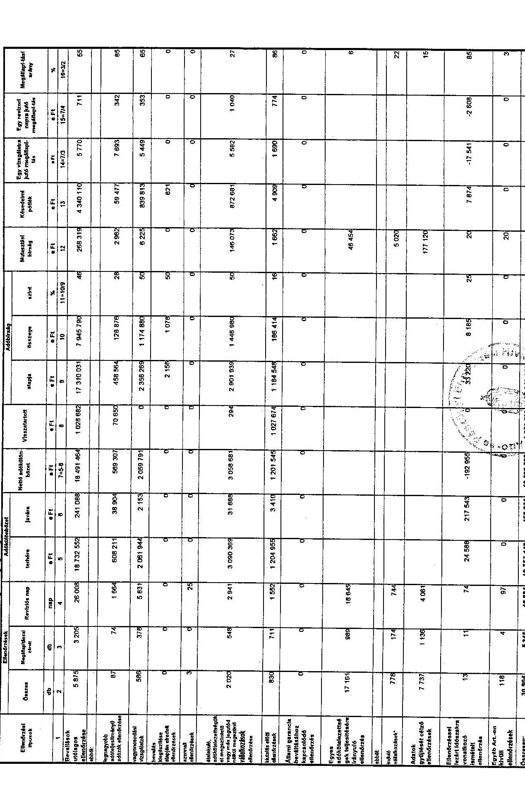

*Az. H. - 2008. yanslır 1.(400 hedilyen - 50.1) (1) (otiazı) (kıv alış̧̧ı) ve (2) (otiazı) (kıv alış̧̧ı) ve (3) (otiazı) (kıv alış̧̧ı)

---

|  5/d-7. sz. tanúsítvány |  |  |  |  |  |  |  |  |  |  |  |  |  |  |  |  |  |   |
| --- | --- | --- | --- | --- | --- | --- | --- | --- | --- | --- | --- | --- | --- | --- | --- | --- | --- | --- |
|  5/d-7. sz. tanúsítvány |  |  |  |  |  |  |  |  |  |  |  |  |  |  |  |  |  |   |
|  5/d-7. sz. tanúsítvány |  |  |  |  |  |  |  |  |  |  |  |  |  |  |  |  |  |   |
|  5/d-7. sz. tanúsítvány |  |  |  |  |  |  |  |  |  |  |  |  |  |  |  |  |  |   |
|  5/d-7. sz. tanúsítvány |  |  |  |  |  |  |  |  |  |  |  |  |  |  |  |  |  |   |
|  5/d-7. sz. tanúsítvány |  |  |  |  |  |  |  |  |  |  |  |  |  |  |  |  |  |   |
|  5/d-7. sz. tanúsítvány |  |  |  |  |  |  |  |  |  |  |  |  |  |  |  |  |  |   |
|  5/d-7. sz. tanúsítvány |  |  |  |  |  |  |  |  |  |  |  |  |  |  |  |  |  |   |
|  5/d-7. sz. tanúsítvány |  |  |  |  |  |  |  |  |  |  |  |  |  |  |  |  |  |   |
|  5/d-7. sz. tanúsítvány |  |  |  |  |  |  |  |  |  |  |  |  |  |  |  |  |  |   |
|  5/d-7. sz. tanúsítvány |  |  |  |  |  |  |  |  |  |  |  |  |  |  |  |  |  |   |
|  5/d-7. sz. tanúsítvány |  |  |  |  |  |  |  |  |  |  |  |  |  |  |  |  |  |   |
|  5/d-7. sz. tanúsítvány |  |  |  |  |  |  |  |  |  |  |  |  |  |  |  |  |  |   |
|  5/d-7. sz. tanúsítvány |  |  |  |  |  |  |  |  |  |  |  |  |  |  |  |  |  |   |
|  5/d-7. sz. tanúsítvány |  |  |  |  |  |  |  |  |  |  |  |  |  |  |  |  |  |   |
|  5/d-7. sz. tanúsítvány |  |  |  |  |  |  |  |  |  |  |  |  |  |  |  |  |  |   |
|  5/d-7. sz. tanúsítvány |  |  |  |  |  |  |  |  |  |  |  |  |  |  |  |  |  |   |
|  5/d-7. sz. tanúsítvány |  |  |  |  |  |  |  |  |  |  |  |  |  |  |  |  |  |   |
|  5/d-7. sz. tanúsítvány |  |  |  |  |  |  |  |  |  |  |  |  |  |  |  |  |  |   |
|  5/d-7. sz. tanúsítvány |  |  |  |  |  |  |  |  |  |  |  |  |  |  |  |  |  |   |
|  5/d-7. sz. tanúsítvány |  |  |  |  |  |  |  |  |  |  |  |  |  |  |  |  |  |   |
|  5/d-7. sz. tanúsítvány |  |  |  |  |  |  |  |  |  |  |  |  |  |  |  |  |  |   |
|  5/d-7. sz. tanúsítvány |  |  |  |  |  |  |  |  |  |  |  |  |  |  |  |  |  |   |
|  5/d-7. sz. tanúsítvány |  |  |  |  |  |  |  |  |  |  |  |  |  |  |  |  |  |   |
|  5/d-7. sz. tanúsítvány |  |  |  |  |  |  |  |  |  |  |  |  |  |  |  |  |  |   |
|  5/d-7. sz. tanúsítvány |  |  |  |  |  |  |  |  |  |  |  |  |  |  |  |  |  |   |
|  5/d-7. sz. tanúsítvány |  |  |  |  |  |  |  |  |  |  |  |  |  |  |  |  |  |   |
|  5/d-7. sz. tanúsítvány |  |  |  |  |  |  |  |  |  |  |  |  |  |  |  |  |  |   |
|  5/d-7. sz. tanúsítvány |  |  |  |  |  |  |  |  |  |  |  |  |  |  |  |  |  |   |
|  5/d-7. sz. tanúsítvány |  |  |  |  |  |  |  |  |  |  |  |  |  |  |  |  |  |   |
|  5/d-7. sz. tanúsítvány |  |  |  |  |  |  |  |  |  |  |  |  |  |  |  |  |  |   |
|  5/d-7. sz. tanúsítvány |  |  |  |  |  |  |  |  |  |  |  |  |  |  |  |  |  |   |
| 

---

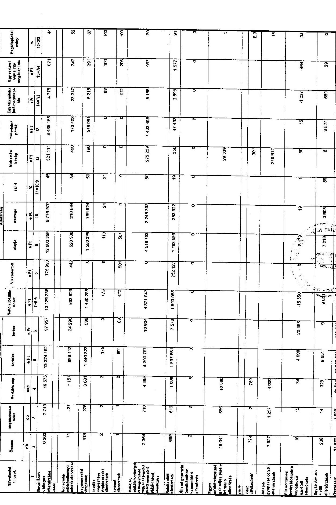

# 5/d-8. sz. tanúsítvány

## Tanúsítvány az ellenőrzését eredményességének alakulásáról ellenőrzési típusosítást

|  Személy |  |  |  |  |  |  |  |  |  |  |  |  |  |  |  |  |  |  |  |  |  |  |  |  |   |
| --- | --- | --- | --- | --- | --- | --- | --- | --- | --- | --- | --- | --- | --- | --- | --- | --- | --- | --- | --- | --- | --- | --- | --- | --- | --- |
|   |  |  |  |  |  |  |  |  |  |  |  |  |  |  |  |  |  |  |  |  |  |  |  |  |   |
|  |   |   |   |   |   |   |   |   |   |   |   |   |   |   |   |   |   |   |   |   |   |   |   |   |   |
|  |   |   |   |   |   |   |   |   |   |   |   |   |   |   |   |   |   |   |   |   |   |   |   |   |   |
|  |   |   |   |   |   |   |   |   |   |   |   |   |   |   |   |   |   |   |   |   |   |   |   |   |   |
|  |   |   |   |   |   |   |   |   |   |   |   |   |   |   |   |   |   |   |   |   |   |   |   |   |   |
|  |   |   |   |   |   |   |   |   |   |   |   |   |   |   |   |   |   |   |   |   |   |   |   |   |   |
|  |   |   |   |   |   |   |   |   |   |   |   |   |   |   |   |   |   |   |   |   |   |   |   |   |   |
|  |   |   |   |   |   |   |   |   |   |   |   |   |   |   |   |   |   |   |   |   |   |   |   |   |   |
|  |   |   |   |   |   |   |   |   |   |   |   |   |   |   |   |   |   |   |   |   |   |   |   |   |   |
|  |   |   |   |   |   |   |   |   |   |   |   |   |   |   |   |   |   |   |   |   |   |   |   |   |   |
|  |   |   |   |   |   |   |   |   |   |   |   |   |   |   |   |   |   |   |   |   |   |   |   |   |   |
|  |   |   |   |   |   |   |   |   |   |   |   |   |   |   |   |   |   |   |   |   |   |   |   |   |   |
|  |   |   |   |   |   |   |   |   |   |   |   |   |   |   |   |   |   |   |   |   |   |   |   |   |   |
|  |   |   |   |   |   |   |   |   |   |   |   |   |   |   |   |   |   |   |   |   |   |   |   |   |   |
|  |   |   |   |   |   |   |   |   |   |   |   |   |   |   |   |   |   |   |   |   |   |   |   |   |   |
|  |   |   |   |   |   |   |   |   |   |   |   |   |   |   |   |   |   |   |   |   |   |   |   |   |   |
|  |   |   |   |   |   |   |   |   |   |   |   |   |   |   |   |   |   |   |   |   |   |   |   |   |   |
|  |   |   |   |   |   |   |   |   |   |   |   |   |   |   |   |   |   |   |   |   |   |   |   |   |   |
|  |   |   |   |   |   |   |   |   |   |   |   |   |   |   |   |   |   |   |   |   |   |   |   |   |   |
|  |   |   |   |   |   |   |   |   |   |   |   |   |   |   |   |   |   |   |   |   |   |   |   |   |   |
|  |   |   |   |   |   |   |   |   |   |   |   |   |   |   |   |   |   |   |   |   |   |   |   |   |   |
|  |   |   |   |   |   |   |   |   |   |   |   |   |   |   |   |   |   |   |   |   |   |   |   |   |   |
|  |   |   |   |   |   |   |   |   |   |   |   |   |   |   |   |   |   |   |   |   |   |   |   |   |   |
|  |   |   |   |   |   |   |   |   |   |   |   |   |   |   |   |   |   |   |   |   |   |   |   |   |   |
|  |   |   |   |   |   |   |   |   |   |   |   |   |   |   |   |   |   |   |   |   |   |   |   |   |   |
|  |   |   |   |   |   |   |   |   |   |   |   |   |   |   |   |   |   |   |   |   |   |   |   |   |   |
|  |   |   |   |   |   |   |   |   |   |   |   |   |   |   |   |   |   |   |   |   |   |   |   |   |   |
|  |   |   |   |   |   |   |   |   |   |   |   |   |   |   |   |   |   |   |   |   |   |   |   |   |   |
|  |   |   |   |   |   |   |   |   |   |   |   |   |   |   |   |   |   |   |   |   |   |   |   |   |   |
|  |   |   |   |   |   |   |   |   |   |   |   |   |   |   |   |   |   |   |   |   |   |   |   |   |   |
|  |   |   |   |   |   |   |   |   |   |   |   |   |   |   |   |   |   |   |   |   |   |   |   |   |   |
|  |   |   |   |   |   |   |   |   |   |   |   |   |   |   |   |   |   |   |   |   |   |   |   |   |   |
| 

---

|   |  |  |  |  |  |  |  |  |  |  |  |  |  |  |  |  |  |  |  |  |  |  |  |  |  |  |  |  |  |  |  |  |  |  |  |  |  |  |  |  |  |   |
| --- | --- | --- | --- | --- | --- | --- | --- | --- | --- | --- | --- | --- | --- | --- | --- | --- | --- | --- | --- | --- | --- | --- | --- | --- | --- | --- | --- | --- | --- | --- | --- | --- | --- | --- | --- | --- | --- | --- | --- | --- | --- | --- | --- | --- |
|  5/d-9. sz. tanúsítvány az elévítéshez eszközysnek/ekel. elötelekéti elnevezése (p. 0000) |  |  |  |  |  |  |  |  |  |  |  |  |  |  |  |  |  |  |  |  |  |  |  |  |  |  |  |  |  |  |  |  |  |  |  |  |  |  |  |  |  |  |   |
|  5/d-9. sz. tanúsítvány az elévítéshez eszközysnek/ekel. elötelekéti elnevezése (p. 0000) |  |  |  |  |  |  |  |  |  |  |  |  |  |  |  |  |  |  |  |  |  |  |  |  |  |  |  |  |  |  |  |  |  |  |  |  |  |  |  |  |  |  |   |
|  5/d-9. sz. tanúsítvány az elévítéshez eszközysnek/ekel. elötelekéti elnevezése (p. 0000) |  |  |  |  |  |  |  |  |  |  |  |  |  |  |  |  |  |  |  |  |  |  |  |  |  |  |  |  |  |  |  |  |  |  |  |  |  |  |  |  |  |  |   |
|  5/d-9. sz. tanúsítvány az elévítéshez eszközysnek/ekel. elötelekéti elnevezése (p. 0000) |  |  |  |  |  |  |  |  |  |  |  |  |  |  |  |  |  |  |  |  |  |  |  |  |  |  |  |  |  |  |  |  |  |  |  |  |  |  |  |  |  |  |   |
|  5/d-9. sz. tanúsítvány az elévítéshez eszközysnek/ekel. elötelekéti elnevezése (p. 0000) |  |  |  |  |  |  |  |  |  |  |  |  |  |  |  |  |  |  |  |  |  |  |  |  |  |  |  |  |  |  |  |  |  |  |  |  |  |  |  |  |  |  |   |
|  5/d-9. sz. tanúsítvány az elévítéshez eszközysnek/ekel. elötelekéti elnevezése (p. 0000) |  |  |  |  |  |  |  |  |  |  |  |  |  |  |  |  |  |  |  |  |  |  |  |  |  |  |  |  |  |  |  |  |  |  |  |  |  |  |  |  |  |  |   |
|  5/d-9. sz. tanúsítvány az elévítéshez eszközysnek/ekel. elötelekéti elnevezése (p. 0000) |  |  |  |  |  |  |  |  |  |  |  |  |  |  |  |  |  |  |  |  |  |  |  |  |  |  |  |  |  |  |  |  |  |  |  |  |  |  |  |  |  |  |   |
|  5/d-9. sz. tanúsítvány az elévítéshez eszközysnek/ekel. elötelekéti elnevezése (p. 0000) |  |  |  |  |  |  |  |  |  |  |  |  |  |  |  |  |  |  |  |  |  |  |  |  |  |  |  |  |  |  |  |  |  |  |  |  |  |  |  |  |  |  |   |
|  5/d-9. sz. tanúsítvány az elévítéshez eszközysnek/ekel. elötelekéti elnevezése (p. 0000) |  |  |  |  |  |  |  |  |  |  |  |  |  |  |  |  |  |  |  |  |  |  |  |  |  |  |  |  |  |  |  |  |  |  |  |  |  |  |  |  |  |  |   |
|  5/d-9. sz. tanúsítvány az elévítéshez eszközysnek/ekel. elötelekéti elnevezése (p. 0000) |  |  |  |  |  |  |  |  |  |  |  |  |  |  |  |  |  |  |  |  |  |  |  |  |  |  |  |  |  |  |  |  |  |  |  |  |  |  |  |  |  |  |   |
|  5/d-9. sz. tanúsítvány az elévítéshez eszközysnek/ekel. elötelekéti elnevezése (p. 0000) |  |  |  |  |  |  |  |  |  |  |  |  |  |  |  |  |  |  |  |  |  |  |  |  |  |  |  |  |  |  |  |  |  |  |  |  |  |  |  |  |  |  |   |
|  5/d-9. sz. tanúsítvány az elévítéshez eszközysnek/ekel. elötelekéti elnevezése (p. 0000) |  |  |  |  |  |  |  |  |  |  |  |  |  |  |  |  |  |  |  |  |  |  |  |  |  |  |  |  |  |  |  |  |  |  |  |  |  |  |  |  |  |  |   |
|  5/d-9. sz. tanúsítvány az elévítéshez eszközysnek/ekel. elötelekéti elnevezése (p. 0000) |  |  |  |  |  |  |  |  |  |  |  |  |  |  |  |  |  |  |  |  |  |  |  |  |  |  |  |  |  |  |  |  |  |  |  |  |  |  |  |  |  |  |   |
|  5/d-9. sz. tanúsítvány az elévítéshez eszközysnek/ekel. elötelekéti elnevezése (p. 0000) |  |  |  |  |  |  |  |  |  |  |  |  |  |  |  |  |  |  |  |  |  |  |  |  |  |  |  |  |  |  |  |  |  |  |  |  |  |  |  |  |  |  |   |
|  5/d-9. sz. tanúsítvány az elévítéshez eszközysnek/ekel. elötelekéti elnevezése (p. 0000) |  |  |  |  |  |  |  |  |  |  |  |  |  |  |  |  |  |  |  |  |  |  |  |  |  |  |  |  |  |  |  |  |  |  |  |  |  |  |  |  |  |  |   |
|  5/d-9. sz. tanúsítvány az elévítéshez eszközysnek/ekel. elötelekéti elnevezése (p. 0000) |  |  |  |  |  |  |  |  |  |  |  |  |  |  |  |  |  |  |  |  |  |  |  |  |  |  |  |  |  |  |  |  |  |  |  |  |  |  |  |  |  |  |   |
|  5/d-9. sz. tanúsítvány az elévítéshez eszközysnek/ekel. elötelekéti elnevezése (p. 0000) |  |  |  |  |  |  |  |  |  |  |  |  |  |  |  |  |  |  |  |  |  |  |  |  |  |  |  |  |  |  |  |  |  |  |  |  |  |  |  |  |  |  |   |
|  5/d-9. sz. tanúsítvány az elévítéshez eszközysnek/ekel. elötelekéti elnevezése (p. 0000) |  |  |  |  |  |  |  |  |  |  |  |  |  |  |  |  |  |  |  |  |  |  |  |  |  |  |  |  |  |  |  |  |  |  |  |  |  |  |  |  |  |  |   |
|  5/d-9. sz. tanúsítvány az elévítéshez eszközysnek/ekel. elötelekéti elnevezése (p. 0000) |  |  |  |  |  |  |  |  |  |  |  |  |  |  |  |  |  |  |  |  |  |  |  |  |  |  |  |  |  |  |  |  |  |  |  |  |  |  |  |  |  |  |   |
|  5/d-9. sz. tanúsítvány az elévítéshez eszközysnek/ekel. elötelekéti elnevezése (p. 0000) |  |  |  |  |  |  |  |  |  |  |  |  |  |  |  |  |  |  |  |  |  |  |  |  |  |  |  |  |  |  |  |  |  |  |  |  |  |  |  |  |  |  |   |
|  5/d-9. sz. tanúsítvány az elévítéshez eszközysnek/ekel. elötelekéti elnevezése (p. 0000) |  |  |  |  |  |  |  |  |  |  |  |  |  |  |  |  |  |  |  |  |  |  |  |  |  |  |  |  |  |  |  |  |  |  |  |  |  |  |  |  |  |  |   |
|  5/d-9. sz. tanúsítvány az elévítéshez eszközysnek/ekel. elötelekéti elnevezése (p. 0000) |  |  |  |  |  |  |  |  |  |  |  |  |  |  |  |  |  |  |  |  |  |  |  |  |  |  |  |  |  |  |  |  |  |  |  |  |  |  |  |  |  |  |   |
|  5/d-9. sz. tanúsítvány az elévítéshez eszközysnek/ekel. elötelekéti elnevezése (p. 0000) |  |  |  |  |  |  |  |  |  |  |  |  |  |  |  |  |  |  |  |  |  |  |  |  |  |  |  |  |  |  |  |  |  |  |  |  |  |  |  |  |  |  |   |
|  5/d-9. sz. tanúsítvány az elévítéshez eszközysnek/ekel. elötelekéti elnevezése (p. 0000) |  |  |  |  |  |  |  |  |  |  |  |  |  |  |  |  |  |  |  |  |  |  |  |  |  |  |  |  |  |  |  |  |  |  |  |  |  |  |  |  |  |  |   |
|  5/d-9. sz. tanúsítvány az elévítéshez eszközysnek/ekel. elötelekéti elnevezése (p. 0000) |  |  |  |  |  |  |  |  |  |  |  |  |  |  |  |  |  |  |  |  |  |  |  |  |  |  |  |  |  |  |  |  |  |  |  |  |  |  |  |  |  |  |   |
|  5/d-9. sz. tanúsítvány az elévítéshez eszközysnek/ekel. elötelekéti elnevezése (p. 0000) |  |  |  |  |  |  |  |  |  |  |  |  |  |  |  |  |  |  |  |  |  |  |  |  |  |  |  |  |  |  |  |  |  |  |  |  |  |  |  |  |  |  |   |
|  5/d-9. sz. tanúsítvány az elévítéshez eszközysnek/ekel. elötelekéti elnevezése (p. 0000) |  |  |  |  |  |  |  |  |  |  |  |  |  |  |  |  |  |  |  |  |  |  |  |  |  |  |  |  |  |  |  |  |  |  |  |  |  |  |  |  |  |  |   |
|  5/d-9. sz. tanúsítvány az elévítéshez eszközysnek/ekel. elötelekéti elnevezése (p. 0000) |  |  |  |  |  |  |  |  |  |  |  |  |  |  |  |  |  |  |  |  |  |  |  |  |  |  |  |  |  |  |  |  |  |  |  |  |  |  |  |  |  |  |   |
|  5/d-9. sz. tanúsítvány az elévítéshez eszközysnek/ekel. elötelekéti elnevezése (p. 0000) |  |  |  |  |  |  |  |  |  |  |  |  |  |  |  |  |  |  |  |  |  |  |  |  |  |  |  |  |  |  |  |  |  |  |  |  |  |  |  |  |  |  |   |
|  5/d-9. sz. tanúsítvány az elévítéshez eszközysnek/ekel. elötelekéti elnevezése (p. 0000) |  |  |  |  |  |  |  |  |  |  |  |  |  |  |  |  |  |  |  |  |  |  |  |  |  |  |  |  |  |  |  |  |  |  |  |  |  |  |  |  |  |  |   |
|  5/d-9. sz. tanúsítvány az elévítéshez eszközysnek/ekel. elötelekéti elnevezése (p. 0000) |  |  |  |  |  |  |  |  |  |  |  |  |  |  |  |  |  |  |  |  |  |  |  |  |  |  |  |  |  |  |  |  |  |  |  |  |  |  |  |  |  |  |   |

---

|   |  |  |  |  |  |  |  |  |  |  |  |  |  |  |  |  |  |  |  |  |  |  |  |  |  |  |  |  |  |  |  |  |  |  |  |  |  |  |  |  |   |
| --- | --- | --- | --- | --- | --- | --- | --- | --- | --- | --- | --- | --- | --- | --- | --- | --- | --- | --- | --- | --- | --- | --- | --- | --- | --- | --- | --- | --- | --- | --- | --- | --- | --- | --- | --- | --- | --- | --- | --- | --- | --- | --- | --- |
|   |  |  |  |  |  |  |  |  |  |  |  |  |  |  |  |  |  |  |  |  |  |  |  |  |  |  |  |  |  |  |  |  |  |  |  |  |  |  |  |  |  |   |
|   |  |  |  |  |  |  |  |  |  |  |  |  |  |  |  |  |  |  |  |  |  |  |  |  |  |  |  |  |  |  |  |  |  |  |  |  |  |  |  |  |  |   |
|   |  |  |  |  |  |  |  |  |  |  |  |  |  |  |  |  |  |  |  |  |  |  |  |  |  |  |  |  |  |  |  |  |  |  |  |  |  |  |  |  |  |   |
|   |  |  |  |  |  |  |  |  |  |  |  |  |  |  |  |  |  |  |  |  |  |  |  |  |  |  |  |  |  |  |  |  |  |  |  |  |  |  |  |  |  |   |
|   |  |  |  |  |  |  |  |  |  |  |  |  |  |  |  |  |  |  |  |  |  |  |  |  |  |  |  |  |  |  |  |  |  |  |  |  |  |  |  |  |  |   |
|   |  |  |  |  |  |  |  |  |  |  |  |  |  |  |  |  |  |  |  |  |  |  |  |  |  |  |  |  |  |  |  |  |  |  |  |  |  |  |  |  |  |   |
|   |  |  |  |  |  |  |  |  |  |  |  |  |  |  |  |  |  |  |  |  |  |  |  |  |  |  |  |  |  |  |  |  |  |  |  |  |  |  |  |  |  |   |
|   |  |  |  |  |  |  |  |  |  |  |  |  |  |  |  |  |  |  |  |  |  |  |  |  |  |  |  |  |  |  |  |  |  |  |  |  |  |  |  |  |  |   |
|   |  |  |  |  |  |  |  |  |  |  |  |  |  |  |  |  |  |  |  |  |  |  |  |  |  |  |  |  |  |  |  |  |  |  |  |  |  |  |  |  |  |   |
|   |  |  |  |  |  |  |  |  |  |  |  |  |  |  |  |  |  |  |  |  |  |  |  |  |  |  |  |  |  |  |  |  |  |  |  |  |  |  |  |  |  |   |
|   |  |  |  |  |  |  |  |  |  |  |  |  |  |  |  |  |  |  |  |  |  |  |  |  |  |  |  |  |  |  |  |  |  |  |  |  |  |  |  |  |  |   |
|   |  |  |  |  |  |  |  |  |  |  |  |  |  |  |  |  |  |  |  |  |  |  |  |  |  |  |  |  |  |  |  |  |  |  |  |  |  |  |  |  |  |   |
|   |  |  |  |  |  |  |  |  |  |  |  |  |  |  |  |  |  |  |  |  |  |  |  |  |  |  |  |  |  |  |  |  |  |  |  |  |  |  |  |  |  |   |
|   |  |  |  |  |  |  |  |  |  |  |  |  |  |  |  |  |  |  |  |  |  |  |  |  |  |  |  |  |  |  |  |  |  |  |  |  |  |  |  |  |  |   |
|   |  |  |  |  |  |  |  |  |  |  |  |  |  |  |  |  |  |  |  |  |  |  |  |  |  |  |  |  |  |  |  |  |  |  |  |  |  |  |  |  |  |   |
|   |  |  |  |  |  |  |  |  |  |  |  |  |  |  |  |  |  |  |  |  |  |  |  |  |  |  |  |  |  |  |  |  |  |  |  |  |  |  |  |  |  |   |
|   |  |  |  |  |  |  |  |  |  |  |  |  |  |  |  |  |  |  |  |  |  |  |  |  |  |  |  |  |  |  |  |  |  |  |  |  |  |  |  |  |  |   |
|   |  |  |  |  |  |  |  |  |  |  |  |  |  |  |  |  |  |  |  |  |  |  |  |  |  |  |  |  |  |  |  |  |  |  |  |  |  |  |  |  |  |   |
|   |  |  |  |  |  |  |  |  |  |  |  |  |  |  |  |  |  |  |  |  |  |  |  |  |  |  |  |  |  |  |  |  |  |  |  |  |  |  |  |  |  |   |
|   |  |  |  |  |  |  |  |  |  |  |  |  |  |  |  |  |  |  |  |  |  |  |  |  |  |  |  |  |  |  |  |  |  |  |  |  |  |  |  |  |  |   |
|   |  |  |  |  |  |  |  |  |  |  |  |  |  |  |  |  |  |  |  |  |  |  |  |  |  |  |  |  |  |  |  |  |  |  |  |  |  |  |  |  |  |   |
|   |  |  |  |  |  |  |  |  |  |  |  |  |  |  |  |  |  |  |  |  |  |  |  |  |  |  |  |  |  |  |  |  |  |  |  |  |  |  |  |  |  |   |
|   |  |  |  |  |  |  |  |  |  |  |  |  |  |  |  |  |  |  |  |  |  |  |  |  |  |  |  |  |  |  |  |  |  |  |  |  |  |  |  |  |  |   |
|   |  |  |  |  |  |  |  |  |  |  |  |  |  |  |  |  |  |  |  |  |  |  |  |  |  |  |  |  |  |  |  |  |  |  |  |  |  |  |  |  |  |   |
|   |  |  |  |  |  |  |  |  |  |  |  |  |  |  |  |  |  |  |  |  |  |  |  |  |  |  |  |  |  |  |  |  |  |  |  |  |  |  |  |  |  |   |
|   |  |  |  |  |  |  |  |  |  |  |  |  |  |  |  |  |  |  |  |  |  |  |  |  |  |  |  |  |  |  |  |  |  |  |  |  |  |  |  |  |  |  |   |
|   |  |  |  |  |  |  |  |  |  |  |  |  |  |  |  |  |  |  |  |  |  |  |  |  |  |  |  |  |  |  |  |  |  |  |  |  |  |  |  |  |  |  |   |
|   |  |  |  |  |  |  |  |  |  |  |  |  |  |  |  |  |  |  |  |  |  |  |  |  |  |  |  |  |  |  |  |  |  |  |  |  |  |  |  |  |  |  |   |
|   |  |  |  |  |  |  |  |  |  |  |  |  |  |  |  |  |  |  |  |  |  |  |  |  |  |  |  |  |  |  |  |  |  |  |  |  |  |  |  |  |  |  |   |
|   |  |  |  |  |  |  |  |  |  |  |  |  |  |  |  |  |  |  |  |  |  |  |  |  |  |  |  |  |  |  |  |  |  |  |  |  |  |  |  |  |  |  |   |
|   |  |  |  |  |  |  |  |  |  |  |  |  |  |  |  |  |  |  |  |  |  |  |  |  |  |  |  |  |  |  |  |  |  |  |  |  |  |  |  |  |  |  |   |
|   |  |  |  |  |  |  |  |  |  |  |  |  |  |  |  |  |  |  |  |  |  |  |  |  |  |  |  |  |  |  |  |  |  |  |  |  |  |  |  |  |  |  |   |
|   |  |  |  |  |  |  |  |  |  |  |  |  |  |  |  |  |  |  |  |  |  |  |  |  |  |  |  |  |  |  |  |  |  |  |  |  |  |  |  |  |  |  |   |
|   |  |  |  |  |  |  |  |  |  |  |  |  |  |  |  |  |  |  |  |  |  |  |  |  |  |  |  |  |  |  |  |  |  |  |  |  |  |  |  |  |  |  |   |
|   |  |  |  |  |  |  |  |  |  |  |  |  |  |  |  |  |  |  |  |  |  |  |  |  |  |  |  |  |  |  |  |  |  |  |  |  |  |  |  |  |  |  |   |
|   |  |  |  |  |  |  |  |  |  |  |  |  |  |  |  |  |  |  |  |  |  |  |  |  |  |  |  |  |  |  |  |  |  |  |  |  |  |  |  |  |  |  |   |
|   |  |  |  |  |  |  |  |  |  |  |  |  |  |  |  |  |  |  |  |  |  |  |  |  |  |  |  |  |  |  |  |  |  |  |  |  |  |  |  |  |  |  |   |
|   |  |  |  |  |  |  |  |  |  |  |  |  |  |  |  |  |  |  |  |  |  |  |  |  |  |  |  |  |  |  |  |  |  |  |  |  |  |  |  |  |  |  |   |
|   |  |  |  |  |  |  |  |  |  |  |  |  |  |  |  |  |  |  |  |  |  |  |  |  |  |  |  |  |  |  |  |  |  |  |  |  |  |  |  |  |  |  |   |
|   |  |  |  |  |  |  |  |  |  |  |  |  |  |  |  |  |  |  |  |  |  |  |  |  |  |  |  |  |  |  |  |  |  |  |  |  |  |  |  |  |  |  |   |
|   |  |  |  |  |  |  |  |  |  |  |  |  |  |  |  |  |  |  |  |  |  |  |  |  |  |  |  |  |  |  |  |  |  |  |  |  |  |  |  |  |  |  |   |
|   |  |  |  |  |  |  |  |  |  |  |  |  |  |  |  |  |  |  |  |  |  |  |  |  |  |  |  |  |  |  |  |  |  |  |  |  |  |  |  |  |  |  |   |
|   |  |  |  |  |  |  |  |  |  |  |  |  |  |  |  |  |  |  |  |  |  |  |  |  |  |  |  |  |  |  |  |  |  |  |  |  |  |  |  |  |  |  |   |
|   |  |  |  |  |  |  |  |  |  |  |  |  |  |  |  |  |  |  |  |  |  |  |  |  |  |  |  |  |  |  |  |  |  |  |  |  |  |  |  |  |  |  |   |
|   |  |  |  |  |  |  |  |  |  |  |  |  |  |  |  |  |  |  |  |  |  |  |  |  |  |  |  |  |  |  |  |  |  |  |  |  |  |  |  |  |  |  |   |
|   |  |  |  |  |  |  |  |  |  |  |  |  |  |  |  |  |  |  |  |  |  |  |  |  |  |  |  |  |  |  |  |  |  |  |  |  |  |  |  |  |  |  |   |
|   |  |  |  |  |  |  |  |  |  |  |  |  |  |  |  |  |  |  |  |  |  |  |  |  |  |  |  |  |  |  |  |  |  |  |  |  |  |  |  |  |  |  |   |
|   |  |  |  |  |  |  |  |  |  |  |  |  |  |  |  |  |  |  |  |  |  |  |  |  |  |  |  |  |  |  |  |  |  |  |  |  |  |  |  |  |  |  |   |
|   |  |  |  |  |  |  |  |  |  |  |  |  |  |  |  |  |  |  |  |  |  |  |  |  |  |  |  |  |  |  |  |  |  |  |  |  |  |  |  |  |  |  |   |
|   |  |  |  |  |  |  |  |  |  |  |  |  |  |  |  |  |  |  |  |  |  |  |  |  |  |  |  |  |  |  |  |  |  |  |  |  |  |  |  |  |  |  |   |
|   |  |  |  |  |  |  |  |  |  |  |  |  |  |  |  |  |  |  |  |  |  |  |  |  |  |  |  |  |  |  |  |  |  |  |  |  |  |  |  |  |  |  |   |
|   |  |  |  |  |  |  |  |  |  |  |  |  |  |  |  |  |  |  |  |  |  |  |  |  |  |  |  |  |  |  |  |  |  |  |  |  |  |  |  |  |  |  |   |
|   |  |  |  |  |  |  |  |  |  |  |  |  |  |  |  |  |  |  |  |  |  |  |  |  |  |  |  |  |  |  |  |  |  |  |  |  |  |  |  |  |  |  |   |
|   |  |  |  |  |  |  |  |  |  |  |  |  |  |  |  |  |  |  |  |  |  |  |  |  |  |  |  |  |  |  |  |  |  |  |  |  |  |  |  |  |  |  |   |
|   |  |  |  |  |  |  |  |  |  |  |  |  |  |  |  |  |  |  |  |  |  |  |  |  |  |  |  |  |  |  |  |  |  |  |  |  |  |  |  |  |  |  |   |
|   |  |  |  |  |  |  |  |  |  |  |  |  |  |  |  |  |  |  |  |  |  |  |  |  |  |  |  |  |  |  |  |  |  |  |  |  |  |  |  |  |  |  |   |

---

7/a. sz. tanúsítvány

tanúsítvány az ellenőrzések eredményezéséjeinek alakulásáról adózói kategóriánként 2005

|  Megnevezés | Elmeőrzések |  |  | Adókülönbözet |  |  |  | Adóknak |  |  |  |  |  |  |  |   |
| --- | --- | --- | --- | --- | --- | --- | --- | --- | --- | --- | --- | --- | --- | --- | --- | --- |
|   | Összex | Megállapítással sérült | Revíziós nap | terhére | javára | Netió adókülön
bözet | Vieszetes telt | elegie | összese | szint | Melesztési
bőség | Készletes
pótlák | Egy
vizsgálatba
jutt
megállapítást | Egy revízot
napos jutt
megállapítást | Megállapítást arány |   |
|   | db | db | nap | E Ft | E Ft | E Ft | E Ft | E Ft | E Ft | % | E Ft | E Ft | E Ft | E Ft | %  |
|  1 | 2 | 3 | 4 | 5 | 6 | 7=5-6 | 8 | 9 | 10 | 11=10/9 | 12 | 13 | 14=1/3 | 15=3/4 | 16=5/2  |
|  1. Kategória | 10 962 | 3 119 | 79 751 | 63 738 143 | 15 096 226 | 48 641 914 | 7 718 512 | 41 927 887 | 13 649 329 | 33 | 523 468 | 10 612 350 | 15 595 | 610 | 28  |
|  2. Kategória | 9 212 | 2 774 | 72 717 | 56 692 747 | 14 737 582 | 41 925 165 | 6 414 123 | 38 981 569 | 12 803 721 | 33 | 504 716 | 10 429 677 | 15 114 | 577 | 30  |
|  2. Kategória | 8 607 | 1 545 | 28 089 | 24 938 953 | 1 249 143 | 23 689 810 | 2 623 164 | 21 909 130 | 9 352 812 | 43 | 136 994 | 7 464 321 | 15 333 | 843 | 18  |
|  3. Kategória | 13 499 | 2 526 | 36 064 | 30 264 957 | 793 665 | 29 471 252 | 4 935 907 | 25 896 445 | 11 273 091 | 44 | 149 861 | 8 809 683 | 11 667 | 817 | 19  |
|  4. Kategória | 19 694 | 3 958 | 43 999 | 32 696 983 | 509 386 | 32 177 597 | 4 036 388 | 28 267 874 | 12 718 240 | 45 | 329 398 | 9 952 401 | 8 124 | 731 | 20  |
|  5. Kategória | 28 009 | 6 069 | 53 540 | 23 119 723 | 714 144 | 22 405 576 | 3 240 769 | 20 873 408 | 9 265 484 | 44 | 353 722 | 6 874 908 | 3 692 | 418 | 22  |
|  6. Kategória | 37 534 | 9 406 | 58 799 | 13 963 101 | 311 104 | 13 651 997 | 3 374 468 | 11 964 244 | 4 813 137 | 40 | 504 803 | 3 372 673 | 1 451 | 232 | 25  |
|  7. Kategória | 39 197 | 10 513 | 55 028 | 8 762 634 | 215 621 | 8 547 013 | 3 173 835 | 8 416 350 | 3 365 925 | 40 | 469 215 | 1 626 718 | 813 | 155 | 27  |
|  8. Kategória | 29 990 | 8 147 | 37 899 | 3 913 409 | 194 243 | 3 719 166 | 1 335 465 | 3 270 861 | 1 053 777 | 32 | 260 898 | 632 660 | 457 | 98 | 27  |
|  9. Kategória | 7 924 | 2 065 | 8 740 | 1 923 887 | 31 835 | 1 892 052 | 429 373 | 1 253 569 | 499 832 | 40 | 48 892 | 251 146 | 910 | 216 | 26  |
|  0. Kategória | 23 878 | 5 412 | 29 750 | 13 328 887 | 215 507 | 13 113 380 | 7 252 387 | 10 066 818 | 9 890 312 | 32 | 245 914 | 1 261 400 | 2 423 | 441 | 23  |
|  Kategórián
sivúllek | 79 993 | 16 420 | 38 363 | 5 581 986 | 223 758 | 5 358 228 | 1 717 505 | 4 769 269 | 3 991 443 | 35 | 35 767 | 1 279 650 | 347 | 140 | 19  |
|  Összesen: | 299 287 | 68 178 | 469 962 | 222 222 659 | 19 554 634 | 202 668 025 | 39 637 771 | 175 817 852 | 79 873 785 | 40 | 3 049 932 | 52 137 910 | 2 973 | 431 | 23  |

1/20

---

7/b. sz. tanúsítvány

Tanúsítvány az ellenőrzések eredményességének alakulásáról adózói kategóriánként 2005

AFEH összesen

|  Megnevezés | Összesen | Megállapításod sérül | Hovszéklet | Hozzék | Személy | Adókállítókövet | Hozzéklet katt | Személy | Adókállítókövet | Hozzéklet katt | Személy | Adókállítókövet | Hozzéklet katt | Személy | Adókállítókövet  |
| --- | --- | --- | --- | --- | --- | --- | --- | --- | --- | --- | --- | --- | --- | --- | --- |
|   | db | db | nap | E Ft | E Ft | E Ft | E Ft | E Ft | E Ft | % | E Ft | E Ft | E Ft | E Ft | %  |
|  1 | 2 | 3 | 4 | 5 | 6 | 7+5-6 | 8 | 9 | 10 | 11+10/8 | 12 | 13 | 14+7/3 | 15+7/4 | 16+3/2  |
|  1. Kategória | 8 822 | 2 018 | 54 819 | 72 303 507 | 7 327 434 | 84 978 073 | 5 167 408 | 50 800 538 | 18 908 147 | 37 | 542 705 | 13 211 827 | 32 198 | 1 185 | 23  |
|  E3500 klemelt | 7 475 | 1 768 | 50 863 | 53 244 949 | 7 170 925 | 46 074 024 | 3 062 339 | 31 386 723 | 10 037 501 | 32 | 512 046 | 8 039 214 | 26 060 | 908 | 24  |
|  2. Kategória | 9 365 | 1 558 | 28 526 | 51 778 805 | 1 744 118 | 50 034 689 | 3 640 782 | 38 526 767 | 17 215 824 | 43 | 243 652 | 11 743 349 | 32 115 | 1 754 | 17  |
|  3. Kategória | 14 179 | 2 303 | 31 750 | 55 828 127 | 818 117 | 55 010 010 | 5 922 708 | 46 713 506 | 21 576 510 | 40 | 265 137 | 13 463 673 | 23 866 | 1 733 | 16  |
|  4. Kategória | 21 802 | 3 861 | 43 491 | 42 585 493 | 579 572 | 42 005 921 | 4 030 586 | 36 194 826 | 17 571 881 | 46 | 269 981 | 11 202 068 | 10 860 | 998 | 18  |
|  5. Kategória | 32 014 | 6 216 | 55 830 | 32 518 405 | 591 917 | 31 927 486 | 3 509 472 | 27 219 601 | 12 638 180 | 46 | 529 411 | 7 680 161 | 5 136 | 573 | 16  |
|  6. Kategória | 41 976 | 9 052 | 61 934 | 19 143 908 | 185 636 | 18 958 272 | 3 397 866 | 15 290 481 | 6 763 302 | 44 | 614 389 | 3 794 323 | 2 094 | 306 | 22  |
|  7. Kategória | 44 215 | 10 267 | 58 422 | 9 480 469 | 213 334 | 9 267 135 | 1 995 598 | 7 283 343 | 2 906 175 | 40 | 533 574 | 1 531 586 | 901 | 159 | 23  |
|  8. Kategória | 38 295 | 9 227 | 45 278 | 5 826 163 | 179 054 | 5 647 108 | 1 164 511 | 5 178 288 | 2 193 622 | 42 | 280 175 | 1 083 725 | 612 | 125 | 25  |
|  9. Kategória | 8 245 | 2 233 | 11 144 | 3 562 126 | 58 041 | 3 504 085 | 868 919 | 3 241 136 | 1 255 839 | 39 | 54 929 | 505 030 | 1 589 | 314 | 27  |
|  0. Kategória | 26 716 | 6 443 | 33 563 | 14 487 168 | 74 523 | 14 412 665 | 4 173 892 | 12 816 763 | 4 583 674 | 38 | 236 109 | 1 839 078 | 2 237 | 429 | 24  |
|  Kategórián kiválék | 35 685 | 18 270 | 37 886 | 6 686 604 | 185 026 | 6 501 579 | 1 590 784 | 4 281 038 | 1 714 493 | 40 | 137 460 | 1 357 376 | 400 | 172 | 46  |
|  Összesen: | 279 314 | 69 469 | 492 644 | 314 201 795 | 11 956 771 | 362 245 824 | 35 492 537 | 249 546 285 | 107 327 649 | 43 | 3 727 523 | 67 512 192 | 4 351 | 653 | 35  |

7/b. sz. tanúsítvány

---

7/c. sz. tanúsítvány

|  |   |   |   |   |   |   |   |   |   |   |   |   |   |   |   |   |   |   |   |   |   |   |   |   |   |   |   |   |   |   |   |   |   |   |   |   |   |   |   |   |   |   |   |   |   |   |   |   |   |   |   |   |   |   |   |   |   |   |   |   |   |   |   |   |   |   |   |   |   |   |   |   |   |   |   |   |   |   |   |   |   |   |   |   |   |   |   |   |   |   |   |   |   |   |   |   |   |   |   |   |   |

---

|  7/d. sz. tanúsítvány |  |  |  |  |  |  |  |  |  |  |  |  |  |  |  |  |   |
| --- | --- | --- | --- | --- | --- | --- | --- | --- | --- | --- | --- | --- | --- | --- | --- | --- | --- |
|   |  |  |  |  |  |  |  |  |  |  |  |  |  |  |  |  |   |
|   |  |  |  |  |  |  |  |  |  |  |  |  |  |  |  |  |   |
|   |  |  |  |  |  |  |  |  |  |  |  |  |  |  |  |  |   |
|   |  |  |  |  |  |  |  |  |  |  |  |  |  |  |  |  |   |
|   |  |  |  |  |  |  |  |  |  |  |  |  |  |  |  |  |   |
|   |  |  |  |  |  |  |  |  |  |  |  |  |  |  |  |  |   |
|   |  |  |  |  |  |  |  |  |  |  |  |  |  |  |  |  |   |
|   |  |  |  |  |  |  |  |  |  |  |  |  |  |  |  |  |   |
|   |  |  |  |  |  |  |  |  |  |  |  |  |  |  |  |  |   |
|   |  |  |  |  |  |  |  |  |  |  |  |  |  |  |  |  |   |
|   |  |  |  |  |  |  |  |  |  |  |  |  |  |  |  |  |   |
|   |  |  |  |  |  |  |  |  |  |  |  |  |  |  |  |  |   |
|   |  |  |  |  |  |  |  |  |  |  |  |  |  |  |  |  |   |
|   |  |  |  |  |  |  |  |  |  |  |  |  |  |  |  |  |   |
|   |  |  |  |  |  |  |  |  |  |  |  |  |  |  |  |  |   |
|   |  |  |  |  |  |  |  |  |  |  |  |  |  |  |  |  |   |
|   |  |  |  |  |  |  |  |  |  |  |  |  |  |  |  |  |   |
|   |  |  |  |  |  |  |  |  |  |  |  |  |  |  |  |  |   |
|   |  |  |  |  |  |  |  |  |  |  |  |  |  |  |  |  |   |
|   |  |  |  |  |  |  |  |  |  |  |  |  |  |  |  |  |   |
|   |  |  |  |  |  |  |  |  |  |  |  |  |  |  |  |  |   |
|   |  |  |  |  |  |  |  |  |  |  |  |  |  |  |  |  |   |
|   |  |  |  |  |  |  |  |  |  |  |  |  |  |  |  |  |   |
|   |  |  |  |  |  |  |  |  |  |  |  |  |  |  |  |  |   |
|   |  |  |  |  |  |  |  |  |  |  |  |  |  |  |  |  |   |
|   |  |  |  |  |  |  |  |  |  |  |  |  |  |  |  |  |   |
|   |  |  |  |  |  |  |  |  |  |  |  |  |  |  |  |  |   |
|   |  |  |  |  |  |  |  |  |  |  |  |  |  |  |  |  |   |
|   |  |  |  |  |  |  |  |  |  |  |  |  |  |  |  |  |   |
|   |  |  |  |  |  |  |  |  |  |  |  |  |  |  |  |  |   |
|   |  |  |  |  |  |  |  |  |  |  |  |  |  |  |  |  |   |
|  

---

## 8/a. sz. tanúsítvány

|  Adózói kör |  |  |  |  |  |  |  |  |  |  |  |  |   |
| --- | --- | --- | --- | --- | --- | --- | --- | --- | --- | --- | --- | --- | --- |
|   |  |  |  | Értékhatárok |  |  |  |  |  |  |  |  |   |
|   |  |  |  |  |  |  |  |  |  |  |  | Összes hátralék |   |
|   |  |  |  | 1 - 10 M Ft közölt |  |  |  |  |  |  |  |  |   |
|   |  |  |  |  |  |  |  |  |  |  |  | 50 M Ft felett |   |
|   |  |  |  |  |  |  |  |  |  |  |  | Összeg E Ft |   |
|   |  |  |  |  |  |  |  |  |  |  |  |  |   |
|  Müködő adóalany összesen |  |  |  |  |  |  |  |  |  |  |  |  |   |
|  |   |   |   |   |   |   |   |   |   |   |   |   |   |
|  |   |   |   |   |   |   |   |   |   |   |   |   |   |
|  ebből: |  |  |  |  |  |  |  |  |  |  |  |  |   |
|  Jogi személyiségű gazdasági |  |  |  |  |  |  |  |  |  |  |  |  |   |
|  lársaságok |  |  |  |  |  |  |  |  |  |  |  |  |   |
|  Jogi személyiség nélkül gazdasági |  |  |  |  |  |  |  |  |  |  |  |  |   |
|  lársaságok |  |  |  |  |  |  |  |  |  |  |  |  |   |
|  Jogi személyiség nélkül gazdasági |  |  |  |  |  |  |  |  |  |  |  |  |   |
|  lársaságok |  |  |  |  |  |  |  |  |  |  |  |  |   |
|  Kötelegvetési szervezetek |  |  |  |  |  |  |  |  |  |  |  |  |   |
|  Egyéb szervezetek |  |  |  |  |  |  |  |  |  |  |  |  |   |
|  Egyéni vállalkozások |  |  |  |  |  |  |  |  |  |  |  |  |   |
|  Östeközvetés |  |  |  |  |  |  |  |  |  |  |  |  |   |
|  Östeközvetés |  |  |  |  |  |  |  |  |  |  |  |  |   |
|  Összesen |  |  |  |  |  |  |  |  |  |  |  |  |   |
|  |   |   |   |   |   |   |   |   |   |   |   |   |   |
|  |   |   |   |   |   |   |   |   |   |   |   |   |   |
|  Adózói kör |  |  |  |  |  |  |  |  |  |  |  |  |   |
|  |   |   |   |   |   |   |   |   |   |   |   |   |   |
|  |   |   |   |   |   |   |   |   |   |   |   |   |   |
|  |   |   |   |   |   |   |   |   |   |   |   |   |   |
|  |   |   |   |   |   |   |   |   |   |   |   |   |   |
|  |   |   |   |   |   |   |   |   |   |   |   |   |   |
|  |   |   |   |   |   |   |   |   |   |   |   |   |   |
|  |   |   |   |   |   |   |   |   |   |   |   |   |   |
|  |   |   |   |   |   |   |   |   |   |   |   |   |   |
|  |   |   |   |   |   |   |   |   |   |   |   |   |   |
|  |   |   |   |   |   |   |   |   |   |   |   |   |   |
|  |   |   |   |   |   |   |   |   |   |   |   |   |   |
|  |   |   |   |   |   |   |   |   |   |   |   |   |   |
|  |   |   |   |   |   |   |   |   |   |   |   |   |   |
|  |   |   |   |   |   |   |   |   |   |   |   |   |   |
|  |   |   |   |   |   |   |   |   |   |   |   |   |   |
|  |   |   |   |   |   |   |   |   |   |   |   |   |   |
|  |   |   |   |   |   |   |   |   |   |   |   |   |   |
|  |   |   |   |   |   |   |   |   |   |   |   |   |   |
|  |   |   |   |   |   |   |   |   |   |   |   |   |   |
|  |   |   |   |   |   |   |   |   |   |   |   |   |   |
|  |   |   |   |   |   |   |   |   |   |   |   |   |   |
|  |   |   |   |   |   |   |   |   |   |   |   |   |   |
|  |   |   |   |   |   |   |   |   |   |   |   |   |   |
|  |   |   |   |   |   |   |   |   |   |   |   |   |   |
|  |   |   |   |   |   |   |   |   |   |   |   |   |   |
|  |   |   |   |   |   |   |   |   |   |   |   |   |   |
|  |   |   |   |   |   |   |   |   |   |   |   |   |   |
|  |   |   |   |   |   |   |   |   |   |   |   |   |   |
|  |   |   |   |   |   |   |   |   |   |   |   |   |   |
|  |   |   |   |   |   |   |   |   |   |   |   |   |   |
|  |   |   |   |   |   |   |   |   |   |   |   |   |   |
|  |

---

tanúsítvány a hátralékállomány értékhatározásáról és adózói kör szerinti alakulásáról 2008

|  Adózói kör | Értékhatárok | Összes hátralék  |
| --- | --- | --- |
|   | 1 M Ft felett | 1 - 10 M Ft közölt  |
|   | Tétel db | Összeg E Ft  |
|  Müködő adóelany összesen | 2 930 459 | 219 340 490  |
|  ebből |  |   |
|  Jogi személyiségű gazdasági társaságról | 595 654 | 59 897 976  |
|  Jogi személyiség nélküli gazdasági társaságról | 596 143 | 50 986 126  |
|  Kötségvetési szervezetek | 2 134 | 168 316  |
|  Egyéb szervezetek | 69 380 | 4 098 484  |
|  Egyéni vállalkozások | 710 309 | 42 259 053  |
|  Önülő leválasztottat bízótól magánszemélyek |  |   |
|  Magánszemélyek | 958 859 | 57 930 539  |
|  Felszámolás kezdeményezés | 17 952 | 3 775 860  |
|  Csőd | 38 | 9 011  |
|  Technikai megszűnt | 104 740 | 14 006 982  |
|  Felszámolás alatt | 81 732 | 15 822 293  |
|  Végelszámolás | 26 955 | 3 605 349  |
|  Adószám felfüggesztés alatt | 159 | 18 131  |
|  Végleg megszűnt adóelanyok | 625 | 62 401  |
|  Adóelanyok összesen | 3 162 857 | 252 640 537  |

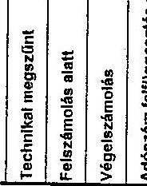

18. tanu_hatralék_értékhatár_adozot_kor-1.xls

19. tanu_hatralék_értékhatár_adozot_kor-1.xls

---

Tanúsítvány a hátralékállomány értékhatáronként és adózói kör szerinti alakulásáról 2007

|  Adózói kör | Értékhatárok | Összes hátralék  |
| --- | --- | --- |
|   | 1 M Ft alatti | 1 - 10 M Ft között  |
|   | Tétel db | Összeg E Ft  |
|  Működő adóalany összesen | 3 558 880 | 255 037 349  |
|  atolói |  |   |
|  Jogi személyiségú gazdasági társaságok | 638 226 | 59 657 549  |
|  Jogi személyiség nélküli gazdasági társaságok | 554 411 | 46 915 282  |
|  Kültségvetési szervezetek | 4 309 | 499 241  |
|  Egyéb szervezetek | 81 612 | 3 386 712  |
|  Egyéni vállalkozások | 704 288 | 41 830 771  |
|  Önálló tevékenységet folytató magánszemélyek | 127 439 | 7 268 781  |
|  Magánszemélyek | 1 468 587 | 95 512 033  |
|  Felszámolás kezdeményezés | 17 397 | 3 441 378  |
|  Cafél | 40 | 6 224  |
|  Technikai megszűnt | 115 406 | 15 078 117  |
|  Felszámolás alatt | 102 279 | 18 537 137  |
|  Végelszámolás | 30 770 | 3 998 232  |
|  Adószám felfüggesztés alatt | 26 219 | 4 313 837  |
|  Végleg megszűnt adóalanyok | 294 | 23 535  |
|  Adóalanyok összesen | 3 891 256 | 300 406 809  |

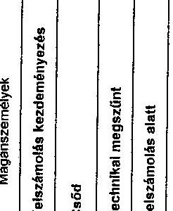

|  Összes hátralék | 50 M Ft felett | 10 - 50 M Ft között | 50 M Ft felett | 50 M Ft felett | 50 M Ft felett | 50 M Ft felett | 50 M Ft felett  |
| --- | --- | --- | --- | --- | --- | --- | --- |
|  Tétel db | Összeg E Ft | Tétel db | Összeg E Ft | Tétel db | Összeg E Ft | Tétel db | Összeg E Ft  |
|  625 | 102 407 821 | 3 639 508 | 612 552 757 |  |  |  |   |
|  612 552 757 |  |  |  |  |  |  |   |
|  673 137 | 67 761 812 | 673 137 | 262 149 402 |  |  |  |   |
|  2 088 088 | 587 611 | 79 956 283 |  |  |  |  |   |
|  18 605 200 | 4 812 | 20 493 279 |  |  |  |  |   |
|  5 196 957 | 63 272 | 15 194 057 |  |  |  |  |   |
|  1 078 076 | 711 733 | 60 566 392 |  |  |  |  |   |
|  130 038 | 130 038 | 17 102 777 |  |  |  |  |   |
|  8 342 055 | 1 466 805 | 157 090 580 |  |  |  |  |   |
|  256 | 53 734 470 | 21 654 | 81 340 078 |  |  |  |   |
|  107 981 | 0 | 59 | 185 262 |  |  |  |   |
|  28 235 962 | 315 | 51 542 749 | 126 563 |  |  |  |   |
|  4 291 | 91 228 679 | 1 389 | 279 054 203 |  |  |  |   |
|  4 841 533 | 179 | 3 841 263 | 50 |  |  |  |   |
|  5 243 967 | 179 | 3 782 639 | 63 |  |  |  |   |
|  58 580 | 0 | 0 | 26 417 563 |  |  |  |   |
|  10 828 | 221 298 555 | 2 727 | 824 032 029 |  |  |  |   |
|  10 828 | 221 298 555 | 2 727 | 824 032 029 |  |  |  |   |
|  10 828 | 221 298 555 | 2 727 | 824 032 029 |  |  |  |   |
|  127 423 | 449 692 996 |  |  |  |  |  |   |
|  32 893 | 23 326 249 |  |  |  |  |  |   |
|  28 723 | 39 768 208 |  |  |  |  |  |   |
|  310 | 80 115 |  |  |  |  |  |   |
|  3 977 130 | 1 328 450 990 |  |  |  |  |  |   |

Fentl adatok hőelenségét igazolom.

Kelt: Budapest, 2009. május 05.

10. tano_hátralék_értékhatár_adózói_kárátadási.hu

---

## 8/d. sz. tanúsítvány

|  Adózói kör | 1 M Ft alatti | 1 - 10 M Ft között | 10 - 50 M Ft között | 50 M Ft felett | Összes hátralék  |
| --- | --- | --- | --- | --- | --- |
|   | Tétel db | Beszeg E Ft | Tétel db | Beszeg E Ft | Tétel db  |
|  Müködő adóelany összesen | 4 080 304 | 270 821 620 | 84 404 | 194 188 034 | 4 475  |
|  ebből |  |  |  |  |   |
|  Jogi személyiségű gazdasági társaságok | 781 789 | 64 708 120 | 34 050 | 89 420 908 | 2 737  |
|  Jogi személyiség nélküli gazdasági társaságok | 561 201 | 45 474 380 | 13 587 | 27 646 559 | 275  |
|  Költségvetési szervezetek | 5 274 | 393 502 | 294 | 924 765 | 72  |
|  Egyéb szervezetek | 62 126 | 3 207 960 | 1 400 | 3 788 604 | 148  |
|  Egyéni vállalkozások | 730 679 | 41 475 991 | 8 313 | 16 150 270 | 164  |
|  Önálló tevékenységet folytató magánszemélyek | 172 689 | 8 380 524 | 3 055 | 7 070 939 | 169  |
|  Magánszemélyek | 1 786 587 | 107 181 162 | 23 705 | 50 186 090 | 891  |
|  Felszámolás kezdeményezés | 44 536 | 7 667 733 | 7 458 | 22 077 809 | 1 447  |
|  Cedd | 34 | 5 231 | 13 | 53 398 | 2  |
|  Technikai megszűnt | 104 973 | 13 942 682 | 8 265 | 23 481 259 | 1 285  |
|  Felszámolás alatt | 123 252 | 21 153 537 | 22 525 | 71 702 450 | 5 762  |
|  Végelszámolás | 31 579 | 4 224 843 | 2 483 | 8 832 001 | 371  |
|  Adószám felfüggesztés alatt | 47 156 | 7 694 716 | 4 269 | 10 707 626 | 487  |
|  Végleg megszűnt adóelanyok | 2 265 | 171 819 | 99 | 241 946 | 6  |
|  Adóelanyok összesen | 4 434 101 | 325 682 381 | 129 936 | 326 264 522 | 13 754  |

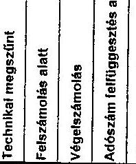

Fenti adatok hőekességét igazolom

Kelt: Budapest, 2009. május 05.

---

tarcsítvány a hátralékállomány edtech táv szerinti alakulásáról 2005-2008

|  |   |   |   |   |   |   |   |
| --- | --- | --- | --- | --- | --- | --- | --- |
|  AMSzti köz | 2005 | 2006 | 2007 | 2008 | 2009 | 2010 | 2011  |
|  Aiktyújtó köz | Náttalék Beszepel (támaszkor 31.) | Belsztyó hátralék Beszepel | Náttalék Beszepel (támaszkor 31.) | Belsztyó hátralék Beszepel | Náttalék Beszepel (támaszkor 31.) | Belsztyó hátralék Beszepel | Náttalék Beszepel (támaszkor 31.)  |
|  Bőbbéd adóalany összesen |  |  |  |  |  |  |   |
|  adóok |  |  |  |  |  |  |   |
|  Jogi személyiségű gazdasági távszolgus | 211 664,50 |  | 362 405,00 |  | 262 146,40 |  | 279 964,54  |
|  Jogi személyiség-vállícti gazdasági távszolgus | 85 220,40 |  | 114 157,10 |  | 79 606,20 |  | 80 010,20  |
|  Kötésgyentés szorvoszlak | 2 697,00 |  | 29 454,21 |  | 20 485,20 |  | 4 541,00  |
|  Egyéb szorvoszlak | 13 872,30 |  | 84 925,39 |  | 15 194,20 |  | 11 165,88  |
|  Egyéni vállalkozások | 19 806,00 |  | 114 029,00 |  | 60 566,30 |  | 61 467,31  |
|  Örálló tevékenységet folytató megkészítményét |  |  |  |  | 17 102,70 |  | 20 781,33  |
|  Megkészítményét | 97 725,21 |  | 101 650,57 |  | 157 090,50 |  | 167 006,74  |
|  Felszámodás kezdeményezés | 76 187,70 |  | 71 256,99 |  | 81 340,00 |  | 148 894,36  |
|  Czdai | 521,00 |  | 625,00 |  | 165,30 |  | 105,10  |
|  Testmikul megszűnt | 104 063,30 |  | 112 470,12 |  | 121 505,00 |  | 110 153,74  |
|  Felszámodás alatt | 901 529,40 |  | 361 382,00 |  | 449 683,00 |  | 609 916,81  |
|  Végelszámodás | 12 524,00 |  | 16 477,11 |  | 23 326,24 |  | 44 931,00  |
|  Adószám felfüggesztés alatt |  |  | 65,32 |  | 39 768,21 |  | 148 878,81  |
|  Végleg megszűnt adhatottak | 314,10 |  | 1 041,39 |  | 80,11 |  | 954,16  |
|  Cszédállomló szervek összesen | 856 724,72 | 179 271,80 | 1 278 453,67 | 169 294,62 | 1 171 900,11 | 210 651,47 | 1 523 385,29  |
|  Megkészítmények összesen | 97 725,21 | 24 523,29 | 101 650,57 | 29 038,12 | 157 090,59 | 33 471,31 | 167 006,74  |
|  Adóalanyok összesen | 964 449,99 | 233 785,28 | 1 400 1 907,70 | 213 322,54 | 1 228 450,69 | 244 322,78 | 1 710 352,02  |

Fent adatok Mókuságtípazolom

Kelt. Ruttapud. 2008. május 25.

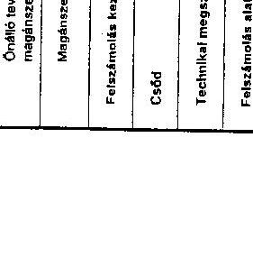

14 tarc, hátralék, adozzi, tarc 2. zis

---

1. sz. tanúsítvány a hátralékállomány adónemenkénti alakulásáról 2005-2006

|  Adónemek | 2005 |  | 2006 |  | 2007 |  | 2008 |   |
| --- | --- | --- | --- | --- | --- | --- | --- | --- |
|   | Hátralék összege (december 31.) | Belolyt hátralék összege | Hátralék összege (december 31.) | Belolyt hátralék összege | Hátralék összege (december 31.) | Belolyt hátralék összege | Hátralék összege (december 31.) | Belolyt hátralék összege  |
|  Társaságl adó | 34 348,97 | 11 319,84 | 44 325,58 | 12 069,84 | 46 135,85 | 14 390,55 | 48 947,79 | 16 522,99  |
|  Égja | 62 512,79 | 19 724,67 | 201 228,97 | 18 610,84 | 81 567,88 | 25 544,74 | 89 912,06 | 35 834,85  |
|  Áta | 262 159,88 | 89 083,57 | 319 109,56 | 86 882,59 | 413 181,71 | 79 707,55 | 586 511,81 | 85 955,11  |
|  Játékadó | 398,31 | 133,22 | 372,05 | 251,39 | 306,47 | 307,80 | 468,55 | 246,21  |
|  Munkaadóli járulék | 10 709,35 | 3 551,71 | 21 385,69 | 3 813,41 | 10 477,37 | 4 690,72 | 11 362,42 | 4 677,28  |
|  Munkaváltobbi járulék | 2 951,81 | 962,26 | 6 932,20 | 914,44 | 3 442,61 | 1 819,10 | 4 015,63 | 2 251,60  |
|  EVA | 3 842,10 | 839,81 | 2 971,10 | 1 715,78 | 3 949,41 | 1 348,21 | 2 268,61 | 1 738,54  |
|  Társadalomlója tovélási járulék | 180 568,47 | 56 337,61 | 356 313,17 | 65 660,38 | 196 298,84 | 80 691,96 | 218 033,73 | 87 549,01  |
|  Egészségügyi hozzájárulás | 28 919,63 | 6 216,71 | 34 513,65 | 5 548,63 | 20 423,23 | 5 022,78 | 20 305,92 | 5 154,08  |
|  Magánnyugóji Pénztár bevételei |  |  |  |  | 6 493,61 | 3 585,55 | 9 041,43 | 6 869,39  |
|  Betékek |  |  |  |  | 68 084,05 | 7 830,84 | 93 910,89 | 17 087,65  |
|  Egyéb hátralék/ bevétei | 380 042,68 | 15 626,20 | 392 958,26 | 17 845,26 | 458 089,65 | 19 183,01 | 625 593,21 | 25 259,69  |
|  APEH összesen | 964 449,99 | 203 796,38 | 1 380 110,23 | 213 332,94 | 1 328 460,65 | 244 122,78 | 1 710 392,02 | 289 366,40  |

Fentl adatok hitaasságlál igazolom.

Felt: Budapest, 2009. május 25.

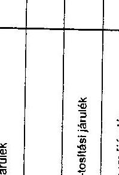

13. tanu_ hatralek _edonem-2.xls

---

# Tanúsítvány

a működő adózók közül hosszabb ideje hátralékosok számáról és a hátralék összegéről 2008.12.31-én

|   | 60 napon belül fennálló hátralék | 60 és 90 nap között fennálló hátralék | 91 és 180 nap között fennálló hátralék | 181 és 360 nap között fennálló hátralék | 360 napon túl fennálló hátralék | Összes működő adózói hátralék  |
| --- | --- | --- | --- | --- | --- | --- |
|   | tétel/ db | ezer Ft | tétel/ db | ezer Ft | tétel/ db | ezer Ft  |
|  Közép-magyarországi Regionális Igazgatóság | 780 132 | 90 840 075 | 613 877 | 148 213 571 | 339 725 | 57 272 225  |
|  Észak-magyarországi Regionális Igazgatóság | 181 416 | 11 549 747 | 117 033 | 14 798 465 | 73 285 | 6 567 031  |
|  Észak-aföldi Regionális Igazgatóság | 232 951 | 14 743 841 | 151 412 | 15 756 528 | 97 467 | 8 831 856  |
|  Dél-aföldi Regionális Igazgatóság | 220 683 | 15 326 937 | 151 455 | 19 911 060 | 84 202 | 8 186 522  |
|  Nyugat-dunántúli Regionális Igazgatóság | 140 945 | 9 745 726 | 51 297 | 7 138 711 | 43 311 | 4 379 961  |
|  Közép-dunántúli Regionális Igazgatóság | 198 382 | 14 778 545 | 122 937 | 16 953 521 | 83 848 | 7 786 023  |
|  Dél-dunántúli Regionális Igazgatóság | 152 588 | 7 669 723 | 98 342 | 9 807 042 | 56 207 | 4 333 678  |
|  Kiemelt Adózók Igazgatósága | 18 272 | 22 736 919 | 14 396 | 2 254 890 | 7 890 | 3 391 565  |
|  APEH összesen | 1 925 369 | 187 391 513 | 1 320 749 | 234 833 788 | 785 935 | 100 748 861  |

Megjegyzés: az "összes hátralék" oszlop db-szám adata kevesebb a részadatok összegénél, mivel halmozódást nem tartalmaz, ugyanis a részadatoknál az adózót érintően egy adónemen belül előfordulhat több, pl. 60 napon belül és 60-90 nap között fennálló hátralék is.

Leválogatás időpontja: 2009. július 03.

Fenti adatok hitelességét igazolom.

Kelt: Budapest, 2009. július 06.

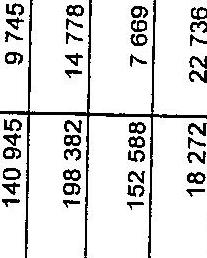

Alfons

2009. július 06.

---

### Tanúsítvány

### a működő adózók közül hátralékkezelésbe nem vont hátralékosok számáról és a hátralék összegéről 2008.12.31-én

|   | 60 napon belül fennálló hátralék |  | 60 és 90 nap között fennálló hátralék |  | 91 és 180 nap között fennálló hátralék |  | 181 és 360 nap között fennálló hátralék |  | 360 napon túl fennálló hátralék |  | Nem hátralékkezett működő adózói hátralék összesen |   |
| --- | --- | --- | --- | --- | --- | --- | --- | --- | --- | --- | --- | --- |
|   | tétel/ db | ezer Ft | tétel/ db | ezer Ft | tétel/ db | ezer Ft | tétel/ db | ezer Ft | tétel/ db | ezer Ft | tétel/ db | ezer Ft  |
|  Közép-magyarországi Regionális Igazgatóság | 634 392 | 55 488 687 | 403 143 | 48 545 536 | 215 112 | 24 438 754 | 195 551 | 24 052 513 | 200 324 | 12 717 485 | 1 308 665 | 165 242 975  |
|  Észak-magyarországi Regionális Igazgatóság | 135 022 | 6 388 307 | 63 079 | 2 383 396 | 40 980 | 1 613 266 | 32 195 | 1 375 898 | 34 413 | 1 280 341 | 257 220 | 13 041 208  |
|  Észak-alföldi Regionális Igazgatóság | 200 389 | 9 700 315 | 110 170 | 4 603 063 | 72 060 | 2 906 836 | 59 348 | 3 392 217 | 60 508 | 1 881 925 | 398 595 | 22 484 358  |
|  Dél-alföldi Regionális Igazgatóság | 178 942 | 9 452 570 | 100 722 | 3 836 525 | 52 181 | 2 087 508 | 41 956 | 2 122 686 | 46 156 | 1 791 253 | 350 384 | 19 290 542  |
|  Nyugat-dunántúli Regionális Igazgatóság | 122 015 | 7 535 097 | 33 993 | 1 637 142 | 29 936 | 1 379 071 | 27 867 | 1 428 330 | 33 829 | 1 469 722 | 211 140 | 13 449 362  |
|  Közép-dunántúli Regionális Igazgatóság | 165 123 | 9 733 642 | 84 003 | 5 653 298 | 57 184 | 2 762 892 | 49 401 | 2 585 541 | 51 517 | 1 874 736 | 325 945 | 22 610 109  |
|  Dél-dunántúli Regionális Igazgatóság | 126 107 | 5 331 747 | 65 001 | 2 052 943 | 35 782 | 1 381 523 | 29 860 | 1 402 462 | 32 762 | 944 733 | 243 321 | 11 113 408  |
|  Kiemelt Adózók Igazgatósága | 17 558 | 21 657 865 | 13 508 | 1 559 597 | 7 535 | 917 234 | 3 847 | 533 102 | 2 346 | 284 574 | 38 477 | 24 952 392  |
|  APEH összesen | 1 579 548 | 125 288 250 | 873 619 | 70 271 500 | 510 770 | 37 487 084 | 440 025 | 36 892 749 | 461 855 | 22 244 769 | 3 133 747 | 292 184 352  |

**Megjegyzés:** az "összes hátralék" oszlop db-szám adata kevesebb a részadatok összegénél, mivel halmozódást nem tartalmaz, ugyanis a részadatoknál az adózót érintően egy adónemen belül előfordulhat több, pl. 60 napon belül és 60-90 nap között fennálló hátralék is.

A hátralékkezett működő adózókon kívül további 378,5 milliárd Ft hátralék végrehajtás alá van vonva, pl.: a nem működő státuszú felszámolás kezdeményezéssel, végelszámolással érintett adózók, a megszűnt adózók, amelyeknél a mögöttes kötelezés következtében áll fenn a hátralék, az egyenlegében túllizetéses adózók, amelyek hátralékos adónemmel is rendelkeznek.

Leválogatás időpontja: 2009. július 03.

Fenti adatok hitelességét igazolom.

Kelt: Budapest, 2009. július 06.

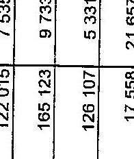

C:VÁ MUNKAVAPEH F-V-FÖRJÁSZ-PM-KPMG-DIALOGI2009ÁSZI Ellenőrz Portfölió_elti Tanu_SZTADI-3 lászhoz_Fennálló+hátralék_131.xls/Nem HKhátral

---

# 12/a. sz. tanúsítvány

## Tanúsítvány a behajtási tevékenység kiemelt adatainak adózói körönkötő alakulásáról 2008

|  Azadási köze | Összesen | Végrehajtási cselekvés | Összesen | Végrehajtási cselekvés | Összesen | Azonnal beszedési meghízással | Vh. cselekvés kővetően teljes belső | Vh. cselekvés kővetően teljes belső | Összesen | Végrehajtási cselekvés | Összesen  |
| --- | --- | --- | --- | --- | --- | --- | --- | --- | --- | --- | --- |
|  Gazdálkodó szervezetek | 96 437 | 69 307 | 5 408 | 8 292 | 13 432 | 179 273 | 76 714 | 100 019 | 334 | 292 | 1 804  |
|  Magánszemélyek | 737 223 | 677 848 | 32 624 | 10 926 | 15 912 | 24 524 | 6 416 | 16 345 | 181 | 118 | 1 462  |
|  Adózás | 833 660 | 747 155 | 38 030 | 19 231 | 29 244 | 203 795 | 93 190 | 116 364 | 515 | 410 | 3 316  |

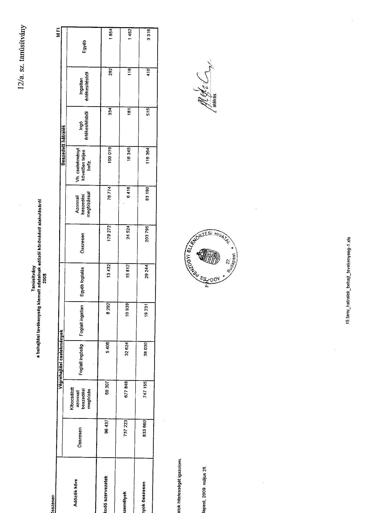

---

12/b. sz. tanúsítvány

tanúsítvány a behajtási tevékenység kiemelt adataivalı adózói körönkénti alakulásáról 2008

APEH összesen

|  Adózók köze | Összesen | Köszedésti azonnal beszédi | Megálló ingók | Fogtati ingatlan | Egyéb foglalás | Összesen | Azonnal beszédi megnödezi | Vh. cselekmény követőan teljes belső | Ingó értékesítésből | Ingatlan értékesítésből | Egyéb  |
| --- | --- | --- | --- | --- | --- | --- | --- | --- | --- | --- | --- |
|  Gazdálkodó szervezetek | 107 685 | 74 927 | 5 262 | 8 007 | 19 499 | 185 295 | 81 480 | 100 249 | 544 | 214 | 2 808  |
|  Magánszemélyek | 851 036 | 801 891 | 27 990 | 6 654 | 14 701 | 28 037 | 7 286 | 18 862 | 176 | 162 | 1 550  |
|  Adóalanyok összesen | 958 722 | 876 618 | 33 252 | 14 661 | 34 191 | 213 332 | 88 768 | 119 112 | 720 | 376 | 4 358  |

Fenti adatok hitelezségéti igazolom

Kelt: Budapest, 2009. május 25.

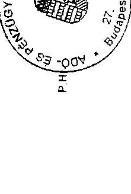

15. január, hatralek_beluát_tevékenység-1.sis

---

12/c. sz. tanúsítvány

tanúsítvány a behajtási tevékenység kiemelt adataink adózói körönkénti alakulásáról 2007

APEH összesen

|  |   |   |   |   |   |   |   |   |   |   |   |
| --- | --- | --- | --- | --- | --- | --- | --- | --- | --- | --- | --- |
|  Adózók köve | Összesen | Köszedési
szennye
beszédési
meghozás | Fogadt ingóság | Fogadt ingatlan | Egyéb foglalás | Összesen | Személyi
beszédési
meghozás | Víz. cselekvésől
követlen teljes
balka | Ingatlan
érlékesítésből | Elgaválás
Kész
tartó
balká | Egyéb  |
|  Gazdálkodó szervezetek | 147 828 | 88 457 | 8 281 | 5 614 | 47 476 | 210 602 | 117 233 | 88 619 | 527 | 106 | 4 165  |
|  Magánszemélyek | 1 031 471 | 994 531 | 22 581 | 5 388 | 8 991 | 33 470 | 11 639 | 19 598 | 170 | 108 | 1 958  |
|  Adóalanyok összesen | 1 179 300 | 1 082 986 | 28 842 | 11 003 | 58 467 | 244 122 | 128 872 | 108 215 | 698 | 214 | 6 122  |

Fenti adatok hitelességét igazolom.

Kelt: Budapest, 2009. május 25.

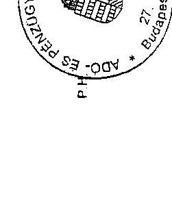

15. lánu_hatalsék_behalt_tevékenység-1.xls

---

Tamisítvány a behaítési tevékenység kiemelt adatainak adózói körboként alakulásáról 2008

|  Árttól összesen |  |  |  |  |  |  |  |  |  |  |  |  |  |  |  |  |  |  |  |  |  |  |  |   |
| --- | --- | --- | --- | --- | --- | --- | --- | --- | --- | --- | --- | --- | --- | --- | --- | --- | --- | --- | --- | --- | --- | --- | --- | --- |
|   |  |  |  |  |  |  |  |  |  |  |  |  |  |  |  |  |  |  |  |  |  |  |  |   |
|  Adózók köre | Összesen |  |  |  |  |  |  |  |  |  |  |  |  |  |  |  |  |  |  |  |  |  |  |   |
|  |   |   |   |   |   |   |   |   |   |   |   |   |   |   |   |   |   |   |   |   |   |   |   |   |
|  |   |   |   |   |   |   |   |   |   |   |   |   |   |   |   |   |   |   |   |   |   |   |   |   |
|  |   |   |   |   |   |   |   |   |   |   |   |   |   |   |   |   |   |   |   |   |   |   |   |   |
|  |   |   |   |   |   |   |   |   |   |   |   |   |   |   |   |   |   |   |   |   |   |   |   |   |
|  |   |   |   |   |   |   |   |   |   |   |   |   |   |   |   |   |   |   |   |   |   |   |   |   |
|  |   |   |   |   |   |   |   |   |   |   |   |   |   |   |   |   |   |   |   |   |   |   |   |   |
|  |   |   |   |   |   |   |   |   |   |   |   |   |   |   |   |   |   |   |   |   |   |   |   |   |
|  |   |   |   |   |   |   |   |   |   |   |   |   |   |   |   |   |   |   |   |   |   |   |   |   |
|  Adózók köre | Összesen |  |  |  |  |  |  |  |  |  |  |  |  |  |  |  |  |  |  |  |  |  |  |   |
|  |   |   |   |   |   |   |   |   |   |   |   |   |   |   |   |   |   |   |   |   |   |   |   |   |
|  |   |   |   |   |   |   |   |   |   |   |   |   |   |   |   |   |   |   |   |   |   |   |   |   |
|  |   |   |   |   |   |   |   |   |   |   |   |   |   |   |   |   |   |   |   |   |   |   |   |   |
|  |   |   |   |   |   |   |   |   |   |   |   |   |   |   |   |   |   |   |   |   |   |   |   |   |
|  |   |   |   |   |   |   |   |   |   |   |   |   |   |   |   |   |   |   |   |   |   |   |   |   |
|  |   |   |   |   |   |   |   |   |   |   |   |   |   |   |   |   |   |   |   |   |   |   |   |   |
|  |   |   |   |   |   |   |   |   |   |   |   |   |   |   |   |   |   |   |   |   |   |   |   |   |
|  |   |   |   |   |   |   |   |   |   |   |   |   |   |   |   |   |   |   |   |   |   |   |   |   |
|  |   |   |   |   |   |   |   |   |   |   |   |   |   |   |   |   |   |   |   |   |   |   |   |   |
|  |   |   |   |   |   |   |   |   |   |   |   |   |   |   |   |   |   |   |   |   |   |   |   |   |
|  |   |   |   |   |   |   |   |   |   |   |   |   |   |   |   |   |   |   |   |   |   |   |   |   |
|  |   |   |   |   |   |   |   |   |   |   |   |   |   |   |   |   |   |   |   |   |   |   |   |   |
|  |   |   |   |   |   |   |   |   |   |   |   |   |   |   |   |   |   |   |   |   |   |   |   |   |
|  |   |   |   |   |   |   |   |   |   |   |   |   |   |   |   |   |   |   |   |   |   |   |   |   |
|  |   |   |   |   |   |   |   |   |   |   |   |   |   |   |   |   |   |   |   |   |   |   |   |   |
|  |   |   |   |   |   |   |   |   |   |   |   |   |   |   |   |   |   |   |   |   |   |   |   |   |
|  |   |   |   |   |   |   |   |   |   |   |   |   |   |   |   |   |   |   |   |   |   |   |   |   |
|  |   |   |   |   |   |   |   |   |   |   |   |   |   |   |   |   |   |   |   |   |   |   |   |   |
|  |   |   |   |   |   |   |   |   |   |   |   |   |   |   |   |   |   |   |   |   |   |   |   |   |
|  |   |   |   |   |   |   |   |   |   |   |   |   |   |   |   |   |   |   |   |   |   |   |   |   |
|  |   |   |   |   |   |   |   |   |   |   |   |   |   |   |   |   |   |   |   |   |   |   |   |   |
|  |   |   |   |   |   |   |   |   |   |   |   |   |   |   |   |   |   |   |   |   |   |   |   |   |
|  |   |   |   |   |   |   |   |   |   |   |   |   |   |   |   |   |   |   |   |   |   |   |   |   |
|  |   |   |   |   |   |   |   |   |   |   |   |   |   |   |   |   |   |   |   |   |   |   |   |   |
|  |   |   |   |   |   |   |   |   |   |   |   |   |   |   |   |   |   |   |   |   |   |   |   |   |
|  |   |   |   |   |   |   |   |   |   |   |   |   |   |   |   |   |   |   |   |   |   |   |   |   |
|  |   |   |   |   |   |   |   |   |   |   |   |   |   |   |   |   |   |   |   |   |   |   |   |   |
|  |   |   |   |   |   |   |   |   |   |   |   |   |   |   |   |   |   |   |   |   |   |   |   |   |
|  |   |   |   |   |   |   |   |   |   |   |   |   |   |   |   |   |   |   |   |   |   |   |   |   |
|  |   |   |   |   |   |   |   |   |   |   |   |   |   |   |   |   |   |   |   |   |   |   |   |   |
|  |   |   |   |   |   |   |   |   |   |   |   |   |   |   |   |   |   |   |   |   |   |   |   |   |

---

# Tanúsítvány a hátralék-törlések adónemenkénti alakulásáról 2005. év

|  Ádónemek | Törölt hátralékok összesen | Méltányosságból törölt hátralék | Behajthatatlanság miatt törölt hátralék | Elévülés miatt törölt hátralék | Cégtörlés miatt törölt hátralék  |
| --- | --- | --- | --- | --- | --- |
|  Társaság adó | -768,00 | -1,78 | -386,50 | -170,92 | -208,80  |
|  Szia | -4 277,08 | -466,29 | -2 850,74 | -880,06 | -79,99  |
|  Áfa | -9 842,56 | -324,30 | -3 810,20 | -4 002,91 | -1 705,15  |
|  Játékadó | -7,33 | -0,01 | -3,16 | -2,91 | -1,25  |
|  Munkaadói járulék | -213,24 | -6,04 | -122,94 | -67,31 | -16,95  |
|  Munkavállalói járulék | -68,73 | -2,12 | -42,82 | -16,64 | -7,15  |
|  EVA | -8,33 | -2,10 | -9,69 | 3,46 |   |
|  Társadalombiztosítási járulék | -8 756,72 | -0,10 | -2 533,60 | -5 958,51 | -264,51  |
|  Egészségügyi hozzájárulás | -1 024,16 | -168,24 | -596,26 | -207,94 | -51,72  |
|  Magánnyugdíj Pénztár bevételei | 0,00 |  |  |  |   |
|  Betékek | 0,00 |  |  |  |   |
|  Egyéb bevételek | -40 907,05 | -8 290,73 | -8 788,67 | -22 016,40 | -1 811,25  |
|  APEH összesen | -65 873,20 | -9 261,71 | -19 144,58 | -33 320,14 | -4 146,77  |

Fenti adatok hitelességét igazolom.

Kelt: Budapest, 2009. május 05.

---

# Tanúsítvány a hátralék-törlések adónemenkénti alakulásáról 2006. év

|  Adónemek | Törölt hátralékok összesen | Méltányosságból törölt hátralék | Behajthatatlanság miatt törölt hátralék | Elévülés miatt törölt hátralék | Cégtörlés miatt törölt hátralék  |
| --- | --- | --- | --- | --- | --- |
|  Társasági adó | -614,67 | -2,35 | -138,30 | -256,47 | -217,55  |
|  Szia | -6 295,68 | -335,81 | -4 323,13 | -1 572,15 | -64,59  |
|  Áfa | -16 643,99 | -210,77 | -8 485,21 | -5 369,62 | -2 578,39  |
|  Játékadó | -7,84 | 0,00 | -5,11 | -2,07 | -0,66  |
|  Munkaadói járulék | -356,88 | -3,04 | -268,61 | -71,82 | -13,41  |
|  Munkavállalói járulék | -121,46 | -0,96 | -91,45 | -23,91 | -5,14  |
|  EVA | -36,24 | -3,43 | -32,76 | 0,12 | -0,17  |
|  Társadalombiztosítási járulék | -9 641,31 |  | -4 312,92 | -5 033,09 | -295,30  |
|  Egészségügyi hozzájárulás | -1 277,06 | -108,70 | -632,75 | -494,62 | -40,99  |
|  Magánnyugdíj Pénztár bevételei | 0,00 |  |  |  |   |
|  Ilatékok | 0,00 |  |  |  |   |
|  Egyéb bevételek | -49 317,47 | -5 982,32 | -17 051,63 | -23 420,08 | -2 863,44  |
|  APEH összesen | -84 312,60 | -6 647,38 | -35 341,87 | -36 243,71 | -6 079,64  |

Fenti adatok hitelességét igazolom.

Kelt: Budapest, 2009. május 05.

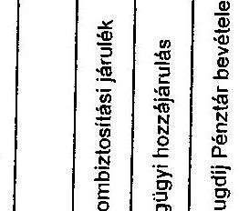

20. tanu_hatralék_törlése_1806_év_1806_elt

---

13/c. sz. tanúsítvány

Tanúsítvány a hátralék-törlések adónemenkénti alakulásáról 2007. év

|  Adónemek | Törölt hátralékok összesen | Méltányosságból törölt hátralék | Behajthatatlanság miatt törölt hátralék | Elévülés miatt törölt hátralék | Cégtörlés miatt törölt hátralék  |
| --- | --- | --- | --- | --- | --- |
|  Társasági adó | -716,57 | -0,01 | -219,32 | -245,35 | -251,89  |
|  Szja | -9 113,72 | -246,56 | -5 817,86 | -2 920,02 | -129,28  |
|  Áfa | -17 120,02 | -92,08 | -8 190,46 | -6 065,16 | -2 772,32  |
|  Játékadó | -2,16 |  | -1,60 | -0,54 | -0,02  |
|  Munkaadói járulék | -152,70 | -0,18 | -64,01 | -68,27 | -20,24  |
|  Munkavállalói járulék | -53,88 | -0,05 | -20,94 | -25,47 | -7,42  |
|  EVA | -25,79 | -4,00 | -21,92 | 0,13 |   |
|  Társadalombiztosítási járulék | -5 333,19 |  | -1 659,69 | -3 368,21 | -305,29  |
|  Egészségügyi hozzájárulás | -1 330,13 | -53,69 | -578,71 | -641,89 | -55,84  |
|  Magánnyugdíj Pénztár bevételei | -3,28 |  | -3,25 |  | -0,03  |
|  Ithritékek | -3 144,78 | -3 074,01 | -48,07 | -22,70 |   |
|  Egyéb bevételek | -41 376,82 | -5 840,47 | -11 793,33 | -20 781,49 | -2 961,53  |
|  APEH összesen | -78 373,04 | -9 311,05 | -28 419,16 | -34 138,97 | -6 503,86  |

Ferél adatok hitelességét igazolom.

Kelt: Budapest, 2009. május 05.

20. tanu_hatralek_torles_adonem.xls

---

13/d. sz. tanúsítvány

Tanúsítvány a hátralék-törlések adónemenkénti alakulásáról 2008. év

|  Adónemek | Törölt hátralékok összesen | Méltányosságból törölt hátralék | Behajthatatlanság miatt törölt hátralék | Elévülés miatt törölt hátralék | Cégtörlés miatt törölt hátralék  |
| --- | --- | --- | --- | --- | --- |
|  Társasági adó | -1 086,65 | -0,02 | -356,45 | -661,83 | -68,35  |
|  Szja | -10 893,51 | -270,57 | -6 964,75 | -3 558,76 | -99,43  |
|  Afa | -18 809,29 | -91,03 | -6 888,36 | -10 325,97 | -1 503,93  |
|  Játékadó | -1,94 |  | -0,60 | -1,34 |   |
|  Munkaadói járulék | -226,60 |  | -72,77 | -126,50 | -27,33  |
|  Munkavállalói járulék | -88,45 |  | -26,19 | -53,05 | -9,21  |
|  EVA | -36,76 | -5,27 | -31,10 | 0,04 | -0,43  |
|  Társadalombiztosítási járulék | -7 703,65 | -0,01 | -2 125,61 | -5 107,39 | -470,64  |
|  Egészségügyi hozzájárulás | -2 424,25 | -50,38 | -1 106,79 | -1 219,37 | -47,71  |
|  Magánnyugdíj Pénztár bevételei | -34,62 |  | -33,64 |  | -0,98  |
|  Rietékek | -3 526,09 | -2 361,32 | -886,85 | -277,91 | -0,01  |
|  Egyéb bevételek | -47 521,20 | -5 867,91 | -15 327,39 | -24 611,64 | -1 714,26  |
|  APEH összesen | -92 353,01 | -8 646,51 | -33 820,50 | -45 943,72 | -3 942,28  |

Fenti adatok hitelességét igazolom.

Kelt: Budapest, 2009. május 05.

20. tanu_hatralék_torles_adónem.xls

---

14/a. sz. tanúsítvány

|  Ár |  |  |  |  |   |
| --- | --- | --- | --- | --- | --- |
|  |   |   |   |   |   |
|  |   |   |   |   |   |
|  |   |   |   |   |   |
|  |   |   |   |   |   |
|  |   |   |   |   |   |
|  |   |   |   |   |   |
|  |   |   |   |   |   |
|  |   |   |   |   |   |
|  |   |   |   |   |   |
|  |   |   |   |   |   |
|  |   |   |   |   |   |
|  |   |   |   |   |   |
|  |   |   |   |   |   |
|  |   |   |   |   |   |
|  |   |   |   |   |   |
|  |   |   |   |   |   |
|  |   |   |   |   |   |
|  |   |   |   |   |   |
|  |   |   |   |   |   |
|  |   |   |   |   |   |
|  |   |   |   |   |   |
|  |   |   |   |   |   |
|  |   |   |   |   |   |
|  |   |   |   |   |   |
|  |   |   |   |   |   |
|  |   |   |   |   |   |
|  |   |   |   |   |   |
|  |   |   |   |   |   |
|  |   |   |   |   |   |
|  |   |   |   |   |   |
|  |   |   |   |   |   |
|  |

---

## 14/b. sz. tanúsítvány

|  Adózói kör | Törölt hátralékok összesen | Méltányosságból törölt hátralék | Behajthatatlanság miatt törölt hátralék | Elévülés miatt törölt hátralék | Cégtörlés miatt törölt hátralék  |
| --- | --- | --- | --- | --- | --- |
|  Müködő adóalany összesen | -64 765,09 | -6 430,73 | -30 983,59 | -27 350,77 |   |
|  abböt: |  |  |  |  |   |
|  Jogi személyiségű gazdasági társaságok | -13 513,23 | -1 584,73 | -11 235,08 | -693,42 |   |
|  Jogi személyiség nélkül gazdasági társaságok | -2 532,11 | -480,26 | -997,98 | -1 053,87 |   |
|  Köllségvetési szervezetek | -296,11 | -296,07 | -3,28 | 3,24 |   |
|  Egyéb szervezetek | -1 397,71 | -201,56 | -615,23 | -580,92 |   |
|  Egyéni vállalkozások | -2 439,86 | -1 064,55 | -418,61 | -956,70 |   |
|  Önálló tevékenységet folytató megánszemélyek | 0,00 |  |  |  |   |
|  Magánszemélyek | -44 586,08 | -2 803,57 | -17 713,41 | -24 069,10 |   |
|  Felszámolás kezdeményezés | -1 009,73 | -24,50 | -30,86 | -954,37 |   |
|  Csőd | 0,00 |  |  |  |   |
|  Technikai megszűnt | -13 530,34 | -50,80 | -3 763,49 | -4 056,39 | -5 659,66  |
|  Felszámolás alatt | -1 170,96 | -28,15 | -333,84 | -808,97 |   |
|  Végelszámolás | -880,23 | -92,70 | -229,11 | -558,42 |   |
|  Adószám felfüggesztés alatt | -0,53 |  | -0,38 | -0,15 |   |
|  Végleg megszűnt adóalanyok | -2 955,70 | -20,49 | -0,60 | -2 514,64 | -419,97  |
|  Adóalanyok összesen | -84 312,59 | -6 647,38 | -35 341,87 | -36 243,71 | -6 079,63  |

Fent adatok hőelességét igazolom.

Kelt: Budapest, 2009. május 05.

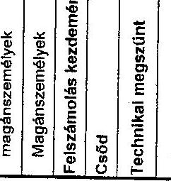

21. tanu_hatralék_torlék_abbő_14000000188

---

### Tanúsítvány a hátralék-törlések adózói kör szerinti alakulásáról 2007. év

|  APEH összesen | Törölt hátralékok
összesen | Méltányosságból törölt
hátralék | Behajthatatlanság
miatt törölt hátralék | Elévülés miatt törölt
hátralék | Cégtörlés miatt törölt
hátralék  |
| --- | --- | --- | --- | --- | --- |
|  Müködő adóalany összesen | -58 300,79 | -8 884,79 | -23 707,34 | -25 708,66 |   |
|  ebből |  |  |  |  |   |
|  Jogi személyiségű gazdasági
társaságok | -4 509,33 | -2 301,81 | -1 539,81 | -567,71 |   |
|  Jogi személyiség nélküli gazdasági
társaságok | -1 752,37 | -297,89 | -554,63 | -899,85 |   |
|  Költségvetési szervezelek | -130,64 | -138,68 | 8,84 | 2,20 |   |
|  Egyéb szervezelek | -3 099,98 | -224,21 | -2 659,50 | -216,27 |   |
|  Egyéni vállalkozások | -1 712,09 | -779,68 | -341,47 | -590,94 |   |
|  Önálló tevékenységet folytató
magánszemélyek | -1 313,39 | -299,05 | -411,08 | -603,26 |   |
|  Magánszemélyek | -45 782,96 | -4 843,49 | -18 206,68 | -22 732,82 |   |
|  Felszámolás kezdeményezés | -665,86 | -19,88 | 42,59 | -688,57 |   |
|  Csőd | -26,35 | -19,82 | -6,53 |  |   |
|  Technikai megszűnt | -13 493,94 | -58,63 | -2 013,78 | -5 258,27 | -6 163,26  |
|  Felszámolás alatt | -1 048,22 | -181,19 | -147,86 | -719,17 |   |
|  Végelszámolás | -1 044,99 | -140,37 | -120,62 | -784,00 |   |
|  Adószám felfüggesztés alatt | -2 748,52 | -1,72 | -2 466,29 | -280,51 |   |
|  Végleg megszűnt adóalanyok | -1 044,36 | -4,65 | 0,68 | -699,80 | -340,59  |
|  Adóalanyok összesen | -78 373,00 | -9 311,04 | -28 419,14 | -34 138,97 | -6 503,85  |

Fenti adatok hőzélességéti igazolom.

Kelt: Budapest, 2009. május 05.

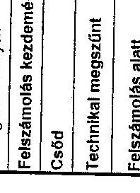

21. tanu_hatralék_torles_adózói_kötrés

---

14/d. sz. tanúsítvány

Tanúsítvány a hátralék-törlések adózói kör szerinti alakulásáról 2008. év

APEH összesen

|  Adózói kör | Törölt hátralékok összesen | Méltányosságból törölt hátralék | Behajthatatlanság miatt törölt hátralék | Elévülés miatt törölt hátralék | Cégtörlés miatt törölt hátralék  |
| --- | --- | --- | --- | --- | --- |
|  Müködő adóalany összesen | -63 828,58 | -7 553,23 | -22 732,48 | -33 542,87 |   |
|  ebből |  |  |  |  |   |
|  Jogi személyiségű gazdasági társaságok | -3 206,07 | -1 182,11 | -828,69 | -1 195,27 |   |
|  Jogi személyiség nélküli gazdasági társaságok | -2 148,42 | -236,21 | -205,93 | -1 706,28 |   |
|  Költségvetési szervezetek | -73,00 | -142,48 | -0,27 | 69,75 |   |
|  Egyéb szervezetek | 166,51 | -415,74 | 768,77 | -166,52 |   |
|  Egyéni vállalkozások | -2 016,91 | -712,00 | -400,14 | -904,77 |   |
|  Önálló tevékenységei folyatú magánszemélyek | -2 621,59 | -521,10 | -1 294,35 | -806,14 |   |
|  Magánszemélyek | -53 929,11 | -4 343,60 | -20 771,86 | -28 813,65 |   |
|  Felszámolás kezdeményezés | -749,71 | -37,37 | -148,43 | -563,91 |   |
|  Csőd | -15,16 |  |  | -15,16 |   |
|  Technikai megszűnt | -14 467,66 | -125,42 | -5 809,00 | -5 315,93 | -3 217,31  |
|  Felszámolás alatt | -1 271,85 | -12,58 | -323,84 | -934,68 | -0,75  |
|  Végelszámolás | -2 034,10 | -907,40 | -316,38 | -810,32 |   |
|  Adószám felfüggesztés alatt | -5 324,76 | -0,10 | -4 253,87 | -1 064,75 | -6,04  |
|  Végleg megszűnt adóalanyok | -4 661,21 | -10,41 | -236,50 | -3 696,12 | -718,18  |
|  Adóalanyok összesen | -92 353,04 | -8 646,52 | -33 820,49 | -45 943,75 | -3 942,28  |

Ferdi adatok hitelességét igazolom.

Kelt: Budapest, 2009. május 05.

21. tanu_hatralék_torlez_3605-8016/34

---

### Tanúsítvány a közigazgatási határozatok, perek számának alakulásáról 2005-2008

|  Megnevezés | Mértékegység | 2005. év | 2006. év | 2007. év | 2008. év  |
| --- | --- | --- | --- | --- | --- |
|  I. fokú határozat száma | db | 751 552 | 656 915 | 1 950 744 | 2 258 021  |
|  Fellebbezések száma | db | 10 346 | 10 747 | 15 359 | 16 430  |
|  Fellebbezések aránya | % | 1,38 | 1,64 | 0,79 | 0,73  |
|  II. fokú határozat száma | db | 9 649 | 9 377 | 12 262 | 13 661  |
|  II. fokú határozatokból helybenhagyó döntés száma | db | 8 323 | 7 985 | 9 346 | 10 704  |
|  II. fokú határozatokból helybenhagyó döntés aránya | % | 86,26 | 85,16 | 76,22 | 78,35  |
|  Előző időszakból áthúzódó közigazgatási perek száma | db | 1226 | 1267 | 1521 | 1972  |
|  Előző időszakból áthúzódó közigazgatási perek pertárgyértéke | EFT | 29 133 825 | 39 330 979 | 36 643 454 | 41 552 725  |
|  Tárgyévben indult közigazgatási perek száma | db | 1465 | 1257 | 2134 | 2397  |
|  Tárgyévben indult közigazgatási perek pertárgyértéke | EFT | 31 660 915 | 31 563 075 | 42 203 137 | 60 177 222  |
|  Összes folyamatban lévő közigazgatási per száma | db | 2691 | 2524 | 3655 | 4369  |
|  Összes folyamatban lévő közigazgatási per pertárgyértéke | EFT | 60 794 740 | 70 894 054 | 78 846 591 | 101 729 947  |
|  Lezárt közigazgatási per száma összesen | db | 1414 | 1281 | 1660 | 2082  |
|  Lezárt közigazgatási per pertárgyértéke | EFT | 23 464 746 | 36 824 740 | 29 025 325 | 31 140 026  |
|  - elveszített perek (hatályon kívül helyezés) száma | db | 220 | 216 | 232 | 283  |
|  - elveszített perek (hatályon kívül helyezés) pertárgyértéke | EFT | 2 495 580 | 4 477 991 | 4 617 113 | 3 979 333  |
|  - megnyert perek (helybenhagyás ill. kereset elutasítás, megváltoztatás, végzéssel zárult) száma | db | 737 | 704 | 1056 | 1324  |
|  - megnyert perek (helybenhagyás ill. kereset elutasítás, megváltoztatás) pertárgyértéke | EFT | 12 357 803 | 27 411 055 | 18 612 638 | 19 189 193  |
|  - megnyert perek (helybenhagyás ill. kereset elutasítás, megváltoztatás) aránya | % | 52,12 | 54,96 | 63,61 | 63,59  |
|  - megnyert perek (helybenhagyás ill. kereset elutasítás, megváltoztatás) pertárgy értékének aránya | % | 52,62 | 74,44 | 64,13 | 61,62  |

Kelt: Budapest, 2009. április 28.

A tanúsítvány hitelesítéséhez szükséges főosztályok.

A tanúsítvány az 8000 évek beszámolóinak alapján biztosítva:

- Hőzőgyenőszázszáz
- Főszázházás és 2
- Végtárgyézes főosztály
- Főszázházás főosztály
- Főszázházás főosztály
- Főszázházás főosztály
- Főszázházás főosztály
- Főszázházás főosztály
- Főszázházás főosztály
- Főszázházás főosztály
- Főszázházás főosztály
- Főszázházás főosztály
- Főszázházás főosztály
- Főszázházás főosztály
- Főszázházás főosztály
- Főszázházás főosztály
- Főszázházás főosztály
- Főszázházás főosztály
- Főszázházás főosztály
- Főszázházás főosztály
- Főszázházás főosztály
- Főszázházás főosztály
- Főszázházás főosztály
- Főszázházás főosztály
- Főszázházás főosztály
- Főszázházás főosztály
- Főszázházás főosztály
- Főszázházás főosztály
- Főszázházás főosztály
- Főszázházás főosztály
- Főszázházás főosztály
- Főszázházás főosztály
- Főszázházás főosztály
- Főszázházás főosztály

---

### 16. sz. tanúsítvány

|  Megnevezés |  | 2005. év | 2006. év | 2007. év | 2008. év  |
| --- | --- | --- | --- | --- | --- |
|  1. fokú határozat száma | db | 161 339 | 92 263 | 87 162 | 95 726  |
|  2. Jogerős I. fokú határozat ellen benyújtott felügyeleti intézkedések száma | db | 331 | 219 | 214 | 318  |
|  3. Tárgyévben elbírált kérelmek száma | db | 303 | 199 | 182 | 430  |
|  4. előző: - intézkedés mellőzésével zárult eljárás száma | db | 240 | 166 | 141 | 308  |
|  5. intézkedés mellőzésével zárult eljárás aránya (4. sor / 3. sor x %) | % | 79,21 | 83,42 | 77,47 | 71,83  |
|  6. Feltebbedések száma * | db | 4 593 | 4 720 | 6 648 | 7 362  |
|  7. Jogorvoslat kérelemű károlma (2. sor / 1. sor x %) * | db | 4 924 | 4 944 | 6 062 | 7 870  |
|  8. Jogorvoslat kérelemű károlma (7. sor / 1. sor x %) * | % | 5,05 | 5,36 | 6,95 | 6,22  |
|  9. fokú határozat száma * | db | 4 262 | 4 031 | 4 670 | 6 266  |
|  10. fokú határozattal szemben benyújtott felügyeleti intézkedések száma ** | db |  |  |  |   |
|  11. Tárgyévben elbírált kérelemű károlma *** | db |  |  | 154 | 279  |
|  12. rétebb - intézkedés mellőzésével zárult eljárás száma *** | db |  |  | 119 | 226  |
|  13. intézkedés mellőzésével zárult eljárás aránya **(12. sor / 11. sor x %) | % |  |  | 74,68 | 81,00  |
|  14. Iználati felügyeleti intézkedések (FM) száma | db | 27 | 28 | 22 | 37  |
|  15. elöző: - intézkedés mellőzésével zárult eljárás száma | db | 23 | 16 | 7 | 21  |
|  16. intézkedés mellőzésével zárult eljárás aránya (15. sor / 14. sor x %) | % | 81,48 | 35,71 | 31,82 | 56,76  |
|  17. Tárgyévben kezdeményezett közigazgatási perok száma | db | 1 248 | 1 028 | 1 356 | 1 864  |
|  18. fokú határozatok ellen kezdeményezett jogorvoslat eljárások száma | db |  |  |  |   |
|  19. 100 x 14+17. sorok helyett 11.+14+17. sorok *** | db |  |  | 1 532 | 2 180  |
|  20. fokú határozatok ellen kezdeményezett jogorvoslat eljárások aránya (18. sor / 19. sor x %) *** | % |  |  | 32,81 | 34,79  |
|  21. Felületlenőrzés keretében hozott I. fokú határozatok száma | db | 81 | 99 | 108 | 199  |
|  22. Felületlenőrzéshez kapcsolódó II. fokú határozatok száma | db | 26 | 13 | 18 | 42  |
|  23. Fszző: - helybérhagyó határozat száma | db | 24 | 10 | 11 | 33  |
|  24. - megváltoztató határozat száma | db | 2 | 3 | 4 | 6  |
|  25. - megsemmisítő és új eljárásra kötelező határozat száma | db | 0 | 0 | 3 | 3  |
|  26. fokú határozat elleni felügyeleti intézkedés (FM) száma | db | 1 | 2 | 2 | 5  |
|  27. intézkedés mellőzésével zárult eljárás száma | db | 1 | 0 | 2 | 1  |
|  28. fokú határozat elleni felügyeleti intézkedés (26. sor / 25. sor x %) | % | 100,00 | 0,00 | 100,00 | 20,00  |
|  29. száma | db |  |  |  |   |
|  30. Felületlenőrzéshez kapcsolódó jogorvoslatok száma (21.+25.+28. sorok) | db |  |  | 31 | 79  |
|  31. Felületlenőrzéshez kapcsolódó jogorvoslatok aránya (29. sor / 20. sor x %) | % |  |  | 28,70 | 40,51  |

- 2005-2007. évekre nézve a 6. sorban a Közérőeges Melékességű Ügyek Főosztálya 180, 297, 299 db feltebbesételező adott adatot, de ebben az ellenőrzési ügyek mellett a költétől ÁF-k-s ügyek is szempelnek, mert ezekre az évekre nincs külön megbontásuk. (2008-ra már csak az ellenőrzéssel érintett feltebbesésetelet adott adatot: 4 db). Így 2006-2007-re a 7-8. sor szerinti összesítésbe illetve arányba is ketejjészik ez. Továbbá ugyanígy adtak adatot 2005-2007-re a 9. sor szerinti II. fokú határozatok tekintetében is: 180, 200, 216 db (2008-ra itt is már csak az ellenőrzéssel érintett ügyelvét adott adatot: 4 db)

* A benyújtott kérelmekről csak olyan összesen adat áll rendelkezésre, amely valamennyi elnöki hatáskörbe tartozó ügycsoport leejövő iratát tartalmazza (felügyeleti intézkedés kóról kérelem, VH kilúgások, kizárási indítvány, kijelöltési kérelem etc.)

*** A II. fokú határozatok elleni felügyeleti intézkedések tárgyában hozott elnöki döntések tekintetében 2005-2006. évekre nem áll rendelkezésre olyan adat, amely a döntéseket megbontaná aszerint, hogy az ügy elnevezéssel vagy más adóüggyel kapcsolatos, 2005-2006-ra csak az összes felügyeleti intézkedés kóról kérelemre hozott döntésre van adat.

**** A mind a 10. sorra nincs adat, és mivel 2005-2006-ra a 11., 12., 13., sorra sincs adat, ezért csak 2007-2008-ra lehet adatot adni úgy, hogy a kárt 10+14+17 sorok helyett a 11+14+17 sorok adhatók meg. A kárt az előző felügyeleti kérelemű károla - az év végi állítóoldásokra tekintettel - négységmenüileg aronos e benyújtott kérelem számával, ez lényeges torzulást nem okoz.

Fenti adatok hiteleszögét igazoljon.

Kelt: Budapest, 2008. május 11.

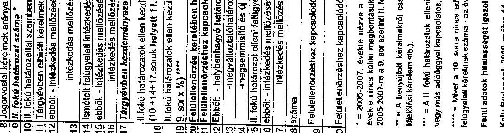

---

7. számú tanúsítvány a Magyar Köztársaság 2006. évi költségvetésének végrehajtásáról készített ÁSZ jelentéshez

# A 2006. évben zárult vagyongyarapodási vizsgálatok alapján hozott határozatok alakulása   (A revíziót követő információs rendszer adataiból) 

| Megnevezés | Határozatok   száma   (db) | Nettó adókülönbözet   (ezer Ft) |
| :-- | --: | --: |
| I. fokú határozatok | 832 | 4513190 |
| I. fokú jogerős határozatok | 605 | 962819 |
| II. fokú határozatok* | 212 | 4117035 |
| II. fokú jogerős határozatok | 208 | 3806784 |

10. számú tanúsítvány a Magyar Köztársaság 2008. évi költségvetésének végrehajtásáról készített ÁSZ
jelentéshez

## a 2008. évben zárult vagyongyarapodási vizsgálatok alapján hozott határozatok alakulásáról

| Megnevezés | Határozatok   száma   (db) | Nettó adókülönbözet   (ezer Ft) |
| :-- | --: | --: |
| I. fokú határozatok | 6587 | 28809874 |
| I. fokú jogerős határozatok | 4332 | 9559326 |
| II. fokú határozatok | 2053 | 26317301 |
| II. fokú jogerős határozatok | 2053 | 26317301 |

---

# 18. sz. tanúsítvány

|  Adónem | 2005 | 2006 | 2007 | 2008  |
| --- | --- | --- | --- | --- |
|   | Tétel (db) | Összeg (E Ft) | Tétel (db) | Összeg (E Ft)  |
|  Társasági adó | 60 544 | 34 348 971 | 65 705 | 44 325 581  |
|  Szja | 369 641 | 62 512 791 | 364 079 | 201 228 971  |
|  Áfa | 130 783 | 262 155 883 | 128 814 | 319 109 559  |
|  Játékadó | 1 371 | 398 306 | 848 | 372 050  |
|  Munkaadói járulék | 163 118 | 10 709 345 | 157 545 | 21 385 686  |
|  Munkavállalói járulék | 133 750 | 2 951 815 | 134 257 | 6 932 205  |
|  EVA | 26 204 | 3 842 100 | 12 174 | 2 971 103  |
|  Társadalombiz-tosítási járulék | 843 530 | 180 568 468 | 848 179 | 356 313 168  |
|  Egészségügyi hozzájárulás | 330 055 | 26 919 635 | 344 884 | 34 513 649  |
|  Magánnyugdíj Pénztár bevételei |  |  |  |   |
|  Illetékek |  |  |  |   |
|  Egyéb hátralék | 1 194 546 | 380 042 677 | 1 209 698 | 392 958 261  |
|  APEH összesen | 3 253 542 | 964 449 990 | 3 265 983 | 1 380 110 235  |

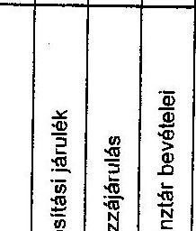

18. tanúsítvány

---

# Tanúsítvány a munkaviszony megszüntetésének alakulásáról

|  APEH összesen |  |  |  | fő  |
| --- | --- | --- | --- | --- |
|  Munkaviszony megszüntetésének
jogcíme | 2005 | 2006 | 2007 | 2008  |
|  Nyugdíjazás | 193,51 | 207,00 | 503,27 | 657,00  |
|  Közös megegyezés | 224,38 | 246,26 | 391,58 | 330,13  |
|  Lemondás | 45,00 | 33,75 | 27,00 | 29,00  |
|  Hivatalvesztés | 3,00 | 3,00 | 1,00 | 1,00  |
|  Próbaidőn belül kérelemre | 16,00 | 27,00 | 38,00 | 79,00  |
|  Próbaklőn belül hivatatból | 42,85 | 43,00 | 59,00 | 128,00  |
|  Elhalálozás | 14,00 | 12,00 | 23,00 | 13,00  |
|  Felmentés (Nyugdíjazás nélkül) | 147,00 | 17,00 | 67,00 | 36,26  |
|  Minden egyéb* | 103,91 | 81,51 | 102,42 | 89,00  |
|  Összesen* | 789,65 | 670,52 | 1 212,27 | 1 362,39  |

Fenti adatok hitelességét igazolom.

Kelt: Budapest, 2009. április 15.

- Nem tartalmazza az APEH-on belül áthelyezetléket.

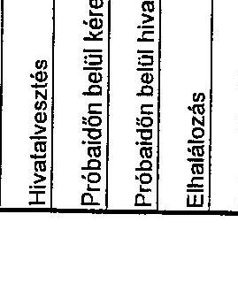

Végleges-leltszám_kilepések.xls

---

20. sz. tanúsítvány

Tanúsítvány az APEH személyi állományának szakmai gyakorlati idő szerinti megosztásáról

|  APEH ÖSSZEISEN | 2005. december 31. | 2006. december 31. | 2007. december 31. | 2008. december 31.  |
| --- | --- | --- | --- | --- |
|  Végzettség | Összesen | Ellenfizéel szakterület | Összesen | Ellenfizéel szakterület  |
|   | 10 | 10 | 10 | 10  |
|  5 év alatt | 2 212,10 | 18,96% | 785,35 | 20,75%  |
|  5-10 év között | 3 611,10 | 30,95% | 1 241,13 | 32,60%  |
|  10-15 év között | 3 212,00 | 27,53% | 865,75 | 23,41%  |
|  15-20 év között | 1 864,13 | 15,08% | 643,00 | 18,09%  |
|  20-25 év között | 409,38 | 3,51% | 135,75 | 3,59%  |
|  25 év lehet | 358,88 | 3,08% | 93,00 | 2,48%  |
|  Összesen: | 11 867,58 | 100,00% | 3 783,98 | 100,00%  |

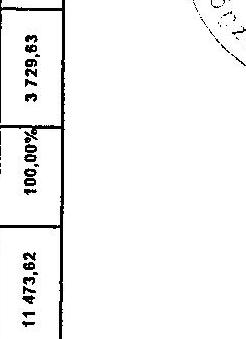

Fenti adatok hitelességét igazolom.

Kelt: Budapest, 2008.04.15

2008. december 31.

2009. december 31.

2010. december 31.

2011. december 31.

2012. december 31.

2013. december 31.

2014. december 31.

2015. december 31.

2016. december 31.

2017. december 31.

2018. december 31.

2019. december 31.

2020. december 31.

2021. december 31.

2022. december 31.

2023. december 31.

2024. december 31.

2025. december 31.

2026. december 31.

2027. december 31.

2028. december 31.

2029. december 31.

2030. december 31.

2031. december 31.

2032. december 31.

2033. december 31.

2034. december 31.

2035. december 31.

2036. december 31.

2037. december 31.

2038. december 31.

2039. december 31.

2040. december 31.

2041. december 31.

2042. december 31.

2043. december 31.

2044. december 31.

2045. december 31.

2046. december 31.

2047. december 31.

2048. december 31.

2049. december 31.

2050. december 31.

2051. december 31.

2052. december 31.

2053. december 31.

2054. december 31.

2055. december 31.

2056. december 31.

2057. december 31.

2058. december 31.

2059. december 31.

2060. december 31.

2061. december 31.

2062. december 31.

2063. december 31.

2064. december 31.

2065. december 31.

2066. december 31.

2067. december 31.

2068. december 31.

2069. december 31.

2070. december 31.

2071. december 31.

2072. december 31.

2073. december 31.

2074. december 31.

2075. december 31.

2076. december 31.

2077. december 31.

2078. december 31.

2079. december 31.

2080. december 31.

2081. december 31.

2082. december 31.

2083. december 31.

2084. december 31.

2085. december 31.

2086. december 31.

2087. december 31.

2088. december 31.

2089. december 31.

2090. december 31.

2091. december 31.

2092. december 31.

2093. december 31.

2094. december 31.

2095. december 31.

2096. december 31.

2097. december 31.

2098. december 31.

2099. december 31.

2010. december 31.

2011. december 31.

2012. december 31.

2013. december 31.

2014. december 31.

2015. december 31.

2016. december 31.

2017. december 31.

2018. december 31.

2019. december 31.

2020. december 31.

2021. december 31.

2022. december 31.

2023. december 31.

2024. december 31.

2025. december 31.

2026. december 31.

2027. december 31.

2028. december 31.

2029. december 31.

2030. december 31.

2031. december 31.

2032. december 31.

2033. december 31.

2034. december 31.

2035. december 31.

2036. december 31.

2037. december 31.

2038. december 31.

2039. december 31.

2040. december 31.

2041. december 31.

2042. december 31.

2043. december 31.

2044. december 31.

2045. december 31.

2046. december 31.

2047. december 31.

2048. december 31.

2049. december 31.

2050. december 31.

2051. december 31.

2052. december 31.

2053. december 31.

2054. december 31.

2055. december 31.

2056. december 31.

2057. december 31.

2058. december 31.

2059. december 31.

2060. december 31.

2061. december 31.

2062. december 31.

2063. december 31.

2064. december 31.

2065. december 31.

2066. december 31.

2067. december 31.

2068. december 31.

2069. december 31.

2070. december 31.

2071. december 31.

2072. december 31.

2073. december 31.

2074. december 31.

2075. december 31.

2076. december 31.

2077. december 31.

2078. december 31.

2079. december 31.

2080. december 31.

2081. december 31.

2082. december 31.

2083. december 31.

2084. december 31.

2085. december 31.

2086. december 31.

2087. december 31.

2088. december 31.

2089. december 31.

2090. december 31.

2091. december 31.

2092. december 31.

2093. december 31.

2094. december 31.

2095. december 31.

2096. december 31.

2097. december 31.

2098. december 31.

2099. december 31.

2090. december 31.

2091. december 31.

2092. december 31.

2093. december 31.

2094. december 31.

2095. december 31.

2096. december 31.

2097. december 31.

2098. december 31.

2099. december 31.

2090. december 31.

2091. december 31.

2092. december 31.

2093. december 31.

2094. december 31.

2095. december 31.

2096. december 31.

2097. december 31.

2098. december 31.

2099. december 31.

2090. december 31.

2091. december 31.

2092. december 31.

2093. december 31.

2094. december 31.

2095. december 31.

2096. december 31.

2097. december 31.

2098. december 31.

2099. december 31.

2090. december 31.

2091. december 31.

2092. december 31.

2093. december 31.

2094. december 31.

2095. december 31.

2096. december 31.

2097. december 31.

2098. december 31.

2099. december 31.

2090. december 31.

2091. december 31.

2092. december 31.

2093. december 31.

2094. december 31.

2095. december 31.

2096. december 31.

2097. december 31.

2098. december 31.

2099. december 31.

2090. december 31.

2091. december 31.

2092. december 31.

2093. december 31.

2094. december 31.

2095. december 31.

2096. december 31.

2097. december 31.

2098. december 31.

2099. december 31.

2090. december 31.

2091. december 31.

2092. december 31.

2093. december 31.

2094. december 31.

2095. december 31.

2096. december 31.

2097. december 31.

2098. december 31.

2099. december 31.

2090. december 31.

2091. december 31.

2092. december 31.

2093. december 31.

2094. december 31.

2095. december 31.

2096. december 31.

2097. december 31.

2098. december 31.

2099. december 31.

2090. december 31.

2091. december 31.

2092. december 31.

2093. december 31.

2094. december 31.

2095. december 31.

2096. december 31.

2097. december 31.

2098. december 31.

2099. december 31.

2090. december 31.

2091. december 31.

2092. december 31.

2093. december 31.

2094. december 31.

2095. december 31.

2096. december 31.

2097. december 31.

2098. december 31.

2099. december 31.

2090. december 31.

2091. december 31.

2092. december 31.

2093. december 31.

2094. december 31.

2095. december 31.

2096. december 31.

2097. december 31.

2098. december 31.

2099. december 31.

2090. december 31.

2091. december 31.

2092. december 31.

2093. december 31.

2094. december 31.

2095. december 31.

2096. december 31.

2097. december 31.

2098. december 31.

2099. december 31.

2090. december 31.

2091. december 31.

2092. december 31.

2093. december 31.

2094. december 31.

2095. december 31.

2096. december 31.

2097. december 31.

2098. december 31.

2099. december 31.

2090. december 31.

2091. december 31.

2092. december 31.

2093. december 31.

2094. december 31.

2095. december 31.

2096. december 31.

2097. december 31.

2098. december 31.

2099. december 31.

2090. december 31.

2091. december 31.

2092. december 31.

2093. december 31.

2094. december 31.

2095. december 31.

2096. december 31.

2097. december 31.

2098. december 31.

2099. december 31.

2090. december 31.

2091. december 31.

2092. december 31.

2093. december 31.

2094. december 31.

2095. december 31.

2096. december 31.

2097. december 31.

2098. december 31.

2099. december 31.

2090. december 31.

2091. december 31.

2092. december 31.

2093. december 31.

2094. december 31.

2095. december 31.

2096. december 31.

2097. december 31.

2098. december 31.

2099. december 31.

2090. december 31.

2091. december 31.

2092. december 31.

2093. december 31.

2094. december 31.

2095. december 31.

2096. december 31.

2097. december 31.

2098. december 31.

2099. december 31.

2090. december 31.

2091. december 31.

2092. december 31.

2093. december 31.

2094. december 31.

2095. december 31.

2096. december 31.

2097. december 31.

2098. december 31.

2099. december 31.

2090. december 31.

2091. december 31.

2092. december 31.

2093. december 31.

2094. december 31.

2095. december 31.

2096. december 31.

2097. december 31.

2098. december 31.

2099. december 31.

2090. december 31.

2091. december 31.

2092. december 31.

2093. december 31.

2094. december 31.

2095. december 31.

2096. december 31.

2097. december 31.

2098. december 31.

2099. december 31.

2090. december 31.

2091. december 31.

2092. december 31.

2093. december 31.

2094. december 31.

2095. december 31.

2096. december 31.

2097. december 31.

2098. december 31.

2099. december 31.

2090. december 31.

2091. december 31.

2092. december 31.

2093. december 31.

2094. december 31.

2095. december 31.

2096. december 31.

2097. december 31.

2098. december 31.

2099. december 31.

2090. december 31.

2091. december 31.

2092. december 31.

2093. december 31.

2094. december 31.

2095. december 31.

2096. december 31.

2097. december 31.

2098. december 31.

2099. december 31.

2090. december 31.

2091. december 31.

2092. december 31.

2093. december 31.

2094. december 31.

2095. december 31.

2096. december 31.

2097. december 31.

2098. december 31.

2099. december 31.

2090. december 31.

2091. december 31.

2092. december 31.

2093. december 31.

2094. december 31.

2095. december 31.

2096. december 31.

2097. december 31.

2098. december 31.

2099. december 31.

2090. december 31.

2091. december 31.

2092. december 31.

2093. december 31.

2094. december 31.

2095. december 31.

2096. december 31.

2097. december 31.

2098. december 31.

2099. december 31.

2090. december 31.

2091. december 31.

2092. december 31.

2093. december 31.

2094. december 31.

2095. december 31.

2096. december 31.

2097. december 31.

2098. december 31.

2099. december 31.

2090. december 31.

2091. december 31.

2092. december 31.

2093. december 31.

2094. december 31.

2095. december 31.

2096. december 31.

2097. december 31.

2098. december 31.

2099. december 31.

2090. december 31.

2091. december 31.

2092. december 31.

2093. december 31.

2094. december 31.

2095. december 31.

2096. december 31.

2097. december 31.

2098. december 31.

2099. december 31.

2090. december 31.

2091. december 31.

2092. december 31.

2093. december 31.

2094. december 31.

2095. december 31.

2096. december 31.

2097. december 31.

2098. december 31.

2099. december 31.

2090. december 31.

2091. december 31.

2092. december 31.

2093. december 31.

2094. december 31.

2095. december 31.

2096. december 31.

2097. december 31.

2098. december 31.

2099. december 31.

2090. december 31.

2091. december 31.

2092. december 31.

2093. december 31.

2094. december 31.

2095. december 31.

2096. december 31.

2097. december 31.

2098. december 31.

2099. december 31.

2090. december 31.

2091. december 31.

2092. december 31.

2093. december 31.

2094.

---

1. sz. tanúsítvány az írva éltetésének számáról (HIS ZHS)

APEH ÖSSZESZIN

|  Megnevezés | 2000_00.01. | 2001_00.01. | 2002_03.01.  |
| --- | --- | --- | --- |
|   | 10 | 10 | 10  |
|   | Összesen | Előműködési
szablonlőst | Összesen  |
|  Felső vezetők |  |  |   |
|  Vezetők | 5,00 | 1,00 |   |
|  Üzgetékzők | 45,00 | 27,25 |   |
|  Üzghozzék | 6,44 | 2,15 |   |
|  Fájlok alkalmazottak |  |  |   |
|  MINDÖSSZESZIN | 98,44 | 30,45 |   |

|  Megnevezés | 2000_00.01. | 2001_00.01. | 2002_03.01.  |
| --- | --- | --- | --- |
|   | 10 | 10 | 10  |
|   | Összesen | Előműködési
szablonlőst | Összesen  |
|  Felső vezetők |  |  |   |
|  Vezetők | 95,00 | 37,00 |   |
|  Üzgetékzők | 1 502,04 | 914,00 |   |
|  Üzghozzék | 22,71 | 5,00 |   |
|  Fájlok alkalmazottak | 5,00 |  |   |
|  MINDÖSSZESZIN | 1 425,24 | 960,00 |   |

|  Végleges írászav_ovs_eltesítés(2000.) | 2001_00.01. | 2002_03.01.  |
| --- | --- | --- |
|   | 10 | 10  |
|   | Összesen | Előműködési
szablonlőst  |
|  Felső vezetők |  |   |
|  Vezetők | 95,00 | 37,00  |
|  Üzgetékzők | 1 502,04 | 914,00  |
|  Üzghozzék | 22,71 | 5,00  |
|  Fájlok alkalmazottak | 5,00 |   |
|  MINDÖSSZESZIN | 1 425,24 | 960,00  |

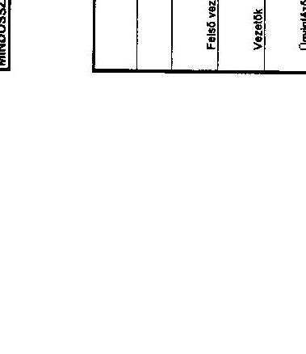

21. sz. tanúsítvány

---

# VIES rendszer adatai kockázati tényezőnkénti felhasználhatóságának korlátjai 

A VIES a közösségi adószámok érvényességére vonatkozó információk és az áfa-bevallások forgalmi adatainak tagállamok közötti áramlását biztosító szabványosított rendszer, amely kialakítása és fejlesztése az EU Bizottság hatáskörébe tartozik. A valamennyi tagországban egységes rendszer célja kont-roll-adatok szolgáltatása a tagországok adóhatóságai között a nemzetközi pénzügyi visszaélések feltárása, illetve megakadályozása érdekében.

Az APEH a VIES rendszeren keresztül rendelkezésére bocsátott adatokat öszszeveti az adóalanyok áfa-bevallásaival, és az eltéréseket kockázati tényezőként veszi figyelembe. A feltárt eltérések csak korlátozottan megbízhatóak a VIES rendszer következő hiányosságai miatt:

- A Közösségen belüli szolgáltatásokról, illetve az adóalanyok beszerzéseiről nem tartalmaz adatokat. Emiatt a kontroll-adatok hiányát kockázati tényezőként kell figyelembe venni az értékesítéshez kapcsolódó áfa mentesség igénybevételének ellenőrzése során.
- Az automatikusan közölt adatok az adóalanynak az adott tagállamban lebonyolított összes forgalmának összértékét tartalmazzák, amelyből nem állapítható meg a partnerenkénti forgalom értéke.
- A VIES rendszer nem tartalmaz kontroll-adatokat az EU-n kívüli országokból származó, egy másik tagállamban vámkezelt, de Magyarországon forgalomba helyezett termékek beszerzéséről. Ezekben az esetekben a vevőnek az áfát önbevallással kell elszámolnia. Magas kockázatot jelent, hogy a nemzeti adóhatóságok nem tájékoztatják egymást a VIES rendszeren keresztül arról, hogy egy másik tagállamban adófelfüggesztéssel vámkezelt termékforgalom után a vevőnek adófizetési kötelezettsége keletkezett.

Az EU Bizottsága, illetve az APEH intézkedéseket tett az alábbi hiányosságok megszüntetésére:

- Nem harmonizált az EU-n belül az áfa-bevallások benyújtásának rendje (gyakorisága, benyújtási határidő), ennek következtében az áfa-bevallásokat alátámasztó VIES kontroll-adatok időben nem állnak rendelkezésre. A VIES adatszolgáltatás határideje az adott negyedévet követő negyedév vége, míg az adóhatóság az Art. 37. § (4) bekezdése szerint összeghatártól függően 30, illetve 45 napon belül kell, hogy teljesítse a visszaigényelt áfa kifizetését. Az adóhatóság - és ezzel a költségvetés - számára a kontroll-adatok bevárása késedelmi kamatfizetési kötelezettséggel jár abban az esetben, ha a kapott információk az adóalany bevallásában foglaltakat támasztják alá. Ez azzal a kockázattal jár, hogy az APEH az áfa-visszaigényléseket kontroll-adatok hiányában teljesíti.

A Tanács 2008. december 16-i 2008/117/EK irányelve módosította a közös hozzáadottértékadó-rendszerről szóló 2006/112/EK irányelv 263. cikkét, meg-

---

határozva ezzel az összesítő nyilatkozatok benyújtási gyakoriságának új előírásait. Ennek alapján, a Közösségen belüli termékértékesítések adatait tartalmazó bizonylatokat 2010. január 1-jétől fő szabályként havonta kell majd az adózóknak benyújtaniuk. Ugyanakkor a kisebb (2011. december 31-ig a 100000 eurós, utána pedig az 50000 eurós negyedéves) forgalmú adózók számára a tagállamok továbbra is engedélyezhetik az összesítő nyilatkozatok negyedévenkénti benyújtását.

- Az automatikusan közölt adatok nem alkalmasak egyedi gazdasági események, vagy partnerenkénti forgalom kontrollálására. Az APEH a saját informatikai rendszere továbbfejlesztésével lehetővé tette, hogy az ún. másodszintű, azaz tagállami adózónkénti adatok is automatikusan elérhetőek legyenek a revizorok számára.
- A tagállam az adatokat saját devizanemükben szolgáltatják, ezért azok összevetése során az eltérések oka árfolyamkülönbségekre is visszavezethető. Ezeket a problémákat az APEH azzal küszöböli ki, hogy az árfolyam-különbözetből adódó eltérések megállapítására egy algoritmuson alapuló szűrési eljárást alkalmaz (csak meghatározott összeg feletti eltérést vesz figyelembe ${ }^{1}$ ), továbbá az egyeztetéseket több bevallási időszak VIES adatainak összevetésével hajtja végre.
- A tagországok többségében nincs előírás a Közösségen belüli beszerzések összesítő nyilatkozatban történő bevallására vonatkozóan. A magyar adóhatóság egyoldalúan, spontán információként valamennyi tagállamnak megküldi a termékbeszerzési összesítő nyilatkozatokból nyert információkat. Igaz ugyan, hogy a VIES rendszerben nincsenek adatok a beszerzésekről, de az egyes tagállamok (Görögországtól, Bulgáriától, Romániától és Litvániától kaptunk eddig beszerzési adatokat) által a beszerzésekről küldött állományok elérhetőek a KKI rendszerben, segítve ezzel az ellenőrzést végző revizorok munkáját.
- A Tanács 2008. február 12-i, a 2006/112/EK irányelvnek a szolgáltatás teljesítés helye tekintetében történő módosításáról szóló 2008/8/EK irányelve 2010. január 1-jétől előírja az összesítő nyilatkozatok benyújtását azon nem áfa-mentes szolgáltatások nyújtása tekintetében is ahol a szolgáltatást igénybevevő lesz az adó megfizetésére kötelezett. A 143/2008/EK rendelet alapján, a Közösségen belüli szolgáltatásnyújtásokra vonatkozó információkat a termékértékesítésekre vonatkozó adatokkal megegyező módon, azonos bontásban teszik elérhetővé a tagállamok 2010. január 1jétől.

[^0]
[^0]:    ${ }^{1}$ Az összeghatár és az időszak az APEH kérésére nem nyilvános adat.

---

# Az APEH feladatainak változása 2005-2008 között 

## 1. Feladatbővülés

## 2005-től:

- új adónemek - a Hitelintézeti és pénzügyi vállalkozások különadója, Vállalkozói járulék, Környezetterhelési díj - kerülnek bevezetésre;
- tízezerre bővül azon kötelezettek száma, akik bevallásaikat és adatszolgáltatásaikat elektronikus úton teljesítik és 2005. április 1-jétől más adózó is választhatja ezt a lehetőséget;
- a közigazgatási hatósági eljárás és szolgáltatás általános szabályairól szóló 2004. évi CXL. törvény (Ket.) 2005. november 1-jén hatályba lép;
- adóhatósági adó-megállapítás (ún. ADAM) első alkalommal történő elvégzése.
- START kártya bevezetése (2005. évi LXXIII. törvény);
- új adatbázisok az APEH honlapján: a lakáscélú hitel felvételéhez a regisztrált számlakibocsátókról, továbbá név, illetve adószám szerint lekérdezhetőek a nyilvántartott áfa adóalanyok;
- a termékimportot terhelő általános forgalmi adó biztosítása alóli mentességhez VPOP részére rendszeres adatszolgáltatás;
- az APEH átvette a Pénzügyminisztériumtól a Fiscalis Program nemzeti koordinációját, a kapcsolódó feladatokat;
2006-tól:
- minősített adózói adatbázis létrehozása, karbantartása;
- "babakötvény" bevezetése a fiatalok életkezdési támogatásával összefüggésben;
- az áprilistól havonta elektronikus úton érkező, új típusú bevallások fogadása, melyben az adózók a foglalkoztatottaknak teljesített kifizetésekkel, juttatásokkal összefüggő valamennyi adóról, járulékról és a jogszabályban meghatározott összegekről, illetőleg a foglalkoztatottak egyes adatairól szolgáltatnak adatokat;
- az egyes térségekre, gazdálkodási formákra közzétett jövedelmezőségi mutatóktól eltérő eredményeket bevallók ellenőrzése;
- adószám felfüggesztése, törlése;
- EVA-s adóalanyok adatainak közzététele;
- önellenőrzési moratórium, EU joggal való ütközés miatti önrevízió kezelése;
- új adónemek (a magánszemélyek, társas vállalkozások különadója)
- kiemelt, kötelező ellenőrzési feladattá vált a 3000 legnagyobb adóteljesítménnyel rendelkező adózó rendszeres ellenőrzése;
- az egyszerűsített közteherviselési hozzájárulással, mint a 2005. évi CXX. törvény által bevezetett új adónemmel összefüggő adóhatósági feladatok ellátása;

---

- állami adóhatóság internetes honlapján a jelentős tartozást felhalmozó adózók adatainak közzététele.

# 2007-től: 

- Szerencsejáték és illetékhivatalok állami adóhatóság szervezetébe integrálása;
- az adóhivatal szervezetének régiós átalakítása és a múködés üzemeltetési feltételeinek megteremtése;
- Start Plusz és Extra kártyák bevezetéséhez kapcsolódó adóhatósági feladatok ellátása;
- A minimális jövedelem alapján történő adóztatás szabályainak végrehajtása (2006. évi CXXXI tv.), amely 2007. január 1-jétől 2007. február 28-ig volt hatályban. Az alkotmányossági elvárásoknak megfelelő, jövedelemminimumhoz kötődő, a 2007. évi XXXIX. tv. által beiktatott szabályozás 2007. július 1-től hatályos.
- a munkáltató és a kifizető által foglalkoztatott biztosítottra vonatkozó bejelentések, változás-bejelentések alapján a foglalkoztatotti nyilvántartás kialakítása és az OEP, OMMF felé azonnali adatátadás;
- egészségügyi szolgáltatásra jogosító bejelentések kezelése;
- hitelintézeti járadék
- magánnyugdíj-pénztári tagdíjbefizetések fogadása, nyilvántartása;
- legalább 30\%-ot elérő jegyzett tőkerészesedés bejelentésének kezelése;
- gyesben, gyedben részesülő, de EVA-s adózók kezelése;
- egyes tulajdonosok adóazonosítójának kötelező bejelentése;
- az Art. 31. § (2) bekezdésében meghatározott bevallás benyújtására kötelezett adózók köre 2007-ben kiteljesedik, és ezzel az elektronikus beadás a törvényben előírtak szerint válik általánossá (több mint 800 ezer adózóra);
- egyedi azonosítóval és titkos jelszóval, a munkáltatónak, kifizetőnek, és a magánszemélynek az Art. 31. § (2) bekezdésében meghatározott saját adatok lekérdezhetőségének biztosítása;
- egyéni járulék folyószámla bevallási oldalának vezetése;
- az önkéntes kölcsönös pénztárakba és a nyugdíj-előtakarékossági számlákra teljesített befizetések után járó kedvezményt (SZJA bevallások és befizetések alapján) a tag egyéni számláján jóváírása és egy új adatátviteli csatorna kiépítése a magánnyugdíj-pénztárak felé történő adatszolgáltatás céljára;
- a magánnyugdíj-pénztárakra vonatkozó szabályozás megváltozásával a hátralékkezelés és végrehajtás területén kétféle eljárást kell párhuzamosan alkalmazni (a 2007. évi ügyekre a teljes integráció, a korábbi ügyekre a megkeresés szabályai irányadóak);
- gyógyszerforgalmazás és gyógyászati segédeszköz-ellátás támogatásának kezelése
2007. április 1-jétől a televízió előfizetési díjak beszedése a fizetésre kötelezett vendéglátóipari, kereskedelmi és idegenforgalmi szervezetektől;
- a nem jogtiszta szoftverek felkutatásában való ellenőrzési részvétel;

---

- a gázártámogatás jogosságának felülvizsgálatához adatszolgáltatás a Kincstárnak;

# 2008-tól: 

- a csoportos adóalanyiság bevezetése;
- az adószám-felfüggesztéssel érintett és ennek következtében törölt adózók adatainak közzététele;
- általános forgalmi adó és az egyszerúsített vállalkozási adó alanyinak nem minősülő, adószámmal rendelkező jogi személy és egyéb szervezetnek minősülő adózók, továbbá a csoportos áfa-adóalanyiságot választó adózók adatainak a közzététele;
- az ingatlanok forgalmi-érték adatairól adatszolgáltatás teljesítése igazgatási szolgáltatási díj ellenében;
- a kölcsönös egyeztetési eljárásból fakadó kérelmek kezelése;
- a tevékenységek TEÁOR 08-ra való átfordítása;
- meghatározott esetekben áfa fizetési kötelezettség kivetéssel történő megállapítása;
- elektronikus ügyintézés lehetőségének kiszélesítése (bejelentési kötelezettség, fizetési könnyítési kérelmek, törzsadatok lekérdezési, módosítási lehetősége);
- bankkártyás fizetés megvalósítása;
- elektronikus adóigazolás;
- OEP adatszolgáltatása alapján bejelentési és járulékfizetési kötelezettség ellenőrzése (ún. potyautasok);
- társaságok és egyéni vállalkozók minimum adóalap vizsgálata;
- be nem jelentett alkalmazott esetén adó- és járulékfizetési kötelezettség becsléssel történő megállapítása;
- újonnan alakult vállalkozások legalább 20\%-ának preventív ellenőrzése;
- elektronikus árverés lehetősége;
- a végrehajtással érintett adózók adatainak közzététele;

## 2. Feladatcsökkenés:

- 2007-től kormányzati döntés alapján a környezetvédelmi termékdíj beszedésének átadása a VPOP részére (50 státusszal együtt).

Budapest, 2009. december