# JELENTÉS 

a Kohéziós Alapból és hazai forrásokból finanszírozott kiemelt szennyvíztisztítási projektek megvalósításának ellenőrzéséről

---

2. Államháztartás Központi Szintjét Ellenőrző Igazgatóság
2.1. Teljesítmény Ellenőrzési Főcsoport
Iktatószám: V-2005-091/2009.
Témaszám: 44
Vizsgálat-azonosító szám: V0456
Az ellenőrzést felügyelte:
Bihary Zsigmond
főigazgató
Az ellenőrzés végrehajtásáért felelős:
Dr. Zöldréti Attila
mb. föcsoportfőnök
Az ellenőrzést vezette:
Tóthné Kiss Katalin
mb. osztályvezető
Az ellenőrzést végezték:
Dr. Badacsonyi Tamás Fekete Gábor
külső munkatárs tanácsadó
Dr. Kárpáti Árpád Szepes Béla
külső szakértő számvevő tanácsos
Tukacs Éva
tanácsadó
Feketéné Hajkó Andrea
számvevő
Terbe Mónika
számvevő tanácsos

# A témához kapcsolódó eddig készített számvevőszéki jelentések: 

címe
Sorszáma
Jelentés az Uniós támogatások hazai monitoring és ellenőrzési ..... 0723
rendszere múködésének ellenőrzéséről
Jelentés az önkormányzati út- és szennyvízcsatorna beruházások- ..... 0639
hoz 2002-2005. években igénybe vett közmúfejlesztési támogatások igénylésének és felhasználásának ellenőrzéséről
Jelentés az önkormányzatok által államháztartáson kívülre át- ..... 0538
adott pénzeszközök felhasználásával megvalósuló víziközmű be- ruházások finanszírozási rendszerének célszerűségéről
Jelentés az ISPA támogatásból megvalósított környezetvédelmi ..... 0469
programok ellenőrzéséről
Jelentés a települési önkormányzatok szennyvízközmű fejlesztési és ..... 0416
működtetési feladatai ellátásának vizsgálatáról
Jelentés a helyi önkormányzatok beruházásaihoz és rekonstrukció- ..... 0332
ihoz nyújtott 2002. évi címzett és céltámogatások igénybevételének és felhasználásának vizsgálatáról

---

Jelentés a Magyar Köztársaság 2002. évi költségvetése végrehajtásának ellenőrzéséről
Jelentés az Állami Számvevőszék 2002. évi tevékenységéről ..... 0306
Jelentés a Magyar Köztársaság 2001. évi költségvetése végrehajtásának ellenőrzéséről
Jelentés a helyi önkormányzatok beruházásaihoz és rekonstrukció- ..... 0120 ihoz nyújtott 2000. évi címzett és céltámogatások igénybevételének és felhasználásának vizsgálatáról

---

# TARTALOMJEGYZÉK 

BEVEZETÉS ..... 13
I. ÖSSZEGZŐ MEGÁLLAPÍTÁSOK, KÖVETKEZTETÉSEK, JAVASLATOK ..... 19
II. RÉSZLETES MEGÁLLAPÍTÁSOK ..... 32

1. A szennyvízkezelés feltételrendszerének kialakítása ..... 32
1.1. A hazai szennyvízkezelési stratégia uniós követelményekhez való illeszkedése ..... 32
1.1.1. A Kohéziós politika keretében a szennyvízkezelés társfinanszírozását biztosító uniós alapok stratégiái és a vonatkozó hazai szabályozás összhangja ..... 32
1.1.2. A szennyvízkezelésre vonatkozó uniós előírások, kötelezettségek teljesítésének aktuális helyzete ..... 35
1.1.3. Az Állami Számvevőszék 0416-os jelentésében tett javaslatok teljesülése ..... 36
1.2. A települési szennyvízkezelés EU harmonizált jogi szabályozási és intézményi környezete kialakításának időbelisége és teljes körűsége ..... 37
1.2.1. A szennyvízkezelési projektek EU harmonizált jogi szabályozási környezetének kialakítása ..... 37
1.2.2. A megvalósítás szervezeti keretei ..... 41
1.3. A hazai szennyvízkezelési stratégia végrehajtásához rendelt hazai és uniós források finanszírozási ütemterv szerinti biztosítása ..... 43
2. A szennyvízkezelési projektektől elvárt célok teljesítése ..... 45
2.1. Az ISPA/KA projektjavaslatok előkészítésében és a benyújtott pályázatokban a műszaki, a gazdasági és a társadalmi szempontok figyelembe vétele ..... 45
2.1.1. A pályázatok társadalmi szempontjai ..... 45
2.1.2. A pályázatok műszaki szempontjai ..... 48
2.1.3. A pályázatok gazdasági szempontjai ..... 50
2.2. A pályázati dokumentumokban, a Pénzügyi Megállapodásokban és a Támogatási Szerződésekben meghatározott időtervek, pénzügyi és műszaki tartalmak összhangja ..... 50
2.2.1. Az egyes dokumentumokban a célok és a hozzájuk rendelt naturális mutatók, továbbá a források, a jogok és kötelezettségek, valamint a megfelelő biztosítékok összhangja ..... 50
2.2.2. A szerződésmódosítások projektek eredményességére gyakorolt hatása ..... 55

---

2.3. A projektek tervezett célrendszer szerinti megvalósítása, a rendelkezésre álló erőforrások felhasználása ..... 56
2.3.1. A beruházásoknak a Pénzügyi Megállapodásokban és a Támogatási Szerződésekben foglalt időbeni és pénzügyi ütemezés szerinti megvalósítása ..... 56
2.3.2. A beruházások műszaki tartalmának összhangja a Pénzügyi Megállapodásokban és a Támogatási Szerződésekben foglaltakkal, valamint a rendelkezésre álló erőforrások felhasználása ..... 58
3. A projektek üzemeltetésére vonatkozó uniós alapelvek, különös tekintettel a fenntarthatóság és a szennyező fizet elvek érvényesülése ..... 61
3.1. Az üzemeltető kiválasztásának versenysemlegessége, a létrehozott vagyon kezelése ..... 61
3.2. A projekt keretében megvalósult létesítmények pénzügyi fenntarthatósága ..... 61
3.2.1. Újonnan létrehozott létesítmények esetében ..... 62
3.2.2. Meglévő létesítmények bővítése, rekonstrukciója esetében ..... 64
4. A szennyvíztisztító létesítmények teljesítményének eredményessége ..... 65
4.1. A szennyvíztisztító telepek előírások szerinti üzemelése ..... 65
4.2. A tisztító telepek szennyvízkezelésben elért teljesítménye ..... 66
4.3. A szennyvíztisztító telepeken keletkezett szennyvíziszap elhelyezésének, ártalmatlanításának megfelelősége a vonatkozó uniós és hazai előírásokhoz képest ..... 72
MELLÉKLETEK
1/a. sz. A Környezetvédelmi és Vízügyi Minisztérium észrevétele
1/b. sz. A Nemzeti Fejlesztési és Gazdasági Minisztérium észrevétele
2/a. sz. A Csatlakozási Szerződésben meghatározott kötelezettségek
2/b .sz. A Kohéziós Alap Keretstratégia célkitűzései
2/c. sz. Csatornahálózat és szennyvízkezelés helyzete Magyarország megyei jogú városaiban, 1999-2000-ben
2/d. sz. Az ISPA/KA stratégia által érintett nagyvárosok (és agglomerációik)
2/e. sz. Települési szennyvizekre vonatkozó irányelvek programja és teljesítésének helyzete az 50000 LE feletti agglomerációkban, illetve a fővárosban, a megyei jogú városokban és agglomerációikban
2/f. sz. A gyűjtőrendszerek elméleti célállapotára a KvVM által meghatározott adatok
3. sz. A települési szennyvíz kezelésének folyamat ábrája
4. sz. Teljesítménymutatók és a hozzá tartozó kritériumok a szennyvízkezelésre Kohéziós Alapból és hazai forrásból nyújtott támogatások hasznosulásának értékeléséhez

---

5. sz. A helyszíni ellenőrzésre kijelölt projektek kedvezményezettjei és azok víziközmű szolgáltatói
6. sz. A szennyvízkezelés helyzetének változása régiónként Európában, 19902005. között
7. sz. A települési önkormányzatok szennyvízközmű fejlesztési támogatásainak alakulása, 2000-2008. között

8/a. sz. Az ISPA/KA szennyvízkezelési projektek magtakarításai, szabad pénzeszközei 2009. június 30-i állapot szerint (Ft-ban)
8/b. sz. Az ISPA/KA szennyvízkezelési projektek magtakarításai, szabad pénzeszközei 2009. június 30-i állapot szerint (euróban)
9/a. sz. Az ISPA/KA szennyvízkezelési projektek előrehaladása, 2009. június 30-i állapot szerint (Ft-ban)
9/b. sz. Az ISPA/KA szennyvízkezelési projektek előrehaladása, 2009. június 30-i állapot szerint (euróban)
10/a. sz. Az ISPA/KA szennyvízkezelési projektek létesítményeinek megvalósulása, 2009. június 30-i állapot szerint (Ft-ban)

10/b. sz. Az ISPA/KA szennyvízkezelési projektek létesítményeinek megvalósulása, 2009. június 30-i állapot szerint (euróban)

11/a. sz. Az ISPA/KA szennyvízkezelési projektek fajlagos költségeinek alakulása, 2009. június 30-i állapot szerint (Ft-ban)

11/b. sz. Az ISPA/KA szennyvízkezelési projektek fajlagos költségeinek alakulása, 2009. június 30-i állapot szerint (euróban)
12. sz. Az ISPA/KA projektek szennyvíztelepeinek jellemző adatai
13. sz. Az ISPA/KA szennyvízkezelési projektek agglomerációit érintő Magyarország számára előírt határidők
14. sz. Szennyvíz-beruházási ráfordítások forrásonkénti alakulása, 2004-2007. között
15. sz. Lakossági víz- és csatornaszolgáltatás állami támogatásának alakulása, 2004-2009. között
16. sz. Kimutatás az ISPA/KA szennyvízkezelési projektek EIB hitelből történő finanszírozásáról
17. sz. A tisztított szennyvizek szervesanyag-tartalmának változása az ISPA/KA szennyvízkezelési projektek esetében
18. sz. Az ISPA/KA társfinanszírozásával megvalósuló kiemelt szennyvíztisztítási projektek intézményrendszere, 2009. július 31-i állapot szerint

# FÜGGELÉKEK 

1. sz. Az ISPA/KA szennyvízkezelési projektek pénzügyi, műszaki részletei

---

.

---

# RÖVIDÍTÉSEK JEGYZÉKE 

| áfa | általános forgalmi adó |
| :--: | :--: |
| Áfa tv. | Az általános forgalmi adóról szóló 2007. évi CXXVII. törvény |
| Áht. | Az államháztartásról szóló 1992. évi XXXVIII. Törvény |
| Ámr. | Az államháztartás múködési rendjéről szóló 217/1998. (XII. 30.) Korm. rendelet |
| ÁNTSZ | Állami Népegészségügyi és Tisztiorvosi Szolgálat |
| ÁSZ | Állami Számvevőszék |
| AB | Alkotmánybíróság |
| Balaton törvény | a Balaton Kiemelt Üdülőkörzet Területrendezési Tervének elfogadásáról és a Balatoni Területrendezési Szabályzat megállapításáról 2000. évi CXII. Törvény |
| Bizottság | Európai Bizottság |
| BM | Belügyminisztérium |
| BOI | Biológiai oxigén igény |
| CBA | Cost Benefit Analysis (CBA) - Költség-haszon elemzés |
| Cct. | A helyi önkormányzatok címzett és céltámogatási rendszeréről szóló 1992. évi LXXXIX. Törvény |
| EIB | European Investment Bank (EIB) - Európai Beruházási Bank |
| EK | Európai Közösség |
| EKK | Elektronikus Kormányzat Központ |
| EMIR | Egységes Monitoring Információs Rendszer |
| EU | Európai Unió |
| FIDIC | Tanácsadó Mérnökök Szövetsége |
| EGK | Európai Gazdasági Közösség |
| FVM | Földmúvelésügyi és Vidékfejlesztési Minisztérium |
| GOP | Gazdaságfejlesztési Operatív Program |
| GVOP | Gazdasági Versenyképesség Operatív Program |
| Hgt. | A hulladékgazdálkodásról szóló 2000. évi XLIII. Törvény |
| HIR | Hulladékgazdálkodási Információs Rendszer |
| Hulladékok kezeléséről szóló irányelv | A hulladékokról szóló 75/442/EGK tanácsi irányelv (1975. július 15.) |
| HÖF | Helyi önkormányzati fejlesztési támogatási program |
| IH | Irányító Hatóság |
| ISPA | Instrument for Structural Policies for Pre-Accession Strukturális Politika Előcsatlakozási eszköze |
| KA | Kohéziós Alap |
| KKA | Központi Környezetvédelmi Alap |
| KAC | Környezetvédelmi Alap Célelőirányzat |
| KÖVICE | Környezetvédelmi és Vízügyi előirányzat |
| Kbt. | A közbeszerzésekről szóló 2003. évi CXXIX. Törvény |
| KEHI | Kormányzati Ellenőrzési Hivatal |

---

| KEOP | Környezet és Energia Operatív Program |
| :--: | :--: |
| KIOP | Környezetvédelmi és Infrastruktúra Operatív Program |
| KOI | Kémiai oxigén igény |
| KöM | Környezetvédelmi Minisztérium |
| KSH | Központi Statisztikai Hivatal |
| KSZ | Közreműködő Szervezet |
| KTK IH | Közösségi Támogatási Keret Irányító Hatóság |
| KvVM | Környezetvédelmi és Vízügyi Minisztérium |
| KvVM FI | Környezetvédelmi és Vízügyi Minisztérium Fejlesztési Igazgatóság |
| Kvt. | A környezet védelmének általános szabályairól szóló 1995. évi LIII. törvény |
| kiemelt projekt | Egy kiemelt projektnek az ISPA esetében el kellett érnie az 5 millió eurót (1267/1999/EK rendelet 2. cikk 2. pontja szerint), a KA esetében a 10 millió eurót (1164/1994/EK rendelet 10. cikkének 3. pontját módosító 1264/1999/EK rendelet 1. cikk 8. a. pontja szerint). |
| LE | lakos egyenérték |
| MÁK | Magyar Államkincstár |
| MNV Zrt. | Magyar Nemzeti Vagyonkezelő Zrt. |
| NFGM | Nemzeti Fejlesztési és Gazdasági Minisztérium |
| NFH | Nemzeti Fejlesztési Hivatal (2007. július 1-től NFÜ) |
| NFT I. | Első Nemzeti Fejlesztési Terv |
| NFÜ | Nemzeti Fejlesztési Ügynökség |
| NKP | Nemzeti Környezetvédelmi Program |
| NKP-II | Második Nemzeti Környezetvédelmi Program |
| NVT | Nemzeti Vagyongazdálkodási Tanács |
| OGY | Országgyúlés |
| OP | Operatív Program |
| OTH | Országos Területfejlesztési Hivatal |
| ÖM | Önkormányzati Minisztérium |
| Ötv. | A helyi önkormányzatokról szóló 1990. évi LXV. törvény |
| Övt. | Az egyes állami tulajdonban lévő vagyontárgyak önkormányzati tulajdonba adásáról szóló 1991. évi XXXIII. törvény |
| PM | Pénzügyminisztérium |
| PR | Public Relation - Reklám és tájékoztatás |
| PRAG | Practical Guide - Gyakorlati útmutató |
| PIU | Programm Implementation Unit (Program Végrehajtási Egység) |
| Ptk. | A Polgári Törvénykönyvről szóló 1959. évi IV. tv. |
| ROP | Regionális Operatív Program |
| SAPARD | Special Accession Programme for Agriculture and Rural Development (Különleges Előcsatlakozási Program a Mezőgazdasági és Vidékfejlesztés támogatására) |

---

| Szennyvíziszapról szóló irányel | A Tanács 86/278/EGK irányelve |
| :--: | :--: |
| Szennyvízkezelésről szóló irányelv | a települési szennyvízkezelésről szóló 91/271/EGK számú   Tanácsi irányelv (1991. május 21.) |
| Szennyvíz Program | Magyarország Nemzeti Települési Szennyvízelvezetési és tisztítási megvalósítási Programja (a Nemzeti Települési Szennyvízelvezetési és -tisztítási Megvalósítási Programról szóló 25/2002. (II. 27.) Korm. rendelet) |
| Sztv. | A számvitelről szóló 2000. évi C. törvény |
| TESZIR | Települési Szennyvíz Információs Rendszer |
| TNM | Tárca Nélküli Miniszter |
| ÚMFT | Új Magyarország Fejlesztési Terv |
| Vgtv. | A vízgazdálkodásról szóló 1995. évi LVII. törvény |
| Víz Keretirányelv | A Parlament és a Tanács vízpolitika terén a közösségi fellépés kereteinek meghatározásáról szóló 2000/60/EK irányelve |
| Vtv. | Az állami vagyonról szóló 2007. évi CVI. törvény |

---

.

---

# ÉRTELMEZŐ SZÓTÁR 

1 lakos egyenérték (LE)

CBA útmutató

Csatornázottság (bekötöttség) aránya
Csatornával lefedett területen élők aránya
egyedi szennyvízkezelés
elsődleges kezelés
eredményesség
eutrofizáció
gyűjtőrendszer
harmadfokú vagy
harmadlagos kezelés

A település egy lakosa egy lakos egyenérték terhelést képvisel a szennyvíztisztítás szempontjából, azonban a keletkező szennyvíz nemcsak emberi (lakossági), hanem ipari, vagy intézményi eredetű is, ezért szükség van ezeknek a szennyező forrásoknak a számszerúsítésére.
Az ipari és az intézményi szerves anyagterhelést az egy lakosra jutó értékre számítják át. (A 91/271/EGK irányelv szerint $60 \mathrm{mg} / \mathrm{l}$ biológiai oxigén-igény jelent 1 LE-et.)
A projektek megvalósíthatóságára vonatkozó költséghaszon elemzés elkészítésének útmutatója.
A közcsatorna hálózatba bekapcsolt lakások száma a település összes lakásszámához képest (\%)
A csatornázottság (bekötöttség) aránya és a beköthetőség aránya együtt (\%)
Olyan egyedi szennyvízkezelési létesítmények (építmények) alkalmazása, amelyek 1-50 lakos egyenértéknek, illetve főnek a megfelelő települési szennyvíz tisztítását és/vagy végső elhelyezését, illetve átmeneti gyűjtését, tárolását szolgálják. Ezek lehetnek: az egyedi szennyvíz-elhelyezési kislétesítmények, az egyedi szennyvíztisztító kisberendezések és az egyedi zárt szennyvíztárolók. (A közműves szennyvízelvezető és - tisztító művel gazdaságosan el nem látható területekre vonatkozó Egyedi Szennyvízkezelés Nemzeti Megvalósítási Programjáról szóló 174/2003. (X. 28.) Korm. rendelet 2. § (b) pontja.)

A települési szennyvíz fizikai és/vagy kémiai tisztítását jelenti, amely magában foglalja a lebegőanyag kiülepítését, vagy más eljárásokat, amelyeknek során a bejövő szennyvíz $\mathrm{BOI}_{5}$ értéke legalább 20\%-kal és az összes lebegőanyag mennyisége legalább 50\%-kal csökken a kibocsátás előtt. (91/271/EGK irányelv)
Az elért eredmények és a kitűzött célok közötti kapcsolat mértéke.
Tápanyagoknak, különösen nitrogén-, illetve foszforvegyületeknek a vízben való feldúsulása, ami algák és magasabb rendű növények növekedésének felgyorsulását okozza, és ezzel a biológiai egyensúly megbomlásához, és a szóban forgó víz minőségének romlásához vezet (algásodás). (91/271/EGK irányelv)
Olyan vezetékrendszer, amely összegyűjti és elvezeti a települési szennyvizet. (91/271/EGK irányelv)
Olyan biológiai/kémiai szakasz, amelyet szükség esetén a tisztított szennyvízben lévő tápanyagok koncentrációjának csökkentésére alkalmaznak az eutrofizáció által veszélyeztetett befogadó vizekbe történő kibocsátást megelőzően. (91/271/EGK irányelv)

---

Hatodik közösségi környezetvédelmi cselekvési program
háztartási szennyvíz
ipari szennyvíz
kedvezményezett

Közreműködő Szervezet
másodfokú vagy
másodlagos kezelés
megfelelő kezelés

Mérnök
műszaki
tenderdokumentáció

Az Európai Parlament és a Tanács 2002. július 22-i 1600/2002/EK határozata a hatodik közösségi környezetvédelmi cselekvési program megállapításáról
A lakóterületek és szolgáltató üzemek szennyvize, amely főleg emberi anyagcseréből és háztartási tevékenységből származik. (91/271/EGK irányelv)
Minden olyan szennyvíz, amelyet valamely ipari vagy kereskedelmi tevékenység folytatására szolgáló helyről bocsátanak ki, és amely nem háztartási szennyvíz és csapadékvíz. (91/271/EGK irányelv)
A projektet, illetve a központi programot végrehajtó, a támogatási szerződést kedvezményezettként aláíró szervezet vagy magánszemély. (Az Európai Unió strukturális alapjaiból és Kohéziós Alapjából származó támogatások hazai felhasználásáért felelős intézményekről szóló 1/2004. (I. 5.) Korm. rendelet 2. §. (1) e. pont.)
Környezetvédelmi és Vízügyi Minisztérium Fejlesztési Igazgatóság jelen vizsgálatban. (Az Európai Unió által nyújtott egyes pénzügyi támogatások felhasználásával megvalósuló, és egyes nemzetközi megállapodások alapján finanszírozott programok monitoring rendszerének kialakításáról és múködéséről szóló 102/2006. (IV. 28.) Korm. rendelet 2. §. (1) f. pont.)
A települési szennyvíznek általában biológiai tisztítást és utóülepítést magában foglaló, vagy más eljárással való tisztítását jelenti, amely kielégíti a megállapított kibocsátási követelményeket. (91/271/EGK irányelv)
A települési szennyvíz kezelése bármely olyan eljárással illetve ártalmatlanító rendszerrel, amely biztosítja, hogy a kibocsátott vizet befogadó víz megfeleljen a vonatkozó minőségi követelményeknek és ezen, valamint más vonatkozó közösségi irányelvek követelményeinek. (91/271/EGK irányelv)
A projekt mérnöki és műszaki felügyeleti feladatait ellátó, a FIDIC szerződéses szabályoknak megfelelő személy vagy szervezet.
Ajánlatkérési műszaki dokumentáció a jogerős, végrehajtható és érvényes építési vagy létesítési hatósági engedélyokirat és a hozzá tartozó tervek alapján készített, az építmény helyszínét, környezetét, jelenlegi, valamint kész állapotát az ajánlatadáshoz szükséges és elégséges módon - rögzítő írásos dokumentumok és tervrajzok összessége. (1/1996. (II. 7.) KTM rendelet 2. § (1) bekezdés, amelyet hatályon kívül helyezett a Kbt. 405. § (1) bekezdés o) pontja 2004. május 1jétől. Ezt követően a 162/2004. (V. 21.) Korm. rendelet 1. sz. melléklet 1. pontja határozta meg azonos tartalommal.)
Pénzügyi Megállapodás Az Európai Bizottság és a Magyar Köztársaság Kormánya között az ISPA/KA projektek megvalósítása tárgyában, projektenként létrejött pénzügyi megállapodás.

---

programozási időszak
regionális víziközmű
szennyező fizet elve
szennyvíz iszap
szennyvízelvezetéssel
összefüggő
agglomeráció

Támogatási Szerződés
települési szennyvíz
települési
szennyvíztisztító telep
tisztított szennyvíz vagy kibocsátott szennyvíz
vízszolgáltatások

A strukturális alapok és a Kohéziós Alap kiadásai tervezésének és végrehajtásának többéves keretrendszere
Az egymással oly módon összefüggő - műszakilag elkülönítve gazdaságosan nem üzemeltethető - víziközművek, melyek egységes rendszert alkotnak, és a rendszer több települést (megyét) átfogó, összefüggő földrajzi területen (országrész, régió) nagyszámú, jellemzően vízbázistól távol fekvő település részére a vízkitermelést, -tisztítást, -elosztást amelyhez a fogyasztók közműves ivóvízellátása, szennyvízelvezetés is tartozhat - látják el. (Vgtv. 1. sz. melléklet 14. pont.)
A hulladék termelője, birtokosa vagy a hulladékká vált termék gyártója köteles a hulladékkezelési költségeit megfizetni, vagy a hulladékot ártalmatlanítani; a szennyezés okozója, illetőleg előidézője felel a hulladékkal okozott környezetszennyezés megszüntetéséért, a környezeti állapot helyreállításáért és az okozott kár megtérítéséért, beleértve a helyreállítás költségeit is. (Hgt. 4. §. g. pontja)
A települési szennyvíztisztító telepekről származó kezelt vagy kezeletlen visszamaradó iszap. (91/271/EGK irányelv)
Olyan terület, ahol a népesség illetve a gazdasági tevékenység elegendően koncentrált ahhoz, hogy a települési szennyvizet összegyűjtsék és egy települési szennyvíztisztító telepre vagy a végső kibocsátási pontra vezessék. (Vgtv. 1. sz. melléklet 15. a. pontja.)
Az önkormányzatok, mint végső kedvezményezettek és a Közreműködő Szervezet között - az Irányító Hatóság ellenjegyzése mellett - a projekt megvalósítása tárgyában létrejött megállapodás.
A háztartási szennyvíz vagy a háztartási és ipari szennyvíz illetve csapadékvíz keveréke. (91/271/EGK irányelv)
Olyan létesítmény, ahol a tisztítási-, technológiai eljárások eredményeként a befogadó vizekbe történő kibocsátást megelőzően a telepre beérkező települési szennyvíz szennyezettsége az előírt megfelelő szintre csökken. (91/271/EGK irányelv)
A tisztítási technológia után a szennyvíztelepről elfolyó, a befogadóba kerülő kibocsátott, kezelt szennyvíz. (91/271/EGK irányelv)
Az állam, illetve a helyi önkormányzatok közfeladataival összefüggő, különösen a vízigények kielégítésére, a szennyvizek elvezetésére, illetőleg a használt vizek ártalommentes elhelyezésére, a vízkészletek védelmére irányuló közfeladatok, különösen a) A felszíni vagy felszín alatti víz kitermelése, duzzasztása, tárolása, kezelése és elosztása;
b) A szennyvíz összegyűjtése és kezelése, amelyet ezt követően a felszíni vizekbe juttatnak. (Vgtv. 1. sz. mellékletének 31. pontja.)

---

víziközmú

Egy vagy több település közmúves vízellátását szolgáló és a közmúves szennyvízelvezetést, illetve - tisztítást szolgáló, egységes rendszert alkotó múszaki létesítmény; (A víziközmúvek üzemeltetéséről szóló 21/2002. (IV. 25.) KöViM rendelet 2. § b) pontja.)

---

# JELENTÉS   a Kohéziós Alapból és hazai forrásokból finanszírozott kiemelt szennyvíztisztítási projektek megvalósításának ellenőrzéséről 

## BEVEZETÉS

„A víz más termékektől eltérően nem kereskedelmi termék, hanem örökség, amit ennek megfelelően kell óvni, védeni és kezelni." (Víz Keretirányelv)

A települési szennyvíz hatással van az adott ország, illetve Európa vizeinek, talajának, talajvizeinek és ezek által ivóvízkészletének minőségére. Ezért az Európai Unió (a továbbiakban: EU) számos irányelvet fogadott el, valamint támogatta a szennyvízkezelési projektek megvalósítását. A „hatodik közösségi környezetvédelmi cselekvési program" szerint a 2002-2012 közötti időszakban a szennyvízgazdálkodás uniós prioritás.

Hazánkban a szennyvízkezelés már az első Nemzeti Környezetvédelmi Program (a továbbiakban: NKP-I) keretében, 1997-2002 között is kiemelt hangsúlyt kapott. Az NKP-I-ben kitűzött célok teljesültek. Az EU irányelvekben foglalt kötelezettségek teljesítéséhez azonban a határidők alóli átmeneti mentesség indítványozására volt szüksége Magyarországnak ${ }^{1}$. A kötelezettségek teljesítésére egy kivételével 10 éves átmeneti haladékot kértünk és kaptunk. (A kötelezettségeket és határidőket az 2/a. sz. melléklet részletezi.)

2003-2008 között a második Nemzeti Környezetvédelmi Program (a továbbiakban: NKP-II) és a Szennyvíz Program (2002), mint ágazati stratégia az EU kötelezettségek határidőre történő teljesítését célozták, és a következő ábra szerint hozzájárultak a közműolló bezárásához².
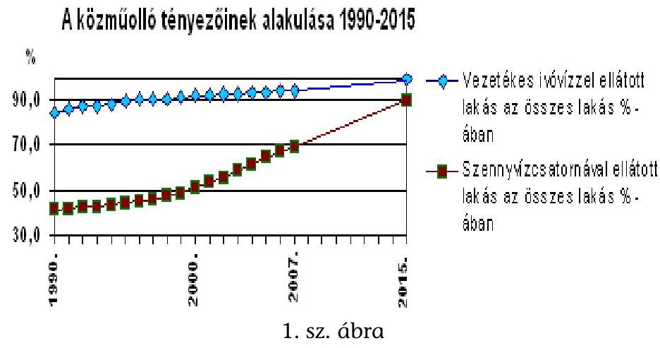

[^0]
[^0]:    ${ }^{1}$ A csatlakozási tárgyalások 1999-ben kezdődtek és a vonatkozó fejezet 2002-ben zárult le. A mentességet a Csatlakozási Szerződés X. melléklet 8. pontja tartalmazza.
    ${ }^{2}$ Az 1990-2007. évi adatok tény adatok, a 2015. évi adat a várható célértéket mutatja.

---

A cél országos szinten: a lakosság közel 90\%-a számára biztosítani a gyűjtőrendszert 2015. december 31-ig. A Szennyvízkezelésről szóló irányelv szerint az érintett agglomeráció nagyságától függően 2010., illetve 2015. december 31-ig a települési szennyvíz tekintetében valamennyi agglomerációnak rendelkeznie kell olyan szennyvízgyűjtő hálózattal, amely legalább másodfokú kezelést, illetve érzékeny területen 10000 LE felett 2008. december 30-ig harmadfokú kezelést biztosít.

Az Európai Bizottság (a továbbiakban: Bizottság) 2009-ben elkészült értékelése ${ }^{3}$ szerint Magyarország a szennyvízkezelésben (a gyűjtött és a másodlagosan, harmadlagosan kezelt szennyvíz arányát tekintve) fejlett volt az újonnan csatlakozott országok között 2005 végén. Ezt a 2. sz. ábra szemlélteti.

A gyüjtörendszerben gyüjtött szennyvíz aránya 2005 végén
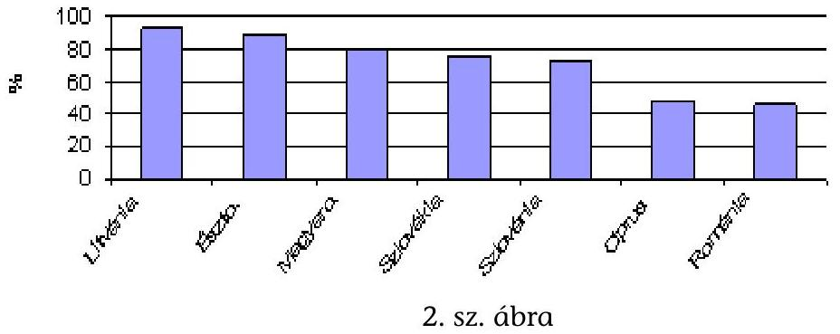

A szennyvíztisztítás helyzete az EU korábban csatlakozott tagállamaiban, különösen Észak-Európában jóval kedvezőbb, mint az újonnan csatlakozott országokban. Ott az összegyűjtött szennyvíz több mint 3/4-ét a legmagasabb, harmadfokú tisztításnak vetik alá. (A szennyvízkezelés helyzetének változását Európában a 6. sz. melléklet mutatja.)

A szennyvízgyűjtő rendszer kiépítésének hazai tervezését befolyásolta az országos ivóvízhálózat fejlesztésének befejezése és ezzel összefüggően a szennyvíz kibocsátás növekedése. A szennyvízgyűjtő rendszer társadalmi léptékű tervezésének kockázatát jelentette a nehezen prognosztizálható tényezők, így a gazdasági körülmények változása (például iparvállalatok megszűnése, újak letelepedése), a civil társadalom mozgása (például nagy tömegű kulturális rendezvények elhalása, új helyszínen létrejövő rendezvények alakulása).

Az ISPA, majd a Kohéziós Alap (a továbbiakban: ISPA/KA) támogatások felhasználásához készített stratégiák a kiemelten nagy, 50000 lakos egyenérték feletti ${ }^{4}$, illetve a főváros, a megyei jogú városok és agglomerációik szennyvíz

[^0]
[^0]:    ${ }^{3}$ 5. Bizottsági Összefoglaló a Városi Szennyvízkezelési Irányelv végrehajtásáról, 2009.
    ${ }^{4}$ 1990-ben megyei jogú város címet kapott minden város, amelynek a lakosságszáma meghaladta az 50000 főt. 1994-ben megyei jogú város lett mindkét megyeszékhely, amelynek lakossága nem érte el az 50000 -es határt (Salgótarján és Szekszárd). Továbbá 2006-ban Érd is megyei jogú város lett.

---

programjára helyezték a hangsúlyt (2/d. sz. melléklet, Az ISPA/KA stratégia által érintett nagyvárosok). Ezt az indokolta, hogy ISPA/KA társfinanszírozással kiemelt projekteket lehetett támogatni, és Magyarország településszerkezetét figyelembe véve ${ }^{5}$ elsődlegesen a fővárosban, a megyei jogú városokban lehetett szükség ilyen méretű projektek ${ }^{6}$ megvalósítására.

A Szennyvízkezelésről szóló irányelv szerint a 15000 LE feletti agglomerációkban - ide tartozóan a fővárosban és a megyei jogú városokban is - normál területen másodfokú kezelést kell megvalósítani 2010-ig. Érzékeny területen 10000 LE felett a harmadfokú tisztítás, azaz a tápanyag eltávolítás is elő van írva.

A Szennyvíz Program összeállításához - első ízben 1998. december 31-i állapot szerint, majd kétévenként - felmérték a megyei jogú városok csatornahálózatát és minősítették azok tisztító telepét. Ez alapján kijelölték a fejlesztendő területeket a Szennyvíz Programban ${ }^{7}$. (A felmérés eredményét a 2/c. melléklet tartalmazza.)

A kiemelt szennyvíztisztítási projekteket 2000-től az ISPA, majd annak folytatásaként 2004-től a Kohéziós Alap (a továbbiakban: KA) finanszírozta. 2007-től a KA társfinanszírozásával az Új Magyarország Fejlesztési Terv (a továbbiakban: ÚMFT) keretében kerülnek megvalósításra projektek, de lényeges különbség, hogy a jelenlegi programozási időszakban uniós szabályok szerint már nemcsak kiemelt, hanem 2000 LE feletti települési projektek is finanszírozhatóak KA-ból ${ }^{8}$.

A kiemelt projektek mellett kisebb agglomerációkat lefedő projektek valósultak meg uniós támogatással. Így kisebb projektek valósultak meg a PHARE, a Strukturális Alap Környezeti Infrastruktúra Operatív Program, az Agrár és Vidékfejlesztési Operatív Program, a SAPARD, valamint az INTERREG keretében 2007-ig. 2007-től az ÚMFT Regionális Operatív Programjai finanszíroznak kisebb (2000 LE alatti települési) szennyvízközmű fejlesztési projekteket.

A Bizottság a benyújtott kérelmek alapján az ISPA keretében 7, a KA keretében 3, azaz 2006 végéig összesen 10 kiemelt szennyvízkezelési projektet hagyott jóvá. A többi agglomerációban voltak tisztán hazai forrásból történő fejlesztések, de azok nem az ellenőrzés tárgykörébe tartozó kiemelt projektek voltak, így azok teljesítményét nem vizsgáltuk. A tisztán hazai forrásból megvalósult szennyvízkezelési projekteket abban az esetben sem ellenőriztük, amikor az ISPA/KA kedvezményezettje részesült benne.

[^0]
[^0]:    ${ }^{5}$ A magyar lakosság mintegy $40 \%$-a a fővárosban és a megyei jogú városokban él.
    ${ }^{6}$ Egy kiemelt projektnek az ISPA esetében el kellett érnie az 5 millió eurót (1267/1999/EK rendelet. 2. cikk 2. pont), a KA esetében a 10 millió eurót (1164/1994/EK rendelet 10. cikkének 3. pontját módosító 1264/1999/EK rendelet 1. cikk 8. a. pont).
    ${ }^{7}$ A Szennyvíz Program legutóbbi, 2009 áprilisában készült felülvizsgálata - az előírásnak megfelelően - a 2006. december 31-i állapotot tükrözi. A 2008. december végi helyzet alapján 2010-ben készül majd új programváltozat.
    ${ }^{8}$ A 25 millió euró feletti KA projekteket változatlanul a Bizottság hagyja jóvá, az ennél kisebb összegűeket a hazai hatóságok.

---

Az ISPA/KA társfinanszírozásával megvalósuló projektek eredeti támogatásként elszámolható költsége ${ }^{9}$ mintegy 204,3 Mrd Ft ${ }^{10}$. Ebből 111,5 Mrd Ft (54,6\%) a Budapesti Központi Szennyvíztisztító Telep és Kapcsolódó Létesítményei beruházás támogatása.

A végrehajtott fejlesztésekkel az 50000 LE feletti, illetve a fővárosra és a megyei jogú városokra és agglomerációikra vonatkozó uniós kötelezettség ${ }^{11}$ - főként a szennyvíztisztítás fokát tekintve - még nem teljesül maradéktalanul a 2010. december 31-i határidőre minden érintett város esetében, de 6 nagyváros ${ }^{12}$ támogatása folyamatban van KA-ból ${ }^{13}$ és még további fejlesztési elképzelések is vannak (2/e. sz. melléklet). A Bizottság a szennyvízgyűjtő rendszer kiépítésének kötelező mértékét nem számszerúsítette ${ }^{14}$, de a KvVM a gyüjtőrendszerek célállapotának hazai adatait meghatározta ( $2 / \mathrm{f}$. sz. melléklet).

Az ellenőrzött 10 ISPA/KA projekt tartalma eltérő volt. Ezt mutatja, hogy csatornával való lefedettség szempontjából, a 24 nagyvárosból az a 10 város is fejlettnek volt mondható ${ }^{15}$ a projekt előtt (70-92\% közötti lefedettség), amelyik kiemelt fejlesztést tudott megvalósítani ${ }^{16}$. A csatornával való lefedettség projektenkénti alakulását a 4. sz. ábra szemlélteti.
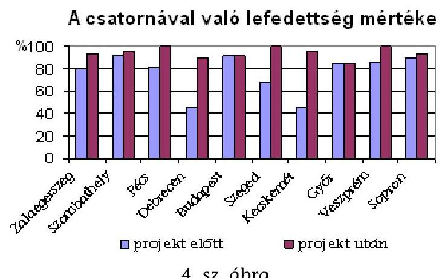
4. sz. ábra

[^0]
[^0]:    ${ }^{9}$ Az uniós társfinanszírozás és a hazai központi költségvetési részt tartalmazza.
    ${ }^{10}$ A különböző időpontbeli euró adatokat egységesen 260 Ft/euró árfolyamon számítottuk át forinttá a jelentés egészében. Az így átszámított adatok tájékoztató jellegűek.
    ${ }^{11}$ Ez megegyezik a 15000 LE feletti agglomerációkra vonatkozó uniós kötelezettséggel.
    ${ }^{12}$ Budapest, Békéscsaba, Nyíregyháza, Érd, Nagykanizsa, Székesfehérvár.
    ${ }^{13}$ Lényeges különbség, hogy a jelenlegi programozási időszakban uniós szabályok szerint már nemcsak kiemelt projektek (hanem a 2000 LE feletti agglomerációk projektjei is) finanszírozhatóak KA-ból.
    ${ }^{14}$ Sem a vonatkozó irányelvben, sem (a vonatkozó 1991-es irányelvhez) 2007-ben kiadott Útmutatóban.
    ${ }^{15}$ A KvVM-nek a gyújtőrendszerek célállapotára vonatkozó értékekhez képest.
    ${ }^{16}$ A győri projektnél nem volt csatornázás, a budapesti projekt keretében főgyűjtő és tehermentesítő gyűjtők épülnek. A csatornahálózat fejlesztését a dél-budai projekt keretében tervezték megvalósítani.

---

A csatornahálózat fejlesztéshez hasonlóan a szennyvíztisztító telepek fejlesztésének tartalma is különbözött. A 10 projekt keretében 3 új telep (budapesti, soproni, hegyesdi telep) építése és 7 meglévő telep (zalaegerszegi, szombathelyi, debreceni, szegedi, kecskeméti, győri, zirci telep) fejlesztése valósult, illetve valósul meg eltérő mértékben (búzhatás megszüntetése, komposztálás, biogáz hasznosítása, kisebb kiegészítő rekonstrukciók megvalósítása). Egy, a pécsi projekt keretében szennyvíztisztító telep fejlesztésére nem került sor.

A szennyvízközmű fejlesztések nyomán csökken a települések környezeti terhelése, javul a vízbázisok és az érzékeny víztestek védelme. (A települési szennyvíz kezelésének folyamatábráját a 3. sz. melléklet tartalmazza.) Ahhoz azonban, hogy ezek a kiépült rendszerek fenntarthatóak legyenek, múködtetésüknek - a megfizethető szolgáltatási díjak mellett - gazdaságosnak és hatékonynak kell lennie, ennek viszont elengedhetetlen feltétele a szennyvízközmú beruházások célszerű, eredményes és hatékony megvalósítása.

Az Állami Számvevőszék (a továbbiakban: ÁSZ) 2000-től rendszeresen vizsgálta a települési önkormányzatok szennyvízkezeléssel kapcsolatos tevékenységét, valamint 2004-ben az ISPA támogatásból megvalósított környezetvédelmi programok végrehajtását, de még nem vizsgálta a kiemelt szennyvízkezelési projektek átfogó hatását a magyar környezetvédelmi célok teljesítésében, valamint a projektek eredményességét, hatékonyságát.

A jelenlegi ellenőrzés célja: annak értékelése volt, hogy a Kohéziós Alap társfinanszírozásával megvalósuló szennyvízkezelési projektek eredményesen és hatékonyan szolgálták-e a magyar szennyvízkezelési célok megvalósítását, valamint a források hasznosulását.

Ennek során értékeltük, hogy:

- a feltételrendszer kialakítása a célok eredményes, hatékony teljesítését lehetővé tette-e;
- a kiemelt szennyvízkezelési projektek megvalósítása - a projektek teljesítményét tekintve - a projektek dokumentumaiban foglaltakkal összhangban történt-e; a múködő szennyvíztisztító teleppel rendelkező projektek keretében létrehozott létesítmények megvalósítása költséghatékonyan történt-e;
- a már részben, vagy egészben használatba vett létesítmények üzemeltetése során teljesültek-e a vonatkozó uniós alapelvek (Acquis Communautaireből levezethető elvek), különös tekintettel a fenntarthatóság és a szennyező fizet elvre;
- a megvalósuló szennyvíztisztító létesítmények múködése eredményes-e (a létesítmény kapacitása, a kibocsátott víz minősége megfelelő-e); ehhez kapcsolódóan a szennyvíziszap-kezelés és - ártalmatlanítás elvégzése megfelelő-e.

Az ISPA/KA projektek ellenőrzését a teljesítmény-ellenőrzés módszertanának alkalmazásával, főként eredményességi, hatékonysági szempontok szerint hajtottuk végre, így vizsgálatunk nem a szabályszerűség ellenőrzésére irányult.

---

Az ellenőrzöttek bevonásával - jelen vizsgálatunk tárgyára értelmezve - meghatároztuk az eredményesség, a hatékonyság fogalmát, valamint kijelöltük a teljesítménykritériumokat is (4. sz. melléklet). Összevetettük és elemeztük a hazai stratégiákban és a projektek dokumentumaiban foglalt célkitűzéseket a realizált eredményekkel. Ennek keretében értékeltük az input, output, eredmény indikátorok tervezett és tényállapotának alakulását, valamint kitekintést végeztünk a korábbi ÁSZ javaslatok gyakorlati hasznosulására.

Az eredményesség, a hatékonyság és a fenntarthatóság értékelése a már üzembe helyezett szennyvíztisztítók esetében volt lehetséges. Ezért a 10 kiemelt szennyvízkezelési projektből a már részben vagy teljes körűen működő szennyvíztisztító teleppel rendelkező 6 projektet (Szeged, Sopron, Kecskemét, Veszprém, Győr és Szombathely) ellenőriztük a helyszínen, míg a többi 4 projekt esetében (Budapest, Debrecen, Pécs, Zalaegerszeg) csak dokumentum alapú ellenőrzésre került sor a közreműködő szervezetnél. A Budapesti Központi Szennyvíztisztító Telep - bár céljában és értékében is jelentős projekt - nem kerülhetett bele az eredményesség ellenőrzésére kiválasztott projektek körébe, mert itt a szennyvíztisztító telep még nem működött (a telep próbaüzeme a helyszíni ellenőrzés végén kezdődött el).

Az eredményességet, a fenntarthatóságot az 5. sz. mellékletben felsorolt kedvezményezetteknél és víziközmű szolgáltatóknál ellenőriztük. A projektek megvalósítási helyzetének átfogó értékelésére az ellenőrzés előkészítése során bekért, valamint a helyszíni ellenőrzés során kapott további adatok, dokumentumok feldolgozásával került sor.

Az ellenőrzés időszaka az uniós tagságunk kezdetétől, 2004-től a helyszíni ellenőrzésünk befejezéséig (2009. augusztus 14.) terjedt, kitekintéssel a projektek indítására.

Az ellenőrzés jogalapját az Állami Számvevőszékről szóló 1989. évi XXXVIII. törvény 2. § (5)-(6)-(9) és az államháztartásról szóló 1992. évi XXXVIII. törvény 120/A. § (1) bekezdései képezik.

A jelentést 8 napos egyeztetésre megküldtük a környezetvédelmi és vízügyi és a nemzeti fejlesztési és gazdasági miniszter uraknak. Válaszleveleik másolatát 1/a-b. számú mellékletek tartalmazzák.

---

# I. ÖSSZEGZŐ MEGÁLLAPÍTÁSOK, KÖVETKEZTETÉSEK, JAVASLATOK 

Hazánkban a települési önkormányzatok szennyvízközmú fejlesztés címén 591,5 Mrd Ft uniós és hazai támogatásban részesültek az első ISPA támogatások megítélésének évétől, 2000-től 2008 végéig ${ }^{17}$. Ebben az időszakban összességében túlsúlyban volt a tisztán hazai források felhasználása, amely az uniós támogatások megjelenésével fokozatosan csökkent, majd 2007-től megszűnt. A támogatások forrásonkénti megoszlását a 3. sz. ábra szemlélteti.

A települési önkormányzatok szennyvízközmú
támogatásainak alakulása
2000-2008. között
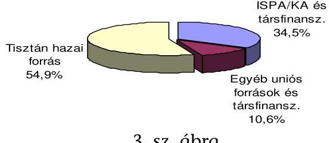
3. sz. ábra

A szennyvízközmú fejlesztés finanszírozása 34,5\%-ban (204,3 Mrd Ft) az ISPA/KA és annak hazai társfinanszírozásával történt, 10 projekt keretében. A jelenlegi programozási időszakban (2007-2013) a megelőző időszakéhoz hasonló nagyságrendű forrás, mintegy 200 Mrd Ft áll rendelkezésre további szennyvízkezelési projektekre a KA társfinanszírozásával.

A projektek tartalma a bevezetőben leírtak szerint lényegesen eltért - főként az adott agglomeráció korábbi hazai fejlesztésétől függően -, de a projektek minden esetben hozzájárulnak ${ }^{18}$ a szennyvízkezelés javulásához, elősegítik az uniós előírásoknak való megfelelést.

A 10 ISPA/KA projekt tervezésére és megvalósítására kihatott, hogy azokat intenzív hazai fejlesztést követően és hazai fejlesztésekkel párhuzamosan, a hazai és az uniós források harmonizációja és összehangolása nélkül ${ }^{19}$, pályázatará-

[^0]
[^0]:    ${ }^{17}$ A hazai források egyrészt az uniós támogatások társfinanszírozását, másrészt a tisztán hazai fejlesztésű projektek támogatását fedezték. A támogatásokat a 7. sz. melléklet részletezi.
    ${ }^{18}$ A projektek közül a győri befejeződött, a szegedi zárása a helyszíni ellenőrzés idején folyamatban volt, a soproni zárása előkészítés alatt állt, a többi megvalósítása folyamatban volt.
    ${ }^{19}$ Nagyvázsony kezdetben a veszprémi KA projekt keretében tervezte a szennyvízközmű fejlesztését, de a pályázat előkészítése során tisztán hazai támogatást nyert. Veszprém szennyvízközmú fejlesztésének III. üteme volt folyamatban tisztán hazai forrásból, miközben 2004. év végén a Bizottság jóváhagyta a KA támogatást. A III. ütemben végzett fejlesztés mielőbbi megvalósítását a kedvezményezett tájékoztatása szerint a Környezetvédelmi Felügyelőség előirása indokolta.

---

nyos forrásbőség ${ }^{20}$ mellett, közbeszerzési szabálytalanságokkal és lekötetlen kapacitás-többletek kialakításával valósították meg.

A költséghatékonysági szempontok érvényesítése háttérbe szorult, ugyanakkor a forrásfelhasználás hatékonyságának kiemelt jelentőséggel kellett volna bírnia, mivel az ellenőrzött időszakban az ISPA/KA stratégia által érintett 24 nagyvárosból csak 10 város $^{21}$ szennyvízközmű fejlesztése valósult, illetve valósul meg, de ezek közül is a fővárosban további fejlesztésekre van szükség. Továbbá a projektek költségvetésének átlagosan 22\%-át az Európai Beruházási Bank által nyújtott hitel fedezte és annak tőke és kamatterhei növelték az államadósságot.

A szennyvízkezelés feltételrendszerének kiépítése (stratégiakészítés, jogi szabályozás, intézményi rendszer kiépítése) alapvetően megtörtént hazánk uniós csatlakozásának időszakára, illetve az azt követő rövid időszakon belül. A KvVM a szennyvízelvezetés és - tisztítás EU konform fejlesztésének és müködtetésének jogszabályi alapjait 1995-től folyamatosan dolgozta ki és 2004-re a központi szabályozás alapjai megfelelőek voltak.

A helyszíni ellenőrzés idején azonban még nem szabályozták az országosan egységes dijképzést (annak ellenére, hogy a KvVM már 2004-ben előkészített egy szabályozás-tervezetet), továbbá a vizek állapotértékelésére vonatkozó minősítési rendszert. (E szabályozási hiányosságokkal az összefoglalón belül a témának megfelelő részben foglalkoztunk.)

Szabályozták az agglomerációk gazdaságos kialakítását, de a szabályozás alkalmazása nem volt eredményes ${ }^{22}$. 2002-től kormányrendeleti szintű szabályozás előírta az agglomerációk lehatárolásának módszertanát, a települések csatlakozásának feltételeit. Gazdaságossági számításokkal kellett alátámasztani azt, hogy egy agglomeráció megalakításánál a települések egy hálózatba csatolása gazdaságosabb, mint ha más műszaki megoldást választanak. Ugyanakkor a pályázati rendszerben a kisszámú lakosság (1-50 LE) ellátására megfelelő, egyedi műszaki megoldásokat nem támogatták, valamint e megoldások referencia híján nem terjedtek el. A KvVM szigorította a szabályozást 2009től ${ }^{23}$, de a gyakorlatban ennek alkalmazása az önkormányzatok felelősségén múlott.

[^0]
[^0]:    ${ }^{20}$ A rendelkezésre álló kerethez képest a stratégiai feltételeknek megfelelő, jól előkészített projektek kis száma korlátozta a leginkább fejlesztésre szoruló agglomerációk kiválasztásának lehetőségét.
    ${ }^{21}$ A támogatott városok és térségük felsorolását a 9/a-b. sz. melléklet tartalmazza.
    ${ }^{22}$ A KvVM szerint az önkormányzatok hajlamosak voltak az agglomerációk indokoltnál nagyobb kiterjesztésére, és kapacitásfeleslegek alakultak ki. Az ellenőrzött projektek közül a hegyesdi és a kecskeméti telepen alakult ki többlet kapacitás. A hegyesdi telephez vannak közeli települések, lakótelep, ahol a szakmai és gazdaságossági feltétel adott a telepre való rácsatlakozáshoz, de a meglévő kapacitás igénybe vétele kérdéses.
    ${ }^{23}$ Egy szennyvízelvezetési agglomeráció kiterjesztése csak akkor lehetséges, ha a települések egy rendszerbe kapcsolása legalább 30\%-os díjcsökkenést eredményez az egyedi, vagy települési szintű műszaki megoldásokhoz képest (87/2009. IV. 10.) Korm. rendelet 1. § b. pontja).

---

A magyar hatóságok az uniós követelményekhez igazodó stratégiákat kialakították. Az ágazati stratégiában (Szennyvíz Programban) a pénzügyi források és a naturális célok összhangban voltak, a fejlesztendő területek kijelölésre kerültek, de a stratégiák gyakorlati érvényesítéséhez a fejlesztések ütemezése, a pénzügyi erőforrások biztosítása nem történt meg. Az ISPA/KA stratégiák a feltételeknek megfelelő, jól előkészített projektek kis száma miatt korlátozottan valósulhattak meg ${ }^{24}$.

A projektek megvalósítását nehezítették az EU Delegációval és a Bizottsággal történő elhúzódó egyeztetések, a közbeszerzési és az áfa szabályok változása. Továbbá az, hogy a projektek többségét (tízből hetet) a csatlakozást megelőzően a hazai uniós intézményrendszer (jogi, pénzügyi, lebonyolítói, informatikai rendszer) kiépítése, fokozatos fejlesztése közben kellett előkészíteni és elkezdeni.

Egy korábbi ÁSZ jelentésben ${ }^{25}$ megállapítottuk, hogy „A hazai és az uniós szennyvízkezelési források összehangolatlanságát eredményezte, hogy nem volt olyan szervezet, vagy informatikai rendszer, amely a projekt-javaslatokat és a forrásokat kölcsönösen megfeleltette, a felhasználói igényeket rendszerezte és a környezetvédelmi fejlesztési célokkal összehangolta volna.".

A fenti megállapítás alapján javasoltuk a Kormánynak, hogy koordinálja az érintett tárcákkal együttmúködve a környezetvédelmi fejlesztési stratégiához illeszkedő, az uniós és a hazai lehetséges támogatásokat is tartalmazó, egymásra épülő és egymást kiegészítő forrásszerkezet kialakítását, de erre a 2004-2007 közötti időszakban nem került sor. Jelenleg a különböző alapok, programok forrásszerkezetének összehangolása az uniós szabályozás és a programdokumentumok szintjén megoldott.

Az ISPA/KA projektek kiválasztási szempontjai között - az uniós kötelezettségek teljesítése és a források lekötése érdekében - a projektek előkészítettségének helyzete volt a fő szempont és helyi, regionális szintű érdekek is előtérbe kerültek, nem az agglomerációk szennyvízközmű fejlettsége, elmaradottsága volt a megatározó.

A Bizottság a pályázatok elbírálásakor - a rendelkezésekre álló dokumentumok szerint - főként a lakosságszámot és az egy főre eső beruházási költséget vette figyelembe. E szempontok alapján két projektet elutasított és két projektet a magyar hatóságok vontak vissza alacsony lakosságszám, magas egy főre jutó költség, kétséges gazdaságosság miatt. Ilyen okokból a Bizottság további fejlesztési változatok kidolgozását kérte a veszprémi projekt hegyesdi agglomeráció-

[^0]
[^0]:    ${ }^{24}$ Az ISPA támogatásból megvalósított környezetvédelmi programok ellenőrzéséről szóló 0469 -es ÁSZ jelentés II/2. fejezete részletesen foglalkozik a projektek kiválasztásának kérdésével.
    ${ }^{25}$ Az ISPA támogatásból megvalósított környezetvédelmi programok ellenőrzéséről szóló 0469 sz. ÁSZ jelentés.

---

jának fejlesztésére, amit a kedvezményezett teljesített, de végül az eredetileg javasolt fejlesztési változat került jóváhagyásra ${ }^{26}$.

A projektek előkészítési dokumentumainak minősége nem volt egységes, a minőségi hiányosságok ${ }^{27}$ a költségvetések meglapozottságának kockázatában, majd a projektek megvalósítása során a tervezett és a elszámolt költségek kirívó eltérésében (a tervezett költségek feléért, vagy másfél, háromszorosáért vállalt kivitelezésben) jelentkeztek ${ }^{28}$. Az építési munkákat az uniós ajánlásoknak megfelelően a Tanácsadó Mérnökök Nemzetközi Szövetsége (FIDIC) által javasolt szerződéses formák alapján adták vállalkozásba.

A tervezési rendszerből hiányzott az egységes szempontrendszer. A megvalósíthatósági tanulmányok részét képező költség-haszon elemzések ${ }^{29}$ eltértek a beruházás várható élettartama, az alkalmazott árfolyamok, az érzékenységvizsgálatba bevont tényezők, a maradványérték tekintetében ${ }^{30}$, ezért ezek nem adtak lehetőséget a projektek egymáshoz való mérésére. Továbbá a társadalmigazdasági és környezeti hatások korlátok nélküli felbecsülésével akár túlzott költségekkel is megtérülőek a projektek. A Bizottság a költség-haszon elemzések elfogadása tekintetében rugalmas volt, illetve az általa delegált szakértők véleményére támaszkodott ${ }^{31}$.

A szennyvízkezelési projektek előkészítésekor, tervezésekor a kedvezményezettek elsődlegesen az elnyerhető uniós támogatás összegére koncentráltak, ezt hangsúlyozták az előzetes társadalmi egyeztetés során. Az egy lakosra jutó összköltség, a várható csatornadíjak közzététele elmaradt, a lakosok a fizetendő önrész mértékét ismerték pontosan. Ugyanakkor a fajlagos költségek befolyásolják, hogy a létrejövő infrastruktúra évek multán is fenntartható-e.

[^0]
[^0]:    ${ }^{26}$ A pótlólag kidolgozott fejlesztési változatok költsége között minimális különbség (2,2-8,1\%-os eltérés) volt, de a legalacsonyabb költségigényűnek az eredetileg támogatásra javasolt, későbbiekben megépített változat bizonyult a pályázati kérelem szerint.
    ${ }^{27}$ Jellemzően nem állt rendelkezésre részletes költségvetés (csak mintegy 10 tételből álló költségbecslés volt). A győri projektnél részletes, a beruházás pénzügyi megállapodásában szereplő́ összköltség alátámasztását célzó költségbecslés készült (PHARE pályázatra előkészített projekt).
    ${ }^{28}$ A közbeszerzés során két esetben (Zirc, Hegyesd) a tervezett költség feléért vállalta a kivitelező a csatornaépítést. Ugyanakkor két tisztító telep beruházás másfél, illetve háromszoros áron valósult meg (Zirc, Veszprém).
    ${ }^{29}$ A létesítmények naturális mutatóira fajlagos költséget nem számoltak, hanem a költség-haszon elemzés elvégzését kérte a Bizottság az általa kiadott CBA útmutató szerint.
    ${ }^{30}$ Az ISPA projekteknél a CBA útmutató még nem tette lehetővé a maradványérték képzését, a KA útmutató viszont igen.
    ${ }^{31}$ A projektek előkészítése minden esetben az EU által megbízott nemzetközi szakértők (projektenként más-más szakértő) és az Európai Beruházási Bank szakértőinek közreműködésével történt.

---

A projektek megvalósítását jellemzi, hogy az eredetileg tervezett műszaki célok kisebb módosítással ${ }^{32}$ megvalósulnak és e mellett 5 projekt keretében - a megtakarítások és felszabaduló források terhére - további fejlesztéseket végeznek. A keletkezett megtakarítások ellenére összességében többletkiadás keletkezett és a megvalósítás időben elhúzódik. Az időbeni és pénzügyi megvalósítást az 5. sz. ábra szemlélteti.
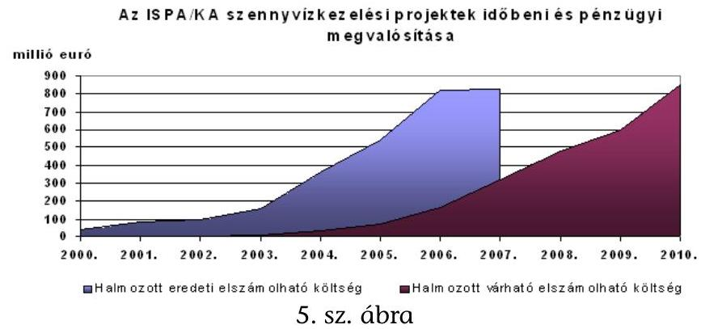

A projektek keretében az eredeti tervek megvalósításával várhatóan kiépül 656 ezer $\mathrm{m}^{3} /$ nap tisztító-kapacitás (a 2006. évi kapacitás $22 \%$-a), megvalósul 1164 km csatorna építése (2004. évi csatornahálózat 3\%-a) és $30,5 \mathrm{~km}$ csatorna rekonstrukciója. Továbbá 120 km főgyűjtő építése és 95 km főgyűjtő rekonstrukciója, 95 ezer t/év új (iszap) komposztáló-kapacitás, valamint $1857 \mathrm{~km}^{2}$ burkolat felújítása. Sopron, Kecskemét, Szombathely, Veszprém és Budapest új projektelemeket valósít meg, amelyeket 2010 végéig szintén be kell fejezni. (Az új projektelemeket a 8/a-b. sz. melléklet részletezi.)

A projektek átlagosan mintegy másfél évvel később kezdődtek és várhatóan két és fél évvel később fejeződnek be, ez utóbbihoz hozzájárul az új projektelemek megvalósításának időigénye. A projektek megvalósítási ideje átlagosan 6 év helyett 7 év lesz. A megvalósítási idő alakulását a 6. sz. ábra szemlélteti.
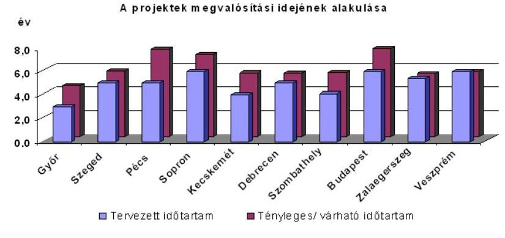
6. sz. ábra

A legkisebb időbeni eltérés a KA keretében jóváhagyott zalaegerszegi és veszprémi projekteknél van, mivel ezekben az esetekben már az ISPA projektekben

[^0]
[^0]:    ${ }^{32}$ A budapesti projekt keretében nem épül meg a tervezett komposztálótelep. Az iszapkezelésre környezetbarát és költséghatékonyabb megoldást választanak.

---

szerzett tapasztalatokat hasznosíthatták és a megvalósítási időt eleve nagyobbra tervezték.

A Bizottság által jóváhagyott pénzügyi keretek teljes kihasználása a 2010-es határidőre két projekt (budapesti, debreceni projekt ${ }^{33}$ ) esetében van veszélyeztetve. A debreceni projektnél főként a régészeti munkálatok elhúzódása, a régészeti szabályok változása és a kivitelező csődje miatti késedelem, a budapesti projektnél az új projektelemek megvalósítása veszélyezteti a határidőre történő befejezést.

A Bizottság 2007. év végén és 2008. év elején végzett auditjai során kifogásokat emelt a Budapesti Központi Szennyvíztisztító Telep 2005-ös közbeszerzési eljárásának lefolytatásával kapcsolatban. A folyamat eredményeként az eredetileg tervezett projektelemek támogatásából megvont $40,5 \mathrm{M}$ eurót (mintegy 10,5 Mrd Ft-ot), amit a magyar félnek kell pótolni. Viszont egyidejúleg engedélyezte a $40,5 \mathrm{M}$ euró felhasználását új létesítményekre.

A pénzügyi megvalósítást illetően, a tervezett költségek a projektek összességére nézve várhatóan 14\%-kal (29,2 Mrd Ft-tal) fognak növekedni. A kedvezményezettek a megnövekedett keret $76,1 \%$-át kötötték le szerződéssel és $58 \%$-át fizették ki 2009. június 30 -i állapot szerint. A projektek előrehaladását a $9 / a-b$. sz. melléklet tartalmazza. A projektek egészére vonatkozó főbb pénzügyi adatokat a 7. sz. ábra személeti.
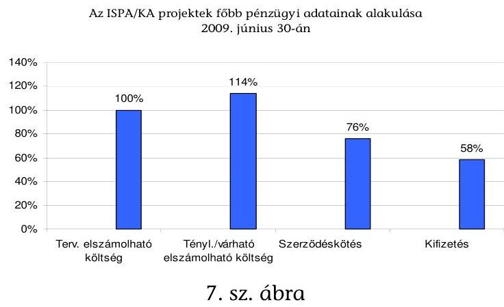

A költségek növekedése a szegedi, a győri projektnél ${ }^{34}$ költségtúllépés miatt következett be. A budapesti projektnél a Bizottság ugyan elvont támogatást a projekt megvalósítása során, de ezt újból megítélte új projektelemekre, így az eredetileg tervezett költségek várhatóan főként az uniós támogatás elvonás miatt szükséges többlet hazai forrás miatt fognak emelkedni. A költségek a zalaeger-

[^0]
[^0]:    ${ }^{33}$ A kedvezményezett szerint a budapesti projekt teljes uniós támogatási keretének kihasználásához szükséges új projektelemek megvalósításának reális határideje 2012 vége lenne, de ehhez a Bizottság ez idáig nem járult hozzá. A debreceni projekt esetében 2009. július végén az érintett felek együttmúködési tárgyalást tartottak, de módosított ütemtervet nem fogadtak el a 2010-es befejezéshez.
    ${ }^{34}$ A szegedi és a győri a két legkorábbi projekt költségtúllépése a tervezéskor várhatónál nagyobb infláció, áremelkedés, a projektek elhúzódása, a kivitelezőnek fizetett késedelmi kamat, a jóváhagyott műszaki tartalom változás hatására következett be.

---

szegi és a veszprémi projektnél átstrukturálódtak ${ }^{35}$ az áfa szabályozásváltozás miatt.

A költségek növekedése miatt a tervezett finanszírozási arányok megváltoztak, és azáltal, hogy az EU források eredetileg jóváhagyott összege nem változott, a többlet költséget hazai forrásból szükséges fedezni. Így az EU finanszírozás aránya 62,4\%-ról 54,6\%-ra csökkent, a hazai társfinanszírozás (központi költségvetés és önkormányzati önrész) aránya 37,6\%-ról 45,4\%-ra nőtt.

A források felhasználásának hatékonyságát a támogatás-közvetítő intézmények és a kedvezményezettek nem értékelték. Hatékonyság-elemzést a már működő szennyvíztisztító teleppel rendelkező 6 projekt esetében az ellenőrzés során végeztünk ${ }^{36}$. A fajlagos költségek számításának részleteit a 10/a-b. és a 11/a-b. sz. mellékletek tartalmazzák. A fajlagos költségek bárminemú következtetés levonására csak az egyes projektek fejlesztési tartalmának, sajátosságainak (méretgazdaságosság, vagy „zöldmezős beruházás") figyelembevételével alkalmasak ${ }^{37}$.

A fajlagos költségek alakulását - bár látszólag a közbeszerzés alakította - alapvetően a tervezési rendszer határozta meg. Az ISPA/KA projektek tervezésekor nem volt a kedvezményezettek számára közreadott uniós költség normatíva.

A KvVM ISPA Végrehajtó Szervezete a korábban tisztán hazai forrásból megvalósuló beruházásokhoz kiadott ${ }^{38}$ normatívák (fajlagos költségek) figyelembe vételét javasolta a kedvezményezettek számára, a konkrét esetre való adaptálás, a munkanemekhez és tételrendhez igazítás nélkül. A hazai fajlagos költségeket azonban nem alkalmazták, a projektek tervezett beruházási költsége sokkal inkább más uniós országok projektjeinek költségéhez hasonló.

A projektek a kisebb agglomerációk esetében felmerülő kevesebb, mint 10 millió eurótól ( 2,6 Mrd Ft-tól) egy nagyobb városközpontra vonatkozóan több mint 200 millió euróig ( 52 Mrd Ft -ig) terjedtek, az egy főre eső költség pedig a méretgazdaságosság miatt a telep méretének növekedésével arányosan csökkent. Ezt megállapította az Európai Számvevőszék az írországi, spanyolországi, portugál és görögországi szennyvízkezelési projektek ellenőrzése során ${ }^{39}$, de ez jellemezte a hazai projekteket is. A veszprémi projekt keretében a legkisebb, hegyesdi agglomeráció projektjének tervezett költsége 9,8 millió euró (közel 2,6

[^0]
[^0]:    ${ }^{35}$ Az eredetileg áfa megfizetésére jóváhagyott uniós támogatást, jogszabályváltozás alapján nem lehet áfára felhasználni, hanem ebből a Bizottság jóváhagyása alapján új projektelemek valósíthatóak meg.
    ${ }^{36}$ Tekintettel arra, hogy a csatornahálózat és a szennyvíz telep szerkezeti elemeinek költségadatai nem voltak feldolgozva, csak a csatorna hosszra, illetve a tisztított szennyvíz $\mathrm{m}^{3}$-re jutó költséget tudtuk meghatározni projektenként.
    ${ }^{37}$ Un. „zöldmezős beruházás egyedül a hegyesdi agglomerációban valósult meg.
    ${ }^{38}$ A KvVM utoljára 2003-ban közölt fajlagos költség mutatókat a települések címzett és céltámogatással megvalósuló vízgazdálkodási, valamint a főváros és megyei jogú városok szennyvízelvezetési és - tisztítási beruházásainak tervezéséhez.
    ${ }^{39}$ Ezt tartalmazza az Európai Számvevőszék 2009-ben kiadott 3. sz. különjelentése.

---

Mrd Ft) volt. Az európai méretekben is nagynak számító budapesti projekt tervezett költsége 428,7 millió eurót (111,5 Mrd Ft-ot) tett ki.

A 2003. évi hazai normatívához viszonyítva a hegyesdi tisztító telep tervezett fajlagos költsége ( $\mathrm{Ft} / \mathrm{m}^{3} / \mathrm{nap}$ ) 1,8 szeres, tényleges fajlagos költsége 2,4 szeres volt.

A tervezetthez képest a tényleges költségek nagy szóródása (a tervezetthez képest $50 \%$-kal alacsonyabb vagy akár $43 \%$-kal magasabb költségek) ${ }^{40}$ is a tervezési rendszer és a költség-gazdálkodás hiányosságára hívják fel a figyelmet.

A létesítmények üzemeltetését a helyszínen ellenőrzött 6 ISPA/KA projekt esetében - a szegedi projekt kivételével - kizárólagosan ${ }^{41}$ önkormányzatok tulajdonában álló víziközmú társaságok végezték, ebből adódóan a vízgazdálkodási törvény alapján az önkormányzatoknak (önkormányzati társulásoknak) meg volt a lehetősége, és éltek is ezzel a lehetőséggel, hogy közbeszerzési szabályok mellőzésével bízzák meg az üzemeltetőket ${ }^{42}$.

A szegedi projekt esetében a kedvezményezett önkormányzat a megvalósult létesítményeket a vele szerződéses jogviszonyban álló két üzemeltetőnek (az egyik nem önkormányzati tulajdonú üzemeltetőnek) adta át. Ezt a speciális üzemeltetési körülményt (nem kizárólag, hanem csak többségi önkormányzati tulajdonban álló üzemeltető) a Bizottság - a fenntarthatóság követelményének teljesítési kötelezettsége mellett - elfogadta.

A víziközmú létesítmények pénzügyi fenntarthatóságához nem szabályozták az országosan egységes díjképzést, a rekonstrukciós terv (ehhez igazodóan amortizációs terv) készítést, és ezek hiányában jelenleg a pénzügyi fenntarthatóság garanciái hiányosak.

Egységes díjképzési előírás hiányában az árhatósági feladatokat ellátó önkormányzati testületek különböző módszertan és eltérő érdekek ${ }^{43}$ alapján állapították meg a víz- és csatornadíakat, amelynek eredményeként a díjak szerkezete, a használt fogalmak víziközmú szolgáltatónként, és azon belül településenként is eltértek az ellenőrzött projektek esetében. A különböző települések díjait befolyásolta például az elszámolt amortizáció mértéke, esetlegesen az önkormányzat által nyújtott, vagy az igénybe vett állami díjtámogatás, továbbá az,

[^0]
[^0]:    ${ }^{40}$ A csatornahálózat fejlesztést Zirc és Hegyesd esetében a tervezett összeg feléért, Veszprém esetében a tervezettnél $25 \%$-kal olcsóbban vállalta a kivitelező, míg Szeged esetében $43 \%$-kal növekedtek a költségek. A telepek fejlesztési költségei is minden projektnél több mint 20\%-os eltéréssel változtak, a tervezett múszaki tartalom megvalósítása mellett. A tervezettnél magasabbak a költségek a hegyesdi (23\%), a zirci (35\%), a veszprémi (228\%) és a szegedi projekt esetében (29\%), valamint alacsonyabbak a kecskeméti (26\%) és a szombathelyi projektnél (22\%).
    ${ }^{41}$ 2007. január 1-ét megelőzően elégséges volt a többségi tulajdon.
    ${ }^{42}$ A helyszínen ellenőrzött víziközmú szolgáltatók felsorolását az 5. sz. melléklet tartalmazza.
    ${ }^{43}$ Hármas érdek: ellátásért felelős, tulajdonos, ármegállapító.

---

hogy az önkormányzat apportált-e ${ }^{44}$ víziközmű vagyont az üzemeltető társaságba. Ebből adódóan - bár a lakosság részéről igényként jelentkezett - az egyes települések csatornadijai nem alkalmasak az összehasonlításra a díjak tartalmának megismerése nélkül.

A helyszíni ellenőrzés idején előkészítés alatt álló jogszabály módosítási javaslat ${ }^{45}$ szerint a víziközmú szolgáltatási díj tartalma, a felújítási és rekonstrukciós terv készítésének előírása várhatóan 2009 második felében szabályozásra kerül. Nem épült be a szabályozás tervezetbe az árhatósági kontroll ${ }^{46}$.

A KvVM víz- és csatornadíj támogatás címén az utóbbi években évente 4,5-4,8 Mrd Ft támogatást nyújtott a települési önkormányzatok részére úgy, hogy nincs egységes díjképzési előírás, és nincs árhatósági kontroll. A pályázati kérelmek megfelelőségét a MÁK Zrt. ellenőrizte, de ellenőrzése - a vonatkozó jogszabályokkal összhangban - nem terjedt ki a díjak megalapozottságának vizsgálatára. A 2009-ben állami támogatás igénybevételére benyújtott pályázatokban lévő csatornadíjak mintegy tízszeres szórást ( $177 \mathrm{Ft} / \mathrm{m}^{3}$, illetve 1917 $\mathrm{Ft} / \mathrm{m}^{3}$ ), míg a vízdíj és a csatornadíjak együttesen ötszörös szórást mutattak ( $430 \mathrm{Ft} / \mathrm{m}^{3}$, illetve $2223 \mathrm{Ft} / \mathrm{m}^{3}$ ).

Az ISPA/KA kedvezményezettjei a már működő létesítmények esetében amortizációt képeznek a díjakban. Az amortizáció összege általában minden projektnél fokozatosan kerül emelésre az elkövetkező években, főként a lakosság teherviselő képességre figyelemmel. Tekintettel arra, hogy az ellenőrzött projektek létesítményei még csak rövid ideig (0,3-2 éve) múködtek, a fenntarthatóság, a szennyező fizet elv megítélése korlátozott volt. Azonban már a múködtetés kezdetén kockázatot mutatott a hegyesdi tisztító telep fenntartása (a beruházás magas fajlagos költsége, alacsony lakosságszám és a „Múvészetek-Völgye" rendezvény tervezetthez képest alacsony látogatottságából adódó kapacitásfelesleg miatt).

A fenntarthatóság követelményét azonban nem önmagában a hegyesdi agglomerációnak kell teljesítenie, hanem - a pályázati kérelemmel összhangban a kedvezményezett Veszprém és Térsége szennyvízelvezetési és - kezelési Önkormányzati Társulásnak, illetve az abban részt vevő önkormányzatoknak együttesen. A pályázati kérelem a projekt mindhárom agglomerációjára (a veszprémire, zircire, hegyesdire) vonatkozóan egységes díjat tartalmazott, de a fenntartási költségeket (illetve erre az amortizáció képzését) ettől eltérő szabályok szerint állapították meg 2009. évre (a hegyesdi agglomeráció létesítményeinek amortizációs költségei nem kerültek megosztásra a projektben résztvevők között ${ }^{47}$ ).

[^0]
[^0]:    ${ }^{44}$ Ami jogszabály ellenes.
    ${ }^{45}$ Vgtv. módosítása.
    ${ }^{46}$ Egy korábbi elképzelés szerint Magyar Víziközmú Felügyelet létrehozásával tervezték megoldani.
    ${ }^{47}$ Ehhez a hegyesdi agglomeráció önkormányzatai hozzájárultak.

---

A szennyvíztisztító telepek tisztítási tevékenysége a már múködő, helyszínen ellenőrzött 6 projekt ${ }^{48} 8$ telepe (győri, soproni, veszprémi, zirci, hegyesdi, kecskeméti, szegedi, szombathelyi telep) esetében eredményes, hatásos volt. A befogadó vizekbe bocsátott tisztított szennyvíz minősége megfelelt a telepek engedélyében meghatározott határértékeknek. A beépített biofilterek segítségével a meglévő telepekre korábban jellemző és a lakosokat zavaró szaghatások megszűntek.

A szennyvíztisztító telepek kapacitás-kihasználtságára jellemző két mutatót a hidraulikai és a szerves anyag lebontó kapacitást értékeltük ${ }^{49}$, és az értékelésénél a két mutató közül - a kapacitás-szükséglet miatt - a magasabbat vettük figyelembe ${ }^{50}$, a hegyesdi telep kivételével ${ }^{51}$ 2008. éves átlagadatok alapján.

A 7 telep közül 5 telep kapacitás-kihasználtsága (a győri, a szegedi, a veszprémi, a zirci és a soproni telep) $79 \%$ feletti. A kecskeméti telep $68 \%$ körüli kihasználtságában szerepet játszott, hogy a Pénzügyi Megállapodás aláírása óta a Konzervgyár mezőgazdasági öntözésre hasznosította szennyvizét és nem engedi a tisztítóba. A kihasználtságban azonban a tervezett új iparvállalat telepítésével javulás várható.

A kecskeméti telep fejlesztésének köszönhetően a tisztított szennyvíz eleget tesz a kiöntözéshez szükséges követelményeknek és ez (a víz összetételét tekintve is) különös lehetőséget ad a Homokhátság súlyosan vízhiányos területének vízvisszapótlására.

A hegyesdi agglomerációban a „Művészetek-Völgye" 2009. augusztusi rendezvénye időszakában a telep maximális szerves anyag terhelése - két nap fogyasztási adatai alapján - elérte a névleges kapacitás $51,4 \%$-át.

[^0]
[^0]:    ${ }^{48}$ A helyszínen nem ellenőriztük a budapesti, a debreceni és a zalaegerszegi projekteket, illetve ezek szennyvíztisztító telepét, mert a helyszíni ellenőrzés idején ezek még nem üzemeltek. A pécsi projekt keretében telep fejlesztésére nem került sor.
    ${ }^{49}$ Az ivóvíz-felhasználás csökkenésével csökkent a hidraulikai kapacitás szükséglet, de a mérési adatok szerint nem csökkent a tisztítandó víz szennyezőanyag tartalma, ezzel a telepek szerves anyag lebontó kapacitás-szükséglete. Így a tisztító telepek kihasználtságát a hidraulikai és a szerves anyag lebontó kapacitás együttesen jobban kifejezik, mintha csak az egyik tényezőt értékeljük.
    ${ }^{50}$ A mutatókban eltérést okozhat például telepeken az elő és utóülepítésre, valamint a szennyvíz szerves anyagtól és növényi tápanyagoktól (N,P) történő megtisztítására épített biológiai medencék (biológiai reaktorok) eltérő biztonsággal történő tervezése, a szennyvíznek a csatornahálózatban eltöltött ideje, a terepviszonyokból adódó átemelő egységek szükségessége.
    ${ }^{51}$ A hegyesdi telep kihasználtságának értékelésére nem állt rendelkezésre éves adatsor. A helyszíni ellenőrzés idején másfél hónapja üzemelt csak a tisztító telep, a próbaüzemi időszak alatt pedig folyamatos volt a csatornára való rácsatlakozás.

---

Az Európai Számvevőszék a szennyvízkezelési projektek ellenőrzése során ${ }^{52}$ csak a hidraulikai kapacitás-kihasználtságot vette figyelembe, és kihasználatlannak tekintette azokat a telepeket, amelyek kapacitásuk 50\%-a alatt múködtek. Ez alatt a határérték alatt nem üzemelt telep, illetve a hegyesdi tisztító hidraulikai kapacitásának kihasználtsága $38 \%$ volt, de ez a próbamüzemi időszak alatti átlag volt, amikor a rákötések fokozatosan valósultak meg ${ }^{53}$. (A kapacitások alakulását a 12. sz. melléklet részletezi ${ }^{54}$.)

A hegyesdi telep kapacitásfeleslege abból származik, hogy a kedvezményezett a tisztítótelep tervezésekor a lakossági szükséglet kétszeresét tervezte a „Múvésze-tek-Völgye" rendezvény miatt ${ }^{55}$. A rendezvény miatti többletkapacitás már a tervezéskor kockázatot jelentett, amit a kedvezményezett és a magyar hatóságok vállaltak, jelenleg azonban a rendezvény látogatói számának csökkenése miatti többletteher (ami a fenntartási költség képzéséből adódik) a kisszámú lakosságra hárul ${ }^{56}$.

A telepek monitorozása megfelelt a Környezetvédelmi Felügyelőségek előírásainak. Mindegyik üzemnek volt akkreditált laboratóriuma, és önellenőrzési adataikat a Felügyelőségek elfogadták.

A tisztított vizek befogadókra gyakorolt hatását, osztályba sorolásának módosítását jogszabályok vagy más iránymutatás alapján értékelni nem lehetett, ez a helyszíni ellenőrzés idején nem volt megoldott annak ellenére, hogy ezt az igényt a Víz Keretirányelv végrehajtásával összefüggő legfontosabb szakmai feladatként az NKP-II-ről szóló országgyúlési határozat tartalmazta. A vizek állapotértékelésére vonatkozó minősítési rendszer kialakítása a vízgyűjtőgazdálkodás tervezése keretében jelenleg folyamatban van a KvVM tájékoztatása szerint. A vizek terhelhetőségére vonatkozó számítások a KvVM által - a Környezetvédelmi Felügyelőségek részére - kiadott útmutató alapján és a Vízgazdálkodási törvény állapotértékelési eredményei alapján lesznek majd egységes módon elvégezhetőek.

[^0]
[^0]:    ${ }^{52}$ Az Európai Számvevőszék 2009. évi 3. sz. különjelentése, az 1994-1999-es és a 2000-2006-os programozási időszak strukturális intézkedési keretében szennyvízkezelésre fordított kiadások eredményességéről.
    ${ }^{53}$ A telep hidraulikai terhelése két (mért) napon is elérte az 50\%-os kihasználtságot, bár ez az esőzés és a hóolvadás következtében kiugró szennyvízmennyiség miatt volt. Az újonnan kiépített csatornahálózatnak nem volt része elkülönített csapadékvíz elvezető rendszer, ami által a csapadékvizet nem kellett volna a tisztító telepen megtisztítani, hanem az egyenesen mehetett volna a befogadóba.
    ${ }^{54}$ A nyolcadik helyszínen ellenőrzött telep a szombathelyi, de ennek kapacitása nem az ISPA projekt keretében épült ki, ezért annak részletes körülményei nem képezték jelenlegi ellenőrzésünk tárgyát.
    ${ }^{55}$ Ellenőrzésünk ezért vetette fel a rendezvény idejére a résztvevők számára a más országos rendezvényeken is alkalmazott mobil WC-s megoldást, amelyet az igényekhez lehet igazítani. A nehezen prognosztizálható tényezők miatt (mint például a civil társadalom mozgása a különböző rendezvények során), általában véve is jó fontos szerepet tulajdonítani a mobil, az ideiglenes megoldásoknak a szennyvízfejlesztés során.
    ${ }^{56}$ A hegyesdi agglomeráció lakossága jelenleg 2700 fő, a legkisebb településen 250 fő, a legnagyobb településen 1200 fő él.

---

A keletkezett szennyvíziszap elhelyezése, ártalmatlanítása és hasznosítása valamennyi telepen a vonatkozó uniós irányelvnek és az azzal összhangban kialakított hazai jogszabályoknak megfelelően történt a helyi adottságokat, a felmerülő elhelyezési költségek minimalizálását és a hosszú távú lehetőségeket figyelembe véve.

A 2004-ben végzett ÁSZ ellenőrzés ${ }^{57}$ során a környezetvédelmi és vízügyi miniszternek tett három javaslat közül egy teljesült, kettő részben teljesült.

A vízi közművek statisztikai és pénzügyi adatszolgáltatási rendszerének a Bizottság követelményeihez történő igazítására vonatkozó javaslatunk teljesült. A legcélszerűbb víziközmű működtetési forma elterjesztésére vonatkozó javaslat részben teljesült, a víziközművek tulajdonviszonyainak áttekintése és a szükséges szabályozás előkészítése megtörtént, azok elfogadása 2009 második felében várható. A szennyvíztisztító telepek kapacitáskihasználására vonatkozó javaslatunk is részben teljesült. A helyzetelemzés megtörtént, de a jobb kapacitáskihasználáshoz a KvVM által szükségesnek tartott jogszabályi módosítás (kötelező rákötés) elfogadása csak 2009 második felében várható.

A helyszíni ellenőrzés megállapításainak hasznosítása mellett javasoljuk:

# a környezetvédelmi és vízügyi miniszternek 

1. Vizsgáltassa felül a víz- és csatornadíj állami támogatási rendszerét tekintettel arra, hogy egységes dijképzési előírás és árkontroll hiányában nem állapítható meg az egyes települési önkormányzatok igényének megalapozottsága, rászorultsága.
2. Intézkedjen annak felmérésére, hogy 100\%-os csatornára való rákötöttség mellett mely tisztító telepek rendelkeznek még szabad kapacitással, és ennek alapján nyújtson szakmai iránymutatást a szennyvízkezelési pályázatok készítéséhez, elbírálásához annak érdekében, hogy - szakmai és gazdaságossági feltételek megfelelősége esetén - elsődlegesen a már meglévő szabad kapacitásokat vegyék igénybe a pályázók, ellenőrizhető módon.
3. Intézkedjen a KvVM Fejlesztési Igazgatóságán keresztül, hogy a jövőbeni szennyvízkezelési projektek kedvezményezettjénél, illetve lebonyolítójánál a beruházás valamennyi fázisában a szakszerű költségirányítás biztosított legyen, valamint a Fejlesztési Igazgatóság felügyelje a költség-gazdálkodást.
4. Felügyelje a KvVM Fejlesztési Igazgatóságán keresztül, hogy a veszprémi projekt fenntarthatósága a projekt egészére, a kedvezményezett Veszprém és Térsége szennyvízelvezetési és - kezelési Önkormányzati Társulás szintjén teljesüljön, tekintettel a hegyesdi agglomerációra vonatkozóan megállapított kockázatokra.
[^0]
[^0]:    ${ }^{57}$ A települési önkormányzatok szennyvízközmú fejlesztési és múködtetési feladatai ellátásának vizsgálatáról szóló 0416 sz. jelentés.

---

5. Szorgalmazza, hogy a különböző környezetvédelmi programok készítésekor vegyék figyelembe azt, hogy a Homokhátság térségében megtisztított szennyvíz mielőbb hasznosításra kerüljön a térség vízvisszapótlásának megoldásában.

# a nemzeti fejlesztési és gazdasági miniszternek 

1. Gondoskodjon az uniós társfinanszírozással megvalósuló projektek támogatása során a kapacitásfeleslegek kiépítésének elkerüléséről azáltal, hogy a KvVM szakmai iránymutatása alapján a pályázók - szakmai és gazdaságossági feltételek megfelelősége esetén - elsődlegesen a már meglévő szabad kapacitásokat vegyék igénybe, a fejlesztés erre irányuljon.
2. Vizsgáltassa felül a jövőbeni projektek megvalósíthatósági tanulmányában a társa-dalmi-gazdasági és környezeti hatások becslését annak érdekében, hogy a projektek reális költségen kerüljenek megtervezésre és a megvalósított létesítmények hosszú távon pénzügyileg fenntarthatóak legyenek, a kedvezményezettek által beszedett díjakból a projekt megtérüljön.
3. Írja elő olyan műszaki részletezettségű pályázati anyagok beadását, amelyek lehetővé teszik a költség-tervek megalapozottságának ellenőrzését.

---

# II. RÉSZLETES MEGÁLLAPÍTÁSOK 

## 1. A SZENNYVÍZKEZELÉS FELTÉTELRENDSZERÉNEK KIALAKÍTÁSA

### 1.1. A hazai szennyvízkezelési stratégia uniós követelményekhez való illeszkedése

### 1.1.1. A Kohéziós politika keretében a szennyvízkezelés társfinanszírozását biztosító uniós alapok stratégiái és a vonatkozó hazai szabályozás összhangja

Magyarország elkészítette az uniós támogatások igénybevételéhez szükséges stratégiákat. A 2001. november 30-i nemzeti környezetvédelmi ISPA stratégia a szennyvízkezeléssel kapcsolatban az NKP-I-ben foglalt célokat tartalmazta. A stratégában indikatív jelleggel szereplő 6 projekt közül 4 (Győr, Szeged, Pécs, Sopron) valósult meg kiegészülve a stratégia egy korábbi változatában már szereplő szombathelyi projekttel, illetve a kecskeméti és a debreceni projekttel ${ }^{58}$.

A listában szereplő projektek közül kettőt a Bizottság utasított el, kettőt a magyar hatóságok vontak vissza, mert nem teljesítették a Bizottság ISPA szabályozásában foglalt (érintett lakosság száma, egy főre eső beruházási költségre vonatkozó) alapkövetelményeket az 1. sz. táblázatban foglaltak szerint.

| Pályázat | Projekt jav.   benyújtása a   Bizottságnak | Bizottsági   elutasítás | Projekt jav.   költségve-   tése   M euró | Elutasítás okai |
| :-- | :--: | :--: | :--: | :--: |
| Elutasított pályázatok |  |  |  |  |
| Pápa régió   szennyvízelvezeté-   si és szennyvíztisz-   títási program | 2001.05 .31 | 2001.08 .09 | 24,2 | Alacsony lakos-   ságszám, kétséges   lakossági fizetőké-   pesség, megyei   jogú városok prio-   ritást élveznek |
| Kaposvár szenny-   vízelvezetési és   szennyvíztisztítási   program | 2001.05 .31 | 2001.08 .09 | 11,6 | Alacsony lakos-   ságszám, kétséges   gazdaságosság |

[^0]
[^0]:    ${ }^{58}$ az ISPA támogatásból megvalósított környezetvédelmi programok ellenőrzéséről szóló 0469-es ÁSZ jelentés II./2. fejezete részletesen foglalkozik a projektek kiválasztásával.

---

| Visszavont pályázatok |  |  |  |  |
| :-- | :--: | :--: | :--: | :--: |
| Jászsági komplex   szennyvízelvezeté-   si és -tisztítási   program | 2002.02.20. | - | 53,6 | Alacsony lakos-   ságszám |
| Tápió menti régió   szennyvízelvezeté-   si és szennyvíztisz-   titási program | 2002.02.20. | - | 75,1 | Alacsony lakos-   ságszám, magas   egy főre jutó kól-   ségek |

Forrás: Cowi tanulmány (2002)

1. sz. táblázat

A Kohéziós Alap Keretstratégia - az ISPA stratégia folytatásaként - 2003 decemberében készült el, amely 4 szennyvízkezelési célú projektet javasolt támogatásra. A Budapesti Központi Szennyvíztisztító mellett, a veszprémi és a zalaegerszegi projektek kaptak támogatást, míg az eredetileg tervezett Dél-Budai régió szennyvízkezelési programja nem. Ez utóbbi program más műszaki változatban valósul meg ${ }^{59}$.

A környezetvédelmen belül a szennyvízkezelési projektek nemzeti ágazati keretét a Szennyvízkezelésről szóló irányelvvel összhangban megalkotott Szennyvíz Programról szóló kormányrendelet biztosítja, amelynek 2 évenkénti felülvizsgálatát a hivatkozott irányelv előírja. A jelenleg érvényben lévő 2006. december 31-i állapotot tükröző módosított Szennyvíz Programot 2009 áprilisában fogadta el a Kormány. A 2008. december végi helyzetről 2010-ben készül új változat a Bizottság Környezetvédelmi Főigazgatósága felé.

A Szennyvíz Program a Szennyvízkezelésről szóló irányelvben előírt kötelezettségekre és a Csatlakozási Szerződés X. sz. mellékletében ${ }^{60}$ meghatározott derogációkra épül és azok határidőre való teljesítéséhez szükséges intézkedéseket, illetve a kijelölt agglomerációk listáját tartalmazza. A szennyvízelvezetési agglomerációk lehatárolásánál fő szempont volt, hogy a népesség illetve a gazdasági tevékenység kellő koncentrációjú legyen a szennyvízkezelési projekt gazdaságos megvalósításához.

A Szennyvíz Program alapvetően a 2000 LE feletti agglomerációkat támogatta, míg az ISPA/KA projektek elsősorban az 50000 LE feletti agglomerációkra, illetve a fővárosra, a megyei jogú városokra és agglomerációikra irányultak. Ezt indokolta, hogy az ISPA/KA társfinanszírozásával kiemelt projekteket lehetett támogatni, és Magyarország településszerkezetét figyelembe véve elsődlegesen a megyei jogú városokban lehetett szükség ilyen méretű projektek megvalósítására.

[^0]
[^0]:    ${ }^{59}$ Dél-Buda, mint agglomeráció a 25/2002. (II. 27.) Korm. rendelet 2009. április 18-i módosításával megszűnt. Az érdi részterület szennyvízelvezetését megoldó projekt támogatási szerződését 2009. augusztus 17-én írták alá; a fővárosi részét a Budapest Integrált Szennyvíz Program (KEOP) keretében valósítják meg.
    ${ }^{60}$ 8. pont: Környezetvédelem B. Vízminőség 1. pont

---

A Szennyvízkezelésről szóló irányelv 3. cikk (1) pontja lehetőséget ad az olyan alacsony szennyvízterhelésű agglomerációk esetében, ahol nem lenne gazdaságos a gyűjtőrendszer kialakítása egyedi rendszerek alkalmazására. Ez Magyarországon a lakosság 7,8\%-át érinti és a 174/2003. (X. 28.) Korm. rendelettel szabályozott Egyedi Szennyvízkezelési és Nemzeti Megvalósítás Program tartalmazza az ezen területek fejlesztési célkitűzéseit, de nem határoz meg határidőket az egyedi rendszerek létesítésére.

A Kormány a hivatalosan 2009. április 10-én kihirdetett kormányrendelet módosítása során - a forráshiány miatti racionalizálás érdekében - döntött annak a 174 db 2000 LE alatti szennyezőanyag-terhelésű kistelepülésnek a Szennyvíz Programból való kivételéről, ahol nem volt még meg a regionális rendszerkapcsolat. A Program 2006. december 31-i állapotot tükröző elfogadott végső változata ${ }^{61}$ a 2000 LE alatti települések közül csak azokat a településeket tartalmazza, ahol már kiépült a rendszer, vagy a település időközben támogatást nyert szennyvízberuházásra.

A Programban lévő agglomerációk területére már vonatkoznak a derogációs határidők, azaz ott legkésőbb 2015-ig meg kell, hogy valósuljanak a fejlesztések. Emiatt - a KvVM tapasztalatai szerint - az agglomerációk kialakításakor az önkormányzatok hajlamosak voltak a gazdaságossági szempontokat háttérbe szorítva az agglomerációk indokoltnál nagyobb kiterjesztésére, mely bizonyos esetekben a víziközmű üzemeltető társaságok piacszerzési érdekeit, és/vagy a kedvezőbb pályázati lehetőségek kihasználását is szolgálja.

A gazdaságossági mutatókat rontja a magyarországi szétszórt, aprófalvas településszerkezet is, melyben sokszor egymástól viszonylag távoli települések is igyekeztek egy agglomerációt alkotni a csatornahálózat kiépítésére. Ennek korlátozására vezették be 2004. május 24-i hatállyal az agglomerációk lehatárolását szabályozó rendeletben ${ }^{62}$, hogy gazdaságossági számításokkal kell alátámasztani egy agglomeráció megalakításánál, hogy egyetlen központi tisztítótelep létesítése legyen gazdaságosabb az egyedi vagy más műszaki megoldásnál. A 87/2009. (IV. 10.) Korm. rendelet ${ }^{63}$ 1. § b. pontja is ezt a törekvést hivatott korlátozni, melynek értelmében „egy szennyvízelvezetési agglomeráció kiterjesztése csak akkor lehetséges, ha a települések egy rendszerbe kapcsolása legalább 30\%-os díjcsökkenést eredményez az egyedi, vagy települési szintü müszaki megoldásokhoz képest".

[^0]
[^0]:    ${ }^{61}$ Jóváhagyta: 86/2009. (IV. 10.) Korm. rendelet a Nemzeti Települési Szennyvízelvezetési és tisztítási Megvalósítási Programról szóló 25/2002. (II. 27.) Korm. rendelet módosításáról.
    ${ }^{62}$ A Nemzeti Települési Szennyvíz-elvezetési és tisztítási Megvalósítási Programmal öszszefüggő szennyvízelvezetési agglomeráció lehatárolásáról szóló 26/2002. (II. 27.) Korm. rendelet.
    ${ }^{63}$ 87/2009. (IV. 10.) Korm. rendelet a Nemzeti Települési Szennyvíz-elvezetési és tisztítási Megvalósítási Programmal összefüggő szennyvízelvezetési agglomeráció lehatárolásáról szóló 26/2002. (II. 27.) Korm. rendelet módosításáról. Beépítve a 26/2002. (II. 27.) Korm. rendelet Melléklet 4.7. b. pontjába.

---

A KvVM a fenti intézkedésekkel kívánta megakadályozni a kapacitásfeleslegek kialakulását, a kis lakos számú területeken ésszerű kis beruházások megvalósulását, a regionális rendszerek a hosszú távú fenntarthatóság érdekében csak a gazdaságossági számításokkal alátámasztottan, a megfelelő népsűrűségű agglomerációkban valósuljanak meg.

Az Irányelv nem határoz meg határidős kötelezettségeket a 2000 LE alatti szennyvízterhelésű agglomerációkra, azok a Program keretében csak a 2000 LE felettiekre vonatkozó 2015-ös derogációs határidő után fejleszthetőek tovább ${ }^{64}$. Jelenleg az ÚMFT 7 regionális operatív programja biztosít pályázati lehetőséget a 2000 LE alatti települések szennyvízhálózat fejlesztési beruházásaihoz.

A környezet védelmének általános szabályairól szóló 1995. évi LIII. törvény 40 § -a írta elő az NKP 6 évente történő kidolgozását. A 2003-2008 közötti időszakra vonatkozó NKP-II 9 tematikus akcióprogramjából a legnagyobb költségű program, a 7. Vizeink védelme és fenntartható használata foglalkozik a szennyvízkezelés témakörével. A Kormány jóváhagyta az NKP-II végrehajtásáról szóló jelentést és a harmadik NKP-t, és a Parlament várhatóan 2009 második felében tárgyalja e dokumentumokat.

# 1.1.2. A szennyvízkezelésre vonatkozó uniós előírások, kötelezettségek teljesítésének aktuális helyzete 

Magyarország a csatlakozáskor az Irányelvben előírt határidős kötelezettségekre egy kivétellel derogációt - 10 éves halasztást - kért és kapott. A határidőket a csatlakozási szerződésünk X. számú melléklete tartalmazza.

A Csatlakozási Szerződésben meghatározott kötelezettségeket az 2/a. sz. melléklet, a vizsgált projektekre vonatkozó határidőket a 13. sz. melléklet tartalmazza.

A végrehajtott ISPA/KA fejlesztésekkel az 50000 LE feletti, illetve a fővárosra és a megyei jogú városokra és agglomerációikra vonatkozó uniós kötelezettség ${ }^{65}$ (főként a szennyvíztisztítás fokát tekintve) még nem teljesül maradéktalanul a 2010. december 31-i határidőre minden érintett város esetében, de 6 nagyváros ${ }^{66}$ támogatása folyamatban van Kohéziós Alapból ${ }^{67}$ és még további fejlesztési elképzelések is vannak (2/e. sz. melléklet).

[^0]
[^0]:    ${ }^{64}$ A 26/2002. (II. 27.) Korm. rendelet 3. § (9) pontja 2006. február 16-tól hatályos.
    ${ }^{65}$ Ez megegyezik a 15000 LE feletti agglomerációkra vonatkozó uniós kötelezettséggel.
    ${ }^{66}$ Budapest, Békéscsaba, Nyíregyháza, Érd, Nagykanizsa, Székesfehérvár.
    ${ }^{67}$ Lényeges különbség, hogy a jelenlegi programozási időszakban uniós szabályok szerint már nemcsak kiemelt projektek (hanem a 2000 LE feletti agglomerációk projektjei is) finanszírozhatóak KA-ból. A 25000 M euró feletti KA projekteket változatlanul a Bizottság hagyja jóvá, az ennél kisebb összegűeket a hazai hatóságok.

---

A Bizottság a szennyvízgyűjtő rendszer kiépítésének kötelező mértékét nem számszerűsítette ${ }^{68}$, de a KvVM a gyűjtőrendszerek célállapotának hazai adatait meghatározta ( $2 / \mathrm{f}$. sz. melléklet).

Az uniós irányelvekben elöírt kötelezettség nem teljesítése esetén az EK szerződés 226. cikke lehetőséget ad a Bizottságnak annak mérlegelésére, hogy a tagállam által benyújtott, a mulasztás okait feltáró magyarázatának elfogadására, mérlegelésében szerepet játszanak a megtett intézkedések. Elutasítás esetén a Bizottság kezdeményezheti a 228. cikk szerinti eljárást, melynek során az Európai Közösségek Bíróságához fordul, és javaslatot tehet átalányösszeg ${ }^{69}$ és/vagy kényszerítő bírság kiszabására. A Bíróság - a Bizottsághoz hasonlóan - figyelembe veszi, hogy a tagállam tett-e már lépéseket a teljesítés érdekében.

# 1.1.3. Az Állami Számvevőszék 0416-os jelentésében tett javaslatok teljesülése 

A települési önkormányzatok szennyvízközmű fejlesztési és működtetési feladatai ellátásának vizsgálatáról szóló 2004. évi ÁSZ vizsgálat a környezetvédelmi és vízügyi miniszternek 3 javaslatot tett. A KvVM határidőre elkészítette az intézkedési tervet és 2005. szeptember végéig benyújtotta a javaslatok teljesítéséről szóló jelentését az ÁSZ-nak.

- A víziközművek tulajdonosi viszonyainak áttekintése és a legcélszerűbb működtetési forma elterjesztésére vonatkozó javaslathoz kapcsolódó jogszabályi változásokat és az üzemeltetés szabályozását részletesen a 2.1. pont tárgyalja. A szükséges jogi szabályozásra várhatóan 2009 második felében kerül sor.
- A szennyvíztisztító telepek kapacitáskihasználtságának felülvizsgálatára tett javaslat nyomán az Országos Környezetvédelmi, Természetvédelmi és Vízügyi Főigazgatóság területi szervei elvégezték a részletes vizsgálatot. Megállapították, hogy a telepek alulterheltségének legfőbb oka a csatornahálózatra rá nem kötött lakások magas aránya, amely elsősorban a kistelepülések esetében jellemző. Az alacsony hidraulikai kapacitáskihasználtságot okozhatja ipari nagylétesítmények megszűnése is, vagy a telephez eredetileg tervezett csatornahálózat nem megfelelő kiépítettsége. A bekötetlen lakások magas aránya egyértelműen a jelentős víz- és csatornadíj emelkedésre és a rákötési kötelezettség hiányára vezethetőek vissza. Ez utóbbit orvosolhatja a Vgtv. folyamatban lévő módosítása.
- A víziközművek statisztikai és pénzügyi adatszolgáltatási rendszerének felülvizsgálatára tett javaslat végrehajtása megtörtént. A vonatkozó Szennyvíz Program végrehajtásával összefüggő nyilvántartásról és jelentési kötelezettségről szóló 27/2002. (II. 27.) Korm. rendelet felülvizsgálatát elvégezték és a 165/2004. (V. 21.) Korm. rendelettel módosították. Ezt követően 2008ban ismét módosították a rendeletet. A KvVM és a KSH közötti adatszolgáltatás folyamatos. A jelen vizsgálatban az ÁSZ részére átadásra kerültek a

[^0]
[^0]:    ${ }^{68}$ Sem a vonatkozó irányelvben, sem (a vonatkozó 1991-es irányelvhez) 2007-ben kiadott Útmutatóban.
    ${ }^{69}$ A Magyarországra vonatkozó állandó minimális átalányösszeg 1505000 euró.

---

KSH által gyűjtött 2004-2007. évi adatok (14. számú melléklet). 2005-ben kezdték el kifejleszteni a Szennyvízkezelésről szóló Irányelv 15., 16. és 17. cikkének megfelelő adatszolgáltatás érdekében a Települési Szennyvíz Információs Rendszert (TESZIR). A Bizottság által megkövetelt adattartalomhoz igazodik a rendszer, mely műszaki, statisztikai és beruházási költségekre vonatkozó adatokat tartalmaz. A rendszer az önkormányzatok önbevallási adatain, illetve a KvVM adatszolgáltatásán alapul.

# 1.2. A települési szennyvízkezelés EU harmonizált jogi szabályozási és intézményi környezete kialakításának időbelisége és teljes körüsége 

### 1.2.1. A szennyvízkezelési projektek EU harmonizált jogi szabályozási környezetének kialakítása

A Vgtv. figyelembe veszi mind a Szennyvízkezelésről szóló irányelv mind a Víz Keretirányelv előírásait.

A víziközmű vagyon szabályozásának helyzetét meghatározta, hogy az egyes állami tulajdonban lévő vagyontárgyak önkormányzatok tulajdonába adásáról szóló 1991. évi XXXIII. törvény 19. §-a rendelkezett a települési víziközmű vagyon önkormányzati tulajdonba adásáról, kivéve az 5 állami regionális közszolgáltató által múködtetett víziközmű vagyont ${ }^{70}$.

A Vgtv. 4. § (2) b. pontja az önkormányzatok kötelezően ellátandó feladatai közé utalja a helyi víziközművek fejlesztését, működtetését, beleértve a szennyvíz elvezetését, tisztítását és a keletkező szennyvíziszap ártalmatlanítását követő elhelyezést a 2000 LE feletti szennyezőanyag-terhelésű agglomerációk területén. A kötelező közfeladatot ellátó víziközmű a törzsvagyon korlátozottan forgalomképes részét képezi a helyi önkormányzatokról szóló 1990. évi LXV. tv. 79. § (2) bekezdés b. pontja és a 1991. évi XXXIII. törvény ${ }^{71} 20 . \S$ (2) bekezdése előírásainak megfelelően. Ennek ellenére számos esetben megtörtént az önkormányzati törzsvagyon gazdasági társaságokba apportálása, amelyet korábbi jelentésünkben elemeztünk ${ }^{72}$. 2007. január elsején jelent meg a vagyonkezelés intézménye az Ötv. 80/A. §-ában, mely lehetővé tette a víziközmű vagyon működtetéséhez, mint közfeladat ellátásához kapcsolódó vagyonkezelői jog létesítését.

[^0]
[^0]:    ${ }^{70}$ Duna-menti Regionális Vízmú Zrt., Dunántúli Regionális Vízmú Zrt., Északdunántúli Vízmú Zrt., Észak-magyarországi Regionális Vízmú Zrt., Tisza-menti Vízmúvek Zrt.
    ${ }^{71}$ Egyes állami tulajdonban lévő vagyontárgyak önkormányzatok tulajdonába adásáról szóló 1991. évi XXXIII. Törvény.
    ${ }^{72}$ A 0416-os ÁSZ jelentés 35 önkormányzat esetében talált szabálytalan apportálást. Magyar Víziközmű Szövetség 2007. júniusi hatástanulmánya és említi ezt a gyakorlatot.

---

A Vgtv. által biztosított üzemeltetetési lehetőségek:

- Üzemeltetetési szerződés: az önkormányzat, vagy az állam, mint tulajdonos üzemeltetési feladatait az általuk alapított gazdasági társaságnak átengedi, ha abban kizárólagos részesedéssel rendelkeznek. Ez esetben üzemeltetetési szerződést köthetnek. A jelenleg hiányos szabályozás nem írja elő kötelező jelleggel az üzemeltetési szerződés megkötését.
- Koncesszióban való múködtetés ${ }^{73}$ : a tulajdonos a múködtetés időleges jogát koncessziós szerződésben átengedi. A törvény lehetőséget ad arra, hogy ha a koncessziós pályázat nyertese az állam vagy az önkormányzatok többségi tulajdonában van, nem kell koncessziós társaságot alapítani. A gyakorlatban az önkormányzatok éltek ezzel a lehetőséggel.

A 14/2004. (VIII. 13.) TNM-GKM-FMM-FVM-PM együttes rendelet ${ }^{74}$ „Üzemeltetés, vagyonkezelés" fejezete 2006. november 19-től hatályos, korábban erre vonatkozó szabályozást a rendelet nem tartalmazott. A szabályozás koherens a Víz Keretirányelv költségmegtérülési elvével. A vagyonkezelői jog tekintetében a Vgtv.-vel csak a törvény e tárgyban tervezett módosítása után lesz koherens.

Az együttes rendelet a Kohéziós Alap társfinanszírozásában létrehozott víziközmű vagyon üzemeltetését koncesszióköteles tevékenységnek minősíti kivéve, ha a gazdasági társaság kizárólagosan állami és/vagy önkormányzati tulajdonban van. Emellett előírja a rendelkezés hatálybalépése előtt már megkötött üzemeltetési szerződések esetére, hogy a kedvezményezett az üzemeltetést végző társaságban lévő részesedését a beruházás aktiválásától 10 évig nem idegenítheti el. Ugyancsak az aktiválástól 10 évig a közremúködő szervezet hozzájárulása kell az üzemeltetési szerződés módosításához. Ezek az új rendelkezések a Kohéziós Alap társfinanszírozásában létrejött víziközművek és a közszolgáltatás fenntarthatóságát szolgálják.

Jelenleg a víziközművek üzemeltetését kb. 370 szolgáltató látja el. Ezek között van öt regionális, állami tulajdonú, a többi - különböző méretű - önkormányzati tulajdonba tartozó vizíközmű szolgáltató.

A regionális vizíközmű társaságok integrációjával az ÁSZ korábbi jelentése ${ }^{75}$ részletesen foglalkozott a Magyar Nemzeti Vagyongazdálkodás ellenőrzésének keretében és javaslatot is tett - az állami tulajdonú vizíközmű vagyonhasznosítási lehetősége miatt - Vgtv.-vel ellentétes megfogalmazású 212/2009. (IV. 01.) számú NVT határozat módosítására.

A hivatkozott NVT határozat kifogásolható továbbá a KvVM szakmai szempontjából. A határozat I/3. pontja rendelkezik arról, hogy a DMRV Zrt. (Vác) dunántúli szolgáltatási területét adja át a vagyonkezelőnek, azaz a tatabányai székhelyű Észak-dunántúli Vízmú Zrt.-nek. A DMRV Zrt. által ellátott terület

[^0]
[^0]:    ${ }^{73}$ A Koncesszióról szóló 1991. évi XVI. tv. 1-2. §-a.
    ${ }^{74}$ A Strukturális Alapok és a Kohéziós Alap felhasználásának általános eljárási szabályairól szóló együttes rendelet.
    ${ }^{75}$ Az MNV Zrt. 2008. évi tevékenységéről szóló ÁSZ jelentés.

---

egységes vízbázist alkot, annak feldarabolása szakmai szempontból nem célszerű. A Víz Keretirányelv előírása alapján elkészítendő országos vízgyűjtő gazdálkodási terv része a Közép-Duna vízgyűjtő gazdálkodási terve, mely társadalmi egyeztetésen van. A már elkészült terv is a Duna két partján elterülő vízbázist szerves egészként kezeli.

A KvVM a Vgtv. módosításával elősegíteni kívánja a kb. 370 szereplős üzemeltetői kör integrációját, azonban az NVT-től eltérő módon, nem az öt regionális víziközművet vonnák össze, amelyek a szolgáltatási terület 20\%-án látják el a lakosságot, hanem épp ezek képeznék az integráció bázisait, mintegy regionális üzemeltetői központokat alkotva.

Annak ellenére, hogy a Vgtv. egyértelműen a vízgazdálkodási tárca hatás- és jogkörébe utalja többek között az állami tulajdonban lévő közcélú vízi létesítmények múködtetésének felelősségét, a víziközmű szolgáltatás nyújtását, árhatósági feladatokat, a környezetvédelmi és vízügyi miniszter nem kapott meghívást az NVT ülésére. A vízügyi tárca vezetője 2009. április 29-én levélben kérte a fenti döntés felülvizsgálatát az MNV Zrt. felett részvényesi jogokat gyakorló pénzügyminisztertől.

A szennyvízkezelés szolgáltatási díjainak szabályozása helyszíni ellenőrzésünk idején folyamatban volt. Az árak megállapításáról szóló 1990. évi LXXXVII. törvény rendelkezett a víziközmú szolgáltatás dijáról, annyiban, hogy hatósági árként határozta meg a víz és csatornadíjakat. A többi vezetékes közműszolgáltatás (áram, gáz) esetében az ágazati szabályozás keretében létezik díjképzési előírás, ami a víziközmű szolgáltatásban hiányzik.

Nincs egységes díjképzési előírás. A törvény a hatósági ár megállapítását a víziközmű tulajdonos hatáskörébe utalja. A tulajdoni viszonyoknak megfelelően az önkormányzatok képviselő testülete, illetve az állami tulajdonban lévő öt víziközmű esetében a KvVM miniszter látja el az árhatósági feladatkört. Az árhatósági feladatokat ellátó önkormányzati testületek különböző módszertan és eltérő érdekek ${ }^{76}$ alapján állapították meg a hatósági árat, amelynek eredményeként a 3200 településen szolgáltatónként és azon belül akár településenként is eltért a díjak szerkezete.

A Vgtv. 15. § (7) bekezdése és a 45. § (10) bekezdése tartalmazza a Víz Keretirányelv 9. cikkének megfelelően a teljes költségmegtérülés elvét, mely szerint 2010. december 22-ig olyan árpolitikát (a szolgáltatási díjak pontos tartalmának meghatározását) kell kialakítani, hogy a víziközmúvek múködtetésével kapcsolatban felmerült költségek teljesen megtérüljenek a díjakban. A teljes költségmegtérülés a víziközművek hosszú távú fenntarthatóságát alapozza meg. Az amortizáció díjakba történő kötelező beépítésekor az önkormányzatok szociálpolitikai okokat is figyelembe vettek. A Víz Keretirányelv 9. cikk (4) bekezdése lehetővé teszi, hogy a tagállam eltérjen a teljes költségmegtérülés elvének alkalmazásától, melynek magyarázatát a Víz Keretirányelv előírásaival összhangban megalkotott a vízgyűjtő-gazdálkodás egyes szabályairól szóló 221/2004. (VII. 21.) Korm. rendelet 2. sz. melléklet

[^0]
[^0]:    ${ }^{76}$ Hármas érdek: ellátásért felelős, tulajdonos, ármegállapító.

---

10.2 pontja szerint előírt és első alkalommal 2009. december 22-ig elkészítendő nemzeti vízgyűjtő-gazdálkodási tervben kell megadni.

Az ISPA/KA projektek költség-haszon elemzésére, a Bizottság 2000-2006-ra, majd a 2007-2013-as programozási időszakra is útmutatót bocsátott ki (a továbbiakban: CBA útmutató). A 2000-2006 időszakban kiadott CBA útmutató még nem szabályozta az amortizáció kérdését, de a 2007-től érvényes CBA útmutató már előírja a díjak esetében, hogy annak tartalmaznia kell az amortizáció „jelentős részét", amely megfogalmazás a Víz Keretirányelv 9. cikkével harmonizál. A Kohéziós Alap általános eljárási szabályait tartalmazó együttes rendelet ${ }^{77}$ 39/A. § 2007. január elsején hatályba lépett (9) bekezdésében jelenik meg az EU által kiadott CBA útmutatóval harmonizáló, a közszolgáltatások árának tartalmát szabályozó előírás. Erre főként azért volt szükség, mert a díjak sokszor nem nyújtanak fedezetet a felújításra, korszerűsítésre, ami hosszú távon a vagyontárgyak elavulásához vezet. Az elavult technológia magában hordozza a környezetszennyezés kockázatát is.

Az állam díjtámogatási rendszert múködtet a lakossági víz- és csatornaszolgáltatás használatához, a KvVM évente rendeletben ${ }^{78}$ szabályozta a pályázati lehetőséget, melynek pénzügyi háttere a mindenkori költségvetési törvényben meghatározott előirányzat. A támogatás iránti pályázati lehetőség egyik feltétele volt, hogy a víz- és csatornadíj együttesen haladja meg 1997-ben a $225 \mathrm{Ft} / \mathrm{m}^{3}$, 2006-ban $601 \mathrm{Ft} / \mathrm{m}^{3}$, 2009-ben pedig $870 \mathrm{Ft} / \mathrm{m}^{3}$ összeget, ami 12 év alatt közel négyszeres emelkedést jelent.

A támogatásra benyújtott pályázatok önkormányzatainál alkalmazott díjak a díjtámogatás küszöbértékéhez viszonyított átlagos eltérése

|  | Vízdíj   küszöbérték   $\mathrm{Ft} / \mathrm{m}^{3}$ | átlagos   eltérés   $\mathrm{Ft} / \mathrm{m}^{3}$ | Csatornadíj   küszöbérték   $\mathrm{Ft} / \mathrm{m}^{3}$ | átlagos   eltérés   $\mathrm{Ft} / \mathrm{m}^{3}$ | együttes   fajlagos   küszöbérték   $\mathrm{Ft} / \mathrm{m}^{3}$ | átlagos   eltérés   $\mathrm{Ft} / \mathrm{m}^{3}$ |
| :-- | :--: | :--: | :--: | :--: | :--: | :--: |
| 2008 | 412 | $+317,62$ | 406 | $+294,63$ | 818 | $+306,13$ |
| 2009 | 435 | $+353,45$ | 435 | $+312,16$ | 870 | $+332,80$ |

Forrás: KvVM
2008-ban 78 gesztor önkormányzat 4307 M Ft, 2009-ben 77 gesztor 4462 M Ft támogatásban részesült. A 2009-ben benyújtott pályázatokban lévő díjak a csatornadíjak mintegy tízszeres szórását mutatják ( $177 \mathrm{Ft} / \mathrm{m}^{3}$ és $1917 \mathrm{Ft} / \mathrm{m}^{3}$ között). A vízdíj és a csatornadíj együttes alkalmazásakor a díjak $430 \mathrm{Ft} / \mathrm{m}^{3}$ és $2223 \mathrm{Ft} / \mathrm{m}^{3}$ között mozogtak, azaz a szórás kb. ötszörös.

[^0]
[^0]:    ${ }^{77}$ 14/2004. (VIII. 13.) TNM-GKM-FMM-FVM-PM rendelet
    ${ }^{78}$ Ez évben hatályos jogszabály: a 2009. évi lakossági víz- és csatornaszolgáltatás támogatás igénylésének és elbírálásának részletes feltételeiről, valamint az egészséges ivóvízzel való ellátás ideiglenes módozatainak ellentételezéséről szóló 3/2009. (III. 10.) KvVM rendelet.

---

Mindkét évben a támogatott gesztor önkormányzatokat ellátó víziközművekből 4 volt állami tulajdonban ${ }^{79}$. A 2009. évi támogatási keret a 2004. évi összegnek $67 \%$-ára csökkent reálértéken, a támogatási küszöbérték az ivóvíz és szennyvízszolgáltatásra együttesen $38 \%$-al nőtt, mely arányaiban a támogatás csökkenését jelenti (15. számú melléklet).

A víz- és csatornadíj támogatása a fajlagos ráfordításokra épülő díj esetén igényelhető (átalány díj alkalmazása esetén átszámítást kell végezni), továbbá a pályázatokat a MÁK Regionális Igazgatósága (a továbbiakban: Igazgatóság) felülvizsgálja a vonatkozó jogszabályokban foglaltak alapján ${ }^{80}$.

Egységes díjképzési előírás hiányában azonban nem állapítható meg az árak tartalma, az árakban foglalt költségek megalapozott kalkulációja még azokban az esetekben sem, ahol a pályázatban szereplő adatok megfelelnek a pályázati feltételeknek. A pályázati feltételek csak az amortizáció összegét és a díjak éves növekményét korlátozzák, de az egyéb költségelemek nagyságát nem.

Az új Víziközmúvekről és a víziközmú szolgáltatásról szóló törvény tervezetéröl a KvVM először 2004-ben készített előterjesztést a Kormány részére. A törvénytervezet az egyeztetéseket követően nem került a Parlament elé, 2008. októberben arról döntöttek, hogy az abban lévő főbb elemek a már meglévő Vgtv.-be kerüljenek át. A helyszíni ellenőrzés idején ismert módosítási javaslat főbb elemei voltak a tulajdonviszonyok rendezése (jogellenes apportálás), a szennyvízhálózatra való kötelező rákötés, a víziközmű szolgáltatási díj tartalmának szabályozása, felújítási és rekonstrukciós terv készítése. Nem épült be a tervezetbe az árhatósági kontroll (a Magyar Víziközmű Felügyelet létrehozása). Árhatósági kontroll nélkül a díjakban foglalt költségek támogatása továbbra sem lesz átlátható.

# 1.2.2. A megvalósítás szervezeti keretei 

Az EU intézményrendszerében a környezetvédelmi szakágazati feladatokkal a Bizottság Környezetvédelmi Főigazgatósága foglalkozik, a Kohéziós Politika fejlesztési forrásai felett a Regionális Főigazgatóság koordinál. Ennek megfelelője hazai szinten a KvVM, mint a szakpolitika és az NFÜ, mint a fejlesztéspolitika megvalósításának intézménye. Az ISPA Előcsatlakozási Alap pályázatait a DG Regio budapesti székhelyű Delegációjához kellett benyújtani, a Kohéziós Alap pályázatokat a Regionális Főigazgatóság bírálta el Brüsszelben.

A csatlakozás előtti időszakban a Szektor Programengedélyező és az ISPA Végrehajtó Szervezet (IVSZ) feladatait és felelősségét az EU-val kötött együttműködési megállapodás és a vonatkozó kormányrendeletek együttesen meghatározták. Az IVSZ feladataira a KÖM, majd a KvVM kapott kijelölést.

[^0]
[^0]:    ${ }^{79}$ 2008-ban állami: Balatonföldvár, Naszály, Putnok, Tószeg; 2009-ben állami: Naszály, Szirmabesenyő, Tószeg, Zánka.
    ${ }^{80}$ Az Áht. 64/B. § (3) bekezdése, valamint a helyi önkormányzatok és a helyi kisebbségi önkormányzatok központi költségvetési kapcsolatokból származó forrásai igénybevétele és elszámolása szabályszerűségének felülvizsgálatáról szóló 16/2002. (IV. 12.) PM rendelet, az árak megállapításáról szóló törvény, valamint az Sztv. alapján.

---

Kezdetben a minisztérium egyik főosztálya látta el a feladatokat, az érintett szakfőosztályokkal együttműködve, majd a változó követelményeknek és a növekvő feladatoknak megfelelően önálló intézmény jött létre, 2003. szeptember 1-jén megalapították a Környezetvédelmi és Vízügyi Minisztérium Fejlesztési Igazgatóságát (KvVM FI), amely a KA-ra való áttéréssel a közremúködő szervezet funkcióját tölti be, a jogszabályokkal összhangban ${ }^{81}$. A KA intézményrendszerének jelenleg érvényes felépítését a 18. melléklet tartalmazza.

A KvVM Szervezeti és Működési Szabályzata 2009. május 26-tól érvényes ${ }^{82}$, a korábbi 4 szakállamtitkár mellett létrejött a Környezet- és klímapolitikai szakállamtitkárság, amely államtitkárság feladatai közé tartozik az NKP koordinálása. A Szennyvíz Programot elsődlegesen a Vízügyi szakállamtitkár vezetése alatt álló Vízgazdálkodási Főosztály (18 fő) és azon belül a Szennyvízelvezetésies tisztítási osztályról (2 fővel) koordinálta. A Fejlesztéspolitikai koordináció a Környezet megőrzési szakállamtitkársághoz (korábbi nevén: Környezetgazdasági szakállamtitkárság) tartozott, ahol a Gazdasági szabályozási osztály végezte a víz- és csatornadíjak támogatási rendszeréhez kapcsolódó feladatokat.

2004 és 2006 között átalakították a környezet-, természetvédelmi és vízügyi területi feladatokat ellátó szervezeteket. Szétvált a hatósági és a vagyonkezelői feladat ellátása és létrejött az un. egyablakos zöldhatóság. Az első fokú hatósági feladatokat a környezetvédelmi és a vízügyi felügyeletek összevonásával létrehozott környezetvédelmi, természetvédelmi és vízügyi felügyelőségek (10 felügyelőség) látják el. A másodfokú hatósági feladatok a 2004. január 1-el létrehozott és 2005-től új néven múködő Országos Környezetvédelmi, Természetvédelmi és Vízügyi Főfelügyelőség hatáskörébe tartoznak.

A 2004-2006 közötti időszakban indult 3 szennyvízkezelési KA projektet (Budapest, Zalaegerszeg, Veszprém) a Kormány a nemzetgazdasági szempontból kiemelt jelentőségű beruházások megvalósításának gyorsításáról és egyszerűsítéséről szóló 2006. évi LIII. törvény hatálya alá sorolta és a 150/2006. (VII. 21.) Korm. rendeletben ${ }^{83}$ kijelölte. A törvény célja a nagyprojektek közigazgatási hatósági engedélyezési eljárásainak felgyorsítása azok soron kívüli elbírálása.

A Kohéziós Alap Irányító Hatóság a Nemzeti Fejlesztési Hivatalon belüli Kohéziós Alap Főosztály volt 2004-től 2007-ig. A környezetvédelmi célú Kohéziós Alap beruházások és az ERFA finanszírozású KIOP, majd 2007-ben a KEOP források a minisztérium (XVI. Fejezet) 11. cím EU integráció fejezeti kezelésű előirányzatában voltak. 2007. július 1-vel a Strukturális Alapok Irányító Hatóságait a Nemzeti Fejlesztési Ügynökségbe (az NFH jogutódja) integrálták, a for-

[^0]
[^0]:    ${ }^{81}$ A csatlakozás időszaka előtti szervezeti rendszert elemzi az ÁSZ 0469 számú jelentése az ISPA támogatásból megvalósított környezetvédelmi programok ellenőrzéséről az 1.2. fejezetben.
    ${ }^{82}$ A környezetvédelmi és vízügyi miniszter 7/2009. (VI. 26.) KvVM utasítása a Környezetvédelmi és Vízügyi Minisztérium Szervezeti és Múködési Szabályzatáról.
    ${ }^{83}$ A budapesti központi szennyvíztisztító telep és kapcsolódó létesítményei projekt, a Zalaegerszeg és térsége szennyvízelvezetési és kezelési projekt és a Veszprém és térsége szennyvízelvezetési és kezelési projekt megvalósításához szükséges egyes közigazgatási hatósági ügyek kiemelt jelentőségű üggyé nyilvánításáról.

---

rások pedig átkerültek egységesen 2008-tól a XIX. Uniós fejlesztések fejezetbe. Az alábbi táblázat az NFÜ felügyeleti szerveinek változását mutatja.

| 2004-2007. június 30. | Miniszterelnöki Hivatal |
| :-- | :-- |
| 2007. július 1-2008. április 30. | Önkormányzati és Területfejlesztési Mi-   nisztérium |
| 2008. május 1-től | Nemzeti Fejlesztési és Gazdasági   Minisztérium |

Az NFÜ SZMSZ-e legutóbb a 3/2009. (II. 27.) NFGM utasítással módosult, a korábbi Kohéziós Alap IH feladatait a Környezetvédelmi Operatív Programok IH látja el a 2007-től indult KEOP irányításával együtt. A KEOP IH 2009. február 18-án hatályba lépett ügyrendje szabályozza az egység múködését, amelyen belül az IH főigazgató közvetlen irányítása alá tartozik két tervezési és lebonyolítási csoport, melyek egyike a vízgazdálkodási kérdésekkel foglalkozó csoport. Az IH horizontális csoportja végzi a közremúködő szervezetekre delegált feladatok ellenőrzését.

A 102/2006. (IV. 28.) ${ }^{84}$ Korm. rendeletben meghatározott Kohéziós Alap Monitoring Bizottság ügyrendje III. pontja sem az ágazati, jelen esetben a környezetvédelmi, - vízügyi tárca képviselőjét, sem a fejlesztéspolitika, azaz az NFÜ felett felügyeletet gyakorló minisztérium képviselőjét nem jelöli ki állandó tagnak. A KvVM képviselői alkalmanként részt vettek a Monitoring Bizottsági üléseken, az NFGM nem képviseltette magát. A Bizottság - Regionális Főigazgatósága és az EIB képviselői állandó tagok a Tanács 1164/1994/EK rendelete II. melléklet F. cikkének megfelelően.
2003. szeptember 1-vel jött létre a KvVM FI, amelyet a 2/2004. (IV. 21.) TNMKvVM együttes rendelet jelölt ki közremúködő szervezetnek. A szakmai felügyeletét a KvVM, az uniós támogatásokra vonatkozóan az NFÜ látja el. A KvVM átlagos statisztikai létszáma 2007-ben és 2008-ban is 101 fő volt. 2007-ben 24en (23,8\%), 2008-ban 12-en (11,9\%) távoztak az intézménytől.

# 1.3. A hazai szennyvízkezelési stratégia végrehajtásához rendelt hazai és uniós források finanszírozási ütemterv szerinti biztosítása 

A 93/481/EGK Bizottsági határozat által előírt formátumban elkészült Szennyvíz Program 1. számú melléklete tartalmazza a programra tervezett költségeket. Eredetileg 2001. január 1-től 2010 végéig minden agglomerációra együttesen 1334,8 Mrd Ft beruházási költséget terveztek. A helyszíni ellenőrzés folyamán a 2001-2008 között ténylegesen megítélt támogatások összege állt rendelkezésünkre, ami 591,5 Mrd Ft volt. Időarányosan átszámítva megközelítőleg a tervezett beruházási összeg fele állt rendelkezésre.

[^0]
[^0]:    ${ }^{84}$ Az Európai Unió által nyújtott egyes pénzügyi támogatások felhasználásával megvalósuló, és egyes nemzetközi megállapodások alapján finanszírozott programok monitoring rendszerének kialakításáról és múködéséről (25. § b. pont).

---

A Kohéziós Alap Keretstratégia alapján megvalósított projektek teljes költségvetésének ( $2312,8 \mathrm{M}$ euró) $50 \%$-át a közlekedési célú beruházások, $34 \%$-át a szennyvízkezelési projektek és $16 \%$-át a hulladékgazdálkodási projektek tették $\mathrm{ki}^{85}$. A szennyvízkezelési projektek átlagos támogatási aránya $62,37 \%$ volt ( $50 \%$ és $75 \%$ között mozgott).

A Keretstratégia 8. számú melléklete tartalmazza a 2004-2008 évek közötti időszakra a szennyvízelvezetési- és tisztítási célú beruházásokra évente megítélt hazai és uniós támogatások összegeit támogatástípusonkénti bontásban. Az uniós források megjelenésével a hazai támogatások fokozatosan csökkentek, majd 2007-től megszűntek.

A KvVM a Szennyvíz Program ráfordításairól az önkormányzatok önkéntes bevallásán alapuló nyilvántartást vezetett a TESZIR-ben, amely még nem teljes körű. A Szennyvíz Program végrehajtásával összefüggő nyilvántartásról és jelentési kötelezettségről szóló 27/2002.(II. 27.) Korm. rendelet 1. § alapján az 1. számú mellékletben meghatározott éves beruházási adatokat az agglomerációs központok jegyzői kötelesek minden év március 20-ig a KSH részére továbbítani, ezekből a KSH elkészítette statisztikáit.

A Magyar Állam 5 alkalommal vett fel hitelt az EIB-től 2001 és 2005 között környezetvédelmi Kohéziós Alap projektek nemzeti önrészének biztosítására összesen 274,4 M EUR összegben (16. számú melléklet), melynek teljes összege 2008. márciusig lehívásra került.

A budapesti központi szennyvíztisztító telep esetében 2005-ben az állam 94 M EUR és a Fővárosi Önkormányzat állami garanciával 100 M EUR hitelt vett fel, melyből 2009. július 30 -ig 53,3M EUR került lehívásra. A 305 M EUR uniós támogatásban részesülő projekt a hitelszerződés szerinti teljes összegének ( 576 M EUR) 33,68\%-át finanszírozzák EIB hitelből. Az összes felvett hitelre 2003-tól 2009 júniusáig összesen 47,32 M EUR ${ }^{86}$ kamatot törlesztett a Magyar Állam. A felvett hitel átlagosan a finanszírozott projektek költségvetésének a 22,21\%-a. Az egyes lehívások lejáratai 2013 és 2018 közé esnek.

Az Önkormányzati Minisztérium az EU pályázatokon nyertes önkormányzatok részére pályázati lehetőséget adott a fejlesztési célú projektek saját forrásának kiegészítésére az ÖM (korábban BM) Önerő Alapból. 2004. óta mintegy 3,5 Mrd Ft-ot ítéltek meg az uniós szennyvíz-beruházási projektek nyerteseinek, amely a teljes beruházási költség átlagosan 4,36\%-át jelentette. 2007-ben nem volt pályázati lehetőség erre a célra forráshiány miatt.

A helyi önkormányzatok címzett és céltámogatási rendszeréről szóló 1992. évi LXXXIX. törvény (Cct.) 1993-tól 2007-ig nyújtott forrásokat az önkormányzatok részére szennyvízelvezetési, tisztítási célokra. 1998-tól a Területi Vízgazdálkodási Tanácsokat is bevonták az önkormányzatok által benyújtott beruházási koncepciók véleményezésébe a megvalósítható változat kiválasztásában és a Regi-

[^0]
[^0]:    ${ }^{85}$ A 100\% teljes költség a horizontális technikai segítségnyújtás: 0,02\%-ával és az egy ivóvízminőség javítási célú projekt 1,11\%-val lesz egyező. Forrás: NFÜ-EMIR
    ${ }^{86} 12$ 303,2 M Ft (260 Ft/EUR árfolyamon)

---

onális Fejlesztési Tanácsoknak a támogatási döntés meghozatalakor figyelembe kellett venni a Szennyvíz Programban kitűzött célokat, határidőket is.

# 2. A SZENNYVÍZKEZELÉSI PROJEKTEKTŐL ELVÁRT CÉLOK TELJESÍTÉSE 

### 2.1. Az ISPA/KA projektjavaslatok előkészítésében és a benyújtott pályázatokban a múszaki, a gazdasági és a társadalmi szempontok figyelembe vétele

### 2.1.1. A pályázatok társadalmi szempontjai

A projektek keretében a Bizottsági jóváhagyást megelőzően széleskörű lakosság tájékoztatás zajlott, amit jellemzően hirdetmény 30 napos közszemlére tételével, a helyi médián keresztüli tájékoztatással (sajtóközlemények, sajtókonferenciák, rádió, helyi televízió, helyi újság, plakátok), továbbá lakossági fórumok, konferenciák, nyílt napok és egyéb rendezvények szervezésével, szórólapok és információs füzetek terjesztésével láttak el. Kiemelt szerepet kapott a lakossági tájékoztatásban az egyes projektekkel kapcsolatos közérdekú információk pro-jekt- közzététele weboldalon, amelyeket folyamatosan frissítettek.

Pécsett a projekt kapcsán előzetes környezeti tanulmányt is kifüggesztettek az önkormányzatok hirdetőtábláján. Sopronban 2001. januárjában a polgármesteri hivatalban nyilvános tárgyalást tartottak a környezetvédelmi hatósági engedélyezési eljáráshoz kapcsolódóan. A szegedi lakossági fórumokat a Városi Televízió rögzítette. Győrben létrehozták a „Civil Monitoring Bizottságot", amely 4 alkalommal tartott ülést. A Fővárosi Önkormányzat - pályázatának benyújtása időszakában - 2003. augusztus 18 -án lakossági meghallgatást tartott.

Lakossági vagy más (például UNESCO) tiltakozás - a budapesti és a veszprémi projekt kivételével - nem volt. A tervezett beruházások már több évre visszamenő lakossági igényeket elégítettek ki. A kedvezményezett önkormányzatok közgyűlési határozatban nyilvánították ki pályázati részvételi szándékukat, a saját forrás ütemezés szerinti rendelkezésre állását.

A kedvezményezettek a tájékoztatási kötelezettségüket a mérnöki szerződés keretében, illetőleg közbeszerzési eljárás eredményeként, PR céggel kötött szerződés alapján látták el. A PR tevékenységre a projektek összköltségének 0,1 -$1,2 \%$-át fordították. A PR legfontosabb célkitűzése a folyamatos és rendszeres kommunikáció a projekt szereplői (projekt lebonyolító egység, mérnök, kivitelező, PR) és a lakosság között. A tájékoztatás keretében esetenként tájékoztató filmet is készítettek, rajzpályázatot hirdettek, továbbá kezdő, illetőleg záró közvélemény kutatásokat készítettek.

A Budapesti Központi Szennyvíztisztító Telep és kapcsolódó létesítményei projekt esetében az eredetileg tervezett komposztálóüzem megépítése, továbbá a Budai Duna-parti Főgyűjtő (a továbbiakban: főgyűjtő) műszaki tartalma ellen volt tiltakozás.

A szennyvíztisztító telepen keletkező, fertőtlenített és szagtalan iszapot az eredeti tervek szerint a XVIII. kerületi Cséry-telepen épülő, zárt komposztálóüzembe szállították volna. A komposztálótelep megépítése, valamint az iszap elszállítása, ke-

---

zelése és hasznosítása ellen a XVIII. kerületi lakók és a kerületi önkormányzat tiltakozott, illetőleg időközben az iszap-ártalmatlanítás módjára és szállítására az EU preferenciái is megváltoztak. Mindezek miatt az Európai Bizottság 2008. év végén kezdeményezte, hogy a kedvezményezett vizsgálja felül a Cséry-üzem megépítését, és keresse meg az iszapkezelés környezetbarát és költséghatékony alternatíváit.

Az eredetileg tervezett főgyűjtő műszaki megoldását a Bizottság határozatával fogadta el, amelyet az UNESCO - mivel a világörökség részét képezi - és egy alapítvány megtámadott. Véleményük szerint a budai rakpart megjelenését jelentősen befolyásolta rakpart szélesítésénél használt kövek milyensége, ezért kérték az eredeti kövek visszaépítését. Az UNESCO 2005. június 23-án ajánlást fogadott el a támfal köveire vonatkozóan. A vállalkozó a rakpart szélesítésénél használt kövekről, azok beépíthetőségéről és méretéről az UNESCO előírásait figyelembe veszi, a kövek visszaépítése megkezdődött, a kivitelezést a közreműködő szervezet ellenőrzi. A Bizottság által 2006. október 4-i Bizottsági határozat módosításában nevesítve szerepel a probléma. Előírták, hogy a végső egyenleg kifizetésének feltételét képezi annak bizonyítása, hogy a Margit híd alatti támfalat ugyanazokkal a kövekkel vagy az eredetivel megegyező kövekkel burkolják, azok származása, színe, vastagsága és vágása legyen összhangban az UNESCO ajánlásával.

A főgyűjtő megépítése során fellépő forgalomkorlátozások miatt volt lakossági tiltakozás, amely a forgalomkorlátozás pontos idejéről és helyszíneiről szóló lakosság tájékoztatása után megszűnt.

A veszprémi projekt pályázatának beadásakor és a projektek megvalósítása során is fontos tényező volt a társadalmi egyeztetés, az érintett lakosság tájékoztatása. A projekt fogadtatása a hegyesdi agglomerációban nem volt zökkenőmentes. Az előzetes társadalmi egyeztetésen a 2001. november 19-én közmeghallgatáson megjelent lakosok aggályaikat fejezték ki. Helyszíni ellenőrzésének idején - a tényleges csatornadíjak ismeretében - lakossági tiltakozás újra felszínre került.

Az alábbi szempontok figyelembevételét nevesítették: a csatornázás előtt meg kell nézni több alternatívát, a falu lakossága idős, kicsi a vízfogyasztás, nehéz összeszedni a beruházáshoz a pénzt, a csatornázás után emelkedni fog a díj.

A veszprémi projekt a nemzeti ISPA stratégiában (2001. november) még nem, de a KA Keretstratégiában (2003. december) már szerepelt a projekt javaslatok között.

A veszprémi szennyvíztisztító telep III/3. fejlesztési ütemének előkészítése, tervezése már folyamatban volt az ISPA program összeállításakor. A kedvezményezett szerint a telep biológiai tisztító egységének fejlesztésére, egy korábbi Környezetvédelmi hatósági határozat alapján kötelezés volt kiadva határidő megjelöléssel, így azzal várni nem lehetett. Az ISPA-ban támogatásra kerülő beruházások köre, a támogatás nagyságrendje abban az időben még bizonytalan volt.

A III. ütemű fejlesztést 2005-re fejezték be, miközben (2004. december végén) a Bizottság jóváhagyta a KA támogatás iránti kérelmet a veszprémi projektre, amely három agglomeráció (veszprémi, zirci és hegyesdi) fejlesztését tartalmazta. A veszprémi telep a pályázati kérelem beadásakor technológiájában és a tisztítás fokában már megfelelt az uniós követelményeknek. A projekt előtti

---

csatornával való ellátottság 86\%-os volt (projekt után 100\%-os kiépítettség volt a cél), így a veszprémi agglomerációban kiegészítő beruházásokat és csatornázást terveztek a KA projekt keretében. A három agglomerációban megépített létesítmények - a pályázati kérelemmel összhangban - egymástól műszakilag függetlenek voltak.

Az EU direktíva (derogációt figyelembe véve) és a KA Stratégia alapján Zircnek és Hegyesdnek 2015. december 31-re kellett a szennyvízelvezetést és - tisztítást megoldania, rájuk egyedileg a KA Stratégia nem terjedt ki, lévén 2000-10 000 LE közötti kapacitású agglomerációk.

A hegyesdi agglomeráció önkormányzatait ugyanakkor a vízbázisok védelmére vonatkozó hazai előírások a szennyvízelvezetés és - tisztítás mielőbbi megvalósítására ösztönözték. A veszprémi projekt kedvezményezettje és azon belül a hegyesdi agglomeráció településeinek polgármesterei tájékoztatták az ellenőrzést, hogy a Balaton törvény 9. §-a miatt nem halaszthatták 2015-ig a szennyvízközmű fejlesztést, mert csatornahálózat és szennyvíztisztító telep hiányában nem tudták volna a települést fejleszteni.

A fenti törvény módosítása a pályázat elfogadása után, 2009. évtől lehetővé tette egyedi szennyvízkezelő berendezés telepítését, bár a felszín alatti vizek védelméről szóló 219/2004. (VII. 21.) Korm. rendelet 10. §-a továbbra is korlátozza a fokozottan érzékenynek számító területen a szennyvízkezelést. A csatornázást engedi helyi tisztítóval, vagy más területen való megtisztítással.

Az előkészítés során a hegyesdi tisztító megvalósítására vonatkozóan környezeti hatásvizsgálatot nem készítettek, a Közép-dunántúli Környezetvédelmi Felügyelőség nem írta elő ${ }^{87}$ annak készítését. A hatásvizsgálat előírásában a Felügyelőségnek - jogszabály szerint - mérlegelési lehetősége volt.

A projektben résztvevő mindhárom agglomeráció (Veszprém, Zirc, Hegyesd) önkormányzati képviselőtestülete csatlakozott a projekthez ${ }^{88}$, így az egyeztetés, a hozzájárulás a képviseleti demokrácia szintjén megtörtént. A rendelkezésre álló dokumentumok szerint a lakosság előzetesen nyilatkozott az önrész vállalásáról, de a beruházást követő lakossági terhek, díjak (különösen az egy főre jutó teher) pontos összegéről nincs nyoma tájékoztatásnak. Lakossági bejelentés alapján - a projekt megvalósítását követően, 2009. első félévében - felme-

[^0]
[^0]:    ${ }^{87}$ A Közép-dunántúli Környezetvédelmi Felügyelőség 2004. június 2-án kelt, 3034336/2004. ikt. számú levele a veszprémi pályázat megvalósíthatósági tanulmánya 4.5. sz. mellékletének része.
    ${ }^{88}$ Veszprém és Térsége szennyvízelvezetési és - kezelési Önkormányzati Társulás Alapító Okirata (2004. május 27.), Veszprém Megyei Jogú Város Önkormányzatának 103/2004. (V. 27.) Közgyűlési Határozata, Zirc Város Önkormányzati Képviselő-testület 154/2004. (IV. 24.) Kt. határozata, Hegyesd Község Önkormányzata Képviselőtestületének 30/2004. (V. 21.) Ökt. sz. határozata, Kapolcs Község Önkormányzati Képviselőtestületének 24/2004. (V. 19.) Képviselőtestületi határozata, Monostorapáti Község Önkormányzata Képviselőtestületének 35/2004. (V. 27.) Ökt. sz. határozata, Taliándörögd község Önkormányzati Képviselőtestülete 25/2004 (V. 18.) számú képviselőtestületi határozata, Vigántpetend község Önkormányzati Képviselőtestülete 26/2004 (V. 25.) sz. képviselőtestületi határozata.

---

rült többek között, hogy előzetesen nem tájékozatták a lakosságot a fenntarthatóságot jelentő csatornadíj-fizetési kötelezettség mértékéről.

Monostorapáti 2001. november 26-i közmeghallgatásán előrevetítették, hogy a jövőbeni díjak vonatkozásában a csatornázás után az érvényes díj másfélszerese lesz az akkori díjtételhez viszonyítva. Ellenőrzésünk a megvalósuló fejlesztés utáni várható díjakról pontosabb tájékoztatást nem lelt fel a pályázati és az egyéb rendelkezésekre bocsátott dokumentációkban.

# 2.1.2. A pályázatok múszaki szempontjai 

A tervezés folyamán a beruházások méreteit - a veszprémi projekt kivételével megfelelően alakították ki, az elvárásoknak megfelelő technológiát választottak. A projektek múszaki, pénzügyi tartalmát az 1. sz. függelék ismerteti.

| Projekt | Szennyvíztisztító telep |  | Tisztítás foka* |  |
| :--: | :--: | :--: | :--: | :--: |
|  | Új | Meglévő fejlesztése | Projekt előtt | Projekt után |
| Zalaegerszeg |  | X | III. | III. |
| Szombathely |  | X | II. | II. |
| Debrecen |  | X | II. | III. |
| Budapest | X |  |  | II. |
| Szeged |  | X | I. | III. |
| Kecskemét |  | X | II. | III. |
| Győr |  | X | II. | III. |
| Sopron | $\begin{gathered} \mathrm{X} \\ \text { (régi lebontása) } \end{gathered}$ |  | II. | II. |
| Veszprém** |  | X | II. | II. |
| Zirc |  | X | II. | II. |
| Hegyesd | X |  |  | III. |

* I: csak mechanikai tisztítás

II: másodfokú tisztítás
III: harmadfokú tisztítás

* A veszprémi szennyvíztisztító beruházás nem minősül fejlesztésnek.

A veszprémi projekt három agglomerációjának beruházása egymástól múszakilag független volt. A veszprémi projekt hegyesdi agglomerációjával kapcsolatban a Bizottság a projekt elfogadása előtt a következő kérdést tette fel az NFÜ-nek: „Meg kívánjuk jegyezni, hogy a hegyesdi és a környező agglomerációkat illetően csak két alternativa vizsgálata történt, külön-külön egy és két helyi szennyvíztisztító telep létesítését feltételezve. Az alacsony LE-t és a magas beruházási költségeket (több, mint 5000 euró/állandó lakos) tekintve kérjük, tájékoztassanak arról, hogy

---

egyéb alternatív lehetőségeket, pl. helyi szennyvízgyűjtés és azt követő szennyvízszállitás a veszprémi szennyvítelepre, figyelembe vettek-e."89

A NFÜ válaszában ${ }^{90}$ a következő alternatív lehetőségeket mutatta be:

| Változat |  | Beruházás költsége |  | Változat   aránya |
| :-- | :-- | :--: | :--: | :--: |
| sz. | leírása | euró | millió Ft |  |
| I. | Egyedi szennyvíz-tárólókban   gyüjtés és szállítás a Nagyvázso-   nyi szennyvítelepre a Nagyvá-   zsonyi telep fejlesztésével | 10026817 | 2607,0 | $102,20 \%$ |
| II. | Egyedi szennyvíz-tárólókban   gyüjtés és szállítás a Veszprémi   szennyvítelepre | 10576924 | 2750,0 | $107,80 \%$ |
| III. | Egyedi szennyvíz-tárólókban   gyüjtés és szállítás a megépíten-   dö Hegyesdi telepre | 10610907 | 2758,8 | $108,10 \%$ |
| IV. | A pályázatban javasolt projekt   („A" változat: új csatornarend-   szer az öt faluban és új szenny-   víztisztító telep Hegyesden) | 9814463 | 2551,8 | $100,00 \%$ |

A kedvezményezett és a magyar hatóságok a megfelelő és pénzügyileg is a legkedvezőbb megoldásnak az eredetileg beadott fejlesztést tartották, ennek támogatását kérték. A Bizottsága a válasz figyelembe vételével a támogatni kért projektet jóváhagyta ${ }^{91}$. A fejlesztési változatok a hegyesdi agglomeráció esetében 2700 lakossal és 9300 turista-idényben megjelenő személlyel számoltak.

A pályázó pályázati kérelmében alternatívaként nem vizsgálta a „MűvészetekVölgye" rendezvény idején az évente egyszeri lökésszerűen jelentkező terhelésre, a hasonló országos szintű rendezvények idejére legjobb gyakorlatként alkalmazott mobil WC-s megoldást. Amikor a szennyvízgyűjtés helyben (a résztvevők számához igazítva történik), a szennyvíztisztítás pedig a szennyvízgyűjtéstől eltérő helyen valósul meg. Továbbá a rendelkezésre álló dokumentumokból nem állapítható meg az, hogy a pályázó a Nagyvázsonyi telep fejlesztésére mekkora összeggel számolt, milyen mértékben vették figyelembe azt, hogy a nagyvázsonyi telepet egyébként is fejlesztették az elmúlt években. Eredetileg a nagyvázsonyi fejlesztés is a veszprémi projekt részét képezte, de a pályázat készítésének, javításának időszakában a nagyvázsonyiak tisztán hazai támogatást igényeltek és nyertek a saját agglomerációjuk fejlesztésére, így a tisztító telepük a hegyesdi agglomerációtól függetlenül is fejlesztésre került.

[^0]
[^0]:    ${ }^{89}$ EU Bizottsága levele az NFÜ-höz, Dr. Heil Péter Úrhoz (Brüsszel 2004. 09. 28.) 2. oldal 3. bekezdés.
    ${ }^{90}$ Az NFÜ válaszlevele 2004. 10. 27-én és annak II. sz. melléklete.
    ${ }^{91}$ EU Bizottsága 14-XII-2004. határozata (CCI: 200416 C PE 003)

---

# 2.1.3. A pályázatok gazdasági szempontjai 

A projektek keretében az uniós előírások szerinti pénzügyi-gazdasági számításokat elkészítették. Az EU részére benyújtott pályázatok számításai szerint minden projekt meg fog térülni társadalmi szinten. A "gazdasági és társadalmi" költség-haszon elemzés összeállításakor figyelembe vett nem forintosítható hasznok, mint például a tisztább környezet, a vízbázisok védelme, stb. fontos társadalmi szempontok, de nem alapozták meg a beruházások pénzügyi megtérülését.

A pénzügyi elemzések a vizsgált projektek esetében nem voltak egységesek. A KA keret terhére benyújtott pályázati kérelmek (Veszprém, Budapest, Zalaegerszeg) esetében a Bizottság vonatkozó módszertani útmutatóját kellett használni, amely lehetőséget adott a maradványérték képzésére. A fenntarthatóság feltétele ez esetben, hogy a projekt teljes múködésének végén a beruházás értéke legalább a maradványértéket elérje, amely piacon realizálható.

A budapesti projekt 33,68\%-át finanszírozzák EIB hitelből. A nemzeti önrész finanszírozására 2005-ben az állam 94 M euró, a kedvezményezett állami garanciával 100 M euró hitelt vett fel az Európai Beruházási Banktól. Az állam által felvett teljes összeg 2006. május 10 -én lehívásra került. A 2009. június 15ig kifizetett kamatok összege: $11,48 \mathrm{M}$ euró ${ }^{92}$. A kedvezményezett hiteléből 2009. július 30 -ig $53,3 \mathrm{M}$ euró került lehívásra.

A veszprémi projekt pályázati dokumentációjában meghatározott gazdasági mutatók szerint a fejlesztés gazdaságilag életképes, de ezt csak a projekt egészére számították ki annak ellenére, hogy a gazdasági mutatók alapadatai a pénzügyi és gazdaságossági elemzés mellékleteiben, a három agglomeráció bontásában megtalálhatóak. A veszprémi projekt fenntarthatóságát a hegyesdi projekt megtérülésének kockázata befolyásolja, mivel az EU felé a teljes projekt fenntarthatóságát kell garantálni a beruházás aktiválását követő tizedik ${ }^{93}$ év végéig.

### 2.2. A pályázati dokumentumokban, a Pénzügyi Megállapodásokban és a Támogatási Szerződésekben meghatározott időtervek, pénzügyi és múszaki tartalmak összhangja

2.2.1. Az egyes dokumentumokban a célok és a hozzájuk rendelt naturális mutatók, továbbá a források, a jogok és kötelezettségek, valamint a megfelelő biztosítékok összhangja

Az ÁSZ ellenőrzése során a megvalósult beruházás múszaki tartalmát a pályázó által aláírt pályázati kérelemmel, a pénzügyi megállapodással/bizottsági határozattal, illetve a Bizottsági Határozatban foglaltakkal hasonlítottuk össze.

[^0]
[^0]:    ${ }^{92}$ A PM tájékoztatása szerint a hitelek kamata nem terheli a projekt költségvetését, az az államadósság keretében kerül elszámolásra.
    ${ }^{93}$ Korábban 5 évig kellett.

---

A pályázók által aláírt pályázati kérelem és a Pénzügyi Megállapodások/Bizottsági Határozatok összhangban voltak. Azonban rendszerjellegú hibaként fordult elő, hogy a kedvezményezett és a hazai közremúködő szervezet közötti támogatási szerződésekben foglalt a projekt fizikai paramétereire vonatkozó kötelezettségek (például csatornahossz) nem, vagy csak részben szerepeltek, illetve eltértek a pályázati kérelemben/Pénzügyi Megállapodásban/Bizottsági Határozatban foglaltaktól. Továbbá egy adott támogatási szerződésnek nem képezte mellékletét a pályázat, a szerződés csupán közvetetten, általánosságban hivatkozott a pályázati kérelemre és a Bizottsági Határozatra. A szerződésben nincs konkrét hivatkozás a szerződéskötés alapjául szolgáló dokumentumokra, ezért nem volt beazonosítható helyszíni vizsgálatunk idején, hogy a pályázati kérelmek melyik változata képezte a döntés alapját.

Amennyiben a megvalósult beruházás műszaki tartalma a pályázati kérelemtől, a Pénzügyi Megállapodástól/Bizottsági Határozattól eltér, úgy - a támogatási szerződésben foglaltaktól függetlenül - az ellenőrzés eredményeként alkalmazott esetleges szankciók viselésének kockázata a pályázót terheli.

A szombathelyi projekt esetében a támogatási szerződésben nem hivatkoztak konkrétan az egyes ISPA projektek pénzügyi megállapodásainak kihirdetéséről szóló 89/2004. (IV. 20.) Korm. rendelet mutatóira, a támogatási szerződés a megépítendő csatorna paramétereit nem tartalmazta. A pécsi támogatási szerződés preambuluma csak közvetetten hivatkozott a Pénzügyi Megállapodásra. A Budapesti projekt Bizottsági Határozatának indikátorait a támogatási szerződés nem tartalmazta. Sopron esetében az indikátorokat a Támogatási Szerződés nem tartalmazta, de a szerződés preambulumában egyértelmú hivatkozás volt található a pályázatra és így Pénzügyi Megállapodásban szereplő indikátorok összhangban vannak a támogatási szerződéssel. Zalaegerszeg esetében a pályázati dokumentáció által nevesített 149483 méter felújítandó csatornahosszra a támogatási szerződés adatot nem tartalmazott. A támogatási szerződés preambulumában utalt a bizottsági határozatra. A veszprémi projekt támogatási szerződése tartalmazott ugyan számszerúsített célokat, de ezek nem voltak azonosak a pályázati űrlapon, illetve a Bizottsági határozatban megjelölt indikátorokkal. További különbség, hogy a pályázati űrlapon, illetve a Bizottsági határozatban a szennyvíztisztítóknál külön-külön határoztak meg mutatókat a három agglomerációra, míg a támogatási szerződésben ezek a kötelezettségek nem jelentek meg.

A győri projekt esetében a végrehajtás során a fizikai előrehaladást jelző indikátorokat, határidőket módosították, a zárójelentés elfogadásával az EU is elfogadta az indikátorok változását, illetve annak indokait. A fizikai előrehaladást jelző indikátorokat a pályázat tartalmazta, a Bizottság határozatában elfogadta (89/2002. (IV. 20.) Korm. rendelet 8. sz.mellékletében közzétett határozata). A támogatási szerződés indikátorai azonban nem egyeztek meg a Bizottság által elfogadottal. A projekt zárójelentése szerint az indikátorok (az első tisztítási fokozat és a közművek kivételével) teljesültek, de a két említett esetben is az elmaradás 5\%-on belül volt. A zárójelentés indikátorai a Pénzügyi Megállapodás módosításai utáni állapotra vonatkoztak.

A pénzügyi források a Kohéziós Alapból, központi költségvetés és a kedvezményezett saját forrásából álltak rendelkezésre, hitelfelvétel mind a központi költségvetési, mint az önkormányzati önrészre történt az alábbiakban leírtak szerint.

---

A budapesti projekt teljes költsége 529,1 M euró, amelyből 468,7 M euró $(88,6 \%)$ a támogatásként elszámolható költség. A támogatási szerződés a beruházás forrásaira csak mindösszesen adatot tartalmazott - a Bizottsági határozattal ellentétben - évekre lebontott adatokat nem. A Bizottsági Határozat módosítását követő támogatási szerződés-módosítás a helyszíni ellenőrzés lezárásakor folyamatban volt. A Bizottsági Határozat módosítását egyrészt az új projektelemek megvalósítása, másrészt az iszapkezelés környezetbarát és költséghatékonyabb megoldása indokolta. A módosítás hatására a komposztálótelep nem épül meg. Az iszapelhelyezést külső szolgáltató igénybevételével, két lépcsőben tervezik megoldani.

A 2009. júliusi Bizottsági Határozatban a végső egyenleg kifizetésének feltételét képezi annak - a magyar hatóságok általi - bizonyítása, hogy a szennyvíziszap felhasználása és kezelése megfelel a nemzeti és uniós jogszabályoknak, valamint az, hogy a szennyvíziszap szállítása a legkisebb mértékű környezetterhelést eredményezi. A kedvezményezett tájékoztatása szerint a közbeszerzéssel kiválasztott próbaüzemi iszap elhelyezésére vonatkozó szerződést 2009 augusztusában írták alá.

A projekt elszámolható kiadása az eredetileg tervezett 468,7 M euróról 428,2 M euróra ( $8,7 \%$-kal) csökkent, a Bizottság ellenőrzése alapján az eredeti projektelemektől elvont $40,5 \mathrm{M}$ euró miatt.

A Bizottság 2007. év végén és 2008. év elején végzett auditjai során kifogásokat emelt a Budapesti Központi Szennyvíztisztító Telep 2005-ös közbeszerzési eljárásának lefolytatásával kapcsolatban. A folyamat eredményeként elvont 40,5 M euró KA támogatást a magyar félnek kell pótolni. Az elvont összeg elviekben új projektelemekre felhasználható, de a kedvezményezett csak 2012-es határidővel látta megvalósíthatónak az új projektelemeket, amit ez idáig a Bizottság nem engedélyezett.

A projektek támogatási aránya a projektek többségében nem változott.
Zalaegerszeg esetében a projekt összköltsége a pályázat benyújtásakor 54562 E euró volt, a bizottsági határozatban 48877 E eurót fogadtak el, ami a tervezett 89,6\%-os KA támogatási arányt $75 \%$-ra módosította. A tervezett 5\%-os társfinanszírozás $25 \%$-ra, a saját forrás $10 \%$-ról $5 \%$-ra változott. A támogatási szerződésben a társfinanszírozást csökkentették $25 \%$-ról $15 \%$-ra és a saját erőt $5 \%$-ról az eredetileg tervezett $10 \%$-ra emelték vissza.

A soproni projekt Pénzügyi Megállapodásának módosítása a KA hozzájárulását változatlanul, 9341 E euróban hagyta, a projekt összköltsége 18682 E euróról 18801 E euróra emelkedett.

A pécsi projekt pénzügyi megállapodásának első módosításakor a Kohéziós Alap támogatását 50\%-ról 52\%-ra emelték, a hazai társfinanszírozás ennek megfelelően $40 \%$-ról $38 \%$-ra csökkent, a saját forrás ( $10 \%$ ) változatlan maradt.

A debreceni projekt esetében a pályázatban tervezett 91153 E eurós összköltség helyett a Pénzügyi Megállapodásban 88480 E eurót nevesítettek összköltségként, amelynek hatására a pályázatban tervezett $60 \%$-os KA támogatás $58 \%$-ra csökkent, a társfinanszírozás $30 \%$-ról $32 \%$-ra nőtt, a saját forrás változatlan maradt.

---

A szegedi projekt többletforrásainak terhét minden esetben magára vállalta a Magyar Kormány, amellyel azonban az eredeti forrásmegoszlás módosult, az ISPA/KA hozzájárulás aránya a teljes projekt megvalósítása során 50\% helyett $44 \%$-ra csökkent. Az infláció mellett növelte a költségeket, hogy az NFÜ késedelmes kifizetései miatt a vállalkozók jogos késedelmi kamatot számítottak fel. A késedelmes kifizetésekből (2004. évben) származó viták (késedelmi kamat és a munka ütemének kényszerű lassítása és gyorsítása miatti többletköltség nagysága) a projekt végéig fennálltak. A Közreműködő Szervezet és az NFÜ részvételével történt egyeztetések alapján az elismert késedelmi kamatkövetelése a Szeged városi szennyvízcsatornát építő vállalkozónak: 286519 euró. Az agglomeráció településein a szennyvízcsatornát kivitelező cég 12635 euró kamatot kapott meg.

A Kormány szabályozást adott ki a kapacitásfeleslegek kialakulásának elkerülése céljából, a szennyvízelvezetés és - tisztítás ésszerű, gazdaságos méretekben való megvalósítása érdekében, de ez a szabályozás nem érte el a célját 2004 - 2008 között a KvVM tájékoztatása szerint.

Az első ilyen szabályozás ${ }^{94}$ 2004. május 24-től volt hatályos (a veszprémi projekt pályázatát 2004. június 30 -án küldték Brüsszelbe). E szerint a települések egy hálózatba kapcsolásának gazdaságosabbnak kellett lennie, mint ha egyedi vagy más műszaki megoldást választottak volna, de a rendelet nem határozta meg az elvárt gazdaságosság mértékét. A 2009-ben bevezetett szabályozás ${ }^{95}$ szigorította a korábbi előírást, és e szerint a települések egy rendszerbe kapcsolásának legalább $30 \%$-os díjcsökkenést kell eredményeznie.

Az ellenőrzött projektek közül a hegyesdi agglomerációban alakult ki többlet kapacitás (az ott élők számára felesleg), amelyet célszerű volna hasznosítani, azonban nincs arra biztosíték, hogy a közeli települések, lakótelep (amelyeknek szakmailag lehetősége van) ezt igénybe is veszik.

# A projektek megvalósítása a tervezetthez képest időben elhúzódott, 

azok nem az eredeti határidőre fejeződtek be. A Bizottság határidő módosítást minden projektre engedélyezett.

A bizottsági határozat alapján a zalaegerszegi projekt kiadásai 2010. május 30-ig támogathatóak, bár a támogatási szerződés 2010. december 31-i megvalósuló beruházást nevesít.

A szombathelyi projekt pályázatában 2005. november 30-i befejezést terveztek, az eredeti pénzügyi megállapodásban 2007. december 31-i befejezési határidőt irányoztak elő, a várható befejezés azonban 2010. december 10. Az eredetileg tervezett összes projektelem kivitelezése 2008. november 30-ig befejeződött az eredeti határidőhöz képest 11 havi késéssel. A módosított 2010. december 31-i határidő a kedvezményezett szerint tartható.

A pécsi projekt a határidő módosítások következtében az eredetileg tervezett öt éves (2001. decembertől - 2006. decemberig) határidő két és fél évvel (tényleges kezdés: 2003. június - befejezés: 2010. december) nőtt. A projekt a tervezetthez

[^0]
[^0]:    ${ }^{94}$ A Nemzeti Települési Szennyvíz elvezetési és - tisztítási Megvalósítási Programmal összefüggő szennyvízelvezetési agglomeráció lehatárolásáról szóló 26/2002. (II.27.) Korm. rendelet.
    ${ }^{95}$ A 87/2009. (IV.10.) Korm. rendelet, a 26/2002. (II. 27.) Korm. rendelet módosításáról.

---

képest másfél évvel később kezdődött és - a tervek szerint - négy évvel később fejeződik be.

A debreceni projekt pályázatában tervezett 2007. januári befejezéshez képest a pénzügyi megállapodásban - és a támogatási szerződésben - 2008. december 31-i befejezést rögzítettek. A várható tervezett befejezés 2010. december 31., amely időpont Európai Bizottság általi elfogadása a helyszíni ellenőrzés alatt folyamatban volt. A projekt a tervezettnél másfél évvel később kezdődött.

A budapesti projekt megvalósítására eredetileg tervezett 5,5 év 7,5 évre nőtt (tényleges kezdés 2005. május - előrelátható befejezés 2012. december). A támogatási szerződésben befejezési határidőt nem határoztak meg. A tervezettnél fél évvel később kezdődött és - a tervek szerint - két évvel később fejeződik be. A támogatási szerződés nem tartalmazza a Bizottsági határozat határidőit. Bizottsági határozat alapján a projekt zárási határideje 2010. december 31., mivel ennyi idő alatt lehet a maradványpénzeket és a pénzügyi korrekcióból adódóan keletkezett forrást felhasználni. Módosítási kérelmében a kedvezményezett a megvalósítására új határidőt - 2012. december 31. - jelölt meg. A Bizottsági Határozat módosítását 2009. június 10-én hagyta jóvá az Európai Bizottság, amely tartalmazta a magyar fél által kért új projektelemeket, a 2012-es határidőt azonban nem fogadták el ${ }^{96}$.

A soproni projekt pályázatában vállalt befejezési időpont (2007. december 31.) a Pénzügyi megállapodás - egyszeri - módosításával 2009. június 30-ra módosult a kibővített műszaki tartalom változására tekintettel. A KA-ra vonatkozó 2010. december 31-i véghatáridő így várhatóan tartható lesz.

A szegedi projektben a tervezetthez képest 2,5 évvel később valósultak meg a beruházások, amelynek okai elsősorban adminisztratív jellegűek (például a Bizottsággal történt egyeztetések, a támogatási szerződések megkötése, a közbeszerzési eljárások lefolytatása). A teljes beruházás a tervezett 2005. december 31-hez képest 2008. június 30 -án zárult.

A győri projekt megvalósításának határideje az eredeti Pénzügyi Megállapodásban 2003. december 31-e volt, a három módosítás eredményeként 2007. március 31. lett, amely teljesült, és megegyezik a zárójelentés készítésének időpontjával.

A bizottsági határozat magyar fél általi aláírása és a támogatási szerződés megkötése közötti idő jellemzően 3 hónaptól két évig terjedt.

A pécsi projekt Pénzügyi Megállapodását a magyar fél 2002. március 20-án írta alá, a támogatási szerződés két évvel később kötötték meg (2004. április 16.), amit a projekt beszerzési tervének az EU Bizottsággal történő hosszadalmas egyeztetés utáni elfogadtatása indokolta.

A budapesti projekt Bizottsági Határozatának kihirdetése előtt (2004. december 17.) a támogatási szerződést 2004. december 2-án megkötötték és hatályba léptették.

[^0]
[^0]:    ${ }^{96}$ A 2009. június 11-én módosításról szóló bizottsági határozat értelmében az új projektelemeket is az eredeti, 2010-es véghatáridőre kell megépítenie a kedvezményezettnek.

---

# 2.2.2. A szerződésmódosítások projektek eredményességére gyakorolt hatása 

A projektek - kritérium-rendszerünk szerinti - eredményességére a szerződésmódosítások, főként a határidő módosítások hatása abban jelentkezett, hogy a célok megvalósítása, ezáltal a szándékolt hatások a tervezetthez képest később jelentkeznek. A határidő módosításokat indokolta a közbeszerzések és a kivitelezések késedelme, a megtakarítások, az áfa visszaigényelhetővé válása és a szabálytalan közbeszerzés miatti forrás-átcsoportosítás eredményeképpen a projektekben keletkező összegek újrafelhasználása. Esetleges szerződésmódosítások esetén (maradvány felhasználása) a projektek műszaki tartalma bővült. Két projekt határidőben történő lezárása kockázatos (Budapest, Debrecen).

A debreceni pénzügyi megállapodás módosítására egyszer (határidő-módosítás miatt) került sor, amit a támogatási szerződés módosítása követett. A helyszíni ellenőrzés lezárásakor a pénzügyi megállapodás második módosítása - a tervellenőr ${ }^{97}$, illetőleg a bejezési határidő-módosítás miatt - folyamatban volt. A helyszíni ellenőrzés lezárásakor rendelkezésre álló információk szerint a tervezett - de még el nem fogadott - határidő módosítás kockázatokat hordoz magában. A kockázatot a közbeszerzések csúszása és a régészeti feltárással kapcsolatos időveszteség okozza.

Az első közbeszerzési pályázat keretében a nyertes cég a szerződéskötés után csődbement és időközben felszámolták. Ezért 2009 márciusában újabb - meghívásos - közbeszerzési pályázatot írtak ki, amelynek eredményét a Közbeszerzési Döntőbizottság megsemmisítette, mivel nem látta indokoltnak a meghívásos eljárást. 2009. június közepén nyílt, kétszakaszos gyorsított közbeszerzési eljárást írtak ki, amely eredménytelenül zárult (három pályázatból egy volt csupán alkalmas, így a közbeszerzési törvény szerint ezen eljárás is eredménytelenül zárult). 2009. július 27 -én került bontásra az ismételt, kétszakaszos gyorsított eljárás, amelynek eredményeképpen érvényes ajánlat érkezett, azonban június közepén az egyik kizárt pályázó megtámadta, így jelenleg jogorvoslati szakaszban van. A kivitelezés előreláthatólag szeptember elején indul meg, tervezett befejezése 2010. október 31 .

A szennyvíztelep fejlesztésének kivitelezését a kivitelező csak a harmadik közbeszerzési pályázaton nyerte el. Az eredeti szerződés szerint a szennyvíztelepen 2009 márciusában kellett volna megindulnia a próbaüzemnek, jelenleg azonban még az építkezés sem kezdődött meg a kivitelező és a régészeti feladatokkal megbízott Kulturális Örökségvédelmi Hivatal közötti rendezetlen jogi helyzet miatt. A helyszíni ellenőrzés végén a régészeti munkák befejeződtek, augusztus 19-én a Vállalkozó részére a munkaterület átadásra került. 2009. július 29-én a kivitelező, a mérnök, a megrendelő és az üzemeltető megállapította, hogy sem elfogadott ütemterv, sem tartalékidő nem állt rendelkezésre.

A budapesti pályázatban eredetileg tervezett projektelemek - a komposztáló kivételével - 2010. december 31-re előreláthatóan elkészülnek, az új projektelemek 2010. decemberi határideje azonban előreláthatóan nem tartható.

[^0]
[^0]:    ${ }^{97}$ 2008. szeptember 1-től hatályba lépett az építőipari kivitelezési tevékenységről, az építési naplóról és a kivitelezési dokumentáció tartalmáról szóló 290/2007. (X. 31.) Korm. rendelet, amelynek alapján a közbeszerzési törvény hatálya alá tartozó építmények kivitelezési dokumentációját a tervellenőr ellenőrzi.

---

Ennek következtében fennáll a lehetőség, hogy a rendelkezésre álló teljes uniós keretet nem tudja a Kedvezményezett felhasználni, és hazai finanszírozással kell befejezni a projektet. A megtakarítások új projektelemekre történő felhasználása céljából már 2007 júliusában kezdeményezték a bizottsági határozat módosítását, döntés azonban csak 2009 júniusában született. A központi szennyvíztisztító telep 2009 augusztusában megkezdte az egyéves próbaüzemet.

A főgyűjtő koncepcióváltásának és a közbeszerzési eljárások során elért kedvezőbb szerződések hatására 40 M , a Bizottság ellenőrzése alapján további 40,5 M euró keret szabadult fel. A felszabaduló 262,47 Ft euró forrás egy részének lekötésére - az Irányító Hatósággal egyeztetettek alapján - 2 Kohéziós Alap pótprojekt került benyújtásra a Bizottsághoz.

# 2.3. A projektek tervezett célrendszer szerinti megvalósítása, a rendelkezésre álló erőforrások felhasználása 

A beruházásoknak a tervezett célrendszer szerinti (időbeli, pénzügyi, műszaki szempontok) szerinti megvalósítását mind a 10 ISPA/KA projekt esetében értékeltük, míg a rendelkezésre álló erőforrások hatékony és eredményes felhasználását csak a helyszínen ellenőrzött, már működő szennyvíztisztító teleppel rendelkező 6 projekt esetében értékeltük, az ellenőrzés bevezetőjében leírt szempontok szerint.

### 2.3.1. A beruházásoknak a Pénzügyi Megállapodásokban és a Támogatási Szerződésekben foglalt időbeni és pénzügyi ütemezés szerinti megvalósítása

Az ISPA/KA szennyvízkezelési projektek előrehaladását (időbeli és pénzügyi megvalósítását) a KvVM FI által rendelkezésre bocsátott, EMIR-ből származó adatok alapján értékeltük (9/a-b. sz. mellékletek).

A legnagyobb költségtúllépés (143\%) a szegedi projekt esetében volt. A kifizetések tekintetében a debreceni projekt állt a legrosszabbul, mivel a teljes kifizetés aránya itt csak 37\%-os, amely fele az utána következő budapestinek (74\%).

A győri projekt sikeresen lezárult, a zárójelentés elkészült. A szegedi, a soproni projekteknél a zárás folyamatban van.

A pécsi projekt megvalósítására eredetileg tervezett öt éves (2001. decembertől - 2006. decemberig) határidő két és fél évvel eltolódott. A projekt a tervezettnél másfél évvel később kezdődött és - a tervek szerint - négy évvel később fejeződik be. A Pénzügyi Megállapodás 2002. március 20-i magyar fél általi aláírása és a támogatási szerződés megkötése (2004. április 16.) között két év telt el, amit a projekt beszerzési tervének a Bizottsággal történő hosszadalmas egyeztetése utáni elfogadása indokolt. Elhúzódott továbbá a pályáztatás folyamata, mivel az eljárások időigénye az alkalmazott kétszakaszos eljárás miatt az átlagosnál nagyobb volt, továbbá a PRAG változásai miatt a projekt tendereinek pályázati felhívásait át kellett dolgozni.

A debreceni projektnél a pályázatban tervezett 2007. januári befejezéshez képest a pénzügyi megállapodásban - és a támogatási szerződésben - 2008.

---

december 31-i befejezést határoztak meg. A projekt tervezett befejezése 2010 vége, amely időpont Bizottság általi elfogadása a helyszíni ellenőrzés alatt folyamatban volt. A projekt a tervezett kezdési időpontjához képest másfél évvel később kezdődött. A KvVM FI által kitöltött tanúsítvány alapján a leszerződött összeg 37\%-a került kifizetésre. A projekt megvalósítását öt évre tervezték (kezdés 2003. december - befejezés 2008. december). Ezzel szemben 4,5 év áll rendelkezésre a megvalósításra (tényleges kezdés 2005. július - várható befejezés 2010 vége).

A kecskeméti projekt a tervezett célrendszer szerint megvalósult, a keletkezett megtakarításból az un. KIS-ISPA projekt keretében további fejlesztéseket végeznek 2010. december 31-ig.

A szombathelyi projekt pályázatában 2005. november 30-i befejezést terveztek, a pénzügyi megállapodásban már 2007. december 31-i befejezési határidőt irányoztak elő, a várható befejezés azonban 2010. december 10. Az összes tervezett projektelem kivitelezése 2008. november 30-ig befejeződött, üzemelésük megkezdődött az eredeti határidőhöz képest 11 havi késéssel. A módosított 2010. december 31-i határidőig a pénzmaradvány felhasználásához kapcsolódó kiegészítő projektelemek megvalósítására kerül sor.

A zalaegerszegi projektnél volt a legkevesebb időbeli csúszás (projekt befejezése a tervezetthez képest 7 hónap).

A veszprémi projektnél a kedvezményezett a beruházás befejezését 2007. december 07-re vállalta. A Bizottság 2004. december 14-i határozatában a piaci beszerzés határidejeként 2006. december 31-ét, az építés befejezésének 2009. december 31-ét jelölte meg. A veszprémi projekt esetében az áfával kapcsolatos többletforráshoz még hozzáadódott a hegyesdi és a zirci agglomerációk csatornázásával kapcsolatos megtakarítás is (10/a-b. és 11/a-b. sz. mellékletek).

A szegedi projektben a beruházás megvalósítása során voltak eltérések az eredeti Pénzügyi Megállapodásban és az eredeti Támogatási Szerződésben foglaltakhoz képest, amelyek alapján a Pénzügyi Megállapodás és a Támogatási Szerződés is módosult. Az eltérések fő oka a tervezéshez képest a kivitelezés időpontjában megnövekedett árak, valamint a késedelmi kamatok fizetése, amely elsősorban az Irányító Hatóság NFÜ-nél bevezetett EMIR rendszer kezdeti alkalmazási nehézségeire vezethető vissza ${ }^{98}$.

A projektek megvalósítása során keletkezett megtakarítások, és szabad pénzeszközök eredetét és azok felhasználási céljait a 8/a-b. sz. mellékletek tartalmazzák.

[^0]
[^0]:    ${ }^{98}$ A kifizetéseket csak az EMIR rendszeren keresztül lehetett teljesíteni, azonban a rendszer alkalmazásában kezdeti nehézségek voltak.

---

# 2.3.2. A beruházások múszaki tartalmának összhangja a Pénzügyi Megállapodásokban és a Támogatási Szerződésekben foglaltakkal, valamint a rendelkezésre álló erőforrások felhasználása 

A szennyvízkezelési projektek műszaki megvalósításának főbb adatait, a terv és tény adatok alakulását, az azok közötti eltérést a 10/a-b. sz. melléklet tartalmazza. A mellékletek a műszaki megvalósítást összevontan csatornahálózatra és szennyvíztelepre vonatkoztatva mutatják be.

A 11/a-b. sz. mellékletekben bemutatott szennyvíztelep fejlesztések közül a soproni szennyvíztisztítót teljesen átépítették. A győri, a soproni és a szombathelyi projektek esetében elkészültek a biztonságos szennyvíziszap-kezelést jelentő rothasztó-tornyok. A szombathelyi, a veszprémi és a zirci szennyvíztisztítók esetében a tisztítási fokozat nem nőtt, ez nem is szerepelt a projekt céljai között. A győri tisztítóból kibocsátott szennyvíz tisztasági paraméterei jelentősen (a többi projekthez képest a legjobban) javultak. Valamennyi rekonstrukciós szennyvíztisztítási projektnek része volt a kedvezőtlen búzhatások csökkentése és a biogáz hasznosítása.

A győri projekt zárójelentése szerint az indikátorok (az első tisztítási fokozat és a közművek kivételével) teljesültek, de a két említett esetben is az elmaradás 5\%on belül volt. A zárójelentés indikátorai a Pénzügyi Megállapodás módosításai utáni állapotra vonatkoznak.

A szegedi projektnél a tervezett és a megvalósult célértékek között megfelelően indokolt eltérések vannak, melyet a zárójelentés részletesen tartalmaz.

A soproni projekt pályázatban vállalt befejezési időpontja (2007. 12. 31.) a Pénzügyi megállapodás módosításával (a soproni projekt esetében csak egy módosítás volt) 2009. 06. 30-ára módosult a kibővített múszaki tartalom változására tekintettel.

A kecskeméti projekt esetében a vállalt csatornahálózat, eszközbeszerzések, létesítmények jelentős részben az eredeti tervek szerinti célértékeken valósultak meg, a minőségi követelmények teljesültek. A kisebb eltéréseket a támogatási szerződés, pénzügyi megállapodás módosításai tartalmazzák. Nem zárult még le a beruházás, így csak a lényegesebb eltéréseket azonosítottuk be a helyszíni ellenőrzésen. A megvalósítás során keletkezett többletforrások terhére tervezett beruházásokkal együtt a projekt várhatóan 2010 végére valósul meg.

A legnagyobb költségtúllépés a szegedi projektnél volt mind a csatornahálózat, mind a szennyvíztelep rekonstrukció esetében (csatorna $43 \%$, szennyvíztelep $29 \%$ ). Pótlólagos beruházásra adott lehetőséget a költségmegtakarítás a szombathelyi projektnél (a csatornánál 33\%, a szennyvíztelepnél 22\%-os), a kecskeméti projekt szennyvíztelepi beruházásánál pedig 26\%-os a megtakarítás.

A veszprémi projekt agglomerációiban a csatornázásban elért megtakarítás a tervezetthez képest a veszprémi agglomerációban $25 \%$-os, a zirciben és a hegyesdiben pedig több mint $50 \%$-os. A szennyvíztelepi beruházások ezzel szemben többletráfordítással jártak. Így projekt szinten a csatornahálózat kiépítésénél mutatkozó megtakarítást csökkentette a szennyvíztelepi beruházások többletráfordítása. A hegyesdi beruházás megtakarításait Zircen és Veszprém-

---

ben új projektelemek megvalósításával használják fel (a hegyesdi agglomeráció részére mindössze egy jármú beszerzésére kerül sor) ugyanakkor a hegyesdi agglomeráció lakossága által eredetileg teljesített önrész nem került felülvizsgálatra, helyszíni ellenőrzésünk idején.

A hegyesdi és a zirci agglomerációban a csatornaépítést ugyanaz a kivitelező végezte, fajlagosan a tervezett érték (ami megfelelt a szegedi és a soproni projekt fajlagos adatainak) feléért vállalta a csatornahálózat kiépítését.

A hegyesdi szennyvíztisztító fajlagos beruházási költsége kiugróan magas. A telepet fejlett technológiával építették ki és múködtetik. Az igényes anyagok felhasználása, az általánosan legkorszerűbb színvonalúnak tekinthető technológia a telep beruházási költségében jelentkezik.

A projekt első üteme a tervezett időre megvalósult. A Bizottság a megtakarítások felhasználását a módosítási kérelem szerint engedélyezte, 2009. július 9-i határozatában. A projekt összköltségvetése változatlan maradt. A javaslat szerint az új projekt elemek megvalósítási határideje várhatóan 2010. december 31. A Projekt Végrehajtási Egység szerint a projekt sikeres befejezésének még előfeltétele a Támogatási Szerződés módosítása.

A csatornahálózat fejlesztésében a szombathelyi projekt fajlagos költsége volt a terv és a tény oldalon is egyaránt magas a többi értékhez képest. Ennek oka, hogy a csatornahálózat részeként egy speciális átemelőt építettek.

A 2004. évet megelőző időszakban a hazai források esetében a települések címzett és céltámogatásaival összefüggésben voltak fajlagos mutatók ( KvVM közlemény) ${ }^{99}$ a szennyvízelvezetéssel és tisztítással kapcsolatban. Az ÁSZ által öszszeállított fajlagos mutatókat a 11/a-b. sz. melléklet tartalmazza.

A fajlagos költségek alakulását - bár látszólag a közbeszerzés alakította - alapvetően a tervezési rendszer határozta meg. Az ISPA/KA projektek tervezésekor nem volt a kedvezményezettek számára közreadott uniós költség normatíva, a beruházások költségeit csak az EU szakértői tudták viszonyítani más uniós projektekhez.

A KvVM ISPA Végrehajtó Szervezete a korábban tisztán hazai forrásból megvalósuló beruházásokhoz kiadott ${ }^{100}$ költség normatívák alkalmazását javasolta figyelembe venni a kedvezményezettek számára, a konkrét esetre való adaptálás, a munkanemekhez és tételrendhez igazítás nélkül. A hazai normatívát azonban nem érvényesítették a tervezési folyamatban.

[^0]
[^0]:    ${ }^{99}$ A települések címzett és céltámogatással megvalósuló vízgazdálkodási célú, valamint a főváros és a megyei jogú városok szennyvízelvezetési és szennyvíztisztítási beruházásainak 2003. évi fajlagos költségeiről szóló KvVM közlemény (megjelent: Önkormányzatok Közlönye 2002/8.).
    ${ }^{100}$ A KvVM utoljára 2003-ban közölt fajlagos költség mutatókat a települések címzett és céltámogatással megvalósuló vízgazdálkodási, valamint a főváros és megyei jogú városok szennyvízelvezetési és - tisztítási beruházásainak tervezéséhez.

---

A hegyesdi tisztító telep tervezett fajlagos költsége ( $\mathrm{Ft} / \mathrm{m}^{3} / \mathrm{nap}$ ) 1,8 szerese, tényleges fajlagos költsége 2,4 szerese volt a hazai normatíva alapján megállapítható fajlagos költségnek, figyelembe véve a tisztító kapacitását.

Szennyvíztisztító telep építése esetén a hazai normatíva 2003. évre: 340000 $\mathrm{Ft} / \mathrm{m}^{3} /$ nap volt, $501-750 \mathrm{~m}^{3} /$ nap kapacitású telep esetén. Az alkalmazható szorzó: foszfor- és nitrát eltávolítás esetén 1,2 volt, valamint központi üzemirányítás és analizátorok kiépítésekor további 1,1 .
Így a szorzókkal korrigált fajlagos költség a 2003. évi hazai normatíva szerint: $340000 \mathrm{Ft} / \mathrm{m}^{3} / \mathrm{nap} \times 1,2 \times 1,1=448800 \mathrm{Ft} / \mathrm{m}^{3} / \mathrm{nap}$. Ezzel szemben a hegyesdi telepre tervezett fajlagos költség 3168 euró $/ \mathrm{m}^{3} / \mathrm{nap}=792000 \mathrm{Ft} / \mathrm{m}^{3} / \mathrm{nap}^{101}$. A tényleges fajlagos költség: 4286 euró $/ \mathrm{m}^{3} / \mathrm{nap}=1071500 \mathrm{Ft} / \mathrm{m}^{3} /$ nap volt.
Azaz a hegyesdi telep tervezett fajlagos költsége 1,76 szorosa ( $=792000 \mathrm{Ft} / \mathrm{m}^{3} /$ nap / $448800 \mathrm{Ft} / \mathrm{m}^{3} / \mathrm{nap}$ ) volt a hazai normatívának.
A telep tényleges fajlagos költsége 2,39 szorosa ( $=1071500 \mathrm{Ft} / \mathrm{m}^{3} /$ nap/448 $800 \mathrm{Ft} / \mathrm{m}^{3} /$ nap) volt a hazai normatívának.

A tervezett beruházási költségek sokkal inkább más uniós országok projektjeinek bekerülési költségéhez hasonlóak. Az összehasonlítás lehetősége korlátozott volt, mert a projektek tartalma nem teljesen azonos, az alábbi példákat csupán a költségek nagyságrendjének érzékeltetésére írtuk le.

Spanyolországban 5,5 millió euró annak a projektnek a költsége, amelyik négy - összesen 10000 lakost számláló - települést szolgál ki. A projekt egy másodlagos és harmadlagos kezelést biztosító szennyvíztisztító telepet, 18 km csővezetéket és hat szivattyú-telepet foglalt magában. Az EU e projekthez 4,3 millió euró ( $78 \%$-os) támogatással járult hozzá.

Portugáliában egy, a Kohéziós Alap által társfinanszírozott új tisztítótelep költsége elérte a 22,8 millió eurót. Ez a 250000 lakos kiszolgálására tervezett, másodlagos kezelést és vízfertőtlenítést biztosító telep az EU-tól 19,4 millió eurós támogatásban részesült. (Forrás: Európai Számvevőszék 2009-ben közzétett 3. sz. különjelentése.)

A tervezetthez képest a tényleges költségek nagy szóródása (a tervezetthez képest $50 \%$-kal alacsonyabb vagy akár $43 \%$-kal magasabb költségek) is, a tervezési rendszer és a költség-gazdálkodás hiányosságára hívja fel a figyelmet.

A csatornahálózat fejlesztést Zirc és Hegyesd esetében a tervezett összeg feléért, Veszprém esetében a tervezettnél $25 \%$-kal olcsóbban vállalta a kivitelező, míg Szeged esetében 43\%-kal növekedtek a költségek. A telepek fejlesztési költségei is minden projektnél több mint $20 \%$-os eltéréssel változtak, a tervezett műszaki tartalom megvalósítása mellett. A tervezettnél magasabbak a költségek a hegyesdi ( $23 \%$ ), a zirci ( $35 \%$ ), a veszprémi ( $228 \%$ ) és a szegedi projekt esetében (29 \%), valamint alacsonyabbak a kecskeméti (26 \%) és a szombathelyi projektnél ( $22 \%$ ).

[^0]
[^0]:    ${ }^{101} 250 \mathrm{Ft} /$ euró árfolyamon.

---

# 3. A PROJEKTEK ÜZEMELTETÉSÉRE VONATKOZÓ UNIÓS ALAPELVEK, KÜLÖNÖS TEKINTETTEL A FENNTARTHATÓSÁG ÉS A SZENNYEZŐ FIZET ELVEK ÉRVÉNYESÜLÉSE 

### 3.1. Az üzemeltető kiválasztásának versenysemlegessége, a létrehozott vagyon kezelése

A vizsgált projekteknél az üzemeltetők - a szegedi projekt kivételével - az érintett önkormányzatok által létrehozott gazdasági társaságok, míg a szegedi projekt esetében többségi önkormányzati tulajdonú társaság. A Vízgazdálkodásról szóló, többször módosított 1995. évi LVII. törvény 9. és 10. §-a alapján a 2006. december 31-ig hatályos változat szerint lehetőség volt az üzemeltető társaságot - közbeszerzés mellőzésével - többségi tulajdonú társaságra bízni, míg a 2007. január 1-től hatályos szabályozás szerint csak kizárólagosan önkormányzati és/vagy állami tulajdonú víziközmű társasággal lehet azt üzemeltetni.

Az üzemeltetők és az önkormányzatok viszonyát alapszabály (győri projektek), múködtetési és vagyonkezelési szerződés (soproni projekt), bérleti és üzemeltetői előszerződés (győri projekt), vagy üzemeltetői szerződés (kecskeméti, veszprémi projekt) szabályozza.

Az üzemeltetők a győri projekt esetében a „Pannon-Víz" Víz-, csatornamú és Fürdő Zrt., a soproni projekt esetében a Sopron és Környéke Víz- és Csatornamú Zrt., a kecskeméti projekt esetében a BÁCSVÍZ Észak-Bács-Kiskun Megyei Víz- és Csatornamúvek Zrt., a szombathelyi projekt esetében a Vasivíz Zrt., a veszprémi projekt esetében pedig a Bakonykarszt Zrt. A szegedi projekt több üzemeltető által is érintett. A létesítmények üzemeltetője (működtetője és karbantartója) Szegeden a Szegedi Vízmú Zrt. Kübekháza, Tiszasziget, Újszentiván, Deszk településeken a Ti-sza-Maros Víziközmú Üzemeltető Kft., amely 100\%-ban Önkormányzati tulajdonban volt a helyszíni vizsgálatunk idején.

A győri, soproni, kecskeméti, szombathelyi és veszprémi projektek üzemeltetőinek tulajdonosai az érintett önkormányzatok, a gesztor önkormányzat többségi tulajdonlásával, a Szegedi Vízmú Zrt. esetében Szeged Megyei Jogú Város 51\%ban és a Servitec 49\%-ban (a Vivendi Water S.A. 100\%-os tulajdona) alapították a víziközmúvek üzemeltetésére és a kapcsolódó feladatok ellátására.

A víziközmű vagyon kezelése nem egységes. Az ISPA/KA projekteket megelőzően hazai forrásból létrehozott víziközmú létesítményeket a tulajdonos önkormányzatok - az üzemeltető gazdasági társaság létrehozásakor - egyes esetekben apportálták az üzemeltetést végző gazdasági társaságba (például a veszprémi projekt esetében), más esetben (például Sopron) a vagyonkezelési tevékenységeik pénzügyeinek kezelésére Közös Pénzügyi Alapot hoztak létre az érintett önkormányzatok.

### 3.2. A projekt keretében megvalósult létesítmények pénzügyi fenntarthatósága

A közmúvagyon múködtetésének és fenntarthatóságának pénzügyi biztosítéka csak az önkormányzatok által jóváhagyott víz- és csatornadíj, figyelembe véve

---

a központi és a helyi önkormányzatok költségvetéséből igénybe vett támogatásokat. Az üzemeltetők a díjakat a múködésüket szabályozó jogszabályok és megállapodások alapján terjesztik elő a tulajdonosoknak. Az üzemeltetők a víz- és csatornadíj bevételből fedezik - többek között - a víz- és csatorna-hálózat üzemeltetési és karbantartási költségeit, a szennyvíztisztítási díjat. Az önkormányzatok, mint árhatóságok, illetve az üzemeltetők díjpolitikáját a „szennyező fizet" elv alkalmazásra és a lakosság terhelhetőségére figyelemmel kell kialakítani a pályázati dokumentációk szerint.

A lakosság terhelhetőségének kiszámítására átlagos jövedelmek mellett került sor, azonban az átlag alatti jövedelműekre még jelentősebb teher hárul, ami már felvetheti a szociális támogatás iránti szükségletet.

A projektek pályázati anyagának összeállításakor a pályázat részeként az uniós előírások szerinti pénzügyi-gazdaságossági számítást (az un. CBA elemzést) elkészítették, amely a projekt megvalósíthatóságáról szóló döntéshez volt szükséges. Az önkormányzatok, mint árhatóságok a már elkészült művek létesítmények figyelembe vételével a csatornadíjat nem a CBA elemzésben tervezett díjak alapján, hanem aktualizált áron, az önkormányzat és az üzemeltető közötti szerződés, az üzemeltető alapszabálya alapján állapították meg.

# 3.2.1. Újonnan létrehozott létesítmények esetében 

Négy új szennyvíztisztító épült, illetve épül meg a projektek keretében (budapesti, debreceni, soproni és a veszprémi projekt keretében Hegyesden). Ezek közül a budapesti és a debreceni telep fenntarthatóságát nem vizsgáltuk, mert még nem volt üzemeltetésükben, árképzésükben értékelhető tapasztalat.

A soproni telep - az átvizsgált szabályzatok és az alkalmazott árképzés mellett - pénzügyileg fenntartható. A soproni víz- és csatornadíj javaslatot - az üzleti tervvel együtt - az üzemeltető készítette elő, amelyről az érintett önkormányzatok tulajdonosként döntöttek. A csatornadíjban a beruházással összefüggésben 2007. évtől kezdődően fokozatosan, több évre elosztott díjemelés történt, illetve történik még 2010. évben is, így az új létesítmények üzembe helyezése fokozatosan hat a lakosság teherviselő képességére az önkormányzat tájékoztatása szerint.

A veszprémi projekt keretében a hegyesdi agglomerációban kialakított létesítmények pénzügyi fenntarthatósága - figyelemmel a lakosság teherviselő képességére - kockázatot hordoz magában.

A projekt három agglomerációjának (Veszprém, Zirc, Hegyesd) víziközműveit üzemeltető társaságnak az árképzése - a pályázati kérelemtől részben eltért -, de az Alapszabály és az Üzemeltetési szerződés árképzési elveinek megfelelő volt. A Hegyesdi agglomeráció Kohéziós Alapból létrehozott közművagyonának amortizációja bérleti díjként szerepelt és „helyi költségek" módjára kezelték, vagyis a Hegyesdi agglomeráció települései fizetik a területükön megvalósult létesítmények amortizációját, nem terítették szét a kedvezményezett Társulás valamennyi településére. Ugyanakkor a KA pályázati kérelemben (CBA elemzés 3. melléklet) a kedvezményezett Társulás három agglomerációjára egységes

---

díj szerepelt (csak a vízfogyasztás tervezett mértéke volt eltérő), ebből következően a fenntartási költségek is egységesen oszlottak meg.

A veszprémi projekt üzemeltetője által alkalmazott díjpolitika kialakításához (illetve alkalmazásához) a társaság tulajdonlásában résztvevő hegyesdi agglomeráció önkormányzatai jóváhagyásukat adták, így a továbbiakban a díjszámítás az önkormányzatok és az üzemeltető közötti hatályos szerződésen alapszik.

A hegyesdi agglomerációban az amortizáció elszámolására volt tervezett ütemezés a helyszíni ellenőrzés idején, de annak jóváhagyása az önkormányzati képviselőtestületek által még nem történt meg. A jelenleg számlázott amortizáció öszszege $200 \mathrm{Ft} / \mathrm{m}^{3}$, ami egy negyede az időarányosan elszámolandó amortizációnak, tehát a későbbi években kell majd az időarányos összegnél nagyobb amortizációt képezni, amennyiben nem módosulnak a Társulás tagjai közötti elszámolás elvei.

A lakossági szennyvízdíjak alakulása 2009-ben

| Helyszíni vizsgálat alá vont   projektek ${ }^{102}$ | Lakossági szennyvízdíj 2009-re ${ }^{103}$ |  |  | tény / terv   arány |
| :-- | :--: | :--: | :--: | :--: |
|  | terv   EUR $/ \mathrm{m}^{3}$ | tény   EUR $/ \mathrm{m}^{3}$ | tény   Ft $/ \mathrm{m}^{3}$ |  |
| Szegedi projekt | 2,05 | 1,14 | 303,0 | 0,6 |
| Kecskeméti projekt | 0,67 | 0,84 | 223,8 | 1,3 |
| Soproni projekt | 0,53 | 0,93 | 247,6 | 1,8 |
| Szombathelyi projekt | 0,59 | 1,08 | 288,0 | 1,8 |
| Veszprémi projekt egészére | $0,73^{104}$ | - | - | - |
| Veszprémi agglomerációban | - | 1,05 | 278,40 | 1,4 |
| Zirci agglomerációban | - | 1,17 | 312,21 | 1,6 |
| Hegyesdi agglomerációban | - | 1,86 | 494,9 | 2,5 |

A fenti táblázat alapján a tényleges lakossági szennyvízdíj növekedése a tervezetthez képest a Veszprémi projekt hegyesdi agglomerációjában volt a legnagyobb. A 2009. évi szennyvízdíj a zirci agglomerációban 12,1\%-kal, a hegyesdi agglomerációban 77,8\%-kal nagyobb, mint a Veszprémi agglomerációban.

A zirci és a veszprémi agglomeráció esetében a díjak kiterjednek a korábbi beruházásokból megvalósított vagyontárgyakra üzemeltetésére és fenntartására is, valamint Veszprém esetében a díj még 25 Ft fejlesztési díjhányadot is tartalmaz. Az egy projekthez, egy megyében található agglomerációk lakossági

[^0]
[^0]:    ${ }^{102}$ A győri projekt azért nem szerepel a felsorolásban, mert a CBA elemzésükben díjnövekménnyel számoltak a tervezett szennyvízdíj helyett.
    ${ }^{103}$ Az átszámítás egységesen a 2009. január 5.-i MNB közép árfolyamon, 26582 Ft / EUR árfolyamon történt. A szennyvízdíjak az áfát nem tartalmazzák.
    ${ }^{104}$ Forrás: pályázat CBA elemzés 3. sz. melléklete.

---

terhei nem egységesek szemben más KA projekt - például Sopron vagy Győr üzemeltetői által alkalmazott egységes díjterheléssel.

Tekintettel arra, hogy a KA projekt kedvezményezettje a Társulás volt, a fenntarthatósági követelményeknek a projekt egészére kell fennállnia. Ebből következően amennyiben a hegyesdi agglomerációban fenntarthatósági problémák mutatkoznak, akkor az, az egész projektre kihat. A hegyesdi létesítmények egy éves próba üzeme után csak nagyon rövid időszak ( 1,5 hónap) múködési, múködtetési tapasztalata állt rendelkezésre helyszíni ellenőrzésünk végéig, így a fenntarthatóság még csak korlátozottan ítélhető meg.

# 3.2.2. Meglévő létesítmények bővítése, rekonstrukciója esetében 

A vizsgált projektek közül a győri projekt esetében az üzemeltető területén található valamennyi fogyasztó - azok is, amelyek közvetlenül nem részesülnek a projekt eredményeként létrejött művek hasznából - egységes díjpolitika alapján ugyanazt a díjat fizetik, míg a szegedi, a kecskeméti, a szombathelyi és a veszprémi projektek esetében önkormányzatonként (veszprémi projekt esetében agglomerációnként) eltérően állapították meg a díjakat.

A győri víziközmű víz- és csatornadíjainak számítási módját az üzemeltető üzletszabályzata, az alapító okirat és a szindikátusi szerződés azonosan határozta meg. A víz- és csatornadíj javaslatot az üzemeltető készítette el és terjesztette az üzemeltető részvénytársaság közgyűlése elé, ahol a résztvevő önkormányzatok döntöttek és a díjat - mint árhatóságok - jóváhagyták. A díjba épített bérleti díj a Győr Megyei Jogú Város elkülönített bankszámlájára kerül, amelyet jóváhagyott felújítási terv alapján lehet felhasználni.

A szennyvíztisztításnál keletkező iszapot - a téli időszak kivételével - a Győri Kommunális Szolgáltató Kft. által üzemeltetett likócsi Komposztáló Üzemében komposztálják. A téli, hideg időszakban a szennyvíztisztítóban korábban telepített iszapszárítóval állítanak elő mezőgazdaságban hasznosítható terméket, amely elhelyezéséért $3000 \mathrm{Ft} / \mathrm{m}^{3}$ díjat fizet a tisztító.

A szegedi, a kecskeméti és a szombathelyi díjakat önkormányzatonként eltérően állapították meg. Szegeden a tervezett díjaknak csak 65\%-a lett jóváhagyva. A 2008. évre a tervezett bevételek 99,2\%-a realizálódott.

A szegedi beruházás megvalósult létesítményei külön-külön az egyes falvak önkormányzatának a tulajdonába kerültek vagyonátadási eljárás keretében. A falvakat érintő önrészt Szeged város megelőlegezte a kistérségi önkormányzatoknak azzal, hogy amint a rájuk eső önrészt Szegednek visszafizetik, a vagyon átadásra kerül.

A kecskeméti díjakat átlagosan 25\%-al magasabban állapították meg a tervezettekhez képest a vizsgált 2009-es évre. 2008. évre a tervezett bevételek közel kétszerese realizálódott.

---

# 4. A SZENNYVÍZTISZTÍTÓ LÉTESÍTMÉNYEK TELJESÍTMÉNYÉNEK EREDMÉNYESSÉGE 

### 4.1. A szennyvíztisztító telepek előírások szerinti üzemelése

A próbaüzemét befejezett szennyvíztisztító telepek rendelkeztek a jogszabályban előírt üzemeltetési engedélyekkel. A hegyesdi telep a helyszíni vizsgálat idején (2009. július 1.) zárta le a próbaüzemi időszakot. A soproni telep 2008. május 31-én zárta próbaüzemi idejét, az üzemeltetési engedély iránti kérelmét 2008. október 02-án adta be az Észak-dunántúli Környezetvédelmi, Természetvédelmi és Vízügyi Felügyelőséghez ${ }^{105}$, üzemeltetési engedélye a helyszíni vizsgálat végéig nem érkezett meg. A két telep múködését a meglévő létesítési engedélyük szabályozta.

A szegedi telep beruházási folyamatában a kedvezményezettek elfogadták a pályázathoz képest szigorúbb EU-konform új technológiai határértékek betartásának kötelezettségét. A hatóság szigorította a kibocsátott víz lebegőanyag koncentrációját, a $35 \mathrm{mg} / \mathrm{l}$ előírással szemben a telepre $20 \mathrm{mg} / \mathrm{l}$ értéket határozott meg.

Az anyagok kibocsátására vonatkozó határértékekről és alkalmazásuk egyes szabályairól szóló 28/2004. (XII. 25.) KvVM rendelet 5. sz. melléklete alapján a vizsgált telepekre az illetékes környezetvédelmi felügyelőség egyes szennyező anyagokra egyedi határértékeket állapított meg.

A tisztítótelepek a rekonstrukció befejezése után betartották az engedélyükben a befogadóba bocsátott tisztított vízre meghatározott határértékeket (12. sz. melléklet). A beépített biofilterek segítségével a telepekre korábban jellemző, és a lakosokat zavaró szaghatások - a védősávon kívül - megszűntek. A Felügyelőség a tisztító telepet körülvevő védősávot a rekonstrukciót megelőző 1 km -ről 300 m-re csökkentette (Sopron, Győr).

A határértékek betartását a felügyelőségek ellenőrizték, a próbaüzemi időszak lezárását megelőzően esetenként szennyvízbírságot róttak ki. Mindegyik üzemeltetőnek van akkreditált laboratóriuma, önellenőrzési adataikat a felügyelőségek elfogadták, a benyújtott adatsorok megfeleltek a felügyelőségi ellenőrzés során mért adatoknak.

A győri, a szegedi, a veszprémi, a szombathelyi és a kecskeméti telep már a próbaüzemi időszak óta nem fizetett bírságot. A szegedi technológia lehetővé tette, hogy a másodfokú biológiai tisztítás a korszerű biológiai nitrogén és foszforeltávolítás a 91/271/EGK rendelet 2. táblázatában előírt, harmadfokú tisztításnak megfelelő követelményeket is kielégítse.

A soproni szennyvíztisztító a rekonstrukció előtt nem tudta betartani a tisztított vízre vonatkozó előírásokat, ezért a próbaüzemi időszakot megelőző évben

[^0]
[^0]:    ${ }^{105}$ Területileg illetékes felügyelőségek: Győr, Sopron: Észak-dunántúli Környezetvédelmi, Természetvédelmi és Vízügyi Felügyelőség; Veszprém, Zirc, Hegyesd: Középdunántúli Környezetvédelmi, Természetvédelmi és Vízügyi Felügyelőség, Szombathely: Nyugat-dunántúli Környezetvédelmi, Természetvédelmi és Vízügyi Felügyelőség.

---

(2007. év) 5,7 M Ft szennyvízbírságot rótt ki az illetékes felügyelőség. A túllépések miatt a próbaüzemi időszak elején a korábbi szennyezési értékekkel számolt a felügyelőség, ezért a 2008. évre kirótt $4,7 \mathrm{M}$ Ft bírság nem a rekonstrukció eredménye eségét/eredménytelenségét jellemzi. Az önellenőrzési adatok szerint a rekonstrukció befejezése után a mért jellemzők a határértéken belül voltak.

A veszprémi projekt részét képező zirci szennyvíztisztító próbaüzeme 2007. december 31. és 2008. december 31. között zajlott, a megelőző év tisztítási paraméterei alapján a 2006. évre 132,4 E Ft volt a bírság. A 2007. évre a felügyelőség bírságot nem állapított meg, ami a telep engedélyeknek megfelelő múködését mutatja. A hegyesdi szennyvíztisztító telep próbaüzeme 2008. június 1. és 2009. május 31. között zajlott. A felügyelőség helyszíni vizsgálatunk idején értékelte a próbaüzemi eredményeket.

Mindegyik telepen a keletkező biogázt gázmotorokban hasznosították.
Szegeden a biogázzal termelt elektromos áram a telep összes, valamint a városból érkező szennyvizek átemelése energiaigényének az 52\%-át fedezte. A gázmotor hűtővize az év kilenc hónapjában fedezte a rothasztók fűtésének, illetve temperálásának hőigényét, csak a leghidegebb 3 téli hónapban kell a biogáz kisebb részét közvetlen fűtésre felhasználni.

A kecskeméti telep villamos energia igényének 62\%-át fedezte az iszaprothasztás biogázának hasznosítása az ellenőrzés időszakában.

# 4.2. A tisztító telepek szennyvízkezelésben elért teljesítménye 

A beruházások a céljukat elérték. A tisztított szennyvizeknek minden - a beruházáshoz köthető - fizikai paramétere javult. A telepek teljesítették az engedélyükben előírt tisztítási paramétereket.

Az egyes projektekben érintett szennyvíztelepeken megvalósított beruházások célja eltérő volt. Teljesen ellátatlan területként csak Hegyesden kellett új tisztítóüzemet létesíteni, és a korábban csatornázatlan területeket csatornázni. Négy telep (Veszprém, Zirc, Szombathely, Kecskemét) a beruházást megelőző években építette ki biológiai tisztító kapacitását, a beruházás célja a telepeken a bűzhatás megszüntetése, a komposztálás és a keletkező biogáz hasznosítása volt kisebb kiegészítő rekonstrukciók mellett. A legnagyobb tisztítóhatásfejlesztés Győrben valósult meg, ahol a tisztított szennyvíz közel 93\%-kal kevesebb szerves anyagot tartalmazott a 2008. évben, mint a 2004. évben (17. sz. melléklet).

A tisztított vizek befogadókra gyakorolt hatását, osztályba sorolásának módosítását jogszabályok vagy más szakmai iránymutatás alapján értékelni nem lehetett, mert a természetes vizek objektív minősítése, osztályba sorolása a helyszíni vizsgálat idején nem volt megoldott annak ellenére, hogy ezt az igényt a Víz Keretirányelv végrehajtásával összefüggő legfontosabb szakmai feladatként az NKP-II-ről szóló 132/2003. (XII. 11.) OGY határozat 5.4.2.1.3. pontja tartalmazta. A KvVM tájékoztatása szerint a vizek állapotértékelésére vonatkozó minősítési rendszer kialakítása a vízgyűjtő-gazdálkodási tervezési folyamat keretében a helyszíni vizsgálat idején folyamatban volt. A vizek terhelhetőségére vonatkozó számítások a jövőben, a korábban a felügyelőségeknek központilag

---

kiadott útmutató alapján és a Vgtv. állapotértékelési eredményei alapján, egységes módon lesznek elvégezhetők.

A felszíni vizek minőség alapú osztályba sorolását használják a szakemberek annak ellenére, hogy a 2003-2008. közötti időszakra szóló Nemzeti Környezetvédelmi Program részét képező Nemzeti Természetvédelmi Alapterv (132/2003. (XII. 11.) OGY határozat 5.4.2.1.3. pontja szerint az EU Víz Keretirányelvvel összefüggő „legfontosabb szakmai feladat a felszíni vizek ...különböző osztályaihoz tartozó határértékeknek a meghatározása, a felszíni víztestek jellemzése, a felszín alatti vizek mennyiségi állapotát tükröző források és a felszín alatti vizektől függő ökoszisztémák állapotértékelése, a kapcsolódó környezeti korlátozások meghatározása, a víztestek és a referenciaterületek kijelölése, a felszíni és felszín alatti vizek monitorozása."

Két befogadóról álltak rendelkezésre a helyszíni vizsgálat idején vízminőségi adatok. A rekonstrukció után volt olyan tisztítótelepi méréssor, amely szerint a tisztított víz és a befogadó természetes víz egyes szennyező komponenseinek határértéke azonos nagyságrendű volt.

A győri szennyvíztisztító természetes befogadó vize a Mosoni-Duna, amelynek vízminősége a tisztító üzembe helyezése után V. osztályú, erősen szennyezettről III. osztályú, gyengén szennyezetté vált (a projektet lezáró tanulmány szerint).

A soproni tisztított szennyvíz befogadója az Ikva patak, amelynek például a teljes foszfor tartalma $2-6 \mathrm{mg} / \mathrm{l}$ volt 2003-2006 közötti években. A tisztított szennyvíz azonos jellemzője: $2,2 \mathrm{mg} / \mathrm{l}$ volt 2008. éves átlagban. A Kémiai oxigénigény 10$20 \mathrm{mg} / \mathrm{l}$ volt a patak vizében a 2003-2006 közötti években, és $56 \mathrm{mg} / \mathrm{l}$ jellemezte a tisztított szennyvizet.

| Szennyvíztisztító   telep | Befogadó |  |
| :--: | :--: | :--: |
|  | Közvetlen | Közvetett |
| Győr | Mosoni-Duna | Duna |
| Sopron | Ikva patak | Rába |
| Kecskemét | Csukás éri csatorna | Tisza |
| Szeged | Tisza | - |
| Veszprém | Veszprémi-Séd | Sárvíz-malom csatorna   (Duna) |
| Zirc | Cuha patak | Duna |
| Hegyesd | Eger patak | Balaton |

A beruházások eredményeképpen javult a települések csatornázottsága, bővítették a hálózatot, illetve az elavult szakaszokat felújították - ezzel védve a talajt a káros beszivárgástól -, a vegyes hálózatokat (Győr, Sopron) kettéválasztották a szennyvíz és a csapadékvíz elvezető részrendszereket - csökkentve a tisztító telepek kapacitás lekötését.

Azon szennyvíztisztító telep esetében, amely lakossági és élelmiszeripari szennyvizet tisztít, lehetőség adódott volna a vegetációs időt figyelembe vevő tisztítási fokozaton üzemeltetni a telepet, ezzel költségtakarékosabbá tenni a

---

tisztítást ${ }^{106}$. Az aszályos területnek számító Duna-Tisza közi homokhátságon mezőgazdasági igények szerint termőterületekre kilocsolható lehetne a kevésbé tisztított szennyvíz, magasabb maradó nitrogén és foszfor koncentrációval (Kecskemét).

A jogi szabályozás a felügyelőségek részére csak a tisztított szennyvíz paramétereinek meghatározására ad lehetőséget, ez a befogadókba kerülő szerves anyag mennyiséget nem veszi figyelembe: nem használva fel locsolásra a bizonyos mértékig megtisztított szennyvíz maradó nitrogén és foszfor tartalmát - mútrágyázás helyett.

A legnagyobb ipari vízszennyező, a Kecskeméti Konzervgyár felismerte, hogy szennyvize nem igényel tisztítást, a gazdálkodók a város környezetében a termőterületeken elöntözhetik ${ }^{107}$ azt a csemegekukorica kampánnyal egybeeső legszárazabb nyári hónapokban. Ilyenkor a már learatott területek minden további nélkül felveszik a koncentrált üzemi szennyvizeiket, ezek a koncentrált szennyvizek kedvezően alakítják a talajok biológiai életét, pH -ját, valamint víztartó képességét. Ez a városi szennyvíztisztítónak mind a hidraulikus, mind a biológiai terhelését is csökkentette.

A telepek kapacitásának kihasználására jellemző két mutató a hidraulikai és a szerves anyag lebontó kapacitás, amelyek egymással szorosan össze nem függő mutatók ${ }^{108}$. A telepek kihasználtságának értékelésénél a két mutató közül - a kapacitás-szükséglet miatt - a magasabb értéket vettük figyelembe a 2008. éves átlagadatok alapján. A 7 közül 5 telep kapacitás-kihasználtsága (a győri, a szegedi, a veszprémi, a zirci és a soproni telep) $79 \%$ feletti.

A kecskeméti ${ }^{109}$ telep esetében a $68 \%$ körüli kihasználtságban még javulás várható a tervezett új iparvállalat betelepülésével. A hegyesdi telep kihasználtsá-

[^0]
[^0]:    ${ }^{106}$ Az ÁSZ 2005. évi 0518 számú jelentése a természeti katasztrófák megelőzésére való felkészülés ellenőrzéséről: „Az állam feladata az aszálykárok megelőzése érdekében a nagytérségek közötti vízátvezetést biztosító rendszerek létesítése, üzemeltetése, továbbá az állami tulajdonban lévő múveken a vízvisszatartás, a vízkészletek megőrzésének megteremtése, amelynek szükségességét a folyamatosan csökkenő talajvízszint indokolja. Főbb területei: Du-na-Tisza közi vizpótlás, vízvisszatartás ..."
    ${ }^{107}$ Az alkalmazott megoldást a szennyvizek és szennyvíziszapok mezőgazdasági felhasználásának és kezelésének szabályairól szóló 50/2001. (IV. 3.) Korm. rendelet és a talajvédelmi terv készítésének részletes szabályairól szóló 90/2008. (VII. 18.) FVM rendelet lehetővé tette. Ez a megoldás egyben költség-hatékony is.
    ${ }^{108}$ A mutatókban eltérést okozhat például telepeken a fázisszeparációkra (elő és utóülepítés), valamint a szennyvíz szerves anyagtól és növényi tápanyagoktól (N,P) történő megtisztítására épített biológiai medencék (biológiai reaktorok) eltérő biztonsággal történő tervezése, a szennyvíznek a csatornahálózatban eltöltött ideje, a terepviszonyokból adódó átemelő egységek szükségessége.
    ${ }^{109}$ A kecskeméti projekt esetében a Pénzügyi Megállapodás aláírása óta a Konzervgyár - a tisztítót mentesítve - mezőgazdasági öntözésre hasznosította szennyvizét. A szennyvíz mennyisége a rákötések teljessé válásával meg fogja haladni a napi 20 ezer $\mathrm{m}^{3}-\mathrm{t}$, a tervezett mennyiség $67 \%$-át, amely az új ipar betelepülése után (autógyár) tovább növekedhet.

---

gának értékelésére nem állt rendelkezésre éves adatsor ${ }^{110}$. A „MúvészetekVölgye" 2009. augusztusi rendezvényei időszakában a telep maximális szerves anyag terhelése - két nap fogyasztási adatai alapján - elérte a névleges kapacitás $51,4 \%$-át.

Az Európai Számvevőszék a szennyvízkezelési projektek ellenőrzése során ${ }^{111}$ csak a hidraulikai kapacitás kihasználtságát vette figyelembe, és kihasználatlannak tekintette azokat a telepeket, amelyek kapacitásuk 50\%-a alatt múködtek. Ez alatt a határérték alatt az ellenőrzött hazai telepek közül csak a jelenleg még részleges lakossági rákötéssel múködő hegyesdi tisztító üzemel (a próbaüzemi időszak alatt átlagosan $38 \%{ }^{112}$ ). (A kapacitások alakulását a 12. sz. melléklet részletezi ${ }^{113}$.)

A hegyesdi telep kapacitásfeleslegét a projekt tervezésekor a kedvezményezett és a magyar hatóságok vállalták, az e miatti többletteher a lakosságra hárul ${ }^{114}$.

A hegyesdi telep szennyvíztisztítóból kibocsátott tisztított szennyvíz minőségi paraméterei szigorúbbak a többinél a befogadó víz érzékeny területté minősítése miatt (a Balaton vízgyűjtő területe). Az agglomerációban a szippantott szennyvíz évenként folyamatosan növekvő mennyisége 2008. évben csökkent a telep 2008 júniusában megindított próbaüzemével összefüggésben. A program környezetre gyakorolt pozitív hatását mutatja az a tény, hogy a korábbi években a térségből évenként 4-6000 $\mathrm{m}^{3}$-nyi szennyvizet szállíttattak el a fogyasztók. A szippantással elszállított szennyvízmennyiség az ivóvíz alig 5\%-a volt. 2009. első félévében ugyan erről a területről a szennyvíztisztító telepre érkező mennyiség $29.411 \mathrm{~m}^{3}$ volt.

A kecskeméti projekt esetében azért csökkent a kapacitás kihasználtsága, mert a Pénzügyi Megállapodás aláírása óta a Konzervgyár - a tisztítót tehermentesítve - mezőgazdasági öntözésre hasznosította szennyvizét. A tisztító telepre a tervezett szennyvíz mennyiség 60\%-a érkezett 80\%-os rákötöttség mellett. A szennyvíz mennyisége a rákötések teljessé válásával meg fogja haladni a napi 20 ezer $\mathrm{m}^{3}$-t, a tervezett mennyiség $67 \%$-át.

[^0]
[^0]:    ${ }^{110}$ A helyszíni ellenőrzés idején másfél hónapja üzemelt csak a tisztító telep, a próbaüzemi időszak alatt pedig folyamatos volt a csatornára való rácsatlakozás.
    ${ }^{111}$ Az Európai Számvevőszék 2009. évi 3. sz. különjelentése, az 1994-1999-es és a 2000-2006-os programozási időszak strukturális intézkedési keretében szennyvízkezelésre fordított kiadások eredményességéről.
    ${ }^{112}$ A telep hidraulikai terhelése két (mért) napon is elérte az 50\%-os kihasználtságot, bár ez az esőzés és a hóolvadás következtében kiugró szennyvízmennyiség miatt volt. Az újonnan kiépített csatornahálózatnak nem volt része az elkülönített csapadékvíz elvezető rendszer, amivel ezeket a csúcsterheléseket nem kellett volna a tisztító telepen megtisztítani, az egyenesen mehetett volna a befogadóba.
    ${ }^{113}$ A szombathelyi telepet a helyszínen ellenőriztük, de a kapacitása nem az ISPA/KA projekt keretében épült ki, ezért a telep kapacitása kiépítésének részletes körülményeit a jelenlegi ellenőrzés keretében nem vizsgáltuk.
    ${ }^{114}$ A hegyesdi agglomeráció lakossága jelenleg 2700 fő, a legkisebb településen 250 fő, a legnagyobb településen 1200 fő él.

---

A fejlesztésnek köszönhetően a kecskeméti telepen megtisztított szennyvíz eleget tesz a kiöntözéshez szükséges követelményeknek és ez (a víz összetételét is tekintve) különös lehetőséget ad a Homokhátság súlyosan vízhiányos területének vízvisszapótlására, de a fejlesztés során ezzel nem számoltak, bár évek óta felmerül a vízvisszapótlás szükségessége.

A vizsgált telepek hidraulikus kapacitását a projekttervek elkészülte (19992001) idején - az akkori vízfogyasztás alapján - nagyobbra tervezték a jelenleg átlagosan szükségesnél. Azonban az emelkedő vízdíj mind az ipari fogyasztókat, mind pedig a lakosságot takarékosabb vízfelhasználásra indította.

A 90-es években Kecskemétnek csak mintegy fele volt csatornázva, az élelmiszeripari feldolgozó szennyvize a biológiai terhelés mintegy $61 \%$-át adta. A város összességében $95 \%$-os csatornázásával és a három közeli nagyközség 1800 $\mathrm{m}^{3} /$ nap vízhozam növekedést jelentő bekötésével is csak 28,6 ezer $\mathrm{m}^{3} /$ nap vízhozamra, illetőleg a konzervgyár hozzájárulásával a csúcsidőszakban 32,7 ezer $\mathrm{m}^{3} /$ nap vízhozamra kellett tervezni a tisztítást az ellenőrzésünk tárgyát képező KA projekthez. Az eredeti FM aláírása óta az üzemeltetést érintő változások történtek a szennyvíztermelés tekintetében Kecskeméten. A tervezett 28-32 ezer $\mathrm{m}^{3}$ napi vízmennyiség helyett jelenleg átlagosan csak 18-18,5 ezer $\mathrm{m}^{3}$ érkezett a telepre ( $80 \%$-os rákötöttség). Ez a bekötések teljessé válásával ( $95 \%$ ) sem fogja meghaladni a napi 20 ezer $\mathrm{m}^{3}-\mathrm{t}$.

A jelenlegi átlagosan 600 mg BOI ${ }_{5} / 1$ koncentrációjú szennyvíz 180 ezer LE terhelést jelent, szemben a tervezett 280 ezer LE-kel. A pénzmaradvány felhasználására tervezett bővítésnél ezért indokolt volt mérsékeltebb terhelésre, de nagyobb hatásfokú biológiai tisztításra tervezni.

A vízfogyasztás a vizsgált időszakban (2004-2008), Veszprémben mintegy 10\%al, Zircen kb. 3\%-al csökkent. A hegyesdi régióban kb. 5\%-al növekedett. Veszprémben az elvezetett és tisztított szennyvíz mennyisége is csökkent 8\%-kal. Zircen a szennyvíz mennyisége nem változott. Növekedett a csatornára rákötött ingatlanok száma Veszprémben 14,2\%-kal, Zircen 7,4\%-kal, így a szennyvízelvezetés/vízértékesítés arány Veszprémben 92,6\%-ról 94\%-ra növekedett. Zircen ez az arány $90,1 \%$-ról $92,3 \%$-ra növekedett.

Veszprém esetében a csatornázottság a 2004. évi 83,6\%-ról - a projekt befejezése előtt - 92,2\%-ra nőtt, és a csatornázás a helyszíni vizsgálat idején folytatódott. Zircen ugyanez az adat $84,6 \%$-ról $88,7 \%$-ra nőtt.

Az ivóvíz-felhasználás csökkenésével a mérési adatok szerint nem csökkent a tisztítandó víz szennyezőanyag tartalma, ezzel a telepek kémiai-biológiai tisztító kapacitás-szükséglete. (A tisztító telepek kihasználtságát a hidraulikai kapacitás és a biológiai terhelés együttesen jellemzik.)

Tájékoztatásul két telepre bemutatva a terhelések számítását az alábbi eltérés adódott a kétféle kapacitásban:

| Terhelési jellemzők |  |  | Szeged | Kecskemét |
| :--: | :--: | :--: | :--: | :--: |
| tervezett terhelés |  | összefüggések | mértékegy-   ség | érték | érték |
| 1. | hidraulikus terhelés |  | ezer $\mathrm{m}^{3} /$ nap | 60,0 | 28,8 |

---

| 2. | biológiai terhelés |  | kg BOI/nap | 13800 | 14400 |
| :--: | :--: | :--: | :--: | :--: | :--: |
| a) tényleges terhelés |  |  |  |  |  |
| 3. | hidraulikus terhelés |  | ezer m/nap | 50,0 | 18,0 |
| 4. | biológiai terhelés |  | kg BOI/nap | 18600 | 10800 |
| b) relatív terhelés |  |  |  |  |  |
| 5. | hidraulikus terhelés | $(5)=(3) /(1)$ | $\%$ | $\mathbf{8 3 \%}$ | $\mathbf{6 3 \%}$ |
| 6. | biológiai terhelés | $(6)=(4) /(2)$ | $\%$ | $\mathbf{1 3 5 \%}$ | $\mathbf{7 5 \%}$ |

Készítette: Dr. Kárpáti Árpád külső szakértő
A győri telep hidraulikai kapacitáskihasználtsága 47,5\%-os volt. Ezzel szemben a telep biológiai terhelése 320 ezer LE, ami a névleges biológiai kapacitás ( 375 ezer LE) közel $85 \%$-a. A jobb N -eltávolítás érdekében a bejövő szennyvízhez egy csatornaszakaszt biológiai reaktorként hasznosítanak oly módon, hogy tisztított vizet nyomnak vissza a vezeték elejére. Ezzel mintegy kiegészítik a tisztító medencék kapacitását. Ehhez a folyamathoz a 2008-as évben napi $19128 \mathrm{~m}^{3}$ tisztított szennyvizet szivattyúztak a vezetékbe. Ez a mennyiség hidraulikailag az egész telepet terheli, így a telep hidraulikai terhelése a tervezett $60000 \mathrm{~m}^{3} / \mathrm{nap}$ mennyiséghez viszonyítva $47613 \mathrm{~m}^{3} /$ nap, ami $79,4 \%$. Ezt a kapacitásigényt a tervezésnél figyelembe vették.

Az ivóvíz értékesítés csökkenését nem követte arányosan a szennyvíz mennyiség csökkenése abban az esetben, ha nőtt a csatornával való elátottság, növekedett a csatornára rákötött ingatlanok száma is (köszönhetően a környezetterhelési díjnak (amit azoknak kell fizetnie akik nem kötnek rá a csatornára).

A győri telep tisztító képességének javulását jellemzi a BOI mutató, amely a rekonstrukció előtti $205 \mathrm{mg} / \mathrm{l}$-ről a felújítás eredményeképpen 2008. évre $14 \mathrm{mg} / \mathrm{l}$-re csökkent. (A BOI jellemzi a szennyvíz szerves anyag tartalmát.) A telep kihasználását növelni fogja a városi csatornarendszerhez csatolt két település bekötése (Gönyű és Szentjános). A győri szennyvíztisztító telep körzetébe tartozó települések ivóvíz-fogyasztása a 2004. évi $8540 \mathrm{E} \mathrm{m}^{3}$-ről $7521 \mathrm{E} \mathrm{m}^{3}$-re csökkent ( $11,2 \%$-os csökkenés), a keletkező szennyvíz $9163 \mathrm{E} \mathrm{m}^{3}$-ről $8623 \mathrm{E} \mathrm{m}^{3}$-re csökkent ( $5,9 \%$-os csökkenés). A kisebb mértékű csökkenést az új csatornaépítések nyomán a csatornával való ellátottság ( $72,5 \%$-ról $94,2 \%$-ra való) növekedése magyarázza.

Kecskeméten a projektet megelőzően létrejött régi négyből csak két előülepítő üzemelt (összesen $2 \times 800 \mathrm{~m}^{3}=1600 \mathrm{~m}^{3}$ medence-térfogattal). Azonban ha a vízhozam jelentősebben növekedne, az üresen álló egységek bekötésével a kapacitás másfélszeresére növelhető a fejlesztési és üzemeltetési költségek minimális növekedésével.

Kecskeméten a nyers szennyvíz magas szerves anyag tartalma miatt a 12 ezer köbméteres biológiai rész az adott kiépítésben időnként túlterhelt (a fenti táblázat adatai szerint).

A szegedi tisztító $135 \%$-os biológiai (túl ) terhelése mellett télen-nyáron egyformán kitűnő a szerves anyag (KOI és $\mathrm{BOI}_{3}$ ), valamint N és P eltávolítása. A lakosság és az ipar fajlagos vízfogyasztása nem várt csökkenésének eredményeként a szennyvíztisztító hidraulikus terhelése csaknem $20 \%$-kal elmaradt a tervezettől,

---

míg a biológiai terhelése 35\%-kal meghaladta a tervezettet. ${ }^{115}$ A biológiai tisztítósor néhány gépegységénél kisebb bővítésre került sor megfelelő költségmódosítás és engedély alapján a környező falvak további bekötéseinek az előrejelzése alapján, ${ }^{116}$ amelyekkel a telep biológiai kapacitása mintegy további 5-7\%-kal növekedhet. Erre a telep az eddigi üzemeltetés tapasztalatai szerint alkalmas.

A szennyvíztisztító telep teljesítményének monitorozása a felszíni vizek minősége védelmének szabályairól szóló 220/2004. (VII. 21.) Korm. rendelet, valamint a használt és szennyvizek kibocsátásának ellenőrzésére vonatkozó részletes szabályokról szóló 27/2005. (XII. 6.) KvVM rendeletnek megfelelő volt. A szolgáltatók teljesítették önellenőrzési kötelezettségüket, rendelkeztek akkreditált laboratóriummal, amelynek mérési adatait a felügyelőségek elfogadták. Az önellenőrzésre kötelezett ipari fogyasztók önellenőrzése a szolgáltatók tájékoztatása szerint megfelelő volt, azok adatait a szolgáltatók akkreditált laboratóriumai ellenőrizték.

A szennyvíztisztító létesítményei üzemelésének monitoringja kettős feladatot oldott meg. Egyrészt az üzemeltetés szabályozását folyamatba építetten, másrészt a teljes tisztítás hatékonyságát vizsgálta a tisztított elfolyó víz nitrogén- és foszfortartalmának mérésével. A tisztító telepek belső monitorozására, a tisztítási folyamat szabályozására a projektek tartalmaztak forrásokat, azokat a céloknak megfelelően felhasználták.

A szennyvíztisztítási technológia jellegénél fogva nem igényli a gyors beavatkozásokat, eltekintve a balesetektől. A tisztítandó szennyvíz a telepen több órát tartózkodik, ahol folyamatos, lassú biológiai reakciók játszódnak le. A beérkező szennyvíz egyes paramétereinek változásait a hosszú tartózkodási idő alatt a biológiai rendszer ki tudja egyenlíteni. A monitorozó beavatkozások is hoszszabb időtávon hatásosak.

# 4.3. A szennyvíztisztító telepeken keletkezett szennyvíziszap elhelyezésének, ártalmatlanításának megfelelősége a vonatkozó uniós és hazai elöírásokhoz képest 

A keletkezett szennyvíziszap a vizsgált 8 szennyvíztisztító telepről az EU irányelveknek és a hazai jogszabályoknak megfelelően elszállításra, hasznosításra került.

A hulladékokról szóló 75/442/EGK irányelv módosításáról a Tanács 1991. március 18-i 91/156/EGK Irányelvének II. B. Melléklete meghatározta a hulladékhasznosítást szolgáló múveleteket, melyek részeként az irányelv a szennyvíziszap hasznosításra vonatkozóan két megoldást javasol:
R9 Elsődlegesen tüzelőanyagként vagy más módon való felhasználás, energianyerés céljából történő hasznosítás;

[^0]
[^0]:    ${ }^{115}$ A telep jelenleg nem a tervezett 230 ezer LE-nek megfelelő szennyezőanyagot távolítja el a tervezettnél valamivel kisebb folyadékáramból, hanem közelítőleg 310 ezer LE mennyiséget.
    ${ }^{116}$ Távlatokban várható 28 ezer LE terhelésnövekedés.

---

R10 Szétterítés a talajon mezőgazdasági vagy ökológiai feljavítás céljából, beleértve a komposztálást és az egyéb biológiai átalakítási folyamatokat, kivéve a 2. cikk (1) bekezdése b) pontjának iii. alpontja alapján kizárt hulladékokat.

A vizsgált tisztító telepeken keletkezett szennyvíziszapot az R10 ajánlásnak megfelelően hasznosították.

A győri önkormányzat tulajdonában lévő szennyvíztisztító telepen keletkező szennyvíziszapot a város tulajdonában lévő, a tisztító teleptől gazdaságilag független komposztáló telep - komposztálás után - értékesítette. Az értékesítéshez rendelkeztek felügyelőségi engedéllyel.

A szegedi szennyvíztisztító döntően lakossági és élelmiszeripari szennyvizet dolgozott fel, amely esetben a keletkező maradékiszap nehézfém szennyezettsége alacsonyabb más eredetű hazai szennyvíziszapok nehézfém szennyezettségénél. Ezt az ellenőrzés során bemutatott iszapvizsgálat eredményei igazolták. A szennyvíztisztító üzemeltetője a szennyvíziszapot átadta a szilárdhulladék kezelő Környezetgazdálkodási KHT részére, aki a telepének rekultivációjára használta a saját komposztálást követően. Az azonos tulajdonosnak köszönhetően a szennyvíztisztítást alacsony iszapszállítási (mintegy $600 \mathrm{Ft} / \mathrm{t}$ ) és elhelyezési költség (1500 $\mathrm{Ft} / \mathrm{t}$ ) terhelte. Ez az összeg a hazai gyakorlatban kialakult fajlagos iszapköltségeknek mintegy ötöde.

A soproni szennyvíziszap értékesítéséhez szükséges megelőző engedélyezési eljárás folyamatban volt a helyszíni vizsgálat idején. Addig mezőgazdasági hasznosításra kerül egyedi engedély alapján, a tisztítótelep költségén.

Kecskeméten a helyszíni ellenőrzés idején folyamatban volt a szennyvíztisztító melletti komposztáló építése. Az iszap elhelyezése a helyszíni vizsgálat idején minimálisan fél éves stabilizálás után történt meg a mezőgazdaságban a tavasztól őszig terjedő időszakot követően. A víztelenített szennyvíziszap nehézfém tartalmát a Mercedes üzem belépésével újra meg kell határozni.

A szombathelyi telepen keletkezett iszapot komposztáló telepükön érlelték, a folyamat végén keletkező komposzt a telepről ingyen elvihető volt.

A veszprémi szennyvíziszap az ajkai vörös iszap kazettákra került elhelyezésre, rekultivációként a szennyvíztisztító költségén -, bár értékesítési engedéllyel rendelkeztek vizsgálatunk idején. A zirci szennyvíziszapot komposztálást követően a Dudari bánya meddőhányóján helyezték el rekultivációs céllal. A telep a helyszíni vizsgálat idején hatályos szabályozás szerint több évtizedre elegendő iszap elhelyezési lehetőséggel rendelkezik. A hegyesdi szennyvíziszapot a veszprémi telepre szállították, a továbbiakban együtt kezelték azokat.

Budapest, 2009. december " 4 "

Melléklet: $\quad 18 \mathrm{db} \quad 18$ lap
Függelék: $\quad 1 \mathrm{db} \quad 3$ lap
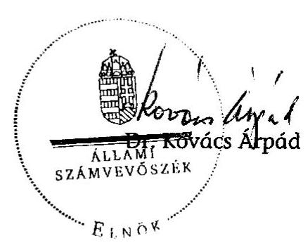

---

# MELLÉKLETEK

---

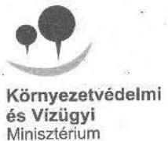

Környezetvédelmi és Vízügyi Minisztérium

Ikt. szám: VGF-180/15/2009. Hiv. sz.: V-2005-088/2009.

Dr. Kovács Árpád úr
elnök

Állami Számvevőszék

Budapest
Apáczai Csere János u. 10.
1052

Tisztelt Elnök Úr!

Köszönettel vettem a Kohéziós Alapból és hazai forrásokból finanszírozott kiemelt szennyvíztisztítási projektek megvalósításának ellenőrzéséről szóló jelentés-tervezetüket, amelyre észrevételt nem teszek.

A jelentés készítése során tapasztalt együttműködési készségüket megköszönve kérem válaszom szíves elfogadását.

Üdvözlettel:

Szabó Imre

1011 Budapest, Fő utca 44-50.
1394 Budapest, Pf. 351.

e-mail: miniszter@mail.kvvm.hu
EZ ÚJRAHASZNOSÍTOTT LEVÉLPAPÍR!

telefon: 457 3300
telefőz: 201 2361

---

V-2005-089/2009 8868/2009.
1/b. sz. melléklet
a V-2005-091/2009. sz. jelentéshez
1756/09.

NEMZETI FEJLESZTÉSI ÉS GAZDASÁGI MINISZTÉRIUM
MINISZTÉR

Iktatószám: NFGM/10037/ 5 /2009

dr. Kovács Árpád
Elnök Úr részére

Állami Számvevőszék

Budapest
Apáczai Csere János u. 10.
1052

Tisztelt Elnök Úr!

Köszönettel vettem a „Kohéziós Alapból és hazai forrásokból finanszírozott
kiemelt szennyvíztisztítási projektek megvalósításának ellenőrzéséről" készített
jelentést.

Az ellenőrzési jelentésben megfogalmazott megállapításokra észrevételt nem
kívánok tenni.

Végezetül köszönöm, hogy munkájukkal hozzájárultak a minisztérium
eredményesebb működéséhez.

Budapest, 2009. november „őo „

Üdvözlettel:

Varga István

1055 Budapest, Szemere u. 6. • postacím: 1880 Budapest, Pf. 111. • e-mail: miniszter@nfgm.gov.hu • telefon: +36 1 374 2713 • telefax: +36 1 269 3485

---

# A Csatlakozási Szerződésben meghatározott kötelezettségek

|  A Csatlakozási Szerződésben meghatározott kötelezettségek | 91/271/EGK irányelv szerinti határidő | Derogáció szerinti határidő  |
| --- | --- | --- |
|  10000 lakos egyenértéknél nagyobb terhelést meghaladó szennyvíz kibocsátású, külön jogszabály által kijelölt érzékeny területeken biztosítani kell a szennyvízgyűjtő rendszer kiépítését és a biológiai (II. fokozatú) szennyvíztisztítás mellett a III. fokozatú tisztítást, azaz a tápanyag (nitrogén és foszfor) eltávolítást; | 1998. december 31. | 2008. december 31.  |
|  15000 lakos egyenérték terhelést meghaladó szennyvíz kibocsátású szennyvízelvezetési agglomerációt el kell látni szennyvízgyűjtő rendszerrel és legalább biológiai (II. fokozatú) szennyvíztisztító teleppel; | 2000. december 31. | 2010. december 31.  |
|  2000-15 000 lakos egyenérték terheléssel jellemezhető szennyvíz kibocsátású szennyvízelvezetési agglomerációban meg kell oldani a szennyvízgyűjtő rendszer kiépítését é s a legalább biológiai (II. fokozatú) szennyvíztisztítást; | 2005. december 31. | 2015. december 31.  |
|  2000 lakos egyenérték terhelés alatt olyan gyűjtőrendszer, amelyhez nem csatlakozik tisztító telep, nem fordulhat elő. | 2005. december 31. | Nem volt derogáció.  |
|  A nem települési szennyvíztisztító hálózatba vezetett élelmiszeripari üzemek szennyvízének megfelelő tisztítást kell biztosítani a befogadó vizekbe való kibocsátás előtt a 4000 LE feletti területeken. | 2000. december 31. | 2008. december 31.  |

---

| A Kohéziós Alap Keretstratégia célkitűzései | Határidő |
| :-- | :-- |
| Az 50000 lakos egyenérték feletti, és a meghatározott érzékeny területeken található agglomerációk csatorná-   zása és szennyvízkezelése; | 2008. december 31. |
| A főváros és a megyei jogú városok, illetve agglomerációik csatornázása és szennyvízkezelése; | 2010. december 31. |
| A fenti kategóriákba nem eső, 50000 LE feletti agglomerációk csatornázása és szennyvízkezelése; | 2010. december 31. |

---

Csatornahálózat és szennyvízkezelés helyzete Magyarország megyei jogú városaiban 1999-2000-ben

| Megyei jogú vá-   rosok | Lakosság   (1000) | A közcsatorna   hálózat hossza   (km) | Bekötött laká-   sok száma | Meglévő   szennyvíz-   kezelési   kapacitás   (1000 m/nap) | Szennyvíz-kezelési   kapacitás (célzott)   (1000 m/nap-LE) |
| :-- | --: | --: | --: | --: | --: |
| Budapest | 1861 | 4228,3 | 741000 | 212 B | 498 K- 3960000 |
| Békéscsaba | 64 | 217,7 | 13734 | 28 B | 28 K- 212800 |
| Debrecen | 207 | 267,3 | 56146 | 80 M (40 B) | $60 \mathrm{~B}-573500$ |
| Dunaújváros | 60 | 128,8 | 20227 |  | $20 \mathrm{~B}-65000$ |
| Eger | 58 | 233,2 | 19487 | 22 B | $20 \mathrm{~B}-62000$ |
| Győr | 128 | 242,0 | 42069 | 120 M | $60 \mathrm{~B}-350300$ |
| Hódmezővásárhely | 49 | 63,3 | 6650 | 15 B | $15 \mathrm{~B}-90500$ |
| Kaposvár | 67 | 118,0 | 19274 | 20 B | $40 \mathrm{M} / 25 \mathrm{~B}-54100$ |
| Kecskemét | 105 | 239,0 | 19712 | 48 B | $48 \mathrm{M} / 28,8 \mathrm{~B}-235000$ |
| Miskolc | 176 | 664,5 | 61584 | $140 \mathrm{M} / 70 \mathrm{~B}$ | $70 \mathrm{~B}-269700$ |
| Nagykanizsa | 52 | 93,3 | 15226 | 20 B | $25 \mathrm{~B}-85000$ |
| Nyíregyháza | 113 | 324,8 | 27593 | 40 B | $40 \mathrm{~K}-150000$ |
| Pécs | 160 | 506,4 | 54981 | 45 B | $45 \mathrm{~B}-237300$ |
| Salgótarján | 45 | 144,8 | 13981 | 10 B | $15 \mathrm{~K}-64400$ |
| Sopron | 54 | 137,3 | 17561 | 18 B | $20 \mathrm{~K}-148500$ |
| Szeged | 160 | 303,8 | 47236 | - | $60 \mathrm{~B}-240400$ |
| Szekszárd | 35 | 171,5 | 11998 | 18,2 B | $18,2 \mathrm{~K}-74400$ |
| Székesfehérvár | 106 | 321,3 | 32500 | 40 B | $47.5 \mathrm{~B}-209500$ |
| Szolnok | 78 | 277,7 | 23695 | 32 B | $32 \mathrm{~B}-160000$ |
| Szombathely | 83 | 195,3 | 27394 | 45 B | $53 \mathrm{M} / 45 \mathrm{~B}-200700$ |
| Tatabánya | 72 | 138,4 | 23889 | 24 K | $16 \mathrm{~K}-86900$ |
| Veszprém | 63 | 176,9 | 18067 | 17,2 B | $24 \mathrm{~K}-130500$ |
| Zalaegerszeg | 61 | 228,9 | 15101 | 28 K | $20 \mathrm{~K}-159300$ |
| M: mechanikai kezelés, B: biológiai kezelés, K: kémiai kezelés |  |  |  |  |  |

A csatornahálózatba bekötött háztartások számának egyenletes növelése érdekében a 25/2002 (II. 27.) ${ }^{1}$ rendeletben a kormány elfogadta a Nemzeti Települési Szennyvíz-elvezetési és tisztítási Megvalósítási Programot, amely a fejlesztést célzó intézkedések alapját teremti meg.

Forrás: Kohéziós Alap Keretsratégia

[^0]
[^0]:    ${ }^{1}$ A csatlakozási tárgyalások során a Tanácsnak átadott Megvalósítási Program az 1998. december 31-ei állapot szerinti számokat tartalmazott. A fenti rendeletben meghatározott felülvizsgálati kötelezettségek miatt a 2000. december 31-ei alapszámok tekintendők irányadónak.

---

# Az ISPA/KA stratégia által érintett nagyvárosok (és agglomerációik) 2000-2006 között 

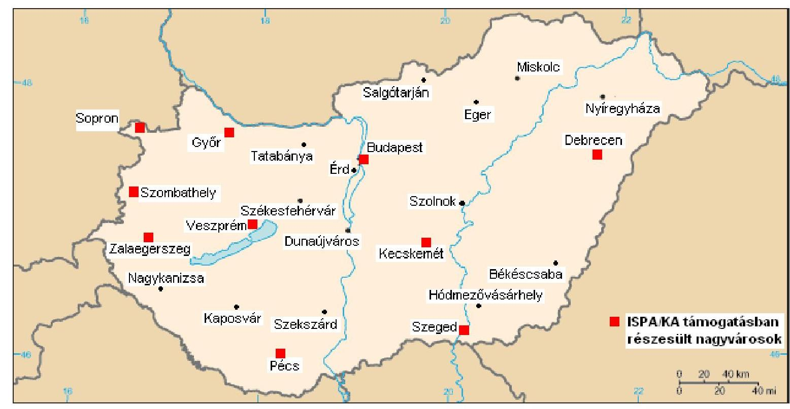

---

# Települési szennyvizekre vonatkozó irányelvek programja és teljesítésének helyzete az 50000 LE feletti agglomerációkban, illetve a fővárosban, a megyei jogú városokban és agglomerációikban 2009. augusztus 31-i állapot szerint

|  $\begin{aligned} & \text { S } \ & \text { sz. } \end{aligned}$ | Város | Csatornázottsági arány növelése |  | Központi
SZTT-hoz
csatlakozó
települések | Szennyvíz-
tisztítás | Iszap-
kezelés | Projekt forrása  |
| --- | --- | --- | --- | --- | --- | --- | --- |
|   |  | Kiind.
2002. | Cél
2010. |  |  |  |   |
|   |  | \% | \% |  |  |  |   |
|  $1 / a$ | Budapest
(dél-budai régió
kivételével) | 92 | 92 |  |  |  | KA  |
|  $1 / b$ | Dél-Budai régió | - | - |  |  |  | KEOP-KA
Korábbi KA pályázat elvetve, más műszaki változatban valósul meg. (Mint önálló agglomeráció megszűnt 2009 áprilisában.)  |
|   | Bp. XXII. ker. | 58,6 | 90 |  |  |  |   |
|   | Bp. XXI. ker. | 75,7 | 90 |  |  |  |   |
|   | Érd | 16,9 | 80 |  |  |  |   |
|   | Diósd | 42,5 | 80 |  |  |  |   |
|   | Tárnok | 34,8 | 80 |  |  |  |   |
|   | Sóskut | 0,0 | 80 |  |  |  |   |
|   | Budaörs | 77,6 | 83,1 |  |  |  |   |
|  2. | Békéscsaba | 52 | 100 |  | Fejlesztés és rekonstrukció | Fejlesztés | KA  |
|   | Fényes | 0 | 100 | $x$ |  |  |   |
|   | Gerla | 0 | 100 |  |  |  |   |
|   | Mezőhegyer | 0 | 100 |  |  |  |   |

---

|  3. | Debrecen | 73 | 92 |  | Felújítás és új
telep építése | Felújítás |   |
| --- | --- | --- | --- | --- | --- | --- | --- |
|   | Ebes | - | - | x |  |  |   |
|   | Pallag | 46 | 92 |  |  |  |   |
|   | Józsa | 32 | 92 |  |  |  |   |
|   | Ebes | 24 | 90 |  |  |  |   |
|   | Hajdúsámson | 10 | 100 |  |  |  |   |
|  4. | Dunaújváros | 94 | 95 |  | Fejlesztés | Fejlesztés | A szennyvíztisztító telep 2003-ban
került átadásra, a tisztító megfelelően
működik. Az agglomerációba tartozó
települések csatornázása II. ütemének
fejlesztésére KEOP-KA pályázat
készítése van folyamatban.  |
|   | Mezőfalva | - | - |  |  |  |   |
|   | Nagyvenyim | - | - | x |  |  |   |
|   | Baracs | - | - |  |  |  |   |
|   | Kisapostag | - | - |  |  |  |   |
|  5. | Eger | 55,7 | 90 |  |  |  | Jelenleg nincs fejlesztés, illetve
bővítés. Távlati cél az iszapvonal
fejlesztése  |
|   | Egerbakta | - | - |  |  |  |   |
|   | Egerszalók | - | - | x |  |  |   |
|   | Egerszólát | - | - |  |  |  |   |
|   | Felsőtárkány | - | - |  |  |  |   |
|   | Novaj | - | - |  |  |  |   |
|   | Ostoros | - | - |  |  |  |   |
|  6. | Érd | 16,9 | 80 | x |  |  | KEOP-KA
pályázatot nyert (korábban a Dél-
Budai projekt része volt).  |
|  7. | Győr | 85 | 85 |  |  |  |   |
|   | Abda | 54 | 100 | x |  |  |   |
|   | Börcs | 46 | 100 | x |  |  |   |
|   | Pinnyéd | 0 | 100 |  |  |  | ISPA
(előtte PHARE pályázatra volt
előkészítve)  |
|   | Újváros | 74 | 100 |  |  |  |   |
|   | Sáráspuszta | 0 | 100 |  |  |  |   |
|   | Rábakert | 0 | 100 |  |  |  |   |
|   | Ikrény | 100 | 100 | x |  |  |   |
|   | Rábapatona | 100 | 100 | x |  |  |   |

---

|  8. | Hódmezővásárhely | 77,54 | 100 |  | Fejlesztés és rekonstrukció | Fejlesztés | KEOP-KA
Készül a második fordulós pályázati anyag  |
| --- | --- | --- | --- | --- | --- | --- | --- |
|  9. | Kaposvár | 88 | 100 |  |  |  | Az iszapvonal fejlesztése a jövőben várható.  |
|   | Taszár |  |  | $x$ |  |  |   |
|   | Somogyjád |  |  |  |  |  |   |
|   | Várda |  |  |  |  |  |   |
|   | Magyaregres |  |  |  |  |  |   |
|   | Somogyaszaló |  |  |  |  |  | Somogyaszaló Antal major településrésze 2007-2008-ban készült el.  |
|   | Kaposvár-
Töröcske
városrész |  |  |  |  |  | Üzembe helyezés 2008-ban.  |
|   | Simonfa |  |  |  |  |  |   |
|   | Zselicszentpál |  |  |  |  |  |   |
|   | Zselickislak |  |  |  |  |  |   |
|   | Magyaratád |  |  |  |  |  |   |
|   | Mernye |  |  |  |  |  |   |
|   | Orci |  |  |  |  |  |   |
|   | Patalom |  |  |  |  |  |   |
|   | Somogyaszaló-
Antalmajor
településrész |  |  |  |  |  |   |
|   | Zimány |  |  |  |  |  |   |
|   | Kaposszerdahely, Sántos és Szentbalázs |  |  |  |  |  | Készül a 2. fordulós dokumentáció.  |

---

|  10. | Kecskemét | 78 | 99 |  |  |  |  |   |
| --- | --- | --- | --- | --- | --- | --- | --- | --- |
|   | Kerekegyháza | 78 | 99 | x |  |  |  |   |
|   | Hetényegyháza | 78 | 99 |  |  | Automatika és monitoring és irányító rendszer fejlesztése | Komposz-
tálás | ISPA  |
|   | Ballószög | 0 | 95 | x |  |  |  |   |
|   | Helvécia | 0 | 95 | x |  |  |  |   |
|   | Kadafalva | 23 | 96 |  |  |  |  |   |
|   | Katonatelep | 0 | 95 |  |  |  |  |   |
|  11. | Miskolc | 98 | $100+$
rekonstr. |  |  | Fejlesztés | Fejlesztés |   |
|   | Alsózsolca |  |  | x |  |  |  |   |
|   | Arnót |  |  |  |  |  |  |   |
|   | Bükkszentkeresz
t |  |  |  |  |  |  | KEOP-KA pályázat nem nyert, a pályázat átdolgozása folyamatban van.  |
|   | Felsőzsolca |  |  |  |  |  |  |   |
|   | Kistokaj |  |  |  |  |  |  |   |
|   | Mályi |  |  |  |  |  |  |   |
|   | Nyékládháza |  |  |  |  |  |  |   |
|   | Szirmabesnyő |  |  |  |  |  |  |   |
|  12. | Nagykanizsa | 85 | 100 |  |  | Fejlesztés rothasztó | Kezelés | KEOP-KA  |
|   | Nagyrécse | 46 | 56 | x |  |  |  |   |
|  13. | Nyíregyháza | - | - |  |  |  | Komposz-
tálás | KEOP-KA  |
|   | Borbánya | 51 | 100 | x |  |  |  |   |
|   | Kistelkiszőlős | 17 | 100 |  |  |  |  |   |
|   | Oros | 18 | 100 |  |  |  |  |   |
|   | Rozsrétszőlő | 0 | 100 |  |  |  |  |   |
|  14. | Pécs | 81 | 100 |  |  |  |  | ISPA  |

---

|  15. | Salgótarján | 62 | 96,4 | x | Fejlesztés | Fejlesztés | KAC: 24,8 \%
KHVM tám.:24,8 \%
Decentr. KAC: $5 \%$
TRFC: 6,6 \%
Saját erő: 38,8 \%  |
| --- | --- | --- | --- | --- | --- | --- | --- |
|   | Vizslás
(Újlakpuszta) |  |  |  |  |  |   |
|   | Kazár |  |  |  |  |  |   |
|   | Mátraszele |  |  |  |  |  |   |
|   | Somoskőújfalu |  |  |  |  |  |   |
|  16. | Sopron | 90 | 93 |  |  |  | ISPA  |
|  17. | Szeged | 69 | 100 |  |  |  | ISPA  |
|  18. | Szekszárd | 90 | 100 |  | Fejlesztés | Fejlesztés | KEOP-KA
Készül a második fordulós pályázat.  |
|  19. | Székesfehérvár | 85 | 100 |  |  |  | KEOP-KA  |
|   | Zichyújfalu | 0 | 100 | x |  |  |   |
|   | Csór | 0 | 10 | x |  |  |   |
|  20. | Szolnok és térsége | - | - |  | III. fokozatú tisztítás | Komposztálás | A szükséges fejlesztéseket saját erőből kívánják megoldani.  |
|  21. | Szombathely | 92 | 96 | - | - | Komposztálás | ISPA  |
|  22. | Tatabánya | - | - |  | Fejlesztés | Fejlesztés | KEOP-KA 1.2.0 készül a második fordulós pályázati anyag.  |
|  23. | Veszprém | 86 | 100 |  | Kapacitásbővítés |  | KA
Előtte hazai kiemelt támogatás.  |
|   | Hajmáskér | 100 | 100 | x |  |  |   |
|   | Nemesvámos | 100 | 100 |  |  |  |   |
|   | Veszprémfajsz | 100 | 100 |  |  |  |   |
|   | Szenkirályszab | 60 | 100 |  |  |  |   |
|  24. | Zalaegerszeg | 70 | 96 |  |  |  | ISPA  |
|   | Petőhenye | 0 | 100 |  |  |  |   |

Forrás: KvVMFI (uniós projektek vonatkozásában), KvVM (hazai programok vonatkozásában)

---

# A gyüjtőrendszerek elméleti célállapotára a KvVM által meghatározott adatok

|   | Csatornázottság
(bekötöttség)
aránya (\%) | Csatornával lefedett (kiszolgált)
területen élők aránya
$\%$ | Nem csatornázott területen lévő
lakások aránya
$\%$  |
| --- | --- | --- | --- |
|  Főváros | 100 | 100 | 0  |
|  Megyei jogú város | 90 | 95 | 5  |
|  Város | 85 | 90 | 10  |
|  Nagyközség | 80 | 85 | 15  |
|  Község | 65 | 70 | 30  |

Forrás: KvVM, Szennyvízprogram készítése során használt adatai (amennyiben nem állt rendelkezésre konkrét adat az adott települési gyűjtőrendszer célállapoti csatornázottságáról, akkor ezeket az adatokat használták célállapotként).

---

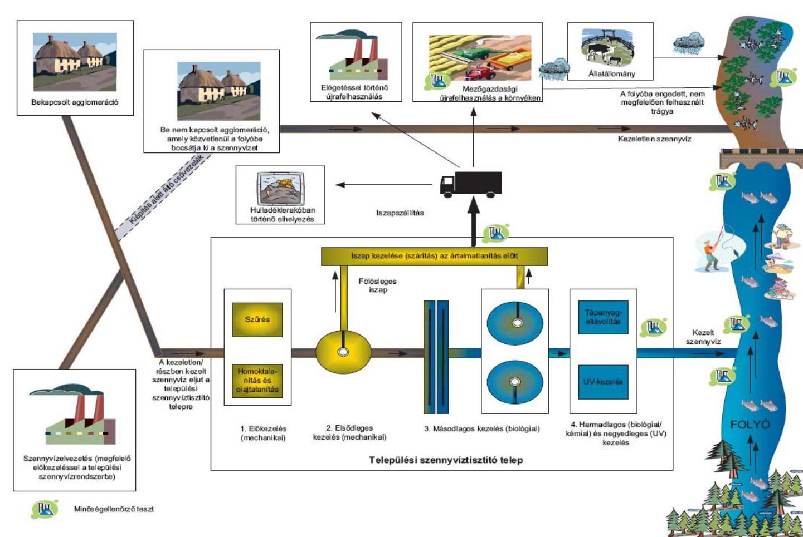

# A települési szennyvíz kezelésének folyamat ábrája

## 3. sz. melléklet

### A települési szennyvíz kezelésének folyamat ábrája

- **Be nem kapcsolt agglomeráció**
- **A hívóba alapulatt**
- **A kiszellíten szennyvíz**

### A települési szennyvíz kezelésének folyamat ábrája

- **Be nem kapcsolt agglomeráció**
- **A hívóba alapulatt**
- **A kiszellíten szennyvíz**

### Szemvíráznezelés (meghívott előkezelésre) a települési szennyvíznezdszerűs

- **1. Előkezelés (mechanikai)**
- **2. Elsőthejes kezelés (mechanikai)**
- **3. Másodheges kezelés (bízógiai)**
- **4. Hermedleges (bízógiai) felmikás és nagysideges (UV) kezelés**

### Települési szennyvízisztító telep

- **1. Előkezelés (mechanikai)**
- **2. Elsőthejes kezelés (mechanikai)**
- **3. Másodheges kezelés (bízógiai)**
- **4. Hermedleges (bízógiai) felmikás és nagysideges (UV) kezelés**

Forrás: Európai Számvevőszék

---

# Teljesítménymutatók és a hozzá tartozó kritériumok a szennyvízkezelésre Kohéziós Alapból és hazai forrásból nyújtott támogatások hasznosulásának értékeléséhez 

| Vizsgálati kérdések | Kritériumok és teljesítménymutatók | Adatforrások |
| :--: | :--: | :--: |
| A Kohéziós Alap társfinanszírozásával megvalósuló szennyvízkezelési projektek eredményesen és hatékonyan szolgálták-e a magyar szennyvízkezelési célok megvalósítását és az EU, valamint a hazai támogatások hasznosulását? |  |  |
| 1. A szennyvízkezelési feltételrendszer kialakítása lehetővé tette-e a célrendszer teljesítését? |  |  |
| 1.1 Kialakították-e az uniós követelményekhez illeszkedő hazai szennyvízkezelési stratégiát? | Az uniós irányelvekben a tagállamokkal szemben támasztott követelményeket teljesítő stratégiák megléte | Csatlakozási Szerződés derogációi, Nemzeti ISPA Stratégia, Nemzeti Környezetvédelmi Program I-II., Kohéziós Alap Keretstratégia, Országos Fejlesztéspolitikai Koncepció |
| 1.1.1. Megteremtették-e a Kohéziós politika keretében a szennyvízkezelés társfinanszírozását biztosító uniós alapok stratégiái és a releváns hazai stratégia összhangját? | A célkitűzések koherenciája | Vonatkozó nemzeti stratégiai dokumentumok (Nemzeti ISPA, KA Keretstratégia, Magyarország Nemzeti Települési Szennyvízelvezetési és tisztítási Megvalósítási Programja) |
| 1.1.2. Megfelelő-e a szennyvízkezelésre vonatkozó uniós előírások, kötelezettségek teljesítési üteme? | Tervezett és tényleges állapot összevetése | Nemzeti Települési Szennyvízelvezetési és tisztítási Megvalósítási Program; KvVM statisztika, jelentések |
| 1.2. Kialakították-e a települési szennyvízkezelés EU harmonizált jogi szabályozási és intézményi környezetét időben és teljes körűen? | A szennyvízelvezetés és tisztítás EU konform jogszabályi környezete és az azt végrehajtó intézményrendszer | Hazai és uniós szabályozás. |
| 1.2.1. Kialakították-e a szennyvízkezelési projektek EU harmonizált jogi szabályozási környezetét? | A szennyvízelvezetés és tisztítás EU konform jogszabályi környezete | Hazai és uniós szabályozás. |
| 1.2.2. A megvalósítás szervezeti kerete illeszkedik-e az ellátandó feladathoz? | Az intézményrendszer hatékonysága, célkitűzések elérésében játszott szerepe | Nem jogszabály jellegű hazai előírások, múködési kézikönyvek, egyéb szabályzatok, SZMSZ-ek, együttmúködési megállapodások, alapítói okiratok |
| 1.3. Biztosította-e a hazai és uniós források tervezett (finanszírozási) üteme a hazai szennyvízkezelési stratégia végrehajtását? | Az elfogadott stratégiák ütemterve és az éves költségvetési törvényekben rendelkezésre bocsátott források különbsége | Stratégiák, éves költségvetések |

---

| 2. A Kohéziós Alap társfinanszírozásával megvalósuló szennyvízkezelési projektek eredményesen és hatékonyan szolgálják-e a kitüzött célok megvalósítását? |  |   |
| --- | --- | --- |
|  2.1 Figyelembe vették-e a projektjavaslatok előkészítésében és a benyújtott pályázatokban a műszaki, a gazdasági és a társadalmi szempontokat? | Projekt mérete megfelelő-e: lakosságszám, agglomeráció szempontjából, az EU előírásoknak
A tervezett műszaki megoldás megfelel-e a projekt méretének
A pályázatban tervezett díjak tartalma/a tervezett fejlesztési költségek / üzemeltetési költségek tartalmához képest
A társadalmi egyeztetés folyamán közzétett információk/a pályázatban foglaltakhoz képest | Pályázati dokumentumok  |
|  2.2 Megvalósult-e a pályázati dokumentumokban, a Pénzügyi Megállapodásokban és a Támogatási Szerződésekben meghatározott időtervek, pénzügyi és műszaki tartalmak összhangja? |  |   |
|  2.2.1. Egyértelműen rögzítettek-e az egyes dokumentumokban a célok és a hozzájuk rendelt output, eredmény és hatásmutatók, a források, a jogok és kötelezettségek, valamint a megfelelő biztosítékok? | Pályázati dokumentációban foglalt vállalások, kötelezettségek*/Pénzügyi Megállapodásban foglaltakhoz képest
Pályázati dokumentációban foglalt vállalások, kötelezettségek*/Támogatási szerződésben foglaltakhoz képest
*naturális mutatók, pénzügyi terv, időterv tekintetében | Pályázat, Pénzügyi Megállapodás, Támogatási Szerződés és azok módosításai  |
|  2.2.2. Az esetleges szerződésmódosítások hatottak e a projekt eredményességére? | Megvalósítási ütemterv, Költségek,   Múszaki tartalom szempontjából | Eredeti szerződés és a módosítások  |
|  2.3 Vizsgálták-e a projektek tervezett célrendszer szerinti megvalósulását, a rendelkezésre álló erőforrások hatékony és eredményes felhasználását? |  |   |
|  2.3.1 A beruházások megvalósítása megfelelte Pénzügyi Megállapodásokban és a Támogatási Szerződésekben foglalt pénzügyi ütemezésnek? | A projekt tervezett támogatható költsége/módosított támogatható költség/ tényleges támogatható költséghez képest
A projekt tervezett támogatható költségeinek ütemterve /módosított támogatható költségek ütemtervéhez/ tényleges támogatható költségek ütemtervéhez képest | Pályázat, Pénzügyi Megállapodás, Támogatási Szerződés és azok módosításai  |
|  2.3.2. A beruházások műszaki tartalma (mennyiségileg) összhangban volt-e a Pénzügyi Megállapodásban és a Támogatási Szerződésben foglaltakkal? | Tervezett létesítmények/ ténylegesen megvalósult létesítmények | Pályázat, Pénzügyi Megállapodás, Támogatási Szerződés és azok módosításai  |

---

# 3. Érvényesültek-e az üzemeltetés során az EU alapelvei, különös tekintettel a fenntarthatóságra és a „szennyező fizet" elvre? 

3.1 Érvényesült-e az üzemeltető kiválasztása során a versenysemlegesség elve?
3.1.1 Érvényesült-e az üzemeltető kiválasztása során a versenysemlegesség elve az újonnan létrehozott létesítmények esetében?

A közbeszerzési szabályok alkalmazásának vagy mellőzésének körülményei és az erre vonatkozó szabályok viszonya;

A tényleges kiválasztás szempontjai és a közbeszerzési szabályok viszonya.

Üzemeltetési szerződés, üzemeltetési szerződés megkötés dokumentumai;

Pályázati kiírások, bontási jegyzőkönyvek, értékelések, a döntést tartalmazó jegyzőkönyvek és mindezek közzétételi dokumentumai, KBT dokumentumai
3.1.2. Érvényesült-e a kiválasztás során a versenysemlegesség elve a már meglévő létesítmények bővítése, rekonstrukciója tekintetében?

A közbeszerzési szabályok alkalmazásának vagy mellőzésének körülményei és az erre vonatkozó szabályok viszonya

Üzemeltetési szerződés, üzemeltetési szerződés megkötés dokumentumai
3.2 Teljesül-e a fenntarthatóság elve a megvalósult létesítmények üzemeltetése során, ideértve a díjpolitikát, a „,szennyező fizet" elvét és a lakosság terhelhetőségét?
3.2.1. Érvényesült-e a pénzügyi fenntarthatóság elve az újonnan létrehozott létesítmények esetében?

A tényleges vagyonkezelői jogok gyakorlása és az ellátási feladatok viszonya

Tényleges árképzés gyakorlata és a fenntarthatóságot biztosító forrás viszonya

Vagyonkezelői megállapodások
A Vizgazdálkodásról szóló 1995. évi LVII. tv.

A Pályázat, az FM és módosításainak részét képező gazdaságossági számítás

A tényleges múködés során készített árkalkulációk
3.2.2. Érvényesült-e a pénzügyi fenntarthatóság elve a már meglévő létesítmények bővítése, rekonstrukciója tekintetében?

Tényleges árképzés gyakorlata és a fenntarthatóságot biztosító forrás viszonya

A Pályázat, az FM és módosításainak részét képező gazdaságossági számítás

A tényleges múködés során készített árkalkulációk
4. Eredményesen müködnek-e a Kohéziós Alap társfinanszírozásával megvalósult szennyvíztisztító létesítmények?
4.1 Az előírásoknak megfelelően üzemelnek-e a szennyvíztisztító telepek?

A tisztító telepek a hatósági engedélyeknek megfelelően müködnek-e

Hatósági engedélyek

---

| 4.2 Megfelelő teljesítménnyel múködnek-e a szennyvíztisztító telepek? |  |  |
| :--: | :--: | :--: |
| 4.2.1. Megfelelő-e a telepek kapacitás kihasznált, sága figyelemmel az esetleges elmaradásokra is? | A telep „beépített", névleges kapacitása 50\% felett legyen Csatornázással érintett/ténylegesen bekötött ingatlanok   Tervezett kapacitás/"beépített" kapacitás/tisztítótelepre beérkezett szennyvíz   Agglomerációban értékesített ivóvíz mennyisége   Ipari szennyezők által termelt szennyvíz mennyisége, minősége, esetleges üzemzavarok hatásai, annak jelzése a tisztítótelepnek | Projektdokumentum,   Területi vízközmű társulás, kedvezményezett beszámolói   Hatástanulmányban ismertetett ingatlanszám/Üzemeltetővel megkötött egyéni szerződések száma   projektdokumentum, hatósági engedély/kedvezményezett, közmútársulás beszámolói   Területi víziközmú társulás, kedvezményezett beszámolói   Ipari szennyezők szerződései, hatósági és egyéb ellenőrzések, bírságok |
| 4.2.2. Megfelelő-e a telepek által a befogadóba bocsátott tisztított víz minősége figyelemmel az estleges elmaradásokra is? | Tényleges kémiai mutatók/EU, hazai határértékek viszonya | Önellenőrzések, hatósági mérések, a szennyvíztisztító telep átadása, próbaüzeme előtti vízmínőségi adatok |
| 4.2.3. Megfelelő-e a telepek teljesítményének monitorozása? | A befogadó, a tisztítás előtti és utáni víz minőségének mérési gyakorisága/előírt mérések száma, a mért adatok alkalmassága a monitorozásra | Önellenőrzés, hatósági jegyzőkönyvek, ipari szennyező vizének adatai |
| 4.3 Az uniós és a hazai előírásoknak megfelelő-e a keletkezett szennyvíziszap elhelyezése és ártalmatlanítása? | Lerakásra, ártalmatlanításra kerülő iszap mennyisége, minőségi jellemzői, hasznosított mennyiség a hatástanulmányban és ténylegesen, a hasznosítás formái a vonatkozó EU irányelvekben foglaltakhoz képest | Projektdokumentum, tisztítótelep engedélyezési okmánya, az értékesítés/lerakás dokumentumai,   Az EU 91/271/EGK, a 86/278/ECC, és a 75/442/EGK irányelvei |

---

# A helyszíni ellenőrzésre kijelölt projektek kedvezményezettjei és azok víziközmú szolgáltatói 

| Projektek száma | Kedvezményezett | Közszolgáltató |
| :--: | :--: | :--: |
| 2000/HU/16/P/PE/003 | Szeged Megyei Jogú Város Önkormányzata | Szegedi Vízmú Zrt |
| 2001/HU/16/P/PE/011 | Sopron Megyei Jogú Város Önkormányzata | Sopron és Környéke Víz-és Csatornamú Zrt. |
| 2003/HU/16/P/PE/019 | Kecskemét Megyei Jogú Város Önkormányzata | BÁCSVÍZ Észak-Bács-Kiskun Megyei Víz-és Csatornamüvek Zrt |
| 2004HU/16/C/PE/003 | Veszprém és Térsége Szennyvízelvezetési-és kezelési Önkormányzati Társulás | Bakonykarszt Zrt. |
| 2000/HU/16/P/PE/001 | Győr Megyei Jogú Város Önkormányzata | "PANNON-VÍZ" Víz-Csatornamú és Fürdő Zrt. |
| 2003/HU/16/P/PE/021 | Szombathely Megyei Jogú Város | VASVÍZ Zrt. |

---

6. számú melléklet
a V-2005-091/2009. sz. jelentéshez

A szennyvízkezelés helyzetének változása régiónként Európában, 1990-2005. között

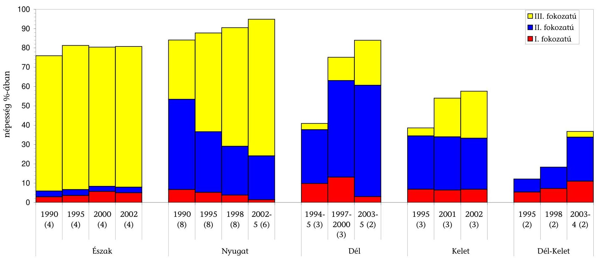

forrás: Európai Környezetvédelmi Ügynökség által működtetett Települési Szennyvízkezelési Adabázis (Urban Waste Water Treatment Database)
Megjegyzés: Csak azok az országok, amelyek erre a periódusra vonatkozóan adatot szolgáltattak
Észak: Norvégia, Svédország, Finnország
Nyugat: Ausztria, Dánia, Anglia/Wales, Hollandia, Németo., Svájc, Írország, Belgium
Dél: Görögo., Spanyolo.,Portugália
Kelet: Észto., Magyaro., Lengyelo.
Dél-Kelet: Bulgária, Töröko.

---

A települési önkormányzatok szennyvízközmú fejlesztési támogatásainak alakulása, 2000-2008. között (országos adatok)

|  Alap, előirányzat megnevezése |  | 2000 | 2001 | 2002 | 2003 | 2004 | 2005 | 2006 | 2007 | 2008 | Összesen 20002008 | Támogatás aránya  |
| --- | --- | --- | --- | --- | --- | --- | --- | --- | --- | --- | --- | --- |
|  1. | ISPA/KA | 21,1 | 13,0 |  | 38,2 | 132,0 |  |  |  |  | 204,3 | 34,5\%  |
|  2. | KIOP |  |  |  |  | 14,2 |  |  |  |  | 14,2 |   |
|  3. | ÚMFT/Regionális OP-ok |  |  |  |  |  |  |  |  | 2,3 | 2,3 |   |
|  4. | KEOP |  |  |  |  |  |  |  | 1,6 | 41,3 | 42,9 |   |
|  5. | PHARE | 0,4 | 0,8 |  |  |  |  |  |  |  | 1,2 |   |
|  6. | INTERREG |  |  |  |  |  | 0,8 | 1,0 |  |  | 1,8 |   |
|   | Összesen uniós tám.+köt.kvi-i társfinansz. | 21,5 | 13,8 | 0,0 | 38,2 | 146,2 | 0,8 | 1,0 | 1,6 | 43,6 | 266,7 | 45,1\%  |
|  6. | Céltámogatás | 44,2 | 66,9 | 56,2 | 22,6 | 10,7 | 9,0 | 11,3 | 0,3 |  | 221,2 |   |
|  7. | Címzett támogatás |  | 0,1 | 1,0 | 2,6 | 10,9 | 9,9 | 5,0 |  |  | 29,5 |   |
|  8. | EU Önerő Alap |  |  |  |  | 0,6 | 1,9 | 0,2 |  | 0,8 | 3,5 |   |
|  9. | KAC | 16,1 | 7,4 | 4,8 |  |  |  |  |  |  | 28,3 |   |
|  10. | VICE | 1,2 | 3,3 | 2,0 |  |  |  |  |  |  | 6,5 |   |
|  11. | TEKI | 1,3 | 1,3 | 0,6 | 1,1 |  |  |  |  |  | 4,3 |   |
|  12. | TFC | 0,5 | 0,1 | 0,3 | 0,3 |  |  |  |  |  | 1,2 |   |
|  13. | CÉDE | 0,1 | 0,3 | 0,2 | 0,4 |  |  |  |  |  | 1,0 |   |
|  14. | Kiemelt városok támogatása | 1,5 | 2,0 | 3,5 | 1,3 |  |  |  |  |  | 8,3 |   |
|  15. | Kormányzati beruházások (Balatonnal kapcsolatosan) |  |  |  | 1,0 | 1,9 | 0,7 | 1,4 | 0,7 | 0,2 | 5,9 |   |
|  16. | KÖVICE |  |  |  |  | 7,0 | 5,9 | 1,6 | 0,5 | 0,1 | 15,1 |   |
|   | Összesen tisztán hazai támogatás | 64,9 | 81,4 | 68,6 | 29,3 | 31,1 | 27,4 | 19,5 | 1,5 | 1,1 | 324,8 | 54,9\%  |
|   | Mindösszesen támogatás | 86,4 | 95,2 | 68,6 | 67,5 | 177,3 | 28,2 | 20,5 | 3,1 | 44,7 | 591,5 | 100,0\%  |

Adatforrás: a 2000-2002. évi adatok a Magyar Államkincstár Rt.-től, a 2003-2008. évi adatok az NFÜ-től, a KvVM-től és az ÖM-től származnak.

---

# AZ ISPA/KA szennyvízkezelési projektek megtakarításai, szabad pénzeszközei 2009. június 30-i állapot szerint

adatok ezer Ft-ban használt árfolyam: 260 Ft/euró

|  A projekt száma | A projekt címe | Megtakarítás, szabad pénzeszköz (e Ft) | Megtakarítás, szabad pénzeszköz keletkezésének forrása | Megtakarítás, szabad pénzeszköz felhasználása, új projekt elemek | Projektben keletkezett megtakarítás, szabad pénzeszköz 2010. dec. 31-ig történő felhasználhatósága kockázatos-e |  |   |
| --- | --- | --- | --- | --- | --- | --- | --- |
|   |  |  |  |  |  | Igen | Nem  |
|  2001/HU/16/P/PE/011 | Szennyvíztisztító és csatornahálózat program, Sopron | 388041 | Építési tender I. és II. | Építés, új- kiegészítő beruházás, felügyelő mérnök többlet költségek | Zárás elökészítése folyamatban |  | X  |
|  2003/HU/16/P/PE/019 | Kecskemét agglomeráció szennyvízelvezetési és kezelési program | 1510352 | Tenderek és TA | Kis-ISPA projektelemek |  |  | X  |
|  2003/HU/16/P/PE/021 | Szombathely Megyei Jogú Város szennyvízelvezetési és - tisztítási rendszerének fejlesztése projekt | 1498440 | Építési tender I, II, Mérnök TA, PR tenderek | Csatornakarbantartó gépek, laboratóriumi eszközök, Mérnök II, Építési többletfeladatok |  |  | X  |
|  2004/HU/16/C/PE/001 | Budapesti Központi Szennyvíztisztító Telep és szennyvízgyűjtő rendszer | 1065886 | Mérnök, PR, záporoldali felúj | új projektelemek mérnöki és PR feladataira |  | X |   |
|  2004/HU/16/C/PE/003 | Veszprém és térsége szennyvízelvezetési és -kezelési projekt | 3116667 | ÁFA, Hegyesd-Zirc cstornázása közbeszerzés | Veszprémben csatornázásra, Zircen szennyvíztisztító fejlesztésre |  |  | X  |
|  Összesen: |  | 7579386 |  |  |  |  |   |

---

# AZ ISPA/KA szennyvízkezelési projektek megtakarításai, szabad pénzeszközei 2009. június 30-i állapot szerint

|  A projekt száma | A projekt címe | Megtakarítás, szabad pénzeszköz (euró) | Megtakarítás, szabad pénzeszköz keletkezésének forrása | Megtakarítás, szabad pénzeszköz felhasználása, új projekt elemek | Projektben keletkezett megtakarítás, szabad pénzeszköz 2010. dec. 31-ig történő felhasználhatósága kockázatos-e |  |   |
| --- | --- | --- | --- | --- | --- | --- | --- |
|   |  |  |  |  |  | Igen | Nem  |
|  2001/HU/16/P/PE/011 | Szennyvízisztító és csatornahálózat program, Sopron | 1492466 | Építési tender I. és II. | Építés, új- kiegészítő beruházás, felügyelő mérnök többlet költségek | Zárás előkészítése folyamatban |  | X  |
|  2003/HU/16/P/PE/019 | Kecskemét agglomeráció szennyvízelvezetési és kezelési program | 5809045 | Tenderek és TA | Kis-ISPA projektelemek |  |  | X  |
|  2003/HU/16/P/PE/021 | Szombathely Megyei Jogú Város szennyvízelvezetési és - tisztítási rendszerének fejlesztése projekt | 5763230 | Építési tender I, II, Mérnök TA, PR tenderek | Csatornakarbantartó gépek, laboratóriumi eszközök, Mérnök II, Építési többletfeladatok |  |  | X  |
|  2004/HU/16/C/PE/001 | Budapesti Központi Szennyvíztisztító Telep és szennyvízgyűjtő rendszer | 4099563 | Mérnök, PR, záporoldali felúj | új projektelemek mérnöki és PR feladataira |  | X |   |
|  2004/HU/16/C/PE/003 | Veszprém és térsége szennyvízelvezetési és -kezelési projekt | 11987182 | AFA, Hegyesd-Zirc cstornázása közbeszerzés | Veszprémben csatornázásra, Zircen szennyvíztisztító fejlesztésre |  |  | X  |
|  Összesen: |  | 29151486 |  |  |  |  |   |

---

Az ISPA /KA szennyvízkezelési projektek előrehaladása 2009. június 30 -i állapot szerint

Adatok: millió Ft-ban, 260 Ft/euró befolyamon

|  No. | Projekt
száma | Projekt megnevezése |  |  |  |  |  |  |  |  |  |  |  |  |  |  |  |  |  |  |  | Adatok: millió Ft-ban, 260 Ft/euró befolyamon |  |  |  |  |  |  |  |   |
| --- | --- | --- | --- | --- | --- | --- | --- | --- | --- | --- | --- | --- | --- | --- | --- | --- | --- | --- | --- | --- | --- | --- | --- | --- | --- | --- | --- | --- | --- | --- |
|   |  |  |  |  |  |  |  |  |  |  |  |  |  |  |  |  |  |  |  |  |  |  |  |  |  |  |  |  |  |   |
|   |  |  |  |  |  |  |  |  |  |  |  |  |  |  |  |  |  |  |  |  |  |  |  |  |  |  |  |  |  |   |
|   |  |  |  |  |  |  |  |  |  |  |  |  |  |  |  |  |  |  |  |  |  |  |  |  |  |  |  |  |  |   |
|   |  |  |  |  |  |  |  |  |  |  |  |  |  |  |  |  |  |  |  |  |  |  |  |  |  |  |  |  |  |   |
|   |  |  |  |  |  |  |  |  |  |  |  |  |  |  |  |  |  |  |  |  |  |  |  |  |  |  |  |  |  |   |
|   |  |  |  |  |  |  |  |  |  |  |  |  |  |  |  |  |  |  |  |  |  |  |  |  |  |  |  |  |  |   |
|   |  |  |  |  |  |  |  |  |  |  |  |  |  |  |  |  |  |  |  |  |  |  |  |  |  |  |  |  |  |   |
|   |  |  |  |  |  |  |  |  |  |  |  |  |  |  |  |  |  |  |  |  |  |  |  |  |  |  |  |  |  |   |
|   |  |  |  |  |  |  |  |  |  |  |  |  |  |  |  |  |  |  |  |  |  |  |  |  |  |  |  |  |  |   |
|   |  |  |  |  |  |  |  |  |  |  |  |  |  |  |  |  |  |  |  |  |  |  |  |  |  |  |  |  |  |   |
|   |  |  |  |  |  |  |  |  |  |  |  |  |  |  |  |  |  |  |  |  |  |  |  |  |  |  |  |  |  |   |
|   |  |  |  |  |  |  |  |  |  |  |  |  |  |  |  |  |  |  |  |  |  |  |  |  |  |  |  |  |  |   |
|   |  |  |  |  |  |  |  |  |  |  |  |  |  |  |  |  |  |  |  |  |  |  |  |  |  |  |  |  |  |   |
|   |  |  |  |  |  |  |  |  |  |  |  |  |  |  |  |  |  |  |  |  |  |  |  |  |  |  |  |  |  |   |
|   |  |  |  |  |  |  |  |  |  |  |  |  |  |  |  |  |  |  |  |  |  |  |  |  |  |  |  |  |  |   |
|   |  |  |  |  |  |  |  |  |  |  |  |  |  |  |  |  |  |  |  |  |  |  |  |  |  |  |  |  |  |   |
|   |  |  |  |  |  |  |  |  |  |  |  |  |  |  |  |  |  |  |  |  |  |  |  |  |  |  |  |  |  |   |
|   |  |  |  |  |  |  |  |  |  |  |  |  |  |  |  |  |  |  |  |  |  |  |  |  |  |  |  |  |  |   |
|   |  |  |  |  |  |  |  |  |  |  |  |  |  |  |  |  |  |  |  |  |  |  |  |  |  |  |  |  |  |   |
|   |  |  |  |  |  |  |  |  |  |  |  |  |  |  |  |  |  |  |  |  |  |  |  |  |  |  |  |  |  |   |
|   |  |  |  |  |  |  |  |  |  |  |  |  |  |  |  |  |  |  |  |  |  |  |  |  |  |  |  |  |  |   |
|   |  |  |  |  |  |  |  |  |  |  |  |  |  |  |  |  |  |  |  |  |  |  |  |  |  |  |  |  |  |   |
|   |  |  |  |  |  |  |  |  |  |  |  |  |  |  |  |  |  |  |  |  |  |  |  |  |  |  |  |  |  |   |
|   |  |  |  |  |  |  |  |  |  |  |  |  |  |  |  |  |  |  |  |  |  |  |  |  |  |  |  |  |  |   |
|   |  |  |  |  |  |  |  |  |  |  |  |  |  |  |  |  |  |  |  |  |  |  |  |  |  |  |  |  |  |   |
|   |  |  |  |  |  |  |  |  |  |  |  |  |  |  |  |  |  |  |  |  |  |  |  |  |  |  |  |  |  |   |
|   |  |  |  |  |  |  |  |  |  |  |  |  |  |  |  |  |  |  |  |  |  |  |  |  |  |  |  |  |  |   |
|   |  |  |  |  |  |  |  |  |  |  |  |  |  |  |  |  |  |  |  |  |  |  |  |  |  |  |  |  |  |   |
|   |  |  |  |  |  |  |  |  |  |  |  |  |  |  |  |  |  |  |  |  |  |  |  |  |  |  |  |  |  |   |
|   |  |  |  |  |  |  |  |  |  |  |  |  |  |  |  |  |  |  |  |  |  |  |  |  |  |  |  |  |  |   |
|   |  |  |  |  |  |  |  |  |  |  |  |  |  |  |  |  |  |  |  |  |  |  |  |  |  |  |  |  |  |   |
|   |

---

9/h. sz. melléklet a V-2005-091/2009. sz. jelentéshez

Az ISPA/KA szennyvízkezelési projektek előrehaladása 2009. június 30 -i állapot szerint

millió euró

|  Sz. | Projekt száma | Projekt megnevezése | Projekt tervezett kezdése | Projekt térséges kezdése | Projekt kezdés késtse (hónap) | Projekt eredetileg tervezett befejezése | Projekt tényLill. várható befejezése | Projekt tényLill. tényletet | Projekt tényL./vátható építési időtartam (hónap) | Projekt tényL./vátható építési időtartam (hónap) | Projekt tényL./vátható építési időtartam (hónap) | Projekt tényL. tényletet | A költség előirányzat teljesítés mértéke (%) | Kumulált adatok 2000.01.01 től 2008.06.30.tg | Kifizetés | A teljesített kifizetés mértéke (%) | Telnivás  |
| --- | --- | --- | --- | --- | --- | --- | --- | --- | --- | --- | --- | --- | --- | --- | --- | --- | --- |
|   |  |  |  |  |  |  |  |  |  |  |  |  |  |  |  |  | 10a=((11)/(9) 12 13 14 15 15a=(14)/(12) 16 17  |
|  1 | 2000/HU/16/P/PE/001 | Győr városi szennyvízteztési telepíthetése | 2000 12.01 | 2002 07 19 | 20 | 2003 12 31 | 2006 12 31 | 37 | 38 | 54 | 14,5 | 7,3 | 17,7 | 122% | 17,7 | 7,3 | 17,8  |
|  2 | 2000/HU/16/P/PE/003 | Szeged és kizáróráig szennyvízteztőásának és szennyvízcsatornázásának fejlesztése | 2000 12.01 | 2002 10 22 | 23 | 2005 12 31 | 2008 06 30 | 30 | 62 | 69 | 86,7 | 33,3 | 95,6 | 143% | 95,6 | 33,3 | 95,5  |
|  3 | 2001/HU/16/P/PE/009 | Össz elítékkény vínházóának vététlen és szennyvízcsatorna kifőszóának hívótása | 2001 12.01 | 2003 06 13 | 19 | 2006 12 31 | 2010 12 31 | 49 | 62 | 92 | 31,7 | 16,5 | 31,9 | 101% | 35,2 | 13,0 | 20,4  |
|  4 | 2001/HU/16/P/PE/011 | Sopron elgári csatornáctot és szennyvízteztőtési programja | 2001 12.01 | 2003 12 08 | 25 | 2007 12 31 | 2010 12 31 | 37 | 74 | 86 | 18,7 | 9,3 | 18,8 | 101% | 18,8 | 9,4 | 17,3  |
|  5 | 2003/HU/16/P/PE/019 | Kezvívatám Azjóvanrázió szennyvízelvezetési és kezelési programja | 2003 12.01 | 2005 06 23 | 19 | 2007 12 31 | 2010 12 31 | 37 | 50 | 67 | 38,5 | 23,1 | 43,2 | 117% | 35,2 | 21,1 | 29,5  |
|  6 | 2003/HU/16/P/PE/020 | Debeszen város és térsége szennyvízelvezetése és tisztítása | 2003 12.01 | 2005 07 05 | 19 | 2008 12 31 | 2010 12 31 | 24 | 62 | 67 | 88,5 | 51,3 | 88,5 | 100% | 83,4 | 48,4 | 30,1  |
|  7 | 2003/HU/16/P/PE/021 | Szombathely Megyei Agri Város szennyvízelvezetési és - tisztítási rendezetések fejlesztése projekt | 2003 11 01 | 2005 06 17 | 20 | 2007 12 31 | 2010 12 31 | 36 | 50 | 67 | 19,8 | 11,9 | 19,8 | 100% | 14,1 | 8,4 | 14,0  |
|  8 | 2004/HU/16/C/PE/001 | Budapest Központi Szennyvízteztési Telep és Kapcsolódó Létszámányai hordozás | 2004 12.01 | 2005 05 21 | 6 | 2010 12 31 | 2010 12 31 | 0 | 74 | 68 | 428,7 | 278,7 | 491,0 | 115% | 322,8 | 209,8 | 239,9  |
|  9 | 2004/HU/16/C/PE/002 | Zalazproseg és térsége szennyvízelvezetése és kezelési projekt | 2004 12.01 | 2005 07 23 | 8 | 2010 05 30 | 2010 12 31 | 7 | 67 | 66 | 48,9 | 38,7 | 56,3 | 115% | 40,3 | 29,0 | 40,2  |
|  10 | 2004/HU/16/C/PE/003 | A Veszprém és térsége szennyvízelvezetése és - kezelési projekt | 2004 12.01 | 2005 05 13 | 5 | 2010 12 31 | 2010 12 31 | 0 | 74 | 69 | 29,9 | 22,1 | 33,5 | 112% | 24,6 | 15,5 | 19,4  |
|  11 | Aštagocson |  |  |  |  |  |  |  |  |  |  |  |  |  |  |  |   |
|  Összesen |  |  |  |  |  |  |  |  |  |  |  |  |  |  |  |  |   |

Fonrás: KVVM Fejlesztési Igazgatóság, EMIR * A 2009 augusztus előtt befejezett projektek esetében a tényleges adatokat, a többi projekt esetében a várható értékeket tartalmazza az adott oszlop

---

### **Az ISPA/KA szennyvízkezelési projektek létesítményeinek megvalósulása**

### **2009. június 30-i állapot szerint**

|   |  |  |  |  |  |  |  |  |  |  |  |  |  |  |  |  |  |  |  |  |  |  |  |  |  |  |  |  |  |  |  |  |  |  |  |  |  |  |  |  |  |  |   |
| --- | --- | --- | --- | --- | --- | --- | --- | --- | --- | --- | --- | --- | --- | --- | --- | --- | --- | --- | --- | --- | --- | --- | --- | --- | --- | --- | --- | --- | --- | --- | --- | --- | --- | --- | --- | --- | --- | --- | --- | --- | --- | --- | --- | --- | --- |
|   |  |  |  |  |  |  |  |  |  |  |  |  |  |  |  |  |  |  |  |  |  |  |  |  |  |  |  |  |  |  |  |  |  |  |  |  |  |  |  |  |  |  |  |   |
|   |  |  |  |  |  |  |  |  |  |  |  |  |  |  |  |  |  |  |  |  |  |  |  |  |  |  |  |  |  |  |  |  |  |  |  |  |  |  |  |  |  |  |  |   |
|   |  |  |  |  |  |  |  |  |  |  |  |  |  |  |  |  |  |  |  |  |  |  |  |  |  |  |  |  |  |  |  |  |  |  |  |  |  |  |  |  |  |  |  |   |
|   |  |  |  |  |  |  |  |  |  |  |  |  |  |  |  |  |  |  |  |  |  |  |  |  |  |  |  |  |  |  |  |  |  |  |  |  |  |  |  |  |  |  |  |   |
|   |  |  |  |  |  |  |  |  |  |  |  |  |  |  |  |  |  |  |  |  |  |  |  |  |  |  |  |  |  |  |  |  |  |  |  |  |  |  |  |  |  |  |  |   |
|   |  |  |  |  |  |  |  |  |  |  |  |  |  |  |  |  |  |  |  |  |  |  |  |  |  |  |  |  |  |  |  |  |  |  |  |  |  |  |  |  |  |  |  |   |
|   |  |  |  |  |  |  |  |  |  |  |  |  |  |  |  |  |  |  |  |  |  |  |  |  |  |  |  |  |  |  |  |  |  |  |  |  |  |  |  |  |  |  |  |   |
|   |  |  |  |  |  |  |  |  |  |  |  |  |  |  |  |  |  |  |  |  |  |  |  |  |  |  |  |  |  |  |  |  |  |  |  |  |  |  |  |  |  |  |  |   |
|   |  |  |  |  |  |  |  |  |  |  |  |  |  |  |  |  |  |  |  |  |  |  |  |  |  |  |  |  |  |  |  |  |  |  |  |  |  |  |  |  |  |  |  |   |
|   |  |  |  |  |  |  |  |  |  |  |  |  |  |  |  |  |  |  |  |  |  |  |  |  |  |  |  |  |  |  |  |  |  |  |  |  |  |  |  |  |  |  |  |   |
|   |  |  |  |  |  |  |  |  |  |  |  |  |  |  |  |  |  |  |  |  |  |  |  |  |  |  |  |  |  |  |  |  |  |  |  |  |  |  |  |  |  |  |  |   |
|   |  |  |  |  |  |  |  |  |  |  |  |  |  |  |  |  |  |  |  |  |  |  |  |  |  |  |  |  |  |  |  |  |  |  |  |  |  |  |  |  |  |  |  |   |
|   |  |  |  |  |  |  |  |  |  |  |  |  |  |  |  |  |  |  |  |  |  |  |  |  |  |  |  |  |  |  |  |  |  |  |  |  |  |  |  |  |  |  |  |   |
|   |  |  |  |  |  |  |  |  |  |  |  |  |  |  |  |  |  |  |  |  |  |  |  |  |  |  |  |  |  |  |  |  |  |  |  |  |  |  |  |  |  |  |  |   |
|   |  |  |  |  |  |  |  |  |  |  |  |  |  |  |  |  |  |  |  |  |  |  |  |  |  |  |  |  |  |  |  |  |  |  |  |  |  |  |  |  |  |  |  |   |
|   |  |  |  |  |  |  |  |  |  |  |  |  |  |  |  |  |  |  |  |  |  |  |  |  |  |  |  |  |  |  |  |  |  |  |  |  |  |  |  |  |  |  |  |   |
|   |  |  |  |  |  |  |  |  |  |  |  |  |  |  |  |  |  |  |  |  |  |  |  |  |  |  |  |  |  |  |  |  |  |  |  |  |  |  |  |  |  |  |  |   |
|   |  |  |  |  |  |  |  |  |  |  |  |  |  |  |  |  |  |  |  |  |  |  |  |  |  |  |  |  |  |  |  |  |  |  |  |  |  |  |  |  |  |  |  |   |
|   |  |  |  |  |  |  |  |  |  |  |  |  |  |  |  |  |  |  |  |  |  |  |  |  |  |  |  |  |  |  |  |  |  |  |  |  |  |  |  |  |  |  |  |   |
|   |  |  |  |  |  |  |  |  |  |  |  |  |  |  |  |  |  |  |  |  |  |  |  |  |  |  |  |  |  |  |  |  |  |  |  |  |  |  |  |  |  |  |  |   |
|   |  |  |  |  |  |  |  |  |  |  |  |  |  |  |  |  |  |  |  |  |  |  |  |  |  |  |  |  |  |  |  |  |  |  |  |  |  |  |  |  |  |  |  |   |
|   |  |  |  |  |  |  |  |  |  |  |  |  |  |  |  |  |  |  |  |  |  |  |  |  |  |  |  |  |  |  |  |  |  |  |  |  |  |  |  |  |  |  |  |   |
|   |  |  |  |  |  |  |  |  |  |  |  |  |  |  |  |  |  |  |  |  |  |  |  |  |  |  |  |  |  |  |  |  |  |  |  |  |  |  |  |  |  |  |  |   |
|   |  |  |  |  |  |  |  |  |  |  |  |  |  |  |  |  |  |  |  |  |  |  |  |  |  |  |  |  |  |  |  |  |  |  |  |  |  |  |  |  |  |  |  |   |
|   |  |  |  |  |  |  |  |  |  |  |  |  |  |  |  |  |  |  |  |  |  |  |  |  |  |  |  |  |  |  |  |  |  |  |  |  |  |  |  |  |  |  |  |   |
|   |  |  |  |  |  |  |  |  |  |  |  |  |  |  |  |  |  |  |  |  |  |  |  |  |  |  |  |  |  |  |  |  |  |  |  |  |  |  |  |  |  |  |  |   |
|   |  |  |  |  |  |  |  |  |  |  |  |  |  |  |  |  |  |  |  |  |  |  |  |  |  |  |  |  |  |  |  |  |  |  |  |  |  |  |  |  |  |  |  |   |
|   |  |  |  |  |  |  |  |  |  |  |  |  |  |  |  |  |  |  |  |  |  |  |  |  |  |  |  |  |  |  |  |  |  |  |  |  |  |  |  |  |  |  |  |   |
|   |  |  |  |  |  |  |  |  |  |  |  |  |  |  |  |  |  |  |  |  |  |  |  |  |  |  |  |  |  |  |  |  |  |  |  |  |  |  |  |  |  |  |  |   |
|   |  |  |  |  |  |  |  |  |  |  |  |  |  |  |  |  |  |  |  |  |  |  |  |  |  |  |  |  |  |  |  |  |  |  |  |  |  |  |  |  |  |  |  |   |
|   |  |  |  |  |  |  |  |  |  |  |  |  |  |  |  |  |  |  |  |  |  |  |  |  |  |  |  |  |  |  |  |  |  |  |  |  |  |  |  |  |  |  |  |   |
|   |

---

### Az ISPA/KA szennyvízkezelési projektek létesítményeinek megvalósulása 2009. június 30-i állapot szerint

|   |  |  |  |  |  |  |  |  |  |  |  |  |  |  |  |  | adatok euróban  |
| --- | --- | --- | --- | --- | --- | --- | --- | --- | --- | --- | --- | --- | --- | --- | --- | --- | --- |
|   |  |  |  |  |  |  |  | Szennyvíztelep fejlesztése** |  |  |  |  |  |  |  | Elszámolható költség a fejlesztésre |   |
|   |  |  |  |  |  |  |  | Tény/várható (az
eredetileg tervezett
létesítményekre
vonatkoztatva)*** |  |  |  |  |  |  |  |  |   |
|  10
0
0 | Projekt megnevezése |  |  |  |  |  |  |  |  |  |  |  |  |  |  |  |   |
|   |  |  |  |  |  |  |  |  |  |  |  |  |  |  |  |  |   |
|   |  |  |  |  |  |  |  |  |  |  |  |  |  |  |  |  |   |
|   |  |  |  |  |  |  |  |  |  |  |  |  |  |  |  |  |   |
|   |  |  |  |  |  |  |  |  |  |  |  |  |  |  |  |  |   |
|   |  |  |  |  |  |  |  |  |  |  |  |  |  |  |  |  |   |
|   |  |  |  |  |  |  |  |  |  |  |  |  |  |  |  |  |   |
|   |  |  |  |  |  |  |  |  |  |  |  |  |  |  |  |  |   |
|   |  |  |  |  |  |  |  |  |  |  |  |  |  |  |  |  |   |
|   |  |  |  |  |  |  |  |  |  |  |  |  |  |  |  |  |   |
|   |  |  |  |  |  |  |  |  |  |  |  |  |  |  |  |  |   |
|   |  |  |  |  |  |  |  |  |  |  |  |  |  |  |  |  |   |
|   |  |  |  |  |  |  |  |  |  |  |  |  |  |  |  |  |   |
|   |  |  |  |  |  |  |  |  |  |  |  |  |  |  |  |  |   |
|   |  |  |  |  |  |  |  |  |  |  |  |  |  |  |  |  |   |
|   |  |  |  |  |  |  |  |  |  |  |  |  |  |  |  |  |   |
|   |  |  |  |  |  |  |  |  |  |  |  |  |  |  |  |  |   |
|   |  |  |  |  |  |  |  |  |  |  |  |  |  |  |  |  |   |
|   |  |  |  |  |  |  |  |  |  |  |  |  |  |  |  |  |   |
|   |  |  |  |  |  |  |  |  |  |  |  |  |  |  |  |  |   |
|   |  |  |  |  |  |  |  |  |  |  |  |  |  |  |  |  |   |
|   |  |  |  |  |  |  |  |  |  |  |  |  |  |  |  |  |   |
|   |  |  |  |  |  |  |  |  |  |  |  |  |  |  |  |  |   |
|   |  |  |  |  |  |  |  |  |  |  |  |  |  |  |  |  |   |
|   |  |  |  |  |  |  |  |  |  |  |  |  |  |  |  |  |   |
|   |  |  |  |  |  |  |  |  |  |  |  |  |  |  |  |  |   |
|   |  |  |  |  |  |  |  |  |  |  |  |  |  |  |  |  |   |
|   |  |  |  |  |  |  |  |  |  |  |  |  |  |  |  |  |   |
|   |  |  |  |  |  |  |  |  |  |  |  |  |  |  |  |  |   |
|   |  |  |  |  |  |  |  |  |  |  |  |  |  |  |  |  |   |
|   |  |  |  |  |  |  |  |  |  |  |  |  |  |  |  |  |   |
|   |  |  |  |  |  |  |  |  |  |  |  |  |  |  |  |  |   |
|   |

---

### **Az ISPA/KA szennyvízkezelési projektek fajlagos költségeinek alakulása**

### **2009. június 30-i állapot szerint**

|   |  |  |  |  |  |  |  |  |  |  |  |  |  |  |  |  |  |  |  |  |  |  |  |  |  |  |  |  |  |  |  |  |  |   |
| --- | --- | --- | --- | --- | --- | --- | --- | --- | --- | --- | --- | --- | --- | --- | --- | --- | --- | --- | --- | --- | --- | --- | --- | --- | --- | --- | --- | --- | --- | --- | --- | --- | --- | --- |
|   |  |  |  |  |  |  |  |  |  |  |  |  |  |  |  |  |  |  |  |  |  |  |  |  |  |  |  |  |  |  |  |  |  |   |
|   |  |  |  |  |  |  |  |  |  |  |  |  |  |  |  |  |  |  |  |  |  |  |  |  |  |  |  |  |  |  |  |  |  |   |
|   |  |  |  |  |  |  |  |  |  |  |  |  |  |  |  |  |  |  |  |  |  |  |  |  |  |  |  |  |  |  |  |  |  |   |
|   |  |  |  |  |  |  |  |  |  |  |  |  |  |  |  |  |  |  |  |  |  |  |  |  |  |  |  |  |  |  |  |  |  |   |
|   |  |  |  |  |  |  |  |  |  |  |  |  |  |  |  |  |  |  |  |  |  |  |  |  |  |  |  |  |  |  |  |  |  |   |
|   |  |  |  |  |  |  |  |  |  |  |  |  |  |  |  |  |  |  |  |  |  |  |  |  |  |  |  |  |  |  |  |  |  |   |
|   |  |  |  |  |  |  |  |  |  |  |  |  |  |  |  |  |  |  |  |  |  |  |  |  |  |  |  |  |  |  |  |  |  |   |
|   |  |  |  |  |  |  |  |  |  |  |  |  |  |  |  |  |  |  |  |  |  |  |  |  |  |  |  |  |  |  |  |  |  |   |
|   |  |  |  |  |  |  |  |  |  |  |  |  |  |  |  |  |  |  |  |  |  |  |  |  |  |  |  |  |  |  |  |  |  |   |
|   |  |  |  |  |  |  |  |  |  |  |  |  |  |  |  |  |  |  |  |  |  |  |  |  |  |  |  |  |  |  |  |  |  |   |
|   |  |  |  |  |  |  |  |  |  |  |  |  |  |  |  |  |  |  |  |  |  |  |  |  |  |  |  |  |  |  |  |  |  |   |
|   |  |  |  |  |  |  |  |  |  |  |  |  |  |  |  |  |  |  |  |  |  |  |  |  |  |  |  |  |  |  |  |  |  |   |
|   |  |  |  |  |  |  |  |  |  |  |  |  |  |  |  |  |  |  |  |  |  |  |  |  |  |  |  |  |  |  |  |  |  |   |
|   |  |  |  |  |  |  |  |  |  |  |  |  |  |  |  |  |  |  |  |  |  |  |  |  |  |  |  |  |  |  |  |  |  |   |
|   |  |  |  |  |  |  |  |  |  |  |  |  |  |  |  |  |  |  |  |  |  |  |  |  |  |  |  |  |  |  |  |  |  |   |
|   |  |  |  |  |  |  |  |  |  |  |  |  |  |  |  |  |  |  |  |  |  |  |  |  |  |  |  |  |  |  |  |  |  |   |
|   |  |  |  |  |  |  |  |  |  |  |  |  |  |  |  |  |  |  |  |  |  |  |  |  |  |  |  |  |  |  |  |  |  |   |
|   |  |  |  |  |  |  |  |  |  |  |  |  |  |  |  |  |  |  |  |  |  |  |  |  |  |  |  |  |  |  |  |  |  |   |
|   |  |  |  |  |  |  |  |  |  |  |  |  |  |  |  |  |  |  |  |  |  |  |  |  |  |  |  |  |  |  |  |  |  |   |
|   |  |  |  |  |  |  |  |  |  |  |  |  |  |  |  |  |  |  |  |  |  |  |  |  |  |  |  |  |  |  |  |  |  |   |
|   |  |  |  |  |  |  |  |  |  |  |  |  |  |  |  |  |  |  |  |  |  |  |  |  |  |  |  |  |  |  |  |  |  |   |
|   |  |  |  |  |  |  |  |  |  |  |  |  |  |  |  |  |  |  |  |  |  |  |  |  |  |  |  |  |  |  |  |  |  |   |
|   |  |  |  |  |  |  |  |  |  |  |  |  |  |  |  |  |  |  |  |  |  |  |  |  |  |  |  |  |  |  |  |  |  |   |
|   |  |  |  |  |  |  |  |  |  |  |  |  |  |  |  |  |  |  |  |  |  |  |  |  |  |  |  |  |  |  |  |  |  |   |
|   |  |  |  |  |  |  |  |  |  |  |  |  |  |  |  |  |  |  |  |  |  |  |  |  |  |  |  |  |  |  |  |  |  |   |
|   |  |  |  |  |  |  |  |  |  |  |  |  |  |  |  |  |  |  |  |  |  |  |  |  |  |  |  |  |  |  |  |  |  |   |
|   |  |  |  |  |  |  |  |  |  |  |  |  |  |  |  |  |  |  |  |  |  |  |  |  |  |  |  |  |  |  |  |  |  |   |
|   |  |  |  |  |  |  |  |  |  |  |  |  |  |  |  |  |  |  |  |  |  |  |  |  |  |  |  |  |  |  |  |  |  |   |
|   |  |  |  |  |  |  |  |  |  |  |  |  |  |  |  |  |  |  |  |  |  |  |  |  |  |  |  |  |  |  |  |  |  |   |
|   |  |  |  |  |  |  |  |  |  |  |  |  |  |  |  |  |  |  |  |  |  |  |  |  |  |  |  |  |  |  |  |  |  |   |
|   |  |  |  |  |  |  |  |  |  |  |  |  |  |  |  |  |  |  |  |  |  |  |  |  |  |  |  |  |  |  |  |  |  |   |
|   |

---

### Az ISPA/KA szennyvízkezelési projektek fajlagos költségeinek alakulása

### 2009. június 30-i állapot szerint

|   |  |  |  |  |  |  |  |  |  |  |  |  |  |  |  |  |  |  |  |  |  |  |  |  |  |  |  |  |  |  |  |  |  |   |
| --- | --- | --- | --- | --- | --- | --- | --- | --- | --- | --- | --- | --- | --- | --- | --- | --- | --- | --- | --- | --- | --- | --- | --- | --- | --- | --- | --- | --- | --- | --- | --- | --- | --- | --- |
|   |  |  |  |  |  |  |  |  |  |  |  |  |  |  |  |  |  |  |  |  |  |  |  |  |  |  |  |  |  |  |  |  |  |   |
|   |  |  |  |  |  |  |  |  |  |  |  |  |  |  |  |  |  |  |  |  |  |  |  |  |  |  |  |  |  |  |  |  |  |   |
|   |  |  |  |  |  |  |  |  |  |  |  |  |  |  |  |  |  |  |  |  |  |  |  |  |  |  |  |  |  |  |  |  |  |   |
|   |  |  |  |  |  |  |  |  |  |  |  |  |  |  |  |  |  |  |  |  |  |  |  |  |  |  |  |  |  |  |  |  |  |   |
|   |  |  |  |  |  |  |  |  |  |  |  |  |  |  |  |  |  |  |  |  |  |  |  |  |  |  |  |  |  |  |  |  |  |   |
|   |  |  |  |  |  |  |  |  |  |  |  |  |  |  |  |  |  |  |  |  |  |  |  |  |  |  |  |  |  |  |  |  |  |   |
|   |  |  |  |  |  |  |  |  |  |  |  |  |  |  |  |  |  |  |  |  |  |  |  |  |  |  |  |  |  |  |  |  |  |   |
|   |  |  |  |  |  |  |  |  |  |  |  |  |  |  |  |  |  |  |  |  |  |  |  |  |  |  |  |  |  |  |  |  |  |   |
|   |  |  |  |  |  |  |  |  |  |  |  |  |  |  |  |  |  |  |  |  |  |  |  |  |  |  |  |  |  |  |  |  |  |   |
|   |  |  |  |  |  |  |  |  |  |  |  |  |  |  |  |  |  |  |  |  |  |  |  |  |  |  |  |  |  |  |  |  |  |   |
|   |  |  |  |  |  |  |  |  |  |  |  |  |  |  |  |  |  |  |  |  |  |  |  |  |  |  |  |  |  |  |  |  |  |   |
|   |  |  |  |  |  |  |  |  |  |  |  |  |  |  |  |  |  |  |  |  |  |  |  |  |  |  |  |  |  |  |  |  |  |   |
|   |  |  |  |  |  |  |  |  |  |  |  |  |  |  |  |  |  |  |  |  |  |  |  |  |  |  |  |  |  |  |  |  |  |   |
|   |  |  |  |  |  |  |  |  |  |  |  |  |  |  |  |  |  |  |  |  |  |  |  |  |  |  |  |  |  |  |  |  |  |   |
|   |  |  |  |  |  |  |  |  |  |  |  |  |  |  |  |  |  |  |  |  |  |  |  |  |  |  |  |  |  |  |  |  |  |   |
|   |  |  |  |  |  |  |  |  |  |  |  |  |  |  |  |  |  |  |  |  |  |  |  |  |  |  |  |  |  |  |  |  |  |   |
|   |  |  |  |  |  |  |  |  |  |  |  |  |  |  |  |  |  |  |  |  |  |  |  |  |  |  |  |  |  |  |  |  |  |   |
|   |  |  |  |  |  |  |  |  |  |  |  |  |  |  |  |  |  |  |  |  |  |  |  |  |  |  |  |  |  |  |  |  |  |   |
|   |  |  |  |  |  |  |  |  |  |  |  |  |  |  |  |  |  |  |  |  |  |  |  |  |  |  |  |  |  |  |  |  |  |   |
|   |  |  |  |  |  |  |  |  |  |  |  |  |  |  |  |  |  |  |  |  |  |  |  |  |  |  |  |  |  |  |  |  |  |   |
|   |  |  |  |  |  |  |  |  |  |  |  |  |  |  |  |  |  |  |  |  |  |  |  |  |  |  |  |  |  |  |  |  |  |   |
|   |  |  |  |  |  |  |  |  |  |  |  |  |  |  |  |  |  |  |  |  |  |  |  |  |  |  |  |  |  |  |  |  |  |   |
|   |  |  |  |  |  |  |  |  |  |  |  |  |  |  |  |  |  |  |  |  |  |  |  |  |  |  |  |  |  |  |  |  |  |   |
|   |  |  |  |  |  |  |  |  |  |  |  |  |  |  |  |  |  |  |  |  |  |  |  |  |  |  |  |  |  |  |  |  |  |   |
|   |  |  |  |  |  |  |  |  |  |  |  |  |  |  |  |  |  |  |  |  |  |  |  |  |  |  |  |  |  |  |  |  |  |   |
|   |  |  |  |  |  |  |  |  |  |  |  |  |  |  |  |  |  |  |  |  |  |  |  |  |  |  |  |  |  |  |  |  |  |   |
|   |  |  |  |  |  |  |  |  |  |  |  |  |  |  |  |  |  |  |  |  |  |  |  |  |  |  |  |  |  |  |  |  |  |   |
|   |  |  |  |  |  |  |  |  |  |  |  |  |  |  |  |  |  |  |  |  |  |  |  |  |  |  |  |  |  |  |  |  |  |   |
|   |  |  |  |  |  |  |  |  |  |  |  |  |  |  |  |  |  |  |  |  |  |  |  |  |  |  |  |  |  |  |  |  |  |   |
|   |  |  |  |  |  |  |  |  |  |  |  |  |  |  |  |  |  |  |  |  |  |  |  |  |  |  |  |  |  |  |  |  |  |   |
|   |  |  |  |  |  |  |  |  |  |  |  |  |  |  |  |  |  |  |  |  |  |  |  |  |  |  |  |  |  |  |  |  |  |   |
|   |

---

# Az ISPA/KA projektek szennyvíztelepeinek jellemző adatai

|  Vízminőségi mutatók | Veszprém |  | Zirc |  | Hegyesd |  | Sopron |   |
| --- | --- | --- | --- | --- | --- | --- | --- | --- |
|   | 104193 LE |  | 8890 LE |  | 2895/5645 LE * |  | 148000 LE |   |
|   | Engedé-lyezett | Tényleges 2008. év | Engedé-lyezett | Tényleges 2008. év | Engedé-lyezett | Tényleges 2009. év | Engedé-lyezett | Tényleges 2008. év  |
|  $\mathrm{BOI}*{5} \mathrm{mg} / \mathrm{l} \mathrm{O}*{2}$ | 25 | 10 | 25 | 10 | 15 | 9,8 | 25 | 8,2  |
|  KOI mg/l O2 | 75 | 30,2 | 50 | 34 | 50 | 30 | 75 | 56  |
|  Lebegőanyag mg/l | 35 | 20,5 | 35 | 23,9 | 35 | 24 | 35 | 20  |
|  Összes Pmg/l | 4 | 1,2 | 2 | 1,1 | 0,7 | 0,7 | 2 | 2,2  |
|  Összes N mg/l | 20 | 7,7 | 30 | 7,7 | 15 | $<10$ | 17 | 23,1  |
|  Tisztított víz $\mathrm{m}^{3} /$ nap | 15000 | 11278 | 1067 | 1076 | 290/565* | 112 | 21000 | 19887  |
|  Hidraulikai kihasználtság \% |  | 75\% |  | 101\% |  | 38,6/19,8 |  | 80\%  |
|  Szervesanyag terhelés kg/nap | 6,252 | 6,169 | 0,533 | 0,351 | 0,174 | 0,085 | 8,880 | 10,878  |
|  Biológiai terhelés kihasználtsága (\%) |  | 99\% |  | 66\% |  | 51\% |  | 123\%  |

A szennyezőanyag tervezett mennyiségének számítási alapja a nemzetközi tervezési standardok szerinti $60 \mathrm{mg} / \mathrm{l}$ BOI érték lakos egyenértékenként. Számításainkat a 2008. éves átlags adatok alapján végeztük. Hegyesd térségében a szennyvíztisztító csak létesítési engedéllyel rendelkezett a helyszíni vizsgálat idején, az üzemeltetési engedély a próbaüzem lezárását (2009. július 1.) követő hatósági eljárások után adható ki. A hatóság a létesítési engedélyben figyelembe vette a „Művészetet völgye" fesztivál hatását is.

- a két lakos egyenérték közül a kisebb érték az állandó lakosokra, a nagyobb érték a "Művészetek Völgye" rendezvény figyelembe vételével engedélyezett terhelés.

---

|  Vízminőségi mutatók | Győr |  | Szeged |  | Kecskemét |  | Szombathely |   |
| --- | --- | --- | --- | --- | --- | --- | --- | --- |
|   | 375000 LE |  | 230000 LE |  | 240000 LE |  | 175000 LE |   |
|   | Engedélyezett | Tényleges 2008. év | Engedélyezett | Tényleges 2008. év | Engedélyezett | Tényleges 2008. év | Engedélyezett | Tényleges 2008. év  |
|  $\mathrm{BOI}_{5} \mathrm{mg} / \mathrm{I} \mathrm{O}_{2}$ | 25 | 14 | 15,3 | 10,56 | 25 | 8,5 | 25 | 6,1  |
|  KOI mg/l O2 | 125 | 56 | 30,5 | 21,9 | 75 | 43 | 75 | 40  |
|  Lebegőanyag mg/l | 35 | 14,3 | 11,35 | 5,2 | 50 | n.a. | 35 | 8,9  |
|  Összes P mg/l | 2 | 1,61 | 0,69 | 0,28 | 10 | 4 | 4 | 1,6  |
|  Összes N mg/l | 10/20** | 11,5 |  | 5,11 | 50 | 9,9 | 20 | 13  |
|  Tisztított víz $\mathrm{m}^{3} /$ nap | 60000 | 47613 | 60000 | 47935 | 28000 | 18212 |  |   |
|  Hidraulikai kihasználtság (\%) |  | 79,4 |  | 80\% |  | 65\% |  |   |
|  Szervesanyag terhelés kg/nap | 22,500 | 11,760 | 13,800 | 19,893 | 14,400 | 9,725 |  |   |
|  Biológiai terhelés kihasználtsága (\%) |  | 52\% |  | 144\% |  | 68\% |  |   |

A szombathelyi szennyvíztisztító telep kapacitás-kihasználtságát nem vizsgáltuk, mert a telep fejlesztése nem az ISPA/KA projekt része volt. ** V.1-XI.15-ig $10 \mathrm{mg} / \mathrm{l}$, XI.16-IV.30-ig $20 \mathrm{mg} / \mathrm{l}$

---

# Az ISPA/KA szennyvízkezelési projektek agglomerációit érintő Magyarország számára előírt határidők

|  Projekt száma | Projekt neve | Lakosegyenérték | Határidő  |
| --- | --- | --- | --- |
|  2000/HU/16/P/PE/003 | Szeged és kistérsége szennyvíztisztításának és szennyvíz-csatornázásának fejlesztése | 253654 | 2010. december 31.  |
|  2001/HU/16/P/PE/009 | Pécs sérülékeny vízbázisának védelme és szennyvízcsatorna-hálózatának bővítése | 292591 | 2010. december 31.  |
|  2001/HU/16/P/PE/011 | Sopron régió csatornázási és szennyvíztisztítási programja | 134110 | 2010. december 31.  |
|  2003/HU/16/P/PE/019 | Kecskeméti Agglomeráció szennyvízelvezetési és kezelési programja | 348642 | 2010. december 31.  |
|  2003/HU/16/P/PE/020 | Debrecen város és térsége szennyvízelvezetése és tisztítása | 639177 | 2010. december 31.  |
|  2003/HU/16/P/PE/021 | Szombathely Megyei Jogú Város szennyvízelvezetési és - tisztítási rendszerének fejlesztése projekt | 161071 | 2010. december 31.  |
|  2004/HU/16/C/PE/001 | Budapesti Központi Szennyvíztisztító Telep és Kapcsolódó Létesítményei beruházás | 1458162 | 2010. december 31.  |
|  2004/HU/16/C/PE/002 | Zalaegerszeg és térsége szennyvízelvezetési és kezelési projekt | 169325 | 2008. december 31.  |
|  2000/HU/16/P/PE/001 | Győr városi szennyvíztisztító telep bővítése | 185543 | 2010. december 31.  |
|  2004/HU/16/C/PE/003 | A Veszprém és térsége szennyvízelvezetési és -kezelési projekt (3 agglomeráció) | Veszprém:103425 | 2010. december 31. (2006. december 31-én már megfelelt)  |
|   |  | Zirc: 8147 | 2010. december 31. (2006. december 31-én már megfelel)  |
|   |  | Hegyesd: 2982 | 2015. december 31.  |

Forrás: a 2006. december 31-i állapotot bemutató Nemzeti Települési Szennyvízelvezetési és -tisztítási Megvalósítási Program 2. sz. melléklet

---

# Szennyvíz-beruházási ráfordítások forrásonkénti alakulása 2004-2007 között 

folyó áron, ezer Ft-ban

|  | 2004 | 2005 | 2006 | 2007 |
| :--: | :--: | :--: | :--: | :--: |
| Szennyvízelvezetés összesen | 49297619 | 50518522 | 62224843 | 56170261 |
| önkormányzati forrásból | 7624280 | 6726803 | 6394521 | 12592664 |
| állami forrásból | 24444650 | 19845190 | 33896770 | 20602750 |
| üzemeltetői saját forrásból | 3129156 | 1060837 | 2298276 | 1443531 |
| Víziközmú-társulati forrásból | 5675425 | 13927270 | 9797304 | 11230596 |
| Hitelből | 5024254 | 5968652 | 4244353 | 3781137 |
| egyéb forrásból | 3399854 | 2989770 | 5593619 | 6519583 |
| Szennyvíztisztítás összesen | 10067318 | 10902850 | 12802987 | 8560590 |
| önkormányzati forrásból | 3008883 | 4655070 | 1641215 | 1163016 |
| állami forrásból | 4143694 | 3377271 | 5854268 | 3298615 |
| üzemeltetői saját forrásból | 694069 | 725757 | 1488423 | 1243685 |
| Víziközmú-társulati forrásból | 255527 | 333446 | 641856 | 344248 |
| Hitelből | 418931 | 853941 | 528447 | 807948 |
| egyéb forrásból | 1542182 | 957365 | 2648778 | 1703078 |
| Szennyvíziszap kezelés összesen | 1024684 | 899650 | 753143 | 171555 |
| önkormányzati forrásból | 282453 | 334536 | 191315 | 60944 |
| állami forrásból | 598019 | 326493 | 302646 | 17910 |
| üzemeltetői saját forrásból | 33465 | 103649 | 140760 | 63131 |
| Víziközmú-társulati forrásból | 8988 | 6800 | 50745 | 5217 |
| Hitelből | 48993 | 128172 | 29974 | 0 |
| egyéb forrásból | 52766 | 0 | 37703 | 24353 |
| Tárgyévi ráfordítás mindösz-   szesen | 60389621 | 62321022 | 75780973 | 64902406 |

Forrás: KSH (a Nemzeti Települési Szennyvíz-elvezetési és -tisztítási Megvalósítási Program végrehajtásával összefüggő nyilvántartásról és jelentési kötelezettségről szóló 27/2002. (II. 27.) Kormányrendelet szerinti adatok)

---

# Lakossági víz- és csatornaszolgáltatás állami támogatásának alakulása 2004-2009. között 

| Év | Előirányzat   (M Ft) | Ivóvízátvétel   küszöbértéke   Ft/m ${ }^{1}$ | Csak ivóvíz   szolgáltatás   küszöbérték   Ft/m ${ }^{1}$ | Ivóvíz- és   szennyvíz-   szolgáltatás   együttesen   Ft/m ${ }^{1}$ |
| :--: | :--: | :--: | :--: | :--: |
| 2004 | 5500 | 152 | 272 | 517 |
| 2005 | 5500 | 175 | 342 | 660 |
| 2006 | 4800 | 192 | 319 | 601 |
| 2007 | 4800 | 222 | 375 | 733 |
| 2008 | 4800 | 247 | 412 | 818 |
| 2009 | 4500 | 275 | 435 | 870 |
| 2009 a   2004. év   \%-ban | $82 \%$ | $181 \%$ | $160 \%$ | $168 \%$ |
| 2009 a   2004. év   \%-ában   reálérté-   ken* | $67 \%$ | $149 \%$ | $132 \%$ | $138 \%$ |

*inflációval korrigált adat
Forrás: KvVM

---

## **Kimutatás az ISPA/KA szennyvízkezelési projektek EIB hitelből történő finanszírozásáról**

|  Hitelszerződés neve és azonosítója | 21.413 Környezetvédelem I. | Projekt száma | Projekt megnevezése | Lehívás időpontja | 2002.12.12 | Lejárat | 2013.  |
| --- | --- | --- | --- | --- | --- | --- | --- |
|   |  | 2000/HU/16/P
/PE/001 | Györi Szenyvíztisztító Telep Fejlesztése | Lehívott összeg | 43 000 000,00€ |  |   |
|  Hitelszerződés szerinti forrásmegoszlás (M EUR) | 135,9 | 2000/HU/16/P
/PE/002 | Hajdú-Bihar - szilárd hulladékgazdálkodási rendszer 3 körzetben (Debrecen, Hajdúbószörmény/Berettyőújfalus) | Kamat | fix: 4,67% |  |   |
|  saját forrás | 13,7 | 2000/HU/16/P
/PE/003 | Szeged és kistérsége szennyvízcsatorna hálózat fejlesztés és szennyvíztisztító telep építés |  |  |  |   |
|  EU forrás (ISPA) | 79,2 | 2000/HU/16/P
/PE/004 | Miskolc - regionális szilárd hulladékgazdálkodási rendszer |  |  |  |   |
|  hitel | 43 | 2000/HU/16/P
/PE/005 | Szeged - regionális szilárd hulladékgazdálkodási rendszer |  |  |  |   |
|  Aláírás dátuma | 2001/12/18 Bp.,
2001/12/19 Luxemburg | 2000/HU/16/P
/PE/007 | Szolnok - regionális szilárd hulladékgazdálkodási rendszer |  |  |  |   |
|  Hitelszerződés neve és azonosítója | 21.857 Környezetvédelem II. | Projekt száma | Projekt megnevezése | Lehívás időpontja | 2003.09.26 | Lejárat | 2014.  |
|   |  | 2000/HU/16/P
/PE/006 | Tisza tó regionális szilárd hulladékgazdálkodási rendszer | Lehívott összeg | 25 576 000,00€ |  |   |
|  Hitelszerződés szerinti forrásmegoszlás (M EUR) | 268,0 | 2001/HU/16/P
/PE/008 | Duna-Tisza köze regionális szilárd hulladékgazdálkodási rendszer | Kamat | változó feláras* |  |   |
|  saját forrás | 30,0 | 2001/HU/16/P
/PE/010 | Sajó-Bódva völgy hulladékgazdálkodási rendszer | Lehívás időpontja | 2003.12.03 | Lejárat | 2014.  |
|  EU forrás (ISPA) | 158,0 | 2002/HU/16/P
/PE/018 | Dél-Balaton és Sió völgyregionális szilárd hulladékgazdálkodási rendszer | Lehívott összeg | 38 776 000,00€ |  |   |
|  hitel | 80,0 | 2002/HU/16/P
/PE/017 | Észak-Balaton regionális szilárd hulladékgazdálkodási rendszer | Kamat | változó feláras* |  |   |
|  Aláírás dátuma | 2002/12/16 Bp. | 2002/HU/16/P
/PE/015 | Homokhútság regionális szilárd hulladékgazdálkodási rendszer | Lehívás időpontja | 2007.10.17 | Lejárat | 2017.  |
|   |  | 2002/HU/16/P
/PE/016 | Nyugat-Balaton és Zala völgy regionális szilárd hulladékgazdálkodási rendszer | Lehívott összeg | 15 648 000,00€ |  |   |
|   |  | 2002/HU/16/P
/PE/014 | Észak-kelet Pest megye regionális szilárd hulladékgazdálkodási rendszer | Kamat | változó feláras* |  |   |
|   |  | 2001/HU/16/P
/PE/009 | Pécs város csatornahálózat fejlesztése és sérülékeny vízbázisának védelme |  |  |  |   |
|   |  | 2001/HU/16/P
/PE/011 | Soproni régió csatornázási és szennyvíztisztítási program |  |  |  |   |
|  Hitelszerződés neve és azonosítója | 22.339 Környezetvédelem III. | Projekt száma | Projekt megnevezése | Lehívás időpontja | 2004.05.11 | Lejárat | 2014.  |
|   |  | 2001/HU/16/P
/PE/019 | Kecskeméti Agglomeráció szennyvízelvezetési és kezelési programja | Lehívott összeg | 45 900 000,00€ |  |   |
|  Hitelszerződés szerinti forrásmegoszlás (M EUR) | 146,9 | 2003/HU/16/P
/PE/020 | Szennyvízgyűjtő és -kezelő program Debrecenben és vonzáskörzetében, Hajdú-Bihar megyében | Kamat | fix: 4,49% |  |   |
|  saját forrás | 14,7 | 2003/HU/16/P
/PE/021 | Szombathely megyei jogú város szennyvízelvezetési és tisztítási rendszerének fejlesztése |  |  |  |   |
|  EU forrás (ISPA) | 86,3 |  |  |  |  |  |   |
|  hitel | 45,9 |  |  |  |  |  |   |
|  Aláírás dátuma | 2003/12/8 Bp. |  |  |  |  |  |   |

---

|  Hítelszerződés neve és azonosítója | 23.228 Környezetvédelem IV. | 2004/HU/16/C /PE/003 | Projekt
száma
Veszprém és térsége szennyvizelvezetési és kezelési projekt |  | Lehívás időpontja
Lehívott összeg | 2008.03.10 | Lejárat | 2018.  |
| --- | --- | --- | --- | --- | --- | --- | --- | --- |
|  Hítelszerződés szerinti forrásmegoszlás (M EUR) | 108.7 | 2004/HU/16/C /PE/002 | Zalaegerszeg és térsége szennyvizelvezetési és -kezelési projekt |  |  | 3 hónapos EURIBOR -
0,016% |  |   |
|  saját forrás | 19.2 | 2004/HU/16/C /PE/005 | Az ivóvízninőség javítása a magyarországi Észak-alföldi Régióban |  |  |  |  |   |
|  EU forrás (Kohéziós Alap) | 78 |  |  |  |  |  |  |   |
|  hitel | 11.5 |  |  |  |  |  |  |   |
|  Aláírás dátuma | 2005/10/26 Bp.,
2005/11/8 Luxemburg |  |  |  |  |  |  |   |
|  Hítelszerződés neve és azonosítója | 23.128 - Budapesti Központi Szennyviztisztító Telep (Kohéziós Alap) | 2004/HU/16/C /PE/001 | Projekt
száma
Budapesti központi szennyviztisztító telep és kapcsolódó létesítményei beruházás |  | Lehívás időpontja
Lehívott összeg | 2006.05.10 | Lejárat | 2017.  |
|  Hítelszerződés szerinti forrásmegoszlás (M EUR) | 576 |  |  |  |  | 94 000 000,00€ |  |   |
|  saját forrás |  |  |  |  |  |  |  |   |
|  ÉU forrás (Kohéziós Alap) | 305 |  |  |  |  |  |  |   |
|  hitel | 194 = 94 Magyar Állam + 100 Fővárosi Önkormányzat (állami garanciavállalással) |  |  |  |  |  |  |   |
|  Aláírás dátuma | 2005/07/18 Bp. EIB-Magyar Állam, valamint EIB-Fővárosi Önkormányzat között |  |  |  |  |  |  |   |
|   | 2005/10/14 Bp. 2005/11/08 Luxemburg, EIB-Magyar Állam közötti garancia megállapodás |  |  |  |  |  |  |   |
|  Magyar Állam által felvett hitel mindösszesen (M EUR) | 274.4 |  |  |  |  |  |  |   |
|  Fővárosi Önkormányzat hitels (M EUR) | 100.0 | Teljes projekt költség összesen (M EUR): |  |  |  |  |  |   |
|   |  |  |  |  |  |  | 47,32 |   |

**Forrás: Pénügyminisztérium, Államadósság Kezelő Központ**

a PM által kitöltött adatok a hitelszerződéseken alapulnak, a saját forrás alatt nem kizárólag a központi költségvetési forrásokat érti az EIB (pl. a projekt megvalósításában érintett önkormányzat forrása is lehet)

- a 3 hónapos EURIBOR felett változó kamatfelárat ad az EIB, amely a hitelszerződés értelmében nem lehet több, mint 13bp

---

A tisztított szennyvizek szervesanyag-tartalmának változása az ISPA/KA szennyvízkezelési projektek esetében

|   | Győr |  |  | Szeged* |  |  | Sopron |  |  | Kecskemét |  |   |
| --- | --- | --- | --- | --- | --- | --- | --- | --- | --- | --- | --- | --- |
|  Évek | Mennyiség | BOI (mg/I) |  | Mennyiség | BOI (mg/I) |  | Mennyiség | BOI (mg/I) |  | Mennyiség | BOI (mg/I) |   |
|   | Havi átl. $\left(\mathrm{m}^{3}\right)$ | befolyó | elfolyó | Havi átl. $\left(\mathrm{m}^{3}\right)$ | befolyó | elfolyó | Havi átl. $\left(\mathrm{m}^{3}\right)$ | befolyó | elfolyó | Havi átl. $\left(\mathrm{m}^{3}\right)$ | befolyó | elfolyó  |
|  2004 | 933970 | 456 | 205 |  |  |  | na | na | na | 583609 | 825,0 | 6,5  |
|  2005 | 928361 | 461 | 88 |  |  |  | na | na | na | 540579 | 502,0 | 5,4  |
|  2006 | 985627 | 314 | 28 |  |  |  | na | na | na | 532613 | 536,0 | 8,8  |
|  2007 | 988230 | 265 | 15 | 1395935 | 346 | 10 | na | na | na | 518053 | 514,0 | 8,7  |
|  2008 | 854538 | 247 | 14 | 1429379 | 415 | 11 | 59661 | na | 8,2 | 546374 | 534,0 | 8,5  |
|  2009 I. félév |  |  |  | 1438067 | 433 | 12 |  |  |  |  |  |   |
|   | Szombathely |  |  | Veszprém |  |  | Zirc |  |  | Hegyesd |  |   |
|  Évek | Mennyiség | BOI (mg/I) |  | Mennyiség | BOI (mg/I) |  | Mennyiség | BOI (mg/I) |  | Mennyiség | BOI (mg/I) |   |
|   | Havi átl. $\left(\mathrm{m}^{3}\right)$ | befolyó | elfolyó | Havi átl. $\left(\mathrm{m}^{3}\right)$ | befolyó | elfolyó | Havi átl. $\left(\mathrm{m}^{3}\right)$ | befolyó | elfolyó | Havi átl. $\left(\mathrm{m}^{3}\right)$ | befolyó | elfolyó  |
|  2004 | 760775 | 306,0 | 17,7 | 465997 | 380,2 | 12,3 | 24236 | 467,0 | 10,0 |  |  |   |
|  2005 | 759802 | 283,0 | 11,2 | 403118 | 348,7 | 10,3 | 26271 | 438,0 | 10,0 |  |  |   |
|  2006 | 762006 | 268,0 | 5,1 | 418560 | 443,1 | 10,0 | 26760 | 351,4 | 12,1 |  |  |   |
|  2007 | 701277 | 310,0 | 6,3 | 357570 | 465,0 | 10,0 | 23904 | 317,7 | 13,0 |  |  |   |
|  2008 | 768966 | 364,0 | 6,1 | 338365 | 547,0 | 10,0 | 32294 | 326,0 | 10,0 |  |  |   |
|  2009 I. félév |  |  |  |  |  |  |  |  |  | 3365 | 759,0 | 9,8  |

*2007. 08.16-tól működtet a jelenlegi üzemeltető A színezett háttérrel megjelölt adatok: a próbaidőszak lezárásának évére vonatkozó adatok

---

18. sz. melléklet
a V-2005-091/2009.sz. jelentéshez

# AZ ISPA/KA TÁRSFINANSZÍROZÁSÁVAL MEGVALÓSULÓ KIEMELT SZENNYVÍZTISZTÍTÁSI PROJEKTEK INTÉZMÉNYRENDSZERE 

2009. július 31-i állapot szerint
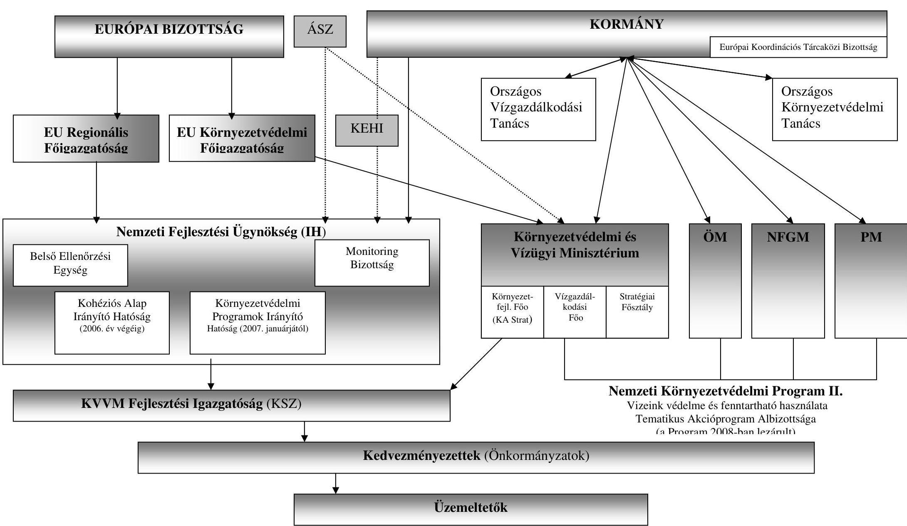

---

# FÜGGELÉK

---

# Az ISPA /KA szennyvízkezelési projektek pénzügyi, műszaki részletei

|  Projektek | Műszaki tartalom | Pénzügyi elemzés  |
| --- | --- | --- |
|  Győr város szennyvíztisztító telepének fejlesztése | A szennyvízkezelési technológiát teljesen átalakították. A tervezett projekt műszaki tartalma: biológiai tisztítás „A" (részbiológiai) lépcsőjének kiegészítése a „B" (teljes biológiai) lépcsővel, az iszapkezelés kiegészítése az anaerob iszapstabilizálás - rothasztás - létesítményeivel és a keletkező biogáz gázmotoros hasznosításával, az iszap továbbkezelés több utassá tétele a likócsi komposzttelep megépítésével, a rothasztott sűrített iszap nyomócsőben való odajuttatásával, komposzttelepi víztelenítésével, végül pedig a szennyvíztisztító telepi bűzhatás csökkentése. | A projekt CBA elemzésben azzal számoltak -összhangban az egységes díjképzési politikájukkal -, hogy a Kohéziós Alapból származó többlet-költségeket az üzemeltető területén található valamennyi fogyasztóra egységesen szétterítik. A számítás során a tervezett költségek között az értékcsökkenést is figyelembe vették.
A zárójelentésben a CBA elemzést újra értékelték. Eszerint a projekt társadalmi-gazdasági megtérülése pozitív. A projekt pénzügyi megtérüléséhez a következő egy vagy két évben még szükséges az inflációt meghaladó díjnövelés, amely az átadás-átvétel utáni két évben már megtörtént. A projekt befogadásakor az EU Bizottság által elfogadott pénzügyi megtérülési ráta (FRR) 4,44\% volt, a díjalap 0,1073 euró/m (5\% diszkontrátával és 20 év üzemeltetéssel számolva).  |
|  Szeged városi szennyvíztisztí-tó-telep és csatorna-hálózat fejlesztése Szeged, Dél-alföldi régióban | A projekt lezárult. A fejlesztés eredményeként 16 városrészben és a 4 társult településen kiépült a szennyvízelvezetőhálózat. A települések szennyvizeit a biológiai fokozattal kiegészített szegedi szennyvíztisztító telepen tisztítják. A fejlesztés eredményeként nem folyik tisztítatlan szennyvíz a Tiszába. | A projekt társadalmi-gazdasági megtérülése pozitív. A fenntarthatóság a pénzügyi és gazdaságossági elemzés alapján biztosított, a halmozott pénzáramlás végig pozitív.  |
|  Pécs város szennyvíz csatornahálózat fejlesztése, sérülékeny vízbázisainak védelme | A projekt keretén belül két önálló feladatot valósítottak meg: egyrészt a város szennyvízcsatornával ellátatlan területek csatlakoztatását a meglévő szennyvízelvezetőhálózatra, másrészt a volt uránbánya zagytározóihoz kapcsolódó monitoring hálózat kiépítését. A két részprojekt megvalósításának célja elsősorban Pécs város ivóvízbázisainak védelme volt. A keletkező szennyvíziszap további feldolgozásához a komposztáló 2008. évben elkészült. | A tervezett társadalmi-gazdasági elemzése szerint a projekt meg fog térülni. A projekt nettó jelenértéke 19.006 E euró. A projekt múködési és fenntartási költségeit 33 évre tervezték. Külön kimutatásra került a pótlási beruházás 2.889 E euró értékben.  |

---

| Szennyvíztisztító és csatornahálózat program, Sopron | Sopron városában a szennyvízterhelés nem volt egyenletes, így a tervezés során figyelembe vették, hogy rendkívüli terhelés (pl. a Sopron környékére jellemző eső) esetén ne mosódjon ki a szennyvíziszap a tisztítóból, így a projekt keretében 6000 m-es záportározót építettek.
A projekt eredményeként a korszerűtlenné vált szennyvíztisztítói technológiát lecserélték, a kapacitást $21000 \mathrm{~m} / \mathrm{d}$ teljesítményüre növelték. A Fertőrákoson korábban múködő szennyvíztisztítót a soproni előtisztítójává alakították át, a sopronkőhidai szennyvíztisztítót - amely technológiájában elavult volt és a megfelelő védőtávolságok sem voltak adottak - megszüntették, a Fertő-tóba már tisztított szennyvíz sem kerül. A szennyvíz a megszüntetett telepek helyett a soproni tisztítóba kerül. A projekt része volt még a csatornahálózat további bővítése, a csapadékvíz és a szennyvíz teljes elválasztása, Kópháza és Harka községek átkapcsolása a soproni rendszerbe és így a Nagycenki tisztító tehermentesítése. A tervezett múszaki megoldás megfelelt a projekt méretének. | A projektnél a számítás során a tervezett költségek között az értékcsökkenést is figyelembe vették
A CBA elemzésben azzal számoltak - összhangban az egységes díjképzési politikával -, hogy a Kohéziós Alapból származó többlet-költségeket az üzemeltető területén található valamennyi fogyasztóra egységesen szétteríti.
A Soproni projekt költség-haszon elemzésének alapja: 2000. évi árszinten 18682 millió euró beruházási költség (ÁFA nélkül) 2006. dec. 31-i befejezés. A Nettó Jelenérték (NPV) 1.11 millió euró, a Pénzügyi Megtérülési Ráta FRR: 6.84\% volt azzal, hogy a csatornaszolgáltatási díj 2000. évi árszinten: $140 \mathrm{Ft} / \mathrm{m}$ azaz 0,527 euró/m (ÁFA nélkül), melynek összege $22 \%$-al haladja meg a 2000 . évben érvényes szolgáltatási díjat. A Pénzügyi Megállapodásban az EU Bizottsága ezek közül a csatornaszolgáltatási díjat nevesíti. |
| :--: | :--: | :--: |
| Kecskemét agglomeráció szennyvízelvezetési és kezelési program | A kecskeméti városi szennyvíztisztító bővítése 1995-ben fejeződött be. A KA beruházás során bővítették a csatornahálózatot, korszerűsítették a szennyvíztisztító telepet, eszközöket szereztek be, továbbá komposztáló telepet építenek az iszapkezelés megfelelő hasznosításához.
A meglévő szennyvíztisztító telepen a termelődő biogáz hasznosítására gázmotorral bővítették a telepet, az így termelt villamos energiát a telepen belül hasznosítják.
2010-ben a tervek szerint megépítésre kerül a 32 ezer tonna/év kapacitású zárt cellás központi komposztáló telep a szennyvíztisztító telep mellett. A létesítmény tervezett próbaüzeme 2010 márciusában várható. | A Tulajdonosok bérbe adják a fejlesztés során elkészült tisztító telepet a szolgáltatást végző Üzemeltetőknek.
Az amortizációt a lakosság és az ipari szennyezők fizetik meg a szennyvízdíjba építve. A lakosság terhelhetőségére számítások készültek. Ezek alapján a jelenleg alkalmazott és a tervezett díjak mértéke elfogadható szinten van. A beruházás az előzetes CBA elemzés alapján fenntartható, a halmozott cash flow (bérleti díj) végig pozitív. Az önkormányzati rendeletekben szabályozott díjakat az Üzemeletető bérleti díj formájában közvetít az Önkormányzatok felé. A tulajdonos Önkormányzatok „Fejlesztési Alapot" képeznek a begyűjtött amortizációs díjakból, melynek öszszegét elkülönítetten kezelik. |

---

|  Szennyvízgyűjtő-és kezelő program Debrecenben és vonzáskörzetében, Hajdú-Bihar megyében | A projekt célja Debrecen és környéke felszíni és felszín alatti vízbázisainak védelme a csatornahálózat bővítése és a szennyvíztisztítás hatékonyságának javítása révén. Debrecenben és agglomerációjában a csatornahálózat bővítésére és korszerűsítésére kerül sor, megoldva hét újabb település szennyvízelvezetését, megvalósul a debreceni szennyvíztisztító telep EU követelményeket kielégítő fejlesztése. A tisztító üzemeltetésére kockázatot jelentenek a városban működő élelmiszeripari üzemek, valamint a gyógyszergyár szennyvíz-előtisztítójának a stabilitása. Az élelmiszeripari üzemek csak terhelésben jelentenek veszélyt, a gyógyszergyár vegyi, biológiai kockázatot is jelent a telep müködésében. Mindez indokolja a városi tisztító biztonságos tervezését, esetleges túlméretezését.
A projekt folyamán - egyebek mellett - a már meglévő szennyvíztisztító felújítására és azzal megegyező kapacitású új biológiai részt építenek, egyidejűleg - biztonsági szempontból - a hidraulikai kapacitást is duplájára növelik, amely mellett további biztonságot jelent a 16.000 m 3 es záportározó kiépítése, amely 3 órás záporcsúcs ( 5.000 $\mathrm{m} /$ óra) biztonságos levezetésére hivatott. | A költség-haszon elemzés szerint a jellemző mutatók (ERR 8\%, NPV 33,193 M euró) eltérnek a pénzügyi megállapodás mutatóitól (EIRR 7,8\%, ENPV 31,2 M euró). Ez eltér a többi szennyvízkezelési projekt gyakorlatától, ahol a pénzügyi elemzés számait veszik alapul. A pénzügyi és gazdaságossági elemzés 5.4. táblázatában a hozzáadott haszon sorban a bemutatott értékek megalapozottsága hiányzik.
A pénzügyi elemzése szerint 5\%-os diszkontrátával számolva negatív jelenértéket mutattak ki, amely magyarázza, hogy a gazdaságossági számítás adatait vették figyelembe. Maradványértékkel nem számoltak.
A pénzügyi elemzésen túl a gazdasági elemzés külső hatásokat (pl. légszennyezés csökkentése, a szilárd hulladék mennyiségének csökkenése, a szennyvíziszap mezőgazdasági hasznosítása) nem tartalmaz, a pénzügyi megállapodás hasznokkal számol (a vízbázis megőrzése, a csatornabekötések számának növekedése, a fenntartható ivóvízmennyiség, a felszíni vizek szennyezettségének csökkenése, a légszennyezés csökkenése).  |
| --- | --- | --- |
|  Szennyvízgyűjtő-és kezelő rendszer fejlesztése Szombathely megyei jogú városban, a nyugat-dunántúli régióban | Szombathely - és a környező 41 település - már a projekt előtt rendelkezett biológiai szennyvíztisztítóval. A projekt keretében az előúlepítő hidraulikus kapacitását további műtárgy építésével növelték, javították továbbá a levegőztetést, amely javította a biológiai kezelés hatékonyságát. Az iszapkezelés rothasztó kapacitást kiépítve csaknem felére csökkentette a komposztálandó szennyvíziszap mennyiségét.
A komposztálót a várostól nyugatra újonnan építették. A projekt lezárása után mind a biológiai, mind a - fejlesztés eredményeként megépített - hidraulikai kapacitás előreláthatóan kihasznált lesz. | A pénzügyi és költség-haszon elemzés szerint a projekt esetében 5\%-os diszkontrátával számolva a belső megtérülési ráta 0 , a pénzügyi megtérülési mutató 5\%. A projekt támogatás nélkül nem térült volna meg a negatív nettó jelenérték miatt. A társadalmi-gazdasági hatások figyelembevételével a nettó jelenérték (pl. légszennyezés csökkentése, a szilárd hulladék mennyiségének csökkenése, a szennyvíziszap mezőgazdasági hasznosítása) javult.
A 2030. év végére 8,25 M euró maradványértékkel számoltak, és a modernizációs kiadásokra 10,17 M eurót terveztek. A fenntarthatóság feltétele, hogy a 2030. év végén a beruházás értéke legalább a maradványérték.  |

[^0] [^0]: ${ }^{1}$ Költség-haszon elemzésként szerepel a CBA elemzésben

---

| Budapesti Központi Szennyvíztsztító Telep és szennyvízgyűjtő rendszer | A projekt eredeti műszaki tartalmát képezte a Ferencvárosi, Albertfalvai és Kelenföldi Átemelő Telep; a Duna alatti átvezetés; a Budapesti Központi Szennyvíztisztító Telep megépítése; az árvízvédelmi töltés; a külső közlekedési infrastruktúra, a főgyűjtő és a Cséry komposztáló telep megépítése.   A Főváros elképzelése szerint a Dél-budai szennyvíztisztító telep nem valósul meg, helyette külön KA projekt keretében bővítenék a XI., a XXI. és a XXII: kerületekben a gyűjtőcsatorna -hálózatot és a Budapesti Központi Szennyvíztisztító telepre rávezetni Budaörs szennyvízét. | A budapesti projekt esetében 8\%-os belső megtérülési rátával terveztek. A nettó jelenérték az uniós támogatással éppen megtérülő, ami a külső hatások bemutatásával (turizmus, egészségügy) javulást eredményezett.   A cash-flow kimutatás szerint a projekt fenntarthatósága biztosított, azzal, hogy a 23. év végére 19818 E euró maradványértéket képeztek. Az Európai Bizottság Kohéziós Alap módszertanát figyelembe vették.   A pénzügyi és gazdaságossági elemzésben - a tervezett díj 2004-ről a maximumot 2010. évben érte el, amely 67\%-os növekedést jelentett a szennyvízdíjakban. A növekedés a projekt megvalósítása előtti és a projekt keretében megvalósult létesítmények múködtetésének együttes hatására jelentkezik, amely fokozatosan kerül bevezetésre).   A számítások szerint a 67\%-os emelkedés hatására a vízés szennyvízdíj teljes összege a családok nettó jövedelmének hozzávetőleg 2,5\%-át fogja elérni, amely díjemelés arányát elfogadhatónak tekinti a pályázó.   A projekt nemzeti önrészének finanszírozására 2005-ben az állam 94 M euró, a kedvezményezett állami garanciával 100 M euró hitelt vett fel az Európai Beruházási Banktól. Az állam által felvett teljes összeg 2006. május 10-én lehívásra került. A 2009. június 15-ig kifizetett kamatok összege: 11,48 M euró.   A kedvezményezett hiteléből 2009. július 30-ig 53,3 M euró került lehívásra. A hitelszerződés alapján a projekt 33,68\%-át finanszírozzák EIB hitelből. |
| :--: | :--: | :--: |

---

| Zalaegerszeg és térsége szennyvízelvezetési és kezelési projekt | A projekt keretében fejlesztették a települési szennyvízelvezető hálózatot. Szétválasztották Zalaegerszeg városközpontjában az egyesített rendszerben kiépített csatornahálózat részeit, a csatornázatlan városrészekben illetőleg 8 településen csatornahálózatot építettek ki. Fejlesztették a szennyvíztisztítóhoz kapcsolódó négy regionális vezetékágat, a központi szennyvíztisztító telep technológiai berendezéseit, a szennyvíziszapkezelését illetőleg tárolását, műszaki védelmét és hasznosítását.   Az iszapkezelés, az iszapfeldolgozás, illetve az iszapelhelyezés megoldandó feladat volt, amelynek hatására - másfélszeresére - bővítették a biológiai kapacitásukat, továbbá technológiai javítást végeztek, valamint az anaerob iszaprothasztót is megépítették (amelynél ultrahangos kezeléssel igyekeztek maximálni a szennyvíz belső energiájának hasznosítását). A technológiai sor végén az utóülepítők után forgódobos finomszűrővel biztosították a lebegőanyag fokozott eltávolítását a szigorú foszforhatárérték elérése érdekében. | A megtérülési mutatók számítása a projekt közvetlen és externális hasznai alapján történt, a projekt externális hatásai jelentősen javítják a projekt megtérülését. A KA támogatásával ( $85 \%$ ) a pénzügyi megtérülési ráta $1,88 \%$, a nettó jelenérték -4,405 E euró. A beruházás gazdasági megtérülési rátája 5,79\%. A megtérülési számításban 12290 E euró maradványértéket vettek figyelembe.   A projekt pénzügyi és gazdasági elemzésében szereplő új vízdíjak kalkulációja szerint a képzett amortizációt (25\%) pótlásra, felújításra használják fel, továbbá maradványértéket is képeztek, így a teljes megtérülés biztosított.   A teljes fenntartási költséget évente elosztották a települések között a kiszámlázott szennyvízre vetítve. Ahol a településen belül is történt szennyvízhálózat kiépítése, az érintett hálózatnak a teljes fenntartási költségét a településre ráterhelték. A szennyvíztelep fenntartási, valamint a müködési költségnövekményt a kiszámlázott szennyvíz arányában osztották fel a települések között. |
| :--: | :--: | :--: |

---

| Veszprém és térsége szennyvízelvezetési és -kezelési projekt | A Veszprémi agglomeráció esetében a pályázati kérelem beadásakor a szennyvíztisztító telep III. ütemben történő fejlesztése volt folyamatban (tisztán hazai forrásból). A Veszprémi tisztító akkor technológiájában és a tisztítás fokában már megfelelő az uniós követelményeknek a 2004-es pályázati kérelem szerint. A projekt előtti csatornázottság 86\%-os volt (projekt után 100\%-os kiépítettséget terveztek). Így a KA projektben a szennyvíztisztító telep befejező munkálatai, valamint a csatornahálózat további kiépítése és rekonstrukciója szerepeltek. Az ellenőrzés megállapítása szerint a Veszprémi tisztító 2004-ben 1 mérőszám (összes $\mathrm{P}, \mathrm{mg} / \mathrm{l}$ ) esetében maradt el az EU által elvárt értékektől, de 2006-ra már minden mutató tekintetében megfelelő.   A Zirci agglomerációban csatorna építésére és szennyvíztisztító rekonstrukciójára, technológiai korszerűsítésére volt szükség.   A Hegyesdi agglomerációban un. zöldmezős beruházást kellett végrehajtani. Itt korábban, az érintett öt településen nem volt csatornázás és tisztító telep. Az újonnan létrehozott létesítmények fenntartása biztonsággal a mintegy 2747 fős állandó lakosságra hárult, ezen felül csak időszakosan, vendégekkel számolhattak.   A lakossági tisztítókapacitás igény (2747 fő) mellett, megközelítőleg ugyanekkora kapacitásigényt (2898 fő) terveztek a két hetes „Művészetek Völgye" rendezvényre.   Ez kockázatot jelent, mert amennyiben a rendezvény nem a tervezetteknek megfelelően alakul, a kapacitás kiesés miatti többletköltségeket a lakosságnak kell viselnie (a rendezvényt előkészítéssel, bontással együtt 1 hónapra, naponta 8000-10000 látogatóval tervezték a pályázatban). | A veszprémi projekt pályázati dokumentációjában meghatározott gazdasági mutatók (megtérülési ráta, nettó jelenérték, stb.) szerint amelyeket csak a projekt egészére számítottak ki -, a fejlesztés gazdaságilag életképes. A gazdasági mutatók alapadatai a pénzügyi és gazdaságossági elemzés mellékleteiben agglomerációnkénti bontásban megtalálhatóak.   A CBA elemzésben számított maradványérték a legjobb gyakorlatnak számító társasági adó törvény szerinti amortizációs kulcsokkal számolva (hosszú élettartamú épületek 2\%, gépek berendezések 14,5\%) magas. A CBA elemzés mellékletét képező számítás szerint a gépek, berendezések és az épület aránya 13-87\% volt, így a 30 év futamidővel számítva 2037-ben már csak az épületek maradnak 28170x0,83-(30x0,02x28170)=6479$\cdot$ ezer euró értéken, szemben a maradványértékként figyelembe vett 10629 ezer euróval. Az eljárás jogszerűsége ugyanakkor nem kifogásolható, mert a Számvitelről szóló 2000. évi C. törvény lehetőséget ad a legjobb gyakorlattól eltérő leírási kulcsok alkalmazására.   A projekt támogatására a hegyesdi agglomerációhoz tartozó községek 2005. 02. 19-én (az EU Bizottság 2004. 12. 14-i határozata után) megalakították az Egervölgye Szennyvízberuházó Viziközmű Társulatot úgy, hogy az 1299 érdekeltségi egységből 1024 egység (78,8\%) szavazta meg, tehát a lakossági támogatottság megvolt.   A teljes - mindhárom agglomeráció településeit magában foglaló - a projekt végrehajtására létrehozott Veszprém és Térsége Szennyvízelvezetési és Kezelési Önkormányzati Társulás 2004. május 27-án jött létre. |

${ }^{3}$ A társasági adóról szóló 1996. évi LXXXI. törvény. 2 sz. melléklet
${ }^{4} 28170$ ezer euró a beruházás bruttó értékében $83 \%$ az épület aránya, ebből levonásra került a 30 év alatt évi 2\%-al elszámolt értékcsökkenés összege.