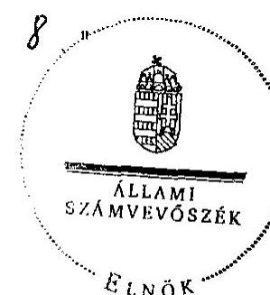
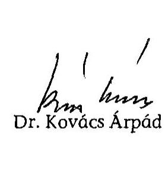

# JELENTÉS 

a 2009. januári időközi országgyűlési képviselő-választási kampányra fordított pénzeszközök elszámolásának ellenőrzéséről a képviselethez jutott jelölő szervezetnél

---

3. Önkormányzati és Területi Ellenőrzési Igazgatóság
3.1. Szabályszerüségi Ellenőrzési Föcsoport

Iktatószám: V-3019-019/2009.
Témaszám: 959
Vizsgálat-azonosító szám: V-0482

# Az ellenőrzést felügyelte: 

Dr. Lóránt Zoltán
föigazgató
Az ellenőrzés végrehajtásáért felelős:
Dr. Elek János
általános föigazgató-helyettes
Az ellenőrzést vezette:
Horváth Balázs
főcsoportfőnök-helyettes
Az összefoglaló jelentést készítette:
Tóth István
számvevő tanácsadó
Az ellenőrzést végezték:
Tóth István
Számvevő tanácsadó

Vincze B. Róbert
számvevő

---

# TARTALOMJEGYZÉK 

BEVEZETÉS ..... 3
I. ÖSSZEGZŐ MEGÁLLAPÍTÁSOK, KÖVETKEZTETÉSEK, JAVASLATOK ..... 6
II. RÉSZLETES MEGÁLLAPÍTÁSOK ..... 7

1. A beszámoló közzététele és tartalma ..... 7
2. A választásokkal kapcsolatos speciális nyilvántartási és gazdálkodási teendők szabályozása, a választási bevételek és kiadások nyilvántartásban történő elkülönítése ..... 8
3. A választásra fordítható összeghatár és a párttörvényben meghatározott korlátozó előírások betartása ..... 8
4. A beszámolóban közzétett adatok bizonylati alátámasztottsága ..... 9
MELLÉKLET
5. számú A Fidesz - Magyar Polgári Szövetség által a 2009. évi Budapest IX. kerületi időközi országgyűlési képviselő-választásra fordított pénzeszközök forrásai és felhasználása

---

# RÖVIDÍTÉSEK JEGYZÉKE 

| ÁSZ | Állami Számvevőszék |
| :-- | :-- |
| Fidesz-MPSZ | Fidesz-Magyar Polgári Szövetség |
| Jelölő szervezet | Kereszténydemokrata Néppárt és Fidesz-Magyar Polgári |
|  | Szövetség jelölő szervezet |
| KDNP | Kereszténydemokrata Néppárt |
| Párttörvény | A pártok múködéséről és gazdálkodásáról szóló - többször |
|  | módosított - 1989. évi XXXIII. törvény |
| OVB | Országos Választási Bizottság |
| Számv. tv. | A számvitelről szóló - többször módosított - 2000. évi C. |
|  | törvény |
| Ve. | A választási eljárásról szóló - többször módosított - 1997. |
|  | évi C. törvény |

---

# JELENTÉS 

## a 2009. januári időközi országgyúlési képviselő-választási kampányra fordított pénzeszközök elszámolásának ellenőrzéséről a képviselethez jutott jelölő szervezetnél

## BEVEZETÉS

A választási eljárásról szóló - többször módosított - 1997. évi C. törvény (Ve.) 92. § (3) bekezdésében kapott felhatalmazás alapján az országgyűlési képviselő-választásra fordított állami és más pénzeszközök, anyagi támogatások felhasználásának ellenőrzése az Állami Számvevőszék (ÁSZ) feladata, amelyet „a választás második fordulóját követő egy éven belül az országgyúlési képviselethez jutott jelölő szervezetek és független jelöltek tekintetében hivatalból, egyéb jelölő szervezetek és független jelöltek tekintetében más jelölt, jelölő szervezetek kérelmére" ellenőriz.

Az ÁSZ hivatalból ellenőrizte a Fidesz-Magyar Polgári Szövetség és a Kereszténydemokrata Néppárt (jelölő szervezet) ${ }^{1}$ kampány elszámolását, mivel közös jelöltjük a Budapest 12. számú országgyúlési egyéni választókerületben, 2009. január 25 -én mandátumhoz jutott. Egyéb jelölő szervezetek és független jelöltek vizsgálatát a törvényes határidőn belül az ÁSZ-nál nem kérelmezték. Tekintettel arra, hogy a két párt között létrejött megállapodás alapján a kampány finanszírozása és a kampánybeszámoló közzététele a Fidesz-MPSZ feladata volt, helyszíni ellenőrzést csak ennél a pártnál végeztünk. A Ve. 49. § (2) bekezdésének rendelkezése szerint: „Ha több jelölő szervezet közösen állít jelöltet, a továbbiakban - a választás szempontjából - egy jelölő szervezetnek számítanak."

Az ellenőrzött időszak: a 2009. januári időközi országgyűlési képviselőválasztási kampány az elszámolási időpontig.

Az ellenőrzés célja annak megállapítása volt, hogy a 2009. januári időközi országgyűlési képviselő-választáson mandátumhoz jutott jelölő szervezet:

- betartotta-e a Ve. 92. § (1) bekezdésében meghatározott költséghatárt, amely szerint „a jelölő szervezetek a választásra a 91. §-ban foglalt költségvetési támogatáson felül jelöltenként legfeljebb egymillió forintot fordíthatnak";
${ }^{1}$ A Ve. 149. § g) pontja értelmében jelölő szervezet: a pártok múködéséről és gazdálkodásáról szóló 1989. évi XXXIII. törvény szerint bejegyzett párt, valamint az egyesülési jogról szóló 1989. évi II. törvény szerint bejegyzett társadalmi szervezet, a közös jelöltet, listát állító jelölő szervezetek egy jelölő szervezetnek számítanak.

---

- a Ve. 92. § (2) bekezdésének rendelkezése alapján a választás második fordulóját követő 60 napon belül a Magyar Közlönyben nyilvánosságra hozta-e a választásra fordított állami és más pénzeszközök, anyagi támogatások öszszegét, forrását és felhasználásának módját. Gondoskodott-e a források és felhasználások szabályszerű nyilvántartásáról és bizonylatolásáról.

Az ellenőrzés feltételeiről és körülményeiről szükséges rögzíteni, hogy a Ve. 1998 óta hatályos rendelkezései, valamint a párttörvény előírásai jelenleg sem biztosították a feltételeket a választási kampánypénzek eredetének és felhasználásának teljes átláthatóságához.

A választási elszámolások ellenőrzéséről 1998 óta kiadott jelentéseinkben jeleztük, hogy az ÁSZ nem tudja teljes mértékben betölteni a választási kampány átláthatóságával kapcsolatosan azt a szerepet, amelyet az alkotmányos szabályozás megkívánna, valamint külön részleteztük az ÁSZ hatásköri korlátait is. ${ }^{2}$

Rendszeresen felhívtuk a figyelmet továbbá arra, hogy a választási kampányra fordítható kiadásokra, ezek ellenőrzésére vonatkozó hatályos szabályok korrupciós kockázatot jelentenek, nem segítik maradéktalanul a Ve. 3. §-ban rögzített alapelvek érvényesítését. ${ }^{3}$

Az ÁSZ visszatérően javasolta a Kormánynak, hogy kezdeményezze az Országgyűlésnél a Ve. oly módon való módosítását, amely biztosítja a kampányfinanszírozás átláthatóságát, ellenőrizhetőségét és egyértelmúen meghatározza:

- a választási költségek elszámolása szempontjából mely időszak, illetve tevékenység forrásait és ráfordításait kell figyelembe venni;
- a jelöltek száma alapján, normatív módon juttatott állami támogatás felhasználása tekintetében mi a dologi költségek fogalma, a felhasználás elszámolásának formája, tartalma és kifizetőhelye;
- a választási költségek forrásai körében az egyéb anyagi támogatások között milyen formában nyújtott és kiktől származó juttatásokat kell figyelembe venni;
- milyen legyen az országgyűlési választásra fordított állami és más pénzeszközök, anyagi támogatások összegét, forrását és a felhasználás módját bemutató, a Magyar Közlönyben megjelentetett választási adatszolgáltatás formája és részletes tartalma;
- hogyan történjen az egyéni jelöltek választási költségei és azok forrásai ellenőrizhetőbb nyilvántartási kötelezettségének érvényesítése;

[^0]
[^0]:    ${ }^{2}$ A témához kapcsolódóan kiadott számvevőszéki jelentések sorszáma: 9916; 039; 0135; 0307; 0562; 0718 és 0737 .
    ${ }^{3}$ A témakör részletes kifejtése megtalálható „A korrupció elleni küzdelem a számvevőszéki közreműködés és bemutatásán keresztül" című 2002. októberi ÁSZ tanulmányban. A tanulmány olvasható az ÁSZ internetes honlapján.

---

- mennyi legyen a költségvetési támogatáson felüli egy jelöltre átlagosan fordítható kiadás reális értékhatára;
- milyen tartalmú írásos megállapodást kössenek a közös jelöltet állító szervezetek a kampányfinanszírozásra, a nyilvántartásra és az elszámolásra vonatkozóan;
- milyen szankciókkal járjon a határidős elszámolási és közzétételi kötelezettségek elmulasztása.

Az ÁSZ, mint jogalkalmazó szerv csak a hatályos jogszabályi környezetben biztosított keretek között végezhette ellenőrzését, kiterjesztő jogértelmezésre nem volt lehetősége, többletellenőrzési jogosítványokat nem alkalmazhatott. Az ÁSZ-nak a jelen vizsgálatnál is tudomásul kellett vennie, hogy dokumentális ellenőrzést végezhet, továbbá ellenőrzési jogosultsága az elszámolási határidőig a jelölő szervezet nyilvántartásában megjelent kampányforrásokra és ráfordításokra terjed ki.

A helyszíni ellenőrzést a közvetlen részletes vizsgálatok módszerével végeztük. A 2008. november 1-je és 2009. március 1-je között teljesült gazdasági eseményeket tételesen ellenőriztük tekintettel arra, hogy a jelölő szervezet a 2009. januári időközi országgyűlési képviselő-választási kampányra fordított pénzeszközöket a könyvviteli rögzítéssel egyidejűleg különítette el az éves kiadásoktól. A pénzügyi szabályszerűségi ellenőrzést a számvevőszéki ellenőrzés szabályai szerint készítettük elő és folytattuk le.

Az ellenőrzés módszere: A jelölő szervezet által rendelkezésre bocsátott iratok és a Hivatalos Értesítőben közzétett választási adatszolgáltatás tartalmi öszszevetésével, valamint az alkalmazott eljárások és a jogszabályi követelmények egybevetésével történt.

A helyszíni ellenőrzést: 2009. október 15-22-e között, a Fidesz - MPSZ országos központjában végeztük.

---

# I. ÖSSZEGZŐ MEGÁLLAPÍTÁSOK, KÖVETKEZTETÉSEK, JAVASLATOK 

A közös jelöltállításra tekintettel kötött megállapodás értelmében mind a finanszírozás, mind az elszámolás - a jelölő szervezet nevében - a Fidesz-MPSZ feladata volt. A Fidesz-MPSZ, a jelölő szervezet Ve. törvényben előírt közzétételi kötelezettségét a törvény által előírt határidőn belül teljesítette. A 2009. januári időközi országgyűlési képviselő-választással kapcsolatos forrásokról és ráfordításokról az adatokat a Hivatalos Értesítő 2009. évi 10. számában, 2009. március 13-án hozta nyilvánosságra.

A közzétett adatokat megalapozó számviteli nyilvántartásban az időközi választásra fordított pénzeszközök ráfordításait a Fidesz - MPSZ a kettős könyvvitelében a központi országgyűlési kampány főkönyvi számlán különítette el a működéssel összefüggő kiadásoktól, így a beszámolóban közölt 987 ezer Ft ráfordítási adat a főkönyvi kivonatból, valamint a nyilvántartás alapját képező bizonylatokból levezethető volt. A választási kampányforrások és ráfordítások elszámolásért felelős Fidesz - MPSZ az Országgyúlési Képviselőválasztási Kampányra Vonatkozó Szabályzatban rögzítette a kampánytevékenység, a kampányköltség a választási költségek elszámolása szempontjából az elszámolási időszak fogalmát, a gazdálkodási jogköröket. A jelölő szervezet - a közös jelöltállításra vonatkozó megállapodáson kívül - az időközi választással kapcsolatos gazdasági döntést nem hozott.

A jelölő szervezet a szankció nélkül felhasználható egymillió forintos költséghatárt a rendelkezésre bocsátott dokumentációk szerint nem lépte túl, 987 ezer Ft-ot fordított a Budapest 12. számú egyéni választókerület időközi országgyűlési képviselő-választási kampányára. A párttörvényben rögzített forrásszerzést korlátozó előirásokat a Fidesz - MPSZ - a nyilvántartások szerint - a közzétett, országgyűlési képviselő-választásra fordított összeg forrásai vonatkozásában betartotta, forrásként kizárólag saját forrást jelölt meg.

A kampánytevékenységre vonatkozó, annak jogszerűségét igazoló szerződések, egyéb kötelezettségvállalási dokumentumok rendelkezésre álltak. A nyilvántartott kampányköltségek bizonylatai a könyvelési adatok alapján visszakereshetők voltak. A Számv. tv. előírásainak megfelelő bizonylatok tartalmuk szerint a könyvelt gazdasági eseményt támasztották alá. A bizonylatok alaki és tartalmi követelményei megfeleltek a Számv. tv-ben rögzített, a szabályszerű bizonylatra vonatkozó előírásoknak.

A helyszíni ellenőrzés megállapításainak hasznosítása mellett az ÁSZ javasolja

## a Kormánynak

Ismételten kezdeményezze a választási eljárásról szóló törvény módosítását - figyelemmel az Állami Számvevőszék korábbi jelentéseiben megfogalmazott javaslataira is - annak érdekében, hogy a választási kampány finanszírozása átlátható, ellenőrizhető legyen.

---

# II. RÉSZLETES MEGÁLLAPÍTÁSOK 

## 1. A beSzámoló közzÉtétele és tartalma

A Ve. 92. § (2) bekezdés előírása szerint minden jelölő szervezetnek és független jelöltnek a választás második fordulóját követő 60 napon belül a Magyar Közlönyben nyilvánosságra kell hoznia a választásra fordított állami és más pénzeszközök, anyagi támogatások összegét, forrását és felhasználásának módját. Figyelemmel arra, hogy a Ve. a nyilvánosságra hozandó beszámoló tartalmát, részletezettségét nem szabályozta, az OVB a Választási füzetek 1998. évi 44. száma függelékében az ÁSZ ajánlását tette közzé. Jelezni szükséges, hogy a nyilvánosságra hozatali kötelezettség elmulasztását a törvény nem szankcionálja, így annak elmulasztása vagy késedelmes teljesítése esetén intézkedésre nincs lehetőség.

A Fidesz-MPSZ és a KDNP a közös jelöltállításra tekintettel megállapodást kötött a kampányköltségek finanszírozására, valamint a források és kampányráfordítások elszámolására. Ennek értelmében mind a finanszírozás, mind az elszámolás - a jelölő szervezet nevében - a Fidesz-MPSZ feladata volt. A FideszMPSZ a megállapodásnak megfelelően "A Fidesz - Magyar Polgári Szövetség által a 2009. évi Budapest IX. kerületi időközi országgyúlési képviselő-választásra fordított pénzeszközök forrásai és felhasználása" címmel, a törvényes határidőn belül tette közzé elszámolását - az ÁSZ ajánlásának megfelelő szerkezetben és tartalommal - a Hivatalos Értesítő 2009. március 13-i, 10. számában ${ }^{4}$ (1. számú melléklet).

A jelölő szervezet a beszámolóban kampányforrásként 987 ezer Ft saját forrást nevezett meg, valamint ugyanilyen összegű anyagjellegű ráfordítást közölt. A kampányköltségek között hirdetési és nyomdai, valamint választási adatszolgáltatási költségeket számoltak el. A közölt adat a 616112 központi országgyúlési kampány számlán szereplő összeggel megegyezett.

A kampány finanszírozására kizárólag a párt működési saját forrását használták fel. A könyvvezetés során érvényesítették a Számv. tv-ben meghatározott számviteli alapelveket. A közös jelöltállításra tekintettel összeállított beszámoló megfelelt a megállapodásban rögzített beszámolási, nyilvántartási és elszámolási kötelezettségnek.

[^0]
[^0]:    ${ }^{4}$ Az elektronikus információszabadságról szóló 2005. évi XC. törvény 12/A. § (3) bekezdése 2008. VII. 1-jén hatályba lépett rendelkezése értelmében. A Hivatalos Értesítő tartalmazza a jogalkotásról szóló törvény szerinti utasítások és jogi iránymutatások szövegét, valamint azokat a közleményeket, amelyeknek a Magyar Közlönyben, illetve más hivatalos lapban való közzétételét jogszabály elrendeli vagy miniszter, illetve a közzététel kezdeményezésére jogszabály által kötelezett személy kezdeményezi.

---

# 2. A VÁLASZTÁSOKKAL KAPCSOLATOS SPECIÁLIS NYILVÁNTARTÁSI ÉS GAZDÁLKODÁSI TEENDŐK SZABÁLYOZÁSA, A VÁLASZTÁSI BEVÉTELEK ÉS KIADÁSOK NYILVÁNTARTÁSBAN TÖRTÉNŐ ELKÜLÖNÍTÉSE 

A választási kampányforrások, és ráfordítások elszámolásért felelős FideszMPSZ 2008. január 1-jétől hatályos belső szabályzatban rögzítette a kampánytevékenység, a kampányköltség fogalmát és a gazdálkodási eljárási szabályokat. A jelölő szervezet - a közös jelöltállításra vonatkozó döntésen kívül - az időközi választással kapcsolatos gazdasági döntést nem hozott. A Fidesz MPSZ rendelkezett hatályos számviteli politikával és számlarenddel. A számlarend az országgyúlési választási kiadások nyilvántartására a 6. számlaosztályban külön főkönyvi számlát tartalmazott.

A Fidesz - MPSZ a Ve. 92. § (1) bekezdésében meghatározott ráfordítási korlátok betartásának ellenőrizhetősége céljából a könyvelésben a költségek rögzítésével egyidejűleg a 616112 főkönyvi számlán különítette el az időközi országgyúlési képviselő választással kapcsolatos kiadásokat a múködéssel összefüggő kiadásoktól.

## 3. A VÁLASZTÁSRA FORDÍTHATÓ ÖSSZEGHATÁr ÉS A PÁRTTÖRVÉNYBEN MEGHATÁROZOTT KORLÁTOZÓ ELŐÍRÁSOK BETARTÁSA

A Ve. 92. § (1) bekezdése szerint "a jelölő szervezetek a választásra a 91. §-ban foglalt költségvetési támogatáson felül jelöltenként legfeljebb egymillió forintot fordíthatnak." A jelöltekre és a választásra fordítható pénzeszközök tárgyában hozott OVB 7/1998. (IV. 1.) állásfoglalás szerint közös jelölés esetén is összesen egymillió forint fordítható egy jelöltre. Az időközi választásra jelöltarányos állami támogatás a költségvetésben a korábbi gyakorlatnak megfelelően nem állt rendelkezésre, ezért a jelölő szervezet összesen egymillió forintot fordíthatott szankció nélkül kampánycélokra.

A jelölő szervezet a Ve. 92. § (1) bekezdésében foglalt költséghatárt a Fidesz MPSZ számviteli nyilvántartása, gazdálkodási dokumentumai szerint, valamint képviselőjének nyilatkozatát figyelembe véve betartotta. A rendelkezésre bocsátott dokumentumok, továbbá a nyilatkozat szerint az időközi országgyúlési képviselő-választáshoz kapcsolódó kampányköltségek összege 987 ezer Ft volt.

A párttörvény 4. § (2)-(3) bekezdése értelemszerúen a választási kampányra vonatkozóan is korlátokat határoz meg a pártok részére a vagyoni hozzájárulások, adományok elfogadhatóságát illetően:
„(2) A párt részére - a 4. § (1) bekezdésében foglalt kivételektől eltekintve - költségvetési szerv, továbbá állami vállalat, állami részvétellel múködő gazdasági társaság, közvetlen költségvetési támogatásban, vagy költségvetési szervi támogatásban részesülő alapítvány vagyoni hozzájárulást nem adhat, a párt költségvetési szervtől, továbbá állami vállalattól, állami részvétellel múködő gazdasági társaságtól, közvetlen költségvetési támogatásban, vagy költségvetési szervi támogatásban részesülő alapítványtól vagyoni hozzájárulást nem fogadhat el."

---

„(3) A párt vagyoni hozzájárulást más államtól nem fogadhat el. A párt névtelen adományt nem fogadhat el; az ilyen adományt be kell fizetni a 8. § (1) bekezdésében említett alapítvány céljaira."

A Fidesz - MPSZ a kampányfinanszírozás forrásaként az egyéb források körében saját forrásait jelölte meg, melynek törvényes jogcímeit az alapszabályban meghatározták. A források vonatkozásában a párttörvény 4. § (2)-(3) bekezdésében foglalt korlátozó, illetve tiltó előírások megsértése nem merült fel.

A kampányköltségek összegét a megállapodásban nem rögzítették, a törvényes összeghez képest nem korlátozták.

# 4. A KÖZZÉTETT ADATOK BIZONYLATI ALÁTÁMASZTOTTSÁGA 

A kampánytevékenységre vonatkozó, annak jogszerűségét igazoló szerződések, egyéb kötelezettségvállalási illetve teljesítésigazolási dokumentumok rendelkezésre álltak. A választásokkal kapcsolatos gazdasági események alapbizonylatai a könyvelési adatok alapján visszakereshetők voltak. A Számv. tv. 166. § előírásainak megfeleltek a bizonylatok és tartalmuk szerint a könyvelt gazdasági eseményt támasztották alá.

A bizonylatok alaki és tartalmi követelményei megfeleltek a Számv. tv. 167. § (1) bekezdésben rögzített előírásoknak, továbbá a bizonylatok megőrzéséről gondoskodtak.
A Fidesz - MPSZ Számvizsgáló Bizottsága nem ellenőrizte a 2009. januári időközi országgyűlési képviselő-választás kampányköltségeinek alakulását.

Budapest, 2009. december "

Melléklet: $\quad 1 \mathrm{db}$

---

# IX. Hirdetmények 

## PÁrTOK MÉrleGBESZÁmolóI

## A Fidesz-Magyar Polgári Szövetség által a 2009. évi Budapest IX. kerületi idöközi országgyülési képviselő-választásra fordított pénzeszközök forrásai és felhasználása

Adatok E Ft-ban

1. A jelölt szervezet neve: Fidesz-Magyar Polgári Szövetség.
2. A jelölő szervezet által állított jelöltek száma: 1 fő.
3. Az országgyűlési képviselő-választásra fordított összeg
3.1. Forrásai összesen
3.1.1. Állami költségvetési támogatás
3.1.2. Egyéb források
ebből:

- választási célra kapott adományok
- saját források

987
3.2. Jogcímek szerinti felhasználás összege
3.2.1. Az állami költségvetési támogatás terhére
ebből:

- anyagjellegủ ráfordítás
- nem anyagjellegủ ráfordítás
- egyéb ráfordítás
3.2.2. Egyéb források terhére:
ebből:
- anyagjellegủ ráfordítás
- személyi jellegủ ráfordítás
- nem anyagjellegủ ráfordítás
- egyéb ráfordítás

Tóth Józsefné s. k., gazdasági igazgató

Priszter Erzsébet s. k., főkönyvelő