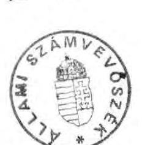
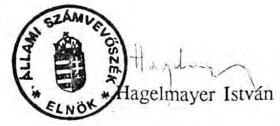
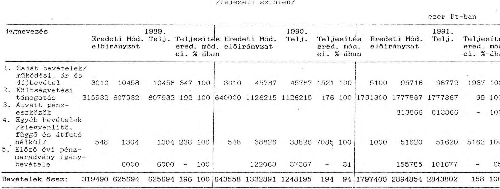

# Állami Számvevőszék

## JELENTÉS

az Országgyűlés fejezet pénzügyi-gazdasági ellenőrzéséről

---

# Az ellenőrzést végezték:

| Fogarasi Miklós | számvevő tanácsos |
| :-- | :-- |
| Kovácsné Szepesi Etel | számvevő tanácsos |
| Nagy Ákosné | számvevő tanácsos |
| dr. Solymár Károlyné | számvevő tanácsos |
| Surányi Tamás | számvevő |

Az ellenőrzést vezette:
Kolossváry György
főtanácsos

---

# JELENTÉS

## az Országgyűlés fejezet pénzügyi-gazdasági ellenőrzéséről

A vizsgált időszakban a fejezetnél szervezeti változást jelentett, hogy a korábban idekapcsolt Népköztársaság Elnöki Tanácsa (NET) megszűnt, ugyanakkor létrehozták a Köztársasági Elnöki Hivatalt (KEH), amely csak 1991-től működik önálló fejezetként. A fejezet a Művelődésügyi és Közoktatási Minisztériumtól 1991-ben átvette a parlamenti könyvtár felügyeletét.

Az új parlament létrejöttével jelentős minőségi és mennyiségi változás következett be az Országgyűlés fejezet feladataiban. A megnövekedett feladatokat jellemzi, hogy a parlamenti ülésnapok száma az 1989. évi 36-ról 1991. évben 95-re nőtt, az elfogadott törvények száma 1989-ben 58, 1990-ben 104, 1991-ben pedig 93 volt. A képviselők független státuszát törvény írja elő.

A fejezet költségvetési előirányzata 1989. és 1991. évek összehasonlításában 319,4 M Ft-ról 1797,4 M Ft-ra, a tényleges kiadások 551,8 M Ft-ról 2565,1 M Ft-ra, a foglalkoztatott létszám pedig 209 főről 633 főre emelkedett. A fejezet feladatainak ellátásához 1989-ben 607,9 M Ft (NET-tel együtt), 1991-ben 1777,9 M Ft költségvetési támogatásban részesült.

Az ellenőrzés célja annak értékelése volt, hogy a működésben és a költségvetési gazdálkodásban a törvényességi, a célszerűségi és az eredményességi szempontokat hogyan érvényesítették, a fejezetnél a feladatok, a szervezet és a pénzügyi források mennyiben vannak összhangban.

Az ellenőrzés az 1989-91. évekre terjedt ki, továbbá vizsgáltuk az 1992. évi költségvetés megalapozottságát.

---

# I.

## Részletes megállapítások

## 1. A feladatok, a szervezeti rendszer és a gazdálkodási feltételek összhangjának értékelése

Az Országgyűlés hivatali apparátusa a Parlament működését a vizsgált időszakban lényegében biztosította. Ugyanakkor a szabályozottság, a célszerűség és a szabályszerűség követelménye nem érvényesült maradéktalanul. A feladatok, a szervezet és a gazdálkodás feltételei nincsenek megfelelően összhangban.

A feladatok meghatározása - különös tekintettel a költségvetési gazdálkodásra - nem teljeskörű, részben elavult.

Az Alkotmány az Országgyűlésnek, mint a legfelsőbb államhatalmi és népképviseleti szervnek (testületnek) a feladatait határozta meg. Az Országgyűlés hivatali szervezete esetében erre a Házszabály illetékes.

A többször módosított 8/1989. (VI.8.) OGY határozattal elfogadott Házszabály állapítja meg főbb vonalaiban az Országgyűlés hivatali szervezetét és annak feladatait. Ez az előző ciklusban azzal a céllal készült, hogy megfelelő keretet adjon az új Parlament megalakulásához, működésének megkezdéséhez. A módosítások nem jelentették az Országgyűlés szervezetének új alapokra helyezését.

Nincs megfogalmazva a Házszabályban például az Országgyűlés költségvetési fejezet feladata, kapcsolata a Köztársasági Elnöki Hivatallal, az Országgyűlési Könyvtár feladata, jogállása, a bizottságok működési kiadási kereteihez kapcsolódó gazdálkodási jogosultság, frakcióhivatalok működése, illetve képviselőcsoportok gazdálkodása.

Az Országgyűlés hivatali szerveit három egymás mellé rendelt szervezeti egység - a főtitkár (és apparátusa), az Országgyűlés Hivatala, és az elnöki titkárság - képezi. A hivatali szervek egymás mellé rendeltsége jelentős koordinációs igénnyel jár. A hivatal szerveinek vezetői között az egyeztetés rendszeres, s általában megegyezéssel zárul. Mégis hiányzik egy olyan vezető, aki az apparátus egészének átfogó irányítását ellátná és aki a választott elnököt részben mentesítené e feladat alól.

A feladatok mennyiségi és minőségi módosulása az Országgyűlés hivatali szervezetében változásokkal járt. Kifogásolható, hogy a szervezet módosítását nem alapozták meg a feladatok, a szervezet és az irányítási rendszer helyzetelemzésére épülő átfogó koncepcióval.

---

Az átszervezés, létszámbővítés a szervezeti egységek egy részénél azok önálló elképzelései szerint, részben szakaszosan folyt.

A feladatváltozás miatt szükséges új Házszabály széleskörben egyeztetett tervezetét 1991. májusában elkészítették, tárgyalására azonban nem került sor. Az új Házszabály hiányában nem módosították a feladatok részletesebb megfogalmazását, a szervezet bővebb tagolását tartalmazó 1/1990. számú Országgyűlés elnöki utasítással közzétett Szervezeti és Működési Szabályzatot.

Egyes főosztályok szervezete feladatok kiemelésével tagoltabbá vált. (Területi és Igazgatási Főosztály négy osztályra tagozódva végzi tevékenységét a korábbi kettő helyett.)

Feladatfelmérést, illetve koncepciót készített pl. a Területi és Igazgatási Főosztály, a Külügyi Főosztály, Sajtóiroda. A szervezeti sémára alternatív elgondolást állított össze a Műszaki Főosztály, figyelembevéve a beruházás lebonyolítási, továbbá a képviselői irodaházzal kapcsolatos feladatokat.

Kifogásolható, hogy a hivatalvezető 1991. év közepén hozott utasítása ellenére a Főkönyvelőség a feladat és a szervezet felülvizsgálatát nem végezte el, átszervezési elképzeléseit nem dolgozta ki. (Jelenleg dolgoznak az Országgyűlés Hivatala teljes szervezetének átszervezési elgondolásán.)

Az Országgyűlés hivatali szerveinél egyes esetekben célszerűtlen, párhuzamos vagy részben átfedő, esetleg megosztott feladatellátás tapasztalható.

A Képviselői testület cím terhére létrehozott - de hivatali alkalmazottként foglalkoztatott dolgozókat tömörítő - frakcióhivatalok nem integrálódtak be a hivatal szervezetébe. A frakciók által meghatározott feladatokra az Országgyűlés Hivatala rálátása nincs, azt nem ismeri. Így a képviselői munka segítésének azzal a lehetőségével, amely a párhuzamosságtól mentes, racionális feladatmeghatározásra irányul, csak korlátozottan rendelkezik.

A munkaruhák beszerzésével, munkaruha ellátással a Főkönyvelőség és a Műszaki Főosztály is foglalkozik. Hasonló a helyzet a selejtezésekre vonatkozóan is.

Célszerűtlen, hogy a fejezeti feladatok nem különültek el a Hivatal operatív gazdálkodási feladataitól (személyre bontottan sem). Ez is hozzájárult ahhoz, hogy az irányító szervi hatáskörben hozott intézkedések esetenként nem voltak dokumentálva (pl. költségvetési előirányzatmódosítás).

Az Országgyűlés hivatali apparátusának tevékenysége a feladat-, hatáskör és felelősség vonatkozásában nem megfelelően szabályozott.

Az SZMSZ a vezetői jogosítványokat hiányosan rögzíti (pl. éves költségvetés elkészítésének összeállításáért, a költségvetési előirányzatok átcsoportosításáért, a számviteli rendért, a bizonylati fegyelemért, a vagyonvédelmért, valamint a belső ellenőrzés

---

működtetéséért való vezetői felelősség nem rendezett). A vezetők helyettesítésének rendje konkrétan nem szabályozott.

A bér- és létszámgazdálkodás feladatát, felelősségét az SZMSZ-ben, a Munkaügyi Szabályzatban, illetve a kapcsolódó szabályzatokban nem határozták meg kellő részletezettséggel.

A gazdasági folyamatok egy része szabályozatlan (pl. anyag- és készletgazdálkodás, frakcióhivatalok gazdálkodása). Az ellenőrzésnek átadott szabályzatok közül többnek a hatálybalépése nem dokumentált, csak tervezetnek tekinthető (például a Leltározási Szabályzat és a Főpénztár Kezelési Szabályzat hiányzott. A vizsgálat végén új Leltározási Szabályzatot léptettek hatályba.)

Az egyes szabályzatok között nincs összhang (például a Műszaki Főosztály és a Főkönyvelőség ügyrendje, valamint az SZMSZ, továbbá a Munkavédelmi Szabályzat és a Munka-, védő- és formaruha juttatás Szabályzat között).

A rendelkezésre álló költségvetési támogatás és a saját bevételek a feladat ellátásához szükséges fedezetet teljes mértékben biztosították, sőt az éves pénzmaradványok és igénybevételük túlfinanszírozásra utalnak.

A költségvetésben biztosított támogatás nemcsak az Országgyűlés tevékenységével összefüggő feladatokat szolgálta, illetve szolgálja, hanem más fejezetek működésével összefüggő ráfordításokat is finanszíroz. Ugyanakkor más fejezetet terhelnek a Parlament működésével kapcsolatos egyes kiadások.

A Miniszterelnöki Hivatal a Parlamentben lévő helységeinek fenntartási költségeiből csak az étterem energiaszolgáltatását téríti. Az Országgyűlés hivatali gépkocsijai a Miniszterelnöki Hivatal garázsában vannak elhelyezve, amiért bérleti díjat nem fizetnek. Az önálló fejezetet képező Köztársasági Elnöki Hivatal közvetett fenntartási költségei 1991-ben még az Országgyűlés fejezetet terhelték, s csak 1992-tól kerültek átcsoportosításra a Hivatalhoz.

A gazdálkodás irányítási és döntési rendszerének hatékony funkcionálását a gazdasági folyamatok átfogó szabályozásának hiánya, a belső információs rendszer lehetőségének nem kellő kiaknázása és az ellenőrzés hiányosságai gátolják.

A gazdálkodási hatás- és feladatköröket, a pénzügyi jogköröket nem megfelelően határozták meg.

Nincs rögzítve a fejezet, illetve az intézményi szinten a költségvetési előirányzatok átcsoportosításának jogosítványa, eljárási módja. Az utalványozási jogkört a Főpénztár Kezelési Szabályzat és a Főkönyvelőség ügyrendje lényegében tartalmazza, ugyanakkor a kötelezettségvállalás, az ellenjegyzés és az érvényesítés jogkörének gyakorlását írásban nem rögzítették.

---

Az Országgyűlés információs rendszere a számítógépes adatfeldolgozás technikai és személyi feltételeinek dinamikus kiépítésével 1989-től jelentősen fejlődött. Az adatbázis kialakításánál az elsődleges cél a képviselői feladatok segítése volt. Az Országgyűlés Hivatala gazdasági információinak számítógépes rögzítése, feldolgozása önálló rendszerben, nagyobb részt a külső adatszolgáltatás követelményeihez igazodóan történik. Ugyanakkor tapasztalható egyes felismert és megfogalmazott belső igények fokozatos rendszerbe vitele is.

A gazdálkodás irányítási, döntési rendszeréhez a szervezett és folyamatos információszolgáltatás azonban még szűkkörű (pl. frakció alkalmazottak létszám és bérkeret lekötöttségéről havi tájékoztatás), s abban az összehasonlító értékelés, közgazdasági elemzés nem jellemző.

A gazdálkodás és egyéb feladatok ésszerű, és minél kisebb ráfordítással való ellátását, a végrehajtásban a belső rendet és fegyelmet nem segítette kellően az ellenőrzés. Az ellenőrzés hatékony és szabályszerű működtetésével kapcsolatos feladatokat az SZMSZ nem rögzíti, a belső ellenőrzési tevékenység nincs szabályozva.

A felügyeleti jellegű költségvetési ellenőrzés feltételeit a Könyvtár átvétele óta még nem teremtették meg.

A belső ellenőrzés rendszerét nem építették ki teljeskörűen. A függetlenített belső ellenőrzés a szervezetből hiányzik. Így egyes területek ellenőrzése megoldatlan volt (pl. a frakciók gazdálkodása).

A vezetői ellenőrzést az utalványozási, ellenjegyzési jogkörök, továbbá a beszámoltatás útján gyakorolták. Eredményességét rontotta, hogy az intézkedések számonkérése nem mindig volt következetes. A munkafolyamatba épített ellenőrzés hatékony működését a gazdasági folyamatokra jellemző szabályozatlanság, a hatás- és feladatkörök meghatározásának problémái, a munkaköri leírások hiánya akadályozta.

# 2. A költségvetési tervezés és finanszírozás értékelése

a.) Az 1989-91. években a bevételek tervezésénél a fejezet a mérsékelt saját bevételi lehetőségeket sem vette reálisan figyelembe az eredeti előirányzatok kialakításakor. Az alátervezést jól mutatja, hogy a saját bevételek előirányzata jelentősen elmaradt az előző évi tényszámoktól. Ez az alátervezés az éves költségvetések jóváhagyásakor a költségvetési támogatási igényt növelte.

A bevételek növelése érdekében egyre inkább számoltak a szabaddá vált pénzeszközök legjövedelmezőbb hasznosításával, kötvényben való elhelyezésével. A befolyt kamatösszegek átlagosan a saját bevételek közel 80%-át képezték. A parlamentben szolgáltatásokat nyújtó külső gazdálkodó szervekkel kötött szerződések esetében a bevételi lehetőséggel (bérleti díj) szemben, a kiadási megtakarítási szempontokat (alacsonyabb ár elérése) helyezték előtérbe (Taverna, Julius Meinl). A protokoll rendezvényekkel kapcsolatos térítéseket más szervek részére reálisan számlázták ki.

A kiadások tervezését részben az előző időszak tényszámai, illetve az új feladatok és az ehhez kapcsolódó igények maximális kielégítésére való törekvés határozták meg.

A mennyiségében, minőségében jelentősen megváltozott szakmai és gazdálkodási feladatokhoz a pénzügyi feltételeket időben megteremtették, a Hivatal vezetése azonban több esetben a pénzügyi keretek túlbiztosítására törekedett.

Az előirányzatokat több területen nem alapozták meg a szükségletek konkrét felmérésével. Az esetek nagyobb részében ez túltervezést jelentett, de ennek ellenkezője is előfordult.

A képviselő csoportok szakértői díjelőirányzatánál és a parlamenti bizottságok szakértői díjkereténél 1990-91. években jelentős maradványok képződtek. A bizottságok 14, illetve 25%-ban vették igénybe az előirányzatot.

A felújításoknál a munkák ütemezése és a kivitelezői kapacitás előzetes felmérésének hiányosságai az 1989-91. években 41, 26 és 38 M Ft maradványt eredményeztek.

A készletbeszerzések tervezésénél nem tapasztalható a tervezés célravezető módszereinek, valamint a lehetséges esetekben a normativitás tudatos alkalmazása.

A bérelőirányzatok megalapozottságának értékelését nehezítette, hogy a báziselőirányzat kialakítása (szerkezeti változás, szintrehozás) 1989. évben a Népköztársaság Elnöki Tanácsával, 1990. és 1991. évben a Köztársasági Elnöki Hivatallal és a Képviselői Testület címmel együttesen történt. A bértervezést kedvezőtlenül befolyásolta, hogy az új parlament megalakulása kapcsán a feladat-
 és szervezetrendszer helyzetelemzését még nem végezték el, és így az apparátus optimális kereteit sem alapozták meg.

Az országgyűlési képviselők tiszteletdíjáról, költségtérítéséről és kedvezményeiről szóló 1990. évi LVI. törvény – amely 1990. VII. 1-től hatályos – normatív előírásaitól eltérő pótelőirányzat kérelmet nyújtottak be és vettek igénybe 1990. évben, amely mintegy 77 M Ft túltervezésből adódó többletet jelentett, és ezt utólag sem korrigálták.
—A képviselői tiszteletdíjnál a 386 fő tényleges létszám helyett 400 fővel számoltak, ami 3.640 e Ft,
—a 150 fő irodaházi alkalmazott 6 havi bére és jutalma, ami 15.132 e Ft,
—7 frakció és 14 bizottság havi 3.000 Ft-os reprezentációja, ami 1.150 e Ft,
—a független képviselőket nem illeti meg a frakcióknak járó 20 képviselő évi alapdíja, ennek tervezése 3.900 e Ft,

---

- a szakértői díjak után indokolatlanul irányozták elő a 43% TB járulékot, ami 53.723 e Ft többletet jelentett.

Kifogásolandó, hogy az 1990. évi költségvetésben tervezett képviselői járandóságokat a pótelőirányzati előterjesztésben nem vették figyelembe, illetve a pénzügyi kormányzat nem zárolta, ugyanakkor az LVI. törvényben foglalt díjak teljes összegben növelték az 1990. évi pótelőirányzatot.

A Képviselői Testület 1991. évi költségvetésében az előző évi túltervezéseken és a törvényben nem szereplő tételeken felül további többleteket irányoztak elő, amelyek összesen mintegy 196 M Ft tervezési többletet tettek ki.
-A 386 fő helyett 400 fő képviselő után számított magánalkalmazottak díja 2.730 e Ft, ennek 20%-os automatizmusa 14.300 e Ft,
—a képviselők közlekedése a közforgalmú tömegközlekedési eszközökön ingyenessé vált, ennek ellenére utazási bérleteket terveztek, ami 6.050 e Ft,
—a frakciók szakértői díjára tervezett 20% automatizmus 21.391 e Ft,
—a képviselői magánalkalmazottak után indokolatlanul irányoztak elő 43% TB járulékot, ami 39.689 e Ft, mivel a személyzet költségelőirányzata azt is magában foglalja,
—az 1990. évi pótelőirányzatban szereplő tételek 1991. évi kihatása 112.111 e Ft többletet jelentett.

A túlméretezett összegek részben, vagy egészen beépültek az éves költségvetések bázis előirányzataiba, alapját képezve az éves automatizmusok számításainak.

Kivétel volt az 1990. évi eredeti költségvetési előirányzat, amelynél az előző évi módosított előirányzatot – a felújítási előirányzaton kívül – csak 85%-os mértékben (15%-os "negatív szerkezeti változásként") vették figyelembe. Az előző évi túlfinanszírozást ezzel is csak részben mérsékelték.

A központi forrásokból juttatott pótelőirányzatok következtében a fejezet jelentős mértékű – a tényleges igényen felüli – pótforrásokhoz jutott.

Az 1989. évi 319.442 e Ft összegű, fejezet szintű előirányzat megállapításakor – az igazgatási kiadások csökkentése címen – 56.000 e Ft elvonásra került. A szűkített pénzügyi keretekhez nem tudtak igazodni, és így az I. félévkor 13%-kal, 20.997 e Ft-tal túllépték a kiadási előirányzatot. A pénzügyi feszültségek oldására, a törvényhozással kapcsolatos megnövekedett igényekre, annak személyi és tárgyi feltételeire, továbbá az épület elodázhatatlan felújítására jogosan merült fel pótelőirányzat igény. Az 1989. II.

---

félévére központilag biztosított 287 M Ft-os pótelőirányzatnak a béralapra és a felújításra vonatkozó tételei – felhasználási ütemezésre utaló számítási anyag hiányában – azonban nem álltak összhangban a prognosztizált feladatokkal, illetve annak időarányos teljesítésével.

A béralap növelésére szánt 28.843 e Ft – mely egyébként az igényként bejelentett 100 fő havi bruttó 44.400 Ft/fő összegű foglalkoztatását tette volna lehetővé – végülis 50%-os mértékben került felhasználásra; 209 fő átlagosan évi 30%-os alapbéremelésére és 23 fő létszámfejlesztésre biztosítva fedezetet. (Ez összességében 10 fő átlagos állományi növekedést jelentett éves szinten.)

A túlfinanszírozáshoz hozzájárult, hogy nem került rögzítésre, mely összeg tekinthető kizárólag tárgyévi igénynek, illetve ebből mekkora hányad képezi a következő évi tervezés alapját.

Ez utóbbi csak az 1990. évi költségvetés eredeti bérelőirányzatából volt megállapítható, mely szerint az előző évi pótelőirányzat mindössze 62%-os mértékben képezte a következő év bázis bérelőirányzatát, a fennmaradó rész (11.038 e Ft), annak egyszeri támogatási jellegénél fogva elvonható lett volna, melyre a 14.893 e Ft összegű bérmaradvány fedezetül szolgált.

Az 1989. évi pótelőirányzatból 162.050 e Ft-ot felújítási célra kértek. Ennek több mint 50%-ára ez évben nem volt szükség, miután az előirányzat maradványa év végén 87.375 e Ft-ot tett ki.

Saját hatáskörben a bevételi előirányzatok megváltoztatására 1989-90-ben teljeskörűen, 1991-ben csak az ár- és díjbevételeknél került sor.

A többletbevételeket nagyrészt a tényleges igények kielégítésére, 1989-ben anyagjellegű kiadásokra, 1990-ben elsősorban béralapra, továbbá beruházások finanszírozására és annak ÁFA fedezetére, 1991-ben döntően készletbeszerzésre és anyagjellegű kiadások fedezetére fordították.

A működési bevételek 1989-1990. évi 1.554 e – 3.370 e Ft összegű túlteljesítését hasonló összegű előirányzatmódosítással – láthatatlanná tették, ezáltal a fenti összegek 50%-át, 2.462 e Ft-ot kivontak az állami költségvetésbe történő visszafizetési kötelezettség alól. Az előirányzatmódosításokra – az állami költségvetés rovat- és tételrendje előírása szerint – csak a Pénzügyminisztérium engedélyével kerülhetett volna sor.

A kiadási előirányzatok saját bevételből, továbbá előző évi pénzmaradványból történő saját hatáskörű módosításai 1989-ben 2, 1990-ben 15, 1991-ben 9%-kal növelték a fejezet évi gazdálkodási kereteit.

---

A Házszabály az előirányzat átcsoportosításról a hatáskörök vonatkozásában egyértelműen nem rendelkezett, az ezirányú változtatásra kizárólag a fejezet irányításáért felelős vezető szintjén lett volna lehetőség. Ennek ellenére 1989-ben 46.853 e Ft felújítási előirányzat beruházásra, a fejezeti állóeszközfenntartási alapból 6.000 e Ft-nak az Országgyűlés igazgatási költségvetésébe történő átcsoportosításáról az Országgyűlés Hivatalának vezetője döntött.
b.) Az 1992. évi fejezeti szintű költségvetési javaslatot az Országgyűlés – az 1991. évi XCI. törvénnyel – elfogadta. Az eredeti javaslaton túlmenően a köztisztviselők jogállásáról szóló törvényhez kapcsolódó bérek címén – a képviselői tiszteletdíjak fedezetére, módosító indítvány alapján – 600 millió Ft-ot állapított meg.

A fejezet 1992. évi költségvetési előirányzata az 1-3 címen 1867,4 M Ft, amely 140 M Ft fejlesztési többletet tartalmaz. A kiadási előirányzatból a KEH fejezethez 58,4 M Ft előirányzatot átcsoportosítottak.

Az 1991. évi báziselőirányzatot, valamint az 1992. évi alapelőirányzatot a tervezési előírások szerint vezették le.

Ennek ellenére a 1992. évi költségvetési előirányzatok sem kellően megalapozottak. A saját bevételeket továbbra is alultervezték. A szabályosan levezetett báziselőirányzat az előző évek tervezési hiányosságai folytán túlbiztosított. A fejlesztési többletigény nem a szükségletek és lehetőségek fejezeti szintű elemzésén, a feladatok átfogó és koncepcionális felmérésén alapult.

Az Országgyűlés igazgatása cím működési-, ár- és díjbevételre csak 3,5 M Ft-ot irányzott elő, annak ellenére, hogy a kamaton felül realizált saját bevétel több mint 17 M Ft volt 1991-ben, s ebből a működési bevétel is meghaladta az 5 M Ft-ot.

A 100 fő többlet létszám indokoltságát feladatfelméréssel csak részben (a szervezeti egységek vezetőinek egyeztetése alapján), bérigényét számítással nem támasztották alá. A bérszerkezet tervezése sem reális: az 1991. évi megbízási díj 36,5 M Ft előirányzatának mintegy 10%-os felhasználása ellenére e jogcímen 1992-ben több mint 40 M Ft-ot terveztek. A dologi kiadások egyes tételeinél (posta, irodaszer, stb.) az előirányzat és szükséglet aránytalanságait a számítási anyaggal nem alátámasztott fejlesztési többlet – reális tervezés, címek között a szükséges átcsoportosítás hiányában – nem oldja fel.

A Képviselői Testület cím előirányzatát a bázis szintjén tervezték, de ez egyidejűleg azt jelenti, hogy az előirányzat az előző évek túltervezett szintjére épült rá.
c.) Az év végi pénzmaradványok – a vizsgált 3 évben – jelentős összegűek voltak, korrekció nélkül ez 1989-ben 98,8 M Ft-ot, 1990-ben 74,9 M Ft-ot és 1991-ben 277,4 M Ft-ot tett ki.

---

A kedvező pénzügyi lehetőségeket mutatja, hogy ezek az összegek a működési-, ár- és díj-, valamint a támogatási bevételek együttes összegéhez viszonyítva sem elhanyagolhatóak (16%, 6% és 15%).

A pénzmaradványok kimutatásánál, elszámolásánál és jóváhagyásánál hiányosságokat állapított meg az ellenőrzés.

Az 1989. évi 98,8 M Ft pénzmaradványból az elvonható összeget tévesen mutatták ki, mivel a társadalombiztosítási járulék állami költségvetést megillető maradványaként 17,8 M Ft-ot – számítási anyag hiányában – vallottak be, melyet a Pénzügyminisztérium jóváhagyott.

Az 1990. évi pénzmaradvány részletes levezetésére, önbevallására, a Pénzügyminisztérium általi felülvizsgálatára nem került sor, és így az állami költségvetést megillető elvonásra sem.

Az 1991. évi 277,4 M Ft pénzmaradványból – normatív előirányzat maradványa és működési bevételi többlet címen – összesen 222,9 M Ft-ot vallottak be elvonásra. A tételes ellenőrzéskor megállapítást nyert, hogy téves könyvelés miatt a Képviselői Testület cím tényleges béralapmaradványa 11 e Ft-tal magasabb a beszámolóban közöltnél.

A pénzmaradvány valós kimutatását – és így a költségvetési beszámoló valódiságát is – sérti az a gyakorlat, hogy a parlamenti frakciók szakértői díj előirányzatát, a tényleges felhasználástól függetlenül, felhasználásként mutatták ki az 1990-91. években. E céljellegű előirányzat fel nem használt, igénybe nem vett része – 1990-ben 10.143 e Ft, 1991-ben 12.547 e Ft – a fejezet szintű pénzmaradvány részének tekintendő és befizetési kötelezettséget jelent az állami költségvetés javára. Az 1990. évi felhasználatlan előirányzatból 9.131 e Ft-ot fizették be a PM-nek, úgy, hogy az nem volt része a pénzmaradványnak.

A vizsgált évek során jelentkező maradványok összegét jelentős részben tartalékként kezelték, ennek összegszerűsége és a felhasználható pénzmaradványhoz viszonyított aránya 1990-ről 1991-re csökkent.

Az 1990. évi 84,7 M Ft tartalékba helyezett összeg a halmozott pénzmaradványnak 78%-át, míg az 1991. évi 58,6 M Ft a 35%-át tette ki.

A tartalék csökkenésében az áremelkedéseken túl szerepet játszott a parlament 1991. évi szinte folyamatos ülésezése, a delegációk tervezettet meghaladó száma, az eszközök, berendezések iránt megnövekvő igények kielégítése, valamint az elmaradt feladatok miatti állami költségvetésbe teljesítendő befizetés.

A fejezet pénzellátása az ellenőrzött időszakban folyamatosan – a növekvő szakmai-gazdálkodási feladatokat meghaladó arányban – bővült, a túlfinanszírozás következtében átmenetileg és tartósan egyaránt szabad pénzforrások képződtek.

---

A vizsgált időszakban, 1989. I. negyedévében a finanszírozást megelőzőleg a támogatásként kiutalt pénzösszeg 38%-a, 1990. év II. félévében 59%-a, 1991. III. negyedévében 74%-a állt likvid pénzeszközként (bankszámlán, illetve házipénztárban) rendelkezésre.

A Hivatal vezetése az átmenetileg szabad pénzeszközeit a legkedvezőbb feltételekkel igyekezett hasznosítani. A pénzeszközeit 1991-ben azonban nem a 4/1991. (III.13.) PM rendelet alapján a számlavezető pénzintézetnél, hanem kereskedelmi bankoknál kötvény formájában hasznosította. (A PM 23769/2/1991. sz. leiratos intézkedése erre lehetőséget adott, de ez nem változtathatja meg a rendelet előírásait.) Az értékpapírok állománya 1991. év második felére 220.000 e Ft-ra növekedett; tőke és kamat összege fedezetet nyújt a Képviselői Testület cím hasonló összegű maradványának állami költségvetésbe történő visszajuttatására. (Az Országgyűlés szabad pénzeszközei így is megközelítik a 100.000 e Ft-ot.)

# 3. A költségvetés végrehajtásának értékelése 

A fejezet eredeti bevételi előirányzatait az 1989-91. években jelentősen túlteljesítette (lásd 1. sz. melléklet). Az 1989. évi 625,7 M Ft-tal szemben 1991-ben 2843,8 M Ft-ot realizáltak, amelyben meghatározó volt a költségvetési támogatás. A költségvetési támogatás az összes bevétel döntő hányadát tette ki az 1989-90. években, míg 1991-ben 63%-át. A saját bevételek (működési-, ár- és
 díjbevételek) számottevően növekedtek, ami a kötvénykamat bevételre vezethető vissza. A költségvetések megalapozottságát rontotta, hogy a saját bevételek nagy mértékű emelkedése ellenére, azokat évről-évre jelentősen alátervezték.

Az egyéb bevételek (átvett pénzekkel és pénzmaradvánnyal együtt) az 1991. évben ugrásszerűen növekedtek (elérték a 967,2 M Ft-ot) amiben a 790 M Ft-os kötvényforgalom játszott jelentős szerepet.

A fejezet szintű kiadások is jelentősen meghaladták az eredeti előirányzatokat, 1990-ben például annak több mint kétszeresét tették ki (lásd 2. sz. melléklet). A módosított előirányzatoktól elmaradva az 1989. évi 551,8 M Ft-tal szemben 1991-ben 2.565,1 M Ft kiadást teljesítettek.

A kiadásokból 1989-ben 65,6 M Ft, 1990-ben 46,6 M Ft a NET, illetve a KEH céljait szolgálta, míg 1991-ben az Országgyűlés Könyvtárának kiadásai 77,4 M Ft-ot tettek ki. Az 1990. évi kiadások meghaladják a bevételeket, aminek az az oka, hogy a szabad pénzek betétbe való elhelyezése a pénzforgalmi nyilvántartásban ideiglenesen átadott pénzeszközként, 130 M Ft kiadási többletként jelent meg.

A fejezet rendelkezésére álló költségvetési keretek lehetővé tették a működés megfelelő feltételeinek megteremtését, a feszültségektől mentes gazdálkodást. Az 1990-91. években

---

rendelkezésre álló jelentős összegű halmozott pénzmaradványok (108,4 M Ft, 163,7 M Ft) döntő része kiadási megtakarításból adódott, ami a kedvező pénzellátást támasztja alá.

Az 1990. évi CIV. és az 1991. évi XCI. törvény az Országgyűlés fejezetében irányozta elő - címekként - a nemzetiségek, a pártok és a társadalmi szervek támogatását. A pénzellátás rendje szerint a Pénzügyminisztérium feladata volt az érintettek közvetlen finanszírozása. Így e címek előirányzata és teljesítése a fejezet beszámolási rendszerében nem jelent meg. Az 1991. évi költségvetési törvény azonban nem rendelkezett a folyósítás feladatáról. Jelenleg - jogszabályi alap nélkül - továbbra is a Pénzügyminisztérium a közvetlen finanszírozó.

A fenti kiadási címek előirányzatának és azok tényleges folyósításának szétválasztása a két fejezet között formálissá tesz bizonyos intézkedéseket (például pótelőirányzat közlése a Pénzügyminisztérium részéről). A költségvetési törvény szerkezete szerinti fejezeti beszámolás a nemzeti és etnikai kisebbségi, a pártok, a társadalmi szervek támogatása címek tekintetében szintén formális, s rendezetlen az ezért való felelősség. A szóbanforgó címeknél a feladat hovatartozásának rendező elve szerint indokolt a pénzellátásról gondoskodni, s ehhez a szükséges feltételeket - az Országgyűlés fejezetnél megteremteni.

A gazdálkodás főbb területeinek értékelését a következőkben mutatjuk be.

# 3.1. Az Országgyűlés igazgatása cím előirányzataival való gazdálkodás 

a.) A létszám- és bérgazdálkodással szemben alapvetően a feladatok változó összetételéhez és volumenéhez való igazodás állított követelményt.

Az Igazgatás cím eredeti bérelőirányzata (amely a fejezet szintű előirányzat döntő részét képezi) az 1989. évi 38,1 M Ft-ról 1991. évre közel négyszeresére, 143,4 M Ft-ra, a tényleges bérkiadás pedig 48,3 M Ft-ról csaknem háromszorosára, 143,7 M Ft-ra nőtt.

Az eredeti előirányzatok módosítása, majd a módosított előirányzatok felhasználása az 1989-1990. években a gazdálkodás kiegyensúlyozatlanságát mutatja. A módosított előirányzatot 1989-ben 72 %-ban, 1990-ben 141 %-ban használták fel.

Az eredeti bérelőirányzatok nagyvonalú tervezését mutatja, hogy az előző évi tapasztalati adatokat esetenként nem megfelelően vették figyelembe.

A részfoglalkozásúak bérét például minden évben alátervezték, így 1990-ben a 200 e Ft előirányzattal szemben a felhasználás 16.360 e Ft volt.

A megbízási díjakat 1990. évben alátervezték, a 3,8 M Ft előirányzattal szemben 11,6 M Ft-ot fizettek ki. Az 1991. évben viszont lényegesen túltervezték az igényeket, az előirányzott 36,5 M Ft-tal szemben csak 6,2 M Ft volt a felhasználás. A pénzügyi

---

fegyelmet sérti, hogy a munkák elvégzését a megbízási szerződésben nem igazolták. A parlamenti bizottságok szakértői díj előirányzatát jelentős nagyságrendű, indokolatlan tartalékkal alakították ki. Az 1990. évben a 18-ból mindössze 6 bizottság vette igénybe a 100 e Ft keretösszeget, összesen 247 e Ft összegben, amely az előirányzat 14%-át tette ki. Az 1991. évben az előző évi alacsony felhasználás ellenére a keretösszeget 200 e Ft-ra emelték. Mindössze két bizottság használta fel a megemelt keretösszeget. Az előirányzatnak összesen 25%-át fizették ki, 894 e Ft-ot.

Az Igazgatás átlag létszáma - részfoglalkozásúakkal együtt - az 1989. évi 209 főről 1991. évre mintegy kétszeresére, 414 főre nőtt. A bértervezés alapját döntően ez képezte, de ezt megalapozottnak minősíteni nem lehet, mivel - mint már említettük - a feladat- és a szervezetrendszer, a létszám átvilágítására még nem került sor. A feladatokat munkaköri leírásokkal általában nem konkrétizálták.

A tervezés bizonytalanságát támasztják alá az előirányzatmódosítások, illetve a tényleges bérkiadások.

Az 1989. évben az eredeti előirányzatot 76%-kal megemelve, módosították. Az előirányzatmódosítást részletes indoklással, számításokkal nem támasztották alá. Ugyanakkor ezt a módosított előirányzatot csak 72%-ban használták fel, 18,6 M Ft bérmaradványt elérve. A túltervezés oka a 100 főben meghatározott létszámfejlesztési igény volt, amelyből ténylegesen mindössze 10 fő évi átlagos létszámnövelést valósítottak meg.

Az 1990. évben ellenkező előjelű folyamatként 41%-kal és 31 M Ft-tal több bért fizettek ki, mint a módosított előirányzat.

A bérgazdálkodás pénzügyi folyamatai 1991. évben összességében már kedvezőbben alakultak, bár a költségvetési szabályokat nem mindenben érvényesítették.

A bérelőirányzatot minimálisan, de 0,2 %-kal, 306 e Ft-tal túllépték. Az 1990. évi CIV. törvény értelmében címek közötti átcsoportosítást nem hajtottak végre, illetve a túllépéshez nem rendeltek bevételi előirányzat növelést.

A bérkiadásokon belül jelentősen nőttek a túlóradíj kifizetések.
Az 1989. évben 3,6 M Ft-ot, 1990-ben 9,2 M Ft-ot, míg 1991-ben 15,4 M Ft-ot fizettek ki ilyen címen. Ez összefüggésben van az ülések időtartamának, valamint a különféle rendezvények számának emelkedésével. A munkaszervezés költségcsökkentést eredményező ésszerúsítése még nem merült fel (pl. lépcsőzetes munkakezdés).

A havi átlagbér az 1989. évi 19.252 Ft-ról 1991-re 50%-kal, 28.926 Ft-ra, míg az átlagos havi kereset 19.252 Ft-ról 63%-kal, 31.445 Ft-ra nőtt.

A három év alatt négy alkalommal került sor bérfejlesztésre, amelynek forrása volt az automatizmus és a pótelőirányzat mellett két esetben a bérmegtakarítás is (1989. I. hóban 6 %, VII. hóban 10 %, 1990. II. hóban 18 %, 1991. I. hóban 20 %).

---

A bérfejlesztés mértéke - állománycsoportonként vizsgálva - reálisnak mondható, az ügyintézőknél volt a legmagasabb (71,7 %) és a vezetőknél a legalacsonyabb (45,6 %).

A bérpótlékok között parlamenti pótlékot és műszakpótlékot fizetnek. A parlamenti pótléknak jogszabályi alapja nem ismert, a munkaügyi szabályzat sem tartalmazza. A műszakpótlékot 1991-ben a fűtők részére vezették be, belső szabályzat alapján.

A jutalmazások mértéke az összes kereseten belül 1989-ben 17%-ot, 1990-ben 30%-ot, 1991-ben pedig 21%-ot képviselt. A magas jutalmazási hányad az alapbér ösztönző szerepét mérsékelte.

Hiányolható, hogy a bérmegtakarításból végzett jutalmazásokhoz 1989-1990-ben ösztönzési szempontokat nem kapcsoltak. Az ösztönzést kedvezőtlenül befolyásolta, hogy céljutalmazási, illetve prémiumrendszer nem működött. Az 1991. évben viszont a jutalmazás terén pozitív változás következett be.

A szervezeti egységek minősítés alapján, értékelési szempontok szerint kapták a jutalomkeretet (például Külügyi Főosztály a havi bér 120%-át, Főkönyvelőség 80 %-át).

Jutalmakat a béralapon túl, dologi előirányzatok terhére is fizettek.
Az 1990. évben a bérjellegű kiadás rovatról, a "14/4. Miniszteri és jubileumi jutalom" tételről rendkívüli jutalmazás címén az előirányzaton túl 10.972 e Ft-ot fizettek ki. A jutalom fedezetéről dokumentumot, információt nem tudtak az ellenőrzés rendelkezésére bocsátani.
b.) A külföldi kiküldetési kiadásokra meghatározó volt, hogy az Országgyűlés nemzetközi kapcsolatai a vizsgált időszakban gyors ütemben fejlődtek, tartalmi és formai szempontból is differenciálódtak. A külügyi tevékenységet - amely már 1989-ben is szélesedett - tovább bővítették 1990-ben a megváltozott feladatok, amelyek jelentős pénzigényt támasztottak.

A külföldi kiküldetési kiadások 1989-1991. között több mint négyszeresére nőttek.
Az eredeti előirányzat és a tényleges kiadás 1989-ben 2.628 e Ft, illetve 9.178 e Ft, 1990-ben 9.000 e Ft, illetve 15.593 e Ft, 1991-ben 10.700 e Ft, illetve 39.983 e Ft volt.

Az 1989-1991. közötti időszakban a külföldi kiküldetések utazási és fogadási rendje és az érintettek köre, a döntésre jogosultság szintje és a pénzellátás módja, valamint nagyságrendje is alapvetően megváltozott.

A külkapcsolatok szakmai koordinátora egységesen a Külügyi Főosztály lett, a pénzellátási és elszámolási feladatokat a Főkönyvelőség végzi.

---

Minőségileg megváltozott a külügyi koncepció és ennek megfelelően 1991-től:

- a nemzetközi tevékenységben négy szintű munkát alakítottak ki: elnöki, alelnöki; bizottsági; baráti tagozati; interparlamentáris cserék és együttműködések;
- a tárgyévi kiutazási és fogadási tervet - érvényes meghívások alapján - célszerűen tevékenység szintenkénti (funkcionális) és relációnkénti bontásban a Házbizottság elé terjesztik, ahol az észrevételek figyelembevételével, elfogadás esetén a Ház elnöke hagyja jóvá. Az évközi előterjesztéseket is elnöki jóváhagyással lehet megvalósítani;
- a külügyi tevékenység egységes szemléletű lebonyolítása és költségcsökkentés érdekében az 1992-es szabályozás szerint az Országgyűlés csak meghatározott körű tagjai és alkalmazottai külföldi útjait szervezi és bonyolítja le, mérsékelve ezáltal az elmúlt évek ugrásszerű növekedését;
- a megnövekedett külügyi tevékenységhez igazodva szakmai információgyűjtést is végeznek a külügyi munkatársak a saját, parlamenti adatbázis létrehozásához.

Az Országgyűlés Hivatala vezetője 1991. február 28-án kelt levele - amely a Munkaügyi Szabályzat mellékletét képezi - részletesen szabályozza a 29/1990. PM rendelet alapján az ideiglenes külföldi kiküldöttek költségtérítését és az ezzel kapcsolatos pénzügyi feladatokat. Az ehhez kapcsolódó, a Főkönyvelőség hatáskörébe utalt szabályozások ezideig nem készültek el. (A kiutazásokkal összefüggő forintkiadások, bizonylat nélkül elszámolható dologi költségek mértéke stb.)

A Főkönyvelőség a külföldi kiküldetésekre 1990-től számítógépes nyilvántartást alakított ki. A nyilvántartás hiányossága, hogy nem különíti el az Országgyűlés, az Országgyűlési Könyvtár, valamint a Köztársasági Elnöki Hivatal utazásait, továbbá a meghiúsult utazásokat sem. Külön adatgyűjtést igényel az utazások deviza és forint ráfordításának kimutatása.

Az 1990-1991. évi elszámolások szúrópróba szerinti ellenőrzése során azokat kellően dokumentáltnak találtuk, szabálytalanság nem fordult elő. Szabályozás és egységes gyakorlat hiányában azonban változó volt az eljárás a Ház alkalmazottainak utaztatását illetően. Előfordult, hogy az utazás indokoltsága vitatható volt.

A 90/053. sz. 1990. évi taiwani tájékozódó utazásnál, a magánjellegű utazás minősítés ellenére a költségvetés terhére számolták el a 12 napos kinttartózkodást. A Ház elnökének engedélyezéséről írásbeli nyilatkozatot nem találtunk. Költségként a devizaigény 50,2 e Ft összege merült fel 4 fő részére.

Az ajándékozás szabályozatlan és ezért azt a kiküldetési szintenként szokásjog alapján végzik.

Kifogásolható, hogy egy adott gazdálkodási év lezárása után nem készült érdemi értékelés és elemzés az eltelt év külföldi utazásairól, ami segítené a következő év tervezését is.

---

Ugyanakkor érzékelhetők az ésszerű gazdálkodásra irányuló törekvések, amelyekkel igyekeznek a megnövekedett pénzellátási igényeket csökkenteni úgy, hogy:
— többnyire nem elsőosztályon utaztatnak,

- meghívások esetén törekednek arra, hogy a meghívó fél részben, vagy egészében az utazási és kinttartózkodási költségeket átvállalja,
- maximálják a részben, vagy teljesen saját költségigényű kiutazásokon résztvevők létszámát,
— törekednek a többlet devizabevételt biztosító rendezvények számának növelésére.
c.) Reprezentációs célra az Országgyűlés igazgatása az 1989. évi 10.861 e Ft-tal szemben 1991. évben 42%-kal többet, 15.417 e Ft-ot fordított úgy, hogy az eredeti és a módosított
 előirányzatot mind a három évben jelentősen túlteljesítették. Ezen belül az évről-évre növekvő és 1991-ben 826 e Ft-ot kitevő személyi reprezentációs kiadásoknak a mintegy 70%-a a képviselői tevékenységet szolgálta.

A reprezentációs előirányzat tervezését - a hatályos 19/1980. (IX.27.) PM, illetve a 4/1991. (II.13.) PM rendelet szerint - a Szervezeti és Működési Szabályzatban (vagy a Munkaügyi Szabályzatban) kellett volna rögzíteni. Ehelyett csak a személyi reprezentációra készítettek szabályozást.

A reprezentációs kereteken belül az Országgyűlés Hivatala, illetve Házbizottsága különös figyelmet fordított a személyi reprezentációs keretek meghatározására, azok folyamatos aktualizálására. Kedvezőtlen ugyanakkor, hogy a személyre szóló, analitikus nyilvántartás vezetését 1991. évben - a Főkönyvelőség leterheltségére való hivatkozással - szüneteltették, így ellenőrizhetetlenné vált a személyre szóló keretek naprakész felhasználása. Emiatt egyes képviselők, illetve hivatali vezetők esetében e keretek túllépésre kerülhettek.

Hiányolható, hogy a túllépés engedélyezéséről, mértékéről, szankcionális következményeiről semmiféle szabályozás nem rendelkezik.

A vendégként fogadott külföldi parlamenti delegációk napi ellátására, a részükre szervezett kulturális vagy egyéb programokra, az ajándékozási keretekre, valamint az Országgyűlés elnöke rendelkezési alapjának felhasználására szabályzatot nem készítettek.

A külföldi parlamenti küldöttségek fogadásával, itt-tartózkodásával kapcsolatos feladatok, amennyiben a Kormány tagjai nincsenek érintve, a 2028/1965. (X.10.) sz. Korm. határozat szerint a Parlament hatáskörébe tartozik, ugyanakkor a vendéglátás költségeire - ellentétben az állami protokolláris rendezvényekkel - a határozat normatívákat nem rögzített.

---

A delegációkkal kapcsolatos előirányzatot a vizsgált időszakban - de különösen 1991-ben - jelentősen túllépték, mivel a tervezettnél több külföldi delegáció érkezett. Az előirányzat felhasználását ugyanakkor a takarékosságra való törekvés jellemezte.

A bizonylatok szúrópróbaszerű ellenőrzése alapján megállapítható, hogy a Hivatal vezetése által szóban jóváhagyott étkezési normát (2.500 Ft/fő) betartották; kifizetésre, illetve átutalásra csak a Külügyi Főosztály által igazolt számlák kerültek. Alaki hiányosság, hogy a bizonylatokon nem lett feltüntetve a delegációtagok és kísérőiknek létszáma, így arra csak az elfogyasztott adagok számából lehet következtetni.

Az ajándékraktár készlet értéke a vizsgálat időpontjában 3.683 e Ft volt, amelynek közel 10%-a elfekvő készlet. Felhasználásukra a megváltozott politikai rendszer, illetve esztétikai okok miatt nincs lehetőség; mielőbbi egyéb célú hasznosításuk kívánatos lenne. Az ajándékozható tárgyak körét és mértékét szóbeli megállapodásban rendezték. A beszerzéskor, illetve a meglévő készlet felhasználásakor egyaránt költségkimélő megoldásokra való törekvés volt jellemző.

A hivatali reprezentációs költségek a vizsgált években csökkentek. Ez visszavezethető az 1989. évi magas szintű kiadásokra (6.198 e Ft), amelyből jelentős részt képviselt az Interparlamentáris Unió (IPU) kongresszusa. Az 1990. évi 10%-os és az 1991. évi 36%-os kiadáscsökkentést a hivatali rendezvények és az ajándékozás ráfordításainak szűkítésével érték el.

Elsősorban a belső szabályozás és az utalványozási rend hiányosságaira vezethetőek vissza az elnöki rendelkezési alap dokumentálásával kapcsolatos hiányosságok. Az elnöki rendelkezési alap jogszabályi háttere nem ismert, tervezése és felhasználása a korábbi szokásokon alapszik.

Az Országgyűlés elnökével történő megbeszélésekről készült emlékeztetők a kifizetések jogosságára utalnak ugyan, arról azonban nincs rendelkezés, hogy a felmerült kiadásokat valóban a rendelkezési alapból kellett-e teljesíteni.

Feltehetően az előzőek hiányára vezethető vissza, hogy 1989-ben a fenyőfaünnepség Parlament által viselt költségei (366,6 e Ft) e tételen kerültek elszámolásra, ezáltal az éves keret jelentős mértékben túllépésre került. Hasonlóképpen dokumentumok alapján nem tisztázható, hogy 1991-ben az UNICEF Magyar Nemzeti Bizottság részére juttatott összegeknek (összesen 25 e Ft), a rendelkezési alap-e a forrása.

A bizonylati rend fogyatékosságai miatt a rendelkezési alapból teljesített egyes kifizetések jogszerűsége megkérdőjelezhető.

Az 1989. évi IPU konferencián közreműködő 1 fő számára folyósított 60 e Ft előleget - részletes elszámolás nélkül - utólagosan bérjellegű kiadásként könyvelték el. Az 1989. évi fenyőfaünnepség költségeire - tételes számla hiányában - közel 17 e Ft többletkifizetést teljesítettek.

---

d.) Az eszközgazdálkodás jellemzője volt, hogy az ehhez rendelt források jelentősen növekedtek, mind az eszközbeszerzés, mind az állagmegóvás hangsúlyt kapott, az eszközállomány számottevően bővült.

Az Országgyűlés 1989. december 31-i 1.086 M Ft bruttó értékű állóeszköz állománya 1991. december 31-re 45%-kal 1.574 M Ft-ra nőtt. Az 1989. évi eszközállomány 53%-os elhasználódási szintje 1991. december 31-re 41%-ra csökkent. (Ezen belül a gép-berendezés 31%, a járműállomány 24%-os.)

Az állomány ilyen mértékű emelkedése két fő forrásból eredt. Az 1990. évben az Országgyűlés kezelésébe került Képviselői Irodaház 310 millió Ft-tal növelte az ingatlanállományt, valamint az 1990-1991. években végrehajtott fejlesztések nagymértékben növelték a gépek, berendezések értékét.

A Minisztertanács 1127/1990. (VII.5.) MT határozata alapján a Magyar Szocialista Párt volt központi székháza 1990. július 1-től az Országgyűlés Hivatal kezelésébe került. Az ingatlan átvétele térítés nélkül az 1990. július 11-i átadási-átvételi jegyzőkönyv alapján megtörtént és 1990. december hónapban a Fővárosi Kerületek Földhivatalában a kezelői jogot bejegyezték. Átvételre került még 5,8 M Ft értékű egyéb állóeszköz (ebből 3,5 M Ft értékű perzsa szőnyeg), amelyek az Országgyűlés eszközállományába bevételezésre kerültek. Az épületben lévő 29,3 M Ft értékű berendezést, felszerelést - meghatározottakat kivéve - az Országgyűlés Hivatala az MSZP és a FIMÜV által 1990. májusában készített leltár alapján vette át, (csak próbaleltárt készítettek) és azt 15,1 M Ft értékben mint használt berendezéseket vételeztek be. Ez meghatározóan még megfelelő, használható - jelenleg is az Iroda berendezésének egy részét képező - tárgyakból tevődik össze.

Az eszközök beszerzését illetően 1990. évtől meghatározó volt az új parlament, a bizottságok és a frakciók munkavégzéséhez szükséges anyagi, technikai feltételek biztosítása. A készletbeszerzési ráfordítások mind a három évben többnyire meghaladták mind az eredeti, mind a módosított előirányzatot. Ez a tervezés bizonytalanságára is visszavezethető. Az 1990. évben az előző évinek több mint háromszorosát, 46.241 e Ft-ot (ez részben a Képviselői Irodaház belépésével is összefüggött), az 1991. évben pedig ennél 26%-kal többet, 58.322 e Ft-ot fordítottak készletbeszerzésre.

A parlamenti frakciók, bizottságok és képviselők részére 1990. második felében a Házbizottság jóváhagyott ugyan egy ellátási szint-igényt, amely azonban az igényekhez igazodva módosult. A Képviselői Irodaház munkaszobáiba a különböző műszaki felszereléseket (pl. írógép, fénymásoló, rádió, televízió stb.) létszámarányosan biztosították.

Az ellátási naturáliák szervezeti csoportonként kerültek meghatározásra (pl. képviselő csoportnál 9 fő-ként elektromos írógép, diktafon, rádió, magnetofon, 6 fő-ként városi telefon, 15 fő-ként színes TV stb).

---

Az úgynevezett ellátási szint-igényen felül 1991. évben csak a frakciók részére új anyag és fogyóeszközökből 12,3 M Ft értékű beszerzést végeztek.

Kifogásolható, hogy ezeket az igényeket az indokoltság vizsgálata nélkül kielégítették.
Ennek kapcsán például a 162 fős MDF frakció a norma szerint megállapított 18 db diktafonnal szemben 1991-ben 139 db diktafonnal, 18 db írógéppel szemben 27 db-bal, 1 videomagnóval szemben 9 db-bal rendelkezett, 16 db kalkulátor került beszerzésre, 15 számítógéphez 21 db számítógép asztalt igényeltek, a Független Kisgazdapárt az 5 diktafonnal szemben 10-zel rendelkezik, az SZDSZ 6 db számítógépparkhoz 16 db számítógép asztalt igényelt. Az alapellátáson felüli ellátmányból a 22 fős FIDESZ képviselőcsoport 7 diktafont, 7 fejhallgatót, a 33 fős MSZP képviselőcsoport 11 diktafont, 9 riportermagnót, a Kereszténydemokrata Néppárt 21 fős képviselőcsoportja 6 diktafont és 6 riportermagnót igényelt és kapott. A független képviselőcsoport a létszámával arányos mértékben igényelt az alapellátáson felüli fenti fogyóeszközökből.

Az 1991. évi tervezés és az előirányzat felhasználás a korábbinál kiegyensúlyozottabb volt, de a fogyóeszköz- és anyaggazdálkodásra még mindig az esetlegesség, a koncepciós eszköz- és anyaggazdálkodási rend hiánya jellemző.

A költségtakarékosságot nem segíti elő, hogy az anyagok, ezen belül az irodaszerek igényléséhez engedélyezési előírás nincs. A nagyobb értékű fogyóeszközök igénylése hűtő, TV stb. - engedélyhez kötött, de az áttekintett bizonylatok alapján a megfogalmazott igényekkel szemben elutasítás nem volt tapasztalható.

Az Országház épületének "gyorsított" felújítására 1979-ben hoztak döntést, az akkor kialakított hosszútávú terv alapján már több mint egy évtizede tartanak a munkálatok. A vizsgált időszakban a felújítási munkák ütemezésénél igyekeztek rangsorolni, ennek figyelembevételével alakították ki az éves terveket. A felújításoknál a műemlékvédelmi szempontok meghatározóak, azokat érvényesítették.

A felújítási előirányzatok évről-évre növekedtek. Az 1990. évi módosított előirányzat (232 M Ft) 16%-kal haladta meg az 1989. évit, míg az 1991. évi módosított előirányzat (299,2 M Ft) 29%-kal volt magasabb az 1990. évinél. A tényleges ráfordítások ettől évente 11-20%-kal elmaradtak, aminek következtében 1989-1991. között jelentősebb évvégi maradványok keletkeztek, 40 MFt, 26 MFt és 38,3 M Ft összegben. Mindezek arra utalnak, hogy a felújítások pénzügyi tervezése túlméretezett volt, nem számoltak kellőképpen az adott év kivitelezői kapacitásaival.

Az 1989. évben sürgős többletfeladatok igényével (Északi Kőtörny felújítása) központi forrásból 162 M Ft pótelőirányzatot kaptak félévkor. Az építőipari kapacitás nem állt rendelkezésre, így 46,8 M Ft-ot beruházásra csoportosítottak át, de az így csökkentett előirányzattól is 20%-kal elmaradt a pénzügyi teljesítés.

---

A tervezett munkálatok nagy részét terv szerint és időben valósították meg. (Így például a kupola és laterna, az alapcsatorna hálózat felújítását, a homlokzat romtalanítását, a képviselőházi ülésterem rekonstrukcióját.)

A gazdálkodás szabályszerűségét, a pénzeszközök minél jobb hasznosítását szolgálja, hogy a lebonyolító ÉPBER teljesítés igazolása mellett a Műszaki Főosztály folyamatosan ellenőrzi a munkálatokat, az elvégzett munkákat mennyiség és minőségi szempontból átveszi, a megállapított hiányosságok pótlásának, kijavításának igényét jegyzőkönyvben rögzíti és ennek elvégzését figyelemmel kíséri.

Az 1990-1991. évekre ütemezett munkáknál két esetben volt jelentősebb lemaradás, az Északi Kőtörny és a Képviselői Irodaház felújításánál.

Az Északi Kőtörny munkái előirányzatának alacsonyabb teljesítése, alapvetően a
kőelőgyártás műszaki tartalmának szükségszerű megváltoztatásával, de a tervezett
ütemtől való elmaradásával is összefüggött.
A Képviselői Irodaház felújításának 1991. évi 116,7 M Ft előirányzatából mindössze
11 M Ft-ot használtak fel. Az előirányzott feladatok teljesítését kedvezőtlenül
befolyásolta, hogy az irodaházzal kapcsolatos - és a felújítást befolyásoló - koncepció
még nem került véglegesítésre (pl. konyha-kialakítás stb.). Emellett a feltárt műszaki
összefüggések következtében a munkálatok sorrendje is megváltozott. A felújítás
ütemezését a koncepció véglegesítésével, a munkálatok - műszaki felmérésen alapuló
- sorrendjének kijelölésével kell egyértelművé tenni.
A felújítási maradványból a költségvetési gazdálkodás elveit figyelmen kívül hagyó pénzátadást végeztek. A munkálatokhoz szükséges kőelőgyártás elősegítésére az Országgyűlés Hivatala 1991. február 7-én opciós megállapodást kötött a Pannon Márványipari RT-vel és részére 30 millió Ft-ot átutalt bányafejlesztési támogatás címén. (A Pannon RT 50%-os résztulajdonosa egy angol cég.) A megállapodás szerint ezzel az összeggel az esedékes vállalkozói számlák terhére számol el az RT (1991. XII. hóban 10 M Ft-tal, 1992. XII. hóban 20 M Ft-tal). Az első részletet 1992. elején készpénzben visszatérítették. Jellegét tekintve a pénzátadás előlegnek minősíthető.

Az előleggel, illetve a szerződés megkötésével kapcsolatban a következő hiányosságokat észrevételezzük:
— ellentétes a költségvetési gazdálkodás elveivel, hogy a meghatározott célra biztosított jelentős összeget a költségvetési éven túl, hosszabb távra, más célra (ez esetben bányafejlesztésre) kihelyezték,
— hátrányosan érinti a költségvetési pénzeket, hogy a kihelyezett összeg után nem írtak elő kamatfizetési
 kötelezettséget,

---

- a végrehajtott bányafejlesztés - amely időarányosan megvalósult - a bánya teljes működésének céljait szolgálja (a bánya kb. 5000 m tömbkövet állít elő, ebből 1200 m az Országgyűlés felhasználása),
- a szerződésben a Pannon RT is vállalt 36 M Ft-os fejlesztést - határidő nélkül - az eddigiekben azonban csak néhány M Ft-ot fordítottak e célra,
- jogi szempontból kifogásolható a még meg nem alakult RT feladattal történő felhatalmazása (a szerződés szerint: kőelőgyártás ütemezésével, átvételével a Budapesti Főüzem bázisán létrejövő Reneszánsz RT kapott megbízást).

A vizsgált időszakban a beruházási eszközöket a parlamenti, valamint a hivatali apparátus munkáját segítő korszerű, számítás- és irodatechnikai rendszerek, berendezések kialakítására, illetve beszerzésére koncentrálták.

Az 1990. évi fejlesztések már kapcsolódtak a Parlamenti Információs Rendszer több éves komplex programjához.

Létrejött az Országgyűlés információellátásával foglalkozó Elnöki Tanácsadó Testület (ETT), amely az Országgyűlés elnökének tanácsadó, véleményező, koordináló szerve. Feladata a Parlament informatikai rendszerének meghatározása. A tanácsadó testületben a szakapparátuson kívül valamennyi parlamenti párt képviselője delegálva van.

A komplex információs rendszer távlati megvalósítása magában foglalja a számítógépes rendszert, a házi video rendszereket, a telefonközpontok fejlesztésének és összekapcsolásának rendszerét, valamint a kormányőrséghez kapcsolódó összekötő rendszert. Az egységes elvek érvényesítése érdekében a fejlesztéseket négy alrendszer szerint valósítják meg, ezek a hivatalvezetés, a főtitkári, a képviselők, frakciók, valamint az Országgyűlési Könyvtár információs rendszere.

A programfejlesztések révén már jelenleg rendelkezésre áll több közvetlenül hozzáférhető gépi adatbázis, szövegszerkesztővel készített hozzáférhető nyilvántartás, kimutatás és összeállítás, zömében a Szervezési- és Informatikai Főosztályon.

A beruházások módosított előirányzata az 1989. évi 48,2 M Ft-ról 1990. évre 109,7 M Ft-ra, míg a tényleges kiadás 40,2 M Ft-ról 130,1 M Ft-ra emelkedett. Az 1991. évben jelentősen csökkent mind a módosított előirányzat ( $68,6 \mathrm{M} \mathrm{Ft}$ ), mind a kiadás ( $67,4 \mathrm{M}$ Ft), tekintettel az amerikai támogatás keretében érkezett számítástechnikai és fénymásoló gépekre.

Az 1990. évi 51,2 M Ft eredeti előirányzat több mint kétszeresére emelését, a 14 M Ft kormányzati pótelőirányzat mellett, a többletbevételből és pénzmaradványból történő átcsoportosítás tette lehetővé.

---

A módosított előirányzatot 1989-ben 84 %-ban, 1990-ben 119 %-ban, 1991-ben pedig 98 %-ban használták fel. Ezekkel a ráfordításokkal meghatározóan - az elfogadott programnak megfelelően - számítástechnikai berendezéseket, valamint fénymásolókat és írógépeket szereztek be. Kialakították a tárgyalók konferencia rendszereit, befejezték a telefonközpont fejlesztést. Kiépült a Képviselő Irodaház számítógépes lokális hálózata, a frakciók, bizottságok számára 40 db számítógépet, nyomtatót helyeztek üzembe. Az amerikai támogatás első ütemében megérkezett eszközökkel a parlamenti információs rendszer munkaállomásainak száma megduplázódott, a számítógép és irodatechnikai eszközök állománya $50,4 \mathrm{M}$ Ft értékkel nő aktiválás után.

A beruházások lebonyolításánál elsősorban a bizonylati rendet és a tulajdonvédelmet érintő hiányosságokat tapasztalt az ellenőrzés.

- A beszerzett hálózatok, eszközök különböző típusú részekből, részegységekből tevődnek össze. Egy adott szerződésben megrendelt állomány több menetben teljesül. Számla és szerződések alapján - a számlákon gyakran nincs hivatkozás a szerződés számra - nem minden esetben volt megállapítható a szerződésben foglaltaknak megfelelő teljesítés, illetve hogy mely gépek képeznek egy rendszert. Ez az eszközállomány nyilvántartásba vételénél is gondot jelent.
- Az áttekintett számlák jelentős részénél nem csatolták az állóeszköz állománybavételi bizonylatot.
- A meglévő állománybavételi bizonylaton több esetben hiányzott az átvételt igazoló szervezeti egység megnevezése, illetve az átvevő aláírása.

# 3.2. A Képviselői Testület cím előirányzataival való gazdálkodás 

A képviselők tiszteletdíjának (alapdíj, pótdíj) és havi költségtérítési átalányának mértékét az 1990. évi LVI. törvény normatív előírással szabályozza. Ezek jogosultságához szükséges alapadatokat - és az időközi változásokat - a szakfőosztályok szolgáltatják a kifizető Főkönyvelőség részére. A szúrópróbaszerű ellenőrzés tapasztalatai szerint a díjak kifizetésénél a törvény előírásait betartották, jóllehet a naprakész információáramlás kapcsolódási pontjai és határidői nem szabályozottak.

A cím további előirányzatainak felhasználásánál a törvény előírásaitól gyakran eltértek, a törvényben foglaltak értelmezése és végrehajtása nem volt egységes.

A fejezet a törvény alapján 1990-ben több, a tárgyban illetékes hatóságot is megkeresett az egyértelmű, szabályos végrehajtás érdekében. A megkeresettek által adott alternatív megoldásokat és állásfoglalásokat azonban nem foglalták egységes és általános szabályozásba és nem alkalmazták.

---

A képviselői munka szakértői támogatottsága több szintű és ez túlfinanszírozottsághoz vezet.

- A frakció hivatali alkalmazottak között, főfoglalkozású munkavállalóként;
- a hivatali alkalmazottak bérmegtakarításából megbízási szerződéssel;
— frakció működési díjkeretből;
— bizottsági szakértői keretből;
— képviselő magánalkalmazottjaként lehet a szakértőket foglalkoztatni.
A frakció szakértői díjkeret felhasználásának a pártoknál történt helyszíni ellenőrzése során - szabályozás hiányában - sajátos értelmezéseket és kifogásolható gyakorlatot tapasztaltunk. Így:
- a törvényben foglalt felhasználási cél nem érvényesült következetesen (jelentős arányú volt a dologi kiadás);
— helyenként pártcélokat is szolgált, illetve e pénzekkel a párt likviditási gondjait hidalták át;
- a célirányos felhasználási arány jóval 50% alatti volt mindkét évben.
A frakció szakértői díjak felhasználásáról - frakciónként - a főbb megállapítások a következők:

MDF: az 1990. évben részben vásárlás, részben megbízás útján szoftverekért 1,8 M Ft-ot fizettek ki. A programokat a kifizetésük ellenére csak 1992. márciusában vette át a frakció, kivéve a "Külügyi információs rendszer" szoftverjét, amely a vizsgálat időpontjáig nem került a frakció tulajdonába. 1990-1991-ben egyre jelentősebb mértékben alkalmaztak szakértőket, akiknek a munkáltatója a párt, a bérüket a frakció díjkeretéből fizették és a frakció foglalkoztatta őket (348 ezer Ft, illetve 1.406 ezer Ft). A frakció a jogszabályi előírásokkal ellentétes megbízási szerződés alapján, konkrét feladat meghatározása és teljesítés nélkül előlegként 8,1 M Ft-os kötelezettséget vállalt alapítványi átutalásra, amelyből 6 M Ft-ot átutaltak. Ebből a keretből megrendelt eszközök piackutatásának, beszerzésének alapítványi lebonyolítása nem indokolt.

KDNP: a jogszabályi előírásokkal ellentétes megbízási szerződés alapján, konkrét feladat meghatározása és teljesítés nélkül, előlegként 9 M Ft összegű kötelezettséget vállaltak, alapítványi átutalásra, a képviselőcsoport munkájának támogatása ellenértékeként. Ebből 8,7 M Ft-ot 1991-ben átutaltak. A szerződéskötéskor az alapítvány tevékenységi köre nem terjedt ki a képviselőcsoport munkájának támogatására. A későbbiekben ezzel a tevékenységgel kiegészítették az alapító okíratot.

FKgP: a pénzkezelést, az ellenjegyzést és adminisztrációs tevékenységet - a frakció lebonyolításában - a szétválásuk ellenére egy kézben összpontosították, naprakészen. Az 1990. évi egyes kifizetések bizonylatolása hiányos volt. A szakértői díjkeret terhére

---

- kisebb mértékű - dologi kiadásokat is fedeztek, ezeket többnyire az Országgyűlés Hivatalával egyeztették.

SZDSZ: a szakértői díjkeretből 1990-ben több esetben a párt likviditási nehézségeit hidalták át. A Polygon Kft-vel kötött 5,5 millió Ft-os oktatási szerződés keretében, a szerződés eredeti céljával ellentétesen 27 db Notebook számítógép lízingdíjának kifizetését tették lehetővé a Kft-nek, ugyanakkor a számítógépek maradványértékét (3.300 Ft-ot) a párt fizette ki, ezért tulajdonába kerültek a gépek.

MSZP: a szakértői díjkeret terhére számolták el 1990-ben a frakció hivatali alkalmazottak foglalkoztatását 1991. februárig.

FIDESZ: a frakció szakértői díjkeret felhasználását egy betéti társaságon keresztül bonyolítja.
1990-ben csak szakértési, 1991-ben - céllal ellentétesen - dologi kiadásokat is eszközöltek. A szakértői kifizetéseknél több esetben a szerződések kitöltése hiányos volt.

Függetlenek: a szakértői díjkeret felhasználását az Országgyűlés Hivatala bonyolította le, a célnak megfelelően. A szerződésbeli hiányosságok az alkalmazott nyomtatványból adódtak, ezen már módosított az Országgyűlés Hivatala.

Megjegyezzük, hogy a frakciók működési kiadásai keretével kapcsolatos gazdálkodási jogkörök ezideig nincsenek rendezve. A frakció nem jogi személy, nem önállóan gazdálkodó szervezet, így a kötelezettségvállalásra - a meghatározott kereteken belül - az Országgyűlés Hivatalának kellett volna felhatalmaznia.

A frakció szakértői, illetve működési díjkeret terhére 1990. és 1991. években mintegy 10%-os arányban jelentős eszközbeszerzésekre került sor. Ezek a fejezet vagyonát képezik. Nyilvántartásba vételük a frakciók érdemi elszámoltatásának hiányában ezideig nem történt meg.

A frakciók működési kiadási keretei felhasználásának ellenőrzésére nem került sor. A frakció szakértői díjkeretek felhasználásának pártokon belüli lebonyolítása során a szakértői díjakkal kapcsolatban a hatósági adatszolgáltatásokat (TB, APEH) szabálytalanul a pártok teljesítették.

Az LVI. törvény végrehajtásának szabályozatlansága és a munkafolyamatba épített ellenőrzés hiánya miatt a kifizetések bizonylati alátámasztása gyakran hiányos. Vonatkozik ez elsősorban az igénybe vett szolgáltatások, megbízások igazolására (pl. szállásköltség, magánalkalmazotti és egyéb megbízási szerződések).

Számos szállásköltség kifizetésénél nem érvényesült az "igazoltság" követelménye (LVI. törvény), mivel a bérbevett lakások szerződési időtartama és a kifizetési időszak nincs szinkronban, vagy hiányzik a kifizetések bérbeadói átvételének elismervénye, vagy átalányként kerül kifizetésre a képviselő által igényelt összeg.

---

A megbízási szerződések nyomtatványa - szerkesztési hibák miatt - nem volt megfelelő az elvégzett munka igazolására, mivel az alapján a szerződő felek nem a munkavégzés feltételeiben, hanem elsősorban a kifizetés előre meghatározott naptári időpontjában állapodtak meg. Ezen hibás szerződés formulán 1992-ben változtatott a Munkaügyi Osztály. A frakciók által kötött megbízási szerződések is hasonló hibákat tartalmaztak, de ezeket a hibákat - időközben - többnyire kiküszöbölték.

A költségvetési tervezési és gazdálkodási rend a Képviselői Testület cím tartalmát, kiadási összetevőit nem határozta meg. A cím költségvetése és éves elszámolása jelenleg nem teljeskörű, mivel az LVI. törvényben foglaltak közül több jogcím és azon kívül is különböző - főként közvetett - költségelemek az Igazgatás címnél kerülnek tervezésre és elszámolásra.

Így például a külföldi kiküldetés, irodaszer, nyomtatvány, posta, távközlés, reprezentáció költségei, energia és közműdíjak stb.

A képviselői tevékenység főhivatásként történő ellátása alapvető változás a fejezet feladataiban. A képviselők "munkaviszony jellegű" alkalmazásából eredően a kvázi munkaadó és munkavállaló jogai és kötelezettségei nem szabályozottak, és ebből mindkét vonatkozásban számos érdeksérelem származik.

A frakció pénzekkel való gazdálkodás rendezetlenségéhez hozzájárult az is, hogy az LVI. és LXXIII. törvény nem mindenben adott egyértelmű szabályozást.

# 3.3. Az Országgyűlési Könyvtár gazdálkodása 

Az Országgyűlési Könyvtár 1991. I. 1-ével a Művelődési és Közoktatási Minisztériumtól az Országgyűlés fejezet felügyelete alá került. A két fejezet közötti átadás-átvétel - a vizsgálat időpontjáig - nincs jegyzőkönyvvel dokumentálva.

A Könyvtár feladatai az átvételt követően növekedtek, ennek kapcsán módosult a szervezet (pl. Képviselői Tájékoztatási Osztályt hoztak létre) és személyi változásokra is sor került. Ezeket a változásokat az 1/1991. sz. Főigazgatói Utasítás tartalmazza, de hiányolható, hogy azokat - az 1981-től hatályban lévő - Szervezeti és Működési Szabályzaton nem vezették keresztül. (Az átvezetés akkor is indokolt, ha az új Házszabály elfogadása még nem történt meg.)

A költségvetési előirányzatok - a vizsgált három évben - általában biztosították a folyamatos működés feltételeit. Előirányzatmódosításra az 1989-1990. években döntően irányító szervi hatáskörben került sor (zömmel felújítási céllal), míg 1991-ben kizárólag saját hatáskörben.

---

A létszám- és bérgazdálkodás szabályszerű volt. Az intézmény létszámleépítéseket hajtott végre. Ennek és a bérfejlesztések hatására az átlagbér 1989-ről 1991-re 76 %-kal, 21.447 Ft-ra emelkedett.

Az állóeszközgazdálkodás kiegyensúlyozott volt, az állóeszköz-állomány használhatósági foka - az 1989. évi 16 %-ról 45 %-ra - emelkedett. Ez elsősorban az intézmény számítógépes bázisának kialakításával függ össze.

Kedvezőtlen ugyanakkor, hogy a könyvállomány állagvédelme nem kapott megfelelő hangsúlyt a gazdálkodás során. Az állomány jelentős része - a főgyűjtőkörön kívüli
 dokumentumok tekintetében - a védettséget biztosító újrakötés nélkül került tárolásra. E célra a rendelkezésre álló pénzügyi lehetőségeken belül is fokozottabb mértékben szükséges a forrásokat biztosítani. Kedvezőtlen, hogy az e célú költségráfordítások megfelelő elemzését a jelenlegi információs rendszer nem teszi lehetővé.

Csak a külső vállalkozásban végeztetett kötés és restaurálás költségei állapíthatók meg, a saját nyomdában készült kötés mindössze naturáliában mérhető.

Kedvező, hogy az átmenetileg szabad pénzeszközöket diszkont-kincstárjegy vásárlásra fordították, amelynek kamata mintegy $1,5 \mathrm{M} \mathrm{Ft}$ volt.

Az intézmény nyomdaipari termékek gyártása, tájékoztatás és adatellátás terén folytat vállalkozási tevékenységet. A vállalkozási tevékenység szabályozása nem megfelelő.

A Szervezeti és Működési Szabályzat a tevékenységet és annak kereteit nem rögzíti. A számlarendben nem határozták meg a közvetett költségek elszámolásának és az állóeszközök értékcsökkenési leírásának módját.

A vállalkozások volumene és nyereséghányada nem számottevő. A tevékenység adózott eredménye 1989-ben 175 e Ft, 1990-ben 42 e Ft és 1991-ben 141 e Ft volt, ami $8,5 \%, 3,5 \%$ és $8,8 \%$ nyereséghányadot jelent. A vizsgált időszak alatt a bevétel $17 \%$-kal növekedett, ugyanakkor az adózott eredmény csökkent, ami a fajlagos költségek növekedésére utal.

A Pressdoc Sajtófigyelő Számítógépes Szolgálat, amely a vállalkozási tevékenység összes bevételi előírásainak 1990-ben $41 \%$-át, 1991-ben $52 \%$-át adta, eredményt nem realizált, ami gondos mérlegelést igényel a továbbiakra nézve.

A vagyonvédelem, a könyvállomány ellenőrzési követelményeinek betartása az elmúlt időszakban sérelmet szenvedett.

A könyvtári állomány kötelező ellenőrzését legutóbb 1971-1975. években tartották, amelynek során az állomány $56 \%$-át leltározták.

---

Az 1975-ben befejezett leltározás kiértékelése 1987-ig elhúzódott. A végleges leltárhiány 5.378 db, 5.984 kötet volt, amelynek névleges értéke mintegy 65 e Ft. A hiány leírását a Művelődésügyi Minisztérium engedélyezte.

Az intézmény nem teremtette meg a feltételeit a muzeális értékű könyvtári dokumentumok - 3/1975. (VIII.17.) KM-PM együttes rendelet szerinti - különleges kezelésének.

A rendelet a muzeális értékű állomány elkülönített nyilvántartását és öt évenkénti teljeskörű leltározását írja elő. Ezt nem tartották be. Nem állapítható meg, hogy 1975. évi leltározás szerint hány kötet volt muzeális értékű. Az állomány elkülönített tárolása és ellenőrzött hozzáférhetősége sem megoldott.

A hivatkozott rendelet alapján - mivel az 1975. évi leltározás az állománynak csak egy részére terjedt ki - 1987. évben teljeskörű leltározást kellett volna tartani. Az állományellenőrzés az ellenőrzésünk időpontjáig nem kezdődött el. Ezen alapvető tulajdonvédelmi feladatnak az elodázását a tárgyi és személyi körülmények sem menthetik.

# 4. Számviteli és bizonylati rend 

Az Országgyűlés Hivatala a többször módosított 19/1980. (IX.27.) PM sz. rendelet szerinti rovatrenddel és a 925/1987. (PK. 15.) PM XII. számviteli közleményben foglaltakra alapozott számlarenddel rendelkezik. A számlarend felépítésében az előírásokhoz igazodó, tartalmában azonban nem teljesen felel meg a követelményeknek, egyes vonatkozásban jogszabálysértő. Az alkalmazott szakfeladatok, költséghelyek köre az indokoltnál szűkebb, nem tükrözi megfelelően az intézményi sajátosságokat.

A számlatükör nem teljeskörűen tartalmazza a gazdasági események rögzítéséhez szükséges számlákat, illetve kötelezően előírt számlát nem nyitottak meg (349. Beruházási szállítók).

A szakfeladatokra közvetlenül elszámolható költségek, illetve az általános költségek felosztásának szabályozása hiányzik.

Egyéb tevékenységekhez szakfeladatot nem nyitottak meg (intézményi bérlakások, büfék stb.).

A 62. Kisegítő tevékenységek számlacsoportban számlákat nem nyitottak meg, holott kazánházat, mosodát üzemeltetnek. Nem mutatták ki külön a központi irányítás általános költségeit sem.

A 7-es és 8-as számlaosztály számláinak bontása nem azonos. A 8-as számlaosztály számlái nincsenek összhangban az alkalmazott szakfeladatrenddel (875. Büfé önköltségszámla megnyitása).

---

A főkönyvi könyvelés és - egyes raktári nyilvántartások kivételével - az analitikus könyvelés rendszere a szúrópróbaszerű ellenőrzés során a kötelező egyezőséget mutatta.

A fejezet és a központi költségvetés közötti pénzforgalom lebonyolítására - az előírások szerint - a jegybanknál vezetett költségvetési, évvégi maradványelszámolási, állóeszközfenntartási alap és a bevételi számla szolgál. E fejezeti számlák pénzmozgásairól vezetett nyilvántartás adatai a vonatkozó bankszámlakivonattal egyezőek voltak. Letéti számlával nem rendelkeztek.

A mérlegvalódiság elve az 1990-1991. években nem érvényesült. A mérlegadatok valódiságát a módosított 13/1985. (IV.20.) PM rendelet előírásainak megfelelően végrehajtott leltárral nem támasztották alá. A képviselői szakértői díj terhére, a frakciók által szabálytalanul beszerzett eszközök nyilvántartásba vétele és kimutatása elmaradt. Nem érvényesült a mérlegvalódiság elve a Képviselői Testület cím szakértői díj elszámolásánál és így a maradvány elszámolással összefüggésben sem, mint azt korábban ismeretettük.

Az eszközcsoportokat a jogszabály által előírt időszakonként teljeskörűen nem leltározták. A vizsgált időszakban általában csak átadás-átvételhez kötődő, illetve a raktári készletek számbavétele történt meg. A 2/1992. sz. Országgyűlés Hivatalvezetői utasítással viszont elrendelték az Országgyűlés vagyontárgyait tartalmazó alapleltár kiegészítését teljeskörű számbavétellel.

A vizsgált évekre hatályos leltározási szabályzatot és az 1989-1990. évekre leltározási ütemtervet nem tudtak bemutatni.

A Képviselői Testület, az Országgyűlés igazgatása címek tételeit a főkönyvi könyvelésben nem, csak a rovatrendben különítették el és mutatják ki a költségvetés tervezése szerinti részletezettségben. Ezért a ráfordítások címenkénti elhatárolása nem valós.

Az 1990. évi CIV. törvény alapján a Köztársasági Elnöki Hivatal fejezet kiválása nem járt külön törzsszám, fejezeti pénzellátási számla, illetve elszámolási bankszámla nyitásával. Így az önálló KEH fejezet továbbra is az Országgyűlés Hivatala részben önálló költségvetési szerveként, annak intézményi beszámolási rendszerében jelent meg 1991-ben is. A KEH fejezet gazdasági folyamatainak teljeskörű elkülönítése nem történt meg.

A Könyvtárnál a számvitel rendje a számviteli előírásokkal összhangban van. A mérlegvalódiság elvét érvényesítették.

Megállapításaink szerint a fejezeti gazdálkodás különböző területein a bizonylati fegyelmet több esetben nem tartották be. Ez nehezíti a gazdálkodás törvényességének és szabályszerűségének megítélését, illetve annak veszélyeztetettségéhez vagy megsér-

---

téséhez vezet. E hiányosságok előfordulása nagymértékben visszavezethető a vezetői- és a munkafolyamatba épített belső ellenőrzés fogyatékosságára.

# II. 

## Következtetések, javaslatok

A megváltozott parlamentáris rendszer, annak új működési mechanizmusa, a független képviselői intézmény létrehozása, a nagyságrendekkel növekvő költségvetési volumen új követelményeket támasztott az Országgyűlés fejezet szakmai és gazdálkodási tevékenységével szemben.

Ebben a helyzetben a fejezet alapvetően arra törekedett, hogy a működés feltételeit maximálisan biztosítsa, az igényeket maradéktalanul kielégítse. Ehhez azonban a gazdálkodás jelentős részében nem társult a költségvetési érdekek képviselete, a célszerűség és az ésszerű takarékosság. A pénzügyi keretek túlbiztosítására törekedtek, amely megnyilvánult a költségvetési tervezés és a központi pótelőirányzat igénylések megalapozatlanságában.

Mindezek - a pénzügyi kormányzat körültekintő felülvizsgálatának hiányában - túlfinanszírozáshoz vezettek, ami a fejezetnél jelentős szabad pénzforrásokat eredményezett és így indokolatlanul kötöttek le tetemes költségvetési előirányzatot. A szükségleten felüli pénzeszköz közel 390 M Ft volt, amelyből 238 M Ft-ot mutattak ki elvonásra, döntő hányadát az 1991. évi pénzmaradvány elszámolás során. Az állami költségvetés évek óta tartó hiánya, feszültségei tükrében mindez szembetűnő ellentmondásként jelenik meg. A túlfinanszírozás indokolatlanul növelte az állami költségvetés terheit, ugyanakkor annak évközi likviditását is hátrányosan befolyásolta.

Az indokoltnál szélesebb pénzügyi keretek ugyanakkor nem késztettek a gazdálkodás célszerűségi és eredményességi követelményeinek a minél teljesebb érvényesítésére. A gazdálkodás egységes rendszere nem alakult ki, gyakoriak az esetleges megoldások. Így a gazdálkodás számos területe hiányosságokkal terhes.

A költségvetési tervezés nagymértékben megalapozatlan volt, a saját bevételek jelentős alátervezése, a kiadások túltervezése és a normativitás hiánya jellemezte azt. A bér- és a készletbeszerzési előirányzatok nagyfokú bizonytalanságot, lazaságot tükröztek, ami a gazdálkodásban is éreztette hatását. A felújítások pénzügyi tervezése túlméretezett volt. A képviselői testület előirányzatainál a törvényi előírásokat figyelmen kívül hagyták.

---

Az eszközgazdálkodásban a rendszerszemlélet, a célszerűségi, hatékonysági szempontok nem kaptak kellő súlyt, a felhasználásnál a normativitás, az indokoltság sokszor nem érvényesült.

A Képviselő Testület előirányzataival gyakran a törvény előírásaitól eltérően gazdálkodtak, így szakértői díjelőirányzatot sok esetben a rendeltetéstől ellentétesen használták fel a frakciók.

A mérlegvalódiság elvét és a vagyonvédelem követelményeit megsértették a leltározások jogszabálynak nem megfelelő végrehajtásával, a frakciók részéről beszerzett eszközök nyilvántartásba vételének elmulasztásával, valamint az évvégi pénzmaradvány nem valós kimutatásával. A tulajdonvédelmet is veszélyeztetve a számviteli és a bizonylati rend előírásait több esetben nem érvényesítették.

A gazdálkodás 1991-ben már valamelyest javuló irányzatot mutatott és néhány területén pozitív vonások is tapasztalhatók. Így a külföldi kiküldetések lebonyolításában az ésszerű takarékosságra törekvés, a felújítási munkák folyamatos felügyelete, a mennyiségi és minőségi teljesítések számonkérése vagy a beruházások hosszabbtávú programmal való megalapozása. E kedvező megoldásokban az érintett szakfőosztályok törekvése volt a meghatározó.

A gazdálkodásban meglevő gondok, fogyatékosságok alapvetően szervezeti, szabályozottsági, személyi és szemléletbeli okokra vezethetők vissza.

A fejezet feladatainak változása nem járt együtt a működési és a gazdálkodási folyamatok, az igények és a feltételek rendszerszemléletű és koncepcionális áttekintésével, a szervezeti struktúra változtatásával, illetve mindezek újraszabályozásával. Az ehhez szükséges részletes helyzetelemzésre nem került sor.

Késik a Házszabály megújítása, amely többek között a fejezet működésének főbb kereteit hivatott meghatározni. A működés, a belső irányítás rendje és a gazdálkodás szabályozása hiányos, több vonatkozásban elavult, egyes gazdálkodási területek szabályozatlanok, a hatás- és felelősségköröket, pénzügyi jogköröket hézagosan határozták meg. A szabályozatlanság a gazdálkodás hiányosságai mellett a döntési folyamatok lelassulásával is járt.

A szervezetet csak részlegesen, egy-egy szervezeti egység önálló elképzelései szerint módosították. Az Országgyűlés hivatali szerveinél esetenként célszerűtlen, párhuzamos vagy részben átfedő, esetleg megosztott a feladatellátás.

A belső ellenőrzés nem megfelelő kiépítésénél fogva (a függetlenített ellenőrzés hiánya, a munkafolyamatokba épített ellenőrzés szervezetlensége) nem adott segítséget a gazdálkodáshoz, illetve nem tudta megelőzni a hiányosságok keletkezését. Kedvezőtlen volt az is, hogy a fejezet gazdálkodását külső ellenőrző szerv hosszú időn át nem vizsgálta, így a gazdálkodás hibáinak kellő feltárása elmaradt.

---

A koncepcionális, rendszerszemléletű gazdálkodás kialakításának, a szükséges tennivalók meghatározásának, szabályozásának személyi feltételei az erre elsődlegesen illetékes Főkönyvelőségen nem voltak kielégítőek. A Főkönyvelőség nem tudott a fejezet szintű gazdálkodás érdemi irányítója és összefogója lenni. Tevékenysége gyakran a társfőosztályok szakmai feladatainak mechanikus pénzügyi lebonyolítására szűkült.

Összességében elmondható, hogy a gazdálkodás rendszerbeni kiépítése, hatékony módszereinek bevezetése, a rend és a fegyelem biztosítása fokozott erőfeszítéseket követel a fejezetnél.

Az ellenőrzés megállapításai alapján a következőket javasoljuk:

1. A jogi szabályozás korszerűsítésével gondoskodni kell
—a fejezet működése főbb kereteinek meghatározásáról (új Házszabály), valamint
—a frakciók gazdálkodási hatáskörének, a frakciók működési díjkerete kezelésének, felhasználási jogcímeinek, a frakció alkalmazottak és a képviselők alkalmaztatásának egyértelmű rendezéséről.
2. Meg kell újítani, illetve el kell készíteni a működés, a gazdálkodás belső szabályozását. Ennek keretében a Szervezeti és Működési Szabályzatot, a főosztályi ügyrendeket és a különböző, kapcsolódó részszabályzatokat. Különös figyelmet kell fordítani a pénzügyi (ezen belül az előirányzat-átcsoportosítási) jogkörök egyértelmű meghatározására.
A szabályozást részletes helyzetelemzéssel kell megalapozni, amely terjedjen ki a hivatali feladatokra, a szervezetre (létszámra) és a működés belső mechanizmusára.
3. Gondoskodni kell a Képviselői Testület cím részét képező frakció pénzekkel való gazdálkodásnak a szabályozásáról, a pénzügyi törvénnyel és a mindenkori költségvetési törvényekkel összhangban. A beszerzett eszközöket az Országgyűlés fejezetnél kell aktiválni.
4. A költségvetési tervezés megalapozottságát javítani kell a saját bevételi források reálisabb felmérésével, a kiadási igényeknél a tapasztalati adatok és a tényleges szükségletek elemzésével, a lehetséges esetekben a normativitás alkalmazásával, valamint
 a tervezésre vonatkozó rendelkezések maradéktalan figyelembevételével. A felújítások pénzügyi tervezését a műszaki lehetőségek körültekintő felmérésével kell megalapozottabbá tenni.
5. A belső szabályzatok, ügyrendek hiányosságáért, valamint az 1990-1991. évi mérleg valódiság megsértéséért a felelősséget meg kell vizsgálni és azt az indokolt mértékben érvényesíteni kell.

---

6. Mind a felügyeleti jellegű költségvetési ellenőrzés, mind a belső ellenőrzés rendszerét haladéktalanul ki kell építeni, működésének feltételeit biztosítani kell. Ennek keretében meg kell oldani a Könyvtár, valamint a frakció pénzek felhasználásának ellenőrzését.
7. Az Országgyűlési Könyvtárnál gondoskodni kell a működés szabályozottságának naprakészségéről, a könyvállomány állag- és vagyonvédelméről. Mielőbb végre kell hajtani az 1987. óta halogatott teljeskörű leltározást.
8. A Miniszterelnöki Hivatallal egymás részére végzett (és végezhető) tevékenységeket igény, kapacitás, ráfordítás szempontjából szükséges áttekinteni és a költségvetési pénzeszközökkel való takarékos gazdálkodás követelményének érvényesítésével, koordináltan célszerű a megoldásokat, fejlesztési elképzeléseket kialakítani. A kölcsönösség jegyében ingyenesen végzett szolgáltatásokat térítéses alapokra indokolt helyezni, és kívánatos gyorsítani ennek megkezdett folyamatát.
9. A Pénzügyminisztérium

- az Országgyűlés fejezet soron következő évvégi pénzmaradványának jóváhagyását részletes felülvizsgálat alapján végezze. Ennek keretében a konkrét feladatokkal nem terhelt, szükségleten felüli állami költségvetési pénzeket - figyelemmel a Képviselői Testület felhasználatlan előirányzataira is - vonja el;
— vizsgálja meg a Köztársasági Elnöki Hivatal és az Országgyűlés fejezet költségvetési pénzei kezelésének, gazdálkodásának és beszámolásának átfedését, és ezek elhatárolására a szükséges intézkedéseket tegye meg;
- egyértelműen határozza meg a Képviselői Testület kiadási jogcímeinek körét, tartalmát, biztosítva a költségvetési tervezési és elszámolási rend tisztaságát, illetve a költségviselő elvet;
— gondoskodjon a nemzetiségek, a pártok és a társadalmi szervek pénzellátásának jogszabályi rendezéséről. Indokolt lenne, ha a jövőben a pénzellátást az Országgyűlés fejezet látná el.

Budapest, 1992. május

Melléklet: 5 lap

---

Bevételek alakulása
/fejezeti szinten/

Megjegyzés: a fejezeti adatok 1989-90. években magukban foglalják a NET, illetve a KEH adatait is.

---

2. sz. melléklet a V-142-52/1991/92. számhoz

Kiadások alakulása /fejezeti szinten/

ezer Ft-ban

|  Megnevezés | Eredeti Mód. előirányzat | 1989. Tel.j. ered. mód. ei. %-ában | 1990. Tel.j. előirányzat | 1990. Tel.j. ered. mód. ei. %-ában | 1991. Tel.j. ered. mód. ei. %-ában | 1991. Tel.j. ered. mód. ei. %-ában  |
| --- | --- | --- | --- | --- | --- | --- |
|  Működési kiadások | 283486 503844 456124 161 91 | 512821 1132426 942041 184 83 | 1623298 1894141 1557482 96 82 | 1623298 1894141 1557482 96 82 | 1623298 1894141 1557482 96 82 | 1623298 1894141 1557482 96 82  |
|  Fejlesztési kiadások | 1074 48164 40247 3747 84 | 51200 109727 130145 254 119 | 60280 68597 67417 112 98 | 60280 68597 67417 112 98 | 60280 68597 67417 112 98 |   |
|  Egyéb kiadások | 34882 73638 55386 159 75 | 79489 90690 231076 291 255 | 113822 932068 940162 826 101 | 113822 932068 940162 826 101 | 113822 932068 940162 826 101 |   |
|  Kiadások összesen: | 319442 625646 551757 173 88 | 543510 1332843 1303262 203 98 | 1797400 2894806 2565061 143 89 | 1797400 2894806 2565061 143 89 |  |   |

Megjegyzés: a fejezeti adatok 1989-90. években magukban foglalják a NET, illetve a KEH adatait is.

---

Létuszám alakulása és megoszlása

Ft/hó/fő

| Megnevezés | 1989. |  |  | 1990. |  |  | 1991. |  |  |  |
| :--: | :--: | :--: | :--: | :--: | :--: | :--: | :--: | :--: | :--: | :--: |
|  | Terv Tény | %-os megoszl. |  | Terv Tény | %-os megoszl. |  | Terv Tény | %-os megoszl. |  | 1989. tény |
| Vezetők | 29 | 20 | 11 | 24 | 24 | 8 | 30 | 40 | 8 | 200 |
| Ügyintézők | 36 | 35 | 19 | 66 | 86 | 30 | 85 | 174 | 36 | 497 |
| Ügyv. alk. | 13 | 12 | 7 | 15 | 25 | 9 | 33 | 57 | 12 | 475 |
| Fizikai | 107 | 107 | 58 | 107 | 144 | 50 | 199 | 207 | 42 | 193 |
| Gépkocsi vez. | 11 | 9 | 5 | 11 | 9 | 3 | 14 | 10 | 2 | 111 |
| Főfogl. össz.* | 196 | 183 | 100 | 223 | 288 | 100 | 366 | 488 | 100 | 267 |
| Részfogl. össz. | 3 | 26 |  | . | 3 | 34 |  | 10 | 51 | 198 |
| OGY Hivatal össz. | 199 | 209 |  | 226 | 322 |  | 376 | 539 |  | 258 |
| Könyvtár | - | - |  | - | - |  | 96 | 94 |  | - |
| Fejezet össz. | 199 | 209 |  | 226 | 322 |  | 472 | 633 |  | 303 |

* Frakcióalkalmazottakkal együtt

---

Állománycsoportonkénti átlagbér alakulás /Igazgatás, frakcióalkalmazottak nélkül/

|  Állománycsoportok | 1989. XII. 31. | 1990. XII. 31. | 1991. XII. 31. | 1991. 1989. (%)  |
| --- | --- | --- | --- | --- |
|  Vezetők | 33.297 | 46.713 | 48.469 | 146  |
|  Ügyintézők | 16.724 | 24.877 | 28.717 | 172  |
|  Ügyv. alk. | 10.981 | 14.939 | 17.850 | 163  |
|  Fizikai | 10.799 | 14.236 | 17.409 | 161  |
|  Gépkocsi vez. | 14.853 | 17.596 | 23.830 | 160  |
|  Összesen: | 19.252 | 23.672 | 28.926 | 150  |

---

5. sz. melléklet a V-142/52/1991/92. számhoz

Jutalomfizetések alakulása /Igazgatás/

|  Megnevezés | 1989. | 1990. | 1991.  |
| --- | --- | --- | --- |
|  Béralapfelhasználás | 48.284 e Ft | 107.238 e Ft | 143.706 e Ft  |
|  Jutalom kifizetés | 8.355 e Ft | 23.918 e Ft | 20.366 e Ft  |
|  Jutalom a béralap %-ában | 17 % | 22 % | 14 %  |
|  1 főre eső átlagos jut. | 36.645 Ft | 52.567 Ft | 39.700 Ft  |
|  Kifiz. legnagyobb jut. | 112.500 Ft | 146.250 Ft | 175.000 Ft  |
|  Kifiz. legkisebb jut. | 1.900 Ft | 500 Ft | 723 Ft  |
|  Jutalomban részesültek sz. | 228 | 455 | 513  |

Budapest, 1992. május 29.
