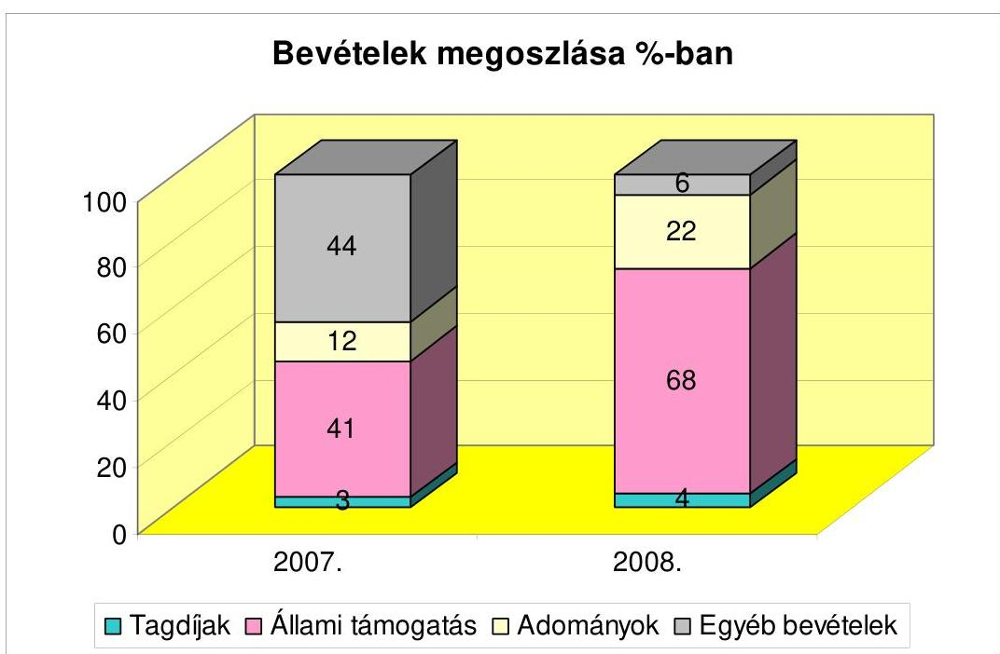
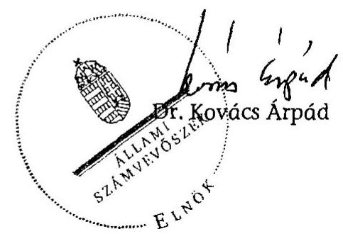

# ÁLLAMI   SZÁMVEVŐSZÉK 

## JELENTÉS

a Magyar Szocialista Párt 2007-2008. évi gazdálkodása törvényességének ellenőrzéséről

---

3. Önkormányzati és Területi Ellenőrzési Igazgatóság
3.1. Szabályszerűségi Főcsoport
Iktatószám: V-3006-021/2009.
Témaszám: 941
Vizsgálat-azonosító szám: V-0458
Az ellenőrzést felügyelte:
Dr. Lóránt Zoltán
főigazgató
Az ellenőrzés végrehajtásáért felelős:
Dr. Elek János
általános főigazgató-helyettes
Az ellenőrzést vezette:
Horváth Balázs
főcsoportfőnök-helyettes
Az összefoglaló jelentést készítette:
Szakmányné Bilik Mária
számvevő tanácsos
Az ellenőrzést végezték:
Szakmányné Bilik Mária Tóth István Vincze B. Róbert
számvevő tanácsos számvevő tanácsadó számvevő
A témához kapcsolódó eddig készített számvevőszéki jelentések:
címe
sorszáma
Jelentés a Magyar Szocialista Párt (mint a Magyar Szocialista Munkáspárt jogutódja) bejegyzési kérelmével egyidejűleg a bírósághoz benyújtott vagyonmérlege vizsgálata
Jelentés a Magyar Szocialista Párt 1991. évi gazdálkodása törvényességének ellenőrzéséről
Jelentés a Magyar Szocialista Párt 1992-1993-1994. évi gazdálkodása törvényességének ellenőrzéséről 278
Jelentés a Magyar Szocialista Párt 1995-1996. évi gazdálkodása törvényességének ellenőrzéséről 352
Jelentés a Magyar Szocialista Párt 1997-1998. évi gazdálkodása törvényességének ellenőrzéséről 004
Jelentés a Magyar Szocialista Párt 1999-2000. évi gazdálkodása törvényességének ellenőrzéséről 0134
Jelentés a Magyar Szocialista Párt 2001-2002. évi gazdálkodása törvényességének ellenőrzéséről 0353
Jelentés a Magyar Szocialista Párt 2003-2004. évi gazdálkodása törvényességének ellenőrzéséről 0561
Jelentés a Magyar Szocialista Párt 2005-2006. évi gazdálkodása törvényességének ellenőrzéséről 0747

Jelentéseink az Országgyűlés számítógépes hálózatán és az Interneten a www.asz.hu címen is olvashatóak.

---

## Eierlikör (1)

Menge: 1 Drink

2 Zentiliter Zitronensaft
2 Zentiliter Zuckersirup
1 Zentiliter Zuckersirup
1 Zentiliter Zuckersirup
etwas Zuckersirup
etwas Zuckersirup
etwas Zuckersirup
etwas Zuckersirup
etwas Zuckersirup
etwas Zuckersirup
etwas Zuckersirup
etwas Zuckersirup
etwas Zuckersirup
etwas Zuckersirup
etwas Zuckersirup
etwas Zuckersirup
etwas Zuckersirup
etwas Zuckersirup
etwas Zuckersirup
etwas Zuckersirup
etwas Zuckersirup
etwas Zuckersirup
etwas Zuckersirup
etwas Zuckersirup
etwas Zuckersirup
etwas Zuckersirup
etwas Zuckersirup
etwas Zuckersirup
etwas Zuckersirup
etwas Zuckersirup
etwas Zuckersirup
etwas Zuckersirup
etwas Zuckersirup
etwas Zuckersirup
etwas Zuckersirup
et

---

# TARTALOMJEGYZÉK 

BEVEZETÉS ..... 5
I. ÖSSZEGZŐ MEGÁLLAPÍTÁSOK, KÖVETKEZTETÉSEK, JAVASLATOK ..... 7
II. RÉSZLETES MEGÁLLAPÍTÁSOK ..... 10

1. A Párt gazdálkodásáról szóló 2007-2008. évi beszámolók ..... 10
1.1. A teljes vizsgálati időszakra érvényes megállapítások ..... 10
1.2. A 2007-2008. évi beszámoló ..... 11
1.2.1. Bevételek ..... 11
1.2.2. Kiadások ..... 12
2. A Pártnak a beszámoló összeállítására és az azt alátámasztó könyvvezetésre vonatkozó belső szabályozása és gyakorlata ..... 13
2.1. A belső szabályozás rendszere ..... 13
2.2. A könyvvezetés gyakorlata, ennek összhangja a jogszabályokban és a belső szabályzatokban előírt követelményekkel ..... 14
2.3. Analitikus nyilvántartások ..... 15
2.4. A bizonylati elv és a bizonylati fegyelem érvényesülése ..... 16
3. A Párt bevételszerző, gazdálkodó tevékenysége ..... 17
4. A gazdálkodással összefüggő, egyéb jogszabályokban foglalt előírások betartása ..... 18
4.1. Személyi jellegű kifizetések ..... 18
4.2. Az adózási, társadalombiztosítási és egyéb jogszabályok rendelkezéseinek érvényesítése ..... 19
5. A Párt belső ellenőrzési rendszere ..... 20
5.1. A belső ellenőrzés rendszerének szabályozottsága ..... 20
5.2. A belső ellenőrzési rendszer működése, eredményessége ..... 21
MELLÉKLETEK
6. számú A Magyar Szocialista Párt 2007. évi pénzügyi beszámolója
7. számú A Magyar Szocialista Párt 2008. évi pénzügyi zárómérlege
8. számú A Magyar Szocialista Párt 2007. évi módosított pénzügyi zárómérlege
9. számú A Magyar Szocialista Párt 2008. évi módosított pénzügyi zárómérlege

---

.

---

# RÖVIDÍTÉSEK JEGYZÉKE 

| Jogszabályok: |  |
| :--: | :--: |
| Art. | Az adózás rendjéről szóló - többször módosított - 2003. évi XCII. törvény |
| ÁSZ tv. | Az Állami Számvevőszékről szóló - többször módosított 1989. évi XXXVIII. törvény |
| párttörvény | A pártok működéséről és gazdálkodásáról szóló - többször módosított - 1989. évi XXXIII. törvény |
| Számv. tv. | A számvitelről szóló - többször módosított - 2000. évi C. törvény |
| Szja tv. | A személyi jövedelemadóról szóló - többször módosított 1995. évi CXVII. törvény |
| Tbj. tv. | A társadalombiztosítás ellátásaira és a magánnyugdíjra jogosultakról, valamint e szolgáltatások fedezetéről szóló - többször módosított - 1997. évi LXXX. törvény |
| vagyontörvény | Az állami vagyonról szóló - többször módosított - 2007. évi CVI. törvény |
| 60/1992. (IV. 1.) Korm. rendelet | 60/1992. (IV. 1.) Korm. rendelet a közúti gépjárművek, az egyes mezőgazdasági, erdészeti és halászati erőgépek üzemanyag- és kenőanyag-fogyasztásának igazolás nélkül elszámolható mértékéről |
| 78/1993. (V. 12.) Korm. rendelet | 78/1993. (V. 12.) Korm. rendelet a munkába járással kapcsolatos utazási költségtérítésről |
| Szórövidítések: |  |
| ÁSZ | Állami Számvevőszék |
| KPEB | Központi Pénzügyi Ellenőrző Bizottság |
| OK | Országos Központ |
| Párt | Magyar Szocialista Párt |
| PEB | Pénzügyi Ellenőrző Bizottság |
| SZMSZ | Szervezeti és Működési Szabályzat |
| területi szövetségek | Megyei Területi Szövetségek és a Budapesti Tanács |

---

.

---

# JELENTÉS 

## a Magyar Szocialista Párt 2007-2008. évi gazdálkodása törvényességének ellenőrzéséről

## BEVEZETÉS

Az Állami Számvevőszékről szóló 1989. évi XXXVIII. törvény 5. §-a és a 16. § (2) bekezdése, valamint a pártok működéséről és gazdálkodásáról szóló - többször módosított - 1989. évi XXXIII. törvény (párttörvény) 10. § (1) és (3) bekezdése alapján a pártok gazdálkodása törvényességének ellenőrzésére az Állami Számvevőszék (ÁSZ) jogosult. E törvényi felhatalmazásokra figyelemmel, az ÁSZ 2009. évi ellenőrzési tervének megfelelően vizsgálta a Magyar Szocialista Párt (Párt) 2007-2008. évi gazdálkodása törvényességét.

Az ellenőrzés célja annak megállapítása volt, hogy:

- a Párt által készített, a Magyar Közlönyben és a Párt internetes honlapján közzétett éves beszámolók a törvényi előírásoknak megfelelnek-e, a könyvvezetéssel és a valósággal megegyező adatokat tartalmaznak-e;
- a könyvvezetés és a gazdálkodás során betartották-e a számvitelről szóló többször módosított - 2000. évi C. tv. (Számv. tv.) és az egyéb jogszabályi rendelkezéseket, belső előírásokat;
- a Párt a működéséhez szabályszerűen igénybe vehető forrásokat használt-e fel, a párttörvényben engedélyezett gazdálkodó tevékenységet folytatott-e, nem fogadott-e el tiltott adományt.

Az ellenőrzés körülményeit illetően rögzíteni szükséges ${ }^{1}$, hogy:

- a párttörvény 1. sz. melléklete szerinti beszámoló-mintához magyarázatot, útmutatót nem készítettek a jogalkotók, így ennek kitöltése pártonként - kialakított számviteli politikájuknak megfelelően - eltérő lehet;
- a beszámolóminta a számviteli törvény rendelkezéseivel nem harmonizál, nem felel meg sem a mérleg, sem az eredmény-kimutatás követelményeinek.

Az ÁSZ a párttörvény módosításáig a hatályos rendelkezéseknek megfelelő egységes módszertani alapokra helyezett - gyakorlattal folytatja a pártok gazdálkodása törvényességének ellenőrzését. A pénzügyi, szabályszerűségi ellenőrzést a számvevőszéki ellenőrzés módszertani szabályai szerint, a pártellenőrzésre kiadott segédletbe foglalt egységes követelmények alapján végeztük.

[^0]
[^0]:    ${ }^{1}$ Az ÁSZ évek óta javasolja a Kormánynak a pártok ellenőrzéséről készített jelentéseiben a párttörvény módosítását.

---

Az adatok előzetes elemzése, kockázatértékelése alapján terveztük meg a tételes ellenőrzést, valamint a statisztikai mintavételi eljárást. Tételesen ellenőriztük a bevételek közül az egymillió Ft feletti tételeket, valamint a beszámolóban kötelezően nevesítendő, értékhatárt elérő egyéb hozzájárulásokat, adományokat. A mintát az Országos Központ (OK), Budapest, Bács-Kiskun, Csongrád, Győr-Moson-Sopron, Heves, Pest, Somogy és Zala megyei területi szövetségek könyvelési adatállományából választottuk.

Az előkészítés során az átfogó lényegességi szint mértékét a közzétett beszámolók főösszegének 2\%-ában határoztuk meg, továbbá specifikus lényegességi küszöböt alkalmaztunk az egyéb hozzájárulások, adományok esetében a párttörvény 1. számú mellékletében meghatározott értékhatárra (belföldi 500 ezer Ft feletti) tekintettel.

A helyszíni ellenőrzésre 2009. augusztus 17 - október 8. között, a Párt főkönyvelőségén, Budapest, Thököly utca 127. szám alatt került sor.

---

# I. ÖSSZEGZŐ MEGÁLLAPÍTÁSOK, KÖVETKEZTETÉSEK, JAVASLATOK 

A Párt a 2007. és 2008. évi beszámolóit a párttörvényben előírt határidőn belül és formában nyilvánosságra hozta. Mindkét évi beszámolót a helyszíni ellenőrzés megállapításaira 2009. szeptember 11-én a Hivatalos Értesítő 45. számában és a Párt internetes honlapján ismételten közzétették, mivel a beszámolók összeállításánál nem érvényesítették a Számv. tv-ben szabályozott következetesség és lényegesség elvét. A hatályos számlarendi előírástól és az előző évek gyakorlatától eltérően, mindkét évben az egyéb bevételek között tették közzé az önkormányzatoktól kedvezményes bérleti díjú ingatlanhasználat formájában kapott nem pénzbeli vagyoni hozzájárulás 21776 ezer Ft, illetve 23310 ezer Ft értékét, a belföldi jogi személyektől kapott egyéb hozzájárulások, adományok helyett. Ezzel összefüggésben a nevesítési értékhatárt meghaladó támogatást nyújtó önkormányzatokat nem nevesítették. Továbbá a 2008. évi beszámoló konszolidálási hibából eredően - mind a bevételi, mind a kiadási oldalon 10220 ezer Ft összegű halmozódást tartalmazott. A módosított beszámolók - a lényegesség figyelembevételével - megbízható és valós képet mutatnak a gazdálkodásról.

A Párt a számviteli szabályzatai közül változatlan előírásokkal tartotta hatályban az előző ÁSZ ellenőrzés során megfelelőnek minősített számviteli politikát, értékelési szabályzatot, valamint a leltározási és selejtezési szabályzatot. A szabályozások módosítását a Számv. tv. és a gazdálkodási sajátosságok változása nem indokolta. Az OK pénzkezelési szabályzata összhangban volt a Számv. tv. előírásaival. Módosítására a pénztár helyének megváltoztatása, valamint az egy és kétforintos érmék kivonásával összefüggő kerekítési szabályok megállapítása miatt került sor. A területi szövetségek és helyi szervezetek pénzkezelési szabályzataikban nem szabályozták teljes körűen a bankszámlaforgalom rendjét, a napi készpénz záró állomány maximális mértékét, a készpénzállományt érintő pénzmozgások jogcímeit, a készpénzállomány ellenőrzésekor követendő eljárást, az ellenőrzés gyakoriságát, így azok nem feleltek meg a vizsgált időszakban hatályos Számv. tv-i előírásoknak. A Párt elmulasztotta az idegen tulajdonon végzett felújítások elszámolási szabályaival kiegészíteni a számlarendet, valamint szabályozni a térítés nélküli átadás-átvétellel kapcsolatos gazdasági esemény és a pénzügyi beszámoló kapcsolatát. Ez a szabályozási hiányosság a 2008. évi eredeti beszámolóban beszámolási hibához vezetett. A Párt a számvevői jelentés megállapításaira a szabályozási hiányosságokat pótolta, a számlarendet kiegészítette.

A könyvvezetést a számviteli politikában szabályozottaknak megfelelően, a kettős könyvvitel rendszerében központilag, a főkönyvelőségen végezték. A bizonylatok feldolgozási rendje - a gazdálkodási szabályzat előírásával összhangban - alkalmazkodott a decentralizált gazdálkodási jogosítványokhoz és centralizált nyilvántartáshoz. A főkönyvelőség szakmai kontrollal végezte a Párt könyvelési feladatait, amelynek eredményeként a Számv. tv-ben szabályozott számviteli alapelvek érvényesültek. A párttörvény szerinti beszámoló tartalmát nem érintő könyvvezetési hibák - szabályozási hiányosságból fakadóan

---

- előfordultak, amelyeket az ellenőrzés észrevételeire kijavítottak. Az éves zárások előtt a belső előírásokkal összhangban dokumentáltan teljesült a befektetett eszközök, a követelések és kötelezettségek (kivéve rövid lejáratú kötelezettségek) egyeztetéses leltározása, az eszközök és források értékelése.

Az analitikus nyilvántartások körét, tartalmát, főkönyvi számlákhoz való kapcsolatát a számlarend és a pénzkezelési szabályzat rögzítette. A Párt szabályszerűen vezette a vevőkkel szembeni követelések, a kötelezettségek, az immateriális javak és tárgyi eszközök, az értékpapírok, a készpénzforgalom, az elszámolásra felvett előlegek főkönyvekkel egyeztetett analitikáját. A bizonylati szabályzat előírásával összhangban nyilvántartást vezettek a szigorú számadású nyomtatványokról. A naptári évben különböző szervezeteknél azonos támogatótól származó adományok összesítéséről gondoskodtak, az összesítést azonban nyilvántartás nem dokumentálta. A számvevői jelentés megállapításaira a nyilvántartás rendjét kialakították, bevezetéséről intézkedtek.

A bizonylatolás Számv. tv-ben meghatározott követelményei érvényesítéséhez bizonylati szabályzattal és bizonylati albummal rendelkeztek, amelyhez a hatályos szervezeti és számviteli szabályzatok meghatározták a gazdálkodással kapcsolatos hatás- és jogköröket, előírták a számlavezetés és készpénzkezelés, a bizonylatok kiállításának és feldolgozásának eljárásait, valamint a kötelezettségvállalás és utalványozás rendjét. A könyvelt gazdasági eseményeket számviteli bizonylatokkal alátámasztották. A bizonylatok alaki és tartalmi kellékeire vonatkozó Számv. tv-i követelmények esetileg sérültek, a hibák a könyvvezetés és az éves beszámolók valódiságát lényeges szinten nem befolyásolták.

A Párt gazdálkodó, bevételszerző tevékenysége során - könyvviteli nyilvántartásai szerint - betartotta a párttörvényben előírt forrásszerzési és gazdálkodási tilalmakat. Bevételei szabályozott tagdíjfizetésből, egyéb
 hozzájárulásokból és adományokból, a tulajdonát képező ingatlan értékesítéséből, tárgyi eszközei hasznosításából, költségtérítésből, valamint kamatbevételekből álltak. A bevételek meghatározó része: 2007. évben 41%-a, 2008. évben 68%-a állami támogatásból származott. A tagdíjak 3, illetve 4%-ot, az egyéb hozzájárulások, adományok 12, illetve 22%-ot és az egyéb bevételek 44, illetve 6%-ot tettek ki. Az egyéb bevételek 2007. évi magas mértéke a Párt kizárólagos tulajdonában lévő Köztársaság tér 26. alatti székház értékesítéséből származó árbevétel miatt alakult ki. A Párt külföldi államtól, költségvetési szervtől, állami vállalattól, állami részvétellel működő gazdasági társaságtól, közvetlen költségvetési támogatásban vagy költségvetési szervi támogatásban részesülő alapítványtól nem fogadott el vagyoni hozzájárulást, valamint névtelen adományt. A párttörvényben nem engedélyezett gazdálkodó tevékenységet nem folytatott, gazdasági társaságban részesedést nem szerzett, vállalatot nem alapított. A Párt, két 100%-os tulajdonát képező kft-je közül az egyikkel volt gazdasági kapcsolatban. A Pártnak a kft-k adózott eredményéből bevétele nem származott.

A Párt 2007-2008. években új székházat és további 51 ingatlant vásárolt, összeségében 1707607 ezer Ft értékben. Az ingatlanok közül 39-et a vagyontörvényben szabályozott feltételekkel szerzett be, részben a Magyar Fejlesztési Bank által nyújtott kedvezményes hitel igénybevételével.

---

A személyi jellegű kifizetések körében a béreket szabályszerű munkaszerződések alapján, központilag számfejtették. A Párt a vizsgált időszakban átlagosan 70 fő teljes munkaidős, főfoglalkozású munkavállalót alkalmazott. A munkavállalóknak adómentes mértékben étkezési utalványt, helyközi közlekedéshez bérlettérítést, egy területi szövetségnél pedig munkaruhát biztosítottak. A hivatali és magántulajdonú gépjármű hivatali célú használatát, elszámolási rendjét szabályozták, az érintettekkel a saját gépjármű használatára megállapodást kötöttek. A költségtérítést szabályosan kitöltött kiküldetési rendelvények és útnyilvántartások alapján, adómentes normatív mértékkel számolták el. A hivatali gépkocsikat a belső szabályozásnak megfelelően, az útnyilvántartások és a gépkocsik tárolási helyén vezetett nyilvántartások szerint hivatalos célú utazáshoz használták.

Az adózási, társadalombiztosítási jogszabályok előírásainak a Párt munkáltatóként és kifizetőként eleget tett, a havi és éves adatszolgáltatási, bevallási és befizetési kötelezettségét szabályszerűen teljesítette, a foglalkoztatottak biztosítási jogviszonyában történt változásokat határidőben bejelentette. A kötelező nyilvántartásokat vezették. A kiadott APEH folyószámla kivonat szerint befizetési késedelme, költségvetési tartozása nem volt a Pártnak. A reprezentációs kiadások elkülönített nyilvántartása szerint egy területi szövetség lépte túl az Szja törvényben szabályozott adómentes értékhatárt, amely után az adó-és járulék befizetést szabályszerűen teljesítették.

A belső ellenőrzést a hatályos belső szabályzatok összehangoltan szabályozták. A Párt alapszabálya értelmében a KPEB és a PEB-ek éves munkatervek alapján végezték ellenőrzési tevékenységüket. A 2007-2008. évi testületi ellenőrzések eredményéről 2009-ben számoltak be a Kongresszusnak, illetve a megyei küldöttgyűléseknek. A testületek ellenőrző tevékenységükkel a gazdálkodás szabályszerűségét, a törvényes működést segítették, a feltárt eseti szabálytalanságok megszüntetésére intézkedések történtek. A folyamatba épített, előzetes és utólagos vezetői ellenőrzés szabályait a gazdálkodási-számviteli szabályzatok határozták meg. A vezetői és munkafolyamatba épített ellenőrzés a pénztárnok irányításával, a kötelezettségvállalási és utalványozási jogkör szabályozott gyakorlásával, a főkönyvelőség szakembereinek felülvizsgálatával és egyeztetésével működött. A belső ellenőrzési rendszer összehangolt működésével biztosították a Párt szabályszerű gazdálkodását, de az éves beszámoló felülvizsgálatára irányult kontrollok nem tárták fel a nem pénzbeli vagyoni hozzájárulás nevesítésének hiányát okozó beszámolási hibát.

A helyszíni ellenőrzés tapasztalatainak hasznosítása mellett az Állami Számvevőszék felhívja

# a Párt elnökét 

1. Szerezzen érvényt az éves beszámoló megbízhatósága érdekében a Számv. tv. 15. § (5), valamint a 16. § (4) bekezdésben foglalt következetesség, lényegesség elvének.
2. Biztosítsa az éves pénzügyi beszámoló megfelelő belső kontrolljait.

---

# II. RÉSZLETES MEGÁLLAPÍTÁSOK 

## 1. A PÁRT GAZDÁLKODÁSÁRÓL SZÓLÓ 2007-2008. ÉVI BESZÁMOLÓK

### 1.1. A teljes vizsgálati időszakra érvényes megállapítások

A Párt a 2007. évi beszámolóját 2008. április 30-án a Magyar Közlöny 69. számában, a 2008. évi beszámolóját 2009. április 30-án a Magyar Közlöny Hivatalos Értesítője 20. számában jelentette meg a párttörvény 9. § (1) bekezdésében előírt határidőn belül, a párttörvény 1. számú mellékletében meghatározott minta szerint (1-2. számú melléklet). A Párt mindkét évi beszámolóját az internetes honlapján is közzétette.

A helyi szervezetek, területi szövetségek és az OK gazdálkodási adatait a kettős könyvvitel rendszerében, az OK-ban - az önálló gazdálkodásra tekintettel - külön-külön főkönyveken rögzítették. A könyvelések konszolidált adataiból állították össze a Párt éves beszámolóját.

A nyilvánosságra hozott eredeti beszámolók nem mutattak valós képet a Párt pénzügyi gazdálkodásáról.

A Párt mindkét évi beszámoló összeállítása során megsértette a Számv. tv. 15. § (5) bekezdésében foglalt következetesség számviteli alapelvet, mivel a beszámolókban a hatályos számlarend előírásától, valamint az előző évek gyakorlatától eltérően, az egyéb bevételek között tette közzé az önkormányzatoktól kedvezményes bérleti díjú ingatlanhasználat formájában kapott nem pénzbeli vagyoni hozzájárulás értékét: 2007-ben 21776 ezer Ft, 2008-ban 23310 ezer Ft összegben, a belföldi jogi személyektől kapott egyéb hozzájárulások helyett. Ennek következményeként az 500 ezer Ft összeget meghaladó támogatást nyújtó önkormányzatokat nem nevesítették, ez a Számv. tv. 16. § (4) bekezdés alapján, specifikus lényeges hibát jelentett.

A 2008. évi közzétett beszámoló - konszolidálási hibából adódóan - hibásan tartalmazott további 10220 ezer Ft összegű egyéb bevételt. Az OK három területi szövetségtől (Jász-Nagykun-Szolnok, Tolna és Veszprém) térítés nélkül vette át az ingatlanok felújításának értékét. Az aktiválással egy időben az összeget a kettős könyvvitel szabályainak megfelelően - a rendkívüli bevételek, illetve kiadások között is elszámolták az OK-nál. A Párt beszámolójában azonban ezt az összeget indokolatlanul mutatták ki az egyéb bevételek, valamint egyéb kiadások soron, ezért ez a beszámolóban halmozódást idézett elő.

A Párt a beszámolási hibákat a helyszíni ellenőrzés megállapításaira figyelemmel kijavította, és mindkét évi beszámolót a Hivatalos Értesítő 45. számában, 2009. szeptember 11-én, valamint internetes honlapján a módosított adatokkal ismételten közzétette (3-4. számú melléklet).

---

# 1.2. A 2007-2008. évi beszámoló 

### 1.2.1. Bevételek

A tagdíj befizetés feltételeit a Párt alapszabálya rögzítette. A tagdíjak mértékéről az alapszabály 49. §-a értelmében a párttag és a pártszervezet állapodtak meg. A tagdíjak adatai mindkét évben megegyeztek a főkönyvi könyvelésben ilyen címen szereplő összeggel. A beszámoló sor csak a tagdíjak fogalomkörébe tartozó összegeket tartalmazott. A könyvelésben szereplő tagdíj összegét és a befizető nevét a bevételi pénztárbizonylat, illetve a bankkivonat, vagy azokhoz csatolt alapbizonylat tartalmazta.

Az állami költségvetésből származó támogatásokat a főkönyvi könyvelésben kimutatott és a bankszámla kivonaton szereplő, a Magyar Államkincstár által ténylegesen átutalt összeggel egyezően közölték. A Párt mindkét évben 953700 ezer Ft állami támogatást kapott a költségvetésből.

Az egyéb hozzájárulások, adományok beszámoló sor adattartalmát a Párt a párttörvény előírásának megfelelően tovább részletezte. A Párt a vizsgált években belföldi jogi személyektől és belföldi magánszemélyektől kapott pénzbeli és nem pénzbeli vagyoni hozzájárulást. A tárgyi adomány értékét a beszámoló összeállításánál a számlarendi szabályozással összhangban a magánszemélyek adományai között vették figyelembe. A Párt az ellenőrzés megállapításaira pótolta a párttörvény 9. § (2) bekezdés előírása alapján a kedvezményes díjtételű, ingatlanhasználat formájában kapott, nevesítési értékhatárt meghaladó, nyolc-nyolc támogató önkormányzat nevét és a támogatás összegét.
Az egyéb bevételek között eszközök értékesítéséből és bérbeadásából, kártérítésből, költségtérítésből származó bevételt, valamint kamatbevételeket tartottak nyilván. A 2008. évi beszámolóban ezen a soron haszonbérleti jog eladásból, valamint opciós jogról való lemondásból származó bevételt is kimutattak a belső szabályozásnak megfelelően.

Adatok ezer Ft-ban

| Számla   száma | Megnevezése | 2007. év | 2008. év |
| :--: | :-- | --: | --: |
| 962 | Immateriális javak, tárgyi eszközök értékesítése | 982921 | 7927 |
| 963 | Bérleti díj bevétel | 21974 | 25945 |
| 964 | Káresemény miatti bevétel | 572 | 1653 |
| 965 | Költségtérítési díjbevétel | 17043 | 14045 |
| 966 | Behajthatatlannak minősített és leírt követelésekre kapott összegek | 6 | - |
| 969 | Egyéb bevételek | 1139 | 29245 |
| 97 | Pénzügyi műveletek bevételei | 3463 | 6374 |
| Összesen: | $\mathbf{1 027118}$ | $\mathbf{85189}$ |  |

---

# 1.2.2. Kiadások 

Az éves beszámolók - a 2008. évi egyéb kiadások kivételével - az egyes beszámoló sorok adatának kiszámításánál figyelembe vett főkönyvi számlák egyenlegével egyező összegben tartalmazták a kiadásokat.

A támogatás egyéb szervezeteknek beszámoló soron közölt adat mindkét évben megegyezett a főkönyvi számla egyenlegével, az ilyen célra ténylegesen fordított összeggel. A Párt, a támogatásokat bíróságon bejegyzett szervezetek részére nyújtotta, a hatáskörrel rendelkező testület döntése alapján.

Az eszközbeszerzés soron a Párt hatályos számlarendjével összhangban, az immateriális javak, az ingatlanok és kapcsolódó vagyoni értékű jogok, továbbá a berendezések, felszerelések és járművek számlacsoportok növekmény forgalmának összesített adatát mutatták ki. A beszámolókban közölt összegek a kapcsolódó főkönyvi számlák adataiból levezethetők voltak. Mindkét évben az eszközbeszerzések több mint 98%-a ingatlanvásárlásból tevődött össze. A Párt 2007-ben hét db ingatlant vásárolt három önkormányzattól, három magánszemélytől és a Budapest, Jókai utcai székházat szakszervezeti tömörüléstől, összesen 789704 ezer Ft értékben. A 2008. évben 45 db ingatlant vásároltak 917903 ezer Ft értékben. A vagyontörvény 67-68. §-aiban szabályozott feltételekkel a vizsgált időszakban összesen 39 db ingatlanhoz jutottak, ebből: 21 db-ot 155783 ezer Ft értékben kizárólag saját forrás igénybevételével; 18 db ingatlant 611756 ezer Ft összegű, a Magyar Fejlesztési Bank által nyújtott kedvezményes hitel, valamint 58907 ezer Ft saját forrás felhasználásával. Hat db ingatlant magánszemélyektől és önkormányzatoktól vásároltak 91457 ezer Ft értékben, saját forrásból.

A működési kiadások beszámoló sor adata mindkét évben egyezett a Párt hatályos számlarendjében meghatározott főkönyvi számlák egyenlegeinek összesített adatával. A vizsgált években érvényesült a működési kiadások jogcímeinek azonossága. Működési kiadások között a Párt anyagköltségeket, közüzemi díjakat, bérleti díjakat és a működéshez kapcsolódó igénybevett szolgáltatásokat számolt el a könyveléssel egyező értékben.

A politikai tevékenység kiadása beszámoló sor adata mindkét évben egyezett a Párt hatályos számlarendjében meghatározott főkönyvi számlák egyenlegeinek összesített adatával. A politikai tevékenység kiadásai között propaganda kiadások, nemzetközi tagdíjak, munkabérek és járulékai, valamint személyi jellegű egyéb kifizetések elszámolására került sor.

Egyéb kiadások között bankköltséget, árfolyamveszteséget, hitelkamatot, illetéket, közjegyzői díjat, kerekítés miatti eltéréseket mutattak ki. A beszámoló sor adata évenként megegyezett a vonatkozó főkönyvi számlák összevont egyenlegeivel.

A Párt a beszámolási hibákat a helyszíni ellenőrzés időszakában kijavította. Az ismételten közzétett, módosított beszámolók a lényegesség figyelembevételével, megbízható és valós képet mutatnak a Párt gazdálkodásáról.

---

# 2. A PÁRTNAK A BESZÁMOLÓ ÖSSZEÁLLÍTÁSÁRA ÉS AZ AZT ALÁTÁMASZTÓ KÖNYVVETÉSRE VONATKOZÓ BELSŐ SZABÁLYOZÁSA ÉS GYAKORLATA 

### 2.1. A belső szabályozás rendszere

A Párt hatályos alapszabálya és gazdálkodási szabályzata rendelkezett a választott testületek, a gazdálkodás irányításáért felelős személyek gazdálkodással összefüggő hatásköréről, valamint az OK, a területi szövetségek és helyi szervezetek gazdálkodási jogosítványairól.

A Párt a beszámoló összeállítását és az azt alátámasztó könyvvezetést a Számv. tv. 14. § (3)-(4)
 bekezdéseiben előírtak szerint elkészített, 2005. január 1-jétől hatályos számviteli politikában szabályozta. A Párt rendelkezett a Számv. tv. 14. § (5) bekezdésében a számviteli politikához előírt leltározási (és selejtezési) szabályzattal, eszközök és források értékelési szabályzattal, pénzkezelési szabályzattal. A pénzkezelési szabályzat kivételével a számviteli szabályzatokat a vizsgált időszakban nem módosították, azok a gazdálkodási sajátosságoknak megfelelően összhangban voltak a Számv. tv.-i előírásokkal. A számviteli szabályzatok tartalmazták a szabályzat tárgyával kapcsolatos fogalmakat, feladatokat, módszereket, a kapcsolódó bizonylatokat és dokumentációkat.

A pénzkezelési szabályzat aktualizálására 2007. november 1-jétől az OK pénzkezelési helyének megváltoztatása, valamint 2008. március 1-jével az egy és kétforintos pénzérmék megszűnése miatti kerekítési szabályok rögzítésével összefüggően került sor. A szabályzat tartalmazta a Számv. tv. 14. § (8) bekezdésében szabályozott tartalmi elemeket. A pénzkezelési szabályzat előírásai az OK-ra vonatkoztak teljes körűen, a területi szövetségek részére mintaként szolgáltak.

A területi szövetségek a gazdálkodási és nyilvántartási sajátosságaik szerint alakították ki saját pénzkezelési rendjüket. A Számv. tv. 2007. január 1-jétől hatályos 14. § (8) bekezdés előírása ellenére az OK-án kívüli pénzkezelő helyek 14%-a nem határozta meg a napi készpénz záróállomány maximális mértékét. A Pest megyei pénzkezelő helyek kivételével nem rögzítették a készpénzállományt érintő pénzmozgások jogcímeit, egy területi szövetségnél pedig a bankszámlaforgalom rendjét. A területi szövetségek közel négyötöde nem szabályozta a készpénzállomány ellenőrzésekor követendő eljárást, az ellenőrzés gyakoriságát. A Párt a helyszíni ellenőrzést követően intézkedett a pártszervek pénzkezelési szabályzatai kiegészítésére. ${ }^{2}$

A Párt, a Számv. tv. 161. § (1)-(3) bekezdésben előírt számlarend keretében évente aktualizálta a számlatükröt. A gazdálkodási feladatok a vizsgált időszakban vásárolt ingatlanok felújításával bővültek, a számlarendi szabályozást

[^0]
[^0]:    ${ }^{2}$ Az ellenőrzés részére bemutatták a 2009. október 13-án, a területi szövetségek elnökeinek körlevélben megküldött átdolgozott pénzkezelési szabályzatokat, melyek összhangban vannak a Számv. tv. 14. § (8) bekezdés előírásaival és a szervezetek gazdálkodási sajátosságaival.

---

ezzel összefüggésben nem módosították. Hiányzott a számlarendből a felújítások nyilvántartására szolgáló főkönyvi számla, az idegen tulajdonon végzett felújítások elszámolási szabálya, számlakapcsolata és a párttörvény 1. számú melléklete szerinti beszámoló sorhoz való rendelése. Ez a szabályozási hiányosság a 2008. évi beszámolóban beszámolási hibához vezetett. A Párt a helyszíni ellenőrzést követően a hiányosságot pótolta. ${ }^{3}$

# 2.2. A könyvvezetés gyakorlata, ennek összhangja a jogszabályokban és a belső szabályzatokban előírt követelményekkel 

A könyvvezetést a számviteli politikában szabályozottaknak megfelelően, a kettős könyvvitel rendszerében központilag, az alapbizonylatok számítógépes feldolgozásával az OK főkönyvelőségén végezték. Mindkét vizsgált évben azonos könyvelő programot alkalmaztak, melynek törzsadat-állományát a gazdasági változásoknak megfelelően évente aktualizálták. Az ellenőrzés igényeinek megfelelően minden szükséges adat lekérdezhető volt. A főkönyvi számlák és a vezetett analitikus nyilvántartások kapcsolata az ellenőrzött szervezeti egységeknél megfelelő volt. A főkönyvelőség vezetője és a főkönyvi könyvelők rendelkeznek a Számv. tv. 151. § (1) bekezdés ${ }^{4}$ szerint meghatározott képesítéssel és szerepelnek a könyvviteli szolgáltatást végzők nyilvántartásában.

A Pártnál a bizonylatok feldolgozási rendje a gazdálkodási szabályzat előírásával összhangban alkalmazkodott a decentralizált gazdálkodási jogosítványokhoz. A területi szövetségek negyedévente küldték meg az OK főkönyvelősége részére a helyi szervezetek ellenőrzött bizonylatait. A könyvvezetés szabályszerűsége érdekében az OK főkönyvelősége dokumentált szakmai kontrollal végezte a Párt könyvelési feladatait. A könyvelést követően, a területi szövetségnek visszajutatták megőrzésre a bizonylatokat és csatolták az elkészített számviteli nyilvántartásokat. Az egyes gazdasági műveletek, események bizonylatainak adatait a Számv. tv. 165. § (3) bekezdésben, illetve a számviteli politikában meghatározott időpontig rögzítették.

A könyvvezetésben, a párttörvény 1. számú mellékletében szabályozott beszámoló tartalmát nem érintő eseti nyilvántartási hibák fordultak elő:

- A Párt 2008-ban az épületjavítás, karbantartás főkönyvi számlán oda nem tartozó gazdasági eseményt, ingatlan felújítást is elszámolt, majd erről a számláról aktivált, mivel nem nyitott az ingatlanok felújításának elszámolására szolgáló számlát.
- A Párt a 2008. évi rövid lejáratú kötelezettségek között 180 000 ezer Ft összegű kölcsönt tartott nyilván annak ellenére, hogy a kölcsön visszafizetésének határidejét 2008. február 27-ről 2010. december 31-re módosították írásbeli megállapodás alapján. A módosított megállapodás főkönyvelőségre történő átadása a beszámolást követő időszakban történt meg, így a megfelelő információ-áramlás hiánya okozta a hibás nyilvántartást. A hibát a helyszíni ellenőrzés időszakában dokumentáltan korrigálták, a kölcsön átvezetése a hosszú lejáratú kötelezettségek közé megtörtént. Ugyancsak nyilvántartottak mindkét évben a rövid lejáratú kötelezettségek között, 1994 óta fennálló kölcsöntartozást. Sérült a Számv. tv. 16. § (1) bekezdésben szabályozott egyedi értékelés elve, mivel a Párt a kötelezettség értékelését elmulasztotta. A Párt a kölcsön rendezése érdekében a helyszíni ellenőrzés időszakában intézkedést kezdeményezett a kölcsönt nyújtó alapítványnál. Az alapítvány az elévülési idő lejártával, a kölcsöntartozás 2001. évi leírásáról tájékoztatta a Pártot, így azt a Párt rendkívüli bevételként 2009-ben elszámolta.

Az eseti hibák kivételével, a Számv. tv. 15-16. §-aiban szabályozott számviteli alapelvek érvényesültek a beszámolót alátámasztó könyvvezetésben.

Az éves zárások előtt a Számv. tv. 69. § (1)-(2) bekezdés, valamint a leltározási szabályzat előírásával összhangban dokumentáltan elvégezték a befektetett eszközök, a követelések és kötelezettségek egyeztetéses leltározását, valamint a rövid lejáratú kötelezettségek kivételével, az eszközök és források értékelését a Számv. tv. 46. § (3) bekezdés szabályozásának megfelelően. A leltározás mindkét évben kiterjedt a pénzeszközök megszámlálására, három-három pénzkezelő hely (Füzesabony, Pétervására, Bácsalmás, Jánoshalma, Szeged, Budapest XXII. kerület) kivételével. ${ }^{5}$ A pénzkezelő helyek pénztárjelentései, valamint a főkönyvi könyvelés szerinti záró pénzkészletállomány eltéréseinek okát megkeresték, azokat jegyzőkönyvben rögzítették és a szükséges javításokat elvégezték. A számviteli elveknek megfelelő, a tárgyi eszközökről folyamatosan vezetett és egyeztetett nyilvántartás birtokában, ebben az eszközcsoportban - a belső előírásnak megfelelően - mennyiségi felvételre ötévenként kerül sor. A tárgyi eszközök mennyiségi leltározása a vizsgált két évben nem volt aktuális, mivel azt 2005-ben teljesítették. A Párt a nem pénzbeli vagyoni hozzájárulásokat, támogatásokat az értékelési szabályzat előírása szerint egyedileg értékelte, azokat piaci értéken vette nyilvántartásba. A zárlati munkálatokat határidőben végrehajtották.

# 2.3. Analitikus nyilvántartások 

A főkönyvi könyveléshez kapcsolódó analitikus nyilvántartások tartalmát, körét a számlarendben és a pénzkezelési szabályzatban határozták meg. A vizsgált időszakban a főkönyvi könyvelés részeként vezették a vevőkkel szembeni követelések és kötelezettségek analitikáját.

Az immateriális javak és tárgyi eszközök analitikus nyilvántartására a főkönyvi könyveléstől független tárgyi eszközprogramot alkalmaztak. Ennek segítségével számították a belső előírások szerinti értékcsökkenést és feladást készítettek a főkönyvi könyvelésnek. Az analitikus nyilvántartások és főkönyvi számlák egyeztetését év végén dokumentáltan elvégezték.

[^0]
[^0]:    ${ }^{5}$ A területi szövetségek részére kiadott pénzkezelési szabályzatok tartalmazzák a pénztárellenőrzések gyakoriságát és az év végi leltározási kötelezettséget.

---

Szabályszerűen vezették az értékpapírok és - egy helyi szervezet kivételével - az elszámolásra felvett előlegek analitikáját, amelyek egyezőséget mutattak a főkönyvvel.

A készpénzforgalomról az OK-ban napi, a helyi és területi szövetségeknél időszaki pénztárjelentést vezettek a pénzkezelési szabályzatban rögzítettek szerint.

A pénzforgalomhoz kapcsolódó szigorú számadású nyomtatványok körét a pénzkezelési szabályzatban határozták meg. Nyilvántartásuk - a Zala megyei Területi Szövetség kivételével - megfelelt a Számv. tv. 168. § (3) bekezdés szigorú számadású nyomtatványok nyilvántartásba vételi kötelezettsége előírásának.

A beszámoló szabályszerű összeállításához nem vezettek a beszámoló sorokat is alátámasztó, támogatónkénti részletező nyilvántartást az adományokról. A könyvelési rendszerben az egy befizetőtől származó támogatást különböző szervezeteknél más-más kódszámon rögzítették. Az egy támogató naptári éven belül befizetett támogatásainak összesítése a nyilvántartásban nem volt biztosított, így az nem felelt meg a párttörvény 9. § (2) bekezdésében szabályozott nevesítési kötelezettség teljesítését alátámasztó nyilvántartásnak. A helyszíni ellenőrzést követően a Párt pénztárnoka intézkedett az adományok támogatónkénti részletező nyilvántartásáról. A nyilvántartás rendjét kialakították és vezetését 2009. évtől visszamenőleges hatállyal elrendelték.

# 2.4. A bizonylati elv és a bizonylati fegyelem érvényesülése 

A Párt a gazdasági események elszámolására és nyilvántartására alkalmazott bizonylatok körét a számlarend részeként elkészített bizonylati szabályzatban rögzítette. A pénzkezelési szabályzat előírta a számlavezetés és készpénzkezelés, a bizonylatok kiállításának, feldolgozásának eljárásait, valamint a kötelezettségvállalás és utalványozás rendjét. Az alapszabály rendelkezéseinek megfelelően a pénztárnok által kijelölt, valamint a területi szövetségek SZMSZ-ében, illetve gazdálkodással kapcsolatos szabályzatában felhatalmazottak gyakorolták a kötelezettségvállalási és utalványozási jogkört.

A gazdasági események számviteli nyilvántartásokban történő rögzítése során maradéktalanul betartották a Számv. tv. 165. § (1) bekezdésében szabályozott bizonylati elvet. Az eszközök és források állományváltozását, a javító tételeket szabályszerű vegyes bizonylatok támasztották alá. A kiállított vegyes bizonylatok megalapozottak voltak.

A Számv. tv. 167. § (1) bekezdésében a bizonylatok alaki és tartalmi kellékeire vonatkozó előírások - az esetileg előforduló hibáktól eltekintve - érvényesültek. A hivatkozott jogszabályi hely c), d), és i) pontjainak követelményei esetileg sérültek. A hibák a könyvvezetés és az éves beszámolók valódiságát nem befolyásolták.

- A 2007. évben a bizonylatok 1,8%-áról, 2008-ban 1,2%-áról az utalványozás hiányzott, a 2008. évben a bizonylatok 0,3%-át nem a jogosult utalványozta.

---

- A 2007. évben a pénztári bizonylatok 2,0%-áról, 2008. évben 1,2%-áról hiányzott az ellenőr aláírása, vagy nem az arra feljogosított személy írta alá.
- 2008-ban a bizonylatok 0,3%-áról hiányzott a könyvelés igazolása és a könyvelés dátuma.
- 2008-ban a bizonylatok 2,1%-án egyéb tartalmi hibák fordultak elő: az érték adatot szabálytalanul javították; hiányzott a pénztárbizonylatról a befizető aláírása, az alapbizonylatról a befizetés dátuma, a kiállító aláírása.

A vizsgált szervezeteknél a pénzkezelés előírásait betartották, eseti szabálytalanságok fordultak elő: 2007-ben négy, 2008-ban három házipénztárban alkalmanként túllépték a szabályzatban rögzített záró pénzkészletet.

# 3. A PÁRT BEVÉTEL-SZERZŐ, GAZDÁLKODÓ TEVÉKENYSÉGE 

A bevételszerző, gazdálkodó tevékenység szabályait az alapszabály és a gazdálkodási szabályzat a párttörvény 4. § és 6. § előírásaival összhangban határozta meg. A Párt bevételeinek megoszlását a következő ábra szemlélteti:

A Párt saját bevételei szabályozott tagdíjfizetésből, egyéb hozzájárulásokból és adományokból, a tulajdonában álló ingatlanok dí ellenében történő hasznosításából, tárgyi eszközök értékesítéséből és bérbeadásából, költségtérítésekből, valamint kamatbevételekből álltak. Az egyéb bevételek 2007. évi magas mértéke a Párt kizárólagos tulajdonában lévő, a Budapest, Köztársaság tér 26. szám alatti székház értékesítéséből származó árbevétel miatt alakult ki.

A Párt a vizsgált időszakban könyvviteli nyilvántartásai szerint a párttörvény 4. § (2)-(3) bekezdéseiben meg nem engedett forrásból származó vagyoni hozzájárulást: állami vállalattól, állami részvétellel működő gazdasági társaságtól, közvetlen költségvetési támogatásban vagy költségvetési szervi támogatásban részesülő alapítványtól, más államtól vagyoni hozzájárulást, továbbá név-

---

telen adományt nem fogadott el. A Párt kizárólag a párttörvény 6. §-ában engedélyezett gazdálkodó tevékenységet folytatott.

A Párt 2007-ben tizenkét, 2008-ban tizenegy önkormányzati ingatlant használt kedvezményes bérleti díj mellett. A XI. kerületi szervezet 2007-ben, tagjaitól kis értékű tárgyi eszközök formájában, tárgyi
 adományt kapott. A Párt a párttörvény 4. § (5) bekezdés előírásának megfelelően gondoskodott a nem pénzbeli vagyoni hozzájárulás értékének meghatározásáról.

A Párt kiadásait, a szabályozott bevételein felül hitelből, szállítói és egyéb tartozásokból fedezte. A Pártnak 2007 végén 390 848 ezer Ft, a 2008-végén 1 177 894 ezer Ft összegű rövid és hosszúlejáratú kötelezettsége állt fenn. A 2008. évi kötelezettség növekedés alapvetően az állami és önkormányzati tulajdonú ingatlanok hitelre, illetve részletre történt megvásárlásából származott.

A Pártnak a vizsgált időszakban két, egyenként 3000 ezer Ft törzstőkével alapított egyszemélyes kft-je volt. A kft-k közül a Pártnak az egyikkel volt gazdasági kapcsolata. A KÖZ-TÉR-HÁZ Kft-től a Párt szolgáltatási szerződés alapján üzemeltetési szolgáltatásokat és eszközbeszerzéseket rendelt, amelyért a szerződés alapján történő számlázás után fizetett. A kft. 2007 júniusában kölcsönszerződés alapján 25 000 ezer Ft összegű rövidlejáratú kölcsönt vett fel a Párttól, melyből 20 000 ezer Ft összeget még 2007-ben visszafizetett, majd 2008 júniusában újabb 5000 ezer Ft összegű kölcsönt kapott. A Párt a kölcsönügyletről elkülönített főkönyvi számlát vezet. A kft-k a Párt részére adózott eredményük terhére befizetést nem teljesítettek.

# 4. A GAZDÁLKODÁSSAL ÖSSZEFÜGGŐ, EGYÉB JOGSZABÁLYOKBAN FOGLALT ELŐÍRÁSOK BETARTÁSA 

### 4.1. Személyi jellegű kifizetések

A Párt, feladatai ellátásához munkaviszony keretében alkalmazottakat foglalkoztatott az alábbi összetételben:

Adatok főben

| Évek | Teljes munkaidős | Részmunkaidős | Nyugdíjasok |
| :-- | :--: | :--: | :--: |
| $\mathbf{2 0 0 7 .}$ | 72 | 20 | 31 |
| $\mathbf{2 0 0 8 .}$ | 67 | 20 | 29 |

A munkaerő-foglalkoztatás szabályszerű munkaszerződéseken alapult, melyek tartalmazták a munkaköri leírásokat is. A foglalkoztatáshoz kapcsolódó bejelentési, nyilvántartási, számfejtési és kifizetői feladatokat a Párt egészére az OK főkönyvelősége végezte. A Párt a hivatali és a saját tulajdonú személygépkocsik hivatali célú használatának és elszámolásának rendjét a 2006. január 1-jei hatállyal aktualizált belföldi kiküldetések elszámolásának szabályzatában rögzítette.

A Párt tulajdonában lévő hivatali gépjárműveket, a belső szabályozásnak megfelelően hivatalos célú utazásokhoz használták, a szabályzatban megjelölt személy engedélyével, útnyilvántartás vezetése mellett. A futásteljesítményről

---

vezetett nyilvántartások, a gépkocsik tárolási helyein vezetett nyilvántartásokkal kiegészítve, megfeleltek a kizárólagos hivatali használatot biztosító, az Szja tv. vizsgált időszakban hatályos 70. §-ában és 5. számú mellékletének II. 7. pontjában meghatározott adatkövetelményeknek. A Pártnak cégautóadó fizetési kötelezettsége az ellenőrzött években nem keletkezett.

A magánszemélyek tulajdonában álló gépjármű hivatalos célú használata költségtérítésénél a szabályzatnak és jogszabálynak megfelelően az Szja tv. 25. § (5) bekezdésében ${ }^{6}$ előírt tartalmú kiküldetési rendelvényt a Párt munkavállalói esetében alkalmazták, egyéb esetekben az Szja tv. 5. mellékletének II. 7. pontjának megfelelő útnyilvántartást vezették. A gépkocsik tulajdonosaival kötött megállapodásban rögzítették az elszámolható üzemanyagköltséget. A költségtérítések a 60/1992. (IV. 1.) Korm. rendelet 4. § (2)-(3) bekezdésében szabályozott normatív mértékkel teljesültek.

A Párt, a dolgozóknak munkába járáshoz helyközi tömegközlekedési eszközre szóló bérlet hozzájárulást fizetett a 78/1993. (V. 12.) Korm. rendelet 3. § (1) bekezdés a)-b) pontjában előírt mértékig. Az Szja tv. 1. számú melléklet 8.17. pontjában szabályozott adómentes mértékben étkezési utalványt, egy területi szövetségnél a munkakörhöz kapcsolódóan a 8.24. pont szerint munkaruhát biztosítottak.

# 4.2. Az adózási, társadalombiztosítási és egyéb jogszabályok rendelkezéseinek érvényesítése 

A Párt a vizsgált időszakban a munkáltatót és munkavállalókat terhelő adó-, járulék, valamint magánnyugdíj-pénztári befizetési kötelezettségét megállapította, a havi és éves bevallási kötelezettségeinek határidőben eleget tett. A kötelező nyilvántartásokat vezették, melyek megegyeztek a főkönyvi könyveléssel és bevallásokkal. A Párt a Tbj. tv. 44. § (5) bekezdésében foglaltaknak eleget téve határidőben teljesítette a foglalkoztatottak biztosítási jogviszonyában történt változások bejelentését.

A Pártnak a párttörvény 6. § (2) bekezdés módosítása alapján, 2008. január 1-jétől megszűnt gazdálkodó tevékenysége körében az általános forgalmi adó alóli mentessége. Győr-Moson-Sopron megye és az OK esetében keletkezett általános forgalmi adó bevallási és fizetési kötelezettség, melyet a Párt határidőben teljesített.

Az ellenőrzött időszakban a társadalombiztosítási egyéni nyilvántartó lapokat a Tbj. tv. 46. §-a szerint vezették. A Párt az Art 46. § (1) bekezdésben, valamint a Tbj. tv. 47. § (3) bekezdésben előírt határidőben teljesítette az adatszolgáltatásokat és igazolásokat az adóhatóság és a magánszemélyek részére. A 2005. január 1-jétől hatályos protokoll és vendéglátási szabályzat rendelkezett a reprezentációs kiadások elszámolásának rendjéről. A reprezentációs kiadásokat külön főkönyvi számlaszámon tartották nyilván. A Pest megyei Területi Szövetségnél a reprezentációs kiadások mindkét évben meghaladták az Szja törvény 69. § (7) bekezdés b) pontja szerinti mértéket, ezért a Pártnak adó- és járulékfi-

[^0]
[^0]:    ${ }^{6}$ Hatálytalan 2009. január 1-jétől.

---

zetési kötelezettsége keletkezett, a 2007. évre 448 ezer Ft, a 2008. évre 449 ezer Ft összegben. Az elszámolt reprezentációs költségek igazoltan a Párt tevékenységével összefüggő rendezvényekhez, eseményekhez kapcsolódtak. Üzleti ajándékok elszámolására nem került sor a vizsgált időszakban.

A Párt az adó- és társadalombiztosítási befizetési kötelezettségeit határidőben teljesítette, az ellenőrzés rendelkezésére bocsátott folyószámla-kivonatok szerint hátraléka nem volt.

A Fővárosi és Pest Megyei Egészségbiztosítási Pénztár 2007. március, május és október, valamint 2008. január és április hónapokra vonatkozóan a társadalombiztosítási befizetési kötelezettség megállapításának, bevallásának és megfizetésének szabályszerűségét ellenőrizte, eltérést nem állapított meg.

A 2006. szeptember 1-jétől hatályos telefonszolgáltatás használati rendjében rögzítetteket mindkét ellenőrzött évben betartották. A hivatali telefonok magán célú használatából eredően adó- és járulékfizetési kötelezettsége nem keletkezett a Pártnak, mivel a magán célú használat értékét - az Szja tv. 69. § (12) bekezdés alapján a telefonköltség 20%-át - a telefont használók megfizették.

# 5. A PÁRT BELSŐ ELLENŐRZÉSI RENDSZERE 

### 5.1. A belső ellenőrzés rendszerének szabályozottsága

A Párt belső ellenőrzési rendszerét a hatályos alapszabály, a gazdálkodási szabályzat, a pénzkezelési szabályzat és az SZMSZ rögzítette. Az alapszabály előírása szerint a pénztárnok szervezi meg és működteti a gazdálkodás belső ellenőrzési rendszerét. A Párt gazdálkodásának ellenőrzésére választott testületként a KPEB és a területi PEB-ek, valamint a vezetői- és a munkafolyamatba épített ellenőrzés körében felhatalmazottak voltak jogosultak. A gazdálkodási szabályzat decentralizált gazdálkodási jogosítványokról és központosított elszámolási és nyilvántartási rendszerről, valamint ellenőrzésről rendelkezett. A Párt gazdálkodása, pénzügyi és vagyoni helyzete egyetemleges felelősei a pénztárnok és a pártigazgató, illetve az általuk megbízott személyek és szervezetek.

Az alapdokumentum szerint választott ellenőrzési testületek a Párt központi és a területi szövetségek szintjén, valamint a helyi szervezetek döntésétől függően helyi szinten működnek. A Párt alapszabálya határozza meg az ellenőrző testületek feladat- és hatáskörét.

A KPEB feladata ellenőrizni a pártvagyon kezelésének és a Párt központi szervei, valamint országos intézményei, vállalkozásai gazdálkodásának szabályszerűségét; véleményezni a központi költségvetés tervezetét és a költségvetési beszámolót; a Párt gazdálkodási rendjére vonatkozó szabályokat; tevékenységéről beszámolni a kongresszusnak. Módszertani ajánlásokat tehet a területi szövetségek PEB-einek, munkájának segítésére szakértőket bízhat meg. Tevékenységét SZMSZ-e és éves munkaterve alapján köteles végezni.

Az alapszabály szerint a területi szövetségeknek a gazdálkodás ellenőrzésére PEB-eket kell választaniuk. A területi szövetségek PEB-ei eltérő szabályozottsággal működtek. A PEB-ek feladatait a megyei területi szövetségek SZMSZ-ei

---

tartalmazzák az alapszabály és a gazdálkodási szabályzat előírásainak megfelelően. A Csongrád és Somogy megyei területi szövetségek és a Budapesti Tanács nem rendelkezett SZMSZ-szel. Az alapszabály mellékleteként csatolt, helyi szervezeteknek kiadott SZMSZ minta lehetőséget ad helyi PEB létrehozására is.

A vezetői ellenőrzés az alapszabályban, a gazdálkodási szabályzatban és az SZMSZ-ben rögzített hatásköröket és felelősségvállalást, továbbá a kötelezettségvállalási, utalványozási jogkörök gyakorlását foglalja magában. Az alapszabály és a gazdálkodási szabályzat rendelkezése szerint a pártigazgató gyakorolja a munkáltatói jogkört a Párt alkalmazottai fölött. Gondoskodik az országos elnökség határozatainak végrehajtásáról, a területi szövetségek elnökei értekezletének összehívásáról és vezeti az OK szervezetét. A pénztárnok gondoskodik az éves költségvetés és az országos elnökség tulajdonosi jogkörben hozott döntéseinek végrehajtásáról. A Párt gazdálkodási szabályzata, valamint szervezeteinek hatályos SZMSZ-e határozta meg a gazdálkodással kapcsolatos feladat- és hatásköröket. Az OK esetében a Párt pénztárnoka, a megyei területi szövetségek és a helyi szervezetek esetében az elnökség által megbízott személy gyakorolhatja a kötelezettségvállalási és utalványozási jogkört.

A munkafolyamatba épített ellenőrzés feladatait a szervezet belső szabályzatai és a munkaköri leírások tartalmazzák. Az OK-ban a pénztárellenőri feladatokat a munkaköri leírásban rögzítettek szerint, az azzal megbízott személy látja el. A Párt pénztárnoka volt jogosult pénztárellenőr kijelölésére. A pénztárellenőr feladata a bizonylatok alaki és tartalmi ellenőrzése, valamint a pénztárjelentés helyességének és a kimutatott pénzkészlet meglétének ellenőrzése. A pénzkezelési szabályzat meghatározza a pénztáros és helyettese munkakörével összeférhetetlennek minősülő feladatokat, ezek az utalványozás, bankszámla felett rendelkezés és ellenőrzés.

# 5.2. A belső ellenőrzési rendszer működése, eredményessége 

A KPEB 2007-ben és 2008-ban feladatait éves munkatervben rögzítette:

- 2007. év feladata volt a működési szabályzat elfogadása, régiófelelősi rendszer kialakítása, konzultáció az ÁSZ szakértőivel, a Párt központi szerveinek elhelyezési tervének, valamint a választókörzeti szervezetek és a pénzügyi, gazdasági terület működési feltételeinek áttekintése;
- 2008. év feladata volt az ingatlanvagyon helyzetének, a párttámogatási rendszer, a képzési rendszer, a Párthoz kötődő alapítványok pénzügyi helyzetének és gazdálkodásának, a Budapest, Jókai utcai építkezés munkálatainak, valamint a Párton belüli foglalkoztatási helyzetnek az áttekintése;
- mindkét évben feladat volt az aktuális pénzügyi helyzet áttekintése, a régiófelelősök éves beszámolóinak elfogadása, az előző évi költségvetés beszámolójának véleményezése és a következő évi költségvetési terv megtárgyalása, illetve évközi teljesülésének figyelése, a KÖZ-TÉR-HÁZ Kft. éves beszámolóinak, illetve a megyei PEB vezetők tapasztalatainak megtárgyalása, az OK gazdálkodásának átfogó ellenőrzése, a következő évi munkaterv elkészítése.

A KPEB üléseiről kivonatok készültek. A kivonatok alapján a két év munkatervében meghatározott feladatokat végrehajtották. A testület a két év alatt szabálytalanságot nem tárt fel, intézkedést nem kezdeményezett. A KPEB elnöke a

---

2009. február 26-i kongresszuson számolt be a 2007. és a 2008. évi tevékenységről. Az alapszabály rendelkezése szerint, a 2007. és 2008. évi pénzügyi zárómérlegeket a KPEB előzetes véleményezésével az Országos Választmány elfogadta. A KPEB a beszámolók felülvizsgálatánál nem tárta fel a kedvezményes ingatlanhasználattal kapott, nem pénzbeli vagyoni hozzájárulás elszámolásának hibáját.

A vizsgálatba vont szervezetek közül hat területi szövetség és kilenc budapesti kerület PEB-ei hajtottak végre szabályszerűségi ellenőrzést. Egy megyei és tizennégy budapesti kerületi PEB nem végzett ellenőrzést. Az ellenőrzések szervezetenként eltérően, a következő gazdálkodási területekre terjedtek ki: pénztárellenőrzés, gazdálkodás szabályszerűsége, bizonylatolás rendje, éves költségvetési tervek és beszámolók véleményezése, tagdíjnyilvántartás, továbbá tagdíjbefizetések és képviselői támogatások alakulása. Megállapításaikat jegyzőkönyvben vagy jelentésben rögzítették, hiányosságot - az egyedi kivételtől eltekintve - nem tártak fel. A Makó és környéke helyi szervezetnél a PEB ellenőrzés 8 ezer Ft pénztártöbbletet tárt fel, melyet bevételeztek. Továbbá szabálytalannak minősítette, a bizonylat nélkül elszámolásra kiadott 48 ezer Ft előleget. A megállapításokat és javaslatokat jegyzőkönyvben rögzítették, amelynek alapján a feltárt hibákat kijavították. A PEB-ek 2007. és 2008. évi tevékenységükről szóló beszámolóit a megyei küldöttgyűlések elfogadták.

A
 vezetői ellenőrzés a belső szabályzatokban meghatározott hatás- és feladatkörök, a kötelezettségvállalás és utalványozási jog gyakorlásán keresztül érvényesültek mindkét évben. Az utalványozásra és bankszámla feletti rendelkezésre jogosultak aláírásmintáiról és a pénztárosi felelősségvállalási nyilatkozatokról nyilvántartást vezettek. A munkafolyamatba épített ellenőrzés keretében a teljesítésigazolási és utalványozási jogosultságok ellenőrzését az OK főkönyvelőségének munkatársai végezték. Rendszeresen ellenőrizték tartalmilag és formailag a könyvelésre átadott bizonylatokat. A főkönyvelőség munkatársai a hibák kijavítása érdekében hibalista átadásával intézkedést kezdeményeztek a területi szövetségek felé. Az intézkedések végrehajtásáról visszajelzést kértek. A pénztárakat a megbízottak, - mindkét évben három-három alkalom kivételével - rendszeresen ellenőrizték. A számvevői jelentés megállapításaira a Párt intézkedett a pénztárellenőrzések teljesítésére. A pénztárosra vonatkozó összeférhetetlenségi szabályok érvényesültek.

A belső ellenőrzés szervezettsége, összehangolt működése elősegítette a Párt szabályszerű gazdálkodását, de egyik évben sem tárták fel az önkormányzati ingatlanhasználattal kapcsolatos beszámolási és nevesítési hibát.

Budapest, 2009. december „ 8 "

Melléklet: $\quad 4 \mathrm{db} \quad 10$ lap

---

# A Magyar Szocialista Párt 2007. évi pénzügyi beszámolója 

## Bevételek

1. Tagdijak ..... 52617
2. Állami költségvetésből származó támogatás ..... 953700
3. Képviselőcsoportnak nyújtott állami támogatás
4. Egyéb hozzájárulások, adományok ..... 261431
4.1. Jogi személyektől ..... 250
4.1.1. Belföldiektől (az 500000 Ft feletti hozzájárulás nevesítve) ..... 250
4.1.2. Külföldiektől (a 100000 Ft feletti hozzájárulás nevesítve)
4.2. Jogi személynek nem minősülő gazdasági társaságtól
4.2.1. Belföldiektől (az 500000 Ft feletti hozzájárulás nevesítve)
4.2.2. Külföldiektől (a 100000 Ft feletti hozzájárulás nevesítve)
4.3. Magánszemélyektől ..... 261181
4.3.1. Belföldiektől (az 500000 Ft feletti hozzájárulás nevesítve) ..... 261181
dr. Avarkeszi Dezső ..... 502
Bánsági Tamás ..... 560
dr. Botka László ..... 854
Dobolyi Alexandra ..... 1043
Ecsődi László ..... 544
Élő Norbert ..... 740
Érsek Zsolt ..... 521
dr. Fazakas Szabolcs ..... 1196
Gábor József ..... 505
dr. Gedei József ..... 533
Göndör István ..... 570
Gulyásné dr. Gurmai Zita ..... 982
Gur Nándor ..... 600
Gyárfás Ildikó ..... 504
Gy. Németh Erzsébet ..... 577
Hajdú László ..... 573
Harangozó Gábor István ..... 2390
dr. Havas Szófia ..... 681
Hárs Gábor ..... 607
Hegyi Gyula ..... 928
Herczog Edit ..... 1044
Hunvald György ..... 516
dr. Józsa István ..... 714
Juhász Ferenc ..... 674
dr. Juhászné Lévai Katalin ..... 1043
Juhászné dr. Lévai Katalin ..... 874
dr. Katona Béla ..... 577
Kékesi Tibor ..... 507

---

Kósáné dr. Kovács Magda ..... 954
Kovács Tibor ..... 598
Mandúr László ..... 562
Molnár Gyula ..... 857
Nyakó István ..... 537
dr. Nyúl István ..... 602
Paizs József ..... 575
Podolák György ..... 569
Simon Gábor ..... 639
dr. Steiner Pál ..... 767
Szabó Vilmos ..... 746
Szalkai István ..... 841
dr. Szili Katalin ..... 1531
dr. Tabajdi Csaba ..... 1143
Török Zsolt ..... 509
dr. Varga László ..... 641
Velez Árpád ..... 896
Veresné Krajcár Izabella ..... 591
Végh Tibor ..... 600
dr. Wiener György ..... 794
Wiest János ..... 576
4.3.2. Külföldiektől (a 100000 Ft feletti hozzájárulás nevesítve)
5. A párt által alapított vállalat és kft. nyereségéből származó bevétel
6. Egyéb bevétel ..... 1048894
Összes bevétel a gazdasági évben: ..... 2316642
Kiadások

1. Támogatás a párt országgyűlési csoportja számára
2. Támogatás egyéb szervezetnek ..... 20099
3. Vállalkozások alapítására fordított összegek
4. Eszközbeszerzés ..... 801391
5. Működési kiadások ..... 626432
6. Politikai tevékenység kiadásai ..... 401750
7. Egyéb kiadások ..... 41362
Összes kiadás a gazdasági évben: ..... 1891034
Puch László s. k.,

---

# A MAGYAR SZOCIALISTA PÁRT 2008. ÉVI PÉNZÜGYI ZÁRÓMÉRLEGE 

## Bevételek

Ezer Ft-ban
1. Tagdijak ..... 63776
2. Állami költségvetésből származó támogatás ..... 953700
3. Képviselőcsoportnak nyújtott állami támogatás
4. Egyéb hozzájárulások, adományok ..... 285557
4.1. Jogi személyektől ..... 21
4.1.1. Belföldiektől (500000 forint feletti hozzájárulás nevesítve) ..... 21
4.1.2. Külföldiektől (100000 forint feletti hozzájárulás nevesítve)
4.2. Jogi személynek nem minősülő gazdasági társaságtól
4.2.1. Belföldiektől (500000 forint feletti hozzájárulás nevesítve)
4.2.2. Külföldiektől (100000 forint feletti hozzájárulás nevesítve)
4.3. Magánszemélyektől ..... 285536
4.3.1. Belföldiektől (500000 forint feletti hozzájárulás nevesítve) ..... 285536
Andó Sándor ..... 572
dr. Balogh Pál ..... 509
Bánsági Tamás ..... 791
Belán Beatrix ..... 641
dr. Bóth János ..... 510
dr. Botka László ..... 836
Devánszkiné dr. Molnár Katalin ..... 604
Dobolyi Alexandra ..... 1103
Ecsődi László ..... 552
Érsek Zsolt ..... 549
dr. Fazakas Szabolcs ..... 1299
Gazdag János ..... 761
Gajda Péter ..... 677
Gábor József ..... 623
dr. Gedei József ..... 585
Germánné dr. Vastag Györgyi ..... 738
Godó Lajos ..... 587
Göndör István ..... 595
Gulyásné dr. Gurmai Zita ..... 1029
Gur Nándor ..... 657
Gyárfás Ildikó ..... 504
Gy. Németh Erzsébet ..... 741
Hajdú László ..... 527
Harangozó Gábor István ..... 941
dr. Havas Szófia ..... 1159
Hegyi Gyula ..... 867
Herczog Edit ..... 1094
Horváth Gyula ..... 528
Hunvald György ..... 850
dr. Jánosi György ..... 603
dr. Józsa István ..... 532
dr. Juhászné Lévai Katalin ..... 929
dr. Lévai Katalin ..... 1104

---

dr. Katona Béla ..... 610
Keller László ..... 894
Kékesi Tibor ..... 550
Kósáné dr. Kovács Magda ..... 960
Kormos Dénes ..... 517
dr. Kovács Tamás ..... 561
Kovács Tibor ..... 643
dr. Kozma József ..... 504
dr. Kökény Mihály ..... 545
Mandúr László ..... 604
dr. Mester László ..... 599
Mesterházi Attila ..... 533
dr. Molnár Csaba ..... 557
Molnár Gyula ..... 683
dr. Molnár Zsolt ..... 578
Móricz Eszter ..... 549
Nagy László ..... 796
Nagy Zoltán ..... 796
Nyakó István ..... 628
Paizs József ..... 551
Podolák György ..... 581
Simon Gábor ..... 566
Sós Tamás ..... 689
dr. Steiner Pál ..... 690
Szabados Ákos ..... 551
Szabó Vilmos ..... 523
dr. Szabóné Müller Tímea ..... 576
Szalkai István ..... 567
Szaniszló Sándor ..... 540
dr. Szekeres Imre ..... 544
dr. Szili Katalin ..... 1652
dr. Tabajdi Csaba ..... 1136
Tóth Károly ..... 580
Török Zsolt ..... 523
Tüttő Katalin ..... 883
dr. Trippan Norbert ..... 681
dr. Varga László ..... 946
Varga Zoltán ..... 892
Varjú László ..... 916
Velez Árpád ..... 647
Veress József ..... 684
Végh Tibor ..... 612
dr. Wiener György ..... 554
Wieszt János ..... 695
Winkfein Csaba ..... 530
4.3.2. Külföldiektől (100000 forint feletti hozzájárulás nevesítve)
5. A párt által alapított vállalat és kft.-k nyereségéből származó bevétel
6. Egyéb bevételek ..... 118719
Összes bevétel a gazdasági évben ..... 1421752

---

| Kiadások |  |
| :--: | :--: |
| 1. Támogatás a párt országgyűlési csoportja számára |  |
| 2. Támogatás egyéb szerveknek | 2690 |
| 3. Vállalkozások alapítására fordított összegek |  |
| 4. Eszközbeszerzés | 942696 |
| 5. Működési kiadások | 580322 |
| 6. Politikai tevékenység kiadása | 576675 |
| 7. Egyéb kiadások | 20971 |
| Összes kiadás a gazdasági évben | 2123354 |

Budapest, 2009. április 15.

Brecskáné Nagy Mária s. k., pénztárnok

---

# IX. Hirdetmények 

## PÁRTOK PÉNZÜGYI BESZÁMOLÓJA

## A Magyar Szocialista Párt 2007. évi módosított pénzügyi zárómérlege

Adatok E Ft-ban
Bevételek:

1. Tagdíjak ..... 52617
2. Állami költségvetésből származó támogatás ..... 953700
3. Képviselőcsoportnak nyújtott állami támogatás
4. Egyéb hozzájárulások, adományok ..... 283207
4.1. Jogi személyektől ..... 22026
4.1.1. Belföldiektől (500000 forint feletti hozzájárulás nevesítve) ..... 22026
Budapest VI. Ker. Önkormányzat ..... 2931
Budapest XVIII. Ker. Önkormányzat ..... 1807
Budapest XIX. Ker. Önkormányzat ..... 4231
Miskolc Város Önkormányzata ..... 1357
Szeged Város Önkormányzata ..... 963
Eger Város Önkormányzata ..... 7519
Karcag Város Önkormányzata ..... 512
Nagykanizsa Város Önkormányzata ..... 1764
4.1.2. Külföldiektől (100000 forint feletti hozzájárulás nevesítve)
4.2. Jogi személynek nem minősülő gazdasági társaságtól
4.2.1. Belföldiektől (500000 forint feletti hozzájárulás nevesítve)
4.2.1. Külföldiektől (100000 forint feletti hozzájárulás nevesítve)
4.3. Magánszemélyektől ..... 261181
4.3.1. Belföldiektől (500000 forint feletti hozzájárulás nevesítve) ..... 261181
dr. Avarkeszi Dezső ..... 502
Bánsági Tamás ..... 560
dr. Botka László ..... 854
Dobolyi Alexandra ..... 1043
Ecsődi László ..... 544
Élő Norbert ..... 740
Érsek Zsolt ..... 521
dr. Fazakas Szabolcs ..... 1196
Gábor József ..... 505
dr. Gedei József ..... 533
Göndör István ..... 570
Gulyásné dr. Gurmai Zita ..... 982
Gur Nándor ..... 600
Gyárfás Ildikó ..... 504
Gy. Németh Erzsébet ..... 577
Hajdú László ..... 573
Harangozó Gábor István ..... 2390
dr. Havas Szófia ..... 681
Hárs Gábor ..... 607
Hegyi Gyula ..... 928
Herczog Edit ..... 1044

---

Hunvald György ..... 516
dr. Józsa István ..... 714
Juhász Ferenc ..... 674
dr. Juhászné Lévai Katalin ..... 1043
Juhászné dr. Lévai Katalin ..... 874
dr. Katona Béla ..... 577
Kékesi Tibor ..... 507
Kósáné dr. Kovács Magda ..... 954
Kovács Tibor ..... 598
Mandúr László ..... 562
Molnár Gyula ..... 857
Nyakó István ..... 537
dr. Nyúl István ..... 602
Paizs József ..... 575
Podolák György ..... 569
Simon Gábor ..... 639
dr. Steiner Pál ..... 767
Szabó Vilmos ..... 746
Szalkai István ..... 841
dr. Szili Katalin ..... 1531
dr. Tabajdi Csaba ..... 1143
Török Zsolt ..... 509
dr. Varga László ..... 641
Velez Árpád ..... 896
Veresné Krajcár Izabella ..... 591
Végh Tibor ..... 600
dr. Wiener György ..... 794
Wiest János ..... 576
4.3.2. Külföldiektől (100000 forint feletti hozzájárulás nevesítve)
5. A párt által alapított vállalatok és kft.-k nyereségéből származó bevétel
6. Egyéb bevételek ..... 1027118
Összes bevétel a gazdasági évben: ..... 2316642
Kiadások:

1. Támogatás a párt országgyűlési csoportja számára
2. Támogatás egyéb szerveknek ..... 20099
3. Vállalkozások alapítására fordított összegek
4. Eszközbeszerzés ..... 801391
5. Működési kiadások ..... 626432
6. Politikai tevékenység kiadása ..... 401750
7. Egyéb kiadások ..... 41362
Összes kiadás a gazdasági évben: ..... 1891034
Kelt: Budapest, 2008. szeptember 1.

---

# A Magyar Szocialista Párt 2008. évi módosított pénzügyi zárómérlege 

Adatok E Ft-ban
Bevételek:

1. Tagdijak ..... 63776
2. Állami költségvetésből származó támogatás ..... 953700
3. Képviselőcsoportnak nyújtott állami támogatás
4. Egyéb hozzájárulások, adományok ..... 308867
4.1. Jogi személyektől ..... 23331
4.1.1. Belföldiektől (500000 forint feletti hozzájárulás nevesítve) ..... 23331
Budapest VI. Ker. Önkormányzat ..... 3165
Budapest XVIII. Ker. Önkormányzat ..... 2050
Budapest XIX. Ker. Önkormányzat ..... 4570
Miskolc Város Önkormányzata ..... 1470
Szeged Város Önkormányzata ..... 1049
Eger Város Önkormányzata ..... 8119
Karcag Város Önkormányzata ..... 534
Nagykanizsa Város Önkormányzata ..... 1875
4.1.2. Külföldiektől (100000 forint feletti hozzájárulás nevesítve)
4.2. Jogi személynek nem minősülő gazdasági társaságtól
4.2.1. Belföldiektől (500000 forint feletti hozzájárulás nevesítve)
4.2.1. Külföldiektől (100000 forint feletti hozzájárulás nevesítve)
4.3. Magánszemélyektől ..... 285536
4.3.1.Belföldiektől (500000 forint feletti hozzájárulás nevesítve) ..... 285536
Andó Sándor ..... 572
dr. Balogh Pál ..... 509
Bánsági Tamás ..... 791
Belán Beatrix ..... 641
dr. Bóth János ..... 510
dr. Botka László ..... 836
Devánszkiné dr. Molnár Katalin ..... 604
Dobolyi Alexandra ..... 1103
Ecsődi László ..... 552
Érsek Zsolt ..... 549
dr. Fazakas Szabolcs ..... 1299
Gazdag János ..... 761
Gajda Péter ..... 677
Gábor József ..... 623
dr. Gedei József ..... 585
Germánné dr. Vastag Györgyi ..... 738
Godó Lajos ..... 587
Göndör István ..... 595
Gulyásné dr. Gurmai Zita ..... 1029
Gur Nándor ..... 657
Gyárfás Ildikó ..... 504
Gy. Németh Erzsébet ..... 741
Hajdú László ..... 527
Harangozó Gábor István ..... 941
dr. Havas Szófia ..... 1159
Hegyi Gyula ..... 867
Herczog Edit ..... 1094
Horváth Gyula ..... 528
Hunvald György ..... 850

---

dr. Jánosi György ..... 603
dr. Józsa István ..... 532
dr. Juhászné Lévai Katalin ..... 929
dr. Lévai Katalin ..... 1104
dr. Katona Béla ..... 610
Keller László ..... 894
Kékesi Tibor ..... 550
Kósáné dr. Kovács Magda ..... 960
Kormos Dénes ..... 517
dr. Kovács Tamás ..... 561
Kovács Tibor ..... 643
dr. Kozma József ..... 504
dr. Kökény Mihály ..... 545
Mandúr László ..... 604
dr. Mester László ..... 599
Mesterházi Attila ..... 533
dr. Molnár Csaba ..... 557
Molnár Gyula ..... 683
dr. Molnár Zsolt ..... 578
Móricz Eszter ..... 549
Nagy László ..... 796
Nagy Zoltán ..... 796
Nyakó István ..... 628
Paizs József ..... 551
Podolák György ..... 581
Simon Gábor ..... 566
Sós Tamás ..... 689
dr. Steiner Pál ..... 690
Szabados Ákos ..... 551
Szabó Vilmos ..... 523
dr. Szabóné Müller
 Tímea ..... 576
Szalkai István ..... 567
Szaniszló Sándor ..... 540
dr. Szekeres Imre ..... 544
dr. Szili Katalin ..... 1652
dr. Tabajdi Csaba ..... 1136
Tóth Károly ..... 580
Török Zsolt ..... 523
Tüttő Katalin ..... 883
dr. Trippan Norbert ..... 681
dr. Varga László ..... 946
Varga Zoltán ..... 892
Varjú László ..... 916
Velez Árpád ..... 647
Veress József ..... 684
Végh Tibor ..... 612
dr. Wiener György ..... 554
Wieszt János ..... 695
Winkfein Csaba ..... 530
4.3.2. Külföldiektől (100 000 forint feletti hozzájárulás nevesítve)
5. A párt által alapított vállalatok és kft.-k nyereségéből származó bevétel
6. Egyéb bevételek ..... 85189
Összes bevétel a gazdasági évben: ..... 1411532

---

Kiadások:

1. Támogatás a párt országgyűlési csoportja számára
2. Támogatás egyéb szerveknek ..... 2690
3. Vállalkozások alapítására fordított összegek
4. Eszközbeszerzés ..... 942696
5. Működési kiadások ..... 580322
6. Politikai tevékenység kiadása ..... 576675
7. Egyéb kiadások ..... 10751
Összes kiadás a gazdasági évben: ..... 2113134
Kelt: Budapest, 2009. szeptember 1.
