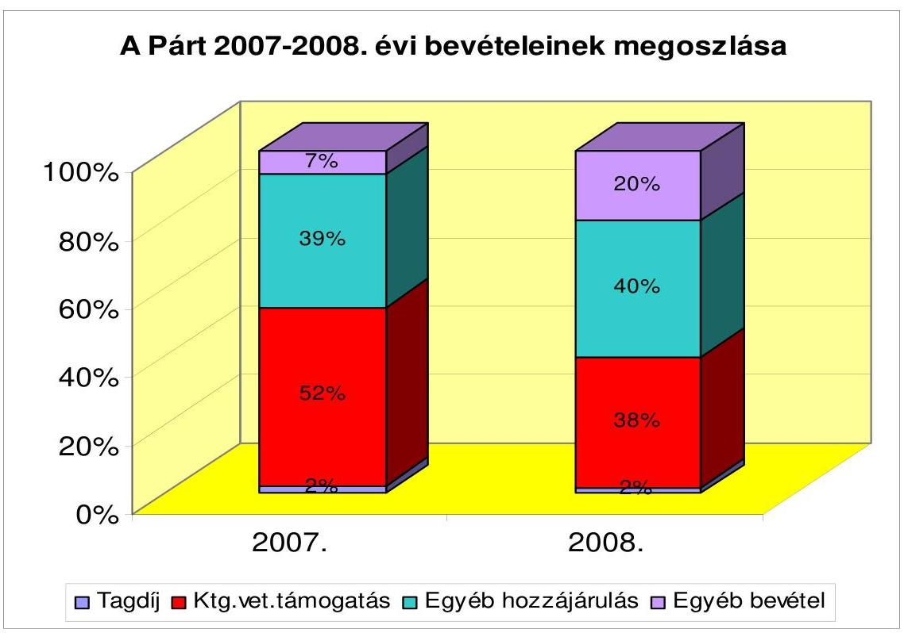
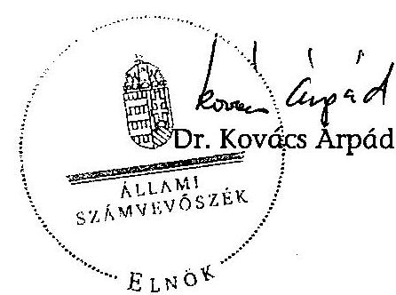

# ÁLLAMI   SZÁMVEVŐSZÉK 

## JELENTÉS

a Szabad Demokraták Szövetsége - a Magyar Liberális Párt 2007-2008. évi gazdálkodása törvényességének ellenőrzéséről

---

3. Önkormányzati és Területi Ellenőrzési Igazgatóság
3.1. Szabályszerűségi Ellenőrzési FőcsoportIktatószám: V-3007-022/2009.Témaszám: 942
Vizsgálat-azonosító szám: V-0459
Az ellenőrzést felügyelte:
Dr. Lóránt Zoltán
főigazgató
Az ellenőrzés végrehajtásáért felelős:
Dr. Elek Jánosáltalános főigazgató-helyettes
Az ellenőrzést vezette:
Horváth Balázs
főcsoportfőnök-helyettes
Az összefoglaló jelentést készítette:
Dr. Faragóné Tóth Mária számvevő tanácsos
Az ellenőrzést végezték:
Dr. Faragóné Tóth Mária Dr. Veress Tibornészámvevő tanácsos számvevő
A témához kapcsolódó eddig készített számvevőszéki jelentések:
címe
sorszáma
A Szabad Demokraták Szövetsége 1991. évi gazdálkodása törvényességének ellenőrzése
A Szabad Demokraták Szövetsége 1992-1993-1994. évi gazdálkodása ..... 279
törvényességének ellenőrzése
A Szabad Demokraták Szövetsége 1995-1996. évi gazdálkodása ..... 407
törvényességének ellenőrzése
A Szabad Demokraták Szövetsége 1997-1998. évi gazdálkodása ..... 9936
törvényességének ellenőrzése
A Szabad Demokraták Szövetsége 1999-2000. évi gazdálkodása ..... 0131
törvényességének ellenőrzése
A Szabad Demokraták Szövetsége 2001-2002. évi gazdálkodása ..... 0352
törvényességének ellenőrzése
A Szabad Demokraták Szövetsége 2003-2004. évi gazdálkodása ..... 0558
törvényességének ellenőrzése
A Szabad Demokraták Szövetsége 2005-2006. évi gazdálkodása ..... 0748
törvényességének ellenőrzése

---

## Eierlikör (1)

Menge: 1 Drink

2 Zentiliter Zitronensaft
2 Zentiliter Zuckersirup
1 Zentiliter Zuckersirup
1 Zentiliter Zuckersirup
etwas Zuckersirup
etwas Zuckersirup
etwas Zuckersirup
etwas Zuckersirup
etwas Zuckersirup
etwas Zuckersirup
etwas Zuckersirup
etwas Zuckersirup
etwas Zuckersirup
etwas Zuckersirup
etwas Zuckersirup
etwas Zuckersirup
etwas Zuckersirup
etwas Zuckersirup
etwas Zuckersirup
etwas Zuckersirup
etwas Zuckersirup
etwas Zuckersirup
etwas Zuckersirup
etwas Zuckersirup
etwas Zuckersirup
etwas Zuckersirup
etwas Zuckersirup
etwas Zuckersirup
etwas Zuckersirup
etwas Zuckersirup
etwas Zuckersirup
etwas Zuckersirup
etwas Zuckersirup
etwas Zuckersirup
etwas Zuckersirup
et

---

# TARTALOMJEGYZÉK 

BEVEZETÉS ..... 5
I. ÖSSZEGZŐ MEGÁLLAPÍTÁSOK, KÖVETKEZTETÉSEK, JAVASLATOK ..... 7
II. RÉSZLETES MEGÁLLAPÍTÁSOK ..... 10

1. A Párt gazdálkodásáról szóló 2007-2008. évi beszámolók ..... 10
1.1. A teljes vizsgálati időszakra érvényes megállapítások ..... 10
1.2. A 2007. és 2008. évi beszámoló ..... 10
1.2.1. Bevételek ..... 10
1.2.2. Kiadások ..... 11
2. A Pártnak a beszámoló összeállítására és az azt alátámasztó könyvvezetésre vonatkozó belső szabályozása, gyakorlata ..... 13
2.1. A belső szabályozás rendszere ..... 13
2.2. A könyvvezetés gyakorlata, összhangja a törvényi és a belső előírásokkal ..... 14
2.3. Analitikus nyilvántartások ..... 14
2.4. A bizonylati elv és fegyelem érvényesülése ..... 15
3. A Párt bevételszerző, gazdálkodó tevékenysége ..... 15
4. A gazdálkodással összefüggő, egyéb jogszabályok betartása ..... 17
4.1. Személyi jellegű kifizetések ..... 17
4.2. Az adózási, társadalombiztosítási és egyéb jogszabályok rendelkezéseinek érvényesítése ..... 18
5. A Párt belső ellenőrzésének rendszere ..... 19
5.1. A belső ellenőrzés rendszerének szabályozottsága ..... 19
5.2. A belső ellenőrzés működése ..... 19
6. Az előző ellenőrzés megállapításaira tett intézkedések ..... 20
MELLÉKLETEK
7. számú Szabad Demokraták Szövetsége - a Magyar Liberális Párt 2007. évi pénzügyi beszámolója
8. számú Szabad Demokraták Szövetsége - a Magyar Liberális Párt 2008. évi pénzügyi beszámolója

---

.

---

# RÖVIDÍTÉSEK JEGYZÉKE 

| APEH | Adó- és Pénzügyi Ellenőrzési Hivatal |
| :-- | :-- |
| ÁSZ | Állami Számvevőszék |
| OT | Országos Tanács |
| OÜT | Országos Úgyvivő Testület |
| Párt | Szabad Demokraták Szövetsége - a Magyar Liberális Párt |
| SZB | Számvizsgáló Bizottság |
| párttörvény | A pártok működéséről és gazdálkodásáról szóló - többször   módosított - 1989. évi XXXIII. törvény |
| ÁSZ tv. | Az Állami Számvevőszékről szóló - többször módosított -   1989. évi XXXVIII. törvény |
| Szja törvény | A személyi jövedelemadóról szóló - többször módosított -   1995. évi CXVII. törvény |
| számviteli törvény | A számvitelről szóló - többször módosított - 2000. évi C.   törvény |
| Áfa | Általános forgalmi adó |

---

.

---

# JELENTÉS 

## a Szabad Demokraták Szövetsége - a Magyar Liberális Párt 2007-2008. évi gazdálkodása törvényességének ellenőrzéséről

## BEVEZETÉS

Az Állami Számvevőszékről szóló 1989. évi XXXVIII. törvény 5. §-a és a 16. § (2) bekezdése, valamint a pártok működéséről és gazdálkodásáról szóló - többször módosított - 1989. évi XXXIII. törvény (párttörvény) 10. § (1) és (3) bekezdése alapján a pártok gazdálkodása törvényességének ellenőrzésére az Állami Számvevőszék (ÁSZ) jogosult. E törvényi felhatalmazásokra figyelemmel az ÁSZ 2009. évi ellenőrzési tervének megfelelően vizsgálta a Szabad Demokraták Szövetsége - a Magyar Liberális Párt (Párt) 2007-2008. évi gazdálkodása törvényességét.

Az ellenőrzés célja annak megállapítása volt, hogy:

- a Párt által készített, a Magyar Közlönyben és a Párt internetes honlapján közzétett éves beszámolók a törvényi előírásoknak megfelelnek-e, a könyvvezetéssel és a valósággal megegyező adatokat tartalmaznak-e;
- a könyvvezetés, a gazdálkodás során betartották-e a számvitelről szóló többször módosított - 2000. évi C. tv. (számviteli törvény) és az egyéb jogszabályok rendelkezéseit, a belső előírásokat;
- a Párt a működéséhez szabályszerűen igénybe vehető forrásokat használt-e fel, a párttörvényben engedélyezett gazdálkodó tevékenységet folytatott-e, nem fogadott-e el tiltott adományt.

Az ellenőrzés körülményeit illetően általánosságban rögzíteni szükséges ${ }^{1}$, hogy:

- a párttörvény 1. sz. melléklete szerinti beszámoló-mintához magyarázatot, útmutatót nem készítettek a jogalkotók, így ennek kitöltése pártonként - kialakított számviteli politikájuknak megfelelően - eltérő lehet;
- a beszámolóminta a számviteli törvény rendelkezéseivel nem harmonizál, nem felel meg sem a mérleg, sem az eredmény-kimutatás követelményeinek.

[^0]
[^0]:    ${ }^{1}$ Az ÁSZ évek óta javasolja a Kormánynak a pártok ellenőrzéséről készített jelentéseiben a párttörvény módosítását.

---

A korábbi pártellenőrzések alapján tett jelzésekre is figyelemmel elengedhetetlenül szükséges a pártok működéséről és gazdálkodásáról szóló - többször módosított - 1989. évi XXXIII. törvény, valamint a számviteli törvény előírásainak összehangolása, amely a pártfinanszírozás átláthatóvá tételére benyújtott törvényjavaslatnak szerves része (száma: T/4190).

Az ÁSZ a párttörvény módosításáig a jelenleg hatályos rendelkezéseknek megfelelő - egységes módszertani alapokra helyezett - gyakorlattal folytatja a pártok gazdálkodása törvényességének ellenőrzését. Az ellenőrzést a pénzügyiszabályszerűségi ellenőrzés módszertani szabályai szerint, a pártellenőrzésre kiadott segédletbe foglalt egységes követelmények alapján végeztük.

Az ellenőrzési feladatok szempontrendszerét kockázatelemzéssel alapoztuk meg, amelynek eredményeként az ellenőrzést közepes kockázatúnak minősítettük. Az adatok előzetes elemzése alapján terveztük meg a tételes ellenőrzést, valamint a mintavételi eljárást. Tételesen ellenőriztük a bevételek közül az egymillió Ft feletti tételeket, valamint a beszámolóban kötelezően nevesítendő, értékhatárt elérő egyéb hozzájárulásokat, adományokat. A vizsgált években a bizonylati rend és fegyelem ellenőrzéséhez véletlenszerűen kiválasztott mintát használtunk fel. Alkalmaztuk a tanúsítványi adatszolgáltatást, a beszámolási és könyvvezetési adatok egyeztetését, felülvizsgálatát.

Az előkészítés során a rendelkezésre bocsátott dokumentumok alapján az átfogó lényegességi mértéket a beszámoló főösszegének 2\%-ában határoztuk meg, továbbá specifikus lényegességi küszöböt alkalmaztunk az egyéb hozzájárulások, adományok körében a párttörvény 1. számú mellékletének előírása szerinti nevesítési értékhatárra (belföldi 500 ezer Ft, külföldi 100 ezer Ft feletti) tekintettel.

A helyszíni ellenőrzés 2009. augusztus 17 - október 7-e között, a Párt székhelyén történt.

---

# I. ÖSSZEGZŐ MEGÁLLAPÍTÁSOK, KÖVETKEZTETÉSEK, JAVASLATOK 

A Párt a 2007. és 2008. évi gazdálkodási beszámolóit a párttörvényben előírt formában és tartalommal a Magyar Közlönyben, illetve annak mellékletében, a Hivatalos Értesítőben és internetes honlapján határidőben közzétette. A beszámolókat szabályzatával összhangban, a főkönyvi számlákkal és analitikus nyilvántartásokkal alátámasztottan jelentette meg. Az ellenőrzés által feltárt elszámolási problémák a lényegességi küszöböt nem érték el, ennek figyelembe vételével a számviteli törvényben meghatározott számviteli alapelveket érvényesítették. A Párt 2007-2008. évi gazdálkodásáról, pénzügyi helyzetéről megbízható és valós képet adtak a megjelentetett éves beszámolók.

A Párt a számviteli szabályzatait a korábbi ÁSZ ellenőrzés által tett felhívásra figyelemmel, összhangban a jogszabályi és gazdálkodási változásokkal, 2008. szeptember 1-jével a Párt sajátosságainak megfelelően megújította. A számviteli politikában szabályozták az értékcsökkenés elszámolási szabályait, a kis értékű tárgyi eszközök költségként való elszámolásának értékhatárát 100 ezer Ft-ban állapították meg. Jelen ellenőrzés megállapítására pótolták, hogy az értékelésnél mit tekint a Párt jelentősnek, nem jelentősnek. A pénzkezelési szabályzatban meghatározták a központi iroda napi készpénz záró állományát, megállapították a kerekítési szabályokat. Az eszközök és források értékelési szabályzatában rögzítették az értékelési szabályokat a nem pénzbeli vagyoni hozzájárulásokra és az adott támogatásokra. A számlarendben kijelölték az alkalmazott számlákat, meghatározták a számlák tartalmát.

A könyvvezetés külső vállalkozás által, a kettős könyvvitel rendszerében központilag, az alapbizonylatok számítógépes feldolgozásával történt, mindkét évben azonos program használatával. A főkönyvi könyvelést idősorrendben, a zárlati munkákat - a pénzkészletek eltérésének rendezése kivételével - a számviteli politikában előírt módon végezték. A számlakijelölésnél betartották a törvényi és számlarendi előírásokat. Az eszközök és források leltározását és kiértékelését mindkét évben elvégezték, a házipénztári és bankszámla nyilvántartások alapján feltárt többlet rendezése nem zárult le 2007-ben 440 ezer Ft, 2008-ban 478 ezer Ft.

A főkönyvi számlákhoz rendelt analitikus nyilvántartások körét, tartalmát és vezetésének rendjét a számviteli politikában, pénzkezelési, valamint leltározási szabályzatban meghatározták. Az analitikus nyilvántartások vezetését a Párt hiányosan biztosította. A központilag működtetett valutapénztárban lévő valutáról, a pénzkezelési szabályzat előírása ellenére, két kerületi és három megyei szervezet házipénztári forgalmáról pénztárjelentést nem vezettek; az elszámolásra kiadott előlegek központi analitikájában nem rögzítették a pénzfelvétel jogcímét és a ténylegesen elszámolt összeget. A hiányosságokat az ellenőrzés észrevételére pótolták. A Párt 2008. évben a korábbi évekre visszamenőleg is végrehajtotta az értékcsökkenés elszámolását. Teljes körűen, a szabályozásnak megfelelő adattartalommal vezették: az immateriális javak és

---

tárgyi eszközök; a szállítók és vevők, a szigorú számadású nyomtatványok nyilvántartását.

A bizonylati elv és fegyelem érvényesüléséhez - a számlarend részeként rendelkeztek a gazdálkodási sajátosságoknak megfelelő bizonylati szabályzattal, amelynek követelményei kiegészültek a pénzkezelési szabályzatban, valamint az utalványozás és kötelezettségvállalás rendjéről kiadott elnöki utasításokban. A számviteli nyilvántartásokban könyvelt gazdasági műveleteket szabályszerűen kiállított bizonylatok alátámasztották, kivéve a valutapénztár forgalmát, amelyeknél a számviteli törvény és a belső előírások szerinti bevételi-kiadási bizonylatot nem állítottak ki. A számviteli bizonylatok hitelesek és megbízhatóak voltak, eleget tettek a bizonylatok alaki és tartalmi követelményeinek, megfelelve a számviteli törvényben foglalt szabályoknak. A kötelezettségvállalást és az utalványozást szabályszerűen, a hatáskörileg illetékes vezetők gyakorolták.

A Párt gazdálkodó, bevételszerző tevékenysége során - könyvviteli nyilvántartásai szerint - betartotta a párttörvényben előírt gazdálkodási tilalmakat és forrásszerzési korlátozásokat. A Párt 2007-2008. évi bevételei a párttörvényben meghatározott forrásokból és tevékenységekből teljesültek. A tagdíjak befizetése a Párt alapszabályával és az OT határozatával összhangban teljesült, mindkét évben 2\%-os részaránnyal. A Párt a párttörvény alapján a vizsgált időszakban összességében 522200 ezer Ft állami támogatásra volt jogosult, amely forrásainak 2007-ben 52\%-át, 2008-ban 38\%-át tette ki. A politikai tevékenység finanszírozására az egyéb hozzájárulások és adományok 2007-ben 195480 ezer Ft, 2008-ban 272181 ezer Ft összegben teljesültek, amely tartalmazta a kedvezményes ingatlanhasználattal megvalósult, a párttörvénynek megfelelően értékelt nem pénzbeli vagyoni hozzájárulások értékét. Az egyéb bevételek a Párt tulajdonában álló ingatlan dí ellenében történő hasznosításából, feleslegessé vált tárgyi eszközök értékesítéséből; költségtérítésekből; káreseményekkel kapcsolatos bevételekből; kamatbevételekből; propaganda tárgyak értékesítéséből, rendezvények szervezéséből; különféle egyéb bevételekből; kölcsönök igénybevételéből tevődött össze: 7\%, illetve 20\% mértékben. A Pártnak a tulajdonában álló egy kft-vel üzleti kapcsolata volt, nyereségéből bevétele nem keletkezett.

A gazdálkodással összefüggő egyéb jogszabályokat a munkáltatói és megbízási jogviszony keretében felmerült kiadásoknál betartották. A foglalkoztatáshoz kapcsolódóan az adózási és társadalombiztosítási jogszabályokban előírt adó- és járulékfizetési kötelezettségnek - két határidő csúszás kivételével - határidőben eleget tettek. A társadalombiztosítás és adózás kötelező nyilvántartásait vezették. A főkönyvi könyvelés és a bevallások nyilvántartási adatai megegyeztek.
 Hasonlóan szabályszerűen történt a külföldi napidíjak adójának és az értékesítés utáni Áfa megfizetése. A Párt által üzemeltetett és a magántulajdonú gépjármű hivatali célú használatának költségtérítése és elszámolása a szabályozás szerint történt, az üzemanyag költségtérítések normatív mértékkel, szabályszerűen teljesültek.

A Párt gazdálkodásának és működésének, pénzügyi és számviteli tevékenységének belső ellenőrzési rendszerét az alapszabály, a pénzkezelési és bizonylati szabályzat összehangoltan szabályozta. A Párt választott belső ellenőrző

---

szervezete az SZB, amely az alapszabály értelmében a Párt gazdálkodását folyamatosan ellenőrizte, figyelemmel kísérte a jogszabályok és a Párt gazdálkodására vonatkozó egyéb szabályok érvényesülését, a pénzügyi és számviteli szabályok megtartását, valamint a forrásfelhasználás célszerűségét. Az SZB ügyrendjében foglaltak szerint véleményezte a Párt éves költségvetését és beszámolóját, a testület ajánlásával fogadta el a hatáskörileg illetékes OT az éves gazdálkodási dokumentumokat.

A munkafolyamatba épített belső kontroll során nem tárták fel az eseti könyvvezetési és beszámolási hibákat, a pénzkezelési hiányosságokat. A vezetői és munkafolyamatba épített ellenőrzés gyakorlása során az összeférhetetlenségi szabályok érvényesültek. A belső kontroll tevékenység javulását mutatja, hogy a korábbi ÁSZ vizsgálatok során feltárt beszámolási és könyvvezetési lényeges hibákat jelen ellenőrzés nem tapasztalt.

A Párt az előző ÁSZ ellenőrzés felhívása alapján intézkedési tervét határidőben megküldte, amelynek alapján a hatályos jogszabályokkal és a gazdálkodási sajátosságokkal összhangban alakította ki számviteli szabályzatait, gondoskodott a belső ellenőrzési rendszer hatékonyabb működéséről, a valutapénztári forgalom bizonylatolásának kivételével érvényesítette a bizonylati elv és fegyelem előírásait. Teljes körűen nem biztosította viszont az analitikus nyilvántartások vezetését, a zárlati munkálatok végrehajtását.

A helyszíni ellenőrzés megállapításának hasznosítása mellett az Állami Számvevőszék felhívja

# a Párt elnökét 

Gondoskodjon a banki és pénztári pénzkészletek pénzkezelő helyenkénti főkönyvi és analitikai egyeztethetőségéről, a pénztárjelentések teljes körű vezetéséről, eltérésének rendezéséről.

---

# II. RÉSZLETES MEGÁLLAPÍTÁSOK 

## 1. A PÁRT GAZDÁLKODÁSÁRÓL SZÓLÓ 2007-2008. ÉVI BESZÁMOLÓK

### 1.1. A teljes vizsgálati időszakra érvényes megállapítások

A Párt a vizsgált évek gazdálkodási beszámolóit a párttörvény 9. § (1) bekezdésében előírt határidőn belül, a párttörvény 1. sz. mellékletében előírt formában és tartalommal a Magyar Köztársaság hivatalos lapjában közzétette. A 2007. évi beszámoló 2008. április 28-án, a Magyar Közlöny 67. számában, a 2008. évi beszámoló 2009. április 30-án, a Magyar Közlöny mellékletében a Hivatalos Értesítő 20. számában jelent meg (1. és 2. számú melléklet). A Párt mindkét évi beszámolóját internetes honlapján is nyilvánosságra hozta. A beszámolók összeállításának rendjét a Párt a hatályos számviteli politikájában szabályozta és ennek megfelelően készítette el. Az éves beszámolókat a vonatkozó főkönyvi számlák adatai, analitikus nyilvántartásai alátámasztották és az alapszabály rendelkezése szerint az OT megjelentetés előtt elfogadta. A közzétett éves beszámolók a Párt 2007-2008. évi gazdálkodásáról, pénzügyi helyzetéről megbízható és valós képet adtak. A bevételi és kiadási jogcímeket érintően feltárt eltérések előjeltől független mértéke a 2007. évi bevételeknél 0,06%, a 2008. évi kiadásoknál 0,01% volt, amelyek a beszámolók fő összegének viszonylatában nem minősültek lényegesnek.

### 1.2. A 2007. és 2008. évi beszámoló

### 1.2.1. Bevételek

A 2007-2008. években közzétett beszámolók bevételeinek ellenőrzése során megállapított eltéréseket - beszámoló soronként - a következő összeállítás részletezi:

| BEVÉTELEK | Párt által közzétett beszámoló |  | Ellenőrzés által megállapított eltérések a közzétett beszámolóhoz képest |  |  |  |
| :--: | :--: | :--: | :--: | :--: | :--: | :--: |
|  | 2007. évi | 2008. évi | 2007. évi |  | 2008. évi |  |
|  |  |  | Kimaradt | Hibásan   szerepel | Kimaradt | Hibásan   szerepel |
| 1. Tagdíjak | 10709 | 10810 | 0 | -130 | 0 | 0 |
| 2. Állami támogatás | 261100 | 261100 | 0 | 0 | 0 | 0 |
| 4. Egyéb hozzájárulások, adományok összesen | 195480 | 272181 | 0 | 0 | 0 | 0 |
| 6. Egyéb bevétel | 32935 | 137314 | 9 | -144 | 0 | 0 |
| Összes bevétel | 500224 | 681405 | 9 | -274 | 0 | 0 |
| - hiány |  |  |  |  |  |  |
| - többlet |  |  |  | 265 |  |  |
| Előjeltől független feltárt hiba aránya %-ban |  |  |  | 0,06 |  |  |

---

Tagdíjak címen közzétett adat a Pártnál a 2007-2008. évben megegyezett a főkönyvi könyvelésben szereplő összeggel. A tagdíjbevételek pénztári, illetve banki bizonylataiból a befizető személye minden esetben megállapítható volt. A tagdíjak között más bevételek nem szerepeltek.

Állami költségvetésből származó támogatás címén közzétett adat mindkét évben megegyezett a főkönyvi könyvelésben kimutatott, a bankszámla kivonattal alátámasztottan, a Magyar Államkincstár által ténylegesen átutalt összeggel.

Az egyéb hozzájárulások, adományok beszámolósor adatát a Párt, a párttörvény 1. számú mellékletében előírt minta szerint tovább részletezte, a belföldiektől származó 500 ezer Ft, a külföldi jogi személyektől teljesült 100 ezer Ft feletti támogatásokat szabályszerűen nevesítette. A Párt főkönyvi nyilvántartását a párttörvényben meghatározott jogcímek és értékhatár szerinti bontásban alakította ki. A banki átutalás és a készpénzes befizetés esetén az adományozó személyének egyértelmű azonosítása biztosított volt. A nyilvánosságra hozott beszámolók egyéb hozzájárulások, adományok sorának összege alapbizonylattal alátámasztottan megegyezett a vonatkozó főkönyvi számlák összesített egyenlegével.

Az egyéb hozzájárulások, adományok belföldi jogi személyektől beszámoló sor adatai tartalmazták a párttörvény 4. § (5) bekezdésében előírtakkal összhangban az önkormányzatoktól ingyenes, vagy jelképes bérleti díj és piaci érték különbözeteként ingatlanhasználat formájában kapott nem pénzbeli vagyoni hozzájárulás értékét. Az ingatlanhasználat formájában kapott nem pénzbeli vagyoni hozzájárulások értéke 2007. évben 31908 ezer Ft, 2008. évben 39384 ezer Ft volt. Az önkormányzatoktól kapott nem pénzbeli vagyoni hozzájárulás értéke 2007-ben 18 önkormányzat, 2008-ban 17 önkormányzat vonatkozásában meghaladta az egy naptári év alatt meghatározott, 500 ezer Ft hozzájárulást. A beszámolókban feltüntették a párttörvény 9. § (2) bekezdés előírása szerint az értékhatár feletti támogatást nyújtó önkormányzatokat és a támogatási összeget. A Párt a vizsgált időszakban 500 ezer Ft-ot meghaladó hozzájárulást kapott költségvetési támogatásban nem részesült alapítványtól. Egyéb hozzájárulások, adományok külföldi jogi személyektől címen teljesült bevételeknél 2007. és 2008. évben egy-egy 100 ezer Ft-ot meghaladó, külföldi jogi személytől származó adományozás történt. Az egyéb hozzájárulások, adományok jogi személyiségnek nem minősülő gazdasági társaság soron 2008. évben egy adományozó és az egyéb hozzájárulások, adományok belföldi magánszemélyektől sorokon 2007. évben tizennyolc, 2008. évben nyolc adományozót a beszámolókban a párttörvény előírásának megfelelően név szerint is feltüntették.

Az egyéb bevételek beszámolósoron a számviteli politikával összhangban megállapított jogcímeket szerepeltették.

# 1.2.2. Kiadások 

A 2007. és a 2008. évekre közzétett beszámolók kiadásainak ellenőrzése során megállapított eltérést a következő összeállítás mutatja:

---

Adatok: ezer forintban

| KIADÁSOK | Párt által közzétett beszámoló |  | Ellenőrzés által megállapított eltérések a közzétett beszámolóhoz képest |  |  |  |
| :--: | :--: | :--: | :--: | :--: | :--: | :--: |
|  | 2007. évi | 2008. évi | 2007. évi |  | 2008. évi |  |
|  |  |  | Kimaradt | Hibásan   szerepel | Kimaradt | Hibásan   szerepel |
| 2. Támogatás egyéb szervezeteknek | 1000 | 10 | 0 | 0 | 0 | 0 |
| 4. Működési kiadások | 316796 | 359144 | 0 | 0 | 0 | 0 |
| 5. Eszközbeszerzés | 5415 | 4616 | 0 | 0 | 90 | 0 |
| 6. Politikai tevékenység kiadásai | 77930 | 219000 | 0 | 0 | 0 | 0 |
| 7. Egyéb kiadások | 132957 | 134040 | 0 | 0 | 0 | 0 |
| Összes kiadás | 534098 | 716810 | 0 | 0 | 90 | 0 |
| - hiány |  |  |  |  | 90 |  |
| - többlet |  |  |  |  |  |  |
| Előjeltől független feltárt hiba aránya %-ban |  |  |  |  | 0,01 |  |

Támogatás egyéb szervezeteknek beszámolósoron 2007. évben - az OÜT határozata alapján -- szövetségnek nyújtott 1000 ezer Ft, 2008. évben 10 ezer Ft összegű, egy múzeumnak nyújtott támogatás szerepelt. A közölt adatok megegyeztek a főkönyvi könyveléssel, a valós helyzetet tükrözték, a főkönyvi számlákon kizárólag szervezetnek adott támogatást tartottak nyilván.

A működési kiadások beszámoló soron a szabályozás szerint a Párt az anyagköltségek; az igénybevett szolgáltatások költsége; a bérköltség és annak járulékai, valamint a személyi jellegű kifizetések együttes értékét szerepeltette, így a vizsgált években érvényesült a működési kiadások jogcímeinek azonossága. A beszámolósor adata mindkét évben megegyezett a beszámolót alátámasztó részletes kimutatásban és a számviteli politikában meghatározott főkönyvi számlák összegeinek összesített, ezer forintra kerekített adataival.

Az eszközbeszerzés beszámoló sor tartalmát a tárgyévben beszerzett eszközök értékéből, a ténylegesen kifizetett összeg nagyságában határozták meg. A 2007-2008. évi beszámolóban a szabályozással összhangban, részletes analitikával alátámasztottan, főkönyvi könyveléssel azonos összegben szerepelt a beszerzés.

A politikai tevékenység kiadásai beszámolósoron a Párt a számviteli politikában meghatározottaknak megfelelően a hirdetés, propaganda költség; rendezvény költségei, valamint a politikai tevékenységgel kapcsolatos anyag, bérleti díj, szolgáltatási és kiküldetési költség; továbbá 2008. évben időközi országgyűlési és a helyhatósági választási költség főkönyvi számlái összesített adatát mutatta ki. A közölt adatok a számviteli politikában részletesen meghatározottakkal, a beszámolókat alátámasztó analitikával és a főkönyvi könyveléssel azonosak voltak.

Az egyéb kiadások 75,6%-át, illetve 69,4%-át hitel visszafizetés tette ki. A beszámolók mindkét évben a szabályozással összhangban álló főkönyvi számlák egyenlegeit tartalmazták. A beszámoló sor adata a főkönyvi könyvelés és az analitikus nyilvántartás adataival megegyezett.

---

# 2. A PÁRTNAK A BESZÁMOLÓ ÖSSZEÁLLÍTÁSÁRA ÉS AZ AZT ALÁTÁMASZTÓ KÖNYVVEZETÉSRE VONATKOZÓ BELSŐ SZABÁLYOZÁSA, GYAKORLATA 

### 2.1. A belső szabályozás rendszere

A Párt a beszámoló összeállítását és az azt alátámasztó könyvvezetést a 2006. január 1-jétől hatályos számviteli politikájában szabályozta, amelyet 2008. szeptember 1-jével megújított, összhangban a jogszabályi és gazdálkodási változásokkal, figyelemmel a korábbi ÁSZ ellenőrzés által tett felhívásokra.

A számviteli politikához kapcsolódódó korábbi - 2006. január 1-jei hatályú pénzkezelési, értékelési, leltározási és selejtezési, bizonylatolási szabályzatot, valamint a számlarendet 2008. szeptember 1-jével hatályon kívül helyezte a Párt, illetve újakat fogadott el. A megújított számviteli szabályzatok megfelelően rögzítették a hatályos jogszabályi előírásokat és tükrözték a szervezet sajátosságait.

A számviteli politika részeként - végrehajtva az ÁSZ többszöri felhívását - szabályozták az értékcsökkenés elszámolási
 szabályait figyelemmel a számviteli törvény 52. §-ára, továbbá a kis értékű tárgyi eszközök költségként való elszámolásának értékhatárát 100 ezer Ft-ban állapították meg, élve a számviteli törvény 2006. január 1-jétől hatályos, 80. § (2) bekezdésében szabályozott értékhatárra való felemelés lehetőségével. A párttörvény 1. számú mellékletében előírt beszámolósorokhoz meghatározták a konkrét főkönyvi számlákat. A Párt a számvevői jelentés alapján határozta meg a számviteli törvény 14. § (4) bekezdésében előírtaknak megfelelően, hogy az értékelésnél mit tekint jelentősnek, nem jelentősnek.

A pénzkezelési szabályzatban a számviteli törvény 14. § (8) bekezdésében előírtaknak megfelelően előírták a központi iroda házipénztárában tartható készpénz napi záró állományát, megállapították a kerekítési szabályokat.

Az eszközök és források értékelési szabályzatában rögzítették a párttörvény 4. § (5) bekezdésében előírt értékelési szabályokat a nem pénzbeli vagyoni hozzájárulásokra. A leltározási szabályzatot változatlan – a korábbi ÁSZ ellenőrzés által elfogadott – tartalommal adta ki ismételten a Párt.

A számlarend 2008. szeptember 1-jei átdolgozása során a korábbi ÁSZ jelentés felhívásának eleget téve és figyelemmel a számviteli törvény 161. § előírásaira kijelölték a főkönyvi számlákat a nem pénzbeli vagyoni hozzájárulások nyilvántartására, valamint valamennyi adomány bevételi számlaszámát a párttörvény 1. számú melléklete szerinti bontásban. Megszüntették az 5-ös számlaosztályon belül a számviteli törvénynek nem megfelelő számlakijelölési gyakorlatot és 2008. évtől az adott támogatást az egyéb ráfordítások számlacsoporthoz rendelték. Számlarendjében a Párt figyelembe vette a működési sajátosságokat, minden alkalmazott számla számát, megnevezését rögzítette és meghatározta a számla tartalmát, ha az a számla megnevezéséből nem következett. A számlarend mellékletét képező bizonylati szabályzatot változatlan tartalommal adta ki a Párt.

---

# 2.2. A könyvvezetés gyakorlata, összhangja a törvényi és a belső előírásokkal 

A Pártnál a könyvvezetést és a beszámoló összeállítását a vizsgált időszakban külső könyvelési szolgáltató határozatlan idejű megbízási szerződéssel, azonos könyvelési programmal végezte. A szolgáltató 2008. júliustól változott. A Párt 2008. október hótól új tárgyi eszköz programot használt és bérelt. A könyvvezetést és a beszámolót összeállító számviteli szolgáltatást végzők a számviteli törvény 151. § (1) bekezdés szerint meghatározott képesítéssel rendelkeznek és szerepelnek a PM által vezetett könyvviteli szolgáltatást végzők nyilvántartásában. A Párt a számviteli tevékenység folytonosságának biztosítására a korábbi könyvelő cég két alvállalkozójával, 2008. május 1-jétől határozatlan idejű vállalkozási szerződést kötött.

A könyvvezetés a vizsgált időszakban a kettős könyvvitel rendszerében központilag, az alapbizonylatok számítógépes feldolgozásával történt. A gazdasági eseményeket a könyvelés idősorosan rögzítette. A rendelkezésre álló dokumentumok alapján a zárlati munkálatokat a számviteli törvény 164. § (1)-(2) bekezdésében foglaltak szerinti határidőben elvégezték a pénzkészletek eltérésének rendezése kivételével.

A Pártnál 2007-ben 274 ezer Ft összegű könyvelési hiba miatt nem érvényesült a könyvvezetésben teljes körűen a számviteli törvény 15. § (3) bekezdésében rögzített valódiság elve. A Párt egy kerületi szervezeténél 130 ezer Ft tagdíjbevételt kétszer könyvelt és 144 ezer Ft árfolyam-differenciát helytelenül – a valuta analitikus nyilvántartás hibája miatt – a számviteli törvény 60. § (4) bekezdésében rögzítettel ellentétesen állapított meg. Továbbá 9 ezer Ft könyvvezetési eltérés miatt nem érvényesült a könyvvezetésben teljes körűen a számviteli törvény 15. § (2) bekezdésében rögzített teljesség elve, mivel az Országos Egészségbiztosítási Pénztártól kapott 9 ezer Ft költség ellentételezését a Párt bevételként nem számolta el. A hibák nem minősültek lényegesnek.

A Pártnál az eszközök és források leltározását a szabályozás szerint évente kiadott leltározási utasítás és ütemterv alapján végezték. A vizsgált időszakban az irodák által felvett és megküldött leltárak kiértékelése megtörtént. A beszámolót nem érintő eltéréseket a következők ellenére nem állapították meg:

- Az elszámolási előleg főkönyvi számla év végi egyenlege az analitikus nyilvántartástól 2007-ben 45 ezer Ft-tal, 2008-ban 10 ezer Ft-tal eltért a területi irodáknál.
- A házipénztári és bankszámla nyilvántartások és a vonatkozó főkönyvi számlák egyenlegének Párt általi egyeztetésénél 2007-ben 440 ezer Ft, 2008-ban 478 ezer Ft többletet tártak fel, amelynek rendezése még nem zárult le.

### 2.3. Analitikus nyilvántartások

A Párt a számviteli törvény 161. § (2) bekezdés c) pontja alapján a főkönyvi számlákhoz rendelt analitikák köréről, vezetésének módjáról számviteli politikájában, pénzkezelési, valamint leltározási szabályzataiban rendelkezett.

---

Az immateriális javak és aktivált tárgyi eszközök nyilvántartását 2008-tól megoldották, az egyedi tárgyi eszköz kartonok az egyedi azonosításra vonatkozó adatokat teljes körűen tartalmazták, a beszerzéseket egyedileg mennyiségben és értékben a számítógépes tárgyi eszközprogram analitikus nyilvántartásába bevezették, amelyeket az 1. számlaosztályban könyveltek.

A Párt 2008-ban a korábbi évekre visszamenőleg is végrehajtotta az értékcsökkenés elszámolását a számviteli törvény 52-53. §-ában és belső szabályzatában előírtaknak megfelelően. A Párt a szállítói analitikus nyilvántartásokat a számítógépes könyvelési programjában vezette, amely minden szükséges adatot tartalmazott.

A központilag működtetett valutapénztárban lévő valutáról analitikus nyilvántartást nem vezettek, amit a helyszíni ellenőrzés észrevételére pótoltak. A pénzkezelési szabályzatban rögzítettek ellenére az elszámolásra kiadott előlegek központi analitikájában nem rögzítették a felvétel jogcímét és a ténylegesen elszámolt összeget, valamint 2007-ben 10, 2008-ban 11 esetben nem tartották be a 30 napon belüli elszámolási határidőt. A szigorú számadású nyomtatványokat a számviteli törvény 168. §-ában, a számviteli politikában és a pénzkezelési szabályzatban foglaltak betartásával teljes körűen nyilvántartották.

# 2.4. A bizonylati elv és fegyelem érvényesülése 

A Párt a számviteli törvény 161. § (2) bekezdés d) pontja szerint a hatályos számlarend részét képező és a Párt sajátosságainak megfelelő bizonylati szabályzattal rendelkezett. A Párt a bizonylati rend és okmányfegyelem követelményeit még a pénzkezelési szabályzatban, valamint az utalványozás és kötelezettségvállalás rendjéről szóló elnöki utasításokban határozta meg.

A számviteli nyilvántartásokban a könyvelt gazdasági műveleteket szabályszerűen kiállított bizonylatokkal támasztották alá, kivéve a valutapénztár forgalmát, amelyeknél bevételi és kiadási bizonylatot nem állítottak ki a számviteli törvény 165. § (1) bekezdésében foglalt előírások szerint. A gazdasági műveletek, események bizonylatainak adatait a számviteli törvény 165. § (3) bekezdésében és a számviteli politikában meghatározott időpontig rögzítették.

A számviteli bizonylatok hitelesek és megbízhatóak voltak, megfelelve a számviteli törvény 166. §-ában rögzített szabályoknak. A könyvviteli elszámolást közvetlenül alátámasztó bizonylatok alaki és tartalmi kellékei eleget tettek a számviteli törvény 167. §-ában előírtaknak. A Pártnál a szabályozás szerint működött a kötelezettségvállalás, utalványozás.

## 3. A PÁRT BEVÉTELSZERZŐ, GAZDÁLKODÓ TEVÉKENYSÉGE

A Párt 2007-2008. évi bevételei – nyilvántartási adatai szerint – a párttörvény 4. § (1) és 6. § (1) bekezdésében meghatározott forrásokból, tevékenységekből teljesültek.

---

A tagdíjak befizetése a Párt alapszabályával és az OT határozatával összhangban teljesült. A Párt a párttörvény 5. § (2) bekezdése alapján a vizsgált időszakban évenként 261100 ezer Ft állami támogatásra volt jogosult. Hasonlóan jelentős szerepe volt a politikai tevékenység finanszírozásában az egyéb hozzájárulásoknak és adományoknak 2007-ben 195480 ezer Ft, 2008-ban 272181 ezer Ft összegben.

A Párt a vizsgált években 51 db ingatlant használt. Az ingatlanokból 2007-ben hatot, 2008-ban hetet piaci áron bérelt, 2007-2008. években tizenkilenc ingatlant ingyenes ingatlanhasználati jog keretében vett igénybe. Kedvezményes bérleti díj ellenében 2007-ben huszonhat, 2008-ban huszonöt ingatlant használt, amely nem pénzbeli vagyoni hozzájárulásnak minősült, annak értékét a párttörvényben foglaltaknak megfelelően megállapította és a beszámolókban szerepeltette.

Az egyéb bevételek a Párt tulajdonában álló ingatlan díj ellenében történő hasznosításából, feleslegessé vált tárgyi eszközök értékesítéséből; költségtérítésekből; káreseményekkel kapcsolatos bevételekből; kamatbevételekből; propaganda tárgyak értékesítéséből, rendezvények szervezéséből; különféle egyéb bevételekből; továbbá kölcsönök igénybevételéből tevődött össze.

Az egyéb bevételek a Pártnál a párttörvény 4. § (1) bekezdésben engedélyezett forrásokból, valamint a 6. § (1) bekezdésben meghatározott tevékenységekből teljesültek. A gazdálkodó tevékenységre vonatkozóan, annak jogszerűségét igazoló szerződések, az értékesítési és költségtérítés dokumentumai rendelkezésre álltak. A vizsgált időszakban a párt kitűző, póló és reklám anyagokat az OT felhatalmazása alapján az OÜT által hozott határozatai alapján készítette, árusította rendezvényein. A szabályos értékesítést részletes analitika, teljes körű bizonylatolás támasztotta alá.

---

Adatok: ezer Ft-ban

| Jogcímek | Ellenőrzés által megállapított egyéb   bevételek |  |
| :-- | :--: | :--: |
|  | 2007. évi | 2008. évi |
| Ingatlan hasznosítása, eszközök   értékesítése | 69 | 259 |
| Propaganda, rendezvény   tevékenység bevétele | 11588 | 17209 |
| Különféle egyéb bevétel (költségtérítés, kerekítés, pénztártöbblet) | 593 | 483 |
| Káreseménnyel kapcsolatos bevétel | 181 | 1042 |
| Kamatbevétel pénzintézetektől | 101 | 57 |
| Kölcsön | 20268 | 118264 |
| Összesen | $\mathbf{3 2 8 0 0}$ | $\mathbf{1 3 7 3 1 4}$ |

A Párt a vizsgált időszakban könyvviteli nyilvántartásai szerint a párttörvény 4. § (2)-(3) bekezdéseiben meg nem engedett forrásból származó vagyoni hozzájárulást: állami vállalattól, állami részvétellel működő gazdasági társaságtól, közvetlen költségvetési támogatásban vagy költségvetési szervi támogatásban részesülő alapítványtól, más államtól vagyoni hozzájárulást, továbbá névtelen adományt nem fogadott el. A Párt a párttörvény 6. §-ában nem engedélyezett gazdálkodó tevékenységet nem folytatott, gazdasági társaságban részesedést nem szerzett, egyszemélyes kft-t, vállalatot nem alapított, párttörvény által tiltott értékpapírt nem vásárolt.

A Párt a vizsgált időszakban egy, a párttörvény 6. § (3) bekezdésében engedélyezett egyszemélyes korlátolt felelősségű társaság – az 1999-ben alapított EL$\mathrm{LA}^{\prime} 36 \mathrm{Kft}$ – tulajdonosa volt. A Párt és az ELLA' 36 Kft. között a vizsgált időszakban üzleti jellegű, megrendelői-szállítói kapcsolat állt fenn. A Pártnak a tulajdonában álló kft. nyereségéből bevétele nem volt.

# 4. A GAZDÁLKODÁSSAL ÖSSZEFÜGGŐ, EGYÉB JOGSZABÁLYOK BETAR-   TÁSA 

### 4.1. Személyi jellegű kifizetések

A Pártnál a vizsgált időszakban két – 2008. júliusi váltással – megbízott könyvelési szolgáltató azonos bér- és adó-elszámolási programmal végezte a munkabérek számfejtését, teljesítette az adó- és társadalombiztosítási jogszabályokban előírt levonási, bevallási és adatszolgáltatási kötelezettségeket. A szolgáltatók a feladatok átadását jegyzőkönyvben rögzítették. A Pártnál a szervezési, informatikusi, gépkocsivezetői és a gazdálkodási feladatok egy részét határozatlan idejű munkaszerződés keretében látták el. Mind a két évben a feladatokra megbízási jogviszonyt létesítettek.

A külföldi kiküldetések eljárási rendjét, elszámolható költségeit hatályos szabályzat rögzítette, az utazás elrendelése a pártelnök hatáskörébe tartozott. A Pártnál 2007. évben 17 db, a 2008. évben 7 db külföldi kiküldetés elszámolása az érvényes Szja törvény és a külföldi kiküldetéshez kapcsolódó elismert költségről szóló 168/1995. (XII. 27.) Korm. rendelet előírásaival összhangban lévő

---

belső szabályozás szerint, szabályosan történt. A napidíjjal kapcsolatos adót és járulékot szabályszerűen levonták, megfizették, az igazolásokat kiadták.

A Párt a hivatali üzleti utazás rendjét 2006. január 1-től hatályos szabályzatában a gépkocsi használatának és a költségelszámolás rendjének szabályozásával rögzítette. A vizsgált időszakban a Pártnál hivatalos célra hivatali és magántulajdonú gépkocsikat vettek igénybe. Kiküldetésnek a munkáltató által elrendelt és a munkaszerződésben rögzített munkahelytől eltérő munkahelyen történő munkavégzést határozták meg, a szervezőknek megyén belüli munkavégzés céljából történő utazásánál útnyilvántartás vezetését írták elő. A hivatalos utazás költségtérítését az igazolás nélkül elszámolható, adómentes értékhatárban határozták meg. A
 Párt a központi apparátus gépjárműveinek használati szabályairól szóló pártigazgatói utasításokban szabályozta, hogy a Párt tulajdonában lévő gépjárművek használatát a pártigazgató engedélyével és csak hivatalos használathoz vehető igénybe. A Párt által üzemeltetett és a magántulajdonú gépjármű hivatali célú használatának költségtérítése és elszámolása a szabályozás szerint történt. Az üzemanyag költséget a közúti gépjárművek, az egyes mezőgazdasági, erdészeti és halászati erőgépek üzemanyag és kenőanyag fogyasztásának igazolása nélkül elszámolható mértékéről szóló 60/1992. (IV. 1.) Korm. rendelet 4. § (2)-(3) bekezdés előírása szerint, az alapnormaátalány alapján meghatározott üzemanyag mennyiség és az APEH által közzétett üzemanyagár szorzatával számították.

A Párt - pártigazgatói engedélyezéssel - munkába járáshoz kapcsolódó utazási költségtérítést a 78/1993. (V. 12.) Korm. rendelet szerinti mértékben fizetett. A Párt tulajdonában álló telefonok magáncélú használatát elnöki utasításban megtiltották, a rendelkezés betartását ellenőrizték.

# 4.2. Az adózási, társadalombiztosítási és egyéb jogszabályok rendelkezéseinek érvényesítése 

A Párt munkáltatói jogkörében folyamatosan eleget tett a társadalombiztosításról és az egészségügyi ellátásról, valamint a személyi jövedelemadóról és az adózás rendjéről szóló hatályos törvényi előírásoknak. A munkabérekhez és kifizetői kötelezettségekhez kapcsolódó - Art. és Tbj. jogszabályokban előírt havi és éves - adatszolgáltatási, bevallási kötelezettségének eleget tett. Az egyéni bér és járulék nyilvántartásokat vezették, melyek megegyeztek a főkönyvi könyveléssel és bevallásokkal. A Tbj. 44. § (5) bekezdésében foglaltaknak megfelelően a Párt határidőben bejelentette a foglalkoztatási jogviszonyban történt változásokat. Az Art. 46. § (1) bekezdésben, valamint a Tbj. 47. § (3) bekezdésben szabályozott igazolásokat a Párt határidőben kiadta. Az Art. 2. számú melléklet I. 1. és I. 5. pontja alapján a levont adót és járulékot havi rendszerességgel, - két eset kivételével - határidőben megfizette. A Pártnál a vizsgált időszakban APEH folyószámla kivonat igazolta a költségvetési kötelezettségek teljesítését.

A Párt két fő részére tanulmányi szerződés alapján 2007. évben befejeződő iskolarendszerű képzésnek minősülő tanulmányaihoz tandíj hozzájárulást biztosított. A támogatást az Szja törvény 7. § (1) bekezdés p) pontja szerint a magánszemélynél nem kellett jövedelemként figyelembe venni és a munkáltatónál a 71. § (2) bekezdés b) pontja szerint nem minősült adóköteles béren kívüli juttatásnak. A Párt 2008. évben az Áfa nyilvántartásokat vezette, értékesítés utáni Áfa-t megállapította, a beszerzéseket terhelő Áfa levonása után annak értékét

---

2009. első negyedévében átutalta. A Pártnál a reprezentációs kifizetések kimutatásával igazoltan és a főkönyvi nyilvántartás szerint, az elszámolt reprezentáció együttes értéke egyik évben sem haladta meg az Szja. törvény 69. § (7) bekezdése b) pontjában foglalt értékhatárt, ezért a Pártnak személyi jövedelemadó- és járulékfizetési kötelezettség nem keletkezett. Természetbeni juttatásként a Párt alkalmazottainak hideg, illetve meleg étkezési utalványt adott, ami az Szja törvényben rögzített adómentes mértékkel teljesült.

A Párt a társadalombiztosítási kifizetőhely megszűnésével kapcsolatosan a kifizetőhelyi feladatok ellátását az Országos Egészségbiztosítási Pénztár Fővárosi és Pest megyei Igazgatósága 2006. május és 2008. szeptember között időszakra vonatkozóan ellenőrizte. Az ellenőrzés hibát nem állapított meg, a folyósított táppénzeknél jelentkező összesen 7 ezer Ft pótlólagos kiutalásáról az ellenőrző szervezet intézkedett. Az APEH az adózási szabályok betartását nem vizsgálta.

# 5. A PÁRT BELSŐ ELLENŐRZÉSÉNEK RENDSZERE 

### 5.1. A belső ellenőrzés rendszerének szabályozottsága

A Párt gazdálkodásának és működésének, pénzügyi és a számviteli tevékenységének belső ellenőrzési rendszerét az alapszabály, a pénzkezelési és bizonylati szabályzat összehangoltan szabályozta.

A Párt választott belső ellenőrző szervezete - az alapszabály értelmében - az SZB. A testület alapvető feladatait az alapszabályban meghatározták, melyek értelmében a Párt gazdálkodását folyamatosan ellenőrzi. Ennek keretében figyelemmel kíséri a jogszabályok és a Párt gazdálkodására vonatkozó egyéb szabályok érvényesülését, a pénzügyi és számviteli szabályok megtartását, valamint a forrásfelhasználás célszerűségét.

A vezetői és munkafolyamatba épített ellenőrzés rendszerét az alapszabályban rögzített feladatok, hatáskörök, felügyeleti és felelősségi körök figyelembevételével alakították ki. A kötelezettségvállalás és utalványozás rendjét elnöki, valamint pártigazgatói utasításokban szabályozták, a hatáskörökileg illetékes személyeket kijelölték. A pénzkezelési szabályzatban foglalt feladatok végrehajtására a vizsgált időszakban a pénztár ellenőri megbízásokat a Párt kiadta.

### 5.2. A belső ellenőrzés működése

A vizsgált időszakban 2007. augusztus 9-ével, valamint 2008. október 14-ével új SZB alakult. Az SZB mindkét évben a közzététel előtt véleményezte a Párt előző évi gazdálkodásáról szóló beszámolóját és a tárgyévi költségvetését.

Az SZB 2007. évben tájékoztatást kért a Párt 2006. évi gazdálkodási feladatainak ellátásáról, a 2007. évi gazdálkodásának tapasztalatairól, valamint megtárgyalta az ÁSZ vizsgálat megállapításait. Az SZB a munkájával kapcsolatban megfogalmazott ÁSZ elmarasztalásokat tudomásul véve egyeztetést kezdeményezett a Párt vezetésével a gazdálkodási irányítás és az ellenőrzési feladatok jövőbeni struktúrájának összehangolására.

---

Az SZB 2008. évben a Párt 2007. évi gazdálkodásáról szóló beszámoló és a 2008. évi költségvetés véleményezése mellett rendszeresen meghallgatta a pártigazgató tájékoztatását a Párt gazdálkodásának helyzetéről, továbbá az ülések között folyamatos konzultációkkal segítette a Párt munkáját.

A vezetői ellenőrzés a munkáltatói jogkör gyakorlásán, a kötelezettségvállaláson és utalványozáson keresztül érvényesült. Az utalványozást a központban az elnök és a pártigazgató, a belső szabályzatban meghatározottak szerint gyakorolta. A területi szervezeteknél a megyei elnökök, illetve az általuk megbízott személyek teljesítették. A munkafolyamatba épített ellenőrzés körében a Pártnál a gazdasági műveletek végrehajtásának ellenőrzése és a központi forint pénztári nyilvántartások és a készpénzállomány ellenőrzése a megbízási szerződésekben foglaltak szerint az ellenőrzött bizonylatokon, valamint jegyzőkönyv felvételével dokumentáltan megtörtént. A belső kontroll során nem tárták fel az eseti könyvvezetési és beszámolási hibákat, a pénzkezelési hiányosságokat. A vezetői és munkafolyamatba épített ellenőrzés gyakorlása során az összeférhetetlenségi szabályok érvényesültek.

A belső kontroll tevékenység javulását mutatja, hogy a korábbi ÁSZ vizsgálatok során feltárt beszámoló és könyvvezetési lényeges hibákat jelen ellenőrzés nem tapasztalt.

# 6. AZ ELŐZŐ ELLENŐRZÉS MEGÁLLAPÍTÁSAIRA TETT INTÉZKEDÉSEK 

A Párt elnöke az előző ÁSZ ellenőrzés megállapításaira kiadott felhívás alapján az ÁSZ tv.-ben meghatározott határidőn belül az intézkedési tervet megküldte, amelynek végrehajtása hiányosan valósult meg.

A Párt a hatályos jogszabályokkal és a gazdasági sajátosságokkal összhangban alakította ki számviteli szabályzatait, gondoskodott a belső ellenőrzési rendszer működéséről.

Az analitikus nyilvántartások szabályszerű vezetését és egyeztetését, a könyvviteli zárlati munkálatok teljes körű, szabályszerű végrehajtását nem biztosította, a bizonylati elv és fegyelem előírásai -- a valutapénztár kivételével - érvényesültek.

Budapest, 2009. december 8

Melléklet: $\quad 2 \mathrm{db} \quad 4$ lap

---

# A Szabad Demokraták Szövetsége - A Magyar Liberális Párt 2007. évi pénzügyi beszámolója 

## Bevételek

1. Tagdíjak
2. Állami költségvetésből származó támogatás
2.1. Állami támogatás alapösszege
2.2. Egyéb címen kapott állami támogatás
3. Képviselőcsoportnak nyújtott állami támogatás
4. Egyéb hozzájárulások, adományok összesen
4.1. Jogi személyektől
4.1.1. Belföldiektől (az 500000 Ft feletti hozzájárulás nevesítve)
Békéscsaba városi Önkormányzat
Szeged városi Önkormányzat
Jászberény városi Önkormányzat
Eger városi Önkormányzat
Nagykanizsa városi Önkormányzat
Budapest II. kerületi Önkormányzat
Budapest V. kerületi Önkormányzat
Budapest VI. kerületi Önkormányzat
Budapest VII. kerületi Önkormányzat
Budapest IX. kerületi Önkormányzat
Budapest X. kerületi Önkormányzat
Budapest XI. kerületi Önkormányzat
Budapest XII. kerületi Önkormányzat
Budapest XIII. kerületi Önkormányzat
Budapest XV. kerületi Önkormányzat
Budapest XVIII. kerületi Önkormányzat
Budapest XIX. kerületi Önkormányzat

---

Budapest XX. kerületi Önkormányzat 1 978
Új Kezdet Liberális Alapítvány 68 000
4.1.2. Külföldiektől (a 100 000 Ft feletti hozzájárulás nevesítve) 133
Pari, Süt Grupe 133
Platáspénz alatt külföldiektől
4.2. Jogi személynek nem minősülő gazdasági társaságtól
4.3. Magánszemélyektől 85 391
4.3.1. Belföldiektől (az 500 000 Ft feletti hozzájárulás nevesítve) 95 791
Bölgő András 1 000
Csejéczy György 1 000
Denszkó Gábor 1 000
Kurucz Mátyás 1 000
Földvári Gábor 1 000
Hankó Dávid Miklós 1 000
Horn Gábor 1 000
Horuczki Csaba 1 000
Kovács Kálmán 1 000
Kuka János 1 000
Lákos Imre 1 000
Persányi Miklós 1 000
Pető Ilyés 1 000
Sándi Klára 1 000
Takács Gábor 1 388
Szent-Iványi István 1 000
Vásárhelyi István 988
Világosi Gábor 1 000
Belföldiektől értékhatár alatt 76 513
4.3.2. Külföldiektől (a 100 000 Ft feletti hozzájárulás nevesítve)
5. A párt által alapított vállalat és kft. nyereségéből származó bevétel
6. Egyéb bevétel 32 935
Összes bevétel a gazdasági évben 500 224

Kiadások

1. Támogatás a párt országgyűlési csoportja számára
2. Támogatás egyéb szervezetnek 1 600
3. Vállalkozások alapítására fordított összegek
4. Működési kiadások 316 796
5. Eszközbeszerzés 5 415
6. Politikai tevékenység kiadásai 77 930
7. Egyéb kiadások 132 957
Összes kiadás a gazdasági évben 534 098

Dr. Koka János, t. k., pénztáros

---

# A Szabad Demokraták Szövetsége - A Magyar Liberális Párt 2008. évi pénzügyi beszámolója 

Bevételek
Ezer forintban
1. Tagdíj ..... 10810
2. Állami költségvetésből származó támogatás ..... 261100
2.1. Állami támogatás alapösszege ..... 261100
2.2. Egyéb címen kapott állami támogatás
3. Képviselőcsoportnak nyújtott állami támogatás
4. Egyéb hozzájárulások, adományok összesen
4.1. Jogi személyektől ..... 155037
4.1.1. Belföldiektől (az 500000 Ft feletti hozzájárulás nevesítve) ..... 149602
Békéscsaba Város Önkormányzata ..... 1690
Szeged Város Önkormányzata ..... 1191
Nagykanizsa Város Önkormányzata ..... 805
Debrecen Város Önkormányzata ..... 1014
Eger Város Önkormányzata ..... 926
Budapest II. Kerületi Önkormányzat ..... 2498
Budapest IV. Kerületi Önkormányzat ..... 660
Budapest V. Kerületi Önkormányzat ..... 2247
Budapest VI. Kerületi Önkormányzat ..... 1914
Budapest X. Kerületi Önkormányzat ..... 4106
Budapest XI. Kerületi Önkormányzat ..... 4702
Budapest XII. Kerületi Önkormányzat ..... 1946
Budapest XIII. Kerületi Önkormányzat ..... 4248
Budapest XV. Kerületi Önkormányzat ..... 2247
Budapest XVIII. Kerületi Önkormányzat ..... 717
Budapest XIX. Kerületi Önkormányzat ..... 4116
Budapest XX. Kerületi Önkormányzat ..... 2592
Új Kezdet Liberális Alapítvány ..... 87200
Dr. Horuczki Ügyvédi Iroda ..... 5000
Hedon Invest Kft. ..... 5000
Eutér Zrt. ..... 5000
Credit Audit Kft. ..... 8000
Határérték alatti belföldiektől ..... 1783
4.1.2. Külföldiektől (a 100000 Ft feletti hozzájárulás nevesítve) ..... 5435
Friedrich-Naumann ..... 5435
Határérték alatti külföldiektől
4.2. Jogi személyiségnek nem minősülő gazdasági társaságtól ..... 5000
Firstep 2000 Bt. ..... 5000
4.3. Magánszemélyektől ..... 112144
4.3.1. Belföldiektől (az 500000 Ft feletti hozzájárulás nevesítve) ..... 112144
Boruz András ..... 550
dr. Horuczki Csaba ..... 4000
Horn Gábor ..... 2000
Kovács Kálmán ..... 1000
Sass Rita ..... 1000
Szent-Iványi István ..... 1500

---

| Vásárhelyi István | 1000 |
|---|---|
| Wittinghoff Tamás | 700 |
| Belföldiektől értékhatár alatt | 100394 |
| 4.3.2. Külföldiektől (a 100000 Ft feletti hozzájárulás nevesítve) |  |
| 5. A párt által alapított vállalat és kft. nyereségéből származó bevétel |  |
| 6. Egyéb bevételek | 137314 |
| Összes bevétel a gazdasági évben | 681405 |

| Kiadások | Ezer Ft-ban |
|---|---|
| 1. Támogatás a párt országgyűlési csoportja számára | 0 |
| 2. Támogatás egyéb szervezetnek | 10 |
| 3. Vállalkozások alapítására fordított összegek | 0 |
| 4. Működési kiadások | 359144 |
| 5. Eszközbeszerzés | 4616 |
| 6. Politikai tevékenység kiadásai | 219000 |
| 7. Egyéb kiadások | 134040 |
| Összes kiadás a gazdasági évben | 716810 |

Budapest, 2009. április 28.

Dr. Fodor Gábor s. k., párttitkár

