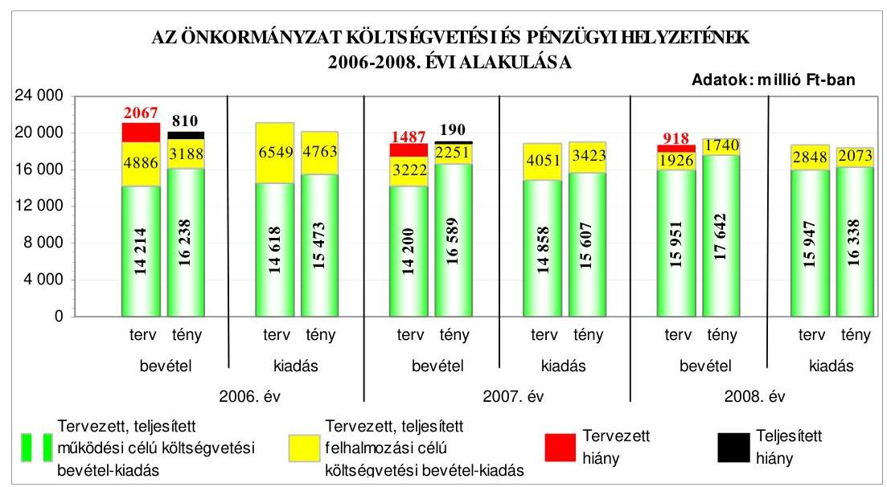
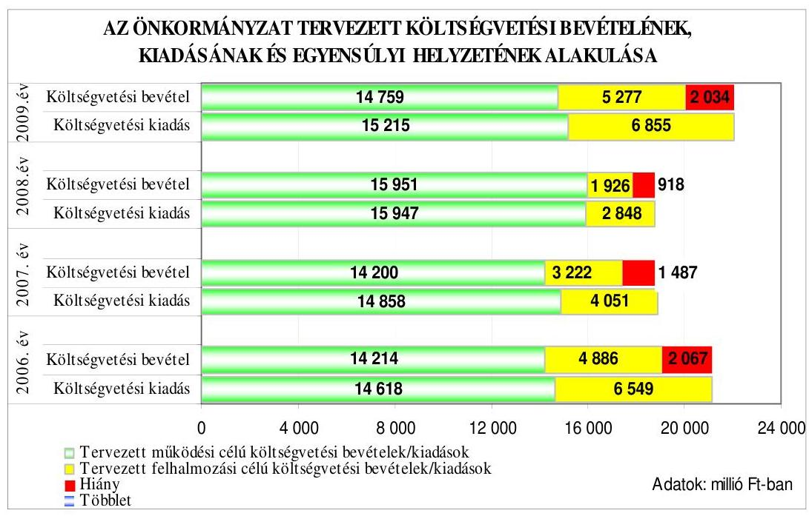
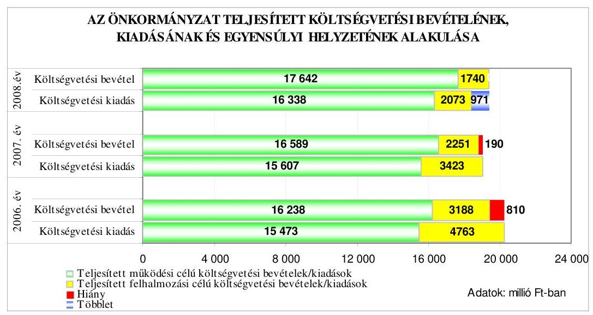
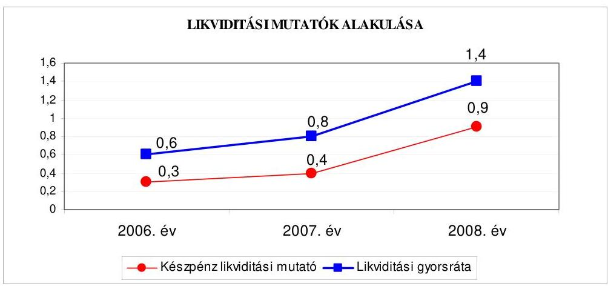
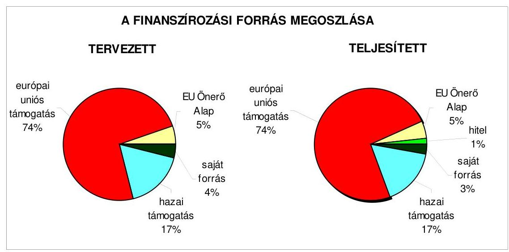
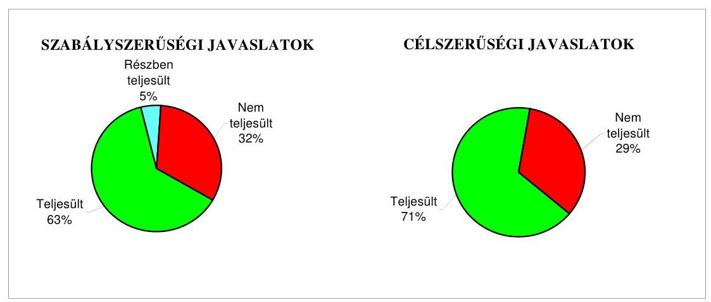
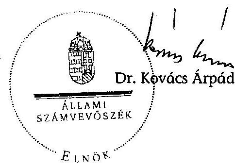
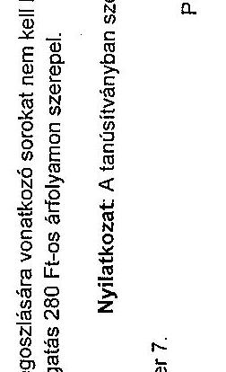
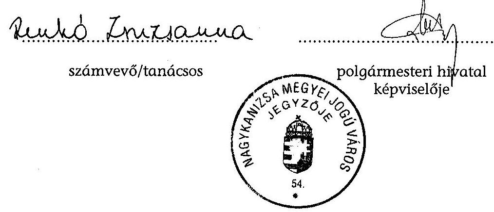
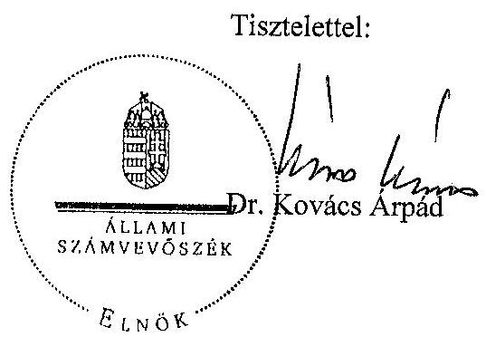

# ÁLLAMI   SZÁMVEVŐSZÉK 

## JELENTÉS

Nagykanizsa Megyei Jogú Város Önkormányzata gazdálkodási rendszerének 2009. évi ellenőrzéséről

---

3. Önkormányzati és Területi Ellenőrzési Igazgatóság
3.3. Átfogó Ellenőrzések Főcsoport
Iktatószám: V-3001-4/35/21/2009.
Témaszám: 933
Vizsgálat-azonosító szám: V0447
Az ellenőrzést felügyelte:
Dr. Lóránt Zoltán
föigazgató
Az ellenőrzés végrehajtásáért felelős:
Dr. Sepsey Tamás
föigazgató-helyettes
Az ellenőrzést vezette:
Renkó Zsuzsanna
mb. irodavezető tanácsadó
Az ellenőrzést végezték:
Renkó Zsuzsanna Dér Lívia Ritecz Tibor
mb. irodavezető tanácsadó számvevő tanácsos számvevő tanácsos

# A témához kapcsolódó eddig készített számvevőszéki jelentések: 

## Címe

Jelentés Nagykanizsa Megyei Jogú Város Önkormányzata gazdál- 0643 kodási rendszerének a 2006. évi átfogó ellenőrzéséről
Jelentés a helyi és a helyi kisebbségi önkormányzatok gazdálkodási 0726 rendszerének 2006. évi átfogó és egyéb szabályszerűségi ellenőrzéséről
Jelentés a szakiskolai fejlesztési programra fordított pénzeszközök 0819 felhasználásának eredményességének ellenőrzéséről
Jelentés a közbeszerzési rendszer múködésének ellenőrzéséről 0831
Jelentés a sürgősségi rendszer kialakítására, fejlesztésére fordított 0924 pénzeszközök felhasználásának ellenőrzéséről

---

# TARTALOMJEGYZÉK 

BEVEZETÉS ..... 11
I. ÖSSZEGZŐ MEGÁLLAPÍTÁSOK, KÖVETKEZTETÉSEK, JAVASLATOK ..... 16
II. RÉSZLETES MEGÁLLAPÍTÁSOK ..... 26

1. Az Önkormányzat költségvetési és pénzügyi helyzete ..... 26
1.1. A tervezett költségvetési bevételek és kiadások alapján a költségvetési egyensúly alakulása, a költségvetési hiány oka, finanszírozásának tervezett módja és a költségvetési hiány megállapításának szabályszerűsége ..... 26
1.2. A teljesített költségvetési bevételek és kiadások alapján a pénzügyi egyensúly alakulása, a pénzügyi hiány oka, finanszírozásának módja és hatása a pénzügyi helyzetre az eladósodás, valamint a fizetőképesség szempontjából ..... 28
2. Az Önkormányzat felkészültsége az európai uniós források igénylésére és felhasználására, valamint az elektronikus közszolgáltatási feladatok ellátására ..... 35
2.1. Az európai uniós források igénybevételére és a várható támogatás felhasználására történt felkészülés szabályozottságának, szervezettségének eredményessége ..... 35
2.1.1. Az európai uniós forrásokra történő pályázatok benyújtására vonatkozó döntések összhangja a fejlesztési célkitűzésekkel ..... 35
2.1.2. Az európai uniós forrásokhoz kapcsolódóan a pályázatfigyelés, a pályázatkészítés, valamint az európai uniós támogatással megvalósuló fejlesztés lebonyolítása belső rendjének szabályozottsága, a végrehajtás személyi, szervezeti feltételei, az ellenőrzési feladatok meghatározása ..... 39
2.1.3. A fejlesztési feladat lebonyolításánál a feladatellátás rendjére, az ellenőrzési feladatok teljesítésére, valamint a felelősségi szabályokra vonatkozó előírások betartása ..... 41
2.2. Az elektronikus közszolgáltatás feltételeinek kialakítása, a közérdekű gazdálkodási adatok elektronikus közzététele ..... 43
3. A költségvetési gazdálkodás belső kontrolljai ..... 45
3.1. A szabályozottság kockázata a költségvetés tervezési, gazdálkodási, beszámolási és a folyamatba épített, előzetes és utólagos vezetői ellenőrzési feladatoknál ..... 45
3.2. A belső kontrollok múködése az önkormányzati források szabályszerű felhasználásában, a költségvetési tervezés, gazdálkodás, beszámolás folyamataiban ..... 48

---

3.3. A belső ellenőrzési kötelezettség teljesítése, javaslatainak hasznosulása ..... 51
4. Az ÁSZ korábbi ellenőrzési javaslatai alapján készített intézkedési terv végrehajtása, eredményessége ..... 55
4.1. Az Önkormányzat gazdálkodási rendszerének átfogó ellenőrzése során tett javaslatok végrehajtására tervezett intézkedések megvalósulása ..... 55
4.2. A zárszámadáshoz kapcsolódó (állami hozzájárulások, támogatások igénylésének és felhasználásának ellenőrzése), valamint a további vizsgálatok esetében a megállapítások, javaslatok alapján tett intézkedések ..... 60

# MELLÉKLETEK 

1. számú Az Önkormányzat gazdálkodását meghatározó adatok, mutatószámok (1 oldal)
2. számú Az önkormányzati vagyon alakulása (1 oldal)

2/a. számú Az önkormányzati kötelezettségek alakulása (1 oldal)
3. számú Az Önkormányzat 2006-2009. évi költségvetési előirányzatainak és 20062008. évi pénzügyi teljesítéseinek alakulása (1 oldal)
4. számú Tanúsítvány az európai uniós forrásokkal támogatott célok és programok 2006-2009. évi tervezett és teljesített adatairól (4 oldal)
4/a. számú Tanúsítvány az európai uniós forrásokra 2006-2009 között benyújtott pályázatairól, amelyek elbírálásáról az Önkormányzat nem kapott tájékoztatást (2 oldal)
4/b. számú Tanúsítvány a 2006-2009. években benyújtott és elutasított európai uniós pályázatokról (3 oldal)
5. számú Adatlap az európai uniós forrással támogatott „Egészségügyi szolgálat akadálymentesítése Nagykanizsán" fejlesztésről (4 oldal)
6. számú Marton István, Nagykanizsa Megyei Jogú Város Önkormányzata polgármesterének észrevétele (3 oldal)
7. számú Marton István, Nagykanizsa Megyei Jogú Város Önkormányzata polgármesterének észrevételére adott válasz (2 oldal)

---

# RÖVIDÍTÉSEK JEGYZÉKE 

## Törvények

Áht.
Eisztv.
Kbt.
Ket.

Ötv.

## Rendeletek

Ámr.
Ber.
Vhr.

18/2005. (XII. 27.) IHM rendelet
vagyongazdálkodási rendelet ${ }_{1}$
vagyongazdálkodási rendelet ${ }_{2}$
2006. évi költségvetési rendelet
2007. évi költségvetési rendelet
2008. évi költségvetési rendelet
2009. évi költségvetési rendelet
2006. évi zárszámadási rendelet
2007. évi zárszámadási rendelet
az államháztartásról szóló 1992. évi XXXVIII. törvény az elektronikus információszabadságról szóló 2005. évi XC. törvény
a közbeszerzésekről szóló 2003. évi CXXIX. törvény
a közigazgatási hatósági eljárás és szolgáltatás általános szabályairól szóló 2004. évi CXL. törvény
a helyi önkormányzatokról szóló 1990. évi LXV. törvény
az államháztartás múködési rendjéről szóló 217/1998. (XII. 30.) Korm. rendelet
a költségvetési szervek belső ellenőrzéséről szóló 193/2003. (XI. 26.) Korm. rendelet
az államháztartás szervezetei beszámolási és könyvvezetési kötelezettségének sajátosságairól szóló 249/2000. (XII. 24.) Korm. rendelet
a közzétételi listákon szereplő adatok közzétételéhez szükséges közzétételi mintákról szóló 18/2005. (XII. 27.) IHM rendelet
Nagykanizsa Megyei Jogú Város Önkormányzatának 10/2003. (II. 26.) számú rendelete az Önkormányzat vagyonáról, a vagyongazdálkodás szabályairól és a tulajdonosi jogok gyakorlásáról
Nagykanizsa Megyei Jogú Város Önkormányzatának 3/2009. (II. 11.) számú rendelete az Önkormányzat vagyonáról, a vagyongazdálkodás szabályairól és a tulajdonosi jogok gyakorlásáról
Nagykanizsa Megyei Jogú Város Önkormányzatának 6/2006. (II. 27.) számú rendelete az Önkormányzat 2006. évi költségvetéséről
Nagykanizsa Megyei Jogú Város Önkormányzatának 3/2007. (II. 21.) számú rendelete az Önkormányzat 2007. évi költségvetéséről
Nagykanizsa Megyei Jogú Város Önkormányzatának 14/2008. (III. 19.) számú rendelete az Önkormányzat 2008. évi költségvetéséről
Nagykanizsa Megyei Jogú Város Önkormányzatának 10/2009. (III. 1.) számú rendelete az Önkormányzat 2009. évi költségvetéséről
Nagykanizsa Megyei Jogú Város Önkormányzatának 16/2007. (IV. 23.) számú rendelete az Önkormányzat 2006. évi zárszámadásról
Nagykanizsa Megyei Jogú Város Önkormányzatának 22/2008. (IV. 30.) számú rendelete az Önkormányzat 2007. évi zárszámadásáról

---

2008. évi zárszámadási rendelet

## Szórövidítések

áfa
ÁSZ
e-közigazgatás
EU Önerő Alap

FEUVE
HEFOP
gazdálkodási jogkörök szabályzata
gazdasági program ${ }_{1}$
gazdasági program ${ }_{2}$
informatikai stratégia ${ }_{1}$
informatikai stratégia ${ }_{2}$
jegyzó
Kistérségi társulás
Közgyűlés
NFT
NYDOP
OKISB
Önkormányzat
Pályázati iroda
polgármester
Polgármesteri hivatal

Nagykanizsa Megyei Jogú Város Önkormányzatának 14/2009. (V. 8.) számú rendelete az Önkormányzat 2008. évi zárszámadásáról
általános forgalmi adó
Állami Számvevőszék
elektronikus közigazgatás
a helyi önkormányzatok fejlesztési célú európai uniós pályázataihoz szükséges önkormányzati saját forrás kiegészítéséhez nyújtott támogatás
folyamatba épített, előzetes és utólagos vezetői ellenőrzés
NFT Humánerőforrás-fejlesztési Operatív Program
a polgármester és a jegyző 75/2007/4. (I. 2.) számú együttes utasítása a Polgármesteri Hivatal pénzgazdálkodásával kapcsolatos kötelezettségvállalás, utalványozás, érvényesítés és ellenjegyzés hatásköri rendjéről
Nagykanizsa Megyei Jogú Város Önkormányzat Közgyűlésének a 291/2002. (XI. 4.) számú határozatával elfogadott „Együtt Nagykanizsáért Önkormányzati program 2002-2006. évekre"
Nagykanizsa Megyei Jogú Város Önkormányzat Közgyűlésének a 129/2007. (IV. 12.) számú határozatával elfogadott „Nagykanizsa Megyei Jogú Város Önkormányzata Gazdasági programja 2007-2010. évekre"
a jegyző által 624-4/2006. számon kiadott „Nagykanizsa Megyei Jogú Város Polgármesteri Hivatalának Középtávú Informatikai Fejlesztési Terve 2006-2010. évekre"
Nagykanizsa Megyei Jogú Város Önkormányzat Közgyűlésének 499/2008. (XII. 19.) számú határozatával elfogadott „Nagykanizsa Megyei Jogú Város Informatikai Stratégiája 2008-2013. évekre"
Nagykanizsa Megyei Jogú Város Önkormányzatának Jegyzője
Nagykanizsa Kistérség Többcélú Társulása
Nagykanizsa Megyei Jogú Város Önkormányzatának Közgyűlése
Nemzeti Fejlesztési Terv
ÚMFT Nyugat-Dunántúli Operatív Program
Nagykanizsa Megyei Jogú Város Önkormányzatának Oktatási, Kulturális, Ifjúsági és Sportbizottsága
Nagykanizsa Megyei Jogú Város Önkormányzata
Nagykanizsa Megyei Jogú Város Önkormányzata Polgármesteri Hivatalának Pályázati Irodája
Nagykanizsa Megyei Jogú Város Önkormányzatának Polgármestere
Nagykanizsa Megyei Jogú Város Önkormányzatának Polgármesteri Hivatala

---

| SzMSz | Nagykanizsa Megyei Jogú Város Önkormányzat Köz-   gyűlésének 242/2/2005. (IX. 25.) számú határozatával   jóváhagyott Polgármesteri Hivatal Szervezeti és Műkó-   dési Szabályzata |
| :-- | :-- |
| TISZK | Térségi Integrált Szakképző Központ |
| ÚMFT | Új Magyarország Fejlesztési Terv |
| ügyrend | Nagykanizsa Megyei Jogú Város Önkormányzat polgár-   mesterének és jegyzőjének 2/368-20/2006. (IX. 15.) számú   szabályzata a Polgármesteri Hivatal ügyrendjéről |
| VÁTI Kht. | VÁTI Magyar Regionális Fejlesztési és Urbanisztikai   Kht. |

---

# ÉRTELMEZŐ SZÓTÁR 

1. elektronikus szolgáltatási szint
2. elektronikus szolgáltatási szint
3. elektronikus szolgáltatási szint
4. elektronikus szolgáltatási szint
európai uniós források
fejlesztési feladat (projekt)
fejlesztési célkitúzés
hazai társfinanszírozás

Az 1044/2005. (V. 11.) Korm. határozat alapján olyan információs, tájékoztató szolgáltatás, amely csak általános információkat közöl az adott üggyel kapcsolatos teendőkről és a szükséges dokumentumokról.
Az 1044/2005. (V. 11.) Korm. határozat alapján olyan egyirányú kapcsolatot biztosító szolgáltatás, amely az 1. szinten túl biztosítja az adott ügy intézéséhez szükséges dokumentumok, nyomtatványok letöltését, és azok ellenőrzéssel, vagy ellenőrzés nélküli elektronikus kitöltését, amely esetben a dokumentumok benyújtása hagyományos úton történik.
Az 1044/2005. (V. 11.) Korm. határozat alapján olyan kétirányú kapcsolatot biztosító szolgáltatás, amely közvetlen, vagy ellenőrzött kitöltésű dokumentum segítségével biztosítja az elektronikus adatbevitelt és a bevitt adatok ellenőrzését. Az ügy indításához, intézéséhez személyes megjelenés nem szükséges, de az ügyhöz kapcsolódó közigazgatási döntés (határozat, egyéb aktus) közlése, valamint a kapcsolódó illeték-, vagy díjfizetés hagyományos úton történik.
Az 1044/2005. (V. 11.) Korm. határozat alapján olyan teljes közvetlen kétirányú ügyintézési folyamatot biztosító szolgáltatás, amikor az ügyhöz kapcsolódó közigazgatási döntés is elektronikus úton kerül közlésre, illetve a kapcsolódó illeték-, vagy díjfizetés elektronikus úton is intézhető.
A támogatott projekt megvalósítása érdekében, a fejlesztés lebonyolítása során felmerült kiadások finanszírozási forrása.
A fejlesztési feladat (projekt) tartalmilag és formailag részletesen kidolgozott, megfelelő pénzügyi háttérrel és végrehajtási ütemezéssel rendelkező fejlesztési terv, amely illeszkedik az Európai Unió, illetve a Nemzeti Fejlesztési Terv és az Új Magyarország Fejlesztési Terv által támogatott programokhoz.
Az önkormányzat által ellátott kötelező, vagy önként vállalt feladatok biztosításának mennyiségi, vagy minőségi fejlesztésére vonatkozó terv. A mennyiségi fejlesztés megvalósulhat beszerzéssel, létesítéssel, bővítéssel, átalakítással.
A központi költségvetési és az elkülönített állami pénzalapokból származó finanszírozás.

---

irányító hatóság
kedvezményezett
közreműködő szervezet

A strukturális alapok és a Kohéziós alap forrásainak szabályszerű, hatékony és eredményes felhasználásához szükséges intézményrendszer felső eleme. Az irányító hatóság általános és átfogó felelősséget visel a programok, projektek hatékony és szabályszerű végrehajtásáért. Felelősségi köréből eredően ellenőrzi a közösségi, valamint a hazai jogszabályok betartását, koordinálja az európai uniós források szétosztásának folyamatát, irányítja az intézményrendszer, a statisztikai és a pénzügyi nyilvántartási rendszer múködését. Az Új Magyarország Fejlesztési Terv Irányító Hatósága közreműködik az Operatív Program véglegesítésében, irányítja az Operatív Program Program-kiegészítő Dokumentum kidolgozását, és közreműködő szerepet vállal e dokumentumoknak az Európai Bizottsággal történő tárgyalásaiban. Az Irányító Hatóság részt vesz továbbá a költségvetési tervezésében, valamint közreműködő szervezetek bevonásával irányítja a meghirdetett pályázatok és a központi programok végrehajtását.
Az a helyi önkormányzat, amely a támogatási szerződést kedvezményezettként aláíra, a projektet, illetve a központi programhoz kapcsolódó támogatott önkormányzati programot végrehajtja.
A közreműködő szervezet az európai uniós támogatást elnyert kedvezményezettekkel kapcsolatot tartó szerv. Az operatív programok közreműködő szervezetei befogadják, nyilvántartják, döntésre előkészítik a pályázatokat, rögzítik a támogatással kapcsolatos adatokat az Egységes Monitoring Informatikai Rendszerben, elvégzik a támogatások előzetes (szerződéskötést megelőző), közbenső (a pénzügyi elszámolás, finanszírozás folyamatában végzett) és utólagos (a támogatott projekt pénzügyi lezárását megelőző) ellenőrzését. Az önkormányzatoknál a leggyakrabban előforduló operatív program a Regionális Fejlesztési Operatív Program végrehajtásában közreműködő szervezetek a VÁTI Kht. és a regionális fejlesztési ügynökségek.
A Kohéziós alap kettő közreműködő szervezete (Nemzeti Fejlesztési és Gazdasági Minisztérium, Környezetvédelmi és Vízügyi Minisztérium) a támogatott projektek végrehajtásához kapcsolódó operatív feladatokat látják el. Ennek keretében megkötik a szerződéseket a projekt kedvezményezettjével, folyamatosan nyomon követik a teljesítéseket, lebonyolítják a támogatások kifizetését, vezetik az Egységes Monitoring Informatikai Rendszert.

---

lebonyolítás

Operatív program

Nemzeti Fejlesztési Terv

Új Magyarország Fejlesztési Terv

Az európai uniós források felhasználásával megvalósuló fejlesztésre irányuló műszaki, gazdasági (pénzügyi) tevékenységet magában foglaló szervezési, irányítási szolgáltatás. A szervezési szolgáltatás kiterjedhet a pályázatkészítésre, a közbeszerzési eljárás lebonyolításán keresztül a folyamatos műszaki ellenőrzésre, a pénzügyi elszámolásra, a műszaki átadás-átvételre, az üzembe helyezésre, illetve a fejlesztési folyamat egyes elemeire.
Az Európai Bizottság által jóváhagyott, a Közösségi Támogatási Keret végrehajtására vonatkozó, több évre szóló intézkedésekhez kapcsolódó prioritások egységes rendszerét tartalmazó dokumentum.
Helyzetelemzést, stratégiát a tervezett fejlesztési területek prioritásait, azok céljait és pénzügyi forrásaik megjelölését tartalmazó dokumentum, amelyet a Magyar Köztársaság készített az Európai Unió programozási irányelveinek, célkitűzéseinek megfelelően a fejlődésben lemaradó régiók fejlődésének és strukturális átalakulásának elősegítésére a kiemelt szükségletekre figyelemmel. A Nemzeti Fejlesztési Terv stratégiai fejezetének célja, hogy a 2004-2006 közötti időszakra kijelölje a strukturális alapokból támogatható fejlesztéspolitikai célkitűzéseit és prioritásait. A strukturális alapok operatív programjai: Agrár- és Vidékfejlesztés Operatív Program (AVOP); Gazdasági Versenyképesség Operatív Program (GVOP); Humánerőforrások fejlesztése Operatív Program (HEFOP); Környezetvédelem és Infrastruktúra Operatív Program (KIOP); Regionális Fejlesztési Operatív Program (ROP).
Az Új Magyarország Fejlesztési Terv célja a foglalkoztatás bővítése és a tartós növekedés feltételeinek megteremtése. Ennek érdekében 2007-2013 között hat kiemelt területen indított el összehangolt állami és európai uniós fejlesztéseket: a gazdaságban, a közlekedésben, a társadalom megújulása érdekében, a környezet és az energetika területén, a területfejlesztésben és az államreform feladataival összefüggésben. Az Új Magyarország Fejlesztési Terv operatív programjai: Államreform Operatív Program (ÁROP); Elektronikus Közigazgatás Operatív Program (EKOP); Gazdaságfejlesztés Operatív Program (GOP); Környezet és Energia Operatív Program (KEOP); Közlekedés Operatív Program (KÖZOP); Dél-Alföldi Operatív Program (DAOP); Dél-Dunántúli Operatív Program (DDOP); Észak-Alföldi Operatív Program (ÉAOP); Észak-Magyarországi Operatív Program (ÉMOP); Közép-Dunántúli Operatív Program (KDOP); Közép-Magyarországi Operatív Program (KMOP); Nyugat-Dunántúli Operatív Program (NYDOP); Társadalmi Infrastruktúra Operatív Program (TIOP); Társadalmi Megújulás Operatív Program (TÁMOP).

---

támogatási szerződés

A strukturális alapok esetében az irányító hatóságnak, illetve a Kohéziós Alap esetében a közremúködő szervezeteknek a kedvezményezett önkormányzattal kötött szerződése, amely a támogatás felhasználásának részletes feltételeit tartalmazza. Az Új Magyarország Fejlesztési Terv keretében támogatott projektek esetében a támogatási szerződést a kedvezményezett és a Nemzeti Fejlesztési Ügynökség nevében eljáró közremúködő szervezet között jön létre. Nagyprojekt esetén a támogatási szerződést az Nemzeti Fejlesztési Ügynökség ellenjegyezi. A támogatási szerződés képezi a megvalósítás nyomon követésének, finanszírozásának és ellenőrzésének alapját.

---

.

---

# JELENTÉS 

## Nagykanizsa Megyei Jogú Város Önkormányzata gazdálkodási rendszerének 2009. évi ellenőrzéséről

## BEVEZETÉS

Az Ötv. 92. § (1) bekezdése, az Állami Számvevőszékről szóló 1989. évi XXXVIII. törvény 2. § (3) bekezdése, valamint az Áht. 120/A. § (1) bekezdése alapján az önkormányzatok gazdálkodását az Állami Számvevőszék ellenőrzi. Az ellenőrzésre az Országgyűlés illetékes bizottságai részére is átadott, országosan egységes ellenőrzési program szerint került sor.

Az Állami Számvevőszék a stratégiájában foglalt célkitűzéseknek megfelelően a helyi önkormányzatok költségvetési gazdálkodási rendszere átfogó ellenőrzésének programját a 2007. évtől megújította, azt kiegészítette további - teljesít-mény-ellenőrzési - elemekkel.

## Az ellenőrzés célja annak értékelése volt, hogy az Önkormányzat:

- milyen módon biztosította a költségvetési és a pénzügyi egyensúlyt a költségvetésében és annak teljesítése során, valamint változott-e a hiányzó bevételi források pótlásában a finanszírozási célú pénzügyi műveletek jelentősége, hatása;
- eredményesen készült-e fel a szabályozottság és a szervezettség terén az európai uniós források igénylésére és felhasználására, továbbá biztosította-e az elektronikus közszolgáltatás feltételeit, a gazdálkodási adatok közzétételével a gazdálkodás nyilvánosságát;
- kialakította-e és működtette-e a külső és a belső feltételeknek megfelelően a költségvetés tervezési, gazdálkodási és zárszámadási feladatai belső kontrollrendszerét ${ }^{1}$, ezen tevékenységek szabályszerű ellátásához hozzájárult-e a folyamatba épített, előzetes és utólagos vezetői ellenőrzés, valamint a belső ellenőrzés;
- megfelelően hasznosították-e a korábbi számvevőszéki ellenőrzések megállapításait, szabályszerűségi ${ }^{2}$ és célszerűségi javaslatait.

[^0]
[^0]:    ${ }^{1}$ A gazdálkodás szabályszerűségét biztosító kontrollrendszer alatt értjük a kiépített és múködő pénzügyi irányítási és szabályozási rendszert, valamint a belső ellenőrzési funkciók ellátásának rendszerét.
    ${ }^{2}$ A törvényi előírások betartásának elmulasztásakor egységesen a törvénysértés megjelölést alkalmazzuk, mivel az ÁSZ nem tehet különbséget a törvényi előírások között.

---

Az ellenőrzés típusa: átfogó ellenőrzés, amely - egy ellenőrzés keretében meghatározott területekre összpontosítva alkalmazza a szabályszerűségi, valamint a teljesítmény-ellenőrzés jellemzőit.

Az ellenőrzött időszak: az 1., 2. és 4. programpontok tekintetében a 20062008. évek és 2009. I. negyedév, a 3. ellenőrzési programpontnál a 2008. év és 2009. I. negyedév.

Nagykanizsa Megyei Jogú Város lakosainak száma 2009. január 1-jén 50938 fő volt. A 2006. évi önkormányzati választást követően az Önkormányzat 26 tagú Közgyűlésének munkáját hét állandó bizottság segítette. A helyi önkormányzat mellett a 2006. évi önkormányzati választásokat követően kettő kisebbségi önkormányzat ${ }^{3}$ működött. A polgármester a 2006. évi önkormányzati képviselő és polgármester választás óta tölti be tisztségét, a jelenlegi jegyző 2008. január 1-től látja el a feladatát, előtte nyolc hónapig megbízott végezte a jegyzői feladatokat.

Az Önkormányzat feladatainak végrehajtása érdekében a 2008. évben 37 költségvetési intézményt múködtetett, amelyekből egy önállóan gazdálkodott. A feladatok ellátásában részt vett hét gazdasági társasága. Az Önkormányzat a 2008. évi költségvetési beszámolója szerint 19382 millió Ft költségvetési bevételt ért el, és 18411 millió Ft költségvetési kiadást teljesített. Az Önkormányzat 2008. december 31-én a könyvviteli mérleg szerint 42244 millió Ft értékű vagyonnal rendelkezett, ami a 2006. év végi állományhoz viszonyítva 5,2\%-kal emelkedett, ezen belül 84,4\%-kal nőtt a pénzeszközök állománya, míg a hosszú lejáratú kötelezettségek állománya - az évek során felvett, fejlesztési célú hitelek hatására - 63\%-kal emelkedve, 3607 millió Ft-ra nőtt. Az összes költségvetési bevétel $23,8 \%$-át a saját bevétel, illetve $17,2 \%$-át a helyi adó bevétel biztosította a 2008. évben. Az összes költségvetési kiadásból a felhalmozási célú kiadások részaránya a 2008. évben 11,3\% volt. A 2009. évi költségvetési rendeletben 20036 millió Ft költségvetési bevételt és 22070 millió Ft költségvetési kiadást irányoztak elő. A Polgármesteri hivatalban dolgozó köztisztviselők száma 2008. december 31-én 190 fő, a költségvetési intézményekben foglalkoztatott közalkalmazottak száma 2655 fő volt. Az Önkormányzat gazdálkodását meghatározó adatokat, mutatószámokat az 1-3. számú mellékletek tartalmazzák.

Az Önkormányzat költségvetési és pénzügyi helyzetét az elemző eljárás módszerével vizsgáltuk. E körben elemeztük a költségvetés egyensúlyi helyzetének alakulását, a tervezett és tényleges költségvetési hiány okait, a mérséklésére tett intézkedéseket, finanszírozásának módját, az Önkormányzat adósságállományának alakulását, összetevőit.

Az európai uniós támogatás igénylésére, felhasználására történt felkészülésre vonatkozóan teljesítményellenőrzést végeztünk. Az európai uniós források figyelésére, igénylésére és felhasználására a felkészülést akkor minősítettük eredményesnek, ha a meghatározott szempontok szerinti feltételeknek megfelelt a felkészülés szabályozottsága, szervezettsége, továbbá értékeltük, hogy az igényelt európai uniós támogatások az Önkormányzat által meghatározott fej-

[^0]
[^0]:    ${ }^{3}$ Cigány Kisebbségi Önkormányzat, Horvát Kisebbségi Önkormányzat.

---

lesztési célkitűzésekhez kapcsolódtak-e. Az eredményesség szempontjából a minősítést a lényegességi szinthez való viszonyítással végeztük el. Az ellenőrzés során felmértük, hogy az e-közszolgáltatási feladat ellátása, illetve bevezetése, működtetése érdekében milyen intézkedéseket tettek, valamint biztosították-e a közérdekű adatok közzétételét.

A költségvetési gazdálkodás belső kontrolljainak ellenőrzése során értékeltük, hogy a Polgármesteri hivatalnál a költségvetés tervezési, gazdálkodási, zárszámadás készítési feladatok belső kontrolljainak kiépítettsége és múködése megfelelő biztosítékot ad-e a gazdálkodási feladatok megfelelő, szabályszerű ellátására. Felmértük és minősítettük a költségvetés tervezési, a gazdálkodási, a zárszámadás készítési feladatokkal, továbbá a pénzügyi-számviteli területen az informatikával kapcsolatosan kialakított kontrollok megfelelőségét, valamint a kialakított belső kontrollok múködésének megbízhatóságát. Értékeltük a belső ellenőrzés szabályozottságát, működési feltételeinek kialakítását, továbbá működésének megbízhatóságát.

A Polgármesteri hivatalnál értékeltük a gazdálkodás folyamatában kulcsszerepet betöltő belső kontrollok múködésének megbízhatóságát, ennek keretében ellenőriztük a szakmai teljesítés igazolására és az utalvány ellenjegyzésére kialakított kontrollok végrehajtását. Az ellenőrzést a következő, magas kockázatuk alapján kiválasztott ${ }^{4}$ kifizetésekre folytattuk le ${ }^{5}$ :

- a külső szolgáltató által végzett karbantartási, kisjavítási szolgáltatásokra,
- a gépek, berendezések, felszerelések beszerzésére, továbbá
- az államháztartáson kívülre teljesített múködési és felhalmozási célú pénzeszköz átadásokra.

Az ellenőrzés hatékony elvégzése céljából a vizsgálandó területek kiválasztása során a kockázatokon alapuló megközelítés érvényesült, ezáltal az ellenőrzési erőforrásokat azokra a területekre fókuszáltuk, amelyeken legnagyobb a hibák előfordulási valószínűsége. Az ellenőrzési erőforrások ilyen típusú összpontosításával minimálisra csökkenthető a kívánt ellenőrzési bizonyosság eléréséhez szükséges időráfordítás.

[^0]
[^0]:    ${ }^{4}$ Az önkormányzatok kiemelt előirányzataira vonatkozóan, a vertikális folyamatokra elvégeztük a kockázatok becslését, amelynek eredményeként határoztuk meg a magas kockázatú területeket.
    ${ }^{5}$ A korábbi ellenőrzési tapasztalataink szerint ezeken a területeken a jegyzők nem, vagy hiányosan szabályozták a megbízás, megrendelés, illetve beszerzés indokoltságának, szükségességének elbírálására, igazolására, valamint a teljesítések dokumentálására, a kiadások jogosultságának, összegszerűségének ellenőrzésére irányuló kontrollokat. További kockázatot jelentett, ha a külső szolgáltató által végzett karbantartási, kisjavítási munkák 50 ezer Ft alatti megrendeléseire vonatkozóan a jegyzők nem alakították ki a kötelezettségvállalások rendjét és nyilvántartási formáját, valamint a szabályozás elmulasztása esetén nem történt meg az írásbeli kötelezettségvállalás és annak az ellenjegyzése sem.

---

A pénzügyi-számviteli folyamatokban alkalmazott belső kontrollok létezésének és múködésének ellenőrzésére a vizsgált három terület 2008. évi könyvviteli tételeiből területenként egyszerű véletlen mintát vettünk. A kijelölt gazdasági eseményre elvégzett megfelelőségi tesztek alapján értékeltük a kontrollok múködésének megbízhatóságát a vizsgált három területre külön-külön, majd öszszefoglalóan ${ }^{6}$. A helyszíni ellenőrzés megállapításainak részletes dokumentálását megfelelőségi tesztlapokon, elővizsgálati és helyszíni ellenőrzési munkalapokon biztosítottuk. Ezeken a teszt- és munkalapokon a minősítés alapjául szolgáló kérdések és a vonatkozó konkrét jogszabályhelyek megjelölése mellett értékeltük a kialakított belső kontrollokban rejlő kockázatokat ${ }^{7}$ és a kialakított kontrollok múködésének megbízhatóságát ${ }^{8}$.

Az ÁSZ korábbi ellenőrzési javaslatai alapján tett intézkedéseket, illetve azok megvalósítását utóellenőrzés keretében vizsgáltuk. A gazdálkodási rendszer átfogó ellenőrzése során megfogalmazott javaslatok végrehajtására tett intézkedések megvalósítását ellenőriztük, az egyéb számvevőszéki ellenőrzések során tett javaslatok esetében pedig a kiadott intézkedéseket tekintettük át.

A helyszíni ellenőrzés során kitöltött - az ellenőrzést végző számvevő és a Polgármesteri hivatal felelős köztisztviselője által aláírt - elővizsgálati és helyszíni ellenőrzési munkalapokat, azok kitöltési útmutatóit, továbbá a megfelelőségi tesztek dokumentumait a polgármester részére a számvevői jelentéssel egyidejűleg átadtuk.

A számvevői jelentés megállapításainak, javaslatainak egyeztetése során a jegyző arról adott részletes tájékoztatást, hogy az időközben megtett intézkedésekkel a javaslatok egy részét ${ }^{9}$ megvalósították. A megtett intézkedéseket a jelentés II. Részletes megállapítások fejezetében az adott témához kapcsolt lábjegyzetben feltüntettük és a vonatkozó javaslatokat elhagytuk.

[^0]
[^0]:    ${ }^{6}$ A vizsgált három terület egyedi értékelési pontszámait a területek költségvetési súlyával arányosan összegeztük.
    ${ }^{7}$ A kialakított belső kontrollokban rejlő kockázatot alacsonynak minősítettük, ha a kontrollok - végrehajtásuk esetén - megfelelő védelmet nyújtanak a hibák bekövetkezése ellen. Közepesnek minősítettük a belső kontrollokban rejlő kockázatot, amennyiben a kontrollok - végrehajtásuk esetén - a lehetséges hibák többsége ellen védelmet nyújtanak. Magasnak értékeltük a kockázatot, ha a kontrollok - kialakításuk hiányában, vagy hiányos kialakításuk miatt - nem nyújtanak elegendő védelmet a lehetséges hibákkal szemben.
    ${ }^{8}$ A kontrollok múködésének megbízhatóságát kiválónak értékeltük abban az esetben, ha azok múködése - esetleges apróbb hiányosságoktól eltekintve - megfelelt a hibák megelőzésére és kijavítására meghatározott szabályozásnak és a legmagasabb szintű elvárásoknak. Jónak minősítettük a kontrollok múködését, ha a hiányosságok száma ugyan jelentős volt, de nem veszélyeztette az ellenőrzött terület hibáinak megelőzését és kijavítását. Amennyiben a kontrollok - kialakításuk hiánya, illetve hiányosságai miatt - nem biztosították a hibák megelőzését, feltárását, kijavítását és ez veszélyeztette az eredményes, megbízható múködést, a kontroll múködésének megbízhatósága gyenge minősítést kapott.
    ${ }^{9}$ A számvevői jelentésben 12 szabályszerűségi és kilenc célszerűségi javaslatot tettünk, melyből a megvalósított kilenc szabályszerűségi és hét célszerűségi javaslatot elhagytuk.

---

A jelentést az ÁSZ-ról szóló 1989. évi XXXVIII. tv. 25. § (1) bekezdése alapján észrevétel közlése céljából megküldtük Nagykanizsa Megyei Jogú Város polgármesterének. A kapott észrevételt a jelentés 6 . számú melléklete, az arra adott választ a 7. számú melléklet tartalmazza.

---

# I. ÖSSZEGZŐ MEGÁLLAPÍTÁSOK, KÖVETKEZTETÉSEK, JAVASLATOK 

Az Önkormányzat 2006-2009. évi költségvetési rendeleteiben a költségvetési bevételek és kiadások nem voltak egyensúlyban, a tervezett költségvetési bevételek nem nyújtottak fedezetet a költségvetési kiadásokra. A 2006-2007., illetve a 2009. években a költségvetés hiányát a tervezett múködési célú költségvetési bevételek hiánya és a felhalmozási célú bevételeket meghaladó összegben tervezett felhalmozási célú kiadások együttesen okozták, a 2008. évben a költségvetési hiány a felhalmozási célú költségvetési bevételeket meghaladó felhalmozási célú költségvetési kiadásokra vezethető vissza. Az Önkormányzat a 20062009. évi költségvetési rendeleteiben a költségvetési egyensúly biztosításához rövid lejáratú hitel felvételét, valamint a 2006-2008. évi költségvetési rendeletekben hosszú lejáratú hitel felvételét tervezte. Az Önkormányzat a költségvetési rendeletek végrehajtási szabályai között a költségvetési hiány csökkentése érdekében kiadási megtakarítást eredményező intézkedéseket is megfogalmazott, emellett bevételnövelő intézkedésként a 2008. évben emelte az építményadó mértékét, és bevezette az idegenforgalmi adót. A jegyző az Ámr. előírása ellenére az Önkormányzat pénzállományának alakulását bemutató likviditási tervet nem készített. A 2006. évi és a 2007. évi költségvetési rendeletekben a költségvetési bevételek és kiadások különbözetét jelentő költségvetési hiány öszszegét az Áht-ben foglaltak ellenére nem mutatták be. A 2006-2009. évi költségvetési rendeletekben a költségvetés bevételi és kiadási főösszegének megállapításakor - az Áht. előírásaival ellentétesen - finanszírozási célú pénzügyi múveleteket is figyelembe vettek költségvetési hiányt módosító költségvetési bevételként, illetve költségvetési kiadásként.

Az Önkormányzatnál a 2006-2007. évi költségvetések teljesítése során a pénzügyi egyensúly nem volt biztosított, míg a 2008. évben a teljesített költségvetési

---

bevételek már fedezetet nyújtottak a költségvetési kiadások teljesítéséhez, ezt az évet a múködési célú költségvetési bevételek túlteljesítése következtében - a tervezett költségvetési hiánnyal szemben - 971 millió Ft pénzügyi többlettel zárták. A múködési célú költségvetési bevételek a 2006-2008. években fedezetet biztosítottak az azonos célú költségvetési kiadásokra, a felhalmozási célú költségvetési kiadások azonban mindhárom évben meghaladták a felhalmozási célú költségvetési bevételeket.

A 2006-2008. években az Önkormányzat a költségvetés végrehajtása során a likviditás biztosításához folyószámlahitelt vett igénybe, ezen túl összesen 2862 millió Ft hosszú lejáratú, fejlesztési célú hitelt vett fel. A hosszú lejáratú hitelek állománya a 2006. év végén 2326 millió Ft volt, amely - a hitelfelvételek és a törlesztések együttes hatására - a 2008. év végére 3781 millió Ft-ra nőtt. A hosszú lejáratú felhalmozási célú hitelek lehívására a szerződéskötés évében, illetve az azt követő években került sor a hitelfelvétel céljának megfelelően a tervezett fejlesztési, felújítási feladatok megvalósításához. Az Önkormányzat a pénzügyi egyensúly biztosítása érdekében az intézmények szervezeti struktúrájának átalakításából, létszámcsökkentésekből származó kiadási megtakarítást eredményező intézkedéseket tett, ennek következtében a 2006-2008. években összesen 236 millió Ft megtakarítást értek el.

Az Önkormányzat pénzügyi helyzete a 2006-2008. évek között összességében nem változott, fizetőképességének kedvező változása mellett az eladósodása kis mértékben növekedett. Az eladósodási mutató változását az önkormányzati beruházásokhoz igénybe vett fejlesztési célú hitelek állományának növekedése okozta. Az esedékességi aránymutató értékei ugyanakkor a felvett fejlesztési célú hitelek állományának növekedése hatására javultak az évek folyamán, illetve a készpénz likviditási mutató is folyamatosan emelkedett, így a fizetőképesség a likviditási gyorsráta alapján javuló tendenciát mutatott.

Az Önkormányzat középtávú fejlesztési célkitűzéseit a gazdasági program $_{1,2}$-ben, valamint az ágazati, szakmai koncepciókban, tervekben, programokban határozta meg. A gazdasági program ${ }_{2}$-ben a helyzetelemzésen alapuló fejlesztési célok lehetséges pénzügyi forrásait rögzítették, európai uniós és hazai pályázati források igénybevételét tervezték, a fejlesztési irányokat az ÚMFT céljaival összhangban határozták meg. A Közgyűlés a 2006-2009. I. negyedévben 45 európai uniós forrásokkal összefüggő fejlesztési feladatot megvalósító pályázatról döntött. Az európai uniós támogatásban részesült 26 pályázatból 15 megvalósult, 11 projekt megvalósítása folyamatban volt, a benyújtott pályázatok közül tizet elutasítottak, kilenc elbírálása még nem történt meg. A 2007-2008. évek költségvetési rendeletei nem tartalmazták az Áht. előírásai ellenére az intézmények által lebonyolított európai uniós forrásokkal támogatott projektek eredeti kiadási és bevételi előirányzatait, valamint az Ámr-ben előírtak ellenére az intézmények európai uniós támogatások igénybevételével megvalósuló projektjeinek felhalmozási kiadásait feladatonként, továbbá nem mutatták be elkülönítetten az intézmények által lebonyolított európai uniós forrásokkal támogatott projektek bevételeit és kiadásait. A 2006-2008. évek költségvetési rendeleteinek előterjesztésekor nem mutatták be az Áht. előírásai ellenére a többéves kihatással járó, európai uniós támogatás igénybevételéről szóló döntések számszerűsítését évenkénti bontásban és összesítve, továbbá az Ámr-ben előírtak ellenére a többéves kihatással járó európai uniós támogatás

---

igénybevételével megvalósuló feladatok előirányzatait éves bontásban. A 2009. évi költségvetési rendelet tartalmazta az európai uniós forrásokkal megvalósuló fejlesztési feladatok kiadásait és bevételeit eredeti előirányzatként, és elkülönítetten is, a több évre vonatkozó fejlesztési feladatokat, a felhalmozási kiadásokat feladatonként, a többéves kihatással járó feladatok előirányzatait éves bontásban és összesítve. Az Önkormányzat 2006-2008 között európai uniós forrásokkal támogatott, megvalósított fejlesztési feladatainál a megvalósításhoz tervezett európai uniós és hazai források aránya a teljesítések során nem változott, a saját forrás aránya egy százalékponttal csökkent, a hitel igénybevétel miatt.

A Polgármesteri hivatal európai uniós források igénybevételével és felhasználásával összefüggő feladatait az SzMSz-ben, és a köztisztviselők munkaköri leírásaiban meghatározták, szabályozták az önkormányzati szintű pályázatkoordinálás feladatait és felelősét, a pályázat nyilvántartás vezetésének felelősét, a pályázatfigyelést végzők és a döntési, illetve a döntés-előterjesztési jogkörrel rendelkezők közötti információ szolgáltatási kötelezettséget. Az európai uniós forrásokkal támogatott fejlesztési feladatok lebonyolításával összefüggő folyamatba épített, előzetes és utólagos vezetői ellenőrzési feladatokat meghatározták. Az éves belső ellenőrzési terveket megalapozó kockázatelemzés a Polgármesteri hivatal által lebonyolított európai uniós forrásokkal megvalósított fejlesztési feladatokat tartalmazta, az intézményi fejlesztési feladatokra azonban nem terjedt ki. A pályázatfigyelés és a fejlesztési feladat lebonyolítás személyi és szervezeti feltételeit a Polgármesteri hivatalon belül alakították ki, pályázatokat a Polgármesteri hivatal és az intézmények dolgozóin kívül, hat projektnél vállalkozói szerződés alapján, külső szakértő vállalkozások is készítettek. A szerződésekben rögzítették a feladat-ellátási kötelezettséget, a feladat elvégzésének határidejét, az együttmúködési kötelezettséget, a felelősség szabályait, azonban nem határozták meg a felek közötti kapcsolattartást, az információk átadásának formáját, tartalmát és módját.

Az Önkormányzat „Egészségügyi szolgálat akadálymentesítése Nagykanizsán" projektje a 2008. évben támogatásban részesült. A projektet a Polgármesteri hivatal szervezetén belül megbízott projektmenedzser - a helyi szabályozásban és a munkaköri leírásában meghatározottak szerint - bonyolította le. A fejlesztési feladat megvalósítása a támogatási szerződésben rögzített ütemezéshez képest - az épület állagromlása, a használatbavételi engedélyek beszerzésének csúszása, az építő és a műszaki ellenőr számláinak késve történő benyújtása miatt - másfél hónapot csúszott, a megvalósításhoz a saját forrást az Önkormányzat biztosította, a megelőlegezés követelményének eleget tett, az utófinanszírozási rendszer a gazdálkodásban nem okozott pénzügyi zavarokat. A Polgármesteri hivatalban a projekt során a munkafolyamatba épített, előzetes és utólagos vezetői ellenőrzési feladatokat a helyi szabályozásnak megfelelően végrehajtották. A projekt megvalósulását a belső ellenőrzés nem, a közreműködő szervezet egy alkalommal vizsgálta. Az ellenőrzés megállapította, hogy hiányosságok merültek fel az építési tevékenység kivitelezésénél, illetve az esélyegyenlőségi vállalásokkal kapcsolatban. A hiányosságokat a jegyző intézkedésére megszüntették, a kért dokumentumokat bemutatták.

---

Az Önkormányzat a szabályozottság és szervezettség tekintetében 2006-2008 között összességében eredményesen készült fel az európai uniós források igénybevételére és a várható támogatások felhasználására, mivel az európai uniós forrásokra benyújtott pályázatok a gazdasági program ${ }_{1,2}$-ben, ágazati, szakmai koncepciókban tervekben, programokban megfogalmazott fejlesztési célkitűzésekhez kapcsolódtak, szabályozták a pályázatfigyelést végzők és a döntési, illetve a döntés-előterjesztési jogkörrel rendelkezők közötti információk szolgáltatásának kötelezettségét, meghatározták a folyamatba épített, előzetes és utólagos vezetői ellenőrzési feladatokat. A Polgármesteri hivatalon, valamint az önkormányzati intézményeken belül, és külső szervezet megbízásával kialakították a pályázatfigyelés, a pályázatkészítés és a fejlesztési feladat lebonyolításának szervezeti, személyi feltételeit. A külső szervezetekkel a pályázatkészítésre kötött szerződésben meghatározták a pályázat szakmai és formai követelményeire vonatkozó felelősséget, előírták a fejlesztési feladat lebonyolítását végző ellenőrzési kötelezettségeit. Az éves belső ellenőrzési terveket megalapozó kockázatelemzést elkészítették, amely nem terjedt ki az intézmények európai uniós forrásokkal támogatott fejlesztési feladataira.

Az Önkormányzat az informatikai stratégia ${ }_{1,2}$-ben meghatározta a középtávú céljait, az e-közigazgatási feladatok ellátásának személyi és tárgyi feltételeit biztosította. A Közgyűlés az elektronikus ügyintézés kizárásáról döntött, az Önkormányzatnál múködtetett informatikai rendszer az ügyintézést 1. elektronikus szolgáltatási szinten valósította meg. Közzétették az Önkormányzat által 2008-2009. I. negyedév között nyújtott nem normatív, céljellegú múködési és felhalmozási támogatásoknál a kedvezményezettek nevét, a támogatás célját, összegét, a támogatási program megvalósítási helyét, az Önkormányzat pénzeszközei felhasználásával, a vagyonnal történő gazdálkodással összefüggő nettó öt millió Ft-ot elérő vagy azt meghaladó értékű - árubeszerzésre, építési beruházásra, szolgáltatás megrendelésre, vagyonértékesítésre, vagyonhasznosításra, vagyon vagy vagyoni értékű jog átadására vonatkozó szerződések típusát, tárgyát, a szerződést kötő felek nevét, a szerződés értékét, határozott időre kötött szerződés időtartamát, és ezen adatok változását. A közzététel során nem tartották be a vonatkozó IHM rendelet előírását, mert a közérdekú adatok közzétételére hivatkozó ablak megnyitásakor nem jelennek meg a közzétett támogatások és szerződések adatai. A jegyző a 2006-2008. évi költségvetési beszámolók szöveges indokolását az Ámr. előírása ellenére nem tette közzé.

A költségvetés tervezési és a zárszámadás készítési folyamatok szabályozásának hiányosságai magas kockázatot jelentettek a feladatok szabályszerű végrehajtásában, mivel a jegyző nem határozta meg az intézmények részére a költségvetési javaslat összeállításával kapcsolatos követelményeket, illetve nem szabályozta a Polgármesteri hivatal és a költségvetési intézmények költségvetés tervezésével és zárszámadás készítésével kapcsolatos ellenőrzési feladatokat. A feltárt hiányosságokat a jegyző 2009. májusában megszüntette, a költségvetés tervezési és a zárszámadás készítési folyamatokat részletesen szabályozta. A költségvetés tervezési és zárszámadás készítési folyamatban a belső kontrollok múködésének megbízhatósága gyenge volt, mert - az ellenőrzési feladat előírásának hiánya miatt - nem végezték el a költségvetés tervezési folyamatában a költségvetési intézmények részére a költségvetési javaslat összeállításával kapcsolatban meghatározott követelmények teljesítésének ellenőr-

---

zését, a Polgármesteri hivatal és a költségvetési intézmények költségvetési javaslatai előírásoknak való megfelelésének, a javasolt előirányzatok megalapozottságának, az ismert kötelezettségek megtervezésének, a költségvetési tervezéshez készített intézményi mutatószám felmérés adatai megalapozottságának, illetve a költségvetési intézmények és a Polgármesteri hivatal szervezeti egységei által benyújtott költségvetési igények indokoltságának és teljesíthetőségének, valamint a saját bevételek előirányzatainak és a költségvetés megalapozását szolgáló helyi rendeletek összhangjának vizsgálatát. A zárszámadás készítés folyamatában nem végezték el a költségvetési intézmények pénzmaradvány megállapítása szabályszerűségének, az intézményi eredeti, módosított előirányzatok és teljesítések eltérése indokoltságának, az intézményi számszaki beszámolók belső, valamint azok jegyző által meghatározott adatszolgáltatással való összhangjának vizsgálatát.

A gazdálkodási, a pénzügyi-számviteli és a folyamatba épített ellenőrzési feladatok szabályozása összességében alacsony kockázatot jelentett a feladatok megfelelő, szabályszerű végrehajtásában, mivel a jegyző a pénzügyi irányítási és ellenőrzési rendszer keretében meghatározta a gazdasági szervezet ügyrendjét, szabályozta a gazdálkodási és ellenőrzési jogkörök gyakorlásának rendjét, kiadta és aktualizálta a számviteli politikát, ennek keretében a pénzügyiszámviteli szabályzatokat. Annak ellenére összességében alacsony volt a kockázat, hogy a kockázatkezelési eljárásrend kialakítása során a jegyző kockázati önértékelés hiányában nem gondoskodott a kockázatok azonosításáról, a konkrét kockázatok folyamatgazdáinak kijelöléséről, a kockázatok értékeléséről és kategóriába sorolásáról, az elfogadható kockázati szint meghatározásáról, a kockázat-nyilvántartás vezetéséről, a kockázatok kezelésére adható válaszintézkedések meghatározásáról, a kockázati környezet felülvizsgálatáról.

A Polgármesteri hivatalnál a külső szolgáltatók által végzett karbantartási, kisjavítási feladatokkal, a gépek, berendezések és felszerelések vásárlásával kapcsolatos kifizetések során a szakmai teljesítés igazolás és az utalvány ellenjegyzés múködésének megbízhatósága kiváló volt, mivel a szakmai teljesítés igazolására a jegyző által kijelölt személyek a szerződések megrendelések, megállapodások teljesítésének, a kiadások jogosultságának, összegszerűségének ellenőrzését a helyi szabályozásban előírt módon elvégezték. Az utalványok ellenjegyzője a gazdálkodásra vonatkozó szabályok érvényesüléséről, továbbá a szakmai teljesítés igazolás és az érvényesítés elvégzéséről meggyőződött. A múködési és a felhalmozási célú pénzeszközátadások államháztartáson kívülre teljesített kifizetései során a szakmai teljesítés igazolás és az utalvány ellenjegyzés múködésének megbízhatósága gyenge volt, mert a szakmai teljesítés igazolását, a támogatásról szóló döntésben meghatározott és a támogatási szerződésben rögzített kifizetés jogosultságának, összegszerűségének ellenőrzését nem a jegyző által kijelölt személy végezte. Az utalványok ellenjegyzője ezen támogatások kifizetéseit megelőzően - a szakmai teljesítés igazolás megtörténtének ellenőrzése tekintetében - nem látta el ellenőrzési feladatát, mivel aláírása ellenére nem jelezte, hogy a szakmai teljesítés igazolását arra jogosultsággal nem rendelkező személy végezte. A Polgármesteri hivatalban a külső szolgáltatók által végzett karbantartási, kisjavítási szolgáltatásokkal, a gépek, berendezések, felszerelések beszerzéseivel, továbbá az államháztartáson kívülre történő múködési és

---

felhalmozási célú pénzeszköz átadásokkal kapcsolatos kifizetések során - ezen területek költségvetési súlyának figyelembevételével összefoglalóan értékelve a szakmai teljesítés igazolás és az utalvány ellenjegyzés múködésének megbízhatósága gyenge volt, mert az államháztartáson kívülre történő pénzeszköz átadásoknál nem a jegyző által kijelölt személy igazolta a kiadások jogosultságának, összegszerűségének ellenőrzését, és ezt az utalványok ellenjegyzője nem kifogásolta.

A Polgármesteri hivatal rendelkezett a Közgyűlés által elfogadott informatikai stratégiával, valamint a jegyző által kiadott informatikai biztonsági szabályzattal. A Polgármesteri hivatalban a pénzügyi-számviteli feladatoknál alkalmazott informatikai rendszerek múködésére vonatkozó szabályok hiányosságai közepes kockázatot jelentettek a feladatok szabályszerű végrehajtásában, mivel a katasztrófa elhárítási tervet a vizsgálatot megelőző két évben nem aktualizálták, nem szabályozták a jelszavak kezelését, a hozzáférési jogosultságok módosításának, visszavonásának, ellenőrzésének rendjét, a szoftverváltozások ellenőrzésére vonatkozó eljárásokat, nem nevezték meg az ellenőrzési lista ellenőrzéséért felelős dolgozót, azonban a kialakított belső kontrollok - végrehajtásuk esetén - a lehetséges hibák többsége ellen védelmet nyújtottak. A Polgármesteri hivatalnál a pénzügyi-számviteli feladatok ellátásánál alkalmazott informatikai rendszerek belső kontrolljainak megbízhatósága jó volt, mivel a hozzáférési jogosultságokra vonatkozó nyilvántartás teljes körűségét, naprakészségét és ellenőrizhetőségét biztosították, a pénzügyi-számviteli szoftver biztosította az ellenőrzési lista készítését, azonban a katasztrófa elhárítási tervet az elmúlt két évben nem tesztelték, az ellenőrzési listát rendszeresen nem ellenőrizték, az elmúlt évben nem vizsgálták, hogy az elmentett állományokból a pénzügyi-számviteli adatok teljes körűen helyreállíthatóak-e. A megállapított hiányosságok nem veszélyeztették az alkalmazott informatikai rendszer megbízható múködését.

Az Önkormányzat a belső ellenőrzési feladatok ellátására a jegyzőnek közvetlenül alárendelt belső ellenőrzési egységet hozott létre, amely szervezet funkcionális függetlenségét biztosították. A belső ellenőrzés szervezeti keretei kialakításának és szabályozásának hiányosságai a belső ellenőrzési feladatok végrehajtásában közepes kockázatot jelentettek, mivel a jegyző a Ber. előírásai ellenére nem gondoskodott belső ellenőrzési vezető kinevezéséről, nem határozta meg a belső ellenőrzési vezető feladataként az éves összefoglaló ellenőrzési jelentés készítési kötelezettséget és annak tartalmi követelményeit. A foglalkoztatott belső ellenőrök számát a Ber-ben foglaltak ellenére nem kapacitásfelmérés alapján állapították meg. Az Önkormányzatnál a stratégiai terv nem alapult kockázatelemzésen, valamint a 2008. és a 2009. évi belső ellenőrzési terveket alátámasztó kockázatelemzések nem terjedtek ki az intézményeknél az európai uniós forrásból megvalósított feladatok végrehajtására és a közbeszerzési eljárások lebonyolítására, az Önkormányzat többségi irányítást biztosító befolyása alatt múködő gazdasági társaságok múködtetésére, továbbá a kedvezményezett szervezeteknél az Önkormányzat költségvetéséből céljelleggel nyújtott támogatások rendeltetés szerinti felhasználására, az ellenőrzések egyharmadának lefolytatásához nem készítettek a Ber. előírásai ellenére ellenőrzési programot. A kialakított szervezet azonban - szabályszerű működtetése ese-

---

tén - a lehetséges hibák többsége ellen védelmet nyújtott. A jegyző 2009. márciusában kinevezte a belső ellenőrzési vezetőt.

A belső ellenőrzés múködésénél a kialakított kontrollok megbízhatósága jó volt, mivel a 2008. évben és a 2009. I félévben a tervezett ellenőrzéseket a Polgármesteri hivatalnál elvégezték, az intézményeknél tervezett ellenőrzések 64\%-át végrehajtották, négy intézménynél a tervezett szabályszerűségi ellenőrzés az intézmény összevonások miatt maradt el. Az elvégzett belső ellenőrzésekről készített ellenőrzési jelentések értékelték a rendelkezésre álló információkat, tartalmaztak ajánlásokat, következtetéseket, javaslatokat. A feltárt hiányosságok megszüntetése érdekében az ellenőrzöttek intézkedési tervet készítettek, amelyek végrehajtásáról a belső ellenőrzés a tett intézkedésekről szóló beszámolók, továbbá utóellenőrzés keretében győződött meg. A belső ellenőrök az elvégzett ellenőrzésekről megfelelő tartalommal nyilvántartást vezettek. A jegyző teljesítette az Ámr-ben rögzített formában a belső kontrollrendszerekre vonatkozó nyilatkozattételi kötelezettségét. A polgármester az Ötv. előírásainak megfelelően a zárszámadási rendelettel egyidejűleg a Közgyűlés elé terjesztette az Önkormányzat által alapított és felügyelt költségvetési szervek éves ellenőrzési jelentései alapján összeállított éves összefoglaló ellenőrzési jelentést, melyet a Közgyűlés határozatával elfogadott. Az éves ellenőrzési tervet megalapozó kockázatelemzés során a magas kockázatúnak értékelt területeket azonban nem a hatályos kockázatkezelési eljárásrend alapján határozták meg, az ellenőrzéseket nem a belső ellenőrzési vezető, hanem a jegyző által jóváhagyott program alapján folytatták le. Az éves összefoglaló ellenőrzési jelentés nem felelt meg a Ber. előírásainak, mert nem tartalmazta az ellenőrzések személyi és tárgyi feltételeinek, a tevékenységet elősegítő és akadályozó tényezőknek a részletezését, az intézkedési tervek megvalósításáról szóló beszámolást, az ellenőrzési megállapítások és ajánlások hasznosulásának tapasztalatait, az ellenőrzési tevékenység fejlesztésére vonatkozó javaslatokat. A belső ellenőrzés működésében megállapított hiányosságok nem veszélyeztették, hogy a belső ellenőrzés megelőzze, feltárja, kijavíttassa a lényeges hibákat és szabálytalanságokat.

Az ÁSZ az Önkormányzat gazdálkodását a 2006. évben ellenőrizte átfogó jelleggel, amely során 50 szabályszerűségi és hét célszerűségi javaslatot tett. A javaslatok megvalósítása érdekében a polgármester és a jegyző utasításokat adott ki, a Közgyűlés intézkedési tervet fogadott el. Az intézkedési tervben a tervezett feladatok elvégzésének határidejét és felelősét is megjelölték. Az ÁSZ ellenőrzés által tett javaslatok 69\%-a hasznosult, 5\%-a részben és 26\%-a nem teljesült. A szabályszerűségi javaslatok 64\%-a realizálódott. A végrehajtott javaslatok a költségvetési rendelettervezet előkészítésére, tartalmára, a Polgármesteri hivatalnál a jóváhagyott előirányzatokon belüli gazdálkodásra, a gazdálkodás és a pénzügyi-számviteli feladatellátás szabályozottságára, a költségvetési gazdálkodási, ellenőrzési jogkörök gyakorlásának szabályszerűségére, a bizonylatok alaki, tartalmi követelményeknek való megfelelésére, a részesedések év végi értékelésére, a vagyongazdálkodási feladatok meghatározására, a céljelleggel nyújtott támogatások közzétételére, felhasználásának, elszámolásának szabályszerűségére, a közbeszerzési eljárások lefolytatására, a zárszámadási rendelet szerkezetére, tartalmára, a pénzmaradvány elszámolás szabályszerűségére, a kisebbségi önkormányzattal kötött megállapodások szabályszerűségére, az éves belső ellenőrzési terv tartalmi követelményeire és a gazdálko-

---

dás egyéb területeinek törvényes, szabályszerű ellátására vonatkoztak. A szabályszerűségi javaslatok 6\%-a részben hasznosult. A költségvetési rendelettervezetben a feladatonként bemutatott felhalmozási kiadások között az Ámr. előírása ellenére nem szerepeltették az intézmények által lebonyolított európai uniós forrásokkal megvalósított projekteket. A céljelleggel nyújtott támogatások számadásának, továbbá a felhalmozási célú támogatások rendeltetés szerinti felhasználásának ellenőrzését elvégezték, a működési célú támogatások felhasználásának ellenőrzésére az Áht-ben előírtak ellenére nem került sor. A stratégiai ellenőrzési tervet elkészítették, de azt a Ber. előírása ellenére kockázatelemzéssel nem támasztották alá.

A szabályszerűségi javaslatok 30\%-a nem hasznosult. Az Áht. és az Ámr. előírásai ellenére a 2007. évi költségvetési rendeletekben a költségvetési bevételek és kiadások különbözetét jelentő hiány összegét nem mutatták be, továbbá a költségvetési rendeletekben a költségvetés bevételi és kiadási főösszegének megállapításakor finanszírozási célú pénzügyi műveleteket vettek figyelembe, nem általános és céltartalékként tervezték meg a civil szervezetek, kulturális feladatok, verseny-, és élsport, valamint a szociális támogatások tartalék jellegű kiadási előirányzatait, a költségvetési rendelettervezetek nem tartalmazták a hitelmúveletekkel kapcsolatos hatáskörök meghatározását. Nem szabályozták az intézmények saját hatáskörű előirányzat módosításáról való tájékoztatás időpontját. A 2007-2008. években a Közgyűlés döntése előtt a Pénzügyi bizottság nem vizsgálta meg a hitelek felvételének indokait és gazdasági megalapozottságát. Az Önkormányzat költségvetésében - az Áht. előírása ellenére - a helyi kisebbségi önkormányzatok költségvetési előirányzatait nem a helyi kisebbségi önkormányzatok képviselő-testületeinek határozatai alapján módosították. A működési és felhalmozási célú pénzeszközátadások államháztartáson kívülre teljesített kifizetései során a kifizetés jogosultságának, összegszerűségének ellenőrzését - az Ámr-ben foglaltak ellenére - nem a jegyző által kijelölt személy végezte, ezt a hiányosságot az utalványok ellenjegyzője sem észrevételezte. A követelésekről való lemondás eseteit az Áht-ben foglaltak ellenére a 2007. évben nem szabályozták. A Kanizsa Net Kht. fel nem használt céljellegú támogatásának visszafizetése az intézkedési tervben foglalt határidőre az Áhtben foglaltak ellenére nem történt meg. A zárszámadási rendelet előterjesztésekor az Áht-ben előírtak ellenére a több éves kihatással járó döntéseket szöveges indokolás nélkül mutatták be, az intézmények az Ámr-ben előírtak ellenére éves számszaki beszámolóik és múködésük elbírálásáról, jóváhagyásáról írásban értesítést nem kaptak, nem biztosították az Áht-ben foglaltak ellenére, hogy az intézmények a jóváhagyott előirányzatokon belül gazdálkodjanak. A polgármester nem gondoskodott arról, hogy a pártok részére megállapított helyiségbérleti díjak összhangba kerüljenek a hasonló adottságú helyiségek piaci alapú bérleti díjával, ezáltal - az Ötv-ben foglaltak ellenére - az Önkormányzat vagyonát nem az önkormányzati célok megvalósítására használták fel. Nem határozták meg az Ötv-ben foglaltak ellenére, hogy az Önkormányzat mely feladatokat milyen mértékben és módon lát el.

A munka színvonalának javítása érdekében tett javaslatokat hasznosították, a céljelleggel nyújtott támogatások elszámolásáról és ellenőrzéséről szóló szabályzatot elkészítették; a támogatás összegét a szerződésekben célonként határozták meg, a pénzügyi-számviteli feladatokat ellátó dolgozók munkaköri leírását a jegyző kiegészítette, a gazdálkodásra és ellenőrzésre felhatalmazottak

---

beszámoltatására negyedéves gyakoriságot írtak elő, az ingatlanok értékét megállapító értékbecslések érvényességi idejét meghatározták, az egységes informatikai rendszer kiépítése folyamatban van.

Az Önkormányzatnál az ÁSZ a 2006. évi átfogó ellenőrzésen túl a 2006-2009. I. negyedévek között három vizsgálatot végzett. A 2007. évben a szakiskolai fejlesztési programra fordított pénzeszközök felhasználásának ellenőrzése során az ÁSZ négy szabályszerűségi, és öt célszerűségi javaslatot tett. A szabályszerűségi javaslatok közül három hasznosult, egy nem teljesült, a célszerűségi javaslatok közül kettő hasznosult, három nem teljesült. A szabályszerűségi javaslatok közül a szakiskolák bevételei és kiadásai elszámolására és számviteli rögzítésére - az Ámr-ben foglaltak ellenére - nem intézkedtek. A célszerűségi javaslatok közül nem intézkedtek a szakképző intézmények pénzügyi-számviteli feladatellátása tapasztalatainak közgyűlési megtárgyalására, az érintett intézmények vezetői véleményének kikérésére; a szakképző intézmények és a Polgármesteri hivatal közötti pénzügyi és számviteli információk és bizonylatok átadási rendjének szabályozására, az intézmények ezzel összefüggő hatáskörére; a rendszeres és dokumentált adategyeztetésre a szakképző intézmények és a Polgármesteri hivatal között.

A közbeszerzési rendszer múködésének a 2008. évi ellenőrzése során az ÁSZ nyolc szabályszerűségi és kettő célszerűségi javaslatot tett. A megtett intézkedések következtében a szabályszerűségi és célszerűségi javaslatok 50-50\%-a hasznosult. A jegyző nem intézkedett a szabályszerűségi javaslatok közül a Kbtben előírtak ellenére a megbízási szerződéskötéseknél, a pénzügyi szolgáltatások megrendelésénél az ajánlattal megegyező tartalmú szerződések aláírásának biztosítására; az ajánlati felhívás közzétételével induló közbeszerzési eljárásoknál, a hirdetmény nélküli tárgyalásos eljárásnál a tájékoztatási kötelezettség teljesítésére, valamint a nyertes ajánlattevők teljes körű nyilatkoztatására. Nem intézkedett továbbá a jegyző a FEUVE keretében, a közbeszerzéshez kapcsolódóan az ellenőrzési tevékenységek végrehajtásáért felelős személyek kijelölésére, a szabálytalanságok feltárása esetén követendő szabályok teljes körű rögzítésére, az ellenőrzési nyomvonal kialakítására; illetve a bírálati szempontok egyértelműen értékelhető meghatározására. A célszerűségi javaslatok közül a hirdetmény nélküli egyszerű közbeszerzési eljárások esetében, az ajánlattételre felkértek kijelölése elveinek meghatározására vonatkozó javaslatra nem intézkedtek.

A 2009. évben a sürgősségi betegellátó rendszer kialakítására, fejlesztésére fordított pénzeszközök felhasználásának ellenőrzéséről készített jegyzőkönyv javaslatot nem tartalmazott.

Az Önkormányzat gazdálkodásának a 2006-2008. évek között végrehajtott ellenőrzések során tett javaslatok összességében 64\%-ban hasznosultak, 4\%-ban részben hasznosultak, illetve 32\%-ban nem teljesültek. A gazdálkodás 2006. évi átfogó ellenőrzése és a további ÁSZ vizsgálatok javaslatainak végrehajtása eredményeként javult a gazdálkodási és pénzügyi számviteli feladatok szabályozottsága, a céljellegú támogatások elszámolásának, valamint az önkormányzat gazdálkodásának szabályszerűsége.

---

A helyszíni ellenőrzés megállapításainak hasznosítása mellett javasoljuk:

# a polgármesternek 

a jogszabályi előírások maradéktalan betartása érdekében

1. gondoskodjon az Önkormányzat gazdálkodásának 2006. évi átfogó ellenőrzése során az ÁSZ által részére tett és nem teljesült szabályszerűségi javaslatok végrehajtásáról;
a munka színvonalának javítása érdekében
2. kezdeményezze, hogy a számvevőszéki jelentésben foglaltakat a Közgyűlés tárgyalja meg és a feltárt hiányosságok megszüntetése érdekében készíttessen intézkedési tervet a határidők és felelősök megjelölésével;

## a jegyzőnek

a jogszabályi előírások maradéktalan betartása érdekében

1. gondoskodjon az Ámr. 139. § (1) bekezdésében előírtak alapján az Önkormányzat pénzállományának alakulását bemutató likviditási terv szükség szerinti aktualizálásáról;
2. gondoskodjon az Önkormányzat gazdálkodásának 2006. évi átfogó ellenőrzése során, valamint a szakiskolai fejlesztési programra fordított pénzeszközök felhasználásának, illetve a közbeszerzési rendszer müködésének vizsgálata során az ÁSZ által a jegyző részére tett és nem teljesült szabályszerűségi javaslatok végrehajtásáról;
a munka színvonalának javítása érdekében
3. tájékoztassa - évente végzett számítások alapján - a Közgyűlést, hogy a hosszú lejáratú, adósságot keletkeztető kötelezettségvállalásokból adódó tőke és kamatfizetési kötelezettségét az Önkormányzat milyen feltételek biztosítása mellett tudja teljesíteni.

---

# II. RÉSZLETES MEGÁLLAPÍTÁSOK 

## 1. Az ÖNKORMÁNYZAT KÖLTSÉGVEtÉSI És PÉNZÜGYI HELYZETE

### 1.1. A tervezett költségvetési bevételek és kiadások alapján a költségvetési egyensúly alakulása, a költségvetési hiány oka, finanszírozásának tervezett módja és a költségvetési hiány megállapításának szabályszerűsége

Az Önkormányzatnál a 2006-2009. években a tervezett költségvetési bevételek föösszegei 19100 millió Ft-ról 20036 millió Ft-ra, a költségvetési kiadások főösszegei 21167 millió Ft-ról 22070 millió Ft-ra növekedtek, azonban a növekedés nem volt folyamatos. A tervezett költségvetési bevételek a 2007. évben csökkentek, a 2008-2009. években növekedtek, a tervezett költségvetési kiadások a 2007-2008. években csökkentek, a 2009. évben növekedtek az előző évhez viszonyítva.

Az Önkormányzat 2006-2009. éves költségvetési rendeleteiben a költségvetési bevételek és kiadások nem voltak egyensúlyban, a tervezett költségvetési bevételek nem nyújtottak fedezetet a költségvetési kiadásokra. A tervezett költségvetési hiány tervezett költségvetési kiadásokhoz viszonyított részaránya a 2006-2009. években $9,8 \%, 7,9 \%, 4,9 \%$ és $9,2 \%$ volt.

A 2006-2007. évi, illetve a 2009. évi költségvetésekben a múködési célú költségvetési kiadásoknál a hiányzó forrás 404 millió Ft, 658 millió Ft és 456 millió Ft volt, míg a 2008. évi költségvetésben a tervezett múködési célú költségvetési bevételek 4 millió Ft-tal haladták meg az azonos célú költségvetési kiadásokat. A 20062009. évi felhalmozási célú költségvetési kiadások előirányzatai 1663 millió Fttal, 829 millió Ft-tal, 922 millió Ft-tal és 1578 millió Ft-tal haladták meg a felhalmozási célú költségvetési bevételek előirányzatát, amely a tervezett felhalmozási célú költségvetési kiadásokhoz viszonyítva $25,4 \%$-ot, $20,5 \%$-ot, $32,4 \%$-ot és $23 \%$-ot jelentett.

A 2006-2007. évi, illetve a 2009. években a költségvetés hiányát a tervezett múködési célú költségvetési bevételek hiánya és a felhalmozási célú bevételeket meghaladó összegben tervezett felhalmozási célú kiadások együttesen okozták, a 2008. évben a költségvetési hiány a felhalmozási célú költségvetési bevételeket meghaladó felhalmozási célú költségvetési kiadásokra vezethető vissza.

---

A 2006-2009. évi költségvetési rendeletekben a költségvetési egyensúly biztosításához rövid - éven belüli - lejáratú hitel felvételét tervezték, valamint hosszú lejáratú hitel igénybevételéről döntöttek, kötvény kibocsátásával egyik évben sem számoltak.

A 2006-2008. évi költségvetési rendeletekben 1976-1116-849 millió Ft felhalmozási célú hitel felvételéről döntöttek. Az Önkormányzat likviditásának biztosítására a 2006-2009. évi költségvetési rendeletekben 375 millió Ft, 800 millió Ft, 524 millió Ft és 694 millió Ft likvid hitel igénybevételét tervezték. A 2009. évi költségvetési rendelet és annak melléklete egymástól eltérő összegben tartalmazta a hosszú lejáratú felhalmozási célú hitelfelvétel adatait. Az Önkormányzat a költségvetési rendelet 3. § (1) bekezdésében 1208 millió Ft hosszú lejáratú hitelfelvételt határozott meg, míg a rendelet $1 / 1$. számú mellékletén 1477 millió Ft hoszszú lejáratú hitelfelvétel szerepelt. A költségvetési rendeletben jóváhagyott költségvetési bevételek és kiadások föösszegéből számított hiány alapján az 1477 millió Ft összegű hitelfelvétel meghatározása volt indokolható.

Az Önkormányzat a 2006-2009. évek költségvetési rendeleteiben a költségvetési hiány csökkentése érdekében intézkedéseket fogalmazott meg.

A 2006-2007. évi költségvetési rendeletek végrehajtási szabályai között rögzítették, hogy a tervezett felújítási és beruházási kiadások teljesítése csak a felhalmozási célú költségvetési bevételek teljesülésének arányában történhet. Az Önkormányzat 2008-2009. évi költségvetési rendeleteinek 10. § (3) bekezdése alapján az Önkormányzat költségvetési szerveinél bármilyen okból megüresedő álláshely költségvetési előirányzata a megüresedéssel zárolásra kerül, a zárolás feloldásáról a polgármester egyedi intézkedéssel dönt. Az üres álláshelyen lévő előirányzat a zárolás feloldása után használható fel, illetve csoportosítható át másik álláshelyre. A Közgyűlés a 2008-2009. évi költségvetési rendeletek 13. § (2) bekezdésében felhatalmazta a polgármestert, hogy évközben bevétel elmaradása esetén, a költségvetési gazdálkodás biztonsága és egyensúlyának megtartása érdekében kiadási előirányzatokat zároljon.

---

A bevételek növelése, a pénzügyi egyensúly biztosítása érdekében a 2008. évben az Önkormányzat módosította az építményadóról szóló rendeletét ${ }^{10}$, amelyben az adó mértékét $300 \mathrm{Ft} / \mathrm{m}^{2}$-ről $500 \mathrm{Ft} / \mathrm{m}^{2}$-re növelte, emellett bevezetésre került az idegenforgalmi adó ${ }^{11}$.

A költségvetés tervezése során a jegyző a költségvetés végrehajtása, a folyamatos likviditás biztosítása érdekében folyószámla hitelkeretet tervezett, azonban a pénzállomány alakulásáról az Ámr. 139. § (1) bekezdésében előírtak ellenére likviditási tervet nem készített. ${ }^{12}$

Az Önkormányzat a 2006. és a 2007. évi költségvetési rendeleteiben a költségvetési bevételek és kiadások különbözetét jelentő költségvetési hiány összegét az Áht. 8. § (1) bekezdésében foglaltakat megsértve nem mutatta be. A 2006-2009. évi költségvetési rendeletekben a költségvetés bevételi és kiadási főösszegének megállapításakor az Áht. 8/A. § (7) bekezdésében előírtakat megsértve finanszírozási célú pénzügyi múveleteket (hitelfelvételből származó bevételeket, hiteltörlesztéssel kapcsolatos kiadásokat) is figyelembe vettek költségvetési hiányt módosító költségvetési bevételként, illetve költségvetési kiadásként. ${ }^{13}$

A tervezett költségvetési bevételek és kiadások különbözeteként a 2006. évben 2067 millió Ft, a 2007. évben 1487 millió Ft összegű hiányt nem mutatták be a költségvetési rendeletekben. A költségvetési bevételek megállapításánál a 2006. évben 2351 millió Ft, a 2007. évben 1916 millió Ft hitelfelvételből származó bevételt, a költségvetési kiadások megállapításánál a 2006. évben 284 millió Ft, a 2007. évben 428 millió Ft, a 2008. évben 456 millió Ft és a 2009. évben 137 millió Ft hiteltörlesztést vettek figyelembe.

# 1.2. A teljesített költségvetési bevételek és kiadások alapján a pénzügyi egyensúly alakulása, a pénzügyi hiány oka, finanszírozásának módja és hatása a pénzügyi helyzetre az eladósodás, valamint a fizetőképesség szempontjából 

Az Önkormányzatnál a teljesített költségvetési bevételek főösszege az előző évihez képest a 2007. évre csökkent, majd a 2008. évben növekedett, míg a teljesített költségvetési kiadások főösszege 2006-2008 között évente folyamatosan

[^0]
[^0]:    ${ }^{10}$ Az Önkormányzat építményadóról szóló 40/1996. (XI. 26.) számú rendeletét a 75/2007. (XII. 21.) számú rendeletével módosította.
    ${ }^{11}$ Az Önkormányzat idegenforgalmi adóról szóló 74/2007. (XII. 21.) számú rendelete.
    ${ }^{12}$ A közbenső egyeztetés során a jegyző által adott tájékoztatás szerint a Közgyűlés október 29-i ülésére előterjesztett 2009. évi költségvetési rendeletmódosítás 9. számú melléklete a jogszabályi előírásnak megfelelően tartalmazta az Önkormányzat pénzállományának alakulását bemutató likviditási tervet.
    ${ }^{13}$ A közbenső egyeztetés során a jegyző által adott tájékoztatás szerint a Közgyűlés október 29-i ülésére előterjesztett 2009. évi költségvetési rendeletmódosításban a költségvetés megállapításakor költségvetési hiányt módosító költségvetési bevételként, illetve költségvetési kiadásként finanszírozási célú pénzügyi műveleteket nem számoltak el.

---

csökkent, a 2007. évben 6\%-kal, a 2008. évben 3,3\%-kal maradt el az előző évi teljesítéstől.

A költségvetési bevételek 2007. évi csökkenését a felhalmozási célú bevételek (tárgyi eszközök értékesítéséből, támogatás értékű bevételekből, az önkormányzat költségvetési támogatásából származó bevételek, valamint az előző évi pénzmaradvány igénybevétel) előző évi előirányzattól való elmaradása okozta. A teljesített költségvetési bevételek 2008. évi növekedéséhez az intézményi múködési bevételek, a hozam- és kamatbevételek, a helyi adókból, az államháztartáson kívüli pénzeszközátvételekből, valamint az önkormányzat költségvetési támogatásából származó múködési bevételek előző évhez viszonyított növekedése járult hozzá. A költségvetési kiadások csökkenését a felújítási, beruházási kiadások folyamatos csökkenése okozta.

Az Önkormányzatnál a 2006-2007. évi költségvetések teljesítése során a pénzügyi egyensúly nem volt biztosított, a teljesített költségvetési bevételek nem nyújtottak fedezetet a költségvetési kiadásokra, a 2006. évet 810 millió Ft, a 2007. évet 190 millió Ft pénzügyi hiánnyal zárták. A 2008. évben a realizált költségvetési bevételek fedezetet biztosítottak a költségvetési kiadások teljesítéséhez, a múködési célú költségvetési bevételek túlteljesítése következtében az évet - a tervezett költségvetési hiánnyal szemben - 971 millió Ft pénzügyi többlettel zárták.

A múködési célú költségvetési bevételek a 2006-2008. években fedezetet biztosítottak az azonos célú költségvetési kiadásokra, a múködési bevételek többlete az évek sorrendjében 765 millió Ft, 982 millió Ft és 1304 millió Ft volt, míg a felhalmozási célú költségvetési kiadások a felhalmozási célú költségvetési bevételeket az egyes években 1575 millió Ft-tal, 1172 millió Ft-tal és 333 millió Ft-tal haladták meg. Az Önkormányzatnál a 2006-2007. években kialakult pénzügyi hiányt a felhalmozási célú költségvetési bevételeket meghaladó öszszegben teljesített felhalmozási célú költségvetési kiadások okozták.

A teljesített költségvetési kiadási főösszegekre vonatkozó fedezettségi mutató a 2006-2008. évek közötti időszakban a tervezett fedezettségi mutatóhoz viszonyítva azonos irányban, kedvező mértékben változott, a teljesített költség-

---

vetési kiadások költségvetési bevételekből történt fedezettsége 2006-2008 között 9,3 százalékponttal emelkedett.

Az Önkormányzatnál a 2006-2009. években tervezett és a 2006-2008. években teljesített múködési és felhalmozási célú költségvetési kiadásokra a következő arányban biztosítottak fedezetet a költségvetési bevételek:

Adatok: \%-ban

| Megnevezés | 2006.   év |  | 2007.   év |  | 2008.   év |  | 2009.   év |
| :--: | :--: | :--: | :--: | :--: | :--: | :--: | :--: |
|  | Terv | Tény | Terv | Tény | Terv | Tény | Terv |
| Múködési célú költségvetési kiadások fedezettsége múködési célú költségvetési bevételekből | 97,2 | 104,9 | 95,6 | 106,3 | 100,0 | 108,0 | 97,0 |
| Felhalmozási célú költségvetési kiadások fedezettsége felhalmozási célú költségvetési bevételekből | 74,6 | 66,9 | 79,5 | 65,8 | 67,6 | 83,9 | 77,0 |
| Költségvetési kiadások fedezettsége költségvetési bevételekbo̊l | 90,2 | 96,0 | 92,1 | 99,0 | 95,1 | 105,3 | 90,8 |

Az Önkormányzat tervezett költségvetési bevételei a 2006-2008. években nem fedezték a tervezett költségvetési kiadásokat, a tervezett költségvetési kiadás főösszegére vonatkozó fedezettségi mutató mértéke a 2006. évről a 2008. évre 4,9 százalékponttal javult, a 2009. évben pedig 4,3 százalékponttal romlott az előző évhez viszonyítva. A teljesített költségvetési kiadások fedezettsége - a tervezett költségvetési kiadások fedezettségének növekedését meghaladó mértékben - a 2007. évben 3 százalékponttal, a 2008. évben 6,3 százalékponttal javult az előző évhez viszonyítva, a 2006-2007. években a múködési célú költségvetési kiadások fedezettségi mutatójának, a 2008. évben a múködési és felhalmozási célú költségvetési kiadások fedezettségi mutatójának együttes növekedése következtében. A költségvetési kiadási főösszegre vonatkozó fedezettségi mutató tervezettől történő eltérését, javulását a múködési célú költségvetési kiadások fedezettségi mutatójának a tervezettől eltérő alakulása, a múködési célú kiadásokat meghaladó múködési célú bevételek túlteljesítése eredményezte.

A költségvetés végrehajtása során a helyi adók tervezetthez viszonyított teljesítése a 2006-2008. években $97,9 \%, 114,9 \%$, illetve $105,5 \%$ volt, az eltérés nem volt visszavezethető tervezési hiányosságra. A 2007-2008. évi múködési bevételi előirányzatok túlteljesítése kedvezően hatott a teljesített költségvetési kiadások fedezettségi mutatóinak alakulására.

Az Önkormányzat a 2006. és a 2007. évi költségvetések eredeti előirányzatának kialakításakor - megsértve az Áht. 7. § (2) bekezdésében foglaltakat - az előző évi pénzmaradvány igénybevételét nem tervezte meg az előző évről áthúzódó

---

feladatok (kötelezettségek) előirányzatainak fedezeteként. A módosított pénzmaradvány összege ${ }^{14}$ a 2006. évben 713 millió Ft, a 2007. évben 360 millió Ft volt. A 2008. évben a múködési és a felhalmozási célú költségvetési bevételek között figyelembe vették az előző évi pénzmaradvány igénybevételét. A tervezett és teljesített fedezettségi mutatók közötti különbség alakulására hatással volt, hogy a 2006-2007. évi költségvetési rendeletekben az előző évi pénzmaradvány felhasználását nem tervezték meg. A 2009. évben az előző évi pénzmaradvány felhasználását nem megalapozottan tervezték meg, mivel a 2009. évi költségvetésben az előző évi pénzmaradvány igénybevételéből felhalmozási célú bevételként 102 millió Ft-ot terveztek, ezzel szemben a 2008. évi módosított pénzmaradvány 714 millió Ft volt.

A beruházási kiadások tervezetthez viszonyított teljesítése a 2006-2008. évek közötti időszakban 67,3-89,3-95,9\% volt, a tervtől való elmaradások az önkormányzati beruházások előkészítési (közbeszerzési eljárás) és a kivitelezési munkáinak, valamint a kisajátítások időbeni elhúzódására vezethetők vissza. A felújítási kiadások tervezetthez viszonyított teljesítése a 2006-2008. évek közötti időszakban 222,4-498,5-306,9\% volt, az előirányzatok túlteljesítését a pénzügyi tervezés során előre nem látható műszaki okok (volumen-növekedés), illetve az Önkormányzat intézményei által - az eredeti bevételi előirányzatán felül befolyt bevételi többleteinek felhasználásával - végrehajtott felújítások okozták.

A 2006-2008. években a költségvetések végrehajtása során a pénzügyi egyensúly biztosítása érdekében az intézmények szervezeti struktúrájának átalakításából, létszámcsökkentésekből származó kiadási megtakarítást eredményező intézkedéseket hajtottak végre. A hiány mérséklésére a Közgyűlés döntése alapján a 2006. évben az oktatási intézményekben végrehajtott szervezeti változások, a racionálisabb feladatellátás érdekében tett intézkedések 32 fő létszámcsökkenést és 42 millió Ft kiadási megtakarítást eredményeztek. A 2007. évben a Közgyűlés az oktatási intézményekben létszámcsökkentésről, a Szociális Foglalkoztató intézmény megszűntetéséről, kórházi ágyszám csökkentéssel összefüggő létszámleépítésekről, munkavédelmi, tűzvédelmi és közbeszerzési munkakörben foglalkoztatottak számának csökkentéséről döntött, amely intézkedések hatására 191 fővel csökkent a létszám és 116 millió Ft-tal a kiadások összege. A 2008. évben az óvodai intézményhálózat átszervezésével, a Polgármesteri hivatalban foglalkoztatottak számának kilenc fővel történt csökkentésével értek el 78 millió Ft megtakarítást.

Az Önkormányzat a 2006-2009 közötti időszakban a pénzügyi egyensúly biztosításához, a fizetőképessége javításához rövid- és hosszú lejáratú hiteleket vett fel, valamint a likviditásának biztosításához folyószámlahitelt vett igénybe. A bérkifizetések fedezetének biztosítása érdekében az Önkormányzat a 2006. évben 100 millió Ft rövid lejáratú munkabérhitelt vett fel.

A 2006-2008. években az Önkormányzat a költségvetés végrehajtása során hosszú lejáratú, fejlesztési célú hiteleket vett fel, a 2008. évben a teljesített költ-

[^0]
[^0]:    ${ }^{14}$ Az önkormányzati szintű költségvetési beszámoló 29. Pénzmaradvány-kimutatás elnevezésű űrlap alapján.

---

ségvetési bevételek - a felvett hitelek nélkül - is fedezetet nyújtottak a költségvetési kiadásokra.

Az Önkormányzat hosszú lejáratú hitelállománya a 2006. év végén 2326 millió Ft volt, amely a 2008. év végére - a hitelfelvételek és a törlesztések együttes hatására - 3781 millió Ft-ra nőtt. A 2008. év végi hitelállomány tartalmazta az önkormányzati infrastrukturális fejlesztési célok megvalósításához a 2005. évben kötött hitelszerződések alapján igénybe vett 1459 millió Ft-ból származó 1393 millió Ft tőketartozást is.

Az Önkormányzat által a 2005-2008. években a hosszú lejáratú hitelek felvételére kötött szerződések jellemzőit mutatja be a következő táblázat:

| Szerződéskötés ideje és célja | Hitel összege (millió Ft) | Futamidő (év, hó) | Türelmi idő (év, hó) | Kamat (fix, vagy változó) |
| :--: | :--: | :--: | :--: | :--: |
| 2005. július 12. Önkormányzati Fejlesztési Hitelprogram |  |  |  |  |
| Önkormányzati fejlesztési kiadások finanszírozása | 1122 | 20 | 3 év | változó |
| Nagytérségi hulladékkezelő rendszer kialakítása | 100 | 20 | 3 év | változó |
| 2005. szeptember 29. |  |  |  |  |
| Önkormányzati fejlesztési célok megvalósítása | 291 | 20 | 2 év | változó |
| 2006. május 8. Önkormányzati beruházási célú fejlesztések megvalósítása |  |  |  |  |
| „A" Oktatási és kulturális központ kialakítása | 97 | 19 év 11 hó | 3 év | változó |
| „B" 2006. évi általános önkormányzati beruházási célok finanszírozása | 703 | 19 év 11 hó | 3 év | változó |
| 2006. október 16. „Sikeres Magyarországért"Önkormányzati Infrastruktúra Fejlesztési Hitelprogram |  |  |  |  |
| Iparosított technológiával épült lakóépületek energiatakarékos korszerűsítése, felújítása (panel plusz program) | 481 | 14 év 6 hó | 2 év 9 hó | változó |
| 2007. január 8. „Sikeres Magyarországért"Önkormányzati Infrastruktúra Fejlesztési Hitelprogram |  |  |  |  |
| Iparosított technológiával épült lakóépületek energiatakarékos korszerűsítése, felújítása (panel plusz program) | 3 | 14 év 3hó | 2 év 9 hó | változó |
| 2007. május 14. „Sikeres Magyarországért"Önkormányzati Infrastruktúra Fejlesztési Hitelprogram |  |  |  |  |
| Iparosított technológiával épült lakóépületek energiatakarékos korszerűsítése, felújítása (panel plusz program) | 10 | 14 év 8 hó | 2 év 11 hó | változó |
| 2007. augusztus 1. „Sikeres Magyarországért"Önkormányzati Infrastruktúra Fejlesztési Hitelprogram |  |  |  |  |
| Iparosított technológiával épült lakóépületek energiatakarékos korszerűsítése, felújítása (panel plusz program) | 260 | 15 év | 3 év | változó |
| 2007. augusztus 1. Önkormányzati beruházási célú fejlesztések finanszírozása |  |  |  |  |

---

| 2007. évi költségvetésben elfogadott   beruházási, felújítási célú fejlesztési   kiadások finanszírozása | 613 | 20 év | 3 év 3 hó | változó |
| :-- | :-- | :-- | :-- | :-- |

2008. szeptember 24. Önkormányzati beruházási célú fejlesztések finanszírozása
2009. évi költségvetésben elfogadott általános beruházási, felújítási célú fejlesztési kiadások finanszírozása

Az egyes években megkötött szerződések alapján rendelkezésre álló hitelek öszszegét folyamatosan vették igénybe, így az Önkormányzat a 2006. évben 1421 millió Ft, a 2007. évben 1116 millió Ft, a 2008. évben 325 millió Ft összegű hosszúlejáratú hitelt hívott le. A hosszú lejáratú felhalmozási célú hitelek lehívására a szerződéskötés évében, illetve az azt követő években került sor a hitelfelvétel céljának megfelelően a tervezett fejlesztési, felújítási feladatok megvalósításához. A hosszú lejáratú hitelfelvételekből származó forrásokat nem fordították működési célokra, illetve a korábbi fejlesztési célú hitelfelvételek adósságszolgálatára. A hosszú lejáratú hitelek visszafizetésekor a tőketörlesztések, és azok kamatfizetési kötelezettsége időben elvált egymástól.

Az Önkormányzat a 2006-2007. évek költségvetési rendeleteiben a folyószámla hitelkeret összegét 800 millió Ft-ban hagyta jóvá, amelyet a 2007. év közben 1100 millió Ft-ra módosított, ezt követően a 2009. év I. negyedév végéig a hitelkeret összege nem változott.

Az Önkormányzatnak a 2006. év végéhez viszonyítva a 2007. év végén a vissza nem fizetett folyószámlahitel állománya növekedett, a 2008. év végére azonban már nem volt ki nem egyenlített folyószámlahitel tartozása. A 2006. évről a 2007. évre emelkedett a ténylegesen igénybe vett folyószámlahitel éves, átlagos állománya, a felvett folyószámlahitel maximum összege. Ezt követően a 2008. évre a folyószámlahitellel zárt napok száma, a ténylegesen igénybe vett folyószámlahitel éves, átlagos állománya, a felvett folyószámlahitel maximum összege csökkent az előző évhez viszonyítva. Az Önkormányzatnak a 2009. év I. negyedévében nem kellett folyószámlahitelt igénybe vennie.

A 2006-2009. években a folyószámlahitellel kapcsolatos jellemzőket mutatja be a következő táblázat:

| Megnevezés | 2006.   év | 2007.   év | 2008.   év | 2009. I.   negyedév |
| :-- | :--: | :--: | :--: | :--: |
| A folyószámlahitel keretösszege (millió   Ft-ban) | 800 | 1100 | 1100 | 1100 |
| Év végén fennálló folyószámlahitel   (millió Ft-ban) | 310 | 371 | 0 | - |
| Folyószámlahitellel zárt napok száma | 213 | 216 | 133 | 0 |
| A ténylegesen felvett folyószámlahitel   átlagos állománya (millió Ft-ban) | 478,8 | 513,8 | 245,5 | 0,0 |
| A felvett folyószámlahitel minimum   összege (millió Ft-ban) | 11,0 | 10,0 | 0,8 | 0,0 |
| A felvett folyószámlahitel maximum   összege (millió Ft-ban) | 792,0 | 1047,4 | 588,8 | 0,0 |

---

Az Önkormányzat adósságszolgálatra teljesített kifizetései a 2006. évben 466 millió Ft, a 2007. évben 586 millió Ft, a 2008. évben 257 millió Ft volt ${ }^{15}$.

Az éves könyvviteli mérleg adataiból számított eladósodási mutató ${ }^{16}$ és az esedékességi aránymutató ${ }^{17}$ az Önkormányzat eladósodásának mértékét mutatja.

A 2006-2008. években az Önkormányzat eladósodási mutatója az évek sorrendjében 9,7\%-10,8\%-10,6\% volt. Az eladósodási mutató változását az önkormányzati beruházásokhoz igénybe vett fejlesztési célú hitelek állományának növekedése okozta, a 2008. évre a 2006. évhez képest a hosszú és a rövid lejáratú fizetési kötelezettségek együttes állományának növekedése - annak ellenére, hogy a rövidlejáratú kötelezettségek állománya folyamatosan csökkent - meghaladta az Önkormányzat könyvviteli mérlegében kimutatott összes forrás állományának növekedését.

A 2006-2008. évek között az évek sorrendjében a hosszú lejáratú fizetési kötelezettségek állománya $46,5 \%$-kal, illetve $11,2 \%$-kal növekedett, míg a rövid lejáratú fizetési kötelezettségek állománya $22,9 \%$-kal, illetve $30,8 \%$-kal csökkent. A 2006. évhez viszonyítva a 2008. év végére a hosszú és rövid lejáratú kötelezettségek együttes állománya 3878 millió Ft-ról 4495 millió Ft-ra, 15,9\%-kal emelkedett, az összes forrás 40154 millió Ft-ról 42244 millió Ft-ra, 5,2\%-kal nőtt.

Az esedékességi aránymutató a 2006-2008. években 42,9\%-ról, 28,4\%-ra, majd 19,8\%-ra csökkent. A felvett fejlesztési célú hitelek állományának növekedése hatására a hosszú lejáratú kötelezettségek aránya az összes fizetési kötelezettségeken belül évről évre emelkedett, míg a rövid lejáratú kötelezettségek aránya évente csökkent, ezáltal a rövidtávon teljesítendő kötelezettségek fizetőképességre gyakorolt hatása mérséklődött.

Az Önkormányzat pénzügyi helyzete a 2006-2008. évek között eladósodási mutatójának csekély mértékű növekedése mellett - változatlan volt.

A készpénz likviditási mutató ${ }^{18}$ a 2006-2008. évek között folyamatosan emelkedett a pénzeszközök növekedése és a rövid lejáratú kötelezettségek csökkenése következtében. Az Önkormányzat fizetőképessége 2006-2008 között erősödött, azonban a készpénz likviditási mutató alapján a pénzeszközök év végi állománya egyik évben sem nyújtott fedezetet az év végén fennálló rövid lejáratú fizetési kötelezettségek rendezésére.

[^0]
[^0]:    ${ }^{15}$ Az adósságszolgálatra vonatkozó adatok a kamatkiadásokra, rövid- és hosszú lejáratú hitelek törlesztésére évente teljesített kifizetések összegeit tartalmazzák.
    ${ }^{16}$ Az eladósodási mutató a hosszú és rövid lejáratú fizetési kötelezettségek önkormányzati összes forráson belüli arányát mutatja.
    ${ }^{17}$ Az esedékességi aránymutató a rövid lejáratú fizetési kötelezettségek arányát fejezi ki az összes - rövid és hosszú lejáratú - fizetési kötelezettségen belül.
    ${ }^{18}$ A készpénz likviditási mutató kifejezi, hogy a pénzeszközök év végi állománya milyen arányban nyújt fedezetet a rövid lejáratú fizetési kötelezettségekre.

---

A fizetőképesség a likviditási gyorsráta ${ }^{19}$ alapján is javuló tendenciát mutatott, mivel a rövid lejáratú fizetési kötelezettségek kiegyenlítésébe a pénzeszközökön túl bevonható követelések együttes összege a 2006. és a 2007. évben még nem érte el a rövid lejáratú fizetési kötelezettségek összegét, a 2008. évben azonban már fedezte azokat.

Az Önkormányzat pénzügyi helyzete a 2006-2008. évek között összességében nem változott, fizetőképességének kedvező változása mellett az eladósodása kis mértékben - 0,9 százalékponttal - növekedett.

# 2. AZ ÖNKORMÁNYZAT FELKÉSZÜLTSÉGE AZ EURÓPAI UNIÓS FORRÁSOK IGÉNYLÉSÉRE ÉS FELHASZNÁLÁSÁRA, VALAMINT AZ ELEKTRONIKUS KÖZSZOLGÁLTATÁSI FELADATOK ELLÁTÁSÁRA 

2.1. Az európai uniós források igénybevételére és a várható támogatás felhasználására történt felkészülés szabályozottságának, szervezettségének eredményessége

### 2.1.1. Az európai uniós forrásokra történő pályázatok benyújtására vonatkozó döntések összhangja a fejlesztési célkitűzésekkel

Az Önkormányzat fejlesztési célkitűzéseit a 2006-2010. évekre a gazdasági program ${ }_{1,2}$-ben, valamint az ágazati, szakmai koncepciókban, tervekben, programokban ${ }^{20}$ határozta meg.

[^0]
[^0]:    ${ }^{19}$ A likviditási gyorsráta mutatja, hogy a rövid lejáratú fizetési kötelezettségek kiegyenlítéséhez a pénzeszközökön túl bevonható követelések, forgatási célú értékpapírok milyen arányban nyújtanak fedezetet.
    ${ }^{20}$ Városüzemeltetési Koncepció; Szociális Szolgáltatás Tervezési Koncepció a 2004-2007. évekre; Közoktatási Feladat-ellátási, Intézményhálózat Fejlesztési Terv és Önkormányzati Minőségirányítási Program a 2004-2010. évekre; Kulturális Koncepció a 2005. évre; Középtávú Ifjúságpolitikai Koncepció a 2005-2010. évekre; Sport Koncepció a 20062011. évekre; Integrált Városfejlesztési Stratégia a 2007-2013. évekre; Szociális Szolgáltatás Tervezési Koncepció a 2008-2011. évekre; Közfoglalkoztatási Terv a 2009. évre.

---

A gazdasági program ${ }_{1}$-ben megfogalmazták az általános célokat, illetve a város-üzemeltetés- és fejlesztés területén a konkrét feladatokat. A gazdasági program ${ }_{2}$ ben projektenként döntöttek a fejlesztési elképzelésekről. A környezetvédelem és infrastruktúra fejlesztéshez három, a városközpont közterület-fejlesztéshez nyolc, a közlekedésfejlesztéshez hét, az ipari park fejlesztéshez négy, az intézményfejlesztéshez öt, az intézményi akadálymentesítéshez 12, a turizmusfejlesztéshez három, a tömbrehabilitációs programokhoz öt, a kultúra és sportfejlesztéssel kapcsolatban kettő projektet határoztak meg. Célként rögzítették továbbá, hogy Nagykanizsa a megújuló energiák mintavárosa lesz, kiépítik a csapadékvíz elvezetési rendszereket, növelik a bérlakások állományát és minőségét, támogatják a magántulajdonú panellakások energiatakarékos felújítását, és a termofor kémények felújítását.

A gazdasági program ${ }_{2}$-ben bemutatták a vagyoni, illetve a pénzügyi helyzetet, a program készítését megelőző négy év költségvetésében megjelenő főbb tendenciákat. A fejlesztési célok megvalósításának lehetséges pénzügyi forrásait rögzítették, amelyekhez európai uniós és hazai pályázati források igénybevételét tervezték. A fejlesztési célok becsült költségeit projektenként meghatározták, bemutatták, hogy az egyes projektekhez mely operatív programokból lehet európai uniós forrást igényelni, mekkora a várható támogatási arány, és az elnyerhető támogatási összeg.

A gazdasági program ${ }_{1}$-ben megfogalmazott fejlesztési célkitűzéseket az NFT operatív programjai keretében megjelenő pályázatok kiírásakor nem módosították. A gazdasági program ${ }_{2}$ 2007-2010. évekre szóló fejlesztési célkitűzéseit az ÚMFT céljaival összhangban határozták meg, így annak módosítására nem volt szükség.

A Közgyűlés a 2006-2009. I. negyedévre vonatkozóan 45 európai uniós forrásokkal összefüggő, a gazdasági program ${ }_{1,2}$-ben meghatározott célokkal összhangban lévő fejlesztési feladatot megvalósító - a Polgármesteri hivatal és az intézmények által benyújtott - pályázatról döntött. A pályázatok $51 \%$-át a Polgármesteri hivatal, $49 \%$-át az Önkormányzat intézményei nyújtották be, 26 pályázat támogatásban részesült, amelyekből 15 projekt megvalósult, 11 projekt megvalósítása folyamatban volt. A benyújtott pályázatok közül tizet elutasítottak, öt alkalommal a pályázati források hiánya, három esetben a benyújtott pályázatok formai hiányossága, egy pályázatnál a költséghatékonyság hiánya, egy esetben a támogatott projektet üzemeltető gazdasági társaság negatív eredménye miatt. Kilenc pályázat elbírálásáról az Önkormányzat 2009. júliusáig értesítést nem kapott. A benyújtott pályázatok $44 \%$-a az NFT, $38 \%$-a az ÚMFT, $18 \%$-a egyéb közösségi kezdeményezés keretében meghirdetett programok céljaihoz illeszkedett.

Az európai uniós forrásokkal támogatott projektek a 2006-2009. I. negyedévben befejeződtek, illetve azok megvalósítást elkezdték, amelyek összegző adatait a 4., a 4/a. számú mellékletek tartalmazzák. Az elutasított pályázatok adatait a $4 / \mathrm{b}$. számú melléklet mutatja be.

Az Önkormányzat 2006-2008. évi költségvetési rendeletei az alábbi hiányosságokkal tartalmazták az európai uniós támogatással megvalósuló feladatok megnevezését, költségvetési bevételi és kiadási elöirányzatait:

---

- a 2007-2008. évek költségvetési rendeletei - az Áht. 69. § (1) bekezdésének előírásait megsértve - nem tartalmazták az intézmények által lebonyolított projektek kiadásainak és bevételeinek eredeti előirányzatait. Az intézmények európai uniós forrásokkal megvalósuló projektjeinek előirányzatait a költségvetési rendeletek évközi módosításaiban határozták meg;

Hiányzott a 2007. évi költségvetési rendelet eredeti kiadási és bevételi előirányzataiból a Kanizsai Kulturális Központ „Tudástranszfer a helyi felnőttképzési lehetőségek kialakításához" projektjével kapcsolatosan 36,5 millió Ft; a Zsigmondy Vilmos és Széchenyi István Szakképző Iskola „Együttmüködés és innováció a szakképzésben Nagykanizsa és Csáktornya szakképző iskolái között a megújuló energia, kézmüvesség területén. Képzési tapasztalatok és a szakmai tudás kölcsönös cseréje, a képzés jövőbeli összehangolásának megalapozása" projektjével kapcsolatosan 38,5 millió Ft; a Cserháti Sándor Műszaki Szakképző Iskola és Kollégium „Felkészülés a kompetencia alapú oktatásra a Cserhátiban" projektjével kapcsolatosan 9,5 millió Ft; a Péterfy Sándor Általános Iskola „Esély a sajátos nevelési igényü tanulóknak az óvodától a középiskoláig Nagykanizsán" projektjével kapcsolatban 34,2 millió Ft.

Nem tartalmazták a 2007. és a 2008. évi költségvetési rendeletek a Rózsa Óvoda „Magas szakmai színvonalú pedagógiai környezet biztositása a Rózsa óvodában" projektjével kapcsolatosan négy millió Ft; a Kiskanizsai Általános Iskola „Legyen a tudás mindenkié! - Kompetencia-alapú oktatás Kiskanizsán", a Batthyány Lajos Gimnázium és Egészségügyi Szakközépiskola „XXI. Századi nevelés a nagykanizsai Batthyány-gimnáziumban", a Zsigmondy Vilmos és Széchenyi István Szakképző Iskola a „Kompetencia területek fejlesztése a számítástechnika eszközeinek bevonásával a hátrányos helyzetü szakiskolások részére a Zsigmondy Vilmos és Széchenyi István Szakképző Iskolában Nagykanizsán", a Thúry György Kereskedelmi, Vendéglátó és Idegenforgalmi Szakképző Iskola „Új módszerekkel a tudásalapú társadalomban a nagykanizsai Thúry iskolában" projektjeivel kapcsolatban az intézményenkénti 18 millió Ft eredeti kiadási és bevételi előirányzatot.

- a 2006-2008. évek költségvetési rendeleteinek előterjesztésekor az Áht. 118. § (1) bekezdés 2. b) pontjának előírását megsértve nem mutatták be a többéves kihatással járó, európai uniós támogatás igénybevételéről szóló döntések számszerúsítését évenkénti bontásban és összesítve, illetve az Ámr. 29. § (1) bekezdés g) pontjában előírtak ellenére a többéves kihatással járó európai uniós támogatás igénybevételével megvalósuló feladatok elöirányzatait éves bontásban;
- a 2007-2008. évek költségvetési rendeletei az Ámr. 29. § (1) bekezdés d) pontjában előírtak ellenére nem tartalmazták az intézmények európai uniós támogatás igénybevételével megvalósuló projektek felhalmozási kiadásait feladatonként;
- nem szerepeltették elkülönítetten az európai uniós támogatással megvalósuló projektek bevételi és kiadási előirányzatai között - az Ámr. 29. § (1) bekezdés k) pontjának előírásával ellentétben - a 2007. évi költségvetési rendeletben a Thúry városrész rehabilitációs projektet, illetve

---

kilenc intézményi projektet, a 2008. évi költségvetési rendeletben öt intézményi projektet ${ }^{21}$.

A 2009. évi költségvetési rendelet az Áht. 69. § (1) bekezdésében előírtaknak megfelelően tartalmazta a Polgármesteri hivatal által pályázott európai uniós forrással megvalósuló fejlesztési feladatok kiadásai és bevételi előirányzatait éves bontásban, az Áht. 118. § (1) bekezdés 2. b) pontjának előírása szerint a többéves kihatással járó, európai uniós támogatás igénybevételéről szóló döntések számszerúsítését évenkénti bontásban és összesítve, az Ámr. 29. § (1) bekezdés g) pontjában előírásának megfelelően a többéves kihatással járó európai uniós támogatás igénybevételével megvalósuló feladatok előirányzatait éves bontásban, valamint az Ámr. 29. § (1) bekezdés d) és k) pontjaiban rögzítetteket figyelembe véve az európai uniós támogatással megvalósuló projektek tervezett felhalmozási kiadásait és elkülönítetten a projektek bevételi, kiadási előirányzatait. A 2009. évi költségvetési rendelettervezet készítésekor európai uniós forrással támogatott intézményi projektek nem voltak folyamatban.

Az Önkormányzatnál a 2006-2009. I. negyedévben európai uniós forrással megvalósult és folyamatban lévő fejlesztési feladatok tervezett és teljesített kiadásainak és azok forrásainak részletezését a jelentés 4. számú melléklete tartalmazza. Az Önkormányzat 2006-2009. I. negyedév közötti európai uniós forrásokkal támogatott, befejezett fejlesztési feladatainál a finanszírozási források tervezett és tényleges megoszlását a következő ábra mutatja:

[^0]
[^0]:    ${ }^{21}$ Azokat az intézményi projekteket nem szerepeltették elkülönítetten az európai uniós támogatással megvalósuló projektek bevételi és kiadási előirányzatai között, amelyek eredeti kiadási és bevételi előirányzatait sem mutatták ki a költségvetésben.

---

A fejlesztési feladatok megvalósításához tervezett források megoszlása a teljesítések során lényegesen nem változott. A projektek teljesített összes kiadása a tervezett 1597 millió Ft-nál kevesebb, 1572 millió Ft volt, a tervezett és a teljesített bevételek európai uniós támogatásának és hazai támogatásának, illetve az OEU Önerő Alapból elnyert támogatásának ${ }^{22}$ aránya nem változott. A teljesített saját forrás részaránya a tervezett $4 \%$-hoz képest $3 \%$-ra csökkent, mert kettő projektnél eredetileg nem tervezett hitelfelvételre került sor.

# 2.1.2. Az európai uniós forrásokhoz kapcsolódóan a pályázatfigyelés, a pályázatkészítés, valamint az európai uniós támogatással megvalósuló fejlesztés lebonyolítása belső rendjének szabályozottsága, a végrehajtás személyi, szervezeti feltételei, az ellenőrzési feladatok meghatározása 

Az Önkormányzatnál a pályázatfigyeléssel, a pályázatkészítéssel és a fejlesztések lebonyolításával kapcsolatos feladatok ellátásának módját az SzMSz 4. számú függeléke tartalmazta. A Pályázati iroda ${ }^{23}$ fő tevékenységi köre a projektek előkészítése, fejlesztése, koordinálása, a pályázatfigyelés, a pályázat előkészítő tevékenység, a pályázati koordináció, javaslattétel pályázatok benyújtására, együttműködési-partnerségi hálózat kialakítása, pályázatok előkészítése, benyújtása, pályázatírás közgyűlési döntés alapján, a megvalósítás nyomon követése, elszámolások készítése volt. Az önkormányzati szintű pályázatkoordinálás feladataként határozták meg az önkormányzati stratégiák országos fejlesztési koncepciókhoz illesztését, a fejlesztési elképzelések összegyűjtését, javaslattételt a pályázatok benyújtására megvalósulásuk nyomon követését, koordinációs megbeszélések szervezését. A pályázatfigyelést végzők információ szolgáltatási kötelezettségéről rendelkeztek, a Pályázati iroda köztisztviselőinek feladata az aktuális pályázati lehetőségekről haladéktalanul tájékoztatni a döntéshozókat.

A szabályozás kiterjedt a pályázatfigyelés, a pályázatkészítés és az európai uniós forrással támogatott fejlesztések lebonyolításával kapcsolatos feladatok eljárási rendjének, és a fejlesztési feladat lebonyolítását végző ellenőrzési kötelezettségeinek meghatározására. ${ }^{24}$

A Pályázati iroda három köztisztviselőjének munkaköri leírásaiban kijelölték a pályázat koordinálás, pályázatfigyelés, pályázatkészítés, és a pályázat nyilván-

[^0]
[^0]:    ${ }^{22}$ Az Önkormányzat kettő projekt esetében - az Ipari park „A" jelű gyűjtőútjának építéséhez 25,1 millió Ft és a Thúry városrész rehabilitációjához 53,3 millió Ft - EU Önerő Alap támogatást nyert.
    ${ }^{23}$ A három fős Pályázati iroda létrehozásáról, és annak feladatairól a Közgyűlés az 57/2004. (III. 30.) számú határozatában döntött.
    ${ }^{24}$ A jegyző 2009. május 18-án kiadta az Önkormányzat pályázati tevékenységéről szóló 1/511/2009. számú szabályzatot, amelyben meghatározta a pályázatfigyelés, pályázatkészítés és a fejlesztések lebonyolításával kapcsolatos feladatok részletes eljárási rendjét.

---

tartás vezetésének felelősét, előírták a kapcsolattartás kötelezettségét a Polgármesteri hivatal szakosztályaival, az intézményekkel és a feladat ellátásban résztvevő szervezetekkel, a projektek lebonyolításával kapcsolatos feladatokat.

Az európai uniós forrásokkal támogatott fejlesztési feladatok lebonyolításával összefüggő folyamatba épített, előzetes és utólagos vezetői ellenőrzési feladatokat az SzMSz 5/1. számú mellékletében, az ellenőrzési nyomvonalban meghatározták. A belső ellenőrzési stratégiához kockázatelemzést nem készítettek, azonban a belső ellenőrzési feladatok meghatározásakor a Polgármesteri hivatal európai uniós forrásokkal támogatott fejlesztéseire az éves ellenőrzési terveket megalapozó kockázatelemzések kiterjedtek. Az éves ellenőrzési tervet megalapozó kockázatelemzések az intézmények európai uniós forrásokkal támogatott fejlesztéseit nem tartalmazták.

A pályázatfigyelés személyi és szervezeti feltételeit a Polgármesteri hivatalon belül kialakították. A pályázatfigyelést a Pályázati iroda köztisztviselői végezték ilyen feladattal külső személyt, szervezetet nem bíztak meg.

Az európai uniós források igénylésével kapcsolatos pályázat készítés személyi feltételeit biztosították, a pályázatokat a Polgármesteri hivatal köztisztviselői, az intézmények dolgozói, és hat projektnél külső szakértő cégek készítették ${ }^{25}$. A pályázatkészítésre megkötött vállalkozói szerződésekben rögzítették a feladat-ellátási kötelezettséget, a pályázatkészítő felelősségét a szakmai és formai követelményeinek biztosítására, a feladat elvégzésének határidejét, illetve a felelősség szabályait. Nem tartalmazták a szerződések a felek közötti kapcsolattartás részletes rendjét, valamint az információk átadásának formáját, tartalmát és módját. ${ }^{26}$

Az európai uniós forrásokkal megvalósuló fejlesztések lebonyolításának feladatait ellátását a Polgármesteri hivatal, illetve az intézmények dolgozóival biztosították. Az Önkormányzatnál a fejlesztések lebonyolításáért felelős projektmenedzser kijelölése projektenként - a feladat, a kapcsolattartás, az ellenőrzés és a felelősség meghatározásával - egyedileg történt meg, a feladat ellátásával külső személyt, szervezetet nem bíztak meg.

[^0]
[^0]:    ${ }^{25}$ A pályázat készítését külső szervezet végezte a „Versenyképesebb jövő - A korszerü szakképzés megalapozása Nagykanizsán és térségében TISZK létrehozásával", a "Nagykanizsa és térsége TISZK infrastrukturális feltételeinek kialakítása", a „Nagykanizsa és környéke csatornahálózat és szennyvíztisztitó telep fejlesztése", a „Nagykanizsa agglomeráció csatornahálózat és szennyvíztisztitó telep fejlesztése", a „Kanizsai Dorottya Kórház sürgősségi ellátásának (SBO) korszerüsítése" és a „ZALAI IRKA a Kanizsai Kulturális Központ és a Zalakomári Kulturális Központ közös projektje a felnőttképzési infrastruktúra kialakítására és fejlesztésére" projektek esetében.
    ${ }^{26}$ A közbenső egyeztetés során a jegyző által adott tájékoztatás szerint a 116-17/2009. számú levélben 2009. október 16-án intézkedett arról, hogy a pályázatok készítésére kötött szerződések tartalmazzák a Polgármesteri hivatal és a megbízott közötti kapcsolattartás rendjét, az információk átadásának formáját, tartalmát és módját.

---

# 2.1.3. A fejlesztési feladat lebonyolításánál a feladatellátás rendjére, az ellenőrzési feladatok teljesítésére, valamint a felelősségi szabályokra vonatkozó előírások betartása 

Az Önkormányzat a NYDOP 5.1.1/E intézkedésből „Egészségügyi szolgálat akadálymentesítése Nagykanizsán" című pályázatával a 2008. évben 10 millió Ft támogatást nyert el. A pályázat célja kettő gyermekorvosi rendelő, illetve négy védőnői szolgálat komplex akadálymentesítése volt. A beruházás során az utca megközelíthetőségét, a parkolást, a bejárat fizikai akadálymentesítését, az épületen belüli akadálymentes mozgás lehetőségét, és az info-kommunikációs akadálymentesítést kívánták megvalósítani. A projekt támogatási szerződésben rögzített elszámolható költsége 17,7 millió Ft volt, amelynek $56,5 \%$-át európai uniós forrás, $43,5 \%$-át önkormányzati saját forrás biztosította ${ }^{27}$. A pályázat és a projekt részletes adatait az 5. számú melléklet tartalmazza.

A projektet a Polgármesteri hivatal bonyolította le, a projektmenedzser feladatait - az SzMSz-ben, illetve a munkaköri leírásában foglaltaknak megfelelően - a Pályázati iroda köztisztviselője látta el. A projektmenedzser egyben a Polgármesteri hivatal kapcsolattartója is volt, aki folyamatos kapcsolatban állt a polgármesterrel, így a támogatásigénylési határidőt megelőzően a támogatás-igénybevételi ütem betartását akadályozó tényezőkről tájékoztatást adott.

A projekt megvalósítása nem a támogatási szerződésben meghatározott időbeli ütemezésnek megfelelően történt. A támogatási szerződés szerint a projektet 2008. július 1. és október 31. között kellett megvalósítani. A fejlesztési feladat lebonyolítója kettő esetben jelezte a VÁTI Kht. felé, hogy a projekt befejezése az eredeti ütemezéshez képest másfél hónapot csúszik ${ }^{28}$.

Az európai uniós forrással támogatott projekt megvalósítására az Önkormányzat egyszerű közbeszerzési eljárást írt ki. A nyertes ajánlattevővel a vállalkozói szerződést 14 millió Ft összeggel kötötték meg, a szerződést egy alkalommal módosították, abban 2,7 millió Ft összegben pótmunkákat - köztük a külső nyílászárók cseréjét, terasztető felújítását, utcafronti bádogozást - rendeltek meg. Az építési munkákon kívül a projekt során szaktanácsadásra, tervezésre, szórólapokra és műszaki ellenőrzésre 1,1 millió Ft kiadást számoltak el. A szaktanácsadás és a tervezés munkáinak pénzügyi teljesítése a pályázat beadását megelőzően történt, a nyomdai munkákat 2008. december 3-án, a műszaki ellenőrzés és az építés költségeit 2008. december 19-én fizették ki.

[^0]
[^0]:    ${ }^{27}$ Az Önkormányzat és a közreműködő szervezet, a VÁTI Kht. a támogatási szerződést 2008. május 26-án kötötte meg, azt a projekt megvalósítása során nem módosították.
    ${ }^{28}$ A fejlesztési feladat lebonyolítója 2008. november 11-én, illetve 2008. december 17én változás bejelentő levelet küldött a VÁTI Kht-nek. Az első alkalommal „a pályázat benyújtását követően az épületben bekövetkezett állagromlás pótmunkáira", valamint „az emelöliftek beszerzésének és használatbavételi engedélyének csúszására", a második alkalommal az építő, és a műszaki ellenőr számláinak késve történő benyújtására hivatkozva 2008. december 15-re, majd december 19-re módosították a projekt befejezésének határidejét. Mivel a késedelem nem haladta meg a három hónapot, ezért szerződésmódosításra nem került sor, a közreműködő szervezet a változtatásokat elfogadta.

---

A tervezett támogatás igénybevétele a támogatási szerződésben meghatározott előírások szerint történt. A szerződés tartalmazta, hogy kifizetés a ténylegesen felmerült, számviteli bizonylatokkal igazolt kiadások után kezdeményezhető. A projekt megvalósítását négy hónap alatt tervezték, ezért a szerződés elszámolási időszakokat, illetve ehhez kapcsolódó fizetési kötelezettségeket nem írt elő. A támogatás kifizetését a projekt lezárását követően kezdeményezték.

Az Önkormányzat élt a támogatási szerződésben rögzített lehetőséggel, 2,5 millió Ft összegű előlegfizetési kérelmet nyújtott be. A kifizetési kérelmet a VÁTI Kht. felülvizsgálatát követően, a felülvizsgálat által kifogásolt formai hiányosságokat ${ }^{29}$ kijavítva, módosították. A módosított záró projekt előrehaladási jelentést, és az ahhoz kapcsolódó kifizetési kérelmet a közremúködő szervezet elfogadta, a támogatást az Önkormányzat részére átutalta.

Az európai uniós támogatás igénybevételét, a projekt megvalósítását a záró projekt előrehaladási jelentés felülvizsgálata, illetve a kifizetési kérelmet alátámasztó számlák és bizonylatok ellenőrzésének észrevételei nem hátráltatták. A támogatási szerződésben foglalt fejlesztési cél teljesült, a mozgássérültek számára akadálymentes parkolóhelyet és járdarámpát alakítottak ki, hidraulikus emelőt szereztek be, mozgáskorlátozott mellékhelyiséget építettek. A látássérültek számára kontrasztos feliratokat, a járófelületeken kontrasztos burkolati vezetősávot alakítottak ki, a falak és a lépcső mellett vezető korlátot szereltek fel. A célok teljesülését akadályozó tényezők nem merültek fel.

Az Önkormányzat a támogatási szerződésben részére jóváhagyott 10 millió Ftos támogatás $84,9 \%$-át ( 8,5 millió Ft-ot) használta fel, mivel a projekt összköltsége kedvezőbben alakult, az építési beruházás tervezettnél 2,6 millió Ft-tal kevesebb költsége miatt. A fejlesztési feladat megvalósításához a saját forrást az Önkormányzat biztosította, a megelőlegezés követelményének eleget tettek, ahhoz külső forrásként felhalmozási hitelt nem vettek igénybe. Az európai uniós forrásból megvalósuló fejlesztés utófinanszírozási rendszere az Önkormányzatnál nem okozott pénzügyi zavarokat.

A Polgármesteri hivatalban a projekt során a munkafolyamatba épített, előzetes és utólagos vezetői ellenőrzési feladatokat az ellenőrzési nyomvonalban rögzítettek szerint végrehajtották. A kötelezettségvállalás ellenjegyzését az arra felhatalmazott személy elvégezte, a bevételek és kiadások szakmai teljesítését a jegyző által kijelölt személy az előírt módon igazolta, az érvényesítéssel írásban megbízott személy ellátta ellenőrzési feladatait. Az utalvány ellenjegyzője aláírásával igazolta a szakmai teljesítésigazolás és az érvényesítés megtörténtét, valamint a gazdálkodásra vonatkozó szabályok betartását.

A belső ellenőrzés a fejlesztési feladat megvalósításának folyamatát nem ellenőrizte.

[^0]
[^0]:    ${ }^{29}$ Eltérések voltak a megrendeléshez képest a számlán a címben, a tevékenységtípusban, a teljesítési időpontban, a megbízás időtartamában.

---

A projektet külső ellenőrzés egy alkalommal vizsgálta. A közreműködő szervezet (VÁTI Kht.), a projekt lezárását követően, a kifizetési kérelemhez kapcsolódóan tekintette át a projekttevékenységet.

A 2009. február 17-i ellenőrzési jegyzőkönyvben rögzítették, hogy hiányosságok merültek fel az építési tevékenység kivitelezésénél, hiányzott a mozgássérült parkolót jelző tábla, az utolsó lépcsőfok eltérő színű jelölése, az optikai vezetősáv, a kitapintható burkolat, a helyiségek Braille írású funkciójelzése, a tájékozódást segítő alaprajz kihelyezése, a mosdókagyló két oldalán a kapaszkodó. Nem a műszaki leírás szerinti helyezték el a vizesblokkban a fogasokat, a kilincseket, a csaptelepeket, a feliratokat, nem kontrasztos kialakításúak voltak az ajtók, a vizesblokk kezelőeszközei. Nem dokumentálták továbbá a pályázatban tett vállalások közül a fogyatékossággal élő célcsoportok bevonását a tervezésbe és a megvalósításba.

Az ellenőrzés a támogatás kifizetését a hiányosságok megszüntetéséhez kötötte, amelyet fotódokumentumok, illetve a kommunikációt igazoló dokumentumok benyújtásával kellett igazolni. A feltárt hiányosságokat megszüntették, a kért dokumentumokat közreműködő szervezet részére a kifizetés előtt bemutatták. Az ellenőrzés mulasztásra vonatkozó megállapításaihoz támogatás visszafizetési kötelezettség nem kapcsolódott. A záró projekt előrehaladási jelentést a hiánypótlásokkal a közreműködő szervezet elfogadta.

Az Önkormányzat a szabályozottság és szervezettség tekintetében 2006-2008 között összességében eredményesen készült fel az európai uniós források igénybevételére és a várható támogatások felhasználására, mivel az európai uniós forrásokra benyújtott pályázatok a gazdasági program ${ }_{1,2}$-ben, ágazati, szakmai koncepciókban tervekben, programokban megfogalmazott fejlesztési célkitűzésekhez kapcsolódtak, szabályozták a pályázatfigyelést végzők és a döntési, illetve a döntés-előterjesztési jogkörrel rendelkezők közötti információk szolgáltatásának kötelezettségét, meghatározták a folyamatba épített, előzetes és utólagos vezetői ellenőrzési feladatokat. A Polgármesteri hivatalon, valamint az önkormányzati intézményeken belül, és külső szervezet megbízásával kialakították a pályázatfigyelés, a pályázatkészítés és a fejlesztési feladat lebonyolításának szervezeti, személyi feltételeit. A külső szervezetekkel a pályázatkészítésre kötött szerződésben meghatározták a pályázat szakmai és formai követelményeire vonatkozó felelősséget, előírták a fejlesztési feladat lebonyolítását végző ellenőrzési kötelezettségeit. Az éves belső ellenőrzési terveket megalapozó kockázatelemzést elkészítették, amely nem terjedt ki az intézmények európai uniós forrásokkal támogatott fejlesztési feladataira.

# 2.2. Az elektronikus közszolgáltatás feltételeinek kialakítása, a közérdekú gazdálkodási adatok elektronikus közzététele 

Az Önkormányzat informatikai stratégiával rendelkezett. Az informatikai stratégia ${ }_{1}$-t a jegyző 2006. június 1-én adta ki, abban a helyzetelemzés és a fejlesztési célok meghatározásán túl az informatikai rendszer fejlesztésének lépéseit is meghatározta, 2010-re a 3. elektronikus szolgáltatási szint elérését jelölte meg célként. Az informatikai stratégia ${ }_{2}$-t külső vállalkozással készíttették el, azt a Közgyűlés 499/2008. (XII. 19.) számú határozatával jóváhagyta. A do-

---

kumentum a helyzetelemzésen kívül tartalmazta az Önkormányzat informatikai politikáját, továbbá részletesen a stratégiai célkitűzéseket és fejlesztéseket. Célként határozták meg a széleskörű elektronikus ügyintézés kialakítását, első lépésben a helyi adók elektronikus bevallását, majd 2013-ra a 4. elektronikus szolgáltatási szint elérését minden ügytípusban.

Az Önkormányzat nem pályázott a 2006-2009. I. negyedévben az e-közigazgatás fejlesztéséhez európai uniós támogatásra.

Az e-közigazgatási feladatokat az Önkormányzat 100\%-os tulajdonában lévő Kanizsanet Kht. vállalkozási szerződéssel látta el, az Önkormányzat informatikai hálózatán, vásárolt szoftverek üzemeltetésével. A város honlapjának ${ }^{30}$ technikai karbantartása, igény szerint az információk szerveren történő fizikai elhelyezése a gazdasági társaság feladata volt.

Az Önkormányzatnál a Ket. 160. § (1) bekezdésének felhatalmazása alapján a Közgyűlés az elektronikus ügyintézés kizárásáról döntött ${ }^{31}$. Az Önkormányzatnál múködtettek e-közigazgatási feladatokat ellátó informatikai rendszert, az ügyintézést 1. elektronikus szolgáltatási szinten megvalósították. Az Önkormányzat internetes honlapján közigazgatási feladatkörök szerint csoportosítva, nyomtatható formában megtalálható a Polgármesteri hivatal által alkalmazott nyomtatványok egy része, azonban azok elektronikus kitöltési lehetősége - a helyi iparűzési adó nyomtatványok kivételével - nem volt biztosított, így nem felelt meg a rendszer a 2. elektronikus szolgáltatási szint követelményeinek.

Az állampolgárok részére az ügyintézést az 1. elektronikus szolgáltatási szinten biztosították a gépjármú regisztráció intézése, az építési engedélyezés, a szociális juttatások, támogatások kifizetései és a helyi adózás területén. A vállalkozások részére a gépjármúadó és az engedélyek ügyintézését 1. szinten, a helyi iparűzési adóval kapcsolatos ügyintézést 2. elektronikus szolgáltatási szinten biztosították. Nem biztosítottak elektronikus szolgáltatást az állampolgárok részére a személyi okmányok, hatósági igazolások, lakcímváltozás bejelentés, és az egészségüggyel kapcsolatos szolgáltatásokhoz kapcsolódóan.

A teljes közvetlen, kétoldalú ügyintézés biztosításához további számítástechnikai eszköz és programfejlesztésekre lenne szükség, amelyek eddigi megvalósításának pénzügyi akadályai voltak.

Az Önkormányzatnál az e-közigazgatási feladatokat ellátó informatikai rendszer ügyfelek általi igénybevételét nem vizsgálták, annak figyelési rendszerét nem alakították ki, tapasztalatait nem értékelték.

Az Önkormányzat az Eisztv. 21. § (3) bekezdése alapján 2007. január 1-től kötelezett volt a közérdekú adatok elektronikus közzétételére. A 200 ezer Ft-ot meg

[^0]
[^0]:    ${ }^{30}$ www.nagykanizsa.hu
    ${ }^{31}$ Az Önkormányzat az elektronikus ügyintézés kizárásáról a közigazgatási hatósági eljárás és szolgáltatás általános szabályairól szóló 2004. évi CXL. törvény hatálybalépésével összefüggő egyes önkormányzati rendeletek módosításáról szóló 44/2005. (X. 4.) számú rendeletében döntött.

---

nem haladó céljellegű fejlesztési támogatások közzétételének mellőzését a Közgyűlés a vagyongazdálkodási rendelet ${ }_{1,2}$-ben lehetővé tette.

A közzététel során nem tartották be a 18/2005. (XII. 27.) IHM rendelet 2. § (1), (2) bekezdésének előírását, mert bár a közérdekű adatok közzétételére való hivatkozást az Önkormányzat honlapján a megnyitáskor megjelenő oldalon helyezték el, de az ablak megnyitásakor nem jelennek meg a közzétett támogatások és szerződések adatai. Ezeket az adatokat az „Üvegzseb" hivatkozás megnyitása útján lehet elérni. ${ }^{32}$

A jegyző gondoskodott az Önkormányzat által 2008-2009. I. negyedév között nyújtott nem normatív, céljellegú múködési és felhalmozási támogatásoknál a kedvezményezettek nevének, a támogatás céljának, összegének, a támogatási program megvalósítási helyének közzétételéről. Biztosította az Önkormányzat pénzeszközei felhasználásával, a vagyonnal történő gazdálkodással összefüggő - nettó öt millió Ft-ot elérő vagy azt meghaladó értékű - árubeszerzésre, építési beruházásra, szolgáltatás megrendelésre, vagyonértékesítésre, vagyonhasznosításra, vagyon vagy vagyoni értékű jog átadására vonatkozó szerződések típusának, tárgyának, a szerződést kötő felek nevének, a szerződés értékének, határozott időre kötött szerződés időtartamának, és ezen adatok változásának közzétételét.

A jegyző a 2006-2008. évi költségvetési beszámolók - Vhr. 40. § (4)-(11) bekezdéseiben előírt tartalmú - szöveges indoklását az Ámr. 157/D. § (1) bekezdésében hivatkozott 22. számú melléklet 1.2.5. pontjában foglaltak ellenére nem tette közzé. ${ }^{33}$

# 3. A KÖLTSÉGVEtÉsi GAZDÁlKODÁs BELSŐ KONTROLLJAI 

### 3.1. A szabályozottság kockázata a költségvetés tervezési, gazdálkodási, beszámolási és a folyamatba épített, előzetes és utólagos vezetői ellenőrzési feladatoknál

A Polgármesteri hivatalban a költségvetés tervezési és a zárszámadás készítési folyamatok szabályozásának hiányosságai magas kockázatot jelentettek a feladatok szabályszerű végrehajtásában, mivel a jegyző:

- nem határozta meg az intézmények részére a költségvetési javaslat összeállításával kapcsolatos követelményeket;

[^0]
[^0]:    ${ }^{32}$ A közbenső egyeztetés során a jegyző által adott tájékoztatás szerint a közérdekű információk honlapon belüli elérhetősége, elrendezése és tartalmi szerkezete 2009. október 13. napjától a törvényi előírásoknak megfelelő.
    ${ }^{33}$ A közbenső egyeztetés során a jegyző által adott tájékoztatás szerint a 116-18/2009. számú levélben 2009. október 16-án intézkedett az éves költségvetési beszámolók jogszabályban előírt tartalmi követelményeknek megfelelő, az Önkormányzat hivatalos honlapján történő közzétételéről.

---

- nem szabályozta a Polgármesteri hivatal és a költségvetési intézmények költségvetési javaslatai előírásoknak megfelelő kidolgozásának, a javasolt előirányzataik megalapozottságának, az ismert kötelezettségeik megtervezésének, a költségvetési tervezéshez készített intézményi mutatószám felmérés adatai megalapozottságának, a költségvetési intézmények és a Polgármesteri hivatal szervezeti egységei által benyújtott költségvetési igények indokoltságának és teljesíthetőségének ellenőrzési feladatait, valamint a saját bevételek előirányzatainak és a költségvetés megalapozását szolgáló helyi rendeletek összhangjának felülvizsgálatára vonatkozó kontroll tevékenységeket; nem határozta meg a Polgármesteri hivatalban az intézményi költségvetésekben szereplő adatok egyeztetésének, ellenőrzésének felelőseit;
- nem írta elő a zárszámadás készítési feladatokhoz kapcsolódóan az intézményi számszaki beszámolók belső, valamint annak a Közgyűlés által meghatározott adatszolgáltatással való összhangjának ellenőrzését, az intézményi pénzmaradványok kimunkálása szabályszerűségének ellenőrzését.

A jegyző 2009. május 19-től hatályos belső szabályzatában ${ }^{34}$ a feltárt hiányosságokat megszüntette, abban a költségvetés tervezési és a zárszámadás készítési folyamatokat részletesen szabályozta.

A gazdálkodási, a pénzügyi-számviteli és a folyamatba épített ellenőrzési feladatok szabályozása összességében alacsony kockázatot jelentett a feladatok megfelelő, szabályszerű végrehajtásában, mivel a jegyző a pénzügyi irányítási és ellenőrzési rendszer keretében meghatározta a gazdasági szervezet felépítését, feladatait, valamint a pénzügyi gazdasági tevékenységet ellátó személyek hatás- és jogkörét, szabályozta a munkafolyamatba épített ellenőrzési jogkörök gyakorlásának rendjét, amelynek során előírta a szakmai teljesítés igazolásának módját, kijelölte a szakmai teljesítés igazolását végző személyeket, írásban megbízta az érvényesítőket, kiadta és aktualizálta a számviteli politikát és a kapcsolódó pénzügyi-számviteli szabályzatokat. Annak ellenére összességében alacsony volt a kockázat, hogy a számviteli szabályzatok, valamint a dolgozók munkaköri leírásai nem tartalmazták az értékelések ellenőrzéséért felelős munkakört, illetve a feladat ellátásának kötelezettségét, az üzemeltetésre, kezelésre átadott eszközök selejtezésére vonatkozóan a döntéshozatalra jogosultak körének meghatározását, valamint a Polgármesteri hivatalban a selejtezés folyamatba épített ellenőrzéséért felelősök kijelölését. Az ellenőrzési nyomvonal készítése során nem gondoskodott a folyamatok és a folyamatgazdák azonosításáról, az elvégzendő tevékenységek meghatározásáról, azokhoz a felelősök hozzárendeléséről, az egyes tevékenységek, feladatok elvégzését igazoló dokumentum megnevezéséről, fellelési helyének meghatározásáról. A kockázatkezelési eljárásrend kialakítása során kockázati önértékelés hiányában nem történt meg a kockázatok azonosítása, elmaradt a kockázatok folyamatgazdáinak kijelölése, nem végezték el a kockázatok értékelését és kategóriába sorolását. Nem határozták meg az elfogadható kockázati szintet, nem vezettek kockázat-nyilvántartást, valamint nem határozták meg a kockázatok kezelésé-

[^0]
[^0]:    ${ }^{34}$ A Polgármesteri hivatal 3/2009. (V. 18.) számú Nagykanizsa Megyei Jogú Város Önkormányzatának költségvetése tervezési és zárszámadása elkészítési rendjéről szóló belső szabályzata.

---

re adható válaszintézkedéseket, elmaradt a kockázati környezet felülvizsgálata ${ }^{35}$. A szabálytalanságok kezelésének eljárásrendje nem tartalmazta a szabálytalanságok észlelését követő intézkedések megindításának, végrehajtásának és a kapcsolódó döntés meghozatalának folyamatát.

A jegyző 2009. júliusban az értékelési szabályzat kiegészítésével meghatározta az értékelések ellenőrzéséért felelős munkakört, az eszközök hasznosítási, selejtezési szabályzatának módosításával kijelölte az üzemeltetésre átadott eszközökre vonatkozóan a döntéshozatalra jogosultak körét, valamint a selejtezési eljárás szabályszerű végrehajtásának folyamatba épített ellenőrzéséért felelős személyt. A munkaköri leírásokat kiegészítette az értékelési és ellenőrzési, továbbá a selejtezési feladatokkal. Az ellenőrzési nyomvonal szabályozásával gondoskodott a folyamatok és a folyamatgazdák azonosításáról, az elvégzendő tevékenységek meghatározásáról, azokhoz a felelősök hozzárendeléséről, az egyes tevékenységek, feladatok elvégzését igazoló dokumentum megnevezéséről, fellelési helyének meghatározásáról. A szabálytalanságok kezelésének eljárásrendjében meghatározta a szabálytalanságok észlelését követő intézkedések megindításának, végrehajtásának és a kapcsolódó döntés meghozatalának folyamatát.

Az ÁSZ 2006. évben végzett átfogó ellenőrzését követően a gazdálkodási, a pénzügyi-számviteli és a folyamatba épített ellenőrzési feladatok szabályozottsága javult, mivel a jegyző elkészítette a gazdasági szervezet ügyrendjét és a javaslatoknak megfelelően kiegészítette a pénzügyi-számviteli szabályzatokat.

A Polgármesteri hivatal rendelkezett a Közgyűlés által elfogadott informatikai stratégiával, valamint a jegyző által kiadott informatikai biztonsági szabályzattal. Az informatikai szabályzatokat a Polgármesteri hivatal dolgozóival megismertették, a pénzügy-számvitel által használt programok adatai informatikai hálózaton keresztül elérhetők voltak. A pénzügyi-számviteli feladatok ellátására integrált informatikai rendszert használtak.

A Polgármesteri hivatalban a pénzügyi-számviteli feladatoknál alkalmazott informatikai rendszerek múködésére vonatkozó szabályok hiányosságai közepes kockázatot jelentettek a feladatok szabályszerű végrehajtásában, mivel a Polgármesteri hivatalban a katasztrófa elhárítási tervet a 2007-2008. években nem aktualizálták ${ }^{36}$, nem szabályozták a jelszavak kezelését, a hozzáférési jogosultságok módosításának, visszavonásának, ellenőrzésének rendjét, a szoftverváltozások ellenőrzésére vonatkozó eljárásokat, nem ne-

[^0]
[^0]:    ${ }^{35}$ A közbenső egyeztetés során a jegyző által adott tájékoztatás szerint a kockázatkezelési szabályzatot a javaslatnak és a Pénzügyminisztérium „Útmutató a kockázatkezelés kialakításához" módszertani útmutatójának megfelelően, 2009. október 20-i hatállyal módosították.
    ${ }^{36}$ A közbenső egyeztetés során a jegyző által adott tájékoztatás szerint a katasztrófa elhárítási tervet felülvizsgálták, és 2009. október 20-i hatállyal módosították.

---

vezték meg az ellenőrzési lista ellenőrzéséért felelős dolgozót ${ }^{37}$, azonban a kialakított belső kontrollok - végrehajtásuk esetén - a lehetséges hibák többsége ellen védelmet nyújtottak.

# 3.2. A belső kontrollok múködése az önkormányzati források szabályszerű felhasználásában, a költségvetési tervezés, gazdálkodás, beszámolás folyamataiban 

A Polgármesteri hivatalban a költségvetés tervezési és zárszámadás készítési folyamatban a belső kontrollok múködésének megbízhatósága gyenge volt, mert - az ellenőrzési feladat előírásának hiánya miatt - nem végezték el:

- a költségvetés tervezés folyamatában a költségvetési intézmények részére a költségvetési javaslat összeállításával kapcsolatban meghatározott követelmények teljesítésének ellenőrzését, a Polgármesteri hivatal és a költségvetési intézmények költségvetési javaslatai előírásoknak való megfelelésének, a javasolt előirányzatok megalapozottságának, az ismert kötelezettségek megtervezésének, a költségvetési tervezéshez készített intézményi mutatószám felmérés adatai megalapozottságának ellenőrzését, illetve a költségvetési intézmények és a Polgármesteri hivatal szervezeti egységei által benyújtott költségvetési igények indokoltságának és teljesíthetőségének, valamint a saját bevételek előirányzatainak és a költségvetés megalapozását szolgáló helyi rendeletek összhangjának vizsgálatát;
- a zárszámadás készítés folyamatában a költségvetési intézmények pénzmaradvány megállapítása szabályszerűségének, az intézményi eredeti, módosított előirányzatok és teljesítések eltérése indokoltságának, az intézményi számszaki beszámolók belső, valamint azok jegyző által meghatározott adatszolgáltatással való összhangjának vizsgálatát.

A Polgármesteri hivatal a 2008. évi elemi költségvetésében a külső szolgáltatók által végzett karbantartási, kisjavítási szolgáltatásokkal kapcsolatos kiadások fedezetére 6,5 millió Ft eredeti, 18,7 millió Ft módosított előirányzatot tervezett, a teljesítés 8,7 millió Ft volt. Az eredeti előirányzat 0,6\%-os, a módosított előirányzat $1,5 \%$-os, a teljesítés $0,7 \%$-os részarányt képviselt a dologi kiadásokból. A 2009. évi elemi költségvetésben 12,3 millió Ft eredeti előirányzat szerepelt, ami a dologi kiadások 0,9\%-a volt. Az előirányzatok felhasználása során a megrendelések, szerződések tárgya ${ }^{38}$ összhangban volt a Polgármesteri hivatal által ellátott feladatokkal.

[^0]
[^0]:    ${ }^{37}$ A közbenső egyeztetés során a jegyző által adott tájékoztatás szerint 2009. október 20-i hatállyal elkészítették a Polgármesteri hivatal jelszó- és informatikai házirendjét, amelyben szabályozták a jelszavak kezelését, a hozzáférési jogosultságok módosításának, visszavonásának, ellenőrzésének rendjét, a szoftverváltozások ellenőrzésére vonatkozó eljárásokat, és kijelölték az ellenőrzési lista ellenőrzéséért felelős dolgozókat.
    ${ }^{38}$ A megfelelőségi teszt elvégzése során ellenőrzött külső szolgáltató által végzett karbantartások, kisjavítások emlékmú, számítástechnikai eszközök, fútőberendezések, telefon alközpont, klímaberendezés, vízvezeték, villany, gépkocsi karbantartására, szerelésére irányultak.

---

A Polgármesteri hivatalnál a külső szolgáltató által végzett karbantartási, kisjavítási munkákkal kapcsolatos kiadások teljesítése során a szakmai teljesítés igazolás és az utalvány ellenjegyzés múködésének megbízhatósága kiváló ${ }^{39}$ volt, mivel a szerződésekben, megrendelésekben meghatározott feladatok teljesítésének, a kiadások jogosultságának, összegszerűségének ellenőrzését a szakmai teljesítés igazolására jegyző által kijelölt személyek a gazdálkodási jogkörök szabályzatában előírt módon elvégezték. Az utalványok ellenjegyzője a szakmai teljesítés igazolás és az érvényesítés elvégzéséről, valamint a gazdálkodásra vonatkozó további szabályok érvényesüléséről meggyőződött ezen kiadások tekintetében.

A Polgármesteri hivatalnál a gépek, berendezések, felszerelések beszerzésére a 2008. évi költségvetésben eredeti előirányzatot nem terveztek, a kiadások fedezetéhez szükséges előirányzatot 10,7 millió Ft összegű évközi előirányzat módosítással teremtették meg, a teljesítés 10,6 millió Ft volt. A módosított előirányzat és a teljesítés egyaránt $1,1 \%$-ot képviselt a felhalmozási célú kiadásokból. A 2009. évi költségvetési rendeletben 11,5 millió Ft előirányzatot terveztek, amely $1,3 \%$-ot képviselt a tervezett felhalmozási kiadások előirányzatából. Az előirányzatok felhasználására vonatkozó szerződések, megrendelések tárgya ${ }^{40}$ összhangban volt a Polgármesteri hivatal által ellátott feladatokkal.

A Polgármesteri hivatalnál a gépek, berendezések és felszerelések beszerzésével, létesítésével kapcsolatos kiadások teljesítése során a szakmai teljesítés igazolás és az utalvány ellenjegyzés múködésének megbízhatósága kiváló volt, mivel a szerződésekben, megrendelésekben meghatározott feladatok teljesítésének, a kiadások jogosultságának, összegszerűségének ellenőrzését a szakmai teljesítés igazolására jegyző által kijelölt személyek a gazdálkodási jogkörök szabályzatában előírt módon elvégezték. Az utalványok ellenjegyzője a gazdálkodásra vonatkozó szabályok érvényesüléséről, továbbá a szakmai teljesítés igazolás és az érvényesítés elvégzéséről meggyőződött.

A Polgármesteri hivatal az elemi költségvetésében a múködési és felhalmozási célú pénzeszközátadások államháztartáson kívülre teljesített kifizetéseire a 2008. évben 880,8 millió Ft eredeti előirányzatot tervezett, mely az évközi módosításokkal 978,9 millió Ft-ra nőtt, a teljesítés 905,9 millió Ft volt. Az államháztartáson kívülre átadott pénzeszközök kiadásaiból a múködési célú pénzeszközátadások tervezett és módosított előirányzata 43,6\%-os, illetve 56,5\%-os, a teljesítés $60,2 \%$-os, a felhalmozási célú pénzeszközátadások $56,4 \%$-os, illetve 43,5\%-os, a teljesítés $39,8 \%$-os részarányt képviselt. A 2009. évi költségvetésben 744,9 millió Ft eredeti előirányzat szerepelt, melynek 41,6\%-át múködési célra,

[^0]
[^0]:    ${ }^{39}$ A kontrollok múködésének megbízhatóságát kiválónak értékeltük abban az esetben, ha azok múködése - esetleges apróbb hiányosságoktól eltekintve - megfelelt a hibák megelőzésére és kijavítására meghatározott szabályozásnak és legmagasabb szintű elvárásoknak.
    ${ }^{40}$ A megfelelőségi teszt elvégzése során ellenőrzött gépek, berendezések és felszerelések beszerzésével, létesítésével kapcsolatos kiadások számítógépek, nyomtatók és monitorok, fénymásoló és iratmegsemmisítő gépek, orvosi műszerek, mobiltelefonok beszerzésére irányultak.

---

58,4\%-át felhalmozási célra tervezték átadni. Az előirányzatok felhasználására vonatkozó megállapodásokban, támogatási szerződésekben ${ }^{41}$ meghatározott célok összhangban voltak az Ötv. 8. § (1) bekezdésében foglalt önkormányzati feladatokkal.

A Polgármesteri hivatalnál a múködési és a felhalmozási célú pénzeszközátadások államháztartáson kívülre teljesített kifizetései során a szakmai teljesítés igazolás és az utalvány ellenjegyzés múködésének megbízhatósága gyenge volt, mert a szakmai teljesítés igazolását, a támogatásról szóló döntésben meghatározott és a támogatási szerződésben rögzített kifizetés jogosultságának, összegszerűségének ellenőrzését - az állat- és természetvédelmi, a közbiztonsági, a szociális, a kulturális, a közcélú foglalkoztatási tevékenységek múködéséhez nyújtott támogatások kifizetése esetében - a jegyző kijelölésével nem rendelkező személy végezte. Az utalványok ellenjegyzője nem látta el ellenőrzési feladatát, mivel ezen támogatások kifizetéseit megelőzően nem jelezte, hogy a szakmai teljesítés igazolását arra jogosultsággal nem rendelkező személy végezte. ${ }^{42}$

A Polgármesteri hivatalban a külső szolgáltatók által végzett karbantartási, kisjavítási szolgáltatásokkal, a gépek, berendezések, felszerelések beszerzéseivel, továbbá az államháztartáson kívülre történő múködési és felhalmozási célú pénzeszköz átadásokkal kapcsolatos kifizetések során - a három terület költségvetési súlyának figyelembevételével értékelve ${ }^{43}$ - a belső kontrollok múködésének megbízhatósága gyenge volt, mert az államháztartáson kívülre történő pénzeszköz átadásoknál nem a jegyző kijelölésével rendelkező személy igazolta a kifizetés jogosultságának, összegszerűségének szakmai teljesítését. Az utalványok ellenjegyzője nem kifogásolta a szakmai teljesítés igazoló jogosulatlan feladatellátását a múködési és felhalmozási célú pénzeszközátadások államháztartáson kívülre teljesített kifizetéseinél.

[^0]
[^0]:    ${ }^{41}$ A megfelelőségi teszt elvégzése során tételesen ellenőrzött államháztartáson kívülre teljesített múködési célú pénzeszköz átadásokkal az Önkormányzat állat- és természetvédelmi, sport, művelődési, kulturális, szociális, közcélú foglalkoztatási, közbiztonsági tevékenységet ellátó szervezeteket támogatott, az államháztartáson kívülre teljesített felhalmozási célú pénzeszközátadások társasházak felújításának támogatására irányultak.
    ${ }^{42}$ A közbenső egyeztetés során a jegyző által adott tájékoztatás szerint a 681-8/2009. számú levélben 2009. október 16-án elrendelte, hogy az államháztartáson kívülre nyújtott múködési és felhalmozási célú pénzeszközátadások teljesítése előtt a jegyző által kijelölt személyek ellenőrizzék, szakmailag igazolják a kiadások jogosultságát, összegszerűségét, és ennek megtörténtét az utalványok ellenjegyzői ellenőrizzék.
    ${ }^{43}$ A kontrollok múködése megbízhatóságának értékelése során az ellenőrzött három terület egyedi értékelési pontszámait a Polgármesteri hivatal 2008. éves költségvetési beszámolójának - a területekre vonatkozó - teljesítési adataiból képzett súlyokkal arányosan összegeztük. Ennek megfelelően a kontrollok múködésének megbízhatósága minősítését a külső szolgáltatókkal végzett karbantartás esetében 17\%-os, a gépek, berendezések és felszerelések beszerzéseinél 14\%-os, az államháztartáson kívülre történő múködési és a felhalmozási célú pénzeszköz átadások esetében 69\%-os súlyarány figyelembe vételével végeztük.

---

A Polgármesteri hivatalnál a pénzügyi-számviteli feladatok ellátásánál alkalmazott informatikai rendszerek belső kontrolljainak megbízhatósága jó volt, mivel a hozzáférési jogosultságokra vonatkozó nyilvántartás teljes körűségét, naprakészségét és ellenőrizhetőségét biztosították, a pénzügyiszámviteli szoftver lehetővé tette az ellenőrzési lista készítését, azonban a katasztrófa elhárítási tervet az elmúlt két évben nem tesztelték, az ellenőrzési listát rendszeresen nem ellenőrizték, az elmúlt évben nem vizsgálták, hogy az elmentett állományokból a pénzügyi-számviteli adatok teljes körűen helyreállíthatóak-e ${ }^{44}$. A megállapított hiányosságok nem veszélyeztették az alkalmazott informatikai rendszer megbízható múködését.

# 3.3. A belső ellenőrzési kötelezettség teljesítése, javaslatainak hasznosulása 

Az Önkormányzat a belső ellenőrzési feladatok ellátására a jegyzőnek közvetlenül alárendelt belső ellenőrzési egységet hozott létre. A belső ellenőrzési kötelezettséget, a belső ellenőrzést végzők jogállását és feladatait az SzMSz-ben meghatározták. A belső ellenőrök feladatköri és szervezeti függetlenségét az Áht. 121/A. § (4) bekezdése előírásainak megfelelően biztosították.

A belső ellenőrzés szervezeti keretei kialakításának és szabályozásának hiányosságai a belső ellenőrzési feladatok végrehajtásában közepes kockázatot jelentettek, mivel a jegyző nem gondoskodott belső ellenőrzési vezető kinevezéséről, nem határozta meg a belső ellenőrzési vezető feladataként az éves összefoglaló ellenőrzési jelentés készítési kötelezettséget és annak tartalmi követelményeit ${ }^{45}$. A foglalkoztatott belső ellenőrök számát nem kapa-citás-felmérés alapján állapították meg. ${ }^{46}$ A stratégiai terv nem alapult kockázatelemzésen ${ }^{47}$, valamint a 2008. és a 2009. évi belső ellenőrzési terveket alátámasztó kockázatelemzések nem terjedtek ki az intézményeknél az európai uniós forrásból megvalósított feladatok végrehajtására és a közbeszerzési eljárások lebonyolítására, az Önkormányzat többségi irányítást biztosító befolyása alatt működő gazdasági társaságok működtetésére, továbbá a kedvezményezett szervezeteknél az Önkormányzat költségvetéséből céljelleggel nyújtott

[^0]
[^0]:    ${ }^{44}$ A közbenső egyeztetés során a jegyző által adott tájékoztatás szerint az ellenőrzési listák ellenőrzését elvégezték, a katasztrófa elhárítási terv módosításában rendelkeztek arról, hogy éves gyakorisággal teszteljék az elmentett állományokból a pénzügyiszámviteli adatok teljes körű helyreállíthatóságát.
    ${ }^{45}$ A közbenső egyeztetés során a jegyző által adott tájékoztatás szerint a belső ellenőrzési vezető munkaköri leírását 2009. október 12-én kiegészítették az éves összefoglaló jelentés készítési kötelezettséggel, és mellékelték hozzá az éves ellenőrzési összefoglaló tartalmi követelményeinek meghatározásáról a jegyző által kiadott útmutatót.
    ${ }^{46}$ A közbenső egyeztetés során a jegyző által adott tájékoztatás szerint a Közgyűlés 2009. október 29-i ülésére előterjesztett 2010. évi ellenőrzési tervhez készített kapacitás felmérés alapján az előterjesztés határozati javaslata tartalmazta a belső ellenőrök számának egy fővel történő növelését.
    ${ }^{47}$ A közbenső egyeztetés során a jegyző által adott tájékoztatás szerint a Közgyűlés 2009. október 29-i ülésére előterjesztett 2010. évi ellenőrzési tervhez bemutatták a 20102015. évekre szóló stratégiai ellenőrzési tervet, és az azt megalapozó kockázatelemzést.

---

támogatások rendeltetés szerinti felhasználására ${ }^{48}$. Az ellenőrzések 36\%-ának ( 10 db ) lefolytatásához nem készítettek ellenőrzési programot ${ }^{49}$, azonban a kialakított szervezet - szabályszerű működtetése esetén - a lehetséges hibák többsége ellen védelmet nyújtott. A jegyző 2009. március 2-án kinevezte a belső ellenőrzési vezetőt.

A belső ellenőrzést a jegyző közvetlen irányítása alá tartozó három fő felsőfokú végzettséggel rendelkező belső ellenőr látta el 2008. december 31-ig, létszámuk - nyugdíjazás miatt - a 2009. évben egy fővel csökkent, az álláshelyre pályázatot nem írtak ki. A Közgyűlés döntése alapján ${ }^{50}$ 2007. évtől a Kistérségi társulás belső ellenőrzési feladataihoz csatlakoztak, azonban a társulási megállapodás szerint a Kistérségi társulás az Önkormányzat költségvetési szervei részére belső ellenőrzési feladatokat nem végez. A Polgármesteri hivatal belső ellenőrei kizárólag az Önkormányzat költségvetési szerveinél látnak el belső ellenőrzési feladatokat.

A 2008. és 2009. évi ellenőrzési tervet megalapozó kockázatelemzés magas kockázatúnak értékelte a Polgármesteri hivatalnál a pénzügyi-számviteli feladatok szabályozását, a gazdálkodási jogkörök gyakorlását, a leltározási tevékenységet. Az intézményeknél kockázati tényezőként vették figyelembe az ellátandó feladatok sokrétűségét, a felhasznált költségvetési pénzeszközök nagyságát, az előző belső ellenőrzés óta eltelt időt, a tett javaslatok számát, a foglalkoztatottak létszámát. A magas kockázatúnak értékelt területek ellenőrzését a 2008. és 2009. évi ellenőrzési tervek tartalmazták, és meghatároztak kapacitást a soron kívüli feladatokra is.

A 2008. évi ellenőrzési terv ${ }^{51}$ a Polgármesteri hivatalban öt szabályszerűségi, az intézményeknél kilenc szabályszerűségi és kettő pénzügyi ellenőrzést irányozott elő. A Polgármesteri hivatalban a Cigány és a Horvát Kisebbségi Önkormányzatok gazdálkodásának lebonyolításával kapcsolatos ellenjegyzés, érvényesítés, szakmai teljesítés igazolás szabályszerűségének, a költségvetésből céljelleggel nyújtott támogatások nyilvántartási rendjének, a közbeszerzési eljárások lebonyolításának, továbbá a 2007. évi leltározási tevékenységnek az ellenőrzését tervezték. Az Önkormányzat felügyelete alá tartozó költségvetési intézmények

[^0]
[^0]:    ${ }^{48}$ A közbenső egyeztetés során a jegyző által adott tájékoztatás szerint a Közgyűlés 2009. október 29-i ülésére előterjesztett 2010. évi ellenőrzési tervhez készített kockázatelemzés kiterjedt az intézményeknél az európai uniós forrásból megvalósított feladatok végrehajtására, a közbeszerzési eljárások lebonyolítására, az Önkormányzat többségi irányítást biztosító befolyása alatt múködő gazdasági társaságok működtetésére, a kedvezményezett szervezeteknél az Önkormányzat költségvetéséből céljelleggel nyújtott támogatások rendeltetés szerinti felhasználására. A 2010. évi ellenőrzési tervben a kockázatelemzés alapján ilyen tárgyú vizsgálatok lefolytatását tervezték.
    ${ }^{49}$ A közbenső egyeztetés során a jegyző által adott tájékoztatás szerint a 116-19/2009. számú levélben 2009. október 16-án intézkedett arról, hogy a belső ellenőrzéseket a belső ellenőrzési vezető által jóváhagyott ellenőrzési program alapján folytassák le.
    ${ }^{50}$ A Közgyűlés 376/2006. (XII. 28.) számú határozata.
    ${ }^{51}$ A 2008. évi ellenőrzési tervet a Közgyűlés a 325/2007. (X. 25.) számú határozattal fogadta el.

---

közül 11 intézménynél ${ }^{52}$ terveztek a 2008. évben ellenőrzést, amely a költségvetési előirányzatok tervezésére, a pénzügyi-gazdasági tevékenység szabályozottságára, a számviteli tevékenységre és az előző vizsgálat alapján készített intézkedési tervek végrehajtásának ellenőrzésére irányult.

A 2009. évi ellenőrzési terv ${ }^{53}$ a Polgármesteri hivatalban öt, az önkormányzati intézményeknél nyolc szabályszerűségi ellenőrzést tartalmazott. Ennek keretében tervezték a Polgármesteri hivatalnál a közbeszerzési eljárások szabályszerűségének, az okmányirodai pénztár működésének, a kötelezettségvállalások nyilvántartásának, a szociális segélyek utalási rendjének és a gazdálkodásra vonatkozó szabályzatok megfelelőségének ellenőrzését. Nyolc intézményben ${ }^{54}$ terveztek a pénzügyi-gazdasági tevékenység szabályozottságának, szabályszerű működésének ellenőrzésére irányuló ellenőrzést, amely egyben utóellenőrzést is jelentett.

Az ÁSZ előző - az Önkormányzat gazdálkodási rendszerének a 2006. évi átfogó - ellenőrzése során tett javaslatok hasznosítása eredményeként javult a Polgármesteri hivatal által ellátott belső ellenőrzési feladatok szabályozottsága, mivel az éves ellenőrzési terveket kockázatelemzéssel támasztották alá, és azok tartalmazták az ellenőrizendő időszakot, az ellenőrzések típusát, módszereit is.

# A belső ellenőrzés múködésénél a kialakított kontrollok megbízhatósága jó volt, mivel a 2008. évben és a 2009. I félévben a tervezett ellenőrzéseket a Polgármesteri hivatalnál elvégezték, az intézményeknél tervezett ellenőrzések 64\%-át végrehajtották. Négy intézménynél a tervezett szabályszerűségi ellenőrzés az intézmény összevonások miatt elmaradt. Az elvégzett belső ellenőrzésekről készített ellenőrzési jelentések értékelték a rendelkezésre álló információkat, tartalmaztak ajánlásokat, következtetéseket, javaslatokat, amelyekre az ellenőrzöttek kettő esetben tettek észrevételt. A feltárt hiányosságok megszüntetése érdekében az ellenőrzöttek intézkedési tervet készítettek, amelyek végrehajtásáról a belső ellenőrzés a tett intézkedésekről szóló beszámolókon keresztül, továbbá utóellenőrzés keretében győződött meg. A belső ellenőrök az elvégzett ellenőrzésekről megfelelő tartalommal nyilvántartást vezettek. A jegyző teljesítette az Ámr. 23. számú mellékletében rögzített formában a belső kontroll rendszerekre vonatkozó nyilatkozattételi kötelezettségét. A polgármester az Ötv. 92. § (10) bekezdés előírásainak megfelelően a zárszámadási rendelettel egyidejűleg a Közgyűlés elé terjesztette az Önkormányzat által alapított és felügyelt költségvetési szervek éves ellenőrzési jelentései alapján összeállított éves

[^0]
[^0]:    ${ }^{52}$ Kanizsai Dorottya Kórház, Zsigmondy Vilmos és Széchenyi István Szakiskola, Fogyatékkal Élők Integrált Intézménye, Egyesített Szociális Intézmény, Turisztikai Hivatal és Információs Iroda, Rózsa Óvoda, Hevesi Óvoda, Halis István Városi Könyvtár, Hevesi Sándor Művelődési Központ, Móricz Zsigmond Művelődési Ház, Rozgonyi Óvoda.
    ${ }^{53}$ A 2009. évi ellenőrzési tervet a Közgyűlés a 407/2008. (X. 30.) számú határozattal fogadta el.
    ${ }^{54}$ Farkas Ferenc Zene és Aranymetszés Művészeti Iskola, Szivárvány Fejlesztő Központ, Hevesi Sándor Általános Iskola, Péterfy Sándor Általános Iskola, Thúry György Kereskedelmi, Vendéglátóipari és Idegenforgalmi Szakképző Iskola, Batthyány Lajos Gimnázium Egészségügyi Szakközép Iskola, Cserháti Sándor Műszaki Szakképző Iskola és Kollégium, Dr. Mező Ferenc Gimnázium és Közgazdasági Szakközép Iskola.

---

összefoglaló ellenőrzési jelentést, melyet a Közgyűlés határozatával ${ }^{55}$ elfogadott. Azonban az éves ellenőrzési tervet megalapozó kockázatelemzés során a magas kockázatúnak értékelt területek értékelését nem a hatályos kockázatkezelési eljárásrend alapján határozták meg ${ }^{56}$, az ellenőrzéseket nem a belső ellenőrzési vezető, hanem a jegyző által jóváhagyott program alapján folytatták le.

Az éves összefoglaló ellenőrzési jelentés nem felelt meg a Ber. 31. § (3) bekezdés ab), ba) és bb) pontjaiban foglaltaknak, nem tartalmazta az ellenőrzések személyi és tárgyi feltételeinek, a tevékenységet elősegítő és akadályozó tényezőknek a részletezését, az intézkedési tervek megvalósításáról szóló beszámolást, az ellenőrzési megállapítások és ajánlások hasznosulásának tapasztalatait, az ellenőrzési tevékenység fejlesztésére vonatkozó javaslatokat. A belső ellenőrzés működésében megállapított hiányosságok nem veszélyeztették, hogy a belső ellenőrzés megelőzze, feltárja, kijavíttassa a lényeges hibákat és szabálytalanságokat.

A Polgármesteri hivatalban a 2008. évben a Cigány és a Horvát Kisebbségi Önkormányzatok gazdálkodásának lebonyolításával kapcsolatos ellenjegyzés, érvényesítés, szakmai teljesítésigazolás szabályszerűségének, a költségvetésből céljelleggel nyújtott támogatások nyilvántartási rendjének, három közbeszerzési eljárás lebonyolításának, továbbá a 2007. évi leltározási tevékenységnek az ellenőrzését végezték el. A költségvetési előirányzatok tervezését, a szabályozottságot, a számviteli tevékenységet és az előző vizsgálat alapján készített intézkedési tervek végrehajtását a tervezett 11 intézmény közül hétben ellenőrizték. Terven felül hajtották végre a Polgármesteri hivatal számlakifizetéseinek, a biztosítási szerződés megkötésének, a csatornatisztítás kötelezettségvállalásának célellenőrzését, továbbá egy bejelentés kivizsgálását. Az intézményeknél soron kívül a gépjárművek üzemeltetésének, a főzőkonyhák nyersanyag beszerzéseinek, a sportudvar kialakításának és a szakiskolai fejlesztési program támogatásának ellenőrzését végezték el, egy intézményben utóellenőrzést tartottak.

A 2009. I. félévben a tervezett ellenőrzéseket az ütemezés szerint hajtották végre. A Polgármesteri hivatalban a gazdálkodásra vonatkozó szabályzatok megfelelőségét, az okmányirodai pénztár és a kötelezettségvállalások nyilvántartásának ellenőrzését folytatták le. Hat intézményben a gazdálkodás szabályozottságának és múködésének ellenőrzésére került sor. Soron kívüli ellenőrzés keretében a 2009. június 7-i európai parlamenti választás előkészítésének és lebonyolításának pénzügyi elszámolásával kapcsolatos vizsgálatot végeztek.

[^0]
[^0]:    ${ }^{55}$ A Közgyűlés a 169/200. (IV. 24.) számú határozatával fogadta el az ellenőrzés múködtetéséről szóló 2007. évre vonatkozó összefoglaló ellenőrzési jelentést, a 222/2009. (IV. 30.) számú határozatával a 2008. évre vonatkozó összefoglaló ellenőrzési jelentést.
    ${ }^{56}$ A közbenső egyeztetés során a jegyző által adott tájékoztatás szerint a Közgyűlés 2009. október 29-i ülésére előterjesztett 2010. évi ellenőrzési tervet megalapozó kockázatelemzésben a magas kockázatúnak értékelt területeket a hatályos kockázatkezelési eljárásrend alapján határozták meg.

---

Fegyelmi és büntető eljárás kezdeményezésére okot adó cselekményt egy esetben, a szociális segélyek kifizetésével kapcsolatban a 2009. évben tárt fel a belső ellenőrzés.

A Polgármesteri hivatalban a központi és helyi szabályozás előírásainak megsértése, továbbá a jogtalanul kifizetett szociális segélyek miatt nyolc hivatali dolgozó ellen indult fegyelmi eljárás. Az ellenőrzés során feltártak alapján a jegyző büntetőeljárás megindítását kezdeményezte.

# 4. Az ÁSZ KorÁbbi ELLENŐRZÉSI JAVASLATAI ALAPJÁN KÉSZíTETT INTÉZKEDÉSI TERV VÉGREHAJTÁSA, EREDMÉNYESsÉGE 

### 4.1. Az Önkormányzat gazdálkodási rendszerének átfogó ellenőrzése során tett javaslatok végrehajtására tervezett intézkedések megvalósulása

Az ÁSZ az Önkormányzat gazdálkodását a 2006. évben ellenőrizte átfogó jelleggel. A vizsgálat 50 szabályszerűségi és hét célszerűségi javaslatot tartalmazott ${ }^{57}$. A javaslatok megvalósítása érdekében a polgármester a 268-4/2006/1. számú, a jegyző az 579-5/2006. számú utasítást adta ki, illetve a felelősöket és határidőket tartalmazó intézkedési terv készült. A számvevőszéki jelentést a Közgyülés megtárgyalta, az intézkedési tervet a 311/2006. (XI. 23.) számú határozatával elfogadta.

Az ÁSZ ellenőrzés által tett javaslatok 69\%-át hasznosították, 5\%-át részben, $26 \%$-át nem hasznosították. A szabályszerűségi javaslatok $64 \%$-át realizálták, $6 \%$-át részben hasznosították, $30 \%$-át nem hasznosították. A célszerűségi javaslatok mindegyikét teljesítették.

## A következő szabályszerűségi javaslatok valósultak meg:

- csatolták a 2007. évi költségvetési koncepció előterjesztéséhez a Pénzügyi bizottság és a helyi kisebbségi önkormányzatok véleményét; a költségvetési rendelettervezet előterjesztéséhez a Pénzügyi bizottság véleményét; a helyi kisebbségi önkormányzatok elnökeit a 2007. évi költségvetési koncepció helyi kisebbségi önkormányzatokra vonatkozó részéről tájékoztatták; a helyi kisebbségi önkormányzatok költségvetését a 2007. évi költségvetési rendeletbe elkülönítetten beépítették; a költségvetési rendelettervezetben szabályozták az előirányzat-módosítások ütemezését; a 2007. évi költségvetési rendelet előterjesztésekor a több éves kihatással járó döntésekhez szöveges indokolást

[^0]
[^0]:    ${ }^{57}$ A szabályszerűségi javaslatok közül egy hatályát vesztette, mert költségvetési szervek nem támogattak a 2007. évben társadalmi szervezeteket, majd az Áht. 94. § (1) bekezdésének második mondatát a 2007. évi CXLVI. tv. 28. § e) pontja 2008. január 1-től hatályon kívül helyezte, illetve egy hasznosulása nem volt vizsgálható, mert a 2007. évben nem volt olyan közbeszerzési eljárás, amely a Kbt. 307. § (1) bekezdésének hatálya alá tartozott. A célszerűségi javaslatok teljesülése közül egy nem volt ellenőrizhető, mert a vizsgált időszakban az Önkormányzat befektetési célú értékpapírral nem rendelkezett, így együttes rendelkezésű értékpapír alszámla nyitására nem volt szükség.

---

készítettek; a 2008-2009. évi költségvetési rendelettervezetek tartalmazták a hiány finanszírozásának módját;

- a Polgármesteri hivatal a részére jóváhagyott 2007. évi költségvetési előirányzatokon belül gazdálkodott;
- a Polgármesteri hivatal jogszabályi előírásoknak megfelelő tartalmú ügyrendjét ${ }^{58}$ elkészítették; a jegyző az Önkormányzatra és intézményeire érvényes egységes számviteli rendet kialakította; a számlarendben meghatározták a számlák értékváltozásainak jogcímeit, az analitikus nyilvántartások formáját, tartalmát, vezetésének, a főkönyvvel való egyeztetésének módját, dokumentálásának szabályait, valamint az analitikus nyilvántartások adataiból készült összesítő kimutatások (feladások) elkészítési határidejét;
- a kötelezettségvállalások írásba foglalásáról gondoskodtak; az utalványrendeletek a kötelezettségvállalás nyilvántartásba vételének sorszámát, a bizonylatok a gazdasági esemény tartalmának leírását, a könyvviteli rögzítés időpontját és igazolását tartalmazták; a kötelezettségvállalások ellenjegyzője és az érvényesítő a munkafolyamatba épített ellenőrzési kötelezettségét teljesítette;
- nyilvántartás folyamatos vezetésével biztosították, hogy az évenkénti kötelezettségvállalás megállapítható legyen; a tisztázatlan rendeltetésű bevételek és a pénzmaradvány könyvelését az előírásoknak megfelelően végezték; a főkönyvi és az analitikus nyilvántartások adatainak egyezőségét a rövid lejáratú követeléseknél biztosították;
- a cégnyilvántartásból törölt Alfától az Omegáig Kft., a Déli Autópálya Rt. és a Nagykanizsai 1. Futball Club Kft. üzletrészeinek elszámolása a számviteli nyilvántartásban a 2006. évben megtörtént;
- a versenyeztetési kötelezettség alól felmentést lehetővé tevő szabályokat az Önkormányzat az 51/2006. (XII. 7.) számú rendeletével törölte; a vagyonértékesítésre és vagyonhasznosításra vonatkozó nettó ötmillió Ft-ot elérő vagy azt meghaladó szerződések adatait határidőben közzétették;
- a nem normatív, céljellegú támogatások döntéseinél nyilvánosságra hozták a támogatási program megvalósulásának helyét is; a nem rendeltetés szerinti felhasználás miatt - a 2007. évben két alkalommal - a támogatás visszafizettetéséről gondoskodtak;
- a közbeszerzési szabályzatot kiegészítették az ajánlatkérő nevében eljáró, illetőleg az eljárásba bevont személyek, szervezetek felelősségi körével, illetve a közbeszerzési eljárás dokumentálási rendjével; az intézményi beruházások esetében a 2008. évben az egybeszámítás követelményét a becsült érték kiszámításánál alkalmazták, a közbeszerzési eljárást lefolytatták; a Polgármesteri hivatalban a belső ellenőrzés a 2007. és a 2008. évben lefolytatott közbeszerzési eljárások szabályszerűségét vizsgálta;

[^0]
[^0]:    ${ }^{58}$ A polgármester és a jegyző a 2/368-20/2006. (IX. 15.) számú együttes utasítása.

---

- a 2006. évi zárszámadási rendelet tartalmazta a felújítási kiadásokat célonként, a felhalmozási kiadásokat feladatonként;
- a Polgármesteri hivatal és a költségvetési intézmények 2006. évi pénzmaradványát az Önkormányzat a zárszámadási rendelet elfogadásával egyidejűleg, költségvetési szervenként hagyta jóvá;
- a helyi kisebbségi önkormányzatokkal kötött együttműködési megállapodásokat 2007. június 1-én módosították, azokban rögzítették a jegyző felkérését az előirányzat-módosítási és a zárszámadási határozattervezetek előkészítésére, illetve a zárszámadási határozatok elfogadásának és a helyi önkormányzat részére történő átadásának időpontját;
- a 2007. évi belső ellenőrzési tervet ${ }^{59}$ kockázatelemzéssel támasztották alá, amely tartalmazta az ellenőrizendő időszakot, az ellenőrzések típusát, módszereit;
- a fogyatékos személyek jogainak és esélyegyenlőségének biztosítása érdekében a beruházások, felújítások kivitelezése során a középületek akadálymentesítésével kapcsolatos feladatok folyamatos elvégzéséről gondoskodtak ${ }^{60}$.

# A következő szabályszerűségi javaslatok részben hasznosultak: 

- a 2007. évi költségvetési rendelettervezet tartalmazta a felújítási kiadásokat célonként, de a feladatonként bemutatott felhalmozási kiadások között - az Ámr. 29. § (1) bekezdés d) pontjában előírtak ellenére - nem szerepeltették az intézmények által lebonyolított európai uniós forrásokkal megvalósított projekteket;
- a céljelleggel nyújtott támogatások számadásának, továbbá a felhalmozási célú támogatások rendeltetés szerinti felhasználásának ellenőrzését elvégezték, azonban a működési célú támogatások felhasználásának ellenőrzésére az Áht. 13/A. § (2) bekezdésében előírtakat megsértve nem került sor;
- a stratégiai ellenőrzési tervet elkészítették, de azt - a Ber. 18. § előírása ellenére - kockázatelemzés nem támasztotta alá.

[^0]
[^0]:    ${ }^{59}$ A 2007. évi ellenőrzési tervet a Közgyűlés a 321/2006. (XI. 23.) számú határozatával fogadta el.
    ${ }^{60}$ A Városi Filmszínház, a Kanizsai Dorottya Kórház „E" és „B" épülete, a Hevesi Sándor Művelődési Központ, a Rozgonyi úti Általános Iskola, az Attila Óvoda, a Rozgonyi és a Kinizsi utcai orvosi rendelők akadálymentesítése megtörtént.

---

# A következő szabályszerűségi javaslatok nem teljesültek: 

- a 2007. évi költségvetési rendelet a költségvetési bevételek és kiadások különbözetét jelentő költségvetési hiány összegét az Áht. 8. § (1) bekezdésében foglaltakat megsértve nem tartalmazta ${ }^{61}$;
- az Áht. 8/A. § (7) bekezdésében előírtakat megsértve a 2007-2009. évi költségvetési rendeletekben a költségvetés bevételi és kiadási főösszegének megállapításakor finanszírozási célú pénzügyi műveleteket vettek figyelembe költségvetési hiányt módosító bevételként és kiadásként;
- a 2007-2009. költségvetési rendeletekben az Ámr. 29. § (1) bekezdés e) pontja ellenére nem mutatták ki általános és céltartalékként a civil szervezetek, kulturális feladatok, verseny- élsport és a szociális támogatások tartalék előirányzatait ${ }^{62}$;
- a 2007-2009. évi költségvetési rendelettervezetek az Áht. 75. § előírásait megsértve nem tartalmazták a hitelmúvelettel kapcsolatos hatáskörök meghatározását ${ }^{63}$;
- a 2007-2009. költségvetési rendeletekben nem szabályozták az Ámr. 53. § (6) bekezdése ellenére az intézmények saját hatáskörű előirányzat módosításról való tájékoztatás időpontját ${ }^{64}$;
- a 2007-2008. években az Ötv. 92. § (13) bekezdés c) pontjában előírtakat megsértve a Közgyűlés döntése előtt a Pénzügyi bizottság nem vizsgálta meg a hitelek felvételének indokait és gazdasági megalapozottságát;
- az Áht. 74. § (3) bekezdésében foglaltakat megsértve az Önkormányzat 2007. évi költségvetésében a helyi kisebbségi önkormányzatok költségvetési előirányzatát nem a helyi kisebbségi önkormányzatok képviselő-testületeinek határozata alapján módosították;
- a szakmai teljesítés igazolása során nem tartották be az Ámr. 135. § (1)-(2) bekezdés előírásait, mert a múködési és felhalmozási célú pénzeszközátadások államháztartáson kívülre teljesített kifizetései során a kifizetés jogosultságának, összegszerűségének ellenőrzését nem a jegyző által kijelölt személy végezte;

[^0]
[^0]:    ${ }^{61}$ A 2008-2009. évi költségvetési rendeletekben a tervezett hiány bemutatásra került.
    ${ }^{62}$ A polgármester által tett észrevétel (6. számú melléklet) szerint a Közgyűlés október 29-i ülésére előterjesztett 2009. évi költségvetési rendeletmódosításban kimutatták az általános- és céltartalékokat, köztük szerepeltették a civil szervezetek, kulturális feladatok, verseny- és élsport és a szociális támogatások tartalék előirányzatait.
    ${ }^{63}$ A polgármester által tett észrevétel (6. számú melléklet) szerint a Közgyűlés október 29-i ülésére előterjesztett 2009. évi költségvetési rendeletmódosítás tartalmazta a hitelműveletekkel kapcsolatos hatáskörök meghatározását.
    ${ }^{64}$ A polgármester által tett észrevétel (6. számú melléklet) szerint a Közgyűlés október 29-i ülésére előterjesztett 2009. évi költségvetési rendeletmódosításban rögzítették az intézmények saját hatáskörű előirányzat módosításával kapcsolatos rendelkezéseket.

---

- az utalványok ellenjegyzője az Ámr. 137. § (3) bekezdésében foglaltak ellenére nem tett eleget munkafolyamatba épített ellenőrzési kötelezettségének, mert a jogosulatlanul, a jegyző kijelölésével nem rendelkező személy által végzett szakmai teljesítés igazolás ellenére is ellenjegyezte az utalványokat a múködési és felhalmozási célú pénzeszközátadások államháztartáson kívülre teljesített kifizetései során;
- a követelésekről való lemondás eseteit az Áht. 108. § (2) bekezdésében foglaltakat megsértve a 2007. évben nem szabályozták, azt a Közgyűlés a 2009. évben, a vagyongazdálkodási rendelet ${ }_{2}$-ben rögzítette;
- a Kanizsa Net Kht. fel nem használt céljellegú támogatásának visszafizetési határidejét az intézkedési terv 2006. december 31-ben határozta meg, amelyet a 26/2007. (I. 25.) számú határozattal 2007. március 31-re módosítottak. A visszafizetés az - Áht. 13/A. § (2) bekezdésében előírtakat megsértve az intézkedési tervben előírt határidőre nem történt meg, az Önkormányzat bankszámlájára 2008. június 27 -én érkezett meg az összeg;
- a zárszámadási rendelet-tervezet előterjesztésekor az Áht. 118. §-ában ${ }^{65}$ előírtakat megsértve a több éves kihatással járó döntéseket szöveges indokolás nélkül mutatták be;
- az intézmények az Ámr. 149. § (5) bekezdésében előírtak ellenére éves számszaki beszámolóik és múködésük elbírálásáról, jóváhagyásáról írásban értesítést nem kaptak;
- a költségvetési intézményeknél nem biztosították az Áht. 93. § (1) bekezdésében, illetve az 12/A. § (1) bekezdésében foglaltakat megsértve, hogy tárgyévi fizetési kötelezettség a jóváhagyott előirányzat mértékéig vállalható, gazdálkodni a jóváhagyott előirányzatokon belül lehet, mivel a 2006. évben 20 intézmény lépte túl a költségvetés módosított kiadási főösszegét;
- nem gondoskodtak arról, hogy a pártok részére megállapított helyiségbérleti díjak összhangba kerüljenek a hasonló adottságú helyiségek piaci alapú bérleti díjával, ezzel megsértették az Ötv. 78. § (1) bekezdésében foglaltakat. A pártok által bérelt irodahelyiségekkel kapcsolatban a piaci bérleti díj érvényesítéséről a Közgyűlés a 74/2007. (III. 1.) számú határozatában döntött, a határozatban foglaltakat azonban a polgármester nem hajtotta végre. A szerződésekben a bérleti díj összege $100 \mathrm{Ft} / \mathrm{m}^{2} / \mathrm{hó}$-ráfa, galéria esetében $50 \mathrm{Ft} / \mathrm{m}^{2} / \mathrm{hó}$-ráfa, a piaci alapú $800-1000 \mathrm{Ft} / \mathrm{m}^{2} / \mathrm{hó}$-ráfa bérleti díj ellenére;
- az Ötv. 8. § (2) bekezdésében előírtakat megsértve nem rögzítették, hogy az Önkormányzat mely feladatokat milyen mértékben és módon lát el.

[^0]
[^0]:    ${ }^{65}$ 2007. január 1-től az Áht. 118. § (2) bekezdés d. pontja.

---

# A következő célszerúségi javaslatok hasznosultak: 

- a céljelleggel nyújtott támogatások elszámolásáról és ellenőrzéséről szóló szabályzatot 2007. október 26 -án adta ki a megbízott jegyző; a támogatás összegét a szerződésekben célonként határozták meg;
- a pénzügyi-számviteli feladatokat ellátó dolgozók munkaköri leírását a jegyző a 2006. évben kiegészítette a folyamatba épített ellenőrzési, az egyeztetési, továbbá az informatikai rendszer használatához kapcsolódó feladatokkal;
- a 2007. január 2-től hatályos gazdálkodási jogkörök szabályzatának 5. pontjában a gazdálkodásra és ellenőrzésre felhatalmazottak beszámoltatására negyedéves gyakoriságot határoztak meg;
- az ingatlanok értékét megállapító értékbecslések érvényességi idejét az Önkormányzat a vagyongazdálkodási rendelet ${ }_{1}$-ben 2006. december 7 -én meghatározta;
- az integrált rendszer alkalmazásával, és újabb rendszermodulok bevezetésével az egységes informatikai rendszer kiépítése folyamatban van.

### 4.2. A zárszámadáshoz kapcsolódó (állami hozzájárulások, támogatások igénylésének és felhasználásának ellenörzése), valamint a további vizsgálatok esetében a megállapítások, javaslatok alapján tett intézkedések

Az Önkormányzatnál az ÁSZ a 2006. évi átfogó ellenőrzésen túl a 2006-2009. I. negyedévek között három vizsgálatot végzett.

A 2007. évben a szakiskolai fejlesztési programra fordított pénzeszközök felhasználásának ellenörzése során az ÁSZ a polgármesternek egy, a jegyzőnek három szabályszerűségi, a polgármesternek egy, a jegyzőnek négy célszerűségi javaslatot tett. A megtett intézkedések következtében a szabályszerűségi javaslatok közül három hasznosult, egy nem teljesült, a célszerűségi javaslatok közül kettő hasznosult, három nem teljesült. A polgármester az ÁSZ ellenőrzési tapasztalatairól a Közgyűlést tájékoztatta. A Közgyűlés a 20/2008. (I. 30.) számú határozattal a hibák, jogszabályi hiányosságok megszüntetése érdekében intézkedési tervet hagyott jóvá. Az intézkedési tervet 2008. április 10én a Polgármesteri hivatal Művelődési és Sportosztályának osztályvezetője a felelős intézményvezetőknek megküldte, kísérő levelében kérte a meghatározott feladatok határidőben történő teljesítését. A szabályszerűségi javaslatok megvalósulása érdekében a polgármester gondoskodott a Nagykanizsa székhellyel tervezett TISZK létrehozásának kiemelt kezeléséről, szakértők bevonásával konzultációra került sor, a Közgyűlés pályázatok benyújtásáról hozott döntést, a TISZK létrehozásával kapcsolatos feladatok teljesítéséről közgyűlési előterjesztések készültek. Az Önkormányzat feladat-ellátási, intézményhálózat-működte-

---

tési és fejlesztési tervét értékelték, felülvizsgálták ${ }^{66}$; a szakképző intézmények pedagógiai programját, illetve szakmai programját módosították ${ }^{67}$.

A szabályszerűségi javaslatok közül a jegyző nem intézkedett az Ámr. 9. sz. mellékletének 11. pontjában foglaltak ellenére a szakiskolák bevételei és kiadásai elszámolásának és számviteli rögzítésének szabályszerű elvégzésére.

A célszerűségi javaslatok hasznosulása érdekében a területileg illetékes kereskedelmi és iparkamaráknak megküldték a közgyűlési és az OKISB ülések előterjesztéseit véleményezésre, javaslattételre, illetve meghívták őket a közgyűlési és bizottsági ülésekre. A szakiskolai fejlesztési program megvalósítására kapott támogatások intézményi felhasználását és elszámolását a belső ellenőrzés keretében a 2008. évben felülvizsgálták. A célszerűségi javaslatok közül nem intézkedtek a szakképző intézmények pénzügyi-számviteli feladatellátása tapasztalatainak közgyűlési megtárgyalására, az érintett intézményvezetők véleményének kikérésére. Nem intézkedtek a szakképző intézmények és a Polgármesteri hivatal között a pénzügyi- számviteli információk és bizonylatok átadásának szabályairól, az intézmények ezzel összefüggő hatásköréről; a rendszeres és dokumentált adategyeztetésről a szakképző intézmények és a Polgármesteri hivatal között.

A közbeszerzési rendszer múködésének ellenőrzését a 2008. évben végezte az ÁSZ, melynek során a jegyzőnek nyolc szabályszerűségi és kettő célszerűségi javaslatot tett. A megtett intézkedések következtében a szabályszerűségi és célszerűségi javaslatok 50-50\%-a hasznosult. A polgármester az ÁSZ ellenőrzési tapasztalatairól a Közgyűlés 2008. június 26-i ülésére tájékoztatót készített, melyet a Közgyűlés - a hibák, hiányosságok megszüntetése érdekében a feladatokat, a felelősöket és a határidőket tartalmazó - intézkedési tervvel együtt a 238/2008. (VI. 26.) számú határozatában elfogadott. Az intézkedések hatására az irodaszer beszerzések, az intézményi felújítások, a határozatlan vagy négy évnél hosszabb időre kötött pénzügyi szolgáltatások esetében a becsült érték meghatározása megtörtént, azokat a 2008. évi módosított közbeszerzési tervben szerepeltették. A helyben központosított közbeszerzési eljárás lehetőségének alkalmazhatóságát felülvizsgálták, a Közgyűlés a helyben központosított közbeszerzések lefolytatásáról szóló 10/2007. (III. 9.) számú rendeletét a 32/2008. (VII. 4.) számú rendeletével hatályon kívül helyezte. Az intézkedési tervben az Önkormányzat 100\%-os tulajdonában lévő gazdasági társaságokra tett javaslattal kapcsolatban a Közgyűlés az érintett két gazdasági társaság ${ }^{68}$ 2008. szeptember 30-ig történő átalakítását tervezte.

[^0]
[^0]:    ${ }^{66}$ A felülvizsgálatról az OKISB 86/2008. (IV. 21.) számon hozott határozatot.
    ${ }^{67}$ A pedagógiai programok, szakmai programok elfogadásáról az OKISB 2008. év februárjában döntött.
    ${ }^{68}$ Kanizsa Újság Kft, Nagykanizsai Régió Ipari Park és Logisztikai Központ Kft.

---

A szabályszerűségi javaslatok ellenére a jegyző nem intézkedett a Kbt. 99. § (1) bekezdésében foglalt - a megbízási szerződések megkötésére vonatkozó - előírások betartására; a szerződés módosítására és teljesítésére vonatkozó tájékoztatási kötelezettség teljesítésére a Kbt. 307. §-ában előírtakat megsértve az ajánlati felhívás közzétételével induló közbeszerzési eljárásoknál, a Kbt. 132. §-ában előírásait megsértve a hirdetmény nélküli tárgyalásos eljárásnál ${ }^{69}$; valamint a nyertes ajánlattevők teljes körű nyilatkoztatására a Kbt. 96. § (2) bekezdésében ${ }^{70}$ foglaltakat megsértve. Nem intézkedett továbbá a jegyző a FEUVE keretében - az Ámr. 145/A. § és az Ámr. 145/B. §-ában előírtak ellenére - a közbeszerzéshez kapcsolódóan az ellenőrzési tevékenységek végrehajtásáért felelős személyek kijelölésére, a szabálytalanságok feltárása esetén követendő szabályok teljes körű rögzítésére, és az ellenőrzési nyomvonal kialakítására ${ }^{71}$; illetve a Kbt. 57. § (4) bekezdés c) pontjában rögzítetteket megsértve a bírálati részszempontok értékelhető meghatározására.

A célszerűségi javaslatok alapján az Önkormányzat külső lebonyolítóval kötött szerződését felülvizsgálták és annak 2008. évi tevékenységéről szóló beszámolóját a Közgyűlés a 296/2009. (VI. 15.) számú határozatával elfogadta. Nem határozták meg a hirdetmény nélküli egyszerű közbeszerzési eljárások esetében az ajánlattételre felkértek kijelölési elveit ${ }^{72}$.

Az ÁSZ 2009. február hónapban ellenőrizte az Önkormányzat Kanizsai Dorotytya Kórház intézményénél a sürgősségi betegellátó rendszer kialakítására, fejlesztésére fordított pénzeszközök felhasználását. Az ellenőrzésről készített jegyzőkönyv javaslatot nem tartalmazott.

[^0]
[^0]:    ${ }^{69}$ Az Önkormányzat 2009. július 1-től hatályos Közbeszerzési szabályzatában a tájékoztatási kötelezettségre vonatkozó rendelkezések rögzítésre kerültek.
    ${ }^{70}$ Az előírás 2009. április 1-től módosult, az ajánlattevők mikro-, kis- vagy középvállalkozásnak minősüléséről szóló nyilatkozattételi kötelezettségét a nyílt eljárásnál a Kbt. 70. § (2) bekezdése tartalmazza.
    ${ }^{71}$ A polgármester által tett észrevétel (6. számú melléklet) szerint a 2009. június 25-én jóváhagyott Közbeszerzési szabályzat XIX. fejezete tartalmazza az ellenőrzéssel kapcsolatos előírásokat, a 2009. év júliusától hatályos ellenőrzési nyomvonal rendelkezik a közbeszerzési eljárások ellenőrzéséről, illetve a Közgyűlés 569/2009. (X. 29.) számú határozatával elfogadott 2010. évi ellenőrzési terv tartalmazza a közbeszerzések szabályszerűségi vizsgálatát.
    ${ }^{72}$ A polgármester által tett észrevétel (6. számú melléklet) szerint a 2009. június 25-én jóváhagyott Közbeszerzési szabályzat II. fejezetének 13. bekezdésében rögzítették az ajánlattételre felkértek kijelölési elveit.

---

Az Önkormányzat gazdálkodásának 2006-2008. évek között végrehajtott ellenőrzései során tett javaslatok 64\%-ban hasznosultak, 4\%-ban részben hasznosultak, illetve 32\%-ban nem teljesültek. A javaslatok hasznosítása eredményeként összességében javult a gazdálkodási és pénzügyi-számviteli feladatok szabályozottsága, a céljellegú támogatások elszámolásának, valamint az Önkormányzat gazdálkodásának szabályszerűsége.

Budapest, 2009. december $1^{1 / 1}$,

---

Nagykanizsa Megyei Jogú Város Önkormányzata

# Az Önkormányzat gazdálkodását meghatározó adatok, mutatószámok 

| Megnevezés |  |
| :--: | :--: |
| A település állandó lakosainak száma (fő) 2009. január 1-jén* | 50938 |
| A Közgyűlés tagjainak a száma (fő) (2008. december 31-én) | 26 |
| A Közgyűlés munkáját segítő állandó bizottságok száma (2008. december 31-én) | 7 |
| A Polgármesteri hivatalban foglalkoztatott köztisztviselők száma (fő) (2008. december 31-én) | 190 |
| Az összes vagyon értéke a 2008. december 31-i könyvviteli mérleg szerint (millió Ft) | 42244 |
| Az adósságállomány (hosszú és rövid lejáratú kötelezettség) 2008. december 31-én (millió Ft) | 4495 |
| Az egy lakosra jutó adósságállomány 2008. december 31-én (Ft) | 88245 |
| Az összes 2008. évben teljesített költségvetési bevétel (millió Ft) | 19382 |
| Ebből: saját bevétel (millió Ft), melyből | 4622 |
| helyi adóbevétel (millió Ft) | 3340 |
| Az egy lakosra jutó 2008. évi költségvetési bevétel (Ft) | 380502 |
| Az egy lakosra jutó 2008. évi saját bevétel (Ft) | 90738 |
| Az egy lakosra jutó 2008. évi helyi adóbevétel (Ft) | 65570 |
| Saját bevétel/Összes költségvetési bevétel aránya a 2008. évben (\%) | 23,8 |
| Helyi adó bevétel/Összes költségvetési bevétel aránya a 2008. évben (\%) | 17,2 |
| Az összes teljesített költségvetési kiadás a 2008. évben (millió Ft) | 18411 |
| Ebből: felhalmozási célú költségvetési kiadás (millió Ft) | 2073 |
| A 2008. évi költségvetési kiadásból a felhalmozási célú költségvetési kiadás aránya (\%) | 11,3 |
| Az egy lakosra jutó 2008. évi költségvetési kiadás (Ft) | 361439 |
| Az egy lakosra jutó 2008. évben teljesített felhalmozási célú költségvetési kiadás (Ft) | 40697 |
| A költségvetési intézmények száma 2008. december 31-én (db) | 37 |
| Ebből: részben önállóan gazdálkodó (db) | 36 |
| A költségvetési intézményekben foglalkoztatott közalkalmazottak száma (fő) (2008. december 31-én) | 2655 |

---

# Az önkormányzati vagyon alakulása

|  Mérlegsor
megnevezése | 2006.év
(millió Ft) | 2007. év
(millió Ft) | 2008. év
(millió Ft) | Változás \%-a (Előző év=100\%) |  |   |
| --- | --- | --- | --- | --- | --- | --- |
|   |  |  |  | 2007/2006. | 2008/2007. | 2008/2006.  |
|  Immateriális javak | 54 | 48 | 39 | 87,5 | 81,3 | 71,1  |
|  Tárgyi eszközök | 20873 | 21801 | 21601 | 104,4 | 99,1 | 103,5  |
|  ebből: ingatlanok | 15870 | 15992 | 17272 | 100,8 | 108,0 | 108,8  |
|  beruházások | 3539 | 4504 | 3179 | 127,3 | 70,6 | 89,8  |
|  Befektetett pénzügyi eszközök | 464 | 360 | 373 | 77,6 | 103,6 | 80,4  |
|  Üzemeltetésre átadott eszközök | 17277 | 17925 | 18393 | 103,7 | 102,6 | 106,5  |
|  Befektetett eszközök összesen | 38668 | 40133 | 40405 | 103,8 | 100,7 | 104,5  |
|  Forgóeszközök összesen | 1486 | 1661 | 1839 | 111,8 | 110,7 | 123,7  |
|  ebből: követelések | 518 | 424 | 407 | 81,7 | 96,1 | 78,5  |
|  pénzeszközök | 454 | 549 | 837 | 120,9 | 152,5 | 184,4  |
|  Eszközök összesen | 40154 | 41794 | 42244 | 104,1 | 101,1 | 105,2  |
|  Saját tőke összesen | 35384 | 36102 | 36391 | 102,0 | 100,8 | 102,8  |
|  Tartalék összesen | 407 | 644 | 724 | 158,1 | 112,5 | 177,8  |
|  Kötelezettségek összesen | 4363 | 5048 | 5129 | 115,7 | 101,6 | 117,6  |
|  ebből: hosszú lejáratú kötelezettségek | 2213 | 3242 | 3607 | 146,5 | 111,2 | 163,0  |
|  rövid lejáratú kötelezettségek | 1665 | 1284 | 888 | 77,1 | 69,2 | 53,3  |
|  Források összesen: | 40154 | 41794 | 42244 | 104,1 | 101,1 | 105,2  |

Forrás: Magyar Államkincstár éves költségvetési beszámoló "01" számú űrlap adatai.

---

# Az önkormányzati kötelezettségek alakulása

|  Mérlegsor megnevezése | 2006.év
(millió Ft) | 2007. év
(millió Ft) | 2008. év
(millió Ft) | Változás \%-a (Előző év=100\%) |  |   |
| --- | --- | --- | --- | --- | --- | --- |
|   |  |  |  | 2007/2006. | 2008/2007. | 2008/2006.  |
|  Hosszú lejáratú kötelezettségek összesen
ebből: | 2213 | 3242 | 3607 | 146,5 | 111,3 | 163,0  |
|  hosszú lejáratra kapott kölcsönök | 0 | 0 | 0 |  |  |   |
|  tartozások fejlesztési célú kötvénykibocsátásból | 0 | 0 | 0 |  |  |   |
|  tartozások működési célú kötvénykibocsátásból | 0 | 0 | 0 |  |  |   |
|  beruházási és fejlesztési hitelek | 2208 | 3239 | 3605 | 146,7 | 111,3 | 163,3  |
|  müködési célú hosszú lejáratú hitelek | 0 | 0 | 0 |  |  |   |
|  egyéb hosszú lejáratú kötelezettségek | 5 | 3 | 2 | 60,0 | 66,7 | 40,0  |
|  Rövid lejáratú kötelezettségek összesen
ebből: | 1665 | 1284 | 888 | 77,1 | 69,2 | 53,3  |
|  rövid lejáratú kölcsönök | 0 | 0 | 0 |  |  |   |
|  rövid lejáratú hitelek | 310 | 409 | 0 | 131,9 | 0,0 | 0,0  |
|  kötelezettségek áruszállításból, szolgáltatásból | 898 | 439 | 371 | 48,9 | 84,5 | 41,3  |
|  garancia- és kezességvállalásból származó kötelezettség | 0 | 0 | 0 |  |  |   |
|  hosszú lejáratra kapott kölcsön következő évet terhelő törlesztő részlete | 0 | 0 | 0 |  |  |   |
|  felhalm.c.kötvény kibocsátásból szárm.tartozás következő évet terh.részlete | 0 | 0 | 0 |  |  |   |
|  mük.c.kötvény kibocsátásból szárm.tartozás következő évet terh.részlete | 0 | 0 | 0 |  |  |   |
|  beruházási c hosszú lejáratú hitel következő évet terhelő törlesztő részlete | 118 | 85 | 175 | 72,0 | 205,9 | 148,3  |
|  müködési c.hosszú lejáratú hitel következő évet terhelő törlesztő részlete | 0 | 0 | 0 |  |  |   |
|  egyéb hosszú lejáratú kötelezettség következő évet terhelő törlesztő részlete | 1 | 1 | 2 | 100,0 | 200,0 | 200,0  |

Forrás: Magyar Államkincstár éves költségvetési beszámoló "01" számú űrlap adatai.

---

3. számú melléklet

Nagykanizsa Megyei Jogú Városi Önkormányzat

Az Önkormányzat 2006-2009. évi költségvetési előirányzatainak és 2006-2008. évi pénzügyi teljesítéseinek alakulása

|  Megnevezés | 2006. év |  |  |  | 2007. év |  |  |  | 2008. év |  |  |  | 2009. év  |
| --- | --- | --- | --- | --- | --- | --- | --- | --- | --- | --- | --- | --- | --- |
|   | Eredeti | Módosított | Teljesítés (millió Ft) | Teljesítés/ eredeti előirány- zat % | Eredeti | Módosított | Teljesítés (millió Ft) | Teljesítés/ eredeti előirány- zat % | Eredeti | Módosított | Teljesítés (millió Ft) | Teljesítés/ eredeti előirányzat % | Eredeti  |
|   | előirányzat (millió Ft) |  |  |  | előirányzat (millió Ft) |  |  |  | előirányzat (millió Ft) |  |  |  | előirányzat (millió Ft)  |
|  Működési célú költségvetési bevételek összesen | 14 214 | 16 220 | 16 238 | 114,2 | 14 200 | 16 299 | 16 589 | 116,8 | 15 951 | 17 571 | 17 642 | 110,6 | 14 759  |
|  Működési célú költségvetési kiadások összesen | 14 618 | 15 963 | 15 473 | 105,8 | 14 858 | 16 209 | 15 607 | 105,0 | 15 947 | 16 746 | 16 338 | 102,5 | 15 215  |
|  Működési célú költségvetési bevételek és kiadások egyenlege: hiány-, többlet + | -404 | 257 | 765 |  | -658 | 90 | 982 |  | 4 | 825 | 1 304 | 32 600,0 | -456  |
|  Felhalmozási célú költségvetési bevételek összesen | 4 886 | 3 825 | 3 188 | 65,2 | 3 222 | 2 954 | 2 251 | 69,9 | 1 926 | 1 867 | 1 740 | 90,3 | 5 277  |
|  Felhalmozási célú költségvetési kiadások összesen | 6 549 | 5 547 | 4 763 | 72,7 | 4 051 | 4 170 | 3 423 | 84,5 | 2 848 | 2 568 | 2 073 | 72,8 | 6 855  |
|  Felhalmozási célú költségvetési bevételek és kiadások egyenlege: hiány-, többlet+ | -1 663 | -1 722 | -1 575 | 94,7 | -829 | -1 216 | -1 172 | 141,4 | -922 | -701 | -333 | 36,1 | -1 578  |
|  Költségvetési bevételek összesen | 19 100 | 20 045 | 19 426 | 101,7 | 17 422 | 19 253 | 18 840 | 108,1 | 17 877 | 19 438 | 19 382 | 108,4 | 20 036  |
|  Költségvetési kiadások összesen | 21 167 | 21 510 | 20 236 | 95,6 | 18 909 | 20 379 | 19 030 | 100,6 | 18 795 | 19 314 | 18 411 | 98,0 | 22 070  |
|  Költségvetési bevételek és kiadások egyenlege: hiány-, többlet+ | -2 067 | -1 465 | -810 | 39,2 | -1 487 | -1 126 | -190 | 12,8 | -918 | 124 | 971 |  | -2 034  |
|  Finanszírozási célú pénzügyi bevételek | 2 351 | 1 849 | 1 831 |  | 1 915 | 1 554 | 1 524 |  | 1 374 | 334 | 325 |  | 2 171  |
|  Finanszírozási célú pénzügyi kiadások | 284 | 384 | 384 |  | 428 | 428 | 427 |  | 456 | 458 | 459 |  | 137  |
|  Finanszírozási célú pénzügyi műveletek egyenlege | 2 067 | 1 465 | 1 447 |  | 1 487 | 1 126 | 1 097 |  | 918 | -124 | -134 |  | 2 034  |

*Forrás: -* Magyar Államkincstár éves költségvetési beszámoló "80" számú űrlap adatai; - a 2009. évi adatok esetében az Önkormányzat 2009. évi költségvetése; - a költségvetési bevétel-kiadás működési-felhalmozási célra történt megosztásánál az analitikus nyilvántartás.

---

1. számú melléklet a V-2001-4/33/5/2009. számú játostáshez

Elenőrzött önkormányzat neve: Nagykanizsa Megyei Jogú Város Önkormányzata Ellenőrzött önkormányzat címe: 8800 Nagykanizsa Erzsébet tér 7.

TANÚSÍTVÁNY

az európai uniós forrásokkal támogatott célok és programok 2006-2009. évi tervezett és teljesített adatairól

|  Sur-
srás | Az európai uniós forrásokkal támogatott program megnevezése
és célja | Az összes kiadásból 2006-2008 között tervezett költségvetési adatok (milli)
nyiló
száma | Az összes kiadásból 2006-2008 között tervezett költségvetési adatok (milli)
nyiló
száma | Az összes kiadásból 2006-2008 között tervezett költségvetési adatok (milli)
nyiló
száma | Az összes kiadásból 2006-2008 között tervezett költségvetési adatok (milli)
nyiló
száma | Az összes kiadásból 2006-2008 között tervezett költségvetési adatok (milli)
nyiló
száma | Az összes kiadásból 2006-2008 között tervezett költségvetési adatok (milli)
nyiló
száma | Az összes kiadásból 2006-2008 között tervezett költségvetési adatok (milli)
nyiló
száma | Az összes kiadásból 2006-2008 között tervezett költségvetési adatok (milli)
nyiló
száma | Az összes kiadásból 2006-2008 között tervezett költségvetési adatok (milli)
nyiló
száma | Az összes kiadásból 2006-2008 között tervezett költségvetési adatok (milli)
nyiló
száma | Az összes kiadásból 2006-2008 között tervezett költségvetési adatok (milli)
nyiló
száma | Az összes kiadásból 2006-2008 között tervezett költségvetési adatok (milli)
nyiló
száma | Az összes kiadásból 2006-2008 között tervezett költségvetési adatok (milli)
nyiló
száma | Az összes kiadásból 2006-2008 között tervezett költségvetési adatok (milli)
nyiló
száma | Az összes kiadásból 2006-2008 között tervezett költségvetési adatok (milli)
nyiló
száma | Az összes kiadásból 2006-2008 között tervezett költségvetési adatok (milli)
nyiló
száma | Az összes kiadásból 2006-2008 között tervezett költségvetési adatok (milli)
nyiló
száma | Az összes kiadásból 2006-2008 között tervezett költségvetési adatok (milli)
nyiló
száma | Az összes kiadásból 2006-2008 között tervezett költségvetési adatok (milli)
nyiló
száma | Az összes kiadásból 2006-2008 között tervezett költségvetési adatok (milli)
nyiló
száma | Az összes kiadásból 2006-2008 között tervezett költségvetési adatok (milli)
nyiló
száma | Az összes kiadásból 2006-2008 között tervezett költségvetési adatok (milli)
nyiló
száma | Az összes kiadásból 2006-2008 között tervezett költségvetési adatok (milli)
nyiló
száma | Az összes kiadásból 2006-2008 között tervezett költségvetési adatok (milli)
nyiló
száma | Az összes kiadásból 2006-2008 között tervezett költségvetési adatok (milli)
nyiló
száma | Az összes kiadásból 2006-2008 között tervezett költségvetési adatok (milli)
nyiló
száma | Az összes kiadásból 2006-2008 között tervezett költségvetési adatok (milli)
nyiló
száma | Az összes kiadásból 2006-2008 között tervezett költségvetési adatok (milli)
nyiló
száma | Az összes kiadásból 2006-2008 között tervezett költségvetési adatok (milli)
nyiló
száma | Az összes kiadásból 2006-2008 között tervezett költségvetési adatok (milli)
nyiló
száma | Az összes kiadásból 2006-2008 között tervezett költségvetési adatok (milli)
nyiló
száma | Az összes kiadásból 2006-2008 között tervezett költségvetési adatok (milli)

---

|  5. |  | Az összes kiadásból 2006-2008 között tervezett költségvetési adatok (millió Ft) |  |  |  |  |  |  |  |  |  |  |  | Az összes kiadásból 2008-2008 között teljesített költségvetési adatok (millió Ft) |  |  |   |
| --- | --- | --- | --- | --- | --- | --- | --- | --- | --- | --- | --- | --- | --- | --- | --- | --- | --- |
|   |  | Az európai uniós forrásokkal támogatott program megnevezése és célja |  |  |  |  |  |  |  |  |  |  | az összes kiadásból 2006-2008 között teljesített költségvetési adatok (millió Ft) |  |  |  |   |
|   |  |  |  |  |  |  |  |  |  |  |  |  |  | az összes kiadást finanszírozó források |  |  |   |
|   |  |  |  |  |  |  |  |  |  |  |  |  |  |  |  |  |   |
|   |  |  |  |  |  |  |  |  |  |  |  |  |  |  |  |  |   |
|   |  |  |  |  |  |  |  |  |  |  |  |  |  |  |  |  |   |
|   |  |  |  |  |  |  |  |  |  |  |  |  |  |  |  |  |   |
|   |  |  |  |  |  |  |  |  |  |  |  |  |  |  |  |  |   |
|   |  |  |  |  |  |  |  |  |  |  |  |  |  |  |  |  |   |
|   |  |  |  |  |  |  |  |  |  |  |  |  |  |  |  |  |   |
|   |  |  |  |  |  |  |  |  |  |  |  |  |  |  |  |  |   |
|   |  |  |  |  |  |  |  |  |  |  |  |  |  |  |  |  |   |
|   |  |  |  |  |  |  |  |  |  |  |  |  |  |  |  |  |   |
|   |  |  |  |  |  |  |  |  |  |  |  |  |  |  |  |  |   |
|   |  |  |  |  |  |  |  |  |  |  |  |  |  |  |  |  |   |
|   |  |  |  |  |  |  |  |  |  |  |  |  |  |  |  |  |   |
|   |  |  |  |  |  |  |  |  |  |  |  |  |  |  |  |  |   |
|   |  |  |  |  |  |  |  |  |  |  |  |  |  |  |  |  |   |
|   |  |  |  |  |  |  |  |  |  |  |  |  |  |  |  |  |   |
|   |  |  |  |  |  |  |  |  |  |  |  |  |  |  |  |  |   |
|   |  |  |  |  |  |  |  |  |  |  |  |  |  |  |  |  |   |
|   |  |  |  |  |  |  |  |  |  |  |  |  |  |  |  |  |   |
|   |  |  |  |  |  |  |  |  |  |  |  |  |  |  |  |  |   |
|   |  |  |  |  |  |  |  |  |  |  |  |  |  |  |  |  |   |
|   |  |  |  |  |  |  |  |  |  |  |  |  |  |  |  |  |   |
|   |  |  |  |  |  |  |  |  |  |  |  |  |  |  |  |  |   |
|   |  |  |  |  |  |  |  |  |  |  |  |  |  |  |  |  |   |
|   |  |  |  |  |  |  |  |  |  |  |  |  |  |  |  |  |   |
|   |  |  |  |  |  |  |  |  |  |  |  |  |  |  |  |  |   |
|   |  |  |  |  |  |  |  |  |  |  |  |  |  |  |  |  |   |
|   |  |  |  |  |  |  |  |  |  |  |  |  |  |  |  |  |   |
|   |  |  |  |  |  |  |  |  |  |  |  |  |  |  |  |  |   |
|   |  |  |  |  |  |  |  |  |  |  |  |  |  |  |  |  |   |
|   |  |  |  |  |  |  |  |  |  |  |  |  |  |  |  |  |   |
|  

---

|  13. | Az összes kiadásból 2006-2008 közötti teljesített költségvetési adatok (millió Ft) |  |  |  |  |  |  |  |  |  |  |  |  |  |  |   |
| --- | --- | --- | --- | --- | --- | --- | --- | --- | --- | --- | --- | --- | --- | --- | --- | --- |
|   | Az ósezes kiadásból 2006-2008 közötti teljesített költségvetési adatok (millió Ft) |  |  |  |  |  |  |  |  |  |  |  |  |  |  |   |
|   | Az ósezes kiadásból 2006-2008 közötti teljesített költségvetési adatok (millió Ft) |  |  |  |  |  |  |  |  |  |  |  |  |  |  |   |
|   |  |  |  |  |  |  |  |  |  |  |  |  |  | az összes kiadásból 2006-2008 közötti teljesített költségvetési adatok (millió Ft) |  |   |
|   |  |  |  |  |  |  |  |  |  |  |  |  |  | az összes kiadásból 2006-2008 közötti teljesített költségvetési adatok (millió Ft) |  |   |
|   |  |  |  |  |  |  |  |  |  |  |  |  |  | az összes kiadásból 2006-2008 közötti teljesített költségvetési adatok (millió Ft) |  |   |
|   |  |  |  |  |  |  |  |  |  |  |  |  |  | az összes kiadásból 2006-2008 közötti teljesített költségvetési adatok (millió Ft) |  |   |
|   |  |  |  |  |  |  |  |  |  |  |  |  |  | az összes kiadásból 2006-2008 közötti teljesített költségvetési adatok (millió Ft) |  |   |
|   |  |  |  |  |  |  |  |  |  |  |  |  |  | az összes kiadásból 2006-2008 közötti teljesített költségvetési adatok (millió Ft) |  |   |
|   |  |  |  |  |  |  |  |  |  |  |  |  |  | az összes kiadásból 2006-2008 közötti teljesített költségvetési adatok (millió Ft) |  |   |
|   |  |  |  |  |  |  |  |  |  |  |  |  |  | az összes kiadásból 2006-2008 közötti teljesített költségvetési adatok (millió Ft) |  |   |
|   |  |  |  |  |  |  |  |  |  |  |  |  |  | az összes kiadásból 2006-2008 közötti teljesített költségvetési adatok (millió Ft) |  |   |
|   |  |  |  |  |  |  |  |  |  |  |  |  |  | az összes kiadásból 2006-2008 közötti teljesített költségvetési adatok (millió Ft) |  |   |
|   |  |  |  |  |  |  |  |  |  |  |  |  |  | az összes kiadásból 2006-2008 közötti teljesített költségvetési adatok (millió Ft) |  |   |
|   |  |  |  |  |  |  |  |  |  |  |  |  |  | az összes kiadásból 2006-2008 közötti teljesített költségvetési adatok (millió Ft) |  |   |
|   |  |  |  |  |  |  |  |  |  |  |  |  |  | az összes kiadásból 2006-2008 közötti teljesített költségvetési adatok (millió Ft) |  |   |
|   |  |  |  |  |  |  |  |  |  |  |  |  |  | az összes kiadásból 2006-2008 közötti teljesített költségvetési adatok (millió Ft) |  |   |
|   |  |  |  |  |  |  |  |  |  |  |  |  |  | az összes kiadásból 2006-2008 közötti teljesített költségvetési adatok (millió Ft) |  |   |
|   |  |  |  |  |  |  |  |  |  |  |  |  |  | az összes kiadásból 2006-2008 közötti teljesített költségvetési adatok (millió Ft) |  |   |
|   |  |  |  |  |  |  |  |  |  |  |  |  |  | az összes kiadásból 2006-2008 közötti teljesített költségvetési adatok (millió Ft) |  |   |
|   |  |  |  |  |  |  |  |  |  |  |  |  |  | az összes kiadásból 2006-2008 közötti teljesített költségvetési adatok (millió Ft) |  |   |
|   |  |  |  |  |  |  |  |  |  |  |  |  |  | az összes kiadásból 2006-2008 közötti teljesített költségvetési adatok (millió Ft) |  |   |
|   |  |  |  |  |  |  |  |  |  |  |  |  |  | az összes kiadásból 2006-2008 közötti teljesített költségvetési adatok (millió Ft) |  |   |
|   |  |  |  |  |  |  |  |  |  |  |  |  |  | az összes kiadásból 2006-2008 közötti teljesített költségvetési adatok (millió Ft) |  |   |
|   |  |  |  |  |  |  |  |  |  |  |  |  |  | az összes kiadásból 2006-2008 közötti teljesített költségvetési adatok (millió Ft) |  |   |
|   |  |  |  |  |  |  |  |  |  |  |  |  |  | az összes kiadásból 2006-2008 közötti teljesített költségvetési adatok (millió Ft) |  |   |
|   |  |  |  |  |  |  |  |  |  |  |  |  |  | az összes kiadásból 2006-2008 közötti teljesített költségvetési adatok (millió Ft) |  |   |
|   |  |  |  |  |  |  |  |  |  |  |  |  |  | az összes kiadásból 2006-2008 közötti teljesített költségvetési adatok (millió Ft) |  |   |
|   |  |  |  |  |  |  |  |  |  |  |  |  |  | az összes kiadásból 2006-2008 közötti teljesített költségvetési adatok (millió Ft) |  |   |
|   |  |  |  |  |  |  |  |  |  |  |  |  |  | az összes kiadásból 2006-2008 közötti teljesített költségvetési adatok (millió Ft) |  |   |
|   |  |  |  |  |  |  |  |  |  |  |  |  |  | az összes kiadásból 2006-2008 közötti teljesített költségvetési adatok (millió Ft) |  |   |
|   |  |  |  |  |  |  |  |  |  |  |  |  |  | az összes kiadásból 2006-2008 Martini kiadás |  |   |
|   |  |  |  |  |  |  |  |  |  |  |  |  |  | az összes kiadásból 2006-2008 Martini kiadás |  |   |
|   |  |  |  |  |  |  |  |  |  |  |  |  |  | az összes kiadásból 2006-2008 Martini kiadás |  |   |
|   |  |  |  |  |  |  |  |  |  |  |  |  |  | az összes kiadásból 2006-2008 Martini kiadás |  |   |
|   |  |  |  |  |  |  |  |  |  |  |  |  |  | az összes kiadásból 2006-2008 Martini kiadás |  |   |
|   |  |  |  |  |  |  |  |  |  |  |  |  |  | az összes kiadásból 2006-2008 Martini kiadás |  |   |
|   |  |  |  |  |  |  |  |  |  |  |  |  |  | az összes kiadásból 2006-2008 Martini kiadás |  |   |
|   |  |  |  |  |  |  |  |  |  |  |  |  |  | az összes kiadásból 2006-2008 Martini kiadás |  |   |
|   |  |  |  |  |  |  |  |  |  |  |  |  |  | az összes kiadásból 2006-2008 Martini kiadás |  |   |
|   |  |  |  |  |  |  |  |  |  |  |  |  |  | az összes kiadásból 2006-2008 Martini kiadás |  |   |
|   |  |  |  |  |  |  |  |  |  |  |  |  |  | az összes kiadásból 2006-2008 Martini kiadás |  |   |
|   |  |  |  |  |  |  |  |  |  |  |  |  |  | az összes kiadásból 2006-2008 Martini kiadás |  |   |
|   |  |  |  |  |  |  |  |  |  |  |  |  |  | az összes kiadásból 2006-2008 Martini kiadás |  |   |
|   |  |  |  |  |  |  |  |  |  |  |  |  |  | az összes kiadásból 2006-2008 Martini kiadás |  |   |
|   |  |  |  |  |  |  |  |  |  |  |  |  |  | az összes kiadásból 2006-2008 Martini kiadás |  |   |
|   |  |  |  |  |  |  |  |  |  |  |  |  |  | az összes kiadásból 2006-2008 Martini kiadás |  |   |
|   |  |  |  |  |  |  |  |  |  |  |  |  |  | az összes kiadásból 2006-2008 Martini kiadás |  |   |
|   |  |  |  |  |  |  |  |  |  |  |  |  |  | az összes kiadásból 2006-2008 Martini kiadás |  |   |
|   |  |  |  |  |  |  |  |  |  |  |  |  |  | az összes kiadásból 2006-2008 Martini kiadás |  |   |
|   |  |  |  |  |  |  |  |  |  |  |  |  |  | az összes kiadásból 2006-2008 Martini kiadás |  |   |
|   |  |  |  |  |  |  |  |  |  |  |  |  |  | az összes kiadásból 2006-2008 Martini kiadás |  |   |
|   |  |  |  |  |  |  |  |  |  |  |  |  |  | az összes kiadásból 2006-2008 Martini kiadás |  |   |
|   |  |  |  |  |  |  |  |  |  |  |  |  |  | az összes kiadásból 2006-2008 Martini kiadás |  |   |
|   |  |  |  |  |  |  |  |  |  |  |  |  |  | az összes kiadásból 2006-2008 Martini kiadás |  |   |
|   |  |  |  |  |  |  |  |  |  |  |  |  |  | az összes kiadásból 2006-2008 Martini kiadás |  |   |
|   |  |  |  |  |  |  |  |  |  |  |  |  |  | az összes kiadásból 2006-2008 Martini kiadás |  |   |
|   |  |  |  |  |  |  |  |  |  |  |  |  |  | az összes kiadásból 2006-2008 Martini kiadás |  |   |
|   |  |  |  |  |  |  |  |  |  |  |  |  |  | az összes kiadásból 2006-2008 Martini kiadás |  |   |
|   |  |  |  |  |  |  |  |  |  |  |  |  |  | az összes kiadásból 2006-2008 Martini kiadás |  |   |
|   |  |  |  |  |  |  |  |  |  |  |  |  |  | az összes kiadásból 2006-2008 Martini kiadás |  |   |
|   |  |  |  |  |  |  |  |  |  |  |  |  |  | az összes kiadásból 2006-2008 Martini kiadás |  |   |
|   |

---

|  |   |   |   |   |   |   |   |   |   |   |   |   |   |   |   |   |   |   |   |   |   |   |   |   |   |   |   |   |   |   |   |   |   |   |   |   |   |   |   |   |   |   |   |   |   |   |   |   |   |   |   |   |   |   |   |   |   |   |   |   |   |   |   |   |   |   |   |   |   |   |   |   |   |   |   |   |   |   |   |   |   |   |   |   |   |   |   |   |   |   |   |   |   |   |   |   |   |   |   |   |   |   |

---

4/a. számú melléklet a V-3001-4/35/5/2009. számú jelentéshez

Ellenőrzött önkormányzat neve: Nagykanizsa Megyei Jogú Város Önkormányzata Ellenőrzött önkormányzat címe: 8800 Nagykanizsa Erzsébet tér 7.

## TANÚSÍTVÁNY

az európai uniós forrásokra 2006-2009 között benyújtott pályázatairól, amelyek elbírálásáról az Önkormányzat nem kapott tájékoztatást

|  Sor-
szám | Az európai uniós forrásokra benyújtott pályázat megnevezése és célja | A benyújtott pályázat tervezett adatai (millió Ft) |  |  |  |  |  |  |  |  |  |  |  |  |  |  |  |  |  |  |  |  |  |  |  |  |  |  |  |  |   |
| --- | --- | --- | --- | --- | --- | --- | --- | --- | --- | --- | --- | --- | --- | --- | --- | --- | --- | --- | --- | --- | --- | --- | --- | --- | --- | --- | --- | --- | --- | --- | --- |
|   |  | összes
kiadás |  | az összes kiadást finanszírozó források |  |  |  |  |  |  |  |  |  |  |  |  |  |  |  |  |  |  |  |  |  |  |  |  |  |   |
|   |  | saját forrás |  | európai
uniós |  |  |  |  |  |  |  |  |  |  |  |  |  |  |  |  |  |  |  |  |  |  |  |  |  |   |
|   |  |  |  |  |  |  |  |  |  |  |  |  |  |  |  |  |  |  |  |  |  |  |  |  |  |  |  |  |  |   |
|  1. | NYDOP 3.1.1/B Nagykanizsa Megyei Jogú Város funkcióbővítő fejlesztése - |  |  |  |  |  |  |  |  |  |  |  |  |  |  |  |  |  |  |  |  |  |  |  |  |  |  |  |  |   |
|   | Bolívarosi akcióterületi terv. A projekt keretében megvalósulna a belváros
közlekedési tehermentesítése egy lámpás csomópont körforgalommá
alakításával, belvárosi utcák meghosszabbításával, összekötésével,
csomópontok kialakításával, valamint az Erzsébet tér rekonstrukciója. |  | 2 050,8 |  |  |  |  |  |  |  |  |  |  |  |  |  |  |  |  |  |  |  |  |  |  |  |  |  |  |  |   |
|  2. | TIOP 2.2.2/2F Kanizsai Dorottya Kórház sürgősségi ellátásának (SBO)
korszerüsítése. A projekt során sürgősségi betegellátási osztály kialakítását
tervezik, amelynek célja, hogy a kórházba kerülő betegek érkezésük
pillanatában részesülhessenek az azonnal szükséges beavatkozásokban,
illetve a kivizsgálással gyors döntés születhessen az esetleges további
gyógykazelés helyszínéről, mikéntjéről. |  | 504,5 |  |  |  |  |  |  |  |  |  |  |  |  |  |  |  |  |  |  |  |  |  |  |  |  |  |  |  |   |
|  3. | NVDOP 1.3.1 Nagykanizsai inkubátorház és Innovációs Központ létrehozás. A
volt katonai létesítmény korszerű felújításával és emelt szintű szolgáltatási
tevékenység biztosításával olyan alacsony rezalkóitségű kedvező üzleti
kömyezetet kívánnak létrehozni a vállalkozásoknak, amely segítségével
megerősödési esélyük jelentősen növelszik. A projekt eredménye mintegy
2496 m² épület felújítása, 31 iroda, illetve műhely, 1 bülé, és 105 m² közös
helyiség kialakítása. |  | 495,1 |  |  |  |  |  |  |  |  |  |  |  |  |  |  |  |  |  |  |  |  |  |  |  |  |  |  |  |   |
|  4. | NYDOP 5.3.1/2/2F Lehetőség kell a jelennek, hogy legyen esély a jövőnek-
infrastruktúra és szolgáltatás fejlesztése a nagykanizsai Bolyai János Általános
iskolában. A projekttel az iskola részbeni rekonstrukcióját, és oktatáshoz
szükséges eszközök beszerzését tervezik megvalósítani. Az iskola 1642 m²
alapterületű épületrészének rekonstrukciójával, fűtés- és világításrendszerének
energiatakarékos korszerűsítésével, az IKT eszközök fogadására alkalmas
terek kialakításával és a kapcsolódó eszközök beszerzésével a helyi oktatás
feltételrendszerét javítanák, amely összesen 30 db akadálymentesített,
funkcionálisan megújuló oktatási és közösségi teret jelent. |  | 221,3 |  |  |  |  |  |  |  |  |  |  |  |  |  |  |  |  |  |  |  |  |  |  |  |  |  |  |  |   |

4/35/5/2009. számú jelentéshez

---

|  |   |   |   |   |   |   |   |   |   |   |
| --- | --- | --- | --- | --- | --- | --- | --- | --- | --- | --- |
|  Sor-
szám | Az európai uniós forrásokra benyújtott pályázat megnevezése és célja |  |  |  | a benyújtott pályázat tervezett adatai (millié Ft) |  |  |  |  | Tervezett  |
|   |  |  |  |  | az összes kiadást finanszírozó források |  |  |  |  |   |
|   |  |  |  |  | saját forrás | támogatás |  |  |  |   |
|   |  |  |  |  |  |  |  |  | egyéb
forrás | kezdési
betéjszési  |
|   |  |  |  |  |  | európai
uniós |  |  |  |   |
|  5. | TÁMOP 3.3.2 Tegyünk érte! - kooperációval a halmozottan hátrányos helyzetű
gyermekekért Nagykanizsán. A projekt célja, hogy a halmozottan hátrányos
helyzetű gyermekekkel foglalkozó 15 fő pedagógus megismerje és alkalmazza
azokat a pedagógiai eljárásokat, amelyek elősegítik a sajátos nevelési igényű
és halmozottan hátrányos helyzetű roma gyermekek érdekérvényesítő
képességének erősödését. A projektbe tíz közoktatási intézményt vontak be. |  |  |  | 94,9 |  |  |  |  | 2009.04.01  |
|  6. | ÁROP 1.A.2/B Nagykanizsa MJV Polgármesteri Hivatalának
szervezetfejlesztése. A projekt a hivatal több szempontú átvilágítása alapján, a
belső szakmai folyamatok hatékony és eredményorientált újraszervezését célzó
szervezet-átalakítások és szervezetfejlesztés véghezvitelét foglalja magába a
szükséges humán erőforrás fejlesztéssel, a tevékenység átalakításával, a
működési és gazdálkodási hatékonyság és finanszírozhatóság
megteremtésével és a szolgáltatás színvonalának emelésével. |  |  |  | 55,6 | 5,6 | 50,0 |  |  |  | 2009.01.01  |
|  7. | NYDOP 5.2.1/A Egészségház kialakítása Nagykanizsa - Kiskanizsa
városrészében. A projekttel a városrészben egy korszerű, akadálymentesített
egészségházat kívánnak megvalósítani, amellyel felnőtt és gyermek alapfokú
orvosi ellátást és védőnői szolgáltatást biztosít. Az intézményben
egészségfejlesztési és prevenciós programokat is terveznek lebonyolítani. |  |  |  | 126,7 | 66,7 | 60,0 |  |  |  | 2008.09.01  |
|  8. | TIOP 1.1.1 Közoktatási informatikai infrastruktúra-fejlesztés Nagykanizsán
Sikeres pályázat esetén az iskolák a kompetenciaalapú oktatáshoz korszerű
informatikai eszközöket kapnak. A pályázatban szerepelt 432 iskolai
munkaállomás, 128 tantermi csomag, 20 alkalmazás szerver csomag és 17
kiegészítő SNI IKT csomag. |  |  |  | n.a. |  |  |  |  |  | n.a.  |
|  9. | TÁMOP 3.2.3 "ZALAI IRKA" a Kanizsai Kulturális Központ és a Zalakomári
Kulturális Központ közös projekteje a felnőttképzési infrastruktúra kialakítására
és fejlesztésére (Kanizsai Kulturális Központ). A projektben a két Kulturális
Központ a felnőttképzési infrastruktúra kialakítását, fejlesztését váltoítja meg. |  |  |  | 72,4 |  | 72,4 |  |  |  | 2009.09.01  |
|  10. | Pályázott fejlesztési feladatok kiadásának forrása összesen: |  |  |  | 3 621,3 | 274,2 | 2 195,9 | 0,0 | 0,0 | 611,2 | 540,0  |
|  11. | Finanszírozási források megoszlása* |  |  |  | 100% | 7,6% | 63,6% | 0,0% | 0,0% | 16,9% | 14,9%  |

A benyújtott pályázat tervezett adatai (millié Ft)

Jelmagyarázat: *A finanszírozási források megoszlására vonatkozó sorokat nem kell kitölteni, azok adata a hatékony semitja ki.

a kiállító aláírása

n.a.: nincs adat

Nyilatkozat: A tanúsítványban szereplő adatok valódiságát igazolom.

Kiállítás időpontja: Zalaegerszeg, 2009. október 7.

---

## 4/b. számú melléklet a V-3001-4/35/5/2009, számú jelentéshez

## TANÚSÍTVÁNY

a 2006-2009. években benyújtott és elutasított európai uniós pályázatokról

|  Son
szám | Az európai uniós forrásokra benyújtott és elutasított program megnevezése és célja | A benyújtott pályázat tervezett adatai (millió Ft) |  |  |  |  |  |  |  |  |  |  |  |  |  |  |  |  |  |  |  |  |  |  |  |  |  |  |  |  |   |
| --- | --- | --- | --- | --- | --- | --- | --- | --- | --- | --- | --- | --- | --- | --- | --- | --- | --- | --- | --- | --- | --- | --- | --- | --- | --- | --- | --- | --- | --- | --- | --- |
|   |  | összes
kiadás |  | az összes kiadást finanszírozó források |  |  |  |  |  |  |  |  |  |  |  |  |  |  |  |  |  |  |  |  |  |  |  |  |  |  |   |
|   |  | saját
forrás |  | támogatás |  |  |  |  |  |  |  |  |  |  |  |  |  |  |  |  |  |  |  |  |  |  |  |  |  |  |   |
|   |  |  |  | európai
uniós |  |  |  |  |  |  |  |  |  |  |  |  |  |  |  |  |  |  |  |  |  |  |  |  |  |  |   |
|   |  |  |  |  |  |  |  |  |  |  |  |  |  |  |  |  |  |  |  |  |  |  |  |  |  |  |  |  |  |  |   |
|   |  |  |  |  |  |  |  |  |  |  |  |  |  |  |  |  |  |  |  |  |  |  |  |  |  |  |  |  |  |  |   |
|   |  |  |  |  |  |  |  |  |  |  |  |  |  |  |  |  |  |  |  |  |  |  |  |  |  |  |  |  |  |  |   |
|   |  |  |  |  |  |  |  |  |  |  |  |  |  |  |  |  |  |  |  |  |  |  |  |  |  |  |  |  |  |  |   |
|   |  |  |  |  |  |  |  |  |  |  |  |  |  |  |  |  |  |  |  |  |  |  |  |  |  |  |  |  |  |  |   |
|   |  |  |  |  |  |  |  |  |  |  |  |  |  |  |  |  |  |  |  |  |  |  |  |  |  |  |  |  |  |  |   |
|   |  |  |  |  |  |  |  |  |  |  |  |  |  |  |  |  |  |  |  |  |  |  |  |  |  |  |  |  |  |  |   |
|   |  |  |  |  |  |  |  |  |  |  |  |  |  |  |  |  |  |  |  |  |  |  |  |  |  |  |  |  |  |  |   |
|   |  |  |  |  |  |  |  |  |  |  |  |  |  |  |  |  |  |  |  |  |  |  |  |  |  |  |  |  |  |  |   |
|   |  |  |  |  |  |  |  |  |  |  |  |  |  |  |  |  |  |  |  |  |  |  |  |  |  |  |  |  |  |  |   |
|   |  |  |  |  |  |  |  |  |  |  |  |  |  |  |  |  |  |  |  |  |  |  |  |  |  |  |  |  |  |  |   |
|   |  |  |  |  |  |  |  |  |  |  |  |  |  |  |  |  |  |  |  |  |  |  |  |  |  |  |  |  |  |  |   |
|   |  |  |  |  |  |  |  |  |  |  |  |  |  |  |  |  |  |  |  |  |  |  |  |  |  |  |  |  |  |  |   |
|   |  |  |  |  |  |  |  |  |  |  |  |  |  |  |  |  |  |  |  |  |  |  |  |  |  |  |  |  |  |  |   |
|   |  |  |  |  |  |  |  |  |  |  |  |  |  |  |  |  |  |  |  |  |  |  |  |  |  |  |  |  |  |  |   |
|   |  |  |  |  |  |  |  |  |  |  |  |  |  |  |  |  |  |  |  |  |  |  |  |  |  |  |  |  |  |  |   |
|   |  |  |  |  |  |  |  |  |  |  |  |  |  |  |  |  |  |  |  |  |  |  |  |  |  |  |  |  |  |  |   |
|   |  |  |  |  |  |  |  |  |  |  |  |  |  |  |  |  |  |  |  |  |  |  |  |  |  |  |  |  |  |  |   |
|   |  |  |  |  |  |  |  |  |  |  |  |  |  |  |  |  |  |  |  |  |  |  |  |  |  |  |  |  |  |  |   |
|   |  |  |  |  |  |  |  |  |  |  |  |  |  |  |  |  |  |  |  |  |  |  |  |  |  |  |  |  |  |  |   |
|   |  |  |  |  |  |  |  |  |  |  |  |  |  |  |  |  |  |  |  |  |  |  |  |  |  |  |  |  |  |  |   |
|   |  |  |  |  |  |  |  |  |  |  |  |  |  |  |  |  |  |  |  |  |  |  |  |  |  |  |  |  |  |  |   |
|   |  |  |  |  |  |  |  |  |  |  |  |  |  |  |  |  |  |  |  |  |  |  |  |  |  |  |  |  |  |  |   |
|   |  |  |  |  |  |  |  |  |  |  |  |  |  |  |  |  |  |  |  |  |  |  |  |  |  |  |  |  |  |  |   |
|   |  |  |  |  |  |  |  |  |  |  |  |  |  |  |  |  |  |  |  |  |  |  |  |  |  |  |  |  |  |  |   |
|   |  |  |  |  |  |  |  |  |  |  |  |  |  |  |  |  |  |  |  |  |  |  |  |  |  |  |  |  |  |  |   |
|   |  |  |  |  |  |  |  |  |  |  |  |  |  |  |  |  |  |  |  |  |  |  |  |  |  |  |  |  |  |  |   |
|   |  |  |  |  |  |  |  |  |  |  |  |  |  |  |  |  |  |  |  |  |  |  |  |  |  |  |  |  |  |  |   |
|   |  |  |  |  |  |  |  |  |  |  |  |  |  |  |  |  |  |  |  |  |  |  |  |  |  |  |  |  |  |  |   |
|   |  |  |  |  |  |  |  |  |  |  |  |  |  |  |  |  |  |  |  |  |  |  |  |  |  |  |  |  |  |  |   |
|   |  |  |  |  |  |  |  |  |  |  |  |  |  |  |  |  |  |  |  |  |  |  |  |  |  |  |  |  |  |  |   |
|   |

---

|  Sorszám | Az európai uniós forrásokra benyújtott és elutasított program megnevezése és célja | A benyújtott pályázat tervezett adatai (millió Ft) |  |  |  |  |  |  |  |  |  |  |  |  |  |  |  |  |  |  |  |  |  |  |  |  |  |  |  |  |  |  |  |  |  |  |  |   |
| --- | --- | --- | --- | --- | --- | --- | --- | --- | --- | --- | --- | --- | --- | --- | --- | --- | --- | --- | --- | --- | --- | --- | --- | --- | --- | --- | --- | --- | --- | --- | --- | --- | --- | --- | --- | --- | --- | --- | --- |
|   |  |  |  |  |  |  |  |  | az összes kiadást finanszírozó források |  |  |  |  |  |  |  |  |  |  |  |  |  |  |  |  |  |  |  |  |  |  |  |  |  |  |  |  |   |
|   |  |  |  |  |  |  |  |  |  |  |  |  |  |  |  |  |  |  |  |  |  |  |  |  |  |  |  |  |  |  |  |  |  |  |  |  |  |   |
|   |  |  |  |  |  |  |  |  |  |  |  |  |  |  |  |  |  |  |  |  |  |  |  |  |  |  |  |  |  |  |  |  |  |  |  |  |  |   |
|   |  |  |  |  |  |  |  |  |  |  |  |  |  |  |  |  |  |  |  |  |  |  |  |  |  |  |  |  |  |  |  |  |  |  |  |  |  |   |
|   |  |  |  |  |  |  |  |  |  |  |  |  |  |  |  |  |  |  |  |  |  |  |  |  |  |  |  |  |  |  |  |  |  |  |  |  |  |   |
|   |  |  |  |  |  |  |  |  |  |  |  |  |  |  |  |  |  |  |  |  |  |  |  |  |  |  |  |  |  |  |  |  |  |  |  |  |  |   |
|   |  |  |  |  |  |  |  |  |  |  |  |  |  |  |  |  |  |  |  |  |  |  |  |  |  |  |  |  |  |  |  |  |  |  |  |  |  |   |
|   |  |  |  |  |  |  |  |  |  |  |  |  |  |  |  |  |  |  |  |  |  |  |  |  |  |  |  |  |  |  |  |  |  |  |  |  |  |   |
|   |  |  |  |  |  |  |  |  |  |  |  |  |  |  |  |  |  |  |  |  |  |  |  |  |  |  |  |  |  |  |  |  |  |  |  |  |  |   |
|   |  |  |  |  |  |  |  |  |  |  |  |  |  |  |  |  |  |  |  |  |  |  |  |  |  |  |  |  |  |  |  |  |  |  |  |  |  |  |   |
|   |  |  |  |  |  |  |  |  |  |  |  |  |  |  |  |  |  |  |  |  |  |  |  |  |  |  |  |  |  |  |  |  |  |  |  |  |  |  |   |
|   |  |  |  |  |  |  |  |  |  |  |  |  |  |  |  |  |  |  |  |  |  |  |  |  |  |  |  |  |  |  |  |  |  |  |  |  |  |  |   |
|   |  |  |  |  |  |  |  |  |  |  |  |  |  |  |  |  |  |  |  |  |  |  |  |  |  |  |  |  |  |  |  |  |  |  |  |  |  |  |   |
|   |  |  |  |  |  |  |  |  |  |  |  |  |  |  |  |  |  |  |  |  |  |  |  |  |  |  |  |  |  |  |  |  |  |  |  |  |  |  |   |
|   |  |  |  |  |  |  |  |  |  |  |  |  |  |  |  |  |  |  |  |  |  |  |  |  |  |  |  |  |  |  |  |  |  |  |  |  |  |  |   |
|   |  |  |  |  |  |  |  |  |  |  |  |  |  |  |  |  |  |  |  |  |  |  |  |  |  |  |  |  |  |  |  |  |  |  |  |  |  |  |   |
|   |  |  |  |  |  |  |  |  |  |  |  |  |  |  |  |  |  |  |  |  |  |  |  |  |  |  |  |  |  |  |  |  |  |  |  |  |  |  |   |
|   |  |  |  |  |  |  |  |  |  |  |  |  |  |  |  |  |  |  |  |  |  |  |  |  |  |  |  |  |  |  |  |  |  |  |  |  |  |  |   |
|   |  |  |  |  |  |  |  |  |  |  |  |  |  |  |  |  |  |  |  |  |  |  |  |  |  |  |  |  |  |  |  |  |  |  |  |  |  |  |   |
|   |  |  |  |  |  |  |  |  |  |  |  |  |  |  |  |  |  |  |  |  |  |  |  |  |  |  |  |  |  |  |  |  |  |  |  |  |  |  |   |
|   |  |  |  |  |  |  |  |  |  |  |  |  |  |  |  |  |  |  |  |  |  |  |  |  |  |  |  |  |  |  |  |  |  |  |  |  |  |  |   |
|   |  |  |  |  |  |  |  |  |  |  |  |  |  |  |  |  |  |  |  |  |  |  |  |  |  |  |  |  |  |  |  |  |  |  |  |  |  |  |   |
|   |  |  |  |  |  |  |  |  |  |  |  |  |  |  |  |  |  |  |  |  |  |  |  |  |  |  |  |  |  |  |  |  |  |  |  |  |  |  |   |
|   |  |  |  |  |  |  |  |  |  |  |  |  |  |  |  |  |  |  |  |  |  |  |  |  |  |  |  |  |  |  |  |  |  |  |  |  |  |  |   |
|   |  |  |  |  |  |  |  |  |  |  |  |  |  |  |  |  |  |  |  |  |  |  |  |  |  |  |  |  |  |  |  |  |  |  |  |  |  |  |   |
|   |  |  |  |  |  |  |  |  |  |  |  |  |  |  |  |  |  |  |  |  |  |  |  |  |  |  |  |  |  |  |  |  |  |  |  |  |  |  |   |
|   |  |  |  |  |  |  |  |  |  |  |  |  |  |  |  |  |  |  |  |  |  |  |  |  |  |  |  |  |  |  |  |  |  |  |  |  |  |  |   |
|   |  |  |  |  |  |  |  |  |  |  |  |  |  |  |  |  |  |  |  |  |  |  |  |  |  |  |  |  |  |  |  |  |  |  |  |  |  |  |   |
|   |  |  |  |  |  |  |  |  |  |  |  |  |  |  |  |  |  |  |  |  |  |  |  |  |  |  |  |  |  |  |  |  |  |  |  |  |  |  |   |
|   |  |  |  |  |  |  |  |  |  |  |  |  |  |  |  |  |  |  |  |  |  |  |  |  |  |  |  |  |  |  |  |  |  |  |  |  |  |  |   |
|   |  |  |  |  |  |  |  |  |  |  |  |  |  |  |  |  |  |  |  |  |  |  |  |  |  |  |  |  |  |  |  |  |  |  |  |  |  |  |   |
|   |  |  |  |  |  |  |  |  |  |  |  |  |  |  |  |  |  |  |  |  |  |  |  |  |  |  |  |  |  |  |  |  |  |  |  |  |  |  |   |
|   |  |  |  |  |  |  |  |  |  |  |  |  |  |  |  |  |  |  |  |  |  |  |  |  |  |  |  |  |  |  |  |  |  |  |  |  |  |  |   |
|   |  |  |  |  |  |  |  |  |  |  |  |  |  |  |  |  |  |  |  |  |  |  |  |  |  |  |  |  |  |  |  |  |  |  |  |  |  |  |   |
|   |  |  |  |  |  |  |  |  |  |  |  |  |  |  |  |  |  |  |  |  |  |  |  |  |  |  |  |  |  |  |  |  |  |  |  |  |  |  |   |
|   |  |  |  |  |  |  |  |  |  |  |  |  |  |  |  |  |  |  |  |  |  |  |  |  |  |  |  |  |  |  |  |  |  |  |  |  |  |  |   |
|   |  |  |  |  |  |  |  |  |  |  |  |  |  |  |  |  |  |  |  |  |  |  |  |  |  |  |  |  |  |  |  |  |  |  |  |  |  |  |   |
|   |  |  |  |  |  |  |  |  |  |  |  |  |  |  |  |  |  |  |  |  |  |  |  |  |  |  |  |  |  |  |  |  |  |  |  |  |  |  |   |
|   |  |  |  |  |  |  |  |  |  |  |  |  |  |  |  |  |  |  |  |  |  |  |  |  |  |  |  |  |  |  |  |  |  |  |  |  |  |  |   |
|   |  |  |  |  |  |  |  |  |  |  |  |  |  |  |  |  |  |  |  |  |  |  |  |  |  |  |  |  |  |  |  |  |  |  |  |  |  |  |   |
|   |

---

|  |   |   |   |   |   |   |   |   |   |   |   |
| --- | --- | --- | --- | --- | --- | --- | --- | --- | --- | --- | --- |
|  Sor-
szám | Az európai uniós forrásokra benyújtott és elutasított program megnevezése és célja |  |  |  |  |  |  |  |  |  |   |
|   |  |  |  |  |  |  |  |  |  |  | Az európai uniós pályázat elutasításának indoka  |
|   |  |  |  |  |  |  |  |  |  |  | Nem az EMÍR programmal töltötték ki, nem volt meg a szükséges példányszám, oldalai nem számozottak és szignóval nem ellátottak.  |
|  9. | HEFOP 3.1.3/8 A kompetencia alapú oktatási programok eszközi elemeinek, értékelési eszközelnek, valamint ezek megjelenítésére alkalmas eszközök biztosítására a HEFOP 3.1. intézkedésben érintett közoklatási intézmények számára (Thúry György Kereskedelmi, Vendéglátó és Idegenforgalmi Szakképző Iskola) |  |  |  |  |  |  |  |  |  |   |
|  10. | NYDOP 1.3.1 Befektetési környezet fejlesztése a Nagykanizsai Ipari Parkban. A pályázattal az ipari park eddig nem közművesített részét tervezték kiépíteni a közmű gerinchálózatot. |  |  |  |  |  |  |  |  |  |   |
|  11. | Elutasított fejlesztési feladatok kiadásának forrása összesen: |  |  |  |  |  |  |  |  |  |   |
|  12. | Finanszírozási források megoszlása* |  |  |  |  |  |  |  |  |  |   |

A benyújtott pályázat tervezett adatai (millió Ft)

Az összes kiadást finanszírozó források

|  |   |
| --- | --- |
|  7,1 | 2009.06.01  |
|  354,9 | 152,1  |
|  334,9 | 152,1  |
|  303,1 | 0,0  |
|  45,5% | 0,0%  |
|  0,0 | 0,0  |
|  0,0 | 0,0  |
|  0,0 | 0,0  |

A benyújtott pályázat tervezett adatai (millió Ft)

Az összes kiadást finanszírozó források

|  |   |
| --- | --- |
|  9,5 | 2009.06.30  |
|  7,1 | 2009.06.01  |
|  354,9 | 152,1  |
|  334,9 | 152,1  |
|  303,1 | 0,0  |
|  54,5% | 45,5%  |
|  0,0% | 0,0%  |
|  0,0% | 0,0%  |

A benyújtott pályázat tervezett adatai (millió Ft)

Az összes kiadást finanszírozó források

|  |   |
| --- | --- |
|  100% | 2009.06.30  |
|  507,0 | 2009.12.31  |
|  665,9 | 2009.06.01  |
|  100% | 2009.12.31  |
|  54,5% | 2009.12.31  |
|  54,5% | 2009.12.31  |

Afinanszírozási források megoszlására vonatkozó sorokat nem kell kitölteni, azok adatait a program számítja ki. ** Az euróban elnyert támogatás 280 Ft-os árfolyamon szerepel. n.a. : nincs adat

Nyilatkozat: A tanúsítványban szereplő adatok valódiságát igazolom.

Klállítás időpontja: Zalaegerszeg, 2009. október 7.

P. H.

a kiállító aláírása

---

# ADATLAP 

## az európai uniós forrással támogatott „Egészségügyi szolgálat akadálymentesítése Nagykanizsán" fejlesztésröl

## 1. A PÁLYÁZÓ ADATAI

1.1. A pályázó Önkormányzat neve: Nagykanizsa Megyei Jogú Város Önkormányzata
1.2. A pályázó Önkormányzat címe: 8800, Nagykanizsa Erzsébet tér 7.

## 2. A PROJEKT ÖSSZEGZŐ ADATAI

2.1. A pályázott program megnevezése: Nyugat-Dunántúli Operatív Program, Önkormányzati felelősségi körbe tartozó intézmények utólagos akadálymentesítése, NYDOP-5.1.1/E-2007-0017
2.2. A pályázott programon belül a projekt címe: Egészségügyi szolgálat akadálymentesítése Nagykanizsán
2.3. A pályázatot készítő megnevezése: Nagykanizsa Megyei Jogú Város Polgármesteri Hivatal - Pályázati Iroda
2.4. A pályázat benyújtásának időpontja: 2007. szeptember 14.

### 2.5. A projekt tervezett

- teljes kiadásának összege: 17.713 .622 Ft
- saját forrás: 7.713 .622 Ft
- támogatás: 10.000 .000 Ft
- európai uniós: 10.000 .000 Ft
- a megvalósítás tervezett időpontja (év, hó, nap): 2008. 07. 31.
2.6 A pályázat elbírálásáról szóló döntés kelte: 2008. 03. 07.
2.7 A pályázat elbírálásának eredménye:

---

A Regionális Fejlesztési Programok Irányító Hatóságának vezetője 10.000 .000 Ft összegű támogatásra érdemesnek ítélte - 2008. 03. 31.

# 2.8 A projekt teljesített: 

- kiadásának összege: 15.037 .490 Ft
- saját forrás: 6.548 .267 Ft
- támogatás: 8.489.223 Ft
- európai uniós: 8.489 .223 Ft
- a megvalósítás időpontja: 2008. 12. 19.

## 3. A TÁMOGATÁSI SZERZŐDÉS ADATAI

### 3.1. A támogatási szerződés:

- megkötésének időpontja: 2008. 05. 26.
- a projekt kezdési és befejezési időpontja: 2008. 07. 01. - 2008. 10. 31.
- a projekt összköltsége (kiadása): 17.713.622 Ft
- a projekt megvalósítás forrásai:
- saját forrás: 7.713 .622 Ft
- európai uniós támogatás: 10.000 .000 Ft
- előírt támogatási határidők:

| A PROJEKT PENZÜGYÍTÍTEMEZETE |  |  |  |  |  |
| :--: | :--: | :--: | :--: | :--: | :--: |
|  | 2008 |  |  |  | Összesen |
|  | 1.n.év | 2.n.év | 3.n.év | 4.n.év |  |
| I. Projekt előkészítés költségei | 0 | 858.000 Ft | 0 | 0 | 858.000 Ft |
| II. Projekt menedzsment költségei | 0 | 0 | 0 | 0 | 0 |
| III. Beruházások/Ésvézőek | 0 | 0 | 0 | 0 | 0 |
| IV. Érintés, olóitás költsé | 0 | 0 | 16.606 .346 Ft | 0 | 16.606.346 Ft |
| V. Eszközbeszerzés | 0 | 0 | 0 | 0 | 0 |

---

| 1. | 0 | 0 | 0 | 0 | 0 |
| :-- | :-- | :-- | :-- | :-- | :-- |
| 2. | 0 | 0 | 249.276 Ft | 0 | 249.276 Ft |
| 3. | 0 | 0 |  |  |  |

4. A KIFIZETÉSI KÉRELEM ÉS TÁMOGATÁS FOLYÓSÍTÁS ADATAI

| Kifizetési kérelem   (PEJ/EPEJ) benyújtásának időpontja | Számla   bruttó   összege   (Ft) | Igényelt támogatási összeg   (Ft) | Folyósított támogatás összege   (Ft) | Támogatás   folyósításának   időpontja   (év,hó,nap) | Benyújtás és a folyósítás között eltelt időtartam (nap) |
| :--: | :--: | :--: | :--: | :--: | :--: |
| Előleg |  |  |  |  |  |
| 2008. 06. 25. | - | 2.500 .000 Ft | 2.500 .000 Ft | 2008.07.21. | 26 nap |
| ZPEJ |  |  |  |  |  |
| 2009.03.05. | 15.037 .490 Ft | 8.489 .223 Ft | 5.989 .223 Ft | 2009.04.02. | 28 nap |
| Összesen | 15.037 .490 Ft | 10.989 .223 Ft | 10.989 .223 Ft |  |  |

# 5. Ellenőrzések 

### 5.1. A külső ellenőrzések:

- az ellenőrzések száma: 1
- az ellenőrzést végző szervek megnevezése: VÁTI Kht.

### 5.2. Szabálytalanságokra vonatkozó adatok:

- mely előírást nem tartotta be az Önkormányzat:
- hiányosságok merültek fel az építési tevékenységnél
- nem történt meg a fogyatékkal élő célcsoport projektbe történő bevonásának megfelelő igazolása
- az előírás nem teljesítésének okai:
- a műszaki ellenőrzés és a műszaki átadás-átvétel hiányosságai
- a megvalósítás közben az együttműködés nem volt kellőképpen dokumentálva
- a rendezésre előírt kötelezettségek:
- építésnél a hibák kijavítása

---

- célcsoport esetében az igazoló dokumentumok benyújtása
- a rendezésre előírt kötelezettséget mennyi időn belül teljesítették:
- 15 nap
- mekkora időbeli csúszást eredményezett ez a projekt megvalósításában (év, hó, nap): Nem eredményezett időbeli csúszást, mivel utólagos helyszíni ellenőrzés volt.

Kelt: Nagykanizsa, 2009. október 7.

---

# 6. számú melléklet 

aV-3001-4/35/2009, számú jelentéshez

## NAGYKANIZSA

MEGVEI JOGÚ VÁROS

## POLGÁRMESTERE

Iktatószám: 1/390-8/2009.
Hiv. szám: V-3001-4/35/18/2009.

## Állami Számvevőszék

Dr. Kovács Árpád elnök úr részére

## Budapest

Apáczai Csere János u. 10.
1052

## Tisztelt Elnök Úr!

Nagykanizsa Megyei Jogú Város Önkormányzata gazdálkodási rendszerének 2009. évi ellenőrzéséről készült, 2009. november 10-i keltezésű jelentésre az alábbi észrevételeket teszem, egyidejűleg csatolom a megfelelő „javító dokumentumot".

1. A közbeszerzési rendszer müködésének a 2008. évi ellenőrzése során az Állami Számvevőszék nyolc szabályszerűségi és kettő célszerűségi javaslatot tett. A 2009. november 10-i keltezésű, fent hivatkozott ellenőrzési jelentés megállapította, hogy a megtett intézkedések következtében a szabályszerűségi és célszerűségi javaslatok 50-50\%-a hasznosult.
Véleményem szerint valamennyi javaslat hasznosulása érdekében megtettük a szükséges intézkedéseket, illetve a közbeszerzési eljárások lebonyolítása során a gyakorlatban érvényesítjük azokat.

A 2008. évi ellenőrzési jelentésben az Állami Számvevőszék a következőket javasolta a jegyzőnek:
1.a.) Tartsa és tartassa be a megbízási szerződéskötéseknél, a pénzügyi szolgáltatások megrendelésénél a Kbt. 99.§ (1) bekezdésében előírtakat és a szerződéseket az ajánlattal megegyező tartalommal írják alá.

## b.) Kijavító intézkedés

A közgyülés 238/2008. (VI. 26.) számú határozatával fogadta el az Állami Számvevőszék megállapításaira készített intézkedési tervet, továbbá a Kbt. 2009. április 1-jétől hatályos 54.§ (1) bekezdése szerint az ajánlatkérő - a megfelelő ajánlattétel elősegítése érdekében is dokumentációt köteles készíteni, amely egyebek mellett tartalmazza a szerződéstervezetet. A szerződések szövege aláíráskor így külön intézkedés nélkül megegyezik a szerződéstervezettel.( A határozatot 1. sz. mellékletként csatolom)
2. a.) Gondoskodjon az ajánlati felhívás közzétételével induló közbeszerzési eljárásoknál a Kbt. 307 §ában előírt, a hirdetmény nélküli tárgyalásos eljárásnál a Kbt. 132.§-ában előírt tájékoztatási

---

kötelezettségének teljesítéséről, valamint a nyertes ajánlattevők teljes körű nyilatkoztatásáról a Kbt. 96.§ (2) bekezdésében foglaltak szerint.

# b.) Kijavító intézkedés 

A számvevőszéki jelentés kézhezvételét követően azonnal intézkedés történt az Önkormányzat Közbeszerzési Szabályzatának az Állami Számvevőszék javaslatai szerinti módosítására.
A szabályzat módosítását a 2008. december 2-i közgyűlésre előkészítettük. Az előterjesztést azonban az Önkormányzat közgyűlése - az előkészítőtől független okokból - nem tárgyalta.
A közbeszerzési szabályzat tervezetének XI. fejezetének 6-8. pontjai tartalmazzák a tájékoztatási kötelezettség teljesítésére, és a nyertes ajánlattevők nyilatkoztatására vonatkozó részletes elöírásokat.
(Az előterjesztést 2. számú mellékletként csatolom.)
Az Önkormányzat közgyűlése a Kbt. átfogó módosítását követően a 2009. június 25-i ülésén napirendre tűzte és a 328/2/2009. (VI. 25.) számú határozatával elfogadta a 2009. április 1-jétől hatályos jogszabályi rendelkezések, illetve a Számvevőszék javaslatai szerint elkészített Közbeszerzési Szabályzatot. A Szabályzat XVIII. fejezetének (7) bekezdésében a tájékoztató hirdetmények megjelentetésére vonatkozó belső ügymenet rögzítésre került.
A tájékoztatási kötelezettségünknek a szabályzatban foglaltak szerint eleget teszünk, a nyertes ajánlattevők nyilatkoztatásáról gondoskodunk.
(A közgyülés által elfogadott Közbeszerzési Szabályzatot 3. számú mellékletként csatolom.)
3. a.) Gondoskodjon a FEUVE keretében a közbeszerzéshez kapcsolódóan az ellenőrzési tevékenységek végrehajtásáért felelős személyek kijelöléséről, a szabálytalanságok feltárása esetén követendő szabályok teljes körű rögzítéséről, az ellenőrzési nyomvonal kialakításáról, az Ámr. 145/A. § és az Ámr. 145/B. §-ában elöírtakra tekintettel.

## b.) Kijavító intézkedés

Az Állami Számvevőszék 2008. évi ellenőrzésekor hatályban lévő Közbeszerzési Szabályzat V. fejezete már tartalmazott szabályokat az eljárások belső ellenőrzésére.
A 2008. december 2-i közgyűlésre előkészítettük a Közbeszerzési Szabályzat ellenőrzésről szóló rendelkezéseinek módosítását.
A 2009. június 25-én jóváhagyott új Közbeszerzési Szabályzat XIX. fejezete szabályozza a közbeszerzések ellenőrzését, és tartalmazza az ellenőrzési tevékenységek végrehajtásáért felelős személyek kijelölését. Az önkormányzat belső ellenőri feladatokat ellátó ügyintézője.

Az 569/2009. (X. 29.) számú határozattal elfogadott 2010. évi ellenőrzési terv külön soron (23. sor) tartalmazza a közbeszerzések szabályszerűségi vizsgálatát. Az ellenőrzéseket a tárgyév decemberére irányoztuk elő. Természetesen a közbeszerzések ellenőrzése a 2009. évi ellenőrzési tervben is szerepeit.
(Az Önkormányzat 2010. évi ellenőrzési terve 4. számú mellékletként csatolva.)
Az ellenőrzési nyomvonal szintén külön rendelkezik a közbeszerzési eljárások ellenőrzéséről. (Az ellenőrzési nyomvonal 5. számú mellékletként csatolva.)

A szabálytalanságok feltárása esetén követendő szabályok teljes körű rögzítését a Polgármesteri Hivatal szabálytalanságok kezelésének eljárásrendjéről szóló 2/2009. (V. 18.) számú szabályzata tartalmazza.
(A szabályzat 6. számú mellékletként csatolva.)
4. a.) Az objektív megítélés biztosítása érdekében gondoskodjon a bírálati szempontok egyértelműen értelmezhető módon történő meghatározásáról, a Kbt. 57.§ (4) bekezdés c.) pontjában rögzítettekre tekintettel.

---

# b.) Kijavító intézkedés 

A közgyülés 238/2008. (VI. 26.) számú határozatával fogadta el az Állami Számvevőszék megállapításaira készített intézkedési tervet. A határozat 7. pontjának megfelelően a közbeszerzési eljárás előkészítőinek résztvevőin keresztül biztosított a közbeszerzési eljárásokban a bírálati szempontok egyértelműen értékelhető módon történő rögzítése.
5. a.) Határozzon meg elveket a hirdetmény nélküli egyszerű közbeszerzési eljárások esetében az ajánlattételre felkértek kijelölésénél.

## b.) Kijavító intézkedés

Az ajánlattételre felkértek kijelölésénél érvényesítendő elveket a Közbeszerzési Szabályzat II. fejezetének 13. bekezdése tartalmazza továbbá a közgyülés a 2009. június 25-i ülésén a helyi kis- és középvállalkozások részvételi esélyeinek növelése érdekében irányvonalakat határozott meg.
(Az előterjesztés 7. számú mellékletként csatolva.)
II. Az önkormányzat gazdálkodási rendszerének 2006. évi átfogó ellenőrzése során az Állami Számvevőszék által tett szabályszerűségi javaslatok közül 2009. évben teljesültek az alábbi jelentésben hiányosságként kimutatott - javaslatok:

- Nagykanizsa Megyei Jogú Város Önkormányzatának 2009. évi költségvetési rendeletének módosításában már finanszírozási célú pénzügyi műveleteket nem vettünk figyelembe költségvetési hiányt módosító bevételeként és kiadásként.
- Nagykanizsa Megyei Jogú Város Önkormányzatának 2009. évi költségvetési rendeletének módosításában általános- és céltartalékként kimutatásra kerültek a civil szervezetek, kulturális feladatok, verseny- és élsport és a szociális támogatások tartalék elöirányzatai.
- Nagykanizsa Megyei Jogú Város Önkormányzatának 2009. évi költségvetési rendeletének módosítása tartalmazta a hitelművelettel kapcsolatos hatáskörök meghatározását
- Nagykanizsa Megyei Jogú Város Önkormányzatának 2009. évi költségvetési rendeletének módosításában szabályozásra került az intézmények saját hatáskörü elöirányzat módosításról való tájékoztatás időpontja.
(A rendeletmódosítás 8. számú mellékletként csatolva.)

Nagykanizsa, 2009. november 20.
M. Marton István

---

# 7. számú melléklet   aV-3001-4/35/2009. számú jelentéshez 

## ELNÖK

ÁLLAMI
SZÁMVEVÔSZÉK

V-3001-4/35/20/2009.

## Marton István,   polgármester

Nagykanizsa Megyei Jogú Város Önkormányzata

## Nagykanizsa

Erzsébet tér 7.
8800

## Tisztelt Polgármester Úr!

Köszönettel vettem Nagykanizsa Megyei Jogú Város Önkormányzata gazdálkodási rendszerének 2009. évi ellenőrzéséről készült számvevőszéki jelentésre tett észrevételeit, egyben tájékoztatását a korábbi ellenőrzéseink során tett javaslatok végrehajtása érdekében - a 2009. évben, a határidőt követően - megtett intézkedésekről.

A költségvetési rendelettervezetben a költségvetési bevételek és kiadások összegének finanszírozási célú pénzügyi műveletek nélkül történő meghatározására; valamint az ajánlati felhívás közzétételével induló eljárásoknál és a hirdetmény nélküli tárgyalásos közbeszerzési eljárásoknál a tájékoztatási kötelezettség meghatározására vonatkozó megállapításokra tett észrevételeivel kapcsolatban tájékoztatom, hogy a helyszíni ellenőrzés ideje alatt megtett intézkedéseket, valamint a közbenső egyeztetés során a jegyző által 2009. október 19-én adott tájékoztatás szerint megvalósított intézkedéseket a 2009. november 10 -én megküldött jelentés részletes megállapítások fejezetében (a 13. és a 66. számú) lábjegyzetben már szerepeltettük.

A Polgármester úr tájékoztatása szerint megvalósított további intézkedéseket a számvevőszéki jelentésben az érintett megállapításhoz kapcsolt lábjegyzetben feltüntetjük. Ilyennek tekintjük az általános és céltartalékok kimutatására; a hitelműveletekkel kapcsolatos hatáskörök meghatározására; a költségvetési intézmények saját hatáskörü előirányzat módosításairól való tájékoztatás időpontjának meghatározására irányuló, valamint a közbeszerzéshez kapcsolódóan az ellenőrzési tevékenységek végrehajtásáért felelős személyek kijelölésére, a szabálytalanságok feltárása esetén követendő szabályok teljes körű rögzítésére, és az ellenőrzési nyomvonal kialakítására; továbbá a hirdetmény nélküli egyszerű közbeszerzési eljárások esetében az ajánlattételre felkértek kijelölése elveinek meghatározására vonatkozó

---

tájékoztatást. A korábbi ellenőrzések során tett, de nem teljesült szabályszerűségi javaslatok hasznosítását továbbra is indokoltnak tartjuk.

A közbeszerzési rendszer működésének ellenőrzése során a 2008. évben tett, a megbízási szerződések megkötésére vonatkozó előírások betartására, valamint a bírálati részszempontok értékelhető meghatározására vonatkozó megállapításokat továbbra is fenntartjuk, mivel a hivatkozott dokumentum a hiányosságok megszüntetésére irányuló intézkedést nem tartalmaz.

Az ellenőrzés lefolytatásához nyújtott segítő közreműködését köszönöm.

Budapest, 2009. december " 2 ".
