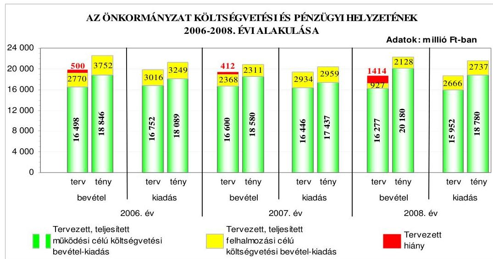
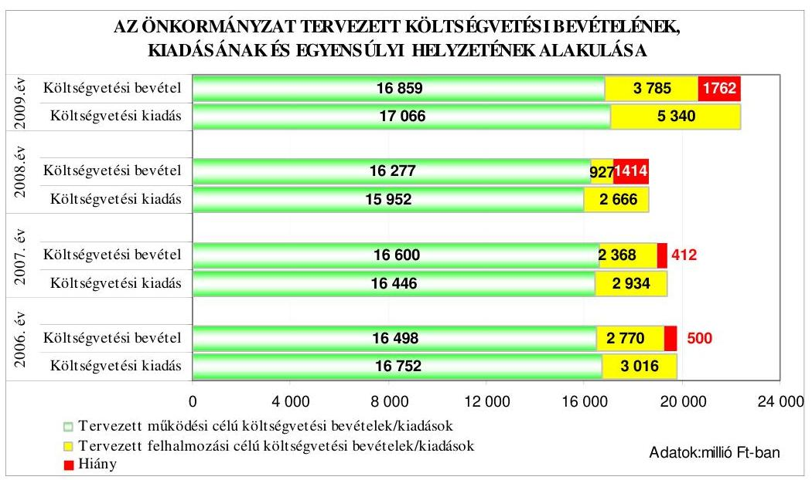
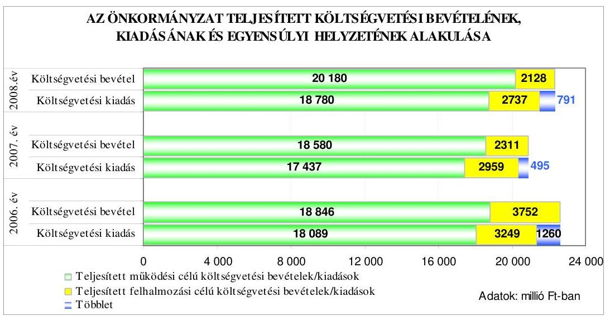
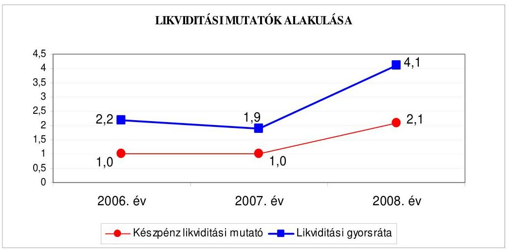
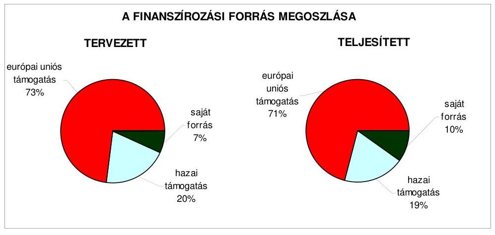
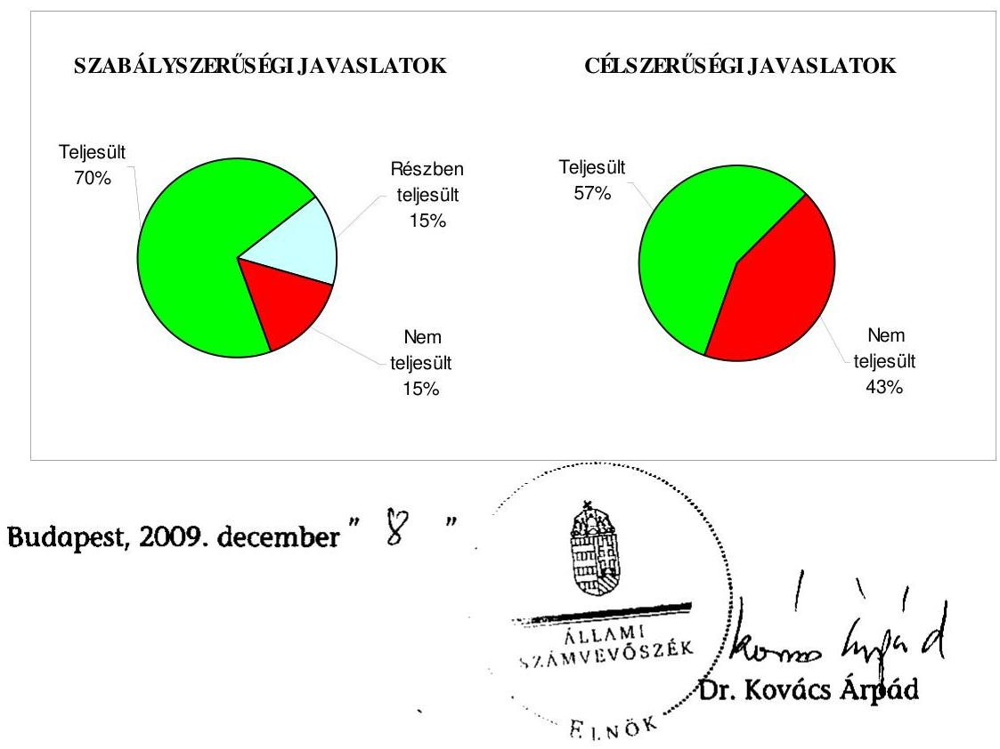
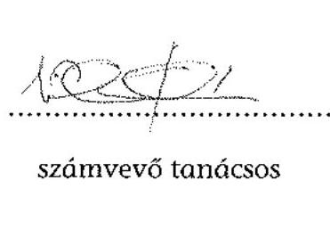
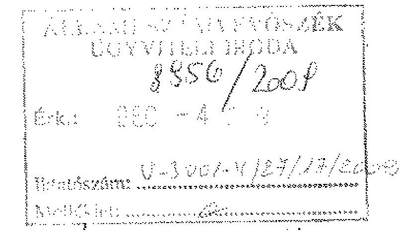
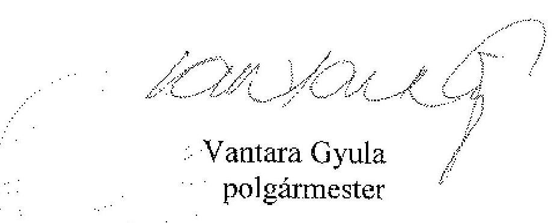

# JELENTÉS 

Békéscsaba Megyei Jogú Város Önkormányzata gazdálkodási rendszerének 2009. évi ellenőrzéséről

---

# 3. Önkormányzati és Területi Ellenőrzési Igazgatóság 

3.3. Átfogó Ellenőrzési Főcsoport

Iktatószám: V-3001-4/27/18/2009.
Témaszám: 933
Vizsgálat-azonosító szám: V0444

## Az ellenőrzést felügyelte:

Dr. Lóránt Zoltán
főigazgató
Az ellenőrzés végrehajtásáért felelős:
Dr. Sepsey Tamás
főigazgató-helyettes
Az ellenőrzést vezette:
Csecserits Imréné
főcsoportfőnök-helyettes

## Az ellenőrzést végezték:

| Kesmájer Ágota | Laki Dóra | Vida László |
| :-- | :-- | :-- |
| irodavezető, főtanácsadó | számvevő tanácsos | számvevő tanácsos |

## A témához kapcsolódó eddig készített számvevőszéki jelentések:

| címe | sorszáma |
| :-- | :--: |
| Jelentés a Békéscsaba Megyei Jogú Város Önkormányzata gazdál-   kodási rendszerének 2006. évi átfogó ellenőrzéséről   Jelentés a helyi és a helyi kisebbségi önkormányzatok gazdálkodási   rendszerének 2006. évi átfogó és egyéb szabályszerűségi ellenőrzé-   séről | 0650 |

Jelentéseink az Országgyűlés számítógépes hálózatán és az Interneten a www.asz.hu címen is olvashatóak.

---

# TARTALOMJEGYZÉK 

BEVEZETÉS ..... 11
I. ÖSSZEGZŐ MEGÁLLAPÍTÁSOK, KÖVETKEZTETÉSEK, JAVASLATOK ..... 16
II. RÉSZLETES MEGÁLLAPÍTÁSOK ..... 24

1. Az Önkormányzat költségvetési és pénzügyi helyzete ..... 24
1.1. A tervezett költségvetési bevételek és kiadások alapján a költségvetési egyensúly alakulása, a költségvetési hiány oka, finanszírozásának tervezett módja és a költségvetési hiány megállapításának szabályszerűsége ..... 24
1.2. A teljesített költségvetési bevételek és kiadások alapján a pénzügyi egyensúly alakulása, a pénzügyi hiány oka, finanszírozásának módja és hatása a pénzügyi helyzetre az eladósodás, valamint a fizetőképesség szempontjából ..... 25
2. Az Önkormányzat felkészültsége az európai uniós források igénylésére és felhasználására, valamint az elektronikus közszolgáltatási feladatok ellátására ..... 33
2.1. Az európai uniós források igénybevételére és a várható támogatás felhasználására történt felkészülés szabályozottságának, szervezettségének eredményessége ..... 33
2.1.1. Az európai uniós forrásokra történő pályázatok benyújtására vonatkozó döntések összhangja a fejlesztési célkitűzésekkel ..... 33
2.1.2. Az európai uniós forrásokhoz kapcsolódóan a pályázatfigyelés, a pályázatkészítés, valamint az európai uniós támogatással megvalósuló fejlesztés lebonyolítása belső rendjének szabályozottsága, a végrehajtás személyi, szervezeti feltételei, az ellenőrzési feladatok meghatározása ..... 35
2.1.3. A fejlesztési feladat lebonyolításánál a feladatellátás rendjére, az ellenőrzési feladatok teljesítésére, valamint a felelősségi szabályokra vonatkozó előírások betartása ..... 36
2.2. Az elektronikus közszolgáltatás feltételeinek kialakítása, a közérdekú gazdálkodási adatok elektronikus közzététele ..... 39
3. A költségvetési gazdálkodás belső kontrolljai ..... 42
3.1. A szabályozottság kockázata a költségvetés tervezési, gazdálkodási, beszámolási és a folyamatba épített, előzetes és utólagos vezetői ellenőrzési feladatoknál ..... 42
3.2. A belső kontrollok múködése az önkormányzati források szabályszerű felhasználásában, a költségvetési tervezés, gazdálkodás, beszámolás folyamataiban ..... 45

---

3.3. A belső ellenőrzési kötelezettség teljesítése, javaslatainak hasznosulása ..... 49
4. Az ÁSZ korábbi ellenőrzési javaslatai alapján készített intézkedési terv végrehajtása, eredményessége ..... 53
4.1. Az Önkormányzat gazdálkodási rendszerének átfogó ellenőrzése során tett javaslatok végrehajtására tervezett intézkedések megvalósulása ..... 53
4.2. A zárszámadáshoz kapcsolódó (állami hozzájárulások, támogatások igénylésének és felhasználásának ellenőrzése), valamint a további vizsgálatok esetében a megállapítások, javaslatok alapján tett intézkedések ..... 57

# MELLÉKLETEK 

1. számú Az Önkormányzat gazdálkodását meghatározó adatok, mutatószámok (1 oldal)
2. számú Az önkormányzati vagyon alakulása (1 oldal)

2/a. számú Az önkormányzati kötelezettségek alakulása (1 oldal)
3. számú Az Önkormányzat 2006-2009. évi költségvetési előirányzatainak és 20062008. évi pénzügyi teljesítéseinek alakulása (1 oldal)
4. számú Tanúsítvány az európai uniós forrásokkal támogatott célok és programok 2006-2009. évi tervezett és teljesített adatairól (4 oldal)
4/a. számú Tanúsítvány az európai uniós forrásokra 2006-2009. között benyújtott pályázatokról, amelyek elbírálásáról az Önkormányzat nem kapott tájékoztatást (2 oldal)
4/b. számú Tanúsítvány a 2006-2009. években benyújtott és elutasított európai uniós pályázatokról (1 oldal)
5. számú Adatlap az európai uniós forrással támogatott „Elektronikus önkormányzati szolgáltatások megvalósítása" fejlesztésről (3 oldal)
6. számú Vantara Gyula úr, Békéscsaba Megyei Jogú Város Önkormányzata polgármesterének észrevétele (1 oldal)

---

# RÖVIDÍTÉSEK JEGYZÉKE 

## Törvények

Áht.
Eisztv.

Htv.

Ket.

Ötv.
Számv. tv.

## Rendeletek

Ámr.
Ber.
Közgyűlési SzMSz

Vhr.
2006. évi költségvetési rendelet
2007. évi költségvetési rendelet
2008. évi költségvetési rendelet
2009. évi költségvetési rendelet
2006. évi zárszámadási rendelet
2007. évi zárszámadási rendelet
2008. évi zárszámadási rendelet
az államháztartásról szóló 1992. évi XXXVIII. törvény az elektronikus információszabadságról szóló 2005. évi XC. törvény
a helyi önkormányzatok és szerveik, a köztársasági megbízottak, valamint egyes centrális alárendeltségű szervek feladat- és hatásköreiről szóló 1991. évi XX. törvény
a közigazgatási hatósági eljárás és szolgáltatás általános szabályairól szóló 2004. évi CXL. törvény
a helyi önkormányzatokról szóló 1990. évi LXV. törvény
a számvitelről szóló 2000. évi C. törvény
az államháztartás múködési rendjéről szóló 217/1998. (XII. 30.) Korm. rendelet
a költségvetési szervek belső ellenőrzéséről szóló 193/2003. (XI. 26.) Korm. rendelet

Békéscsaba Megyei Jogú Város Önkormányzatának 4/2007. (II. 19.) számú rendelete a Közgyűlés Szervezeti és Müködési Szabályzatáról
az államháztartás szervezetei beszámolási és könyvvezetési kötelezettségének sajátosságairól szóló 249/2000.
(XII. 24.) Korm. rendelet
Békéscsaba Megyei Jogú Város Önkormányzatának 8/2006. (II. 23.) számú rendelete a 2006. évi költségvetésről
Békéscsaba Megyei Jogú Város Önkormányzatának 6/2007. (II. 15.) számú rendelete a 2007. évi költségvetésről
Békéscsaba Megyei Jogú Város Önkormányzatának 10/2008. (III. 3.) számú rendelete a 2008. évi költségvetésről
Békéscsaba Megyei Jogú Város Önkormányzatának 6/2009. (II. 23.) számú rendelete a 2009. évi költségvetésről
Békéscsaba Megyei Jogú Város Önkormányzatának 20/2007. (V. 2.) számú rendelete a 2006. évi költségvetés végrehajtásáról
Békéscsaba Megyei Jogú Város Önkormányzatának 22/2008. (IV. 28.) számú rendelete a 2007. évi költségvetés végrehajtásáról
Békéscsaba Megyei Jogú Város Önkormányzatának 13/2009. (IV. 6.) számú rendelete a 2008. évi költségvetésről

---

# Szórövidítések 

AVOP LEADER+

ÁROP
ÁSZ
beruházási szabályzat

DAOP
EACEA
EGT Norvég Finanszírozási Mechanizmus
e-közszolgáltatás
Ellenőrzési csoport
Építéshatósági csoport
FEUVE
gazdasági szervezet ügyrendje

GVOP
IBSZ

INTERREG
HEFOP
HURO
HU-RO-SCG
jegyző
KELER Zrt.
KEOP
MNB
gazdálkodási jogkörök szabályzata

Közbeszerzési csoport
Közgyűlés
az Európai Unió Bizottsága által kialakított kistérségi komplex támogatási program
ÚMFT Államreform Operatív Program
Állami Számvevőszék
Békéscsaba Megyei Jogú Város Önkormányzat Közgyűlésének Beruházási Szabályzata az Önkormányzat beruházásainak rendjéről (Hatályos: 2007. május 1-től)
ÚMFT Dél-alföldi Operatív program
Európai Oktatási Audiovizuális és Kulturális Ügynökség
az Európai Gazdasági Térség és a Norvég Finanszírozási Mechanizmusok Közösségi Kezdeményezés
elektronikus közszolgáltatás
Békéscsaba Megyei Jogú Város Önkormányzat Polgármesteri Hivatalának Ellenőrzési Csoportja
Békéscsaba Megyei Jogú Város Önkormányzat Polgármesteri Hivatalának Építéshatósági Csoportja
folyamatba épített, előzetes és utólagos vezetői ellenőrzés
Békéscsaba Megyei Jogú Város Önkormányzat Polgármesteri Hivatala gazdasági szervezetének ügyrendje (jóváhagyta a polgármester és a jegyző, hatályos 2005. január 1-től)
NFT Gazdasági Versenyképesség Operatív Program
Békéscsaba Megyei Jogú Város Önkormányzat Polgármesteri Hivatalának Informatikai Biztonsági Szabályzata (Hatályos: 2009. augusztus 1-től)
határon átnyúló, nemzetek és régiók közötti együttmúködés
NFT Humánerőforrás-fejlesztési Operatív Program
Magyarország-Románia Határon Átnyúló Együttmúködési Program
Magyarország-Románia és Magyarország-Szerbia és Montenegro Határon Átnyúló Együttmúködési Program
Békéscsaba Megyei Jogú Város Önkormányzatának jegyzője
Központi Elszámolóház és Értékpapír Zrt.
ÚMFT Környezet és Energia Operatív Program
Magyar Nemzeti Bank
Szabályzat a kötelezettségvállalás, a kötelezettség vállalás ellenjegyzésének, valamint a kiadás teljesítésével összefüggő szakmai teljesítésigazolás, érvényesítés utalványozás, ellenjegyzés rendjéről (jóváhagyta a jegyző, hatályos 2008. január 1-től)

Békéscsaba Megyei Jogú Város Önkormányzat Polgármesteri Hivatalának Közbeszerzési Csoportja
Békéscsaba Megyei Jogú Város Önkormányzatának Közgyűlése

---

| KÖZOP | ÚMFT Közlekedés Operatív Program |
| :--: | :--: |
| MAG Zrt. | Magyar Gazdaságfejlesztési Központ Zrt. |
| NFT | Nemzeti Fejlesztési Terv |
| Önkormányzat | Békéscsaba Megyei Jogú Város Önkormányzata |
| Pénzügyi bizottság | Békéscsaba Megyei Jogú Város Önkormányzat Közgyúlésének Gazdasági, Költségvetési és Pénzügyi Bizottsága |
| Pénzügyi osztály | Békéscsaba Megyei Jogú Város Önkormányzat Polgármesteri Hivatalának Pénzügyi és Gazdasági Osztálya |
| polgármester | Békéscsaba Megyei Jogú Város Önkormányzatának polgármestere |
| Polgármesteri hivatal | Békéscsaba Megyei Jogú Város Önkormányzatának Polgármesteri Hivatala |
| Polgármesteri hivatal SzMSz-e | Békéscsaba Megyei Jogú Város Önkormányzat Polgármesteri Hivatalának Szervezeti és Müködési Szabályzata (jóváhagyta a polgármester és a jegyző, hatályos 2007. május 1-tól) |
| Projektmenedzsment csoport | Békéscsaba Megyei Jogú Város Önkormányzat Polgármesteri Hivatalának Projektmenedzsment Csoportja |
| ROP | NFT Regionális Fejlesztés Operatív program |
| STRAFO | Békéscsaba Megyei Jogú Város Önkormányzat Polgármesteri Hivatalának Stratégiai és fejlesztési Osztálya |
| Szociálpolitikai osztály | Békéscsaba Megyei Jogú Város Önkormányzat Polgármesteri Hivatalának Szociálpolitikai Osztálya |
| TÁMOP | ÚMFT Társadalmi Megújulás Operatív Program |
| Társulás | Békéscsaba és Térsége Többcélú Önkormányzati Kistérségi Társulás |
| TIOP | ÚMFT Társadalmi Infrastruktúra Operatív Program |
| ÚMFT | Új Magyarország Fejlesztési Terv |
| VAK Zrt. | Vagyonkezelő Zrt. |
| Városüzemeltetési osztály | Békéscsaba Megyei Jogú Város Önkormányzat Polgármesteri Hivatalának Városüzemeltetési Osztálya |

---

.

---

# ÉRTELMEZŐ SZÓTÁR 

1. elektronikus szolgáltatási szint
2. elektronikus szolgáltatási szint
3. elektronikus szolgáltatási szint
4. elektronikus szolgáltatási szint
európai uniós források
fejlesztési feladat (projekt)
fejlesztési célkitúzés
hazai társfinanszírozás
irányító hatóság

Az 1044/2005. (V. 11.) Korm. határozat alapján olyan információs, tájékoztató szolgáltatás, amely csak általános információkat közöl az adott üggyel kapcsolatos teendőkről és a szükséges dokumentumokról.
Az 1044/2005. (V. 11.) Korm. határozat alapján olyan egyirányú kapcsolatot biztosító szolgáltatás, amely az 1. szinten túl biztosítja az adott ügy intézéséhez szükséges dokumentumok, nyomtatványok letöltését, és azok ellenőrzéssel, vagy ellenőrzés nélküli elektronikus kitöltését, amely esetben a dokumentumok benyújtása hagyományos úton történik.
Az 1044/2005. (V. 11.) Korm. határozat alapján olyan kétirányú kapcsolatot biztosító szolgáltatás, amely közvetlen, vagy ellenőrzött kitöltésű dokumentum segítségével biztosítja az elektronikus adatbevitelt és a bevitt adatok ellenőrzését. Az ügy indításához, intézéséhez személyes megjelenés nem szükséges, de az ügyhöz kapcsolódó közigazgatási döntés (határozat, egyéb aktus) közlése, valamint a kapcsolódó illeték-, vagy díjfizetés hagyományos úton történik.
Az 1044/2005. (V. 11.) Korm. határozat alapján olyan teljes közvetlen kétirányú ügyintézési folyamatot biztosító szolgáltatás, amikor az ügyhöz kapcsolódó közigazgatási döntés is elektronikus úton kerül közlésre, illetve a kapcsolódó illeték-, vagy díjfizetés elektronikus úton is intézhető.
A támogatott projekt megvalósítása érdekében, a fejlesztés lebonyolítása során felmerült kiadások finanszírozási forrása.
A fejlesztési feladat (projekt) tartalmilag és formailag részletesen kidolgozott, megfelelő pénzügyi háttérrel és végrehajtási ütemezéssel rendelkező fejlesztési terv, amely illeszkedik az Európai Unió, illetve a Nemzeti Fejlesztési Terv és az Új Magyarország Fejlesztési Terv által támogatott programokhoz.
Az önkormányzat által ellátott kötelező, vagy önként vállalt feladatok biztosításának mennyiségi, vagy minőségi fejlesztésére vonatkozó terv. A mennyiségi fejlesztés megvalósulhat beszerzéssel, létesítéssel, bővítéssel, átalakítással.
A központi költségvetési és az elkülönített állami pénzalapokból származó finanszírozás.
A strukturális alapok és a Kohéziós alap forrásainak szabályszerű, hatékony és eredményes felhasználásához szükséges intézményrendszer felső eleme. Az irányító hatóság általános és átfogó felelősséget visel a programok, projektek hatékony és szabályszerű végrehajtásáért. Felelősségi köréből eredően ellenőrzi a közösségi, valamint a

---

közreműködő szervezet
lebonyolítás
operatív program

Nemzeti Fejlesztési Terv
hazai jogszabályok betartását, koordinálja az európai uniós források szétosztásának folyamatát, irányítja az intézményrendszer, a statisztikai és a pénzügyi nyilvántartási rendszer múködését. Az Új Magyarország Fejlesztési Terv Irányító Hatósága közremúködik az Operatív Program véglegesítésében, irányítja az Operatív Program Program-kiegészítő Dokumentum kidolgozását, és közremúködő szerepet vállal e dokumentumoknak az Európai Bizottsággal történő tárgyalásaiban. Az Irányító Hatóság részt vesz továbbá a költségvetési tervezésében, valamint közreműködő szervezetek bevonásával irányítja a meghirdetett pályázatok és a központi programok végrehajtását.
A közreműködő szervezet az európai uniós támogatást elnyert kedvezményezettekkel kapcsolatot tartó szerv. Az operatív programok közreműködő szervezetei befogadják, nyilvántartják, döntésre előkészítik a pályázatokat, rögzítik a támogatással kapcsolatos adatokat az Egységes Monitoring Informatikai Rendszerben, elvégzik a támogatások előzetes (szerződéskötést megelőző), közbenső (a pénzügyi elszámolás, finanszírozás folyamatában végzett) és utólagos (a támogatott projekt pénzügyi lezárását megelőző) ellenőrzését. Az önkormányzatoknál a leggyakrabban előforduló operatív program a Regionális Fejlesztési Operatív Program végrehajtásában közreműködő szervezetek a VÁTI Kht. és a regionális fejlesztési ügynökségek.
A Kohéziós alap kettő közreműködő szervezete (Nemzeti Fejlesztési és Gazdasági Minisztérium, Környezetvédelmi és Vízügyi Minisztérium) a támogatott projektek végrehajtásához kapcsolódó operatív feladatokat látják el. Ennek keretében megkötik a szerződéseket a projekt kedvezményezettjével, folyamatosan nyomon követik a teljesítéseket, lebonyolítják a támogatások kifizetését, vezetik az Egységes Monitoring Informatikai Rendszert.
Az európai uniós források felhasználásával megvalósuló fejlesztésre irányuló műszaki, gazdasági (pénzügyi) tevékenységet magában foglaló szervezési, irányítási szolgáltatás. A szervezési szolgáltatás kiterjedhet a pályázatkészítésre, a közbeszerzési eljárás lebonyolításán keresztül a folyamatos műszaki ellenőrzésre, a pénzügyi elszámolásra, a múszaki átadás-átvételre, az üzembe helyezésre, illetve a fejlesztési folyamat egyes elemeire.
Az Európai Bizottság által jóváhagyott, a Közösségi Támogatási Keret végrehajtására vonatkozó, több évre szóló intézkedésekhez kapcsolódó prioritások egységes rendszerét tartalmazó dokumentum.
Helyzetelemzést, stratégiát a tervezett fejlesztési területek prioritásait, azok céljait és pénzügyi forrásaik megjelölését tartalmazó dokumentum, amelyet a Magyar Köztársaság

---

regionális program

Új Magyarország Fejlesztési Terv
készített az Európai Unió programozási irányelveinek, célkitűzéseinek megfelelően a fejlődésben lemaradó régiók fejlődésének és strukturális átalakulásának elősegítésére a kiemelt szükségletekre figyelemmel. A Nemzeti Fejlesztési Terv stratégiai fejezetének célja, hogy a 2004-2006 közötti időszakra kijelölje a strukturális alapokból támogatható fejlesztéspolitikai célkitűzéseit és prioritásait. A strukturális alapok operatív programjai: Agrár és Vidékfejlesztési Operatív Program (AVOP); Gazdasági Versenyképesség Operatív Program (GVOP); Humánerőforrás-fejlesztési Operatív Program (HEFOP); Környezetvédelmi és Infrastruktúra-fejlesztési Operatív Program (KIOP); Regionális Fejlesztési Operatív Program (ROP).
Az ágazati és regionális prioritásokat egyaránt tartalmazó operatív program regionális prioritása, illetve támogatási konstrukciója.
Az Új Magyarország Fejlesztési Terv célja a foglalkoztatás bővítése és a tartós növekedés feltételeinek megteremtése. Ennek érdekében 2007-2013 között hat kiemelt területen indított el összehangolt állami és európai uniós fejlesztéseket: a gazdaságban, a közlekedésben, a társadalom megújulása érdekében, a környezet és az energetika területén, a területfejlesztésben és az államreform feladataival összefüggésben. Az Új Magyarország Fejlesztési Terv operatív programjai: Államreform Operatív Program (ÁROP); Elektronikus Közigazgatás Operatív Program (EKOP); Gazdaságfejlesztés Operatív Program (GOP); Környezet és Energia Operatív Program (KEOP); Közlekedés Operatív Program (KÖZOP); Dél-Alföldi Operatív Program (DAOP); Dél-Dunántúli Operatív Program (DDOP); Észak-Alföldi Operatív Program (ÉAOP); Észak-Magyarországi Operatív Program (ÉMOP); Közép-Dunántúli Operatív Program (KDOP); Közép-Magyarországi Operatív Program (KMOP); Nyugat-Dunántúli Operatív Program (NYDOP); Társadalmi Infrastruktúra Operatív Program (TIOP); Társadalmi Megújulás Operatív Program (TÁMOP).
támogatási szerződés A strukturális alapok esetében az irányító hatóságnak, illetve a Kohéziós Alap esetében a közreműködő szervezeteknek a kedvezményezett önkormányzattal kötött szerződése, amely a támogatás felhasználásának részletes feltételeit tartalmazza. Az Új Magyarország Fejlesztési Terv keretében támogatott projektek esetében a támogatási szerződést a kedvezményezett és a Nemzeti Fejlesztési Ügynökség nevében eljáró közreműködő szervezet között jön létre. Nagyprojekt esetén a támogatási szerződést az Nemzeti Fejlesztési Ügynökség ellenjegyzi. A támogatási szerződés képezi a megvalósítás nyomon követésének, finanszírozásának és ellenőrzésének alapját.

---

.

---

# JELENTÉS 

## Békéscsaba Megyei Jogú Város Önkormányzata gazdálkodási rendszerének 2009. évi ellenőrzéséről

## BEVEZETÉS

Az Ötv. 92. § (1) bekezdése, az Állami Számvevőszékről szóló 1989. évi XXXVIII. törvény 2. § (3) bekezdése, valamint az Áht. 120/A. § (1) bekezdése alapján az önkormányzatok gazdálkodását az Állami Számvevőszék ellenőrzi. Az ellenőrzésre az Országgyúlés illetékes bizottságai részére is átadott, országosan egységes ellenőrzési program szerint került sor.

Az Állami Számvevőszék a stratégiájában foglalt célkitűzéseknek megfelelően a helyi önkormányzatok költségvetési gazdálkodási rendszere átfogó ellenőrzésének programját a 2007. évtől megújította, azt kiegészítette további - teljesít-mény-ellenőrzési - elemekkel.

## Az ellenőrzés célja annak értékelése volt, hogy az Önkormányzat:

- milyen módon biztosította a költségvetési és a pénzügyi egyensúlyt a költségvetésében és annak teljesítése során, valamint változott-e a hiányzó bevételi források pótlásában a finanszírozási célú pénzügyi műveletek jelentősége, hatása;
- eredményesen készült-e fel a szabályozottság és a szervezettség terén az európai uniós források igénylésére és felhasználására, továbbá biztosította-e az elektronikus közszolgáltatás feltételeit, a gazdálkodási adatok közzétételével a gazdálkodás nyilvánosságát;
- kialakította-e és működtette-e a külső és a belső feltételeknek megfelelően a költségvetés tervezési, gazdálkodási és zárszámadási feladatai belső kontrollrendszerét ${ }^{1}$, ezen tevékenységek szabályszerű ellátásához hozzájárult-e a folyamatba épített, előzetes és utólagos vezetői ellenőrzés, valamint a belső ellenőrzés;

[^0]
[^0]:    ${ }^{1}$ A gazdálkodás szabályszerűségét biztosító kontrollrendszer alatt értjük a kiépített és működő pénzügyi irányítási és szabályozási rendszert, valamint a belső ellenőrzési funkciók ellátásának rendszerét.

---

- megfelelően hasznosították-e a korábbi számvevőszéki ellenőrzések megállapításait, szabályszerűségi ${ }^{2}$ és célszerűségi javaslatait.

Az ellenőrzés típusa: átfogó ellenőrzés, amely - egy ellenőrzés keretében meghatározott területekre összpontosítva alkalmazza a szabályszerűségi, valamint a teljesítmény-ellenőrzés jellemzőit.

Az ellenőrzött időszak: az 1., 2. és 4. programpontok tekintetében a 20062008. évek és 2009. I. negyedév, a 3. ellenőrzési programpontnál a 2008. év és 2009. I. negyedév.

Békéscsaba megyei jogú város lakosainak száma 2009. január 1-jén 63441 fő volt. A 2006. évi önkormányzati választást követően az Önkormányzat 28 tagú Közgyűlésének munkáját hét állandó bizottság segítette. A helyi önkormányzat mellett a 2006. évi önkormányzati választásokat követően négy kisebbségi önkormányzat ${ }^{3}$ működött. A polgármester a 2006. évi önkormányzati képviselő és polgármester választás óta tölti be tisztségét, a jegyző személye 2009. I. negyedévben változott.

Az Önkormányzat feladatainak végrehajtása érdekében a 2008. évben 39 költségvetési intézményt múködtetett, amelyekből 25 önállóan gazdálkodott. A feladatok ellátásában részt vett hét gazdasági társasága, továbbá kilenc alapítványa. Az Önkormányzat a 2008. évi költségvetési beszámolója szerint 22308 millió Ft költségvetési bevételt ért el és 21517 millió Ft költségvetési kiadást teljesített. 2008. december 31-én a könyvviteli mérleg szerint 59394 millió Ft értékű vagyonnal rendelkezett. Az Önkormányzat vagyona a 2006. év végi állományhoz viszonyítva 7,7\%-kal emelkedett, a befektetett eszközök 3,4\%-os, valamint a forgóeszközök 73,6\%-os növekedésének hatására. A befektetett eszközökön belül 2006-2007 között az ingatlanok állományának 3,5\%-os csökkenése mellett 19,9\%-kal nőtt az üzemeltetésre, kezelésre átadott eszközök állománya a szociális feladatokat ellátó intézmény ingatlanjainak a Békéscsaba és Térsége Többcélú Önkormányzati Kistérségi Társulásnak, valamint a Körösök Völgye Látogatóközpont ingatlanjainak a Körösök Völgye Natúrpark Egyesület részére történő vagyonkezelésbe adása miatt. A forgóeszközökön belül - a 2008. évben történt kötvénykibocsátásból származó bevétel befektetésének hatására - az értékpapírok állománya 2006-2008 között közel 2,5-szeresére (2066 millió Ft-ra), a pénzeszközök állománya 131,3\%-kal (2642 millió Ft-ra) növekedett. A hosszú lejáratú kötelezettségek közel négyszeres emelkedése miatt a kötelezettségek állománya több mint kétszeresére ( 7572 millió Ft-ra) nőtt, melyet a 2008. évi 4000 millió Ft összegű kötvénykibocsátás eredményezett. Az összes költségvetési bevétel 33,1\%-át a saját bevétel, illetve 12,3\%-át a helyi adó bevétel biztosította a 2008. évben. Az összes költségvetési kiadásból a felhalmozási célú kiadás részaránya a 2008. évben 12,7\% volt. A 2009. évi költségvetési rendeletben 20644 millió Ft költségvetési bevételt és 22406 millió Ft költségvetési kiadást irányoztak elő. A Polgármesteri hivatalban dolgozó köz-

[^0]
[^0]:    ${ }^{2}$ A törvényi előírások betartásának elmulasztásakor a részletes megállapítások fejezetben egységesen a törvénysértés megjelölést alkalmazzuk, mivel az ÁSZ nem tehet különbséget a törvényi előírások között.
    ${ }^{3}$ Kisebbségi önkormányzatok: cigány, lengyel, román, szlovák.

---

tisztviselők száma 2008. december 31-én 235 fő, a költségvetési intézményekben foglalkoztatott közalkalmazottak száma 3086 fő volt. Az Önkormányzat gazdálkodását meghatározó adatokat, mutatószámokat az 1-3. számú mellékletek tartalmazzák.

Az Önkormányzat költségvetési és pénzügyi helyzetét az elemző eljárás módszerével vizsgáltuk. E körben elemeztük a költségvetés egyensúlyi helyzetének alakulását, a tervezett és tényleges költségvetési hiány okait, a mérséklésére tett intézkedéseket, finanszírozásának módját, az Önkormányzat adósságállományának alakulását, összetevőit. Az európai uniós támogatás igénylésére, felhasználására történt felkészülésre vonatkozóan teljesítményellenőrzést végeztünk. Az európai uniós források figyelésére, igénylésére és felhasználására a felkészülést akkor minősítettük eredményesnek, ha a meghatározott szempontok szerinti feltételeknek megfelelt a felkészülés szabályozottsága, szervezettsége, továbbá értékeltük, hogy az igényelt európai uniós támogatások az Önkormányzat által meghatározott fejlesztési célkitűzésekhez kapcsolódtak-e. Az ellenőrzés során felmértük, hogy az e-közszolgáltatási feladat ellátása, illetve bevezetése, működtetése érdekében milyen intézkedéseket tettek, valamint biz-tosították-e a közérdekű adatok közzétételét. A költségvetési gazdálkodás belső kontrolljainak ellenőrzése során értékeltük, hogy a Polgármesteri hivatalnál a költségvetés tervezési, gazdálkodási, zárszámadás készítési feladatok belső kontrolljainak kiépítettsége és működése megfelelő biztosítékot ad-e a gazdálkodási feladatok megfelelő, szabályszerű ellátására. Felmértük és minősítettük a költségvetés tervezési, a gazdálkodási, a zárszámadás készítési feladatokkal, továbbá a pénzügyi-számviteli területen az informatikával kapcsolatosan kialakított kontrollok megfelelőségét, valamint a kialakított belső kontrollok működésének megbízhatóságát. Értékeltük a belső ellenőrzés szabályozottságát, működési feltételeinek kialakítását, továbbá működésének megbízhatóságát.

A Polgármesteri hivatalnál értékeltük a gazdálkodás folyamatában kulcsszerepet betöltő belső kontrollok működésének megbízhatóságát, ennek keretében ellenőriztük a szakmai teljesítésigazolásra és az utalvány ellenjegyzésére kialakított kontrollok végrehajtását. Az ellenőrzést a következő, kiemelt kockázatuk alapján kiválasztott ${ }^{4}$ kifizetésekre folytattuk le ${ }^{5}$ :

- a külső szolgáltató által végzett karbantartási, kisjavítási szolgáltatásokra,

[^0]
[^0]:    ${ }^{4}$ Az önkormányzatok kiemelt előirányzataira vonatkozóan, a vertikális folyamatokra elvégeztük a kockázatok becslését, amelynek eredményeként határoztuk meg a magas kockázatú területeket.
    ${ }^{5}$ A korábbi ellenőrzési tapasztalataink szerint ezeken a területeken a jegyzők nem, vagy hiányosan szabályozták a megbízás, megrendelés, illetve beszerzés indokoltságának, szükségességének elbírálására, igazolására, valamint a teljesítések dokumentálására, a kiadások jogosultságának, összegszerűségének ellenőrzésére irányuló kontrollokat. További kockázatot jelentett, ha a külső szolgáltató által végzett karbantartási, kisjavítási munkák 50 ezer Ft alatti megrendeléseire vonatkozóan a jegyzők nem alakították ki a kötelezettségvállalások rendjét és nyilvántartási formáját, valamint a szabályozás elmulasztása esetén nem történt meg az írásbeli kötelezettségvállalás és annak az ellenjegyzése sem.

---

- a gépek, berendezések, felszerelések beszerzésére, továbbá
- az államháztartáson kívülre teljesített múködési és felhalmozási célú pénzeszköz átadásokra.

Az ellenőrzés hatékony elvégzése céljából a vizsgálandó területek kiválasztása során a kockázatokon alapuló megközelítés érvényesült, ezáltal az ellenőrzési erőforrásokat azokra a területekre fókuszáltuk, amelyeken legnagyobb a hibák előfordulási valószínűsége. Az ellenőrzési erőforrások ilyen típusú összpontosításával minimálisra csökkenthető a kívánt ellenőrzési bizonyosság eléréséhez szükséges időráfordítás.

A pénzügyi-számviteli folyamatokban alkalmazott belső kontrollok létezésének és múködésének ellenőrzésére a vizsgált három terület 2008. évi könyvviteli tételeiből területenként egyszerű véletlen mintát vettünk. A kijelölt gazdasági eseményre elvégzett megfelelőségi tesztek alapján értékeltük a kontrollok múködésének megbízhatóságát a vizsgált három területre külön-külön, majd öszszefoglalóan ${ }^{6}$. A helyszíni ellenőrzés megállapításainak részletes dokumentálását megfelelőségi tesztlapokon, elővizsgálati és helyszíni ellenőrzési munkalapokon biztosítottuk. Ezeken a teszt- és munkalapokon a minősítés alapjául szolgáló kérdések és a vonatkozó konkrét jogszabályhelyek megjelölése mellett értékeltük a kialakított belső kontrollokban rejlő kockázatokat ${ }^{7}$ és a kialakított kontrollok múködésének megbízhatóságát ${ }^{8}$.

Az ÁSZ korábbi ellenőrzési javaslatai alapján tett intézkedéseket, illetve azok megvalósítását utóellenőrzés keretében vizsgáltuk. A gazdálkodási rendszer átfogó ellenőrzése során megfogalmazott javaslatok végrehajtására tett intézkedések megvalósítását ellenőriztük, az egyéb számvevőszéki ellenőrzések során tett javaslatok esetében pedig a kiadott intézkedéseket tekintettük át.

A helyszíni ellenőrzés során kitöltött - az ellenőrzést végző számvevő és a Polgármesteri hivatal felelős köztisztviselője által aláírt - elővizsgálati és helyszíni

[^0]
[^0]:    ${ }^{6}$ A vizsgált három terület egyedi értékelési pontszámait a területek költségvetési súlyával arányosan összegeztük.
    ${ }^{7}$ A kialakított belső kontrollokban rejlő kockázatot alacsonynak minősítettük, ha a kontrollok - végrehajtásuk esetén - megfelelő védelmet nyújtanak a hibák bekövetkezése ellen. Közepesnek minősítettük a belső kontrollokban rejlő kockázatot, amennyiben a kontrollok - végrehajtásuk esetén - a lehetséges hibák többsége ellen védelmet nyújtanak. Magasnak értékeltük a kockázatot, ha a kontrollok - kialakításuk hiányában, vagy hiányos kialakításuk miatt - nem nyújtanak elegendő védelmet a lehetséges hibákkal szemben.
    ${ }^{8}$ A kontrollok múködésének megbízhatóságát kiválónak értékeltük abban az esetben, ha azok múködése - esetleges apróbb hiányosságoktól eltekintve - megfelelt a hibák megelőzésére és kijavítására meghatározott szabályozásnak és a legmagasabb szintű elvárásoknak. Jónak minősítettük a kontrollok múködését, ha a hiányosságok száma ugyan jelentős volt, de nem veszélyeztette az ellenőrzött terület hibáinak megelőzését és kijavítását. Amennyiben a kontrollok - kialakításuk hiánya, illetve hiányosságai miatt - nem biztosították a hibák megelőzését, feltárását, kijavítását és ez veszélyeztette az eredményes, megbízható múködést, a kontroll múködésének megbízhatósága gyenge minősítést kapott.

---

ellenőrzési munkalapokat, azok kitöltési útmutatóit, továbbá a megfelelőségi tesztek dokumentumait a polgármester részére a számvevői jelentéssel egyidejűleg átadtuk.

A jelentés megállapításainak, javaslatainak egyeztetése során a polgármester arról adott részletes tájékoztatást - egyidejűleg csatolta azokat a dokumentumokat, amelyek igazolták -, hogy az időközben megtett intézkedésekkel a számvevői jelentésben tett javaslatok többségét ${ }^{9}$ megvalósították. A megtett intézkedéseket a jelentés II. Részletes megállapítások fejezetében az adott témához kapcsolt lábjegyzetben feltüntettük és a vonatkozó javaslatokat elhagytuk.

A jelentést az ÁSZ-ról szóló 1989. évi XXXVIII. tv. 25. § (1) bekezdése alapján észrevétel közlése céljából megküldtük Békéscsaba Megyei Jogú Város Önkormányzata polgármesterének. A kapott tájékoztatást a jelentés 6 . számú melléklete tartalmazza.

[^0]
[^0]:    ${ }^{9}$ A számvevői jelentésben a helyszíni ellenőrzés során a polgármesternek két szabályszerűségi és egy célszerűségi javaslatot tettünk, amelyből egy szabályszerűségi javaslatot elhagytunk, a jegyzőnek 14 szabályszerűségi és 11 célszerűségi javaslatot tettünk, amelyből tizenkettő szabályszerűségi és tíz célszerűségi javaslatot elhagytunk.

---

# I. ÖSSZEGZŐ MEGÁLLAPÍTÁSOK, KÖVETKEZTETÉSEK, JAVASLATOK 

Az Önkormányzatnál a 2006-2008. években a tervezett költségvetési bevételek és kiadások folyamatosan csökkentek, a 2009. évben pedig növekedtek az előző évhez képest. Az Önkormányzat 2006-2009. évi költségvetési rendeleteiben a költségvetési bevételek és kiadások nem voltak egyensúlyban, a tervezett költségvetési bevételek nem nyújtottak fedezetet a költségvetési kiadásokra. A 2006. évi és a 2009. évi költségvetések hiányát a múködési célú bevételek hiánya és a felhalmozási célú bevételeket meghaladó összegben tervezett felhalmozási célú kiadások együttesen idézték elő, a 2007. évi és a 2008. évi költségvetések hiányát a felhalmozási célú bevételeket meghaladó felhalmozási célú kiadások okozták.

Az Önkormányzat a 2006-2007. évi költségvetési rendeleteiben a költségvetési egyensúly biztosításához hosszú lejáratú hitel felvételét, a 2008. évben felhalmozási célú kötvény kibocsátást, a 2009. évben pedig értékpapír értékesítést tervezett. A költségvetés tervezése során a költségvetés végrehajtása, a likviditás biztosítása érdekében a 2006-2009. években folyószámla hitelkeret meghatározásával hitel igénybevételét tervezték, azonban a jegyző az Ámr. előírása ellenére nem készített likviditási tervet. A 2006-2009. évi költségvetési rendelettervezetekben az Áht-ban foglaltak ellenére a költségvetési bevételek és kiadások különbözetét jelentő költségvetési hiány összegét nem mutatták be, valamint a költségvetés bevételi és kiadási főösszegének megállapításakor finanszírozási célú pénzügyi múveleteket is figyelembe vettek költségvetési hiányt módosító költségvetési bevételként, illetve költségvetési kiadásként.

Az Önkormányzatnál a 2006-2008. évek között teljesített költségvetési bevételek és költségvetési kiadások főösszege változóan alakult. Az előző évhez viszonyítva a 2007. évben csökkent a 2008. évben növekedett. A pénzügyi egyen-

---

súlyt biztosították, a teljesített költségvetési bevételek 2006-2008 között fedezetet nyújtottak a költségvetési kiadásokra, bevételi többlet keletkezett. Az Önkormányzatnak a 2006-2008. években az éves költségvetések végrehajtása során a múködési célú bevételeknél többlet keletkezett, a 2006. évben a teljesített felhalmozási célú költségvetési bevételek meghaladták az azonos célú költségvetési kiadásokat, azonban a 2007. és a 2008. évben a felhalmozási célú költségvetési bevételeket meghaladóan teljesítettek felhalmozási célú költségvetési kiadásokat, amelyre a múködési célú költségvetési bevételek többlete fedezetet nyújtott. Az Önkormányzat a költségvetés végrehajtása során létszámcsökkentéseket és intézményátszervezéseket hajtott végre.

A 2006. és a 2007. évi költségvetési rendeletben tervezett fejlesztésekhez az Önkormányzat a 2006-2007. években forint és euró alapú hosszú lejáratú hitelt vett igénybe, a 2008. évben pedig 4000 millió Ft összegben, svájci frank alapú kötvényt bocsátott ki a fejlesztési feladatok, valamint a későbbiekben benyújtandó európai uniós pályázatokhoz szükséges saját forrás biztosítása érdekében. A kötvénykibocsátásból származó bevételt forint- és devizabetétekbe helyezték el, állampapírokba fektették, valamint opciós devizaügyleteket is lebonyolítottak. A devizaügyletekről a Közgyűlés nem hozott döntést, az ügyletekre vonatkozóan nem élt az Ötv-ben foglalt hatáskör átruházási lehetőséggel, ezért a polgármester nem volt jogosult arra, hogy opciós devizaügyleteket kössön, illetve ilyen ügyletek elvégzésére másnak felhatalmazást adjon. A polgármester megbízási szerződést kötött egy gazdasági társasággal a kötvénykibocsátásból származó bevétel még fel nem használt részének kezelésére. A pénzügyi osztályvezető, a pénzügyi osztályvezető-helyettes, a költségvetési csoportvezető, valamint egy gazdasági társaság ügyvezető igazgatója részére biztosított - a kötvénykibocsátásból származó bevétel befektetésére vonatkozó döntési jogosultsággal a polgármester a Közgyűlés részére biztosított tulajdonosi jogokat ruházta át olyan személyekre, akiket az Ötv. nem nevesít az önkormányzati jogok gyakorlására felhatalmazhatók között, továbbá az átruházott hatáskör továbbadása sem felelt meg az Ötv-ben előírtaknak. A forint euróhoz, illetve svájci frankhoz viszonyított árfolyamváltozása, valamint a változó kamatmérték miatt az Önkormányzat számára a devizában történt hitelfelvételek, illetve a devizában történt kötvénykibocsátás kockázatot jelent. A Számv. tv-ben előírtak ellenére a 2008. évi könyvviteli mérlegben nem a kibocsátott kötvény névértékének 2008. december 31-én érvényes MNB középárfolyamon forintra átszámított értékét mutatták ki.

Az Önkormányzat pénzügyi helyzete eladósodási szempontból 2006-2008 között kedvezőtlenül változott, mert a hosszú és rövid lejáratú fizetési kötelezettségek összes forráson belüli aránya növekedett. Az Önkormányzat fizetőképessége 2006-ról 2008-ra javult, a 2008. év végi rövid lejáratú követelések, forgatási célú értékpapírok és a pénzeszközök együttesen 4,1-szeres mértékben nyújtottak fedezetet a rövid lejáratú fizetési kötelezettségek kiegyenlítéséhez. Az Önkormányzat pénzügyi helyzete a 2006-2008. évek között a fizetőképességének javulása ellenére a kötvénykibocsátás miatti eladósodás következményeként összességében kedvezőtlenül alakult.

Az Önkormányzat helyzetelemzéssel alátámasztott fejlesztési célkitúzéseit a 2007-2010-ig terjedő időszakra vonatkozó gazdasági programban, valamint az Integrált Városfejlesztési Stratégiában határozta meg. Az Önkormányzat 2006-

---

2009. I. féléve között európai uniós támogatásokra 71 pályázatot nyújtott be, amelynek $63 \%$-a támogatásban részesült, $23 \%$-át elutasították, $14 \%$-ának az elbírálásáról tájékoztatást még nem kaptak. Az Önkormányzat 2006-2009. évi költségvetési rendeletei tartalmazták az európai uniós támogatással megvalósuló múködési és felhalmozási célú költségvetési kiadás és bevétel előirányzatait, a felhalmozási kiadásokat feladatonként, a többéves kihatással járó fejlesztési feladatok előirányzatait éves bontásban, azonban az Ámr-ben előírtak ellenére elkülönítetten nem mutatták be 19 európai uniós forrásból megvalósuló program bevételi és kiadási előirányzatait.

Az európai uniós források igénybevételének és felhasználásának, az egységes pályázati rend kialakításának feladatait a 2006-2007. április 30. közötti időszakban nem határozták meg, ezeket a Polgármesteri hivatal SzMSz-ében 2007. május 1-től írták elő. A STRAFO keretein belül létrejött Projektmenedzsment csoport feladataként határozták meg az önkormányzati szintű pályázatfigyelési, a pályázat koordinálási, pályázat nyilvántartási, pályázatkészítési feladatokat. Az európai uniós forrással támogatott fejlesztések lebonyolításával kapcsolatos eljárási rendet a 2007. május 1-től hatályos beruházási szabályzat tartalmazta. Az Önkormányzatnál 2006. áprilisától az európai uniós források megszerzésére irányuló pályázatfigyeléssel és pályázatkészítéssel kapcsolatos feladatokat a Polgármesteri hivatal szervezetén belül a Projektmenedzsment csoport látta el. Az Önkormányzat - a Polgármesteri hivatal köztisztviselői mellett - a pályázatok készítésébe egy alkalommal vont be külső szervezetet. Az európai uniós támogatással megvalósuló fejlesztések lebonyolítási feladatait a Polgármesteri hivatalon belül biztosították.

A GVOP-4.3.1. intézkedés keretében 2004. július 15-én nyújtott be pályázatot az Önkormányzat „Elektronikus önkormányzati szolgáltatások megvalósitása" címmel. A pályázat befogadásától a támogatási szerződés megkötéséig 300 nap telt el, ami a projekt tervezett indításának közel négy hónapos csúszását okozta. A projekt megvalósítása a tervezett határidőn belül megtörtént. A projekt előrehaladási jelentés, valamint a támogatás kifizetés igénylését alátámasztó számlák, bizonylatok ellenőrzése során megállapított és kért szükséges hiánypótlások is hozzájárultak ahhoz, hogy a támogatás igénybevétele nem a tervezett ütemezésnek megfelelően történt, ami átmeneti pénzügyi zavarokat is okozott. Az Önkormányzat a 2005-2007. évek költségvetési rendeleteiben a projekt megvalósításához tervezett összesen 54,1 millió Ft saját forrást biztosította a fejlesztési feladat megvalósítása során. A Polgármesteri hivatalban a projekt kiadásaival és bevételeivel összefüggő folyamatba épített, előzetes és utólagos vezetői ellenőrzési feladatokat a gazdálkodási jogkörök szabályzata szerint elvégezték. A belső ellenőrzés a projekt megvalósításának folyamatát és az ezzel kapcsolatos kötelezettségek teljesítését nem ellenőrizte. Az irányító hatóság a projekt megvalósulásának folyamatában három alkalommal végzett helyszíni ellenőrzést, amelyek során szabálytalanságokat nem tártak fel. Az ÁSZ 2006ban ellenőrizte a projekt megvalósítását és a határidőcsúszásokon kívül egyéb szabálytalanságokat nem tárt fel. A MAG Zrt. a pénzügyi lezárást megelőzően 2008. július 17-én helyszíni ellenőrzést végzett, melynek során szabálytalanságot nem állapított meg.

Az Önkormányzat a szabályozottság és szervezettség tekintetében 2007. május 1. - 2009. I. félév között eredményesen készült fel az európai uniós forrá-

---

sok igénybevételére és a várható támogatások felhasználására, mivel a gazdasági programban, ágazati szakmai koncepciókban, tervekben, stratégiában megfogalmazott fejlesztési célkitűzésekhez kapcsolódtak az európai uniós forrásokra benyújtott pályázatok. Szabályozták továbbá a pályázatfigyelést végzők és a döntési, illetve a döntés előkészítési jogkörrel rendelkezők közötti információszolgáltatási kötelezettséget és meghatározták a folyamatba épített, előzetes és utólagos vezetői ellenőrzési feladatokat, valamint biztosították a pályázatfigyelés, pályázatkészítés és a fejlesztési feladatok lebonyolításának szervezeti, személyi feltételeit, rögzítették a külső szervezettel kötött szerződésben a pályázat szakmai és formai követelményeinek biztosítására vonatkozóan a pályázatkészítést végző felelősségét. Annak ellenére eredményes volt az Önkormányzat felkészültsége, hogy az európai uniós forrásokkal támogatott fejlesztési feladatokra is kiterjedő, belső ellenőrzési stratégiát megalapozó kockázatelemzés a 2006-2007. évben nem készült.

Az Önkormányzat a 2004-2006. évekre vonatkozóan rendelkezett informatikai stratégiával, a 2007-2009. évekre viszont nem. Az „Elektronikus önkormányzati szolgáltatások megvalósitása" címmel a GVOP, a „Békéscsaba Megyei Jogú Város Polgármesteri hivatalának szervezetfejlesztése" címmel az ÁROP keretében kiírt támogatásra pályáztak, amely pályázatokat támogatásban részesítették. Informatikai stratégiai célként az elektronikus szolgáltatás 3. szintjének elérését határozták meg, amelyet az útvonal-, a közterület használati-, a bontási-, a működési-, és a telephely engedélyezéssel, valamint a gépjármú regisztrációval kapcsolatos ügyekben már elértek. Az e-közszolgáltatási feladatokat ellátó informatikai rendszer ügyfelek általi igénybevételét nem kísérték figyelemmel.

A jegyző a közérdekú adatok közzétételének eljárási rendjét, az adatok honlapon történő megjelenítésének felelőseit nem határozta meg, valamint az Áht. előírása ellenére nem tette közzé a céljellegú múködési és felhalmozási támogatások kedvezményezettjeinek nevét, a támogatás célját, összegét, továbbá a támogatási program megvalósítási helyét. A jegyző az Áht-ban meghatározottakat figyelmen kívül hagyva nem gondoskodott az intézmények pénzeszközei felhasználásával, a vagyonnal történő gazdálkodásával összefüggő, nettó öt millió Ft-ot elérő, vagy azt meghaladó értékű - árubeszerzésre, építési beruházásra, szolgáltatás megrendelésére, vagyonértékesítésre, vagyonhasznosításra vonatkozó - szerződések megnevezésének, tárgyának, a szerződést kötő felek nevének, a szerződések értékének, valamint a határozott időre kötött szerződések időtartamának a közzétételéről. A Polgármesteri hivatal 2008. évi költségvetési beszámolójának szöveges indoklását az Ámr-ben foglaltak ellenére a jegyző nem tette közzé.

A költségvetés tervezési és a zárszámadás készítési folyamatok szabályozottsága alacsony kockázatot jelentett a feladatok megfelelő, szabályszerű végrehajtásában, mivel a jegyző a pénzügyi irányítási és ellenőrzési rendszer keretében szabályozta a költségvetési tervezés és a zárszámadás elkészítés rendjét. Szabályozott volt az intézményi számszaki beszámolók belső, valamint annak a Közgyűlés által meghatározott adatszolgáltatással való összhangjának, továbbá a költségvetési tervezéshez készített intézményi mutatószám felmérés adatai megalapozottságának, az intézmények által az állami támogatásokkal, hozzájárulásokkal történő elszámoláshoz közölt mutatószámok adatai megbízhatóságának és az intézményi pénzmaradványok kimunkálása szabálysze-

---

rűségének ellenőrzése. Az Ellenőrzési nyomvonal és kiadott útmutatók határozták meg az intézmények részére a költségvetési javaslat összeállításával kapcsolatos követelményeket, valamint előírták annak ellenőrzését is, hogy az intézmények és a Polgármesteri hivatal szervezeti egységei által benyújtott költségvetési igények indokoltak- és teljesíthetők-e.

A költségvetés tervezési és zárszámadás készítési folyamatban a belső kontrollok múködésének megbízhatósága kiváló volt, mivel a szabályozásban foglaltaknak megfelelően ellenőrizték, hogy az intézmények teljesítették-e a költségvetési javaslat összeállításával kapcsolatban részükre meghatározott követelményeket, továbbá, hogy a Polgármesteri hivatal és az intézmények költségvetési javaslataikat a jogszabályban foglaltaknak megfelelően dolgozták-e ki. Vizsgálták, hogy az intézmények javasolt előirányzatai, valamint a költségvetési tervezéshez készített intézményi mutatószám felmérés adatai megalapozottak-e, és az ismert kötelezettségeket megtervezték-e. Ellenőrizték a benyújtott költségvetési igények teljesíthetőségét, a saját bevételek előirányzatainak és a költségvetés megalapozását szolgáló helyi rendeletek összhangját.

A gazdálkodási, a pénzügyi-számviteli és a folyamatba épített ellenőrzési feladatok szabályozottsága összességében alacsony kockázatot jelentett a feladatok megfelelő, szabályszerű végrehajtásában, mivel a Polgármesteri hivatal SzMSz-ét a polgármester - átruházott hatáskörben - jóváhagyta. A jegyző a pénzügyi és irányítási rendszer keretében elkészítette a gazdasági szervezet ügyrendjét, szabályozta a pénzgazdálkodási jogkörök gyakorlását, elkészítette a számviteli politikát és a hozzá kapcsolódó szabályzatok többségét. Annak ellenére összességében alacsony volt a kockázat, hogy a jegyző nem határozta meg az ellenőrzési nyomvonalban az egyes feladatok elvégzését igazoló dokumentumok fellelési helyét, nem készítette el az önköltség-számítási szabályzatot, a gazdálkodási hatáskörök szabályzatában a szakmai teljesítésigazolás módjának meghatározásánál nem írta elő az igazolás dátumának megjelölési kötelezettségét, valamint a kockázatkezelési eljárásrendben nem határozta meg az elfogadható kockázati szinteket, továbbá nem írta elő a kockázati környezet rendszeres felülvizsgálatát.

A Polgármesteri hivatalnál a karbantartási, kisjavítási szolgáltatások, a gépek, berendezések és felszerelések beszerzése, valamint az államháztartáson kívülre történő múködési, illetve felhalmozási célú pénzeszköz átadások gazdasági eseményei között elszámolt kiadások teljesítése során a belső kontrollok múködésének megbízhatósága kiváló volt, mivel a szerződésekben, megrendelésekben meghatározott feladatok teljesítésének, a kiadások jogosultságának, öszszegszerűségének ellenőrzését a szakmai teljesítés igazolására kijelölt személyek a jogszabályban és a gazdálkodási jogkörök szabályzatában előírtakat figyelembe véve elvégezték. Az utalványok ellenjegyzője a gazdálkodásra vonatkozó szabályok érvényesüléséről, továbbá a szakmai teljesítésigazolás és az érvényesítés elvégzéséről meggyőződött.

Az intézmény átszervezések vizsgálata során a belső kontrollok múködésének hiányosságait állapítottuk meg az Önkormányzat által alapított „Csabai Életfa" Kht. átszervezésével kapcsolatban, mivel a határozott időtartamra kötött megbízási szerződés lejártát követően - az Ámr. előírása ellenére - kötelezettségvállalás nélkül is teljesítettek kifizetéseket. A szakmai teljesítés igazolására kijelölt

---

- az Ámr-ben előírtakat figyelmen kívül hagyva - a kiadások teljesítése előtt igazolta a szakmai teljesítést, annak ellenére, hogy hiányzott a jogosultságot, az összegszerűséget, és a szakmai teljesítés ellenőrzését megalapozó kötelezettségvállalás. Az utalvány ellenjegyző̉je az Ámr-ben előírtak ellenére nem végezte el az ellenőrzési feladatát, mert nem észrevételezte, hogy a 2008. évben kifizetett megbízási díjakra nem történt meg a kötelezettségvállalás.

A Polgármesteri hivatalban a pénzügyi-számviteli feladatoknál alkalmazott informatikai rendszerek múködésére vonatkozó szabályok hiányosságai magas kockázatot jelentettek a feladatok szabályszerű végrehajtásában, mivel a Polgármesteri hivatal nem rendelkezett informatikai stratégiával, 2009. augusztus 1-ig informatikai biztonsági szabályzattal és katasztrófa elhárítási tervvel, továbbá a jelszavak kezelése és hozzáférése nem volt szabályozott. Szabályzatban nem tiltották meg a külső szoftverfejlesztők hozzáférését az éles rendszerhez, nem voltak szabályozottak a pénzügyi-számviteli szoftverváltozások ellenőrzésére, tesztelésére vonatkozó eljárások.

A Polgármesteri hivatalban a pénzügyi-számviteli feladatok ellátásánál alkalmazott informatikai rendszer belső kontrolljainak megbízhatósága gyenge volt, mivel nem határozták meg a jelszóvédelem módját, a pénzügyi-számviteli szoftver elemeire vonatkozó változáskezelési eljárások tesztelése, ellenőrzése nem volt dokumentált, valamint az elmúlt egy évben nem tesztelték, hogy az elmentett állományokból a pénzügyi-számviteli adatok teljes körűen helyreállíthatóak-e.

A belső ellenőrzés szervezeti kereteinek kialakítása és szabályozása a belső ellenőrzési feladatok megfelelő szabályszerű végrehajtásában összességében alacsony kockázatot jelentett, mivel a Közgyűlés kialakította a belső ellenőrzés szervezeti kereteit, meghatározta a belső ellenőrzés ellátási módját, feladatait és a szabályozás során biztosította a belső ellenőrök függetlenségét, a jegyző a belső ellenőri kézikönyvet jóváhagyta, és annak tartalma megfelelő volt. A 2008-2009. évekre vonatkozóan rendelkeztek a Közgyűlés által jóváhagyott belső ellenőrzési stratégiával, az ellenőrzésekhez készítettek ellenőrzési programokat, amelyeket az illetékes belső ellenőrzési vezető hagyott jóvá. Annak ellenére összességében alacsony volt a kockázat, hogy az Ötv-ben foglaltak ellenére a belső ellenőrzési feladatokat nem egy szervezeti egységen belül oldották meg, valamint a 2006-2008. évekre vonatkozó belső ellenőrzési stratégiát kockázatelemzéssel nem támasztották alá.

A belső ellenőrzés múködésénél a kialakított kontrollok megbízhatósága öszszességében kiváló volt, mivel a belső ellenőrzés ellátása során az ellenőrök funkcionális függetlenségét biztosították, a tervezett ellenőrzéseket végrehajtották, azokról megfelelő tartalmú jelentéseket készítettek. Annak ellenére összességében kiváló volt a belső ellenőrzés múködésének megbízhatósága, hogy 2008-ban nem készült kockázatelemzés, nem végezték el a kockázatok értékelését. A jegyzői feladatot 2008. év végén ellátó aljegyző - tekintettel arra, hogy a 2008. évben csak mintegy egy hónapig látta el ezen feladatot - az Ámr-ben rögzített formában nyilatkozott arról, hogy miért nem áll módjában a nyilatkozat megtétele. A polgármester - a 2007. és a 2008. évi zárszámadási rendelettervezettel egyidejűleg - a Közgyűlés elé terjesztette a Polgármesteri hivatalnak

---

és az intézményeknek a 2007. és a 2008. évi belső ellenőrzéséről szóló éves öszszefoglaló ellenőrzési jelentést.

Az ÁSZ az Önkormányzat gazdálkodását a 2006. évben ellenőrizte átfogó jelleggel, melynek során 40 szabályszerűségi és 14 célszerűségi javaslatot tett. A javaslatok realizálása érdekében a jegyző - a felelősöket és a határidőket tartalmazó - intézkedési tervet készített. Az intézkedési tervet - és az Önkormányzat gazdálkodásának átfogó ellenőrzéséről készült tájékoztatót - a Közgyűlés megtárgyalta és elfogadta. Az ÁSZ ellenőrzés által tett javaslatok 67\%-a realizálódott $11 \%$-a részben hasznosult és $22 \%$-a nem teljesült.

A megtett intézkedések a költségvetési koncepció, rendelet összeállításához, jóváhagyásának rendjéhez, tartalmához, szerkezetéhez, mellékleteihez, a költségvetési rendeletmódosítás határidejének betartásához, a költségvetési gazdálkodási és ellenőrzési jogkörök gyakorlásának szabályszerűségéhez, a leltári kötelezettség teljesítésének szabályozottságához, a vagyongazdálkodási feladatok és döntési hatáskörök meghatározásához, a céljelleggel nyújtott támogatások szabályszerűsége érdekében szükséges intézkedésekhez, a közbeszerzési eljárások rendjének szabályozásához, a zárszámadási rendelet szerkezetéhez és tartalmához, a belső ellenőrzési rendszer kialakításához, valamint a belső ellenőrzések lefolytatásához kapcsolódtak.

A Vhr-ben foglaltak ellenére a 2006. évi zárszámadási rendelet nem tartalmazta az Önkormányzat tulajdonában lévő érték nélkül nyilvántartott eszközök állományát. A Ber-ben előírtak ellenére nem készítették el a Polgármesteri hivatal belső ellenőrzését és az intézmények ellenőrzését végző csoport összevont stratégiai tervét. A polgármester 2006. november 9-én kezdeményezte a VAK Zrt-vel kötött megbízási szerződés módosítását annak érdekében, hogy az abban foglalt pénzügyi elszámolási kötelezettség megfeleljen a Számv. tv., valamint az Ötv. előírásainak, azonban a módosítás csak a lakás célú ingatlanokra vonatkozott, míg a nem lakás céljára vonatkozó ingatlanok esetében megmaradt a nettó elszámolási lehetőség.

A jegyző - az Áht-ban előírtak ellenére - a 2007. évi költségvetési rendeletben a bevételek és kiadások különbségeként keletkező hiány összegét nem mutatta be, valamint nem gondoskodott arról, hogy a költségvetés bevétele és kiadása ne tartalmazza a finanszírozási célú pénzügyi műveletek bevételeit és kiadásait. A kötelezettségvállalás, utalványozás ellenjegyzése során - az Áht-ban előírtak ellenére - nem biztosították a 2006. évben azt, hogy a Polgármesteri hivatalban tárgyévi fizetési kötelezettség a jóváhagyott előirányzat mértékéig történjen. Az Ámr-ben előírtak ellenére a kötelezettségvállalás írásba foglalása, illetve az utalvány ellenjegyzési feladatok ellátása a „Csabai Életfa" Kht. átalakításával kapcsolatban 2007. december 31-ét követő időszakra kifizetett megbízási díjak esetében nem történt meg. A céljellegú támogatások közzététele - az Áht. előírásai ellenére - csak 2009. augusztus 6-tól tartalmazta a kedvezményezettek nevét, a támogatás célját, összegét, valamint a támogatási program megvalósítási helyét.

A célszerűségi javaslatok alapján a jegyző gondoskodott arról, hogy a vagyongazdálkodási rendelet kiegészítésre kerüljön az értékpapírok vételének, eladásának, a pénzügyi befektetések rendjének, továbbá az értékbecslések időbeli ha-

---

tályának a meghatározásával. A Közgyűlés az intézményi feladatellátás területén végrehajtott szervezeti változások eredményeiről szóló tájékoztatót elfogadta. A 2007. évi költségvetési rendeletben az önkormányzati pénzalapok elnevezést megváltoztatták, valamint az 50 ezer Ft-ot el nem érő - előzetes írásbeli kötelezettségvállalást nem igénylő - kifizetések rendjét és nyilvántartási formáját szabályozták. A javaslat ellenére a polgármester nem kezdeményezte a KELER Zrt-nél a befektetési szolgáltató szervezetekkel kötött értékpapír vásárlási szerződések esetében az Önkormányzat nevére szóló együttes rendelkezésű (zárolású) értékpapír alszámla vezetését. Az intézkedési tervben meghatározott határidőre nem történt meg a pénzkezelési szabályzat kiegészítése. A jegyző nem rendelkezett a szerződések, fejlesztési célú támogatások nyilvánosságra hozatali kötelezettségének helyi szabályairól, teljesítési módjáról, továbbá nem alakította ki a céljellegú támogatások nyilvántartásának egységes rendszerét.

A helyszíni ellenőrzés megállapításainak hasznosítása mellett javasoljuk:

# a polgármesternek 

a jogszabályi előírások maradéktalan betartása érdekében

1. gondoskodjon az Önkormányzat gazdálkodásának 2006. évi átfogó ellenőrzése során az ÁSZ által részére tett és nem teljesült szabályszerűségi javaslatok végrehajtásáról;
a munka színvonalának javítása érdekében
2. kezdeményezze, hogy a számvevőszéki jelentésben foglaltakat a Közgyűlés tárgyalja meg és a feltárt hiányosságok megszüntetése érdekében készíttessen intézkedési tervet a határidők és felelősök megjelölésével;

## a jegyzőnek

a jogszabályi előírások maradéktalan betartása érdekében

1. gondoskodjon arról, hogy a FEUVE keretében az Ámr. 145/C. §-ban előírtak szerint végezzék el a kockázatok elemzését, értékelését, és kerüljenek meghatározásra a kockázatkezelési eljárásrendben az elfogadható kockázati szintek, továbbá írja elő a kockázati környezet rendszeres felülvizsgálatát;
2. gondoskodjon az Önkormányzat gazdálkodásának 2006. évi átfogó ellenőrzése során az ÁSZ által részére tett és nem teljesült szabályszerűségi és célszerűségi javaslatok végrehajtásáról;
a munka színvonalának javítása érdekében
3. tájékoztassa - évente végzett számítások alapján - a Közgyűlést az Önkormányzat eladósodásának növekedésére figyelemmel arról, hogy a hosszú lejáratú, adósságot keletkeztető kötelezettségvállalásokból adódó tőke- és kamatfizetési kötelezettségét az Önkormányzat milyen feltételek biztosítása mellett tudja teljesíteni.

---

# II. RÉSZLETES MEGÁLLAPÍTÁSOK 

## 1. AZ ÖNKORMÁNYZAT KÖLTSÉGVEtÉSI ÉS PÉNZÜGYI HELYZETE

### 1.1. A tervezett költségvetési bevételek és kiadások alapján a költségvetési egyensúly alakulása, a költségvetési hiány oka, finanszírozásának tervezett módja és a költségvetési hiány megállapításának szabályszerűsége

Az Önkormányzatnál a 2006-2008. években a tervezett költségvetési bevételek és kiadások folyamatosan csökkentek, a 2009. évben pedig növekedtek az előző évhez képest.

Az Önkormányzat 2006-2009. évi költségvetési rendeleteiben a költségvetési bevételek és kiadások nem voltak egyensúlyban, a tervezett költségvetési bevételek nem nyújtottak fedezetet a költségvetési kiadásokra. A költségvetési hiány költségvetési kiadásokhoz viszonyított részaránya a 2006-2009. években 2,5\%, $2,1 \%, 7,6 \%$ és $7,9 \%$ volt.

A 2006. évi és a 2009. évi költségvetések hiányát a működési célú költségvetési bevétel hiánya és a felhalmozási célú költségvetési bevételeket meghaladó felhalmozási célú költségvetési kiadások együttesen, a 2007. évi és a 2008. évi költségvetések hiányát a felhalmozási célú költségvetési bevételeket meghaladó összegű felhalmozási célú költségvetési kiadások okozták.

A működési célú költségvetési kiadásoknál a hiányzó forrás a 2006. évben 254 millió Ft, a 2009. évben 207 millió Ft volt, a tervezett müködési célú költségvetési bevételek a 2007. évben 154 millió Ft-tal, a 2008. évben 325 millió Ft-tal haladták meg az azonos célú költségvetési kiadásokat. A 2006-2009. évi tervezett felhalmozási célú költségvetési kiadások 246-566-1739-1555 millió Ft-tal haladták meg a tervezett felhalmozási célú költségvetési bevételeket.

---

Az Önkormányzat a 2006-2007. évi költségvetési rendeleteiben a költségvetési egyensúly biztosításához hosszú lejáratú hitel felvételét, a 2008. évben felhalmozási célú kötvény kibocsátását, a 2009. évben értékpapírok értékesítését tervezte. A költségvetési hiány csökkentésére a 2006-2009. évi költségvetési rendelettervezetekben egyéb intézkedéseket nem terveztek. A jegyző a költségvetés tervezése során a költségvetés végrehajtása, a folyamatos likviditás biztosítása érdekében folyószámla hitelkeret meghatározásával hitel igénybevételt tervezett a 2006-2009. években, azonban a hitelkeretigény mértékét megalapozó éves likviditási terv az Ámr. 139. § (1) bekezdésében előírtak ellenére nem készült ${ }^{10}$.

A jegyző a 2006-2009. évi költségvetési rendelettervezetekben a költségvetési bevételek és kiadások különbözetét jelentő költségvetési hiány összegét az Áht. 8. § (1) bekezdésében foglaltakat megsértve nem mutatta be. A 2006-2009. évi költségvetési rendeletekben a költségvetés bevételi és kiadási főösszegének megállapításakor az Áht. 8/A. § (7) bekezdésében előírtakat megsértve a finanszírozási célú pénzügyi múveleteket (hitelfelvételből, kötvénykibocsátásból, értékpapír értékesítésből származó bevételeket, hiteltörlesztéssel kapcsolatos kiadásokat) is figyelembe vettek költségvetési hiányt módosító költségvetési bevételként, illetve költségvetési kiadásként ${ }^{11}$.

A költségvetés bevételi főösszegében a 2006. évben 772 millió Ft, a 2007. évben 732 millió Ft hitelfelvételből tervezett bevételt, a 2008. évben 1706 millió Ft kötvénykibocsátásból tervezett bevételt, a 2009. évben 2066 millió Ft értékpapír értékesítésből tervezett bevételt vettek figyelembe. A 2006-2009. évi költségvetési rendeletekben a költségvetési kiadások főösszege az évek sorrendében 272-320-292305 millió Ft tervezett hiteltörlesztési kiadást tartalmazott.

# 1.2. A teljesített költségvetési bevételek és kiadások alapján a pénzügyi egyensúly alakulása, a pénzügyi hiány oka, finanszírozásának módja és hatása a pénzügyi helyzetre az eladósodás, valamint a fizetőképesség szempontjából 

Az Önkormányzatnál a 2006-2008. évek között teljesített költségvetési bevételek és költségvetési kiadások főösszege változóan alakult. Az előző évhez viszonyítva a 2007. évben csökkent a 2008. évben növekedett.

A teljesített költségvetési bevételek a 2006. évi 22598 millió Ft-ról a 2007. évben 20891 millió Ft-ra csökkentek, a 2008. évben 22308 millió Ft-ra emelked-

[^0]
[^0]:    ${ }^{10}$ A közbenső egyeztetés során a polgármester által adott tájékoztatás szerint a jegyző intézkedett, hogy a költségvetési rendelet előkészítése során a pénzállomány alakulását bemutató éves likviditási terv készüljön az Ámr. 139. § (1) bekezdése alapján.
    ${ }^{11}$ A közbenső egyeztetés során a polgármester által adott tájékoztatás szerint a jegyző intézkedett, hogy a költségvetési rendelettervezetben az Áht. 8. § (1) bekezdése alapján a költségvetési bevételek és kiadások különbségeként a költségvetési hiány bemutatásra kerüljön, valamint arról, hogy az Áht. 8/A. § (7) bekezdésében előírtaknak megfelelően a finanszírozási célú pénzügyi műveleteket ne vegyék figyelembe költségvetési hiányt módosító költségvetési bevételként, illetve költségvetési kiadásként a 2010. évi költségvetési rendelettervezet előkészítése során.

---

tek. A teljesített költségvetési kiadások főösszege 21 338-20 396-21 517 millió Ft volt a 2006-2008. évek között. A teljesített költségvetési bevételek 2006-2008 között fedezetet nyújtottak a költségvetési kiadásokra, bevételi többlet keletkezett.

A teljesített működési célú költségvetési bevételek a 2006-2008. években fedezetet biztosítottak a teljesített múködési célú költségvetési kiadásokra, az Önkormányzatnak 757 millió Ft, 1143 millió Ft, 1400 millió Ft müködési célú pénzügyi többlete keletkezett az éves költségvetések végrehajtása során. A 2006. évben a teljesített felhalmozási célú költségvetési kiadás 503 millió Fttal kevesebb volt, mint a felhalmozási célú költségvetési bevétel, a 2007-2008. években azonban felhalmozási célú költségvetési kiadások 648 millió Ft-tal, illetve 609 millió Ft-tal magasabbak voltak a felhalmozási célú költségvetési bevételeknél, amelyre a múködési célú pénzügyi bevételi többlet nyújtott fedezetet.

Az Önkormányzatnál a 2006-2009. években tervezett és a 2006-2008. években teljesített múködési és felhalmozási célú költségvetési kiadásokra a következő arányban biztosítottak fedezetet a költségvetési bevételek:

|  |  |  |  |  | Adatok: \%-ban |  |  |
| :--: | :--: | :--: | :--: | :--: | :--: | :--: | :--: |
| Megnevezés | 2006.   év |  | 2007.   év |  | 2008. év |  | 2009.   év |
|  | Terv | Tény | Terv | Tény | Terv | Tény | Terv |
| Múködési célú költségvetési kiadások fedezettsége múködési célú költségvetési bevételekből | 98,5 | 104,2 | 100,9 | 106,6 | 102,0 | 107,5 | 98,8 |
| Felhalmozási célú költségvetési kiadások fedezettsége felhalmozási célú költségvetési bevételekből | 91,9 | 115,5 | 80,7 | 78,1 | 34,8 | 77,7 | 70,9 |

---

| Megnevezés | 2006.   év |  | 2007.   év |  | 2008.   év |  | 2009.   év |
| :--: | :--: | :--: | :--: | :--: | :--: | :--: | :--: |
|  | Terv | Tény | Terv | Tény | Terv | Tény | Terv |
| Költségvetési kiadások fedezettsége költségvetési bevételekből | 97,5 | 105,9 | 97,9 | 102,4 | 92,4 | 103,7 | 92,1 |

A teljesített költségvetési kiadási főösszegre vonatkozó fedezettségi mutató a 2006-2008. években a tervezettnél kedvezőbben alakult. A 2006-2008. évek közötti időszakban a teljesített működési célú költségvetési bevételek minden évben a tervezettnél nagyobb arányban haladták meg a működési célú költségvetési kiadásokat. A 2006. és a 2008. évben a teljesített felhalmozási célú költségvetési bevételek a tervezettnél nagyobb arányban nyújtottak fedezetet a felhalmozási célú költségvetési kiadásokra, azonban a 2007. évben a teljesített felhalmozási célú költségvetési kiadások a tervezettnél kisebb arányban haladták meg a felhalmozási célú költségvetési bevételeket.

A költségvetési kiadások költségvetési bevételből történt tervezettnél kedvezőbb fedezettségében közrejátszott, hogy a költségvetés készítésekor a várható pénzmaradvány igénybevételének tervezése a 2006-2009. években nem volt körültekintő és megalapozott. Eredeti előirányzatként az előző évről áthúzódó feladatokat és azok forrását, a tervezett pénzmaradvány igénybevételt a 2006. évben az előző évi módosított pénzmaradvány 17,8\%-ában, a 2007. évben 39,6\%-ában, a 2009. évben 56\%-ában határozták meg, a 2008. évben pedig nem tervezték az előző évi pénzmaradvány igénybevételét. Az Önkormányzatnál - a teljesítési adatokhoz viszonyítva - a 2006. évben 1126 millió Ft, a 2007. évben 867 millió Ft, a 2008. évben 1315 millió Ft pénzmaradvány igénybevételét nem tervezték meg eredeti előirányzatként.

A felhalmozási célú költségvetési kiadások tervtől való eltérésében a beruházások előkészítési, és esetenként a kivitelezési munkáinak elhúzódásán túlmenően közrejátszott, hogy az előző évről áthúzódó feladatok miatti kötelezettséget kiadási eredeti előirányzatként nem hagyták jóvá, annak fedezeteként az előző évi pénzmaradvány zárszámadási rendeletekben történő jóváhagyását követően módosított előirányzatként az előző évi pénzmaradvány igénybevételét tervezték.

Az Önkormányzat a költségvetés végrehajtása során - költségvetésben nem tervezett - létszámcsökkentéseket és intézményátszervezéseket hajtott végre:

- a Közgyűlés létszámleépítéssel kapcsolatos döntései alapján a 2006. évben 19 fős közalkalmazotti, a 2007. évben 112 fős közalkalmazotti és 31 fős köztisztviselői, a 2008. évben 19 fős közalkalmazotti létszámleépítés történt;
- a Közgyűlés a 2007. évben három önállóan gazdálkodó közoktatási intézmény összevonásáról, valamint három részben önállóan és egy önállóan gazdálkodó kollégium közoktatási intézményekbe történő integrálásáról, a 2008. évben további két önállóan gazdálkodó közoktatási intézmény összevonásáról döntött. A szociális ágazatot érintően a Közgyűlés a 2007. évben

---

döntött a szociális alapszolgáltatásokat és szakosított ellátásokat nyújtó intézményének a Társulás fenntartásába adásáról. Szintén a 2007. évben döntött a Közgyűlés az emelt szintű ellátást biztosító idősek otthonát működtető „Csabai Életfa" Kht. jogutód nélküli megszüntetéséről és a feladatok Társulás részére történő átadásáról.

Az Önkormányzat a költségvetési hiány csökkentése érdekében értékpapírokat értékesített. A forgatási célú értékpapírok értékesítése és vásárlása egyenlegeként a 2007. évben 430 millió Ft, a befektetési célú értékpapírok (gázközmű vagyon után kapott államkötvények) beváltásából a 2006-2008. években 58-6358 millió Ft bevételt realizált. A 2006. évben - évközi döntés alapján 495 millió Ft-ért értékesítették a DÉMÁSZ részvényeket.

A költségvetés végrehajtása során a 2006. és a 2007. évi költségvetési rendeletben tervezett fejlesztésekhez az Önkormányzat a 2006. évben 772 millió Ft, a 2007. évben 450 millió Ft - euróban nyilvántartott - hosszú lejáratú hitelt vett igénybe 10 éves futamidőre, negyedévente történő tőke-, és kamattörlesztési kötelezettséggel. A hitelek változó kamatozásúak voltak, a kamat mértéke 3 havi EURIBOR ${ }^{12}+$ évi $0,35 \%$ volt a 2006. évben, 3 havi EURIBOR+évi $0,45 \%$ a 2007. évben felvett hitelre. A tőketörlesztési és kamatfizetési kötelezettség a hitelek felvételét követően azonnal megkezdődött.

A 2008. évben a Közgyűlés 14/2008. (I. 24.) számú határozatában döntött a 2008. évben és az azt követő években megvalósuló fejlesztési feladatok, valamint a későbbiekben benyújtandó európai uniós pályázatokhoz szükséges saját forrás biztosítása érdekében 4000 millió Ft értékú kötvény kibocsátásáról. A „Békéscsaba 2028" elnevezésű, összesen 27478189 svájci frank névértékű kötvényt 2008. július 2-án bocsátották ki. A 2028. március 31-i lejáratú kötvény változó kamatozású, a kamatfizetés 2008. szeptember 30-tól félévente esedékes, kamatlába 6 havi CHF LIBOR ${ }^{13}+$ évi $1,1 \%$, a tőketörlesztés öt év türelmi idő után, 2013. szeptember 30-tól kezdődően félévente esedékes. A kötvénykibocsátásból származó 27478189 svájci frank összegű pénzügyi forrást 2008. július 2-án kapta meg az Önkormányzat a kibocsátást lebonyolító pénzintézetnél nyitott devizaszámlájára.

A kötvénykibocsátásból származó bevételt forint- és devizabetétekben helyezték el, állampapírokba fektették, valamint opciós devizaügyleteket is lebonyolítottak. A Közgyűlés a 2008-2009. évi költségvetési rendeletekben felhatalmazta a polgármestert arra, hogy a „bevételek és kiadások között keletkező átmenetileg szabad pénzeszközöket betétbe helyezze, illetve azokért a legkedvezőbb hozamú értékpapírokat vásároljon, értékesítsen". A devizaügyletekről azonban a Közgyűlés nem hozott döntést, az ügyletekre vonatkozóan nem élt az Ötv. 9. § (3) bekezdésé-

[^0]
[^0]:    ${ }^{12}$ EURIBOR: az Euro Interbank Offered Rate (Európai bankközi kamatláb) egy kamatláb, amelyet a bankok számolnak fel egymásnak az euró-zónán belül az egymásnak nyújtott hitelek után.
    ${ }^{13}$ LIBOR: a London Interbank Offered Rate (londoni bankközi kamatláb) egy kamatláb, amelyet a bankok számolnak fel egymásnak a londoni bankközi piacon az általuk nyújtott hitelek után. CHF LIBOR: svájci frankban nyújtott hitelek után felszámított kamatláb a londoni bankközi piacon.

---

ben foglalt hatáskör átruházási lehetőséggel, ezért a polgármester nem volt jogosult arra, hogy opciós devizaügyleteket kössön, illetve ilyen ügyletek elvégzésére másnak felhatalmazást adjon. A kötvénykibocsátásból rendelkezésre álló bevétel tervezett felhalmozási célú felhasználását megelőző befektetésből az Önkormányzat a 2009. I. félév végéig 472 millió Ft hozamot ért el, a kamatfizetési kötelezettség összege ezen időszak alatt 159 millió Ft volt. Az Önkormányzat a kötvénykibocsátásból származó bevételből - a tervezett fejlesztési célokra - a 2008. évben összesen 857 millió Ft-ot használt fel.

A polgármester 2008. július 8 -án határozott időtartamra - 2010. december 31ig - megbízási szerződést kötött egy gazdasági társasággal a kötvénykibocsátásból származó bevétel még fel nem használt részének kezelésére, mely szerződést nem módosítottak. A megbízási szerződés 2. pontjában a megbízott kijelentette, hogy gazdasági tanácsadásra jogosult gazdálkodó szervezet. A megbízási szerződés 1.1.2. pontja szerint a gazdasági társaság feladata az Önkormányzat felhatalmazásával folyamatos kapcsolat fenntartása a pénzintézettel, „javaslattétel, illetve felhatalmazás esetén üzletkötés kezdeményezése az árfolyam-, és kamatváltozásokban rejlő nyereség realizálási lehetőségek kihasználása céljából". A kötvény kibocsátását lebonyolító pénzintézettel 2008. június 13 -án devizára, kamatra és ezek származékaira kötött keretszerződés I. számú melléklete tartalmazta, hogy az Önkormányzat nevében ügyletkötésre (devizák átváltására, deviza betételhelyezésre) jogosult a pénzügyi osztályvezető, annak helyettese, valamint a költségvetési csoportvezető. ${ }^{14}$ Az ügyletkötésre vonatkozó döntésre felhatalmazottak listája 2008. szeptember 22-én kiegészítésre került a kötvénykibocsátásból származó bevétel kezelésére megbízott gazdasági társaság ügyvezető igazgatójával. Az ügyletkötéseket ez időpontot követően az ügyvezető igazgató kezdeményezte a pénzintézetnél hangrögzítéssel ellátott telefonvonalon. Az ügyletkötésekről a pénzintézet - az ügylet szerződés szerinti feltételeit tartalmazó - írásbeli megerősítést küldött faxon keresztül az Önkormányzat számára, melyet a polgármester, távollétében az alpolgármesterek, valamint a pénzügyi osztályvezető, vagy annak helyettese, vagy a költségvetési csoportvezető aláírásával ellátva faxoltak vissza a pénzintézet részére. A pénzintézettel kötött szerződés szerint az ügyletet a pénzintézet abban az esetben is jóváhagyottnak tekinti, amennyiben az Önkormányzat a visszaigazolást az előírt határidőn belül nem küldi vissza, így az ügyletkötésre vonatkozóan a felhatalmazottak döntési jogosultsággal rendelkeztek.

A pénzügyi osztályvezető, a pénzügyi osztályvezető-helyettes, a költségvetési csoportvezető, valamint a gazdasági társaság ügyvezető igazgatója részére biztosított döntési jogosultsággal a polgármester a Közgyűlés részére - az Ötv. 80. § (1) bekezdésében - biztosított tulajdonosi jogokat ruházta át olyan személyekre, akiket az Ötv. 9. § (3) bekezdése nem nevesít az önkormányzati jogok gyakorlására felhatalmazhatók között, továbbá az átruházott hatáskör továbbadásával megsértette az Ötv. 9. § (3) bekezdését. A polgármester - az opci-

[^0]
[^0]:    ${ }^{14}$ A kötvény kibocsátását lebonyolító pénzintézettel - értékpapír vételére és eladására 2008. október 8 -án megkötött befektetési szolgáltatási keretszerződéshez kapcsolódó rendelkezési jogosultságok - a pénzintézet 2009. augusztus 13 -án kiadott igazolása alapján - megegyeznek a devizára, kamatra és ezek származékaira kötött keretszerződés I. számú mellékletében szereplő jogosultságokkal.

---

ós devizaügyletek vonatkozásában - olyan hatáskört ruházott át, amellyel ő sem rendelkezett ${ }^{15}$.

A forint euróhoz, illetve svájci frankhoz viszonyított árfolyamváltozása, valamint a változó kamatmérték miatt az Önkormányzat számára a devizában történt hitelfelvételek, illetve a devizában történt kötvénykibocsátás kockázatot jelent.

Az évközi likviditás biztosítása érdekében a Közgyülés a 2006-2009. évi költségvetési rendeletekben - hitelkeret meghatározásával - folyószámlahitel felvételét ${ }^{16}$ engedélyezte a Polgármester számára.

A 2006-2009. években a folyószámlahitellel kapcsolatos jellemzőket mutatja be a következő táblázat:

| Megnevezés | $\begin{gathered} 2006 . \\ \text { év } \end{gathered}$ | $\begin{gathered} 2007 . \\ \text { év } \end{gathered}$ | $\begin{gathered} 2008 . \\ \text { év } \end{gathered}$ | $\begin{gathered} 2009 . \\ \text { I. } \\ \text { negyedév } \end{gathered}$ |
| :--: | :--: | :--: | :--: | :--: |
| A folyószámlahitel keretösszege ${ }^{17}$ (millió Ft-ban) | 600 | 800 | 800 | 500 |
| Év végén fennálló folyószámlahitel (millió Ft-ban) | 0 | 0 | 0 | - |
| Folyószámlahitellel zárt napok száma | 120 | 86 | 98 | 6 |
| A ténylegesen felvett folyószámlahitel átlagos állománya (millió Ft-ban) | 210,0 | 111,5 | 128,5 | 37,9 |
| A felvett folyószámlahitel minimum öszszege (millió Ft-ban) | 3,3 | 2,4 | 1,9 | 7,8 |
| A felvett folyószámlahitel maximum összege (millió Ft-ban) | 435,3 | 327,5 | 400,6 | 65,4 |

Az Önkormányzat a költségvetés végrehajtása során a 2006-2009 években a fizetőképesség biztosításához a folyószámlahitelen túlmenően nem vett fel további, likviditást biztosító hitelt.

A hosszú lejáratú kötelezettségeken belül a hosszú lejáratú hitelek állománya a 2006. év végén 1465 millió Ft, a 2007. év végén 1644 millió Ft, a 2008. év végén 1440 millió Ft, a könyvviteli mérleg szerint a kötvénykibocsátás miatti kötelezettség a 2008. év végén 4183 millió Ft volt.

[^0]
[^0]:    ${ }^{15}$ A közbenső egyeztetés során a polgármester által adott tájékoztatás, valamint ahhoz mellékelt költségvetési rendeletmódosításban foglaltak szerint az átmenetileg szabad pénzeszközök (köztük a kötvénykibocsátásból származó bevételek cél szerinti felhasználást megelőző) hasznosításáról a Közgyűlés, vagy az átruházott hatáskörrel rendelkező személy dönthet.
    ${ }^{16}$ Az Önkormányzat költségvetési rendeletében a 2006-2008. évben 800 millió Ft, a 2009. évben 500 millió Ft folyószámla hitelkeret igénybevétele szerepelt.
    ${ }^{17}$ A folyószámla-hitelkeretszerződések szerint 2005. november 22-től 2006. november 21-ig 600 millió Ft, 2006. november 21-től 2007. november 20-ig 800 millió Ft, 2007. november 20-tól 2008. november 19-ig 800 millió Ft, valamint 2008. november 21-től 2009. november 18-ig 500 millió Ft volt a folyószámlahitel keretösszege.

---

Az Önkormányzat - a kötvény kibocsátást lebonyolító pénzintézet 2008. július 2-án kelt igazolása alapján - 27478189 svájci frank névértékű kötvényt bocsátott ki 2008. július 2-án. A Polgármesteri hivatalban azonban a Számv. tv. 166. § (1) bekezdésében előírtakat megsértve a számviteli analitikus nyilvántartásban a kötvény névértékeként nem a kötvénykibocsátás értékét tartalmazó pénzintézeti bizonylat, hanem - a 2008. június 24-én kelt, az Önkormányzat által elkészített, a polgármester és a jegyző által aláírt Információs összeállításban szereplő - 23529000 svájci frank került rögzítésre. A Számv. tv. 15. § (3) bekezdésében rögzített valódiság elvét megsértették, mivel a 2008. évi könyvviteli mérlegben a tartozások fejlesztési célú kötvénykibocsátásból megnevezésű soron a bizonylattal alátámasztott összegnél 702086 ezer Ft-tal kevesebb kötelezettséget mutattak ki. Az Önkormányzat által kibocsátott kötvényállomány értékét 2009. szeptember 30. napján - a pénzintézet által kiadott igazolással összhangban - módosították a számviteli nyilvántartásokban.

Adósságszolgálati kötelezettséget az Önkormányzat a 2006-2008. években a hosszú lejáratú hitelekkel, a folyószámlahitellel kapcsolatban, valamint a 2008. évben kibocsátott kötvények kamatai után teljesített. Az Önkormányzat éves adósságszolgálati kötelezettsége a 2006-2008. években az évek sorrendjében 345-407-477 millió Ft volt, melyből a kamatfizetési kötelezettség 73-93-169 millió Ft-ot tett ki. A 2008. évi 169 millió Ft kamat összegéből 43 millió Ft-ot képviselt a kötvénykibocsátás miatti II. félévi kamat.

Az éves könyvviteli mérleg adataiból számított eladósodási mutató ${ }^{18}$ és az esedékességi aránymutató ${ }^{19}$ az Önkormányzat eladósodásának mértékét mutatja.

Az eladósodási mutató a 2006-2008. években folyamatosan emelkedett, 4,7-5,0-11,6\% volt. A mutatószám 2006. év végéhez viszonyított 2008. évi emelkedése az eladósodás növekedését jelzi. A 2006-2008. években a rövid és- a hosszú lejáratú kötelezettségek év végi állománya együttes értékének az összes forráson belüli aránya évről évre nőtt. A rövid lejáratú kötelezettségek állománya a 2007. év végére 5,3\%-kal csökkent, a 2008. év végére 16,9\%-kal növekedett az előző év végéhez viszonyítva. A hosszú lejáratú kötelezettségek 2007. év végi állománya az előző év végéhez képest 12,1\%-kal növekedett, a 2008. év végi állomány a kötvénykibocsátás miatt a 2007. év végéhez képest közel 3,5szeresére emelkedett.

Az esedékességi aránymutató 2006. évről 2008. évre történő folyamatos csökkenése - az évek sorrendjében 43,7-39,6-18,3\% - mutatja, hogy a rövidtávon teljesítendő kötelezettségek fizetőképességre gyakorolt hatása mérséklődött. A 2007. évben az - egyéb passzív pénzügyi elszámolások nélküli - összes fizetési kötelezettség 4,5\%-os növekedése mellett a rövid lejáratú kötelezettségek összege és aránya csökkent, ez által a rövidtávon teljesítendő kötelezettségek fizetőképességre gyakorolt hatása mérséklődött. Az esedékességi mutató 2008. évi 21,3 százalékpontos csökkenésének oka, hogy a rövid lejáratú fizetési köte-

[^0]
[^0]:    ${ }^{18}$ Az eladósodási mutató a hosszú és rövid lejáratú fizetési kötelezettségek önkormányzati összes forráson belüli arányát mutatja.
    ${ }^{19}$ Az esedékességi aránymutató a rövid lejáratú fizetési kötelezettségek arányát fejezi ki az összes - rövid- és hosszú lejáratú - fizetési kötelezettségen belül.

---

lezettség állomány növekedésének mértéke (16,9\%) mellett az összes fizetési kötelezettség növekedése 2,5-szeres volt. A rövidtávon teljesítendő kötelezettségek fizetőképességre gyakorolt hatása ezért a 2008. év végére tovább mérséklődött.

Annak ellenére, hogy az esedékességi aránymutató javult az Önkormányzat pénzügyi helyzete - a 2006-2008. évek között - eladósodási szempontból kedvezőtlenül változott a kötvénykibocsátással összefüggésben keletkezett kötelezettség miatt.

Az Önkormányzat fizetőképességének alakulását a következő ábra szemlélteti:

A készpénz likviditási mutató ${ }^{20}$ a 2006. év végéről a 2007. év végére nem változott, a 2008. év végére növekedett, mivel a pénzeszközök növekedési üteme meghaladta a rövid lejáratú kötelezettségek növekedési arányát ${ }^{21}$. A 2008. évben a kötvénykibocsátásból származó bevételek lekötött betétben történt elhelyezésével a pénzeszközök állománya 2,1-szeres fedezetet nyújtott a rövid lejáratú kötelezettségek teljesítésére.

A likviditási gyorsráta ${ }^{22}$ a 2007. év végén csökkent az előző év végéhez képest, mivel a rövid lejáratú kötelezettségek év végi állományának csökkenésénél $(5,3 \%)$ a pénzeszközök, követelések, és a forgatási célú értékpapírok együttes összege nagyobb mértékben csökkent (17,6\%). A likviditási gyorsráta a 2008. év végén növekedett az előző évhez képest, a kötvénykibocsátásból származó bevételek lekötött betétben történt elhelyezése és forgatási célú értékpapírokba történt befektetése következtében.

[^0]
[^0]:    ${ }^{20}$ A készpénz likviditási mutató kifejezi, hogy a pénzeszközök év végi állománya milyen arányban nyújt fedezetet a rövid lejáratú fizetési kötelezettségekre.
    ${ }^{21}$ A 2008. évben a pénzeszközök év végi állománya 1524 millió Ft-tal ( 2,4 szeresére), a rövid lejáratú kötelezettségek év végi állománya 183 millió Ft-tal ( $16,9 \%$-kal) növekedett az előző évhez viszonyítva.
    ${ }^{22}$ A likviditási gyorsráta mutatja, hogy a rövid lejáratú fizetési kötelezettségek kiegyenlítéséhez a pénzeszközökön túl bevonható követelések, forgatási célú értékpapírok milyen arányban nyújtanak fedezetet.

---

Az Önkormányzat pénzügyi helyzete a 2006-2008. évek között a fizetőképességének javulása ellenére a kötvénykibocsátás miatti eladósodás következményeként összességében kedvezőtlenül alakult.

# 2. Az ÖNKORMÁNYZAT FELKÉSZÜLTSÉGE AZ EURÓPAI UNIÓs FORRÁSOK IGÉNYLÉSÉRE ÉS FELHASZNÁLÁSÁRA, VALAMINT AZ ELEKTRONIKUS KÖZSZOLGÁLTATÁSI FELADATOK ELLÁTÁSÁRA 

2.1. Az európai uniós források igénybevételére és a várható támogatás felhasználására történt felkészülés szabályozottságának, szervezettségének eredményessége

### 2.1.1. Az európai uniós forrásokra történő pályázatok benyújtására vonatkozó döntések összhangja a fejlesztési célkitűzésekkel

Az Önkormányzat helyzetelemzéssel alátámasztott fejlesztési célkitüzéseit a 2007-2010-ig terjedő időszakra vonatkozó gazdasági programban ${ }^{23}$, valamint az Integrált Városfejlesztési Stratégiában ${ }^{24}$ határozta meg.

A gazdasági program tartalmazta a helyzetelemzést, megjelölte a fejlesztési alapelveket, valamint bemutatta a stratégiai fejlesztési célokat, amelyek a következő területekre vonatkoztak: munkahelyteremtés, foglalkoztatás elősegítése, gazdaságfejlesztés, az intézményi feladatellátás, közigazgatás fejlesztése, helyi adópolitika, vagyongazdálkodás feladatai, városfejlesztés, környezetvédelem, a helyi közlekedési infrastruktúra, társadalmi és térségi kapcsolatok. Az integrált Városfejlesztési Stratégia szintén tartalmazott helyzetértékelést és helyzetelemzést, bemutatta továbbá a város hosszú távú jövőképét, a 20072013. évek során fejleszteni kívánt területeket, illetve elemezte a stratégia megvalósíthatóságát is. A fejleszteni kívánt egyes területekhez kapcsolódóan megjelölésre kerültek a konkrét fejlesztési célkitüzések is. Az önkormányzati forrásokon túlmenően külső, elsősorban európai uniós források igénybevételével, valamint bizonyos projektek megvalósításához („Békéscsaba Megyei Jogú Város szennyvíztisztitásának és csatornázásának fejlesztése" című projekt) a lakosság bevonásával is számoltak.

A gazdasági programban jóváhagyott fejlesztési célkitűzéseket felülvizsgálták, az ÜMFT operatív programok prioritásait és intézkedéseit az Integrált Városfejlesztési Stratégiai elkészítésénél figyelembe vették.

Az Önkormányzat 2006-2009. I. féléve között európai uniós támogatásokra 71 pályázatot nyújtott be, amelyből 45 támogatásban részesült (ebből 27 befejezett, míg 18 folyamatban lévő), 16 pályázatot elutasítottak, illetve 10 pályázatnál a döntésről az Önkormányzat tájékoztatást még nem kapott.

[^0]
[^0]:    ${ }^{23}$ A Közgyűlés a 185/2007. (IV. 12.) számú határozatával fogadta el a gazdasági programot.
    ${ }^{24}$ A Közgyűlés a 629/2008. (XI. 20.) számú határozatával fogadta el az Integrált Városfejlesztési Stratégiát.

---

A Polgármesteri hivatal által benyújtott európai uniós pályázatokról a Közgyűlés, míg az intézmények által benyújtott pályázatokról az érintet intézmény vezetője döntött.

A Polgármesteri hivatal a 2006-2009. I. féléve között 39 európai uniós forrásokra irányuló pályázatot nyújtott be, amelyből 19 támogatásban részesült (ebből hét befejezett, míg 12 folyamatban lévő), 15 pályázatot elutasítottak, öt pályázatnál a döntésről az Önkormányzat tájékoztatást még nem kapott. A 15 elutasított pályázat közül 10-et forráshiány miatt utasítottak el, négy pályázat nem érte el a 60 pontos szakmai minimum ponthatárt, ezáltal nem teljesítették a szakmai minimum feltételeket, míg egy pályázat az előírt határidő után került benyújtásra.

Az Önkormányzat intézményvezetői a 2006-2009. I. féléve között 32 európai uniós forrásokra irányuló pályázat benyújtásáról döntöttek, amelyből 26 támogatásban részesült (ebből 20 befejezett, míg hat folyamatban lévő), egy pályázatot forráshiány miatt elutasítottak, öt pályázatnál a döntésről tájékoztatást még nem kaptak.

Az Önkormányzatnál 2009. június 30-ig európai uniós forrással megvalósult, valamint a folyamatban lévő fejlesztési feladatok tervezett és teljesített kiadásait a 4. számú melléklet, az elbírálás alatt lévő pályázatok bemutatását a 4/a számú melléklet, míg az elutasított pályázatokat a 4/b számú melléklet tartalmazza. Az Önkormányzatnál 2006-2008. években európai uniós forrásokkal megvalósított, befejezett fejlesztési feladatok teljesített költségvetési kiadása 3 247,4 millió Ft volt, amely pénzügyi forrása 2304,5 millió Ft európai uniós, 629,8 millió Ft hazai, továbbá önkormányzati szinten 313,1 millió Ft saját forrás volt. Az európai uniós forrásokra történő pályázatok benyújtására vonatkozó döntések összhangban voltak a gazdasági programban, illetve az Integrált Városfejlesztési Stratégiában foglalt célkitűzésekkel, benyújtott pályázat visszavonásra nem került sor.

Az Önkormányzat 2006-2009. évi költségvetési rendeletei tartalmazták az európai uniós támogatással megvalósuló fejlesztések múködési és felhalmozási célú költségvetési kiadási és bevételi előirányzatait, a felhalmozási kiadásokat feladatonként, a többéves kihatással járó fejlesztési feladatok előirányzatait éves bontásban, azonban az Ámr. 29. § (1) bekezdés k) pontjában foglalt előírás ellenére elkülönítetten nem mutatták be 19 európai uniós forrásból megvalósuló projekt intézményi bevételi és kiadási előirányzatait ${ }^{25}$.

Az Önkormányzat európai uniós forrásokkal támogatott, befejezett fejlesztési feladatainál a finanszírozási források tervezett és tényleges megoszlását 20062008. évek között a következő ábra mutatja:

[^0]
[^0]:    ${ }^{25}$ A közbenső egyeztetés során a polgármester által adott tájékoztatás szerint a jegyző intézkedett, hogy a költségvetési rendelettervezet elkülönítetten tartalmazza az európai uniós forrásokkal támogatott fejlesztések bevételi és kiadási előirányzatait az Ámr. 29. § (1) bekezdés k) pontja alapján.

---

A befejezett fejlesztési feladatok teljesített kiadásai és a fedezetüket biztosító források a tervezetthez képes 93,2\%-ban nyertek felhasználást. A 27 befejezett projekt közül tíznél fordult elő, hogy a tervezett összes költségvetési kiadás megegyezett a teljesített összes költségvetési kiadással, 16 projektnél a tervezett költségvetési kiadások 82,6\% - 96,9 \% között teljesültek, melyek azonban nem jártak feladatelmaradással. Két projekt esetében fordult az elő, hogy az összes teljesített költségvetési kiadás a tervezettnek csak 66,7\%-a volt, amely a tervezetthez képest 0,1-0,1 millió Ft közötti eltérést jelentett. Az „Elektronikus önkormányzati szolgáltatások megvalósítása" című projekt esetében viszont az összes teljesített kiadás $2,4 \%$-kal több volt a tervezettnél, mert az anyagjellegú kiadások összege 16,0 millió Ft-tal meghaladta a tervezettet.

# 2.1.2. Az európai uniós forrásokhoz kapcsolódóan a pályázatfigyelés, a pályázatkészítés, valamint az európai uniós támogatással megvalósuló fejlesztés lebonyolítása belső rendjének szabályozottsága, a végrehajtás személyi, szervezeti feltételei, az ellenőrzési feladatok meghatározása 

Az európai uniós források igénybevételének és felhasználásának, az egységes pályázati rend kialakításának feladatait a 2006-2007. április 30. közötti időszakban nem, 2007. május 1-től azonban a Polgármesteri hivatal SzMSz-ében meghatározták. A Polgármesteri hivatal SzMSz-ében a STRAFO keretein belül létrejött Projektmenedzsment csoport részére határozták meg az önkormányzati szintű pályázatfigyelési, a pályázati koordinálási, pályázat nyilvántartási, pályázatkészítési feladatokat. A munkaköri leírásokban előírták a pályázatfigyelési tevékenység elvégzését, a pályázatfigyelést végzők és a döntési, illetve döntés előterjesztési jogkörrel rendelkezők közötti információszolgáltatási kötelezettség teljesítését, a kapcsolattartást és a segítségnyújtást a Polgármesteri hivatalon belüli egységekkel és a külső szervekkel, a pályázatok és a támogatási szerződések előkészítésében való részvételt, a projektek megvalósításának figyelemmel kísérését, valamint a projektek megvalósításában való részvételt. Az európai uniós forrással támogatott fejlesztések lebonyolításával kapcsolatos eljárási rendet a 2007. május 1-től hatályos beruházási szabályzat VII. pontja tartalmazta.

A szabályozás kiterjedt a versenyeztetés feltételeinek és kötelezettségének a meghatározására, a fejlesztési feladatok terv szerinti megvalósítására, a lebonyolítási

---

feladatok külső szakértővel történő elvégzésére, a beruházási okirat módosítására, a fejlesztési feladatok ellenőrzésére és értékelésére, a projektekre vonatkozó statisztikai adatszolgáltatásra, a műszaki átadás-átvételt követő nyilvántartásba vételre, az üzembe helyezésre és aktiválásra, valamint a vagyonnyilvántartásra.

A FEUVE feladatok meghatározása vonatkozott az európai uniós forrásokkal támogatott fejlesztési feladatok lebonyolítására is. A belső ellenőrzési stratégiát a 2006-2007. évben kockázatelemzés nem alapozta meg, a 2008. évre és 2009. évre vonatkozó, ellenőrzési stratégiát megalapozó kockázatelemzés kiterjedt az európai uniós feladatokra is.

Az Önkormányzatnál 2006 áprilisától az európai uniós források megszerzésére irányuló pályázatfigyeléssel és pályázatkészítéssel kapcsolatos feladatokat a Polgármesteri hivatal szervezetén belül a Projektmenedzsment csoport látja el. A pályázatok figyelésével és készítésével megbízott öt fő köztisztviselő ${ }^{26}$ a munkaköri leírásában foglalt előírások figyelembevételével végezte a pályázatfigyeléssel és a pályázatkészítéssel kapcsolatos feladatokat. Az Önkormányzat - a Polgármesteri hivatal köztisztviselői mellett - a pályázatok készítésébe egy alkalommal vont be külső szervezetet.

A TIOP 1.1.1. intézkedés keretében 2008. februárjában benyújtott „Alapfokú és középfokú oktatási intézmények informatikai fejlesztése" címú pályázatkészítésére kötött az Önkormányzat megbízási szerződést külső szervezettel.

A külső szervezettel kötött megállapodásban rögzítették a pályázatkészítéssel kapcsolatos ellátandó feladatot, a feladatellátás rendjét, amelynek keretében meghatározták a kapcsolattartás és felelősség szabályait, az információk átadásának formáját, tartalmát és módját. Az intézmények a pályázatok benyújtásáról szóló döntés meghozatalát követően a pályázatokat saját maguk készítették el.

Az európai uniós támogatással megvalósuló fejlesztések - beruházási szabályzatban, illetve a munkaköri leírásokban részletezett - lebonyolítási feladatait a Polgármesteri hivatalon belül biztosították. A fejlesztések lebonyolításáért felelős projektmenedzseri feladatokat a Projektmenedzsment csoport öt köztisztviselője látta el. Az Önkormányzat a fejlesztési feladatok lebonyolítására vonatkozóan külső szervezetet, személyt nem bízott meg.

# 2.1.3. A fejlesztési feladat lebonyolításánál a feladatellátás rendjére, az ellenőrzési feladatok teljesítésére, valamint a felelősségi szabályokra vonatkozó előírások betartása 

A GVOP-4.3.1. intézkedés keretében 2004. július 15-én nyújtott be pályázatot az Önkormányzat „Elektronikus önkormányzati szolgáltatások megvalósitása" címmel. A projekt tervezett költségvetési kiadása bruttó 432,5 millió Ft volt. A támogatás mértéke a projekt áfá-val számított bruttó elszámolható költségének 87,5\%-a volt, amelyből 283,8 millió Ft volt az európai uniós, 94,6 millió Ft a

[^0]
[^0]:    ${ }^{26}$ A pályázatok figyelésével és készítésével megbízott köztisztviselők száma a 2006. évben három fő, a 2009. évben öt fő volt.

---

hazai társfinanszírozás, míg 54,1 millió Ft a tervezett saját forrás összege. A projekt lebonyolításában a projektmenedzser feladatát a Polgármesteri hivatal Számítástechnikai vezetője látta el, aki folyamatos napi kapcsolatban ált a polgármesterrel, a projektpartnerekkel és a közreműködő szervezettel.

A projekt célja a Polgármesteri hivatalon belül mind a személyes, mind az Internetes ügyintézés terén a gyorsabb és jobb szolgáltatások feltételeinek kialakítása volt. A projekt megvalósítása nyolc fő munkahelyének megőrzését eredményezte, 7000 db vállalkozást érintett és biztosította a 2. szintű elektronikus önkormányzati szolgáltatás feltételeit.

A pályázat befogadásától a támogatási szerződés megkötéséig 90 nap helyett 300 nap telt el, ami azt eredményezte, hogy a projekt indítás pályázatban tervezett időpontja 2005. július 30-ról 2005. november 23-ra módosult. A támogatási szerződés megkötése előtt 2005. április 11-én az irányító hatóság helyszíni ellenőrzést tartott és kezdeményezte a megvalósulás ütemezésének a valóságos állapotokhoz történő módosítását.

A pályázat befogadásáról (2004. augusztus 12.) az irányító hatóságtól 2004. december 22-én kapott támogató levél keltezéséig az eljárási rendben meghatározott 60 nap, illetve az egyszeri hiánypótlásra adott 15 nappal növelt 75 nap helyett 130 nap telt el, mivel az irányító hatóság nem tartotta be az eljárási rendben előírt határidőt. A támogatási szerződés megkötéséhez az irányító hatóság két alkalommal kért hiánypótlást. A támogatási szerződést három alkalommal módosították. Az első alkalommal előleg igénybevétel miatt, a második alkalommal a projekt elszámolható költségeinek évenkénti ütemezésén változtattak, míg a harmadik esetben a projekt befejezésének tervezett időpontját 2007. június 30-ra módosították.

A vállalkozási szerződés megkötésére 2005. november 23-án került sor. A projekt megvalósításának befejezési időpontja 2007. június 12-e volt (a tervezett határidőn belül), így a projektmenedzser gondoskodott a fejlesztési feladat támogatási szerződésben rögzített időbeli - kezdési és befejezési határidők közötti - megvalósulásáról.

A projekt megvalósítása során az Önkormányzat a támogatási szerződés 1. számú módosítása szerinti összegben igénybe vette a 94,6 millió Ft összegű előleget, amelynek a folyósítása 2005. október 13-án történt meg. A támogatások igénybevételére az Önkormányzat hat alkalommal nyújtott be fizetési kérelmet, illetve 13 alkalommal projekt előrehaladási jelentés megküldésére is sor került.

Az Önkormányzat által benyújtott kifizetési kérelmek és a támogatás folyósítása között eltelt napok száma 67 és 382 nap között volt, amely átmeneti pénzügyi zavarokat is okozott. A közreműködő szervezet négy kifizetési kérelem benyújtása után 49-111 napon belül szólította fel hiánypótlásra az Önkormányzatot, amelynek 1-9 napon belül tettek eleget. A hiánypótlások a költségösszesítőről hiányzó bélyegzőre, valamint dokumentumok (helyzetfelmérési, átvilágítási, véleményezések, vállalkozói szerződés) megküldésére, megbízási szerződések pontosítására vonatkoztak. A hiánypótlásokat a közreműködő szervezet minden esetben elfogadta, ismételt hiánypótlásra nem került sor. A projekt előrehaladási jelentés, valamint a támogatás kifizetés igénylését alátámasztó számlák, bizonylatok ellenőrzése során megállapított és kért szük-

---

séges hiánypótlások is hozzájárultak ahhoz, hogy a támogatás igénybevétele nem a tervezett ütemezésnek megfelelően történt. Az elfogadott hiánypótlások és a támogatások folyósítása között eltelt időszakokat a közreműködő szervezet nem indokolta. Az Önkormányzat a 2005-2007. évek költségvetési rendeleteiben a projekt megvalósításához tervezett összesen 54,1 millió Ft saját forrást biztosította a fejlesztési feladat megvalósítása során.

Az Önkormányzat a projekt megvalósításának záró beszámolóját 2007. szeptember 14-én nyújtotta be a MAG Zrt-nek a szükséges állományba vételi bizonylatokkal és a projektben kitűzött célok megvalósulásának számszaki és szöveges bemutatásával. A projekt lebonyolítása során felmerült tényleges kiadások összege 443,0 millió Ft volt, ami meghaladta a tervezett (432,5 millió Ft) kiadásokat. Az eltérést a tervezettnél magasabb összegű anyagjellegű kiadások okozták. A tényleges kiadások tervezetthez képest történő növekedése azt is eredményezte, hogy a tervezett saját forrás összege 10,5 millió Ft-tal nőtt. A 378,4 millió Ft-os támogatás teljes összegben lehívásra került.

A Polgármesteri hivatalban a projekt kiadásaival és bevételeivel összefüggő folyamatba épített, előzetes és utólagos vezetői ellenőrzési feladatokat a gazdálkodási jogkörök szabályzata szerint elvégezték. A kötelezettségvállalás ellenjegyzését a polgármester által felhatalmazott személy, a bevételek és kiadások szakmai teljesítés igazolását a jegyző által kijelölt személyek az előírt módon szakmailag igazolták, valamint az érvényesítéssel írásban megbízott személy ellátta ellenőrzési feladatait. Az utalvány ellenjegyzője az aláírásával igazolta a szakmai teljesítésigazolás és az érvényesítés megtörténtét, valamint a gazdálkodásra vonatkozó szabályok betartásáról meggyőződött.

Az Önkormányzatnál a belső ellenőrzés a projekt megvalósításának folyamatát és az ezzel kapcsolatos kötelezettségek teljesítését nem ellenőrizte.

Az irányító hatóság a projekt megvalósulásának folyamatában három alkalommal (2006. április 12., 2006. június 14., 2006. szeptember 7.) végzett helyszíni ellenőrzést, amelyek során minden esetben elvégezték a kifizetési feltételeknek való megfelelés értékelését, a benyújtott elszámolások ellenőrzését, valamint a benyújtott dokumentumok vizsgálatát. Az irányító hatóság helyszíni ellenőrzései szabálytalanságokat nem tártak fel.

Az ÁSZ 2006-ban ellenőrizte a projekt megvalósítását és a határidőcsúszásokon kívül egyéb szabálytalanságokat nem tárt fel.

A MAG Zrt. a pénzügyi lezárást megelőzően 2008. július 17-én helyszíni ellenőrzést végzett, melynek során szabálytalanságot nem állapított meg, továbbá rögzítette, hogy a kivitelezett projekt a vállalt célokat teljesítette.

Az Önkormányzat a szabályozottság és szervezettség tekintetében 2007. május 1.-2009. I. féléve között eredményesen készült fel az európai uniós források igénybevételére és a várható támogatások felhasználására, mivel a gazdasági programban, ágazati szakmai koncepciókban, tervekben, stratégiában megfogalmazott fejlesztési célkitűzésekhez kapcsolódtak az európai uniós forrásokra benyújtott pályázatok. Szabályozták továbbá a pályázatfigyelést végzők és a döntési, illetve a döntés előkészítési jogkörrel rendel-

---

kezők közötti információszolgáltatási kötelezettséget, meghatározták a folyamatba épített, előzetes és utólagos vezetői ellenőrzési feladatokat, valamint biztosították a pályázatfigyelés, a pályázatkészítés és a fejlesztési feladatok lebonyolításának szervezeti, személyi feltételeit, rögzítették a külső szervezettel kötött szerződésben a pályázat szakmai és formai követelményeinek biztosítására vonatkozóan a pályázatkészítést végző felelősségét. Annak ellenére eredményes volt az Önkormányzat felkészültsége, hogy az európai uniós forrásokkal támogatott fejlesztési feladatokra is kiterjedő, belső ellenőrzési stratégiát megalapozó kockázatelemzés a 2006-2007. évben nem készült ${ }^{27}$.

# 2.2. Az elektronikus közszolgáltatás feltételeinek kialakítása, a közérdekú gazdálkodási adatok elektronikus közzététele 

Az Önkormányzat a 2008-2009. I. negyedév között középtávú informatikai stratégiával nem rendelkezett ${ }^{28}$. A GVOP-4.3.1. intézkedésre a 2004. évben „Elektronikus önkormányzati szolgáltatások megvalósitása" címmel benyújtott pályázathoz elkészítették az Önkormányzat 2004-2006. évekre vonatkozó informatikai stratégiáját, amelyet a Közgyűlés a pályázat benyújtásáról szóló határozatában ${ }^{29}$ elfogadott.

Az informatikai stratégia tartalmazta az Önkormányzat informatikai és eközszolgáltatás céljait, valamint a helyzetelemzést, és erre építve határozta meg a rövid- és a középtávú célokat. Az Önkormányzat középtávú célként az elektronikus szolgáltatás 3. szintjét tervezte elérni.

Az Önkormányzat a 2004. évben nyújtott be pályázatot a GVOP 4.3.1. intézkedés keretében az „Elektronikus önkormányzati szolgáltatások megvalósitása" címmel, amely pályázat 378,4 millió Ft támogatást nyert. A projekt műszakilag 2007. június 12-én befejeződött, a fejlesztés a Polgármesteri hivatalban lehetővé tette a 3. elektronikus szolgáltatási szint alkalmazását, bevezették az elektronikus ügyiratkezelő rendszert, térinformatikai rendszert, integrált gazdálkodási rendszert.

Az Önkormányzat az informatikai feladatellátás továbbfejlesztéséhez a 2006-2008. közötti években az ÁROP keretében kiírt támogatásra pályázott. Az ÁROP-1.A.2/B. intézkedésre a 2008. évben „A Békéscsaba Megyei Jo-

[^0]
[^0]:    ${ }^{27}$ A közbenső egyeztetés során a polgármester által adott tájékoztatás szerint a jegyző intézkedett, hogy a belső ellenőrzés kockázatelemzése terjedjen ki az európai uniós forrásokkal támogatott fejlesztési feladatokra is. A Közgyűlés a 2010. évi éves ellenőrzési tervet a 653/2009. (X. 22.) számú határozattal elfogadta, amelynek 1. számú melléklete tartalmazza a Polgármesteri hivatal 2010. évi ellenőrzési tervét, amelyben szerepel a javasolt feladatok vizsgálata is.
    ${ }^{28}$ A közbenső egyeztetés során a polgármester által adott tájékoztatás szerint a jegyző intézkedett a Polgármesteri Hivatal informatikai stratégiájának elkészítéséről és kiadmányozásáról.
    ${ }^{29}$ A pályázat benyújtásáról a Közgyűlés a 345/2004. (VI. 24.) számú határozatban döntött.

---

gú Város Polgármesteri hivatalának szervezetfejlesztése" címmel benyújtott pályázat 13 millió Ft támogatást nyert. A szervezetfejlesztés kiemelt területe a döntési mechanizmusok korszerűsítése, a költségvetési gazdálkodás eredményességének javítása, valamint a lakossággal, a civil és a vállalkozói szférával való partnerség erősítése volt. A támogatási szerződést 2009. március 2-án kötötte meg a közreműködő szervezet az Önkormányzattal, amely szerint a projektet 2010. február 10-ig tervezik megvalósítani.

Az Önkormányzatnál az e-közszolgáltatási feladat ellátásának személyi, szervezeti feltételeit a Polgármesteri hivatalon belül biztosították. Az e-közszolgáltatási feladatokat a Polgármesteri hivatalban vásárolt szoftvert múködtetve végezték.

Az Önkormányzat a Ket. 160. § (1) bekezdésében kapott felhatalmazás alapján a közigazgatási hatósági eljárás szolgáltatás során elektronikusan gyakorolható cselekményekről szóló 28/2005. (X. 19.) számú rendeletében rögzítette, hogy az alábbiak kivételével az önkormányzati és államigazgatási ügyek elektronikusan nem intézhetők:

- időpontfoglalás az okmányirodában az okmányiroda hatáskörébe tartozó valamennyi ügyben;
- eljárás kezdeményezése az okmányiroda feladatkörébe tartozó ügyekben, az útlevél és a gépjármú ügyintézés kivételével;
- internetes tájékoztató rendszer keretében a város honlapjáról ${ }^{30}$ formanyomtatványok letöltése.

A Polgármesteri hivatalban múködtettek e-közszolgáltatási feladatokat ellátó informatikai rendszert. Az állampolgárok részére a személyi okmányokkal, hatósági igazolásokkal, a lakcímbejelentéssel, súlyadó fizetésével kapcsolatos elektronikus tájékoztatást a honlapon az 1. elektronikus szolgáltatási szinten biztosították. A 2. elektronikus szolgáltatási szinten biztosították a szociális juttatások, támogatások kifizetései, a helyi adózás és az egészségüggyel kapcsolatos szolgáltatásokat. A vállalkozások részére az iparúzési adó, a gépjármú súlyadó esetében a tájékoztatást a 2. elektronikus szolgáltatási szinten biztosították ${ }^{31}$. A 3. elektronikus szolgáltatási szinten biztosították az útvonal-, a közterület használati-, a bontási-, a múködési-, és a telephely engedélyezéssel, valamint a gépjármú regisztrációval kapcsolatos elektronikus ügyintézést. A 4. elektronikus szolgáltatási szintnek megfelelő teljes közvetlen, kétoldalú ügyintézés biztosításának akadálya, hogy 2004-2006. évekre vonatkozó informatikai stratégiában a 3. elektronikus szolgáltatási szint elérését tűzték ki célul, a 20082009. I. negyedév közötti időszakra vonatkozóan pedig nem rendelkeztek informatikai stratégiával.

[^0]
[^0]:    ${ }^{30}$ www.bekescsaba.hu
    ${ }^{31}$ A 2008. évtől az eAdó rendszer bevezetésével biztosították az adócsoporttal való kapcsolattartás feltételeit, de csak az adózási információk (folyószámla adatok, feldolgozott bevallások adatai stb.) lekérdezésére volt lehetőség. Az adóbevallások elektronikus úton történő benyújtásának informatikai háttere a 2009. év tavaszán biztosított volt, de a rendszer tesztelése miatt ennek igénybevételét még nem tették lehetővé.

---

Az e-közszolgáltatási feladatokat ellátó informatikai rendszer ügyfelek általi igénybevételét nem kísérték figyelemmel az Önkormányzatnál ${ }^{32}$. Az informatikai rendszeren keresztül végzett ügyintézésnek, az egyes ügykörök igénybevételének tapasztalatait nem értékelték.

Az Önkormányzat az Eisztv. 21. § (3) bekezdésében előírtakat figyelembe véve a közérdekú adatok elektronikus úton történő közzétételére 2007. január 1-től kötelezett. A közérdekú adatok közzétételének eljárási rendjét, az adatok honlapon történő megjelenítésének felelőseit nem határozták meg ${ }^{33}$.

A közérdekú adatok közzététele során betartották a 18/2005. (XII. 27.) IHM rendelet 2. § (1)-(2) bekezdésének előírását, a közérdekú adatokra való hivatkozást az Önkormányzat honlapján a megnyitáskor megjelenő oldalon helyezték el, a jegyzék tagolása az elöírt szerkezetben történt, azonban a Polgármesteri hivatal által kötött szerződések adatai nem a Közérdekú adatok/Gazdálkodási adatok/Múködés/Szerződések elérési útvonalon, hanem az Üvegzseb/Adatlapok menü pont alatt voltak megtekinthetők ${ }^{34}$.

A jegyző az Áht. 15/A. § (1) bekezdésének előírását megsértve a 2008. évben és a 2009. évben augusztus 7-ig nem biztosította az Önkormányzat által nyújtott céljellegú múködési és felhalmozási támogatások kedvezményezettjei nevének, a támogatás céljának, összegének, továbbá a támogatási program megvalósítási helyének a honlapon történő közzétételét. A helyszíni ellenőrzés ideje alatt - 2009. augusztus 7-én - a közzététel megtörtént, azonban az Áht. 15/A. § (1) bekezdésének előírását megsértve a közzététel hiányos ${ }^{35}$.

Nem történt meg a közzététel a Frankó Produkciós Irodának a Lecsó fesztivál, a Jamina Sportegyesületnek a Jaminális megrendezésére, valamint a MIVA Bölcsi Szolgáltató Kht-nak a vállalkozói bölcsőde üzemeltetésére adott múködési célú támogatások, valamint a Római Katolikus Plébánia felújítására és két háziorvosnak eszköz utánpótlásra adott felhalmozási célú támogatások esetében.

A jegyző az Áht. 15/B. § (1) bekezdésében előírtakat megsértve nem gondoskodott az intézmények pénzeszközei felhasználásával, a vagyonnal történő gazdálkodásával összefüggő, nettó öt millió Ft-ot elérő, vagy azt meghaladó értékú

[^0]
[^0]:    ${ }^{32}$ A közbenső egyeztetés során a polgármester által adott tájékoztatás szerint a jegyző felelős kijelölésével intézkedett, hogy az e-közszolgáltatási feladatokat ellátó informatikai rendszer ügyfelek általi igénybevétele figyelemmel kísérésre kerüljön.
    ${ }^{33}$ A közbenső egyeztetés során a polgármester által adott tájékoztatás szerint a jegyző intézkedett, hogy a közérdekú adatok közzétételének eljárási rendje, az adatok honlapon történő megjelenítésének felelősei meghatározásra kerüljenek.
    ${ }^{34}$ A helyszíni ellenőrzés ideje alatt - 2009. augusztus 7-én - a Közérdekú adatok/Gazdálkodási adatok/Múködés elérési útvonalon belül a Szerződések közzétételi egységen belül a Polgármesteri hivatal által kötött szerződések elérhetőségére hivatkozást (linket) helyeztek el.
    ${ }^{35}$ A közbenső egyeztetés során a polgármester által adott tájékoztatás szerint a jegyző intézkedett, hogy az Önkormányzat által nyújtott céljellegú múködési és felhalmozási támogatások kedvezményezettjei nevét, a támogatás célját, összegét, továbbá a támogatási program megvalósítási helyét a honlapon a döntés meghozatalát követő 60 napon belül közzétegyék.

---

- árubeszerzésre, építési beruházásra, szolgáltatás megrendelésére, vagyonértékesítésre, vagyonhasznosításra vonatkozó - szerződések megnevezésének, tárgyának, a szerződést kötő felek nevének, a szerződések értékének, valamint a határozott időre kötött szerződések időtartamának a közzétételéről ${ }^{36}$, míg a Polgármesteri hivatal szerződései esetében a közzététel megtörtént.

A jegyző a Polgármesteri hivatal 2008. évi költségvetési beszámolójának szöveges indoklását az Ámr. 157/D. § (1) bekezdésében hivatkozott 22. számú melléklet 1.2.5. pontjában foglaltak ellenére nem tette közzé. A helyszíni ellenőrzés ideje alatt - 2009. augusztus 7-én - „az Önkormányzat 2008. évi költségvetési beszámolójának szöveges indoklása"címmel közzétett tájékoztató nem felelt meg az éves költségvetési beszámoló tartalmára vonatkozó, a Vhr. 40. § (4) és (7)-(11) bekezdésekben, és a 40/A. §-ban foglalt követelményeknek ${ }^{37}$.

A közzétett beszámolóban nem ismertették azokat a tényezőket, amelyek befolyásolták a Polgármesteri hivatal előirányzatainak tervezettől eltérő felhasználását, nem indokolták a teljes kötelezettségállomány alakulását befolyásoló tényezőket, nem készült szöveges értékelés az európai uniós támogatási programokkal kapcsolatban felhasznált saját költségvetési források alakulásáról. A közzétett beszámoló nem tartalmazta a közalapítványok, az alapítványok által ellátott feladatokra teljesített kifizetések részletes felsorolását. Nem mutatták be könyvviteli mérlegben kimutatott részesedéseket a részesedési arány ( $100 \%$-os, $75 \%$-on felüli, $50 \%$-on felüli, illetve $25 \%$-on felüli részesedések) szerinti bontásban a gazdasági társaság nevének, székhelyének, valamint a részesedés mennyiségének és értékének feltüntetésével, továbbá a vagyonkezelésbe adott eszközökre vonatkozó értékadatokat.

# 3. A KÖLTSÉGVETÉSI GAZDÁLKODÁS BELSŐ KONTROLLJAI 

### 3.1. A szabályozottság kockázata a költségvetés tervezési, gazdálkodási, beszámolási és a folyamatba épített, előzetes és utólagos vezetői ellenőrzési feladatoknál

A költségvetés tervezési és a zárszámadás készítési folyamatok szabályozottsága alacsony kockázatot jelentett a feladatok megfelelő, szabályszerű végrehajtásában, mivel a jegyző a pénzügyi irányítási és ellenőrzési

[^0]
[^0]:    ${ }^{36}$ A helyszíni ellenőrzés ideje alatt - 2009. augusztus 7-én - a Közérdekú adatok/Gazdálkodási adatok/Működés elérési útvonalon belül a Szerződések közzétételi egységen belül közzétették az intézmények pénzeszközei felhasználásával összefüggő nettó öt millió Ft-ot elérő, vagy azt meghaladó értékű - árubeszerzésre, építési beruházásra, szolgáltatás megrendelésére, vagyonértékesítésre, vagyonhasznosításra vonatkozó - szerződések megnevezését, tárgyát, a szerződést kötő felek nevét, a szerződések értékét, valamint a határozott időre kötött szerződések időtartamát. A közbenső egyeztetés során a polgármester által adott tájékoztatás szerint a jegyző intézkedett, hogy ezen adatok közzététele a továbbiakban legkésőbb a döntés meghozatalát követő hatvan napon belül megtörténjen.
    ${ }^{37}$ A közbenső egyeztetés során a polgármester által adott tájékoztatás szerint a jegyző intézkedett, hogy a költségvetési beszámoló szöveges indoklását a jogszabályban előírt határidőn belül közzétegyék, valamint az tartalmazza a Vhr. 40. § (4) és (7)-(11) bekezdéseiben, valamint a 40/A. §-ban foglaltakra vonatkozó tájékoztatást is.

---

rendszer keretében szabályozta a költségvetési tervezés és a zárszámadás elkészítés rendjét. Az ellenőrzési nyomvonal ${ }^{38}$ és a Pénzügyi osztály vezetője által évenként kiadott útmutatók előírták az intézményi számszaki beszámolók belső, valamint annak a Közgyűlés által meghatározott adatszolgáltatással való összhangjának, továbbá a költségvetési tervezéshez készített intézményi mutatószám felmérés adatai megalapozottságának, az intézmények által az állami támogatásokkal, hozzájárulásokkal történő elszámoláshoz közölt mutatószámok adatai megbízhatóságának és az intézményi pénzmaradványok kimunkálása szabályszerűségének ellenőrzését. Az ellenőrzési nyomvonal és a Pénzügyi osztály vezetőjének útmutatói meghatározták az intézmények részére a költségvetési javaslat összeállításával kapcsolatos követelményeket, kijelölték a tervezési, valamint a zárszámadási feladatok koordinálásáért felelős személyeket, továbbá előírták annak ellenőrzését, hogy az intézmények és a Polgármesteri hivatal szervezeti egységei által benyújtott költségvetési igények indokoltak és teljesíthetők-e.

Az Önkormányzat gazdálkodásának 2006. évi átfogó ellenőrzése során tett javaslatok végrehajtása eredményeként javult a költségvetési és a zárszámadási folyamatok szabályozottsága, mivel megalkották a költségvetési tervezés és a zárszámadás elkészítés rendjét meghatározó önkormányzati rendeletet ${ }^{39}$.

A gazdálkodási, a pénzügyi-számviteli és a folyamatba épített ellenőrzési feladatok szabályozottsága összességében alacsony kockázatot jelentett a feladatok megfelelő, szabályszerű végrehajtásában, mivel a Polgármesteri hivatal SzMSz-ét - amely tartalmazta a gazdasági szervezet felépítését és feladatait - az Ötv. 9. §. (3) bekezdése alapján, átruházott hatáskörben a polgármester jóváhagyta, a jegyző a pénzügyi és irányítási rendszer keretében elkészítette a gazdasági szervezet ügyrendjét, szabályozta a pénzgazdálkodási jogkörök gyakorlását, a munkaköri leírásokban meghatározta a pénz-ügyi-gazdasági, számviteli területen foglalkoztatott köztisztviselők feladatait, hatásköreit, felelősségi jogköreit, valamint elkészítette a számviteli politikát. Annak ellenére összességében alacsony volt a kockázat, hogy a jegyző, nem készítette el az önköltség-számítási szabályzatot ${ }^{40}$, a szakmai teljesítésigazolás módjának szabályozásában nem írta elő az igazolás dátumának megjelölési kötelezettségét ${ }^{41}$, és nem határozta meg az ellenőrzési nyomvonalban az egyes tevékenységek/feladatok elvégzését igazoló dokumentumok fellelési helyét a

[^0]
[^0]:    ${ }^{38}$ Az ellenőrzési nyomvonal 2007. július 1-től hatályos.
    ${ }^{39}$ az önkormányzat költségvetését megállapító és a költségvetés végrehajtásáról szóló önkormányzati rendeletek tartalmáról szóló 58/2006. (XII. 19.) számú rendelet
    ${ }^{40}$ A jegyző 2009. március 31-én - 2009. április 1-i hatályba lépéssel - szabályzatot készített a közérdekú adatok megismerésére vonatkozó igények teljesítésének rendjéről. E szabályzat 10.2. pontjához kapcsolódik annak 2. számú melléklete, a költségtáblázat, melyben a közérdekú adatok igénylése esetén alkalmazandó költségtérítést szabályozták az adathordozók típusai szerint (papír alapú adathordozó: A/4, A/3, lemez, stb.)
    ${ }^{41}$ A közbenső egyeztetés során a polgármester által adott tájékoztatás szerint a jegyző intézkedett, hogy a gazdálkodási hatáskörök szabályzata kiegészítésre kerüljön az Ámr. 135. § (2) bekezdése alapján a szakmai teljesítésigazolás dátumának megjelölési kötelezettségével.

---

rendszerben ${ }^{42}$, valamint a kockázatkezelési eljárásrendben nem határozta meg az elfogadható kockázati szinteket, továbbá nem írta elő a kockázati környezet rendszeres felülvizsgálatát.

Az Önkormányzat gazdálkodásának 2006. évi átfogó ellenőrzése során tett javaslatok végrehajtása eredményeként javult az Önkormányzat gazdálkodási, a pénzügyi-számviteli és a folyamatba épített ellenőrzési feladatainak szabályozottsága. Az eszközök és források leltározási, és leltárkészítési szabályzata kiegészítésre került az üzemeltetésre átadott eszközök leltározásának sajátosságaival. A jegyző elkészítette az ellenőrzési nyomvonalat, meghatározta a szabálytalanságok kezelésének eljárási rendjét, és a kockázatkezelés rendjét, szabályozta a szakmai teljesítés igazolásának módját és kijelölte az annak végzésére jogosult személyeket, a Polgármesteri hivatal számlarendjében meghatározta az analitikus nyilvántartások egyeztetésének módját és dokumentálásának szabályait.

A Polgármesteri hivatal nem rendelkezett informatikai stratégiával és a jegyző által kiadott, aktualizált informatikai biztonsági szabályzattal ${ }^{43}$. A Polgármesteri hivatalban 2006. július 1-től vezették be az integrált pénzügyi-számviteli informatikai rendszert, és biztosították a pénzügyi-számviteli feladatoknál használt programok adatainak informatikai hálózaton keresztül történő elérhetőségét. A Polgármesteri hivatalban a pénzügyi-számviteli feladatoknál alkalmazott informatikai rendszerek múködésére vonatkozó szabályok hiányosságai magas kockázatot jelentettek a feladatok szabályszerű végrehajtásában, mivel a Polgármesteri hivatal nem rendelkezett katasztrófa elhárítási tervvel ${ }^{44}$, a jelszavak kezelése és hozzáférése, megállapítása, kiosztása, módosítása, visszavonása és ellenőrzése eljárásrendben nem volt szabályozott. Nem rendelkezett a Polgármesteri hivatal hozzáférési jogosultságok nyilvántartásával, illetve informatikai szabályzatban nem tiltották a külső szoftverfejlesztők hozzáférését az éles rendszerhez, továbbá nem voltak szabá-

[^0]
[^0]:    ${ }^{42}$ A közbenső egyeztetés során a polgármester által adott tájékoztatás szerint a jegyző intézkedett, hogy meghatározásra kerüljön az ellenőrzési nyomvonalban az egyes tevékenységek/feladatok elvégzését igazoló dokumentumok fellelési helye a rendszerben.
    ${ }^{43}$ A 2002. május 31.-én kiadmányozott és jelen ÁSZ vizsgálat megkezdése idején hatályban lévő Közszolgálati adatvédelmi szabályzat sem tartalmában, sem aktualitását illetően nem felelt meg az informatikai biztonsági szabályzattal szembeni követelményeknek, mivel hatálya csupán a közszolgálati nyilvántartásokkal, a közszolgálati jogviszonnyal kapcsolatos személyes adatokra terjedt ki. A 2009. augusztus 1-i hatállyal a jegyző által kiadmányozásra került a Polgármesteri hivatal IBSZ-e, amelyben leírták az önkormányzat informatikai múködését, az informatikai rendszert fenyegető veszélyek elhárításának követelményeit, meghatározták a szervezeten belül múködtetett informatikai rendszerekre vonatkozóan a biztonsági intézkedéseket és ezek illeszkednek a Polgármesteri hivatal SzMSz-éhez valamint az ügyrend előírásaihoz. A szabályzat kitér a katasztrófa helyzetek kezelésére, továbbá a jelszavak kiosztása, megállapítása, a hozzáférés módosítása, visszavonása is szabályozást nyert.
    ${ }^{44}$ A 2009. augusztus 1-i hatállyal a jegyző által kiadmányozott IBSZ utolsó fejezete az IT katasztrófahelyzetek kezelését is tartalmazza.

---

lyozottak a pénzügyi-számviteli szoftver-változások ellenőrzésére, tesztelésére vonatkozó eljárások ${ }^{45}$.

# 3.2. A belső kontrollok múködése az önkormányzati források szabályszerű felhasználásában, a költségvetési tervezés, gazdálkodás, beszámolás folyamataiban 

A költségvetés tervezési és zárszámadás készítési folyamatban a belső kontrollok múködésének megbízhatósága kiváló volt, mivel a szabályozásban foglaltaknak megfelelően ellenőrizték, hogy az intézmények telje-sítették-e a költségvetési javaslat összeállításával kapcsolatban részükre meghatározott követelményeket, továbbá, hogy a Polgármesteri hivatal és az intézmények a jogszabályban foglaltaknak megfelelően dolgozták-e ki költségvetési javaslataikat. Vizsgálták, hogy az intézmények javasolt előirányzatai, a költségvetési tervezéshez készített intézményi mutatószám felmérés adatai megalapozottak-e, és az ismert kötelezettségeket megtervezték-e. Ellenőrizték a benyújtott költségvetési igények teljesíthetőségét, a saját bevételek előirányzatainak és a költségvetés megalapozását szolgáló helyi rendeleteknek az összhangját. A zárszámadás készítés folyamatában felülvizsgálták az intézmények által az állami támogatásokkal, hozzájárulásokkal történő elszámoláshoz közölt mutatószámok adatainak megbízhatóságát, az intézményi pénzmaradvány megállapításának szabályszerűségét, és a számszaki beszámolók összhangját.

A Polgármesteri hivatalban a külső szolgáltató által végzett karbantartási, kisjavítási szolgáltatásokkal kapcsolatos kiadások fedezetére a 2008. évi elemi költségvetésében 61,3 millió Ft eredeti előirányzatot terveztek, amely összeg az évközi módosítások során 91,5 millió Ft-ra változott, a teljesítés 70,6 millió Ft volt. Az eredeti előirányzat 4,2\%-os, a módosított előirányzat 4,9\%-os, a teljesítés $4,0 \%$-os részarányt képviselt a tervezett, illetve a teljesített dologi kiadásokból. A 2009. évi elemi költségvetésében 68,2 millió Ft eredeti előirányzatot terveztek, amely összeg az évközi módosítások során 2009. I. félévéig 94,7 millió Ft-ra változott, a teljesítés 18,9 millió Ft volt. Az eredeti előirányzat 4,0\%-os, a módosított előirányzat 5,1\%-os, a teljesítés 1,9\%-os részarányt képviselt a tervezett, illetve a teljesített dologi kiadásokból, a 2009. I. félévi beszámoló adatai szerint.

A karbantartási, kisjavítási munkákra vonatkozó kötelezettségvállalások tárgya ${ }^{46}$ összhangban volt a Polgármesteri hivatal által ellátott feladatokkal. A Polgármesteri hivatalnál a külső szolgáltató által végzett karbantar-

[^0]
[^0]:    ${ }^{45}$ A közbenső egyeztetés során a polgármester által adott tájékoztatás szerint a jegyző intézkedett, hogy szabályozzák a jelszavak kezelésének ellenőrzését, nyilvántartását, alakítsák ki a hozzáférési jogosultságok nyilvántartását, továbbá írjanak elő tiltást a külső szoftverfejlesztők részére, az éles rendszerhez történő hozzáférést illetően.
    ${ }^{46}$ A megfelelőségi teszt elvégzése során ellenőrzött külső szolgáltató által végzett karbantartások, kisjavítások a Polgármesteri hivatal informatikai eszközeinek, tüzoltó készülékeinek, gépjármúvének, épületeinek és azok tartozékainak (pl. lift) és az Önkormányzat belterületi útjainak, valamint a parkfenntartás eszközeinek (fúkasza) karbantartására, javítására irányultak.

---

tási, kisjavítási munkák kifizetésével kapcsolatos gazdasági eseményeknél a szakmai teljesítés igazolás és az utalvány ellenjegyzés múködésének megbízhatósága kiváló volt, mivel a kifizetések jogosultságának, összegszerűségének, a szerződésekben, megrendelésekben meghatározott feladatok teljesítésének ellenőrzését a szakmai teljesítés igazolására kijelölt személyek a kötelezettségvállalási szabályzatban előírt módon elvégezték. Az utalvány ellenjegyző̉e a gazdálkodásra vonatkozó szabályok érvényesüléséről, továbbá a szakmai teljesítés igazolás és az érvényesítés elvégzéséről meggyőződött.

A Polgármesteri hivatalban a gép, berendezés, felszerelés beszerzésével kapcsolatos kiadások fedezetére a 2008. évi eredeti elemi költségvetésében 159,0 millió Ft előirányzatot terveztek. A költségvetés évközi módosításai során 221,1 millió Ft előirányzatot határoztak meg, a teljesítés 141,9 millió Ft volt. Az eredeti előirányzat 8,4\%-os, a módosított előirányzat 5,0\%-os, a teljesítés 12,1\%-os részarányt képviselt a tervezett, illetve a teljesített felhalmozási célú költségvetési kiadásokból. A 2009. évi eredeti elemi költségvetésében 129,0 millió Ft előirányzatot terveztek. A költségvetés évközi módosításai során 2009. I. félévéig 171,6 millió Ft előirányzatot határoztak meg, a teljesítés 103,5 millió Ft volt. Az eredeti előirányzat 5,4\%-os, a módosított előirányzat 6,2\%-os, a teljesítés 16,7\%-os részarányt képviselt a tervezett, illetve a teljesített felhalmozási célú költségvetési kiadásokból, a 2009. I. félévi beszámoló adatai szerint.

A gépek, berendezések, felszerelések beszerzésével kapcsolatos kiadások összhangban voltak a Polgármesteri hivatal által ellátott feladatokkal ${ }^{47}$. A Polgármesteri hivatalnál a gépek, berendezések, felszerelések beszerzésével kapcsolatos kiadásként elszámolt gazdasági eseményeknél a szakmai teljesítés igazolás és az utalvány ellenjegyzés múködésének megbízhatósága kiváló volt, mivel a szerződésekben, megrendelésekben meghatározott feladatok teljesítésének, a kiadások jogosultságának, összegszerűségének ellenőrzését a szakmai teljesítés igazolására kijelölt személyek a kötelezettségvállalási szabályzatban előírt módon végezték el. Az utalvány ellenjegyzője a gazdálkodásra vonatkozó szabályok érvényesüléséről, továbbá a szakmai teljesítés igazolás és az érvényesítés elvégzéséről meggyőződött.

A Polgármesteri hivatalban az államháztartáson kívülre teljesített múködési és felhalmozási célú pénzeszközátadások fedezetére a 2008. évi elemi költségvetésében 484,8 millió Ft eredeti előirányzatot terveztek, amelyet évközben 776,1 millió Ft-ra módosítottak. A teljesítés 680,5 millió Ft volt. Az államháztartáson kívülre teljesített pénzeszközátadásokból a múködési célú pénzeszközátadások részaránya az eredeti előirányzat esetében $80,1 \%$, a módosított előirányzatnál $64,5 \%$, a teljesítésnél $68,7 \%$ volt. A 2009. évi elemi költségvetésében az államháztartáson kívülre teljesített múködési és felhalmozási célú pénzeszközátadások fedezetére 1048,2 millió Ft eredeti előirányzatot terveztek, amelyet 2009. I. félévéig 1171,1 millió Ft-ra módosítottak. A teljesítés 363,2 millió Ft volt a

[^0]
[^0]:    ${ }^{47}$ A megfelelőségi teszt elvégzése során ellenőrzött gépek, berendezések és felszerelések beszerzésével, létesítésével kapcsolatos kiadások kórházi gép-műszer beszerzésekre, számítástechnikai és iroda- valamint fototechnikai eszközök, mobil kommunikációs eszközök beszerzésére irányultak.

---

2009. I. félévi beszámoló adatai szerint. A múködési célú pénzeszköz átadások részaránya a 2009. évben $82,9 \%$ volt az eredeti, $75,1 \%$ a módosított előirányzatok esetében. A múködési és felhalmozási célú pénzeszközátadásokkal kapcsolatos kifizetések összhangban voltak az Ötv. 8. § (1) bekezdésében foglalt önkormányzati feladatokkal ${ }^{48}$.

A Polgármesteri hivatalban a múködési és felhalmozási célú pénzeszközátadások államháztartáson kívülre teljesített kifizetései során a szakmai teljesítésigazolás és az utalvány ellenjegyzés múködésének megbízhatósága kiváló volt, mivel a kifizetések jogosultságának, összegszerűségének ellenőrzését a szakmai teljesítés igazolására kijelölt személyek a kötelezettségvállalási szabályzatban előírt módon elvégezték. Az utalvány ellenjegyzője a gazdálkodásra vonatkozó szabályok érvényesüléséről, továbbá a szakmai teljesítésigazolás és az érvényesítés elvégzéséről meggyőződött.

A Polgármesteri hivatalban a külső szolgáltató által végzett karbantartási, kisjavítási szolgáltatásokkal és az államháztartáson kívülre teljesített múködési és felhalmozási célú pénzeszközátadásokkal kapcsolatos, továbbá a gépek, berendezések és felszerelések beszerzésével kapcsolatos kiadások között elszámolt gazdasági események során összességében a szakmai teljesítés igazolás és az utalvány ellenjegyzés múködésének megbízhatósága kiváló volt. A szerződésekben, megrendelésekben, megállapodásokban meghatározott feladatok teljesítésének, a kiadások jogosultságának, összegszerűségének ellenőrzését, a szakmai teljesítés igazolására kijelölt személyek a kötelezettségvállalási szabályzatban előírt módon elvégezték. Az utalvány ellenjegyzője a gazdálkodásra vonatkozó szabályok érvényesüléséről, továbbá a szakmai teljesítésigazolás és az érvényesítés elvégzéséről meggyőződött.

Az intézményi átszervezésekhez kapcsolódóan a polgármester - a Htv. 139. § (1) bekezdés d) pontja és az Ámr. 134. § (2) bekezdése alapján - 2007. június 5én a Polgármesteri hivatal elemi költségvetésében szereplő kiadási előirányzat terhére 2007. június 15. - 2007. december 31. közötti időtartamra megbízási szerződést kötött egy ügyvédi irodával az Önkormányzat által alapított „Csabai Életfa" Kht. átalakításának előkészítésére, végrehajtására, az ellátottakkal

[^0]
[^0]:    ${ }^{48}$ A megfelelőségi teszt elvégzése során ellenőrzött államháztartáson kívülre teljesített múködési és fejlesztési célú pénzeszköz átadások társadalmi szervezetek sport, kulturális és szociális tevékenysége végzésének támogatására (pályázati díjak megfizetése, fesztiválok megrendezéséhez hozzájárulások), valamint a Körös Volán Zrt. múködéséhez való hozzájárulás biztosítására irányultak.

---

fennálló jogviszonyok rendezésére ${ }^{49}$. A kötelezettségvállalást a jegyző a Htv. 140. § (1) bekezdés k) pontjában és az Ámr. 134. § (2) bekezdésében előírtak alapján ellenjegyezte. A megbízási díj összege bruttó 480 ezer Ft/hó volt. Az Önkormányzat a szerződésben meghatározott időtartamra - 6,5 hónapra - öszszesen 3120 ezer Ft kifizetést teljesített. Az ügyvédi iroda - havonta kiállított számlái alapján - 2007. december 31-ét követő időszakra továbbra is teljesítettek kifizetéseket, annak ellenére, hogy a szerződést határozott időtartamra, 2007. december 31. napjáig kötötték meg, és azt nem módosították. A szerződés lejártát követően, az abban szereplő havi megbízási díjakkal 2008. évi teljesítésként 9,5 hónapra, összesen bruttó 4560 ezer Ft megbízási díj kifizetésére került sor. A 2007. december 31-ét követő időszakra teljesített kifizetések nem feleltek meg az Ámr. 134. § (2) és (8) bekezdésében előírtaknak, mivel ezen időtartamra nem állt rendelkezésre a polgármester, vagy annak felhatalmazottja által végzett írásbeli kötelezettségvállalás. A szakmai teljesítés igazolására kijelölt az Ámr. 135. § (1) bekezdésében előírtakat figyelmen kívül hagyva a kiadások teljesítése előtt igazolta a szakmai teljesítést annak ellenére, hogy hiányzott a jogosultságot, az összegszerűséget, és a szakmai teljesítés ellenőrzését megalapozó kötelezettségvállalás ${ }^{50}$. Az utalvány ellenjegyzője az Ámr. 137. § (3) bekezdésben hivatkozott 134. § (9) bekezdés a)-c) pontjaiban előírtak ellenére nem végezte el az ellenőrzési feladatát, mert nem észrevételezte, hogy 2007. december 31-ét követően, a 2008. évben kifizetett megbízási díjakra vonatkozóan írásban nem történt kötelezettségvállalás ${ }^{51}$.

[^0]
[^0]:    ${ }^{49}$ Az Ámr. 134 § (1) bekezdése alapján a költségvetési szerv nevében - a jogszabályban meghatározott és a (2) bekezdés szerinti kivétellel - a költségvetési szerv vezetője, vagy az általa írásban megbízott személy jogosult kötelezettségvállalásra. Kivételként rögzíti a jogszabály a (2) bekezdésben azt, hogy a helyi önkormányzat nevében kötelezettséget a polgármester, vagy az általa felhatalmazott személy vállalhat, a kötelezettségvállalás ellenjegyzésére a jegyző vagy az általa felhatalmazott személy jogosult. Az Ámr. 134. § (2) bekezdése alapján a jegyző a választásokra felhasználandó pénzeszközök esetében jogosult kötelezettségvállalásra. A Közgyűlés az Ötv. 38. § (1) bekezdése alapján a Polgármesteri hivatalt az Önkormányzat múködésével kapcsolatos feladatok ellátására hozta létre, ezért a Polgármesteri hivatal elemi költségvetésében szereplő kiadási előirányzatok esetében kötelezettségvállalásra a polgármester jogosult. A polgármesteri kötelezettségvállalást a megbízási szerződés érvényességének vizsgálatára felkért szakértő - a jogszabályi előírások ellenére - jogosulatlannak minősítette, ezért a Közgyűlés e szakértői vélemény figyelembevételével hozott 377/2009. (V. 14.) számú határozatában helytelenül döntött az ügyvédi iroda részére a 2007. és a 2008. évben kifizetett megbízási díj teljes összegének visszaköveteléséről.
    ${ }^{50}$ A közbenső egyeztetés során a polgármester által adott tájékoztatás szerint a jegyző intézkedett, hogy a megbízási szerződések alapján történő kifizetéseket megelőzően az Ámr. 135. § (1) bekezdésében foglaltak alapján okmányok alapján ellenőrizzék, szakmailag igazolják azok jogosultságát, összegszerűségét, a szerződés, megrendelés, megállapodás teljesítését, valamint a Polgármesteri Hivatalban 2009. január 1-jétől teljes körűen bevezetésre került a kötelezettség-vállalások nyilvántartási rendszere, amely ezen hiányosságot a gyakorlatban teljes mértékben kiküszöböli.
    ${ }^{51}$ A közbenső egyeztetés során a polgármester által adott tájékoztatás szerint a jegyző intézkedett, hogy a megbízási szerződések alapján történő kifizetéseket megelőzően az utalvány ellenjegyzésére jogosultak az Ámr. 134. § (9) bekezdés a)-c) pontjaiban előírtak alapján végezzék el ellenőrzési feladatukat.

---

A Polgármesteri hivatalban a pénzügyi-számviteli feladatok ellátásánál alkalmazott informatikai rendszer belső kontrolljainak megbízhatósága gyenge volt, mivel nem határozták meg a jelszóvédelem módját, a pénzügyi-számviteli szoftver elemeire vonatkozó változáskezelési eljárások tesztelése, ellenőrzése nem volt dokumentált, valamint az elmúlt egy évben nem tesztelték, hogy az elmentett állományokból a pénzügyi-számviteli adatok teljes körűen helyreállíthatóak-e ${ }^{52}$.

# 3.3. A belső ellenőrzési kötelezettség teljesítése, javaslatainak hasznosulása 

Az Önkormányzatnál a belső ellenőrzési feladatokat az Ötv. 92. § (7) bekezdésében előírtakat megsértve nem egy, hanem kettő szervezeti egységen belül oldották meg, mivel egy fő belső ellenőr feladataként a Polgármesteri hivatal belső ellenőrzését, a négyfős Ellenőrzési csoport feladataként az intézmények felügyeleti ellenőrzését határozták meg a Közgyűlés 69/2007.(II. 15.) számú határozatában ${ }^{53}$.

A Polgármesteri hivatal SzMSz-ében, figyelemmel a Ber. 4. §. (2) bekezdésében foglaltakra, meghatározták a belső ellenőrzést végzők jogállását és feladatait, biztosították a belső ellenőrzést végzők funkcionális függetlenségét. A belső ellenőrzést végzők számát kapacitás-felmérés alapján állapították meg.

A belső ellenőrzés szervezeti kereteinek kialakítása és szabályozása a belső ellenőrzési feladatok megfelelő szabályszerű végrehajtásában összességében alacsony kockázatot jelentett, mivel a jegyző a belső ellenőri kézikönyvet 2007. novemberben jóváhagyta és annak tartalma megfelelt a jogszabályi előírásnak, a belső ellenőrök mindegyike rendelkezett megfelelő iskolai végzettséggel. Rendelkeztek jóváhagyott belső ellenőrzési stratégiával, az éves belső ellenőrzési terveket a Közgyűlés jóváhagyta ${ }^{54}$, az ellenőrzésekhez készítettek ellenőrzési programot, amelyeket az illetékes belső ellenőrzési vezető jóváhagyott, és amelyek tartalmukban megfeleltek a jogszabályi előírásoknak. An-

[^0]
[^0]:    ${ }^{52}$ A közbenső egyeztetés során a polgármester által adott tájékoztatás szerint a jegyző intézkedett, hogy a jelszóvédelem módját meghatározzák, szabályozzák a pénzügyiszámviteli szoftver-változások tesztelésére, ellenőrzésére vonatkozó eljárásokat, ezen ellenőrzések elvégzését dokumentálják, valamint évente legalább egyszer teszteljék az elmentett állományokból a pénzügyi-számviteli adatok helyreállíthatóságát.
    ${ }^{53}$ A közbenső egyeztetés során a polgármester által adott tájékoztatás szerint a jegyző intézkedett, hogy az Ötv. 92. § (7) bekezdésének megfelelően egy ellenőrzési egység egy megbízott ellenőrzési vezetővel - múködjön a Polgármesteri Hivatalban.
    ${ }^{54}$ A 2007-2008. évekre vonatkozó, az Önkormányzat felügyelete alá tartozó költségvetési intézmények ellenőrzési stratégiáját a Közgyűlés a 611/2006. (XI. 16.) számú határozatával, míg a Polgármesteri hivatal belső ellenőrzésére vonatkozó ellenőrzési stratégiát a jegyző hagyta jóvá, 2005. február 27-én. A 2009-2011. évekre vonatkozóan 538/I/A/2008. (X. 16.) számon a Polgármesteri hivatal belső ellenőrzési stratégiája, míg 538/II/A/2008. (X. 16.) számon az Ellenőrzési csoport stratégiája került jóváhagyásra a Közgyűlés által. A 2008. évre vonatkozóan a belső ellenőr ellenőrzési tervét 606/2007. (XI. 22.) számú, az Ellenőrzési csoport ellenőrzési tervét 607/2007. (XI. 22.) számú határozatával hagyta jóvá a Közgyűlés.

---

nak ellenére összességében alacsony volt a kockázat, hogy a belső ellenőrzési feladatokat az Ötv. 92. § (7) bekezdésében előírtakat megsértve nem egy, hanem kettő szervezeti egységen belül oldották meg, valamint mindkét szervezeti egységben egy-egy fő részére belső ellenőrzési vezetői megbízást adtak ${ }^{55}$, továbbá a 2008. évre vonatkozó belső ellenőrzési stratégiát kockázatelemzéssel nem támasztották alá ${ }^{56}$.

A Polgármesteri hivatalban 2009-re tervezett 13 ellenőrzésből hármat ítéltek magas kockázatúnak. Így magas kockázatúnak minősítették a Közigazgatási, valamint a Szociálpolitikai osztály és a Polgármesteri hivatal szabályozottságának vizsgálatát a 2009. évi ellenőrzési tervben. A felügyelt intézmények köréből a 2009. évre hét intézmény ellenőrzését tervezték, mely ellenőrzések 43\%át magas, $57 \%$-át közepes kockázatúnak határozták meg ${ }^{57}$.

A 2008. évi ellenőrzési tervben összesen 24 ellenőrzést terveztek. Az ellenőrzési terv egy esetben az előző évi vizsgálatok utóellenőrzését is tartalmazta, így a 24 ellenőrzésből egy (a József Attila Általános Iskolát érintően) utóvizsgálatként szerepel. A Közgyűlés a Polgármesteri hivatalt érintően nyolc ellenőrzést írt elő.

Három ellenőrzés a STRAFO-t érintette, ahol a beruházások és felújítások, az alkalmazott programrendszer, továbbá a szervezeti egységre vonatkozó szabályzatok, ügymenet leírások ellenőrzését tervezték. A Városüzemeltetési osztályon a szerződések és a szabályzatok, a Pénzügyi osztályon valamint a STRAFO-n együttesen a vagyonkataszter nyilvántartásainak ellenőrzése és az ott nyilvántartott vagyonelemek érték adatainak a számviteli rendszerben kimutatott értékekkel történő egyezőségének ellenőrzése szerepelt a tervben. A VAK Zrt-nél a támogatások cél szerinti ellenőrzését tartalmazta a 2008. évi ellenőrzési terv, míg az Építéshatósági csoportnál a szabályzatokat, azok betartását, a nyilvántartások vezetését és az ügymenetek szabályosságát tervezték ellenőrizni.

A Közgyűlés az Ellenőrzési csoport feladataként az intézményeknél ${ }^{58} 15$ rendszervizsgálatot tervezett. A Társulást érintően az ellenőri kapacitás 10\%-ában terveztek belső ellenőri vizsgálatokat. A 2008. év közben bekövetkezett ellenőri kapacitás-csökkenés ${ }^{59}$ miatt a Közgyűlés 537/2008. (X. 16.) számú határozata alapján törölték a 2008. évi ellenőrzési tervből két intézmény tervezett ellenőrzését, és a Társulást érintő vizsgálatokat.

[^0]
[^0]:    ${ }^{55}$ A Polgármesteri hivatalt ellenőrizni jogosult belső ellenőr, valamint az intézményeket ellenőrizni jogosult Ellenőrzési csoport vezetője is belső ellenőrzési vezetői kinevezést kapott.
    ${ }^{56}$ A 2009-2011. évekre vonatkozó belső ellenőrzési stratégiai tervek megalapozásához már készült kockázatelemzés.
    ${ }^{57}$ Az oktatási intézményeket a közepes, egészségügyi és szociális intézményeiket a magas kockázati csoportba sorolták.
    ${ }^{58}$ A tervezett vizsgálatok az Óvodai GESZ-t, öt általános iskolát, öt középiskolát, egy szociális intézményt, két művelődési intézményt és a Tűzoltóságot érintették.
    ${ }^{59}$ Az Ellenőrzési csoportból 2008. V. 31-én, illetve 2008. VI. 16-án távozott egy-egy ellenőr.

---

A 2009. évi ellenőrzési tervben összesen 25 ellenőrzést terveztek. A Polgármesteri hivatalban a 2009. évben 13 ellenőrzést terveztek. A helyi kisebbségi önkormányzatok gazdálkodásának elszámolását, az adókivetési gyakorlatot, illetve egy közalapítvány támogatásokkal történő elszámolását pénzügyi ellenőrzés keretében tervezték vizsgálni. A Pénzügyi osztályon a vagyongazdálkodást, négy osztályon ${ }^{60}$ a munkaköri leírásokat, az ügymenet leírásokat, az iratkezelést és az ügyintézést, a Polgármesteri hivatalban a szabályozottságot, az Építéshatósági csoportnál, a Városüzemeltetési osztálynál és a STRAFO-nál utóellenőrzés keretében - a belső ellenőrzés által feltárt hiányosságok megszüntetésére készített intézkedési terv megvalósítását, a szennyvíz beruházás projekt végrehajtó egységénél a Közgyűlési határozatok érvényesülését tervezték ellenőrizni.

A Közgyűlés a 2009. évi ellenőrzési tervben ${ }^{61}$ az Ellenőrzési csoport számára 12 ellenőrzést határozott meg, melyekből hat a felügyelt intézményekben - egy általános iskolában, kettő középiskolában, valamint a Gyermekélelmezési intézményben, a Kórházban és a Pedagógiai Központnál - hat pedig - 176 revizori nap kapacitással - a Társulás öt önkormányzatánál, valamint a Társulás által fenntartott Életfa Idősek Otthonánál végzendő.

Az Önkormányzat gazdálkodásának 2006. évi átfogó ellenőrzése során tett szabályszerűségi javaslat alapján az ellenőrzés stratégiai tervét 2009-től kockázatelemzéssel támasztották alá.

A belső ellenőrzés múködésénél a kialakított kontrollok megbízhatósága összességében kiváló volt, mivel a tervezett ellenőrzéseket az illetékes belső ellenőrzési vezető által jóváhagyott ellenőrzési programok alapján végrehajtották, azokról megfelelő tartalmú jelentéseket készítettek. Annak ellenére összességében kiváló volt a belső ellenőrzés működésének megbízhatósága, hogy nem készült kockázatelemzés, nem végezték el a kockázatok értékelését. A 2008. évben valamennyi - a Polgármesteri hivatalban nyolc, az intézményekben a módosított terv szerint 13 - tervezett ellenőrzés megvalósult.

A 2009. évben tervezett ellenőrzéseket időarányosan elvégezték - a belső ellenőr négy, az Ellenőrzési csoport három vizsgálatot fejezett be.

Soron kívüli ellenőrzésre a 2008. évben az Ellenőrzési csoport által három esetben került sor, melyek intézményeknél lefolytatott selejtezési eljárások ellenőrzésére vonatkoztak. A selejtezési eljárásokat az Ellenőrzési csoport munkatársai szabályosnak minősítették, így további intézkedésekre nem került sor. A belső ellenőr 2008-ban hat soron kívüli ellenőrzést végzett, melyből egy pénzügyi-, öt szabályszerűségi ellenőrzés volt.

Pénzügyi ellenőrzés keretében vizsgálta a 2008. III. 9-i népszavazás pénzügyi elszámolását, mely vizsgálatnál negatív megállapítása nem volt, intézkedésre nem volt szükség. A szerződéskötés szabályosságának vizsgálatára került sor egy ügy-

[^0]
[^0]:    ${ }^{60}$ Oktatási- sport- és közművelődési, Közigazgatási, Titkársági, Szociálpolitikai osztály
    ${ }^{61}$ A 2009. évi belső ellenőrzési tervet a Közgyűlés a 215/2008. (X. 22.) számú határozatával fogadta el.

---

ben, mely közbeszerzéssel volt kapcsolatos. Egy szerződés esetében annak vizsgálatára került sor, hogy hogyan kerülhetett illetéktelenek kezébe (a Polgármesteri hivatalon kívülre) egy a jegyző által kötött szerződés. Egy pályázat készítési megbízási szerződés esetében a szerződéskötés ügygazda általi nyomon követését vizsgálta a belső ellenőr. Egy esetben okirat hamisítás gyanúja miatt indítottak soron kívüli vizsgálatot. Soron kívüli ellenőrzés keretében vizsgálta a belső ellenőr a gépjármú-csoportvezető - gépjármú üzemanyag feltöltésével kapcsolatos - ellenőrzését.

A 2009. év I. negyedévében az Ellenőrzési csoport három esetben végzett soron kívüli ellenőrzést: egy általános iskola ismételt utóellenőrzését, egy múvelődési intézmény felújítási előirányzatának felhasználását és egy szakközépiskola szakképzési hozzájárulás felhasználását vizsgálták. A belső ellenőr egy soron kívüli ellenőrzést végezett a 2009. év I. negyedévében, melynek során, a Szociálpolitikai osztályon a nappali szociális ellátást nyújtó intézmények működési engedélyeit, valamint a szociális vállalkozások engedélyezésére irányuló kérelmeket, azok szabályszerűségét vizsgálta.

Az ellenőrzési programokat az illetékes belső ellenőrzési vezető hagyta jóvá, az elvégzett ellenőrzésekről készült jelentések megfeleltek a jogszabályban foglaltaknak, tartalmaztak lényegre törő, az eredményeket és hiányosságokat összefoglaló, rövid, tömör értékeléseket. A belső ellenőrzési tevékenység minőségét biztosító eljárásokat az ellenőrzési kézikönyvben előírtak szerint végezték el. Az elvégzett ellenőrzésekről és az ellenőrzési jelentésekben tett megállapítások, javaslatok hasznosulásáról, a végrehajtott és a végre nem hajtott intézkedésekről az ellenőrzési vezetők vezették az előírt nyilvántartást.

A lefolytatott ellenőrzésekkel kapcsolatban sem a Polgármesteri hivatal ellenőrzöttjei, sem az intézményi körben ellenőrzöttek nem tettek észrevételt. Minden olyan ellenőrzést követően, amelyben jövőbeni intézkedésekre tettek javaslatot az ellenőrök, készült intézkedési terv. A belső ellenőrök a feltárt hiányosságok megszüntetéséről a jegyző által elfogadott intézkedési terveken alapuló tervezett utóellenőrzések keretében győződtek meg.

A jegyzői feladatot a 2008. év végén ellátó aljegyző nem az Ámr. 23. számú mellékletének A. pontjában előírt formában teljesítette a Polgármesteri hivatalra vonatkozóan a belső kontrollrendszerek múködtetésével kapcsolatos nyilatkozattételi kötelezettségét. A jegyző 2008. november 21-én munkakörének ellátása alól felmentésre került, így ettől az időponttól az aljegyző önálló hatáskörben látta el a feladatot. Az év nagyobb hányadában aljegyzőként a pénzügyi terület felügyelete nem tartozott feladatai közé, ezért a nyilatkozat B) pontjában - 2009. március 10-én - arról nyilatkozott, hogy miért nem áll módjában a nyilatkozat megtétele.

Az Ötv. 92. § (10) bekezdés előírásának megfelelően a polgármester - a 2007. és a 2008. évi zárszámadási rendelettervezettel egyidejúleg - a Közgyűlés elé terjesztette a Polgármesteri hivatalnak és az intézményeknek a 2007. és a 2008. évi belső ellenőrzéséről szóló éves összefoglaló ellenőrzési jelentést. A Közgyűlés azt további követelmények, elvárások megfogalmazása nélkül elfogadta ${ }^{62}$.

[^0]
[^0]:    ${ }^{62}$ a Közgyűlés 231/2008. (IV. 24.) és 187/2009. (IV. 2.) számú határozatai

---

Az Önkormányzat gazdálkodásának 2006. évi átfogó ellenőrzése során tett szabályszerűségi javaslat alapján meghozott intézkedések eredményeként javult a Polgármesteri hivatal által ellátott belső ellenőrzési feladat végrehajtásának szabályszerűsége azáltal, hogy a Közgyűlés 69/2007. (II. 15.) számú határozatában biztosította az Áht. 121./A. § (3) bekezdésében előírt szervezeti függetlenséget a belső ellenőrzési tevékenység vonatkozásában. A Polgármesteri hivatal éves ellenőrzési tervét az Ötv. 92. § (6) bekezdésében foglaltak szerint 2008-ban a Közgyűlés jóváhagyta, továbbá a belső ellenőri éves tervekben 2008-tól biztosítottak időt a soron kívüli ellenőrzési feladatokra is.

# 4. Az ÁSZ korábBi ELLENŐrZÉsi JAVASLATAI ALAPJÁN KÉszíTETT INTÉZKEDÉSI TERV VÉGREHAJTÁSA, EREDMÉNYESSÉGE 

### 4.1. Az Önkormányzat gazdálkodási rendszerének átfogó ellenőrzése során tett javaslatok végrehajtására tervezett intézkedések megvalósulása

Az ÁSZ az Önkormányzat gazdálkodását a 2006. évben ellenőrizte átfogó jelleggel, amelynek során 40 szabályszerűségi és 14 célszerűségi javaslatot tett. A javaslatok realizálása érdekében a jegyző - a felelősöket és a határidőket tartalmazó - intézkedési tervet készített. Az intézkedési tervet - és az Önkormányzat gazdálkodásának átfogó ellenőrzéséről készült tájékoztatót - a Közgyűlés megtárgyalta és a 683/2006. (XII. 14.) számú határozatával elfogadta. Az ÁSZ ellenőrzés által tett javaslatok 67\%-a realizálódott 11\%-a részben hasznosult és $22 \%$-a nem teljesült.

## A következő szabályszerűségi javaslatok valósultak meg:

- a költségvetési koncepciót ${ }^{63}$, valamint a költségvetési rendelettervezetet ${ }^{64}$ az előírt határidőig a Közgyűlés elé terjesztették. A költségvetés és zárszámadás előterjesztésekor tájékoztatásul bemutatandó mérlegek és kimutatások tartalmi követelményeit az Önkormányzat rendeletben ${ }^{65}$ meghatározta. Az Önkormányzat 2007. évi költségvetési és 2006. évi zárszámadási rendeletében a helyi kisebbségi önkormányzatok költségvetése és zárszámadása a képviselő-testületeik költségvetést, illetve zárszámadást elfogadó határozatai alapján kerültek beépítésre. A 2007. évi költségvetési rendelettervezet előterjesztésekor bemutatásra került a közvetett támogatásokat tartalmazó kimutatás szöveges indoklással, valamint a többéves kihatással járó döntéseket tartalmazó kimutatás szöveges indoklással;

[^0]
[^0]:    ${ }^{63}$ Az Áht. 70. §-a szerint a költségvetési koncepciót november 30-ig, a Képviselőtestület tagjai általános választásának évében december 15 -ig kell benyújtani a Közgyűlésnek.
    ${ }^{64}$ A jegyző által elkészített költségvetési rendelettervezetet az Áht. 71. § (1) bekezdése szerint a polgármester február 15-ig nyújtja be a Közgyűlésnek.
    ${ }^{65}$ Az Önkormányzat a költségvetés és zárszámadás keretében bemutatandó mérlegek és kimutatások tartalmi követelményeit az Önkormányzat költségvetését megállapító és a költségvetés végrehajtásáról szóló önkormányzati rendeletek tartalmáról szóló 58/2006. (XII. 19.) számú rendeletében határozta meg.

---

- az Önkormányzatnál eleget tettek a pótelőirányzatok miatt indokolt negyedévenkénti költségvetési rendeletmódosítási kötelezettségnek;
- a Polgármesteri hivatal számlarendjét kiegészítették az analitikus nyilvántartások egyeztetésének módjával, valamint az egyeztetések dokumentálására vonatkozó előírásokkal;
- gondoskodtak az utalványozási feladatok ellátásáról. A kötelezettségvállalás ellenjegyzési feladatokat megfelelően látták el, az érvényesítéssel megbízottak ellenőrzési feladataikat elvégezték, valamint az utalványokon feltüntették a kötelezettségvállalás nyilvántartásba vételi sorszámát;
- gondoskodtak az eszközök és források leltározási és leltárkészítési szabályzatának kiegészítéséről az üzemeltetésre, kezelésre átadott eszközök leltározásának sajátosságaival;
- a vagyongazdálkodási rendelet kiegészítésre került a versenyeztetési kötelezettség, valamint a versenytárgyalás szabályainak előírásával, továbbá meghatározták a követelésről való lemondás eseteit;
- a céljellegű támogatások odaítéléséről a hatásköri előírásokat betartva hoztak döntést. Az alapítványoknak nyújtott támogatásokról a Közgyűlés döntött. Az Önkormányzat intézményei a Közgyűlés engedélyével nyújtottak támogatást társadalmi szervezeteknek. A számadás és felhasználás ellenőrzéséről gondoskodtak, annak szabályait és felelőseit meghatározták. Gondoskodtak arról, hogy a céljellegú támogatások cél szerinti felhasználásáról előírt számadási kötelezettségüket a támogatottak teljesítsék, a támogatásokról adott számadások ellenőrzése során megállapították, hogy rendeltetési céltól eltérő felhasználás nem fordult elő. A közhasznú szervezetek céljellegű támogatása esetében írásbeli szerződésben írták elő a támogatással való elszámolás feltételeit és módját;
- a jegyző a 2006. november 7-én kelt levelében felhívta az intézményvezetők figyelmét arra, hogy a közbeszerzési szabályzatukban rögzítsék a közbeszerzési eljárás belső ellenőrzésének felelősségi rendjét is. A 2007. évben a felügyeleti ellenőrzések részeként 15 intézménynél történt meg a közbeszerzési eljárások ellenőrzése;
- a belső ellenőr 2008. február hónapban a STRAFO Projektmenedzsment csoportjánál és a Közbeszerzési csoportnál a 2007. évre vonatkozóan elvégezte a pályázatok és a közbeszerzési eljárások dokumentumainak az ellenőrzését;
- a 2006. évi zárszámadási rendelettervezet előterjesztésekor bemutatták a többéves kihatással járó döntések számszerűsítését évenkénti bontásban és összesítve, valamint a közvetett támogatásokat tartalmazó kimutatás szöveges indoklását;
- a Közgyűlés a 69/2007. (II. 15.) számú határozatával döntött a belső ellenőrzés funkcionális függetlenségéről;
- a 2007. évi belső ellenőrzési terv tartalmazott időkeretet a soron kívüli ellenőrzési feladatokra, továbbá - a korábbi hiányosságokat megszüntetve kiegészítésre került az ellenőrizendő időszak, a szükséges ellenőrzési kapacitás, illetve az ellenőrzések módszereinek megjelölésével;

---

- a 2007. évtől kezdődően készített ellenőri jelentések tartalmazták az eredményeket és hiányosságokat összefoglaló értékeléseket is;
- a jegyző a 2006. évi költségvetési beszámoló keretében a FEUVE múködéséről beszámolt;
- a Közgyűlési SzMSz 2007. március 1-től hatályos módosításának 2. számú függelékében szerepeltették az Önkormányzat önként vállalt feladatait;
- a 2006-2008. években a Deák utcai Idősek Klubja, a Körösök Völgye Látogató Központ, valamint az Okmányiroda akadálymentessé tétele megtörtént.

# A következő szabályszerűségi javaslatok részben hasznosultak: 

- a polgármester 2006. november 6-án körlevelet adott ki, melyben felhívta az intézményvezetők figyelmét a kiemelt előirányzatokon belüli gazdálkodási kötelezettségre, azonban az előirányzat túllépések okait nem vizsgáltatta ki;
- a külső szolgáltató által végzett karbantartási, kisjavítási szolgáltatásokkal és az államháztartáson kívülre teljesített múködési és felhalmozási célú pénzeszközátadásokkal kapcsolatos, továbbá a gépek, berendezések, felszerelések beszerzésével kapcsolatos kiadások esetében a kötelezettségvállalások írásba foglalása, valamint az utalvány ellenjegyzési feladatok ellátása megtörtént, azonban a „Csabai Életfa" Kht. átalakításával kapcsolatosan a 2008. évben - az Ámr. 134. § (8) bekezdésében előírtak ellenére - kötelezettségvállalás nélkül teljesítettek kifizetéseket, illetve az utalvány ellenjegyzője a megbízási díjak kifizetését megelőzően - az Ámr. 137. § (3) bekezdésében hivatkozott 134. § (9) bekezdés a)-c) pontjaiban foglaltak ellenére - nem végezte el az ellenőrzési feladatát, mivel a kifizetést megelőzően nem észrevételezte, hogy nem történt kötelezettségvállalás;
- a 2006. évi zárszámadáshoz csatolt vagyonkimutatás tartalmazta a „0"-ra leírt eszközök állományát, valamint a könyvviteli mérlegben értékkel nem szereplő kötelezettségeket, azonban a Vhr. 44/A. § (3) bekezdésében foglaltak ellenére nem tartalmazta az Önkormányzat tulajdonában lévő érték nélkül nyilvántartott eszközök állományát;
- a polgármester 2006. november 9-én a javaslatot figyelembe véve kezdeményezte a lakás célú ingatlanokra vonatkozóan a VAK Zrt-vel kötött megbízási szerződés módosítását, azonban a nem lakás céljára vonatkozó ingatlanok bérleti díja - mint az Ötv. 82. § (1) bekezdés b) pontjában foglaltak alapján önkormányzati saját bevétel - esetében a Számv. tv. 15. § (9) bekezdésében előírtakat megsértve megmaradt a nettó elszámolási lehetőség;
- a Közgyűlés jóváhagyta a Polgármesteri hivatal belső ellenőrzésére vonatkozó éves ellenőrzési tervet, azonban a Ber. 19. §-ában előírtak ellenére nem készült a Polgármesteri hivatal belső ellenőrzésére és az intézmények ellenőrzésére vonatkozó összevont stratégiai terv.

## A következő szabályszerűségi javaslatok nem, illetve nem az intézkedési tervben előírt határidőn belül teljesültek:

- a jegyző az Ámr. 28. §. (6) bekezdésében foglaltak ellenére nem tájékoztatta a helyi kisebbségi önkormányzatok elnökeit a 2007. évi költségvetési kon-

---

cepció helyi kisebbségi önkormányzatokra vonatkozó részéről. A helyi kisebbségi önkormányzatok elnökeinek a 2008. évi koncepcióról való tájékoztatása megtörtént;

- a jegyző a 2007. évi költségvetési rendelettervezetben a költségvetési bevételek és kiadások különbözetét jelentő költségvetési hiány összegét az Áht. 8. § (1) bekezdésében foglaltakat megsértve nem mutatta be. A 2007. évi költségvetési rendelet-tervezetben a költségvetés bevételi és kiadási főösszegének megállapításakor az Áht. 8/A. § (7) bekezdésében előírtakat megsértve a finanszírozási célú pénzügyi műveleteket (hitelfelvételből származó bevételeket, hiteltörlesztéssel kapcsolatos kiadásokat) is figyelembe vettek költségvetési hiányt módosító költségvetési bevételként, illetve költségvetési kiadásként;
- a jegyző a kötelezettségvállalás, utalványozás ellenjegyzése során az Áht. 12/A. § (1) bekezdésében előírtak ellenére nem biztosította a 2006. évben azt, hogy a Polgármesteri hivatalban tárgyévi fizetési kötelezettségvállalás a jóváhagyott előirányzat mértékéig történjen;

A 2006. évben a Polgármesteri hivatalban a Közgyűlés által meghatározott 13 kiemelt előirányzatot lépték túl.

- a jegyző a Htv. 140. § (1) bekezdésének c) pontjában előírtakat megsértve 2009. április 30-ig nem gondoskodott az intézmények egységes számviteli rendjének kialakításáról, az egységes számviteli rend kialakításáról ezt követően intézkedett;
- a céljellegű támogatások közzététele az Áht. 15/A. § (1) bekezdésének előírását megsértve 2009. augusztus 6 -ig nem tartalmazta a kedvezményezettek nevét, a támogatás célját, összegét, valamint a támogatási program megvalósítási helyét, a közzététel ezt követően megtörtént.

# A következő célszerúségi javaslatok hasznosultak: 

- a vagyongazdálkodási rendelet 2006. december 18-án kiegészítésre került az értékpapírok vételének, eladásának és a pénzügyi befektetések rendjének, pályáztatási kötelezettségének, a vagyonelemek forgalomképesség szerinti megváltoztatási módjának, továbbá az értékbecslések időbeli hatályának a meghatározásával;
- a Közgyűlés a 282/2007. (V. 31.) számú határozatával az intézményi feladatellátás területén végrehajtott szervezeti változások eredményeiről szóló tájékoztatót elfogadta;
- a 2007. évi költségvetési rendeletben az önkormányzati pénzalapok elnevezést megváltoztatták;
- a polgármester az I-745/2006. számon kiadott utasításban intézkedett arról, hogy a kötelezettségvállalásra, utalványozásra, valamint ellenjegyzésre felhatalmazottak minden hónapban az osztályvezetői értekezleten számoljanak be feladataik teljesítéséről;

---

- az 50 ezer Ft-ot el nem érő - előzetes írásbeli kötelezettségvállalást nem igénylő - kifizetések rendjét és nyilvántartási formáját 2007 május 1-től szabályozták;
- a Közgyűlés a 42/2006. (XII.18.) rendeletében meg határozta a kétévenkénti leltározás kezdőévét.

# A következő célszerúségi javaslatok nem, illetve nem az intézkedési tervben előírt határidőn belül teljesültek: 

- a jegyző az intézkedési tervben meghatározott határidőn (2006. november 7.) túl készítette el az Informatikai Biztonsági Szabályzatot, amely kitért a katasztrófahelyzetek kezelésére is. A szabályzat 2009. augusztus 1-jén lépett hatályba;
- a jegyző az intézkedési tervben meghatározott határidőn (2006. november 17.) túl, 2007. május 1-től gondoskodott arról, hogy a pénzügyi-számviteli területen dolgozók munkaköri leírásait egészítsék ki az informatikai rendszer használatával, illetve az informatikai rendszerhez kapcsolódó általuk végzendő feladatok előírásával;
- a jegyző nem rendelkezett a szerződések, fejlesztési célú támogatások nyilvánosságra hozatali kötelezettségének helyi szabályairól, teljesítési módjáról. Nem alakította ki a céljellegú támogatások nyilvántartásának olyan egységes rendszerét, amelyből megállapítható, hogy a támogatottak mikor, milyen döntés alapján, milyen célra, milyen forrásból, mennyi támogatásban részesültek, eleget tettek-e számadási kötelezettségüknek, továbbá ki és mikor ellenőrizte a számadást és felhasználást;
- a polgármester nem kezdeményezte a KELER Zrt-nél a befektetési szolgáltató szervezetekkel kötött értékpapír vásárlási szerződéseknél, az Önkormányzat nevére szóló együttes rendelkezésű (zárolású) értékpapír alszámla vezetését;
- az intézkedési tervben meghatározott határidőre (2006. november 30.) nem történt meg a pénzkezelési szabályzat kiegészítése az OTP ügyfélterminál használatával, valamint az azonosító kód alkalmazására kijelölt személyek jogosultságának feltételeivel. A pénzkezelési szabályzat módosításának 1. számú melléklete 2007. május 1-től lépett hatályba, melyben megszüntették a hiányosságokat.

### 4.2. A zárszámadáshoz kapcsolódó (állami hozzájárulások, támogatások igénylésének és felhasználásának ellenőrzése), valamint a további vizsgálatok esetében a megállapítások, javaslatok alapján tett intézkedések

A zárszámadáshoz kapcsolódó, illetve egyéb vizsgálat az ellenőrzött időszakban nem volt az Önkormányzatnál.

Az Önkormányzat gazdálkodásának 2006. évi átfogó ellenőrzése során tett szabályszerűségi és célszerűségi javaslatok teljesülését a következő ábra szemlélteti:

---

Budapest, 2009. december " $\mathcal{S}$ "

Melléklet: $\quad 9 \mathrm{db} \quad 15$ lap

---

Békéscsaba Megyei Jogú Város Önkormányzata

# Az Önkormányzat gazdálkodását meghatározó adatok, mutatószámok 

| Megnevezés |  |
| :--: | :--: |
| A település állandó lakosainak száma (fő) 2009. január 1-jén | 63441 |
| A Közgyűlés tagjainak a száma (fő) (2008. december 31-én) | 28 |
| A Közgyűlés munkáját segítő állandó bizottságok száma (2008. december 31-én) | 7 |
| A Polgármesteri hivatalban foglalkoztatott köztisztviselők száma (fő) (2008. december 31-én) | 235 |
| Az összes vagyon értéke a 2008. december 31-i könyvviteli mérleg szerint (millió Ft) | 59394 |
| Az adósságállomány (hosszú és rövid lejáratú kötelezettség) 2008. december 31-én (millió Ft) | 6892 |
| Az egy lakosra jutó adósságállomány 2008. december 31-én (Ft) | 108636 |
| Az összes 2008. évben teljesített költségvetési bevétel (millió Ft) | 22308 |
| Ebből: saját bevétel (millió Ft), melyből | 7384 |
| helyi adóbevétel (millió Ft) | 2754 |
| Az egy lakosra jutó 2008. évi költségvetési bevétel (Ft) | 351634 |
| Az egy lakosra jutó 2008. évi saját bevétel (Ft) | 116392 |
| Az egy lakosra jutó 2008. évi helyi adóbevétel (Ft) | 43410 |
| Saját bevétel/Összes költségvetési bevétel aránya a 2008. évben (\%) | 33,1 |
| Helyi adó bevétel/Összes költségvetési bevétel aránya a 2008. évben (\%) | 12,3 |
| Az összes teljesített költségvetési kiadás a 2008. évben (millió Ft) | 21517 |
| Ebből: felhalmozási célú költségvetési kiadás (millió Ft) | 2737 |
| A 2008. évi költségvetési kiadásból a felhalmozási célú költségvetési kiadás aránya (\%) | 12,7 |
| Az egy lakosra jutó 2008. évi költségvetési kiadás (Ft) | 339166 |
| Az egy lakosra jutó 2008. évben teljesített felhalmozási célú költségvetési kiadás (Ft) | 43142 |
| A költségvetési intézmények száma 2008. december 31-én (db) | 39 |
| Ebből: részben önállóan gazdálkodó (db) | 14 |
| A költségvetési intézményekben foglalkoztatott közalkalmazottak száma (fő) (2008. december 31-én) | 3086 |

---

Békéscsaba Megyei Jogú Város Önkormányzata

# Az önkormányzati vagyon alakulása

|  Mérlegsor
megnevezése | 2006.év
(millió Ft) | 2007. év
(millió Ft) | 2008. év
(millió Ft) | Változás \%-a (Előző év=100\%) |  |   |
| --- | --- | --- | --- | --- | --- | --- |
|   |  |  |  | 2007/2006. | 2008/2007. | 2008/2006.  |
|  Immateriális javak | 234 | 219 | 377 | 93,6 | 172,1 | 161,1  |
|  Tárgyi eszközök | 44349 | 43847 | 44702 | 98,9 | 101,9 | 100,8  |
|  ebből: ingatlanok | 42731 | 41249 | 42670 | 96,5 | 103,4 | 99,9  |
|  beruházások | 473 | 1296 | 504 | 274,0 | 38,9 | 106,6  |
|  Befektetett pénzügyi eszközök | 1750 | 1728 | 1904 | 98,7 | 110,2 | 108,8  |
|  Üzemeltetésre átadott eszközök | 5454 | 6538 | 6560 | 119,9 | 100,3 | 120,3  |
|  Befektetett eszközök összesen | 51787 | 52332 | 53543 | 101,1 | 102,3 | 103,4  |
|  Forgóeszközök összesen | 3370 | 2688 | 5851 | 79,8 | 217,7 | 173,6  |
|  ebből: követelések | 581 | 589 | 491 | 101,4 | 83,4 | 84,5  |
|  pénzeszközök | 1142 | 1118 | 2642 | 97,9 | 236,3 | 231,3  |
|  Eszközök összesen | 55157 | 55020 | 59394 | 99,8 | 107,9 | 107,7  |
|  Saját tőke összesen | 50698 | 50715 | 49347 | 100,0 | 97,3 | 97,3  |
|  Tartalék összesen | 1084 | 905 | 2475 | 83,5 | 273,5 | 228,3  |
|  Kötelezettségek összesen | 3375 | 3400 | 7572 | 100,7 | 222,7 | 224,4  |
|  ebből: hosszú lejáratú kötelezettségek | 1472 | 1650 | 5628 | 112,1 | 341,1 | 382,3  |
|  rövid lejáratú kötelezettségek | 1143 | 1082 | 1264 | 94,7 | 116,8 | 110,6  |
|  Források összesen: | 55157 | 55020 | 59394 | 99,8 | 107,9 | 107,7  |

Forrás: Magyar Államkincstár éves költségvetési beszámoló "01" számú űrlap adatai.

---

# Az önkormányzati kötelezettségek alakulása

|  Mérlegsor megnevezése | 2006.év
(millió Ft) | 2007. év
(millió Ft) | 2008. év
(millió Ft) | Változás \%-a (Előző év=100\%) |  |   |
| --- | --- | --- | --- | --- | --- | --- |
|   |  |  |  | 2007/2006. | 2008/2007. | 2008/2006.  |
|  Hosszú lejáratú kötelezettségek összesen
ebből: | 1472 | 1650 | 5628 | 112,1 | 341,1 | 382,3  |
|  hosszú lejáratra kapott kölcsönök | 7 | 6 | 5 | 85,7 | 83,3 | 71,4  |
|  tartozások fejlesztési célú kötvénykibocsátásból | 0 | 0 | 4183 | 0,0 | 0,0 | 0,0  |
|  tartozások müködési célú kötvénykibocsátásból | 0 | 0 | 0 | 0,0 | 0,0 | 0,0  |
|  beruházási és fejlesztési hitelek | 1465 | 1644 | 1440 | 112,2 | 87,6 | 98,3  |
|  müködési célú hosszú lejáratú hitelek | 0 | 0 | 0 | 0,0 | 0,0 | 0,0  |
|  egyéb hosszú lejáratú kötelezettségek | 0 | 0 | 0 | 0,0 | 0,0 | 0,0  |
|  Rövid lejáratú kötelezettségek összesen
ebből: | 1143 | 1081 | 1264 | 94,6 | 116,9 | 110,6  |
|  rövid lejáratú kölcsönök | 0 | 139 | 254 | 0,0 | 182,7 | 0,0  |
|  rövid lejáratú hitelek | 0 | 0 | 0 | 0,0 | 0,0 | 0,0  |
|  kötelezettségek áruszállításból, szolgáltatásból | 323 | 208 | 239 | 64,4 | 114,9 | 74,0  |
|  garancia- és kezességvállalásból származó kötelezettség | 0 | 0 | 0 | 0,0 | 0,0 | 0,0  |
|  hosszú lejáratra kapott kölcsön következő évet terhelő törlesztő részlete | 1 | 1 | 1 | 100,0 | 100,0 | 100,0  |
|  felhalm.c.kötvény kibocsátásból szárm.tartozás következő évet terh.részlete | 0 | 0 | 0 | 0,0 | 0,0 | 0,0  |
|  mük.c.kötvény kibocsátásból szárm.tartozás következő évet terh.részlete | 0 | 0 | 0 | 0,0 | 0,0 | 0,0  |
|  beruházási c hosszú lejáratú hitel következő évet terhelő törlesztő részlete | 335 | 292 | 276 | 87,2 | 94,5 | 82,4  |
|  müködési c.hosszú lejáratú hitel következő évet terhelő törlesztő részlete | 0 | 0 | 0 | 0,0 | 0,0 | 0,0  |
|  egyéb hosszú lejáratú kötelezettség következő évet terhelő törlesztő részlete | 0 | 0 | 0 | 0,0 | 0,0 | 0,0  |

Forrás: Magyar Államkincstár éves költségvetési beszámoló "01" számú űrlap adatai.

---

A2 Önkormányzat 2006-2009. évi költségvetési előirányzatainak és 2006-2008. évi pénzügyi teljesítéseinek alakulása

|  Megnevezés | 2006. év |  |  |  | 2007. év |  |  |  | 2008. év |  |  |  | 2009.  |
| --- | --- | --- | --- | --- | --- | --- | --- | --- | --- | --- | --- | --- | --- |
|   | Eredeti | Módosítoti | Teljesítés (millió Ft) | Teljesítés/ eredeti előirányzath | Eredeti | Módosítoti | Teljesítés (millió Ft) | Teljesítés (millió Ft) | Eredeti | Módosítoti | Teljesítés (millió Ft) | Teljesítés (millió Ft) | Eredeti  |
|   | előirányzat (millió Ft) |  |  |  | előirányzat (millió Ft) |  |  |  | előirányzat (millió Ft) |  |  |  | előirány-zat $\%$  |
|  Müködési célú költségvetési bevételek összesen | 16498 | 18448 | 18846 | 114,2 | 16600 | 18470 | 18580 | 111,9 | 16277 | 19353 | 20180 | 124,0 | 16859  |
|  Müködési célú költségvetési kiadások összesen | 16752 | 19013 | 18089 | 108,0 | 16446 | 18708 | 17437 | 106,0 | 15952 | 19529 | 18780 | 117,7 | 17066  |
|  Müködési célú költségvetési bevételek és kiadások egyenlege: hiány-, többlet + | $-254$ | $-565$ | 757 | 398,0 | 154 | $-238$ | 1143 | 742,2 | 325 | $-176$ | 1400 | 430,8 | $-207$  |
|  Felhalmozási célú költségvetési bevételek összesen | 2770 | 4114 | 3752 | 135,5 | 2368 | 2924 | 2311 | 97,6 | 927 | 2257 | 2128 | 229,6 | 3785  |
|  Felhalmozási célú költségvetési kiadások összesen | 3016 | 4695 | 3249 | 107,7 | 2934 | 4156 | 2959 | 100,9 | 2666 | 6337 | 2737 | 102,7 | 5340  |
|  Felhalmozási célú költségvetési bevételek és kiadások egyenlege: hiány-, többlet+ | $-246$ | $-581$ | 503 | 304,5 | $-566$ | $-1232$ | $-648$ | 114,5 | $-1739$ | $-4080$ | $-609$ | 35,0 | $-1555$  |
|  Költségvetési bevételek összesen | 19268 | 22562 | 22598 | 117,3 | 18968 | 21394 | 20891 | 110,1 | 17204 | 21610 | 22308 | 129,7 | 20644  |
|  Költségvetési kiadások összesen | 19768 | 23708 | 21338 | 107,9 | 19380 | 22864 | 20396 | 105,2 | 18618 | 25866 | 21517 | 115,6 | 22406  |
|  Költségvetési bevételek és kiadások egyenlege: hiány-, többlet+ | $-500$ | $-1146$ | 1260 | 352,0 | $-412$ | $-1470$ | 495 | 220,1 | $-1414$ | $-4256$ | 791 | 155,9 | $-1762$  |
|  Finanszírozási célú pénzügyi bevételek | 772 | 1433 | 830 |  | 732 | 1815 | 955 |  | 1706 | 4570 | 4074 |  | 2066  |
|  Finanszírozási célú pénzügyi kiadások | 272 | 287 | 762 |  | 320 | 345 | 324 |  | 292 | 314 | 1981 |  | 304  |
|  Finanszírozási célú pénzügyi műveletek egyenlege | 500 | 1146 | 68 |  | 412 | 1470 | 631 |  | 1414 | 4256 | 2093 |  | 1762  |

Forrás: - Magyar Államkincstár éves költségvetési beszámoló "80" számú űrlap adatai;

- a 2009. évi adatok esetében az Önkormányzat 2009. évi költségvetése;
- a költségvetési bevétel-kiadás müködési-felhalmozási célra történt megosztásánál az analitikus nyilvántartás.

---

|  6. számú említés |  |  |  |  |  |  |  |  |  |  |  |  |  |  |  |  |  |  |   |
| --- | --- | --- | --- | --- | --- | --- | --- | --- | --- | --- | --- | --- | --- | --- | --- | --- | --- | --- | --- |
|  4. számú említés |  |  |  |  |  |  |  |  |  |  |  |  |  |  |  |  |  |  |   |
|  5. számú említés |  |  |  |  |  |  |  |  |  |  |  |  |  |  |  |  |  |  |   |
|  6. számú említés |  |  |  |  |  |  |  |  |  |  |  |  |  |  |  |  |  |  |   |
|  7. |  |  |  |  |  |  |  |  |  |  |  |  |  |  |  |  |  |  |   |
|  8. |  |  |  |  |  |  |  |  |  |  |  |  |  |  |  |  |  |  |   |
|  9. |  |  |  |  |  |  |  |  |  |  |  |  |  |  |  |  |  |  |   |
|  10. |  |  |  |  |  |  |  |  |  |  |  |  |  |  |  |  |  |  |   |
|  11. |  |  |  |  |  |  |  |  |  |  |  |  |  |  |  |  |  |  |   |
|  12. |  |  |  |  |  |  |  |  |  |  |  |  |  |  |  |  |  |  |   |
|  13. |  |  |  |  |  |  |  |  |  |  |  |  |  |  |  |  |  |  |   |
|  14. |  |  |  |  |  |  |  |  |  |  |  |  |  |  |  |  |  |  |   |
|  15. |  |  |  |  |  |  |  |  |  |  |  |  |  |  |  |  |  |  |   |
|  16. |  |  |  |  |  |  |  |  |  |  |  |  |  |  |  |  |  |  |   |
|  17. |  |  |  |  |  |  |  |  |  |  |  |  |  |  |  |  |  |  |   |
|  18. |  |  |  |  |  |  |  |  |  |  |  |  |  |  |  |  |  |  |   |
|  19. |  |  |  |  |  |  |  |  |  |  |  |  |  |  |  |  |  |  |   |
|  20. |  |  |  |  |  |  |  |  |  |  |  |  |  |  |  |  |  |  |   |
|  21. |  |  |  |  |  |  |  |  |  |  |  |  |  |  |  |  |  |  |   |
|  22. |  |  |  |  |  |  |  |  |  |  |  |  |  |  |  |  |  |  |   |
|  23. |  |  |  |  |  |  |  |  |  |  |  |  |  |  |  |  |  |  |   |
|  24. |  |  |  |  |  |  |  |  |  |  |  |  |  |  |  |  |  |  |   |
|  25. |  |  |  |  |  |  |  |  |  |  |  |  |  |  |  |  |  |  |   |
|  26. |  |  |  |  |  |  |  |  |  |  |  |  |  |  |  |  |  |  |   |
|  27. |  |  |  |  |  |  |  |  |  |  |  |  |  |  |  |  |  |  |   |
|  28. |  |  |  |  |  |  |  |  |  |  |  |  |  |  |  |  |  |  |   |
|  29. |  |  |  |  |  |  |  |  |  |  |  |  |  |  |  |  |  |  |   |
|  30. |  |  |  |  |  |  |  |  |  |  |  |  |  |  |  |  |  |  |   |
|  31. |  |  |  |  |  |  |  |  |  |  |  |  |  |  |  |  |  |  |   |
|  32. |  |  |  |  |  |  |  |  |  |  |  |  |  |  |  |  |  |  |   |
|  33. |  |  |  |  |  |  |  |  |  |  |  |  |  |  |  |  |  |  |   |
|  34. |  |  |  |  |  |  |  |  |  |  |  |  |  |  |  |  |  |  |   |
|  35. |  |  |  |  |  |  |  |  |  |  |  |  |  |  |  |  |  |  |   |
|  36. |  |  |  |  |  |  |  |  |  |  |  |  |  |  |  |  |  |  |   |
|  37. |  |  |  |  |  |  |  |  |  |  |  |  |  |  |  |  |  |  |   |
|  38. |  |  |  |  |  |  |  |  |  |  |  |  |  |  |  |  |  |  |   |
|  39. |  |  |  |  |  |  |  |  |  |  |  |  |  |  |  |  |  |  |   |
|  40. |  |  |  |  |  |  |  |  |  |  |  |  |  |  |  |  |  |  |   |
|  41. |  |  |  |  |  |  |  |  |  |  |  |  |  |  |  |  |  |  |   |
|  42. |  |  |  |  |  |  |  |  |  |  |  |  |  |  |  |  |  |  |   |
|  43. |  |  |  |  |  |  |  |  |  |  |  |  |  |  |  |  |  |  |   |
|  44. |  |  |  |  |  |  |  |  |  |  |  |  |  |  |  |  |  |  |   |
|  45. |  |  |  |  |  |  |  |  |  |  |  |  |  |  |  |  |  |  |   |
|  46. |  |  |  |  |  |  |  |  |  |  |  |  |  |  |  |  |  |  |   |
|  47. |  |  |  |  |  |  |  |  |  |  |  |  |  |  |  |  |  |  |   |
|  48. |  |  |  |  |  |  |  |  |  |  |  |  |  |  |  |  |  |  |   |
|  49. |  |  |  |  |  |  |  |  |  |  |  |  |  |  |  |  |  |  |   |
|  50. |  |  |  |  |  |  |  |  |  |  |  |  |  |  |  |  |  |  |   |
|  51. |  |  |  |  |  |  |  |  |  |  |  |  |  |  |  |  |  |  |   |
|  52. |  |  |  |  |  |  |  |  |  |  |  |  |  |  |  |  |  |  |   |
|  53. |  |  |  |  |  |  |  |  |  |  |  |  |  |  |  |  |  |  |   |
|  54. |  |  |  |  |  |  |  |  |  |  |  |  |  |  |  |  |  |  |   |
|  55. |  |  |  |  |  |  |  |  |  |  |  |  |  |  |  |  |  |  |   |
|  56. |  |  |  |  |  |  |  |  |  |  |  |  |  |  |  |  |  |  |   |
|  57. |  |  |  |  |  |  |  |  |  |  |  |  |  |  |  |  |  |  |   |
|  58. |  |  |  |  |  |  |  |  |  |  |  |  |  |  |  |  |  |  |   |
|  59. |  |  |  |  |  |  |  |  |  |  |  |  |  |  |  |  |  |  |   |
|  60. |  |  |  |  |  |  |  |  |  |  |  |  |  |  |  |  |  |  |   |
|  61. |  |  |  |  |  |  |  |  |  |  |  |  |  |  |  |  |  |  |   |
|  62. |  |  |  |  |  |  |  |  |  |  |  |  |  |  |  |  |  |  |   |
|  63. |  |  |  |  |  |  |  |  |  |  |  |  |  |  |  |  |  |  |   |
|  64. |  |  |  |  |  |  |  |  |  |  |  |  |  |  |  |  |  |  |   |
|  65. |  |  |  |  |  |  |  |  |  |  |  |  |  |  |  |  |  |  |   |
|  66. |  |  |  |  |  |  |  |  |  |  |  |  |  |  |  |  |  |  |   |
|  67. |  |  |  |  |  |  |  |  |  |  |  |  |  |  |  |  |  |  |   |
|  68. |  |  |  |  |  |  |  |  |  |  |  |  |  |  |  |  |  |  |   |
|  69. |  |  |  |  |  |  |  |  |  |  |  |  |  |  |  |  |  |  |   |
|  70. |  |  |  |  |  |  |  |  |  |  |  |  |  |  |  |  |  |  |   |
|  71. |  |  |  |  |  |  |  |  |  |  |  |  |  |  |  |  |  |  |   |
|  72. |  |  |  |  |  |  |  |  |  |  |  |  |  |  |  |  |  |  |   |
|  73. |  |  |  |  |  |  |  |  |  |  |  |  |  |  |  |  |  |  |   |
|  74. |  |  |  |  |  |  |  |  |  |  |  |  |  |  |  |  |  |  |   |
|  75. |  |  |  |  |  |  |  |  |  |  |  |  |  |  |  |  |  |  |   |
|  76. |  |  |  |  |  |  |  |  |  |  |  |  |  |  |  |  |  |  |   |
|  77. |  |  |  |  |  |  |  |  |  |  |  |  |  |  |  |  |  |  |   |
|  78. |  |  |  |  |  |  |  |  |  |  |  |  |  |  |  |  |  |  |   |
|  79. |  |  |  |  |  |  |  |  |  |  |  |  |  |  |  |  |  |  |   |
|  80. |  |  |  |  |  |  |  |  |  |  |  |  |  |  |  |  |  |  |   |
|  81. |  |  |  |  |  |  |  |  |  |  |  |  |  |  |  |  |  |  |   |
|  82. |  |  |  |  |  |  |  |  |  |  |  |  |  |  |  |  |  |  |   |
|  83. |  |  |  |  |  |  |  |  |  |  |  |  |  |  |  |  |  |  |   |
|  84. |  |  |  |  |  |  |  |  |  |  |  |  |  |  |  |  |  |  |   |
|  85. |  |  |  |  |  |  |  |  |  |  |  |  |  |  |  |  |  |  |   |
|  86. |  |  |  |  |  |  |  |  |  |  |  |  |  |  |  |  |  |  |   |
|  87. |  |  |  |  |  |  |  |  |  |  |  |  |  |  |  |  |  |  |   |
|  88. |  |  |  |  |  |  |  |  |  |  |  |  |  |  |  |  |  |  |   |
|  89. |  |  |  |  |  |  |  |  |  |  |  |  |  |  |  |  |  |  |   |
|  90. |  |  |  |  |  |  |  |  |  |  |  |  |  |  |  |  |  |  |   |
|  91. |  |  |  |  |  |  |  |  |  |  |  |  |  |  |  |  |  |  |   |
|  92. |  |  |  |  |  |  |  |  |  |  |  |  |  |  |  |  |  |  |   |
|  93. |  |  |  |  |  |  |  |  |  |  |  |  |  |  |  |  |  |  |   |
|  94. |  |  |  |  |  |  |  |  |  |  |  |  |  |  |  |  |  |  |   |
|  95. |  |  |  |  |  |  |  |  |  |  |  |  |  |  |  |  |  |  |   |
|  96. |  |  |  |  |  |  |  |  |  |  |  |  |  |  |  |  |  |  |   |
|  97. |  |  |  |  |  |  |  |  |  |  |  |  |  |  |  |  |  |  |   |
|  98. |  |  |  |  |  |  |  |  |  |  |  |  |  |  |  |  |  |  |   |
|  99. |  |  |  |  |  |  |  |  |  |  |  |  |  |  |  |  |  |  |   |
|  100. |  |  |  |  |  |  |  |  |  |  |  |  |  |  |  |  |  |  |   |
|  101. |  |  |  |  |  |  |  |  |  |  |  |  |  |  |  |  |  |  |   |
|  102. |  |  |  |  |  |  |  |  |  |  |  |  |  |  |  |  |  |  |   |
|  103. |  |  |  |  |  |  |  |  |  |  |  |  |  |  |  |  |  |  |   |
|  104. |  |  |  |  |  |  |  |  |  |  |  |  |  |  |  |  |  |  |   |
|  105. |  |  |  |  |  |  |  |  |  |  |  |  |  |  |  |  |  |  |   |
|  106. |  |  |  |  |  |  |  |  |  |  |  |  |  |  |  |  |  |  |   |
|  107. |  |  |  |  |  |  |  |  |  |  |  |  |  |  |  |  |  |  |   |
|  108. |  |  |  |  |  |  |  |  |  |  |  |  |  |  |  |  |  |  |   |
|  109. |  |  |  |  |  |  |  |  |  |  |  |  |  |  |  |  |  |  |   |
|  110. |  |  |  |  |  |  |  |  |  |  |  |  |  |  |  |  |  |  |   |
|  111. |  |  |  |  |  |  |  |  |  |  |  |  |  |  |  |  |  |  |   |
|  112. |  |  |  |  |  |  |  |  |  |  |  |  |  |  |  |  |  |  |   |
|  113. |  |  |  |  |  |  |  |  |  |  |  |  |  |  |  |  |  |  |   |
|  114. |  |  |  |  |  |  |  |  |  |  |  |  |  |  |  |  |  |  |   |
|  115. |  |  |  |  |  |  |  |  |  |  |  |  |  |  |  |  |  |  |   |
|  116. |  |  |  |  |  |  |  |  |  |  |  |  |  |  |  |  |  |  |   |
|  117. |  |  |  |  |  |  |  |  |  |  |  |  |  |  |  |  |  |  |   |
|  118. |  |  |  |  |  |  |  |  |  |  |  |  |  |  |  |  |  |  |   |
|  119. |  |  |  |  |  |  |  |  |  |  |  |  |  |  |  |  |  |  |   |
|  120. |  |  |  |  |  |  |  |  |  |  |  |  |  |  |  |  |  |  |   |
|  121. |  |  |  |  |  |  |  |  |  |  |  |  |  |  |  |  |  |  |   |
|  122. |  |  |  |  |  |  |  |  |  |  |  |  |  |  |  |  |  |  |   |
|  123. |  |  |  |  |  |  |  |  |  |  |  |  |  |  |  |  |  |  |   |
|  124. |  |  |  |  |  |  |  |  |  |  |  |  |  |  |  |  |  |  |   |
|  125. |  |  |  |  |  |  |  |  |  |  |  |  |  |  |  |  |  |  |   |
|  126. |  |  |  |  |  |  |  |  |  |  |  |  |  |  |  |  |  |  |   |
|  127. |  |  |  |  |  |  |  |  |  |  |  |  |  |  |  |  |  |  |   |
|  128. |  |  |  |  |  |  |  |  |  |  |  |  |  |  |  |  |  |  |   |
|  129. |  |  |  |  |  |  |  |  |  |  |  |  |  |  |  |  |  |  |   |
|  130. |  |  |  |  |  |  |  |  |  |  |  |  |  |  |  |  |  |  |   |
|  131. |  |  |  |  |  |  |  |  |  |  |  |  |  |  |  |  |  |  |   |
|  132. |  |  |  |  |  |  |  |  |  |  |  |  |  |  |  |  |  |  |   |
|  133. |  |  |  |  |  |  |  |  |  |  |  |  |  |  |  |  |  |  |   |
|  134. |  |  |  |  |  |  |  |  |  |  |  |  |  |  |  |  |  |  |   |
|  135. |  |  |  |  |  |  |  |  |  |  |  |  |  |  |  |  |  |  |   |
|  136. |  |  |  |  |  |  |  |  |  |  |  |  |  |  |  |  |  |  |   |
|  137. |  |  |  |  |  |  |  |  |  |  |  |  |  |  |  |  |  |  |   |
|  138. |  |  |  |  |  |  |  |  |  |  |  |  |  |  |  |  |  |  |   |
|  139. |  |  |  |  |  |  |  |  |  |  |  |  |  |  |  |  |  |  |   |
|  140. |  |  |  |  |  |  |  |  |  |  |  |  |  |  |  |  |  |  |   |
|  141. |  |  |  |  |  |  |  |  |  |  |  |  |  |  |  |  |  |  |   |
|  142. |  |  |  |  |  |  |  |  |  |  |  |  |  |  |  |  |  |  |   |
|  143. |  |  |  |  |  |  |  |  |  |  |  |  |  |  |  |  |  |  |   |
|  144. |  |  |  |  |  |  |  |  |  |  |  |  |  |  |  |  |  |  |   |
|  145. |  |  |  |  |  |  |  |  |  |  |  |  |  |  |  |  |  |  |   |
|  146. |  |  |  |  |  |  |  |  |  |  |  |  |  |  |  |  |  |  |   |
|  147. |  |  |  |  |  |  |  |  |  |  |  |  |  |  |  |  |  |  |   |
|  148. |  |  |  |  |  |  |  |  |  |  |  |  |  |  |  |  |  |  |   |
|  149. |  |  |  |  |  |  |  |  |  |  |  |  |  |  |  |  |  |  |   |
|  150. |  |  |  |  |  |  |  |  |  |  |  |  |  |  |  |  |  |  |   |
|  151. |  |  |  |  |  |  |  |  |  |  |  |  |  |  |  |  |  |  |   |
|  152. |  |  |  |  |  |  |  |  |  |  |  |  |  |  |  |  |  |  |   |
|  153. |  |  |  |  |  |  |  |  |  |  |  |  |  |  |  |  |  |  |  |   |
|  154. |  |  |  |  |  |  |  |  |  |  |  |  |  |  |  |  |  |  |  |   |
|  155. |  |  |  |  |  |  |  |  |  |  |  |  |  |  |  |  |  |  |  |   |
|  156. |  |  |  |  |  |  |  |  |  |  |  |  |  |  |  |  |  |  |  |   |
|  157. |  |  |  |  |  |  |  |  |  |  |  |  |  |  |  |  |  |  |  |   |
|  158. |  |  |  |  |  |  |  |  |  |  |  |  |  |  |  |  |  |  |  |   |
|  159. |  |  |  |  |  |  |  |  |  |  |  |  |  |  |  |  |  |  |  |   |
|  160. |  |  |  |  |  |  |  |  |  |  |  |  |  |  |  |  |  |  |  |   |
|  161. |  |  |  |  |  |  |  |  |  |  |  |  |  |  |  |  |  |  |  |   |
|  162. |  |  |  |  |  |  |  |  |  |  |  |  |  |  |  |  |  |  |  |   |
|  163. |  |  |  |  |  |  |  |  |  |  |  |  |  |  |  |  |  |  |  |   |
|  164. |  |  |  |  |  |  |  |  |  |  |  |  |  |  |  |  |  |  |  |   |
|  165. |  |  |  |  |  |  |  |  |  |  |  |  |  |  |  |  |  |  |  |   |
|  166. |  |  |  |  |  |  |  |  |  |  |  |  |  |  |  |  |  |  |  |   |
|  167. |  |  |  |  |  |  |  |  |  |  |  |  |  |  |  |  |  |  |  |  |   |
|  168. |  |  |  |  |  |  |  |  |  |  |  |  |  |  |  |  |  |  |  |  |   |
|  169. |  |  |  |  |  |  |  |  |  |  |  |  |  |  |  |  |  |  |  |  |   |
|  170. |  |  |  |  |  |  |  |  |  |  |  |  |  |  |  |  |  |  |  |  |  |   |
|  171. |  |  |  |  |  |  |  |  |  |  |  |  |  |  |  |  |  |  |  |  |  |   |
|  172. |  |  |  |  |  |  |  |  |  |  |  |  |  |  |  |  |  |  |  |  |  |   |
|  173. |  |  |  |  |  |  |  |  |  |  |  |  |  |  |  |  |  |  |  |  |  |   |
|  174. |  |  |  |  |  |  |  |  |  |  |  |  |  |  |  |  |  |  |  |  |  |   |
|  175. |  |  |  |  |  |  |  |  |  |  |  |  |  |  |  |  |  |  |  |  |  |   |
|  176. |  |  |  |  |  |  |  |  |  |  |  |  |  |  |  |  |  |  |  |  |  |   |
|  177. |  |  |  |  |  |  |  |  |  |  |  |  |  |  |  |  |  |  |  |  |  |  |   |
|  178. |  |  |  |  |  |  |  |  |  |  |  |  |  |  |  |  |  |  |  |  |  |  |   |
|  179. |  |  |  |  |  |  |  |  |  |  |  |  |  |  |  |  |  |  |  |  |  |  |   |
|  180. |  |  |  |  |  |  |  |  |  |  |  |  |  |  |  |  |  |  |  |  |  |  |   |
|  181. |  |  |  |  |  |  |  |  |  |  |  |  |  |  |  |  |  |  |  |  |  |  |   |
|  182. |  |  |  |  |  |  |  |  |  |  |  |  |  |  |  |  |  |  |  |  |  |  |   |
|  183. |  |  |  |  |  |  |  |  |  |  |  |  |  |  |  |  |  |  |  |  |  |  |   |
|  184. |  |  |  |  |  |  |  |  |  |  |  |  |  |  |  |  |  |  |  |  |  |  |  |   |
|  185. |  |  |  |  |  |  |  |  |  |  |  |  |  |  |  |  |  |  |  |  |  |  |  |   |
|  186. |  |  |  |  |  |  |  |  |  |  |  |  |  |  |  |  |  |  |  |  |  |  |  |   |
|  187. |  |  |  |  |  |  |  |  |  |  |  |  |  |  |  |  |  |  |  |  |  |  |  |   |
|  188. |  |  |  |  |  |  |  |  |  |  |  |  |  |  |  |  |  |  |  |  |  |  |  |   |
|  189. |  |  |  |  |  |  |  |  |  |  |  |  |  |  |  |  |  |  |  |  |  |  |  |  |   |
|  190. |  |  |  |  |  |  |  |  |  |  |  |  |  |  |  |  |  |  |  |  |  |  |  |  |  |   |
|  191. |  |  |  |  |  |  |  |  |  |  |  |  |  |  |  |  |  |  |  |  |  |  |  |  |  |   |
|  192. |  |  |  |  |  |  |  |  |  |  |  |  |  |  |  |  |  |  |  |  |  |  |  |  |  |   |
|  193. |  |  |  |  |  |  |  |  |  |  |  |  |  |  |  |  |  |  |  |  |  |  |  |  |  |   |
|  194. |  |  |  |  |  |  |  |  |  |  |  |  |  |  |  |  |  |  |  |  |  |  |  |  |  |  |   |
|  195. |  |  |  |  |  |  |  |  |  |  |  |  |  |  |  |  |  |  |  |  |  |  |  |  |  |  |   |
|  196. |  |  |  |  |  |  |  |  |  |  |  |  |  |  |  |  |  |  |  |  |  |  |  |  |  |  |  |   |
|  197. |  |  |  |  |  |  |  |  |  |  |  |  |  |  |  |  |  |  |  |  |  |  |  |  |  |  |  |   |
|  198. |  |  |  |  |  |  |  |  |  |  |  |  |  |  |  |  |  |  |  |  |  |  |  |  |  |  |  |  |   |
|  199. |  |  |  |  |  |  |  |  |  |  |  |  |  |  |  |  |  |  |  |  |  |  |  |  |  |  |  |  |   |
|  200. |  |  |  |  |  |  |  |  |  |  |  |  |  |  |  |  |  |  |  |  |  |  |  |  |  |  |  |  |  |   |
|  201. |  |  |  |  |  |  |  |  |  |  |  |  |  |  |  |  |  |  |  |  |  |  |  |  |  |  |  |  |  |   |
|  202. |  |  |  |  |  |  |  |  |  |  |  |  |  |  |  |  |  |  |  |  |  |  |  |  |  |  |  |  |  |   |
|  203. |  |  |  |  |  |  |  |  |  |  |  |  |  |  |  |  |  |  |  |  |  |  |  |  |  |  |  |  |  |   |
|  204. |  |  |  |  |  |  |  |  |  |  |  |  |  |  |  |  |  |  |  |  |  |  |  |  |  |  |  |  |  |   |
|  205. |  |  |  |  |  |  |  |  |  |  |  |  |  |  |  |  |  |  |  |  |  |  |  |  |  |  |  |  |   |
|  206. |  |  |  |  |  |  |  |  |  |  |  |  |  |  |  |  |  |  |  |  |  |  |  |  |  |  |   |
|  207. |  |  |  |  |  |  |  |  |  |  |  |  |  |  |  |  |  |  |  |  |  |  |  |  |  |  |   |
|  208. |  |  |  |  |  |  |  |  |  |  |  |  |  |  |  |  |  |  |  |  |  |  |  |  |  |   |
|  209. |  |  |  |  |  |  |  |  |  |  |  |  |  |  |  |  |  |  |  |  |  |  |   |
|  210. |  |  |  |  |  |  |  |  |  |  |  |  |  |  |  |  |  |  |  |  |  |  |  |   |
|  211. |  |  |  |  |  |  |  |  |  |  |  |  |  |  |  |  |  |  |  |  |  |  |  |   |
|  212. |  |  |  |  |  |  |  |  |  |  |  |  |  |  |  |  |  |  |  |  |  |  |   |
|  213. |  |  |  |  |  |  |  |  |  |  |  |  |  |  |  |  |  |  |  |  |  |  |   |
|  214. |  |  |  |  |  |  |  |  |  |  |  |  |  |  |  |  |  |  |  |  |  |  |   |
|  215. |  |  |  |  |  |  |  |  |  |  |  |  |  |  |  |  |  |  |  |  |  |  |   |
|  216. |  |  |  |  |  |  |  |  |  |  |  |  |  |  |  |  |  |  |  |  |  |   |
|  217. |  |  |  |  |  |  |  |  |  |  |  |  |  |  |  |  |  |  |  |  |   |
|  218. |  |  |  |  |  |  |  |  |  |  |  |  |  |  |  |  |  |  |  |  |   |
|  219. |  |  |  |  |  |  |  |  |  |  |  |  |  |  |  |  |  |  |  |  |   |
|  220. |  |  |  |  |  |  |  |  |  |  |  |  |  |  |  |  |  |  |  |   |
|  221. |  |  |  |  |  |  |  |  |  |  |  |  |  |  |  |  |  |   |
|  222. |  |  |  |  |  |  |  |  |  |  |  |  |  |  |  |  |  |  |   |
|  223. |  |  |  |  |  |  |  |  |  |  |  |  |  |  |  |  |  |  |   |
|  224. |  |  |  |  |  |  |  |  |  |  |  |  |  |  |  |  |  |   |
|  225. |  |  |  |  |  |  |  |  |  |  |  |  |  |  |  |  |  |   |
|  226. |  |  |  |  |  |  |  |  |  |  |  |  |  |  |  |  |  |  |   |
|  227. |  |  |  |  |  |  |  |  |  |  |  |  |  |  |  |  |  |   |
|  230. |  |  |  |  |  |  |  |  |  |  |  |  |  |  |  |  |  |   |
|  231. |  |  |  |  |  |  |  |  |  |  |  |  |  |  |  |  |   |
|  232. |  |  |  |  |  |  |  |  |  |  |  |  |  |  |  |  |   |
|  24. |  |  |  |  |  |  |  |  |  |  |  |  |  |  |  |  |   |
|  25. |  |  |  |  |  |  |  |  |  |  |  |  |  |  |  |   |
|  25. |  |  |  |  |  |  |  |  |  |  |  |  |  |  |  |   |
|  26. |  |  |  |  |  |  |  |  |  |  |  |  |  |  |  |   |
|  26. |  |  |  |  |  |  |  |  |  |  |  |  |  |  |  |  |  |   |
|  27. |  |  |  |  |  |  |  |  |  |  |  |  |  |  |  |  |  |  |   |
|  28. |  |  |  |  |  |  |  |  |  |  |  |  |  |  |  |  |  |   |
|  29. |  |  |  |  |  |  |  |  |  |  |  |  |  |  |  |  |  |  |  |  |   |
|  30. |  |  |  |  |  |  |  |  |  |  |  |  |  |  |  |  |  |  |  |  |  |  |  |  |  |  |  |  |  |  |  |  |  |  |  |  |  |  |  |  |  |  |  |  |  |  |   |    |    |    |     |      |       |          |  |  |  |  |  |  |    |      |     |  |   |  |  |  |  |  |  |  |  |  |  |  |  |  |  |  |  |  |    |           |  |  |  |  |  |  |  |     |            |  |  |  |  |  |  |  |  |  |  |             |  |  |  |  |  |  |  |  |  |  |  |  |  |  |  |  |  |  |  |  |  |  |  |  |  |  |  |  |  |  |  |  |            |  |  |  |  |  |  |  |  |  |  |             |  |  |  |  |  |  |  |  |  |  |  |  |  |  |  |  |  |  |  |  |  |  |  |  |  |  |  |  |  |  |  |  |  |  |  |  |  |  |  |  |  |  |  |  |  |  |  |  |  |  |  |  |  |  |  |  |  |  |  |  |  |  |  |  |  |  |  |  |  |  |  |  |  |  |  |  |  |  |  |  |  |  |  |  |  |  |  |  |  |  |  |  |  |  |  |  |  |  |  |

---

|   |  |  |  |  |  |  |  |  |  |  |  |  |  |  |  |  |  |  |  |  |  |  |  |  |  |  |  |  |  |  |  |  |  |   |
| --- | --- | --- | --- | --- | --- | --- | --- | --- | --- | --- | --- | --- | --- | --- | --- | --- | --- | --- | --- | --- | --- | --- | --- | --- | --- | --- | --- | --- | --- | --- | --- | --- | --- | --- | --- |
|   |  |  |  |  |  |  |  |  |  |  |  |  |  |  |  |  |  |  |  |  |  |  |  |  |  |  |  |  |  |  |  |  |  |  |   |
|   |  |  |  |  |  |  |  |  |  |  |  |  |  |  |  |  |  |  |  |  |  |  |  |  |  |  |  |  |  |  |  |  |  |  |   |
|   |  |  |  |  |  |  |  |  |  |  |  |  |  |  |  |  |  |  |  |  |  |  |  |  |  |  |  |  |  |  |  |  |  |  |   |
|   |  |  |  |  |  |  |  |  |  |  |  |  |  |  |  |  |  |  |  |  |  |  |  |  |  |  |  |  |  |  |  |  |  |  |   |
|   |  |  |  |  |  |  |  |  |  |  |  |  |  |  |  |  |  |  |  |  |  |  |  |  |  |  |  |  |  |  |  |  |  |  |   |
|   |  |  |  |  |  |  |  |  |  |  |  |  |  |  |  |  |  |  |  |  |  |  |  |  |  |  |  |  |  |  |  |  |  |  |   |
|   |  |  |  |  |  |  |  |  |  |  |  |  |  |  |  |  |  |  |  |  |  |  |  |  |  |  |  |  |  |  |  |  |  |  |   |
|   |  |  |  |  |  |  |  |  |  |  |  |  |  |  |  |  |  |  |  |  |  |  |  |  |  |  |  |  |  |  |  |  |  |  |   |
|   |  |  |  |  |  |  |  |  |  |  |  |  |  |  |  |  |  |  |  |  |  |  |  |  |  |  |  |  |  |  |  |  |  |  |   |
|   |  |  |  |  |  |  |  |  |  |  |  |  |  |  |  |  |  |  |  |  |  |  |  |  |  |  |  |  |  |  |  |  |  |  |   |
|   |  |  |  |  |  |  |  |  |  |  |  |  |  |  |  |  |  |  |  |  |  |  |  |  |  |  |  |  |  |  |  |  |  |  |   |
|   |  |  |  |  |  |  |  |  |  |  |  |  |  |  |  |  |  |  |  |  |  |  |  |  |  |  |  |  |  |  |  |  |  |  |   |
|   |  |  |  |  |  |  |  |  |  |  |  |  |  |  |  |  |  |  |  |  |  |  |  |  |  |  |  |  |  |  |  |  |  |  |   |
|   |  |  |  |  |  |  |  |  |  |  |  |  |  |  |  |  |  |  |  |  |  |  |  |  |  |  |  |  |  |  |  |  |  |  |   |
|   |  |  |  |  |  |  |  |  |  |  |  |  |  |  |  |  |  |  |  |  |  |  |  |  |  |  |  |  |  |  |  |  |  |  |   |
|   |  |  |  |  |  |  |  |  |  |  |  |  |  |  |  |  |  |  |  |  |  |  |  |  |  |  |  |  |  |  |  |  |  |  |   |
|   |  |  |  |  |  |  |  |  |  |  |  |  |  |  |  |  |  |  |  |  |  |  |  |  |  |  |  |  |  |  |  |  |  |  |   |
|   |  |  |  |  |  |  |  |  |  |  |  |  |  |  |  |  |  |  |  |  |  |  |  |  |  |  |  |  |  |  |  |  |  |  |   |
|   |  |  |  |  |  |  |  |  |  |  |  |  |  |  |  |  |  |  |  |  |  |  |  |  |  |  |  |  |  |  |  |  |  |  |   |
|   |  |  |  |  |  |  |  |  |  |  |  |  |  |  |  |  |  |  |  |  |  |  |  |  |  |  |  |  |  |  |  |  |  |  |   |
|   |  |  |  |  |  |  |  |  |  |  |  |  |  |  |  |  |  |  |  |  |  |  |  |  |  |  |  |  |  |  |  |  |  |  |   |
|   |  |  |  |  |  |  |  |  |  |  |  |  |  |  |  |  |  |  |  |  |  |  |  |  |  |  |  |  |  |  |  |  |  |  |   |
|   |  |  |  |  |  |  |  |  |  |  |  |  |  |  |  |  |  |  |  |  |  |  |  |  |  |  |  |  |  |  |  |  |  |  |   |
|   |  |  |  |  |  |  |  |  |  |  |  |  |  |  |  |  |  |  |  |  |  |  |  |  |  |  |  |  |  |  |  |  |  |  |   |
|   |  |  |  |  |  |  |  |  |  |  |  |  |  |  |  |  |  |  |  |  |  |  |  |  |  |  |  |  |  |  |  |  |  |  |   |
|   |  |  |  |  |  |  |  |  |  |  |  |  |  |  |  |  |  |  |  |  |  |  |  |  |  |  |  |  |  |  |  |  |  |  |   |
|   |  |  |  |  |  |  |  |  |  |  |  |  |  |  |  |  |  |  |  |  |  |  |  |  |  |  |  |  |  |  |  |  |  |  |   |
|   |  |  |  |  |  |  |  |  |  |  |  |  |  |  |  |  |  |  |  |  |  |  |  |  |  |  |  |  |  |  |  |  |  |  |   |
|   |  |  |  |  |  |  |  |  |  |  |  |  |  |  |  |  |  |  |  |  |  |  |  |  |  |  |  |  |  |  |  |  |  |  |   |
|   |  |  |  |  |  |  |  |  |  |  |  |  |  |  |  |  |  |  |  |  |  |  |  |  |  |  |  |  |  |  |  |  |  |  |   |
|   |  |  |  |  |  |  |  |  |  |  |  |  |  |  |  |  |  |  |  |  |  |  |  |  |  |  |  |  |  |  |  |  |  |  |   |
|   |

---

|   |  |  |  |  |  |  |  |  |  |  |  |  |  |  |  |  |  |  |  |  |  |  |  |  |  |  |  |  |  |  |  |  |   |
| --- | --- | --- | --- | --- | --- | --- | --- | --- | --- | --- | --- | --- | --- | --- | --- | --- | --- | --- | --- | --- | --- | --- | --- | --- | --- | --- | --- | --- | --- | --- | --- | --- | --- |
|   |  |  |  |  |  |  |  |  |  |  |  |  |  |  |  |  |  |  |  |  |  |  |  |  |  |  |  |  |  |  |  |  |   |
|   |  |  |  |  |  |  |  |  |  |  |  |  |  |  |  |  |  |  |  |  |  |  |  |  |  |  |  |  |  |  |  |  |   |
|   |  |  |  |  |  |  |  |  |  |  |  |  |  |  |  |  |  |  |  |  |  |  |  |  |  |  |  |  |  |  |  |  |   |
|   |  |  |  |  |  |  |  |  |  |  |  |  |  |  |  |  |  |  |  |  |  |  |  |  |  |  |  |  |  |  |  |  |   |
|   |  |  |  |  |  |  |  |  |  |  |  |  |  |  |  |  |  |  |  |  |  |  |  |  |  |  |  |  |  |  |  |  |   |
|   |  |  |  |  |  |  |  |  |  |  |  |  |  |  |  |  |  |  |  |  |  |  |  |  |  |  |  |  |  |  |  |  |   |
|   |  |  |  |  |  |  |  |  |  |  |  |  |  |  |  |  |  |  |  |  |  |  |  |  |  |  |  |  |  |  |  |  |   |
|   |  |  |  |  |  |  |  |  |  |  |  |  |  |  |  |  |  |  |  |  |  |  |  |  |  |  |  |  |  |  |  |  |   |
|   |  |  |  |  |  |  |  |  |  |  |  |  |  |  |  |  |  |  |  |  |  |  |  |  |  |  |  |  |  |  |  |  |   |
|   |  |  |  |  |  |  |  |  |  |  |  |  |  |  |  |  |  |  |  |  |  |  |  |  |  |  |  |  |  |  |  |  |   |
|   |  |  |  |  |  |  |  |  |  |  |  |  |  |  |  |  |  |  |  |  |  |  |  |  |  |  |  |  |  |  |  |  |   |
|   |  |  |  |  |  |  |  |  |  |  |  |  |  |  |  |  |  |  |  |  |  |  |  |  |  |  |  |  |  |  |  |  |   |
|   |  |  |  |  |  |  |  |  |  |  |  |  |  |  |  |  |  |  |  |  |  |  |  |  |  |  |  |  |  |  |  |  |   |
|   |  |  |  |  |  |  |  |  |  |  |  |  |  |  |  |  |  |  |  |  |  |  |  |  |  |  |  |  |  |  |  |  |   |
|   |  |  |  |  |  |  |  |  |  |  |  |  |  |  |  |  |  |  |  |  |  |  |  |  |  |  |  |  |  |  |  |  |   |
|   |  |  |  |  |  |  |  |  |  |  |  |  |  |  |  |  |  |  |  |  |  |  |  |  |  |  |  |  |  |  |  |  |   |
|   |  |  |  |  |  |  |  |  |  |  |  |  |  |  |  |  |  |  |  |  |  |  |  |  |  |  |  |  |  |  |  |  |   |
|   |  |  |  |  |  |  |  |  |  |  |  |  |  |  |  |  |  |  |  |  |  |  |  |  |  |  |  |  |  |  |  |  |   |
|   |  |  |  |  |  |  |  |  |  |  |  |  |  |  |  |  |  |  |  |  |  |  |  |  |  |  |  |  |  |  |  |  |   |
|   |  |  |  |  |  |  |  |  |  |  |  |  |  |  |  |  |  |  |  |  |  |  |  |  |  |  |  |  |  |  |  |  |   |
|   |  |  |  |  |  |  |  |  |  |  |  |  |  |  |  |  |  |  |  |  |  |  |  |  |  |  |  |  |  |  |  |  |   |
|   |  |  |  |  |  |  |  |  |  |  |  |  |  |  |  |  |  |  |  |  |  |  |  |  |  |  |  |  |  |  |  |  |   |
|   |  |  |  |  |  |  |  |  |  |  |  |  |  |  |  |  |  |  |  |  |  |  |  |  |  |  |  |  |  |  |  |  |   |
|   |  |  |  |  |  |  |  |  |  |  |  |  |  |  |  |  |  |  |  |  |  |  |  |  |  |  |  |  |  |  |  |  |   |
|   |  |  |  |  |  |  |  |  |  |  |  |  |  |  |  |  |  |  |  |  |  |  |  |  |  |  |  |  |  |  |  |  |   |
|   |  |  |  |  |  |  |  |  |  |  |  |  |  |  |  |  |  |  |  |  |  |  |  |  |  |  |  |  |  |  |  |  |   |
|   |  |  |  |  |  |  |  |  |  |  |  |  |  |  |  |  |  |  |  |  |  |  |  |  |  |  |  |  |  |  |  |  |   |
|   |  |  |  |  |  |  |  |  |  |  |  |  |  |  |  |  |  |  |  |  |  |  |  |  |  |  |  |  |  |  |  |  |   |
|   |  |  |  |  |  |  |  |  |  |  |  |  |  |  |  |  |  |  |  |  |  |  |  |  |  |  |  |  |  |  |  |  |   |
|   |  |  |  |  |  |  |  |  |  |  |  |  |  |  |  |  |  |  |  |  |  |  |  |  |  |  |  |  |  |  |  |  |   |
|   |  |  |  |  |  |  |  |  |  |  |  |  |  |  |  |  |  |  |  |  |  |  |  |  |  |  |  |  |  |  |  |  |   |
|   |

---

|  10. |  |  |  |  |  |  |  |  |  |  |  |  |  |  |  |  |  |  |  |  |  |  |  |  |  |  |  |  |  |  |  |  |  |  |  |  |  |  |  |  |  |  |  |  |  |  |  |  |  |  |  |  |  |  |  |  |  |  |  |  |  |  |  |  |  |  |  |  |  |  |  |  |  |  |  |  |  |  |  |  |  |  |  |  |  |  |  |  |  |  |  |  |  |  |  |  |  |  |  |  |  |

---

4/a. számú melléklet a V-3001-4/27/2009. számú jelentéshez

Ellenőrzött önkormányzat neve: Ellenőrzött önkormányzat címe:

Békéscsaba Megyei Jogú Város Önkormányzata 5600 Békéscsaba, Szent István tér 7.

TANÚSÍTVÁNY az európai uniós forrásokra 2006-2009 között benyújtott pályázatairól, amelyek elbírálásáról az Önkormányzat nem kapott tájékoztatást

|  Sor-
szám | Az európai uniós forrásokra benyújtott pályázat megnevezése és célja | Á benyújtott pályázat tervezett adatai (millió Ft) az összes kiadást finanszírozó források |  |  |  |  |  |  |  |  |  |  |  |  |  |  |  |   |
| --- | --- | --- | --- | --- | --- | --- | --- | --- | --- | --- | --- | --- | --- | --- | --- | --- | --- | --- |
|   |  |  |  |  |  |  |  |  |  |  |  |  |  |  |  |  |  |   |
|   |  |  |  |  |  |  |  |  |  |  |  |  |  |  |  |  |  |   |
|   |  |  |  |  |  |  |  |  |  |  |  |  |  |  |  |  |  |   |
|   |  |  |  |  |  |  |  |  |  |  |  |  |  |  |  |  |  |   |
|   |  |  |  |  |  |  |  |  |  |  |  |  |  |  |  |  |  |   |
|   |  |  |  |  |  |  |  |  |  |  |  |  |  |  |  |  |  |   |
|   |  |  |  |  |  |  |  |  |  |  |  |  |  |  |  |  |  |   |
|   |  |  |  |  |  |  |  |  |  |  |  |  |  |  |  |  |  |   |
|   |  |  |  |  |  |  |  |  |  |  |  |  |  |  |  |  |  |   |
|   |  |  |  |  |  |  |  |  |  |  |  |  |  |  |  |  |  |   |
|   |  |  |  |  |  |  |  |  |  |  |  |  |  |  |  |  |  |   |
|   |  |  |  |  |  |  |  |  |  |  |  |  |  |  |  |  |  |   |
|   |  |  |  |  |  |  |  |  |  |  |  |  |  |  |  |  |  |   |
|   |  |  |  |  |  |  |  |  |  |  |  |  |  |  |  |  |  |   |
|   |  |  |  |  |  |  |  |  |  |  |  |  |  |  |  |  |  |   |
|   |  |  |  |  |  |  |  |  |  |  |  |  |  |  |  |  |  |   |
|   |  |  |  |  |  |  |  |  |  |  |  |  |  |  |  |  |  |   |
|   |  |  |  |  |  |  |  |  |  |  |  |  |  |  |  |  |  |   |
|   |  |  |  |  |  |  |  |  |  |  |  |  |  |  |  |  |  |   |
|   |  |  |  |  |  |  |  |  |  |  |  |  |  |  |  |  |  |   |
|   |  |  |  |  |  |  |  |  |  |  |  |  |  |  |  |  |  |   |
|   |  |  |  |  |  |  |  |  |  |  |  |  |  |  |  |  |  |   |
|   |  |  |  |  |  |  |  |  |  |  |  |  |  |  |  |  |  |   |
|   |  |  |  |  |  |  |  |  |  |  |  |  |  |  |  |  |  |   |
|   |  |  |  |  |  |  |  |  |  |  |  |  |  |  |  |  |  |   |
|   |  |  |  |  |  |  |  |  |  |  |  |  |  |  |  |  |  |   |
|   |  |  |  |  |  |  |  |  |  |  |  |  |  |  |  |  |  |   |
|   |  |  |  |  |  |  |  |  |  |  |  |  |  |  |  |  |  |   |
|   |  |  |  |  |  |  |  |  |  |  |  |  |  |  |  |  |  |   |
|   |  |  |  |  |  |  |  |  |  |  |  |  |  |  |  |  |  |   |
|   |  |  |  |  |  |  |  |  |  |  |  |  |  |  |  |  |  |   |
|   |

---

|  |   |   |   |   |   |   |   |   |   |   |   |
| --- | --- | --- | --- | --- | --- | --- | --- | --- | --- | --- | --- |
|  Sor-
szám | Az európai uniós forrásokra benyújtott pályázat megnevezése és célja | Összes kiadás |  |  |  | A benyújtott pályázat tervezett adatai (millió Ft) az összes kiadást finanszírozó források |  |  |  |  | Tervezett  |
|   |  |  |  |  |  |  |  |  |  |  |   |
|   |  |  |  |  |  |  |  |  |  |  |   |
|   |  |  |  | saját forrás | támogatás |  |  |  | egyéb forrás |  |   |
|   |  |  |  |  | európai
uniós | hazai | EU Önerő Alap |  |  |  |   |
|  8. | Ifjúsági Ház és Általános Társaskör TÁMOP
3.2.3/08/1 "Program a közművelődési
intézményrendszer felnőttképzési kapacitásainak
bővítésére Békéscsabán, Battonyán és Sarkadon" | 100,0 | 0,0 | 85,0 | 15,0 | 0,0 | 0,0 | 0,0 | 2009 | 2011 |   |
|  9. | Ifjúsági Ház és Általános Társaskör TÁMOP
3.2.3/08/2 "Építő közösségek a békéscsabai
Ifjúsági Házban" | 98,0 | 0,0 | 83,3 | 14,7 | 0,0 | 0,0 | 0,0 | 2009 | 2010 |   |
|  10. | Réthy Pál Kórház-Rendelőintézet HURO/0802 "Online gyógyászati együttműködés a
Békéscsabai Réthy Pál Kórház és Temesvári
Sürgősségi Kórház között" | 622,2 | 22,2 | 510,0 | 90,0 | 0,0 | 0,0 | 0,0 | 2009 | 2011 |   |
|   | Pályázott fejlesztési feladatok kiadásának forrása
összeem:** | 7525,2 | 1371,9 | 5230,6 | 922,7 | 0,0 | 0,0 | 0,0 |  |  |   |
|   | Finanszírozási források megoszlása* | 100,00% | 18,2% | 69,5% | 12,3% | 0,0% | 0,0% | 0,0% |  |  |   |

Jelmagyarázat: *A finanszírozási források megoszlására vonatkozó sorokat nem kell kitölteni, azok adatait a program számítja ki.

Nyilatkozat: A tanúsítványban szereplő adatok valódiságát igazolom.

Kiállítás időpontja: 2009.08.11

2. oldal

---

# 2006-2009. években bonyúltott és elutasított európai uniós pályázatokról

|  |   |   |   |   |   |   |   |   |   |   |   |
| --- | --- | --- | --- | --- | --- | --- | --- | --- | --- | --- | --- |
|  45c számú melléklet
4600 Sékészszabai, Szent István lér 7. |  |  |  |  |  |  |  |  |  |  |   |
|  TANÚSÍTVÁNY |  |  |  |  |  |  |  |  |  |  |   |
|  48b. számú melléklet
4900 Sékészszabai, Szent István lér 7. |  |  |  |  |  |  |  |  |  |  |   |
|  4910 Számú melléklet
5000 Sékészszabai, Szent István lér 7. |  |  |  |  |  |  |  |  |  |  |   |
|  4920 Sékészszabai, Szent István lér 7. |  |  |  |  |  |  |  |  |  |  |   |
|  5000 Sékészszabai, Szent István lér 7. |  |  |  |  |  |  |  |  |  |  |   |
|  5010 Számú melléklet
5100 Sékészszabai, Szent István lér 7. |  |  |  |  |  |  |  |  |  |  |   |
|  5110 Számú melléklet
5200 Sékészszabai, Szent István lér 7. |  |  |  |  |  |  |  |  |  |  |   |
|  5120 Számú melléklet
5300 Sékészszabai, Szent István lér 7. |  |  |  |  |  |  |  |  |  |  |   |
|  5130 Számú melléklet
5400 Sékészszabai, Szent István lér 7. |  |  |  |  |  |  |  |  |  |  |   |
|  5140 Számú melléklet
5500 Sékészszabai, Szent István lér 7. |  |  |  |  |  |  |  |  |  |  |   |
|  5150 Számú melléklet
5600 Sékészszabai, Szent István lér 7. |  |  |  |  |  |  |  |  |  |  |   |
|  5160 Számú melléklet
5700 Sékészszabai, Szent István lér 7. |  |  |  |  |  |  |  |  |  |  |   |
|  5170 Számú melléklet
5800 Sékészszabai, Szent István lér 7. |  |  |  |  |  |  |  |  |  |  |   |
|  5180 Számú melléklet
5900 Sékészszabai, Szent István lér 7. |  |  |  |  |  |  |  |  |  |  |   |
|  5190 Számú melléklet
6000 Sékészszabai, Szent István lér 7. |  |  |  |  |  |  |  |  |  |  |   |
|  5210 Számú melléklet
6100 Sékészszabai, Szent István lér 7. |  |  |  |  |  |  |  |  |  |  |   |
|  5220 Számú melléklet
6200 Sékészszabai, Szent István lér 7. |  |  |  |  |  |  |  |  |  |  |   |
|  5230 Számú melléklet
6300 Sékészszabai, Szent István lér 7. |  |  |  |  |  |  |  |  |  |  |   |
|  5240 Számú melléklet
6400 Sékészszabai, Szent István lér 7. |  |  |  |  |  |  |  |  |  |  |   |
|  5250 Számú melléklet
6500 Sékészszabai, Szent István lér 7. |  |  |  |  |  |  |  |  |  |  |   |
|  5260 Számú melléklet
6600 Sékészszabai, Szent István lér 7. |  |  |  |  |  |  |  |  |  |  |   |
|  5270 Számú melléklet
6700 Sékészszabai, Szent István lér 7. |  |  |  |  |  |  |  |  |  |  |   |
|  5280 Számú melléklet
6800 Sékészszabai, Szent István lér 7. |  |  |  |  |  |  |  |  |  |  |   |
|  5290 Számú melléklet
6900 Sékészszabai, Szent István lér 7. |  |  |  |  |  |  |  |  |  |  |   |
|  5300 Számú melléklet
7000 Sékészszabai, Szent István lér 7. |  |  |  |  |  |  |  |  |  |  |   |
|  5310 Számú melléklet
7100 Sékészszabai, Szent István lér 7. |  |  |  |  |  |  |  |  |  |  |   |
|  5320 Számú melléklet
7200 Sékészszabai, Szent István lér 7. |  |  |  |  |  |  |  |  |  |  |   |
|  5330 Számú melléklet
7300 Sékészszabai, Szent István lér 7. |  |  |  |  |  |  |  |  |  |  |   |
|  5340 Számú melléklet
7400 Sékészszabai, Szent István lér 7. |  |  |  |  |  |  |  |  |  |  |   |
|  5350 Számú melléklet
7500 Sékészszabai, Szent István lér 7. |  |  |  |  |  |  |  |  |  |  |   |
|  5360 Számú melléklet
7600 Sékészszabai, Szent István lér 7. |  |  |  |  |  |  |  |  |  |  |   |
|  5370 Számú melléklet
7700 Sékészszabai, Szent István lér 7. |  |  |  |  |  |  |  |  |  |  |   |
|  5380 Számú melléklet
7800 Sékészszabai, Szent István lér 7. |  |  |  |  |  |  |  |  |  |  |   |
|  5390 Számú melléklet
7900 Sékészszabai, Szent István lér 7. |  |  |  |  |  |  |  |  |  |  |   |
|  5400 Számú melléklet
8000 Sékészszabai, Szent István lér 7. |  |  |  |  |  |  |  |  |  |  |   |
|  5410 Számú melléklet
8100 Sékészszabai, Szent István lér 7. |  |  |  |  |  |  |  |  |  |  |   |
|  5420 Számú melléklet
8200 Sékészszabai, Szent István lér 7. |  |  |  |  |  |  |  |  |  |  |   |
|  5430 Számú melléklet
8300 Sékészszabai, Szent István lér 7. |  |  |  |  |  |  |  |  |  |  |   |
|  5440 Számú melléklet
8400 Sékészszabai, Szent István lér 7. |  |  |  |  |  |  |  |  |  |  |   |
|  5450 Számú melléklet
8500 Sékészszabai, Szent István lér 7. |  |  |  |  |  |  |  |  |  |  |   |
|  5460 Számú melléklet
8600 Sékészszabai, Szent István lér 7. |  |  |  |  |  |  |  |  |  |  |   |
|  5470 Számú melléklet
8700 Sékészszabai, Szent István lér 7. |  |  |  |  |  |  |  |  |  |  |   |
|  5480 Számú melléklet
8800 Sékészszabai, Szent István lér 7. |  |  |  |  |  |  |  |  |  |  |   |
|  5490 Számú melléklet
8900 Sékészszabai, Szent István lér 7. |  |  |  |  |  |  |  |  |  |  |   |
|  5500 Számú melléklet
9000 Sékészszabai, Szent István lér 7. |  |  |  |  |  |  |  |  |  |  |   |
|  5510 Számú melléklet
9100 Sékészszabai, Szent István lér 7. |  |  |  |  |  |  |  |  |  |  |   |
|  5520 Számú melléklet
9200 Sékészszabai, Szent István lér 7. |  |  |  |  |  |  |  |  |  |  |   |
|  5530 Számú melléklet
9300 Sékészszabai, Szent István lér 7. |  |  |  |  |  |  |  |  |  |  |   |
|  5540 Számú melléklet
9400 Sékészszabai, Szent István lér 7. |  |  |  |  |  |  |  |  |  |  |   |
|  5550 Számú melléklet
9500 Sékészszabai, Szent István lér 7. |  |  |  |  |  |  |  |  |  |  |   |
|  5560 Számú melléklet
9600 Sékészszabai, Szent István lér 7. |  |  |  |  |  |  |  |  |  |  |   |
|  5570 Számú melléklet
9700 Sékészszabai, Szent István lér 7. |  |  |  |  |  |  |  |  |  |  |   |
|  5580 Számú melléklet
9800 Sékészszabai, Szent István lér 7. |  |  |  |  |  |  |  |  |  |  |   |
|  5590 Számú melléklet
9900 Sékészszabai, Szent István lér 7. |  |  |  |  |  |  |  |  |  |  |   |
|  5600 Számú melléklet
10000 Sékészszabai, Szent István lér 7. |  |  |  |  |  |  |  |  |  |  |   |
|  5610 Számú melléklet
10100 Sékészszabai, Szent István lér 7. |  |  |  |  |  |  |  |  |  |  |   |
|  5620 Számú melléklet
10200 Sékészszabai, Szent István lér 7. |  |  |  |  |  |  |  |  |  |  |   |
|  5630 Számú melléklet
10300 Sékészszabai, Szent István lér 7. |  |  |  |  |  |  |  |  |  |  |   |
|  5640 Számú melléklet
10400 Sékészszabai, Szent István lér 7. |  |  |  |  |  |  |  |  |  |  |   |
|  5650 Számú melléklet
10500 Sékészszabai, Szent István lér 7. |  |  |  |  |  |  |  |  |  |  |   |
|  5660 Számú melléklet
10600 Sékészszabai, Szent István lér 7. |  |  |  |  |  |  |  |  |  |  |   |
|  5670 Számú melléklet
10700 Sékészszabai, Szent István lér 7. |  |  |  |  |  |  |  |  |  |  |   |
|  5680 Számú melléklet
10800 Sékészszabai, Szent István lér 7. |  |  |  |  |  |  |  |  |  |  |   |
|  5690 Számú melléklet
10900 Sékészszabai, Szent István lér 7. |  |  |  |  |  |  |  |  |  |  |   |
|  5700 Számú melléklet
11000 Sékészszabai, Szent István lér 7. |  |  |  |  |  |  |  |  |  |  |   |
|  5710 Számú melléklet
11100 Sékészszabai, Szent István lér 7. |  |  |  |  |  |  |  |  |  |  |   |
|  5720 Számú melléklet
11200 Sékészszabai, Szent István lér 7. |  |  |  |  |  |  |  |  |  |  |   |
|  5730 Számú melléklet
11300 Sékészszabai, Szent István lér 7. |  |  |  |  |  |  |  |  |  |  |   |
|  5740 Számú melléklet
11400 Sékészszabai, Szent István lér 7. |  |  |  |  |  |  |  |  |  |  |   |
|  5750 Számú melléklet
11500 Sékészszabai, Szent István lér 7. |  |  |  |  |  |  |  |  |  |  |   |
|  5760 Számú melléklet
11600 Sékészszabai, Szent István lér 7. |  |  |  |  |  |  |  |  |  |  |   |
|  5770 Számú melléklet
11700 Sékészszabai, Szent István lér 7. |  |  |  |  |  |  |  |  |  |  |   |
|  5780 Számú melléklet
11800 Sékészszabai, Szent István lér 7. |  |  |  |  |  |  |  |  |  |  |   |
|  5790 Számú melléklet
11900 Sékészszabai, Szent István lér 7. |  |  |  |  |  |  |  |  |  |  |   |
|  5800 Számú melléklet
12000 Sékészszabai, Szent István lér 7. |  |  |  |  |  |  |  |  |  |  |   |
|  5810 Számú melléklet
12100 Sékészszabai, Szent István lér 7. |  |  |  |  |  |  |  |  |  |  |   |
|  5820 Számú melléklet
12200 Sékészszabai, Szent István lér 7. |  |  |  |  |  |  |  |  |  |  |   |
|  5830 Számú melléklet
12300 Sékészszabai, Szent István lér 7. |  |  |  |  |  |  |  |  |  |  |   |
|  5840 Számú melléklet
12400 Sékészszabai, Szent István lér 7. |  |  |  |  |  |  |  |  |  |  |   |
|  5850 Számú melléklet
12500 Sékészszabai, Szent István lér 7. |  |  |  |  |  |  |  |  |  |  |   |
|  5860 Számú melléklet
12600 Sékészszabai, Szent István lér 7. |  |  |  |  |  |  |  |  |  |  |   |
|  5870 Számú melléklet
12700 Sékészszabai, Szent István lér 7. |  |  |  |  |  |  |  |  |  |  |   |
|  5880 Számú melléklet
12800 Sékészszabai, Szent István lér 7. |  |  |  |  |  |  |  |  |  |  |   |
|  5890 Számú melléklet
12900 Sékészszabai, Szent István lér 7. |  |  |  |  |  |  |  |  |  |  |   |
|  5910 Számú melléklet
13000 Sékészszabai, Szent István lér 7. |  |  |  |  |  |  |  |  |  |  |   |
|  5920 Számú melléklet
13100 Sékészszabai, Szent István lér 7. |  |  |  |  |  |  |  |  |  |  |   |
|  5930 Számú melléklet
13200 Sékészszabai, Szent István lér 7. |  |  |  |  |  |  |  |  |  |  |   |
|  5940 Számú melléklet
13300 Sékészszabai, Szent István lér 7. |  |  |  |  |  |  |  |  |  |  |   |
|  5950 Számú melléklet
13400 Sékészszabai, Szent István lér 7. |  |  |  |  |  |  |  |  |  |  |   |
|  5960 Számú melléklet
13500 Sékészszabai, Szent István lér 7. |  |  |  |  |  |  |  |  |  |  |   |
|  5970 Számú melléklet
13600 Sékészszabai, Szent István lér 7. |  |  |  |  |  |  |  |  |  |  |   |
|  5980 Számú melléklet
13700 Sékészszabai, Szent István lér 7. |  |  |  |  |  |  |  |  |  |  |   |
|  5990 Számú melléklet
13800 Sékészszabai, Szent István lér 7. |  |  |  |  |  |  |  |  |  |  |   |
|  6000 Számú melléklet
13900 Sékészszabai, Szent István lér 7. |  |  |  |  |  |  |  |  |  |  |   |
|  6010 Számú melléklet
14000 Sékészszabai, Szent István lér 7. |  |  |  |  |  |  |  |  |  |  |   |
|  6020 Számú melléklet
14100 Sékészszabai, Szent István lér 7. |  |  |  |  |  |  |  |  |  |  |   |
|  6030 Számú melléklet
14200 Sékészszabai, Szent István lér 7. |  |  |  |  |  |  |  |  |  |  |   |
|  6040 Számú melléklet
14300 Sékészszabai, Szent István lér 7. |  |  |  |  |  |  |  |  |  |  |   |
|  6050 Számú melléklet
14400 Sékészszabai, Szent István lér 7. |  |  |  |  |  |  |  |  |  |  |   |
|  6060 Számú melléklet
14500 Sékészszabai, Szent István lér 7. |  |  |  |  |  |  |  |  |  |  |   |
|  6070 Számú melléklet
14600 Sékészszabai, Szent István lér 7. |  |  |  |  |  |  |  |  |  |  |   |
|  6080 Számú melléklet
14700 Sékészszabai, Szent István lér 7. |  |  |  |  |  |  |  |  |  |  |   |
|  6090 Számú melléklet
14800 Sékészszabai, Szent István lér 7. |  |  |  |  |  |  |  |  |  |  |   |
|  6100 Számú melléklet
14900 Sékészszabai, Szent István lér 7. |  |  |  |  |  |  |  |  |  |  |   |
|  6110 Számú melléklet
15000 Sékészszabai, Szent István lér 7. |  |  |  |  |  |  |  |  |  |  |   |
|  6120 Számú melléklet
15100 Sékészszabai, Szent István lér 7. |  |  |  |  |  |  |  |  |  |  |   |
|  6130 Számú melléklet
15200 Sékészszabai, Szent István lér 7. |  |  |  |  |  |  |  |  |  |  |   |
|  6140 Számú melléklet
15300 Sékészszabai, Szent István lér 7. |  |  |  |  |  |  |  |  |  |  |   |
|  6150 Számú melléklet
15400 Sékészszabai, Szent István lér 7. |  |  |  |  |  |  |  |  |  |  |   |
|  6160 Számú melléklet
15500 Sékészszabai, Szent István lér 7. |  |  |  |  |  |  |  |  |  |  |   |
|  6170 Számú melléklet
15600 Sékészszabai, Szent István lér 7. |  |  |  |  |  |  |  |  |  |  |   |
|  6180 Számú melléklet
15700 Sékészszabai, Szent István lér 7. |  |  |  |  |  |  |  |  |  |  |   |
|  6190 Számú melléklet
15800 Sékészszabai, Szent István lér 7. |  |  |  |  |  |  |  |  |  |  |   |
|  6200 Számú melléklet
15900 Sékészszabai, Szent István lér 7. |  |  |  |  |  |  |  |  |  |  |   |
|  6210 Számú melléklet
16000 Sékészszabai, Szent István lér 7. |  |  |  |  |  |  |  |  |  |  |   |
|  6220 Számú melléklet
16100 Sékészszabai, Szent István lér 7. |  |  |  |  |  |  |  |  |  |  |   |
|  6230 Számú melléklet
16200 Sékészszabai, Szent István lér 7. |  |  |  |  |  |  |  |  |  |  |   |
|  6240 Számú melléklet
16300 Sékészszabai, Szent István lér 7. |  |  |  |  |  |  |  |  |  |  |   |
|  6250 Számú melléklet
16400 Sékészszabai, Szent István lér 7. |  |  |  |  |  |  |  |  |  |  |   |
|  6260 Számú melléklet
16500 Sékészszabai, Szent István lér 7. |  |  |  |  |  |  |  |  |  |  |   |
|  6270 Számú melléklet
16600 Sékészszabai, Szent István lér 7. |  |  |  |  |  |  |  |  |  |  |   |
|  6280 Számú melléklet
16700 Sékészszabai, Szent István lér 7. |  |  |  |  |  |  |  |  |  |  |   |
|  6290 Számú melléklet
16800 Sékészszabai, Szent István lér 7. |  |  |  |  |  |  |  |  |  |  |   |
|  6300 Számú melléklet
16900 Sékészszabai, Szent István lér 7. |  |  |  |  |  |  |  |  |  |  |   |
|  6310 Számú melléklet
17000 Sékészszabai, Szent István lér 7. |  |  |  |  |  |  |  |  |  |  |   |
|  6320 Számú melléklet
17100 Sékészszabai, Szent István lér 7. |  |  |  |  |  |  |  |  |  |  |   |
|  6330 Számú melléklet
17200 Sékészszabai, Szent István lér 7. |  |  |  |  |  |  |  |  |  |  |   |
|  6340 Számú melléklet
17300 Sékészszabai, Szent István lér 7. |  |  |  |  |  |  |  |  |  |  |   |
|  6350 Számú melléklet
17400 Sékészszabai, Szent István lér 7. |  |  |  |  |  |  |  |  |  |  |   |
|  6360 Számú melléklet
17500 Sékészszabai, Szent István lér 7. |  |  |  |  |  |  |  |  |  |  |   |
|  6370 Számú melléklet
17600 Sékészszabai, Szent István lér 7. |  |  |  |  |  |  |  |  |  |  |   |
|  6380 Számú melléklet
17700 Sékészszabai, Szent István lér 7. |  |  |  |  |  |  |  |  |  |  |   |
|  6390 Számú melléklet
17800 Sékészszabai, Szent István lér 7. |  |  |  |  |  |  |  |  |  |  |   |
|  6400 Számú melléklet
17900 Sékészszabai, Szent István lér 7. |  |  |  |  |  |  |  |  |  |  |   |
|  6410 Számú melléklet
18000 Sékészszabai, Szent István lér 7. |  |  |  |  |  |  |  |  |  |  |   |
|  6420 Számú melléklet
18100 Sékészszabai, Szent István lér 7. |  |  |  |  |  |  |  |  |  |  |   |
|  6430 Számú melléklet
18200 Sékészszabai, Szent István lér 7. |  |  |  |  |  |  |  |  |  |  |   |
|  6440 Számú melléklet
18300 Sékészszabai, Szent István lér 7. |  |  |  |  |  |  |  |  |  |  |   |
|  6450 Számú melléklet
18400 Sékészszabai, Szent István lér 7. |  |  |  |  |  |  |  |  |  |  |   |
|  6460 Számú melléklet
18500 Sékészszabai, Szent István lér 7. |  |  |  |  |  |  |  |  |  |  |   |
|  6470 Számú melléklet
18600 Sékészszabai, Szent István lér 7. |  |  |  |  |  |  |  |  |  |  |   |
|  6480 Számú melléklet
18700 Sékészszabai, Szent István lér 7. |  |  |  |  |  |  |  |  |  |  |   |
|  6490 Számú melléklet
18800 Sékészszabai, Szent István lér 7. |  |  |  |  |  |  |  |  |  |  |   |
|  6500 Számú melléklet
18900 Sékészszabai, Szent István lér 7. |  |  |  |  |  |  |  |  |  |  |   |
|  6510 Számú melléklet
19000 Sékészszabai, Szent István lér 7. |  |  |  |  |  |  |  |  |  |  |   |
|  6520 Számú melléklet
19100 Sékészszabai, Szent István lér 7. |  |  |  |  |  |  |  |  |  |  |   |
|  6530 Számú melléklet
19200 Sékészszabai, Szent István lér 7. |  |  |  |  |  |  |  |  |  |  |   |
|  6540 Számú melléklet
19300 Sékészszabai, Szent István lér 7. |  |  |  |  |  |  |  |  |  |  |   |
|  6550 Számú melléklet
19400 Sékészszabai, Szent István lér 7. |  |  |  |  |  |  |  |  |  |  |   |
|  6560 Számú melléklet
19500 Sékészszabai, Szent István lér 7. |  |  |  |  |  |  |  |  |  |  |   |
|  6570 Számú melléklet
19600 Sékészszabai, Szent István lér 7. |  |  |  |  |  |  |  |  |  |  |   |
|  6580 Számú melléklet
19700 Sékészszabai, Szent István lér 7. |  |  |  |  |  |  |  |  |  |  |   |
|  6590 Számú melléklet
19800 Sékészszabai, Szent István lér 7. |  |  |  |  |  |  |  |  |  |  |   |
|  6600 Számú melléklet
19900 Sékészszabai, Szent István lér 7. |  |  |  |  |  |  |  |  |  |  |   |
|  6610 Számú melléklet
20000 Sékészszabai, Szent István lér 7. |  |  |  |  |  |  |  |  |  |  |   |
|  6620 Számú melléklet
20010 Sékészszabai, Szent István lér 7. |  |  |  |  |  |  |  |  |  |  |   |
|  6630 Számú melléklet
2010 Sékészszabai, Szent István lér 7. |  |  |  |  |  |  |  |  |  |  |   |
|  6640 Számú melléklet
20110 Sékészszabai, Szent István lér 7. |  |  |  |  |  |  |  |  |  |  |   |
|  6650 Számú melléklet
20120 Sékészszabai, Szent István lér 7. |  |  |  |  |  |  |  |  |  |  |   |
|  6661 Számú melléklet
20130 Sékészszabai, Szent István lér 7. |  |  |  |  |  |  |  |  |  |  |   |
|  6670 Számú melléklet
20140 Sékészszabai, Szent István lér 7. |  |  |  |  |  |  |  |  |  |  |   |
|  6680 Számú melléklet
20150 Sékészszabai, Szent István lér 7. |  |  |  |  |  |  |  |  |  |  |   |
|  6690 Számú melléklet
20160 Sékészszabai, Szent István lér 7. |  |  |  |  |  |  |  |  |  |  |   |
|  6710 Számú melléklet
20170 Sékészszabai, Szent István lér 7. |  |  |  |  |  |  |  |  |  |  |   |
|  6720 Számú melléklet
20180 Sékészszabai, Szent István lér 7. |  |  |  |  |  |  |  |  |  |  |   |
|  6730 Számú melléklet
20190 Sékészszabai, Szent István lér 7. |  |  |  |  |  |  |  |  |  |  |   |
|  6740 Számú melléklet
20200 Sékészszabai, Szent István lér 7. |  |  |  |  |  |  |  |  |  |  |   |
|  6750 Számú melléklet
202110 Sékészszabai, Szent István lér 7. |  |  |  |  |  |  |  |  |  |  |   |
|  6760 Számú melléklet
2022120 Sékészszabai, Szent István lér 7. |  |  |  |  |  |  |  |  |  |  |   |
|  6771 Számú melléklet
202222222222222222222222222222222222222222222222222222222222222222222222222222222222222222222222222222222222222222222222222222222222222222222222222222222222222222222222222222222222222222222222222222222222

---

# ADATLAP 

## az európai uniós forrással támogatott „Elektronikus önkormányzati szolgáltatások megvalósítása" fejlesztésről

## 1. A PÁLYÁZÓ ADATAI

1.1. A pályázó Önkormányzat neve: Békéscsaba Megyei Jogú Város Önkormányzata
1.2. A pályázó Önkormányzat címe: 5600 Békéscsaba, Szent István tér 7.

## 2. A PROJEKT ÖSSZEGZŐ ADATAI

2.1. A pályázott program megnevezése: Gazdasági Versenyképesség Operatív Program GVOP-4.3.1.-2004 Információs társadalom és gazdaságfejlesztés
2.2. A pályázott programon belül a projekt címe: Elektronikus önkormányzati szolgáltatások megvalósítása
2.3. A pályázatot készítő megnevezése: Kotroczó Ferenc
2.4. A pályázat benyújtásának időpontja: 2004. VII. 15.

### 2.5. A projekt tervezett

- teljes kiadásának összege: 432500000 Ft.
- támogatásának összege: 378437500 Ft.
- európai uniós: 283828 125. Ft.
- hazai társfinanszírozás: 94609375 . Ft.
- EU Önerő Alap: 0 Ft.
- hitel: 0 Ft.
- egyéb forrás: 0 Ft.
- a megvalósítás tervezett időpontja: 2007. VI. 30.
2.6 A pályázat elbírálásáról szóló döntés kelte: -
2.7 A pályázat elbírálásának eredménye: támogatásra érdemes
2.8. Az elutasított pályázatnál az elutasítás okai: -
2.9. A pályázat tartalék státuszba helyezett-e: igen- nem

---

# 2.10. A projekt teljesített: 

- kiadásának összege: 442975884 Ft.
- támogatásának összege: 378437500 Ft.
- európai unlós: 283828125 Ft.
- hazai társfinanszírozás: 94609375 Ft.
- EU Önerő Alap:0 Ft.
- hitel: 0 Ft.
- egyéb forrás: 0 Ft.
- saját forrás: 64538384 Ft .
- a megvalósítás időpontja: 2007. VI. 12.

## 3. A TÁMOGATÁSI SZERZŐDÉS ADATAI

### 3.1. A támogatási szerződés:

- megkötésének időpontja: 2005. VII. 08.
- a projekt kezdési és befejezési időpontja: 2005. VI. 30. és 2007. VI. 30.
- a projekt összköltsége (kiadása): 432500000 Ft.
- a projekt megvalósítás forrásai:
- saját forrás: 54062500 Ft .
- európai unlós támogatás: 283828125 Ft .
- hazai társfinanszírozás: 94609375 Ft
- EU Önerő Alap: 0 Ft.
- hitel: 0 Ft .
- egyéb forrás: 0 Ft .
- előírt támogatási határidők: -
- előírt fizetési kötelezettségek: évi 12 (havi egy alkalom)

## 4. A KIFIZETÉSI KÉRELEM ÉS TÁMOGATÁS FOLYÓSÍTÁS ADATAI

| Kifizetési kérelem   (PEJ/EPEJ) benyújtásának   időpontja | Számla   bruttó   összege   (Ft) | Igényelt   támogatási   összeg   (Ft) | Folyósitott   támogatás   összege   (Ft) | Támogatás   folyósításá-   nak   idöpontja   (év.hó.nap) | Benyújtás és   a folyósítás   között   eltelt időtar-   tam   (nap) |
| :--: | :--: | :--: | :--: | :--: | :--: |
| Előleg | 2005. 10. 05 | 0 | 0 | 94609375 | 2005. 10. 13. | 8 |
| 1. elszámolás | 2006. 01. 18. | 2565000 | 2244375 | 0 | 0 | 0 |
| 2. elszámolás | 2006. 05. 03. | 198596000 | 173771500 | 173771500 | 2006. 07. 26. | 84 |
| 3. elszámolás | 2006. 07. 07. | 13465300 | 11782137 | 11782137 | 2006. 10. 19. | 104 |
| 4. elszámolás | 2006. 10. 13. | 70800000 | 61950000 | 22586588 | 2006. 12. 19. | 67 |
| 5. elszámolás | 2007.01.17. | 78652184 | 68820661 | 15819073 | 2007. 07. 23. | 187 |
| 6. elszámolás | 2007. 08. 15 | 78897400 | 5968827 | 59868827 | 2008. 09. 01. | 382 |
| Összesen |  | 442975884 | 378437500 | 283828125 |  |  |

---

# 5. ELLENÖRZÉSEK 

### 5.1. A külső ellenőrzések:

- az ellenőrzések száma: IT Információ Társadalom Kht. 3 db (2006. IV. 12., 2006. VI. 14., 2006. IX. 07.)

Állami Számvevőszék 1 db (2006. II. 16.)
Magyar Gazdaságfejlesztési Központ Részvénytársaság 1 db (2008. VII. 17.)

- az ellenőrzést végző szervek megnevezése:

IT Információ Társadalom Kht.
Magyar Gazdaságfejlesztési Központ Részvénytársaság.
Állami Számvevőszék
Belső ellenőrzések: nem vizsgálta a projektet

### 5.2. Szabálytalanságokra vonatkozó adatok: nemleges

- mely előírást nem tartotta be az Önkormányzat/intézmény: -
- az előírás nem teljesítésének okai: -
- a rendezésre előírt kötelezettségek: -
- a rendezésre előírt kötelezettséget mennyi időn belül teljesítették: -
- mekkora Időbeli csúszást eredményezett ez a projekt megvalósításában (év, hó, nap):

Kelt: 2009. 28

számvevő tanácsos
polgármester

---

# BÉKÉSCSABA MEGYEI JOGÚ VÁROS 

## POLGÁRMESTERE

Békéscsaba, Szent István tér 7.

Postacím: 5601 Pf. 112.
Telefon: (66) 523-801

Ikt.sz: VIII, 317-22/2009.
Úgyintéző: Tarné Stuber Éva

Telefax: (66) 523-804
E-mail: vantara@bekescsaba.hu

## Állami Számvevőszék

Dr. Kovács Árpád úr
elnök

## Budapest

Apáczai Csere János u. 10.
1052

Tárgy: A V-3001-4/27/16/2009. iktatószámú számvevői jelentés

## Tisztelt Elnök Úr!

A Békéscsaba Megyei Jogú Város Önkormányzata gazdálkodási rendszerének ellenőrzésével kapcsolatban készített, már egyeztetett számvevői jelentést megkaptuk, amely alapos, tárgyszerủ megállapításokat tartalmaz.
A javaslatok konstruktívak, érdemben segítik az önkormányzati intézmények és a közgyűlés munkáját. Célunk, hogy a javaslatok mihamarabbi gyakorlati megvalósításával az önkormányzat gazdálkodási tevékenysége még inkább megfeleljen a jogszabályi előírásoknak.

A megküldött V-3001-4/27/16/2009. iktatószámú számvevői jelentésben foglaltakra az 1989. évi XXXVIII. törvény 25. §. (1) bekezdése értelmében a rendelkezésünkre álló 8 napon belül észrevételeket tehetünk, azonban a fentiekben elmondottak alapján - tekintettel a jelentésben található tárgyszerủ megállapításokra - észrevételt nem kívánunk tenni.

A számvevők munkáját megköszönve tisztelettel:

Békéscsaba, 2009. december 3.
