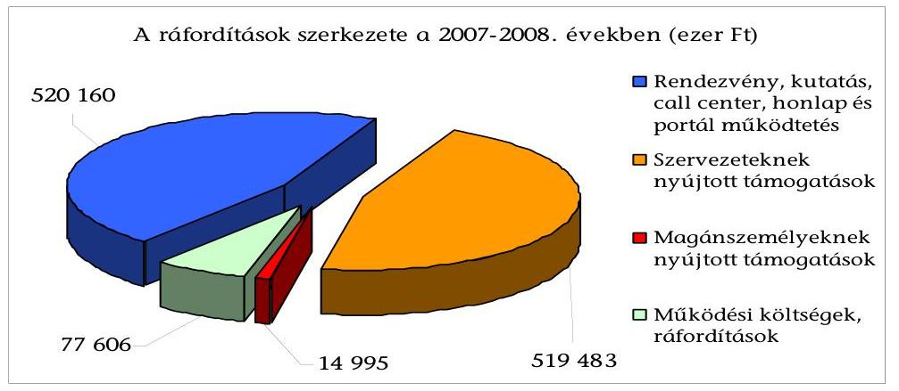
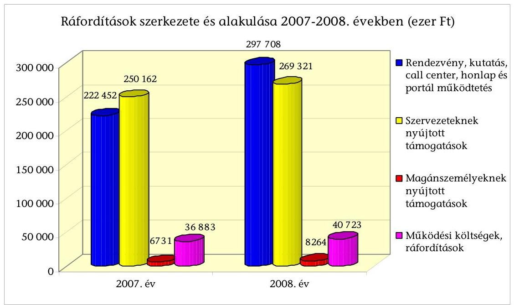
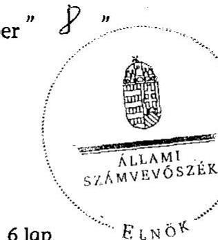
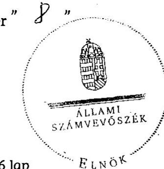
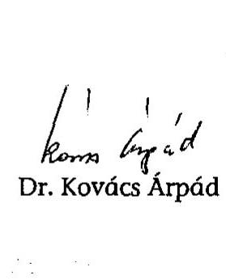

# ÁLLAMI   SZÁMVEVŐSZÉK 

## JELENTÉS

a Táncsics Mihály Alapítvány 2007-2008. évi gazdálkodása törvényességének ellenőrzéséről

---

3. Önkormányzati és Területi Ellenőrzési Igazgatóság
3.1. Szabályszerüségi Ellenőrzési Föcsoport
Iktatószám: V-3016-30/2009.
Témaszám: 954
Vizsgálat-azonosító szám: V-0464
Az ellenőrzést felügyelte:
Dr. Lóránt Zoltán
föigazgató
Az ellenőrzés végrehajtásáért felelős:
Dr. Elek János
általános föigazgató-helyettes
Az ellenőrzést vezette:
Solymár Ágnes
osztályvezető főtanácsos
Az összefoglaló jelentést készítette:
Brebán Andrea
számvevő tanácsos
Az ellenőrzést végezték:
Brebán Andrea
számvevő tanácsos

Köllődné Gátai Mária
számvevő

A témához kapcsolódó eddig készített számvevőszéki jelentések:
címe
sorszáma
Jelentés a Táncsics Mihály Alapítvány 2003-2004. évi gazdálkodása törvényességének ellenőrzéséről
Jelentés a Táncsics Mihály Alapítvány 2005-2006. évi gazdálkodása törvényességének ellenőrzéséről

---

# TARTALOMJEGYZÉK 

BEVEZETÉS ..... 5
I. ÖSSZEGZŐ MEGÁLLAPÍTÁSOK, KÖVETKEZTETÉSEK, JAVASLATOK ..... 7
II. RÉSZLETES MEGÁLLAPÍTÁSOK ..... 12

1. Az alapítvány gazdálkodásának törvényessége ..... 12
1.1. A kuratórium működése ..... 12
1.2. Az alapítvány bevételei ..... 14
1.3. Az alapítvány ráfordításai ..... 16
2. Az éves beszámolók ..... 21
2.1. Az éves beszámolók szabályossága ..... 21
2.2. A mérleg ..... 22
2.3. Az eredmény-kimutatás ..... 23
3. A könyvvezetés szabályozottsága ..... 23
4. A könyvvezetés gyakorlata ..... 24
5. Az alapítvány ellenőrzési rendszere ..... 26
6. Az alapítvány által létrehozott gazdasági társaság ..... 27
7. A korábbi ellenőrzés megállapításaira tett intézkedések ..... 28

## MELLÉKLETEK

1. számú A Táncsics Mihály Alapítvány 2007. évi mérlege
2. számú A Táncsics Mihály Alapítvány 2007. évi eredmény-kimutatása
3. számú A Táncsics Mihály Alapítvány 2008. évi mérlege
4. számú A Táncsics Mihály Alapítvány 2008. évi eredmény-kimutatása

---

.

---

# RÖVIDÍTÉSEK JEGYZÉKE 

| Alapítvány | Táncsics Mihály Alapítvány |
| :-- | :-- |
| Áfa | Általános forgalmi adó |
| ÁSZ | Állami Számvevőszék |
| Éves beszámoló | Egyszerúsített éves beszámoló |
| FB | Felügyelő Bizottság |
| Cégbíróság | Fővárosi Bíróság, mint Cégbíróság |
| Gt. | A gazdasági társaságokról szóló 2006. évi IV. törvény |
| Kbt. | A közbeszerzésekről szóló 2003. évi CXXIX. törvény |
| Kft. | Kapcsolat.hu Kommunikációs és Szolgáltató Korlátolt Fe- |
|  | lelősségű Társaság (2007. augusztus 8-ától Kapcsolat.hu |
|  | Kommunikációs és Szolgáltató Nonprofit Korlátolt Felelősségű Társaság) |
| MSZP | Magyar Szocialista Párt |
| Pártalapítványi törvény | A pártok múködését segítő tudományos, ismeretterjesztő, |
|  | kutatási, oktatási tevékenységet végző alapítványokról |
|  | szóló 2003. évi XLVII. törvény |
| Párttörvény | A pártok múködéséről és gazdálkodásáról szóló 1989. évi |
|  | XXXIII. törvény |
| Ptk. | Polgári Törvénykönyvről szóló 1959. évi IV. törvény |
| SZMSZ | Szervezeti és Múködési Szabályzat |
| Számviteli törvény | A számvitelről szóló 2000. évi C. törvény |

---

.

---

# JELENTÉS 

## a Táncsics Mihály Alapítvány 2007-2008. évi gazdálkodása törvényességének ellenőrzéséről

## BEVEZETÉS

A pártok múködését segítő tudományos, ismeretterjesztő, kutatási, oktatási tevékenységet végző alapítványokról szóló 2003. évi XLVII. törvény (pártalapítványi törvény) alapján a pártok a politikai kultúra fejlesztése érdekében tudományos, ismeretterjesztő, kutatási és oktatási tevékenységük elősegítésére, a pártok múködéséről és gazdálkodásáról szóló 1989. évi XXXIII. törvényben (párttörvény) meghatározott költségvetési támogatásra jogosult alapítványt hozhattak létre. A Magyar Szocialista Párt (MSZP) a pártalapítványi törvényben biztosított lehetőséggel élve 2003-ban létrehozta a Táncsics Mihály Alapítványt (alapítvány).

Az alapítvány az alapító okirat szerint a szociáldemokráciát és a baloldali értékrendet képviselő és népszerúsítő szervezet. Az alapító okiratban rögzített céljai: elősegíteni az MSZP alkotmányban biztosított, a népakarat kialakításában, valamint kinyilvánításában történő hatékony közremúködését; szélesíteni az állampolgárok tájékozódását a magyar társadalmat érintő társadalmi és politikai kérdésekről, a szociáldemokrácia elméleti megközelítéseiről; ösztönözni a magyar politikai kultúra színvonalának emelését, a demokrácia elveinek és gyakorlatának erősítését; bátorítani a magyar és a globális kulturális értékek, valamint a tudományos eredmények tiszteletben tartását és elfogadtatását; előmozdítani a szociáldemokrata gondolkodás fejlődését, és a szociáldemokrata eszmeiség terjesztését; segíteni a nemzeti érdekeknek a változó körülményeknek megfelelő időszerű megfogalmazását, különös figyelmet fordítva Magyarország uniós tagságából következő feladatokra.

Az alapító okirat lehetőséget biztosított vállalkozási tevékenység végzésére, amely alapján a kuratórium 2006-ban egyszemélyes gazdasági társaságot hozott létre az állampolgárok tájékozódásának segítése érdekében.

A pártalapítványi törvény 4. § (2) bekezdése alapján a pártalapítványok gazdálkodása törvényességének ellenőrzésére az Állami Számvevőszék (ÁSZ) jogosult, a pártalapítványi törvény 4. § (4) bekezdése alapján az ÁSZ kétévenként ellenőrzi azoknak az alapítványoknak a gazdálkodását, amelyek e törvény szerint állami költségvetési támogatásban részesültek. Az ÁSZ 2007-ben az alapítvány 2005-2006. évi gazdálkodásának törvényességét ellenőrizte, ennek során hiányosságokat állapított meg az alapító okirat és a belső szabályzatok tekintetében, a támogatottakkal megkötött szerződésekre vonatkozóan.

---

A jelen ellenőrzés célja az alapítvány 2007-2008. évi gazdálkodása törvényességének értékelése volt, ennek keretében ellenőriztük:

- az alapítvány gazdálkodásának törvényességét;
- az egyszerűsített éves beszámolók (éves beszámoló) jogszabályi előírásoknak való megfelelését;
- az alapítvány könyvvezetésében a számvitelről szóló 2000. évi C. törvény (számviteli törvény) és egyéb jogszabályi rendelkezések, és belső előírások betartását;
- az ÁSZ előző ellenőrzése során feltárt hiányosságok megszüntetése, valamint az intézkedési tervben megjelölt feladatok megvalósítása érdekében hozott kuratóriumi intézkedéseket.

Az éves központi költségvetési támogatást, a csatlakozóktól kapott támogatásokat és a tízmillió forintot meghaladó könyvelési tételeket tételesen, a ráfordításokat minta alapján ellenőriztük. Az ellenőrzési minta nagyságát az ellenőrzés előkészítése során elvégzett kockázatértékelés alapján határoztuk meg. Az ellenőrzést a pártalapítványok gazdálkodása törvényességének ellenőrzéséhez készült segédletben foglaltak szerint végeztük.

A szabályszerűségi ellenőrzés a 2007. január 1. és 2008. december 31. közötti időszakra terjedt ki.

---

# I. ÖSSZEGZŐ MEGÁLLAPÍTÁSOK, KÖVETKEZTETÉSEK, JAVASLATOK 

A kuratórium az ellenőrzött időszakban az alapító okirat előírásait betartva működött. Az alapító az előző ellenőrzésünk javaslatának megfelelően az alapítvány alapító okiratának módosításakor rendelkezett a kuratóriumi határozatok érvényességéhez szükséges szótöbbség viszonyítási alapjáról. A kuratórium döntéseit minden esetben az alapító okiratban előírtak szerint, határozatképes üléseken, a jelen lévő kuratóriumi tagok egyszerű szótöbbségével hozta, üléseiről jegyzőkönyvet, határozatairól nyilvántartást vezetett. A kuratórium vagyoni döntései a pártalapítványi törvényben és az alapító okiratban rögzített célok megvalósítását szolgálták. A képviseleti jog és a bankszámla feletti rendelkezés alapító okiratbeli szabályozása megfelelt a jogszabályi előírásoknak. A bankszámla feletti rendelkezési jog gyakorlását az alapító okiratban és a pénzkezelési szabályzatban meghatározott személyek elektronikus módon végezték a szabályozások szerint. Az SZMSZ szabályozása összhangban volt az alapító okirat rendelkezéseivel. A korábbi ellenőrzésünk javaslata alapján a kuratórium kiegészítette a szabályzatot valamennyi múködő szervezeti egysége működési rendjére, feladataira vonatkozó szabályozással, továbbá megteremtette a kuratórium elnöke és az alapítványi igazgató felelősségi, feladat-, és hatáskörére vonatkozóan az alapító okirattal való összhangot.

Az alapítvány 2007-2008. évre vonatkozó éves beszámolóiban kimutatott öszszes bevétele 1112465 ezer Ft, ebből a központi költségvetési támogatás $90,5 \%$-ot képviselt. A költségvetési támogatás összege megfelelt az időszakban hatályos párttörvény szabályozásának. Csatlakozóktól a kimutatott bevételek $0,2 \%$-át kitevő pénzbeli adományt kapott az alapítvány. A kuratórium az alapító okirat előírásának megfelelően az adományokról elfogadó határozatot hozott, a csatlakozók személye a vonatkozó jogszabályi rendelkezés szerint beazonosítható volt, az adományukat az alapítvány pénzforgalmi számlájára utalták. Az alapítvány a csatlakozók adományaival kapcsolatos közzétételi kötelezettségét az adatok saját honlapján való megjelentetésével teljesítette. A bevételek további 9,3\%-a az átmenetileg szabad pénzeszközök lekötéséből, az alapítvány támogatottai által fel nem használt támogatás visszafizetéséből és rendkívüli bevételekből származott.

Az alapítvány az ellenőrzött években 1132244 ezer Ft ráfordítást számolt el, amelynek $93,1 \%$-át cél szerinti feladatokra, rendezvények és kutatások végzésre, a honlap, a kapcsolat.hu portál múködtetésére és támogatásra, 6,9\%-át az alapítvány múködtetésére fordította. A kuratórium az alapítványi célokat részben saját szervezeti keretek között (49,3\%), másrészt külső szervezetek és magánszemélyek támogatásával (50,73\%) valósította meg. Az alapítványi keretek között megvalósított programokról, rendezvények kereteiről előzetesen munkatervében és pénzügyi tervében döntött, a támogatásokat egyedi kérelemre nyújtotta.

---

A kuratórium elnöke a támogatottakkal szerződést kötött. A szerződések tartalmazták az elszámolás határidejét, az elszámoláshoz csatolandó dokumentumok körét, előírták - az előző ellenőrzésünk javaslatára - az elszámoláskor bemutatandó számlák záradékolását, az elszámolási határidő elmulasztásának szankcióját. Az alapítvány pályáztatási szabályzata nem tartalmazta a hiánypótlás és a támogatás visszakövetelésének lépéseit és határidejét. A támogatottak a kapott támogatásról az előírt formában és tartalommal elszámolást készítettek, de 26,1\%-uk határidőn túl számolt el az alapítvány felé. Az alapítvány munkaszervezete a hiányosan, illetve késve elszámolókat minden esetben hiánypótlásra felszólította, amelynek a támogatottak eleget tettek.

Az alapítvány a vonatkozó jogszabályi rendelkezések alapján ajánlatkérőnek minősült. Az alapítványnál a 2008. évben közbeszerzési értékhatárt elérő árubeszerzés, szolgáltatás igénybevételére nem került sor, de a 2007. évben két esetben a nemzeti közbeszerzési értékhatárt elérő szolgáltatás megrendelésére kötöttek szerződést. Az alapítvány a kapcsolat.hu portál üzemeltetésére megkötött szerződés esetében a vonatkozó jogszabályi előírás alapján indokoltan nem folytatott le közbeszerzési eljárást, de a portál és a dokumentációja elkészítésére megkötött szerződés esetében a jogszabályi rendelkezésektől eltérően a hirdetmény nélküli tárgyalásos eljárást nem folytatta le.

Az alapítvány az ellenőrzött időszak mindkét évében eleget tett a beszámoló készítési kötelezettségnek, éves beszámolóit a számviteli politikájában megjelölt formában, a vonatkozó jogszabályban előírt határidőre, de a 2007. évre vonatkozó beszámolót a számviteli politikában előírt határidőn túl készítette el. Az alapítvány felügyelő bizottsága az alapító okirat előírásának megfelelően az éves beszámolókat véleményezte, a kuratórium érvényes határozattal elfogadta, a könyvvizsgáló hitelesítő záradékkal ellátta. Az éves beszámolók elkészítésénél érvényesítették a számviteli törvényben megfogalmazott alapelveket, a beszámolók az alapítvány gazdálkodásáról megbízható és valós képet mutattak. Az éves beszámolók adatai az év végi főkönyvi kivonatok adataiból mindkét évben levezethetőek voltak, a mérleg, az eredmény-kimutatás és a kiegészítő melléklet adatai a főkönyvi számlák, az analitikus és egyeztető nyilvántartások adataival megegyeztek. Az éves mérlegekben kimutatott eszközök és források értékadatait a leltározási szabályzat szerinti leltárakkal alátámasztották. Az ellenőrzött időszak eredmény-kimutatásaiban szereplő bevételeket és ráfordításokat könyvelési alapbizonylatok támasztották alá, a sorok - az egyéb ráfordításokat kivéve - a fogalomkörükbe tartozó tételeket tartalmaztak. Az ala-

---

pítvány mindkét évben a kifizetett ösztöndíjak értékét tévesen a személyi jellegű ráfordítások helyett az egyéb ráfordítások között mutatta ki, az emiatt keletkező eltérés az eredményt, a lényegességi szintű és jelentős összegű hiba értékét nem érintette. A ráfordítások elszámolásánál érvényesítették a kötelezettségvállalás, a teljesítésigazolás és a banki aláírás szabályait. Az alapítvány - a 2008. évtől hatályos szabályozás szerinti - éves jelentés készítési és közzétételi kötelezettségének eleget tett. Az éves jelentés szerkezete megfelelt a vonatkozó jogszabályi előírásnak, azt a kuratórium érvényesen elfogadta.

A 2007-2008. években a könyvvezetés és az éves beszámolók elkészítésének belső szabályozási rendszere a számviteli törvény által kötelezően előírt szabályozáson alapult. Az alapítvány rendelkezett a számviteli törvényben előírt, a könyvvezetés és beszámoló készítés rendjét meghatározó számviteli politikával és az ahhoz kapcsolódó szabályzatokkal. A módosított számviteli politika előírta a korábbi ellenőrzések javaslata alapján az alapítvány vállalkozási, cél szerinti tevékenységéhez, illetve a kezelő szerv tevékenységéhez kapcsolódó költségek elkülönített nyilvántartását. A pénzkezelési szabályzat nem volt összhangban a számviteli törvény előírásával, mivel az nem napi, hanem havi készpénz záró állomány maximális mértéket határozott meg. A számlarend részét képező számlatükör nem tartalmazta a könyvvezetésben ténylegesen alkalmazott valamennyi számlát, illetve azok tartalma és számjele nem egyezett meg teljes körűen a könyvvezetésben alkalmazottakkal, továbbá nem határozta meg a bizonylati rend keretében a szigorú számadású bizonylatokra vonatkozó szabályokat. A számlarend szabályozási hiányosságai a beszámolók valódiságát nem befolyásolták.

Az ellenőrzött időszakban az alapítvány könyvvezetését és éves beszámolóinak összeállítását szerződés alapján gazdasági társaság végezte. A számviteli feladatok végzésére és az éves beszámoló összeállítására jogosult személy rendelkezett a törvényi előírásoknak megfelelő képesítéssel. A könyvvezetést a kettős könyvvitel rendszerében, az alapbizonylatok számítógépes feldolgozásával, időrendben, az időszakban végig azonos könyvelési programmal végezték. Az éves beszámolók elkészítését megelőzően a belső szabályzatokban előírt könyvviteli zárlati feladatokat elvégezték. A bizonylatok jogszabályban előírt alaki és tartalmi követelményeit érvényesítették, az előző ellenőrzés javaslatának megfelelően feltüntették a nyilvántartásokban történő rögzítés időpontját. A pénzkezelési szabályzatban előírt nyilvántartásokat vezették, az előző ellenőrzés javaslatára az utólagos elszámolásra kiadott előlegek elszámolása a szabályzatokban megjelölt határidőre megtörtént. A pénzkezelési szabályzat előírásától eltérően a 200 ezer Ft-ot meghaladó ráfordítások bizonylatainak utalványozását az alapítvány igazgatója végezte el a kuratórium elnöke helyett. A vizsgált időszakban a házipénztár havi záró készpénz állománya hét esetben túllépte a szabályzat szerinti értékhatárt, amit a pénztár ellenőrzése nem tárt fel. A könyvvezetésben az alapítványi célú tevékenység közvetlen és az alapítvány kezelő szervének költségeit, valamint az egyéb közvetett költségeket a főkönyvi könyvelés keretében, munkaszámmal elkülönítették.

Az FB az alapító okirat előírásával összhangban - a támogatási rendszer kivételével - rendszeresen ellenőrizte a kuratórium múködésének törvényességét, az alapítvány gazdálkodásának szabályosságát, a belső szabályozottságot, a pénzügyi terveket és az éves beszámolókat. A belső kontroll mechanizmusokat

---

a gazdálkodási szabályzatok rögzítették. A vezetői ellenőrzés a képviseleti jog, a munkáltatói jogkör gyakorlása, a kötelezettségvállalás, a támogatások elszámoltatása, a bankszámla feletti rendelkezés és a házipénztár ellenőrzése során érvényesült.

A kuratórium egyszemélyes gazdasági társaságot - Kapcsolat.hu Kommunikációs és Szolgáltató Korlátolt Felelősségű Társaság (Kft) - hozott létre az alapítvány alapító okiratában megfogalmazott kapcsolatépítő és kommunikációs programja megvalósítása érdekében, a közösségi internetes portál működtetésére. A gazdasági társaság létrehozása a jogszabályi előírásoknak megfelelően valósult meg. A kuratórium az alapítói jogokat megfelelően gyakorolta, érvényes határozatairól a jogszabályi rendelkezésekre tekintettel az ügyvezetőt írásban értesítette. A kuratórium a tulajdonosi jogok gyakorlása során módosította az alapító okiratot és az ügyvezető megbízását, megállapította a könyvvizsgáló díjazását, határozott a gazdasági társaság tőkehelyzetének rendezésére pótbefizetésről és tőkeemelésről, elrendelte a Kft. nonprofit társaságként való továbbmúködését, elfogadta annak éves beszámolóit. A kuratórium rendelkezett a Kft. részére korábban nyújtott 150000 ezer Ft kölcsön visszafizetési határidejének meghosszabbításáról, és az időszakban további 50000 ezer Ft kölcsön biztosításáról. A határozatok alapján a korábbi szerződést módosították, illetve az új kölcsönszerződést megkötötték. A kuratórium a 2008. évben határozott az alapítvány által nyújtott kölcsönök és a Kft. tőkehelyzetének rendezése érdekében a kölcsönök - pénzmozgás nélküli, egymással szemben történő beszámításával megvalósuló - 60000 ezer Ft veszteség fedezését szolgáló pótbefizetéssé és 140000 ezer Ft tőkeemeléssé való átalakításáról. A kuratórium érvényes határozattal megbízta a Kft.-t a kapcsolat.hu portál üzemeltetésével, az üzemeltetési szerződést ennek alapján kötötte meg a kuratórium elnöke. A Kft. részére az üzemeltetés díját a megbízási szerződésben előírtak alapján folyósította.

A helyszíni ellenőrzés megállapításainak hasznosítása mellett javasoljuk:

# az alapítvány kuratóriumának 

1. Szabályozza az alapítvány által nyújtott támogatások elszámoltatási szabályai között a hiánypótlás és a támogatás visszakövetelésének rendjét, határidejét.
2. Gondoskodjon arról, hogy az éves beszámoló az alapítvány számviteli politikájában meghatározott határidőig elkészüljön.
3. Gondoskodjon a jövőben a költségvetési törvényekben megjelölt értékhatárt elérő beszerzések és megrendelések esetén a közbeszerzésekről szóló 2003. évi CXXIX. törvényben előírt eljárás lefolytatásáról.
4. Határozza meg a pénzkezelési szabályzatban a számvitelről szóló 2000. évi C. törvény 14. § (8) bekezdésében előírt napi készpénz záró állomány maximális mértékét, és gondoskodjon annak betartatásáról.
5. Gondoskodjon a pénzkezelési szabályzat összeghatárhoz kötött utalványozási jogkörre vonatkozó előírások betartatásáról.

---

6. Határozza meg a számlarendben a bizonylati rend keretében a szigorú számadású bizonylatokra vonatkozó szabályokat, továbbá teremtse meg az összhangot az alkalmazásra előírt és a könyvvezetésben alkalmazott számlák között.
7. Biztosítsa, hogy a számvitelről szóló 2000. évi C. törvény 79. § (3) bekezdésének előírása alapján a kifizetett ösztöndíjak a személyi jellegű egyéb ráfordítások között kerüljenek nyilvántartásra.

---

# II. RÉSZLETES MEGÁLLAPÍTÁSOK 

## 1. AZ ALAPÍTVÁNY GAZDÁLKODÁSÁNAK TÖRVÉNYESSÉGE

### 1.1. A kuratórium múködése

Az alapító okiratokban előírt alapítványi célok, és azok megvalósítása érdekében meghatározott tevékenységek megfeleltek a pártalapítványi törvény 1. 8ában elrendelteknek. Az MSZP az alapítvány alapító okiratát az ellenőrzött időszakban három alkalommal módosította. Az alapító a módosítások során pontosította a kuratóriumi határozathozatalra vonatkozó szabályokat, ezzel az ÁSZ korábbi ellenőrzése során tett javaslatának megfelelően rögzítette a kuratóriumi határozatok érvényességének szabályát, amely szerint a határozatok érvényességéhez a kuratóriumi ülésen jelen lévő kuratóriumi tagok egyszerú szótöbbsége szükséges ${ }^{1}$. A módosításokkal változott továbbá a kuratórium elnökének személye és a kuratórium összetétele, az alapítvány székhelye. A kuratórium új tagjainak megbízatása a pártalapítványi törvény 3. § (7) bekezdésének rendelkezésével összhangban öt évre szólt.

A módosításokat 9051. sorszám alatt a Fővárosi Bíróság 2008. február 8-i, 2008. július 22-i és 2008. november 21-i végzéseivel vette nyilvántartásba.

Az időszakban hatályos alapító okiratok a Polgári Törvénykönyvről szóló 1959. évi IV. törvény (Ptk.) 74/C. § (4) bekezdésének megfelelően rendelkeztek az alapítvány képviseletéről, a képviseleti jog gyakorlásának módjáról és terjedelméről, a bankszámla feletti rendelkezés szabályairól.

Az alapító okirat IV. fejezet 5.) pontjának előírása szerint a kuratórium elnöke az alapítvány általános képviselője, V. fejezet 3. c) pontja szerint az alapítvány bankszámlái felett a kuratórium elnök önállóan rendelkezik, vagy az alapítvány erre írásban felhatalmazott két alkalmazottja együttesen.

A kuratórium az ellenőrzött időszakban két alkalommal módosította az alapítvány szervezeti és múködési szabályzatát (SZMSZ). Az SZMSZ 2008. április 8-i módosítását a kuratórium 42/2008. (04. 08.) T.A számú határozattal érvényesen elfogadta. Az SZMSZ az alapító okirattal összhangban rögzítette az alapítványra vonatkozó hatás-, feladat- és felelősségi köröket. A 2008. november 21-i keltezésű SZMSZ módosításról a kuratórium az SZMSZ előírásától eltérően nem döntött, abban csak a kuratóriumi elnök személyére, megnevezésére vonatkozó alapító okiratbeli módosítást vezették át, a szabályozási rend tartalmilag változatlan maradt.

Az SZMSZ-ben az alapítvány szervezete rész 2. k) pontja előírta, hogy „a kuratórium hatáskörében elfogadja az alapítvány müködéséhez szükséges szabályzatokat."

[^0]
[^0]:    ${ }^{1}$ A kuratórium ülése legalább négy kurátor részvétele esetén határozatképes akkor, ha az ülésen az elnök, továbbá még legalább három másik kuratóriumi tag jelen van.

---

A kuratórium a határozatával elfogadott SZMSZ módosításakor - az ÁSZ korábbi ellenőrzési javaslatának megfelelően - megteremtette az összhangot az alapító okirat és az SZMSZ között, a kuratórium elnöke és az alapítványi igazgató feladat-, hatás- és felelősségi körében az éves tervek és az éves beszámolók, a belső szabályzatok és az ellenőrzési feladatok tekintetében. Az alapító okirat szerint az elnök, az SZMSZ módosítását követően pedig az elnök felhatalmazása alapján az alapítványi igazgató felel az alapítvány éves munkaprogramjának, pénzügyi-gazdálkodási tervének és költségvetésének kidolgozásáért, azok végrehajtásáért, az éves beszámolók elkészítéséért, az alapítvány belső szabályzatainak elkészítéséért, és azok betartatásáért, az alapítvány belső ellenőrzésének megszervezéséért és az FB-vel való kapcsolattartásért.

A kuratórium - az ÁSZ korábbi ellenőrzési javaslatának megfelelően - kiegészítette az SZMSZ-t a Táncsics Információs- és Rendezvényközpont feladatainak és hatáskörének szabályozásával. Nem egészítette ki szabályzatát a Szociáldemokrácia Kutatócsoport és az Euro-Contakt nemzetközi kapcsolattartásért felelős munkacsoportok múködésének szabályaival, mert azok feladatkörét a kuratórium megszüntette.

A kuratórium a 214/2007. (09. 25.) T.A számú határozattal az Euro-Contakttal kötött megállapodást időarányosan teljesítettnek tekintette, feladatkörét a kuratórium megszüntette. A Szociáldemokrácia Kutatócsoport tevékenységét a 2008. évben az alapítvány munkatervében már nem tervezte, költségvetésében sem szerepeltette, ezzel e munkacsoport feladatkörét a kuratórium megszüntette.

Az SZMSZ a képviseleti jog szabályozása tekintetében összhangban volt az alapító okirattal, annak gyakorlása a Ptk. 74/C. § (4) bekezdésével, az alapító okirattal és az SZMSZ szabályozásával összhangban történt.

Az SZMSZ szabályozása szerint is a képviseleti jog gyakorlója a kuratórium elnöke. Az alapítvány valamennyi szerződését (munkaszerződés, megbízás, vállalkozási és támogatási szerződéseket) a kuratórium elnöke írta alá.

A bankszámla feletti rendelkezés szabályozása az SZMSZ-ben megfelelt a Ptk. 29. § (3) bekezdése és az alapító okirat előírásainak. A bankszámla feletti rendelkezésre bejelentettek köre megegyezett az alapító okiratban és az SZMSZ-ben felruházottakkal.

Az alapító okirat V. fejezet 3. c) pontja szerint az alapítvány bankszámlái felett való rendelkezésre a kuratórium elnökét, illetve az alapítvány erre írásban felhatalmazott két alkalmazottját együttesen hatalmazta fel. Az alkalmazottak bankszámla feletti rendelkezési jogát a kuratórium az alapítvány SZMSZ-ében, annak elfogadásával adta meg. A banki bejelentő kartonon a bejelentettek köre megegyezett a bankszámla feletti rendelkezésre felhatalmazottak körével.

Az alapítvány céljaira rendelt vagyon felhasználás módját az SZMSZ - összhangban az alapító okirattal - a párttörvény és a pártalapítványi törvény rendelkezéseinek, továbbá a Ptk. előírásainak megfelelően szabályozta. A kuratórium 2008. április 8-án jóváhagyott, módosított vagyonkezelési és befektetési szabályzata az alapító okirattal összhangban tartalmazta a vagyon feletti döntési jogkört és az alapítvány vagyonelemeit, többek között az alapítvány által a cél szerinti feladatai ellátására létrehozott gazdasági társaságot. A szabályzat a szabad pénzeszközök bankbetétbe és állam által garantált értékpapírba helye-

---

zését írta elő. Az alapítvány a vagyonkezelési és befektetési szabályzat előírásainak megfelelően a szabad pénzeszközeit a bankszámláján való lekötéssel kamatoztatta.

A kuratórium az ellenőrzött időszakban 14 ülésen 552 határozatot hozott. A kuratóriumi ülésekről készült jegyzőkönyvek és a csatolt jelenléti ívek tanúsága szerint a határozatokat minden esetben az alapító okirat rendelkezése szerint határozatképes ülésen, a jelenlévő kuratóriumi tagok egyszerű szótöbbségével hozták. A kuratóriumi ülésekről készített jegyzőkönyvek, valamint a határozatok tára megfelelt az alapító okirat, illetve az SZMSZ jegyzőkönyv készítés-, és nyilvántartási előírásainak. A jegyzőkönyveket az SZMSZ 3) rész 12. pontjának előírása szerint a kuratóriumi ülés levezető elnöke és egy mindvégig jelen levő kurátor hitelesítette.

A kuratórium mindkét évben megtárgyalta és elfogadta az éves munkatervet, a költségvetési és pénzügyi tervet, az éves szakmai és pénzügyi beszámolót, a gazdálkodási szabályzatok módosításait.

Az ellenőrzött időszakban a kuratórium gazdálkodását érintő vagyoni döntései a pártalapítványi törvényben és az alapító okiratban megjelölt cél szerinti tevékenységek ellátását szolgálták. A pénzügyi döntéseket a kuratórium elsősorban az alapító okirat céljaihoz kapcsolódó kulturális, képzési, ismeretterjesztő, kommunikációs és kapcsolatépítő programokra, klubhálózat külső támogatása érdekében hozta, valamint biztosította a kezelő- és munkaszervezet múködési költségeit.

A kuratórium mindkét évben az alapító okirat IV. fejezet 3. b) pontjának megfelelően elkészítette és elfogadta az alapítvány költségvetési és pénzügyi tervét, amelyben megtervezte az alapítvány éves bevételeit és ráfordításait. A kuratórium a két ülés között végrehajtott tevékenységekről beszámoltatta az alapítványi igazgatót, ily módon kísérte figyelemmel az éves költségvetési és pénzügyi tervek, illetve a kuratóriumi határozatok végrehajtását. Az éves költségvetési és pénzügyi tervek az alapítvány minden fő tevékenységére vonatkozóan tartalmazták a hozzá kapcsolódó ráfordítás megjelölését, így azok teljes körűek voltak.

A kuratórium megtervezte a ráfordítások mértékét a kapcsolat.hu portál és az információs központ múködtetésére, az életmű-díj kiadására, rendezvényeire és konferenciáira, az együttmúködő szervezetek és egyéb szervezetek támogatására, és az alapítványi múködési költségekre vonatkozóan.

# 1.2. Az alapítvány bevételei 

Az ellenőrzött időszakban az alapítvány az éves beszámolóiban a két vizsgált évben együttesen 1112465 ezer Ft összes bevételt mutatott ki, amelyből a központi költségvetési támogatás összege $90,5 \%$-ot tett ki ( 1006559 ezer Ft). Az alapítványhoz csatlakozó magánszemélyek adományaként a bevételek $0,2 \%$-át (2040 ezer Ft-ot) tartották nyilván. A vizsgált időszakban az alapítvány bevételeinek $1,7 \%$-a ( 18891 ezer Ft) a támogatottai által fel nem használt támogatás visszafizetéséből, $6,9 \%$-a ( 77252 ezer Ft) lekötött pénzeszközeinek kamataiból, $0,7 \%$-a ( 7723 ezer Ft) térítés nélkül átvett eszközökből származott. Az alapít-

---

vány vállalkozási tevékenységet nem végzett, abból származó bevétele nem volt.

Az alapítvány jogosult volt a költségvetési támogatásra a párttörvény 9/A. § (3) bekezdésében foglaltak alapján.

A 2008. szeptember 29-éig hatályos szabályozásnak megfelelően az alapítványt alapító MSZP képviselői az országgyúlésben két, egymást követő országgyűlési választást követően képviselőcsoportot alakítottak és az országgyűlés megválasztását követő alakuló ülésen a párt képviselőcsoportja bejelentette megalakulását, a 2008. szeptember 30-tól hatályos szabályozásnak megfelelően az alapítványt olyan párt alapította, amely az adott negyedév első napján a párttörvény 5. § (2) bekezdése alapján költségvetési támogatásra jogosult volt, továbbá a teljes ellenőrzési időszakban az alapítvány alapító okirat szerinti céljai megfeleltek a párttörvény 9/A. § (1) bekezdésében megjelölteknek.

Az alapítványnak kiutalt támogatás összege megfelelt a párttörvény 9/A. § (5) és (6) bekezdéseiben foglalt rendelkezéseinek.

A 2008. szeptember 29-éig hatályos jogszabályi rendelkezés szerint az alapítvány az országgyűlés megválasztását követően az alakuló ülésen az azt alapító párt képviselőcsoportja megalakulásakor bejelentett létszám alapján meghatározott mandátumarányos-, továbbá alap- és eseti támogatásban részesülhetett. Az alaptámogatás mértéke az egyévi képviselői alapdíj huszonötszöröse, amelyet az országgyűlési képviselők tiszteletdíjáról és költségtérítéséről szóló 1990. évi LVI. törvény határoz meg, a mandátumarányos támogatás mértéke képviselőnként a képviselői alapdíj $85 \%$-a. A 2006. évi országgyűlési választások után az országgyűlés 2006. május 16 -ai ülésén az MSZP 190 fővel alakított képviselőcsoportot.

A 2008. szeptember 30-ától hatályos jogszabályi rendelkezés szerint az alapítványt az azt alapító pártra, valamint e párt jelöltjeire az országgyűlési képviselők utolsó általános választásán az első érvényes fordulóban leadott szavazatok arányában illeti meg támogatás. A 2006. évi országgyűlési választások során az MSZP-re az első fordulóban leadott szavazati arány $43,22 \%$ volt.

Az alapítvány számlájára a 2007-2008. években a központi költségvetésből ténylegesen (a felkerekítés eredményeként) 1019700 ezer Ft támogatást utaltak át. (Az éves beszámolókban kimutatott 1006559 ezer Ft költségvetési támogatás az utalt támogatástól a szabályosan elszámolt időbeli elhatárolás öszszegével tért el.)

Az alapítvány számára 2007-ben 494200 ezer Ft, 2008-ban 525500 ezer Ft támogatást folyósítottak a központi költségvetésből. A 2007. évi és a 2008. év szeptember 29-éig hatályos a jogszabályi rendelkezések alapján folyósított alaptámogatás összege 118417,5 ezer Ft, a mandátumarányos támogatás összege 190 képviselőre számítva a képviselői alapdíj változását is figyelembe véve 764977 ezer Ft, a 2008. szeptember 30-ától hatályos jogszabályi rendelkezések alapján folyósított szavazatarányos támogatás 136250 ezer Ft volt. Az éves költségvetési törvényre vonatkozó kerekítési szabályok miatt keletkezett és folyósított támogatási többlet 55,5 ezer Ft-ot tett ki.

A Magyar Államkincstár a 2007. és a 2008. évi támogatást a pártalapítványi törvénynek megfelelően, negyedéves ütemezésben, a negyedév első napjaiban átutalta az alapítvány számlájára, kivéve a Felhasználás a 2008. évi központi

---

költségvetés általános tartalékának és céltartalékának előirányzataiból című 2004/2008. (I. 24.) Korm. határozattal biztosított első negyedévi időarányos támogatást, amit 2008. február első napjaiban folyósítottak.

A pártalapítványi törvény 2. § (1) bekezdése (2008. szeptember 29-ig) illetve a párttörvény 9/A. § (2) bekezdése (2008. szeptember 30-tól) alapján a költségvetési támogatás kifizetése negyedévenként történik, a negyedév első napján.

A pártalapítványi törvény 3. § (2) bekezdése és az alapító okirat előírása alapján a kuratórium jóváhagyta a csatlakozóktól kapott támogatások elfogadását. A pártalapítványi törvény 3. § (3) bekezdésének rendelkezése szerint az alapítványt támogató csatlakozók a bankszámla kivonatok alapján egyértelműen beazonosíthatóak voltak, a támogatást a csatlakozó pénzforgalmi számlájáról az alapítvány pénzforgalmi számlájára történő átutalással nyújtották. A csatlakozók által meghatározott cél igazodott a párttörvény 9/A. § (1) bekezdésében és az alapító okiratban meghatározott célokhoz, a támogatás felhasználása a csatlakozó által megjelölt célra történt.

Az ellenőrzési időszakban két csatlakozó támogatását fogadta el a kuratórium. Egy magánszemély havi két ezer Ft támogatását (az időszakban összesen 40 ezer Ft) 93/2007. (04. 24.) T.A számú határozattal fogadta el a kuratórium. A csatlakozó a nyújtott támogatás felhasználására vonatkozóan nem jelölt meg konkrét felhasználási célt, az alapítvány a csatlakozótól kapott támogatást általános jelleggel kapta, ezért felhasználásáról elkülönített nyilvántartást nem kellett vezetni.

Egy vállalkozás 2000 ezer Ft támogatását a 158/2008. (05. 20.) T.A számú határozattal fogadta el a kuratórium a Szegényekért Társadalmi Felelősség-vállalási Program érdekében. Az összegből a kuratórium a támogatási megállapodásnak megfelelően a Program témájához igazodó kutatási ösztöndíjakat biztosított öt személy részére. A támogatásról és annak felhasználásáról az alapítvány elkülönített nyilvántartást vezetett, a csatlakozó felé a kapott támogatás felhasználásról elszámolt.

Az alapítvány a csatlakozóktól kapott támogatások közzétételi kötelezettségének a pártalapítványi törvény 3. § (4) bekezdésének megfelelően eleget tett.

A pártalapítványi törvény 3. § (4) bekezdése szerint a pártalapítvány számára támogatást nyújtó személy azonosításához szükséges adatok és a támogatás öszszege közérdekből nyilvános adatnak minősül, és azt a támogatás beérkezését követő harminc napon belül az alapítvány honlapján közzé kell tenni, ha a támogatás összege az ötszázezer forintot, vagy külföldről származó támogatás öszszege a százezer forintnak megfelelő értéket meghaladja. A csatlakozó vállalkozástól a 2000 ezer Ft támogatás 2008. július 10-én utalással érkezett az alapítvány számlájára, a honlapján 2008. július 30-án tette közzé.

# 1.3. Az alapítvány ráfordításai 

Az alapítvány a párttörvény 9/A. § (1) bekezdésében - és az ezzel összhangban lévő alapító okiratban - meghatározott célokra fordította az állami költségvetési támogatás összegét. Az alapítvány a vizsgált két évben összesen 1132244 ezer Ft ráfordítást számolt el. Az alapítvány cél szerinti tevékenységé-

---

re közvetlenül ráfordításainak 93,1\%-át (1 054637 ezer Ft), múködtetésére ráfordításainak 6,9\%-át ( 77607 ezer Ft) fordította.

A kuratórium az alapító okirattal összhangban határozta meg az alapítvány cél szerinti tevékenységeit, azokról és azok költségkeretéről az alapítvány munkatervének és költségvetésének elfogadásával, továbbá egyedi határozatokkal döntött.

A cél szerinti tevékenységén belül az alapítvány saját szervezete révén közvetlenül bonyolított programokat, szakmai fórumokat, az MSZP-ével közös rendezvényeket, információs központot (call center), internetes honlapot, valamint a kapcsolat.hu portált múködtette, életmű-díjat adományozott, továbbá támogatásokat nyújtott külső szervezetek részére és kutatási ösztöndíjat biztosított magánszemélyeknek.

A kuratórium az alapítvány éves költségvetési és pénzügyi tervében meghatározta a múködési költségek keretösszegét is. A kuratórium a múködési költségek, ráfordítások között nem tervezett (gyakorlatban nem is számolt el) a kuratórium és a felügyelő bizottság (FB) részére tiszteletdíjat és költségtérítést, csak az alapítvány munkaszervezetének múködéséhez szükséges költségeket. A múködési költségek körében az alkalmazottainak juttatásait, az igénybevett szolgáltatási szerződéseket (bérleti szerződés, könyvelővel, könyvvizsgálóval kötött szerződés) a kuratórium jóváhagyta, a döntések alapján kötötte meg a kuratórium elnöke a szerződéseket.

Az alapítvány az ellenőrzött időszakban az alapító okiratban foglalt lehetőséggel élve, nem tett közzé pályázati felhívást, támogatásait egyedi kérelem alapján nyújtotta.

Az alapítvány - az alapító okirat IV. fejezet 3. d) pontja szerint - kuratóriuma „meghatározza az alapítványi célok éves prioritását és az ehhez kapcsolódó feltételeket, meghatározza a rendelkezésre álló anyagi eszközök felhasználásának módját, feltétele-

---

it, pályázatokat ír ki és bírál el, egyedi támogató döntéseket hagy jóvá, dönt az alapítványi cél szerinti különböző támogatásokról."

A kuratórium az SZMSZ előírásának megfelelően 2005. év végén pályázatkezelési szabályzatot adott ki, amelyet a 2008. évben két alkalommal módosított. A kuratórium az ellenőrzött időszakban a más szervezetek és magánszemélyek részére nyújtott támogatásokról érvényes kuratóriumi határozatot hozott. A pályázatkezelési szabályzat a támogatás nyújtás feltételeire, a szerződéskötésre és elszámoltatásra vonatkozó rendelkezéseit az alapítvány betartotta. A kuratóriumi határozatok egyértelműen azonosíthatóak voltak, mert azokban megjelölte a támogatott nevét, a támogatási célt és a támogatás összegét, a folyósítás és az elszámolás határidejét, módját.

A szabályzat meghatározta a pályáztatás és egyedi támogatási kérelem benyújtásának módját és feltételeit, az elbírálás folyamatát és szabályait, a szerződéskötés és a támogatással való elszámolás szabályait.

Az alapítvány a támogatási kérelmeket és annak módosításait csak az előírt formában fogadta el, minden támogatott 2008. évtől az előírt 20\% önrész megjelölésével nyújtotta be támogatási kérelméhez kapcsolódó költségvetését. A kuratórium döntését követően a támogatottakat írásban értesítették, velük szerződést kötöttek, a szerződéskötéshez az előírt dokumentumokat bekérték. A támogatásokról hozott döntéseket az alapítvány honlapján megjelentették.

A támogatási szerződések visszautaltak a kuratóriumi határozat számára és minden esetben a kuratóriumi határozat tartalmának megfelelően kerültek megkötésre. Az alapítvány a támogatást a szerződésben meghatározott összegekben és határidőn belül utalta a támogatottak számláira. A szerződésekben a 2008. évtől kezdődően az elszámolási határidő mellett - az ÁSZ korábbi ellenőrzése során tett javaslatának megfelelően - megjelölték a határidőn túli elszámolás miatti szankciót is, továbbá a szerződéshez mellékelték az elszámolási segédletet, amely előírta a felhasználásról szóló eredeti számlák záradékolását.

A szerződések 2008. évtől úgy rendelkeztek, hogy „a szerződéses határidő túllépése esetén a visszafizetendő összeg az ellátás napján érvényes jegybanki alapkamat kétszeresével növekszik".

Az elszámolásokhoz megküldött számlákon és a kifizetést igazoló dokumentumokon a támogatottak feltüntették, hogy a Táncsics Mihály Alapítvány támogatásának terhére történt meg annak elszámolása, az így záradékolt számlák másolatain pedig, hogy azok az eredeti dokumentummal megegyeznek.

A 2007-2008. években támogatottak a kapott támogatással az elszámolási segédletben előírt formában és tartalommal elszámoltak az alapítványnak. Az elszámolások alapján a támogatásokat a párttörvényben, az alapítvány alapító okiratában és a szerződésekben megjelölt célokra használták fel a támogatottak. A támogatottak 67,4\%-a határidőben, 26,1\%-a határidőn túl, késedelmesen számolt el. A támogatottak 6,5\%-ánál a támogatási szerződések a felhasználási és elszámolási határidőt a helyszíni ellenőrzés időszakát követően határozták meg, így a támogatások felhasználása az ellenőrzéskor folyamatban volt. Az alapítvány munkaszervezete dokumentáltan ellenőrizte a szerződés szerinti felhasználást, az elszámolás szabályosságát.

---

Az ÁSZ korábbi ellenőrzése során tett javaslata ellenére a hiánypótlás és a támogatás visszakövetelésének, és a hiánypótlási kötelezettséget nem teljesítő támogatottakkal szemben lefolytatandó eljárási rend szabályait a kuratórium továbbra sem pontosította, nem határozta meg a hiánypótlási és támogatás visszakövetelési felszólítás kiküldési határidejét, a hiánypótlás és visszakövetelés lépéseit. A gyakorlatban a hiányosan, illetve késve elszámolókat minden esetben hiánypótlásra szólította fel az alapítványi igazgató, akik ennek eleget tettek.

Az időszakban legnagyobb összegű támogatást kapó szervezet elszámolását és a támogatás felhasználásának szabályosságát a szervezetnél helyszíni ellenőrzés keretében vizsgáltuk. Az elszámolásra megküldött dokumentumok másolatai és a támogatott elkülönített nyilvántartása szerintiek megegyeztek, a bizonylatok az elszámolási szabályok szerint záradékoltak. Az elszámolás a szerződéses határidőre minden esetben megtörtént, a fel nem használt támogatást a szervezet az elszámolási szabályok szerint az alapítvány számlájára visszautalta. Az elszámolás alapján a szervezet a támogatást a párttörvény 9/A. § (1) bekezdésében meghatározott célra fordította, az alapítvány cél szerinti feladatai közül rendezvényeivel ismeretterjesztő tevékenységet folytatott, a támogatásból közbeszerzési értékhatárt elérő beszerzés nem történt.

A legnagyobb összegű támogatást kapó szervezet az ellenőrzött időszakban a kuratóriumi határozatoknak megfelelően - két támogatási szerződéssel és három együttműködési megállapodással - összesen 72040 ezer Ft támogatást kapott meglévő klubjai múködtetésére, és új klubjainak kialakítására, a felhasználás hiányában visszautalt támogatás összesen 5554 ezer Ft volt.

Az alapítvány a Kbt. hatálya alá tartozó beszerzések tekintetében, a törvény 22. § (1) bekezdés i) pontja értelmében ajánlatkérőnek minősült.

A Kbt. 22. § (1) bekezdés i) pontja értelmében ajánlatkérőnek minősül az a jogi személy, amelyet közérdekű, de nem ipari vagy kereskedelmi jellegű tevékenység folytatása céljából hoznak létre, illetőleg amely ilyen tevékenységet lát el, ha e bekezdésben meghatározott egy vagy több szervezet, illetőleg az országgyűlés vagy a kormány meghatározó befolyást képes felette gyakorolni, vagy múködését többségi részben egy vagy több ilyen szervezet (testület) finanszírozza.

A törvényi rendelkezésben rögzített hármas feltétel, a jogi személyiség, a közérdekű tevékenység folytatásának célja és a működésnek többségi részben állam által történő finanszírozása az alapítvány esetében teljesül. Az alapítvány a Ptk. 74/A. § (1) bekezdésében foglaltak alapján jogi személy. Az alapítvány közérdekű tevékenységet folytatott, mivel az alapítvány alapító okiratában szereplő cél szerinti tevékenységek, úgymint a tudományos tevékenység, kutatás, a nevelés és oktatás, képességfejlesztés, ismeretterjesztés a közhasznú szervezetekről szóló 1997. évi CLVI. törvény 26. § c) pont szerinti közhasznú, ezáltal a Kbt. 4. § 16. pontja értelmében közérdekű tevékenység, függetlenül attól, hogy az alapítvány nem közhasznú jogállású szervezet. Az alapítvány működését többségi részben a központi költségvetés finanszírozta.

Az alapítványnál a 2007. évben közbeszerzési értékhatárt elérő árubeszerzés nem volt, de két esetben az éves költségvetési törvényekben, a szolgáltatás megrendelésére előírt 25 millió Ft nemzeti közbeszerzési értékhatárt elérő szer-

---

ződést kötöttek. A 2008. évben közbeszerzési értékhatárt elérő árubeszerzésre, szolgáltatás igénybevételére nem került sor.

A Magyar Köztársaság 2007. évi költségvetéséről szóló 2006. évi CXXVII. törvény 93. § (1) bekezdés d) pontja szerint a Kbt. VI. fejezete alkalmazásában a nemzeti közbeszerzési értékhatár 2007. január 1-jétől 2007. december 31-éig szolgáltatás megrendelése esetében: 25 millió forint.

A kuratórium a kapcsolat.hu portál tulajdonjogának megtartása mellett annak múködtetésével a 100\%-ban saját tulajdonában lévő Kapcsolat.hu Kommunikációs és Szolgáltató Nonprofit Korlátolt Felelősségű Társaságot (Kft.) bízta meg 9000 ezer Ft + Áfa havonkénti díjazás mellett. A Kft. szerződéskötést követő éves nettó árbevételének 97\%-a az alapítvánnyal kötött szerződés teljesítéséből származott, mindezek alapján az alapítvány a Kbt. 2/A. § alapján indokoltan nem folytatott le közbeszerzési eljárást.

A Kbt. 2. § (1) bekezdése szerint „e törvény szerint kell eljárni a közbeszerzési eljárásokban, amelyeket az ajánlatkérőként meghatározott szervezetek visszterhes szerződés megkötése céljából kötelesek lefolytatni megadott tárgyú és értékü beszerzések megvalósitása érdekében (közbeszerzés)". A Kbt. 2/A. § (1) bekezdése szerint pedig „nem minősül a 2. § (1) bekezdésének alkalmazásában szerződésnek az a megállapodás, amelyet
a) a 22. § (1) bekezdése szerinti ajánlatkérő és az olyan, százszázalékos tulajdonában lévő gazdálkodó szervezet köt egymással, amely felett az ajánlatkérő a stratégiai és az ügyvezetési jellegü feladatok ellátását illetően egyaránt teljes körü irányítási és ellenőrzési jogokkal rendelkezik, feltéve, hogy
b) a gazdálkodó szervezet a szerződéskötést követő éves nettó árbevételének legalább 90\%-a az egyedüli tag (részvényes) ajánlatkérővel kötendő szerződés teljesitéséből származik."

A kuratórium a 169/2007. (09. 25.) T.A számú határozatával döntött a Kft. megbízásáról a kapcsolat.hu portál múködtetésére vonatkozóan, a megkötött szerződés hatálya 2007. október 1. és 2008. december 31. közötti időszakra terjedt ki. A Kft. 2008. évi beszámolója és könyvvezetése alapján a portál működtetéséből származó éves nettó árbevétele 108000 ezer Ft, összes nettó árbevétele 111250 ezer Ft volt.

Az alapítvány a kapcsolat.hu portál megírására és a dokumentációja elkészítésére 25 millió Ft + Áfa értékben 2007. március 30-án szerződést kötött. A megbízott cég korábbi megbízás alapján már elkészítette a portál megírását megalapozó műszaki és technikai sajátosságokat tartalmazó tanulmányt. Az alapítvány a céggel a nemzeti közbeszerzési értékhatárt elérő szerződés megkötését megelőzően a Kbt. 125. § (2) bekezdés b) pontja és a 257. § (1) bekezdése alapján a hirdetmény nélküli tárgyalásos eljárást nem folytatta le.

A Kbt. 125. § (2) bekezdés b) pontja szerint „az ajánlatkérő hirdetmény nélküli tárgyalásos eljárást alkalmazhat, ha a szerződést müszaki-technikai sajátosságok, múvészeti szempontok vagy kizárólagos jogok védelme miatt kizárólag egy meghatározott szervezet, személy képes teljesiteni."

A Kbt. 257. § (1) bekezdése szerint „a hirdetmény nélküli tárgyalásos eljárásra pedig a IV. fejezet 6. címének szabályait (125-128. §, 131-135. §, ideértve a 41. § (5) bekezdését is] - a 26. cím rendelkezései szerint - kell megfelelően alkalmazni."

---

# 2. Az ÉVES BESZÁmolók 

### 2.1. Az éves beszámolók szabályossága

Az alapítvány az ellenőrzött időszak mindkét évében eleget tett beszámoló készítési kötelezettségének a számviteli törvény 4. § (1) bekezdésében foglaltak szerint. Éves beszámolóit a számviteli politikájában megjelölt formában, a számviteli törvény szerinti egyes egyéb szervezetek beszámolókészítési és könyvvezetési kötelezettségének sajátosságairól szóló 224/2000. (XII. 19.) Korm. rendelet 20. § (7) bekezdésében - az adott üzleti év mérlegfordulónapját követő május 31-ig - előírt határidőre elkészítette, de a 2007. évre vonatkozóan a számviteli politikában előírt határidőn túl készítette el.

A számviteli politikában az egyszerúsített éves beszámoló elkészítésének határideje a tárgyévet követő év április 30-a, a 2007. évre vonatkozó beszámoló elkészítésének dátuma május 20-a volt.

Az éves beszámoló a számviteli politikában megjelölt, a számviteli törvény szerinti egyes egyéb szervezetek beszámoló készítési és könyvvezetési kötelezettségének sajátosságairól szóló 224/2000. (XII. 19.) Korm. rendelet 4. sz. melléklete szerint mérlegből és 5. sz. melléklete szerint eredmény-kimutatásból állt.

Az alapítvány felügyelő bizottsága az alapító okirat előírásának megfelelően az egyszerúsített éves beszámolókat véleményezte és elfogadásra javasolta, a kuratórium érvényes határozattal elfogadta. A könyvvizsgáló az alapítvány éves beszámolóit hitelesítő záradékkal látta el.

A kuratórium a 2007. évről készített beszámolót a 124/2008. (05. 20.) T.A, a 2008. évről szóló beszámolót a 63/2009. (05. 28.) T.A számú határozatokkal fogadta el.

Az alapítvány az egyszerúsített éves beszámolói összeállításakor érvényesítette a számviteli törvény 15-16. §-aiban foglalt számviteli alapelveket, a beszámolók nem tartalmaztak lényegességi szintű, illetve az alapítvány számviteli politikájában meghatározott jelentős összegű hibát, ezért az alapítvány gazdálkodásáról megbízható és valós képet mutattak. Az éves beszámolók adatai az év végi főkönyvi kivonatok adataiból mindkét évben levezethetőek voltak. A mérleg és az eredmény-kimutatás sorainak adatai a főkönyvi számlák, az analitikus és egyeztető nyilvántartások adataival megegyeztek, a kiegészítő mellékletben szereplő adatokat a főkönyvi kivonat, illetve a kapcsolódó analitikák adatai alátámasztották.

Az alapítvány számviteli politikájában meghatározott jelentős összegű hiba mértéke a mérlegfőösszeg 2\%-a.

Az alapítvány a 2008. évi gazdálkodásával kapcsolatban elkészítette a pártalapítványi törvény 3/A. § (1) bekezdése szerinti éves jelentését, a jelentés tartalmilag megfelelt a 3/A. § (3) bekezdésében előírtaknak, amit a 3/A. § (2) bekezdés előírásának megfelelően a kuratórium elfogadott, és a jelentés közzétételi kötelezettségének a 3/A. § (5) bekezdésében előírtak alapján 2009. május 22-én a Magyar Közlöny Hivatalos Értesítőjében eleget tett.

---

A pártalapítványi törvény 3/A. §-a 2008. szeptember 30-tól lépett hatályba, a (3) bekezdése szerint az alapítvány jelentése az éves beszámolóból, a költségvetési támogatás felhasználását, a vagyon felhasználását, a cél szerinti juttatásokat bemutató kimutatásokból állt, továbbá tartalmazta a központi költségvetési szervtől kapott támogatás mértékét, az alapítvány vezető tisztségviselőinek nyújtott juttatások értékét, az alapítvány tevékenységéről szóló rövid tartalmi beszámolót.

# 2.2. A mérleg 

Az ellenőrzött években a mérlegekben kimutatott eszközök és források értékadatait a számviteli törvény 69. § előírásával összhangban, a leltározási szabályzat szerinti leltárakkal alátámasztották.

Az immateriális javak és tárgyi eszközök értékét az egyedi nyilvántartás adataiból készített összesítő kimutatások, a pénzeszközök értékét készpénzállománynál mennyiségi leltár, bankszámlánál év végi bankkivonatok, a követelések és kötelezettségek, készletek, valamint az aktív és passzív időbeli elhatárolások értékét év végi tételes kimutatások támasztották alá.

Az ellenőrzött időszakban az immateriális javak és tárgyi eszközök egyedi nyilvántartása és az állomány-változások (a beruházások-aktiválások, a selejtezés, a terv szerinti értékcsökkenés) elszámolása összhangban volt a belső szabályzatok - a számviteli politika, az eszközök és források értékelési szabályzata és a leltározási szabályzat - előírásaival.

A 2007-2008. évi beszámolók a forgóeszközökön belül mindkét évben a munkavállalókkal szembeni, illetve a 2007. évben az alapítvány egyszemélyes gazdasági társaságával szemben fennálló rövidlejáratú követeléseket tartalmaztak, melyeket - számviteli politikában előírt módon - egyeztetéssel leltároztak. A pénzeszközök mérlegben kimutatott értéke megegyezett az év végi pénztárjelentés záró állomány és a záró bankkivonatok egyenlegeinek összegével.

A mérlegben az induló tőkét az alapító okirat által meghatározott induló vagyon értékének megfelelően mutatták ki.

A mérlegben a kötelezettségek között mindkét évben csak rövidlejáratú kötelezettséget mutattak ki, amely adók és járulékok, valamint a szállítói tartozások együttes értéke volt, de a 2008. évi szállítókkal szembeni 53 ezer Ft túlfizetésből, a rehabilitációs hozzájárulás és a késedelmi pótlék területén jelentkező 87 ezer Ft túlfizetésből eredő követelések a kötelezettségek között került kimutatásra, csökkentve ezzel a tényleges kötelezettségek értékét. Ezen eltérések nem jelentős összegűek, az eredményt és a mérleg főösszegét nem érintették.

Az aktív és passzív időbeli elhatárolások elszámolása szabályos volt, az elszámolást szállítói számlák, támogatási szerződések, illetve analitikus nyilvántartások támasztották alá.

---

# 2.3. Az eredmény-kimutatás 

Az eredmény-kimutatás sorai - évenként egy kivétellel - az adott sorokon kimutatható bevételek, illetve ráfordítások fogalomkörébe tartozó tételeket tartalmaztak.

Az egyéb bevételeken belül az állami költségvetésből származó támogatás, az egyéb hozzájárulások, a pénzügyi műveletek bevételei, valamint a rendkívüli bevételek eredmény-kimutatás sorai a főkönyvi kivonat vonatkozó soraival megegyeztek, a főkönyvi könyvelés bevételei bizonylattal, analitikával alátámasztottak voltak. Az eredmény-kimutatásban kimutatott ráfordításokat könyvelési alapbizonylatokkal (szerződések, szállítói számlák, vegyes könyvelési feladások, úgymint tárgyi eszközök aktiválási, munkabér feladási, értékcsökkenés elszámolási bizonylatok) támasztották alá.

Mindkét vizsgált évben a számviteli törvény 79. § (3) bekezdésétől eltérően, az ösztöndíjak kifizetését az egyéb ráfordítások között mutatták ki a személyi jellegű ráfordítások helyett. E hibák az alapítvány saját tőkéjének és kimutatott eredményének értékét nem módosították, nem érintették a lényegességi szint és a jelentős összegű hiba értékét.

A 2007. évben 4960 ezer Ft, a 2008. évben 8264 ezer Ft ösztöndíj került kifizetésre.
A ráfordítások elszámolásánál érvényesítették az SZMSZ-ben előírt kötelezettségvállalásra, a teljesítésigazolásra vonatkozó szabályokat.

## 3. A KÖNYVVEZETÉS SZABÁLYOZOTTSÁGA

A 2007-2008. években a könyvvezetés és az éves beszámolók elkészítésének belső szabályozási rendszere a számviteli törvény által kötelezően előírt szabályozáson alapult. A számviteli törvény 14. § (3) bekezdésének előírásaival összhangban az alapítvány rendelkezett számviteli politikával, ennek keretében az eszközök és a források értékelési-, az eszközök és a források leltárkészítési és leltározási-, pénzkezelési szabályzatokkal, a számviteli törvény 161. § alapján számlarenddel. Az alapítvány szabályzatai - a leltárkészítési és leltározási és az értékelési szabályzatok kivételével - a 2007-2008. években módosításra kerültek, a módosításokat a kuratórium határozataival jóváhagyta.

A kuratórium a számviteli törvényben rögzített alapelveknek és értékelési előírásoknak megfelelő számviteli politikát a 2004. évben fogadta el. A számviteli politika - mint alapítványi sajátosságot - 2008 áprilisáig nem tartalmazta az alapítványi költségek (alapítványi célú tevékenység közvetlen-, és közvetett költségek) elkülönítésének módját, szabályait. A szabályzat a 42/2008. (04. 08.) T.A számú kuratóriumi határozattal elfogadott 2008. évi módosítása a könyvvezetés rendjét kiegészítette - a 115/1992. (VII. 23.) Korm. rendeletben előírtaknak megfelelően - az alapítványi bevételek és költségek (ráfordítások) elkülönített nyilvántartásának előírásával.

Az eszközök és a források értékelésének szabályait az ellenőrzött években a számviteli politika IV. fejezete teljes körűen tartalmazta, ezzel összhangban álló önálló értékelési szabályzatot fogadott el a kuratórium 2007 júliusában.

---

Az eszközök és a források leltárkészítési és leltározási szabályzata tartalmazta a mérleg tételeit alátámasztó leltár elkészítésére vonatkozó előírásokat, a leltározással kapcsolatos feladatokat, a mennyiségi felvétellel és egyeztetéssel leltározandó eszközök és források körét, leltározásuk gyakoriságát és idejét, ellenőrzését, valamint a selejtezésre vonatkozó előírásokat.

A pénzkezelési szabályzat mindkét ellenőrzött évben - 2007. évben egyszer, 2008. évben két alkalommal - kuratóriumi jóváhagyással módosításra került, melynek során a szabályzat kiegészítésre került a számviteli törvény 14. § (8) bekezdés előírásának megfelelően a banki terminálon történő utalás folyamatával, a pénztárjelentés aláírási kötelezettségének meghatározásával, illetve módosításra került a pénztár havi zárlatakor meghatározott záró készpénz állománya. A pénzkezelési szabályzatban a számviteli törvény 14. § (8) bekezdésében foglaltaktól eltérően nem napi, hanem havi készpénz záró állomány maximális mértékét írták elő.

A szabályzatok alapján a hónap utolsó napján a pénztár zárókészlete nem haladhatta meg 2007. év márciusáig az 500 ezer Ft-ot, 2007. év márciusa és 2008. év márciusa között az 1000 ezer Ft-ot, 2008. év márciusától a 2000 ezer Ft-ot.

Az alapítvány kialakította a saját működését figyelembe vevő számlarendjét. A számlarend az alkalmazásra kijelölt számlák tekintetében nem felelt meg teljes körűen a számviteli törvény 161. § (2) bekezdés előírásának, mivel a számlarend részét képező számlatükör nem tartalmazta a könyvvezetésben ténylegesen alkalmazott valamennyi számlát, illetve a könyvvezetésben alkalmazott számlák tartalma, illetve számjele esetenként eltért a számlarendtől (az eltérések a beszámolók valódiságát nem befolyásolták).

A 2007. év végétől hatályos számlarend részét képező számlatükör nem tartalmazta a $368,46311,46312,47311,47312,47319,47321,47324,47329,532$, $5518,5524,56111,56112,56121-56124,8632,8894,967233,9695$ jelű, a könyvelésben alkalmazott számlaszámokat. A számlarendben rögzített tartalomtól eltérő tartalmú számla a 2007. évben két esetben fordult elő, a 353 számla a számlarendben szolgáltatásra adott előleg, a könyvelésben készletre adott előleg; a 863 számla a számlarendben különféle ráfordítások, a könyvelésben ösztöndíj kifizetés szerepelt.

A 2008. évben a hatályos számlarend nem tartalmazta a 225, 5525, 9697 jelű, a könyvelésben alkalmazott számlaszámokat. A számlarendben rögzített tartalomtól eltérő tartalmú számla a 2008. évben két esetben fordult elő, a 4634 számla a számlarendben szakképzési hozzájárulás, a könyvelésben magánszemélyek különadója; a 473 számla a számlarendben társadalombiztosítási kötelezettség, a könyvelésben APEH járulékkötelezettség szerepelt.

A számlarend a bizonylati rend keretében a szigorú számadás alá vont bizonylatok köréről, nyilvántartási szabályairól nem rendelkezett.

# 4. A KÖNYVVEZETÉS GYAKORLATA 

Az ellenőrzött időszakban az alapítvány könyvvezetésével és éves beszámolóinak összeállításával szerződés alapján gazdasági társaságot bíztak meg. A számviteli szolgáltatás körébe tartozó feladatok vezetésére, a beszámoló elkészítésére a szerződés szerint jogosult személy rendelkezett a számviteli törvény

---

151. § (1) bekezdésben előírt képesítéssel, szerepelt a Pénzügyminisztérium által vezetett könyvviteli szolgáltatást végzők nyilvántartásában.

A könyvvezetést a kettős könyvvitel rendszerében, az alapbizonylatok számítógépes feldolgozásával, az ellenőrzött időszak mindkét évében azonos könyvelési programmal végezték. A főkönyvi könyvelési program mellett a tárgyi eszköz nyilvántartó programot és bérprogramot használtak a szükséges nyilvántartások és analitikák vezetésére, a főkönyvi könyveléshez szükséges összesítők elkészítéséhez. A gazdasági eseményeket idősorrendben rögzítették, a könyvelt tételek alapbizonylatai megtalálhatóak voltak, a számítógépes könyvelési rendszerből az ellenőrzéshez szükséges adatokat biztosították.

A számlakijelölés gyakorlata - két eset kivételével - összhangban volt a számviteli törvénnyel, a számviteli politikával és a számlarenddel. Az eseti hibák a mérleg szerinti eredményt nem módosították, a lényegességi szintet és a jelentős összegű hiba értékét nem érintették.

A 2008. évben az éves autópálya matrica a bérleti díjak közé került besorolásra, az utazási költségek helyett, valamint a portál múködtetése a karbantartási költségek közé került könyvelésre, az egyéb igénybevett szolgáltatások költségei helyett.

A bizonylatoknak a számviteli törvény szerinti alaki és tartalmi követelményeit a számviteli törvény 167. § (1) bekezdésében előírtak szerint érvényesítették, az ÁSZ előző ellenőrzésekor tett javaslatának megfelelően a 2007-2008. években a bizonylatokon feltüntették a könyvviteli számlák nyilvántartásba való rögzítés időpontját.

Az éves beszámolók elkészítését megelőzően - a számviteli politikában és az ahhoz kapcsolódó leltározási szabályzatban előírt - a könyvviteli zárlattal kapcsolatos feladatokat elvégezték, az értékvesztés dokumentálását kivéve.

A mérlegsorokat alátámasztó leltározást a 2007-2008. években a leltározási szabályzat előírásainak megfelelően végezték. Az eszköz és forrás tételeket a főkönyvi számlákkal, az analitikus nyilvántartásokkal, és a könyvelés helyességét igazoló egyéb okmányokkal (bankkivonatok, szerződések) történt egyeztetések útján leltározták, a végrehajtott selejtezést a szabályzatban előírtak szerint bonyolították le. Elszámolták az immateriális javak és tárgyi eszközök éves terv szerinti értékcsökkenését, megállapították és lekönyvelték az aktív és passzív időbeli elhatárolásokat. A könyvviteli számlákból főkönyvi kivonatot készítettek, elvégezték az eszköz, forrás és eredmény számlák technikai lezárását.

Az alapítvány a számviteli törvény 161. § (2) bekezdés c) pontjának megfelelően, számlarendjében szabályozta a főkönyvi számlákhoz rendelt analitikák körét, tartalmát, vezetésük rendjét. Az ellenőrzött években a számlarendben előírt nyilvántartásokat vezették, az év végi főkönyvi kivonatot az analitikus nyilvántartásokkal egyeztetett főkönyvi számlákból állították össze, a főkönyvi és az analitikus nyilvántartások kapcsolata megfelelő volt.

A szigorú számadás alá vont bizonylatokra vonatkozó szabályozási hiányosság ellenére a készpénz kezeléséhez kapcsolódó bizonylatokat (bevételi és kiadási pénztárbizonylat, pénztárjelentés) a számviteli törvény 168. § (3) bekezdésnek megfelelően nyilvántartották.

---

A pénzkezelési szabályzatban előírt házipénztári nyilvántartásokat vezették, az elrendelt havi pénztári zárásokat a pénztárkönyvben dokumentálták és a pénztárellenőr ellenőrizte. A házipénztár havi záró készpénz állománya az ellenőrzött időszak pénztárjelentései alapján hét esetben (29\%) haladta meg a szabályzatban előírt keretösszeget. Az utólagos elszámolásra kiadott előlegeket és azok elszámolását nyilvántartották, az elszámolásra felvett előlegekkel a pénzkezelési szabályzatban meghatározott 30 napon belül elszámoltak. A banki átutalások elektronikusan, a pénzkezelési szabályzatnak megfelelően történtek, a bankszámla feletti rendelkezést az alapító okiratban és a pénzkezelési szabályzatban meghatározott személyek végezték. A pénzkezelési rendelkezett az utalványozásra jogosultak köréről, valamint e jogosítvány értékhatáraira vonatkozóan. Utalványozási jogkörrel a kuratórium elnökét és az alapítványi igazgatót jogosították fel, a kijelöltek egyben a bankszámla feletti rendelkezési joggal is bírtak.

A pénzkezelési szabályzat - kuratóriumi határozattal való elfogadásával - II. fejezet 3. melléklete szerint a kuratóriumi elnök korlátlan, az alapítványi igazgató 200 ezer Ft-ig terjedő utalványozási jogkört kapott.

A ráfordítások a pénzkezelési szabályzat előírásának megfelelően minden esetben utalványozásra kerültek. Az utalványozás során sérült a pénzkezelési szabályzat rendelkezése, mert a szabályzat szerint 200 e Ft értékhatárig utalványozási jogkörrel felruházott alapítványi igazgató végezte el az afeletti összegek utalványozását is a kuratóriumi elnök helyett. A 200 ezer Ft alatti kifizetések utalványozása a belső szabályozásnak megfelelően történt.

A könyvvezetésben - az alapítványok gazdálkodási rendjéről szóló 115/1992. (VII. 23.) Korm. rendelet 3. § (2) bekezdésben és az 5. §-ban előírtakra tekintettel - az alapítványi célú tevékenység közvetlen költségeit, valamint az alapítvány kezelő szervének költségeit és egyéb közvetett költségeit a főkönyvi könyvelés keretében, munkaszámos nyilvántartással elkülönítetten nyilván tartották. A munkaszámot a könyvelési alapbizonylatokon minden esetben feltüntették.

# 5. Az alAPíTVÁNY ELLENŐRZÉSI RENDSZERE 

Az alapító - az alapító okiratban - az alapítvány ellenőrzésére öt évre kijelölte az FB tagjait és elnökét, meghatározta az FB múködési szabályait, hatáskörét.

Az FB ellenőrzési feladata keretében ellenőrizhette az alapítvány és a kuratórium tevékenységének, múködésének, valamint gazdálkodásának törvényességét és célszerűségét.

Az FB üléseiről jegyzőkönyveket vett fel, azok alapján véleményezte és egyetértett az éves költségvetésekkel, továbbá elfogadásra ajánlotta az éves beszámolókat, a belső szabályzatokat.

A gazdálkodás operatív feladatai közül a könyvelési, bér- és munkaügyi feladatok ellátását az alapítvány megbízott könyvelő céggel látta el. A külső céggel megkötött szerződésben az alapítvány nem írt elő ellenőrzési jogosultságot. A könyvelési feladatok ellátásának ellenőrzése az éves beszámoló könyvvizsgáló által elvégzett ellenőrzése során valósult meg.

---

A belső kontroll mechanizmusokat a gazdálkodási szabályzatokba beépítették. A vezetői ellenőrzést a kuratórium elnöke a képviseleti jog, a kötelezettségvállalás, a bankszámla feletti rendelkezés és munkáltatói jog gyakorlása során látta el. Az alapítványi igazgató ellenőrzési tevékenysége a bankszámla feletti rendelkezési jog gyakorlása, a teljesítésigazolások és a támogatások ellenőrzése során valósult meg. A támogatások elszámoltatásánál az ellenőrzést a pályázatkezelési szabályzatban leírtaknak megfelelően, a beküldött dokumentumok teljes körű ellenőrzésével ellátták. A házipénztár ellenőrzésére minden hónapban sor került, az ellenőrzést a pénztárellenőr a pénztárjelentés aláírásával igazolta, de megállapításokat nem tett.

# 6. AZ ALAPÍTVÁNY ÁltAl LÉTREHOZOTT GAZDASÁGI TÁRSASÁG 

A kuratórium a 2006. évben szabályosan alapított ${ }^{2}$ egyszemélyes Kft felett az alapítói jogokat megfelelően gyakorolta, szabályosan meghozott határozatairól a gazdasági társaságokról szóló 2006. évi IV. törvény (Gt.) 168. § (1) bekezdésében foglaltaknak megfelelően az ügyvezetőt írásban értesítette. Az alapítvány kuratóriuma a tulajdonosi jogai körében:

- módosította a Kft. ügyvezetőjének megbízatási idejét és díjazását;
- megállapította a Kft. - kuratórium által kijelölt - könyvvizsgálójának díjazását a Gt. 141. § (2) bekezdése 1) pontjának megfelelően;
- döntött a Gt. 4. § (2) bekezdésnek megfelelően a Kft. nonprofit Kft-ként való továbbműködéséről, a határozat alapján a Fővárosi Bíróság, mint Cégbíróság (Cégbíróság) bejegyeztette az alapító okirat módosítását. Az alapító okirat a Gt. 4. § (1) bekezdésre tekintettel a Kft. nevében a gazdasági társaság nonprofit jellegét a társasági forma megjelölésénél feltüntette;
- döntött a Kft. törzstőkéjének megemeléséről, a pótbefizetésről. A tőkeemelésről szóló határozat a Gt. 156. § (3) bekezdésére tekintettel tartalmazta a felemelt törzstőke nagyságát, a tőkeemelés során szolgáltatott vagyoni hozzájárulásról, annak szolgáltatásának módjáról. A határozat alapján az alapító okirat módosítására és a Cégbíróságon történő bejegyzése megtörtént. A tőkeemeléshez kapcsolódó pénzbefizetést banki igazolás alapján teljesítette az alapítvány;
- a Kft. alapító okiratait határidőben módosította, a jogszabályi előírások szerinti módosításokat (tevékenység változás) a Cégbírósághoz benyújtotta, a módosítások bejegyzése megtörtént;
- a Kft. 2007-2008. évi gazdálkodásáról szóló, számviteli törvény szerinti beszámolóit határidőben elfogadta.

A Kft. 2006-ban az alapítványtól 150000 ezer Ft kamatmentes kölcsönt kapott egy éves futamidővel, a kuratórium a kölcsön futamidejét

[^0]
[^0]:    ${ }^{2}$ A Kft. megalapításának szabályosságát az Állami Számvevőszék a 0751. számú, a Táncsics Mihály Alapítvány 2005-2006. évi gazdálkodása törvényességének ellenőrzéséről készült jelentésben értékeltük.

---

133/2007. (07. 12.) T.A számú határozatával további egy évvel meghosszabbította, és ennek alapján a kölcsönszerződésben a lejárati határidőt módosította. Ugyanezen határozatával a kuratórium további 50000 ezer Ft egy éves futamidejű rövidlejáratú kölcsönt nyújtott a Kft. részére, erre vonatkozó szerződést a kuratóriumi határozattal egyező tartalommal a kuratóriumi elnök megkötötte. A kuratórium 125/2008. (05. 20.) T.A számú határozatával - az FB állásfoglalását elfogadva - az alapítvány által nyújtott kölcsönök és a Kft. tőkehelyzetének rendezése érdekében a 200000 ezer Ft kölcsön törlesztését - pénzmozgás nélkül, egymással szemben történő beszámítással - 60000 ezer Ft veszteség fedezését szolgáló pótbefizetéssé és 140000 ezer Ft tőkeemeléssé alakította át.

A kuratórium érvényes határozattal 2007. október 1-vel megbízta a Kft.-t a kapcsolat.hu portál üzemeltetésével, az erre vonatkozó szerződést a kuratóriumi határozattal megegyező tartalommal kötötte meg a kuratóriumi elnök. A Kft. részére a megbízási szerződésben megjelölt díjazás került folyósításra a teljesítés igazolása alapján. A kuratórium az üzemeltetési szerződés módosításáról érvényes határozattal döntött, ennek értelmében a szerződés hatályát és a megbízási díj változásának szabályait módosították.

A kuratórium 124/2008. (05. 20.) T.A számú határozattal a megkötött üzemeltetési szerződés határidejét 2008. december 31-ről 2010. június 30-ra módosította, illetve a szerződés módosítása rögzítette, hogy a határozathozatalkor érvényes havi 9000 ezer Ft+ Áfa megbízási díjat a szerződő felek évenként, az inflációs rátát figyelembe véve határozzák meg.

# 7. A KORÁBBI ELLENŐRZÉS MEGÁLLAPÍTÁSAIRA TETT INTÉZKEDÉSEK 

Az ÁSZ előző ellenőrzésekor tett javaslataira az alapítvány kuratóriuma intézkedési tervet készített, amit az ÁSZ részére megküldött. Az intézkedési tervben foglaltaknak megfelelően:

- az alapító az alapítvány alapító okiratának módosításakor rendelkezett a kuratóriumi határozatok érvényességéhez szükséges szótöbbség viszonyítási alapjáról oly módon, hogy az érvényességhez a kuratóriumi ülésen jelenlévő kuratóriumi tagok egyszerű szótöbbsége szükséges,
- az alapítvány kuratóriuma kiegészítette az SZMSZ-t az információs központ működtetésének szervezeti kereteire, működési rendjére, feladataira vonatkozóan;
- a kuratórium megteremtette az SZMSZ módosításával az alapító okirattal való összhangot a kuratórium elnöke és az alapítványi igazgató feladat-, hatás- és felelősségi körében oly módon, hogy az alapítványi igazgató az elnök felhatalmazása alapján felel az alapítvány éves munkaprogramjának, pénzügyi-gazdálkodási tervének és költségvetésének kidolgozásáért, azok végrehajtásáért, a beszámolók elkészítéséért; az alapítvány belső szabályzatainak elkészítéséért, és azok betartatásáért; az alapítvány belső ellenőrzésének megszervezéséért és az FB-vel való kapcsolattartásért;
- az alapítvány 2008. évtől kezdődően meghatározta a támogatási szerződésekben a határidőn túli elszámolás miatti szankciót, előírta a felhasználásról szóló eredeti számlák záradékolását, az elszámolások ellenőrzése során ér-

---

vényesítette a támogatási szabályzat és szerződés előírásait, de továbbra sem határozta meg pontosan a hiánypótlás és a támogatás visszakövetelésének lépéseit és határidejét;

- az alapítvány 2008. április 8-án módosította számviteli politikáját, amelyben előírta az alapítvány vállalkozási-, cél szerinti tevékenységének közvetlen, illetve a kezelő szerv és az egyéb közvetett költségek elkülönített nyilvántartását;
- az alapítvány könyvviteli nyilvántartásaiban minden vizsgált bizonylaton feltüntette a nyilvántartásokban történő rögzítés időpontját, továbbá a vizsgált 2007-2008. években az utólagos elszámolásra kiadott előlegek elszámolása a pénzkezelési szabályzatban előírt 30 napon belül megtörtént,

Az ÁSZ korábbi jelentésében tett javaslata ellenére azonban az alapítvány nem érvényesítette következetesen a pénzkezelési szabályzatban előírtakat, mert az alapítvány a 2007-2008. években hét esetben nem tartotta be a pénztár zárókészletére vonatkozó előírást, mivel a havi zárókészlet összege meghaladta a pénzkezelési szabályzatban meghatározott zárókészlet összegét, annak ellenére, hogy az a vizsgált két évben folyamatosan emelkedett.

Budapest, 2009. december ${ }^{n}$

Melléklet: $\quad 4 \mathrm{db}$

6 lap

---

# Táncsics Mihály Alapítvány

1081, Budapest, Köztársaság tér 26.

# KETTŐS KÖNYVVITELT VEZETŐ EGYÉB SZERVEZETEK EGYSZERÜSÍTETT ÉVES BESZÁMOLÓJÁNAK MÉRLEGE

2007. ÉV adatok Eth-ban

|  A tétel megnevezése | Előző év | Előző év(ek) helyesbítése | Tárgyév  |
| --- | --- | --- | --- |
|  A. BEFEKTETETT ESZKÖZÖK | 52 948 | 0 | 140 574  |
|  I. Immateriális javak | 8 417 |  | 34 791  |
|  II. Tárgyi eszközök | 19 531 |  | 20 783  |
|  III. Befektetett pénzügyi eszközök | 25 000 |  | 85 000  |
|  IV. Befektetett eszközök értékhelyesbítése |  |  |   |
|  B. FORGÖESZKÖZÖK | 709 752 | 0 | 672 637  |
|  I. Készletek |  |  |   |
|  II. Követelések | 155 352 |  | 200 420  |
|  III. Értékpapírok |  |  |   |
|  IV. Pénzeszközök | 554 400 |  | 472 217  |
|  C. AKTÍV IDŐBELI ELHATÁROLÁSOK | 5 870 |  | 10 178  |
|  ESZKÖZÖK (AKTÍVÁK) ÖSSZESEN: | 768 570 | 0 | 823 389  |
|  D. SAJÁT TŐKE | 737 542 | 0 | 763 523  |
|  I. Induló tőke/Jegyzett tőke | 1 000 |  | 1 000  |
|  II. Tőkeváltozás | 765 778 | 0 | 736 542  |
|  ~ alaptevékenységből | 765 778 |  | 736 542  |
|  ~ vállalkozási tevékenységből |  |  |   |
|  III. Lekötött tartalék |  |  |   |
|  IV. Értékelési tartalék |  |  |   |
|  V. Tárgyévi eredmény | -29 236 | 0 | 25 981  |
|  ~ alaptevékenységből | -29 236 |  | 25 981  |
|  ~ vállalkozási tevékenységből |  |  |   |
|  E. CÉLTARTALÉKOK |  |  |   |
|  F. KÖTELEZETTSÉGEK | 8 825 | 0 | 30 087  |
|  I. Hátrasorolt kötelezettségek |  |  |   |
|  II. Hosszú lejáratú kötelezettségek |  |  |   |
|  III. Rövid lejáratú kötelezettségek | 8 825 |  | 30 087  |
|  C. PASSZÍV IDŐBELI ELHATÁROLÁSOK | 22 203 |  | 29 779  |
|  FORRÁSOK ÖSSZESEN: | 768 570 | 0 | 823 389  |

Budapest, 2008. május 20.,

az egyéb szervezet vezetője

---

2. sz. melléklet 1. oldal a V-3016/2009. sz. jelentéshez

Táncsics Mihály Alapítvány 1081. Budapest, Köztársaság tér 26.

KETTŐS KÖNYVVITELT VEZETŐ EGYÉB SZERVEZETEK EGYSZERŰSÍTETT ÉVES BESZÁMOLÓJÁNAK EREDMÉNYKIMUTATÁSA

2007. ÉV adatok EB-ban

|  A tétel megnevezése | Előző év |  |  | Előző év(ek) helyesbítését |  |  | Tárgyév |   |
| --- | --- | --- | --- | --- | --- | --- | --- | --- |
|   | Alaptev. | Váll.tev. | Összes | Alaptev. | Váll.tev. | Összes | Alaptev. | Váll.tev.  |
|  1. Értékesítés nettó árbevétele |  |  |  |  |  |  |  |   |
|  2. Aktivált saját teljesítmények értéke |  |  |  |  |  |  |  |   |
|  3. Egyéb bevételek | 526 086 | 0 | 526 086 | 0 | 0 | 0 | 495 934 | 0  |
|  Állami költségvetésből származó támogatás | 522 120 | 0 | 522 120 | 0 | 0 | 0 | 481 004 | 0  |
|  -alaptámogatás | 522 120 |  | 522 120 |  |  |  | 481 004 |   |
|  -mandátumarányos kiegészítő tám. |  |  |  |  |  |  |  |   |
|  -eseti támogatás |  |  |  |  |  |  |  |   |
|  Egyéb hozzájárulások | 3 466 | 0 | 3 466 | 0 | 0 | 0 | 16 | 0  |
|  -jogi személyektől | 0 | 0 | 0 | 0 | 0 | 0 | 0 | 0  |
|  » 500 eFt feletti hozzájárulás beiföldítől |  |  |  |  |  |  |  |   |
|  » 100 eFt feletti hozzájárulás külfölditől |  |  |  |  |  |  |  |   |
|  -jogi személynek nem minősülő GT | 0 | 0 | 0 | 0 | 0 | 0 | 0 | 0  |
|  » 500 eFt feletti hozzájárulás beiföldítől |  |  |  |  |  |  |  |   |
|  » 100 eFt feletti hozzájárulás külfölditől |  |  |  |  |  |  |  |   |
|  -magánszemélytől | 3 466 | 0 | 3 466 | 0 | 0 | 0 | 16 | 0  |
|  » 500 eFt feletti hozzájárulás beiföldítől | 2 461 |  | 2 461 |  |  |  | 16 |   |
|  » 100 eFt feletti hozzájárulás külfölditől | 1 005 |  | 1 005 |  |  |  |  |   |
|  Egyéb bevételt növelő tételek | 500 |  | 500 |  |  |  | 14 914 |   |
|  4. Pénzügyi műveletek bevételei | 40 149 |  | 40 149 |  |  |  | 41 060 |   |
|  5. Rendkívüli bevételek | 4 801 |  | 4 801 |  |  |  | 5 215 |   |
|  ebből egyéb | 4 081 |  | 4 801 |  |  |  | 5 215 |   |
|  A. ÖSSZES BEVÉTEL (1±2+3+4+5) | 571 036 | 0 | 571 036 | 0 | 0 | 0 | 542 209 | 0  |

---

az egyéb szervezet vezetője

|  1. Anyagjellegű ráfordítások | 70 547 | 70 547 |  |  |  | 115 074 |  | 115 074  |
| --- | --- | --- | --- | --- | --- | --- | --- | --- |
|  2. Személyi jellegű ráfordítások | 131 005 | 131 005 |  |  |  | 126 875 |  | 126 875  |
|  3. Értékcsökkenési leírás | 31 764 | 31 764 |  |  |  | 17 380 |  | 17 380  |
|  4. Egyéb ráfordítások | 366 956 | 366 956 |  |  |  | 255 618 |  | 255 618  |
|  ~nyújtott támogatások | 350 313 | 350 313 |  |  |  | 250 651 |  | 250 651  |
|  5. Pénzügyi műveletek ráfordításai |  |  |  |  |  |  |  |   |
|  6. Rendkívüli ráfordítások |  |  |  |  |  | 1 281 |  | 1 281  |
|  B. KIADÁSOK, RÁFORD, ÖSSZ. (1+2+3+4+5+6) | 600 272 | 0 | 600 272 | 0 | 0 | 0 | 516 228 | 0  |
|  C. ADÓZÁS ELŐTTI EREDMÉNY (A-B) | -29 236 | 0 | -29 236 | 0 | 0 | 0 | 25 981 | 0  |
|  D. Adófizetési kötelezettség |  |  |  |  |  |  |  |   |
|  E. TÁRGYÉVI EREDMÉNY (C-D) | -29 236 | 0 | -29 236 | 0 | 0 | 0 | 25 981 | 0  |

Budapest, 2008. május 20.

az egyéb szervezet vezetője (képviselője)

---

# Táncsics Mihály Alapítvány

1. Budapest, Thököly út 127.

## KETTŐS KÖNYVVITELT VEZETŐ EGYÉB SZERVEZETEK EGYSZERŰSÍTETT ÉVES BESZÁMOLÓJÁNAK MÉRLEGE

|  A tétel megnevezése | Előző év | Előző év(ek) helyesbítései | Tárgyév  |
| --- | --- | --- | --- |
|  A. BEFEKTETETT ESZKÖZÖK | 140 574 | 0 | 264 167  |
|  I. Immateriális javak | 34 791 |  | 20 851  |
|  II. Tárgyi eszközök | 20 783 |  | 18 316  |
|  III. Befektetett pénzügyi eszközök | 85 000 |  | 225 000  |
|  IV. Befektetett eszközök értékhelyesbítése |  |  |   |
|  B. FORGÓESZKÖZÖK | 672 637 | 0 | 428 609  |
|  I. Készletek |  |  | 19  |
|  II. Követelések | 200 420 |  | 122  |
|  III. Értékpapírok |  |  |   |
|  IV. Pénzeszközök | 472 217 |  | 428 468  |
|  C. AKTÍV IDŐBELI ELHATÁROLÁSOK | 10 178 |  | 10 901  |
|  ESZKÖZÖK (AKTÍVÁK) ÖSSZESEN: | 823 389 | 0 | 703 677  |
|  D. SAJÁT TŐKE | 763 523 | 0 | 657 763  |
|  I. Induló tőke/Jegyzett tőke | 1 000 |  | 1 000  |
|  II. Tőkeváltozás | 736 542 | 0 | 702 523  |
|  - alaptevékenységből | 736 542 |  | 702 523  |
|  - vállalkozási tevékenységből |  |  |   |
|  III. Lekötött tartalék |  |  |   |
|  IV. Értékelési tartalék |  |  |   |
|  V. Tárgyévi eredmény | 25 981 | 0 | -45 760  |
|  - alaptevékenységből | 25 981 |  | -45 760  |
|  - vállalkozási tevékenységből |  |  |   |
|  E. CÉLTARTALÉKOK |  |  |   |
|  F. KÖTELEZETTSÉGEK | 30 087 | 0 | 7 516  |
|  I. Hátrasorolt kötelezettségek |  |  |   |
|  II. Hosszú lejáratú kötelezettségek |  |  |   |
|  III. Rövid lejáratú kötelezettségek | 30 087 |  | 7 516  |
|  C. PASSZÍV IDŐBELI ELHATÁROLÁSOK | 29 779 |  | 38 398  |
|  FORRÁSOK ÖSSZESEN: | 823 389 | 0 | 703 677  |

Budapest, 2009. április 28.

sz egyéb szervezet vezetője

---

# 1145. Budapest, Thököly út 127.

## KETTŐS KÖNYVVITELT VEZETŐ EGYÉB SZERVEZETEK EGYSZERÜSÍTETT ÉVES BESZÁMOLÓJÁNAK EREDMÉNYKIMUTATÁSA

|  A tétel megnevezése | Előző év |  |  | Előző év(ek) helyesbítése |  |  | Tárgyév |  |   |
| --- | --- | --- | --- | --- | --- | --- | --- | --- | --- |
|   | Alaptev. | Váll.tev. | Összes | Alaptev. | Váll.tev. | Összes | Alaptev. | Váll.tev. | Összes  |
|  1. Értékesítés nettó árbevétele |  |  |  |  |  |  |  |  |   |
|  2. Aktívált saját teljesítmények értéke |  |  |  |  |  |  |  |  |   |
|  3. Egyéb bevételek | 495934 | 0 | 495934 | 0 | 0 | 0 | 531556 | 0 | 531556  |
|  Állami költségvetésből származó támogatás | 481004 | 0 | 481004 | 0 | 0 | 0 | 525555 | 0 | 525555  |
|  -alaptámogatás | 481004 |  | 481004 |  |  |  | 525555 |  | 525555  |
|  -mandátumarányos kiegészítő tám. |  |  |  |  |  |  |  |  |   |
|  -eseti támogatás |  |  |  |  |  |  |  |  |   |
|  Egyéb hozzájárulások | 16 | 0 | 16 | 0 | 0 | 0 | 2024 | 0 | 2024  |
|  -jogi személyektől | 0 | 0 | 0 | 0 | 0 | 0 | 2000 | 0 | 2000  |
|  » 500 eFt feletti hozzájárulás belfölditől |  |  |  |  |  |  | 2000 |  | 2000  |
|  » 100 eFt feletti hozzájárulás külfölditől |  |  |  |  |  |  |  |  |   |
|  -jogi személynek nem minősülő GT | 0 | 0 | 0 | 0 | 0 | 0 | 0 | 0 | 0  |
|  » 500 eFt feletti hozzájárulás belfölditől |  |  |  |  |  |  |  |  |   |
|  » 100 eFt feletti hozzájárulás külfölditől |  |  |  |  |  |  |  |  |   |
|  -magánszemélytől | 16 | 0 | 16 | 0 | 0 | 0 | 24 | 0 | 24  |
|  » 500 eFt feletti hozzájárulás belfölditől | 16 |  | 16 |  |  |  | 24 |  | 24  |
|  » 100 eFt feletti hozzájárulás külfölditől |  |  | 0 |  |  |  |  |  | 0  |
|  Egyéb bevételt növelő tételek | 14914 |  | 14914 |  |  |  | 3977 |  | 3977  |
|  4. Pénzügyi műveletek bevételei | 41060 |  | 41060 |  |  |  | 36192 |  | 36192  |
|  5. Rendkívüli bevételek | 5215 |  | 5215 |  |  |  | 2508 |  | 2508  |
|  ebből egyéb | 5215 |  | 5215 |  |  |  | 2508 |  | 2508  |
|  A. ÖSSZES BEVÉTEL (1+2+3+4+5) | 542209 | 0 | 542209 | 0 | 0 | 0 | 570256 | 0 | 570256  |

---

|  1. Anyagjellegű ráfordítások | 115 074 | 115 074 |  |  |  | 210 814 |  | 210 814  |
| --- | --- | --- | --- | --- | --- | --- | --- | --- |
|  2. Személyi jellegű ráfordítások | 126 875 | 126 875 |  |  |  | 110 567 |  | 110 567  |
|  3. Értékcsökkenési leírás | 17 380 | 17 380 |  |  |  | 16 995 |  | 16 995  |
|  4. Egyéb ráfordítások | 255 618 | 255 618 |  |  |  | 277 640 |  | 277 640  |
|  ~nyújtott támogatások | 250 651 | 250 651 |  |  |  | 269 321 |  | 269 321  |
|  5. Pénzügyi műveletek ráfordításai |  |  |  |  |  |  |  |   |
|  6. Rendkívüli ráfordítások | 1 281 | 1 281 |  |  |  |  |  |   |
|  B. KIADÁSOK, RÁFORD.ÖSSZ.(1+2+3+4+5+6) | 516 228 | 0 | 516 228 | 0 | 0 | 0 | 616 016 | 0  |
|  C. ADÓZÁS ELŐTTI EREDMÉNY (A-B) | 25 981 | 0 | 25 981 | 0 | 0 | 0 | -45 760 | 0  |
|  D. Adófizetési kötelezettség |  |  |  |  |  |  |  |   |
|  E. TÁRGYÉVI EREDMÉNY (C-D) | 25 981 | 0 | 25 981 | 0 | 0 | 0 | -45 760 | 0  |

Budapest, 2009. április 28.

az egyéb szervezet vezetője (képviselője)