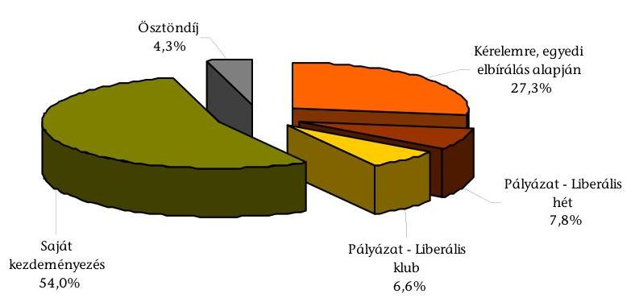
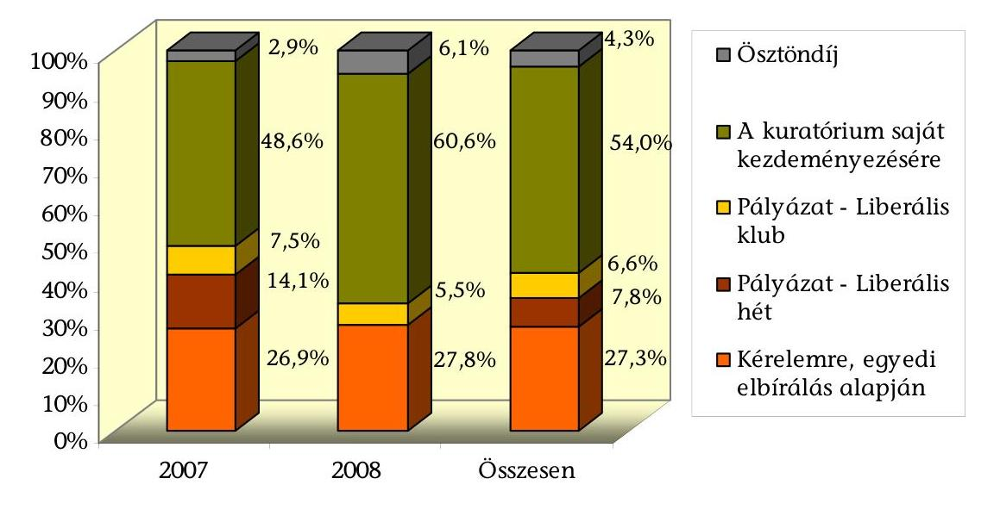
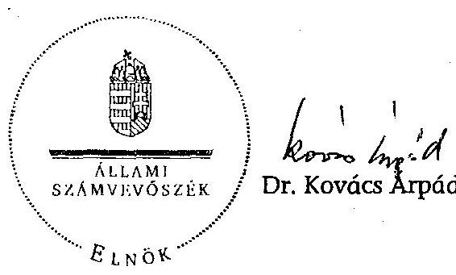

# JELENTÉS 

a Szabó Miklós Tudományos, Ismeretterjesztő, Kutatási és Oktatási Szabadelvú Alapítvány 2007-2008. évi gazdálkodása törvényességének ellenőrzéséről

---

3. Önkormányzati és Területi Ellenőrzési Igazgatóság
3.1. Szabályszerüségi Ellenőrzési Föcsoport
Iktatószám: V-3015-30/2009.
Témaszám: 953
Vizsgálat-azonosító szám: V-0463
Az ellenőrzést felügyelte:
Dr. Lóránt Zoltán
föigazgató
Az ellenőrzés végrehajtásáért felelős:
Dr. Elek János
általános föigazgató-helyettes
Az ellenőrzést vezette:
Solymár Ágnes
osztályvezető főtanácsos
Az összefoglaló jelentést készítette:
Robák Ferencné
számvevő tanácsos
Az ellenőrzést végezték:
Robák Ferencné Kulcsár Lászlóné
számvevő tanácsos számvevő

# A témához kapcsolódó eddig készített számvevőszéki jelentések: 

címe
sorszáma
Jelentés a Szabó Miklós Alapítvány 2003-2004. évi gazdálkodása 0559
törvényességének ellenőrzéséről
Jelentés a Szabó Miklós Alapítvány 2005-2006. évi gazdálkodása 0749
törvényességének ellenőrzéséről

---

# TARTALOMJEGYZÉK 

BEVEZETÉS ..... 5
I. ÖSSZEGZŐ MEGÁLLAPÍTÁSOK, KÖVETKEZTETÉSEK, JAVASLATOK ..... 7
II. RÉSZLETES MEGÁLLAPÍTÁSOK ..... 11

1. Az alapítvány gazdálkodásának törvényessége ..... 11
1.1. A kuratórium működése ..... 11
1.2. Az alapítvány bevételei ..... 12
1.3. Az alapítvány ráfordításai ..... 14
2. Az éves beszámolók ..... 17
2.1. Az éves beszámolók szabályossága ..... 17
2.2. A mérleg ..... 18
2.3. Az eredmény-kimutatás ..... 19
3. A gazdálkodás szabályozottsága ..... 20
4. A könyvvezetés gyakorlata ..... 21
5. Az alapítvány ellenőrzési rendszere ..... 23
6. A korábbi ellenőrzés megállapításaira tett intézkedések ..... 24

## MELLÉKLETEK

1. számú A Szabó Miklós Tudományos, Ismeretterjesztő, Kutatási és Oktatási Szabadelvű Alapítvány 2007. évi egyszerűsített éves beszámolójának mérlege
2. számú A Szabó Miklós Tudományos, Ismeretterjesztő, Kutatási és Oktatási Szabadelvű Alapítvány 2007. évi egyszerűsített éves beszámolójának ered-mény-kimutatása
3. számú A Szabó Miklós Tudományos, Ismeretterjesztő, Kutatási és Oktatási Szabadelvű Alapítvány 2008. évi egyszerűsített éves beszámolójának mérlege
4. számú A Szabó Miklós Tudományos, Ismeretterjesztő, Kutatási és Oktatási Szabadelvű Alapítvány 2008. évi egyszerűsített éves beszámolójának ered-mény-kimutatása

---

.

---

# RÖVIDÍTÉSEK JEGYZÉKE 

| Alapítvány | Szabó Miklós Tudományos, Ismeretterjesztő, Kutatási és Oktatási Szabadelvű Alapítvány |
| :--: | :--: |
| ÁSZ | Állami Számvevőszék |
| Éves beszámoló | Egyszerúsített éves beszámoló |
| Kbt. | A közbeszerzésekről szóló 2003. évi CXXIX. törvény |
| Kincstár | Magyar Államkincstár |
| Pártalapítványi törvény | A pártok múködését segítő tudományos, ismeretterjesztő, kutatási, oktatási tevékenységet végző alapítványokról szóló 2003. évi XLVII. törvény |
| Párttörvény | A pártok múködéséről és gazdálkodásáról szóló 1989. évi XXXIII. törvény |
| Ptk. | Polgári Törvénykönyvről szóló 1959. évi IV. törvény |
| Számviteli rendelet | A számviteli törvény szerinti egyes egyéb szervezetek beszámoló készítési és könyvvezetési kötelezettségének sajátosságairól szóló 224/2000. (XII. 19.) Korm. rendelet |
| SZDSZ | Szabad Demokraták Szövetsége |
| SZMSZ | Szervezeti és Múködési Szabályzat |
| Szt. | A számvitelről szóló 2000. évi C. törvény |

---

.

---

# JELENTÉS 

## a Szabó Miklós Tudományos, Ismeretterjesztő, Kutatási és Oktatási Szabadelvű Alapítvány 2007-2008. évi gazdálkodása törvényességének ellenőrzéséről

## BEVEZETÉS

A pártok a pártok múködését segítő tudományos, ismeretterjesztő, kutatási, oktatási tevékenységet végző alapítványokról szóló 2003. évi XLVII. törvény (pártalapítványi törvény) alapján, a politikai kultúra fejlesztése érdekében tudományos, ismeretterjesztő, kutatási és oktatási tevékenységük elősegítésére, a pártok múködéséről és gazdálkodásáról szóló 1989. évi XXXIII. törvényben (párttörvény) meghatározott mértékű költségvetési támogatásra jogosult alapítványt hozhatnak létre. A Szabad Demokraták Szövetsége (SZDSZ) - a pártalapítványi törvényben biztosított lehetőséggel élve - létrehozta a Szabó Miklós Tudományos, Ismeretterjesztő, Kutatási és Oktatási Szabadelvű Alapítványt (alapítvány).

A pártalapítványi törvény alapján létrehozott alapítványok költségvetési támogatásának formáiról és mértékéről a párttörvény rendelkezik. Az éves költségvetési törvényeknek megfelelően az alapítvány a 2007-2008. években összesen 221 millió Ft központi költségvetési támogatásban részesült.

Az alapítvány alapító okirat szerinti céljai:

- a modern, európai liberális politikai kultúra magyarországi népszerűsítése;
- a modern, európai liberális politikai kultúra hazai társadalmi viszonyoknak megfelelő átültetése, újrafogalmazása;
- liberális politikai kultúrát fejlesztő programok készítése;
- a pluralista, demokratikus és toleráns politikai kultúra terjesztése.

Az alapítvány a céljait továbbadott támogatások révén valósította meg. A kuratórium az alapító okiratban megfogalmazott célokkal összhangban nyújtott támogatást pályázati úton, egyedi kérelemre, illetve az alapítvány saját kezdeményezésére.

A pártalapítványi törvény 4. § (2) bekezdése alapján az állami költségvetési támogatásban részesülő alapítvány gazdálkodása törvényességének ellenőrzésére az Állami Számvevőszék (ÁSZ) jogosult, amely a pártalapítványi törvény 4. § (4) bekezdése alapján kétévenként végzi az ellenőrzést.

---

Az ÁSZ 2007-ben az alapítvány 2005-2006. évi gazdálkodásának törvényességét ellenőrizte. Az ellenőrzés hiányosságokat állapított meg az alapító okirat és a belső szabályzatok tekintetében, a házipénztári bizonylatok vezetésében, valamint a támogatottakkal megkötött szerződésekre vonatkozóan.

Az ellenőrzés célja volt, hogy értékelje:

- az alapítvány gazdálkodásának törvényességét;
- az éves beszámolók jogszabályi előírásoknak való megfelelését;
- az alapítvány könyvvezetésében a számvitelről szóló 2000. évi C. törvény (Szt.) és egyéb jogszabályi rendelkezések, és belső előírások betartását;
- a kuratórium intézkedéseit az ÁSZ előző ellenőrzése során feltárt hiányosságok megszüntetése, valamint az intézkedési tervben megjelölt feladatok megvalósítása érdekében.

Tételesen ellenőriztük a költségvetési támogatást, a kapott adományokat, az egymillió Ft és e feletti tételeket, azon továbbadott támogatásokat, melyek éves szinten kedvezményezettenként összesítve elérték az egymillió Ft-ot. Minta alapján ellenőriztük az alapítvány ráfordításait, az egymillió Ft alatti támogatásokat. Az ellenőrzési tapasztalatok kiértékelésénél a pártalapítványok ellenőrzési segédletében megjelölt 2\%-os lényegességi küszöböt alkalmaztuk.

A szabályszerűségi ellenőrzés a 2007. január 1. és 2008. december 31. közötti időszakra terjedt ki.

---

# I. ÖSSZEGZŐ MEGÁLLAPÍTÁSOK, KÖVETKEZTETÉSEK, JAVASLATOK 

A kuratórium az ellenőrzött időszakban az alapítvány vagyonkezelését, gazdálkodását érintő döntéseit az alapító okirat szerinti határozatképes üléseken hozta, melyek az alapítványi cél megvalósulását szolgálták. Az alapító okirat előírásainak megfelelően vezették a határozatok tárát és készítettek az ülésekről jegyzőkönyvet. A kuratórium - a korábbi időszakokkal ellentétben - egyik ellenőrzött évben sem fogadott el az alapító okiratban előírt költségvetési tervet. A képviseleti és a bankszámla feletti rendelkezési jogot az alapító okirat a Ptk.-nak megfelelően szabályozta. A képviseleti jog gyakorlása megfelelt az alapító okirat előírásának. A szerződéseket minden esetben a képviseleti joggal rendelkező ügyvezető írta alá. A bankszámla feletti rendelkezés 2008. február 13. után megfelelt az alapító okiratnak. Korábban a banki aláírási címpéldányon olyan személyt is bejelentettek, akit az alapító nem jogosított fel erre.

Az ellenőrzött években az alapítvány összes bevétele 224196 ezer Ft volt. Ennek 98,6 \%-át tette ki a párttörvény alapján szabályosan folyósított központi költségvetési támogatás. Az alapítvány belföldi természetes személyektől 100 ezer Ft adományt kapott. A kuratórium az adományok elfogadásáról a pártalapítványi törvénynek megfelelően határozott, azokat beazonosítható személyektől, az alapítvány pénzforgalmi számlájára fogadta el. Egy esetben azonban 25 ezer Ft nem a magánszemély pénzforgalmi számlájáról érkezett, hanem banki készpénzbefizetéssel. A kuratórium elnöke elrendelte a 25 ezer Ft támogatás visszafizetését a támogató részére, ezért a pártalapítványi törvényben meghatározott jogkövetkezmény nem alkalmazható. Ezen kívül az alapítvány eseti támogatásban nem részesült.

Az alapítvány cél szerinti tevékenységére és múködési költségeire összesen 187402 ezer Ft ráfordítást mutatott ki éves beszámolóiban. Céljait továbbadott támogatásokkal ( 152724 ezer Ft) valósította meg.

Nyújtott támogatások megoszlása 2007-
2008. években

---

A kuratórium az alapító okiratban megfogalmazott célok elérése érdekében sajátkezdeményezésű támogatásai elemző tanulmányok készítéséhez, konferenciák, rendezvények szervezéséhez járultak hozzá. Az alapítvány kérelemre, egyedi elbírálás alapján könyvek, kiadványok, filmek készítését támogatta. Pályázatot hirdettek az országosan múködő liberális klubok múködésének és rendezvényeinek, valamint a Liberális hét szervezésének támogatására, kilenc fő számára folyósítottak ösztöndíjat.

A támogatások rendszere szabályozott volt, de a támogatási szabályzatot csak 2008 áprilisától, az előző ÁSZ vizsgálat javaslatára egészítették ki a pénzügyi elszámoltatás és a tartalmi beszámoltatás feltételeivel. A támogatásokról hozott kuratóriumi döntések minden esetben az alapító okirat szerint, határozatképes kuratóriumi ülésen születtek, egyhangú szavazással. A kedvezményezettekkel minden esetben az alapítvány képviseletére jogosult ügyvezető kötött szerződést. Egy támogatás esetében az ügyvezető a kuratóriumi döntést megelőzően kötött szerződést, egy másik támogatás esetében a folyósítást követően. A szerződések kikötötték az elszámolási feltételeket, meghatározták a támogatás célját. A támogatottak elszámoltak a felhasználással, de a határidőben történő elszámoltatás nem volt dokumentált, mivel a belső szabályozástól eltérően az ellenőrzést végző nem írta alá és nem dátumozta azokat. A kuratórium, az alapító okirat előírásától eltérően, dokumentáltan nem ellenőrizte a támogatások felhasználását.

Az alapítvány a kifizetett támogatások 58,3\%-át egy szervezet számára folyósította. Az alapítvány ügyvezetője a szervezettel mindkét ellenőrzött évben szerződést kötött. A szerződések non profit kutatási tevékenység, konkrét elemzések és tanulmányok elkészítésének és filmkészítés támogatásáról szóltak. A szervezet mindkét évben bevételezte a támogatást. Mindkét évben elszámolt a támogatások felhasználásáról, de az elszámolás nem volt alkalmas a kiadások forrásának, valamint a non profit kutatási tevékenység költségeinek megállapítására, mivel a szerződések nem írták elő a támogatásnak és felhasználásának a támogatott könyvvezetésében való elkülönítését. A szervezet a szerződés előírásától eltérően az alapítvány támogatásával elkészült szellemi termékeken, filmen nem tüntette fel az alapítványt a támogatók között.

Az alapítvány az ellenőrzött időszak mindkét évében eleget tett beszámoló készítési kötelezettségének, éves beszámolóit a számviteli politikájában megjelölt formában, a vonatkozó jogszabályban előírt határidőre készítette el. A számviteli alapelvek érvényesítésével elkészített egyszerűsített éves beszámolókat a kuratórium érvényes határozatokkal elfogadta. A mérleg és eredmény-kimutatás sorait alátámasztották a kapcsolódó analitikus és főkönyvi nyilvántartások, azok az év végi főkönyvi kivonatok adataiból levezethetőek voltak. A magánszemélyek részére teljesített alapítványi kifizetéseket az Szt. rendelkezésétől eltérően nem a személyi jellegű ráfordítások, hanem az egyéb ráfordítások között mutatták ki. A könyvvezetésben 2007-ben a továbbadott támogatások 12\%-át nem az egyéb ráfordítások, hanem az anyag, illetve a személyi jellegű ráfordítások között mutatták ki. Az emiatt keletkező eltérés az eredményt nem érintette, de mértéke meghaladta a jelentős hiba küszöbértékét. A 2008. évi könyvvezetésben ezt a hibát megszüntették. Az éves mérlegekben kimutatott eszközök és források értékadatait a leltározási szabályzat szerinti leltárakkal támasztották alá. Az eszközbeszerzéseknél és a ráfordítások elszámolásánál érvényesítet-

---

ték a kötelezettségvállalás, a teljesítésigazolás és utalványozás, valamint a banki aláírás szabályait. 2008. évtől az éves beszámoló részét képezte a kötelezően elkészítendő éves jelentés, melynek tartalma megfelelt a jogszabályi előírásoknak.

Az alapítvány rendelkezett a jogszabályokban előírt, a könyvvezetés és a beszámoló elkészítésének rendjét meghatározó számviteli politikával és ahhoz kapcsolódó szabályzatokkal. A kuratórium az ellenőrzött években - az alapító okirattal ellentétesen - a szabályzatok módosításait nem hagyta jóvá, azokat az ügyvezető hitelesítette aláírásával. A helyszíni ellenőrzés ideje alatt a kuratórium a módosított szabályzatokat elfogadta. A szabályzatok megfeleltek az Szt. vonatkozó rendelkezéseinek. A számviteli politika és a számlarend rögzítette, az előző ÁSZ ellenőrzés javaslatának megfelelően, az alapítványi célú tevékenység közvetlen és közvetett költségei elkülönítésének rendjét és szabályait. A számviteli politika és az értékelési szabályzat egymástól eltérően rendelkezett a terven felüli értékcsökkenés elszámolásáról, de az ellenőrzött időszakban az alapítvány terven felüli értékcsökkenést nem számolt el. Az alapítvány az eszközök és a források értékelési szabályzatát az alapítványi gazdálkodás sajátosságainak megfelelően módosította. A leltározási szabályzatot az előző ellenőrzés javaslata ellenére nem egészítették ki a leltározási hatáskörök, a leltárak formájának meghatározásával, de ezt a helyszíni ellenőrzés időszakában pótolták. A pénzkezelési szabályzatot kiegészítették a bankszámlaforgalom és az elektronikus átutalások rendjének szabályaival.

A könyvvezetést a kettős könyvvitel rendszerében mindkét évben azonos számítógépes programmal végezték, a gazdasági eseményeket idősorrendben, könyvelési alapbizonylatokkal alátámasztva rögzítették. A számviteli feladatok vezetésére és a beszámoló elkészítésére jogosult személy rendelkezett a törvényi előírásoknak megfelelő képesítéssel. A könyvvezetésben érvényesítették a bizonylatok jogszabály által előírt alaki és tartalmi követelményeit. A számlakijelölés gyakorlata összhangban volt a vonatkozó jogszabályi előírásokkal. A belső szabályzatokban előírt egyedi nyilvántartásokat vezették, és azoknak a főkönyvi adatokkal való egyeztetését elvégezték. A házipénztárt a megbízott pénztáros kezelte, a záró pénzkészlet nem haladta meg a pénzkezelési szabályzatban előírt mértéket. A szigorú számadású nyomtatványokat és az elszámolásra adott előlegeket nyilvántartották, utóbbiak elszámolása szabályos volt.

Az alapítvány csak részben alakította ki ellenőrzési rendszerét. A belső kontroll mechanizmusokat egyrészt az alapító okirat, másrészt a pénzkezelési szabályzat és a támogatási és elszámolási szabályzatok rögzítették. Az ellenőrzési feladatokat a kuratórium elnöke és az alapítvány ügyvezetője a továbbadott támogatásokkal való elszámoltatás kivételével ellátta.

A helyszíni ellenőrzés megállapításainak hasznosítása mellett javasoljuk:

# az alapítvány kuratóriumának 

1. Fogadja el minden évben az alapítvány költségvetési tervét az alapító okirat X. e.) pontjának megfelelően.

---

2. Írja elő, hogy a támogatási szerződések tartalmazzák a támogatottak könyvvezetésében a támogatás és annak felhasználása elkülönítésének kötelezettségét.
3. Intézkedjen a szerződés szerinti következetes elszámoltatásról, a felhasználás tartalmi és pénzügyi ellenőrzésének dokumentálásáról.
4. Intézkedjen a számviteli politikai és az értékelési szabályzat terven felüli értékcsökkenés elszámolására vonatkozó szabályainak összhangjáról.
5. Biztosítsa, hogy a számvitelről szóló 2000. évi C. törvény 79. § (3) bekezdésének előírása alapján a magánszemélyek részére kifizetett ösztöndíjak az éves beszámolóban a személyi jellegű egyéb kifizetések között kerüljenek kimutatásra.

---

# II. RÉSZLETES MEGÁLLAPÍTÁSOK 

## 1. Az alapítVÁNY GAZDÁlKODÁSÁNAK TÖRVÉNYESSÉGE

### 1.1. A kuratórium múködése

Az ellenőrzött időszakban az alapító SZDSZ az alapítvány alapító okiratát - a Ptk. 74/B. § (5) és a 74/C. § (1) bekezdésének rendelkezéseivel összhangban egyszer módosította.

A Fővárosi Bíróság a kuratórium két tagja és az ügyvezető személyének megváltozását 2007. december 21-i végzése szerint bejegyezte a 9043. számon nyilvántartásba vett alapítvány adatai közé. A kuratórium személyi összetétele megfelelt a pártalapítványi törvény 3. § (7) és a Ptk. 74/C. § (3) bekezdésében foglaltaknak.

A módosítással megváltozott az alapítványt képviselők és a bankszámla felett rendelkezők személye. A módosított alapító okirat a Ptk. 74/C. § (4) bekezdésének megfelelően rendelkezett az alapítvány képviseletéről, a képviseleti jog gyakorlásának módjáról és terjedelméről, továbbá a Ptk. 29. § (3) bekezdésének előírásával összhangban a bankszámla feletti rendelkezés szabályairól.

A módosított alapító okirat szerint „az alapítvány képviseletét a kuratórium elnöke valamint az ügyvezető, mint az alapítvány alkalmazottja önállóan látja el. A kuratórium az alapítvány alkalmazottjának képviseleti jogot biztosíthat akként, hogy megjelöli a képviseleti jog gyakorlásának módját, terjedelmét. A képviseletet ellátó személyeket együttes akadályoztatásuk esetén az általuk megbízott kuratóriumi tag, ennek hiányában két kuratóriumi tag együttesen helyettesíti."

Az alapító okiratban előírt alapítványi célok, illetve az ott meghatározott tevékenységek összhangban voltak a pártalapítványi törvényben megfogalmazottakkal. Az alapítvány az alapítói céloknak megfelelően végezte tevékenységét.

Az ellenőrzött időszakban az alapítvány három főt foglalkoztatott, egy munkavállaló munkaviszonya 2007. augusztus 1-jével megszűnt. Az alapító okirat nem írta elő és a munkaszervezet mérete sem indokolta, hogy az alapítvány szervezeti és múködési szabályzatot készítsen. Az alapító okirat meghatározta a kuratórium múködését, ügyrendjét. A munkavállalók munkaszerződése kijelölte a munkáltatói jogok gyakorlóját, munkaköri leírásuk meghatározta feladataikat.

A bankszámla feletti rendelkezés csak 2008. február 13. után felelt meg az alapító okirat előírásának, amikor banki aláírásra jogosultként a kuratórium elnökét és az ügyvezetőt jelentették be. Előtte banki aláírásra jogosultként jelentették be - az alapító okirattól eltérően - a képviseleti joggal nem rendelkező könyvelőt is, aki nem volt az alapítvány alkalmazottja.

---

A képviseleti jog gyakorlása megfelelt az alapító okirat szabályozásának, mivel a szerződéseket minden esetben az arra felhatalmazott ügyvezető írta alá.

A kuratórium működése, a kuratóriumi ülésekről készült jegyzőkönyvek és a határozatok nyilvántartása megfelelt az alapító okirat előírásainak. A jegyzőkönyvekből megállapítható volt, hogy a kuratórium határozatait az alapító okiratban előírtak szerinti határozatképes üléseken, minden esetben a jelenlévő kuratóriumi tagok egyhangú szavazásával hozta. A kuratórium az ellenőrzött 2007-2008. évben összesen tízszer ülésezett, 140 határozatot hozott.

A kuratóriumi ülések jegyzőkönyvei minden esetben tartalmazták a jelenlévő kuratóriumi tagok felsorolását.

A kuratórium az alapító okirat X. e.) pontjától eltérően egyik vizsgált évben sem határozott a költségvetési terv elfogadásáról.

Az alapítványnál közbeszerzési eljárást nem folytattak le, mivel az értékhatárt elérő beszerzés nem volt.

A kuratórium az alapítvány vagyonkezelését, gazdálkodását érintő döntései az alapítványi cél megvalósulását szolgálták. Az alapítvány céljait nem saját szervezetben, hanem kizárólag támogatások megítélésével valósította meg. Az ellenőrzött továbbutalt támogatások esetében minden alkalommal a támogatást kuratóriumi határozattal ítélték oda.

# 1.2. Az alapítvány bevételei 

Az alapítvány az ellenőrzött időszak éves beszámolóiban összesen 224196 ezer Ft bevételt mutatott ki.

Az alapítvány jogosult volt költségvetési támogatásra a párttörvény 9/A. § (3) bekezdésében foglaltak alapján.

A 2008. szeptember 29-éig hatályos szabályozásnak megfelelően az alapítványt alapító SZDSZ képviselői az országgyűlésben két, egymást követő országgyűlési választást követően képviselőcsoportot alakítottak és az országgyűlés megválasztását követő alakuló ülésen a párt képviselőcsoportja bejelentette megalakulását, a 2008. szeptember 30-tól hatályos szabályozásnak megfelelően az alapítványt olyan párt alapította, amely az adott negyedév első napján a párttörvény 5. § (2) bekezdése alapján költségvetési támogatásra jogosult volt, továbbá a teljes ellenőrzési időszakban az alapítvány alapító okirat szerinti céljai megfeleltek a párttörvény 9/A. § (1) bekezdésében megjelölteknek.

Az alapítványnak kiutalt támogatás összege megfelelt a párttörvény 9/A. § (5) és (6) bekezdéseiben foglalt rendelkezéseinek.

A 2008. szeptember 29-éig hatályos jogszabályi rendelkezés szerint az alapítvány az országgyűlés megválasztását követően az alakuló ülésen az azt alapító párt képviselőcsoportja megalakulásakor bejelentett létszám alapján meghatározott mandátumarányos-, továbbá alap- és eseti támogatásban részesülhetett. Az alaptámogatás mértéke az egyévi képviselői alapdíj huszonötszöröse, amelyet az országgyűlési képviselők tiszteletdíjáról és költségtérítéséről szóló 1990. évi LVI. törvény határoz meg, a mandátumarányos támogatás mértéke képviselőnként a

---

képviselői alapdíj 85\%-a. A 2006. évi országgyűlési választások után az országgyűlés 2006. május 16 -ai ülésén az SZDSZ 20 fővel alakított képviselöcsoportot.

A 2008. szeptember 30-ától hatályos jogszabályi rendelkezés szerint „az alapítványt az azt alapító pártra, valamint e párt jelöltjeire az országgyúlési képviselők utolsó általános választásán az első érvényes fordulóban leadott szavazatok arányában illeti meg támogatás." A 2006. évi országgyűlési választások során az SZDSZ-re az első fordulóban leadott szavazati arány $6,99 \%$ volt.

Az alapítvány a 2007-2008. években a költségvetésből ténylegesen 221000 ezer Ft támogatást kapott, ez az összes bevétel 98,6\%-ának felelt meg.

Az alapítvány számára 2007-ben 111300 ezer Ft, 2008-ban 109700 ezer Ft támogatást folyósítottak a központi költségvetésből. A 2007. évi és 2008. év szeptember 29-éig hatályos a jogszabályi rendelkezések alapján folyósított alaptámogatás összege 118 417,5 ezer Ft, a mandátumarányos támogatás összege 20 képviselőre számítva a képviselői alapdíj változását is figyelembe véve 80557,5 ezer Ft, a 2008. szeptember 30-ától hatályos jogszabályi rendelkezések alapján folyósított szavazatarányos támogatás 22025 ezer Ft volt.

A Magyar Államkincstár (Kincstár) a 2007. és 2008. évi támogatást a pártalapítványi törvénynek megfelelően, negyedéves ütemezésben, a negyedév első napjaiban átutalta az alapítvány számlájára, kivéve a Felhasználás a 2008. évi központi költségvetés általános tartalékának és céltartalékának előirányzataiból címú 2004/2008. (I. 24.) Korm. határozattal biztosított első negyedévi időarányos támogatást, amit 2008. február első napjaiban folyósítottak.

A pártalapítványi törvény 2. § (1) bekezdése (2008. szeptember 29-ig) illetve a párttörvény 9/A. § (2) bekezdése (2008. szeptember 30-tól) alapján a költségvetési támogatás kifizetése negyedévenként történik, a negyedév első napján.

Az alapítványnak egyéb, a központi költségvetési forrásból származó bevétele nem volt.

Az alapító okirat a törvényi szabályozással összhangban lehetővé tette az alapítványhoz való csatlakozást pénzbeli vagy más vagyonrendeléssel, felajánlásokkal, továbbá adományok elfogadását a pártalapítványi törvény előírásai figyelembevételével. Az alapítvány kuratóriuma a belföldi természetes személyektől kapott támogatás ( 100 ezer Ft, az összes bevétel 0,04\%-a) elfogadásáról 2007. október 16-i határozatával a pártalapítványi törvény 3. § (2) bekezdésének és az alapító okirat IV. 1. pontja rendelkezéseinek megfelelően döntött. A 2008. évben befizetett támogatások a pártalapítványi törvény 3. § (3) bekezdésének csak részben feleltek meg, mivel a támogatást nyújtó személyek a banki kivonatokon beazonosíthatók voltak, a támogatás folyósítása az alapítvány pénzforgalmi számlájára történt, azonban egy esetben, 25 ezer Ft értékben nem a támogatást nyújtó magánszemély pénzforgalmi számlájáról történt az átutalás, hanem banki készpénzbefizetéssel. A kuratórium elnöke elrendelte a 25 ezer Ft támogatás visszafizetését a támogató részére, ezért a pártalapítványi törvényben meghatározott jogkövetkezmény nem alkalmazható. A pártalapítványi törvény 3. § (4) bekezdésében előírt közzétételi kötelezettség sem keletkezett, mert a támogatónkénti befizetett összeg nem érte el az 500 ezer Ft-ot.

---

Az alapítvány beszámolóiban vizsgált időszakban ezen kívül 2400 ezer Ft pénzügyi és 696 ezer Ft olyan bevételt mutatott ki, mely a támogatottak visszafizetéséből és költségtérítésből származott. Ez együttesen az összes bevétel 1,4\%-át tette ki.

# 1.3. Az alapítvány ráfordításai 

Az alapítvány, a támogatási szerződések és a kedvezményezettek elszámolásai szerint, a párttörvény 9/A. § (1) bekezdésében - és az ezzel összhangban lévő alapító okiratban - meghatározott célokra és saját működésére fordította az állami költségvetési támogatás összegét. Az ellenőrzött időszak éves beszámolóiban összesen 187402 ezer Ft ráfordítást mutattak ki. A 2008. évben mintegy 20\%-kal volt alacsonyabb a ráfordítások mértéke a 2007. évinél.

A kuratórium 2008. évi 1. számú határozatával úgy döntött, hogy a 2008. gazdálkodási évben rendelkezésre álló összegből 40000 ezer Ft-ot a várható jövő évi kiadásokra tartalékol. A 2. számú határozattal felhatalmazta az elnököt és az ügyvezetőt, hogy az alapítvány szabad pénzeszközeit három hónapos lejárattal diszkontkincstárjegyekbe fektesse.

A ráfordítások 81,5\%-át (152 724 ezer Ft) fizették ki közvetlenül a cél szerinti tevékenységet megvalósító szervezeteknek, magánszemélyeknek, 18,5\%-ot ( 34680 ezer Ft) tettek ki a cél szerinti tevékenység közvetett költségei és az egyéb közvetett költségek.

Az alapítvány céljait kizárólag továbbadott támogatások révén valósította meg. A kuratórium olyan tevékenységeket támogatott, melyek megfeleltek a pártalapítványi törvénynek, az alapító okiratban megfogalmazott célokat szolgálták.

Az alapító okirat VI. 3. pontjának megfelelően az alapítvány céljai megvalósítása érdekében

- kérelemre, egyedi elbírálás alapján nyújtott támogatásokkal,
- pályázati kiírásokkal az azokon eredményesen szereplők egyszeri, illetve rendszeres támogatásával,
- az alapítvány saját kezdeményezésére egyszeri és rendszeres támogatásokkal,
- ösztöndíj juttatásával használta fel vagyonát.

Az alapítvány a vizsgált időszakban összesen 152724 ezer Ft-ot fizetett ki támogatás címén: kérelemre, egyedi elbírálás alapján 41664 ezer Ft-ot (27,3\%-), a pályázaton meghirdetett Liberális hét, illetve liberális klubok céljaira 21956 ezer Ft-ot (14,4\%), a kuratórium saját kezdeményezésére 82539 ezer Ftot (54,0\%), ösztöndíjra 6565 ezer Ft-ot (4,3\%). A kifizetések alakulását az alábbi diagram mutatja be.

---

# Továbbadott támogatások kifizetése 

A kuratórium sajátkezdeményezésű támogatásai elemző tanulmányok készítéséhez, konferenciák, rendezvények szervezéséhez járultak hozzá. Az alapítvány kérelemre, egyedi elbírálás alapján könyvek, kiadványok, filmek készítését támogatta. Pályázatot hirdettek az országosan múködő liberális klubok múködésének és rendezvényeinek, valamint a Liberális hét szervezésének támogatására, kilenc fő számára folyósítottak ösztöndíjat.

A támogatások szabályairól a 2006. január 1-jétől hatályos, a kuratórium által elfogadott támogatási szabályzat rendelkezett, melyet az előző ÁSZ ellenőrzés javaslatára 2008. április 1-jén kiegészítettek a pénzügyi és tartalmi elszámoltatás feltételeivel.

Az alapítvány honlapján jelentették meg a pályázati felhívást a Liberális hét, a liberális klubok, illetve egyedi liberális kezdeményezések támogatására.

Az ellenőrzött időszak minden kuratóriumi ülésének napirendjén szerepeltek a támogatásokkal kapcsolatos határozati javaslatok, melyek a támogatások megítélésére, az elszámolási határidő módosítására vonatkoztak. A támogatásokról hozott kuratóriumi határozatok határozatképes kuratóriumi ülésen, egyhangú döntéssel, az alapító okiratnak megfelelően születtek. Egy támogatás esetében a kuratórium a szerződés megkötését követően hozott határozatot, illetve, egy esetben a kifizetést követően kötötte meg az ügyvezető a szerződést.

Az egyik kedvezményezett a 2008. évi 40000 ezer Ft-os támogatásáról a kuratórium a szerződés megkötése után hozott a szerződés elfogadásáról szóló határozatot. Az összeg folyósítását az alapítvány a szerződés megkötése után kezdte meg.

Egy másik támogatott esetén a 150 ezer Ft-os támogatást 2008. január 15-én folyósították, a kuratóriumi határozat február 19-én született, a szerződést viszont csak március 17-i dátummal kötötték a szervezet karácsonyi rendezvényének támogatásáról.

---

Egy támogatott elszámoltatásakor az alapítvány - kuratóriumi döntés nélkül a pályázatban megjelölt céltól eltérő, de az alapító okiratnak megfelelő felhasználást is elfogadott.

Egy liberális egyesület kétszer 40 fő nyári táboroztatásának támogatására pályázott. Az alapítvány 71 fő nyári táborozásának számlái mellett befogadta az egyesület Budapesten szervezett októberi tréningjének az elszámolását is.

A kuratórium határozata alapján a támogatottakkal az ügyvezető támogatási szerződést kötött. A szerződések egységes megfogalmazásban tartalmazták a feltételeket az ösztöndíjak, a Liberális hét és a liberális klubok pályázatai esetében. A szerződések minden esetben kikötötték az elszámolás határidejét.

A kedvezményezettek elszámoltak a kapott támogatással. Az elszámolásokhoz számlamásolatot, esetenként tartalmi beszámolót, illetve a támogatás felhasználásával elkészült könyvet, kiadványt mellékeltek. Az elszámolások határidejére vonatkozó kötelezettség betartása nem volt ellenőrizhető, mivel az ellenőrzésre jogosult, a támogatási szabályzat előírásától eltérően, az elszámolásokat nem látta el dátummal és aláírásával.

A 2008. április 1-jétől hatályos támogatási szabályzat szerint a pénzügyi és tartalmi beszámolókat az ügyvezető illetve az általa megbízott személy ellenőrzi, az ügyvezető fogadja el. A szabályzat 5.5. pontja előírta, hogy az ellenőrzésről az ellenőrzést végző feljegyzést készít a beszámoló, számlaösszesítőn vagy külön feljegyzésben, melyet dátummal és aláírásával lát el.

A kuratórium, az alapító okirattól eltérően, a támogatások szerződésben meghatározott felhasználását dokumentáltan nem ellenőrizte.

Az alapítvány a kifizetett támogatások 58,3\%-át (89 080 ezer Ft) egy szervezet számára nyújtotta. A támogatási szerződéseket az alapítvány ügyvezetője kötötte a támogatott képviseleti joggal rendelkező ügyvezető igazgatójával.

A mindkét évben azonos szerződés szerint az alapítvány támogatta:

- elemzések elkészítését a magyar politikában a pártok szerepléseiről, heti rendszerességgel;
- elemzések készítését a magyar politikai helyzet alakulásáról, folyamatairól havi rendszerességgel;
- tanulmányok készítését specifikált szakpolitikai kérdésekről, különös tekintettel a liberális álláspont megjelenítési lehetőségeire és kidolgozására;
- kutatást és tanulmánykészítést a közteherviselés átalakításainak alternatíváiról;
- kutatást és tanulmánykészítést a liberalizmus kitörési pontjairól.

A szerződésben meghatározott támogatási célok megfeleltek az alapítvány céljainak.

A szerződés kikötötte, hogy a kedvezményezett a támogatást csak olyan tevékenységre fordíthatja, amely nem profit realizálására irányul, illetve hogy a

---

tanulmányok, elemzések címlapján köteles feltüntetni, hogy az adott szellemi termék az alapítvány támogatásával készült. Nem írta elő a szerződés, hogy a támogatott köteles könyvvezetésében elkülöníteni a támogatás felhasználásának ráfordításait.

A támogatott szervezet mindkét évben bevételezte a támogatást. Mindkét évben elszámolt a támogatások felhasználásáról, de az elszámolás - a támogatási szerződés hiányosságából adódóan - nem volt alkalmas a kiadások forrásának, valamint a non profit kutatási tevékenység költségeinek megállapítására.

Az elszámoláshoz csatolt számlákat a szervezet ügyvezető igazgatója által kötött szerződések vagy megrendelések illetve az általa aláírt teljesítésigazolások támasztották alá. Egy esetben az elszámoláshoz benyújtott számla nem felelt meg az azt alátámasztó szerződésnek.

A székhely 2007. július 4-én kötött bérleti szerződése 9000 ezer Ft + áfa éves bérleti díjról szólt. A szerződést 2008. április 30-án változatlan feltételekkel hosszabbították meg. Ennek ellenére 2008. év folyamán összesen 11592 ezer Ft bérleti díj kifizetését tartalmazta az alapítványnak benyújtott elszámolás.

A kuratóriumi határozat és az az alapján megkötött szerződés szerint 9120 ezer Ft-tal támogatta a szervezet filmkészítését. A szerződésben előírták, hogy az elkészült film „stáblistáján" a kedvezményezett köteles feltüntetni, hogy a film az alapítvány támogatásával készült.

A támogatással a kedvezményezett elszámolt, de sem ebben az esetben, sem a két kutatási tevékenység támogatás elszámolásáról nem lehetett megállapítani, hogy az mikor történt, megfelelt-e a szerződésben előírt határidőnek.

Az átadott, az alapítvány támogatásával elkészült szellemi termékeken, illetve a filmen a kft. nem tüntette fel az alapítványt, mint támogatót.

Főkönyvi kivonatából megállapítottuk, hogy a támogatott szervezet bevételei többségükben nem a központi költségvetésből származtak, a közbeszerzési értékhatárt meghaladó megrendelései esetén nem volt közbeszerzésre kötelezett.

# 2. Az ÉVES BESZÁmolók 

### 2.1. Az éves beszámolók szabályossága

Az alapítvány az ellenőrzött időszak mindkét évében eleget tett beszámolókészítési kötelezettségének, éves beszámolóit a vonatkozó jogszabályi előírásoknak megfelelően, a számviteli politikájában megjelölt formában, határidőre elkészítette.

Az egyszerúsített éves beszámoló a számviteli politikában megjelölt, a számviteli törvény szerinti egyes egyéb szervezetek beszámoló-készítési és könyvvezetési kötelezettségének sajátosságairól szóló 224/2000. (XII. 19.) Korm. rendelet (számviteli rendelet) 4. sz. melléklete szerinti mérlegből és 5. sz. melléklete szerinti ered-mény-kimutatásból állt.

---

A kuratórium az éves beszámolókat a 2007. évre vonatkozóan a 1./2008.05.06. számú, a 2008. évre vonatkozóan az 1./2009.06.24. számú határozattal fogadta el.

Az alapítvány eleget tett a pártalapítványi törvény 3/A. § (1) bekezdése szerinti éves jelentéskészítési kötelezettségének is, azt a 3/A. § (3) bekezdésben előírtaknak megfelelő tartalommal fogadta el a kuratórium az éves beszámoló részeként, a 3/A. § (2) bekezdésben előírtakat betartva.

Az alapítvány 2008. évről készített jelentése tartalmazta az egyszerúsített éves beszámolót (mérleg, eredmény-kimutatás és kiegészítő melléklet), a költségvetési támogatásra és annak felhasználására, a vagyon felhasználására, a cél szerinti juttatásokra és az alapítvány vezető tisztségviselői részére nyújtott juttatásokra vonatkozó kimutatást, valamint az alapítvány éves tevékenységéről szóló tartalmi beszámolót a pártalapítványi törvény 3/A. § (3) bekezdésének megfelelően. A pártalapítványi törvény 3/A. § (2) bekezdése a kuratórium kizárólagos hatáskörébe sorolja a jelentés elfogadását.

Az alapítvány az egyszerúsített éves beszámolók összeállítása során érvényesítette az Szt. 15. és 16. §-ában foglalt számviteli alapelveket. Az egyszerúsített éves beszámolókban szereplő adatok a záráshoz készített főkönyvi kivonat adataiból levezethetők voltak, megbízható, valós adatokat tartalmaztak az alapítvány gazdálkodásáról. A lényegességi szintet érintő hibát és az alapítvány számviteli politikájában meghatározott jelentős összegű hibát nem tartalmaztak.

Az alapítvány számviteli politikájában a jelentős összegű hiba mértékét, az Szt. 3. § (3) bekezdés 3. pontjában foglaltakkal megegyezően, a mérleg főösszeg $2 \%$-ában határozta meg.

Az egyszerúsített éves beszámolókat - az Szt. 20. § (5) bekezdésének megfelelően - a képviseletre jogosult aláírásával hitelesítette.

Az alapítvány gondoskodott a pártalapítványi törvény 3/A. § (5) bekezdésének megfelelő közzétételről, honlapján is megjelentette a dokumentumokat.

Az alapítvány a 2008. évi jelentés és a számviteli beszámoló közzétételét 2009. június 24-én írásban kérte a Miniszterelnöki Hivataltól. A közzétételre a Magyar Közlöny Hivatalos Értesítőjének 2009/32. számában, 2009. július 1-jén került sor. A dokumentumok 2009. június 25 -én kerültek az alapítvány honlapjára.

# 2.2. A mérleg 

Az ellenőrzött években a mérlegsorok adatai megegyeztek a kapcsolódó analitikus és főkönyvi nyilvántartások összesített adataival. Az éves mérlegekben kimutatott eszközök és források értékadatait - az Szt. 69. §-ának előírásával összhangban - a leltározási szabályzat szerinti leltárakkal alátámasztották.

Az ellenőrzött időszakban az immateriális javak és tárgyi eszközök egyedi nyilvántartása és az állomány-változások (a beszerzések-aktiválások, a terv szerinti értékcsökkenés) elszámolása összhangban volt a belső szabályzatok előírásaival.

---

Az egyedi nyilvántartás megfelelt a törvényi és a belső szabályzat szerinti követelményeknek. Eszközértékesítés és selejtezés nem volt, az alapítvány összesen 40 ezer Ft értékű tárgyi eszközt szerzett be. A beszerzett eszközöket kis értékű tárgyi eszközként, egyedileg vette nyilvántartásba, szabályzatainak megfelelően, egyösszegű értékcsökkenésként számolta el.

A beszámolók a forgóeszközök csoportján belül elismert, év végi követeléseket tartalmaztak (adott előlegek, visszaigényelhető járulékok). Az ellenőrzött években a pénzeszközök értéke megegyezett a december 31-ei pénztárjelentésben kimutatott készpénz záró-állományának és a banki folyószámla-kivonatok december 31-ei záró-egyenlegének összegével.

A mérlegben az induló tőkét az alapító okirat által meghatározott induló vagyon értékének és a számviteli rendeletnek megfelelően mutatták ki.

A kötelezettségek között mindkét évben rövid lejáratú kötelezettségeket mutattak ki, értéke megegyezett a tárgyévben elszámolt bérek és járulékok következő évben esedékes összegével.

Az aktív és a passzív időbeli elhatárolások elszámolása szabályos volt, az elszámolást szállítói számlák, illetve számítási anyagok támasztották alá.

# 2.3. Az eredmény-kimutatás 

Az ellenőrzött években az eredmény-kimutatás sorok adatai a főkönyvi kivonatok, illetve a vonatkozó főkönyvi és részletező számlák összesített adataival megegyeztek.

Az eredmény-kimutatás sorai az adott sorokon kimutatható bevételek, illetve ráfordítások fogalomkörébe tartozó tételeket tartalmaztak, kivéve a magánszemélyek részére kifizetett támogatásokat, amelyeket a személyi jellegű egyéb ráfordítások helyett, mindkét évben az egyéb ráfordítások között, támogatásként mutatták ki.

Az alapítvány a magánszemélyek részére 2007-ben 2400 ezer Ft-ot, 2008-ban 4165 ezer Ft-ot fizetett ki ösztöndíjként, melyeket mindkét évben a 8643 kutatási tevékenység támogatás főkönyvi számlán vett nyilvántartásba. Ezt az Szt. 79. § (3) bekezdése szerint, személyi jellegű egyéb kifizetésként kell elszámolni az 5-ös számlaosztályban, továbbá nem vonatkoztatható rá a számviteli rendelet 16. § (6) és (7) bekezdései sem, mivel az alapítvány nem szervezet részére adta a támogatást.

A bevételeken belül a központi költségvetési és az egyéb támogatásokat elkülönítetten mutatták ki, a kapott támogatások, valamint az elszámolt pénzügyi és egyéb bevételek összege megegyezett a vonatkozó bankkivonatok összesített értékével. Az eredmény-kimutatásban kimutatott ráfordításokat könyvelési alapbizonylatokkal (szerződések, szállítói számlák, pénztárbizonylatok, vegyes könyvelési feladások, úgymint munkabér-feladási, értékcsökkenés elszámolási bizonylatok) támasztották alá.

A 2007. évben a nyújtott támogatások (84 080 ezer Ft) 12,3\%-ánál az elszámoláshoz kapcsolódó számlákat az alapítvány nevére állították ki, ezért nem az

---

egyéb ráfordításokon belüli támogatásként, hanem az anyag- és személyi jellegű ráfordítások között mutatták ki (10 368 ezer Ft). A 2008. évben ezt a könyvvezetési hibát megszüntették és már helyesen, a támogatások között szerepeltették a tételeket.

Az alapítvány a könyvvezetésében a támogatottak által visszafizetett, fel nem használt támogatási összegekkel nem a támogatásként kimutatott egyéb ráfordításokat csökkentette, hanem azokat egyéb bevételként szerepeltette.

Az eltérések az eredmény-kimutatás egyes sorait érintették, eredményre gyakorolt hatásuk nem volt, így nem érintették a jelentős összegű hiba értékét, és a lényegességi szintet sem.

A ráfordítások elszámolásánál érvényesítették a kötelezettségvállalás, az utalványozás/teljesítésigazolás és a banki aláírás szabályait, a kimutatott ráfordításokat könyvelési alapbizonylatokkal támasztották alá. Az utalványozók köre megfelelt az alapító okirat előírásainak.

A szerződéseket - az alapító okirat előírásával összhangban - minden esetben az alapítvány ügyvezetője kötötte meg a kuratórium határozatai alapján. Az utalványozás a pénzkezelési szabályzat szerint valósult meg. A pénztárbizonylatok utalványozását az alapítvány ügyvezetője végezte, a bizonylatok minden esetben tartalmazták a kiállító, az ellenőrző, valamint a készpénz felvevőjének vagy befizetőjének aláírását. A banki átutalások utalványozása elektronikusan történt.

# 3. A GAZDÁLKODÁs SZABÁLYOZOTTSÁGA 

A 2007-2008. években a könyvvezetés és az éves beszámolók elkészítésének belső szabályozási rendszere az Szt. által kötelezően előírt szabályozáson alapult. Az Szt. 14. § (3)-(5) bekezdésével összhangban az alapítvány rendelkezett számviteli politikával. Ennek keretében elkészítette az eszközök és a források értékelési szabályait, a leltárkészítési és leltározási-, és a pénzkezelési szabályzatot, valamint az Szt. 161. § (1) bekezdése szerinti számlarendet.

Az alapítvány a gazdálkodással összefüggő szabályzatát az előző ÁSZ vizsgálat javaslatait felhasználva és a személyi változások, illetve a módosuló munkakörök miatt 2008. január 1-jei hatállyal módosította, kivéve a leltározási és selejtezési szabályzatát. A módosításokat az alapító okirat előírásától eltérően nem a kuratórium, hanem az alapítvány ügyvezetője hagyta jóvá. A számvevői jelentések egyeztetési szakaszában a kuratórium 2/2009.10.06. sz. határozatával visszamenőlegesen is elfogadta a módosított szabályzatokat. A leltározási és selejtezési szabályzat módosítására ugyancsak ekkor, 2009. október 6-án került sor.

A 2008. január 1. előtt alkalmazott gazdálkodással összefüggő szabályzatokat a kuratórium 2005. december 6-án fogadta el. A 2008-ban módosított szabályzatokat az alapítvány ügyvezetője fogadta el és írta alá, ezzel megsértette az alapító okirat X. g.) pontját, mely szerint az alapítvány gazdálkodási elveinek és szabályzatainak meghatározása a kuratórium kizárólagos döntési jogkörébe tartozik.

---

A számviteli politika a passzív időbeli elhatárolások körének és tartalmának meghatározása kivételével (melyet a kapcsolódó számlarend és az értékelési szabályzat azonban részletesen tartalmazott) teljes körű volt. Az alapítványok gazdálkodási rendjéről szóló 115/1992. (VII. 23.) Korm. rendelet 3. § (2) bekezdésében előírtakkal összhangban, meghatározta az alapítvány cél szerinti, és múködési költségeinek elkülönítési módját. Az alapítvány az előző ÁSZ ellenőrzés javaslatára módosította számlarendjét, így az megfelelt az Szt. 161. § (2) bekezdésének.

A számviteli politika és a kapcsolódó számlarend is rögzítette, hogy a cél szerinti tevékenység költségei az alapítvány céljához kapcsolódóan keletkező költségek: a honlappal kapcsolatos és minden egyéb, az alapítvány céljához köthető kiadás, költség (liberális klubok, egyedi döntések, kutatási tevékenység támogatása, Liberális hét ráfordításai). Az alapítvány a múködési költségek közé sorolta az ügymenettel, ügyvitellel kapcsolatos kiadásokat, ezen belül az ügyvezető bérköltségét, járulékait, az ügyvédi munkadíjat és a könyvviteli szolgáltatás költségeit. Minden esetben a számlák és bizonylatok tartalma szerint kerültek meghatározásra a cél szerinti és a múködési költségek. Ez - az ügyvezető tájékoztatása szerint - az utalványozást megelőzően történt.

Az alapítvány leltározási és selejtezési szabályzata nem határozta meg a leltározás során a hatásköröket, az elkészítendő leltárak formáját.

Az előző ÁSZ vizsgálat javaslata ellenére nem került kiegészítésre a leltározási és selejtezési szabályzat a hatáskörök és a leltárak formájának előírásával. A gyakorlatban csak idegen helyen tárolt eszközökkel rendelkezett az alapítvány, ezek leltározásának és felelősének szabályait viszont tartalmazta a szabályzat.

Az értékelési szabályzat az Szt. 53. § (1) bekezdésének megfelelően előírta a terven felüli értékcsökkenés elszámolását. Ezzel szemben a számviteli politika azt tartalmazta, hogy az alapítvány nem alkalmazza a terven felüli értékcsökkenési leírást. Az ellenőrzési időszak során ilyen gazdasági eseményt nem kellett rögzíteni.

A pénzkezelési szabályzat kiterjedt az Szt. 14. § (8) bekezdésében előírt valamennyi követelményre, valamint az elektronikus banki utalások szabályaira.

# 4. A KÖNYVVEZETÉS GYAKORLATA 

Az ellenőrzött időszakban az alapítvány könyvvezetését és éves beszámolóinak összeállítását szerződés alapján, külső könyvelő szervezet végezte. A számviteli szolgáltatás körébe tartozó feladatok vezetésére, a beszámoló elkészítésére a szerződés szerint jogosult személy rendelkezett az Szt. 151. § (1) bekezdésben előírt képesítéssel, szerepelt a Pénzügyminisztérium által vezetett könyvviteli szolgáltatást végzők nyilvántartásában.

Az alapítvány könyvvezetését a számviteli rendelet 8. § (4) bekezdésében foglaltaknak megfelelően, a kettős könyvvitel rendszerében, az alapbizonylatok számítógépes feldolgozásával, az ellenőrzött időszakban azonos könyvelési programmal végezték. A gazdasági eseményeket időrendben rögzítették, a rendszerben az ellenőrzéshez szükséges adatok megtalálhatóak voltak. A pénzforgalmi bizonylatokhoz a kifizetés/átutalás alapbizonylatai (szerződések,

---

számlák), a vegyes bizonylatok alapján könyvelt tételekhez megfelelő részletező kimutatások, bizonylatok kapcsolódtak. A számlakijelölés gyakorlata, az ellenőrzött minta egy tétele kivételével, összhangban volt a belső szabályzatok előírásával. A bizonylatoknak az Szt. 167. § (1) bekezdése szerinti alaki és tartalmi követelményeit a könyvviteli nyilvántartásokban érvényesítették.

A 196 darabos mintában egy 2007. évi támogatás esetében (500 ezer Ft) fordult elő, hogy helyesen a 8644-es számlára lett kijelölve, de ténylegesen a 8641 fökönyvi számlára került rögzítésre. Ennek mérlegsorra és eredményre gyakorolt hatása nem volt, mindkét főkönyvi tétel támogatás, ezért egyéb ráfordításként került az eredmény-kimutatásba.

Az alapítvány az Szt. 161. § (2) bekezdés c) pontjának megfelelően, számlarendjében szabályozta a főkönyvi számlákhoz rendelt analitikák körét, tartalmát, vezetésük módját. Az alapítvány rendelkezett bizonylati szabályzattal, amelyben meghatározta az elfogadható bizonylatok alaki és tartalmi követelményeit. A könyvelés alapjául szolgáló számviteli bizonylatok az Szt. 167. § (1) bekezdésében rögzített követelményeknek teljes körűen megfeleltek. A számlarendben, illetve a bizonylati szabályzatban előírt egyedi nyilvántartásokat vezették, az év végi főkönyvi kivonatot az analitikus nyilvántartásokkal egyeztetett főkönyvi számlákból állították össze.

A könyvvezetésben - az alapítványok gazdálkodási rendjéről szóló 115/1992. (VII. 23.) Korm. rendelet 3. § (2) bekezdésében és a számviteli politikában előírtaknak megfelelően - az alapítványi célú tevékenység közvetlen és közvetett (működési jellegű) költségeit a főkönyvi könyvelés keretében elkülönítették.

Az alapítvány a leltározási szabályzat előírásainak megfelelően, az eszközöket és forrásokat érintő tételeket a főkönyvi számláknak az analitikus nyilvántartásokkal és a könyvelés helyességét igazoló egyéb okmányokkal (bankkivonatok, szerződések) történt egyeztetése útján leltározta és a szabályzat előírásai szerint dokumentálta.

Az alapítvány tárgyi eszközeinek leltára az idegen helyen őrzött eszközök menynyiségi felvételét tartalmazta. Ez megegyezett az egyedi nyilvántartó lapokon kimutatott eszközök adataival. A tárolásért felelős személyek a leltárakat aláírták. Az egyéb eszköz- és forrástételek leltározása a főkönyvi számláknak az analitikus nyilvántartásokkal és kapcsolódó alapbizonylatokkal való egyeztetése útján történt.

A számviteli politikának megfelelően az éves beszámolók elkészítését megelőzően a könyvviteli zárlattal kapcsolatos feladatokat elvégezték.

Az immateriális javak és tárgyi eszközök egyedi nyilvántartó lapjait vezették, az értékcsökkenést ennek megfelelően számolták el. Megállapították és lekönyvelték az aktív és passzív időbeli elhatárolásokat. Az alkalmazott könyvviteli számlákból főkönyvi kivonatot készítettek, és elvégezték az eszköz-, forrás- és eredményszámlák technikai zárását.

A pénzkezelési szabályzatban előírt nyilvántartásokat vezették, a havi pénztári zárásokat dokumentálták. A házipénztár havi záró készpénzállománya - az ellenőrzött időszak pénztárjelentései szerint - egyszer sem haladta meg a szabályzatban előírt maximális összeget ( 2500 ezer Ft). A készpénzes kifizetések és

---

szállítói számlák utalványozása összhangban volt a pénzkezelési szabályzat előírásával, a pénzforgalmi bizonylatokat az utalványozásra feljogosított személyek írták alá. 2008. szeptember 29-ig a pénztár vezetését a könyvelést végző cég által megbízott pénztáros, ezt követően a könyvelő cég végezte.

A pénztárosi funkció átadás-átvétele a pénzkezelési szabályzat és annak melléklete szerint előírt tartalommal és formában történt.

A pénzkezelési szabályzat, illetve az alapítvány és a könyvelő cég közötti megbízási szerződés nem határozta meg a pénztáros személyét, az csak a könyveléssel megbízott cég és az ügyvezető által aláírt külön házipénztár-kezelési megbízásban szerepelt. A pénzkezelési szabályzat szerint előírt személyes felelősségvállalási nyilatkozatot a pénztárosok aláírták. A bankszámláról történő készpénzfelvételre a pénzkezelési szabályzatban foglaltaknak megfelelően a banki készpénzfelvételi nyomtatványon került sor. A pénzkezelési szabályzatban rögzített pénztárellenőrzéseket elvégezték.

Az utólagos elszámolásra kiadott előlegeket és azok elszámolását nyilvántartották, az elszámolások mindig a szabályzatban rögzített határidőn belül történtek.

Előleg kiadására, illetve elszámolására 2007-ben öt alkalommal került sor. A pénzkezelési szabályzat szerinti 30 napos elszámolási határidőt betartották. A mérleg fordulónapján nem volt előlegállomány.

A banki átutalással teljesített kifizetések utalványozását a pénzkezelési szabályzat előírásainak megfelelően végezték, a kötelezettségvállalás gyakorlása az ellenőrzött években megfelelt a szabályzat előírásainak. A számlák, a munkabérek és egyéb banki kifizetések utalványozása, az elektronikus banki aláírással valósult meg. Az elektronikus banki aláírás a számlavezető bank termináljára való csatlakozással, két jogosult személy általi elektronikus aláírással történt.

A szigorú számadás alá vont bizonylatok körét a pénzkezelési szabályzatban meghatározták (bevételi és kiadási pénztárbizonylat, pénztárjelentés, számlatömb) és a kapcsolódó bizonylatokat az Szt. 168. § (3) bekezdésének megfelelően nyilvántartották. Az étkezési utalványokat elosztási lista szerint tartották nyilván. Az utalványok átadás-átvétele szabályszerű volt, az elosztási listát az utalványt átvevő alkalmazottak aláírták.

# 5. AZ ALAPÍTVÁNY ELLENŐRZÉSI RENDSZERE 

Az alapító a kuratórium ellenőrzésére jogosult szervet nem jelölt ki, erre vonatkozó jogszabályi kötelezettsége nem volt. A munkaszervezet kis létszáma, továbbá az ügyviteli feladatok megbízás alapján, külső szervezet útján való ellátása függetlenített belső ellenőrzés létrehozását nem indokolta.

Az alapítvány csak részben alakította ki ellenőrzési rendszerét, az ellenőrzési folyamatot kizárólag a banki utalványozások és a pénztári ellenőrzés területére vonatkozóan szabályozta. A munkaköri leírások - a 2007. év végéig, a munkaviszonyban lévő ügyvezető kivételével - nem tartalmazták az egyes munkakörökhöz tartozó ellenőrzési feladatokat.

---

Az alapító okirat előírásai szerint az alapítvány ügyvezetőjének kinevezése és felmentése a kuratórium elnökének hatásköre, az alapítvány alkalmazottai felett pedig az ügyvezető gyakorolja a munkáltatói jogokat. A 2007. december 31-ig munkaviszonyban lévő ügyvezető munkaköri leírása tartalmazott ellenőrzéssel járó feladatokat - döntés-előkészítés ellenőrzése, szerződéskötések és támogatások számszaki ellenőrzése -, azonban az új ügyvezető munkaköri leírásából ezek kikerültek.

Az alapítvány ügyvezetője a pénzügyi kifizetéseket az utalványozás és a bankszámla feletti rendelkezés során ellenőrizte, az alapító okiratnak megfelelően, egy személyben gyakorolta a képviseleti jogot. A támogatások felhasználásának ellenőrzését - a támogatási szabályzat előírásától eltérően - nem dokumentálták. A könyvelést ellátó külső könyvelő céggel kötött megbízási szerződés nem határozott meg ellenőrzési feladatokat.

A helyszíni ellenőrzés idején rendelkezésünkre bocsátották a könyvelő céggel 2009. március 1-jén módosított megbízási szerződést, amely kiterjesztette a könyvelő cég feladatait az alapítvány adminisztrációs feladatainak ellátásával, azonban továbbra sem tartalmazott ellenőrzési feladatot.

# 6. A KORÁBBI ELLENŐRZÉS MEGÁLLAPÍTÁSAIRA TETT INTÉZKEDÉSEK 

A kuratórium 2008. február 19-i 4. számú határozatával jóváhagyta az ÁSZ vizsgálat javaslatai alapján készült intézkedési tervet. A határozat a végrehajtás felelősének az alapítvány ügyvezetőjét és a könyveléssel megbízott cég vezetőjét jelölte ki. Ennek alapján a szabályzatokat 2008-ban az alábbiak szerint módosították:

- A támogatási szabályzatot kiegészítették. Kitértek az elszámolások rendjére, előírták az ügyvezető feladatait, megbízták a támogatások pénzügyi és tartalmi beszámolójának elfogadásával. Meghatározták a szerződésszegés szankcióit.
- A számviteli politika egyértelműen meghatározta a beszámoló választott formáját, előírta az alapítványi cél szerinti és működési költségeinek tartalmát és az éves könyvviteli zárlathoz kapcsolódó feladatokat, a továbbutalt támogatások elszámolási szabályait azonban továbbra sem határozta meg.
- A leltározási szabályzat az ellenőrzött időszakban nem került kiegészítésre a leltározási hatáskörök, a leltárak formájának valamint az egyeztetéssel történő leltározás szabályainak meghatározásával.
- Az eszközök és források értékelési szabályzatát kiegészítették az időbeli elhatárolás szabályaival, azonban a terven felüli értékcsökkenésre vonatkozó előírásokat nem hozták összhangba a számviteli politikával.
- A pénzkezelési szabályzatot kiegészítették az elektronikus utalások rendjének, a banki utalások és a pénztárellenőrzés szabályaival.
- Az alapítványi sajátosságok figyelembevételével módosították a számlarendet, meghatározták a számlák és az analitikus nyilvántartások kapcsolatát, kijelölték az eredményszámlák lezárásához használható főkönyvi számlákat.

---

A gazdálkodás törvényességére vonatkozó javaslatok alapján:

- Csak részben alakították ki az alapítvány belső ellenőrzési rendszerét. Továbbra sem volt biztosított a támogatások tartalmi és pénzügyi elszámoltatásának szabályossága.
- Módosították 2008. február 13-tól az alapító okirattal összhangban a banki aláírásra bejelentettek körét.
- Intézkedtek az Szt. szerinti számviteli alapelvek érvényesítéséről a vagyoni értékű jogokkal és a személyi jellegű ráfordításokkal kapcsolatos, a bizonylati elv és fegyelem valamint a könyvviteli nyilvántartásokba történő rögzítés időpontjára és igazolására vonatkozó szabályok betartásáról.

Budapest, 2009. december $8^{8}$

Melléklet: $\quad 4 \mathrm{db} \quad 4$ lap

---

18181483-1-42 Statisztikai számjel vagy adószám (csekkszámlaszám)

2007 ÉV

MÉRLEG adatok E Ft-ban

|  Sor-
szám | A tétel megnevezése | Előző év | Előző
év(ek)
helyesbi-
tései | Tárgyév  |
| --- | --- | --- | --- | --- |
|  a | b | c | d | e  |
|  1 | A. Befektetett eszközök | 7868 | 0 | 6394  |
|  2 | I. IMMATERIÁLIS JAVAK | 4196 |  | 3366  |
|  3 | II. TÁRGYI ESZKÖZÖK | 3672 |  | 3028  |
|  4 | III. BEFEKTETETT PÉNZÜGYI ESZKÖZÖK |  |  |   |
|  5 | B. Forgóeszközök | 10504 | 0 | 20511  |
|  6 | I. KÉSZLETEK |  |  |   |
|  7 | II. KÖVETELÉSEK |  |  | 504  |
|  9 | III. ÉRTÉKPAPÍROK |  |  |   |
|  10 | IV. PÉNZESZKÖZÖK | 10504 |  | 20007  |
|  11 | C. Aktív időbeli elhatárolások | 2 |  |   |
|  12 | ESZKÖZÖK ÖSSZESEN | 18374 | 0 | 26905  |
|  13 | D. Saját tőke | 17161 | 0 | 25300  |
|  14 | I. INDULÓ TÖKE | 594 |  | 594  |
|  15 | II. TÖKEVÁLTOZÁS | 69133 |  | 16567  |
|  16 | III. LEKÖTÖTT TARTALÉK |  |  |   |
|  17 | IV. ÉRTÉKELÉSI TARTALÉK |  |  |   |
|  18 | V. TÁRGYÉVI EREDMÉNY ALAJTEVÉKENYSÉGBŐL | -52566 |  | 8139  |
|  19 | VI. TÁRGYÉVI EREDMÉNY VÁLLALKOZÁSI TEVÉKENYSÉGBŐL |  |  |   |
|  20 | E. Céltartalékok |  |  |   |
|  21 | F. Kötelezettségek | 812 | 0 | 277  |
|  22 | I. HÁTRASOROLT KÖTELEZETTSÉGEK |  |  |   |
|  23 | II. HOSSZÚ LEJÁRATÚ KÖTELEZETTSÉGEK |  |  |   |
|  24 | III. RÖVID LEJÁRATÚ KÖTELEZETTSÉGEK | 812 |  | 277  |
|  25 | G. Passzív időbeli elhatárolások | 401 |  | 1328  |
|  26 | FORRÁSOK ÖSSZESEN | 18374 | 0 | 26905  |

Keltezés: 2008. május 6.

Szabó Möldés T.I.K.O.SZ. Alapítvány, a közalapítvány vezetője (képviselője) Alapítvány 1143 Budapest, Mázleös út 36. Adószám: 18181483-1-42 Banksz.sz.: 11786001-201640^

---

18181483-1-42 2007 ÉV

Statisztikai számjel vagy adószám (csekkszámlaszám) adatok E.Pi-ban

EREDMÉNYKIMUTATÁS

|  Sor-
szám | A tétel megnevezése | Előző év | Előző év(ek) helyesbítése | Tárgyév  |
| --- | --- | --- | --- | --- |
|   |  | Alaptev./Váll.tev. | Összes | Alaptev./Váll.tev.  |
|  a | b | c | d | e  |
|  1 | 1. Értékesítés nettó árbevétele |  | 0 |   |
|  2 | 2. Aktivált saját teljesítmények értéke |  | 0 |   |
|  3 | 3. Egyéb bevételek | 110215 | 110215 |   |
|  4 | ebből: támogatások | 109900 | 0 | 109900  |
|  5 | - alapítói |  | 0 |   |
|  6 | - központi költségvetési | 109900 | 109900 |   |
|  7 | - helyi önkormányzati |  | 0 |   |
|  8 | - társadalombiztosítási |  | 0 |   |
|  9 | - továbbutalási célú |  | 0 |   |
|  10 | - egyéb támogatás |  | 0 |   |
|  11 | 4. Pénzügyi műveletek bevételei | 437 | 437 |   |
|  12 | 5. Rendkívüli bevételek |  | 0 |   |
|  13 | ebből: támogatások | 0 | 0 | 0  |
|  14 | - alapítói |  | 0 |   |
|  15 | - központi költségvetési |  | 0 |   |
|  16 | - helyi önkormányzati |  | 0 |   |
|  17 | - társadalombiztosítási |  | 0 |   |
|  18 | - továbbutalási célú |  | 0 |   |
|  19 | - egyéb támogatás |  | 0 |   |
|  20 | A. ÖSSZES BEVÉTEL (1.±2.+3.+4.+5.) | 110652 | 0 | 110652  |
|  21 | 6. Anyagjellegő ráfordítások | 149583 | 149583 |   |
|  22 | 7. Személyi jellegű ráfordítások | 12026 | 12026 |   |
|  23 | 8. Értékcsökkenési leírás | 1433 | 1433 |   |
|  24 | 9. Egyéb ráfordítások | 176 | 176 |   |
|  25 | ebből: továbbutalt támogatás |  | 0 |   |
|  26 | 10. Pénzügyi műveletek ráfordításai |  | 0 |   |
|  27 | 11. Rendkívüli ráfordítások |  | 0 |   |
|  28 | B. ÖSSZES RÁPORDÍTÁS (6.+7.+8.+9.+10.+11.) | 163218 | 0 | 163218  |
|  29 | C. ADÓZÁS ELŐTTI EREDMÉNY (A.-B.) | 52566 | 0 | -52566  |
|  30 | D. Adófizetési kötelezettség | 4140000000000000000000000000000000000000000000000000000000000000000000000000000000000000000000000000000000000000000000000000000000000000000000000000000000000000000000000000000000000000000000000000000000000

---

# Szabó Miklós Szabadelvü Alapítvány

Statisztikai számjel: 18181483949956901

## MÉRLEG

|  Sorszám | A tétel megnevezése | Előző év | Előző
év(ek)
helyesbítései | Tárgyév  |
| --- | --- | --- | --- | --- |
|  a | b | c | d | e  |
|  1 | A. Befektetett eszközök | 6394 | 0 | 4917  |
|  2 | I. IMMATERIÁLIS JAVAK | 3366 |  | 2534  |
|  3 | II. TÁRGYI ESZKÖZÖK | 3028 |  | 2383  |
|  4 | III. BEFEKTETETT PÉNZÜGYI ESZKÖZÖK |  |  |   |
|  5 | B. Forgóeszközök | 20511 | 0 | 49245  |
|  6 | I. KÉSZLETEK |  |  |   |
|  7 | II. KÖVETELÉSEK | 504 |  | 446  |
|  9 | III. ÉRTÉKPAPÍROK |  |  | 40005  |
|  10 | IV. PÉNZESZKÖZÖK | 20007 |  | 8794  |
|  11 | C. Aktív időbeli elhatárolások |  |  | 660  |
|  12 | ESZKÖZÖK ÖSSZESEN | 26905 | 0 | 54822  |
|  13 | D. Saját tőke | 25300 | 0 | 53955  |
|  14 | I. INDULÓ TÖKE | 594 |  | 594  |
|  15 | II. TÖKEVÁLTOZÁS | 16567 |  | 24706  |
|  16 | III. LEKÖTÖTT TARTALÉK |  |  |   |
|  17 | IV. ÉRTÉKELÉSI TARTALÉK |  |  |   |
|  18 | V. TÁRGYÉVI EREDMÉNY ALAPTEVÉKENYSÉGBÖL | 8139 |  | 28655  |
|  19 | VI. TÁRGYÉVI EREDMÉNY VÁLLALKOZÁSI TEVÉKENYSÉGBÖL |  |  |   |
|  20 | E. Céltartalékok |  |  |   |
|  21 | F. Kötelezettségek | 277 | 0 | 527  |
|  22 | I. HÁTRASOROLT KÖTELEZETTSÉGEK |  |  |   |
|  23 | II. HOSSZÚ LEJÁRATÚ KÖTELEZETTSÉGEK |  |  |   |
|  24 | III. RÖVID LEJÁRATÚ KÖTELEZETTSÉGEK | 277 |  | 527  |
|  25 | G. Passzív időbeli elhatárolások | 1328 |  | 340  |
|  26 | FORRÁSOK ÖSSZESEN | 26905 | 0 | 54822  |

Keltezés: 2009. május 30.

Szabó Miklós T.Z.K.O. $\triangle$ Alapítvány 1143 Budapest, Gizella út 36. Adókedés 18181483-1-42 Banksz.sz.: 11786001-2011/ az alapítvány vezetője (képviselője)

---

18181483-1-42 Statisztikai számjel vagy adószám (csekkszámlaszám)

# EREDMÉNYKIMUTATÁS

|  Sor-
szám | A tétel megnevezése | Előző év | Előző év(ek) helyesbítése | Tárgyév  |
| --- | --- | --- | --- | --- |
|   |  | Alaptev./Váll.tev. | Összes | Alaptev./Váll.tev.  |
|  a | b | c | d | e  |
|  1 | 1. Értékesítés nettó árbevétele | 0 | 0 | 0  |
|  2 | 2. Aktivált saját teljesítmények értéke | 0 | 0 | 0  |
|  3 | 3. Egyéb bevételek | 111906 | 111906 | 0  |
|  4 | ebből: támogatások | 111300 | 0 | 111300  |
|  5 | - alapítói | 0 | 0 | 0  |
|  6 | - központi költségvetési | 111300 | 0 | 111300  |
|  7 | - helyi önkormányzati | 0 | 0 | 0  |
|  8 | - társadalombiztosítási | 0 | 0 | 0  |
|  9 | - továbbutalási célú | 0 | 0 | 0  |
|  10 | - egyéb támogatás | 0 | 0 | 0  |
|  11 | 4. Pénzügyi műveletek bevételei | 1276 | 76 | 0  |
|  12 | 5. Rendkívüli bevételek | 0 | 0 | 0  |
|  13 | ebből: támogatások | 0 | 0 | 0  |
|  14 | - alapítói | 0 | 0 | 0  |
|  15 | - központi költségvetési | 0 | 0 | 0  |
|  16 | - helyi önkormányzati | 0 | 0 | 0  |
|  17 | - társadalombiztosítási | 0 | 0 | 0  |
|  18 | - továbbutalási célú | 0 | 0 | 0  |
|  19 | - egyéb támogatás | 0 | 0 | 0  |
|  20 | A. ÖSSZES BEVÉTEL (1.±2.+3.+4.+5.) | 111982 | 0 | 111982  |
|  21 | 6. Anyagjellegű ráfordítások | 15924 | 0 | 15924  |
|  22 | 7. Személyi jellegű ráfordítások | 13769 | 0 | 13769  |
|  23 | 8. Értékesökkenési leírás | 1515 | 0 | 1515  |
|  24 | 9. Egyéb ráfordítások | 22635 | 0 | 22635  |
|  25 | ebből: továbbutalt támogatás | 22635 | 0 | 22635  |
|  26 | 10. Pénzügyi műveletek ráfordításai | 0 | 0 | 0  |
|  27 | 11. Rendkívüli ráfordítások | 0 | 0 | 0  |
|  28 | B. ÖSSZES RÁFORDÍTÁS (6.+7.+8.+9.+10.+11.) | 103843 | 0 | 103843  |
|  29 | C. ADÓZÁS ELŐTTI EREDMÉNY (A.-B.) | 8139 | 0 | 8139  |
|  30 | D. Adófizetési kötelezettség | 0 | 0 | 0  |
|  31 | E. TÁRGYÉVI EREDMÉNY (C.-D.) | 8139 | 0 | 8139  |

Keltezés: 2009. május 30.

Alapítvány 1143 Budapest, Érjelle út 36. Az alapítvány, a közalapítvány vezetője (képviselője)

2008 ÉV 2008. év

2009. május 30.