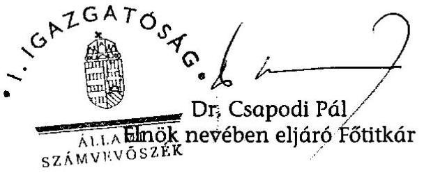
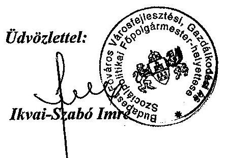

# JELENTÉS 

a fővárosi önkormányzatot és a kerületi önkormányzatokat osztottan megillető bevételek 2009. évi megosztásáról szóló önkormányzati rendelet felülvizsgálatáról

---

# 3. Önkormányzati és Területi Ellenőrzési Igazgatóság 

3.3. Átfogó Ellenőrzési Főcsoport

Iktatószám: V-3009-32/2009.
Témaszám: 945
Vizsgálat-azonosító szám: V0454

## Az ellenőrzést felügyelte:

Dr. Lóránt Zoltán
főigazgató
Az ellenőrzés végrehajtásáért felelős:
Dr. Sepsey Tamás
főigazgató helyettes
Az ellenőrzést vezette:
Dr. Karáné Kőszegi Zsuzsanna
főtanácsadó
A jelentés összeállításában közremúködött:
Dr. Karáné Kőszegi Zsuzsanna
főtanácsadó
Az ellenőrzést végezték:
Dr. Karáné Kőszegi Zsuzsanna Tóth László
főtanácsadó
számvevő tanácsos

## A témához kapcsolódó eddig készített számvevőszéki jelentések:

## címe

Jelentés a települési önkormányzatok adóztatási tevékenységének vizsgálatáról
Függelék:

- A fővárosi és a kerületi önkormányzatok közötti forrásmegosztás

Jelentés a fővárosi önkormányzatot és a kerületi önkormányzato-
kat osztottan megillető bevételek 2007. évi megosztásáról szóló önkormányzati rendelet felülvizsgálatáról
Jelentés a fővárosi önkormányzatot és a kerületi önkormányzato-
kat osztottan megillető bevételek 2008. évi megosztásáról szóló önkormányzati rendelet felülvizsgálatáról

---

# TARTALOMJEGYZÉK 

BEVEZETÉS ..... 7
I. ÖSSZEGZŐ MEGÁLLAPÍTÁSOK, KÖVETKEZTETÉSEK, JAVASLATOK ..... 9
II. RÉSZLETES MEGÁLLAPÍTÁSOK ..... 15

1. A fővárosi önkormányzatot és a kerületi önkormányzatokat osztottan megillető 2009. évi bevételek meghatározásának szabályszerűsége és összege ..... 15
1.1. A magánszemélyek jövedelemadójából a 2009. évi költségvetési törvény alapján a települési önkormányzatokat megillető rész ..... 17
1.2. Az egyéb központi adóbevételek ..... 19
1.3. Az „állandó népesség"-hez kapcsolódó normatív hozzájárulás összege, az Ötv. 64/B. § a) pontjában foglaltak kivételével ..... 19
1.4. A helyi adókból származó bevételek ..... 22
2. A megosztási arányok meghatározása során felhasznált alapadatok megalapozottsága, megbízhatósága, valamint a számítási eljárások szabályszerűségének ellenőrzése ..... 23
2.1. A fővárosi önkormányzatot és a kerületi önkormányzatokat együttesen megillető részesedés számítása a forrásmegosztási törvény 5. § (1) és (2) bekezdése alapján ..... 24
2.2. A forrásmegosztási törvény 6. § (1) bekezdése szerinti megosztás alapját képező „központi hozzájárulás", valamint a felhasználási kötöttséggel járó támogatások számításának szabályszerűsége ..... 26
2.3. A 2007. évi kerületi önkormányzati költségvetési beszámolók alapján a „központi hozzájárulás"-sal támogatott feladatokhoz kapcsolódó múködési kiadások meghatározásának szabályszerűsége és megbízhatósága ..... 27
2.4. A működési kiadási forráshiány összegének meghatározása ..... 28
2.5. A „központi hozzájárulás" aránya szerinti megosztás számításának szabályszerűsége ..... 28
2.6. A forrásmegosztási törvény 6. § (2) és (3) bekezdése szerinti megosztás számításának szabályszerűsége ..... 29
2.7. Az egyes kerületi önkormányzatokat megillető részesedési arány esetében a 2008. év forrásmegosztásához viszonyított, maximum $5 \%$-os növekedés, illetve csökkenés betartása ..... 30
3. Az esetleges adat- és számítási hibák miatt a 2010. évi forrásmegosztásnál végrehajtandó korrekció (a fővárosi önkormányzat vagy kerületi önkormányzat részére még jogszerűen járó összeg, illetve jogosulatlanul kapott összeg) meghatározása ..... 30

---

4. A 2009. évi forrásmegosztási rendeletalkotás eljárásának szabályszerűsége, valamint a forrásmegosztás adatellenőrzése ..... 31
4.1. A fővárosi önkormányzat 2009. évi költségvetési koncepciójának elfogadása ..... 31
4.2. A forrásmegosztási törvényben előírt határidők betartása ..... 31
4.3. A kerületi önkormányzatok 2007. évi költségvetési beszámolóiban szereplő adatok feldolgozásának szabályozottsága és vezetői ellenőrzése ..... 32
5. Az ÁSZ 2008. évi ellenőrzése során megfogalmazott javaslatok végrehajtására tett intézkedések ..... 33

# MELLÉKLETEK 

1. számú A forrásmegosztási törvény, illetve a 2009. évi forrásmegosztási rendelet szerint megosztandó bevételek kimutatása ( 1 oldal)
2. számú A forrásmegosztásba vont bevételek az ÁSZ megállapításai alapján (1 oldal)
3. számú A működési kiadási forráshiány számítása a Kincstár adatai és az ÁSZ megállapításai alapján (1 oldal)
4. számú A megosztott bevételekből történő részesedés az „állandó népesség", a belterületi terület, a belterületi területre számított népsűrűség, az alacsony komfortfokozatú lakások alapterülete és az iparosított technológiával épült lakások száma arányában ( 2 oldal)
5. számú Az önkormányzatok részesedése a megosztott bevételekből a korrigált részesedési arány szerint az ÁSZ megállapításai alapján (1 oldal)
6. számú Ikvai-Szabó Imre úr, Budapest Főváros Önkormányzat Városfejlesztési, Gazdálkodási és Szociálpolitikai főpolgármester-helyettesének észrevétele (1 oldal)

---

# RÖVIDÍTÉSEK JEGYZÉKE 

## Törvények

2007. évi költségvetés végrehajtásáról szóló törvény
2007. évi módosító törvény
2009. évi költségvetési törvény
2009. évi módosító törvény

Áht.
Alkotmány
forrásmegosztási törvény

Hatv.
Ötv.

## Rendeletek

2007. évi PM-ÖTM együttes rendelet
2007. évi forrásmegosztási rendelet
2008. évi forrásmegosztási rendelet
2009. évi forrásmegosztási rendelet
2009. évi PM-ÖM együttes rendelet
a Magyar Köztársaság 2007. évi költségvetésének végrehajtásáról szóló 2008. évi LXXVIII. törvény
az egyes önkormányzatokat érintő törvények módosításáról szóló 2007. évi CLXXXII. törvény
a Magyar Köztársaság 2009. évi költségvetéséről szóló 2008. évi CII. törvény
a fövárosi önkormányzat és a kerületi önkormányzatok közötti forrásmegosztásról szóló 2006. évi CXXXIII. törvény módosításáról szóló 2009. évi CXXIII. törvény
az államháztartásról szóló 1992. évi XXXVIII. törvény
a Magyar Köztársaság Alkotmányáról szóló 1949. évi XX. törvény
a fövárosi önkormányzat és a kerületi önkormányzatok közötti forrásmegosztásról szóló 2006. évi CXXXIII. törvény
a helyi adókról szóló 1990. évi C. törvény
a helyi önkormányzatokról szóló 1990. évi LXV. törvény
a helyi önkormányzatokat és a többcélú kistérségi társulásokat 2007. évben egyes központi költségvetési kapcsolatokból megillető forrásokról szóló 1/2007. (I. 30.) PMÖTM együttes rendelet végrehajtásának elszámolásáról szóló 1/2009. (I. 16.) PM-ÖM együttes rendelet
Budapest Főváros Önkormányzata 6/2007. (II. 23.) számú rendelete a Fővárosi Önkormányzatot és a kerületi önkormányzatokat osztottan megillető bevételek 2007. évi megosztásáról
Budapest Főváros Önkormányzata 9/2008. (II. 28.) számú rendelete a Fővárosi Önkormányzatot és a kerületi önkormányzatokat osztottan megillető bevételek 2008. évi megosztásáról
Budapest Főváros Önkormányzata 10/2009. (II. 27.) számú rendelete a Fővárosi Önkormányzatot és a kerületi önkormányzatokat osztottan megillető bevételek 2009. évi megosztásáról
a helyi önkormányzatokat és a többcélú kistérségi társulásokat 2009. évben egyes központi költségvetési kapcsolatokból megillető forrásokról szóló 2/2009. (I. 30.) PMÖM együttes rendelet

---

# Szórövidítések 

2009. évi költségvetési koncepció
AB
ÁSZ
bázisév
főpolgármester
Főpolgármesteri hivatal
fővárosi önkormányzat
fővárosi önkormányzat
SzMSz-e
KEKKH
kerületi önkormányzatok
Kincstár
Közgyúlés
KSH

Javaslat Budapest Főváros Önkormányzata 2009. évi költségvetési koncepciójára és gazdasági programjára
Alkotmánybíróság
Állami Számvevőszék
a tárgyévet kettővel megelőző év
Budapest Főváros Önkormányzatának főpolgármestere
Budapest Főváros Önkormányzata Közgyűlésének Főpolgármesteri Hivatala
Budapest Főváros Önkormányzata
Budapest Főváros Önkormányzata 7/1992. (III. 26.) számú rendelete a Fővárosi Önkormányzat Szervezeti és Múködési Szabályzatáról
Közigazgatási és Elektronikus Közszolgáltatások Központi Hivatal
Budapest Főváros I - XXIII. kerületeinek önkormányzatai
Magyar Államkincstár
Budapest Főváros Önkormányzatának Közgyűlése
Központi Statisztikai Hivatal

---

# ÉRTELMEZŐ SZÓTÁR 

„ászfmt" adatbázis az ÁSZ rendelkezésére álló 2007. évi kincstári és az ÁSZ észrevétele alapján meghatározott adatokat, illetve a számítást tartalmazza.
alacsony komfortfokozatú lakások
forrásmegosztás
háttérszámítás
múködési kiadási forráshiány
normatív állami hozzájárulás
normatív hozzájárulások
önkormányzati tulajdonban lévő félkomfortos, komfort nélküli és szükséglakások együttesen
a fővárosi önkormányzatot és a kerületi önkormányzatokat osztottan megillető bevételek megosztása
a fővárosi önkormányzat 2009. évi forrásmegosztási rendelettervezetének előterjesztéséhez mellékelt, a forrásmegosztást megalapozó számítások, amelyek alapján a 2009. évi forrásmegosztási rendelet elfogadásra került
a működési kiadások és a normatív hozzájárulások, valamint a felhasználási kötöttséggel járó támogatások különbözete
Az Ötv. 64. § (3) bekezdés a), 64/B. § a) pontjában, 64/C. § (2) bekezdésében normatív központi hozzájárulásnak, a 64. § (4) bekezdés c) pontjában központi hozzájárulásnak, a 81. § (2) bekezdésében központi költségvetési normatív hozzájárulásnak, a 84. § (1) bekezdésében normatív költségvetési hozzájárulásnak, a 88. § (1) bekezdés b) pontjában normatív állami hozzájárulásnak nevezett, de tartalmilag azonos hozzájárulásokat egységesen normatív állami hozzájárulásnak nevezzük.
a normatív állami hozzájárulás és a normatív részesedésű átengedett személyi jövedelemadó együttesen

---

.

---

# JELENTÉS 

## a fôvárosi önkormányzatot és a kerületi önkormányzatokat osztottan megillető bevételek 2009. évi megosztásáról szóló önkormányzati rendelet felülvizsgálatáról

## BEVEZETÉS

Az Országgyűlés a fővárosi önkormányzat és a kerületi önkormányzatok közötti forrásmegosztásról szóló 2006. évi CXXXIII. törvényt 2007. decemberben és 2009. novemberben a 2007. évi CLXXXII., illetve a 2009. évi CXXIII. törvényekkel módosította.

A forrásmegosztási törvény 8. § (1) bekezdése alapján „a fơvárosi önkormányzat tárgyévre vonatkozó forrásmegosztási rendeletét az Állami Számvevőszék felülvizsgál$j a^{\prime \prime}$.

A forrásmegosztási törvénynek megfelelően a számvevőszéki ellenőrzés a forrásmegosztás során alkalmazott adatok megalapozottságára és az ennek alapjául szolgáló számítások helyességére irányult. A 8. § (2) bekezdésének rendelkezése értelmében, amennyiben a forrásmegosztás során alkalmazott adatok, vagy a számítások helytelensége miatt a fővárosi önkormányzat, vagy valamely kerületi önkormányzat jogosulatlan forráshoz jutott, vagy a jogszerúen járó forrásnál alacsonyabb összegben részesült, ezt az összeget a hiba feltárását követő év forrásmegosztásánál kell figyelembe venni.

Az ellenőrzés célja annak megállapítása volt, hogy:

- a 2009. évi forrásmegosztási rendelet a forrásmegosztási törvény előírásainak megfelelően határozta-e meg a megosztható bevételeket és azok összegét,
- a megosztási arányok meghatározásánál felhasznált alapadatok megalapozottak és a számítási eljárások helyesek voltak-e,
- az esetleges adat- és számítási hibák miatt milyen korrekciót kell elvégezni a tárgyévet követő év forrásmegosztásánál.

Az ellenőrzött adatkör: a fővárosi önkormányzatot és a kerületi önkormányzatokat osztottan megillető bevételek adatai a 2009. évre vonatkozóan és a megosztási arányok meghatározása során felhasznált alapadatok a 2007. évi önkormányzati költségvetési beszámolók alapján.

---

A forrásmegosztási törvény a fővárosi önkormányzat és a kerületi önkormányzatok közötti forrásmegosztásról szóló 2003. évi CXIV. törvény szabályozásától eltérő rendelkezést tartalmazott, az Ötv-ben meghatározott megosztandó bevételek összességére vonatkozóan a 2008. évben $47 \%-53 \%$-os megosztási arány kötelező alkalmazását írta elő a fővárosi önkormányzat és a kerületi önkormányzatok részesedése tekintetében. A forrásmegosztási törvényt az Országgyűlés a 2007. évi CLXXXII. törvénnyel módosította. A módosító előírások egy részét a 2007. évi forrásmegosztás felülvizsgálata esetén is alkalmazni kellett. A 2007. december 30-ától hatályos 2007. évi módosító törvényben foglaltakra figyelemmel a felülvizsgálat 2008 januárjában zárult le, ezért a hiba feltárását követően - a 2007. évi felülvizsgálat adatai alapján - a 2009. évi forrásmegosztást kellett módosítani, és ekkor kellett figyelembe venni a 2008. évi felülvizsgálat megállapításait is.

A 2009. december 4-étől hatályos 2009. évi módosító törvény szerint az állandó népességhez kapcsolódó normatív hozzájárulásokra, valamint a jövedelemdifferenciálódás mérséklésének elszámolására vonatkozó módosító előírásokat a 2007., 2008. és 2009. évi forrásmegosztás felülvizsgálata során alkalmazni kellett. A jelentésben ismertetjük a forrásmegosztási törvénnyel és a 2009. évi forrásmegosztási rendelettel összefüggő jogi szabályozás ellentmondásait, valamint utalunk a 2009. évi módosító törvény rendelkezéseire is, amelyeket a javaslatok megtételénél figyelembe vettünk.

A szabályszerűségi ellenőrzés keretében a forrásmegosztási törvény előírásainak való megfelelőséget elemző eljárással vizsgáltuk.

A Főpolgármesteri hivatalnál áttekintettük a forrásmegosztási törvény gyakorlati alkalmazását, a számítások helyességét. A fővárosi önkormányzatot a forrásmegosztási törvény rendelkezése alapján a 2009. évi forrásmegosztás esetében a korrigált arány szerint megosztott bevétel illeti meg. A kerületi önkormányzatok összességét megillető összeg helyességének megállapításánál a 2009. évi forrásmegosztási rendelettervezet előterjesztéséhez mellékelt háttérszámításokhoz kapcsolódó adatbázis adatait hasonlítottuk össze az ÁSZ rendelkezésére álló kincstári adatokkal.

A forrásmegosztás adatainak ellenőrzésekor értékeltük az adatfeldolgozás szabályozottságát, és az ehhez kapcsolódó vezetői ellenőrzés működésének megbízhatóságát.

Az ÁSZ korábbi ellenőrzési javaslatai alapján tett intézkedéseket, illetve azok megvalósítását utóellenőrzés keretében vizsgáltuk.

A jelentést az ÁSZ-ról szóló 1989. évi XXXVIII. tv. 25. § (1) bekezdése alapján észrevétel közlése céljából megküldtük a Budapest Főváros Önkormányzat főpolgármesterének. A kapott tájékoztatást a jelentés 6 . számú melléklete tartalmazza.

---

# I. ÖSSZEGZŐ MEGÁLLAPÍTÁSOK, KÖVETKEZTETÉSEK, JAVASLATOK 

A 2009. évi forrásmegosztási rendelet összesen 215592157 ezer Ft megosztásáról rendelkezett. A forrásmegosztási törvény a fővárosi önkormányzatot és a kerületi önkormányzatokat osztottan megillető bevételek - a magánszemélyek jövedelemadójából az állami költségvetésről szóló törvény alapján a települési önkormányzatokat megillető rész, az egyéb központi adó, az állandó népességhez kapcsolódó központi hozzájárulás, a helyi adókból származó bevételek - körét az Ötv. szabályozására hivatkozva határozta meg, továbbá előírta, hogy a bevételek nagyságának meghatározása a tárgyidőszakra vonatkozó fővárosi költségvetési koncepcióban szereplő tervszámok alapján történik.

A 2007. évi módosító törvény alapján a fővárosi és a kerületi önkormányzatokat az Ötv. szerint osztottan megillető bevételekből a 2008. évben a fővárosi önkormányzatot $47 \%$, a kerületi önkormányzatokat együttesen $53 \%$ részesedés illette meg. A forrásmegosztási törvény a fővárosi önkormányzatokat megillető bevételek százalékos megosztásával korlátozta a Közgyűlés Ötv. felhatalmazásán alapuló jogkörét, amely szerint a „...bevételeknek a fővárosi önkormányzat és a kerületi önkormányzatok közötti megosztását a fővárosi közgyűlés rendeletében határozza meg." A 2009. évre vonatkozóan a 2007. évi módosító törvény alapján a 2008. évre meghatározott forrásmegosztási részesedést a megosztási arányra tekintettel korrigálni kellett.

A fővárosi önkormányzat által figyelembe vett 215592157 ezer Ft bevétel megegyezett az ÁSZ megállapítása szerinti megosztandó források összegével, amelyhez kapcsolódó megállapításokat a következőkben mutatjuk be.

A 2009. évi forrásmegosztási rendelet a forrásmegosztási törvény előírásának megfelelően tartalmazta a személyi jövedelemadó bevétel 12454591 ezer Ft-os összegét.

Az Ötv. szerint a fővárosi önkormányzatot és a kerületi önkormányzatokat osztottan megillető bevétel az egyéb központi adó, a gépjárműadó, ezzel szemben a 2007. évi módosító törvény szerint az egyéb központi adóból a kerületi önkormányzat által beszedett adóbevétel 100\%-a a kerületi önkormányzatot illette meg. A 2009. évi forrásmegosztási rendelet - a minősített többségi szavazattal elfogadott Ötv. szabályozását figyelmen kívül hagyva - az egyszerű többségi szavazattal elfogadott 2007. évi módosító törvényben foglaltaknak megfelelően osztotta meg a gépjárműadó bevételt.

A 2009. novemberi módosítást megelőzően a 2007. évi módosító törvény szerint az „állandó népesség"-hez kapcsolódó normatív hozzájárulás megosztása során a KSH bázisévet követő év január 1-jei adatát kellett figyelembe venni. A forrásmegosztási törvényben meghatározott „állandó népesség" fogalom azonban nem volt összhangban a 2009. évi költségvetési törvényben a normatív hozzájárulások összegének megállapításánál alkalmazott lakosságszám adattal, mivel a 2009. évi költségvetési törvény a normatív hozzájárulá-

---

sok esetében a KEKKH lakosságszám adatának figyelembevételét írta elő. Az éves forrásmegosztási rendeletek adatai az éves költségvetési törvény előírásain alapultak, ezért célszerútlen, hogy ezen adatok egymástól eltérjenek. A 2009. évi módosító törvény megváltoztatta az „állandó népesség" meghatározását, azonban továbbra sem teljesült az összhang a normatív hozzájárulásoknál figyelembe vett lakosságszámmal, mert nem tartalmazta az érvényes állandó lakóhely hiányában az érvényes tartózkodási hellyel, vagy ennek hiányában az érvénytelen tartózkodási hellyel rendelkező polgárok számát.

A 2009. évi forrásmegosztási rendelet az Ötv. szerinti „állandó népesség"-hez kapcsolódó normatív hozzájárulások közül - ellentétben a forrásmegosztási törvény előírásával, miszerint az „... osztottan megillető bevételek körét az Ötv. ... határozza meg..."- nem vette figyelembe a körzeti igazgatás körébe tartozó gyámügyi igazgatási feladatokat, az építésügyi igazgatási feladatok térségi normatív hozzájárulását, a helyi közművelődési és közgyűjteményi feladatokat, a pénzbeli szociális juttatásokat, a szociális és gyermekjóléti alapszolgáltatás általános feladatai körébe tartozó családsegítés és/vagy gyermekjóléti szolgáltatás működtetését, melyek tervezett előirányzata 11677057 ezer Ft, továbbá a fővárosi önkormányzat feladatai közül az igazgatási- és sportfeladatokból a sport, valamint a közművelődési- és közgyűjteményi feladatokból a közgyűjteményi feladatokat., melyek tervezett előirányzatát a 2009. évi költségvetési törvény összevontan tartalmazta.

A minősített többségi szavazattal elfogadott Ötv. előírását figyelmen kívül hagyva, az egyszerű többségi szavazattal elfogadott 2009. évi módosító törvény rendelkezése szerint az „állandó népesség"-hez kapcsolódó normatív hozzájárulások - a település-üzemeltetési, igazgatási 1790563 ezer Ft, valamint a sport847003 ezer Ft, és a 2010. évtől a kulturális feladatokhoz kapcsolódó normatív hozzájárulás kivételével - 100\%-ban a feladatot ellátó kerületi önkormányzatot illetik meg. A 2009. évi módosító törvény alapján ezt a rendelkezést a 2007., 2008. és 2009. évi felülvizsgálatnál is alkalmazni kellett. A 2009. évi forrásmegosztási rendelet a 2009. évi módosító törvényben foglaltaknak megfelelően osztotta meg az állandó népességhez kapcsolódó normatív hozzájárulásból származó bevételt.

A fővárosi önkormányzat a megosztott bevételek közé tartozó idegenforgalmi adóhoz való közvetlen kapcsolódása miatt az üdülőhelyi feladatokhoz tartozó 3000000 ezer Ft normatív hozzájárulást is bevonta a megosztandó bevételek közé, annak ellenére, hogy meghatározása nem az „állandó népesség" alapján történt.

Az Ötv. szerinti megosztott bevételek körébe tartozó helyi adók vonatkozásában, a forrásmegosztási törvény hivatkozott a Hatv-re, azonban a Hatv. rendelkezése nem volt összhangban az Ötv. rendelkezésével, mert a hatályon kívül helyezett fővárosi és a fővárosi kerületi önkormányzatokról szóló törvényre való hivatkozást tartalmazta.

A 2007. évi módosító törvény szerint a helyi adókból a kerületi önkormányzat által beszedett adóbevétel 100\%-a a kerületi önkormányzatot illette meg. A 2009. évi forrásmegosztási rendelet a minősített többségi szavazattal elfogadott Ötv. szabályozását figyelmen kívül hagyva, az egyszerű többségi szavazattal el-

---

fogadott 2007. évi módosító törvényben foglaltaknak megfelelően osztotta meg a kerületi helyi adó bevételt. A fövárosi önkormányzat által bevezetett helyi iparúzési adó 196000000 ezer Ft és idegenforgalmi adó 1500000 ezer Ft tervezett előirányzata képezte a megosztott bevételek részét.

A kerületi önkormányzatokat megillető részesedés felosztása a bázisévi önkormányzati költségvetési beszámoló érintett űrlapjainak adatain alapult. Az Ötv. szerint a „...fővárosi és a kerületi önkormányzatok közötti - feladat- és hatáskörarányos - forrásmegosztás érdekében normativ eljárásokat kell alkalmazni. Ezeket a normatív eljárásokat külön törvényben kell meghatározni. Ebben a külön törvényben kell rögzíteni a számítások során figyelembe veendő feladatokat is." A 2009. novemberi módosítást megelőzően a forrásmegosztási törvény nem tartalmazta a figyelembe veendő feladatokat, hanem a számítási módszert szabályozta. A 2009. évi módosító törvény a „központi hozzájárulás" fogalom meghatározásában felsorolta a figyelembe veendő feladatokat, mellyel megszűnt a szabályozás hiányossága.

A 2007. évi módosító törvény 2009. évtől hatályos előírása szerint a „... normatív részesedési arány változása esetén a ... meghatározott forrásmegosztási részesedést a normatív részesedési arányváltozás 60\%-ának megfelelő mértékben - de legfeljebb 5\%-kal - korrigálni kell", mely rendelkezés megfelelt az Ötv. szerinti normatív eljárás alkalmazásának. A 2007. évi módosító törvényben meghatározott, a fővárosi önkormányzatot és a kerületi önkormányzatokat együttesen megillető 2008. évi részesedést a 2009. évben a „normatív részesedési arány" változása esetén korrigálni kellett, azonban a számítási mód nem egyértelmú meghatározása miatt ezen előírásokat nem lehetett alkalmazni. A fővárosi önkormányzat a 2009. évi módosító törvényben foglaltak szerint határozta meg a részesedési arány korrekcióját. Az ÁSZ a 2009. évi felülvizsgálatnál is alkalmazandó 2009. évi módosító törvény alapján ellenőrizte a számítást. A korrigált forrásmegosztási részesedés a fővárosi önkormányzat esetében 47,164\%-ra, a kerületi önkormányzatok esetében 52,836\%-ra módosult.

A 2007. évi módosító törvény szerint „... a nem az állandó népességszámra vetített fajlagos támogatással számított normatív hozzájárulások bázisévi önkormányzati költségvetési beszámoló érintett űrlapjainak - az Állami Számvevőszék vagy a kincstár által elvégzett felülvizsgálata esetén a vizsgálat és a jogerős döntés alapján korrigált -adatai"-t kellett figyelembe venni a „központi hozzájárulás" meghatározásához. A lakosságszám alapján járó 2007. évi normatív hozzájárulások esetében - a Kincstár jogerős döntésének hiányában - az ÁSZ felülvizsgálattal érintett önkormányzatoknál figyelembe vettük a 2007. évi elvonásokat, valamint a kerekítés szabályától való eltéréseket, melyek következményeként a „központi hozzájárulás" összesen 78872 ezer Ft-tal, a felhasználási kötöttséggel járó támogatások összege egy ezer Ft-tal tért el a háttérszámítás adatától.

A 2007. évi módosító törvény szerint a „...kerületi önkormányzatokat megillető részesedés felosztásakor a bázisévi önkormányzati költségvetési beszámolók azon múködési kiadásaiból, amelyekhez a központi költségvetés központi hozzájárulást nyújt, le kell vonni a kiadásokhoz kapcsolódó központi hozzájárulást és a felhasználási kötöttséggel járó állami támogatást, és a különbséget a központi hozzájárulások arányában kell megosztani az önkormányzatok között." A müködési kiadásokat az önkormányzati költségvetési beszámolók szakfeladatonként részletezték. A

---

múködési kiadásokhoz tartozó szakfeladatok körét a 2009. évi forrásmegosztási rendelet előkészítésekor állapították meg. Az adatellenőrzés során az egyik kerületi önkormányzat a vállalkozásként végzett feladatellátáshoz kapcsolódó szakfeladatok elhagyását, a forrásmegosztási rendelet észrevételezésénél a másik kerületi önkormányzat további öt szakfeladat figyelembevételét javasolta. A szakfeladatokat a forrásmegosztási rendelet előterjesztése, valamint háttérszámítása tartalmazta. A fővárosi önkormányzat a figyelembe veendő szakfeladatokat azért nem szabályozta rendeletben, mert nem volt rá törvényi felhatalmazása. A „központi hozzájárulás"-sal támogatott feladatok múködési kiadásait a kincstár adatai alapján ellenőriztük, eltérés nem volt.

A múködési kiadási forráshiány számítási módját a fővárosi önkormányzat a szabályozásnak megfelelően határozta meg. Az ÁSZ által számított adatok eltérése a „központi hozzájárulás" számításánál az ÁSZ felülvizsgálat alapján korrigált adatokból eredt, melyek következményeként a múködési kiadási forráshiány összege $0,1 \%$-kal, 78871 ezer Ft-tal tért el a háttérszámítás adatától.

A „központi hozzájárulás" arányát a fővárosi önkormányzat a szabályozásnak megfelelően határozta meg, amely arányszámok az ÁSZ felülvizsgálat által megállapított eltérés alapján módosultak.

A 2007. évi módosító törvény megteremtette az összhangot a múködési kiadás és a kapcsolódó „központi hozzájárulás" között, ezért a múködési kiadási forráshiányhoz rendelkezésre álló források megosztását követően maradt forrás a 6. § (2) bekezdés szerinti megosztásra. A 2009. novemberi módosítást megelőzően a számítás során a figyelembe veendő adatok forrásával, azok megbízhatóságával kapcsolatos problémát a 2007. évi módosító törvény megszüntette, azonban a belterületi területre számított népsűrűség meghatározása továbbra sem volt egyértelmú, mert nem szabályozta, hogy az a belterület népességének, vagy a kerület állandó népességének és a belterületi területnek a hányadosa. A 2009. évi módosító törvény pontosította a meghatározást, miszerint a múködési kiadási forráshiányt követően felosztandó forráson felüli rész $15 \%$-át a kerület állandó népességének és a belterületi terület nagyságának hányadosa arányában kell figyelembe venni. Az adatok, valamint az előírt százalékos megosztás számításának ellenőrzése során eltérés nem volt.

A 2007. évi módosító törvény szerint amennyiben „...a felülvizsgálat megállapítja, hogy a forrásmegosztás során alkalmazott adatok, vagy a számítások helytelensége miatt a fơvárosi önkormányzat vagy valamely kerületi önkormányzat jogosulatlan forráshoz jutott, vagy a jogszerúen járó forrásnál alacsonyabb összegben részesült, ezzel az összeggel a hiba feltárását követő évben a ... kialakult forrásmegosztást módosítani kell." Az ÁSZ felülvizsgálata alapján módosított normatív hozzájárulás adatok, valamint a kerekítés szabályainak alkalmazása figyelembevételével meghatározott arányok - az 5. számú melléklet 2. oszlop adatai - alapján kell a forrásmegosztást módosítani a 2010. évben.

A Közgyűlés határozatban döntött a megosztandó bevételek nagyságának meghatározásáról a 2009. évi költségvetési koncepcióban. A fővárosi önkormányzat határidőben megküldte a kerületi önkormányzatoknak a 2009. évi forrásmegosztás elvégzéséhez szükséges adatokat ellenőrzés céljából, amelyek

---

eltérést nem jeleztek. A fővárosi önkormányzat a 2009. évi forrásmegosztási rendelettervezetet véleményezés céljából határidőben küldte meg a kerületi önkormányzatok részére. A 23 kerületi önkormányzat közül 20 tudomásul vette a 2009. évi forrásmegosztási rendelettervezetben foglaltakat, egy nem véleményezte. A XVII. és a VIII. kerületi önkormányzatok nem támogatták a 2009. évi forrásmegosztást, előbbi azért, mert az negatívan hat a kerület felzárkózására és fejlődésére a részesedés hosszú távon minimum szinten ( $95 \%$-on) maradása, utóbbi pedig a 2007. évi forrásmegosztáshoz kapcsolódó 2005. évi jövedelemdifferenciálódás mérséklés elszámolása miatt. A tudomásul vétel mellett észrevételt tett hét kerületi önkormányzat a 2009. évi forrásmegosztási rendelettervezet véleményezésekor szükségesnek tartotta a forrásmegosztási törvény további - szakmai szempontok szerinti - módosítását. A Közgyűlés határidőben megalkotta a 2009. évi forrásmegosztási rendeletet.

Az ÁSZ 2008. évi ellenőrzési javaslatai alapján az önkormányzati miniszternek tett hét javaslat közül háromra - a forrásmegosztási törvény ne korlátozza a Közgyűlés rendeletalkotási jogára, a működési kiadásokhoz tartozó szakfeladatok törvényi felhatalmazás alapján rendeletben történő meghatározására, a Hatv-ben a hatályon kívül helyezett fővárosi és fővárosi kerületi önkormányzatokról szóló törvényre való hivatkozás megszüntetésére vonatkozó javaslatokra - nem történt intézkedés. Az állandó népesség meghatározására vonatkozó javaslat részben teljesült, három - a forrásmegosztási számításoknál figyelembe veendő feladatok meghatározására, a belterületre számított népsűrűség definíciójára, a fővárosi önkormányzat kizárólagos bevételét képező igazgatási és közművelődési feladatra vonatkozó - javaslat végrehajtása megvalósult.

A főpolgármesternek tett hat javaslatból három - a 2005. évi jövedelemdifferenciálódás mérséklés elszámolására, valamint a 2007. és a 2008. évi forrásmegosztás korrekciójaként az állandó népességhez kapcsolódó központi hozzájárulások teljes körű figyelembe vételére vonatkozó - javaslatokat a 2009. évi módosító törvény 2007. és 2008. évi forrásmegosztás felülvizsgálatát érintő szabályozása alapján nem kellett figyelembe venni, az erre vonatkozó korrekciókat a fővárosi önkormányzat a 2009. évi forrásmegosztási rendeletben nem végezte el. Három - a 2008. évi forrásmegosztásnál az ÁSZ felülvizsgálattal érintett kerületi önkormányzatok adatainak módosítására, valamint a 2007. és 2008. évi megosztandó bevétel módosítására vonatkozó - javaslat végrehajtása megtörtént.

A helyszíni ellenőrzés megállapításainak hasznosítása mellett javasoljuk:

# az önkormányzati miniszternek 

1. kezdeményezze a fővárosi önkormányzat és a kerületi önkormányzatok közötti forrásmegosztásról szóló 2006. évi CXXXIII. törvény módosítását annak érdekében, hogy a bevételek fővárosi önkormányzat és kerületi önkormányzatok közötti megosztásának meghatározása, a helyi önkormányzatokról szóló 1990. évi LXV. törvény 64. § (5) bekezdésének megfelelően, ne korlátozza a Közgyűlés megosztási arányok rendeletben történő meghatározására vonatkozó jogát;

---

2. kezdeményezze a fővárosi önkormányzat és a kerületi önkormányzatok közötti forrásmegosztásról szóló 2006. évi CXXXIII. törvény előírásainak módosítását az egyértelmú alkalmazhatóság céljából, hogy
a) összhangban legyen a 3. § e) pontja szerinti „állandó népesség" meghatározása, valamint a költségvetési törvény 3. számú mellékletében alkalmazott, KEKKH által megadott lakosságszám;
b) a Közgyűlés törvényi felhatalmazás alapján rendeletben határozza meg a forrásmegosztási számításnál figyelembe vett feladatokhoz tartozó azon szakfeladatokat, amelyeken elszámolt múködési kiadások a forrásmegosztási számítás alapját képezik;
3. kezdeményezze a már hatályon kívül helyezett, a fővárosi és a fővárosi kerületi önkormányzatokról szóló 1991. évi XXIV. törvényre való hivatkozás megszüntetését a helyi adókról szóló 1990. évi C. törvény 8. § (1) bekezdésében;

# a főpolgármesternek 

gondoskodjon a 2010. évi forrásmegosztásnál arról, hogy
a) a 2009. évi forrásmegosztás normatív hozzájárulásainál vegye figyelembe az ÁSZ felülvizsgálattal érintett kerületi önkormányzatok adatait érintő eltéréseket, valamint megfelelően alkalmazza a kerekítés szabályait;
b) az a) pontbeli javaslat alapján módosított adatok figyelembevételével meghatározott összegeket a jelentés 5. számú melléklet 2. oszlopában meghatározott arányok szerint ossza meg.

---

# II. RÉSZLETES MEGÁLLAPÍTÁSOK 

## 1. A FÖVÁrosi ÖNKORMÁNYZATOT ÉS A KERÜLETI ÖNKORMÁNYZATOKAT OSZTOTTAN MEGILLETŐ 2009. ÉVI BEVÉTELEK MEGHATÁROZÁSÁNAK SZABÁLYSZERŰSÉGE ÉS ÖSSZEGE

A forrásmegosztási törvény 4. § (1) bekezdése a fővárosi önkormányzatot és a kerületi önkormányzatokat osztottan megillető bevételek körét az Ötv. 64. § (4) bekezdésére hivatkozással határozta meg (1. számú melléklet).

Az Ötv. 64. § (4) bekezdése szerint a „... fővárosi önkormányzatot és a kerületi önkormányzatot osztottan megillető bevételek:
a) a magánszemélyek jövedelemadójából az állami költségvetésről szóló törvény alapján a települési önkormányzatokat megillető rész;
b) az egyéb központi adó;
c) az állandó népességhez kapcsolódó központi hozzájárulás1, kivéve a 64/B. § a) pontban foglaltakat2;
d) a helyi adókból származó bevételek."

A forrásmegosztási törvény a 4. § (4) bekezdésében előírta, hogy a bevételek nagyságának meghatározása a tárgyidőszakra vonatkozó fővárosi költségvetési koncepcióban szereplő tervszámok alapján történik.

A főpolgármester a 2008 novemberében elkészült „Javaslat Budapest Főváros Önkormányzata 2009. évi költségvetési koncepciójára és gazdasági programjára" című előterjesztést benyújtotta a Közgyűlésnek, amelyet az a 2008. december 18-i ülésén tárgyalt. A Közgyűlés a 2013/2008. (XII. 18.) számú határozatában felkérte a főpolgármestert, hogy a 2009. évi költségvetési koncepcióban javasolt bevételek alapján terjessze a Közgyűlés elé a 2009. évi forrásmegosztási rendelettervezetet, figyelembe véve az AB luxusadóval kapcsolatos döntését ${ }^{3}$.

[^0]
[^0]:    ${ }^{1}$ A továbbiakban - az értelmező szótárban foglaltak alapján - egységesen normatív állami hozzájárulásnak nevezzük.
    ${ }^{2}$ Az Ötv. 64/B. § a) pontja szerint a fővárosi önkormányzat kizárólagos bevétele „a normatív központi hozzájárulás igazgatási és közművelődési feladatokra".
    ${ }^{3}$ A 2009. évi költségvetési koncepció 160000 ezer Ft becsült bevételi forrással tartalmazta a luxusadót, amelyet a főpolgármester a 2009. évi forrásmegosztási rendelettervezet elkészítésénél már nem vett figyelembe, ugyanis az AB a luxusadóról szóló 2005. évi CXXI. törvényt a 155/2008. (XII. 17.) AB határozatával a határozat kihirdetésének napjától megsemmisítette. Ennek alapján a Közgyűlés a 89/2008. (XII. 30.) számú rendeletével hatályon kívül helyezte a luxusadó fővárosi alkalmazásáról szóló 13/2006. (III. 29.) számú rendeletet.

---

A 2007. évi módosító törvény 3. §-a, a forrásmegosztási törvény 5. § (1) bekezdése alapján „a fövárosi önkormányzatot és a kerületi önkormányzatokat a 4. § (1) bekezdés szerint osztottan megillető bevételekből - a 4. § (2)-(3) bekezdései szerinti összegek kivételével és a személyi jövedelemadó helyben maradó részébe beleértve a jövedelemdifferenciálódás mérséklése miatt elvont összeg tárgyévet megelőző évben visszaigényelhető, illetve befizetendő részét is - 2008-ban a fővárosi önkormányzatot 47\%, a kerületi önkormányzatokat együttesen 53\% részesedés illeti meg."

A forrásmegosztási törvény 5. § (1) bekezdésében a fővárosi önkormányzatokat megillető bevételek százalékos megosztásával korlátozta a Közgyűlés Ötv. 64. § (5) bekezdésének felhatalmazásán alapuló jogkörét, amely szerint a „...bevételeknek a fővárosi önkormányzat és a kerületi önkormányzatok közötti megosztását a fővárosi közgyűlés rendeletében határozza meg."

A közbenső egyeztetés során az önkormányzati és lakásügyi szakállamtitkár észrevétele szerint: „Az önkormányzati miniszternek tett 1. pontban megfogalmazott javaslattal kapcsolatban ismételten meg kell jegyezni, hogy a fövárosi önkormányzat és a kerületi önkormányzatok részesedési aránya a forrásmegosztási törvényben a kerületi önkormányzatok és a fővárosi önkormányzat konszenzusa alapján kerül rögzítésre. Tekintettel arra, hogy a főváros müködése szempontjából kiemelkedően fontos a forrásmegosztási szabályok gyakorlati alkalmazhatósága, a kialakult konszenzusra figyelemmel a hivatkozott rendelkezés ténylegesen nem üresíti ki a fővárosi önkormányzat rendeletalkotási jogkörét."

Az észrevétel nem megalapozott, mivel a forrásmegosztási törvényben rögzített arányszám megállapítása a főváros és a kerületi önkormányzatok közötti forrásmegosztás tekintetében ellentétes az Ötv. 64. § (5) bekezdésében foglaltakkal, mely szerint a bevételeknek a fővárosi önkormányzat és a kerületi önkormányzatok közötti megosztását a Fővárosi Közgyűlés rendeletében határozza meg. Az Ötv. hivatkozott rendelkezése a fővárosi önkormányzatot hatalmazza fel a megosztásról szóló döntésre, nem pedig külön törvényre bízza a megosztás meghatározását. Az Ötv. 64. § (6) bekezdése a külön törvényben csak a forrásmegosztás érdekében alkalmazandó normatív „eljárások" meghatározását, valamint a számítások során figyelembe veendő feladatok rögzítését írta elő.

Az erre vonatkozó megállapításokat az ÁSZ 2007. évi 0756 számú „Jelentés a fővárosi önkormányzatot és a kerületi önkormányzatokat osztottan megillető bevételek 2007. évi megosztásáról szóló önkormányzati rendelet felülvizsgálatáról" című jelentése is tartalmazta, amelyben utaltunk a kapcsolódó 47/2001. (XI. 22.) AB határozatra.

Az AB által vizsgált 2001. és 2002. évi költségvetési törvény (Kötv.) rendelkezése azt írta elő, hogy „az Ötv. 64. § (4) bekezdés a)-c) pontjaiban meghatározott bevételek 64. § (5) bekezdés szerinti megosztása során a kerületi önkormányzatokat a bevételek legalább 70\%-a illeti meg; az Ötv. 64. § (4) bekezdés d) pontjában meghatározott bevétel 64. § (5) bekezdés szerinti megosztása során a kerületi önkormányzatokat a bevételek legalább 60\%-a illeti meg."

Az AB határozatának indoklása azt tartalmazta, hogy „a Kötv. formálisan, tételesen nem módosította az Ötv. 64. § (5) bekezdését, azonban a Kötv. vitatott szabályai azzal, hogy meghatározzák az osztott bevételekből a kerületi önkormányzatokat minimálisan megillető rész mértékét, olyan kiegészitő feltételeket állapított meg, amelyek mivel a fővárosi közgyűlés csak a Kötv. e rendelkezéseinek és az Ötv. 64. § (5) bekezdésének együttes alkalmazásával dönthet a bevételek megosztásáról - az Ötv. 64. § (5)

---

bekezdésében foglalt felhatalmazáshoz képest korlátozzák a fơvárosi közgyülés rendeletalkotási jogkörét. Így a Kötv. 26. §-ának rendelkezései - tartalmukat tekintve - az Ötv. által adott jogalkotási felhatalmazás módosítását, a fövárosi közgyülés Ötv.-ben biztosított szabályozási jogkörének jelentős szükítését eredményezik."

Az Ötv. 64. § (6) bekezdése szerinti külön törvényben történő szabályozás a normatív eljárások meghatározására, valamint a számítások során figyelembe veendő feladatok rögzítésére adott felhatalmazást. A 2009. évre vonatkozóan a 2007. évi módosító törvény 3. §-a, a forrásmegosztási törvény 5. § (2) bekezdése előírásának megfelelően a 2008. évre meghatározott forrásmegosztási részesedést a „... normatív részesedési arány változása esetén a ...forrásmegosztási részesedést a normatív részesedési arányváltozás 60\%-ának megfelelő mértékben - de legfeljebb 5\%-kal - korrigálni kell." A fővárosi önkormányzat által figyelembe vett 215592157 ezer Ft megosztott bevétel megegyezett az ÁSZ megállapítása szerint megosztandó források összegével (2. számú melléklet), amelyekhez kapcsolódó megállapításokat a következő 1.1. - 1.4. pontokban mutatjuk be.

# 1.1. A magánszemélyek jövedelemadójából a 2009. évi költségvetési törvény alapján a települési önkormányzatokat megillető rész 

Az Ötv. 64. § (4) bekezdés a) pontja szerint a fővárosi önkormányzatot és a kerületi önkormányzatot osztottan megillető bevételek között szerepel „a magánszemélyek jövedelemadójából az állami költségvetésről szóló törvény alapján a települési önkormányzatokat megillető rész".

A 2009. évi PM-ÖM együttes rendeletben a fővárosi önkormányzatnál tüntették fel a főváros önkormányzatait megillető személyi jövedelemadó összegét.

A 2009. évi költségvetési törvény 19. § (1) bekezdése szerint a helyi önkormányzatokat együttesen a személyi jövedelemadó $40 \%$-a illeti meg. Ebből a 19. § (2) bekezdés alapján a személyi jövedelemadó $8 \%$-át a települési önkormányzatokat közvetlenül megillető személyi jövedelemadóként, $32 \%$-át a 19. § (3) bekezdés alapján a normatív hozzájárulás jogcímeihez, a megyei önkormányzatok személyi jövedelemadó részesedéséhez, illetve a települési önkormányzatok jövedelemdifferenciálódásának mérsékléséhez vették figyelembe.

A forrásszerkezet 1995. évtől kezdődő módosításával - a személyi jövedelemadó meghatározott hányadának normatív hozzájárulásként történő kezelésével egyidejűleg nem módosították az Ötv. vonatkozó rendelkezését, ennek következtében megszűnt az Ötv. 64. § (3) bekezdés a) pontja és a (4) bekezdés a) pontja közötti összhang. A folyamat részletes leírását az ÁSZ 2007. évi 0756 számú „Jelentés a fơvárosi önkormányzatot és a kerületi önkormányzatokat osztottan megillető bevételek 2007. évi megosztásáról szóló önkormányzati rendelet felülvizsgálatáról" című jelentés 1.1. pontja tartalmazta.

Az Ötv. 64. § (3) bekezdés a) pontja szerint a „... fövárosi önkormányzatot, illetve a kerületi önkormányzatokat önállóan és közvetlenül megilletik az alábbi bevételek: a) a feladat ellátáshoz kapcsolódó normatív központi hozzájárulás...", viszont a 64. § (4) bekezdés a) pontja szerint a „... fövárosi önkormányzatot és a kerületi önkormányzatot osztottan megillető bevételek: a) a magánszemélyek jövedelemadójából az állami költségvetésről szóló törvény alapján a települési önkormányzatokat megillető rész..."

---

egésze. Eszerint a települési önkormányzatokat a magánszemélyek jövedelemadójaként illeti meg a normatív hozzájárulások személyi jövedelemadóból fedezett része, amelyek a főváros önkormányzatai esetében az osztottan megillető bevételek részét képezik.

A 2009. évi költségvetési törvény 19. § (3) bekezdésében hivatkozott 4. számú mellékletben foglalt megosztási szabályok szerint 649,3 milliárd Ft személyi jövedelemadó illette meg a helyi önkormányzatokat együttesen, ebből 62,5\% - 406 milliárd Ft - normatív hozzájárulásként.

A 2009. évi költségvetési törvény alapján a fővárosi önkormányzatot és a kerületi, mint települési önkormányzatokat együttesen megillető magánszemélyek jövedelemadójából származó összeg 106,5 milliárd $\mathrm{Ft}^{4}$, amely a főváros egészére vonatkozóan - az Ötv. 64. § (4) bekezdés a) pontja szerint - a megosztott bevételek részét képezi. Ebből a főváros közigazgatási területére kimutatott személyi jövedelemadó $8 \%$-a, 39,2 milliárd Ft, a jövedelem-differenciálódás mérséklése miatt elvont összeg 26,7 milliárd Ft (azaz a forrásmegosztáshoz kapcsolódóan figyelembe vett 12,5 milliárd Ft), a normatív hozzájárulás személyi jövedelemadóból származó része 94,0 milliárd Ft. A fővárosi önkormányzat és a kerületi önkormányzatok nem részesülnek az Ötv. 64. § (3) bekezdés a) pontja szerint a feladatellátáshoz kapcsolódó, őket önállóan és közvetlenül megillető normatív állami hozzájárulásból.

A 2007. évi módosító törvény 2. § (1) bekezdése, a forrásmegosztási törvény 4. § (2) bekezdése szerint „... a személyi jövedelemadó bevételből az Ötv. 64. §-sa (3) bekezdésének a) pontja szerinti normatív hozzájárulások forrásául szolgáló részt normatív hozzájárulásként kell figyelembe venni."

A 2007. évi módosító törvény 3. §-a alapján, a forrásmegosztási törvény 5. § (1) bekezdése beemelte a fővárosi önkormányzatot és a kerületi önkormányzatokat osztottan megillető bevételek közé „... a személyi jövedelemadó helyben maradó részébe beleértve a jövedelemdifferenciálódás mérséklése miatt elvont összeg tárgyévet megelőző évben visszaigényelhető, illetve befizetendő részét...". A jövedelemdifferenciálódás mérséklésének elszámolásából adódó korrekció összege a 2. számú melléklet 9. sorához kapcsolódóan a 2009. évben 468110 ezer Ft volt. A 2009. évi módosító törvény a 3. § (1) bekezdésével módosította a forrásmegosztási törvény 5. § (1) bekezdésében az osztottan megillető bevételek fogalmát, miszerint az a „... települési önkormányzat közigazgatási területére kimutatott személyi jövedelemadónak a költségvetési törvényben meghatározott mértékébe (helyben maradó részébe) beleértve a bázisévi jövedelemdifferenciálódás mérséklésének elszámolásához kapcsolódó, az önkormányzat által vagy részére fizetendő összeget, korrigálva a tárgyévet megelőző évben történt évközi lemondással, illetve pótigényléssel, valamint a költségvetési törvényben szabályozott, a beruházásokhoz kapcsolódó esetlegesen visszaigényelhető..." összeg. A rendelkezést a 2007., 2008. és 2009. évi forrásmegosztás felülvizsgálata során alkalmazni kellett a 2009. évi módosító törvény 5. § (2) bekezdése alapján. A 2007. és 2008. évi forrásmegosztási rendeletek a 2009. évi módosító törvény szerinti eljárást alkalmazták, ezért azokat nem kellett módosítani.

[^0]
[^0]:    ${ }^{4}$ a 2009. évi PM-ÖM együttes rendelet 3. számú mellékletének adatai alapján számított érték

---

A 2009. évi forrásmegosztási rendelet 2. § (3) bekezdése a forrásmegosztási törvény szabályozásának megfelelően tartalmazta a személyi jövedelemadó bevétel 12454591 ezer Ft összegét a 2. számú melléklet 3. sor adatában eltérés nem volt.

# 1.2. Az egyéb központi adóbevételek 

Az Ötv. 64. § (4) bekezdés b) pontja szerint az egyéb központi adó a fővárosi önkormányzatot és a kerületi önkormányzatokat osztottan megillető bevétel. Az egyéb központi adó a gépjármúadó.

Az Ötv. 64. § (4) bekezdés b) pontját figyelmen kívül hagyva, az egyszerű többségi szavazattal elfogadott 2007. évi módosító törvény 2. § (1) bekezdésének rendelkezése, a forrásmegosztási törvény 4. § (3) bekezdése szerint az egyéb központi adóból „...a kerületi önkormányzat által beszedett adóbevétel 100\%-a a kerületi önkormányzatot illeti meg".

A 2009. évi forrásmegosztási rendelet 4. §-a a forrásmegosztási törvényben foglaltaknak megfelelően a kerületi önkormányzat költségvetési bevételeként határozta meg a gépjármúadó bevételt.

### 1.3. Az „állandó népesség"-hez kapcsolódó normatív hozzájárulás összege, az Ötv. 64/B. § a) pontjában foglaltak kivételével

Az Ötv. 64. § (4) bekezdés c) pontja alapján a fővárosi önkormányzatot és a kerületi önkormányzatot osztottan megillető bevétel „...az állandó népességhez kapcsolódó központi hozzájárulás...". A 2009. novemberi módosítást megelőzően a 2007. évi módosító törvény 1. §-a, a forrásmegosztási törvény 3. § e) pontja a KSH bázisévet követő év január 1-jei adataként határozta meg az „állandó népesség" számát, amely a KSH fogalom meghatározása szerint a lakónépesség számára vonatkozott. A forrásmegosztási törvényben meghatározott „állandó népesség" fogalom azonban nem volt összhangban a 2009. évi költségvetési törvényben a normatív hozzájárulások összegének megállapításánál alkalmazott - a KEKKH január 1-jei - lakosságszám adatával. Az éves forrásmegosztási rendeletek adatai az éves költségvetési törvény előírásain alapulnak, ezért célszerútlen, hogy ezen adatok egymástól eltérjenek.

Az „állandó népesség" esetében alkalmazott különböző fogalom meghatározás (a XVII. kerület KSH lakónépesség adata 6454 fővel, 8,3\%-kal kevesebb, mint a lakosságszám, illetve a VIII. kerület KSH lakónépesség adata 8523 fővel, 10,5\%-kal több, mint a lakosságszám) eltérést okoz az előző évi forrásmegosztáshoz viszonyított $\pm 5 \%$-os határ miatt az egyes kerületi önkormányzatok forrásmegosztásból való részesedésében.

A 2009. évi módosító törvény 1. § (2) bekezdése módosította a forrásmegosztási törvény 3. § e) pontjában az állandó népesség fogalmát, miszerint az állandó népesség a „... polgárok személyi adatainak és lakcímének nyilvántartását kezelő központi szerv nyilvántartása szerinti, a bázisévet követő év január 1-jei állapotnak megfelelően a kerületi önkormányzatok közigazgatási területén állandó lakóhellyel rendelkező természetes személyek száma...".

---

Ez a meghatározás is eltér a KEKKH nyilvántartása ${ }^{5}$ szerinti állandó lakosság számadatától, mivel a módszertani leírás szerint állandó lakos, aki az „... adott év január 1-jén érvényes állandó lakcímmel (lakóhellyel), vagy ennek hiányában érvényes ideiglenes lakcímmel (tartózkodási hellyel) vagy ennek hiányában érvénytelen ideiglenes lakcímmel (tartózkodási hellyel) rendelkezett az adott településen." A 2009. évi költségvetési törvényben a helyi önkormányzatok normatív hozzájárulásait tartalmazó 3. számú melléklet kiegészítő szabályok 1. pontja alapján a normatív hozzájárulások összegének meghatározása esetén ezt az adatot kell figyelembe venni. A 2009. évi módosító törvény megváltoztatta az „állandó népesség" meghatározását, azonban továbbra sem teljesül az összhang a normatív hozzájárulásoknál figyelembe vett lakosságszámmal, mert az nem tartalmazta az érvényes állandó lakóhely hiányában az érvényes tartózkodási hellyel, vagy ennek hiányában az érvénytelen tartózkodási hellyel rendelkező polgárok számát.

Az állandó népesség meghatározására vonatkozó módosító rendelkezést első alkalommal a 2010. évi forrásmegosztásnál kell alkalmazni.

A közbenső egyeztetés során az önkormányzati és lakásügyi szakállamtitkár észrevétele szerint: „A 2. a) pontban megfogalmazott javaslatokkal kapcsolatban szükséges megjegyezni, hogy - ahogy Föigazgató Úr előtt is ismert - a fővárosi önkormányzat és a kerületi önkormányzatok közötti forrásmegosztásról szóló 2006. évi CXXXIII. törvény módosítására az Országgyúlés által elfogadásra került a T/10584. számú önálló képviselői indítvány.

A törvényjavaslat az ÁSZ által felvetett problémák jelentős részére megoldást nyújt. Rendezi az Fmt-ben használt fogalmak pontatlanságát, igyekszik megszüntetni azon ellentmondásokat, hiányosságokat, amelyek a végrehajtás érdekében feltétlenül szükségesek.

A kihirdetés alatt álló törvényjavaslat, az ÁSZ jelentésben foglaltakhoz kapcsolódó javaslatai:

- az 1. § (2) bekezdés az Állandó népesség fogalom pontositását, a költségvetési törvénnyel való egyezőség biztositása érdekében tartalmazza;"

Az észrevétel nem megalapozott, mivel a 2009. évi módosító törvény megváltoztatta az „állandó népesség" meghatározását, azonban továbbra sem teljesült az összhang a költségvetési törvényben a normatív hozzájárulásoknál figyelembe vett lakosságszámmal, mert a módosítás nem tartalmazta az érvényes állandó lakóhely hiányában az érvényes tartózkodási hellyel, vagy ennek hiányában az érvénytelen tartózkodási hellyel rendelkező polgárok számát.

A 2009. évi forrásmegosztási rendeletben a bevételi tervszámok nem tartalmazták teljes körűen a forrásmegosztási törvény 4. § (1) bekezdése szerinti bevételeket, melyekre történő utalást tartalmazta a 2009. évi forrásmegosztási rendelettervezet 2009. január 12-ei előterjesztése, miszerint a „... - hasonlóan az előző évhez -... továbbra sem kerülnek megosztásra teljes körűen az „állandó népesség"hez kapcsolódó központi hozzájárulások." A 2009. évi forrásmegosztási rendelet 2. § (1) bekezdésében az Ötv. 64. § (4) bekezdés c) pontja szerinti „állandó népes-ség"-hez kapcsolódó normatív hozzájárulások közül - megsértve a for-

[^0]
[^0]:    ${ }^{5}$ A KEKKH állandó lakosságra vonatkozó módszertani leírása és az adott évre vonatkozó számadat megtalálható a www.nyilvantarto.hu/statisztikai adatok/közérdekü lakossági számadatok/Magyarország állandó lakossága 1986-tól napjainkig honlapon.

---

rásmegosztási törvény 4. § (1) bekezdésének előírását, miszerint a „... fővárosi önkormányzatot és a kerületi önkormányzatokat osztottan megillető bevételek körét az Ötv. 64. § (4) bekezdése határozza meg..." - nem vette figyelembe a körzeti igazgatás körébe tartozó gyámügyi igazgatási feladatokat ${ }^{6}$, az építésügyi igazgatási feladatok térségi normatív hozzájárulást ${ }^{7}$, a helyi közművelődési és közgyűjteményi feladatokat ${ }^{8}$, a pénzbeli szociális juttatásokat ${ }^{9}$, a szociális és gyermekjóléti alapszolgáltatás általános feladatai körébe tartozó családsegítés és/vagy gyermekjóléti szolgáltatás múködtetését ${ }^{10}$, (ezek 2009. évi tervezett előirányzata 11677057 ezer Ft volt), továbbá a fővárosi önkormányzat feladatai közül az igazgatási és sportfeladatokból ${ }^{11}$ a sport, valamint a közművelődési és közgyűjteményi feladatokból ${ }^{12}$ a közgyűjteményi feladatokat.

A 2009. évi költségvetési törvény a hozzájárulások igénybevételének feltételeit a szakágazati törvények előírásának betartásához kötötte, amely alapján a 2009. évi PM-ÖM együttes rendelet a normatív hozzájárulások önkormányzatonkénti összegeit a feladatot ellátó kerületi önkormányzatnál, illetve fővárosi önkormányzatnál tüntette fel.

Az Ötv. 64/B. § a) pontja szerint a fővárosi önkormányzat kizárólagos bevétele az igazgatási és közművelődési normatív hozzájárulás, amelyek összege azonban nem állapítható meg, mert a 2009. évi költségvetési törvény összevontan tartalmazta ezek tervezett előirányzatát a megosztandó bevételek körébe tartozó sportés közgyűjteményi feladatokhoz tartozókéval.

A minősített többségi szavazattal elfogadott Ötv. 64. § (4) bekezdés c) pontjában foglalt előírást figyelmen kívül hagyva, az egyszerű többségi szavazattal elfogadott 2009. évi módosító törvény 2. §-ának rendelkezése alapján, a forrásmegosztási törvény 4. § új (4) bekezdése szerint az „...Ötv. 64. § (4) bekezdésének c) pontja szerinti állandó népességhez kapcsolódó normatív hozzájárulások - a település-üzemeltetési, igazgatási, sport- és kulturális13feladatokhoz kapcsolódó normatív hozzájárulás kivételével - 100\%-ban a feladatot ellátó önkormányzatot ille-

[^0]
[^0]:    ${ }^{6}$ a 2009. évi költségvetési törvény 3. számú melléklet 2. ac) pontjában meghatározott gyámügyi igazgatási feladatok
    ${ }^{7}$ a 2009. évi költségvetési törvény 3. számú melléklet 2. ba) pontjában meghatározott építésügyi igazgatási feladatok térségi normatív hozzájárulása
    ${ }^{8}$ a 2009. évi költségvetési törvény 3. számú melléklet 9. a) pontjában meghatározott helyi közművelődési és közgyűjteményi feladatok
    ${ }^{9}$ a 2009. évi költségvetési törvény 3. számú melléklet 10. pontjában meghatározott pénzbeli szociális juttatások
    ${ }^{10}$ a 2009. évi költségvetési törvény 3. számú melléklet 11. ab), ac) ad) pontjában meghatározott családsegítés és/vagy gyermekjóléti szolgáltatás müködtetése
    ${ }^{11}$ a 2009. évi költségvetési törvény 3. számú melléklet 4. a) pontjában meghatározott igazgatási és sportfeladatok
    ${ }^{12}$ a 2009 évi költségvetési törvény 3. számú melléklet 9. b) pontjában meghatározott közművelődési és közgyűjteményi feladatok
    ${ }^{13}$ A 2010. évi költségvetési törvényjavaslat szerinti kulturális feladat meghatározás nincs összhangban az Ötv. 63/A. § n) pontjában, a fővárosi önkormányzat feladatkörének meghatározásánál alkalmazott - a közművelődési, a közgyűjteményi feladatok ellátásáról való gondoskodás - előírással.

---

tik meg." A 2009. évi módosító törvény 5. § (2) bekezdése alapján ezt a rendelkezést a 2007., 2008. és 2009. évi felülvizsgálatnál is alkalmazni kellett. A 2007-2009. évi forrásmegosztási rendeletek a 2009. évi módosító törvény szerinti eljárást alkalmazták, ezért azokat nem kellett módosítani.

A 2009. évi költségvetési törvény alapján a település-üzemeltetési, igazgatási feladatokhoz kapcsolódó normatív hozzájárulás a 2. számú melléklet 1. sorában 1790563 ezer Ft, illetve a sport feladatokhoz kapcsolódó normatív hozzájárulás a 2. számú melléklet 2 . sorában 847003 ezer Ft volt.

A fővárosi önkormányzat a megosztott bevételek közé tartozó idegenforgalmi adóhoz való közvetlen kapcsolódása miatt az üdülőhelyi feladatokhoz tartozó - 2. számú melléklet 4. sora szerinti - 3000000 ezer Ft normatív hozzájárulást ${ }^{14}$ is bevonta a megosztandó bevételek közé, annak ellenére, hogy meghatározása nem az Ötv. 64. § (4) bekezdése szerinti „állandó népesség" alapján történt.

Az ellenőrzésnél - a 2009. évi módosító törvényben foglaltaknak megfelelően az „állandó népesség"-hez kapcsolódó normatív hozzájárulás 2009. évi tervezett bevételi adatainak meghatározásakor a Kincstár tervezési adatai alapján, az üdülőhelyi normatív hozzájárulást a fővárosi önkormányzat kimutatása alapján vettük figyelembe, eltérés nem volt.

# 1.4. A helyi adókból származó bevételek 

Az Ötv. 64. § (4) bekezdése d) pontja szerint a helyi adókból származó bevételek osztottan megillető bevételek.

A forrásmegosztási törvény 2. §-a hivatkozott a Hatv.-re az Ötv. szerinti osztottan megillető bevételek körébe tartozó helyi adókra vonatkozóan, azonban a Hatv. rendelkezése nem volt összhangban az Ötv. rendelkezésével, mert a hatályon kívül helyezett fővárosi és a fővárosi kerületi önkormányzatokról szóló 1991. évi XXIV. törvényre való hivatkozást tartalmazta.

A Hatv. 8. § (1) bekezdésének hatályos szövege szerint ha „...a fövárosi és a fóvárosi kerületi önkormányzatokról szóló törvény másképp nem rendelkezik, a helyi adó kizárólag az azt megállapító önkormányzat bevételét képezi, tőle az nem vonható el". Az egyes jogszabályok és jogszabályi rendelkezések hatályon kívül helyezéséről szóló 2007. évi LXXXII. törvény 2. § 75. pontja hatályon kívül helyezte a fővárosi és a fővárosi kerületi önkormányzatokról szóló 1991. évi XXIV. törvény még hatályban lévő rendelkezéseit úgy, hogy egyidejűleg nem módosította a Hatv. 8. § (1) bekezdés első mondatrészét. A közteherviselés rendszerének átalakítását célzó törvénymódosításokról szóló 2009. évi LXXVII. törvény VIII. fejezete ismét módosította a Hatv.-t, azonban a jogszabálytervezet miniszteri szintű véleményezésekor nem történt meg az ÁSZ 2008. évi 0850 számú, „Jelentés a fővárosi és a kerületi önkormányzatokat osztottan megillető bevételek 2008. évi megosztásáról szóló önkormányzati rendelet felülvizsgálatáról" című jelentésében is jelzett ugyanezen megállapítás szerinti módosítás.

[^0]
[^0]:    ${ }^{14}$ Az idegenforgalmi adó minden forintjához 2 Ft normatív hozzájárulás vehető igénybe a 2009. évi költségvetési törvény 3. számú melléklet 8. pontjában meghatározott üdülőhelyi feladatokhoz.

---

A közbenső egyeztetés során az önkormányzati és lakásügyi szakállamtitkár észrevétele szerint: „A 3. pontban megfogalmazott javaslat a Pénzügyminisztérium illetékességébe tartozik. Megjegyzem, hogy az érintett pont tekintetében már megkerestük a Pénzügyminisztérium illetékes szakállamtitkárát, az erre vonatkozó levelezés iratanyagát ez év elején már megküldtük Elnök Úr részére."

Az észrevétel nem megalapozott, mivel a fővárosi és a fővárosi kerületi önkormányzatokról szóló 1991. évi XXIV. törvény - a hatályon kívül helyezést követően is - az Önkormányzati Minisztérium illetékességébe tartozik, ezért nem csak a 2008. évben, a külön levélben történt tájékoztatás, hanem a Hatv.-t módosító jogszabály tervezetek miniszteri szintű véleményezésekor is fel kell hívniuk a figyelmet a hatályon kívül helyezett törvény Hatv. 8. § (1) bekezdéséből való elhagyására.

A Hatv. 1. § (2) bekezdésében foglalt felhatalmazás alapján a fővárosi önkormányzat joga volt a helyi iparűzési adó és idegenforgalmi adó bevezetése, amelyek a megosztott bevételek részét képezték. A 2009. évben az iparűzési adó, illetve az idegenforgalmi adó tervezett előirányzata a 2. számú melléklet 7. sora szerint 196000000 ezer Ft, illetve a 2. számú melléklet 6. sora szerint 1500000 ezer Ft volt.

A minősített többségi szavazattal elfogadott Ötv. 64. § (4) bekezdés d) pontjának figyelmen kívül hagyásával az egyszerű többségi szavazattal elfogadott 2007. évi módosító törvény 2. § (1) bekezdése, a forrásmegosztási törvény 4. § (3) bekezdése szerint „... a kerületi önkormányzat által beszedett adóbevétel 100\%a a kerületi önkormányzatot illeti meg." A 2009. évi forrásmegosztási rendelet 4. §a a forrásmegosztási törvény 4. § (3) bekezdésbeli előírásának megfelelően a kerületi önkormányzatok által kivetett helyi adókat ${ }^{15}$ az érintett kerületi önkormányzat költségvetési bevételeként határozta meg.

# 2. A MEGOSZTÁSI ARÁNYOK MEGHATÁROZÁSA SORÁN FELHASZNÁLT ALAPADATOK MEGALAPOZOTTSÁGA, MEGBÍZHATÓSÁGA, VALAMINT A SZÁMÍTÁSI ELJÁRÁSOK SZABÁLYSZERŰSÉGÉNEK ELLENŐRZÉSE 

A kerületi önkormányzatokat megillető részesedés felosztása a „bázis-év"-i önkormányzati költségvetési beszámoló érintett űrlapjainak adatain alapult. A forrásmegosztás során alkalmazott adatok helyességének megállapításánál a 2009. évi forrásmegosztási rendelettervezet előterjesztéséhez mellékelt háttérszámításokhoz kapcsolódó adatbázis adatait hasonlítottuk össze az ÁSZ rendelkezésére álló kincstári adatokkal. Az ÁSZ megállapítása alapján meghatározott adatok, valamint a számítás rögzítését az „ászfmt" adatbázisban végeztük el ${ }^{16}$.

[^0]
[^0]:    ${ }^{15}$ a kerületi önkormányzatok által kivetett helyi adó az építményadó, a telekadó, a vállalkozók kommunális adója, a magánszemélyek kommunális adója
    ${ }^{16}$ A kincstári adatbázis külön kezelését megszüntettük és beépítettük az „ászfmt" adatbázisba, így az összehasonlítás kettő - a háttérszámítás és az „ászfmt" - adatbázis között történt.

---

# 2.1. A fôvárosi önkormányzatot és a kerületi önkormányzatokat együttesen megillető részesedés számítása a forrásmegosztási törvény 5. § (1) és (2) bekezdése alapján 

Az Ötv. 64. § (6) bekezdése szerint a „...fővárosi és a kerületi önkormányzatok közötti - feladat- és hatáskörarányos - forrásmegosztás érdekében normatív eljárásokat kell alkalmazni. Ezeket a normatív eljárásokat külön törvényben kell meghatározni. Ebben a külön törvényben kell rögzíteni a számítások során figyelembe veendő feladatokat is." A 2009. évi módosítást megelőzően a forrásmegosztási törvény nem felelt meg ennek az előírásnak, nem tartalmazta a figyelembe veendő feladatokat, hanem a forrásmegosztás számítási módját szabályozta.

Az Ötv. 64. § (1) bekezdés előírása szerint az „...önkormányzati bevételek a fövárosi és a kerületi önkormányzat által ténylegesen gyakorolt feladat- és hatáskör arányában illetik meg a fövárosi, illetve a kerületi önkormányzatokat." A forrásmegosztási törvény 6. § (4) bekezdése ezzel ellentétesen rendelkezett, amikor a részesedési arány elmozdulásának meghatározásakor elrendelte a költségvetési szervek intézmény fenntartói jogának átadására visszavezethető változások figyelmen kívül hagyását, amelyek módosították a feladatellátás arányait. A fővárosi önkormányzat tájékoztatása szerint a 2007. évben nem történt feladat átadásátvétel ${ }^{17}$ a fővárosi önkormányzat és a kerületi önkormányzatok között. A 2009. évi módosító törvény 1. § (1) bekezdése módosította a forrásmegosztási törvény 3. § c) pontját, amely szerint a központi hozzájárulás „... a költségvetési törvényben meghatározott - szociális, oktatási, nevelési és közmüvelődési feladatokhoz kapcsolódó - normatív hozzájárulások és normatív, kötött felhasználású támogatások bázisévi önkormányzati költségvetési beszámoló érintett ürlapjainak az Állami Számvevőszék, vagy a Kincstár által elvégzett felülvizsgálat esetén a vizsgálat és a jogerős döntés alapján korrigált - adatai". A „központi hozzájárulás" fogalom meghatározásában a figyelembe veendő feladatok felsorolásával amelyet első alkalommal a 2010. évi forrásmegosztásnál kell alkalmazni -, valamint a 2009. évi módosító törvény 4. § (2) bekezdése a forrásmegosztási törvény 6. § (4) bekezdés módosításával - az intézmény átadásra vonatkozó előírás elhagyásával - megszüntette ezt az ellentmondást.

A 2007. évi módosító törvény 3. §-a, a forrásmegosztási törvény - első alkalommal 2009-től alkalmazandó - 5. § (2) bekezdése ${ }^{18}$ szerint a „...normatív részesedési arány változása esetén az (1) bekezdésben meghatározott forrásmegosztási részesedést a normatív részesedési arányváltozás 60\%-ának megfelelő mértékben - de legfeljebb 5\%-kal - korrigálni kell", amely rendelkezés megfelel az Ötv. 64. § (6) bekezdésében előírt normatív eljárás alkalmazásának.

[^0]
[^0]:    ${ }^{17}$ A kialakult gyakorlat szerint a kerületi önkormányzatok az intézmény átadás helyett, a feladat ellátása céljából a fővárosi önkormányzattal pénzeszköz átadásban állapodnak meg. Ez esetben a kerületi önkormányzat főkönyvi könyvelése tartalmazza a feladatellátáshoz kapcsolódó normatív hozzájárulás és a múködési kiadás teljes összegét.
    ${ }^{18}$ A 2007. évi módosító törvény 7. §-a, a forrásmegosztási törvény 9. § (3) bekezdése alapján első alkalommal a 2009. évi forrásmegosztásnál kell alkalmazni.

---

A forrásmegosztási törvény 5. § (1) bekezdésében meghatározott, a fövárosi önkormányzatot megillető $47 \%$-os és a kerületi önkormányzatokat együttesen megillető 53\%-os 2008. évi részesedést a 2009. évben - az 5. § (2) bekezdés alapján - a „normatív részesedési arány" változása esetén korrigálni kellett, azonban a számítási mód nem egyértelmú szabályozása miatt ezen előírásokat nem lehetett alkalmazni.

#### Abstract

A forrásmegosztási törvény nem rögzítette a 3. § d) pontja szerinti „normatív részesedési arány" esetében a fővárost, illetve a kerületi önkormányzatokat megillető „központi hozzájárulás" adatok egymás közti arányának számítási módját (nem ugyanaz az érték adódik, ha a kerületi önkormányzatok adatát osztjuk a főváros adatával vagy fordítva, illetve, ha az összesen értékhez viszonyított aránnyal számolunk). A forrásmegosztási törvény 5. § (2) bekezdése szerinti „normatív részesedési arány változása" esetében sem írta elő, hogyan kell a számításnál figyelembe venni a „változás"-t (az arányszámok különbségével vagy hányadosával kell-e számolni).

A fővárosi önkormányzat a 2009. évi módosító törvényben foglaltak szerint határozta meg a részesedési arány korrekcióját.

A fővárosi önkormányzat a „normatív részesedési arány" esetében a fővárosi önkormányzat, illetve a kerületi önkormányzatok együttes adatának a főváros és a kerületek együttes adatának összegéhez viszonyított arányát, a részesedési arány változásánál a tárgyévet megelőző évi és a tárgyévi adat százalékpontban meghatározott változásának $60 \%$-át vette figyelembe.

A 2009. évi módosító törvény 1. § (2) bekezdése módosította a forrásmegosztási törvény 3. § d) pontját, miszerint a normatív részesedési arány „... a kerületi önkormányzatokat és a fővárosi önkormányzatot együttesen megillető - a bázisévi zárszámadási törvénnyel elfogadott - központi hozzájárulásból a fővárosi önkormányzat és együttesen valamennyi kerületi önkormányzat részesedési aránya, százalékban kifejezve." A 2009. évi módosító törvény 3. § (2) bekezdése módosította a forrásmegosztási törvény 5. § (2) bekezdését, miszerint a „... normatív részesedési arány változása esetén a tárgyévet megelőző évi - az (1) bekezdés szerint meghatározott forrásmegosztási részesedést a normatív részesedési arány százalékpontban meghatározott változása 60\%-ának megfelelő mértékben - de legfeljebb 5\%-kal - a tárgyévben korrigálni kell." Ezáltal alkalmazhatóvá tette a szabályozást, melyet a 2009. évi módosító törvény 5. § (3) bekezdése alapján a 2009. évi felülvizsgálatnál is alkalmazni kellett.

Az ÁSZ a forrásmegosztási törvény tárgyévben hatályos és a 2009. évi módosító törvény rendelkezéseinek figyelembe vétele alapján ellenőrizte a számítást. A korrigált forrásmegosztási részesedés változott a „központi hozzájárulás" meghatározásában figyelembe vett - a 2.2. pontban részletezett - ÁSZ felülvizsgálat következtében, ezért a fővárosi önkormányzat részesedése 47,142\%-ról, $47,164 \%$-ra, a kerületi önkormányzatok együttes részesedése 52,858\%-ról $52,836 \%$-ra módosult.

---

# 2.2. A forrásmegosztási törvény 6. § (1) bekezdése szerinti megosztás alapját képező „központi hozzájárulás", valamint a felhasználási kötöttséggel járó támogatások számításának szabályszerúsége 

A 2007. évi módosító törvény 1. §-a, a forrásmegosztási törvény 3. § c) pontja határozta meg a „központi hozzájárulás" fogalmát a következők szerint: „... a költségvetési törvényben meghatározott, a nem az állandó népességszámra vetített fajlagos támogatással számított normatív hozzájárulások bázisévi önkormányzati költségvetési beszámoló érintett űrlapjainak - az Állami Számvevőszék vagy a kincstár által elvégzett felülvizsgálat esetén a vizsgálat és a jogerős döntés alapján korrigált adatai."

A 2007. évi módosító törvény 5. §-a, a forrásmegosztási törvény 7. § (1) bekezdése szerint a „...forrásmegosztás elvégzéséhez szükséges, a kerületi önkormányzati költségvetési beszámolókban szereplő, a kincstár által elfogadott adatokat a fővárosi önkormányzat feldolgozza és kiküldi az önkormányzatoknak ellenőrzés céljából a tárgyévet megelőző év október 31. napjáig. A kerületi önkormányzatok az adatellenőrzésnek a tárgyévet megelőző év november 15. napjáig tesznek eleget." A fővárosi önkormányzat feldolgozta a kerületi önkormányzati költségvetési beszámolókban szereplő, a Kincstár által elfogadott adatokat, és 2008. október 31-ig ellenőrzés céljából kiküldte a kerületi önkormányzatoknak. Ezt követően, 2008. december 12-én lépett hatályba a 2007. évi költségvetés végrehajtásáról szóló törvény, amelynek 8. § (1) bekezdés a) pontja tartalmazta az ÁSZ ellenőrzés szerint a jogtalanul igénybe vett normatív hozzájárulások és támogatások országos összegét, ezért a fővárosi önkormányzat az adategyeztetés kiküldésénél még nem vehette figyelembe az ÁSZ felülvizsgálat kerületi önkormányzatokra vonatkozó adatait.

A 2007. évi költségvetés végrehajtásáról szóló törvény 29. §-a alapján - a korábbi évek hatályos szabályozásától eltérően ${ }^{19}$ - a helyi önkormányzatokat a 2007. évben megillető normatív hozzájárulások elszámolását is tartalmazó 2007. évi PMÖTM együttes rendelet nem tüntette fel az ÁSZ által végzett ellenőrzések megállapítása szerinti visszafizetési kötelezettségek önkormányzatonkénti részletezését.

Az önkormányzatonkénti részletezést a 2007. évi költségvetés végrehajtásáról szóló törvényjavaslathoz T/6133/1. számon benyújtott ÁSZ vélemény függeléke D) A helyi önkormányzatok fejezet I. 1. pontjához kapcsolódó 3. számú melléklet tartalmazta ${ }^{20}$. A 2009. évi forrásmegosztási rendelettervezet - véleményezés céljából 2009. január 15-ig történő - kiküldésekor már figyelembe kellett volna venni a „központi hozzájárulás" megállapításához kapcsolódó adatokat.

[^0]
[^0]:    ${ }^{19}$ A Magyar Köztársaság 2006. évi költségvetésének végrehajtásáról szóló 2007. évi CXXVIII. törvény 7. § (9) bekezdése alapján az ÁSZ által végzett ellenőrzések megállapítása szerinti visszafizetési kötelezettségek önkormányzatonkénti részletezését a 26/2007. (XII. 18.) PM-ÖTM együttes rendelet 3. számú melléklete tartalmazta.
    ${ }^{20}$ A dokumentum az Országgyúlés www.parlament.hu honlapján érhető el. (Az érintett önkormányzatok nem éltek az Áht. 64/D. §-ban biztosított jogorvoslati lehetőséggel és eleget tettek visszafizetési kötelezettségüknek.)

---

A „központi hozzájárulás" meghatározásához a 2007. évi költségvetési beszámoló alapján a nem az állandó népességszám szerint járó normatív hozzájárulásokat kellett figyelembe venni. A nem az állandó népességszám alapján járó normatív hozzájárulás az összes normatív hozzájárulás és az állandó népességszám alapján járó normatív hozzájárulás különbsége. A kerületi önkormányzatok esetében az összes normatív hozzájárulást „A normatív állami hozzájárulások és a normatív részesedésú átengedett személyi jövedelemadó elszámolása és a mutatószámok, feladatmutatók alakulása" című 31. űrlap tényleges állami hozzájárulás összesen adatának és az üdülőhelyi feladatok normatív hozzájárulásának összege adta meg, mert a fővárosi forrásmegosztási rendszer miatt az üdülőhelyi normatív hozzájárulás adatát a fővárosi önkormányzat költségvetési beszámolója tartalmazta.

A lakosságszám alapján járó normatív hozzájárulások, valamint a felhasználási kötöttséggel járó állami támogatások adatainak ellenőrzését a Kincstár adatai alapján az önkormányzati költségvetési beszámolók 31. számú űrlapjára, „A normatív, kötött felhasználású támogatások elszámolása és a mutatószámok, feladatmutatók alakulása" című 51. űrlapra és „Az előző évi (2006. év) kötelezettségvállalással terhelt normatív, kötött felhasználású támogatások előirányzat maradványainak elszámolása" című 46. űrlapra vonatkozóan végeztük el.

Az „ászfmt" adatbázisban a lakosságszám alapján járó normatív hozzájárulások esetében egyrészt - a Kincstár jogerős döntésének hiányában - az ÁSZ felülvizsgálattal érintett kerületi önkormányzatoknál a „Jelentés a Magyar Köztársaság 2007. évi költségvetése végrehajtásának ellenőrzéséről" szóló ÁSZ-vélemény függeléke szerinti elvonásokat vettük figyelembe. A „központi hozzájárulás" megállapításához tartozó normatív hozzájárulás visszafizetendő összege a Budapest VII. kerület esetében 50110 ezer Ft, a Budapest VIII. kerület esetében 6965 ezer Ft, a Budapest XVIII. kerület esetében 9558 ezer Ft, a Budapest XX. kerület esetében 12241 ezer Ft volt. Másrészt tíz alapadat esetében a kerekítés szabályától való $\pm$ egy ezer Ft-os - összesen -2 ezer Ft összegű - eltéréseket vettük figyelembe. A „központi hozzájárulás" összesen 0,1\%-kal, a 3. számú melléklet 2. oszlopa szerint 78872 ezer Ft-tal, a felhasználási kötöttséggel járó támogatások összesen adata, a 3. számú melléklet 4. oszlopa szerint egy ezer Ft-tal tért el a háttérszámítás adatától.

# 2.3. A 2007. évi kerületi önkormányzati költségvetési beszámolók alapján a „központi hozzájárulás"-sal támogatott feladatokhoz kapcsolódó múködési kiadások meghatározásának szabályszerúsége és megbízhatósága 

A 2007. évi módosító törvény 4. § (1) bekezdése, a forrásmegosztási törvény 6. § (1) bekezdése szerint a „...kerületi önkormányzatokat megillető részesedés felosztásakor a bázisévi önkormányzati költségvetési beszámolók azon múködési kiadásaiból, amelyekhez a központi költségvetés központi hozzájárulást nyújt, le kell vonni a kiadásokhoz kapcsolódó központi hozzájárulást és a felhasználási kötöttséggel járó állami támogatást, és a különbséget a központi hozzájárulások arányában kell megosztani az önkormányzatok között." A múködési kiadásokat az önkormányzati költségvetési beszámolók adatai alapján kellett számba venni, amelyek a működési kiadásokat szakfeladatonkénti részletezésben tartalmazták.

---

A Főpolgármesteri hivatal a múködési kiadásokhoz tartozó szakfeladatok körét a 2009. évi forrásmegosztási rendelet előkészítésekor állapította meg.

Az adatellenőrzés során a XXII. kerület Budafok-Tétény Önkormányzata a vállalkozásként végzett feladatellátáshoz kapcsolódó négy szakfeladat elhagyását, a forrásmegosztási rendelet észrevételezésekor a XV. kerület Önkormányzata további öt szakfeladat figyelembevételét javasolta.

A szakfeladatokat a forrásmegosztási rendelet előterjesztése, valamint háttérszámítása tartalmazta. A fővárosi önkormányzat a figyelembe veendő szakfeladatokat azért nem szabályozta rendeletben, mert nem volt rá törvényi felhatalmazása. A 2009. évi módosítást megelőzően a forrásmegosztási törvény azonban nem tartalmazta a forrásmegosztásnál figyelembe veendő feladatok megnevezését. A múködési kiadások meghatározása kapcsolódott a „központi hozzájárulás"-hoz, így a 2009. évi módosító törvény a „központi hozzájárulás" fogalmának pontosításával - a feladatok meghatározásával - megszüntette ezt a hiányosságot.

A „központi hozzájárulás"-sal támogatott feladatok múködési kiadásait - a fővárosi önkormányzat által a kerületi önkormányzatok részére egyeztetés céljából megküldött táblázat szakfeladatainak adatait - az önkormányzati költségvetési beszámoló „Kiadások tevékenységenként (müködési és felhalmozási célú teljesitett pénzeszközátadások részletezése)" című 21. számú űrlapjának kincstári adatai alapján ellenőriztük, a 3. számú melléklet 6. oszlop adata szerint eltérés nem volt.

# 2.4. A múködési kiadási forráshiány összegének meghatározása 

A forrásmegosztási törvény 6. § (1) bekezdésében meghatározott múködési kiadások, valamint a 3. § c) pontja szerinti „központi hozzájárulás" és a felhasználási kötöttséggel járó állami támogatás különbségének, azaz a müködési kiadási forráshiánynak a meghatározását a fővárosi önkormányzat a szabályozásnak megfelelően határozta meg.

Az „ászfmt" adatbázisban végzett számítás háttérszámítástól való eltérése a 2.2. pontban a „központi hozzájárulás" számításánál az ÁSZ felülvizsgálat alapján korrigált adatokból eredt. A múködési kiadási forráshiány összege 0,1\%$\mathrm{kal}, 78871$ ezer Ft-tal tért el a 3. számú melléklet 7 . oszlop adata szerint a háttérszámítás adatától.

### 2.5. A „központi hozzájárulás" aránya szerinti megosztás számításának szabályszerúsége

A múködési kiadási forráshiány összegét a forrásmegosztási törvény 6. § (1) bekezdése szerint „...a központi hozzájárulások arányában kell megosztani az önkormányzatok között."

A „központi hozzájárulás" aránya az „ászfmt" adatbázisban - a Kincstár jogerős döntésének hiányában - az ÁSZ felülvizsgálat által megállapított eltérés alapján, a 3. számú melléklet 3. oszlop adatai szerint módosult.

---

A múködési kiadási forráshiány fedezetére rendelkezésre álló források megosztását a fővárosi önkormányzat a szabályozásnak megfelelően határozta meg, az ÁSZ felülvizsgálat által megállapított eltérés alapján a múködési kiadási forráshiány lefedésére rendelkezésre álló forrásból a kerületi önkormányzatok részesedése a 3. számú melléklet 8. oszlop adata szerint tért el.

# 2.6. A forrásmegosztási törvény 6. § (2) és (3) bekezdése szerinti megosztás számításának szabályszerúsége 

A 2007. évi módosító törvény 4.§ (1) bekezdése megteremtette az összhangot a működési kiadás és a kapcsolódó „központi hozzájárulás" között, ezért a forrásmegosztási törvény 6. § (1) bekezdése szerinti múködési kiadási forráshiányra rendelkezésre álló források megosztását követően maradt forrás a 6. § (2) bekezdés szerinti megosztásra. A 2009. évi módosítást megelőzően a forrásmegosztási törvény 6. § (2) bekezdése szerint a „... számított felosztandó forráson felüli rész 40\%-át az állandó népesség, 15\%-át a belterületi terület, 15\%-át a belterületi területre számított népsưrűség, 15\%-át a 2005. év végén az önkormányzati tulajdonban lévő félkomfortos, komfort nélküli és szükséglakások együttes alapterülete és 15\%-át a 2005. év végén az önkormányzat területén levő iparosított technológiával épült lakások darabszáma arányában kell megosztani az önkormányzatok között. A számításokban felhasználandó belterületi terület, illetve lakás adatokat a melléklet tartalmazza."

A számítás során a figyelembe veendő adatok forrásával, azok megbízhatóságával kapcsolatos problémát a 2007. évi módosító törvény megszüntette, és az adatokat a forrásmegosztási törvény mellékletében rögzítette, azonban a belterületi területre számított népsưrűség meghatározása továbbra sem volt egyértelmű, mert nem szabályozta a számítás módját, hogy az a belterület népességének, vagy a kerület állandó népességének ${ }^{21}$ és a mellékletben feltüntetett belterületi területnek a hányadosa-e.

A 2009. évi módosító törvény a 4. § (1) bekezdésében módosította a forrásmegosztási törvény 6. § (2) bekezdését, miszerint a múködési kiadási forráshiányt követően a „...felosztandó forráson felüli rész...15\%-át a kerület állandó népességének és a belterületi terület nagyságának hányadosa...arányában kell megosztani az önkormányzatok között".

A fővárosi önkormányzat a kerület állandó népességének és a belterületi területnagyságának hányadosaként határozta meg a „belterületi terület"-re számított népsưrűséget.

A forrásmegosztási törvény 6. § (2) bekezdésében százalékban meghatározott megosztást a 6. § (3) bekezdése alapján az „... állandó népesség ... súlya évente 2 százalékponttal növekszik, a lakás alapterületé és az iparosított technológiával épült

[^0]
[^0]:    ${ }^{21}$ az állandó népesség a belterületi és a külterületi lakosság száma együttesen

---

lakások darabszámáé pedig l-l százalékponttal csökken." - évente, első alkalom$\mathrm{mal}^{22}$ a 2009. évben kellett módosítani.

A 2008. évi adat 2009. évi változása a következő volt. Az állandó népesség szerinti súlyszám $40 \%$-ról $42 \%$-ra növekedett, az önkormányzati tulajdonban lévő alacsony komfortfokozatú lakások együttes alapterületére, valamint az önkormányzat területén iparosított technológiával épült lakások számára vonatkozó súlyszám $15 \%$-ról $14 \%$-ra csökkent.

Az adatellenőrzés a háttérszámítás adatainak a forrásmegosztási törvény mellékletében feltüntetett adatokkal történő összehasonlítására, valamint az előírt százalékos megosztás számításának ellenőrzésére vonatkozott, a 4. számú melléklet $2 ., 5 ., 8 ., 11$., és 14 . oszlopok adataiban eltérés nem volt.

# 2.7. Az egyes kerületi önkormányzatokat megillető részesedési arány esetében a 2008. év forrásmegosztásához viszonyított, maximum 5\%-os növekedés, illetve csökkenés betartása 

A fővárosi önkormányzat a forrásmegosztási törvény 6. § (4) bekezdése szerint határozta meg az egyes kerületi önkormányzatoknak a tárgyévi részesedési arányát. Az 5\%-os arányváltozással kiszámított részesedési arány minimum (95\%) és maximum (105\%) értéke megfelelő volt. A számítás eredménye szerint három-három kerületi önkormányzat részesedési aránya csökkent, illetve nőtt az előírt $\pm 5 \%$-os határértékre való beállás miatt. A háttérszámítás 7. és 7/a. számú táblázatának számítási eljárása megfelelt a forrásmegosztási törvény előírásainak. A korrekciót követően hat önkormányzat részesedési aránya növekedett, illetve 11 önkormányzat részesedési aránya csökkent. A korrekció második lépését követően alakultak ki a 2009. évi korrigált részesedési arányok az 5. számú melléklet 2. oszlop adatai szerint. Az ÁSZ felülvizsgálat megállapítása következtében a $\pm 5 \%$-os határértéken lévő hat kerületi önkormányzat részesedési aránya nem változott, a további 17 kerületi önkormányzat részesedési aránya módosult.

## 3. Az esetleges adat- és számítÁsi hibák miatt a 2010. ÉVI ForRÁSMEGOSZTÁSNÁL VÉGREHAJTANDÓ KORREKCIÓ (A FÖVÁROSI ÖNKORMÁNYZAT VAGY KERÜLETI ÖNKORMÁNYZAT RÉSZÉRE MÉG JOGSZERŰEN JÁRÓ ÖSSZEG, ILLETVE JOGOSULATLANUL KAPOTT ÖSSZEG) MEGHATÁROZÁSA

A 2007. évi módosító törvény 6. §-a, a forrásmegosztási törvény 8. § (2) bekezdése szerint, amennyiben „...a felülvizsgálat megállapítja, hogy a forrásmegosztás során alkalmazott adatok, vagy a számítások helytelensége miatt a fóvárosi önkormányzat vagy valamely kerületi önkormányzat jogosulatlan forráshoz jutott, vagy a

[^0]
[^0]:    ${ }^{22}$ a 2007. évi módosító törvény 7. §-a a forrásmegosztási törvény 9. § (3) bekezdése alapján

---

jogszerűen járó forrásnál alacsonyabb összegben részesült, ezzel az összeggel a hiba feltárását követő évben a ... kialakult forrásmegosztást módosítani kell."

A 2009. évi forrásmegosztás korrekcióját a következők figyelembevételével kell elvégezni a 2010. évben.

A normatív hozzájárulás adatainak az ÁSZ felülvizsgálata, valamint a kerekítés szabályai szerinti pontosítása figyelembevételével meghatározott arányoknak, az 5. számú melléklet 2. oszlop adatainak megfelelően kell a forrásmegosztást módosítani.

Az 5. számú melléklet az önkormányzatok részesedését mutatja be - a Kincstár jogerős döntésének hiányában, az ÁSZ megállapításai figyelembevételével - az előirányzatok alapján számított megosztott bevételekből a korrigált részesedési arány szerint.

# 4. A 2009. ÉVI FORRÁSMEGOSZTÁSI RENDELETALKOTÁS ELJÁRÁSÁNAK SZABÁLYSZERŰSÉGE, VALAMINT A FORRÁSMEGOSZTÁS ADATELLENÖRZÉSE 

### 4.1. A fơvárosi önkormányzat 2009. évi költségvetési koncepciójának elfogadása

A forrásmegosztási törvény 4. § (4) bekezdése szerint a megosztandó bevételek nagyságának meghatározása a tárgyidőszakra vonatkozó fővárosi költségvetési koncepcióban szereplő tervszámok alapján történik.

A főpolgármester benyújtotta a Közgyűlésnek a 2009. évi költségvetési koncepció előterjesztését az Áht. 70. §-ában meghatározott határidőben, amely határozatban ${ }^{23}$ kérte fel a főpolgármestert, hogy a javasolt bevételek alapján terjessze a Közgyűlés elé a 2009. évi forrásmegosztási rendelettervezetet, figyelemmel az AB luxusadóval kapcsolatos döntésére.

### 4.2. A forrásmegosztási törvényben előírt határidők betartása

A fővárosi önkormányzat a forrásmegosztási törvény 7. § (1) bekezdésében előírt határidőben, 2008. október 28 -án küldte meg a 2009. évi forrásmegosztás elvégzéséhez szükséges, a fővárosi önkormányzat által kigyűjtött adatokat ellenőrzés céljából a kerületi önkormányzatoknak, amelyek közül 21 önkormányzat az adatlapokat aláírásukkal, keltezéssel ellátva 2008. november 15-ig, a II. kerület Önkormányzata és a VII. kerület Erzsébetváros Önkormányzata a határidőt követően, november 18 -án visszaküldte. A költségvetési beszámoló adataival való összehasonlításnál nem jeleztek eltérést.

A Budapest XXI. kerület Csepel Önkormányzata nem jelzett eltérést az adatokban, azonban felhívta a figyelmet a háttérszámítás 2., 2/a. és 3. számú táblázatában a kerekítés szabályának betartására. A XXII. kerület Budafok-Tétény Ön-

[^0]
[^0]:    ${ }^{23}$ a Közgyűlés 2013/2008. (XII. 18.) számú határozata

---

kormányzata négy szakfeladat elhagyását, a forrásmegosztási rendelet észrevételezésekor a XV. kerület Önkormányzata öt szakfeladat figyelembe vételét javasolta a múködési kiadások összegének meghatározásához kapcsolódóan.

A fővárosi önkormányzat a 2009. évi forrásmegosztási rendelettervezetet a forrásmegosztási törvény 7. § (2) bekezdésében előírt határidőben, 2009. január 14-én küldte meg a kerületi önkormányzatok részére, 2009. február 14-ig történő véleményezés céljából.

A 23 kerületi önkormányzat 87\%-a, 20 önkormányzat - hét önkormányzat (30\%) az észrevételei fenntartása mellett - a 2009. évi forrásmegosztási rendelettervezetben foglaltakat tudomásul vette, illetve elfogadta, kettő nem támogatta, egy nem küldte meg véleményét.

A Főpolgármesteri hivatalba az előírt határidőre 20 kerületi önkormányzat véleménye érkezett meg. A XIII. kerület Önkormányzatának véleménye határidőn túl, 2009. február 16-án érkezett, a VI. kerület Terézváros Önkormányzat Képvise-lő-testületének határidőben meghozott 15/2009. (I. 29.) számú határozata nem érkezett meg a Főpolgármesteri hivatalba. A IX. kerület Ferencváros Önkormányzata nem véleményezte a forrásmegosztási rendelettervezetet.

Az észrevételt tett I., IV., VI., X., XII., XV., XXII. kerületi önkormányzatok a 2009. évi forrásmegosztási rendelet tervezettel kapcsolatban szükségesnek tartották a forrásmegosztási törvény további - szakmai szempontok szerinti - módosítását az ÁSZ megállapításai és a kerületi önkormányzatok - az alacsony komfortfokozatú lakások, illetve az iparosított technológiájú lakások száma alapján történő részesedésre, a zöldterületek fenntartására vonatkozó - észrevételei szerint. A XVII. és a VIII. kerületi önkormányzatok nem támogatták a 2009. évi forrásmegosztást, előbbi azért, mert az negatívan hat a kerület felzárkózására és fejlődésére a részesedés hosszú távon minimum szinten ( $95 \%$-on) maradása, utóbbi pedig a 2007. évi forrásmegosztáshoz kapcsolódó 2005. évi jövedelem-differenciálódás mérséklés elszámolása miatt.

A Közgyűlés a forrásmegosztási törvény 7. § (2) bekezdésében előírt határidőben, a 2009. február 16-i ülésén ${ }^{24}$ megalkotta a 2009. évi forrásmegosztási rendeletet.

# 4.3. A kerületi önkormányzatok 2007. évi költségvetési beszámolóiban szereplő adatok feldolgozásának szabályozottsága és vezetői ellenőrzése 

A fővárosi önkormányzat SzMSz-ében a Közgyűlés által a főpolgármesterre átruházott hatáskörök jegyzékében szerepelt a forrásmegosztás elvégzésének feladata. A Költségvetési Tervezési Ügyosztály ügyrendje szerint „... előkészíti a fővárosi és a kerületi önkormányzatokat osztottan megillető bevételekre vonatkozó forrásmegosztási javaslatot és önkormányzati rendelettervezetet." A kerületi önkormányzatoktól az adatszolgáltatás kérésének, összesítésének, a számítások elvégzésének, az előterjesztés készítésének folyamatát - a felelősök megnevezésé-

[^0]
[^0]:    ${ }^{24}$ A 2009. évben február 15-e vasárnapra esett, ezért az azt követő első munkanapi döntés határidőben történt teljesítést jelent.

---

vel - az ME 04-02 számú minőségügyi eljárás részletezte. A forrásmegosztással kapcsolatos feladatok elvégzését kettő ügyintéző munkaköri leírása tartalmazta.

A Főpolgármesteri hivatalban megfelelően elvégezték a 2009. évi forrásmegosztási rendelettervezetben figyelembe vett normatív hozzájárulások, felhasználási kötöttséggel járó támogatások és múködési kiadások adatainak - kerületi önkormányzatok költségvetési beszámoló érintett űrlapjaiban szereplő ellenőrzését. A Főpolgármesteri hivatalban a vezetői ellenőrzés elvégzését a Költségvetési Tervezési Úgyosztály vezetőjének munkaköri leírása szabályozta, aki az ellenőrzés elvégzését dokumentálta.

A forrásmegosztással kapcsolatos jogszabályok alkalmazása során felmerülő szakmai szempontokról az Önkormányzat Kabinet Értekezlete részére a Költségvetési Tervezési Úgyosztály 2009. januárban készített tájékoztatót.

A tájékoztatóban bemutatták a forrásmegosztási törvény 2007. decemberben történt módosítása során nem orvosolt - a központi hozzájáruláshoz, az állandó népességhez kapcsolódó - főbb problémákat. Jelezték továbbá, hogy a törvény ellentmondó rendelkezéseinek megszüntetésére az ÁSZ vizsgálat megállapításaival összhangban lévő szakmai anyagot készítettek a 2008. év folyamán. Az anyag az Országgyűlés elé beterjesztésre került, de nem nyert jóváhagyást.

A törvény módosítására vonatkozó szakmai javaslatot mellékelték a 2009. évi forrásmegosztásról szóló rendelettervezet előterjesztéséhez.

A fővárosi önkormányzat belső ellenőrzése a 2009. évre vonatkozó ellenőrzési tervet megalapozó kockázatelemzésében nem vette figyelembe a forrásmegosztási törvény korábbi években jelzett hiányosságait, ellentmondásait, ezért a forrásmegosztáshoz kapcsolódóan belső ellenőrzést nem tervezett.

# 5. Az ÁSZ 2008. ÉVI ELLENŐRZÉSE SORÁN MEGFOGALMAZOTT JA. VASLATOK VÉGREHAJTÁSÁRA TETT INTÉZKEDÉSEK 

Az ÁSZ 2008. évi ellenőrzése során az önkormányzati miniszternek megfogalmazott hét javaslat közül háromra - a forrásmegosztási törvény ne korlátozza a Közgyűlés rendeletalkotási jogára, a működési kiadásokhoz tartozó szakfeladatok törvényi felhatalmazás alapján rendeletben történő meghatározására, a Hatv-ben a hatályon kívül helyezett fővárosi és fővárosi kerületi önkormányzatokról szóló törvényre való hivatkozás megszüntetésére vonatkozó javaslatokra - nem történt intézkedés. Az állandó népesség meghatározására vonatkozó javaslat részben teljesült, mert a 2009. évi módosító törvény megváltoztatta a forrásmegosztási törvény 3. § e) pontja szerinti „állandó népesség" fogalmát, ami azonban nem volt összhangban a 2009. évi költségvetési törvény 3. számú mellékletében, a normatív hozzájárulásoknál alkalmazott, a KEKKH által megadott lakosságszámmal. Három - a forrásmegosztási számításoknál figyelembe veendő feladatok meghatározására, a belterületre számított népsűrűség definíciójára, a fővárosi önkormányzat kizárólagos bevételét képező igazgatási és közművelődési feladatra vonatkozó - javaslat végrehajtása megvalósult, mert a 2009. évi módosító törvény a forrásmegosztási törvény 3. § c) pontja szerinti „központi hozzájárulás" fogalmának pontosításában meghatározta a

---

figyelembe veendő feladatokat, a 6. § (2) bekezdése szerinti forrásmegosztásnál pontosította a belterületre számított népsűrűség definícióját, valamint a 4. § új (4) bekezdése alapján a fővárosi önkormányzat kizárólagos bevételét képező igazgatási és közművelődési feladat normatív hozzájárulása a feladatot ellátó - fővárosi, kerületi - önkormányzatot illette meg.

A főpolgármesternek tett - a 2007. és 2008. évi forrásmegosztás korrekciójára vonatkozó - hat javaslat 2009. évben esedékes végrehajtásánál figyelembe kellett venni a 2009. évi módosító törvény 5. § (2) bekezdésének előírását, miszerint a forrásmegosztási törvény 4. § (4) bekezdését megállapító (az „állandó népesség"-hez kapcsolódó normatív hozzájárulások teljes körű figyelembe vételére vonatkozó), valamint 5. § (1) bekezdését módosító (a jövedelem-differenciálódás mérséklés elszámolására vonatkozó) rendelkezését már a 2007. és 2008. évi forrásmegosztás felülvizsgálata során alkalmazni kellett.

A hat javaslatból hármat - a 2005. évi jövedelem-differenciálódás mérséklés elszámolására, valamint a 2007. és a 2008. évi forrásmegosztás korrekciójaként az állandó népességhez kapcsolódó központi hozzájárulások teljes körű figyelembe vételére vonatkozót - a 2009. évi módosító törvény 2007. és 2008. évi forrásmegosztás felülvizsgálatát érintő szabályozása alapján nem kellett figyelembe venni, ezért az erre vonatkozó korrekciókat a fővárosi önkormányzat a 2009. évi forrásmegosztási rendeletben nem végezte el. Három - a 2008. évi forrásmegosztásnál az ÁSZ felülvizsgálattal érintett kerületi önkormányzatok adatainak módosítására, a 2007. és 2008. évi megosztandó bevétel módosítására vonatkozó - javaslat végrehajtása megtörtént.

Budapest, 2010. január " ¿̇ "

Melléklet: $\quad 6 \mathrm{db} \quad 7$ lap

---

# A forrásmegosztási törvény, illetve a 2009. évi forrásmegosztási rendelet szerint megosztandó bevételek kimutatása 

| Ötv. 64. § (4) bekezdés | Megnevezés |
| :--: | :--: |
| 2. | 3. |
| a) | magánszemélyek jövedelemadójából az állami költségvetésről szóló törvény alapján a települési önkormányzatokat megillető rész |
|  | személyi jövedelemadó helyben maradó része (8\%) |
|  | jövedelemkülönbség mérséklése |
|  | jövedelem-differenciálódás mérséklés elszámolásának korrekciója |
|  | személyi jövedelemadó normatív hozzájárulások jogcímeihez átengedett része* |
| b) | egyéb központi adó |
|  | gépjárműadó *** |
| c) | állandó népességhez kapcsolódó központi hozzájárulás** |
|  | 1. Települési önkormányzatok feladatai |
|  | 1.a) település-üzemeltetési és igazgatási feladatok |
|  | 1.c) települési sportfeladatok |
|  | 2. Közzeti igazgatás |
|  | 2.ac) gyámügyi igazgatási feladatok**** |
|  | 2.ba) építésügyi igazgatási feladatok térségi normatív hozzájárulás**** |
|  | 4. Megyei, fővárosi önkormányzatok feladatai |
|  | 4.a) igazgatási és sportfeladatok**** |
|  | 8. Üdülőhelyi feladatok ***** |
|  | 9. Közművelődési és közgyűjteményi feladatok |
|  | 9.a) Helyi közművelődési és közgyűjteményi feladatok**** |
|  | 9.b) Megyei, fővárosi közművelődési és közgyűjteményi feladatok**** |
|  | 10. Pénzbeli szociális juttatások**** |
|  | 11. Szociális és gyermekjóléti alapszolgáltatás általános feladatai |
|  | 11.ab)-11ad) (1) családsegítés**** |
|  | 11.ab)-11ad) (2) gyermekjóléti szolgálat**** |
| d) | helyi adók |
|  | fővárosi helyi adók |
|  | idegenforgalmi adó |
|  | iparűzési adó |
|  | kerületi helyi adók *** |
|  | építményadó |
|  | telekadó |
|  | vállalkozók kommunális adója |
|  | magánszemélyek kommunális adója |

Megjegyzés: a fővárosi önkormányzat a vastagon szedett bevételeket vette figyelembe megosztott bevételként a forrásmegosztási rendeletben

* A forrásmegosztási törvény 4. § (2) bekezdése szerint a személyi jövedelemadó bevételből a normatív hozzájárulás forrásául szolgáló részt normatív hozzájárulásként kell figyelembe venni. ** A jelentésben - az értelmező szótárban foglaltak alapján - a központi hozzájárulást normatív állami hozzájárulásnak nevezzük.
*** A forrásmegosztási törvény 4. § (3) bekezdése szerint a kerületi önkormányzat által beszedett adóbevétel 100\%-a a kerületi önkormányzatot illeti meg.
**** A 2009. évi módosító törvény alapján a forrásmegosztási törvény 4. § új (4) bekezdése szerint az állandó népességhez kapcsolódó normatív hozzájárulások 100\%-ban a feladatot ellátó önkormányzatot illetik meg.
***** Az üdülőhelyi feladatokhoz kapcsolódó normatív hozzájárulás nem tartozik az állandó népességhez kapcsolódó normatív hozzájárulás körébe, azonban az idegenforgalmi adóhoz való közvetlen kapcsolódása miatt az 1991. évtől a forrásmegosztás részét képezi.

---

# A forrásmegosztásba vont bevételek az ÁSZ megállapításai alapján

( 2009. évi tervezett bevételek ) ezer Ft

|   | Jogcím | Főváros
$(47,164 \%)$ | Kerületek
$(52,836 \%)$ | Összesen  |
| --- | --- | --- | --- | --- |
|  1 | Település-üzemeltetési és igazgatási feladatokhoz kapcsolódó normatív hozzájárulás | 844493 | 946070 | 1790563  |
|  2 | Települési sportfeladatokhoz kapcsolódó normatív hozzájárulás | 399477 | 447526 | 847003  |
|  3 | Személyi jövedelemadó (települési önkormányzatokat megillető 8\%) | 5874029 | 6580562 | 12454591  |
|  4 | Üdülőhelyi feladatokhoz kapcsolódó normatív hozzájárulás | 1414907 | 1585093 | 3000000  |
|  5 | Állandó népességhez kapcsolódó normatív hozzájárulás* | 0 | 0 | 0  |
|  6 | Idegenforgalmi adó | 707453 | 792547 | 1500000  |
|  7 | Iparűzési adó | 92440579 | 103559421 | 196000000  |
|  8 | Megosztandó források összesen | 101680938 | 113911219 | 215592157  |
|  9 | SZJA jövedelem-differenciálódás mérséklésének elszámolásából adódó korrekció** | $-247333$ | 247333 | 0  |
|  10 | Forrásmegosztáshoz kapcsolódó bevétel összesen | 101433605 | 114158552 | 215592157  |
|  11 | Ebből: |  |  |   |
|  12 | Megosztandó források azon működési kiadások fedezetére, melyekhez a központi költségvetés központi hozzájárulást nyújt |  | 82955422 |   |
|  13 | Megosztandó források az egyéb kiadások fedezetére |  | 31203130 |   |

Megjegyzés: *A 2009. évi módosító törvény 2. §-sa, a forrásmegosztási törvény 4. § új (4) bekezdése alapján ezen bevételek 100\%-ban a feladatot ellátó önkormányzatot illetik meg.* *A jövedelem-differenciálódás mérséklésének elszámolásából adódó korrekció összesen 468110 ezer Ft.

---

A működési kiadási forráshiány számítása a Kincstár adatai és az ÁSZ megállapításai alapján ezer Ft

|  Megnevezés | "Központi hozzájárulás" | "Központi hozzájárulás" aránya (\%) | Felhasználási kötöttséggel járó állami támogatások | "Központi hozzájárulás" és felhasználási kötöttséggel járó állami támogatások együtt $(2+4)$ | Müködési kiadások, melyekhez a központi költségvetés "központi hozzájárulás"-t nyújt | Müködési kiadási forráshiány ( 6 - 5 ) | Müködési kiadási forráshiány lefedésére rendelkezésre álló források megosztása a "központi hozzájárulás" arányában  |
| --- | --- | --- | --- | --- | --- | --- | --- |
|  1 | 2 | 3 | 4 | 5 | 6 | 7 | 8  |
|  I. Kerület | 830702 | 1,579 | 20840 | 851542 | 2435587 | 1584045 | 1309730  |
|  II. Kerület | 2693281 | 5,119 | 50111 | 2743392 | 6981850 | 4238458 | 4246373  |
|  III. Kerület | 3853862 | 7,325 | 113050 | 3966912 | 10150075 | 6183163 | 6076208  |
|  IV. Kerület | 3262980 | 6,202 | 69391 | 3332371 | 6608734 | 3276363 | 5144592  |
|  V. Kerület | 830422 | 1,578 | 40499 | 870921 | 2980561 | 2109640 | 1309288  |
|  VI. Kerület | 1308824 | 2,488 | 37874 | 1346698 | 3774997 | 2428299 | 2063563  |
|  VII. Kerület | 1309086 | 2,488 | 15811 | 1324897 | 3401163 | 2076266 | 2063976  |
|  VIII. Kerület | 1781169 | 3,385 | 36336 | 1817505 | 5266233 | 3448728 | 2808288  |
|  IX. Kerület | 1831332 | 3,481 | 0 | 1831332 | 5064162 | 3232830 | 2887378  |
|  X. Kerület | 2426399 | 4,612 | 67127 | 2493526 | 6951598 | 4458072 | 3825593  |
|  XI. Kerület | 3949259 | 7,506 | 85586 | 4034845 | 10359206 | 6324361 | 6226616  |
|  XII. Kerület | 1551524 | 2,949 | 33604 | 1585128 | 3810265 | 2225137 | 2446217  |
|  XIII. Kerület | 3273650 | 6,222 | 54650 | 3328300 | 9041689 | 5713389 | 5161414  |
|  XIV. Kerület | 3702063 | 7,036 | 81192 | 3783255 | 9632839 | 5849584 | 5836874  |
|  XV. Kerület | 2737422 | 5,203 | 58999 | 2796421 | 6997141 | 4200720 | 4315968  |
|  XVI. Kerület | 2248788 | 4,274 | 35579 | 2284367 | 5390534 | 3106167 | 3545561  |
|  XVII. Kerület | 2547121 | 4,841 | 46870 | 2593991 | 6354536 | 3760545 | 4015929  |
|  XVIII. Kerület | 3657083 | 6,951 | 75131 | 3732214 | 9057085 | 5324871 | 5765956  |
|  XIX. Kerület | 1820561 | 3,460 | 52136 | 1872697 | 4635146 | 2762449 | 2870395  |
|  XX. Kerület | 1773974 | 3,372 | 41343 | 1815317 | 4463058 | 2647741 | 2796944  |
|  XXI. Kerület | 2763860 | 5,253 | 63368 | 2827228 | 7265235 | 4438007 | 4357653  |
|  XXII. Kerület | 1716507 | 3,262 | 37202 | 1753709 | 4304477 | 2550768 | 2706338  |
|  XXIII. Kerület | 744975 | 1,416 | 12456 | 757431 | 1773250 | 1015819 | 1174568  |
|  Kerületek összesen | 52614844 | 100,000 | 1129155 | 53743999 | 136699421 | 82955422 | 82955422  |
|  Háttérszámítás adata | 52693716 | 100,000 | 1129154 | 53822870 | 136699421 | 82876551 | 82876551  |

---

1. oldal

A megosztott bevételekből történő részesedés az "állandó népesség ", a belterületi terület, a belterületi területre számított népsűrűség, az alacsony komfortfokozatú lakások alapterülete és az iparosított technológiával épült lakások száma arányában

|  Megnevezés | Állandó népesség 2008. jannár 1. ( fő ) | Megoszlás
(\%) | A megosztott bevételekből történő részesedés az állandó népesség arányában ( $42 \%$ ) | Belterületi terület nagysága
( ha ) | Megoszlás
(\%) | A megosztott bevételekből történő részesedés a belterületi terület arányában ( $15 \%$ ) | A belterületi területre számított népsűrűség (fő/1000m²) ( $2 / 5$ ) | Megoszlás
(\%) | A megosztott bevételekből történő részesedés a belterületi területre számított népsűrűség arányában ( $15 \%$ )  |
| --- | --- | --- | --- | --- | --- | --- | --- | --- | --- |
|  1. | 2. | 3. | 4. | 5. | 6. | 7. | 8. | 9. | 10.  |
|  I. Kerület | 24665 | 1,449 | 189886 | 341 | 0,883 | 41343 | 72,33 | 4,704 | 220157  |
|  II. Kerület | 88187 | 5,180 | 678917 | 2265 | 5,867 | 274609 | 38,93 | 2,532 | 118507  |
|  III. Kerület | 123737 | 7,269 | 952602 | 3100 | 8,030 | 375844 | 39,92 | 2,596 | 121491  |
|  IV. Kerület | 98381 | 5,779 | 757397 | 1704 | 4,414 | 206593 | 57,74 | 3,755 | 175731  |
|  V. Kerület | 27023 | 1,587 | 208039 | 259 | 0,671 | 31401 | 104,34 | 6,785 | 317570  |
|  VI. Kerület | 41784 | 2,455 | 321679 | 238 | 0,617 | 28855 | 175,56 | 11,417 | 534366  |
|  VII. Kerület | 62034 | 3,644 | 477575 | 209 | 0,541 | 25339 | 296,81 | 19,302 | 903420  |
|  VIII. Kerület | 81447 | 4,785 | 627028 | 685 | 1,774 | 83049 | 118,90 | 7,732 | 361902  |
|  IX. Kerület | 60892 | 3,577 | 468784 | 1253 | 3,246 | 151914 | 48,60 | 3,160 | 147916  |
|  X. Kerület | 78484 | 4,610 | 604217 | 2895 | 7,499 | 350990 | 27,11 | 1,763 | 82516  |
|  XI. Kerület | 137426 | 8,073 | 1057989 | 2838 | 7,351 | 344079 | 48,42 | 3,149 | 147388  |
|  XII. Kerület | 56257 | 3,305 | 433101 | 1574 | 4,077 | 190832 | 35,74 | 2,324 | 108787  |
|  XIII. Kerület | 111681 | 6,561 | 859788 | 1344 | 3,481 | 162947 | 83,10 | 5,404 | 252922  |
|  XIV. Kerület | 118435 | 6,957 | 911784 | 1813 | 4,696 | 219808 | 65,33 | 4,248 | 198833  |
|  XV. Kerület | 80533 | 4,731 | 619992 | 1765 | 4,572 | 213989 | 45,63 | 2,967 | 138879  |
|  XVI. Kerület | 68298 | 4,012 | 525799 | 2407 | 6,235 | 291825 | 28,37 | 1,845 | 86365  |
|  XVII. Kerület | 77775 | 4,569 | 598759 | 2459 | 6,370 | 298129 | 31,63 | 2,057 | 96269  |
|  XVIII. Kerület | 93239 | 5,477 | 717810 | 3226 | 8,356 | 391120 | 28,90 | 1,880 | 87971  |
|  XIX. Kerület | 61453 | 3,610 | 473102 | 938 | 2,430 | 113723 | 65,51 | 4,260 | 199410  |
|  XX. Kerület | 63315 | 3,719 | 487437 | 1122 | 2,906 | 136031 | 56,43 | 3,670 | 171759  |
|  XXI. Kerület | 76320 | 4,483 | 587558 | 2302 | 5,963 | 279094 | 33,15 | 2,156 | 100911  |
|  XXII. Kerület | 50468 | 2,965 | 388534 | 2542 | 6,585 | 308192 | 19,85 | 1,291 | 60429  |
|  XXIII. Kerület | 20463 | 1,202 | 157538 | 1326 | 3,435 | 160764 | 15,43 | 1,004 | 46971  |
|  Kerületek összesen | 1702297 | 100,000 | 13105315 | 38605 | 100,000 | 4680470 |  | 100,000 | 4680470  |
|  Háttérszámítás adata | 1702297 | 100,000 | 13157608 | 38605 | 100,000 | 4699146 |  | 100,000 | 4699146  |

---

1. oldal

A megosztott bevételekből történő részesedés az "állandó népesség ", a belterületi terület, a belterületi területre számított népsűrűség, az alacsony komfortfokozatú lakások alapterülete és az iparosított technológiával épült lakások száma arányában

|  Megnevezés | Önkormányzati tulajdonban lévő alacsony komfortfokozatú lakások együttes alapterülete ( m2 ) | Megoszlás
(\%) | A megosztott bevételekből történő részesedés az alacsony komfortfokozatú lakások alapterülete arányában ( $14 \%$ ) | Önkormányzat területén iparosított technológiával épült lakások száma (db) | Megoszlás
(\%) | A megosztott bevételekből történő részesedés az iparosított technológiával épült lakások száma arányában ( $14 \%$ ) | A megosztott bevételekből történő részesedés a müködési kiadási forráshiány lefedése után (4+7+10+13+16)  |
| --- | --- | --- | --- | --- | --- | --- | --- |
|  1. | 11. | 12. | 13. | 14. | 15. | 16. | 17.  |
|  I. Kerület | 6492 | 0,896 | 39133 | 461 | 0,172 | 7496 | 498015  |
|  II. Kerület | 9435 | 1,302 | 56873 | 2577 | 0,959 | 41905 | 1170811  |
|  III. Kerület | 15880 | 2,191 | 95723 | 36613 | 13,629 | 595369 | 2141029  |
|  IV. Kerület | 25163 | 3,472 | 151679 | 28123 | 10,469 | 457312 | 1748712  |
|  V. Kerület | 8725 | 1,204 | 52593 | 173 | 0,064 | 2813 | 612416  |
|  VI. Kerület | 33753 | 4,657 | 203459 | 0 | 0,000 | 0 | 1088359  |
|  VII. Kerület | 84615 | 11,676 | 510049 | 105 | 0,039 | 1707 | 1918090  |
|  VIII. Kerület | 134977 | 18,625 | 813625 | 4714 | 1,755 | 76655 | 1962259  |
|  IX. Kerület | 120599 | 16,641 | 726956 | 9219 | 3,432 | 149911 | 1645481  |
|  X. Kerület | 38036 | 5,248 | 229276 | 19656 | 7,317 | 319629 | 1586628  |
|  XI. Kerület | 17765 | 2,451 | 107085 | 27371 | 10,189 | 445084 | 2101625  |
|  XII. Kerület | 11695 | 1,614 | 70496 | 1033 | 0,385 | 16798 | 820014  |
|  XIII. Kerület | 97697 | 13,481 | 588905 | 23072 | 8,588 | 375177 | 2239739  |
|  XIV. Kerület | 48607 | 6,707 | 292997 | 22289 | 8,297 | 362444 | 1985866  |
|  XV. Kerület | 14016 | 1,934 | 84487 | 20500 | 7,631 | 333353 | 1390700  |
|  XVI. Kerület | 5035 | 0,695 | 30350 | 6324 | 2,354 | 102835 | 1037174  |
|  XVII. Kerület | 2119 | 0,292 | 12773 | 8249 | 3,071 | 134138 | 1140068  |
|  XVIII. Kerület | 15769 | 2,176 | 95054 | 13612 | 5,067 | 221346 | 1513301  |
|  XIX. Kerület | 7940 | 1,096 | 47861 | 11996 | 4,465 | 195068 | 1029164  |
|  XX. Kerület | 9323 | 1,286 | 56198 | 9240 | 3,440 | 150253 | 1001678  |
|  XXI. Kerület | 8422 | 1,162 | 50767 | 16968 | 6,316 | 275919 | 1294249  |
|  XXII. Kerület | 7378 | 1,018 | 44474 | 5658 | 2,106 | 92005 | 893634  |
|  XXIII. Kerület | 1265 | 0,175 | 7625 | 690 | 0,257 | 11220 | 384118  |
|  Kerületek összesen | 724706 | 100,000 | 4368438 | 268643 | 100,000 | 4368437 | 31203130  |
|  Háttérszámítás adata | 724706 | 100,000 | 4385869 | 268643 | 100,000 | 4385869 | 31327637  |

---

Az önkormányzatok részesedése a megosztott bevételekből a korrigált részesedési arány szerint az ÁSZ megállapításai alapján

|  Megnevezés |  |  |  |  |  |  |  |  |  | Ezer Ft  |
| --- | --- | --- | --- | --- | --- | --- | --- | --- | --- | --- |
|   |  |  |  |  |  | E B B Ö L : |  |  |  |   |
|   |  |  |  |  | Település -
üzemeltetési normatív hozzájárulás | Települési sportfeladato k | Átengedett SZJA | Üdülőhelyi feladatokhoz kapcsolódó normatív hozzájárulás | Idegenforgalmi adó | Iparüzési adó  |
|  1 |  | 2 | 3 | 4 | 5 | 6 | 7 | 8 | 9 | 10  |
|  I. | kerület | 1,5822 | 1806198 | 14969 | 7081 | 104117 | 25079 | 12540 | 1638500 | 3913  |
|  II. | kerület | 4,7413 | 5412546 | 44856 | 21218 | 312001 | 75153 | 37577 | 4910014 | 11727  |
|  III. | kerület | 7,1919 | 8210202 | 68041 | 32186 | 473269 | 113999 | 56999 | 7447920 | 17788  |
|  IV. | kerület | 5,9154 | 6752980 | 55964 | 26473 | 389269 | 93765 | 46883 | 6125995 | 14631  |
|  V. | kerület | 1,3053 | 1490107 | 12349 | 5842 | 85896 | 20690 | 10345 | 1351757 | 3228  |
|  VI. | kerület | 2,7586 | 3149224 | 26099 | 12346 | 181534 | 43727 | 21864 | 2856832 | 6823  |
|  VII. | kerület | 3,6378 | 4152818 | 34416 | 16280 | 239385 | 57662 | 28831 | 3767246 | 8997  |
|  VIII. | kerület | 4,1753 | 4766463 | 39501 | 18686 | 274758 | 66182 | 33091 | 4323917 | 10327  |
|  IX. | kerület | 3,9673 | 4528977 | 37533 | 17755 | 261069 | 62885 | 31442 | 4108481 | 9812  |
|  X. | kerület | 4,7369 | 5407587 | 44814 | 21199 | 311715 | 75084 | 37542 | 4905516 | 11716  |
|  XI. | kerület | 7,1509 | 8163415 | 67653 | 32002 | 470572 | 113349 | 56675 | 7405477 | 17687  |
|  XII. | kerület | 2,8829 | 3291088 | 27274 | 12902 | 189712 | 45697 | 22848 | 2985525 | 7130  |
|  XIII. | kerület | 6,4777 | 7394817 | 61283 | 28989 | 426267 | 102677 | 51339 | 6708240 | 16021  |
|  XIV. | kerület | 6,8467 | 7816043 | 64774 | 30641 | 450548 | 108526 | 54263 | 7090357 | 16934  |
|  XV. | kerület | 4,9946 | 5701782 | 47253 | 22352 | 328674 | 79169 | 39585 | 5172396 | 12353  |
|  XVI. | kerület | 4,0109 | 4578813 | 37946 | 17950 | 263941 | 63577 | 31788 | 4153690 | 9920  |
|  XVII. | kerület | 5,0540 | 5769572 | 47814 | 22618 | 332582 | 80111 | 40055 | 5233892 | 12500  |
|  XVIII. | kerület | 6,3710 | 7273025 | 60274 | 28512 | 419247 | 100986 | 50493 | 6597756 | 15758  |
|  XIX. | kerület | 3,4130 | 3896222 | 32289 | 15274 | 224594 | 54099 | 27050 | 3534475 | 8441  |
|  XX. | kerület | 3,3246 | 3795370 | 31453 | 14879 | 218781 | 52699 | 26349 | 3442986 | 8223  |
|  XXI. | kerület | 4,9467 | 5647062 | 46799 | 22138 | 325520 | 78410 | 39205 | 5122757 | 12235  |
|  XXII. | kerület | 3,1508 | 3596890 | 29809 | 14101 | 207339 | 49943 | 24971 | 3262934 | 7793  |
|  XXIII. | kerület | 1,3642 | 1557351 | 12906 | 6105 | 89772 | 21624 | 10812 | 1412758 | 3374  |
|  Ker. összesen |  | 100,0000 | 114158552 | 946069 | 447529 | 6580562 | 1585093 | 792547 | 103559421 | 247331  |
|  Háttérszámítás adata |  | 100,0000 | 114204188 | 946448 | 447705 | 6583193 | 1585727 | 792863 | 103600820 | 247432  |

---

# BUDAMAPEST 

6. számú melléklet
a V-3009-32/2009. számú jelentéshez

## FÖVÁROSI ÖNKORMÁNYZAT

## Városfejlesztési, Gazdálkodási és   Szociálpolitikai   Főpolgármester-helyettes

| Ikt. szám: | $70 / 234-82009$ |
| :-- | :-- |
| Hiv.sz.: | V-3009-30/2009. |
| Tárgy: | 2009. évi forrásmegosztásról szóló |
| jelentés észrevételezése |  |

Állami Számvevőszék
dr. Csapodi Pál
az ÁSZ Elnöke nevében eljáró Fötitkár úr részére

ÁLLAMI SZÁMVEVÖSZÉK UGYVITELI IRODA 00/MA/20/0
Eirk.: JAN - 7 '2010
Iktatószám: $\quad \underline{V-3009-31 / 2009}$
Melléklet:

## Tisztelt Fötitkár Úr!

Az ÁSZ 3. Önkormányzati és Területi Ellenőrzési Igazgatóságának, Átfogó Ellenőrzési Főcsoportja által végzett és dr. Lóránt Zoltán főigazgató úr által felügyelt ellenőrzés alapján köszönettel vettük át „a Föváros Önkormányzatot és a kerületi önkormányzatokat osztottan megillető bevételek 2009. évi megosztásáról szóló önkormányzati rendelet felülvizsgálatáról" szóló végleges jelentésüket.

Tájékoztatom, hogy az Állami Számvevőszék ezen jelentéséhez - a vizsgálattal érintett hivatali szervezeti egység véleménye ismeretében - észrevételt nem teszek. A Fővárosi Önkormányzat Főpolgármestere részére javasolt intézkedésekkel azonosulunk, a 2010. évi forrásmegosztás kapcsán érvényesítjük.

A forrásmegosztási feladatok eredményessége szempontjából ugyanakkor meghatározónak tekintjük az Önök által, az Önkormányzati Miniszter számára megfogalmazott - törvénymódosítási - javaslatok realizálását, amely érdekében támogató együttműködésüket kérjük.

Végezetül engedje meg, hogy megköszönjem az ellenőrzési feladat végrehajtásában érintett munkatársainak magas szinten elismerendő tevékenységét, együttműködését.

Budapest, 2009. december „U",
