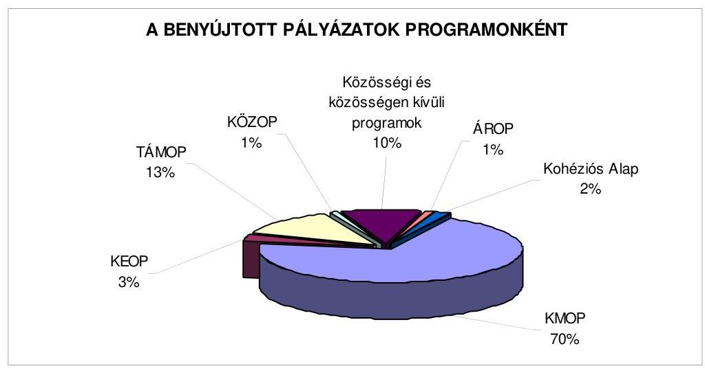
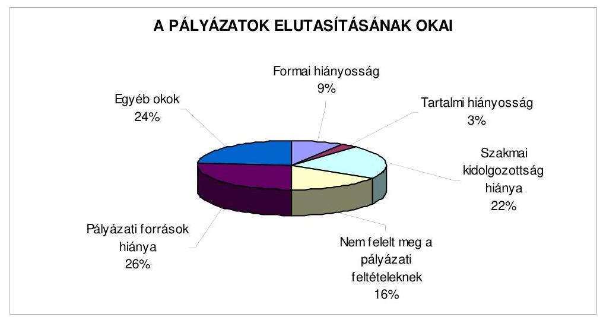
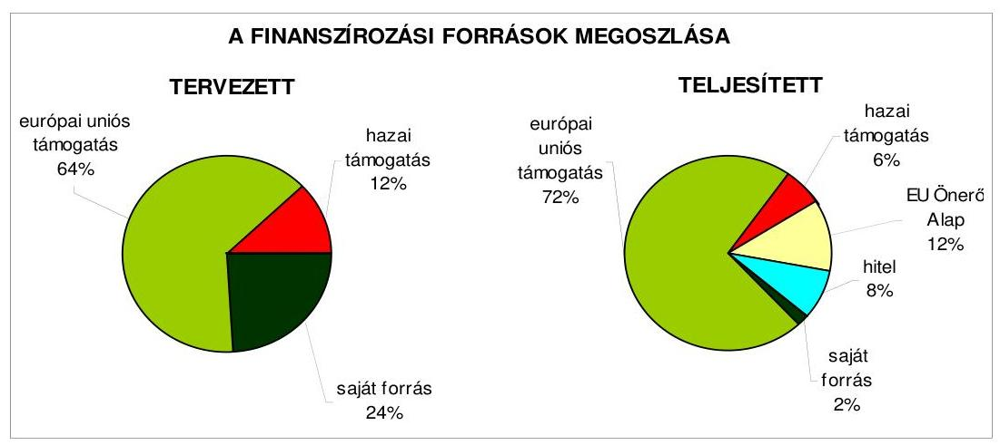
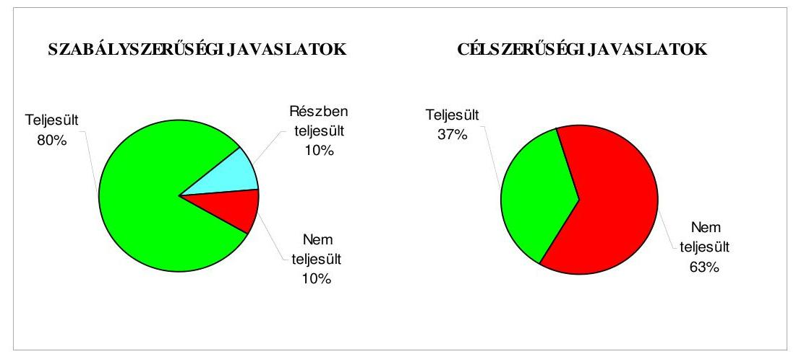
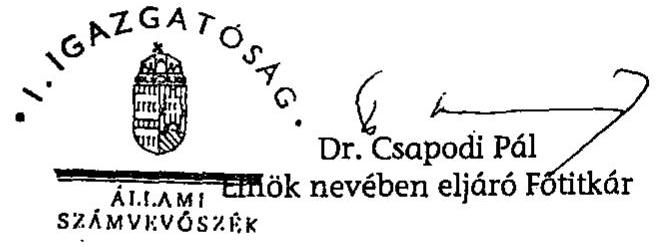
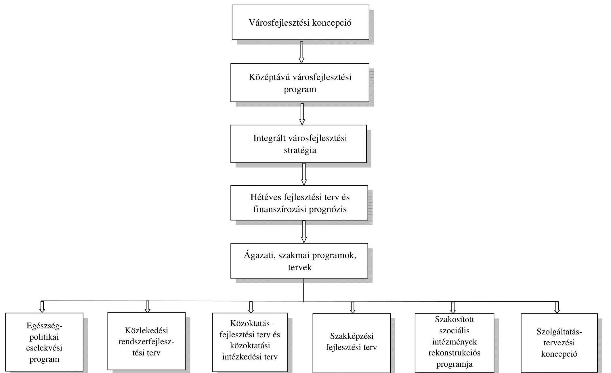
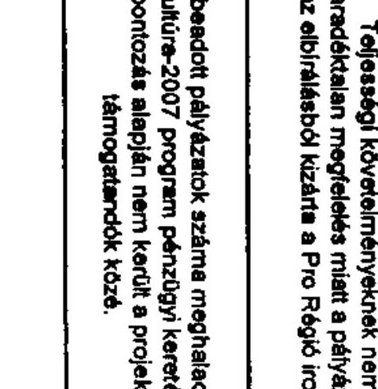
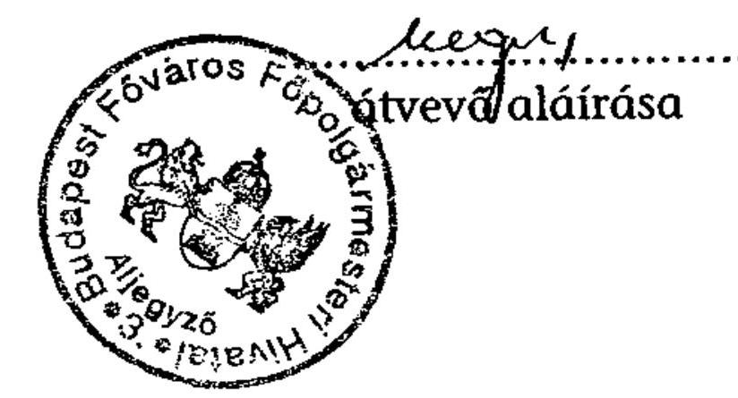
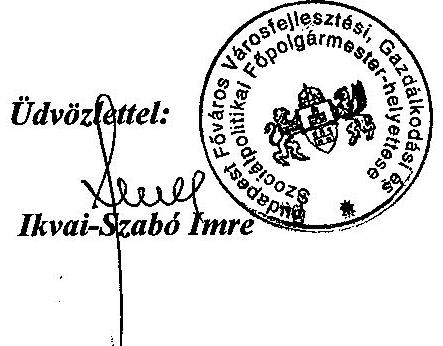
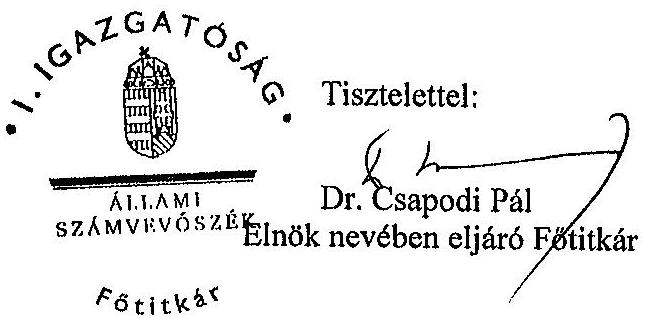

# JELENTÉS 

Budapest Főváros Önkormányzata európai uniós források igénylésére és felhasználására történt felkészültsége ellenőrzéséről
Az önkormányzati gazdálkodás rendszere ellenőrzésének III. üteme

---

# 3. Önkormányzati és Területi Ellenőrzési Igazgatóság 

3.3. Átfogó Ellenőrzési Főcsoport

Iktatószám: V-3010-29/2009.
Témaszám: 946
Vizsgálat-azonosító szám: V0455

## Az ellenőrzést felügyelte:

Dr. Lóránt Zoltán
főigazgató
Az ellenőrzés végrehajtásáért felelős:
Dr. Sepsey Tamás
főigazgató-helyettes
Az ellenőrzést vezette:
Nagy Istvánné dr.
főtanácsadó
Az összefoglaló jelentést készítette:
Nagy Istvánné dr.
főtanácsadó
Az ellenőrzést végezték:
Dr. Csermák Judit Kozma Gábor
számvevő tanácsos számvevő tanácsos főtanácsadó

A témához kapcsolódó eddig készített számvevőszéki jelentések:

## Címe

Jelentés a Magyar Köztársaság 2005. évi költségvetése végrehajtásának ellenőrzéséről
Függelék:

- A helyi önkormányzatokat a 2005. évben megillető normatív állami hozzájárulás elszámolásának ellenőrzéséről
- A kötött felhasználású támogatások 2005. évi felhasználásának ellenőrzéséről
- A helyi önkormányzatok beruházásaihoz és rekonstrukcióihoz nyújtott 2005. évi felhalmozási célú támogatások ellenőrzéséről Jelentés a Budapest Főváros Önkormányzatánál az önkormányzati feladatok és a rendelkezésre álló források összhangjának ellenőrzéséről. Az önkormányzati gazdálkodás átfogó ellenőrzésének IV. üteme
Jelentés a 2006. évi országgyűlési, valamint önkormányzati és 0722
nemzeti, etnikai kisebbségi képviselőválasztások lebonyolításához felhasznált pénzeszközök ellenőrzéséről

---

Jelentés a helyi és helyi kisebbségi önkormányzatok gazdálkodási ..... 0726 rendszerének 2006. évi átfogó és egyéb szabályszerűségi ellenőrzéséről
Jelentés a szakiskolai fejlesztési programra fordított pénzeszközök ..... 0819
felhasználása eredményességének ellenőrzéséről
Jelentés az önkormányzati kórházak és bentlakásos szociális in- ..... 0820 tézmények ápolásra, gondozásra fordított pénzeszközei felhasználásának ellenőrzéséről
Jelentés a sürgősségi betegellátó rendszer kialakítására, fejlesztésére ..... 0924 fordított pénzeszközök felhasználásának ellenőrzéséről

---

# TARTALOMJEGYZÉK 

BEVEZETÉS ..... 15
I. ÖSSZEGZŐ MEGÁLLAPÍTÁSOK, KÖVETKEZTETÉSEK, JAVASLATOK ..... 19
II. RÉSZLETES MEGÁLLAPÍTÁSOK ..... 27

1. az európai uniós forrásokra történő pályázatok benyújtására vonatkozó döntések összhangja a hétéves fejlesztési tervben és az ágazati, szakmai fejlesztési programokban, tervekben foglalt célkitűzésekkel ..... 27
1.1. A fejlesztési célkitűzések meghatározása a hétéves fejlesztési tervben és az ágazati, szakmai programokban, tervekben ..... 27
1.2. Az európai uniós források tervezett igénybevételével kapcsolatos fejlesztési feladatokra vonatkozó döntések ..... 29
1.3. Az európai uniós forrással megvalósuló fejlesztések költségvetési bevételi és kiadási előirányzatai ..... 35
2. Az európai uniós forrásokhoz kapcsolódó pályázatfigyelés, pályázatkészítés, valamint az európai uniós támogatással megvalósuló fejlesztés lebonyolítása belső rendjének szabályozása, a végrehajtás személyi, szervezeti feltételeinek kialakítása ..... 38
2.1. Az európai uniós források igénybevétele és felhasználása feladatainak előírása ..... 38
2.2. Az európai uniós források pályázatfigyelésével, pályázat készítésével, valamint a fejlesztési feladat lebonyolításával összefüggő feladatok személyi, szervezeti feltételeinek biztosítása ..... 43
3. Egy fejlesztési feladat lebonyolításánál a feladatellátás és a kapcsolattartás rendjére, az ellenőrzési feladatok teljesítésére, valamint a felelősségi szabályokra vonatkozó előírások betartása ..... 46
4. Az ÁSZ korábbi ellenőrzési javaslatai alapján készített intézkedési terv végrehajtása, hasznosulása ..... 53
4.1. A Fővárosi Önkormányzat gazdálkodási rendszerének átfogó ellenőrzése során tett javaslatok végrehajtására tervezett intézkedések megvalósulása ..... 53
4.2. A zárszámadáshoz kapcsolódó (állami hozzájárulások igénylésének és felhasználásának ellenőrzése), valamint a további vizsgálatok esetében a megállapítások, javaslatok alapján tett intézkedések ..... 57

---

# MELLÉKLETEK 

1. számú A Fővárosi Önkormányzat gazdálkodását meghatározó adatok, mutatószámok (1 oldal)
2. számú A Fővárosi Önkormányzat vagyonának alakulása (1 oldal)

2/a. számú A Fővárosi Önkormányzat kötelezettségeinek alakulása (1 oldal)
3. számú A fejlesztési célkitűzéseket tartalmazó koncepciók, programok, tervek (1 oldal)
4. számú Tanúsítvány az európai uniós forrásokkal támogatott célok és programok 2006-2009. évi tervezett és teljesített adatairól (12 oldal)
4/a. számú Tanúsítvány az európai uniós forrásokra benyújtott pályázatokról, amelyek elbírálása folyamatban volt (4 oldal)
4/b. számú Tanúsítvány a 2006-2009. években benyújtott és elutasított, valamint tartalékba helyezett európai uniós pályázatokról (8 oldal)
5-5/a-5/b. Az európai uniós források igénybevételének és felhasználásának szabályozása a szakmai ügyosztályoknál és az egyéb szervezeti egységeknél 20062009 között (a pályázatfigyelés, a pályázatkészítés és a fejlesztési feladat lebonyolítása vonatkozásában) (3 oldal)
6. számú Adatlap az európai uniós forrással támogatott „Észak-Pesti Térségi Szakképző Központ infrastrukturális feltételeinek javítása" projektről (5 oldal)
7. számú Az ellenőrzés során átadott munkalapok jegyzéke (1 oldal)
8. számú Ikvai-Szabó Imre úr, Budapest Főváros Önkormányzat Városfejlesztési, Gazdálkodási és Szociálpolitikai főpolgármester-helyettesének észrevétele (2 oldal)
9. számú Dr. Demszky Gábor úr, Budapest Főváros Önkormányzat főpolgármesterének adott válasz (1 oldal)

---

# RÖVIDÍTÉSEK JEGYZÉKE 

## Törvények

Áht.
Eü. tv.
Ötv.
Szakképzési tv.
Számv. tv.
Szoc. tv.

## Rendeletek

Ámr.
Ber.
beruházási rendelet
önkormányzati SzMSz
255/2006. (XII. 8.)
Korm. rendelet
2006. évi költségvetési rendelet
2007. évi költségvetési rendelet
2008. évi költségvetési rendelet
2009. évi költségvetési rendelet

## Határozatok

2142/2007. (VII. 27.)
Korm. határozat
az államháztartásról szóló 1992. évi XXXVIII. törvény
az egészségügyről szóló 1997. évi CLIV. törvény
a helyi önkormányzatokról szóló 1990. évi LXV. törvény
a szakképzésről szóló 1993. évi LXXVI. törvény
a számvitelről szóló 2000. évi C. törvény
a szociális igazgatásról és szociális ellátásokról szóló 1993. évi III. törvény
az államháztartás működési rendjéről szóló 217/1998. (XII. 30.) Korm. rendelet
a költségvetési szervek belső ellenőrzéséről szóló 193/2003. (XI. 26.) Korm. rendelet

Budapest Főváros Önkormányzata és intézményei beruházási és felújítási tevékenysége előkészítésének, jóváhagyásának, megvalósításának rendjéről szóló 50/1998. (X. 30.) rendelet
a Fővárosi Önkormányzat 7/1992. (III. 26.) számú rendelete a Fővárosi Önkormányzat Szervezeti és Működési Szabályzatáról
a 2007-2013 programozási időszakban az Európai Regionális Fejlesztési Alapból, az Európai Szociális Alapból és a Kohéziós Alapból származó támogatások felhasználásának alapvető szabályairól és felelős intézményeiről szóló 255/2006. (XII. 8.) Korm. rendelet
Budapest Főváros Önkormányzat 2006. évi költségvetéséről szóló 12/2006. (III. 16.) számú rendelete
Budapest Főváros Önkormányzat 2007. évi költségvetéséről szóló 11/2007. (III. 14.) számú rendelete
Budapest Főváros Önkormányzat 2008. évi költségvetéséről szóló 15/2008. (III. 15.) számú rendelete
Budapest Főváros Önkormányzat 2009. évi költségvetéséről szóló 28/2009. (V. 25.) számú rendelete
az Új Magyarország Fejlesztési Terv Környezet és Energia Operatív Programja, Elektronikus Közigazgatás Operatív Programja, az Államreform Operatív Programja, a Társadalmi Infrastruktúra Operatív Programja, valamint a regionális operatív programok 2007-2008. évekre vonatkozó akcióterveinek jóváhagyásáról szóló 2142/2007. (VII. 27.) Korm. határozat

---

1063/2007. (VIII. 15.)
Korm. határozat

1095/2007. (XII. 15.)
Korm. határozat

1014/2008. (III. 11.)
Korm. határozat

1045/2008. (VII. 14.)
Korm. határozat

## Szórövidítések

ÁROP
ÁSZ
Belvárosi TISZK
Beruházási Ügyosztály
Egészségügyi Ügyosztály
ÉPTISZK
ÉPTISZK Kht.

EU
EU Iroda

EU Megvalósító Alosztály

EU Önerő Alap
EU Önerő Alap támogatás
az Új Magyarország Fejlesztési Terv Közlekedés Operatív Programja 2007-2008. évekre vonatkozó akcióterveinek, valamint a Közép-magyarországi Operatív Program kiemelt projekt listája kiegészítésének jóváhagyásáról szóló 1063/2007. (VIII. 15.) Korm. határozat
egyes kiemelt projekt-javaslatok akciótervi nevesítésének jóváhagyásáról szóló 1095/2007. (XII. 15.) Korm. határozat
az Új Magyarország Fejlesztési Terv Társadalmi Megújulás Operatív Program, Társadalmi Infrastruktúra Operatív Program, regionális operatív programok 2007-2008. évekre szóló akcióterveinek felülvizsgálatáról, valamint további kiemelt projektjavaslatok 2008. februári akciótervi nevesítéséről szóló 1014/2008. (III. 11.) Korm. határozat
az Új Magyarország Fejlesztési Terv keretén belül új kiemelt projektjavaslatok 2008. júniusi akciótervi nevesítéséről szóló 1045/2008. (VII. 14.) Korm. határozat

ÚMFT Államreform Operatív Program
Állami Számvevőszék
Belvárosi Térségi Integrált Szakképző Központ
Budapest Főváros Önkormányzat Főpolgármesteri Hivatala Beruházási Ügyosztálya
Budapest Főváros Önkormányzat Főpolgármesteri Hivatala Egészségügyi Ügyosztálya
Észak-Pesti Térségi Integrált Szakképző Központ
Észak-Pesti Térségi Integrált Szakképző Központ Közhasznú Társaság; a Közgyűlés 807/2005. (III. 31.) számú határozatában egyetértett az ÉPTISZK közhasznú társaság formájában történő megalapításával, a 928/2005. (IV. 27.) számú határozatában döntött az ÉPTISZK Kht. alapító okiratának elfogadásáról
Európai Unió
Budapest Főváros Önkormányzat Főpolgármesteri Hivatala Európai Uniós Ügyek Irodája (működik 2007. március 8-tól)
Budapest Főváros Önkormányzat Főpolgármesteri Hivatala Főjegyzői Iroda Központi EU Projekt Megvalósító Alosztálya (működik 2008. augusztus 15-től)
az Önkormányzati és Területfejlesztési Minisztérium EU Önerő Alapja
a Magyar Köztársaság 2007. évi költségvetéséről szóló 2006. évi CXXVII. törvény - 5. számú mellékletének 12. pontja alapján - központi költségvetési hozzájárulást biztosított a helyi önkormányzatok és jogi személyiségű társulásaik számára, azok európai uniós fejlesztési célú pályázataihoz szükséges saját forrás kiegészítésére

---

EQUAL
fejlesztési célú pénzeszköz átadás-átvételi megállapodás
fejlesztési feladat (projekt)

FEUVE
folyamatszabályozás

Főépítészi Iroda
főjegyző
Főjegyzői iroda
FŐKERT Zrt.
főpolgármester
Főpolgármesteri hivatal
Főpolgármesteri Kabinet

Közösségi kezdeményezés: diszkriminációs és esélyegyenlőtlenség elleni nemzetközi küzdelem segítése program Budapest Főváros Önkormányzata és az ÉPTISZK Kht. 2006. április 1-jén a fejlesztési feladat saját forrásigényének folyamatos biztosítására megkötött fejlesztési célú pénzeszköz átadás-átvételi megállapodása, amelyet a Közgyűlés 431/2006. (III. 30.) számú határozatában hagyott jóvá és felhatalmazta a Főpolgármestert annak aláírására; a Közgyűlés 160/2007. (II. 15.) számú határozatában jóváhagyta az ÉPTISZK Kht. fejlesztési célú pénzeszköz átadás-átvételi megállapodásának módosítását és felhatalmazta a Főpolgármestert annak aláírására, a módosított megállapodást 2007. március 26-án kötötték meg
a HEFOP/2004/4.1.1. „Térségi Integrált Szakképző Központok infrastrukturális feltételeinek javítása" intézkedése keretében elnyert támogatással, az ÉPTISZK központi tanműhelyét megvalósító beruházás
az Áht. 121. § (1) bekezdésében 2008. december 31-ig meghatározott folyamatba épített, előzetes és utólagos, vezetői ellenőrzés, amelyet a költségvetési szervek jogállásáról és gazdálkodásáról szóló 2008. évi CV. törvény 35. § (2) bekezdése 2009. I. 1-től a folyamatba épített előzetes, utólagos és vezetői ellenőrzés tartalomra változtatott
Budapest Főváros Önkormányzat Főpolgármesteri Hivatala szervezeti egységeinek a minőségügyi eljárás keretében kidolgozott és a feladatváltozások figyelembevételével aktualizált folyamatszabályozása, a Budapest Főváros Önkormányzat Főpolgármesteri Hivatala - 2001. május 28-tól folyamatosan aktualizált - Minőségügyi Kézikönyve alapján
Budapest Főváros Önkormányzat Főpolgármesteri Hivatala Főépítészi Irodája
Budapest Főváros Önkormányzatának Főjegyzője
Budapest Főváros Önkormányzat Főpolgármesteri Hivatala Főjegyzői Irodája
Fővárosi Kertészeti Zártkörűen Működő Nonprofit Részvénytársaság
Budapest Főváros Önkormányzat Főpolgármestere
Budapest Főváros Önkormányzat Közgyűlésének Főpolgármesteri Hivatala
az 525/2005. számú Főpolgármesteri és Főjegyzői intézkedés Budapest Főváros Önkormányzat Főpolgármesteri Hivatala Szervezeti és Működési Szabályzatáról, Ügyrendjéről, annak 10. §-a szerinti tanácskozó fórum
Budapest Főváros Önkormányzata

---

gazdálkodási jogkörök szabályzata

Gyermekvédelmi Ügyosztály
HEFOP
hétéves fejlesztési terv
hivatali SzMSz

Informatikai Ügyosztály

Integrációs Iroda
integrált városfejlesztési stratégia

INTERREG
irányító hatóság
KEOP
KMOP
Kereskedelmi Ügyosztály

Kommunális Ügyosztály
konzorciumi együttműködési megállapodás
Kormány
a főpolgármester és főjegyző 556/2005. számú együttes intézkedése a Főpolgármesteri Hivatal pénzgazdálkodásával kapcsolatos kötelezettségvállalás, utalványozás, ellenjegyzés, érvényesítés és szakmai teljesítést igazoló hatásköri rendjéről
Budapest Főváros Önkormányzat Főpolgármesteri Hivatala Gyermek- és Ifjúságvédelmi Ügyosztálya
NFT Humánerőforrások fejlesztése Operatív Program
Budapest Főváros Önkormányzatának hétéves fejlesztési terve, amelyet a Közgyűlés 2006-2012. évekre a 269/2006. (II. 23.), a 2007-2013. évekre a 352/2007. (III. 1.), a 20082014. évekre a 329/2008. (III. 10.), a 2009-2015. évekre a 657/2009. (V. 14.) számú határozataival fogadott el.
A hétéves fejlesztési terv időszakára finanszírozási prognózis is készül. A hétéves fejlesztési terv a finanszírozási prognózissal együtt a Fővárosi Önkormányzat hétéves gazdasági programja
A Főpolgármester és a Főjegyző 525/2005. számú intézkedése a Budapest Főváros Önkormányzata Főpolgármesteri Hivatala Szervezeti és Működési Szabályzatáról, Ügyrendjéről
Budapest Főváros Önkormányzat Főpolgármesteri Hivatala Informatikai Ügyosztálya
Budapest Főváros Önkormányzat Főpolgármesteri Hivatala Európai Integrációs és Külügyi Irodája (megszűnt 2007. március 7-től)
Budapest Integrált Városfejlesztési Stratégiája, amely elfogadásáról a Közgyűlés a 2133/2008. (XII. 18.) számú határozatával döntött
Közösségi kezdeményezés: határon átnyúló együttműködési program
Foglalkoztatáspolitikai és Munkaügyi Minisztérium HEFOP és EQUAL Program Irányító Hatósága
ÚMFT Környezet és Energia Operatív program
ÚMFT Közép-Magyarországi Operatív Program
Budapest Főváros Önkormányzat Főpolgármesteri Hivatala Kereskedelmi, Turisztikai és Fogyasztói Érdekvédelmi Ügyosztálya
Budapest Főváros Önkormányzat Főpolgármesteri Hivatala Kommunális Ügyosztálya a 2005. július 1-2009. március 15. közötti időszakban, ezt követően összevonták a Közmű Ügyosztállyal
Budapest Főváros Önkormányzata és az ÉPTISZK Kht. 2006. március 31-én a fejlesztési feladat megvalósítására megkötött, konzorciumi együttműködési megállapodása
Magyar Köztársaság Kormánya

---

| kölcsönszerződés | Budapest Főváros Önkormányzata és az ÉPTISZK Kht. 2007. augusztus 27-én megkötött szerződése az európai uniós támogatás megelőlegezésére szolgáló kamatmentes kölcsön nyújtásáról, amelyet a Közgyűlés 431/2006. (III. 30.) számú határozatában hagyott jóvá és felhatalmazta a főpolgármestert annak aláírására |
| :--: | :--: |
| Költségvetési Ügyosztály | Budapest Főváros Önkormányzat Főpolgármesteri Hivatala Költségvetési Tervezési Ügyosztálya |
| Környezetgazdálkodási Ügyosztály | Budapest Főváros Önkormányzat Főpolgármesteri Hivatala Környezetgazdálkodási és Energetikai Ügyosztálya (2009. március 15-ig a megnevezése Környezetvédelmi Ügyosztály volt) |
| közbeszerzési szabályzat | a főpolgármester 555/2005. számú intézkedése Budapest Főváros Önkormányzatának és szerveinek közbeszerzési szabályzatáról |
| középtávú városfejlesztési program | Budapest Középtávú Városfejlesztési Programja, „Podmaniczky Program", amely elfogadásáról a Közgyűlés az 1451/2005. (VI. 29.) számú határozatával döntött |
| Közgyűlés | Budapest Főváros Önkormányzatának Közgyűlése |
| Közlekedési Ügyosztály | Budapest Főváros Önkormányzat Főpolgármesteri Hivatala Közlekedési Ügyosztálya |
| Közmű Ügyosztály | Budapest Főváros Önkormányzat Főpolgármesteri Hivatala Közmű Ügyosztálya |
| KÖZOP | ÚMFT Közlekedés Operatív Program |
| közreműködő szervezet | az Oktatási Minisztérium Alapkezelő Igazgatósága, valamint az Európai Szociális Alap Társadalmi Szolgáltató Non-profit Kft. |
| közszolgáltatási szerződés | Budapest Főváros Önkormányzata és az ÉPTISZK Kht. 2005. június 8-án megkötött, a fejlesztési feladat megvalósításához kapcsolódó szakmai, szervezési, pénzügyigazdasági tevékenységek feltételeit tartalmazó közszolgáltatási szerződés |
| Kulturális Ügyosztály | Budapest Főváros Önkormányzat Főpolgármesteri Hivatala Kulturális Ügyosztálya |
| Leonardo alprogram | az Európai Unió „Egész életen át tartó tanulás" közösségi programjának Leonardo da Vinci alprogramja |
| NFT | Nemzeti Fejlesztési Terv |
| NFÜ | Nemzeti Fejlesztési Ügynökség |
| Oktatási bizottság | Budapest Főváros Önkormányzat Oktatási és Ifjúságpolitikai Bizottsága |
| oktatási intézmények | Budapest Főváros Önkormányzat felügyelete alá tartozó alap- és középfokú oktatási intézmények |
| Oktatási Ügyosztály | Budapest Főváros Önkormányzat Főpolgármesteri Hivatala Oktatási Ügyosztálya |
| Sport Ügyosztály | Budapest Főváros Önkormányzat Főpolgármesteri Hivatala Sport Ügyosztálya |

---

Szociálpolitikai Ügyosztály
szolgáltatástervezési koncepció
támogatási szerződés

TÁMOP
TISZK
ÚMFT
városfejlesztési koncepció

Védelmi Ügyosztály

Budapest Főváros Önkormányzat Főpolgármesteri Hivatala Szociálpolitikai Ügyosztálya
a Fővárosi Szolgáltatástervezési Koncepció, amelyet a Közgyűlés az 1910/2003. (X. 30.) számú határozatával fogadott el, felülvizsgálati rendjéről a 2687/2005. (XI. 24.) számú határozatában döntött
a Foglalkoztatáspolitikai és Munkaügyi Minisztérium és Budapest Főváros Önkormányzat 2006. április 11-én, a HEFOP/2004/4.1.1. „Térségi Integrált Szakképző Központok infrastrukturális feltételeinek javítása" intézkedése keretében elnyert támogatással, az ÉPTISZK központi tanműhelyét megvalósító beruházás támogatására megkötött szerződése; a Közgyűlés a támogatási szerződés aláírásához a 414/2006. (III. 30.) számú határozatában járult hozzá és felhatalmazta a főpolgármestert a támogatási szerződés aláírására
ÚMFT Társadalmi Megújulás Operatív Program
Térségi Integrált Szakképző Központ
Új Magyarország Fejlesztési Terv
Budapest Városfejlesztési Koncepciója, amelyet a Közgyűlés a 410/2003. (III. 27.) számú határozatával fogadott el
Budapest Főváros Önkormányzat Főpolgármesteri Hivatala Védelmi és Gazdasági Ügyosztálya

---

# ÉRTELMEZŐ SZÓTÁR 

akcióterv
európai uniós források
fejlesztési célkitűzés
fejlesztési feladatok (projektek)
főkedvezményezett
hazai társfinanszírozás
indikatív lista
irányító hatóság

Az operatív program végrehajtására vonatkozó két vagy több évre szóló részletes programozási és végrehajtási dokumentum.
A támogatott projekt megvalósítása érdekében, a fejlesztés lebonyolítása során felmerült kiadások finanszírozási forrása.
Budapest Fővárosi Önkormányzat által ellátott kötelező, vagy önként vállalt feladatok fejlesztésére vonatkozó terv.
A fejlesztési feladatok (projektek) tartalmilag és formailag részletesen kidolgozott, megfelelő pénzügyi háttérrel és végrehajtási ütemezéssel rendelkező fejlesztési tervek, amelyek illeszkednek az Európai Unió, illetve a Nemzeti Fejlesztési Terv és az Új Magyarország Fejlesztési Terv által támogatott programokhoz.
A támogatási szerződés több kedvezményezett megjelölése esetében tartalmazza a megvalósítás nyomon követésének, finanszírozásának és ellenőrzésének biztosításáért felelős főkedvezményezett kijelölését. A főkedvezményezett készíti el a projekt előrehaladási jelentéseket, a projekt zárójelentést, bonyolítja a támogatások lehívását és a projekt megvalósításához szükséges kifizetések előkészítését és ellenőrzését. A kedvezményezettek viszonyát, jogait és kötelezettségeit, az információáramlást a támogatási szerződés, valamint - amennyiben ez a támogatás elnyerésének feltételei között szerepel - a kedvezményezettek konzorciumi szerződése szabályozza.
A központi költségvetési és az elkülönített állami pénzalapokból származó finanszírozás.
Az Új Magyarország Fejlesztési Terv operatív programjainak akciótervében a megvalósításra javasolt, ajánlott kiemelt projektek listája.
A strukturális alapok és a Kohéziós Alap forrásainak szabályszerű, hatékony és eredményes felhasználásához szükséges intézményrendszer felső eleme. Az irányító hatóság általános és átfogó felelősséget visel a programok, projektek hatékony és szabályszerű végrehajtásáért. Felelősségi köréből eredően ellenőrzi a közösségi, valamint a hazai jogszabályok betartását, koordinálja az európai uniós források szétosztásának folyamatát, irányítja az intézményrendszer, a statisztikai és a pénzügyi nyilvántartási rendszer működését. Az Új Magyarország Fejlesztési Terv Irányító Hatósága közreműködik az Operatív Program véglegesítésében, irányítja az Operatív Program Program-kiegészítő Dokumentum kidolgozását, és közreműködő szerepet vállal e dokumentumoknak az Európai Bizottsággal történő tárgyalásaiban. Az Irányító Hatóság részt vesz továbbá a költségvetési tervezésében, valamint

---

kedvezményezett
kiemelt projekt
Kohéziós Alap
közreműködő szervezet
lebonyolítás

Nemzeti Fejlesztési Terv
közreműködő szervezetek bevonásával irányítja a meghirdetett pályázatok és a központi programok végrehajtását.
Az az önkormányzat, amely a támogatási szerződést kedvezményezettként aláírja, a projektet, illetve a központi programhoz kapcsolódó támogatott önkormányzati programot végrehajtja.
A Kormány által egyedileg jóváhagyott projekt, amelyet az akcióterv nevesítve tartalmaz.
Az Európai Unió közlekedési és környezetvédelmi infrastrukturális fejlesztéseket szolgáló támogatási alapja.
A közreműködő szervezet az európai uniós támogatást elnyert kedvezményezettekkel kapcsolatot tartó szerv. Az operatív programok közreműködő szervezetei befogadják, nyilvántartják, döntésre előkészítik a pályázatokat, rögzítik a támogatással kapcsolatos adatokat az Egységes Monitoring Informatikai Rendszerben, elvégzik a támogatások előzetes (szerződéskötést megelőző), közbenső (a pénzügyi elszámolás, finanszírozás folyamatában végzett) és utólagos (a támogatott projekt pénzügyi lezárását megelőző) ellenőrzését. Az önkormányzatoknál a leggyakrabban előforduló operatív program a Regionális Fejlesztési Operatív Program végrehajtásában közreműködő szervezetek a VÁTI Kht. és a regionális fejlesztési ügynökségek.
A Kohéziós Alap kettő közreműködő szervezete (Nemzeti Fejlesztési és Gazdasági Minisztérium, Környezetvédelmi és Vízügyi Minisztérium) a támogatott projektek végrehajtásához kapcsolódó operatív feladatokat látják el. Ennek keretében megkötik a szerződéseket a projekt kedvezményezettjével, folyamatosan nyomon követik a teljesítéseket, lebonyolítják a támogatások kifizetését, vezetik az Egységes Monitoring Informatikai Rendszert.
Az európai uniós források felhasználásával megvalósuló fejlesztésre irányuló műszaki, gazdasági (pénzügyi) tevékenységet magában foglaló szervezési, irányítási szolgáltatás. A szervezési szolgáltatás kiterjedhet a pályázatkészítésre, a közbeszerzési eljárás lebonyolításán keresztül a folyamatos műszaki ellenőrzésre, a pénzügyi elszámolásra, a műszaki átadás-átvételre, az üzembe helyezésre, illetve a fejlesztési folyamat egyes elemeire.
Helyzetelemzést, stratégiát a tervezett fejlesztési területek prioritásait, azok céljait és pénzügyi forrásaik megjelölését tartalmazó dokumentum, amelyet a Magyar Köztársaság Kormánya készített az Európai Unió programozási irányelveinek, célkitűzéseinek megfelelően a fejlődésben lemaradó régiók fejlődésének és strukturális átalakulásának elősegítésére a kiemelt szükségletekre figyelemmel. A Nemzeti Fejlesztési Terv stratégiai fejezetének célja, hogy 2004-2006 közötti időszakra kijelölje a strukturális ala-

---

nevesítés
operatív program
regionális program
szakmai ügyosztályok és egyéb szervezeti egységek
pokból támogatható fejlesztéspolitikai célkitűzéseit és prioritásait. A strukturális alapok operatív programjai: Agrár- és Vidékfejlesztési Operatív Program (AVOP); Gazdasági Versenyképesség Operatív Program (GVOP); Humánerőforrások fejlesztése Operatív Program (HEFOP); Környezetvédelem és infrastruktúra-fejlesztési Operatív Program (KIOP); Regionális Fejlesztés Operatív Program (ROP). A kiemelt projektek megnevezése az akciótervben, illetve annak módosításaiban. A nevesítés során - a kiemelt projekt megnevezésén túl - megjelölik a régiót, a megyét, az operatív programot és a projektgazdát.
Az Európai Bizottság által jóváhagyott, a Közösségi Támogatási Keret végrehajtására vonatkozó, több évre szóló intézkedésekhez kapcsolódó prioritások egységes rendszerét tartalmazó dokumentum.
Az ágazati és regionális prioritásokat egyaránt tartalmazó operatív program regionális prioritása, illetve támogatási konstrukciója.
A Főpolgármesteri Hivatal szervezeti egységei közötti megkülönböztetés az szerint, hogy az európai uniós forrásokkal kapcsolatos pályázatfigyelési, pályázatkészítési, valamint fejlesztés lebonyolítási feladatok közül melyik jelent meg a szervezeti egységnél. A szakmai ügyosztályok azon vizsgálatba vont, szakmai feladatokat ellátó szervezeti egységek (ügyosztályok: Egészségügyi, Gyermek- és Ifjúságvédelmi, Informatikai, Kereskedelmi, Turisztikai és Fogyasztói Érdekvédelmi, Környezetgazdálkodási és Energetikai - 2009. március 15. előtt Környezetvédelmi -, Közlekedési, Közmű - 2008. március 15. előtt külön Kommunális és Közmű, számbavételnél egy ügyosztály - Kulturális, Oktatási, Sport, Szociálpolitikai, Védelmi és Gazdasági, és a Főépítészi Iroda), amelyeknél az európai uniós források igénybevételére és felhasználására vonatkozó felkészültség értékelésénél értelmezhető a pályázatfigyelés, a pályázatkészítés és a fejlesztés-lebonyolítás feladata. Az egyéb szervezeti egységek a Főpolgármesteri Hivatal azon vizsgálatba vont szervezeti egységei (Európai Uniós Ügyek Irodája, Beruházási, Költségvetési Tervezési Ügyosztály, Főjegyzői Iroda Központi EU Projekt Megvalósító Alosztálya), amelyeknél - feladatukból adódóan - az európai uniós források igénybevételére és felhasználására vonatkozó felkészültség értékelésénél nem jelent meg a pályázatfigyelés, pályázatkészítés és pályázat-lebonyolítás mindhárom feladata. A Beruházási Ügyosztály pályázatkészítésben és pályázat-lebonyolításban, az Európai Uniós Ügyek Irodája pályázatfigyelésben, pályázatkészítésben, a Központi EU Projekt Megvalósító Alosztály a pályázatok lebonyolításában, a Költségvetési Tervezési Ügyosztály a pályázatok készítésénél vett részt.

---

szakmai ügyosztály, egyéb szervezeti egység folyamatszabályozása támogatási konstrukció
támogatási szerződés

Térségi Integrált Szakképző Központ (TISZK)

Új Magyarország Fejlesztési Terv

A minőségügyi eljárás keretében kidolgozott, a résztevékenységek tematikus és logikai rendszerén alapuló, a felelősök megjelölésével párosuló szabályozás.
Azonos céllal, támogatható tevékenységekkel, támogatási formával és indikátorokkal jellemezhető egy vagy több pályázat, és/vagy kiemelt projekt. A támogatási konstrukciókat az akcióterv határozza meg.
A strukturális alapok esetében az irányító hatóságnak, illetve a Kohéziós Alap esetében a közreműködő szervezeteknek a kedvezményezett önkormányzattal kötött szerződése, amely a támogatás felhasználásának részletes feltételeit tartalmazza. Az Új Magyarország Fejlesztési Terv keretében támogatott projektek esetében a támogatási szerződést a kedvezményezett és a Nemzeti Fejlesztési Ügynökség nevében eljáró közreműködő szervezet között jön létre. Nagyprojekt esetén a támogatási szerződést az Nemzeti Fejlesztési Ügynökség ellenjegyzi. A támogatási szerződés képezi a megvalósítás nyomon követésének, finanszírozásának és ellenőrzésének alapját.
A Szakképzési tv. 2006. január 1-től hatályos 19. § (1) bekezdése szerint a szakképzést folytató közoktatási intézmények együttműködési megállapodás keretében központi képzőhelyet hozhattak létre. A Szakképzési tv. 2006. március 1-jétől hatályos módosítása a szakképzési feladatok ellátására létrehozta a térségi integrált szakképző központokat, amelyek intézményi társulásban, intézményi keretben, illetve non-profit gazdasági társaságként működhettek. A térségi integrált szakképző központok ellátták a központi képzőhelyi feladatokat is, amely lehetővé tette az eszközigényes, kiemelkedő nagyságrendű beruházást igénylő szakképzési tevékenységek gazdaságos és hatékony megszervezését a fenntartó önkormányzatok számára. A térségi integrált szakképző központok létrehozására, valamint infrastrukturális feltételeik javítására a HEFOP két intézkedésének, valamint az ÚMFT TÁMOP és KMOP egy-egy intézkedésének keretében európai uniós pályázati források álltak rendelkezésre. A Fővárosi Önkormányzat a 2004-2009. évek közötti időszakban egy vagy több szakmacsoport képzésére 12 térségi integrált szakképző központot hozott létre, nyolc esetben európai uniós források igénybevételével.
Az Új Magyarország Fejlesztési Terv célja a foglalkoztatás bővítése és a tartós növekedés feltételeinek megteremtése. Ennek érdekében 2007-2013 között hat kiemelt területen indított el összehangolt állami és európai uniós fejlesztéseket: a gazdaságban, a közlekedésben, a társadalom megújulása érdekében, a környezet és az energetika területén, a területfejlesztésben és az államreform feladataival összefüggésben. Az Új Magyarország Fejlesztési Terv operatív programjai: Államreform Operatív Program (ÁROP);

---

Elektronikus Közigazgatás Operatív Program (EKOP); Gazdaságfejlesztés Operatív Program (GOP); Környezet és Energia Operatív Program (KEOP); Közlekedés Operatív Program (KÖZOP); Dél-Alföldi Operatív Program (DAOP); Dél-Dunántúli Operatív Program (DDOP); Észak-Alföldi Operatív Program (ÉAOP); Észak-Magyarországi Operatív Program (ÉMOP); Közép-Dunántúli Operatív Program (KDOP); Közép-Magyarországi Operatív Program (KMOP); Nyugat-Dunántúli Operatív Program (NYDOP); Társadalmi Infrastruktúra Operatív Program (TIOP); Társadalmi Megújulás Operatív Program (TÁMOP).

---

.

---

# JELENTÉS 

## Budapest Főváros Önkormányzata európai uniós források igénylésére és felhasználására történt felkészültsége ellenőrzéséről

## BEVEZETÉS

Az Ötv. 92. § (1) bekezdése, az Állami Számvevőszékről szóló 1989. évi XXXVIII. törvény 2. § (3) bekezdése, valamint az Áht. 120/A. § (1) bekezdése alapján az önkormányzatok gazdálkodását az Állami Számvevőszék ellenőrzi. Az ellenőrzésre az Országgyűlés illetékes bizottságai részére is átadott, országosan egységes ellenőrzési program szerint került sor.

Az Állami Számvevőszék a stratégiájában foglalt célkitűzéseknek megfelelően a helyi önkormányzatok költségvetési gazdálkodási rendszere átfogó ellenőrzésének programját a 2007. évtől megújította, azt kiegészítette további - teljesítmény-ellenőrzési - elemekkel.

A Fővárosi Önkormányzat gazdálkodási rendszerének több évre ütemezett ellenőrzése keretében az Állami Számvevőszék vizsgálta a Fővárosi Önkormányzat felkészültségét az európai uniós források igénylésére és felhasználására. Az Európai Unióhoz történt csatlakozás és a pályázati lehetőségek bővülése következtében megnőtt az önkormányzatok szerepe az európai uniós támogatások felhasználása tekintetében. A támogatási lehetőségek egyre szélesebb körű, valamint átlátható, rendszerezett igénybevételének elősegítése érdekében indokolt volt, hogy az Állami Számvevőszék eredményességi szempontból értékelje a Fővárosi Önkormányzatnál az európai uniós források figyelésére, igénylésére és felhasználására történt felkészülés szabályozottságát, szervezettségét. Az ellenőrzés feladata volt továbbá, hogy bizonyosságot szerezzen a korábbi számvevőszéki ellenőrzések megállapításainak, javaslatainak hasznosításáról, a javaslatok megvalósítása érdekében tett intézkedésekről.

Az ellenőrzés célja annak értékelése volt, hogy a Fővárosi Önkormányzat

- eredményesen készült-e fel a szabályozottság és a szervezettség terén az európai uniós források igénylésére és felhasználására, valamint
- megfelelően hasznosították-e a korábbi számvevőszéki ellenőrzések megállapításait, szabályszerűségi ${ }^{1}$ és célszerűségi javaslatait.

[^0]
[^0]:    ${ }^{1}$ A törvényi előírások betartásának elmulasztásakor a részletes megállapítások fejezetben egységesen a törvénysértés megjelölést alkalmazzuk, mivel az ÁSZ nem tehet különbséget a törvényi előírások között.

---

Az ellenőrzés típusa: átfogó ellenőrzés, amely - egy ellenőrzés keretében meghatározott területekre összpontosítva alkalmazza a teljesítmény-ellenőrzés, valamint a szabályszerűségi ellenőrzés jellemzőit is. Az európai uniós támogatás igénylésére és felhasználására történt felkészülésre vonatkozóan teljesítményellenőrzést végeztünk. Az európai uniós források figyelésére, igénylésére és felhasználására a felkészülést akkor minősítettük eredményesnek, ha az ellenőrzési programban meghatározott szempontok szerinti feltételeknek megfelelt a felkészülés szabályozottsága, szervezettsége, továbbá értékeltük, hogy az igényelt európai uniós támogatások a Fővárosi Önkormányzat által meghatározott fejlesztési célkitűzésekhez kapcsolódtak-e.

Az ellenőrzött időszak: az európai uniós források igénybevételének és felhasználásának vizsgálatához az ellenőrzési programban meghatározott feladatokat, továbbá az Állami Számvevőszék korábbi ellenőrzési javaslatainak megvalósítását a 2006-2008. évekre, valamint a 2009. év I. negyedév végéig terjedő időszakra ellenőriztük. A megállapításoknál lehetőség szerint figyelembe vettük a helyszíni ellenőrzés ideje alatt tett intézkedéseket is.

Budapest főváros állandó lakosainak száma 2009. január 1-jén 1695023 fő volt ${ }^{2}$. A 2006. évi önkormányzati választást követően a Fővárosi Önkormányzat 67 tagú Közgyűlésének munkáját tizenöt állandó bizottság segítette. A Fővárosi Önkormányzat mellett a 2006. évi önkormányzati választásokat követően 11 kisebbségi önkormányzat ${ }^{3}$ működött. A főpolgármester az 1990. évi önkormányzati képviselő és polgármester választás óta tölti be tisztségét, a főjegyző személye az 1992. év óta változatlan.

A Fővárosi Önkormányzat feladatainak végrehajtása érdekében a 2008. évben 222 költségvetési intézményt működtetett, amelyekből 191 önállóan gazdálkodott. A feladatok ellátásában részt vett 15 gazdasági társasága, 20 közhasznú társasága, továbbá három alapítványa. A Fővárosi Önkormányzat a 2008. évi költségvetési beszámolója szerint 548989 millió Ft költségvetési bevételt ért el és 461308 millió Ft költségvetési kiadást teljesített. 2008. december 31-én a könyvviteli mérleg szerint 2144670 millió Ft értékű vagyonnal rendelkezett. A Fővárosi Önkormányzat vagyona a 2008. évre a 2006. év végi állományhoz viszonyítva 5,8%-kal emelkedett, ezen belül háromszorosára (207,5%-kal) nőtt a beruházások állománya a nagy költségigényű fejlesztések (a 4-es metró építése, a központi szennyvíztisztító és létesítményei) miatt. A kétszerest meghaladóan növekedett (122,4%-kal emelkedve 96749 millió Ft-ra nőtt) a pénzeszközök és (155,0%-kal növekedve 96848 millió Ft-ra emelkedett) a költségvetési tartalékok állománya a Kohéziós Alapból és a központi költségvetésből a 2008. év végén rendelkezésre bocsátott 31946 millió Ft támogatási előleg hatására. Az összes költségvetési bevétel 62,5%-át a saját bevétel, illetve 17,1%-át a helyi adó bevétel biztosította a 2008. évben. Az összes költségvetési kiadásból a felhalmozási célú kiadás részaránya a 2008. évben 36,1% volt. A 2009. évi költségvetési rendeletben 484813 millió Ft költségvetési bevételt és 531794 millió

[^0]
[^0]:    ${ }^{2}$ Az állandó lakosok adatának forrása a Közigazgatási és Elektronikus Közszolgáltatások Központi Hivatalának nyilvántartása.
    ${ }^{3}$ A kisebbségi önkormányzatok: bolgár, cigány, görög, horvát, lengyel, német, örmény, ruszin, szerb, szlovák és ukrán kisebbségi önkormányzatok.

---

Ft költségvetési kiadást irányoztak elő. A Főpolgármesteri hivatalban dolgozó köztisztviselők száma 2008. december 31-én 1003 fő, a költségvetési intézményekben foglalkoztatott közalkalmazottak száma 30261 fő volt. A Fővárosi Önkormányzat gazdálkodását meghatározó adatokat, mutatószámokat az 1-2. számú mellékletek tartalmazzák.

A Fővárosi Önkormányzat európai uniós forrást elnyert és folyamatban lévő fejlesztései között 12 kiemelt - a Kormány által egyedileg jóváhagyott - projekt szerepelt. A 255/2006. (XII. 8.) Korm. rendelet 3. § c) pontjában foglaltak jogkört biztosítottak a Kormány számára - az operatív programok végrehajtására vonatkozó akciótervekben - kiemelt projektek nevesítésére, a 2007-2013. programozási időszakra. A kiemelt projekt nevesítése lehetővé tette az európai uniós forráshoz történő közvetlen, pályázás nélküli hozzájutást. A kiemelt projekt akciótervben történő nevesítésére a Kormány bármely tagja, az érintett regionális fejlesztési tanács és az NFÜ tehetett javaslatot. Az akciótervben a támogatási konstrukciónak - amennyiben az kiemelt projektek megvalósítását támogatta - tartalmaznia kellett a kiemelt projektek indikatív listáját. A Kormány az ÚMFT regionális operatív programjai 2007-2008. évekre vonatkozó akcióterveinek jóváhagyása során régiónként nevesítette a támogatási szerződés megkötésére kijelölt kiemelt projekteket ${ }^{4}$, illetve a továbbfejlesztésre javasolt kiemelt projekteket.

A Főpolgármesteri hivatalban az európai uniós források igénybevételéhez és felhasználásához a szervezeti kereteket fokozatosan alakították ki a 2006-2009. I. negyedévben. A 2006. évben az Integrációs Iroda feladata volt a pályázatfigyelés, a 2007. évben megszüntetésével egyidejűleg létrehozták az EU Irodát. Az EU Iroda feladata a pályázatfigyelés mellett a pályázatok kidolgozásában való részvétel volt. A 2008. évben az EU Megvalósító Alosztály létrehozásával az európai uniós forrásokból elnyert támogatásokból megvalósuló fejlesztési feladatok lebonyolításának folyamatát tervezték erősíteni. Az Oktatási Ügyosztályon a 2008. évben, a Közlekedési Ügyosztályon a 2009. I. negyedévben - az európai uniós pályázatok nagy számára tekintettel - a fejlesztési feladatok lebonyolítására külön alosztályt hoztak létre. Az európai uniós források igénylésével és felhasználásával összefüggő szabályozottság vizsgálata a Főpolgármesteri hivatal 16 szervezeti egységére (13 szakmai ügyosztályra, négy egyéb szervezeti egységére) irányult.

Az ellenőrzésre kiválasztott ${ }^{5}$, európai uniós forrással megvalósuló „Az ÉPTISZK infrastrukturális feltételeinek javítása" fejlesztési feladat lebonyolításához szükséges saját erőt a Fővárosi Önkormányzat a fejlesztési célú pénzeszköz átadás-átvételi megállapodás, míg a támogatás megelőlegezéséhez szükséges pénzeszközöket a kölcsönszerződés alapján adta át az ÉPTISZK Kht. részére. A Fővárosi Önkormányzat részéről a pénzeszközátadásokkal összefüggésben elvégzett

[^0]
[^0]:    ${ }^{4}$ A 2142/2007. (VII. 27.) Korm. határozat 1. számú melléklete a kiemelt, a 2. számú melléklete a továbbfejlesztésre javasolt kiemelt projekteket tartalmazta.
    ${ }^{5}$ A kiválasztás szempontjait a helyi önkormányzatok gazdálkodási rendszere ellenőrzésének segédlete tartalmazta.

---

munkafolyamatba épített, előzetes és utólagos vezetői ellenőrzési feladatok ${ }^{6}$ bizonylatait tételesen ellenőriztük.

Az ÉPTISZK Kht. végezte el - a támogatási szerződés előírásainak megfelelően a fejlesztési feladat kifizetéseivel összefüggő folyamatba épített, előzetes és utólagos vezetői ellenőrzési feladatokat. Az ÉPTISZK Kht. által működtetett kontrollok működését egyszerű véletlen mintavétellel vizsgáltuk a vizsgálatot támogató számítástechnikai program segítségével.

Az ÁSZ korábbi ellenőrzési javaslatai alapján tett intézkedéseket, illetve azok megvalósítását utóellenőrzés keretében vizsgáltuk. A gazdálkodási rendszer átfogó ellenőrzése során megfogalmazott javaslatok végrehajtására tett intézkedések megvalósítását ellenőriztük, az egyéb számvevőszéki ellenőrzések során tett javaslatok esetében pedig a kiadott intézkedéseket tekintettük át.

A helyszíni ellenőrzés során kitöltött - az ellenőrzést végző számvevő és a Főpolgármesteri hivatal felelős köztisztviselője által aláírt - helyszíni ellenőrzési munkalapokat a városfejlesztési, gazdálkodási és szociálpolitikai főpolgármester-helyettes részére a számvevői jelentéssel egyidejűleg átadtuk.

A jelentést az ÁSZ-ról szóló 1989. évi XXXVIII. tv. 25. § (1) bekezdése alapján egyeztettük Budapest Főváros Önkormányzat főpolgármesterével. Az egyeztetés során kapott észrevételt, valamint az arra adott választ a jelentés 8-9. számú mellékletei tartalmazzák.

[^0]
[^0]:    ${ }^{6}$ A folyamatba épített, előzetes és utólagos vezetői ellenőrzési feladatokat az Áht. 121. § (1) bekezdésének 2008. december 31-ig hatályban lévő tartalma szerint alkalmaztuk, mivel az ellenőrzött „ÉPTISZK infrastrukturális feltételeinek javítása" projekt megvalósítása 2008. december 22-én zárult.

---

# I. ÖSSZEGZŐ MEGÁLLAPÍTÁSOK, KÖVETKEZTETÉSEK, JAVASLATOK 

A Fővárosi Önkormányzat fejlesztési célkitűzéseit a városfejlesztési koncepció, a középtávú városfejlesztési program, az integrált városfejlesztési stratégia, a hétéves fejlesztési terv, valamint az ágazati, szakmai programok, tervek tartalmazták. A fejlesztési célkitűzések meghatározásánál a kerületi önkormányzatokkal folytatott előzetes egyeztetések, a Fővárosi Önkormányzat részvétele a Közép-magyarországi Régió akcióterve, operatív programja előkészítésében, valamint a középtávú városfejlesztési program, az ágazati, szakmai programok, tervek ütemezett felülvizsgálati rendszere és a hétéves fejlesztési terv tervezési módszere biztosította az európai uniós források igénybevételére irányuló pályázati lehetőségekhez való alkalmazkodást. A megvalósítás lehetséges pénzügyi forrásait figyelembe vették a fejlesztési célkitűzések meghatározásánál.

A Fővárosi Önkormányzatnál a Közgyűlés 69, az intézményvezetők 156, együttesen 225 európai uniós forrást igénylő pályázat benyújtásáról döntöttek a 2006-2009. I. negyedév közötti időszakban. Az európai uniós források igénybevételére benyújtott pályázatokkal kapcsolatos közgyűlési és intézményvezetői döntések összhangban voltak a városfejlesztési koncepcióban, a középtávú városfejlesztési programban, az integrált városfejlesztési stratégiában, a hétéves fejlesztési tervben és az ágazati, szakmai programokban, tervekben foglalt célkitűzésekkel. A Fővárosi Önkormányzat által benyújtott pályázatok 11%-ának elbírálása 2009. szeptember végéig nem történt meg, 63%-a támogatott, 25%-a elutasított és 1%-a tartalékba helyezett volt. A pályázatok elutasításának okai között a pályázati források hiánya, formai, tartalmi hibák, valamint szakmai kidolgozatlanság szerepelt, továbbá nem feleltek meg a pályázati feltételeknek. Kettő esetben fordult elő, hogy a főpolgármester a kedvező döntés ellenére a támogatási szerződést nem köthette meg, mivel az előírt határidőre a hatósági engedélyek nem álltak rendelkezésre, ezek hiányában viszont a támogatói döntés hatályát vesztette. A támogató kedvező döntése ellenére egy oktatási intézményvezető a saját forrás hiánya miatt nem kötött támogatási szerződést. A Fővárosi Önkormányzatnál a 2009. I. negyedévtől - az ellenőrzés időszaka alatt - további 25 európai uniós forrást igénylő kiemelt projektjavaslatot és pályázatot nyújtottak be, melyből kettőt elutasítottak, hat végrehajtása, 17 elbírálása folyamatban volt, 2009. szeptember végén.

A Fővárosi Önkormányzat 2006-2009. évi költségvetési rendeletei tartalmazták az európai uniós forrást igénylő fejlesztési feladatok kiadási és bevételi előirányzatait. A 2006-2009. évi költségvetési rendeletekben meghatározták a felújítási előirányzatokat célonként, a felhalmozási kiadásokat feladatonként, a többéves kihatással járó döntések számszerűsítését évenként és összesítve, valamint elkülönítetten egy projekt bevételeit és kiadásait. Az Ámr-ben foglaltak ellenére 81 európai uniós támogatással megvalósuló program, projekt bevételeit és kiadásait elkülönítetten nem mutatták be. A Fővárosi Önkormányzatnál az európai uniós forrást igénybe vevő fejlesztések bevételi és kiadási előirányzatainak tervezéséről a 2009. évi tervezési körirat, a 2009. évi költségvetési rende-

---

let, valamint a beruházási rendelet előírásai rendelkeztek. A 2009. évi tervezési köriratban a támogatási szerződéssel nem rendelkező, de az év első három hónapjában aláírásra váró projektek európai uniós támogatási előirányzatának tervezési útmutatása nem volt összhangban az Ámr-nek a költségvetésben az eredeti előirányzat tervezésére vonatkozó előírásával.

A Főpolgármesteri hivatalban a 2006-2009. I. negyedévében a belső szabályzatokban nem jelölték ki az európai uniós forrásokra vonatkozó pályázatokkal összefüggésben az önkormányzati szintű pályázatkoordinálás, valamint pályázat-nyilvántartás vezetésének felelőseit. A pályázatfigyelést végzők és a döntési, illetve döntés-előterjesztési jogkörrel rendelkezők közötti információszolgáltatási kötelezettséget a 2006. évben belső szabályzatokban nem írták elő. A 2007-2009. I. negyedévben a hivatali SZMSZ-ben az EU Iroda feladatai között határozták meg az információszolgáltatási kötelezettséget, azonban az információszolgáltatás formáját, módját, ütemezését nem rögzítették, valamint elmaradt a döntés-előterjesztés előkészítési jogkörrel rendelkező EU Iroda felé a pályázatfigyelést végző szakmai ügyosztályok információszolgáltatási kötelezettségének meghatározása. Az EU Iroda folyamatszabályozása a pályázatfigyelés keretében - a 2007. évtől - tartalmazta a szakmai ügyosztályok felé az információszolgáltatás kötelezettségét.

A Főpolgármesteri hivatalban az európai uniós források igénybevételének és felhasználásának feladatait, a pályázatfigyelés, pályázatkészítés és a fejlesztéslebonyolítás eljárásrendjét a 2006-2009. I. negyedévben nem, illetve hiányosan szabályozták a hivatali SzMSz-ben, a szakmai ügyosztályok és az egyéb szervezeti egységek belső működési szabályzataiban, folyamatszabályozásaiban, valamint a köztisztviselők munkaköri leírásaiban. A belső szabályzatok nem tartalmazták az eljárásrend valamennyi elemének - feladatmeghatározás, kapcsolattartás, információáramlás - szabályozását a szakmai ügyosztályoknál és az egyéb szervezeti egységeknél. A Főpolgármesteri hivatalban a szabályozás során nem teremtették meg az összhangot a szakmai ügyosztályok és az egyéb szervezeti egységek kapcsolattartására és információáramlására vonatkozó szabályozásban, a hivatali SzMSz-ben, a belső működési szabályzatokban, a folyamatszabályozásokban, valamint a munkaköri leírásokban.

A Főpolgármesteri hivatalban a folyamatba épített, előzetes és utólagos vezetői ellenőrzési feladatokat a beruházási rendelet, közbeszerzési szabályzat, a gazdálkodási jogkörök szabályzata, a 2008. évben az EU Megvalósító Alosztály belső működési szabályzata és folyamatszabályozása magába foglalta. A gazdálkodási jogkörök szabályzatában - az Ámr-ben foglaltak ellenére - a felhalmozási célú pénzeszközátadások vonatkozásában az érvényesítést végző személyt a főjegyző írásban nem bízta meg. A belső ellenőrzés 2007-2011. évekre vonatkozó stratégiai tervét megalapozó kockázatelemzés nem terjedt ki az európai uniós forrásokkal támogatott fejlesztési feladatokra. A 2008. évi belső ellenőrzési tervben azonban magas kockázatúnak értékelték az európai uniós támogatással megvalósítani tervezett feladatokat. A 2009. évi belső ellenőrzési munkatervet megalapozó kockázatelemzés sem tért ki az európai uniós forrással támogatott fejlesztési feladatokra.

---

A pályázatfigyelés, a pályázatkészítés és a fejlesztési feladat lebonyolításának személyi és szervezeti feltételeit 2006-2007. I. negyedév között a Főpolgármesteri hivatalban kialakították. A feladatok ellátásában a köztisztviselők mellett az intézmények közalkalmazottai is részt vettek. A külső szervezettel pályázat készítésére kötött 16 szerződésben előírták a külső szervezet és a Főpolgármesteri hivatal képviselője közötti kapcsolattartást, az információk átadásának tartalmát, formáját és módját, azonban négy szerződésben nem határozták meg a pályázat szakmai és formai követelményeinek biztosítására vonatkozóan a pályázatkészítést végző felelősségét, továbbá nem írták elő a kapcsolattartás és az információk átadásának tartalmát, formáját és módját. Egy pályázat elkészítésére a külső szervezettel nem kötöttek szerződést, hivatkozva az önkormányzati vagyon kezelésére és hasznosítására kötött együttműködési keret-megállapodásra. A keret-megállapodásban azonban nem rögzítettek európai uniós pályázat elkészítésével kapcsolatos feladatot. A fejlesztési feladatok lebonyolítására külső szervezetekkel kötött szerződésekben a feladat-ellátás kötelezettségét, az ellenőrzés és a kapcsolattartás rendjét, valamint a személyre szóló felelősségi szabályokat meghatározták.

A Fővárosi Önkormányzat „Az ÉPTISZK infrastrukturális feltételeinek javítása" fejlesztési feladat támogatási szerződését megkötötte, amely módosítása keretében főkedvezményezett státuszát, valamint a beruházói feladatokat az ÉPTISZK Kht-ra ruházta át. A fejlesztési feladat lebonyolítása során az ÉPTISZK Kht. betartotta a támogatási szerződésben, a konzorciumi együttműködési megállapodásban, továbbá a közszolgáltatási szerződésben, valamint a fejlesztési célú pénzeszköz átadás-átvételi megállapodásban foglalt előírásokat. A fejlesztési feladat lebonyolítását végző ÉPTISZK Kht. gondoskodott a projekt támogatási szerződésben rögzített időbeli megvalósításáról. A Fővárosi Önkormányzat 2006-2008 között tervezett saját forrást a támogatási szerződésben foglaltak szerint biztosította, valamint eleget tett a strukturális alapok támogatás megelőlegezési követelményének. A fejlesztési feladat utófinanszírozási rendszere - a Fővárosi Önkormányzat által a támogatás megelőlegezésére biztosított kölcsönszerződés következtében - nem okozott pénzügyi zavarokat az ÉPTISZK Kht. gazdálkodásában, belső szabályzatai, valamint a támogatási szerződés előírásainak megfelelően elvégezte a folyamatba épített, előzetes és utólagos vezetői ellenőrzési feladatait.

A Főpolgármesteri hivatalnál, az Ámr. előírásai ellenére, a támogatási szerződés megkötésekor, valamint a támogatási szerződés módosításaikor a kötelezettségvállalás ellenjegyzése elmaradt. A támogatási szerződés 2-6. számú módosításakor - az Ötv. előírása ellenére, a Közgyűlés által a főpolgármesterre átruházott hatáskört továbbruházva - a humán várospolitikai főpolgármester-helyettes vállalt kötelezettséget. Az ÉPTISZK Kht-val kötött fejlesztési célú pénzeszköz átadás-átvételi megállapodás szerinti pénzeszközök átadásakor, illetve a támogatás megelőlegezésére nyújtott kölcsön folyósítása és törlesztése során, az Ámr. előírásai ellenére, a kijelölt személyek a bevételek beszedésének és a kiadás teljesítésének elrendelése előtt okmányok alapján szakmailag nem igazolták azok jogosultságát, összegszerűségét, valamint az érvényesítési feladatokat három esetben nem, egy esetben a főjegyző írásos megbízása nélkül végezték el. A szakmai teljesítés igazolás alapján nem ellenőrizték az összegszerűséget, a fedezet meglétét és a megállapodásban előírt követelmények betartását, to-

---

vábbá az utalvány ellenjegyzője 12 esetben nem győződött meg a szakmai teljesítésigazolás és az érvényesítés megtörténtéről.

A belső ellenőrzés a 2008. évben vizsgálta az Oktatási Ügyosztály európai uniós forrásból támogatott fejlesztési feladataival összefüggő belső szabályozás rendjét, valamint a fejlesztési feladat részben vagy egészben önkormányzati forrásból finanszírozott számláit. Az ellenőrzés javaslataira intézkedési tervet készítettek, végrehajtásáról írásos tájékoztatást adtak a főjegyző részére. A közreműködő szervezet három alkalommal a helyszínen ellenőrizte a fejlesztési feladatot, szabálytalanságot nem állapított meg.

A Fővárosi Önkormányzat a szabályozottság és a szervezettség tekintetében a 2006-2009. I. negyedév között annak ellenére nem készült fel eredményesen az európai uniós források igénybevételére és a várható támogatások felhasználására, hogy az európai uniós forrásokra benyújtott pályázatai a városfejlesztési koncepcióban, a középtávú városfejlesztési tervben, az integrált városfejlesztési stratégiában, a hétéves fejlesztési tervben, az ágazati, szakmai koncepciókban, tervekben megfogalmazott fejlesztési célkitűzésekhez kapcsolódtak. A pályázatfigyelés, a pályázatkészítés és a fejlesztési feladatok lebonyolításának szervezeti, személyi feltételeit biztosították, továbbá előírták a fejlesztési feladat lebonyolítását végző ellenőrzési kötelezettségeit. Nem tartalmazta azonban a szabályozás a pályázatfigyelést végző és a döntési, illetve a döntéselőterjesztési jogkörrel rendelkezők közötti információk szolgáltatásának kötelezettségét, a folyamatba épített, előzetes és utólagos vezetői ellenőrzési feladatok keretében a felhalmozási célú pénzeszközátadásoknál elmaradt az érvényesítő főjegyző általi írásbeli megbízása, a belső ellenőrzési stratégiát megalapozó kockázatelemzés nem terjedt ki az európai uniós forrásokkal támogatott fejlesztési feladatokra, a külső szervezettel kötött szerződésekben nem határozták meg - a pályázat szakmai és formai követelményeinek biztosítására vonatkozóan a pályázatkészítést végző felelősségét.

Az ÁSZ a 2006. évben végezte a Fővárosi Önkormányzat gazdálkodásának átfogó ellenőrzése keretében az önkormányzati feladatok és a rendelkezésre álló források összhangjának ellenőrzését, amelynek során 14 szabályszerűségi és három célszerűségi javaslatot tett. A szabályszerűségi javaslatok 64\%-a realizálódott, 22\%-a részben, és 14\%-a nem teljesült. A célszerűségi javaslatból kettő hasznosult és egy nem teljesült. A Fővárosi Önkormányzat módosította a vásárcsarnokokról, piacokról szóló rendeletét, kiegészítette a közművelődési feladatokra vonatkozó rendeletet, a Közgyűlés határozatot hozott a működési célú pénzeszközátadásra vonatkozó megállapodás megkötéséről, valamint a városfejlesztési, gazdálkodási és szociálpolitikai főpolgármester-helyettes aláírta a zöldterületi közszolgáltatási keretszerződést, a természetvédelmi járőrszolgálat helyszíneit a vállalkozási szerződés mellékletében rögzítették. A főjegyző intézkedett az önként vállalt szociális feladatok elkülönített számviteli nyilvántartásáról, előkészíttette a vízi-közművek használatba adására szóló üzemeltetői szerződés tervezetét, gondoskodott az erdők állapotának felméréséről, az erdőgazdálkodói nyilvántartásba vételről, továbbá a Sport Ügyosztály - a 2007. évi vagyongazdálkodási irányelvekhez - tájékoztatást adott az értékesítéshez sportfelügyeleti egyetértéssel nem rendelkező ingatlanok köréről.

---

Részben hasznosult - az Ötv-ben foglaltak ellenére - az önkormányzati feladatok ellátási módjának és mértékének meghatározására vonatkozó javaslat, mivel a főjegyzői intézkedésre a döntés-előkészítő anyag összeállításához csak a Szociálpolitikai, a Kulturális, az Egészségügyi, és a Környezetgazdálkodási ügyosztályok szolgáltattak információt. A főpolgármester kezdeményezte a Szoc. tv-ben előírtak alapján a szenvedélybetegek otthona, valamint a fogyatékos személyekre vonatkozó rehabilitációs intézmény működtetését, azonban ezen szakosított ellátás feltételeit nem biztosították.

A főpolgármester a Közgyűlés felé - a Szoc. tv-ben foglaltak ellenére - nem kezdeményezte a speciális - egyéni ellátást igénylő súlyos pszichés, vagy disszociális tüneteket mutató személyek részére - intézményi ellátás biztosítását. A főjegyző nem kezdeményezte a döntéshozatalt a gyógyiszap és gyógyforrástermék kitermeléséről, kezeléséről, az elismert gyógyvíz, a gyógyiszap és a gyógyforrástermék palackozásáról, csomagolásáról, valamint forgalomba hozataláról, illetve e tevékenységek engedélyezéséről.

Hasznosították az intézmények szervezeti változásaihoz a szakmai és a gazdaságossági hatásai értékelésére, valamint a közvilágítási közfeladat ellátására kötött közüzemi szerződés módosítására vonatkozó célszerűségi javaslatot. A főpolgármester nem terjesztette a számvevőszéki jelentést a Közgyűlés elé, és a feltárt hiányosságok megszüntetésére a határidők és a felelősök megjelölésével nem készíttetett intézkedési tervet.

Hasznosították a normatív hozzájárulás megnevezésére, a nappali melegedő ellátási forma szociális alapellátásként való meghatározására, a hajléktalan ellátás időszakos működési engedélyének, az újonnan bevezetett szociális ellátások normatív hozzájárulásának és működési engedélyének igénylésére, a bentlakásos elhelyezést nyújtó intézmények nyilvántartásának vezetésére, a maximális osztálylétszám túllépések esetében a szükséges engedélyek beszerzésére, a sajátos nevelési igényű gyermekek szakértői bizottsági vélemények beszerzésére, a szakmai gyakorlati képzés és a családok átmeneti otthona, továbbá az externátusi elhelyezés normatív hozzájárulásának igénylésére vonatkozó javaslatokat. Intézkedtek a beérkező kötött felhasználású támogatások nyolc napon belüli intézmények részére történő továbbutalására, a felhalmozási célú támogatások jóváhagyott feladatra történő felhasználására, a hitelintézeti közreműködésért a kezelési költségek szerződésben való rögzítésére, a beruházási költségek figyelembevételére, a folyamatban lévő rekonstrukciók műszaki és pénzügyi összhangjának biztosítására vonatkozó javaslatokra. Előírták a pedagógiai programban a modul rendszerű képzés rendjét, kezdeményezték a szakképzési megállapodás megkötését. A főjegyző a 2006. évi országgyűlési, valamint önkormányzati és nemzeti etnikai kisebbségi képviselőválasztások lebonyolításának vizsgálatáról készült jelentés Közgyűlés előtti megtárgyalását nem kezdeményezte, nem intézkedett - az Ámr-ben foglaltak ellenére - a választások lebonyolításának elszámolásakor az intézményüzemeltetési, fenntartási költségek arányos részének biztosításáról, továbbá az általános költségek tervezéséről és a könyvviteli elszámolás során az érintett szakfeladatokra történő átvezetéséről. A főpolgármester nem intézkedett a krónikus és rehabilitációs kórházi ellátás iránti igények és a kapacitások felmérésére, a felhasznált források krónikus ellátásra gyakorolt hatásának értékelésére, a kórházi
 ellátásban részesülők ápolási napjainak vizsgálatára, a sürgősségi betegellátást biztosító

---

intézmények fenntartóinak bevonásával az ellátás összehangolására, az igények felmérésére, koncepció készítésére, valamint a méréshez szükséges szakmai kritériumok meghatározására, továbbá nem terjesztette a Közgyűlés elé a Magyar Köztársaság 2005. évi költségvetésének végrehajtása keretében a kötött felhasználású, valamint a felhasználási célú támogatások vizsgálatáról készült jelentést.

A Fővárosi Önkormányzat gazdálkodási rendszerének 2006. évi átfogó ellenőrzéséhez, valamint a zárszámadáshoz kapcsolódó - normatív, kötött felhasználású és felhalmozási célú - támogatások, továbbá a szakiskolai fejlesztési programra fordított pénzeszközök felhasználásának vizsgálataihoz kapcsolódó javaslatok végrehajtása hozzájárult a feladatellátás rendjének javulásához, a Fővárosi Önkormányzat gazdálkodása szabályozottságához és szabályszerűségéhez.

A helyszíni ellenőrzés megállapításainak hasznosítása mellett javasoljuk:

# a főpolgármesternek 

a jogszabályi előírások maradéktalan betartása érdekében

1. gondoskodjon az Ötv. 9. § (3) bekezdésében az átruházott hatáskör továbbruházásának tilalma betartásáról, a támogatási szerződések megkötése és módosítása esetén a Közgyűlés által a főpolgármesterre átruházott hatáskör tekintetében;
2. gondoskodjon a Fővárosi Önkormányzat gazdálkodási rendszerének 2006. évi átfogó ellenőrzése, valamint a 2006-2008 között elvégzett zárszámadási és témavizsgálatok során az ÁSZ által, részére tett és nem teljesült szabályszerűségi, valamint célszerűségi javaslatok végrehajtásáról;
a munka színvonalának javítása érdekében
3. kezdeményezze, hogy a számvevőszéki jelentésben foglaltakat a Közgyűlés tárgyalja meg és a feltárt hiányosságok megszüntetése érdekében készíttessen intézkedési tervet a határidők és a felelősök megjelölésével;

## a főjegyzőnek

a jogszabályi előírások maradéktalan betartása érdekében

1. intézkedjen arról, hogy az Ámr. 29. § (1) bekezdés k) pontjában foglaltaknak megfelelően a költségvetési rendelettervezet elkülönítetten tartalmazza valamennyi, az európai uniós forrással megvalósuló program, projekt bevételeit és kiadásait, valamint az önkormányzaton kívüli ilyen projektekhez történő hozzájárulást;
2. intézkedjen arról, hogy az Ámr. 38. § (2) bekezdésében foglaltak betartása érdekében az európai uniós forrással támogatott fejlesztések támogatási előirányzatát a támogatási szerződés aláírását követően tervezzék a költségvetésben;

---

3. bízza meg írásban az Ámr. 135. § (4) bekezdésében foglaltak alapján az európai uniós források pénzeszközátadásaira vonatkozóan az érvényesítésre jogosult személyt;
4. gondoskodjon az európai uniós forrással támogatott fejlesztési feladatok lebonyolítása során a működésbeli hibák megelőzése, feltárása, kijavítása érdekében arról, hogy
a) a támogatási szerződések megkötése, valamint módosítása esetén az Ámr. 134. § (8) bekezdésében foglaltaknak megfelelően a kötelezettségvállalás az arra jogosult, illetve az általa írásban kijelölt személy ellenjegyzése után történjen meg;
b) az európai uniós forrással támogatott fejlesztési feladatok lebonyolításával összefüggő felhalmozási célú pénzeszközátadásokkal kapcsolatos kiadások teljesítésének, valamint a támogatások megelőlegezésére nyújtott kölcsönök folyósításához kapcsolódó kiadások teljesítésének és törlesztésével összefüggő bevételek beszedésének elrendelése előtt - az Ámr. 135. § (1) bekezdésében foglaltaknak megfelelően - szakmailag igazolják azok jogosultságát, összegszerűségét;
c) az európai uniós forrással támogatott fejlesztési feladatok lebonyolításával összefüggő felhalmozási célú pénzeszközátadásokkal kapcsolatos kiadások teljesítése előtt - az Ámr. 135. § (3) bekezdésében foglaltaknak megfelelően - a főjegyző által írásban megbízott személyek a szakmai teljesítésigazolás alapján ellenőrizzék a kiadások összegszerűségét, a fedezet meglétét, valamint a fejlesztési célú pénzeszköz átadás-átvételi megállapodásban előírt követelményeket betartását;
d) az utalványok ellenjegyzői a felhalmozási célú pénzeszközátadásokkal, valamint a megelőlegezést szolgáló kölcsön folyósításával és törlesztésével kapcsolatos bevételek beszedése és kiadások teljesítése előtt az Ámr. 137. § (3) bekezdésének előírása alapján győződjenek meg a szakmai teljesítésigazolás és az érvényesítés megtörténtéről;
5. gondoskodjon a Fővárosi Önkormányzat gazdálkodási rendszerének 2006. évi átfogó ellenőrzése, valamint a 2006-2008 között elvégzett zárszámadási és témavizsgálatok során az ÁSZ által, részére tett és nem teljesült szabályszerűségi, valamint célszerűségi javaslatok végrehajtásáról;
a munka színvonalának javítása érdekében
6. intézkedjen arra vonatkozóan, hogy a külső szervezettel pályázatkészítésre kötött szerződésben rögzítsék a megbízott feladatát, a külső szervezet és a Főpolgármesteri hivatal képviselője közötti kapcsolattartást, az információk átadásának tartalmát, formáját és módját, továbbá határozzák meg - a pályázat szakmai és formai követelményeinek biztosítására vonatkozóan - a pályázatkészítést végző felelősségét;
7. az európai uniós források igénybevétele, és a várható támogatás felhasználása során
a) jelölje ki az európai uniós pályázatokkal összefüggésben az önkormányzati szintű pályázat-koordinálás feladataiért, valamint a pályázat-nyilvántartás vezetéséért felelős személyt;

---

b) írja elő a belső szabályzatokban a pályázatfigyelést végzők és a döntési, illetve döntés-előterjesztési jogkörrel rendelkezők közötti információ-szolgáltatási kötelezettséget;
c) gondoskodjon az európai uniós források igénybevétele és felhasználása során a pályázatfigyelés, pályázatkészítés és a fejlesztés-lebonyolítás eljárásrendjének - a feladat, kapcsolattartás, információáramlás - meghatározásáról, kiegészítéséről a szakmai ügyosztályok és egyéb szervezeti egységek vonatkozásában oly módon, hogy teremtse meg az összhangot a szakmai ügyosztályok és az egyéb szervezeti egységek kapcsolatára vonatkozó szabályozásban, a hivatali SzMSz-ben, a belső működési szabályzatokban, folyamatszabályozásokban, valamint a munkaköri leírásokban;
8. gondoskodjon arról, hogy a belső ellenőrzés stratégiai tervét megalapozó kockázatelemzés terjedjen ki az európai uniós forrásokkal támogatott fejlesztési feladatokra.

---

# II. RÉSZLETES MEGÁLLAPÍTÁSOK 

## 1. AZ EURÓPAI UNIÓS FORRÁSOKRA TÖRTÉNŐ PÁLYÁZATOK BENYÚJTÁSÁRA VONATKOZÓ DÖNTÉSEK ÖSSZHANGJA A HÉTÉVES FEJLESZTÉSI TERVBEN ÉS AZ ÁGAZATI, SZAKMAI FEJLESZTÉSI PROGRAMOKBAN, TERVEKBEN FOGLALT CÉLKITŰZÉSEKKEL

### 1.1. A fejlesztési célkitűzések meghatározása a hétéves fejlesztési tervben és az ágazati, szakmai programokban, tervekben

A Fővárosi Önkormányzat fejlesztési célkitűzéseit a városfejlesztési koncepció, a középtávú városfejlesztési program, az integrált városfejlesztési stratégia, a 2006-2009. évek hétéves fejlesztési tervei, valamint az ágazati, szakmai programok, tervek tartalmazták, amelyek rendszerét a jelentés 3. számú melléklete szemlélteti.

A Fővárosi Önkormányzatnál a városfejlesztési koncepcióban nagy távlatú (30-40 évre szóló) jövőképet, valamint hosszú távú (15 évre szóló) stratégiát dolgoztak ki. A nagy távlatú jövőkép keretében a főváros adottságaiból kiindulva, a várható tendenciák figyelembevételével munkálták ki a városfejlesztés általános alapelveit. A hosszú távú stratégiai célok Budapest idegenforgalmának erősítését, a közlekedési rendszer fejlesztését, az épített környezet minőségének javításához rendelten az épület- és város-rehabilitációt, a kommunális infrastruktúra és a zöldterületi rendszer fejlesztését, a kreatív oktatási és képzési formák támogatását, az egészségügyi ellátás fejlesztését, valamint a kulturális szerepvállalás erősítését foglalták magukba. A városfejlesztési koncepció tartalmazta a megváltozott feladatokhoz igazodó szervezeti rendszer kialakítását, szervezet-átalakítási és szervezet-létrehozási változatokat megjelölve.

A középtávú városfejlesztési program („Podmaniczky Program") a városfejlesztési koncepcióból származtatott operatív program, amelyben meghatározták a középtávon követendő fejlesztési irányokat és a kiemelt fontosságú projekteket. A középtávú városfejlesztési program időtávját a 2005-2013. évekre jelölték ki, amellyel alkalmazkodni kívántak az EU 20072013 közötti költségvetési periódusához.

A középtávú városfejlesztési program hármas célrendszere - az élhető város, a hatékony város és a szolidáris város - tartalmazta a fejlesztési célkitűzéseket. Az élhető város érdekében kijelölt, európai uniós források igénybevételét jelző fejlesztési irányok a tömegközlekedési hálózat kiterjesztése, továbbfejlesztése, a parkolási rendszer kialakítása, a szennyvíztisztító rendszer és létesítményeinek kiépítése, a Duna megközelíthetőségének javítása, az alapvető környezetvédelmi fejlesztések és a város működését javító felújítások voltak. A hatékony város célrendszeréhez rendelték a kötött pályás közlekedés előnyben részesítése, a kerékpáros közlekedés feltételeinek javítása, a szakképzési struktúra átalakítása, a turisztikai po-

---

tenciál növelése, valamint a tudásalapú fejlődés erősítése fejlesztési célkitűzéseket. A szolidáris várost szolgáló fejlesztési célok a szociális város-rehabilitációs programok, a regionális kórházprogram, a közterületek, a közintézmények és a közlekedési eszközök akadálymentesítése voltak.

Előre ütemezett felülvizsgálati rendszert alakítottak ki a középtávú városfejlesztési programhoz ${ }^{7}$, ennek keretében feladatként jelölték meg a kerületi önkormányzatokkal és az érintett szervezetekkel (NFÜ-vel, közreműködő szervezetekkel) való egyeztetést. A program kidolgozása és a későbbi módosításai során figyelembe vették az NFT, az ÚMFT operatív programjait, a Közép-magyarországi Régió stratégiai tervét, valamint a Kohéziós Alap nagyprojektjeit. Az első felülvizsgálat idején készült el a Közép-magyarországi Régió Operatív Programja, amelynek előkészítésébe a Főpolgármesteri hivatal köztisztviselőit is bevonták, akik „eredményesen törekedtek a Podmaniczky Program elemeinek az Operatív Programba történő beépítésére"8.

A középtávú városfejlesztési program felülvizsgálatát jelentette az integrált városfejlesztési stratégia, amelynek készítését az NFÜ kezdeményezte, a KMOP-on belül Budapest város-rehabilitációjához meghirdetett pályázathoz ${ }^{9}$. Az integrált városfejlesztési stratégia kidolgozásakor egyeztettek az NFÜ-vel, a közreműködő szervezetekkel és a Nemzeti Fejlesztési és Gazdasági Minisztériummal, valamint figyelembe vették az ÚMFT-be beépült Budapest Fejlesztési Pólus ${ }^{10}$ prioritásrendszerét. Az integrált városfejlesztési stratégiában rögzítették azokat a fejlesztési programokat, amelyekkel kijelölték a középtávú fejlesztések irányát, megfelelve az európai uniós pályázatok feltételrendszerének.

A középtávú városfejlesztési program stratégiai céljai fejlesztési feladatként a hétéves fejlesztési tervben jelentek meg.

A hétéves fejlesztési terv a gördülő tervezés módszerével készült, amely lehetőséget nyújtott a tervezett fejlesztések finanszírozásának és a megvalósítás ütemezésének évenkénti aktualizálására.

A 2006-2009. évek hétéves fejlesztési tervei tartalmazták a folyamatban lévő, valamint az új, induló fejlesztések tervezett teljes költségét és azok megvalósításának finanszírozási források (közöttük az európai uniós támogatás) szerinti,

[^0]
[^0]:    ${ }^{7}$ A Közgyűlés az 1453/2005. (VI. 29.) számú határozatában arról döntött, hogy az első felülvizsgálat 2006. júniusában, a következő a 2006. évi önkormányzati választások után szükséges, ezt követően a középtávú városfejlesztési program intézkedéseinek átfogó felülvizsgálata és módosítása négyévente ajánlott.
    ${ }^{8}$ Az idézet a Közgyűlés 2006. június 29-i ülése - A „Podmaniczky Program" felülvizsgálata és eljárásrendje című napirendi - előterjesztéséből származott.
    ${ }^{9}$ A KMOP-hoz tartozóan a „Funkcióbővítő rehabilitáció" keretében a „Budapesti integrált városfejlesztési program, Budapesti kerületi központok fejlesztése" címmel pályázati felhívást tettek közzé a 2009. évben.
    ${ }^{10}$ Az Országos Területfejlesztési Koncepcióról szóló 97/2005. (XII. 25.) Országgyűlési határozatban kijelölt fejlesztési pólusok - közöttük a budapesti metropolisz-térség - amelyek szerepe a régiók fejlődésének fokozása és a városhálózati kapcsolatrendszer fejlesztése volt.

---

évenként ütemezett előirányzatait. Elkülönítetten jelentek meg a fejlesztési céltartalékok, amelyeken belül, vagy az adott fejlesztés megjelölésével, vagy keretszerűen (zöldfelületi rekonstrukció pályázati önrész keret) szerepeltették az európai uniós támogatással megvalósítani tervezett projektekhez, a közgyűlési döntéseken alapuló saját forrás (önrész) összegét.

Az ágazati, szakmai programok, tervek a konkrét fejlesztéseket tartalmazták. Egy, illetve két évenkénti felülvizsgálatuk lehetőséget nyújtott az NFT és az ÚMFT pályázati lehetőségeihez történő igazodáshoz.

A megvalósítás lehetséges pénzügyi forrásait figyelembe vették a fejlesztési célkitűzések meghatározásánál. A városfejlesztési koncepcióban a stratégiai célok megvalósíthatóságának pénzügyi feltételei között a hitelfelvétel szerepét emelték ki. A középtávú városfejlesztési programban a fejlesztési célkitűzésekhez kimunkálták a finanszírozó források - saját forrás, európai uniós támogatás, egyéb forrás, magánbefektetés - várható arányát. Az európai uniós források tervezett legmagasabb mértékét (75%-ot) a kötöttpályás közösségi közlekedés és a komplex hulladékgazdálkodás fejlesztése feladatokhoz tervezték.

# 1.2. Az európai uniós források tervezett igénybevételével kapcsolatos fejlesztési feladatokra vonatkozó döntések 

A Fővárosi Önkormányzatnál a Közgyűlés 69, az intézményeknél az intézményvezetők 156, együttesen 225 európai uniós forrást igénylő pályázat benyújtásáról döntöttek a 2006-2009. I. negyedév közötti időszakban.

Az intézmények szakmai pályázatok benyújtására vonatkozó jogkörét a költségvetési rendelet ${ }^{11}$ szabályozta, előírva, hogy - ha a pályázott feladat ellátása költségvetési többlettámogatást igényelt - kizárólag a Közgyűlés előzetes jóváhagyásával nyújthattak be pályázatokat. A Közgyűlés előzetes jóváhagyása nélkül abban az esetben pályázhattak, ha a pályázott feladat ellátásához
 többlettámogatás nem volt szükséges, azonban ez esetben is tájékoztatni kellett a pályázatról a Főpolgármesteri hivatalt.

Az európai uniós források igénybevételére - a 2006-2009. I. negyedéve között benyújtott pályázatokkal kapcsolatos közgyűlési és intézményvezetői döntések összhangban voltak a városfejlesztési koncepcióban, a középtávú városfejlesztési programban, az integrált városfejlesztési stratégiában, a hétéves fejlesztési tervben és az ágazati, szakmai programokban, tervekben foglalt célkitűzésekkel.

A Fővárosi Önkormányzat által benyújtott pályázatok 11,6\%-ának (26 pályázat) elbírálása 2009. szeptember végéig nem történt meg (a jelentés 4/a. számú melléklete), 62,6\%-a (141 pályázat) támogatott, $24,8 \%$-a (56 pályázat) elutasított, $1 \%$-a (kettő pályázat) tartalékba helyezett volt (a jelentés $4 / \mathrm{b}$. számú melléklete). A 2009. I. negyedévétől - az ellenőrzés időszaka alatt - további 25 európai uniós forrást igénylő pályázatot nyújtottak be, amelyek közül kettőt el-

[^0]
[^0]:    ${ }^{11}$ A 2009. évi költségvetési rendelet 30. §-a tartalmazta az intézmények szakmai pályázatai benyújtására vonatkozó előírásait.

---

utasítottak, hat megvalósítása, 17 elbírálása folyamatban volt, 2009. szeptember végén.

Eltérő volt a Főpolgármesteri hivatal és az intézmények 2006-2009. I. negyedév közötti időszakban benyújtott pályázatainál a pályázott program, a feladat és a pályázatok támogatottsága, amelyek jellemzőit a következő táblázat foglalja össze:

| Megnevezés | Főpolgármesteri   hivatal | Intézmények |
| :-- | --: | --: |
|  | pályázatai |  |
| A pályázatok megoszlása a pályázott   programok között (\%) |  |  |
| NFT, ÚMFT operatív programjai, Ko-   héziós Alap | 89,9 | 7,7 |
| közösségi programok ${ }^{12}$ | 5,8 | 91,6 |
| közösségen kívüli finanszírozási me-   chanizmusok ${ }^{13}$ | 4,3 | 0,7 |
| A pályázott feladat jellege szerinti   összetétel (\%) |  |  |
| működési feladatok, partnerségi   együttműködés | 5,8 | 92,3 |
| beruházás, rekonstrukció, felújítás | 94,2 | 7,7 |
| Az elnyert európai uniós források   összege (millió Ft) | 259969 | 1217 |
| Támogatott pályázatok száma (db) | 30 | 111 |
| Támogatott pályázatok aránya az   elbírált pályázatokhoz képest (\%) | 45,5 | 83,5 |

A Főpolgármesteri hivatal 2006-2009. I. negyedéve között benyújtott pályázatainak megoszlása a következő volt:

[^0]
[^0]:    ${ }^{12}$ A közösségi programok megnevezés a közösségi kezdeményezéseket és az Európai Bizottság együttműködési programjait foglalták magukban. A Fővárosi Önkormányzatnál a közösségi kezdeményezések keretében az EQUAL-ra és az INTERREG-re, valamint az „Egész életen át tartó tanulás" programokra, továbbá a „Kutatási és demonstrációs keret" együttműködési programokra pályáztak.
    ${ }^{13}$ A közösségen kívüli finanszírozási mechanizmusokhoz az EGT Norvég Finanszírozási Mechanizmus, a Világ - Nyelv és a szakiskolai Mobilitási Programok tartoztak.

---

A Főpolgármesteri hivatal által a 2006-2009. I. negyedéve között benyújtott európai uniós forrást igénylő pályázatok 36,2\%-a oktatási, 26,1\%-a közlekedési fejlesztésre irányult, azaz minden második pályázat ezen két szakmai terület valamelyikével volt kapcsolatos.

A Főpolgármesteri hivatal - a pályázott európai uniós forrás összegét tekintve legjelentősebb oktatási célú pályázatai az alábbiak voltak:

- a KMOP 4.1.1./A intézkedésére a TISZK rendszerhez kapcsolódó infrastrukturális fejlesztések keretében a 2008. évben „A korszerű szakképzési együttműködés kiépítéséhez kapcsolódó infrastrukturális fejlesztés a Dél-budai TISZK-ben" fejlesztési feladat 1150 millió Ft tervezett összegéhez 900 millió Ft európai uniós forrás igénylésére nyújtottak be pályázatot. A nyertes pályázat alapján 868 millió Ft európai uniós támogatásra kötöttek támogatási szerződést;
- a KMOP 4.1.1./A intézkedésére a 2008. évben „A szakképzés infrastrukturális fejlesztése a környezettudatos, korszerű, moduláris vegyipari, környezetvédelmi és informatikai szakmai kompetenciák megszerzésének biztosításához" 997,9 millió Ft tervezett vegyipari TISZK fejlesztéshez 885,5 millió Ft európai uniós támogatást igényeltek. A pályázat kedvező elbírálása eredményeként 2009. március 4-én megkötötték a támogatási szerződést a pályázott összegre.

A Főpolgármesteri hivatal - a pályázott európai uniós forrás összegét tekintve legjelentősebb közlekedési célú kiemelt projektjei a következők voltak:

- a KÖZOP-2007-5.1.0 intézkedése keretében a „4-es metró I. szakasz" fejlesztési feladat 292983 millió Ft tervezett kiadásához 224381 millió Ft európai uniós támogatást igényeltek. A támogatási szerződést 2008. december 12-én kötötték meg;
- a KÖZOP 5.2.0-07. intézkedésére „Az 1-es és 3-as villamos meghosszabbításának I. üteme" projekthez a 2008. évben nyújtottak be 43190 millió Ft tervezett fejlesztés finanszírozásához 28195 millió Ft európai uniós támogatásra projekt adatlapot. A fejlesztési feladat szerepelt az indikatív listán, a Kormány az 1063/2007. (VIII. 15.) Korm. határozatban kiemelt projektként nevesítette. A fejlesztés műszaki tartalmának változtatása miatt a részletes projekt adatlapot 2009. I. negyedévet követően nyújtották be;
- a KMOP-2007-2.1.1/A intézkedés keretében „A Csepeli Gerincút kiépítése" fejlesztési feladat 7162 millió Ft tervezett kiadásához 3236 millió Ft európai uniós forrás igénylésére nyújtottak be projekt adatlapot. A fejlesztési feladat szere-

---

pelt az indikatív listán, a Kormány az 1095/2007. (XII. 15. ) Korm. határozatban kiemelt projektként nevesítette. Az európai uniós támogatást elnyerték, a támogatási szerződést 2009. május 14-én kötötték meg.

A közműfejlesztési, és a kórházfejlesztési pályázatok egyenként 7,2\%-os, a kulturális és a szociális célú pályázatok külön-külön 5,8\%-os arányt képviseltek a beadott pályázatokból.

A Főpolgármesteri hivatal - a pályázott európai uniós forrás összegét tekintve legjelentősebb közműfejlesztési, kórházfejlesztési, kulturális és szociális célú pályázatai az alábbiak voltak:

- a KMOP a Régió vonzerejének fejlesztése keretében a kiemelt fejlesztésként javasolt „A műemlék gyógyfürdők felújítása" program 6264 millió Ft tervezett kiadásához 3132 millió Ft európai uniós támogatást igényeltek a 2007. évben. A Kormány a kiemelt fejlesztésként való jóváhagyást a támogatási igény magas aránya (50\%) miatt utasította el. Az elutasítás ellenére a műemlék gyógyfürdők felújítása a Fővárosi Önkormányzat pénzügyi támogatásával a Budapest Gyógyfürdői és Hévizei Zrt. lebonyolításában a 2006. évtől folyamatban volt;
- a KMOP 4.3.1/A-2008-0002 Közép-magyarországi régió fekvőbetegszakellátási intézményrendszerének fejlesztése intézkedés keretében „A Szent Imre Kórház regionális egészségügyi központ rekonstrukció II. ütem" 6266 millió Ft fejlesztési feladathoz 3270 millió Ft európai uniós forrásra nyújtottak be projekt adatlapot. A fejlesztési feladat szerepelt az indikatív listán, a Kormány az 1095/2007. (XII. 15.) Korm. határozatában kiemelt projektként nevesítette. Az európai uniós támogatást elnyerték, a támogatási szerződést 2009. április 1-én kötötték meg;
- a KMOP „Városi és települési területek megújítása" prioritására „Az Óbudai Gázgyár kulturális találkozóközpont" 7383 millió Ft tervezett fejlesztéséhez 5582 millió Ft európai uniós támogatás igénylésére adtak be projekt adatlapot a 2007. évben. A támogatási igényt elutasították, mivel a projekt nem illeszkedett a kiemelt támogatott területekhez ${ }^{14}$;
- a KMOP-4.4.1. A bentlakásos intézmények korszerűsítése intézkedés keretében „Az Idősek Otthona Baross utca A épület rekonstrukciója" 2132 millió Ft fejlesztési feladathoz 1706 millió Ft európai uniós forrásra pályáztak a 2007. évben. A pályázatot a nem megfelelő előkészítés (nem volt elfogadható a megvalósítás ütemezése, a kockázatok feltárása és elemzése) miatt utasították el.

A sport, a védelmi, az építészeti, az igazgatási és a partnerségi feladatokkal kapcsolatos pályázatok $11,7 \%$-os arányban részesedtek az összes pályázatból.

A Fővárosi Önkormányzat a 2007-2013. programozási időszakban - a 2009. I. negyedév végéig - a KMOP intézkedéseihez kapcsolódóan 12 kiemelt projekttel rendelkezett.

A 2007-2013 programozási időszakra vonatkozóan 2009. I. negyedévig nevesített kiemelt projektek a következők voltak: a 2142/2007. (VII. 27.) Korm. határozatban a Szabadság híd rekonstrukciója, az 1063/2007. (VIII. 15.) Korm. határozatban a 4-es metró építése, az 1-es és 3-as villamos meghosszabbítása, az

[^0]
[^0]:    ${ }^{14}$ Kiemelt támogatási területek voltak a városközpontok fejlesztése, illetve a zöldfelületi rekonstrukció.

---

1095/2007. (XII. 5.) Korm. határozatban a Margit híd és a kapcsolódó közlekedési rendszer fejlesztése, a Szent Imre Kórház regionális egészségügyi központ rekonstrukció II. üteme, az Uzsoki utcai Kórház regionális egészségügyi központ rekonstrukció II. ütem, a XXI. kerület Csepeli Gerincút kiépítése (I. ütem), a rákoskeresztúri autóbusz folyosó kialakítása, az 1014/2008. (III. 11.) Korm. határozatban a Városliget kapuja (a Városligeti Múigégpálya és épületegyüttes rekonstrukciója), a Dél-budapesti régió vízrendezése, az 1045/2008. (VII. 14.) Korm. határozatban Budapest Szíve program Hídfőterek és új pesti korzó kiépítése I. ütem, Budapest Szíve program Reprezentatív kaputérség kiépítése II. ütem.

A Főpolgármesteri hivatalban a kiemelt projektek az európai uniós forrást elnyert fejlesztésekből 38,7\%-os, az elnyert támogatások összegéből 97,6\%os részarányt képviseltek. A Közgyűlés háromszor tárgyalta ${ }^{15}$ a Közép-magyarországi Régió Fejlesztési Tanácsához megküldött, nevesítésre javasolt kiemelt projektek indikatív listáját. A nevesítésre javasolt fejlesztések listájának többszöri tárgyalását az egyes fejlesztések tartalmi és pénzügyi felülvizsgálata, valamint az operatív programokhoz és azok változásaihoz történő alkalmazkodás indokolta.

Az indikatív lista összeállításának szempontjai között szerepelt, hogy a projekt illeszkedjen a Közép-magyarországi Régió 2007-2013 közötti stratégiai tervében meghatározott célokhoz, vagy a KMOP legalább egy pályázati lehetőségéhez, valamint rendelkezzen megvalósíthatósági tanulmánnyal.

Az indikatív listán megjelölt fejlesztésekről projekt-, valamint előkészítettségi adatlapot állítottak össze - 2007. május 31-ére, illetve azt követően a kiemelt projektekre történő javaslattételkor - amelyeket átadtak a Közép-magyarországi Régió Fejlesztési Tanácsának. Az indikatív listán javasolt fejlesztéseknél a pályázati önrész (saját forrás) biztosításának lehetőségeit számba vették. A pályázati önrész biztosítása szempontjából csoportokba sorolták a fejlesztéseket.

Külön csoportot alkottak

- az önrésszel rendelkező önkormányzati fejlesztések (a hétéves fejlesztési terv tartalmazta az önrész előirányzatát),
- az intézmények, vagy a gazdasági társaságok által biztosított önrésszel rendelkező fejlesztések, illetve
- az önrésszel nem rendelkező fejlesztések (a vagyon megfelelő körének értékesítésével, illetve a beruházási források átcsoportosításával tervezték a saját forrás biztosítását).

A kiemelt projektekre műszaki és pénzügyi szempontból részletesen kidolgozott projekt adatlapot nyújtottak be, amely alapját képezte a Kormány általi nevesítésnek, valamint a támogatási szerződés megkötésének.

Az oktatási intézmények európai uniós forrást igénylő 2006-2009. I negyedéve közötti pályázataiban a legmagasabb részarányt - 61,5\%-ot - az „Egész életen

[^0]
[^0]:    ${ }^{15}$ A Közgyűlés - 2006. február 23-án, 2006. június 29-én és 2007. május 31-én üléseinek napirendjén szerepelt a kiemelt projektek indikatív listája. A végleges indikatív listát a Közgyűlés a 714/2007. (V. 31.) számú határozattal fogadta el.

---

át tartó tanulás" közösségi program Comenius ${ }^{16}$ és Leonardo ${ }^{17}$ elnevezésű alprogramjai képviselték.

Az oktatási intézmények a Comenius alprogramon belül a legtöbb pályázatot az iskolai együttműködés (38 pályázat) és az előkészítő látogatás (nyolc pályázat) pályázati célokra nyújtották be. Az oktatási intézmények az iskolai együttműködés keretében az európai közoktatási intézmények együttműködéséhez csatlakozva egy tanuló-, vagy intézményközpontú téma feldolgozásában vettek részt. Az előkészítő látogatásra pályázott, és az elnyert program anyagi támogatást nyújtott a partner intézményekbe tett látogatásokhoz.

Az oktatási intézmények a Leonardo alprogramon belül a szakmai mobilitási célra 29 esetben pályáztak. A pályázatok a szakmai gyakorlatok EU-n belüli (Németországban, Hollandiában történő) szervezését, megvalósítását célozták. Az elnyert pályázatok a szakképzési célú mobilitás keretében az egyes szakmákkal (asztalosmunkák, vendéglátóipari tevékenység) kapcsolatos tapasztalatszerzésre adtak lehetőséget.

Az intézményvezetők az NFT és az ÚMFT operatív programjaira 12 pályázatot nyújtottak be, amelynek $91,7 \%$-a (11 pályázat) a TÁMOP intézkedések támogatásaira irányult.

A Fővárosi Önkormányzat által a 2006-2009. I. negyedévig benyújtott pályázatok $24,8 \%$-át (56 pályázat) utasították el. A pályázatok elutasításának okai között a pályázati források hiánya, tartalmi és formai hiányosságok, a szakmai kidolgozatlanság, a pályázati feltételek be nem tartása, valamint egyéb okok ${ }^{18}$ fordultak elő.

[^0]
[^0]:    ${ }^{16}$ A Comenius közoktatási alprogram célja, hogy hozzájáruljon a közoktatás minőségének fejlődéséhez, erősítse annak együttműködésen alapuló európai dimenzióját, illetve segítse a nyelvtanulást.
    ${ }^{17}$ A Leonardo alprogram célkitűzései a szakoktatás, szakképzés és mobilitás vonzóbbá tétele, a szakoktatási és szakképzési rendszerek és gyakorlatok minőségi javításának támogatása, a szakképzéseken és továbbképzéseken részt vevők támogatása volt.
    ${ }^{18}$ Az egyéb okok között szerepelt, hogy a partnerségi pályázatokon Magyarországot kihagyták a résztvevők közül, a nemzetközi egyeztetések során lecsökkent a támogatható partnerek száma, valamint az elutasítás indokának megjelölése nélküli kedvezőtlen döntések.

---

Kettő esetben ${ }^{19}$ fordult elő, hogy a főpolgármester a kedvező döntés ellenére a támogatási szerződést nem köthette meg, mivel az előírt határidőre a hatósági engedélyek nem álltak a rendelkezésére. A hatósági engedélyek hiányában viszont a támogatói döntés hatályát vesztette. Egy oktatási intézményvezető ${ }^{20}$ az elnyert európai uniós forrás ellenére - a saját forrás hiánya miatt - nem kötött támogatási szerződést.

A 2006-2009. évekre 24 - a 2003-2005 között európai uniós támogatást nyert - pályázat megvalósítása, illetve pénzügyi elszámolása húzódott át.

A 2006-2009. évekre áthúzódó európai uniós forrást elnyert fejlesztések közül - a támogatás összegét figyelembe véve - kiemelkedő jelentőségű volt a „Központi szennyvíztisztító és kapcsolódó létesítményei", valamint a „TISZK rendszer létrehozása". A Fővárosi Önkormányzat a „Központi szennyvíztisztító és kapcsolódó létesítményei" fejlesztéshez a Kohéziós Alapból 73,8 milliárd Ft európai uniós forrásra kötött támogatási szerződést. A szakképzési rendszer európai uniós támogatást igénybevevő átalakítása a 2004. évben kezdődött. Az ÉPTISZK, valamint a Belvárosi TISZK létrehozására és a Belvárosi TISZK infrastrukturális feltételei javítására egyenként 400 millió Ft, az ÉPTISZK infrastrukturális feltételei javítására 602 millió Ft európai uniós forrást igényeltek.

# 1.3. Az európai uniós forrással megvalósuló fejlesztések költségvetési bevételi és kiadási előirányzatai 

A Fővárosi Önkormányzat 2006-2009. évi költségvetési rendeletei tartalmazták az európai uniós forrást igénylő fejlesztési feladatok kiadási és bevételi előirányzatait. A 2006-2009. évi költségvetési rendeletekben meghatározták a felújítási előirányzatokat célonként, a felhalmozási kiadásokat feladatonként, a többéves kihatással járó döntések számszerűsítését évenként és összesítve, valamint elkülönítetten a „Központi szennyvíztisztító és

[^0]
[^0]:    ${ }^{19}$ A kettő pályázat „A hivatásforgalmi kerékpárutak fejlesztése", és „A turisztikai célú kerékpárutak fejlesztése" voltak.
    ${ }^{20}$ Az Építőipari és Díszítőművészeti Szakképző Iskola nem rendelkezett a pályázatában vállalt saját forrással.

---

kapcsolódó létesítményei" projekt bevételeit és kiadásait. Az Ámr. 29. § (1) bekezdés k) pontjában foglaltak ellenére 81 európai uniós támogatással megvalósuló program, projekt bevételeit és kiadásait elkülönítetten nem mutatták be.

A támogatási szerződéssel rendelkező európai uniós forrást elnyert 12 fejlesztésnél a 2009-2015. évekre vonatkozó hétéves fejlesztési tervben és a 2009. évi költségvetésben tervezett saját forrás előirányzatai meghaladták a támogatási szerződések saját forrás összegét. Ezen fejlesztések megvalósítása a tervezett műszaki tartalom mellett - elsősorban a közbeszerzési eljárások eredményeként, illetve az építészeti feltárások hatására - a pályázatban tervezettnél és a támogatási szerződésben rögzítettnél 36 645,9 millió Ft-tal több saját forrás felhasználást igényel (4. számú melléklet, 2. jelmagyarázat).

A Fővárosi Önkormányzatnál az európai uniós forrást igénybevevő fejlesztések bevételi és kiadási előirányzatainak tervezéséről a 2009. évi tervezési körirat ${ }^{21}$, a 2009. évi költségvetési rendelet 2. § (17) bekezdése, valamint a beruházási rendelet 20. § (1)-(3) bekezdései rendelkeztek. A 2009. évi tervezési köriratban rögzítették, hogy az európai uniós forrást elnyert fejlesztések 2009. évi támogatási előirányzata a támogatási szerződés aláírását követően tervezhető a költségvetésben. A szabályozás szerint kivételt képeztek „azon projektek, melyeknél a támogatási szerződések megkötése folyamatban van és az aláírásuk az év első három hónapjában várható". A 2009. évi tervezési körirat kivételre vonatkozó előírása nem volt összhangban az Ámr. 38. § (2) bekezdésében előírtakkal, amely szerint nem lehet eredeti előirányzatként megtervezni a költségvetésben az irányító szervnél, más fejezetnél jóváhagyott fejezeti kezelésű előirányzatok ${ }^{22}$ felhasználását, még akkor sem, ha arról a kedvezményezettnek tudomása van.

A 2009. évi költségvetési rendelet - a tervezési körirat alapján - tartalmazta a felhalmozási célú európai uniós támogatások eredeti előirányzataként a „Budapest Szíve program Hidfőterek és új pesti korzó kiépítése I. ütem"-ének, illetve „Budapest Szíve program Reprezentatív kaputérség kiépítése II. ütem"-ének 2122,5 millió Ft összegű támogatási előirányzatát, annak ellenére, hogy a 2009. év első három hónapjára tervezett támogatási szerződések aláírása 2009. októberig nem történt meg ${ }^{23}$.

A beruházási rendelet 20. § (1)-(3) bekezdései a fejlesztések kiadási előirányzatai és a céltartalék tervezésének előírásait tartalmazták. Az induló beruházás, vagy felújítás kiadási előirányzatainak költségvetési rendeletben történő tervezése feltételeként a jóváhagyott beruházási, vagy felújítási engedélyokiratot jelölték meg, ennek hiányában a céltartalékként történő tervezését írták elő.

[^0]
[^0]:    ${ }^{21}$ A városfejlesztési, gazdálkodási és szociálpolitikai főpolgármester-helyettes a 712/2009. szám alatt a 2009. évi költségvetési fejlesztési tervjavaslat előkészítéséről tervezési köriratot adott ki.
    ${ }^{22}$ A regionális operatív programok 2009. évi előirányzatait eredeti előirányzatként a Magyar Köztársaság 2009. évi költségvetéséről szóló 2008. évi CII. törvény 1. számú melléklete XIX. fejezetének (Uniós fejlesztések) fejezeti kezelésű előirányzatai között tervezték.
    ${ }^{23}$ A támogatási szerződések aláírására - a jogerős építési engedélyek megszerzésének elhúzódása miatt - 2009. október 12-én, illetve 2009. november 5-én került sor.

---

A Fővárosi Önkormányzatnál a 2006-2009. I. negyedéve között európai uniós forrás igénybevételével megvalósult, valamint a folyamatban lévő fejlesztési feladatok tervezett és tényleges kiadásait, azok forrásait a jelentés 4. számú melléklete tartalmazza. A 2006-2009. I. negyedévben európai uniós forrással támogatott 171 fejlesztési feladat 52,0\%-a (89 projekt) 2009. március 31-éig befejeződött, melyek tényleges kiadásai (4163,3 millió Ft) a tervezett kiadásokhoz (4271,3 millió Ft) viszonyítva 97,5\%-ra teljesültek.

A Fővárosi Önkormányzat a 2006-2009. I. negyedéve között európai uniós forrásokkal támogatott, befejezett fejlesztési feladatainál a finanszírozási források tervezett és tényleges megoszlását a következő ábra mutatja:

A Fővárosi Önkormányzatnál a 2006-2009. I. negyedéve között befejezett fejlesztések teljesített költségvetési kiadásaiból az „ÉPTISZK infrastrukturális feltételeinek javítása", valamint a „Belvárosi TISZK infrastrukturális feltételeinek javítása" fejlesztések 50,5\%-ban részesedtek. A fejlesztési feladatok közötti jelentős arányuk miatt a finanszírozási forrásaik tervezettől eltérő alakulása hatást gyakorolt a befejezett fejlesztési feladatok finanszírozási forrásainak összetételére. A befejezett fejlesztési feladatoknál az európai uniós támogatás részaránya a tervezetthez viszonyítva nyolc százalékponttal növekedett, mivel a folyósított támogatás 258,7 millió Ft-tal haladta meg a tervezett összeget. A teljesített európai uniós támogatás a tervezett összegnél az „ÉPTISZK infrastrukturális feltételeinek javítása" fejlesztésnél 148 millió Ft-tal, a „Belvárosi TISZK infrastrukturális feltételeinek javítása" feladatnál 97 millió Ft-tal volt magasabb, mivel a támogatás folyósítása során nem különítették el a hazai társfinanszírozás összegét. Az előbbi két befejezett fejlesztés kiadásainak finanszírozásában a saját forrás részaránya a tervezetthez képest - az EU Önerő Alapból igényelt és elnyert támogatás, valamint a hitel igénybevétele miatt - csökkent. A saját források részaránya csökkenésénél további kettő százalékpontos mérséklődést váltott ki hat fejlesztési feladatnál a kiadások tervezetthez képest alacsonyabb összegű teljesítése hatásaként 108,0 millió Ft-tal kevesebb saját forrás igény. Az EU Önerő Alapból elnyert támogatás az „ÉPTISZK infrastrukturális feltételeinek javítása" fejlesztéshez 138,3 millió Ft, a „Belvárosi TISZK infrastrukturális feltételeinek javításá"-hoz 374,3 millió Ft volt, valamint 341,7 millió Ft hitelt vett igénybe a Fővárosi Önkormányzat.

---

# 2. Az EURÓPAI UNIÓS FORRÁSOKHOZ KAPCSOLÓDÓ PÁLYÁZATFIGYELÉS, PÁLYÁZATKÉSZÍTÉS, VALAMINT AZ EURÓPAI UNIÓS TÁMOGATÁSSAL MEGVALÓSULÓ FEJLESZTÉS LEBONYOLÍTÁSA BELSŐ RENDJÉNEK SZABÁLYOZÁSA, A VÉGREHAJTÁS SZEMÉLYI, SZERVEZETI FELTÉTELEINEK KIALAKÍTÁSA 

### 2.1. Az európai uniós források igénybevétele és felhasználása feladatainak előírása

A Főpolgármesteri hivatalban a 2006-2009. I. negyedévben a belső szabályzatokban nem jelölték ki az európai uniós forrásokra vonatkozó pályázatokkal összefüggésben az önkormányzati szintű pályázatkoordinálás, valamint a pályázat-nyilvántartás vezetésének felelősét. A szabályozás hiánya miatt nem biztosították az önkormányzati szintű nyilvántartás vezetésének feltételeit a Fővárosi Önkormányzat és intézményei által benyújtott pályázatokra, valamint azok döntéseire vonatkozóan. Hatásaként a Főpolgármesteri hivatalban a 2009. évben rendelkezésre bocsátott önkormányzati szintű pályázat-kimutatás a pályázatok benyújtására vonatkozó közgyűlési döntések számánál (69 döntés) 13 pályázattal kevesebbet tartalmazott (56 pályázatot).

A hivatali SZMSZ-ben foglaltak szerint a 2006. évben az Integrációs Iroda feladata volt az „európai unióval kapcsolatos pályázatok koordinálása" ${ }^{24}$. A 2007. március 8-ától az EU Irodához rendelték az európai uniós pályázatokkal kapcsolatos hivatali koordinációt ${ }^{25}$, azonban önkormányzati szintű feladat-ellátási kötelezettséget nem határoztak meg számára. Ezen túlmenően az EU Iroda belső működési szabályzatában és folyamatszabályozásában előírták a „fővárosi projektekre vonatkozó információk összegyűjtését,... ezeket rendszerezi, figyelemmel követi és aktualizálja, kapcsolatot tart a projektgazdákkal" feladatokat.

A pályázatfigyelést végzők és a döntési, illetve döntés-előterjesztési jogkörrel rendelkezők közötti információ-szolgáltatási kötelezettséget a 2006. évben belső szabályzatokban nem írták elő. A 2007-2009. I. negyedévben a hivatali SZMSZ-ben az EU Iroda feladatai között határozták meg az „illetékes vezetők, belső szervezeti egységek" tájékoztatásának kötelezettségét, azonban az információra jogosult vezető személyét nem pontosították. A folyamatszabályozásban az EU Iroda vezetője feladataként rögzítették a projektötletek bemutatását az ágazatért felelős főpolgármester-helyettesnek, azonban - az alkalmazott gyakorlat ellenére - nem szabályozták az információszolgáltatás formáját, módját, ütemezését. Elmaradt továbbá az európai uniós pályázatokra vonatkozóan a döntés-előterjesztés előkészítési jogkörrel rendelkező EU Iroda felé a pályázatfigyelést végző szakmai ügyosztályok információszolgáltatási kötelezettségének meghatározása. Az EU Iroda folyamatszabályozása a pályázatfigyelés keretében - a 2007. évtől - tartalmazta a szakmai ügyosztályok felé az információszolgáltatás kötelezettségét. A 2009. II. félévétől a Gyermek-

[^0]
[^0]:    ${ }^{24}$ A hivatali SzMSz 29. § (2) bekezdés d) pontjában - 2007. március 7-ig - tartalmazta a feladatot.
    ${ }^{25}$ Az európai uniós pályázatokkal kapcsolatos koordinációs feladatot a hivatali SzMSz 29. § (2) bekezdés i) pontjában írták elő, amely 2007. március 8-tól volt hatályban.

---

védelmi és az Oktatási Ügyosztályok folyamatszabályozásukban előírták az EU Iroda felé a pályázatfigyelésről szóló információszolgáltatási kötelezettséget.

Az EU Iroda havonta a 2007. év áprilisától készített írásbeli tájékoztatást a Főpolgármesteri Kabinet részére az európai uniós források pályázati lehetőségeiről, a belső működési szabályzata a már nyertes projektekre vonatkozóan írt elő negyedévente, elektronikus hírlevél formájában a „Hivatal" számára tájékoztatási kötelezettséget ${ }^{26}$.

A Fővárosi Önkormányzatnál az európai uniós források igénybevételének és felhasználásának feladatait, a pályázatfigyelés,
 pályázatkészítés és a fejlesztés-lebonyolítás eljárásrendjét a 2006-2009. I. negyedévben hiányosan szabályozták a hivatali SzMSz-ben, a szakmai ügyosztályok és az egyéb szervezeti egységek belső működési szabályzataiban, folyamat-szabályozásaiban, valamint a köztisztviselők munkaköri leírásaiban.

A hivatali SzMSz-ben előírtak alapján a 2006. évben a pályázatfigyelés az Integrációs Iroda feladata volt, azonban nem rögzítették a kapcsolattartás és információáramlás szabályait. A 2007. évtől a hivatali SzMSz tartalmazta az EU Iroda pályázat figyelésének eljárásrendjét - feladat, kapcsolattartás, információáramlás -, azonban elmaradt a pályázatfigyelést ellátó szakmai ügyosztályok pályázatfigyelési feladatának szabályozása.

A pályázatfigyelés eljárásrendjének meghatározásáról nem gondoskodott a belső működési szabályzatában 10 szakmai ügyosztály, a folyamatszabályozásában 12 szakmai ügyosztály (5. számú melléklet). Tartalmazta a pályázatfigyelés feladatát a Kulturális, a Sport, valamint a Szociálpolitikai Ügyosztályok belső működési szabályzata, a szabályozásuk azonban a kapcsolattartás és az információáramlás rendjére nem tért ki. A pályázatfigyelés feladatát a szakmai ügyosztályok közül csak az Oktatási Ügyosztály folyamatszabályozása foglalta magába.

A 2009. év II. félévében a Kereskedelmi Ügyosztály a belső működési szabályzatában a pályázatfigyelés feladatát, a Gyermekvédelmi és az Oktatási Ügyosztályok folyamatszabályozásukban az európai uniós pályázatok figyelésének eljárásrendjét rögzítették.

A köztisztviselők munkaköri leírásában a pályázatfigyelés feladata nem jelent meg négy szakmai ügyosztálynál, nyolc szakmai ügyosztály „EU referensi feladatokat" jelölt meg, amely nem terjedt ki a kapcsolattartás és az információáramlás meghatározására. Az Oktatási Ügyosztályon a pályázatfigyelésre kijelölt mindkettő köztisztviselő munkaköri leírásában rögzítették a pályázatfigyelés feladatát, a kapcsolattartást és az információ-szolgáltatás kötelezettségét viszont csak az egyikben írták elő. Az EU Iroda hat köztisztviselőjének munkaköri leírása tartalmazta a feladatot, a kapcsolattartást és az információszolgáltatást, az információk továbbítására vonatkozóan azonban nem határozta meg annak irányát és tartalmát.

[^0]
[^0]:    ${ }^{26}$ A tájékoztatási kötelezettségre vonatkozó előírást az EU Iroda belső működési szabályzata V./2. 6. pontja tartalmazta.

---

A pályázatkészítés eljárásrendjét a 2006. évben nem határozták meg a hivatali SzMSz-ben, a 2007-2009. I. félév között azonban az EU Iroda belső működési szabályzatában és folyamatszabályozásában rögzítették. A hivatali SzMSz - az Oktatási Ügyosztály kivételével - nem tartalmazta a szakmai ügyosztályok együttműködési kötelezettségét az EU Irodával, az európai uniós pályázatokkal kapcsolatos közgyűlési, illetve bizottsági előterjesztések benyújtásánál. Az európai uniós pályázatok készítéséhez kapcsolódóan a közgyűlési előterjesztésre vonatkozó szabályozásban nem teremtették meg az összhangot a hivatali SzMSz-ben, mivel az előterjesztések előkészítését az EU Iroda feladataként rögzítették „a szakügyosztályokkal együttműködve"27, egyidejűleg azonban az Oktatási Ügyosztály feladataként ${ }^{28}$ is meghatározták.

A belső működési szabályzatban a pályázatkészítés feladatát, a kapcsolattartás rendjét, valamint az információszolgáltatás kötelezettségét a 2006. évben 12, a 2007-től 10 szakmai ügyosztály nem szabályozta (5/a. számú melléklet). A Közmű Ügyosztály a 2006. évtől, az Oktatási és a Sport ügyosztályok a 2007. I. negyedévtől határozták meg a belső működési szabályzatukban a pályázatkészítés feladatát, elmaradt azonban a kapcsolattartás rendjének és az információszolgáltatásnak a szabályozása. A Beruházási Ügyosztály belső működési szabályzatában a 2007. évtől meghatározták a pályázatkészítés feladatát, beillesztették az EU Irodával való (kapcsolattartásra, információszolgáltatásra vonatkozó) együttműködési kötelezettséget, azonban a kapcsolódó folyamatszabályozás csak a beruházások általános elkészítési rendjét szabályozta. Az EU Iroda belső működési szabályzata a 2007. évtől tartalmazta a pályázatkészítés rendjét, a Költségvetési Ügyosztály szabályozása az általános pénzügyi koordinációs feladatok eljárásrendjét rögzítette.

A folyamatszabályozásában a 2006-2007. évben 12, a 2008-2009. I. negyedévben 11 szakmai ügyosztály nem határozta meg a pályázatkészítés eljárásrendjét. A Közmű Ügyosztály folyamatszabályozása a 2006. évtől, az Oktatási Ügyosztályé a 2008. évtől tartalmazta a pályázatkészítés feladatát, nem tértek azonban ki a Főpolgármesteri hivatalon belüli kapcsolattartás és információszolgáltatás kötelezettségére.

A 2009. év II. félévében a Főpolgármesteri hivatalban a folyamatszabályozásokat felülvizsgálták, a felülvizsgálat eredményeként négy szakmai ügyosztály meghatározta a pályázatkészítés eljárásrendjét.

A pályázatkészítés feladatát nyolc szakmai ügyosztályon nem rögzítették köztisztviselők munkaköri leírásában, emellett további öt szakmai ügyosztálynál a kapcsolattartást és az információáramlást nem írták elő.

A munkaköri leírásokban az „EU referensi feladatok" ellátásánál előírták, hogy a köztisztviselő „az ügyosztályt érintő projektek szakmai koordinációjában részt vesz", ez azonban a Főpolgármesteri hivatal közgyűlési előterjesztései előkészítésének folyamatában végrehajtandó feladatot jelentette.

[^0]
[^0]:    ${ }^{27}$ A hivatali SzMSz 29. § (2) g) pontjában határozták meg a feladatot.
    ${ }^{28}$ A közgyűlési és a bizottsági előterjesztések előkészítését a hivatali SzMSz 50. § (1) bekezdés pp) pontja tartalmazta.

---

A Költségvetési Ügyosztálynál kettő köztisztviselő, míg az EU Irodánál egy köztisztviselő munkaköri leírása tartalmazta a pályázatkészítéshez kapcsolódó eljárásrendet. Az EU Iroda négy köztisztviselőjének munkaköri leírásában a pályázatelőkészítés feladatot előírták, elmaradt azonban a kapcsolattartás és az információáramlás meghatározása. A Beruházási Ügyosztály három köztisztviselőjének munkaköri leírásából annak ellenére hiányzott a pályázatkészítési feladatok előírása, hogy ellátták ezt a feladatot.

# Az európai uniós támogatással megvalósuló fejlesztési feladatok lebonyolításának eljárásrendjét a 2006-2007. években a hivatali SzMSz

nem tartalmazta, a 2008. évben a Főjegyzői Iroda feladataként rögzítették.

A fejlesztések lebonyolításának eljárásrendjét a 2006. évben 11, a 2007-től 10 szakmai ügyosztály belső működési szabályzata nem tartalmazta (5/b. számú melléklet). A Közmű Ügyosztály belső működési szabályzatában a kapcsolattartás és az információszolgáltatás szabályozása, míg Oktatási és Sport ügyosztályoknál az információszolgáltatás előírása hiányzott. A folyamatszabályozások 11 szakmai ügyosztálynál nem tartalmazták az európai uniós forrásokkal megvalósított fejlesztési feladatok lebonyolításának eljárásrendjét. A Közmű és az Oktatási ügyosztályok folyamatszabályozása magában foglalta a fejlesztés lebonyolítás feladatát, elmaradt viszont a kapcsolattartás, az információáramlás rendjének előírása. A fejlesztési feladat lebonyolításában részt vevő Beruházási Ügyosztály belső működési szabályzata és folyamatszabályozása általános beruházás-lebonyolítási feladatokat tartalmazott, az európai uniós forrással megvalósított beruházások lebonyolításának sajátosságaira (kapcsolattartás a közreműködő szervezettel, adatszolgáltatás a projekt előrehaladási jelentés készítéséhez) nem tért ki. Az EU Megvalósító Alosztály belső működési szabályzata és folyamatszabályozása tartalmazta a pályázat lebonyolítás eljárás rendjét.

A 2009. év II. félévében a folyamatszabályozások felülvizsgálata eredményeként hét szakmai ügyosztály, valamint a Beruházási Ügyosztály folyamatszabályozása már tartalmazta a pályázatok lebonyolításának eljárásrendjét.

A 2006-2009 között nyertes európai uniós pályázatokkal rendelkező hat szakmai ügyosztályból öt szakmai ügyosztály köztisztviselőinek munkaköri leírása magába foglalta a fejlesztési feladatok lebonyolításának eljárásrendjét. A Közmű Ügyosztályon a munkaköri leírások 53\%-ában a feladatot meghatározták, azonban elmaradt a kapcsolattartási és az információszolgáltatási kötelezettség előírása.

A Beruházási Ügyosztály köztisztviselőinek munkaköri leírásai az általános beruházási feladatok között tartalmazták a lebonyolítási teendőket. Hiányos volt az EU Megvalósító Alosztály köztisztviselőinek munkaköri leírása, mivel a 2008. évi négy, illetve és 2009. I. negyedévben projekt lebonyolítást ellátó öt köztisztviselő munkaköri leírásából csak kettő ${ }^{29}$ esetében nevesítették azt a pro-

[^0]
[^0]:    ${ }^{29}$ Az ÁROP-3.A.1/B intézkedés keretében elnyert „Főpolgármesteri Hivatal szervezeti és működési kultúrájának javítása, Projekt Megvalósító Egységének kialakítása és informatikai támogatása" fejlesztési feladatra vonatkozóan nevesítették a munkaköri feladatokat.

---

jektet, amelyhez az előírt feladatok ellátása kapcsolódott, továbbá nem rögzítették azon szakmai ügyosztályok megnevezését, amelyekkel a feladat elvégzése során kapcsolatot kellett tartani.

A 2009. év II. félévében a Közlekedési Ügyosztály köztisztviselőinek munkaköri leírásai felülvizsgálata során meghatározták a fejlesztések lebonyolítási feladatát, a kapcsolattartást, valamint az információáramlást.

A közbenső egyeztetés során a városfejlesztési, gazdálkodási és szociálpolitikai főpolgármester-helyettes észrevétele szerint: „Az EU Megvalósító Alosztály 2009. I. negyedévi létszáma helyesen hét fő köztisztviselő. Mivel az akkori állapot szerint csak a lábjegyzetben megjelölt projekt menedzsmentjét biztosította a támogatási szerződés szerint az alosztály, így értelemszerűen ez került nevesítésre a munkaköri leírásokban. Tekintve azonban, hogy a menedzsment struktúra folyamatosan épül, a projektek munkaköri leírásokban történő nevesítése is ezzel párhuzamosan zajlik."

Az észrevétel nem volt megalapozott, mivel az EU Megvalósító Alosztály FPH070/438-7/2009. iktatószámú adatszolgáltatása figyelembevételével, egyrészt a 2009. I. negyedévi hét fő létszámból öt fő látott el projektlebonyolítói feladatot, másrészt az öt fő köztisztviselő munkaköri leírásából három főnél hiányzott - az adatszolgáltatás alapján - a hozzájuk rendelt projektek megnevezése.

A Főpolgármesteri hivatalban a szabályozás során nem teremtették meg az összhangot a szakmai ügyosztályok és az egyéb szervezeti egységek kapcsolataira vonatkozó szabályozásban, a hivatali SzMSz-ben, a belső működési szabályzatokban, a folyamatszabályozásokban, valamint a munkaköri leírásokban.

A Főpolgármesteri hivatalban az európai uniós forrásokkal támogatott fejlesztési feladatok lebonyolítására vonatkozóan a folyamatba épített, előzetes és utólagos vezetői ellenőrzési feladatokat ${ }^{30}$ a beruházási rendelet és a közbeszerzési szabályzat és a gazdálkodási jogkörök szabályzata tartalmazta. A 2008. évben a szabályozás kiegészült az EU Megvalósító Alosztály belső működési szabályzatában és folyamatszabályozásában meghatározott ellenőrzési feladatokkal.

Az EU Megvalósító Alosztály belső működési szabályzata - az „ellenőrzés második szintje"-ként - az európai uniós támogatással megvalósuló fejlesztési feladatok pénzügyi monitoring feladatait írta elő ${ }^{31}$, továbbá helyszíni ellenőrzési feladatokat is tartalmazott.

A gazdálkodási jogkörök szabályzata hiányosan tartalmazta az érvényesítésre vonatkozó ellenőrzési feladatot, mivel az Ámr. 135. § (4) bekezdésében foglaltak ellenére a felhalmozási célú pénzeszközátadásokra vonatkozóan elmaradt az érvényesítő - főjegyző általi - írásbeli megbízása.

[^0]
[^0]:    ${ }^{30}$ A 2009. január 1-jétől, az Áht. 121. § (1) bekezdésének módosítása hatásaként a folyamatba épített előzetes, utólagos és vezetői ellenőrzésre változott.
    ${ }^{31}$ A Főjegyzői Iroda belső működési szabályzata III./4. EU Megvalósító Alosztály pontjában rögzítették a monitoring feladatokat.

---

A belső ellenőrzés 2007-2011. évekre vonatkozó stratégiai tervét megalapozó kockázatelemzés nem terjedt ki az európai uniós forrásokkal támogatott fejlesztési feladatokra. A 2008. évi belső ellenőrzési tervben azonban magas kockázatúnak értékelték az európai uniós támogatással megvalósítani tervezett feladatokat. A 2009. évi belső ellenőrzési munkatervet megalapozó kockázatelemzés nem tért ki az európai uniós forrással támogatott fejlesztési feladatokra.

# 2.2. Az európai uniós források pályázatfigyelésével, pályázat készítésével, valamint a fejlesztési feladat lebonyolításával összefüggő feladatok személyi, szervezeti feltételeinek biztosítása

A Főpolgármesteri hivatalban a pályázatfigyelés személyi és szervezeti feltételeit kialakították, abba külső személyt, szervezetet nem vontak be. A pályázatfigyelési feladatot a szakmai ügyosztályok „európai uniós referensi" részfeladatot ellátó köztisztviselői végezték, melyet kiegészített a 2006. évben az Integrációs Iroda, illetve a 2007. évtől az EU Iroda köztisztviselőinek munkája. A szakmai ügyosztályok az illetékességi körükbe tartozó intézmények felé az európai uniós pályázati lehetőségekről tájékoztatást adtak, továbbá az intézmények közalkalmazottai is figyelemmel kísérték a pályázati kiírásokat.

A Főpolgármesteri hivatalban a pályázatkészítés személyi, szervezeti feltételeit kialakították, a pályázatok kidolgozásában az egyes szakmai ügyosztályokhoz tartozó intézmények közalkalmazottai is részt vettek, valamint külső szervezeteket is megbíztak. A Közgyűlés a 2006-2009. I. negyedévben 69 pályázat benyújtásáról döntött, amely pályázatok 37%-át a Főpolgármesteri hivatal köztisztviselői, 25%-át a Főpolgármesteri hivatal köztisztviselői és az intézmények közalkalmazottai, 6%-át az intézmények közalkalmazottai, 26%-át külső szervezet igénybe vételével készíttettek el. A 6%-ot képviselő partnerségi pályázatokat a kezdeményező külföldi szervezetek (önkormányzatok, közbiztonsági szervek) dolgozták ki, ezekhez a Fővárosi Önkormányzat partnerként kívánt csatlakozni. Az intézmények által benyújtott 156 pályázat 92%-át a közalkalmazottaik állították össze, míg 8%-ánál külső szervezetet vettek igénybe a pályázat elkészítésére.

A 2006-2009. évek között a külső szervezettel pályázat készítésére kötött 16 szerződésben előírták az ellátandó feladatot, a külső szervezet és a Főpolgármesteri hivatal képviselője közötti kapcsolattartást, az információk átadásának tartalmát, formáját és módját, három szerződés esetében azonban elmaradt a feladat kijelölése során a projektek pontos megnevezésének rögzítése.

A külső szervezettel a 2008. évben pályázatkészítésre kötött három szerződésben - amelyek a KMOP-2008-4.3.0. intézkedéséhez kapcsolódtak - a feladat-ellátási kötelezettség pontos megnevezése elmaradt. A szerződések „Fővárosi Önkormányzat Szent Imre Kórház", „Fővárosi Önkormányzat Uzsoki utcai Kórház", „Uzsoki utcai Kórház" megnevezéseket tartalmazták, annak ellenére, hogy a projektek pontos neve „Szent Imre Kórház regionális egészségügyi központ II. ütem", illetve „Uzsoki utcai Kórház regionális egészségügyi központ II. ütem" voltak. A pontos projekt megnevezésének szükségességét indokolta az a tény is, hogy a Fővárosi Önkormányzat a

---

2008. évben kettő pályázatot nyújtott be a „Fővárosi Önkormányzat Szent Imre Kórház"-ra.

Négy szerződésben nem határozták meg a pályázat szakmai és formai követelményeinek biztosítására - a megbízó (Fővárosi Önkormányzat) érdekeinek védelmében - a pályázatkészítést végző felelősségét.

A 2006. évben a Főpolgármesteri hivatalban a KEOP-1.2.0. intézkedés keretében a „Budapest teljes körút csatornázása - befejező szakasza" fejlesztési feladat pályázatának elkészítésére külső szervezettel kettő szerződést kötöttek, mely pályázatot tartalmi ok (nem kellő kidolgozottság) miatt elutasítottak. A 2008. évben egy-egy szerződést kötöttek a KMOP-2007-2.3.1./B intézkedés keretében a „Közösségi közlekedés előnyben részesítése", illetve a KMOP-2007-2.3.1./C intézkedés keretében a „B+R kerékpártárolók telepítése" fejlesztési feladatok pályázatának elkészítésére, amely pályázatokat formai okok miatt utasítottak el. A négy szerződés a pályázatok elutasításának - szakmai, formai hibák miatti - esetére nem rögzítette a pályázatkészítő felelősségének szabályait.

Egy pályázat esetében - KMOP intézkedés keretében az „Óbudai Gázgyár Kulturális Találkozó Központ" - a külső szervezettel nem kötöttek szerződést, mivel együttműködési keret-megállapodásban rögzítették az önkormányzati vagyon kezelésére és hasznosítására vonatkozó feladatokat. Az együttműködési keret-megállapodás ${ }^{32}$ azonban nem tartalmazott az európai uniós pályázatok elkészítésére vonatkozóan feladatot, a külső szervezet és a Főpolgármesteri hivatal képviselője közötti kapcsolattartást, az információk átadásának tartalmát, formáját és módját, valamint a pályázatkészítő felelősségére vonatkozó szabályokat.

Az európai uniós támogatással megvalósított fejlesztési feladatok lebonyolításának szervezeti, projektenkénti személyi feltételeit a Főpolgármesteri hivatalban kialakították. A lebonyolítási feladatokat a szakmai ügyosztályok, az EU Megvalósító Alosztály, a Beruházási Ügyosztály köztisztviselői, valamint az intézmények közalkalmazottai látták el, továbbá külső szervezetekkel kötöttek szerződést. A Főpolgármesteri hivatalban a 2006-2009. I. negyedévben elnyert 30 európai uniós forrásból megvalósítani tervezett fejlesztési feladat 54%-át a köztisztviselők, 33%-át az intézmények közalkalmazottai lebonyolításával végeztek, további 13%-ára pedig külső szervezettel „projekt menedzseri", illetve teljes körű lebonyolítói szerződést kötöttek. Az intézmények által benyújtott és az európai uniós forrásokból támogatott projektek lebonyolításában az intézmények közalkalmazottai vettek részt.

A Közgyűlés ${ }^{33}$ a 2008. évben - az európai uniós projektek végrehajtásának irányítása, koordinálása, ellenőrzése érdekében - a Főpolgármesteri hivatalban a köztisztviselői létszám emeléséről és új szervezeti egység (Projekt Megvalósító Egység) kialakításáról döntött. (A Közgyűlés döntése összhangban volt az integrált városfejlesztési stratégiával, amely a stratégia megvalósíthatóságának feltételei között nevesítette az új szervezeti egység létrehozását.) A „Projekt Megvalósító Egység" létszámigényét 40 projektre tervezve 43 főben határozták meg, amelyből 14

[^0]
[^0]:    ${ }^{32}$ A Budapesti Városfejlesztési és Városrehabilitációs Vagyonkezelő Zrt-vel az együttműködési keret-megállapodást 2006. szeptember 27-én kötötték meg.
    ${ }^{33}$ A Közgyűlés a 1070/2008. (VI. 26.) számú határozatában döntött a létszámemelésről.

---

fő határozatlan időre kinevezett köztisztviselői státuszt az EU Megvalósító Alosztályhoz, míg 29 főt, határozott idejű kinevezéssel (az elnyert európai uniós projektek számához igazodó létszámmal) a szakmai ügyosztályokhoz, a projektek végrehajtásához rendeltek. A 2008. évben létrehozott EU Megvalósító Alosztály létszáma a 2008. év végén hat, a 2009. I. negyedév végén hét fő, míg a szakmai ügyosztályokra telepített létszám a 2008. év végén 17, a 2009. I. negyedév végén - a megkötött támogatási szerződések számának emelkedésével - 21 fő volt. A Közlekedési és az Oktatási ügyosztályokon a 2008. évben - az elnyert pályázatok jelentős száma miatt - a Közgyűlés döntése alapján külön alosztályt hoztak létre. (Az Oktatási Ügyosztályon belül a Pályázati Koordinációs és Ifjúsági Alosztályt, a Közlekedési Ügyosztályon belül a Közlekedési EU Projekt Megvalósító Alosztályt alakították ki ${ }^{34}$.)

A Főpolgármesteri hivatalban a külső szervezettel a fejlesztési feladatok lebonyolítására a 2006-2009. I. negyedév között kötött szerződésekben előírták a feladatellátás kötelezettségét, az ellenőrzés és a kapcsolatartás rendjét, valamint a személyre szóló felelősségi szabályokat.

A Főpolgármesteri hivatalban a 2007. és 2008. évben egy-egy szerződést kötöttek az - EGT Norvég Finanszírozási Mechanizmus ${ }^{35}$, valamint KMOP-2.1-1/A intézkedés ${ }^{36}$ keretében elnyert fejlesztési feladatok megvalósítására. Az ellenőrzött időszakot - a 2009. év I. negyedévét - követően, a KMOP-5.5.2./A intézkedésből ${ }^{37}$ támogatott kettő fejlesztési feladat lebonyolítására - a pályázati feltételekben előírt önkormányzati tulajdonú nonprofit gazdasági társaság létrehozása után - külső szervezettel további egy vállalkozási szerződést ${ }^{38}$ kötöttek.

A 2006-2009. évek költségvetési rendeleteiben szabályozták ${ }^{39}$ a Főpolgármesteri hivatalnál, valamint a fővárosi önkormányzati intézményeknél a szakmai alapfeladat keretében szellemi tevékenység végzésére a dologi kiadások terhére szerződéssel, számla ellenében külső személy, vagy szervezet igénybevétele esetén a szerződések kötelező tartalmi elemeit. Ennek keretében előírták, hogy milyen feltételek fennállásakor van szükség külső személy, szervezet foglalkoztatására (nem rendelkeznek megfelelő szakértelemmel bíró foglalkoztatottal, eseti feladat, a szervezet alapfeladatait jelentősen meghaladó, átmenetileg jelentkező többletfeladat esetén). Ezen szempontokat a költségvetési rendeleti szabá-

[^0]
[^0]:    ${ }^{34}$ A Főpolgármesteri hivatalban a Pályázati Koordinációs és Ifjúsági Alosztály 2008. augusztus 15. napjától, míg a Közlekedési EU Projekt Megvalósító Alosztály 2009. január 28. napjától működik.
    ${ }^{35}$ A Főpolgármesteri hivatalban az „M3 autópálya (3. sz. főforgalmi út) bevezető szakasz mellett XIV-XV. kerület lakóterületeinek zaj elleni védelme" fejlesztési feladat lebonyolítására kötöttek vállalkozási szerződést.
    ${ }^{36}$ A Főpolgármesteri hivatalban a „Szabadság-híd rekonstrukciója" kiemelt projekt lebonyolítására kötöttek szerződést.
    ${ }^{37}$ A Főpolgármesteri hivatalban a „Budapest Szíve Program I. ütem - Hídfőterek és új pesti korzó kiépítése", valamint a „Budapest Szíve Program II. ütem - Reprezentatív kaputérség kiépítése" fejlesztésekre kötöttek vállalkozási szerződéseket.
    ${ }^{38}$ A Főpolgármesteri hivatalban a város-rehabilitációs feladatokra kötötték meg a 2009. évi közszolgáltatási szerződést.
    ${ }^{39}$ A 2006. évi költségvetési rendelet 20. § (1) bekezdése, a 2007-2009. évi költségvetési rendeletek 21. § (1) bekezdése tartalmazta a szerződések kötelező tartalmi elemeit.

---

lyozásban az európai uniós forrással megvalósuló fejlesztési feladatokra kötött szerződésekre nem terjesztették ki.

# 3. EGY FEJLESZTÉSI FELADAT LEBONYOLÍTÁSÁNÁL A FELADATELLÁTÁS ÉS A KAPCSOLATTARTÁS RENDJÉRE, AZ ELLENŐRZÉSI FELADATOK TELJESÍTÉSÉRE, VALAMINT A FELELŐSSÉGI SZABÁLYOKRA VONATKOZÓ ELŐÍRÁSOK BETARTÁSA

A Fővárosi Önkormányzat 2004-2006 között a HEFOP 3.2. „A szakképzés tartalmi, módszertani és szerkezeti fejlesztése" és a 4.1. „Az oktatás és képzés infrastruktúrájának fejlesztése" intézkedésre kettő pályázatot nyújtott be. A HEFOP 3.2.2. „A Térségi Integrált Szakképző Központok létrehozása" komponens keretében az „ÉPTISZK létrehozása" fejlesztési feladat megvalósítását 315,7 millió Ft európai uniós forrás szolgálta, amely támogatási szerződését 2005. december 23-án a főpolgármester az irányító hatósággal megkötötte. Az ÉPTISZK szervezeti rendszer kialakítása a 2006. évben befejeződött. A HEFOP/2004/4.1.1. „Térségi Integrált Szakképző Központok létrehozása infrastrukturális feltételeinek javítása" komponensére az ÉPTISZK központi tanműhelyének kialakítása céljából a Fővárosi Önkormányzat 2004. szeptember 30-án ${ }^{40}$ nyújtott be pályázatot. Az irányító hatóság a pályázatot kedvezően bírálta el, azonban a pályázat költségvetésében foglalt támogatásigény csökkentését írta elő. A Fővárosi Önkormányzat a módosított pályázatot 2005. június 30-án nyújtotta be.

Az irányító hatóság a pályázatban igényelt 932,5 millió Ft európai uniós és hazai társfinanszírozású támogatási összeghez képest 752,5 millió Ft támogatást hagyott jóvá. A Közgyűlés az irányító hatóság döntését tudomásul vette és felkérte a főpolgármestert, hogy a szükséges dokumentumokat (új pénzügyi terv és költségvetési indokolás, részletes eszközlista és a kihasználtság bemutatásának módosítása) készíttesse el, valamint a módosított pályázatot terjessze elő ${ }^{41}$. A változtatások elfogadásával egyidejűleg a Közgyűlés döntött ${ }^{42}$ a módosított pályázat benyújtásáról.

Az ÉPTISZK infrastrukturális feltételeinek javítására irányuló fejlesztési feladat támogatási szerződését - a központi tanműhely kialakítására szóló építési engedély kiadását követően - 2006. április 11-én a főpolgármester az irányító hatósággal megkötötte. A pályázati kiírás feltételeinek megfelelően a Fővárosi Önkormányzat a fejlesztési feladat megvalósítására közhasznú társaságot hozott létre. A támogatási szerződés első módosítása keretében Fővárosi Önkor-

[^0]
[^0]:    ${ }^{40}$ A pályázat benyújtásához a Közgyűlés az 1680/2004. (IX. 30.) számú határozatában járult hozzá és felhatalmazta a főpolgármestert a pályázat aláírására.
    ${ }^{41}$ A Közgyűlés a 801/2005. (III. 31.) számú határozatában fogadta el az irányító hatóság által a költségek csökkentésére vonatkozóan támasztott feltételeket.
    ${ }^{42}$ A Közgyűlés a módosított pályázat benyújtásához 1506/2005. (VI. 30.) számú határozatában járult hozzá és egyben aláírására felhatalmazta a főpolgármestert.

---

mányzat főkedvezményezett státuszát az ÉPTISZK Kht-ra ruházta át ${ }^{43}$, valamint döntött a beruházói feladatok ÉPTISZK Kht. részére történő átadásáról ${ }^{44}$.

A támogatási szerződés 1. számú módosításával az európai uniós forrásokat a projekt lebonyolítása során közvetlenül az ÉPTISZK Kht. vette igénybe és számolta el, a projekt feladataival összefüggő kifizetésekről az ÉPTISZK Kht. vezetése döntött a Fővárosi Önkormányzat felügyelete mellett. A Fővárosi Önkormányzat felügyeleti jogait, valamint az ÉPTISZK Kht. adatszolgáltatási kötelezettségét a konzorciumi együttműködési megállapodás és a közszolgáltatási szerződésben rögzítették. Az ÉPTISZK Kht. felügyeletét a Főpolgármesteri hivatal szervezetén belül az Oktatási Ügyosztály látta el.
„Az ÉPTISZK infrastrukturális feltételeinek javítása" fejlesztési feladat 983 millió Ft támogatási szerződés szerinti költségvetésének forrásait 752,5 millió Ft, a HEFOP/2004/4.1.1. intézkedés keretében elnyert európai uniós és hazai támogatás, valamint 230,5 millió Ft önkormányzati hozzájárulás jelentette. A pályázat és a projekt részletes adatait a jelentés 6. számú melléklete tartalmazza.

A Fővárosi Önkormányzat és az ÉPTISZK Kht. a támogatási szerződésben, a konzorciumi együttműködési megállapodásban, továbbá a közszolgáltatási szerződésben, valamint a fejlesztési célú pénzeszköz átadás-átvételi megállapodásban rögzítették a fejlesztési feladat lebonyolításával összefüggő, a feladatellátás és a kapcsolattartás rendjére, a projekttel összefüggő ellenőrzési feladatok teljesítésére, valamint a felelősségi szabályokra vonatkozó előírásokat.

A fejlesztési feladat lebonyolítását végző ÉPTISZK Kht. gondoskodott a projekt támogatási szerződésében rögzített időbeli - 2005. június 1. kezdési ${ }^{45}$ és 2008. szeptember 30. befejezési határidők közötti - megvalósításáról.

A Főpolgármesteri hivatal Oktatási Ügyosztálya a támogatás-igénylési határidőket megelőzően tájékoztatást kapott az ÉPTISZK Kht. részéről a támogatási szerződésben meghatározott támogatás-igénybevételi ütem betartását akadályozó okokról, a támogatási szerződés javasolt módosításainak indokairól.

A támogatási szerződést - a megkötésekor aláírt, a főkedvezményezett státuszt az ÉPTISZK Kht. részére átadó támogatási szerződés 1. számú módosítását követően további öt alkalommal módosították ${ }^{46}$ a szerződő felek. A kiviteli tervek elkészítésének elhúzódása, valamint a közbeszerzési eljárás eredménytelensége miatt

[^0]
[^0]:    ${ }^{43}$ A Közgyűlés 415/2006. (III. 30.) számú határozatában a főkedvezményezett státusz átadás-átvételét tartalmazó 1. számú támogatási szerződésmódosítására felhatalmazta a főpolgármestert.
    ${ }^{44}$ A Közgyűlés 428/2006. (III. 30.) számú határozatában döntött a projekt beruházási feladatainak ÉPTISZK Kht. általi ellátásáról.
    ${ }^{45}$ A Közgyűlés 1510/2005. (VI. 30.) számú határozatában egyetértett azzal, hogy a Fővárosi Önkormányzat nevében a főpolgármester engedélyt kérjen az irányító hatóságtól a projektnek támogatási szerződés megkötését megelőző kezdésére.
    ${ }^{46}$ A támogatási szerződés második módosítása 2007. augusztus 10-én, harmadik módosítása 2008. január 28-án, negyedik módosítása 2008. május 29-én, ötödik módosítása 2008. augusztus 11-én, valamint hatodik módosítása 2009. február 23-án volt.

---

megismételt új eljárás lefolytatására tekintettel az ÉPTISZK Kht. - a Fővárosi Önkormányzat tájékoztatása és egyetértése mellett - a támogatás ütemezésének évek közötti, valamint a projekt költségvetés sorai közötti átcsoportosítását kezdeményezte a támogatási szerződés második, harmadik és negyedik módosításában.

Az évek közötti, valamint a projekt költségvetés tervezett beszerzései, egyéb kis értékű beszerzései, tartaléka között szükségessé vált átcsoportosításokat a benyújtott szerződésmódosítási kérelmekben részletesen indokolták. A negyedik támogatási szerződésmódosításban a 2008. május 30-i projekt befejezési határidőt - a tanév indításával összefüggő szervezési feladatok elhúzódása miatt - 2008. július 31-ére változtatták. Az ötödik támogatási szerződésmódosításban a projekt befejezési határidejét 2008. szeptember 30-ára, a projekt záró jelentés benyújtásának határidejét 2008. december 31-ére hosszabbították meg. A hatodik támogatási szerződésmódosítás a projekt költségvetési sorok maradványainak átcsoportosítását tartalmazta, amelyet a projekt záró jelentésének 2008. december 22-i leadásakor kérelmeztek.

A fejlesztési feladat pénzügyi lezárása a közreműködő szervezet részéről 2009. június 2-án történt meg.

A kifizetési kérelmeket alátámasztó számlák, bizonylatok közreműködő szervezet által végzett ellenőrzése a támogatás igénybevételét nem akadályozta. A közreműködő szervezet a projekt előrehaladási jelentések, a projekt záró jelentés, valamint a támogatás kifizetésének igénylését alátámasztó számlák, bizonylatok felülvizsgálatát, továbbá az ellenőrzés észrevételeinek (hiánypótlások, korrekciók) teljesítésével a támogatást a benyújtástól számított 48-234 napon belül folyósította. Az európai uniós támogatás megelőlegezésére a Fővárosi Önkormányzat kamatmentes kölcsönt nyújtott az ÉPTISZK Kht. részére, ezért a HEFOP által támogatott fejlesztési feladat utófinanszírozási rendszere, valamint a folyósítás elhúzódása nem okozott pénzügyi zavarokat a fejlesztési feladat lebonyolítása során.

A Fővárosi Önkormányzat - az elnyert európai uniós forrás utófinanszírozási rendszere miatt - a megelőlegezés követelményének úgy tett eleget, hogy a fejlesztési feladat megvalósításához igénybe vett támogatások megelőlegezésére a fejlesztési feladat finanszírozhatósága érdekében kölcsönszerződést kötött az ÉPTISZK Kht-val.

A Fővárosi Önkormányzat és az ÉPTISZK Kht. 325 millió Ft összegű, kamatmentes kölcsönszerződést kötött. A Fővárosi Önkormányzat 2008. március 28-án 62,1 millió Ft további kölcsönt nyújtott az ÉPTISZK Kht. részére. Az ÉPTISZK Kht. a kölcsön összegét részletekben, de teljes összegben visszafizette a Fővárosi Önkormányzat részére.

A fejlesztési feladat megvalósításához a Fővárosi Önkormányzat 2006-2008 között a költségvetésben tervezett 230,5 millió Ft saját forrást a támogatási szerződésben foglaltak szerint biztosította, a fejlesztési feladat tervezett kiadási ütemezésének teljesítését saját forrás hiány nem akadályozta.

A Fővárosi Önkormányzat 2006-2008. évi költségvetéseiben megtervezett saját forrás ÉPTISZK Kht. részére történő átadásának feltételeit - a projekttel kapcsolatos szerződések és fizetési ütemezések megküldésének, a szerződés, számla kifizetés és teljesítés nyilvántartás ÉPTISZK Kht. általi folyamatos vezetésének, a teljesí-

---

tésigazolt számlák bemutatásának kötelezettségét - a fejlesztési célú pénzeszköz átadás-átvételi megállapodás rögzítette. A megállapodást egy alkalommal módosították, az EU Önerő Alapból elnyert támogatás összegével csökkentették a Fővárosi Önkormányzat által biztosított hozzájárulás mértékét.

A fejlesztési feladat - támogatási szerződésben foglaltaknak megfelelően - teljesített 982,4 millió Ft kiadását 751,9 millió Ft európai uniós, 138,3 millió Ft EU Önerő Alap támogatás, valamint 92,2 millió Ft önkormányzati saját forrás fedezte. A Fővárosi Önkormányzat saját hozzájárulását bankhitelből finanszírozta. A saját forrás finanszírozására a 2005. évben 15 éves futamidőre felvett hitel igénybevételével együtt járó évenkénti 1,4 millió Ft tervezett kamatkiadást figyelembe vették az önkormányzati saját forrás előirányzatának tervezése, valamint a fejlesztési célú pénzeszköz átadás-átvételi megállapodás megkötése során, a kamatkiadás fedezetének biztosítása nem késleltette a fejlesztési feladat tervezett ütemezésének teljesítését.

Az ÉPTISZK Kht. a közszolgáltatási szerződésben, a támogatási szerződésben, a konzorciumi együttműködési megállapodásban, a fejlesztési célú pénzeszköz átadás-átvételi megállapodásban foglalt információszolgáltatási kötelezettségnek és a kapcsolódó felelősségi szabályoknak megfelelően tájékoztatta a Fővárosi Önkormányzatot a fejlesztési feladat céljainak és a célokhoz rendelt indikátoroknak az időszakos és arányos teljesítéséről, illetve a teljesítést hátráltató tényezőkről.

A humán várospolitikai főpolgármester-helyettes a közszolgáltatási szerződésben foglaltak szerint az ÉPTISZK Kht. éves beszámolóját és közhasznúsági jelentését az Oktatási bizottság elé terjesztette. A fejlesztési feladat előrehaladását, az időarányosan és teljesítményarányosan felhasznált támogatást, valamint az átadott saját forrást a kiegészítő mellékletben bemutató éves beszámolót, továbbá a projekt előrehaladását ismertető közhasznúsági jelentést az Oktatási bizottság jóváhagyta ${ }^{47}$.

Az ÉPTISZK Kht. a konzorciumi együttműködési megállapodásban rögzített koordinációs feladatait, valamint a konzorciumi partnerként résztvevő Fővárosi Önkormányzat részére előírt tájékoztatási kötelezettségét teljesítette - az indikátorok időszakos és arányos teljesítését, a teljesítések tervezettől történő elmaradását, valamint a késedelmek indokait tartalmazó - projekt előrehaladási jelentéseket és azok mellékleteit, továbbá az egyszerűsített projekt előrehaladási jelentéseket és a projekt zárójelentést az Oktatási Ügyosztály részére ${ }^{48}$ átadta.

A fejlesztési célú pénzeszköz átadás-átvételi megállapodásban foglaltak szerint az ÉPTISZK Kht. megküldte a projekttel kapcsolatos szerződések és fizetési ütemezések egy-egy eredeti példányát a Fővárosi Önkormányzat részére. Az ÉPTISZK Kht. a fejlesztési feladat saját forrásból finanszírozott kifizetések alátámasztására a

[^0]
[^0]:    ${ }^{47}$ Az Oktatási bizottság - átruházott hatáskörében - 167/2006. (VI. 21.), 275/2007. (VI. 20.), 104/2008. (V. 28.), 186/2009. (VI. 24.) számú határozataiban hagyta jóvá.
    ${ }^{48}$ A támogatási szerződésben, valamint a konzorciumi együttműködési megállapodásban foglaltak szerint az ÉPTISZK Kht. készítette el a projekt előrehaladási jelentéseket, az egyszerűsített projekt előrehaladási jelentéseket és a projekt záró jelentést, valamint a kapcsolódó kifizetési kérelmeket, továbbá a számlaösszesítő jegyzékeket. Az ÉPTISZK Kht. a 2006. július 17. és a 2008. július 16. közötti időszakban öt projekt előrehaladási jelentést és hat egyszerűsített projekt előrehaladási jelentést készített.

---

szállítók által kibocsátott számlákat benyújtotta a Fővárosi Önkormányzathoz, amelyek alapján a saját forrás időarányos és teljesítményarányos részét átutalta az ÉPTISZK Kht. elkülönített pénzforgalmi számlájára.

Az ÉPTISZK Kht. belső szabályzatai ${ }^{49}$, valamint a támogatási szerződés előírásainak megfelelően elvégezte a folyamatba épített, előzetes és utólagos vezetői ellenőrzési feladatokat.

A fejlesztési feladat kiadásainak teljesítése előtt az ÉPTISZK Kht. belső szabályzatai, valamint a támogatási szerződés előírásai szerint az arra feljogosított személyek elvégezték és a - projekt előrehaladási jelentésekhez, az egyszerűsített projekt előrehaladási jelentésekhez, valamint a projekt zárójelentéshez kapcsolódó számlákon aláírásukkal igazolták a Számv tv. 167. § (1) bekezdés c) pontjának megfelelően az utalványozást, a rendelkezés végrehajtásának igazolását, az ellenőrzés elvégzését, továbbá a készletmozgások bizonylatain és a pénzkezelési bizonylatokon az átvételt.

A Főpolgármesteri hivatalban nem végezték el a folyamatba épített, előzetes és utólagos vezetői ellenőrzési feladatokat a következő esetekben:

- a támogatási szerződések 2-6. számú módosításai során - az Ötv. 9. § (3) bekezdését megsértve - a főpolgármester a Közgyűlés által átruházott hatáskört továbbruházta a humán várospolitikai főpolgármester-helyettesre, ennek következményeként a humán várospolitikai főpolgármester-helyettes vállalt kötelezettséget;
- a főpolgármester a támogatási szerződés megkötésekor, valamint a támogatási szerződés első módosításakor, továbbá a humán várospolitikai főpolgármester-helyettes a támogatási szerződés (2-6. számú) módosításaikor - az Ámr. 134. § (8) bekezdésében foglaltak ellenére - ellenjegyzés nélkül vállaltak kötelezettséget. Az ÉPTISZK Kht-val kötött fejlesztési célú pénzeszköz átadás-átvételi megállapodás és módosításai, továbbá a kölcsönszerződés és módosításai kötelezettségvállalás ellenjegyzését a gazdálkodási jogkörök szabályzata szerint az arra jogosult személyek elvégezték;
- az ÉPTISZK Kht-val kötött fejlesztési célú pénzeszköz átadás-átvételi megállapodás szerinti pénzeszközök átadásakor - az Ámr. 135. § (1)-(2) bekezdéseiben foglaltak ellenére - a kiadás teljesítésének elrendelése előtt a gazdálkodási szabályzatban előírt módon, a kijelölt személyek a szakmai teljesítés igazolását négy alkalommal nem végezték el, szakmailag nem igazolták azok jogosultságát és összegszerűségét.

[^0]
[^0]:    ${ }^{49}$ Az ÉPTISZK Kht. Számviteli politikája, Bizonylati szabályzata, valamint Szervezeti és Működési Szabályzata. A teljesítés igazolására vonatkozó belső szabályozást 2007. február 12-től a minőségirányítási kézikönyvben kiegészítették a teljesítés igazolásának bizonylat-mintájával.

---

- Az érvényesítést három alkalommal nem, egy alkalommal a főjegyző írásos megbízása nélkül látták el ${ }^{50}$, ezzel nem tettek eleget az Ámr. 135. § (3) és (4) bekezdéseiben foglaltaknak;
- az ÉPTISZK Kht-val kötött kölcsönszerződés szerinti pénzeszközök átadásakor nem végezték el a szakmai teljesítés igazolásával összefüggő feladatokat a kiadások teljesítésének elrendelése előtt négy alkalommal, a bevételek beszedésének elrendelése előtt négy alkalommal ${ }^{51}$, továbbá a főjegyző által írásban érvényesítéssel megbízott személy nem a szakmai teljesítés igazolás alapján látta el érvényesítési feladatait, ezzel nem tettek eleget az Ámr. 135. § (1) és (3) bekezdéseiben foglaltaknak;
- az ÉPTISZK Kht-val kötött fejlesztési célú pénzeszköz átadás-átvételi megállapodás szerinti pénzeszközök átadásakor, valamint a kölcsönszerződés szerinti pénzeszközök átadásakor és a kölcsön törlesztésekor az utalvány ellenjegyzője az Ámr. 137. § (3) bekezdésében foglaltak ellenére nem győződött meg a szakmai teljesítésigazolás és az érvényesítés megtörténtéről, mivel a szakmai teljesítésigazolást és/vagy az érvényesítést nem tartalmazó, valamint nem az írásban megbízott személy által érvényesített utalványrendeleteket ellenjegyezte.

A belső ellenőrzés 2008 októberében vizsgálta a fejlesztési feladat megvalósítását, amely az Oktatási Ügyosztály európai uniós forrásból támogatott fejlesztési feladataival összefüggő belső szabályozás rendjére, valamint a fejlesztési feladat részben, vagy egészben önkormányzati forrásból finanszírozott, az Oktatási Ügyosztályhoz továbbított számláinak vizsgálatára terjedt ki.

A belső ellenőrzés nyolc javaslatából kettő az Oktatási Ügyosztály szabályzatainak (belső működési szabályzat és az alosztályok folyamatszabályozása, munkaköri leírások) felülvizsgálatára és az európai uniós forrásból támogatott fejlesztési feladattal összefüggő kiegészítésére, valamint az ellenőrzési nyomvonal elkészítésére irányult. További hat javaslat az Oktatási Ügyosztály FEUVE kiegészítésére (elszámolási határidők meghatározása, kötelezettségvállalás ellenjegyzése), illetve az ellenőrzési feladatok elvégzéséhez szükséges nyilvántartások kialakítására (párhuzamos projekt dosszié kialakítása, a beérkező számlák és a pénzeszközátadások analitikus könyvelése) vonatkozott.

[^0]
[^0]:    ${ }^{50}$ Az érvényesítés során az ellenőrzési feladatokat három alkalommal a 2007. április 20-i 43,7 millió Ft, a 2007. június 25-i 66,8 millió Ft, valamint a 2007. szeptember 11-i 29,5 millió Ft fejlesztési célú pénzeszközátadás esetében nem végezték el. A 2008. március 11-i 24,3 millió Ft fejlesztési célú pénzeszközátadás esetében az érvényesítést nem jogosult látta el. A felsorolt négy esetben elmaradt továbbá a fejlesztési célú pénzeszközátadások szakmai teljesítésigazolása.
    ${ }^{51}$ Négy alkalommal a 2007. október 31-i 90,0 millió Ft, a 2007. november 30-i 235,0 millió Ft, a 2008. március 31-i 25,0 millió Ft a 2008. április 30-i 37,1 millió Ft, kölcsönfolyósítás esetében a kiadás teljesítésének elrendelése előtt, négy alkalommal a 2008. június 30-i 174,5 millió Ft, a 2008. október 15-i 100,0 millió Ft, a 2009. június 30-i 112,6 millió Ft kölcsöntörlesztés esetében, valamint a 2008. március 4-i EU Önerő Alap folyósítása esetében a bevétel beszedésének elrendelése előtt nem végezték el a szakmai teljesítés igazolását.

---

Az Oktatási Ügyosztály vezetője a belső ellenőrzés javaslataira - 2008. október 15-én - intézkedési tervet készített, amely végrehajtásáról 2008. december 16-án írásos tájékoztatást adott a főjegyző részére. A belső ellenőrzés javaslataiból öt - a munkafolyamatba épített ellenőrzésre és az Oktatási Ügyosztályon végzett ellenőrzési feladatokhoz szükséges nyilvántartások kialakítására vonatkozó - javaslat megvalósult. Kettő - az Oktatási Ügyosztály szabályzatainak felülvizsgálatára vonatkozó - javaslat részben teljesült, a támogatásból finanszírozott projektek lebonyolítására vonatkozó belső szabályozásokat és szabályzat-módosításokat elkészítették, azonban a szabályzatokat nem egészítették ki a pályázatfigyeléssel, továbbá a pályázatok benyújtásával összefüggő feladatokkal. Nem realizálták a támogatási szerződések tekintetében a kötelezettségvállalások ellenjegyzésére vonatkozó belső ellenőri javaslatot.

A közreműködő szervezet három alkalommal (2006. október 19-én, 2008. február 20-án és 2009. február 24-én) a helyszínen ellenőrizte a fejlesztési feladatot, szabálytalanságot nem állapított meg.

A Fővárosi Önkormányzat a szabályozottság és szervezettség tekintetében a 2006-2009. I. negyedév között annak ellenére nem készült fel eredményesen ${ }^{52}$ az európai uniós források igénybevételére és a várható támogatások felhasználására, hogy az európai uniós forrásokra benyújtott pályázatai a városfejlesztési koncepcióban, a középtávú városfejlesztési tervben, az integrált városfejlesztési stratégiában, a hétéves fejlesztési tervben, az ágazati, szakmai koncepciókban, tervekben megfogalmazott fejlesztési célkitűzésekhez kapcsolódtak, a pályázatfigyelés, a pályázatkészítés és a fejlesztési feladatok lebonyolításának szervezeti, személyi feltételeit biztosították, előírták a fejlesztési feladat lebonyolítását végző ellenőrzési kötelezettségeit. Nem tartalmazta azonban a szabályozás a pályázatfigyelést végző és a döntési, illetve a döntés-előterjesztési jogkörrel rendelkezők közötti információk szolgáltatásának kötelezettségét, a folyamatba épített, előzetes és utólagos vezetői ellenőrzési feladatok keretében a felhalmozási célú pénzeszközátadásoknál elmaradt az érvényesítő főjegyző általi írásbeli megbízása, a belső ellenőrzési stratégiát megalapozó kockázatelemzés nem terjedt ki az európai uniós forrásokkal támogatott fejlesztési feladatokra, a külső szervezettel kötött szerződésekben nem határozták meg - a pályázat szakmai és formai követelményeinek biztosítására vonatkozóan - a pályázatkészítést végző felelősségét.

[^0]
[^0]:    ${ }^{52}$ Az európai uniós források igénylésére és felhasználására történt felkészülés minősítését az ellenőrzési programban, valamint a helyi önkormányzatok gazdálkodási rendszere ellenőrzéséhez készített segédletben (2009. január) közölt szempontok figyelembe vételével végeztük el.

---

# 4. Az ÁSZ KORÁBBI ELLENŐRZÉSI JAVASLATAI ALAPJÁN KÉSZÍTETT INTÉZKEDÉSI TERV VÉGREHAJTÁSA, HASZNOSULÁSA 

### 4.1. A Fővárosi Önkormányzat gazdálkodási rendszerének átfogó ellenőrzése során tett javaslatok végrehajtására tervezett intézkedések megvalósulása

Az ÁSZ a 2006. évben végezte a Fővárosi Önkormányzat gazdálkodásának átfogó ellenőrzése keretében az önkormányzati feladatok és a rendelkezésre álló források összhangjának ellenőrzését, amelynek eredményeként 14 szabályszerűségi és három célszerűségi javaslatot tett.

A javaslatok megvalósulása érdekében az Egészségügyi és a Kommunális Ügyosztály intézkedési tervet készített, az intézkedés előírásával, a határidő és a felelős megjelölésével. A Környezetvédelmi, a Kulturális, a Szociálpolitikai ügyosztályok nem készítettek intézkedési tervet, de 2007. március 7-én írásban tájékoztatták az aljegyzőt a megtett és tervezett intézkedéseikről.

## A következő szabályszerűségi javaslatok valósultak meg:

- a főpolgármester kezdeményezte, hogy a Fővárosi Önkormányzat módosítsa a vásárcsarnokokról, piacokról szóló rendeletét a fenntartási és fejlesztési feladatok előírásával, amely a 2007. év júniusában megtörtént ${ }^{53}$;
- a főpolgármester kezdeményezte, hogy a Fővárosi Önkormányzat rendeletben ${ }^{54}$ határozza meg az ellátandó közművelődési feladatokat, az ellátás módját, azok mértékét és aktualizálja a feladatellátás formáit, aminek a közművelődési feladatokhoz kapcsolódó rendelet módosításával a 2007. évben eleget tett;
- a Budapesti Illemhely Üzemeltetési Kht. részére nyújtott támogatás szerződésbe foglalására irányuló javaslat alapján a Közgyűlés a 833/2007. (V. 31.) számú határozatában döntött a működési célú pénzeszközátadásra vonatkozó megállapodás megkötéséről. A megállapodást a Közgyűlés határozathozatalát követően aláírták;
- a védetté nyilvánított természeti területek őrzésére irányuló javaslat figyelembevételével a Főpolgármesteri hivatal a Magyar Madártani és Természetvédelmi Egyesülettel 2006. december 21-én vállalkozási szerződést kötött, amelynek az 1. számú mellékletében felsorolták a természetvédelmi járőrszolgálat helyszíneit;
- a Sport Ügyosztály 2006. december 19-én a 29-770/2006. számú levelében intézkedett a 2007. évi vagyongazdálkodási irányelvekhez megküldött, értékesítésre javasolt sportingatlanok közül azon ingatlan visszavonásáról,

[^0]
[^0]:    ${ }^{53}$ A Fővárosi Önkormányzat a vásárcsarnokokról, piacokról szóló 37/1994. (VI. 24.) számú rendeletét módosította a 34/2007. (VI. 15.) számú rendelet 8. § (1) bekezdése.
    ${ }^{54}$ A Fővárosi Önkormányzat 43/1998. (IX. 24.) számú a közművelődési feladatairól szóló rendeletét a 4/2007. (II. 9.) számú rendelettel módosította.

---

amelynél nem rendelkeztek az értékesítéshez szükséges sportfelügyeleti egyetértéssel;

- a főjegyző gondoskodott arról, hogy a Fővárosi Önkormányzat által a szociális feladatok végzéséhez nyújtott támogatásokat a támogatási céljának megfelelő szakfeladatra számolják el. A 2007. év január, április, május és július hónapokban öt önként vállalt feladatra (családsegítés, hajléktalan betegápolás, szállítás, nappali melegedő, népkonyha üzemeltetése) közszolgáltatási szerződés alapján teljesített kifizetéseket új, az önként vállalt feladatok elkülönített szakfeladat-számlára számolták el ${ }^{55}$;
- a vízi-közművek használatba adásával kapcsolatos üzemeltetői szerződés megkötésére irányuló javaslatra a főjegyző intézkedése alapján a Kommunális Ügyosztály kezdeményezte a Fővárosi Vízművek Zrt. felé a szerződéskötést. Az üzemeltetői szerződés tárgyában megbeszélést folytattak (2006. április 25-én) a Fővárosi Vízművek Zrt. vezetőivel, amely alapján az elkészített szerződéstervezet egyeztetését követő aláírása - a másik fél elutasítása miatt - elmaradt;
- az erdőgazdálkodói feladatok ellátásával kapcsolatos javaslat hasznosulása érdekében a Környezetvédelmi Ügyosztály a 2007. évben megbízást adott egy gazdasági társaságnak az erdők általános állapotának felmérésére és a feladatok pontos meghatározására, amely alapján az erdészeti szakirányító kijelölte az erdőgazdálkodásra alkalmas erdőket. Ezen erdők összterületének meghatározását követően 2008. április 1-én engedélyt kértek az erdőgazdálkodási feladatok ellátására a Fővárosi és Pest Megyei Mezőgazdasági Szakigazgatási Hivatal Erdészeti Igazgatóságától, aki az erdőgazdálkodói nyilvántartásba vételről határozatot hozott. Az erdőgazdálkodói feladatok körében a 2007. évben megrendelték egy befejezett erdősítés ápolási munkáit, a 2008. évben elvégezték az ápolási munkákat, valamint két erdőrészletben a száraz fák eltávolítását. A 2009. évben az erdőgazdálkodói feladatok ellátására a FŐKERT Zrt-vel zöldfelületi közszolgáltatási szerződést kötöttek;
- a FŐKERT Zrt-vel kötött zöldterületi közszolgáltatási szerződés aktualizálásával összefüggő javaslat alapján a Környezetvédelmi Ügyosztály 2007. március 7-én információt szolgáltatott a közszolgáltatási szerződés módosítását végző Jogi Ügyosztálynak. A zöldterületi közszolgáltatási keretszerződést - az európai uniós előírások figyelembevételével - 2009. április 22-én kötötték meg.

# A következő szabályszerűségi javaslatok részben hasznosultak: 

- a főpolgármester kezdeményezte, hogy a Közgyűlés az Ötv. 8. § (2) bekezdésében foglaltaknak megfelelően határozza meg - a lakosság igényei alapján, a Fővárosi Önkormányzat anyagi lehetőségeitől függően - feladatai ellátásának módját és mértékét. A főjegyző intézkedésében a szakmai ügyosztályoktól kért a döntés-előkészítő anyag összeállításához információt, ame-

[^0]
[^0]:    ${ }^{55}$ Az utalványrendeleteken a kötelező feladatok szakfeladat-száma 853181, míg az önként vállalt feladatok szakfeladat-száma 853288 volt.

---

lyet a Szociálpolitikai, a Kulturális, az Egészségügyi, a Környezetgazdálkodási ügyosztályok rendelkezésre bocsátottak, míg a többi ügyosztály nem. Az önkormányzati feladatok ellátási módjának és mértékének meghatározása keretében a felülvizsgált szolgáltatástervezési koncepciót a Közgyűlés elfogadta, a közművelődési feladatokról szóló rendeletét ezen szempontokkal kiegészítette, pontosította, az Egészségügyi Ügyosztály döntéselőkészítő anyagot állított össze ${ }^{56}$ a feladatellátás módjáról, mértékéről, továbbá az egészségügyi reform Fővárosi Önkormányzatot érintő szervezeti és mértékváltozás hatásait a 2007. évben a Közgyűlés elé terjesztette. A Környezetgazdálkodási Ügyosztály tájékoztatást adott az általa számbavett alapfeladatokról, illetve ezek ellátási módjáról, azonban ez nem minősült döntéselőkészítési anyagnak az ellátás mértékéről és módjáról a természet védelméről szóló 1996. évi LIII. törvény által előírt védetté nyilvánított természeti értékek őrzése, valamint az erdőkről szóló törvényben ${ }^{57}$ meghatározott erdőgazdálkodási feladatok tekintetében, csak a környezetvédelmi törvényben ${ }^{58}$ előírt települési környezetvédelmi program felülvizsgálatának tekintetében. A Közgyűlés 2007. novemberi 29-i ülésén elfogadta Budapest Főváros Környezeti Programját;

- a főpolgármester kezdeményezte a szociális szakosított ellátásokhoz kapcsolódó kettő javaslat alapján a Szoc. tv. 67. § (2) bekezdésében előírt szenvedélybetegek otthona, valamint a Szoc. tv. 72. § (2) bekezdés c) pontjában előírt, fogyatékos személyekre vonatkozó rehabilitációs intézmény működtetését, a Szoc. tv. 88. § (1) bekezdésében foglaltak alapján. A szolgáltatástervezési koncepció 2007. évi felülvizsgálata során a Közgyűlés elfogadta ${ }^{59}$ ezen szakosított ellátásokat, rögzítve, hogy „meg kell vizsgálni a civil szervezetekkel történő kiszerződés lehetőségét", illetve a leghatékonyabb és szakmai szempontból indokolható megfelelő ellátási formára vonatkozó döntést elő kell készíteni. A gyakorlatban ezen szakosított ellátási kötelezettségek nem teljesültek.

A Szociálpolitikai Ügyosztály vezetőjének 2009. október 26-i írásbeli tájékoztatása szerint a szenvedélybetegek otthona, valamint a rehabilitációs intézményi hiányzó ellátási formákra igény a szolgáltatástervezési koncepció felülvizsgálatához bekért vélemények alapján a kerületi önkormányzatoknál nem jelentkezett.

# A következő szabályszerűségi javaslatok nem teljesültek: 

- a főpolgármester nem kezdeményezte a Közgyűlés felé a Szoc. tv. 85/C. § (5) bekezdésében foglaltakat megsértve a speciális - egyéni ellátást igénylő súlyos pszichés, vagy disszociális tüneteket mutató személyek részére - intéz-

[^0]
[^0]:    ${ }^{56}$ A döntés-előkészítő dokumentum 2007. március 7-én készült.
    ${ }^{57}$ Az erdőkről és az erdő védelméről szóló 1996. évi LIV. törvény, hatályon kívül helyezte az erdőről, az erdő védelméről és az erdőgazdálkodásról szóló 2009. évi XXXVII. törvény (hatályos: 2009. VII. 10-től).
    ${ }^{58}$ A környezet védelmének általános szabályairól szóló 1995. évi LIII. törvény 46. § (1) bekezdés b) pontjában írja elő a környezetvédelmi program elkészítésének kötelezettségét.
    ${ }^{59}$ A Fővárosi Önkormányzat a 2218/2007. (XII. 20.) számú határozatával döntött a szolgáltatástervezési koncepció felülvizsgálatáról szóló beszámoló elfogadásáról.

---

ményi ellátás biztosítását, mivel ezen feladat ellátására a szolgáltatástervezési koncepció nem tért ki. A speciális intézményi ellátást igény-hiány miatt, valamint az ellátás tartalmi kérdéseinek szabályozatlanságára való hivatkozással a Fővárosi Önkormányzat nem látta el;

A pszichiátriai betegek szentgotthárdi otthonában a 2004. évben 14 férőhelyes speciális részleget alakítottak ki, ezt azonban a szolgáltatástervezési koncepció 2007. és 2009. évi felülvizsgálata során nem minősítették speciális intézményi ellátási formának.

- a főjegyző a vonatkozó javaslat ellenére nem kezdeményezte - az Eü. tv. 153. § (2) bekezdésében foglaltak érvényesítése érdekében - a gyógyiszap és gyógyforrástermék kitermeléséről, kezeléséről, az elismert gyógyvíz, a gyógyiszap és a gyógyforrástermék palackozásáról, csomagolásáról, valamint forgalomba hozataláról, illetve e tevékenységek engedélyezéséről a döntéshozatalt. A Főpolgármesteri hivatalban továbbra is fenntartották az észrevételükben közölt álláspontjukat, miszerint a Kommunális Ügyosztály az ügyfél által benyújtott kérelem alapján jogosult és köteles eljárni, ilyen irányú kérelem a Főpolgármesteri hivatalhoz az ellenőrzés időszakáig nem érkezett.

# A következő célszerűségi javaslatok hasznosultak: 

- a főpolgármester kezdeményezésére a Közgyűlés értékelte az egészségügyi intézmények szervezeti változásainak szakmai és gazdaságossági hatásait. A Közgyűlés ${ }^{60}$ a 2007. év februárjában tárgyalta a struktúra átalakítás keretében kettő kórház összevonását, melynek során kitértek a szakmai és a gazdaságossági hatások elemzésére is. Az egészségügy strukturális átalakításának folyamatában továbbá a Közgyűlés a 2007. év márciusában napirendjére tűzte „A fővárosi egészségügyi ellátórendszer szerkezetátalakítása" című - törvényi kötelezettség alapján előírt feladatra vonatkozó ${ }^{61}$ - előterjesztést, melyet határozatával ${ }^{62}$ elfogadott. Az előterjesztésben részletesen elemezték a kötelezően végrehajtandó szervezeti változások szakmai és gazdaságossági hatásait a Fővárosi Önkormányzat egészségügyi intézményeire vonatkozóan. A főpolgármester továbbá kezdeményezte a kulturális intézmények szervezeti változásai szakmai és gazdaságossági hatásainak értékelését, mivel a kulturális feladatot ellátó szervezetekre vonatkozóan a 2007. évi októberi ülésén a Közgyűlés napirendjére ${ }^{63}$ tűzte a szervezeti változások - a színházi intézmények közhasznú társasággá alakításának - értékeléséről szóló tájékoztatót;

[^0]
[^0]:    ${ }^{60}$ A Közgyűlés 195/2007. (II. 22.) számú határozatával elfogadta a Fővárosi Önkormányzat Szent László és Szent István kórházak összevonására vonatkozó előterjesztést.
    ${ }^{61}$ Az egészségügyi ellátórendszer fejlesztéséről szóló 2006. évi CXXXII. törvény rendelkezett az egészségügyi reform végrehajtásáról.
    ${ }^{62}$ A Közgyűlés a 477/2007. (III. 29.) számú határozatával döntött az egészségügyi ellátórendszer átalakításáról.
    ${ }^{63}$ A Közgyűlés az 1632/2007. (X. 25.) számú határozatával döntött a tájékoztató napirendre vételéről.

---

- a Kommunális Ügyosztály kezdeményezte a Budapesti Dísz- és Közvilágítási Kft. felé a közvilágítási közfeladat ellátására kötött közüzemi szerződés módosítását. A szerződés-módosítás tervezetének egyeztetése - a Kommunális Ügyosztály által előírt - határidőre megtörtént, aláírására 2007. május 29-én került sor.

# A következő célszerűségi javaslatok nem teljesültek: 

- a főpolgármester nem terjesztette a számvevőszéki jelentést a Közgyűlés elé, és a feltárt hiányosságok megszüntetésére nem készíttetett határidők és a felelősök megjelölésével intézkedési tervet.

A főjegyző 2006. december 6-án intézkedett a számvevőszéki javaslatokkal érintett ügyosztályok felé - határidő megjelölése nélkül -, hogy tegyenek intézkedést a számvevői jelentésben megfogalmazott, őket érintő javaslatokra. Ezen levelében rögzítette az ügyosztályok vezetői felé „Tájékoztatom, hogy az ÁSZ által feltárt hiányosságok megszüntetését tartalmazó feladatokat külön intézkedési tervben is meghatározom.", amely azonban nem készült.

### 4.2. A zárszámadáshoz kapcsolódó (állami hozzájárulások igénylésének és felhasználásának ellenőrzése), valamint a további vizsgálatok esetében a megállapítások, javaslatok alapján tett intézkedések

A Fővárosi Önkormányzatnál az ÁSZ a 2006. évi átfogó ellenőrzésén túl 2006–2008 között öt vizsgálatot végzett:

- a Magyar Köztársaság 2005. évi költségvetés végrehajtásának ellenőrzése keretében a helyi önkormányzatokat a 2005. évben megillető normatív hozzájárulás elszámolásának vizsgálatáról készült jelentés a főjegyzőnek kilenc szabályszerűségi és egy célszerűségi javaslatot tartalmazott, amelyek hasznosítására intézkedési tervet nem készítettek, azonban a javaslatok hasznosítására intézkedéseket tettek;

A főjegyző intézkedett a normatív hozzájárulások tervezésére és elszámolására vonatkozó együttes intézkedés módosításában ${ }^{64}$ a „normatív hozzájárulás" megnevezés használatáról, a vonatkozó fővárosi önkormányzati rendelet ${ }^{65}$ módosításának kezdeményezésével a nappali melegedő ellátási forma szociális alapellátásként való meghatározásáról.

A Szociálpolitikai Ügyosztály vezetője intézkedett a hajléktalan ellátás időszakos működési engedélyeinek határidőben történő megkéréséről egy intézmény vonatkozásában, továbbá három intézmény tekintetében az újonnan bevezetett szociális szolgáltatások normatív hozzájárulásának a működési engedély kiadá-

[^0]
[^0]:    ${ }^{64}$ A főpolgármester és a főjegyző 524/2009. számú együttes intézkedése a normatív hozzájárulás tervezéséről és elszámolásáról, a mutatószámokra vonatkozó adatszolgáltatás felülvizsgálatáról szóló 585/2005. számú intézkedés módosítására.
    ${ }^{65}$ A Fővárosi Önkormányzat fenntartásában lévő, személyes gondoskodást nyújtó szakosított szociális intézmények formáiról, azok igénybevételéről szóló 30/1993. (VIII. 1.) számú rendeletét módosító 3/2007. (II. 9.) számú rendelet.

---

sát követő hónaptól esedékes, időarányos igénybevételéről, valamint a bentlakásos elhelyezést nyújtó intézmények nyilvántartásainak időtálló módon történő vezetéséről.

A humán várospolitikai főpolgármester-helyettes az Oktatási bizottság részére benyújtott előterjesztésében ${ }^{66}$ intézkedett a maximális osztálylétszám túllépések esetében a szükséges engedélyek beszerzéséről. Az Oktatási Ügyosztály vezetője a közoktatási intézmények részére kiadott köriratában ${ }^{67}$ intézkedett a sajátos nevelési igényű gyermekek szakértői és rehabilitációs bizottsági szakvélemények beszerzéséről, valamint intézményi nyilvántartásáról, a szakmai gyakorlati képzés és a családok átmeneti otthona normatív hozzájárulásainak igényléséről és elszámolásáról, továbbá az externátusi elhelyezés normatív hozzájárulásának szabályszerű igényléséről és elszámolásáról.

- a Magyar Köztársaság 2005. évi költségvetés végrehajtásának ellenőrzése keretében a kötött felhasználású támogatások 2005. évi felhasználásának ellenőrzéséről készült jelentés a főpolgármesternek egy célszerűségi, a főjegyzőnek egy szabályszerűségi javaslatot tartalmazott, amelyek hasznosítására intézkedési tervet nem készítettek, a javaslatokra a szabályszerűségi javaslat tekintetében a főjegyző intézkedett, a főpolgármester a célszerűségi javaslatra nem tett intézkedést;

A főjegyző intézkedett a Fővárosi Önkormányzat számlájára beérkező támogatás intézmény részére történő nyolc napon belüli továbbutalásának biztosításáról. A főpolgármester nem intézkedett a jelentés megállapításainak a Közgyűlés általi megismeréséről.

- a Magyar Köztársaság 2005. évi költségvetés végrehajtásának ellenőrzése keretében a Fővárosi Önkormányzat beruházásaihoz és rekonstrukcióhoz nyújtott 2005. évi felhalmozási célú támogatások vizsgálatáról készült jelentés a főpolgármesternek egy célszerűségi, a főjegyzőnek három szabályszerűségi és három célszerűségi javaslatot tartalmazott, amelyek hasznosítására intézkedési tervet nem készítettek. Három szabályszerűségi és három célszerűségi javaslatra intézkedést tettek, egy célszerűségi javaslat nem hasznosult;

A Beruházási Ügyosztály vezetője intézkedett ${ }^{68}$ a központi támogatások jóváhagyott feladatra, a beruházás tervezett befejezését követő év végéig történő felhasználásáról, a hitelintézeti közreműködésért felszámított kezelési költség szerződésben való rögzítéséről, a beruházási költségek teljeskörű figyelembevételéről, a folyamatban lévő rekonstrukcióknál a műszaki és pénzügyi teljesítés összhangjának biztosításáról, a kezelési költségek, valamint kiegyenlített számlák támogatással történő finanszírozásáról. A főpolgármester nem kezdeményezte a jelentés tapasztalatainak Közgyűlés előtti megtárgyalását.

[^0]
[^0]:    ${ }^{66}$ A humán várospolitikai főpolgármester-helyettes 14/3195-1/2008. szám alatt az Oktatási bizottság elé terjesztette.
    ${ }^{67}$ A közoktatási intézmények részére „a 2007. évi normatív hozzájárulási igények felmérésére" kiadott 14-2500/2006. számú tervezési körirat.
    ${ }^{68}$ A Beruházási Ügyosztály vezetője a 2006. június 7-én megtartott munkaértekezleten határozta meg az ÁSZ jelentéssel összefüggő feladatokat.

---

- a 2006. évi országgyűlési, valamint önkormányzati és nemzeti, etnikai kisebbségi képviselőválasztások lebonyolításához felhasznált pénzeszközök ellenőrzéséről készített jelentésben az ÁSZ a főjegyzőnek egy szabályszerűségi és kettő célszerűségi javaslatot tett, melyek hasznosítására intézkedési terv nem készült, a javaslatokra egyéb dokumentumban rögzített intézkedéseket nem tettek;

A főjegyző nem intézkedett az Ámr. 57. § (13) bekezdésében foglaltak ellenére az intézményüzemeltetési, fenntartási költségek arányos részének biztosításáról, nem kezdeményezte a vizsgálat tapasztalatainak Közgyűlés előtti megtárgyalását, továbbá az általános költségek tervezését és a könyvviteli elszámolás során az érintett szakfeladatokra történő átvezetését.

- a szakiskolai fejlesztési programra fordított pénzeszközök felhasználása eredményességének ellenőrzéséről a Fővárosi Önkormányzatnál készített jelentés a főjegyzőnek három szabályszerűségi és egy célszerűségi javaslatot tett, melyek hasznosítására intézkedési terv nem készült, azonban a javaslatok hasznosítására intézkedéseket tettek;

A humán várospolitikai főpolgármester-helyettes az Oktatási bizottság részére benyújtott előterjesztésében ${ }^{69}$ intézkedett a modul rendszerű képzés rendjének a pedagógiai programokban és a szakmai programokban történő előírására, valamint az Oktatási bizottság általi jóváhagyására, továbbá a Közgyűlés részére benyújtott előterjesztésében ${ }^{70}$ a Fővárosi Közoktatás-fejlesztési és Önkormányzati Intézkedési Terv módosításának Közgyűlés elé terjesztésére. A humán várospolitikai főpolgármester-helyettes kezdeményezte a szakképzési megállapodás Pest Megyei Önkormányzattal történő megkötését. A három közoktatási intézménynél készített jelentés - összesen - hat szabályszerűségi javaslatára az intézményvezetők intézkedtek, amelyről tájékoztatták az Oktatási Ügyosztály vezetőjét.

- az önkormányzati kórházak és a bentlakásos szociális intézmények ápolásra, rehabilitációra fordított pénzeszközei felhasználásának ellenőrzéséről készített jelentésben az ÁSZ a főpolgármesternek három célszerűségi javaslatot tett, melyek hasznosítására intézkedési terv nem készült, a javaslatokra egyéb dokumentumban rögzített intézkedéseket nem tettek;

A főpolgármester nem intézkedett a krónikus és rehabilitációs kórházi ellátás iránti igények és a kapacitások felmérésére, valamint a felhasznált források krónikus ellátásra gyakorolt hatásának értékelésére, továbbá a kórházi ellátásban részesülők ápolási napjainak vizsgálatára.

- a sürgősségi betegellátó rendszer kialakítására, fejlesztésére fordított pénzeszközök felhasználásának ellenőrzéséről készített jelentésben az ÁSZ a főpolgármesternek négy célszerűségi javaslatot tett, melyek hasznosítására intézkedési terv nem készült, a javaslatokra egyéb dokumentumban rögzített intézkedéseket nem tettek;

[^0]
[^0]:    ${ }^{69}$ A humán várospolitikai főpolgármester-helyettes 14/1662/108/2008. szám alatt az Oktatási bizottság ülésére terjesztette.
    ${ }^{70}$ A humán várospolitikai főpolgármester-helyettes 14/1736/118/2008. számon a Közgyűlés állandó bizottságainak és tanácsnokainak előterjesztette.

---

A főpolgármester nem intézkedett a főváros területén található, a sürgősségi betegellátást biztosító intézmények fenntartóinak bevonásával az ellátás összehangolása érdekében, továbbá az igények felméréséről, koncepció készítéséről, valamint a méréshez szükséges szakmai kritériumok meghatározásáról.

Az ÁSZ által a 2006-2008. években végzett ellenőrzések javaslatainak összességében 64%-a hasznosult, 6%-a részben, 30%-a nem teljesült.

A Fővárosi Önkormányzat gazdálkodási rendszerének 2006. évi átfogó ellenőrzéséhez, valamint a zárszámadáshoz kapcsolódó - normatív, kötött felhasználású és felhalmozási célú - támogatások, továbbá a szakiskolai fejlesztési programra fordított pénzeszközök felhasználásának vizsgálataihoz kapcsolódó javaslatok végrehajtása hozzájárult a feladatellátás rendjének javulásához, a Fővárosi Önkormányzat gazdálkodása szabályozottságához és szabályszerűségéhez.

A javaslatok hasznosulásának szabályszerűségi és célszerűségi javaslatok szerinti csoportosítását a következő ábra mutatja be:

Budapest, 2010. január "2["

Melléklet: $\quad 14 \mathrm{db} \quad 40 \mathrm{lap} \quad$ főtitkár

---

Budapest Főváros Önkormányzata

# A Fővárosi Önkormányzat gazdálkodását meghatározó adatok, mutatószámok 

| Megnevezés |  |
| :--: | :--: |
| A Főváros állandó lakosainak száma (fő) 2009. január 1-jén | 1695023 |
| A Közgyűlés tagjainak a száma (fő) (2008. december 31-én) | 67 |
| A Közgyűlés munkáját segítő állandó bizottságok száma (2008. december 31-én) | 15 |
| A Főpolgármesteri hivatalban foglalkoztatott köztisztviselők száma (fő) (2008. december 31-én) | 1003 |
| Az összes vagyon értéke a 2008. december 31-i könyvviteli mérleg szerint (millió Ft) | 2144670 |
| Az adósságállomány (hosszú és rövid lejáratú kötelezettség) 2008. december 31-én (millió Ft) | 249623 |
| Az egy lakosra jutó adósságállomány 2008. december 31-én (Ft) | 147268 |
| Az összes 2008. évben teljesített költségvetési bevétel (millió Ft)* | 548989 |
| Ebből: saját bevétel (millió Ft), melyből | 343371 |
| helyi adóbevétel (millió Ft) | 93921 |
| Az egy lakosra jutó 2008. évi költségvetési bevétel (Ft) | 323883 |
| Az egy lakosra jutó 2008. évi saját bevétel (Ft) | 202576 |
| Az egy lakosra jutó 2008. évi helyi adóbevétel (Ft) | 55410 |
| Saját bevétel/Összes költségvetési bevétel aránya a 2008. évben (%)
 | 62,5 |
| Helyi adó bevétel/Összes költségvetési bevétel aránya a 2008. évben (\%) | 17,1 |
| Az összes teljesített költségvetési kiadás a 2008. évben (millió Ft)* | 461308 |
| Ebből: felhalmozási célú költségvetési kiadás (millió Ft) | 166412 |
| A 2008. évi költségvetési kiadásból a felhalmozási célú költségvetési kiadás aránya (\%) | 36,1 |
| Az egy lakosra jutó 2008. évi költségvetési kiadás (Ft) | 272154 |
| Az egy lakosra jutó 2008. évben teljesített felhalmozási célú költségvetési kiadás (Ft) | 98177 |
| A költségvetési intézmények száma 2008. december 31-én (db) | 222 |
| Ebből: részben önállóan gazdálkodó (db) | 31 |
| A költségvetési intézményekben foglalkoztatott közalkalmazottak száma (fő) (2008. december 31-én) | 30261 |

Jelmagyarázat: * A 2008. évi költségvetési beszámoló "80" számú űrlap adatai, a kiegyenlítő, függő, átfutó bevételek és kiadások nélkül, valamint kiszűrve a pénzmaradvány-elszámolás, továbbá a felügyeleti szervi támogatás halmozódásának hatását

---

Budapest Főváros Önkormányzata

# A Fővárosi Önkormányzat vagyonának alakulása

|  Mérlegsor megnevezése | 2006. év (millió Ft) | 2007. év (millió Ft) | 2008. év (millió Ft) | Változás \%-a (Előző év=100\%) |  |   |
| --- | --- | --- | --- | --- | --- | --- |
|   |  |  |  | 2007/2006. | 2008/2007. | 2008/2006.  |
|  Immateriális javak | 1499 | 1597 | 1497 | 106,5 | 93,7 | 99,9  |
|  Tárgyi eszközök | 1191546 | 1236384 | 1275468 | 103,8 | 103,2 | 107,0  |
|  ebből: ingatlanok | 1129647 | 1153047 | 1164225 | 102,1 | 101,0 | 103,1  |
|  beruházások | 28292 | 53966 | 87004 | 190,7 | 161,2 | 307,5  |
|  Befektetett pénzügyi eszközök | 293601 | 283075 | 278805 | 96,4 | 98,5 | 95,0  |
|  Üzemeltetésre átadott eszközök | 425729 | 438582 | 447222 | 103,0 | 102,0 | 105,0  |
|  Befektetett eszközök összesen | 1912375 | 1959638 | 2002992 | 102,5 | 102,2 | 104,7  |
|  Forgóeszközök összesen | 113940 | 92156 | 141678 | 80,9 | 153,7 | 124,3  |
|  ebből: követelések | 26219 | 7966 | 8745 | 30,4 | 109,8 | 33,4  |
|  pénzeszközök | 43509 | 55831 | 96749 | 128,3 | 173,3 | 222,4  |
|  Eszközök összesen | 2026315 | 2051794 | 2144670 | 101,3 | 104,5 | 105,8  |
|  Saját tőke összesen | 1746838 | 1767434 | 1783070 | 101,2 | 100,9 | 102,1  |
|  Tartalék összesen | 37974 | 52000 | 96848 | 136,9 | 186,2 | 255,0  |
|  Kötelezettségek összesen | 241503 | 232360 | 264752 | 96,2 | 113,9 | 109,6  |
|  ebből: hosszú lejáratú kötelezettségek | 136805 | 143330 | 141039 | 104,8 | 98,4 | 103,1  |
|  rövid lejáratú kötelezettségek | 87263 | 73480 | 108584 | 84,2 | 147,8 | 124,4  |
|  Források összesen: | 2026315 | 2051794 | 2144670 | 101,3 | 104,5 | 105,8  |

Forrás: Magyar Államkincstár éves költségvetési beszámoló "01" számú űrlap adatai.

---

Budapest Főváros Önkormányzata

# A Fővárosi Önkormányzat kötelezettségeinek alakulása

|  Mérlegsor megnevezése | 2006. év (millió Ft) | 2007. év (millió Ft) | 2008. év (millió Ft) | Változás \%-a (Előző év=100\%) |  |   |
| --- | --- | --- | --- | --- | --- | --- |
|   |  |  |  | 2007/2006. | 2008/2007. | 2008/2006.  |
|  Hosszú lejáratú kötelezettségek összesen | 136805 | 143330 | 141039 | 104,8 | 98,4 | 103,1  |
|  ebből: |  |  |  |  |  |   |
|  hosszú lejáratra kapott kölcsönök | 0 | 0 | 0 | - | - | -  |
|  tartozások fejlesztési célú kötvénykibocsátásból | 0 | 0 | 0 | - | - | -  |
|  tartozások működési célú kötvénykibocsátásból | 0 | 0 | 0 | - | - | -  |
|  beruházási és fejlesztési hitelek | 136575 | 143191 | 140639 | 104,8 | 98,2 | 103,0  |
|  működési célú hosszú lejáratú hitelek | 0 | 0 | 0 | - | - | -  |
|  egyéb hosszú lejáratú kötelezettségek | 230 | 139 | 400 | 60,4 | 287,8 | 173,9  |
|  Rövid lejáratú kötelezettségek összesen | 87263 | 73480 | 108584 | 84,2 | 147,8 | 124,4  |
|  ebből: |  |  |  |  |  |   |
|  rövid lejáratú kölcsönök | 0 | 0 | 0 | - | - | -  |
|  rövid lejáratú hitelek | 0 | 0 | 0 | - | - | -  |
|  kötelezettségek áruszállításból, szolgáltatásból | 11161 | 12932 | 14017 | 115,9 | 108,4 | 125,6  |
|  garancia- és kezességvállalásból származó kötelezettség | 0 | 2 | 2 | - | 100,0 | -  |
|  hosszú lejáratra kapott kölcsön következő évet terhelő törlesztő részlete | 0 | 0 | 0 | - | - | -  |
|  felhalm.c.kötvény kibocsátásból szárm.tartozás következő évet terh.részlete | 0 | 0 | 0 | - | - | -  |
|  műk.c.kötvény kibocsátásból szárm.tartozás következő évet terh.részlete | 0 | 0 | 0 | - | - | -  |
|  beruházási c hosszú lejáratú hitel következő évet terhelő törlesztő részlete | 15731 | 15886 | 19083 | 101,0 | 120,1 | 121,3  |
|  működési c.hosszú lejáratú hitel következő évet terhelő törlesztő részlete | 0 | 0 | 0 | - | - | -  |
|  egyéb hosszú lejáratú kötelezettség következő évet terhelő törlesztő részlete | 0 | 103 | 7 | - | 6,8 | -  |

Forrás: Magyar Államkincstár éves költségvetési beszámoló "01" számú űrlap adatai.

---

# A fejlesztési célkitűzéseket tartalmazó koncepciók, programok, tervek

---

## 4. száma: maštrán

## 4. száma: maštrán

## 4. száma: maštrán

## 4. száma: maštrán

## 4. száma: maštrán

## 4. száma: maštrán

## 4. száma: maštrán

## 4. száma: maštrán

## 4. száma: maštrán

## 4. száma: maštrán

## 4. száma: maštrán

## 4. száma: maštrán

## 4. száma: maštrán

## 4. száma: maštrán

## 4. száma: maštrán

## 4. száma: maštrán

## 4. száma: maštrán

## 4. száma: maštrán

## 4. száma: maštrán

## 4. száma: maštrán

## 4. száma: maštrán

## 4. száma: maštrán

## 4. száma: maštrán

## 4. száma: maštrán

## 4. száma: maštrán

## 4. száma: maštrán

## 4. száma: maštrán

## 4. száma: maštrán

## 4. száma: maštrán

## 4. száma: maštrán

## 4. száma: maštrán

---

| Sod
sıcủn | Izdatnehri
megravodne | As esenjusi vodne frankodloja i denogatori program, tejsodda
megravodne da odija |  |  |  |  |  |  |  |  |  |  |  |  |  |  |  |  |  |  |  |  |  |  |  |  |  |  |  |  |  |  |  |  |  |  |  |  |  |  |  |  |  |  |  |  |  |  |  |  |  |  |  |  |  |  |  |  |  |  |  |  |  |  |  |  |  |  |  |  |  |  |  |  |  |  |  |  |  |  |  |  |  |  |  |  |  |  |  |  |  |  |  |  |  |  |  |  |  |  |  | 

---

| Sod
sıcủn | Indezetivy
meşrencetve | Az esmiptal azóta forrásokkal támogatott program, fejlesztés
meşrencetése és célja |  |  |  |  |  |  |  |  |  |  |  |  |  |  |  |  |  |  |  |  |   |
| --- | --- | --- | --- | --- | --- | --- | --- | --- | --- | --- | --- | --- | --- | --- | --- | --- | --- | --- | --- | --- | --- | --- | --- |
|   |  |  |  |  |  |  |  |  |  |  |  |  |  |  |  |  |  |  |  |  |  |  |   |
|   |  |  |  |  |  |  |  |  |  |  |  |  |  |  |  |  |  |  |  |  |  |  |   |
| 30. | Bilme, ühsz. homón
(Infrastruktúra,
Szekerléti
keu
főszke
ke Zám. 60.01) |  |  |  |  |  |  |  |  |  |  |  |  |  |  |  |  |  |  |  |  |  |   |
| 31. | Cívaz-Sziget Közvet
Műszedési
Közbezdési
ke Küllegyem |  |  |  |  |  |  |  |  |  |  |  |  |  |  |  |  |  |
 |  |  |  |   |
|  32. | Cívaz-Sziget Közvet
Műszedési
Közbezdési
ke Külügyem |  |  |  |  |  |  |  |  |  |  |  |  |  |  |  |  |  |  |  |  |  |   |
|  33. | Cívaz-Sziget Közvet
Műszedési
Közbezdési
ke Külügyem |  |  |  |  |  |  |  |  |  |  |  |  |  |  |  |  |  |  |  |  |  |   |
|  34. | Cívaz-Sziget Közvet
Műszedési
Közbezdési
ke Külügyem |  |  |  |  |  |  |  |  |  |  |  |  |  |  |  |  |  |  |  |  |  |   |
|  35. | Cívaz-Sziget Közvet
Műszedési
Közbezdési
ke Külügyem |  |  |  |  |  |  |  |  |  |  |  |  |  |  |  |  |  |  |  |  |  |   |
|  36. | Cívaz-Sziget Közvet
Műszedési
Közbezdési
ke Külügyem |  |  |  |  |  |  |  |  |  |  |  |  |  |  |  |  |  |  |  |  |  |   |
|  37. | Cívaz-Sziget Közvet
Műszedési
Közbezdési
ke Külügyem |  |  |  |  |  |  |  |  |  |  |  |  |  |  |  |  |  |  |  |  |  |   |
|  38. | Cívaz-Sziget Közvet
Műszedési
Közbezdési
ke Külügyem |  |  |  |  |  |  |  |  |  |  |  |  |  |  |  |  |  |  |  |  |  |   |
|  39. | Cívaz-Sziget Közvet
Műszedési
Közbezdési
ke Külügyem |  |  |  |  |  |  |  |  |  |  |  |  |  |  |  |  |  |  |  |  |  |   |
|  40. | Cívaz-Sziget Közvet
Műszedési
Közbezdési
ke Külügyem |  |  |  |  |  |  |  |  |  |  |  |  |  |  |  |  |  |  |  |  |  |   |
|  41. | Cívaz-Sziget Közvet
Műszedési
Közbezdési
ke Külügyem |  |  |  |  |  |  |  |  |  |  |  |  |  |  |  |  |  |  |  |  |  |   |
|  42. | Cívaz-Sziget Közvet
Műszedési
Közbezdési
ke Külügyem |  |  |  |  |  |  |  |  |  |  |  |  |  |  |  |  |  |  |  |  |  |   |
|  43. | Cívaz-Sziget Közvet
Műszedési
Közbezdési
ke Külügyem |  |  |  |  |  |  |  |  |  |  |  |  |  |  |  |  |  |  |  |  |  |   |
|  44. | Cívaz-Sziget Közvet
Műszedési
Közbezdési
ke Külügyem |  |  |  |  |  |  |  |  |  |  |  |  |  |  |  |  |  |  |  |  |  |   |
|  45. | Cívaz-Sziget Közvet
Műszedési
Közbezdési
ke Külügyem |  |  |  |  |  |  |  |  |  |  |  |  |  |  |  |  |  |  |  |  |  |   |
|  46. | Cívaz-Sziget Közvet
Műszedési
Közbezdési
ke Külügyem |  |  |  |  |  |  |  |  |  |  |  |  |  |  |  |  |  |  |  |  |  |   |
|  47. | Cívaz-Sziget Közvet
Műszedési
Közbezdési
ke Külügyem |  |  |  |  |  |  |  |  |  |  |  |  |  |  |  |  |  |  |  |  |  |   |
|  48. | Cívaz-Sziget Közvet
Műszedési
Közbezdési
ke Külügyem |  |  |  |  |  |  |  |  |  |  |  |  |  |  |  |  |  |  |  |  |  |   |
|  49. | Cívaz-Sziget Közvet
Műszedési
Közbezdési
ke Külügyem |  |  |  |  |  |  |  |  |  |  |  |  |  |  |  |  |  |  |  |  |  |   |
|  50. | Cívaz-Sziget Közvet
Műszedési
Közbezdési
ke Külügyem |  |  |  |  |  |  |  |  |  |  |  |  |  |  |  |  |  |  |  |  |  |   |
|  51. | Cívaz-Sziget Közvet
Műszedési
Közbezdési
ke Külügyem |  |  |  |  |  |  |  |  |  |  |  |  |  |  |  |  |  |  |  |  |  |   |
|  52. | Cívaz-Sziget Közvet
Műszedési
Közbezdési
ke Külügyem |  |  |  |  |  |  |  |  |  |  |  |  |  |  |  |  |  |  |  |  |  |   |
|  53. | Cívaz-Sziget Közvet
Műszedési
Közbezdési
ke Külügyem |  |  |  |  |  |  |  |  |  |  |  |  |  |  |  |  |  |  |  |  |  |   |
|  54. | Cívaz-Sziget Közvet
Műszedési
Közbezdési
ke Külügyem |  |  |  |  |  |  |  |  |  |  |  |  |  |  |  |  |  |  |  |  |  |   |
|  55. | Cívaz-Sziget Közvet
Műszedési
Közbezdési
ke Külügyem |  |  |  |  |  |  |  |  |  |  |  |  |  |  |  |  |  |  |  |  |  |   |
|  56. | Cívaz-Sziget Közvet
Műszedési
Közbezdési
ke Külügyem |  |  |  |  |  |  |  |  |  |  |  |  |  |  |  |  |  |  |  |  |  |   |
|  57. | Cívaz-Sziget Közvet
Műszedési
Közbezdési
ke Külügyem |  |  |  |  |  |  |  |  |  |  |  |  |  |  |  |  |  |  |  |  |  |   |
|  58. | Cívaz-Sziget Közvet
Műszedési
Közbezdési
ke Külügyem |  |  |  |  |  |  |  |  |  |  |  |  |  |  |  |  |  |  |  |  |  |   |
|  59. | Cívaz-Sziget Közvet
Műszedési
Közbezdési
ke Külügyem |  |  |  |  |  |  |  |  |  |  |  |  |  |  |  |  |  |  |  |  |  |   |
|  60. | Cívaz-Sziget Közvet
Műszedési
Közbezdési
ke Külügyem |  |  |  |  |  |  |  |  |  |  |  |  |  |  |  |  |  |  |  |  |  |   |
|  61. | Cívaz-Sziget Közvet
Műszedési
Közbezdési
ke Külügyem |  |  |  |  |  |  |  |  |  |  |  |  |  |  |  |  |  |  |  |  |  |   |
|  

---

|  |   |   |   |   |   |   |   |   | |   |   |   |   |   |   |   |   |   |   |   |   |   |   |   |   |   |   |   |   |   |   |   |   |   |   |   |   |   |   |   |   |   |   |   |   |   |   |   |   |   |   |   |   |   |   |   |   |   |   |   |   |   |   |   |   |   |   |   |   |   |   |   |   |   |   |   |   |   |   |   |   |   |   |   |   |   |   |   |   |   |   |   |   |   |   |   |   |   |   |   |   |   |  

---

|  Eau
sclon | Informatique
moyenne | Acronyme
décrit | Noms de l'acronyme
décrit | Nom des locataires
ou nom du locataire
n° du locataire | Nom des locataires
n° du locataire | Nom du locataire
n° du locataire | Nom du locataire
n° du locataire | Nom du locataire
n° du locataire | Nom du locataire
n° du locataire | Nom du locataire
n° du locataire | Nom du locataire
n° du locataire | Nom du locataire
n° du locataire | Nom du locataire
n° du locataire | Nom du locataire
n° du locataire  |
| --- | --- | --- | --- | --- | --- | --- | --- | --- | --- | --- | --- | --- | --- | --- | --- |
|  62. | Revisions d'Actes
Généralementes
Schébrièvement | Éginax d'erreur
d'erreur
à l'astère
d'erreur
à l'échange | 0,000 | 0 | 0,000 | 0 | 0 | 0 | 0 | 0,000
0,000
0,000 | 0,000 | 0 | 0,000 | 0 | 0  |
|  63. | Revisions d'Actes
Généralementes
Schébriquement | Noms de l'astère
d'erreur
à l'astère
d'erreur
à l'échange | 0,000 | 0 | 0,000 | 0 | 0 | 0 | 0 | 0,000
0,000
0,000 | 0,000 | 0 | 0,000 | 0 | 0  |
|  64. | Revisions d'Actes
Généralementes
Schébriquement | Villes de l'astère
d'erreur
à l'astère
d'erreur
à l'échange | 1,000 | 0 | 1,000 | 0 | 0 | 0 | 0 | 0,000
0,000
0,000 | 0,000 | 0 | 0,000 | 0 | 0  |
|  65. | Dérgés d'Embouts
Nomenclables
Ventes de l'astère
d'erreur
à l'échange | Données
progrès
Dérgés
d'erreur
à l'astère
d'erreur
à l'échange | 3,000 | 0 | 3,000 | 0 | 0 | 0 | 0 | 0,000
0,000
0,000 | 3,000 | 0 | 3,000 | 0 | 0  |
|  66. | Permis Lignes de Taxielles
Reprise d'ergue
Nomenclables
à l'échange | Lien de l'astère
d'erreur
à l'échange
à l'échange | 2,614 | 0 | 2,614 | 0 | 0 | 0 | 0 | 0,000
0,000
0,000 | 2,614 | 0 | 2,614 | 0 | 0  |
|  67. | Permis Lignes de Taxielles
Reprise d'ergue
Nomenclables
à l'échange | Commence à l'ergue
d'erreur
à l'échange
à l'échange | 1,046 | 0 | 1,046 | 0 | 0 | 0 | 0 | 0,000
0,000
0,000 | 1,046 | 0 | 1,046 | 0 | 0  |
|  68. | Permis Lignes de Taxielles
Reprise d'ergue
Nomenclables
à l'échange | Lien de l'astère
d'erreur
à l'échange
à l'échange | 119,433 | 28,600 | 80,634 | 0 | 0 | 0 | 0 | 0,000
0,000
0,000 | 105,688 | 27,607 | 78,533 | 0 | 0  |
|  69. | Permis Lignes de Taxielles
Reprise d'ergue
Nomenclables
à l'échange | Données
progrès
Dérgés
d'erreur
à l'échange
à l'échange | 4,027 | 0 | 4,027 | 0 | 0 | 0 | 0 | 0,000
0,000
0,000 | 4,027 | 0 | 4,027 | 0 | 0  |
|  70. | Reprise d'Epoux
Nomenclables
à l'échange | Données
Progrès
Dérgés
d'erreur
à l'échange | 2,960 | 0 | 2,960 | 0 | 0 | 0 | 0 | 0,000
0,000
0,000 | 2,960 | 0 | 2,960 | 0 | 0  |
|  71. | Reprise d'Epoux
Nomenclables
à l'échange | Données
Progrès
Dérgés
d'erreur
à l'échange | 1,080 | 0 | 1,080 | 0 | 0 | 0 | 0 | 0,000
0,000
0,000 | 1,080 | 0 | 1,080 | 0 | 0  |
|  72. | Reprise d'Epoux
Nomenclables
à l'échange | Données
Progrès
Dérgés
d'erreur
à l'échange | 5,211 | 0 | 5,211 | 0 | 0 | 0 | 0 | 0,000
0,000
0,000 | 5,211 | 0 | 5,211 | 0 | 0  |
|  73. | Dérgés d'Epoux
Nomenclables
à l'échange | Dérgés d'erreur
à l'échange
à l'échange | 5,211 | 0 | 5,211 | 0 | 0 | 0 | 0 | 0,000
0,000
0,000 | 5,211 | 0 | 5,211 | 0 | 0  |
|  74. | Dérgés d'Epoux
Nomenclables
à l'échange | Dérgés d'erreur
à l'échange
à l'échange | 5,211 | 0 | 5,211 | 0 | 0 | 0 | 0 | 0,000
0,000
0,000 | 5,211 | 0 | 5,211 | 0 | 0  |
|  75. | Dérgés d'Epoux
Nomenclables
à l'échange | Dérgés d'erreur
à l'échange
à l'échange | 3,032 | 0 | 3,032 | 0 | 0 | 0 | 0 | 0,000
0,000
0,000 | 3,032 | 0 | 3,032 | 0 | 0  |
|  76. | Dérgés d'Epoux
Nomenclables
à l'échange | Commence à l'échange
d'erreur
à l'échange | 2,438 | 0 | 2,438 | 0 | 0 | 0 | 0 | 0,000
0,000
0,000 | 2,438 | 0 | 2,438 | 0 | 0  |
|  77. | Dérgés d'Epoux
Nomenclables
à l'échange | Commence à l'échange
d'erreur
à l'échange | 2,438 | 0 | 2,438 | 0 | 0 | 0 | 0 | 0,000
0,000
0,000 | 2,438 | 0 | 2,438 | 0 | 0  |
|  78. | Dérgés d'Epoux
Nomenclables
à l'échange | Commence à l'échange
d'erreur
à l'échange | 1,033 | 0 | 1,033 | 0 | 0 | 0 | 0 | 0,000
0,000
0,000 | 1,033 | 0 | 1,033 | 0 | 0  |
|  79. | Dérgés d'Epoux
Nomenclables
à l'échange | Dérgés d'erreur
à l'échange
à l'échange | 1,033 | 0 | 1,033 | 0 | 0 | 0 | 0 | 0,000
0,000
0,000 | 1,033 | 0 | 1,033 | 0 | 0  |
|  80. | Dérgés d'Epoux
Nomenclables
à l'échange | Dérgés d'erreur
à l'échange
à l'échange | 5,952 | 0 | 5,952 | 0 | 0 | 0 | 0 | 0,000
0,000
0,000 | 5,952 | 0 | 5,952 | 0 | 0  |

---

|  Zor-
coba | Indezetny
magnevazies | Az európai úszító forrásokkal támogatott program, fejlesztés
magnevazises az edip |  |  |  |  |  |  |  |  |  |  |  |  |  |  |  |  |  |  |  |  |  |  |  |  |  |  |  |  |  |  |  |  |  |  |  |  |  |  |  |  |   |
| --- | --- | --- | --- | --- | --- | --- | --- | --- | --- | --- | --- | --- | --- | --- | --- | --- | --- | --- | --- | --- | --- | --- | --- | --- | --- | --- | --- | --- | --- | --- | --- | --- | --- | --- | --- | --- | --- | --- | --- | --- | --- | --- | --- | --- |
|   |  |  |  |  |  |  |  |  |  |  |  |  |  |  |  |  |  |  |  |  |  |  |  |  |  |  |  |  |  |  |  |  |  |  |  |  |  |  |  |  |  |  |  |   |
|   |  |  |  |  |  |  |  |  |  |  |  |  |  |  |  |  |  |  |  |  |  |  |  |  |  |  |  |  |  |  |  |  |  |  |  |  |  |  |  |  |  |  |  |   |
|   | 76. |  |  |  |  |  |  |  |  |  |  |  |  |  |  |  |  |  |  |  |  |  |  |  |  |  |  |  |  |  |  |  |  |  |  |  |  |
 | | | | | | | | |
| | | | | | | | | | | | | | | | | | | | | | | | | | | | | | | | | | | | | | | | | | | | | | |
| | 78. | | | | | | | | | | | | | | | | | | | | | | | | | | | | | | | | | | | | | | | | | | | | | |
| | | | | | | | | | | | | | | | | | | | | | | | | | | | | | | | | | | | | | | | | | | | | | | |
| | 79. | | | | | | | | | | | | | | | | | | | | | | | | | | | | | | | | | | | | | | | | | | | | | |
| | | | | | | | | | | | | | | | | | | | | | | | | | | | | | | | | | | | | | | | | | | | | | | |
| | 80. | | | | | | | | | | | | | | | | | | | | | | | | | | | | | | | | | | | | | | | | | | | | | |
| | | | | | | | | | | | | | | | | | | | | | | | | | | | | | | | | | | | | | | | | | | | | | | |
| | 81. | | | | | | | | | | | | | | | | | | | | | | | | | | | | | | | | | | | | | | | | | | | | | |
| | | | | | | | | | | | | | | | | | | | | | | | | | | | | | | | | | | | | | | | | | | | | | | | |
| | 82. | | | | | | | | | | | | | | | | | | | | | | | | | | | | | | | | | | | | | | | | | | | | | | |
| | | | | | | | | | | | | | | | | | | | | | | | | | | | | | | | | | | | | | | | | | | | | | | | |
| | 83. | | | | | | | | | | | | | | | | | | | | | | | | | | | | | | | | | | | | | | | | | | | | | | |
| | | | | | | | | | | | | | | | | | | | | | | | | | | | | | | | | | | | | | | | | | | | | | | | |
| | 84. | | | | | | | | | | | | | | | | | | | | | | | | | | | | | | | | | | | | | | | | | | | | | | |
| | | | | | | | | | | | | | | | | | | | | | | | | | | | | | | | | | | | | | | | | | | | | | | | | |
| | 85. | | | | | | | | | | | | | | | | | | | | | | | | | | | | | | | | | | | | | | | | | | | | | | | |
| | | | | | | |
 | | 86. | | | | | | | | | | | | | | | | | | | | | | | | | | | | | | | | | | | | | | | | | |
| | 87. | | | | | | | | | | | | | | | | | | | | | | | | | | | | | | | | | | | | | | | | | |
| | 88. | | | | | | | | | | | | | | | | | | | | | | | | | | | | | | | | | | | | | | | | | |
| | 89. | | | | | | | | | | | | | | | | | | | | | | | | | | | | | | | | | | | | | | | | | |
| | 90. | | | | | | | | | | | | | | | | | | | | | | | | | | | | | | | | | | | | | | | | | |
| | 91. | | | | | | | | | | | | | | | | | | | | | | | | | | | | | | | | | | | | | | | | | |
| | 92. | | | | | | | | | | | | | | | | | | | | | | | | | | | | | | | | | | | | | | | | | |
| | 93. | | | | | | | | | | | | | | | | | | | | | | | | | | | | | |
 |  |  |  |  |  |  |  |  |  |  |  |  |  |  |  |  |  |  |  |  |  |   |
|   |  |  |  |  |  |  |  |  |  |  |  |  |  |  |  |  |  |  |  |  |  |  |  |  |  |  |  |  |  |  |  |  |  |  |  |  |  |  |  |  |  |  |  |  |  |  |  |  |  |  |   |
|   | 94. |  |  |  |  |  |  |  |  |  |  |  |  |  |  |  |  |  |  |  |  |  |  |  |  |  |  |  |  |  |  |  |  |  |  |  |  |  |  |  |  |  |  |  |  |  |  |  |  |  |   |
|   |  |  |  |  |  |  |  |  |  |  |  |  |  |  |  |  |  |  |  |  |  |  |  |  |  |  |  |  |  |  |  |  |  |  |  |  |  |  |  |  |  |  |  |  |  |  |  |  |  |  |   |
|   | 95. |  |  |  |  |  |  |  |  |  |  |  |  |  |  |  |  |  |  |  |  |  |  |  |  |  |  |  |  |  |  |  |  |  |  |  |  |  |  |  |  |  |  |  |  |  |  |  |  |  |   |
|   |  |  |  |  |  |  |  |  |  |  |  |  |  |  |  |  |  |  |  |  |  |  |  |  |  |  |  |  |  |  |  |  |  |  |  |  |  |  |  |  |  |  |  |  |  |  |  |  |  |  |   |
|   | 96. |  |  |  |  |  |  |  |  |  |  |  |  |  |  |  |  |  |  |  |  |  |  |  |  |  |  |  |  |  |  |  |  |  |  |  |  |  |  |  |  |  |  |  |  |  |  |  |  |  |   |
|   |  |  |  |  |  |  |  |  |  |  |  |  |  |  |  |  |  |  |  |  |  |  |  |  |  |  |  |  |  |  |  |  |  |  |  |  |  |  |  |  |  |  |  |  |  |  |  |  |  |  |   |
|   | 97. |  |  |  |  |  |  |  |  |  |  |  |  |  |  |  |  |  |  |  |  |  |  |  |  |  |  |  |  |  |  |  |  |  |  |  |  |  |  |  |  |  |  |  |  |  |  |  |  |  |  |   |
|   |  |  |  |  |  |  |  |  |  |  |  |  |  |  |  |  |  |  |  |  |  |  |  |  |  |  |  |  |  |  |  |  |  |  |  |  |  |  |  |  |  |  |  |  |  |  |  |  |  |  |  |   |
|   | 98. |  |  |  |  |  |  |  |  |  |  |  |  |  |  |  |  |  |  |  |  |  |  |  |  |  |  |  |  |  |  |  |  |  |  |  |  |  |  |  |  |  |  |  |  |  |  |  |  |  |  |   |
|   |  |  |  |  |  |  |  |  |  |  |  |  |  |  |  |  |  |  |  |  |  |  |  |  |  |  |  |  |  |  |  |  |  |  |  |  |  |  |  |  |  |  |  |  |  |  |  |  |  |  |  |   |
|   | 99. |  |  |  |  |  |  |  |  |  |  |  |  |  |  |  |  |  |  |  |  |  |  |  |  |  |  |  |  |  |  |  |  |  |  |  |  |  |  |  |  |  |  |  |  |  |  |  |  |  |  |  |   |
|   |  |  |  |  |  |  |  |  |  |  |  |  |  |  |  |  |  |  |  |  |  |  |  |  |  |  |  |  |  |  |  |  |  |  |  |  |  |  |  |  |  |  |  |  |  |  |  |  |  |  |  |  |   |
|   | 100. |  |  |  |  |  |  |  |  |  |  |  |  |  |  |  |  |  |  |  |  |  |  |  |  |  |  |  |  |  |  |  |  |  |  |  |  |  |  |  |  |  |  |  |  |  |  |  |  |  |  |  |  |   |
|   |  |  |  |  |  |  |  |  |  |  |  |  |  |  |  |  |  |  |  |  |  |  | | | | | | | | | | | | | | | | | | | | | | | | | | | | | | | | | |
|---|-----|---|---|---|---|---|---|---|---|---|---|---|---|---|---|---|---|---|---|---|---|---|---|---|---|---|---|---|---|---|
| | 101. | | | | | | | | | | | | | | | | | | | | | | | | | | | | | | | | | | | | | | | | | | | | | | | | | | | | | | |
| | | | | | | | | | | | | | | | | | | | | | | | | | | | | | | | | | | | | | | | | | | | | | | | | | | | | | | |
| | 102. | | | | | | | | | | | | | | | | | | | | | | | | | | | | | | | | | | | | | | | | | | | | | | | | | | | | | | |
| | | | | | | | | | | | | | | | | | | | | | | | | | | | | | | | | | | | | | | | | | | | | | | | | | | | | | | |
| | 103. | | | | | | | | | | | | | | | | | | | | | | | | | | | | | | | | | | | | | | | | | | | | | | | | | | | | | |
| | | | | | | | | | | | | | | | | | | | | | | | | | | | | | | | | | | | | | | | | | | | | | | | | | | | | | | |
| | 104. | | | | | | | | | | | | | | | | | | | | | | | | | | | | | | | | | | | | | | | | | | | | | | | | | | | | | |
| | | | | | | | | | | | | | | | | | | | | | | | | | | | | | | | | | | | | | | | | | | | | | | | | | | | | | | |
| | 105. | | | | | | | | | | | | | | | | | | | | | | | | | | | | | | | | | | | | | | | | | | | | | | | | | | | | | | |
| | | | | | | | | | | | | | | | | | | | | | | | | | | | | | | | | | | | | | | | | | | | | | | | | | | | | | | |
| | 106. | | | | | | | | | | | | | | | | | | | | | | | | | | | | | | | | | | | | | | | | | | | | | | | | | | | | | | |
| | | | | | | | | | | | | | | | | | | | | | | | | | | | | | | | | | | | | | | | | | | | | | | | | | | | | | | | |
| | 107. | | | | | | | | | | | | | | | | | | | | | | | | | | | | | | | | | | | | | | | | | | | | | | | | | | | | | | | |
| | | | | | | | | | | | | | | | | | | | | | | | | | | | | | | | | | | | | | | | | | | | | | | | | | | | | | | | | | | | | | | | | | | | | | | | | | |
| | 108. | | | | | | | | | | | | | | | | | | | | | | | | | | | | | | | | | | | | | | | | | | | | | | | | | | | | | | | | | | | |
| | | | | | | | | | | | | | | | | | | | | | | | | | | | | | | | | | | | | | | | | | | | | | | | | | | | | | | | | | | | |
| | 109. | | | | | | | | | | | | | | | | | | | | | | | | | | | | | | | | | | | | | | | | | | | | | | | | | | | | | | | | | | | | |
| | | | | | | | | | | | | | | | | | | | | | | | | | | | | | | | | | | | | | | | | | | | | | | | | | | | | | | | | | | | | |
| | 110. | | | | | | | | | | | | | | | | | | | | | | | | | | | | | | | | | | | | | | | | | | | | | | | | | | | | | | | | | | | | | |
| | | | | | | | | | | | | | | | | | | | | | | | | | | | | | | | | | | | | | | | | | | | | | | | | | | | | | | | | | | | | | |
| | 111. | | | | | | | | | | | | | | | | | | | | | | | | | | | | | | | | | | | | | | | | | | | | | | | | | | | | | | | | | | | | | | | |
| | | | | | | | | | | | | | | | | | | | | | | | | | | | | | | | | | | | | | | | | | | | | | | | | | | | | | | | | | | | | | | | |
| | 112. | | | | | | | | | | | | | | | | | | | | | | | | | | | | | | | | | | | | | | | | | | | | | | | | | | | | | | | | | | | | | | | | | |
| | | | | | | | | | | | | | | | | | | | | | | | | | | | | | | | | | | | | | | | | | | | | | | | | | | | | | | | | | | | | | | | | | |
| | 113. | | | | | | | | | | | | | | | | | | | | | | | | | | | | | | | | | | | | | | | | | | | | | | | | | | | | | | | | | | | | | | | | | | | | |
| | | | | | | | | | | | | | | | | | | | | | | | | | | | | | | | | | | | | | | | | | | | | | | | | | | | | | | | | | | | | | | | | | | | | | |
 | Sıvı
cülte | Ünikmeny
meşeveceler | Aç kurilyalı analiz fesüksizleri (deneyimli program, ilişkisizle
meşevecelere de cilt) | Tersizsel istihdamların adımın pratik Fiş |  |  |  |  |  |  |  |  |  |  |  |  |  |  |  |  |  |  |  |  |  |  |  |  |  |  |  |  |  |  |  |  |  |  |  |  |  |  |  |  |  |  |  |  |  |  |
| --- | --- | --- | --- | --- | --- | --- | --- | --- | --- | --- | --- | --- | --- | --- | --- | --- | --- | --- | --- | --- | --- | --- | --- | --- | --- | --- | --- | --- | --- | --- | --- | --- | --- | --- | --- | --- | --- | --- | --- | --- | --- | --- | --- | --- | --- | --- | --- | --- | --- | --- | --- | --- | --- | --- | --- | --- | --- | --- | --- |
|  |  |  |  |  |  |  |  |  |  |  |  |  |  |  |  |  |  |  |  |  |  |  |  |  |  |  |  |  |  |  |  |  |  |  |  |  |  |  |  |  |  |  |  |  |  |  |  |  |  |  |  |  |  |
|  |  |  |  |  |  |  |  |  |  |  |  |  |  |  |  |  |  |  |  |  |  |  |  |  |  |  |  |  |  |  |  |  |  |  |  |  |  |  |  |  |  |  |  |  |  |  |  |  |  |  |  |  |  |
|  |  |  |  |  |  |  |  |  |  |  |  |  |  |  |  |  |  |  |  |  |  |  |  |  |  |  |  |  |  |  |  |  |  |  |  |  |  |  |  |  |  |  |  |  |  |  |  |  |  |  |  |  |  |
|  |  |  |  |  |  |  |  |  |  |  |  |  |  |  |  |  |  |  |  |  |  |  |  |  |  |  |  |  |  |  |  |  |  |  |  |  |  |  |  |  |  |  |  |  |  |  |  |  |  |  |  |  |  |
|  |  |  |  |  |  |  |  |  |  |  |  |  |  |  |  |  |  |  |  |  |  |  |  |  |  |  |  |  |  |  |  |  |  |  |  |  |  |  |  |  |  |  |  |  |  |  |  |  |  |  |
 | | | | | |
| | | | | | | | | | | | | | | | | | | | | | | | | | | | | | | | | | | | | | | | | | | | | | | | | | | | | | | | | |
| | | | | | | | | | | | | | | | | | | | | | | | | | | | | | | | | | | | | | | | | | | | | | | | | | | | | | | | | | |
| | | | | | | | | | | | | | | | | | | | | | | | | | | | | | | | | | | | | | | | | | | | | | | | | | | | | | | | | | |
| | | | | | | | | | | | | | | | | | | | | | | | | | | | | | | | | | | | | | | | | | | | | | | | | | | | | | | | | | | |
| | | | | | | | | | | | | | | | | | | | | | | | | | | | | | | | | | | | | | | | | | | | | | | | | | | | | | | | | | | | |
| | | | | | | | | | | | | | | | | | | | | | | | | | | | | | | | | | | | | | | | | | | | | | | | | | | | | | | | | | | | |
| | | | | | | | | | | | | | | | | | | | | | | | | | | | | | | | | | | | | | | | | | | | | | | | | | | | | | | | | | | | |
| | | | | | | | | | | | | | | | | | | | | | | | | | | | | | | | | | | | | | | | | | | | | | | | | | | | | | | | | | | | |
| | | | | | | | | | | | | | | | | | | | | | | | | | | | | | | | | | | | | | | | | | | | | | | | | | | | | | | | | | | |
| | | | | | | | | | | | | | | | | | | | | | | | | | | | | | | | | | | | | | | | | | | | | | | | | | | | | | | | | | | |
| | | | | | | | | | | | | | | | | | | | | | | | | | | | | | | | | | | | | | | | | | | | | | | | | | | | | | | | | | | |
| | | | | | | | | | | | | | | | | | | | | | | | | | | | | | | | | | | | | | | | | | | | | | | | | | | | | | | | | | | |
| | | | | | | | | | | | | | | | | | | | | | | | | | | | | | | | | | | | | | | | | | | | | | | | | | | | | | | | | | | |
| | | | | | |
 | | | | | | | | | | | | | | | | | | | | | | | | | | | | | | | | | | | | | | | | | | | | | | | | | | | | | | | | | |
| | | | | | | | | | | | | | | | | | | | | | | | | | | | | | | | | | | | | | | | | | | | | | | | | | | | | | | | | | |
| | | | | | | | | | | | | | | | | | | | | | | | | | | | | | | | | | | | | | | | | | | | | | | | | | | | | | | | | | | |
| | | | | | | | | | | | | | | | | | | | | | | | | | | | | | | | | | | | | | | | | | | | | | | | | | | | | | | | | | | |
| | | | | | | | | | | | | | | | | | | | | | | | | | | | | | | | | | | | | | | | | | | | | | | | | | | | | | | | | | | |
| | | | | | | | | | | | | | | | | | | | | | | | | | | | | | | | | | | | | | | | | | | | | | | | | | | | | | | | | | | |
| | | | | | | | | | | | | | | | | | | | | | | | | | | | | | | | | | | | | | | | | | | | | | | | | | | | | | | | | | | | |
| | | | | | | | | | | | | | | | | | | | | | | | | | | | | | | | | | | | | | | | | | | | | | | | | | | | | | | | | | | | |
| | | | | | | | | | | | | | | | | | | | | | | | | | | | | | | | | | | | | | | | | | | | | | | | | | | | | | | | | | | | |
| | | | | | | | | | | | | | | | | | | | | | | | | | | | | | | | | | | | | | | | | | | | | | | | | | | | | | | | | | | | |
| | | | | | | | | | | | | | | | | | | | | | | | | | | | | | | | | | | | | | | | | | | | | | | | | | | | | | | | | | | | |
| | | | | | | | | | | | | | | | | | | | | | | | | | | | | | | | | | | | | | | | | | | | | | | | | | | | | | | | | | | | |
| | | | | | | | | | | | | | | | | | | | | | | | | | | | | | | | | | | | | | | | | | | | | | | | | | | | | | | | | | | | | |   |   |   |   |   |   |   |   |   |   |   |   |   |   |   |   |   |   |   |   |   |   |   |   |   |   |   |   |   |   |   |   |   |   |   |   |   |   |   |   |   |   |   |   |   |   |   |   |
|   |   |   |   |   |   |   |   |   |   |   |   |   |   |   |   |   |   |   |   |   |   |   |   |   |   |   |   |   |   |   |   |   |   |   |   |   |   |   |   |   |   |   |   |   |   |   |   |   |   |   |   |   |   |   |   |   |   |   |   |   |   |   |   |   |   |   |   |
|   |   |   |   |   |   |   |   |   |   |   |   |   |   |   |   |   |   |   |   |   |   |   |   |   |   |   |   |   |   |   |   |   |   |   |   |   |   |   |   |   |   |   |   |   |   |   |   |   |   |   |   |   |   |   |   |   |   |   |   |   |   |   |   |   |   |   |   |
|   |   |   |   |   |   |   |   |   |   |   |   |   |   |   |   |   |   |   |   |   |   |   |   |   |   |   |   |   |   |   |   |   |   |   |   |   |   |   |   |   |   |   |   |   |   |   |   |   |   |   |   |   |   |   |   |   |   |   |   |   |   |   |   |   |   |   |   |
|   |   |   |   |   |   |   |   |   |   |   |   |   |   |   |   |   |   |   |   |   |   |   |   |   |   |   |   |   |   |   |   |   |   |   |   |   |   |   |   |   |   |   |   |   |   |   |   |   |   |   |   |   |   |   |   |   |   |   |   |   |   |   |   |   |   |   |   |   |
|   |   |   |   |   |   |   |   |   |   |   |   |   |   |   |   |   |   |   |   |   |   |   |   |   |   |   |   |   |   |   |   |   |   |   |   |   |   |   |   |   |   |   |   |   |   |   |   |   |   |   |   |   |   |   |   |   |   |   |   |   |   |   |   |   |   |   |   |   |   |
|   |   |   |   |   |   |   |   |   |   |   |   |   |   |   |   |   |   |   |   |   |   |   |   |   |   |   |   |   |   |   |   |   |   |   |   |   |   |   |   |   |   |   |   |   |   |   |   |   |   |   |   |   |   |   |   |   |   |   |   |   |   |   |   |   |   |   |   |   |   |
|   |   |   |   |   |   |   |   |   |   |   |   |   |   |   |   |   |   |   |   |   |   |   |   |   |   |   |   |   |   |   |   |   |   |   |   |   |   |   |   |   |   |   |   |   |   |   |   |   |   |   |   |   |   |   |   |   |   |   |   |   |   |   |   |   |   |   |   |   |   |
|   |   |   |   |   |   |   |   |   |   |   |   |   |   |   |   |   |   |   |   |   |   |   |   |   |   |   |   |   |   |   |   |   |   |   |   |   |   |   |   |   |   |   |   |   |   |   |   |   |   |   |   |   |   |   |   |   |   |   |   |   |   |   |   |   |   |   |   |   |   |   |
|   |   |   |   |   |   |   |   |   |   |   |   |   |   |   |   |   |   |   |   |   |   |   |   |   |   |   |   |   |   |   |   |   |   |   |   |   |   |   |   |   |   |   |   |   |   |   |   |   |   |   |   |   |   |   |   |   |   |   |   |   |   |   |   |   |   |   |   |   |   |   |   |
|   |   |   |   |   |   |   |   |   |   |   |   |   |   |   |   |   |   |   |   |   |   |   |   |   |   |   |   |   |   |   |   |   |   |   |   |   |   |   |   |   |   |   |   |   |   |   |   |   |   |   |   |   |   |   |   |   |   |   |   |   |   |   |   |   |   |   |   |   |   |   |   |   |   |   |
|   |   |   |   |   |   |   |   |   |   |   |   |   |   |   |   |   |   |   |   |   |   |   |   |   |   |   |
 |  |  |  |  |  |  |  |  |  |  |  |  |  |  |  |  |  |  |  |  |  |  |  |  |  |  |  |  |  |  |  |  |  |  |  |  |  |  |  |  |  |  |  |  |  |  |  |  |  |  |   |
|---|---|---|---|---|---|---|---|---|---|---|---|---|---|---|---|---|---|---|---|---|---|---|---|---|---|---|---|---|---|---|---|---|---|---|---|---|---|---|---|---|---|---|---|---|---|---|---|---|---|---|---|---|---|---|---|---|---|---|---|---|---|---|---|---|---|---|---|---|---|---|---|---|---|---|---|---|---|---|---|---|
|  |  |  |  |  |  |  |  |  |  |  |  |  |  |  |  |  |  |  |  |  |  |  |  |  |  |  |  |  |  |  |  |  |  |  |  |  |  |  |  |  |  |  |  |  |  |  |  |  |  |  |  |  |  |  |  |  |  |  |  |  |  |  |  |  |  |  |  |  |  |  |  |  |  |  |  |  |  |  |  |   |
|  |  |  |  |  |  |  |  |  |  |  |  |  |  |  |  |  |  |  |  |  |  |  |  |  |  |  |  |  |  |  |  |  |  |  |  |  |  |  |  |  |  |  |  |  |  |  |  |  |  |  |  |  |  |  |  |  |  |  |  |  |  |  |  |  |  |  |  |  |  |  |  |  |  |  |  |  |  |  |  |  |  |  |   |
|  |  |  |  |  |  |  |  |  |  |  |  |  |  |  |  |  |  |  |  |  |  |  |  |  |  |  |  |  |  |  |  |  |  |  |  |  |  |  |  |  |  |  |  |  |  |  |  |  |  |  |  |  |  |  |  |  |  |  |  |  |  |  |  |  |  |  |  |  |  |  |  |  |  |  |  |  |  |  |  |  |  |  |  |  |  |  |  |  |  |  |  |  |  |  |  |  |  |  |  |

---

|  |   |   |   |   |   |   |   |   |   |   |   |   |   |   |   |   |   |   |   |   |   |   |   |   |   |   |   |   |   |   |   |   |   |   |   |   |   |   |   |   |   |   |   |   |   |   |   |   |   |   |   |   |   |   |   |   |   |   |   |   |   |   |   |   |   |   |   |   |   |   |   |   |   |   |   |   |   |   |   |   |   |   |   |   |   |   |   |   |   |   |   |   |   |   |   |   |   |   |   |   |   |
|---|---|---|---|---|---|---|---|---|---|---|---|---|---|---|---|---|---|---|---|---|---|---|---|---|---|---|---|---|---|---|---|---|---|---|---|---|---|---|---|---|---|---|---|---|---|---|---|---|---|---|---|---|---|---|---|---|---|---|---|---|---|---|---|---|---|---|---|---|---|---|---|---|---|---|---|---|---|---|---|---|---|---|---|---|---|---|---|---|---|---|---|---|---|---|---|---|---|---|---|---|---|
| Sıvı
sızdır | Mebemikiy
meşuurektiler | As murlişeı usulca hareketlisi istasyonun programı, kişisizcele meşuurektiler de ciltşe | Tarımsal istikdiyeciler alımını (milli)i (1)
ve Tarımsal Mebemikiyimiz (tarihsel)
istasyonlar ile ilgili türlü |  |  |  |  |  |  |  |  |  |  |  |  |  |  |  |  |  |  |  |  |  |  |  |  |  |  |  |  |  |  |  |  |  |  |  |  |  |  |  |  |  |  |  |  |  |  |  |  |  |  |  |  |  |  |  |  |  |  |  |  |  |  |  |  |  |  |  |  |  |  |  |  |  |  |  |  |  |  |  |  |  |  |  |  |  |  |  |  |  |  |  |  |  |  |  |  |  |  |  |  |

---

|  |   |   |   |   |   |   |   |   |   |   |   |   |   |   |   |   |   |   |   |
| --- | --- | --- | --- | --- | --- | --- | --- | --- | --- | --- | --- | --- | --- | --- | --- | --- | --- | --- | --- |
|  |   |   |   |   |   |   |   |   |   |   |   |   |   |   |   |   |   |   |   |
|  |   |   |   |   |   |   |   |   |   |   |   |   |   |   |   |   |   |   |   |
|  |   |   |   |   |   |   |   |   |   |   |   |   |   |   |   |   |   |   |   |
|  |   |   |   |   |   |   |   |   |   |   |   |   |   |   |   |   |   |   |   |
|  |   |   |   |   |   |   |   |   |   |   |   |   |   |   |   |   |   |   |   |
|  |   |   |   |   |   |   |   |   |   |   |   |   |   |   |   |   |   |   |   | |   |   |   |   |   |   |   |   |   |
|  |   |   |   |   |   |   |   |   |   |   |   |   |   |   |   |   |   |   |   |
|  |   |   |   |   |   |   |   |   |   |   |   |   |   |   |   |   |   |   |   |
|  |   |   |   |   |   |   |   |   |   |   |   |   |   |   |   |   |   |   |   |
|  |   |   |   |   |   |   |   |   |   |   |   |   |   |   |   |   |   |   |   |
|  |   |   |   |   |   |   |   |   |   |   |   |   |   |   |   |   |   |   |   |
|  |   |   |   |   |   |   |   |   |   |   |   |   |   |   |   |   |   |   |   |
|  |   |   |   |   |   |   |   |   |   |   |   |   |   |   |   |   |   |   |   |
|  |   |   |   |   |   |   |   |   |   |   |   |   |   |   |   |   |   |   |   |
|  |   |   |   |   |   |   |   |   |   |   |   |   |   |   |   |   |   |   |   |
|  |   |   |   |   |   |   |   |   |   |   |   |   |   |   |   |   |   |   |   |
|  |   |   |   |   |   |   |   |   |   |   |   |   |   |   |   |   |   |   |   |
|  |   |   |   |   |   |   |   |   |   |   |   |   |   |   |   |   |   |   |   |
|  |   |   |   |   |   |   |   |   |   |   |   |   |   |   |   |   |   |   |   |
|  |   |   |   |   |   |   |   |   |   |   |   |   |   |   |   |   |   |   |   |
|  |   |   |   |   |   |   |   |   |   |   |   |   |   |   |   |   |   |   |   |
|  |   |   |   |   |   |   |   |   |   |   |   |   |   |   |   |   |   |   |   |
|  |   |   |   |   |   |   |   |   |   |   |   |   |   |   |   |   |   |   |   |
|  |   |   |   |   |   |   |   |   |   |   |   |   |   |   |   |   |   |   |   |
|  |   |   |   |   |   |   |   |   |   |   |   |   |   |   |   |   |   |   |   |
|  |   |   |   |   |   |   |   |   |   |   |   |   |   |   |   |   |   |   |   |
|  |   |   |   |   |   |   |   |   |   |   |   |   |   |   |   |   |   |   |   |
|  |   |   |   |   |   |   |   |   |   |   |   |   |   |   |   |   |   |   |   |
|  |   |   |   |   |   |   |   |   |   |   |   |   |   |   |   |   |   |   |   |
|  |   |   |   |   |   |   |   |   |   |   |   |   |   |   |   |   |   |   |   |
|  |

---

|  |   |   |   |   |   |   |   |   |   |   |   |   |   |   |   |   |   |   |   |   |   |   |   |   |   |   |   |
| --- | --- | --- | --- | --- | --- | --- | --- | --- | --- | --- | --- | --- | --- | --- | --- | --- | --- | --- | --- | --- | --- | --- | --- | --- | --- | --- | --- |
 | --- | --- | --- | --- | --- | --- | --- | --- | --- | --- | --- | --- | --- | --- | --- | --- | --- | --- | --- | --- | --- | --- |
| 501 c.cen | Inskursivny megnavscotve |  |  |  |  |  |  |  |  |  |  |  |  |  |  |  |  |  |  |  |  |  |  |  |  |  |   |
|   |  |  |  |  |  |  |  |  |  |  |  |  |  |  |  |  |  |  |  |  |  |  |  |  |  |  |   |
| 100. |  |  |  |  |  |  |  |  |  |  |  |  |  |  |  |  |  |  |  |  |  |  |  |  |  |  |   |
|   |  |  |  |  |  |  |  |  |  |  |  |  |  |  |  |  |  |  |  |  |  |  |  |  |  |  |   |
| 100. |  |  |  |  |  |  |  |  |  |  |  |  |  |  |  |  |  |  |  |  |  |  |  |  |  |  |   |
|   |  |  |  |  |  |  |  |  |  |  |  |  |  |  |  |  |  |  |  |  |  |  |  |  |  |  |   |
| 100. |  |  |  |  |  |  |  |  |  |  |  |  |  |  |  |  |  |  |  |  |  |  |  |  |  |  |   |
|   |  |  |  |  |  |  |  |  |  |  |  |  |  |  |  |  |  |  |  |  |  |  |  |  |  |  |   |
| 100. |  |  |  |  |  |  |  |  |  |  |  |  |  |  |  |  |  |  |  |  |  |  |  |  |  |  |   |
|   |  |  |  |  |  |  |  |  |  |  |  |  |  |  |  |  |  |  |  |  |  |  |  |  |  |  |   |
| 100. |  |  |  |  |  |  |  |  |  |  |  |  |  |  |  |  |  |  |  |  |  |  |  |  |  |  |   |
|   |  |  |  |  |  |  |  |  |  |  |  |  |  |  |  |  |  |  |  |  |  |  |  |  |  |  |   |
| 100. |  |  |  |  |  |  |  |  |  |  |  |  |  |  |  |  |  |  |  |  |  |  |  |  |  |  |   |
|   |  |  |  |  |  |  |  |  |  |  |  |  |  |  |  |  |  |  |  |  |  |  |  |  |  |  |   |
| 100. |  |  |  |  |  |  |  |  |  |  |  |  |  |  |  |  |  |  |  |  |  |  |  |  |  |  |   |
|   |  |  |  |  |  |  |  |  |  |  |  |  |  |  |  |  |  |  |  |  |  |  |  |  |  |  |   |
| 100. |  |  |  |  |  |  |  |  |  |  |  |  |  |  |  |  |  |  |  |  |  |  |  |  |  |  |   |
|   |  |  |  |  |  |  |  |  |  |  |  |  |  |  |  |  |  |  |  |  |  |  |  |  |  |  |   |
| 100. |  |  |  |  |  |  |  |  |  |  |  |  |  |  |  |  |  |  |  |  |  |  |  |  |  |  |   |
|   |  |  |  |  |  |  |  |  |  |  |  |  |  |  |  |  |  |  |  |  |  |  |  |  |  |  |   |
| 100. |  |  |  |  |  |  |  |  |  |  |  |  |  |  |  |  |  |  |  |  |  |  |  |  |  |  |   |
|   |  |  |  |  |  |  |  |  |  |  |  |  |  |  |  |  |  |  |  |  |  |  |  |  |  |  |   |
| 100. |  |  |  |  |  |  |  |  |  |  |  |  |  |  |  |  |  |  |  |  |  | |  |  |  |  |   |
|   |  |  |  |  |  |  |  |  |  |  |  |  |  |  |  |  |  |  |  |  |  |  |  |  |  |  |   |
|  100. |  |  |  |  |  |  |  |  |  |  |  |  |  |  |  |  |  |  |  |  |  |  |  |  |  |  |   |
|   |  |  |  |  |  |  |  |  |  |  |  |  |  |  |  |  |  |  |  |  |  |  |  |  |  |  |   |
|  100. |  |  |  |  |  |  |  |  |  |  |  |  |  |  |  |  |  |  |  |  |  |  |  |  |  |  |   |
|   |  |  |  |  |  |  |  |  |  |  |  |  |  |  |  |  |  |  |  |  |  |  |  |  |  |  |   |
|  100. |  |  |  |  |  |  |  |  |  |  |  |  |  |  |  |  |  |  |  |  |  |  |  |  |  |  |   |
|   |  |  |  |  |  |  |  |  |  |  |  |  |  |  |  |  |  |  |  |  |  |  |  |  |  |  |   |
|  100. |  |  |  |  |  |  |  |  |  |  |  |  |  |  |  |  |  |  |  |  |  |  |  |  |  |  |   |
|   |  |  |  |  |  |  |  |  |  |  |  |  |  |  |  |  |  |  |  |  |  |  |  |  |  |  |   |
|  100. |  |  |  |  |  |  |  |  |  |  |  |  |  |  |  |  |  |  |  |  |  |  |  |  |  |  |   |
|   |  |  |  |  |  |  |  |  |  |  |  |  |  |  |  |  |  |  |  |  |  |  |  |  |  |  |   |
|  100. |  |  |  |  |  |  |  |  |  |  |  |  |  |  |  |  |  |  |  |  |  |  |  |  |  |  |   |
|   |  |  |  |  |  |  |  |  |  |  |  |  |  |  |  |  |  |  |  |  |  |  |  |  |  |  |   |
|  100. |  |  |  |  |  |  |  |  |  |  |  |  |  |  |  |  |  |  |  |  |  |  |  |  |  |  |   |
|   |  |  |  |  |  |  |  |  |  |  |  |  |  |  |  |  |  |  |  |  |  |  |  |  |  |  |   |
|  100. |  |  |  |  |  |  |  |  |  |  |  |  |  |  |  |  |  |  |  |  |  |  |  |  |  |  |   |
|   |  |  |  |  |  |  |  |  |  |  |  |  |  |  |  |  |  |  |  |  |  |  |  |  |  |  |   |
|  100. |  |  |  |  |  |  |  |  |  |  |  |  |  |  |  |  |  |  |  |  |  |  |  |  |  |  |   |
|   |  |  |  |  |  |  |  |  |  |  |  |  |  |  |  |  |  |  |  |  |  |  |  |  |  |  |   |
|  100. |  |  |  |  |  |  |  |  |  |  |  |  |  |  |  |  |  |  |  |  |  |  |  |  |  |  |   |
|   |  |  |  |  |  |  |  |  |  |  |  |  |  |  |  |  |  |  |  |  |  |  |  |  |  |  |   |
|  100. |  |  |  |  |  |  |  |  |  |  |  |  |  |  |  |  |  |  |  |  |  |  |  |  |  |  |   |
|   |  |  |  |  |  |  |  |  |  |  |  |  |  |  |  |  |  |  |  |  |  |  |  |  |  |  |   |
|  100. |  |  |  |  |  |  |  |  |  |  |  |  |  |  |  |  |  |  |  |  |  |  |  |  |  |  |   |
|   |  |  |  |  |  |  |  |  |  |  |  |  |  |  |  |  |  |  |  |  |  |  |  |  |  |  |   |
|  100. |  |  |  |  |  |  |  |  |  | |  |  |  |  |  |  |  |  |  |  |  |  |  |  |  |  |   |
|   |  |  |  |  |  |  |  |  |  |  |  |  |  |  |  |  |  |  |  |  |  |  |  |  |  |  |   |
|  100. |  |  |  |  |  |  |  |  |  |  |  |  |  |  |  |  |  |  |  |  |  |  |  |  |  |  |   |
|   |  |  |  |  |  |  |  |  |  |  |  |  |  |  |  |  |  |  |  |  |  |  |  |  |  |  |   |
|  100. |  |  |  |  |  |  |  |  |  |  |  |  |  |  |  |  |  |  |  |  |  |  |  |  |  |  |   |
|   |  |  |  |  |  |  |  |  |  |  |  |  |  |  |  |  |  |  |  |  |  |  |  |  |  |  |   |
|  100. |  |  |  |  |  |  |  |  |  |  |  |  |  |  |  |  |  |  |  |  |  |  |  |  |  |  |   |
|   |  |  |  |  |  |  |  |  |  |  |  |  |  |  |  |  |  |  |  |  |  |  |  |  |  |  |   |
|  100. |  |  |  |  |  |  |  |  |  |  |  |  |  |  |  |  |  |  |  |  |  |  |  |  |  |  |   |
|   |  |  |  |  |  |  |  |  |  |  |  |  |  |  |  |  |  |  |  |  |  |  |  |  |  |  |   |
|  100. |  |  |  |  |  |  |  |  |  |  |  |  |  |  |  |  |  |  |  |  |  |  |  |  |  |  |   |
|   |  |  |  |  |  |  |  |  |  |  |  |  |  |  |  |  |  |  |  |  |  |  |  |  |  |  |   |
|  100. |  |  |  |  |  |  |  |  |  |  |  |  |  |  |  |  |  |  |  |  |  |  |  |  |  |  |   |
|   |  |  |  |  |  |  |  |  |  |  |  |  |  |  |  |  |  |  |  |  |  |  |  |  |  |  |   |
|  100. |  |  |  |  |  |  |  |  |  |  |  |  |  |  |  |  |  |  |  |  |  |  |  |  |  |  |   |
|   |  |  |  |  |  |  |  |  |  |  |  |  |  |  |  |  |  |  |  |  |  |  |  |  |  |  |   |
|  100. |  |  |  |  |  |  |  |  |  |  |  |  |  |  |  |  |  |  |  |  |  |  |  |  |  |  |   |
|   |  |  |  |  |  |  |  |  |  |  |  |  |  |  |  |  |  |  |  |  |  |  |  |  |  |  |   |
|  100. |  |  |  |  |  |  |  |  |  |  |  |  |  |  |  |  |  |  |  |  |  |  |  |  |  |  |   |
|   |  |  |  |  |  |  |  |  |  |  |  |  |  |  |  |  |  |  |  |  |  |  |  |  |  |  |   |
|  100. |  |  |  |  |  |  |  |  |  |  |  |  |  |  |  |  |  |  |  |  |  |  |  |  |  |  |   |
|   |  |  |  |  |  |  |  |  |  |  |  |  |  |  |  |  |  |  |  |  |  |  |  |  |  |  |   |
|  100. |  |  |  |  |  |  |  |  |  |  |  |  |  |  |  |  |  |  |  |  |  |  |  |  |  |  |   |
|   |  |  |  |  |  |  |  |  |  |  |  |  |  |  |  |  |  |  |  |  |  |  |  |  |  |  |   |
|  100. |  |  |  |  |  |  |  |  |  |  |  |  |  |  |  |  |  |  |  |  |  |  |  |  |  |  |   |
|   |  |  |  |  |  |  |  |  |  |  |  |  |  |  |  |  |  |  |  |  |  |  |  |  |  |  |   |
|  100. |  |  |  |  |  |  |  |  |  |  |  |  |  |  |  |  |  |  |  |  |  |  |  |  |  |  |   |
|   |  |  |  |  |  |  |  |  |  |  |  |  |  |  |  |  |  |  |  |  |  |  |  |  |  |  | |
| 100. | | | | | | | | | | | | | | | | | | | | | | | | | | | |
| | | | | | | | | | | | | | | | | | | | | | | | | | | | |
| 100. | | | | | | | | | | | | | | | | | | | | | | | | | | | |
| | | | | | | | | | | | | | | | | | | | | | | | | | | | |
| 100. | | | | | | | | | | | | | | | | | | | | | | | | | | | |
| | | | | | | | | | | | | | | | | | | | | | | | | | | | |
| 100. | | | | | | | | | | | | | | | | | | | | | | | | | | | |
| | | | | | | | | | | | | | | | | | | | | | | | | | | | |
| 100. | | | | | | | | | | | | | | | | | | | | | | | | | | | |
| | | | | | | | | | | | | | | | | | | | | | | | | | | | |
| 100. | | | | | | | | | | | | | | | | | | | | | | | | | | | |
| | | | | | | | | | | | | | | | | | | | | | | | | | | | |
| 100. | | | | | | | | | | | | | | | | | | | | | | | | | | | |
| | | | | | | | | | | | | | | | | | | | | | | | | | | | |
| 100. | | | | | | | | | | | | | | | | | | | | | | | | | | | |
| | | | | | | | | | | | | | | | | | | | | | | | | | | | |
| 100. | | | | | | | | | | | | | | | | | | | | | | | | | | | |
| | | | | | | | | | | | | | | | | | | | | | | | | | | | |
| 100. | | | | | | | | | | | | | | | | | | | | | | | | | | | |
| | | | | | | | | | | | | | | | | | | | | | | | | | | | |
| 100. | | | | | | | | | | | | | | | | | | | | | | | | | | | |
| | | | | | | | | | | | | | | | | | | | | | | | | | | | |
| 100. | | | | | | | | | | | | | | | | | | | | | | | | | | | |
| | | | | | | | | | | | | | | | | | | | | | | | | | | | |
| 100. | | | | | | | | | | | | | | | | | | | | | | | | | | | |
| | | | | | | | | | | | | | | | | | | | | | | | | | | | |
| 100. | | | | | | | | | | | | | | | | | | | | | | | | | | | |
| | | | | | | | | | | | | | | | | | | | | | | | | | | | |
| 100. | | | | | | | | | | | | | | | | | | | | | | | | | | | |
| | | | | | | | | | | | | | | | | | | |
 |  |  |  |  |  |  |  |  |  |  |  |  |  |  |  |   |
|  100. |  |  |  |  |  |  |  |  |  |  |  |  |  |  |  |  |  |  |  |  |  |  |  |  |  |  |  |   |
|   |  |  |  |  |  |  |  |  |  |  |  |  |  |  |  |  |  |  |  |  |  |  |  |  |  |  |  |   |
|  100. |  |  |  |  |  |  |  |  |  |  |  |  |  |  |  |  |  |  |  |  |  |  |  |  |  |  |  |   |
|   |  |  |  |  |  |  |  |  |  |  |  |  |  |  |  |  |  |  |  |  |  |  |  |  |  |  |  |  |   |
|  100. |  |  |  |  |  |  |  |  |  |  |  |  |  |  |  |  |  |  |  |  |  |  |  |  |  |  |  |  |   |
|   |  |  |  |  |  |  |  |  |  |  |  |  |  |  |  |  |  |  |  |  |  |  |  |  |  |  |  |  |   |
|  100. |  |  |  |  |  |  |  |  |  |  |  |  |  |  |  |  |  |  |  |  |  |  |  |  |  |  |  |  |   |
|   |  |  |  |  |  |  |  |  |  |  |  |  |  |  |  |  |  |  |  |  |  |  |  |  |  |  |  |  |   |
|  100. |  |  |  |  |  |  |  |  |  |  |  |  |  |  |  |  |  |  |  |  |  |  |  |  |  |  |  |  |   |
|   |  |  |  |  |  |  |  |  |  |  |  |  |  |  |  |  |  |  |  |  |  |  |  |  |  |  |  |  |   |
|  100. |  |  |  |  |  |  |  |  |  |  |  |  |  |  |  |  |  |  |  |  |  |  |  |  |  |  |  |  |  |   |
|   |  |  |  |  |  |  |  |  |  |  |  |  |  |  |  |  |  |  |  |  |  |  |  |  |  |  |  |  |  |   |
|  100. |  |  |  |  |  |  |  |  |  |  |  |  |  |  |  |  |  |  |  |  |  |  |  |  |  |  |  |  |  |   |
|   |  |  |  |  |  |  |  |  |  |  |  |  |  |  |  |  |  |  |  |  |  |  |  |  |  |  |  |  |  |  |   |
|  100. |  |  |  |  |  |  |  |  |  |  |  |  |  |  |  |  |  |  |  |  |  |  |  |  |  |  |  |  |  |  |  |   |
|   |  |  |  |  |  |  |  |  |  |  |  |  |  |  |  |  |  |  |  |  |  |  |  |  |  |  |  |  |  |  |  |   |
|  100. |  |  |  |  |  |  |  |  |  |  |  |  |  |  |  |  |  |  |  |  |  |  |  |  |  |  |  |  |  |  |  |   |
|   |  |  |  |  |  |  |  |  |  |  |  |  |  |  |  |  |  |  |  |  |  |  |  |  |  |  |  |  |  |  |  |   |
|  100. |  |  |  |  |  |  |  |  |  |  |  |  |  |  |  |  |  |  |  |  |  |  |  |  |  |  |  |  |  |  |  |  |   |
|   |  |  |  |  |  |  |  |  |  |  |  |  |  |  |  |  |  |  |  |  |  |  |  |  |  |  |  |  |  |  |  |  |   |
|  100. |  |  |  |  |  |  |  |  |  |  |  |  |  |  |  |  |  |  |  |  |  |  |  |  |  |  |  |  |  |  |  |  |  |   |
|   |  |  |  |  |  |  |  |  |  |  |  |  |  |  |  |  |  |  |  |  |  |  |  |  |  |  |  |  |  |  |  |  |  |   |
|  100. |  |  |  |  |  |  |  |  |  |  |  |  |  |  |  |  |  |  |  |  |  |  |  |  |  |  |  |  |  |  |  |  |  |  |   |
|   |  |  |  |  |  |  |  |  |  |  |  |  |  |  |  |  |  |  |  |  |  |  |  |  |  |  |  |  |  |  | |  |  |  |   |
|  100. |  |  |  |  |  |  |  |  |  |  |  |  |  |  |  |  |  |  |  |  |  |  |  |  |  |  |  |  |  |  |  |  |  |  |  |   |
|   |  |  |  |  |  |  |  |  |  |  |  |  |  |  |  |  |  |  |  |  |  |  |  |  |  |  |  |  |  |  |  |  |  |  |  |   |
|  100. |  |  |  |  |  |  |  |  |  |  |  |  |  |  |  |  |  |  |  |  |  |  |  |  |  |  |  |  |  |  |  |  |  |  |  |  |   |
|   |  |  |  |  |  |  |  |  |  |  |  |  |  |  |  |  |  |  |  |  |  |  |  |  |  |  |  |  |  |  |  |  |  |  |  |  |   |
|  100. |  |  |  |  |  |  |  |  |  |  |  |  |  |  |  |  |  |  |  |  |  |  |  |  |  |  |  |  |  |  |  |  |  |  |  |  |  |   |
|   |  |  |  |  |  |  |  |  |  |  |  |  |  |  |  |  |  |  |  |  |  |  |  |  |  |  |  |  |  |  |  |  |  |  |  |  |  |  |   |
|  100. |  |  |  |  |  |  |  |  |  |  |  |  |  |  |  |  |  |  |  |  |  |  |  |  |  |  |  |  |  |  |  |  |  |  |  |  |  |  |   |
|   |  |  |  |  |  |  |  |  |  |  |  |  |  |  |  |  |  |  |  |  |  |  |  |  |  |  |  |  |  |  |  |  |  |  |  |  |  |  |   |
|  100. |  |  |  |  |  |  |  |  |  |  |  |  |  |  |  |  |  |  |  |  |  |  |  |  |  |  |  |  |  |  |  |  |  |  |  |  |  |  |  |   |
|  100. |  |  |  |  |  |  |  |  |  |  |  |  |  |  |  |  |  |  |  |  |  |  |  |  |  |  |  |  |  |  |  |  |  |  |  |  |  |  |  |  |  |   |
|  100. |  |  |  |  |  |  |  |  |  |  |  |  |  |  |  |  |  |  |  |  |  |  |  |  |  |  |  |  |  |  |  |  |  |  |  |  |  |  |  |  |  |  |  |   |
|  100. |  |  |  |  |  |  |  |  |  |  |  |  |  |  |  |  |  |  |  |  |  |  |  |  |  |  |  |  |  |  |  |  |  |  |  |  |  |  |  |  |  |  |  |   |
|  100. |  |  |  |  |  |  |  |  |  |  |  |  |  |  |  |  |  |  |  |  |  |  |  |  |  |  |  |  |  |  |  |  |  |  |  |  |  |  |  |  |  |  |  |  |   |
|  100. |  |  |  |  |  |  |  |  |  |  |  |  |  |  |  |  |  |  |  |  |  |  |  |  |  |  |  |  |  |  |  |  |  |  |  |  |  |  |  |  |  |  |  |  |  |   |
|  100. |  |  |  |  |  |  |  |  |  |  |  |  |  |  |  |  |  |  |  |  |  |  |  |  |  |  |  |  |  |  |  |  |  |  |  |  |  |  |  |  |  |  |  |  |  |   |
|  100. |  |  |  |  |  |  |  |  |  |  |  |  |  |  |  |  |  |  |  |  |  |  |  |  |  |  |  |  |  |  |  |  |  |  |  |  |  |  |  |  |  |  |  |   |
|  100. |  |  |  |  |  |  |  |  |  |  |  |  |  |  |  |  |  |  |  |  |  |  |  |  |  |  |  |  |  |  |  |  |  |  |  |  |  |  |  |  |  |  |  |   |
|  100. |  |  |  |  |  |  |  |  |  |  |  |  |  |  |  |  |  |  |  |  |  |  |  |  |  |  |  |  |  |  |  |  |  |  |  |  |  |  |  |  |   |
|  100. |  |  |  |  |  |  |  |  |  |  |  |  |  |  |  |  |  |  |  |  | |  |  |  |  |  |  |  |  |  |  |  |  |  |  |  |  |  |  |   |
|  100. |  |  |  |  |  |  |  |  |  |  |  |  |  |  |  |  |  |  |  |  |  |  |  |  |  |  |  |  |  |  |  |  |  |  | |  |   |
|  100. |  |  |  |  |  |  |  |  |  |  |  |  |  |  |  |  |  |  |  |  |  |  |  |  |  |  |  |  |  |  |  |  |  |  |  |  |   |
|  100. |  |  |  |  |  |  |  |  |  |  |  |  |  |  |  |  |  |  |  |  |  |  |  |  |  |  |  |  |  |  |  |  |  |  |   |
|  100. |  |  |  |  |  |  |  |  |  |  |  |  |  |  |  |  |  |  |  |  |  |  |  |  |  |  |  |  |  |  |  |  | | | | | | | | | |   |
|  100. |  |  |  |  |  |  |  |  |  |  |  |  |  |  |  |  |  |  |  |  |  |  |  |  |  |  |  |  |  |  |  |  |  | | | | | | | | | | |   |
|  100. |  |  |  |  |  |  |  |  |  |  |  |  |  |  |  |  |  |  |  |  |  |  |  |  |  |  |  |  |  | | | | | | | | | | | | | | | | | | |   |
|  100. |  |  |  |  |  |  |  |  |  |  |  |  |  |  |  |  |  |  |  |  |  |  |  |  |  |  |  |  |  |  |  |  |  |  | | | | | | | | | | | | | | | | | | | | |   |
|  100. |  |  |  |  |  |  |  |  |  |  |  |  |  |  |  |  |  |  |  |  |  |  |  |  |  |  |  | | | | | | | | | | | | | | | | | | | | | | | |   |
|  100. |  |  |  |  |  |  |  |  |  |  |  |  |  |  |  |  |  |  |  |  |  |  |  |  |  |  |  |  |  |  |  |  | | | | | | | | | | | | | | | | | | | | | | | | | | | | | |   |
|  100. |  |  |  |  |  |  |  |  |  |  |  |  |  |  |  |  |  |  |  |  |  |  |  |  |  |  |  |  |  |  | | | | | | | | | | | | | | | | | | | | | | | | | | | | | | | | | | | |   |
|  100. |  |  |  |  |  |  |  |  |  |  |  |  |  |  |  |  |  |  |  |  |  |  |  |  |  |  |  |  |  | | | | | | | | | | | | | | | | | | | | | | | | | | | | | | | | | | | | | | | | | | | |   |
|  100. |  |  |  |  |  |  |  |  |  |  |  |  |  |  |  |  |  |  |  |  |  |  |  |  |  |  |  |  |  | | | | | | | | | | | | | | | | | | | | | | | | | | | | | | | | | | | | | | | | | | | | | | | | | | | | | | | |   |
|  100. |  |  |  |  |  |  |  |  |  |  |  |  |  |  |  |  |  |  |  |  |  |  |  |  |  |  |  |  |  |  |  | | | | | | | | | | | | | | | | | | | | | | | | | | | | | | | | | | | | | | | | | | | | | | | | | | | | | | | | | | | | | | | | | | | | | | | | | | | | | | | | | | | | | | | | | | | | | | | | | | | | | | | | | | | | | | | | | | | | | | | | | | | | | | | | | | | | | | | | | | | | | | | | | | | | | | | | | | | | | | | | | | | | | | | | | | | | | | | | | | | | | | | | | | | | | | | | | | | | | | | |

---

|  P
O
S
A
Z
N
A | Indemnity
migrant/plan | As available under Sustained/as demogation program, Injunctive
migrants/plan as valid |  |  |  |  |  |  |  |  |  |  |  |  |  |  |  |  |  |  |  |  |  |  |  |  |  |  |  |  |  |  |  |  |  |  |  |  |  |  |  |  |  |  |  |  |  |  |  |  |  |  |  |  |  |  |  |  |  |  |  |  |  |  |  |  |  |  |  |  |  |  |  |  |  |  |  |  |  |  |  |  |  |  |  |  |  |  |  |  |  |  |  |  |  |  |  |  |  |  |  |  |

---

## **TANÚSÍTVÁNY**

az európai uniós forrásokra benyújtott
 pályázatoknál, amelyek elbírálása folyamatban volt

| Sorszám | Mékemény megnevezése | Az európai uniós forrásokkal támogatott program,
fejlesztés megnevezése és célja | Tervezett költségvetési adatok próbál 93.
az összes kiadást finanszírozó források |  |  |  |  |  |  |  | Tervezett kezdési és
betűjocási határidő |
| --- | --- | --- | --- | --- | --- | --- | --- | --- | --- | --- | --- |
|   |  |  | összes
küliség
netési kiadás | saját forrás | támogatás |  |  |  |  |  |   |
|   |  |  |  |  | európai
unitás | hazai | EU Önerő
Alap | hőző | egyéb forrás |  |   |
| 1. |  | KMOF-Kertélyváros Közösségi Közlekedési Rendszer
(KEKR)1 | 1320 | 420 | 900 | 0 | 0 | 0 | 0 | 2010. augusztus - 2010.
szeptember |   |
| 2. |  | KEOP - Római parti árvízvédelmi mű 2. ütem építése -
előkészítés2 | 70 | 10,5 | 59,5 | 0 | 0 | 0 | 0 | 2011. július - 2015.
november |   |
| 3. |  | KMOF - Dél-bukói lehormentesítő út (Áridor utca)3 | 3500 | 1750 | 1730 | 0 | 0 | 0 | 20 | 2009. augusztus - 2010.
júliusa |   |
| 4. |  | KOZOP - 1-4a-6a 3-as villamos meghosszabbítása ( ütem)4 | 43 190 | 10 020 | 28 165 | 4 975 | 0 | 0 | 0 | 2009.05.04.-
2012.09.30. |   |
| 5. |  | KMOF-2009-2.1.2 "Kertélyjárforgalmi hálózat fejlesztése" JIV
Régi Fóli út5 | 134 | 27 | 107 | 0 | 0 | 0 | 0 | 2009.12.01.-
2011.02.15. |   |
| 6. |  | KMOF-2009-2.1.2 "Kertélyjárforgalmi hálózat fejlesztése" JUG
Ady Endre út6 | 80 | 16 | 64 | 0 | 0 | 0 | 0 | 2009.12.01.-
2011.02.15. |   |
| 7. |  | KMOF-2009-2.1.2 "Kertélyjárforgalmi hálózat fejlesztése" - II
Bocsi út Magasontók utca7 | 65 | 13 | 52 | 0 | 0 | 0 | 0 | 2009.12.01.-
2011.02.15. |   |
| 8. |  | KMOF-2009-2.1.2 "Kertélyjárforgalmi hálózat fejlesztése" JÚ
Brigotérdy utca8 | 77 | 15 | 62 | 0 | 0 | 0 | 0 | 2009.12.01.-
2011.02.15. |   |
| 9. |  | KMOF-2009-2.1.2 "Kertélyjárforgalmi hálózat fejlesztése" JI
Fehér út Albertirsai út9 | 109 | 22 | 87 | 0 | 0 | 0 | 0 | 2009.12.01.-
2011.02.15. |   |
| 10. |  | KMOF-2009-2.1.2 "Kertélyjárforgalmi hálózat fejlesztése" JE
XXX Hosszúréti patak menti útvonal10 | 150 | 30 | 120 | 0 | 0 | 0 | 0 | 2009.12.01.-
2011.02.15. |   |

---

| Sze
szeń | Ustawy
obszarów | Nr
obszarów | Nr
obszarów
zgodnie z
art. 111-1
ustawy z dnia 20
19. |  |  |  |  |  |  |  |  |  |  |  |  |  |  |  |  |  |   |
| --- | --- | --- | --- | --- | --- | --- | --- | --- | --- | --- | --- | --- | --- | --- | --- | --- | --- | --- | --- | --- | --- |
|   |  |  |  |  |  |  |  |  |  |  |  |  |  |  |  |  |  |  |  |  |   |
|   |  |  |  |  |  |  |  |  |  |  |  |  |  |  |  |  |  |  |  |  |   |
|   |  |  |  |  |  |  |  |  |  |  |  |  |  |  |  |  |  |  |  |  |   |
|   |  |  |  |  |  |  |  |  |  |  |  |  |  |  |  |  |  |  |  |  |   |
|   |  |  |  |  |  |  |  |  |  |  |  |  |  |  |  |  |  |  |  |  |   |
|   |  |  |  |  |  |  |  |  |  |  |  |  |  |  |  |  |  |  |  |  |   |
|   |  |  |  |  |  |  |  |  |  |  |  |  |  |  |  |  |  |  |  |  |   |
|   |  |  |  |  |  |  |  |  |  |  |  |  |  |  |  |  |  |  |  |  |   |
|   |  |  |  |  |  |  |  |  |  |  |  |  |  |  |  |  |  |  |  |  |   |
|   |  |  |  |  |  |  |  |  |  |  |  |  |  |  |  |  |  |  |  |  |   |
|   |  |  |  |  |  |  |  |  |  |  |  |  |  |  |  |  |  |  |  |  |   |
|   |  |  |  |  |  |  |  |  |  |  |  |  |  |  |  |  |  |  |  |  |   |
|   |  |  |  |  |  |  |  |  |  |  |  |  |  |  |  |  |  |  |  |  |   |
|   |  |  |  |  |  |  |  |  |  |  |  |  |  |  |  |  |  |  |  |  |   |
|   |  |  |  |  |  |  |  |  |  |  |  |  |  |  |  |  |  |  |  |  |   |
|   |  |  |  |  |  |  |  |  |  |  |  |  |  |  |  |  |  |  |  |  |   |
|   |  |  |  |  |  |  |  |  |  |  |  |  |  |  |  |  |  |  |  |  |   |
|   |  |  |  |  |  |  |  |  |  |  |  |  |  |  |  |  |  |  |  |  |   |
|   |  |  |  |  |  |  |  |  |  |  |  |  |  |  |  |  |  |  |  |  |   |
|   |  |  |  |  |  |  |  |  |  |  |  |  |  |  |  |  |  |  |  |  |   |
|   |  |  |  |  |  |  |  |  |  |  |  |  |  |  |  |  |  |  |  |  |   |
|   |  |  |  |  |  |  |  |  |  |  |  |  |  |  |  |  |  |  |  |  |   |
|   |  |  |  |  |  |  |  |  |  |  | |  |  |  |  |  |  |  |  |  |   |
|---|---|---|---|---|---|---|---|---|---|---|---|---|---|---|---|---|---|---|---|---|---|
|   |  |  |  |  |  |  |  |  |  |  |  |  |  |  |  |  |  |  |  |  |   |
|   |  |  |  |  |  |  |  |  |  |  |  |  |  |  |  |  |  |  |  |  |   |
|   |  |  |  |  |  |  |  |  |  |  |  |  |  |  |  |  |  |  |  |  |   |
|   |  |  |  |  |  |  |  |  |  |  |  |  |  |  |  |  |  |  |  |  |   |
|   |  |  |  |  |  |  |  |  |  |  |  |  |  |  |  |  |  |  |  |  |   |
|   |  |  |  |  |  |  |  |  |  |  |  |  |  |  |  |  |  |  |  |  |   |
|   |  |  |  |  |  |  |  |  |  |  |  |  |  |  |  |  |  |  |  |  |   |
|   |  |  |  |  |  |  |  |  |  |  |  |  |  |  |  |  |  |  |  |  |   |
|  

---

| Sze
szeń | Üdvezmény nemvożące |  |  |  |  |  |  |  |  |  |  |  |  |  |  |  |   |
|---|---|---|---|---|---|---|---|---|---|---|---|---|---|---|---|---|---|
|   |  |  |  |  |  |  |  |  |  |  |  |  |  |  |  |  |   |
|   |  |  |  |  |  |  |  |  |  |  |  |  |  |  |  |  |   |
|   |  |  |  |  |  |  |  |  |  |  |  |  |  |  |  |  |   |
|   |  |  |  |  |  |  |  |  |  |  |  |  |  |  |  |  |   |
| 23. |  | Szem János Kornáz |  | TÁMOP 6.2 A/40901 Foglalkoztatás támogatása |  | 50 |  | 0 |  | 50 |  | 0 | 0 | 0 | 0 | 0 | 2012.03.31 |
| 24. |  | Budapest Műszaki Szemani
Sosoláta Központ és
intézményei |  | TÁMOP 6.3.3/0001 Hajléktári emberek lakására és
munkaszervezeti piaci integrációját segítő program ${ }^{3}$ |  | 210 |  | 0 |  | 210 |  | 0 | 0 | 0 | 0 | 0 | 2010.03.11. |
| 25. |  | Bilkép János Humán
Kéttannyelvű
Szakközépiskola, Szakiskola
és Órónahálózat |  | Comenius, Szakmai továbbképzés pedagógusoknak |  | 0,4901 |  | 0 |  | 0,4901 |  | 0 | 0 | 0 | 0 | 0 | 2009.09.01 -
2010.04.30 |
| 26. |  | Bilkép János Humán
Kéttannyelvű
Szakközépiskola, Szakiskola
és Órónahálózat |  | Comenius, Iskolai továbbképzés pedagógusoknak |  | 4,8679 |  | 0 |  | 4,8679 |  | 0 | 0 | 0 | 0 | 0 | 2009.09.01 -
2011.07.31 |
| 27. |  |  |  |  |  |  |  |  |  |  |  |  |  |  |  |  |   |
| 28. |  |  |  |  |  |  |  |  |  |  |  |  |  |  |  |  |   |
| 29. |  |  |  |  |  |  |  |  |  |  |  |  |  |  |  |  |   |
| 30. |  |  |  |  |  |  |  |  |  |  |  |  |  |  |  |  |   |
| 31. |  |  |  |  |  |  |  |  |  |  |  |  |  |  |  |  |   |
| 32. |  |  |  |  |  |  |  |  |  |  |  |  |  |  |  |  |   |
| 33. |  |  |  |  |  |  |  |  |  |  |  |  |  |  |  |  |   |
| 34. |  |  |  |  |  |  |  |  |  |  |  |  |  |  |  |  |   |
| 35. |  |  |  |  |  |  |  |  |  |  |  |  |  |  |  |  |   |
| 36. |  |  |  |  |  |  |  |  |  |  |  |  |  |  |  |  |   |
| 37. |  |  |  |  |  |  |  |  |  |  |  |  |  |  |  |  |   |
| 38. |  |  |  |  |  |  |  |  |  |  |  |  |  |  |  |  |   |
| 39. |  |  |  |  |  |  |  |  |  |  |  |  |  |  |  |  |   |
| 40. |  |  |  |  |  |  |  |  |  |  |  |  |  |  |  |  |   |
| 41. |  |  |  |  |  |  |  |  |  |  |  |  |  |  |  |  |   |
| 42. |  |  |  |  |  |  |  |  |  |  |  |  |  |  |  |  |   |
| 43. |  |  |  |  |  |  |  |  |  |  |  |  |  |  |  |  |   |
| 44. |  |  |  |  |  |  |  |  |  |  |  |  |  |  |  |  |   |
| 45. |  |  |  |  |  |  |  |  |  |  |  |  |  |  |  |  |   |
| 46. |  |  |  |  |  |  |  |  |  |  |  |  |  |  |  |  |   |
| 47. |  |  |  |  |  |  |  |  |  |  |  |  |  |  |  |  |   | |  |   |
|  48. |  |  |  |  |  |  |  |  |  |  |  |  |  |  |  |  |   |
|  49. |  |  |  |  |  |  |  |  |  |  |  |  |  |  |  |  |   |
|  50. |  |  |  |  |  |  |  |  |  |  |  |  |  |  |  |  |   |
|  51. |  |  |  |  |  |  |  |  |  |  |  |  |  |  |  |  |   |
|  52. |  |  |  |  |  |  |  |  |  |  |  |  |  |  |  |  |   |
|  53. |  |  |  |  |  |  |  |  |  |  |  |  |  |  |  |  |   |
|  54. |  |  |  |  |  |  |  |  |  |  |  |  |  |  |  |  |   |
|  55. |  |  |  |  |  |  |  |  |  |  |  |  |  |  |  |  |   |
|  56. |  |  |  |  |  |  |  |  |  |  |  |  |  |  |  |  |   |
|  57. |  |  |  |  |  |  |  |  |  |  |  |  |  |  |  |  |   |
|  58. |  |  |  |  |  |  |  |  |  |  |  |  |  |  |  |  |   |
|  59. |  |  |  |  |  |  |  |  |  |  |  |  |  |  |  |  |   |
|  60. |  |  |  |  |  |  |  |  |  |  |  |  |  |  |  |  |   |
|  61. |  |  |  |  |  |  |  |  |  |  |  |  |  |  |  |  |   |
|  62. |  |  |  |  |  |  |  |  |  |  |  |  |  |  |  |  |   |
|  63. |  |  |  |  |  |  |  |  |  |  |  |  |  |  |  |  |   |
|  64. |  |  |  |  |  |  |  |  |  |  |  |  |  |  |  |  |   |
|  65. |  |  |  |  |  |  |  |  |  |  |  |  |  |  |  |  |   |
|  66. |  |  |  |  |  |  |  |  |  |  |  |  |  |  |  |  |   |
|  67. |  |  |  |  |  |  |  |  |  |  |  |  |  |  |  |  |   |
|  68. |  |  |  |  |  |  |  |  |  |  |  |  |  |  |  |  |   |
|  69. |  |  |  |  |  |  |  |  |  |  |  |  |  |  |  |  |   |
|  70. |  |  |  |  |  |  |  |  |  |  |  |  |  |  |  |  |   |
|  71. |  |  |  |  |  |  |  |  |  |  |  |  |  |  |  |  |   |
|  72. |  |  |  |  |  |  |  |  |  |  |  |  |  |  |  |  |   |
|  73. |  |  |  |  |  |  |  |  |  |  |  |  |  |  |  |  |   |
|  74. |  |  |  |  |  |  |  |  |  |  |  |  |  |  |  |  |   |
|  75. |  |  |  |  |  |  |  |  |  |  |  |  |  |  |  |  |   |
|  76. |  |  |  |  |  |  |  |  |  |  |  |  |  |  |  |  |   |
|  77. |  |  |  |  |  |  |  |  |  |  |  |  |  |  |  |  |   |
|  78. |  |  |  |  |  |  |  |  |  |  |  |  |  |  |  |  |   |
|  79. |  |  |  |  |  |  |  |  |  |  |  |  |  |  |  |  |   |
|  80. |  |  |  |  |  |  |  |  |  |  |  |  |  |  |  |  |   |
|  81. |  |  |  |  |  |  |  |  |  |  |  |  |  |  |  |  |   |
|  82. |  |  |  |  |  |  |  |  |  |  |  |  |  |  |  |  |   |
|  83. |  |  |  |  |  |  |  |  |  |  |  |  |  |  |  |  |   |
|  84. |  |  |  |  |  |  |  |  |  |  |  |  |  |  |  |  |   |
|  85. |  |  |  |  |  |  |  |  |  |  |  |  |  |  |  |  |   |
|  86. |  |  |  |  |  |  |  |  |  |  |  |  |  |  |  |  |   |
|  87. |  |  |  |  |  |  |  |  |  |  |  |  |  |  |  |  |   |
|  88. |  |  |  |  |  |  |  |  |  |  |  |  |  |  |  |  |   |
|  89. |  |  |  |  |  |  |  |  |  |  |  |  |  |  |  |  |   | |
| 90. | | | | | | | | | | | | | | | | | |
| 91. | | | | | | | | | | | | | | | | | |
| 92. | | | | | | | | | | | | | | | | | |
| 93. | | | | | | | | | | | | | | | | | |
| 94. | | | | | | | | | | | | | | | | | |
| 95. | | | | | | | | | | | | | | | | | |
| 96. | | | | | | | | | | | | | | | | | |
| 97. | | | | | | | | | | | | | | | | | |
| 98. | | | | | | | | | | | | | | | | | |
| 99. | | | | | | | | | | | | | | | | | |
| 100. | | | | | | | | | | | | | | | | | |
| 101. | | | | | | | | | | | | | | | | | |
| 102. | | | | | | | | | | | | | | | | | |
| 103. | | | | | | | | | | | | | | | | | |
| 104. | | | | | | | | | | | | | | | | | |
| 105. | | | | | | | | | | | | | | | | | |
| 106. | | | | | | | | | | | | | | | | | |
| 107. | | | | | | | | | | | | | | | | | |
| 108. | | | | | | | | | | | | | | | | | |
| 109. | | | | | | | | | | | | | | | | | |
| 110. | | | | | | | | | | | | | | | | | |
| 111. | | | | | | | | | | | | | | | | | |
| 112. | | | | | | | | | | | | | | | | | |
| 113. | | | | | | | | | | | | | | | | | |
| 114. | | | | | | | | | | | | | | | | | |
| 115. | | | | | | | | | | | | | | | | | |
| 116. | | | | | | | | | | | | | | | | | |
| 117. | | | | | | | | | | | | | | | | | |
| 118. | | | | | | | | | | | | | | | | | |
| 119. | | | | | | | | | | | | | | | | | |
| 120. | | | | | | | | | | | | | | | | | |
| 111. | | | | | | | | | | | | | | | | | |
| 112. | | | | | | | | | | | | | | | | | |
| 113. | | | | | | | | | | | | | | | | | |
| 114. | | | | | | | | | | | | | | | | | |
| 115. | | | | | | | | | | | | | | | | | |
| 116. | | | | | | | | | | | | | | | | | |
| 117. | | | | | | | | | | | | | | | | | |
| 118. | | | | | | | | | | | | | | | | | |
| 119. | | | | | | | | | | | | | | | | | |
| 120. | | | | | | | | | | | | | | | | | |
| 111. | | | | | | | | | | | | | | | | | |
| 112. |  |  |  |  |  |  |  |  |  |  |  |  |  |  |  |  |   |
|  113. |  |  |  |  |  |  |  |  |  |  |  |  |  |  |  |  |   |
|  114. |  |  |  |  |  |  |  |  |  |  |  |  |  |  |  |  |   |
|  115. |  |  |  |  |  |  |  |  |  |  |  |  |  |  |  |  |   |
|  116. |  |  |  |  |  |  |  |  |  |  |  |  |  |  |  |  |   |
|  117. |  |  |  |  |  |  |  |  |  |  |  |  |  |  |  |  |   |
|  118. |  |  |  |  |  |  |  |  |  |  |  |  |  |  |  |  |   |
|  119. |  |  |  |  |  |  |  |  |  |  |  |  |  |  |  |  |   |
|  110. |  |  |  |  |  |  |  |  |  |  |  |  |  |  |  |  |   |
|  111. |  |  |  |  |  |  |  |  |  |  |  |  |  |  |  |  |   |
|  112. |  |  |  |  |  |  |  |  |  |  |  |  |  |  |  |  |   |
|  112. |  |  |  |  |  |  |  |  |  |  |  |  |  |  |  |  |   |
|  113. |  |  |  |  |  |  |  |  |  |  |  |  |  |  |  |  |   |
|  113. |  |  |  |  |  |  |  |  |  |  |  |  |  |  |  |  |   |
|  114. |  |  |  |  |  |  |  |  |  |  |  |  |  |  |  |  |   |
|  114. |  |  |  |  |  |  |  |  |  |  |  |  |  |  |  |  |   |
|  115. |  |  |  |  |  |  |  |  |  |  |  |  |  |  |  |  |   |
|  116. |  |  |  |  |  |  |  |  |  |  |  |  |  |  |  |  |   |
|  117. |  |  |  |  |  |  |  |  |  |  |  |  |  |  |  |  |   |
|  118. |  |  |  |  |  |  |  |  |  |  |  |  |  |  |  |  |   |
|  119. |  |  |  |  |  |  |  |  |  |  |  |  |  |  |  |  |   |
|  120. |  |  |  |  |  |  |  |  |  |  |  |  |  |  |  |  |   |
|  111. |  |  |  |  |  |  |  |  |  |  |  |  |  |  |  |  |   |
|  111. |  |  |  |  |  |  |  |  |  |  |  |  |  |  |  |  |   |
|  112. |  |  |  |  |  |  |  |  |  |  |  |  |  |  |  |  |   |
|  112. |  |  |  |  |  |  |  |  |  |  |  |  |  |  |  |  |   |
|  113. |  |  |  |  |  |  |  |  |  |  |  |  |  |  |  |  |   |
|  113. |  |  |  |  |  |  |  |  |  |  |  |  |  |  |  |  |   |
|  114. |  |  |  |  |  |  |  |  |  |  |  |  |  |  |  |  |   |
|  114. |  |  |  |  |  |  |  |  |  |  |  |  |  |  |  |  |   |
|  115. |  |  |  |  |  |  |  |  |  |  |  |  |  |  |  |  |   |
|  115. |  |  |  |  |  |  |  |  |  |  |  |  |  |  |  |  |   |
|  116. |  |  |  |  |  |  |  |  |  |  |  |  |  |  |  |  |   |
|  117. |  |  |  |  |  |  |  |  |  |  |  |  |  |  |  |  |   |
|  117. |  |  |  |  |  |  |  |  |  |  |  |  |  |  |  |  |   |
|  118. |  |  |  |  |  |  |  |  |  |  |  |  |  |  |  |  |   |
|  118. |  |  |  |  |  |  |  |  |  |  |  |  |  |  |  |  |   |
|  119. |  |  |  |  |  |  |  |  |  |  |  |  |  |  |  |  |   |
|  119. |  |  |  |  |  |  |  |  |  |  |  |  |  |  |  |  |   |
|  119. |  |  |  |  |  |  |  |  |  |  |  |  |  |  |  |  |   |
|  119. |  |  |  |  |  |  |  |  |  |  |  |  |  |  |  |  |   |
|  119. |  |  |  |  |  |  |  |  |  |  |  |  |  |  |  |  |   |
 1119. | | | | | | | | | | | | | | | | | | |
| 1119. | | | | | | | | | | | | | | | | | | |
| 1119. | | | | | | | | | | | | | | | | | | |
| 1119. | | | | | | | | | | | | | | | | | | |
| 1119. | | | | | | | | | | | | | | | | | | |
| 1119. | | | | | | | | | | | | | | | | | | |
| 1119. | | | | | | | | | | | | | | | | | | |
| 1119. | | | | | | | | | | | | | | | | | | |
| 1119. | | | | | | | | | | | | | | | | | | |
| 1119. | | | | | | | | | | | | | | | | | | |
| 1119. | | | | | | | | | | | | | | | | | | |
| 1119. | | | | | | | | | | | | | | | | | | |
| 1119. | | | | | | | | | | | | | | | | | | |
| 1119. | | | | | | | | | | | | | | | | | | |
| 1119. | | | | | | | | | | | | | | | | | | |
| 1119. | | | | | | | | | | | | | | | | | | | |
| 1119. | | | | | | | | | | | | | | | | | | | |
| 1119. | | | | | | | | | | | | | | | | | | | |
| 1119. | | | | | | | | | | | | | | | | | | | |
| 1119. | | | | | | | | | | | | | | | | | | | |
| 1119. | | | | | | | | | | | | | | | | | | | |
| 1119. | | | | | | | | | | | | | | | | | | | | |
| 1119. | | | | | | | | | | | | | | | | | | | | |
| 1119. | | | | | | | | | | | | | | | | | | | | |
| 1119. | | | | | | | | | | | | | | | | | | | | |
| 1119. | | | | | | | | | | | | | | | | | | | | |
| 1119. | | | | | | | | | | | | | | | | | | | | |
| 1119. | | | | | | | | | | | | | | | | | | | | |
| 1119. | | | | | | | | | | | | | | | | | | | | |
| 1119. | | | | | | | | | | | | | | | | | | | | |
| 1119. | | | | | | | | | | | | | | | | | | | | |
| 1119. | | | | | | | | | | | | | | | | | | | | |
| 1119. | | | | | | | | | | | | | | | | | | | | | |
| 1119. | | | | | | | | | | | | | | | | | | | | | |
| 1119. | | | | | | | | | | | | | | | | | | | | | |
| 1119. | | | | | | | | | | | | | | | | | | | | | |
| 1119. | | | | | | | | | | | | | | | | | | | | | |
| 1119. | | | | | | | | | | | | | | | | | | | |  |  |  |  |  |   |
|  1119. |  |  |  |  |  |  |  |  |  |  |  |  |  |  |  |  |  |  |  |  |  |   |
|  1119. |  |  |  |  |  |  |  |  |  |  |  |  |  |  |  |  |  |  |  |  |  |   |
|  1119. |  |  |  |  |  |  |  |  |  |  |  |  |  |  |  |  |  |  |  |  |  |   |
|  1119. |  |  |  |  |  |  |  |  |  |  |  |  |  |  |  |  |  |  |  |  |  |  |   |
|  1119. |  |  |  |  |  |  |  |  |  |  |  |  |  |  |  |  |  |  |  |  |  |  |   |
|  1119. |  |  |  |  |  |  |  |  |  |  |  |  |  |  |  |  |  |  |  |  |  |  |   |
|  1119. |  |  |  |  |  |  |  |  |  |  |  |  |  |  |  |  |  |  |  |  |  |  |   |
|  1119. |  |  |  |  |  |  |  |  |  |  |  |  |  |  |  |  |  |  |  |  |  |  |   |
|  1119. |  |  |  |  |  |  |  |  |  |  |  |  |  |  |  |  |  |  |  |  |  |  |   |
|  1119. |  |  |  |  |  |  |  |  |  |  |  |  |  |  |  |  |  |  |  |  |  |  |   |
|  1119. |  |  |  |  |  |  |  |  |  |  |  |  |  |  |  |  |  |  |  |  |  |  |  |   |
|  1119. |  |  |  |  |  |  |  |  |  |  |  |  |  |  |  |  |  |  |  |  |  |  |   |
|  1119. |  |  |  |  |  |  |  |  |  |  |  |  |  |  |  |  |  |  |  |  |  |  |   |
|  1119. |  |  |  |  |  |  |  |  |  |  |  |  |  |  |  |  |  |  |  |  |  |  |   |
|  1119. |  |  |  |  |  |  |  |  |  |  |  |  |  |  |  |  |  |  |  |  |  |  |  |   |
|  1119. |  |  |  |  |  |  |  |  |  |  |  |  |  |  |  |  |  |  |  |  |  |  |   |
|  1119. |  |  |  |  |  |  |  |  |  |  |  |  |  |  |  |  |  |  |  |  |  |  |   |
|  1119. |  |  |  |  |  |  |  |  |  |  |  |  |  |  |  |  |  |  |  |  |  |  |   |
|  1119. |  |  |  |  |  |  |  |  |  |  |  |  |  |  |  |  |  |  |  |  |  |   |
|  1119. |  |  |  |  |  |  |  |  |  |  |  |  |  |  |  |  |  |  |  |  |  |   |
|  1119. |  |  |  |  |  |  |  |  |  |  |  |  |  |  |  |  |  |  |  |  |  |   |
|  1119. |  |  |  |  |  |  |  |  |  |  |  |  |  |  |  |  |  |  |  |   |
|  1119. |  |  |  |  |  |  |  |  |  |  |  |  |  |  |  |  |  |  |  |   |
|  1119. |  |  |  |  |  |  |  |  |  |  |  |  |  |  |  |  |  |  |  |   |
|  1119. |  |  |  |  |  |  |  |  |  |  |  |  |  |  |  |  |  |   |
|  1119. |  |  |  |  |  |  |  |  |  |  |  |  |  |  |  |  |  |  |   |
|  1119. |  |  |  |  |  |  |  |  |  |  |  |  |  |  |  |  |  |  |  |   |
|  1119. |  |  |  |  |  |  |  |  |  |  |  |  |  |  |  |  |  |   |
|  1119. |  |  |  |  |  |  |  |  |  |  |  |  |  |  |  |  |  |  |  |   |
|  1119. |  |  |  |  |  |  |  |  |  |  |  |  |  |  |  |  |  |  |   |
|  1119. |  |  |  |  |  |  |  |  |  |  |  |  |  |  |  |  |  |  |  |  |  |  |   |
|  1119. |  |  |  |  |  |  |  |  |  |  |  |  |  |  |  |  |  |  |  |  |   |
|  1119. |  |  |  |  |  |  |  |  |  |  |  |  |  |  |  |  |  |  |  |   |
|  1119. |  |  |  |  |  |  |  |  |  |  |  |  |  |  |  |  |  |  |  |  |  |  |   |
|  1119. |  |  |  |  |  |  |  |  |  |  |  |  |  |  |  |  |  |  |   |
|  1119. |  |  |  |  |  |  |  |  |  |  |  |  |  |  |  |  |  |  |  |  |  |   |
|  1119. |  |  |  |  |  |  |  |  |  |  |  |  |  |  |  |  |  |  |  |   |
|  1119. |  |  |  |  |  |  |  |  |  |  |  |  |  |  |  |  |   |
|  1119. |  |  |  |  |  |  |  |  |  |  |  |  |  |  |  |  |  |  |   |
|  1119. |  |  |  |  |  |  |  |  |  |  |  |  |  |  |  |  |   |
|  1119. |  |  |  |  |  |  |  |  |  |  |  |  |  |  |  |  |  |   |
|  1119. |  |  |  |  |  |  |  |  |  |  |  |  |  |  |  |  |  |   |
|  1119. |  |  |  |  |  |  |  |  |  |  |  |  |  |  |  |  |  |  |  |   |
|  1119. |  |  |  |  |  |  |  |  |  |  |  |  |  |  |  |  |  |  |  |  |   |
|  1119. |  |  |  |  |  |  |  |  |  |  |  |  |  |  |  |  |  |  |   |
|  1119. |  |  |  |  |  |  |  |  |  |  |  |  |  |  |  |  |  |  |  |  |  |  |   |
|  1119. |  |  |  |  |  |  |  |  |  |  |  |  |  |  |  |  |  |  |  |  |  |  |  |   |
|  1119. |  |  |  |  |  |  |  |  |  |  |  |  |  |  |  |  |  |  |  |  |  |  |  |  |  |  |  |  |  |  |  |  |  |  |  |  |  |   |
|  1119. |  |  |  |  |  |  |  |  |  |  |  |  |  |  |  |  |  |  |  |  |  |  |  |  |  |  |  |  |  |  |  |  |  |  |  |  |
|  1119. |  |  |  |  |  |  |  |  |  |  |  |  |  |  |  |  |  |  |  |  |  |  |  |  |  |  |  |  |  |  |  |  |  |  |  |
|  1119. |  |  |  |  |  |  |  |  |  |  |  |  |  |  |  |  |  |  |  |  |  |  |  |  |  |  |  |  |  |  |  |  |  |  |  |
|  1119. |  |  |  |  |  |  |  |  |  |  |  |  |  |  |  |  |  |  |  |  |  |  |  |  |  |  |  |  |  |  |  |  |  |  |  |  |  |  |
|  1119. |  |  |  |  |  |  |  |  |  |  |  |  |  |  |  |  |  |  |  |  |  |  |  |  |  |  |  |  |  |  |  |  |  |  |  |  |  |  |  |  |  |  |  |  |  |  |
|  1119. |  |  |  |  |  |  |  |  |  |  |  |  |  |  |  |  |  |  |  |  |  |  |  |  |  |  |  |  |  |  |  |  |  |  |  |  |  |  |  |  |  |  |  |  |  |  |  |  |  |  |  |  |  |  |  |  |  |  |  |  |  |  |  |  |  |  |  |  |  |  |  |  |  |  |  |  |  |  |  |  |  |  |  |  |  |  |  |  |  |  |  |  |  |  |  |  |  |  |  |  | 

---

|  Son-
ecün | Intézmény megnevezése | Az európai unió forrásokkal támogatott program,
fejlesztés megnevezése és célja | Összesen költségvetési közöke | Tervezett költségvetési adatok (millió Ft)
az összes kiadást finanszírozó források | Tervezett kezdési és
befejezési határidő  |
| --- | --- | --- | --- | --- | --- |
|   |  |  |  |  | támogatás  |
|   |  |  |  |  | kazal  |
|  36. | Módul Önceliadó
Szemővászeri, Fővás és
Tisztőbeni Szeklővászeriök és Szaltalutok | Az egész éven át tartó tárolás programja COMEHUJI;
Módul együttműködését 2010. | 3,6004 | 0 | 3,6004  |
|  37. |  | Neumann-János
Számítászhóba
Szaklózáplatok | Leonardo; European Project for Additional Learning Support | 3,3845 | 0  |
|  38. | Öveges József Gyakírő
Közöplétide és Szaltalutok | TÁMOP-2.2.4-08/1; Hellemi átnyúló együttműködés a
számítástechnika és felnőttképzés területén | 33,4339 | 0 | 33,4339  |
|  39. |  | Öveges József Gyakírő
Közöplétide és Szaltalutok | TÁMOP-3.1.6/08/1/KMR; Az EDPM által nyújtott
szolgáltatások fejlesztése a sajátos nevelési igényű
gyakirok, tárolító együttműködésből támogatása
érőskélben | 18,6060 | 0  |
|  40. |  | Újpest Két Tanórai Nyelvű
Mász. SZNI, Szaltalutok és
Gimnázium | COMEHUJI; Módul Égyptműködését 2009 | 5,4691 | 0  |
|  41. |  | Újpest Két Tanórai Nyelvű
Mász. SZNI, Szaltalutok és
Gimnázium | LEONARDO DA VINCI; Partnerség 2009 | 5,4691 | 0  |
|  42. |  | Yel Módul Építőbeni
Szakképző Iskola | Leonardo da Vinci; Szankerelépítés, Iskola, olszóba a forró
gyakiratban | 4,6316 | 0  |
|  43. |  | Budapest Főváros Levéltárni | EC Culture programme 2007-2013 European Network on
Levéltári Cooperation (ENAC)* | 64,5095 | 34,7206  |
|   |  |  | Tervezett fejlesztési feladatok kiadásának forrása
összesen: | 81881,2300 | 12806,6896  |
|   |  |  | Finanszírozási források megemlítése* | 100% | 24,64%  |

|  Tervezett kezdési és befejezési határidő |  |  |  |  |  |  |  |  |  |  |  |  |  |  |  |  |  |  |  |  |  |  |  |  |  |  |  |  |  |  |  |  |  |  |  |  |  |  |  |  |  |  |  |  |  |  |  |  |  |  |  |  |  |  |  |  |  |  |  |  |  |  |  |  |  |  |  |  |  |  |  |  |  |  |  |  |  |  |  |  |  |  |  |  |  |  |  |  |  |  |  |  |  |  |  |  |  |  |  |  | 

---

## 4/5. számú melléklet

a V-3010-29/2009. számú jelentéshez

## a 2006-2009. években benyújtott és elutasított, valamint tartalékba helyezett európai uniós pályázatokról

|  Sorszám | Intézmény
megnevezése | Az európai uniós forrásokkal
támogatott program, fejlesztés
megnevezése és célja | Összes
költség
vetési
kiadás | Tervezett költségvetési adatok (millió Ft)
az összes kiadást finanszírozó források |  |  |  |  |  |  |  |  |  |  |  |  |  |  |  |  |  |   |
| --- | --- | --- | --- | --- | --- | --- | --- | --- | --- | --- | --- | --- | --- | --- | --- | --- | --- | --- | --- | --- | --- | --- |
|   |  |  |  | saját forrás | támogatás |  |  |  |  |  |  |  |  |  |  |  |  |  |  |  |  |   |
|   |  |  |  |  | európai
uniós |  |  |  |  |  |  |  |  |  |  |  |  |  |  |  |  |   |
|  1. |  | KEOP - Budapest teljes körű
csatornázásának befejező szakaszra | 1949,1699 | 292,3757 | 1656,7942 | 0 | 0 | 0 | 0 | 0 | 2008. 02. 28. -
2008. 06. 30. |  |  |  |  |  |  |  |  |  |  |   |
|  2. |  | KMOP - Idősek otthona (Barcsa
utca) építés és "A" ép. Rek. | 2132,1000 | 426,4110 | 1705,6890 | 0 | 0 | 0 | 0 | 0 | 2007. 03. 01. -
2012. 12. 30. |  |  |  |  |  |  |  |  |  |  |   |
|  3. |  | KMOP - Időskorúak ápolására,
gondozására szolgáló intézmény
létrehozása (Budapest XI.,
Kamaraerdei út 16.) | 989,6000 | 197,8200 | 791,6800 | 0 | 0 | 0 | 0 | 0 | 2007. 05. 30. -
2011. 07. 30. |  |  |  |  |  |  |  |  |  |  |   |
|  4. |  | KMOP - Időskorúak ápolására,
gondozására szolgáló intézmény
létrehozása (Ép. XI., Kamaraerdei út
16.) | 1009,6000 | 201,8200 | 807,6800 | 0 | 0 | 0 | 0 | 0 | 2009. 01. 01. -
2010. 12. 31. |  |  |  |  |  |  |  |  |  |  |   |
|  5. |  | KMOP - Idősek otthona (Crizza Gz
Út) telephelyek kiváltása, létesítés | 1852 | 330,3900 | 1321,6100 | 0 | 0 | 0 | 0 | 0 | 2007. 03. 31. -
2012. 12. 31. |  |  |  |  |  |  |  |  |  |  |   |
|  6. |  | KMOP - Budapest kerékpárutak
fejlesztése I. Nyugásforgalmi célú
kerékpárút | 444,1908 | 88,8362 | 355,3527 | 0 | 0 | 0 | 0 | 0 | 2008. 06. 01. -
2010. 06. 30. |  |  |  |  |  |  |  |  |  |  |   |

---

|  Sorszám | Intézmény megnevezése | Az európai uniós forrásokkal támogatott program, fejlesztés megnevezése és célja | Összesen költségvetési adatok (mibió Ft) az összes kiadást finanszírozó források |  |  |  |  |  |  |  |  |  |  |  |  |  |  |  |  |  |  |  |  |  |  |  |  |  |  |  |  |  |  |  |  |  |  |  |  |  |  |  |  |  |  |  |  |  |  |  |  |  |  |  |  |  |  |  |  |  |  |  |  |  |  |  |  |  |  |  |  |  |  |  |  |  |  |  |  |  |  |  |  |  |  |  |  |  |  |  |  |  |  |  |  |  |  |  |  |  |  |  | 

---

|  Sorszám | Intézmény megnevezése | Az európai uniós forrásokkal támogatott program, fejlesztés megnevezése és célja | Összes költségvetési kiadás | Tervezett költségvetési adatok (millió Ft) az összes kiadást finanszírozó források |  |  |  |  |  |  | Tervezett kezdési és befejezési határidő | Az európai uniós pályázat elutasításának indoka  |
| --- | --- | --- | --- | --- | --- | --- | --- | --- | --- | --- | --- | --- |
|   |  |  |  | saját forrás | támogatás |  |  |  |  |  |  |   |
|   |  |  |  |  | európai uniós |  |  |  |  |  |  |   |
|  15. |  | KMOP - Rákos-patak revitalizáció I. ütem | 1297,6200 | 259,5240 | 1038,0960 | 0 | 0 | 0 | 0 | 2008. 05. 01.- 2010. 05. 01. | A konstrukció forma: Kártyus, kevés lehetőség, továbbfejlesztésre, jelenlegi állapotában azonban nem akadályoz nevetszerre. A projekt elsődleges célja az áradások, a patak természet közeli állapotba való visszaállítása, ennek fontossága a többi projektekhez viszonyítva csekélyebből. |   |
|  16. |  | KMOP-2007-2.3.1/C Parkolók csomópontok fejlesztése "EHR parkolók létesítése HÉV és metróállomások mellett" | 41 | 4 | 37 | 0 | 0 | 0 | 0 | 2008.08.18.- 2009.11.30. | A formai (fejlettségi) követelményeknek nem lett maradéktalanul eleget téve. |   |
|  17. | (Bethlen Gábor Közgazdasági és Szakközépiskola) | KMOP- Önkormányzatok, illetőleg önkormányzati feladatellátást biztosító egyes közszolgáltatások akadálymentesítése, KMOP-2007-4.5.3. | 30,2602 | 5,2602 | 25 | 0 | 0 | 0 | 0 | 2008.06.15.- 2009.12.31. | a hiánypótlás nem lett időre benyújtva |   |
|  18. | (Horvát Óvoda, Általános Iskola, Gimnázium és Diákotthon) | Közbő-felügyeletlenségi újjáépítési Program keretében Önkormányzatok, illetőleg önkormányzati feladatellátást biztosító egyes közszolgáltatások akadálymentesítése, KMOP-2007-4.5.3. | 30,2602 | 5,2602 | 25 | 0 | 0 | 0 | 0 | 2008.06.15.- 2009.12.31. | a hiánypótlás nem lett időre benyújtva |   |
|  19. | (CEEPEL-TISZK) | A szak- és felnőttképzés struktúrájának átalakítása, TISZK rendszer továbbfejlesztése, TÁMOP-2.2.3/07/1/KMR; | 250 | 0 | 250 | 0 | 0 | 0 | 0 | 2008.08.01.- 2010.07.31. | Az adatlapot a pályázó megváltoztatta |   |
|  20. | ("Károly" Gazdasági TISZK) | A szak- és felnőttképzés struktúrájának átalakítása, TISZK rendszer továbbfejlesztése, TÁMOP-2.2.3/07/1/KMR; | 250 | 0 | 250 | 0 | 0 | 0 | 0 | 2008.09.01.- 2010.08.31. | forráshiány miatt |   |
|  21. |  | A szak- és felnőttképzés struktúrájának átalakítása, TISZK rendszer továbbfejlesztése, TÁMOP-2.2.3/07/1/KMR; "Hét iskola egy cél" | 250 | 0 | 250 | 0 | 0 | 0 | 0 | 2008.09.01.- 2010.09.01. | forráshiány miatt |   |
|  22. |  | Közoktatási intézményes beruházásainak támogatása, KMOP-4.6.1; A régió hátrányos helyzetű iskolások és forrásuk részére a minőségi nevelés feltételeinek megteremtése | 80,3417 | 6,0342 | 54,3073 | 0 | 0 | 0 | 0 | 2008.01.01.- 2008.12.31. | nem érte el a szakmai megfelelőséghez szükséges, minimális 60 pontot |   |

---

|  Sorszám | Intézmény megnevezése | Az európai uniós forrásokkal támogatott program, fejlesztés megnevezése és célja | Összes költségvetési kiadás | Tervezett költségvetési adatok (millió Ft) az összes kiadást finanszírozó források |  |  |  |  |  | Tervezett kezdési és befejezési határidő | Az európai uniós pályázat elutasításának indoka  |
| --- | --- | --- | --- | --- | --- | --- | --- | --- | --- | --- | --- |
|   |  |  |  | saját forrás | támogatás |  |  |  |  |  |   |
|   |  |  |  |  | európai uniós | hazai | EU Önerő Alap | hitel | egyéb forrás |  |   |
|  23. | (Hurifalvy Szakközépiskola) | Közoktatási intézmények beruházásainak támogatása, KMOF-4.6.1; Infrastrukturális modernizálás és akadálymentesítés a szakmai fejlesztés érdekében | 277.7678 | 27.7768 | 249.9910 | 0 | 0 | 0 | 0 | 2008.01.01.- 2009.12.31. | nem érte el a szakmai megfelelőséghez szükséges, minimális 60 pontot  |
|  24. | (Zilnyi Miklós Gimnázium és Szakközépiskola ) | Közoktatási intézmények beruházásainak támogatása, KMOF-4.6.1; komplex-szakmai, infrastrukturális és akadálymentesítési fejlesztés | 277.7013 | 27.7701 | 249.9312 | 0 | 0 | 0 | 0 | 2008.01.01.- 2009.12.31. | nem érte el a szakmai megfelelőséghez szükséges, minimális 60 pontot  |
|  25. |  | Közoktatási intézmények beruházásainak támogatása, KMOF-4.6.1/6_2; A jövő korszerű diákotthonának kialakítása Csejszelén | 278.0801 | 28.0801 | 250 | 0 | 0 | 0 | 0 | 2008.07.01.- 2010.06.30. | jogosultsági követelmények hiánya miatt  |
|  26. | (Égressy Gábor Kéttannyelvű Műszaki Szakközépiskola) | Közoktatási intézmények beruházásainak támogatása, KMOF-4.6.1/6_2; | 278.0596 | 28.0596 | 250 | 0 | 0 | 0 | 0 | 2008.07.01.- 2010.06.30. | forráshiány miatt  |
|  27. | (Hurifalvy János Szakközépiskola) | Közoktatási intézmények beruházásainak támogatása, KMOF-4.6.1/6_2; Versenyképes vízvárosi iskola: a 21. század iskolája | 277.7678 | 27.7768 | 249.9910 | 0 | 0 | 0 | 0 | 2008.07.01.- 2009.12.31. | forráshiány miatt  |
|  28. | (Kossuth Lajos Gimnázium) | Közoktatási intézmények beruházásainak támogatása, KMOF-4.6.1/6_2; infrastrukturális fejlesztés | 278.7796 | 28.7796 | 250 | 0 | 0 | 0 | 0 | 2008.07.01.- 2010.06.30. | forráshiány miatt  |
|  29. |  | Közoktatási intézmények beruházásainak támogatása, KMOF-4.6.1/6_2; Harmóniában múlt és jövő - modern iskola történelmi környezetben - Örvida, Általános Iskola és Gyermekotthon fejlesztése | 277.9887 | 27.9887 | 250 | 0 | 0 | 0 | 0 | 2008.07.01.- 2010.06.30. | forráshiány miatt  |
|  30. | (Zilnyi Miklós Gimnázium és Szakközépiskola) | Közoktatási intézmények beruházásainak támogatása, KMOF-4.6.1/6_2; komplex-szakmai, infrastrukturális és akadálymentesítési fejlesztés | 279.2651 | 29.2651 | 250 | 0 | 0 | 0 | 0 | 2009.07.01.- 2010.06.30. | forráshiány miatt  |

---

|  Sorszám | Intézmény
megnevezése | Az európai uniós forrásokkal
támogatott program, fejlesztés
megnevezése és célja |  |  |  |  |  |  |  |  |  |  |  |  |  |  |  |  |  |  |  |  |  |  |  |  |  |   |
| --- | --- | --- | --- | --- | --- | --- | --- | --- | --- | --- | --- | --- | --- | --- | --- | --- | --- | --- | --- | --- | --- | --- | --- | --- | --- | --- | --- |
|   |  |  |  |  |  |  |  |  |  |  |  |  |  |  |  |  |  |  |  |  |  |  |  |  |  |  |   |
|   |  |  |  |  |  |  |  |  |  |  |  |  |  |  |  |  |  |  |  |  |  |  |  |  |  |  |   |
|   |  |  |  |  |  |  |  |  |  |  |  |  |  |  |  |  |  |  |  |  |  |  |  |  |  |  |   |
|   |  |  |  |  |  |  |  |  |  |  |  |  |  |  |  |  |  |  |  |  |  |  |  |  |  |  |   |
|   |  |  |  |  |  |  |  |  |  |  |  |  |  |  |  |  |  |  |  |  |  |  |  |  |  |  |   |
|   |  |  |  |  |  |  |  |  |  |  |  |  |  |  |  |  |  |  |  |  |  |  |  |  |  |  |   |
|   |  |  |  |  |  |  |  |  |  |  |  |  |  |  |  |  |  |  |  |  |  |  |  |  |  |  |   |
|   |  |  |  |  | 
 |  Sorszám | Intézmény
megnevezése | Az európai uniós forrásokkal
támogatott program, fejlesztés
megnevezése és célja |  |  |  |  |  |  |  |  |  |  |  |  |  |  |  |  |  |  |  |  |  |  |
| --- | --- | --- | --- | --- | --- | --- | --- | --- | --- | --- | --- | --- | --- | --- | --- | --- | --- | --- | --- | --- | --- | --- | --- | --- |
|   |  |  |  |  |  |  |  |  |  |  |  |  |  |  |  |  |  |  |  |  |  |  |  |  |
|   |  |  |  |  |  |  |  |  |  |  |  |  |  |  |  |  |  |  |  |  |  |  |  |  |
|   |  |  |  |  |  |  |  |  |  |  |  |  |  |  |  |  |  |  |  |  |  |  |  |  |
|   |  |  |  |  |  |  |  |  |  |  |  |  |  |  |  |  |  |  |  |  |  |  |  |  |
|   |  |  |  |  |  |  |  |  |  |  |  |  |  |  |  |  |  |  |  |  |  |  |  |  |
|   |  |  |  |  |  |  |  |  |  |  |  |  |  |  |  |  |  |  |  |  |  |  |  |  |
|   |  |  |  |  |  |  |  |  |  |  |  |  |  |  |  |  |  |  |  |  |  |  |  |  |
|   |  |  |  |  |  |  |  |  |  |  |  |  |  |  |  |  |  |  |  |  |  |  |  |  |
|   |  |  |  |  |  |  |  |  |  |  |  |  |  |  |  |  |  |  |  |  |  |  |  |  |
|   |  |  |  |  |  |  |  |  |  |  |  |  |  |  |  |  |  |  |  |  |  |  |  |  |
|   |  |  |  |  |  |  |  |  |  |  |  |  |  |  |  |  |  |  |  |  |  |  |  |  |
|   |  |  |  |  |  |  |  |  |  |  |  |  |  |  |  |  |  |  |  |  |  |  |  |  |
|   |  |  |  |  |  |  |  |  |  |  |  |  |  |  |  |  |  |  |  | |  |  |  |  |   |
|---|---|---|---|---|
|   |  |  |  |  |  |  |  |  |  |  |  |  |  |  |  |  |  |  |  |  |  |  |  |  |   |
|   |  |  |  |  |  |  |  |  |  |  |  |  |  |  |  |  |  |  |  |  |  |  |  |  |   |
|   |  |  |  |  |  |  |  |  |  |  |  |  |  |  |  |  |  |  |  |  |  |  |  |  |   |
|   |  |  |  |  |  |  |  |  |  |  |  |  |  |  |  |  |  |  |  |  |  |  |  |  |   |
|   |  |  |  |  |  |  |  |  |  |  |  |  |  |  |  |  |  |  |  |  |  |  |  |  |   |
|   |  |  |  |  |  |  |  |  |  |  |  |  |  |  |  |  |  |  |  |  |  |  |  |  |   |
|   |  |  |  |  |  |  |  |  |  |  |  |  |  |  |  |  |  |  |  |  |  |  |  |  |   |
|   |  |  |  |  |  |  |  |  |  |  |  |  |  |  |  |  |  |  |  |  |  |  |  |  |   |
|   |  |  |  |  |  |  |  |  |  |  |  |  |  |  |  |  |  |  |  |  |  |  |  |  |   |
|   |  |  |  |  |  |  |  |  |  |  |  |  |  |  |  |  |  |  |  |  |  |  |  |  |   |
|   |  |  |  |  |  |  |  |  |  |  |  |  |  |  |  |  |  |  |  |  |  |  |  |  |   |
|   |  |  |  |  |  |  |  |  |  |  |  |  |  |  |  |  |  |  |  |  |  |  |  |  |   |
|   |  |  |  |  |  |  |  |  |  |  |  |  |  |  |  |  |  |  |  |  |  |  |  |  |   |
|   |  |  |  |  |  |  |  |  |  |  |  |  |  |  |  |  |  |  |  |  |  |  |  |  |   |
|   |  |  |  |  |  |  |  |  |  |  |  |  |  |  |  |  |  |  |  |  |  |  |  |  |   |
|   |  |  |  |  |  |  |  |  |  |  |  |  |  |  |  |  |  |  |  |  |  |  |  |  |   |
|   |  |  |  |  |  |  |  |  |  |  |  |  |  |  |  |  |  |  |  |  |  |  |  |  |   |
|   |

---

| Sorszám | Intézmény megnevezése | Az európai uniós forrásokkal támogatott program, fejlesztés megnevezése és célja |  |  |  |  |  |  |  |  |  |  |  |  |  |  |  |  |  |  |  |  |  |  |  |   |
|---|---|---|---|---|---|---|---|---|---|---|---|---|---|---|---|---|---|---|---|---|---|---|---|---|---|---|
|   |  |  |  |  |  |  |  |  |  |  |  |  |  |  |  |  |  |  |  |  |  |  |  |  |   |
|   |  |  |  |  |  |  |  |  |  |  |  |  |  |  |  |  |  |  |  |  |  |  |  |  |   |
| 47. | Szent István Közgazdasági Szakközépiskola és Kollégium |  |  |  |  |  |  |  |  |  |  |  |  |  |  |  |  |  |  |  |  |  |  |  |   |
|   |  |  |  |  |  |  |  |  |  |  |  |  |  |  |  |  |  |  |  |  |  |  |  |  |   |
| 48. | Szent István Közgazdasági Szakközépiskola és Kollégium |  |  |  |  |  |  |  |  |  |  |  |  |  |  |  |  |  |  |  |  |  |  |  |   |
|   |  |  |  |  |  |  |  |  |  |  |  |  |  |  |  |  |  |  |  |  |  |  |  |  |   |
| 49. | Trefort Ágoston Két tanítási nyelvű Fővárosi Gyakorló Szakközépiskola |  |  |  |  |  |  |  |  |  |  |  |  |  |  |  |  |  |  |  |  |  |  |  |   |
|   |  |  |  |  |  |  |  |  |  |  |  |  |  |  |  |  |  |  |  |  |  |  |  |  |   |
| 50. | Vakok Örnolap, Alapítványok Iskolája, Széklálás Szakorlodás, Egységes Gyógypedagógiai Módszertani és Kiadónyai, Szakirodalmi és Gyermekotthaya |  |  |  |  |  |  |  |  |  |  |  |  |  |  |  |  |  |  |  |  |  |  |  |  |   |
|   |  |  |  |  |  |  |  |  |  |  |  |  |  |  | 
 |  |  |  |  |  |  |  |  |  |   |
|  51. | Verebély László Szakközépiskola és Szakiskola |  |  |  |  |  |  |  |  |  |  |  |  |  |  |  |  |  |  |  |  |  |  |  |   |
|   |  |  |  |  |  |  |  |  |  |  |  |  |  |  |  |  |  |  |  |  |  |  |  |  |   |
|  52. | Zrínyi Miklós Gimnázium és Szki |  |  |  |  |  |  |  |  |  |  |  |  |  |  |  |  |  |  |  |  |  |  |  |   |
|   |  |  |  |  |  |  |  |  |  |  |  |  |  |  |  |  |  |  |  |  |  |  |  |  |   |
|  53. | Zrínyi Miklós Gimnázium és Szki |  |  |  |  |  |  |  |  |  |  |  |  |  |  |  |  |  |  |  |  |  |  |  |   |
|   |  |  |  |  |  |  |  |  |  |  |  |  |  |  |  |  |  |  |  |  |  |  |  |  |   |
|  54. | Építőipari és Díszítőművészeti Szakképző Vörösle |  |  |  |  |  |  |  |  |  |  |  |  |  |  |  |  |  |  |  |  |  |  |  |   |
|   |  |  |  |  |  |  |  |  |  |  |  |  |  |  |  |  |  |  |  |  |  |  |  |  |   |
|   |  |  |  |  |  |  |  |  |  |  |  |  |  |  |  |  |  |  |  |  |  |  |  |  |   |

---

|  |   |   |   |   |   |   |   |   |   |   |   |
| --- | --- | --- | --- | --- | --- | --- | --- | --- | --- | --- | --- |
|  Son-
szám | Intézmény
megnevezése | Az európai uniós forrásokkal
támogatott program, fejlesztés
megnevezése és célja | összes
költség-
vetési
kiadás | az összes kiadást finanszírozó források |  |  |  |  |  |  |   |
|   |  |  |  | saját forrás | támogatás |  |  |  |  |  |   |
|   |  |  |  |  | európai
uniós | hazai | EU Önerő
Alap | hitel | egyéb
forrás |  | Az európai uniós pályázat
elutasításának indoka  |
|  55. | Építőipari és
Díszművészeti
Szakképző Iskola | Leonardo da Vinci Multiféle
projektet, Technológiai az
építőpartner, új munkatapasztalatok
szerzése Finnországban | 4,5137 | 0,5280 | 3,9858 | 0 | 0 | 0 | 0 | 2008.09.01.-
2008.05.31. | Az európai uniós pályázat
elutasításának indoka  |
|  56. | Budapest Művelődési
Központ | Munkaerőpiaci irányot TÁMOP-3.2.3.
09/1 KMÍR-2009-0002 | 88 | 0- | 88 | 10 | 0 | 0 | 0 | 2008.07.01.-
2011.04.30. | Forráshiány  |
|  57. | FÁNK | Látogatóközpont létesítése a
Fővárosi Állat és Növénykert
Nagysziklájában | 80 | 30 | 80 | 0 | 0 | 0 | 0 | 2008.09.01. | Teljességi követelményének nem
maradéktalan megfelelés miatt a pályázatot
az elbírálásból kizárta a Pro Régió iroda  |
|  58. |  | Education audiovisual and culture
executive agency
Support for cultural actions - 2007
Culture Programme 2007-2013 | 94,0800 | 47,1900 | 46,8900 | 0 | 0 | 0 | 0 | 2007.06.01.-
2008.05.31. | A beadott pályázatok száma megfelelte a
Kukúra-2007 program pénzügyi távétét, a
pontozás alapján nem került a projekt a
támogatandók közé.  |
|  59. | Budapest Történeti
Múzeum | KMOF-3.1.1.C - Régészeti látogató
központ | 353 | 53 | 300 | 0 | 0 | 0 | 0 | 2008-2010. | forrási okok  |
|  60. | Budapest Történeti
Múzeum | EGT Norvég Régészeti látogató
központ | 251 | 71 | 180 | 0 | 0 | 0 | 0 | 2008-2010. | forrási okok  |
|   |  | Tervezett fejlesztési feladatok
kiadásának forrása összevam | 46774,8748 | 10251,8331 | 36512,5562 | 10,5000 | 0 | 0 | 0 |  |   |
|   |  | Finanszírozási források megvazása | 100% | 21,92% | 78,08% | 0,02% | 0,0% | 0,0% | 0,0% |  |   |

Jelmagyarázat: *A finanszírozási források megvazására vonatkozó sorokat nem kell kitölteni, azok adatai a program számítja ki.

1 2009. I. negyedév után benyújtott pályázat

Nyilatkozat: A tanúsítványban szereplő adatok valóságát igazolom.

Készítés időpontja: 2009. november

---

Budapest Főváros Önkormányzata

Az európai uniós források igénybevételének és felhasználásának szabályozása a szakmai ügyosztályoknál és az egyéb szervezeti egységeknél 2006-2009 között

|  Megnevezés | A pályázatfigyeléssel kapcsolatos |  |  |  |  |  |  |  |   |
| --- | --- | --- | --- | --- | --- | --- | --- | --- | --- |
|   | feladat |  |  | kapcsolattartás |  |  | információ-szolgáltatás |  |   |
|   | belső működési szabályzat | folyamatszabályozás | köztisztviselők munkaköri leírása | belső működési szabályzat | folyamatszabályozás | köztisztviselők munkaköri leírása | belső működési szabályzat | folyamatszabályozás | köztisztviselők munkaköri leírása  |
|  Szakmai ügyosztályok: |  |  |  |  |  |  |  |  |   |
|  Egészségügyi | nem szabályozta | nem szabályozta | szabályozta | nem szabályozta | nem szabályozta | nem szabályozta | nem szabályozta | nem szabályozta | nem szabályozta  |
|  Gyermekvédelmi | nem szabályozta | nem szabályozta* | szabályozta | nem szabályozta | nem szabályozta* | nem szabályozta | nem szabályozta | nem szabályozta* | nem szabályozta  |
|  Informatikai | nem szabályozta | nem szabályozta | nem szabályozta | nem szabályozta | nem szabályozta | nem szabályozta | nem szabályozta | nem szabályozta | nem szabályozta  |
|  Kereskedelmi | nem szabályozta* | nem szabályozta | szabályozta | nem szabályozta | nem szabályozta | nem szabályozta | nem szabályozta | nem szabályozta | nem szabályozta  |
|  Környezetgazdálkodási | nem szabályozta | nem szabályozta | szabályozta | nem szabályozta | nem szabályozta | nem szabályozta | nem szabályozta | nem szabályozta | nem szabályozta  |
|  Közlekedési | nem szabályozta | nem szabályozta | nem szabályozta | nem szabályozta | nem szabályozta | nem szabályozta | nem szabályozta | nem szabályozta | nem szabályozta  |
|  Közmű | nem szabályozta | nem szabályozta | nem szabályozta | nem szabályozta | nem szabályozta | nem szabályozta | nem szabályozta | nem szabályozta | nem szabályozta  |
|  Kulturális | szabályozta** | nem szabályozta | szabályozta | nem szabályozta | nem szabályozta | nem szabályozta | nem szabályozta | nem szabályozta | nem szabályozta  |
|  Oktatási | nem szabályozta | szabályozta | szabályozta | nem szabályozta | nem szabályozta* | részben
szabályozta*** | nem szabályozta | nem szabályozta* | részben
szabályozta***  |
|  Sport | szabályozta | nem szabályozta | szabályozta | nem szabályozta | nem szabályozta | nem szabályozta | nem szabályozta | nem szabályozta | nem szabályozta  |
|  Szociálpolitikai | szabályozta | nem szabályozta | szabályozta | nem szabályozta | nem szabályozta | nem szabályozta | nem szabályozta | nem szabályozta | nem szabályozta  |
|  Védelmi | nem szabályozta | nem szabályozta | nem szabályozta | nem szabályozta | nem szabályozta | nem szabályozta | nem szabályozta | nem szabályozta | nem szabályozta  |
|  Főépítészi Iroda | nem szabályozta | nem szabályozta | szabályozta | nem szabályozta | nem szabályozta | nem szabályozta | nem szabályozta | nem szabályozta | nem szabályozta  |
|  Egyéb szervezeti egység: |  |  |  |  |  |  |  |  |   |
|  EU Iroda | szabályozta | szabályozta | szabályozta | szabályozta | szabályozta | szabályozta | szabályozta | szabályozta | szabályozta  |

Jelmagyarázat: *Az ügyosztály a 2009. II. félévtől szabályozta.* *Az eltérő háttérszín a szabályozás tényét hangsúlyozza.* **Nem tartalmazta valamennyi munkaköri leírás.

---

# Budapest Főváros Önkormányzata

Az európai uniós források igénybevételének és felhasználásának Budapest Főváros Önkormányzata Az európai uniós források igénybevételének és felhasználásának szabályozása a szakmai ügyosztályoknál és az egyéb szervezeti egységeknél 2006-2009 között

|  Megnevezés | A pályázatkészítéssel kapcsolatos |  |  |  |  |  |  |  |   |
| --- | --- | --- | --- | --- | --- | --- | --- | --- | --- |
|   | feladat |  |  | kapcsolattartás |  |  | információ-szolgáltatás |  |   |
|   | belső működési szabályzat | folyamatszabályozás | köztisztviselők munkaköri leírása | belső működési szabályzat | folyamatszabályozás | köztisztviselők munkaköri leírása | belső működési szabályzat | folyamatszabályozás | köztisztviselők munkaköri leírása  |
|  Szakmai ügyosztályok: |  |  |  |  |  |  |  |  |   |
|  Egészségügyi | nem szabályozta | nem szabályozta | nem szabályozta | nem szabályozta | nem szabályozta | nem szabályozta | nem szabályozta | nem szabályozta | nem szabályozta  |
|  Gyermekvédelmi | nem szabályozta | nem szabályozta* | nem szabályozta | nem szabályozta | nem szabályozta* | nem szabályozta | nem szabályozta | nem szabályozta* | nem szabályozta  |
|  Informatikai | nem szabályozta | nem szabályozta | nem szabályozta | nem szabályozta | nem szabályozta | nem szabályozta | nem szabályozta | nem szabályozta | nem szabályozta  |
|  Kereskedelmi | nem szabályozta | nem szabályozta | nem szabályozta | nem szabályozta | nem szabályozta | nem szabályozta | nem szabályozta | nem szabályozta | nem szabályozta  |
|  Környezetgazdálkodási | nem szabályozta | nem szabályozta* | nem szabályozta | nem szabályozta | nem szabályozta* | nem szabályozta | nem szabályozta | nem szabályozta* | nem szabályozta  |
|  Közlekedési | nem szabályozta | nem szabályozta* | szabályozta | nem szabályozta | nem szabályozta* | nem szabályozta | nem szabályozta | nem szabályozta* | nem szabályozta  |
|  Közmű | szabályozta | szabályozta | szabályozta | nem szabályozta | nem szabályozta | nem szabályozta | nem szabályozta | nem szabályozta | nem szabályozta  |
|  Kulturális | nem szabályozta | nem szabályozta | szabályozta | nem szabályozta | nem szabályozta | nem szabályozta | nem szabályozta | nem szabályozta | nem szabályozta  |
|  Oktatási | $\begin{aligned} & \text { szabályozta } \ & 2007 \text {. I. félévtől } \end{aligned}$ | $\begin{aligned} & \text { szabályozta } \ & \text { a } 2008 \text {. évi } \end{aligned}$ | $\begin{aligned} & \text { szabályozta } \ & \text { a } 2007 \text {. } \end{aligned}$ | $\begin{aligned} & \text { nem szabályozta } \ & \text { a } 2007 \text {. } \end{aligned}$ | $\begin{aligned} & \text { nem szabályozta } \ & \text { a } 2007 \text {. } \end{aligned}$ | $\begin{aligned} & \text { nem szabályozta } \ & \text { a } 2007 \text {. } \end{aligned}$ | $\begin{aligned} & \text { nem szabályozta } \ & \text { a } 2007 \text {. } \end{aligned}$ | $\begin{aligned} & \text { nem szabályozta } \ & \text { a } 2007 \text {. } \end{aligned}$ | $\begin{aligned} & \text { nem szabályozta } \ & \text { a } 2007 \text {. } \end{aligned}$  |
|  Sport | $\begin{aligned} & \text { szabályozta } \ & 2007 \text {. I. félévtől } \end{aligned}$ | $\begin{aligned} & \text { nem szabályozta } \ & \text { a } 2007 \text {. } \end{aligned}$ | $\begin{aligned} & \text { nem szabályozta } \ & \text { a } 2007 \text {. } \end{aligned}$ | $\begin{aligned} & \text { nem szabályozta } \ & \text { a } 2007 \text {. } \end{aligned}$ | $\begin{aligned} & \text { nem szabályozta } \ & \text { a } 2007 \text {. } \end{aligned}$ | $\begin{aligned} & \text { nem szabályozta } \ & \text { a } 2007 \text {. } \end{aligned}$ | $\begin{aligned} & \text { nem szabályozta } \ & \text { a } 2007 \text {. } \end{aligned}$ | $\begin{aligned} & \text { nem szabályozta } \ & \text { a } 2007 \text {. } \end{aligned}$ | $\begin{aligned} & \text { nem szabályozta } \ & \text { a } 2007 \text {. } \end{aligned}$  |
|  Szociálpolitikai | nem szabályozta | nem szabályozta | nem szabályozta | nem szabályozta | nem szabályozta | nem szabályozta | nem szabályozta | nem szabályozta | nem szabályozta  |
|  Védelmi | nem szabályozta | nem szabályozta | nem szabályozta | nem szabályozta | nem szabályozta | nem szabályozta | nem szabályozta | nem szabályozta | nem szabályozta  |
|  Főépítészi Iroda | nem szabályozta | nem szabályozta | nem szabályozta | nem szabályozta | nem szabályozta | nem szabályozta | nem szabályozta | nem szabályozta | nem szabályozta  |
|  Egyéb szervezeti egységek: |  |  |  |  |  |  |  |  |   |
|  Beruházási Ügyosztály | $\begin{aligned} & \text { szabályozta } \ & \text { a } 2007 \text {. évi } \end{aligned}$ | $\begin{aligned} & \text { nem szabályozta } \ & \text { a } 2007 \text {. } \end{aligned}$ | $\begin{aligned} & \text { nem szabályozta } \ & \text { a } 2007 \text {. } \end{aligned}$ | $\begin{aligned} & \text { nem szabályozta } \ & \text { a } 2007 \text {. } \end{aligned}$ | $\begin{aligned} & \text { nem szabályozta } \ & \text { a } 2007 \text {. } \end{aligned}$ | $\begin{aligned} & \text { nem szabályozta } \ & \text { a } 2007 \text {. } \end{aligned}$ | $\begin{aligned} & \text { nem szabályozta } \ & \text { a } 2007 \text {. } \end{aligned}$ | $\begin{aligned} & \text { nem szabályozta } \ & \text { a } 2007 \text {. } \end{aligned}$ | $\begin{aligned} & \text { nem szabályozta } \ & \text { a } 2007 \text {. } \end{aligned}$  |
|  EU Iroda | $\begin{aligned} & \text { szabályozta } \ & 2007 \text {. I. félévi } \end{aligned}$ | $\begin{aligned} & \text { szabályozta } \ & 2007 \text {. I. félévi } \end{aligned}$ | $\begin{aligned} & \text { szabályozta } \ & \text { a } 2007 \text {. } \end{aligned}$ | $\begin{aligned} & \text { szabályozta } \ & \text { a } 2007 \text {. } \end{aligned}$ | $\begin{aligned} & \text { szabályozta } \ & \text { a } 2007 \text {. } \end{aligned}$ | $\begin{aligned} & \text { nem szabályozta } \ & \text { a } 2007 \text {. } \end{aligned}$ | $\begin{aligned} & \text { nem szabályozta } \ & \text { a } 2007 \text {. } \end{aligned}$ | $\begin{aligned} & \text { szabályozta } \ & \text { a } 2007 \text {. } \end{aligned}$ | $\begin{aligned} & \text { nem szabályozta } \ & \text { a } 2007 \text {. } \end{aligned}$  |
|  Költségvetési Ügyosztály | $\begin{aligned} & \text { szabályozta } \ & \text { a } 2007 \text {. } \end{aligned}$ | $\begin{aligned} & \text { szabályozta } \ & \text { a } 2007 \text {. } \end{aligned}$ | $\begin{aligned} & \text { szabályozta } \ & \text { a } 2007 \text {. } \end{aligned}$ | $\begin{aligned} & \text { szabályozta } \ & \text { a } 2007 \text {. } \end{aligned}$ | $\begin{aligned} & \text { szabályozta } \ & \text { a } 2007 \text {. } \end{aligned}$ | $\begin{aligned} & \text { szabályozta } \ & \text { a } 2007 \text {. } \end{aligned}$ | $\begin{aligned} & \text { szabályozta } \ & \text { a } 2007 \text {. } \end{aligned}$ | $\begin{aligned} & \text { szabályozta } \ & \text { a } 2007 \text {. } \end{aligned}$ | $\begin{aligned} & \text { szabályozta } \ & \text { a } 2007 \text {. } \end{aligned}$  |

Jelmagyarázat: *Az ügyosztály a 2009. II. félévtől szabályozta.* *Az eltérő háttérszín a szabályozás tényét hangsúlyozza.

---

Budapest Főváros Önkormányzata Az európai uniós források igénybevételének és felhasználásának szabályozása a szakmai ügyosztályoknál és az egyéb szervezeti egységeknél 2006-2009 között

|  Megnevezés | A fejlesztési feladat lebonyolításával kapcsolatos |  |  |  |  |  |  |  |   |
| --- | --- | --- | --- | --- | --- | --- | --- | --- | --- |
|   | feladat |  |  | kapcsolattartás |  |  | információ-szolgáltatás |  |   |
|   | belső működési szabályzat | folyamatszabályozás | köztisztviselők munkaköri leírása | belső működési szabályzat | folyamatszabályozás | köztisztviselők munkaköri leírása | belső működési szabályzat | folyamatszabályozás | köztisztviselők munkaköri leírása  |
|  Szakmai ügyosztályok: |  |  |  |  |  |  |  |  |   |
|  Egészségügyi | nem szabályozta | nem szabályozta* | szabályozta | nem szabályozta | nem szabályozta* | szabályozta | nem szabályozta | nem szabályozta* | szabályozta  |
|  Gyermekvédelmi | nem szabályozta | nem szabályozta* | nem szabályozta | nem szabályozta | nem szabályozta* | nem szabályozta | nem szabályozta | nem szabályozta* | nem szabályozta  |
|  Informatikai | nem szabályozta | nem szabályozta | nem szabályozta | nem szabályozta | nem szabályozta
 | nem szabályozta | nem szabályozta | nem szabályozta | nem szabályozta |
| Kereskedelmi | nem szabályozta | nem szabályozta | nem szabályozta | nem szabályozta | nem szabályozta | nem szabályozta | nem szabályozta | nem szabályozta | nem szabályozta |
| Környezetgazdálkodási | nem szabályozta | nem szabályozta* | szabályozta | nem szabályozta | nem szabályozta* | szabályozta | nem szabályozta | nem szabályozta* | szabályozta |
| Közlekedési | nem szabályozta | nem szabályozta* | szabályozta | nem szabályozta | nem szabályozta* | szabályozta* | nem szabályozta | nem szabályozta* | szabályozta* |
| Közmű | szabályozta | szabályozta | részben
szabályozta*** | nem szabályozta | nem szabályozta* | nem szabályozta | nem szabályozta | nem szabályozta* | nem szabályozta |
| Kulturális | nem szabályozta | nem szabályozta | nem szabályozta | nem szabályozta | nem szabályozta | nem szabályozta | nem szabályozta | nem szabályozta | nem szabályozta |
| Oktatási | szabályozta | szabályozta | szabályozta | szabályozta | nem szabályozta* | szabályozta | nem szabályozta | nem szabályozta* | szabályozta |
| Sport | $\begin{aligned} & \text { szabályozta } \ & \text { 6200.1668 } \end{aligned}$ | nem szabályozta* | szabályozta | szabályozta | nem szabályozta* | szabályozta | nem szabályozta | nem szabályozta* | szabályozta |
| Szociálpolitikai | nem szabályozta | nem szabályozta | nem szabályozta | nem szabályozta | nem szabályozta | nem szabályozta | nem szabályozta | nem szabályozta | nem szabályozta |
| Védelmi | nem szabályozta | nem szabályozta | nem szabályozta | nem szabályozta | nem szabályozta | nem szabályozta | nem szabályozta | nem szabályozta | nem szabályozta |
| Főépítészi Iroda | nem szabályozta | nem szabályozta | nem szabályozta | nem szabályozta | nem szabályozta | nem szabályozta | nem szabályozta | nem szabályozta | nem szabályozta |
| Egyéb szervezeti egységek: | | | | | | | | | |
| Beruházási Ügyosztály | nem szabályozta | nem szabályozta* | szabályozta | nem szabályozta | nem szabályozta* | szabályozta | nem szabályozta | nem szabályozta* | szabályozta |
| EU Megvalósító Alosztály | szabályozta | szabályozta | részben
szabályozta*** | szabályozta | szabályozta | nem szabályozta | szabályozta | szabályozta | nem szabályozta |

Jelmagyarázat: *Az ügyosztály a 2009. II. félévtől szabályozta, vagy a meglévő szabályozását kiegészítette.* *Az eltérő háttérszín a szabályozás tényét hangsúlyozza.* **Nem tartalmazta valamennyi munkaköri leírás a feladat meghatározását.

---

Budapest Főváros Önkormányzata
A pályázat tervezett (pályázati adatlap szerinti) kiadásának összege:

A pályázat tervezett forrásainak összege: ebből:

- európai uniós
- hazai társfinanszírozás
- EU Önerő Alap
- hitel
- egyéb forrás

A pályázat megvalósításának tervezett időpontja (kezdés és befejezés - év, hó, nap)

Adatlap

az európai uniós forrásból támogatott "Észak-Pesti Térségi Szakképző Központ infrastrukturális feltételeinek javítása" projektről

1. A PÁLYÁZÓ ADATAI
1.1. A pályázó Önkormányzat:
1.2. A pályázó Önkormányzat:
Budapest Fővárosi Önkormányzat
1052 Budapest Városház u. 9-11.

2. A PROJEKT PÁLYÁZATI ADATAI
2.1. A pályázott program megnevezése:
2.2. A pályázott programon belül a projekt címe
2.3. A pályázatot készítő megnevezése:
A pályázat benyújtásának időpontja:
2.4. A pályázat tervezett (pályázati adatlap szerinti) kiadásának összege:

A pályázat tervezett forrásainak összege: ebből:

- európai uniós
- hazai társfinanszírozás
- EU Önerő Alap
- hitel
- egyéb forrás

A pályázat megvalósításának tervezett időpontja (kezdés és befejezés - év, hó, nap)

HEFOP-4.1.1-P.-2004-10-0028/1.0 Térségi Integrált Szakképző Központok infrastrukturális feltételeinek javítása
HEFOP-4.1.1-P.-2004-10-0028/1.0 Az ÉPTISZK infrastrukturális feltételeinek javítása
Fővárosi Önkormányzat Oktatási Ügyosztály

2004.09.30
Ft.
Ft.
Ft.
* Megjegyzés: a pályázat nem tartalmazza a
Ft. támogatás európai uniós és hazai társfinanszírozás
Ft.
Ft.
* Megjegyzés: a pályázatban az önrész hitelből
Ft. volt tervezve
Ft.

2005.06.01
2008.09.30

---

Budapest Főváros Önkormányzata Projekt azonosító száma: HEFOP-4.1.1.-P.-2004-10-0028/1.0

1. 1. A pályázat elbírálásáról szóló döntés kelte:
2. 1. A pályázat elbírálásának eredményre:
3. 1. Az elutasított pályázatnál az elutasítás okai:
4. 1. A pályázat tartalék státuszba helyezett-e:

## 3. A TÁMOGATÁSI SZERZŐDÉS ADATAI

1. 1. A támogatási szerződés megkötésének időpontja:
A projekt kezdeti és befejezési időpontja:
A projekt összköltsége (kiadása)
A projekt megvalósítás forrása:
**ebből:**
- saját forrása:
- európai uniós támogatás:
- hazai társfinanszírozás EU Önerő Alap
- hitel
- egyéb forrása

| 2005.02.21 | |
| --- | --- |
| |

| 2005.02.21 | |
| --- | --- |
| |

| 2005.02.21 | |
| --- | --- |
| |

| 2005.02.21 | |
| --- | --- |
| |

| 2005.02.21 | |
| --- | --- |
| |

| 2005.02.21 | |
| --- | --- |
| |

| 2005.02.21 | |
| --- | --- |
| |

| 2005.02.21 | |
| --- | --- |
| |

| 2005.02.21 | |
| --- | --- |
| |

| 2005.02.21 | |
| --- | --- |
| |

| 2005.02.21 | |
| --- | --- |
| |

| 2005.02.21 | |
| --- | --- |
| |

| 2005.02.21 | |
| --- | --- |
| |
 |

| 2005.02.21 | |
| --- | --- |
| |

| 2005.02.21 | |
| --- | --- |
| |

| 2005.02.21 | |
| --- | --- |
| |

| 2005.02.21 | |
| --- | --- |
| |

| 2005.02.21 | |
| --- | --- |
| |

| 2005.02.21 | |
| --- | --- |
| |

| 2005.02.21 | |
| --- | --- |
| |

| 2005.02.21 | |
| --- | --- |
| |

| 2005.02.21 | |
| --- | --- |
| |

| 2005.02.21 | |
| --- | --- |
| |

| 2005.02.21 | |
| --- | --- |
| |

| 2005.02.21 | |
| --- | --- |
| |

| 2005.02.21 | |
| --- | --- |
| |

| 2005.02.21 | |
| --- | --- |
| |

| 2005.02.21 | |
| --- | --- |
| |

| 2005.02.21 | |
| --- | --- |
| |

| 2005.02.21 | |
| --- | --- |
| |

| 2005.02.21 | |
| --- | --- |
| |

| 2005.02.21 | |
| --- | --- |
| |

| 2005.02.21 | |
| --- | --- |
| |

| 2005.02.21 | |
| --- | --- |
| |

| 2005.02.21 | |
| --- | --- |
| |

| 2005.02.21 | |
| --- | --- |
| |

| 2005.02.21 | |
| --- | --- |
| |

| 2005.02.21 | |
| --- | --- |
| |

| 2005.02.21 | |
| --- | --- |
| |

| 2005.02.21 | |
| --- | --- |
| |

| 2005.02.21 | |
| --- | --- |
| |

| 2005.02.21 | |
| --- | --- |
| |

| 2005.02.21 | |
| --- | --- |
| |

| 2005.02.21 | |
| --- | --- |
| |

| 2005.02.21 | |
| --- | --- |
| |

| 2005.02.21 | |
| --- | --- |
| |

| 2005.02.21 | |
| --- | --- |
| |

| 2005.02.21 | |
| --- | --- |
| |

| 2005.02.21 | |
| --- | --- |
| |

| 2005.02.21 | |
| --- | --- |
| |

| 2005.02.21 | |
| --- | --- |
| |

| 2005.02.21 | |
| --- | --- |
| |
 |

| 2005.02.21 | |
| --- | --- |
| |

| 2005.02.21 | |
| --- | --- |
| |

| 2005.02.21 | |
| --- | --- |
| |

| 2005.02.21 | |
| --- | --- |
| |

| 2005.02.21 | |
| --- | --- |
| |

| 2005.02.21 | |
| --- | --- |
| |

| 2005.02.21 | |
| --- | --- |
| |

| 2005.02.21 | |
| --- | --- |
| |

| 2005.02.21 | |
| --- | --- |
| |

| 2005.02.21 | |
| --- | --- |
| |

| 2005.02.21 | |
| --- | --- |
| |

| 2005.02.21 | |
| --- | --- |
| |

| 2005.02.21 | |
| --- | --- |
| |

| 2005.02.21 | |
| --- | --- |
| |

| 2005.02.21 | |
| --- | --- |
| |

| 2005.02.21 | |
| --- | --- |
| |

| 2005.02.21 | |
| --- | --- |
| |

| 2005.02.21 | |
| --- | --- |
| |

| 2005.02.21 | |
| --- | --- |
| |

| 2005.02.21 | |
| --- | --- |
| |

| 2005.02.21 | |
| --- | --- |
| |

| 2005.02.21 | |
| --- | --- |
| |

| 2005.02.21 | |
| --- | --- |
| |

| 2005.02.21 | |
| --- | --- |
| |

| 2005.02.21 | |
| --- | --- |
| |

| 2005.02.21 | |
| --- | --- |
| |

| 2005.02.21 | |
| --- | --- |
| |

| 2005.02.21 | |
| --- | --- |
| |

| 2005.02.21 | |
| --- | --- |
| |

| 2005.02.21 | |
| --- | --- |
| |

| 2005.02.21 | |
| --- | --- |
| |

| 2005.02.21 | |
| --- | --- |
| |

| 2005.02.21 | |
| --- | --- |
| |

| 2005.02.21 | |
| --- | --- |
| |

| 2005.02.21 | |
| --- | --- |
| |

| 2005.02.21 | |
| --- | --- |
| |

| 2005.02.21 | |
| --- | --- |
| |

| 2005.02.21 | |
| --- | --- |
| |

| 2005.02.21 | |
| --- | --- |
| |
 |

| 2005.02.21 | |
| --- | --- |
| |

| 2005.02.21 | |
| --- | --- |
| |

| 2005.02.21 | |
| --- | --- |
| |

| 2005.02.21 | |
| --- | --- |
| |

| 2005.02.21 | |
| --- | --- |
| |

| 2005.02.21 | |
| --- | --- |
| |

| 2005.02.21 | |
| --- | --- |
| |

| 2005.02.21 | |
| --- | --- |
| |

| 2005.02.21 | |
| --- | --- |
| |

| 2005.02.21 | |
| --- | --- |
| |

| 2005.02.21 | |
| --- | --- |
| |

| 2005.02.21 | |
| --- | --- |
| |

| 2005.02.21 | |
| --- | --- |
| |

| 2005.02.21 | |
| --- | --- |
| |

| 2005.02.21 | |
| --- | --- |
| |

| 2005.02.21 | |
| --- | --- |
| |

| 2005.02.21 | |
| --- | --- |
| |

| 2005.02.21 | |
| --- | --- |
| |

| 2005.02.21 | |
| --- | --- |
| |

| 2005.02.21 | |
| --- | --- |
| |

| 2005.02.21 | |
| --- | --- |
| |

| 2005.02.21 | |
| --- | --- |
| |

| 2005.02.21 | |
| --- | --- |
| |

| 2005.02.21 | |
| --- | --- |
| |

| 2005.02.21 | |
| --- | --- |
| |

| 2005.02.21 | |
| --- | --- |
| |

| 2005.02.21 | |
| --- | --- |
| |

| 2005.02.21 | |
| --- | --- |
| |

| 2005.02.21 | |
| --- | --- |
| |

| 2005.02.21 | |
| --- | --- |
| |

| 2005.02.21 | |
| --- | --- |
| |

| 2005.02.21 | |
| --- | --- |
| |

| 2005.02.21 | |
| --- | --- |
| |

| 2005.02.21 | |
| --- | --- |
| |

| 2005.02.21 | |
| --- | --- |
| |

| 2005.02.21 | |
| --- | --- |
| |

| 2005.02.21 | |
| --- | --- |
| |

| 2005.02.21 | |
| --- | --- |
| |

| 2005.02.21 | |
| --- | --- |
| |
 |

| 2005.02.21 | |
| --- | --- |
| |

| 2005.02.21 | |
| --- | --- |
| |

| 2005.02.21 | |
| --- | --- |
| |

| 2005.02.21 | |
| --- | --- |
| |

| 2005.02.21 | |
| --- | --- |
| |

| 2005.02.21 | |
| --- | --- |
| |

| 2005.02.21 | |
| --- | --- |
| |

| 2005.02.21 | |
| --- | --- |
| |

| 2005.02.21 | |
| --- | --- |
| |

| 2005.02.21 | |
| --- | --- |
| |

| 2005.02.21 | |
| --- | --- |
| |

| 2005.02.21 | |
| --- | --- |
| |

| 2005.02.21 | |
| --- | --- |
| |

| 2005.02.21 | |
| --- | --- |
| |

| 2005.02.21 | |
| --- | --- |
| |

| 2005.02.21 | |
| --- | --- |
| |

| 2005.02.21 | |
| --- | --- |
| |

| 2005.02.21 | |
| --- | --- |
| |

| 2005.02.21 | |
| --- | --- |
| |

| 2005.02.21 | |
| --- | --- |
| |

| 2005.02.21 | |
| --- | --- |
| |

| 2005.02.21 | |
| --- | --- |
| |

| 2005.02.21 | |
| --- | --- |
| |

| 2005.02.21 | |
| --- | --- |
| |

| 2005.02.21 | |
| --- | --- |
| |

| 2005.02.21 | |
| --- | --- |
| |

| 2005.02.21 | |
| --- | --- |
| |

| 2005.02.21 | |
| --- | --- |
| |

| 2005.02.21 | |
| --- | --- |
| |

| 2005.02.21 | |
| --- | --- |
| |

| 2005.02.21 | |
| --- | --- |
| |

| 2005.02.21 | |
| --- | --- |
| |

| 2005.02.21 | |
| --- | --- |
| |

| 2005.02.21 | |
| --- | --- |
| |

| 2005.02.21 | |
| --- | --- |
| |

| 2005.02.21 | |
| --- | --- |
| |

| 2005.02.21 | |
| --- | --- |
| |

| 2005.02.21 | |
| --- | --- |
| |

| 2005.02.21 | |
| --- | --- |
| |
 |

| 2005.02.21 | |
| --- | --- |
| |

| 2005.02.21 | |
| --- | --- |
| |

| 2005.02.21 | |
| --- | --- |
| |

| 2005.02.21 | |
| --- | --- |
| |

| 2005.02.21 | |
| --- | --- |
| |

| 2005.02.21 | |
| --- | --- |
| |

| 2005.02.21 | |
| --- | --- |
| |

| 2005.02.21 | |
| --- | --- |
| |

| 2005.02.21 | |
| --- | --- |
| |

| 2005.02.21 | |
| --- | --- |
| |

| 2005.02.21 | |
| --- | --- |
| |

| 2005.02.21 | |
| --- | --- |
| |

| 2005.02.21 | |
| --- | --- |
| |

| 2005.02.21 | |
| --- | --- |
| |

| 2005.02.21 | |
| --- | --- |
| |

| 2005.02.21 | |
| --- | --- |
| |

| 2005.02.21 | |
| --- | --- |
| |

| 2005.02.21 | |
| --- | --- |
| |

| 2005.02.21 | |
| --- | --- |
| |

| 2005.02.21 | |
| --- | --- |
| |

| 2005.02.21 | |
| --- | --- |
| |

| 2005.02.21 | |
| --- | --- |
| |

| 2005.02.21 | |
| --- | --- |
| |

| 2005.02.21 | |
| --- | --- |
| |

| 2005.02.21 | |
| --- | --- |
| |

| 2005.02.21 | |
| --- | --- |
| |

| 2005.02.21 | |
| --- | --- |
| |

| 2005.02.21 | |
| --- | --- |
| |

| 2005.02.21 | |
| --- | --- |
| |

| 2005.02.21 | |
| --- | --- |
| |

| 2005.02.21 | |
| --- | --- |
| |

| 2005.02.21 | |
| --- | --- |
| |

| 2005.02.21 | |
| --- | --- |
| |

| 2005.02.21 | |
| --- | --- |
| |

| 2005.02.21 | |
| --- | --- |
| |

| 2005.02.21 | |
| --- | --- |
| |

| 2005.02.21 | |
| --- | --- |
| |

| 2005.02.21 | |
| --- | --- |
| |

| 2005.02.21 | |
| --- | --- |
| |

| 2005.02.21 | |
| --- | --- |
| |

| 2005.02.21 | |
| --- | --- |
| |

| 2005.02.21 | |
| --- | --- |
| |

| 2005.02.21 | |
| --- | --- |
| |

| 2005.02.21 | |
| --- | --- |
| |

| 2005.02.21 | |
| --- | --- |
| |

| 2005.02.21 | |
| --- | --- |
| |

| 2005.02.21 | |
| --- | --- |
| |

| 2005.02.21 | |
| --- | --- |
| |

| 2005.02.21 | |
| --- | --- |
| |

| 2005.02.21 | |
| --- | --- |
| |

| 2005.02.21 | |
| --- | --- |
| |

| 2005.02.21 | |
| --- | --- |
| |

| 2005.02.21 | |
| --- | --- |
| |

| 2005.02.21 | |
| --- | --- |
| |

| 2005.02.21 | |
| --- | --- |
| |

| 2005.02.21 | |
| --- | --- |
| |

| 2005.02.21 | |
| --- | --- |
| |

| 2005.02.21 | |
| --- | --- |
| |

| 2005.02.21 | |
| --- | --- |
| |

| 2005.02.21 | |
| --- | --- |
| |

| 2005.02.21 | |
| --- | --- |
| |

| 2005.02.21 | |
| --- | --- |
| |

| 2005.02.21 | |
| --- | --- |
| |

| 2005.02.21 | |
| --- | --- |
| |

| 2005.02.21 | |
| --- | --- |
| |

| 2005.02.21 | |
| --- | --- |
| |

| 2005.02.21 | |
| --- | --- |
| |

| 2005.02.21 | |
| --- | --- |
| |

| 2005.02.21 | |
| --- | --- |
| |

| 2005.02.21 | |
| --- | --- |
| |

| 2005.02.21 | |
| --- | --- |
| |

| 2005.02.21 | |
| --- | --- |
| |

| 2005.02.21 | |
| --- | --- |
| |

| 2005.02.21 | |
| --- | --- |
| |

| 2005.02.21 | |
| --- | --- |
| |

| 2005.02.21 | |
| --- | --- |
| |

| 2005.02.21 | |
| --- | --- |
| |

| 2005.02.21 | |
| --- | --- |
| |
 |

| 2005.02.21 | |
| --- | --- |
| |

| 2005.02.21 | |
| --- | --- |
| |

| 2005.02.21 | |
| --- | --- |
| |

| 2005.02.21 | |
| --- | --- |
| |

| 2005.02.21 | |
| --- | --- |
| |

| 2005.02.21 | |
| --- | --- |
| |

| 2005.02.21 | |
| --- | --- |
| |

| 2005.02.21 | |
| --- | --- |
| |

| 2005.02.21 | |
| --- | --- |
| |

| 2005.02.21 | |
| --- | --- |
| |

| 2005.02.21 | |
| --- | --- |
| |

| 2005.02.21 | |
| --- | --- |
| |

| 2005.02.21 | |
| --- | --- |
| |

| 2005.02.21 | |
| --- | --- |
| |

| 2005.02.21 | |
| --- | --- |
| |

| 2005.02.21 | |
| --- | --- |
| |

| 2005.02.21 | |
| --- | --- |
| |

| 2005.02.21 | |
| --- | --- |
| |

| 2005.02.21 | |
| --- | --- |
| |

| 2005.02.21 | |
| --- | --- |
| |

| 2005.02.21 | |
| --- | --- |
| |

| 2005.02.21 | |
| --- | --- |
| |

| 2005.02.21 | |
| --- | --- |
| |

| 2005.02.21 | |
| --- | --- |
| |

| 2005.02.21 | |
| --- | --- |
| |

| 2005.02.21 | |
| --- | --- |
| |

| 2005.02.21 | |
| --- | --- |
| |

| 2005.02.21 | |
| --- | --- |
| |

| 2005.02.21 | |
| --- | --- |
| |

| 2005.02.21 | |
| --- | --- |
| |

| 2005.02.21 | |
| --- | --- |
| |

| 2005.02.21 | |
| --- | --- |
| |

| 2005.02.21 | |
| --- | --- |
| |

| 2005.02.21 | |
| --- | --- |
| |

| 2005.02.21 | |
| --- | --- |
| |

| 2005.02.21 | |
| --- | --- |
| |

| 2005.02.21 | |
| --- | --- |
| |

| 2005.02.21 | |
| --- | --- |
| |

| 2005.02.21 | |
| --- | --- |
| |

| 2005.02.21 | |
| --- | --- |
| |

| 2005.02.21 | |
| --- | --- |
| |

| 2005.02.21 | |
| --- | --- |
| |

| 2005.02.21 | |
| --- | --- |
| |

| 2005.02.21 | |
| --- | --- |
| |

| 2005.02.21 | |
| --- | --- |
| |

| 2005.02.21 | |
| --- | --- |
| |

| 2005.02.21 | |
| --- | --- |
| |

| 2005.02.21 | |
| --- | --- |
| |

| 2005.02.21 | |
| --- | --- |
| |

| 2005.02.21 | |
| --- | --- |
| |

| 2005.02.21 | |
| --- | --- |
| |

| 2005.02.21 | |
| --- | --- |
| |

| 2005.02.21 | |
| --- | --- |
| |

| 2005.02.21 | |
| --- | --- |
| |

| 2005.02.21 | |
| --- | --- |
| |

| 2005.02.21 | |
| --- | --- |
| |

| 2005.02.21 | |
| --- | --- |
| |

| 2005.02.21 | |
| --- | --- |
| |

| 2005.02.21 | |
| --- | --- |
| |

| 2005.02.21 | |
| --- | --- |
| |

| 2005.02.21 | |
| --- | --- |
| |

| 2005.02.21 | |
| --- | --- |
| |

| 2005.02.21 | |
| --- | --- |
| |

| 2005.02.21 | |
| --- | --- |
| |

| 2005.02.21 | |
| --- | --- |
| |

| 2005.02.21 | |
| --- | --- |
| |

| 2005.02.21 | |
| --- | --- |
| |

| 2005.02.21 | |
| --- | --- |
| |

| 2005.02.21 | |
| --- | --- |
| |

| 2005.02.21 | |
| --- | --- |
| |

| 2005.02.21 | |
| --- | --- |
| |

| 2005.02.21 | |
| --- | --- |
| |

| 2005.02.21 | |
| --- | --- |
| |

| 2005.02.21 | |
| --- | --- |
| |

| 2005.02.21 | |
| --- | --- |
| |

| 2005.02.21 | |
| --- | --- |
| |

| 2005.02.21 | |
| --- | --- |
| |

| 2005.02.21 | |
| --- | --- |
| | 2005.02.21 | |
| --- | --- |
| |

| 2005.02.21 | |
| --- | --- |
| |

| 2005.02.21 | |
| --- | --- |
| |

| 2005.02.21 | |
| --- | --- |
| |

| 2005.02.21 | |
| --- | --- |
| |

| 2005.02.21 | |
| --- | --- |
| |

| 2005.02.21 | |
| --- | --- |
| |

| 2005.02.21 | |
| --- | --- |
| |

| 2005.02.21 | |
| --- | --- |
| |

| 2005.02.21 | |
| --- | --- |
| |

| 2005.02.21 | |
| --- | --- |
| |

| 2005.02.21 | |
| --- | --- |
| |

| 2005.02.21 | |
| --- | --- |
| |

| 2005.02.21 | |
| --- | --- |
| |

| 2005.02.21 | |
| --- | --- |
| |

| 2005.02.21 | |
| --- | --- |
| |

| 2005.02.21 | |
| --- | --- |
| |

| 2005.02.21 | |
| --- | --- |
| |

| 2005.02.21 | |
| --- | --- |
| |

| 2005.02.21 | |
| --- | --- |
| |

| 2005.02.21 | |
| --- | --- |
| |

| 2005.02.21 | |
| --- | --- |
| |

| 2005.02.21 | |
| --- | --- |
| |

| 2005.02.21 | |
| --- | --- |
| |

| 2005.02.21 | |
| --- | --- |
| |

| 2005.02.21 | |
| --- | --- |
| |

| 2005.02.21 | |
| --- | --- |
| |

| 2005.02.21 | |
| --- | --- |
| |

| 2005.02.21 | |
| --- | --- |
| |

| 2005.02.21 | |
| --- | --- |
| |

| 2005.02.21 | |
| --- | --- |
| |

| 2005.02.21 | |
| --- | --- |
| |

| 2005.02.21 | |
| --- | --- |
| |

| 2005.02.21 | |
| --- | --- |
| |

| 2005.02.21 | |
| --- | --- |
| |

| 2005.02.21 | |
| --- | --- |
| |

| 2005.02.21 | |
| --- | --- |
| |

| 2005.02.21 | |
| --- | --- |
| |

| 2005.02.21 | |
| --- | --- |
| |

| 2005.02.21 | |
| --- | --- |
| |

| 2005.02.21 | |
| --- | --- |
| |

| 2005.02.21 | |
| --- | --- |
| |

| 2005.02.21 | |
| --- | --- |
| |

| 2005.02.21 | |
| --- | --- |
| |
 --- | --- |
|  |

| 2005.02.21 | |
| --- | --- |
|  |

| 2005.02.21 | |
| --- | --- |
|  |

| 2005.02.21 | |
| --- | --- |
|  |

| 2005.02.21 | |
| --- | --- |
|  |

| 2005.02.21 | |
| --- | --- |
|  |

| 2005.02.21 | |
| --- | --- |
|  |

| 2005.02.21 | |
| --- | --- |
|  |

| 2005.02.21 | |
| --- | --- |
|  |

| 2005.02.21 | |
| --- | --- |
|  |

| 2005.02.21 | |
| --- | --- |
|  |

| 2005.02.21 | |
| --- | --- |
|  |

| 2005.02.21 | |
| --- | --- |
|  |

| 2005.02.21 | |
| --- | --- |
|  |

| 2005.02.21 | |
| --- | --- |
|  |

| 2005.02.21 | |
| --- | --- |
|  |

| 2005.02.21 | |
| --- | --- |
|  |

| 2005.02.21 | |
| --- | --- |
|  |

| 2005.02.21 | |
| --- | --- |
|  |

| 2005.02.21 | |
| --- | --- |
|  |

| 2005.02.21 | |
| --- | --- |
|  |

| 2005.02.21 | |
| --- | --- |
|  |

| 2005.02.21 | |
| --- | --- |
|  |

| 2005.02.21 | |
| --- | --- |
|  |

| 2005.02.21 | |
| --- | --- |
|  |

| 2005.02.21 | |
| --- | --- |
|  |

| 2005.02.21 | |
| --- | --- |
|  |

| 2005.02.21 | |
| --- | --- |
|  |

| 2005.02.21 | |
| --- | --- |
|  |

| 2005.02.21 | |
| --- | --- |
|  |

| 2005.02.21 | |
| --- | --- |
|  |

| 2005.02.21 | |
| --- | --- |
|  |

| 2005.02.21 | |
| --- | --- |
|  |

| 2005.02.21 | |
| --- | --- |
|  |

| 2005.02.21 | |
| --- | --- |
|  |

| 2005.02.21 | |
| --- | --- |
|  |

| 2005.02.21 | |
| --- | --- |
|  |

| 2005.02.21 | |
| --- | --- |
|  |

| 2005.02.21 | |
| --- | --- |
|  |

| 2005.02.21 | |
| --- | --- |
|  |

| 2005.02.21 | |
| --- | --- |
|  |

| 2005.02.21 | |
| --- | --- |
|  |

| 2005.02.21 | |
| --- | --- |
|  |

| 2005.02.21 | |
| --- | --- |
|  |

| 2005.02.21 | |
| --- | --- |
|  |

| 2005.02.21 | |
| --- | --- |
|  |

| 2005.02.21 | |
| --- | --- |
|  |

| 2005.02.21 | |
| --- | --- |
|  |

| 2005.02.21 | |
| --- | --- |
|  |

| 2005.02.21 | |
| --- | --- |
|  |

| 2005.02.21 | |
| --- | --- |
|  |

| 2005.02.21 | |
| --- | --- |
|  |

| 2005.02.21 | |
| --- | --- |
|  |

| 2005.02.21 | |
| --- | --- |
|  |

| 2005.02.21 | |
| --- | --- |
|  |

| 2005.02.21 | |
| --- | --- |
|  |

| 2005.02.21 | |
| --- | --- |
|  |

| 2005.02.21 | |
| --- | --- |
|  |

| 2005.02.21 | |
| --- | --- |
|  |

| 2005.02.21 | |
| --- | --- |
|  |

| 2005.02.21 | |
| --- | --- |
|  |

| 2005.02.21 | |
| --- | --- |
|  |

| 2005.02.21 | |
| --- | --- |
|  |

| 2005.02.21 | |
| --- | --- |
|  |

| 2005.02.21 | |
| --- | --- |
|  |

| 2005.02.21 | |
| --- | --- |
|  |

| 2005.02.21 | |
| --- | --- |
|  |

| 2005.02.21 | |
| --- | --- |
|  |

| 2005.02.21 | |
| --- | --- |
|  |

| 2005.02.21 | |
| --- | --- |
|  |

| 2005.02.21 | |
| --- | --- |
|  |

| 2005.02.21 | |
| --- | --- |
|  |

| 2005.02.21 | |
| --- | --- |
|  |

| 2005.02.21 | |
| --- | --- |
|  |

| 2005.02.21 | |
| --- | --- |
|  |

| 2005.02.21 | |
| --- | --- |
|  |

| 2005.02.21 | |
| --- | --- |
|  |

| 2005.02.21 | |
| --- | --- |
|  |

| 2005.02.21 | |
| --- | --- |
|  |

| 2005.02.21 | |
| --- | --- |
|  |

| 2005.02.21 | |
| --- | --- |
|  |

| 2005.02.21 | |
| --- | --- |
|  |

| 2005.02.21 | |
| --- | --- |
|  |

| 2005.02.21 | |
| --- | --- |
|  |

| 2005.02.21 | |
| --- | --- |
|  |

| 2005.02.21 | |
| --- | | --- |
|  |

| 2005.02.21 | |
| --- | | --- |
|  |

| 2005.02.21 | |
| --- | | --- |
|  |

| 2005.02.21 | |
| --- | | --- |
|  |

| 2005.02.21 | |
| --- | | | |

---

Budapest Főváros Önkormányzata Projekt azonosító száma: HEFCIP-4.11.-P.-2004-10-0028/1.0

Előírt támogatási határérték:

Előírt fizetési kötelezettségek:

# 4. A PROJEKT PÉNZÜGYI FELHASZNÁLÁSÁNAK ADATAI

## 4.1.

A pályázat **teljesített kiadásának összege:**

A pályázat **igénybevett forrásainak összege: ebből:**

|  európai uniós | 982 356 196  |
| --- | --- |
|  hazai társfinanszírozás | 982 356 196  |
|  EU Önerő Alap |   |
|  hitel | 751 856 196*  |
|  egyéb forrás |   |
|  A pályázat megvalósításának időpontja (év, hó, nap) | 138 300 000**  |
|   | 92 200 000***  |
|   | 230 500 000****  |

## 4.2.

|  2006. július 17.; 2006. október 16.; 2007. január 15.; 2007. április 16.; 2007. július 16.; 2007. október 15.; 2008. január 14.; 2008. április 14.; 2008. június 30. |   |
| --- | --- |
|  |   |

## 4.3.

|  Ft. |   |
| --- | --- |
|  Ft. |   |
|  * az európai uniós és hazai társfinanszírozás |   |
|  Ft. támogatás összege (a támogatás folyósítása során |   |
|  Ft. |   |
|  **az EU Önerő Alap megítélt támogatásának |   |
|  Ft. összege (a támogatás folyósítása folyamatban) |   |
|  ***a Fővárosi Önkormányzat EIB hitelcélja, a felvett hitel valós összege 108 000 000 Ft. azonban az EU Önerő Alap finanszírozása miatt bevétel utólag a hitel egy részére vonatkozóan is |   |
|  Ft. keletkezett |   |
|  Ft. **** önerő saját forrás |   |
|  2008.09.30 |   |

---

Budapest Főváros Önkormányzata Projekt azonosító száma: HEFOP-4.11.-P.-2004-10-0026/1.0

## 4.2. A kifizetési kérelem és a támogatás folyósítás adatai

|  Kifizetési kérelem (PEJ/EPEJ) benyújtásának időpontja | Számla bruttó összege | Igényelt támogatási összeg | Folyósított támogatás összege | Támogatás folyósításának időpontja (év, hó, nap) | Benyújtás és a folyósítás között eltelt időtartam (nap)  |
| --- | --- | --- | --- | --- | --- |
|  PEJ1 2006.07.17 | 19 833 937 | 19 833 937 | 19 833 937 | 2006.12.01 | 136  |
|  PEJ2 2006.10.16 | 7 722 221 | 7 722 221 | 7 722 221 | 2007.03.30 | 164  |
|  PEJ3 1 kör 2007.04.16 | 16 996 879 | 16 996 879 | 16 996 879 | 2007.08.13 | 118  |
|  PEJ 3 2 kör 2007.04.16 | 586 700 | 586 700 | 586 700 | 2007.12.07 | 234  |
|  EPEJ4 2007.07.20 | 18 994 253 | 18 994 253 | 18 994 253 | 2007.10.20 | 91  |
|  PEJ5 2007.10.15 | 60 508 055 | 60 508 055 | 60 508 055 | 2008.01.29 | 105  |
|  501 EPEJ 2007.12.21 | 61 243 326 | 61 243 326 | 61 243 326 | 2008.02.08 | 48  |
|  502 EPEJ 2008.01.22 | 50 675 992 | 50 675 992 | 50 675 992 | 2008.02.26 | 65  |
|  PEJ5 2 kör 2007.10.15 | 348 000 | 348 000 | 348 000 | 2008.02.28 | 135  |
|  503 EPEJ 2008.04.02 | 118 333 298 | 118 333 298 | 118 333 298 | 2008.05.21 | 49  |
|  5PEJ 1 kör 2008.04.14 | 21 558 828 | 21 558 828 | 21 558 828 | 2008.07.01 | 77  |
|  5PEJ 2 kör 2008.04.14 | 10 490 729 | 10 490 729 | 10 490 729 | 2008.09.05 | 143  |
|  601 EPEJ 2008.05.26 | 55 955 000 | 55 955 000 | 55 955 000 | 2008.08.22 | Előleg ebben a sorban lett elszámolva (lásd előleg sor)  |
|  602 EPEJ 2008.07.16 | 84 663 308 | 84 663 308 | 84 663 308 | 2008.09.16 | 62  |
|  ZPEJ 1 kör 2008.12.22 | 31 913 997 | 31 913 997 | 31 913 997 | 2009.03.09 | 77  |
|  ZPEJ 2 kör 2008.12.22 | 4 029 940 | 4 029 940 | 3 906 673 |  |   |
|  Előleg: | 188 125 000 | 188 125 000 | 188 125 000 | 2006.05.12 |   |
|  Összesen: | 751 979 463 | 751 979 463 | 751 856 196 |  |   |
|  támogatás | -752 500 000
-520 537 | -752 500 000
-520 537 | -752 500 000
-643 804 |  |   |

---

Budapest Főváros Önkormányzata
Projekt
azonosító
száma
HEFOP-4.11.-P.-2004-10-0028/1.0

5. ELLENŐRZÉSEK

5.1. A külső ellenőrzések száma¹:

az ellenőrzést végző szervek megnevezése:

Európai Szociális Alap Társadalmi Szolgáltató Non-profit Kft., Magyar Államkincstár

5.2. Szabálytalanságokra vonatkozó adatok:

- mely előírást nem tartotta be az Önkormányzat/intézmény
- az előírás nem teljesítésének okai:
- a rendezésre előírt kötelezettségek:
- a rendezésre előírt kötelezettségeket mennyi időn belül teljesítették:
- mekkora időbeli csúszást eredményezett ez a projekt megvalósításában (év, hó, nap)

nem releváns
nem releváns
nem releváns
nem releváns
nem releváns
nem releváns

Kelt: Budapest, 2009. november 19.

számvevő/tanácsos

polgármesteri hivatal/
intézmény képviselője

¹ Amennyiben több külső ellenőrzés érintett a projekt, úgy ellenőrzésünkben kell az adatokat megadni

---

# Az ellenőrzés során átadott munkalapok jegyzéke 

1. számú munkalap az 1-3. programpontokhoz: Az európai uniós források igénybevételére és a várható támogatás felhasználására történt felkészülés szabályozottságának, szervezettségének eredményessége
Kiegészítő file-ok a munkalap 6., 23., 27., 28., 29. és 53. soraihoz.
2. számú munkalap: Teljességi Nyilatkozat az 1. programponthoz
3. számú munkalap az 1. programponthoz: Az európai uniós források igénybevételére és várható támogatás felhasználására történt felkészülés szabályozottsága, szervezettsége 2006-2009. évekre
4. számú munkalap a 4.1. programponthoz: A Fővárosi Önkormányzat gazdálkodási rendszerének átfogó ellenőrzése során tett javaslatok végrehajtására tervezett intézkedések megvalósítása, a javaslatok hasznosulása
5. számú munkalap a 4.2.
 programponthoz: A zárszámadáshoz kapcsolódó (állami hozzájárulások, támogatások igénylésének és felhasználásának ellenőrzése), valamint a további vizsgálatok esetében a megállapítások, javaslatok hasznosítása érdekében tett intézkedések

Budapest, 2009. november ... ${ }^{19}$

---

# BUDAPEST

8. számú melléklet
a V-3010-29/2009. számú jelentéshez

Városfejlesztési, Gazdálkodási és Szociálpolitikai
Főpolgármester-helyettes

| Ikt. szám: | 70/424-48/2009 |
| :--: | :--: |
| Hitt.sz.: | V-3010-26/2009. |
| Tárgy: | EU források igénybevételére való |
| felkészültség | vizsgálati jelentésének |
| észrevételezése |  |

## Állami Számvevőszék dr. Csapodi Pál az ÁSZ Elnöke nevében eljáró Főtitkár úr részére

## Tisztelt Főtitkár Úr!

ÁLLAMI SZÁMVEVŐSZÉK ÜGYVITELI IRODA 00 M2/2000
Érk.: JAN - 72010
Iktatószám: $\quad \underline{V-3010-27 / 2009}$
Melléklet:

Az ÁSZ 3. Önkormányzati és Területi Ellenőrzési Igazgatóságának, Átfogó Ellenőrzési Főcsoportja által végzett és dr. Lóránt Zoltán főigazgató úr által felügyelt ellenőrzés alapján köszönettel vettük át „a Budapest Főváros Önkormányzata európai uniós források igénylésére és felhasználására történt felkészültsége ellenőrzéséről, - az önkormányzati gazdálkodás rendszere ellenőrzésének III. üteme" elnevezésű jelentésüket.

Örömmel tapasztaltuk, hogy korábbi észrevételeink túlnyomó többsége befogadásra került, ezért - megismételve korábbi jelzésünket - a jelentéshez néhány pontosító észrevételt teszünk.

A korábbiakat megerősítve pozitívnak ítélem meg, hogy az elmúlt évben megkezdett, széleskörű felkészülést, adatgyűjtést és feldolgozást, értékelést igénylő - a Fővárosi Önkormányzat esetében kifejezetten - nagy volumenű vizsgálati feladat elvégzését a folyamatosság, az érintettek együttműködése jellemezte. A vizsgálat zavartalan lefolytatását nagymértékben elősegítette az előkészítő munka alapossága (pl. adatlapok összeállítása, a felmérések összegzése, a dokumentumok előzetes bekérése, a több alkalommal tartott - a vizsgálatba bevont hivatali szervezeti egységekkel történt - közös egyeztetések lehetőségének biztosítása, a helyszíni egyeztetésekre előzetes kérdőívek, felkészülési adatlapok megküldése) mellett a helyszíni vizsgálat során tanúsított konstruktív magatartás, a vizsgálati jelentés készítésének időszakában is lehetővé tett munkaközi egyeztetések biztosítása.

Fontosnak ítélem meg annak rögzítését, hogy - megítélésünk szerint - a vizsgált (2006-2009. I. negyedév) időszak (különösen annak) kezdeti szakán az EU támogatással összefüggő jogszabályi, eljárási környezet, a Fővárosi Önkormányzat apparátusán túlmutató, szinte napról-napra feloldandó problémák keletkeztek. Ezek között említendő, hogy hiányzott az EU pályázatok egységes, irányítói jellegű összefogása, illetve az irányítói szándék végrehajtását biztosító egységes és pontos eljárási rend. Ez szükségszerűen nehezítette a Fővárosi Önkormányzat által kialakítandó eljárási rend bevezetését. A kezdeti szakasz óta, a tapasztalatok birtokában ezen kritikai észrevétel ugyan tompult, ugyanakkor ma is fennáll az egyes közreműködői szervezetek eljárásai és pályázati kiírások elemei közötti eltérés.

---

Lényegesnek ítélem meg továbbá az adott feladathoz kötődő támogatási szerződés és az adott feladat tényleges megvalósításához szükséges forrás-, illetve műszaki tartalom közötti eltérés feloldásának szükségességét, melyhez kérem az Önök támogatását is.

# Konkrét, pontosító észrevételeink:

## 29. oldal 4. bekezdés:

Az első mondatot javasoljuk kiegészíteni: „A Fővárosi Önkormányzat és intézményei által benyújtott..."

## 33. oldal 1. bekezdés:

A felsorolásban kérjük javítani a Budapest Szíve Program vonatkozásában az alábbiak szerint: Budapest Szíve Program Hídfőterek és új pesti korzó kiépítése I. ütem, Budapest Szíve Program Reprezentatív kaputérség kiépítése I. ütem.

## 36. oldal 4. bekezdés:

A Budapest Szíve Program Hídfőterek és új pesti korzó kiépítése I. ütem, illetve a Budapest Szíve Program Reprezentatív kaputérség kiépítése I. ütem

## 41. oldal 6. bekezdés:

A Központi EU Projekt Megvalósító Alosztály 2009. I. negyedévi létszáma helyesen 7 fő köztisztviselő. Mivel az akkori állapot szerint csak a lábjegyzetben megjelölt projekt menedzsmentjét biztosította a támogatási szerződés szerint az alosztály, így értelemszerűen ez került nevesítésre a munkaköri leírásokban. Tekintve azonban, hogy a menedzsment struktúra folyamatosan épül, a projektek munkaköri leírásokban történő nevesítése is ezzel párhuzamosan zajlik.

## 44. oldal 3. bekezdés - 45. oldal 2. bekezdés

A jelentés a projektekkel kapcsolatosan kétértelműen használja a lebonyolítás szót. A 44. oldalon a projekt lebonyolítására (azaz a menedzsmentre), míg a 45. oldalon az egyes projektek műszaki lebonyolítására; majd \%-os összehasonlítást is tesz. Ez félreértelmezhető. Előbbit ugyanis sosem végzi külső szervezet, az utóbbit viszont mindig. Tovább bonyolítja a helyzetet a Budapest Szíve Városfejlesztő Nonprofit Kft. említése. Pontosítását javasoljuk.

## A javaslatokhoz:

A jelentés készítésének időszakában - a vizsgálati programnak megfelelően - sor került az ÁSZ korábbi vizsgálatai kapcsán tett javaslatai hasznosulásának ellenőrzésére is. Részletesen bemutatják a 2006-2009. I. negyedéve között lefolytatott vizsgálataik alapján tett intézkedéseket. A lefolytatott vizsgálataik során - mint jelenleg is jogszabályi és célszerűségi javaslatot tettek. Megállapításaik szerint egyes, korábbi célszerűségi javaslataik nem érvényesültek, ezért jelenlegi vizsgálatuk kapcsán ezeket a javaslatokat a jogszabályi javaslatok közé sorolták. Kérjük, hogy továbbra is a célszerűségi javaslatok között szerepeltessék a korábbi célszerűségi javaslatokat.

Végezetül engedje meg, hogy megköszönjem az ellenőrzési feladat végrehajtásában érintett munkatársainak magas szinten elismerendő tevékenységét, együttműködését, egyben kérem észrevételeink figyelembevételét.

Budapest, 2009. december „ ${ }^{51}$,

---

# 9. számú melléklet

a V-3010-29/2009. számú jelentéshez

## Dr. Demszky Gábor úr

főpolgármester

## Budapest Főváros Önkormányzat Főpolgármesteri Hivatala

## Budapest

Városház u 9-11.
1052

## Tisztelt Főpolgármester Úr!

Köszönettel vettem a Budapest Főváros Önkormányzata európai uniós források igénylésére és felhasználására történt felkészültsége ellenőrzéséről készült számvevőszéki jelentéshez Ikvai-Szabó Imre Főpolgármester-helyettes úr által tett észrevételét, magyarázatát, amelyekkel kapcsolatban az alábbiakban tájékoztatom.

Jelzem, hogy a V-3010-13/2009. számú észrevételében foglaltak alapján már kiegészítettük a számvevőszéki jelentés 29. oldala 4. bekezdésének első mondatát, a Budapest Szíve Program ütemei megnevezésével a 36. oldal 4. bekezdésében írtakat, és egyértelmesítettük a lebonyolítás szó használatát. Tájékoztatom, hogy a Központi EU Projekt Megvalósító Alosztály létszámával kapcsolatos észrevételét, valamint az arra adott választ már beillesztettük a számvevőszéki jelentésbe, továbbá a célszerűségi javaslatok besorolását megindokoltuk.

Jelen észrevétele alapján a Budapest Szíve Program ütemei megnevezésével kiegészítjük a számvevőszéki jelentés 36. oldal 4. bekezdésében foglaltakat.
Az ellenőrzés lefolytatásához nyújtott segítő közreműködését köszönöm.
Budapest, 2010. január " $P_{1}$ ".

