# JELENTÉS 

a Budapest Főváros VII. kerület Erzsébetváros Önkormányzata gazdálkodási rendszerének 2009. évi ellenőrzéséről

---

# 3. Önkormányzati és Területi Ellenőrzési Igazgatóság 

## Átfogó Ellenőrzési Főcsoport

Iktatószám: V-3001-4/22/19/2009.
Témaszám: 933
Vizsgálat-azonosító szám: V0450

## Az ellenőrzést felügyelte:

Dr. Lóránt Zoltán
főigazgató
Az ellenőrzés végrehajtásáért felelős:
Dr. Sepsey Tamás
főigazgató-helyettes
Az ellenőrzést vezette:
Molnár Gyula Mihály
igazgatóhelyettes
Az ellenőrzést végezték:
Dr. Marosi Gyöngyi Nagy László Csaba Páncsics Judit
tanácsadó
számvevő tanácsos
számvevő

## A témához kapcsolódó eddig készített számvevőszéki jelentések:

## címe

Jelentés Budapest Főváros VII. Erzsébetváros Önkormányzata gaz- 0656 dálkodási rendszerének 2006. évi átfogó ellenőrzéséről
Jelentés a helyi és helyi kisebbségi önkormányzatok gazdálkodási 0726 rendszerének 2006. évi átfogó és egyéb szabályszerűségi ellenőrzéséről
Jelentés a fővárosi önkormányzatot és a kerületi önkormányzato- 0756 kat osztottan megillető bevételek 2007. évi megosztásáról szóló önkormányzati rendelet felülvizsgálatáról
Jelentés a Magyar Köztársaság 2007. évi költségvetése végrehajtásának ellenőrzéséről
Függelék:

- a helyi önkormányzatokat a 2007. évben megillető normatív állami hozzájárulás igénylésének és elszámolásának ellenőrzése
- a kötött felhasználású támogatások 2007. évi felhasználásának ellenőrzése

---

# TARTALOMJEGYZÉK 

BEVEZETÉS ..... 9
I. ÖSSZEGZŐ MEGÁLLAPÍTÁSOK, KÖVETKEZTETÉSEK, JAVASLATOK ..... 14
II. RÉSZLETES MEGÁLLAPÍTÁSOK ..... 24

1. Az Önkormányzat költségvetési és pénzügyi helyzete ..... 24
1.1. A tervezett költségvetési bevételek és kiadások alapján a költségvetési egyensúly alakulása, a költségvetési hiány oka, finanszírozásának tervezett módja és a költségvetési hiány megállapításának szabályszerűsége ..... 24
1.2. A teljesített költségvetési bevételek és kiadások alapján a pénzügyi egyensúly alakulása, a pénzügyi hiány oka, finanszírozásának módja és hatása a pénzügyi helyzetre az eladósodás, valamint a fizetőképesség szempontjából ..... 26
2. Az Önkormányzat felkészültsége az európai uniós források igénylésére és felhasználására, valamint az elektronikus közszolgáltatási feladatok ellátására ..... 36
2.1. Az európai uniós források igénybevételére és a várható támogatás felhasználására történt felkészülés szabályozottságának, szervezettségének eredményessége ..... 36
2.1.1. Az európai uniós forrásokra történő pályázatok benyújtására vonatkozó döntések összhangja a fejlesztési célkitűzésekkel ..... 36
2.1.2. Az európai uniós forrásokhoz kapcsolódóan a pályázatfigyelés, a pályázatkészítés, valamint az európai uniós támogatással megvalósuló fejlesztés lebonyolítása belső rendjének szabályozottsága, a végrehajtás személyi, szervezeti feltételei, az ellenőrzési feladatok meghatározása ..... 44
2.1.3. A fejlesztési feladat lebonyolításánál a feladatellátás rendjére, az ellenőrzési feladatok teljesítésére, valamint a felelősségi szabályokra vonatkozó előírások betartása ..... 46
2.2. Az elektronikus közszolgáltatás feltételeinek kialakítása, a közérdekú gazdálkodási adatok elektronikus közzététele ..... 48
3. A költségvetési gazdálkodás belső kontrolljai ..... 51
3.1. A szabályozottság kockázata a költségvetés tervezési, gazdálkodási, beszámolási és a folyamatba épített, előzetes és utólagos vezetői ellenőrzési feladatoknál ..... 51
3.2. A belső kontrollok múködése az önkormányzati források szabályszerű felhasználásában, a költségvetési tervezés, gazdálkodás, beszámolás folyamataiban ..... 52

---

3.3. A belső ellenőrzési kötelezettség teljesítése, javaslatainak hasznosulása ..... 55
4. Az ÁSZ korábbi ellenőrzési javaslatai alapján készített intézkedési terv végrehajtása, eredményessége ..... 58
4.1. Az Önkormányzat gazdálkodási rendszerének átfogó ellenőrzése során tett javaslatok végrehajtására tervezett intézkedések megvalósulása ..... 58
4.2. A zárszámadáshoz kapcsolódó (állami hozzájárulások, támogatások igénylésének és felhasználásának ellenőrzése), valamint a további vizsgálatok esetében a megállapítások, javaslatok alapján tett intézkedések ..... 61

# MELLÉKLETEK 

1. számú Az Önkormányzat gazdálkodását meghatározó adatok, mutatószámok (1 oldal)
2. számú Az önkormányzati vagyon alakulása (1 oldal)

2/a. számú Az önkormányzati kötelezettségek alakulása (1 oldal)
3. számú Az Önkormányzat 2006-2009. évi költségvetési előirányzatainak és 20062008. évi pénzügyi teljesítéseinek alakulása (1 oldal)
4. számú Tanúsítvány az európai uniós forrásokkal támogatott célok és programok 2006-2009. év szeptember 30-ig tervezett és teljesített adatairól (2 oldal)
5. számú Adatlap az európai uniós forrással támogatott PHARE HU 2003-004-347-02-01/2, Budapest VII. kerület Erzsébetvárosi Sportközpont épületének akadálymentesítése fejlesztésről (3 oldal)
6. számú Hunvald György úr helyett, Budapest Főváros VII. kerület Erzsébetváros Önkormányzata alpolgármestere által adott észrevétel és tájékoztatás (13 oldal)
7. számú Hunvald György úr helyett, Budapest Főváros VII. kerület Erzsébetváros Önkormányzata alpolgármesterének észrevételére és tájékoztatására adott válasz (3 oldal)

---

# RÖVIDÍTÉSEK JEGYZÉKE 

## Törvények

Áht.
Eisztv.
Fot.
Ötv.
Számv. tv.

## Rendeletek

Ámr.
Ber.
18/2005. (XII. 27.) IHM rendelet

Vhr.
2006. évi költségvetési rendelet
2007. évi költségvetési rendelet
2008. évi költségvetési rendelet
2009. évi költségvetési rendelet
2006. évi zárszámadási rendelet
2007. évi zárszámadási rendelet
2008. évi zárszámadási rendelet

## Szórövidítések

Alsóerdősori Iskola
ÁSZ
az államháztartásról szóló 1992. évi XXXVIII. törvény az elektronikus információszabadságról szóló 2005. évi XC. törvény
a fogyatékos személyek jogairól és esélyegyenlőségük biztosításáról szóló 1998. évi XXVI. törvény
a helyi önkormányzatokról szóló 1990. évi LXV. törvény a számvitelről 2000. évi C. törvény
az államháztartás múködési rendjéről szóló 217/1998. (XII. 30.) Korm. rendelet
a költségvetési szervek belső ellenőrzéséről szóló 193/2003. (XI. 26.) Korm. rendelet
a közzétételi listákon szereplő adatok közzétételéhez szükséges közzétételi mintákról szóló 18/2005. (XII. 27.) IHM rendelet
az államháztartás szervezetei beszámolási és könyvvezetési kötelezettségének sajátosságairól szóló 249/2000. (XII. 24.) Korm. rendelet

Budapest Főváros VII. kerület Erzsébetváros Önkormányzata 5/2006. (II. 27.) számú rendelete a 2006. évi költségvetésről
Budapest Főváros VII. kerület Erzsébetváros Önkormányzata 3/2007. (II. 26.) számú rendelete a 2007. évi költségvetésről
Budapest Főváros VII. kerület Erzsébetváros Önkormányzata 5/2008. (II. 25.) számú rendelete a 2008. évi költségvetésről
Budapest Főváros VII. kerület Erzsébetváros Önkormányzata 1/2009. (II. 16.) számú rendelete a 2009. évi költségvetésről
Budapest Főváros VII. kerület Erzsébetváros Önkormányzata 14/2007. (IV. 27.) számú rendelete a 2006. évi költségvetés végrehajtásáról
Budapest Főváros VII. kerület Erzsébetváros Önkormányzata 15/2008. (V. 26.) számú rendelete a 2007. évi költségvetés végrehajtásáról
Budapest Főváros VII. kerület Erzsébetváros Önkormányzata 11/2009. (IV. 30.) számú rendelete a 2008. évi költségvetés végrehajtásáról

Alsóerdősori Általános Iskola és Gimnázium
Állami Számvevőszék

---

| EKOP | ÚMFT Elektronikus Közigazgatási Operatív Program |
| :--: | :--: |
| e-közigazgatás | elektronikus közigazgatás |
| FEUVE | folyamatba épített, előzetes és utólagos vezetői ellenőrzés |
| gazdálkodási jogkörök   szabályzata | A polgármester és a jegyző 7/2002. számú utasítása a Polgármesteri hivatal gazdálkodásával kapcsolatos kötelezettségvállalás, ellenjegyzés, utalványozás és érvényesítés rendjéről |
| gazdasági szervezet ügyrendje | Ügyrend a Polgármesteri hivatal gazdasági szervezetének gazdálkodással összefüggő feladataira. A hivatali ügyrend 15. számú melléklete |
| GVOP | NFT Gazdasági Versenyképesség Operatív Program |
| hivatali ügyrend | Polgármesteri hivatal ügyrendje, a polgármester és a jegyző $8 / 2005$. számú együttes intézkedése |
| Janikovszky Éva Iskola | Janikovszky Éva Általános Iskola és Gimnázium |
| jegyző | Budapest Főváros VII. kerület Erzsébetváros Önkormányzatának Jegyzője |
| Képviselő-testület | Budapest Főváros VII. kerület Erzsébetváros Önkormányzatának Képviselő-testülete |
| KPSZE | Nemzeti Fejlesztési Hivatal Központi Pénzügyi és Szerződéskötő Egység |
| NFT | Nemzeti Fejlesztési Terv |
| NFÜ | Nemzeti Fejlesztési Ügynökség |
| ÖKIF 2. | Sikeres Magyarországért Önkormányzati Hitelprogram Általános beruházási célok |
| ÖKIF 3. | Sikeres Magyarországért Önkormányzati Hitelprogram Közoktatási célú beruházások |
| pályázati szabályzat | Az Önkormányzat 5/2008. számú polgármesteri és jegyzői együttes intézkedéssel kiadott Pályázati szabályzata |
| PHARE | Poland-Hungary Assistance for the Reconstruction of Economy - Támogatás Lengyelország és Magyarország számára a gazdaság átalakításához (előcsatlakozási alap) |
| PM | Pénzügyminisztérium |
| Polgármesteri hivatal | Budapest Főváros VII. kerület Erzsébetváros Önkormányzat Polgármesteri Hivatala |
| stratégiai terv | Budapest Főváros VII. kerület Erzsébetváros Önkormányzat Képviselő-testületének 160/2007. (IV. 20.) számú határozatával elfogadott, 2007-2013. évekre szóló stratégiai terve |
| ÚMFT | Új Magyarország Fejlesztési Terv |
| VÁTI Kht. | VÁTI Magyar Regionális Fejlesztési és Urbanisztikai Közhasznú Társaság |

---

# ÉRTELMEZŐ SZÓTÁR 

1. elektronikus szolgáltatási szint
2. elektronikus szolgáltatási szint
3. elektronikus szolgáltatási szint
4. elektronikus szolgáltatási szint
európai uniós források
fejlesztési feladat (projekt)
fejlesztési célkitúzés
hazai társfinanszírozás
INTERREG

Az 1044/2005. (V. 11.) Korm. határozat alapján olyan információs, tájékoztató szolgáltatás, amely csak általános információkat közöl az adott üggyel kapcsolatos teendőkről és a szükséges dokumentumokról.
Az 1044/2005. (V. 11.) Korm. határozat alapján olyan egyirányú kapcsolatot biztosító szolgáltatás, amely az 1. szinten túl biztosítja az adott ügy intézéséhez szükséges dokumentumok, nyomtatványok letöltését, és azok ellenőrzéssel, vagy ellenőrzés nélküli elektronikus kitöltését, amely esetben a dokumentumok benyújtása hagyományos úton történik.
Az 1044/2005. (V. 11.) Korm. határozat alapján olyan kétirányú kapcsolatot biztosító szolgáltatás, amely közvetlen, vagy ellenőrzött kitöltésű dokumentum segítségével biztosítja az elektronikus adatbevitelt és a bevitt adatok ellenőrzését. Az ügy indításához, intézéséhez személyes megjelenés nem szükséges, de az ügyhöz kapcsolódó közigazgatási döntés (határozat, egyéb aktus) közlése, valamint a kapcsolódó illeték-, vagy díffizetés hagyományos úton történik.
Az 1044/2005. (V. 11.) Korm. határozat alapján olyan teljes közvetlen kétirányú ügyintézési folyamatot biztosító szolgáltatás, amikor az ügyhöz kapcsolódó közigazgatási döntés is elektronikus úton kerül közlésre, illetve a kapcsolódó illeték-, vagy díffizetés elektronikus úton is intézhető.
A támogatott projekt megvalósítása érdekében, a fejlesztés lebonyolítása során felmerült kiadások finanszírozási forrása.
A fejlesztési feladat (projekt) tartalmilag és formailag részletesen kidolgozott, megfelelő pénzügyi háttérrel és végrehajtási ütemezéssel rendelkező fejlesztési terv, amely illeszkedik az Európai Unió, illetve a Nemzeti Fejlesztési Terv és az Új Magyarország Fejlesztési Terv által támogatott programokhoz.
Az önkormányzat által ellátott kötelező, vagy önként vállalt feladatok biztosításának mennyiségi, vagy minőségi fejlesztésére vonatkozó terv. A mennyiségi fejlesztés megvalósulhat beszerzéssel, létesítéssel, bővítéssel, átalakítással.
A központi költségvetési és az elkülönített állami pénzalapokból származó finanszírozás.
Interregionális Együttmúködés. Az INTERREG III B a szomszédos országok közötti együttmúködésnél magasabb szintű területi integráció elősegítésére irányul. A transznacionális együttmúködés keretében a transznacionális projektek hagyományosan a programtér 5-7 országa 10-

---

irányító hatóság
központi program
közreműködő szervezet

15 partnerének részvételével valósulnak meg. A projektek leginkább kutatási, tervezési, szakmai együttműködési jellegűek, beruházási vagy jelentősebb beszerzési elemet nem tartalmaznak.
Az INTERREG IV C Interregionális Együttmúködési Operatív Program lényege az, hogy egymástól távol eső régiók együttműködésére, tapasztalatcseréjére és hálózatépítésére irányul. Közös pontokat kell találni a különböző régiókban, ezek együttes fejlesztésére kell egy programot kidolgozni.
A strukturális alapok és a Kohéziós alap forrásainak szabályszerű, hatékony és eredményes felhasználásához szükséges intézményrendszer felső eleme. Az irányító hatóság általános és átfogó felelősséget visel a programok, projektek hatékony és szabályszerű végrehajtásáért. Felelősségi köréből eredően ellenőrzi a közösségi, valamint a hazai jogszabályok betartását, koordinálja az európai uniós források szétosztásának folyamatát, irányítja az intézményrendszer, a statisztikai és a pénzügyi nyilvántartási rendszer múködését. Az Új Magyarország Fejlesztési Terv Irányító Hatósága közreműködik az Operatív Program véglegesítésében, irányítja az Operatív Program Program-kiegészítő Dokumentum kidolgozását, és közreműködő szerepet vállal e dokumentumoknak az Európai Bizottsággal történő tárgyalásaiban. Az Irányító Hatóság részt vesz továbbá a költségvetési tervezésében, valamint közreműködő szervezetek bevonásával irányítja a meghirdetett pályázatok és a központi programok végrehajtását.
Az ország egészére, több régióra, egy régióra vonatkozó, de mindenképpen az önkormányzat közigazgatási területén túlmutató program, amelynél a támogatott programok kiválasztása pályáztatás nélkül, előre meghatározott feltételrendszer szerint történik, a kedvezményezettek közvetlen megkeresésével. Az Európai Unió pénzügyi alapja a Kohéziós alap, a környezetvédelem és a közlekedés terén nyújt lehetőséget az egyes tagországoknak központi programok megvalósítására.
A közreműködő szervezet az európai uniós támogatást elnyert kedvezményezettekkel kapcsolatot tartó szerv. Az operatív programok közreműködő szervezetei befogadják, nyilvántartják, döntésre előkészítik a pályázatokat, rögzítik a támogatással kapcsolatos adatokat az Egységes Monitoring Informatikai Rendszerben, elvégzik a támogatások előzetes (szerződéskötést megelőző), közbenső (a pénzügyi elszámolás, finanszírozás folyamatában végzett) és utólagos (a támogatott projekt pénzügyi lezárását megelőző) ellenőrzését. Az önkormányzatoknál a leggyakrabban előforduló operatív program a Regionális Fejlesztési Operatív Program végrehajtásában közremű-

---

ködő szervezetek a VÁTI Kht. és a regionális fejlesztési ügynökségek.
A Kohéziós alap kettő közreműködő szervezete (Nemzeti Fejlesztési és Gazdasági Minisztérium, Környezetvédelmi és Vízügyi Minisztérium) a támogatott projektek végrehajtásához kapcsolódó operatív feladatokat látják el. Ennek keretében megkötik a szerződéseket a projekt kedvezményezettjével, folyamatosan nyomon követik a teljesítéseket, lebonyolítják a támogatások kifizetését, vezetik az Egységes Monitoring Informatikai Rendszert.
A PHARE végrehajtó szervezeteként az intézményfejlesztési projektek és - erre vonatkozó konkrét rendelkezések alapján - egyéb projektek meghirdetését, a szerződések megkötését és a kifizetését a Nemzeti Fejlesztési Hivatal Központi Pénzügyi és Szerződéskötő Egység látja el.
EGT és Norvég Finanszírozási Mechanizmus program keretében az NFÜ Nemzetközi Együttmüködési Programok Főosztálya a kapcsolattartó szerv.
lebonyolítás Az európai uniós források felhasználásával megvalósuló fejlesztésre irányuló műszaki, gazdasági (pénzügyi) tevékenységet magában foglaló szervezési, irányítási szolgáltatás. A szervezési szolgáltatás kiterjedhet a pályázatkészítésre, a közbeszerzési eljárás lebonyolításán keresztül a folyamatos műszaki ellenőrzésre, a pénzügyi elszámolásra, a műszaki átadás-átvételre, az üzembe helyezésre, illetve a fejlesztési folyamat egyes elemeire.
operatív program Az Európai Bizottság által jóváhagyott, a Közösségi Támogatási Keret végrehajtására vonatkozó, több évre szóló intézkedésekhez kapcsolódó prioritások egységes rendszerét tartalmazó dokumentum.
Nemzeti Fejlesztési Terv Helyzetelemzést, stratégiát a tervezett fejlesztési területek prioritásait, azok céljait és pénzügyi forrásaik megjelölését tartalmazó dokumentum, amelyet a Magyar Köztársaság készített az Európai Unió programozási irányelveinek, célkitűzéseinek megfelelően a fejlődésben lemaradó régiók fejlődésének és strukturális átalakulásának elősegítésére a kiemelt szükségletekre figyelemmel.
A Nemzeti Fejlesztési Terv stratégiai fejezetének célja, hogy a 2004-2006 közötti időszakra kijelölje a strukturális alapokból támogatható fejlesztéspolitikai célkitűzéseit és prioritásait. A strukturális alapok operatív programjai: Agrár- és Vidékfejlesztési Operatív Program (AVOP); Gazdasági Versenyképesség Operatív Program (GVOP); Hu-mánerőforrás-fejlesztési Operatív Program (HEFOP); Környezetvédelmi és Infrastruktúra-fejlesztési Operatív Program (KIOP); Regionális Fejlesztési Operatív Program (ROP).

---

támogatási szerződés

Új Magyarország Fejlesztési Terv

A strukturális alapok esetében az irányító hatóságnak, illetve a Kohéziós Alap esetében a közremúködő szervezeteknek a kedvezményezett önkormányzattal kötött szerződése, amely a támogatás felhasználásának részletes feltételeit tartalmazza. Az Új Magyarország Fejlesztési Terv keretében támogatott projektek esetében a támogatási szerződést a kedvezményezett és a Nemzeti Fejlesztési Ügynökség nevében eljáró közremúködő szervezet között jön létre. Nagyprojekt esetén a támogatási szerződést az Nemzeti Fejlesztési Ügynökség ellenjegyzi. A támogatási szerződés képezi a megvalósítás nyomon követésének, finanszírozásának és ellenőrzésének alapját.
Az Új Magyarország Fejlesztési Terv célja a foglalkoztatás bővítése és a tartós növekedés feltételeinek megteremtése. Ennek érdekében 2007-2013 között hat kiemelt területen indított el összehangolt állami és európai uniós fejlesztéseket: a gazdaságban, a közlekedésben, a társadalom megújulása érdekében, a környezet és az energetika területén, a területfejlesztésben és az államreform feladataival összefüggésben. Az Új Magyarország Fejlesztési Terv operatív programjai: Államreform Operatív Program (ÁROP); Elektronikus Közigazgatás Operatív Program (EKOP); Gazdaságfejlesztés Operatív Program (GOP); Környezet és Energia Operatív Program (KEOP); Közlekedés Operatív Program (KÖZOP); Dél-Alföldi Operatív Program (DAOP); Dél-Dunántúli Operatív Program (DDOP); Észak-Alföldi Operatív Program (ÉAOP); Észak-Magyarországi Operatív Program (ÉMOP); Közép-Dunántúli Operatív Program (KDOP); Közép-Magyarországi Operatív Program (KMOP); Nyugat-Dunántúli Operatív Program (NYDOP); Társadalmi Infrastruktúra Operatív Program (TIOP); Társadalmi Megújulás Operatív Program (TÁMOP).

---

# JELENTÉS 

## a Budapest Főváros VII. kerület Erzsébetváros Önkormányzata gazdálkodási rendszerének 2009. évi ellenőrzéséről

## BEVEZETÉS

Az Ötv. 92. § (1) bekezdése, az Állami Számvevőszékről szóló 1989. évi XXXVIII. törvény 2. § (3) bekezdése, valamint az Áht. 120/A. § (1) bekezdése alapján az önkormányzatok gazdálkodását az Állami Számvevőszék ellenőrzi. Az ellenőrzésre az Országgyúlés illetékes bizottságai részére is átadott, országosan egységes ellenőrzési program szerint került sor.

Az Állami Számvevőszék a stratégiájában foglalt célkitűzéseknek megfelelően a helyi önkormányzatok költségvetési gazdálkodási rendszere átfogó ellenőrzésének programját a 2007. évtől megújította, azt kiegészítette további - teljesít-mény-ellenőrzési - elemekkel.

## Az ellenőrzés célja annak értékelése volt, hogy az Önkormányzat:

- milyen módon biztosította a költségvetési és a pénzügyi egyensúlyt a költségvetésében és annak teljesítése során, valamint változott-e a hiányzó bevételi források pótlásában a finanszírozási célú pénzügyi műveletek jelentősége, hatása;
- eredményesen készült-e fel a szabályozottság és a szervezettség terén az európai uniós források igénylésére és felhasználására, továbbá biztosította-e az elektronikus közszolgáltatás feltételeit, a gazdálkodási adatok közzétételével a gazdálkodás nyilvánosságát;
- kialakította-e és működtette-e a külső és a belső feltételeknek megfelelően a költségvetés tervezési, gazdálkodási és zárszámadási feladatai belső kontrollrendszerét ${ }^{1}$, ezen tevékenységek szabályszerű ellátásához hozzájárult-e a folyamatba épített, előzetes és utólagos vezetői ellenőrzés, valamint a belső ellenőrzés;

[^0]
[^0]:    ${ }^{1}$ A gazdálkodás szabályszerűségét biztosító kontrollrendszer alatt értjük a kiépített és működő pénzügyi irányítási és szabályozási rendszert, valamint a belső ellenőrzési funkciók ellátásának rendszerét.

---

- megfelelően hasznosították-e a korábbi számvevőszéki ellenőrzések megállapításait, szabályszerűségi ${ }^{2}$ és célszerűségi javaslatait.

Az ellenőrzés típusa: átfogó ellenőrzés, amely - egy ellenőrzés keretében meghatározott területekre összpontosítva alkalmazza a szabályszerűségi, valamint a teljesítmény-ellenőrzés jellemzőit.

Az ellenőrzött időszak: Az ellenőrzött időszak: az 1., 2. és 4. programpontok tekintetében a 2006-2008. évek és 2009. I. negyedév, a 3. ellenőrzési programpontnál a 2008. év és 2009. I. negyedév.

A kerület lakosainak száma 2009. január 1-jén 56857 fő volt. A 2006. évi önkormányzati választást követően az Önkormányzat 27 tagú Képviselőtestületének munkáját hét állandó bizottság segítette. A helyi önkormányzat mellett a 2006. évi önkormányzati választásokat követően 10 kisebbségi önkormányzat ${ }^{3}$ múködött. A polgármester a 2002. évi önkormányzati képviselőés polgármester-választás óta tölti be tisztségét, a jegyző személye 1998 óta változatlan.

Az Önkormányzat feladatainak végrehajtása érdekében a 2008. évben 21 költségvetési intézményt múködtetett, amelyekből kilenc önállóan gazdálkodott. A feladatok ellátásában részt vett három 100\%-os tulajdonú gazdasági társasága. A Képviselő-testület az általa alapított közalapítványok megszüntetéséről döntött a 2007. évben. Az Önkormányzat a 2008. évi költségvetési beszámolója szerint 14627 millió Ft költségvetési bevételt ért el és 14642 millió Ft költségvetési kiadást teljesített. 2008. december 31-én a könyvviteli mérleg szerint 52938 millió Ft értékű vagyonnal rendelkezett. Az Önkormányzat vagyona a 2006. év végi állományhoz viszonyítva 11,3\%-kal növekedett. Az eszközök között forgóeszközök állománya több mint négyszeresére (320,3\%-kal) nőtt a pénzeszközök növekedése miatt. A pénzeszközök állománya a 4000 millió Ft-os kötvény kibocsátásból származó bevétel betétként történt lekötése miatt 108 millió Ft-ról 4368 millió Ft-ra növekedett. A befektetett eszközök értéke 2,3\%-kal emelkedett, a tárgyi eszközök állományának 7,2\%-os emelkedésének, a befektetett pénzügyi eszközök 13,8\%-os és az üzemeltetésre átadott eszközök 7,9\%-os (lakás- és nem lakás célú helyiségek) csökkenésének együttes hatására. A forrásokon belül több mint két és félszeresére növekedett ( 5715 millió Ft-tal nőtt) a kötelezettségek állománya a kötvénykibocsátás és a felvett hosszú lejáratú fejlesztési célú hitelek hatására. Az összes költségvetési bevétel 77,1\%-át a saját bevétel, illetve 31,1\%-át a helyi adó bevétel biztosította a 2008. évben. Az összes költségvetési kiadásból a felhalmozási célú kiadás részaránya a 2008. évben 24,6\% volt. A 2009. évi költségvetési rendeletben 16987 millió Ft költségvetési bevételt és 19504 millió Ft költségvetési kiadást irányoztak elő. A Polgármesteri hivatalban dolgozó köztisztviselők száma 2008. december 31-én 237 fő, a költségvetési intézményekben foglalkoztatott közalkalmazottak száma 944 fő volt. Az Ön-

[^0]
[^0]:    ${ }^{2}$ A törvényi előírások betartásának elmulasztásakor a részletes megállapítások fejezetben egységesen a törvénysértés megjelölést alkalmazzuk, mivel az ÁSZ nem tehet különbséget a törvényi előírások között.
    ${ }^{3}$ Kisebbségi önkormányzatok: bolgár, cigány, görög, horvát, lengyel, német, örmény, román, ruszin, szerb.

---

kormányzat gazdálkodását meghatározó adatokat, mutatószámokat az 1-3. számú mellékletek tartalmazzák.

Az Önkormányzat költségvetési és pénzügyi helyzetét az elemző eljárás módszerével vizsgáltuk. E körben elemeztük a költségvetés egyensúlyi helyzetének alakulását, a tervezett és tényleges költségvetési hiány okait, a mérséklésére tett intézkedéseket, finanszírozásának módját, az Önkormányzat adósságállományának alakulását, összetevőit. Az európai uniós támogatás igénylésére, felhasználására történt felkészülésre vonatkozóan teljesítményellenőrzést végeztünk. Az európai uniós források figyelésére, igénylésére és felhasználására a felkészülést akkor minősítettük eredményesnek, ha a meghatározott szempontok szerinti feltételeknek megfelelt a felkészülés szabályozottsága, szervezettsége, továbbá értékeltük, hogy az igényelt európai uniós támogatások az Önkormányzat által meghatározott fejlesztési célkitűzésekhez kapcsolódtak-e. Az ellenőrzés során felmértük, hogy az e-közszolgáltatási feladat ellátása, illetve bevezetése, működtetése érdekében milyen intézkedéseket tettek, valamint biz-tosították-e a közérdekű adatok közzétételét. A költségvetési gazdálkodás belső kontrolljainak ellenőrzése során értékeltük, hogy a Polgármesteri hivatalánál a költségvetés tervezési, gazdálkodási, zárszámadás készítési feladatok belső kontrolljainak kiépítettsége és működése megfelelő biztosítékot ad-e a gazdálkodási feladatok megfelelő, szabályszerű ellátására. Felmértük és minősítettük a költségvetés tervezési, a gazdálkodási, a zárszámadás készítési feladatokkal, továbbá a pénzügyi-számviteli területen az informatikával kapcsolatosan kialakított kontrollok megfelelőségét, valamint a kialakított belső kontrollok működésének megbízhatóságát. Értékeltük a belső ellenőrzés szabályozottságát, működési feltételeinek kialakítását, továbbá működésének megbízhatóságát.

A Polgármesteri hivatalánál értékeltük a gazdálkodás folyamatában kulcsszerepet betöltő belső kontrollok működésének megbízhatóságát, ennek keretében ellenőriztük a szakmai teljesítésigazolásra és az utalvány ellenjegyzésére kialakított kontrollok végrehajtását. Az ellenőrzést a következő, kiemelt kockázatuk alapján kiválasztott ${ }^{4}$ kifizetésekre folytattuk le ${ }^{5}$ :

- a külső szolgáltató által végzett karbantartási, kisjavítási szolgáltatásokra,

[^0]
[^0]:    ${ }^{4}$ Az önkormányzatok kiemelt előirányzataira vonatkozóan, a vertikális folyamatokra elvégeztük a kockázatok becslését, amelynek eredményeként határoztuk meg a magas kockázatú területeket.
    ${ }^{5}$ A korábbi ellenőrzési tapasztalataink szerint ezeken a területeken a jegyzők nem, vagy hiányosan szabályozták a megbízás, megrendelés, illetve beszerzés indokoltságának, szükségességének elbírálására, igazolására, valamint a teljesítések dokumentálására, a kiadások jogosultságának, összegszerűségének ellenőrzésére irányuló kontrollokat. További kockázatot jelentett, ha a külső szolgáltató által végzett karbantartási, kisjavítási munkák 50 ezer Ft alatti megrendeléseire vonatkozóan a jegyzők nem alakították ki a kötelezettségvállalások rendjét és nyilvántartási formáját, valamint a szabályozás elmulasztása esetén nem történt meg az írásbeli kötelezettségvállalás és annak az ellenjegyzése sem.

---

- a gépek, berendezések, felszerelések beszerzésére, továbbá
- az államháztartáson kívülre teljesített múködési és felhalmozási célú pénzeszköz átadásokra.

Az ellenőrzés hatékony elvégzése céljából a vizsgálandó területek kiválasztása során a kockázatokon alapuló megközelítés érvényesült, ezáltal az ellenőrzési erőforrásokat azokra a területekre fókuszáltuk, amelyeken legnagyobb a hibák előfordulási valószínűsége. Az ellenőrzési erőforrások ilyen típusú összpontosításával minimálisra csökkenthető a kívánt ellenőrzési bizonyosság eléréséhez szükséges időráfordítás.

A pénzügyi-számviteli folyamatokban alkalmazott belső kontrollok létezésének és múködésének ellenőrzésére a vizsgált három terület 2008. évi és 2009. I. negyedévi könyvviteli tételeiből területenként egyszerű véletlen mintát vettünk. A kijelölt gazdasági eseményre elvégzett megfelelőségi tesztek alapján értékeltük a kontrollok múködésének megbízhatóságát a vizsgált három területre különkülön, majd összefoglalóan ${ }^{6}$. A helyszíni ellenőrzés megállapításainak részletes dokumentálását megfelelőségi tesztlapokon, elővizsgálati és helyszíni ellenőrzési munkalapokon biztosítottuk. Ezeken a teszt- és munkalapokon a minősítés alapjául szolgáló kérdések és a vonatkozó konkrét jogszabályhelyek megjelölése mellett értékeltük a kialakított belső kontrollokban rejlő kockázatokat ${ }^{7}$ és a kialakított kontrollok múködésének megbízhatóságát ${ }^{8}$.

Az ÁSZ korábbi ellenőrzési javaslatai alapján tett intézkedéseket, illetve azok megvalósítását utóellenőrzés keretében vizsgáltuk. A gazdálkodási rendszer átfogó ellenőrzése során megfogalmazott javaslatok végrehajtására tett intézkedések megvalósítását ellenőriztük, az egyéb számvevőszéki ellenőrzések során tett javaslatok esetében pedig a kiadott intézkedéseket tekintettük át.

A helyszíni ellenőrzés során kitöltött - az ellenőrzést végző számvevő és a Polgármesteri hivatal felelős köztisztviselője által aláírt - elővizsgálati és helyszíni

[^0]
[^0]:    ${ }^{6}$ A vizsgált három terület egyedi értékelési pontszámait a területek költségvetési súlyával arányosan összegeztük.
    ${ }^{7}$ A kialakított belső kontrollokban rejlő kockázatot alacsonynak minősítettük, ha a kontrollok - végrehajtásuk esetén - megfelelő védelmet nyújtanak a hibák bekövetkezése ellen. Közepesnek minősítettük a belső kontrollokban rejlő kockázatot, amennyiben a kontrollok - végrehajtásuk esetén - a lehetséges hibák többsége ellen védelmet nyújtanak. Magasnak értékeltük a kockázatot, ha a kontrollok - kialakításuk hiányában, vagy hiányos kialakításuk miatt - nem nyújtanak elegendő védelmet a lehetséges hibákkal szemben.
    ${ }^{8}$ A kontrollok múködésének megbízhatóságát kiválónak értékeltük abban az esetben, ha azok múködése - esetleges apróbb hiányosságoktól eltekintve - megfelelt a hibák megelőzésére és kijavítására meghatározott szabályozásnak és a legmagasabb szintű elvárásoknak. Jónak minősítettük a kontrollok múködését, ha a hiányosságok száma ugyan jelentős volt, de nem veszélyeztette az ellenőrzött terület hibáinak megelőzését és kijavítását. Amennyiben a kontrollok - kialakításuk hiánya, illetve hiányosságai miatt - nem biztosították a hibák megelőzését, feltárását, kijavítását és ez veszélyeztette az eredményes, megbízható múködést, a kontroll múködésének megbízhatósága gyenge minősítést kapott.

---

ellenőrzési munkalapokat, azok kitöltési útmutatóit, továbbá a megfelelőségi tesztek dokumentumait a polgármester tartós akadályoztatása és távolléte miatt az általános helyettes alpolgármester részére a számvevői jelentéssel egyidejűleg átadtuk.

A jelentés megállapításainak, javaslatainak egyeztetése során a polgármester arról adott részletes tájékoztatást - egyidejűleg csatolta azokat a dokumentumokat, amelyek igazolták -, hogy az időközben megtett intézkedésekkel a számvevői jelentésben tett javaslatok közül néhányat megvalósítottak ${ }^{9}$. A megtett intézkedéseket a jelentés II. Részletes megállapítások fejezetében az adott témához kapcsolt lábjegyzetben feltüntettük és a vonatkozó javaslatokat elhagytuk, továbbá észrevétele alapján egy a jegyzőnek tett célszerűségi javaslatot is elhagytunk.

A jelentést az ÁSZ-ról szóló 1989. évi XXXVIII. tv. 25. § (1) bekezdése alapján észrevétel közlése céljából megküldtük a Budapest Főváros VII. kerület Erzsébetváros Önkormányzat polgármesterének tartós távolléte miatt az általános helyettes alpolgármesternek. A kapott észrevételt és tájékoztatást a jelentés 6 . számú melléklete, az arra adott választ a 7 . számú melléklet tartalmazza.

[^0]
[^0]:    ${ }^{9}$ A számvevői jelentésben a helyszíni ellenőrzés során a jegyzőnek 14 szabályszerűségi és hét célszerűségi javaslatot tettünk, melyből három szabályszerűségi és egy célszerűségi javaslatot elhagytunk.

---

# I. ÖSSZEGZŐ MEGÁLLAPÍTÁSOK, KÖVETKEZTETÉSEK, JAVASLATOK 

Az Önkormányzatnál a 2006-2009. években a tervezett költségvetési bevételek és a kiadások főösszege az előző évhez képest változó tendenciát mutatott. A költségvetési bevételek és kiadások főösszege a 2007. évre csökkent, a 2008. és a 2009. évben emelkedett. Az Önkormányzat a 2006-2009. évek költségvetési rendeleteiben nem biztosította a költségvetési bevételek és kiadások egyensúlyát, mivel a tervezett költségvetési kiadások minden évben meghaladták a tervezett költségvetési bevételeket. A költségvetési hiányt a tervezett múködési célú költségvetési bevételek hiánya és a felhalmozási célú bevételeket meghaladó összegben tervezett felhalmozási célú kiadások együttesen okozták. Az Önkormányzat a 2006-2009. években a költségvetési hiány finanszírozására, a költségvetési egyensúly biztosításához hosszú lejáratú hitel felvételt, valamint a 2006. évben értékpapír értékesítést, a 2008. évben kötvény kibocsátást is tervezett, továbbá kiadást csökkentő és bevételt növelő intézkedésekről döntött.
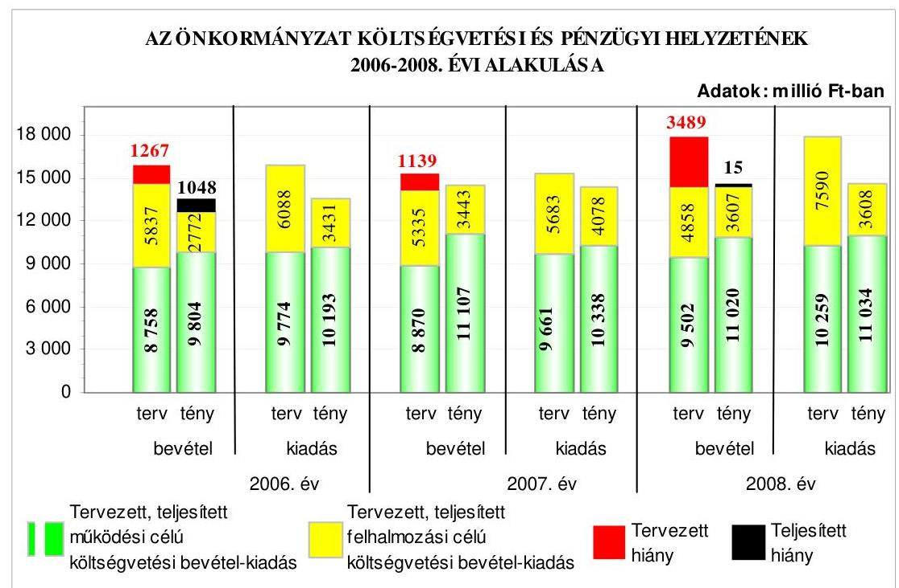

A 2006-2008. években a költségvetés végrehajtása során a teljesített költségvetési bevételek és költségvetési kiadások főösszege folyamatosan emelkedett. A 2006. és a 2008. évben pénzügyi hiány keletkezett, mivel a teljesített költségvetési kiadások összege meghaladta a teljesített költségvetési bevételek összegét. A pénzügyi hiányt a múködési célú költségvetési bevételek hiánya és a felhalmozási célú bevételeket meghaladó összegben teljesített felhalmozási célú kiadások együttesen okozták.

---

A 2006-2009. években a felhalmozási célú kiadásokon belül nem volt megalapozott a beruházások és a felhalmozási célú pénzeszközátadások tervezése és elszámolása, mert az önkormányzati lakásért fizetett pénzbeli térítéseket a beruházások között tervezték meg, figyelmen kívül hagyva az Ámr-ben hivatkozott PM tájékoztató múködési és felhalmozási célú pénzeszközátadások előirányzatonkénti és tevékenységenkénti részletezésére vonatkozó előírását, amely szerint az önkormányzati lakásért fizetett pénzbeli térítést az államháztartáson kívülre átadott felhalmozási célú pénzeszközök között kell tervezni és elszámolni. A beruházási kiadások közötti elszámolással nem tettek eleget a Számv. tv. azon előírásának, hogy a gazdasági eseményeket a tényleges gazdasági tartalmuknak megfelelően kell bemutatni, és a számlarend nem tartalmazta a gazdasági esemény elszámolásának szabályait.

Az Önkormányzat a fejlesztési feladatok finanszírozásához a 2006-2008. években 2022 millió Ft összegben vett fel hosszú lejáratú fejlesztési célú hitelt, a 2007. és a 2008. évben összesen 4000 millió Ft összegben svájci frank alapú kötvényt bocsátott ki. A kötvénykibocsátás bevételéből tervezték a Százház utcai Rekreációs Központ beruházás finanszírozását. A kötvény változó kamatozású, futamideje 20 év. A kötvénykibocsátás az Önkormányzat számára kockázatot jelent a forint svájci frankhoz viszonyított árfolyamváltozása és a változó kamat mérték miatt. A kötvénykibocsátásból befolyt bevételt a tervezett felhasználásig betétként kötötték le. A 2008-2009. évben a beruházás tervezési és bontási költségeire 227 millió Ft-ot fizettek ki. Az Önkormányzat a likviditás fenntartása érdekében 2006-ban 400 millió Ft értékű Magyar Államkötvényt, és 16 millió Ft címletértékű kárpótlási jegyet értékesített. A 2006-2008. években a bevételeket megalapozó önkormányzati rendeleteket felülvizsgálták, a feladatellátás racionalizálására az intézményeket átszervezték, a közalkalmazottak létszámát 132 fővel csökkentették. Az Önkormányzatnál a fizetőképesség folyamatos biztosítására a 2006-2009. években folyószámlahitelt vettek igénybe. A 2006. és a 2008. évben az év végén a folyószámlahitelt nem fizették vissza.

Az Önkormányzat pénzügyi helyzete a 2006-2008. évek között az eladósodottságának több mint két és félszeresére történt növekedése miatt, a fizetőképesség kedvező irányú változása ellenére, összességében kedvezőtlenül alakult. Az eladósodottság emelkedését a hosszú és a rövid lejáratú fizetési kötelezettségek - a fejlesztési célú hitelállomány és a kötvény kibocsátásból keletkezett tartozásállomány - összes forráson belüli arányának növekedése idézte elő. A fizetőképesség mutatószámai a kötvénykibocsátásból származó bevétel hatására javultak, azonban a likviditást emelkedő folyószámlahitel állománnyal biztosították, mert a szabad pénzeszközöket betétként helyezték el.

Az Önkormányzat fejlesztési célkitűzéseit a 2006. évig ágazati koncepciókban, majd a 2006. évet követően a gazdasági programban, a stratégiai tervben, a Polgármesteri Hivatal 2007-2009. évi stratégiai célkitűzéseiben, az Integrált Városfejlesztési Stratégiában, valamint ágazati, szakmai koncepciókban, programokban határozta meg. A célkitűzések összhangban voltak az NFT és az ÜMFT keretében megjelenő pályázati lehetőségekkel. Három 2005. évben nyertes pályázat megvalósítása, illetve pénzügyi elszámolása a 2006-2009. évekre áthúzódott. A 2006-2009. I. negyedévben a Képviselő-testület, a polgármester és az intézményvezetők döntései alapján 21 pályázatot nyújtottak be, amelyekből 11

---

volt eredményes. Az áthúzódó projekteket is figyelembe véve a 2006-2009. I. negyedévben 14 eredményes európai uniós pályázat lebonyolításáról, illetve elszámolásáról gondoskodott az Önkormányzat. Az eredményes pályázatok közül kettő a támogatási szerződés megkötésének szakaszában volt, egy pályázatnak a második fordulóban történő elbírálása folyamatban volt. A pályázatok közül 10 elutasításra került szakmai kidolgozatlanság, pályázati források hiánya miatt, illetve nem felelt meg a pályázati feltételeknek. Az európai uniós forrással támogatott 11 fejlesztési feladat közül egy megvalósításától az önkormányzat visszalépett és a támogatásról lemondott, hat befejezésre került és négy megvalósítása folyamatban van. Az Önkormányzat 2006-2009. évi költségvetési rendeletei tartalmazták az európai uniós forrást igénylő fejlesztési feladatok kiadási és bevételi előirányzatait, valamint a felhalmozási kiadásokat feladatonként. Az Ámr-ben előírtak ellenére azonban a 2006. és a 2007. évi költségvetési rendeletekben a többéves kihatással járó feladatok között nem mutatták be az európai uniós forrással több év alatt - 2006-2008. évek között megvalósult komplex beruházási eszközök (CoUrbit) projekt előirányzatait éves bontásban. A 2006-2009. II. negyedévben európai uniós forrással támogatott befejezett fejlesztési feladatok tényleges kiadásai a tervezett kiadásokhoz viszonyítva $94,2 \%$-ra teljesültek. A felhasználás elmaradását az okozta, hogy egy önkormányzati intézmény a felhasználható támogatási összeg közel háromötödét vette csak igénybe, mert a projekt előfinanszírozáshoz szükséges összes pénzeszközt nem tudta biztosítani.

Az európai uniós források igénybevételének és felhasználásának feladatait 2006-tól 2008. december közepéig a hivatali ügyrend mellékletét képező EU Integrációs és Informatikai Csoport feladat és hatásköri jegyzékében, jegyzői intézkedésben, valamint a köztisztviselők munkaköri leírásaiban írták elő. A szabályozások nem tartalmazták a pályázatok előkészítésével, a fejlesztési feladatok lebonyolításával kapcsolatos eljárási rendet, a pályázatfigyelést végzők és a döntési, illetve a döntés-előterjesztési jogkörrel rendelkezők közötti információ szolgáltatási kötelezettséget és annak rendjét. A 2008. december közepétől hatályos pályázati szabályzat pótolta a korábbi szabályozásbeli hiányosságokat, továbbá tartalmazta az önkormányzati szintű pályázatok dokumentálásának és a pályázatokról vezetendő nyilvántartás rendszerét. A pályázati szabályzat a fejlesztési feladatok lebonyolításának folyamata közül kettő részterületről - a pénzügyi lebonyolításról, illetve a közbeszerzési eljárásról - tartalmazott rendelkezéseket. A pályázati szabályzat a 2009. októberi módosítását követően részletes szabályokat tartalmaz a pályázatok megvalósítására vonatkozóan. A Polgármesteri hivatalban a pályázatfigyelés, a pályázatkészítés és a fejlesztési feladatok lebonyolításának személyi és szervezeti feltételeit kialakították. A pályázatok elkészítéséhez hét esetben külső szervezetet, egy esetben önkormányzati intézményt vettek igénybe. A pályázat készítésével megbízott külső szervezetekkel kötött megállapodások közel kétharmadában a megbízott általi információ átadási kötelezettségről nem rendelkeztek, nem rögzítették a megbízott részéről történő információ átadás rendjét, formáját, tartalmát és módját. A fejlesztési feladatok közül egy lebonyolításával külső szervezetet bíztak meg, illetve egy projekt lebonyolítására egy önkormányzati intézmény öt dolgozójából és egy külső szervezet képviselőjéből álló projektmenedzsmentet hoztak létre. A feladatok lebonyolításra a külső szervezettel kötött szerződésben, valamint az önkormányzati intézmény polgármesteri megbízásában meghatározták a

---

lebonyolítási feladatokat, megnevezték a kapcsolattartók személyét, de a kapcsolattartás, az ellenőrzés rendjét nem rögzítették, továbbá a felelősségi szabályokat nem személyre szólóan határozták meg.

Az Önkormányzat a „Fogyatékos személyek esélyegyenlőségének elősegítése PHARE 2003 program keretében, sportlétesítmények akadálymentesítése" program keretében az Erzsébetvárosi Sportközpont épületének akadálymentesítése projekt lebonyolítása során gondoskodott a projektnek a hatályos támogatási szerződésben rögzített időbeli megvalósulásáról. A projekt megvalósításához a költségvetésben tervezett saját forrást a támogatási szerződésben rögzítettek szerint biztosították. A közremúködő szervezet a projekt megvalósításának záró beszámolóját elfogadta. A FEUVE nem múködött megfelelően, mert a támogatásként elszámolt bevételek - európai uniós, hazai társfinanszírozási, EU Önerő Alap támogatások - beszedésének elrendelése előtt az Ámr. előírása ellenére nem történt meg azok szakmai teljesítésigazolása. Ezáltal az érvényesítés és az utalvány ellenjegyzése sem múködött megfelelően, mivel azok az Ámr. előírásait figyelmen kívül hagyva nem a bevételek szakmai teljesítésigazolásán alapultak. A belső ellenőrzés és a közremúködő szervezet a fejlesztési feladat megvalósítását nem vizsgálta. Az európai uniós és hazai társfinanszírozással akadálymentesített Erzsébetváros Sportközpontot a 2009. évben lebontották a sport funkciókat magában foglaló Rekreációs Központ építésének előkészítése részeként. A közremúködő szervezet az új sportközpont területét a projektben vállalt célkitűzések helyszíneként azzal a feltétellel fogadta el, hogy a teljes körű akadálymentességre vonatkozó előírások teljesítéséről és a projektben meghatározott célkitűzéseknek való megfeleléséről gondoskodni fog az Önkormányzat.

Az Önkormányzat a szabályozottság és szervezettség tekintetében a 20062008. évek között annak ellenére összességében nem készült fel eredményesen az európai uniós források igénybevételére és a várható támogatások felhasználására, hogy a gazdasági programban, stratégiákban, ágazati, szakmai koncepciókban, programokban megfogalmazott fejlesztési célkitűzésekhez kapcsolódtak az európai uniós forrásokra benyújtott pályázatok; a FEUVE feladatokat szabályozták; a 2008. évi belső ellenőrzési tervet megalapozó kockázatelemzés kiterjedt az európai uniós forrásokkal támogatott fejlesztési feladatokra; a pályázatfigyelés, a pályázatkészítés és a fejlesztési feladat lebonyolításának szervezeti és személyi feltételeit kialakították; a külső szervezettel kötött szerződésben a pályázat szakmai és tartalmi követelményeire vonatkozóan meghatározták a pályázatkészítést végző felelősségét. Nem szabályozták azonban a pályázatfigyelést végző és a döntési, illetve a döntés előterjesztési jogkörrel rendelkezők közötti információszolgáltatási kötelezettséget, valamint nem írták elő a fejlesztési feladat lebonyolítását végző ellenőrzési kötelezettségét. A 2008. december közepétől hatályos pályázati szabályzatban rögzítették a pályázatfigyelést végző és a döntési, illetve a döntés előterjesztési jogkörrel rendelkezők közötti információszolgáltatási kötelezettséget.

Az informatikai fejlesztés és az e-közigazgatási feladatok közép és hosszú távú célkitűzéseit a Középtávú Informatikai Stratégiában, a 2007-2013. évekre vonatkozó stratégiai tervben és a Polgármesteri hivatal 2007-2009. évi stratégiai célkitűzésében fogalmazta meg. Közép távú célként az e-közigazgatási szolgáltatás 3. elektronikus szolgáltatási szintjének megvalósítását, múködtetését irányozták elő, és a felkészülést a teljes körű közvetlen, kétoldalú ügyintézési fo-

---

lyamat megvalósítására. Az informatikai feladatellátás továbbfejlesztéséhez a 2006-2008. években három európai uniós pályázatot nyújtottak be, amelyből a Polgármesteri hivatal szervezetfejlesztését és az Önkormányzat keretein belül Agglomerációs Környezetinformációs-technológiai Rendszer (AKIR) kiépítését célzó pályázatok eredményesek voltak. Az Önkormányzat e-közigazgatási szolgáltatást vásárolt szoftverrel, külső rendszeren keresztül múködtetve végezte, és az ügyintézést 1., illetve 2. elektronikus szolgáltatási szinten valósította meg. Az ügyfelek általi igénybevételt - az elektronikus okmányirodai időpontfoglalás kivételével - nem kísérték figyelemmel, az informatikai rendszeren keresztül végzett ügyintézésnek, az egyes ügykörök igénybevételének tapasztalatait nem értékelték.

Az Önkormányzat honlapján a gazdálkodási adatok közzététele a vonatkozó IHM rendeletben meghatározott szerkezetben történt. Az Önkormányzat az Áht. előírása ellenére a céljellegú múködési és felhalmozási támogatások harmadát nem tette közzé. Az Önkormányzat az Áht-ban foglaltak ellenére az önkormányzat pénzeszközei felhasználásával, a vagyonnal történő gazdálkodással összefüggő nettó öt millió Ft-ot elérő, vagy azt meghaladó értékű szerződések közel felének adatait, illetve közel egytizedénél a közzétett adatok változását nem tette közzé. A többi szerződés közzététele az Áht-ban előírt határidőt követően történt. Az Ámr-ben előírtak ellenére nem tették közzé az éves költségvetési beszámoló szöveges indoklását. Az Önkormányzat honlapján a közérdekű adatok „Önkormányzat költségvetési beszámolójának szöveges indoklása" részében az éves zárszámadási előterjesztéseket tették közzé, de azok nem feleltek meg az éves költségvetési beszámoló szöveges indoklásának tartalmára vonatkozó, a Vhr-ben rögzített követelményeknek. A helyszíni ellenőrzést követően közzétették és pótolták a hiányosságokat a céljellegú múködési és felhalmozási támogatások, valamint a szerződések esetében.

A költségvetés tervezési és a zárszámadás készítési folyamatok szabályozottsága összességében alacsony kockázatot jelentett a feladatok megfelelő, szabályszerű végrehajtásában, mivel a jegyző a pénzügyi irányítási és ellenőrzési rendszer keretében, munkaköri leírásokban, utasításokban szabályozta a költségvetési tervezés és a zárszámadás készítés rendjét, meghatározta az intézmények részére a költségvetési javaslat összeállításával kapcsolatos követelményeket. Annak ellenére összességében alacsony volt a kockázat, hogy a jegyző nem szabályozta annak ellenőrzését, hogy az intézmények és a Polgármesteri hivatal ismert kötelezettségeit megtervezték-e, valamint a saját bevételek előirányzatai és a költségvetés megalapozását szolgáló helyi rendeletek összhangja biztosított-e. A költségvetés tervezési és zárszámadás készítési folyamatban a belső kontrollok múködésének megbízhatósága összességében kiváló volt, mivel a Polgármesteri hivatalnál az előírásoknak megfelelően ellenőrizték, hogy az intézmények teljesítették-e a költségvetési javaslat összeállításával kapcsolatban a részükre meghatározott követelményeket, a költségvetési tervezéshez készített intézményi mutatószám felmérés adatai megalapozottake, az állami hozzájárulásokkal történő elszámoláshoz közölt mutatószámok megbízhatók-e, illetve az intézmények pénzmaradvány megállapítása szabályszerű volt-e. Annak ellenére összességében kiváló volt a kontrollok múködésének megbízhatósága, hogy nem ellenőrizték az intézményeknél és a Polgármesteri hivatalnál az ismert kötelezettségek megtervezését, a saját bevételek

---

előirányzatai és a költségvetés megalapozását szolgáló helyi rendeletek összhangját.

A gazdálkodási, a pénzügyi-számviteli és a folyamatba épített ellenőrzési feladatok szabályozottságának hiányosságai közepes kockázatot jelentettek a feladatok szabályszerű végrehajtásában, mivel a hivatali ügyrend nem tartalmazta a gazdasági szervezet megnevezését, engedélyezett létszámát, feladatait. A gazdasági szervezet ügyrendje nem tartalmazta az üzemeltetéssel, fenntartással, múködtetéssel, beruházással, a vagyon használatával, hasznosításával, a munkaerő-gazdálkodással kapcsolatos feladatokat, valamint a vezetők és a Polgármesteri hivatal pénzügyi-gazdasági feladatainak ellátásáért felelős alkalmazottak feladat- és hatáskörét, felelősségi körét.

A Polgármesteri hivatalnál a karbantartási, kisjavítási szolgáltatások, a gépek, berendezések és felszerelések beszerzése, valamint az államháztartáson kívülre történő működési, illetve felhalmozási célú pénzeszközátadások gazdasági eseményei között elszámolt kiadások teljesítése során a belső kontrollok múködésének megbízhatósága kiváló volt, mivel a szerződésekben, megrendelésekben meghatározott feladatok teljesítésének, a kiadások jogosultságának, összegszerűségének ellenőrzését a szakmai teljesítés igazolására kijelölt személyek a gazdálkodási jogkörök szabályzatában előírt módon elvégezték. Az utalványok ellenjegyzője a gazdálkodásra vonatkozó szabályok érvényesüléséről, továbbá a szakmai teljesítésigazolás és az érvényesítés elvégzéséről meggyőződött.

A Polgármesteri hivatalban az informatikai rendszerek múködésének szabályozottsága alacsony kockázatot jelentett, mivel az Önkormányzat rendelkezett a Képviselő-testület által elfogadott informatikai stratégiával, a pénzügyi és számviteli területen használt programok az arra jogosult munkatársak számára a számítógépes hálózaton keresztül elérhetők voltak, a belső szabályzatokban meghatározták az informatikai biztonsági, az üzletmenet folytonossági, valamint a katasztrófa-elhárítási feladatokat. A 2008. évben integrált pénz-ügyi-számviteli információs rendszert vezettek be. Az alkalmazott informatikai rendszerek belső kontrolljainak megbízhatósága kiváló volt, mivel a jogosultságokra vonatkozó nyilvántartást teljes körűen és naprakészen vezették, a hozzáférési jogosultságokat ellenőrizték, a pénzügyi-számviteli programok alkalmazása során a jelszavakra vonatkozó szabályokat betartották.

A belső ellenőrzés szervezeti kereteinek kialakítása és szabályozása a belső ellenőrzési feladatok megfelelő szabályszerű végrehajtásában összességében alacsony kockázatot jelentett, mivel a Képviselő-testület jóváhagyta az éves ellenőrzési terveket, a jegyző meghatározta a belső ellenőrzési tevékenységre vonatkozó belső szabályokat és eljárásokat, a belső ellenőrzési vezető feladatait, a belső ellenőrzési vezető kialakította az ellenőrzési javaslatok alapján megtett intézkedések nyomon követésének rendjét. Annak ellenére összességében alacsony volt a kockázat, hogy a belső ellenőrzés nem rendelkezett stratégiai tervvel, a belső ellenőrzési kézikönyv nem tartalmazta a belső ellenőrzés minőségét biztosító eljárásokat, az ellenőrzések lefolytatásához készített ellenőrzési programokat nem a belső ellenőrzési vezető hagyta jóvá.

---

A belső ellenőrzés működésénél a kialakított kontrollok megbízhatósága öszszességében kiváló volt, mivel a belső ellenőrzés ellátása a belső ellenőrzési szervezeti egység keretében valósult meg, a 2008. évi belső ellenőrzési tervben foglalt feladatokat végrehajtották, az elvégzett vizsgálatokról ellenőrzési jelentést készítettek, a belső ellenőrzési vezető a jogszabályban előírt tartalommal nyilvántartást vezetett az elvégzett ellenőrzésekről, valamint az ellenőrzési jelentésekben tett megállapítások, javaslatok hasznosulásáról, a végrehajtott intézkedésekről. A jegyző teljesítette az Ámr-ben előírt 2008. évi nyilatkozattételi kötelezettségét a Polgármesteri hivatal FEUVE rendszerének, valamint a belső ellenőrzésnek a múködtetéséről. A polgármester a zárszámadási rendelettervezetekkel egyidejűleg a Képviselő-testület elé terjesztette a 2007. és a 2008. évi összefoglaló ellenőrzési jelentést. Annak ellenére összességében kiváló volt a belső ellenőrzés múködésének megbízhatósága, hogy az ellenőrzési programokat nem a belső ellenőrzési vezető hagyta jóvá, az ellenőrzött szervezetek nem készítettek intézkedési tervet, valamint a belső ellenőrzési tevékenység minőségét biztosító eljárásokat - a belső szabályozás hiányában - nem végezték el.

Az ÁSZ a 2006. évben végezte az Önkormányzat gazdálkodási rendszerének átfogó ellenőrzését. A javaslatok realizálása érdekében a felelősök és a határidők megjelölésével a polgármester és a jegyző intézkedési tervet készített, melyet a Képviselő-testület elfogadott. Az ÁSZ által tett 28 szabályszerűségi javaslatból 21 realizálódott, egy részben valósult meg, hat nem hasznosult.

A szabályszerűségi javaslatokból határidőre teljesültek a költségvetési rendelet jóváhagyásának rendjével, tartalmával, mellékleteivel összefüggő javaslatok. A költségvetési rendelet módosítás tartalmára és a jóváhagyott az előirányzatokon belüli gazdálkodásra vonatkozó javaslatok fele, a költségvetési gazdálkodási és ellenőrzési jogkörök gyakorlásának szabályszerűségére vonatkozó javaslatok öthatoda, a gazdasági eseményeket magukba foglaló bizonylatok alaki, tartalmi követelményeknek való megfelelésére és a számviteli nyilvántartásban történő rögzítésére vonatkozó javaslatok kétharmada teljesült. A vagyongazdálkodási feladatok és a döntési hatáskörök meghatározásához kapcsolódó javaslatok fele, a céljelleggel nyújtott támogatások szabályszerűsége érdekében tett javaslatok mindegyike realizálódott. A zárszámadási rendelet mellékleteire vonatkozó javaslatoknak a fele, a pénzmaradvány elszámolására, a kisebbségi önkormányzatok gazdálkodásának végrehajtására, a belső ellenőrzés lefolytatására tett egy-egy javaslat teljesült. Az önkormányzati gazdálkodás egyéb területeinek törvényes és szabályszerű ellátását érintő javaslatok fele realizálódott.

Részben hasznosult a vagyongazdálkodási feladatok és a döntési hatáskörök meghatározásához kapcsolódó polgármesternek tett javaslatok közül egy, mert a pártok közül az ötből négy változatlanul közvetett támogatásban részesült az általuk bérelt helyiségek bérleti díja kapcsán, ezáltal sérült az alkotmányos jogegyenlőség, valamint - az Ötv-ben foglaltak ellenére - az Önkormányzat vagyonát nem az önkormányzati célok megvalósítására használták fel. Egy párt, a Szabad Demokraták Szövetsége részére piaci értéken elidegenítették a bérelt helyiségeket, de a vételár megfizetéséhez az Önkormányzat tulajdonában lévő lakások és nem lakás céljára szolgáló helyiségek elidegenítésének feltételeiről szóló rendelet előírásával ellentétesen részletfizetési kedvezményt kamatmentesen biztosítottak.

---

A polgármester nem intézkedett az Áht-ban foglaltak ellenére arról, hogy az önkormányzati intézmények a tárgyévi fizetési kötelezettségvállaláskor ne lépjék túl az előirányzataikat, és emiatt felelősségre vonást sem kezdeményezett. A jegyző nem intézkedett a hivatali ügyrendnek az Ámr-ben előírtak szerint kiegészítéséről a gazdasági szervezet felépítésével és feladatai meghatározásával a költségvetési gazdálkodási és ellenőrzési jogkörök gyakorlásának szabályszerűsége érdekében, nem gondoskodott az Ámr-ben szabályozottaknak megfelelően arról, hogy a bevételek beszedésének elrendelése előtt a szakmai teljesítés igazolását elvégezzék. A jegyző nem biztosította, hogy a zárszámadási rendelet mellékletei között bemutatandó önkormányzati vagyonkimutatás tartalmában megfeleljen a Vhr-ben előírtaknak. A polgármester nem intézkedett az Ötv-ben foglaltaknak megfelelően arról, hogy meghatározzák a kötelező és önként vállalt feladatok ellátásának módját és mértékét.

Az ÁSZ által tett öt célszerűségi javaslat közül négy teljesült, egy nem realizálódott. Elmaradt a kötelezettségvállalási és utalványozási jogkör gyakorlására felhatalmazottak polgármester általi beszámoltatása.

Az ÁSZ ellenőrizte a Magyar Köztársaság 2007. évi költségvetése végrehajtásának ellenőrzése keretében az Önkormányzatot a 2007. évben megillető normatív hozzájárulás és normatív részesedésű személyi jövedelemadó elszámolását és a kötött felhasználású támogatások felhasználását, amely során 12 szabályszerűségi és hat célszerűségi javaslatot tett. A jegyző realizáló levélben határozta meg az ellenőrzés tapasztalatai és javaslatai alapján szükséges intézkedéseket. A fővárosi önkormányzatot és a kerületi önkormányzatokat osztottan megillető bevételek 2007. évi megosztásáról szóló fővárosi önkormányzati rendelet végrehajtásának ellenőrzése során az ÁSZ javaslatot nem tett.

Az ÁSZ által a 2006-2008. években végzett ellenőrzések javaslatainak 84\%-a hasznosult, $2 \%$-a részben valósult meg, $14 \%$-a nem teljesült.

A helyszíni ellenőrzés megállapításainak hasznosítása mellett javasoljuk:

# a polgármesternek 

a jogszabályi előírások maradéktalan betartása érdekében

1. intézkedjen Ámr. 13/A. § (3) bekezdés e) pontjában, valamint az Ámr. 17. § (4) bekezdésében előírtaknak megfelelően a hivatali ügyrend kiegészítéséről, hogy az tartalmazza a gazdasági szervezet megnevezését, engedélyezett létszámát, feladatait, valamint a gondoskodjon az ügyrend megnevezés szervezeti és múködési szabályzatra történő módosításáról;
2. gondoskodjon az Önkormányzat gazdálkodásának 2006. évi átfogó ellenőrzése során az ÁSZ által részére tett és nem teljesült szabályszerűségi és célszerűségi javaslatok végrehajtásáról;
3. kezdeményezze a Szabad Demokraták Szövetsége által bérelt helyiségek eladásáról kötött adásvételi szerződés módosítását - visszamenőleges hatállyal -, hogy a szerződés megfeleljen az Önkormányzat tulajdonában lévő lakások és nem lakás céljára

---

szolgáló helyiségek elidegenítésének feltételeiről szóló 27/2000. (XII. 23.) számú önkormányzati rendelet 27. § (1) bekezdésében előírtaknak, és tartalmazza a részlefizetés esetén a kamatfizetési kötelezettséget. Amennyiben nem kerül sor szerződésmódosításra, úgy a szerződés jogszabályba ütköző részének semmissé nyilvánítását kezdeményezze a bíróságnál;
a munka színvonalának javítása érdekében
4. kezdeményezze, hogy a számvevőszéki jelentésben foglaltakat a Képviselő-testület tárgyalja meg és a feltárt hiányosságok megszüntetése érdekében készíttessen intézkedési tervet a határidők és felelősök megjelölésével;

# a jegyzőnek 

a jogszabályi előírások maradéktalan betartása érdekében

1. intézkedjen, hogy az önkormányzati lakásért fizetett pénzbeli térítések tervezésekor vegyék figyelembe az Ámr. 37. §-ában hivatkozott PM tájékoztató múködési és felhalmozási célú pénzeszközátadások előirányzatonkénti és tevékenységenkénti részletezésére vonatkozó előírást, és az önkormányzati lakásért fizetett pénzbeli térítést az államháztartáson kívülre átadott felhalmozási célú pénzeszközök között tervezzék és számolják el, ezáltal gondoskodjon a Számv. tv. 16. § (3) bekezdésében előírtak szerint a gazdasági események tartalmának megfelelő elszámolásáról, továbbá a Vhr. 49. § (1) bekezdésének megfelelően a számlarend kiegészítéséről;
2. intézkedjen arra, hogy az Ámr. 29. § (1) bekezdés g) pontjában foglaltaknak megfelelően a költségvetési rendelet tartalmazza a többéves kihatással járó európai uniós forrással megvalósuló fejlesztési feladatok előirányzatait éves bontásban;
3. gondoskodjon a nyilvánosság biztosítása érdekében arról, hogy az éves költségvetési beszámoló szöveges indoklását az Ámr. 157/D. § (1) bekezdésében foglaltak alapján a Vhr. 40. § (4), (7)-(11) bekezdésekben rögzített tartalmi követelmények szerint tegyék közzé;
4. szabályozza az Ámr. 145/A. § (1)-(2) bekezdéseiben előírtaknak megfelelően a költségvetés tervezési folyamatok szabályozottságának érdekében az intézmények és a Polgármesteri hivatal ismert kötelezettségei megtervezésének, a saját bevételek előirányzatai és a költségvetés megalapozását szolgáló helyi rendeletek közötti összhang ellenőrzését, és gondoskodjon azok dokumentált végrehajtásáról;
5. tegyen intézkedéseket a Polgármesteri hivatal gazdasági szervezete ügyrendjének az Ámr. 17. § (5) bekezdésének megfelelő kiegészítésére, hogy az tartalmazza a gazdasági szervezet által ellátandó feladatok között az üzemeltetéssel, fenntartással, múködtetéssel, beruházással, a vagyon használatával, hasznosításával és a munkaerőgazdálkodással kapcsolatos feladatokat is;
6. gondoskodjon a belső ellenőrzési rendszer szabályszerű kialakítása és múködtetése érdekében arról, hogy:

---

a) a Ber. 18. és 19. §-ainak előírása szerint a belső ellenőrzés rendelkezzen kockázatelemzés alapján készített stratégiai tervvel;
b) a Ber. 4. § (6) bekezdése előírásának megfelelően a foglalkoztatott belső ellenőrök létszámának megállapításakor vegyék figyelembe a stratégiai tervben foglaltakat;
c) a Ber. 12. § i) pontjában foglaltak alapján a belső ellenőrzési kézikönyv tartalmazza a belső ellenőrzési tevékenység minőségét biztosító eljárásokat;
d) a Ber. 23. § (3) bekezdése előírása értelmében a belső ellenőrzések lefolytatásához készített ellenőrzési programokat a belső ellenőrzési vezető hagyja jóvá;
e) a Ber. 29. § (1) bekezdésében foglaltak szerint a belső ellenőrzések megállapításai és javaslatai alapján az ellenőrzöttek készítsenek intézkedési tervet a feltárt hiányosságok megszüntetésére;
7. gondoskodjon az Önkormányzat gazdálkodásának 2006. évi átfogó ellenőrzése során az ÁSZ által részére tett és nem teljesült szabályszerűségi javaslatok végrehajtásáról;
a munka színvonalának javítása érdekében
8. tájékoztassa - évente végzett számítások alapján - a Képviselő-testületet az Önkormányzat eladósodásának növekedésére figyelemmel arról, hogy a hosszú lejáratú, adósságot keletkeztető kötelezettségvállalásokból adódó tőke- és kamatfizetési kötelezettségét az Önkormányzat milyen feltételek biztosítása mellett tudja teljesíteni;
9. gondoskodjon arról, hogy a pályázat készítésére kötött megállapodásokban rögzítsék a megbízó Önkormányzat mellett a megbízott információ-átadási kötelezettségét és az információ átadásának rendjét (formáját, tartalmát és módját);
10. írja elő, hogy a projektek - fejlesztési feladatok - lebonyolítására kötött szerződésekben a kapcsolattartás és az ellenőrzés rendjét, továbbá a felelősségi szabályokat személyre szólóan határozzák meg;
11. intézkedjen arról, hogy kísérjék figyelemmel az e-közigazgatási feladatokat ellátó informatikai rendszer ügyfelek általi igénybevételét, és értékeljék annak tapasztalatait;
12. gondoskodjon arról, hogy az éves ellenőrzési terveket megalapozó kockázatelemzés terjedjen ki a Polgármesteri hivatalnál az Önkormányzat többségi irányítást biztosító befolyása alatt múködő gazdasági társaságok, közhasznú társaságok, illetve vagyonkezelő szervezetek múködésére, valamint az intézményeknél európai uniós forrásból megvalósított feladatok végrehajtására és a közbeszerzési eljárások lebonyolítására.

---

# II. RÉSZLETES MEGÁLLAPÍTÁSOK 

## 1. AZ ÖNKORMÁNYZAT KÖLTSÉGVETÉSI ÉS PÉNZÜGYI HELYZETE

### 1.1. A tervezett költségvetési bevételek és kiadások alapján a költségvetési egyensúly alakulása, a költségvetési hiány oka, finanszírozásának tervezett módja és a költségvetési hiány megállapításának szabályszerűsége

Az Önkormányzatnál a 2006-2009. években a tervezett költségvetési bevételek és kiadások főösszege az előző évhez képest változó tendenciát mutatott. A költségvetési bevételek főösszege a 2007. évre csökkent, a 2008. évben $1,1 \%$-kal emelkedett. A 2009. évben a költségvetési bevételek főösszege jelentősen - 2627 millió Ft-tal, 18,3\%-os mértékben - növekedett. A tervezett költségvetési kiadások főösszege a 2007. évre csökkent, majd a következő két évben 2505 millió Ft-tal, illetve 1655 millió Ft-tal emelkedett.

Az Önkormányzatnál tervezett költségvetési bevételek főösszege a 2006. évben 14595 millió Ft, a 2007. évben 14205 millió Ft, a 2008. évben 14360 millió Ft, a 2009. évben 16987 millió Ft volt. A 2006-2009. közötti időszakban a tervezett költségvetési kiadások főösszege az egyes évekhez rendelten 15862 millió Ft, 15344 millió Ft, 17849 millió Ft és 19504 millió Ft volt.

Az Önkormányzat 2006-2009. évi költségvetési helyzetének bemutatása a tervezett múködési és felhalmozási célú költségvetési bevételek és kiadások bontásban:
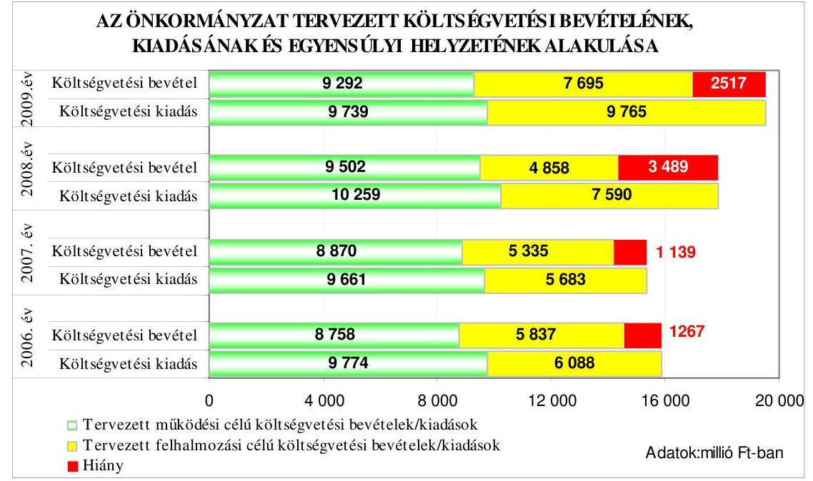

---

A 2006-2009. években az eredeti előirányzatok alapján nem volt biztosított a költségvetési egyensúly, mivel a tervezett költségvetési bevételek nem nyújtottak fedezetet a tervezett költségvetési kiadásokra. A költségvetési hiányt minden évben a tervezett múködési célú költségvetési bevételek hiánya és a felhalmozási célú bevételeket meghaladó összegben tervezett felhalmozási célú kiadások együttesen okozták.

Az Önkormányzat a 2006-2009. években a költségvetési egyensúly biztosításához hosszú lejáratú fejlesztési célú hitel felvételt, valamint a 2006. évben értékpapír értékesítést, a 2008. évben kötvény kibocsátást tervezett, továbbá kiadást csökkentő és bevételt növelő intézkedésekről döntött:

- a 2006. évben 1439,2 millió Ft hosszú lejáratú fejlesztési célú hitel felvételét, továbbá az Önkormányzat tulajdonában lévő 15,8 millió Ft címletértékű kárpótlási jegy értékesítését tervezték;
- a 2007. évben 1503,0 millió Ft hosszú lejáratú fejlesztési célú hitel felvételét tervezték;
- a 2008. évben 697,5 millió Ft hosszú lejáratú fejlesztési célú hitel felvételét, továbbá 3000,0 millió Ft összegben az „Erzsébetváros 2027" megnevezésű kötvény II. ütemű kibocsátását ${ }^{10}$ tervezték. A fejlesztési célú hitelből 643,5 millió Ft-ot lakás- és irodaépület építésre, 54,0 millió Ft-ot a Rózsa utca átépítését terveztek;

A Képviselő-testület a 386/2007. (VI. 15.) számú határozatában döntött a Százház utcai Sportcsarnok saját beruházásban történő bővítéséről, a 394/2007. (VI. 15.) számú határozattal döntött a beruházás finanszírozási koncepciójáról, amelyben kötvény kibocsátását javasolták, a javaslat gazdaságossági számításokkal nem volt alátámasztva. A kötvény kibocsátásával és a lejegyzésével kapcsolatban négy kereskedelmi bankot kértek fel ajánlat tételre. A Képviselő-testület a kötvény kibocsátás részletes feltételeiről a 484/2007. (VII. 16.) számú határozatban döntött, ekkor meghatározták a kötvény devizanemét (svájci frank), öszszegét, a kibocsátás ütemét, ezek összegét és időpontját ${ }^{11}$, a futamidőt, a kamat mértékét, a tőke- és kamatfizetés periódusát, valamint a kötvényből származó bevétel felhasználási célját.

A Képviselő-testület az 509-510/2007. (IX. 21.) számú határozataival elfogadta, hogy a Sportcsarnok bővítésével egészségügyi, egészség megőrzési, sport funkciókat magába foglaló Rekreációs Központot alakítanak ki. A Sportcsarnok fejlesztésével kapcsolatban a Képviselő-testület az 565/2007. (X. 26.) számú határozatával módosította az 510/2007. (IX. 21.) számú határozatát és hozzájárult a Sportcsarnok meglévő épületének az elbontásához. A Sportcsarnok fejlesztésével kapcsolatos feladat, valamint a kiadások és annak fedezetére tervezett bevétel a 2007. évi költségvetési rendeletbe évközben - módosításként - került be.

[^0]
[^0]:    ${ }^{10}$ Az „Erzsébetváros 2027" megnevezésű kötvény I. ütemének kibocsátása 2007. szeptember 3-án 1000 millió Ft összegben megtörtént.
    ${ }^{11}$ A Képviselő-testület az 566/2007. (X. 26.) számú határozattal módosította a 484/2007 (VII. 16.) számú határozatát, és a II. ütem időpontjaként a 2008. április 1. napja helyett 2008. január 3. napját hagyta jóvá.

---

- a 2009. évben 2839,4 millió Ft hosszú lejáratú fejlesztési célú hitel felvételét tervezték, ebből 238,0 millió Ft-ot a Dob utca 23-27. szám alatti lakóház építésére, 2601,4 millió Ft-ot a 10 éves fejlesztési tervük 2009. évi ütemének megvalósítására hagytak jóvá.

A költségvetési egyensúly biztosításához az Önkormányzatnál rendszeresen felülvizsgálták a bevételeket megalapozó rendeleteket és képviselő-testületi határozatokat (a helyi adók, a közterület használati díjak, a lakbér, a nem lakás célú helyiség bérleti díja, a parkolóhely létesítés pénzbeli megváltása esetében). A 2006-2009. évek költségvetési rendeleteiben a kamat bevételek növelése érdekében meghatározták az átmenetileg szabad pénzeszközök betétként való lekötésének feltételeit. Az intézmények által ellátandó feladatokat folyamatosan felülvizsgálták és közalkalmazotti álláshelyek csökkentéséről döntöttek. Az önkormányzati tulajdonú épületeken belül mellékvízmérők felszereltetését tervezték a fizetendő víz- és csatornahasználati díjak csökkentése érdekében.

A 2006-2009. években a költségvetés tervezésekor a költségvetés végrehajtása során a likviditási feltételek biztosításához a polgármestert hatalmazták fel munkabérhitel felvételére, a 2006. és a 2008-2009. években 1000 millió Ft-ig, a 2007. évben 1500 millió Ft összeghatárig folyószámla hitelkeret szerződés megkötésére. A jegyző gondoskodott a pénzállomány várható alakulását bemutató havi likviditási terv elkészíttetéséről.

Az Önkormányzatnál a 2006-2007. évi költségvetési rendeletek normaszövegében a költségvetési kiadások főösszegének megállapításakor megsértették az Áht. 8/A. § (7) bekezdésében foglaltakat, mivel finanszírozási célú műveleteket vettek figyelembe, azokat költségvetési kiadásként számolták el. A 2008. évi és a 2009. évi költségvetési rendeletben a költségvetési kiadások főösszegének meghatározása a jogszabályi előírásnak megfelelően történt.

A 2007. évi költségvetési rendelet normaszövegében lévő hibát javították, de csak 2008 áprilisában a 2007. évi költségvetési rendeletet módosító 7/2008. (IV. 25.) számú rendeletben.

# 1.2. A teljesített költségvetési bevételek és kiadások alapján a pénzügyi egyensúly alakulása, a pénzügyi hiány oka, finanszírozásának módja és hatása a pénzügyi helyzetre az eladósodás, valamint a fizetőképesség szempontjából 

Az Önkormányzatnál a 2006-2008. években a teljesített költségvetési bevételek és kiadások főösszege folyamatosan emelkedett. A 2007. évre a költségvetési bevételek főösszege 1974 millió Ft-tal, 15,7\%-kal növekedett, a 2008. évben - az előző évhez képest - 77 millió Ft-tal, azaz 0,5\%-kal emelkedett. A teljesített költségvetési kiadások főösszege a 2007. évre 792 millió Ft-tal, $5,8 \%$-os mértékben, a 2008. évben 226 millió Ft-tal 1,6\%-kal növekedett.

Az Önkormányzatnál teljesített költségvetési bevételek főösszege a 2006. évben 12576 millió Ft, a 2007. évben 14550 millió Ft, a 2008. évben 14627 millió Ft volt. A 2006-2008. közötti időszakban a teljesített költségvetési kiadások főösszege az egyes évekhez rendelten 13624 millió Ft, 14416 millió Ft, 14642 millió Ft volt.

---

A teljesített költségvetési bevételek és kiadások, valamint az egyensúlyi helyzet alakulását az alábbi ábra szemlélteti:
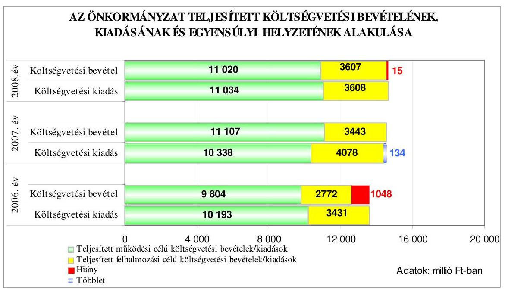

A 2006-2008. években a teljesített költségvetési adatok alapján a 2006. és a 2008. évben nem volt biztosított a pénzügyi egyensúly, mivel a teljesített költségvetési bevételek nem nyújtottak fedezetet a teljesített költségvetési kiadásokra, a 2007. évben az Önkormányzatnak pénzügyi többlete keletkezett. A pénzügyi hiányt mindkét évben a működési célú költségvetési bevételek hiánya és a felhalmozási célú bevételeket meghaladó összegben teljesített felhalmozási célú kiadások együttesen okozták.

A 2006. és a 2008. években a működési célú költségvetési kiadásoknál a hiányzó forrás összege 389 millió Ft, illetve 14 millió Ft volt, míg a felhalmozási célú költségvetési kiadások a 2006. és a 2008. években 659 millió Ft-tal, illetve egy millió Ft-tal haladták meg a felhalmozási célú költségvetési bevételeket.

A költségvetési kiadások költségvetési bevételekkel való fedezettségének iránya a 2006-2009. években az előző évhez képest - a terv és a tény adatok alapján - változó tendenciát mutatott, a 2007. évre emelkedtek, a 2008. évben csökkentek a mutatók, a 2009. évre a tervezett költségvetési kiadások fedezettsége emelkedett.

A költségvetési kiadási főösszegre vonatkozó fedezettségi mutatók irányának és mértékének a tervezetthez képest kedvezőbb alakulását a 2006. és a 2007. évben a működési célú kiadások fedezettségének 6,6 illetve 15,6 százalék pontos emelkedése, és a felhalmozási célú kiadások fedezettségének 15,1 illetve 9,5 százalék pontos csökkenése együttesen eredményezte. A 2008. évben a működési célú kiadások fedezettsége 7,3 százalék ponttal, a felhalmozási célú kiadások fedezettsége 36,0 százalék ponttal emelkedett a tervezetthez képest.

---

Az Önkormányzatnál a 2006-2009. években tervezett és a 2006-2008. években teljesített múködési és felhalmozási célú költségvetési kiadásokra a következő arányban biztosítottak fedezetet a költségvetési bevételek:

Adatok: \%-ban

| Megnevezés | 2006.   év |  | 2007.   év |  | 2008.   év |  | 2009.   év |
| :--: | :--: | :--: | :--: | :--: | :--: | :--: | :--: |
|  | Terv | Tény | Terv | Tény | Terv | Tény | Terv |
| Múködési célú költségvetési kiadások fedezettsége múködési célú költségvetési bevételekből | 89,6 | 96,2 | 91,8 | 107,4 | 92,6 | 99,9 | 95,4 |
| Felhalmozási célú költségvetési kiadások fedezettsége felhalmozási célú költségvetési bevételekből | 95,9 | 80,8 | 93,9 | 84,4 | 64,0 | 100,0 | 78,8 |
| Költségvetési kiadások fedezettsége költségvetési bevételekből | 92,0 | 92,3 | 92,6 | 100,9 | 80,5 | 99,9 | 87,1 |

A 2006-2008. években a költségvetési kiadások költségvetési bevételekkel való fedezettsége, a terv és a tény adatokat összehasonlítva, emelkedett.

A helyi adóbevételek a 2006. évben 4,2\%-kal, a 2007. évben 10,2\%-kal, a 2008. évben $4,0 \%$-kal haladták meg az eredeti előirányzat összegét. A 20062008. években az építményadóból és a telekadóból származó többletbevételt az év közbeni adó előírásokra érkezett befizetések, és a behajtási tevékenység eredményessége idézte elő. Az eredeti előirányzatok tervezése megalapozott volt, az éves előírást, és az adófizetés várható teljesítési arányát vették figyelembe.

A Képviselő-testület az építményadó mértékét kétszer, 2007. január 1-jétől 1040 $\mathrm{Ft} / \mathrm{m}^{2}$ összegre, és 2009. január 1-jétől $1165 \mathrm{Ft} / \mathrm{m}^{2}$ összegre emelte fel, a telekadó alapját és mértékét 2009. január 1-jétől módosították. A telekadó alapjaként a telek korrigált forgalmi értékét, az adó mértékeként a korrigált forgalmi érték 3\%át határozták meg.

A 2006-2008. években a helyi adóbevételeken belül az iparúzési adóbevétel részaránya átlagosan $85,0 \%$, az építményadóé $14,8 \%$, a telekadóé $0,2 \%$ volt. Az iparúzési adó esetében a teljesített bevétel a 2006. évben 0,9\%-kal, a 2007. évben $9,2 \%$-kal, a 2008. évben $3,8 \%$-kal haladta meg az eredeti előirányzatot, a tervezés a forrásmegosztási rendeletek alapján történt. Az építményadóból befolyt bevétel összege a 2006. évben 28,1\%-kal, a 2007. évben 16,1\%-kal, a 2008. évben 12,5\%-kal haladta meg az eredeti előirányzatot. A telekadóból származó bevétel a 2006. évben 31,0\%-kal, a 2007. évben 82,6\%-kal, a 2008. évben 74,7\%-kal haladta meg az eredeti előirányzat összegét. A helyi adóbevételek többlete a pénzügyi hiányt csökkentette.

---

Az Önkormányzatnál az előző évről áthúzódó kiadásokat a 2006-2008. évi költségvetések tervezésekor ${ }^{12}$ a tárgyévi bevételek terhére tervezték meg, a várható pénzmaradvány összegével ${ }^{13}$ a bevételi előirányzatok között nem számoltak. A 2006-2007. évben a pénzmaradvány költségvetési bevételi főösszeghez viszonyított összegére tekintettel a tervezés megfelelő volt. A 2008. évben csak módosított előirányzatként, a pénzmaradvány jóváhagyását követően tervezték be a Százház utcában épülő Rekreációs Központ beruházásához a 2007. évi kötvény kibocsátásból származó 1000,0 millió Ft-ot. A 2009. évben a Rekreációs Központ beruházásához a tárgy évre esedékes pénzforgalmi kiadásokra 3131,5 millió Ft eredeti előirányzatot hagyták jóvá, míg a pénzmaradvány igénybevételét 2295,9 millió Ft összegben tervezték meg. A 2009. évi költségvetési rendelet módosításával, a 2008. évi pénzmaradvány jóváhagyásakor történt meg a beruházás finanszírozására a kötvény kibocsátással megegyező összegű forrás elkülönítése, további 863,8 millió Ft összegű céltartalék képzésével. A 20062007. és a 2009. években megalapozottan történt az előző évről áthúzódó kiadásoknak és a pénzmaradvány várható összegének a tervezése. A 2008. évben a pénzmaradvány jóváhagyását követően történt meg az áthúzódó kiadások előirányzatainak a rendezése az ingatlan értékesítésből származó bevételek 396 millió Ft-tal történő felemelésével, mivel a pénzmaradvány 95,5\%-át a kötvénykibocsátásból származó, meghatározott felhalmozási célra lekötött betét tette ki. A 2008. évi költségvetésben meghatározott feladat megvalósítása érdekében a lekötött betét összegét és kamatát a bevételek között pénzmaradvány eredeti előirányzataként nem tervezték meg.

A 2006-2008. években a felújítási kiadások teljesítése az eredeti előirányzathoz képest $24,0 \%$-os, $73,8 \%$-os, illetve $94,9 \%$-os mértékű volt. A beruházási kiadások esetében a teljesítés aránya $61,8 \%$-ot, $80,4 \%$-ot és $77,6 \%$-ot ért el.

A 2006. évben a teljesítési adatok a felújítások és a beruházások esetében is jelentősen elmaradtak a tervezettől. A felújítási feladatok között a Janikovszky Éva Iskola felújítására tervezett 650 millió Ft-ból 30 millió Ft, a lakóház felújítások 587 millió Ft-os eredeti előirányzatából 78 millió Ft, a park felújításra tervezett 100 millió Ft-ból 2 millió Ft került felhasználásra az előkészítő munkák (tervezés és közbeszerzés) elhúzódása miatt. A beruházási kiadásokon belül tervezték meg az értékesítésre kijelölt lakó épületek bérlőinek elhelyezésével kapcsolatos pénzbeli megváltás 2367 millió Ft-os fedezetét, amelyből 1060 millió Ft került kifizetésre. A 2007-2009. években szintén a beruházási kiadásokon belül tervezték meg a bérlő kihelyezések pénzbeli megváltásához szükséges előirányzatot - az évek sorrendjében - 1551 millió Ft-ot, 1301 millió Ft-ot és 1379 millió Ft-ot, melyből a 2007. évben 1128 millió Ft, a 2008. évben 1102 millió Ft kifizetés történt. Az Önkormányzatnál figyelmen kívül hagyták az Ámr. 22. § (2) bekezdése alapján az Aht. 72. §-ában, a 92. §-ában, illetve a 2009. évben a 87. §-ában foglaltak betartása érdekében a PM által kiadott, a 2006-2009. közötti évekre vonatkozó „Tájékoztató a költségvetési szervek részletes költségvetési előirányzatainak összeállítására" című segédletben előírtakat, ami szerint az önkormányzati lakásért fizetett pénzbeli téri-

[^0]
[^0]:    ${ }^{12}$ Az előző évről áthúzódó kiadásokra a 2006. évben 149,6 millió Ft-ot, a 2007. évben 600,0 millió Ft-ot, a 2008. évben 378,8 millió Ft-ot terveztek.
    ${ }^{13}$ A módosított pénzmaradvány összege a költségvetési beszámoló szerint 2005. évben 16329 ezer Ft, a 2006. évben -18 026 ezer Ft, a 2007. évben 1067790 ezer Ft, a 2008. évben 3406225 ezer Ft volt.

---

tést a felhalmozási célú pénzeszközátadások államháztartáson kívülre előirányzaton belül kell tervezni és elszámolni, és nem a beruházási kiadások között.

A 2006-2009. években az önkormányzati lakásért fizetett pénzbeli térítések tervezésekor nem vették figyelembe az Ámr. 37. §-ában hivatkozott PM tájékoztató működési és felhalmozási célú pénzeszközátadások előirányzatonkénti és tevékenységenkénti részletezésére vonatkozó ${ }^{14}$ azon előírását, hogy az önkormányzati lakásért fizetett pénzbeli térítést az államháztartáson kívülre átadott felhalmozási célú pénzeszközök között kell tervezni és elszámolni. Ezzel megsértették a Számv. tv. 16. § (3) bekezdésében ${ }^{15}$ foglaltakat, mivel a lakásért fizetett pénzbeli térítés gazdasági eseményt nem a tényleges gazdasági tartalmának megfelelően mutatták be, továbbá a Vhr. 49. § (3) bekezdésében előírtak ${ }^{16}$ ellenére a beszámoló elkészítését biztosító könyvvezetéshez szükséges számlarendet nem megfelelően alakították ki.

Az Önkormányzatnál a következő egyéb, a bevételt növelő és kiadásokat csökkentő intézkedéseket hajtottak végre:

- a lakás és nem lakás célú helyiségek bérleti díját, a közterület használati díjakat és a parkolóhely létesítési kötelezettség pénzbeli megváltási díját megemelték;

A lakbéreket 2007. április 1-jétől 8\%-kal, majd 2008. május 1-jétől a komfort fokozattól függően 5,8-6,5\% közötti mértékben, differenciáltan emelték. A nem lakás célú helyiségek bérleti díjának felülvizsgálatára 2008 februárjában került sor, és azokat a kétszeresére emelték. ${ }^{17}$ A közterület használati díjakat 2007. április 1jétől emelték, a díjemelés a közterületen folytatott tevékenységtől függően $25 \%$ és 100\% között változó mértékben történt. A parkolóhely létesítési kötelezettség pénzbeli megváltási díját 2009. február 15-től 1,0 millió Ft+áfa összegről 1,5 millió Ft+áfa összegre emelték.

- a Képviselő-testület a 2006-2008. években az álláshelyek számának, és ezzel egyidejűleg a személyi juttatások és a munkaadókat terhelő járulékok előirányzatának csökkentéséről döntött, 2007. június 30 -ával a Gazdasági Műszaki Ellátó Szolgálatot és a hozzá tartozó részben önállóan gazdálkodó intézményeket jogutóddal megszüntette, továbbá az önkormányzati lakás és nem lakás célú helyiségek után fizetendő víz- és csatornadíjak csökkentése érdekében intézkedéseket hoztak;
${ }^{14}$ A PM tájékoztatójában a 21. úrlap kitöltési útmutatója részletezi a teljesített múködési és felhalmozási célú pénzeszköz-átadásokat.
${ }^{15}$ A Számv. tv. 16. § (3) bekezdése előírja, hogy a beszámolóban és az azt alátámasztó könyvvezetés során a gazdasági eseményeket, ügyleteket a tényleges gazdasági tartalmuknak megfelelően - a törvény alapelveihez, vonatkozó előírásaihoz igazodóan - kell bemutatni, illetve annak megfelelően kell elszámolni (a tartalom elsődlegessége a formával szemben elve).
${ }^{16}$ A Vhr. 49. § (3) bekezdése értelmében a Polgármesteri hivatal olyan számlarendet köteles készíteni, amely szerinti könyvvezetés a Számv. tv. vonatkozó rendelkezéseiben és Vhr-ben előírt költségvetési beszámoló készítését maradéktalanul biztosítja.
${ }^{17}$ A Képviselő-testület a 41/2008. (II. 18.) számú határozattal módosította a 703/2000. (XI. 30.) számú határozatban elfogadott díjakat.

---

Az álláshelyek száma a 2006. évben kettő általános iskolánál 14 fővel, a Gazdasági Műszaki Ellátó Szolgálatnál 12 fővel csökkent. Létszámcsökkentést eredményezett a Madách Imre Gimnázium 2006. július 1-jétől Budapest Főváros Önkormányzathoz történő átadása, amely intézményben az engedélyezett álláshelyek száma 67 volt. A Képviselő-testület határozatai alapján a 2007. évben további 25, a 2008. évben 14 álláshelyet szüntettek meg. A 2007. évben négy oktatási intézményt érintett az álláshelyek csökkentése, a 2008. évben az egészségügyi intézményben volt létszámcsökkentés. Az intézmények átszervezésével és a feladatváltozások miatti állás hely megszüntetések eredményeként a 2007. évben a személyi juttatások $4,1 \%$-kal, a munkaadókat terhelő járulékok 3,6\%-kal csökkentek a 2006. évhez képest, ami 207 millió Ft-os kiadási megtakarítást jelentett. A 2008. évre 165 millió Ft megtakarítás keletkezett.

A 100\%-os önkormányzati tulajdonban lévő lakóépületekben a mellékvízmérők felszereltetésére 2006-2009. években forrást különítettek el, hogy a fogyasztás mérésével - takarékosabb fogyasztással - a víz- és csatornaszolgáltatási díjak csökkentését érjék el, továbbá előírták, hogy az új bérleti szerződések megkötésekor a közüzemi szolgáltatásokat mérőórával mért fogyasztás alapján kell megfizettetni. A mellékvízmérők felszereltetésére a 2006-2008. években 24,1 millió Ft-ot fordítottak, a fogyasztás mérésével a víz- és csatornaszolgáltatási díjak 60,6 millió Ft-os csökkentését érték el.

- az Önkormányzatnál a 2006-2008. években kettő gazdasági társaságban meglévő üzletrészt és egy részvénytársaság részvényeit értékesítették. Az üzletrészek értékesítéséből 2006. évben 1,8 millió Ft, a 2008. évben 2,9 millió Ft folyt be, a részvény eladásból 2007. évben 350,0 millió Ft bevétel keletkezett. A többletbevételek a pénzügyi hiányt csökkentették.

Az Önkormányzat a költségvetés végrehajtása során a költségvetési bevételeket meghaladó összegben teljesített költségvetési kiadásai finanszírozásához a 2006-2008. években hosszú lejáratú fejlesztési célú hitelt vett fel, a 20072008. években kötvényt bocsátott ki, a 2006. évben forgatási célú értékpapírt és kincstárjegyet értékesített, valamint 2006-2008. években a bevételek és a kiadások felmerülésének ütem különbsége miatt folyószámlahitelt vett igénybe.

A 2006-2008. években felvett hosszú lejáratú hitelekkel kapcsolatos jellemzőket mutatja be a következő táblázat:

| Szerződéskötés ideje és célja | Hitel összege millió Ft | Futamidő év, hó | Türelmi idő év, hó | Kamat (fix, vagy változó) |
| :--: | :--: | :--: | :--: | :--: |
| 2005. június: |  |  |  |  |
| Jósika utca 22. szám alatti lakóépület építéséhez kamattámogatott kölcsön és célhitel | 121,0 | 15 év | 6 hó | változó |
| Százház utca 10-18. szám alatti lakóépület építéséhez kamattámogatott kölcsön és célhitel | 642,8 | 15 év | 1 év | változó |

---

| Szerződéskötés ideje és célja | Hitel összege millió Ft | Futam-   idő   év, hó | Türelmi   idö   év, hó | Kamat   (fix,   vagy   válto-   zó) |
| :--: | :--: | :--: | :--: | :--: |
| 2006. július |  |  |  |  |
| Dob utca 23-27.szám alatti lakóépület építéséhez kamattámogatott kölcsön és célhitel | 349,5 | 15 év | 5 év | változó |
| Janikovszky Éva Iskola felújítása (ÖKIF 3) | 510,4 | 15 év | 3 év | változó |
| Közterületek és intézményi épületek felújítása (ÖKIF 2) | 398,2 | 15 év | 3 év | változó |

Az Önkormányzat a 2006-2008. években összesen 2021,9 millió Ft összegben vett fel hosszú lejáratú fejlesztési célú hitelt - a 2006. évben 860,1 millió Ft, a 2007. évben 846,7 millió Ft, a 2008. évben 315,1 millió Ft összegben - az alábbi célokra:

- a Jósika u. 22. szám alatti lakóépület építésére, a lakás célú helyiségek építéséhez 204,3 millió Ft összegű kamattámogatott hitelre, a nem lakás célú helyiségek építéséhez 97,3 millió Ft célhitelre 2005-ben kötötték meg a kölcsönszerződést. A beruházás 2006. évre áthúzódó kiadásaira 81,8 millió Ft kamattámogatott hitelt és 39,2 millió Ft összegű célhitelt vettek fel;
- a Százház u. 10-18. szám alatti lakóépület építésére, a lakás célú helyiségek építéséhez 369,9 millió Ft összegű kamattámogatott hitelre, a nem lakás célú helyiségek építéséhez 272,9 millió Ft célhitelre 2005-ben kötötték meg a kölcsönszerződést. A kiadások finanszírozására a 2006. évben 369,5 millió Ft kamattámogatott hitelt, és 272,6 millió Ft összegű célhitelt vettek fel. A 2007. évre áthúzódó kiadásokhoz 0,4 millió Ft kamattámogatott hitelt és 0,3 millió Ft összegű célhitelt vettek igénybe;
- a Janikovszky Éva Iskola felújítására 585,0 millió Ft összegű, a közterületek és intézményi épületek felújítására 407,7 millió Ft összegű kölcsönszerződést kötöttek. A 2006. évben ez utóbbi beruházási célokra 97,0 millió Ft-ot vettek igénybe ${ }^{18 .}$ A 2007. évben a Janikovszky Éva Iskola felújítására 510,4 millió Ft-ot, a közterületek és intézményi épületek felújítására 256,5 millió Ft-ot ${ }^{19}$, a 2008. évben a Rózsa u. átépítésére 44,7 millió Ft-ot vettek igénybe;

[^0]
[^0]:    ${ }^{18}$ 26,9 millió Ft a Rumbach Sebestyén u. 10. szám alatti épületben lévő helyiség felújításához, 32,4 millió Ft a Dohány u. járda felújításához, és 37,7 millió Ft a Dózsa György út 46. szám alatti Idősek Háza felújításához kapcsolódott.
    ${ }^{19}$ 96,1 millió Ft a Dob u. 23-27. szám alatti bölcsőde, valamint a Dob u. 21 és 29. számú lakóépületek felújításához, 52,4 millió Ft a Dohány u. járda felújításához, 5,5 millió Ft a Dózsa György út 46. szám alatti Idősek Háza felújításához, és 102,5 millió Ft a Garay teret övező utcák útfelújításához kapcsolódott.

---

- a Dob u. 23-27. szám alatti lakóépület építésére, a lakás célú helyiségek építéséhez 378,4 millió Ft összegű kamattámogatott hitelre, a nem lakás célú helyiségek építéséhez 228,9 millió Ft célhitelre kötöttek szerződést. A kiadások finanszírozására a 2007. évben 49,3 millió Ft kamattámogatott hitelt és 29,8 millió Ft összegű célhitelt, a 2008. évben 168,5 millió Ft kamattámogatott hitelt, és 101,9 millió Ft összegű célhitelt vettek igénybe.

Az Önkormányzat a 2007. évben 1000 millió Ft összegben, a 2008. évben 3000 millió Ft összegben bocsátott ki kötvényt. Az „Erzsébetváros 2027" kötvény I. ütemben 2007. szeptember 3-án, zártkörűen került kibocsátásra, 1000 millió Ftnak megfelelő, 6501951 svájci frankban. 2008. január 3-án megtörtént a kötvény II. ütemének a kibocsátása 3000 millió Ft-nak megfelelő, 19843895 svájci frankban ${ }^{20}$. A kötvény futamideje 20 év, a tőketörlesztés 14 hónap türelmi idővel 2008. október 31-tól kezdődött, féléves esedékességgel, az utolsó törlesztő részletet 2027. szeptember 1-jén kell megfizetni. A kötvény változó kamatozású, a kamat mértéke 6 havi CHF LIBOR ${ }^{21}+0,45 \%$ kamat felár, a kamatfizetés félévente, minden év április 30. és október 31. napján, az utolsó kamatfizetés 2027. szeptember 1-jén lesz esedékes. A Képviselő-testület a kötvény kibocsátásról szóló döntés meghozatalakor a döntéskor ismert pénzpiaci feltételekkel számolt. A kötvénykibocsátás az Önkormányzat számára kockázatot jelent a forint svájci frankhoz viszonyított árfolyamváltozása és a változó kamatmérték miatt.

A Százház utcai Rekreációs Központ beruházás tervezési és bontási költségeire 2008-ban 122,4 millió Ft-ot, 2009. I. negyedévében 104,4 millió Ft-ot fizettek ki. A kötvény kibocsátásból származó, átmenetileg szabad pénzeszközt a polgármester az éves költségvetési rendeletben meghatározott szabályok szerint betétként helyezte el. A 2007. évben a lekötött 1000,0 millió Ft után 20,0 millió Ft kamat bevételt értek el, a 2008. évben a kötvényből származó bevételt a kamatokkal együtt kötötték le, a 2008. évi kamatbevétel 192,6 millió Ft volt, a 2008. december 31-én lekötött betét összege 4212,6 millió Ft volt. 2009. február 3-i lejárattal 195,3 millió Ft kamat jóváíása történt meg, 2009. február 3-án 3907,9 millió Ftot kötöttek le három hónapra, ennek a kamata 113,3 millió Ft lett. 2009. május 4-től 3934,2 millió Ft került lekötésre három hónapra, a kamat összege 121,8 millió Ft volt. 2009. augusztus 7-én 3500 millió Ft szabad pénzeszközt kötöttek le hat hónapra, 311 millió Ft-ot pedig három hónapra, 10,1\%-os, illetve 10\%-os kamatláb mellett.

Az Önkormányzat 2006. január 1-jén 400 millió Ft értékű forgatási célú Magyar Államkötvénnyel rendelkezett, melyből 200-200 millió Ft-ot 2006 januárjában és februárjában visszaváltottak. 2006 februárjában értékesítettek 15,8 millió Ft címletértékű kárpótlási jegyet, melynek eladási ára 18,5 millió Ft volt.

[^0]
[^0]:    ${ }^{20}$ A kibocsátott kötvény össznévértéke 26345846 CHF (svájci frank), az átlag árfolyam $151,82 \mathrm{Ft} / \mathrm{CHF}$, a kibocsátások egyszeri szervezési díja 8 millió Ft volt.
    ${ }^{21}$ LIBOR: londoni bankközi, referencia jellegű kínálati kamatláb. (angolul: London Interbank Offered Rate), amelyet a bankok számolnak fel egymásnak az általuk nyújtott hitelek után.

---

Az Önkormányzatnál a fizetőképesség folyamatos biztosítására folyószámlahitel keretszerződést kötöttek.
2005. november 16-tól 2007. május 17-ig 1000 millió Ft összegű, 2007. május 18tól 2008. május 16-ig 1500 millió Ft összegű, 2008. május 17-tól 1000 millió Ft összegű hitelkeret szerződést kötöttek.

A 2006-2009. években a folyószámlahitellel kapcsolatos jellemzőket mutatja be a következő táblázat:

| Megnevezés | $\mathbf{2 0 0 6 .}$   év | $\mathbf{2 0 0 7 .}$   év | $\mathbf{2 0 0 8 .}$   év | $\mathbf{2 0 0 9 .}$ I.   negyedév |
| :-- | :--: | :--: | :--: | :--: |
| A folyószámlahitel keretösszege (mil-   lió Ft-ban) | 1000 | 1500 | 1000 | 1000 |
| Év végén fennálló folyószámlahitel   (millió Ft-ban) | 157 | 0 | 415 | - |
| Folyószámlahitellel zárt napok száma | 264 | 217 | 250 | 90 |
| A ténylegesen felvett folyószámlahitel   átlagos állománya (millió Ft-ban) | 298 | 364 | 409 | 695 |
| A felvett folyószámlahitel minimum   összege (millió Ft-ban) | 6,4 | 0,2 | 0,2 | 415,4 |
| A felvett folyószámlahitel maximum   összege (millió Ft-ban) | $\mathbf{8 8 7}$ | $\mathbf{7 5 5}$ | $\mathbf{8 1 0}$ | $\mathbf{9 1 0}$ |

A folyószámlahitellel zárt napok aránya a 2006-2008. években 72,3\%-59,5\%-$68,5 \%$-os mértékű volt, a 2009. I. negyedévében minden nap igénybe vették a folyószámlahitelt. A folyószámlahitel átlagos állománya évről évre emelkedést mutatott, a növekedés mértéke a 2007. évre $22,4 \%$-ot, a 2008. évre $12,3 \%$-ot tett ki, a 2009. I. negyedévében, a 2008. évhez képest, $69,7 \%$-os az emelkedés mértéke. Az Önkormányzatnak a 2008. évben év végén 415,4 millió Ft vissza nem fizetett folyószámlahitel állománya volt, annak ellenére, hogy arra a pénzeszközök fedezetet nyújtottak, de 2008 augusztusában a kötvényből származó bevételt és annak kamatait 2009. február 3-ig lekötötték. A folyószámlahitel év végi állományát a 2008. évben az előírásoknak megfelelően mutatták ki a számviteli adatok között, és rövid lejáratú hitelként mutatták ki az év végi mérlegben.

A 2006-2008. években az adósságszolgálattal kapcsolatos kiadások összege 338,9 millió Ft, 436,2 millió Ft és 508,7 millió Ft volt.

Az Önkormányzat eladósodásának arányát mutatja az eladósodási mutató és az esedékességi aránymutató:

- az eladósodási mutatóo ${ }^{22}$ 2006-2008. 6,0\%-ot, 8,4\%-ot, illetve 16,2\%-ot tett ki. Az Önkormányzat eladósodása a 2006-2008. évek között fokozódott, mivel a hitelfelvételből és a kötvény kibocsátásból, és a vissza nem fizetett likviditási hitel záró állományából származó rövid és hosszú lejáratú kötelezettség ál-

[^0]
[^0]:    ${ }^{22}$ Az eladósodási mutató a hosszú és rövid lejáratú fizetési kötelezettségek önkormányzati összes forráson belüli arányát mutatja.

---

lomány összege az összes forrás állományánál nagyobb mértékben emelkedett. Az eladósodottság mértéke 2006-ról 2008-ra a 2,7-szeresére emelkedett;

- az esedékességi aránymutató ${ }^{23} 57,6 \%, 28,5 \%$, illetve $23,2 \%$ volt a 20062008. években. A rövid lejáratú fizetési kötelezettségek részarányának a csökkenését az okozta, hogy ennek állománya kisebb mértékben, 21,5\%-kal emelkedett 2006-ról 2008-ra, míg a hosszú lejáratú fizetési kötelezettségek állománya ezen időszak alatt 444,7\%-kal növekedett.

Az Önkormányzat pénzügyi helyzete az eladósodás növekedése miatt kedvezőtlenül alakult.

Az Önkormányzat fizetőképességének, likviditásának a 2006-2008. évek közötti alakulását mutatja a készpénz likviditási mutató ${ }^{24}$ és a likviditási gyorsráta ${ }^{25}$.
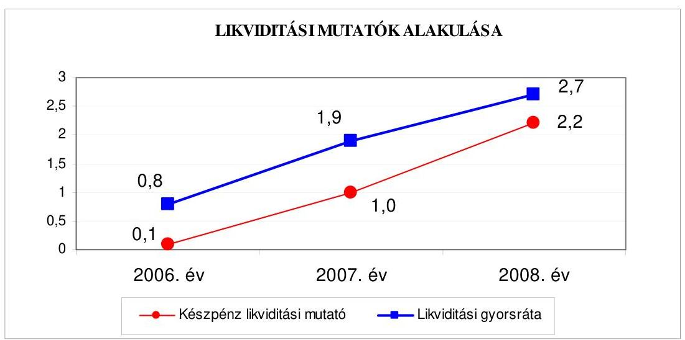

A likviditási mutatók emelkedő értéke jelzi, hogy a rövid lejáratú fizetési kötelezettségek pénzügyi teljesítéséhez az Önkormányzat megfelelő mennyiségű pénzeszközzel rendelkezett. A készpénz likviditási mutató értéke a 2007. évre 0,9 ponttal, a 2008. évre 1,2 ponttal emelkedett. A mutató kedvező irányú változását a 2007. és a 2008. évi kötvénykibocsátások fel nem használt bevétele eredményezte. A fizetőképességet javította a pénzeszközök és a követelések együttes figyelembevétele a rövid lejáratú fizetési kötelezettségek fedezeténél. A likviditási mutatók értékeinek emelkedése révén az Önkormányzat pénzügyi helyzete - a 2006-2008. évek között - fizetőképességi szempontból kedvezően alakult.

[^0]
[^0]:    ${ }^{23}$ Az esedékességi aránymutató a rövid lejáratú fizetési kötelezettségek arányát fejezi ki az összes - rövid és hosszú lejáratú - fizetési kötelezettségen belül.
    ${ }^{24}$ A készpénz likviditási mutató kifejezi, hogy a pénzeszközök év végi állománya milyen arányban nyújt fedezetet a rövid lejáratú fizetési kötelezettségekre.
    ${ }^{25}$ A likviditási gyorsráta mutatja, hogy a rövid lejáratú fizetési kötelezettségek kiegyenlítéséhez a pénzeszközökön túl bevonható követelések, forgatási célú értékpapírok milyen arányban nyújtanak fedezetet.

---

Az Önkormányzat 2006-2008. közötti pénzügyi helyzete az eladósodásának növekedése miatt, a fizetőképesség kedvező irányú változása ellenére, öszszességében kedvezőtlenül alakult.

# 2. Az ÖNKORMÁNYZAT FELKÉSZÜLTSÉGE AZ EURÓPAI UNIÓS FORRÁSOK IGÉNYLÉSÉRE ÉS FELHASZNÁLÁSÁRA, VALAMINT AZ ELEKTRONIKUS KÖZSZOLGÁLTATÁSI FELADATOK ELLÁTÁSÁRA 

2.1. Az európai uniós források igénybevételére és a várható támogatás felhasználására történt felkészülés szabályozottságának, szervezettségének eredményessége

### 2.1.1. Az európai uniós forrásokra történő pályázatok benyújtására vonatkozó döntések összhangja a fejlesztési célkitűzésekkel

Az Önkormányzat fejlesztési célkitűzéseit a Képviselő-testület 2006. évig ágazati koncepciókban ${ }^{26}$, majd a 2006. évet követően a gazdasági programban, a stratégiai tervben, a Polgármesteri Hivatal 2007-2009. évi stratégiai célkitűzéseiben, az Integrált Városfejlesztési Stratégiában ${ }^{27}$, valamint ágazati, szakmai koncepciókban, programokban ${ }^{28}$ határozta meg.

A gazdasági programban a kerületfejlesztés legfontosabb stratégiai feladata a kerület, különösen Belső-Erzsébetváros rehabilitációja. A gazdasági programban további fejlesztési irányként szerepelt:

- a közutak, a műemléki jellegű épületek felújítása, a társasházak felújításának támogatása, a parkok felújítása, a köztisztaság fenntartása;
- a szociális területen hiányzó ellátási formák kialakítása, a szociális szolgáltatásoknak teret adó intézményrendszer felújítása (melyhez vállalkozói tőkebevonással számoltak);
- az iskolaépületek felújítási programjának folytatása, az óvodákban és az iskolákban a fejlesztő pedagógiai tevékenység tartalmi és szervezeti kereteinek kialakítása, tanulómódszertan oktatása;
- fedett uszoda, felette konferenciatermek építése.

[^0]
[^0]:    ${ }^{26}$ Erzsébetváros 2004. évtől 2010. évig szóló Környezetvédelmi Programja, a 2003-2006. évi Lakásgazdálkodási Koncepció, a 2003-2006. évek időszakára vonatkozó Oktatáspolitikai Koncepció, a 2003-2006. időszakra vonatkozó Kulturális Koncepció, Egészségügyi Koncepció, a 2004-2007. közötti időszakra vonatkozó Középtávú Informatikai Stratégia, a 2003-2006. időszakra vonatkozó Kerületfejlesztési Program, Szociális Szolgáltatástervezési Koncepció.
    ${ }^{27}$ A Képviselő-testület a 214/2007. (IV. 20.) számú határozatával, illetve a 291/2008. (VI. 16.) számú határozatával fogadta el.
    28 2007-2010. évi vagyongazdálkodási koncepció, oktatáspolitikai koncepció 20072010. évekre, Szociális Szolgáltatástervezési Koncepció, 2004. évtől 2010. évig szóló Környezetvédelmi Program, Közoktatás minőségirányítási program.

---

A fejlesztési célkitűzések megvalósításának lehetséges pénzügyi forrásait figyelembe vették a gazdasági programban.

A gazdasági program a felhalmozási feladatok forrása tekintetében rögzítette, hogy „elsődlegesen pályázati pénzeszközök bevonásával, amennyiben erre nincs lehetőség és a feladat fontossága indokolja, kedvezményes felhalmozási hitelek felvételével oldható meg az egyes feladatok finanszírozása". A gazdasági programban rögzítették, hogy a múködés bővítéséhez szabad források nem állnak rendelkezésre, a minőségi vagy mennyiségi fejlesztést a kötelező és önként vállalt feladatok újbóli rangsorolása után lehet elhatározni és végrehajtani. Az önkormányzati feladatellátás színvonalának emeléséhez a gazdasági program szerint oly módon is biztosítható forrás, hogy intézmény megszüntetés vagy átszervezés miatt felszabaduló ingatlanállományból történő értékesítés bevételét felhasználják egy másik, múködő intézmény épületének a korszerűsítésére.

Az NFT keretében megjelenő pályázati lehetőségek alapján nem módosították a fejlesztési célkitűzéseket, de az ÚMFT prioritásait és intézkedéseit a stratégiai terv elkészítésénél figyelembe vették.

Három pályázat - melyekkel 2004-2005 között nyertek európai uniós támogatást - megvalósítása, illetve pénzügyi elszámolása a 2006-2009 évekre áthúzódott.

A 2004. évben benyújtott PHARE pályázat támogatásával a 2006. évben készült el az Erzsébetvárosi Sportközpont teljes akadálymentesítése. A 2005. évben pályáztak és kötötték meg a támogatási szerződést az INTERREG III B CADSES ${ }^{29}$ program keretében a 2008. évben befejezett CoUrbit (Complex Urban Investment Tools - Komplex Beruházási Eszközök) projektre, valamint a 2005. évben megrendezett, a testvérvárosi program (Európa a polgárokért - Europe for Citizens Programme) keretében támogatott polgárok találkozója (Meeting of citizens) programmal a 2006. évben kellett elszámolni.

A gazdasági programban, valamint az ágazati, szakmai tervekben, koncepciókban foglalt célkitűzésekkel összhangban a 2006-2009. I. negyedévre vonatkozóan ${ }^{30}$ a Képviselő-testület 11, a polgármester - az éves költségvetési rendeletekben biztosított - átruházott hatáskörben nyolc, az intézmények vezetői öt európai uniós támogatást igénylő pályázat benyújtásáról döntöttek. Az Önkormányzat által benyújtott 24 pályázatból 14 nyert pozitív elbírálást. A nyertes projektek közül kilenchez kapcsolódóan megkötötték a támogatási szerződést, kettő - testvérvárosi kapcsolatok - normatív támogatásban részesült, kettő projekt támogatási szerződésének megkötése folyamatban van, és egy kétfordulós pályázathoz a pénzügyi támogatás a második fordulóban nyerhető el ${ }^{31}$. Elutasításra került 10 pályázat, ebből egynél nem közölték az elutasítás okát, egy számszakilag hibás volt, egy nem felelt meg a pályázati feltételeknek, három szakmailag nem volt megfelelően kidolgozott, négy pályázatra nem volt elegendő forrása a támogatónak. Az európai uniós pénzesz-

[^0]
[^0]:    ${ }^{29}$ Central Adriatic Danubean South European Space - Közép-európai, adriai, dunai térség.
    ${ }^{30}$ A 2005. évről áthúzódó három projekt is figyelembevételre került.
    ${ }^{31}$ A második fordulóra a pályázatot 2009. szeptember 18-án nyújtották be.

---

közzel támogatott 11 fejlesztési feladat közül hat befejezésre került, négy megvalósítása folyamatban van, és egytől, a „Polgárok találkozója 2009." projekttől az önkormányzat visszalépett, a támogatásról lemondott, mert a gazdasági válság miatt a testvérvárosi kapcsolatok program a 2009. évben elmaradt. A támogatásban részesült pályázatok, projektek tervezett és teljesített kiadásait, a kiadást finanszírozó forrásokat a jelentés 4. számú melléklete (tanúsítvány) tartalmazza.

Az Önkormányzat által a 2006-2009. I. negyedévre vonatkozóan a támogatott 13, valamint a támogatást nem nyert 11 pályázat a következő volt:

- A Képviselő-testület az 597/2004. (XI. 19.) számú határozatával döntött arról, hogy a „Fogyatékos személyek esélyegyenlőségének elősegitése PHARE 2003 program keretében, sportlétesítmények akadálymentesitése" pályázaton indul, a Fot-ban előírt önkormányzati középületek akadálymentesítési kötelezettség teljesítése érdekében. A 2004 decemberében benyújtott pályázat szerint a 24,8 millió Ft kiadással tervezett „Budapest VII. kerület Erzsébetvárosi Sportközpont épületének akadálymentesitése"projektet 3.9 millió Ft saját forrással, és 20,9 millió Ft támogatás igénybevételével szándékoztak megvalósítani. Az EU Önerő Alaptól 1,6 millió Ft támogatásra írtak alá támogatási szerződést 2005. szeptember 27-én a Belügyminisztériummal, amely összeg a tervezett saját forrás $41 \%$-át jelentette. A projekt a 2006. évben a támogatási szerződésben foglalt határidőre befejeződött.
- A Képviselő-testület 634/2004. (XII. 17.) számú határozata alapján 2005 januárjában nyújtottak be hazai társfinanszírozással pályázatot az INTERREG IIIB CADSES (Közép-európai, adriai, dunai térség) program keretében az „Európai térség területi integrációjának elősegitése" pályázaton az „INTERREG IIIB CADSES CoUrbit" - Komplex Beruházási Eszközök - projektre. A projekt megvalósítására 75,0 millió Ft-ot terveztek 56,3 millió Ft igényelt európai uniós támogatás, 8,4 millió Ft hazai társfinanszírozás és 10,3 millió Ft saját forrás mellett. A projekt tervezett időtartama 2005. június 1. - 2008. június 1. közötti volt. A projekt határidőre befejeződött. A projekt eredményeként készült el a Large Central European Cities - vagyis Nagyméretű Közép-Európai városok - című angol nyelvű város rehabilitációs kézikönyv, valamint a Városregenerációs terv.
- Az Európa a polgárokért („Europe for Citizens Programme") programon belül a Testvérvárosi kapcsolatok („Town Twinning") pályázat keretében a polgármester döntése alapján 2005 júniusában pályázatot nyújtottak be a polgárok találkozója („Meeting of citizens") projektre. Az eredményes pályázat alapján kötött támogatási szerződés költséget nem tartalmazott, a támogatás összegét normatív módon - fő/nap/euró - határozták meg. A tervezett létszám alapján a támogatási összege 1,8 millió Ft ( 7 ezer euró) volt. A testvérvárosi találkozót a 2005. évben megtartották. A projekt végrehajtásáról a 2006. évben elszámoltak, és a támogatás összegét a 2006. évben megkapták.
- A 2005. évben három intézmény nyújtott be európai uniós támogatásra pályázatot. Az Alsóerdősori Iskola, valamint az Erzsébetvárosi Általános Iskola és Informatikai Szakközépiskola a „HEFOP-3.1.3. Felkészités a kompetenciaalapú oktatásra" programra nyújtottak be sikeres pályázatot. A támogatási

---

szerződéseket 2006 júliusában, illetve 2006 novemberében kötötték meg. Mindkét projekt tervezett kiadása 18,0 millió Ft volt, amelyhez 75\%-25\%-os arányban az európai uniós és a hazai társfinanszírozási támogatást terveztek. Az „EPSZK" Erzsébetvárosi Pedagógiai - Szakmai Szolgáltató Intézmény a „HEFOP-3.1.4/05/1 A kompetencia-alapú oktatás elterjesztése" programra nyújtott be sikeres pályázatot. A támogatási szerződést 2006 májusában kötötték meg, amely szerint a projekt tervezett kiadása 80,0 millió Ft volt, és $75 \%-25 \%$-os arányban az európai uniós és a hazai társfinanszírozási támogatás volt a tervezett forrása. Mindhárom projekt befejeződött.

- Az EGT és Norvég Finanszírozási Mechanizmus program keretében a „Játszóudvar kialakítása és napközis csoportszobák eszközbeszerzése" című pályázatot 2006 szeptemberében nyújtották be képviselő-testületi döntés alapján. Három oktatási intézményben a 2007. évben történő játszóudvarok kialakítására, öt közoktatási intézményben napközis szobák felújítására és eszközbeszerzésre tervezett költség 85,8 millió Ft (312,0 ezer euró), amelyhez a támogatási igény 72,9 millió Ft ( 265,2 ezer euró), a saját forrás 12,9 millió volt. A pályázatot a 2007. januári hiánypótlást követően forráshiány miatt utasította el a Projekt Döntő Bizottság.
- A Képviselő-testület 59/2007. (II. 23.) számú határozata alapján a „KMOP4.6.1. a közoktatási intézmények beruházásainak támogatása" intézkedésre az Önkormányzat 2007 júliusában adott be pályázatot az „Erzsébetvárosi Általános Iskola és Informatikai Szakközépiskola infrastrukturális fejlesztése" projektre. A projekt tervezett kiadási összege 997,5 millió Ft volt, amelynek forrásaként 187,5 millió Ft európai uniós és 62,5 millió Ft hazai társfinanszírozási támogatást, valamint 747,5 millió Ft saját forrást terveztek. A pályázat forráshiány miatt nem részesült támogatásban.
- Az EGT és Norvég Finanszírozási Mechanizmus program keretében „projekt koncepciók" fogadása céljából meghirdetett pályázaton a Képviselő-testület 374/2007. (VI. 15.) számú határozata alapján az Önkormányzat a „Budapest Főváros VII. kerület Erzsébetváros Önkormányzata kompetenciájának és adminisztratív kapacitásának növelése információ-technológiai eszközök használatával" megnevezésű projektre nyújtott be pályázatot 2007 szeptemberében. A projekt tervezett kiadási összege 757,5 millió Ft volt, amelyhez 643,9 millió Ft európai uniós támogatást igényeltek és 113,6 millió Ft saját forrást terveztek. A pályázat nem részesült támogatásban, mivel értékelésekor nem érte el az előírt minimális ponthatárt.
- Az Önkormányzat 2008. januárban nyújtotta be a pályázatot az Interregionális Együttmúködési Operatív Program keretében az INTERREG IV/C pályázaton a „Kreatív kezdeményezés (Creative Enterprises)" projektre. A főpályázó a spanyolországi Cordoba volt. Képviselő-testület utólag - három nappal későbbi - 2/2008. (I. 18.) számú határozattal hozta meg a pályázat benyújtásáról a döntését. A polgármesternek a pályázat benyújtásáról hozott előzetes döntése is jogszerú volt a 2008. évi költségvetési rendelet 11. § (4) bekezdésében biztosított jogköre alapján. A projekt tervezett kiadása 46,4 millió Ft, forrása 39,4 millió Ft európai uniós támogatás és 7,0 millió Ft saját forrás. A pályázat nem részesült támogatásban, az elutasítás okát a főpályázó nem közölte az Önkormányzattal.

---

- A Képviselő-testület 3/2008. (I. 18.) és 4/2008. (I. 18.) számú határozatai alapján a „KMOP-4.6.1/2. a közoktatási intézmények beruházásainak támogatása" intézkedésre az Önkormányzat 2008 januárjában kettő pályázatot nyújtott be. Az egyik az „Erzsébetvárosi Általános Iskola és Informatikai Szakközépiskola infrastrukturális fejlesztése" ismételten benyújtott projekt volt. A fejlesztés és korszerűsítés tervezett költsége és forrásösszetétele megegyezett a 2007-ben elutasítottal. A másik pályázat a „»Minden gyermek egyaránt fontos«. Az Erzsébetvárosi Baross Gábor Általános Iskola komplex fejlesztése a minőségi oktatás feltételeinek erősítése érdekében" címen benyújtott pályázat volt. A projekt tervezett kiadása 663,0 millió Ft volt, amelynek forrásaként 187,5 millió Ft európai uniós, 62,5 millió Ft hazai társfinanszírozási támogatást és 413,0 millió Ft saját forrást terveztek. Mindkét pályázatot forráshiány miatt elutasították.
- A polgármester döntése alapján az Európa a polgárokért („Europe for Citizens Programme") programon belül az EACEA ${ }^{32}$ Testvérvárosi kapcsolatok („Town Twinning") pályázat keretében 2008. évben kettő pályázatot nyújtottak be polgárok találkozója („Meeting of citizens") projektekre. A 2008. februárban benyújtott pályázat eredményes volt, de a támogatásról nem szerződést kötöttek, hanem az EACEA által megküldött döntés tartalmazta a támogatás összegét, meghatározásának módját, a felhasználás és elszámolás szabályait. A „Polgárok találkozója 2008." projekt 4,7 millió Ft-os támogatási összegét a tervezett résztvevők száma és tartózkodási ideje alapján normatív módon fő/nap/euró - határozták meg. A találkozót 2008 júniusában tartották meg. A 2008 decemberében a 2009. évben rendezendő találkozóra nyújtott be sikeresen az Önkormányzat pályázatot. A „Polgárok találkozója 2009." projektre felhasználható 5,1 millió Ft támogatás összegéről - az előző évhez hasonlóan - a szabályozásokat is tartalmazó döntést kaptak, és nem szerződést kötöttek. A találkozó 2009. évben elmaradt, a támogatásról az önkormányzat lemondott.
- A Képviselő-testület 140/2008. (IV. 18.) számú határozata alapján a „KMOP5.5.2/B Funkcióbővítő rehabilitáció Budapest Integrált Városfejlesztési Program Budapest Kerületi Központok Fejlesztése" megnevezési program keretében a „»Kultúra utcája« Budapest, VII. kerület Erzsébetváros Funkcióbővítő rehabilitációja" című projektre 2008. júniusában nyújtottak be pályázatot. A pályázat kétfordulós volt, amelynek az első fordulóján pozitív döntésben részesült a pályázat, de pénzügyi támogatás e döntéshez még nem kapcsolódott. A projekt tervezett kiadási összege 1372,3 millió Ft volt, amelynek forrásaként 812,2 millió Ft európai uniós és 270,7 millió Ft hazai társfinanszírozási támogatást, valamint 289,4 millió Ft saját forrást terveztek. Az előzetes támogató döntés szerint az Irányító Hatóság legfeljebb 800 millió Ft összegű támogatásra érdemesnek ítélte a projektet, maximum 1013,8 millió Ft elszámolható költség és 78,91\% támogatási mérték mellett. Az Önkormányzat az első forduló feltételeit teljesítette és a projekt második fordulójának pályáza-

[^0]
[^0]:    ${ }^{32}$ Education, Audiovisual \& Culture Executíve Agency - Oktatási, Audiovizuális és Kulturális Végrehajtó Ügynökség.

---

ta az elbírálás szakaszában van ${ }^{33}$. A feladatot 2009. februárról 2010. júliusig tervezték megvalósítani.

- A Képviselő-testület 292/2008. (VI. 16.) számú határozata alapján 2008. júliusban nyújtották be a pályázatot az „ÁROP-3.A. 1 Szervezetfejlesztés Budapest Fôváros VII. kerület Erzsébetváros Önkormányzat Képviselö-testületének Polgármesteri Hivatalában" projektre. A pályázat eredményes volt. és a támogatási szerződést 2009. február 23-án kötötték meg. A projekt tervezett összkiadása 35,8 millió Ft, amelyhez 24,2 millió Ft európai uniós és 8,0 millió Ft hazai társfinanszírozási támogatást kapnak és 3,6 millió Ft saját forrást kell biztosítani. A feladat megvalósítása folyamatban van, 2010. március 18-ig kell megvalósítani.
- A Polgármester döntése alapján 2008. szeptember hónapban kettő pályázatot nyújtottak be. Az egyik ${ }^{34}$ a „KMOP-4.4.1/B Bentlakásos intézmények korszerüsítése" program keretében a „Budapest Fôváros VII. kerület Erzsébetváros Önkormányzata Dózsa György út 46. szám alatti nyugdijasházának átalakítása korszerüsitéssel bentlakásos intézménnyé" pályázat volt. A fejlesztési feladat tervezett kiadása 112,3 millió Ft, forrása 75,8 millió Ft európai uniós, 25,3 millió Ft hazai társfinanszírozási támogatás és 11,2 millió Ft saját forrás. A pályázatot elutasították, mivel nem érte el a minimális ponthatárt. A másik pályázat tárgya a TÁMOP 5.2.5/08/1/B program keretében az „„Érik a Cseresznye..." A Cseresznye Ifjúsági Információs és Tanácsadó Iroda Humánszolgáltató szakmai tevékenységének fejlesztése, valamint az ehhez szükséges HR és infrastruktúra biztositása" megnevezésű projekt volt. A projekt tervezett kiadása 20,0 millió Ft, forrása 16,0 millió Ft európai uniós és 4,0 millió Ft hazai társfinanszírozási támogatás. A pályázatot forráshiány miatt elutasították, tartaléklistára került, de a közbenső egyeztetés során a polgármester nevében, annak tartós távolléte miatt az általános helyettese legfrissebb eseményekről adott tájékoztatása szerint az ESZA Nonprofit Kft. 2009. október 28. napján kelt levele szerint a NFÜ Humán Erőforrás Programok Irányító Hatósága 17,5 millió Ft támogatásra érdemesnek ítélte.
- Az Erzsébetváros Szociális és Gyermekjóléti Szolgáltató Központ Esély Családsegítő Szolgálat 2008. szeptember 25-én egy konzorcium tagjaként ${ }^{35}$ nyújtott be pályázatot a „TÁMOP 5.3.1. „Első lépés« - alacsony foglalkoztatási esélylyel rendelkezők képessé tevő és önálló életvitel elősegitő programja" megnevezésű program „Partnerség a foglalkoztatásért 2009" pályázatára. A 74,5 millió Ft összköltséggel tervezett projekt intézményt érintő tervezett kiadásának összege 21,8 millió Ft, amelynek $75 \%-25 \%$-ban európai uniós és a hazai társfi-

[^0]
[^0]:    ${ }^{33}$ A támogatási összeg elnyerése érdekében második fordulóra a pályázatot 2009. szeptember 18-án benyújtották. A polgármester nevében, annak tartós távolléte miatt az általános helyettese legfrissebb eseményekről adott mellékelt tájékoztatása szerint a pályázat támogatásban részesül a 2009. november 27-i levél szerint, és a támogatási szerződés előkészítése folyamatban van.
    ${ }^{34}$ A 2008. évi költségvetési rendeletben előírtak szerint az Ad-hoc bizottság 17/2008. (IX.04.) számú határozatában javasolta a pályázat benyújtását.
    ${ }^{35}$ A konzorcium további tagjai a Budapest Esély Nonprofit Kft. (feladata a konzorcium vezetése) és Józsefvárosi Családsegítő Szolgálat.

---

nanszírozási támogatás a tervezett forrása. A megvalósulás időpontját 2009. augusztusra tervezték. A pályázat sikeres elbírálásáról 2009. május 25 -én kaptak értesítést. ${ }^{36}$

- A Képviselő-testület 381/2008. (VIII. 14.) számú határozata alapján 2008 szeptemberében nyújtották be a „KMOP-2008. 3.3.4. C Környezetvédelmi célú informatikai fejlesztések a közigazgatásban (e-környezetvédelem)" program keretében a pályázatot a „A VII. kerületi Önkormányzat keretein belül Agglomerációs Környezetinformációs-technológiai Rendszer (AKIR) kiépítése a környezeti demokrácia fejlesztése érdekében" projekt megvalósítására. A pályázat eredményes volt, és a támogatási szerződést 2009. május 21-én kötötték meg. A projekt tervezett összkiadása 88,0 millió Ft, amelyhez 62,7 millió Ft európai uniós és 20,9 millió Ft hazai társfinanszírozási támogatást kapnak és 4,4 millió Ft saját forrást kell biztosítani. A feladat megvalósítása folyamatban van, és 2010. június 28 -ig kell megvalósítani.
- A Polgármester döntése ${ }^{37}$ alapján 2008 októberében a „KMOP-4.4.1/B Bentlakásos intézmények korszerüsítése" program keretében nyújtottak be pályázatot a „Budapest Főváros VII. kerület Erzsébetváros Peterdy utca 16. sz. alatti Nyugdijasház átalakítása korszerüsitéssel, akadálymentesitéssel bentlakásos intézménynyé" projektre. A fejlesztési feladat tervezett kiadása 112,1 millió Ft, forrása 75,7 millió Ft európai uniós, 25,2 millió Ft hazai társfinanszírozási támogatás és 11,2 millió Ft saját forrás. A pályázatot elutasították, nem felelt meg a feltételeknek, mert a hiánypótlásnak nem tettek eleget és a pályázatot a fenntartó Önkormányzat nyújtotta be és nem az önálló intézmény.
- A polgármester döntése alapján 2008 decemberében nyújtották be a TÁMOP 3.1.4-08/1 program keretében a „Kompetencia alapú oktatás, egyenlő hozzáférés - Innovatív intézményekben" pályázatot. A pályázat eredményes volt, és a támogatási szerződést 2009. június 18 -án kötötték meg. A projekt tervezett összköltsége 136,0 millió Ft, amelyhez $75 \%-25 \%$-os arányban az európai uniós és a hazai társfinanszírozási támogatás nyújt fedezetet. A feladat megvalósítása folyamatban van, és legkésőbb 2010. augusztus 31-ig kell megvalósítani nyolc oktatási intézményben.
- 2009 márciusában nyújtottak be pályázatot az INTERREG IVB program keretében meghirdetett az „INTERREG IVB EPOurban" című pályázaton az Ad-hoc bizottság ${ }^{38}$ javaslata alapján, amelyben a főpartner Lipcse Önkormányzata volt. A projekt Önkormányzatot érintő tervezett kiadása 99,7 millió Ft, forrása 84,7 millió Ft európai uniós támogatás és 15,0 millió Ft saját forrás. A pályázat elutasításra került, a főpartner 2009. augusztusi tájékoztatása szerint a szakmai értékelésen nem jutott túl.

[^0]
[^0]:    ${ }^{36}$ A közbenső egyeztetés során a polgármester nevében, annak tartós távolléte miatt az általános helyettese legfrissebb eseményekről adott tájékoztatása szerint a támogatási szerződés 2009. október 1-én aláírásra került.
    ${ }^{37}$ A 2008. évi költségvetési rendeletben előírtak szerint az Ad-hoc bizottság 20/2008. (IX. 30.) számú határozatában javasolta a pályázat benyújtását.
    ${ }^{38}$ A 2009. évi költségvetési rendeletben előírtak szerint az Ad-hoc bizottság 1/2009. (III. 11.) számú határozatában javasolta a pályázat benyújtását.

---

- A 2009 áprilisában nyújtott be az Erzsébetvárosi Általános Iskola és Informatikai Szakközépiskola a „HEFOP 3.1.3./B Kompetencia alapú oktatás eszközhátterének megvalósitása" program keretében pályázatot. A projekt tervezett kiadása 9,3 millió Ft, forrása $75 \%-25 \%$-os arányban az európai uniós és a hazai társfinanszírozási támogatás. A pályázatot számszaki hibák miatt elutasították.

Az Önkormányzat 2006-2009. évi költségvetési rendeletei tartalmazták az európai uniós forrást igénylő fejlesztési feladatok kiadási és bevételi előirányzatait, valamint a felhalmozási kiadásokat feladatonként. Az Ámr. 29. § (1) bekezdés g) pontjában előírtak ellenére a 2006. és a 2007. évi költségvetési rendeletek „Több éves kihatással járó döntésekből származó kötelezettségek célok szerint, évenkénti bontásban" címú mellékletében ${ }^{39}$ a 2006-2008. között megvalósított „INTERREG IIIB CADSES CoUrbit" projekt előirányzatait éves bontásban nem mutatták be.

A 2006-2008. között európai uniós forrásokkal támogatott, befejezett fejlesztési feladatok finanszírozási forrásának tervezett és tényleges megoszlását a következő ábra mutatja:
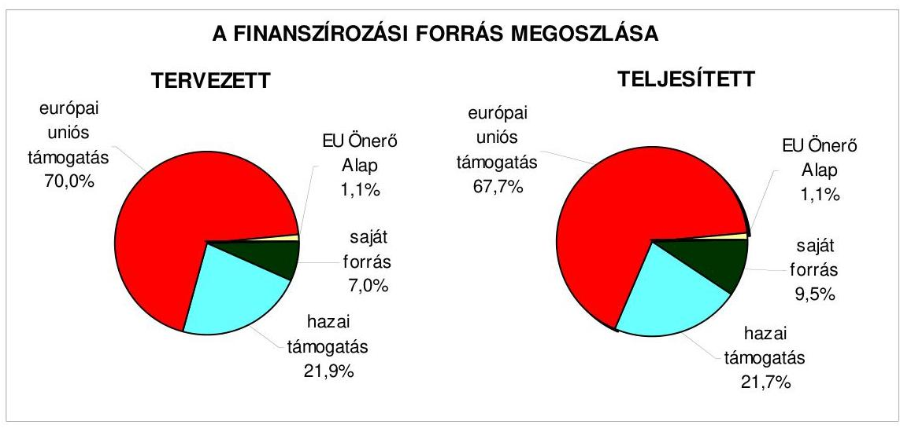

Az Önkormányzatnál a 2006-2009. I. negyedévben befejezett hat projekt 2006. évtől teljesített kiadása a tervezett kiadásokhoz viszonyítva 94,2\%-ra (142,7 millió Ft-ra) teljesült. A tervezettől való eltérés döntően annak hatása volt, hogy az Erzsébetvárosi Általános Iskola és Informatikai Szakközépiskola a HEFOP 3.1.3-2005 „Felkészités a kompetencia alapú oktatásra" projekt megvalósítására fordított kiadása a tervezetthez ( 18,0 millió Ft) képest mindössze 59,4\%ra teljesült. A felhasználás elmaradását az okozta, hogy az intézmény az előfinanszírozáshoz szükséges pénzeszközt nem tudta biztosítani. A forrásoknál a „Polgárok találkozója 2008." európai uniós támogatásának összege a tervezetthez képest $48,9 \%$-ban teljesült ( 2,3 millió Ft) a kevesebb résztvevő miatt. A tá-

[^0]
[^0]:    ${ }^{39}$ A melléklet száma a 2006. évi költségvetési rendeletben 19/a., a 2007. évi költségvetési rendeletben 17/a. volt.

---

mogatás csökkenése miatt nőtt az Önkormányzat saját pénzeszközeiből történő felhasználás.

# 2.1.2. Az európai uniós forrásokhoz kapcsolódóan a pályázatfigyelés, a pályázatkészítés, valamint az európai uniós támogatással megvalósuló fejlesztés lebonyolítása belső rendjének szabályozottsága, a végrehajtás személyi, szervezeti feltételei, az ellenőrzési feladatok meghatározása 

Az Önkormányzat már 2003. évben létrehozta az EU Integrációs és Informatikai Csoportot, amelynek feladata volt többek között az európai uniós pályázati lehetőségek figyelemmel kísérése, az önkormányzati szintű pályázati munka összehangolása, az önkormányzati szintű pályázati nyilvántartás vezetése. Az európai uniós források igénybevételének és felhasználásának feladatait 20062008. december közepéig a hivatali ügyrend mellékletét képező EU Integrációs és Informatikai Csoport feladat és hatásköri jegyzékében, jegyzői utasításban ${ }^{40}$, valamint a köztisztviselők munkaköri leírásaiban írták elő. Meghatározták az önkormányzati szintű pályázatkoordinálás feladatainak felelősét, valamint az önkormányzati szintű pályázati nyilvántartás vezetésének a felelősét. A pályázatok előkészítésével, a hazai és európai uniós forrással támogatott fejlesztési feladok lebonyolításával kapcsolatos eljárás rendet, a pályázatfigyelést végzők és a döntési, illetve a döntés elő́terjesztési jogkörrel rendelkezők közötti információ szolgáltatási kötelezettséget és annak rendjét azonban a szabályozások nem tartalmazták.

A jegyző már a 2005. évben kiadott utasítása rendelkezett arról, hogy valamenynyi szervezeti egységnél a vezető jelölje ki azt a személyt, akinek a feladatkörébe tartozik a pályázatok figyelése, a pályázatokon való részvétel megszervezése, a pályázatok előkészítésében való közreműködés, és a rendszeres kapcsolattartás az EU Integrációs és Informatikai Csoporttal. A kapcsolattartás, illetve az információ átadás módja és gyakorisága azonban szabályozatlan volt 2008. december közepéig. A 2009. évben már 18 szervezeti egység egy, vagy két munkatársa végezte a pályázatfigyeléssel és készítéssel kapcsolatos feladatokat.

Az Önkormányzat a stratégiai tervben előirányozta a pályázatokon történő részvétel eredményességének, hatékonyságának növelését, amelynek egyik eszköze volt a pályázati szabályzat elkészítése. Az Önkormányzat pályázati szabályzatát 2008. december 15-én hagyta jóvá a polgármester és a jegyző, amely a jóváhagyás napján lépett hatályba. A pályázati szabályzat hatálya kiterjedt a Polgármesteri hivatalra, az intézményekre és az Önkormányzat által alapított egyéb jogi személyre is. A pályázati szabályzat tartalmazta a pályázatok előkészítésével, a pályázatfigyelést végzők és a döntési, illetve a döntés előterjesztési jogkörrel rendelkezők közötti információ szolgáltatási kötelezettséget és annak rendjét, az önkormányzati szintű pályázatok dokumentálásának és a pályázatokról vezetendő nyilvántartás rendszerét. A pályázati szabályzatban a hazai és európai uniós forrással támogatott

[^0]
[^0]:    ${ }^{40}$ A jegyző 2005. május 1-jén a 3/2005. számú jegyzői utasítást adta ki a pályázatfigyeléssel foglalkozó személyek kijelölése érdekében.

---

fejlesztési feladatok lebonyolításának, megvalósításának eljárásrendjében csupán a pénzügyi lebonyolítást és a közbeszerzései eljárás lebonyolítását szabályozták. ${ }^{41}$

A FEUVE feladatokat a Polgármesteri hivatal tevékenységére vonatkozóan a gazdálkodási jogkörök szabályzata és az ellenőrzési nyomvonal tartalmazta. A gazdálkodási jogkörök szabályzatának előírásai érvényesek az európai uniós forrásokkal támogatott fejlesztési feladatokra is, és a bevételek szakmai teljesítésigazolása kapcsán a pályázati bevételekre - beleértve európai uniós pályázatokat is - külön rendelkezést tartalmazott. A belső ellenőrzés stratégiai tervet, és a 2006. 2007. évek ellenőrzési tervét megalapozó kockázatelemzést nem készített. A 2008. és a 2009. évi belső ellenőrzési tervet megalapozó kockázatelemzésben értékelték az európai uniós forrásokkal támogatott fejlesztési feladatokat.

A Polgármesteri hivatalban a pályázatfigyelés személyi és szervezeti feltételeit kialakították, abba külső személyt, szervezetet nem vontak be.

A Polgármesteri hivatalban a pályázatkészítés személyi, szervezeti feltételeit kialakították, továbbá nyolc pályázat kidolgozásához külső szervezetet is igénybe vettek. A feladatok a Polgármesteri hivatal EU Integrációs és Informatikai Csoportjának feladatkörében, illetve köztisztviselőinek munkaköri leírásában szerepeltek, de hét pályázat elkészítésében egy-egy gazdasági társaság, egy elkészítésében pedig egy önkormányzati intézmény múködött közre. A külső szervezetekkel kötött megállapodásokban előírták a feladatellátás kötelezettségét, a megbízott külső szervezet és a Polgármesteri hivatal képviselője közötti kapcsolattartás rendjét és a felelősség szabályait. Az információ átadással kapcsolatos rendelkezések azonban egyoldalúak voltak a szerződések 62,5\%-ánál, mivel csak az Önkormányzat által szolgáltatandó információkról rendelkeztek. A szerződésekben a megbízott részéről történő információ (beleértve a keletkezett dokumentumok) átadás rendjét - formáját, tartalmát és módját - nem rögzítették.

Az európai uniós támogatással megvalósított fejlesztési feladatok lebonyolításának szervezeti, személyi feltételeit a Polgármesteri hivatalon belül alakították ki, az ezzel összefüggő feladatokat a Polgármesteri hivatal köztisztviselői látták el. Egy projekt lebonyolításával ${ }^{42}$ külső szervezetet bíztak meg, és egy projekt lebonyolítására pedig egy önkormányzati intézményből, annak öt dolgozójából, továbbá egy külső szervezet képviselőjéből álló projektmenedzsmentet hoztak létre. Az önkormányzati intézményt a polgármester megbízta a feladatok elvégzésével. A kettő projekthez kapcsolódó lebonyolítási

[^0]
[^0]:    ${ }^{41}$ A közbenső egyeztetés során a polgármester nevében, annak tartós távolléte miatt az általános helyettese által adott tájékoztatás szerint, hogy pályázati szabályzatot 2009. október 20-án módosították és részletes szabályokat tartalmaz a pályázatok megvalósítására vonatkozóan.
    ${ }^{42}$ A „KMOP-2008. 3.3.4. C A VII. kerületi Önkormányzat keretein belül Agglomerációs Környezetinformációs-technológiai Rendszer (AKIR) kiépítése a környezeti demokrácia fejlesztése érdekében" és a „TÁMOP 3.1.4 Kompetencia alapú oktatás, egyenlő hozzáférés - Innovatív intézményekben" projektek lebonyolítására.

---

feladatokat a külső szervezettel kötött szerződésben és az önkormányzati intézmény polgármesteri megbízásában is meghatározták és megnevezték a kapcsolattartók személyét, de a kapcsolattartás, az ellenőrzés rendjét nem rögzítették, továbbá a felelősségi szabályokat nem személyre szólóan határozták meg. A projektmenedzsment tagjaival - az intézményi dolgozókkal és a külső szervezettel - kötött megbízási szerződésekben a feladatokat meghatározták, a kapcsolattartás és az ellenőrzés rendjét rögzítették, a felelősségi szabályokat személyre szólóan határozták meg.

# 2.1.3. A fejlesztési feladat lebonyolításánál a feladatellátás rendjére, az ellenőrzési feladatok teljesítésére, valamint a felelősségi szabályokra vonatkozó előírások betartása 

Az Önkormányzat 2004. december 6-án a „Fogyatékos személyek esélyegyenlőségének elősegítése PHARE 2003 program keretében, sportlétesítmények akadálymentesités" program keretében az Erzsébetvárosi Sportközpont épületének akadálymentesítésére benyújtott pályázatra a támogatási szerződést ${ }^{43}$ 2005. március 31-én kötötték meg a KPSZE-vel, amelyet nem módosítottak. A támogatás maximalizált összege 76905 euró volt. A fejlesztést a Polgármesteri hivatal dolgozói bonyolították, a beruházás műszaki ellenőrzésére és a mérnöki munkákra külső vállalkozókat bíztak meg. A program tényleges, a támogatási szerződés szerint elszámolható költsége 2005. és 2006. években összesen 30,8 millió Ft volt, amelyhez 19,4 millió Ft $75 \%-25 \%$ arányú európai uniós és hazai társfinanszírozású, valamint 1,6 millió Ft EU Önerő Alap támogatást kaptak, és 9,8 millió Ft saját forrást biztosítottak. A program terhére el nem számolható kiadások ${ }^{44} 2,0$ millió Ft összegét az Önkormányzat saját forrásból finanszírozta. A 2006. évre húzódott át a projekt teljes költségének 88,4\%-a (29,0 millió Ft), amelynek $57,6 \%$-át az európai uniós és a hazai társfinanszírozás, $5,5 \%$-át az EU Önerő Alaptól kapott támogatás és $36,9 \%$-át saját forrás finanszírozott. A projekt megvalósítására a megelőző évben 3,8 millió Ft-ot fordítottak, amelyre $71,1 \%$-ban az európai uniós és a hazai társfinanszírozás, $28,9 \%$-ban saját forrás nyújtott fedezetet.

A támogatási szerződésben meghatározott határidőre - 2006. július 31-ére - a projekt megvalósítását befejezték. A projektmegvalósítási időn belül azonban a beruházást a tervezett 14 hónap ${ }^{45}$ helyett két hónap késéssel fejezték be. A késést az okozta, hogy az engedélyezési eljárás a vártnál hosszabb ideig tartott. A fejlesztési feladat végrehajtásáról és pénzügyi elszámolásáról a határidőn belül ${ }^{46}$, 2006. szeptember 21-én megküldött záró pénzügyi és szakmai beszámolót a közremúködő szervezet elfogadta.

[^0]
[^0]:    ${ }^{43}$ A projekt azonosító száma HU2003-004-347-02-01/2/3/032.
    ${ }^{44}$ Pályázatkészítés, műszaki tervezés, mérnöki szolgáltatás, műszaki ellenőrzés költségei.
    ${ }^{45}$ A projekt megvalósításának határideje 2006. május 31. volt.
    ${ }^{46}$ 2006. szeptember 30.

---

Az európai uniós és hazai társfinanszírozási forrást a támogatási szerződésben foglaltaknak megfelelően igényelték. A projekt megvalósításához a 2005. évben összesen a hazai társfinanszírozással együtt 61524 euró ( 15,4 millió Ft) előleget kaptak, majd a 2006. évben a projekt elszámolását követően 2006. november hónapban a fennmaradó 15381 euró ( 4,0 millió Ft.) is folyósították. Az 1,6 millió Ft EU Önerő Alap támogatást is kettő részletben, 2006. februárban és 2006. decemberben kapták meg. Az Önkormányzat számára nem okozott pénzügyi zavarokat a támogatások egy részének utófinanszírozása.

A Polgármesteri hivatalban a projekt kiadásaival összefüggő FEUVE feladatokat a gazdálkodási jogkörök szabályzatában előírtak szerint elvégezték. A projekthez kapcsolódó bevételeknél azonban nem múködött megfelelően a folyamatba épített, előzetes és utólagos ellenőrzés, mivel a szakmai teljesítés igazolására jogosultak Ámr. 135. § (1)-(2) bekezdéseiben előírtak ellenére a bevételek szakmai teljesítését nem igazolták. Ezáltal az érvényesítés az Ámr 135. § (3) bekezdésében foglaltak ellenére nem a szakmai teljesítésigazolás alapult. Az utalvány ellenjegyző́je a bevételi utalvány ellenjegyzésekor az Ámr. 137. § (3) bekezdését figyelmen kívül hagyva nem kifogásolta, hogy azon nem szerepelt a szakmai teljesítés igazolása.

A belső, valamint külső ellenőrzés az Erzsébetvárosi Sportközpont épületének akadálymentesítése projekt megvalósítását nem vizsgálta.

Az európai uniós és hazai társfinanszírozással akadálymentesített Erzsébetváros Sportközpont lebontásáról döntött az Önkormányzat 2007. évben a tervezett új Sportközpont megépítése érdekében. Az Önkormányzat polgármestere 2008 decemberében levélben fordult a közremúködő szervezethez, amelyben kérte, hogy „a projektben vállalt célkitúzések fenntartásának helyszíneként az új Sportközpont területét" fogadja el a közreműködő szervezet. A közreműködő szervezet elfogadta az új helyszínt, azzal a feltétellel, hogy a teljes körű akadálymentességre vonatkozó előírások teljesítéséről és a projektben meghatározott célkitűzéseknek való megfeleléséről gondoskodni fog az Önkormányzat. Az Erzsébetvárosi Sportközpontot 2009. évben lebontották a sport funkciókat magába foglaló Rekreációs Központ építésének előkészítése részeként.

Az Önkormányzat a szabályozottság és szervezettség tekintetében a 20062008. évek között annak ellenére összességében nem készült fel eredményesen az európai uniós források igénybevételére és a várható támogatások felhasználására, hogy a gazdasági programban, stratégiákban, ágazati, szakmai koncepciókban, programokban megfogalmazott fejlesztési célkitűzésekhez kapcsolódtak az európai uniós forrásokra benyújtott pályázatok; a FEUVE feladatokat szabályozták; a 2008. évi belső ellenőrzési tervet megalapozó kockázatelemzés kiterjedt az európai uniós forrásokkal támogatott fejlesztési feladatokra; a pályázatfigyelés, a pályázatkészítés és a fejlesztési feladat lebonyolításának szervezeti és személyi feltételeit kialakították; a külső szervezettel kötött szerződésben a pályázat szakmai és tartalmi követelményeire vonatkozóan meghatározták a pályázatkészítést végző felelősségét. Nem szabályozták azonban a pályázatfigyelést végző és a döntési, illetve a döntés előterjesztési jogkörrel rendelkezők közötti információszolgáltatási kötelezettséget, valamint nem írták elő a fejlesztési feladat lebonyolítását végző ellenőrzési kötelezettségét. A 2008. december közepétől hatályos pályázati szabályzatban rögzítették a

---

pályázatfigyelést végző és a döntési, illetve a döntés előterjesztési jogkörrel rendelkezők közötti információszolgáltatási kötelezettséget.

# 2.2. Az elektronikus közszolgáltatás feltételeinek kialakítása, a közérdekú gazdálkodási adatok elektronikus közzététele 

Az Önkormányzat 2004. évben elfogadott 2004-2007. évekre vonatkozó Középtávú Informatikai Stratégiája ${ }^{47}$, valamint a 2007. évben elfogadott 2007-2013. évekre vonatkozó stratégiai terv tartalmazta a helyzetelemzést. Az informatikai fejlesztés és az e-közigazgatási feladatok közép és hosszú távú célkitűzéseit a stratégiai terv mellett a Polgármesteri Hivatal 2007-2009. évi stratégiai célkitűzései ${ }^{48}$ tartalmazta, melynek keretében középtávú célként az e-közigazgatási szolgáltatás 3. szintjének megvalósítását, múködtetését irányozták elő, és a felkészülést a teljes körű közvetlen, kétoldalú ügyintézési folyamat megvalósítására.

Az Önkormányzat az informatikai feladatellátás továbbfejlesztéséhez a 20062008. közötti években három európai uniós pályázatot nyújtott be. Az EGT és Norvég Finanszírozási Mechanizmusok keretében az Önkormányzat kompetenciájának és adminisztratív kapacitásának növelése információtechnológiai eszközök használatával elnevezésű pályázatát elutasították. Támogatásban részesült és a 2009. évben aláírt támogatási szerződések alapján jelenleg is folyamatban van a megvalósítása a 2008. évben benyújtott ÁROP-3.A.1. program keretében a Polgármesteri hivatal szervezetfejlesztése projektnek, valamint a KMOP-2008. 3.3.4. C program keretében az Önkormányzat keretein belül Agglomerációs Környezetinformációstechnológiai Rendszer (AKIR) kiépítése projektnek. A projektek befejezési határideje 2010. március, illetve 2010. július. A GVOP és az EKOP keretében nem nyújtott be pályázatot az Önkormányzat.

Az Önkormányzatnál az e-közigazgatási feladat ellátásának személyi, szervezeti feltételeit biztosították, részben a Polgármesteri hivatalon belül, részben pedig vállalkozási szerződéssel. Az e-közigazgatási feladatokat vásárolt számítógépes informatikai rendszerrel, vásárolt programmal és külső rendszeren keresztül múködtetve végezte.

Az Önkormányzatnál működtetett e-közigazgatási feladatokat ellátó informatikai rendszerben az ügyintézést 1., illetve 2. elektronikus szolgáltatási szinten valósították meg. Az állampolgárok részére a 2. elektronikus szolgáltatási szinten biztosították a hatósági igazolások, a személyi okmányok, a lakcímváltozás bejelentése, a gépjármú regisztráció intézése, az építési engedélyezés, a szociális juttatások, támogatások kifizetései és a helyi adózás területén az ügyintézést, a szükséges nyomtatványok a honlapról letölthetőek voltak. Az egészségügyi szolgáltatásokkal kapcsolatosan tájékoztatásokat jelenttettek meg

[^0]
[^0]:    ${ }^{47}$ A Képviselő testület 384/2004. (VI. 18.) számú határozattal fogadta el.
    ${ }^{48}$ A Képviselő-testület a 214/2007. (IV. 20.) számú határozatával fogadta el.

---

az Önkormányzat honlapján, amely az 1. elektronikus szolgáltatási szint megvalósítását jelenti. A vállalkozások részére a gépjármúadó ügyintézését és a vállalkozással kapcsolatos engedélyek ügyintézését 2. elektronikus szolgáltatási szinten biztosították. A teljes közvetlen, kétoldalú ügyintézés biztosításának akadálya a szükséges pénzeszköz hiánya.

Az e-közigazgatási feladatokat ellátó informatikai rendszer ügyfelek általi igénybevételénél az okmányirodai ügyintézés keretében az elektronikus időpontfoglalást kísérték figyelemmel, amely szerint a 2007-2009. években az összes ügyfél ${ }^{49} 3 \%-a$, illetve 4-4\%-a foglalt elektronikusan időpontot. Az informatikai rendszeren keresztül végzett ügyintézésre vonatkozóan az egyes ügykörök igénybevételének tapasztalatait nem értékelték.

Az Önkormányzat a közérdekú gazdálkodási adatok meghatározott körének nyilvánosságát érintően a nettó öt millió Ft-nál alacsonyabb összegű szerződések kötelező közzétételét előíró rendeletet nem alkotott. A 200 ezer Ft alatti támogatások közzétételét 2006. évtől 2009. júniusáig nem zárták ki.

A 2009. évi költségvetési rendelet módosítása a közzététel kizárását célozta, de megfogalmazása szerint az Áht. alapján is kötelező közzétételről rendelkeztek. ${ }^{50}$

Az Önkormányzat honlapján ${ }^{51}$ a gazdálkodási adatok közzététele a 18/2005. (XII. 27.) IHM rendeletben meghatározott szerkezetben történt.

A közzétételre szolgáló honlap megnyitásakor megjelenő oldalon elhelyezték a közzétételi listák által előírt adatokat tartalmazó jegyzékre mutató hivatkozást „Közérdekú adatok" elnevezéssel. A jegyzék a rendelet 1. számú melléklete szerinti tagolásban tartalmazta a közzétételi egységeket, a 3. Gazdálkodási adatok közzétételi egység alatt történt a céljellegú támogatások és a nettó öt millió forint feletti szerződések közzététele.

Az Önkormányzat honlapján az Áht. 15/A. § (1) bekezdésében előírtakat megsértve a Polgármesteri hivatal a céljellegú múködési és felhalmozási támogatások 30\%-át nem tette közzé, illetve 20\%-ánál nem tüntették fel a támogatási program megvalósítási helyét ${ }^{52}$. Az intézmények nem nyújtottak céljellegú múködési és felhalmozási támogatást.

Nem tették közzé az Erzsébetvárosi Televízió Kht-nak, az Erzsébetváros Sportegyesületnek és az Erzsébetvárosi Közrendvédelmi, Közbiztonsági, Vagyonvédelmi és Szolgáltató Közhasznú Nonprofit Kft-nek adott (1,0 millió Ft/hó, 1,3 millió Ft, 1,5

[^0]
[^0]:    ${ }^{49}$ Az ügyfelek száma a 2007. évben 85 288, a 2008. évben 79239 és 2009 szeptemberéig 57838 volt.
    ${ }^{50}$ A 20/2009. (VI. 24.) számú rendelettel módosított 2009. évi költségvetési rendelet 7. § (2) bekezdése (A költségvetési intézmények és a Polgármesteri hivatal ágazatilag érintett irodái:) „intézkednek az Áht. 15/A. § (2) bekezdése szerint 200 ezer Ft feletti támogatások esetén a közérdekú adatok közzétételéről".
    ${ }^{51}$ A honlap elérhetősége: „www.erzsebetvaros.hu".
    ${ }^{52}$ A közbenső egyeztetés során a polgármester nevében, annak tartós távolléte miatt az általános helyettese által adott tájékoztatás szerint közzétették és pótolták a hiányosságokat a céljellegú múködési és felhalmozási támogatások esetében.

---

millió Ft) támogatást ${ }^{53}$. Az ellenőrzött és közzétett támogatások 14,3\%-ánál hiányzott a program megvalósításának a helye ${ }^{54}$.

Az Áht. 15/B. § (1) bekezdés előírását megsértve az Önkormányzat pénzeszközei felhasználásával, a vagyonnal történő gazdálkodással összefüggő szerződések ${ }^{55}$ 46,7\%-ánál nem tették közzé az előírt adatokat, illetve 6,6\%-ánál azok változását ${ }^{56}$, továbbá a szerződéseket - egy szerződés kivételével - a 2009. évben, a szerződés létrejöttének időpontjához képest egy-, másféléves késéssel, az előírt 60 napos határidőt követően ${ }^{57}$ tették közzé.

A Polgármesteri hivatalt érintően nem tették közzé a Political Capital Szolgáltató Kft-vel, az ÁBP ÁPISZ-Buda Piért Kereskedelmi Zrt-vel, a Hérosz Zrt-vel, a S’AJO ABC-TEAM Kft-vel és a Global Property Investmenttel kötött szerződéseket. A közzétett szerződések közül a Generál Tanácsadó Irodával kötött szerződést módosították, de a módosítást nem jelezték a közzétett információknál. A közzétett szerződések közül a Kamilla Kht-val 2008. április 14-én kötött szerződés adatait tették közzé az előírt határidőben. Az önállóan gazdálkodó intézmények közül a Janikovszky Éva Iskola, valamint az Alsóerdősori Iskola által kötött egy-egy nettó öt millió Ft-ot elérő, vagy azt meghaladó értékű árubeszerzésre, illetve szolgáltatás megrendelésére irányuló szerződés adatait nem tették közzé az Önkormányzat honlapján.

Az Önkormányzat honlapján nem tették közzé az Ámr. 22. számú melléklet 5. sorában meghatározott éves költségvetési beszámoló szöveges indoklását, ezáltal nem tartották be az Ámr. 157/D. § (1) bekezdésében foglalt előírást. Az Önkormányzat honlapján a közérdekú adatok közötti „Önkormányzat költségvetési beszámolójának szöveges indoklása" részében a Képviselő-testület számára készített zárszámadási előterjesztést tették közzé, amely tartalmilag nem felelt meg az éves költségvetési beszámoló kiegészítő mellékletét képező szöveges indoklás ${ }^{58}$ tartalmára vonatkozó, a Vhr. 40. § (4), (7)-(8) bekezdésekben rögzített követelményeknek. A honlap közérdekű adatok „A Hivatal beszá-
${ }^{53}$ Kifizetések: 2008. szeptember 26.-án 1,0 millió Ft, 2008. május 14-én 1,3 millió Ft, 2008. december 22-én 1,5 millió Ft.
${ }^{54}$ A Képviselő-testület 258/2008. (V. 19.) számú határozatában a Háromszín Kulturális alapítványnak és Vági Zsuzsa bohóc- és gyógypedagógus részére megítélt támogatások esetében, kifizetések: 2008.október 16-án 150 ezer Ft, illetve 500 ezer Ft.
${ }^{55}$ Az előírás alapján árubeszerzésre, építési beruházásra, szolgáltatás megrendelésre, vagyonhasznosításra, vagyonértékú jog átadására, valamint koncesszióba adásra vonatkozó szerződések adatait kellett közzétenni.
${ }^{56}$ A közbenső egyeztetés során a polgármester nevében, annak tartós távolléte miatt az általános helyettese által adott tájékoztatás szerint közzétették a hiányzó szerződéseket.
${ }^{57}$ Az Áht. 15/B § (1) bekezdése alapján a szerződések megnevezését (típusát), tárgyát, a szerződést kötő felek nevét, a szerződés értékét, határozott időre kötött szerződés esetében annak időtartamát, valamint az említett adatok változását a szerződés létrejöttét követő 60 napon belül kell közzétenni.
${ }^{58}$ A beszámolót és annak kiegészítő mellékleteként a szöveges indoklást külön-külön kell elkészítenie a Polgármesteri hivatalnak és az Önkormányzat önállóan gazdálkodó intézményeinek is.

---

molója: Az egyéb költségvetési szervek költségvetési beszámolójának szöveges indoklása" részében pedig nem tették közzé a Polgármesteri hivatal éves költségvetési beszámolójának a szöveges indoklását.

A Képviselő-testület számára szóló az Önkormányzat 2007. és 2008. évi zárszámadásának szöveges előterjesztésében nem ismertették azokat a tényezőket, amelyek befolyásolták az előirányzatok tervezettől eltérő felhasználását, nem indokolták a teljes kötelezettségállomány alakulását befolyásoló tényezőket, nem készült szöveges értékelés az európai uniós támogatási programokkal kapcsolatban felhasznált saját költségvetési források alakulásáról. A közzétett előterjesztés nem tartalmazta a közalapítványok, az alapítványok által ellátott feladatokra teljesített kifizetések részletes felsorolását.

# 3. A KÖLTSÉGVETÉSI GAZDÁLKODÁS BELSŐ KONTROLLJAI 

### 3.1. A szabályozottság kockázata a költségvetés tervezési, gazdálkodási, beszámolási és a folyamatba épített, előzetes és utólagos vezetői ellenőrzési feladatoknál

A költségvetés tervezési és a zárszámadás készítési folyamatok szabályozottsága összességében alacsony kockázatot jelentett a feladatok megfelelő, szabályszerű végrehajtásában, mivel a jegyző a pénzügyi irányítási és ellenőrzési rendszer keretében szabályozta a költségvetési tervezés és a zárszámadás elkészítés rendjét, meghatározta az intézmények részére a költségvetési javaslat összeállításával kapcsolatos követelményeket, előírta az intézményi mutatószám felmérés megalapozottságának és megbízhatóságának ellenőrzését. Annak ellenére összességében alacsony volt a kockázat, hogy a jegyző nem szabályozta annak ellenőrzését, hogy az intézmények és a Polgármesteri hivatal ismert kötelezettségeit megtervezték-e, valamint a saját bevételek előirányzatai és a költségvetés megalapozását szolgáló helyi rendeletek összhangja biztosí-tott-e.

A gazdálkodási, a pénzügyi-számviteli és a folyamatba épített ellenőrzési feladatok szabályozottságának hiányosságai közepes kockázatot jelentettek a feladatok szabályszerű végrehajtásában, mivel a hivatali ügyrend nem tartalmazta a gazdasági szervezet megnevezését, engedélyezett létszámát, feladatait. A gazdasági szervezet ügyrendje ${ }^{59}$ nem tartalmazta a gazdasági szervezet által ellátandó feladatok közül az üzemeltetéssel, fenntartással, múködtetéssel, beruházással, a vagyon használatával, hasznosításával, a munkaerő-gazdálkodással kapcsolatos feladatokat, valamint a vezetők és a Polgármesteri hivatal pénzügyi-gazdasági feladatainak ellátásáért felelős alkalmazottak feladatés hatáskörét, felelősségi körét, azonban a kialakított belső kontrollok - végrehajtásuk esetén - a lehetséges hibák többsége ellen védelmet nyújtottak.

[^0]
[^0]:    ${ }^{59}$ A jegyző 2006. június 1-jén adta ki, majd 2009. március 1-jén 2. kiadási számmal módosította. A gazdasági szervezet ügyrendje tartalmazza a tervezéssel, előirányzat módosítással, készpénzkezeléssel, könyvvezetéssel, beszámolási kötelezettséggel és adatszolgáltatással kapcsolatos feladatokat.

---

Az előző átfogó ellenőrzés javaslataira tett intézkedés eredményeként a pénz-ügyi-számviteli feladatok szabályozottsága javult, mert a jegyző kiadta a gazdasági szervezet - Pénzügyi iroda - ügyrendjét, azonban a hivatali ügyrendben nem rögzítette a gazdasági szervezet felépítését és feladatait.

A Polgármesteri hivatal rendelkezett a Képviselő-testület által, a 2004-2006., majd a 2007-2009. évekre vonatkozóan elfogadott informatikai stratégiával. Az Informatikai Védelmi Szabályzat ${ }^{60}$ a hivatali ügyrend 4. számú melléklete, mely tartalmazta az informatikai biztonsági, az üzletmenet folytonossági, valamint a katasztrófa-elhárítási feladatokat. Az Informatikai Védelmi Szabályzat aktualizálását a 2009. évben jegyzői intézkedéssel kiadott szabályzatokban ${ }^{61}$ végezték el. A múködés-folytonossági terv 2009. év közben készült el, ezért azt még nem tesztelték ${ }^{62}$. A jegyző gondoskodott az informatikával kapcsolatos szabályzatok megismertetéséről a pénzügyi-számviteli területen dolgozókkal. A Polgármesteri hivatalban a pénzügyi és számviteli területen használt programok, az arra jogosult munkatársak számára a számítógépes hálózaton keresztül elérhetőek voltak. A Polgármesteri hivatalban a 2008. évben integrált pénzügyi-számviteli információs rendszert vezettek be.

A Polgármesteri hivatalban a pénzügyi-számviteli feladatoknál alkalmazott informatikai rendszerek múködésének szabályozottsága alacsony kockázatot jelentett a feladatok megfelelő, szabályszerű végrehajtásában, mivel a Polgármesteri hivatalban szabályozták a hozzáférési jogosultság eljárásrendjét, valamint a pénzügyi-számviteli programok mentési eljárásait és az ellenőrzési lista lekérdezhető a pénzügyi-számviteli rendszerből.

# 3.2. A belső kontrollok múködése az önkormányzati források szabályszerű felhasználásában, a költségvetési tervezés, gazdálkodás, beszámolás folyamataiban 

A költségvetés tervezési és zárszámadás készítési folyamatban a belső kontrollok múködésének megbízhatósága összességében kiváló volt, mivel a Polgármesteri hivatalnál az előírásoknak megfelelően ellenőrizték, hogy az intézmények teljesítették-e a költségvetési javaslat összeállításával kapcsolatban a részükre meghatározott követelményeket, a költségvetési tervezéshez készített intézményi mutatószám felmérés adatai megalapozottak-e, az állami hozzájárulásokkal történő elszámoláshoz közölt mutatószámok meg-bízhatók-e, illetve az intézmények pénzmaradvány-megállapítása szabályszerű volt-e. Annak ellenére összességében kiváló volt a kontrollok múködésének megbízhatósága, hogy nem ellenőrizték az intézményeknél és a Polgármesteri

[^0]
[^0]:    ${ }^{60}$ Az Informatikai Védelmi Szabályzatot a jegyző 1999. június 1-jén adta ki és 2003. november 15 -én korszerűsítette.
    ${ }^{61}$ Múködés-folytonossági,- Mentési és archiválási,- Jogosultság és hozzáférés kezelési,Hitelesítési és hálózatbiztonsági,- Üzemeltetési,- Változáskezelési,- Vírusvédelmi,- Informatikai célrendszerek kockázatkezelési,- Informatikai biztonsági,- és Felhasználói Szabályzat.
    ${ }^{62}$ A közbenső egyeztetés során a polgármester nevében, annak tartós távolléte miatt az általános helyettesének tájékoztatása szerint 2010. május 31-ig elvégzik a tesztelést.

---

hivatalnál az ismert kötelezettségek megtervezését, a saját bevételek előirányzatai és a költségvetés megalapozását szolgáló helyi rendeletek összhangját.

A Polgármesteri hivatalban a külső szolgáltató által végzett karbantartási, kisjavítási szolgáltatásokkal kapcsolatos kiadások fedezetére a 2008. évi elemi költségvetésben 83,1 millió Ft eredeti előirányzatot terveztek, ezt év közben 87,8 millió Ft-ra módosították, a 2008. évi teljesítés 56,2 millió Ft volt. Az eredeti előirányzat $2,8 \%$-ot és a teljesítés $1,8 \%$-ot képviselt a tervezett, illetve a teljesített dologi kiadásokból. A 2009. évi költségvetési rendelet 87,0 millió Ft eredeti előirányzatot tartalmazott, amely $3,1 \%$-ot képviselt a tervezett dologi kiadásokból. A szerződésekben, megrendelésekben meghatározott karbantartási, kisjavítási munka kapcsolódott a Polgármesteri hivatal által ellátott feladatokhoz ${ }^{63}$. A Polgármesteri hivatalnál a külső szolgáltató által végzett karbantartási, kisjavítási szolgáltatások között elszámolt kiadások teljesítése során a szakmai teljesítés igazolás és az utalvány ellenjegyzés múködésének megbízhatósága kiváló volt, mivel a javítására, karbantartására vonatkozó szerződésekben, megrendelésekben meghatározott feladatok teljesítésének, a kiadások jogosultságának, összegszerűségének ellenőrzését a szakmai teljesítés igazolására a jegyző által kijelölt személyek a gazdálkodási jogkörök szabályzatában előírt módon elvégezték. Az utalványok ellenjegyzője meggyőződött a gazdálkodásra vonatkozó szabályok érvényesüléséről, a szakmai teljesítésigazolás és az érvényesítés elvégzéséről.

A Polgármesteri hivatalnál a gépek, berendezések, felszerelések beszerzésével, létesítésével kapcsolatos kiadások fedezetére a 2008. évi költségvetésben 114,5 millió Ft eredeti előirányzatot terveztek, amely összeg az év közbeni módosítások következtében 176,0 millió Ft-ra változott, a 2008. évi teljesítés 73,4 millió Ft volt. Az eredeti előirányzat 4,5\%-ot, a módosított előirányzat $5,5 \%$-ot és a teljesített előirányzat $3,8 \%$-ot képviselt a tervezett, illetve teljesített felhalmozási célú kiadásokból. A 2009. évi költségvetési rendeletben 144,5 millió Ft előirányzatot terveztek, amely $2,8 \%$-ot képviselt a tervezett felhalmozási kiadásokból. A szerződésekben meghatározott gép, berendezés, felszerelés beszerzése ${ }^{64}$ kapcsolódott a Polgármesteri hivatal által ellátott feladatokhoz. A Polgármesteri hivatalnál a gépek, berendezések és felszerelések beszerzésével, létesítésével kapcsolatos kiadások teljesítése során a szakmai teljesítésigazolás és az utalványozás ellenjegyzés múködésének megbízhatósága kiváló volt, mivel a gépek, berendezések, felszerelések beszerzésére vonatkozó szerződésekben, megrendelésekben meghatározott feladatok teljesítésének, a kiadások jogosultságának, összegszerűségének ellenőrzését a szakmai teljesítés igazolására kijelölt személyek a gazdálkodási jogkörök szabályzatá-

[^0]
[^0]:    ${ }^{63}$ A megfelelőségi teszt elvégzése során ellenőrzött külső szolgáltató által végzett karbantartások, kisjavítások az önkormányzati tulajdonú épületek és lakások festésére, fűtéshálózat, elektromos hálózat, informatikai-, és telefonrendszer, klímaberendezések, járművek, irodai gépek javítására, karbantartására, játszótéri felszerelések karbantartására irányultak.
    ${ }^{64}$ A megfelelőségi teszt elvégzése során ellenőrzött gépek, berendezések és felszerelések beszerzésével, létesítésével kapcsolatos kiadások számítógépek és monitorok, fénymásoló gépek, számítástechnikai kiegészítő és oktatási eszközök, térfigyelő kamerák, mobiltelefon és bútorok, kerékpártároló eszközök, berendezések beszerzésére irányultak.

---

ban előírt módon elvégezték. Az utalványok ellenjegyző́je a gazdálkodásra vonatkozó szabályok érvényesüléséről, továbbá a szakmai teljesítésigazolás és az érvényesítés elvégzéséről meggyőződött.

A Polgármesteri hivatalnál a múködési célú pénzeszközátadások államháztartáson kívülre teljesített kiadásainak fedezetére a 2008. évi költségvetésben 1291,4 millió Ft eredeti előirányzatot terveztek, amely összeg az év közbeni módosítások következtében 1347,3 millió Ft-ra növekedett, a 2008. évi teljesítés 1266,5 millió Ft volt. A 2009. évi költségvetési rendeletben 1290,2 millió Ft államháztartáson kívülre múködési célra átadott pénzeszközt terveztek eredeti előirányzatként, amely 79,5\% részarányt képviselt az államháztartáson kívülre átadott pénzeszközök tervezett kiadásaiból. Felhalmozási célú pénzeszköz államháztartáson kívülre történő átadására a 2008. évi költségvetésben eredeti előirányzatként 288,8 millió Ft-ot, módosított előirányzatként 338,8 millió Ft-ot terveztek, a teljesítés 249,7 millió Ft volt. A 2009. évi költségvetési rendeletben államháztartáson kívülre felhalmozási célra átadott pénzeszközként 333,6 millió Ft eredeti előirányzatot terveztek, amely az államháztartáson kívülre átadott pénzeszközök tervezett kiadásaiból 20,5\% részarányt képviselt. Az államháztartáson kívülre átadott pénzeszközök kiadásaiból a múködési célú pénzeszközátadások tervezett eredeti és módosított előirányzata, valamint teljesítése $81,7 \%$ és $79,9 \%$, illetve $83,5 \%$ volt, a felhalmozási célú pénzeszközátadások esetében az arányok $18,3 \%$ és $20,1 \%$, illetve $16,5 \%$ értékek voltak. A 2008. évi előirányzatok felhasználása során a támogatási szerződésekben ${ }^{65}$, megállapodásokban meghatározott célok összhangban voltak az önkormányzati feladatokkal. A Polgármesteri hivatalnál az államháztartáson kívülre teljesített múködési, illetve felhalmozási célú pénzeszközátadások gazdasági eseményei között elszámolt kiadások teljesítése során a szakmai teljesítésigazolás és az utalvány ellenjegyzés múködésének megbízhatósága kiváló volt, mivel az egyesületek, közhasznú szervezetek kulturális, szociális céljainak támogatására kötött megállapodásokban, valamint a társasházak képviselőivel kötött szerződésekben meghatározott feladatok teljesítésének, a kiadások jogosultságának, összegszerűségének ellenőrzését a szakmai teljesítés igazolására kijelölt személyek a gazdálkodási jogkörök szabályzatában előírt módon elvégezték. Az utalványok ellenjegyzóje a gazdálkodásra vonatkozó szabályok érvényesüléséről, továbbá a szakmai teljesítésigazolás és az érvényesítés elvégzéséről meggyőződött.

A vizsgált három területen a múködésbeli hibák megelőzésére, feltárására, kijavítására kialakított szakmai teljesítés-igazolás és utalvány ellenjegyzés múködésének megbízhatósága kiváló minősítésű.

A Polgármesteri hivatalban a pénzügyi-számviteli feladatok ellátásánál az alkalmazott informatikai rendszerek belső kontrolljainak megbízhatósága kiváló volt, mivel a hozzáférési jogosultságokra vonatkozó nyilvántartást teljes körűen és naprakészen vezették, a hozzáférési jogosultságok ellen-

[^0]
[^0]:    ${ }^{65}$ A megfelelőségi teszt elvégzése során ellenőrzött államháztartáson kívülre teljesített múködési és felhalmozási célú pénzeszköz átadásokkal az Önkormányzat múvelődési, kulturális, szociális tevékenységet ellátó szervezeteket, valamint lakóközösségek épület felújítási feladatainak teljesítését támogatta.

---

őrizhetőségét biztosították, megvalósították a pénzügyi-számviteli programokban a jelszavakra előírt szabályok teljes körű betartását, az alkalmazott pénz-ügyi-számviteli programokban biztosították az ellenőrzési lista készítését.

# 3.3. A belső ellenőrzési kötelezettség teljesítése, javaslatainak hasznosulása 

A Képviselő-testület SzMSz-ének ${ }^{66}$ 3. számú mellékletében a Polgármesteri hivatal szervezeti tagozódása keretében nevesítette a „Belső ellenőr, intézményi ellenőr" elnevezésű szervezeti egységet, ezáltal döntött arról, hogy az Önkormányzatnál a belső ellenőrzés ellátásáról belső ellenőrzési egység létrehozása útján gondoskodnak. A Polgármesteri hivatalban a hivatali ügyrend 2007. február 19-étől hatályos módosításával ${ }^{67}$ belső ellenőrzési szervezeti egység működött, egy főállású - a belső ellenőrzési vezető - és egy megbízási szerződéssel foglalkoztatott belső ellenőrrel. A tevékenységet végző szervezeti egység funkcionális függetlenségét biztosították. A 2009. január 1-jétől a belső ellenőrzési vezető álláshelye betöltetlen. ${ }^{68}$

A belső ellenőrzés szervezeti kereteinek kialakítása és szabályozása a belső ellenőrzési feladatok megfelelő szabályszerű végrehajtásában összességében alacsony kockázatot jelentett, mivel a Képviselő-testület jóváhagyta az éves ellenőrzési terveket, a jegyző meghatározta a belső ellenőrzési tevékenységre vonatkozó belső szabályokat és eljárásokat a belső ellenőrzési kézikönyvben ${ }^{69}$, meghatározta a belső ellenőrzési vezető feladatait, a belső ellenőrzések nyilvántartásával kapcsolatos előírásokat, a belső ellenőrzési vezető kialakította az ellenőrzési javaslatok alapján megtett intézkedések nyomon követésének rendjét. Annak ellenére összességében alacsony volt a kockázat, hogy a belső ellenőrzés nem rendelkezett stratégiai tervvel, a foglalkoztatott belső ellenőrök számát az éves feladatoknak megfelelően, de - a stratégiai terv hiányában - nem azzal összhangban állapították meg, a belső ellenőrzési kézikönyv nem tartalmazta a belső ellenőrzés minőségét biztosító eljárásokat, az ellenőrzések lefolytatásához készített ellenőrzési programokat nem a belső ellenőrzési vezető hagyta jóvá ${ }^{70}$.

Az éves ellenőrzési terveket megalapozó kockázatelemzésben a 2008. évben magas kockázatúnak értékelték öt intézmény pénzügyi-gazdasági tevékenységét és kilenc intézménynél a pénzmaradvány elszámolások megalapozottságát,

[^0]
[^0]:    ${ }^{66}$ Budapest Főváros VII. kerület Erzsébetváros Önkormányzata Képviselő-testületének szervezeti és múködési szabályzatáról szóló 6/2000. (V. 22.) számú rendelet.
    ${ }^{67}$ A módosítás a 752/2006. (XII. 15.) képviselő-testületi határozat alapján történt.
    ${ }^{68}$ A közbenső egyeztetés során a polgármester nevében, annak tartós távolléte miatt az általános helyettese által adott tájékoztatás szerint 2009. október 1-től a belső ellenőrzési vezetői feladatokkal a Polgármesteri hivatal belső ellenőrét bízták meg.
    ${ }^{69}$ A 2008. évtől hatályos belső ellenőrzési kézikönyvet a jegyző 2007. július 15-én hagyta jóvá.
    ${ }^{70}$ Az ellenőrzési programokat a 2008. évben a belső ellenőrzési vezető helyett, a 2009. I.-II. negyedévekben a belső ellenőrzési vezető hiányában a jegyző hagyta jóvá.

---

a 2009. évben hat önállóan gazdálkodó szociális- és oktatási intézmény normatív támogatás igénylésének és elszámolásának szabályszerűségét, két intézmény pénzügyi-gazdasági tevékenységét, és kilenc intézmény pénzmaradvány elszámolásának szabályszerűségét. A magas kockázatúnak értékelt területek ellenőrzését az éves belső ellenőrzési tervek tartalmazták.

A 2008. évi ellenőrzési tervben a Polgármesteri hivatalra vonatkozóan három - a közbeszerzési tevékenység, az Önkormányzat által céljelleggel nyújtott támogatások felhasználása, valamint az európai uniós források igénylése és felhasználása - szabályszerűségi ellenőrzés szerepelt. Az önkormányzati intézményekre vonatkozóan hat ellenőrzést terveztek, szabályszerűségi ellenőrzésként öt intézmény ${ }^{71}$ pénzügyi-gazdasági tevékenységének, pénzügyi ellenőrzésként egy vizsgálat keretében kilenc intézmény pénzmaradvány elszámolása megalapozottságának ellenőrzését szerepeltették az éves ellenőrzési tervben.

A 2009. évi ellenőrzési tervben a Polgármesteri hivatalra vonatkozóan három - az éves ellenőrzési tervet megalapozó kockázatelemzésben közepes kockázatúnak értékelt közbeszerzési tevékenység, az európai parlamenti választásokhoz biztosított pénzeszközök felhasználása, valamint az európai uniós források igénylése és felhasználása - szabályszerűségi ellenőrzés szerepelt. Az önkormányzati intézményeknél öt ellenőrzést terveztek. A tervezett ellenőrzések közül négy szabályszerűségi - hat önállóan gazdálkodó szociális- és oktatási intézmény ${ }^{72}$ normatív támogatás igénylése és elszámolása szabályszerűsége, két intézmény ${ }^{73}$ pénzügyi-gazdasági tevékenysége - és egy pénzügyi - kilenc intézményre vonatkozóan a pénzmaradvány elszámolások szabályszerűsége - ellenőrzés volt. Az éves ellenőrzési terveket megalapozó kockázatelemzés egyik évben sem terjedt ki az Önkormányzat többségi irányítást biztosító befolyása alatt múködő gazdasági társaságokra, az intézményekre vonatkozóan az európai uniós forrásokból megvalósított feladatok végrehajtására és a közbeszerzési eljárások lebonyolítására.

# A belső ellenőrzés múködésénél a kialakított kontrollok megbízha- 

tósága összességében kiváló volt, mivel a belső ellenőrzés ellátása a belső ellenőrzési szervezeti egység keretében valósult meg, a 2008. évi belső ellenőrzési tervben foglalt feladatokat végrehajtották, minden elvégzett vizsgálatról ellenőrzési jelentést készítettek, a belső ellenőrzési vezető az előírt tartalommal nyilvántartást vezetett az elvégzett ellenőrzésekről, valamint az ellenőrzési jelentésekben tett megállapítások, javaslatok hasznosulásáról, a végrehajtott intézkedésekről. Annak ellenére összességében kiváló volt a belső ellenőrzés múködésének megbízhatósága, hogy az ellenőrzési programokat nem a belső ellenőrzési vezető hagyta jóvá, az ellenőrzött szervezetek nem készítettek intézke-

[^0]
[^0]:    ${ }^{71}$ Erzsébetvárosi Közterület Felügyelet, Erzsébetvárosi Közösségi Ház, Alsóerdősori Iskola, a hozzátartozó Brunszvik Teréz Óvoda és a Pedagógiai Szakmai-szolgáltató Intézmény, a Janikovszky Éva Iskola, a hozzátartozó Magonc Óvoda és a Nevelési Tanácsadó, az Erzsébetvárosi Integrált Szociális Szolgáltató Központ.
    ${ }^{72}$ Erzsébetvárosi Közterület Felügyelet, Erzsébetvárosi Közösségi Ház, Alsóerdősori Iskola, valamint a hozzátartozó Brunszvik Teréz Óvoda és a Pedagógiai Szakmaiszolgáltató Intézmény, a Janikovszky Éva Iskola, valamint a hozzátartozó Magonc Óvoda és a Nevelési Tanácsadó, az Erzsébetvárosi Integrált Szociális Szolgáltató Központ.
    ${ }^{73}$ Baross Gábor Általános Iskola és az Erzsébetvárosi Integrált Szociális Szolgáltató Központ.

---

dési ${ }^{74}$ tervet, valamint a belső ellenőrzési tevékenység minőségét biztosító eljárásokat - a belső szabályozás hiányában - nem végezték el.

A belső ellenőrzési feladatok ellátási módja - belső ellenőrzési szervezeti egység létrehozásával - megfelelt az előírásoknak. A 2008. éves belső ellenőrzési tervben foglaltak alapján a Polgármesteri hivatalban három szabályszerűségi ellenőrzést, az intézményeknél a kockázatelemzésben magas kockázatúként értékelt területeken öt szabályszerűségi és egy pénzügyi ellenőrzést végeztek. A 2009. évre tervezett feladatokat időarányosan végrehajtották, tervezett ellenőrzés nem maradt el.

A 2008. évben a Polgármesteri hivatalnál egy ${ }^{75}$ szabályszerűségi ellenőrzést, az intézményeknél kettő ${ }^{76}$ „rendszerellenőrzést" végeztek soron kívül. A 2008. és a 2009. évi ellenőrzési tervekben az éves ellenőri kapacitás egynegyedét biztosították a soron kívüli ellenőrzésekre.

A belső ellenőrzésekről készült jelentések megfeleltek az előírásoknak, tartalmazták az eredményeket és a hiányosságokat összefoglaló tömör értékelést, következtetéseket, ajánlásokat és javaslatokat a hiányosságok felszámolására, illetve a folyamatok hatékonyabb, eredményesebb múködése érdekében.

Az ellenőrzöttek közül az Alsóerdősori Iskola vezetője a normatív állami támogatások igénylése és elszámolása szabályszerűségének vizsgálatánál tett észrevételt. A belső ellenőrök 2008. évben meggyőződtek a Polgármesteri hivatal és az intézmények gazdálkodásában a feltárt hiányosságok megszüntetéséről, egyrészt a tárgyévet megelőző évek vizsgálatainak utóellenőrzésével, másrészt a jegyző által kiadott intézkedések végrehajtásáról szóló, az ellenőrzött intézmények által a jegyző részére elkészített és 2009. január 1-éig megküldött beszámolók alapján. A beszámolókban foglaltak szerint a 2008. évben a belső ellenőrök javaslatainak 100\%-a hasznosult.

A jegyző az Ámr. 149. §. (2) bekezdése c) pontjában foglaltak szerint teljesítette 2008. évi nyilatkozattételi kötelezettségét a Polgármesteri hivatal FEUVE rendszerének, valamint a belső ellenőrzésének a működtetéséről.

A polgármester a 2007. és 2008. évi zárszámadási rendelettervezetekkel egyidejűleg az Ötv. 92. § (10) bekezdésében előírtakat teljesítve a Képviselőtestület elé terjesztette a 2007. és a 2008. évi összefoglaló ellenőrzési jelentést.

[^0]
[^0]:    ${ }^{74}$ A jegyző a 2008. évben lefolytatott ellenőrzések megállapításai alapján és javaslatai hasznosítására teendő intézkedéseket realizáló levélben írta elő az ellenőrzötteknek, melynek megvalósításáról az ellenőrzöttek az előírt határidőre beszámoltak.
    ${ }^{75}$ A 2008. március 9-i országos népszavazás lebonyolítására biztosított pénzeszközök felhasználásának és elszámolásának szabályszerűségének ellenőrzése.
    ${ }^{76}$ Az év első, illetve második félévében a normatív állami támogatások igénylése és elszámolása szabályszerűségének ellenőrzése.

---

# 4. Az ÁSZ KORÁBBI ELLENŐRZÉSI JAVASLATAI ALAPJÁN KÉSZÍTETT INTÉZKEDÉSI TERV VÉGREHAJTÁSA, EREDMÉNYESSÉGE 

### 4.1. Az Önkormányzat gazdálkodási rendszerének átfogó ellenőrzése során tett javaslatok végrehajtására tervezett intézkedések megvalósulása

Az ÁSZ a 2006. évben végezte el az Önkormányzat gazdálkodási rendszerének átfogó ellenőrzését, a jelentés 28 szabályszerűségi és öt célszerűségi javaslatot tartalmazott. A javaslatok realizálása érdekében a felelősök és a határidők megjelölésével a polgármester és a jegyző intézkedési tervet készített a hiányosságok megszüntetésére. A Képviselő-testület a 2006. november 24-i ülésén tárgyalta meg a 2006. évi átfogó ellenőrzésről készült jelentést, és ezzel egyidejűleg a 660/2006. (XI. 24.) számú határozattal elfogadták az intézkedési tervet.

Az intézkedési tervben előírt határidőre az ÁSZ által tett javaslatok 75,8\%-a megvalósult, 3,0\%-a részben hasznosult, $21,2 \%$-a nem teljesült. A szabályszerűségi javaslatok $75,0 \%$-a realizálódott, $3,6 \%$-a részben valósult meg, $21,4 \%$-a nem hasznosult. A célszerűségi javaslatok 80,0\%-a realizálódott, 20,0\%-a nem teljesült.

## A következő szabályszerűségi javaslatok valósultak meg:

- a 2007. évi költségvetési rendelet-tervezetet a polgármester határidőben, február 15-én nyújtotta be a Képviselő-testületnek, a költségvetés előterjesztésekor a jegyző a közvetett támogatásokat bemutató kimutatáshoz a szöveges indoklást csatolta, a költségvetési rendeletben az iparúzési adóbevétel teljes összegét a sajátos múködési bevételek között tervezték meg;
- a kisebbségi önkormányzatok előirányzatait a költségvetési rendelet módosításakor a kisebbségi önkormányzatok által meghozott határozatok alapján módosították;
- gondoskodtak arról, hogy Polgármesteri Hivatalban a kötelezettségvállalásokra csak a célnak megfelelő kiadási előirányzat rendelkezésre állásakor kerüljön sor, az ellenjegyző a folyamatba épített ellenőrzési feladatának eleget téve ellenőrizte, hogy a kötelezettségvállalás tárgyával összefüggő kiadási előirányzat rendelkezésre áll-e, a kifizetés időpontjában a fedezet biztosí-tott-e, és a kötelezettségvállalás gazdálkodásra vonatkozó szabályokat nem sért-e. Az érvényesítők a kiadások esetében a szakmai teljesítés alapján ellenőrizték az összegszerűséget, a fedezet meglétét, és az alaki követelmények betartását. Az utalvány ellenjegyzői ellenőrizték a pénzügyi fedezet rendelkezésre állását, valamint azt, hogy a szakmai teljesítés igazolása az arra jogosult által történt-e. A kötelezettségvállalások nyilvántartásba vételi sorszámát az utalványrendeleten feltüntették;
- a társasházaknak felújítási célra adott támogatásokat a bank kivonat alapján felhalmozási célú pénzeszköz átadásként számolták el, az Önkormányzat által alapított alapítványok alapító tőkéjét a Polgármesteri hivatal könyvviteli mérlegéből kivezették;

---

- az Önkormányzat az értékhatárt elérő ingatlanok értékesítésekor a versenyeztetési kötelezettségének a Versenyeztetési Szabályzatában ${ }^{77}$ foglaltakkal összhangban, pályáztatás útján eleget tett;
- a céljelleggel juttatott támogatások esetében a számadási kötelezettséget előírták, az alapítványi támogatásokról a Képviselő-testület döntött, a közhasznú szervezetek támogatásakor a támogatási szerződésben az elszámolás feltételeit és módját meghatározták, a támogatások folyósítása a jóváhagyó döntésben megjelölt szervezet részére történt, a tényleges gazdasági események és az arról kiállított számviteli bizonylatok összhangját biztosították, a Tegyünk Együtt az Ifjúságért Alapítvány támogatásából a felhasználásra nem került összeg visszafizetése megtörtént;
- a Polgármesteri hivatal a 2006. évi beszámolója keretében a FEUVE múködéséről a jegyző beszámolt;
- a Polgármesteri hivatal 2006. évi költségvetési beszámolójában a költségvetési pénzmaradvány összegének megállapításakor figyelembe vették a módosító tételeket;
- gondoskodtak a kisebbségi önkormányzatok kötelezettségvállalásainak analitikus nyilvántartásáról, amely alapján az egyes kisebbségi önkormányzatok éves kötelezettségvállalása megállapítható;
- a belső ellenőrzés a Polgármesteri hivatalban a 2007. és 2008. évben ellenőrizte a közbeszerzési eljárások lebonyolítását;
- a középületek akadálymentesítését folytatták.

A szabályszerűségi javaslatok közül a pártszervezetek közvetett támogatásának megszüntetésére tett javaslat részben hasznosult, mert ötből négy párt ${ }^{78}$ változatlanul közvetett támogatásban részesül az általuk bérelt helyiségek bérleti díja kapcsán, ezzel megsértették az Alkotmány 70/A. §-ában meghatározott alkotmányos jogegyenlőséget ${ }^{79}$, illetve az Ötv. 1. § (2) bekezdésében és a 78. §-ának (1) bekezdésében foglaltakat. Az Önkormányzat által felajánlott vásárlás lehetőségével a Szabad Demokraták Szövetsége viszont élt, és ingatlan értékbecslés alapján, piaci értéken vásárolta meg 2007 októberében a VII. kerületi szervezete általa bérelt nem lakáscélú helyiségeket ${ }^{80}$. A vételár megfizetéséhez kamatmentesen 30 éves részletfizetést ${ }^{81}$ biztosítottak a párt számára. Az Önkormányzat tulajdonában lévő lakások és nem lakás céljára szolgáló helyiségek elidegenítésének feltételeiről szóló 27/2000. (XII. 23.) számú önkormány-

[^0]
[^0]:    ${ }^{77}$ A Képviselő-testület 198/2005. (IV. 15.) számú határozatával elfogadott a vagyon értékesítésére, használatára, hasznosítási jogának átadására vonatkozó szabályzata.
    ${ }^{78}$ MSZP, Munkáspárt, MIÉP, FIDESZ.
    ${ }^{79}$ Az Alkotmánybíróság 47/2002. (X. 11.) számú határozata indokolásának III. fejezetében foglalkozott a jogegyenlősség kérdéskörével.
    ${ }^{80}$ A Gazdasági Bizottság 630/2007. (VI. 13.) számú határozatában döntött az elidegenítésről és a fizetési feltételekről.
    ${ }^{81}$ Biztosítékként az Önkormányzat javára jelzálogjogot jegyeztek be, valamint elidegenítési és terhelési tilalmat alapítottak.

---

zati rendelet a részletfizetésre lehetőséget biztosított a 26. § (2) bekezdésében foglaltak szerint, de a kamatmentességet nem tette lehetővé, mivel a 27. § (1) bekezdésében kamatfizetési kötelezettséget ${ }^{82}$ írt elő.

Az adásvételi szerződésben meghatározott fizetési ütemezések és az önkormányzati rendeletben előírt kamatfizetési kötelezettség szerint számított - elmaradt kamat összege a 2007. novembertől 2009. októberig 3,3 millió Ft.

# A következő szabályszerűségi javaslatok nem teljesültek: 

- a 2006. évi költségvetés végrehajtása során nem gondoskodtak az Áht. 93. § (1) bekezdésében és a 12/A. § (1) bekezdésében foglaltak ellenére arról, hogy az intézmények a jóváhagyott előirányzatokon belül gazdálkodjanak, és az előirányzat túllépések miatt a polgármester felelősségre vonást nem kezdeményezett;
- a hivatali ügyrendben a Pénzügyi irodának, mint a gazdasági szervezetnek a felépítését és feladatait az Ámr. 17. § (4) bekezdésében előírtak ellenére nem rögzítették;
- a bevételek beszedése előtt a szakmai teljesítésre kijelöltek nem tettek eleget az Ámr. 135. § (1) és (3) bekezdésében előírt ellenőrzési kötelezettségüknek, mivel nem ellenőrizték a szerződések teljesítését, a bevételek jogosságát és összegszerűségét, és nem biztosították a Számv. tv. 167. § (1) bekezdés c) pontjában foglalt előírások betartását, amely szerint a bizonylat kötelező tartalmi eleme a rendelkezés végrehajtását igazoló személy aláírása ;
- a főkönyvben a kötelezettségvállalások negyedéves állomány változásának feladását a Vhr. 51. § (1) bekezdés b) pontjában foglaltak ellenére határidőre nem rögzítették;

2008. II. félévétől alkalmazott új pénzügyi program ezt a hibalehetőséget technikailag megszüntette, mivel a programba beépített automatizmus biztosítja a kötelezettségváltozások állományában történt változás egyidejú átvezetését a főkönyvi modulba.

- a 2006. évi zárszámadáshoz az Áht. 118. § előírása alapján csatoltak ugyan vagyonkimutatást, de annak tartalma nem felelt meg a Vhr. 44/A. § (2)-(3) bekezdésében részletezett vagyonkimutatásnak. Az Önkormányzat vagyonkimutatása a vagyonkataszteri nyilvántartáshoz kapcsolódó ingatlanok föösszegeit tartalmazta forgalomképesség szerint csoportosított, föld és felépítmény megbontásban;
- az Önkormányzatnál nem határozták meg az Ötv. 8. § (2) bekezdésében előírtak ellenére, hogy a lakosság igényeitől és az anyagi lehetőségeik függően mely feladatokat milyen mértékben és módon látnak el.

[^0]
[^0]:    ${ }^{82}$ A kamat mértéke a helyi rendelet szerint a részlet törlesztésének esedékességekor érvényes jegybanki alapkamat.

---

# A következő célszerúségi javaslatok hasznosultak: 

- a pénzügyi-számviteli feladatokat ellátó dolgozók munkaköri leírását kiegészítették a szakmai tevékenységük ellátásához alkalmazott számítástechnikai program megnevezésével;
- a polgármester a Képviselő-testület elé terjesztette az ÁSZ jelentését, és intézkedési tervet nyújtott be a hiányosságok megszüntetése érdekében;
- polgármesteri és jegyzői együttes intézkedésben előírták a kötelezettségvállalás ellenjegyzésére, és az utalvány ellenjegyzésére felhatalmazottak éves beszámolási kötelezettségét;
- a 2006. évi költségvetési rendeletmódosításával a tervezett alapokat megszüntették, a képviselői- és választókörzeti alapról szóló 11/2000. (V. 5.) számú rendeletet hatályon kívül helyezték.

A célszerúségi javaslatok közül egy nem valósult meg, mert a polgármester nem gondoskodott a kötelezettségvállalásra és az utalványozásra felhatalmazottak éves beszámoltatásáról és annak dokumentálásáról annak ellenére, hogy azt utasításban szabályozta.

A javaslatok hasznosítása eredményeként javult a költségvetési rendeletkészítés szabályszerűsége, a gazdálkodási, a pénzügyi-számviteli és a folyamatba épített ellenőrzés, valamint a kisebbségi önkormányzatok gazdálkodásának szabályozottsága, a belső kontrollok múködése, a céljellegú támogatások odaítélésének és elszámolásának szabályszerűsége.

### 4.2. A zárszámadáshoz kapcsolódó (állami hozzájárulások, támogatások igénylésének és felhasználásának ellenőrzése), valamint a további vizsgálatok esetében a megállapítások, javaslatok alapján tett intézkedések

Az ÁSZ 2008. május-június hónapokban, a Magyar Köztársaság 2007. évi költségvetése végrehajtásának ellenőrzése keretében vizsgálta az Önkormányzatnál a 2007. évben megillető normatív hozzájárulás és normatív részesedésú személyi jövedelemadó elszámolását és a kötött felhasználású támogatások 2007. évi felhasználását. A számvevői jelentések 12 szabályszerűségi és hat célszerűségi javaslatot tartalmaztak.

A polgármester, illetve a jegyző a vizsgálatok javaslatainak realizálására intézkedett. A polgármester a Képviselő-testület 2009. április 24-ei ülésén beszámoló keretében tájékoztatta a Képviselő-testületet az ÁSZ ellenőrzés tapasztalatairól, melyet határozathozatal nélkül tudomásul vettek. A jegyző realizáló levélben a határidő és a felelősök megjelölésével határozta meg az ellenőrzések tapasztalatai és javaslatai alapján szükséges intézkedéseket.

Az ÁSZ 2007. október hónapban ellenőrizte az Önkormányzatnál a Fővárosi Önkormányzatot és a kerületi önkormányzatokat osztottan megillető bevételek

---

2007. évi megosztásáról szóló fővárosi önkormányzati rendelet felülvizsgálatát. A számvevői jelentés javaslatot nem tartalmazott.

Az ÁSZ által tett javaslatok együttes alakulását szemlélteti a következő ábra:
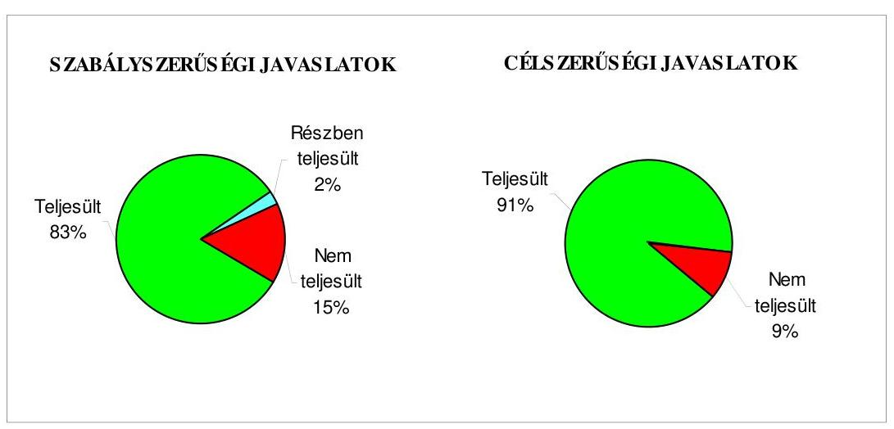

Az ÁSZ által a 2006-2008. években végzett ellenőrzések javaslatainak 84,3\%-a hasznosult, 2,0\%-a részben valósult meg, 13,7\%-a nem teljesült. A gazdálkodás 2006. évi átfogó ellenőrzése és a zárszámadáshoz kapcsolódó ellenőrzések javaslatainak végrehajtása eredményeként javult az Önkormányzat gazdálkodásának szabályszerűsége.

Budapest, 2010. január „ 26
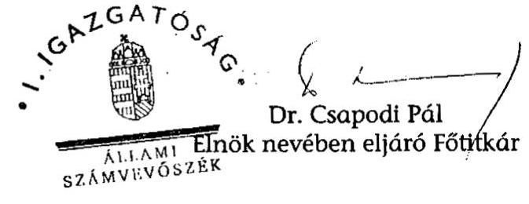

Melléklet: $\quad 8 \mathrm{db} \quad 25$ lap
Fötits ${ }^{\text {st }}$

---

Budapest Főváros VII. kerület Erzsébetváros Önkormányzata

# Az Önkormányzat gazdálkodását meghatározó adatok, mutatószámok 

| Megnevezés |  |
| :--: | :--: |
| A kerület állandó lakosainak száma (fő) 2009. január 1-jén | 56857 |
| A Képviselő-testület tagjainak a száma (fő) (2008. december 31-én) | 27 |
| A Képviselő-testület munkáját segítő állandó bizottságok száma (2008. december 31-én) | 7 |
| A Polgármesteri hivatalban foglalkoztatott köztisztviselők száma (fő) (2008. december 31-én) | 237 |
| Az összes vagyon értéke a 2008. december 31-i könyvviteli mérleg szerint (millió Ft) | 52938 |
| Az adósságállomány (hosszú és rövid lejáratú kötelezettség) 2008. december 31-én (millió Ft) | 8570 |
| Az egy lakosra jutó adósságállomány 2008. december 31-én (Ft) | 150729 |
| Az összes 2008. évben teljesített költségvetési bevétel (millió Ft) | 14627 |
| Ebből: saját bevétel (millió Ft), melyből | 11280 |
| helyi adóbevétel (millió Ft) | 4542 |
| Az egy lakosra jutó 2008. évi költségvetési bevétel (Ft) | 257259 |
| Az egy lakosra jutó 2008. évi saját bevétel (Ft) | 198392 |
| Az egy lakosra jutó 2008. évi helyi adóbevétel (Ft) | 79885 |
| Saját bevétel/Összes költségvetési bevétel aránya a 2008. évben (\%) | 77,1 |
| Helyi adó bevétel/Összes költségvetési bevétel aránya a 2008. évben (\%) | 31,1 |
| Az összes teljesített költségvetési kiadás a 2008. évben (millió Ft) | 14642 |
| Ebből: felhalmozási célú költségvetési kiadás (millió Ft) | 3608 |
| A 2008. évi költségvetési kiadásból a felhalmozási célú költségvetési kiadás aránya (\%) | 24,6 |
| Az egy lakosra jutó 2008. évi költségvetési kiadás (Ft) | 257523 |
| Az egy lakosra jutó 2008. évben teljesített felhalmozási célú költségvetési kiadás (Ft) | 63457 |
| A költségvetési intézmények száma 2008. december 31-én (db) | 21 |
| Ebből: részben önállóan gazdálkodó (db) | 12 |
| A költségvetési intézményekben foglalkoztatott közalkalmazottak száma (fő) (2008. december 31-én) | 944 |

---

Budapest Főváros VII. kerület Erzsébetváros Önkormányzata

# Az önkormányzati vagyon alakulása

|  Mérlegsor
megnevezése | 2006.év
(millió Ft) | 2007. év
(millió Ft) | 2008. év
(millió Ft) | Változás \%-a (Előző év=100\%) |  |   |
| --- | --- | --- | --- | --- | --- | --- |
|   |  |  |  | 2007/2006. | 2008/2007. | 2008/2006.  |
|  Immateriális javak | 119 | 91 | 90 | 76,5 | 98,9 | 75,6  |
|  Tárgyi eszközök | 32177 | 32590 | 34502 | 101,3 | 105,9 | 107,2  |
|  ebből: ingatlanok | 30269 | 31172 | 32413 | 103,0 | 104,0 | 107,1  |
|  beruházások | 1555 | 1083 | 1761 | 69,6 | 162,6 | 113,2  |
|  Befektetett pénzügyi eszközök | 1814 | 1288 | 1563 | 71,0 | 121,4 | 86,2  |
|  Üzemeltetésre átadott eszközök | 12123 | 11985 | 11164 | 98,9 | 93,1 | 92,1  |
|  Befektetett eszközök összesen | 46233 | 45954 | 47319 | 99,4 | 103,0 | 102,3  |
|  Forgóeszközök összesen | 1337 | 2492 | 5619 | 186,4 | 225,5 | 420,3  |
|  ebből: követelések | 1144 | 1084 | 1095 | 94,8 | 101,0 | 95,7  |
|  pénzeszközök | 108 | 1167 | 4368 | 1080,6 | 374,3 | 4044,4  |
|  Eszközök összesen | 47570 | 48446 | 52938 | 101,8 | 109,3 | 111,3  |
|  Saját tőke összesen | 44536 | 42973 | 39848 | 96,5 | 92,7 | 89,5  |
|  Tartalék összesen | $-65$ | 1150 | 4286 | - | 372,7 | -  |
|  Kötelezettségek összesen | 3099 | 4323 | 8804 | 139,5 | 203,7 | 284,1  |
|  ebből: hosszú lejáratú kötelezettségek | 1208 | 2910 | 6580 | 240,9 | 226,1 | 544,7  |
|  rövid lejáratú kötelezettségek | 1638 | 1159 | 1990 | 70,8 | 171,7 | 121,5  |
|  Források összesen: | 47570 | 48446 | 52938 | 101,8 | 109,3 | 111,3  |

Forrás: Magyar Államkincstár éves költségvetési beszámoló "01" számú űrlap adatai.

---

Budapest Főváros VII. kerület Erzsébetváros Önkormányzata

# Az önkormányzati kötelezettségek alakulása

|  Mérlegsor megnevezése | 2006.év
(millió Ft) | 2007. év
(millió Ft) | 2008. év
(millió Ft) | Változás \%-a (Előző év=100\%) |  |   |
| --- | --- | --- | --- | --- | --- | --- |
|   |  |  |  | 2007/2006. | 2008/2007. | 2008/2006.  |
|  Hosszú lejáratú kötelezettségek összesen
ebből: | 1208 | 2910 | 6580 | 240,9 | 226,1 | 544,7  |
|  hosszú lejáratra kapott kölcsönök | 3 |  |  | 0,0 |  | 0,0  |
|  tartozások fejlesztési célú kötvénykibocsátásból |  | 924 | 4409 |  | 477,2 |   |
|  tartozások működési célú kötvénykibocsátásból |  |  |  |  |  |   |
|  beruházási és fejlesztési hitelek | 1205 | 1986 | 2171 | 164,8 | 109,3 | 180,2  |
|  müködési célú hosszú lejáratú hitelek |  |  |  |  |  |   |
|  egyéb hosszú lejáratú kötelezettségek |  |  |  |  |  |   |
|  Rövid lejáratú kötelezettségek összesen
ebből: | 1638 | 1159 | 1990 | 70,8 | 171,7 | 121,5  |
|  rövid lejáratú kölcsönök |  |  |  |  |  |   |
|  rövid lejáratú hitelek | 157 |  | 415 | 0,0 |  | 264,3  |
|  kötelezettségek áruszállításból, szolgáltatásból | 992 | 485 | 498 | 48,9 | 102,7 | 50,2  |
|  garancia- és kezességvállalásból származó kötelezettség |  |  |  |  |  |   |
|  hosszú lejáratra kapott kölcsön következő évet terhelő törlesztő részlete | 3 | 3 |  | 100,0 | 0,0 | 0,0  |
|  felhalm.c.kötvény kibocsátásból szárm.tartozás következő évet terh.részlete |  | 76 | 185 |  | 243,4 |   |
|  mük.c.kötvény kibocsátásból szárm.tartozás következő évet terh.részlete |  |  |  |  |  |   |
|  beruházási c hosszú lejáratú hitel következő évet terhelő törlesztő részlete | 364 | 129 | 137 | 35,4 | 106,2 | 37,6  |
|  müködési c.hosszú lejáratú hitel következő évet terhelő törlesztő részlete |  |  |  |  |  |   |
|  egyéb hosszú lejáratú kötelezettség következő évet terhelő törlesztő részlete | 71 |  |  |  |  |   |

Forrás: Magyar Államkincstár éves költségvetési beszámoló "01" számú űrlap adatai.

---

Budapest Főváros VII. kerület Erzsébetváros Önkormányzata

Az Önkormányzat 2006-2009. évi költségvetési előirányzatainak és 2006-2008. évi pénzügyi teljesítéseinek alakulása

|  Megnevezés | 2006. év |  |  |  | 2007. év |  |  |  | 2008. év |  |  |  | 2009.  |
| --- | --- | --- | --- | --- | --- | --- | --- | --- | --- | --- | --- | --- | --- |
|   | Eredeti | Módosított | Teljesítés (millió Ft) | Teljesítés/ eredeti előirányzath | Eredeti | Módosított | Teljesítés (millió Ft) | Teljesítés/ eredeti előirányzath | Eredeti | Módosított | Teljesítés (millió Ft) | Teljesítés/ eredeti előirányzath | Eredeti  |
|   | előirányzat (millió Ft) |  |  |  | előirányzat (millió Ft) |  |  |  |  |  |  |  |   |
|  Müködési célú költségvetési bevételek összesen | 8758 | 9231 | 9804 | 111,9 | 8870 | 10109 | 11107 | 125,2 | 9502 | 10613 | 11020 | 116,0 | 9292  |
|  Müködési célú költségvetési kiadások összesen | 9774 | 10617 | 10193 | 104,3 | 9661 | 10915 | 10338 | 107,0 | 10259 | 11937 | 11034 | 107,6 | 9739  |
|  Müködési célú költségvetési bevételek és kiadások egyenlege: hiány-, többlet + | $-1016$ | $-1386$ | $-389$ | 38,3 | $-791$ | $-806$ | 769 | 197,2 | $-757$ | $-1324$ | $-14$ | 1,8 | $-447$  |
|  Felhalmozási célú költségvetési bevételek összesen | 5837 | 5005 | 2772 | 47,5 | 5335 | 6094 | 3443 | 64,5 | 4858 | 6926 | 3607 | 74,2 | 7695  |
|  Felhalmozási célú költségvetési kiadások összesen | 6088 | 4845 | 3431 | 56,4 | 5683 | 7426 | 4078 | 71,8 | 7590 | 9505 | 3608 | 47,5 | 9765  |
|  Felhalmozási célú költségvetési bevételek és kiadások egyenlege: hiány-, többlet+ | $-251$ | 160 | $-659$ | 262,5 | $-348$ | $-1332$ | $-635$ | 182,5 | $-2732$ | $-2579$ | $-1$ | 0,0 | $-2070$  |
|  Költségvetési bevételek összesen | 14595 | 14236 | 12576 | 86,2 | 14205 | 16203 | 14550 | 102,4 | 14360 | 17539 | 14627 | 101,9 | 16987  |
|  Költségvetési kiadások összesen | 15862 | 15462 | 13624 | 85,9 | 15344 | 18341 | 14416 | 94,0 | 17849 | 21442 | 14642 | 82,0 | 19504  |
|  Költségvetési bevételek és kiadások egyenlege: hiány-, többlet+ | $-1267$ | $-1226$ | $-1048$ | 82,7 | $-1139$ | $-2138$ | 134 | 111,8 | $-3489$ | $-3903$ | $-15$ | 0,4 | $-2517$  |
|  Finanszírozási célú pénzügyi bevételek | 1455 | 1465 | 1390 |  | 1503 | 2503 | 1847 |  | 3697 | 4113 | 3731 |  | 2839  |
|  Finanszírozási célú pénzügyi kiadások | 188 | 239 | 239 |  | 364 | 365 | 459 |  | 208 | 210 | 210 |  | 322  |
|  Finanszírozási célú pénzügyi műveletek egyenlege | 1267 | 1226 | 1151 |  | 1139 | 2138 | 1388 |  | 3489 | 3903 | 3521 |  | 2517  |

Forrás: - Magyar Államkincstár éves költségvetési beszámoló "80" számú űrlap adatai;

- a 2009. évi adatok esetében az Önkormányzat 2009. évi költségvetése;
- a költségvetési bevétel-kiadás működési-felhalmozási célra történt megosztásánál az analitikus nyilvántartás.

---

Ellenőrzött önkormányzat neve: Budapest Főváros VII. kerület Erzsébetváros Önkormányzata Ellenőrzött önkormányzat címe: 1073 Budapest, Erzsébet krt. 6.

# TANÚSÍTVÁNY

az európai uniós forrásokkal támogatott célok és programok 2006-2009. év szeptember 30-ig tervezett és teljesített adatairól

|  Sorszám | Az európai uniós forrásokkal támogatott fejlesztés megnevezése | Tervezett költségvetési adatok (millió Ft) |  |  |  |  |  |  |  | Teljesített költségvetési adatok (millió Ft) |  |  |  |  |  |   |
| --- | --- | --- | --- | --- | --- | --- | --- | --- | --- | --- | --- | --- | --- | --- | --- | --- |
|   |  | összes
költségve-
tési
kiadás | az összes kiadást finanszírozó források |  |  |  |  |  |  |  | az összes kiadást finanszírozó források |  |  |  |  |   |
|   |  |  | saját
forrás | támogatás |  |  | hitel | egyéb
forrás |  |  |  |  |  |  |  |   |
|   |  |  |  | európai
uniós | hazai | EU Önerő
Alap |  |  |  |  |  |  |  |  |  |   |
|  1. | I. Befejszett fejlesztési feladat megnevezése |  |  |  |  |  |  |  |  |  |  |  |  |  |  |   |
|  2. | PHARE 2003. Budapest VII. kerület Erzsébetvárosi Sportközpont épületének akadálymentesítése | 29,0 | 10,7 | 12,5 | 4,2 | 1,6 | 0,0 | 0,0 | 29,0 | 10,7 | 12,5 | 4,2 | 1,6 | 0,0 | 0,0 |   |
|  3. | Polgárok találkozója 2005. ** | 1,8 | 0,0 | 1,8 | 0,0 | 0,0 | 0,0 | 0,0 | 1,9 | 0,0 | 1,9 | 0,0 | 0,0 | 0,0 | 0,0 |   |
|  4. | Polgárok találkozója 2008. | 4,7 | 0,0 | 4,7 | 0,0 | 0,0 | 0,0 | 0,0 | 5,1 | 2,8 | 2,3 | 0,0 | 0,0 | 0,0 | 0,0 |   |
|  5. | HEFOP-3.1.4. A kompetencia alapú oktatás elterjesztése Erzsébetvárosi Pedagógiai Szolgáltató Központ | 80,0 | 0,0 | 60,0 | 20,0 | 0,0 | 0,0 | 0,0 | 78,2 | 0,0 | 58,6 | 19,6 | 0,0 | 0,0 | 0,0 |   |
|  6. | HEFOP 3.1.3-2005 Felkészítés a kompetencia alapú oktatásra: Alsóenőbsor Általános Iskola és Gimnázium | 18,0 | 0,0 | 13,5 | 4,5 | 0,0 | 0,0 | 0,0 | 17,8 | 0,0 | 13,3 | 4,5 | 0,0 | 0,0 | 0,0 |   |
|  7. | HEFOP 3.1.3-2005 Felkészítés a kompetencia alapú oktatásra Erzsébetvárosi Ált. Isk. és Inf. SZtő | 18,0 | 0,0 | 13,5 | 4,5 | 0,0 | 0,0 | 0,0 | 10,7 | 0,0 | 8,0 | 2,7 | 0,0 | 0,0 | 0,0 |   |
|  8. | I. Befejszett fejlesztési feladatok forrása összesen | 151,5 | 10,7 | 106,0 | 33,2 | 1,6 | 0,0 | 0,0 | 142,7 | 13,5 | 96,6 | 31,0 | 1,6 | 0,0 | 0,0 |   |
|  9. | Finanszírozási források megosztása* | 100\% | 7,0\% | 70,0\% | 21,9\% | 1,1\% | 0,0\% | 0,0\% | 100\% | 9,5\% | 67,7\% | 21,7\% | 1,1\% | 0,0\% | 0,0\% |   |
|  10. | II. Folyamatban lévő fejlesztési feladat megnevezése |  |  |  |  |  |  |  |  |  |  |  |  |  |  |   |
|  11. | INTERREG III B CADSES CsUrtat (Komplex városi beruházási eszközök)*** | 72,0 | 7,4 | 56,2 | 8,4 | 0,0 | 0,0 | 0,0 | 69,5 | 29,3 | 31,8 | 8,4 | 0,0 | 0,0 | 0,0 |   |
|  12. | AROP-3.A. 1 Szervezetfejlesztés Budapest Főváros VII. kerület Erzsébetváros Önkormányzat Képviselő-testületének Polgármesteri Hivatalában | 35,8 | 3,6 | 24,2 | 8,0 | 0,0 | 0,0 | 0,0 | 0,4 | 0,0 | 0,0 | 0,4 | 0,0 | 0,0 | 0,0 |   |

---

|  Sorszám | Az európai uniós forrásokkal támogatott fejlesztés megnevezése | Tervezett költségvetési adatok (millió Ft) |  |  |  |  |  |  |  |  |  |  |  |  |  |  |  |  |   |
| --- | --- | --- | --- | --- | --- | --- | --- | --- | --- | --- | --- | --- | --- | --- | --- | --- | --- | --- | --- |
|   |  |  | az összes kiadást finanszírozó források |  |  |  |  |  |  |  |  |  |  | az összes kiadást finanszírozó források |  |  |  |  |   |
|   |  |  |  |  |  |  |  |  |  |  |  |  |  |  |  |  |  |  |   |
|   |  |  |  |  |  |  |  |  |  |  |  |  |  |  |  |  |  |  |   |
|   |  |  | saját |  |  |  |  |  |  |  |  |  |  |  |  |  |  |  |   |
|   |  |  | forrás |  |  | támogatás |  |  | hitel | egyéb |  |  |  |  |  |  |  |  |   |
|   |  |  |  |  |  | európai |  |  |  |  |  |  |  |  |  |  |  |  |   |
|   |  |  |  |  |  | uniós |  |  |  |  |  |  |  |  |  |  |  |  |   |
|   |  |  |  |  |  |  |  |  |  |  |  |  |  |  |  |  |  |  |   |
|  13. | AMOP-2008. 3.3.4. C.A.VII. kerületi Önkormányzat keretein belül Agglomerációs Környezetinformációs-technológiai Rendszer (AKIR) kiépítése a környezeti demokrácia fejlesztése érdekében |  |  |  |  |  |  |  |  |  |  |  |  |  |  |  |  |  |  |   |
|   |  |  | 88,0 |  | 4,4 | 62,7 | 20,9 | 0,0 | 0,0 | 0,0 |  | 0,0 |  | 0,0 |  | 0,0 |  | 0,0 | 0,0 | 0,0  |
|  14. | TÁMOP 3. 1. 4. „Kompetencia alapú oktatás, egyenlő hozzáférés - Innovatív intézményekben" |  |  |  |  |  |  |  |  |  |  |  |  |  |  |  |  |  |  |   |
|   |  |  | 136,0 |  | 0,0 | 102,0 | 34,0 | 0,0 | 0,0 | 0,0 |  | 4,2 |  | 0,0 |  | 4,2 |  | 0,0 | 0,0 | 0,0  |
|  15. | II. Folyamatban lévő fejlesztési feladatok forrása összesen |  |  |  |  |  |  |  |  |  |  |  |  |  |  |  |  |  |  |   |
|   |  |  | 331,8 |  | 15,4 | 245,1 | 71,3 | 0,0 | 0,0 | 0,0 |  | 74,1 |  | 29,3 |  | 36,0 |  | 8,8 | 0,0 | 0,0  |
|  16. | Finanszírozási források megoszlása* |  |  |  |  |  |  |  |  |  |  |  |  |  |  |  |  |  |  |   |
|   |  |  | 100\% |  | 4,6\% | 73,9\% | 21,5\% | 0,0\% | 0,0\% | 0,0\% |  | 100\% |  | 39,5\% |  | 48,6\% |  | 11,9\% | 0,0\% | 0,0\%  |
|  17. | Fejlesztési feladatok kiadásának forrása összesen: |  |  |  |  |  |  |  |  |  |  |  |  |  |  |  |  |  |  |   |
|   |  |  | 483,3 |  | 26,1 | 351,1 | 104,5 | 1,6 | 0,0 | 0,0 |  | 216,8 |  | 42,8 |  | 132,6 |  | 39,8 | 1,6 | 0,0  |
|  18. | Finanszírozási források megoszlása* |  |  |  |  |  |  |  |  |  |  |  |  |  |  |  |  |  |  |   |
|   |  |  | 100\% |  | 5,5\% | 72,6\% | 21,6\% | 0,3\% | 0,0\% | 0,0\% |  | 100\% |  | 19,7\% |  | 61,2\% |  | 18,4\% | 0,7\% | 0,0\%  |

Jelmagyarázat: *A finanszírozási források megoszlására vonatkozó sorokat nem kell kitölteni, azok adatait a program számítja ki.* *A projekt az elszámolással 2006. évben fejeződött be, a támogatást 2006. évben folyósították, de kifizetés szerződés szerint 2005. évben megtörtént.* **A saját forrás többlet felhasználása átmeneti. A feladat befejeződött, de a támogatás folyósítása részletekben történik, a folyamat még nem zárult le

Nyilatkozat: A tanúsítványban szereplő adatok valódiságát igazolom.

Kiállítás időpontja: Budapest, 2009. október 07.

---

# ADATLAP 

## az európai uniós forrással támogatott   PHARE HU 2003-004-347-02-01/2, Budapest VII. kerület Erzsébetvárosi Sportközpont épületének akadálymentesítése fejlesztésről

## 1. A PÁLYÁZÓ ADATAI

1.1. A pályázó Önkormányzat neve: Budapest Főváros VII. kerület Erzsébetváros Önkormányzata
1.2. A pályázó Önkormányzat címe: 1073 Budapest, Erzsébet krt. 6.

## 2. A PROJEKT ÖSSZEGZŐ ADATAI

2.1. A pályázott program megnevezése: Fogyatékos személyek esélyegyenlőségének elősegítése PHARE 2003 támogatási pályázati program
2.2. A pályázott programon belül a projekt címe: Budapest VII. kerület Erzsébetvárosi Sportközpont épületének akadálymentesítése
2.3. A pályázatot készítő megnevezése: Árindex kft., dr. Koch Beáta EU Integrációs és Informatikai Csoport, Farkas Ferenc Sport Csoport
2.4. A pályázat benyújtásának időpontja: 2004. december 6.
2.5. A projekt tervezett (Ft adatok 250,65 Ft/euro projekt elszámolási árfolyamon)

- teljes kiadásának összege: 24837410 Ft ( 99092 euró)
- saját forrás: 3930172 Ft (EU Önerő Alap támogatásával együttes saját forrás 22187 euró)
- támogatás: 20907238 Ft
- európai uniós: 14456991 Ft ( 57678 euró)
- hazai társfinanszírozás: 4819248 Ft (19 227 euró)
- EU Önerő Alap: 1631000 Ft
- hitel: 0 Ft
- egyéb forrás: 0 Ft

---

- a megvalósítás tervezett időpontja (év, hó, nap): 14 hónap (2006. V.31.)
2.6 A pályázat elbírálásáról szóló döntés kelte: 2005. február 16. Központi Pénzügyi és Szerződéskötő Egység
2.7 A pályázat elbírálásának eredménye: sikeres

# 2.8 A projekt teljesített: 

- kiadásának összege: 32790524 Ft
- saját forrás: 11794999 Ft
- támogatás: 20995525 Ft
- európai uniós: 14557309 Ft
- hazai társfinanszírozás: 4807216 Ft
- EU Önerő Alap: 1631000 Ft
- hitel: 0 Ft
- egyéb forrás: 0 Ft
- a megvalósítás időpontja: 2006. VII. 31.

## 3. A TÁMOGATÁSI SZERZŐDÉS ADATAI

3.1. A támogatási szerződés: (Ft adatok 250,65 Ft/euro projekt elszámolási árfolyamon)

- megkötésének időpontja: 2005. III. 31.
- a projekt kezdési és befejezési időpontja: 2005. IV. 01 - 2006. VII. 31.
- a projekt összköltsége (kiadása): 24837410 Ft ( 99092 euró)
- a projekt megvalósítás forrásai:
- saját forrás: 3930172 Ft (EU Önerő Alap támogatásával együttes saját forrás 22187 euró)
- európai uniós támogatás: 14457179 Ft (57 678,75 euró)
- hazai társfinanszírozás: 4819060 Ft (19 226,25 euró)
- EU Önerő Alap: 1631000 Ft
- hitel: 0 Ft
- egyéb forrás: 0 Ft
- előírt támogatási határidők: 2006. IX. 30. napig be kell nyújtani a kifizetési igényléseket
- előírt fizetési kötelezettségek: -

---

| Kifizetési kérelem   (PEJ/EPEJ) benyújtá-   sának   időpontja | Számla   bruttó   összege   (Ft) | Igényelt   támogatási   összeg   (Ft) | Folyósitott   támogatás   összege   (Ft) | Támogatás   folyósitásának   időpontja   (év, hó, nap) | Benyújtás és   a folyósitás   között   eltelt időtar-   tam   (nap) |
| :--: | :--: | :--: | :--: | :--: | :--: |
| Előleg |  |  |  |  |  |
| 2005.VII.27. |  | 15420991 | 3843404 | 2005. XI. 03. | 99 nap |
| 2005.VII. 27 |  |  | 11577740 | 2005. XI. 04. | 100 nap |
| Elszámolás: |  |  |  |  |  |
| 2006.IX.27. | 30842 892,8 | 3855248 | 3943381 | 2006. XI. 28. | 62 nap |
| 2006.I.24. | BM önerő | 1170000 | 1170000 | 2006. II. 06. | 13 nap |
| 2006.XI.23. | BM önerő | 461000 | 461000 | 2006. XII. 21. | 28 nap |
| Összesen | 30842 892,8 | 20907239 | 20995525 |  |  |

# 5. EllenörZÉSEK 

5.1. A külső ellenőrzések: nem volt.

- az ellenőrzések száma: -
- az ellenőrzést végző szervek megnevezése: -
5.2. Szabálytalanságokra vonatkozó adatok:
- mely előírást nem tartotta be az Önkormányzat: -
- az előírás nem teljesítésének okai: -
- a rendezésre előírt kötelezettségek: -
- a rendezésre előírt kötelezettséget mennyi időn belül teljesítették: -
- mekkora időbeli csúszást eredményezett ez a projekt megvalósításában (év, hó, nap): -

Kelt: 2009. szeptember 14.
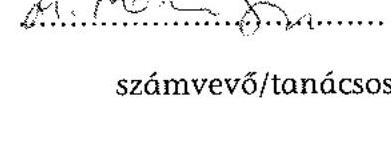
polgármesteri hivatal
képviselője

---

# Budapest Főváros, VII.kerület Erzsébetváros Önkormányzata 

Polgármester
1073 Budapest, Erzsébet krt. 6.

Telefon: 462-3204, 462-3205
Fax: 342-4732

Iktatószám: KI/3338/2/2010/XIV
Ügyintéző: Fitosné Z. Zsuzsanna
Tel / Fax: 462-3234
E-mail: fitosne@erzsebetvaros.hu
Tárgy: Észrevételek a számvevői jelentés megállapításaira, javaslataira
Hiv.szám: V-3001-4/22/16/2009.
Melléklet: Jegyzék szerint

## Állami Számvevőszék

Dr. Csapodi Pál
Elnök nevében eljáró
Fötitkár úr részére

## Budapest V.

Apáczai Csere János utca 10. 1052

## Tisztelt Dr. Csapodi Pál Úr!

Mellékelten megküldöm a V-3001-4/22/16/2009. számú Számvevőszéki jelentésre tett észrevételünket.

Kérésének megfelelően tájékoztatom, hogy az általunk korábban tett és az ÁSZ által el nem fogadott észrevételeket nem kérem feltüntetni végleges jelentésben, mivel a jelen levelemmel egyidejűleg megküldött észrevételek tartalmazzák az önkormányzat állásfoglalását.

Budapest, 2010. január 4.
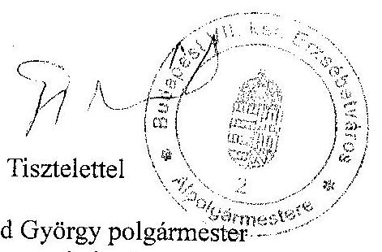

Gergely József
alpolgármester

---

# Budapest Főváros, VII.kerület Erzsébetváros Önkormányzata 

Polgármester
1073 Budapest, Erzsébet krt. 6.

Telefon: 462-3204, 462-3205
Fax: 342-4732

Iktatószám: KI/3338/2010/XIV
Ögyintéző: Fitosné Z. Zsuzsanna
Tel / Fax: 462-3234
E-mail: fitosne@erzsebetvaros.hu
Tárgy: Észrevételek a számvevői jelentés megállapításaira, javaslataira
Hiv.szám: V-3001-4/22/16/2009.
Melléklet: Jegyzék szerint

## Állami Számvevőszék   Dr. Csapodi Pál   Elnők nevében eljáró   Fötitkár úr részére

## Budapest V.

Apáczai Csere János utca 10. 1052

## Tisztelt Dr. Csapodi Pál Úr!

Tájékoztatom, hogy 2009. december 21-én átvettem az Állami Számvevőszék V-3001-4/22/16/2009. számú jelentés tervezetét a Budapest Főváros VII. Kerület Erzsébetváros Önkormányzata gazdálkodási rendszerének 2009. évi ellenőrzéséről.

A jelentésben foglaltakkal, annak megállapításaival kapcsolatban a következőkről tájékoztatom:

- A jelentésben foglaltak, illetve a javaslatok esetében néhány kiegészítést azért tartok fontosnak, mert azok a tényleges helyzet értékelését, tisztázását segítik, így módosíthatják a megállapítást, vagy az önkormányzat álláspontja alapján más értékelést eredményezhetnek.
- Azokban az esetekben, amikor az önkormányzat álláspontja eltér a számvevői jelentésben foglaltaktól, észrevételt teszek, annak érdekében, hogy a végleges jelentést megelőzően e problémák is rendeződjenek.

## I. A számvevői jelentés „Részletes megállapítások" fejezetekhez kapcsolódó kiegészitések, észrevételek a következők:

1.) A jelentés 27. oldalán szerepel, hogy „a teljesített költségvetési adatok alapján a 2006. és a 2008. évben nem volt biztosított a pénzügyi egyensúly". A szövegkörnyezet feletti táblázatból kiolvasható, hogy például 2008. évben a 11.020 millió Ft teljesített bevételt 15 millió Ft-tal haladta meg a kiadások tényszáma. Ez adódhatott abból, hogy például a december havi intézményi hó közi bérjellegủ kifizetések utáni személyi jövedelemadó összege volt a vártnál magasabb. Az erről szóló információt a Magyar Államkincstár 2009. januárban megküldött adatlapja tartalmazta. Így azt a véleményt szeretnénk hangsúlyozni, hogy a 15 millió Ft - amely egyébként az összes költségvetési kiadás $0,1 \%$-a - nem befolyásolta a pénzügyi egyensúlyt. Az

---

észrevételünkre adott válasz szerint nem az összeg nagysága, hanem az abszolút érték a megállapítás alapja.

Szeretnék tovább érvelni, mivel a közgazdaságtan, ezen belül a pénzügyek tudományágában felhalmozott elméleti és gyakorlati tapasztalatok alapján a hiány és a többlet mellett az egyensúlyi érték is definiált. Véleményem szerint az 1 ezrelék mértékủ eltérés pont az egyensúlyi értéknek megfelelő sávban helyezkedik el.
A vizsgálat során tapasztaltak és a jelentésben megfogalmazottak is alátámasztják, hogy az önkormányzat felelősen gazdálkodott a vizsgált időszakban. A pénzügyi egyensúly közelítése, a kiadások saját bevételekkel történő lefedettsége is - amely a tervezetthez képest a tényleges adatok tekintetében minden esetben kedvezőbben alakult és 2006-ban $92,3 \%, 2007$. és 2008 . években pedig $100 \%$ körüli volt - ezt a szemléletet tükrözik.
2.) A kötvény kibocsátás kockázatát az árfolyamváltozás és a változó kamatmérték alapján emeli ki a jelentés 34. oldala. Szükséges hangsúlyozni, hogy az önkormányzati alrendszerben - mint a nemzetgazdaság egészében - jellemzően változó kamatozású hiteleket lehetséges felvenni forint, vagy más külföldi valuta alapon egyaránt. Általánosan értelmezve, kockázatok ténylegesen minden gazdálkodási tevékenység során fellépnek. A cél ezek előrejelzése és megfelelő kezelése. Ezt a feladatot az önkormányzat elvégezte.
A CHF-alapú kötvény kamata az önkormányzat által felvett forint alapú, kedvezményes kamatozású hitelekhez viszonyítva, azok $9 \%-35 \%$-a (1. számú melléklet). A fizetendő kamat mértéke 2009. október hóban $0,83 \%$ volt. A jelenlegi gazdasági környezetben a forint alapú hitelek változó kamatai nagyobb kockázatot jelentenek.

Az árfolyamveszteséget a számviteli előírások alapján az év végi beszámolóban bemutattuk. Az önkormányzatnál ténylegesen realizált árfolyamveszteség 2008. októberő̉l - 2009. októberig, a három alkalommal történt tőketörlesztés miatt összesen 53.425 ezer Ft , amely az összes tőketartozás $1,3 \%$-a.
Ezzel szemben a 2007. szeptember 1. óta realizált kamatbevétel összege 661.689 ezer Ft. Várható, hogy a kötvény kibocsátásból származó pénzeszközök kamatbevétele 2010-ben összességében eléri az 1.000 millió Ft-ot. Amennyiben a kamatbevételhez viszonyítjuk a realizált árfolyamveszteséget, akkor a veszteség és a kockázat helyett önkormányzatunk esetében a nyereség kifejezést kell használni.

Amennyiben figyelembe vesszük, hogy a kötvény kibocsátásából származó bevételt az önkormányzat még nem használta fel, azt folyamatosan leköti és kamatoztatja, akkor meg lehet állapítani, hogy más hitelekkel szemben is ez a legkedvezőbb konstrukció.
3.) A folyószámlahitel igénybevételével kapcsolatos jellemzőket a számvevői jelentés a 34-35. oldalon mutatja be. Kiegészítésként szükséges rögzíteni, hogy a 2009. január 1től 2009. október 31-ig tartó időszakban a ténylegesen felvett folyószámlahitel átlagos állománya 286 millió Ft, amely a 2006-2007-2008. évi adatokhoz viszonyítva jóval kedvezőbb: a 2006. évinek a $95,9 \%$-a, a 2007. évinek a $78,6 \%$-a és a 2008 . évinek a $69,9 \%$-a.
Az előző észrevétel óta eltelt időszak alatt, 2009. év utolsó két hónapjában nem történt folyószámlahitel igénybevétel. Így az átlagos állomány nagysága az egész évet tekintve a fentieknél kedvezőbb, a számlavezető pénzintézet közlése szerint 241.488

---

ezer Ft. A fenti adatok azt mutatják, hogy a gazdálkodás kiegyensúlyozottabb, a pénzügyi, likviditási helyzet kedvezőbb volt 2009-ben. Hangsúlyozni szeretném, hogy a 2009. évi folyószámlahitel igénybevétel az előző négy év átlagához viszonyítva alacsonyabb, amely a pénzügyi és gazdasági válság évében kiváló eredményként minősíthető, egyben felelős, megfontolt gazdálkodást mutat ( $2 / \mathrm{a}$. és $2 / \mathrm{b}$. számú melléklet).

A jelentés foglalkozik azzal a kérdéssel is, hogy egy időben történt a folyószámlahitel igénybevétele, valamint a kötvény kibocsátásból származó bevételek lekötése. A pénzügyi megoldást igazolja, hogy például 2009. évben 2009. február 1-től - 2009. augusztus 31-ig terjedő időszakot vizsgálva, a folyószámlahitel után fizetendő kamat $0,11-0,8$ százalékpont közötti mértékben volt alacsonyabb, mint a lekötött betét után az önkormányzat által reaiizált kamatbevétel. Ezt a pozitív különbséget úgy sikerült elérni, hogy a lekötést minden esetben a legmagasabb kamatot fizető pénzintézetnél (Raiffeisen Bank Zrt., OTPBank Nyrt., ERSTE Bank Nyrt.) eszközöltük. A hitel és betéti kamatok közötti arbitrázst nem spekulációs céllal értük el, hanem a 2009. évben a pénzpiaci likviditási helyzet átmeneti szűkösségének következtében bizonyos esetekben kiemelkedően magas betéti kamatok adta lehetőséget használtuk ki.

További indok, hogy a Képviselő-testület határozata értelmében a kötvényből származó bevételek kizárólag a Rekreációs Központ építésére, a Képviselő-testület döntésével meghatározott célra használhatók fel. A pénzügyi világválság időszakában veszélyesnek ítéltük volna a napi gazdálkodásba bevonni - és nem elkülönítetten kezelni - a beruházásra szánt forrást.
4.) Az önkormányzat eladósodásával a jelentés 35. oldala foglalkozik. A hosszú lejáratú hitelek felvétele és a kötvény kibocsátása Erzsébetváros kiemelten magas beruházási, fejlesztési igényével áll közvetlen összefüggésben. Kizárólag felhalmozási célra, kedvezményes kamatozású, vagy állami kamattámogatásos hosszú lejáratú beruházási hiteleket vettünk fel. A kerület közterületeinek, intézményi és hivatali épületeinek felújítása, beruházása, illetve önkormányzati bérlakásépítés valósult meg, de a közel 50 éves lemaradást nem lehet 10-12 év alatt felszámolni. A kötvény kibocsátása is felhalmozási cél megvalósítását szolgálja. Fontos kiemelni, hogy az önkormányzat hosszú lejáratú adósságot müködési célokra nem keletkeztetett.

A hitelkeretek kihasználása általánosan nem érte el a $100 \%$-ot, vagyis a szerződött hitelösszegek teljes mértékben nem kerültek felhasználásra, mivel például a közbeszerzési eljárások lefolytatását követően, több esetben is alacsonyabb összegben sikerült szerződni a kivitelezésekre.
Az elmúlt években jelentős előtörlesztések is történtek az adósságállomány mérséklése érdekében ( 316 millió Ft). Az elmúlt 10 évben a szerződésben rögzített adósságszolgálati kötelezettségeknek minden esetben maradéktalanul, határidőben tett eleget az önkormányzat.

Az önkormányzat 2008. december 31-i adósságállományának összege 6.902 millió Ft. Ez az összeg tartalmazza a kötvény kibocsátásával összefüggő adósságot is.
Megjegyzem, hogy a kötvényből származó pénzeszközökből 3.800 millió Ft még rendelkezésre áll, vagyis amennyiben jelentősen változnának az önkormányzat költségvetési paraméterei, vagy a Képviselő-testület újabb döntést hoz, akár

---

előtörlesztés útján számottevően csökkenthető az adósságállomány nagysága és az adósságszolgálat mértéke.
5.) A 41. oldalhoz kiegészítés, hogy a Közép-Magyarországi Operatív Program Funkcióbővítő rehabilitáció Budapesti Integrált Városfejlesztési Program-Budapesti Kerületi Központok fejlesztése (kódszám: KMOP-2007-5.2.2./B) címủ pályázati felhívás keretében benyújtott „Kultúra utcája" Budapest, VII. kerület Erzsébetváros funkcióbővítő rehabilitációja címủ projekt a második fordulóban 832.979 ezer Ft összegű támogatásban részesült a 2009. november 27-i részletes támogatólevél alapján (3. számú melléklet). Jelenleg a támogatási szerződés előkészítése folyik. Az első fordulóban megítélt 800.000 ezer Ft támogatás megnövelését az általános forgalmi adó mértékének növekedése indokolja.

# II. Az ellenőrzés megállapításának hasznosítására tett javaslatokkal kapcsolatban az önkormányzat által megtett intézkedések, kiegészitések, észrevételek 

## A polgármesternek a jogszabályi előírások maradéktalan betartása érdekében

1. intézkedjen Ámr. 13/A. § (3) bekezdés e) pontjában, valamint az Ámr. 17. § (4) bekezdésében előírtaknak megfelelően a hivatali ügyrend kiegészítéséről, hogy az tartalmazza a gazdasági szervezet megnevezését, engedélyezett létszámát, feladatait, valamint gondoskodjon az ügyrend megnevezés szervezeti és müködési szabályzatra történő módosításáról;

A Polgármesteri Hivatal Ügyrendjének elnevezését megváltoztatjuk, a Szervezeti és Müködési Szabályzat elnevezést alkalmazzuk. A Polgármesteri Hivatal gazdasági szervezetének szabályozásával, a jogszabály által előírt tartalommal kapcsolatban már a helyszíni vizsgálat időtartama alatt is kiemelten foglalkozott a Polgármesteri Hivatal vezetése, a kérdések tisztázása azonban akkor még nem történt meg. Az új jogszabályi előírások értelmezését követően módunkban áll a szabályzat módosítása, amelynél természetesen törekszünk az előírások maradéktalan betartására.
2. gondoskodjon az Önkormányzat gazdálkodásának 2006. évi átfogó ellenőrzése során az ÁSZ által részére tett és nem teljesült szabályszerűségi és célszerűségi javaslatok végrehajtásáról;

A 2. pontban foglaltakkal kapcsolatban észrevételt nem teszek.
3. kezdeményezze a Szabad Demokraták Szövetsége által bérelt helyiségek eladásáról kötött adásvételi szerződés módosítását - visszamenőleges hatállyal -, hogy a szerződés megfeleljen az Önkormányzat tulajdonában lévő lakások és nem lakás céljára szolgáló helyiségek elidegenítésének feltételeiről szóló 27/2000. (XII. 23.) számú önkormányzati rendelet 27. § (1) bekezdésében előírtaknak, és tartalmazza a részletfizetés esetén a kamatfizetési kötelezettséget. Amennyiben nem kerül sor szerződésmódosításra, úgy a szerződés jogszabályba ütköző részének semmissé nyilvánítását kezdeményezze a bíróságnál;
A számvevői jelentés alapján a polgármester a jogszabályok maradéktalan betartása érdekében kezdeményezte, hogy a Szabad Demokraták Szövetsége által bérelt helyiségek eladásáról kötött adásvételi szerződést módosítsák. Az ügyben

---

előterjesztés készült a Gazdasági Bizottság részére, amelyet a bizottság megtárgyalt és 2009. október 21-i ülésén a következő határozatot hozta:

# „934/2009. (10.21.) Sz. GABI határozat 

- A Gazdasági Bizottság Bp. Föv. VII. ker. Dob 103. földszintjén és pinceszintjén található nem lakás céljára szolgáló helyiségek adásvétele tárgyában hozott 630/2007.(06.13.) számú határozatának módosítása -
1.) Budapest Főváros VII. kerület Erzsébetváros Önkormányzata Képviselőtestületének Gazdasági Bizottsága úgy dönt, hogy a 33840/0/A/1 és a 33840/0/A/2 helyrajzi számú, természetben a Bp. Föv. VII. ker. Dob u. 103. szám alatti épület pinceszintjén, illetve földszintjén található nem lakás céljára szolgáló helyiségek eladása tárgyában hozott 630/2007.(06.13.) számú határozatát módosítja az alábbiak szerint:
- A határozat 2. pontjából törlésre kerül a „,kamatmentes" szó.
- A határozat 2. pontja kiegészül az alábbi mondattal:
„A vevôt a 27/2000.(XII.23.) számú önkormányzati rendelete 27. § (1) bekezdése alapján a 21. § (1) bekezdésben meghatározott mértékü kamatfizetési kötelezettség terheli."
A határozat módosítással nem érintett részei változatlanul maradnak hatályban.
Felelős: Hunvald György polgármester
Határidő: azonnal
2.) A Bizottság felkéri az ERVA Zrt.-t, hogy gondoskodjon a Gazdasági Bizottság 630/2007.(06.13.) számú határozata alapján létrejött adásvételi szerződésnek a megkötése napjára visszamenőleges hatállyal történő módosításáról.
Felelős: Hunvald György polgármester
Határidő: azonnal
Végrehajtásért felelős:ERVA Zrt.
Dr. Enyedi Mária vezérigazgató"
A határozat alapján az ERVA Zrt. kezdeményezte az adásvéteii szerződés visszamenőleges hatályú - módosítását. Az előző észrevétel óta eltelt időszak alatt a megkeresésre az SZDSZ a 2009. december 21 -én kelt válaszában közölte, hogy „a Szabad Demokraták Szövetsége - A Magyar Liberális Párt tudomásul veszi az Önkormányzat Képviselő-testülete Gazdasági Bizottságának 934/2009. (10.21.) számú határozatát", továbbá rendelkezésre áll a módosított szerződés aláírására. Ez várhatóan 2010. január közepéig történhet meg.

## A polgármesternek a munka színvonalának javítása érdekében

4. kezdeményezze, hogy a számvevőszéki jelentésben foglaltakat a Képviselőtestület tárgyalja meg és a feltárt hiányosságok megszüntetése érdekében készíttessen intézkedési tervet a határidők és felelősök megjelölésével;

A javaslattal kapcsolatban észrevételt nem teszek.

---

# A jegyzőnek a jogszabályi előírások maradéktalan betartása érdekében 

1. intézkedjen, hogy az önkormányzati lakásért fizetett pénzbeli térítések tervezésekor vegyék figyelembe az Ámr. 37. §-ában hivatkozott PM tájékoztató müködési és felhalmozási célú pénzeszközátadások előirányzatonkénti és tevékenységenkénti részletezésére vonatkozó előírást, és az önkormányzati lakásért fizetett pénzbeli térítést az államháztartáson kívülre átadott felhalmozási célú pénzeszközök között tervezzék és számolják el, ezáltal gondoskodjon a Számv. tv. 16. § (3) bekezdésében előírtak szerint a gazdasági események tartalmának megfelelő elszámolásáról, továbbá a Vhr. 49. § (1) bekezdésének megfelelően a számlarend kiegészítéséről;

Észrevétel, hogy az önkormányzati lakóingatlanok értékesítésekor a számvitelről szóló többször módosított 2000. évi C. törvény 15. § (3) bekezdése szerint a valódiság elvét, továbbá a (7) bekezdésének előírását az összemérés elvéről a Vhr. 9. § (4) bekezdése szerinti eltéréssel alkalmazzuk. Az összemérés elve alapján egy adott időszakban a tevékenységek - vagyis adott alap- vagy vállalkozási tevékenységhez kapcsolódó - teljesített (ténylegesen befolyt és pénzforgalom nélküli) bevételeit és az adott időszakban teljesített kiadásokat kell - az államháztartás rendszerében pénzforgalmi szemléletben -- figyelembe venni. A fenti témában az önkormányzat könyvvizsgálója megkereste a Magyar Könyvvizsgáló Kamarát szakmai vélemény kérése érdekében. A szakmai véleményt ismérteiten, mellékletként csatolom (4/a. és 4/b. számú melléklet).
A számviteli törvény alapelveinek alkalmazása azért kiemelt fontosságú számunkra, mivel kizárólag ingatlanértékesítés esetében fordul elő az önkormányzatnál a bérlőkihelyezés. Általános, hogy a szerződéskötés értékbecslés alapján, forgalmi értéken történik. E szerződésekben az önkormányzat kiköti, hogy a bérlőkihelyezések - bérleti jog megváltása - összegét érvényesíti a vételárban, ami a gyakorlatban azt jelenti, hogy a forgalmi értéket jelentősen, 2-szeresen, 2,5szeresen meghaladó értéken történik meg az értékesítés.
Amennyiben a bérlőkihelyezés miatti többletösszeget nem vételárként számlázná a vevő felé az önkormányzat, akkor például kevesebb illetéket kell megfizetnie a vevőnek. Ezt a kockázatot az önkormányzat nem vállalhatta. A választott megoldás esetében (vagyis ha a teljes összeget vételárként számlázzuk ki) viszont az volt a probléma, hogy az értékbecsült ár és a ténylegesen megfizetett ár között nagy lehet az eltérés.
A bérlők számára kifizetett összeg azért tekinthető értéknövelőnek, mivel a lakott ingatlanok értéke, illetve a beköltözhető, üres állapotú ingatlanok (lakás, illetve nem lakás célú helyiség) értéke között a piaci gyakorlatban jelentős különbség van. Az önkormányzatnál kialakult gyakorlat szerint a bérlők részére fizetendő összeg akkor válik esedékessé, amikor az összes bérlő megkötötte a szerződést. A pénzügyi teljesítés a vevő által megfizetett vételárból történik, vagyis azonnal sor kerül az értékesítésre is. A megoldás további előnye, hogy az adott, értékesítésre szánt ingatlanokkal kapcsolatban felmerült kiadások aktiválásával megszűnik a jelentős értékaránytalanság az ingatlanérték és a vételár között.
2. intézkedjen arra, hogy az Ámr. 29. § (1) bekezdés g) pontjában foglaltaknak megfelelően a költségvetési rendelet tartalmazza a több éves kihatással járó európai uniós forrással megvalósuló fejlesztési feladatok előirányzatait éves bontásban;

---

Észrevételezem, hogy a vizsgált időszakban nem volt olyan többéves kihatással járó európai uniós pályázat, amelyhez éves bontásban bemutatható fejlesztési feladatok előirányzata kapcsolódott volna. A többéves kihatással járó INTERREG III B CADSES CoUrbit pályázat müködési pénzeszközeinek ütemezését a Polgármesteri Hivatal a 14/2007. (IV. 27.) számú rendelet a Budapest Főváros VII. Kerület Erzsébetváros Önkormányzata 2006. évi költségvetés végrehajtásáról 18. számú táblázatában bemutatta a Képviselő-testületnek (5/a. számú melléklet).

- Az 5/2006. (II. 27.) számú rendelet a Budapest Főváros VII. Kerület Erzsébetváros Önkormányzata 2006. évi költségvetéséről 19. számú táblázat 14. sorában a 2006. és a 2007. évi dologi kiadások összege tartalmazza megegyező összeggel az évek szerinti ütemezést (5/b. számú melléklet).
- A 3/2007. (II. 26.) számú rendelet a Budapest Főváros VII. Kerület Erzsébetváros 2007. évi költségvetéséről 17. számú táblázatának 14. sor dologi előirányzatok között a 2007. évi tervezett összegben szerepelt a pályázati pénzeszköz, ezzel egyezően a rendelet 4. számú táblázat 28. oldalán 9101. címen is szerepel a pályázati pénzeszköz (5/c. számú melléklet).

3. gondoskodjon a nyilvánosság biztosítása érdekében arról, hogy az éves költségvetési beszámoló szöveges indoklását az Ámr. 157/D. § (1) bekezdésében foglaltak alapján a Vhr. 40. § (4), (7)-(11) bekezdésekben rögzített tartalmi követelmények szerint tegyék közzé;

A közzététel tekintetében jogos az a megállapítás, hogy a Polgármesteri Hivatal mint költségvetési szerv - szöveges beszámolója nem volt közzétéve, hanem az önkormányzat egészét bemutató, zárszámadási képviselő-testületi előterjesztés szerepel a honlapon. Ennek ellenére, a közzétett előterjesztés tartalmában több ponton is megfelel a Vhr. 40. § (7)-(11) bekezdéseiben rögzített követelményeknek:

- részlegesen teljesítettük a Vhr. 40. § (7) bekezdésében foglalt kötelezettséget, mivel a részletes szöveges indoklás a pályázatok szakmai és pénzügyi értékelését bemutatta, de a pályázatokkal kapcsolatos saját költségvetési források alakulására nem tért ki,
- a Vhr. 40. § (8) bekezdése szerint az alapítványi támogatásokat, a feladat ellátási szerződésekre történt kifizetéseket az előterjesztés tételesen bemutatja. E támogatások kizárólag a Polgármesteri Hivatal költségvetése terhére történtek, 2007. és 2008. évben az intézmények alapítványt nem támogattak,
- a Vhr. 40. § (9) bekezdése szerint a könyvviteli mérlegben kimutatott részesedéseket közzétettük. E részesedések is kizárólag a Polgármesteri Hivatal nyilvántartásaiban szerepelnek,
- a Vhr. 40. § (10) bekezdése szerint nem volt közzétételi kötelezettség, mert a Polgármesteri Hivatal Számviteli politikája nem változott,
- a Vhr. 40. § (11) bekezdése szerinti könyvvizsgálati kötelezettséggel kapcsolatos információkat közzétettük.

---

4. szabályozza az Ámr. 145/A. § (1)-(2) bekezdéseiben előírtaknak megfelelően a költségvetés tervezési folyamatok szabályozottságának érdekében az intézmények és a Polgármesteri hivatal ismert kötelezettségei megtervezésének, a saját bevételek előirányzatai és a költségvetés megalapozását szolgáló helyi rendeletek közötti összhang ellenőrzését, és gondoskodjon azok dokumentált végrehajtásáról;

Megjegyezni szükséges, hogy a vonatkozó jogszabályok - az Áht. 121. § (1) és (3) továbbá az Ámr. 145/A. § (1)-(2) bekezdései és a 145/B. § a belső kontroll rendszerek tekintetében 2009. január 1-től változtak. A számvevőszéki helyszíni ellenőrzés a 2008. évi költségvetés előkészítő munkálatait ellenőrizte, ahol a FEUVE rendszere szerint volt szabályozott az előzetes, utólagos és folyamatba épített ellenőrzés.

A jogszabályi változások hatására módosultak a költségvetés összeállításában kontroll szerepet betöltő munkatársak munkaköri leírásai. További megjegyzés, hogy a munkaköri leírások a költségvetés előkészítése során beérkező összes adatszolgáltatás ellenőrzését, felülvizsgálatát, a megalapozottság ellenőrzését írják elő, tételesen nem szerepeltettük például a személyi juttatások, a dologi előirányzatok, az ismert kötelezettségek vagy a bevételek és a helyi rendeletek összhangjának ellenőrzését. A Polgármesteri Hivatal a 2009. évi új munkaköri leírásokkal pótolta a hiányosságokat (6., 6/a., 6/b. és 6/c. számú melléklet). Az ellenőrzések megtörténtét a felelősök aláírásukkal igazolták.

Észrevételezem, hogy az intézmények és a Polgármesteri Hivatal ismert kötelezettségeinek megtervezését (a költségvetési koncepcióban foglaltak alapján) a polgármester és a jegyző közös költségvetési utasításában - minden évben szabályozta. A költségvetési körirat mellékleteit képező munkalapok összeállítása részletesen szabályozza az ismert kötelezettségek - az áthúzódó kötelezettségek tervbe vételét. A munkalapok ellenőrzését a költségvetési csoport vezetője és munkatársai szabályozottan végzik.

Nem fogadom el azt a megállapítást, hogy „az előző évről áthúzódó kiadások és a pénzmaradvány eredeti előirányzatának tervezése ebben az évben" - 2008-ban „nem történt megalapozottan."

A 2007. évben kibocsátott 1.000 millió Ft értékủ kötvényből származó bevétel valóban nem szerepel az eredeti költségvetésben, mivel nem kapcsolódott hozzá köthető kötelezettségvállalás. A pénzmaradvány jóváhagyásakor e bevétellel (pénzmaradvány igénybevétele) szemben a tartalék előirányzatot növeltük meg.

Észrevételezem a megállapításból levont következtetéseket, a következők alapján: Az Ámr. 2. § 67. pontja meghatározza a kötelezettségvállalás dokumentumait. A költségvetés tervezési időszakában e dokumentumok - jelen esetben a megkötött szerződés - még nem léteztek, amely bizonyítja, hogy mint előző évről áthúzódó, „ismert kötelezettséget" a Rekreációs Központ beruházását eredeti előirányzatként nem kellett tervezni. Kötelezettség a közbeszerzési eljárás lezárását követően, 2008. június 6-án keletkezett, ekkor történt meg a Rekreációs Központ tervezésére és a kivitelezésére vonatkozó szerződéskötés (7. számú melléklet).

---

Az előzőek miatt 2008. II. félévéig a kibocsátott 4.000 millió Ft névértékủ kötvény bevétellel szemben megtervezett kiadást központi beruházási célú tartalékként tartalmazta a költségvetés.
2008. év II. félévében a kivitelezési szerződés mellékletét képező müszakipénzügyi ütemterv alapján a Rekreációs Központ felhalmozási kiadásaira 329.787 ezer Ft módosított felhalmozási előirányzatot határozott meg a Képviselő-testület, a fennmaradó összeg változatlanul a tartalékok között szerepelt.

Az ismert, áthúzódó kötelezettségek természetesen eredeti előirányzatként szerepelnek az önkormányzat 2008. évi költségvetési rendeletben, amelyek a táblázatok megnevezés részében, ellenőrizhető módon, „2007. évi" megjegyzéssel megtalálhatók.

Észrevételezem továbbá, hogy a saját bevételek előirányzatai és a költségvetés megalapozását szolgáló helyi rendeletek közötti összhang biztosításának ellenőrzését részben az ágazatilag érintett irodák, részben a Pénzügyi Iroda munkatársai végzik. Erről tanúskodnak munkatársaink munkaköri leírásai, valamint a 2009. évi költségvetési rendelet-tervezet elkészítését célzó és jóváhagyását követő feladatokról szóló munkaprogram, amelyeket a 8. oldal 4. ponthoz mellékeltünk ( $8 /$ a. és $8 /$ b. számú melléklet).
5. tegyen intézkedéseket a Polgármesteri hivatal gazdasági szervezete ügyrendjének az Ámr. 17. § (5) bekezdésének megfelelő kiegészítésére, hogy az tartalmazza a gazdasági szervezet által ellátandó feladatok között az üzemeltetéssel, fenntartással, müködtetéssel, beruházással, a vagyon használatával, hasznosításával és a munkaerő-gazdálkodással kapcsolatos feladatokat is;

A kiegészítés azonos a polgármester felé tett javaslat 1. pontjához leírtakkal.
6. gondoskodjon a belső ellenőrzési rendszer szabályszerű kialakítása és működtetése érdekében arról, hogy:
a) a Ber. 18. és 19. §-ainak előirása szerint a belső ellenőrzés rendelkezzen kockázat-elemzés alapján készített stratégiai tervvel;
b) a Ber. 4. § (6) bekezdése előírásának megfelelően a foglalkoztatott belső ellenőrök létszámának megállapításakor vegyék figyelembe a stratégiai tervben foglaltakat;
c) a Ber. 12. § i) pontjában foglaltak alapján a belső ellenőrzési kézikönyv tartalmazza a belső ellenőrzési tevékenység minőségét biztosító eljárásokat;
d) a Ber. 23. § (3) bekezdése előírása értelmében a belső ellenőrzések lefolytatásához készített ellenőrzési programokat a belső ellenőrzési vezető hagyja jóvá;
e) a Ber. 29. § (1) bekezdésében foglaltak szerint a belső ellenőrzések megállapításai és javaslatai alapján az ellenőrzöttek készítsenek intézkedési tervet a feltárt hiányosságok megszüntetésére;

---

A Ber. 29. §-a alapján - az eddigi jegyzői realizáló levél helyett - az ellenőrzöttektől intézkedési terv készítését kérjük a feltárt hiányosságok kiküszöbölése érdekében.

A javaslattal kapcsolatban észrevételt nem teszek.
7. gondoskodjon az Önkormányzat gazdálkodásának 2006. évi átfogó ellenőrzése során az ÁSZ által részére tett és nem teljesült szabályszerűségi javaslatok végrehajtásáról;

A javaslati ponttal kapcsolatban kiegészítés, hogy az Ámr.-ben szabályozottaknak megfelelően a bevételek beszedésének elrendelése előtt a szakmai teljesítés igazolását 2006. óta folyamatosan végezzük. A korábbi, 2007-2008-as években előfordult, hogy néhány bevételi jogcím esetében a szakmai teljesítés igazolása nem volt megfelelően dokumentált. 2009. évtől ezt a hiányosságot a hivatal megszüntette.
Észrevételezem, hogy az államháztartás működési rendjéről szóló 292/2009. (XII. 19.) számú kormányrendelet 76. § (1)-(2) bekezdései alapján 2010. január 1-től a bevételekkel kapcsolatos szakmai teljesítés igazolása nem kötelező, annak elrendeléséről a költségvetési szervezet belső szabályzatában dönthet. Ennek értelmében, a továbbiakban e javaslattal kapcsolatban nincs az önkormányzatnak feladata.

Észrevételezem, hogy a gazdasági eseményeket magukba foglaló bizonylatok számviteli nyilvántartásban történő rögzítésekor a kötelezettségvállalások állomány változásának könyvelése a Vhr.-ben foglaltaknak megfelelően az előírt határidőre megtörtént. Ezt a tényt a rögzítéskor a rögzítést végző dátummal és aláírással igazolta. Félreértésre adhatott okot, hogy a rögzítést követő egyeztetéskor, az ellenőrzést végzők is dátummal és aláírással igazolták az utólagos, még egyszer történt ellenőrzés tényét. Az utólagos ellenőrzésre csak azt követően volt mód, amikor a gazdasági esemény rögzítése már megtörtént.

Ismételten észrevételezem, hogy a Polgármesteri Hivatal 2008. évtől új pénzügyi programot alkalmaz. A FORRÁS-SQL program több tekintetben is segíti a számviteli feladatok, egyeztetések magasabb szintű ellátását. Ilyen például, hogy a programba beépített automatizmus a kötelezettségvállalások állományában történt változást a könyveléssel egy időben rögzíti a fökönyvi modulban is. Ezzel 2008. II. félévétől ezt a hibalehetőséget technikailag szüntette meg az új program alkalmazása (9. számú melléklet). Úgy vélem, hogy ezzel a javaslati ponttal kapcsolatban további intézkedés az önkormányzat részéről nem lehetséges.

# A jegyzőnek a munka színvonalának javítása érdekében 

8. tájékoztassa - évente végzett számítások alapján - a Képviselő-testületet az Önkormányzat eladósodásának növekedésére figyelemmel arról, hogy a hosszú lejáratú, adósságot keletkeztető kötelezettségvállalásokból adódó tőke és kamatfizetési kötelezettségét az Önkormányzat milyen feltételek biztosítása mellett tudja teljesíteni;

---

Évente, a költségvetési koncepcióban számszaki adatokkal és szöveges elemzéssel, a költségvetési rendelet-tervezetben, valamint a zárszámadáskor részletesen bemutatjuk az önkormányzat adósságállományát, valamint az adósságszolgálati kötelezettséget, az adott évre és a teljes futamidőt figyelembe véve.
A költségvetési rendelet-tervezet összeállításánál elsődleges az adósságszolgálat forrásainak biztosítása, amelyet a rendelet normaszövegében is megfogalmazunk. Ez az elkötelezettség már a koncepció előterjesztésekben is hangot kapott.
9. gondoskodjon arról, hogy a pályázat készitésére kötött megállapodásokban rögzítsék a megbízó Önkormányzat mellett a megbízott információ-átadási kötelezettségét és az információ átadásának rendjét (formáját, tartalmát és módját)

A pályázati szabályzat II. 4. pontja előírja, hogy a feladatellátásra kötött szerződésben szabályozni kell az információk átadásának tartalmát, formáját és módját. Így a feladat szabályozása már megtörtént, a gyakorlati megvalósitásra még nem került sor. Az elmúlt évben minden pályázat előkészitését a Polgármesteri Hivatal végezte. Várható, hogy a jövőben is ezt a gyakorlatot folytatjuk.
10. írja elő, hogy a projektek - fejlesztési feladatok - lebonyolítására kötött szerződésekben a kapcsolattartás és az ellenőrzés rendjét, továbbá a felelősségi szabályokat személyre szólóan határozzák meg;

A pályázati szabályzat II. 10. pont (1) bekezdése előírja, hogy a pályázat lebonyolítására kötött szerződésben szabályozni kell a feladatellátás kötelezettségeit, a kapcsolattartás előírásait, az információk átadásának tartalmát, formáját, módját és a felelősségre vonatkozó szabályokat. Az új szabályozás gyakorlati megvalósitására példa a TÁMOP 3.1.4-08/1 program keretében a „Kompetencia alapú oktatás, egyenlő hozzáférés - Innovatív intézményekben" címủ pályázattal kapcsolatosan a projektmenedzsment tagjaival kötött megbízási szerződések szabályzat szerinti tartalma.
11. intézkedjen arról, hogy kísérjék figyelemmel az e-közigazgatási feladatokat ellátó informatikai rendszer ügyfelek általi igénybevételét, és értékeljék annak tapasztalatait;

Az Önkormányzat honlapja képes mérni, hogy hány ügyfél nyitja meg az adott formanyomtatványt. Erzsébetváros Polgármesteri Hivatala intézkedési tervet dolgoz ki, hogy informatikai rendszereit, és elsősorban az Önkormányzat honlapját (www.crzsebetvaros.hu) továbbfejlessze úgy, hogy a rendszer képes legyen az adatok összegyüjtésére és értékelésére.
12. gondoskodjon arról, hogy az éves ellenőrzési terveket megalapozó kockázatelemzés terjedjen ki a Polgármesteri hivatalnál az Önkormányzat többségi irányítást biztosító befolyása alatt müködő gazdasági társaságok, közhasznú társaságok, illetve vagyonkezelő szervezetek müködésére, valamint az intézményeknél európai uniós forrásból megvalósitott feladatok végrehajtására és a közbeszerzési eljárások lebonyolítására.

A javaslati ponttal kapcsolatban észrevételt nem teszek.

---

Az önkormányzati gazdálkodás közszolgáltatás, ezért véleményem szerint kiemelten fontos a gazdálkodás eredményességének vizsgálata, amely a társadalmi hasznosság növekedésében ragadható meg. Ezért nem tudom elfogadni azt az értékelést, mely szerint „az Önkormányzat 2006. és 2008. évek között összességében nem készült fel eredményesen az európai uniós források igénybevételére és a várható támogatások felhasználására". A vizsgált időszakban és 2009. évben összesen 14 nyertes pályázatból 1.335 millió Ft támogatást nyert el az önkormányzat. A már befejezett projektek esetében a pályázati célok sikeresen megvalósultak, az elszámolások eredményesen lezárultak. Az önkormányzat álláspontja, hogy a pályázati tevékenység eredményes.

Az önkormányzat törekszik a törvényességi kritériumoknak való megfelelésre. Abban az esetben, amikor a törvények értelmezése során a szolgáltatások színvonalának csökkenése nélkül, a gazdasági racionalitás határain belül tekintjük a jogi környezetet, kérjük, fogadják el érveinket és adjanak helyt észrevételeinknek.

Végezetül, szeretném megköszönni az Állami Számvevőszék vizsgálatban részt vevő munkatársainak közremüködését, segitő szándékát, amellyel úgy érzem, hogy az önkormányzat gazdálkodásának javításához, a gazdálkodási színvonal emeléséhez járultak hozzá.

Budapest, 2010. január 4.
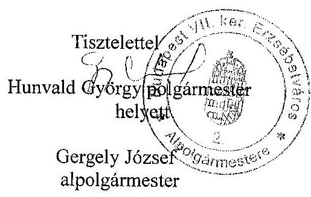

---

# Hunvald György úr 

polgármester
Budapest Főváros VII. kerület
Erzsébetváros Önkormányzata

Budapest
Erzsébet krt. 6.
1073

## Tisztelt Polgármester Úr!

A Budapest Főváros VII. kerület Erzsébetváros Önkormányzata gazdálkodási rendszerének 2009. évi ellenőrzéséről készült számvevőszéki jelentéshez tett észrevételeket, valamint tájékoztatását a megtett intézkedésekről köszönöm.

A számvevőszéki jelentésben a polgármesternek szólóan a Polgármesteri hivatal ügyrendje kiegészítésére, a jegyzőnek címzetten a belső ellenőrzés keretében az ellenőrzöttek általi intézkedési terv készítésére, az eladósodás növekedésének elkerülése érdekében az Önkormányzat lehetőségeinek kimunkálására, az európai uniós pályázatokhoz kapcsolódó szerződésekre, és az e-közigazgatásra tett javaslataink hasznosulása érdekében tervezett intézkedésekről szóló tájékoztatást tudomásul veszem.

Megalapozott volt az észrevételük a jegyzőnek tett 4. számú javaslaton belül az előző évről áthúzódó kiadások tervezésére vonatkozó számvevőszéki megállapításra, ezért a megállapításunkat a jelentésben ennek megfelelően módosítottuk. A megállapításhoz javaslat nem kapcsolódott. A jegyzőnek tett, a 2006. évi átfogó ellenőrzés utóvizsgálat hiányosságai miatti 7. számú javaslathoz kapcsolódó észrevételét a csatolt dokumentumok alapján elfogadjuk és ezzel kiegészítjük az erre vonatkozó megállapításainkat, azonban a javaslat nem kerül törlésre, mivel más hiányosságok még fennmaradtak.

A megállapításainkhoz és javaslatainkhoz kapcsolódó alábbi észrevételeit azonban nem tudom elfogadni:

- a számvevőszéki jelentés 27. oldalán írtakhoz kapcsolódóan, az egyes évek pénzügyi egyensúlyára vonatkozó megállapítást a hiány/többlet abszolút értéke szerint és nem az összeg

---

nagysága, vagy aránya alapján ítéltük meg. Az elemzés módszere valamennyi ezen ellenőrzési program keretében ellenőrzött önkormányzat esetében azonos volt.

- a jegyzőnek tett 1. számú javaslattal kapcsolatban nem lehet figyelmen kívül hagyni azt a tényt, hogy nem általában ingatlanhoz kapcsolódó jogról, hanem önkormányzati lakáshoz kapcsolódó lakásbérleti jogról van szó, amely jogviszony megszünésére a lakások és helyiségek bérletére, valamint az elidegenítésükre vonatkozó egyes szabályokról szóló 1993. évi LXXVII. törvény előírásai, illetve törvényi felhatalmazás alapján önkormányzati rendelkezések vonatkoznak. A jogszabályi előírások szerint Önkormányzat vagy cserelakást és/vagy pénzbeli térítést adhat a bérlőnek, és a bérlő lakásbérleti jogát nem lehet vásárlással - a bérleti jog visszavásárlásával - megszüntetni. Ezért a valódiság elve akkor érvényesül, ha pénzbeli térítést nem beruházásként mutatják ki. Az összemérés számviteli alapelvének megsértését nem vetettük fel. Azonban ez az elv sem sérülhetett az Önkormányzatnál a pénzbeli térítés felhalmozási célú pénzeszközátadás kiadásaként történő elszámolásával, mivel az ingatlanértékesítést nem vállalkozási tevékenységként végezte az Önkormányzat, és az összemérés számviteli alapelve szerint az adott időszak - egy-egy költségvetési év alaptevékenysége pénzmaradványának megállapításakor a tárgyévben ténylegesen teljesített kiadásokat és a ténylegesen befolyt bevételeket, pénzforgalom nélküli bevételeket kellett figyelembe vennie. Az ÁSZ rendelkezésére álló, az Ámr. 2. számú mellékletében meghatározott beszámoló űrlap-garnitúra szerint összeállított, 2008. évi önkormányzati beszámolók kiadásokat tevékenységenként részletező 21 . számú űrlapján a fővárosban 16 kerületi önkormányzat mutatott ki teljesítési adatot a felhalmozási célú pénzeszközátadások között a „Lakásért fizetett pénzbeli térítés" sorban és nem az ingatlan értékét növelő beruházásként számolták el ezt a kiadást; a pénzügyminisztériumi tájékoztatóban leírtaknak megfelelően
- a jegyzőnek címzett 2. számú javaslathoz kapcsolódóan az Ámr. 29. § (1) bekezdésének g) pontja szerint a többéves kihatással járó feladatok előirányzatait kell bemutatni a költségvetési rendelettervezetben függetlenül attól, hogy azok felhalmozási vagy müködési feladatok kiadási előirányzatai. A költségvetési rendeletekhez, illetve azok előterjesztéséhez csatoltan csak felhalmozási feladatok előirányzatait mutatták ki többéves kihatással járó feladatként, a müködési feladatként jelzett „INTERREG IIIB CADSES CoUrbit" projekt előirányzatait éves bontásban nem. A fejlesztés fogalmát nem az Ámr-ben meghatározott, alapvetően felhalmozási feladatra szükített értelemben, hanem tágabb értelmében használtuk, mivel az európai uniós programokban számos projekt során olyan feladat valósul meg, amelynek eredménye valaminek a megújítása, modernizálása, jobbítása, azaz fejlesztése. Nem vitatjuk, hogy az észrevételben hivatkozott 2006. és 2007. évi költségvetési rendeletek 19. illetve 17. számú táblázataiban lévő dologi kiadások összegei magukban foglalták a jelzett projekt következő kettő évre tervezett adatait, mivel a táblázatok az Áht. 71. § (3) bekezdése előirása szerint a tárgyévi és a költségvetési évet követő kettő év várható előirányzatait tartalmazták. Az ÁSZ ellenőrzése azonban nem az Áht. ezen előirása betartásának vizsgálatára vonatkozott.
- a jegyzőnek tett 3. számú javaslattal kapcsolatban olyan tartalmi megfeleléseket soroltak fel, amelyeket az ellenőrzés nem kifogásolt, illetve a Vhr. 40. § (8) bekezdése alapján az észre-

---

vételben írtakkal ellentétben nem az alapítványi támogatásokat, hanem az alapítványok, közalapítványok által ellátott feladatra történt kifizetéseket kell bemutatni;

- a jegyzőnek címzett 4. számú javaslathoz kapcsolódóan az észrevételhez csatolt 2009. évi költségvetési tervezési szabályozásra vonatkozó Munkaprogramban és a 2009. évben kiadott munkaköri leírásokban az Ámr-ben kiemelt két ellenőrzési területet nem nevesítették, illetve nem konkretizálták,
ezért ezeket a megállapításainkat és a javaslatainkat változatlanul fenntartom.
Az észrevételben tévesen, lényeges mondatrészeket kihagyva idézték és kifogásolták az európai uniós támogatásokkal kapcsolatos számvevőszéki értékelést. Az ellenőrzés során nem az európai uniós források igénybevételének és a várható támogatások felhasználásának az eredményessége, hanem a 2006-2008. évek közötti időszakban az európai uniós források igénybevételére és a várható támogatások felhasználására vonatkozóan a szabályozás és a szervezettség tekintetében való felkészülés eredményessége került minősítésre.

A számvevőszéki jelentésben megfogalmazottakhoz az árfolyamváltozásról és kamatmértékről, a folyószámlahitel alakulásáról, továbbá az eladósodásról, ezen belül a hitelkeretek felhasználásáról, illetve az elvégzett bevétel szakmai teljesítésigazolásáról adott tájékoztatást, kiegészítő információkat köszönöm, megállapításainkat és a javaslatainkat ezek érdemben nem befolyásolták. Az európai uniós pályázatokat érintő legfrissebb eseményről, a pályázat pozitív elbírálásáról szóló tájékoztatás alapján az információkat a jelentés ide vonatkozó megállapításához kapcsolódó lábjegyzetében jelenítjük meg. A Szabad Demokraták Szövetsége által bérelt helyiségek eladásáról kötött adásvételi szerződés módosítására vonatkozó javaslatot fenntartom, amíg az adásvételi szerződés módosítása aláírásra nem kerül.

Az ellenőrzés lefolytatásához nyújtott segítő közreműködését köszönöm.
Budapest, 2010. január 12
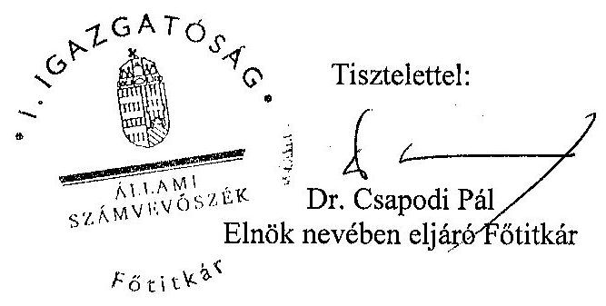