# JELENTÉS 

a Budapest Főváros XXI. kerület Csepel Önkormányzata gazdálkodási rendszerének 2009. évi ellenőrzéséről

---

# 3. Önkormányzati és Területi Ellenőrzési Igazgatóság 

## Átfogó Ellenőrzési Főcsoport

Iktatószám: V-3001-4/25/19/2009.
Témaszám: 933
Vizsgálat-azonosító szám: V0453

## Az ellenőrzést felügyelte:

Dr. Lóránt Zoltán
főigazgató
Az ellenőrzés végrehajtásáért felelős:
Dr. Sepsey Tamás
főigazgató-helyettes
Az ellenőrzést vezette:
Molnár Gyula Mihály igazgatóhelyettes

## Az ellenőrzést végezték:

| Dér Géza | Schósz Attiláné | Szabó Tamás |
| :-- | :-- | --: |
| számvevő tanácsos | számvevő tanácsos | számvevő tanácsos |

## A témához kapcsolódó eddig készített számvevőszéki jelentések:

## címe

Jelentés a Budapest Főváros XXI. kerület Csepel Önkormányzata gazdálkodási rendszerének 2006. évi átfogó ellenőrzéséről
Jelentés a Magyar Köztársaság 2006. évi költségvetése végrehajtásának ellenőrzéséről
Függelék:
A helyi önkormányzatok beruházásaihoz és rekonstrukcióihoz nyújtott 2006. évi felhalmozási célú támogatások ellenőrzése
Jelentés a helyi és helyi kisebbségi önkormányzatok gazdálkodási rendszerének 2006. évi átfogó és egyéb szabályszerűségi ellenőrzéséről
Jelentés a fővárosi önkormányzatot és a kerületi önkormányzato- 0756 kat osztottan megillető bevételek 2007. évi megosztásáról szóló önkormányzati rendelet felülvizsgálatáról

---

# TARTALOMJEGYZÉK 

BEVEZETÉS ..... 11
I. ÖSSZEGZŐ MEGÁLLAPÍTÁSOK, KÖVETKEZTETÉSEK, JAVASLATOK ..... 16
II. RÉSZLETES MEGÁLLAPÍTÁSOK ..... 24

1. Az Önkormányzat költségvetési és pénzügyi helyzete ..... 24
1.1. A tervezett költségvetési bevételek és kiadások alapján a költségvetési egyensúly alakulása, a költségvetési hiány oka, finanszírozásának tervezett módja és a költségvetési hiány megállapításának szabályszerűsége ..... 24
1.2. A teljesített költségvetési bevételek és kiadások alapján a pénzügyi egyensúly alakulása, a pénzügyi hiány oka, finanszírozásának módja és hatása a pénzügyi helyzetre az eladósodás, valamint a fizetőképesség szempontjából ..... 26
2. Az Önkormányzat felkészültsége az európai uniós források igénylésére és felhasználására, valamint az elektronikus közszolgáltatási feladatok ellátására ..... 33
2.1. Az európai uniós források igénybevételére és a várható támogatás felhasználására történt felkészülés szabályozottságának, szervezettségének eredményessége ..... 33
2.1.1. Az európai uniós forrásokra történő pályázatok benyújtására vonatkozó döntések összhangja a fejlesztési célkitűzésekkel ..... 33
2.1.2. Az európai uniós forrásokhoz kapcsolódóan a pályázatfigyelés, a pályázatkészítés, valamint az európai uniós támogatással megvalósuló fejlesztés lebonyolítása belső rendjének szabályozottsága, a végrehajtás személyi, szervezeti feltételei, az ellenőrzési feladatok meghatározása ..... 39
2.1.3. A fejlesztési feladat lebonyolításánál a feladatellátás rendjére, az ellenőrzési feladatok teljesítésére, valamint a felelősségi szabályokra vonatkozó előírások betartása ..... 40
2.2. Az elektronikus közszolgáltatás feltételeinek kialakítása, a közérdekú gazdálkodási adatok elektronikus közzététele ..... 41
3. A költségvetési gazdálkodás belső kontrolljai ..... 43
3.1. A szabályozottság kockázata a költségvetés tervezési, gazdálkodási, beszámolási és a folyamatba épített, előzetes és utólagos vezetői ellenőrzési feladatoknál ..... 43
3.2. A belső kontrollok múködése az önkormányzati források szabályszerű felhasználásában, a költségvetési tervezés, gazdálkodás, beszámolás folyamataiban ..... 45

---

3.3. A belső ellenőrzési kötelezettség teljesítése, javaslatainak hasznosulása ..... 48
4. Az ÁSZ korábbi ellenőrzési javaslatai alapján készített intézkedési terv végrehajtása, eredményessége ..... 51
4.1. Az Önkormányzat gazdálkodási rendszerének átfogó ellenőrzése során tett javaslatok végrehajtására tervezett intézkedések megvalósulása ..... 51
4.2. A zárszámadáshoz kapcsolódó (állami hozzájárulások, támogatások igénylésének és felhasználásának ellenőrzése), valamint a további vizsgálatok esetében a megállapítások, javaslatok alapján tett intézkedések ..... 55

# MELLÉKLETEK 

1. számú Az Önkormányzat gazdálkodását meghatározó adatok, mutatószámok (1 oldal)
2. számú Az önkormányzati vagyon alakulása (1 oldal)

2/a. számú Az önkormányzati kötelezettségek alakulása (1 oldal)
3. számú Az Önkormányzat 2006-2009. évi költségvetési előirányzatainak és 20062008. évi pénzügyi teljesítéseinek alakulása (1 oldal)
4. számú Tanúsítvány az európai uniós forrásokkal támogatott célok és programok 2006-2009. évi tervezett és teljesített adatairól (1 oldal)
5. számú Adatlap az európai uniós forrással támogatott „Az Önkormányzat adatvagyonának másodlagos hasznosítása" fejlesztésről (3 oldal)
6. számú Tóth Mihály úr, Budapest Főváros XXI. kerület Csepel Önkormányzata polgármestere által adott tájékoztatás (2 oldal)
7. számú Tóth Mihály úr, Budapest Főváros XXI. kerület Csepel Önkormányzata polgármestere tájékoztatására adott válasz (1 oldal)

---

# RÖVIDÍTÉSEK JEGYZÉKE 

## Törvények

Áht.
Ket.

Ötv.

## Rendeletek

Ámr.
Ber.
18/2005. (XII. 27.) IHM rendelet
$\mathrm{SzMSz}_{1}$
$\mathrm{SzMSz}_{2}$
vagyongazdálkodási rendelet

Vhr.
2007. évi költségvetési rendelet

2008. évi költségvetési rendelet

2009. évi költségvetési rendelet

2006. évi zárszámadási rendelet
az államháztartásról szóló 1992. évi XXXVIII. törvény a közigazgatási hatósági eljárás és szolgáltatás általános szabályairól szóló 2004. évi CXL. törvény
a helyi önkormányzatokról szóló 1990. évi LXV. törvény
az államháztartás múködési rendjéről szóló 217/1998. (XII. 30.) Korm. rendelet
a költségvetési szervek belső ellenőrzéséről szóló 193/2003. (XI. 26.) Korm. rendelet
a közzétételi listákon szereplő adatok közzétételéhez szükséges közzétételi mintákról szóló 18/2005. (XII. 27.) IHM rendelet

Budapest Főváros XXI. kerület Csepel Önkormányzata 5/2005. (III. 7.) számú rendelete a szervezeti és múködési szabályzatról
Budapest Főváros XXI. kerület Csepel Önkormányzata 10/2007. (III. 26.) számú rendelete a szervezeti és múködési szabályzatról
Budapest Főváros XXI. kerület Csepel Önkormányzata 38/2005. (XII. 13.) számú rendelete az Önkormányzat vagyonáról és a vagyon feletti tulajdonosi jogok gyakorlásáról
az államháztartás szervezetei beszámolási és könyvvezetési kötelezettségének sajátosságairól szóló 249/2000. (XII. 24.) Korm. rendelet

Budapest Főváros XXI. kerület Csepel Önkormányzata 9/2007. (II. 27.) számú rendelete a 2007. évi költségvetéséről
Budapest Főváros XXI. kerület Csepel Önkormányzata 6/2008. (II. 21.) számú rendelete a 2008. évi költségvetéséről
Budapest Főváros XXI. kerület Csepel Önkormányzata 5/2009. (II. 19.) számú rendelete a 2009. évi költségvetéséről
Budapest Főváros XXI. kerület Csepel Önkormányzata 13/2007. (IV. 17.) számú rendelete a 2006. évi zárszámadásáról

---

2007. évi zárszámadási rendelet

2008. évi zárszámadási rendelet

Budapest Főváros XXI. kerület Csepel Önkormányzata 12/2008. (IV. 17.) számú rendelete a 2007. évi zárszámadásáról
Budapest Főváros XXI. kerület Csepel Önkormányzata 14/2009. (IV. 16.) számú rendelete a 2008. évi zárszámadásáról

# Szórövidítések 

adatvagyon hasznosítása projekt
ÁROP
ÁSZ
Belső ellenőrzési egység

Csevak Zrt.

EKOP
e-közigazgatás
FEUVE
Fővárosi Önkormányzat
gazdálkodási jogkörök
szabályzata
gazdasági program

GVOP
HEFOP
INTERREG IVB
jegyzö
KCSZM
Képviselő-testület
KMOP

GVOP-2004-4.3.2. az Önkormányzat adatvagyonának másodlagos hasznosítása
ÚMFT Államreform Operatív Program
Állami Számvevőszék
Budapest Főváros XXI. kerület Csepel Önkormányzata Polgármesteri Hivatalának Belső Ellenőrzési Egysége
Budapest Főváros XXI. kerület Csepel Önkormányzata Vagyonkezelő és Vagyonhasznosító Zártkörűen működő Részvénytársaság (2007. június 14-ig korlátolt felelősségű társaságként múködött)
ÚMFT Elektronikus Közigazgatási Operatív Program
elektronikus közigazgatás
folyamatba épített, előzetes és utólagos vezetői ellenőrzés
Budapest Főváros Önkormányzata
a bevételekkel és kiadásokkal kapcsolatos gazdálkodási jogkörök szabályozásáról szóló 3/2006. (III. 31.) számú polgármesteri és jegyzői utasítás
Budapest Főváros XXI. kerület Csepel Önkormányzat Képviselő-testületének 219/2007. (III. 26.) számú határozatával elfogadott, a 2006-2013. évekre szóló gazdasági programja
NFT Gazdasági Versenyképesség Operatív Program
NFT Humánerőforrás-fejlesztési Operatív Program
INTERREG Közösségi Kezdeményezés Támogatási Programja
Budapest Főváros XXI. kerület Csepel Önkormányzata Jegyzője
Kisebbségi és Civil Szervezeti Munkacsoport
Budapest Főváros XXI. kerület Csepel Önkormányzata Képviselő-testülete
ÚMFT Közép-magyarországi Operatív Program

---

közoktatási fejlesztési terv

NFT
OSZI

Önkormányzat
polgármester

Polgármesteri hivatal
projektgazda

ROP
Szociális szolgálat
szolgáltatástervezési koncepció

ÚMFT
hivatali ügyrend
ügyrend
TÁMOP
Városgazdálkodási iroda
pályázati szabályzat

Budapest Főváros XXI. kerület Csepel Önkormányzata Képviselő-testületének 513/2006. (XII. 19.) számú határozatával elfogadott közoktatási feladat-ellátási, intézményhálózat múködtetési és fejlesztési terve
Nemzeti Fejlesztési Terv
Budapest Főváros XXI. kerület Csepel Önkormányzata Oktatási Szolgáltató Intézménye
Budapest Főváros XXI. kerület Csepel Önkormányzata
Budapest Főváros XXI. kerület Csepel Önkormányzata Polgármestere
Budapest Főváros XXI. kerület Csepel Önkormányzata Polgármesteri Hivatala
a projekt által megvalósítani kívánt cél szerinti illetékes önkormányzati fenntartású költségvetési szerv vezetője, az önkormányzati tulajdonú gazdasági társaság ügyvezetője, a Polgármesteri hivatal belső szervezeti egységének vezetője, az ellenőrzési koordinátor, illetve a fejlesztési munkatárs
NFT Regionális Operatív Program
Budapest Főváros XXI. kerület Csepel Önkormányzata Csepeli Szociális Szolgálata
Budapest Főváros XXI. kerület Csepel Önkormányzata Képviselő-testületének 476/2007. (VI. 26.) számú határozatával jóváhagyott szociális és gyermekjóléti szolgáltatástervezési koncepciója
Új Magyarország Fejlesztési Terv
SzMSz 2 6. számú melléklete a Polgármesteri hivatal ügyrendje
Polgármesteri Hivatal Városgazdálkodási Ágazatának ügyrendjéről szóló 5/2006. (X. 10.) számú jegyzői utasítás ÚMFT Társadalmi megújulás Operatív Program
Budapest Főváros XXI. kerület Csepel Önkormányzata Polgármesteri Hivatal Városgazdálkodási Ágazat Városgazdálkodási Irodája
a pályázatok előkészítésének, benyújtásának és lebonyolításának rendjéről szóló 9/2006. (XII. 22.) számú polgármesteri-jegyzői közös utasítás

---

.

---

# ÉRTELMEZŐ SZÓTÁR 

1. elektronikus szolgáltatási szint
2. elektronikus szolgáltatási szint
3. elektronikus szolgáltatási szint
4. elektronikus szolgáltatási szint
európai uniós források
fejlesztési feladat (projekt)
fejlesztési célkitűzés
kedvezményezett

Az 1044/2005. (V. 11.) Korm. határozat alapján olyan információs, tájékoztató szolgáltatás, amely csak általános információkat közöl az adott üggyel kapcsolatos teendőkről és a szükséges dokumentumokról.
Az 1044/2005. (V. 11.) Korm. határozat alapján olyan egyirányú kapcsolatot biztosító szolgáltatás, amely az 1. szinten túl biztosítja az adott ügy intézéséhez szükséges dokumentumok, nyomtatványok letöltését, és azok ellenőrzéssel, vagy ellenőrzés nélküli elektronikus kitöltését, amely esetben a dokumentumok benyújtása hagyományos úton történik.
Az 1044/2005. (V. 11.) Korm. határozat alapján olyan kétirányú kapcsolatot biztosító szolgáltatás, amely közvetlen, vagy ellenőrzött kitöltésű dokumentum segítségével biztosítja az elektronikus adatbevitelt és a bevitt adatok ellenőrzését. Az ügy indításához, intézéséhez személyes megjelenés nem szükséges, de az ügyhöz kapcsolódó közigazgatási döntés (határozat, egyéb aktus) közlése, valamint a kapcsolódó illeték-, vagy díffizetés hagyományos úton történik.
Az 1044/2005. (V. 11.) Korm. határozat alapján olyan teljes közvetlen kétirányú ügyintézési folyamatot biztosító szolgáltatás, amikor az ügyhöz kapcsolódó közigazgatási döntés is elektronikus úton kerül közlésre, illetve a kapcsolódó illeték-, vagy díffizetés elektronikus úton is intézhető.
A támogatott projekt megvalósítása érdekében, a fejlesztés lebonyolítása során felmerült kiadások finanszírozási forrása.
A fejlesztési feladat (projekt) tartalmilag és formailag részletesen kidolgozott, megfelelő pénzügyi háttérrel és végrehajtási ütemezéssel rendelkező fejlesztési terv, amely illeszkedik az Európai Unió, illetve a Nemzeti Fejlesztési Terv és az Új Magyarország Fejlesztési Terv által támogatott programokhoz.
Az önkormányzat által ellátott kötelező, vagy önként vállalt feladatok biztosításának mennyiségi, vagy minőségi fejlesztésére vonatkozó terv. A mennyiségi fejlesztés megvalósulhat beszerzéssel, létesítéssel, bővítéssel, átalakítással.
Az a helyi önkormányzat, amely a támogatási szerződést kedvezményezettként aláíraa, a projektet, illetve a központi programhoz kapcsolódó támogatott önkormányzati programot végrehajtja.

---

közreműködő szervezet
lebonyolítás
operatív program

Nemzeti Fejlesztési Terv

A közreműködő szervezet az európai uniós támogatást elnyert kedvezményezettekkel kapcsolatot tartó szerv. Az operatív programok közreműködő szervezetei befogadják, nyilvántartják, döntésre előkészítik a pályázatokat, rögzítik a támogatással kapcsolatos adatokat az Egységes Monitoring Informatikai Rendszerben, elvégzik a támogatások előzetes (szerződéskötést megelőző), közbenső (a pénzügyi elszámolás, finanszírozás folyamatában végzett) és utólagos (a támogatott projekt pénzügyi lezárását megelőző) ellenőrzését. Az önkormányzatoknál a leggyakrabban előforduló operatív program a Regionális Fejlesztési Operatív Program végrehajtásában közreműködő szervezetek a VÁTI Kht. és a regionális fejlesztési ügynökségek.
A Kohéziós alap kettő közreműködő szervezete (Nemzeti Fejlesztési és Gazdasági Minisztérium, Környezetvédelmi és Vízügyi Minisztérium) a támogatott projektek végrehajtásához kapcsolódó operatív feladatokat látják el. Ennek keretében megkötik a szerződéseket a projekt kedvezményezettjével, folyamatosan nyomon követik a teljesítéseket, lebonyolítják a támogatások kifizetését, vezetik az Egységes Monitoring Informatikai Rendszert.
Az európai uniós források felhasználásával megvalósuló fejlesztésre irányuló műszaki, gazdasági (pénzügyi) tevékenységet magában foglaló szervezési, irányítási szolgáltatás. A szervezési szolgáltatás kiterjedhet a pályázatkészítésre, a közbeszerzési eljárás lebonyolításán keresztül a folyamatos műszaki ellenőrzésre, a pénzügyi elszámolásra, a műszaki átadás-átvételre, az üzembe helyezésre, illetve a fejlesztési folyamat egyes elemeire.
Az Európai Bizottság által jóváhagyott, a Közösségi Támogatási Keret végrehajtására vonatkozó, több évre szóló intézkedésekhez kapcsolódó prioritások egységes rendszerét tartalmazó dokumentum.
Helyzetelemzést, stratégiát a tervezett fejlesztési területek prioritásait, azok céljait és pénzügyi forrásaik megjelölését tartalmazó dokumentum, amelyet a Magyar Köztársaság készített az Európai Unió programozási irányelveinek, célkitűzéseinek megfelelően a fejlődésben lemaradó régiók fejlődésének és strukturális átalakulásának elősegítésére a kiemelt szükségletekre figyelemmel. A Nemzeti Fejlesztési Terv stratégiai fejezetének célja, hogy a 2004-2006 közötti időszakra kijelölje a strukturális alapokból támogatható fejlesztéspolitikai célkitűzéseit és prioritásait. A strukturális alapok operatív programjai: Agrár és Vidékfejlesztési Operatív Program (AVOP); Gazdasági Versenyképesség Operatív Program (GVOP); Humánerőforrás-fejlesztési Operatív Program (HEFOP); Környezetvédelmi és Infrastruktúra-fejlesztési Operatív Program (KIOP); Regionális Fejlesztési Operatív Program (ROP).

---

regionális program

Új Magyarország Fejlesztési Terv
támogatási szerződés

Az ágazati és regionális prioritásokat egyaránt tartalmazó operatív program regionális prioritása, illetve támogatási konstrukciója.
Az Új Magyarország Fejlesztési Terv célja a foglalkoztatás bővítése és a tartós növekedés feltételeinek megteremtése. Ennek érdekében 2007-2013 között hat kiemelt területen indított el összehangolt állami és európai uniós fejlesztéseket: a gazdaságban, a közlekedésben, a társadalom megújulása érdekében, a környezet és az energetika területén, a területfejlesztésben és az államreform feladataival összefüggésben. Az Új Magyarország Fejlesztési Terv operatív programjai: Államreform Operatív Program (ÁROP); Elektronikus Közigazgatás Operatív Program (EKOP); Gazdaságfejlesztés Operatív Program (GOP); Környezet és Energia Operatív Program (KEOP); Közlekedés Operatív Program (KÖZOP); Dél-Alföldi Operatív Program (DAOP); Dél-Dunántúli Operatív Program (DDOP); Észak-Alföldi Operatív Program (ÉAOP); Észak-Magyarországi Operatív Program (ÉMOP); Közép-Dunántúli Operatív Program (KDOP); Közép-Magyarországi Operatív Program (KMOP); Nyugat-Dunántúli Operatív Program (NYDOP); Társadalmi Infrastruktúra Operatív Program (TIOP); Társadalmi Megújulás Operatív Program (TÁMOP).
A strukturális alapok esetében az irányító hatóságnak, illetve a Kohéziós Alap esetében a közremúködő szervezeteknek a kedvezményezett önkormányzattal kötött szerződése, amely a támogatás felhasználásának részletes feltételeit tartalmazza. Az Új Magyarország Fejlesztési Terv keretében támogatott projektek esetében a támogatási szerződést a kedvezményezett és a Nemzeti Fejlesztési Ügynökség nevében eljáró közremúködő szervezet között jön létre. Nagyprojekt esetén a támogatási szerződést az Nemzeti Fejlesztési Ügynökség ellenjegyzi. A támogatási szerződés képezi a megvalósítás nyomon követésének, finanszírozásának és ellenőrzésének alapját.

---

.

---

# JELENTÉS   a Budapest Főváros XXI. kerület Csepel Önkormányzata gazdálkodási rendszerének 2009. évi ellenőrzéséről 

## BEVEZETÉS

Az Ötv. 92. § (1) bekezdése, az Állami Számvevőszékről szóló 1989. évi XXXVIII. törvény 2. § (3) bekezdése, valamint az Áht. 120/A. § (1) bekezdése alapján az önkormányzatok gazdálkodását az Állami Számvevőszék ellenőrzi. Az ellenőrzésre az Országgyúlés illetékes bizottságai részére is átadott, országosan egységes ellenőrzési program szerint került sor.

Az Állami Számvevőszék a stratégiájában foglalt célkitűzéseknek megfelelően a helyi önkormányzatok költségvetési gazdálkodási rendszere átfogó ellenőrzésének programját a 2007. évtől megújította, azt kiegészítette további - teljesít-mény-ellenőrzési - elemekkel.

## Az ellenőrzés célja annak értékelése volt, hogy az Önkormányzat:

- milyen módon biztosította a költségvetési és a pénzügyi egyensúlyt a költségvetésében és annak teljesítése során, valamint változott-e a hiányzó bevételi források pótlásában a finanszírozási célú pénzügyi műveletek jelentősége, hatása;
- eredményesen készült-e fel a szabályozottság és a szervezettség terén az európai uniós források igénylésére és felhasználására, továbbá biztosította-e az elektronikus közszolgáltatás feltételeit, a gazdálkodási adatok közzétételével a gazdálkodás nyilvánosságát;
- kialakította-e és működtette-e a külső és a belső feltételeknek megfelelően a költségvetés tervezési, gazdálkodási és zárszámadási feladatai belső kontrollrendszerét ${ }^{1}$, ezen tevékenységek szabályszerű ellátásához hozzájárult-e a folyamatba épített, előzetes és utólagos vezetői ellenőrzés, valamint a belső ellenőrzés;

[^0]
[^0]:    ${ }^{1}$ A gazdálkodás szabályszerűségét biztosító kontrollrendszer alatt értjük a kiépített és múködő pénzügyi irányítási és szabályozási rendszert, valamint a belső ellenőrzési funkciók ellátásának rendszerét.

---

- megfelelően hasznosították-e a korábbi számvevőszéki ellenőrzések megállapításait, szabályszerűségi ${ }^{2}$ és célszerűségi javaslatait.

Az ellenőrzés típusa: átfogó ellenőrzés, amely - egy ellenőrzés keretében meghatározott területekre összpontosítva alkalmazza a szabályszerűségi, valamint a teljesítmény-ellenőrzés jellemzőit.

Az ellenőrzött időszak: az 1., 2. és 4. programpontok tekintetében a 20062008. évek és 2009. I. negyedév, a 3. ellenőrzési programpontnál a 2008. év és 2009. I. negyedév.

A kerület lakosainak száma 2009. január 1-jén 77700 fő volt. A 2006. évi önkormányzati választást követően az Önkormányzat 29 tagú Képviselőtestületének munkáját hat állandó bizottság segítette. Az Önkormányzat mellett a 2006. évi önkormányzati választásokat követően hét kisebbségi önkormányzat ${ }^{3}$ működik. A polgármester az 1994. évi önkormányzati képviselő- és polgármester-választás óta tölti be tisztségét, a jegyző a 2000. évtől látja el feladatait.

Az Önkormányzat feladatainak végrehajtása érdekében a 2008. évben 46 költségvetési intézményt múködtetett, amelyekből három önállóan gazdálkodott. A feladatok ellátásában részt vett három általa alapított gazdasági társasága, továbbá öt közalapítványa. Az Önkormányzat a 2008. évi költségvetési beszámolója szerint 18079 millió Ft költségvetési bevételt ért el és 17299 millió Ft költségvetési kiadást teljesített. 2008. december 31-én a könyvviteli mérleg szerint 81935 millió Ft értékű vagyonnal rendelkezett. Az Önkormányzat vagyona a 2006. év végi állományi értékhez viszonyítva 2,3\%-kal csökkent, melyet a befektetett eszközök 1,6\%-os ( 1202 millió Ft-os, ezen belül a beruházások 1342 millió Ft-os), valamint a forgóeszközök 8,8\%-os ( 735 millió Ft-os), illetve a saját tőke 1,5\%-os (1092 millió Ft-os), a tartalékok 14,9\%-os (1083 millió Ft-os) csökkenése, továbbá a kötelezettségek 4,8\%-os ( 238 millió Ft-os) növekedése együttesen okozott. Az összes költségvetési bevétel 56,6\%-át a saját bevétel biztosította a 2008. évben. A helyi adóbevétel az összes költségvetési bevételhez viszonyítva $34,3 \%$ volt. Az összes költségvetési kiadásból a felhalmozási célú kiadás részaránya a 2008. évben 17,1\% volt. A 2009. évi költségvetési rendeletben 14110 millió Ft költségvetési bevételt és 16734 millió Ft költségvetési kiadást irányoztak elő. A Polgármesteri hivatalban dolgozó köztisztviselők száma 2008. december 31-én 187 fő, a költségvetési intézményekben foglalkoztatott közalkalmazottak száma 1972 fő volt. Az Önkormányzat gazdálkodását meghatározó adatokat, mutatószámokat az 1-3. számú mellékletek tartalmazzák.

Az Önkormányzat költségvetési és pénzügyi helyzetét az elemző eljárás módszerével vizsgáltuk. E körben elemeztük a költségvetés egyensúlyi helyzetének alakulását, a tervezett és tényleges költségvetési hiány okait, a mérséklésére tett intézkedéseket, finanszírozásának módját, az Önkormányzat adósságállomá-

[^0]
[^0]:    ${ }^{2}$ A törvényi előírások betartásának elmulasztásakor a részletes megállapítások fejezetben egységesen a törvénysértés megjelölést alkalmazzuk, mivel az ÁSZ nem tehet különbséget a törvényi előírások között.
    ${ }^{3}$ Kisebbségi önkormányzatok: bolgár, cigány, görög, német, örmény, román, ruszin.

---

nyának alakulását, összetevőit. Az európai uniós támogatás igénylésére és felhasználására történt felkészülésre vonatkozóan teljesítmény-ellenőrzést végeztünk. Az európai uniós források figyelésére, igénylésére és felhasználására a felkészülést akkor minősítettük eredményesnek, ha a meghatározott szempontok szerinti feltételeknek megfelelt a felkészülés szabályozottsága, szervezettsége, továbbá értékeltük, hogy az igényelt európai uniós támogatások az Önkormányzat által meghatározott fejlesztési célkitűzésekhez kapcsolódtak-e. Az ellenőrzés során felmértük, hogy az e-közszolgáltatási feladat ellátása, illetve bevezetése, működtetése érdekében milyen intézkedéseket tettek, valamint biz-tosították-e a közérdekú adatok közzétételét. A költségvetési gazdálkodás belső kontrolljainak ellenőrzése során értékeltük, hogy a Polgármesteri hivatalnál a költségvetés tervezési, gazdálkodási, zárszámadás készítési feladatok belső kontrolljainak kiépítettsége és működése megfelelő biztosítékot ad-e a gazdálkodási feladatok megfelelő, szabályszerű ellátására. Felmértük és minősítettük a költségvetés tervezési, a gazdálkodási, a zárszámadás készítési feladatokkal, továbbá a pénzügyi-számviteli területen az informatikával kapcsolatosan kialakított kontrollok megfelelőségét, valamint a kialakított belső kontrollok működésének megbízhatóságát. Értékeltük a belső ellenőrzés szabályozottságát, működési feltételeinek kialakítását, továbbá működésének megbízhatóságát.

A Polgármesteri hivatalnál értékeltük a gazdálkodás folyamatában kulcsszerepet betöltő belső kontrollok múködésének megbízhatóságát, ennek keretében ellenőriztük a szakmai teljesítés igazolására és az utalvány ellenjegyzésére kialakított kontrollok végrehajtását. Az ellenőrzést a következő, kiemelt kockázatuk alapján kiválasztott ${ }^{4}$ kifizetésekre folytattuk le ${ }^{5}$ :

- a külső szolgáltató által végzett karbantartási, kisjavítási szolgáltatásokra,
- a gépek, berendezések, felszerelések beszerzésére, továbbá
- az államháztartáson kívülre teljesített múködési és felhalmozási célú pénzeszköz átadásokra.

Az ellenőrzés hatékony elvégzése céljából a vizsgálandó területek kiválasztása során a kockázatokon alapuló megközelítés érvényesült, ezáltal az ellenőrzési erőforrásokat azokra a területekre fókuszáltuk, amelyeken legnagyobb a hibák előfordulási valószínűsége. Az ellenőrzési erőforrások ilyen típusú összpontosi-

[^0]
[^0]:    ${ }^{4}$ Az önkormányzatok kiemelt előirányzataira vonatkozóan a vertikális folyamatokra elvégeztük a kockázatok becslését, amelynek eredményeként határoztuk meg a magas kockázatú területeket.
    ${ }^{5}$ A korábbi ellenőrzési tapasztalataink szerint ezeken a területeken a jegyzők nem, vagy hiányosan szabályozták a megbízás, megrendelés, illetve beszerzés indokoltságának, szükségességének elbírálására, igazolására, valamint a teljesítések dokumentálására, a kiadások jogosultságának, összegszerűségének ellenőrzésére irányuló kontrollokat. További kockázatot jelentett, ha a külső szolgáltató által végzett karbantartási, kisjavítási munkák 50 ezer Ft alatti megrendeléseire vonatkozóan a jegyzők nem alakították ki a kötelezettségvállalások rendjét és nyilvántartási formáját, valamint a szabályozás elmulasztása esetén nem történt meg az írásbeli kötelezettségvállalás és annak az ellenjegyzése sem.

---

tásával minimálisra csökkenthető a kívánt ellenőrzési bizonyosság eléréséhez szükséges időráfordítás.

A pénzügyi-számviteli folyamatokban alkalmazott belső kontrollok létezésének és múködésének ellenőrzésére a vizsgált három terület 2008. évi és 2009. év I. negyedévi könyvviteli tételeiből területenként egyszerű véletlen mintát vettünk. A kijelölt gazdasági eseményre elvégzett megfelelőségi tesztek alapján értékeltük a kontrollok működésének megbízhatóságát a vizsgált három területre kü-lön-külön, majd összefoglalóan ${ }^{6}$. A helyszíni ellenőrzés megállapításainak részletes dokumentálását megfelelőségi tesztlapokon, elővizsgálati és helyszíni ellenőrzési munkalapokon biztosítottuk. Ezeken a teszt- és munkalapokon a minősítés alapjául szolgáló kérdések és a vonatkozó konkrét jogszabályhelyek megjelölése mellett értékeltük a kialakított belső kontrollokban rejlő kockázatokat ${ }^{7}$ és a kialakított kontrollok múködésének megbízhatóságát ${ }^{8}$.

Az ÁSZ korábbi ellenőrzési javaslatai alapján tett intézkedéseket, illetve azok megvalósítását utóellenőrzés keretében vizsgáltuk. A gazdálkodási rendszer átfogó ellenőrzése során megfogalmazott javaslatok végrehajtására tett intézkedések megvalósítását ellenőriztük, az egyéb számvevőszéki ellenőrzések során tett javaslatok esetében pedig a kiadott intézkedéseket tekintettük át.

A helyszíni ellenőrzés során kitöltött - az ellenőrzést végző számvevő és a Polgármesteri hivatal felelős köztisztviselője által aláírt - elővizsgálati és helyszíni ellenőrzési munkalapokat, azok kitöltési útmutatóit, továbbá a megfelelőségi tesztek dokumentumait a polgármester részére a számvevői jelentéssel egyidejűleg átadtuk.

A jelentés megállapításainak, javaslatainak egyeztetése során a polgármester arról adott részletes tájékoztatást - egyidejűleg csatolta azokat a dokumentumokat, amelyek igazolták -, hogy az időközben megtett intézkedésekkel a

[^0]
[^0]:    ${ }^{6}$ A vizsgált három terület egyedi értékelési pontszámait a területek költségvetési súlyával arányosan összegeztük.
    ${ }^{7}$ A kialakított belső kontrollokban rejlő kockázatot alacsonynak minősítettük, ha a kontrollok - végrehajtásuk esetén - megfelelő védelmet nyújtanak a hibák bekövetkezése ellen. Közepesnek minősítettük a belső kontrollokban rejlő kockázatot, amennyiben a kontrollok - végrehajtásuk esetén - a lehetséges hibák többsége ellen védelmet nyújtanak. Magasnak értékeltük a kockázatot, ha a kontrollok - kialakításuk hiányában, vagy hiányos kialakításuk miatt - nem nyújtanak elegendő védelmet a lehetséges hibákkal szemben.
    ${ }^{8}$ A kontrollok múködésének megbízhatóságát kiválónak értékeltük abban az esetben, ha azok múködése - esetleges apróbb hiányosságoktól eltekintve - megfelelt a hibák megelőzésére és kijavítására meghatározott szabályozásnak és a legmagasabb szintű elvárásoknak. Jónak minősítettük a kontrollok múködését, ha a hiányosságok száma ugyan jelentős volt, de nem veszélyeztette az ellenőrzött terület hibáinak megelőzését és kijavítását. Amennyiben a kontrollok - kialakításuk hiánya, illetve hiányosságai miatt - nem biztosították a hibák megelőzését, feltárását, kijavítását és ez veszélyeztette az eredményes, megbízható múködést, a kontroll múködésének megbízhatósága gyenge minősítést kapott.

---

számvevői jelentésben tett javaslatokat ${ }^{9}$ megvalósították. A megtett intézkedéseket a jelentés II. Részletes megállapítások fejezetében az adott témához kapcsolt lábjegyzetben feltüntettük és a vonatkozó javaslatokat elhagytuk.

A jelentést az ÁSZ-ról szóló 1989. évi XXXVIII. tv. 25. § (1) bekezdése alapján észrevétel közlése céljából megküldtük a Budapest Főváros XXI. kerület Csepel Önkormányzat polgármesterének. A kapott tájékoztatást a jelentés 6. számú melléklete, az arra adott választ a 7. számú melléklet tartalmazza.

[^0]
[^0]:    ${ }^{9}$ A számvevői jelentésben a helyszíni ellenőrzés során a jegyzőnek hét szabályszerűségi és négy célszerűségi javaslatot tettünk, melyből hat szabályszerűségi és három célszerűségi javaslatot elhagytunk.

---

# I. ÖSSZEGZŐ MEGÁLLAPÍTÁSOK, KÖVETKEZTETÉSEK, JAVASLATOK 

Az Önkormányzatnál a 2006-2009. években a tervezett költségvetési bevételek és kiadások változó tendenciát mutattak, mivel a költségvetési bevételek főöszszege az előző évhez képest a 2007. évre csökkent, majd a 2008-2009. években növekedett. A költségvetési kiadások főösszege a 2008. évig folyamatosan növekedett, majd a 2009. évre csökkent. Az Önkormányzat a 2006-2009. évi költségvetési rendeleteiben a költségvetési bevételek és kiadások egyensúlyát nem biztosította, mivel a tervezett költségvetési kiadások meghaladták a tervezett költségvetési bevételeket. Az Önkormányzat a 2006-2008. évek költségvetési rendeleteiben a hiány finanszírozásához, a költségvetési egyensúly biztosításához rövid lejáratú, illetve folyószámlahitelek felvételét, valamint a 20062009. években bevételt növelő és kiadást csökkentő intézkedések megtételét tervezte. A jegyző a költségvetés tervezése során a pénzállomány alakulásáról likviditási terv készítésével gondoskodott. Az Önkormányzatnál a 2007-2009. évi költségvetési rendeletekben a költségvetési kiadási főösszegek megállapításakor az Áht-ban foglaltakkal ellentétesen finanszírozási célú pénzügyi múveleteket vettek figyelembe költségvetési hiányt módosító költségvetési kiadásként. A 2009. évi költségvetési rendelet szeptemberi módosítása során a költségvetési kiadási főösszeget már az előírásoknak megfelelően állapították meg.
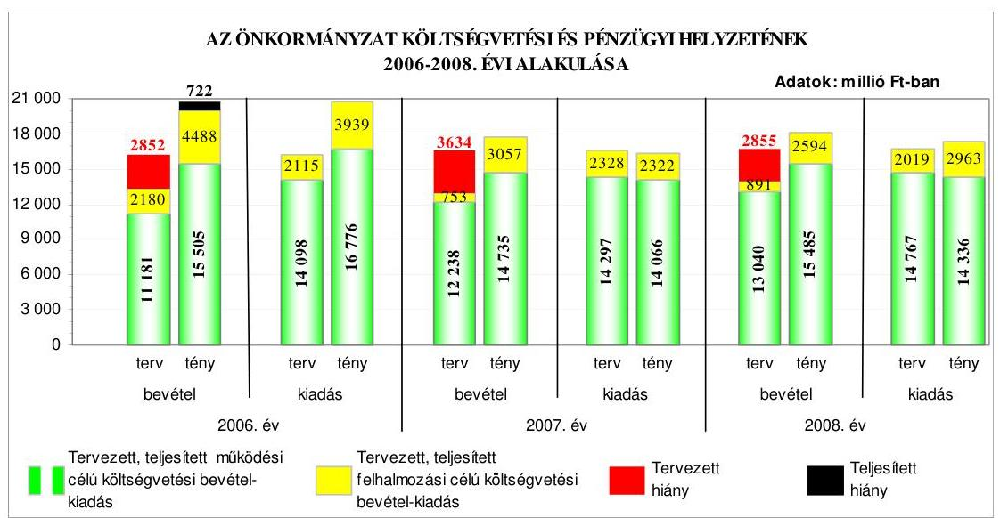

A teljesített költségvetési bevételi és kiadási főösszegek a 2006. évről a 2007. évre csökkentek, majd a 2008. évre növekedtek. A pénzügyi egyensúly a 2006. évi teljesítés során nem állt fenn, mivel a teljesített költségvetési bevételek és kiadások egyenlege pénzügyi hiányt mutatott, míg a 2007-2008. évi költségvetések végrehajtása során a realizált költségvetési bevételek fedezetet nyújtottak a megvalósított feladatok teljesített költségvetési kiadásaira. A felhalmozási célú költségvetési kiadásokon belül a beruházási és a felújítási kiadások a 2006-2008. években túlteljesültek, mely tervezési hiányosságra vezethető viszsza, mivel az előző évi pénzmaradvány igénybevételéhez, továbbá az előző

---

években képzett tartalékok maradványához kapcsolódó, előző évekről áthúzódó beruházási és felújítási kiadások előirányzatait nem tervezték meg eredeti előirányzatként. A jegyző 2009. július közepén elrendelte, hogy az éves költségvetés tervezésekor az előző évi pénzmaradvány igénybevételét, az előző években képzett tartalékok maradványát és a hozzájuk kapcsolódó, előző évekről áthúzódó kötelezettségvállalásokat is figyelembe kell venni eredeti előirányzatként. Az Önkormányzat a 2006-2008. években a költségvetési rendeletekben tervezett rövid lejáratú múködési célú hiteleket nem vette fel, a fedezetet folyó-számla-, illetve munkabérhitel igénybevételével biztosította. Az igénybe vett hitelek éven belüli likviditási problémák megoldását szolgálták. Az Önkormányzat pénzügyi helyzete - a 2006. évről a 2008. évre - összességében nem változott, mivel eladósodási mutatói közel azonos szinten alakultak, továbbá a pénzeszközök és a követelések fedezetet biztosítottak a rövid lejáratú kötelezettségek kiegyenlítésére.

Az Önkormányzat fejlesztési célkitűzéseit a Képviselő-testület hosszú távú ágazati koncepciókban és gazdasági programban, valamint Integrált Városfejlesztési Stratégiában határozta meg, figyelembe véve a megvalósítás lehetséges pénzügyi forrásait. A fejlesztési célkitűzések az NFT és az ÚMFT keretében megjelenő pályázati lehetőségekkel összhangban voltak. Az Önkormányzat a 20062009. I. negyedév vonatkozásában 20 európai uniós pályázatról döntött, amelyből 17 pályázat volt sikeres, melyből kettő pályázattól a szerződéskötés előtt - a tulajdonosi hozzájárulás, illetve jogerős építési engedély hiánya miatt - visszaléptek, három pályázatot formai, illetve forráshiány miatt elutasítottak. A benyújtott európai uniós pályázatok önrészének fedezetére az Önkormányzat a 2006-2009. évi költségvetési rendeleteiben előirányzatot határozott meg.

Az Önkormányzatnál a pályázati források igénybevételének és felhasználásának belső rendjét a 2006-2009. I. negyedév közötti időszakra vonatkozóan szabályozták. Az önkormányzati szintű pályázatkoordinálás feladataira, valamint a pályázat nyilvántartás vezetésére az európai uniós koordinátort, illetve a projektgazdát kijelölték, rögzítették a pályázatfigyelést végzők és a döntési, illetve a döntés-előterjesztési jogkörrel rendelkezők közötti információszolgáltatási kötelezettséget. A szabályozás magába foglalta az európai uniós forrásokra irányuló pályázatfigyelés, pályázatkészítés, valamint az európai uniós forrással támogatott fejlesztés lebonyolításának eljárási rendjét. Az európai uniós források pályázatfigyelésének, lebonyolítási feladatainak személyi, szervezeti feltételeit a Polgármesteri hivatalon belül alakították ki. Az Önkormányzat a pályázatkészítés személyi, szervezeti feltételeit a Polgármesteri hivatalon belül, illetve külső személy, szervezet megbízásával biztosította.

Az Önkormányzat a 150 millió Ft kiadással tervezett adatvagyon hasznosítása projekt megvalósításához 131 millió Ft támogatást nyert. A támogatási szerződést 2005. június végén kötötte meg a közremúködő szervezet az Önkormányzattal, melyet kettő alkalommal módosítottak. Az Önkormányzat gondoskodott a projektnek a hatályos támogatási szerződésben rögzített időbeli megvalósításáról. Az Önkormányzat a projekt saját forrás finanszírozása céljából támogatási szerződést kötött a Belügyminisztériummal az EU Önerő Alapból történő támogatásra. A közremúködő szervezet a támogatás kifizetés igénylésénél a támogatás igénylését alátámasztó bizonylatok ellenőrzése során kifizetést akadályozó hiányosságot nem tárt fel, a kérelmek befogadását visszaigazolta. A

---

gazdálkodási jogkörök szabályzatában rögzítetteknek megfelelően elvégezték a munkafolyamatba épített ellenőrzési feladatokat. A belső ellenőrzés nem vizsgálta az európai uniós forrásból támogatott projekt megvalósítását. A közremúködő szervezet három alkalommal vizsgálta a projekt megvalósítását, szabálytalanságra vonatkozó megállapítást nem tett.

Az Önkormányzat a szabályozottság és szervezettség tekintetében a 20062009. I. negyedév között eredményesen készült fel az európai uniós források igénybevételére és a várható támogatások felhasználására, mivel az európai uniós forrásokra benyújtott pályázatok a gazdasági programban, ágazati koncepciókban megfogalmazott fejlesztési célkitűzésekhez kapcsolódtak, ezen kívül szabályozta a pályázatfigyelést, a döntési, illetve a döntés-előterjesztési jogkörrel rendelkezők közötti információszolgáltatás kötelezettségét, valamint rögzítette a FEUVE feladatokat, a pályázatfigyelés, a pályázatkészítés (esetenként külső szervezet igénybevételével) és a fejlesztési feladat lebonyolításának szervezeti, személyi feltételeit a Polgármesteri hivatalon belül kialakították, továbbá előírták a fejlesztési feladat lebonyolítását végző ellenőrzési kötelezettségeit. Az európai uniós forrásokkal támogatott fejlesztési feladatokra az éves ellenőrzési tervet megalapozó kockázatelemzések nem terjedtek ki, a belső ellenőrzési stratégiát kockázatelemzés nem támasztotta alá.

Az Önkormányzat rendelkezett a 2006-2009. évek közötti időszakban informatikai stratégiával. A közép és hosszú távú célkitűzések megvalósítása során számoltak az integrált hálózat kiépítésével, az e-közigazgatás 3. és 4. elektronikus szintjének bevezetésével. Az Önkormányzatnál az e-közigazgatási feladat ellátásának személyi, szervezeti feltételeit a Polgármesteri hivatalon belül biztosították. Az Önkormányzat a hatósági ügyek elektronikus ügyintézését rendeletben kizárta. Az Önkormányzatnál múködtettek e-közigazgatási feladatokat ellátó informatikai rendszert, az ügyintézést 1-2. elektronikus szolgáltatási szinten valósították meg. A teljes közvetlen, kétoldalú ügyintézés biztosításának akadálya az e-közigazgatási feladatok megvalósításában az informatikai eszköz és a program adottságok hiánya, valamint a pénzügyi lehetőségek korlátozottsága volt. Az e-közigazgatási feladatokat ellátó informatikai rendszer ügyfelek általi igénybevételét nem kísérték figyelemmel, tapasztalatait nem értékelték.

Az Önkormányzat honlapján a gazdálkodási adatok közzététele a vonatkozó rendeletben meghatározott szerkezetben történt. Az Önkormányzat a pénzeszközei felhasználásával, vagyonnal történő gazdálkodással összefüggő - a nettó öt millió Ft-ot elérő, vagy azt meghaladó értékű - árubeszerzésre, építési beruházásra, szolgáltatás megrendelésére, vagyonértékesítésre, vagyonhasznosításra, vagyon, vagy vagyoni értékű jog átadására, valamint koncesszióba adásra vonatkozó szerződések, és a céljelleggel nyújtott támogatások adatait honlapján közzétette. Az Önkormányzat által közzétett 2008. évi éves költségvetési beszámoló szöveges indoklásának részletezettsége nem felelt meg a Vhr-ben rögzített tartalmi követelményeknek, mivel nem tartalmazta a részesedések bemutatását, a számviteli politika módosítás változásainak hatását, továbbá a könyvvizsgálati kötelezettség teljesítését.

---

A költségvetés tervezési és zárszámadás készítési folyamatok szabályozottsága alacsony kockázatot jelentett a feladatok megfelelő, szabályszerű végrehajtásában, mivel a jegyző a pénzügyi irányítási és ellenőrzési rendszer keretében szabályozta a költségvetés tervezés és a zárszámadás elkészítés rendjét, meghatározta az intézmények részére a költségvetési javaslat összeállításával kapcsolatos követelményeket, előírta a költségvetési tervezéshez készített intézményi mutatószám felmérés adatai megalapozottságának, az intézményi beszámolók belső összhangjának ellenőrzését, továbbá az intézmények által az állami támogatásokkal, hozzájárulásokkal történő elszámoláshoz közölt mutatószámok adatai megbízhatóságának, és az intézményi pénzmaradványok kimunkálása szabályszerűségének ellenőrzését. A költségvetési tervezési és zárszámadás készítési folyamatban a múködésbeli hibák megelőzésére, feltárására, kijavítására kialakított belső kontrollok múködésének megbízhatósága öszszességében kiváló volt, mivel az előírásoknak megfelelően ellenőrizték, hogy az intézmények teljesítették-e a költségvetési javaslat összeállításával kapcsolatban részükre meghatározott követelményeket, az intézményi mutatószám felmérés adatainak megalapozottságát, a mutatószámok adatainak megbízhatóságát és az intézmények pénzmaradvány megállapításának szabályszerűségét. Annak ellenére összességében kiváló volt a kontrollok múködésének megbízhatósága, hogy a javasolt előirányzatok megalapozottságának és az ismert kötelezettségek megtervezésének ellenőrzésekor nem kifogásolták, hogy az éves költségvetések eredeti előirányzatainak kialakításánál nem tervezték meg az előző évi pénzmaradvány igénybevételét, az előző években képzett tartalék felhasználását, illetve a hozzájuk kapcsolódó előző évekről áthúzódott kötelezettségvállalások előirányzatait.

A gazdálkodási, a pénzügyi-számviteli és a folyamatba épített ellenőrzési feladatok szabályozásának hiányosságai közepes kockázatot jelentettek a feladatok szabályszerű végrehajtásában, mivel az ügyrend - ellentétesen az előírással - a feladat-, hatás-, valamint jogköröket nem a vezetők és más dolgozók szerinti tagolásban részletezte, továbbá az érintett dolgozók munkaköri leírásában nem szerepeltek értékelési és ellenőrzési feladatok, nem készítették el az önköltségszámítás rendjére vonatkozó szabályzatot, nem határozták meg a hasznosítási és selejtezési szabályzatban a döntéshozatalra jogosultak körét az üzemeltetésre, kezelésre átadott eszközök tekintetében, valamint az ellenőrzési nyomvonal nem tartalmazta az egyes tevékenységek elvégzését igazoló dokumentumok fellelhetési helyét, azonban a kialakított belső kontrollok - megfelelő végrehajtásuk esetén - a lehetséges hibák többsége ellen védelmet nyújtottak. Az ügyrend 2009. áprilisi módosításával a jegyző eleget tett az Ámr-ben foglaltaknak, mert a vezetők és a gazdasági szervezet pénzügyi-gazdasági feladatainak ellátásáért felelős alkalmazottak feladat- és hatáskörét, felelősségi körét szabályozta. A jegyző az eszközök hasznosítási, selejtezési szabályzatát 2009. július elején módosította, melyben kijelölte a döntéshozatalra jogosultak körét az üzemeltetésre, kezelésre átadott eszközök tekintetében, továbbá az ön-költség-számítási szabályzatot 2009. július végén kiadta. A feladatot végző köztisztviselők munkaköri leírását a jegyző 2009. április, illetve július hónapban kiegészítette az értékelési és értékelés ellenőrzési feladatokkal.

---

A Polgármesteri hivatalnál a karbantartási, kisjavítási munkákkal, a gépek, berendezések és felszerelések beszerzésével, valamint az államháztartáson kívülre történő működési és felhalmozási célú pénzeszközátadásokkal kapcsolatos kifizetések során - ezen területek költségvetési súlyának figyelembevételével összefoglalóan értékelve - a kialakított belső kontrollok múködésének megbízhatósága gyenge volt, mivel a karbantartási, kisjavítási feladatokkal, valamint a gépek, berendezések és felszerelések beszerzésével kapcsolatos kifizetések teljesítését megelőzően a szakmai teljesítést igazoló személyek a kiadások öszszegszerűségét, jogosultságát ellenőrizték, a szerződések, megrendelések teljesítését igazolták, továbbá az utalványok ellenjegyzője meggyőződött a gazdálkodásra vonatkozó szabályok betartásáról, valamint az érvényesítés és a szakmai teljesítésigazolás megtörténtéről, azonban az államháztartáson kívülre nyújtott múködési és felhalmozási célú pénzeszközátadásokkal kapcsolatos kiadások teljesítését megelőzően a szakmai teljesítésigazolásra kijelölt személyek a kiadások jogosultságának, összegszerűségének ellenőrzését aláírásukkal, dátummal és az igazolási kötelezettség végrehajtásának megjelölésével nem igazolták, az utalványok ellenjegyzője a kiadások teljesítését megelőzően nem győződött meg a szakmai teljesítésigazolás megtörténtéről.

A Polgármesteri hivatalban a pénzügyi-számviteli feladatoknál alkalmazott informatikai rendszerek múködésének szabályozottsága összességében alacsony kockázatot jelentett a feladatok megfelelő, szabályszerű végrehajtásában, mivel a Polgármesteri hivatal rendelkezett katasztrófa elhárítási tervvel, a hozzáférési jogosultságokra vonatkozó eljárásrenddel és a pénzügyi-számviteli rendszerből lekérhető volt az ellenőrzési lista, valamint szabályozták a mentési eljárásokat. Annak ellenére összességében alacsony volt a kockázat, hogy nem szabályozták az informatikai fejlesztési és üzemeltetési feladatok szétválasztását, nem nevezték meg az ellenőrzési lista vizsgálatáért felelős személyt, valamint a pénzügyi-számviteli programok mentési eljárásai keretében a felelősségi viszonyokat. A Polgármesteri hivatalnál a pénzügyi-számviteli feladatok ellátásánál alkalmazott informatikai rendszerek belső kontrolljainak megbízhatósága összességben kiváló volt, mivel a 2008. évben tesztelték a katasztrófaelhárítási tervet, biztosították a hozzáférési jogosultságra vonatkozó nyilvántartás teljes körűségét és naprakészségét, a hozzáférési jogosultságok ellenőrizhetőségét, a pénzügyi-számviteli program elemeire vonatkozó változáskezelési eljárásokat, a jelszavakra előírt szabályok betartását, valamint a merevlemezre történő mentéseket. Annak ellenére összességében kiváló volt a kontrollok múködésének megbízhatósága, hogy nem ellenőrizték a pénzügyi és számviteli adatok teljes körű helyreállíthatóságát az elmentett állományokból és nem ellenőrizték az ellenőrzési listát.

A belső ellenőrzés szervezeti kereteinek kialakítása és szabályozása a belső ellenőrzési feladatok megfelelő, szabályszerű végrehajtásában összességében alacsony kockázatot jelentett, mivel meghatározták a belső ellenőrzési vezető feladatait, a belső ellenőrzés rendelkezett stratégiai tervvel és a 2008., 2009. évi ellenőrzési terveket a Képviselő-testület hagyta jóvá. A belső ellenőrzési kézikönyv, illetve az ellenőrzések lefolytatásához készített ellenőrzési programok tartalma megfelelő volt, az elvégzett belső ellenőrzésekről az előírásoknak megfelelő tartalmú jelentéseket készítettek. Annak ellenére összességében alacsony volt a kockázat, hogy a stratégiai terv nem kockázatelemzésen alapult. A belső

---

ellenőrzés szervezeti kereteinek megfelelő, szabályszerű kialakítása és szabályozása javult az ÁSZ előző átfogó vizsgálata során tett javaslatok hasznosulásával, mivel előírták a belső ellenőrzési kötelezettséget, az ellenőrzést végzők személyek jogállását és feladatait, a belső ellenőri üres álláshelyeket betöltötték, továbbá a jegyző gondoskodott a kockázatelemzéssel alátámasztott éves ellenőrzési tervek elkészítéséről. A stratégiai ellenőrzési tervet 2009. szeptemberében kockázatelemzéssel alátámasztották.

A belső ellenőrzés múködésénél a kialakított kontrollok megbízhatósága jó volt, mivel a belső ellenőrzés ellátási módja Belső ellenőrzési egység keretében valósult meg, a 2008. évi belső ellenőrzési tervben szereplő ellenőrzéseket végrehajtották, a 2009. évi ellenőrzéseket a tervnek megfelelően időarányosan teljesítették. Az elvégzett ellenőrzésekről - az előírásoknak megfelelő tartalmú ellenőrzési jelentést készítettek, amelyben értékelték a rendelkezésre álló információkat, azok tartalmaztak ajánlásokat, következtetéseket, javaslatokat, azonban az elvégzett ellenőrzésekről vezetett nyilvántartás nem felelt meg a Ber-ben foglaltaknak, mert nem tartalmazta a jelentősebb megállapításokat, javaslatokat, az intézkedési tervek végrehajtását, illetve nem a belső ellenőrzési vezető hagyta jóvá az ellenőrzési programokat. A belső ellenőrzési vezető 2009. június közepén a 2009. évre vonatkozó nyilvántartásban feltárt hiányosságokat megszüntette, a 2009. július végén készült ellenőrzési programot már a belső ellenőrzési vezető írta alá. A jegyző teljesítette az Ámr-ben előírt, belső kontroll rendszerekre vonatkozó nyilatkozattételi kötelezettségét. A polgármester a 2008. évi zárszámadási rendelettervezettel egyidejúleg - az Ötv-ben előírtak teljesítésére - a Képviselő-testület elé terjesztette az Önkormányzat által alapított és felügyelt költségvetési szervek éves ellenőrzési jelentései alapján összeállított éves összefoglaló ellenőrzési jelentést, melyet a Képviselő-testület határozatával elfogadott.

Az ÁSZ az Önkormányzat gazdálkodási rendszerét a 2006. évben ellenőrizte átfogó jelleggel, amelynek során 34 szabályszerűségi és nyolc célszerűségi javaslatot tett. A Képviselő-testület a javaslatok megvalósulása érdekében intézkedési tervet hagyott jóvá a határidők és felelősök megjelölésével. Az ÁSZ által tett javaslatokból $81 \%$ hasznosult, $14 \%$ részben valósult meg és $5 \%$ nem teljesült. A szabályszerűségi javaslatok $76 \%$-a realizálódott, $18 \%$-a részben teljesült, $6 \%$-a nem hasznosult. A célszerűségi javaslatok realizálódtak.

A szabályszerűségi javaslatok közül az intézkedési tervben foglalt határidőre teljesültek a költségvetési koncepció összeállítására, a kiállított bizonylatok alaki-tartalmi követelményeknek való megfelelésére, a vagyongazdálkodási hatáskörök és az önként vállalt feladatok ellátási mértékének és módjának meghatározására, az ingyenes vagyonátruházásokra, a zárszámadási rendelet tartalmára, a pénzmaradvány szabályszerűségére, a középületek akadálymentesítésére, a jegyző és a polgármester felelősségre vonására vonatkozó intézkedések. A költségvetési rendelettervezet tartalmára vonatkozó javaslatok háromnegyede, a gazdálkodási és a pénzügyi-számviteli feladatellátás szabályozottságához kapcsolódó javaslatok fele, a költségvetési gazdálkodási és ellenőrzési jogkörök gyakorlásához kapcsolódó javaslatok kétharmada, a céljelleggel nyújtott támogatások szabályszerűségére vonatkozó javaslatok fele, továbbá a belső ellenőrzési rendszer kialakításához és múködtetéséhez kapcsolódó javaslatok háromnegyede realizálódott. A jegyző azonban nem biztosította a költ-

---

ségvetési kiadási főösszeg megállapítására, a kisösszegű követelések szabályozására, a szakmai teljesítésigazolás, az érvényesítés, valamint az utalvány ellenjegyzés munkafolyamatba épített ellenőrzési feladatainak elvégzésére, valamint a belső ellenőrök számának kapacitás-felmérés alapján történő megállapítására vonatkozó javaslatok hasznosulását. Az intézkedési tervben megjelölt határidőre nem realizálódott az előírásoknak megfelelő gazdasági szervezet ügyrendjének elkészítésére, valamint a céljelleggel nyújtott támogatások számadási kötelezettségének előírására, a támogatással való elszámolásra és rendeltetés szerinti felhasználásának ellenőrzésére vonatkozó javaslat. A célszerúségi javaslatok megvalósultak, melyek a költségvetési rendelet tartalmára, a pénzkezelési szabályzat kiegészítésére, a gazdálkodási jogkörök felhatalmazottjainak beszámoltatására, helyiség átadására, az informatikai szabályzatok elkészítésére, az önként vállalt feladatokra, valamint a belső ellenőri üres álláshely betöltésére vonatkoztak.

Az ÁSZ a 2006-2008. évek között a Magyar Köztársaság 2006. évi költségvetése végrehajtásának ellenőrzése keretében a helyi önkormányzatok beruházásaihoz és rekonstrukcióihoz nyújtott 2006. évi felhalmozási célú támogatások felhasználását, valamint a Fővárosi Önkormányzatot és a kerületi önkormányzatokat osztottan megillető bevételek 2007. évi megosztásáról szóló önkormányzati rendelet felülvizsgálata keretében az Önkormányzat adatszolgáltatását ellenőrizte. Az ÁSZ által tett kettő szabályszerűségi és öt célszerűségi javaslat megvalósulása érdekében intézkedtek. Az Önkormányzatnál végzett ÁSZ ellenőrzések javaslatai - az intézkedési tervben foglalt határidőre, illetve a polgármesteri tájékoztatóban megjelölt időpontra - 84\%-ban hasznosultak, 12\%-ban részben teljesültek, $4 \%$-ban nem valósultak meg.

A helyszíni ellenőrzés megállapításainak hasznosítása mellett javasoljuk:

# a polgármesternek 

a munka színvonalának javítása érdekében
kezdeményezze, hogy a számvevőszéki jelentésben foglaltakat a Képviselő-testület tárgyalja meg és a feltárt hiányosságok megszüntetése érdekében készíttessen intézkedési tervet a határidők és felelősök megjelölésével;

## a jegyzönek

a jogszabályi előírások maradéktalan betartása érdekében

1. gondoskodjon az éves költségvetési beszámoló szöveges indoklásának az Ámr 157/D. § (1) bekezdésében hivatkozott 22. számú melléklet 5 . sorában meghatározottak közzétételéről a Vhr. 40. § (9)-(11) bekezdéseiben rögzített tartalmi követelményeknek megfelelően;

---

a munka színvonalának javítása érdekében
2. gondoskodjon arról, hogy a Polgármesteri hivatalban az e-közigazgatási feladatokat ellátó informatikai rendszer ügyfelek általi igénybevételét kísérjék figyelemmel és értékeljék.

---

# II. RÉSZLETES MEGÁLLAPÍTÁSOK 

## 1. Az ÖNKORMÁNYZAT KÖLTSÉGVETÉSI ÉS PÉNZÜGYI HELYZETE

### 1.1. A tervezett költségvetési bevételek és kiadások alapján a költségvetési egyensúly alakulása, a költségvetési hiány oka, finanszírozásának tervezett módja és a költségvetési hiány megállapításának szabályszerűsége

Az Önkormányzatnál a 2006-2009. években a tervezett költségvetési bevételek és kiadások változó tendenciát mutattak, mivel a költségvetési bevételek főösszsege a 2006. évi 13362 millió Ft-ról a 2007. évre 12991 millió Ft-ra csökkent, majd folyamatosan növekedett a 2009. évben 14110 millió Ft-ra. A költségvetési kiadások főösszege a 2006. évi 16214 millió Ft-ról 16786 millió Ft-ra növekedett a 2008. évre, majd a 2009. évben 16734 millió Ft-ra csökkent.

Az Önkormányzat a 2006-2009. évi költségvetési rendeleteiben a költségvetési bevételek és kiadások egyensúlyát nem biztosította, mivel a tervezett költségvetési kiadások meghaladták a tervezett költségvetési bevételeket. A költségvetési hiány részaránya a 2006-2009. években a költségvetési kiadási főösszeghez viszonyítva $15,7 \%$ és $21,9 \%$ között mozgott.

Az Önkormányzat 2006-2009. években tervezett költségvetési bevételeinek és kiadásainak, valamint egyensúlyi helyzetének alakulását a következő ábra szemlélteti:
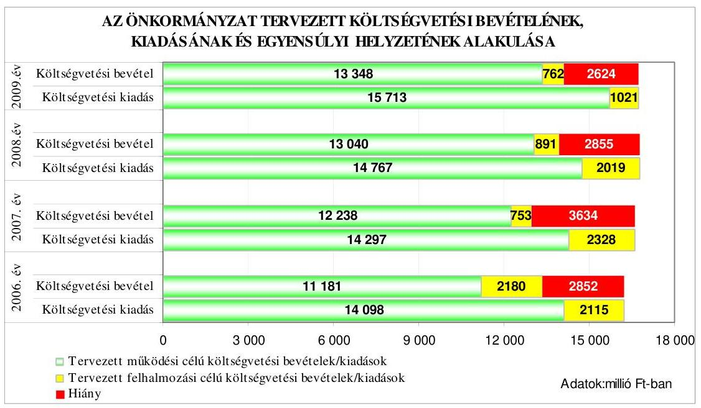

A költségvetési bevételek hiányát a 2006. évben a tervezett működési célú költségvetési bevételek hiánya, míg a 2007-2009. években a tervezett működési cé-

---

lú költségvetési bevételek hiánya és a felhalmozási célú költségvetési bevételeket meghaladó összegben tervezett felhalmozási célú kiadások együttesen okozták. A működési célú költségvetési kiadásoknál a hiányzó forrás a 2006. évi 2917 millió Ft-ról a 2008. évre folyamatosan 1727 millió Ft-ra csökkent, majd a 2009. évre 2365 millió Ft-ra emelkedett. A felhalmozási célú költségvetési kiadások - a 2007-2009. évek között - 1575 és 259 millió Ft közötti összeggel haladták meg a felhalmozási célú költségvetési bevételeket, folyamatos csökkenő tendenciát mutatva.

Az Önkormányzat a 2006-2008. évek költségvetési rendeleteiben a hiány finanszírozásához, illetve a költségvetési egyensúly biztosításához rövid lejáratú hitelek felvételét, valamint a 2006-2009. években bevételt növelő és kiadást csökkentő intézkedések megtételét tervezte:

- a 2006-2008. évek költségvetési rendeleteiben 2997-3779-3000 millió Ft rövid lejáratú múködési célú hitel felvételét tervezték. A 2006-2009. évi költségvetési rendeletekben előírták, hogy a többletbevételeket a költségvetési hiány csökkentésére kell fordítani, továbbá bevétel elmaradás esetén a kiadási előirányzatok nem teljesíthetőek. A Képviselő-testület felhatalmazta a polgármestert arra, hogy az átmenetileg szabad pénzeszközök betétként történő lekötéséről, illetve államilag garantált értékpapír vásárlásáról döntsön;
- a 2007-2008. években öt önállóan gazdálkodó költségvetési szerv részben önállóan gazdálkodó költségvetési szervvé történő átminősítéséről, hét részben önállóan gazdálkodó költségvetési szerv jogutódlással történő megszüntetéséről döntött a Képviselő-testület. A Polgármesteri hivatal esetében a 2009. évre vonatkozóan nyolc fős létszámcsökkentést irányoztak elő;
- az építményadó mértékének emeléséről döntöttek 2007., illetve 2008. január 1. napjával, mely emelkedés $75 \%$-os volt ${ }^{10}$ a 2006-2008. évek viszonylatában;

A Képviselő-testület a 103/2006. (II. 21.) számú határozatával a bevételek növelése és a követelések csökkentése érdekében előírta a Csevak Zrt-nek, hogy évente készítsen beszámolót a - bérleti és közüzemi díj - követelések behajtásáról. Nem írta elő azonban a jegyző számára, hogy számoljon be a Polgármesteri hivatal dolgozói, illetve a bírósági végrehajtó által végzett követelés behajtásról.

Az Önkormányzat éves költségvetési beszámolói szerint a követelésállomány a 2006-2008. évek végén 774 millió Ft, 650 millió Ft, valamint 907 millió Ft volt, melynek $81,9 \%$-át, $79,8 \%$-át, valamint $88,0 \%$-át az adósokkal szemben fennálló követelések tették ki, amelynek egy részére a Csevak Zrt-vel kötött megállapodás vonatkozott.

Az Önkormányzat a 2006-2009. évek költségvetési rendeleteiben kötvénykibocsátást nem tervezett, hitelviszonyt megtestesítő értékpapírral nem rendelkezett.

[^0]
[^0]:    ${ }^{10}$ Az építményadó mértéke 2001. és 2006. között $600 \mathrm{Ft} / \mathrm{m}^{2}$ volt, melyet a 2007. évre $900 \mathrm{Ft} / \mathrm{m}^{2}$-re, a 2008. évre $1050 \mathrm{Ft} / \mathrm{m}^{2}$-re emeltek.

---

A jegyző a költségvetés tervezése során a költségvetés végrehajtása érdekében a likviditás feltételeinek kialakításáról rövid lejáratú hitelfelvétel tervezésével, valamint a pénzállomány alakulásáról likviditási terv készítésével gondoskodott.

Az Önkormányzatnál a 2007-2009. évi költségvetési rendeletek normaszövegében a költségvetési bevételi főösszegeket helyesen állapították meg, míg a költségvetési kiadási főösszegek megállapításakor megsértették az Áht. 8/A. § (7) bekezdésében foglaltakat, mivel finanszírozási célú pénzügyi múveleteket (hosszú lejáratú hiteltörlesztéssel kapcsolatos kiadásokat) vettek figyelembe ${ }^{11}$ költségvetési hiányt módosító költségvetési kiadásként.

A költségvetés kiadási főösszegei az éves költségvetési rendeletek normaszövegében a 2007. és a 2008. évben is 145 millió Ft, a 2009. évben 212 millió Ft hosszú lejáratú hiteltörlesztést tartalmaztak. Az éves költségvetési rendeletek 2. számú mellékletében finanszírozási célú pénzügyi műveletek nélkül állapították meg a költségvetési kiadási főösszegeket.

# 1.2. A teljesített költségvetési bevételek és kiadások alapján a pénzügyi egyensúly alakulása, a pénzügyi hiány oka, finanszírozásának módja és hatása a pénzügyi helyzetre az eladósodás, valamint a fizetőképesség szempontjából 

A teljesített költségvetési bevételi és kiadási főösszegek a 2006. évről a 2007. évre csökkentek, majd a 2008. évre növekedtek.

A realizált költségvetési bevételek a 2006. évi 19993 millió Ft-ról a 2007. évben 17792 millió Ft-ra csökkentek, a 2008. évben 18079 millió Ft-ra emelkedtek, a teljesített költségvetési kiadások a 2006. évi 20715 millió Ft-ról a 2007. évben 16388 millió Ft-ra csökkentek, a 2008. évben 17299 millió Ft-ra növekedtek.

A pénzügyi egyensúly a 2006. évi teljesítés során nem állt fenn, mivel a teljesített költségvetési bevételek és kiadások egyenlege pénzügyi hiányt mutatott, melyet a múködési célú költségvetési bevételek hiánya okozott. Az Önkormányzatnál a 2007-2008. évi költségvetések végrehajtása során a realizált költségvetési bevételek fedezetet nyújtottak a megvalósított feladatok teljesített költségvetési kiadásaira. A 2008. évben a bevételi többlet ellenére a felhalmozási célú költségvetési kiadások meghaladták a felhalmozási célú költségvetési bevételeket.

[^0]
[^0]:    ${ }^{11}$ A közbenső egyeztetés során a polgármester által adott tájékoztatás szerint az Önkormányzat a 25/2009. (IX. 22.) számú rendeletével módosította a 2009. évi költségvetési rendeletét és abban a költségvetési kiadási főösszeget finanszírozási célú pénzügyi műveletek nélkül határozták meg.

---

A teljesített költségvetési bevételek és kiadások, valamint az egyensúlyi helyzet alakulását szemlélteti a következő ábra:
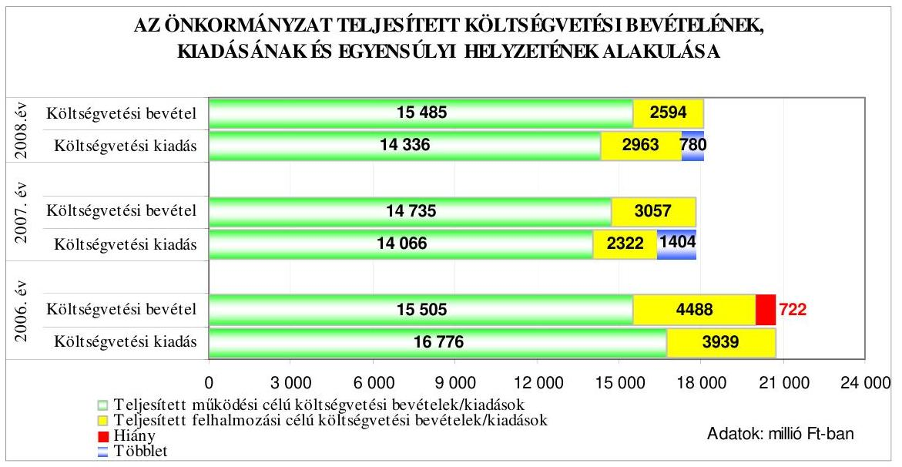

A tervezett költségvetési kiadások költségvetési bevételekkel való fedezettsége a 2006. évről a 2007. évre csökkent, majd a 2009. évig növekedett. Ezzel szemben a teljesítési adatok alapján a költségvetési kiadások költségvetési bevételekkel való fedezettsége a 2007. évre növekedést, majd a 2008. évre csökkenést mutatott.

A tervezett és teljesített költségvetési kiadások főösszegére vonatkozó fedezettségi mutató irányának és mértékének változásában a 2006. évben a múködési, míg a 2007. évben a felhalmozási célú költségvetési kiadások fedezettségi mutatójának változása volt a meghatározó.

A költségvetési kiadási főösszegre vonatkozó fedezettségi mutató tervezettől történő eltérését a múködési és a felhalmozási célú költségvetési kiadások fedezettségi mutatójának a tervezettől eltérő alakulása együttesen okozta.

A költségvetési kiadási főösszegre vonatkozó fedezettségi mutató tervezetthez viszonyított növekedésében a 2006. évben a múködési célú, a 2007-2008. években a felhalmozási célú költségvetési kiadások fedezettségének emelkedése volt a meghatározó.

---

Az Önkormányzatnál a 2006-2009. években tervezett és a 2006-2008. években teljesített múködési és felhalmozási célú költségvetési kiadásokra a következő arányban biztosítottak fedezetet a költségvetési bevételek:

Adatok: \%-ban

| Megnevezés | 2006.   év |  | 2007.   év |  | 2008.   év |  | 2009.   év |
| :--: | :--: | :--: | :--: | :--: | :--: | :--: | :--: |
|  | Terv | Tény | Terv | Tény | Terv | Tény | Terv |
| Múködési célú költségvetési kiadások fedezettsége múködési célú költségvetési bevételekből | 79,3 | 92,4 | 85,6 | 104,8 | 88,3 | 108,0 | 85,0 |
| Felhalmozási célú költségvetési kiadások fedezettsége felhalmozási célú költségvetési bevételekből | 103,1 | 113,9 | 32,3 | 131,7 | 44,1 | 87,5 | 74,6 |
| Költségvetési kiadások fedezettsége költségvetési bevételek-   ből | 82,4 | 96,5 | 78,1 | 108,6 | 83,0 | 104,5 | 84,3 |

A költségvetési hiány mérséklése, illetve megszüntetése érdekében a 2006-2008. években évközi többletbevételt fordítottak a költségvetési hiány csökkentésére, továbbá a tervezett bevételt növelő, valamint kiadást csökkentő intézkedéseket végrehajtották.

Az Önkormányzat a 2007., illetve a 2008. évre megemelte az építményadó mértékét, mely hozzájárult ahhoz, hogy a 2006. évről a 2008. évre közel kétszeresére (181,3\%-ra, 482,8 millió Ft-tal) emelkedett az építményadóból befolyt bevétel. A 2007. évben öt önállóan gazdálkodó költségvetési szervet (három általános iskolát és kettő múvelődési intézményt) az OSZI-hoz tartozó részben önállóan gazdálkodó költségvetési szervvé minősítettek, míg három részben önállóan gazdálkodó szociális intézményt, három óvodát, egy tagóvodát megszüntettek, és egy óvodát tagóvodává minősítettek, a 2008. évben egy általános iskolát megszüntettek. A megtett intézkedések hatására 2007. január 1-ről 2008. december 31-re a foglalkoztatottak létszáma 115 fővel csökkent.

A múködési célú költségvetési bevételek közül a helyi adóbevételek mindhárom évben - a jóváhagyott eredeti költségvetési előirányzathoz képest túlteljesültek ${ }^{12}$, ami egyrészt az iparűzési adó, másrészt az építményadó bevétel növekedéséből adódott. A túlteljesítés nem vezethető vissza tervezési hiányosságra, mivel nem volt előre látható:

[^0]
[^0]:    ${ }^{12}$ A helyi adók a 2006-2008. években - az évek sorrendjében - 106,3\%-ra, 110,4\%-ra, 104,4\%-ra teljesültek a tervezetthez képest, mely 281,5 millió Ft, 567,0 millió Ft, illetve 262,8 millió Ft bevételi többletet eredményezett.

---

- az iparűzési adó fővárosi forrásmegosztásából származó rész pontos összege, továbbá
- a 2007. évben egy felszámolás alatt lévő gazdasági társasággal szemben fennálló építményadó követelés értékesítése, a 2006. és a 2008. évben az év közbeni előírás alapján történő adóbefizetések.

A 2006. és a 2008-2009. években az éves költségvetések eredeti előirányzatainak kialakításánál - az előírás ellenére - nem tervezték az előző évi pénzmaradvány igénybevételét és a hozzá kapcsolódó, előző évről áthúzódó kötelezettségek előirányzatait ${ }^{13}$.

A felhalmozási célú költségvetési kiadásokon belül a beruházási kiadások a 2006-2008. években - az évek sorrendjében 242,2\%-kal, 379,7\%-kal, valamint 634,0\%-kal - túlteljesültek. A felújítási kiadások az eredeti előirányzathoz viszonyítva a 2006. évben 1456,9\%-ra, a 2007. évben 275,3\%-ra, míg a 2008. évben 808,5\%-ra teljesültek. A túlteljesítést tervezési hiányosság okozta, mivel sem az előző évi pénzmaradvány igénybevételéhez, sem az előző években képzett tartalékok maradványához ${ }^{14}$ kapcsolódó, előző évekről áthúzódó beruházási és felújítási kiadások előirányzatait nem tervezték meg eredeti előirányzatként.

Az előző évi pénzmaradvány, illetve az előző években képzett tartalékok maradványának részét képezte az „északi területek" értékesítéséből befolyt bevétel ${ }^{15}$, amely folyamatosan biztosította a beruházási és felújítási feladatok forrását:

- a 2005. évből képzett pénzmaradvány és tartalékok a 2006. évben az intézményi felújításoknak (tető, öltöző, tornaterem padozat, zeneterem, vizesblokk, lépcsőház), út-, járdafelújításnak, közmű beruházásnak, szabályozási terveknek, illetve zöldfelület és játszótér felújításnak;
- a 2006. évről áthúzódó pénzmaradvány és tartalékok a 2007. évben az intézményi felújításoknak (nyílászárók, üvegfalak, háziorvosi rendelők), kerületi beruházásoknak (szabályozási terv, szennyvízcsatorna), útfelújításoknak, és céltartalék képzésnek;
- a 2007. évből képzett pénzmaradvány és tartalékok a 2008. évben kerületi felújításnak (öbölrendezés, parkolók), intézményi beruházásnak (tervkészítés, gép, berendezés, felszerelés beszerzés), kerületi beruházásnak (zöldterület környezetrendezés, szabályozási tervkészítés, szennyvízcsatorna építés) és céltartalék képzésnek.

[^0]
[^0]:    ${ }^{13}$ A módosított pénzmaradvány összege a tárgyévet megelőző év költségvetési beszámoló 29. űrlap adata szerint, az évek sorrendjében: 11 887,7 millió Ft, -340,8 millió Ft, 127,7 millió Ft, valamint 854,1 millió Ft volt, míg a kötelezettséggel terhelt pénzmaradvány: 11708,3 millió Ft, 474,0 millió Ft, 384,1 millió Ft, valamint 608,0 millió Ft volt.
    ${ }^{14}$ Az előző években képzett tartalékok maradványa az éves költségvetési beszámoló 29. űrlap adata szerint, az évek sorrendjében: 7604,3 millió Ft, 6797,1 millió Ft, valamint 5278,1 millió Ft volt.
    ${ }^{15}$ Az „északi területek" Csepel-sziget északi részén, a 209990/2, 209988, 209978 és a 209975 helyrajzi számú földterületeken találhatók, melyeket a 2005. évben nettó 9096,1 millió Ft-ért értékesített az Önkormányzat.

---

A jegyző a 8/2009. (VII. 20.) számú utasításban elrendelte, hogy az éves költségvetés tervezésekor az előző évi pénzmaradvány igénybevételét, az előző években képzett tartalékok maradványát és a hozzájuk kapcsolódó, előző évekről áthúzódó kötelezettségvállalásokat is figyelembe kell venni eredeti előirányzatként.

A költségvetés végrehajtása során a pénzügyi fedezet biztosításához, a fizetőképesség fenntartásához az Önkormányzat a 2006-2008. évek között egy hoszszú lejáratú hitelszerződést kötött, a Sikeres Magyarországért Önkormányzati Fejlesztési Hitelprogram keretében 2006. augusztus 23-án 600 millió Ft öszszegben, változó kamatozással.

A szerződés szerint 345 millió Ft környezetvédelemhez kapcsolódó beruházási célok, 255 millió Ft útépítési, közvilágítás korszerűsítési, létesítmény felújítási feladatok fedezetét biztosította. A tőketörlesztési kötelezettség a türelmi idő lejáratát követően, 2009. június 5-én kezdődött és 2021. június 5-ig tart, a tőkét egyenlő részletekben kell visszafizetni, míg a kamatfizetési kötelezettség a hitelfolyósítás napjától állt fenn.

A 2006. évben 456,3 millió Ft-ot, a 2007. évben 143,0 millió Ft-ot, míg a 2008. évben 0,7 millió Ft-ot vettek igénybe a szerződés alapján. A hiteleket - a környezetvédelmi célokhoz kapcsolódóan - ivóvízminőség javítását, csapadékvíz elvezetését szolgáló, valamint szennyvízelvezetési és tisztítási beruházásokra fordították, illetve utakat építettek, közvilágítást korszerűsítettek, továbbá önkormányzati tulajdonú létesítményeket újítottak fel.

Az Önkormányzat hosszú lejáratú kötelezettségének állományi értéke a 20062008. években 1560-1559-1450 millió Ft volt, mely a 600 millió Ft-os hitel öszszegén kívül tartalmazta a 2002-2004. években megkötött hitelszerződések alapján a 2002-2008. években igénybe vett összegeket is.

Az Önkormányzat bérlakás építésére, szennyvízcsatorna beruházásra, út- és közmúhálózat építésére, intézmény rekonstrukcióra, játszó-pihenő park létesítésére a 2002-2004. években - 10-15 év közötti futamidővel - forint alapú szerződéseket kötött, mely alapján a 2006. évben 2,8 millió Ft-ot, a 2007. évben 1,3 millió Ft-ot, a 2008. évben 1,0 millió Ft-ot út- és közmúhálózat építésére vett igénybe.

Az Önkormányzat a fejlesztési célú forint alapú hiteleit (692,6 millió Ft-ot) a 2008. június 23-i szerződés szerint átváltotta svájci frank alapú hitelre a kedvezőbb kamatozás miatt, azonban nem mérlegelte a forint svájci frankhoz viszonyított árfolyamváltozásának kockázatát.

---

A 2006-2009. években a folyószámlahitellel kapcsolatos jellemzőket mutatja be a következő táblázat:

| Megnevezés | $\mathbf{2 0 0 6 .}$   év | $\mathbf{2 0 0 7 .}$   év | $\mathbf{2 0 0 8 .}$   év | $\mathbf{2 0 0 9 .}$   I.   negyedév |
| :-- | :--: | :--: | :--: | :--: |
| A folyószámlahitel keretösszege (mil-   lió Ft-ban) | 1500 | 2000 | 2000 | 2000 |
| Év végén fennálló folyószámlahitel   (millió Ft-ban) | 765 | 481 | 1123 | - |
| Folyószámlahitellel zárt napok száma | 346 | 360 | 340 | 84 |
| A ténylegesen felvett folyószámlahitel   átlagos állománya (millió Ft-ban) | 796 | 1198 | 1099 | 1305 |
| A felvett folyószámlahitel minimum   összege (millió Ft-ban) | 16 | 30 | 167 | 868 |
| A felvett folyószámlahitel maximum   összege (millió Ft-ban) | 1148 | 1969 | 1973 | 1910 |

A folyószámla hitelkeret összege 2006. április 3-tól 2007. április 3-ig 1500 millió Ft volt, ezt követően 2000 millió Ft-ra emelkedett. A 2006. évről a 2008. évre az év végén fennálló folyószámlahitel összege közel egyharmadával növekedett, míg a ténylegesen felvett hitel minimum összege megtizszereződött. Az Önkormányzatnál mindhárom évben, év végén folyószámlahitellel zártak annak ellenére, hogy lekötött betétként - az évek sorrendjében - 6750 millió Ft, 6200 millió Ft, illetve 5200 millió Ft állt rendelkezésre. A folyószámlahitelen túlmenően munkabérhitelt is igénybe vettek a folyamatos múködés érdekében a 2006. évben kilenc alkalommal, a 2007-2008. években minden hónapban éltek ezzel a lehetőséggel. A felvett munkabérhitel éves halmozott összege - az évek sorrendjében - 2150,9 millió Ft, 2744,9 millió Ft, 2972,9 millió Ft volt. A 2009. év I. negyedévében kettő alkalommal, 431,7 millió Ft összegben vettek igénybe munkabérhitelt.

Az Önkormányzat a 2006-2008. években a költségvetési rendeletekben tervezett rövid lejáratú múködési célú hiteleket nem vette fel, a szükséges fedezetet folyó-számla-, illetve munkabérhitel igénybevételével biztosította. Az igénybe vett hitelek - a bevételek és kiadások eltérő időpontban történő teljesítése miatt jelentkező - eseti, éven belüli likviditási problémák megoldását szolgálta, míg a 2006. évben ezen túl a realizált költségvetési bevételekből nem finanszírozott költségvetési kiadások teljesítésére, illetve a korábban felvett hitelek visszafizetésére is fordították.

Az Önkormányzat adósságszolgálata a rövid és hosszú lejáratú hiteltörlesztés után a 2006-2008. években 306,5 millió Ft, 654,8 millió Ft, 1053,3 millió Ft volt, melyből a kamattörlesztés az évek sorrendjében 161,4 millió Ft-ot, 226,0 millió Ft-ot, illetve 213,2 millió Ft-ot tett ki.

---

Az Önkormányzat eladósodásának arányát mutatja az eladósodási mutató ${ }^{16}$ és az esedékességi aránymutató ${ }^{17}$ :

- az eladósodási mutató a 2006. évi 5,6\%-ról a 2007. évre 0,3\%-kal csökkent, majd a 2008. évre 0,4\%-kal, 5,7\%-ra emelkedett, mely tendenciák a rövid lejáratú kötelezettségek állományváltozásának eredményei voltak, amit az év végén fennálló folyószámlahitel-tartozás okozott;
- az esedékességi aránymutató 2006. évi 66,5\%-ról a 2007. évre 63,9\%-ra csökkent, mely azt mutatja, hogy a rövid távon teljesítendő kötelezettségek fizetőképességre gyakorolt hatása mérséklődött. A 2008. évre - az előző évhez képest - 69,0\%-ra növekedett az esedékességi aránymutató, mivel a rövid lejáratú fizetési kötelezettségek állományának növekedése meghaladta az összes fizetési kötelezettség növekedését.

Az Önkormányzat pénzügyi helyzete - a 2006. évről a 2008. évre - eladósodási szempontból összességében közel azonos szinten alakult, mivel mind az eladósodási mutató, mind az esedékességi aránymutató minimálisan emelkedett.

Az Önkormányzatnál a pénzeszközök év végi állománya a 2006-2008. években fedezetet biztosított a rövid lejáratú kötelezettségek pénzügyi rendezésére, melyben meghatározó szerepe volt az „északi területek" értékesítéséből befolyt bevétel betétként történő lekötésének. A lekötött betét állományi értéke azonban a 2006. évi 6750 millió Ft-ról a 2008. évre 5200 millió Ft-ra csökkent. A készpénz likviditási mutató ${ }^{18}$ az előző évhez képest a 2007. évre egy tizedet növekedett, majd - a rövid lejáratú kötelezettségek növekedésének hatására - a 2008. évre hat tizedet csökkent. A likviditási gyorsráta ${ }^{19}$ 2007. évi növekedésének oka, hogy a követelések és a pénzeszközök kisebb mértékben csökkentek, mint a rövid lejáratú kötelezettségek. A likviditási gyorsráta 2008. évi csökkenését a rövid lejáratú kötelezettségek állományának - a pénzeszközök állományának csökkenése mellett bekövetkező - emelkedése okozta.

[^0]
[^0]:    ${ }^{16}$ Az eladósodási mutató a hosszú és rövid lejáratú fizetési kötelezettségek önkormányzati összes forráson belüli arányát mutatja.
    ${ }^{17}$ Az esedékességi aránymutató a rövid lejáratú fizetési kötelezettségek arányát fejezi ki az összes - rövid és hosszú lejáratú - fizetési kötelezettségen belül.
    ${ }^{18}$ A készpénz likviditási mutató kifejezi, hogy a pénzeszközök év végi állománya milyen arányban nyújt fedezetet a rövid lejáratú fizetési kötelezettségekre.
    ${ }^{19}$ A likviditási gyorsráta mutatja, hogy a rövid lejáratú fizetési kötelezettségek kiegyenlítéséhez a pénzeszközökön túl bevonható követelések, forgatási célú értékpapírok milyen arányban nyújtanak fedezetet.

---

Az Önkormányzat fizetőképességének alakulását a következő ábra szemlélteti:
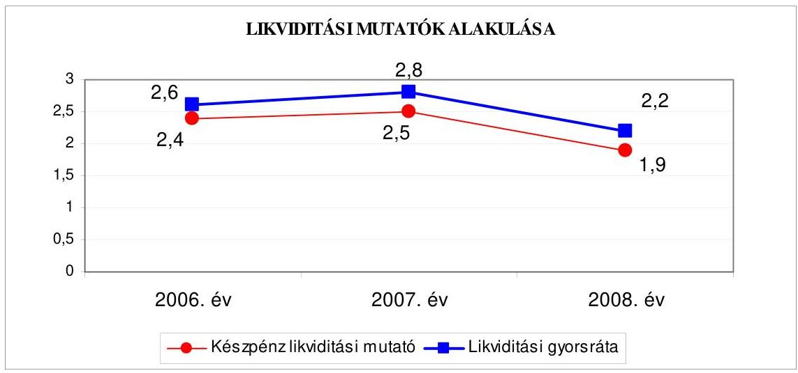

Az Önkormányzat pénzügyi helyzete - a 2006. évről a 2008. évre - öszszességében nem változott, mivel eladósodási mutatói közel azonos szinten alakultak, továbbá a pénzeszközök és a követelések fedezetet biztosítottak a rövid lejáratú kötelezettségek kiegyenlítésére.

# 2. Az ÖNKORMÁNYZAT FELKÉSZÜLTSÉGE AZ EURÓPAI UNIÓs FORRÁSOK IGÉNYLÉSÉRE ÉS FELHASZNÁLÁSÁRA, VALAMINT AZ ELEKTRONIKUS KÖZSZOLGÁLTATÁSI FELADATOK ELLÁTÁSÁRA 

2.1. Az európai uniós források igénybevételére és a várható támogatás felhasználására történt felkészülés szabályozottságának, szervezettségének eredményessége

### 2.1.1. Az európai uniós forrásokra történő pályázatok benyújtására vonatkozó döntések összhangja a fejlesztési célkitűzésekkel

Az Önkormányzat fejlesztési célkitűzéseit a Képviselő-testület hosszú távú ágazati koncepciókban ${ }^{20}$ és a gazdasági programban, valamint az Integrált Városfejlesztési Stratégiában határozta meg, figyelembe véve a megvalósítás lehetséges pénzügyi forrásait.

A gazdasági program tartalmazta a Szabad-kikötő bővülő területéhez csatlakozó útkapacitások fejlesztését, Csepel teljes körű csatornázottságának megvalósítását, a Corvin csomópontban kétszintű kereszteződés megépítését. Az Önkormányzat szerepeltette programjában a Dél-pesti régió foglalkoztatási szintjének javítását négy dél-pesti kerülettel közösen. A prioritások között szerepelt a tudás alapú tár-

[^0]
[^0]:    ${ }^{20}$ A 2006-2010. évekre vonatkozó közoktatási fejlesztési terv, illetve a szolgáltatástervezési koncepció.

---

sadalom megteremtése, az elektronikus ügyintézés feltételeinek biztosítása a lehetséges európai uniós források bevonásával.

A közoktatási fejlesztési tervben meghatározott közös célokhoz kapcsolódóan (óvoda, alsó- és felsőoktatás területén) a differenciált készségfejlesztés, a nyelvi képzés, a nyelvi könyvtár fejlesztés lehetséges forrásaként rögzítették a Dunaprojektbe való bekapcsolódást, továbbá szerepelt a HEFOP 2.1.2. projekt a „Nyitott ajtók Integrációs modellek Csepelen" megvalósítása. A szolgáltatástervezési koncepció európai uniós források bevonásával a 2006. évben és a 2008-2010. években a civil szervezetek pályázata esetében számolt, valamint önkormányzati támogatás biztosításával ösztönözte az életviteli segítségnyújtás, illetve gerontológiai szolgáltatás megindításának fejlesztését.

A fejlesztési célkitűzések az NFT és az ÚMFT keretében megjelenő pályázati lehetőségekkel összhangban voltak, ezáltal azokat módosítani nem kellett.

Az Önkormányzat - a 2006-2009. I. negyedév vonatkozásában - 20 európai uniós pályázatról döntött, amelyből 17 pályázat sikeres volt, kettő pályázattól a szerződéskötés előtt visszaléptek a tulajdonosi hozzájárulás, valamint a jogerős építési engedély hiánya miatt, három pályázatot formai, illetve forráshiány miatt elutasítottak. A benyújtott pályázatok a következők voltak:

- a Szociális szolgálat konzorciumi tagként pályázott 2004. május 4-én a HEFOP 2.2.1. számú program „Hátrányos helyzetü fiatalokkal foglalkozó szakemberek humánerőforrás fejlesztése" projektre. A pályázat teljes kiadásának összege 24,4 millió Ft, ebből az Önkormányzat 6,1 millió Ft-tal részesedett, amely támogatásból európai uniós forrás 4,6 millió Ft, hazai forrás 1,5 millió Ft volt. A fejlesztés kezdési és befejezési időpontja 2006. január 1. - 2007. december 31. volt;
- a Szociális szolgálat konzorciumi tagként pályázott 2004. július 2-án a HEFOP 2.2.1. jelű „Mégis kinek az érdeke? Családtámogató szolgálat a fogyatékos embert nevelő családok munkaerőpiacra kerülése és bennmaradása érdekében" projektre. A pályázat teljes kiadásának összege 24,5 millió Ft, ebből az Önkormányzat 1,7 millió Ft-tal részesült, a projekt megvalósítás tervezett kezdési és befejezési időpontja 2005. március 1. - 2007. február 15. volt;
- a Képviselő-testület 481/2004. (IX. 21.) számú határozata alapján az Önkormányzat részt vett a GVOP-2004-4.3.2. intézkedés keretében az „Önkormányzat adatvagyonának másodlagos hasznosítása" projekt megvalósításában. A fejlesztési cél tervezett összes kiadása 150,0 millió Ft volt, a vissza nem térítendő támogatás 131,2 millió Ft-ot képviselt, ebből 98,4 millió Ft európai uniós, illetve 32,8 millió Ft hazai forrás volt. A 18,8 millió Ft saját forrásból 11,3 millió Ft-ot EU Önerő Alap támogatásból és 7,5 millió Ft-ot saját forrásból biztosította az Önkormányzat. A projekt befejezésének tervezett időpontja 2006. április 28. volt, a tényleges befejezés 2006. október 30-án teljesült;

---

- a Pedagógiai Szakmai Szolgáltató Intézménye 2005. augusztus 18-án a HEFOP 2.1.6. jelű projektre „Nyitott ajtók - Együttnevelési modellek Csepelen" pályázatot nyújtott be 33,4 millió Ft támogatási összegre, saját forrást nem igényelt. A projekt kezdési és befejezési időpontja 2006. május 1. 2007. december 31. volt;
- a Szociális szolgálat konzorciumi tagként pályázott (a dokumentum nem áll rendelkezésre ${ }^{21}$ ) a HEFOP 2.2.1. jelű „Migránsok munka-erőpiaci integrációjának elősegitése a szociális területen dolgozó munkatársak képzésével" projektre. A pályázat teljes kiadásának összege 16,3 millió Ft, ebből az Önkormányzat 0,6 millió Ft-tal részesedett, a képzés kezdési és befejezési időpontja 2006. február 1. - 2007. január 31. volt;
- az Önkormányzat a 2006. évi költségvetési rendelet módosításáról szóló 11/2006. (VI. 13.) számú rendeletben döntött arról, hogy öt kerületi önkormányzattal ${ }^{22}$ közösen (Budapest Főváros XVIII. kerület PestszentlőrincPestszentimre főkedvezményezett) a Strukturális Alapokból a Közösségi Támogatási Keret igénybevételére „Az öt muskétás - Egy mindenkiért, mindenki egyért!" című ROP 3.2.1. a foglalkoztatást elősegítő tevékenységek helyi koordinációjának elősegítése fejlesztési célú pályázaton társpályázóként részt vett. A projekt támogatási összege 49,0 millió Ft, melyből európai uniós támogatás 39,0 millió Ft, hazai forrás 10,0 millió Ft volt. A főkedvezményezett a támogatás összegéből 36,0 millió Ft-tal, a partnerek összesen 13,0 millió Ft-tal részesedtek. Az Önkormányzatot összesen 3,3 millió Ft illette meg, melyből európai uniós forrás 2,7 millió Ft, hazai forrás 0,6 millió Ft volt. A fejlesztés megvalósításának kezdő napja 2006. február 7., befejezésének tervezett időpontja 2008. január 30., a projekt zárójelentés elfogadása szeptember 17-e volt;
- a Képviselő-testület 582/2007. (IX. 25.) számú határozata alapján pályázatot nyújtottak be a KMOP-2007-4.6.1. számú projektre „a jövő iskolája az iskola jövője a Mátyás Király Általános Iskola felújítása" programjával. A projekt teljes kiadása 250,0 millió Ft, az európai uniós támogatás 225,0 millió Ft volt. A pályázat a szakmai minimum pontszámot elérte, de forráshiány miatt nem részesült támogatásban;
- a Képviselő-testület 583/2007. (IX. 25.) számú határozata alapján pályázatot nyújtottak be a KMOP-2007. 4.6.1. keretében „a Nagy Imre Általános Müvelődési Központ fejlesztésének" finanszírozására. A projekt összköltsége 249,2 millió Ft, a támogatás mértéke $90 \%$, de legfeljebb 224,3 millió Ft, a (10\%) 24,9 millió Ft saját forrást az Önkormányzat költségvetési előirányzatából biztosította. A fejlesztés megvalósítási kezdő időpontja 2008. november 3-a, a projekt befejezés tervezett napja 2009. december 15-e;

[^0]
[^0]:    ${ }^{21}$ A Szociális szolgálat átszervezése során a dokumentum nem került átadásra.
    ${ }^{22}$ Budapest Főváros XVIII. kerület Pestszentlőrinc-Pestszentimre, XIX. kerület Kispest, XX. kerület Pesterzsébet, XXI. kerület Csepel, XXIII. kerület Soroksár Önkormányzat.

---

- a Képviselő-testület 631/2007. (X. 24.) számú határozata alapján az Önkormányzat részt vett a KMOP-2007. 4.5.3. pályázaton „az Önkormányzat fenntartásában müködő Hétszínvirág Óvoda komplex akadálymentesitése" projekt megvalósításában. A fejlesztés tervezett kiadása 41,7 millió Ft volt, az elszámolható támogatás mértéke 59\%, de összege legfeljebb 24,6 millió Ft-ot érhetett el, a 17,1 millió Ft saját forrást az Önkormányzat költségvetési előirányzatából biztosította. A projekt megvalósításának határideje 2009. szeptember 8-a;
- a Képviselő-testület a 633/2007. (X. 24.) számú határozatában döntött arról, hogy az Önkormányzat pályázatot nyújt be a KMOP 2007. 4.5.3. keretében „Az Önkormányzat fenntartásában múködő Budapest XXI. kerület Vénusz u. 2. szám alatti orvosi rendelő komplex akadálymentesitésre". A projekt tervezett összköltsége 29,3 millió Ft volt, a vissza nem térítendő támogatás mértéke 24,9 millió Ft összeget érhetett el európai uniós finanszírozásban, a 4,4 millió Ft saját forrást az Önkormányzat költségvetési előirányzatából biztosította. A fejlesztés megvalósításának határideje 2009. szeptember 8-a;
- a Képviselő-testület a 634/2007. (X. 24.) számú határozatában úgy döntött, hogy a KMOP-2007-2.1.1. jelű pályázaton részt vesz „a Csepel területén a belterületi utak fejlesztésével". A projekt teljes kiadása 393,0 millió Ft, a támogatás összege 275,0 millió Ft volt, a pályázatot formai okok miatt elutasították, mivel a pályázati útmutatóban meghatározott kritériumoknak nem felelt meg;
- a Képviselő-testület a 683/2007. (XI. 27.) számú határozatában döntött arról, hogy a KMOP-2007-2.1.2. pályázaton „a Ráckevei-(Soroksár) Duna-ág Cse-pel-sziget partszakaszán" kerékpárút fejlesztésével részt vesz. A projekt teljes kiadása 359,7 millió Ft, a támogatási összeg 287,7 millió Ft volt. A pályázatot elnyerték, azonban a támogatásról lemondtak, mivel a vagyonkezelői hozzájárulást egy ingatlan esetében az illetékes minisztériumtól nem tudták beszerezni;
- a Képviselő-testület 686/2007. (XI. 27.) számú határozata alapján az Önkormányzat pályázott a KMOP-2007-2.1.2. projektre „a Gubacsi-híd Ady Endre úti kerékpárút kiépítésére Csepel és Pesterzsébet Városközpont közötti fejlesztésére". A projekt összköltsége 97,8 millió Ft, a támogatás összege 78,3 millió Ft volt. A pályázat eredményes volt, a támogatási szerződés megkötésére azonban nem került sor, mivel a szükséges jogerős építési engedélyt nem tudták beszerezni a támogató által meghatározott határidőre;
- a Képviselő-testület 39/2008. (I. 24.) számú határozata alapján az Önkormányzat a KMOP-2007-5.2.2. számú projektre „Budapest XXI. kerületi központ fejlesztésére" pályázatot nyújtott be. A projekt teljes kiadásának öszszege 784,3 millió Ft, az európai uniós támogatás 648,1 millió Ft volt. A pályázatot forráshiány miatt elutasították;

---

- a Képviselő-testület a 39/2008. (I. 24.) számú határozatában úgy döntött, hogy a KMOP-2007-5.1.1. jelű pályázaton részt vesz „a Csepel Ady lakótelep integrált szociális rehabilitációja fejlesztés" programjával. A projekt teljes kiadása 1320,2 millió Ft, az európai uniós támogatás 974,3 millió Ft, az önkormányzati saját forrás 231,6 millió Ft, egyéb (lakóközösség forrása) 114,3 millió Ft volt. A fejlesztés megvalósításának tervezett időpontja 2011. március 31., a támogatási szerződést 2009. augusztus 6-ig nem kötötték meg;
- a Képviselő-testület a 253/2008. (IV. 17.) számú határozatában döntött arról, hogy az Önkormányzat pályázatot nyújt be a KMOP 2.3.1. keretében „Csepel II. Rákóczi Ferenc u. 94-104. előtti (hrsz 208633/1) felszíni murvás parkoló helyén kétszintes parkoló kialakítására" fejlesztés vissza nem térítendő támogatás formájában történő finanszírozásra. A projekt tervezett költsége 190,1 millió Ft, amelyből a támogatás mértéke $90 \%$, de legfeljebb 171,1 millió Ft, a saját forrás 19,0 millió Ft volt. A fejlesztés megvalósításának határideje 2010. március 31.;
- a Képviselő-testület a 254/2008. (IV. 17.) számú határozatában döntött arról, hogy részt vesz a KMOP-2007. 3.3.1. jelű „Csepel belterületi csapadékvízelvezető rendszerének fejlesztése" projekt pályázatán, melynek tervezett kiadása 158,0 millió Ft, a kezdési időpontja 2009. június 15., a támogatás mértéke 142,2 millió Ft, a 15,8 millió Ft saját forrást az Önkormányzat költségvetési előirányzatból biztosította. A fejlesztés megvalósulásának tervezett napja 2010. július 30.;
- a Képviselő-testület 477/2008. (VI. 12.) számú határozata alapján az Önkormányzat részt vett az INTERREG IVB programjában, „a Csepel Müvek területfejlesztés (rehabilitációja) megvalósítás támogatás" igénylésében. A teljes kiadás 211,5 millió Ft, az európai uniós támogatás 179,8 millió Ft, hazai forrás 21,1 millió Ft, a saját forrás 10,6 millió Ft összeg volt. A program finanszírozásának jóváhagyása 2009. március 11-én megtörtént, a támogatási szerződés megkötésére 2009. augusztus 6-ig nem került sor;
- a Képviselő-testület 505/2008. (IX. 4.) számú határozata alapján az Önkormányzat részt vett a KMOP-2008. 2.1.1. pályázaton „az Önkormányzat müködtetésében lévő utak" fejlesztése projekt megvalósításában. A fejlesztés tervezett összes kiadása 221,5 millió Ft, a támogatási összeg 144,0 millió Ft volt, a 77,5 millió Ft saját forrást költségvetési előirányzatként biztosították. A projekt kezdési időpontja 2009. július 30., a megvalósítást 2010. július 30-ára tervezték, a támogatási szerződés megkötésére augusztus 6-ig nem került sor;
- az Önkormányzat egyszeri, vissza nem térítendő TÁMOP-3.1.4. jelű támogatásra 2008. december 22-én pályázatot nyújtott be, „a versenyképes tudásért Csepelen" című fejlesztésre. Az Oktatási és Kulturális Minisztérium Támogatáskezelő Igazgatósága, mint közreműködő szervezet 2009. május 25én értesítette az Önkormányzatot a támogatási szerződés megkötésének feltételéről és 82,4 millió Ft támogatás összegéről. A projekt megvalósításának tervezett időpontja 2010. augusztus 31.

---

Az Önkormányzat által benyújtott pályázatok a gazdasági programban és az ágazati koncepciókban foglalt célkitúzésekkel összhangban voltak.

A benyújtott európai uniós pályázatok önrészének fedezetére az Önkormányzat a 2006-2009. évi költségvetési rendeletében (tartalékként: pályázati önrész) évente 50-50 millió Ft elöirányzatot határozott meg. A 2006. évi költségvetési rendelet nem tartalmazta eredeti előirányzatként a támogatási szerződésben szereplő ütemezésben elkülönítetten - az Ámr. 29. § (1) bekezdés k) pontjában előírtak ellenére - az európai uniós forrással megvalósuló fejlesztési feladatok költségvetési bevételi és kiadási előirányzatait - az Ámr. 29. § (1) bekezdés d) és g) pontjában foglaltak ellenére - a felhalmozási kiadásokat feladatonként, illetve a többéves kihatással járó feladatok előirányzatait éves bontásban. A 2007-2009. évi költségvetési rendeletekben az Ámr. előírásainak megfelelően tervezték az európai uniós támogatással megvalósított fejlesztések előirányzatait.

Az Önkormányzat 2006. évi költségvetési rendelete nem tartalmazta a GVOP-2004-4.3.2. és a ROP-2004.-3.2.1. jelű projekt összes bevételi és kiadási előirányzatát, továbbá azt nem fejlesztésenként elkülönítetten és nem a támogatási szerződés szerinti éves ütemezésben mutatta be.

A 2006-2009. I. negyedév közötti európai uniós forrással támogatott befejezett projektek finanszírozási forrásainak tervezett és tényleges megoszlását a következő ábrák mutatják:
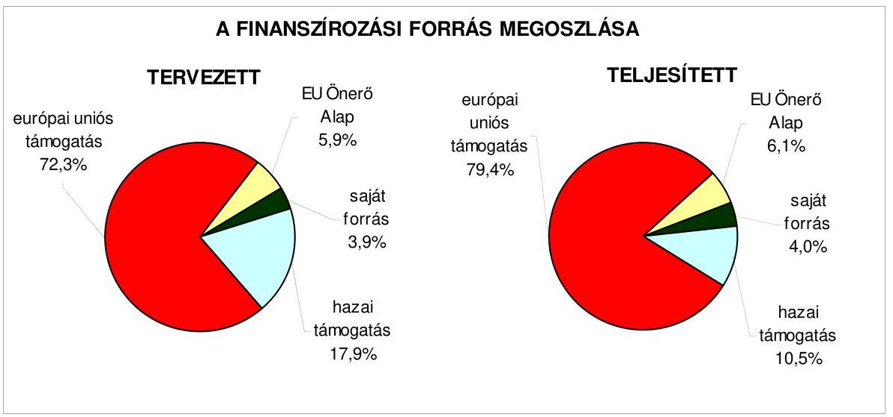

A projektekre elszámolt tényleges kiadások a tervezett kiadásoknál 4,8 millió Ft-tal kisebb összegűek voltak a „Nyitott ajtók-együttnevelési modellek Csepelen", a „Mégis kinek az érdeke?", a „Hátrányos helyzetü fiatalokkal foglalkozó szakemberek..." projektek esetében, mivel a konzorciumi tagok közötti részesedési arány változott, a kiadásokat teljes egészében a támogatások fedezték, saját forrás nem volt.

---

# 2.1.2. Az európai uniós forrásokhoz kapcsolódóan a pályázatfigyelés, a pályázatkészítés, valamint az európai uniós támogatással megvalósuló fejlesztés lebonyolítása belső rendjének szabályozottsága, a végrehajtás személyi, szervezeti feltételei, az ellenőrzési feladatok meghatározása 

Az Önkormányzatnál a pályázati források igénybevételének és felhasználásának belső rendjét a 2006-2009. I. negyedév között az SzMSZ ${ }_{1,2}$-ben ${ }^{23}$ és a pályázati szabályzatban szabályozták. Az önkormányzati szintű pályázatkoordinálás feladataira, valamint az önkormányzati szintű pályázat nyilvántartás vezetésére az európai uniós koordinátort, illetve a projektgazdát kijelölték, rögzítették a pályázatfigyelést végzők és a döntési, illetve a döntéselőterjesztési jogkörrel rendelkezők közötti információszolgáltatási kötelezettséget. A szabályozás magába foglalta az európai uniós forrásokra irányuló pályázatfigyelés, pályázatkészítés, valamint az európai uniós forrással támogatott fejlesztés lebonyolításának eljárási rendjét. A FEUVE feladatokat a gazdálkodási jogkörök szabályzatában meghatározták, mely vonatkozott az európai uniós forrásokkal támogatott fejlesztési feladatok lebonyolítására. A belső ellenőrzési stratégiát nem támasztotta alá kockázatelemzés, az éves ellenőrzési terveket alátámasztó kockázatelemzést nem terjesztették ki az európai uniós forrásból megvalósított feladatok végrehajtására.

Az európai uniós források pályázatfigyelésének személyi, szervezeti feltételeit a 2006-2009. I. negyedév között a Polgármesteri hivatalon belül alakították ki, a pályázatfigyelési feladatok ellátásával külső személyt, szervezetet nem bíztak meg.

Az Önkormányzat feladataihoz kapcsolódó pályázatok folyamatos figyelése a 2006. évben az európai uniós koordinátor, majd 2007. január 1-jétől a projektgazda feladata volt.

Az Önkormányzat a pályázatkészítés személyi, szervezeti feltételeit a Polgármesteri hivatalon belül, illetve külső személy, szervezet megbízásával biztosította. Az európai uniós koordinátor, illetve projektgazda felelt a pályázat határidőben, benyújtásra alkalmas formában és tartalommal történő elkészítéséért. A 2008. évben pályázatkészítésre kötött szerződésekben a feladatellátás kötelezettségeit, a felelősség szabályait, a megbízott és a Polgármesteri hivatal képviselője közötti kapcsolattartást, az átadásra kerülő információk tartalmát, formáját és módját előírták.

Az európai uniós támogatással megvalósításra kerülő fejlesztések lebonyolítási feladatainak szervezeti, személyi feltételeit a Polgármesteri hivatalon belül biztosították, a lebonyolítás az európai uniós koordinátor, illetve a projektgazda feladata volt, külső személyt, szervezetet nem bíztak meg a projektmenedzseri feladatokkal.

[^0]
[^0]:    ${ }^{23} \mathrm{Az} \mathrm{SzMSz}_{1,2} 4$. számú függelékében európai uniós koordinátor az 5. számú függelék 9.1. pontjában az alpolgármester pályázatokhoz kapcsolódó feladatait határozták meg.

---

# 2.1.3. A fejlesztési feladat lebonyolításánál a feladatellátás rendjére, az ellenőrzési feladatok teljesítésére, valamint a felelősségi szabályokra vonatkozó előírások betartása 

Az Önkormányzat 150 millió Ft kiadással tervezett, az adatvagyon hasznosítása projekt keretében 131,2 millió Ft támogatást nyert. A támogatási szerződést 2005. június 23 -án kötötte meg a közremúködő szervezet az Önkormányzattal. A támogatási szerződést kettő alkalommal módosították az előleg felvételi lehetőség mértékének változása, valamint a befejezés tervezett napja, illetve az európai uniós forrás és a hazai finanszírozás részarány változtatás miatt.

Az Önkormányzat gondoskodott a hatályos támogatási szerződésben rögzített időbeli megvalósulásról. A kezdési és befejezési határidőket a támogatási szerződés módosításaiban rögzítetteknek megfelelően betartották. Az adatvagyon hasznosítása projekt - a pénzügyi beszámolóban rögzítettek szerint 2006. szeptember 15-én befejeződött, az utolsó kifizetés igénylésére 2006. október 30 -án került sor, amely a támogatási szerződésmódosításban rögzített kifizetési kérelem benyújtásának határidején (2006. december 15.) belül volt. Az Önkormányzat a saját forrás finanszírozása céljából 2005. október 28 -án támogatási szerződést kötött a Belügyminisztériummal az EU Önerő Alapból történő támogatásra. Az elnyert összeg (11,3 millió Ft) az önkormányzati forrás $60 \%$-a volt, a támogatás ütemezése azonos időpontokra vonatkozott, mint az európai uniós támogatások.

A közremúködő szervezet a támogatás kifizetés igénylésénél a támogatás igénylését alátámasztó bizonylatok ellenőrzése során a kifizetést akadályozó hiányosságot nem tárt fel, a kérelmek befogadását ${ }^{24}$ visszaigazolta.

A támogatás igénybevétel tervezett ütemezésének tartását nem hátráltatta a projekt előrehaladási jelentés felülvizsgálata, valamint a támogatás kifizetésének igénylését alátámasztó számlák ellenőrzése. A projekt megvalósításához a költségvetésben tervezett saját forrást a támogatási szerződésben rögzítettek szerint biztosították, eleget tettek a megelőlegezés követelményének, pénzintézeti hitelt nem vettek igénybe. A strukturális alapok által támogatott fejlesztések utófinanszírozási rendszere nem okozott pénzügyi zavart az Önkormányzatnál. Az európai uniós támogatásként elszámolt bevételek és a kivitelezéssel kapcsolatos kiadások esetében a gazdálkodási jogkörök szabályzatában rögzítetteknek megfelelően elvégezték a munkafolyamatba épített ellenőrzési feladatokat.

A belső ellenőrzés nem vizsgálta az európai uniós forrásból támogatott adatvagyon hasznosítása projekt megvalósítását. A közremúködő szervezet három alkalommal vizsgálta az adatvagyon hasznosítása projektet, szabálytalanságra vonatkozó megállapítást a külső ellenőrzés nem tett, visszafizetési kötelezettség nem keletkezett.

[^0]
[^0]:    ${ }^{24}$ Az I. számú elszámolás befogadása 2006. április 6-a, a II. számú elszámolásé december 5-e volt.

---

Az Önkormányzat a szabályozottság és szervezettség tekintetében a 2006-2009. I. negyedév között eredményesen készült fel az európai uniós források igénybevételére és a várható támogatások felhasználására, mivel az európai uniós forrásokra benyújtott pályázatai a gazdasági programban, ágazati koncepciókban megfogalmazott fejlesztési célkitűzésekhez kapcsolódtak és szabályozta a pályázatfigyelést, a döntési, illetve a döntés-előterjesztési jogkörrel rendelkezők közötti információszolgáltatás kötelezettségét, valamint rögzítette a FEUVE feladatokat, kialakította a Polgármesteri hivatalon belül és külső szervezet igénybevételével a pályázatfigyelés, a pályázatkészítés és a fejlesztési feladat lebonyolításának szervezeti, személyi feltételeit. A belső ellenőrzési stratégiát kockázatelemzés nem támasztotta alá. Az európai uniós forrásokkal támogatott fejlesztési feladatokra - azok nagy számát figyelmen kívül hagyva az éves ellenőrzési tervet megalapozó kockázatelemzések nem terjedtek ki.

# 2.2. Az elektronikus közszolgáltatás feltételeinek kialakítása, a közérdekú gazdálkodási adatok elektronikus közzététele 

Az Önkormányzat rendelkezett a 2006-2009. évek közötti időszakban a Kép-viselő-testület által jóváhagyott informatikai stratégiával ${ }^{25}$, amelyben a meglévő informatikai infrastruktúra értékeléséből kiindulva készítették el a helyzetelemzést, az e-közigazgatás elvárásaihoz, követelményeihez igazodva fogalmazták meg a lakosság, valamint a vállalkozások igényeit. A közép és hosszú távú célkitűzések megvalósítása során számoltak az integrált hálózat kiépítésével, az önkormányzati portál megvalósításával, az ügyfélszolgálat korszerűsítésével, valamint az e-közigazgatás 3. és 4. elektronikus szintjének bevezetésével.

Az Önkormányzat a 2004. évben sikeresen pályázott a GVOP keretében az adatvagyon hasznosítása projektre, melynek befejezési határideje 2006. év volt. A 2006-2009. I. negyedév közötti időszakban ÁROP, EKOP keretében kiírt eközigazgatás fejlesztési támogatásra az Önkormányzat nem pályázott.

Az Önkormányzatnál az e-közigazgatási feladat ellátásának személyi, szervezeti feltételeit a Polgármesteri hivatalon belül biztosították. Az e-közigazgatási szolgáltatást az Önkormányzat saját számítógépes informatikai rendszerével és vásárolt szoftvert múködtetve végezte. Az Önkormányzat a Ket. 160. § (1) bekezdése alapján a hatósági ügyek elektronikus ügyintézését az egyes helyi önkormányzati rendeletek módosításáról szóló 29/2005. (X. 18.) számú rendelete 54. § (1) bekezdés e) pontjában kizárta.
„A közigazgatási hatósági eljárás során az ügyek elektronikus úton - azon ügyek kivételével, amelyek esetében magasabb szintü jogszabály rendelkezései alapján biztosítani kell az elektronikus út ügyfél által történő igénybevételének lehetőségét - nem intézhetők."

[^0]
[^0]:    ${ }^{25}$ A dokumentumot a Képviselő-testület a 481/2004. (IX. 21.) számú határozatával fogadta el.

---

Az Önkormányzatnál múködtettek e-közigazgatási feladatokat ellátó informatikai rendszert, az ügyintézést 1., illetve 2. elektronikus szolgáltatási szinten valósították meg. Az állampolgárok részére az ügyintézést az 1. szolgáltatási szinten a gépjármú regisztráció, az építési engedélyezés, a szociális juttatások, míg a 2. szolgáltatási szinten a személyi okmányok, a hatósági igazolások és a lakcímváltozás bejelentése területén biztosították, a szükséges nyomtatványok a honlapról letölthetők voltak. A vállalkozások részére az ügyintézést az 1. elektronikus szolgáltatási szinten valósították meg az iparúzési adó, gépjármúadó, engedélyek ügykörökben. A teljes közvetlen, kétoldalú ügyintézés biztosításának akadálya az e-közigazgatási feladatok megvalósításában a 2009. I. negyedév végéig az informatikai eszköz és a program adottságok hiánya, valamint a pénzügyi lehetőségek korlátozottsága volt.

Az e-közigazgatási feladatokat ellátó informatikai rendszer ügyfelek általi igénybevételét (ügyfélforgalmat) nem kísérték figyelemmel az Önkormányzatnál, csak az ügyfelek általi látogatottságot mérték. Az informatikai rendszeren keresztül végzett ügyintézésnek, az egyes ügykörök igénybevételének tapasztalatait nem értékelték.

Az Önkormányzat honlapján ${ }^{26}$ a gazdálkodási adatok közzététele a 18/2005. (XII. 27.) IHM rendeletben meghatározott szerkezetben történt.

A közzétételre szolgáló honlap megnyitásakor megjelenő oldalon elhelyezték a közzétételi listák által előírt adatokat tartalmazó jegyzékre mutató hivatkozást „Közérdekü adatok" elnevezéssel. A jegyzék tartalmazta a közzétételi egységeket, a 3. Gazdálkodási adatok közzétételi egység alatt történt a céljellegú támogatások és a nettó öt millió Ft feletti szerződések közzététele.

Az Önkormányzat az általa nyújtott céljellegú múködési és felhalmozási támogatások kedvezményezettjeinek nevét, a támogatás célját, összegét, továbbá a támogatott program megvalósítási helyét közzétette a döntést követő 60 napon belül. Az Önkormányzat a pénzeszközei felhasználásával, vagyonnal történő gazdálkodással összefüggő - a nettó öt millió Ft-ot elérő, vagy azt meghaladó értékű - árubeszerzésre, építési beruházásra, szolgáltatás megrendelésére, vagyonértékesítésre, vagyonhasznosításra, vagyon, vagy vagyoni értékű jog átadására, valamint koncesszióba adásra vonatkozó szerződések adatait megfelelően, a szerkezeti előírásokat betartva honlapján közzétette. Az Önkormányzat által - az Ámr. 157/D. § (1) bekezdésében hivatkozott 22. számú melléklet 5. sorában meghatározottak alapján - közzétett 2008. évi éves költségvetési beszámoló szöveges indoklásának részletezettsége nem felelt meg a Vhr. 40. § (9)-(11) bekezdésekben rögzített tartalmi követelményeknek, mivel a könyvviteli mérlegben kimutatott részesedéseket nem mutatták be a részesedési arány ( $100 \%$-os $75 \%$-on felüli, $50 \%$-on felüli, illetve $25 \%$-on felüli részesedések) szerinti bontásban a gazdasági társaság nevének, székhelyének, valamint a részesedés mennyiségének és értékének feltüntetésével. Nem tért ki a

[^0]
[^0]:    ${ }^{26}$ A honlap elérhetősége: „www.budapest21.hu".

---

beszámoló a számviteli politika módosítás változásainak hatására, továbbá nem utalt a könyvvizsgálati kötelezettség ${ }^{27}$ teljesítésére.

# 3. A KÖLTSÉGVETÉSI GAZDÁLKODÁS BELSŐ KONTROLLJAI 

### 3.1. A szabályozottság kockázata a költségvetés tervezési, gazdálkodási, beszámolási és a folyamatba épített, előzetes és utólagos vezetői ellenőrzési feladatoknál

A költségvetés tervezési és zárszámadás készítési folyamatok szabályozottsága alacsony ${ }^{28}$ kockázatot jelentett a feladatok megfelelő, szabályszerű végrehajtásában, mivel a jegyző a pénzügyi irányítási és ellenőrzési rendszer keretében szabályozta a költségvetés tervezés és a zárszámadás elkészítés rendjét, meghatározta az intézmények részére a költségvetési javaslat összeállításával kapcsolatos követelményeket, előírta a költségvetési tervezéshez készített intézményi mutatószám felmérés adatai megalapozottságának, az intézményi beszámolók belső összhangjának ellenőrzését, továbbá az intézmények által az állami támogatásokkal, hozzájárulásokkal történő elszámoláshoz közölt mutatószámok adatai megbízhatóságának, és az intézményi pénzmaradványok kimunkálása szabályszerűségének ellenőrzését.

A gazdálkodási, a pénzügyi-számviteli és a folyamatba épített ellenőrzési feladatok szabályozásának hiányosságai közepes ${ }^{29}$ kockázatot jelentettek a feladatok szabályszerű végrehajtásában, mivel az ügyrend az előírásoknak megfelelően részletesen tartalmazta a gazdasági szervezet által ellátandó feladatokat, azonban - az előírások ellenére ${ }^{30}$ - a feladat-, hatás-, valamint jogköröket nem a vezetők és más dolgozók szerinti tagolásban részletezte. Az érintett dolgozók munkaköri leírásában továbbá nem szerepeltek értékelési és ellenőrzési feladatok, nem készítették el az önköltségszámítás rendjére vonatkozó szabályzatot, nem határozták meg az eszközök hasznosítási és selejtezési szabályzatában a döntéshozatalra jogosultak körét az üzemeltetésre, kezelésre átadott eszközök tekintetében, valamint az ellenőrzési nyomvonal nem tartalmazta az egyes tevékenységek elvégzését igazoló dokumentumok fellelhetési helyét ${ }^{31}$, azonban a kialakított belső kontrollok - megfelelő végrehajtásuk esetén - a lehetséges hibák többsége ellen védelmet nyújtottak.

[^0]
[^0]:    ${ }^{27}$ Az Ötv. 92/A. § (1) bekezdésében előírt kötelezettség.
    ${ }^{28}$ A kialakított belső kontrollokban rejlő kockázatot alacsonynak minősítettük, ha a kontrollok - végrehajtásuk esetén - megfelelő védelmet nyújtanak a hibák bekövetkezése ellen.
    ${ }^{29}$ Közepesnek minősítettük a belső kontrollokban rejlő kockázatot, amennyiben a kontrollok - végrehajtásuk esetén - a lehetséges hibák többsége ellen védelmet nyújtanak.
    ${ }^{30}$ Az Ámr. 17. § (5) bekezdés szövegezése 2009. január 1-től más dolgozók helyett alkalmazottak, jogkörök helyett felelősségi körök szóhasználatra változott.
    ${ }^{31}$ A közbenső egyeztetés során a polgármester által adott tájékoztatás szerint az Önkormányzat a 26/2009. (IX. 22.) számú rendeletével módosította az SzMSz-1 és annak 6. számú mellékletét képező ellenőrzési nyomvonalat kiegészítették az egyes tevékenységek elvégzését igazoló dokumentumok fellelhetési helyével.

---

Az ügyrend 2009. április 29-i módosításával a jegyző eleget tett az Ámr. 17. § (5) bekezdésében foglaltaknak, mert a feladat-, hatás- és felelősségi köröket a vezetők és a gazdasági szervezet pénzügyi-gazdasági feladatainak ellátásáért felelős alkalmazottak szerinti tagolásban szabályozta. Az eszközök hasznosítási, selejtezési szabályzatát 2009. július 1-jével módosította a jegyző, melyben kijelölte a döntéshozatalra jogosultak körét az üzemeltetésre, kezelésre átadott eszközök tekintetében. Az önköltség-számítási szabályzatot a jegyző a 9/2009. (VII. 27.) számú utasításával kiadta. A feladatot végző köztisztviselők munkaköri leírását a jegyző 2009. április, illetve július hónapban kiegészítette az értékelési és értékelés ellenőrzési feladatokkal.

A gazdálkodási, a pénzügyi-számviteli és a folyamatba épített ellenőrzési feladatok szabályozottsága javult a 2006. évben végzett ÁSZ vizsgálat javaslatainak hasznosulása következtében, mivel a jegyző a törzsvagyon nyilvántartási rendjével kiegészítette a számviteli szabályzatot, kijelölte a helyi kisebbségi önkormányzatok szakmai teljesítésigazolását végző személyeket, kialakította a Polgármesteri hivatal kockázatkezelési rendjét, a pénzkezelési szabályzatban rendelkezett a bankkártyával történő készpénzfelvétel rendjéről, továbbá előírta a polgármesterrel közösen a gazdálkodási jogkörökkel felhatalmazottak beszámoltatását.

A Polgármesteri hivatal rendelkezett a Képviselő-testület által elfogadott informatikai stratégiával, valamint informatikai biztonsági szabályzattal és gondoskodtak azok megismertetéséről a pénzügyi-számviteli területen dolgozókkal. A Polgármesteri hivatalban a pénzügy-számvitel által használt programok adatai informatikai hálózaton keresztül elérhetők, azonban integrált pénzügyiszámviteli informatikai rendszert nem vezettek be. A Polgármesteri hivatalban a pénzügyi-számviteli feladatoknál alkalmazott informatikai rendszerek múködésének szabályozottsága összességében alacsony kockázatot jelentett a feladatok megfelelő, szabályszerű végrehajtásában, mivel a Polgármesteri hivatal rendelkezett katasztrófa-elhárítási tervvel, a hozzáférési jogosultságokra vonatkozó eljárásrenddel és a pénzügyi-számviteli rendszerből lekérhető volt az ellenőrzési lista, valamint szabályozták a pénzügyi-számviteli program mentési eljárásait. Annak ellenére összességében alacsony volt a kockázat, hogy nem szabályozták sem a hivatali ügyrendben, sem a munkaköri leírásokban az informatikai fejlesztési és üzemeltetési feladatok szétválasztását, nem nevezték meg az ellenőrzési lista vizsgálatáért felelős személyt, valamint a pénzügyi-számviteli program mentési eljárásai keretében a felelősségi viszonyokat ${ }^{32}$.

[^0]
[^0]:    ${ }^{32}$ A polgármester mellékelt tájékoztatása szerint a 11/2009. (XI. 30.) számú jegyzői utasításban szabályozták az informatikai fejlesztési és üzemeltetési feladatok szétválasztását, kinevezték az ellenőrzési lista vizsgálatáért felelős dolgozót, valamint rendelkeztek a pénzügyi-számviteli program mentési eljárásai keretében a felelősségi viszonyokról.

---

# 3.2. A belső kontrollok múködése az önkormányzati források szabályszerű felhasználásában, a költségvetési tervezés, gazdálkodás, beszámolás folyamataiban 

A költségvetési tervezési és zárszámadás-készítési folyamatban a múködésbeli hibák megelőzésére, feltárására, kijavítására kialakított belső kontrollok múködésének megbízhatósága összességében kiváló ${ }^{33}$ volt, mivel a Polgármesteri hivatalnál az előírásoknak megfelelően ellenőrizték, hogy az intézmények teljesítették-e a költségvetési javaslat összeállításával kapcsolatban részükre meghatározott követelményeket, az intézményi mutatószám felmérés adatainak megalapozottságát, az intézmények által az állami támogatásokkal, hozzájárulásokkal történő elszámoláshoz közölt mutatószámok adatainak megbízhatóságát és az intézmények pénzmaradvány megállapításának szabályszerűségét. Annak ellenére összességében kiváló volt a kontrollok múködésének megbízhatósága, hogy formális volt a Polgármesteri hivatal és az intézmények által javasolt előirányzatok megalapozottságának és az ismert kötelezettségek megtervezésének ellenőrzése, mert nem kifogásolták, hogy az éves költségvetések eredeti előirányzatainak kialakításánál nem tervezték meg az előző évi pénzmaradvány igénybevételét, az előző években képzett tartalék maradványát, illetve a hozzájuk kapcsolódó előző évekről áthúzódott kötelezettségvállalások előirányzatait. A Polgármesteri hivatal és az intézmények által javasolt előirányzatok megalapozottságának és az ismert kötelezettségek megtervezésének ellenőrzését a jegyző 2009. július 20-án utasításban előirta.

A Polgármesteri hivatal a 2008. évi elemi költségvetésében a külső szolgáltatók által végzett karbantartási, kisjavítási szolgáltatásokkal kapcsolatos kiadások fedezetére 33,7 millió Ft eredeti előirányzatot tervezett, amely összeget 33,2 millió Ft-ra csökkentettek, a 2008. évi teljesítés 21,9 millió Ft volt. Az eredeti előirányzat $1,5 \%$-os és a módosított előirányzat $1,3 \%$-os, a teljesítés $0,9 \%$-os részarányt képviselt a dologi kiadásokból. A 2009. évi elemi költségvetésben 25,3 millió Ft eredeti előirányzatot terveztek, ami a dologi kiadások 1,0\%-át képezte. Az előirányzatok felhasználása során a megrendelésekben, szerződésekben meghatározott munkák ${ }^{34}$ összhangban voltak a Polgármesteri hivatal által ellátott feladatokkal.

A Polgármesteri hivatalnál a külső szolgáltatók által végzett karbantartási, kisjavítási feladatokkal kapcsolatos kifizetések során a szakmai teljesítésigazolás és az utalvány ellenjegyzés múködésének megbízhatósága kiváló volt, mert a szakmai teljesítés igazolására a jegyző által kije-

[^0]
[^0]:    ${ }^{33}$ A kontrollok múködésének megbízhatóságát kiválónak értékeltük abban az esetben, ha azok múködése - esetleges apróbb hiányosságoktól eltekintve - megfelelt a hibák megelőzésére és kijavítására meghatározott szabályozásnak és a legmagasabb szintű elvárásoknak.
    ${ }^{34}$ Fénymásolók, távbeszélő rendszer, olajégők, számológépek és térfigyelő rendszer karbantartására, tetőrész javításra, dugulás elhárításra, fütési rendszer légtelenítésére teljesítettek kifizetéseket.

---

lölt személyek a szerződésekben, megrendelésekben meghatározott feladatok, célok teljesítésének, a kiadások jogosultságának, összegszerűségének ellenőrzését a gazdálkodási jogkörök szabályzatában előírt módon elvégezték. Az 50 ezer Ft alatti kifizetések esetében a kötelezettségvállalásokról kiállított belső bizonylatok alapján történt a szakmai teljesítés igazolása. Az utalványok ellenjegyzője a kiadások teljesítését megelőzően meggyőződött a gazdálkodásra vonatkozó szabályok, továbbá a szakmai teljesítésigazolás és az érvényesítés megtörténtéről.

A Polgármesteri hivatal a gépek, berendezések és felszerelések beszerzésével, létesítésével kapcsolatos kiadások fedezetére a 2008. évi elemi költségvetésben 15,5 millió Ft eredeti előirányzatot határozott meg, amely összeg az év közbeni módosítások következtében 17,4 millió Ft-ra növekedett, a 2008. évi teljesítés összege 11,1 millió Ft volt. Az eredeti előirányzat 7,0\%-ot, a módosított előirányzat $0,5 \%$-ot, míg a teljesítés $0,7 \%$-ot képviselt a felhalmozási kiadásokból. A 2009. évi elemi költségvetésben 21,8 millió Ft eredeti előirányzatot terveztek, a felhalmozási kiadások 10,4\%-át. Az előirányzatok felhasználása során a szerződésekben meghatározott beszerzések ${ }^{35}$ összhangban voltak a Polgármesteri hivatal által ellátott feladatokkal.

A Polgármesteri hivatalnál a gépek, berendezések és felszerelések vásárlásával kapcsolatos kifizetések során a szakmai teljesítésigazolás és az utalvány ellenjegyzés múködésének megbízhatósága kiváló volt, mivel a szakmai teljesítés igazolására a jegyző által kijelölt személyek a kiadások jogosultságának, összegszerűségének ellenőrzését, valamint a szerződések teljesítését a gazdálkodási jogkörök szabályzatában előírt módon elvégezték, igazolták. Az utalványok ellenjegyzője a kiadások teljesítését megelőzően meggyőződött a gazdálkodásra vonatkozó szabályok, továbbá a szakmai teljesítésigazolás és az érvényesítés megtörténtéről.

A Polgármesteri hivatal a múködési célú pénzeszközátadások államháztartáson kívülre teljesített kiadásainak fedezetére a 2008. évi elemi költségvetésben 353,7 millió Ft eredeti előirányzatot tervezett, amely összeg az év közbeni módosítások következtében 406,7 millió Ft-ra nőtt, a 2008. évi teljesítés 382,4 millió Ft volt. Az eredeti előirányzat $90,0 \%$-ot, a módosított $38,5 \%$-ot, a teljesítés $71,5 \%$-ot képviselt az államháztartáson kívüli pénzeszközátadások kiadási előirányzatból. A 2009. évi elemi költségvetésben tervezett 378,4 millió Ft múködési célú pénzeszközátadás előirányzat az államháztartáson kívüli pénzeszközátadások előirányzatának 90,6\%-a volt. A Polgármesteri hivatal a felhalmozási célú pénzeszközátadások államháztartáson kívülre teljesített kiadásainak fedezetére a 2008. évi elemi költségvetésben 38,9 millió Ft eredeti előirányzatot tervezett, amely összeg az év közbeni módosítások következtében 645,8 millió Ft-ra nőtt, a 2008. évi teljesítés 152,1 millió Ft volt. Az eredeti előirányzat $9,9 \%$-ot, a módosított $61,3 \%$-ot, a teljesítés $28,4 \%$-ot képviselt az államháztartáson kívüli pénzeszközátadások kiadási előirányzatból, míg a 2009. évi elemi költségvetésben tervezett 38,7 millió Ft 9,1\%-ot tett ki. Az előirányzatok felhasználására vonatkozó megállapodásokban, támogatási

[^0]
[^0]:    ${ }^{35}$ Számítástechnikai eszközök, nyomtatók, irodabútor, kerékpár kitámasztó, információs terminál, PCI kártya és akkumulátor beszerzésére történtek kifizetések.

---

szerződésekben ${ }^{36}$ meghatározott cél összhangban volt az önkormányzati feladatokkal.

A Polgármesteri hivatalnál a múködési és a felhalmozási célú pénzeszközátadások államháztartáson kívülre teljesített kifizetései során a szakmai teljesítésigazolás és az utalvány ellenjegyzés múködésének megbízhatósága gyenge ${ }^{37}$ volt:

- a szakmai teljesítés igazolására a jegyző által kijelölt személyek az Ámr. 135. § (1)-(2) bekezdéseiben előírtak ellenére a kiadások jogosultságának, összegszerűségének ellenőrzését - a Csepelért díjazottak jutalmazása, a sportegyesületek, civil szervezetek múködésének, kulturális céljainak, a társasházak felújításának támogatása esetében - nem végezték el, mivel a kifizetés alapját képező bizonylatokon ezen ellenőrzési feladatok elvégzését - a gazdálkodási jogkörök szabályzatában előírtak ellenére - aláírásukkal, dátummal és az igazolási kötelezettség végrehajtásának megjelölésével nem igazolták ${ }^{38}$;
- az utalványok ellenjegyzője az államháztartáson kívülre nyújtott múködési és felhalmozási célú pénzeszközátadások utalványozásának ellenjegyzése során a kiadások teljesítését megelőzően az Ámr. 137. § (3) bekezdésének előírása ellenére nem győződött meg a szakmai teljesítésigazolás megtörténtéről, mivel nem állapította meg a kiadások jogosultsága és összegszerűsége ellenőrzésének elmaradását ${ }^{39}$.

A Polgármesteri hivatalban a külső szolgáltatók által végzett karbantartásokkal, kisjavításokkal, a gépek, berendezések, felszerelések beszerzéseivel és az államháztartáson kívülre történő pénzeszközátadásokkal kapcsolatos kifizetések során - ezen területek költségvetési súlyának figyelembevételével összefogla-

[^0]
[^0]:    ${ }^{36}$ A megfelelőségi teszt elvégzése során ellenőrzött államháztartáson kívülre teljesített múködési célú pénzeszközátadások szemétszállításra, Csepelért díjazottak jutalmazására, sportegyesületek, civil szervezetek múködésének, kulturális céljainak támogatására, míg az államháztartáson kívülre teljesített felhalmozási célú pénzeszközátadások társasházak felújításának támogatására irányultak.
    ${ }^{37}$ Amennyiben a kontrollok - kialakításuk hiánya, illetve hiányosságai miatt - nem biztosították a hibák megelőzését, feltárását, kijavítását és ez veszélyeztette az eredményes, megbízható múködést, a kontroll múködésének megbízhatósága gyenge minősítést kapott.
    ${ }^{38}$ A polgármester mellékelt tájékoztatása szerint az 5/2009. (XI. 2.) számú polgármesteri és jegyzői közös utasításban pontosításra kerültek a szakmai teljesítésigazolás végzésére vonatkozó feladatok.
    ${ }^{39}$ A polgármester mellékelt tájékoztatása szerint az 5/2009. (XI. 2.) számú polgármesteri és jegyzői közös utasításban pontosításra kerültek az utalvány ellenjegyzés végzésére vonatkozó feladatok.

---

lóan értékelve ${ }^{40}$ - a belső kontrollok múködésének megbízhatósága gyenge volt, mert az államháztartáson kívülre nyújtott működési és felhalmozási célú pénzeszközátadásokkal kapcsolatos kiadások teljesítését megelőzően a szakmai teljesítésigazolásra kijelölt személyek a kiadások jogosultságának, összegszerűségének ellenőrzését aláírásukkal, dátummal és az igazolási kötelezettség végrehajtásának megjelölésével nem igazolták, az utalványok ellenjegyzője a kiadások teljesítését megelőzően nem győződött meg a szakmai teljesítésigazolás megtörténtéről.

A Polgármesteri hivatalnál a pénzügyi-számviteli feladatok ellátásánál alkalmazott informatikai rendszerek belső kontrolljainak megbízhatósága összességben kiváló volt, mivel a 2008. évben tesztelték a katasztrófaelhárítási tervet, biztosították a hozzáférési jogosultságra vonatkozó nyilvántartás teljes körűségét és naprakészségét, a hozzáférési jogosultságok ellenőrizhetőségét, a pénzügyi-számviteli program elemeire vonatkozó változáskezelési eljárásokat, a jelszavakra előírt szabályok betartását, valamint a merevlemezre történő mentéseket. Annak ellenére összességében kiváló volt a kontrollok múködésének megbízhatósága, hogy nem ellenőrizték a pénzügyi és számviteli adatok teljes körű helyreállíthatóságát az elmentett állományokból és az előírt rendszerességgel nem ellenőrizték az ellenőrzési listát ${ }^{41}$.

# 3.3. A belső ellenőrzési kötelezettség teljesítése, javaslatainak hasznosulása 

A belső ellenőrzési feladatokat a jegyzőnek közvetlenül alárendelt Belső ellenőrzési egység látta el, melynek jogállását és feladatait a hivatali ügyrendben határozták meg, a tevékenység ellátása során a funkcionális függetlenséget biztosították. A belső ellenőrzés szervezeti kereteinek kialakítása és szabályozása a belső ellenőrzési feladatok megfelelő, szabályszerű végrehajtásában összességében alacsony kockázatot jelentett, mivel meghatározták a belső ellenőrzési vezető feladatait, a belső ellenőrzés rendelkezett stratégiai ellenőrzési tervvel és a 2008., 2009. évi ellenőrzési terveket ${ }^{42}$ a Képviselőtestület hagyta jóvá. A belső ellenőrzési kézikönyv, illetve az ellenőrzések lefolytatásához készített ellenőrzési programok tartalma megfelelő volt. Annak ellenére összességében alacsony volt a kockázat, hogy a stratégiai ellen-

[^0]
[^0]:    ${ }^{40}$ A kontrollok megbízhatóságának értékelése során az ellenőrzött három terület egyedi értékelési pontszámait a Polgármesteri hivatal 2008. évi költségvetési beszámolójának - a területekre vonatkozó - teljesítési adataiból képzett súlyokkal arányosan összegeztük. Ennek megfelelően a külső szolgáltatókkal végzett karbantartás esetében 21\%-os, a gépek, berendezések felszerelések vásárlásánál 10\%-os, az államháztartáson kívülre történő működési célú pénzeszközátadások esetében 69\%-os súllyal számoltunk.
    ${ }^{41}$ A polgármester mellékelt tájékoztatása szerint a 11/2009. (XI. 30.) számú jegyzői utasításban előírták az elmentett állományokból a pénzügyi és számviteli adatok teljes körű helyreállíthatóságának és az ellenőrzési listának az ellenőrzését.
    ${ }^{42}$ A Képviselő-testület 644/2007. (X. 24.) számú határozata a 2008. évi belső ellenőrzési tervről, illetve a 604/2008. (X. 21.) számú határozata a 2009. évi belső ellenőrzési tervről.

---

őrzési terv nem kockázat elemzésen alapult ${ }^{43}$, illetve az ellenőrzési programokat nem a belső ellenőrzési vezető hagyta jóvá, hanem a jegyző.

A 2008. és a 2009. évi belső ellenőrzési terv 13-13 ellenőrzést tartalmazott, amelyből mindkét évben hat vizsgálatot a Polgármesteri hivatalban, hét ellenőrzést az intézményeknél terveztek. A 2008. évi ellenőrzési terv a Polgármesteri hivatalban négy szabályszerűségi, egy pénzügyi ellenőrzést és egy informatikai rendszerellenőrzést, az intézményeknél kettő rendszerellenőrzést és öt szabályszerűségi ellenőrzést tartalmazott. A 2009. évi ellenőrzési tervben a Polgármesteri hivatalban három szabályszerűségi és három pénzügyi ellenőrzést, az intézményeknél egy pénzügyi és hat szabályszerűségi ellenőrzést terveztek.

A 2008. évi ellenőrzési terv Polgármesteri hivatalt érintő ellenőrzései a dolgozóknak nyújtott munkáltatói kölcsönök állományának és folyósításának rendjére, az egyes jogcímeken kimutatott követelések szabályozására és értékelésére, a Polgármesteri hivatal 2007. évi mérlegének megalapozottságára, a céljelleggel nyújtott támogatások megalapozottságára, a vagyon összetételére, a vagyongazdálkodásra, illetve az informatikai rendszer szabályozottságára vonatkoztak.

Az intézményeknél tervezett ellenőrzések érintették az OSZI-nál a telefonköltségek alakulásának, nyilvántartásának és szabályozottságának, a Szociális Szolgálatnál a térítési díjakhoz kapcsolódó dokumentumok megalapozottságának rendszerellenőrzését, a Nagy Imre Általános Művelődési Központban a munkavállalók túlóra, helyettesítési dí elszámolását, a Csepeli Egészségügyi Szolgálatnál a képalkotó diagnosztikai és laboratóriumi berendezésekkel kapcsolatos közbeszerzési eljárást, az OSZI-nál a pénz és értékcikk kezelését és négy intézményben a szükséges szakképesítések megfelelőségét, továbbá a normatív hozzájárulások vizsgálatát.

A 2009. évi ellenőrzési terv a Polgármesteri hivatalban a kiszabott bírságok kivetésére és az abból befolyt bevételek beszedésére, elszámolására, a kiszabott építésügyi bírságok elszámolására, nyilvántartására, a munkáltatói kölcsönállomány utóvizsgálatára, a 2008. évben teljesített felhalmozási kiadások tervezésére, elszámolására és nyilvántartására, a „kiskincstári" finanszírozási rendszer múködésére, a költségvetési tervezés szabályszerűségére vonatkozott.

Az intézmények ellenőrzése során az európai uniós pályázatok elszámolását, a normatív állami hozzájárulások elszámolását, a HACCP rendszer intézményi múködését, a házi gondozás jogszabályi érvényesülését, a beruházási és felújítási kiadásokat, a saját pályázatok és az átvett pénzeszközök kezelését és a tárgyi eszközök leltározását tervezték vizsgálni.

A 2009. évi ellenőrzési tervet 2009. július 8-án módosították, amelynek keretében a Polgármesteri hivatalban a közbeszerzési eljárások lebonyolításának és az európai uniós forrásból megvalósított feladatok végrehajtásának ellenőrzését tervezték.

[^0]
[^0]:    ${ }^{43}$ A közbenső egyeztetés során a polgármester által adott tájékoztatás szerint 2009. szeptember 25-én módosították a stratégiai ellenőrzési tervet, melyet kockázatelemzéssel támasztottak alá.

---

A belső ellenőrzés szervezeti kereteinek megfelelő, szabályszerű kialakítása és szabályozása javult az ÁSZ előző átfogó vizsgálata során tett javaslatok hasznosulásával, mivel előírták a belső ellenőrzési kötelezettséget, az ellenőrzést végző személyek jogállását és feladatait, a belső ellenőri üres álláshelyeket a 2009. évben betöltötték ${ }^{44}$, továbbá a jegyző gondoskodott a kockázatelemzéssel alátámasztott éves ellenőrzési tervek elkészítéséről.

A belső ellenőrzés múködésénél a kialakított kontrollok megbízhatósága jó ${ }^{45}$ volt, mivel a belső ellenőrzési feladat ellátása Belső ellenőrzési egység keretében valósult meg, a 2008. évi belső ellenőrzési tervben megtervezett ellenőrzéseket végrehajtották, a 2009. évi ellenőrzéseket a tervnek megfelelően időarányosan teljesítették. Minden elvégzett belső ellenőrzésről készítettek - az előírásoknak megfelelő tartalmú - ellenőrzési jelentést, azonban az elvégzett ellenőrzésekről vezetett nyilvántartás nem felelt meg az előírásoknak, nem tartalmazta a jelentősebb megállapításokat, javaslatokat, valamint az intézkedési tervek végrehajtását, továbbá nem a belső ellenőrzési vezető hagyta jóvá az ellenőrzési programokat. A belső ellenőrzés működésében megállapított hiányosságok nem veszélyeztették, hogy a belső ellenőrzés megelőzze, feltárja, kijavíttassa a lényeges hibákat és szabálytalanságokat. A belső ellenőrzési vezető 2009. június 18 -án a 2009. évre vonatkozó nyilvántartásban feltárt hiányosságokat megszüntette, tovább a 2009. július 29 -én készült ellenőrzési programot már a belső ellenőrzési vezető hagyta jóvá.

Az ellenőrzési jelentések értékelték a rendelkezésre álló információkat, tartalmaztak ajánlásokat, következtetéseket, javaslatokat.

Soron kívül kettő pénzügyi ellenőrzést végeztek, amely az intézményeket érintette.

Soron kívüli ellenőrzést a Mátyás Király Általános Iskolában a bérleti díjakkal kapcsolatos szerződéskötés és nyilvántartás, valamint a Csepeli Egészségügyi Szolgálatnál a térítési díjakhoz kapcsolódó dokumentumok megalapozottsága témakörben folytattak.

Az ellenőrzöttek négy esetben tettek észrevételt. Az ellenőrzöttek által készített intézkedési tervek végrehajtásáról, a Polgármesteri hivatal és az intézmények gazdálkodásában feltárt hiányosságok megszüntetéséről a belső ellenőrzés az intézkedési terv végrehajtásáról szóló beszámolókon keresztül győződött meg.

A jegyző teljesítette az Ámr. 23. számú mellékletében rögzített formában a belső kontroll rendszerek múködésére vonatkozó nyilatkozattételi kötelezettségét. A polgármester a 2008. évi zárszámadási rendelettervezettel egyidejúleg az Ötv. 92. § (10) bekezdésében előírtak teljesítésére a Képviselő-testület elé terjesztette az Önkormányzat által alapított és felügyelt költségvetési szervek

[^0]
[^0]:    ${ }^{44}$ A belső ellenőrzés feladatát a 2008. évben kettő, a 2009. évben három köztisztviselővel látták el.
    ${ }^{45}$ Jónak minősítettük a kontrollok múködését, ha a hiányosságok száma ugyan jelentős volt, de nem veszélyeztette az ellenőrzött terület hibáinak megelőzését és kijavítását.

---

éves ellenőrzési jelentései alapján összeállított éves összefoglaló ellenőrzési jelentést, melyet a Képviselő-testület határozatával ${ }^{46}$ elfogadott.

# 4. Az ÁSZ KORÁBBI ELLENŐRZÉSI JAVASLATAI ALAPJÁN KÉSZíTETT INTÉZKEDÉSI TERV VÉGREHAJTÁSA, EREDMÉNYESSÉGE 

### 4.1. Az Önkormányzat gazdálkodási rendszerének átfogó ellenőrzése során tett javaslatok végrehajtására tervezett intézkedések megvalósulása

Az ÁSZ az Önkormányzat gazdálkodási rendszerét a 2006. évben ellenőrizte átfogó jelleggel, amelynek során 34 szabályszerűségi és nyolc célszerűségi javaslatot tett. A Képviselő-testület a javaslatok megvalósulása érdekében intézkedési tervet adott $\mathrm{ki}^{47}$ a határidők és felelősök megjelölésével.

Az ÁSZ által tett javaslatokból az intézkedési tervben foglalt határidőre, illetve a polgármesteri tájékoztatóban megjelölt időpontra $81 \%$ hasznosult, $\mathbf{1 4 \%}$ részben és $\mathbf{5 \%}$ nem teljesült. A szabályszerűségi javaslatok 76\%a realizálódott, $18 \%$-a részben, $6 \%$-a nem hasznosult. A célszerűségi javaslatok realizálódtak.

## A következő szabályszerűségi javaslatok valósultak meg:

- a 2007. évi költségvetés előterjesztésekor a közvetett támogatásokat szöveges indokolással együtt bemutatták, valamint a kiemelt előirányzatok között szerepeltették az ellátottak pénzbeli juttatásait és zárszámadáskor annak teljesítését. A 2008. évi költségvetési koncepció előterjesztéséhez csatolták a kisebbségi önkormányzatok koncepcióról alkotott véleményét, továbbá a kisebbségi önkormányzatok elnökeit tájékoztatták a költségvetési koncepciónak a kisebbségi önkormányzatokat érintő részéről;
- az Önkormányzat módosította az SzMSz 1 5. számú mellékletét - a hivatali ügyrendet - és abban meghatározta az alapító okirat keltét, számát, továbbá a Polgármesteri hivatal költségvetésének végrehajtására szolgáló számlaszámot. A jegyző 2006. május 31-én kiegészítette a számviteli szabályzatot a törzsvagyon nyilvántartási rendjével, valamint kijelölte a helyi kisebbségi önkormányzatok szakmai teljesítésigazolását végző személyeket. A jegyző kialakította a Polgármesteri hivatal kockázatkezelési rendjét, a kockázatkezelési szabályzat az $\mathrm{SzMSz}_{2} 7$. számú függeléke;
- a kötelezettségvállalások ellenjegyzői a 2008. évben eleget tettek a karbantartási, kisjavítási szolgáltatások, a gépek, berendezések, és felszerelések beszerzése, valamint a múködési és a felhalmozási célú pénzeszközátadások esetén a munkafolyamatba épített ellenőrzési feladataiknak. A 2008. évben kiállított számviteli bizonylatok megfeleltek az előírt alaki-tartalmi kellé-

[^0]
[^0]:    ${ }^{46}$ A Képviselő-testület a 248/2009. (IV. 16.) számú határozatával fogadta el.
    ${ }^{47}$ A Képviselő-testület az intézkedési tervet a 163/2007. (II. 20.) számú határozatával fogadta el.

---

keknek. A pénztárellenőr ellátta a pénzkezelési szabályzatban előírt feladatait, ellenőrizte a bevételi és kiadási pénztárbizonylatokat, valamint a napi pénztárjelentést;

- az Önkormányzat módosította a vagyongazdálkodási rendeletét, mely szerint a vagyon forgalomképesség szerinti besorolás megváltoztatásának joga a Képviselő-testületé, továbbá meghatározta az átminősítés feltételeit is;
- a polgármester a 2003-2005. évek között ingyenesen átruházott víziközművek önkormányzati tulajdonba való visszakerülése érdekében a 2007. évtől folyamatos levelezést folytat a Fővárosi Vízművek Zrt-vel, amely még nem zárult le. A Képviselő-testület utólagosan jóváhagyta a 2003-2005. évek között a megépített közműberuházások és közmű vagyontárgyak térítés nélküli átadását. A 2007. évben önkormányzati vagyon ingyenes átruházására nem került sor;
- az Önkormányzat a 2007. évben 50,0 millió Ft-ot, a 2008. évben 206,4 millió Ft-ot utalt át a Fővárosi Önkormányzat számlájára az önkormányzati lakások elidegenítéséből származó bevételből a Fővárosi Önkormányzatot megillető bevételrész jogcímén, majd 2008. november 18-án megállapodást kötöttek a fizetési feltételekről;

A megállapodás szerint az Önkormányzat 2007. december 31-ig fennálló kötelezettsége 1774,5 millió Ft volt, melyet kamat nélkül 2022. november 30-ig részletekben fizet meg a Fővárosi Önkormányzat részére.

- a Képviselő-testület a KCSZM részére a céljellegú támogatások elbírálására átadott hatáskört visszavonta és ennek megfelelően az Önkormányzat módosította az $\mathrm{SzMSz}_{1}$-t és rögzítette, hogy a KCSZM a céljellegú támogatások esetében csak „az elbírálást segítheti";
- a 2006. évi zárszámadási rendelettervezetben a Polgármesteri hivatal pénzmaradványában szerepeltették az intézményektől elvont pénzmaradvány összegét, valamint az Önkormányzat által jóváhagyott pénzmaradvány öszszege már nem tartalmazta az előző években képzett és fel nem használt tartalékot. A 2007. évi zárszámadási rendelet 9. számú táblázatában elkülönítetten mutatták be az európai uniós támogatással megvalósított programok, projektek bevételeinek és kiadásainak alakulását;
- az Önkormányzat a lakosság igényei és anyagi lehetőségei alapján az $\mathrm{SzMSz}_{2}$ 1. számú függelékében meghatározta az önként vállalt feladatai ellátásának mértékét és módját;
- az Önkormányzat 2007. március 26-án az $\mathrm{SzMSz}_{1}$-ben úgy rendelkezett, hogy a Polgármesteri hivatal belső ellenőrei látják el az Önkormányzat belső ellenőrzését, továbbá szabályozta a belső ellenőrzési kötelezettséget, az ellenőrzést végző személyek jogállását és feladatait. Az $\mathrm{SzMSz}_{2}$-ben a belső ellenőrzés szervezeti egység útján történő ellátásáról döntött az Önkormányzat. A belső ellenőrzési vezető a 2008. évi ellenőrzési tervet kockázatelemzéssel alátámasztotta. A jegyző teljesítette az Ámr. 23. számú mellékletében rögzített formában a belső kontroll rendszerek múködésére vonatkozó nyilatkozattételi kötelezettségét;

---

- az Önkormányzat kettő pályázatot nyújtott be középületek akadálymentesítésére, melynek eredményeként a 2007. évben európai uniós támogatást nyert egy orvosi rendelőre és egy óvodára, melyek kivitelezése a 2009. évben történik;
- a Képviselő-testület az ÁSZ javaslatára a 2007. február 20-i képviselőtestületi ülésen megtárgyalta a polgármester és a jegyző felelősségre vonását - a 2003-2005. évek között a közmű- és egyéb vagyonnak a Képviselőtestület rendelkezése nélkül, illetve a vagyongazdálkodási rendeletben előírtakkal ellentétesen, hatáskör hiányában történt ingyenes átadása, továbbá a törzsvagyon körébe tartozó víziközművagyonnak az ingyenes átruházása miatt -, a felelősségre vonástól eltekintettek.

# A következő szabályszerűségi javaslatok részben hasznosultak: 

- az Önkormányzatnál a 2007. évi költségvetési rendeletek normaszövegében a költségvetési bevételi főösszeget helyesen állapították meg, azonban a költségvetési kiadási főösszeg megállapításakor megsértették az Áht. 8/A. § (7) bekezdésében foglaltakat, mivel finanszírozási célú pénzügyi műveletet (145 millió Ft hosszú lejáratú hiteltörlesztéssel kapcsolatos kiadást) vettek figyelembe költségvetési hiányt módosító költségvetési kiadásként;
- a jegyző az 5/2006. (X. 10.) számú utasítással jóváhagyta az ügyrendet, amely az előírásoknak megfelelően részletesen tartalmazta a gazdasági szervezet által ellátandó feladatokat, azonban - ellentétesen az Ámr. 17. § (5) bekezdésében foglalt előírással - a feladat-, hatás-, valamint jogköröket nem a vezetők és más dolgozók szerinti tagolásban részletezte. A hibát 2009. április 29-én kijavították;
- a szakmai teljesítést igazoló a karbantartási, kisjavítási szolgáltatások, a gépek, berendezések, és felszerelések beszerzése során elvégezte az előírt ellenőrzési feladatát, azonban a döntést követően kifizetett céljellegú támogatások esetén - az Ámr. 135. § (1) bekezdésében foglalt előírás ellenére - nem tett eleget a munkafolyamatba épített ellenőrzési feladatának, mivel a kiadások teljesítésének elrendelése előtt nem ellenőrizte azok összegszerűségét és jogosultságát, ezáltal az érvényesítés - az Ámr. 135. § (3) bekezdésében foglalt előírással szemben - nem szakmai teljesítésigazoláson alapult, továbbá az utalvány ellenjegyzője nem győződött meg arról, hogy a szakmai teljesítésigazolás megtörtént-e;
- az Önkormányzat a - Rijeka Város Önkormányzata részére - céljelleggel nyújtott támogatás esetében meghatározta a támogatás célját, azonban nem írt elő számadási kötelezettséget, melynek következtében Rijeka Város Önkormányzata nem számolt el a támogatással, és az Önkormányzat megsértve az Áht. 13/A. § (2) bekezdésében foglaltakat nem ellenőrizte a támogatás rendeltetésszerű felhasználását. Rijeka Város Önkormányzata a Polgármesteri hivatal megkeresésére 2009. június 24-én a kapott támogatással elszámolt, a benyújtott számadást ellenőrizték, mely szerint a támogatást rendeltetésszerúen használták fel.

---

# A következő szabályszerűségi javaslatok nem teljesültek: 

- a jegyző nem szabályozta a Vhr. 8. § (17) bekezdés d) pontja ellenére követeléstípusonként (vevőcsoportonként) a kisösszegű követelések év végi meghatározásának elveit, dokumentálásának szabályait ${ }^{48}$;
- a 2008. évben a foglalkoztatott belső ellenőrök számát - a Ber. 4. § (6) bekezdésében foglalt előírás ellenére - nem kapacitás-felmérés alapján állapították meg, azonban a 2009. évben a foglalkoztatott belső ellenőrök száma kapacitás-felmérésen alapult.

## A következő célszerúségi javaslatok hasznosultak:

- az Önkormányzat a 2007. évi költségvetési rendeletében a céltartalékok között elkülönített pénzösszegek elnevezésére már nem használta az „alap" kifejezést, azt „keret,, kifejezésre változtatta;
- a jegyző a 2006. szeptember 1-től hatályos pénzkezelési szabályzatban rendelkezett a bankkártyával történő készpénzfelvétel rendjéről. A jegyző és a polgármester utasításban havi rendszerességgel írta elő a kötelezettségvállalásra, utalványozásra és azok ellenjegyzésére felhatalmazottaknak az elvégzett feladatokról történő beszámoltatását;
- a jegyző intézkedésére a Független Kisgazdapárt a felbontott bérleti szerződés alapján a korábban általa használt helyiséget - 2006. december 4-én - átadta a Csevak Zrt. részére;
- a jegyző kiadta a Polgármesteri hivatal informatikai rendszerére vonatkozóan - a folyamatos és zavartalan múködés érdekében - a katasztrófaelhárítási tervet, valamint kijelölte a felhasználói igények elbírálására jogosultakat;
- a Képviselő-testület áttekintette az önként vállalt feladatok költségvetési kihatását, azok múködésének, fenntartásának szükségességét és ez alapján az $\mathrm{SzMSz}_{2} 1$. számú függelékében rögzítette az ellátás mértékét és módját;
- a belső ellenőri üres álláshelyet 2007. áprilistól októberig, illetve 2009. április közepétől betöltötték. A közbenső időben öt alkalommal hirdettek belső ellenőri feladatok ellátására pályázatot.

A javaslatok hasznosítása eredményeként összességében javult a költségvetési és zárszámadási rendelettervezet tartalma, a gazdálkodási, pénzügyiszámviteli feladatok, illetve a belső ellenőrzés szabályozottsága, továbbá a vagyongazdálkodási feladatok meghatározása.

[^0]
[^0]:    ${ }^{48}$ A közbenső egyeztetés során a polgármester által adott tájékoztatás szerint a jegyző a 10/2009. (IX. 1.) számú utasítással kiadta az eszközök és források értékelési szabályzatát, melyben rendelkezett követeléstípusonként (vevőcsoportonként) a kisösszegű követelések év végi meghatározásának elveiről, dokumentálásának szabályairól.

---

# 4.2. A zárszámadáshoz kapcsolódó (állami hozzájárulások, támogatások igénylésének és felhasználásának ellenőrzése), valamint a további vizsgálatok esetében a megállapítások, javaslatok alapján tett intézkedések 

Az ÁSZ a 2006-2008. évek között a Magyar Köztársaság 2006. évi költségvetése végrehajtásának keretében a helyi önkormányzatok beruházásaihoz és rekonstrukcióihoz nyújtott 2006. évi felhalmozási célú támogatások felhasználását, valamint a Fővárosi Önkormányzatot és a kerületi önkormányzatokat osztottan megillető bevételek 2007. évi megosztásáról szóló önkormányzati rendelet felülvizsgálata keretében az Önkormányzat adatszolgáltatását ellenőrizte:

- az Önkormányzat beruházásaihoz és rekonstrukcióihoz nyújtott 2006. évi felhalmozási célú támogatások felhasználásának ellenőrzésekor az ÁSZ kettő szabályszerűségi és három célszerűségi javaslatot tett. A szabályszerűségi javaslatok a beruházás során a banki kezelési költségnek a bekerülési értékbe történő beszámítására, valamint az analitikus nyilvántartás vezetésére vonatkoztak. A munka színvonalának javítása érdekében az ÁSZ javasolta az ellenőrzés tapasztalatainak Képviselő-testület általi megtárgyalását, a beruházás értékelésének elvégzését és a Képviselő-testületnek történő beszámolását, továbbá a támogatások felhasználásával megvalósuló beruházások belső ellenőrzés keretében történő felülvizsgálatát. A javaslatok hasznosítására az intézkedési tervben foglaltaknak megfelelően a polgármester - a 17-28-6/2007. számú, 2007. június 28-i keltű - a Városgazdálkodási iroda vezetőjének, a belső ellenőrzési vezetőnek, valamint a Csevak Zrt. ügyvezető igazgatójának írt levelében intézkedett;
- a Fővárosi Önkormányzatot és a kerületi önkormányzatokat osztottan megillető bevételek 2007. évi megosztásáról szóló önkormányzati rendelet felülvizsgálata keretében az Önkormányzat adatszolgáltatásának ellenőrzése során az ÁSZ kettő célszerűségi javaslatot tett. A javaslatok a jogszabálynak való megfelelés figyelembevételére vonatkoztak a - a Fővárosi Önkormányzat által kiadott - forrásmegosztási rendelettervezet véleményezésekor, valamint az ingatlanvagyon-kataszteri nyilvántartás és az önkormányzati tulajdonú lakások analitikus nyilvántartása közötti egyezőség biztosítása érdekében a FEUVE megszervezésére. A javaslatok hasznosítása céljából a polgármester 2007. december 18-án intézkedési tervet adott ki, melyet az abban foglaltak - határidőben történő - végrehajtása érdekében megküldött a jegyzőnek és a Csevak Zrt. ügyvezető igazgatójának.

---

Az Önkormányzatnál végzett ÁSZ ellenőrzések során tett javaslatok hasznosulásának szabályszerűségi és célszerűségi javaslatok szerinti csoportosításban való megoszlását a következő ábra mutatja be:
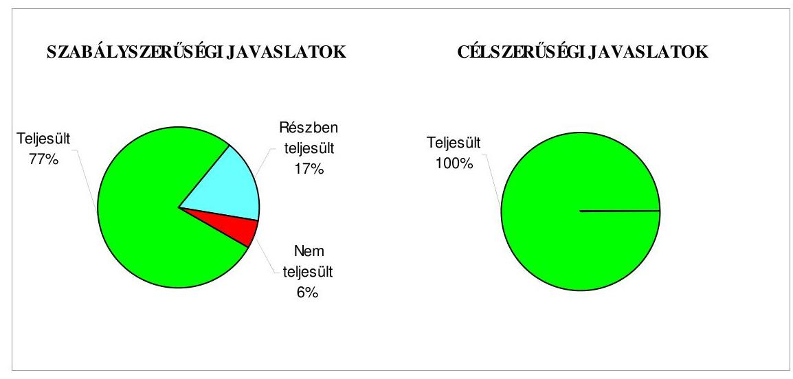

Az Önkormányzatnál végzett ÁSZ ellenőrzések javaslatai - az intézkedési tervekben foglalt határidőre, illetve a polgármesteri tájékoztatóban megjelölt időpontra - összességében 84\%-ban hasznosultak, 12\%-ban részben, 4\%ban nem valósultak meg.

Budapest, 2010. január „ 26 "

Melléklet: $\quad 8 \mathrm{db} \quad 11$ lap
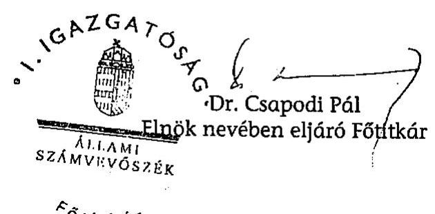

---

Budapest Főváros XXI. kerület Csepel Önkormányzata

# Az Önkormányzat gazdálkodását meghatározó adatok, mutatószámok 

| Megnevezés |  |
| :--: | :--: |
| A település állandó lakosainak száma (fő) 2009. január 1-jén | 77700 |
| A Képviselő-testület tagjainak a száma (fő) (2008. december 31-én) | 29 |
| A Képviselő-testület munkáját segítő állandó bizottságok száma (2008. december 31-én) | 6 |
| A Polgármesteri hivatalban foglalkoztatott köztisztviselők száma (fő) (2008. december 31-én) | 187 |
| Az összes vagyon értéke a 2008. december 31-i könyvviteli mérleg szerint (millió Ft) | 81935 |
| Az adósságállomány (hosszú és rövid lejáratú kötelezettség) 2008. december 31-én (millió Ft) | 4682 |
| Az egy lakosra jutó adósságállomány 2008. december 31-én (Ft) | 60257 |
| Az összes 2008. évben teljesített költségvetési bevétel (millió Ft) | 18079 |
| Ebből: saját bevétel (millió Ft), melyből | 10230 |
| helyi adóbevétel (millió Ft) | 6202 |
| Az egy lakosra jutó 2008. évi költségvetési bevétel (Ft) | 232677 |
| Az egy lakosra jutó 2008. évi saját bevétel (Ft) | 131660 |
| Az egy lakosra jutó 2008. évi helyi adóbevétel (Ft) | 79820 |
| Saját bevétel/Összes költségvetési bevétel aránya a 2008. évben (\%) | 56,6 |
| Helyi adó bevétel/Összes költségvetési bevétel aránya a 2008. évben (\%) | 34,3 |
| Az összes teljesített költségvetési kiadás a 2008. évben (millió Ft) | 17299 |
| Ebből: felhalmozási célú költségvetési kiadás (millió Ft) | 2963 |
| A 2008. évi költségvetési kiadásból a felhalmozási célú költségvetési kiadás aránya (\%) | 17,1 |
| Az egy lakosra jutó 2008. évi költségvetési kiadás (Ft) | 222638 |
| Az egy lakosra jutó 2008. évben teljesített felhalmozási célú költségvetési kiadás (Ft) | 38134 |
| A költségvetési intézmények száma 2008. december 31-én (db) | 46 |
| Ebből: részben önállóan gazdálkodó (db) | 43 |
| A költségvetési intézményekben foglalkoztatott közalkalmazottak száma (fő) (2008. december 31-én) | 1972 |

---

Budapest Főváros XXI. kerület Csepel Önkormányzata

# Az önkormányzati vagyon alakulása

|  Mérlegsor
megnevezése | 2006.év
(millió Ft) | 2007. év
(millió Ft) | 2008. év
(millió Ft) | Változás \%-a (Előző év=100\%) |  |   |
| --- | --- | --- | --- | --- | --- | --- |
|   |  |  |  | 2007/2006. | 2008/2007. | 2008/2006.  |
|  Immateriális javak | 174 | 119 | 145 | 68,4 | 121,8 | 83,3  |
|  Tárgyi eszközök | 40620 | 40789 | 41764 | 100,4 | 102,4 | 102,8  |
|  ebből: ingatlanok | 36577 | 39260 | 39000 | 107,3 | 99,3 | 106,6  |
|  beruházások | 3600 | 939 | 2258 | 26,1 | 240,5 | 62,7  |
|  Befektetett pénzügyi eszközök | 901 | 1131 | 990 | 125,5 | 87,5 | 109,9  |
|  Üzemeltetésre átadott eszközök | 33821 | 32346 | 31415 | 95,6 | 97,1 | 92,9  |
|  Befektetett eszközök összesen | 75516 | 74385 | 74314 | 98,5 | 99,9 | 98,4  |
|  Forgóeszközök összesen | 8356 | 7871 | 7621 | 94,2 | 96,8 | 91,2  |
|  ebből: követelések | 774 | 650 | 907 | 84,0 | 139,5 | 117,2  |
|  pénzeszközök | 7318 | 6979 | 6097 | 95,4 | 87,4 | 83,3  |
|  Eszközök összesen | 83872 | 82256 | 81935 | 98,1 | 99,6 | 97,7  |
|  Saját tőke összesen | 71648 | 70730 | 70556 | 98,7 | 99,8 | 98,5  |
|  Tartalék összesen | 7253 | 6910 | 6170 | 95,3 | 89,3 | 85,1  |
|  Kötelezettségek összesen | 4971 | 4616 | 5209 | 92,9 | 112,8 | 104,8  |
|  ebből: hosszú lejáratú kötelezettségek | 1560 | 1559 | 1450 | 99,9 | 93,0 | 92,9  |
|  rövid lejáratú kötelezettségek | 3100 | 2765 | 3232 | 89,2 | 116,9 | 104,3  |
|  Források összesen: | 83872 | 82256 | 81935 | 98,1 | 99,6 | 97,7  |

Forrás: Magyar Államkincstár éves költségvetési beszámoló "01" számú űrlap adatai.

---

Budapest Főváros XXI. kerület Csepel Önkormányzata

# Az önkormányzati kötelezettségek alakulása

|  Mérlegsor megnevezése | 2006.év
(millió Ft) | 2007. év
(millió Ft) | 2008. év
(millió Ft) | Változás \%-a (Előző év=100\%) |  |   |
| --- | --- | --- | --- | --- | --- | --- |
|   |  |  |  | 2007/2006. | 2008/2007. | 2008/2006.  |
|  Hosszú lejáratú kötelezettségek összesen
ebből: | 1560 | 1559 | 1450 | 99,9 | 93,0 | 92,9  |
|  hosszú lejáratra kapott kölcsönök | 0 | 0 | 0 |  |  |   |
|  tartozások fejlesztési célú kötvénykibocsátásból | 0 | 0 | 0 |  |  |   |
|  tartozások működési célú kötvénykibocsátásból | 0 | 0 | 0 |  |  |   |
|  beruházási és fejlesztési hitelek | 1559 | 1559 | 1450 | 100,0 | 93,0 | 93,0  |
|  müködési célú hosszú lejáratú hitelek | 0 | 0 | 0 |  |  |   |
|  egyéb hosszú lejáratú kötelezettségek | 1 | 0 | 0 | 0,0 |  | 0,0  |
|  Rövid lejáratú kötelezettségek összesen
ebből: | 3100 | 2765 | 3232 | 89,2 | 116,9 | 104,3  |
|  rövid lejáratú kölcsönök | 0 | 0 | 0 |  |  |   |
|  rövid lejáratú hitelek | 765 | 481 | 1123 | 62,9 | 233,5 | 146,8  |
|  kötelezettségek áruszállításból, szolgáltatásból | 474 | 340 | 162 | 71,7 | 47,6 | 34,2  |
|  garancia- és kezességvállalásból származó kötelezettség | 0 | 0 | 0 |  |  |   |
|  hosszú lejáratra kapott kölcsön következő évet terhelő törlesztő részlete | 0 | 0 | 0 |  |  |   |
|  felhalm.c.kötvény kibocsátásból szárm.tartozás következő évet terh.részlete | 0 | 0 | 0 |  |  |   |
|  mük.c.kötvény kibocsátásból szárm.tartozás következő évet terh.részlete | 0 | 0 | 0 |  |  |   |
|  beruházási c hosszú lejáratú hitel következő évet terhelő törlesztő részlete | 145 | 145 | 212 | 100,0 | 146,2 | 146,2  |
|  müködési c.hosszú lejáratú hitel következő évet terhelő törlesztő részlete | 0 | 0 | 0 |  |  |   |
|  egyéb hosszú lejáratú kötelezettség következő évet terhelő törlesztő részlete | 0 | 0 | 0 |  |  |   |

Forrás: Magyar Államkincstár éves költségvetési beszámoló "01" számú űrlap adatai.

---

Budapest Főváros XXI. kerület Csepel Önkormányzata

Az Önkormányzat 2006-2009. évi költségvetési előirányzatainak és 2006-2008. évi pénzügyi teljesítéseinek alakulása

|  Megnevezés | 2006. év |  |  |  | 2007. év |  |  |  | 2008. év |  |  |  | 2009.  |
| --- | --- | --- | --- | --- | --- | --- | --- | --- | --- | --- | --- | --- | --- |
|   | Eredeti | Módosított | Teljesítés (millió Ft) | Teljesítés/ eredeti előirány-zat \% | Eredeti | Módosított | Teljesítés (millió Ft) | Teljesítés/ eredeti előirány-zat \% | Eredeti | Módosított | Teljesítés (millió Ft) | Teljesítés/ eredeti előirány-zat \% | Eredeti előirány-zat (millió Ft)  |
|  Müködési célú költségvetési bevételek összesen | 11181 | 15867 | 15505 | 138,7 | 12238 | 14380 | 14735 | 120,4 | 13040 | 14990 | 15485 | 118,8 | 13348  |
|  Müködési célú költségvetési kiadások összesen | 14098 | 17800 | 16776 | 119,0 | 14297 | 15179 | 14066 | 98,4 | 14767 | 15299 | 14336 | 97,1 | 15713  |
|  Müködési célú költségvetési bevételek és kiadások egyenlege: hiány-, többlet + | $-2917$ | $-1933$ | $-1271$ | 43,6 | $-2059$ | $-799$ | 669 | $-32,5$ | $-1727$ | $-309$ | 1149 | $-66,5$ | $-2365$  |
|  Felhalmozási célú költségvetési bevételek összesen | 2180 | 11149 | 4488 | 205,9 | 753 | 9199 | 3057 | 406,0 | 891 | 7981 | 2594 | 291,1 | 762  |
|  Felhalmozási célú költségvetési kiadások összesen | 2115 | 12454 | 3939 | 186,2 | 2328 | 10263 | 2322 | 99,7 | 2019 | 9502 | 2963 | 146,8 | 1021  |
|  Felhalmozási célú költségvetési bevételek és kiadások egyenlege: hiány-, többlet+ | 65 | $-1305$ | 549 | 844,6 | $-1575$ | $-1064$ | 735 | $-46,7$ | $-1128$ | $-1521$ | $-369$ | 32,7 | $-259$  |
|  Költségvetési bevételek összesen | 13362 | 27015 | 19993 | 149,6 | 12991 | 23579 | 17792 | 137,0 | 13931 | 22971 | 18079 | 129,8 | 14110  |
|  Költségvetési kiadások összesen | 16214 | 30253 | 20715 | 127,8 | 16625 | 25442 | 16388 | 98,6 | 16786 | 24801 | 17299 | 103,1 | 16734  |
|  Költségvetési bevételek és kiadások egyenlege: hiány-, többlet+ | $-2852$ | $-3238$ | $-722$ | 25,3 | $-3634$ | $-1863$ | 1404 | $-38,6$ | $-2855$ | $-1830$ | 780 | $-27,3$ | $-2624$  |
|  Finanszírozási célú pénzügyi bevételek | 2997 | 3383 | 1224 |  | 3779 | 2008 | 2889 |  | 3000 | 1977 | 1338 |  | 2836  |
|  Finanszírozási célú pénzügyi kiadások | 145 | 145 | 145 |  | 145 | 145 | 3173 |  | 145 | 147 | 840 |  | 212  |
|  Finanszírozási célú pénzügyi műveletek egyenlege | 2852 | 3238 | 1079 |  | 3634 | 1863 | $-284$ |  | 2855 | 1830 | 498 |  | 2624  |

Forrás: - Magyar Államkincstár éves költségvetési beszámoló "80" számú űrlap adatai;

- a 2009. évi adatok esetében az Önkormányzat 2009. évi költségvetése;
- a költségvetési bevétel-kiadás müködési-felhalmozási célra történt megosztásánál az analitikus nyilvántartás.

---

Etenőrzőt (inkormányzat neve: Budapest Főváros XX, kerület Csepet Önkormányzata Ellenőrzőt (inkormányzat címe: 1211 Budapest, XX. kerület Szent Imre de 10.

4. számú melléklet a V-2001-4/25/2009. számú jelentéshez

TANÚSÍTVÁNY az európai uniós forrásokkal támogatott célok és programok 2006-2009. évi tervezett és teljesített adatairól

|  Sor-
szám | Az európai uniós forrásokkal
támogatott fejlesztés megnevezése |  |  |  |  |  |  |  |  |  |  |  |  |  |  |  |  |  |  |  |  |  |  |  |  |  |  |  |  |  |  |  |  |  |  |  |   |
| --- | --- | --- | --- | --- | --- | --- | --- | --- | --- | --- | --- | --- | --- | --- | --- | --- | --- | --- | --- | --- | --- | --- | --- | --- | --- | --- | --- | --- | --- | --- | --- | --- | --- | --- | --- | --- | --- | --- |
|   |  |  |  |  |  |  |  |  |  |  |  |  |  |  |  |  |  |  |  |  |  |  |  |  |  |  |  |  |  |  |  |  |  |  |  |  |  |   |
|   |  |  |  |  |  |  |  |  |  |  |  |  |  |  |  |  |  |  |  |  |  |  |  |  |  |  |  |  |  |  |  |  |  |  |  |  |  |   |
|   |  |  |  |  |  |  |  |  |  |  |  |  |  |  |  |  |  |  |  |  |  |  |  |  |  |  |  |  |  |  |  |  |  |  |  |  |  |   |
|   |  |  |  |  |  |  |  |  |  |  |  |  |  |  |  |  |  |  |  |  |  |  |  |  |  |  |  |  |  |  |  |  |  |  |  |  |  |   |
|   |  |  |  |  |  |  |  |  |  |  |  |  |  |  |  |  |  |  |  |  |  |  |  |  |  |  |  |  |  |  |  |  |  |  |  |  |  |   |
|   |  |  |  |  |  |  |  |  |  |  |  |  |  |  |  |  |  |  |  |  |  |  |  |  |  |  |  |  |  |  |  |  |  |  |  |  |  |   |
|   |  |  |  |  |  |  |  |  |  |  |  |  |  |  |  |  |  |  |  |  |  |  |  |  |  |  |  |  |  |  |  |  |  |  |  |  |  |   |
|   |  |  |  |  |  |  |  |  |  |  |  |  |  |  |  |  |  |  |  |  |  |  |  |  |  |  |  |  |  |  |  |  |  |  |  |  |  |   |
|   |  |  |  |  |  |  |  |  |  |  |  |  |  |  |  |  |  |  |  |  |  |  |  |  |  |  |  |  |  |  |  |  |  |  |  |  |  |   |
|   |  |  |  |  |  |  |  |  |  |  |  |  |  |  |  |  |  |  |  |  |  |  |  |  |  |  |  |  |  |  |  |  |  |  |  |  |  |   |
|   |  |  |  |  |  |  |  |  |  |  |  |  |  |  |  |  |  |  |  |  |  |  |  |  |  |  |  |  |  |  |  |  |  |  |  |  |  |   |
|   |  |  |  |  |  |  |  |  |  |  |  |  |  |  |  |  |  |  |  |  |  |  |  |  |  |  |  |  |  |  |  |  |  |  |  |  |  |   |
|   |  |  |  |  |  |  |  |  |  |  |  |  |  |  |  |  |  |  |  |  |  |  |  |  |  |  |  |  |  |  |  |  |  |  |  |  |  |   |
|   |  |  |  |  |  |  |  |  |  |  |  |  |  |  |  |  |  |  |  |  |  |  |  |  |  |  |  |  |  |  |  |  |  |  |  |  |  |   |
|   |  |  |  |  |  |  |  |  |  |  |  |  |  |  |  |  |  |  |  |  |  |  |  |  |  |  |  |  |  |  |  |  |  |  |  |  |  |   |
|   |  |  |  |  |  |  |  |  |  |  |  |  |  |  |  |  |  |  |  |  |  |  |  |  |  |  |  |  |  |  |  |  |  |  |  |  |  |   |
|   |  |  |  |  |  |  |  |  |  |  |  |  |  |  |  |  |  |  |  |  |  |  |  |  |  |  |  |  |  |  |  |  |  |  |  |  |  |   |
|   |  |  |  |  |  |  |  |  |  |  |  |  |  |  |  |  |  |  |  |  |  |  |  |  |  |  |  |  |  |  |  |  |  |  |  |  |  |   |
|   |  |  |  |  |  |  |  |  |  |  |  |  |  |  |  |  |  |  |  |  |  |  |  |  |  |  |  |  |  |  |  |  |  |  |  |  |  |   |
|   |  |  |  |  |  |  |  |  |  |  |  |  |  |  |  |  |  |  |  |  |  |  |  |  |  |  |  |  |  |  |  |  |  |  |  |  |  |   |
|   |  |  |  |  |  |  |  |  |  |  |  |  |  |  |  |  |  |  |  |  |  |  |  |  |  |  |  |  |  |  |  |  |  |  |  |  |  |   |
|   |  |  |  |  |  |  |  |  |  |  |  |  |  |  |  |  |  |  |  |  |  |  |  |  |  |  |  |  |  |  |  |  |  |  |  |  |  |   |
|   |  |  |  |  |  |  |  |  |  |  |  |  |  |  |  |  |  |  |  |  |  |  |  |  |  |  |  |  |  |  |  |  |  |  |  |  |  |   |
|   |  |  |  |  |  |  |  |  |  |  |  |  |  |  |  |  |  |  |  |  |  |  |  |  |  |  |  |  |  |  |  |  |  |  |  |  |  |   |
|   |  |  |  |  |  |  |  |  |  |  |  |  |  |  |  |  |  |  |  |  |  |  |  |  |  |  |  |  |  |  |  |  |  |  |  |  |  |   |
|   |  |  |  |  |  |  |  |  |  |  |  |  |  |  |  |  |  |  |  |  |  |  |  |  |  |  |  |  |  |  |  |  |  |  |  |  |  |   |
|   |  |  |  |  |  |  |  |  |  |  |  |  |  |  |  |  |  |  |  |  |  |  |  |  |  |  |  |  |  |  |  |  |  |  |  |  |  |   |
|   |  |  |  |  |  |  |  |  |  |  |  |  |  |  |  |  |  |  |  |  |  |  |  |  |  |  |  |  |  |  |  |  |  |  |  |  |  |   |
|   |  |  |  |  |  |  |  |  |  |  |  |  |  |  |  |  |  |  |  |  |  |  |  |  |  |  |  |  |  |  |  |  |  |  |  |  |  |   |
|   |  |  |  |  |  |  |  |  |  |  |  |  |  |  |  |  |  |  |  |  |  |  |  |  |  |  |  |  |  |  |  |  |  |  |  |  |  |   |
|   |  |  |  |  |  |  |  |  |  |  |  |  |  |  |  |  |  |  |  |  |  |  |  |  |  |  |  |  |  |  |  |  |  |  |  |  |  |   |
|   |

---

# ADATLAP 

## Az európai uniós forrással támogatott „Az Önkormányzat adatvagyonának másodlagos hasznosítása" fejlesztésröl

1. A PÁLYÁZÓ ADATAI
1.1. A pályázó Önkormányzat neve: Budapest Főváros XXI. kerület Csepel Önkormányzata
1.2. A pályázó Önkormányzat címe: 1211 Budapest, Szent Imre tér 10.
2. A PROJEKT ÖSSZEGZŐ ADATAI
2.1. A pályázott program megnevezése: GVOP-2004-4.3.2. Az Önkormányzat adatvagyonának másodlagos hasznosítása.
2.2. A pályázott programon belül a projekt címe: Budapest-Csepel Önkormányzat adatvagyonának másodlagos hasznosítása
2.3. A pályázatot készítõ megnevezése: Pusztai Gábor beruházási fôtanácsadó (önkormányzati munkatárs)
2.4. A pályázat benyújtásának idópontja: 2004. szeptember 28.

### 2.5. A projekt tervezett

- teljes kiadásának összege: 150,0 millió Ft
- saját forrás: 7,5 millió Ft
- támogatásának összege: 142,5 millió Ft
- európai uniós: 98,4 millió Ft
- hazai társfinanszírozás: 32,8 millió Ft
- EU Önerő Alap: 11,3 millió Ft
- hitel: ---
- egyéb forrás: ---
- a megvalósítás tervezett időpontja: 2006. április 28.

---

2.6 A pályázat elbírálásáról szóló döntés kelte: 2004. december 22.
2.7 A pályázat elbírálásának eredménye: eredményes volt
2.8. Az elutasított pályázatnál az elutasítás okai: ---
2.9. A pályázat tartalék státuszba helyezett-e: igen- nem

# 2.10. A projekt teljesített: 

- kiadásának összege 150,0 millió Ft
- saját forrás: 7,5 millió Ft
- támogatásának összege: 142,5 millió Ft
- európai uniós: 112,9 millió Ft
- hazai társfinanszírozás: 18,3 millió Ft
- EU Önerő Alap:11,3 millió Ft
- hitel:---
- egyéb forrás:--
- a megvalósítás időpontja: 206. szeptember 15.

## 3. A TÁMOGATÁSI SZERZŐDÉS ADATAI

### 3.1. A támogatási szerződés:

- megkötésének időpontja: 2005. június 23.
- a projekt kezdési és befejezési időpontja: 2005. február 1 - 2006. október 30.
- a projekt összköltsége (kiadása): 150,0 millió Ft
- a projekt megvalósítás forrásai:
- saját forrás: 7,5 millió Ft
- európai uniós támogatás: 112,9 millió Ft
- hazai társfinanszírozás: 18,3 millió Ft
- EU Önerő Alap: 11,3 millió Ft
- hitel: ---
- egyéb forrás: ---
- előírt támogatási határidők: Utolsó kifizetési kérelem benyújtásának határideje. 2006. december 15.
- előírt fizetési kötelezettségek: 2005-ben 86,2 millió Ft; 2006-ban 45,0 millió Ft;

---

| Kifizetési kérelem   (PEJ/EPEJ) benyújtá-   sának   időpontja | Számla   bruttó   összege   (Ft) | Igényelt   támogatási   összeg   (Ft) | Folyósitott   támogatás   összege   (Ft) | Támogatás   folyósitása-   nak   idöpontja   (év,hó,nap) | Benyújtás és   a folyósitás   között   eltelt időtar-   tam   (nap) |
| :-- | :--: | :--: | :--: | :--: | :--: |
| Előleg |  |  |  |  |  |
| I. sz. PEJ | 98564000 | 53431000 | 53431003 | 2006.04 .06 | 99 |
| II. sz. PEJ | 51435940 | 45006448 | 45006448 | 2006.12 .18 | 49 |
| Összesen | 149999940 | 98437448 | 98437451 |  |  |

# 5. Ellenőrzések 

### 5.1. A külső ellenőrzések:

- az ellenőrzések száma: 3 db
- az ellenőrzést végző szervek megnevezése: IT Információs Társadalom Kht., MAG Zrt.

### 5.2. Szabálytalanságokra vonatkozó adatok:

- mely előírást nem tartotta be az Önkormányzat: ---
- az előírás nem teljesítésének okai: --
- a rendezésre előírt kötelezettségek: ---
- a rendezésre előírt kötelezettséget mennyi időn belül teljesítették: ---
- mekkora időbeli csúszást eredményezett ez a projekt megvalósításában (év, hó, nap): --.

Budapest, 2009. október „........"
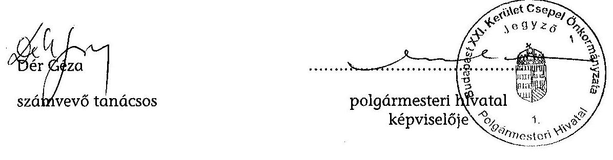

---

Budapest XXI. Kerület Csepel Önkormányzata

# 1211 Budapest XXI. Szent Imre tér 10. 

E-mail: tóth.mz@budanest21.hu
Fax: (1)-4276-196 Honlap: www.csepel.hu
Fax: (1)-4276-384 Portál: www.budanest21.hu

Iktatószám: 17-62310-3/2009
Hivatkozási szám: V-3001-4/25/16/2009.

## Dr. Csapodi Pál   főtitkár

## Állami Számvevőszék

## Budapest

## Tisztelt Fötitkár Úr!

Budapest XXI. Kerület Csepel Önkormányzata gazdálkodási rendszerének 2009. évi ellenőrzéséről szóló Jelentést 2009. december 18 -án kézhez vettem. A Jelentésben foglaltakkal kapcsolatban észrevételt, kifogást nem kívánok tenni.

Tájékoztatom Önt, hogy a munkatársai által lefolytatott helyszíni vizsgálat óta, valamint az előzetes Számvevői Jelentésben meghatározottak alapján, a megállapított hiányosságok, hibák megszüntetése érdekében az elmúlt időszakban több területen intézkedtünk. A megtett intézkedésekről mellékelem a részletes tájékoztatót.

A Jelentésben megfogalmazott további javaslatok, valamint a megállapításokban meghatározottak figyelembe vételével intézkedési tervben rögzítjük - határidő és felelős megjelölésével - a javaslatok végrehajtásának konkrét feladatait, melyet az Állami Számvevőszék közzétett Jelentésével együtt terjesztek a Képviselő-testület elé.

A Képviselő-testületnek a Jelentésben meghatározottakkal kapcsolatos döntéséről és az elfogadott intézkedési tervről írásban adok tájékoztatást.

Végezetül megköszönöm az Állami Számvevőszéknek az önkormányzatunk gazdálkodási tevékenysége javítását szolgáló megállapításait, javaslatait és segítő közreműködését.

Budapest, 2009. december 22.
Tisztelettel:
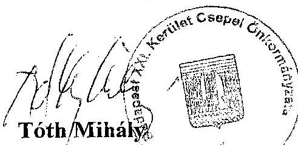

---

# Intézkedések a 2009. december 18-án megküldött átfogó ellenörzésröl szóló jelentéshez 

1.) A jelentés 22. oldalán a jegyzőnek tett javaslat 2.a) és b) pontjában meghatározottakkal kapcsolatban az 5/2009.(XI.2.) számú polgármesteri és jegyzői közös utasításban pontositásra kerültek - többek között - az Ámr. 135. § (1)-(2) bekezdésében, valamint az Ámr. 137. § (3) bekezdésében meghatározottak. Ezek előírásszerủ alkalmazása folyamatos az operatív gazdálkodási folyamatok rendszerében.

2.) A jelentés 23. oldalán a jegyzőnek tett javaslat 3. pontjában meghatározottak alapján a 7/2009.(XII.03.) számú polgármesteri - jegyzői közös utasítás „Szabályzat Budapest XXI. Kerület Csepel Önkormányzata és Polgármesteri Hivatala közérdekủ adatok nyilvánosságra hozatalának rendjéről" VIII. bekezdése szabályozza a „Közérdekủ adatokat tartalmazó honlap látogatottságának mérését".
3.) A jelentés 23. oldalán a jegyzőnek tett javaslat 4. és 5. pontjában meghatározottak alapján a 11/2009.(XI.30.) számú jegyzői utasítás „A számítástechnikai adatvédelmi szabályzat" 2.5 . pontja, valamint a 2.6 . pontja rendelkezik a fejlesztési és üzemeltetési feladatok meghatározásáról, szétválasztásáról, rendelkezik továbbá a pénzügyi és számviteli programok mentési eljárásairól, a felelősségi viszonyokról, a mentések ellenőrzéséről.

A fentiekben meghatározott utasítások hitelesített másolatait mellékelten csatolom.

Budapest, 2009. december 22.
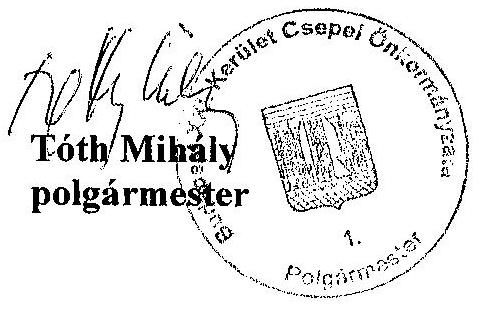

---

# Tóth Mihály úr, 

polgármester
Budapest Főváros XXI. kerület
Csepel Önkormányzata
Budapest
Szent Imre tér 10.
1211

## Tisztelt Polgármester Úr!

Köszönettel vettem a Budapest Főváros XXI. kerület Csepel Önkormányzata gazdálkodási rendszerének 2009. évi ellenőrzéséről készült számvevőszéki jelentéshez küldött tájékoztatását a megtett intézkedésekröl.

Örömmel értesültem arról, hogy megállapításaink, javaslataink egy részét az ellenőrzést követően megvalósitották, a hiányosságokat megszüntették. A tájékoztatása alapján megvalósult intézkedéseket a számvevőszéki jelentésben az érintett megállapításhoz kapcsolt lábjegyzetben szerepeltetjük és a számvevői jelentésben tett, vonatkozó javaslatokat elhagyjuk.

Ilyennek tekintjük, hogy intézkedtek a szakmai teljesítésigazolás és az utalvány ellenjegyzés elvégzéséről, továbbá az informatikai fejlesztési és üzemeltetési feladatok szétválasztásáról, az ellenőrzési lista vizsgálatáért felelős dolgozó kinevezéséről, valamint a mentési eljárások keretében a felelősségi viszonyok szabályozásáról, az elmentett állományokból a pénzügyi és számviteli adatok teljes körű helyreállíthatóságának és az ellenőrzési listának az ellenőrzéséről.

Az e-közigazgatási feladatokat ellátó informatikai rendszer ügyfelek általi igénybevételének figyelemmel kíséréséről és értékeléséről szóló javaslatunkat változatlanul fenntartjuk, mivel az Önök által megküldött szabályozás a közérdekủ adatokat tartalmazó honlap látogatottságának mérésére vonatkozik, ami nem biztosítja az általunk javasoltak megvalósítását.

Az ellenőrzés lefolytatásához nyújtott segitő közremüködését köszönöm.
Budapest, 2010. január „ $\dot{Z}$ "
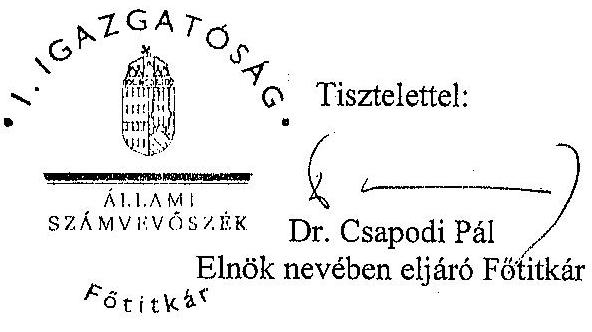