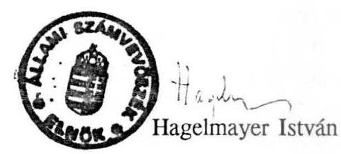

# 21lami 

## JELENTÉS

az önhibájukon kívül hátrányos helyzetben lévő önkormányzatok kiegészítő támogatásának ellenőrzéséről

---

# JELENTÉS 

## az önhibájukon kívül hátrányos helyzetben lévő önkormányzatok kiegészítő támogatásának ellenőrzéséről

A Magyar Köztársaság 1991. évi állami költségvetéséről és az államháztartás vitelének 1991. évi szabályairól szóló 1990. évi CIV. törvény 1. § (5) bekezdése az önhibájukon kívül hátrányos helyzetben lévő önkormányzatok részére 5 milliárd forint kiegészítő támogatást hagyott jóvá. A törvény egyidejűleg rendelkezett arról is, hogy az állami támogatást két részletben kapják meg az önkormányzatok, 1991. március 31-ig az összeg 75%-a, a továbbiakban pedig 25%-a kerüljön felosztásra.

A kiegészítő támogatás nyújtása a helyi önkormányzatokról szóló 1990. évi LXV. törvényen alapul, melynek 87. § (1) bekezdése intézkedik arról, hogy "az önállóság és a működőképesség védelmében kiegészítő állami támogatás illeti meg az önhibáján kívül hátrányos helyzetben lévő települési önkormányzatot. A támogatás feltételeiről és mértékéről az Országgyűlés az állami költségvetési törvényben dönt". A kiegészítő támogatás célja: "a lakosság elemi ellátását végző intézmények folyamatos üzemeltetésének biztosítása".

A Parlament 1991. június 4-i ülésén elfogadta a XIX. törvényt, mely szerint az első ütemben 2.883 millió forintot biztosított az önkormányzatok jelzett gondjainak enyhítésére. A fennmaradó 2.117 millió forint felosztásáról november 4-i ülésén az 1991. évi LIV. törvény elfogadásával döntött. Az Állami Számvevőszék az Országgyűlés Önkormányzati, Közigazgatási, Belbiztonsági és Rendőrségi Bizottságának felkérésre 1991. október hóban helyszíni ellenőrzés keretében megvizsgálta a pályáztatás második fordulójában részben vagy teljesen elutasított 320 pályázatot.

Jelen vizsgálatunkkal 1992. évi munkatervi feladatainknak megfelelően a kiegészítő támogatás juttatásának törvényességét, szabályszerűségét és eredményességét kívántuk ellenőrizni.

---

Vizsgálatunk fő célja annak megállapítása volt, hogy:
— mely tényezőkre vezethető vissza az önkormányzatok önhibájukon kívüli hátrányos pénzügyi helyzetének kialakulása,
— az önkormányzatok által közölt adatok valósnak minősíthetők-e, megfelelő információt nyújtottak-e a pályázatok objektív elbírálásához a Pénzügyminisztérium által kért adatszolgáltatás alapján,
— melyek voltak a támogatási igények felülvizsgálatának módszerei a pályázat első és második fordulójában, megalapozottnak tekinthető-e a Pénzügyminisztérium döntése.

A témavizsgálat keretében 209 helyi önkormányzat, ezen belül 189 települési, 1 megyei, 19 fővárosi kerületi és a fővárosi önkormányzat helyszíni ellenőrzését végeztük el és 256 pályázatot vizsgáltunk felül.

# A vizsgálat megállapításai 

## 1. A központi szervek tevékenységének értékelése

### 1.1 Törvényi előkészítettség

Az önkormányzatok működőképességének védelmében az 1991. évi költségvetésben biztosított 5 milliárd forint kiegészítő állami támogatás az önkormányzati törvény 87. § (1) bekezdésén és az 1991. évi költségvetési törvény 1. § (5) bekezdésén alapszik.

A törvényi szabályozás nem konzisztens, mivel az önkormányzati törvény a települési önkormányzatok támogatását rendeli el.

A Magyar Közlöny 1990. évi 87. számában kézirathibára való hivatkozással helyesbítésre került az önkormányzati törvény szövege, törölték a "pénzügyi" szót, ennek megfelelően a kiegészítő támogatás az "önhibáján kívül hátrányos helyzetben lévő települési önkormányzatot" illeti meg.
Az 1990. évi CIV. törvény 1. § (5) bekezdésében 5 milliárd forint kiegészítő támogatást állapított meg az "önhibájukon kívül hátrányos pénzügyi helyzetben lévő helyi önkormányzatok" működőképességének megőrzésére.

---

Az önkormányzati törvény helyesbítésére ellenére került előtérbe a hátrányos pénzügyi helyzet és kibővült a támogatott kör a megyei önkormányzatokkal, mivel a költségvetési törvény helyi önkormányzatokat határoz meg.

A költségvetési törvény tehát feloldja azt a szabályt, hogy a hátrányos helyzetben lévő települési önkormányzatok az állami költségvetésből - az önkormányzati törvény indoklása szerint alanyi jogon - kiegészítő támogatáshoz juthassanak, ehelyett a pénzügyi helyzetnek ad prioritást.

Egyik törvény sem határozza meg az "önhibáján kívüli" kategória fogalmát, továbbá azt, hogy mit kell érteni a "lakosság elemi ellátását végző intézmény" kör alatt.

A költségvetési törvény indoklási része a következőképpen közelíti meg a kiegészítő támogatásra való jogosultságot: "....minden önkormányzat először jóváhagyja költségvetését az Országgyűlés által jóváhagyott feltételekkel, ennek során hozzon intézkedéseket a források - felhasználások összhangjának megteremtésére. Ahol végképp nem nyílik mód, csak ott lehet, s ott is csak a működőképességhez központi forrást biztosítani".

A törvény elmulasztja meghatározni, milyen intézkedéseket kell tenni a források - felhasználások összhangjának megteremtésére.

Felül kell vizsgálni esetleg az önkormányzati intézmények működését, megszüntetni a gazdaságtalan tevékenységeket, felszámolni a kihasználatlan intézményhálózatot, behajtani a bevételi hátralékokat, felderíteni újabb saját forrásokat, kibővíteni a vállalkozási tevékenységet, kivetni a helyi adókat, félbehagyni a gazdaságtalan beruházásokat, esetleg működési hitelt felvenni a forráshiányra, stb.

Ugyanez vonatkozik a lakosság elemi ellátását végző intézményi körre:
A bölcsődei, óvodai ellátás, az iskola, az egészségügyi ellátás intézményrendszere tartozik csak ide, vagy figyelembe kell venni az alapvető kommunális ellátást, (járdák, utak, hidak, autóbuszvárók, lakás-, ivóvízhálózatot kiépítő, stb.) biztosító intézményhálózatot is.

Nem egyértelmű a működőképesség megítélésének kérdése sem.
A működésképtelenség okai összetettek: lehet például halmozottan hátrányos helyzetű az önkormányzat, mert nem rendelkezik az alapvető infrastrukturális létesítményekkel, az alapellátást szolgáló intézményhálózattal, a gazdálkodást ellátó és felügyelő apparátussal. De fennállhat a működésképtelenség attól is, hogy erejét meghaladó beruházásokba, felújításokba kezdett, az intézményhálózatot pazarló módon, ésszerűtlenül működteti, nem építette ki a belső ellenőrzés rendszerét, nem látja el a felügyeleti jellegű költségvetési ellenőrzést.

A két törvény tehát adós marad az "önhibáján kívül hátrányos /pénzügyi/ helyzetben lévő települési /helyi/ önkormányzat" fogalmának meghatározásában.

---

A törvényi indoklások utalnak ugyan a nehéz helyzetben lévő önkormányzatok támogatásának szükségességére, azonban a kormányzatra bízzák annak megítélését, hogy melyik önkormányzat szorul támogatásra.

A minősítés alapja az önkormányzatok pénzügyi helyzete, kimutatott forráshiánya, mivel a hiányos szabályozásból eredően ezzel a megközelítéssel lehet csak a vélt, vagy valós forráshiányt levezetni.

A kimutatható forráshiányt figyelembe vevő és ennek kizárólagosságát elismerő kormányzati végrehajtás helytelen a következők miatt:

Egy önkormányzat helyzetét elsősorban a társadalmi-gazdasági tényezők; valamint az önkormányzat gazdálkodásának minősége határozza meg.

Amennyiben a tényezők együttes hatására egy önkormányzat hátrányos helyzetbe került, ennek csak következménye lehet a lakosság alapvető ellátását biztosító önkormányzat pénzügyi állapota, és e tényezők milyenségétől függ pénzügyi helyzete.

Az önkormányzati gazdálkodásban érvényesülő forrásszabályozásra tekintettel 1991. évben valójában egyik önkormányzat sem lehetett forráshiányos, mivel bevételeit úgy kellett megállapítania, illetőleg kiadásait úgy kellett meghatároznia, hogy azok összhangban legyenek egymással. Ez még akkor is igaz, ha egyes kiadásait hitelből kívánta finanszírozni, mivel egyébként a kiadási szintet kellett volna csökkentenie.

Ebből eredően a forráshiány csak számított lehetett, amely egyidejűleg azt is jelenti, hogy a forráshiányok egy része nem volt valós, mivel az csak az önkormányzatok megvalósítani kívánt elképzeléseit jelenthette. Másrészt a pénzügyi állapotból, illetőleg a pénzügyi helyzetből nem ítélhető meg az "önhibáján kívül hátrányos helyzet".

A Pénzügyminisztériumnak tehát - az ellentmondásos és hiányos törvényi szabályozásból eredően - nem volt egzakt kiindulópontja a támogatási javaslatok kialakításához.

Összegezve megállapítjuk:
A Magyar Köztársaság 1991. évi költségvetésében biztosított 5 milliárd forint kiegészítő állami támogatás önkormányzatok részére történő felosztásához hiányzott a feltételek törvényi szabályozása. Ezt a hiányt igyekezett a PM a végrehajtás során a gyakorlatával pótolni.

# 1.2 A központi szervek szerepe a kiegészítő támogatás odaítélésében 

A költségvetési törvény - mint hivatkoztunk - a kiegészítő támogatás mértékét határozta meg.

---

Egyidejűleg utasította a Kormányt, hogy - tekintettel a lakosság elemi ellátását végző intézmények folyamatos üzemeltetésére -, legkésőbb 1991. január 15-ig intézkedjen az önkormányzatok e támogatáshoz kapcsolódó adatszolgáltatási kötelezettségére vonatkozóan.

Egzakt törvényi szabályozás hiányában a kormányzati intézkedés a pályáztatási formát választotta végrehajtásként.

A pályáztatás - a költségvetési törvényben foglaltak figyelembevételével - két fordulóban, az év első és második felében történt.

A szabályozás további ellentmondásaira hívjuk fel a figyelmet, mivel a törvény a felosztás 75-25%-os arányairól rendelkezett. A 25%-os tartalékkeret terhére rendelte el a volt társközségekben létrejött önkormányzatok dologi feltételeinek támogatására nyújtott, meghatározott összegeket, melyek nagyságrendjét már a törvényelőkészítés szakaszában meg lehetett ítélni. Ugyanakkor a szabályozás azt is kimondta, hogy a fennmaradó 25%-ot az év során előálló pénzügyi feszültségek enyhítésére kell tartalékolni.

A pályáztatás lebonyolításában a Belügyminisztérium és a Pénzügyminisztérium vett részt, valamint közreműködői szerepköröket töltöttek be a Területi Államháztartási és Közigazgatási Információs Szolgálatok (TÁKISZ-ok).

A Belügyminisztérium - a BM - PM között fennálló feladatmegosztás révén elsősorban szervezői, közreműködői szerepköröket látott el (köríratok, értekezletek stb.) a TÁKISZ-ok segítségével, a pályázatok érdemi elbírálásában nem vett részt. Ezért szerepkörére a továbbiakban nem térünk ki. Megjegyezzük azonban, hogy a TÁKISZ-ok - különösen a második fordulóban - olyan feladatot is elláttak, amelyekre hatáskörük nem volt, bár egy PM - BM közös leirat az aktív szerepüket lehetővé tette. Érdemben véleményezték, és bírálták felül a pályázatokat, esetenként az adatszolgáltatási kötelezettség módosításával kimutatták az önkormányzatok "forráshiányát", javaslatot tettek a támogatás összegére. A TÁKISZ-ok feladata - hatáskör és illetékesség hiányában - csak a kimutatások összesítése és továbbítása lehetett volna.

A pályáztatás tehát érdemben a Pénzügyminisztérium feladata volt. A Pénzügyminisztérium pályáztatási tevékenységét összegző megállapításaink a következők:

A pályáztatás nem volt nyílt, mivel hivatalos közlönyben nem tették közzé a pályázat szempontjait. Az csak az adatszolgáltatási kötelezettség kitöltési utasításában jelent meg, melynek alapján az önkormányzatok forráshiányát ki kellett munkálni. A törvényi határidőt - 1991. február 28. - nem tudták tartani, mivel az önkormányzatok egy része akkor még nem rendelkezett elfogadott költségvetéssel. A Kormányülés által elfogadott határidőt nem hirdették meg, a TÁKISZ-okon keresztül március 31-ben szabták meg. A pályázók többsége február 28-ig elfogadott költségvetés hiányában is benyújtotta igényét. Az önkormányzatok egyensúlyi költségvetéséből nem következett a "forráshiány", ezért csak számított hiányról lehetett szó.

---

Az I. fordulóban kiadott táblarendszer alapján forráshiány nem mutatható ki. Mind a táblarendszer, mind pedig a kitöltési utasítás bonyolult, nehezen érthető. Ezért az önkormányzatok nagyobb része nem nyújtott be pályázatot, illetőleg helyenként a TÁKISZ-okkal együtt - átdolgozta a kimutatást, és valótlan adatok, vagy megvalósítani óhajtott kívánságal alapján kimutatta a "forráshiányát".

Az I. fordulóban 420 önkormányzat ítélte magát forráshiányosnak, köztük a fővárosi, 19 kerületi, 7 megyei és 403 települési önkormányzat. Az arányokból is látható, hogy a pályázat a magasabb szakmai kvalifikáltságot feltételezte, mivel a kitöltés bonyolultságára való tekintettel a fővárosiak 86,9%-a, a megyei önkormányzatok 36,8%-a, míg az önkormányzati törvény által igazán megcélzott, támogatni kívánt települési önkormányzatok kevesebb mint 13%-a nyújtotta be igényét.

A 420 önkormányzat 9,4 milliárd számított forráshiányra igényelt támogatást.
A Pénzügyminisztérium - tapasztalva az ellehetetlenült helyzetet, kényszerülve annak feloldására -, a pályázatok elbírálása során:
eltért a korábban általa felállított követelményektől, feltételektől. Elsősorban a pályázatokban szereplő szöveges indoklások figyelembevételével próbálta megítélni a támogatás összegét. Tekintve a támogatási, ezen belül a fővárosi igény nagyságát, a fővárosi és a kerületi önkormányzatok részére 1 milliárd forintot javasolt támogatásként, 1,6 milliárd forint pedig a többi helyi önkormányzat között került felosztásra. Összesen 185 önkormányzat részesült 2,6 milliárd forint támogatásban. Az új önkormányzatok dologi feltételeinek megteremtéséhez benyújtott egyszeri a költségvetési törvényben meghatározott támogatási igény alapján 1469 önkormányzat részesült további 230 millió forint támogatásban.

A pályáztatás első fordulója alapján az elbírálás tényleges szempontjai, az odaítélés indokai utólag
 nem ellenőrizhetők.

Ehhez sem a kimutatott "forráshiányok", sem a Kitöltési útmutatóban megfogalmazott feltételek nem nyújtottak kiindulópontot.

Az 1991. június 4-én elfogadott 1991. évi XIX. törvény a támogatási összegek elfogadásával egyidejűleg, utólag deklarálta a támogatás szempontjait. A feltételrendszer tehát egyáltalán nem lett kidolgozva, mert a jogi formulák alapján utólag és visszamenőleg nem lehet egy feltételrendszert meghatározni. A törvényben kihirdetett bírálati szempontok csak részben egyeznek azokkal, amelyeket a "Kitöltési útmutató" tartalmaz. (A Pénzügyminisztériummal felvett közös jegyzőkönyv sem igazolja vissza az "útmutató" szempontjait.)

A pályáztatás második fordulójára az I. félévi önkormányzati beszámolók elkészítését követően került sor. A feltételrendszert ez esetben sem hirdették meg. Pályázhattak azok az

---

önkormányzatok is, melyek az I. fordulóban is pályáztak, illetőleg a szétváló települések önkormányzatai benyújthatták felújítási igényeiket.

Az első forduló tapasztalataiból kiindulva, a második ütemre a táblarendszert kissé módosították. Az önkormányzatok elfogadott éves költségvetéssel és a gazdálkodási év első felét bemutató beszámolóval rendelkeztek. A kiindulás számszerű alapjai tehát biztosabb támpontot nyújtottak.

A pályáztatás második fordulója azonban hasonló módon zajlott le, mint az első forduló. Bár a Pénzügyminisztérium törekvése az volt, hogy elkerülje az első félévben felmerült hibákat, a finanszírozási rendszer e formájának alkalmatlansága és a törvényi szabályozatlanság miatt jórészt ugyanazok a hiányosságok merültek fel, mint a pályáztatás első fordulójában.

A pályázat második fordulójában a fennmaradó 2117 millió forintra összesen 1203 önkormányzat nyújtotta be igényét.

Összességében 926 önkormányzat nyert el támogatást, 1026 pályázattal.
Ebből 121 önkormányzat csak működési hiányra, 805 önkormányzat pedig felújításokra, illetőleg közülük 100 önkormányzat működési hiányra is kapott kiegészítő támogatást.

Csak példaként említjük, hogy több nagy - ezek között megyei - önkormányzat mindkét fordulóban nyert el működési hiányra támogatást.

A Borsod-Abaúj-Zemplén megyei önkormányzat például az első fordulóban 40 millió, a másodikban 80,4 millió, a Nógrád megyei 50,8 millió és 68,2 millió, a Szabolcs-Szatmár-Bereg megyei 188,4 millió, illetőleg 21,1 millió forintot kapott.

Ezzel egyidejűleg elutasították több települési önkormányzat néhány százezer, vagy millió forintos igényét.

A pályázat II. fordulójának elbírálása az 1991. évi LIV. törvényben került kihirdetésre. Ez a törvény még utólagosan sem tartalmazza a feltételrendszert és az elbírálás szempontjait, amelyre annál is inkább szükség lett volna, mivel az önkormányzatok ebben a szakaszban jelentős, 985,5 millió forint összegű felújítási támogatást nyertek el minden feltétel nélkül. Összességében a felújításra odaítélt támogatást semmilyen jogszabály nem alapozta meg, ez kizárólag a PM döntése volt, amit a törvény szentesített.

A felújítási támogatásnál mindössze a rendelkezésre álló keret volt a korlát. A beérkezett igények miatt a PM a felső határt 4 millió forintban szabta meg. A felújítási igények egy része - a vizsgálat tapasztalatainak későbbiekben való részletezése alapján - ugyancsak az önkormányzatok kívánságait tartalmazza, más részénél viszont indokolatlan volt a "felső korlát" alkalmazása.

---

Összegezve tehát a központi szervek érdemi és közreműködői szerepét az 5 milliárd forint kiegészítő állami támogatás felosztásában és annak törvényi előkészítésében, megállapítjuk, hogy:
felelősség terheli a kormányzatot, mivel nem készítette elő megfelelően a költségvetési törvényt.

Ebből eredően egy olyan végrehajtási folyamat alakult ki, amelynek ellehetetlenülése már az indulás pillanatában, de a pályázatok beérkezésekor mindenképpen nyilvánvaló volt. A Pénzügyminisztériumnak nem volt objektív alapja a támogatás felosztására. Megítélésünk szerint legalább ez időpontban javaslatot kellett volna tennie a kiegészítő támogatás felosztásának felfüggesztésére, a jogszabályok módosítására és ennek függvényében a feltételrendszer kidolgozására.

# 2. A helyi önkormányzatoknál végzett helyszíni vizsgálat tapasztalatai 

### 2.1. A működőképtelenség okainak vizsgálata.

Vizsgálati tapasztalataink alátámasztották, hogy az önkormányzatok hátrányos vagy kedvező helyzete az önkormányzatok gazdálkodásának és az erre ható társadalmi - gazdasági folyamatoknak a függvénye.

Azt, hogy valamely önkormányzat hátrányos helyzetét mely tényezők okozták, és ezáltal az önkormányzat önhibájából, vagy önhibáján kívül került-e hátrányos helyzetbe, nem lehet csak a pénzügyi összefüggésekből levezetni.

Erre két példát mutatunk be. (A Példatár 2.1. pontja megyénként mutatja be az okok változatosságát).

A Somogy megyei Gige község 317 fős lélekszámú, előregedett lakossággal. Az 1991. évi költségvetése 6450 ezer forint, látszatra a település jó pénzügyi helyzetben van, költségvetési forrástöbblettel rendelkezik, sőt céltámogatási pályázatot is benyújtott.
Semmi oka és lehetősége arra, hogy kiegészítő állami támogatásra pályázzon. A tényleges helyzet azonban a következő: Az önkormányzat megszervezte a vízműtársulat létrehozását a közműves ivóvíz létesítéséhez. Ehhez a falu lakossága is hozzájárult, mivel az ásott kutak kiapadnak és a víz közegészségügyileg sem megfelelő. A céltámogatási pályázatukat a BM elutasította, mivel a Vízügyi Alapra nem volt garancia vállalás. Az önkormányzat az évi 6 millió forintjából mintegy másfél millió forintot a működési kiadások visszafogásával fejlesztésre fordított. A szűkös működési költségvetésére jellemző, hogy ebből felújításra 15 ezer forintot kívántak fordítani, ezen belül is 5 ezer forintot a polgármesteri hivatalra, amelynek összes

---

berendezése 1 db asztal és 1 db szék volt. Az önkormányzat ilyen mértékű spórolás mellett néhány év alatt képes lesz arra, hogy eredményesen pályázza meg az ivóvíz céltámogatást, azét az ivóvizét, amely az egyetlen olyan kötelező feladata, amit még a ciklus alatt meg kell valósítania.

Az önkormányzat a körülmények folytán önhibáján kívül halmozottan hátrányos helyzetű, de esélye sincs arra, hogy a jelenlegi támogatási rendszerben kiegészítő támogatáshoz jusson.

Ezzel szemben bemutatjuk a Borsod-Abaúj-Zemplén megyei Négyes községet, amely "forráshiánya" alapján, 1,8 millió forint kiegészítő támogatást kapott. Indokaiban áremelkedések, idősek klubjának üzemeltetési többletei, valamint közös fenntartású intézmények működési hiány igényei szerepeltek. A vizsgálat megállapításai alapján Négyes község szabad pénzeszközeiből 2 millió forint hitelt nyújtott egy termelőszövetkezetnek.

A hivatkozott példák tapasztalataink alapján nem egyediek. Az önhibáján kívüli hátrányos helyzet tehát pénzügyi megközelítéssel értelmezhetetlen, nem vezethető le, idegen a forrásszabályozás rendszerétől.

# 2.2. A pályázati rendszer működésének helyszíni tapasztalatai 

### 2.2.1 A működési hiányra nyújtott támogatás igénylésének és felhasználásának ellenőrzése

A pályázati rendszer működésképtelenségét és annak okait az előzőekben részben bemutattuk.
A helyszíni vizsgálatok során mindkét fordulóra vonatkozóan elsősorban az elfogadott pályázatokat ellenőriztük.

Az önkormányzatok mindkét fordulóban a TÁKISZ-ok közvetítésével jutottak a "Kimutatások" (Kitöltési útmutató) birtokába.

Az első fordulóban az I-III. sz. táblázatok kitöltése jelentette az adatszolgáltatást, melyekben a működési kiadások és az önkormányzatok bevételei szerepeltek. A bevételi előirányzatok nem voltak teljeskörűek, nem tartalmaztak minden önkormányzati bevételt.

A második fordulóban az I-V. sz. táblázatokkal kellett adatot szolgáltatni. A IV. sz. kimutatás a felújítási, az V. sz. kimutatás az energiaárváltozás miatti igényeket tartalmazta.

A második fordulóra a kimutatások némileg módosultak, de az alapvető problémák mindkét alkalommal azonosak voltak.

---

- a táblázatokból nem derült ki, hogy mennyi az önkormányzat "forráshiánya",
— kitöltésük főként a kistelepüléseknek, önállóvá vált önkormányzatoknak okozott gondot (bázisadatok szétbontása, rendelkezésre bocsátása a volt székhelyközség jóindulatán múlott), - a kiadások tekintetében alig volt kötelező egyezőség,
— rövid idő állt rendelkezésre, így a határidő betartása nehéz feladatot jelentett.
A kitöltési útmutató nem határozta meg a táblázatok egyes pontjainak tartalmát, több helyen ellentmondásos volt. Amennyiben az önkormányzatok szigorúan betartották az útmutató előírásait, forráshiányt nem tudtak kimutatni.

Az I. sz. táblázat "6. sor 3. oszlopában csak azok az egyéb növekedések szerepelhettek, melyek forrása a rendelkezésre álló bevételekből biztosított, vagy fedezete 1990. évben biztosított volt".

A TÁKISZ-ok feladata volt, hogy az igények összegyűjtése után a rendelkezésre álló öt-hat nap alatt egyeztessék, összesítsék és továbbítsák a táblázatokat a Pénzügyminisztériumba.

Az első fordulóban a TÁKISZ-ok - feladatuknak megfelelően - többnyire továbbították a kimutatásokat.

A második fordulóban az egyeztetésen túlmenően Adatkísérő lapon közölték az önkormányzatok fejlesztési előirányzatát, valamint véleményezték a számított forráshiányt és a felújítási igényt, - amelyet előzőleg többnyire saját maguk állapítottak meg.

A táblázatok kitöltéséhez és a forráshiány megállapításához - a TÁKISZ-ok - értekezletek keretében - csak szóbeli eligazítást kaptak.

A tapasztalatok szerint általában a következő séma alapján számolták a forráshiányt.
Az első fordulóban

- összes forrás (I/24)
- 1991. évi számított működési kiadás (I/8)
— különbség
A második fordulóban az egyeztetett I-III. sz. kimutatás adatai alapján
— összes forrás (I/26)
— adatkísérő lap 4. pont
- egyéb kötelezettségek (I/8) - maradvány
- 1991. évi számított működési hiány (I/7)
— - különbség

Amennyiben a különbség negatív, forráshiány, ha pozitív, forrástöbblet van.

---

Tapasztalataink szerint az ellenőrzött önkormányzatok nem ismerték a TÁKISZ-ok számítási módját, és ezek egy részéből utólag sem volt levezethető a kimutatott forráshiány.

Mivel az első fordulóban kizárólag a fejlesztések és az 1990. évi szintet meghaladó felújítások okozták a számított forráshiányt, az önkormányzatok egy része a kimutatások manipulálásával, valótlan adatok közlésével dolgozta azt ki. Esetenként a TÁKISZ-ok is közreműködtek ebben.
A pályázat első fordulójában az önkormányzatok többsége még nem rendelkezett jóváhagyott költségvetéssel, így módjában állt "forráshiányos igény" kialakítása.

A testületek előbb megszavazták a forráshiányos pályázati, majd az egyensúlyban lévő költségvetést.

Több település eredetileg tervezett és elvégezni kivánt feladatait illetően sem volt forráshiányos. (Példatár 2.2.1.)

A vizsgálat számos önkormányzat esetében megállapította, hogy a számított forráshiány sem indokolta a kiegészítő támogatás igénybevételét, azonban a rendszer szabályozatlansága miatt az önkormányzatoknak ez módjukban állt. Amennyiben a helyszínen vizsgált önkormányzat az igénybe vett támogatást a működési költségvetés finanszírozására használta, nem tettünk javaslatot annak elvonására.

Ugyanezen okokból nem tettünk javaslatot a pótlólagos igények érvényesítésére sem.
Két önkormányzat esetén azonban a dokumentális vizsgálat alapján nem tudtunk eltekinteni a visszavonási javaslattól.

Tiszabő község mindkét fordulóban benyújtotta pályázatát. Az első fordulóban 10,5 millió forint kiegészítő támogatást igényelt a szociális ellátás bővítésére, ebből 3,4 millió forintot kapott. A második fordulóban 10,7 millió forintot igényelt fenntartási célú hiteltörlesztésre. A TÁKISZ a felülvizsgálat alapján 12,4 millió forint támogatást javasolt, amit az önkormányzat meg is kapott.

Vizsgálatunk megállapította, hogy az önkormányzat 1991-ben három ütemben (II. 4., II. 27., V. 2.) vett fel 10 millió forint naptári éven belüli hitelt. (A Kitöltési útmutató, "Megjegyzések" mellékletének 6/g. pontja szerint csak az 1990. XII. 31-én fennálló 1991. évi kötelezettségek vehetők figyelembe).

Az önkormányzat egy alapítvánnyal együtt Tiszabői Szalmabrikett Gyártó Kft-t alapított, melynek a 4,1 milliós törzstőkéjéből 4 millió forint az önkormányzaté volt. A törzstőkét további 4 millióval megemelte. A 4 millió forint apport mellett a készpénzként átadott 4 millió forintot "működési célra átadott pénzeszköz"-ként számolta el.

---

Ezen túlmenően 3,6 millió forintért sörözőt alakított ki, melyet az üzemeltetőnek bérbe adott.

Az önkormányzat tehát a vállalkozásba fektetett pénzeszközök miatt nem tudta finanszírozni intézményeit, erre működési hitelt vett fel, amelynek fedezetére kiegészítő állami támogatást kért és kapott, az igényeltnél nagyobb összegben.

Az önkormányzattól jogosulatlanul kapott állami támogatás címén 10 millió forint visszavonását javasoljuk.

A Szabolcs-Szatmár-Bereg megyei Sényő 35,1 millió forint forráshiányt jelzett és 26,1 millió forint támogatást kapott. A település egyrészt igényként jelölte meg a székhelyközség 12,9 millió forint összegű induló előirányzatát, továbbá folyamatban lévő beruházását fejlesztésként kimutatta, de a forrásoldalon a hitelt nem szerepeltette. Az önkormányzat beruházási költségeinek rendezése és 11,7 millió forint hiteltartozás teljes kiegyenlítés után is
 9,6 millió forint forrástöbblettel rendelkezik, mivel 8,3 millió forint céltámogatást is kapott. Évvégi szabad számlamaradványa 4,9 millió, kamatozó betéti számla egyenlege 6 millió forint. Az önkormányzat az év utolsó negyedében 1,2 millió forint összegű jutalmat és 13. havi bért fizetett, az iskolaigazgató egyösszegben 216 ezer forint, a polgármester pedig 166 ezer forint jutalmat kapott. Az önkormányzat a túlfinanszírozás összegét saját forrásként 1992. évben a szennyvízhálózat kivitelezésére tervezi felhasználni.

A források valótlan kimutatása és az ennek révén elnyert többlettámogatás miatt 10 millió forint jogosulatlan kiegészítő állami támogatás visszavonását javasoljuk.

# 2.2.2 A szétváló települések felújítási kiadásaihoz nyújtott kiegészítő támogatás igénylésének és felhasználásának tapasztalatai: 

A második fordulóban a korábban társközségi státuszban lévő önkormányzatok igényelhettek felújítást a IV. sz. kimutatásban szereplő adatok alapján.

A kimutatás elkészítése – figyelembe véve a kitöltési útmutatóban foglaltakat is – nem volt egyértelmű, számos félreértésre adott okot.
Nem derült ki például, hogy felújítandó intézményenként külön lapot kell-e kitölteni, vagy egy lapon, egy összegben lehet a támogatási igényt feltüntetni. Így például jól járt az az önkormányzat – ha szolgálati lakás is szerepelt céljai között –, amelyik egyösszegben közölte a felújítási igényt, mivel a PM utólagos döntése alapján a szolgálati lakás felújítása nem volt támogatott cél.

A kimutatás f./ pontjában az 1991. évi költségvetés felújítási előirányzatát, vagy a felújítási munkák 1991. évre tervezett részének előirányzatát kellett feltüntetni.

A TÁKISZ-oknak 1991. augusztus 15-én tartott értekezleten és a PM-el közösen felvett jegyzőkönyvben eltérő információk hangzottak el az f./ pont tartalmával kapcsolatban.

---

A vizsgálat tapasztalatai alapján a felújításra vonatkozó igények felmérése az előkészítettség és a dokumentáltság kritériumainak meghatározása és ellenőrzése nélkül a volt társközségek aktívabb önkormányzati vezetőinek elképzeléseit gyűjtötte össze.

A TÁKISZ-okhoz küldött PM-BM levél alapján csak a képviselőtestület által elfogadott költségvetésből lehetett kiindulni, azonban a TÁKISZ értekezleten szóban elhangzottak szerint a IV. kimutatás a terven felüli felújításokat is tartalmazhatta. Nem volt feltétel a saját források valamilyen arányú megléte és a felújítás tényének dokumentális (költségvetés, kiviteli terv, szerződés, megrendelés stb.) alátámasztása sem.

Példaként a Somogy megyei Balatonmáriafürdőt mutatjuk be.
A település 1991. évi költségvetése nem tartalmaz felújítást, kisjavításra 485 ezer forintot terveztek. A felújítási pályázatban 14,5 millió forint költségvetés szerinti összeget állítottak be 5,5 millió forint saját forrással, 9 millió forint támogatási igénnyel. Ebből 4 millió forintot meg is kaptak, mivel az volt a támogatás felső határa.

Összességében tehát az önkormányzatok jelentős része csak pénzszerzési lehetőségnek tekintette a felújítási támogatást. A támogatás összegét az önkormányzatok többnyire november második felében kapták meg, így a vizsgált önkormányzatoknál a készültségi fok általában alacsony (20-30 %), vagy el sem kezdték a munkát. A fedezet általában pénzmaradványként megmaradt.

# 2.3 A vizsgálattal összefüggő egyéb tapasztalatok 

A helyszíni vizsgálat kapcsán több olyan tapasztalatra tettünk szert, amely a támogatási rendszer működésének, illetőleg az önkormányzatok helyzetének megítéléséhez további támpontokat adhat.
A kiegyenlítő támogatásból a különváló kistelepülések részére nyújtott 150-200 ezer forint egyszeri támogatás csak a legalapvetőbb beszerzésre – döntően bútorvásárlásra – volt elegendő, amely a dologi feltételek megteremtésének csak egyik részét jelenti.
A szétváló településeken gondot okozott a működőképesség alapvető intézményrendszerének (óvodák, iskolák, polgármesteri hivatal stb.) hiánya. Rendelkezésre állt ugyan a működési kiadások fedezete (normatív, kiegészítő támogatás), azonban a szükséges feltételek hiányosak voltak.

A rendszer kiemelten kezelte az adósságszolgálati (hiteltörlesztési) kötelezettségeket. Ennek nincs logikai alapja, mivel az önkormányzatok a hitelvisszafizetési kötelezettségeket az adott évre betervezték, tehát ez a tervezett kiadásaik között szerepel.

---

A hitelek kiemelt kezelésével kapcsolatos törvényi ellentmondás, hogy az önkormányzati törvény 88. §-a (b) pontja alapján az önkormányzatok ugyan vehetnek fel hitelt, de ennek fedezetéül állami támogatás nem használható fel.

A támogatási rendszer nem kezelte az 1990. szeptember 30-a előtt kivált társközségek felújítási igényét, holott ezek hasonló gondokkal küzdöttek, mint a válás után kiváló települések.
A szétváló települések egy része jelenleg is vagyonmegosztási gondokkal küzd, amely nemcsak a pályázat adatszolgáltatásának valóságtartalmát, hanem az 1990-91. évi költségvetések és beszámolók adattartalmát és valódiságát is megkérdőjelezi. Több önkormányzat nem rendelkezik 1990. évi jóváhagyott beszámolóval, ennek véglegesítése nemcsak az 1991. évi, hanem az 1992. évi költségvetést is megváltoztathatja. Volt példa arra is, hogy az önkormányzat 1991. évi költségvetési rendeletét szóban terjesztették elő és fogadták el.

Nagyon sok önkormányzat nem rendelkezett hiteles dokumentációval, elavult költségvetések és beszámolók álltak rendelkezésre, hiányosak voltak az analitikus nyilvántartások, az előirányzatmódosítás jogalapját adó képviselőtestületi rendeletek.
Az évközi központi intézkedések miatt 6-8 alkalommal került sor a költségvetések módosítására, de több önkormányzat nem is tett eleget ennek a kötelezettségnek.
A kiegészítő támogatás kapcsán jelentősen nőtt az állami támogatások aránya, némely önkormányzatnál a két, két és félszeresére is. A működési célok elérésének mértéke viszont ettől lényegesen szerényebb volt. Ez annyit jelent, hogy a támogatás részben a tervezett beruházási célt szolgált, amelyből az önkormányzatok egy része jelentős nyereséget is képzett.

A forráshiány vizsgálata kapcsán a finanszírozási rendszer egyértelmű anomáliái is felszínre kerültek, amely a támogatási elemek – cél-, címzett-, önhibáján kívül – közötti önszabályozási hiányt mutatta. A megyei önkormányzatok 1991. évben a 400 Fv/0 címzett támogatást döntően a települések között osztották fel, sok esetben a céltámogatásokhoz szükséges saját források biztosítására. Ugyanakkor a megyei intézményhálózatok jelentős felújítási forráshiánnyal küzdöttek, ezért – általában sikerrel – pályázatot adtak be a kistérségi önkormányzatok kiegészítő támogatására.

Mindezek a tényezők is alátámasztják a kiegészítő támogatási rendszer működésképtelenségét.

---

# Összefoglaló értékelés, javaslatok 

Vizsgálatunk alapvető célja az volt, hogy törvényességi, célszerűségi és eredményességi szempontok alapján áttekintsük a kiegészítő támogatási rendszer működését.

Az önkormányzati törvény az önhibájukon kívül hátrányos helyzetű önkormányzatok működőképességének megőrzése céljából a finanszírozási rendszerbe egy tartós támogatási formát iktatott be. A rendszer önmagában egy progresszív támogatási elemet hordozna, mivel elsősorban az elmaradott, alapvető működési és fejlesztési gondokkal, egyéb társadalmi-gazdasági problémákkal küzdő, hátrányos helyzetű önkormányzatok kapnának kiegészítő támogatást, amennyiben a külső körülmények hatására, önhibájukon kívül jutottak ebbe a helyzetbe. Az 5 milliárd forint, ha nem is oldotta volna meg, de enyhítette volna a gondokat.

Ezt azonban az egymásnak ellentmondó, hiányos törvényi előkészítés és szabályozás folytán csak kevésbé sikerült megvalósítani.

Egzakt feltételrendszer hiányában a végrehajtó kormányzati mechanizmus minden igyekezete ellenére sem tudta a rendszert átformálni, mivel a különféle belső iránymutatások nem pótolhatták a törvényi szabályozás hiányát. A végrehajtás működésképtelensége csak azokat a jegyeket hordozza magán, amelyek a szabályozatlanságból erednek. Ezt fokozta az a kialakult helyzet, amely az önkormányzatok többségénél jelen van – a gazdálkodás anomáliái, a vélt vagy valós pénzhiány, felújítási, fejlesztési igény.

Az Országgyűlés törvényben szentesítette az önkormányzatok kiegészítő támogatását. Ez nem könnyítette meg az ellenőrzés helyzetét, mivel a támogatási összeg jogosságának vitatása az 1991. évi XIX. és LIV. törvény „törvényességének” megkérdőjelezését jelenti. Az Állami Számvevőszéknek ezért csupán arra van lehetősége, hogy a szabályozatlanságból eredő jogellenes állapotra felhívja az Országgyűlés figyelmét. Miután az 1991. évi költségvetési törvény elmulasztotta – az önkormányzati törvény 87. § szerinti feltételrendszer szabályozását –, a kormányzati jogalkalmazó tevékenység jogalkotó gyakorlattá lépett elő, mivel e gyakorlat alapján, utólag került kialakításra és törvényi szabályozásra a feltételrendszer. Ezért tekinthető jogellenesnek a végrehajtási folyamat.
A vizsgált körben csak azokban az esetekben javasoljuk a támogatás elvonását, ahol dokumentálisan bizonyított volt a jogellenes igénylés és felhasználás.
Vizsgálatunk alapvető törvényi, szabályozási ellentmondásokra, a szabályozórendszer módosításának igényére mutat rá. Bár vizsgálatunk befejezésének időpontjában a Parlament előtt van az 1992. évi kiegészítő támogatás felosztásának feltételrendszeréről szóló törvényjavaslat, megállapításaink alapján ez a támogatási forma csak átmeneti lehet. A vizsgálat csak részben igazolta vissza e támogatási forma célszerűségét, ennél fogva eredményességi, továbbá törvényességi kifogásaink is felmerültek.

---

Miután az „önhibáján kívül” kategória vizsgálata a forrásorientált szabályozórendszer egészének áttekintését jelentette, módunkban áll, hogy a kiegészítő támogatási rendszer működésének hiányosságain túl a szabályozórendszer egészére vonjunk le következtetéseket és tegyünk javaslatokat, amelyeket az 1993. évi tervezésnél az Országgyűlés és a kormányzati szervek figyelmébe ajánlunk:

# 1./ Közvetlen intézkedésként a Pénzügyminiszter kezdeményezze: 

a./ az önkormányzati törvény 87. paragrafus (1) bekezdésének hatályon kívül helyezését. Ezzel egyidejűleg egy olyan támogatási forma kidolgozását, amely a pénzügyileg gyengébben álló önkormányzatok védelme érdekében a kiegyenlítés irányában hat, alkalmas a potenciális erőforrások egyenlőtlen eloszlásából fakadó hátrányok ellensúlyozására.

Az „önhibáján kívül hátrányos helyzetbe került önkormányzat” mint kategória, nemcsak szabályozás hiányában, de tartalmában sem tartható fenn, mivel a támogatási rendszer pénzügyi szemlélettel nem tudja kezelni ezt az elemet. A kategória valóságtartalma csak helyszíni, komplex vizsgálattal, több tényező együttes hatásaként állapítható meg, ezért a forrásorientált szabályozásban rendszeridegen. Ebből következően a jelenlegi gyakorlatban érvényesülő kiegészítő állami támogatás működését kizárólag vis maior esetére javasoljuk fenntartani, amelynek a feltételrendszerét egzakt módon szükséges szabályozni;
b./ az 1991. évi XIX. és LIV. törvény módosítását és parlamenti előterjesztésének előkészítését annak érdekében, hogy az 1991. évi állami költségvetésből Tiszabő és Sényő önkormányzatok által jogosulatlanul igénybe vett 10-10 millió forint visszavonása a központi költségvetésbe megtörténjen.

## 2./ A Pénzügyminiszter és a Belügyminiszter

az 1993. évi költségvetés tervezése során tekintse át az önkormányzati finanszírozási rendszert és tegyenek intézkedéseket az egyes (a normatív, cél, címzett és kiegészítő) támogatási elemek összehangolására.

Budapest, 1992. június

Melléklet: 1. sz. melléklet 2 oldal
2. sz. melléklet 20 oldal

---

Vizsgálatot vezette és a jelentést összeállította Rácz Lajosné osztályvezető főtanácsos. A vizsgálatban közreműködött: Berényi Magdolna tanácsos.

A vizsgálatot végezték:
Baranya megye:
Dr. Nagy Ágnes tanácsos

Bács-Kiskun megye:
Gaborjákné dr. Vidáranyi Klára számvevő
Békés megye:
Kollár Lászlóné tanácsos
Borsod-Abaúj-Zemplén megye:
Dankó Géza tanácsos

Csongrád megye:
Csiszárné dr. Kosik Mária tanácsos
Dr. Ótott Lajos tanácsos

Fejér megye:
Ébner Vilmosné tanácsos

Győr-Moson-Sopron megye:
Berényi Magdolna tanácsos

Hajdu-Bihar megye:
Kóródi József tanácsos

Heves megye:
Maróti Sándor tanácsos

Jász-Nagykun-Szolnok megye:
Csomán Mihály tanácsos

---

Nógrád megye:
Bocsi Sándor tanácsos
Somogy megye:
Dr. Hegedűs György tanácsos
Dr. Szigeti István számvevő
Szabolcs-Szatmár-Bereg megye:
Bacskai János tanácsos
Tolna megye:
Péntek László tanácsos
Zala megye:
Dr. Koller Valéria tanácsos
Fővárosi Régió (Főváros és Pest megye):
Dr. Katona Béláné számvevő
Molnár Istvánné tanácsos
Simon Ákosné tanácsos

---

2. sz. melléklet
a V-1-44/1992. sz. jelentéshez

# PÉLDATÁR 

az önhibájukon kívül hátrányos helyzetbe került helyi önkormányzatok kiegészítő támogatása helyszíni vizsgálati megállapításainak alátámasztására
(A jelentés 2. pontjához)

---

2./1. A működésképtelenség okai, a hátrányos helyzetű önkormányzati kategória megközelítése

A hátrányos helyzet kialakulásában több tényező játszott szerepet. Néhány megye vonatkozásában mutatjuk be ezeket, figyelemmel a térségi eloszlásra is. A példák alapján nyilvánvaló, hogy az országban nagyon sok hátrányos (esetenként halmozottan hátrányos) helyzetű önkormányzat van, azonban az is nyilvánvaló, hogy nem mindegyik önkormányzat került önhibáján kívül hátrányos helyzetbe. Miután a pályázati rendszer a hátrányos pénzügyi helyzetet tekintette kiindulópontnak, több önkormányzat önhibáján kívül hátrányos helyzetűnek ítélte magát, hiszen a rendelkezésére álló forrás nem elegendő tervezett vagy elképzelt céljai megvalósításához.
1./Baranya megyében az önkormányzati választásokat követően – 82 helyi és a megyei tanács helyett – 297 önkormányzat jött létre.

A településszerkezet jellegzetesen aprófalvas, a népesség eloszlása szélsőséges. Pécsett
 él és dolgozik a megye lakosságának közel fele. A települések közül 200 település lélekszáma nem éri el az 500 főt, 66 ún. halmozottan hátrányos helyzetű.

A megyében 1991-ig mindössze 142 településen volt megoldott a közüzemi ivóvízellátás, de a városok peremterületei is ellátatlanok voltak, közegészségügyileg veszélyeztetettnek minősül 144 település. Csatornázásra és szennyvíztisztításra összesen 21 településen került sor. Az oktatás feltételei sem voltak megfelelőek. 176 településen nem volt iskola, 56 oktatási intézmény nem rendelkezett tornateremmel, 280 önkormányzat kapott személyi jövedelemadó-kiegészítést.

A 10 ellenőrzött önkormányzat közül 6 település ötszáz fő alatti, 4 település 500-1000 fő közötti lakosságszámmal rendelkezik. A településeken az inaktív lakosság száma 40-60% közötti.
A normatív állami hozzájárulás összege seholsem fedezte a felmerülő kiadásokat.
Romonyán például az óvodában 1 fő ellátása 60 ezer Ft-ba került az óvodai ellátottra jutó 15 ezer Ft helyett, az iskolában 1 fő oktatása 44 ezer Ft-ba került a 30 ezer forint normatívával szemben.

Gerde községben négy község által közösen fenntartott oktatási intézmény (iskola-óvoda-napközi - egy kisegítő tanulócsoport) működési kiadása 18,6 millió Ft volt, mellyel szemben az ezekre kapott normatív állami hozzájárulás összege 7,3 millió Ft-ot tett ki.

Gondot okozott az áthúzódó adósságszolgálati kötelezettség, ugyanakkor az önkormányzatok általában 2.000-3.000 ezer Ft körüli záró pénzállománnyal rendelkeztek 1991. év végén.

---

2./ A Békés megyei tapasztalatok alapján is csak helyszíni vizsgálatokkal állapítható meg egy-egy település jövedelmi helyzete, működőképessége. A kiegészítő támogatást igénylő önkormányzatokat a helyben képződött SZJA alacsony összege jellemezte a munkanélküliek magas aránya, kevés és alacsony jövedelmezőségű helyben működő gazdálkodó szervezet létével egyidejűleg. Ezeken a településeken a helyi adó sem jelenthet számottevő bevételt.
Újszalontán az SZJA kiegészítés összege csaknem hétszerese, Magyardombegyházán több mint kétszerese, de további 6 kiegészítő támogatást igénylő településen is több mint másfélszerese volt a helyben képződött és önkormányzatot megillető összegnek.

A kiadások nagyságát, összetételét, indokoltságát, illetve feszültségeit nem vizsgálták. Örménykúton, Geszten és Dombiratoson az egy általános iskolai tanulóra jutó költségek tervezett összege 1991-ben 78, 76, illetve 62 ezer Ft volt. Ennek fő oka a tanulók csökkenő száma, így az egy tanulócsoportra jutó 8-10 fős létszám, és az alkalmazottak változatlan száma (Dombiratoson a 72 tanuló oktatásához 15 főt alkalmaznak).

Az önállóság mellett jellemzővé vált az önellátásra való törekvés akkor is, ha a népesség alacsony száma és a kis távolság lehetővé tenné az együttműködést, ez pedig megtakarítást eredményezhetne.

# 3./ Borsod-Abaúj-Zemplén megyében a korábban működött 170 tanács jogutódaként 348 önkormányzat jött létre. 

A volt társközségekben létrejött önkormányzatok működési feltételei hiányosak. Az önkormányzatok pénzügyi helyzete számottevő különbségeket mutat. Ennek egyrésze az önkormányzatok aktivitásával, más része a települések különböző demográfiai, szociális, jövedelmi helyzetével hozható összefüggésbe.
A támogatási igények egy részének oka az egyes folyamatban lévő beruházások forrás-problémái, az 1991. évben lejárt hitelek visszafizetése.

A jogelőd tanácsok a támogatások korábban jellemző rendszeres csökkentésének hatását kötvénykibocsátással, különféle hitelek felvételével igyekeztek mérsékelni. Miskolc megyei jogú város 1991. január 1-jei hitelállománya például 699 millió Ft, melyből 516 millió Ft a lakástámogatási célú hitel, melynek törlesztőrészletei és kamatai az elkövetkező évek költségvetését 70-80 millió Ft-tal terhelik.

Cserépfalu község önkormányzata - 12.700 ezer Ft iskola építésre felvett hitel visszafizetést is figyelembe véve - a kötelezettségek között 9.823 ezer Ft számított forráshiányt mutatott ki. Ezt követően az iskola építéshez igényelt céltámogatást. Az igényelhető 9,6 millió Ft-tal szemben csak 5,4 millió Ft céltámogatásban részesült. Ehhez viszont a megyei tanács (közgyűlés) 32 millió forint céltámogatást biztosított,

---

így az önkormányzat - még 1990-ben - csak 11 millió forint hitel felvételére kényszerült.
Az önkormányzat a két ütemben kapott összesen 13.582 ezer Ft kiegészítő támogatás leutalását követően az évet 16 millió Ft számlamaradvánnyal zárta. 13.601-16 millió Ft-ot a beruházással összefüggésben várható kifizetésekre helyezett.

4./ Csongrád megyében Felgyő Községi Önkormányzat a reket kiulakátisboz vett fel 2.785 ezer Ft hitelt, ez okozta nehéz helyzetét.

Öttömös község nem rendelkezett megfelelő forrással az önkormányzat és intézményhálózatának működtetéséhez. Mint volt társközség, nem kaphatott fejlesztési támogatást a törvényben meghatározottak alapján, mert az az 1990. január 1-jével önállóvá vált önkormányzatok részére nem tette lehetővé pályázat benyújtását.
Működési nehézségeit az Általános Művelődési Központ fenntartása okozta, a normatíva nem fedezi annak kiadásait. Az önkormányzat 60-70%-kal egészíti ki azt egyéb feladatai terhére.

5./ Heves megyében más-más ok idézte elő a forráshiány. Heves város 70 milliós jelzett forráshiánya döntően két okra vezethető vissza. Mint városhiányos térségben fekvő település, intézményhálózatát tudatosan fejlesztette a városi rang elnyerése érdekében. Ugyanakkor, mint mezőgazdasági terület, viszonylag alacsony a jövedelemszint. Az intézményhálózat kiadásai és a településüzemeltetés a városi szinthez közelít, ugyanakkor bevételei messze elmaradnak ettől.

Kápolna önkormányzat 1990. őszétől önálló. Az önálló működtetés feltételeinek megteremtése, továbbá a kötelező feladatok ellátása okoz feszültséget (útjelző táblák elhelyezése miatt bővítésre került a közvilágítás, ugyanitt vezetékes vízellátás, a közkifolyók díja, cigányklub működtetése, stb.).
Újlőrincfalva község 20 év után Póroszlótól vált ki. Intézményhálózata ugyan nem nagy, de a település nagyon leépült, lakossága elöregedett.

6./ Pest megyében az önállósuló önkormányzatok hátrányos helyzetébe került a tisztázatlan vagyoni helyzet, valamint az újonnan kialakult hivatali szervezetek szakmai tapasztalatlansága következtében. Több településnél a forráshiány az örökölt rossz állapotú intézmények (Tinnye, Szigetbecse, Makád), úthibák, vízellátási nehézségek (Csővár, Tinnye) okozták.

A helyszínen vizsgált 8 önkormányzat közül 6 településen a korábbi években megkezdett iskolai beruházás pénzügyi gondjai (megye által nem finanszírozott ÁFA, jelentős árszínvonal-növekmény alapvetően a berendezéseknél, névleges saját erőnek megjelölt hitelállomány progresszíve növekvő kamatterhe, stb.) jelentkeztek.

---

7./ Szabolcs-Szatmár-Bereg megyében Nyírbogdány önkormányzat jogelődje több beruházást indított a korábbi években fedezet nélkül - részben megyei garanciavállalás mellett -, így az örökölt tartozás a megyei önkormányzat felé 21.720 ezer Ft.

Nyírcsászáron a saját bevételek objektíve kedvezőtlen (80%-os munkanélküliség) alakulása, valamint intézményhálózatának erősen kifogásolható állaga miatt került hátrányos helyzetbe.
8./ Tolna megyében egyes önkormányzatok alanyi jogon érezték magukat jogosultnak a kiegészítő támogatásra.

A Tengelic községi önkormányzat a számszaki adatokat tartalmazó kimutatásokat a TÁKISZ-hoz nem nyújtotta be, mivel számítása szerint sem volt forráshiányos. A település sajátos szerkezetéből adódó többletkiadásokkal indokolta a támogatásra való jogosultságát. Az önkormányzathoz 10 külterületi lakott hely tartozik, melyek közül három kistelepülés meglévő és rossz állagú intézményeinek felújításához igényelt 3 millió Ft összegű központi támogatást.

Az Újireg községi önkormányzatnál az önálló életkezdéshez szükségessé vált a kastélyépület felújítása (polgármesteri hivatal, orvosi rendelő és idősek klubja kialakítása), melyhez 5 millió Ft támogatási igényt jelzett.
Az alapvető feladatok teljesítése mellett több település jelentősen - például Mórágy község 1,1 millió Ft, Sióagárd pedig 3 millió Ft- pénzmaradvánnyal rendelkezik. Működési célú hiteleket nem kellett felvenniük.

A megyei önkormányzat mindkét fordulóban pályázott, mivel a bázisszemléletű számítással 72.015 ezer Ft forráshiányt mutatott ki. Az első fordulóban 24.015 ezer Ft, a másodikban 30.123 ezer Ft kiegészítő támogatáshoz jutott. Ez utóbbi az önkormányzat felújítási előirányzatának felel meg, melyet a törvény indoklási részében foglaltak alapján pályázott meg újra. Az összeget csak decemberben osztották fel és folyósították a halaszthatatlannak ítélt intézményi felújításokra. A megyei önkormányzat 1991. évi várható szabad rendelkezésű pénzmaradványa 70 millió Ft. A működésképtelenség esete tehát nem állt fenn, de a rendszerből adódóan a számított forráshiányt ki lehetett mutatni.
9./ Zala megyében is különböző tényezők okozták a hátrányos, vagy kevésbé hátrányos helyzetet. A korábbi körzetesítési jellegű fejlesztési politikával egyenetlen intézményhálózat jött létre. Kapacitáskihasználásuk csökkenő, ugyanakkor a pazarló jellegű intézményi ellátás jelentős többletköltséget okoz.

Garaboncon 3 óvodai csoportra olyan óvodai létesítményt hoztak létre még 1989-ben, melyben az alapfunkció ellátását biztosító terület alig éri el a 25%-ot. Jelenleg 2

---

óvodai csoporttal működik, 50 gyermeknek nyújtott szolgáltatást és évi 2,7 millió Ft-ot visz el az önkormányzati költségvetésből.

A pórszombati 25 férőhelyes óvodába 13 gyermek került beiratásra, a költségek elérik az 1.800 ezer Ft-ot. Az 1 óvodáskorúra eső költség 138,4 ezer Ft. Az átlagban 10 jelenlévő gyermek ellátását 7 főállású dolgozó látja el.

A számított forráshiányt jelző önkormányzatok többsége elmaradott térségben van, a népesség elöregedett, a helyi adókat csak néhány önkormányzat vetette ki, ár- és díjbevételeik növelésére nincsen mód.

Ugyanakkor az ellenőrzött önkormányzatok 1991. év végi záró pénzkészlete vizsgálata során megállapítást nyert, hogy az önkormányzatok nagyobb része a kapott kiegészítő támogatást meghaladó pénzkészlettel rendelkezett 1991. december 31-én.
A vizsgált 22 önkormányzat zárópénzkészlete 325 ezer és 13.749 ezer forint között szóródott, az átlagos zárókészlet közel 3 millió forint volt. 13 önkormányzat ideiglenesen átadott pénzeszközökkel rendelkezett, a legkisebb összeg 30 ezer, a legnagyobb 6,3 millió forint volt.
10./A főváros alapvető városüzemeltetési, intézményi működtetési feladataira minimálisan 48.450 millió Ft szükséges a szabályozott forrásokból. Ezzel szemben az Országgyűlés által jóváhagyott normatív állami hozzájárulás és személyi jövedelemadó 42.213 millió Ft volt. A szabályozott források országos és fővárosi adatainak összehasonlítása során az elvégzett számítások egyértelműen mutatták a jóváhagyott szabályozás fővárosra vonatkozó negatív hatását.

Míg országosan 26%-kal nagyobb az önkormányzatok bevétele az állami hozzájárulás és a személyi jövedelemadó együttes összegéből, addig ugyanez a fővárosban mindössze 0,4%-os.

Míg országosan a kivetendő helyi adók összege háromszorosa a megszűnő adóknak, addig ugyanez a fővárosban a működési és lakásgazdálkodási kiadásokra vetítve is hatszoros.

Ugyanakkor a kerületi önkormányzatok működési hitel felvételére nem kényszerültek, saját forrásaikat viszont jelentősen alátervezték.

# 2.2.1 A működésképtelenség megszüntetéséhez nyújtott kiegészítő támogatás igénylésének és felhasználásának tapasztalatai 

A működési hiányhoz nyújtott kiegészítő támogatások I-II. fordulójának helyszíni tapasztalatait, a rendszerben rejlő anomáliákat megyénként mutatjuk be.

---

1./ Baranya megyében az I. fordulóban a 299 önkormányzatból mindössze 23 nyújtotta be az igénylést, 263 millió forráshiányt jelzett. 7 önkormányzat kapott összesen 10.434 ezer Ft támogatást, továbbá a pécsi magasház miatti kamattörlesztésre biztosítottak 65.000 ezer Ft-ot. Az elutasítás indokairól az önkormányzatok nem kaptak tájékoztatást.

A II. fordulóban működési hiányra 8 önkormányzat nyújtotta be igénylését. A TÁKISZ összesítése szerint csak 4 önkormányzat volt forráshiányos, összesen 256.749 ezer Ft összegben (Pécs, Gerde, Matty, Romonya), azonban az önkormányzatonkénti kimutatásban 258.788 ezer Ft hiányt közöltek.

Az önkormányzatok által összeállított adatlapok szerint 6 önkormányzatnál forrástöbblet volt (Pécs, Bóly, Dencsháza, Lánycsók, Matty, Romonya), két önkormányzatnál (Szabadszentkirály, Gerde) forráshiány.

Az önkormányzatok többségénél nincsenek megfelelően felkészült szakemberek, akik alapvető, a megfelelő tervezéshez nélkülözhetetlen ismeretekkel - bérautomatizmusok számítási módja, dologi kiadás fogalma, báziskorrekciós tervezés módszere, szintrehozások - tisztában lennének.

A szintrehozást Romonyán (-864 ezer Ft), az automatizmusok számítását Belvárdgyulán (+465 ezer Ft) és Gerdén (-126 ezer Ft) végezték rosszul.

Belvárdgyula és Matty az I. fordulóban meghirdetett elvek alapján nem lehetett forráshiányos.
2./ Bács-Kiskun megyében az első fordulóban a 117-ből 12 önkormányzat ítélte magát támogatásra jogosultnak.

Ebből hatnál a számítások nem támasztották alá a forráshiányt, hatnál viszont összesen 160.879 ezer Ft forráshiány mutatkozott. A Pénzügyminisztérium
 a hatból két önkormányzat kérelmét fogadta el, így Dunaszentbenedek 4.777 ezer Ft, Fülöpháza 3.939 ezer Ft kiegészítő állami támogatásban részesült.

A II. fordulóban 117 önkormányzatból 11 kért támogatást. A TÁKISZ számítása szerint 8 pályázatban összesen 83.117 ezer Ft forráshiány mutatkozott, a felújítási igény 3.553 ezer Ft-ot tett ki. Működési hiányra egy önkormányzat kapott 2.566 ezer Ft támogatást. A helyszíni vizsgálat alapján Dunaszentbenedeken a kimutatásokon kért adatokat pontosan tüntették fel. A számítás metodikája és az időbeli eltérések miatt azonban a pályázat, a benyújtott költségvetés és a költségvetési rendelet adatai eltérnek egymástól, ezért az összehasonlításnak nincs viszonyítási alapja.

---

Az 1991. évet kb. 1 millió Ft pénzmaradvánnyal zárták. A kiegészítő állami támogatást a működési hiányra fordították.
3./ Békés megyében az első fordulóban összesen 8 önkormányzat nyújtott be forráskiegészítésre pályázatot. Közülük a megyei és 3 települési önkormányzat igényét teljes egészében elutasították, egy az igényelt összeg 1/4-ét kapta meg, kettő az igényelt összeggel megegyező támogatásban részesült, egy községnél pedig a pályázati feltételektől eltérő elbírálás miatt az önkormányzat által kimutatott igény 3,7-szeresét biztosították.

Almáskamarás önkormányzatnál a pályázat, a költségvetési terv és a költségvetési rendelet adatai nem egyeztek.
Az önkormányzat egyik előirányzatában sem szerepel az 5.994 ezer Ft előző évi pénzmaradvány. Pályázatát mindkét fordulóban benyújtotta, de ugyanarra az adatigényre eltérő információkat közölt. Ezért támogatási igényét jogosan utasították el.

Az önkormányzat a II. fordulóban csak felújításra kért 26.065 ezer Ft támogatást. Ebből elvileg 14.543 ezer Ft-ot hagyott jóvá a PM, de mivel az egy településnek nyújtható felújítási támogatás felső határát 4.000 ezer Ft-ban határozták meg, 10.543 ezer Ft-ot "működési forráskiegészítésként" kapott az önkormányzat.

Dombiratos adatai ugyancsak eltérőek voltak.
Ez az önkormányzat szóbeli előterjesztés alapján hagyta jóvá a költségvetési tervet. Hiteltörlesztés az eredeti tervében nem szerepel. A pályázathoz bemutatott hitelszerződés szerint a települési vízműtársulat vette igénybe a hitelt.
A testület szóbeli tájékoztató alapján vállalta át az 1.950 ezer Ft kötelezettséget, amit a támogatásból teljesítettek.

A 6.020 ezer Ft kiegészítő támogatás felhasználásának csaknem 30 %-a (járdaépítés, útrekonstrukció, önkormányzati igazgatás, illetve tartalék) nem függ össze az alapvető ellátási feladatokkal.

Geszt község a központi feldolgozáshoz készített költségvetésével szemben önkormányzati rendeletében 3 millió forint forrástöbbletet, a pályázatában 2,9 millió forráshiányt mutatott ki. Ez utóbbit a PM kiegészítette az 1990. évi tervben lévő 7,8 millió forint felújítási kerettel, amelynek forrása akkor jórészt megyei céltámogatás volt, és alig felét használták fel a kastélyban működő iskola felújítására.
A település 1990. évi pénzmaradványa négyszerese volt a pályázatban közöltnek. A 10.698 ezer forint kiegészítő támogatásból 4.385 ezer forintot használtak fel felújításra, a kimutatott forráshiány mintegy 20%-ának megfelelő összeget a működési feltételek javítására, a többi pedig az év végi pénzmaradvány.

---

Mezőberény a TÁKISZ-hoz nemleges választ küldött, mivel helyzetüket speciálisnak értékelte. A kéttannyelvű gimnázium kollégiumának építéséhez 40 millió Ft kötvényt bocsátottak ki, amely kamataival együtt 1991-95. között 67,5 millió Ft kötelezettséget jelent. Ebből 5 millió Ft 1991-ben vált esedékessé. A Művelődési és Közoktatási Minisztériumtól kértek segítséget, ahonnan azt a tájékoztatást kapták, hogy ennek rendezésére az önhibáján kívül hátrányos helyzetben lévő önkormányzatok részére biztosított kiegészítő támogatásból van lehetőség. Pályázatukat ennek alapján szeptember 9-i keltezéssel közvetlenül a PM-be küldték el. A pályázat alapján 5,1 millió forint támogatást kaptak.
4./ A Borsod-Abaúj-Zemplén megyei vizsgálati tapasztalatok alapján a "pénzügyi szempontból gyengébb" önkormányzatok esetében a kiegészítő támogatási igény csak akkor volt kimutatható, ha az adósságszolgálati kötelezettséget is figyelembe vették.

Tiszabábolna község önkormányzata a lakosság szociális összetétele miatt alacsony SZJA bevétellel és saját forrással számolhatott. (Az egy főre jutó SZJA 50 %-a 1991. évben 1.312 Ft ).
A kislétszámú általános iskola, az óvoda fenntartása a normatív támogatáson felül ugyanakkor 2,5 millió Ft önkormányzati támogatást tett szükségessé.
Az önkormányzat az alacsony kihasználtság és magas fajlagos ráfordítások miatt megszüntette az időskorúak napközi otthonos ellátását. Kiegészítő támogatásra azonban csak úgy válhatott jogosulttá a PM által kidolgozott módszerek alapján, hogy az 1990. évben felvett 1 millió Ft-os hitelt nem tudta visszafizetni, és ezért azt kötelezettségei között szerepeltette.

A PM bírálati szempontjai nem voltak következetesek. Az első fordulóban elutasított 23 önkormányzat közül 13 a második fordulóban is benyújtotta pályázatát, ebből 12 esetében a PM javasolta a támogatást. A pályázati igényeket két településen felülvizsgálva, nem volt olyan új szempont, amely magyarázattal szolgálna a kétféle döntésre.

Miskolc esetében a II. fordulóban új elemként jelent meg a tömegközlekedés támogatási igénye, ez azonban a PM bírálati szempontjai között nem szerepelt. A város 70 millió forint kiegészítő támogatást kapott, amely része az éves pénzmaradványának.
5./ Csongrád megyében az első fordulóban hét önkormányzat nyert támogatást.

A pontos feltételrendszer kidolgozásának hiányában az önkormányzatok bizonytalanok voltak, csak a plusz pénzhez jutás lehetőségét látták az ún. pályázatban.
Csongrád város önkormányzata például 16/1991.( II. 15.) számú képviselő-testületi

---

határozatával 66,1 millió forint forráshiányt szavazott meg, amelyet pályázatként benyújtott és 29 millió forint támogatást kapott. 17/1991. (IX. 13.) számú rendeletével az intézmények költségvetését 13%-kal csökkentette, majd kompenzálta a kiegészítő támogatásból, ugyanolyan arányban mint ahogy az elvonást eszközölte.

Mártély községi önkormányzat például 1991. február 17-én forrásai között 608 ezer Ft pénzmaradványt szerepeltet. Ezzel szemben az 1991. I. félévi költségvetési beszámolójában már 2.057 ezer Ft-ot tüntet fel. A kettő különbözetét igényelte meg működési forráshiányként.
A kapott 1.494 ezer Ft kiegészítő támogatást az önkormányzat a napköziotthonos konyha tetőszerkezetének felújítására fordította.
Hasonló helyzet volt a Pusztamérgesi Önkormányzatnál, ahol az első forduló adataiban több eltérés számszerűsíthető a forrásoldalon. Az 1990. évi pénzmaradványát (1.840 ezer Ft-ot) nem mutatta ki, továbbá a normatív hozzájárulását 658 ezer Ft-tal kisebb összegben tüntette fel. Az önkormányzat tehát számítatlanul sem forráshiányos, a kapott 800 ezer Ft-os támogatással, mint többlettel rendelkezik.
6./ Fejér megyében a vajtai önkormányzat 1991. évi eredeti költségvetésének kiinduló adata a cecei közös tanács 1990. évi eredeti költségvetésének lélekszám-arányos megbontása volt, melyből Vajtára 12.599 ezer Ft jutott.
A báziselőirányzatra számbavett forrásaik fedezetet biztosítottak. A pályázatban az önkormányzat az 1. sz. kimutatás 5. egyéb növekedés jogcímén 6.400 ezer Ft. költségigénnyel járó kötelezettséget sorolt fel, amely megoldásra váró feladatokat takar, azonban a működést alapvetően nem gátolja. A PM elutasította az igényt.
7./ Győr-Moson-Sopron megyében az első fordulóban igénylő 13 önkormányzatból számított forrástöbblete volt 2 önkormányzatnak (Nagyszentjános, Városfalu), 11 önkormányzat számított forráshiánya a tervezett fejlesztésekből és az 1990. évi szintet meghaladó felújításokból adódott.

A második fordulóban a TAKISZ állapította meg a forráshiányt.
Így fordulhatott elő olyan eset, hogy az önkormányzat nem ítélte helyzetét forráshiányosnak és csak felújításra kért támogatást, de a fejlesztési kiadások és a táblázatok adatainak összevetésekor forráshiányosnak bizonyult.

Nagybajcs község felújításra kért kiegészítő támogatást, de közölt adatai alapján 611 ezer Ft forráshiány állapítható meg, melyet az önkormányzat meg is kapott. Év végi pénzkészlete - a kiegészítő támogatások levonása után - 5.854 ezer Ft, az I. félévi módosított költségvetési előirányzata 37%-át teszi ki.

---

A vizsgált önkormányzatoknál évközben működésből adódó pénzügyi nehézségek nem tették szükségessé gazdálkodási hitel felvételét.
A kiegészítő támogatás levonása utáni év végi pénzkészletek nagysága önkormányzatonként eltérő - 1,6 és 7 millió forint közötti -, az 1991. I. félévi módosított költségvetési előirányzat 5-8 %-át teszi ki.
8./ Hajdú-Bihar megyében az első fordulóban 34 önkormányzat 349.566 ezer Ft kiegészítő támogatást igényelt. Ezzel szemben az Országgyűlés 13 település részére 56.700 ezer Ft támogatást hagyott jóvá.

Négy önkormányzat mind az első-, mind a második fordulóban részesült kiegészítő állami támogatásban. Biharkeresztes és Mezősas a jégkár miatt, Berekböszörmény (volt társközség) és Nyírábrány alapvető ellátási kötelezettsége teljesítéséhez. A támogatások odaítélése indokolt volt.
Nyírábrány támogatási igényének elbírálása a második fordulóban a fejlesztési források, illetve fejlesztési kötelezettségek figyelmen kívül hagyásával történt.
9./ Heves megyében az I. fordulóban négy település kapott kiegészítő állami támogatást. A bemutatott dokumentumok alapján két településen visszaigazolta a pályázatban kimutatott forrásigényt, noha a táblázatok belső szerkezetében voltak hibák (Kápolna, Újlőrincfalva).

A másik két önkormányzat közül Kompolt pályázatában 3.783 ezer Ft forráshiányt mutatott ki, de az elbírálás során csak 2.500 ezer Ft-ot kapott. Az ellenőrzés alapján megállapítható, hogy az önkormányzat által kimutatott forrásigény megalapozott, alapokmányokkal, bizonylatokkal alátámasztott.

Ugyanakkor a táblázatok belső szerkezetében korrekciókat kellett végrehajtani. Nem állapítható meg azonban, hogy a PM milyen alapon hozta meg döntését.
10./Jász-Nagykun-Szolnok megye 74 települési önkormányzata közül 13-an nyújtottak be pályázatot kiegészítő állami támogatás elnyerésére, mivel önmagukat hátrányos helyzetűnek minősítették.

A pályázatot benyújtott települési önkormányzatok összes kiegészítő állami támogatás iránti igénye 58.269 ezer Ft volt. Ebből 7 települési önkormányzat 18.969 ezer Ft kiegészítő állami támogatásban részesült.

---

A pályázatot benyújtó önkormányzatok - Kétpó és Tiszajenő kivételével - az L sz. kimutatás 5. sorába azokat az egyéb növekedési tételeket állították be, amelyeket a forrásszabályozás szerint megtervezni nem tudtak, de azokra megoldást kell, vagy szándékoznak keresni.

Ilyenek pl. a szociális segélyezés, étkeztetés kibővítése, az általános iskolai oktatás visszaállítása, a tanterem bővítések, tornaterem létesítések miatti többlet üzemeltetési költségek, a közhasznú munkavégzés, az eszközbeszerzések, az időszaki karbantartások, felújítások, a volt társközségek önállóvá válásából adódó igazgatási többletköltségek stb.
Következetlenség tükröződik a pályázatok elbírálásában. Az első fordulóban elutasított 6 önkormányzat közül 5 szinte azonos tartalommal megismételte a pályázatát, amelyet el is fogadtak.

Az általános iskola működtetésére igényelt támogatást egyik önkormányzatnál (Tiszakürt) teljes összegben elismerték, míg a másiknál (Kételek) csak részben fogadták el.

Az elismert forráshiány egyes önkormányzatok számításából nem vezethető le (Kőtelek, Tiszabó, Tiszaörs).

A helyszíni vizsgálat alapján Tiszaszentimrén nem mutatható ki a kimutatott forráshiány sem. A 3.649 ezer Ft forráshiányt a hitel törlesztési kötelezettségük címén mutatták ki az összes tervezett fejlesztési kiadás szerepeltetésével, illetve bevételeik alátervezésével.

A később jóváhagyott 1991. évi költségvetésükben a bevételek már nagyobb összegben szerepelnek. Az önkormányzat 1.849 ezer Ft kiegészítő állami támogatást kapott, amelyet a pályázatban szereplő adatokból nem lehet levezetni.

A támogatást az önkormányzat az áremelkedések fedezetére fordította. Szociális otthon létesítésére 1991. évben 10.800 ezer Ft céltámogatást is kapott. Év végén 4.000 ezer Ft lekötött betétje volt.

Tiszajenő községi önkormányzat a számítási séma szerint forráshiányos volt ugyan, de a kiegészítő állami támogatást csak részben fordította az alapfeladatokat ellátó intézmények működtetésére.
Az önkormányzat 1991. december 31. záró pénzállománya 2.803 ezer Ft volt.
Tiszabó községi önkormányzat a két fordulóban együttesen 15.775 ezer forint kiegészítő állami támogatást kapott, melyet az alábbiak szerint használt fel:

---

| I. forduló |  |
| :-- | --: |
| Rendszeres szoc. segély | 500 ezer Ft |
| Közgyógyellátás ig. | 200 ezer Ft |
| Ápolási díj | 132 ezer Ft |
| Szoc. étkeztetés | 155 ezer Ft |
| ÁFI hiteltörlesztés | 52 ezer Ft |
| Lakáshitel kamat átvállalás | 410 ezer Ft |
| Közhasznú

 munka fedezete (30 \%) | 1.480 ezer Ft |
| Közterület felügyelet létrehozása | 270 ezer Ft |
| Pályázatra elkülönítve | 220 ezer Ft |
| Összesen: | 3.419 ezer Ft |
|  |  |
| II. forduló |  |
| Felvett hitelek törlesztése (91.évi) | 9.050 ezer Ft |
| Felvett hitelek kamataira | 2.500 ezer Ft |
| Lakáscélú támogatás | 300 ezer Ft |
| Letelepedési segély | 200 ezer Ft |
| Egyéb működési kiadás | 306 ezer Ft |
| Összesen: | 12.356 ezer Ft |

A felhasználás túlnyomó része tehát nem működési célokat szolgált. Ezen túlmenően az önkormányzat 1991. évben 7.515 ezer Ft céltámogatást és 2.000 ezer Ft megyei önkormányzati támogatást is kapott.
11./Nógrád megyében az első fordulóban 22 önkormányzat nyújtott be pályázatot 415.607 ezer Ft összegben.

A Pénzügyminisztérium javaslata alapján 6 önkormányzat 149.678 ezer Ft összegű támogatásban részesült.

A második fordulóban 13 önkormányzat 297.990 ezer Ft összegben nyújtott be működési hiányra támogatást, ebből 11 település 168.067 ezer Ft-ot kapott. Az elbírálás során főleg az I. fordulóban több, a rendszerbe nem tartozó szempontot is figyelembe vettek, amelyek a törvényben rögzített előírásokkal nem egyeztek.

Rétság város 1991. évi hitel-és kamatfizetési kötelezettsége az éves költségvetés 35,4 %-át tette ki. A nagyösszegű adósságszolgálat mellett az intézményhálózat feszítő működési gondokkal küzdött, felújításra pedig egyetlen forintot sem tudtak tervezni. A Pénzügyminisztérium a XIX. törvényben rögzített kiindulási szempontok közül a felújítást (5.920 ezer Ft) nem vette figyelembe a pályázat elbírálásánál.

---

Az önkormányzat 28.710 ezer Ft kiegészítő állami támogatást kapott, de év közben további intézkedéseket tett kiadási szintjének csökkentésére és bevételeinek növelésére. Az önkormányzat további feszültségekkel küzd, a megoldásra váró feladatai 57.599 ezer forint forrásigényt jeleznek.

Magyarnándor 3.319 ezer forint támogatási igényt mutatott ki. A Pénzügyminisztérium az átvett pénzeszközök kiadásként való figyelembe vételével 8.659 ezer Ft hiányt számszerűsített.
A helyszíni ellenőrzés során számszerűen kimutatható és dokumentumokkal alátámasztható hiány 7.596 ezer Ft.
12./ Pest megyében a két fordulóban összesen 73 pályázat volt. Ebből 20 önkormányzat mindkét fordulóban, 33 önkormányzat pedig a II. fordulóban pályázott. A két fordulóban összesen 905,2 millió Ft volt a jelzett működési hiány.

Az első fordulóban 14, a másodikban 15 önkormányzat kapott összesen 137,5 millió forint támogatást, amely az igény 15 %-a.
A felújításokra nyújtott támogatás összege összesen 30,7 millió forint volt, amely 25 szétváló település között oszlott meg.

A vizsgált önkormányzatok közül Bernecebaráti a betervezett működési hitelét (5.696 ezer Ft) nem vette fel, de számlavisszatartással a 91-es működési kiadásaiból egy 2,1 millió Ft-ot a 92-es évre vitt át. Ez utóbbi módszert más önkormányzat is alkalmazta.

Tinnye Községi önkormányzat az I. fordulóban 6,4 millió Ft forráshiányt jelzett, pályázatát a PM elutasította. A II. fordulós pályázatban működési hiányra 3,7 millió Ft-ot, felújításra 1,2 millió Ft-ot kért. A PM csak a felújítási kérelmét fogadta el. Az I/6. sorban kimutatott 1,9 millió Ft-os viharkárt is elutasította, amelyet a PM-ÁSZ közös jegyzőkönyve alapján el kellett volna fogadnia.

A Ráckevei önkormányzat 45 millió forint pályázati igényére 26 millió forint támogatást kapott. A pályázatát határidőn túl, április 11-én nyújtotta be a PM-be.

Hátrányos helyzetét a korábban megkezdett szakorvosi rendelő beruházás, és nem a működési forráshiány okozta.
A beruházáshoz a céltámogatásból és a megyei önkormányzattól is kapott összesen 33,4 millió forint támogatást.
Eredeti előirányzataihoz viszonyítva 7,2 millió, módosított előirányzataihoz képest 37,5 millió forint működési forrástöbblete van.

---

13./A Somogy megyei tapasztalatok azt támasztják alá, hogy az önkormányzatok egy része kihasználta a rendszer anomáliáit.

A helyszíni vizsgálat megállapította, hogy Felsőmocsolád önkormányzata a költségvetésben 4.708 ezer Ft hitelfelvétellel számolt, mivel a tervezett 18.014 ezer Ft-os kiadásához csak 13.306 ezer Ft bevétellel rendelkezett. Ugyanakkor a benyújtott pályázata összes forrásként 12.490 ezer Ft-ot, az összes kötelezettsége 15.084 ezer Ft-ot tartalmazott. Erre a pályázatára az önkormányzat 1.848 ezer Ft-ot kapott, a kimutatott forráshiánya 2.594 ezer Ft volt. Válasz hiányában az önkormányzat nem tudta megmondani, hogy miért kapott kevesebb támogatást a kértnél és a megítélt összeget mire kell fordítania.
Az önkormányzat a kevesebb támogatás ellenére sem vett fel hitelt, sőt az 1991. évi gazdálkodást mintegy 4 millió forint pénzmaradvánnyal zárja.

Néhány önkormányzat az öröklött adósságállomány miatt kérte kiegészítő támogatás megadását. Csurgó város például éppen annyi támogatást, 85.234 ezer Ft-ot kapott, mint amennyit költségvetésében hitelfelvétel jogcímen beállított.
A pályázatot benyújtó önkormányzatok pályázati anyagának adatai szinte valamennyi esetben eltértek a pályázó önkormányzatok költségvetéseinek adataitól.

Szenna önkormányzata pályázatában 15.296 ezer Ft összes forrással és 20.761 ezer Ft összes kötelezettséggel számolt.

A pályázat benyújtását követően elfogadott költségvetés az önkormányzat bevételét 21.812 ezer Ft-ban határozta meg, ez 6.516 ezer Ft-tal több, mint a pályázatban jelzett források összege.
14./Tolna megyében az első fordulóban beadott 11 pályázat közül a TÁKISZ 8 önkormányzatnál mutatott ki forráshiányt (összesen 84.368 ezer Ft összegben), két esetben forrástöbblet jelentkezett, míg egy önkormányzat (Sárpilis) közvetlenül a BM-hez juttatta el a támogatási igényét.

Az önkormányzatokat a pályázatok elbírálásának eredményéről közvetlenül nem értesítették, a jóváhagyott támogatást a törvényből ismerték meg. A 11 pályázó közül 9 nyert el központi támogatást összesen 37.119 ezer Ft összegben.

A pályázatok elbírálásánál figyelembe vett szempontok a helyszíni vizsgálatok megállapításai szerint nem voltak konzekvensek.

A második fordulóban benyújtott 5 pályázat közül a TÁKISZ a megyei és 3 települési önkormányzatnak javasolt támogatást.

---

A megyei önkormányzat a pályázatában az 1990. évi pénzmaradványból terhelő kötelezettségek között 12.898 ezer Ft összegű tartalékot is számított. Ezt a forrást - a pénzügyi helyzetét befolyásoló központi döntések elhalasztása miatt - decemberig tartalékolta. A konkrét felhasználási célokról a megyei testület december 12-én döntött, és a tartalékból zömmel intézményi gépjárművek és egyéb eszközbeszerzéseket finanszíroztak.
15./Zala megyében a pályázatok elkészítése több önkormányzatnak nehézséget okozott.

A nagyradai önkormányzat az 1991. évi költségvetési gazdálkodását elvileg forráshiánnyal kezdte. A korábban társközségi státuszban levő önkormányzattól sportterem építésre került sor. A beruházás ugyan befejeződött, ám számottevő kiegyenlítetlen számlát örökölt a székhely községtől. A fizetési hátralékot, mint segély pénzmaradványt az önkormányzat feladatmegszűnésként jelölte a táblázatban, tévesen. (A táblázat ezen esetek kimutatására nem is adott módot!)

Az előző évi pénzmaradvány számbavétele az igényfelmérés egyik leggyengébb pontjának bizonyult. Jelentős nagyságrendű maradványokat lehetett kithitként elfogadtatni, ha a zárszámadás keretében annak felhasználására előzetes elvi döntés született, még ha az fejlesztési vagy rekonstrukciós jellegű is volt. Cussameges pl. 2,5 millió forint volt az ilyen jellegű maradvány.
A forráshiány-számítási metodika következetlen alkalmazása is  számos problémát okozott.
A PM az I. fordulóban egységesen nem fogadta el a működtetési többletköltségeket Zalabaksán, Nagyradán, Nagyrécsén, Csapiban, Garaboncon, míg mindenkinél elfogadta azt a II. fordulóban (Pórszombaton, Bagodban).
Ez utóbbiak érdemi számítással többletigényüket alátámasztani nem tudták, az alacsony kapacitáskihasználtságból adódó magas költséggel magyarázzák a többletigény okát, azonban a költségcsökkentés érdekében semmilyen intézkedést nem hoztak.

A céltámogatással megvalósuló fejlesztéseknél egyébként elfogadták az önkormányzati érdekeltségi hozzájárulást (saját erőt) Csorhategyházán, Csönödéren, Csapiban. Ezen önkormányzatok víz- és csatornaépítéshez biztosították ily módon a saját erőt. Nem fogadták el Nagyrécsének a gázhálózatépítéshez szükséges érdekeltségi hozzájárulást, holott ahhoz egyéb állami forrás (céltámogatás) nem állt rendelkezésre.

# 2.2.2 A felújításokra nyújtott kiegészítő támogatások 

A jelentésben foglalt megállapításokat néhány megyei példával szeretnénk bemutatni.

---

1./ Baranya megyében 43 önkormányzat nyújtotta be az intézmények felújítására vonatkozó igényét, melyet 29.11.1999. el 28.8.1999. 28.8.1999. 28.8.1999. dí biztosítva.

A vizsgálat során az igények elbírálásának elveit nem lehetett levezetni, mivel több olyan önkormányzat is volt, amely nem tüntetett fel saját forrást, mégis kapott támogatást.

Máza község önkormányzata az általános iskola és a művelődési otthon felújítására 1.263 ezer Ft bekerülési költséget és ugyanolyan összegű saját forrást tüntetett fel, mégis kapott 1.263 ezer Ft összegű támogatást.
Ugyanígy Baranyaszentgyörgy az oktatási épület felújítására 1.360 ezer Ft összegben. Csarnóta a művelődési ház felújítására 751 ezer Ft összegben.

A TÁKISZ adatlapok és a műszaki költségvetések tartalma eltért egymástól.
Belvárdgyulán a művelődési ház és az óvoda felújítására vonatkozóan nyújtottak be igénylést, az adatlap 3.300 ezer Ft költségvetéssel.

Saját forrásként 400 ezer Ft-ot tüntettek fel. Az igényléshez csatolt műszaki költségvetés az adatlaptól eltérő tartalommal és összegben készült.

A helyszíni vizsgálat során megállapítottuk, hogy 2.376.655 Ft-ot költöttek útépítésre, 71.000 Ft-ot a temető helyreállítási munkáira, 575.000 Ft-ot a polgármesteri hivatalban a vizesblokk kialakítására, festésre és asztalos munkákra, továbbá 61.000 Ft-ot az óvoda festési munkáira.
2./ Bács-Kiskun megyében 4 önkormányzat együttesen 3.553 ezer Ft-ot kapott a felújítások fedezetére. Érsekhalmán a pályázat benyújtásakor már aláírásra várt az a szerződés, amely az általános iskola fűtés-korrekciózásának kiegészítő munkálatairól szól.

Felsőlajos igénylése nem tartalmazza az ÁFA-t, így a lehetségesnél alacsonyabb összeget tüntet fel.
A pályázat elbírálása után derült ki, hogy a felújítás a tervezettnél jóval többe fog kerülni.
3./ Békés megyében 7 község összesen 28 létesítmény (épület) felújításához kért 37.072 ezer Ft támogatást.

A felújítások teljes költségvetési előirányzatának 16 %-át vállalták saját forrásból finanszírozni, de egyes települések közötti szóródás igen jelentős - 3 és 69 % között változott.

---

A helyszíni vizsgálatok az átgondolatlan előkészítésből adódó ellentmondásokat tárták fel:

Almáskamarás kisközség egymaga 9 létesítmény (épület) felújításához igényelt támogatást, összesen 26.065 ezer Ft-ot, amely összeget a TÁKISZ is indokoltnak tartott. A vállalt saját forrás aránya 3 %. Ténylegesen 14.543 ezer Ft támogatást kapott. Az elbírálás után arról nem kaptak tájékoztatást, hogy ez mely feladatokhoz használható fel. Lehet akár véletlen is, hogy a támogatás megegyezik az iskola felújításához igényelt összeggel. A költségvetés szerinti összeget csak becslés alapján közölték, a kiviteli terveket a vizsgálattal egyidőben készítették. A becslések realitása megkérdőjelezhető (pl. egy-egy pedagógus szolgálati lakásnál az 1.590, illetve 2.450 ezer Ft esetében).

Magyardombegyháza is maximálisan igyekezett kihasználni az egyszeri támogatási lehetőséget. Pályázatokat 4 létesítmény felújítására 5.600 ezer Ft ráfordítással 9 %-os saját eszközzel nyújtottak be. A költségvetési tervük viszont felújítást nem tartalmazott (itt is fejlesztésként tervezték), így a teljes előirányzatukat javasolta a TÁKISZ támogatásként, de ebből a 4.000 ezer Ft-ot biztosították részükre. A kivitelezés 3 létesítményen kezdődött meg, a pénzügyi teljesítés az év végéig 859 ezer Ft volt.

4./ Fejér megyében a benyújtott felújítási pályázatok megyei szintű igénye 22.262 ezer Ft volt. A TÁKISZ 8 kérelem teljes, 4 kérelem részbeni kielégítését javasolta, 12.245 ezer Ft összegben. A jóváhagyott támogatás 20.586 ezer forint.

Jellemző az alacsony pénzügyi teljesítési arány, a vizsgált körben átlagosan 29 %, az egyes önkormányzatok esetében jelentős szóródással, 0 - 100 %-ig.

A székhelyközségek általában nem kezelték fontosságának megfelelően a társközségek közintézményeiről való gondoskodást - helyenként - a működőképesség alapfeltételeit sem biztosították.

Kápolnásnyék községben a település óvodáját az épület életveszélyessé válása miatt 1991. évben be kellett zárni.

 A 130 férőhelyes óvoda elhelyezése átmeneti megoldás, az eddig 3 tanulócsoportos kisiskolában oldja meg az önkormányzat, jelentős többletköltséggel és az épület helyreállításának várhatóan 3 millió Ft-os bekerülési költségével.

Vajta községben az általános iskola és az óvoda fűtési rendszere az évek során elmulasztott karbantartások miatt 6 év alatt úgy elhasználódott, hogy a jelen fűtési szezonban már rásegítő fűtést kellett alkalmazni, melyet a település lakóitól összeszedett olajkályhák beállításával tudtak megoldani (ezideig 70-80 ezer Ft-os többletenergia költséggel).
A halasztást nem tűrő felújítás előkészítésére csupán kezdeti lépések történtek.

---

5./Győr-Moson-Sopron megye szétvált községeiből 58 önkormányzat adott be intézményfelújításhoz támogatási igényt, úgy, hogy a támogatás igénybevételének feltételeit, a támogatandó intézmény típusokat, az igények elbírálásának módját nem ismerték.

A feltételek közlésének hiányában a kért támogatások a felújítások várható (becsült) költségéhez képest 37-92% között mozognak.
Az önkormányzatok döntő többsége a felújítási munkák várható nagyságára költségvetéssel, árajánlattal nem rendelkezett, a felújítandónak feltüntetett épületek felújítását 1991. évi költségvetésében nem tervezte.

Kivétel ez alól a Vének községi önkormányzat, ahol rendelkeztek költségvetéssel, melyet a FANTÁZIA Épülettervező GMK 1991. június 13-án készített az iskolából kialakítandó polgármesteri hivatal és könyvtárszoba átalakítási munkáira.
Az 1991. évi költségvetésben 488 ezer Ft-ot terveztek az épület felújítására.
6./ A Nógrád megyei Sóshartyán intézmények (iskola, orvosi rendelő, óvoda) felújítására kapott kiegészítő állami támogatást, melyből az iskolára felhasznált keret csak az iskola bővítésre nyújtott céltámogatással megvalósuló beruházás befejeződése után ellenőrizhető. A másik két felújítás túlnyomórészt befejeződött.

A kivitelezőkkel vállalkozási szerződéseket kötöttek, a költségvetéseket műszaki ellenőr nem vizsgálta felül. A pályázatban szereplő saját erőt a költségvetés adatai nem támasztják alá.
7./ A Somogy megyei, 238 lakosú Somogydöröcske felújítási igénye 8.727 ezer forint volt. A jogcímek ugyanazok voltak (orvosi rendelő, önkormányzati hivatal, iskola, óvoda), mint amelyeket a mindkét fordulóban benyújtott működési célú pályázataiban is megjelölt, de azokra töredék összegű támogatást kapott. Az önkormányzat megkapta a felújítási támogatás felső határának megfelelő 4 millió forintot. Így 1991-ben összesen 6.866 ezer forint állami támogatáshoz jutott.

Ez jóval meghaladja az önkormányzat 1991. évi eredeti összes költségvetési bevételét, amely 4990 ezer forint. A település - tulajdonképpen jogos, vitathatatlan fejlesztési igényt jelzett, a rendszer anomáliáiból adódóan azonban a támogatást kerülő úton szerezte meg. Szabályszerű eljárás esetén viszont feltételezhetően nem jutott volna a szükséges forráshoz.

Más jellegű tapasztalatot mutat Zselickislak felújítási tevékenysége. A 313 lakosú település az 1991. évi 5761 ezer forintos költségvetésében felújítási pályázatát 1992. évre készítette el, ezt az adatlapon jelezte is. Ennek ellenére az 1992-re kért 200 ezer forint helyett 1991. évre kapott 500 ezer forint kiegészítő támogatást.

---

8./ Tolna megyében a TÁKISZ saját szempontjai szerint alakította ki a felújítási igényjavaslatot, melyhez hatásköre, jogköre nem volt.

A megyében 33 önkormányzat adott be pályázatot, melyből a TÁKISZ - a saját elbírálási szempontjai alapján - 23 önkormányzat esetében az igényeltnél (összesen 27.680 ezer Ft-tal) alacsonyabb összegű támogatást javasolt. A TÁKISZ javaslatát a PM és az Országgyűlés teljes egészében elfogadta.
A felújítási igények megyei összesítő táblázata "támogatási igény" oszlopában - a PM munkatársának tájékoztatása alapján - a TÁKISZ által javasolt összeg szerepelt, míg a tényleges igényt "csak" az önkormányzati adatlapok tartalmazták.

A TÁKISZ kísérőlevélben jelezte a PM felé, hogy a javaslatok kialakítása országosan nem egységes szempontok szerint történt, ezért indokoltnak tartaná a támogatási keret normatív elosztását.

A 4 millió Ft felső határt tekintve a megyei TÁKISZ szigorúbb feltételeket kötött ki, ezért több önkormányzat a lehetségesnél kevesebb támogatásban részesülhetett.

A Szárazd községi önkormányzat tulajdonában lévő szinte valamennyi épület felújításra szorul, és az előzetes felismerések alapján 6.800 ezer Ft kiegészítő támogatásra adtak be pályázatot. Az önkormányzat a megyei TÁKISZ javaslata alapján 2.500 ezer Ft központi támogatásban részesült, azonban jogosult lett volna a 4 millió Ft-ra is. A november 18-án leutalt forrás felhasználására még nem került sor, a 2.500 ezer Ft-ot 1992. márciusáig az OTP-nél betétként lekötötték. A legsürgetőbb felújításokhoz rendelkezésre álló vállalkozói árajánlat összege meghaladja a 3 millió Ft-ot.

Az Újireg községi önkormányzat által jelzett felújítási szükséglet 6.340 ezer Ft volt, melyhez 1.200 ezer Ft saját forrás állt rendelkezésre. A pályázatban a kastélyépület felújítására 5,2 millió Ft-ot szerepeltettek, az időközben - versenytárgyalás eredményeként megkötött - kivitelezői szerződés szerinti összeg 4,1 millió Ft. További fedezetet igényel viszont a berendezések beszerzése és a környezet rendezése. A PM elbírálási szempontjai alapján az önkormányzat 4 millió Ft támogatásra lett volna jogosult. Az első fordulóban elnyert 2.947 ezer Ft működési célú és a második fordulóban felújításra biztosított 1 millió Ft kiegészítő támogatást a volt kastélyépület felújítására használják fel.
