# Allami S̊̊ámberböséé 

## JELENTÉS

a Harmónia Kereskedelmi Vállalat privatizálásáról, az állami vagyon alakulásáról
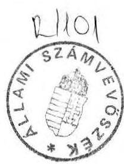

---

A vizsgálatot végezte:
dr. Majorosné dr. Locskai Noémi tanácsos
Németh Béláné
tanácsos

---

# T A R T A L O M J E G Y Z É K 

01dal
I. Bevezetés

1. A vizsgálat célja ..... 1
2. Elözmények, a tényhelyzet rövid ismertetése ..... $2-4$
II. Megállapítások
3. Állami Vagyonügynökség intézkedései ..... $4-7$
4. Az állami vagyon privatizálása
2.1. A Harmónia Kereskedelmi Rt. részvényeinek privatizálása ..... $8-12$
2.2. Az ÁVÜ és a Két Kalmár Rt. közötti szerződés ..... $12-16$
5. Az állami vállalat felszámolása és a gazdasági események regisztrálása
3.1. A Harmónia Kereskedelmi Vállalat felszámolása ..... $16-18$
3.2. A vagyonelemek kimutatása ..... $18-23$
III. Összefoglaló következtetések és javaslatok
6. Összefoglaló következtetések ..... $23-26$
7. Javaslatok ..... $26-27$
IV. Mellékletek

---

# Vagyonkezelö Föcsoport 

$\mathrm{V}-8-11 / 1992$.
Témaszám: 109

## J E L E N T É S

a Harmónia Kereskedelmi Vállalat privatizálásáról, az állami vagyon alakulásáról

## B EVEZETÉS

1. A vizsgálat célja

Annak megállapítása, hogy a Harmónia Kereskedelmi Vállalat és az álta1a alapított társaságok vagyoni helyzete hogyan alakult az állami vállalat államigazgatási felügyelet alá vonását követően. A társaságokban működő állami vagyon privatizálása megfelel1-e a jogszabályi előírásoknak. Ennek során az Állami Vagyonügynökség és a vállalati biztos tevékenysége kielégítette-e az állami vagyon védelmének követelményét.

Az ellenörzött szervezet:
Harmónia Kereskedelmi Vállalat
Budapest, VI. Nagymező u. 3.
KSH jelzőszám: 10018943514111101

---

A helyszini ellenőrzést az Állami Vagyonügynökségnél, a Harmónia Kereskedelmi Vállalatnál, a Két Kalmár Rt.-nél és a Harmónia Kereskedelmi Rt-nél folytattuk le 1992. február 25. és május 7-e között.

Ellenőrzött időszak: 1990. november - 1992. április

# 2. Előzmények, a tényhelyzet rövid ismertetése 

A Harmónia Kereskedelmi Vállalatot (Dohánybolt Vállalatként) a Bp. Fővárosi Tanács alapította 1955. június 21-én. A vállalati tanács az alapító egyetértésével 1988. december 31-én jóváhagyta a társaság alapításra vonatkozó előterjesztést.

Ekkor a mérleg szerinti állami vagyon 106,5 millió Ft volt.
1989. májusában két társaságot alapított a Harmónia Kereskedelmi Vállalat

- Kalmár Kereskedelmi Kft-t, mint egyszemélyes társaságot 44,2 MFt törzstőkével, ebből 13,3 MFt a készpénz és 30,9 MFt az áruapport.
- Harmónia Kereskedelmi Rt-t 85 MFt alaptőkével, amelyben a Harmónia Kereskedelmi Vállalat részesedése 70 MFt, ez 82,3 \%-os részesedést jelentett. ( 318 üzlethelyiséget, illetve pavilont apportált 38,8 MFt értékben.)

A Kalmár Kft. 1990. februárjában részvénytársasággá alakult át, 1 MFt készpénzzel a Pegazus Rt. részvényes lett. A Harmónia Kereskedelmi Vállalat által apportált 13 üzlettel alaptőkéje 60 MFt-ra növekedett. (Cégbejegyzés kelte: 1991. március 14.)

A Harmónia Kereskedelmi Rt-ben lévő állami részvények 49 \%-át 1989. december 21-én dr. Nagy Oszkár eladta az olasz érdekeltt-

---

ségü VENERE cégnek névértéken 34,3 MFt-ért. Ezen ügylet közvetítéséért jutalékként 2,1 MFt értékủ részvényt ingyenesen átadott a Pegazus Rt-nek, majd 5,2 MFt értékủ részvényt pedig megvásárolt a Pegazus Rt. Ezáltal az állami részesedés $33 \%$-ra, 28,3 MFt-ra csökkent a Harmónia Kereskede1mi Rt-ben.

A Harmónia Kereskede1mi Vállalat tevékenysége a társaságok megalapítását követően vagyonkezelésre és a társaságai felé történő szolgáltatásra korlátozódott. 1990. december 31-ei mérleg szerinti vagyona 103,7 MFt , az év során 13,8 MFt vesztesége keletkezett a korábban eredményesen gazdálkodó vállalatnak.

A társaságokban lévő állami vagyon értéke a következő volt:

- Harmónia Kereskede1mi Rt-ben (kisebbségi részv.) 28,3 MFt
- Két-Kalmár Rt-ben 59,0 MFt
- FÓRUM Rt-ben (kisebbségi részvényes) 13,8 MFt

Összesen:
101,1 MFt

Az állami vállalat és a megalapított társaságok első számú vezetője egyszemélyben Dr. Nagy Oszkár volt. A társaságok alapításánál az üzlethelyiségek feltünően alacsony értéken, csupán a bérleti dij 5 éves átlagával kerültek beszámításra.

A vállalat és a társaságok müködése összemosódott, ezek utólagos rekonstruálása ma már lehetetlen. Az 1989. évi mérlegeket leltárral nem támasztották alá, egyes boltokat közösen üzemeltettek, közös bankszámlát müködtettek, egymásnak jogcím és bizonylatok nélkül pénzt és vagyontárgyakat adtak.
1990. júniusában különböző bejelentésekben vizsgálatok kezdeményezését kérték a Vállalat és a Harmónia Rt. vezetői. Az Ipari és Kereskede1mi Minisztérium Ellenőrzési Főosztálya az ellenőrzés megállapításairól az ÁVÜ-t tájékoztatta.

---

Az ÁVÜ az Állami Számvevőszéket megkereste esetleges további vizsgálat lefolytatására, a vállalat és a Harmónia Rt. közötti pénzügyi-gazdasági rendezetlenség okainak feltárása érdekében. Az ÁSZ az ÁVÜ illetékességére utalva javasolta az államigazgatási felügyelet alá vonást.

Az ÁVÜ a Harmónia Kereskedelmi Vállalatot 1990. augusztusában államigazgatási felügyelet alá vonta, majd novemberben vállalati biztost nevezett ki az élére.

A vizsgálat a vállalati biztos kinevezését követő vagyonmozgások feltárására, az állami vagyon privatizálására és az ezzel összefüggő jogi és gazdasági következmények bemutatására irányult. A vizsgálat során felhasználtuk és figyelembe vettük az ÁVÜ belsó ellenőrzésének jelentését is, amely a folyamat egyes elemeiről ad képet és intézkedésekre adhatott volna alapot.
II.

# M E G Á L L A P Í T Á S O K 

## 1.) Állami Vagyonügynökség intézkedései

Az ÁVÜ Igazgatótanácsa 1990. augusztus 29-ei ülésén határozatot hozott a Harmónia Kereskedelmi Vállalat államigazgatási felügyelet alá vonásáról, mivel több kereskedelmi vállalatnál - megitélése szerint - az állami tulajdont veszélyeztető helyzet alakult ki.

Ezt követően 1990. november 20-i hatállyal dr. Hetényi Gábort vállalati biztosnak kinevezték. (1. sz. melléklet)

---

Feladatait az ÁVÜ az alábbiakban határozta meg:

- Harmónia Kereskedelmi Vállalat privatizációjának előkészítése,
- a vállalati vagyont érintő kérdésekben kizárólagos hatáskör,
- a társaságokban és a vagyonmegosztási peres el járások során az állami vagyonrész képviselete,
- a vagyonmozgások ellenőrzésének elvégeztetése,
- a szükséges intézkedések megtétele,
- az ÁVÜ folyamatos tájékoztatása.

Megbizása 1991. május 31-ig szólt, amit az ÁVÜ Privatizációs Igazgatósága adott ki.

A kiskereskedelmi, vendéglátóipari és fogyasztási szolgáltató tevékenységet végző állami vállalatok vagyonának privatizálásáról szóló 1990. évi LXXIV. törvény (továbbiakban: előprivatizációs törvény) előirta az üzletekre vonatkozó bejelentési kötelezettséget. Ennek dr. Nagy Oszkár a vállalat igazgatója 1990. október 24 -én eleget tett; részvényeit, üzletrészeit teljeskörűen bejelentette, az üzlethelyiségekkel kapcsolatosan nemleges nyilatkozatot adott az ÁVÜ-nek. (2. sz. melléklet)

Az ÁVÜ Elöprivatizációs Programigazgatósága pótlólagos adatszolgáltatásra szólította fel a vállalatot, amelynek már a kinevezett vállalati biztos tett eleget 1991. március 19-én. Ebben 4 vállalati tulajdonban lévő üzlet bejelentése történt meg.

A vállalati biztos 1991. április 10-én átfogó jelentésben helyzetelemzést és javaslatot adott a privatizáció menetrendjére és módjára vonatkozóan.

Jelentését a kinevező Privatizációs Igazgatósághoz nyújtotta be, a javaslatok elfogadásáról azonban már az Elöprivatizációs

---

Programigazgatóság vezetője Rácz Ernő értesítette (3. sz. melléklet), mivel a két igazgatóság között megállapodás történt arról, hogy a vállalat ügyintézését az Elöprivatizációs Programigazgatóság átveszi.

Helyzetelemzése a korábbi vagyonmozgásokról az ennek során elkövetett szabálytalanságokról - amelyek a társaságok megalapítása, valamint az azt követő gazdálkodási és pénzügyi elszámolási hibákat tárta fel - megalapozott és kritikus volt. Felelösségre vonást azonban nem kezdeményezett.
Megállapításait az ÁVÜ be1sö ellenőrzése is megerősítette, büntetőjogi felelősségrevonás szükségességére is utalt.

Az ÁVÜ be1sö e1lenőrzés értékelése szerint:
"A kijelölt vállalati biztos által elrendelt vagyonértékelési és pénzügyi vizsgálatok több olyan megállapítást is tartalmaznak, amely jelen vizsgálat megítélése szerint a volt vállalat igazgatójának, dr. Nagy Oszkárnak büntetöjogi felelösségre vonásának kezdeményezését tették volna szükségessé. Nevezett ellen (aki a megalakított Rt. és Kft. elsőszámú vezetője is volt egyszemélyben) semmilyen vizsgálat nem indult, holott vele szemben, mint állami vállalat igazgatója, fokozott felelősségi elvárás fogalmazódik meg (lásd állami vállalatokról szóló törvény). Személyes felelősségre vonás kezdeményezésén túl a feltűnő értékkülönbözet (bevitt apport értéke) miatt kereset megindításának is helye lett volna a társaságokkal szemben."

A be1sö ellenőrzés által tett megállapítások ellenére sem keresetindítás (a feltűnő értékkülönbözet miatt), sem büntetőjogi felelősségrevonás kezdeményezés nem történt az ÁvÜ részéről. Az ÁVÜ apparátuson belül az ügyben érintett Tóth Attila írásbeli figyelmeztetést kapott.

A vállalati biztos javaslatai, amelyek a társaságokban lévő részvények privatizálására és a vállalati vagyon eladására vonatkoztak, több ponton vitathatók voltak.

---

Figye1men kívül hagyta az 1990. évi VII. törvényből a nyilvános pályázati rendszerre vonatkozó előírásokat, a gazdasági társaságokról szóló 1988. évi VI. törvény szabályait (a tárgyi apport kivonása, saját részvények visszavásárlása, részvények más részvényfajtákra irányuló cseréje, tulajdonos nélküli részvény keletkeztetése stb.).

Dr. Hetényi Gábor a vizsgálati jelentés véleményezésekor e megállapításokra a következő észrevételt tette:
"Az Állami Vagyonügynökséggel folyamatosan konzultálva és egyetértésben a privatizációs koncepciót, me1ynek lényege és az ebből következő feladat az volt, hogy:

- a Harmónia Rt.-nél erőszakoljuk ki a kisebbségi részvények üzletekre történő konverzióját, hogy visszahozzuk az aránytalanul alacsony apportértékelés miatti veszteségböl,
- Két Kalmár Rt. felülértékelt részvényeinek eladását könnyítsük meg kedvező fizetési feltételek kialakításával,
- az elszámolási per tárgyát bevonva az egyezkedések menetébe, lehetőség szerint 0 szaldós megállapodásra törekedjünk, mivel egyik cégnek sem volt likvid forrása".

# 2.) Az állami vagyon privatizálása 

A vállalati biztos értelmezése szerint a Harmónia Kereskedelmi Vállalat ebben az időszakban a privatizálásba bevonhatóan a következő vagyonelemekkel rendelkezett:

- A Harmónia Kereskedelmi Részvénytársaságban 2830 db névreszóló 10.000 Ft névértékủ szavazásra és osztalékra jogosító részvény, összesen 28,3 MFt értékben,
- A Két Kalmár Rt.-ben 59 MFt névreszóló, szavazatot biztosító részvény,
- A FÓRUM Rt-ben 13,8 MFt részvény,

---

- Saját tulajdonú állóeszközök bruttó értéke 13,5 MFt, vagyoni értékủ jogok 6,4 MFt, értékpapírok 1,8 MFt, részvények 2,0 MFt.

A vállalati biztos nem vette figyelembe a vállalati vagyon privatizációs folyamatában azt, hogy a részvények tulajdonjoga az elöprivatizációs törvény 14. paragrafus (2) alapján átszállt az ÁVÜ-re. Az egész állami vagyont vállalati vagyonként kezelte.

A vállalati biztos megbizása pontatlan volt, a feladatköröket nem határolta el megfelelően az ÁVÜ képviselete, illetve az állami vállalat képviselete tekintetében.
2.1. A Harmónia Kereskedelmi Rt. részvényeinek "privatizálása"

A Harmónia Kereskedelmi Rt-ben lévő részvénycsomag privatizálására Hetényi Gábor megkötötte az 1991. május 3-i megállapodást (4. sz. melléklet).

A megállapodás 2. pontjában rendelkeznek arról, hogy a Harmónia Kereskedelmi Vállalat a 28,3 MFt részvényt ellenérték nélkül átadja a Harmónia Kereskedelmi Rt. részére.

A megállapodásból egyértelmüen nem állapítható meg, hogy a felek ingyenes vagyonátadásra, részvénycserére vagy saját részvény visszavásárlására szerzödtek-e. Ugyanis a Harmónia Kereskedelmi Rt. a részvények ellenében 84 üzlet kezelői, bérleti jogát visszaadta a Harmónia Kereskedelmi Vállalatnak. Ezek az üzletek a Harmónia Kereskedelmi Rt. alapításakor a vállalat tárgyi apportjának mintegy egynegyedét tették ki.

---

Amennyiben ingyenes vagyonátadásról állapodtak meg, úgy ez sérti az ÁPt 51. § (3) bekezdését, ame1y kimondja, hogy állami vagyonról lemondani csak jogszabály keretei között lehet. Ezt felismerve a szerződő felek 1991. június 4-én 10 ezer Ft ellenértékben állapodtak meg. (5. sz. melléklet)

Ugyanakkor június 3-án a részvénytársaság 3430 db részvényét a VENERE cégtől a Pegazus Rt. a névérték hatszorosáért vette meg. Az értékaránytalanság jogszabály megkerülésére utal.

A megállapodás értelmezhető adás-vételként is, akkor a Gt. 247. §-a szerint semmis, mivel a részvénytársaság csak az alaptőkén felüli vagyonából szerezheti meg saját részvényeit.

A Harmónia Kereskedelmi Rt. 1990. évi mérlegbeszámolójában 3 MFt felhalmozott vagyont mutatott ki, valamint tiszta eredménye 16,6 MFt volt. A közgyülés úgy határozott, hogy a tiszta eredményt nem osztja fel. Összesen csupán 19,6 MFt áll rende1kezésükre, ame1y nem lett volna elegendő a 28,3 MFt részvény visszavásárlására.

Ez a részvénycsomag egyharmadát tette ki a Harmónia Kereskedelmi Rt. alaptőkéjének, forrása azonban nem az alaptőkén felüli vagyon, hanem a csere miatt a tárgyi apport egy jelentős része volt. A Gt. 267. §-a értelmében vagyoni hozzájárulást a részvényes az Rt. fennállása alatt nem követelhet vissza. A Harmónia Rt-nél a Gt. 310. §-a szerint az alaptőke leszállítás szabályait kellett volna alkalmazni.

A megállapodás a Harmónia Kereskedelmi Vállalat és a Harmónia Kereskedelmi Rt. között jött létre az ÁVÜ ellenjegyzésével. Az 1990. évi LXXIV. törvény 14. §-a értelmében ekkor már az ÁVÜ rendelkezett ezekkel a részvényekkel, az ÁVÜ köthette volna meg a megállapodást.

---

Az értékesítésre vonatkozó nyilvános pályáztatás is elmaradt az 1990. évi VII. törvény elöírásai szerint a zártkörü értékesítéshez pedig nem kérték ki, így nem rendelkeztek az ÁvÜ Igazgatótanácsának hozzájárulásával.

A megállapodás 3. pontja rendelkezik arról, hogy a Harmónia Kereskedelmi Rt. apportjából átadja a 84 üzlet kezelői, bérleti jogát.
A 84 üzlet könyv szerinti értéke 9,8 MFt volt, ezt az igazságügyi szakértő 75 MFt-ra értéke1te. Ez bizonyítja, hogy a Harmónia Kereskedelmi Rt. alapításakor az állami vagyont alulértéke1ték.

Az elöprivatizációs törvény szerint ezek az üzletek az ÁvÜ tulajdonába kerültek. Az ÁvÜ a vállalati biztos javaslatára a Két-Kalmár Rt-t bízta meg az üzletek értékesítésével 1991. július 12-én.

Az üzletek eladása lassan indult be, mert a Harmónia Kereskedelmi Rt.-nek át kellett adni az üzletek dokumentációit. A dokumentumok alapján derült ki, hogy egyrésze pavilon, egy részét pedig az önkormányzat lebontatta, további 42 db üzlet értékesítése pedig a bérleti szerződések felülvizsgálatáig bizonytalan.
1992. április 6-ig 3 üzletet privatizáltak, ebből az ÁvÜ 4,3 MFt bevéte1hez jutott. E bevételeket azonban a privatizáció tény1eges költségei csökkentik, a fennmaradó összeg $50 \%$-a pedig az önkormányzatokat illeti meg, az 1991. évi XCI. törvény szerint.

---

Megállapítható, hogy a részvények értékesítése még névértéken is 1991. évben 28,3 MFt bevéte1t eredményezhetett volna az ÁVÜ-nek. Technikailag egyszerűbb, törvényes úton történő megoldást hagytak ki. Ezzel szemben a 84 üzlet elöprivatizációs törvény szerinti értékesítése idöben elhúzódik, jelentős költségvonzattal jár (jelenleg az ÁVÜ üzletenként 65 ezer Ft költségtérítést fizet a Két Kalmár Rt.-nek). Az ÁVÜ a bevételekhez hosszabb időszak alatt juthat hozzá.

Az ÁVÜ a Két Kalmár Rt.-vel kötött megbizási szerződés módosításában - ame1yet az üzletek privatizálására kötött - engedélyezte, hogy az üzletek értékesítéséig a Két Kalmár Rt. rendelkezik az üzletek hasznával. Ez a szerződés módosítás sérti az elöprivatizációs törvény 7. és 15. § elöírásait, mert ezzel az ÁVÜ lemondott a bérleti dijbevételekről a Két Kalmár Rt. javára. A Két-Kalmár Rt. 1991. évben ebből 11,8 MFt egyéb bevéte1hez jutott.

A megállapodás 5., 6., 7. pontja a felek közötti polgári peres el járásokra vonatkozó egyezségeket tartalmazza.

E témában az ÁVÜ Be1sõ E1lenőrzése az alábbi megállapításokat tette:
"1990. május 24-én a Harmónia Kereskedelmi Rt, az állami vállalat ellen 55 MFt értékben elszámolási pert indított. Az Rt. keresetét 1990. augusztus 10-én 123 MFt-ra emelte fel. Az Rt. 1991-ben tett nyilatkozatai szerint peren kivüli egyezség esetén 70 MFt teljesítését is hajlandó elfogadni. A Harmónia Kereskedelmi Rt. keresetének benyújtását követően az állami tulajdon képviselői úgy tekintették az állami vállalat társaságba lévő vagyonát, mint 70 MFt-tal terhelt vagyont. Az Rt. által indított keresetet a bíróság a mai napig nem bírálta el."

---

Itt jegyezzük meg, hogy a Fóvárosi Bíróság végzése szerint az eljárás 1991. november 27. napjától a Pp. 381. § (1) bekezdése alapján szünetel. Hat hónapi szünetelés után a per megszünik.

A vállalati biztos és az ÁVÜ nem járt el megfelelő gondossággal az állami vagyon védelmében azáltal, hogy hozzájárult a megállapodás megkötéséhez. Ebből ugyanis nem állapítható meg, hogy privatizáció volt-e a megállapodás célja, hiszen azt a vállalat és az Rt. közti perek rendezéseként kötötték meg. E "rendezés" azonban valós alappal nem bírt, annak célja a részvényeknek a vállalattól való megszerzése volt.

Az elözöekben felsorolt érvek alapján megállapítható a május 3-ai megállapodásról, hogy törvénysértö, ezért semmis. Ilyen esetben az eredeti állapot helyreállításának van helye. (Ptk. 237. §.)

Ezt 1991.október 29-én az ÁVÜ Jogi Igazgatósága is megállapította. Ennek ellenére az Előprivatizációs Programigazgatóság csak halogató intézkedéseket tett.

# 2.2. Az ÁVÜ és a Két Kalmár Rt. közötti szerződés 

Az ÁVÜ és a Két Kalmár Rt. 1991. május 10-én szerződést kötött, amelyet Hetényi Gábor vállalati biztos írt alá az állami vagyon képviselöjeként, az ÁVÜ pedig ellenjegyezte. A rendelkezésünkre bocsátott eredeti okirat dátum nélküli, egyes másolatokon a május 10 -ei dátum utólagos gépeléssel már szerepel. Tartalmilag e szerződésnek is számos pontja egymásnak ellentmond, ezért a szerződés egyértelmü tartalma nem állapítható meg (6, sz. melléklet).

---

A szerződés 1/a. pontjában a felek rögzítik a Két Kalmár Rt. 1991. május 2 -ai közgyűlésén elfogadott módosított alapszabályra és a részvényfajtákra vonatkozó határozatot, amely a teljes állami tulajdonú, 59 MFt részvény névértéken történő kivásárlására irányult.

A Fővárosi Főügyészség a cégbejegyzési kérelmet felülvizsgálta és az 1992. február 21 -én kelt indítványában a cégbejegyzés elutasítására tett javaslatot. Ebben részletesen, részvényfajtánként és általánosan is kifejti, hogy a Gt. szabályait hol sértették meg a részvénytársaság alapszabály-módosítása és a Dolgozói Részvényvásárlási Program kidolgozása során. (7. sz. melléklet)

Az 1/b. pontban a Két Kalmár Rt. 59,3 MFt forgalmi értéken megveszi a Harmónia Kereskedelmi Vállalat irodáit, raktárait és boltjait, vagyoni értékủ jogokat. A hivatkozott melléklet szerint 9 db helyiség szerepel bérleményként, 44,5 MFt értékben és 1 db saját tulajdonú ingatlan 14,8 MFt értékben. Ezek a vállalat eszközei voltak, így az ÁVÜ nem jogosult az adás-vételi szerződést megkötni, mivel azt elózöleg a vállalattól nem vonta el.

1/c.pontban a Harmónia Kereskedelmi Vállalat tulajdonaként tünteti azt fel a Fórum Rt-ben levő 14 MFt értékủ részvénycsomagot. Ez már az előprivatizációs törvény elöírásai szerint az ÁVÜ-re szállt át.

2/a., b. pont az opcióról és a vételár összegéről határoz. A Két Kalmár Rt. a 20 MFt-os opciós díjra vállalt fizetési kötelezettséget 1991. október 31 -ei határidővel. A szerződés sze-

---

rint egyértelmüen azért kapott opciót, hogy az 1/a. pontban közölt részvényfajtákat eladja (vezetői részvény, dolgozói részvényprogram, illetve harmadik személyek részére). Ez így viszont megbizás jellegü és tartalmú feladat.

A 2/b. pont azonban teljes vételár fizetésről szól, ami az előbbiekkel ellentétben ismét csak saját részvényszerzésre utal. Részvénytársaság a GT 247. §-a szerint saját részvényt csak alaptőkén felüli vagyonából szerezhet, ilyennel azonban a Két-Kalmár Rt nem rendelkezett. Ez esetben a vétel nem így történt, akkor pedig a szerződés a Ptk. 200. §. (2) bekezdése alapján semmis, mert jogszabály megkerülésével kötötték.
3. pontban a Két Kalmár Rt. kötelezettséget vállalt arra, hogy belép a Harmónia Kereskedelmi Vállalat és a Harmónia Rt. közötti elszámolási perbe a Harmónia Kereskedelmi Vállalat perbeli utódjaként. Ez tartalmilag tartozás-átvállalást jelentene, azonban a május 3 -ai megállapodásban a felek már megállapodtak a per szünete1tetésében, majd megszünésében. A Két Kalmár Rt. tehát olyan tartozást vállalt át, ami ekkor már nem is létezett, és erről a vállalati biztos tudott, hiszen mindkét szerződés aláírója volt.

A 4. pont tartalma bizonytalan. A hivatkozott Harmónia Kereskedelmi Vállalat - Harmónia Rt. megállapodás nem áprilisban, hanem 1991. május 3-án jött létre. A "cedálás" engedményezést jelent, annak alapján az engedményes tulajdonjogot szerez, itt azonban nem erről van szó, hanem az üzletek privatizálásáról.

Az ÁvÜ-Két Kalmár Rt. közötti szerződés formai és tartalmi hiányosságokkal rendelkezik. Ezért egyértelmü felelösség terheli a vállalati biztost és az ÁvÜ nevében ellenjegyzö személyt, mivel e szerzödésben keverednek az ÁvÜ, illetve a vállalat tulajdonát képező vagyonelemek. A vállalati biztos és az ÁvÜ

---

mindkét szerződést aláirta, holott ezek egymást kizáró tartalmúak és az állami vagyon után járó bevétel csökkenését eredményezték.

A szerződésben rögzített fizetési határidők nem teljesültek. A 20 MFt-os opció fizetésére haladékot kért a Két Kalmár Rt. Az ÁVÜ válaszlevelében nem haladékot adott, hanem hivatkozott a szerződések jogszerűségének felülvizsgálatára, addig a vagyonmozgások és pénzátutalások felfüggesztését kérte (8. sz. me11éklet).

Ennek ellenére a Két Kalmár Rt. határidőre átutalta az ÁVÜ számlájára az opciót, amit az ÁVÜ visszautalt. Ez az átutalási folyamat mégegyszer megismétlódött.

Az ÁVÜ 1992. január 29-én írásban közölte a Két Kalmár Rt.-vel, hogy az 1991. május 10 -ei szerződést és az annak értelmezésére kiadott nyilatkozatot érvénytelennek tekinti ( 9 . sz. melléklet). A Két Kalmár Rt. ezt nem igazolta vissza, így a szerződést nem érvénytelenítették. A vizsgálat lezárásáig nem történt semmilyen intézkedés.

További megállapodások is készültek, amelyek az 1991. május 3 -ai megállapodásra épültek:
a) Társulási megállapodás a Pegazus Rt. - Harmónia Kereskedelmi Vállalat - Két Kalmár Rt. között (1991. május 3.) /9. sz. melléklet/, amely az állami tulajdonossal szemben a Pegazus Rt-t egyértelmúen kedvező helyzetbe hozta, az elővásárlási jogról történő lemondással, valamint az azonos szavazás vállalásával.
b) Megállapodás a HKV-HRt.-Két Kalmár Rt. között (1991.jún.4.) /5. sz. melléklet/. A korábban már kifogásolt alapszerződés

---

módosításaként a 2820 db Harmónia Kereskedelmi Rt. részvényeit 10 ezer Ft ellenértékért szerzi meg a részvénytársaság. A Harmónia Kereskedelmi Rt. visszaszerzett saját részvényei végül is a Pegazus Rt.-é, illetve a Pegazus érdekeltségủ egyéb társaságok tulajdonába kerültek.

2030 db részvény eladására 1991. december 14-én kötött adás-vételi szerződést a Bíbor Kft-vel, amelyet 1991. december 30-án alapított a Pegazus Rt. és a Harmónia Kereskedelmi Rt. 50-50 \%-os tulajdonosi arányban, 1 MFt törzstőkével. A Bíbor Kft-t a Fővárosi Cégbíróság még nem jegyezte be. Az adás-vételi szerződésben a névérték nyolcszoros ellenértékében állapodtak meg. A fizetési határidőt 1992. december 31-ében határozták meg. A Harmónia Kereskedelmi Rt. 1991. évi mérlegében az adás-vételt elkönyvelték és követelésként tartják nyilván a 175 MFt-os "kintlévőséget".Az adás-vételi szerződés irreális, ame1ynek egyértelmú célja az volt, hogy a részvények a Pegazus Rt. ellenőrzése alá kerüljenek (11. sz. melléklet). Ugyanakkor a Pegazus Rt. további 800 db részvényt is megvett egy korábbi Harmónia Rt. tartozás fejében (12. sz. melléklet).

A Harmónia Rt. részvénykönyvében az utolsó bejegyzés dátuma 1991. május 23., az azóta bekövetkezett tulajdonosváltozások nem ellenőrizhetők.

Az alapszerződés semmissége miatt ezek a megállapodások is érvénytelenek.
3.) Az állami vállalat felszámolása és a gazdasági események regisztrálása

# 3.1. A Harmónia Kereskedelmi Vállalat felszámolása 

1991. január 23-án az ÁVU privatizációs igazgatója egyetértett a Harmónia Kereskedelmi Vállalat jogutód nélküli megszünteté-

---

sével, majd május 16-án az előprivatizációs igazgató a vállalat felszámolásával kapcsolatos feladatok elvégzésével bízta meg dr. Hetényi Gábort. Ezzel a döntéssel a Fővárosi Közgyűlés mellett működő Tulajdonosi Bizottság nem értett egyet.

Dr. Hetényi Gábor 1991. május 28-án a Fővárosi Bírósághoz benyújtotta a Harmónia Kereskedelmi Vállalat jogutód nélküli megszüntetésére vonatkozó kérelmét egyszerűsített felszámolási eljárás elrendelésére. A Fővárosi Bíróság 6.Fpk.414/1991/5. határozata 1991. október 22-én került közzétételre a Magyar Közlönyben. A végzésben közzétett telephelyek címlistája nem a valós helyzetnek megfelelően került összeállításra, mivel abban olyan címek is szerepeltek, amelyeket korábban a vállalat tárgyi apportként, illetve adás-vételi szerződéssel a Két Kalmár Rt-be átadott (Pl.: Paulay E.u. 56., Fürst S. u. 3., Vajda P. u. 11., Vadász u. 29.).

A Fővárosi Bírósághoz benyújtott kérelmet követő napon (május 29.) Rácz Ernő engedélyezte, hogy a felszámoló "a Harmónia Kereskedelmi Vállalat felszámolásával kapcsolatos költségek fedezésére - utólagos tételes elszámolási kötelezettség mellett - a vállalati vagyonérték $5 \%$-áig szabadon rendelkezzen." A felszámolási eljárás során felmerült költségeket és azok elszámolását a 20/1986.(VII.16.) és az azt módosító pénzügyminiszteri rendeletek szabályozzák, az ÁVÜ nincs feljogosítva ezektől eltérően intézkedni.

Az ÁVÜ előtt - a kezdeti, a "bizalmi elv" alapján elfogadott lépések után - nyilvánvalóvá vált, hogy a vállalati biztos működése károkat okoz.
1991. november 25-én dr. Csepi Lajos, az ÁVÜ ügyvezető igazgatója levélben értesítette dr. Hetényi Gábort, hogy azonnali hatállyal felmenti vállalati biztosí megbízatása alól. Kezdeményezte a Fővárosi Bíróságnál felszámolói megbízatásának felfüggesztését (13. melléklet).

---

E kezdeményezésre a Fővárosi Bíróság 1992. január 2-i válaszlevélben közölte, hogy a felszámolás közzétételével megszünnek az alapító szervnek:

- a gazdálkodó szervezet vagyonával és megszüntetésével kapcsolatos jogai, a felszámoló személyére vonatkozó jogosítványai;
- a vállalati biztosokkal kapcsolatos jogai (14. sz. melléklet).

Tehát az ÁVÜ kezdeményezése - adott formájában - nem járt sikerrel, s ezt követő a kialakult helyzet feloldására irányuló újab lépése nem felelt meg a törvényességi előírásoknak.

A bírónő levelét követően sem intézkedett a jogszerü állapot helyreállítására vagyis nem vonta vissza az új vállalati biztossal kötött megbízást.

A többször módosított 1986. évi 11. tvr.-ben foglaltaktól eltérően Rácz Ernő, az ÁVÜ munkatársa 1991. december 1-jén munkaszerződést kötött dr. Dobos Gáborral, akit vállalati biztosnak nevezett ki a felszámolás alatt álló Harmónia Kereskedelmi Vállalathoz. A munkaszerződés 7. pontjában felhatalmazza a vállalat privatizációjával összefüggő mindazon intézkedések meghozatalára, amelyre a törvények és egyéb jogszabályok egyébként a vállalat első számú vezetőjét feljogosítják (15. sz. melléklet). 1991. december 6-án dr. Dobos Gábort - mint az állami vagyon képviselójét - további feladatokkal bízta meg, "az állami vagyon sérelmére elkövetett visszaélések alapos gyanuja miatt". 1991. december 18-án pedig a felszámolási teendök folytatására szólította fel (16. sz. melléklet).

---

A bíróság által kihirdetett felszámoló és az új vállalati biztos tevékenysége között a hatásköri viták és bizonytalanságok keletkeztek, az egyszerüsített felszámolás nem haladt az elvárható ütemben.

Az új vállalati biztos tevékenységével összefüggően 1991. december 1. és 1992. május 5-e között különféle jogcímeken (munkabér, járulék, szakértői díj, QUESTOR Brókerház), összesen 2.836 eFt kifizetés történt, amit az ÁVÜ kérésére a Két Kalmár Rt. fizetett ki.

# 3.2. A vagyonelemek kimutatása 

A felszámoló által 1991. október 22-ei állapotnak megfelelően összeállított felszámolási nyitómérleget - az ÁVÜ munkatársának szignójával - a Fővárosi Bírósághoz benyújtották, majd azt az ÁSZ vizsgálat megkezdését követően visszavonták. Az ÁVÜ által jóváhagyott példányt a vizsgálat időtartama alatt nem tudták bemutatni. Megállapításainkat a felszámoló és a könyvvizsgáló által aláírt másolati példányra tesszük meg. A mérlegre vonatkozó észrevételeinket a megállapodásokban foglalt vagyonelemekre korlátozzuk.

Az 1991. május 3-ai megállapodás alapján visszakerült 84 db üzlet a Harmónia Kereskedelmi Vállalat mérlegében az immateriális javak között 75 MFt-tal szerepel.

Az 1990. évi LXXIV. törvény végrehajtásával összefüggésben a számviteli és nyilvántartási feladatokra kiadott PM Útmutatója szerint az üzleteket könyv szerinti értéken, a "0" Számlaosz-

---

tályban is nyilván kell tartani, amely a rendelkezési jog korlátozását fejezi ki.

Jelen esetben nem ez történt, mivel a Harmónia Kereskedelmi Vállalat mérlegében csak az immateriális javak között szerepel vagyonértékelö által felértékelt értéken. Az eszközök összesen sora a 65 MFt-tal magasabb értéket mutat a valóságos helyzetnél, mert a könyv szerinti értéke csak 9,8 MFt.
3.2.2. Az 1991. május 10-ei szerződéssel összefüggően a vállalatnál az ÁVÜ-re átszállt részvények az Útmutató előírásaitól eltérően szintén nem a "0" Számlaosztályban kerültek nyilvántartásba vételre, hanem vállalati tulajdonként, a vagyoni betétek számlán mutatja ki. Az előprivatizációs tv. 14. §-a alapján a Két-Kalmár Rt. részvényei az ÁVÜ tulajdonát képezik. Ugyanezen részvényeket a Két Kalmár Rt. - a hivatkozott szerződés alapján - szintén saját eszközként mutatja ki. Ez nem a megfelelő tulajdoni állapotot rögzíti. A vállalat és a Két-Kalmár Rt. eszközei között halmozottan került kimutatásra 59 MFt értékủ eszköz.

A Két Kalmár Rt. mérlegében ez az eszközérték a szerződésben foglalt részvényfajták alapján különböző mérlegsorokon szerepel. Elkönyvelték annak ellenére, hogy a Fövárosi Cégbíróság az 1991. május 2 -ai közgyülés által elfogadott alapszabálymódosítást a vizsgálat lezárásáig sem jegyezte be. Az 1990. évi mérlegükben az az évben végrehajtott alaptökeemelést a cégbírósági végzés meghozataláig nem könyvelték, 1991. évben a részvény-átalakításával együtt járó részvényvásárlást - a bejegyzés hiányában - kimutatták, holott ez is cégbírósági bejegyzés függvénye.

---

A részvényvásárlás ellenértékét - a szerződés szerinti határidöre a Két Kalmár Rt. nem teljesítette; ÁVÜ felé fennálló tartozásként az egyéb passziv elszámolások között mutatta ki.

Időközben a Két Kalmár Rt. mintegy 8,2 MFt bevételt ért el a dolgozók és Szabolcsiné O1ajos Gabriella részére történő részvénye1adásból. Az ebböl származó bevételét nem utalta át az ÁVÜ-nek, mivel a részvények ellenértékének kifizetési határideje a május 10 -ei szerzödés szerint 1991. december 31-e. Októberben azonban az ÁVÜ a vagyonmozgásokat és a pénzátutalásokat leállitotta. (8. sz. melléklet)
3.2.3. A szerződés $1 / \mathrm{b}$. pontjában szereplő 59,3 MFt értékủ ingat lan és vagyoni értékủ jog adás-vételét rögzítették. Ez a követelés a Harmónia Kereskedelmi Vállalat mérlegében a vevő számlán szerepel, számla kibocsájtás a vállalat részéről nem történt, ellenérték átutalására nem kerűlt sor. A Két Kalmár Rt. ezt a tartozást is ÁVÜ tartozásként mutatja ki, az egyéb passzív elszámolások között, pedig ennek a vállalat a tulajdonosa. Felcserélődtek a tulajdonosok, a két mérleg között nincs meg a számviteli összefüggés, ami többek között a szerződés hibájának a következménye.

A Két Kalmár Rt. eszközei között nyilvántartásba vette az 59,3 MFt értékủ ingatlanokat, ame1yból 44,5 MFt vagyoni értékủ jog, 14,8 MFt tulajdon a Mexikói úti ingatlan. A Földhivatal ezen ingatlanra a Két Kalmár Rt tulajdonjogát a cégbírósági végzés hiányában nem jegyezte be. A Két Kalmár Rt. könyveiben történő szerepe1tetése ezért a szerződésre való hivatkozással nem elfogadható, mert a Ptk. 117. § (3) bekezdése szerint ehhez az ingatlannyilvántartásba való bejegyzés is szükséges. Ezt az 52/1988.(XII.24.) PM rendelet 1. sz. melléklet 19. Beruházások 13. bekezdésében foglaltak is alátámaszt ják.

---

3.2.4. A szerződés $1 / \mathrm{c}$. pontja a Fórum Kereskedelmi és Szolgáltató Rt 14 MFt-os részvényeinek 21 MFt-ért történő adás-vételét tartalmazza. Ezen ügyletre is az előzőekben említett elöprivatizációs tv. és az ezzel kapcsolatos számviteli elöírások vonatkoznak, amelyet a vállalat szintén nem tartott be, az ÁVÜ pedig nem igényelte ennek betartását.A Harmónia Kereskedelmi Vállalatnál a vevőszámlán való kimutatása mellett a "0" számlaosztályba is nyilván kell tartani, mert az ÁvÜ-t illeti meg a vételár.

A Két Kalmár Rt. - ellenérték fizetése nélkül - eszközei között szerepelteti a Fórum részvényeket, hitelfelvételkor sajátjaként kezelte és a hitelezőnél letétbe helyezte.
3.2.5. A szerződés $2 /$ a pontjában 20 MFt opció fizetési feltételei szerepelnek. A számszerüségek alapján ez vételár előlegként értelmezhető, hiszen a szerződés $2 / \mathrm{b}$. pontja az összes adás-vételi ügylet 139,2 MFt és a 20 MFt opció különbségét 119,2 MFt-ban rögzíti.

A szerződés és megállapodás számviteli nyilvántartásának hibái, hiányosságai döntően abból következtek, hogy a szerződések tartalmilag nem voltak egyértelmüek, a tulajdonviszonyokat nem tisztázták, egyes törvényi elöírásokat is figyelmen kívül hagytak. A mérlegvalódiság követelményeinek a mérlegek nem felelnek meg.

A Két Kalmár Rt. mérlege induló állapotként a 60 MFt-os alapitói vagyon mellett 48,7 MFt felhalmozott vagyon csökkenést mutat ki. A rendelkezésünkre bocsátott dokumentumokból megállapítható, hogy 1991. évben sem a Felügyelő Bizottság, sem az Igazgató Tanács érdemben nem foglalkozott a vagyoncsökkenés mérséklésével, így a Gt. 42. § (2) bekezdése értelmében a könyvvizsgáló kötelezettsége lett volna a cégbíróságot értesíteni.

---

Ilyen vagyoni helyzetben döntött a közgyülés májusban a dolgozói és a saját részvény-vásárlásról, amelyek csak a felhalmozott vagyonból fedezhetőek. Ezt a tényt a szerződés megkötésekor sem a vállalati biztos, sem a könyvvizsgáló, sem pedig a Két Kalmár Rt. ügyvezetése, felügyelő bizottsága nem vette figyelembe, ezért felelősség terheli őket. Az ÁVÜ felé 139 MFt-os fizetési kötelezettséget vállaltak, amelynek teljesítéséhez nem rendelkeztek megfelelő fedezettel, mivel a saját tőkét megtestesítő eszközérték a 20 MFt-ot sem érte el, azaz csak töredéke a fizetési kötelezettségeknek.
3.2.7. A felszámolás alatt álló Harmónia Kereskedelmi Vállalat 1991. október 22-ei zárómérlege a felszámolás kezdetén 214,8 MFt összes eszközértéket mutat ki. Ezzel szemben - az előzőekben jelzett részvények ÁVÜ-t megillető ellenértéke miatt mintegy 80 MFt-tal kevesebb. Ugyanakkor a 2,5 MFt értékủ, MÓDI-tól megvásárolt részvénycsomag nem szerepel a felszámolási mérlegben, holott a vállalatnál tartott, tételes részvényellenőrzés során azt bemutatták. Erről jegyzőkönyv is készült.

Hetényi Gábor 1991. június 4-én kelt szerződésben aláirta, hogy a MÓDI-tól megvásárolt Harmónia Kereskedelmi Rt. részvényeit az ÁVÜ "részére privatizálásra felajánlják". Július 9-én levélben tájékoztatta az ÁVÜ-t, hogy "a Pegazus Rt-n kívül más ajánlat nem érkezett". Ezzel megtévesztette az ÁVŰ-t, mivel nyilvános meghirdetés nem történt. A Pegazus Rt a részvényekért határidőre nem fizetett, így az adás-vétel meghiusult. A felszámolási mérlegben a 2,5 MFt részvény értéket ennek ellenére nem állította be.

A felértékelten nyílvántartott üzletek 65 MFt-os értékkülönbözete, és a Módi részvények ellenértéke egyenlegeként 62,5 MFt-tal nagyobb eszközérték szerepel a felszámolási zárómér-

---

legben. Ezt Fleischer Ferenc könyvszakértő hitelesítette (17. sz. melléklet).

A felszámolási mérleg elkészítése óta könyvelést nem folytattak a Harmónia Kereskedelmi Vállalatnál a vizsgálat lezárásáig. A felszámolási eljárás gazdasági eseményeinek könyvvíteli elszámolása nem történt meg. Ennek az az oka, hogy a vállalatot terheló kifizetéseket a Két Kalmár Rt.te1jesítette szabálytalanul.

# 111 . 

## ÖSSZEFOGLALÓ KÖVETKEZTETÉSEK ÉS JAVASLATOK

## 1.) Összefoglaló következtetések

A Harmónia Kereskedelmi Vállalat korábban jól működő nagy- és kiskereskedelmi tevékenységet végző állami vállalat volt. Az 1989. évi társaságalapításokat a gazdasági társaságokról szóló törvény szerint hajtották végre. Ennek során a tevékenységek és a hozzá tartozó ingatlanok megosztása o1y módon történt, hogy az egyik társaság csak kiskereskedelmi tevékenységre épült a teljes bolthálózat apportálásával, a másik pedig nagykereskedelmi tevékenységre szakosodott - ingatlanok nélkül csupán árukészlettei.

Az alapításkor a vagyonértékelés, az apportlista összeállítása, a pénzügyi-számviteli rendszerek kialakítása nem megfelelően történt,gazdálkodásuk összefolyt, többek között azért is, mert a vállalat igazgatója egyszemélyben a társaságok első

---

számú vezetője is volt. Az alapítás problémái miatt állandósultak az elszámolási viták, ez is indokolta a vállalat államigazgatási felügyelet alá vonását, a vállalati biztos kinevezését.

A vállalati biztos felmérte a társaságok vagyoni és pénzügyi helyzetét, majd ezt követően az ÁVÜ-höz benyújtotta a privatizálásra vonatkozó javaslatait. Ennek végrehajtása során számos törvényl előirást megsértve tevékenykedett, nem járt el kellö gondossággal az állami vagyon védelme érdekében. Az általa aláirt szerződések sértik a Ptk, a Gt, az elöprivatizációs törvény, az Ápt, az ÁVÜ törvény és a felszámolásról szóló tvr. több szakaszát. Az állami vagyon értékesítésekor olyan kusza tulajdoni helyzetet teremtett és adás-vételi akciókat vállalt, ame lyből az ÁVÜ-nek bevétele nem származott. A szerződések ellenőrizhetetlen követelések elismerését, beszámítását, tartozásátvállalásokat, ingyenesböl visszterhesre cserélt átruházásokat tartalmaznak. Ez az eljárás nem tekinthető az állami vagyon felelős kezelésének! Ezt felismerve az ÁVÜ 1991. október 30-án levelében a vagyonelszámolásokat és pénz átutalásokat felfüggesztette.

Az ÁVÜ Elöprivatizációs Igazgatóságának képviselöi az állami vagyon privatizációja során nem jártak el az elvárható gondossággal. A bizalmi elvre hivatkozva a vállalati biztos javaslatait jóváhagyták, illetve a szerződéseket ellenjegyezték, anélkül, hogy azok jogi felülvizsgálatát elvégezték volna, amit belsö szabályzataik egyébként elöírnak. Nyilatkozatuk szerint dr. Hetényi Gábor félrevezette öket, s így váltak részeseivé a törvénysértéseknek. A vállalati biztos hibás tevékenységének felismerésekor pedig nem intézkedtek gyorsan és határozottan.. További jogsértéseket követtek el az új vállalati biztos kinevezésével.

---

Az előprivatizációs törvény végrehajtására felállított Előprivatizációs Programigazgatóság munkatársai nem teljesítették az előprivatizációs törvényböl adódó azon kötelezettségüket, hogy az ÁVÜ-re átszállt társasági részesedéseket nyilvántartásba vegyék. A szabályosan bejelentett Két Kalmár Rt., Harmónia Kereskedelmi Rt. és a Fórum Rt. részvényeit, majd később a MÓDI-tól megvásárolt részvények nyilvántartását bemutatni nem tudták. Ebböl következtethető, hogy a privatizációs bevételeket, kintlevöségeket sem tudják nyomon követni. A minimálisan 100 MFt névértékủ részvény ellenértékéből semmi nem folyt be az ÁVŰ számlájára, holott ezek privatizációja több mint egy éve megkezdődött. A kiadások viszont a többszöri vagyonértékelések, a vállalati biztosok és szakértőik díjazása, az üzletek előprivatizációja stb. miatt jelentősek lettek.

Az ÁVÜ 1991. közepén felismerte a vállalati biztos által megkötött szerződések jogi problémáit, ennek ellenére nem élt jogosítványaival (pl. vagyoneivonás). A mai napig sem kezdeményezte és nem állította helyre a törvényes állapotot.

A mérlegekben a - megállapítások között részletezett- számviteli hiányosságok sértik a mérlegvalódiság elvét, a bizonylati rend és okmányfegyelem kritériumait mindhárom szervezetnél. Az állami vállalat eszközei között szabálytalanul felértékelve nyilvántartott 84 db üzlet 75 MFt-os értékével azt igyekeztek alátámasztani, hogy a vállalatnál az állami vagyon rendelkezésre áll a részvények egy részének ellenértékeként. A 84 üzlet reális értéke azonban több év múlva, a privatizáció befejezését követően állapítható meg.

A számviteli hiányosságok döntően abból adódtak, hogy a megállapodások jogilag megalapozatlanok voltak és nem alakítottak ki egyértelmü tulajdonosi helyzetet.

---

Az egy éve tartó privatizációs folyamat nem hozta meg a kívánt eredményt; a társaságok gazdasági-, pénzügyi-, tulajdonosi helyzete kritikus, az állami vállalat felszámolása pedig leállt. A kialakult helyzetért felelősség terheli a vállalati biztost és az ÁVÚ munkatársait.

Az ÁSZ pénzügyi-gazdasági ellenőrzése által feltárt tényállás alátámasztja azt az alapos gyanut, miszerint a Harmónia Kereskedelmi Vállalat privatizációja során olyan vagyoni hátrányt is okozó visszaélés történt, mely miatt felvetődik a büntető eljárás kezdeményezésének indoka.

Az Állami Számvevőszék - miután fennáll az alapos gyanu, hogy a Harmónia Kereskedelmi Vállalat privatizációja során vagyoni hátrányt is okozó visszaélés történt - a "Jelentés"-t a szükséges intézkedések megtétele érdekében megküldi a Legfőbb Ügyésznek.

# 2.) Javaslatok 

## Az Állami Vagyonügynökség ügyvezetése

- Mivel a szerződések semmissek, ezért hívja fel a szerződést kötő feleket az eredeti állapot helyreállítására, rövid határidővel.
- Amennyiben ennek nem tesznek eleget, indítson pert saját nevében a felek ellen az eredeti állapot helyreállítása iránt.

---

- Állapítsa meg saját és megbízott munkatársai felelősségét törvénysértések és az állami vagyont ért kár összegének feltárásával. Szigorúan követel je meg a törvények, a be1só szabályzatok betartását.
- Ellenőriztesse az 1990. évi LXXIV. Elöprivatizációs törvény szerinti társasági részesedések ÁVÜ-n belüli nyilvántartási rendszerét és ennek müködtetését.
- Az eredeti állapot helyreállítását követöen értesítse a Fövárosi Bíróságot a felszámolás alatt álló állami vállalat pénzügyi helyzetéről.
- Kezdeményezze a Harmónia Kereskedelmi és a Két Kalmár Rt-nél, hogy
$=$ jelentsék be közgyülésen a szerződések semisségét, és állítsák helyre az eredeti állapotot a tulajdonviszonyokban és az ezt tükröző számviteli nyilvántartásaikban;
= önrevízióval mérlegbeszámolójukban a vagyoni helyzetre vonatkozó megállapítások korrekcióját hajtsák végre;
= a Fövárosi Cégbíróságnál kezdeményezzék a helyreállított tu1ajdonviszonyok és alapszabályok bejegyzését.

Budapest, 1992. június
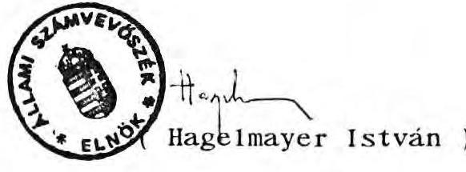

---

# ÁLLAMI SZÁMVEVÖSZÉK 

$\mathrm{V}-8-11 / 1992$.

## IV.

## M E L L É K L E T E K

a Harmónia Kereskedelmi Vállalat privatizálásáról, az állami vagyon alakulásáról készült jelentéshez

---

1. sz. melléklet

ÁVÜ levele dr. Hetényi Gábor vállalati biztos részére
2. sz. melléklet

A Harmónia Kereskede1mi Vállalat (1990. október 24.) levele az ÁVÜ Elöprivatizáció Programigazgatóságának
3. sz. melléklet

Az ÁVÜ Elöprivatizációs Programigazgatóság levele dr. Hetényi Gábor vállalati biztos részére (1991. április 18.)
4. sz. melléklet

Megállapodás (1991. május 3.) a Harmónia Kereskede1mi Vállalat és a Harmónia Kereskede1mi Rt között
5. sz. melléklet

Megállapodás (1991. június 4.) a Harmónia Kereskede1mi Vállalat és a Harmónia Kereskede1mi Rt között
6. sz. melléklet

Szerződés (1991. május 10.) az ÁVÜ és a Két Kalmár Rt között
7. sz. melléklet

Fővárosi Főügyészség indítványa (P.20.068/1992/1-II.; 1992.
február 21.) a Fővárosi Bíróságnak, mint Cégbíróságnak
8. sz. melléklet

ÁVÜ Elöprivatizációs Programigazgatóság levele (1991. október 30.) Két Kalmár Rt e1nök-vezérigazgatójának
9. sz. melléklet

ÁVÜ Elöprivatizációs Programigazgatóság levele (1992. január 29.; 274/2/92.) Két Kalmár Rt e1nök-vezérigazgatójának

---

10. sz. melléklet

Társulási megállapodás (1991. május 3.) a Pegazus Rt és Két Kalmár Rt között
11. sz. melléklet

Adás-vételi szerződés (1991. december 14.) a Bíbor Kft és a Harmónia Kereskedelmi Rt között részvényvásárlásról
12. sz. melléklet

Adás-vételi szerződés (1991. december 13.) Pegazus Tours Rt és a Harmónia Rt közötti részvényvásárlásról
13. sz. melléklet

ÁVÚ ügyvezető igazgató levele (1991. november 25.) dr. Hetényi Gábor vállalati biztos részére
14. sz. melléklet

A Fővárosi Bíróság levele (1992. január 2.; 6.Fpk.414/91/9) az ÁVÚ Előprivatizációs Programigazgatóság részére
15. sz. melléklet

Munkaszerződés (1991. december 1.) dr. Dobos Gábor kirende1t vállalati biztos és az ÁVÚ között
16. sz. melléklet

ÁVÚ Előprivatizációs Programigazgatóság levele vállati biztos megbízásáról
17. sz. melléklet

Harmónia Kereskedelmi Vállalat felszámoló zárómérlege
18. sz. melléklet

ÁSZ állásfoglalása az ÁVÚ észrevételeire

---

19. sz. melléklet

ÁSZ állásfogla1ása a Két Kalmár Rt. észrevételeire
20. sz. melléklet

ÁSZ állásfogla1ása dr. Hetényi Gábor felszámoló észrevételeire

---

Allami Vagyonügynökség
1399 Budapest Pr. 708

1. sz. melléklet
a V-8-11/92. sz. jelentéshez Budapest, 1990 november 20. Hiv.sz:

Hetényi Gábor ur részére!
Budapest

Tisztelt Hetényi ur!

Az Allami Vagyonügynökseg Igazgatótanácsa a Harmonia Kereskedelmi Vállalatot államigazgatási felügyelet alá vonta.

Az 1990. évi VII. törvény 16. paragrafusa alapján, önt 1990. november 20- hatállyal 1991. május 31-ig a Harmonia Kereskedelmi Vállalathoz vállalati biztosként kirendelem. A jelen kinevezés indokolt estben meghosszabitható.

Feladata:
A Harmonia Kereskedelmi Vállalat privatizaciójanak elökészítése.

A vállalati vagyont érintő valamennyi kérdésben kizárólag ön járhat el. Igy a Harmonia által elözöleg létrehozott társaságokban valamint a Harmonia Ker. Vállalat és a Harmonia Rt közötti vagyonmegosztási peres eljárás során az állami vagyonrészt illetve a Harmonia Vállalatot ön képviseli.

A Vállalat és a Harmonia többségü Kalmár Kít. szervezetének valamint pénzügyi helyzetének átvilágíttatása. Az átvilágítás eredményeként szükséges intézkedések megtétele.

---

Végeztesse el az elmúlt időszak vagyonmozgásának ellenőrzését. Ennek eredményétől függően tegye meg az indokolt intézkedéseket.

Munkája során folyamatosan tájékoztassa a vállalat alapító szervét.

Fizetését havi 35 ezer Ft-ban állapítom meg, melyet a Harmonia Ker. Vállalat folyosít.

Munkájához sok sikert kívánok.

Üdvözlettel

2fue 1km:

80.11.20.

---

# Harmónia Vállalat 

## Budapest

Tárgy: Államigazgatási felügyelet alá vonás elrendelése

Budapest Fôváros Tanácsa 481/1. a-b/ 1955. VB számu 1955. VI.21-én kelt határozatával Dohánybolt Vállalatként alapított, majd a 80.086/35/85. számu, 1985. julius 11-én kelt határozat alapján vállalati tanács általános irányításával müködõ

Harmónia Vállalatot
az állami vállalatokról szóló, többször módositott, 1977. évi VI.törvény 42/A § (3) bekezdésében foglaltak szerint, az 1990. évi VII. törvény 10 § (1) bekezdés e) pontja alapján - figyelemmel a 12 § (1) bekezdésében foglaltakra az Állami Vagyonügynökség Igazgatótanácsa
államigazgatási felügyelet alá vonja.
Az Országgyûlés 20/1990. (III.12.) sz. határozata az önkormányzati irányitásu vállalatok államigazgatási felügyelet alá vonásának feltételeit rögziti.
Az Állami Vagyonügynökség Igazgatótanácsa a vállalat jelenlegi helyzetét mérlegelve, az említett feltételek figyelembevételével hozta meg döntését annak érdekében, hogy a vállalat további müködésében és a vele kapcsolatos döntésekben a vagyonpolitikai irányelvekben foglaltak érvényesithetők legyenek. Budapest, 1990. október 12.

---

Állami Vagyonügynökség elóprivatizációs programigazgatósága
budape st
1051. Roosevelt tér 7-8.
90.október 24.

Hivatkozva az 1990. évi I. XXIV. törvény 4. §. (2) bek.-ben clöirt, kötelezettségre, valamint a végrehajtásával kapcsolatos toondőkről a Hoti Világgazdaságban és a Figyelóben megielent útmutatóban meghatározott feladatokról szóló tájékoztatásra, mellékelten megküldöm a Harmónia Kereskedelmi vállalat befeztetéseiről készitett kimutatást.
A vállalat tulajdonában uzlet nincs.
A Budapest Bank Részvénytársaságban lóvố 2 millió Ft értékii részvény bemutatóra szóló órtékpapir.
A Harmónia Kereskedelmi Részvénytársaságban a vállalat részesedése $33,29 \%$, ez névre szólo részvényt tartalmaz.
A Pórum Részvénytársaságban a vállalat részesedésének aránya $13,33 \%$, ez névreszólo részvényekből áll.
A Kalmár Kereskedelmi Kft-ben a vállalat részesedése $97,79 \%$, a fennmaradó uzletrész a Pegazus Részvénytársaság tulajdonában van.
A telefonkötvény és az MNB kötvény bemutatóra szólo értékpapir.
A vállalat létszámát folyamatosan csökkenti, a a Kalmár Kereskedelmi Kft-vel való egyesülését tervezi.
Tájékoztatásom szíves tudomásul vételét kérem.

Tigzthlettel Dr. Nagy Oszkár igazgató

---

# KIMUTATÁ S 

a Harmónia Kereskedelmi Vállalat befeztetéseiról

1. Részvények:
2. 1 Budapest Bank Rt.
1.2 Harmónia Kereskedelmi Rt.
1.3 Fórum Részvénytársaság
$\because 28.300 .000 .-$
14.000.000. -
$\because 44.300 .000 .-$
3. Vagyoni betét:
2.1 Kalmár Kft.
$44.200 .000 .-$
4. Egyéb értékpapír:
5. 1 Telefonkötvény
100.000 . -
3.2 MNB k'stvény
1.839 .000 . -
$\because 1.939 .000 .-$
$\because 1.939 .000 .-$
$\qquad$

---

# ALLAMI VAGYONUGYNOKSEG 

Eloprivátizácós Programigazgatósága
Budapest, Pf. 708. 1399
Telefon: 11-85-044

HARMONIA Kereskedelmi Vállalat
BUDAPEST VI.
NagymezG utca 3.
1372

Hivatkozással a f.hó 24 -én kelt T/421 számú bejelentésükben foglaltakrá, kérem, szíveskedjenek felülvizsgálni az ú.n. "2.számú melléklet" tételeit abból a szempontból,hogy azokat az 1990.évi LXXIV.törvény $14.5 / 1 /$ és /3/ bekezdésében foglalt eloirások szerint állított-ták-e össze. A $14.5 / 1 /$ bekezdése szerint ugyanis csak azokban a gazdasági társaságokban fennálló érdekeltségek tartoznak e törvény hatálya alá, amely gazdasági társaságok - a törvény hatálybalépése-kor - a 2.5 /1/ bekezdésében meghatárpzott üzlete(ke)t is üzemeltetnek. Igy különösen felülvizsgálandónak tartjuk a bejelentésükben szerepelțetett Budapest Bank Rt., Telefonkötvény, MNB kötvény tételsorokat.

Felhivom továbbá szíves figyelmüket arra is, hogy az 1990.évi LXXIV. törvény $1.5 / 1 /$ bekezdése szerint a törvény hatálya azokra a gazdasági társaságokra is kiterjed, melynek tagjai kizárólag állami vállalatok vagy egyéb állami gazdákodó szervek.

Igen sürgơs felülvizsgálatukat követően haladéktalanul szíveskedjenek írásbeli nyilatkozatot adni, vagy (szükség szerint) új bejelentést készíteni. Kérem, hogy eze(ke)n szíveskedjenek feltüntetni a vállalat adóigazgatási azonosító számát is.

Budapest, 1990.évi október hó 31-én.
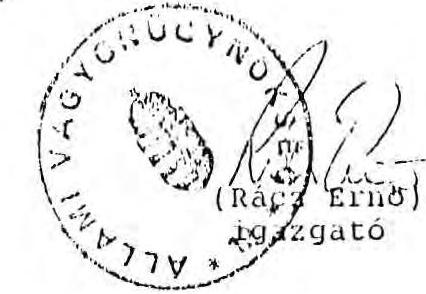

---

# ALAHYVACYONI GYVÖRSÖG

Előprivatizációs Programigazgatóság

Ikt. sz. 17/11/1991

Fax: 1220-012

dr. Hetényi Gábor úr
vállalati biztos

Harmónia Kereskedelmi Vállalat

Budapest

Tisztelt Hetényi Úr!

Ertesíten, hogy javaslatát a hely a Harmónia Kereskedelmi Vállalat és a Harmónia részvénytársaság vagyoni helyzetének rendezésére és az állami tulajdonrész privatizálására vonatkozik - előzetesen elfogadom.

Egyetértek a Harmónia Rt-ből az állami részesedésnek megfelelő vagyonrész leválasztásával és az abból alakítandó részvénytársasággal.

Kérem, hogy a megalakítandó részvénytársaság és a Kétkalmár részvénytársaság fűziójára, valamint az üzletek értékesítésére vonatkozó szerződéstervezeteket előzetesen részemre megküldeni szíveskedjék.

Egyben értesíteni, hogy a vállalati biztosít megbízatását tiszteletdíjának változatlanul hagyása mellett - július 31-ig meghosszabbítom.

Budapest, 1991. április 18.

Rácz Ertár
igazgatós

---

# M E C A L T A P O D A S 

amely létrejött
egyrészröl: a Harmónia Kereskedelmi Vállalat (képviseli: Dr. Hetényi Gábor, ÁvU által kirendelt vállalati biztos)
másrészröl: Harmónia Kureskedelmi Részvénytársaság (képviseli: Lestyánsskyné Jáhn Júlia, ügyvezető igazgató és Adalberto Fuzek az igazgatósáq elnöke) között
az alulirott napon és helyen, az alant irt feltételek mellett:
1./ Szerzödő telek megállapítják, hogy az eddigi peres és perenkivüli vitás kérdéseiket egyezség jogcimén kivánják rendezni, oly módon hogy a jelen okirat aláirása után az eddigi vitákból eymással szembon egyik félnek sem lesz summinemi követelése.
2./ A Harmónin Kereskedelmi Vállalat (továbbiakban: HKV) a Harmónia Kereskedelmi Részvénytársaságnál (továbbiakban: HRT) részvény tulajdonos $28.300 .000,-$ Ft, - $10.000,-$ Ft/ab névértćkï szavażásra és osztalékra jogosító részvénynek 2830 darabszámban. A fenti részvényciból 2820 db-ot vógleges ellentérték néltali forrás átengedés jogcimén átad a HKV a HRT részére - aki ezt elfogadja.
3./ A hRT vógleges forrás átengedés jogcimén figyelemmel különösen arra, hogy a BKV alapitója a HRT-nek, a HRT beadott apportjából átadja a HKV részére a mellékelt I.számu lista szerinti üzelthelyiségek kezelöi-, bérleti-, tulajdonjogát, azzal, hogy kötelezettséget vállal minden ehhez szükséges okirat, nyilatkozat aláírására és kiadására.
4./ A szerződő telek megállapodnak abban, hogy az üzeletek berendezési tárgyakkal, felszerelésekkel, és a jelen okirat aláirásakori. árukézelettel kerülnek a fentiek szerint átadásra a 11 .sziuna melléklet szerinti ütemterv mzerint.

Azokat az üzleteket, amelyeket a HRT társasági forrában vagy albérletben üzemelteti, oly módon adja át, hogy a HRT átadja a teljes tórsusági rószesedését illetőleg az albérleti szerzödésben irt minden jogosítványt.

---

Falek megállapodnak abban, hogy a IV. szánu pontban irt árakészlet, fogyóeszköz az átadásig mozgatásra nem,kerül.
5./ Szerzôdõ felek megállapodnak abban, hogy a Fôvárosi Biróságoon 25.G.46.356/90. számú perben a HKT - mint felperes, jogosult alperesi költségigény nélkül keresetétól elállni, de jogosult a pert szünctelöbe helyeztetni, melyhez a HÁv köteles hozzájárulni és mindkét fól kijelenti, hogy a pert a szünctelöböl nem jogosultak felvonni és a por a l'p. alapján l év szünctelós után hivalból megszünik és ez esetben a felek együttmüködnek a peres illeték 50\%-os, illetőleg 100\%-os mérséklése érdekében.
6./ A felek megállapodnak abban, hogy mindkét fél köteles az általa inditott mindennemü peres eljárásban a keresettól elállni, a másik fél kijelenti, hogy ez esetben költségigénye nincsen.

A fentiek vonatkoznak éstelemszeruen a viszont-keresetekre és a beszámítási kifogásokra.
7./ A szerződõ felek megállapodnak abban, hogy a jelen szerzödésbôl származó kötelezettségeken túl a szerzôdés aláirása elôtti idôre egymással szemben semminéven nevezendô igényt nem támasztanak.
8./ A HÁv kötelezi magát, hogy az átvett boltokban dolgozókat az wzletek ÁvU általi meghirdotósig foglalkoztatja, áthelyezéssel, eddigi bérük változatlan tartásával veszi át.
9./ A szerzödõ felek megállapítják, hogy a vállalati biztos felhatalmazása alapján jogosult a jelen szerzôdés megkötésére, mig a részvénytárnaság úgyszintén jogosult a jelen okiratban irt kötelezettség vállalására.
A véssvényekkel kapcsolatos elôvásárlási lemondó nyilatkozatok beszerzóse a HKV kötelezettsége.

---

10./: Jzerzödó felek megállapodnak abban, hogy a HRT tárosnsigi . réazesedései kapesán a Gt. Yv. és a társasági szerzödésektu! irt elövételi jog nem érvényesulhat, hiszen azok a jelen szerzödésben foglalt teljes feltételek alapján kerülnek ellenérték nélkül átadásra.
11./ A HÁV részvényeinek 2./ pontban irt átruházásáért, a kibocsátásért felelős HRT Igazgatósás felelős abban a vonatkozásbani, hogy azokat a HRT részére közvetlenül adja át és a Készvénykönyvben a túlajdonjogot vezesse át.

A fenti 3 számozott oldalból álló megállapodást a szerzödó felek mint akaratukkal mindenben megegyezöt helybenhagyóan irtak alá.

Budapest, 1991.05 .03.
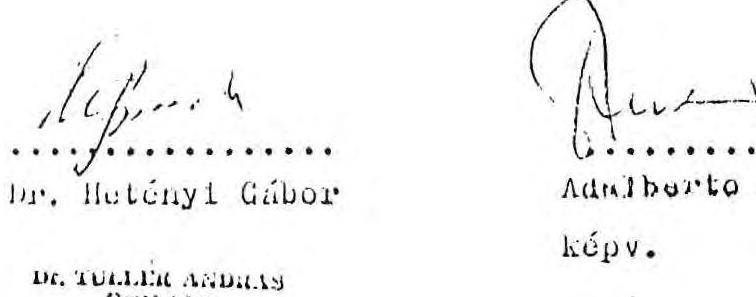

A fenti megállapodás jováhagyólag ellenjegyzésre került:
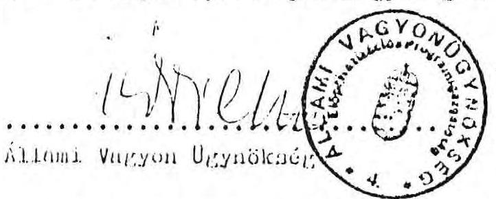

Az RT ez ügyben megbizott jogi képviselójének ellenjegyzésével érvényes.

---

213 F./. Szentháromság tér
219 2./. Mýria tér 3.
107 3./ - Lövőház u. 10.
112 4./ $\checkmark$ Mártirok útja 2.
405. / $\checkmark$ Cnatárka u. 54.

129 6./ $\checkmark$ Moszkva tér
104 7./ $\checkmark$ Mártirok útja 59/a.
113 8./ - Margit hid (budai hídió)
101 9./ $\checkmark$ Keleti K u. 20.
121 10./ Szóló u.
116 11./ Lálos u. 119.
100212./ Nepköztórnnság útja 7.
101 13./ Váci út loo. (IV.,)
1,14 14./ $\checkmark$ Papp J tér 7.
51 15./ $\checkmark$ Káposztásmegyeri 1tp.
1015. ép.

10316. / Sxt.István téri piac pav.
102117./ Mínnich F u. 34.
10 18./ VJJaria köz 4.
37 19./ Vtanács krt 4.
101520./ Néphadsereg u. 5.
511 21./ Belgrád rkp. 19.
102222./ Mínnich F u. 20.
10223. / Akadémia u. 21.
310 24./ Ragola tér
511 25./ Tolbuchin krt. 14.
112 26./ $\checkmark$ Rudas L u. 23.
10027./ Nargmező u. 38.
1100 28./ L Király u. 38.
301 29./ Lövölde tér 3.
301 30./ $\checkmark$ Eötvös u. 6.
321 31./ $\checkmark$ Lenin krt 98.
112 32./ $\checkmark$ Bartók B út 33.
110433./ Lenin krt 58.
1121 34./ $\checkmark$ Bethlen G u. 14.
1122 35./ $\checkmark$ Thököly út 20.
1112 36./ $\checkmark$ Damjanich u. 58.
1110 37./ $\sqrt{1}$ Lenin krt 13.
1111 38./ Landler J u. 10.
112339./ Garai tér 5.
131040./ Uillói út 30.
130541./ Uillói út 62.
131642./ Barons u. 81.
120243./ Jósnei krt 8.
30444./ $\checkmark$ Rákóczi tér 21.
1211 45./ Kian J u. 2.
130446./ Perenc krt 25.
137147./ Váróhid u. 2.
11048./ Vhámán K u. 4.
2149./ Kádáy u. 24/a.
11050./ Soroksári út 8-10.

117
201111111.
$\times 51.1 /$ Ferenc krt 38.
1127 52./ $\checkmark$ Sétáló u. 14. (X.,)
1133 53./ Kérösy-Csoma S u. 4.
141654./ $\checkmark$ Bongrácz u. 9-11.
310 55./ $\checkmark$ Baranyai u. 23.
316 56./ $\checkmark$ Böszörményi út 16/b.
52 57./ $\checkmark$ Városmajor u. 1.
303 58./ Szilágyi E fasor 16.
12359./ Lehel u. 33.
1235 60./ Lehel u. 36.
1205 61./ Thalmann u. 29.
120 62./ $\checkmark$ Váci út 87.
601 63./ Katona J u. 5.
306 64./ $\checkmark$ Gyöngyöni u. 53.
701 65./ $\checkmark$ Bosnyák téri pav.
1075 66./ $\checkmark$ Mexikói út 4. pav.
703 67./ $\checkmark$ Erzsébet kir. né útja 45.
30268./ Kansaí tér 18.
42369./ $\checkmark$ Pestújhelyi út 50.
1125 70./ Arany J u. 24.
711 71./ $\checkmark$ Rákos út 118.
160572./ Kón Károly téri pav.
112373./ Nagy Sándor út 118.
12074./ Erzsébet tér
11375./ Kocauth L u. 34-36.
112176./ Kocauth L u. 76/b.
111177./ L Rákóczi út 167.
113578./ Deák téri piac
311 79./ Rózsa Richárd u. 11.
1213 80./ $\checkmark$ Fémmunkás Váll. pav.
523 81./ Alag, pav.
314 82./ Alag, pav.
132283./ Alag, pav.
82 84./ Józsé́ krt. 41.

---

# II. azánu melléklet 

1./ Az albérleti és bérleti, valamint Bt szerződések cedálásának határideje: 1991. május 7.
Yelelős: Dr. Kovács Zoltán úr
2./ A saját üzemeltetési boltok leltár szerinti átvétele 1991. május 10 -ig folyamatosan.

Yelelős: Kovács Géza úr
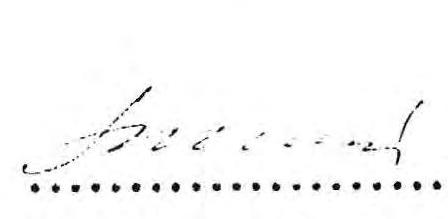

Lestyánszkyné
Szilczer Attila
Jáhn Júlia

---

A1JJ1rott közjegyzö tanusttom, hogy ez a tuloldali is idefüzött-tovabbı négyoldal terjedelmü fénymisolat mindenben szó szorint -megegyezik a mi napon elöttem eredatiként bemutatott is eredetine. lätptt háromoldal terjedelmü megállapodáosal so továbbı kót oldal -terjedelmü melloklettel.
Kelt Budapesten 1991.ezerkllencezázkllencvenegy-ayl majus ho 23. huzzonharmadik napjún.
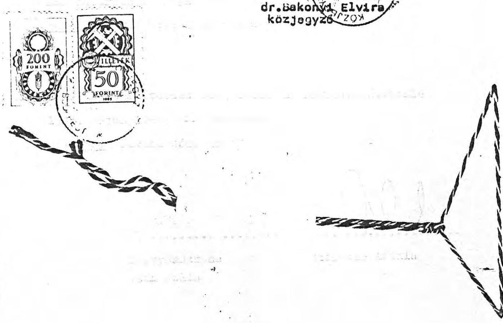

---

amely létrejött egyrészről a Harmónia Kereskedelmi Vállalat (Dr. Hetényi Gábor) Harmónia Kereskedelmi Részvénytársaság (Lestyánszkyné Jáhn Julia, Mausz Gotthárd) Kétkalmár Részvénytársaság (Szilczer Attila, Sárosi Péter) között az alulirott napon és helyen az alábbiak szerint:
1./A szerződő Felek megállapítják, hogy közöttük 1991.május 3. napján megállapodás jött létre, mely megállapodásokat a Felek a jelen okiratban kiegészitve, erósitenek meg. A megerősitést a Harmónia Kereskedelmi Részvénytársaság 1991. május 27 - junius 4 napján tartott közgyülésének határozata alapján történt.
2./ A Harmónia Kereskedelmi vállalat figyelemmel a Gt.Tv.-ben foglaltakra a 2820 db HRT A sorozatu részvényt összesen 10.000,- Ft ellenértékért szerzi meg alaptőke feletti vagyonából.
3./ A HRT egyik legnagyobb részvényplakettével rendelkező Mausz Gotthárd Úr mint a tulajdonos és mint igazgató kijelenti, hogy 5 naptári évig kötelezettséget vállal arra, hogy szavazatával Kovács Géza úr felügyelőbizottsági tagságát megszavazza.
4./ Felek megállapítják, hogy a május 3. napján kelt megállapodásban nem szereplő a HKV terhére 1991-ben benyujtott a HRT-t illető fizetési kötelezettségek a HRT terhelik ezek a.) közüzemi szolgáltatások
b.) bankiterhelések
c.) egyéb azonnali inkasszoval érvényesitett tételek
d.) egyéb biróság által HRT-t illető tételek amelyek meglétét a benyujtott számlákkal igazolja a HKV.
Felek megállapítják, hogy a HRT 1989. julius l-től értékcikkeket vett át, továbbá jegykészletet amelynek követelt összege a posta által 12,405.430,- Ft mig a BKV 13,142.753,-Ft-ot kér a fenti tételeket Felek 15 napon belül egyeztetik és a HRT-nek átadott valós mennyiség és forgalom után a HRT azt átveszi.

---

5./ A HRT kötelezettséget vállal, hogy az 1991. május 3-i egyezség illetőleg a jelen egyezség 4. pontjában szereplő vitás tételek kapcsán a HKV ellen inditott perekben jogutódként belép az egyeztetés eredményeként müködik közre a HKV perből való elbocsájtása érdekében.
6./A szerződő Felek a jelen megállapodásra kifejezetten fí-: gyelemmel a megállapodások egységességére lemondanak:
a.) feltünő értékkülönbség jogcíméni megtámadásról
b.) a szerződés egyéb jogcímén történő megtámadásról
7./ A HRT kötelezi magát, hogy az átadott I.melléklet szerinti listában szereplő boltokat, üzemeltetőket az átadás tényéről értesíti 1991. május 3. napjától a fentiektől befolyt összeget a szerződő partnereinek átutalja, viszont azok viselik ezidőtől az üzemeltetéssel felmerült költségeket. Ugyancsak viselik ezidőtől kezdôdően felmerült vagy felmerüló munkajogi polgárjogi, társadalombiztosítási jogi, államigazgatási pereket, eljárásokat és az ezekből következő határozatok jogkövetkezményeit.
8./ Szerződő Felek kijelentik, hogy a HKV által megvásárolt MODI részvényeket $2,5 \mathrm{mPt}$ árral az ÁvU részére privatizálásra felajánlják.
A HRT a fenti áron hajlandó áron hajlandó megvásárolni a fenti részvényeket, de tudomásulveszi, hogy amennyiben magasabb áron kerül piaci értékesítésre a HRT-nek elővásárlási jogot biztosít a jelen megállapodás.
Jelen megállapodást a Felek mint akaratukban mindenben megegyező alulirott tanuk jelenlétében egyidejüleg aláirták. Budapest, 1991. junius 4.
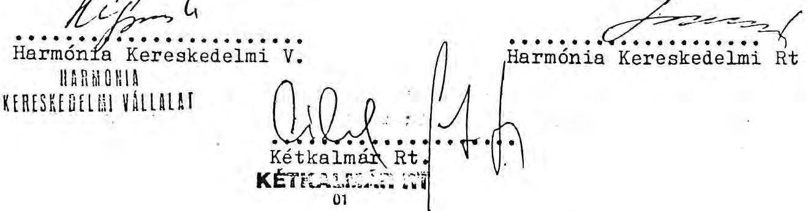

---

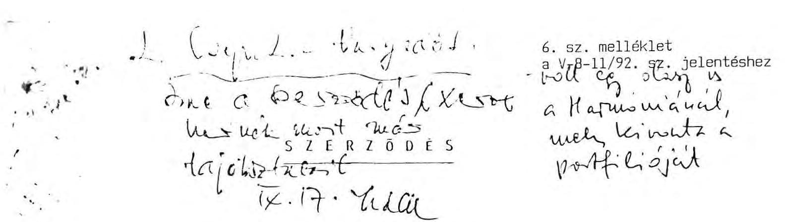
amely lérejött egyrészröl: az Állami Vagyonügynökség ( a továbbiakban: Ávü)
másrészröl "KÉTKALMÁR" RT Elnök-Vezérigazgatója, Szilczer Attila és AleInök-Gazdasági Igazgatója, Kovács Géza ( a továbbiakban 2KRT).
között az alulirott napon az alábbi feltételek szerint.
1./a. Felek megállapítják, hogy a 2KRT 1991.május 2.napján megtartott közgyülése által elfogadott, módosított és egységes szerkezetbe foglalt Alapszabálya és a mellékleteként elfogadott Dolgozói Részvényvásárlási Program alapján 4190 db , egyenként $10.000 .-$ Ft névértékü DRP részvény kerül kivásárlásra a társaság választott tisztségviselői és más dolgozói által, mig további 1700 db , egyenként $10.000 .-$ Ft névértékü részvény kerül privatizálásra 1991.december 31 .napjáig.
1./b. Felek rögzítik, hogy a mellékletként csatolt, a Harmónia Kereskedelmi Vállalat irodái, raktárai, és boltjai forgalmi értékeléséröl készült 1991.április 8-i keltü igazságügyi szakértői szakvélemény alapján a 2KRT 59,3 millió Ft forgalmi értéken vásárolja meg, a mellékletben felsorolt vagyoni értékü jogokat.
1./c. Felek megállapodnak abban, hogy a 2KRT 1991.december 31. napjáig megvásárolja a Harmónia Kereskedelmi Vállalat tulajdonát képező, a_É́rum Rt-ben lévő 14 mFt névértékü részvénycsomagot 21 mFt , azaz 150 \%-os árfolyamértéken.

---

Fizetési feltételek:
2./a. A dolgozói részvényvásárlási program zökkenőmentes előkészitése és beinditása érdekében az ÁVÜ 1991. október 31-i lejárati határidővel visszavonhatatlan opciót ad a Kétkalmár Rt részére az 1/a.pontban irt részvények megväsárlására és privatizálására azzal, hogy a lejárati határidő 2omillió Ft opció dij befizetésének utolsó határnapja.
2./b. A 2KRT kötelezettséget vállal arra, hogy az ÁVÜ által megjelölt számla javára legkésőbb 1991. december 31. napjával átutalja az 1/a-b-c. pontokban foglaltak teljes ellenértékeként a kölcsönösen megállapított 119.200.000.-Ft, azaz -Egyszáztizenkilencmillió-ket-tőszázezer-forint vételárat azzal, hogy a 3.pontban foglalt perértéket, annak ellenértékeként betudja.
3./ A Felek megállapodnak abban, hogy a Harmónia Kereskedelmi Vállalat és a Harmónia Kereskedelmi Részvénytársaság között a Fővárosi Bíróságon folyó elszámolási perben a 2KRT vállalja, hogy belép a Harmónia Kereskedelmi Vállalat perbeli utódjaként a perbe és kötelezettséget vállal, hogy marasztalás esetén a Harmónia Állami Vállalatot 70 millió FT-ig terjedő fizetési kötelezettségét maximum 50 \%-ig átvállalja, igy jogosult az eljárás jogerős befejezéséig a $2 / \mathrm{b}$ pontban irt összeghöl 70 MFT-t visszatartani, pernyertessége arányában köteles az AVÜ felé max. 35 MFt-ot kifizetni.
4./ A Felek megállapodnak abban, hogy a Harmónia RT. és a Harmónia Állami Vállalat között 1991.április 3.napján létrejött megállapodás alapján a Harmónia

---

Áv-hoz került Târsasági részesedések közvetlenül cedálásra kerülnek a Kétkalmár Rt-re, aki ennek fejében kötelezettséget vállalt a fent hivatkozott szerzōdés kapcsán a Harmónia Állami Vállalat birtokába került üzletek privatizációjának előkészitésére, annak lebonyolítására.

Az igy átkerült üzletek az alábbi formációban müködnek
a./ albérletbe adva ( 5 éves határozott idejü szerződéssel.
b./ a vállalat kültagként BT-ban és igy a BT. részére albérletbe adva
c./ bérleti rendszerben üzemeltetve

A Kétkalmár RT kötelezettséget vállal arra, hogy az értékesités során a lehető legnagyobb hozamot biztositja, saját maga jogosult megválasztani, hogy a szerződések felmondásával, vagy bármely más célravezető módon a privatizálást ugy hajtja végre, hogy versenytárgyalásra hirdeti meg az üzletet a vagyonértékelés szerinti minimális dijon, és az igy versenytárgyalás során elért teljes vételárat az AVÜ által megjelölt számlára köteles átutalni. Köteles gondoskodni arról, hogy a fenti alapösszeg felett minél nagyobb licit ár legyen elérhetō.
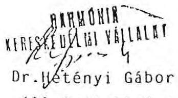
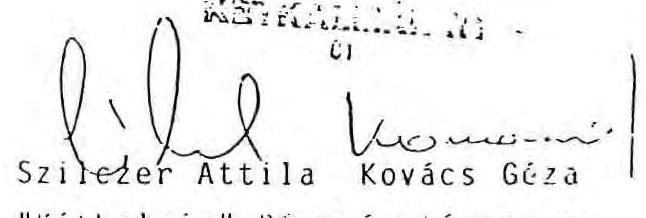

Tudomásul véte mellett jö́rảhagyóld ellenjegyezte:

---

FƠVÁROSI FƠÜGYÉSZSÉG
Polgári Jogi Osztály
P.20.068/1992/1-II.
7. sz. melléklet
a V-8-11/92.sz.jelentéshez

Fővárosi Biróságnak, mint
Cégbíróságnak

# B u d a p e s t 

Pf. 17 .
1363

A "KÉTKALMÁR" Kereskedelmi és Szolgáltató Részvénytársaság 41.402 sz. cégügyében az 1958. évi 5.sz.tvr.17.§./1/bekezdése alapján f e 11 é p e k, és
i n d i t v á n y o z o m,
hogy a cégbíróság az 1991.május 2-i keltũ alapszabály módosítás bejegyzésére irányuló kérelmet utasítsa el.

## I n d o l á s

A módosítás során a részvénytársaság a GT alábbi szabályait sértette meg:

A GT szabályainak alkalmazása során abból a 233.§-ban meghatározott elvből kell kiindulni, hogy a részvénytársaságra vonatkozó szabályozás kogens, az itt irtaktól csak akkor lehet eltérni, ha azt a törvény kifejezetten megengedi.
Időközben 1992.január l-én hatályba lépett a GT módosításáról szóló 1991. évi LXV.tv., amelynek 49.§. /1/bekezdés második mondata értelmében a módositó törvény szabályait az elbírálás alatt álló alapszabály módosításra nem kell alkalmazni.
A módositó törvény eltérést nem engedélyező rendelkezéseivel ellentétes alapszabályát a módositó tv.49.§./2/bekezdése értelmében pedig 1993.december 31-ig köteles az RT módositani. Ennek megfelelően álláspontom szerint azt kell vizsgálni, hogy az alapszabály módosítás a GT módosítás elôtti mely kogens rendelkezéseit sérti.
A GT.235.§./3/bekezdése szerint az összes részvény névértékének összege képezi a részvénytársaság alaptőkéjét. A részvények azonos tagsági jogokat biztosítanak. Törvény, vagy törvény felhatalmazása alapján az alapszabály eltérő tagsági jogokat biztosító részvények kibocsátását is elrendelheti. /GT.234.§./2/ bekezdése./ Az azonos jogokat biztosító részvények egy részvényfajtát alkotnak./ GT.234.§./3/bek./ A részvényjegyzés, illetve a kibncsátás feltételeit a GT.238.§.-a, 252.-256.§-ai, 257.§-a és 264.§-a tartalmazza. E szabályok részben azt tartalmazzák,

---

hogy a részvényest milyen határidőn belül, milyen mértékű pénzbefizetési kötelezettség terheli, illetőleg, hogy részvényt milyen esetben lehet csak kibocsátani. A GT.278.§. c/pontja a közgyűlés kizárólagos hatáskörébe sorolja az egyes részvényfajtákhoz fűződő jogok megváltoztatását. A 283.§. pedig ezen felül is az érintett részvénytulajdonosok minősített többségű határozatát követeli meg a döntéhez.
A GT.252.§./1/bekezdése kimondja, hogy a részvénytársaság alaptőkéje biztosításának módja a részvényjegyzés, és a 256.§./1/ bekezdéséből adódóan azt csak akkor lehet sikeresnek tekinteni, ha valamennyi, az alaptőke fedezetéhez szükséges névértékű részvényt lejegyezték. Végül a részvény bevonásának a GT. csak két esetét ismeri: az alaptőke leszállítását /GT.313.§. b/pont/, és a részvényeknek a társaság általi átmeneti megszerzését, amely azonban az alaptőke összegét, így magát az alapszabály részvényekre vonatkozó rendelkezéseit nem érinti. /GT.248.§. /1/-/2/ bek./ /Adott esetben helyesebb lenne az átmeneti forgalomból való kivonás elnevezést használni./

A fenti szabályokból megállapítható, hogy csak olyan fajta részvény kibocsátására volt mód, amelyet a társasági törvény lehetővé tett, a meghatározott nagyságú alaptőkére kibocsátott részvényeknek a fajtáját sem bevonással, sem más módon megváltoztatni nem lehetett.
Az egyes részvényfajtákhoz fűződő jogok módosulása magát a részvényfajtát és annak tulajdoni helyzetét nem érinti, csak az ott szereplő bizonyos jogosultságok módosulhatnak megfelelő döntés után.
Az nem kétséges, hogy a társaság a részvényjegyzés szabályait nem tartotta be, miután az ujfajta részvények kibocsátását nem részvényjegyzéssel kívánta megoldani. Erre a korábban már lejegyzett alaptőkére való tekintettel nincs is lehetőség.
A GT-nek azonban nem volt tételes jogi rendelkezése a részvényfajta módosítására, így a szabályozás kogens jellege miatt erre ugyancsak nincs lehetőség. Törvénysértő tehát az alapszabálynak az a módosító rendelkezése, mely szerint az adott nagyságú, korábban már lejegyzett alaptőkére kibocsátott részvények fajtáját megváltoztatták. Ugyancsak kizárt, hogy bizonyos részvényfajtához fűződő jogok keletkezését, vagy megszünését az alapszabály feltételhez kösse, mert erre csak az alapszabály már ismertetett módon való módosítása ad lehetőséget.

A részvénykibocsátást részleteiben is törvénybe ütközőnek tartom:
1./ Az "A" sorozatú részvények az államnak vétójogot biztosítanak. Ezt az intézményt a GT nem ismeri, és ez már önmagában is a 234.§. /2/bekezdésébe ütközik. A GT 242.§. /3/bekezdése kétségkivül az osztalék elsőbbségi részvény kibocsátása mellett, - mely adott esetben a szavazati jog korlátozását, vagy kizárását is maga után vonhatja - lehetővé teszi másfajta elsőbbségi részvény kibocsátását is.

---

Ha a fentiek ellenére el is fogadnánk azt, hogy kibocsátható olyan elsőbbségi részvény, amely csak szavazati jogot, éspedig vétójogot ad, osztalékot viszont nem, a jog gyakorlásának esetköre olyan tágan van megfogalmazva, hogy gyakorlása, vagy nem gyakorlása állandó jogviták forrása lehet.

A GT.278.§-a határozza meg a közgyűlés kizárólagos hatáskörét. A vétójogot az állam a közgyűlésen gyakorolhatja. A gazdasági kérdések eldöntése pedig a törvényi felsorolásból is megállapíthatóan zömében nem a közgyűlésen, hanem az igazgatóság, ülésein dőlnek el.
Így kérdéses egyáltalán a gyakorolhatóság kérdése is.
Teljesen rendezetlen a jogi helyzet akkor, ha a részvény eladásra kerül, vagyis hogy a jogosultság átszáll-e, vagy sem az új tulajdonosra, illetőleg az milyen indokkal gyakorol vétójogot. Tisztázatlan a részvény sorsa a "privatizációs kötelezettség megszünése után". Ezen kivül olyan részvény nincs, melyhez sem szavazati, sem osztalék jog nem kapcsolódik.
Az automatikus jog megszünésre a már kifejtettek is irányadóak.
2./A "B" és "C" sorozatú részvények az un. DRP részei, dolgozói részvényként kívánták kibocsátani.
A GT.244.§./1/bekezdése teszi lehetővé dolgozói részvény kibocsátását. Ezt csak a részvénytársaság alaptőkén felüli vagyonából történő alaptőke felemelés során lehet végrehajtani, legfeljebb a felemelt tőke $10 \%$-ának erejéig. Ezek a részvények korlátozottan forgalomképesek, vagyis a munkaviszony megszünése esetén a vállalat köteles legalább névértéken visszavásárolni. A tulajdonosik ugyanolyan részvényesi jogokat gyakorolnak, mint a többi részvényesek.
/GT.244.§./2/-/3/bek./ A részvény csak névreszóló lehet./ GT. 244.§./2/bek./ A dolgozói részvényt a főfoglalkozású dolgozók kapják, illetve akkor bocsátható ki, ha egyáltalán a részvénytársaságnak vannak főfoglalkozású dolgozói. Célja a dolgozók hosszútávú vagyonérdekeltségének megteremtése, a tulajdonosi szemlélet erősítése és az irányítási jog lehetővé tétele a dolgozók részére.

A DRP-hez nem kapcsolódott tőkeemelés, azt a korábban már kiadott részvények cseréjével kívánták végrehajtani. Erre az eljárásra a módosításkor hatályos GT szerint nem volt törvényes lehetőség.
A GT. módosításáról szóló törvény szerint részvénycserére már sor kerülhet /módosított GT.278.§./1/bek. g/pont/, azonban a már említett, 283.§-ban irott feltételekkel. Ennek megfelelően az alapszabályt a módosító törvény már hivatkozott 49.§./2/ bekezdése alapján a későbbiekben módosítani kell.
A DRP-hez kapcsolódóan kibocsátott részvényeket elsősorban nem a dolgozók, hanem a választott tisztségviselők kapták meg, így az ezt intézményesitő jogszabály nem érheti el gazdasági, társadalmi célját. Jogszabályellenesen bemutatóra szóló részvény-

---

ként bocsátották ki nagy részüket /"C" sorozatú részvény/. Ugyanígy jogszabályellenesen szabad átruházást biztosítottak azoknak a részvényeknek a vonatkozásában, amelyeket már kifizettek, és a törvény rendelkezése ellenére lehetővé teszi azok megtartását az alkalmaazási viszony megszünése után is. A tisztségviselés továbbá nem jelent egyben munkaviszonyt, így nem állapítható meg, hogy az azt megszerzōknek van-e egyáltalán érvényes jogcíme. Az így kibocsátott részvények értéke a $10 \%$-os törvényi maximumtól eltérően közel $70 \%$.
3./ A "B" sorozatú részvényeknél nincs rendelkezés arra, mi a követendō eljárás, ha a "C" sorozatú részvényesek olyan elidegenítést szavaznak, amelynek következtében a tulajdonjogot nem elnök- vezérigazgató beosztású személy szerezheti meg. Ez annál inkább kérdéses, mert a DRP II/4.pontja szerint a részvényes a már kifizetett részvények visszaszolgáltatásra nem kötelezhetō. A tervezet a "C" típusú részvényektől megvonja a szavazati jogot, amely az alapszabály modosításkor a GT.244.\$ba és 269.\$./1/bekezdésében megfogalmazott szabálya ütközött. A módosított GT 242.\$./3/bek.-nek megfelelō módosítást a már hivatkozott módositó rendelkezés folytán az alapszabályban rögziteni kell.
4./ A "D" sorozatú részvényeknél nincs semmilyen adat arra, hogy azokat ki szerzi, vagy szerezheti meg, így kétséges, hogy az azokhoz füzödő osztalék és szavazati jogot ki fogja gyakorolni. Tulajdonos nélküli részvényt a GT nem ismer.
5./ Nem egészen érthető az 1991.junius 7-i "pontosítás" szerint a "B" típusú részvény tulajdonos szavazati jogának terjedelme:
Az 500 db , egyenként $10.000,-R$ névértékú részvény "5 egész és 1/4 évig 4.190 szavazatra jogosít." Ez ellentétes a GT.234.\$./2/ bekezdésével és a $269 . \$ . / 1 /$ bekezdésével. Amennyiben a szavazati jog valóban a névértékhez igazodna, a részvénytulajdonost 500 szavazati jog illetheti meg. Ebből viszont következik, hogy mivel a "C" típusú részvények tulajdonosai szavazati joggal nem rendelkeznek, akik alaptőkehányada $36.900 .000,-R$, ez meghaladja a részvényesek $50 \%$-át.
Márpedig a GT.242.\$./4/bekezdéséből áz következik, hogy a részvényesek legalább $50 \%$-ának szavazati joggal kell rendelkeznie.

Fentieket összefoglalva megállapítható, hogy adott esetben nem részvényjegyzés és részvénykibocsátás történt, hanem a korábban kibocsátott részvényeknek más fajtájú részvényekre kicserélését kívánta a részvénytársaság végrehajtani. Ezt az alapszabály módosításkor a GT nem tette lehetővé.

---

Valójában úgy tünik, hogy a Harmónia Kereskedelmi Vállalat mint, a Kétkalmár RT. szinte egyszemélyes részvényesé részvényeit kívánja különböző feltételek mellett értékesíteni, úgy hogy az állami tulajdonú vállalat 5 és $1 / 4$ éves részletfizetési kedvezmény mellett $2 \%$-os elôtörlesztéssel a vállalat, illetőleg a részvénytársaság tisztségviselőinek tulajdonába kerül át, úgy hogy a Vagyonügynökség hozzájárulásával a részvényvásárlási program megindításához szükséges fizetési kedvezményeket is bitosítják a potenciális vevőknek. A részvények értékesítése ettől eltekintve is, a társasági törvény körén kivül eső jogügylet, ami a GT szabályainak sérelmével nem volt megoldható.

A Vagyonügynökséggel kötött megállapodás kapcsán szükséges utalni a GT.267.§/1/ és /2/bekezdésében foglalt arra a rendelkezésre, hogy a vagyoni hozzájárulást a társaság fennállása alatt a társaságtól visszakövetelni nem lehet. Az 1990. évi LXXIV. tv.2.§ /1/bekezdés c/pontja pedig kimondja, hogy olyan bérleti- albérleti szezödések esetében, ahol a bérlet idötartamából 2 évnél több idő van hátra, a szerződés megszünése után lehet csak az üzletet hasznositani.
Az alapszabály szerint a Kalmár Kft. az üzleteket tulajdonként kapta. Erre a törvényes lehetőség feltehetően ugyancsak nem állhatott fenn, mert csak a kezelő ruházhatta át az ingatlan tulajdonjogát és az üzletek nagy részére a Vállalat csak bérleti joggal rendelkezett.

A Ctyr.15.§. értelmében a cégbíróság hivatalból vizsgálja a bejegyzési kérelem alapjául szolgáló okirat semmisségét.
A benyujtott alapszabály módosítás annak létrejötte és benyujtása idején a fentiek alapján a GT. számos, kogens rendelkezésébe ütközött. Ez a GT módosítás után is több okból fennáll, így az alapszabály módosítás ezzel a tartalommal nem jegyezhető be a cégnyilvántartásba. Amennyiben a kérelmező érvényes alapszabály módosítást nem nyujt be, a bejegyzés iránti kérelem elutasítását tartom indokoltnak.
A cégiratokat mellékelten visszaküldöm.
Budapest, 1992. február 21.
dr.Kiss Mária sk.
ügyész
Kiadmány hiteléül:
kiadó

---

# Elöprivatizációs Programigazgatóság 

Ikt.sz.
Szilozer Attila úr
elnök vezérigazgató
Kétkalmár Részvénytársaság
Budapest
Ff. 428.
1065

Az 1991. október 31-ig esedékes 20 millió forint opciós díj fizetési haladékával kapcsolatos levelére az alábbiakról tájékoztatom:

Mint ön előtt is ismert, Mádl Ferenc miniszter úr tájékoztatást kért a Kétkalmár Rt létrejöttéről és múködéséről, valamint a Harmónia Kereskedelmi Vállalat és Kétkalmár Rt közötti szerződésekről. Jogi Igazgatóságunk a szerzödések átnézése után olyan véleményt adott, me1y alapján felmerül a szerződések jogszerűségének és érvényességének a kérdése, amit a későbbiek során alaposabb felülvizsgálat után lehet eldönteni.

A vitatott kérdések eldöntéséig kérem, hogy a korábbi szerződésekben foglalt vagyonmozgásokra és pénzátutalásokra ne kerüljön sor. A kérdések tisztázása érdekében 1991. november 4-én 15 órai kezdettel /irodai helyiségemben/ egyeztetést tartok, melyre személyes megjelenését kérem.

A fentiekről másolatban tájékoztatom, dr. Hetényi Gábort a HKV vállalati biztosát is.

Budapest, 1991. október 30.
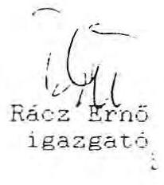

---

# ELOPRIVATIZACOS PROGRAMIGAZGATOSAG 

Ikt.sz.: $274 / 2 / 155 \mathrm{~L}$

Két-Kalmár Rt.
Szilczer Attila úr
elnök-vezérigazgató

Telefax: 122-00-12

Tisztelt Szilczer úr!

Az Allami Vagyonügynökség a Két-Kalmár Rt. és Dr. Hetényi Gábor volt AVU vállalati biztos között 1991. május 10-én kötött ezerződést, valamint annak értelmezésére kiadott nyilatkozatot érvénytelennek tekinti, mert annak ebben a formában való megkötésére jogszabályi lehetőség nem volt.

Fentieknek megfelelően a részvények többsége a magyar állam tulajdonát képezi.

Az Rt-ben lévő állami vagyont privatizációja tekintetében külön intézkedünk, melynek során az Rt. vezetői, illetve dolgozói részvényvásárlási szándékára is figyelemmel leszünk.

Budapest, 1992. január 29.
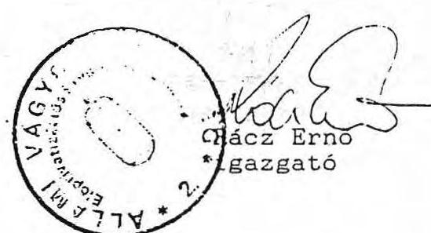

---

# TÁ R S U L Á S I M E G Á L L A P O D Á S 

amely létrejött egyrészröl:
a Pegazus Rt (Maus Gotthard igazgató)
Harmónia Kereskedelmi Vállalat(Dr. Hetényi Gábor vállalati biztos)
"Kétkalmár" Rt (Szilczer Attila és Dr. Kovács Zoltán ig, tagok) között az alulirott napon és helyen az alábbiak szerint:
1./ A szerződő felek részvénytulajdonosok a Harmónia Kereskedelmi Részvénytársaságnál, ahol mindannyian A-sorozatu részvénnyel rendelkeznek.
2./ A Pegazus Rt tudomással bir a Harmónia Kereskedelmi RT és a Harmónia Kereskedelmi Vállalat, illetőleg "Kétkalmár" Rt között 1991,05.03-napján kelt megállapodásokról, melyre tekintettel a felek megállapodnak, hogy a HRT következô rendes közgyülésén az Alapszabály módosítás és tisztségviseló választás kapcsán a HKV és a "Kétkalmár" RT mint részvénytulajdonosok a Pegazus Rt-vel azonosan szavaznak, a HKV egyben a MÓDI meghatalmazottjaként is igy jár el.
3./ A jelen társulási megállapodás érvényességi feltétele, hogy a 2./ pontban irt megállapodások a tervezett ütem szerint teljesitésbe menjenek át.
4./ A HÁv jelen okiratban lemond a HRT-tól kapcsolatban megvásárolt, a Pegazus Rt-által kifizetett (kiegyenlitett) részvények vonatkozásában az Alapszabályban írt elóvásárlási jogról.
5./ A szerződő felek a jelen társulási megállapodásból keletkezố jogvita esetére alávetik magukat a Magyar Gazdasági Kamara mellett müködő Állandó Választott Bíróság kizárólagos illetékességének.

A fenti megállapodást a felek cégszerüen irták alá.
Budapest, 1991:05:03:
Maus Gotthard
Dr. Hetényi Gábor
Szilczer Attila Dr. Kovács
Zoltán

---

# $11 . \mathrm{sz} . \mathrm{melléklet}$   a V-8-11/92. sz. jelentéshez 

## A D Á S - VÉ T E L I S Z E R Z Ö D É S

mely létrejött egyrészről a Harmónia Kereskedelmi Részvénytársaság /Budapest V., Károlyi M. u. 3./, másrészről a Bíbor Korlátolt Felelősségú Társaság /Budapest V., Károlyi M. u. 3./ között az alábbi feltételek mellett:
1./ A Harmónia Kereskedelmi Részvénytársaság eladja, a Bíbor Kft megveszi a Harmónia Kereskedelmi Rt tulajdonában álló 2030 db egyenként $10.000,-$ R névértékú Harmónia Kereskedelmi Rt részvényt.
2./ A részvények ellenértéke $175.000 .000,-$ R, azaz egyszázhetvenötmillió forint, mely összeget a Bíbor Kft 1992. december 31ig köteles a Harmónia Kereskedelmi Rt részére megfizetni.
3./ A Bíbor Kft tudomásul, veszi, hogy az adás-vétel tárgyát képező részvények a Budapest Bank Rt-nél letétben vannak e szerződés aláírásakor.
A letétből a Harmónia Kereskedelmi Rt köteles a részvényeket felvenni, és azokat haladéktalanul átadni, amint a Bíbor Kft a fent jelölt vételárat teljes egészében megfizette.
A Bíbor Kft ettől a naptól kezdve gyakorolhatja a részvényesi jogokat.

Budapest, 1991. december 14.
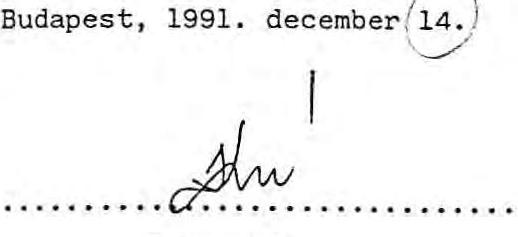

HARMONIA
KERESKEDELMI RT.

---

# ADÁS-VÉTELI SZERZŐDÉS 

mely létrejött egyrészről a Harmónia Kereskedelmi Részvénytársaság /Budapest V., Károlyi M. u. 3./, másrészről a Pegazus Tours Részvénytársaság /Budapest V., Károlyi M. u. 5./ között az alábbi feltételek mellett:
1./ a Harmónia Kereskedelmi Rt eladja, a Pegazus Tours Rt megveszi a Harmónia Kereskedelmi Rt tulajdonában álló 800 db egyenként 10.000,- Ft névértékú Harmónia Kereskedelmi Rt részvényét. A részvények vételára összesen 8.000 .000 ,- R, azaz nyolcmillió forint.
2./ Felek rögzitik, hogy a PegazusTours Rt és a Harmónia Kereskedelmi Rt között 1990. október 15 - -án létrejött kölcsönszerződésből eredően a Harmónia Kereskedelmi Rt. 8.000.000,- Ft-tal, azaz nyolcmillió forinttal tartozik a Pegazus Tours Rt-nek. Az 1./ pontban leirt részvényvétel ellenértékeképpen e 8 millió Ft-ot a felek beszámitják, igy e szerződés aláirásától a fenti részvények tulajdonosi jogi a Pegazus Tours Rt-re száll át, a Harmónia Kereskedelmi Rt viszont a fent hivatkozott kölcsönszerződésből eredően nem tartozik a Pegazus Tours Rt felé.

Budapest, 1991. december 13.
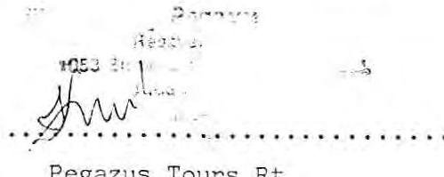

HARMONI 1
KERESKEDELMI, RT
Harmónia Kereskedelmi Rt

---

Ikt.sz.:

Dr. Hetényi Gábor úr
vállalati biztos

Harmónia Kereskedelmi
Vállalat

Tisztelt Hetényi úr!

A Harmónia Kereskedelmi Vállalat és a Két Kalmár Rt. közötti vagyonmozgások felülvizsgálatáról készült belsö ellenőri jelentés megállapításai alapján, vállalati biztosi megbizatása alól azonnali hatállyal felmentem.

Felhívom figyelmét, hogy a mai naptól sem vállalati biztosi, sem egyéb minőségben az Állami Vagyonügynökség képviseletében jognyilatkozatot érvényesen nem tehet.

Egyúttal tájékoztatom, hogy a Fővárosi Bíróságnál kezdeményezem a felszámoló biztosi megbízatásának felfüggesztését, illetve új felszámoló biztos kijelölését.

Budapest, 1991. november 25.
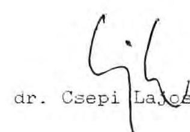

---

Fövírosi Birósíg
Budapest, V., Markó u. 27.
$1365 \mathrm{Bp} . \mathrm{Pf} .16$.
6. Ppk.414/1991/9.

Állami Vagyonügynökség
Elöprivatizációs Program Igazgatóság
Rácz Ernő Igazgató

A Fövárosi Bíróság a HARMÓNIA Kereskedelmi Vállalat /1065 Budapest, Nagymezõ u. 3./ egyszerüsitett felszámolása iránt inditott eljárásban a Fövírosi Bírósághoz küldött 1991. december 5-án kelt levélre válaszolvs tájékoztatásul az alábbiakat közli:

A Fövárosi Bíróság 1991. szeptember 11-én kelt 6. Ppk.414/91/5. sz. alatt kiadott végzésében a HARMONIA Kereskedelmi Vállalat egyszerüsitett felszámolásának megindításáról döntött és az eljárás meginditását a Magyar Közlönyben közzétette. Végzése a Magyar Közlönyben 1991. október 22-én jelent meg. A kérelmet az alapitói jogukat Gyakorí Állami Vagyonügynökség terjesztette elõ és 0 jelölte ki felszámolóként Dr. Hetényi Gábor vállalati biztost.

A többször mód. 1986. évi 11. tvr. 16. (i) bekezdésében foglaltak szerint a felszámolás közzétételével megszünnek az alapití / létesítő/ szervnek a gazdálkodó szerveLét vagyonával és megszüntetésével kapcsolatos jogai a gazdálkodó szervezet vagyonával kapcsolatos jogcselek.ü̈yeket csak a felszámoló tehet.

Fentiek alapján megszünnek az alapitói jogai arra is, hogy a felszámoló személyét megváltoztassa illetőleg vállalati biztosokról döntsön, ugyenis a felszámolás közzétételével a vállalati biztos jogköre megszünt, helyébe a felszámoló lépett. A felszámolás nem az alapitó felügyelete alatt folyik, hanem a többször mód. 1986. évi 11. tvr. rendelkezéseinek figyelembevételével. Az adott rendelkezés nem teszi lehetővé a fulszámoló, személyének módosítósít sem.

A Fövárosi Bírósár tájékoztató levelének 1 példányát közvetlenül megküldi a kijelölt felszámoló Dr. Hetényi Gábor rászére.

Budapest, 1992. január
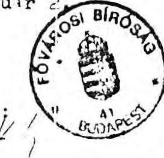

Botka Lászlóéné dr. sk. bíró

---

ügyintéző: Tóth Attila
telefon: 1183-645

Budapest, 1991.XII.1. hiv.sz.
ikt.sz.

Munkaszerződés
amely köttetett egyrészrõl dr. Dobos Gábor /1124 Bp. Korompai u. 21-23./ a Harmónia Kereskedelmi Vállalathoz kirendelt vállalati biztos, mint munkavállaló és az Allami Vagyonügynökség /a továbbiakban AVO/, mint munkáltató között 1991. december 1-én.
1./ Ezen munkaszerződés a többszörösen módosított 1990. évi VII. tv. 16. paragrafusa alapján került megkötésre.
2./ A munkaviszony határozott ideig 1991. december 1-töl 1992. március 31-ig tart. A munkaszerzödés a felek kölcsönös megállapodása alapján meghosszabbítható.
3./ A munkavállaló díjazása havi brutto $55.000 .-\mathrm{Ft}$, melyet a vállalat munkabér kerete terhére kell kifizetni és 1992. január 1-töl az 1991. évi KSH inflációs rátának megfelelően megemelni.

A munkáltató jogok gyakorlója meghatározott feladat teliesitéséért külön prémium, illetve jutalom - a fenti keret terhére - kifizetését is elrendelheti.
4./ A vállalati biztost a fentieken kivül megilletik mindazok a szociális és egyéb kedvezmények - kivéve érdekeltségi rendszer - /gk. használat stb./, amelyek kinevezése előtt a vállalat első számu vezetőjét megilletik.

---

5./ A vállalati biztos felett a munkáltató jogokat az AVU ügyvezető igazgatójának megbízásából Rácz Ernő igazgató gyakorolja, aki ezen munkaszerződést az AVU nevében aláírja.
6./ A vállalati biztos kijelenti, hogy a vezető tisztségviselökre vonatkozó, az 1988. évi VI. tv. szerinti összeférhetetlenség személyében nem áll fenn.
7./ A vállalati biztos jogosult a vállalat privatizációjával összefüggő mindazon intézkedések meghozatalára, amelyre a Tv-ek és egyéb jogszabályok vállalati tv., Munkatörvény-könyve stb. - egyébként a vállalat első számu vezetőjét feljogosítják.
8./ A munkavállaló tevékenységéért az MT. 57. paragrafus /4/ bekezdése szerint felelősséggel tartozik.
9./ A vállalati biztost az MT. v. 93. paragrafus /3/ bekezdésében foglalt feltételek fennállása esetén 3 havi - a 3. pontban meghatározott illetményének megfelelő végkielégités illeti meg.
10./ A munkaviszony 2. pontban meghatározott idő előtt szünik meg a munkáltató felmondásával, ha a vállalati biztos a Megbízólevélben körülirt feladatait nem végzi megfelelően vagy arra nem alkalmas.
11./ Felmondás esetén a felmondási idő max: 12 hét
12./ A vállalati biztos a vállalatból alakult gazdasági társaságnál vagy annak érdekeltségénél a megbízás lejártát követő 2 évig vezető tisztségviselő csak az AVU hozzájárulásával lehet.

---

13./ Az itt nem szabályozott kérdésekben az MT és végrehajtási rendelkezései az irányadók.
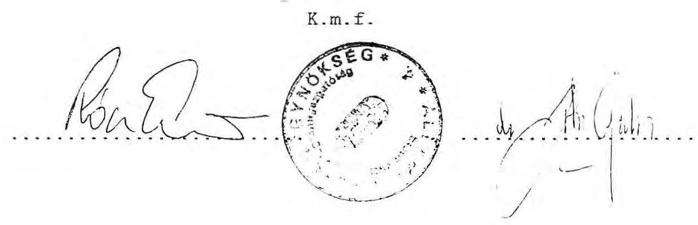

---

From : 36 1 1155432 A. U.U.

# ANTANTAKYONYGANOSKY 

ElSprivatizációs Programigazgatóság
TAR: $151-68-23$
Ikt. az. $23(4)(2)(139)$
dr. Dobos Gábor úr
vállalati biztos
Harmónia Kereskedelmi Vállalat
Budapest.
Pf. 428 .
1372
Tisztelt Dobos Ur!

Az AlIami Vagyonügynökség a Harmónia Kereskedelmi Vállalat felszámolásával a vállalat korábbi vállalati biztosát dr. Hetényi Gábort bizta meg.

A vállalati biztos személyében bekövetkezett változás alapján a felszámolási teendök folytatásával ez úton Ont bizom meg és kérem, hogy a felszámolást az eredetileg elfogadott útemnek megfelelíien fejezze be.

Budapest, 1991. december 18.
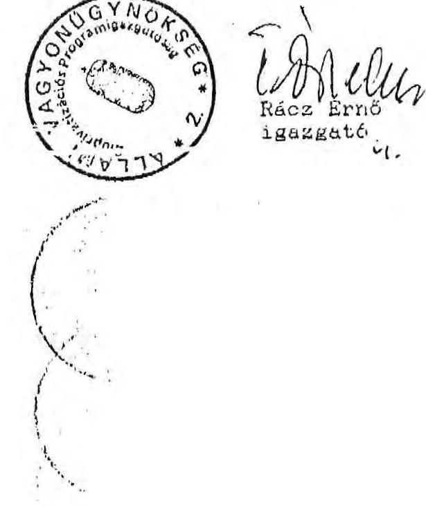

---

# 17.sz.melléklet a V-8-11/92. sz.

## Jelentéshez

### 161094351111101

|  Szemén | Eszköszök | A felcsámolási eljárás kezdetén | Végén | 17. sz. melléklet a V-8-11/92. sz.  |
| --- | --- | --- | --- | --- |
|  a. | b. | c. | d. | Jelentéshez  |
|  01. | Elcsámolási betátazás pénztár/31/ | 124 |  |   |
|  02. | Delföldi Vevők /331-335/ | 76 708 |  |   |
|  03. | Delföldi Vevők /336-338/ |  |  |   |
|  04. | Áldosk /333/ |  |  |   |
|  05. | Dolgosák tartozása /35/ | 28 |  |   |
|  06. | Artékpapírok és egyéb /36-39/ | 62 053 |  |   |
|  07. | Áldoszközök és beruházás /11-13/ | 75 070 |  |   |
|  08. | Tásárolt köszletek /27-29/ |  |  |   |
|  09. | Jaját termelési köszletek /24-26/ |  |  |   |
|  10. | Eszközök összesen /01-03/ | 214 703 |  |   |

### 17. sz. melléklet a V-8-11/92. sz.

|  Szemén | Perzások | A felcsámolási eljárás kezdetén | Végén | 17. sz. melléklet a V-8-11/92. sz.  |
| --- | --- | --- | --- | --- |
|  a. | b. | c. | d. | Jelentéshez  |
|  11. | Felcsámolási költségek /43-b61/ |  |  |   |
|  12. | Bankavállalékkal sz. tart. /471,472/ | 1 677 |  |   |
|  13. | Vazámasomáll, el eseményi tartozás |  |  |   |
|  14. | Bolognesgyel, évadokkal biztosított |  |  |   |
|  15. | Hivid követelések miatti tartozás |  |  |   |
|  16. | Szállítók, és hitelesők /44-b61/ | 15 571 |  |   |
|  17. | Bankkitszlek /45/ |  |  |   |
|  18. | Adótertesések /46/ | 1 453 |  |   |
|  19. | Egyéb tartozások /473, 474, 477./ | 20 |  |   |
|  20. | Zaját vagyon és eredményemkész /41-43, 45-b61/ | 136 002 |  |   |
|  21. | Perzések összesen /11-13/ | 214 703 |  |   |

Budapest, 1931. november 23.

ELISCHER FERENC

tárpákkal: 41-43, 45-b61

---

# A L L A S F O G L A L A S   az Allami Vagyonügynökség észrevételeire 

Az AVU munkatársainak észrevételeit köszönettel vettük. Az ASZ Vagyonügynökséggel kapcsolatos egyéb vizsgálatai, valamint az ezek során kialakult szoros együttmúködés miatt az észrevételekben jelzett jogszabályi bizonytalanságok, joghézagok, továbbá a szervezet túlzott leterhelése előttünk ismert problémák. Ebből következöen tudjuk azt is, hogy egyes konkrét ügyek vezénylésére csak megbízottaikon keresztül képesek eljárni, ami a szervezet dolgozói számára bizonyos mértékũ kiszolgáltatottságot jelent.

Mindezeket megértve és figyelembe véve sem tudtak azonban a vizsgálatot végzők az észrevételek többségével azonosulni.

Az AVU témacsoportba megadott észrevételeire az alábbi részletes választ adjuk:

1. Az AVU kifogásolja, hogy az ASZ vizsgálat nem tért ki a "spontán privatizáció" során elszenvedett több száz millió Ft-os vagyonvesztésre és nem nevezi meg a felelősöket. Való igaz, hogy az ASZ vizsgálat - mint ahogy azt a vizsgálat célja és időintervalluma is rögzíti -, az államigazgatási felügyelet alá vonástól követi nyomon az eseményeket; bár a vizsgálók az alapítások apportértékelését a cégiratokból megismerték.

---

Az AVO által hivatkozott 6-800 millió Ft-os Harmónia Kereskedelmi Vállalat vagyonérték nem bizinyítható. Ha az AVO által jelzett vagyonvesztés igazolható, akkor az AVO-nek kötelessége lett volna még hatékonyabb intézkedéseket tenni 1990. év júniusában, amikor a különbözõ bejelentésekbõl és az Ipari és Kereskedelmi Minisztérium ellenôrzési anyagából tudomást szerzett a kialakult helyzetröl.
2. Az AVO észrevétele szerint a vállalati biztos tevékenységét, felelősségét törvény nem szabályozza. A vizsgálatot végzõk szerint a vállalati törvény alapján a biztos feladata és felelőssége egyértelmũ. Elfogadjuk azt, hogy az AVO és a vállalati biztos közötti viszony jogszabályban nem rendezett ezt egy korábbi ASZ vizsgálat is már felvetette. Ennek alapján az AVO-nek belso̊ szabályzatban célszerű lett volna ezt lerendezni.
3. A részvény-üzlet csere értékelése szempontjából az ASZ fenntartja azt az álláspontját, hogy a pályázati követelményt, illetve azok megkerülésének az AVO Igazgatótanácsa általi engedélyezését mellôzték. Igy nem bizonyítható az AVO azon véleménye, hogy "a kisebbségi részvénycsomag ilyen áron nem értékesíthetõ."
Altalánosságban nem fogadható el az az érvelés, hogy a kisebbségi részvénycsomag értéktelen. A törvény ugyanis a kisebbségi részvényesnek komoly védelmet biztosít, különösen, ha a többség üzletpolitikája ellentmond az okszerü gazdálkodás követelményeinek, vagy a kisebbség jogos érdekét veszélyezteti.

---

Az üzletek vagyonértékelését nem lehet fenntartás nélkül elfogadni, ezt a tényleges értékesítések után lehet minősíteni.
4. Az ASZ jogi szakértői szerint az eredeti állapot helyreállítása ez esetben sem lehetetlen és célszerütlen.

A vállalat és a társaságok korábbi müködése során kialakult elszámolási-pénzügyi problémák rendezése a vállalati biztos megbízásában szerepelt. Az egyszerüsített felszámolás alatt álló vállalat esetében a felmerült elszámolási problémák a felszámoló és a bíróság hatáskörébe tartoznak.
5. Az ASZ vizsgálói nem minősítették azt a magatartást, hogy az AVU munkatársai a Harmónia Kereskedelmi Vállalat privatizációja során az AVU-n belül általánosan alkalmazott gyakorlat szerint jártak-e el. Ez az AVU ügyvezetésének hatásköre.
6. Az AVU által tett intézkedéseket nem vitatjuk, ezek eredményességét és jogszerüségét a vizsgálati jelentésben részleteztük.

# Válasz a részletes észrevételekre 

1. E pontban tett észrevételében az AVU elismeri az ingyenes vagyonátadás tényét azzal, hogy ezt adó "mérséklés" miatt vállalták fel. Ez is egy "színlelési" ok. Az adótörvény szerinti mentesség a polgári jogi érvénytelenség szempontjából közömbös.

---

2-4. A vizsgálat a megbízási szerződés kiegészítését kifogásolta, amely lehetővé tette a Két Kalmár Rt. számára, hogy az üzletek privatizálásáig az üzletek hasznával rendelkezzék. Ez a bevétel az előprivatizációs törvény értelmében az AVU-t illeti meg.
5. Eszrevételüket a jelentésben átvezettük.

7-8. Az AVU észrevételében azt írja, hogy nem új vállalati biztost, hanem AVU képviselőt nevezett ki a vállalathoz. Fenttartva a jelentésben foglaltakat, megjegyezzük, hogy az "AVU képviselō" megnevezés a jogszabályokban ismeretlen fogalom.
9. Orömmel vesszük tudomásul, hogy az AVU-re átszállt gazdasági társasági részesedések nyilvántartása az Előprivatizációs Programigazgatóságon rendezett. Ennek ellentmond azonban észrevételük 15. oldalának 5. pontjában leírtak, miszerint a Fórum Rt-n lévő vállalati részvényhányadot sem a Harmónia Kereskedelmi Vállalat vezetője, sem a vállalati biztos nem jelentette be az AVU-nek. A vizsgálatot végzők birtokában van dr. Nagy Oszkár által 1990. október 24-én kelt levele, amelyben az AVU-höz bejelentik részvényeiket, vagyoni betéteiket és egyéb értékpapírjaikat. Ez a levél tartalmazza a Fórum Rt-ben lévő részvényeket is. E bejelentésre hivatkozva Rácz Ernő október 31-én válaszolt a vállalatnak, tehát az AVU-nek volt tudomása a vállalat Fórum Rt-beli részesedéseiről.
11. A 15. sz. melléklet szerinti figyelmeztetés és írásbeli figyelmeztetés nem minősül az MT szerinti fegyelmi felelősségre vonásnak.

---

12. A semmisség alapján az eredeti állapot helyreállitása pénzben is történhet. A részvény-üzlet csere tekintetében nem biztos, hogy az üzletek visszaadását is igényli, részleges érvénytelenség alkalmazására is sor kerülhet.
13. A bevételekről csatolt mellékletet figyelembe venni nem állt módunkban, miután az nem az AVU-től származott. A vizsgálati jelentésben az AVU-höz befolyt vételárakat rögzítettük, a Két Kalmár Rt. adatközlése e vonatkozásban nem minősül hiteles forrásnak.

Budapest, 1992. június 8

Németh Béláné

Németh Béláné

Majorosné Dóslai Noémi

dr. Majórosné dr. Looskai Noémi

---

# A L L A S F O G L A L A S 

## a Két Kalmár Rt. észrevételeire

A vizsgálati jelentésre tett észrevételeiket és a vizsgálat lefolytatásához nyújtott segítségüket köszönjük.

Az 1991. május 10-ei szerződést továbbra sem tudjuk érvényesnek elfogadni, álláspontunkat - dr. Tuller András észrevételei ellenében - továbbra is fenntartjuk. Ezért a szerződéssel összefüggő vizsgálati megállapításainkat továbbra is fenntartjuk.
Tiltakozásukra az Rt. vezetésére általánosítva tett negatív megállapítást töröltük a jelentésbõl.

Részletes észrevételeiket, pontosításaikat köszönettel vettük és többségében elfogadtuk.

Az üzletek privatizálásából származó bevételek nagyságrendjét azért nem tudtuk átvezetni, mert a 12,9 MFt-os összeg az AVU nyilvántartásaiban még nem jelent meg. A bevételek tényszerüségét AVU bizonylatoknak kell igazolnia.

A Két-Kalmár Rt. részvényei megjelennek az Rt. mérlegében is és szerepelnek a vállalat mérlegében is. A Harmónia Kereskedelmi Vállalat mérlegében nem a vevők között, hanem a befektetett eszközök soron szerepel, ezért a kétszeres kimutatás ténye fennáll.

---

Fenntartjuk azt az álláspontunkat is, hogy a részvények különböző fajtáinak könyvelésére csak a cégbírósági bejegyzés függvényében kerülhetett volna sor, ha az ilyen irányú alapszabály módosítási kérelem nem ütközik a Gt. hatályos szabályaiba.

Az ingatlannyilvántartási bejegyzés megítélésünk szerint szükséges a földtulajdon aktiválásához. Ezt az álláspontunkat az 52/1988. (XII.24.) PM rendelet 1. sz. melléklet 19. Beruházások 13. bekezdésében foglaltak is alátámasztják.

Budapest, 1992. június 8

Németh Bélané

Németh Béláné dr. Majorosné dr. Locskai Noémi

---

# A L L A S F O G L A L A S 

## Dr. Hetényi Gábor felszámoló észrevételeire

A Harmónia Kereskedelmi Vállalat privatizációja és az állami vagyon alakulásáról készített jelentéstervezethez kapcsolódó észrevételeit, magyarázatait részben elfogadtuk, azokat a végleges jelentésben átvezettük.

A bizonylatokkal, jogi érvekkel alá nem támasztott észrevételeket a következõ indokolással nem fogadtuk el.

1. A jelentés a Harmónia Kereskedelmi Vállalat mérleg szerinti vagyonát mutatja be, és ez 1990. december 31-én az I. Mérleg 56. sorának megfelelően tényszerűen 103,7 MFt volt;
2. A jelentés az 1989. I. félévi mérlegbeszámolóra nem hivatkozik, így ezt az észrevételt átvezetni nem tudtuk;
3. A Harmónia Rt. által indított keresetet a bíróság nem bírálta el, ez ténykérdés, Állami Vagyonügynökséggel való "rendezés" nem tekinthető ezzel egyenértékűnek;

---

4. Az 1991. október 22-ei felszámoló mérleggel kapcsolatos észrevételeiből a 14 számlaosztályban a 84 üzlet értékének aktívaként való feltüntetése mellett fenntartjuk azon megállapításunkat, hogy ezeket nem felértékelten - 75,0MFt - kell rögzíteni, hanem nyilvántartási áron - amely 9,8 MFt volt. Ezt támasztja alá az is, hogy az 1991. május 3-i szerződés 3. sz. pontjában a 84 üzlet kezelői, bérleti jogát a Harmónia Rt. végleges forrás átengedés jogcímén adta át a Harmónia Kereskedelmi Vállalatnak, s mint ilyen a Harmónia Rt. forrásai és eszközei között 9,8 MFt-tal szerepel. A felszámoló mérlegben ezért így mind az eszközök, mind a források között - e címen - 65,0 MFt-tal több érték szerepel, amely a mérlegvalódiság követelményének nem felel meg.
5. Az 1991. június 4-i megállapodás 8. sz. pontja a következö: "A szerződő felek kijelentik, hogy a Harmónia Kereskedelmi Vállalat által megvásárolt Módi részvényeket 2,5 MFt árral az AVU részére privatizálásra felajánlják". A részvényeladás ügylete, nem bonyolódott le, a részvények a Harmónia Kereskedelmi Vállalat tulajdonát képezik (amit be is mutattak), így az 1991. október 22-i mérlegben fel kellett volna tüntetni az eszközérték között.
6. Az 1991. október 22-ei hiteles felszámolási mérleget sem a Fővárosi Bíróság - mivel visszakérték -, sem a vállalat képviselöje nem mutatta be, így az nem állt rendelkezésünkre.
7. A felszámolási költségre vonatkozó állításunkat fenntartjuk, hiszen az idézett rendelkezésekben foglaltak azt támasztják alá.

---

Végül arra kell kitérnünk, hogy a jelentés véleményezésében dr Hetényi Gábor a megállapításokat és javaslatokat úgy értékelte, hogy azokat nem fogadja el, mert végrehajtásuk jelentő́s kárt okozna. A szerződések semmissége esetén az eredeti állapotot kell helyreállítani a leggazdaságosabb módon a felek közötti megállapodással. A megállapodások hiányában a Bíróság dönti el azt, hogy az eredeti állapot visszaállítása természetben vagy értékben, vagy a kettőt együttesen alkalmazva történjék meg.

Dr. Tuller András ügyvéd észrevételeire ellenében álláspontunkat továbbra is fenntartjuk.

Budapest, 1992. június

Németh Bélane
Németh Béláné
dr. Majorosné dr. Looskaí Noémi