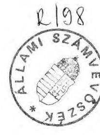
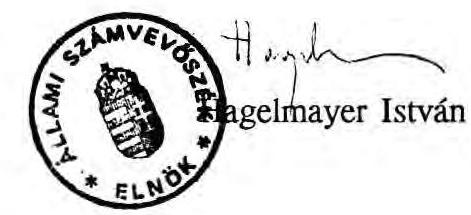
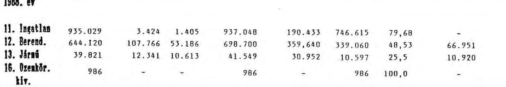
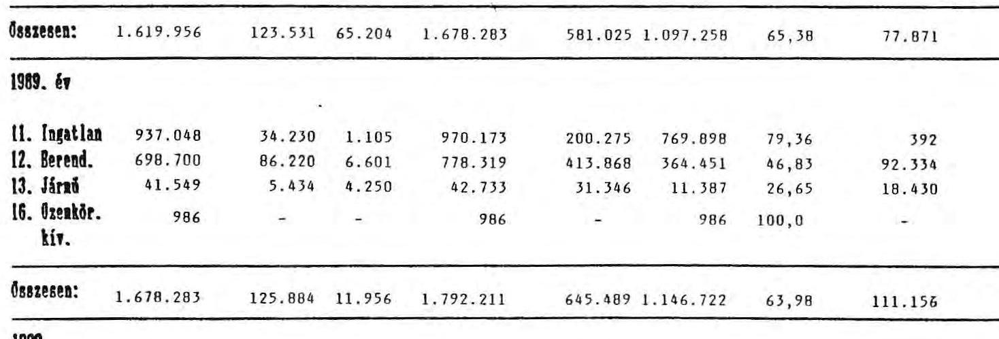
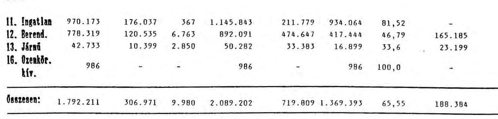
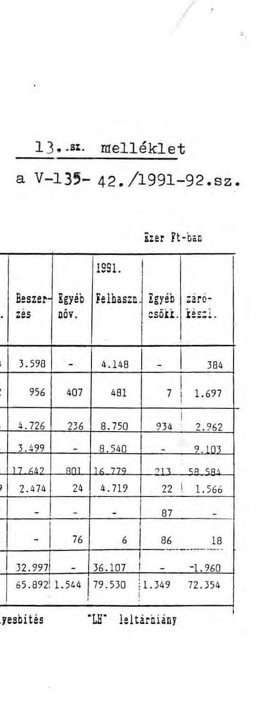

# Állami Számvevőszék

## JELENTÉS

a Magyar Rádió pénzügyi-gazdasági ellenőrzéséről

---

# Az ellenőrzést vezette:

Matusek István
főtanácsos

## Az ellenőrzést végezték:

Bakonyvári Róbertné
Deák Tamásné
Éva Katalin
Hegyesné dr. Solymosi Mária
Kalo Tamás
dr. Mihály Sándor
Szabó József
számvevő tanácsos
számvevő
számvevő tanácsos
számvevő
számvevő
számvevő tanácsos
számvevő tanácsos

---

# JELENTÉS

## a Magyar Rádió pénzügyi-gazdasági ellenőrzéséről

A Magyar Rádió (továbbiakban MR) az egyik legfontosabb közszolgálati tömegtájékoztatást ellátó intézmény. A jelenleg érvényben lévő jogszabályok szerinti feladata a Magyar Köztársaság politikájának felelős propagálásában való hatékony részvétel, a korszerű, gyors hírközlés és tájékoztatás, továbbá a közművelődési igények színvonalas kielégítése és a szabad idő tartalmas kihasználásának elősegítése, hozzájárulás az állampolgárok tájékozottságának, műveltségének növeléséhez.

A MR feladatait önálló költségvetési fejezetként látja el. A MR alaptevékenysége szerint maradványérdekeltségi rendszerbe sorolt, országos hatáskörű jogosítványokkal rendelkező önálló költségvetési szerv.

A MR mint a költségvetés XXIII. sz. fejezetének az 1990. évi CIV. költségvetési törvényben jóváhagyott 1991. évi eredeti kiadási előirányzata 2.235,6 millió Ft; átlagos állományi létszámelőirányzata 2.605 fő. Vidéki stúdióinak száma 7; azok állományi létszáma 163 fő. A külföldi tudósítói helyek száma ugyancsak 7; az 1991. év végi eszköz-állományának értéke 2.228,6 millió Ft. A MR kereskedelmi célú műsorszolgáltatást is végez a Danubius Rádió működtetésével. Ellenszolgáltatás fejében személyzetet és technikai feltételeket bocsát rendelkezésre a Multimédia Kft. kezelésében lévő Calypso Rádió működéséhez, továbbá műsoridőt biztosít az Amerika Hangja és a BBC részére és kereskedelmi adásidőt vidéki Kft-knek.

Az ellenőrzés az 1988-1991. évekre, valamint az 1992. évi költségvetési előirányzatok megalapozottságának értékelésére terjedt ki.

Az ellenőrzés célja a MR - mint költségvetési fejezet - gazdálkodási és irányítási színvonalának, a rendelkezésre álló pénzeszközök felhasználásának törvényességi, célszerűségi és eredményességi szempontok szerinti értékelése, továbbá annak minősítése volt, hogy a gazdálkodás megfelelt-e az ésszerű takarékosság követelményének.

---

# I.

## Következtetések és javaslatok

A MR finanszírozási rendje többcsatornás, azaz az éves költségvetési törvényben jóváhagyott állami támogatás és az előfizetési díjak összegein kívül kiadásainak fedezésére saját bevételek is szükségesek, amelyeket alaptevékenységén túl ellátott vállalkozás jellegű szolgáltatások útján ér el és bevételeit szponzorok által adott támogatások egészítik ki. A kihelyezett tőkék és vagyontárgyak hozadéka (vállalkozási nyereség, osztalék) egyelőre nem jelentős volumenű, a kihelyezett források kamata számottevőbb.

A fejezet gazdálkodásának hosszabb időszak alatti (1988-1991.) pozitív eredménye az, hogy folyamatosan, megszakítás nélkül sikerült fenntartani a gazdálkodás egyensúlyát, a fizetőkészségét és képességét. Tervet meghaladó, vagy soronkívüli költségvetési támogatásra nem volt szükség, a MR anyagi lehetőségeit meghaladó kötelezettségeket nem vállalt.

A pénzügyi egyensúly tartós megőrzése azonban nem párosult költségmegtakarító megoldásokkal és részben a műszaki fejlesztés rovására valósult meg.

A pénzügyi egyensúly tartós megőrzésében része volt a saját bevételek növekedésének is.
Növekedett a saját bevételek aránya, az állami támogatásé a vizsgált időszakban kétharmadról 50%- alá mérséklődött. A források között csökkenő jelentősége van a képződő év végi pénzmaradványoknak.

Összegét és arányát tekintve is folyamatosan nő a Danubius és Calypso rádiók nyereségéből való részesedés, valamint az átvett pénzeszközök, vállalkozási nyereségek összege. Igen mérsékelt, sőt az esetek többségében nincs haszna a MR különféle gazdasági társulásokban való részvételének. Kényszerű szükségesség a sponzori támogatás elfogadása, sőt annak ösztönzése.

A Rádióújság értékesítési árbevételéből kapott részesedés a MR jelentős bevételi forrása. A Pallas Lapkiadó Vállalat sorozatos szerződésszegése miatt a MR elnöke felmondta a korábbi megállapodásukat és a kiadói jog visszaszerzése, valamint a lap folyamatos megjelentetése érdekében lemondott a MR-t megillető mintegy 50 millió Ft összegű követelésről. A kompromisszum a MR szempontjából gazdaságilag hátrányos volt és erre a jelentős kihatással járó engedményre a lapkiadó vállalat érdemtelen volt.

A MR-n belül a decentralizált gazdálkodók által befolyásolható költségek aránya kb. 30%-ot tesz ki. Az ún. keretgazdálkodásnak a költségek csökkentésére gyakorolt hatása alig érzékelhető.

---

A MR gazdasági vezetésének hosszabb idő óta elhatározott szándéka a belső gazdálkodás radikális átalakítása, amelyet a műsorszerkezet megváltoztatásával, a szervezet korszerűsítésével egyidejűleg terveztek megvalósítani. A fejlesztési források szűkösségére hivatkozva elmaradt a részletek kidolgozása és a technikai eszközrendszer (számítógépesítés) kifejlesztése. Amennyiben a gazdasági vezetés a költséggazdálkodás meghonosítását primer célnak tekintette volna, a szükséges anyagi forrásokat az időszak folyamán folyamatosan megújítva kihelyezett pénzeszközök kamatainak egy részéből fedezni lett volna képes. Az egyéb, folyamatban lévő beruházások sérelme nélkül előteremthették volna a számítástechnikai fejlesztések forrását is.

A béralap és létszámtervezés - az államigazgatáshoz hasonlóan - bázis adatokon nyugszik, a létszámirányszámnak az ellátandó feladathoz, ill. annak változásaihoz alig van kapcsolódása, technikailag képzett számnak tekinthető. Ez a megoldás a ténylegesen szükséges létszám tervezésére nem ösztönöz.

A bér és a bérjellegű honoráriumok a kiadásoknak mintegy 30%-át teszi ki. A gazdálkodásnak ezért fontos eleme a bér és a honorárium. Más költségvetési fejezetektől eltérően a bérek szerkezetében markáns elmozdulás az alapbérek irányába nem tapasztalható. Változatlanul a jutalmazás dominál a mozgóbéren belül, esetenként észlelhető annak bérkiegészítő jellege is.

A bérekhez kapcsolódó teljesítménykövetelmények viszonylag alacsony szintjét a számvevői megítélésen kívül az is jelzi, hogy a jövedelmekben számottevő, esetenként domináns a belső keresztbefoglalkoztatásból származó honorárium és a külső megbízatás. A tárgyilagos képhez tartozik még, hogy a rádiós bérek még a MR Vállalkozási Igazgatóságon dolgozókéhoz képest is alacsonyak, az utóbbi időszak erőteljes fejlesztései ellenére.

A versenyképesebb bérhelyzetet a szervezet "karcsúsítása", a létszám csökkentése nélkül nem lehet elérni. A műsorkészítés gazdasági szempontú fejlesztésének hiánya a költségversenyben a MR-t hátrányos helyzetbe hozza a versenytársakkal szemben, amelyek várhatóan jóval kisebb költségigénnyel fognak működni. Nem tartható sokáig fenn a technikai színvonal konzerválása sem, a fejlesztést szponzorálók viszont válogathatnak a támogatandók között. A célszerűbb és hatékonyabb bérgazdálkodást segítené az is, ha a béralapra elszámolt honoráriumokból a belső foglalkoztatásra fordított összeg egy részét - megfelelő teljesítmények mellett - alapbéresítenék, továbbá ha kiiktatnák a Kft-k kereskedelmi műsoraik kiszolgálása érdekében felmerülő béralapot terhelő kiadásokat.

A rendelkezésre álló eszközök kihasználtsága - a stúdiók és a Szállás utcai parkolóház kivételével - elfogadható mértékű, de mégjobb kihasználásuk a MR gazdasági tartalékait jelentik. A szabad kapacitások kihasználása a tervszerűbb munkaszervezés nélkül lehetetlen.

A pénzügyi-számviteli folyamatok általában jól szabályozottak, a külső-belső ellenőrzések által feltárt hiányosságokra intézkedtek. Rendszerbeli, súlyosan kifogásolható eljárást, tevékenységet az ellenőrzés nem észlelt. A gazdálkodást érintő nyilvánosság elé tárt súlyos

---

észrevételeket az ellenőrzés konkretizálta és tételesen megvizsgálta. Azokat nem látja igazolva, erre nézve bizonyítékok nem kerültek elő.

A vizsgált időszak folyamán a MR szervezete és struktúrája - kisebb változásoktól eltekintve - lényegében azonos volt. Az 1992. I. 6-án életbeléptetett új műsorstruktúra változásokat igényelne a szervezetben és a működésben egyaránt, de az ellenőrzés lezárásának időpontjáig a MR felügyeletét ellátó kormány és a MR elnöke nem jutott konszenzusra a változásokat legitimáló új Szervezeti és Működési Szabályzat tekintetében.

Az 1990. LVII. tv. előírásainak megfelelően a miniszterelnök javaslatára és ellenjegyzésével a köztársasági elnök 1992. március 1-i hatállyal alelnököt nevezett ki. Mivel erre az időpontra a helyszíni ellenőrzés már befejeződött, ellenőrzési tapasztalat arra vonatkozóan nincs, hogy az alelnök tevékenységi köre a meglévő szervezetbe milyen feladatmegosztással került beillesztésre.

A MR szakmai szolgáltató tevékenységének fejlesztését, a korábbi műsorszerkezet radikális megváltoztatását, a feltételezett hallgatói igényekhez való igazodásra való törekvés jegyében határozták el. A kísérleti jelleggel bevezetett műsorstruktúra szakmai megítélése nem az ellenőrzés kompetenciája. Ellenben tény, hogy az alaptevékenység belső arányait képező műsortípusok tartalmi és összetételi változásai gazdasági-pénzügyi kihatásokkal járnak még akkor is, ha a MR vezetésének döntése szerint a változásokat az adott pénzügyi források szabta keretek között kell véghezvinni.

Az ellenőrzés csak a változások kezdeti hatásait érzékelhette a kellő időtáv hiányában. Erről a rövid időszakról a következők állapíthatók meg:

- a kezdeti tapasztalatok nagyon ellentmondásosak. Arra törekedtek, hogy a műsorstruktúra szakmailag megalapozott legyen. Az elhatározott változtatások előkészítése a MR-n belül évek óta folyamatban volt, szakmailag gondosan mérlegelték a szóba jöhető tényezőket. Ezzel szemben belső koordinációs zavarokat okozott a vidéki stúdiók és szerkesztőségek nem kellő bevonása és tájékoztatása a koncepció kialakításába;
- az átalakítás folyamata nélkülözte az illetékes állami szervek támogatását, ami kedvezőtlenlé tette az induló szakasz pénzügyi feltételeinek megalapozását. Mindez azt eredményezte, hogy nem sikerült kielégítően a rádiózásban érdekeltek széles körének bevonása, majd kellő tájékoztatása és megnyerése;
- az SZMSZ körüli tartós és eredménytelen viták miatt a szükséges szervezeti változások helyett ideiglenes megbízásokkal hidalta át a MR elnöke a meglévő szervezet és az új műsorszerkezet ellentmondásait. Ezzel a formális szervezet lényegében informálissá vált és az informális szervezet ideiglenesen részben átvette a reális funkciókat;
- az anyagi eszközök szűkössége és a sugárzási költségek még gyorsabb növekedésének fékezése miatt a Műsorszóró Vállalat kezdeményezésére a sugárzási feltételeket még

---

rontani is kellett (adási energia csökkentésével); ami a műsorszolgáltatás színvonalára nézve hátrányos.

A negatívumok ellenére a végrehajtott változások a MR működőképességét nem érintették, a zavarok átmenetinek bizonyultak, de a hatékonyságot károsan befolyásolták.

A MR vezetése több - főképpen hosszabb távra szóló és fejlesztésekkel kapcsolatos - döntésre érett ügyet függőben hagyott a médiumokra vonatkozó törvények megjelenéséig. A késedelmek még nem jelentenek behozhatatlan hátrányt, de megítélésünk szerint a MR piaci helyzetét, versenyképességét rontják.

Az ellenőrzés általános tapasztalatai szerint fellelhetők a MR gazdálkodásában a költségtakarékosabb, szervezettebb megoldásra való törekvések, amelyek mégsem valósultak eddig maradéktalanul meg. A műsorkészítő szervezetek ma még nincsenek rákényszerítve arra, hogy az optimális megoldásokra törekedjenek. A decentralizált gazdálkodás kijelölt és engedélyezett keretei túl nagy mozgásteret nem tesznek lehetővé, a MR szintjén megjelenő hatásuk nem meghatározó és - ami igen lényeges - túllépésüknek vagy az elért megtakarításoknak a gazdálkodóra nézve nincs konzekvenciája. Megítélésünk szerint a továbbiakban nem lesz fenntartható a kényelmes, költségszemléletet nélkülöző felfogás. Rugalmasabb és nagyobb önállósággal rendelkező szervezetekre lesz szükség, különösen a vidéki stúdióknál, szerkesztőségeknél.

Úgy tűnik, a MR vezetése tisztában van ezekkel a kihívásokkal, de mégsem megy eléggé eléjük, erejét lekötötte az új műsorrend bevezetésével járó sok nehézség.

Megállapításaink alapján a következő javaslatokat tesszük:

# A. A rádióról és a televízióról szóló törvény elfogadását követően

1./ el kell készíteni és ki kell adni a MR alapítólevelét.
2./ Ki kell dolgozni a MR Szervezeti és Működési Szabályzatát.

Ezzel együtt:
a/ meg kell feleltetni a szervezetet a feladatoknak;
b/ egyértelműen rendezni kell a jogköröket és kötelezettségeket;
c/ újra kell szabályozni a műsorlebonyolítás ügyrendjét;
d/ el kell készíteni az igazgatóságok új ügyrendjét.

---

3./ A MR maradványérdekeltségi költségvetési fejezeti besorolása nem minden tekintetben felel meg a rugalmas, hatékony közszolgálati rádiós intézmény gazdálkodási szükségleteinek, sajátosságainak. Ezért módosítandónak tartjuk a MR érdekeltségi rendszerét. Az intézmény finanszírozási rendszeréhez igazítva kell a gazdálkodás belső szabályozását továbbfejleszteni. A költségvetési támogatás a jövőben kapcsolódjék normatívával kifejezhető feladatokhoz (pl. műsoridőhöz).

# B. A MR belső szervezettségének, működésének javítása érdekében

1./ Olyan egységes műsornyilvántartási és elszámolási rendszer kialakítására kellene törekedni, amelyik szerkesztői és pénzügyi szempontból egyaránt követhetővé tenné az egyes műsoroknál az eszköz
 és forrás felhasználását, az erőforrásokkal való hatékonyabb gazdálkodást.
2./ Növelni indokolt az egyes gazdálkodói jogkörökkel felruházott szervezeti egységek gazdálkodásának önállóságát, különösen a vidéki szerkesztőségek és stúdiók esetében
—a KNAF gazdasági szabályzatának korszerűsítésével,
—a stúdióvezetők gazdasági jogkörének bővítésével,
—a bevételek növelésére való ösztönzéssel,
—a helyi sajátosságokra építő önálló belső érdekeltségi rendszer kiépítésével,
—a műszaki eszközállomány karbantartásával, javításával összefüggő feltételek biztosításával.

A gazdálkodási önállóság növekedésével a körzeti stúdiók és szerkesztőségek váljanak az országos programok integráns részévé.
3./ A hosszabb távú fejlesztések megalapozása, a műsorgyártás és a műszaki feladatok összehangolása, a rövid- és középtávú tervek konzisztens megvalósítása érdekében új fejlesztési és beruházási koncepciót kell kialakítani.

Az épületrekonstrukciók és építések törvényes megvalósítása érdekében a Részletes Rendezési Tervnek a megváltozott feltételekhez és követelményekhez való igazítására, megújítására és átdolgozására van szükség.
4./ Az eszközgazdálkodás és a vállalkozási tevékenységek centralizáltabb megszervezésével csökkenthetők a szervezeti és működési párhuzamosságok, egymástól eltérő megoldások.
5./ A szervezet és működés ésszerűsítésével, a létszám felülvizsgálatával, valamint a béralapot indokolatlanul terhelő költségek megszüntetésével elérhető bérmegtakarításból

---

javítható a bérek színvonala, belső aránya. Célszerűbbnek tartjuk a mozgóbérek egy részének alapbéresítését, mint a laza teljesítményeket meghaladó teljesítések látszathonorálását.
6./ Felülvizsgálandónak tartjuk a MR vállalkozásokban, gazdasági társulásokban való részvételének gazdasági indokoltságát és célszerűségét.
7./ A központilag kiadott pénzbeli és naturális gazdálkodási keretek betartását az eddigieknél következetesebben számon kell kérni.
8./ A bevételi tartalékok felülvizsgálatára, a kintlévőségek hatékonyabb eszközökkel való behajtására határozottabb intézkedéseket kell tenni.
9./ Határozottabb intézkedésekkel érvényt kell szerezni a szerkesztőségeknek kiadott nyersanyagok és hanganyagok reális határidőn belüli visszaszolgáltatására vonatkozó belső rendelkezéseknek. Ki kell dolgozni a hanglemez és egyéb hanghordozók beszerzésének és elszámolásának új szabályait.
10./Az 1992. évi pénzügyi-gazdasági egyensúly további fenntartása a MR koncentrált erőfeszítését és a mozgósítható belső tartalékok igénybevételét teszi szükségessé:

- elengedhetetlen, hogy a MR és a MTV közös üzemeltetésében lévő intézmények fenntartásával járó költségek az igénybevétel arányában megosztásra kerüljenek. A MR vezetése újra kezdeményezze a MTV-nél a jóléti intézmények fenntartási, kezelési és térítési kérdéseinek rendezését;
- a kereskedelmi szolgáltatási kapcsolatokban érvényesített árak fedezzék a költségeket. Egyidejűleg célszerű megvizsgálni a költségek csökkentésének és az árak emelésének lehetőségeit;
— törekedni kell a szabad szálláshelyek kereskedelmi értékesítésére, a térítésmentes igénybevételnek a mulhatatlanul szükséges mértékre való csökkentésére;
—a kintlévőségek behajtásának hatékonyabb szorgalmazásával, illetve újabb, be nem hajtható követelések keletkezésének megelőzésével fokozható a likviditási készség.
11./Utólagosan rendezni kell a szabálytalanul lebonyolított vendégházi beruházás aktiválását, vagyoni nyilvántartásbavételét. Indokolt a személyes felelősség tisztázása is.
12./Az 1990. évi CIV. törvény előírásainak megfelelően - utólag - módosítani kell az 1991. évi költségvetési előirányzatot és annak hatását az éves költségvetési beszámolón át kell vezetni.

---

# II. 

## Részletes megállapítások

## A/ A feladatok, a szervezeti rendszer és a gazdálkodási feltételek összhangjának értékelése

## 1./ A MR működésének szervezettsége, szabályozottsága

A MR működését és szervezeti kereteit a több ízben módosított 1047/1974. (IX.18.) MT határozat szabályozza.

Ez a határozat teremtette meg a Magyar Rádió és a Magyar Televízió szétválásával mindkét szervezet önállóságát és elkülönült gazdálkodásának intézményi feltételeit. A határozat a MR Szervezeti és Működési Szabályzatának (SZMSZ) tárgykörébe utalta a művészegyüttesek (zenekarok, énekkarok), valamint a szociálpolitikai intézmények szervezeti alárendeltségének, közös feladataik ellátásának és felügyeletének kérdéseit. A kormányhatározat szerint a MR és a MTV szervezeti és működési szabályzatának jóváhagyása a kormány hatáskörébe tartozik. Az 1047/1974. (IX.18.) MT határozat még módosított tartalmában sem alkalmas a MR közszolgálati feladatainak meghatározására. Mivel a MR-nak alapító levele sincs, a szervezeti és működési szabályzat tartalma az alapítási cél szempontjából megalapozhatatlan és bármely változatában kifogásolható.

A vizsgált időszakban a MR struktúrájában érdemleges szervezeti változások nem történtek. A MR feladatai és szakmai tevékenysége a műsorosztályok, -szerkesztőségek működésén keresztül realizálódott. Egyetlen konkrét és figyelemre méltó változás 1989-ben következett be, amikor - a kereskedelmi tevékenység bővülésével - a Gazdasági Igazgatóság átalakult Gazdasági és Kereskedelmi Igazgatósággá, amelyből 1991-ben a kereskedelmi terület kiválásával és részben új feladatokkal létrejött a Vállalkozási Igazgatóság.

Az 1/1990. sz. elnöki utasítás rögzíti a MR szervezeti és működési szabályzatát.

Az SZMSZ szerint a MR feladatát 4 igazgatóság és 13 főszerkesztőség, valamint önálló szervezeti egység látja el.

A vezetési rendszer törzskari jellegű. Az intézmény élén elnök áll, akit a Miniszterelnök javaslatára a Köztársasági Elnök nevez ki. Az elnök munkáját tanácsadó szervként elnökség és tervtárgyaló értekezletek támogatják.

---

# 2./ Az új műsorstruktúrával kapcsolatos szervezeti kérdések 

A MR szervezetére és működésére kiható tényleges változások előkészítésével - régebbre visszanyúló előzmények után - 1990. II. félévében kezdett foglalkozni a rádió vezetése. Többségi véleményként fogalmazódott meg, hogy ebben a struktúrában a műsorosztályok, szerkesztőségek döntően a műsoridő növekedésében érdekeltek, ez pedig nehezíti a műsorstruktúra változtatását.

A MR működésének korszerűsítésére a rádió vezető munkatársai 19 tanulmányt készítettek, amelyben felvázolták a leendő három, illetve négy intendatúra profilját, műsorstruktúráját és szervezeti kialakítását. Az elkészített dolgozatok az átalakítás szakmai, struktúrális megalapozását segítették. Az elképzelések, javaslatok többsége mérlegelésre, hasznosításra került. Az elgondolások a rangsorban első helyre a közszolgálati funkció érvényesülését tették, amely magában foglalja az információt, a szolgáltató tevékenységet, a szórakoztatást, a kultúra-közvetítést és terjesztést; s mindezt az objektivitás, a pártatlanság érvényesítésének igényével.

Az új koncepció szerint az MR egységes egésze nem sérülne, de az alap- és részfunkciók arányai megváltoznak; a szerkesztőségek helyett az adók válnak a rádiós tevékenység centrumává.

A MR elnöke 1991. május 3-án három vezető munkatársat megbízott az intendatúra szakmai, tartalmi profiljának, műsorrendjének kialakításával, a szervezeti struktúra, a gazdálkodási terv kidolgozásával. Ekkor még a vezetés azzal számolt, hogy a MR új struktúrában és műsorrenddel 1991. október 1-én kezdheti meg működését.

Az új műsorstruktúra bevezetését módosítva 1992. I. 1-től tervezték. A tervezett módosítások szükségszerű velejárójaként foglalkoztak a szervezeti változtatásokkal.

A MR elnöke 1991-ben több változatban terjesztette elő szervezeti elgondolásait, amelyeket a kormány nem fogadott el. A többszöri levélváltások és az SZMSZ tervezetek átdolgozása ellenére a szabályozottság ügye nem haladt előre, mindeddig tulajdonképpen az alapelvek tisztázása sem sikerült, holott a tervezett átalakítások a kormány által jóváhagyott SZMSZ-szel válhatnak csak legitimmé.

A formálisan 1990. januárja óta változatlan szervezet alkalmatlan egy új műsorstruktúra vezetésére, kiszolgálására. A MR vezetése ennek ellenére úgy döntött, hogy szakmai elgondolásainak érvényt szerez és az eredeti elhatározáshoz képest jelentéktelen késedelemmel 1992. I. 6-án kísérleti jelleggel életbeléptette az új műsorstruktúrát.

Az előző évtizedekben spontán folyamatok eredményeként alakult ki és szilárdult meg egy belső arány a műsortípusok között, amelyet a megrögzött szokásjog változatlannak és változtathatatlannak tekintett. A műsoridő bővülése, új műsorok létrejötte, egyes műsorok megszűnése, az adásidők kisebb-nagyobb változásai a struktúrát alig, ill. spontán érintették. A MR történetében először fordult elő, hogy a merev struktúra által meghatározott műsor arányokat tudatos elhatározással jelentősen megváltoztatták.

---

Az SZMSZ egyes változatainak elutasítása miatt a korábbi szervezetet fenn kell tartani. A szakmai tevékenységek változásaihoz nem igazodó szervezet diszkrepanciáját a rádió vezetése ideiglenes megbízásokkal hidalta át, ami maga is ellentmondások forrása.

Az SZMSZ-tervezet különböző változataiban központi kérdéssé vált az alelnök(ök) és az intendánsok kinevezése, egymáshoz való viszonya. Az első tervezetben a MR vezetése szervezet-korszerűsítési koncepciójában nem szerepelt az alelnöki státusz(ok) létesítése; a későbbi tervezetben először hatáskör meghatározás nélkül, a legutóbbi változatban pedig a két alelnökre külön-külön pontosításra került a hatáskör és a felügyeleti egységek kijelölése. Jelenleg sem egyértelmű az SZMSZ-tervezetben néhány szervezeti egység felügyeleti besorolása (pl. a Rádiókabaré Szerkesztőség, az Irodalmi Főszerkesztőség, a Szórakoztató zenei produkciós csoport, a Körzeti és Nemzetiségi Adások Főszerkesztősége). Ilyen körülmények között a műsorrend-változás úgy valósul meg, hogy az új műsorok a megszüntetendő szerkesztőségekben megrendelésre készülnek, s ebben az átmeneti helyzetben az intendatúrák hallgatólagosan, megbízásos alapon működnek, az intendánsok kvázi felelősséggel tartoznak a három, illetve a négy rádió-program megvalósításáért.

A helyszíni ellenőrzés befejeződésének időszakára (március 1.) esett az alelnök kinevezése. Egy alelnökös rendszerre, addig az időpontig SZMSZ alternatíva nem készült. A kinevezett alelnök és a meglévő szervezeti struktúra kölcsönhatásáról ellenőrzési tapasztalatunk nincs.

A vizsgálat szerint mindaddig átmeneti állapot lesz az MR-ben, amíg a fő kérdésekben nem születik döntés: a média-törvény elfogadásában, az SZMSZ jóváhagyásában, az alelnöki és az intendánsi "rendszer" viszonyában. Jelenleg nem világos, hogy az átalakítás egészével milyen fórum illetékes foglalkozni, az egyeztetések, jóváhagyások milyen szintre tartoznak.

# 3./ Speciálisan működő szervek a MR szervezetében 

## a/ Danubius Rádió

A DR 1986-ban jött létre, mint a MR kereskedelmi és idegenforgalmi célú kereskedelmi rádiója. Első évben - kísérleti jelleggel - csak német nyelven sugározta műsorát. Az évek során az adásidő kiterjedt, jelenleg napi 21 óra. Kibővült a DR vételi lehetősége is, mivel a kabhegyi adón kívül Budapest, Sopron, Szeged, Debrecen adáskörzetében fogható az adás.

A DR ugyanolyan szervezeti egysége a MR-nek, mint a többi műsorosztály, azzal a különbséggel, hogy főként reklámokból, szponzoroktól származó bevételekből tartja fenn magát, üzletszerzéssel reklámexporttal is foglalkozik, önállóan számláz. Egyebekben (számvitel, bér, munkaügy, költségvetési gazdálkodás) önálló apparátusa nincs. Évente a MR költségvetési tervével azonos időben külön költségvetése, eredményterve készül. A működésével kapcsolatos költségeket külön DR költséghelyen gyűjtik és költségvetési beszámoló készül tevékenységéről az elkülöníthetőség érdekében.

---

Műsorszerkezetében a műsoridő kb. 20-30%-át kitevő reklámokon kívül közszolgálati feladatokat is ellát (híradás, információ-közlés, honismereti, kulturális, történeti, történelmi és néprajzi műsorok közlésével.)

Az utóbbi időben a külföldi reklám tevékenységének adottságai romlottak a bevásárló turizmus visszaesése és a vámszabályok szigorítása miatt.

# b/ A vidéki (körzeti) stúdiók helyzete a MR szervezetében 

Jelenleg a MR Körzeti és Nemzetiségi Adások Főszerkesztősége (KNAF) közvetlen irányítása alatt 5 körzeti szerkesztőség (Debrecen, Győr, Miskolc, Pécs, Szeged) és 2 városi stúdió (Nyíregyháza, Szolnok) működik. A körzeti szerkesztőségek és stúdiók feladatát képezi:
—a MR központi adóin sugárzott műsorokban a vidéki élet bemutatása,

- adáskörzetükben a helyi gazdasági, politikai és kulturális eseményekről való tudósítás,
— az országban és a körzetükben élő nemzetiségek anyanyelvükön való tájékoztatásának biztosítása.

A stúdiók 1991-ben 163 fő álláshellyel és 30,3 millió Ft költségvetési előirányzattal rendelkeztek. A 163 fő közül 105 fő (66%) a műsorkészítésben résztvevők száma, a tényleges kiadás 31,2 millió Ft (103%).

Gazdálkodásukra a MR egészére érvényes decentralizált keretekből való önálló gazdálkodás jellemző, amelyet a dologi kiadásokra (pl: bérleti díj, telefon) és energia költség fedezetére és honoráriumra éves terv szerint biztosít számukra a KNAF. A bérkeretet központosítottan kezelik, a KNAF vezetőjének jogkörébe rendelt kereteken belül.

Feladataikat napi 3 órás adásidőben oldják meg, amelyhez megfelelő szakmai önállóságot biztosítottak. Feladataik növelésének lehetősége a pénzügyi keretek korlátozottsága miatt azonban erősen behatárolt. Ennek kiegészítésére alakítottak ki üzleti kapcsolatot a kereskedelmi műsorok készítésére szerveződött külső Kft-kel, bár ebből a vidéki stúdióknak csak közvetve, az ott dolgozók személyi érdekeltsége által származik előnye.

Tevékenységük jelentősen bővült, mivel
 a vizsgált időszakon belül műsoridejük az 1988. évi 4,4 ezer óráról 1990. évre 6,2 ezer órára növekedett. Az 1992. I. hó 6-tól beindított új műsorszerkezet a vidéki stúdióknál 1 órával több adásidőben valósul meg. A 4,5 millió Ft keretemelésből a KNAF nem minden stúdiót részesített.

A decentralizált pénzeszközök nagyságát tekintve a vidéki stúdiók gazdálkodási önállósága szinte formális, emiatt működésükre vonatkozó stratégiai elképzeléseik nincsenek.

---

A működési feltételeket tekintve jelentős különbségek vannak a stúdiók között. Korszerű feltételekkel, berendezésekkel a Debreceni és a Szegedi új stúdió rendelkezik. Viszonylag elfogadhatóak a működési feltételek a Győri és a Miskolci stúdióban. Legnehezebb körülmények között a nagy vonzáskörzetű, legtöbb nemzetiségi műsort sugárzó Pécsi stúdió működik.

A stúdiók a jövőben is az MR irányítása alatt tartják megnyugtatónak működésüket. Megítélésük szerint az önkormányzati felügyelet a működést beszűkítené, a külföldi befolyás az újságírói szabadságot korlátozná.

A MR vezetése koncepciójában a körzeti stúdiók országos regionális hálózattá alakítása szerepel (a Kossuth URH adón). A körzeti stúdiókat a MR részének tekinti és továbbfejlesztésüket szükségesnek tartja.

# c/ A MR jóléti intézményei 

A Rádió és Televízió 1975-ben történt szétválása óta a MR üzemelteti a közös jóléti intézményeket (üdülőket, vendégházakat, óvodát). Megállapodás szerint a kiadásokat a két költségvetési fejezet 50-50%-ban viseli, amely soha nem valósult meg, annak ellenére, hogy a MR vezetése ezt többször kezdeményezte.

A MR 7 üdülőt tart fenn, amelyek Siófokon (169 férőhely), Gárdonyban (115 férőhely), Balatonszéplakon (160 férőhely); Hajdúszoboszlón (35 férőhely), Lillafüreden (22 férőhely), szentendrei Pap-szigeten (24 férőhely) és Délegyházán (24 férőhely) találhatók. Ezen kívül 1 vendégházzal (42 lakás) és a fővárosban 1 óvodával (250 férőhely) rendelkezik. Az üdülők könyv szerinti értéke megközelíti a 132 millió Ft-ot.

Az üdülőket az MTV dolgozói átlagosan 60%-os arányban, a MR dolgozói 40% arányban veszik igénybe. Indokolt lenne, ha a MTV az üdülők fenntartásához az igénybevétel arányában járulna hozzá.

Az üdülési díjak többszöri emelése és a kereskedelmi értékesítés fokozása ellenére az üdülők fenntartása veszteséges. A veszteség mértéke 1991-ben 41,5 millió Ft volt, amelyet kizárólag a MR viselt.

A budapesti vendégház (Benczúr u. 19.) nagyjavítására 1990-ben került sor 7,8 millió Ft értékben, amikor is bővítették a lakások számát. A vendégház átlagos kihasználtsága 45%.

Raktárterületből új lakásokat, mosodából irodákat és szociális helyiségeket, padlástérből raktárakat alakítottak ki. Ez utóbbi a vonatkozó jogszabályok szerint beruházásnak minősül, melynek értékét (2,5 millió Ft) a MR nem aktiválta és ezt mérlegében, vagyonában sem mutatta ki.

---

A Völgy utcai óvoda kihasználtsága 58-78% közötti, amely folyamatos emelkedést mutat. A gyermekek ellátása és gondozása átlagosan 19,6 millió Ft-ba kerül, amelyből a térítési díjak 2,7 millió Ft-ot fedeznek.

# d/ A Zenei Együttesek Irodája 

Az iroda a zenei főosztály keretén belül működik, 176 fős létszámkerettel.

Ebből 97 fő a MR szimfónikus zenekaránál, 69 fő a MR énekkaránál, 10 fő a Stúdió 11-nél van szerződtetve.

A szervezethez tartozik még a MR gyermekkórusa 100-120 fős létszámmal, amelynek tagjai a MR-rel semmiféle jogviszonyban nincsenek.

Az együttesek 1990-ig nevükben a "Televízió" elnevezést is viselték, de a MTV erről a "jogáról" a MR kérésére lemondott, mivel a MTV az együttesek működéséhez semmilyen formában nem járult hozzá.

A tagoknak havonta 25-28 szolgálatot kell teljesíteniük. Egy szolgálat - amelyben a próbák is benne foglaltatnak - 3 óra ledolgozott munkaidőt jelent.

A szimfónikus zenekar 29, az énekkar 11, a gyermekkórus 6 hangversenyt ad átlagosan évente, ezekből árbevétel általában nincs.

Az együttesek fenntartási költségei a MR költségvetését terhelik. A közvetlen bér- és járulékos költségei 1991-ben mintegy 92 millió Ft-ot tették ki.

Az együttesek több ízben külföldi turnékon vesznek részt, amelynek költségeit - a belső szabályok és külső megállapodás szerint - turnénként kell(ene) elszámolni. A Nemzetközi Koncertigazgatósággal 1989. augusztusban kötött megállapodás a MR számára több szempontból hátrányos (pl: a turnénkénti elszámolás helyett "rendszeres elszámolási kötelezettséget" írtak elő, a NKI a turnék szervezésében semmiféle kockázatot nem vállal, nem küldi meg az elszámolás alapbizonylatait, csak betekintést engedélyez). Annak ellenére, hogy a Koncertigazgatóság 1990-ben részvénytársasággá alakult, a két intézmény között a megállapodás módosítására nem került sor.

Az utiköltség, a biztosítás díjai, a rakodási költségek és az üzletkötői jutalék összegének (31,1 millió Ft) levonása után 7,6 millió Ft-ot utaltak át a vizsgált időszakban a MR-nak a turnék nyeresége címén. Ebből az összegből az együttesek önfenntartása nem biztosítható.

---

# 4/ A költségvetés tervezési és finanszírozási rendszere 

Bár a MR az állami költségvetésben önálló fejezetet alkot, de szervezetileg azonos a MR gazdálkodó szervezetével, amelyen keresztül a költségvetés realizálódik.

A fejezeti költségvetés tartalmazza a MR fenntartásához, működéséhez szükséges állami támogatást és a tartalék jellegű központilag tervezett előirányzatokat.

A MR éves alapelőirányzatának kialakítására mindenkor a PM által kiadott tervezési utasítások alapján került sor. A tervezés az állami feladatok konkrét meghatározása hiányában a bázisból kiindulva, ún. ráépítéses módon történik.

Az éves költségvetési előirányzatok kialakításánál, a gyakorlati tervezési munkában - a MR szakmai szervezetének véleménye szerint - a PM és a MR közt megfelelő volt a szakmai kapcsolat. A PM a MR igényét előzetesen felmérte és az indokolt igényeket a lehetőségekhez képest figyelembevette (Pl. a bérintézkedések során.)

A szakmai tervezés - az SZMSZ-ben rögzített módon - az MR Elnöke kollektív tanácsadó szerveként működő Tervtárgyaló Értekezleteken valósul meg, illetve kerül elfogadásra. Ezen a műsor/fő/osztályok akciótervei alapján készült távlati, éves és rövidebb időre szóló munkaterveket vitatják meg. A műsorterv-javaslat alapján a műsorstruktúrát az elnök hagyja jóvá.

A pénzügyi tervezés azonban a szakmai tervekre a költségvetési tervezés időszakában objektív okok miatt nem alapozhat. A központi költségvetés jóváhagyásának időbeli elhúzódása miatt általában a MR is jóváhagyott költségvetés nélkül indul a következő gazdasági időszaknak. A késedelmek miatt megalapozott számítások nélkül, bázis alapon készülnek a tervek, a szakmai és pénzügyi tervezés szervesen nem épül egymásra.

A költségvetési előirányzatok legnagyobb részét kitevő bért és járulékait, valamint a sugárzás költségeit központilag kezelik. Központilag képeznek egy bizonyos tartalékot is és a fennmaradó összegeket osztják szét a szervezeti egységek között decentralizált hatáskörű gazdálkodás céljaira.

Az önálló szervezeti egységek decentralizált keretei kialakításánál bizonyos kapacitív tényezőket (Pl. km, szalaghossz, stúdió óra) természetes mértékegységben is szétosztanak, de ezek nem jelentősek.

A decentralizált keretek szervezeti egységenként különbözőek, tartalmuk szerint főként dologi és honoráriumi ráfordításokra állnak rendelkezésre, de pl. a vidéki körzeti stúdióknál a bérleti díjat is ide sorolják.

A központosítás, tartalékolás és a decentralizálás egymáshoz való aránya nem előre elhatározott módon, hanem hagyományozottan bázis alapon képződik.

---

A keretek felhasználását az ún. pénzforgalmi statisztikában havi rendszerességgel figyelemmel kísérik, elvileg és szabályszerűen túllépésre csak az előre engedélyezett esetekben van lehetőség, ennek ellenére engedély nélküli túllépések előfordultak. A béralap védelme érdekében a bérből honoráriumba való átcsoportosítást megtiltották.

# 5/ A működési kiadások alakulása 1988-1991. között 

A működési kiadások előirányzatainak alakulását a költségvetési tervezés és végrehajtás során az arra ható tényezők mértékét az 1. és 2/a-c sz. mellékletek mutatják be pénzforgalmi szemléletben, rovatrend és felhasználási jogcímek szerint. Az adatok elemzéséből a következő összegező megállapítások adódnak:

- az 1988. évi 1390,7 millió Ft-os előirányzathoz viszonyítva összességében az 1991. éves előirányzat 844,9 millió Ft növekedést mutat (2235,6 millió Ft). A szerkezeti változások, szintrehozás és az automatizmusok mintegy 1 milliárd Ft nagyságrendet képviselnek (pl. bérbruttósítás, sugárzási díj növekedésének kompenzálása, központi bérintézkedések, ÁFA, TB járulék növekedése).
- Következetes elvszerűség, vagy meghatározó tendencia nem észlelhető sem a szerkezeti változások, sem a szintrehozás vonatkozásában, ezek a központi intézkedéseknek a MR-ra ható következményei.
- A központi elvonások mértéke a vizsgált időszakban 58,3 millió Ft-ot tett ki.
- Fejlesztési többletként 24,7 millió Ft-ot hagytak jóvá a MR-nak.
- Az előirányzat módosításokat döntő mértékben saját hatáskörű célok határozták meg.
- A módosított előirányzatok 1988. évben 12,0%-kal, 1989-ben 22,2%-kal, 1990-ben 29,2%-kal és 1991-ben 35,2%-kal haladták meg az eredeti előirányzatot.
- Ezzel ellentétes irányban változott az előirányzatok állami támogatás tartalma, mivel az 1988. évi és 1989. évi 2/3-os részarány 1990-ben mintegy felére csökkent, 1991-ben már a 40%-ot is alig haladta meg. Pótelőirányzatként a központi bérintézkedések és honorárium emelés fedezetét biztosították, a SZÖULI OLIMPIA közvetítés érdekében célelőirányzatban részesült a MR.
- Támogatási igény nélkül valósult meg - a költségvetési törvény rendelkezéseinek megfelelően a Pénzügyminiszter ellenjegyzésével - az 1991. év II. félévében a MTV és MR fejezetek közti átcsoportosítás, amely a rádiós reklámokkal foglalkozó szervezet átvételével volt kapcsolatban. Ez a MR kiadási és bevételi előirányzatát 125,3 millió Ft-tal módosította, amelyet saját bevétellel fedeztek.
- Az egyéb kiadások - 1990. évet kivéve - rendre meghaladták a módosított előirányzatokat, amiből ugyancsak a nem kellően informált tervezésre lehet következtetni.

---

- Az összes kiadások általában a módosított előirányzaton belül alakultak, 1991. évet kivéve. A túllépés fedezetét 1991-ben a saját árbevételek növekedése biztosította.

Amiért az előirányzat alakulása kifogásolható az az, hogy egyfelől rávilágít a tervezőmunka gyengeségére, másfelől a MR nem tett ez esetben eleget az 1990. évi CIV. tv. 9. § (11.) szerinti előirányzat-módosítási kötelezettségének.

- A vizsgált időszakban a bér és járulékának automatizmus növekedése volt a legjellemzőbb.
- A költségvetési támogatás összege nem kapcsolódott normatívával kifejezhető feladatokhoz, még a MR működését mennyiségileg legjobban kifejező műsoridő alakulásához sem.
- A két tényező változásai között szoros korreláció nincs, amit a láncindexek is jól jellemeznek. A műsoridő 1989-ben az előző évhez képest 17%-kal növekedett, az állami támogatás 23,6%-kal, 1990-ben a műsoridő 14%, az állami támogatás 4% növekedést mutat. A bázishoz (1988.) képest a műsoridő 1991. évre közel 30%-kal növekedett, a támogatás csak 29,1%-kal. Tehát abszolút értékben is elmaradást mutat, ami reálértékben még nagyobb.

Az állami támogatást a jelenlegi költségvetés globálisan, struktúrálatlan szervezetre, konkrét feladatra való címzés nélkül határozta meg.

Ezt bizonyítja, hogy pl. a központi pénzeszközöket még az olyan jól elhatárolható feladatok ráfordításigényének meghatározásához sem bontották le mint a művészegyüttesek fenntartása, vagy a hangarchívum működtetése.

- A MR-nál a felhasználható, PM által jóváhagyott pénzmaradvány a vizsgált időszakban a költségvetés következő évi kiadási előirányzatának csökkenő hányadát képviselte. A pénzmaradvány 1988-ban még 5,4%-ot, 1989. évben 4,8%-ot, az 1990. évi már csak 2,4%-ot tett ki a kiadási előirányzatok között.
- Speciális maradványérdekeltségi rendszerben működtették a Szállás utcai Szervizüzemet, amelynek maradványa 1988. évben 0,3 millió Ft volt,s 1989. évben sem érte el a félmillió Ft-ot. Ezt az ott dolgozók ösztönzésére fordították.
- Az 1990.évben az állami költségvetési szervek gazdálkodásáról szóló 19/1980.(IX.27.) PM rendelet a 47/1989. (XII.27.) PM rendelettel módosított előírásai szerint a MR valamennyi alaptevékenységen kívüli (vállalkozási) tevékenységét (pl. reklám, szervizszolgálat
 stb.) jellegének megfelelően külön szakfeladaton mutatta ki. A vállalkozási tevékenységek 1990. évi eredménye 142 millió Ft volt, amelyből évközben - a rendelkezések által biztosítottak alapján - 112,7 millió Ft-ot az alaptevékenység finanszírozására visszaforgattak.

Az éves pénzmaradványok előirányzatosítása és felhasználása a vizsgált időszakban megfelelt a törvényességi követelményeknek.

---

A kiadásokon belül dominál (27-41\%) Műsorszóró Vállalatnak kifizetett sugárzási díj. Jelentősen kisebb volument képvisel a társadalombiztosítási járulék, a posta, a könyv, folyóirat, az állóeszközfenntartás, az étkezési hozzájárulás, valamint az MTI-vel és a Szerzői Jogvédő Hivatallal kapcsolatos kiadás.

- A béralapot - mely szintén meghatározó részarányt (20-25\%) képvisel - központilag kézbentartják. A létszám vonatkozásában lebontják ugyan szervezeti egységekre, de gyakorlatilag bizonyos döntések (pl. a maradvány felhasználása, álláshely betöltése) központi engedéllyel születnek.
- A decentralizált gazdálkodók által befolyásolható kiadások köre mindössze 27-33\%-ra tehető (készletbeszerzés, telefon, telex, energia, belföldi és külföldi kiküldetés). A szervezeti egységek decentralizált keretfelhasználásai - a Politikai Adások Főszerkesztősége (PAF) kivételével - a módosított előirányzatokat általában betartották, vagy csak kevéssel lépték túl.
- A vizsgált időszakban a ténylegesen felmerült - kiegyenlítő, függő és átfutó tételek nélküli kiadások összege 1991. év kivételével a módosított előirányzaton belül maradt. Az 1988. évhez viszonyított növekedés 2,2-szeres, azaz 1.802,3 millió Ft.
- A növekedés mértékében jelentős szerepet játszott az egyre nagyobb mértékű sugárzási díj, az infláció, az SZJA, a TB járulék emelkedés, valamint az ÁFA stb.
- A kiadások tekintetében kiemelkedő mértékű az 1990. év. A készletbeszerzés 48,2\%-kal (infláció), a béralap 47,6\%-kal haladta meg az előző évi kiadást. A kapcsolótermi és a Szentkirányi u. 27. sz. alatti beruházásra fordított kiadás is ebben az évben tetőzött (ötszörös többlet). Jelentős volument képviselt még az ÁFA miatti kiadás.
- A sugárzási díj ugyan részarányát tekintve az utóbbi években csökkenő tendenciájú a jelentősen megnövekedett összes kiadáshoz viszonyítva, azonban abszolút értékben folyamatosan nőtt. Ezen a jogcímen 1988-ban 610 millió, 1989-ben 651 millió, majd 744, ill. 846 millió Ft kifizetésére került sor. A költségvetési támogatást figyelembe véve a sugárzási díj annak 59,5\%-át, 51\%-át majd 55,9, ill. 67\%-át tette ki a vizsgált években. Az ezen túl fennmaradó összeg még legfeljebb a béralapra volt elegendő (1990-től már arra sem).

# 6/ Bevételek alakulása 1989-1991. között 

A MR bevételei - a kiegyenlítő, függő, átfutó tételek nélkül - 1988. évben 11\%-kal (1.535,7 millió Ft), 1989. évben 23,4\%-kal, majd 28,9\%-kal, ill. 1991. évben 50,7\%-kal haladták meg az eredeti előirányzatot. Ez az arány a bevételek tervezésének túlzott óvatosságára utal.

---

Az 1991. évi bevétel a bázishoz mérten több mint 2-szeres, tehát a kiadások dinamikájától elmarad. A bevételekben meghatározó volt a saját bevételek dinamikus emelkedése. A bevételek pénzforgalmi szemléletű és jogcímenkénti összetételét a 3/a-b. sz. melléklet tartalmazza.

A működési bevételek között a legjelentősebbek az előfizetési díjak, amelyet 1988-89 között a PM-től átvett pénzeszközként tartottak nyilván. Az előfizetői díjak 1991-ben a működési bevételeknek 99,3\%-át tették ki.

A vizsgált időszakban - az azt megelőző évekhez hasonlóan - a rádió és televízió előfizetési díjnak 1/6 része illette a MR-t. E jogcímen 1988-89. években 305-305 millió Ft, 1990-ben 633,7 és 1991-ben 895 millió Ft bevétel származott. Mértékét illetően befolyásoló tényező volt az időközbeni árváltozás, miszerint 130.-Ft/hóról 200 Ft-ra emelkedett az előfizetői díj (1992-tól 250 Ft-ra tovább nőtt).

A működési bevételek további forrását képezik a különböző térítési díjak (óvoda, üdülő, vendégház, lakbérek, energiai térítés stb.) Ezek teljesítése ugyan elmaradt az előirányzattól, de az utóbbi két évben az elmaradás csak néhány (4-8) százalékot tett ki.

Nagy fontosságú és számos vonatkozásban kihat a gazdálkodásra az a tény, hogy a költségvetési támogatás aránya az elmúlt években egyre csökkenő tendenciát mutat. Az összes bevételnek 1988. évben még 66,8\%-át, 1989-ben 63,5\%-át, 1990-ben 50,2\%-át, majd 37,5\%-át tette ki.

Az ár- és díjbevételek közül a legnagyobb a Danubius Rádiótól (DR) származik. Ez az 1988. évi 19,8 millió Ft-ról 1991.évre 312,8 millió Ft-ra emelkedett. A reklámból származó deviza bevételek értéke ezen belül 4,3 millió Ft-ról, mintegy 24 millió Ft-ra nőtt. A legnagyobb jelentőségű és mértékű bevételi tartalék itt fordul elő.

A vállalkozási tevékenységek utáni bevételek 1990-91-ben elsősorban a Danubius és a Calypso rádiók együttes eredményességéből származtak. Szerepe van azonban még az egyéb ár- és díjbevételnek (kotta-, hangszer kölcsönzési díj, egyéb bérbeadás, kölcsönzés, hangfelvétel kölcsönzés, felesleges készlet értékesítés stb.)

A bevételek között jelentősebb arányt képviselnek még a működési és fejlesztési célra átvett pénzeszközök.

Átvett pénzeszközként funkcionált korábban az előfizetői díj. E jogcímen realizálódik 1990-tól az RTV Kereskedelmi Főigazgatóságtól, a Multimédia Kft-től, a Balaton Rádiótól (PAF) átvett összeg.

A Szállás u-i Parkolóház és Szervíz üzem tevékenysége 1988-91. évek között minden évben 14-15 millió Ft bevételt eredményezett.

---

Ezt a komplexumot az 1970-es évek végére a mainál nagyobb gépkocsi állományra méretezték. A gépkocsi-állomány jelentős lecsökkenése az üzem kapacitásának felszabadulásával járt együtt. Ez feltétlenül az idegenek részére történő hasznosítást helyezte előtérbe. Ezt a törekvést célozták a Vám- és Pénzügyőrséggel, valamint több Kft-vel (Canada Express, Nyugati Járgány, GM-6, Bp-i Dollár autókölcsönző) kötött megállapodások. Ezekben a Kft-kben a MR-nek nincs tőkerészesedése, ez csupán kereskedelmi kapcsolatra korlátozódik.

Észrevételezi azonban az ellenőrzés, hogy e kereskedelmi kapcsolatokban megállapított árak a tényleges önköltség alattiak. Feltétlenül arra kell törekedni, hogy - a vevőkör megtartása mellett - az önköltség az árban megtérüljön, bizonyos összegű nyereségtartalommal.

További bevételi lehetőség rejlik a Benczur utcai vendégház szabad kapacitásának racionálisabb kihasználásában is. Térítésmentesen csak a MR érdekeit szolgáló esetekben célszerű igénybevenni, minden más esetben a kereskedelmi értékesítés lehetőségét kell előtérbe helyezni.

A bevételi tartalékok körét bővítheti - különösen a Média tv. érvénybelépését követően - a stúdiók szabad kapacitásának értékesítése. Ehhez azonban az szükséges, hogy a műsorsztályok a valóságos igény szerint használják a stúdiókat és így indokolatlan lekötésre ne kerüljön sor.

Egyéb bevételek címén 1988-ban 19,1 millió Ft-ot, 1989-ben 34,3 millió Ft-ot, 1990-ben 85,7 millió Ft-ot, 1991-ben 49 millió Ft bevételt értek el.

Az egyéb bevételek között jelentek meg az RTV újság és a 168 óra c. hetilap után térített összegek. Az előbbi lapért 1990-ben 8 millió Ft-ot, 1991. I. félévében 13,6 millió Ft-ot, a 168 óra c. lap után 1990-91. évekre összesen 2,7 millió Ft-ot utaltak át, de a MR-nek bizonyos függő követelései még rendezetlenek voltak az ellenőrzés befejeződéséig.

A MR kintlévőségeinek volumene rendkívül nagy léptékben emelkedett. Az 1988. évi 29 millió Ft-ról 1989-ben 75 millió Ft-ra, 1990-ben 142 millió Ft-ra és 1991-ben pedig 387 millió Ft-ra nőtt. Az összegek a Danubius Rádiót érintő kintlévőséget is tartalmazzák. A növekedés részbeni oka a Reklámiroda kiválása, illetve átvétele a TV Kereskedelmi Főigazgatóságtól. A kintlévőségből 1992. április végéig 263 millió Ft befolyt.

A behajtás érdekében a Danubius Rádió részéről mindössze egyenlegközlő és felszólító levelek kiküldésére került sor. Ennél hatékonyabb - készpénzfizetés, előző számla kiegyenlítése nélkül a megrendelés meghiúsítása - módszereket az ellenőrzés időpontjáig nem alkalmaztak. Nem élt a MR a késedelmes fizetőkkel szemben alkalmazható peresítési eljárással sem.

Teljességgel indokolatlan, hogy a MR adósai olyan szolgáltatások igénybevételének kiegyenlítésével késlekednek, mint pl. a reklám. A MR maga is tehet annak érdekében,

---

hogy a pénzügyileg megbízhatatlan partnerekkel szemben pénzügyi biztosításokat érvényesítsen.

MR az MTV Kereskedelmi Főigazgatóságtól átvett pénzeszközök egy részét - élve a jogszabályok adta lehetőségekkel - 1987-től folyamatosan különböző kamatozású értékpapírokba kihelyezte. Az 1989-90-es években egyes esetekben vállalati kötvényeket is vásárolt (Borsodi Vegyi Kombinát kötvény, Metallimpex kötvény, OKGT kötvény, MHB Rt II. kötvény, Peremartoni kötvény). A kötvények különböző időszakban történő lejáratát követően a szabaddá vált pénzeszközöket a MR részben felhasználta, vagy újra kihelyezte. Jelenleg 135 millió Ft összegű Reallízing kötvény van a MR birtokában. A vizsgált időszakban a kihelyezett összegek nagyságrendje folyamatosan hasonló mértékű volt. Szabályszerűségi szempontból a MR által választott megoldás nem kifogásolható. Az állami költségvetés szempontjából hátrányos okok miatt 1992. évre vonatkozóan a szabályokat megváltoztatták, az érvényben lévő, még le nem járt kötvények érintetlenül hagyása mellett.

# 7/ Az 1992. évi költségvetési terv megalapozottsága 

Az 1992. évi tervezés is magán viselte a többoldalú - külső és belső körülményekből fakadó - bizonytalanságot. Egyrészt mert a számviteli törvény költségvetési szervekre vonatkozó végrehajtási rendelete a tervezés időszakában nem állt rendelkezésre. Másrészt a MR az 1992. évi szakmai elhatározásait sem tisztázta kellőképpen a média-törvények hiányára hivatkozva. A költségvetési tervező szervek nem kaptak kellően megalapozott információkat a várható szakmai változásokról.

Az 1992. január 6-án elindított új műsorstruktúra gazdasági szükségleteit az adott pénzügyi lehetőségektől tették függővé.

Az új műsorstruktúra bevezetését a MR vezetése összekötötte a gazdálkodás feltételeinek, a belső érdekeltség viszonyainak módosításával.

A vezetés számára az a lehetőség állt fenn, hogy szakít a régi bázis szemléletű keretmegállapítás módszerével, úgy, hogy az új műsorszerkezet ne kerüljön többe, mint az előző. Erre az összes hátrányával együtt az az alkalmazott megoldás mutatkozott a legcélszerűbbnek, amely bevezetésre is került. Összevont műfaji bontásban az 1990. évi adatok alapján költségnormatívákat állapítottak meg. A normatívákba beépítésre került a stúdió használat, az eddig kapacitív keretként kezelt szalagkontingens és gépkocsi km keret forintosított összege.

Intenzív műsorfigyelés indult és a műsorstruktúra folyamatos átalakítását tervezik. A jóváhagyott keretösszegek az 1991. évi tervadatok volumenét nem haladják meg. Az ezt meghaladó javadalmazásra csak a befolyt reklámbevételek nyújthatnak fedezetet. Erre külön érdekeltségi szempontokat határoztak meg, az 1992. év várható bevételei alapján.

---

Az új gazdálkodás pozitívuma, hogy az éves keretek megállapítását a főszerkesztőségi tervezett műsoridőhöz kapcsolták. A keretek betartása kötelező. Túllépés esetén a következő negyedévi keretet a túllépés összegével csökkentik.

A műsorszerkezet megváltozásának bér- és létszámfeltételeit az egyes területeken végrehajtott létszámcsökkentéssel alapozták meg.

A Külföldi Adások Főszerkesztőségének átszervezésével 31 főt, a Gazdasági Igazgatóság létszámának csökkentésével 90 főt, a takarítócsoport MR-ből történő kiválásával 62 főt és 9,6 millió Ft éves béralapot lehetett megtakarítani, illetve átcsoportosítani. Ebből a takarítócsoport megszüntetése egyáltalán nem mutatkozik racionális és költségtakarékos megoldásnak. A Technológia, Fémipari és Takarító Szolgáltató Kft (TEFTA) az ablaktisztítás és festés utáni nagytakarítások nélkül 15,3 millió Ft-ot kért 1991. évben (áprilistól-decemberig terjedő időszakra), úgy, hogy a MR ingyenesen biztosította a takarítók munkahelyi feltételeit. A Kft a szolgáltatás árát 1992-re várhatóan 23-24 millió Ft-ra emeli.

A leendő szervezeti egységek vezetői (Kossuth, Petőfi, Bartók Rádió Igazgatósága és az Irodalmi Főszerkesztőség) megbízási díjazás mellett látják el 1991. július 1-től - jelenlegi munkaköri feladataikon túlmenően - igazgatói, illetve főszerkesztői teendőiket. A végzett tevékenységért igazgatói munkakörben 20 ezer Ft/hó, főszerkesztői munkakörben 15 ezer Ft/hó megbízási díjban részesülnek.

Az új műsorstruktúra bevezetésével kapcsolatos egyes fogalkoztatási kérdésekről kiadott 1/1991. sz. Elnöki Határozat
 1992. január 1. - március 31. közötti időtartamra 8 fő dolgozó átirányítását rendelte el más főosztályra - az új műsorérdekkel összefüggésben - az eredeti munkaszerződések tartalmának változatlanul hagyása mellett (rendezői, rovatvezetői, szerkesztői, újságírói munkakörökben foglalkoztatottak, a Munka Törvénykönyve 35. paragrafusának (1) bek. alapján).

Az eredeti elgondolás szerint az adott költségvetési előirányzaton belül a műsoridő növelésére nincs lehetőség, ennek ellenére az 1991. december havi tényleges műsoridőhöz képest az 1992. januári műsoridő 13.406 perccel (9,98%) volt több.

A növekedésnek kb. fele olyan ismétlés volt, amely külön költséggel nem járt, a másik fele nagyobbrészt új műsor volt és olyan ismételten sugárzott műsor, amely többletkiadással járt.

# B/ A költségvetés végrehajtása a gazdálkodás értékelése 

## 1/ Létszám- és bérgazdálkodás

A béralap előirányzata 1991-ben 662,5 millió Ft volt, amely az összes kiadási előirányzatának megközelítően 30%-át teszi ki. Az éves átlaglétszám előirányzat 2605 fő volt. A béralap

---

tényleges kiadása megközelítette a 752 millió Ft-ot. A tényleges átlaglétszám 2133 fő volt, a létszámelőirányzatnál 18,1%-kal alacsonyabb.

Az állományi létszám- és bér évenkénti alakulását a 4. és 5. sz. melléklet mutatja be.
A vizsgált 1988-1991-es időszakban a béralap felhasználása több mint kétszeresére (217,8%) nőtt, ez 1988. évben 345,3 millió Ft volt.

A béralap, a bérjellegű honorárium (14 rovat), valamint a TB járulék kiadásai együttesen 1991. évben elérték az 1,3 milliárd Ft-ot, ami a MR működési kiadásainak 46%-át tette ki. Az 1988. évben ezen kiadásokra 470,6 millió Ft-ot fordított a MR, működési kiadásainak 33%-át. Az időszak során a MR tényleges átlaglétszáma nem változott.

# a/ A létszám- és bérgazdálkodás szabályozottsága 

A MR részletesen szabályozta a munkaviszonnyal kapcsolatos foglalkoztatási és dolgozókat megillető jogokat, juttatásokat és kötelezettségeket:

A korábbi években az 1986. március 1-jével életbe lépett Munkaügyi Szabályzat és mellékletei, s az 1991. év október 4-ével megkötött MR Kollektív Szerződés foglalja össze a létszám- és bérgazdálkodásra vonatkozó szabályozásokat és az egyes területek speciális szabályait.

A szabályzatok és munkaköri leírások elkészítése és karbantartása a szervezeti egységek feladata. Az egységes anyagi ösztönzési rendszer nem tartalmazza a kereskedelmi jellegű tevékenységekből származó bevételek, eredményszerzésben közreműködők érdekeltségi szabályait, mivel e rendszerek konkrét szabályait a gazdasági igazgató határozza meg.

A szervezeti egységek elkészítették prémium és jutalom szabályzataikat, a munkaköri leírások többségében rendelkezésre állnak, a dolgozókkal való megismertetésüket aláírások igazolták.

A szabályzatok és munkaköri leírások karbantartása nem megfelelő. A szabályzatok egy része nehezen áttekinthető, többszöri módosításuk miatt nincsenek egységes szerkezetben, vagy átdolgozásuk elhúzódott, korszerűsítésük elmaradt. (Pl. Műszaki Igazgatóság, KAF)

Az évek során eseti döntések sorozata módosította a szervezeti egységek tagoltságát, létszámát - a MR összlétszámának csaknem változatlansága mellett, - amely az egyes szervezeti egységekre háruló feladat és létszámhelyzetük átvilágítását, a személyekre lebontott feladat- és munkaköri leírások felülvizsgálatát indokolja.

---

# b/ Létszámgazdálkodás 

Az éves költségvetések tervezése során a költségvetést irányító központi szervek a reális létszámtervezést nem követelik meg. A létszámirányszámokat csak tájékoztató adatként kezelik. A bértervezés alapja nem reális. Nem a feladatokhoz igazodó létszám, hanem az előző évi bázisbér, amelyet az éves bérautomatizmus, központi bérintézkedések, esetleg feladatváltozás, fejlesztési többlet módosíthat. A fejlesztési többleteknél többnyire az alku-elv érvényesül és nem kapcsolódik valós létszámszükséglethez. Ez a tervezési mechanizmus érvényesül az MR-nél is.

A betöltetlen álláshelyek aránya a költségvetésben elfogadott létszámelőirányzat és a tényleges átlaglétszám különbözeteként 1988-ban 16,5% volt.

A fejlesztési többletként tervezett 55 fő létszám tovább növelte a betöltetlenséget (a Danubius Rádió magyar nyelvű adásának beindítása 3 fő 1988. évben, a debreceni stúdió üzembeállítása 1989-ben 47 fő, a Szentkirály utcai stúdióépület működtetése 5 fő). Az új stúdióként belépő debreceni stúdióban pl. a betöltetlenség meghaladta az 50%-ot.

A debreceni stúdió belépésére az 1989-1990. évi költségvetésben tervezett 7,5 millió Ft támogatásból eredő bérvonzat irreális volt. A betöltetlen álláshelyek utáni bérmegtakarítás jutalmazásra és kereseti korrekcióra szolgált.

Az 1988-1991-es időszakban a MR létszámelőirányzatát nem csökkentették. A magas arányú betöltetlenséget (1988-ban 421 fő, 1991-ben 472 fő) részben korrigálja a béralapról fizetett munkavégzésre irányuló egyéb jogviszonyban foglalkoztatottak és alkalmi munkások bérének "létszámosítása", mely korrekcióval is még mindig 16%-os a betöltetlenség mértéke 1991-ben. Arról nem is szólva, hogy a létszámosítás a választott adatok miatt pontatlan.

A MR vezetése a szervezeti egységek részére a tényleges átlaglétszámnak megfelelő kondíciókkal bontja le a létszám irányszámot.

A fő- és részfoglalkozású munkavállalói kereteken felül, a mozgóbéreket is központilag írják elő, az utóbbi esetben negyedévi felhasználási lehetőséget közölve. A lebontott kereteken belüli gazdálkodás kötelező. A többletfeladatok esetleges létszám- és bérvonzatát előzetesen indokolni kell.

A béralap kezelése központi. A tartós vagy átmeneti bérmegtakarítások felhasználhatósága központi elhatározástól függő. A megüresedő, felszabaduló álláshelyek ismételt betöltése, új álláshelyek létesítése engedélyhez kötött.

A létszámkeretek alapján 3-4% (71 fő 1991. XII. 31-én) a főállásban az üres álláshelyek aránya. A betöltetlenség negyede vezetői és középvezetői munkakör.

A vezetők létszáma 1988-ban 112 fő volt, 1991-ben 104 főre csökkent. (Részletesebb adatokat a 4. és a 6. sz. melléklet tartalmaz.)

---

Egy betöltetlen álláshelyre átlagosan 21.116 Ft/hó bérfedezetet tartanak nyilván. Tartós kötelezettséget nem vállalt a MR az üres állások terhére, bérfedezetét 1991-ben jutalmazásra használta fel.
(Az év végi bérmaradvány 2,8 millió Ft, az üres állások bérigénye mintegy 18 millió Ft éves szinten.)

A létszámot érintő jelentősebb változás 1991. évben volt, ekkor az előző év zárólétszámához viszonyítva a főfoglalkozású munkavállalók létszáma 105 fővel csökkent.

# c/ Bérgazdálkodás 

A vizsgált időszakban a béralap és a bérjellegű honorárium felhasználás igen gyors növekedése következett be.

A béralap terhére teljesített kiadás az 1988. évi 345,3 millió Ft-ról 751,7 millió Ft-ra nőtt (218%).

Ugyanezen időszak alatt a honorárium kifizetés 93,7 millió Ft-ról 239,7 millió Ft-ra (256%) emelkedett, melyből 138,4 millió Ft a rádiós dolgozók belső foglalkoztatását honorálta.

Négy év alatt a különféle címen (bérfejlesztés, létszámfejlesztés, központi bérintézkedés stb.) végrehajtott fejlesztések havi 31,8 millió Ft-tal növelték a bérköltségeket. A tervezett és végrehajtott éves bérfejlesztések (bérautomatizmus) 253 millió Ft-tal, az egyes területek központi bérrendezései további 32 millió Ft-tal - pályakezdők, újságírók, oktatási és zenekari dolgozók bérrendezése - növelték a béralap terhét. (A béralap éves előirányzatainak alakulását és felhasználását pénzforgalmi szemléletben az 5. sz. melléklet részletezi.)

Két év során (1990-91.) a MR összesen 53%-os mértékű bérfejlesztést hajtott végre, mivel a rádiós dolgozók bérszínvonala elmaradt a szakmai átlagtól. A bérfejlesztést a megemelt előfizetői dí fedezte.

A költségvetési beszámoló adatai alapján az 1988. évi 1 főre jutó havi átlagos alapbér összege a teljes munkaidőben foglalkoztatottaknál 9.716.-Ft-ról 21.000.-Ft-ra (116%-kal) emelkedett 1991-ben.

A bérfejlesztésnél döntően bérarányos elv érvényesült konzerválva egyes területek bérfeszültségeit. A szerényebb méretű eseti rendezések - egy esetben pedig (1989. dec.) a differenciáltabb elosztás - nem oldotta meg a kritikus területek bérfeszültségét. Pl. Műszaki Igazgatóság, Műsorszolgáltatási Igazgatóság (stúdiók üzemeltetését végzők, dokumentációs munkakörben dolgozók).

---

A bérköltség szerkezetében az alapbér javára elmozdulás nem tapasztalható, változatlanul a jutalmazás dominál a mozgó béren belül. A kiemelkedő munka elismerése mellett a kereset kiegészítő jelleg is kimutatható.

Az 1991-es évben béralap terhére elszámolt jutalom 74,8 millió Ft-tal haladta meg az 1988. évit. További jutalmazási lehetőséget jelentett a pénzmaradvány és az érdekeltségi alap terhére elszámolt jutalom. A törzsgárda, jubileumi jutalom és nívódíj nélkül az egy főre jutó átlagos éves jutalom 81.426 Ft-ra nőtt, az 1988. évit 177,0%-kal haladta meg. (A jutalom és jutalom jellegű felhasználások alakulását a 7. sz. melléklet részletezi.) A vezetők egy része 1991-ben kiugróan magas jutalmazásban részesült (igazgató, vezetőszerkesztő, egyes területeken rovatvezető, előadó). Az egy főre jutó éves jutalom összege 410-840.000 Ft között szóródott, egy esetben pedig meghaladta az 1,1 millió Ft-ot is. Az 500 ezer Ft-ot meghaladó jutalmazásokra a vállalkozási és kereskedelmi rádiózási területeken került sor, érdekeltségi rendszerhez kapcsolódóan.

Az 1988-1991. első félévi időszakra a foglalkoztatottak főbb állománycsoportonkénti jövedelem alakulását - főfoglalkozású dolgozókra vonatkozóan - a 8. sz. melléklet mutatja be.

A jutalmazás forrásait vizsgálva az 1988. évben az eredeti bérelőirányzat 11,4%-át, 1990-ben 16,4%-át fordította jutalmazásra a MR.

A bérmegtakarítás terhére fizetett jutalom évente 27-30 millió Ft volt. Ezen felül 1988-ban 38,2 millió Ft, 1989-ben 33,5 millió Ft, 1990-ben 40,7 millió Ft volt a fel nem használt béralap.

Az éves bérelőirányzat saját hatáskörű módosítását a többletbevétel és az MTV Kereskedelmi Főigazgatóságtól átvett adózott eredményforrás terhére eszközölte a MR. A jutalom kétharmadát ezen források finanszírozták. Az előirányzat módosítást a jutalom kifizetések tették szükségessé.

A mozgóbéren belül a prémium jelentősége háttérbe szorult. Az adózás kedvezőbb feltételét választva, a korábban prémiumként fizetett egyes tevékenységeket honorárium kifizetésként számolták el. A prémium kétharmadában a különleges, nehezebb munkakörülmények miatti többleteket, különleges helyzeteket preferálták.

A vidéki stúdióknál a kereskedelmi műsorokszerkesztéshez - Kft-ken keresztül kapcsolódó vezetői, főszerkesztői és gazdasági tevékenységekért a munkatársak béralapból fizetett havi rendszeres prémiumban részesülnek. Az 1990-es évben a vidéki stúdióknál 1,7 millió Ft béralapot terhelő prémium került elszámolásra.

E prémiumok ösztönző szerepe is megkérdőjelezhető, valójában a Kft-k költségeit előlegezi meg az MR. Az 1990-es évben a Calypso Rádióval együtt 53,7 millió Ft költség terhelte a MR-t, melyből a béralapra elszámolt bérköltség 3,7 millió Ft volt, az ugyancsak béralapra elszámolt honorárium (egyéb megbízás címén) 6,6 millió Ft-ot tett ki, együttesen 10,3 millió Ft-tal terhelve a MR béralapját.

---

A jog- és tiszteletdíjak 1 főre jutó havi átlaga 4.613 Ft/hó volt 1991. I. félévében, amely három és félszerese az 1988. évinek. Az átlagos mutató nem tükrözi a jog- és tiszteletdíj jogcímen kapott jövedelmek rendkívüli differenciáltságát.

Pl. Az 1991. év első féléves jövedelem struktúra alapján az 1 főre jutó jog- és tiszteletdíj havi átlaga a vezetők állománycsoportjában 6.374 Ft/hó volt, egyes munkakörökben ennek hat-hétszeresét is elérték (főosztályvezető, önálló osztályvezető-helyettes, osztályvezető, szerkesztőségvezető). Az ügyintézők állományában az átlag 6.669.-Ft/hó volt, egyes területek szerkesztőinél 60.466.-Ft/hó, az alapbér mintegy kétszeresét; zenei munkatársi munkakörben 3 főnél az alapbér több mint kétszeresét is elérte.

A munkakörön kívüli többletfeladatokért az 1991-es évben a MR munkatársai, belső foglalkoztatásért 138,4 millió Ft honoráriumban részesültek, amely az összes honorárium kifizetés 47%-a és több mint négyszerese az 1988. évinek.

A belső foglalkoztatás 1395 fő jövedelmét befolyásolta, átlagosan 1 főre éves szinten 99.000.-Ft a honorárium összege. Az átlagon belül azonban 100.-Ft/év és 1,7 millió Ft/év egy főre jutó bruttó kifizetés is előfordult. Egyes esetekben az éves alapbér három-négyszeresét, sőt hat- és hétszeresét is meghaladta a belső foglalkoztatásból származó többletjövedelem, amelynek lehetősége megkérdőjelezi az alapbérért teljesítendő követelmények reális szintjét. A belső foglalkoztatás 75%-a szerzői, tudósítói, publicisztikai és szerkesztői tevékenység.

Az 1991-es évben 500 ezer Ft feletti honoráriumban belső foglalkoztatásként 35 fő részesült, a legmagasabb összeg 1,7 millió Ft volt.

A
 MR által nyújtott legmagasabb éves jövedelem 1991-ben 2.086.375.-Ft volt, 65 fő 1-2 millió Ft közötti jövedelmet ért el. (A felmérés nem volt teljes körű, csak a magasabb jövedelmű munkakörök adatait tartalmazza.)

A szervezeti egységek engedélyezett honorárium keretük betartásával foglalkoztathatnak külsős és belsős munkatársakat. A belsős munkatársak munkaköri feladatok elvégzése után részesülhetnek díjazásban.

A vizsgált szervezeti egységek eltérő módon, de nyilvántartják a munkaköri feladatok elvégzését (heti vagy havi feladatok eseti v. pontrendszeri nyilvántartása).

Az 1991. évben az új szervezeti renddel és az új műsorstruktúra kialakításával összefüggésben a MR munkatársai 1,3 millió Ft honoráriumban részesültek tanulmány (résztanulmány) készítése címén. A nem műsorkészítésre elszámolt honoráriumból több munkatárs rendszeres jövedelemben részesült 1991. májustól decemberig (5-40 ezer Ft/hó közötti).

Kétségtelen, hogy készültek tanulmányok, írásos anyagok, ennek ellenére a folyamatos tanulmányírás erősen vitatható. Valójában az átszervezéssel kapcsolatos többletfeladatokat ismerte el a MR vezetése e rendszeres megbízási díjak fizetésével.

---

A MR sajátos feladataiból adódóan rendszeres a külsős munkatársak foglalkoztatása, az MTV és MR közötti viszonossági foglalkoztatás. (Részletesebb adatok a 9. sz. mellékletben.)

A külsős munkatársak foglalkoztatása évente 10-11 ezer főt érint (125-140 millió Ft), ebből 264 fő MTV munkatárs.

# 2/ Ideiglenes külföldi kiküldetések 

Az ideiglenes külföldi kiküldetésekben résztvevők és az általuk teljesített napok száma 1988-1991. között - bizonyos ingadozással - lényegében változatlan volt, sőt 1991-ben volt a legalacsonyabb. (1988-ban 666 fő 1906 napot teljesített 13,5 millió Ft költséggel, 1991-ben 593 fő kiküldött 1769 napja 22,6 millió Ft-ba került.) A költségek visszafogása érdekében a MR vezetése több olyan intézkedést tett, amelynek kedvező hatását a tényleges adatok alátámasztják:

- megszüntették azt a költségérzéketlen gyakorlatot, amely a tervezésnél csak a kiküldetési napok számát vette figyelembe, s így a relációnkénti eltérő kiadások kihatását figyelmen kívül hagyta,
- 1988-ban a szocialista, majd 1990-ben a tőkés kiküldetési kereteket is a főosztályi gazdálkodási keretekbe építették be. Így a szervezeti egységek érdeke, ill. felelőssége lett az, hogy milyen és hány utat tartanak szükségesnek megvalósítani.

A költségtakarékosságot célzó intézkedések sem tudták azonban ellensúlyozni a költségnövelésre ható tényezőket, mivel a kiküldetések abszolút csökkenése ellenére a költségek több, mint 9 millió Ft-tal növekedtek. A szúrópróbaszerűen kiválasztott és megvizsgált kiküldetések elszámolásai szabályszerűek voltak.

## 3/ Külföldi tudósítói hálózat

A MR külföldi tudósítói hálózata 7 országra terjed ki és több évtizede alakult ki. 1991-ben a berlini tudósító megbízatása lejárt, a német egyesítéssel kapcsolatos politikai események pedig szükségtelenné tették az állomáshely további fenntartását. Az így felszabaduló pénzügyi kereteket bécsi állomáshely kialakítására fordították, ill. csoportosították át. Az állomáshely kialakításakor figyelembe vették a költségtakarékosság szempontjait. Az elképzelt luxuskörülmények helyett egy átlagos szintű, de jó színvonalú bérleményre kötöttek szerződést.

A MR lehetőségeihez képest igyekszik más országokból is állandó "informáló partnert" szerezni. Pl.: Izraelből, Belgiumból és Svédországból. Ezekben az országokban dolgozó újságírók honorárium ellenében küldik a riportjukat, de fenntartási költségeik nem a MR költségvetését terhelik, mivel nem a rádió megbízásából tartózkodnak a célországban.

---

A MR kiküldött munkatársai az MTV részére is készítenek tudósításokat. Ezért a MR vezetése kezdeményezte azt, hogy az MTV is járuljon hozzá a tudósítói hálózat fenntartásához a költségek 20%-ának mértékéig. Ez elől - eddig - a TV vezetése elzárkózott.

A tudósítói hálózat fenntartási költsége az 1988. évi 15,1 millió Ft-ról 1991. évre 28,2 millió Ft-ra nőtt. A 87%-os emelkedést a forint árfolyamának változása mellett, a volt szocialista országokkal folytatott rubel elszámolás megszünése jelentős mértékben befolyásolta. További meghatározó tényező az ezekben az országokban bekövetkezett nagymértékű belső áremelkedés. Arra utaló dokumentummal nem találkozott az ellenőrzés, amelyből arra lehetne következtetni, hogy a külföldön működő tudósítói hálózat kialakítását, módosítását gazdasági szempontok motiválnák. A külföldi tudósítói hálózat költségeit a 18. sz. melléklet tartalmazza.

# 4/ Az álló- és forgóeszközökkel való gazdálkodás 

A Magyar Rádió mérleg szerinti eszközállománya 1991. év végén 2.228,6 millió Ft volt, aminek 78%-át teszik ki az állóeszközök, anyagok, fogyóeszközök, a késztermékek- áruk és a befejezetlen termelés értéke. Az összes eszközállomány növekedésén belül a pénzeszközök növekedése közel tizszeres volt 1987. év végéhez képest, ezen belül is az adósok, vevők állományának emelkedése volt meghatározó. A vizsgált eszközállományon belül jelentősen gyarapodott az állóeszközök (33%-kal) és a fogyóeszközök állománya (30%-kal).

## a/ Szabályozottság, feladatmegosztás

Az eszközgazdálkodás szabályozottsága jó, az érintett terület valamennyi részét megfelelően - általában gazdasági igazgatói körlevelekkel, utasításokkal - szabályozták, a szabályozásokat a belső ellenőrzés tapasztalatai és javaslatai alapján karbantartják, korszerűsítik.

Az eszközgazdálkodást átfogóan minősíteni körülményes, mert - főleg az anyagok és fogyóeszközök vonatkozásában - a tevékenység több szerv között megosztott és színvonala területenként eltéréseket mutat.

## b/ Az állóeszközállomány alakulása

Az állóeszközök bruttó értéke 1991. év végén 2.248,3 millió Ft volt és 1987. év végéhez képest 39%-kal növekedett. A gyarapodás főleg a járművek állománycsoportjában volt jelentős. Az állóeszközállomány összesített, fontosabb adatai a 10. sz. mellékletben szerepelnek.

---

Az állóeszközállomány összetétele: az ingatlanok 53%-os hányada mellett a berendezések 43%-os arányt, a járművek közel 4%-ot képviselnek. Az állomány értékének emelkedése főleg 1990. évre volt jellemző (+17%-os) a többi évben a gyarapodás szerényebb mértékű (4-8%).

Az állóeszközállomány elhasználódási foka (a nettó-bruttó érték aránya) összességében 65%-os, de ezt az adatot az állomány több mint felét kitevő és 81%-os állapotú ingatlanok javítják fel. A berendezések elhasználódási foka 45%, a járműveké 56% (még az 1991. évi jelentős beszerzések mellett is).

Intézményi szinten a "0"-ra leírt állóeszközök az összesnek 9%-át tették ki (1990. év végén). A berendezések vonatkozásában ez az arány 18%, a járműveknél pedig 46% volt.

A jelentősebb állóeszközbeszerzések a vizsgált években az alábbiak voltak:

- az ingatlanoknál a debreceni stúdió üzembehelyezése, a központi kapcsolóterem, épület-gépészeti- és klíma rekonstrukció, körvezetékrendszer kiépítése, a Szentkirályi u. 27. sz. alatti épület átalakítása, a Bródy S. u. 40. sz. alatti irodaépület üzembehelyezése (a vizsgált években összesen 264 millió Ft),
- a berendezéseknél, híradás- és hangtechnikai eszközök, műszerek-gépek, telexberendezések, számítógépek, hangszerek (összesen 1.000 db körüli eszköz) beszerzése 351 millió Ft értékben,
- a járműveknél több mint 100 db gépkocsi (egy része használt) beszerzése, összesen 54 millió Ft értékben.

A gépkocsibeszerzések legjelentősebb tétele 1991. év végén 42 db NISSAN típusú gépkocsi megvásárlása volt.

A személygépkocsi park lecseréléséhez öt cégtől kértek árajánlatot, amelyek közül a NISSAN gépkocsik árajánlata volt a legkedvezőbb. Összesen 42 db gépkocsira kötöttek szerződést. Ebből 30 db személygépkocsi, 4 db mikrobusz és 8 db kisáruszállító furgon (összesen 49,5 millió Ft értékben). A járművekre a szállító 3 évi garanciális kötelezettséget vállalt. A gépkocsipark cseréje eredményeként mintegy 10-11 millió Ft költségmegtakarítást várnak.

A nagyobb értékű állóeszközök kihasználtságát vizsgálva a következő főbb megállapításokat tettük:

# Épületállomány igénybevétele 

A MR központi telephelyén (Bródy S., Szentkirályi, Puskin és Múzeum utcák által behatárolt terület) 40 ezer m²-t meghaladó beépített terület áll rendelkezésre. Az összesből 24% (9.613 m²) irodahelyiség, 7.540 m²(19%) a közlekedők-lépcsők, 3.096 m²(8%), a stúdiók és

---

technikai helyiségek, 4.003 m²(10%) a raktárak és végül közel 16.000 m²(39%) az egyéb helyiségek (műhelyek, szociális helyiségek, könyvtár, hangtár, tanácstermek, számítástechnikai gépterem stb.) alapterülete.

A MR több mint 2.000 dolgozójából mintegy 48%, 1.030 fő igényel irodai elhelyezést. Az irodai alapterületekből egy dolgozóra 8,6 m² jut, ami jó elhelyezési körülményekre utal. Jó körülményeket jelez az is, hogy helyiséggazdálkodással lényegében egyik szervezeti egység sem foglalkozik. Az átlagos 8,6 m²-es értéken belül, szervezeti egységenként mindkét irányban van szóródás, ami 6 m²/főtől 19 m²/főig terjed.

# Szállás utcai parkolóház és szerviz kapacitáskihasználása 

A parkolóház és szervízüzem az intézmény járműveinek elhelyezésére, javítására, karbantartására létesült. Tervezésének idején még az a nézet uralkodott, hogy a MR gépkocsiparkja növekedni fog, ezért a parkolási kapacitást 192 gépkocsira, a javítási kapacitást évi 40.500 órára tervezték.

Mivel az intézmény járműállománya nem növekedett, hanem csökkent, a megépült parkolási kapacitás soha nem volt kellően kihasználva még úgy sem, hogy a vizsgált években 75 férőhelyet külső megrendelőknek bérbeadtak.
1991. évben az intézmény gépkocsijaiból 65 db elhelyezésével számolva a parkolóház kapacitás kihasználtsága 73%-osnak tekinthető.

A 40.500 órás (22 szerelő évente 230 napos tevékenységét feltételezve) javítási kapacitással szemben 1991. évben 36.474 órát fordítottak javításokra, ami a lehetőségek 90%-os kihasználtságát mutatja.

A parkolóházban gépkocsik külső mosására és belső takarítására is lehetőség van. A külső mosás éves kapacitása 17.000 db feletti, a belső takarítás kapacitása 4.877 gépkocsi. 1991. évben a külső mosást 6.732 esetben vették igénybe (40%-os kihasználtság), a belső takarítást pedig 1.766 esetben (36%-os kihasználtság).

A parkolóház és szervízüzem fekvése - Kőbánya ipari övezetében, kieső helyen található - nem ösztönöz ezeknek a szolgáltatásoknak az igénybevételére, így a keresletet még az sem növelte, hogy pl. a gépkocsi külső mosás ára a benzinkutaknál tapasztalhatónak csak a fele. Az is kétségtelen, hogy ezeknek a szolgáltatásoknak jelenleg különösebb reklámja nincs.

A részleg összes költsége 1991. évben 43 millió Ft volt, ami az 1988. évit (23 millió Ft) 85,5%-kal haladta meg. Ugyanezen idő alatt az árbevétel csak 23%-kal növekedett (a MR költségátvállalását is árbevételként véve tekintetbe) és az összes költségnek mind kisebb hányadát fedezte (1988. évben 99,4%-át, 1991. évben 66,0%-át). A két tényező együttes hatására a részleg 1991. évi vesztesége közel 14 millió Ft volt az 1988. évi 142 ezer Ft-tal szemben. Mivel 1991. év végén a személygépkocsi állomány nagy hányadát új NISSAN gépkocsikra cserélték le (ezek javítását 3 évig az eladó biztosítja)

---

a Szállás utcai parkolóház és szervíz a MR kapacitása számára túl nagy, ezért célszerű lenne felszámolni, vagy attól más módon megszabadulni.

# Gépkocsiállomány teljesítményei 

A személygépkocsik éves km teljesítése 1989-hez viszonyítva 1990. évre 2%-kal, 1991. évre további 6%-kal csökkent. A 140-150 db gépkocsiállomány fajlagos kilométerteljesítménye 1991-ben 14.720 km volt, amelyen belül a személygépkocsiké valamivel magasabb.

A Gépjárműforgalmi Osztály összes költsége a vizsgált években 27 millió Ft-ról 66 millió Ft-ra - mintegy két és félszeresére - emelkedett. A költségek kétharmada közvetlen költség volt, egyharmadát pedig zömében a Szállás utcai parkolóház és szervíz átterhelt költségei adták.

A 40 milliós költségtöbbletből 10-10 milliót tett ki a munkabérek és a közvetett költségek (Szállás u.) növekménye, 8-8 millió pedig az üzemanyagköltség és a TB járulék emelkedésének tudható be.

Az 1 km-re jutó fajlagos összes költség 1991. évben 30,47 Ft volt (az 1988. évi adat 11,52 Ft). A FŐTAX Vállalatnál 1991. év folyamán a fajlagos díjbevétel 28,37 Ft volt kilométerenként, tehát kedvezőbb
 mint a MR-nál felmerült költségszint.

## A nyomda kihasználtsága

A nyomda 4 db ROMAYOR nyomógéppel rendelkezett 1991. évben. Ezek a típusok 3.000 nyomást tudnak teljesíteni óránként. A nyomda elméleti kapacitása 24.384.000 db évente. A gyakorlati kapacitás 10.812.000 db évente.

Ehhez képest 1991. évben 9.894.000 nyomást teljesítettek, ami 92%-os kihasználtságot mutat. A nyomások száma az előző évekhez képest kissé csökkent, 1988-1990. években az átlagos kapacitáskihasználtság 97%-os volt.

A nyomda közvetlen költségei 4 év alatt 5 millió Ft-ról 13 millió Ft-ra (2,6 szorosára) emelkedtek. A fajlagos nyomásköltség szintén kettő és félszeresére, 0,53 Ft-ról 1,33 Ft-ra nőtt.

## A stúdiók kihasználtsága

A nagyértékű, jól felszerelt stúdiók igénylése során sok fegyelmezetlenség, átgondolatlanság és ebből eredő anyagi kár észlelhető.

---

Az igényelt időhöz képest a legjobb kihasználtsági fokot a Rádió-színház 1988. I. félévi adatai mutatják (88%), a legrosszabbat a PAF főszerkesztőség 1990. I. félévben (25%). A MR által kimutatott adatok hitelessége azonban vitatható, mivel a PAF által foglalt 31., 32. és 33. stúdió adatait néhány hónapig nem dolgozták fel.

A szúrópróbaszerűen kiválasztott 1991. július 29. – szeptember 26. közötti időszak áttekintése alapján az volt megállapítható, hogy 22 stúdióban, 94 esetben összesen 217 stúdióórát igényeltek feleslegesen, ebből 63 esetben a fölösleges igénylést le sem mondták.

Az új műsorstruktúra indításának kezdetén 1992. januárjában a problémák fokozódtak.
A stúdiófoglalásnál az élőműsoroknak prioritása van, ezzel a főszerkesztőségek visszaélnek, pl. január 18-19-re 12 esetben rendeltek meg élőadást, ebből 7-et lemondtak.

Volt pl. olyan főszerkesztőség, amelyik a kezdés előtt tíz perccel mondta le a stúdióigényt, majd miután a díszpécser-szolgálat a technikust hazaküldte, mégis megújították az igényt, mivel az eredetileg tervezett műsor helyett előrehoztak egy márciusi műsort.

Mindezek a lazaságok az 1992. év első két hetének stúdióigénylésében is megmutatkoztak. Az első héten 12,5%-kal, a második héten 10%-kal volt magasabb az igényelt idő, mint 1991-ben.

A MR Pénzügyi Osztálya az 1990. évi adatok feldolgozása alapján az igényelt stúdióidőt beárazta és az indokolatlan stúdiófoglalások kihatását a fenti kihasználtsági mutatók alapján 44 millió Ft-ban becsülte meg.

# c/ Állóeszközfenntartás, nagyjavítás 

Az intézmény a vizsgált években a nagyjavításokra és karbantartásokra részletes tervekkel rendelkezett. Az állóeszközfenntartásra és nagyjavításokra a MR 1991. évben 135 millió Ft-ot fordított, az 1988. évi összeg kétszeresét. Közel harmadát (31%) nagyjavításokra, kétharmadát fenntartásokra használták fel.

Az összegen belül mind nagyobb hányadot tesz ki a saját kivitelezésű tevékenység aránya (1991-ben 59%, az 1988. évi 54%-kal szemben). Különösen a nagyjavításoknál nőtt a saját kivitelezés aránya, ahol az 1991. évi teljesítmény értéke az 1988. évit négy és félszeresen haladja meg.

A saját kivitelezésű nagyjavításokat - állóeszközfenntartásokat a Műszaki Igazgatóság és az Üzemgazdasági Főosztály karbantartó műhelyei végzik. A Műszaki Igazgatósághoz a Mechanikai, az Elektroakusztikai, az Erősáramú és Klima műhelyek tartoznak, az Üzemgazdasági Főosztály szervezeti keretében működnek a Festő, Asztalos, Kárpitos, Lakatos, Liftszerelő és Irodagépműszerész műhelyek.

---

A költségek elszámolási rendjénél számottevő kifogásolni való nem fordult elő.

# d/ A készletek vizsgálata 

A MR anyagkészlete 1991. év végén mintegy 84 millió Ft volt, ami az 1987. év végi állapotot negyedével, 17 millióval lépte túl. A növekedés főleg 1990. évben volt erőteljes, az 1991. év végi készlet az előző évihez képest közel 2%-os csökkenést mutat.

A készlet összetételét tekintve a legnagyobb súlyt (69%) a fenntartási anyagok készlete és a magnószalag készlet (15%) képviseli. Az 1990. évi 16%-os készletnövekedést a Műszaki Igazgatóság 22%-os és a Garázsipari Osztály 21%-os készletnövekedése határozta meg, az Üzemgazdasági Főosztály raktárainak készlete közel 5%-kal csökkent.

Az éves anyagfelhasználás a vizsgált években 60; 63; millió Ft volt, 1991. évben pedig 83 millió Ft.

Az anyagkészlet közel egy éves felhasználást biztosítana (11,2 hó), ami az optimálisnak tartott 6-9 hónapra elegendő készletet meghaladja, kissé magas. (Az anyagkészletállomány alakulását a 13. sz. melléklet részletezi).

A mutató alakulása különböző értékek összetevőjeként adódik, mert amíg pl. az irodaszerek - nyomtatványoknál a készlet 5 hónapos, az egyéb anyagoknál 6 hónapos felhasználást fedezne, addig a fenntartási anyagoknál másfél évi (18 havi) felhasználásra elegendő a készlet. A fenntartási anyagok túlnyomóan a Műszaki Igazgatóság raktáraiban találhatók és a magas készlet szükségességét azzal indokolják, hogy zömében a folyamatos működés biztosítása érdekében szükséges tartalékanyagokat tárolnak. Az elfekvő készletek vizsgálata ezt az állítást nem, vagy csak kis részben támasztja alá.

Az anyagkészletekből azt lehet elfekvőnek tekinteni, amiből 2 éve nem volt felhasználás.
A raktári anyagkészletek "nem mozgó" tételeinek figyelemmel kísérése az eszközgazdálkodást szabályozó gazdasági igazgatói utasítás szerint folyamatos és rendszeres.

Az intézménynél fél éve nem mozgó készletek listáját készítik el időközönként, de mivel ezeken szerepel a legutóbbi felhasználás időpontja is, a listák kézi feldolgozásával lehetett a két éve nem mozgó tételek adatát kimunkálni. Ugyancsak levonásra kerültek az említett években (1989, 1990. és 1991. évben) beszerzett készletek, hogy a végösszegek csak az 1989. február 28. óta nem mozgó tételek értékét tartalmazzák.

Az 1991. február végi adatok szerint a mintegy 72 millió Ft-ot kitevő készletérték 22%-a tekinthető elfekvőnek.

---

A fogyóeszközállomány 1991. év végén 152 millió Ft volt, ami az 1987. év végi állománynál 35 millió Ft-tal, 30%-kal volt több.

Az állomány 88%-a használatban lévő, az új fogyóeszközök 11%-ban részesednek, a fennmaradó 1% pedig képzőművészeti alkotás, polgári védelmi eszköz és göngyöleg.

Az állományon belül az új fogyóeszközök gyarapodása 71%-os.
Az új fogyóeszközök növekménye főleg az 1988. évben leltár alapján állományba vett saját fejlesztésű számítógépes programokból adódik, amit helytelenül új fogyóeszközként vételeztek be (és évekig itt is tartották nyilván), bár ezek használatban lévő programok voltak, tehát 50-50%-ban a használatban lévő állományba és költségre kellett volna elszámolni. Erre a rendezésre csak 1991. év végén került sor.

A fogyóeszközállomány részletesebb adatai a 14. sz. mellékletben láthatók.
A MR késztermék állománya az előző évhez képest kissé csökkent (15%-kal) és 1991. végén értéke 1,9 millió Ft volt. A késztermék állományt 3 féle műsoros hangkazetta adja (Legszebb góljaink I-II. és a Jóga kazetta).

A befejezetlen termelés 1,2 millió Ft-os állománya a saját rezsis nagyjavítások 1992. évre áthúzódó értékeit tartalmazza és lényegében az előző évivel azonos.

# e/ A magnetofon szalaggal való gazdálkodás 

A MR-nál kitüntetett jelentősége van a műsorkészítés szempontjából a magnetofon szalagok felhasználásának, ezért azt a készletek között megkülönböztetett figyelemmel vizsgáltuk.

A gazdálkodás alapját a főszerkesztőségenként megállapított éves kontingens jelentette. Az engedélyezett keretek túllépése csak a törölt szalag felhasználásával volt lehetséges. A kontingens némi fegyelmező erőt jelentett ugyan, bár minden évben a főszerkesztőségek fele a megadott mértéket túllépte.

A MR-ban a magnószalag felhasználás az ismétlés nélkül számított műsoridő növekedésével együtt nőtt. Pozitívumként kell említeni, hogy a már használt magnószalag újra felhasználásának aránya a vizsgált időszakban fokozatosan emelkedett. 1988-ban a teljes felhasználás 19%-át törölt szalagok jelentették, 1991-ben már 29%-át.

Az érvényes szabályzat szerint a nyersszalag visszaadási határideje 72 óra. Bár ez kissé szoros határidőnek tűnik, ez nem jogalap a nagyfokú lazaságokra. Több év óta a szerkesztőségekben kintlévő szalagállomány több százezer méter, (a vizsgálat időpontjában meghaladta a félmillió métert), a vissza nem adott szalagállomány pedig 224 ezer méter volt.

---

A magnószalag újrahasznosítására akkor kerülhet sor, ha a műsorkészítő által megjelölt határidő letelte után a Dokumentációs Bizottság is törölhetőnek minősíti. A Bizottság előírt működési rendje azonban túl bürokratikus, ezáltal hatékonysága igen alacsony.

A rádiós műsortermés kb. 10%-ával tudnak évente foglalkozni, ezáltal a fel nem dolgozott tételek halmozódnak. Jelenleg mintegy 320 ezer feldolgozatlan tétel van, amely 1000 méteres tekercseket számítva több év felhasznált magnószalag mennyiségét teszi ki.

# f/ Hanglemezek beszerzése 

A Magyar Rádió hanglemezállománya egyedülálló Magyarországon. Készletének gyarapítása rendszeresen folyik és a technikai fejlődéssel egyre többféle -"normál" lemez, mikrobarázdás lemezek, sztereó, CD - típusú kerül beszerzésre.

A MR - volumenében és értékében - legnagyobb hanglemez-beszerzője a Zenei Főosztály. Gazdálkodási keretébe került beépítésre a lemezbeszerzésre fordítható összeg, amelyet 1988-1989-ben még elkülönített keretként tartották nyilván. A későbbi években az előirányzat teljesen beolvadt a főszerkesztőségi keretbe.

4 év alatt 8.360 db LP, ill. CD lemezt szereztek be, ezen felül 1991-ben barter kereskedelem útján 440 db LP és 2 db CD lemez került a MR tulajdonába. A lemezbeszerzés közel fele (44%) a MR devizakeretét terhelte: 1,2 millió Ft értékben.

A MR Belső Ellenőrzési Osztálya 1991. évben vizsgálta és feltárta a devizáért beszerzett lemezek elszámolásának gyakorlati ellentmondását, amely részben a nem megfelelő belső szabályozás következtében a tulajdonvédelmi követelményeket permanensen sértette.

Mindezek megszüntetésére a belső ellenőrzés új utasítás kiadását sürgette. Külön felhívták a figyelmet arra, hogy csak olyan számlát lehessen elfogadni, ami alapján tételesen és egyértelműen azonosítható a beszerzés.

Az utasítás tervezete 1991. júliusában elkészült, de kiadásra még nem került. A bevezetésre javasolt formanyomtatványokat ugyan már használják, de kitöltésük hiányos. A pénzügyi elszámolás alapja esetenként továbbra is a pénztárblokk, amely a vásárolt tétel azonosítására nem alkalmas.

## g/ Hanghordozók kikölcsönzése

Belső szabályozási rend szerint a hangtárakból hanganyag (adásfelvételek, lemezek, CD-k) 72 óráig kölcsönözhetők. Ennek az előírásnak nem szereznek érvényt, a kölcsönzési idő az

---

esetek többségében lényegesen hosszabb. További problémát jelent a kölcsönzési joggal felruházottak nagy száma.

A MR dolgozói közül 974 fő, külső munkatársak közül 75 fő jogosult műsorhoz hanganyagot kölcsönözni. A külső munkatársak esetében a jogosultsági lista alapján azonban gyakran sem a munkahely, sem a lakcím nem állapítható meg. Belső munkatárssal szemben elvileg legkésőbb a munkaviszony megszüntetésekor érvényesíthető a visszaszolgáltatási kötelezettség, a gyakorlatban ekkor sem mindig.

A kézi kartotékból 1991-ben kigyűjtötték a legrégebbi hátralékokat és több száz tételt tartalmazó 432 felszólító levelet ki is küldtek, de naprakészen ma sem állapítható meg, hogy mennyi a tényleges kintlévőség értékben.

A nyilvántartott legrégibb kikölcsönzési időpont 1982. A régebbi tételek visszaszolgáltatása reménytelen. A bármi okból vissza nem szolgáltatott hanganyagok elvesztése nagyobb kár, mint annak nyilvántartott értéke. Hiánya esetenként pótolhatatlan vesztesége a MR hangarchívumának.

E téren a rendteremtés és a szabályok megkövetelése a MR feltétlen és sürgős érdeke.

# h/ Raktározás, nyilvántartások, igénylések 

Az eszközök raktározása általában jó, a Műszaki Igazgatóság álló- és fogyóeszközraktára kivételével.

A raktári nyilvántartások megfelelőek, a szúrópróbaszerűen - mint - egy 5%-os arányban vizsgált eszközök mennyisége a nyilvántartásokkal egyező volt. A raktárak mintegy 80-90 szervezeti egységet látnak el, ahol összesen 155 főnek van utalványozási joga. Az utalványozási joggal rendelkezők listája valamennyi raktárban megtalálható volt, a szervezeti egységek az utalványozók körének változását az érintettekkel folyamatosan közlik.

## i/ Leltározás, belső eszközmozgatás rendje

Az eszközök leltározása az intézménynél - az eszközök nagy tömegére való
 tekintettel folyamatos. A leltározás az 1985. évben kiadott Leltározási Szabályzat, és az azt módosító 12/1990. sz. Gazdasági és Kereskedelmi igazgatói utasítás alapján történik.

A folyamatos leltárak tervezett időpontjait ütemtervben rögzítik. A szervezeti egységek javaslatait messzemenően figyelembe veszik az ütemtervek összeállításánál, ennek ellenére minden évben előfordul, hogy egyes szervezeti egységek az ütemtervtől elmaradnak.

---

A leltárak felvételével kapcsolatban kifogásolni kell a leltár időpontja után felvett ún. "pótleltár"-ak gyakoriságát és az abban szereplő tételek nagy számát. Ez arra utal, hogy az eredeti leltárfelvétel nem volt elég alapos, és hogy egyes szervezeti egységek a leltár felvételét nem kellő komolysággal végzik. A leltárak kiértékelése szabályosan, jegyzőkönyvvel történik. A megállapított hiányok kezelése viszont nem következetes, mert kártérítések kiróására csak néhány esetben került sor, és azok egy része sem volt érvényesíthető.

# j/ A felesleges eszközök feltárása, hasznosítása 

A felesleges vagyontárgyak feltárása és hasznosítása keretében a vizsgált időszakban összességében közel 60 millió Ft értékű eszköz feltárására került sor (ennek háromnegyede álló-, 20%-a fogyóeszköz, 5%-a pedig anyag volt). A feltárt vagyontárgyak zömét (80%-át) értékesítették, a fennmaradó részt selejtezték.(15. sz. melléklet)

Két évben a befejezetlen beruházások állományából is történt selejtezés, 1989-ben 166 ezer Ft, 1990-ben 1799 ezer Ft értékben. A selejtezett tételek az anyagi körülmények változása miatt véglegesen meghiúsultnak tekinthető bővítések, beruházások tervei előkészítő tanulmányai voltak. Téma szerint 1989. évben a györi stúdió bővítése, 1990. évben pedig az ún. Olaszépülethez kapcsolódó hangversenyterem tanulmánytervei. A két beruházás a MR fejlesztési terveiben szerepelt, azoknak engedélyezési okirata volt, így az előkészítő munkák megrendelésére szabályosan került sor.

A vizsgált időszakban a lefutott, elöregedett gépkocsikból 66 darabot értékesítettek. A gépkocsik egy tételben történő értékesítésére ajánlatokat kértek, de a magas fogyasztási és költségszintű Volga személygépkocsik iránt érdeklődés nemigen volt. Végül is egy korábbi üzleti partnerükkel a Staféta Vegyesipari Szolgáltató Kisszövetkezettel (amely vevő hajlandó volt valamennyi leadásra kerülő típust átvenni) kötöttek 1991. november 22-én "Bizományi szerződést" 4,75 millió Ft végösszeggel, azzal a kikötéssel, hogy az átadott járművekre átadás után 8 napon belül gépkocsinként 57.000 Ft árbevétel előleget kifizet, a végelszámolást pedig az utolsó jármű átadásával egyidejűleg elkészítik. 1992. február 12-ig 52 db gépkocsi átadására került sor, amely darabaszámra eső közel 3 millió Ft árbevétel-előleget a vevő a MR pénztárába befizette.

A vevőnek 1989. közepétől fennáll a MR-nál 109.000 Ft összegű tartozása, amelynek rendezése folyamatban van.

## 5/ Az intézmény fejlesztése, beruházások

## a/ A fejlesztési koncepciók, tervek

A MR beruházási tevékenysége a vizsgált időszakban arra irányult, hogy biztosítsa a folyamatos működőképességet, a meglévő infrastruktúra üzembiztosságát, továbbá, hogy a

---

gépbeszerzésekkel a szintentartás megvalósuljon; a technológiai fejlődés folyamatos legyen; az előkészítő munkák finanszírozására fedezet álljon rendelkezésre. A célok megvalósulása - többnyire az építési beruházásoknál - időben és költségben meghaladta a tervezettet, de az MR műszaki működésének zavartalanságát fenn lehetett tartani.

A MR épületeinek egy része műemlék. Ezért az építési beruházások, rekonstrukciók és a fejlesztési koncepció megvalósulásának fontos feltétele volna az építési hatóság és a Fővárosi Műemléki Felügyelőség által jóváhagyott részletes rendezési terv.

A korábban készült terv átalakításával a MR vezetése nem értett egyet, újabb pedig nem készült. A jelenlegi munkálatok így megfelelő és jóváhagyott rendezési terv nélkül folynak.

A MR Műszaki Igazgatósága 1988-ban elkészítette a műszaki fejlesztés, beruházás 10-15 évre szóló koncepcióját. A műszaki fejlesztési elképzeléseket a műsorfejlesztési igények ismeretében törekedtek kialakítani, azonban azt megnehezítette, hogy az 1990. utáni évekre vonatkozóan a pénzügyi lehetőségekre pontos adatokkal nem rendelkeztek.

A koncepció nem a kapacitások mennyiségi növelését tűzte ki célul. Az elgondolások a nagyobb hangsúlyt a sztereó műsorkészítési kapacitás bővítésére, a digitális technika alkalmazására helyezték. A terv jelzésszerűen felvetette a műholdas rádiósugárzás megindítását, amire előbb-utóbb a MR-nek is fel kell készülnie. A hosszútávú terv alapvető igényként a nagyzenekari stúdió megépítését fogalmazta meg.

A nagyzenekari stúdió megépítése során a beruházási költségek, építészeti megvalósíthatóság tekintetében nem számoltak a realitásokkal. Irreális volt az 1991. évi esetleges kezdést 500 m/Ft beruházási költséggel 1986-ban megtervezni. Ugyanakkor az előkészítési időszakra eső feladatokból több megvalósult, illetve jelenleg is folyamatban van (főként stúdióépítések, beszerzések).

# b/ A beruházások szabályozottsága, összetétele, forrásai 

A MR beruházási tevékenysége a 4/1988. sz. Elnöki utasítással beruházási ügyrendben került szabályozásra. Ezzel megoldódott több, korábbi ellenőrzés során a beruházások lebonyolításával kapcsolatosan kifogásolt hatásköri, üzembehelyezési, aktiválási, pénzügyi elszámolási probléma.

A vizsgált időszakban az MR-nek összesen 752,4 millió Ft állt rendelkezésére beruházási célokra. Ebből a központi forrás részaránya 77%, a saját forrásé 23% volt.

A beruházási keretek felhasználása 1988-1991. időszakában 680,4 millió Ft volt (90%). A maradvány mintegy 72 millió Ft, ennek közel 2/3-a 1988-1989. évekre esett. A saját forrás felhasználási aránya 1988-ban 83%, 1989-90-ben 96%, 1991-ben 61% volt. Az áthúzódás

---

és a maradvány oka az, hogy az importbeszerzések járulékos költségeit a szállító a tárgyévben nem számlázta le, építési munkáknál a kivitelező nem tartotta a határidőt, a számlázás átcsúszott a következő évre. A beruházások pénzügyi alakulását a 11. sz. melléklet mutatja be.

Építési beruházásokra 1988-1991. közötti időszakban 92 millió Ft-ot, a gépi beruházásokra 393,4 millió Ft-ot fordítottak, egyéb beruházásokra 24 millió Ft került felhasználásra és a keretátadás összege mintegy 40 millió Ft volt. (Ezek a teljesítések ÁFA, forgóeszközbeszerzés és egyéb kifizetések nélkül értendők, melyek összege a vizsgált időszakban 132 millió Ft volt.)

Az éves tervekben a kezdődő és folyamatban lévő beruházások közül az alábbiak voltak a fontosabbak:

1988-ban a klima-rekonstrukció, a központi kapcsolóterem, a Szentkirályi utca 27. sz. épület átépítése, a debreceni stúdió építése; 1989-ben a Szentkirályi utca 27. épület átépítésének folytatása, az 1-10. stúdió építése, beszerzések (keverőasztalok, számítógépek, hangszerek); 1990-ben a kapcsolóterem a Szentkirályi utca 27. átépítése, a klimarekonstrukció folytatása, a körvezetékrendszer építése; 1991-ben a klimarekonstrukció folytatása, gépbeszerzések, a Hírgyár megvalósítása.

Az anyagi-műszaki teljesítést vizsgálva megállapítható, hogy annak összetétele a tervnek megfelelő, mivel az építési beruházásoknál fokozatos csökkenés (az 1988. évi 23%, 1991-ben 2%), míg a gépi beruházásoknál fokozatos és jelentős növekedés (1988-ban 42%, 1991-ben 97%) volt. Ezek az arányok megfeleltek a beruházási koncepcióban foglaltaknak. A gépi beruházások elősegítették a műsorkészítés műszaki feltételeinek javulását, az infrastruktúra működőképességének zavartalan fenntartását.

A beruházások teljesítésének összetétele a 12. sz. mellékletben látható.
Az új gépek (műszaki gépek, hangszerek, számítástechnikai gépek, járművek) beszerzésére 1988-1991. között növekvő összeget használtak fel, összesen: 421 millió Ft-ot. Megállapítható, hogy a beszerzések eredményeként az MR éves záró állóeszköz állományához viszonyított új beszerzés aránya minden évben 10% felett volt.

A beruházási források az adott lehetőségek között az igény szerint alakultak. A központi források mellett saját forrásokkal is növelték a beruházási lehetőségeket. A felhasználható források 1991-ben lényegesen lecsökkentek és a reálérték az áremelkedések miatt még kisebb lett. Fedezethiány miatt néhány fontos beszerzés későbbre halasztódott (pl. közvetítőkocsi cseréje, kommunikációs rendszer megvalósítása).

---

# c/ A beruházások előkészítése, tervszerűsége, átfutási ideje 

A beruházások előkészítésének a rendelkezésre álló források és az elfogadott beruházási cél volt az alapja. Az építési beruházásoknál alkalmazták a pályázati rendszert és a legkedvezőbb ajánlatot fogadták el. A belföldi beszerzéseknél alapoztak a hagyományosan kialakult jó együttműködésre (pl. BEAG, MECHLABOR), import-beszerzés esetén referenciákat kértek külföldi cégektől (pl. SIEMENS, BASYS); a műszaki paraméterek és a beszerzési ajánlatok mérlegelése alapján született megállapodás a szállítóval. Az import lebonyolítására külkereskedelmi vállalatot bíztak meg (Elektroimpex). Ez a megoldás lényegesen olcsóbb a saját lebonyolítású beszerzésnél (az import árának mindössze 1,702%-át teszi ki a felszámított költség).

Az import-költségek csökkentésére több lehetőség adódott, amellyel a Műszaki Igazgatóság élt is. Pl. BASYS számítógépes információs rendszer esetében a hazai forrásból beszerzett berendezésekkel 2,2 millió Ft értékű devizaköltséget lehetett megtakarítani. A központi kapcsolóhoz saját rezsis beruházásként készítették el a limiterősítőket. A központi kapcsoló berendezéseit a MR saját szállítóeszközein hozatta haza, ezzel is csökkentette a deviza felhasználását.

A beruházások tervszerűtlensége főként az építési munkáknál volt jellemző. A rekonstrukciós, bontással-építéssel járó beruházások menetközben előre nem látható problémákat idéztek elő.

A szerződésmódosításokat döntően a kivitelezők kezdeményezték, s azokat a beruházó rendszerint elfogadta. Pénzügyi fedezet hiánya esetenként a beruházást késleltette, de folyamatban lévő beruházás pénzhiány miatt nem állt le. Csökkentett ráfordítással a kivitelezés folytatódott (pl. klímarekonstrukció).

Az elkészült gépi beruházások a célnak megfeleltek, jól hasznosultak. Az építési, kivitelezési munkák - a hibajavításokat, pótlásokat követően - jó minőségben elkészültek.

## d/ Néhány fontosabb beruházás indokoltsága, lebonyolítása, célszerűsége

Az ellenőrzés során a megvalósult és folyamatban lévő beruházások közül öt olyan egység dokumentációs és helyszíni vizsgálatára került sor, amelyek költsége jelentős volumenű volt, szerepük meghatározó súlyú a MR működési feltételeinek javításában. A kiemelt beruházások a következők: központi klimarekonstrukció, központi kapcsolóterem, Szentkirályi u. 27. sz. épület, MR "Hírgyár" számítógépes rendszer, Debreceni stúdió. A beruházások lebonyolításának folyamata magánviseli a MR beruházásai általános gyakorlatára jellemző sajátosságokat.

A konkrétan vizsgált beruházások indokoltsága azon alapul, hogy a MR működőképessége szinten maradjon. A központi klimarekonstrukcióval a stúdiók klimáját korszerűsítették; a központi kapcsoló berendezésével a régi, korszerűtlen kapcsolórendszert váltják ki; a

---

Szentkirályi u. 27. sz. épület rekonstrukciójával a Műszaki Igazgatóság elhelyezését, a földszinten a szalagtár, a pince-rendszerben a műszaki raktár kialakítását oldották meg; a Hírgyár számítógépes rendszere a hírek korszerűbb, gyorsabb, szelektív igények szerinti feldolgozását biztosítja; a Debreceni stúdió rekonstrukciójával korszerű technikát, elhelyezési, működési feltételeket teremtettek. Mindegyik beruházás lényegesen hozzájárult a MR alaptevékenységének és infrastruktúrájának javításához.

Az összesített adatok szerint az öt beruházás a tervezett 256 m/Ft helyett 316 m/Ft-ba került; az átfutási idő az eredeti 113 hó helyett 152 hónapot vett igénybe. A költségek és az építési idő általában korrelációban volt egymással, kivéve a központi kapcsoló megvalósítását; a Hírgyár BASYS számítógépes rendszerét pedig közel a tervezett költségen sikerült megvalósítani (még nem fejeződött be, nincs aktiválva). A költségek és a kivitelezési időtartam növekedése az építési beruházásokra jellemző.

A beruházások lebonyolítása a MR BÉF hatáskörében történt. Az építési beruházásoknál jelentős számú volt az engedélylapok módosítása (Szentkirályi u. 27. épületnél 11, a központi klimánál 19) és a megfelelő indoklást is tartalmazták. A gépi beruházásoknál kevesebb volt a módosítás (pl. a központi kapcsolónál 2), az indoklás azonban hiányzott. A megkötött szerződések - főként az építési munkáknál - gyakran módosításra kerültek (Szentkirályi u. 27. épületnél 4 esetben, a központi klimánál 7 esetben, a Debreceni stúdiónál 6 esetben). A módosításokat a kivitelezők kezdeményezték, főként pótmunka, előre nem tervezett, vagy nem tervezhető műszaki körülményekre való hivatkozással.

# e/ Fejlesztési elgondolások a frekvenciamoratórium feloldását
 követő időszakra

A frekvenciamoratórium feloldásával kapcsolatos feladatokkal a MR vezetése az átalakítás részeként elnökségi, elnöki és igazgatói értekezleteken 1992. január hóig szóban vagy írásos előterjesztés formájában öt alkalommal foglalkozott.

Az elnökségi üléseken megvitatták a működés külső tényezői között a frekvencia-
elosztás és a frekvenciadíj mértékét, a frekvencia felhasználás és az adóhálózat
fejlesztését, a Magyar Posta utódvállalataival folytatandó tárgyalások kérdéseit, a
moratórium feloldása utáni időszakra az éjszakai program kialakítását, és a külföldi
rádiókkal a frekvencia bérbeadásával folytatott tárgyalások eredményeit.
A MR a kereskedelmi és magánrádiók belépésével nem tart attól, hogy a konkurenciában alul marad. A rendelkezésre álló 130 frekvenciasávból 3 országos hálózat építhető fel, a többinél csak meghatározott körzetekben, távolságban vehetők műsorok. A MR műsorainak minőségi javítása a frekvenciasávok elosztásától, felhasználásától és az adóhálózat fejlesztésétől függ. A sávelosztás önmagában nem oldja meg a műsorvétel minőségi javítását, ahhoz az adóhálózat korszerűsítése és a műsorok vételére alkalmas készülékek is szükségesek. Az ezzel kapcsolatos konkrét elképzeléseket a MR Műszaki Igazgatósága írásban összegezte, azzal a

---

céllal, hogy az alapul szolgálhat a Műsorszóró Vállalattal, a Postával és a KHVM-mel folytatandó tárgyalásokhoz.

Az elképzelések adóhálózatonként súlypontozzák a fejlesztési feladatokat. A KH-adóhálózatnál a Petőfi műsorát sugárzó 135 kw -os adó 1000 kw -ra való bővítése sürgető. A RH adóhálózat fenntartásához a diósdi, a jászberényi és székesfehérvári adók szükségesek. A legtöbb fejlesztési lehetőség az URH sávban adódik, de a legtöbb probléma is itt jelentkezik a két, nem összefüggő (OIRT, CCIR) URH-sáv miatt. A sugárzásnál, illetve vételnél tapasztalható fehér foltok mindhárom műsoránál új adók létesítésével szüntethetők meg. A 70 MHz -s jelenlegi Kossuth adók helyi, körzeti sugárzásra adhatók át. A kereskedelmi adásokra a leghatékonyabb frekvenciákat (Kékes, Pécs) kívánják használni. A digitális rádióműsor-sugárzásra a 104-108 MHz tartomány a legalkalmasabb. Ezáltal kevesebb frekvenciával besugározható az ország területe és a sáv alsó tartományában számos frekvencia felszabadíthatóvá válhat.

A konkrét megvalósítás lényegesen elmaradt a tervtől. Érdemi egyeztetések a MR és a Magyar Posta és utódvállalatai között megkezdődtek, néhány kérdésben elvi egyetértés alakult ki, 1990. óta azonban a fejlesztési feladatok - pénzhiány miatt - az elképzelések szintjén maradtak, csak három adó (Marcali, Debrecen, Szeged) valósult meg. Nem tisztázott kérdés ehhez kapcsolódóan, hogy a fejlesztési forrást a Posta, illetve utódvállalatai honnan kapják és kapnak-e egyáltalán.

# 6/ A műsorkészítés gazdasági vonatkozásai 

A MR gazdasági vezetése már 1988-ban felismerte, hogy az évtizedek során kialakult merev műsorstruktúra és az egyoldalú költségvetési szemlélet nem képes a korszerű, hatékony gazdálkodás követelményeit kielégíteni. Az akkori elképzelések rendszerszemléletűek voltak és alkalmasak egy a korábbinál dinamikusabb és költségtakarékosabb gazdálkodás kialakítására, amelyek nem sértik a rádiós szakmai szempontokat sem. A kialakított koncepció a következőket tartalmazta:

- bevezetésének az ügyviteli-számítástechnikai feltételrendszerének megteremtésének körvonalazása;
- a műsorgyártással összefüggő valamennyi közvetlen és közvetett költség elszámolási módjának kidolgozása;
- rámutatott a folyamatba épített kötelező egyeztetési pontokra is;
- olyan személyi érdekeltségi rendszert körvonalazott, amely minőséghez kötötten, pontszámrendszer alapján, tehát mérhető módon tette volna érdekeltté a műsorkészítőket a gyártásban.

A javaslat több változatot tartalmazott és bemutatta az egyes változatok előnyeit.

---

Megvalósítása esetén a MR szintjén elemezhető lett volna: adónként, műsorgyártó egységenként, műsortípusonként az, hogy mennyi az egy percre jutó teljes önköltség, ezen felül műsortípusonként és műsorkészítő egységenként a kalkulált és tényleges önköltség alakulása, eltérések, azok indokoltsága.

A koncepció mindeddig nem került bevezetésre, így a jelenlegi helyzetet az jellemzi, hogy ma még fontos gazdasági információk hiányoznak, illetve azok elszórtan vannak csak meg, többé-kevésbé rendszerezetten, de az egyes adatbázisok "egymásba" nem átjárhatóak és azok folyamatos gazdálkodási érdekeltség fenntartására nem teljesen alkalmasak.

Egy olyan megfelelően kialakított integrált, információs rendszer megvalósításához szükséges belső hálózat kiépítése, amely lehetővé teszi, hogy bármelyik döntési színt azonnal értékelhető adatokhoz jusson, "mérleget" tudjon készíteni, több tízmilliós beruházást igényel.

Addig is, amíg egy a mai kor színvonalán álló adatfeldolgozási rendszer kiépül, szükség lenne gazdasági tisztánlátásra. Alapvető ebből a szempontból a műsorkészítéshez kapcsolódó gyártási ráfordítások ismerete, tudatos befolyásolása. Az ellenőrzés véleménye szerint a MR gazdasági irányításának itt vannak a leggyengébb pontjai.

Ma még a műsorkészítés közvetlen ráfordítási költségei sem kellően ismertek, így lehetőség sincs arra, hogy ezek csökkentésére alkalmas döntések szülessenek.

A decentralizált kiadási előírányzatok, az ún. keretek lebontása a költségvetési tervezési rendben megszokott bázis alapon nyugvó felosztással történik, amiknek a tényleges szakmai igényekhez, azok változásaihoz nincs közvetlen kapcsolata. A pénzköltéssel létrejövő költségelemek nem kellően ismertek, a költségalakulásnak gazdasági döntéseket eredményező visszacsatolási ága nincs. A jelenleg működő ügyviteli és információs rendszer is a bázisszemléleten alapul.

A szervezeti egységek kiadásai pedig még "összrádiós" szinten sem esnek egybe a gyártás költségeivel:

- A műsorkészítő főszerkesztőségek gazdálkodási kereteinek teljes egésze nemcsak a műsorköltségek finanszírozását szolgálja.
- Pl. a Politikai Adások Főosztálya (PAF) gazdálkodási keretét terhelő vidéki tudósítói hálózat költségei csak részben kapcsolhatók közvetlenül a műsorkészítéshez.
- A főszerkesztőségek külföldi kiküldetései szintén nem kizárólag műsorkészítési célokat szolgálnak, viszont sok esetben az elnöki keret terhére műsor célú utazások történtek. (pl.: francia nap) Az előbbiek értelemszerűen a műsorkészítő főszerkesztőségek kiadásait növelik, holott a ráfordítás nem a műsor érdekében történt. Az utóbbiak pedig gyártási költségnek számítanak, viszont a műsorszerkesztőségek kiadásai között nem jelennek meg.

---

- Az infrastruktúrális egységek kiadásai szintén csak részben tekinthetők szorosabb értelemben vett gyártási költségnek pl: bemondói-technikusi, rendezői stáb élőmunka ráfordításai. A tárgyi jellegű erőforrások közül a magnószalag-gazdálkodás a Dokumentációs Osztályhoz, a stúdiók üzemeltetése az Üzemfenntartási Osztályhoz tartozik. Ezek az egységek a nyilvántartás területén, valamilyen szinten már használnak számítástechnikai eszközöket, de egyértelműen nem azonosítható, hogy a felhasználás mely műsor érdekében történt. Az igénybevett eszközök fajtái a felhasználó szervezeti egység szerint kerülnek összesítésre.

Pénzügyi szempontból tehát nem lehet nyomon követni azt, hogy a műsorok készítése során milyen eszközöket, erőforrásokat használnak fel.

A bérköltségek műsorra való felosztása nem történik meg, az élőmunka ráfordításoknak is csak bizonyos hányada: a honoráriumköltségek határozhatók meg. Így a műsortípusonkénti egy gyártott percre jutó fajlagos költségeket tartalmazó statisztikák is csak tájékoztató jellegűek. Az adatok realitása és használhatósága azonban kétséges, mivel:
-A gyártott perc összmennyisége nem az éves szinten gyártott műsorpercet tartalmazza, csak a honorárium ellenében elkészült műsorok gyártott percét. Ebből következően a vegyes módon (bér+ honorárium) készített műsorok költségének és gyártott percének aránya, valamint a tisztán bérköltség ellenében előállított fajlagos mutatók elő sem állíthatók.

- Mindezeken túl az utalólapok pontatlan kitöltése miatt az adatok számítógépbe való bevitele a fajlagos mutatók valódiságát megkérdőjelezi. Több esetben előfordult, hogy az egy gyártott percre jutó honoráriumköltség nagyságrendileg alacsonyabb volt, mint az egy percre jutó ismétlési költség.

Az egységes műsornyilvántartási- elszámolási és információs rendszer hiánya miatt a műsorok összköltségének mintegy 10-15%-a mutatható ki összevontan, műsortípusonként. Az összes ráfordítás nagyságrendje műsortípusonként nem meghatározható. Az elmúlt 4 év alatt a műsoridő 30%-os növekedése az 1 órára jutó kiadások 72%-os emelkedésével járt együtt. (Az egy műsorórára jutó kiadások évenkénti összege a 16. sz. mellékletben látható.) Ezt alapvetően két tényező, a honorárium és a bérköltségek emelkedése okozta.

A főszerkesztőségi kiadási keretek alakulása és a műsoridő kötelezettség között sem mutatható ki közvetlen összefüggés. Az adásba kerülő műsorok költségigénye ugyanis igen eltérő. Más egy új műsor (egy kis szereplő gárdás, vagy nagy stáb esetén, esetleg neves művészekkel előállított műsor), a szalagtárból elővett ismételt műsor (tárgyévi költsége csak az ismétlési díj, feltéve, ha nem munkaköri kötelezettségként készült), már legyártott tartalékműsor (költségei az előző években merültek fel) illetve az ún. kartonműsor (készfelvételekből történt összeállítás) költsége.

---

Az eltérő műsorok eltérő költségigényére - az információs rendszer hiányosságai miatt még összevontabb műsortípus vonatkozásában sincs adat. Így a főszerkesztőségi kiadási keretek adekvát meghatározásának "költségnormatíva" feltételrendszere hiányzik.

A keretek meghatározása jobb híján bázis elven alapult.
Az éves költségvetési tárgyalásra a benyújtott igények szakmai műsortervek alapján kerültek elfogadásra, azt azonban, hogy mely műsorok szűntek meg, ezeknek mennyi volt a költségkerete, illetve az új műsorok finanszírozását a megszűnő programok milyen mértékben befolyásolták, arra nézve a dokumentumok nem adnak felvilágosítást.

A költségvetési tárgyalásra, valamint az évközben benyújtott új műsorigények összeállított költségvetése igen változó színvonalú volt. Volt közöttük részletesen kidolgozott költségterv és voltak rendkívül elnagyolt, néhány adatban összegezett igények is. Az igények elbírálása során az utóbbiakat - mint alkalmatlanokat - nem utasították el.

Jellemzőnek tekinthető a pótlólagos források iránti igény, de a költségtakarékosságra irányuló erőfeszítés alig.

PI: a PAF-on és a Zenei Főosztályon rovatokra, műsorokra, vagy osztályokra lebontott keretek voltak. A Szórakoztató és Sport Főosztályon egységes éves keret volt, további lebontást nem alkalmaztak. Annak ellenére, hogy az előbbi célszerűbb volt (mivel már osztályon belül is korlátot jelenthetett volna) funkcióját még sem töltötte be, mert eltérő módon és mértékben, de minden évben túllépték előirányzataikat (PAF, és a Szórakoztató Főosztály egyaránt.)

Az előző megállapítást igazolja, hogy csupán az 1990-ben nyilvántartott tartalék műsor értéke 7,9 millió Ft volt, ami csak a honorárium összeget tartalmazza. Figyelembevéve, hogy ez a műsorköltségeknek max. 15%-át jelenti, valószínű, hogy a teljes költség megközelíti az 53 millió Ft-ot. A kiselejtezett tartalékműsorok összege 3 év alatt nyilvántartási értéken számítva 2,4 millió Ft, az előbbi arányt figyelembevéve teljes költsége elérheti a 15,6 millió Ft-ot is, ami meghaladja egy kisebb műsorkészítő főszerkesztőség 1989. és 1990. évi bérköltséggel együtt számított kiadásait.

Az elmondottak főként három főszerkesztőségre (Irodalmi, Szórakoztató és Ifjúsági) jellemzőek, ahol több év óta az adásba nem kerülő műsorok 64-84%-a koncentrálódik. Ezen szervezeti egységek ismétlési aránya jóval meghaladja a műsorfősztályok átlagát, a legyártott, de nem sugárzott műsorokban testet öltött szakmai elképzelések részben tehát feleslegesen pénzeszközöket kötnek le. Ezt igazolja az is, hogy ugyanezen osztályok selejtezik ki - mind értékben, mind műsorszámban - az adásba egyáltalán nem kerülő műsorok több mint háromnegyed részét.

A pénzügyi keretek felhasználása nem mindig kapcsolódott műsor készítéshez vagy nem volt a célnak megfelelő.

---

Pl. A PAF újságrendelései között Burda, Dőrmögő Dőmőtőr, Play Boy stb. előfizetések is szerepeltek. 1991-ben 2 külsős munkatárs részére riporter előképző tanfolyamra 24.500 Ft-ot fizettek ki. A Zenei Főosztály pedig 1990-ben a hangszernagyjavításra 600 ezer Ft összeget kért és kapott a tartalékkeret terhére. Ebből az összegből hangszert vásároltak.

A szerkesztőségek bérköltséggel együtt számított kiadásai négy év alatt 149,3%-kal nőttek, az 1988. évi 302,9 millió Ft-ról 1991-re 755 millió Ft-ra.

Legkisebb mértékben a Rádiószínház (47,5%), legnagyobb arányban a PAF (148,4%).
A költségszint a kereskedelmi rádióknál igen dinamikusan nőtt a vizsgált időszakban (közel 8,5 szeresére), a közszolgálati műsorszerkesztőségeké ugyanezen időszak alatt 2,1-szeresére (110%-kal).

A kiadások 80-85%-a bér- és honorárium költség (ideértve a szerzői jogdíjat is), amely tételek együttes növekedése 222%, ami azt jelenti, hogy
 4 év alatt ezen költségek 270 millió Ft-ról 600 millió Ft-ra emelkedtek. Ebben a növekedésben ugyancsak a kereskedelmi rádiók bér- és honorárium kiadásainak növekedése volt a meghatározó (512%).

A bér- és honorárium kifizetések egy sugárzott műsorpercre jutó fajlagos növekedését a keretek folyamatos emelésén kívül az egyéb források (pl. szponzor bevételek) növekedése tette lehetővé. A sugárzott műsorpercek és honoráriumok növekedési dinamikáját a 17. sz. melléklet mutatja be.

Honorárium esetében a fajlagos költségek 1988-1991. között minimum kétszeresére emelkedtek. Természetszerűen ez műsorszinten is megmutatkozik:

Az 1988. augusztus 28-i Vasárnapi Újság 1 percére kifizetett honorárium összege 198 Ft/perc, az 1991. aug. 25-i adás honorárium költsége már 326 Ft/perc. A 168 óra 1 percre jutó honorárium kifizetése az 1988. augusztus 27-i adás alapján 220 Ft/perc, 1991. augusztus 24-én 474 Ft/perc. (Az adatokat a MR Belső Ellenőrzési Főosztályának jelentéséből vettük át.)

A Reggeli krónika 1990. augusztus 25-i adásának utalólapját vizsgálva az Ellenőrzési Osztály tárta fel, hogy ebben az adásban túlzott mértékű honorárium kifizetések is történtek:

A műsor két szerkesztője amellett, hogy 110 perces műsort szerkesztett 4.000-4.000 Ft-ért, a külügyminisztériumi szóvivővel a stúdióban készített interjúért további 11.300 Ft, ill. 9.500 Ft szerzői jogdíjban részesült. A 27 perc 6 másodpercig tartó interjú így 20.800 Ft-ba került (770 Ft/perc).

Hasonló eset a szúrópróbaszerű ellenőrzés során is előfordult (264 Ft/perc-286 Ft/perc).

---

A honoráriumok, szerzői jogdíjak és a bérköltségek növekedésébe az alacsony munkaköri követelményeknek is része van.

Pl.: a Krónika rovatban az újságíró munkatársak alapbérért megkövetelt teljesítménye kezdetben 18 riport volt, később már csak 16 riport. Ennek teljesítését azonban nem lehetett megállapítani. 1991. májusáig számítógépes listán gyűjtötték a teljesítéseket, de utána a gépi feldolgozásról is leálltak.

A szerkesztő munkatársak követelményszintje a Krónika rovatban 2x24 óra szerkesztés volt, amiért a munkabéreken felül a különleges munkakörülmények miatt (KMK) további 2.000 Ft/nap prémiumhoz lehetett jutni.

A Belső Ellenőrzési Osztály a főszerkesztőség átfogó ellenőrzése után egy új takarékosabb ösztönzési rendszer kidolgozását javasolta. Az 1991-től életbeléptetett érdekeltségi rendszer azonban a KMK prémium összegét 3.000 Ft/napban (+1.000 Ft/nap) határozta meg. Mindkét időszak prémium utalásaiból az derül ki, hogy a 2x24 óra követelményszint a szerkesztők esetében sem mindig teljesült.

A Szórakoztató és Sport Főszerkesztőség műsorkészítésre kötelezett munkatársainak teljesítménykövetelménye úgy lett kialakítva, hogy azt csak éves szinten lehet számonkérni. Erre vonatkozó nyilvántartást azonban nem vezettek.

A műsorkészítési kötelezettségek eltérő, főosztályonkénti változó szabályai miatt, az objektív műsorértékelési szempontok hiányában egyenlőtlenségek, aránytalanságok alakultak ki, akár főszerkesztőségen belül is.

A műsorkészítő szervezeti egységeknek nem fűződik érdekeltségük a műsorok költségeinek csökkentéséhez. Addig költenek, ameddig a pénzükből futja, a korlátot a keretek jelentik. Így a műsorgyártás költségeit gazdaságilag, pénzügyileg két tényező befolyásolta: a tervalku, ill. a külső támogatóktól, szponzoroktól megszerezhető összeg nagysága. Mindkét bevételi lehetőség azonban csak egy bizonyos határig növelhető, a belső tartalék feltárása a külső gazdasági körülmények miatt napirendre kell, hogy kerüljön.

A keretgazdálkodás nem megfelelő hatása megmutatkozik az ún. kapacitív kereteknél, ill. azok felhasználásánál is.

A nyomdaköltség esetében az 1990. évi előirányzatot - az évközi módosítás ellenére is - 1 főszerkesztőség kivételével valamennyi túllépte. (Legnagyobb mértékben: PAF közel 2 millió Ft-tal) 1991. évre a túllépések nagyságrendileg is mérséklődtek, de nem szűntek meg. Ugyanez a helyzet a telefonköltségek esetében is.

A műsorkészítéssel kapcsolatban felmerülő szerzői jogdíjak összege 4 év alatt több, mint háromszorosára növekedtek. (1988-ban ilyen címen 52 millió Ft-ot, 1991-ben csaknem 174 millió Ft-ot fizettek ki.)

Az írói művek szerzői díjtételeit az 1986. óta alkalmazott tarifarendszer viszonylag tágan határozta meg. A szúrópróbaszerű ellenőrzés fellelt olyan 22 oldal terjedelmű

---

szövegkönyvet, amely tulajdonképpen 11 gépelt oldalnak felelt meg és ezért 22 ezer Ft-ot fizettek ki. Ez esetben valójában az oldalonkénti díjazás 2.000 Ft volt.

A szerzői jogdíjakat a kidolgozás alatt álló új szabályzat úgy kívánja módosítani, hogy az újságírói díjtételek alsó határa kismértékben, felső határa jelentősebben emelkedni fog, míg az irodalmi és zenei műveknél a felső határ megszűnik.

Kifogásolható, hogy sok a régi teljesítetlen előleg, ezekre több esetben már évek óta határidő módosításokat adtak. A selejtezésre javasolt tételek indokolásai pedig vitathatók, általánosak.

Szükség lenne egy olyan szabályozásra, amely időbeli korlátot szab a díjelőlegekre és a szerzők felelősségét, érdekeltségét is növelné a határidőn belüli teljesítésben.

# 7/ A számítástechnika alkalmazása a MR-nál

A számítástechnikai feladatok megszervezésére, új rendszerek beszerzésére és kifejlesztésére a MR 1978-ban létrehozta a Számítástechnikai és Szervezési Osztályt.

A 26 fős szervezet 1986-ig szinte kizárólag a DATAPOINT elnevezésű gépparkot alkalmazta. Legnagyobb leterheltsége idején a számítógép központi egységéhez 40 db párbeszédes üzemmódú terminál kapcsolódott. A gépparkon egykor 17 program futott. Jelenleg már csak 7 program és 25 terminál működik ebben a rendszerben.

A géppark szolgáltatásai elsősorban a gazdasági igazgatósághoz tartozó területekre koncentrálódtak (anyagrendszer, bútorkatalógus, pénzforgalmi statisztika, honorárium-rendszer, bérelszámolás, üdülési rendszer stb).

Az 1987-88-ban készült hosszabb távú koncepciók már a műsorterületek fejlesztésével is számoltak (műsordokumentáció, hírszerkesztés, szalagfelhasználás stb). A koncepcióban foglaltakat az évekre lebontott tervek mindig a pénzügyi lehetőségek szerint követték (1991. évre már nem készült terv).

A stúdiófoglalási rendszer, a pénzforgalmi statisztika és a bérelszámolás személyi számítógépekre került át a DATAPOINT-ról, de egyre elterjedtebben alkalmazzák a VAX számítógépeket is, mert:
— ennek a géptípusnak nagyobb a szoftver kínálata,
— általa további kapacitás-bővítésre nyílik mód és

- lehetővé teszi a műsorkészítéssel kapcsolatos nyilvántartások vezetését is.

Az eddigi lépésenkénti fejlesztés nem tette lehetővé az egységes rendszer kiterjedt alkalmazását. Eltérő géptípusok léteznek egymás mellett.

---

A VAX gépekre tervezett műsorral kapcsolatos adatok feldolgozása kb. 50% arányú, annak ellenére, hogy ezek beszerzésére 1989-ben került sor. A további adatállomány feldolgozása két fő kb. 4-5 havi munkáját igényelné. A zenei műsorokhoz készített ISIS szerkesztő program használatbavételére a felelős szerkesztőség érdektelensége miatt nem került sor. Így a VAX gépek kihasználtsága nem kielégítő mértékű.

A számítógépes beruházásokkal kapcsolatban gazdasági számítások nem készültek. A számítástechnika bevezetése nem vont maga után létszámcsökkenést, számszerűsíthető megtakarítást kimutatni nem lehet. A gépesítés előnyei a gyorsabb, pontosabb és áttekinthetőbb adatszolgáltatásokban mutatkoznak meg. A gazdasági folyamatokhoz kapcsolódó programok használhatósága nagyobb lehetne, ha az analitikus szempontokon túl szintetikus lekérdezésre alkalmas adatokat is szolgáltatna.

A hosszabb távra készült 1987. évi fejlesztési koncepció a műsorgyártáshoz kapcsolódó fejlesztést preferálta, ezen belül felmerült egy műsororientált költségelszámolási rendszer iránti igény is, mintegy 40 millió Ft fejlesztési ráfordítással, ami a kihelyezett összegek és azok kamatainak egy részéből és a rendelkezésre álló VAX gépek jobb kihasználásával fedezhető is lett volna, azonban az erre irányuló konkrét szervezőmunka, fejlesztés még nem kezdődött meg.

# 8/ A számviteli rendszer szervezettsége, színvonala

A MR gazdasági vezetésének folyamatos törekvése eredményeként összességében a számviteli rendszer színvonala, szervezettsége, a gépesítettség foka a korszerű követelményeket kielégíti.

A számviteli szabályok szerint beszámolási és könyvvezetési kötelezettségeinek rendszeresen a számvitel végrehajtása során érvényesítendő előírásoknak kisebb, nem rendszerbeli hiányosságok felmerülése mellett megfelelően eleget tesz.

A MR saját könyvviteli rendjét meghatározó számlarendje a sajátos működéshez igazodóan részletes és megfelelően karbantartott. A MR Gazdasági Igazgatója külön szabályozta a kötelezettségvállalás, ellenjegyzés, érvényesítés és utalványozás rendjét. Ezekről szervezeti egységenkénti részletezéssel a jogosultak körének név szerint felsorolásával a Pénzügyi Osztály aktualizált aláírásnyilvántartást vezet, amelyben megjelölik a jogosultság jogcímét is.

A gazdasági szervezetnek a tevékenységi körönkénti - továbbá dolgozók és vezetők jogkörét megfogalmazó - feladatait rögzítő külön ügyrendet nem készítettek. A számviteli belső szabályozást Gazdasági Igazgatói utasítások tartalmazzák, amelyeket folyamatosan korszerűsítenek.

---

A feladatok, jogkörök és hatáskörök összhangja a SZMSZ-hez igazodó ügyrend és ehhez szervesen kapcsolódó munkaköri leírások által biztosítható a legjobban. Erre külön figyelmet kell fordítani a SZMSZ várható módosításakor, mivel ebben a programigazgatóságokon és a vállalkozási Igazgatóságon is külön gazdasági szervezet létrehozását tervezik.

A MR-nál a gazdasági műveletek rögzítése, a könyvvitellel kapcsolatos feladatok nagy része számítógépes rendszerben valósul meg. A főkönyvi könyvelés teljesen számítógépes feldolgozás útján valósul meg és a számlákhoz kapcsolódó analitika nyilvántartása is nagy mértékben ezen alapul.

A feldolgozásban több ellenőrzési mechanizmust építettek be, amely biztosítja a teljeskörűséget és egyezőséget. Pl. a MR-hoz érkező és kimenő valamennyi számlát rögzítenek, de csak a tartalmilag helyes bizonylat kerül feldolgozásra. A gépi feldolgozás és az információ szolgáltatás (Pénzforgalmi statisztika) hatékony, de a jelenlegi rendszerben való működése még nem teszi lehetővé a naprakészséget, a megoldásként kínálkozó terminálba való beépítés annak költségkihatása miatt nem valósult meg.

Korlátozza még a rendszer hatékony működését az is, hogy a MR-nál a könyvelési folyamathoz kapcsolódó nyilvántartások vezetésének egy része manuálisan történik.

A mérlegvalódiság elvét a MR-nál az analitikus és szintetikus nyilvántartások egyezősége által és a leltárral való bizonylati alátámasztással általánosságban érvényesítették. A részletekbe menő, tételes mérlegellenőrzést a vezetés évenkénti rendszerességgel nem irányozta elő. A belső ellenőrzés 1991-ben végzett ilyen célú vizsgálatot.

# 9/ A belső ellenőrzési rendszer működése

A MR-ban az ellenőrzési rendszer mindhárom eleme (vezetői, munkafolyamatba épített, függetlenített) működik. A szabályozottság szempontjából rendezettek a viszonyok; az ellenőrzési hatáskörök, a jogosítványok és kötelezettségek szabályozása kidolgozott. Az éves munkaterv és a beszámoló elnökségi ülésen került jóváhagyásra. A realizálások 1989. július hó óta elnöki hatáskörben történnek.

A MR 1988-tól érvényes ellenőrzési szabályzatát átdolgozták és az ellenőrzés időszakában korszerűsítve kiadták, ezzel néhány korábbi gyakorlati probléma is megoldást nyert.

A belső ellenőrzés szervezete 5 főállásból és egy 4 órás gépírói állásból áll. A státuszokból a vizsgálat idején 2 álláshely betöltetlen volt. Az álláshelyeket 1991-ben kétszer hirdették meg, amelyek 1991. február hótól, illetve 1991. április hótól betöltetlenek. Az egyik státuszra a felvétel megtörtént, a másik továbbra is üres (béralapja: 14.200 Ft).

---

Az osztályvezető végzettsége: okleveles könyvvizsgáló, a munkatársak közül kettőnek mérlegképes könyvelői képesítése van, egy fő jelenleg a felsőfokú államháztartási tanfolyamot végzi.

A MR Felügyeleti és Belső Ellenőrzési Osztálya 1988-1991-es időszakban 21 vizsgálatot végzett, amelyekből az átfogó pénzügyi-gazdasági ellenőrzések száma 4, a témaellenőrzéseké 8, a célellenőrzéseké 6, az utóellenőrzéseké 3 volt. Egyéb feladatok körében 10 témával foglalkoztak az osztály munkatársai (felmérések, véleményezések, tervezetek készítése).

A lefolytatott vizsgálatok szakmailag jó színvonalúak voltak; kellő mélységében feltárták a programkérdések összefüggéseit. Az ellenőrzések rendszerszemléletben tekintették át a vizsgált területeket, a megállapítások korrektek, megalapozottak voltak, azokat az ellenőrzött egységek sem vitatták az esetek többségében. A javaslatok a megállapításokra alapozódtak; az intézkedések végrehajtását figyelemmel kísérték, a javaslatok elfogadtatása esetenként nem kevés erőfeszítést kívánt.

A javaslatok részben megvalósultak, illetve folyamatban vannak. A kiemelt 7 vizsgálat alapján a javaslatok száma 55 volt, ebből megvalósult 35, folyamatban van 3, nem került végrehajtásra, ill. nincs információ 17 javaslatról (ez utóbbiak a Danubius Rádiónál 1990-ben lefolytatott pénzügyi vizsgálattal kapcsolatos javaslatok).

# C/
 A MR vállalkozásokban való részvétele 

## 1/ A MR saját vállalkozásai

A költségvetési pénzforrások viszonylagos szűkössége, valamint a költségvetési intézmények gazdálkodását szabályozó állami érdekeltségi viszonyok arra késztetik a MR-t, hogy saját bevételeket érjen el, illetve annak abszolút összegét és arányát növelje. A korábbi ezirányú tevékenységek részben a MTV Kereskedelmi Igazgatóság keretében folytak, részben a MR egyes szervezeti egységeinek öntevékenysége alapján.

A PM az 1992. évi költségvetés tervezése során szorgalmazta a kisegítő tevékenységek vállalkozási formában való működtetését. E vonatkozásban tett is lépéseket a MR, amikor a Nyomda vállalatba adásáról különböző vállalkozásoktól és a Nyomda dolgozóitól árajánlatokat, ún. szándéknyilatkozatokat kértek. Valamennyi ajánlat a jelenleginél magasabb költséggel (1,44-2,59 Ft/nyomás) számolt. Ennek ismeretében a Nyomda eladására nem került sor.

A szakszerűbb, szervezettebb vállalkozási munka érdekében a MR 1991. július 1-jével létrehozta a Vállalkozási Igazgatóságot, felszámolva korábbi érdekeltségét a MTV Kereskedelmi Igazgatóságnál.

---

Az új szervezeti egység 40 fős létszámkerettel alakult. A személyzet egy része a MTV-tól átvett munkatársakból áll. Az Igazgatóság feladata rádióreklámozás szervezése, szponzorált műsorcsere, zenei műsorexport, műsorszóró kapacitások értékesítése, CD lemezek, kazetták értékesítése stb. Az Igazgatóság feladata még a vidéken működő Kft-kkel való elszámolás figyelemmel kísérése.

Az előzetes elképzelések szerint valamennyi vállalkozási szolgáltatást az Igazgatóság menedzselt volna (üdülői szabad férőhelyek értékesítését, felesleges nyomdai és garázsipari kapacitás hasznosítását), de végül - mint a tevékenységekre hátrányos megoldást - elvetették.

A Vállalkozási Igazgatóság kiválását követően a MR-MTV együttműködése során a rádió részéről teljesített szolgáltatások költségtérítése (stúdió kölcsönzés, egyéb helyiségek igénybevétele, hangtechnikai és zenei eszközök kölcsönzése) rendezetlen, annak ellenére, hogy a MR vezetői - több ízben elnöki szinten is - szorgalmazták a megállapodást. Ilyen okokból a MR milliós nagyságrendű bevételtől esett el.

A MR és MTV között az 1991. évet illető végelszámolásra, a keletkezett nyereség megosztásra a helyszíni ellenőrzés befejeződéséig nem került sor, bár az MR gazdasági igazgatója ilyen értelmű sürgetőlevelet írt a MTV részére.

# 2/ MR gazdasági társulásokban való részvétele 

A MR az ellenőrzött időszakban összesen 12 gazdasági társaságban (Kft) vett részt, melyekben tőkebetétek elhelyezésére is sor került. A MR vagyoni részvétele 1990-ben 28,5 millió Ft volt, (az előző évi kihelyezésekkel együtt), 1991. év végére ez 26,15 millió Ft-ra csökkent, amelynek tőkehozadéka 7,8 millió Ft (27,4%-ra) alakult. A bevitt tőke forrása az adózott nyereség volt. Állami vagyont a MR apportként nem vitt be.

A nyereséghányadon kívül további előnyt jelent a MR számára az igénybevett szolgáltatások ellenértékeként kapott költségtérítés, (amelyek a közvetlen költségeken kívül 7,65% általános költségtérítést is tartalmaznak.) Ezek a bevételek valamelyest csökkentik a MR költségeit.

A Kft-k tevékenységének legnagyobb hányada a kereskedelmi műsorok szolgáltatása, reklám szervezése, és szponzor szerzése. Ennél jelentősebben kisebb volument képvisel a reklámújság, a különféle kiadványok megjelentetése, valamint a kereskedelmi, ügynöki tevékenység.

Minden esetben együttműködési (szindikátusi) megállapodásban rögzítették a vonatkozó feltételeket, amelyek hosszabb távú, közös érdekeken alapuló programnak minősülnek. A megállapodások tartalmát - helyesen - évenként felülvizsgálják és az esetleges módosításokat szükség szerint végrehajtják.

---

A Kft-k az általuk menedzselt műsorral kapcsolatos összes közvetlen költséget és a közvetett költséget, valamint a stúdióhasználat címén megállapított díjat (1.800 Ft/óra) egyaránt megtérítik a MR-nek. Ennek módja a havonta történő előleg fizetése - az előző évi adatok alapján - majd a tárgyévi tényleges költségek ismeretében végelszámolással rendezik a számlát.

A körzeti stúdiók kereskedelmi műsorát menedzselő Kft-k lehetőséget kaptak 1990. szeptembertől arra, hogy a stúdiók reggeli, közszolgálati műsoriba is ők szervezzék a reklámokat. Erre vonatkozóan egy külön együttműködési megállapodás jött létre valamennyi, vidéken működő Kft-vel.

Eszerint a MR-t a reggeli reklámok sugárzásáért a mindenkor érvényes árjegyzékben szereplő díjtétel 45%-a illeti meg, melyet havonta utalnak át a Kft-k. A további 55%-ból minimum 5%-ot juttat a szerkesztőség vezetőjének és a munkatársainak együttesen, a reklámok gondozásáért honorárium címén. A reklámok gyártási költségeit a Kft közvetlenül fizeti ki a készítőknek (a körzeti stúdió dolgozóinak).

A MR-t illető 45%-nak megfelelő összeg 1990-ben 6,7 millió, 1991. évben 18 millió Ft-ot tett ki.

A Kft-k működésének jelenlegi rendszerében a dolgozók többletjövedelem-szerzési lehetősége adott ugyan, de a stúdió használati díj bevételéből és a kihelyezett tőkerész nyereségéből már a vidéki stúdiók nem részesülnek. Ez különösen az elavult berendezésekkel dolgozó, ill. gyengén felszerelt stúdiók számára hátrányos.

A Budapesten működő Kft-k közül kiemelkedő fontosságú - és eredményességű - a Multimédia (Calypso) Kft, mely kifejezetten szórakoztató műsor szolgáltatásával foglalkozik. (A Kft-nek egyéb tevékenységei is vannak, melyeknek a lebonyolítását teljesen a MR-tól függetlenül végzi).

A Calypso rádió három fő-, és két részfoglalkozású dolgozóval látja el a feladatát, akik a MR alkalmazásában állnak. A felmerülő költségek megfelelően kiterhelésre kerülnek, azonban indokolatlanul alacsony mértékű ezen belül a stúdió használati díj, amely 800,- Ft/óra. A Calypso által igénybevett stúdió semmilyen vonatkozásban (felszereltségben stb) nem marad el a körzeti stúdiók minőségétől, ahol pedig 1.800 Ft/óra kerül kiszámlázásra. Míg ez a költség a vidéki stúdiók esetében 1991-ben tovább emelkedett (2.160 Ft/óra), a Calypso részére továbbra is a 800 Ft/óra költséget számolt el a MR. Feltétlenül szükséges, hogy az indokolatlanul alacsony díjazás megszüntetésre kerüljön. Hasonló változtatást kell eszközölni a bérleti díjat illetően is, mivel a körzeti stúdiók 24 ezer Ft/hó díjával szemben a Multimédia (Calypso) Kft-t részére 19,0 ezer Ft/hó összeget számolt el a MR.

Az ellenőrzés véleménye szerint ezekben a gazdasági társulásokban való részvétel a MR számára nem kifejezetten előnyös. Az intézményi és személyes érdekeltség lehetővé tenné, hogy ezeket a tevékenységeket MR maga lássa el, mivel a személyi és tárgyi feltételek

---

többségét egyébként is maga adta, így a keletkező hasznon nem kellene más résztvevőkkel osztoznia.

Néhány Kft-ben való részvétel a MR számára nem előnyös. Ilyen a Média Management, az Inter Rox Kft, az Euromarketing és a Háttér Kft tagság.

#### Abstract

A fenti Kft-k tevékenységi köre főleg lapkiadás, kereskedelmi, ügynöki hálózat létrehozása, reklámgyűjtés, szervezés. A Háttér Kft tevékenységi köre alapvetően lapés könyvkiadás. Az 1989. évi működésének eredményeként a MR osztaléka 300 ezer Ft volt. Ténylegesen azonban nem részesült ebből, mivel ezt a rádiós szerzők könyveinek kiadásánál jelentkező veszteség térítésére fordították. (3 db féle kiadvány vesztesége összesen 332 ezer Ft). A további években eredmény szintén nem keletkezett.

A Média Management Kft-t 1990. júliusában jegyezték be, de tényleges tevékenységet azóta sem folytatott. A Kft fuzionált az Euromarketing Kft-vel, de a MR 1,6 millió Ft-ra növekedett törzstőkéjének eddig hozama nem volt. Az alapítással kapcsolatos költségei még nem térültek meg.

Az Inter Rox Kft-ben a MR tőkebetétje 2,35 millió Ft volt, mely üzletrészt 1,4 millió Ft-ért átadta a Kft másik tagjának. A 950 ezer Ft különbözetet veszteségként leírták. A Kft működésével kapcsolatos egyéb költségek megtérültek.

# 3/ Az RTV újság és a MR gazdasági kapcsolata 

Az RTV című újságot korábban a Pallas Lapkiadó Vállalat adta ki és az eladott példányok után - szerződés szerint - térítési és bérleti díjat fizetett a MR-nek. 1990-ben 8 millió Ft értékben, 1991. I. félévében a Magyar Nemzet Rt 18,6 millió Ft-ot (1 Ft; ill. 1,2 Ft/db alapján) térített.

Az 1989. november 2-án kelt szerződés szerint a hetilap szerkesztésével kapcsolatos bér- és bérjellegű költségek, TB járulék 50%-át a kiadó vállalat a MR-nak megtéríti. Ezen kívül az igénybevett helyiségért és szolgáltatásokért térítési díjat fizet.

A kiadó vállalat kötelezettségének nem tett maradéktalanul eleget. Az 1990. I. félévéig felhalmozott 49,9 millió Ft tartozását nem egyenlítette ki. Ezért 1990. II. félévére új megállapodást kötöttek, a költségek elszámolását új alapokra helyezték.

A Pallas ezt a megállapodást is megszegte, fizetési kötelezettségének továbbra sem tett eleget. Több, sikertelen tárgyalás lezárásaként a MR elnöke 1990. XII. 31-i hatállyal a közöttük lévő szerződést felbontotta, annak ellenére, hogy a Pallas Lap- és Könyvkiadó Vállalat a kiadói jogot a MR-nak visszaadta. A MR a Vállalattal szembeni követelések további érvényesítésétől a lap folyamatos megjelenése érdekében eltekintett.

A MR elnökének írásban tett jognyilatkozata, a követelés peresítésének elmulasztása hátrányos a MR szempontjából és indokolatlanul előnyös helyzetbe hozta a szerződésszegő felet.

---

Az RTV újság kiadására a továbbiakban a MR a Magyar Nemzet Kiadó Részvénytársasággal kötött kiadási szerződést.

A MR gazdasági igazgatója 1992. januárjában felülvizsgáltatta a megjelent lapszámok utáni pénzügyi teljesítést. E szerint az 1991. I. 1. - V. 31. közötti időszakot illetően a Magyar Nemzet Kiadó Rt tartozása 21,7 millió Ft volt. A kiadó vállalat 1992. IV. 27-i állapot szerint 7,6 millió Ft-tal tartozott a MR-nak, ebből az összegből 4 millió Ft az 1991-ben eladott példányok után járó térítés. Az újonnan választott kiadó (amelyik a Pallas által alapított leányvállalat) ugyancsak sorozatosan megszegi az általa 1991-ben aláírt kiadói szerződés feltételeit, amely szerint a postai terjesztési elszámolások után 10 napon belül kell átutalni a példányok utáni térítéseket.

# 4/ A 168 óra címú újság és a MR gazdasági kapcsolata 

A Háttér Kft és a MR között 1989. április 11-i kelettel megkötött előszerződéssel jött létre egy folyamatos gazdasági kapcsolat a 168 óra címû újság kiadása tekintetében.

A hetilap az előszerződés szerint a MR 168 óra és a Gondolat-jel címû műsorainak írásos közlésére szolgál. A Kft arra vállalt előzetes kötelezettséget, hogy minden eladott lapszám után példányonként a MR-nek 0,5-1 Ft közötti jogdíjat fizet.

A sikeres bemutató példányok megjelenését követően 1989. július 19-én a felek előzetes megállapodásukat szerződésbe foglalták és a példányonkénti térítési díjat 0,8 Ft-ban rögzítették.

A Kft azon kezdeményezését, hogy a lap felelős szerkesztőjét és helyettesét - a költségek visszatérítése mellett - a MR vegye státuszba, a MR elutasította. Ilyen megállapodás azóta sem jött létre a felek között. Joghiány folytán rendezetlen a rádióműsorok jogvédelme, az utánközlés jogdíjkötelezettsége, így a térítési díj mértékére kizárólag a felek megállapodása volt az irányadó, ennek összegszerűségét az ellenőrzés megalapozottan nem kifogásolhatja.

A lap kiadásának joga később a Telegráf Kft-re szállt át. A szerződés érvényét a felek azóta többször megújították és módosították.

Az eladott lapszámok utáni térítés összegét 1,1 Ft-ra emelték, majd 1991. decemberben létrejött megállapodás szerint 0,85 Ft-ra mérsékelték ugyan, de a bérelt irodahelyiség után 15 ezer Ft/hó bérleti díjat fizet a Kft, és havonta a telefon vonalak használatáért ténylegesen felmerült költségeket téríti. Fizetési késedelem esetén a Kft-t késedelmi kamatfizetési kötelezettség terheli.

A 168 óra c. műsor készítésének közvetlen költségei a lap térítéseiből lényegében megtérülnek.

---

A rádióműsor érdekében a MR két főt foglalkoztat. Kettőjük közül a műsor felelős szerkesztőjének még egyéb munkaköri kötelezettségei is vannak.

A műsorkészítésbe bevont MR
 munkatársak köre viszonylag tág, akik részére a közreműködésért a belső szabályok szerinti honoráriumot fizettek. Honoráriumként 1990-ben 1 millió 867 ezer Ft-ot fizettek ki, összesen 134 főnek. A személyenkénti összeg (az év egészében) 500 Ft-tól - 149.500 Ft-ig terjedt. Ugyanilyen címen 1991-ben 109 főnek 1 millió 973 ezer Ft-ot fizettek, 500 Ft-153.600 Ft közötti mértékben.

Az ellenőrzés tehát a MR és a Telegráf Kft. gazdasági-pénzügyi kapcsolatában a 168 óra c. újság megjelenésével összefüggésében a MR számára hátrányos körülményt, vagy a kifizetett honoráriumoknál a rádiónál más területekhez viszonyítva kirívó aránytalanságokat nem észlelt. Kétségtelen viszont, hogy amennyiben a MR jogosulttá válik lapok kiadására is, indokolt mérlegelni a 168 óra c. újság saját kiadási jogának megszerzését.

# 5/ A Magyar Rádió Alapítvány 

Az Alapítvány célja a közszolgálati rádiózás érdekeinek szolgálata, a szakmai munka színvonalának emelése. Az Alapítványt 1991. júniusában 13 jogi személy anyagi hozzájárulásával hozták létre, 7,6 millió Ft és 1000 USD összegű induló vagyonnal, 2 millió Ft szolgáltatási kötelezettségvállalással, továbbá 100 ezer Ft értékű tárgyi apporttal.

Az alapítványi célokról kuratórium dönt. A támogatás formája lehet ösztöndíj, kutatás támogatása, mesterkurzus, szakmai tanfolyam stb. Az Alapítvány könyvvezetését a Kurátor Kft. végzi, a szervezet forgalmának 1%-áért.

Az alapítás jogszerűsége, helytállósága, több ponton kérdéses:
1/ az alapítók között a jogi személyeken kívül jogi személyiséggel nem rendelkező testületek is vannak.

A Legfelsőbb Bíróság Kpkf III. 25. 274/1991. sz. végzése szerint jogi személyiséggel nem rendelkező testület alapító nem lehet, csak magánszemélyek. A testületeket alkotó magánszemélyek nem írták alá az alapító okiratot.

2/ A 2 millió Ft kötelezettségvállalás egy majdani árengedmény biztosítását jelenti, amely vagyonként nem kerülhet az alapítvány tulajdonába.

3/ A tárgyi apport nem került konkrétan meghatározásra, így alapító vagyonként az sem vehető nyilvántartásba.

---

4/ A MR az okirat tervezete szerint reklámbevételének 1%-át ajánlotta fel, de ez a 4/1991. (II.13.) PM rendelet 42. paragrafus (3) bek. szerint csak a Kormány engedélyével volna lehetséges. Így csak a helyiség és a személyi költségeinek viselésével járulhat a MR hozzá az alapítványi célokhoz.

Az ellenőrzés befejeződéséig részletes pályázati lista még nem készült, az alapítvány vállalkozási tevékenységet nem végzett, csak egy írásos tájékoztatót jelentetett meg.

Budapest, 1992. június
Melléklet: 18 db 23 lap

---

# Pénzforgalmi kiadások alakulása 

Ezer Ft-ban

| Megnevezés | 1988. év | 1989. év | 1990. év | 1991.   fóleiv | 1991. év |
| :--: | :--: | :--: | :--: | :--: | :--: |

Működési kiad.
összesen

- eredeti előír. 1.386.743 1.597.872 2.001.658 2.179.600 2.179.600
- módosított " 1.500.392 1.853.511 2.412.882 2.202.118 2.868.690
- teljesítés 1.411.334 1.821.611 2.354.501 1.266.261 2.922.172

Fejlesztési kiad.

- eredeti előír. 4.000 4.000 4.000 4.000
- módosított " 29.772 98.194 123.691 10.077 100.171
- teljesítés 19.693 25.247 123.545 3.845 100.498

Egyéb kiadások

- eredeti előír. - 40.000 52.000 52.000 52.000
- módosított " 28.476 54.808 122.272 53.451 55.263
- teljesítés 38.115 70.294 122.272 100.187 248.773

Kiadások összesen
(kiegyenlítő, függő
és átfutó tételek
nélkül)

- eredeti előír. 1.390.743 1.641.872 2.057.658 2.235.600 2.235.600
- módosított " 1.558.640 2.006.513 2.658.845 2.265.646 3.024.124
- teljesítés 1.469.142 1.917.152 2.600.318 1.370.293 3.271.443

* Fejlesztési többlettel együtt

---

Az MR működési kiadás előirányzatának részletezése

|  Működési kiadás | 1988. év | 1989. év | 1990. év | 1991. év  |
| --- | --- | --- | --- | --- |
|  Előző év eredeti előirányzat | 1.288,8 | 1.386,7 | 1.597,9 | 2.001,7  |
|  Szerkezeti változás ± | +70,8 | - 48,2 | +196,1 | - 10,1  |
|  Bázis előirányzat | 1.359,6 | 1.338,5 | 1.794,0 | 1.991,6  |
|  Szintrehozás | +1,5 | +133,0 | 25,7 | 15,4  |
|  Bázis előirányzat szintrehozással | 1.361,1 | 1.471,5 | 1.819,7 | 2.007,0  |
|  Bérautomatizmus + TB jár. | 12,4 | 30,2 | 169,6 | 144,4  |
|  Dologi automatizmus | - | 73,4 | - | 28,2  |
|  Állóeszköz fenntartási automatizmus | 5,0 | 6,3 | 12,4 | -  |
|  Alapelőirányzat | 1.378,5 | 1.581,4 | 2.001,7 | 2.179,6  |
|  Fejlesztési többlet | 8,2 | 16,5 | - | -  |
|  Alapelőirányzat + fejlesztési többlet | 1.386,7 | 1.597,9 | 2.001,7 | 2.179,6  |
|  Fejlesztési kiadás | 4,0 | 4,0 | 4,0 | 4,0  |
|  AFA | - | 40,0 | 52,0 | 52,0  |
|  Éves előirányzat | 1.390,7 | 1.641,9 | 2.057,7 | 2.235,6  |

---

Pénzforgalmi kiadások alakulása rovatrend szerint millió forintban

|  Rovatcsoport | 1988. év |  | 1989. év |  | 1990. év |  | 1991. év |   |
| --- | --- | --- | --- | --- | --- | --- | --- | --- |
|   | Ft | megosz-
lás % | Ft | megosz-
lás % | Ft. | megosz-
lás % | Ft. | megosz-
lás %  |
|  11. Készletbeszerzés | 78 | 5,3 | 85 | 4,4 | 126 | 4,8 | 115 | 3,5  |
|  12. Béralap | 345 | 23,5 | 418 | 21,8 | 617 | 23,7 | 752 | 23,0  |
|  13. Anyagjellegű kiadások | 689 | 46,9 | 752 | 39,2 | 867 | 33,3 | 1.011 | 30,9  |
|  14. Bérjellegű kiadások | 144 | 9,8 | 202 | 10,5 | 250 | 9,6 | 366 | 11,2  |
|  15. Szolgáltatások | 106 | 7,2 | 144 | 7,5 | 168 | 6,5 | 221 | 6,8  |
|  16. Költségvetési befizetés | 32 | 2,1 | 177 | 9,2 | 264 | 10,2 | 342 | 10,4  |
|  17. Nagyjavítás, /Felújítás/ | 14 | 1,0 | 18 | 1,0 | 20 | 0,8 | 29 | 0,9  |
|  21. Költségvetési elvonás | - | - | 5 | 0,3 | 27 | 1,0 | 86 | 2,6  |
|  61. Működési célra átadott | 3 | 0,2 | 21 | 1,1 | 15 | 0,6 | - | -  |
|  Működési kiadások összesen: | 1.411 | 96,0 | 1.822 | 95,0 | 2.354 | 90,5 | 2.922 | 89,3  |
|  35. Népgazd. beruházás | 19 | 1,3 | 24 | 1,3 | 123 | 4,7 | 100 | 3,1  |
|  36. Üzemgazd. beruházás | 1 | 0,1 | 1 | 0,1 | - | - | - | -  |
|  37. Első fogyóe.beszerzés | - | - | - | - | 1 | 0,1 | - | -  |
|  38. Nem beruh.fej.kiadás | - | - | - | - | - | - | - | -  |
|  63. Fejl.célú pénzeszk.végleges átadás | - | - | - | - | - | - | - | -  |
|  Fejlesztési kiadások összesen: | 20 | 1,4 | 25 | 1,4 | 124 | 4,8 | 100 | 3,1  |
|  27. Vásárolt termékek,szolgáltatások ÁFA-ja | 28 | 1,9 | 37 | 1,9 | 52 | 2,0 | 67 | 2,0  |
|  28. ÁFA befizetések | 10 | 0,7 | 33 | 1,7 | 70 | 2,7 | 182 | 5,6  |
|  KIADÁSOK ÖSSZESEN: | 1.469 | 100,- | 1.917 | 100,- | 2.600 | 100,- | 3.271 | 100,-  |

---

Pénzforgalmi kiadások alakulása felhasználási
jogcímenként
millió forintban

|  | 1988.év |  | 1989.év |  | 1990.év |  | 1991.év |  |
| :--: | :--: | :--: | :--: | :--: | :--: | :--: | :--: | :--: |
|  | Ft | megosz-   lás % | Ft | megosz-   lás % | Ft | megosz-   lás % | Ft | $\begin{gathered} \text { megosz- } \\ \text { lás } \% \end{gathered}$ |
| Sugárzási díj | 610 | 41,5 | 651 | 34,0 | 744 | 28,6 | 846 | 25,9 |
| Vonalköltség | 10 | 0,7 | 18 | 0,9 | 18 | 0,7 | 34 | 1,0 |
| Bér /honor.alk.bér nélkül/ | 314 | 21,4 | 383 | 20,0 | 568 | 21,8 | 696 | 21,3 |
| Honorárium /béralapot terh./ | 31 | 2,1 | 35 | 1,8 | 49 | 1,9 | 56 | 1,7 |
| Honorárium /bérjellegű/ | 94 | 6,4 | 125 | 6,5 | 188 | 7,2 | 240 | 7,3 |
| Tár.bizt.jár. | 32 | 2,1 | 176 | 9,1 | 263 | 10,1 | 339 | 10,4 |
| Készletbeszerzés | 78 | 5,3 | 85 | 4,4 | 126 | 4,8 | 115 | 3,5 |
| Telefon,telex | 24 | 1,6 | 27 | 1,4 | 36 | 1,4 | 59 | 1,8 |
| Posta | 4 | 0,3 | 5 | 0,3 | 7 | 0,3 | 7 | 0,2 |
| Energia | 30 | 2,0 | 29 | 1,5 | 36 | 1,4 | 52 | 1,6 |
| Belföldi kiküld. | 7 | 0,5 | 8 | 0,4 | 8 | 0,3 | 9 | 0,3 |
| Külföldi utiköltség. | 7 | 0,5 | 9 | 0,5 | 14 | 0,6 | 11 | 0,3 |
| Külföldi deviza | 4 | 0,3 | 4 | 0,2 | 6 | 0,2 | 9 | 0,3 |
| Könyv,folyóirat | 4 | 0,3 | 7 | 0,4 | 6 | 0,2 | 11 | 0,3 |
| Étkezési hozzájár. | 4 | 0,3 | 7 | 0,4 | 12 | 0,5 | 17 | 0,5 |
| Áll.eszk.fennt. | 16 | 1,1 | 25 | 1,3 | 23 | 0,9 | 29 | 0,9 |
| Vásárolt termék,   szolg. ÁFA-ja | 28 | 1,9 | 37 | 1,9 | 52 | 2,0 | 67 | 2,0 |
| ÁFA befizetés |
 10 | 0,7 | 33 | 1,7 | 70 | 2,7 | 182 | 5,6 |
| MTI | 29 | 2,0 | 34 | 1,8 | 38 | 1,5 | 41 | 1,3 |
| SzJH | 9 | 0,6 | 11 | 0,6 | 21 | 0,8 | 26 | 0,8 |
| Egyebek | 124 | 8,4 | 208 | 10,9 | 315 | 12,1 | 425 | 13,0 |
| Összesen: | 1.469 | 100,- | 1.917 | 100,- | 2.600 | 100,- | 3.271 | 100,- |

---

Pénzforgalmi bevételek alakulása, összetétele

Ezer Ft-ban

| Megnevezés | $\begin{aligned} & 1988 . \\ & \text { év } \end{aligned}$ | $\begin{aligned} & 1989 . \\ & \text { év } \end{aligned}$ | $\begin{aligned} & 1990 . \\ & \text { év } \end{aligned}$ | $\begin{aligned} & 1991 . \\ & \text { I. } \\ & \text { félév } \end{aligned}$ | $\begin{aligned} & 1991 . \\ & \text { év } \end{aligned}$ |
| :--: | :--: | :--: | :--: | :--: | :--: |

Bevétel és támogatás összesen

- eredeti előir. $1.085 .488^{\times} 1.322 .617^{\times} 2.043 .658 2.221 .600$ 2.221.600
- módosított" 1.127.825 1.444.295 2.373.493 2.224.764 2.715.656
- teljesítés 1.118.516 1.444.295 2.348.307 1.286.486 2.928.014

Teljesítésből

- Működési bev. 2.579 2.776 637.492 414.411 900.660
- Ár- és díjbev. 90.235 163.054 375.605 262.388 760.480
- Külügyi tám 1.025.702 1.274.465 1.331.210 605.686 1.262.866
- Fejl. célú int. támogatás
$-
4.000 4.000 4.000 4.000

Átvett pénzeszk. és
egyéb bevételek

| - eredeti előir. | 305.255 | 319.255 | 14.000 | 14.000 | 14.000 |
| :-- | :-- | :-- | :-- | :-- | :-- |
| - módosított " | 430.815 | 562.218 | 285.352 | 40.882 | 308.468 |
| - teljesítés | 417.179 | 562.218 | 305.653 | 128.284 | 440.848 |

Bevételek összesen
(kiegyenlítő, függő
és átfutó tételek
nélkül)

- eredeti előir. $1.390 .743^{\times} 1.641 .872^{\times} 2.057 .658 2.235 .600$ 2.235.600
- módosított" 1.558.640 2.006.513 2.658.845 2.265.646 3.024.124
- teljesítés 1.535.695 2.006.513 2.653.960 1.414.769 3.368.862

Jóváhagyott tárgy-
évi pénzmaradvány 89.165 79.288 53.741 -
x Fejlesztési többlettel együtt

---

3/b.sz. melléklet V-135-42/1991-92.ez.hoz

Bevételek alakulása jogcímek szerint

|   | 1988.év | 1989.év | 1990.év | 1991.év  |
| --- | --- | --- | --- | --- |
|  Működési bevételek /51/ | 2.579 | 2.776 | 637.492 | 900.668  |
|  51111 Ellátottak térítési díja /óvodai díj/ | 953 | 1.039 | 1.679 | 2.725  |
|  51112 Alkalmazottak térítési díja /óvoda, üdülő/ | 450 | 502 | 630 | 710  |
|  51113 Egyéb térítési díjak | 1.176 | 1.235 | 635.183 | 897.233  |
|  - TIT, ELTE, energia | 819 | 888 | 971 | 2.041  |
|  - lakbér, tanszerz. | 153 | 121 | 216 | 171  |
|  - Vendégház bentlakók térítése | 204 | 226 | 238 | 279  |
|  62 Előfizetői díj a PM-től * | 305.255 * | 305.255 * | 633.758 | 894.742  |
|  ÁR- ÉS DÍJBEVÉTEL /52/ | 90.235 | 163.054 | 375.605 | 760.480  |
|  52111 Danubius Rádió forint bevétele reklámból | 15.441 | 49.801 | 97.757 | 245.882  |
|  52112 Danubius Rádió deviza bevétele reklámból | 4.273 | 19.781 | 11.660 | 11.578  |
|  52113 Szállás utca bevétele | 14.760 | 14.210 | 13.919 | 14.617  |
|  52114 Üdülők kiszámlázott bev. /ker.étk.szállás/ | 8.342 | 8.519 | 9.156 | 14.279  |
|  52115 Üdülői térítési díjak dolgozók részéről | 6.104 | 5.948 | 7.411 | 7.964  |

---

Bevételek alakulása /folyt./

|   | 1988.év | 1989.év | 1990.év | 1991.év  |
| --- | --- | --- | --- | --- |
|  52116 Ker.Ig. reklám bev. | 22.168 | 30.514 | 50.620 | 176.245  |
|  52117 Egyéb ár- és díjbev. | 19.147 | 34.281 | 85.748 | 49.088  |
|  52118 Egyéb ványás ár- és díjbevétel | - | - | 65.016 | 155.884  |
|  52119 Előző évi egyéb ár- és díjbev. | - | - | 34.318 | 84.943  |
|  Összesen /51+52/ | 92.814 | 165.830 | 1.013.097 | 1.661.148  |

x = PM-től átvett pénzeszköz

---

# 4. sz. melléklet 

a V-135-42/1991-92.sz.hoz

Állományi létszám alakulása

Fő

| Megnevezés | $\begin{aligned} & \text { 1988. } \\ & \text { év } \\ & \text { előir. tény } \end{aligned}$ | $\begin{aligned} & \text { 1989. } \\ & \text { év } \\ & \text { előir. tény } \end{aligned}$ | $\begin{aligned} & \text { 1990. } \\ & \text { év } \\ & \text { előir. tény } \end{aligned}$ | $\begin{aligned} & \text { 1991. } \\ & \text { I. félév } \\ & \text { előir. tény } \end{aligned}$ | $\begin{aligned} & \text { 1991. } \\ & \text { év } \\ & \text { előir. tény } \end{aligned}$ |
| :--: | :--: | :--: | :--: | :--: | :--: |
| Vezetők | 112 | 111 | 108 | 103 | 104 |
| I.áll.csop. |  |  |  |  |  |
| Ügyintézők | 1212 | 1232 | 1256 | 1232 | 1271 |
| II.áll.csop. |  |  |  |  |  |
| Ügyinteli alk. III.áll.csop. | 41 | 39 | 40 | 40 | 39 |
| Technikus | 707 | 712 | 719 | 708 | 660 |
| IV.áll.csop. |  |  |  |  |  |
| Ck. vezetők | 60 | 60 | 60 | 60 | 59 |
| Összesen 2053 | 2132 2605 | 2154 | 2605 2183 | 2143 | 2605 2133 |

Összesenből 2.453
teljes munka-
időben foglal-
koztatottak
$1998 2485 2037 2485 2080 2048 2485 2040$

Összesenből
Szervezeti
egységek

---

# Béralap alakulása 

Ezer Ft

| Megnevezés | 1988.   év | 1989.   év | 1990.   év | 1991.   I. félév | 1991.   év |
| :--: | :--: | :--: | :--: | :--: | :--: |

Béralap össz.

- eredeti előir. 371.894
$383.572 451.906$
- teljesítés 345.324
$417.706 549.961$
$451.906 658.183$
$418.374 617.431$
$662.500 662.500$
$664.713 754.500$
$356.991 751.720$

Teljesítésből
teljes munkaidő- 268.538
ben foglalkozt. 268.538
$320.747 465.673$
$282.004 566.581$
részmunkaidőben
$6.816 7.548$
$10.251 4.561$
10.483

Bérfejlesztés
összegei:
11.259
21.411
118.619
101.000
101.000

Jutalmazásra
felhasznált össz. 39.253
54.725
92.075
42.461
119.261
ebből

- érdekeltségi
alapból
* fejlesztési többlettel együtt

---

6. sz. melléklet a V-135-42/1991-92.sz.hoz

Üres álláshelyek száma

|   |  |  |  |  |  |  |  |  |  |  |  |  |  |  |  |  |  |  |  |  |  |  |  |  |  |  |   |
| --- | --- | --- | --- | --- | --- | --- | --- | --- | --- | --- | --- | --- | --- | --- | --- | --- | --- | --- | --- | --- | --- | --- | --- | --- | --- | --- | --- |
|   |  |  |  |  |  |  |  |  |  |  |  |  |  |  |  |  |  |  |  |  |  |  |  |  |  |  |   |
|  Megnevezés |  |  |  |  |  |  |  |  |  |  |  |  |  |  |  |  |  |  |  |  |  |  |  |  |  |  |   |
|   |  |  |  |  |  |  |  |  |  |  |  |  |  |  |  |  |  |  |  |  |  |  |  |  |  |  |   |
|   |  |  |  |  |  |  |  |  |  |  |  |  |  |  |  |  |  |  |  |  |  |  |  |  |  |  |   |
|   |  |  |  |  |  |  |  |  |  |  |  |  |  |  |  |  |  |  |  |  |  |  |  |  |  |  |   |
|   |  |  |  |  |  |  |  |  |  |  |  |  |  |  |  |  |  |  |  |  |  |  |  |  |  |  |   |
|   |  |  |  |  |  |  |  |  |  |  |  |  |  |  |  |  |  |  |  |  |  |  |  |  |  |  |   |
|   |  |  |  |  |  |  |  |  |  |  |  |  |  |  |  |  |  |  |  |  |  |  |  |  |  |  |   |
|   |  |  |  |  |  |  |  |  |  |  |  |  |  |  |  |  |  |  |  |  |  |  |  |  |  |  |   |
|   |  |  |  |  |  |  |  |  |  |  |  |  |  |  |  |  |  |  |  |  |  |  |  |  |  |  |   |

 |  |  |  |  |  |  |  |  |  |  |  |  |  |  |  |  |  |  |  |  |  |  |  |   |
|   |  |  |  |  |  |  |  |  |  |  |  |  |  |  |  |  |  |  |  |  |  |  |  |  |  |  |   |
|   |  |  |  |  |  |  |  |  |  |  |  |  |  |  |  |  |  |  |  |  |  |  |  |  |  |  |   |
|   |  |  |  |  |  |  |  |  |  |  |  |  |  |  |  |  |  |  |  |  |  |  |  |  |  |  |   |
|   |  |  |  |  |  |  |  |  |  |  |  |  |  |  |  |  |  |  |  |  |  |  |  |  |  |  |   |
|   |  |  |  |  |  |  |  |  |  |  |  |  |  |  |  |  |  |  |  |  |  |  |  |  |  |  |   |
|   |  |  |  |  |  |  |  |  |  |  |  |  |  |  |  |  |  |  |  |  |  |  |  |  |  |  |   |
|   |  |  |  |  |  |  |  |  |  |  |  |  |  |  |  |  |  |  |  |  |  |  |  |  |  |  |   |
|   |  |  |  |  |  |  |  |  |  |  |  |  |  |  |  |  |  |  |  |  |  |  |  |  |  |  |   |
|   |  |  |  |  |  |  |  |  |  |  |  |  |  |  |  |  |  |  |  |  |  |  |  |  |  |  |   |
|   |  |  |  |  |  |  |  |  |  |  |  |  |  |  |  |  |  |  |  |  |  |  |  |  |  |  |   |
|   |  |  |  |  |  |  |  |  |  |  |  |  |  |  |  |  |  |  |  |  |  |  |  |  |  |  |   |
|   |  |  |  |  |  |  |  |  |  |  |  |  |  |  |  |  |  |  |  |  |  |  |  |  |  |  |   |
|   |  |  |  |  |  |  |  |  |  |  |  |  |  |  |  |  |  |  |  |  |  |  |  |  |  |  |   |
|   |  |  |  |  |  |  |  |  |  |  |  |  |  |  |  |  |  |  |  |  |  |  |  |  |  |  |   |
|   |  |  |  |  |  |  |  |  |  |  |  |  |  |  |  |  |  |  |  |  |  |  |  |  |  |  |   |
|   |  |  |  |  |  |  |  |  |  |  |  |  |  |  |  |  |  |  |  |  |  |  |  |  |  |  |   |
|   |  |  |  |  |  |  |  |  |  |  |  |  |  |  |  |  |  |  |  |  |  |  |  |  |  |  |   |
|   |  |  |  |  |  |  |  |  |  |  |  |  |  |  |  |  |  |  |  |  |  |  |  |  |  |  |   |
|   |  |  |  |  |  |  |  |  |  |  |  |  |  |  |  |  |  |  |  |  |  |  |  |  |  |  |   |
|   |  |  |  |  |  |  |  |  |  |  |  |  |  |  |  |  |  |  |  |  |  |  |  |  |  |  |   |
|   |  |  |  |  |  |  |  |  |  |  |  |  |  |  |  |  |  |  |  |  |  |  |  |  |  |  |   |
|   |  |  |  |  |  |  |  |  |  |  |  |  |  |  |  |  |  |  |  |  |  |  |  |  |  |  |   |
|   |  |  |  |  |  |  |  |  |  |  |  |  |  |  |  |  |  |  |  |  |  |  |  |  |  |  |   |
|   |  |  |  |  |  |  |  |  |  |  |  |  |  |  |  |  |  |  |  |  |  |  |  |  |  |  |   |
|  

---

A jutalom és jutalomjellegű felhasználások.

|  Megnevezés | 1988. év | 1989. év | 1990. év | 1991. év  |
| --- | --- | --- | --- | --- |
|  Béralapra elszámolt |  |  |  |   |
|  - dolgozóknak | 40.754 | 54.713 | 88.721 | 116.076  |
|  - dev.mentes, hajnali bemondók étkei, stb. | 1.568 | 2.459 | 1.691 | 1.074  |
|  Összesen: | 42.322 | 57.172 | 90.412 | 117.150  |
|  Előző évi pénzmaradvány terhére |  |  |  |   |
|  - dolgozóknak | 19.237 | 37.381 | 6.724 | 40.752  |
|  Bérjellegű költségként elszámolt |  |  |  |   |
|  - törzsgárda | 1.542 | 1.145 | 1.155 | 1.344  |
|  - jubileumi jutalom | 1.701 | 4.373 |  |  |

 | 4.314 | 3.959  |
|  - nívódíj | 2.629 | 3.266 | 2.774 | 2.654  |
|  Összesen: | 5.872 | 8.784 | 8.243 | 7.957  |
|  Speciális érdekeltség | 932 | 695 | - | -  |
|  Érdekeltségi alap terhére elszámolt |  |  |  |   |
|  - előző évi elszámolás |  |  |  | 7.175  |
|  - tárgyévi előleg |  |  | 5.557 | 8.604  |
|  Összesen: |  |  |  | 15.779  |
|  MINDÖSSZESEN: | 68.363 | 104.032 | 110.936 | 181.638  |
|  Átlaglétszám (fő): | 2132 | 2154 | 2183 | 2133  |

---

|  Megnevezés | 1988. év | 1989. év | 1990. év | 1991. év  |
| --- | --- | --- | --- | --- |
|  Béralapra elszámoltak forrása |  |  |  |   |
|  - Béralap megtakarítás |  |  |  |   |
|  = induló keret | 26.649 | 23.118 | 24.278 | 24.386  |
|  = óvoda, zenekar közp.bérfejlesztés helyett jutalom | - | 2.415 | 130 | 1.967  |
|  = Calypso társaságoknak | - | 150 | 772 | 1.047  |
|  = elnöki keret felhasználása | 1.300 | 1.125 | 3.389 | 1.200  |
|  = tartós távollevők, betegek, üres álláshelyek helyettesítésének jutalommal történő díjazása | - | 27.949 | 364 | 27.172  |
|  - Átvett pénzeszköz (Ker.Iroda) | 14.373 | 10.000 | - | 46.000  |
|  - Többletbevételből béralap előir. módosítása | - | 20.000 | 60.572 | 40.000  |
|  Összesen: | 42.322 | 57.172 | 90.412 | 117.150  |

Az adatok nyilvántartásunkkal egyezők.

---

# a MR dolgozóinak jövedelem alakulása 

(alkalmi fizikai, megbízási díj, jog- és tiszteletdíjjal együtt)

| a/ Jövedelmek alakulása |  |  |  | Változás | azázalékában |
| :-- | :--: | :--: | :--: | :--: | :--: |
| Allománycsoport | 1988. | 1990. | 1991.I.félév | 1990/1988. | 1991/1988. |
| 1. Vezetők | 32.937 | 55.133 | 67.598 | 167,4 | 205,2 |
| 2. Ogyintézők | 16.383 | 30.148 | 35.930 | 184,0 | 219,3 |
| 3. Ogyviteliek | 9.767 | 19.351 | 23.003 | 198,1 | 235,8 |
| 4. Fizikalak + gépkv. | 10.741 | 17.928 | 20.999 | 166,9 | 195,5 |
| 5. MR összesen | 15.090 | 26.742 | 31.711 | 177,2 | 210,1 |
| ebből alapbér | 10.180 | 17.676 | 21.831 | 173,6 | 214,4 |

b/ Adatok az átlag százalékában
ebből alapbér + pótlék az átlag $\mathbf{x}$-ében 1988. 1990. 1991. I. fév

| 1. Vezetők $(1 / 5)$ | 2,18 | 2,06 | 2,13 | 2,20 | 1,76 | 2,13 |
| :-- | :-- | :-- | :-- | :-- | :-- | :-- |
| 2. Ogyintézők $(2 / 5)$ | 1,08 | 1,13 | 1,13 | 1,07 | 1,09 | 1,10 |
| 3. Ogyviteliek $(3 / 5)$ | 0,65 | 0,72 | 0,73 | 0,68 | 0,80 | 0,79 |
| 4. Fizikalak + gépkv. $(4 / 5)$ | 0,71 | 0,67 | 0,66 | 0,72 | 0,71 | 0,70 |

---

# KIMUTATÁS   A MTV és MR közötti viszonossági foglalkoztatásokról 

1988. 1989. 1990. 1991.

MTV-től a MR dolgozóinak kifizetett összegek

| fő | 427 | 476 | 483 | 469 |
| :-- | --: | --: | --: | --: |
| kifizetve (ezer Ft) | 9.312 | 15.121 | 21.411 | 39.180 |
| 1 főre jutó (Ft) | 21.808 | 31.767 | 44.329 | 83.539 |

Szélsőséges értékek: (Ft)
minimum $200 \quad 400 \quad 300 \quad 200$
maximum $538.000 \quad 901.000 \quad 1.223.000 \quad 1.293.000$

MR-től a MTV dolgozói részére történt folyósítás összege

| fő | 534 | 251 | 264 | 161 |
| :-- | --: | --: | --: | --: |
| kifizetve (ezer Ft) | $3.549,9$ | $5.144,8$ | $6.790,6$ | 8.424 |
| 1 főre jutó | 6.648 | 20.498 | 25.722 | 52.322 |

Szélsőséges értékek (Ft)
minimum $200 \quad 200 \quad 500 \quad 54$
maximum $198.010 \quad 304.870 \quad 378.700 \quad 660.500$

---

# Állóeszközállomány adatai 

Ezer Ft-ban

| Megnevezés | Bruttó ért. nyitó | Összesen   növek. | Összesen   csökk. | Bruttó érték záró | Értékcsökk. | Nettó ért.   összesen | Nettó ért. a   záró bruttó   ért. %-ában | Teljesen (0-ra)   leírt állóeszk. |
| :--: | :--: | :--: | :--: | :--: | :--: | :--: | :--: | :--: |

1988. év

10. 920

10.991

1989. év

11. Ingatlan
12. Berendezés
13. Jármű
16. Özenhór.
kiv.

Összesen:
1.678.283
125.884
11.956
1.792.211
1.145.843
12. Berendezés
778.319
42.733
10.399
1.145.843
6.763
6.763
2.850
1.145.843
17.739
6.763
6.985
9.980
2.089.202
367
892.091
50.282
986

| 211.779 | 934.064 | 81,52 |
| 474.647 | 417.444 | 46,79 |
| 33.383 | 16.899 | 33,6 |
| - | 986 | - |

100,0

18.430

11. 156

1990.

188.384

11. Ingatlan
12. Berendezés
13. Jármű
16. Özenhór.
kiv.

Összesen:
1.145.843
892.092
50.282
986

| 223.885 | 972.522 | 81,29 |
| --: | --: | --: |
| 529.902 | 436.984 | 45,19 |
| 37.422 | 46.613 | 55,47 |
| - | 986 | 100,0 |

240
183.728
22.215

184.635
25.524
2.248.314
791.209
1.457.105
64,81
206.183

---

Beruházások pénzügyi alakulása 1988-1991.

|  |  |  | ezer Ft-ban |  |
| :--: | :--: | :--: | :--: | :--: |
| Megnevezés | 1985. | 1989. | 1990. | 1991. |
| Keret | 170.243 | 183.418 | 272.819 | 125.895 |
| Központi | 140.819 | 162.051 | 161.358 | 117.706 |
| Saját | 29.424 | 21.367 | 111.461 | 8.189 |
| Felhasználás | 146.764 | 161.186 | 265.014 | 107.478 |
| Központi | 122.768 | 140.693 | 153.652 | 102.510 |
| Saját | 23.996 | 20.493 | 111.362 | 4.968 |
| Áthúzódás következő évre | 23.479 | 22.232 | 7.805 | 18.513 |
| Központi | 18.051 | 21.358 | 7.706 | 15.196 |
| Saját | 5.428 | 874 | 99 | 3.317 |

---

Beruházások anyagi-műszaki teljesítése 1988-1991.

| Megnevezés | 1988. | 1989. | 1990. | 1991. | | :--: | :--: | :--: | :--: | :--: | :--: | :--: | | | ezer Ft | % | ezer Ft | % | ezer Ft | % | ezer Ft | % | | Építés | 34.306 | 23 | 27.561 | 17 | 28.432 | 11 | 1885 | 2 | | Belföldi | 37.385 | 25 | 49.566 | 31 | 33.556 | 13 | 32.069 | 30 | | gép | | | | | | | Külföldi | 25.533 | 17 | 38.938 | 24 | 119.893 | 45 | 56.419 | 52 | | gép | | | | | | | Egyéb | 3.854 | 3 | 5.755 | 4 | 12.931 | 5 | 1.311 | 1 | | Használt | | | | | | | állóeszk. | - | - | - | - | | beszerzés | | | | | | | Keret- | 16.324 | 12 | 10.373 | 6 | 12.533 | 5 | $-150$ | - | | átadás | | | | | | | Összesen: | 117.402 | | 132.193 | | 207.345 | | 91.534 | | | ÁFA | 20.859 | 14 | 28.465 | 18 | 51.424 | 19 | 14.579 | 14 | | Fogyóeszk. |

 7.679 | 5 | - 700 | - 1 | 5.950 | 2 | 778 | 1 | | EFCK | 725 | 1 | 231 | | 295 | | 587 | - | | Egyéb | 99 | | 997 | 1 | | | | | | Összesen: | 29.363 | | 28.993 | | 57.669 | | 15.944 | | | Hindössz. | | | | | | | 146.764 | 100 | 161.186 | 100 | 265.014 | 100 | 107.478 | | | | | | | | | | | | | | | | | | | | | | | | | | | | | | | | | | | | | | | | | | | | | | | | | | | | | | | | | | | | | | | | | | | | | | | | | | | | | | | | | | | | | | | | | | | | | | | | | | | | | | | | | | | | | | | | | | | | | | | | | | | | | | | | | | | | | | | | | | | | | | | | | | | | | | | | | | | | | | | | | | | | | | | | | | | | | | | | | | | | | | | | | | | | | | | | | | | | | | | | |

---

13..sz. melléklet a V-135-42./1991-92.sz.

Ezer Ft-ban

|   |  |  |  |  |  |  |  |  |  |  |  |  |  |  |  |  |  |  |  |  |  |  |  |  |  |  |  |  |  |  |  |  |  |  |  |  |  |  |  |  |  |  |  |  |  |   |
| --- | --- | --- | --- | --- | --- | --- | --- | --- | --- | --- | --- | --- | --- | --- | --- | --- | --- | --- | --- | --- | --- | --- | --- | --- | --- | --- | --- | --- | --- | --- | --- | --- | --- | --- | --- | --- | --- | --- | --- | --- | --- | --- | --- | --- | --- | --- | --- |
|   |  |  |  |  |  |  |  |  |  |  |  |  |  |  |  |  |  |  |  |  |  |  |  |  |  |  |  |  |  |  |  |  |  |  |  |  |  |  |  |  |  |  |  |  |  |   |
|   |  |  |  |  |  |  |  |  |  |  |  |  |  |  |  |  |  |  |  |  |  |  |  |  |  |  |  |  |  |  |  |  |  |  |  |  |  |  |  |  |  |  |  |  |  |   |
|   |  |  |  |  |  |  |  |  |  |  |  |  |  |  |  |  |  |  |  |  |  |  |  |  |  |  |  |  |  |  |  |  |  |  |  |  |  |  |  |  |  |  |  |  |  |   |
|   |  |  |  |  |  |  |  |  |  |  |  |  |  |  |  |  |  |  |  |  |  |  |  |  |  |  |  |  |  |  |  |  |  |  |  |  |  |  |  |  |  |  |  |  |  |   |
|   |  |  |  |  |  |  |  |  |  |  |  |  |  |  |  |  |  |  |  |  |  |  |  |  |  |  |  |  |  |  |  |  |  |  |  |  |  |  |  |  |  |  |  |  |  |   |
|   |  |  |  |  |  |  |  |  |  |  |  |  |  |  |  |  |  |  |  |  |  |  |  |  |  |  |  |  |  |  |  |  |  |  |  |  |  |  |  |  |  |  |  |  |  |  |   |
|   |  |  |  |  |  |  |  |  |  |  |  |  |  |  |  |  |  |  |  |  |  |  |  |  |  |  |  |  |  |  |  |  |  |  |  |  |  |  |  |  |  |  |  |  |  |  |   |
|   |  |  |  |  |  |  |  |  |  |  |  |  |  |  |  |  |  |  |  |  |  |  |  |  |  |  |  |  |  |  |  |  |  |  |  |  |  |  |  |  |  |  |  |  |  |  |   |
|   |  |  |  |  |  |  |  |  |  |  |  |  |  |  |  |  |  |  |  |  |  |  |  |  |  |  |  |  |  |  |  |  |  |  |  |  |  |  |  |  |  |  |  |  |  |  |   |
|   |  |  |  |  |  |  |  |  |  |  |  |  |  |  |  |  |  |  |  |  |  |  |  |  |  |  |  |  |  |  |  |  |  |  |  |  |  |  |  |  |  |  |  |  |  |  |   |
|   |  |  |  |  |  |  |  |  |  |  |  |  |  |  |  |  |  |  |  |  |  |  |  |  |  |  |  |  |  |  |  |  |  |  |  |  |  |  |  |  |  |  |  |  |  |  |   |
|   |  |  |  |  |  |  |  |  |  |  |  |  |  |  |  |  |  |  |  |  |  |  |  |

  |  |  |  |  |  |  |  |  |  |  |  |  |  |  |  |  |  |  |  |  |  |  |   |
|   |  |  |  |  |  |  |  |  |  |  |  |  |  |  |  |  |  |  |  |  |  |  |  |  |  |  |  |  |  |  |  |  |  |  |  |  |  |  |  |  |  |  |  |  |  |  |  |   |
|   |  |  |  |  |  |  |  |  |  |  |  |  |  |  |  |  |  |  |  |  |  |  |  |  |  |  |  |  |  |  |  |  |  |  |  |  |  |  |  |  |  |  |  |  |  |  |  |   |
|   |  |  |  |  |  |  |  |  |  |  |  |  |  |  |  |  |  |  |  |  |  |  |  |  |  |  |  |  |  |  |  |  |  |  |  |  |  |  |  |  |  |  |  |  |  |  |  |   |
|   |  |  |  |  |  |  |  |  |  |  |  |  |  |  |  |  |  |  |  |  |  |  |  |  |  |  |  |  |  |  |  |  |  |  |  |  |  |  |  |  |  |  |  |  |  |  |  |   |
|   |  |  |  |  |  |  |  |  |  |  |  |  |  |  |  |  |  |  |  |  |  |  |  |  |  |  |  |  |  |  |  |  |  |  |  |  |  |  |  |  |  |  |  |  |  |  |  |   |
|   |  |  |  |  |  |  |  |  |  |  |  |  |  |  |  |  |  |  |  |  |  |  |  |  |  |  |  |  |  |  |  |  |  |  |  |  |  |  |  |  |  |  |  |  |  |  |  |  |   |
|   |  |  |  |  |  |  |  |  |  |  |  |  |  |  |  |  |  |  |  |  |  |  |  |  |  |  |  |  |  |  |  |  |  |  |  |  |  |  |  |  |  |  |  |  |  |  |  |  |   |
|   |  |  |  |  |  |  |  |  |  |  |  |  |  |  |  |  |  |  |  |  |  |  |  |  |  |  |  |  |  |  |  |  |  |  |  |  |  |  |  |  |  |  |  |  |  |  |  |  |   |
|   |  |  |  |  |  |  |  |  |  |  |  |  |  |  |  |  |  |  |  |  |  |  |  |  |  |  |  |  |  |  |  |  |  |  |  |  |  |  |  |  |  |  |  |  |  |  |  |  |   |
|   |  |  |  |  |  |  |  |  |  |  |  |  |  |  |  |  |  |  |  |  |  |  |  |  |  |  |  |  |  |  |  |  |  |  |  |  |  |  |  |  |  |  |  |  |  |  |  |  |   |
|   |  |  |  |  |  |  |  |  |  |  |  |  |  |  |  |  |  |  |  |  |  |  |  |  |  |  |  |  |  |  |  |  |  |  |  |  |  |  |  |  |  |  |  |  |  |  |  |  |   |
|   |  |  |  |  |  |  |  |  |  |  |  |  |  |  |  |  |  |  |  |  |  |  |  |  |  |  |  |  |  |  |  |  |  |  |  |  |  |  |  |  |  |  |  |  |  |  |  |  |   |
|   |  |  |  |  |  |  |  |  |  |  |  |  |  |  |  |  |  |  |  |  |  |  |  |  |  |  |  |  |  |  |  |  |  |  |  |  |  |  |  |  |  |  |  |  |  |  |  |  |   |
|   |  |  |  |  |  |  |  |  |  |  |  |  |  |  |  |  |  |  |  |  |  |  |  |  |  |  |  |  |  |  |  |  |  |  |  |  |  |  |  |  |  |  |  |  |  |  |  |  |   |
|   |  |  |  |  |  |  |  |  |  |  |  |  |  |  |  |  |  |  |  |  |  |  |  |  |  |  |  |  |  |  |  |  |  |  |  |  |  |  |  |  |  |  |  |  |  |  |  |  |  |   |
|   |  |  |  |  |  |  |  |  |  |  |  |  |  |

  |  |  |  |  |  |  |  |  |  |  |  |  |  |  |  |  |  |  |  |  |  |  |  |  |  |  |  |  |  |  |  |  |  |  |  |   |
|   |  |  |  |  |  |  |  |  |  |  |  |  |  |  |  |  |  |  |  |  |  |  |  |  |  |  |  |  |  |  |  |  |  |  |  |  |  |  |  |  |  |  |  |  |  |  |  |  |  |   |
|   |  |  |  |  |  |  |  |  |  |  |  |  |  |  |  |  |  |  |  |  |  |  |  |  |  |  |  |  |  |  |  |  |  |  |  |  |  |  |  |  |  |  |  |  |  |  |  |  |  |   |
|   |  |  |  |  |  |  |  |  |  |  |  |  |  |  |  |  |  |  |  |  |  |  |  |  |  |  |  |  |  |  |  |  |  |  |  |  |  |  |  |  |  |  |  |  |  |  |  |  |  |   |
|   |  |  |  |  |  |  |  |  |  |  |  |  |  |  |  |  |  |  |  |  |  |  |  |  |  |  |  |  |  |  |  |  |  |  |  |  |  |  |  |  |  |  |  |  |  |  |  |  |  |   |
|   |  |  |  |  |  |  |  |  |  |  |  |  |  |  |  |  |  |  |  |  |  |  |  |  |  |  |  |  |  |  |  |  |  |  |  |  |  |  |  |  |  |  |  |  |  |  |  |  |  |   |
|   |  |  |  |  |  |  |  |  |  |  |  |  |  |  |  |  |  |  |  |  |  |  |  |  |  |  |  |  |  |  |  |  |  |  |  |  |  |  |  |  |  |  |  |  |  |  |  |  |  |   |
|   |  |  |  |  |  |  |  |  |  |  |  |  |  |  |  |  |  |  |  |  |  |  |  |  |  |  |  |  |  |  |  |  |  |  |  |  |  |  |  |  |  |  |  |  |  |  |  |  |  |   |
|   |  |  |  |  |  |  |  |  |  |  |  |  |  |  |  |  |  |  |  |  |  |  |  |  |  |  |  |  |  |  |  |  |  |  |  |  |  |  |  |  |  |  |  |  |  |  |  |  |  |   |
|   |  |  |  |  |  |  |  |  |  |  |  |  |  |  |  |  |  |  |  |  |  |  |  |  |  |  |  |  |  |  |  |  |  |  |  |  |  |  |  |  |  |  |  |  |  |  |  |  |  |   |
|   |  |  |  |  |  |  |  |  |  |  |  |  |  |  |  |  |  |  |  |  |  |  |  |  |  |  |  |  |  |  |  |  |  |  |  |  |  |  |  |  |  |  |  |  |  |  |  |  |  |   |
|   |  |  |  |  |  |  |  |  |  |  |  |  |  |  |  |  |  |  |  |  |  |  |  |  |  |  |  |  |  |  |  |  |  |  |  |  |  |  |  |  |  |  |  |  |  |  |  |  |  |   |
|   |  |  |  |  |  |  |  |  |  |  |  |  |  |  |  |  |  |  |  |  |  |  |  |  |  |  |  |  |  |  |  |  |  |  |  |  |  |  |  |  |  |  |  |  |  |  |  |  |  |   |
|   |  |  |  |  |  |  |  |  |  |  |  |  |  |  |  |  |  |  |  |  |  |  |  |  |  |  |  |  |  |  |  |  |  |  |  |  |  |  |  |  |  |  |  |  |  |  |  |  |  |   |
|   |  |  |  |  |  |  |  |  |  |  |  |  |  |  |  |  |  |  |  |  |  |  |  |  |  |  |  |  |  |  |  |  |  |  |  |  |  |  |  |  |  |  |  |  |  |  |  |  |  |   |
|   |  |  |  |  |  |  |  |  |  |  |  |  |  |  |  |  |  |  |  |  |  |  |  |  |  |  |  |  |  |  |  |  |  |  |  |  |  |  |  |  |  |  |  |  |  |  |  |  |  |   |
|   |  |  |  |  |  |  |  |  |  |  |  |  |  |  |  |  |  |  |  |  |  |  |  |  |  |  |  |  |  |  |  |  |  |

  |  |  |  |  |  |  |  |  |  |  |  |  |  |  |  |   |
|   |  |  |  |  |  |  |  |  |  |  |  |  |  |  |  |  |  |  |  |  |  |  |  |  |  |  |  |  |  |  |  |  |  |  |  |  |  |  |  |  |  |  |  |  |  |  |  |  |  |   |
|   |  |  |  |  |  |  |  |  |  |  |  |  |  |  |  |  |  |  |  |  |  |  |  |  |  |  |  |  |  |  |  |  |  |  |  |  |  |  |  |  |  |  |  |  |  |  |  |  |  |  |   |
|   |  |  |  |  |  |  |  |  |  |  |  |  |  |  |  |  |  |  |  |  |  |  |  |  |  |  |  |  |  |  |  |  |  |  |  |  |  |  |  |  |  |  |  |  |  |  |  |  |  |  |   |
|   |  |  |  |  |  |  |  |  |  |  |  |  |  |  |  |  |  |  |  |  |  |  |  |  |  |  |  |  |  |  |  |  |  |  |  |  |  |  |  |  |  |  |  |  |  |  |  |  |  |  |   |
|   |  |  |  |  |  |  |  |  |  |  |  |  |  |  |  |  |  |  |  |  |  |  |  |  |  |  |  |  |  |  |  |  |  |  |  |  |  |  |  |  |  |  |  |  |  |  |  |  |  |  |   |
|   |  |  |  |  |  |  |  |  |  |  |  |  |  |  |  |  |  |  |  |  |  |  |  |  |  |  |  |  |  |  |  |  |  |  |  |  |  |  |  |  |  |  |  |  |  |  |  |  |  |  |  |   |
|   |  |  |  |  |  |  |  |  |  |  |  |  |  |  |  |  |  |  |  |  |  |  |  |  |  |  |  |  |  |  |  |  |  |  |  |  |  |  |  |  |  |  |  |  |  |  |  |  |  |  |  |   |
|   |  |  |  |  |  |  |  |  |  |  |  |  |  |  |  |  |  |  |  |  |  |  |  |  |  |  |  |  |  |  |  |  |  |  |  |  |  |  |  |  |  |  |  |  |  |  |  |  |  |  |  |   |
|   |  |  |  |  |  |  |  |  |  |  |  |  |  |  |  |  |  |  |  |  |  |  |  |  |  |  |  |  |  |  |  |  |  |  |  |  |  |  |  |  |  |  |  |  |  |  |  |  |  |  |   |
|   |  |  |  |  |  |  |  |  |  |  |  |  |  |  |  |  |  |  |  |  |  |  |  |  |  |  |  |  |  |  |  |  |  |  |  |  |  |  |  |  |  |  |  |  |  |  |  |  |  |  |   |
|   |  |  |  |  |  |  |  |  |  |  |  |  |  |  |  |  |  |  |  |  |  |  |  |  |  |  |  |  |  |  |  |  |  |  |  |  |  |  |  |  |  |  |  |  |  |  |  |  |  |  |   |
|   |  |  |  |  |  |  |  |  |  |  |  |  |  |  |  |  |  |  |  |  |  |  |  |  |  |  |  |  |  |  |  |  |  |  |  |  |  |  |  |  |  |  |  |  |  |  |  |  |  |  |   |
|   |  |  |  |  |  |  |  |  |  |  |  |  |  |  |  |  |  |  |  |  |  |  |  |  |  |  |  |  |  |  |  |  |  |  |  |  |  |  |  |  |  |  |  |  |  |  |  |  |  |  |   |
|   |  |  |  |  |  |  |  |  |  |  |  |  |  |  |  |  |  |  |  |  |  |  |  |  |  |  |  |  |  |  |  |  |  |  |  |  |  |  |  |  |  |  |  |  |  |  |  |  |  |  |   |
|   |  |  |  |  |  |  |  |  |  |  |  |  |  |  |  |  |  |  |  |  |  |  |  |  |  |  |  |  |  |  |  |  |  |  |  |  |

 |  |  |  |  |  |  |  |  |  |  |  |  |  |   |
|   |  |  |  |  |  |  |  |  |  |  |  |  |  |  |  |  |  |  |  |  |  |  |  |  |  |  |  |  |  |  |  |  |  |  |  |  |  |  |  |  |  |  |  |  |  |  |  |  |  |  |   |
|   |  |  |  |  |  |  |  |  |  |  |  |  |  |  |  |  |  |  |  |  |  |  |  |  |  |  |  |  |  |  |  |  |  |  |  |  |  |  |  |  |  |  |  |  |  |  |  |  |  |  |  |   |
|   |  |  |  |  |  |  |  |  |  |  |  |  |  |  |  |  |  |  |  |  |  |  |  |  |  |  |  |  |  |  |  |  |  |  |  |  |  |  |  |  |  |  |  |  |  |  |  |  |  |  |  |   |
|   |  |  |  |  |  |  |  |  |  |  |  |  |  |  |  |  |  |  |  |  |  |  |  |  |  |  |  |  |  |  |  |  |  |  |  |  |  |  |  |  |  |  |  |  |  |  |  |  |  |  |  |   |
|   |  |  |  |  |  |  |  |  |  |  |  |  |  |  |  |  |  |  |  |  |  |  |  |  |  |  |  |  |  |  |  |  |  |  |  |  |  |  |  |  |  |  |  |  |  |  |  |  |  |  |  |   |
|   |  |  |  |  |  |  |  |  |  |  |  |  |  |  |  |  |  |  |  |  |  |  |  |  |  |  |  |  |  |  |  |  |  |  |  |  |  |  |  |  |  |  |  |  |  |  |  |  |  |  |  |   |
|   |  |  |  |  |  |  |  |  |  |  |  |  |  |  |  |  |  |  |  |  |  |  |  |  |  |  |  |  |  |  |  |  |  |  |  |  |  |  |  |  |  |  |  |  |  |  |  |  |  |  |  |   |
|   |  |  |  |  |  |  |  |  |  |  |  |  |  |  |  |  |  |  |  |  |  |  |  |  |  |  |  |  |  |  |  |  |  |  |  |  |  |  |  |  |  |  |  |  |  |  |  |  |  |  |  |   |
|   |  |  |  |  |  |  |  |  |  |  |  |  |  |  |  |  |  |  |  |  |  |  |  |  |  |  |  |  |  |  |  |  |  |  |  |  |  |  |  |  |  |  |  |  |  |  |  |  |  |  |  |   |
|   |  |  |  |  |  |  |  |  |  |  |  |  |  |  |  |  |  |  |  |  |  |  |  |  |  |  |  |  |  |  |  |  |  |  |  |  |  |  |  |  |  |  |  |  |  |  |  |  |  |  |  |   |
|   |  |  |  |  |  |  |  |  |  |  |  |  |  |  |  |  |  |  |  |  |  |  |  |  |  |  |  |  |  |  |  |  |  |  |  |  |  |  |  |  |  |  |  |  |  |  |  |  |  |  |  |   |
|   |  |  |  |  |  |  |  |  |  |  |  |  |  |  |  |  |  |  |  |  |  |  |  |  |  |  |  |  |  |  |  |  |  |  |  |  |  |  |  |  |  |  |  |  |  |  |  |  |  |  |  |   |
|   |  |  |  |  |  |  |  |  |  |  |  |  |  |  |  |  |  |  |  |  |  |  |  |  |  |  |  |  |  |  |  |  |  |  |  |  |  |  |  |  |  |  |  |  |  |  |  |  |  |  |  |   |
|   |

  |  |  |  |  |  |  |  |  |  |  |  |  |  |  |  |  |  |  |  |  |  |  |  |  |  |  |  |  |  |  |  |  |  |  |  |  |  |  |  |  |  |  |  |  |  |  |  |  |  |  |  |  |  |  |  |  |  |  |  |  |  |  |  |  |  |  |  |  |  |  |  |  |  |  |  |  |  |  |  |  |  |  |  |  |  |  |  |  |  |  |  |  |  |  |  |  |  |  |  |  | 

---

Fogyószázállomány adatai (főkönyvi szálak alapján)

14. 8. melléklet a V-135- 42/1991-92.sz.hoz

Ezer Ft-ban

|   | 1987. |  | 1988. év |  |  |  | 1989.év |  |  |  | 1990. év |  |  |  | 1991. |  |  |  |  |   |
| --- | --- | --- | --- | --- | --- | --- | --- | --- | --- | --- | --- | --- | --- | --- | --- | --- | --- | --- | --- | --- |
|  |   |   |   |   |   |   |   |   |   |   |   |   |   |   |   |   |   |   |   |   |
|  |   |   |   |   |   |   |   |   |   |   |   |   |   |   |   |   |   |   |   |   |
|  |   |   |   |   |   |   |   |   |   |   |   |   |   |   |   |   |   |   |   |   |
|  |   |   |   |   |   |   |   |   |   |   |   |   |   |   |   |   |   |   |   |   |
|  |   |   |   |   |   |   |   |   |   |   |   |   |   |   |   |   |   |   |   |   |
|  |   |   |   |   |   |   |   |   |   |   |   |   |   |   |   |   |   |   |   |   |
|  |   |   |   |   |   |   |   |   |   |   |   |   |   |   |   |   |   |   |   |   |
|  |   |   |   |   |   |   |   |   |   |   |   |   |   |   |   |   |   |   |   |   |
|  |   |   |   |   |   |   |   |   |   |   |   |   |   |   |   |   |   |   |   |   |
|  |   |   |   |   |   |   |   |   |   |   |   |   |   |   |   |   |   |   |   |   |
| 231 Új   Fogy.a.   231 Imatse.   233 Násznál   Fogy.a.   234 Bérun.   B100 100y.   235 Fogy.   236 Gonyy. | 9.614   100   105.436   1.315   1.450   164 | 15.611   25   6.122   1.315   111   245 | 7.819   11.989   6.122   1.315   4 | 11.989   305   4.395   4.395 | 20.750   125   107.163   1.315   1.532   98 | 16.313   115   107.163   1.315   74   203 | 1.552   11.097   11.097   74   203 | 21.293   3.984   1.107   1.606   168 | 11   125   3.984   1.107   1.606   139 | 17.311   125   9.583   4.731   133   290 | 22.874   125   9.583   4.731   133   6 | 12   9.583   4.731   1.606   168 | 17.311   125   3.551   4.731   133   169 | 5.336   125   120.308   4.731   152 | 10.769   125.608   5.408   238   1.739   175 | 10.769   125.149   8   1.739   103   145.725  |
|  Mindösszesen | 116.764 | 17.307 | 13.945 | 11.989 | 5.044 | 130.983 | 16.590 | 12.655 | 21.293 | 5.478 | 133.457 | 28.028 | 9.601 | 18.648 | 3.952 | 148.486 | 5.145 | 10.744 | 10.769 | 7.881  |

Az egyéb növekedés és egyéb csökkenés oszlopokban tételes részletszéggel az alábbi betűjelzéssel alkalmazásával: "I" átkönyvelés, helyesbítés; "II" leltárhiány; "I" értékelés; "II" leltártöbblet; "I" selejtezés

---

Felesleges vagyontárgyak és a selejtezések adatai
ezer forintban

|  | felesleges váltóeszköz | Kinyilvánított átadott | Értékesített | Selejtezett |  |
| :--: | :--: | :--: | :--: | :--: | :--: |
|  |  |  |  | érték | anyag-   könyv-   vezetés-   szerinti   leértékelés |
| 1981. év |  |  |  |  |  |
| - Allóeszköz 11,12,13 | 18.141 | 1.637 | 14.849 | 1.655 |  |
| - Anyag | 68 |  | 66 | 2 | 31 |
| - Fogyóeszköz | 3.053 | 447 | 1.832 | 774 |  |
| 1989. év |  |  |  |  |  |
| - befejezetlen beruházás 19, | 166 |  |  | 166 |  |
| - Allóeszköz 11,12,13, | 11.226 | 704 | 9.036 | 1.486 |  |
| - Anyag | 2.116 |  | 2.031 | 85 |  |
| - Fogyóeszköz | 2.983 | 242 | 1.893 | 848 |  |
| 1990. év |  |  |  |  |  |
| - befejezetlen beruházás 19, | 1.799 |  |  | 1.799 |  |
| - Allóeszköz 11,12,13, | 8.101 |  | 4.488 | 3.613 |  |
| - Anyag | 252 |  | 224 | 28 |  |
| - Fogyóeszköz | 3.316 |  | 2.218 | 1.098 |  |
| 1991. év |  |  |  |  |  |
| - Allóeszköz 11,12,13, | 5.353 |  | 5.273 | 80 |  |
| - Anyag | 158 |  | 158 | - |  |
| - Fogyóeszköz | 2.393 |  | 1.826 | 567 |  |

ÖSSZESSEN: $\quad 59.125 \quad 3.030 \quad 43.894 \quad 12.201 \quad 31$
Ha egyes eszközesoportokban az év folyamán több hasznosítás, selejtezés volt, akkor a megfelelő eszközesoportnál részletezve

A tábla mellé csatolni kell:

- a selejtezési jegyzőkönyveket,
- az anyagvisszavételezési bizonylatokat.

---

# Egy műsorórára jutó kiadások alakulása /MR összesen/

|   | 1988.év | 1989.év | 1990.év | 1991.év | $\begin{gathered} 1991 / 1988 \ \% \end{gathered}$  |
| --- | --- | --- | --- | --- | --- |
|  ALAPADATOK   összes kiadás /eFt/   ebből:   - béralap /eFt/   - honorárium /eFt/   - sugárzási díj /eFt/ | $\begin{gathered} 1,469.142 \ 345.324 \ 93.726 \ 610.400 \end{gathered}$ | $\begin{gathered} 1,917.152 \ 418.374 \ 124.520 \ 650.504 \end{gathered}$ |  |  |  |

 \end{gathered}$ | $\begin{gathered} 2,600.318 \ 617.431 \ 188.377 \ 744.248 \end{gathered}$ | $\begin{gathered} 3,271.443 \ 751.720 \ 239.670 \ 882.000 \end{gathered}$ | $\begin{gathered} 222,7 \ 217,7 \ 255,7 \ 144,5 \end{gathered}$  |
|  Sugárzott műsoróra | $36.224,3$ | $42.570,1$ | $46.167,2$ | $47.003,5$ | 129,8  |
|  MUTATÓK
Egy műsorórára jutó összes kiadás /Ft/ Ebből:
- béralap /Ft/
- honorárium /Ft/
- sugárzási díj /Ft/ | $\begin{gathered} 40.557 \ 9.533 \ 2.587 \ 16.851 \end{gathered}$ | $\begin{gathered} 45.035 \ 9.828 \ 2.925 \ 15.281 \end{gathered}$ | $\begin{gathered} 56.324 \ 13.374 \ 2.080 \ 16.121 \end{gathered}$ | $\begin{gathered} 69.600 \ 15.993 \ 5.099 \ 18.765 \end{gathered}$ | $\begin{gathered} 171,6 \ 167,8 \ 197,1 \ 111,4 \end{gathered}$  |

- = a béralapra elszámolt honoráriumokkal együtt!

---

# $\bar{U}$. sz. melléklet 

a V-135-42/1991-92.sz.hoz

## Sugárzott műsoridő és honorárium-kiadások

## alakulása

| Megnevezés | 1988. év | 1991.év | $\begin{gathered} 1991 / 88 \\ \% \end{gathered}$ |
| :--: | :--: | :--: | :--: |
| Sugárzott műsorperc   Ebből: Danubius Rádió   Calypso Rádió | $\begin{gathered} 2,173.456 \\ 254.720 \end{gathered}$ | $\begin{gathered} 2,820.215 \\ 460.080 \\ 275.953 \end{gathered}$ | $\begin{gathered} 129,8 \\ 180,6 \end{gathered}$ |
| Összes műsoridő kereskedelmi adások nélkül | $1,918.736$ | 2,084.182 | 108,6 |
| Szerzői díjak összesen /eFt/   Ebből: Danubius Rádió /eFt/   Calypso Rádió /eFt/ | $\begin{gathered} 51.668 \\ 4.419 \end{gathered}$ | $\begin{gathered} 173.877 \\ 25.972 \\ 6.161 \end{gathered}$ | $\begin{gathered} 336,5 \\ 587,7 \end{gathered}$ |
| Szerzői díjak kereskedelmi műsorok nélkül /eFt/ | 47.249 | 141.744 | 300,0 |
| Összes honorárium /eFt/   Ebből: Danubius Rádió /eFt/   Calypso Rádió /eFt/ | $\begin{gathered} 124.443 \\ 8.174 \end{gathered}$ | $\begin{gathered} 295.065 \\ 48.360 \\ 10.887 \end{gathered}$ | $\begin{gathered} 237,1 \\ 591,6 \end{gathered}$ |
| Összes honorárium kereskedelmi műsorok nélkül /eFt/ | 116.269 | 235.818 | 202,8 |

---

Külföldi tudósítók költségigénye

Ezer Ft-ban

| Állomáshely | 1988. | 1989. | 1990. | 1991. |
| :-- | :--: | :--: | :--: | :--: |
| New York (1 f5) | 4.217 | 5.429 | 4.902 | 5.074 |
| Párizs (1 f5) | 3.511 | 3.240 | 4.958 | 4.634 |
| Bonn (1 f5) | 2.750 | 3.282 | 3.204 | 4.951 |
| Prága (1 f5) | 1.512 | 1.268 | 1.936 | 3.195 |
| Moszkva (2 f5) | 1.515 | 1.566 | 2.129 | 4.012 |
| Varsó (1 f5) | 950 | 1.194 | 1.702 | 2.349 |
| Berlin (1 f5) | 671 | 790 | 2.025 | 2.024 |
| Bécs (1 f5) | - | - | - | 1.986 |
|  |  |  |  |  |
|  | Összesen: | 15.126 | 16.769 | 20.856 | 28.225 |

Budapest, 1992. június

