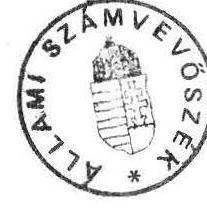
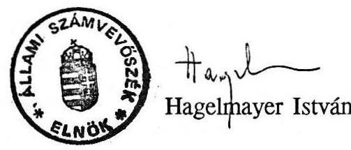

# 21lami sáámtuevösyèk 

## JELENTÉS

az alapfokú oktatásra fordított pénzeszközök
felhasználásának ellenőrzéséről
Q. 114

---

# J E L E N T É S 

## az alapfokú oktatásra fordított pénzeszközök felhasználásának ellenőrzéséről

A helyi önkormányzatokról szóló 1990. évi LXV törvény az alapfokú oktatást a települési önkormányzatok kötelező feladatai közé sorolja. Az e feladathoz biztosított állami támogatás mértéke és a támogatás elosztásának szempontrendszere évente az állami költségvetésről szóló törvényben kerül megállapításra.

Az önkormányzatok költségvetésén belül a közoktatással kapcsolatos kiadások jelentős - $50 \%$-os - részarányt képviselnek. 1990-ben 97 milliárd, 1991-ben 126 milliárd forintot költöttek az önkormányzatok alap- és középfokú oktatási kiadásokra. A kiadásokon belül - elsősorban az állami támogatási rendszer belső struktúrájának megváltozása következtében - 1990-ről 1991-re 10 százalékponttal növekedett az állami támogatás részaránya. Fontos társadalmi érdek, hogy a közoktatás kiadásainak mintegy felét kitevő alapfokú oktatás ráfordításai jól hasznosuljanak, és a jelenleg meglevő ellátottságbeli különbségek csökkentésével a tanköteles korú gyermekek számára az esélyegyenlőség feltételei megteremtődjenek.

Az általános iskolai oktatásban résztvevő tanulók száma az 1986/87. tanévi létszámcsúcs (1.299.455 fő) óta folyamatosan csökken, az 1991/92. tanévben 1.081.213 gyermek oktatásáról kellett gondoskodni az önkormányzatoknak.

Az Állami Számvevőszék 1992. I. félévi munkaterve alapján a fővárosban és 11 megyében vizsgálta az alapfokú oktatás helyzetét. Az ellenőrzés 69 városi és községi önkormányzatra és összesen 308 alapfokú oktatási intézményre terjedt ki. A vizsgálattal érintett alapfokú oktatási intézményeknél 133.493 fő tanul, ez az összes tanuló létszám $12,3 \%$-át teszi ki.

---

A vizsgálat célja annak megállapítása volt, hogy

- az 1990-től bevezetett normatív finanszírozási rendszer milyen mértékű támogatást biztosít az önkormányzatok részére alapfokú oktatási kötelezettségeik végrehajtásához. Milyen megalapozó számításokra építve, milyen megfontolások alapján kerültek meghatározásra az alapfokú oktatást érintő normatív támogatási elemek.
- A települési önkormányzatok saját forrásaikból milyen mértékben egészítik ki az alapfokú oktatási feladatok ellátásához kapott állami támogatást.
- Az oktatás-irányítás és -finanszírozás megváltozott körülményei hogyan hatnak az oktatási intézmények gazdálkodására, a személyi és tárgyi feltételek megteremtésének lehetőségén keresztül az ott folyó tartalmi munka színvonalára.

# I. 

A vizsgálat részletes megállapításai

## 1. A szabályozórendszer hatása az önkormányzatok forrásaira

A tanácsi rendszer átalakulása, az önkormányzatok létrehozása a korábbi pénzügyi szabályozás változtatását, az önkormányzatok gazdasági függetlenségét szolgáló feltételek megteremtését tette szükségessé. A változtatás igénye már a tanácsi rendszer időszakában megfogalmazódott és 1990-től - még az önkormányzati törvény megjelenése előtt — sor került az új pénzügyi szabályozás főbb elemeinek bevezetésére. A teljes rendszer átfogóan kívánta átalakítani a tervezés, a szabályozás és a gazdálkodás folyamatait. Az új szabályozás alapvető célkitűzése volt, hogy a korábbi kiadási szemlélet helyett alulról építkező bevétel-orientált szabályozás alakuljon ki, vagyis a források határozzák meg a kiadásokat.

Ezt az elvet vegyes finanszírozási rendszer szolgálja olymódon, hogy nem a konkrét feladatot, hanem az intézményt fenntartó, feladatot ellátó önkormányzatot támogatják. Az alanyi jogon, valamint a térségi-körzeti feladatokra egyaránt normatív módon juttatott támogatások felhasználási kötöttség nélkül illetik meg az önkormányzatokat.

Az 1990. évtől bevezetett finanszírozási rendszer az önkormányzatok részére adható központi költségvetési támogatás nagyságrendjét nem, de az egyes önkormányzatok részére juttatott központi támogatás mértékét átrendezte és lényegében egy forrás-

---

újraelosztást eredményezett. Ily módon az önkormányzatoknál egy korábban kialakult intézmény- és feladatrendszer áll szemben az újraelosztott forrásokkal, ami sok esetben feszültségeket idézett elő.

A Magyar Köztársaság 1990. évi Állami Költségvetéséről szóló 1989. I. törvény az alsófokú oktatási feladathoz nevesítetten nem határozott meg normatívát. Alanyi jogon minden 3-13 éves korú állandó lakosra $4.180 \mathrm{Ft} / \mathrm{fő}$ támogatás illette meg az önkormányzatokat. E korcsoporthoz kötődő normatíva nem számolt a körzeti-térségi feladatokat is ellátó önkormányzatok támogatási igényeivel, a feladatot ellátó és a gyermek lakóhelye szerinti önkormányzatok közötti utólagos elszámolás nehézségeivel.

Az 1990. év tapasztalatait értékelve a szabályozást továbbfejlesztő főhatóságok egyetértettek abban, hogy 1991. évtől a korcsoportos normatíva helyébe feladathoz kapcsolt normatíva lépjen. Ennek megfelelően olyan új támogatási elemek kerültek a rendszerbe, amelyek már a feladatot ellátó önkormányzat részére biztosítottak állami támogatást. A támogatási elemek egy részének bevezetésével pedig egyes oktatási formák nagyobb fajlagos költségigénye is elismerésre került (fogyatékos gyermekek ellátásához magasabb összegű támogatás, nemzetiségi, etnikai és kéttannyelvű oktatásban részesülő tanulók után kiegészítő támogatás biztosítása).

Az 1991. évi oktatási feladathoz kapcsolt normatívák kialakítását nem előzték meg az egyes támogatási célok indokolt költségigényét megalapozó modellszámítások. A számítások alapját képezhető tényleges költségadatok pedig, az érvényes számviteli előírások, a költségek szakfeladati megosztásának rendje, a költségvetési beszámoló adatai alapján az egyes támogatási elemek szerinti bontásban nem álltak rendelkezésre.

Az alapfokú oktatás költségeivel együtt a " 842114 általános iskolai oktatás" szakfeladaton kerül elszámolásra, ezért nem különíthető el a fogyatékos gyermekek oktatásának költsége. Nem különíthető el a szakfeladati költségeken belül a nemzetiségi, etnikai és kéttannyelvü oktatás többletköltsége sem.

A modellszámítások elmaradása miatt és az egyes támogatási formákhoz kapcsolódó költségadatok tényszámainak ismerete nélkül nem állapítható meg, hogy a szabályozást előkészítő főhatóságok az egyes normatíva-elemek nagyságrendjének kialakítása során átlagosan milyen mértékű támogatást kívántak a feladatot ellátó önkormányzatok részére biztosítani.

---

Az alapfokú oktatás kiadásaihoz - a költségek döntő részét megjelenítő általános iskolai nevelés, oktatás szakfeladat országos adatait értékelve - a normatívák 1991. évben átlagosan $90 \%$-ban biztosítottak fedezetet.

1991-ben az általános iskolai oktatásra és fogyatékos gyermekek oktatására biztosított normatív támogatás 35 milliárd forintot tett ki, amelyet az évközi központi bérpolitikai intézkedések mintegy 3 milliárd forinttal megemeltek. Ezzel szemben az általános iskolai nevelés-oktatás költségei ugyanezen időszakban 42 milliárd forintot tettek ki.

Az oktatási intézményeket fenntartó önkormányzatok számára ez azt jelentette, hogy az általános iskolai napközi otthoni ellátás és az étkeztetés költségeit, valamint az intézmények felújításával kapcsolatos kiadásokat teljes egészében egyéb önkormányzati forrásból kellett fedezni.

Az 1991. évben az önkormányzatok általános iskolai napközi otthoni ellátásra 11,6 milliárd forintot fordítottak, a szervezett étkeztetés költségeihez 1,2 milliárd forinttal járultak hozzá, általános iskoláik felújítására pedig 1,4 milliárd forintot költöttek.

Egyik leglényegesebb eleme az 1990-ről 1991. évre történt finanszírozási rendszerbeli változásoknak, hogy bevezetésre került a címzett- és céltámogatási rendszer, amely az önkormányzatok rekonstrukciós és fejlesztési - köztük az alsófokú oktatási intézmények és kapcsolódó létesítményeinek (pl. tornaterem) fejlesztési - feladatainak támogatását szolgálja. E támogatási forma bevezetésének szükségességét az önkormányzatok létrejöttével bekövetkezett közigazgatási rendszer-módosulás, valamint az önkormányzatok többségének szűkös fejlesztési lehetőségei egyaránt indokolták.

A tanácsi rendszer megszűnését követően szétváló települések oktatási intézménnyel általában nem rendelkeztek. A megalakuló képviselőtestületek jelentős része ugyanakkor az alapfokú oktatást helyben kívánja megvalósítani akkor is, ha az ehhez szükséges fejlesztéshez pénzügyi forrásokkal nem rendelkezik. Ezen elképzelések megvalósításában segített a tanterem és tornaterem építés esetén támogatást nyújtó állami céltámogatási rendszer, amely a feltételek szerint a beruházási költségek 40 \%-ára biztosított fedezetet. Az önkormányzatok e lehetőséget kihasználva is csupán 5,8 milliárd forintot tudtak 1991-ben általános iskolák építésére, bővítésére fordítani, holott az igények ezt jelentősen meghaladják. A céltámogatási rendszer múködését ellenőrző korábbi vizsgálatunk tapasztalatai azt mutatják, hogy az önkormányzatok egy része e támogatás adta lehetőséggel nem tudott élni, mivel a pályázati feltételek között előírt saját forrással nem rendelkezett.

---

# 2. A vizsgált önkormányzatok pénzügyi helyzete 

Az önkormányzatok pénzügyi pozíciója évről-évre eltérően alakult. 1990-ben az SZJA $100 \%$-os átengedésével a tanácsok pénzügyi lehetőségei nagymértékben differenciálódtak, és az átlagosnál alacsonyabb SZJA-val rendelkező települések hátrányos helyzetbe kerültek. Az 1991. évi költségvetési törvény ugyan az SZJA $50 \%$-os átengedésével és a normatív támogatási rendszer bővítésével, a kiegészítő támogatások bevezetésével kiegyenlítettebb feltételeket teremtett, azonban a területi fejlődés aránytalanságaiból fakadó, valamint az áthúzódó, öröklött kötelezettségek miatti hátrányos helyzet megszüntetésére, a lemaradás ledolgozására ilyen rövid idő alatt nem volt lehetőség. Az eltérő pénzügyi lehetőségek kimutatható hatással voltak az önkormányzati feladatellátásra, ezen belül az alapfokú oktatás lehetőségeire, feltételrendszerére is.

Az önkormányzatok azon része, amelyeknél a forrásbővülés még az infláció növekedésének mértékét sem érte el, intézményeinek - ezen belül alapfokú oktatási intézményeinek - müködtetését csak a fejlesztések, felújítások erőteljes visszafogásával tudta biztosítani.

A Győr-Moson-Sopron megyei Csorna városban 1990-91. között a forrásbővítés csupán $27 \%$-os volt. Reálértékét tekintve számottevően szükültek a város forrásai, ami azonban nem a müködtetés, hanem a fejlesztés visszafogásával járt. A müködtetés részaránya az 1989. évi $83 \%$-ról 1992-re $96 \%$-ra emelkedett, fejlesztést lényegében nem tervezhettek.

A Főváros XIX. kerületi Önkormányzat bevételei 1990-ről 1991-re mindössze $16 \%$-kal növekedtek. Bevételeik döntő részét intézményeik müködtetésére fordítják. 1991-ben a fejlesztési kiadások aránya csak $15 \%$-ot tett ki.

Az éves költségvetés készítésének gyakorlatában a korábbi időszakhoz képest lényeges változás nem következett be. A testületek ugyan a korábbinál nyíltabban, demokratikusabban igyekeztek a források felhasználásáról dönteni, a költségvetési előirányzatokat azonban továbbra is a bázisból kiindulva, ún. ráépítéses módszerrel állapították meg. Több önkormányzat törekedett a takarékossági követelmények fokozottabb érvényesítésére, számos helyen került sor tervszámok csökkentésére, előirányzatok mérséklésére is.

Ezeket az intézkedéseket azonban még csak néhány városi önkormányzatnál alapozták meg korszerű költségelemzéssel, intézményi átvilágítással.

---

Zalaegerszeg város a bér- és eszközellátottság feltárása céljából átvilágította intézményhálózatát. A gazdaságtalanul müködtethető peremkerületi, néhány osztályos iskolák müködését szüneteltetik, máshol a kialakult differenciák csökkentésére tett intézkedések alátámasztására szolgált az átvilágitás.

Kaposvár város képviselőtestülete 1991-ben tett kísérletet arra, hogy az általános iskolák költségvetését a feladatellátás oldaláról közelítve, szakmai mutatószámok alkalmazásával egységes szempontok alapján készítse el. Az intézmények átvilágitásának eredményeként kialakított mutatószámok figyelembe vételével állították össze az 1992. évi költségvetést ( 13 tanulóra számítottak 1 pedagógust, egy tanulócsoportot 25 tanulóval és 1,5 fő pedagógussal terveztek).

Békés megyében két város, Békéscsaba és Gyula tartotta indokoltnak az oktatási intézmények átvilágítását. A feladatok meghatározása, a módszer kidolgozása mindkét városban szakszerü, alapos volt. Békéscsabán az átvilágítás eredménye jobban hasznosítható, mivel azt helyi ismeretekkel is rendelkező szakértők készítették, és ezzel párhuzamosan fogadták el az oktatási koncepciót is. Az iskolák közötti különbségek mérséklése érdekében az információk további részletes elemzését tartják indokoltnak.

A kistelepülések több tekintetben hátrányos helyzetben vannak. A feladatellátás struktúrája miatt az oktatási ágazat részesedése a költségvetési kiadások között magasabb részarányt képvisel, mint a nagyobb településeknél, ugyanakkor saját bevételeik növelésére kevesebb lehetőségük van.

A községi általános iskolák a csökkenő tanulólétszám miatt egyre rosszabb kihasználtsággal müködnek, amely a fajlagos költségek növekedését eredményezi. E települések többségénél, ahol az alsófokú oktatási intézmény testesíti meg leginkább az állami, önkormányzati feladatvállalás tárgyiasult formáját, az ahhoz való kötődés, ragaszkodás olyan mérvü, hogy gyakran a reális, a pénzügyi-gazdasági lehetőségeket figyelmen kívül hagyó, az önkormányzatok teherbíró képességét meghaladó döntések születnek.

A Zala megyei Sárhída alsótagozatos iskolájában jelenleg 2 tanulócsoport tanul. Az 1-3. és a 2-4. osztályokban összevont oktatás folyik. A felsőtagozatos gyerekek a baki önkormányzat oktatási intézményében tanulnak, de a képviselőtestület a felső tagozat visszatelepítését tervezi. Ehhez 3 tanterem építésére van szükség, és az 5-6 osztály összevont oktatásával számolnak. Az önkormányzat már jelenleg is az átlagosnál lényegesen magasabb, 53 ezer forintos fajlagos költséggel müködteti az intézményt.

---

Különösen sok feszültséggel terhes a korábbi körzetesítések nyomán létrehozott körzeti iskolák fenntartása. A több település gyermeklétszámára alapozott, megyei céltámogatással létesített körzeti általános iskolák fenntartása egyre több nehézséget okoz az iskolát fenntartó önkormányzatnak. Ennek oka az, hogy az időközben önállóvá vált települések egy része jogilag nem rendezi vagy nem is vállalja a közös üzemeltetést, illetve nem téríti meg a székhely község részére a normatíva feletti költségeket. Ennek következtében az iskolát fenntartó önkormányzatnak kell saját forrásából a többletköltségek fedezetét biztosítani.

A Heves megyei Egercsehi Körzeti Általános Iskolában az egy tanulóra jutó költségek 33 ezer forintról 60 ezer forintra, $80 \%$-kal növekedtek. Ennek oka a demográfiai okokból bekövekezett létszámcsökkenés mellett az, hogy a körzethez tartozó Bekölce község önkormányzata a múlt évben úgy döntött, hogy új körzethez kíván csatlakozni. Ez 40 fő távozását jelentette a felső tagozatból.

A Győr-Moson-Sopron megyei Pázmánd községben 130-135 fővel müködött egy 8 osztályos általános iskola, ami a korábbi társközség, Nyalka ilyen irányú igényeit is kielégítette. 1991. szeptember 1-től Nyalkán is beindították 18 fővel (!) az alsó tagozatos oktatást, s ezen időponttól a felsősök egy része is más településre (Táp) jár tanulni. Összesen 34 fővel csökkent az említettek miatt az amúgy sem kihasznált pázmándi iskola létszáma. A jelenleg már csak 101 fővel üzemelő iskola fenntartása rendkívül gazdaságtalan.

Zala megyében az aprófalvas település-szerkezet és a korábbi évtizedek körzetesítési politikájának következtében az önkormányzatoknak csaknem fele oktatási intézménnyel nem rendelkezik. Ezen települések a törvényben foglalt kötelezettségüknek úgy tudnak eleget tenni, ha a korábbi székhelyközségi iskolák fenntartásához hozzájárulnak, vagy intézményirányító társulást hoznak létre.

Kifogásolható, hogy a közös üzemeltetésre vonatkozó képviselőtestületi határozatok hiányosak, nem határozzák meg a költségszámítás módját és az egyes önkormányzatok közötti költségelszámolás feltételeit és határidejét sem.

---

# 3. Az alapfokú oktatási intézmények gazdálkodásának jellemzői 

Az alapfokú oktatási intézmények többsége az oktatási törvény által is deklarált szakmai önállóság mellett egyre nagyobb hatáskört, önállóságot igényel gazdasági kérdésekben is. Az önkormányzatok képviselötestületeinek jelentős része e törekvésekkel egyetért, amelyet az e kérdéskörrel foglalkozó testületi ülések határozatai is bizonyítanak.

Az iskolák önállóbb gazdálkodási jogosultságának megteremtésében az is szerepet játszik, hogy már a tanácsrendszer időszakában, a 80 -as évek végén megkezdődött az ellátó szervezetek (GAMESZ, GESZ) megszüntetése. E tendencia az önkormányzatok megalakulásával tovább folytatódott. A városi önkormányzatok alapfokú oktatási intézményei az ellátó szervezetek megszüntetését követően nagyobb gazdálkodási önállóságot kaptak, a községi iskolák költségvetése pedig beleolvad az önkormányzati hivatal pénzügyi gazdálkodásába.

Az önálló intézményi gazdálkodás lehetőségeinek megteremtésére irányuló erőteljes igény miatt előfordult, hogy az ellátó szervezet megszüntetésére olyan esetben is sor került, amikor az iskolák önállóvá válásának személyi és technikai feltételei még nem teremtődtek meg.

A fơváros IX. kerületének általános iskolái önállósulási folyamatának mindegyik szakaszában voltak zökkenők, és azokat az iskolák alulinformáltsága jellemezte. Így az új szakaszok bevezetésekor a változás előtti időszak gazdálkodásának tényadatai az intézmények előtt nem voltak ismertek. Egy megkésve hozott képviselőtestületi döntés nyomán csak a számvevőszéki vizsgálat befejező időszakában váltak ismertté az 1992. évi gazdálkodásuk alapjául szolgáló 1991. évi bázisadatok. Emellett három hónapig nem került sor az önálló intézmények bankszámláinak megnyitására. Ennek áthidalására az önkormányzat Pénzügyi Irodájától ellátmányt kaptak.

Az iskolák költségvetésének készítése során — elsősorban a városokban — az iskolákkal való folyamatos együttmúködésen alapuló, konszenzust kereső tervezési gyakorlat van kialakulóban. A képviselőtestülek által elkészített tervezési irányelveket az érintett intézmények megismerték, a szükségletfelmérés folyamatába az iskolavezetést is bevonták.

A Nógrád megyében ellenőrzött önkormányzatok többsége bevonta az intézményeket a költségvetés tervezésének munkálataiba. Figyelmet érdemlő gyakorlatot alakított ki Bátonyterenye, ahol a tervezéshez irányelveket is kibocsátottak. Az intézmények által

---

összeállított elképzelést több menetben tárgyalták egy ideiglenes bizottság előtt úgy, hogy a kiadott irányelvek és az egyedi, elodázhatatlan igények egyaránt teljesülhessenek.

A költségvetési javaslat összeállítása során a művelődési és a pénzügyi szakapparátus elsősorban előkészítő, információgyűjtő és elemző feladatot vállalt; a bizottságok pedig az érdekegyeztetés fórumai voltak. Az együttműködés a tervezés minden fázisában megfelelőnek minősíthető.

A Hajdú-Bihar megyei Szerep községben az 1991. évi költségvetés előirányzatainak kimunkálása, a tervkoncepció meghatározása előtt a pénzügyi-, kultúrális-, és a településfejlesztési bizottságok tagjai intézménylátogatást végeztek. Ennek során betekintettek az intézmények belső életébe, láthatták az intézmények épületeinek állagát, s a szakmai eszközellátottság helyzetét. Az így szerzett információk birtokában került sor a polgármesteri hivatal, illetve az intézményvezetők által közösen összeállított költségvetési javaslat megvitatására, jóváhagyására.

Az oktatási intézmények beleszólási lehetősége a költségvetési tervjavaslat összeállításába sok esetben csak látszólagos, mivel az önkormányzatok döntési lehetőségeit a szűkös pénzügyi források korlátozzák. A vizsgált időszakban elkészített intézményi költségvetések még magukon viselik a korábbi évek alapvetően hibás, bázisszemléletű és lényegében az előző év kiadási szintjét elismerő támogatási politikát. A tervkészítés során kevés esetben kerül sor reális költségelőirányzatok kidolgozására, és az e szint elérését célzó takarékossági intézkedések megfogalmazására. A korábbi években kialakult költségszerkezet az ellenőrzés időszakában sem változott. A kiadási szintet alapvetően meghatározó bérköltség és TB-járulék mellett jelentkező kiadásokra (szakmai fogyóeszköz beszerzés, karbantartás stb.) igen csekély költségvetési forrás állt rendelkezésre.

Az önkormányzatok pénzügyi lehetőségei és az intézményi működési költségek nagyságrendje között az ellenőrzés nem tudott szoros korrelációt kimutatni. Bármilyen előjelű volt is az adott önkormányzat pénzügyi pozíciójának változása, az oktatás korábbi években elért működési szintjét biztosítani igyekezett.

A vizsgált önkormányzatoknál az egy tanulóra jutó oktatási-nevelési költségek 1991. évben 36 ezer forintot tettek ki, amelytől az önkormányzatok településtípusonként összegezett átlaga alig mutat eltérést (Fővárosi kerületekben 37,8 ezer forint, városokban 35 ezer forint, községekben 35,5 ezer forint a fajlagos mutatószám). Jelentősebb eltérés mutatkozik az alapfokú oktatás három legjellemzőbb szakfeladata (oktatás, étkeztetés, napközi otthoni ellátás) költségeinek elemzésekor. Az oktatási és ellátási költségek átlagához (49 ezer forint)

---

képest a fővárosi önkormányzatok az átlagnál többet, 52 ezer forintot költenek évente a gyermekek oktatására és ellátására. Ez a mutatószám a községi iskoláknál a legalacsonyabb, csupán 45 ezer forintot tesz ki.

Az ellenőrzött önkormányzatok egy kis része az átlagtól jelentős mértékben eltérő költségszinten müködteti intézményeit (2. sz. melléklet). Az alacsonyabb kiadási szinttel működő intézmények gazdálkodására egész évben a bizonytalanság volt a jellemző. Gyakran került sor év közben az előirányzat megvonására, vagy a gazdálkodási körülmények kedvezőbbé válása esetén pótelőirányzat biztosítására.

A Borsod megyei Szerencsen a források bizonytalansága miatt az általános iskolák működéséhez a támogatást év közben több ütemben biztosította az önkormányzat. A képviselőtestület 1991. márciusában az intézmények költségvetését a normatív támogatás mértékéig hagyta jóvá, s egyúttal intézkedett az intézmények feladat- és költségigényének a művelődési és pénzügyi ellenőrző bizottság bevonásával történő felülvizsgálatára. Az eredeti költségvetési előirányzatok az 1991. évi bérelőirányzatok és TB-járulék mértékéig fedezték a költségeket. Az intézményi költségvetések felülvizsgálatára létrehozott külön bizottság javaslata alapján, az önhibáján kívül hátrányos helyzetű önkormányzatok kiegészítő támogatásáról szóló országgyűlési döntést követően a képviselőtestület szeptemberben módosította a költségvetési rendeletet, majd decemberben a többletbevétel terhére dologi kiadásokra nyújtott támogatást az intézményeknek. Év közben összesen 9,3 millió forinttal növelte az önkormányzat az alsófokú oktatással összefüggő költségvetési előirányzatokat a központi $10 \%$-os bérfejlesztésen túl. 1991-ben az oktatási intézmények gazdálkodása a működőképesség megőrzésére irányult. A finanszírozási gondok az intézményi gazdálkodásban is érezhetőek voltak (tüzelő készleteiket felhasználták, év végén számlákat nem egyenlítettek ki stb.)

A főváros XIX. kerületében a vizsgált mindkét év második felében beszerzési korlátozásokat rendeltek el. Csak az intézmények zavartalan működéséhez feltétlenül szükséges beszerzésekre (arra is csak eseti engedéllyel) kerülhetett sor. A vizsgált kerületek közül ebben a kerületben volt a legalacsonyabb az oktatási szakfeladaton elszámolt költségek fajlagos értéke ( 33 ezer forint).

Az átlagos értéknél magasabb fajlagos költségek a kislétszámú és alacsony kihasználtsággal működő intézményeknél jelentkeztek. Egyértelműen szoros összefüggés mutatható ki a tanulócsoportok nagysága és a fajlagos költségek mértéke között. A vizsgálatba bevont 10-12 fős tanulócsoporti létszámmal működő oktatási intézményeknél az egy tanulóra vetített oktatási költség átlag 76 ezer forint volt, ezzel

---

szemben a 26-28 fős tanulócsoporti létszámmal működő iskolákban a ráfordítások átlagosan mindössze 33 ezer forintot tettek ki.

A Somogy megyei Gamás község nyolcosztályos általános iskolájában mindössze 83 tanuló jár. A gyermekeket 14 pedagógus oktatja. Az alacsony, mindössze 10 fős tanulócsoporti létszám miatt az egy tanulóra jutó oktatási költség igen magas, 81 ezer forint.

A Hajdú-Bihar megyei Szerep községben a 16 fős tanulócsoporttal müködő oktatási intézményben tanulónként 53 ezer forintot költöttek az oktatás kiadásainak fedezésére.

A Zala megyei Ságod általános iskolájában 2 csoportban 20 gyermek oktatását végzik. Az 1. osztályt ônállóan, a 2-3 osztályt összevontan oktatják. A 2 tanulócsoport, illetve 1 napközis csoport ellátását 3 pedagógus végzi. Az 1 tanulóra eső költségek 87 ezer forintot tesznek ki.

Az előzőek alapján megállapítható, hogy az önkormányzatok nevelési-oktatási költségeire az 1991. évi állami támogatás tanulókénti 30 ezer forintos normatívája átlagosan $85 \%$-os fedezetet nyújtott a vizsgált önkormányzatoknál. Az évközi bérpolitikai intézkedések, valamint az alapfokú oktatást érintő egyéb kiegészítő támogatások együttesen az oktatási költségek mintegy $90 \%$-os mértékére biztosítottak állami forrást.

# 4. A demográfiai tényezők és a gazdálkodási körülmények hatása az intézményekben folyó szakmai munka színvonalára 

A vizsgált önkormányzatoknál az 1989-1991. közötti időszakban $11 \%$-kal csökkent az alapfokú oktatási intézményekben tanulók száma. A demográfiai körülmények változása miatt bekövetkezett tanulólétszám-csökkenés hatása a városi iskoláknál általában kedvező, mivel a létszámcsökkenés következtében enyhült a korábbi zsúfoltság, csökkent a szükségtantermek száma, javultak az elhelyezés körülményei.

A fơváros öt vizsgált kerületében az ellenőrzés időszakában együttesen 104-el (5,3 \%-kal) csökkent az osztálytermek száma, amelyen belül 25 volt az osztályterem céljára lényegében nem is alkalmas szükségterem. Kedvezőtlen, hogy az 1991/92. tanévben osztálytermi célra használt 1858 terem közül még mindig 65 db a nem megfelelő szükségtermek száma, s ezen felül — elsősorban a III. és a XIX. kerületben — számos iskolaépületen kívüli termet is kénytelenek oktatási célra igénybe venni.

---

A létszámcsökkenés a községi iskolák többségénél a fentiekkel ellentétes hatást váltott ki. A korábban sem túlságosan jó kihasználtsággal működő iskolák kihasználtsága tovább romlott. A társközségek szétválása következtében egyes - korábban több település gyermekeinek oktatását végző - intézmények szinte elnéptelenedtek. A kis lélekszámú, kis tantestületekkel rendelkező iskolákban a szakmai munkavégzés lehetőségei objektíve behatároltak.

Győr-Moson-Sopron megye községi iskoláiban a szakos ellátottság nem megfelelő. Különösen Darnózsell, Agyagosszergény, Pázmánd kislétszámú iskoláinál - ahol a pedagóguslétszám is alacsony (11-13 fő) - nehéz javítani a helyzeten e tekintetben. Korszerű, színvonalas oktatás nehezen valósítható meg olyan községben, mint Pázmánd, ahol a 11 fős tantestület nem tudja ellátni a rajz, technika, földrajz és ének szakos előadókkal történő oktatást amellett, hogy a szakos helyettesítés - de a méretek miatt bármilyen helyettesítés is - gyakran megoldhatatlan.

Nógrád megyében a minőségi mutatók a községi iskolák többségében elmaradnak a városoknál tapasztaltaktól. A szakképzettség aránya lényegesen alacsonyabb a községeknél. Ezt jól reprezentálja a szakosan leadott órák aránya, amely pl. az etesi iskolában mindöszsze $52 \%$. Ez messze elmarad még a községek átlagától is ( $88 \%$ ).

Az önkormányzatok a demográfiai okok következtében létrejött kedvezőbb oktatási feltételeket az oktató-nevelő munka színvonalának javítására kívánták felhasználni és csak kevés és rendkívül indokolt esetben éltek a pedagógus álláshelyek megszüntetésének lehetőségével. Ennek eredményeként a vizsgált önkormányzatoknál az 19891991 közötti időszakban csupán $4 \%$-kal csökkent a pedagógusok száma. A létszám-csökkentés egyébként a szakképzettség arányának javulását eredményezte, ugyanis az önkormányzatok elsősorban a képesítéssel nem rendelkező pedagógusoktól váltak meg.

Az oktatás személyi feltételeiben és az elhelyezés körülményeiben bekövetkezett kedvező irányú változások következtében a korábbinál kisebb létszámú tanulócsoportok kialakítására nyílt lehetőség. Az 1989. évi 25,1 fős átlagos csoportlétszám 1991. évre 23,4 fơre csökkent a vizsgált önkormányzatok alapfokú oktatási intézményeiben.

A városi és községi iskolákban az oktató-nevelő munka eltérő körülmények között, tendenciájában azonban fokozatosan romló tárgyi feltételek mellett folyik. Az oktatási célra használt épületek állaga településenként, iskolánként eltérő, és magán viseli a korábbi évtizedek elmaradt felújításainak kedvezőtlen hatását.

---

Kedvezőbb helyzetben azok az önkormányzatok vannak, ahol új vagy viszonylag új épületekben folyik az oktató-nevelő munka. Az önkormányzatok ugyan mindent megtesznek annak érdekében, hogy az elavult, régi épületekben is megfelelő körülményeket teremtsenek, azonban a községi, nagyközségi önkormányzatok többsége pénzügyi fedezet hiánya miatt nem tudja az egyébként indokolt felújítási és fejlesztési igényeket kielégíteni.

A Hajdú-Bihar megyei Szerep község általános iskolájában az oktató-nevelő munka négy épületben folyik. Ezek közül kettő régi, korszerütlen. Tornaterem nincs, csak egy tornaszoba áll rendelkezésre. A tornaterem-épités pályázati rendszer által kínált lehetőségével sem tudnak élni, hisz a szükséges saját forrást az önkormányzat képtelen előteremteni.

Sárrétudvariban az általános iskolás korú tankötelezettek három épületben vannak elhelyezve. A fóépület tetőszerkezete beázik, ezért felújításra szorulna. A további két épület, amelyben hat tanterem és a kiszolgáló helyiségek találhatók, régi, elavult, felújítása gazdaságtalan. A kialakult kedvezőtlen helyzetet a fóépület magas tetővel történő beépítésével kívánnák megszüntetni. Anyagi fedezet hiánya miatt azonban még szakaszosan sem tudja az önkormányzat a beruházást elkezdeni.

A Zala megyei társközségek egy részében az oktatási intézmények a mai kor követelményeinek egyáltalán nem megfelelő körülmények között müködnek. Becsvölgyén az iskolaépület vizesblokkal nem rendelkezik, a gyerekek az udvari WC-t használják, Eszteregnyén a régi épületrész rendkívül vizes, a falak salétromosak, a vakolat mállik.

A Heves megyei Füzesabony város telepi iskolájának (Teleki Blanka) külső megjelenése jó, az állaga belülről közepes. Sok a szükségtanterem; a tornaszoba és a két technikaterem az alagsorban van, azok kisméretűek, szellőztetésük nem megoldott. A központi épületben további 3 szükségteremben folyik a tanítás. Az iskolához tartozó ún. "Tornyos Iskola" alapos felújításra szorul, s kényszermegoldás a kettős funkciójú használata, ugyanis a hétvégeken istentiszteleteket tartanak benne.

Kerecsend községben az alapfokú oktatás 5 iskolaépületben folyik. Az új 6 tantermes iskolaépület állaga jó, ugyanakkor a tornaszoba és a politechnikai műhely rossz állapotban van. A központi iskolának nevezett épületegyüttes kívül-belül felújításra szorul, lakásból kialakított szükségtantermekkel rendelkezik.

Csongrád megyében 1990-ben az ellenőrzésbe bevont öt város és a két község 36.027 ezer forintot irányzott elő intézményei felújítására, a teljesítés 36.113 ezer forint volt. E feladatok forrását $41,5 \%$-ban hitel képezte. (A nagyjavításra felhasznált összeg $87 \%$-a

---

Makó várost érintette). 1991-ben ugyanezen települések felújításra mindössze 5.332 ezer forintot irányoztak elő, ugyanakkor a teljesítés még ezt a szintet sem érte el, 4.899 ezer forint volt.

Az iskolákban rendelkezésre álló szakmai anyagok és fogyóeszközök (szemléltető eszközök, audiovizuális eszközök, számítástechnikai eszközök stb.) a korábbi évek visszafogott fejlesztései miatt egyre kevésbé alkalmasak az oktató munka segitésére. Sok közöttük a pedagógiailag már túlhaladott, erkölcsileg is elavult, selejtezésre érett eszköz.

Megállapítható ugyanakkor, hogy a jelenlegi szűkös pénzügyi keretek sem adnak lehetőséget a szakmai fogyóeszközök körének bővítésére, az állomány korszerűsítésére.

Az intézményi költségvetések jelentős részét a bérköltségek kötik le, (ez a vizsgált körben 75,6 \%) így - a maradványelv érvényesülése következtében - csekély öszszegeket tudnak a tárgyi feltételek javítását szolgáló beszerzésekre fordítani. Az ellenőrzött önkormányzatok oktatási költségeiknek csak 2,9 \%-át tudták szakmai anyag és fogyóeszköz beszerzésére fordítani. Legkedvezőtlenebb helyzetben a községi önkormányzatok vannak, ahol ez az arány csupán $2 \%$. A szakmai anyag és fogyóeszközbeszerzés indokolatlanul alacsony részaránya hosszabb távon már a szakmai munkavégzés jelenlegi színvonalának megtartását is veszélyezteti.

Nógrád megye iskoláiban a taneszközök rendkívül elhasználtak és hiányosak voltak. Az ellenőrzött iskolákban az alapvető taneszközök 10-35 \%-a hiányzott. Különösen a természettudományokhoz tartozó tantárgyak (fizika, kémia, környezetismeret) felszereltsége volt kifogásolható. Sajátos az újonnan létesített Pilinyi tagiskola helyzete. Ennél az intézménynél hiányzott az alapvető oktatás-technikai eszközök jelentős része, a környezetismeret oktatásához pedig egyetlen taneszköz sem állt rendelkezésre.

Az etesi iskolában a rendelkezésre álló készletbeszerzési előirányzatot sem használták fel, aminek feltehetően a tantestület vezetésének igénytelensége is az oka lehet.

Csongrád megyében a szemléltető- és audiovizuális eszközök erősen elhasználódott állapotot mutatnak. Az elmúlt években a romló pénzügyi feltételek miatt alig történtek új beszerzések. Minimális volt a régiek pótlása, így ezen eszközök minőségi színvonala nem megfelelő. (Pl.: a diavetitők kis teljesítményűek, a gépek régiek, elhasználtak, javíttatásuk alkatrész és tartozékok hiánya miatt nem lehetséges.)

---

Az iskolák TV-készülékeinek oktatási célra történő használata korszerűtlenségük mellett azért is egyre korlátozottabb, mert az iskolatelevízió adásai megszüntek, a rendelkezésre álló oktató videófilmek pedig elavultak.

A fővárosban általános vizsgálati tapasztalat, hogy az időközben korszerűtlenné vált, vagy már nagyon elhasználódott eszközök selejtezését az oktatási intézmények az indokoltnál kisebb mértékben hajtják végre. A XIX. ker. Bolyai János általános iskolában a vizsgálat időszakában még leltáron tartottak 9 db - videó-csatlakozással el nem látott - fekete fehér TV-készüléket, 4 db orsós magnetofont, 14 db diavetítőt, 10 db mono-lemezjátszót. Ezekből a típusokból 1991-ben 10 db -ot már selejteztek. A XIX. kerületi Csokonai utcai általános iskolában a nyilvántartott 15 db fekete fehér TV készülékből $3 \mathrm{db}, 18 \mathrm{db}$ diavetítőből 3 db , a 18 db magnetofonból 2 db , a 20 db lemezjátszóból 10 db selejtezésre érett fogyóeszköz.

A pedagógiai munkavégzés színvonalára többségében negatívan ható körülmények ellenére számos oktatási intézményben igényes szakmai munka folyik. A megvizsgált városi iskolákban a szakosított tantervű és második idegen nyelvi csoportok száma a tanulócsoportok számának 3,5 \%-os csökkenése ellenére abszolút számban és arányaiban is emelkedett (az 1989. évi 936 -tól 1991. évben 1021-re).

Hajdú-Bihar megye megvizsgált városaiban kedvező feltételeket teremtettek a szakosított tantervű és második idegen nyelvi oktatáshoz. A szakos ellátottság - az idegen nyelvek kivételével - Püspökladány mindhárom iskolájában $100 \%$-os. Ugyanitt a szakosított tantervű és a második idegen nyelvi csoportok száma 21 -ről 24 -re nőtt. Hajdúböszörményben a szakosított tantervü és második idegen nyelvi csoportok száma - a vizsgált időszakban - 23 -ról 39 -re, a fakultációs csoportoké pedig 43 -ról 47 -re nőtt.

A Nógrád megyei Bátonyterenye Bartók Béla Általános Iskolában a tanterv keretében 3 idegen nyelvet oktatnak. Ezen felül fakultatív jelleggel további 2 idegen nyelv tanulására van lehetőségük a diákoknak.

A korábbiakkal ellentétes, kedvezőtlen irányú változások érzékelhetők a fővárosban megvizsgált öt kerület oktatási intézményeinek minőségi munkájában. Az ellenőrzés időszakában a tanulócsoportok számának csökkenését meghaladó mértékben, $26 \%$-kal csökkent a szakosított tantervű és második idegen nyelvi csoportok száma, ezekben az oktatási intézményekben (a főváros egészére is ez a tendencia a jellemző). E tendenciát csak részben magyarázza, hogy a főváros munkaerő-elszívó hatása miatt nagyon nehéz az oktatási intézményeknek nyugati nyelv oktatásához képesítéssel rendelkező pedagógust alkalmazni.

---

Az oktatás szakmai irányítási rendszere átalakulóban van. A tanácsi rendszerben jól funkcionáló megyei pedagógiai intézetek szerepköre a megyei tanácsok megszünésével megváltozott, mozgástere leszűkült. Fenntartásukban a jelenlegi "tulajdonos" megyei önkormányzat közvetlenül nem is érdekelt. A szakmai irányító munka hiányát a vizsgálattal érintett oktatási intézmények egyöntetűen jelezték. Különösen nehéz helyzetben vannak a községi iskolák tantestületei, amelyek testületi szakbizottság és hivatali szakapparátus hiányában, szakmai támasz nélkül tevékenykednek. Az oktatás irányítási struktúrájában kedvező változást várhatóan az új oktatási törvény megalkotása fog hozni.

# II.   Következtetések, javaslatok 

Az elmúlt években bekövetkezett nagyléptékű társadalmi-gazdasági változások, és a demográfiai folyamatok együttesen hatással voltak az alapfokú oktatás körülményeire és az ellátás színvonalára is.

A szabad választások nyomán a korábbi tanácsi struktúrához képest csaknem duplájára növekedett a közigazgatási egységek, az önkormányzatok száma. Ezzel Magyarország a legdezintegráltabb helyi önkormányzatú országok közé került. Az önkormányzati jogokkal élve egyre több település igyekszik a korábban megszüntetett iskolát újraindítani, még akkor is, ha szakmai és gazdasági szempontok miatt egyaránt ésszerűtlenek az ilyen irányú törekvések.

Az új forrásorientált szabályozási rendszerben a konkrét támogatási címek nem jelentenek feladat- és intézmény-finanszírozást. E támogatási elemek lényegében a forrásszabályozás részeként a jövedelmek önkormányzatok közötti optimálisabb elosztását hívatottak szolgálni. Az alapfokú oktatás feladataihoz megállapított normatívák nem alapulnak a feladat tényleges költségigényét kifejező számításokon, ezért a fenti elvnek sem tudnak teljeskörűen megfelelni. Fontos szerepük van azonban így is abban, hogy az ilyen címen juttatott központi források kiegészítésével az önkormányzatoknak összességében sikerült az oktatási intézmények folyamatos működtetését biztosítani.

Az alapfokú oktatás tényleges kiadásaihoz az ilyen címen megállapított 1991. évi normatív támogatás összességében majdnem teljes egészében fedezetet nyújtott. E fedezettség azonban látszólagos. Nem mutatja azokat az évek óta halasztódó karbantartási, szakmai

---

fogyóeszköz beszerzési igényeket, amelyek forrás hiányában ebben az időszakban sem kerültek megvalósításra, illetőleg beszerzésre.

Az önkormányzatok a napközi otthoni ellátás, és az étkeztetés költségeit, valamint a felújítások és fejlesztések pénzügyi fedezetét teljes egészében egyéb saját forrásaikból biztosították. Szoros összefüggés mutatható ki az önkormányzatok pénzügyi helyzete és a felújítási és fejlesztési kiadások nagyságrendje között. Az önkormányzatok egy része még a céltámogatási rendszer keretei között biztosított fejlesztési lehetőséggel sem tudott élni, mivel a fejlesztéshez szükséges saját forrást nem tudta előteremteni.

Az alapfokú oktatás feladatellátása területén a leghátrányosabb helyzetben a kis települések önkormányzatai vannak. Az iskolával nem rendelkező települések a fejlesztéshez és az intézmény fenntartásához szükséges források fedezetével általában nem rendelkeznek. Az oktatási intézménnyel rendelkező önkormányzatok pedig az alacsony tanulólétszám és rossz kihasználtság miatt magas ráfordítással múködtetik intézményeiket, a szakmai munkavégzés feltételei pedig igen alacsony szinten biztosítottak. Az alapfokú oktatáshoz szükséges esélyegyenlőség feltételeit ezek a települések hosszabb időszakot tekintve sem képesek külső segítség nélkül megteremteni.

Az ellenőrzés során szerzett tapasztalatok alapján az érintett tárcák részére ajánljuk az állami támogatási rendszer további finomításánál a következők figyelembevételét:

- Az alapfokú oktatás-nevelés az önkormányzatok kötelező feladatát képezi. Továbbra is szükséges, hogy az állam e feladatok ellátását normatív és kiegészítő támogatásokkal segítse.
- A normatív támogatási elemek körét és a támogatás mértékét az egyes feladatok tényleges - modellszámításokkal megalapozott - költségigényének ismeretében lehetne a jelenleginél optimálisabban meghatározni. E számítások ugyanakkor csak a döntés alapjául szolgálhatnak, ugyanis a hozzájárulás mértékét az anyagi lehetőségek mellett alapvetően az adott feladat társadalmi fontossága határozza meg.
- Az évek óta elmaradt intézményi felújításokhoz az önkormányzatok jelentős része az elkövetkező években sem tud saját forrásból fedezetet biztosítani. Az épületek állagromlásának további megakadályozása érdekében meg kellene vizsgálni, hogy a legrászorultabb önkormányzatok részére e feladatok elvégzéséhez címzetten milyen pótlólagos források juttathatók.
- Szakmai és gazdasági szempontok egyaránt indokolják a több település által közösen fenntartott iskolák múködési feltételeinek biztosítását. Ezeknek az iskoláknak a közös

---

fenntartásában az önkormányzatok nem eléggé érdekeltek, sőt a költségek normatíva feletti összegének viselésében jelenleg is sok vita van az egyes önkormányzatok között. Szükséges lenne a szabályozó rendszer olyan irányú változtatása, amely a jelenleginél erőteljesebb módon össztönözné az önkormányzatokat a gazdaságosabb és jobb szakmai ellátást biztosító közös feladatmegoldások keresésére.

- A normatív támogatási rendszer hatásának értékelése, a nyújtott támogatások és a tényleges költségek közötti összehasonlíthatóság megteremtése érdekében indokolt lenne a jelenlegi költségvetési beszámoló rendszer, valamint az ágazati statisztikai beszámoló rendszer felülvizsgálata, és azoknak a mai igényekhez történő igazítása.

Budapest, 1992. július

---

A vizsgálatot vezette és az összefoglaló jelentést összeállította:

Dr. Felleg Zsoltné főtanácsos

Közreműködött:

Gordos László tanácsos
Vécsey László tanácsos

A VIZSGÁLATOT VÉGEZTÉK:

A Pénzügyminisztériumban, a Belügyminisztériumban, a Müvelődési és Közoktatási Minisztériumban:

Gordos László tanácsos
dr. Molnár Klára tanácsos

A települési önkormányzatoknál:

Bács-Kiskun megye:
Békés megye:
Borsod-Abaúj-Zemplén megye:
Csongrád megye:

Győr-Moson-Sopron megye:
Hajdú-Bihar megye:
Heves megye:
Jász-Nagykun-Szolnok megye:
Nógrád megye:
Somogy megye:
Zala megye:
Főváros:

Tréfás Antal tanácsos
Kollár Lászlóné tanácsos
Dankó Géza tanácsos
dr. Klapcsik László tanácsos
dr. Ótott Lajos tanácsos
Vécsey László tanácsos
Kóródi József tanácsos
Maróti Sándor tanácsos
dr. Csapó Anna tanácsos
Bocsi Sándor tanácsos
dr. Hegedűs György tanácsos
dr. Koller Valéria tanácsos
Gordos László tanácsos
dr. Katona Béláné tanácsos
dr. Molnár Klára tanácsos

---

# A vizsgált önkormányzatok   fajlagos nevelési-oktatási költségei az 1991. évben 

| települések | számított létszám   (fó) | egy tanulóra jutó   nevelési-oktatási költség   (ezer forint) |
| :--: | :--: | :--: |
| 1 | 2 | 3 |
| Bács-Kiskun megye: |  |  |
| Kecskemét | 11.459,0 | 32,5 |
| Kunszentmiklós | 1.023,5 | 28,5 |
| Izsák | 671,0 | 30,4 |
| Tabdi | 148,9 | 42,0 |
| Tiszaalpár | 532,2 | 34,3 |
| Vaskút | 390,4 | 27,3 |
| Békés megye: |  |  |
| Békéscsaba | 7.327,3 | 36,4 |
| Gyula | 3.378,6 | 33,0 |
| Csorvás | 616,2 | 37,5 |
| Doboz | 479,6 | 34,0 |
| Dombegyház | 340,3 | 32,0 |
| Elek | 729,3 | 32,9 |
| Borsod-Abaúj-Zemplén megye: |  |  |
| Szerencs | 1.396,8 | 32,0 |
| Tiszaújváros | 2.956,1 | 48,7 |
| Csobaj | 145,0 | 35,1 |
| Sajószöged | 324,1 | 40,8 |
| Taktaszada | 250,1 | 34,3 |
| Tiszaladány | 109,1 | 47,6 |
| Csongrád megye: |  |  |
| Csongrád | 1.860,9 | 38,0 |
| Kistelek | 801,8 | 34,0 |
| Makó | 2.430,6 | 37,8 |
| Mórahalom | 540,4 | 29,4 |
| Szentes | 3.828,7 | 35,6 |
| Bordany | 338,9 | 35,3 |
| Mindszent | 806,4 | 36,1 |
| Győr-Moson-Sopron megye: |  |  |
| Mosonmagyaróvár | 3.382,9 | 36,0 |
| Csorna | 1.628,6 | 38,0 |
| Darnózseli | 178,4 | 32,0 |
| Fertőd | 473,7 | 33,0 |
| Agyagosszergény | 88,9 | 51,8 |
| Pázmándfalu | 135,3 | 41,0 |

---

| 1 | 2 | 3 |
| :--: | :--: | :--: |
| Hajdú-Bihar megye: |  |  |
| Hajdúbőszőrmény | 3.504,5 | 34,8 |
| Püspökladány | 1.959,2 | 33,5 |
| Pocsaj | 318,7 | 36,7 |
| Sárrétudvari | 354,1 | 46,4 |
| Szerep | 150,1 | 52,8 |
| Heves megye: |  |  |
| Füzesabony | 987,2 | 30,2 |
| Bükkszék | 142,5 | 36,0 |
| Demjén | 75,1 | 23,0 |
| Egercsehi | 250,6 | 44,0 |
| Karácsond | 999,5 | 30,0 |
| Kerecsend | 250,0 | 32,0 |
| Nógrád megye: |  |  |
| Bátonyterenye | 1.874,5 | 39,0 |
| Alsótold | 100,6 | 54,0 |
| Etes | 111,0 | 56,0 |
| Mátraterenye | 204,8 | 34,0 |
| Piliny | 12,0 | 55,0 |
| Somogy megye: |  |  |
| Kaposvár | 6.923,1 | 37,0 |
| Balatonszabadi | 286,7 | 35,0 |
| Balatonszentgyörgy | 257,9 | 42,0 |
| Gamás | 86,4 | 81,0 |
| Szentbalázs | 203,2 | 43,9 |
| Szenna | 167,8 | 40,0 |
| Jász-Nagykun-Szolnok megye: |  |  |
| Szolnok | 9,629,0 | 35,1 |
| Martfű | 906,7 | 34,2 |
| Törökszentmiklós | 2.755,1 | 29,0 |
| Tószeg | 471,8 | 29,0 |
| Ujszász | 627,2 | 32,9 |
| Zagyvarékas | 413,5 | 26,0 |
| Zala megye: |  |  |
| Zalaegerszeg | 7.703,6 | 33,0 |
| Bak | 261,9 | 33,6 |
| Becsvölgye | 137,0 | 43,3 |
| Eszteregnye | 118,0 | 34,3 |
| Budapest: |  |  |
| II. kerület | 8.857,4 | 35,3 |
| III. kerület | 14.943,9 | 38,1 |
| IX. kerület | 5.352,7 | 44,7 |
| XIV. kerület | 9.893,6 | 39,3 |
| XIX. kerület | 8.124,6 | 33,4 |