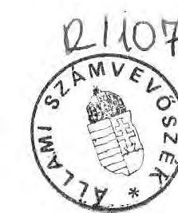
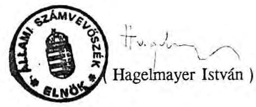

# 2̈llami s̊̊ámotobösèk 

## JELENTÉS

az önkormányzatok 1991. évi normatív állami hozzájárulásának, igénybevételének és elszámolásának
ellenőrzési tapasztalatairól

---

# J E L E N T É S 

az önkormányzatok 1991. évi normatív állami hozzájárulásának, igénybevételének és elszámolásának ellenőrzési tapasztalatairól

Az Állami Számvevőszék az 1989. évi XXXVIII. tv. alapján immár harmadik alkalommal az 1991. évi zárszámadáshoz kapcsolódóan alapvetően törvényességi, szabályszerűségi szempontok szerint vizsgálta meg a normatív állami hozzájárulások igénybevételét, de áttekintette a vizsgált körben a kialakított normatív támogatási rendszer múködésével kapcsolatos egyéb kérdéseket is.

A vizsgálat célja annak megállapítása volt, hogy
—a tervezés során alkalmazott normatívák összhangban voltak-e az ellátandó szakmai feladatokkal és milyen mértékben nyújtottak fedezetet azok megoldására;
—az önkormányzatoknál és intézményeiknél a tervezéshez szükséges mutatószámok, KSH, ÁNH adatok rendelkezésre álltak-e;
— szabályszerú volt-e a normatív állami hozzájárulások igénybevétele és elszámolása.

A teljes körű helyszíni ellenőrzés 92 önkormányzatnál (19 megyei, 3 megyei jogú városi, 13 városi, 13 nagyközségi és 44 községi) és az azokhoz kapcsolódó, az önkormányzatok irányítása alá tartozó, a vizsgált mutatókkal érintett 718 intézménynél, együttesen 48.924 M Ft normatív támogatásra, az ország 3202 önkormányzata részére ilymódon juttatott támogatás (146,980 M Ft) egyharmadára terjedt ki.

A megállapítások alapján további 4 önkormányzatnál (a fővárosi, 2 megyei jogú városi, 1 városi) és érintett intézményeiknél kapcsolódó ellenőrzést végeztünk.

A jelentésben foglaltakat a mellékletekben közölt részletes tényekkel, számszaki adatokkal támasztottuk alá.

---

Az 1989. évi L. törvény alapján, - amely figyelembe vette a 2015/1989. (HT.6) Mt számú, a normatív támogatási rendszerről szóló határozatban foglaltakat - a költségvetési reform részeként 1990. január 1-től a tanácsoknál új pénzügyi szabályozás került bevezetésre, amelyet még ugyanabban az évben a vonatkozó törvényben foglaltaknak megfelelően létrehozott önkormányzatokra is kiterjesztettek.

Az Állami Számvevőszék már 1990. I. félévében megvizsgálta a tanácsok egy részénél az újonnan bevezetett támogatási rendszer kialakításának és múködésének kezdeti tapasztalatait. A következő év első felében pedig az önkormányzatok körében került sor annak ellenőrzésére, hogy milyen gyakorlat alakult ki az 1990. évre nyújtott normatív állami támogatások elszámolásánál.

A két vizsgálati jelentést az illetékes minisztériumokkal való konzultációt, véleményezést követően az Országgyűlés Költségvetési, Adó- és Pénzügyi, továbbá az Önkormányzati, Közigazgatási, Belbiztonsági- és Rendőrségi Bizottságain kívül megküldtük mindazok számára, akik a rendszer további finomítása, korszerűsítése szempontjából érintettek, illetve javaslattételre, döntéshozatalra jogosultak voltak.

A helyszíni vizsgálatok alapján többek között megállapítottuk, hogy az új támogatási rendszer révén a tanácsok, illetve az önkormányzatok a korábbinál megalapozottabban, normatív módon juthattak a szükséges forrásokhoz annak ellenére, hogy a szabályozás több ponton kidolgozatlan, feltételeiben tisztázatlan volt. Ez abból adódott, hogy a költségvetési törvény normatív állami támogatásra vonatkozó rendelkezései önmagában nem voltak alkalmasak a korrekt tervezőmunkához, az elszámoláshoz, de az ellenőrzéshez sem. Az 1990. év során kiadott BM-PM tájékoztató ellenére - amely jogszabályként nem, csupán segédletként értelmezhető - számos kérdés tisztázatlan maradt. A mutatószámrendszer a régi - tartalmában eltérő - pénzügyi szabályozás elemeire épült, felülvizsgálatára nem került sor. A költségvetési és beszámoló garniturák űrlapjai nem voltak alkalmasak a tervezési és elszámolási adatok valódiságának igazolására. A valós helyzetet kizárólag helyszíni ellenőrzésekkel lehetett feltárni.

A feltételrendszer biztosításában mutatkozó, a központi szerveknek felróható hiányosságok mellett megállapítottuk, hogy az önkormányzatok gyakorlatlanok voltak és felületesen, fegyelemezetlenül jártak el mind a tervezés, mind a nyilvántartás, mind az elszámolás során. Mindezek együttes hatásaként az önkormányzatok összességében több támogatást vettek igénybe, mint ami megillette volna őket. Az Országgyúlés azonban mérlegelve az adott helyzetet úgy döntött, hogy az önkormányzatoknál hagyta az őket meg nem illető támogatást.

---

A vizsgálatok tapasztalatai alapján ajánlottuk az érintetteknek, hogy
— az új támogatási rendszer stabilitásának megteremtése céljából a rendszer főbb elemei épüljenek be az Államháztartási Törvénybe;
— határozzák meg az állami feladatok körét, az állami szerepvállalás mértékét és igazítsák ehhez a forrásszerkezetet és az intézményi struktúrát;
— vizsgálják felül és módosítsák az önkormányzatok információs rendszerét és mutatószám-nyilvántartását, az önkormányzatok elszámoltatásának feltételeit törvényi szinten fogalmazzák meg;
— az eddig alkalmazottnál szakmailag egységesebb, tartalmilag egyértelműbb normatívák kerüljenek kialakításra.

Ajánlásaink részben kedvező fogadtatásra találtak, amit jelez, hogy törvényi szinten fogalmazták meg az 1991. évi elszámoltatás feltételeit és több normatíva értelmezését egyértelműbbé tették. Az elszámoláshoz külön űrlapot szerkesztettek és adtak ki az önkormányzatoknak, mindezzel segítve a tervezési és elszámolási munkát. Ugyanakkor, amint ezt a jelenlegi helyszíni ellenőrzéseink tapasztalatai is mutatják, számos kérdés - az ezzel foglalkozó kis létszámú minisztériumi apparátus erőfeszítései ellenére, részben rajtuk kívülálló okok (szaktárcák igényei, parlamenti döntések stb.) következtében is - továbbra is megoldatlan maradt. Ez a tény, valamint a vizsgált önkormányzatoknál tapasztalt gyakorlatlanság, fegyelmezetlenség, a hibás adatszolgáltatás szankcionálatlansága és a jogosulatlanul igényelt támogatás vis szafizetésének Országgyűlés általi elengedése miatt az 1991. évi gyakorlatban is számos probléma került feltárásra, rögzítésre, amelyekről a következőkben adunk számot.

# I. 

Az önkormányzatok részére 1991. évben biztosított normatív állami hozzájárulások feltételrendszere

## A/ A jogi szabályozás

Az önkormányzatok 1991. évi normatív állami hozzájárulásának jogi alapjait az önkormányzatokról szóló 1990. évi LXV. tv. és a Magyar Köztársaság 1991. évi

---

állami költségvetéséről és az államháztartás vitelének 1991. évi szabályairól szóló 1990. évi CIV. tv. alapozta meg.

Az Országgyűlés az energiaáremelések miatti lakossági többletterhek enyhítése érdekében az 1991. évi XLVI. törvénnyel és az 1991. évi XLVII. törvénnyel módosította az 1991. évi költségvetést. Az egy állandó lakosra jutó normatív állami hozzájárulás összegét $3.000 \mathrm{Ft} /$ fơről megemelte $3.100 \mathrm{Ft} /$ fơre, a lakáskamatemeléshez kapcsolódóan pedig normatív támogatásra 750 M Ft kiegészítő támogatást biztosított.

A szabályozás területén az elmúlt évihez képest, a normatívák tartalmára és az igényjogosultság meghatározására a kormányzati szervek az Állami Számvevőszék elmúlt évi vizsgálati tapasztalatai és saját felméréseik alapján csak utólag, a Magyar Köztársaság 1992. évi állami költségvetéséről és az államháztartás vitelének 1992. évi szabályairól szóló 1991. évi XCI. törvényben tettek intézkedéseket. Ezek - bár néhány kérdést egyértelműbbé tettek - nem oldották meg minden tekintetben a korábban felmerült és jelzett problémákat. Ebben szerepe volt annak is, hogy a normatívák számának növekedésével együtt a különböző tartalmú és elszámolási technikájú normatívák miatt azoknál az önkormányzatoknál, amelyek korábban az adott normatíva alapján nem részesültek támogatásban (pl. kisközségek) értelmezési és elszámolási gondok merültek fel.

Bizonytalanságot okozott az elszámolásnál, hogy a költségvetési törvény 3. sz. melléklete szerint az 1992. évre megalkotott szabályok közül egyesek "figyelembe vehetők az 1991. évi hozzájárulások elszámolásánál is", illetve "alkalmazandó" szöveggel egyaránt megfogalmazásra kerültek, az utóbbi lényegében kötelező előirást jelent, míg az előbbi csak lehetőséget.

A törvény hatálybalépését követően különböző időpontokban került sor módosításokra, a vonatkozó szabályok kiadására, ami már emiatt is magában hordozta az utólag ugyan korrigálható tévedés lehetőségét. E gyakorlat sulyosabb hibája az volt, hogy más-más szabályok voltak érvényesek a tervezésre, az igénybevételre és az elszámolásra. Emiatt csorbát szenvedtek az új forrásszabályozási rendszer bevezetését alátámasztó azon elvek, hogy "a támogatások jelentős része legyen előre kiszámítható", és "igazságosabb elosztás érvényesüljön".

Nem került sor törvényi szinten annak szabályozására, hogy milyen felelősség, illetve kötelezettség terheli az állami költségvetésből jogtalanul igénybe vett pénzeszközök miatt az önkormányzatokat, illetve milyen feltételek mellett és mikor kapják meg az önkormányzatok az elszámolás után még járó állami támogatást.

---

A költségvetési törvény 42. § (3) bekezdése az elszámolás időpontját és módját csak részben szabályozta. Az elszámolási különbözet pénzügyi rendezéséről csak az 1992. január 14-én kelt, a Pénzügyminisztérium Önkormányzati és Területfejlesztési Főosztálya, valamint a Belügyminisztérium Önkormányzati Gazdasági Főosztálya által a megyei TÁKISZ igazgatók részére kiadott 48.026/1992. sz. ügyirat intézkedett. A leirat szerint az elszámolt állami hozzájárulás központi költségvetést megillető részét 1992. március 15 -ig a Pénzügyminisztérium "Előző évi költségvetési maradványok" számlájára kellett átutalniuk az önkormányzatoknak. Az önkormányzatokat megillető normatív állami hozzájárulást a központi költségvetés terhére a TÁKISZ által összesített beszámolók kézhezvételét követő 15 napon belül utalja át a Pénzügyminisztérium az érintett önkormányzatoknak.

# B/ A normatív állami hozzájárulások igénybevételének alapjául szolgáló mutatószámrendszer, a nyilvántartások vezetése 

Az önkormányzatok elszámolására előírt, az önkormányzati költségvetési beszámolóba beépített úrlap, miközben a korábbiaknál jobb, áttekinthetőbb, megalapozottabb elszámolás lehetőségét segítette, nem tette lehetővé az évközi változások bemutatását. Az úrlap és a normatívák kiszámításához adott szöveges útmutató együttesen sem volt elegendő ahhoz, hogy minden önkormányzat teljesen korrekt módon tervezze meg igényét és számolja el a hozzájárulást. Ez alapvetően arra vezethető vissza, hogy az önkormányzatok és a hozzájuk tartozó intézmények által vezetett feladat és teljesítménymutatók nincsenek összhangban a normatív állami hozzájárulás igénybevételét megalapozó mutatókkal, mert
— önkormányzatonként gyakran eltérő módszerekkel és ezért különböző tartalommal került sor a tervezéshez és az elszámoláshoz szükséges mutatószámok előállítására;
— az intézmények nem voltak érdekeltek a megbízható adatszolgáltatásban és a megfelelő nyilvántartások vezetésében, mível teljesítményüket és munkájukat nem ezen szempontok szerint minősítették. Finanszírozásuk csak kismértékben és áttételesen függ a normatív támogatásoktól;
— az önkormányzatok az intézményektől kapott adatok valóságtartalmát általában nem ellenőrizték és az eltérések előző évi liberális elbírálása, valamint a téves adatszolgáltatás szankcionálatlansága miatt nem érezték magukat felelősnek a megfelelő nyilvántartások kialakíttatásáért.

Gondot okozott az önkormányzatoknak, hogy az 1991. évi költségvetési törvény a tényleges átlaglétszámok kiszámításához figyelembe vehető időpontokat a szakmai statisztikai jelentésekben meghatározottaktól eltérően jelölte meg.

---

Ezért pl. az óvodai, a diákotthoni, az esti és levelező képzés statisztikai adatait nem lehetett alkalmazni az elszámolás során.

#### Abstract

Az óvodákban a beiratkozási, mulasztási naplók, az iskolákban az osztály naplók alapján történő számbavétel, és azok egybevetése az elszámolt mutatókkal rendkívül időigényes és körülményes. A két időpontban "mért" adat közötti minimális eltérés nem teszi indokolttá, hogy ne a statisztikai adatszolgáltatás legyen az elszámolás alapja. Ez annál inkább is szükséges lenne, mert az intézmények - más szempontból és célzattal - kialakított nyilvántartásai alkalmatlanok a normatív állami hozzájárulások igénybevételét megalapozó jogosultság megfelelő bizonyítására, az egységes mutatószám-nyilvántartás kialakítására pedig még nem került sor.

Az előző évi fizetőnéző normatíva alappal szemben az 1991. évi költségvetési törvény a színházi normatíva odaitélésének számítási alapjául a nézőszámot jelölte meg, ami egyrészt ellenőrizhetetlen kategória, másrészt a színházak a két év eltérő előírásából adódóan különböző számítási alappal dolgozták ki igényüket.

# A gyermek- és ifjúságvédelemmel kapcsolatban álló intézményeknél és a gyógypedagógiai intézményeknél nem volt olyan egyértelmű nyilvántartás, amelyik a megalapozott elszámoláshoz alkalmas lett volna. 

Az intézmények beszámolójából, statisztikai jelentésekből nem nyerhető a gondozási napoknak megfelelő adat, mert a "gondozási nap" fogalma és számítási módszere nem került szabályozásra és még az 1992. évi költségvetési törvény is csak a "szociális otthoni intézeti" gondozási napokról tesz említést.

A Fejér Megyei Soponyai és Rácalmási nevelóotthonban pl. nem vezették a gondozási napokat és adatszolgáltatásként a jelentés napján az otthonban lévő tényleges létszámot közölték. A Dégi nevelóotthonban viszont az un. vendéggyerekek gondozási napját is figyelembe vették. Eltérés -1.680 E Ft.
Csongrád Megyében a megyei önkormányzat a nagykoruvá váltakat nem a jogszabálynak megfelelően vette figyelembe és nem volt megfelelő a dokumentáltság sem, így az eltérés -8.190 E Ft volt.
A Hajdu-Bihar Megyei Önkormányzat 15 fővel számolt el többet, mint az ellenőrzés által megállapított létszám, aminek kihatása -3.150 E Ft .
A Nógrád Megyei Önkormányzat olyan 20 fővel számolt el, akik a Népjöléti Minisztérium Gyermekotthonában voltak elhelyezve. Két intézménynél viszont az élelmezési napok alapján számították ki az átlaglétszámot. Az eltérés -4.620 E Ft.
A Veszprém Megyei Balatonkenesei, Balatonalmádi nevelóotthonokban gondozási nap nyilvántartást nem vezettek, az egyéb nyilvántartások is pontatlanok, hiányosak voltak. A tényleges eltérés -9.450 E Ft .

## C/ Az önkormányzatok és intézményeik adatszolgáltatása

Az önkormányzatok által készített beszámoló alapján a TÁKISZ-ok egyeztették a tervezett adatokat az 1991. évi költségvetési törvény 3. sz. mellékletében foglal-

---

takkal. A további egyeztetés csak az elszámolási adatok számszaki egyezőségére vonatkozhatott, mível a TÁKISZ-oknak nincs módjuk meggyőződni az adatok belső tartalmának valódíságáról. Erről csak az Állami Számvevőszék helyszíni ellenőrzései adnak kellő mélységű megalapozott információkat. Meg kell jegyezni, hogy az önkormányzatok az intézményeiktől bekért adatokat elszámolásaikban - a Veszprém Megyei önkormányzat kivételével - megfelelő helyszíni felülvizsgálat nélkül összesítették és terjesztették fel.

# II. 

## A normatív állami hozzájárulások tervezése

Az önkormányzatok az 1991. évi normatív állami hozzájárulások igénybevételéhez két fordulóban készítettek terveket. Első alkalommal - 8 mutatóra vonatkozóan 1990. novemberében irreálisan rövid idő alatt kellett a Belügyminisztérium Önkormányzati Gazdasági Főosztálya részére az állami hozzájárulás végső összegének számítási alapjául információkat szolgáltatniuk.

Az Országgyűlés 1990. december 30-i ülésnapján fogadta el az 1991. évi Költségvetési Törvényt. Olyan döntés született, hogy az önkormányzatok 1991. évi normatív állami hozzájárulásának tervezett adatait a későbbi időpontban közzétett 3. sz. melléklet tartalmazza. Erre csak 1991. július 15 -én került sor, így az abban szereplő adatokat az önkormányzatok a tervezés második fordulójában 1991. március 31 -ig az 1991. évi normatív állami hozzájárulásokra vonatkozó igényük módosításánál még nem vehették figyelembe. A táblázatokhoz mellékelt, az egyes normatívák igényjogosultságának feltételeiről szóló kitöltési útmutató és a tervezéshez szükséges, az ÁNH által biztosított állandó lakosságszámra vonatkozó adatok birtokában az önkormányzatok az új mutatószámok, valamint saját adataik felülvizsgálata alapján módosíthatták tervezett adataikat, azonban ezekre tapasztalataink szerint elvétve került sor.

A tervezés különböző szakaszaiban zavart okozott, hogy változott a normatívák tartalma és az igényjogosultak köre is.

A tervezés első fordulójában a jogosultságra vonatkozóan azt közölték, hogy "az önkormányzat közigazgatási területén élő állandó népesség (ÁNH adatok alapján), illetve az önkormányzat - közös tulajdonú intézmény esetén a gesztor - által fenntartott intézmények ellátottjaihoz kapcsolódik" a normatív állami hozzájárulás.

---

Később ez úgy változott, hogy "az érintett önkormányzatok külön-külön - az általuk ellátottak alapján - jogosultak a hozzájárulásra, míg az e körbe nem tartozó ellátottak után az intézmény székhelye szerinti önkormányzat veheti igénybe a hozzájárulást". E változtatást azonban nem minden önkormányzat vette figyelembe.

A vizsgált körben a leggyakrabban előforduló, - többségében túlfinanszírozást, és így az állami költségvetésnek többletterhet okozó - tervezési hibák az alábbiak voltak:

- a férőhelynek megfelelő, vagy azt jelentősen meghaladó létszámot tüntettek fel, annak ellenére, hogy a korábbi évek tényadatai azt nem támasztották alá;
— túlbecsülték az állami gondoskodásban részesülők számának növekedését;
- az oktatási normatíváknál a demográfiai hullám alakulásával nem számoltak kellő mértékben;
- az általános iskolai ellátásnál a település általános iskoláskorú állandó népességszáma alapján terveztek;
- gondozási nap helyett az élelmezési napokat vették figyelembe.

Valamennyi megyében bizonytalanságot szült és megalapozatlanná tette a "gyer-mek- és ifjúságvédelem" és "fiatalkorúak egészségügyi gyermekotthoni és gyógypedagógiai ellátásának" tervezését az a tény, hogy az 1992. évi költségvetési törvény kiterjesztette az igénybevételre jogosultság körét, továbbá az utólagos "kiegészítés" eltérő tartalommal szabályozta a normatíva tartalmát, illetve a kötelező korrekciós tényezőket.

A Békés Megyei, a Győr-Moson-Sopron Megyei, a Somogy Megyei és a Szaboles-Szatmár-Bereg Megyei Önkormányzatok egyértelmű jogszabályi előirás hiányában sajátos módon számították ki a gyógypedagógiai ellátottak gondozási napjait (betöltött férőhely, élelmezési napok, tanítási napok alapján).

# III. 

A normatív állami hozzájárulások igénybevételének és elszámolásának helyessége

A teljes körű helyszíni ellenőrzéssel érintett 92 önkormányzat kapta a Magyar Köztársaság 1991. évi állami költségvetéséről szóló 1990. évi CIV. tv. alapján a

---

3202 helyi önkormányzat részére jóváhagyott 146.980 M Ft-os normatív állami hozzájárulás $33,3 \%$-át, 48.924 M Ft-ot. A 92 vizsgált önkormányzat közül csupán 18-nál volt rendben a tervezés és az elszámolás, 74 önkormányzatnál pedig eltéréseket tárt fel az ellenőrzés. Ez az arány azért is kedvezőtlen, mert az ellenőrzött önkormányzatok több, mint fele olyan létszámú és képzettségű hivatali apparátussal rendelkezett, amelyektől elvárható a szakmailag kifogástalan munka.

A megyei önkormányzatok közül Pest és Vas megyénél nem volt eltérés, a Győr-MosonSopron, a Heves, a Szabolcs-Szatmár-Bereg és a Tolna Megyei Önkormányzatokat az elszámolásukban feltüntetetteken túlmenően téves számításokból eredő további állami hozzájárulás illeti meg, míg a többi megyei önkormányzatnál jogtalan igénybevételt állapított meg a vizsgálat. Többlet igénybevételt tapasztalt az ellenőrzés a négy megyei jogú városnál is.

Gyakori jelenség volt, hogy ugyanannál az önkormányzatnál az egyik normatíva alapján túlfinanszírozást, más normatívánál pedig alulfinanszírozást tártak fel a számvevők, ami értelmezési és számítási problémákra, a vonatkozó előírások ismertetésének hiányára utal.

A Somogy Megyei Önkormányzat az egyik szociális otthonában elhelyezett horvát menekülteket is beszámította az átlaglétszámba, ami 441 E Ft jogtalan igénybevételt okozott. A Tabi Szociális Otthonban viszont élelmezési napok alapján számoltak, így 882 E Ft megilleti az önkormányzatot.

A Győr-Moson-Sopron Megyei Lébény az óvodai ellátásnál 135 E Ft-ot jogtalanul kívánt igénybe venni, ugyanakkor rossz számítás miatt az általános iskolai normatívánál 60 E Ft , a fogyatékos gyermekek oktatásának normatívájánál 56 E Ft megilleti az önkormányzatot.

Azon önkormányzatok közül, ahol eltérések mutatkoztak (önkormányzatonként csak az egyenlegeket véve figyelembe) 16 önkormányzatot együttesen 27.944 E Ft további állami hozzájárulás illet meg, míg 58 önkormányzat jogtalanul vett igénybe 177.123 E Ft normatív állami hozzájárulást. Az egyenleg 149.179 E Ft (részletes adatok a 3. és 3/A mellékleten).

A legnagyobb mértékű eltérés a színházi normatívánál mutatkozik -63.439 E Ft, ami döntően a színházak külföldi vendégszereplésének tájelőadásként való értelmezéséből adódik. A vendégjáték egyébként is ellenőrizhetetlen nézőszáma után igényelték az állami támogatást. Bár ez ügyben már a korábbi ÁSZ vizsgálat alkalmával született egy PM-BM állásfoglalás (1991. április 9-én), ez azonban nem jutott el az illetékes önkormányzatokhoz.

Országgyülési döntésre van szükség egyrészt, hogy nézőszám, vagy fizető nézőszám alapján kell-e elszámolniuk a színházaknak (a törvény nézőszámot tartalmaz!), másrészt, hogy a

---

Külföldi vendégjáték nézői után megilleti-e a színházakat a támogatás. A döntéstől függően vagy több színháztól kell elvonni a "jogosulatlanul" kapott támogatást, vagy a színházak egy részének további támogatást kell juttatni.

A Fővárosi Operettszínház külföldi vendégjátéka során 147700 fős nézőszám után igényelte le és kapta meg a több, mint 44 M Ft -ot.

A Tatabányai Színház előadásain a 10 Ft-os jegyek aránya 7-54 \% között alakult és az előadások iskolákban, gyárakban való megtartásához a színház csak közvetítőként, szervezőként járult hozzá.

A Kecskeméti Megyei Jogú Városhoz tartozó Círóka Bábszínház 8428 fó külföldi nézőt tájelőadásként vett számításba és figyelembe vette a Kolozsvári Bábszínház által tartott előadások nézőit is ( 790 fő).

Összességében igen jelentős túlfinanszírozás mutatkozik ( 43.050 E Ft ) a gyermekés ifjúságvédelem normatívánál, ami az előzőekben leírtakra (szabályozási, értelmezési gondok és az intézményi nyilvántartás hiányosságaira) vezethető vissza.

Annak ellenére, hogy összességében nem kirivó, de külön is említést kell tenni az óvodai ellátásról és az általános iskolai oktatásról, mert itt tapasztalták a számvevők a leggyakoribb - bár összegszerűségében kismértékű - eltéréseket. A vizsgált önkormányzatok közül 50-nél tért el az óvodai ellátás normatívája egyenlegében +2.700 E Ft-tal, az általános iskolai oktatás normatívája pedig 39 önkormányzatnál egyenlegében -3.510 E Ft-tal.

Az egyes normatíváknál tapasztalt eltéréseket részletesen a 4. sz. melléklet tartalmazza.

Az ellenőrzések során megállapítást nyert az is, hogy a normatív állami hozzájárulással érintett önkormányzatok - ha nagyrészt hibákkal is, de - eleget tettek adatszolgáltatási kötelezettségeiknek és a vizsgált körben két eset kivételével megállapítható volt az általuk kiszámított és indokoltnak tartott visszafizetési kötelezettség teljesítése is.

A helyszíni vizsgálatok időpontjáig az önkormányzatok az elszámolásukban foglaltaknak megfelelően az őket megillető normatív állami hozzájárulásokat az állami költségvetésből még nem kapták meg.

A normatív állami támogatások új rendszerének sajátossága, hogy az önkormányzatok nem csak az állami költségvetéssel, hanem egymással is kötelesek lennének elszámolni, de ennek módszere még nem alakult ki, melynek okát abban látjuk, hogy nem egyértelműen került meghatározásra a normatívák tartalma és az egymás

---

közötti elszámolás kötelezettsége. Pl.: a "gyermek- és ifjúságvédelem" normatívánál a GYIVI-t fenntartó önkormányzat konkrétan mely ellátási formákra köteles térítést fizetni, ha nem az általa fenntartott intézményben történik az állami gondoskodásban részesülők ellátása.

Részben jelzéseink alapján - pl. dupla igénybevétel esetén - került sor annak tisztázására, hogy melyik önkormányzat vette jogosan igénybe a támogatást illetve, hogy milyen eljárást kell követni a jogszerű igénybevételhez. Feszültséget okoz az önkormányzatok között az is, hogy az önkormányzatok nem tudnak megállapodni a térítendő összegben.

Az "általános iskolai oktatás", "diákotthoni" -ellátások esetén csak a normatív állami hozzájárulásnak megfelelő összeget hajlandók megtéríteni a gyermek- és ifjúságvédő intézetet fenntartó önkormányzatok, míg az ellátást biztosító önkormányzatok az egy főre eső teljes költségük megtérítését szeretnék elérni. Nem tapasztalható a kölcsönös érdekeket figyelembe vevő kompromisszumokra való törekvés.

# VI.   A normatív állami hozzájárulások rendszerének az önkormányzatokra gyakorolt hatása 

Az új szabályozás elemei a nemzetgazdaság helyzetéből adódó költségvetési restrikció következményeként, a kialakult szűkös lehetőségek keretein belül kerültek kialakításra. A normatív állami hozzájárulások összegei - bár a körzeti térségi feladatok egy részénél az országos átlagköltség figyelembevételével - de megfelelő modellszámítások nélkül a tanácsok részére kerültek kialakításra és azóta sem került sor az önkormányzatok megváltozott jogi- és gazdasági helyzetéhez való igazítására, módosítására. Nem vették figyelembe, hogy egy-egy szakfeladat tényleges ellátása a megváltozott körülmények között milyen reális költségvonzattal jár.

Az intézmények eltérő funkciói, szakmai és gazdasági adottságai miatt - még viszonylag szűk körben is - igen nagy szóródás tapasztalható aszerint, hogy a normatív állami hozzájárulások mennyiben nyújtanak fedezetet az egyes feladatok ellátására. A vizsgált körben megállapítottuk, hogy a gyermek- és ifjúságvédelemre és a szociális intézeti ellátásra megállapított normatív állami hozzájárulások fedezik leginkább a felmerülő kiadásokat. Az általános iskolákra és az óvodákra vonatkozóan a normatív állami hozzájárulással biztosított támogatást az önkormányzatok az adottságaiknak és igényeiknek, lehetőségeiknek megfelelően kisebb-nagyobb mér-

---

tékben kiegészítették. Az intézmények költségvetésének tervezésében és finanszírozásában azonban döntő többségükben nem tértek el a korábbi években kialakult bázis-szemléletű gyakorlattól.

Győr-Moson-Sopron Megyében, amely legjobban közelíti az országos átlagot - egy-két kirívó esettől eltekintve (pl. gimnáziumi oktatás a megyei jogú városban $266 \%$ !) a normatívák a tényleges költségeknek 33-94 \%-át fedezik.

Hasonló arányokat mutat a főváros is, ahol a támogatás mértéke normatívánként 28,5-86,6 $\%$ között szóródik.

Az önkormányzatok még mindig nem ismerték fel kellően az új pénzügyi szabályozással együttjáró szükséghelyzetet, hiszen csak elvétve lehet tapasztalni az intézmények kihasználtságának fokozására, a racionális intézményi struktúra létrehozására irányuló törekvéseket. Egyes önkormányzatok törekednek megszünteteni azon intézményeiket, amelyekhez nem kapcsolódik normatív állami hozzájárulás.

Jelenleg nem kapcsolódik normatív állami hozzájárulás pl. a bölcsődékhez, a csecsemőotthonokhoz, a szakközépiskolai tanmühelyekhez, a napközi otthonokhoz, a középiskolai menzához, a helyi sportfeladatokhoz. Ezért az ilyen szolgáltatásokat az önkormányzatok fokozatosan leépítik. Emiatt néhol a nagycsoportos bölcsődéseket az óvodákba veszik fel.

Több önkormányzatnál és intézménynél tapasztaltuk, hogy az új szabályozás alapelveivel és legfőbb szabályaival nincsenek tisztában. Az igényjogosultság jogcímeinek sokszínűsége, a mutatószámok képzésének eltérő módszerei nehezen megoldható feladatok elé állítja az önkormányzatok - a követelményeket egyelőre még nem kellően ismerő - apparátusait.

Az új állami támogatási rendszerben legkevésbé átgondolt - és mielőbbi szabályozást igénylő - terület a normatív állami hozzájárulások köréből a körzeti-térségi feladatok finanszírozása. Az önkormányzatok legfeljebb a normatív állami hozzájárulásnak megfelelő összeget térítik meg egymásnak, ugyanakkor a feladatot ténylegesen ellátó önkormányzatok csak a helyi érdekek csorbításával tudják az intézmények többletmüködési költségeit fedezni.

A nagyközségek által fenntartott középiskolák és kollégiumok esetén az önkormányzatok számára egyelőre egyedüli megoldásnak az tünik, ha az ilyen "drága" fenntartású intézményeket átadják a megyei önkormányzatnak. Az intézmény fenntartása ettől kezdve a megyei önkormányzatot terheli, de nem jár együtt a költségek csökkentésével.

---

# V.   Következtetések, javaslatok 

A normatív támogatási rendszer a bevezetésekor úgy jött létre, hogy akkor már ismert volt: rövidesen hatályba lép az önkormányzati-, valamint az államháztartási törvény és megvalósul a tulajdoni reform. A bevezetés deklarált célja az volt, hogy az addigi "alkumechanizmust" áttekinthető, objektív adatokhoz, feladatokhoz kapcsolódó normatív szabályozás váltsa fel, ami lényegében megvalósult. Ugyanakkor a már akkor érvényesülő költségvetési restrikció következtében nem volt mód a tanácsok (önkormányzatok) pénzügyi igényeinek kielégítésére.

A normatív állami hozzájárulás a személyi jövedelemadóból való részesedés mellett döntő mértékben határozza meg, hogy egy-egy önkormányzat anyagi erőforrásait tekintve mennyiben képes feladatait megfelelően ellátni. A normatív támogatások - bár a korábbi költség- és intézmény struktúrára épültek és így annak problémái a későbbiekben is mutatkoztak, - az induláskor mindössze 12 címen juttattak állami pénzeszközöket a tanácsoknak, illetve az önkormányzatoknak. A rendszer múködése során tapasztalt feszültségek feloldása céljából, - szakmai követelményekre, indokokra hivatkozva - erőteljes törekvés mutatkozott a normatívák "differenciálására", számának növelésére. Emiatt 1991-ben a normatív állami támogatások odaítélése már 26 címen történt, jelentős mértékben növelve a témával foglalkozók leterheltségét mind az érintett tárcáknál, - ahol, különösen a PM-ben és a BM-ben nem teremtették meg a feladat ellátásának személyi feltételeit - mind az önkormányzatoknál.

A normatív alapon nyújtott állami támogatásokat az önkormányzatok a helyi igények által meghatározottan saját belátásuk, döntésük alapján megkötöttségek nélkül használhatják fel. A különböző vizsgált önkormányzatok a normatívákat rendkívül nagy szóródással egészítették ki, hogy feladataiknak eleget tudjanak tenni. Az elmúlt két év alatt a normatívák alapján juttatott állami hozzájárulások mértékét - egy-két kivételtől eltekintve - nem igazították a tényleges felhasználások által indokolt mértékhez. Emiatt és a normatívák számának gyors növekedése következtében az elosztási rendszer képtelen követni a változásokat.

Összegezve a tapasztalatokat megállapítható, hogy az önkormányzatok normatív állami hozzájárulási rendszere bár a korábbiakhoz képest valamelyest javult, még mindig nem múködik megfelelően. A rendszer finomítására hozott központi

---

intézkedések hiányosságai, továbbá az önkormányzatok apparátusainak gyakorlatlansága, a hibák szankcionálatlansága miatt az önkormányzatok 1991. évi elszámolását követő vizsgálatunk során végülis - a normatívák szerinti részletezésben 215.134 E Ft jogosulatlan igénybevételt és 65.955 E Ft jogos további hozzájárulást állapítottak meg számvevőink, amelynek egyenlege 149.179 E Ft.

Mindezek következtében indokoltnak tartjuk a jelenlegi normatív állami hozzájárulási rendszernek az önkormányzatok támogatási rendszerének átfogó szabályozása keretében történő olyan áttekintését és módosítását, amellyel elérhető lenne az önkormányzatok gazdálkodási felelősségének növelése az elszámoltatás racionális mederbe terelése.

Ennek érdekében:
a pénzügyminiszter és a belügyminiszter

1. kezdeményezzen törvényi szintű intézkedést;

- a "színházak" nézőire elszámolható normatív állami hozzájárulások jogosságának megítéléséhez nélkülözhetetlen egyértelmű szempontokról (fizető néző, vagy néző, külföldi előadás megítélése), és e normatívánál a döntésnek megfelelő ismételt teljes körű elszámolási kötelezettség előírásáról;
- az elszámolások számvevőszéki megállapításokkal történő korrigálására és kötelezze az önkormányzatokat, a Kormányt a (3. és 3/A. sz. mellékletben foglalt) konkrét pénzügyi elszámolások meghatározott időn belüli teljesítésére. A jogalap nélkül igénybe vett, összességében 149,2 M Ft-nak az állami költségvetésbe történő befizettetésére;

2. a normatív állami hozzájárulások igénybevételére és elszámolására vonatkozó rendszer megfelelő működtetése érdekében vizsgája felül az eddig kiadott szabályozásokat, fontolja meg nem volna e célszerűbb nagyobb szakmai területet átfogó, összevont normatívák kialakítása;
3. intézkedjenek annak érdekében, hogy a jövőben a tervezési időszakot megelőzően külön jogszabály hosszabb távra egyértelműen szabályozza;

- a normatívák pontos tartalmi meghatározását, a mutatószámok fogalmát, a jogosultság alapját képező konkrét és egyértelmű kritériumokat;

---

- a kötelező nyilvántartások rendszerét, az elszámolásban közvetlenül, vagy közvetetten érintettek adatszolgáltatási kötelezettségét;
- az elszámoltatás rendszerszemléletű kialakítását (az adatszolgáltatás alanyainak és az elszámolás adatainak körét indokolt lenne bővíteni. Pl.: az önkormányzat konkrétan mely intézmények ellátottjait vette figyelembe, az intézményeket milyen szervek tartják fenn, az önkormányzat milyen korrekciós tényezőket és hogyan vett figyelembe. Célszerű lenne az elszámolás mutatószámai és a beszámoló feladat-mutatóinak, valamint az ágazati-szakmai statisztikák adatainak összhangját megteremteni.);
- a tényleges pénzügyi rendezés módját, határidejét;
- az önkormányzatok évente legalább egy alkalommal kapjanak lehetőséget a tervezett mutatók módosítására és azzal összefüggésben az alkalmazandó szankciókra;

4. fontolja meg nem volna e célszerű: mielőbb törvényi szinten meghatározni az önkormányzatok működéséhez mely feladatoknál milyen mértékủ legyen az állami közvetítés és annak megfelelően az állami támogatás nagyságrendje.

Budapest, 1992. augusztus

---

# Mellékletek: 

1. sz. melléklet: - A vizsgálatban részt vevők
2. sz. melléklet: - Vizsgált önkormányzatok
3. sz. melléklet:

3/a. sz. melléklet: - Kimutatás az 1991. évi normatív állami hozzájárulás igénybevételénél tapasztalt eltérésekről
4. sz. melléklet: - a helyszíni ellenőrzések tapasztalatai normatívánként
5. sz. melléklet: - Adatok és Tények
(Összesen: 38 lap)

---

A Vizsgálatot vezette:
A vizsgálat előkészítésében részt vett:

A vizsgálat szervezésében és az összefoglaló jelentés összeállításában részt vett:

A vizsgálatot végezte:
Baranya megye:
Bács-Kiskun megye:

Békés megye:
Borsod-Abaúj-Zemplén megye:
Csongrád megye:

Fejér megye:

Győr-Moson-Sopron megye:

Dr. Saly Ferenc főtanácsos
Rácz Lajosné főtanácsos
Dr. Nagy Ágnes számvevő tanácsos

Berényi Magdolna számvevő tanácsos
Dr. Nagy Ágnes számvevő tanácsos
Dr. Saly Ferenc főtanácsos

Dr. Nagy Ágnes számvevő tanácsos
Domján Jenő számvevő tanácsos
Gaborjákné dr.Vydareny Klára számvevő

Baji Ferencné számvevő tanácsos
Fekete Tibor számvevő tanácsos
Dr. Boda Sándor számvevő tanácsos
Csiszárné dr.Kosik Mária számvevő tanácsos

Ébner Vilmosné számvevő tanácsos
Horváth József számvevő tanácsos
Berényi Magdolna számvevő tanácsos
Dr. Lacó Bálintné számvevő tanácsos

---

Komárom-Esztergom megye:

Nógrád megye:
Somogy megye:

Szabolcs-Szatmár-Bereg megye:
Tolna megye:
Vas megye:

Veszprém megye:

Zala megye:
Fővárosi Önkormányzat:

Kalmár István számvevő tanácsos
Fátrainé Zsebedics Katalin számvevő
Koltayné Szepesi Zsuzsanna számvevő tanácsos

Németh Péterné számvevő tanácsos
Dr. Szigeti István számvevő
Szita László számvevő tanácsos
Kenéz Sándor számvevő tanácsos
Csekei Gyula számvevő tanácsos
Dr. Gyuk József számvevő tanácsos
Horváth János számvevő tanácsos
Dr. Vasváriné
dr. Rózsa Anikó Magdolna számvevő
Angyalosi Dániel számvevő tanácsos
Dr. Spilák Antal számvevő tanácsos
Dr. Telkes Imre számvevő

---

A V-1007-23/1992. sz. vizsgálati anyaghoz 2. sz. melléklet

# Vizsgált önkormányzatok 

## Baranya Megye

Megyei Önkormányzat
Komló Város Önkormányzata
Bóly Nagyközség Önkormányzata
Kővágószólős Község Önkormányzata
Kővágótöttös Község Önkormányzata
Cserkút Község Önkormányzata
Bakonya Község Önkormányzata

## Bács-Kiskún Megye

Megyei Önkormányzat
Kecskemét Megyei Jogú Város Önkormányzata
Izsák Község Önkormányzata
Ágasegyháza Község Önkormányzata

## Békés Megye

Megyei Önkormányzat

## Borsod-Abaúj-Zemplén Megye

Megyei Önkormányzat
Bükkaranyos Község Önkormányzata
Sály Község Önkormányzata

## Csongrád Megye

Megyei Önkormányzat
Hódmezővásárhely Város Önkormányzata
Ásotthalom Község Önkormányzata
Szegvár Község Önkormányzata
Balástya Község Önkormányzata
Ópusztaszer

---

# Fejér Megye 

Megyei Önkormányzat
Bicske Város Önkormányzata
Pusztaszabolcs Nagyközség Önkormányzata
Seregélyes Nagyközség Önkormányzata
Gánt Község Önkormányzata

## Győr-Moson-Sopron Megye

Megyei Önkormányzat
Sopron Megyei Jogú Város Önkormányzata
Csorna Város Önkormányzata
Hegyeshalom Nagyközség Önkormányzata
Lébény Nagyközség Önkormányzata
Kópháza Község Önkormányzata
Pér Község Önkormányzata
Rajka Község Önkormányzata

## Hajdú-Bihar Megye

Megyei Önkormányzat
Hajdudorog Város Önkormányzata
Nádudvar Város Önkormányzata
Polgár Nagyközség Önkormányzata
Tiszacsege Nagyközség Önkormányzata

## Heves Megye

Megyei Önkormányzat
Heves Város Önkormányzata
Dormánd Község Önkormányzata
Szilvásvárad Község Önkormányzata o62

## Jász-Nagykun Megye

Megyei Önkormányzat
Jászberény Város Önkormányzata
Túrkeve Város Önkormányzata
Csépa Község Önkormányzata
Jászkisér Község Önkormányzata

---

Kenderes Község Önkormányzata
Tiszaug Község Önkormányzata

# Komárom-Esztergom Megye 

Megyei Önkormányzat
Tatabánya Megyei Jogú Város Önkormányzata
Vértesszőlős Község Önkormányzata

## Nógrád Megye

Megyei Önkormányzat
Kazár Község Önkormányzata
Ságújfalu Község Önkormányzata

## Pest Megye

Megyei Önkormányzat
Szigetszentmiklós Város Önkormányzata
Budakeszi Nagyközség Önkormányzata
Iklad Község Önkormányzata
Mende Község Önkormányzata
Páty Község Önkormányzata
Szigetmonostor Község Önkormányzata

## Somogy Megye

Megyei Önkormányzat
Tab Város Önkormányzata
Balatonszemes Község Önkormányzata
Juta Község Önkormányzata
Kálmáncsa Község Önkormányzata
Nagybajom Község Önkormányzata
Rinyaújlak Község Önkormányzata

## Szabolcs-Szatmár-Bereg Megye

Megyei Önkormányzat
Baktalórántháza Nagyközség Önkormányzata
Nagyhalász Nagyközség Önkormányzata

---

# Tolna Megye 

Megyei Önkormányzat
Iregszemcse Község Önkormányzata
Pálfa Község Önkormányzata

## Vas Megye

Megyei Önkormányzat
Szombathely Megyei Jogú Város Önkormányzata
Celdömölk Város Önkormányzata
Kőszeg Város Önkormányzata
Csepreg Nagyközség Önkormányzata
Vép Nagyközség Önkormányzata
Nára Község Önkormányzata

## Veszprém megye

Megyei Önkormányzat
Balatonfüzfő Nagyközség Önkormányzata

## Zala megye

Megyei Önkormányzat
Türje Község Önkormányzata
Bázakerettye Község Önkormányzata
Lasztonya Község Önkormányzata
Kiscsehi Község Önkormányzata
Maróc Község Önkormányzata
Lispeszentadorján Község Önkormányzata
A helyszíni ellenőrzések az önkormányzatok 718 intézményére is kiterjedtek.
Továbbá kapcsolódó ellenőrzést végeztünk a Fővárosi Önkormányzatnál, Pécs és Szombathely Megyei Jogú Városoknál, valamint Balmazújváros Városi Önkormányzatoknál, illetve azok érintett intézményeinél.

---

# A V-1007-23/1992. sz. vizsgálati anyaghoz 

## 3.sz. melléklet

## I i u t a tás

az 1991. évi normatív állami hozzájárulás igénybevételénél tapasztalt eltérésekröl

| Onkormányzat megnevezése | Normatívák alapján |  | Onkormányzat által egyenlegében visszafizetendő járandóság |  |
| :--: | :--: | :--: | :--: | :--: |
|  | visszafizetésre vonatkozó   javaslat | Többlet hozzájárulásra vonatkozó javaslat |  |  |
| Föváros | 49.244 | - | 49.244 | - |
| Baranya megyei | 4.816 | 3.360 | 1.456 | - |
| Bakonya | 225 | - | 225 | - |
| Cserkút | 240 | - | 240 | - |
| Iomló | 6.873 | - | 6.873 | - |
| Eóvágószólós | 810 | 71 | 739 | - |
| Eóvágótöttós | 330 | - | 330 | - |
| Pécs | 303 | - | 303 | - |
| Bács megyei | 5.346 | 540 | 4.806 | - |
| Eecskemét | 17.569 | 174 | 17.395 | - |
| Békés megyei | 12.798 | 675 | 12.123 | - |
| Borsod megyei | 5.216 | 5.172 | 44 | - |
| Bükkaranyos | 246 | 351 | - | 105 |
| Sály | 1.299 | - | 1.299 | - |
| Csongrád megyei | 9.548 | 1.017 | 8.531 | - |
| Asotthalom | 257 | - | 257 | - |
| Hódmezövásárhely | 304 | - | 304 | - |
| Opusztaszer | 60 | 264 | - | 204 |
| Szegvár | 39 | 60 | - | 21 |
| Fejér megyei | 2.971 | 310 | 2.661 | - |
| Bicske | 560 | 774 | - | 214 |
| Pusztaszabolcs | 154 | - | 154 | - |
| Seregélyes | 30 | - | 30 | - |
| Győr megyei | 2.994 | 17.644 | - | 14.650 |
| Csorna | 5.384 | 352 | 5.032 | - |
| Hegyeshalom | 717 | - | 717 | - |
| Lébény | 135 | 116 | 19 | - |
| Pér | 251 | - | 251 | - |
| Bajka | 2.398 | - | 2.398 | - |
| Sopron | 1.089 | 3.862 | - | 2.773 |
| Hajdú megyei | 3.150 | - | 3.150 | - |
| Hajdúdorog | 3.210 | 285 | 2.925 | - |
| Nádudvar | 1.652 | - | 1.652 | - |
| Polgár | 1.156 | 596 | 560 | - |
| Tiszacsege | 2.113 | - | 2.113 | - |
| Heves megyei | 112 | 150 | - | 38 |
| Dormánd | 375 | - | 375 | - |
| Heves | 57 | - | 57 | - |

---

| Onkormányzat megnevezése | Normatívák alapján visszafizetésre vonatkozó javaslat | Alapján többlet hozzájárulásra vonatkozó javaslat | Onkormányzat által egyenlegében visszafizetendő járandóság |
|----------------|---------------------------------------------------|---------------------------------|-------------------|
| Szilvásvárad | - | 48 | - | 48 |
| Komárom megyei | 1.632 | - | 1.632 | - |
| Tatabánya | 5.581 | 1.968 | 3.613 | - |
| Vértesszőlős | 998 | 145 | 853 | - |
| Nógrád megyei | 6.734 | 746 | 5.988 | - |
| Kazár | 660 | 96 | 564 | - |
| Ságújfalu | 90 | 28 | 62 | - |
| Iklad | 268 | - | 268 | - |
| Mende | 45 | 56 | - | 11 |
| Páty | 330 | - | 330 | - |
| Szigetmonostor | 120 | 75 | 45 | - |
| Szigetszentmiklos | - | 1.200 | - | 1.200 |
| Somogy megyei | 19.806 | 1.208 | 18.598 | - |
| Juta | - | 105 | - | 105 |
| Nagybajom | 728 | 1.978 | - | 1.250 |
| Tab | 228 | - | 228 | - |
| Szabolcs megyei | 4.909 | 11.040 | - | 6.131 |
| Baktalórántháza | 512 | 30 | 482 | - |
| Nagyhalász | - | 150 | - | 150 |
| Jász megyei | 2.303 | 1.464 | 839 | - |
| Csépa | 438 | 56 | 382 | - |
| Jászberény | 2.967 | 898 | 2.069 | - |
| Jászkisér | 657 | 112 | 545 | - |
| Kenderes | 135 | 96 | 39 | - |
| Tiszaug | 60 | 24 | 36 | - |
| Türkeve | 318 | 324 | - | 6 |
| Tolna megyei | 3.847 | 4.885 | - | 1.038 |
| Iregazemose | 195 | 48 | 147 | - |
| Pálfa | 75 | - | 75 | - |
| Celldömölk | 44 | 19 | 25 | - |
| Csepreg | 96 | - | 96 | - |
| Köszeg | 1.900 | 1.100 | 800 | - |
| Nárai | 234 | 15 | 219 | - |
| Szombathely | 1.064 | - | 1.064 | - |
| Veszprém megyei | 12.506 | 2.253 | 10.253 | - |
| Zala megyei | 1.458 | 15 | 1.443 | - |
| Bázakerettye | 165 | - | 165 | - |
| Mindösszesen | 215.134 | 65.955 | 177.123 | 27.944 |

---

# KIMPIEES

as 1991. esi normatifs állami normatýralas igenczevetelenel

|  Önkora/avgrat | Odúko- | Gvermek | Stocza- | Plataik. | Alstóroko | Alstóroko | Alstóroko | Stocza- | Plataik. | Alstóroko | Alstóroko | Stocza- | Alstóroko | Alstóroko | Alstóroko | Hozzesi- | Hozzesi- | Östsek esiköpsek esiköpsek esiköpsek esiköpsek esiköpsek esiköpsek esiköpsek esiköpsek esiköpsek esiköpsek esiköpsek esiköpsek esiköpsek esiköpsek esiköpsek esiköpsek esiköpsek esiköpsek esiköpsek esiköpsek esiköpsek esiköpsek esiköpsek esiköpsek esiköpsek esiköpsek esiköpsek esiköpsek esiköpsek esiköpsek esiköpsek esiköpsek esiköpsek esiköpsek esiköpsek esiköpsek esiköpsek esiköpsek esiköpsek esiköpsek

---

Osszegel ezer Ft-ban!

|  Onkormányzat | Utaló- | Grermes | Szociás | Fizikai, |  |  |  |  |  |  |  |  | Aligó- és |  |  |  |  |  |  |  |  |  |  |   |
| --- | --- | --- | --- | --- | --- | --- | --- | --- | --- | --- | --- | --- | --- | --- | --- | --- | --- | --- | --- | --- | --- | --- | --- | --- |
|  megnevezése | helyi | és ifj. | lis int. | csth. és |  |  |  |  |  |  |  |  |  | k瘾 |  |  |  |  |  |  |  |  |  |   |
|   |  |  |  |  |  |  |  |  |  |  |  |  |  |  |  |  |  |  |  |  |  |  |  |   |
|   |  |  |  |  |  |  |  |  |  |  |  |  |  |  |  |  |  |  |  |  |  |  |  |   |
|   |  |  |  |  |  |  |  |  |  |  |  |  |  |  |  |  |  |  |  |  |  |  |  |   |
|   |  |  |  |  |  |  |  |  |  |  |  |  |  |  |  |  |  |  |  |  |  |  |  |   |
|   | 07 | 08 | 09 | 10 | 11 | 12 | 13 | 14 | 15 | 16 | 17 | 18 | 19 | 20-21 | 22 | 23 | 24 | 25 |  |  |  |  |  |   |
|  1. Megres Onkora. | 0 | 0 | 0 | 17200 | -300 | 0 | -784 | 0 | -118 | 33 | 36 | 0 | -1802 | 0 | 375 | 0 | 0 | 0 | 0 | 1465 |  |  |  |   |
|  2. Csorna | 0 | 0 | -588 | 0 | -60 | 247 | -56 | -98 | -648 | 0 | -3636 | 0 | -212 | 0 | 105 | 0 | -96 | 0 | -587 |  |  |  |  |   |
|  3. Megrestalon | 0 | 0 | 0 | 0 | -578 | 0 | 0 | 0 | 0 | 0 | 0 | 0 | 0 | 0 | -75 | 0 | -72 | 0 | -71 |  |  |  |  |   |
|  4. Letére | 0 | 0 | 0 | 0 | 60 | 0 | 56 | 0 | 0 | 0 | 0 | 0 | 0 | 0 | -135 | 0 | 0 | 0 | 0 | -1 |  |  |  |   |
|  5. Pár | 0 | 0 | 0 | 0 | -60 | 0 | -56 | 0 | 0 | 0 | 0 | 0 | 0 | 0 | -135 | 0 | 0 | 0 | 0 | -25 |  |  |  |   |
|  6. Pajka | 0 | 0 | 0 | 0 | -30 | 0 | 0 | 0 | 0 | 0 | 0 | 0 | -2338 | 0 | 0 | -30 | 0 | 0 | 0 | -235 |  |  |  |   |
|  7. Szpron | -9 | 420 | 441 | 0 | 0 | 0 | 0 | 88 | -1038 | 0 | 2772 | 28 | 53 | 0 | 60 | 0 | 0 | 0 | 0 | 277 |  |  |  |   |
|  Győr-Moson-Szoron |  |  |  |  |  |  |  |  |  |  |  |  |  |  |  |  |  |  |  |  |  |  |  |   |
|  megye összesen | -9 | 420 | -147 | 17200 | -960 | 247 | -840 | 0 | -1036 | 32 | -828 | -2310 | -1961 | 0 | 165 | 0 | -168 | 0 | 900 |  |  |  |  |   |
|  1. Megres Onkora. | 0 | -3150 | 0 | 0 | 0 | 0 | 0 | 0 | 0 | 0 | 0 | 0 | 0 | 0 | 0 | 0 | 0 | 0 | 0 | 0 | -315 |  |  |   |
|  2. Rajdúborog | 0 | 0 | 0 | 0 | 0 | 0 | -224 | 0 | 270 | -594 | -648 | 0 | -1696 | 0 | 15 | 0 | -48 | 0 | -292 |  |  |  |  |   |
|  3. Módulvar | 0 | 0 | 0 | 0 | -330 | -19 | 0 | 0 | 0 | 0 | 0 | 0 | 0 | 0 | -15 | 0 | -1128 | -160 | -165 |  |  |  |  |   |
|  4. Polgar | 0 | 0 | 0 | 0 | -240 | 0 | 56 | -220 | 540 | 0 | 0 | 0 | -636 | 0 | -60 | 0 | 0 | 0 | 0 | -56 |  |  |  |   |
|  5. Tiszarsege | -2072 | 0 | 0 | 0 | 0 | 0 | -56 | 0 | 0 | 0 | 0 | 0 | 0 | 0 | 15 | 0 | 0 | 0 | 0 | -211 |  |  |  |   |
|  Rajdú-Sztur megye összesen | -2072 | -3150 | 0 | 0 | -570 | -19 | -224 | -220 | 810 | -594 | -648 | 0 | -2332 | 0 | -45 | 0 | -1176 | -160 | -1040 |  |  |  |  |   |
|  1. Megres Onkora. | 0 | 0 | 0 | 0 | 150 | 0 | 0 | 0 | 0 | 0 | 0 | 0 | 0 | -97 | -15 | 0 | 0 | 0 | 0 | 0 | 0 |  |  |   |
|  2. Sorvánd | 0 | 0 | 0 | 0 | 0 | 0 | 0 | 0 | 0 | 0 | 0 | 0 | 0 | 0 | -15 | -360 | 0 | -37 |  |  |  |  |  |   |
|  3. Neves | 0 | 0 | 0 | 0 | 0 | -57 | 0 | 0 | 0 | 0 | 0 | 0 | 0 | 0 | 0 | 0 | 0 | 0 | 0 | 0 | 0 |  |  |   |
|  4. Szulvásvárad | 0 | 0 | 0 | 0 | 0 | 0 | 0 | 0 | 0 | 0 | 0 | 0 | 0 | 0 | 0 | 0 | 0 | 0 | 0 | 0 | 0 |  |  |   |
|  Neves megye összesen | 0 | 0 | 0 | 0 | 150 | -57 | 0 | 0 | 0 | 0 | 0 | 0 | 0 | -97 | -15 | -15 | -212 | 0 | -34 |  |  |  |  |   |
|  1. Megres Onkora. | 0 | -1470 | 0 | 0 | 0 | 0 | -56 | 0 | 0 | 0 | 0 | 0 | -106 | 0 | 0 | 0 | 0 | 0 | 0 | 0 | -163 |  |  |   |
|  2. Tatabarca | 0 | 0 | 1911 | -1720 | -90 | 57 | 0 | 0 | -270 | 0 | -216 | 0 | -53 | -2270 | -210 | 0 | -192 | -560 | -361 |  |  |  |  |   |
|  3. Wetteszczlos | 0 | 0 | 0 | 0 | -150 | 0 | 0 | 0 | 0 | 0 | 0 | -98 | 0 | 0 | -150 | 145 | -600 | 0 | -85 |  |  |  |  |   |
|  Konáron-Szátrorgan megye összesen | 0 | -1470 | 1911 | -1720 | -240 | 57 | -56 | 0 | -270 | 0 | -216 | -98 | -159 | -2270 | -260 | 145 | -792 | -560 | -609 |  |  |  |  |   |
|  1. Megres Onkora. | 0 | -4620 | -2058 | 172 | 0 | 0 | -56 | 0 | 0 | 0 | 0 | 14 | 0 | 0 | 0 | 0 | 0 | 0 | 560 | -590 |  |  |  |   |
|  2. Izsár | 0 | 0 | 0 | 0 | -660 | 0 | 0 | 0 | 0 | 0 | 0 | 0 | 0 | 0 | 0 | 0 | 0 | 0 | 96 | 0 | -560 |  |  |   |
|  3. Szegszfalu | 0 | 0 | 0 | 0 | -90 | 0 | 0 | 0 | 0 | 0 | 0 | 28 | 0 | 0 | 0 | 0 | 0 | 0 | 0 | 0 | -63 |  |  |   |
|  Móyrad megye összesen | 0 | -4620 | -2058 | 172 | -750 | 0 | -56 | 0 | 0 | 0 | 0 | 42 | 0 | 0 | 0 | 0 | 0 | 96 | 560 | -661 |  |  |  |   |
|  1. Iklad | 0 | 0 | 0 | 0 | -240 | 0 | 0 | 0 | 0 | 0 | 0 | -28 | 0 | 0 | 0 | 0 | 0 | 0 | 0 | 0 | -260 |  |  |   |
|  2. Pende | 0 | 0 | 0 | 0 | 0 | 0 | 56 | 0 | 0 | 0 | 0 | 0 | 0 | 0 | -45 | 0 | 0 | 0 | 0 | 0 | 11 |  |  |   |
|  3. Fély | 0 | 0 | 0 | 0 | -180 | 0 | 0 | 0 | 0 | 0 | 0 | 0 | 0 | 0 | -150 | 0 | 0 | 0 | 0 | 0 | -330 |  |  |   |
|  4. Szigetaimostor | 0 | 0 | 0 | 0 | -120 | 0 | 0 | 0 | 0 | 0 | 0 | 0 | 0 | 0 | 75 | 0 | 0 | 0 | 0 | 0 | -45 |  |  |   |
|  5. Szigetsztelkilos | 0 | 0 | 0 | 0 | 0 | 0 | 0 | 0 | 0 | 0 | 0 | 0 | 0 | 0 | 1200 | 0 | 0 | 0 | 0 | 1200 |  |  |  |   |
|  Fest megye összesen | 0 | 0 | 0 | 0 | -540 | 0 | 56 | 0 | 0 | 0 | 0 | -28 | 0 | 0 | 1080 | 0 | 0 | 0 | 0 | 560 |  |  |  |   |
|  1. Megres Onkora. | 0 | -16380 | 441 | 344 | 338 | 0 | 0 | -1672 | -810 | 32 | 0 | 0 | -583 | -261 | 60 | 0 | 0 | 0 | 0 | -1859 |  |  |  |   |
|  2. Juta | 0 | 0 | 0 | 0 | 0 | 0 | 0 | 0 | 0 | 0 | 0 | 0 | 0 | 0 | 0 | 0 | 0 | 0 | 0 | 0 | 105 |  |  |   |
|  3. Nagybajcs | 0 | 0 | 0 | 0 | 750 | 0 | -728 | 0 | 0 | 0 | 0 | 0 | 383 | 0 | 405 | 0 | 240 | 0 | 125 |  |  |  |  |   |
|  4. Tal | 0 | 0 | 0 | 0 | 0 | -228 | 0 | 0 | 0 | 0 | 0 | 0 | 0 | 0 | 0 | 0 | 0 | 0 | 0 | 0 | -320 |  |  |   |
|  Szakgy megye összesen | 0 | -16380 | 441 | 344 | 1080 | -228 | -728 | -1672 | -810 | 32 | 0 | 0 | 0 | -561 | 570 | 0 | 240 | 0 | -1747 |  |  |  |  |   |

---

Oszseges ezer Ft-ban!

|  |   |   |   |   |   |   |   |   |   |   |   |   |   |   |   |   |   |   |   |   |   |   |   |   |   |   |   |   |   |   |   |   |   |   |   |   |   |   |   |   |   |   |   |   |   |   |   |   |   |   |   |   |   |   |   |   |   |   |   |   |   |   |   |   |   |   |   |   |   |   |   |   |   |   |   |   |   |   |   |   |   |   |   |   |   |   |   |   |   |   |   |   |   |   |   |   |   |   |   |   |

---

# KIMUTATAS

as 1991. évi normatív állami hossájaraiás igénybevételével tazasztalt elterekével

Osszegok ezer Ft-tan!

|  Megye |  |  |  |  |  |  |  |  |  |  |  |  |  |  |  |  |  |  |  |  |  |  |  |  |  |  |  |  |  |  |  |  |   |
| --- | --- | --- | --- | --- | --- | --- | --- | --- | --- | --- | --- | --- | --- | --- | --- | --- | --- | --- | --- | --- | --- | --- | --- | --- | --- | --- | --- | --- | --- | --- | --- | --- | --- |
|  Megye |  |  |  |  |  |  |  |  |  |  |  |  |  |  |  |  |  |  |  |  |  |  |  |  |  |  |  |  |  |  |  |  |   |
|  07 | 08 | 09 | 10 | 11 | 12 | 13 | 14 | 15 | 16 | 17 | 18 | 19 | 20-21 | 22 | 23 | 24 | 25 |  |  |  |  |  |  |  |  |  |  |  |  |  |  |  |   |
|  1. | FOKHOS | 0 | 0 | 0 | 0 | 0 | 0 | 0 | 0 | 0 | 0 | 0 | 0 | 0 | 0 | 0 | 0 |  |  |  |  |  |  |  |  |  |  |  |  |  |  |  |   |
|  2. | SHARAWA | 0 | 3360 | 0 | -4816 | -1410 | 0 | 56 | 0 | 0 | 0 | 0 | 0 | -1749 | -5427 | -180 | 0 | 0 | 0 |  |  |  |  |  |  |  |  |  |  |  |  |  |   |
|  3. | BACS-KISKUM | 0 | -2940 | 0 | 0 | 120 | -19 | -840 | -44 | -1512 | -33 | -12824 | -126 | -265 | -4950 | 480 | 0 | -48 | 0 |  |  |  |  |  |  |  |  |  |  |  |  |  |   |
|  4. | BEKES | 0 | -9450 | -147 | -688 | 0 | 0 | -1568 | 0 | 0 | 0 | -468 | 0 | -477 | 0 | 675 | 0 | 0 | 0 |  |  |  |  |  |  |  |  |  |  |  |  |  |   |
|  5. | BURGOS-ABAGU-I | 0 | 4410 | 0 | -4128 | -210 | 0 | 672 | 0 | 0 | 0 | 0 | 308 | -1060 | 0 | -150 | 0 |  |  |  |  |  |  |  |  |  |  |  |  |  |  |  |   |
|  6. | CSCHERAD | 0 | -8190 | -294 | 688 | 300 | -304 | -1064 | 44 | 0 | 0 | 0 | 0 | 0 | 0 | 105 | 0 | -72 |  |  |  |  |  |  |  |  |  |  |  |  |  |  |   |
|  7. | FEJER | 0 | -1680 | 0 | 172 | 60 | 114 | -560 | 0 | 540 | -1155 | 108 | 0 | -212 | 0 | 30 | 0 |  |  |  |  |  |  |  |  |  |  |  |  |  |  |  |   |
|  8. | GYOR-MOSON-S | -9 | 420 | -147 | 17200 | -960 | 247 | -840 | 0 | -1836 | 33 | -828 | -2310 | -1961 | 0 | 165 | 0 |  |  |  |  |  |  |  |  |  |  |  |  |  |  |  |   |
|  9. | HAJDU-BINAR | -2072 | -3150 | 0 | 0 | -570 | -19 | -224 | -220 | 810 | -594 | -648 | 0 | -2332 | 0 | -45 | 0 |  |  |  |  |  |  |  |  |  |  |  |  |  |  |  |   |
|  10. | HEVES | 0 | 0 | 0 | 0 | 150 | -57 | 0 | 0 | 0 | 0 | 0 | 0 | -97 | -15 | -15 |  |  |  |  |  |  |  |  |  |  |  |  |  |  |  |  |   |
|  11. | KOMARON-E | 0 | -1470 | 1911 | -1720 | -240 | 57 | -56 | 0 | -278 | 0 | -216 | -98 | -159 | -2270 | -360 | 145 |  |  |  |  |  |  |  |  |  |  |  |  |  |  |  |   |
|  12. | MORRAD | 0 | -4620 | -2058 | 172 | -750 | 0 | -56 | 0 | 0 | 0 | 0 | 42 | 0 | 0 | 0 | 0 |  |  |  |  |  |  |  |  |  |  |  |  |  |  |  |   |
|  13. | PEST | 0 | 0 | 0 | 0 | -540 | 0 | 56 | 0 | 0 | 0 | 0 | -38 | 0 | 0 | 1080 | 0 | 0 |  |  |  |  |  |  |  |  |  |  |  |  |  |  |   |
|  14. | SOMOSY | 0 | -16380 | 441 | 244 | 1080 | -228 | -728 | -1672 | -810 | 33 | 0 | 0 | 0 | -261 | 570 | 0 | 240 | 0 |  |  |  |  |  |  |  |  |  |  |  |  |  |   |
|  15. | SIRSOLCS-SI-B | 0 | 630 | -1029 | 8600 | 360 | 0 | -1848 | 264 | 162 | -952 | -684 | 0 | -318 | -591 | 930 | 0 | 0 | 0 |  |  |  |  |  |  |  |  |  |  |  |  |  |   |
|  16. | JASZ-MASYKUM-S | 0 | 840 | 294 | -1548 | -570 | 361 | 56 | 0 | 324 | -1848 | 0 | 0 | -424 | 0 | -185 | 0 |  |  |  |  |  |  |  |  |  |  |  |  |  |  |  |   |
|  17. | TOLNA | 0 | 4620 | -3675 | -172 | -120 | 0 | 0 | 0 | 0 | 0 | 0 | 0 | 265 | 0 | -150 | 0 |  |  |  |  |  |  |  |  |  |  |  |  |  |  |  |   |
|  18. | VAS | 56 | 0 | 0 | 0 | -90 | -2204 | 0 | -44 | -732 | 0 | 36 | 0 | 0 | 1028 | 0 | 0 |  |  |  |  |  |  |  |  |  |  |  |  |  |  |  |   |
|  19. | VESZPREM | 0 | -9450 | 1029 | -244 | 0 | 0 | -1064 | 0 | 0 | 0 | 0 | 0 | -159 | -249 | 480 | 0 | 744 |  |  |  |  |  |  |  |  |  |  |  |  |  |  |   |
|  20. | ZALA | 0 | 0 | 0 | 0 | -120 | 0 | 0 | 0 | 0 | 0 | 0 | 0 | 0 | -1458 | -30 | 0 | 0 |  |  |  |  |  |  |  |  |  |  |  |  |  |  |   |
|   | Elteresek mindossz | -2025 | -43050 | -3675 | 13760 | -3510 | -2052 | -8008 | -1672 | -3294 | -4521 | -14724 | -2217 | -8851 | -63439 | 2700 | 130 |  |  |  |  |  |  |  |  |  |  |  |  |  |  |  |   |

---

A helyszíni ellenőrzések tapasztalatai normatívánként

A helyszíni vizsgálatok során felülvizsgáltuk az önkormányzatok elszámolásában feltüntetett adatok valódíságát és megalapozottságát. Tapasztalatainkat összegezve, - normatívánként - az elszámolásban feltüntetett adatokhoz viszonyítva mutatjuk be. A konkrét megállapításokat az 5. sz. melléklet tartalmazza.

Összesítve az elszámolásaikban foglaltakon túlmenően 65.970 E Ft megilleti az önkormányzatokat és 215.149 E Ft normatív állami hozzájárulást jogtalanul vettek igénybe az önkormányzatok, aminek egyenlege 149.179 E Ft.

A települések népességszámához kötődő normatívák a "települések általános támogatása", "községek általános támogatása", "kommunális", "inaktív lakosokra jutó támogatás", és a "lakáskamat emeléshez kapcsolódó normatív támogatás" közös jellemzője, hogy a szükséges adatokat az ÁNH biztosította, a terv- és a tényszámnak egyeznie kellett az önkormányzatok elszámolásában.

A helyszíni ellenőrzések során eltérést nem tapasztaltunk, mível a megyei TAKISZok a vizsgálatot megelőző időszakban számszakilag a 2155-ös beszámolási űrlap adatait az önkormányzatokkal egyeztették, az esetleges eltéréseket kijavították.

Az "üdülőhelyi támogatás" ellenőrzése során csak kisebb eltéréseket tapasztaltunk. Három önkormányzatnál összesen 2.025 E Ft eltérést állapítottunk meg, mely abból tevődött össze, hogy egy önkormányzatot az általa közölteken túlmenően megillet 56 E Ft és egy önkormányzat pedig a jogosultság helytelen értelmezése miatt jogtalanul számolt el 2.072 E Ft-ot, egy másik pedig nem megfelelő bizonylatolás következtében 9 E Ft-ot.

A "gyermek- és ifjúságvédelem" normatívák igénybevételénél találtuk az egyik legnagyobb nagyságrendű, összesítve 43.050 E Ft eltérést. Mindössze négy megyében - Heves, Pest, Vas és Zala - nem találtunk eltérést a helyszíni ellenőrzések során. Hat önkormányzat elszámolásához képest állapítottunk meg összesen 14.280 E Ft plusz jogosultságot, míg kilenc önkormányzat elszámolásában összesen 57.330 E Ft jogtalan igénybevételt.

---

A legtöbb gondot az okozta, hogy az intézmények gondozási nap szerinti nyilvántartást nem vezettek, az állami gondoskodásban érintett intézmények egymással nem egyeztettek, a vonatkozó jogszabályi előírások nem voltak egyértelmúek. Valamennyi vizsgált helyen gondot okozott a volt állami gondozottak meghatározott körére vonatkozó, az 1991. évi költségvetési törvényben utólag szabályozott rendelkezések értelmezése.

A gyermek- és ifjúságvédő intézetek - mível finanszírozásuk változatlanul bázis szemlélettel történik - nem érdekeltek a pontos nyilvántartások kialakításában, az egyeztetések elvégzésében, de gondot okoz az is, hogy az egyes ellátásokat nyújtó intézmények jogszabályi előírás hiányában nem kötelesek az elszámoláshoz a gyermek- és ifjúságvédő intézetek számára adatot szolgáltatni.

Leggyakrabban e normatívával kapcsolatban volt megállapítható kétszeres igénybevétel, ami elsősorban a nem egyértelmú szabályozásból adódott. Nem tisztázott, hogy konkrétan mely ellátási formákat tartalmazza a gyermek- és ifjúságvédelemre vonatkozó 210 E Ft normatív állami hozzájárulás, de az sem, hogy a jelenlegi technikai, információs feltételek mellett hogyan lehet az állami gondoskodásban részesülő gyermekek esetében a kétszeres igénybevételt egyértelműen megakadályozni.

Az 1992. évi költségvetési törvény azon előírásai - melyek szerint a "GYIVI-t fenntartó önkormányzat külön igénybe veheti az ellátottak alap- és középfokú oktatáshoz kapcsolódó normatív hozzájárulásokat" - átláthatatlanná és ellenőrízhetetlenné tette az igénybevétel jogosságának megítélését. E szabályozás még nem vonatkozott ugyan az 1991. évi elszámolásra, de szükségesnek tartjuk ezúton is jelezni az ebből adódó gondokat.

A "fiatalkorúak egészségügyi gyermekotthoni és gyógypedagógiai intézeti ellátásáról" vizsgálati tapasztalataink szerint az önkormányzatok által kimutatott összegeken felül összesítve +13.760 E Ft eltérést állapítottunk meg.

Összesen 6 önkormányzatnál állapítottuk meg, hogy pluszban megilleti őket 27.176 E Ft, míg hét önkormányzatnál összesen 13.416 E Ft-ot jogtalanul vettek igénybe.

A fiatalkorúak egészségügyi gyermekotthonában végzett ellenőrzések során viszonylag kisebb arányú pontatlan számbavételekkel találkoztunk, viszont nagyobb arányúak az eltérések a gyógypedagógiai intézetekben kimutatott átlaglétszámoknál, melyek többsége a jogszabályi előírások pontatlanságaira és hiányosságaira vezethető vissza.

---

Az önkormányzatok bizonytalanok voltak abban, hogy mi alapján és milyen módszerrel lehet kiszámítani az ellátottak gondozási napját, hiszen a gyógypedagógiai intézetek elsősorban oktatási intézmények, melyek számára a gondozási nap nem kötelező feladatmutató. Az önkormányzatok eltérő módon állapították meg a tanév kezdetét és a végét. A gondozási nap számításánál egyes önkormányzatok a betöltött férőhelyek, más önkormányzatok az élelmezési napok alapján számítottak átlaglétszámot.

A "szociális intézeti ellátás" normatíva igénybevételénél összesítve -3.675 E Ft eltérést állapítottunk meg, melynek döntő oka az volt, hogy az intézmények pontatlan, több esetben nem az adott intézménytipusra vonatkozó adatokat közöltek. Az elmúlt évi tapasztalatokhoz hasonlóan továbbra is több helyen a gondozási napok helyett az élelmezési napokat vették figyelembe. Öt önkormányzatnál állapítottuk meg, hogy megilleti őket összesen 4.116 E Ft, míg hat önkormányzat elszámolásában összesen 7.791 E Ft-ot jogtalanul vettek igénybe.

Az "általános iskolai oktatás" normatívánál mindössze két megyében nem tapasztaltunk eltéréseket. A helyszíni vizsgálatok során összesítve -3.510 E Ft eltérést állapítottunk meg, mely abból adódott, hogy 11 önkormányzatot az elszámolásában feltüntetett összegeken túlmenően összesen megillet 2.400 E Ft, ugyanakkor 28 önkormányzatnál összesen 5.910 E Ft jogtalan igénybevételt állapítottunk meg.

Az eltérések többnyire abból adódtak, hogy az önkormányzatok a tervezettel egyezően közölték a tényleges mutatókat, illetve, hogy átlagszámítás nélkül, adott időpontra közölt létszámot vettek figyelembe. Az önkormányzatok egy része az adott statisztikai időpontokra vonatkoztatott elszámolást nem tartotta igazságosnak, így a tartós létszámcsökkenésekre, vagy a hiányzásokra tekintettel változtatott az átlaglétszámon.

A helyszíni ellenőrzések során több helyen a statisztikákban közölt adatok az osztálynaplókkal és egyéb dokumentumokkal egybevetve nem bizonyultak pontosaknak.

Az "alsófokú zenei képzés"-re vonatkozóan a beszámolókban közölteken túlmenően összesítve -2.052 E Ft eltérést állapítottunk meg. Öt önkormányzat elszámolásához képest állapítottunk meg összesen 798 E Ft-ra plusz jogosultságot, míg hét önkormányzatnál összesen 2.850 E Ft jogtalan igény bevételt. Az eltérések abból adódtak, hogy az önkormányzatok egy része helytelenül a tervezettel egyező adatot közölt, míg mások a kéttanszakos tanulókat duplán vették figyelembe. Előfordultak

---

olyan esetek is, hogy az önállóvá válásra nem voltak tekintettel és mindkét önkormányzat szerepel tette az elszámolásában ugyanazon tanulókat.

A "fogyatékos gyermekek oktatás" normatívánál a legtöbb eltérés abból adódott, hogy az "Általános Iskola és Diákotthon" adott normatívával kapcsolatban figyelembe vehető létszámát nem jól vették számításba, így az intézményekben elhelyezett óvodás korúakat, vagy másutt a tanulmányaikat befejezetteket, - akiknek továbbtanulása, vagy elhelyezkedése még nem oldódott meg, ezért az intézményben vannak - is számításba vették.

E normatívánál összesítve 8.008 E Ft eltérést állapítottunk meg, mely abból adódott, hogy hét önkormányzatot az elszámolásában közölteken túlmenően megilleti összesen 1.064 E Ft és 15 önkormányzat jogtalanul vett igénybe összesen 9.072 E Ft-ot.

A "gimnáziumi oktatás" normatívánál döntően az intézmények pontatlan adat közlései miatt összesítve -1.672 E Ft eltérést állapítottunk meg. Négy önkormányzatot pluszban megilleti összesen 968 E Ft és hét önkormányzatnál állapítottunk meg összesen 2.640 E Ft jogtalan igénybevételt.

A "szakközépiskolai és a szakiskolai oktatás" normatívánál a pontatlan számbavétel mellett az okozta az eltéréseket, hogy az igényjogosultság az első szakmai képzésben vagy szakmai előkészítő képzésben részt vevőkre vonatkozott, melyet az adatot szolgáltató intézmények nem minden esetben vettek figyelembe. A helyszíni vizsgálatok során összesítve 3.294 E Ft eltérés volt kimutatható, mely abból adódott, hogy hét önkormányzatot az elszámolásában közölteken túlmenően megillet összesen 1.890 E Ft és szintén hét önkormányzat jogtalanul vett igénybe összesen 5.184 E Ft-ot.

A "szakmunkás iskolai oktatás" normatívánál, az előzőekben ismertetett okokból, összesen - 4.521 E Ft jogtalan igénybevételt állapítottunk meg. Két önkormányzatot pluszban megillet összesen 66 E Ft és öt önkormányzatnál állapítottunk meg összesen 4.587 E Ft jogtalan igénybevételt.

A szakmunkás iskolai tanmúhely" normatívánál összesítve -14.724 E Ft eltérést állapítottunk meg. Az eltérések jelentős része abból adódott, hogy az önkormányzatok, a vállalatok és a mezőgazdasági nagyüzemek tanműhelyeiben oktatott tanulókat, és a szakközépiskolai tanműhelyekben oktatottakat is számba vették. Másutt a pontatlanság eredményezett eltéréseket. Négy önkormányzatot az elszá-

---

molásában közölteken túlmenően megillet összesen 2.952 E Ft, míg hat önkormányzat jogtalanul vett igénybe összesen 17.676 E Ft-ot.

Az alsó- és középfokú "nemzetiségi, etnikai, vagy kéttannyelvű oktatás" normatívánál megállapított eltéréseket az okozta, hogy az intézmények az igényjogosultság alátámasztására vonatkozóan nem rendelkeztek megfelelő dokumentumokkal, illetve nem fordítottak megfelelő figyelmet az elszámolás pontosságára. Összesítve -2.212 E Ft eltérést állapítottunk meg, mely abból adódott, hogy négy önkormányzatot pluszban megillet összesen 406 E Ft, míg öt önkormányzat jogosulatlanul számolt el összesen 2.618 E Ft-ot.

A "nemzetiségi, etnikai, vagy kéttannyelvű óvodai ellátás" normatívánál összesítve +130 E Ft eltérést állapítottunk meg, azaz egy önkormányzatot pluszban megillet összesen 145 E Ft, míg egy önkormányzat jogtalanul vett igénybe 15 E Ft-ot. Az eltérések a megfelelő dokumentálás hiányából és a pontatlan számbavételből adódtak.

A "diákotthoni ellátás"-ra vonatkozóan összesítve -8.851 E Ft eltérést állapítottunk meg. Az eltérések döntő oka az volt, hogy nem az október 15-i állapotra készült statisztikai átlaglétszámok, hanem a szeptember 15-i átlaglétszámok alapján lehetett igénybe venni a támogatást, ezt azonban az önkormányzatok nem mindig vették figyelembe. Több helyen tapasztaltuk azt is, hogy a diákotthonban elhelyezett állami gondoskodásban részesülők létszámát is figyelembe vették. Öt önkormányzatnál állapítottuk meg, hogy a beszámolóban közölteken túlmenően megilleti összesen 1.060 E Ft, míg 17 önkormányzatnál összesen 9.911 E Ft jogtalan igénybevételt állapítottunk meg.

A "színházak" normatívánál tapasztaltuk a legtöbb ellentmondást tartalmazó igénybevételt, ugyanis az 1991. évi költségvetési törvény nem tartalmazta a jogosultság megítéléséhez nélkülözhetetlen fogalmakat, így pl. a kőszínházak, nyári színházak, szabadtéri- és tájelőadások fogalmát és a jogosultság alapját. A tájelőadásokra vonatkozóan a szabályozás nem egyértelmű volta miatt kétszeres elszámolás is előfordult, mind az előadást szolgáltató, mind az azt igénybe vevő is elszámolta a normatív állami hozzájárulást ugyanazon nézőszám alapján. A tájelőadások fogalmának tisztázatlansága miatt egyes önkormányzatok a színházak külföldi vendégszereplése után is igényelték a támogatást.

A színházi támogatási jogcím megfogalmazásánál az a legnagyobb gond, hogy 1991. évben "néző" szerepel a törvény mellékletében. Ez a statisztikai adat nem ellenőrizhető, szemben a korábbi "fizető nézőszámmal". Álláspontunk szerint a

---

jogalkotóknak sem volt szándékában az igényjogosultság körének tágítása, a feltételek lazítása, azonban tényként állapítható meg, hogy a törvényi szabályozás ilyen formában pontatlan és hiányos. a színházak egy része nézőszám, más része fizető nézőszám alapján számolt el, ezért szükséges, hogy az Országgyűlés döntsön, hogy melyik mutatót fogadja el az elszámolás alapjának, s ennek ismeretében ismételten rendezni kell valamennyi érintett önkormányzatnál az elszámolást. Amennyiben a fizető nézőszám mellett születik a döntés, úgy javasoljuk, hogy akik nem így számoltak el, fizessék be a költségvetésbe a különbözetet, ha viszont a teljes nézőszám kerül elfogadásra, akkor minden színház, amelyik nem így számolt el, kapja meg a különbözetet. A két adat között többezres a létszámkülönbség és ezen keresztül több tízmillió forint eltérés van.

Megjegyezzük, hogy az elmúlt évi vizsgálatunk alapján jeleztük a szabályozásbeli hiányosságokat és ellentmondásokat, ezért indokolt lett volna már év közben intézkedni a jogtalan igénybevételek megelőzése érdekében. Jelzéseink alapján az illetékesek az Állami Számvevőszék részére korábban már átadtak egy "állásfogla-lás"-t, azonban az nem tekinthető jogforrásnak és az az érintett önkormányzatokhoz el sem jutott.

Az Állami Számvevőszék a helyszíni vizsgálatai során a ténylegesen ellenőríthető fizető nézőszám alapján történő elszámolást fogadta el.

A helyszíni vizsgálatok során összesítve -63.439 E Ft eltérést állapítottunk meg, mely abból adódott, hogy egy önkormányzatot pluszban megillet 1.008 E Ft és tíz önkormányzat összesen 64.447 E Ft-ot jogtalanul vett igénybe.

Az "óvodai ellátás" normatívánál megállapított eltérések oka az volt, hogy az óvodás korú fogyatékos gyermekeket az önkormányzatok nem a megfelelő normatívánál vették figyelembe, továbbá az október 15-i statisztikákban feltüntetett létszámokat vették figyelembe az október 1-jei létszámok helyett. Több helyen a létszámokban szerepeltették az un. előfelvételiseket is, akik azonban tényleges ellátásban még nem részesültek. E normatívánál a beszámolóban közöltekhez képest összesítve +2.700 E Ft eltérést állapítottunk meg. Megállapításaink szerint 24 önkormányzatot pluszban megillet összesen 5.625 E Ft és 26 önkormányzat jogosulatlanul vett igénybe összesen 2.925 E Ft-ot. Mindössze két megyében nem találtunk eltérést a vizsgálataink során.

Az "idősek és fogyatékosok napközi otthoni ellátása" normatívánál összesítve 3.216 E Ft eltérést állapítottunk meg, melynek főbb oka az volt, hogy az intézmények nem rendelkeztek megfelelő nyilvántartásokkal, több helyen figyelem-

---

be vették a házi szociális gondozottakat és a szociális étkeztetés ben részesülőket is. Nyolc önkormányzatot megillet összesen 1.320 E Ft és tizenkilenc önkormányzat vett igénybe jogtalanul 4.536 E Ft-ot.

Az "idősek és fogyatékosok szállást biztosító intézeti ellátása" normatívánál összesítve 1.520 E Ft eltérést állapítottunk meg. Az eltérések részben helytelenül a férőhelyek számának figyelembevételéből és részben a pontatlan számbavételből adódtak. Két önkormányzatnál állapítottuk meg, hogy a beszámolóban közölteken túlmenően megilleti összesen 640 E Ft és öt önkormányzat számolt el jogtalanul összesen 2.160 E Ft-ot.

---

A V$\cdot$1007$\cdot$23/1992. sz. vizsgálati anyaghoz
5. sz. melléklet

# ADATOK ÉS TÉNYEK 

az önkormányzatok 1991. évi normatív állami hozzájárulások igénybevételének és elszámolásának ellenőrzéséről készült jelentéshez

## I. Az önkormányzatok tervezésében a legjellemzőbb hibák

Baranya megyében Kővágószőlős, Bakonya, Cserkút és Kővágótöttös Önkormányzata a tervezés során településük általános iskolás korú állandó népességszáma alapján tervezte meg az általános iskolai oktatást.

Pécs Megyei Jogú Város a gyermek és ifjúságvédelemre vonatkozóan - mint a feladatot ellátó önkormányzat - a tervezési útmutatónak megfelelően a Magyar Lajos Nevelőotthonra betervezett 180 fôre 37.100 eFt normatív állami hozzájárulást, melyet az elszámolásra vonatkozó szabályok változása miatt egyösszegben visszafizetett az állami költségvetésbe.

A Baranya Megyei Közgyűlés Hivatala a tervezés során az útmutatóban foglaltaknak megfelelően csak a 18. életévüket be nem töltött állami gondoskodásban részesülőkre tervezett 1177 főt, az elszámoláskor viszont számbavehető volt 1451 fő. Az eltérés 274 fôre 57.540 eFt.

Kecskemét Megyei Jogú Város Önkormányzata
—a Kodály Zoltán Ének-Zenei Általános Iskola Gimnáziuma és Zeneművészeti Szakközépiskola 485 fős létszámát tévesen kétszer vette figyelembe a tervezés során, melynek éves finanszírozási vonzata +14.450 eFt volt;
—a Szent-Györgyi Albert Egészségügyi Szakközépiskola és Szakiskola esetében a szakiskolásokat szakmunkástanulóknál szerepeltette, így azok tanműhelyi képzésére 370 fő tanulóra indokolatlanul 13.320 eFt normatív állami támogatást igényelt le.

---

A Békés Megyei Önkormányzat a gyermek- és ifjúságvédelem normatív állami hozzájárulását 992 fôre tervezte, mely csak 861 fôre teljesült, melynek kapcsán az önkormányzatnak 27.510 eFt-ot vissza kellett fizetnie az állami költségvetésbe.

A Hajdú-Bihar Megyei Önkormányzat túlbecsülte az állami gondoskodásba kerülők létszámának növekedését. A tervezett 1465 fő helyett a tényleges 1325 fő volt, mely alapján az önkormányzatnak 30.240 eFt-ot vissza kellett fizetnie az állami költségvetésbe.

Heves megyében Füzesabony Város Önkormányzata az idősek napközi otthoni ellátását $100 \%$-ban tervezte, mely csak $40 \%$-ra teljesült.

A Heves Megyei Önkormányzat a gyermek- és ifjúságvédelmet $17 \%$-kal túltervezte, ugyanis a nehezedő megélhetési lehetőségek miatt vélelmezett növekedés nem következett be, ugyanakkor az idősek napközi otthoni ellátását $144 \%$-os férőhelykihasználtsággal tervezte, mely csak $106 \%$-ra teljesült.

Komárom megyében Vértesszőlős Község Önkormányzata a tervező munka során nem vette számításba az óvodai ellátáshoz kapcsolódó "nemzetiségi, etnikai, óvodai ellátás" kiegészítő normatívát, az idősek napközi otthoni ellátásánál a férőhely alapján tervezett, és figyelmen kívül hagyta azt a tényt, hogy a házi szociális gondozottakra nem az idősek napközi otthoni ellátás normatíva vonatkozik.

A Borsod Megyei Önkormányzat a "nemzetiségi, etnikai, kéttannyelvű oktatás" normatívánál a Tehetséggondozó Kollégiumra 247 főt tervezett, mely azonban csak 134 fővel kezdte meg müködését.

Sály Község Önkormányzata az idősek napközi otthoni ellátására 52 főt tervezett a tényleges 16 helyett, ugyanis figyelembe vette a házi szociális gondozottakat is.

A Nógrád Megyei Önkormányzatnál a tervezés időszakában nem állt rendelkezésre megfelelő mutatószámrendszer a gyermek- és ifjúságvédelem ellátottjaira vonatkozóan. Az 50 fő eltérésre 10.500 eFt-ot vissza kellett fizetnie az önkormányzatnak.

A Somogy Megyei Önkormányzat a csecsemőotthonokban lévő nem állami gondozottak számát is figyelembe vette a gyermek- és ifjúságvédelem normatívánál. Az eltérés 60 fôre +12.600 eFt, mely jelentős mértékű túlfinanszírozást eredményezett.

A Szabolcs-Szatmár-Bereg Megyei Önkormányzat jelentősen - 1888 fővel túltervezte az általános iskolai oktatás normatíváját, ugyanis nem vette figyelembe

---

a demográfiai hullám alakulását, ebből adódóan az önkormányzatnak az elszámoláskor 56.640 eFt visszafizetési kötelezettsége származott.

# II. A helyszíni vizsgálatok során tapasztalt eltérések 

"Üdülőhelyi támogatás"
A vizsgált önkormányzatok közül 3 önkormányzatnál állapítottunk meg az elszámoltakhoz képest eltérést .

Hajdú Bihar megyében a Tiszacsegei Községi Önkormányzat a településen épült üdülőkre vetett ki idegenforgalmi adót és az ilyen címen beszedett összegek után számolt el 2072 eFt normatív támogatást.

Kőszeg Város Önkormányzatánál a pontatlan bizonylatolás eredményezte, hogy az elszámolásban közölteken túlmenően 56 eFt megilleti az önkormányzatot. Sopron Város Önkormányzata elszámolásában a helytelen számbavétel eredményezett 9 eFt jogtalan igénybevételt.

## "Gyermek- és Ifjúságvédelem"

E normatívánál nagyon sokféle okból tapasztaltunk - tizenöt önkormányzatnál különböző nagyságú - eltéréseket. A vizsgált önkormányzatok közül mindössze a Heves, Pest, Vas, és Zala megyei önkormányzatoknál nem tapasztaltunk eltéréseket.

A Baranya Megyei Önkormányzatnál a helytelen elszámolást a mutató tartalmának változása és a pontatlan nyilvántartások, valamint az egyeztetések elmulasztása eredményezte. Összességében 16 fővel több létszám volt megállapítható, mint az elszámolásban feltüntetett, mely alapján az elszámolásában foglaltakon túlmenően további 3.360 eFt megilleti az önkormányzatot.

A Bács-Kiskun Megyei Önkormányzat elszámolásában kimutatott eltérést az okozta, hogy a gondozottak egy része által a Gyermek- és Ifjúságvédő Intézeten kívül - pl. nevelőszülőknél, vagy átmeneti otthonban - töltött időt kétszeresen vették figyelembe. A kétszeres elszámolásra tekintettel 2.940 eFt jogtalan igénybevételt állapítottunk meg.

A Borsod-Abaúj-Zemplén Megyei Önkormányzatnál a pontatlan nyilvántartásokból adódóan azt állapítottuk meg, hogy az önkormányzat elszámolásába feltüntetetteken túlmenően 4.410 eFt megilleti az önkormányzatot.

---

A Békés Megyei Önkormányzat elszámolásához képest 9.450 eFt jogtalan igény be vételt állapítottunk meg, melynek döntő oka az volt, hogy nem intézkedtek az intézmények felé az egységes elszámolási, információs és bizonylatolási rendszer kialakítására.

A Csongrád Megyei Önkormányzat által elszámoltakkal szemben -8.190 eFt-os eltérést mutattunk ki, mely döntően a nagykorúvá vált volt állami gondozottak körének nem a jogszabályban foglaltaknak megfelelő értelmezéséből, valamint a megfelelő dokumentáltság hiányából adódott.

A Fejér Megyei Önkormányzat elszámolásában 1.680 eFt eltérést állapítottunk meg, mely abból adódott, hogy a Soponyai és a Rácalmási Nevelőotthonban a gondozási napokat nem vezették, a megyei önkormányzat által havonta kért jelentésbe a jelentés készítése napján a tényleges létszámot közölték. A Dégi Nevelőotthonnál figyelembe vették az ún. vendég gyermekek gondozási napjait is.

A Hajdú Bihar Megyei Önkormányzat 15 fővel számolt el többet, mint az ellenőrzésünk által megállapított létszám, az ebből adódó eltérés 3.150 eFt.

A gyermek- és ifjúságvédő intézet létszámában figyelembe vették a balmazújvárosi önkormányzat által fenntartott nagyháti szociális foglalkoztató intézetben véglegesen elhelyezetteket is, akikre a gyermek- és ifjúságvédő intézetnek költsége nem merült fel. A komádi és a hajdúnánási nevelőotthonba visszajáró gyermekek után 580 nappal többet vettek számításba, mint a megengedett. Az "egyéb helyen tartózkodók" között két gondozottat, összesen 155 nappal kétszer számoltak el.

A Komárom-Esztergom Megyei Önkormányzat elszámolásában az 1.470 eFt jogtalan igénybevételt az okozta, hogy a Komáromi Gyermekvárosnál és a Gyermekés Ifjúságvédelmi Intézetnél duplán szerepeltek gondozottak, továbbá a "Béke" Szállón elhelyezett - a szállásért fizető - fiatalok más intézettől, katonaságtól szabadságon lévők gondozási napjait is figyelembe vették.

A Nógrád Megyei Önkormányzat 20 főt elszámolt a gyermek- és ifjúságvédő intézetnél, azonban a 20 fő a Népjóléti Minisztérium Gyermekotthonában volt elhelyezve, tehát az önkormányzat nem vehette volna figyelembe. Két intézménynél nem a gondozási napok, hanem az élelmezési napok alapján számították ki az átlaglétszámot. Összességében e normatívánál 4.620 eFt-ot vett az önkormányzat jogtalanul igénybe.

A Somogy Megyei Önkormányzat elszámolásában összesítve -16.380 eFt eltérést állapítottunk meg, melynek döntő része abból adódott, hogy 12.600 eFt jogtalan

---

igénybevétel történt a csecsemőotthonokban lévő nem állami gondoskodásban részesülő gondozottak, továbbá 2.310 eFt jogtalan igénybevételt állapítottunk meg a büntetésvégrehajtási és a nevelőintézetekben lévők számításba vétele miatt.

A Tolna Megyei Önkormányzat a Regölyi Értelmi Fogyatékosok Szociális Foglalkoztató Intézetében és a Pálfai Szakosított Szociális Otthon és Rehabilitációs Otthonban elhelyezett 18 éven aluli állami gondoskodásban részesülőkre nem a gyermek- és ifjúságvédelem normatíváját, hanem a szociális intézeti ellátás normatíváját vette figyelembe. Az önkormányzatot az elszámolásában foglaltakon túlmenően 4.620 eFt megilleti.

A Veszprém Megyei Önkormányzat elszámolásában 9.450 eFt jogtalan igénybevételt állapítottunk meg, melynek legfőbb oka az volt, hogy gondozási nap nyilvántartást több intézményben nem vezettek (GYIVI, Balatonkenesei Nevelőotthon, Balatonalmádi Nevelőotthon), és az egyéb nyilvántartások is hiányosak, pontatlanok voltak. A Gyermek- és Ifjúságvédő Intézetnél a nevelőotthonokba kihelyezett gondozottak törzslapjain feltüntetett adatok nem egyeztek meg a nevelőotthoni nyilvántartással.

# "Fiatalkorúak Egészségügyi Gyermekotthona és gyógypedagógiai ellátás" 

E normatívánál nagyon sokféle okból tapasztaltunk eltéréseket.
A Baranya Megyei Önkormányzatnál a Bólyi Egészségügyi Gyermekotthon és a GYIVI nyilvántartásának pontatlan vezetése, és az érintett intézmények ellátottjaira vonatkozó egyeztetés hiánya, a vonatkozó jogszabályi előírások változása és azok nem megfelelő alkalmazása és értelmezése eredményezett 4.816 eFt jogtalan igénybevételt.

A Békés Megyei Önkormányzat, a Győr-Moson-Sopron Megyei Önkormányzat, a Szabolcs-Szatmár-Bereg Megyei Önkormányzat, a Somogy Megyei Önkormányzat egyértelmű jogszabályi előírás hiányában sajátos módon számította ki a gyógypedagógiai ellátottak gondozási napjait (betöltött férőhely, élelmezési napok, tanítási napok száma alapján).

Tatabánya Város Önkormányzata és a Borsod-Abaúj-Zemplén Megyei Önkormányzat elszámolásában az okozott 10, illetve 24 főre jogtalan igénybevételt, hogy a bejáró tanulókat is beszámították a létszámba.

---

# "Szociális intézeti ellátás" 

Sopron Város Önkormányzata a Csáfordjánosfalvai Szociális Otthonra nem a gondozási napokból, hanem az élelmezési napokból számított átlaglétszámot, ezért további 441 eFt megilleti az önkormányzatot.

Csorna Város Önkormányzata nem kérte be intézményétől a tényleges átlaglétszámra vonatkozó adatokat, hanem a tervezettel azonosan számolt el, mely 588 eFt jogtalan igénybevételt eredményezett.

Tatabánya Megyei Jogú Város Önkormányzata 13 főt tévesen e normatívánál vett figyelembe, azonban az érintett 13 fő idősek szállást biztosító intézeti ellátásban részesült.

A Somogy Megyei Önkormányzat az egyik szociális otthonában elhelyezett horvát menekülteket is beszámította az átlaglétszámba, mely 441 eFt jogtalan igénybevételt eredményezett, viszont a Tabi Szociális Otthonban ellátottakra gondozási napok helyett az élelmezési napokat vette figyelembe, mely alapján 882 eFt megilleti az önkormányzatot.

A Szabolcs-Szatmár-Bereg Megyei Önkormányzat téves adatközlés alapján a Győrteleki Szociális Otthonra vonatkozóan 1.029 eFt-ot jogtalanul vett igénybe.

A Veszprém Megyei Önkormányzatot az elszámolásában feltüntetetteken túlmenően 1.029 eFt megilleti, mert a Lesencetomaji és a Pápakovácsi Szociális Otthonban számszaki hibák miatt nem volt helyes a közölt adat, a Dákai Szociális Otthonban viszont nem számították be az ideiglenesen távollévők gondozási napjait.

A Nógrád Megyei Önkormányzat elszámolásában 14 fôre vonatkozóan 2.058 Ft jogtalan igénybevétel volt megállapítható, mivel a Salgótarjáni Időskorúak Szociális Otthona az intézmény alapító okirata szerint 17 férőhellyel gondozóházként múködik, amihez viszont nem kapcsolódik normatív állami hozzájárulás.

## "Általános iskolai oktatás"

Nagyon eltérő okok játszottak szerepet az egy-egy önkormányzatnál tapasztalt kisebb mértékű, de összességében már jelentős nagyságú eltérések kialakulásában.

---

akik azért maradtak az intézményben, mert továbbtanulásuk, vagy elhelyezkedésük még nem oldódott meg.

A Szabolcs-Szatmár-Bereg Megyei Önkormányzat elszámolásában tapasztalt eltérés oka az volt, hogy a Tiszalöki Általános Iskola és Diákotthon a helyesen számított 83 fős átlaglétszámból az évközi iskolai hiányzások miatt az elszámoláshoz közölt adataiban levonásba helyezett 3 főt.

# "Gimnáziumi oktatás" 

Az önkormányzatok döntő többségénél eltérő okokból kisebb arányú eltéréseket tapasztaltunk.

Jászberény Város Önkormányzata a Jászberényi Lehel Gimnázium tanulólétszámát helytelenül vette számításba ugyanis 558 fő helyett az elszámolásában 547 főt vett figyelembe, mely alapján megilleti az önkormányzatot pluszban 484 eFt.

Polgár Nagyközség Önkormányzata elszámolásában a tervezett létszámmal egyezően számolt el, mely 220 eFt jogtalan igénybevételt eredményezett.

## "Szakközépiskolai és szakiskolai oktatás"

A pontatlan számbavétel mellett az igényjogosultság helytelen értelmezéséből adódott az eltérések döntő többsége.

Kőszeg Város Önkormányzata az 1990. szeptember 15-i létszámban kétszer vett számításba 20 főt, mely 702 eFt jogtalan igénybevételt eredményezett.

A Sopron Megyei Jogú Város Önkormányzat számításba vette a második szakma megszerzésére irányuló képzésben résztvevők létszámát is.

Kecskemét Megyei Jogú Város Önkormányzata a 607. sz. Ipari Szakmunkásképző Intézetnél és Szakközépiskolánál feltárt 64 fő eltérésre nem tudott magyarázatot adni, mely 2.305 eFt jogtalan igénybevételt eredményezett.

A Bács-Kiskún Megyei Önkormányzat a Kecskeméti Általános Iskola és Diákotthon keretében foglalkoztató iskolai munkára felkészítő tagozat múködését - az oktatási törvény előírásaiban foglaltak ellenére - speciális szakiskolai képzésnek tekintette, mely 1.566 eFt jogtalan igénybevételt eredményezett.

---

# "Szakmunkások elméleti oktatása" 

Döntően a pontatlan számbavétel okozta az eltéréseket.
A Fejér Megyei Önkormányzat elszámolásában az okozott 1.155 eFt jogtalan igénybevételt, hogy a Székesfehérvári Kereskedelmi és Vendéglátó Ipari Szakiskola Velencei Szakmunkásképző Intézetének tanulóira kétszeres igénybevétel történt, mert a Székesfehérvár Önkormányzata is és a megyei önkormányzat is megállapodás hiányában elszámolta az iskola tanulóira eső támogatást.

Hajdúdorog Önkormányzat a tervezettel egyezően számolt el, mely 594 eFt jogtalan igénybevételt eredményezett.

## "Szakmunkásiskolai tanmúhely"

Döntően az igényjogosultság helytelen értelmezéséből adódtak az eltérések.
Csorna Város Önkormányzatánál 3.636 eFt jogtalan igénybevételt eredményezett, hogy a szakközépiskolai tanmúhelyben oktatott szakközépiskolai tanulókat is figyelembe vették.

Kecskemét Megyei Jogú Város Önkormányzata elszámolásában 7.740 eFt jogtalan igénybevétel volt kimutatható, mert a Széchenyi István Vendéglátóipari Szakmunkás Intézet és Szakközépiskolánál szerepeltették a szakmunkásbizonyítványt nem adó, nem szakmunkás célú szakközépiskolai hallgatókat is, és a Kandó Kálmán Műszaki Szakmunkásképző Intézet és Szakközépiskolánál 25 fơre kétszer számoltak el, továbbá 30 fơre azért jogtalan az igénybevétel, mert nem az önkormányzat által fenntartott tanműhelyben, hanem a DUTÉV Vállalat tanműhelyében folyt a képzés.
"Nemzetiségi, etnikai, vagy kéttannyelvű oktatás" és a "Nemzetiségi, etnikai óvodai ellátás"

E normatíváknál kisebb eltérések voltak megállapíthatók.
A legnagyobb eltérést Rajka Község Önkormányzata elszámolásánál tapasztaltuk, ugyanis a szükséges dokumentációt nem tudták bemutatni, mely alapján 2.338 eFt jogtalan igénybevétel volt megállapítható.

## "Diákotthoni ellátás"

Jelentős mértékben hozzájárult a nagyszámú, jogtalan igénybevételhez az intézmények pontatlan adatközlése (Békés Megyei Önkormányzatnál, Kunszentmárton,

---

# Baktalórántháza, Veszprém- és Borsod-Abaúj-Zemplén Megyei Önkormányzatok.) 

Több önkormányzat elszámolásában azért volt megállapítható jogtalan igénybevétel, mert az állami gondozottakat is figyelembe vették a diákotthoni átlaglétszám kiszámításánál (Komló, Pusztaszabolcs, Hajdúdorog, Tatabánya.)

A Győr-Moson-Sopron Megyei Önkormányzat elszámolásában 1.802 eFt jogtalan igénybevétel azért volt megállapítható, mert a menzásokat externátusi ellátottként vették figyelembe, a menzásokra viszont nem vehető igénybe normatív állami hozzájárulás.

## "Színházak"

Legnagyobb arányú és legmagasabb összegű eltéréseket e normatívánál állapítottunk meg.

Baranya megyében a Komló Város és Pécs Megyei Jogú Város Önkormányzata elszámolásában volt kimutatható eltérés.

Pécs Megyei Jogú Város Önkormányzata a Pécsi Nemzeti Színház által tartott tájelőadásokra vonatkozóan beszerezte a szükséges igazolásokat, azonban megállapítható volt, hogy a Komlói Színház és Hangversenyteremben azoktól eltérő nézőszámot tartottak nyilván.

A Komlói Színház- és Hangversenyterem által kiadott igazolások a valóságos nézőszámtól eltérőek, becsült adatokat tartalmaznak. Ez jogosulatlan igény bevételt eredményezett a pécsi önkormányzat elszámolásánál - 673 fôre vonatkozóan 302.850 Ft összegben.

A Komlói Színház- és Hangversenyteremnél végzett helyszíni vizsgálat során megállapítható volt, hogy az intézmény ténylegesen ún. "befogadó színházként" működik, azaz a más színházak által tartott tájelőadások bemutatását végzi. A vonatkozó előírások szerint a támogatást a tájelőadást adó színházat fenntartó önkormányzat számolhatja el. A szabályozás ellentmondásos volta alapján - mely szerint "az az önkormányzat is igénybe veheti a támogatást, amely önálló társulattal nem múködik, de jóváhagyott önálló költségvetéssel rendelkező színházat tart fenn" - a Komlói Városi Önkormányzat is elszámolt 11.663 nézőre támogatást.

Az 1991. évi költségvetési törvény nem tartalmazza az igényjogosultság megítéléséhez nélkülözhetetlẹn fogalmakat pl.: "kőszínház", "tájelőadások", "néző". A

---

helyszíni vizsgálat alapján megkerestük a Művelődési és Közoktatási Minisztériumot, mely az 1992. április 22-én kelt levelében egyértelműen arról adott tájékoztatást, hogy csak az 1992. évi költségvetési törvény előkészítése során tisztázták, hogy mely intézmények tartoznak a színházak közé, melyeknek egyik legfőbb jellemzőjük, hogy döntő részben saját maguk hoznak létre bemutatókat. A hivatkozott törvény szerint a Komlói Színház- és Hangversenyterem nem színház, tehát az intézményt fenntartó Komló Városi Önkormányzat nem jogosult az elszámolt 5.124 eFt normatív állami hozzájárulás igénybe vételére. Az utólagos szabályozás rendkívül méltánytalan helyzetbe hozta az önkormányzatot. A "kőszínűz" fogalmát és az igényjogosultságot már a tervezés során egyértelműen jogszabályban kellett volna rendezni, nem helyeselhető, hogy az csak az elszámoláskor történt meg. A Komlói Színház- és Hangversenyterem az 1992. évi költségvetési törvény elfogadását megelőzően éveken át színházként kapott támogatást.

A pécsi önkormányzatnál és a Pécsi Nemzeti Színháznál végzett ellenőrzés során még nem lehetett megállapítani, hogy a Komlói Színház- és Hangversenyteremben tartott tájelőadások nézői valójában nem tekinthetők színházi nézőknek, ezért azok részben elfogadásra kerültek.

Indokolatlannak tartjuk mindkét önkormányzat ismételt, már konkrét szabályozás alapján történő elszámoltatását.

Kecskemét Megyei Jogú Város elszámolásában e normatívánál 4.949,6 eFt jogtalan igénybevétel volt megállapítható.

A Ciróka Bábszínházat év közben alapította az önkormányzat, és az intézmény önálló költségvetéssel nem rendelkezett. A költségvetési törvény előírásai szerint normatív állami támogatást az önkormányzat nem kaphatott volna, azonban az elszámolásra lehetőséget biztosított a Pénzügyminisztérium Önkormányzati és Területi Főosztályának vezetője az 1992. március 31 -én kelt 48.170/1992. sz. levelében.

Az önkormányzat elszámolásában 46.733 fizető nézőt vett figyelembe, mely azonban több vonatkozásban jogtalan, így pl.:
-8.428 fővel külföldi nézőket is tájelőadásként mutattak ki,
—figyelembe vették 790 fővel a Kolozsvári Bábszínház által tartott előadások nézőit,

---

- az elszámoló lapok, megállapodások és egyéb analitikus nyilvántartások adatai nem egyeztek meg 1.781 fő nézőre vonakozóan.

A Heves Megyei Önkormányzat az Egri Gárdonyi Géza Színházra vonatkozóan számolt el normatív állami támogatást, melyben 97 eFt jogtalan igénybevétel is szerepel, mert a statisztikában is "egyéb rendezvény"-ként kezelt október 23-i díszünnepségre vonatkozóan is figyelembe vettek 216 nézőt.

A helyszíni ellenőrzés során megállapítottuk továbbá, hogy
—a tájelőadás helyén kiadott igazolás néző és fizető nézőszáma néhány kivételtől eltekintve azonos, ami az adott helység befogadóképességét is jelentheti;
—a tájelőadások összes nézőszámából más színházakban megtartott előadások néző-, illetve fizető nézőszáma 4177, illetve 4088;
— más színház által Egerben tartott előadás hasonló adatai: 2072 illetve 1955.
A szabályozás szerint ezek a nézőszámok kétszeres támogatást élveznek.
A Tatabánya Megyei Jogú Város Önkormányzata elszámolásában 2.270 eFt jogtalan igénybevételt állapítottunk meg, melynek több összetevője volt:
—az elszámolásban szerepelt 692 fő a külföldön tartott előadásokra vonatkozóan
—a színház szervezeti és működési szabályzata által színházi tevékenységgé minősített előadói esteket, egyszemélyes produkciók nézőszámát is figyelembe vették, melyeknél a színház kizárólag szervezői, közvetítői tevékenységet látott el, az előadások megtartására óvodákba, iskolákba és az Almásfúzitői Timföldgyárban került sor.

Összességében indokoltnak tartottuk a nézőszámot 4352 fővel csökkenteni. A jogosnak minősített előadásokon is azonban rendkívül magas (- 7\%) a 10 Ft-os jegyek aránya, de egyes előadásokon ez az arány az 54, illetve a $43 \%$-ot is elérte.

A Somogy Megyei Önkormányzat elszámolásában 361 eFt jogtalan igénybevételt állapítottunk meg, mely abból adódott, hogy a Kaposvári Csiky Gergely Színház nézőszámánál 803 fő külföldi nézőszámot is szerepeltettek, továbbá pontatlanul 2089 fővel kevesebb számban - vették számításba a fizető nézőket.

---

Köszeg Város Önkormányzata a tervezettel azonos nézőszámra számolt el támogatást. A rendelkezésre álló jegyeladási bizonylatok és a beszerzett "igazolások" alapján az ellenőrzés során 2648 főre ismertünk el támogatási jogosultságot, mely azt jelenti az elszámolásban feltüntetetten túlmenően 1.008 eFt megilleti az önkormányzatot.

A Veszprém Megyei Önkormányzat elszámolásában 553 főre állapítottunk meg eltérést, melyet az okozott, hogy két elmaradt előadás és egy vendégjáték nézőszámát is figyelembe vettek. A Veszprémi Petőfi Színháznál 3428 fő volt a tiszteletjegyes néző, melyet szintén beszámítottunk a nézőszámba.

A Zala Megyei Önkormányzat elszámolásában a színházi nézőszám dokumentáltságának hiányosságaira tekintettel állapítottunk meg 1.458 eFt jogtalan igénybe vételt.

A Fővárosi Önkormányzat elszámolásában összesen 49.244 eFt jogtalan igény bevételt állapítottunk meg az alábbiak szerint:
—a Szabadtéri Színház tájelőadásaiban kétszer szerepelt 16446 fő fizető néző;
—a Fővárosi Operettszínház külföldi előadásaira vonatkozóan figyelembe vettek 147700 fős nézőszámot.

# "Óvodai ellátás" 

Több önkormányzat elszámolásában az okozott eltérést, hogy az óvodás korú fogyatékosokat nem e normatívánál vették figyelembe (Jászberény Város, Jászkisér Nagyközség és Tiszaug Község Önkormányzatánál, míg más önkormányzatoknál az előfelvételis gyermekek szerepeltetése okozta a jogtalan igénybevételt Győr-Mo-son-Sopron Megyei Önkormányzat, Tatabánya Megyei Jogú Város Önkormányzata).

A pontatlan számbavétel eredményezett eltérést Ásotthalmon, Ópusztaszeren, Szegváron, Vértesszőlősön, Iregszemcsén, Bázakerettyén.)

## "Idősek és fogyatékosok napközi otthoni ellátása"

A legtöbb eltérés abból adódott, hogy az élelmezési napok alapján, vagy a szociális étkezők számának megfelelően számoltak el. Pl.: (Nádudvar, Kazár, Dormánd, Vértesszőlős).

---

Több helyen pontatlan volt, vagy hiányzott a nyilvántartás (Ópusztaszeren, Ásotthalmon, Szegváron, Pusztaszabolcsban, Sályon, Csepregen.)

Csorna és Hegyeshalom a tervezett adatokkal, Szilvásvárad a férőhelyek számával egyezően számolt el.

# "Idősek és fogyatékosok szállást biztosító intézeti ellátása" 

A Veszprém Megyei Önkormányzat elszámolásában 1.240 eFt jogtalan igénybevételt eredményezett, hogy a Külsővati Szociális Otthonban ellátottakra vonatkozóan a figyelembe vettek 31 főt, azonban nem biztosítottak szállást, egyébként is az intézményben mindössze 6 főre volt szálláslehetőség.

Tatabánya Megyei Jogú Város Önkormányzata tévesen nem vett figyelembe e normatívánál 13 főt, mely alapján 520 eFt pluszban megilleti az önkormányzatot.

Nádudvaron a férőhelyek száma alapján számoltak el. Ásotthalmon a nem megfelelő bizonylatolás eredményezett jogtalan igénybevételt.

## III. A visszafizetési kötelezettségek teljesítése

A Győr-Moson-Sopron Megyei Önkormányzat az elszámolt, költségvetést megil lető 42.492 eFt-ból csak 20.365 eFt-ot utalt át 1992. március 19-én a PM "előző évi költségvetési maradványok" számlájára. A különbözetet a Győri Balett 1991. augusztus 19-i népstadioni előadásának nézőszámával kívánják elszámolni. A nézőszám - a Ktv. előírásai szerint nem vehető figyelembe, - elszámolásának lehetőségéről levelezés folyik az önkormányzat és a Pénzügyminisztérium között.

A Borsod-Abaúj-Zemplén Megyei Önkormányzat az általa kimutatott befizetési kötelezettségét a Pénzügyminisztérium - Belügyminisztérium közös ügyiratában meghatározott időpontjáig - 1992. március 15 -ig, illetve a vizsgálat időpontjáig nem teljesítette. A Megyei Közgyűlés elnöke 1992. március 20 -án levélben megkereste a Pénzügyminisztérium Önkormányzati és Területfejlesztési Főosztályát, és a fizetési kötelezettség teljesítésére két hónap haladékot kért, azzal az indokolással, hogy "a visszafizetési kötelezettség ( 41.232 eFt ) azonnali, teljes összegű teljesítése - az intézményhálózat múködését is veszélyeztető - likviditási problémát okozna." A Minisztérium az 1992. április 2-án kelt 48.242/1992. számú levelében arról tájékoztatta az önkormányzatot, hogy "a törvény nem nyújt lehetőséget arra, hogy a normatív állami támogatás elszámolásából adódó önkormányzati visszafizetési kötelezettségre bármilyen halasztást vagy részletfizetést engedélyezzen a Pénzügyminisztérium."

---

# IV. A normatív állami hozzájárulások szerepe az önkormányzati feladatok ellátásában 

Az önkormányzatok pénzügyi helyzetükhöz mérten, továbbá attól függően, hogy mennyiben ítélték fontosnak az egyes feladatok ellátását, rendkívül eltérő arányban biztosítottak fedezetet a feladatok ellátására.

A "gyermek- és ifjúságvédelem" normatívával kapcsolatban megállapítható, hogy a vizsgált önkormányzatok a normatív állami hozzájárulások összegéhez közeli mértékben biztosítottak fedezetet a feladat ellátását azonban a normatív állami hozzájárulások összegénél a Fejér Megyei Önkormányzat lényegesen többet, míg a Veszprém Megyei Önkormányzat lényegesen kevesebbet fordított a feladat ellátására.

A "szociális intézeti ellátás" normatívával kapcsolatban megállapítottuk, hogy a vizsgált önkormányzatok a feladatra kapott normatív állami hozzájárulások összegét mintegy 5-26 \% közötti szóródással egészítették ki. A legalacsonyabb mértéket a Komárom-Esztergom Megyei Önkormányzatnál, míg a legnagyobb mértéket a Baranya Megyei Önkormányzatnál tapasztaltuk.

Az "általános iskolai oktatás" normatívánál a vizsgált önkormányzatok a normatív állami hozzájárulások összegénél mintegy 20-30 \%-kal többet, viszont Kecskemét Megyei Jogú Város az intézményeinek átlagosan mintegy $5 \%$-kal kevesebb összeget biztosított a feladat ellátására.

Az egyéb oktatási normatíváknál a vizsgált körben 10-20 \%-os eltéréssel a normatív állami hozzájárulás összegének megfelelő összeget fordítottak a feladatok ellátására.

Rendkívül nagy szóródással egészítették ki az önkormányzatok a "szakmunká siskolai tanmúhely" normatívával kapcsolatban a normatív állami hozzájárulások összegét. Vizsgálati tapasztalataink szerint Komárom-Esztergom Megyében átlagosan a normatív állami hozzájárulásnál mintegy $3 \%$-kal kevesebbet, míg Győr-Mo-son-Sopron megyében és Somogy megyében mintegy $65 \%$-kal többet biztosítottak az önkormányzatok az adott feladat ellátására.

A "diákotthoni ellátás" normatívánál a vizsgált körben az önkormányzatok a normatív állami hozzájárulások összegénél mintegy 25-30 \%-kal többet fordítottak a feladat ellátására, azonban a Somogy megyei tapasztalatok szerint viszont mintegy $5 \%$-kal kevesebbet.

---

Az "óvodai ellátás" normatívánál a vizsgált önkormányzatoknál a normatív állami hozzájárulások összege mintegy $30 \%$-ban nyújtott fedezetet a feladat ellátására, azonban Csongrád megyében $40 \%$, Baranya megyében $66 \%$ volt ez az arány.

A Bács-Kiskún Megyei Önkormányzat az elszámolásában feltüntetett 45.105 eFt visszafizetéséről két ütemben intézkedett, azonban jelezte, hogy az 1990. évi normatív állami támogatás elszámolását követően az ellenőrzés által megállapított 4.740 eFt-ot az önkormányzat nem kapta meg, az önkormányzat álláspontja szerint a pénzügyi elszámolást a két év vonatkozásában összevontan kellene elvégezni.

A "diákotthoni ellátás" normatívánál a vizsgált körben az önkormányzatok a normatív állami hozzájárulások összegénél mintegy 25-30 \%-kal többet fordítottak a feladat ellátására, azonban a Somogy megyei tapasztalatok szerint viszont mintegy $5 \%$-kal kevesebbet.

Az "óvodai ellátás normatívánál a vizsgált önkormányzatoknál a normatív állami hozzájárulások összege mintegy $30 \%$-ban nyújtott fedezetet a feladat ellátására, azonban Csongrád megyében $40 \%$, Baranya megyében $66 \%$ volt ez az arány.

Győr-Sopron-Moson megyében - mível korábbi tapasztalatok szerint a megye adatai közelítik legjobban az országos átlagot - részletes elemzés készült. A jogcímeknél egyrészt az általános - önkormányzatok által nem módosítható - normatívák, másrészt a meghatározott feladatok ellátásához önállóan, vagy csoportosan kialakított szakfeladatrendszerhez igazodó normatívák kerültek figyelembevételre. A normatívák által fedezett költséghányad településtipusonként a következő:

---

A szakfeladatokra elszámolt, bevétellel csökkentett költségek normatív hozzájárulással fedezett 2-a Győr-Moson-Sopron megyében

|   | Megye | Megye kp | M. székh. | Város | Mj. város | Nagyközs. | Közzég  |
| --- | --- | --- | --- | --- | --- | --- | --- |
|  Ovodai ellátás |  |  |  |  |  |  |   |
|  netto költség | 734947 | 0 | 218216 | 92014 | 73712 | 76138 | 272867  |
|  hozzájárulás E Ft | 243485 | 0 | 72780 | 31335 | 23305 | 24585 | 91480  |
|  finanszírozási % | 33,1 | 0 | 33,4 | 34,1 | 31,6 | 31,5 | 33,  |

Altalános iskolai (és fogyatékos) okt. (napközi nélkül)

|  netto költség | 1679831 | 64055 | 478392 | 238680 | 169936 | 154895 | 563873  |
| --- | --- | --- | --- | --- | --- | --- | --- |
|  hozzájárulás E Ft | 1551922 | 29368 | 457936 | 209220 | 180404 | 143382 | 531612  |
|  finanszírozási % | 92,4 | 45,8 | 95,7 | 87,7 | 106,2 | 87 | 94,  |

Altalános iskola (és fogyatékos) okt. (napközivel)

|  netto költség | 2026985 | 64055 | 609886 | 297854 | 214188 | 190474 | 650528  |
| --- | --- | --- | --- | --- | --- | --- | --- |
|  hozzájárulás E Ft | 1551922 | 29368 | 457936 | 209220 | 180404 | 143382 | 531612  |
|  finanszírozási % | 76,6 | 45,8 | 75,1 | 70,2 | 84,2 | 75,3 | 81,  |

Alapfokú zenei oktatás

|  netto költség | 53007 | 0 | 21805 | 16091 | 9669 | 5442 | 0  |
| --- | --- | --- | --- | --- | --- | --- | --- |
|  hozzájárulás E Ft | 49039 | 0 | 21356 | 12996 | 10659 | 4028 | 0  |
|  finanszírozási % | 92,5 | 0 | 97,9 | 80,8 | 110,2 | 74 | 0  |

Gimnáziumi oktatás

|  netto költség | 201981 | 0 | 123118 | 66951 | 11912 | 0 | 0  |
| --- | --- | --- | --- | --- | --- | --- | --- |
|  hozzájárulás E Ft | 208544 | 0 | 119064 | 57712 | 31768 | 0 | 0  |
|  finanszírozási % | 103,2 | 0 | 96,7 | 86,2 | 266,7 | 0 | 0  |

Szakközépisk.ellátás

|  netto költség | 616863 | 11282 | 392370 | 27987 | 172272 | 12952 | 0  |
| --- | --- | --- | --- | --- | --- | --- | --- |
|  hozzájárulás E Ft | 566752 | 10746 | 372946 | 37368 | 136404 | 9268 | 0  |
|  finanszírozási % | 91,9 | 95,2 | 95 | 133,5 | 79,2 | 71,7 | 0  |

Szakmunkás isk.oktatás

|  netto költség | 284514 | 1103 | 159305 | 57090 | 67016 | 0 | 0  |
| --- | --- | --- | --- | --- | --- | --- | --- |
|  hozzájárulás E Ft | 282216 | 2937 | 157080 | 59367 | 62832 | 0 | 0  |
|  finanszírozási % | 99,2 | 266,3 | 98,6 | 104 | 93,8 | 0 | 0  |

---

|   | Megye | Megye kp | M. székh. | Város | Mj. város | Nagyközs. | Közzég  |
| --- | --- | --- | --- | --- | --- | --- | --- |
|  Szakrunkás isk. tanzühely |  |  |  |  |  |  |   |
|  netto költség | 95572 | 15020 | 37156 | 12385 | 29411 | 0 | 0  |
|  hozzájárulás E Ft | 32796 | 3204 | 13932 | 7092 | 8568 | 0 | 0  |
|  finanszírozási % | 34,3 | 20 | 37,5 | 54,6 | 29,1 | 0 | 0  |
|  Diákotthoni ellátás |  |  |  |  |  |  |   |
|  netto költség | 228599 | 8971 | 115042 | 27564 | 72249 | 4773 | 0  |
|  hozzájárulás E Ft | 197286 | 10918 | 97891 | 25664 | 56710 | 5883 | 0  |
|  finanszírozási % | 86,3 | 121,7 | 85,1 | 93,8 | 78,5 | 123,3 | 0  |
|  GYIVI, eG. gyermekotthoni és gyógyped. int. ellátás |  |  |  |  |  |  |   |
|  netto költség | 263538 | 226023 | 24659 | 8352 | 4804 | 0 | 0  |
|  hozzájárulás E Ft | 224176 | 205710 | 11130 | 4816 | 2520 | 0 | 0  |
|  finanszírozási % | 85 | 91 | 45,1 | 57,7 | 52,5 | 0 | 0  |
|  Szociális intézeti ellátás |  |  |  |  |  |  |   |
|  netto költség | 205828 | 0 | 89544 | 29935 | 86349 | 0 | 0  |
|  hozzájárulás E Ft | 194628 | 0 | 75117 | 32781 | 86730 | 0 | 0  |
|  finanszírozási % | 94,6 | 0 | 83,9 | 109,5 | 100,4 | 0 | 0  |
|  Idősek és fogyatékosok napközi otthoni ell. és száll. bizt. |  |  |  |  |  |  |   |
|  netto költség | 85929 | 0 | 19480 | 13905 | 8738 | 10261 | 33545  |
|  hozzájárulás E Ft | 41472 | 0 | 7392 | 5064 | 3840 | 5504 | 19672  |
|  finanszírozási % | 48,3 | 0 | 37,9 | 36,4 | 43,9 | 53,6 | 58,6  |
|  Vidéki színház |  |  |  |  |  |  |   |
|  netto költség | 140689 | 140689 | 0 | 0 | 0 | 0 | 0  |
|  hozzájárulás E Ft | 93072,6 | 93073,6 | 0 | 0 | 0 | 0 | 0  |
|  finanszírozási % | 66,2 | 66,2 | 0 | 0 | 0 | 0 | 0  |

---

Hasonló tartalomal bár eltérő számítással készült a Fővárosi önkormányzat kizutatása a normatív állami támogatással fedezett költségviselési arányokról

| Megnevezés | 1991. évi tényleges |  | Egy fôre jutó táncgatás | 1991. évi normatív állami támogatás | Fővárosi önkorm. forrásából fedezett Ft/fő | $\begin{aligned} & \text { Fővárosi } \\ & \text { önk-1 } \\ & \text { tán-bol forr. } \end{aligned}$ |  |
| :--: | :--: | :--: | :--: | :--: | :--: | :--: | :--: |
|  | $\begin{gathered} \text { költség } \\ \text { E Ft } \end{gathered}$ | $\begin{gathered} \text { nutató- } \\ \text { szám/fő } \end{gathered}$ |  |  |  |  |  |
| Ovadai ellátás | 43265 | 822 | 52634 | 15000 | 37634 | 28.5 | 71,5 |
| Altalános iskolai ellátás | 164031 | 2010 | 81601 | 30000 | 51601 | 36.8 | 63,2 |
| Altalános iskolai fogyatékos gyermekek oktatása | 208027 | 1723 | 120742 | 56000 | 64742 | 46,4 | 53,6 |
| Alapfokú zenei képzés | 0 |  |  |  |  |  |  |
| Ginnáziumi oktatás | 66133 | 1339 | 64326 | 44000 | 20326 | 68,4 | 31,6 |
| Szakközépliskolai oktatás | 3559823 | 53403 | 66641 | 54000 | 12641 | 81,0 | 19,0 |
| Szakrunkásképzés elnéleti oktatás | 1412913 | 37070 | 38115 | 33000 | 5115 | 86,6 | 13,4 |
| Szakrunkásképzés tanuũhelyi oktatás | 759672 | 8127 | 93500 | 36000 | 57500 | 38,5 | 61,5 |
| Diákotthoni ellátás | 581054 | 5230 | 111100 | 53000 | 58100 | 47.7 | 52,3 |
| Gyermek- és ifjúságvédelem | 931472 | 3581 | 260115 | 210000 | 50115 | 80.7 | 19.3 |
| Szociális intézeti ellátás | 1196656 | 6041 | 198089 | 147000 | 51089 | 74,2 | 25,8 |
| Id.és Fogy.nappali int.ell. | 0 |  |  |  |  |  |  |
| Id.és fogy.szállást bizt.ell. | 0 |  |  |  |  |  |  |
| Fiatalkorúak eú.gyermekotthoni és gyógyped.int.ell. | 415216 | 966 | 429830 | 172000 | 257830 | 40.0 | 60,0 |
| Színházak | 1212291 | 2129007 | 569 | 300 | 269 | 52.7 | 47,3 |

Budapest, 1992. augusztus hó