# ÁLLAMI   SZÁMVEVŐSZÉK 

## JELENTÉS

az egynapos sebészeti ellátásra fordított pénzeszközök hasznosulásának ellenőrzéséről

---

# 2. Államháztartás Központi Szintjét Ellenőrző Igazgatóság 

2.1. Teljesítmény Ellenőrzési Főcsoport

Iktatószám: V-2006-46/2009-2010.
Témaszám: 952
Vizsgálat-azonosító szám: V0480

## Az ellenőrzést felügyelte:

Dr. Becker Pál
főigazgató
Az ellenőrzés végrehajtásáért felelős:
Dr. Zöldréti Attila
főcsoportfőnök
Az ellenőrzést vezette:
Winter Zsuzsa
osztályvezető főtanácsos
Az ellenőrzést végezték:

| Bravics Judit Barbara | Federics Adrienn |
| :-- | :-- |
| számvevő gyakornok | számvevő tanácsos |
| Dr. Kuti Anna | Zachár Péterné |
| osztályvezető főtanácsos | számvevő tanácsos |

Ganter Ildikó
számvevő
Dr. Polyvás György
külső szakértő

---

# TARTALOMJEGYZÉK 

BEVEZETÉS ..... 11
I. ÖSSZEGZŐ MEGÁLLAPÍTÁSOK, KÖVETKEZTETÉSEK, JAVASLATOK ..... 16
II. RÉSZLETES MEGÁLLAPÍTÁSOK ..... 23

1. Az ágazatirányító intézkedései az egynapos sebészeti ellátás általánossá tételére ..... 23
1.1. Az ágazatirányító egynapos sebészetre vonatkozó szakmai koncepciója ..... 23
1.2. Az egynapos sebészeti ellátás szabályozási környezete ..... 25
2. Az egynapos sebészeti ellátásokra kiírt pályázatok ..... 27
2.1. A 2007. évi egynapos sebészeti pályázatok értékelése, a nyertes szolgáltatók befogadása és kapacitásai ..... 27
2.2. A költséghatékonyság alakulása a pályázaton nyertes szolgáltatóknál ..... 31
2.3. Az egynapos sebészeti ellátásokra vonatkozó minimumfeltételek teljesülése, az orvosok díjazása ..... 37
2.4. A nyertes pályázók kapacitásainak közreműködővel történő ellátása ..... 39
2.5. Az egynapos sebészeti beavatkozásokat megelőző és követő ellátások és finanszírozásuk ..... 40
2.6. Az egynapos sebészeti ellátást nyújtó szolgáltatók által megállapított térítési díjak fajtái, mértéke ..... 41
2.7. Az OEP Szabálykönyv szerinti indikátorok feldolgozása ..... 43
2.8. A területi hozzáférés alakulása ..... 43
2.9. Az NFT keretében meghirdetett TIOP és ROP pályázatok célja, hatása az egynapos sebészeti ellátások fejlesztésére ..... 45
3. A fekvőbeteg ellátó intézményeknél végzett egynapos sebészeti ellátások ..... 47
3.1. A fekvőbeteg ellátás keretében végzett egynapos sebészeti ellátás esetszáma, aránya az aktív ellátásban végzett hasonló/ugyanazon mütétekhez képest ..... 47
3.2. Az intézményi várólista alakulása az egynapos sebészeti ellátás keretében is ellátható beavatkozásoknál ..... 51
3.3. A járóbeteg TVK terhére végzett egynapos sebészeti ellátások esetszáma, súlyszáma, ezek kihasználtsága ..... 53
4. Az egynapos sebészeti ellátások közvetlen költségeinek meghatározása, költséghatékonysága ..... 55

---

# MELLÉKLETEK 

1. sz. Észrevétel
2. sz. Folyamatábra az egynapos sebészetről
3. sz. Kérdések, kritériumok és adatforrások
4. sz. A társadalombiztosítás terhére elszámolható egynapos ellátások jegyzékének változásai
5. sz. Kérdőív feldolgozás (pályázaton nyertes szolgáltatók adatai alapján)
5/a. sz. Kérdőív feldolgozás (aktív fekvőbeteg ellátó intézmények adatai alapján)
6. sz. Az ötven leggyakoribb egynapos beavatkozás
7. sz. Táblák jegyzéke

## FÜGGELÉKEK

1. sz. Nemzetközi kitekintés

---

# RÖVIDÍTÉSEK JEGYZÉKE 

| Áht. | Az államháztartásról szóló 1992. évi XXXVIII. törvény |
| :-- | :-- |
| ÁNTSZ | Állami Népegészségügyi és Tisztiorvosi Szolgálat |
| ÁSZ | Állami Számvevőszék |
| E. Alap | Egészségbiztosítási Alap |
| EBF | Egészségbiztosítási Felügyelet |
| Ebtv. | A kötelező egészségbiztosítás ellátásairól szóló 1997. évi |
|  | LXXXIII. törvény |
| EMAFT | Előre meghatározott alapdíjjal finanszírozott teljesítmény |
| ESKI | Egészségügyi Stratégiai Kutatóintézet |
| ESzCsM | Egészségügyi Szociális és Családügyi Minisztérium |
| EU | Európai Unió |
| EüM | Egészségügyi Minisztérium |
| Eü. Szolg. | Egészségügyi Szolgálat |
| Eütv. | Az egészségügyről szóló 1997. évi CLIV. törvény |
| Kft. | Korlátolt Felelősségű Társaság |
| Kht. | Közhasznú Társaság |
| KH-RI | Kórház-Rendelőintézet |
| KSH | Központi Statisztikai Hivatal |
| MEST | Multidiszciplináris Egynapos Sebészeti Társaság |
| NET | Nemzeti Egészségügyi Tanács |
| NHS | National Health Service, Nemzeti Egészségügyi Szolgálat |
| NFT | Nemzeti Fejlesztési Terv |
| NM | Népjóléti Minisztérium |
| OEP | Országos Egészségbiztosítási Pénztár |
| OGY | Országgyúlés |
| PM | Pénzügyminisztérium |
| RET | Regionális Egészségügyi Tanács |
| ROP | Regionális Operatív Program |
| TIOP | Társadalmi Infrastruktúra Operatív Program |
| TVK | Teljesítmény Volumenkorlát |
| V.Kh.Ri. | Városi Kórház-Rendelőintézet |
| WHO | World Health Organisation, az ENSZ Egészségügyi Világszervezete |

---

.

---

# ÉRTELMEZŐ SZÓTÁR 

Aktív fekvőbetegellátás

Alapellátás

Alvállalkozó

Beteg

Diagnosztikai vizsgálat

Egészségügyi ellátás

Egészségügyi hatóság

Egészségügyi intézmény

Egészségügyi közszolgáltatásért felelős szerv

A fekvőbeteg-ellátó intézményben történő gyógyító, korai rehabilitáló tevékenység, amelyben az ápolási idő előre tervezhető, többnyire rövid időtartamú. Az ellátásban az orvos-szakmai tevékenység a meghatározó, az ellátás célja az egészségi állapot mielőbbi helyreállítása. A besorolásban nem játszik szerepet, hogy az ellátás akut vagy krónikus betegség miatt következik-e be.
A beteg lakóhelyén, illetve annak közelében biztosítani kell, hogy választása alapján igénybe vehető, hosszú távú, személyes kapcsolaton alapuló, nemétől, korától és betegsége természetétől függetlenül folyamatos egészségügyi ellátásban részesüljön. [Az egészségügyről szóló 1997. évi CLIV. törvény 88. § (1) bekezdés]

Az a szervezet vagy személy, amely a közbeszerzési eljárás eredményeként megkötött szerződés teljesítésében az ajánlattevő által bevontan közvetlenül vesz részt. [A közbeszerzésekről szóló 2003. évi CXXIX. törvény 4. § 2) pont]

Az egészségügyi ellátást igénybe vevő vagy abban részesülő személy. [Az egészségügyről szóló 1997. évi CLIV. törvény 3. § a) pont]

Az egészségügyi szolgáltatóhoz forduló beteg panasza okának feltárására irányuló vizsgálat. [Az egészségügyről szóló 1997. évi CLIV. törvény 3. § kb) pont]
A beteg adott egészségi állapotához kapcsolódó egészségügyi tevékenységek összessége. [Az egészségügyről szóló 1997. évi CLIV. törvény 3. § c) pont]

Az Állami Népegészségügyi és Tisztiorvosi Szolgálat (a továbbiakban: ÁNTSZ) múködési engedély kiadására és az egészségügyi szolgáltatás nyújtásának ellenőrzésére jogosult regionális, illetve kistérségi intézete. [Az egészségügyi szolgáltatás gyakorlásának általános feltételeiről, valamint a múködési engedélyezési eljárásról szóló 96/2003. (VII. 15.) Korm. rendelet 2. § j) pont]
Az egészségügyi szolgáltatók közül a rendelőintézeti járóbeteg-szakellátást vagy fekvőbeteg-szakellátást nyújtó szolgáltatók (a továbbiakban együtt: gyógyintézet), továbbá, az állami mentőszolgálat, az állami vérellátó szolgálat, valamint az egészségügyi hatóság intézetei, amennyiben egészségügyi szolgáltatást is nyújtanak. [Az egészségügyről szóló 1997. évi CLIV. törvény 3. § g) pont]
Az egészségügyi alapellátásért felelős települési önkormányzat, továbbá az egészségügyi szakellátásért felelős települési és megyei önkormányzat, illetőleg központi államigazgatási szerv mint közfinanszírozott egészségügyi szolgáltató fenntartója. [Az egészségügyi szolgáltatás gyakorlásának általános feltételeiről, valamint a múkö-

---

Egészségügyi szakterület

Egészségügyi szolgáltatás

Egészségügyi szolgáltató

Egynapos beavatkozás
dési engedélyezési eljárásról szóló 96/2003. (VII. 15.) Korm. rendelet 2. § (1) bekezdés c) pont]
Amelyre nézve külön jogszabály szerint egészségügyi szakképesítés szerezhető. [Az egészségügyi szolgáltatás gyakorlásának általános feltételeiről, valamint a múködési engedélyezési eljárásról szóló 96/2003. (VII. 15.) Korm. rendelet 2. § (1) bekezdés d) pont]
Az egészségügyi államigazgatási szerv által kiadott múködési engedély birtokában végezhető egészségügyi tevékenységek összessége, amely az egyén egészségének megőrzése, továbbá a megbetegedések megelőzése, korai felismerése, megállapítása, gyógykezelése, életveszély elhárítása, a megbetegedés következtében kialakult állapot javítása vagy a további állapotromlás megelőzése céljából a beteg vizsgálatára és kezelésére, gondozására, ápolására, egészségügyi rehabilitációjára, a fájdalom és a szenvedés csökkentésére, továbbá a fentiek érdekében a beteg vizsgálati anyagainak feldolgozására irányul, ideértve a gyógyszerekkel, a gyógyászati segédeszközökkel, a gyógyászati ellátásokkal kapcsolatos külön jogszabály szerinti tevékenységet, valamint a mentést és a betegszállítást, a szülészeti ellátást, az emberi reprodukcióra irányuló különleges eljárásokat, a múvi meddővé tételt, az emberen végzett orvostudományi kutatásokat, továbbá a halott vizsgálattal, a halottakkal kapcsolatos orvosi eljárásokkal, - ideértve az ehhez kapcsolódó -, a halottak szállításával összefüggő külön jogszabály szerinti tevékenységeket is. [Az egészségügyről szóló 1997. évi CLIV. törvény 3. § e) pont]
A tulajdoni formától és fenntartótól függetlenül minden, egészségügyi szolgáltatás nyújtására és az egészségügyi államigazgatási szerv által kiadott múködési engedély alapján jogosult egyéni egészségügyi vállalkozó, jogi személy vagy jogi személyiség nélküli szervezet. [Az egészségügyről szóló 1997. évi CLIV. törvény 3. § f) pont]
A beteg vagy a beteg törvényes képviselőjének beleegyezésével végzett olyan tervezhető, tervezett (elektív), az egészségügyi szakellátás társadalombiztosítási finanszírozásának egyes kérdéseiről szóló 9/1993. (IV. 2.) NM rendeletben kihirdetett egynapos sebészeti ellátás keretében végezhető elektív beavatkozás, illetve egynapos klinikai beavatkozás (együttesen egynapos beavatkozás), amely az orvos szakképesítése, a jártassága, a kötelezően előírt és szükséges infrastruktúra, a beteg ambuláns mútéti kiválasztása és kivizsgálás szempontjainak függvényében az e célra kialakított egyéb feltételrendszerekkel múködő intézményben történik. A beavatkozás után a beteg néhány órás szakfelügyeletet igényel, melyet egy erre a célra kialakított fektetőben tölt. A szükséges megfigyelést követő-

---

Fekvőbetegszakellátás

## Fenntartó

Finanszírozási év

Finanszírozási szerződés

Fixdíj

Funkcionális privatizáció

Homogén betegségcsoportok (HBCS)
en a beteg otthonába bocsátható. A beteg adott intézményben tartózkodása nem haladja meg a 24 órát. [Szabálykönyv, OEP]
A betegnek a lakóhelye közelében, fekvőbeteggyógyintézeti keretek között végzett egészségügyi ellátása. Ennek igénybevétele a beteg folyamatos ellátását végző orvos, a kezelőorvos vagy az arra feljogosított más személy beutalása, valamint a beteg jelentkezése alapján történik. [Az egészségügyről szóló 1997. évi CLIV. törvény 91. § (1) bekezdés]

Költségvetési szerv egészségügyi szolgáltató esetén az alapító okiratban felügyeleti szervként megjelölt állami szerv, helyi önkormányzat vagy önkormányzati társulás; egyházi jogi személy vagy jogi személyiséggel nem rendelkező egyházi egészségügyi szolgáltató esetén az alapító okiratban fenntartóként megjelölt egyházi jogi személy; alapítványi, közalapítványi egészségügyi szolgáltató esetén az alapítvány, közalapítvány; más szervezet egészségügyi szolgáltató egységeként múködő gyógyintézet esetén a tulajdonosi jogokat gyakorló szervezet. [Az egészségügyi szolgáltatás gyakorlásának általános feltételeiről, valamint a múködési engedélyezési eljárásról szóló 96/2003. (VII. 15.) Korm. rendelet 2. § (1) bekezdés g) pont]

Az adott évet megelőző év október 1-je, és az adott évet követő év szeptember 30-a között nyújtott teljesítmények alapján történő finanszírozás, mert a teljesítmények finanszírozása 3 hónapos csúszással történik (adott évben teljesített finanszírozás).
Az egészségügyi szolgáltatásra a finanszírozó és a szolgáltató között létrejött szerződés. [Az egészségügyi szolgáltatások Egészségbiztosítási Alapból történő finanszírozásának részletes szabályairól szóló 43/1999. (III. 3.) Korm. rendelet 2. § i) pont]
Jogszabályban meghatározott összegű havi díjazás. [Az egészségügyi szolgáltatások Egészségbiztosítási Alapból történő finanszírozásának részletes szabályairól szóló 43/1999. (III. 3.) Korm. rendelet 2. § f) pont]
Az egészségügyi tevékenység folytatásához szükséges eszközök - általában minimális vagy igen méltányos mértékű - bérlési rendszerén alapuló, vállalkozási jellegű (piaci elemeket tartalmazó) egészségügyi ellátás.
Az aktív kórházi ápolási esetek olyan osztályozási rendszere, amelyben a csoportképzés alapja az orvos szakmai azonosság mellett a ráfordítás-igényesség homogenitása. A besorolást elsődlegesen az ellátást indokoló betegségek, a besoroláshoz kiemelt orvosi beavatkozások határozzák meg.

---

Járóbeteg-szakellátás Az általános járóbeteg-szakellátás a beteg folyamatos ellátását, gondozását végző orvos beutalása vagy a beteg jelentkezése alapján, szakorvos által végzett egyszeri, illetve alkalomszerú egészségügyi ellátás, továbbá fekvő-beteg-ellátást nem igénylő krónikus betegség esetén a folyamatos szakorvosi gondozás. Az általános járóbetegszakellátást a beteg egészségi állapotának veszélyeztetése nélkül, rendszeres tömegközlekedés igénybevételével megközelíthetően (a továbbiakban: lakóhelyének közelében) kell biztosítani. [Az egészségügyről szóló 1997. évi CLIV. törvény 89. § (1) bekezdés]

Járóbeteg-szakellátás A járóbeteg-szakellátásban a szakorvosi és nem szakorkapacitása vosi órák száma, egynapos ellátások finanszírozott szolgáltatási egységei. [Az egészségügyi ellátórendszer fejlesztéséről szóló 2006. évi CXXXII. törvény 1 § (2) bekezdés ia) pont]

Kontrolling A management igényei szerinti üzemgazdasági szemléletű tervezési, ellenőrzési, információ ellátási, koordináló vezetési rendszer.

Költséghatékonyabb Regoldás

Közremúködő

Krónikus ellátás

Az ellátási színvonal csökkenése nélkül alacsonyabb költséggel nyújtott egészségügyi szolgáltatás.

Az egészségügyi ellátás, amelyet a költségek emelkedése nélkül a korábban alkalmazott megoldáshoz képest korszerűbb technikával vagy ellátásszervezéssel olyan módon nyújtanak, hogy az a biztosított számára kisebb fizikai és/vagy pszichés megterheléssel jár, a gyógyulási idő lerövidül, illetve a szövődmények kockázata csökken.

Az az egészségügyi ellátás, amely kismértékű költségemelkedéssel a korábban alkalmazott megoldáshoz képest jelentős egészségnyereséget eredményez.

A saját tulajdonában vagy használatában lévő eszközökkel, személyesen vagy az általa foglalkoztatott egészségügyi dolgozókkal, de a közremúködést igénybe vevő egészségügyi szolgáltató betegeinek nyújtja a közremüködésre irányuló szerződésben meghatározott egészségügyi szolgáltatásokat. [Az egészségügyi szolgáltatás gyakorlásának általános feltételeiről, valamint a múködési engedélyezési eljárásról szóló 96/2003. (VII. 15.) Korm. rendelet 2. § (1) bekezdés k) pont]

A finanszírozás módja szerint krónikus ellátásnak minősül az, amelynek célja az egészségi állapot stabilizálása, fenntartása, illetve helyreállítása. Az ellátás időtartama, illetve befejezése általában nem tervezhető, és jellemzően hosszú időtartamú.

---

Mátrix kórházi ellátás

Megfelelőségtanúsítás

Minimumfeltételek

Minőségügyi rendszer

RET (Regionális Egészségügy Tanács)

Súlyszám érték

Szakmai protokoll
Szolgáltatás
auditálás
TAJ szám

A betegellátás az aktív fekvőbeteg-szakellátó intézetben klinikai típusú és mútétes egységekben történik az ÁNTSZ engedélye szerint. A kórház ezen belül nem különül el osztálystruktúrákra, hanem a mindenkori ellátási igény szerint végzi az ellátást.

Megfelelőség-tanúsítás az egészségügyi szolgáltató minőségügyi rendszerének, valamint a szolgáltató által nyújtott ellátások minőségének felülvizsgálata és elismerése. Az egészségügyi szolgáltatók a megfelelőség-tanúsítást az általuk önkéntesen teljesített, az ellátás színvonalát emelő és szakmai tartalmát bővítő szolgáltatás minősége megfelelőségének elismerése érdekében kezdeményezhetik.

Azon követelmények összessége, amelyek az egészségügyi szolgáltatás teljesítése során a betegek, az ellátást nyújtó személyzet és a környezet biztonsága szempontjából elengedhetetlenek.

Az egészségügyi szolgáltatások minőségét és minőségfejlesztését az egészségügyi szolgáltató minőségbiztosítási, minőségfejlesztési és ellenőrzési rendszere (a továbbiakban: belső minőségügyi rendszer), valamint a szakmai felügyeletet gyakorló szervezet minőségbiztosítási, minőségfejlesztési és ellenőrzési rendszere, továbbá a megfelel-llség-tanúsítás (a továbbiakban: külső minőségi rendszer) biztosítja. [Az egészségügyről szóló 1997. évi CLIV. törvény 120. §]

A RET az egészségügyi régióban a regionális egészségpolitika kialakításában közremúködő szervezet. [Az egészségügyről szóló 1997. évi CLIV. törvény 149/A. § (1) bekezdés]

Aktív fekvőbeteg finanszírozási fogalom. A különböző HBCS-k, vagyis egy adott HBCS eset költségigényességét fejezi ki egy országos átlag eset költségéhez viszonyítva. Az egyes HBCS esetek súlyszámai összegezhetők (súlyszám összeg). Megszorozva az aktuális, országosan egységes súlyszám díjjal adódik az OEP díjazás összege. (Az egyes, lezajlott HBCS esetek valós, intézményi költségei ettől, természetszerűen, különböző mértékben eltérnek.)

Szakmai irányelv.
Az egészségügyi szolgáltatás szakmai ellenőrzésen alapuló kiértékelése, mely lehet belső vagy külső audit.

Az egészségügyi, a szociális és a társadalombiztosítási és a magánnyugdíj rendszerrel kapcsolatos nyilvántartások azonosító kódja a Társadalombiztosítási Azonosító Jel. [A személyazonosító jel helyébe lépő azonosítási módokról és

---

az azonosító kódok használatáról szóló 1996. évi XX. törvény 6. § (2) bekezdés]

## Teljesítménydíj

Területi ellátási kötelezettség

## Vizsgálat

Az alapdíj és a teljesítmény szorzata. [Az egészségügyi szolgáltatások Egészségbiztosítási Alapból történő finanszírozásának részletes szabályairól szóló 43/1999. (III. 3.) Korm. rendelet 2. § h) pont]

A külön jogszabály szerint az önkormányzat kötelező feladatát képező egészségügyi alapellátás körébe tartozó (háziorvosi, házi gyermekorvosi, területi védőnői, fogászati ellátás) egészségügyi szolgáltatásoknak az a része, amelyet az önkormányzat, illetve saját intézménye vagy más szolgáltató útján biztosít. [Az egészségügyi szolgáltatások Egészségbiztosítási Alapból történő finanszírozásának részletes szabályairól szóló 43/1999. (III. 3.) Korm. rendelet 2. § c) pont]

Az a tevékenység, amelynek célja a beteg egészségi állapotának felmérése, egészségének megőrzése, a betegségek, illetve kockázatuk felderítése, a konkrét betegség(ek) meghatározása, prognózisuk, változásuk megállapítása, a gyógykezelés eredményességének, valamint a halál bekövetkeztének és a halál okának megállapítása. [Az egészségügyről szóló 1997. évi CLIV. törvény 3. § k) pont]

---

# JELENTÉS   az egynapos sebészeti ellátásra fordított pénzeszközök hasznosulásának ellenőrzéséről 

## BEVEZETÉS

Az egynapos sebészet olyan ellátási forma, mellyel minden résztvevő nyer. A biztosító forrást takarít meg, de előnyös a munkahely, az állam és a beteg szempontjából is, mivel az érintett hamarabb tér vissza a munkába, értékteremtő képessége gyorsabban regenerálódik.

Ezt a felismerést tükrözi az amerikai és a kanadai gyakorlat, mivel ott a beavatkozások 64-87\%-a ebben a formában valósul meg. Európa is ebbe az irányba tart, melyet mutatnak a dán, holland és az angol statisztikák.
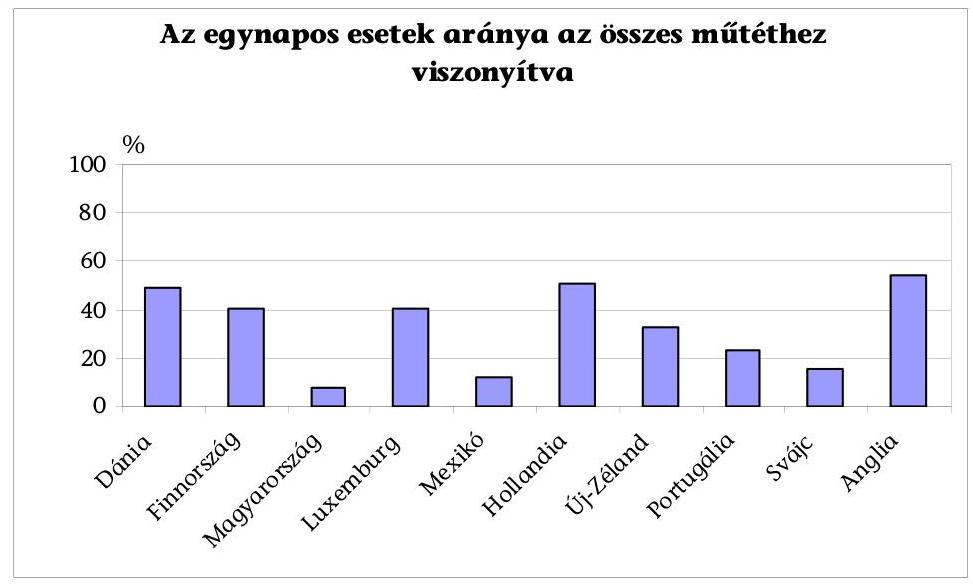

Forrás: OECD Health Data - 2009. június, 2007-re vonatkozó adatok
Magyarországon az OECD statisztikai jelentése alapján 2007-ben már 8\%-os volt az egynapos sebészet aránya az összes mútéthez hasonlítva, mely alacsony a nemzetközi mezőnyben, ugyanakkor a 2004. évi 2,1\%-hoz képest pozitív az elmozdulás, további költséghatékonysági tartalékot rejt.

Hazánkban egynapos sebészeti beavatkozáson olyan tervezett sebészi, klinikai jellegű tevékenységet értünk, amelyet követően a beteg néhány órás szakfelügyeletet, megfigyelést igényel - ami áthúzódhat a következő napra is -, de az intézményben való tartózkodása nem haladja meg a 24 órát.

---

A több napos kórházi ápolási idő pár órára történő lerövidítését a korszerű műtéti eljárások, biztonságosabb-jobb altatás, a fejlett technika-technológia alkalmazása - aminek következtében a beteget műtét közben kisebb megterhelés éri -, valamint a szigorú betegszelekció (többféle betegséggel, illetve súlyos betegek kiszűrése) teszi lehetővé. Az egynapos sebészet további előnye, hogy a beteg kevésbé van kitéve kórházi fertőzéseknek. A gyorsabb gyógyulás csökkentheti a táppénzen töltött időt és a kórházi osztályok zsúfoltságát, gyorsulhat a betegforgás. A szolgáltatók számára előny: a csökkenő zsúfoltság és szövődményszám, az alacsonyabb hotel- és ápolási költségek. ${ }^{1}$

Az egynapos ellátás sajátos szabályait az egynapos sebészeti és a kúraszerűen végezhető ellátások szakmai feltételeiről szóló 16/2002. (XII. 12.) ESzCsM rendelet (továbbiakban: ESzCsM rendelet), valamint az egészségügyi szakellátás társadalombiztosítási finanszírozásának egyes kérdéseiről szóló 9/1993. (IV. 2.) NM rendelet (továbbiakban: NM rendelet) tartalmazza, ezeket egészíti ki az OEP által külön szerződéssel finanszírozott egynapos beavatkozások minőségbiztosítási és ellátás-szervezési feltételeire vonatkozó 2003. évi Szabálykönyve (továbbiakban: Szabálykönyv). Az NM rendelet 9. sz. melléklete felsorolja az egynaposként végezhető beavatkozásokat. (Az ötven leggyakoribb egynapos beavatkozásokat a 6. sz. melléklet mutatja be.)

Az egynapos sebészeti beavatkozásokat aktív fekvő intézményekben (kórházban) 1994 óta finanszírozza a társadalombiztosítás és 2002-től járóbeteg szakellátó intézményekben is végezhető. 2003 óta - pályázat alapján - OEP-pel szerződött magánszolgáltatók is végezhetnek közfinanszírozott egynapos sebészetet.

Magyarországon az egynapos esetek száma 2006-2008 között 55,2 ezerről 115,6 ezerre emelkedett, amelynek egészségbiztosítói kiadása 2,7 Mrd Ft-ról 7,0 Mrd Ft-ra nőtt. ${ }^{2}$
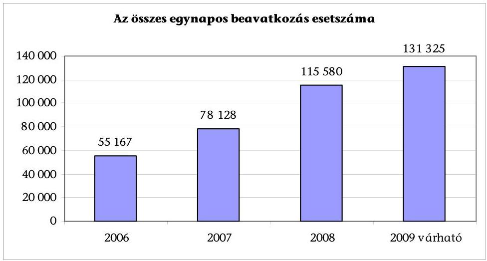

[^0]
[^0]:    ${ }^{1}$ Forrás: EüM: Az egynapos sebészet finanszírozásának kérdései (2008. november 8.)
    ${ }^{2}$ Az OEP adatai alapján.

---

Az egynapos beavatkozás finanszírozása azonos összegű a kórházi aktív és a „valódi egynapos" ellátás esetén. Az OEP ugyanannyit fizet egy sérvműtétért, akár egynapos műtéttel, akár ötnapos kórházi kezeléssel látják el a beteget. A díjazás alapja a beavatkozásra megállapított súlyszám. A súlyszámot a beavatkozással és a fekvőbeteg intézmény működtetésével járó átlagos kiadásokat figyelembe véve határozza meg az ágazatirányító, így a kórházi tartózkodás kalkulált költségeit is számításba veszik. Az egészségügyi intézmények maguk dönthetnek a beavatkozás elvégzésének módjáról. Egynapos ellátás esetén az ápolási időből fakadó megtakarítás az intézménynél marad.

Az európai országok egy részében a biztosítók szintén az eseteket díjazzák (pl. szürkehályog műtét) függetlenül attól, hogy egynapos sebészet keretében, vagy fekvőbeteg ellátásban látják el a beteget. A megtakarítás a szolgáltatóé, például a skandináv államokban, Olaszországban és hazánkban is ezen az elven finanszíroznak. Németországban a biztosítók figyelembe veszik azt, hogy ezek az eljárások kisebb költségekkel járnak, ezért kevesebbet fizetnek a szolgáltatóknak.

Az egynapos sebészeti beavatkozás csak olyan betegen hajtható végre, aki megfelel a szigorú fizikai állapotbeli (jó általános fizikális állapot, nem szenved súlyos rendszerbetegségben) és szociális követelményeknek (megszervezik a hazaszállítást, az otthoni ápolást, a telefonos kapcsolattartást bármely probléma esetén a szolgáltatóval és az operáló orvossal stb.).

Az egynapos sebészetben csak nagy gyakorlattal rendelkező orvosok, nővérek dolgozhatnak. Az altatóorvosok az aneszteziológiai ambulancián - a beteggel való személyes találkozás, vizsgálat és megbeszélés után - döntenek arról, hogy biztonságos-e a műtét elvégzése az egynapos sebészet keretében. (Az egynapos sebészet folyamatábráját az 2. sz. melléklet mutatja be.)

A Multidiszciplináris Egynapos Sebészeti Társaság (MEST) 1997 szeptemberében alakult meg, céljuk az egynapos sebészet terjesztése és népszerűsítése az állami és a magán szférában. A MEST - a Nemzetközi Egynapos Sebészeti Társaság tagjaként - 2013-ban Budapesten rendezi meg a világkongresszusát, ami a hazai szakma elismerését jelenti, és további segítséget jelenthet az ellátási forma bővüléséhez.

A beavatkozások körét tekintve az egyes országok között vannak azonosságok, de jelentősek a különbségek is. ${ }^{3}$ Jellemzően egynaposként elfogadott beavatkozás például a szürkehályog műtét, a terhesség megszakítás, a sérvműtétek, az izületi tükrözés. Ugyanakkor vannak műtétek, amelyeknek betegbiztonsági kockázatát eltérően ítélik meg országonként, ezért eltérő a gyakorlat is. Ezek közé tartozik például a mandulaműtét, amelyet Hollandiában 67 százalékban, Finnországban 59 százalékban egynapos ellátásban végeznek, de Angliában az esetek 77 százalékánál, hazánkban 100 százalékban fekvőbeteg-ellátásban gyógyítják. A laparoszkópos epehólyag eltávolítás Dániában 35 százalékban egynapos formában történik, de Angliában 84 százalékban, Hollandiában 96 százalékában és hazánkban 100\%-ban kórházba fektetik a betegeket.

[^0]
[^0]:    ${ }^{3}$ Az OECD adatai szerint.

---

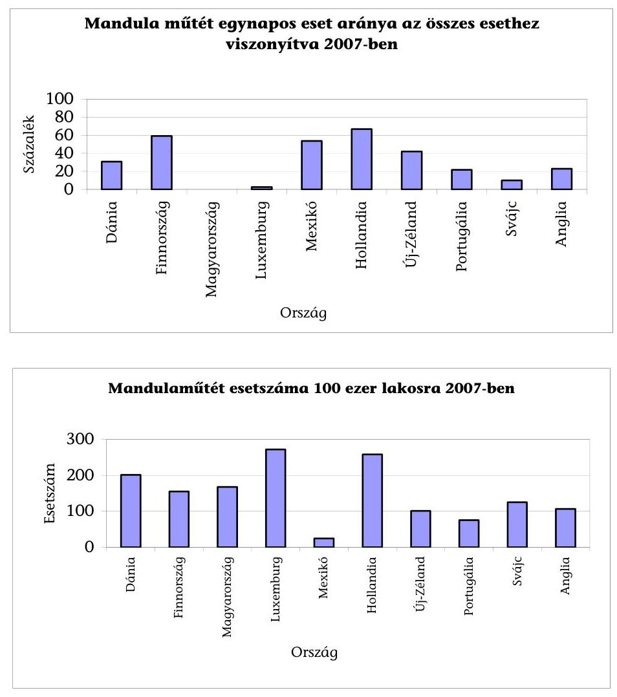

Forrás: OECD Health Data 2009. június
Különbség van abban a tekintetben is, hogy az egynapos sebészet a kórház szerves részét képezi-e, annak egy elkülönült egysége, illetve attól függetlenül, járóbeteg-szakrendelőkben, esetleg teljesen önálló egységként működik-e. Magyarország ebből a szempontból vegyes modellt alkalmaz, mindháromra akad példa a társadalombiztosítás által finanszírozott intézmények között. (Néhány ország tapasztalatait mutatja be az 1. sz. függelék.)

Az ÁSZ az egynapos ellátások témakörében korábban nem folytatott vizsgálatot.

A jelenlegi ellenőrzés célja annak értékelése volt, hogy

- megfelelően hasznosultak-e az egynapos sebészetre tervezett és fordított költségvetési és EU-s források; a fejlesztésekben érvényesült-e az egyenlő hozzáférés követelménye;
- a jogi, a közgazdasági és a finanszírozási környezet segítette-e ezen ellátási forma elterjedését; ezzel összefüggésben csökkentek-e a gyógyítássalgyógyulással járó költségek;

---

- az egynapos sebészet elterjedése növelte-e és mennyiben az egészségügyi ellátórendszer hatékonyságát; ennek keretében vizsgáltuk a sebészeti kapacitások változását.

Az ellenőrzés szempontrendszerét előtanulmánnyal alapoztuk meg, a vizsgálatot a teljesítményellenőrzés módszerével végezzük. Az értékelés kritériumrendszerét a 3. sz. melléklet tartalmazza. Eredményesnek tekintettük az ellátást, ha a pályázati célok teljesültek és a nyertes szolgáltatók elnyert kapacitásaikat kihasználták. Gazdaságos az ellátás, ha mind szolgáltatói, mind biztosítói oldalon megtakarítást eredményezett.

Az egynapos sebészeti ellátás vizsgálatát adatbekérésre, helyszíni interjúkra, a fekvőbeteg ellátó és egynapos beavatkozást végző szolgáltatók műtéti adatainak elemzésére alapoztuk. Az adatokat elsősorban az OEP Gyógyító Megelőző Főosztálya szolgáltatta elektronikus úton, adatállományokba rendezve. Az adatállományok szűrésével határoztuk meg a leggyakrabban alkalmazott beavatkozások listáját és a hozzájuk tartozó finanszírozást. További adatokat szolgáltattak azon kórházak ( 64 db ), akiknél az egynapos sebészeti esetszám meghaladta a 10-et 2008-ban. Az egynapos ellátásra szerződött szolgáltatók ( 47 db ) adatait tanúsítványok és kérdőívekre adott válaszok alapján dolgoztuk fel. A kérdőívre adott válaszok feldolgozását az 5. és az 5/a. sz. mellékletek tartalmazzák. A költséghatékonyság méréséhez tíz intézményben helyszínen végeztünk költséggyűjtést a leggyakoribb beavatkozásokra.

Az ellenőrzés a 2006-2009. I. félév közötti időszakra terjedt ki, figyelemmel kísérve az ellenőrzés lezárásáig bekövetkezett változásokat.

Az ellenőrzés végrehajtására az Állami Számvevőszékről szóló 1989. évi XXXVIII. törvény 2. § (3), (5) és (9) bekezdéseinek rendelkezései adtak alapot.

A jelentést egyeztetésre megküldtük az egészségügyi miniszternek. Miniszter úr észrevételt nem tett, levelét az 1. sz. melléklet tartalmazza.

---

# I. ÖSSZEGZŐ MEGÁLLAPÍTÁSOK, KÖVETKEZTETÉSEK, JAVASLATOK 

Az ágazatirányító számára a nemzetközi tapasztalatokból ismert tény az egynapos sebészet költséghatékonysága. Az elmúlt 15 évben több intézkedés is az egynapos sebészet elterjesztését célozta meg. Az ellátási forma kiterjesztésének és általánossá válásának célszámait ${ }^{4}$ azonban nem határozták meg. Az egynapos sebészet fejlesztésére szánt források célnak megfelelően hasznosultak, a finanszírozott esetek száma 2006 és 2008 között mintegy 110\%-kal emelkedett. Az ezer főre jutó beavatkozások száma megyénként is emelkedett. Az ellátási forma elterjesztésére hozott intézkedések ösztönző hatását a szabályozási, finanszírozási környezet mérsékelte. ${ }^{5}$ A betegek aktív fekvő helyett egynapos ellátásban történő kezelése az ellátó intézményeknél a gyógyítással járó költségeket csökkenti. A költséghatékonyság mind a szolgáltatók, mind a biztosító szempontjából igazolható.

Igazolható költséghatékonyság ellenére az egynapos sebészet alkalmazása nemzetközi összehasonlításban 2009-ben is alacsony mértékű. Nemzetközi trendek alapján várható, hogy a tervezett (elektív) beavatkozások döntő részét a jövőben Magyarországon is egynapos ellátásban fogják végezni. Stratégia és célértékek hiányában nincs biztos iránymutatás ezen ellátási forma intézményrendszerben betöltendő méretéről, helyéről és hatásáról a meglévő fekvőbeteg intézményekre.

| Megnevezés | 2006 fin. év | 2008 fin. év | $\begin{gathered} 2008 / \\ 2006 \% \end{gathered}$ |
| :--: | :--: | :--: | :--: |
| Összes mütéti esetek száma | 1845938 | 1659121 | 89,9\% |
| Lehetséges egynapos esetszám | 316432 | 300303 | 94,9\% |
| ebből egynapos esetszám (1-24 órán belüli) | 55167 | 115580 | 209,5\% |
| ebből pályázatos nyertes, egynapos esetszám | 7134 | 43216 | 605,8\% |
| kórházi, aktív, egynapos esetszám | 48033 | 72364 | 150,7\% |
| Egynapos esetek aránya az összes műtéten belül | 2,99\% | 6,97\% | 233,1\% |
| Egynapos esetek aránya a lehetséges egynaposon belül | 17,40\% | 38,50\% | 220,8\% |
| Lehetséges egynapos esetek finansz. összege (E Ft) | 23499 916,0 | 23103 463,4 | 98,3\% |
| ebből egynapos esetek finansz. össz. (pályázatos nyertes, kórházi aktív) (E Ft) | 2673 003,0 | 7014 049,0 | 262,4\% |

Forrás: OEP, a részletes adatokat bővebben a 20. sz. tábla tartalmazza

[^0]
[^0]:    ${ }^{4}$ Megjegyezzük, jó gyakorlatként, hogy pl. az Egyesült Királyságban, Skóciában, Hollandiában hosszú távú programokat dolgoztak ki és vezettek be az egynapos sebészet fejlesztésére, melyben megfogalmazták az elérendő célokat, amelyek állását rendszeresen monitorozzák, közzé teszik, ezzel mintegy ösztönzik az egészségügyi apparátust és tájékoztatják a lakosságot. Skóciában például 19 tervezhető beavatkozást 75\%-ban egynaposban kívánnak végezni. Lsd. bővebben 1. sz. függelékben.
    ${ }^{5}$ Például a teljesítményvolumen korlát.

---

2006-2008 között az összes közfinanszírozott műtéti esetszám 10\%-kal csökkent, ezen belül az egynaposként műthető esetek száma kisebb mértékben, 5\%kal mérséklődött. A tényleges ( 24 órán belül otthonába bocsájtott) egynapos esetek száma $110 \%$-kal, aránya az összes műtéten belül 130\%-kal emelkedett. Az egynaposként elvégezhető (azaz lehetséges) finanszírozott esetek átlagos súlyszáma 3,5\%-kal csökkent, mely mutatók összességében az ellátórendszer költséghatékonyságának javulására utalnak.

A költséghatékonyságot sem a tárca, sem az OEP, sem a szolgáltatók nem számszerúsítették. A jelenlegi ellenőrzés széleskörű költségadatok begyűjtésével igazolta az intézmények elsődleges költségszintjén a leggyakoribb beavatkozások költséghatékonyságát. A helyszínen vizsgált tíz intézménynél, illetve a kérdőívvel megkeresett 47 pályázaton egynapos kapacitást nyert szolgáltatónál az OEP finanszírozás meghaladta az esetre fordított elsődleges költségeket. A helyszínen vizsgált tíz szolgáltatónál az esetre közvetlenül fordított és osztott ${ }^{6}$ költségeket is meghaladta a leggyakrabban végzett beavatkozások finanszírozása. A fedezetek nagyságában jelentős különbség van a szolgáltatók között (19. sz. tábla).

A költséghatékonyság jelzője beavatkozás szinten pl. a szürkehályog műtét biztosítói térítési díjának és a műtétszámának változása is, amely 2006-2009 között egy esetre vonatkozóan 134 ezer Ft-ról 108,7 ezer Ft-ra csökkent (21. tábla), miközben az ellátottak száma a 2006. évi 54630 főről 2008-ra 61500 főre emelkedett, összességében az OEP azonos ráfordításért több egészségnyereséget vásárolt.

Az ágazatirányító lépéseket tett az egynapos sebészet terjesztésére a tevékenység szabályainak meghatározásával, célzott egynapos sebészeti kapacitások vásárlásával és magán szolgáltatók közfinanszírozásba történő befogadásával pályázatok útján (2003 és 2007-ben), továbbá az általános finanszírozást kiegészítő források elérhetővé tételével (ÚMFT keretében).

Az egynaposként végezhető műtéti eljárások száma 2009-ben közel 300 féle volt, mely szakértői vélemény szerint szűk, ${ }^{7}$ a nemzetközi gyakorlatban többféle műtét végezhető egynaposként. (A beavatkozásokat meghatározó NM rendelet 9. sz. melléklete 1994 óta 19 alkalommal bővült, a módosításokat részletesen a 4. sz. melléklet tartalmazza).

A hazai egynapos sebészeti ellátás szabályozása bonyolult. Az ellátások fogalmi meghatározását, szakmai, intézményi, adminisztrációs feltételeit 2002-ben írta elő a jogalkotó az ESzCsM rendeletben, ugyanakkor értelmezése és alkalmazása az intézményvezetők számára vizsgálatunk időszakában sem volt egyértelmú. A nemzetközi gyakorlat a betegnek a felvétele napján történő elbocsátását tekinti követelménynek. Magyarországon a 24 órán belül elbocsátott (a

[^0]
[^0]:    ${ }^{6}$ elsődleges és másodlagos költségek
    ${ }^{7}$ Prof. Dr. Gaál Csaba: Egynapos és Ambuláns Sebészet - Medicina, 2006., Dr. Janecskó Mária: Szemléletváltás kontra kényelem? IME 2009.júli-aug., valamint 35 egynapos sebészetet végző szolgáltató véleménye (ÁSZ felmérés).

---

jogszabályban meghatározott beavatkozásban részesült) beteg ellátása minősül egynapos sebészetnek.

A fekvőbeteg ellátást végző intézmények egynapos esetek száma 2006-2008 között 48,0 ezerről 72,4 ezerre, $50 \%$-kal emelkedett, míg finanszírozása a 2006. évi 2,2 Mrd Ft-ról, 2008-ra 4,0 Mrd Ft-ra, azaz 80\%-kal magasabb összegben finanszírozta a biztosító. A finanszírozás emelkedéséhez az esetszám növekedésén túl, a súlyszám és a súlyszám forint ellenértékének növekedése is hozzájárult. ${ }^{8}$

A fekvőbeteg intézmények finanszírozási szabályainak 2009. április-október közötti változása (EMAFT) degresszív térítés, hatással van az egynapos ellátásért kapott díjra is (a nem pályázatos kórházakra). A 70\%-os teljesítmény fölött lebegtetett súlyszám érték korlátozta a fekvőbeteg ellátások tervezett kiadásait, és ezáltal csökkentette az aktív fekvő és egynapos esetek azonos finanszírozásának ösztönző hatását.

A fekvőbetegellátás intézményeiben az egynapos sebészet terjedését nehezíti, hogy az orvosoknak nemcsak egészségügyi, hanem szociálpolitikai szempontokat is mérlegelniük kell, pl. életviszonyok, közlekedési viszonyok, házigondozás hiánya. Fékezőleg hat továbbá, hogy a forráselosztás még mindig a kórházi ágyak száma, az ágykihasználtsági mutatók figyelembevételével történik és nem az ellátandó lakosság egészségügyi szükségletének legköltséghatékonyabb módon történő kielégítésére épül. Ezért a tulajdonosok és a menedzsment érdeke továbbra is az ágyak számának megtartásához fúződik.

Az egynapos ellátás ágykihasználtsági mutatókba számítása 2008. végéig rendezetlen volt, melyet mutat, hogy az intézmények $48 \%$-a beszámította, $52 \%$-a nem számította bele saját statisztikájának készítésekor. A 2009-től érvényes szabályozás nem veszi figyelembe ${ }^{9}$ az ápolási napok, az ágykihasználás mértékének meghatározásánál az egynapos eseteket, ez az intézmények magasabb ágykihasználtságához fűződő érdeke ellen hat.

Az egynapos sebészet szélesebb körű alkalmazására 2003-ban és 2007-ben az OEP pályázatokat írt ki. A 2003. évi pályázat két évre, kísérleti céllal indult, a tapasztalatokat az ágazatirányító írásban nem értékelte, azok a szabályozásban nem hasznosultak.

A 2007-ben az egynapos sebészet fejlesztésére kiírt pályázat meghirdetett céljai összhangban voltak a terület fejlesztésének szükséges irányával. A kórházi aktív ágyak számának csökkentésével párhuzamosan a megszűnő kapacitások 5\%-át, 3,3 Mrd Ft-ot pályázat alapján egynapos beavatkozások bővítésére konvertálta az ágazatirányító. Az OEP 47 intézménnyel 66964 esetszámra, 22500 súlyszámnyi kapacitás finanszírozására kötött szerződést, azaz átlagosan az

[^0]
[^0]:    ${ }^{8}$ 2006. januárban egy súlyszám forintértéke 134000 Ft, 2009. áprilistól 150000 Ft
    ${ }^{9}$ más szabályok érvényesek pl. Ausztriában, ahol a kórházi hatékonysági mutatókat, így az ágykihasználási mutatót az egynapos esetekkel együtt és azok nélkül is kiszámítják

---

alacsony költség-igényességű finanszírozási beavatkozásokra szerződött. Ezt mutatja az egy esethez tartozó átlagos súlyszám, amely 0,336 volt, amihez 49000 Ft biztosítói térítés tartozott szerződéskötéskor, ami megfelelt az aktív ellátásban szerzett tapasztalatoknak. ${ }^{10}$ A szerződött súlyszám $1 / 4$-ét magánszolgáltatók nyerték el.

A pályázaton kapacitásbefogadást nyert szolgáltatók közül időközben egy magánszolgáltatónak szűnt meg a szerződése az OEP-pel, a többi szolgáltató betegeseteinek száma 2006-2008 között mintegy hatszorosára emelkedett (7,1 ezerről 43,2 ezerre), mely 2/3-a a szerződésben kitűzött betegszámnak. (Ugyanezen idő alatt a kórházakban csak másfélszeresére 48,0 ezerről 72,4 ezerre, emelkedett az egynapos esetszám). A sebészeti beavatkozások jellemzően összetettebbek voltak (átlagos súlyszám 0,492), mint a tervezett érték, ez az oka annak, hogy a teljesített összes súlyszám a szerződésben foglaltaknak a $89 \%$-a, a kifizetés pedig 3,0 Mrd Ft volt 2008-ban (2009-ben is). A szolgáltatók mintegy $60 \%$-a jelezte, hogy szerződött kapacitásuk többszörösét is képesek lennének ellátni, a betegek részéről felmerülő igényt is többszörösnek ítélték. A szerződött teljesítményt teljes súlyszám értékkel finanszírozza az OEP, de az azt meghaladó teljesítményt nem téríti meg a biztosító.

A pályázat útján közfinanszírozásba befogadott szolgáltatók szerződésnek megfelelő működésének és ellenőrzöttségének hiányosságára utal az, hogy módot ad a magas fedezetű betegszelekcióra, továbbá arra, hogy az ellátott betegesetek nem illeszkednek a szerződésben foglalt szakmai összetételhez. Pl. az UroClin klinika az egynaposként végezhető 61 féle urológiai beavatkozásból 20072008 között kizárólag 2 féle (HBCS) ellátást számolt el az OEP-pel, a Budavári Önkormányzat Egészségügyi Szolgálat-rendelőintézete nőgyógyászat és szemészet területből összesen 6-féle (HBCS) beavatkozást.

Az egynapos sebészet kiterjesztésére - a pályázatokon túl - további forrásokat is igénybe lehetett venni. Az egynapos beavatkozásoknak a járóbeteg-szakellátás TVK-ja terhére történő elszámolását 2008. június 1-jétől teszi lehetővé a finanszírozási rendelet ${ }^{11}$ az aktív fekvőbeteg ellátó intézmények számára. Az átváltott TVK terhére végezhető egynapos beavatkozások súlyszámát az OEP külön szerződésben rögzítette. A szerződések alapján 2008. október - 2009. június között 123 849,17 E Ft-ot számolt el az OEP, amely az egynapos beavatkozásokra összesen kifizetett 6,1 Mrd Ft-nak mindössze 2\%-a. Az átváltott TVK-t az intézmények nem használták fel, - a 2008-as finanszírozási évben a súlyszámra átváltott TVK több mint $70 \%$-a, a 2009 -es ${ }^{12}$ finanszírozási évben közel $40 \%$-a nem került felhasználásra. Ennek egyik oka az, hogy a járóbeteg szakellátás TVK-ja terhére elszámolható beavatkozások köre 1/6-a az egynapos sebészeti beavatkozásoknak, továbbá a finanszírozási szabályok kedvezőtlenül változtak.

[^0]
[^0]:    ${ }^{10}$ Az aktív ellátó intézményekben 2006-ban a leggyakrabban végzett (az összes eset $79 \%$-át adó) egynapos beavatkozások átlagos súlyszáma 0,3706 volt.
    ${ }^{11}$ az egészségügyi szakellátás társadalombiztosítási finanszírozásának egyes kérdéseiről szóló 9/1993. (IV. 2.) NM rendelet
    ${ }^{12}$ 2009. I-III. negyedév

---

Az Új Magyarország Fejlesztési Terv foglalkozott az egynapos ellátások infrastruktúrájának fejlesztésével, és TIOP, illetve ROP pályázatokon uniós forrásból lehetőség nyílt regionális járóbeteg központokban egynapos sebészeti egységek kialakítására. Ezek a járóbeteg központok az átadás után (2009-2010) újabb 7750 súlyszámnyi, mérsékelt kapacitásnövelést jelentenek a területen. (A jelenlegi egynapos beavatkozások átlagsúlyszámával számolva, mintegy 15500 eset/év növekedést.) Az uniós fejlesztések elsősorban az Észak-magyarországi régióban (2303 súlyszám), a Közép-dunántúli régióban (1980 súlyszám) és a Közép-magyarországi régióban (1967 súlyszám) szolgálják új központok kialakítását, bővítve az ellátáshoz jutás lehetőségét, de a területi hozzáférési egyenlőtlenségek továbbra is fennállnak az ország egyes területei között.

Az egynapos sebészet nemzetközileg magas elfogadottságát indokolja, hogy alkalmas az intézményi várólisták csökkentésére. ${ }^{13}$ Hazánkban Kormányrendelet alapján 2008. április 3-tól kötelező meghatározott beavatkozások esetében a várólista vezetése. A szabályozás azonos beavatkozás esetén (pl. szürkehályog gyógyítás) nem tesz különbséget fekvő, illetve egynapos ellátás várólistája között. A gyakorlatban nem vezet minden intézmény várólistát, illetve ahol vezetnek azok sem formailag, sem tartalmilag nem egységesek. Az intézmények kötelesek várólistáikat meghatározott adattartalommal havonta megküldeni az EBF részére, de az adathiányos kitöltésnek nincs következménye. Az egynapos ellátások várakozási időre gyakorolt hatása adathiány, a jelentési kötelezettség be nem tartása miatt nem mérhető. A kötelezettség elmulasztásához jogszabály szerint pénzügyi szankció kapcsolódik, de ennek alkalmazására eddig nem volt példa.

Nincsenek meghatározva a betegek elhelyezésére vonatkozó tárgyi feltételek követelményei, így a térítési dí ellenében nyújtott többletszolgáltatás nem ítélhető meg, a szolgáltatók egyedi megítélésétől függ. A 2007. évi egynapos sebészetfejlesztési pályázaton nyertes szolgáltatók közel 1/3-a térítési díjat kapcsol az ellátáshoz. A térítési díj alkalmazása nem indokolt, amennyiben a HBCS fedezetet nyújt a beavatkozások egyes költségelemeire.

Az ország egyes megyéi között az ellátás igénybevételében 2008-ban is jelentős különbségek voltak. Budapesten 1000 lakosra négyszer annyi beavatkozás jut, mint Békés megye lakosaira. Az 1000 lakosra jutó beavatkozások száma 2006ban és 2008-ban is Békés megyében volt a legalacsonyabb ( $0,2 / 3,8$ ). Továbbra is megmaradt a központi régió kiemelt ellátása.

[^0]
[^0]:    ${ }^{13}$ A Skót Számvevőszék jelentése az egynapos ellátásokról 2008.

---

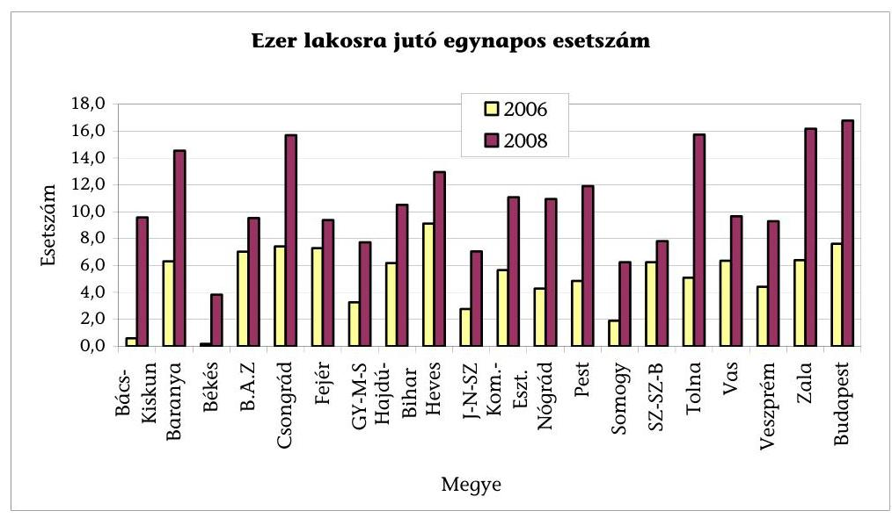

Felmérésünk szerint az ellátás minőségének ellenőrzése megoldatlan. Az egészségügyi ellátórendszer fejlesztéséről szóló törvény ${ }^{14} 16 . \S$ (5) bekezdése szerint az egészségügyi miniszter évente megvizsgálja az egészségügyi ellátórendszer múködését és annak eredményéről beszámolóban tájékoztatja az Országgyűlés Egészségügyi Bizottságát. Ennek keretében két alkalommal ${ }^{15}$ készített jelentést a miniszter, amelynek a struktúraátalakítási fejezetében számolt be az egynapos sebészeti ellátások helyzetéről.

Az ellátás minőségére utaló szövődmények nyomon-követési és értékelési rendszere kidolgozatlan, az OEP által a pályázaton nyertes szolgáltatóktól begyűjtött minőségi paraméterek feldolgozatlanok, ellenőrizetlenek. Jelen vizsgálat önbevallásos kérdőívvel értékelte a szövődmények alakulását a pályázaton nyertes szolgáltatóknál. Ez alapján a szövődmények kockázata alacsony, 2008ban az általuk elvégzett 43215 eset 4 ezrelékénél alakult ki szövődmény.

A helyszíni ellenőrzés megállapításainak hasznosítása mellett javasoljuk:

# az egészségügyi miniszternek 

1. Határozza meg az egynapos sebészet helyét az egészségügyi ellátórendszerben, különösen az ezt leíró mutatókat és azok célértékeit, annak érdekében, hogy széleskörűvé váljon az ellátás. A monitoring rendszer múködtetése alapján rendszeresen értékelje a mutatók alakulását.
2. Írja elő elkülönített várólista vezetését az egynaposan végzett beavatkozásokhoz az átláthatóság, nyomon követés érdekében és tartassa be a várólistára vonatkozó követelményeket.
[^0]
[^0]:    ${ }^{14}$ a 2006. évi CXXXII. törvény
    ${ }^{15} 2008$ májusában és 2009 májusában

---

3. Vizsgáltassa felül az egészségügyi szakellátás társadalombiztosítási finanszírozásának egyes kérdéseiről szóló 9/1993. (IV. 2.) NM rendelet 9. sz. mellékletében meghatározott egynapos sebészeti beavatkozások kórét, és a felülvizsgálatnak megfelelően kezdeményezze annak módosítását, bővítését.
4. Határozza meg az egynapos ellátásban nyújtott szolgáltatások tartalmi elemeit, finanszírozási protokollját, és rendszeresen ellenőrizze ennek betartását.

---

# II. RÉSZLETES MEGÁLLAPÍTÁSOK 

## 1. Az ágazatirányító intézkedései az egynapos sebészeti elLÁTÁs ÁltalánoSSÁ TÉTELÉre

### 1.1. Az ágazatirányító egynapos sebészetre vonatkozó szakmai koncepciója

Egynapos sebészetre vonatkozó stratégiát az ágazatirányító nem készített, az ellátási forma kiterjesztésének és általánossá válásának célszámait nem határozta meg. ${ }^{16}$ 1994-től kezdődően, - az NM rendelet mellékletében meghatározták az egynapos formában végezhető eljárásokat 2009 őszig jogszabály, jogszabály-módosítás és az ellátások szélesebb körűvé tételének támogatására kiírt pályázat (2003., 2007. évek) jelentette a terület fejlesztésének szakmapolitikai hátterét. 2002-ig csak finanszírozási szabályok vonatkoztak rá. 2002-ig a beavatkozások végzésére a fekvő ellátást nyújtó intézmények voltak jogosultak a társadalombiztosítás keretein belül.

Az ESzCsM rendelet szakmai vitái megfogalmazták, hogy az egynapos sebészeti ellátás az egészségügyi rendszer strukturális racionalizálását, az aktív kórházi ágyak csökkentését indítja el, amely áttételesen megtakarításokat eredményez. Az ellátási forma terjedésével a fekvőbeteg intézmények megtakarításhoz jutnak, ami a kórházak pénzügyi egyensúlyát javítja. A rendelet lehetővé tette az aktív fekvőbeteg háttérrel nem rendelkező járóbeteg centrumok közfinanszírozott egynapos sebészeti ellátásba való belépését.

Az egynapos ellátás elterjedését az ágazatirányító a finanszírozás ösztönző szabályaival szándékozta elérni, úgy, hogy a fekvő és az egynapos ellátásban azonos térítést nyújt, továbbá tervezte a finanszírozás kiterjesztését a járóbeteg szakrendelőkre és néhány privatizált rendelőre, tapasztalatszerzés céljából. Ehhez a szolgáltatókat pályázati felhívás útján választották ki.

2003-ban az egészségügyi szakellátási többletkapacitás befogadásával kapcsolatos pályázat kiírásáról szóló 2084/2003. (IV. 24.) Korm. határozat célul tűzte ki a regionális kapacitások terén tapasztalt területi egyenlőtlenségek felszámolását, elsősorban a fekvőbeteg szakellátást kiváltó járóbeteg-szakellátás, az egynapos sebészet fejlesztését. A 2003-ban meghirdetett, egynapos sebészet végzésére kiírt pályázat nyertesei ( 8 szolgáltató) pilot (kísérleti) program keretében kezdték meg múködésüket. A kísérleti program célja az volt, hogy két év tapasztalati idő után a szabályozásban a szükséges változtatásokat elvégezzék.

[^0]
[^0]:    ${ }^{16}$ A helyszíni ellenőrzést követően a számvevőszéki jelentés egyeztetése során a tárca hivatkozott a 2005. évi Egészségügyi Fejlesztéspolitikai Koncepcióra (EFK), mint stratégiai dokumentumra.

---

Az egészségügyi ellátórendszer fejlesztéséről szóló törvény előkészítésekor a 2007. évi struktúraátalakításhoz kapcsolódóan a kiemelt egészségpolitikai célok között szerepelt az egynapos sebészeti ellátások kiterjesztése. A törvény előterjesztése szerint az ellátórendszer az átalakítás következtében 4 szintre tagozódik: kiemelt kórház 50 km -ben belül, területi kórház 30 km en belül, területi járóbeteg-központ 20 km -en belül, mentő 15 percen belül mindenki számára elérhető legyen. A törvény szerint a szakrendelőkből kialakuló területi egészségügyi központokban a betegek magas szintű, kórházi kezelést kiváltó ellátásokat kapnak. Ezek a központok múködtethetnek egynapos sebészetet is. A törvény már meghatározta az ellátóhelyek területi elérhetőségét, távolságát, de az ellátórendszerben a beavatkozások kívánt mértékét, nagyságrendjét nem.

Az egynapos sebészet fentiek szerinti támogatására 2007-ben további intézkedésekre került sor. Egyrészről az intézkedések az egynapos sebészeti kapacitás bővítését szolgálták az ellátórendszer átalakításával összhangban, másrészről az ehhez szükséges infrastruktúra kialakítását, illetve bővítését célozták meg az uniós források bevonásával.

- Az egészségügyi ellátórendszer fejlesztéséről szóló 2006. évi CXXXII. törvény végrehajtásával kapcsolatos egyes finanszírozási, szerződéskötési és eljárási kérdésekről szóló 41/2007. (III. 13.) ${ }^{17}$ Korm. rendelet 7. § (3) bekezdése szerint az aktív fekvőbeteg-szakellátásban a 2007. március 31-én érvényes teljesítményvolumen regionális és szakmánkénti mennyisége és a 2007. április 1jétől a kapacitásváltozással módosított mennyiség közötti különbözetnek a tervezhető ellátások teljesítményvolumenére jutó része 5 százalékát az egynapos beavatkozások bővítésére kellett felhasználni, ehhez 3,3 Mrd Ft forrást rendelt az ellátás bővítésére.
- Az Új Magyarország Fejlesztési Terv ${ }^{18}$ Társadalmi Infrastruktúra Operatív Program keretében a járóbeteg szakellátási és kórházi ellátást kiváltó ellátási formák c. fejezet foglalkozott a járóbeteg ellátó központok és az egynapos sebészet helyzetével. A TIOP „aktív kórházi ellátásokat kiváltó járóbetegszolgáltatások fejlesztése" 2.1.3. pályázati cél tartalmazta az egynapos sebészeti ellátás fejlesztését, amelyhez uniós forrást is rendeltek. További forrásokat a Regionális Operatív Programok tartalmaztak az egynapos sebészeti ellátóhelyek fejlesztésére.

A Kormány 2008. július 11-én elfogadta a „Biztonság és partnerség: feladatok az egészségügyben 2010-ig" c. programot. Ennek III. fejezete foglalkozik az ellátórendszer fejlesztésével, ahol meghatározták az egynapos ellátás szerepét az ellátórendszeren belül:

[^0]
[^0]:    ${ }^{17}$ 2009. IV. 5-től hatálytalan (hatályon kívül helyezte: Az egészségbiztosítási tárgyú kormányrendeletek módosításáról szóló 72/2009.(IV. 3.) Korm. rendelet 10.§ (2) bekezdés a) pontja)
    ${ }^{18}$ az Új Magyarország Fejlesztési Terv elfogadásáról szóló 1103/2006. (X. 30.) Kormányhatározat

---

„Az ellátórendszer szerkezetében kapjanak nagyobb hangsúlyt a lakóhely-közeli ellátások, vagyis az alapellátás, a korszerú járóbeteg szakellátás, az egynapos sebészet és a nappali kórházak. Ezáltal közelebb visszük a betegekhez a gyógyulás lehetőségét úgy, hogy közben emelkedik a szolgáltatások színvonala, minősége. Az egynapos sebészet például költséghatékonyabb ellátási forma, mint a kórházi ellátás, de támogatásának célja mégsem a takarékosság, hanem az, hogy a betegek kevesebb utazással, korszerü módszerekkel minél hamarabb meggyógyuljanak."

A Biztonság és partnerség c. programhoz nem kapcsolódtak az egynapos ellátások fejlesztésére vonatkozó konkrét intézkedések.

# 1.2. Az egynapos sebészeti ellátás szabályozási környezete 

Magyarországon 1994. április 15-től kezdődően az NM rendelet lehetőséget biztosított arra, hogy fekvőbeteg szakellátás finanszírozásával azonos módon lehessen ambuláns ellátási formában fekvőbeteg ellátással rendelkező szolgáltatónál egynapos beavatkozást végezni. Az ellátási forma elterjedésére, szélesebb körű alkalmazására vonatkozóan nem dolgoztak ki ebben az időszakban stratégiát.

Az egynapos ellátásokra az NM és az ESzCsM rendelet, valamint az OEP Szabálykönyv ${ }^{19}$ előírásai vonatkoznak.

Az NM rendelet 9. sz. mellékletének I. fejezete tartalmazza - OENO Kódok szerint - az egynapos sebészeti ellátás keretében végezhető elektív beavatkozások körét, II. fejezete az ezekhez tartozó kiegészítő kódokat a *-os beavatkozásokhoz, III. fejezete az egynapos klinikai beavatkozásokat, IV. fejezete az ezekhez hozzárendelt HBCS csoportokat, V. fejezete a járóbeteg-szakellátás TVK-ja terhére elszámolható egynapos beavatkozásokat. Ez a szabályozás közel 300 beavatkozás elvégzését teszi lehetővé.

A rendelet 9. sz. melléklete mára számottevő változáson esett át. Az eltelt 15 évben tizenkilencszer módosították a jegyzéket, majdnem kizárólag bővítették. Az időszak első felére, 2002-ig 3 módosítás esett, a többi 16 jogszabályváltoztatás a 2002-től eltelt második hét évben történt.
1994. április 15-én 26 mútéti beavatkozást tartalmazott a 9. sz. melléklet első változata, amelyeket fekvőbeteg ellátási háttér mellett járóbeteg szakellátásban végezhettek el. 2009. október 1-jére a jegyzék már 307 OENO (járóbeteg szakellátás beavatkozási) kódot, továbbá 23 kiegészítő kódot, 39 egynapos klinikai beavatkozást, valamint 410 HBCs (fekvőbeteg szakellátás homogén betegségcsoport) kódot tartalmaz.

A lista egyes változtatásainak mértéke széles skálán mozgott: mindössze egy beavatkozásnyi bővüléstől több mint 130 beavatkozást érintő változásig. 2009 februárjában a minisztérium felkérte a Multidiszciplináris Egynapos Sebészeti Társaságot, hogy a szakmai kollégiumokkal egyeztetést folytasson minden

[^0]
[^0]:    ${ }^{19}$ az OEP által külön szerződéssel finanszírozott egynapos beavatkozások minőségbiztosítási és ellátás-szervezési feltételeire (2003)

---

érintett szakmára kiterjedő, közös szakmai álláspont és javaslat kialakítása érdekében az egynapos ellátásban végezhető beavatkozások listájának bővítéséről.

Az ESzCsM rendelet foglalja össze a tevékenység fogalmi meghatározását, a beavatkozással, a beteggel kapcsolatos elvárásokat, a beavatkozást végző orvossal szemben támasztott követelményeket, a tevékenységet végző intézményi feltételeket, az adminisztrációs kötelezettségeket, a szövődmények ellátásának kérdését, a háttérintézménnyel kapcsolatos előírásokat. A rendelet melléklete tartalmazza a tárgyi feltételekkel kapcsolatos követelményeket.

Az ESzCsM rendelet egynapos sebészeti ellátásnak tekinti, ha az NM rendelet 9. sz. mellékletében felsorolt beavatkozásokat előre tervezetten végzik, feltéve, hogy a beteg 24 óránál kevesebb időt tartózkodik a beavatkozást végző intézményben.

A Szabálykönyv tartalmazza a fogalom meghatározásokat, a minőségbiztosítási ismérveket és követelményeket, a szolgáltatók strukturális felépítésének követelményeit, viszonyát a fekvőbeteg háttért biztosító szervezethez, az ellátásszervezési, ellenőrzési feltételeket, az ellátási program szervezését. Felsorolja a szakmai kontrollokat, a minőségi indikátorokat. A szabálykönyv a pályázaton egynapos sebészet végzésére kapacitást nyert szolgáltatókra kötelező, a többi fekvőintézményeknek ajánlásként szolgál.

Az OEP szabálykönyv szerint az egynapos beavatkozás olyan elektív műtét, amely az NM rendeletben kihirdetett beavatkozás, és az ESzCsM rendeletben előírt feltételek között végzik. A beteg néhány órás szakfelügyeletet igényel, és a szükséges megfigyelést követően a beteg otthonába bocsátható. A szabálykönyv is tartalmazza, hogy a beteg adott intézményben tartózkodása nem haladhatja meg a 24 órát.

A nemzetközi gyakorlatban az egynapos sebészet definíciói eltérnek a magyar gyakorlattól. Az OECD egynapos sebészeti eseteknek tekinti azokat a betegeket, akiken invazív sebészeti beavatkozást (csak elektív beavatkozást) végeznek, amelyet ilyen célra létesített sebészeti egységben vagy kórházban végeznek, és amelyek után a beteget az operáció napján elbocsátják.

Az Egyesült Királyságban alkalmazott definíció szerint egynapos sebészetnek minősül, amikor kiválasztott betegeket tervezett sebészeti beavatkozás céljából kórházi ellátásra felveszik, és még aznap elbocsátják. A skót meghatározás hasonló, a beteget ugyanazon a napon veszik fel és bocsátják el, és nem tölt az intézményben éjszakát.

A magyar definíció a 24 órás tartózkodást, mint felső korlátot jelöli, és ezért elméletben a beteg egy éjszakát az intézményben tartózkodhat.

A rendelettervezet az első verzióban olyan beavatkozásokat definiált egynapos sebészeti ellátásként, amelyek 12 órán belüli esetek, és a beteg az előző és az aznap estét is otthon tölti. „A beteg felvétele, illetve elbocsátása ugyanazon a naptári napon történik." A szakmai egyeztetés során felmerült, hogy a nemzetközi gyakorlatban az egynapos sebészet szervezetileg és finanszírozásban is elkülönül egymástól, és a magyar jogszabály fogalmi keveredéseket tartalmaz.

---

Az egynapos sebészeti ellátás több szakmában végezhető ellátási forma, beleértendők hasi sebészeti, nőgyógyászati, szemészeti, fül-orr-gégészeti, urológiai, bőrsebészeti stb. ellátások. Nem értendő bele az akut ellátás, az egynapos sebészetben csak programozható/tervezhető műtétek végezhetők. A lista következetlen, a tervezhető (elektív) ellátások mellett akut [pl. vetélés (HBCS 6800)] ellátást is tartalmaz.

Az egynapos ellátásban a szolgáltatóknak nincs ellátási kötelezettségük. A vonzáskörzetükbe nem tartozó betegeknek is lehetőségük van a beavatkozások igénybevételére. Ehhez teljesülnie kell annak a szabálykönyvi kritériumnak, hogy a beteg lakóhelyétől számítva mind az ellátó intézménynek, mind a fekvőbeteg hátteret nyújtó intézménynek, az átlagos forgalmat figyelembe véve személygépkocsival/mentővel 30 percen belül elérhetőnek kell lennie.

# 2. AZ EGYNAPOS SEBÉSZETI ELLÁTÁSOKRA KIÍRT PÁLYÁZATOK 

Az egynapos sebészeti ellátások technikai feltételeinek javítására 1997-ben, 2000-ben, a kapacitások bővítésére 2003-ban és 2007-ben tettek közzé pályázati felhívást.

Az OEP 2003-ban írt ki pályázatot az egynapos beavatkozások elterjesztésére irányuló kapacitás-befogadásra, struktúramódosításra a szükséges jogi, szakmai feltételekkel, múködési engedéllyel rendelkező szolgáltatók számára. A kiírók 2 éves pilot programot határoztak meg azzal a céllal, hogy korszerűbb szakmai szabályozási rendszer és magasabb minőségi színvonal kerülhessen bevezetésre. A szolgáltatóknak vállalniuk kellett a szabálykönyvben meghatározott követelmények betartását.

A szerződéseket 2004. október től, két éves időtartamra, egy, három, illetve hat szakmára, összesen 16750 esetszámra kötötték meg a finanszírozóval. A nyertes szolgáltatók vállalták, hogy ellátási kötelezettségük kiterjed a régió egészére a szerződött esetszám erejéig. A szerződések a teljesíthető súlyszámra nem tartalmaztak megkötést. A célkitűzéssel ellentétben (a 7 régióban legalább 17 nyertes szolgáltató) 4 régióból csak 8 szolgáltató befogadása történt meg.

A nyertes szolgáltatók: Tiszaújvárosi Rendelőintézet, Miskolc Megyei Jogú Város Önkormányzata Semmelweis Kórház-Rendelőintézet, Napfény Kht. Kulcs, Városi Kórház Keszthely, Europ-Med Orvosi Szolgáltató Kft. Budaörs, HT Medical Center Budapest, Nemzetközi Magánkórház és Egészségügyi Szolgáltató Kft. Telki, Kelen Kórház Kft., Budapest.

A pilot projekt értékelésére nem alakított ki sem a minisztérium, sem az egészségbiztosító monitoring és minősítési rendszert. A pilot projekt záró értékelése elmaradt.

### 2.1. A 2007. évi egynapos sebészeti pályázatok értékelése, a nyertes szolgáltatók befogadása és kapacitásai

A 2007. évi struktúraátalakításhoz kapcsolódóan az egészségpolitikai célok között szerepelt az egynapos sebészeti ellátások kiterjesztése. Ennek pénzügyi fedezete a 2007. április 1-jével megszüntetett aktív kapacitás 5\%-a volt, mintegy

---

3,3 Mrd Ft az Egészségbiztosítási Alapon belül a fekvőbeteg-szakellátási előirányzatban. A pályázók egynapos sebészeti szolgáltatási volumenre, összesen 22500 súlyszámra pályázhattak.

A pályázat céljait általánosságok szintjén fogalmazták meg, mint pl. az egynapos ellátási forma váljon általánossá a kórházi ellátáshoz képest, a fekvőbeteg finanszírozás és háttér biztosításával lehessen ambuláns formában egynapos sebészeti beavatkozásokat végezni, az egészségügyi ellátórendszer struktúra átalakítása során megszűnő vagy átalakuló aktív fekvőbeteg szakellátási kapacitás kerüljön felhasználásra, a betegeknek ne kelljen nagy távolságra utazni a helyben elvégezhető kisebb műtét, beavatkozás céljából. A megfogalmazott célok eléréséhez sem határidőt, sem indikátorokat nem társítottak.

Az a szolgáltató pályázhatott,

- akinél 2007. április 1-jét követően a megszűnt aktív szakmák egynaposként is biztosíthatóak voltak és az érintett szakmákban legalább heti 15 finanszírozott szakorvosi óra járóbeteg-szakellátási kapacitással rendelkeztek;
- aki olyan önálló járóbeteg-szakellátást nyújtó szolgáltató, amely az egynapos sebészeti ellátások nyújtásához szükséges szakmai infrastruktúrát kialakította és vállalta, hogy szolgáltatásait az eredményhirdetéstől számított harmadik hónap első napjáig megkezdi. Előnyt élvezett az a szolgáltató, aki olyan szakmákra pályázott, amelyből minimálisan heti 15 szakorvosi óra finanszírozott kapacitással rendelkezett;
- aki a 2003. évi egynapos pályázat során jogosultságot szerzett a szolgáltatás nyújtására, és szerződése a 2007. évi eredményhirdetést követő hónap első hónapjával megszűnik.

104 szolgáltató pályázott, amelyből a Bíráló Bizottság 57 szervezetet különböző formai, illetve pályázat-kiírási követelmények miatt elutasított.

A pályázati kiírás szerint, a Bíráló Bizottság értékelésére alapozva az OEP föigazgatója javaslatot tett az egészségügyi miniszternek a pályázat nyerteseire, illetve a szerződésekben rögzítendő egynapos sebészeti kapacitás mennyiségére. A bizottság javaslatától a végső döntés meghozatalakor a miniszter az alábbi esetekben tért el. ${ }^{20}$ ( 14 esetben a miniszter a bizottság által javasolt esetszámnál többet, 8 esetben kevesebb esetszámot hagyott jóvá.) A pályázaton befogadott szolgáltatókat és a miniszter által meghatározott kapacitásaikat az 1/a$1 / \mathrm{b}$. sz. tábla részletesen tartalmazza.

A bizottság javaslatától a miniszter az alábbi esetekben tért el:

- a Bp. XVIII. kerületi Egészségügyi Szolgáltató pályázatát a bizottság 6 nem szavazattal elutasította, míg a miniszteri döntés 1000 beavatkozásszámot és 336 súlyszámot hagyott jóvá;
- az Istenhegyi Klinika befogadását a bizottság nem támogatta, míg a miniszter 1000 esetszámot, 336 súlyszámot hagyott jóvá;

[^0]
[^0]:    ${ }^{20}$ az EüM álláspontja szerint a miniszter a tervezett uniós támogatású programok, fejlesztések szempontrendszerét figyelembe véve módosította a beterjesztett javaslatot

---

- a Premed Pharma Kft. pályázatát elutasították, a miniszteri döntés 1000 beavatkozásszámot, 336 súlyszámot engedélyezett;
- Zirc, Erzsébet Kórház pályázata elutasításra került a bizottság döntése alapján, mert pályázata nem érte el az 1000 beavatkozásszámot. Ezzel szemben a miniszteri döntés 1000 beavatkozás számot és 336 súlyszámot hagyott jóvá.

A bizottság javaslata ellenére a miniszter nem fogadta be:

- Budapesti Szent Margit Kórház esetében a bizottság által javasolt 3000 esetszámot;
- Budai Irgalmasrendi Kórház esetében a bizottság által javasolt 1000 esetszámot.

Az OEP egynapos sebészeti ellátásokra kiírt 2007. évi pályázata alapján 47 nyertes szolgáltatóval kötött finanszírozási szerződést, közülük négy volt új magánszolgáltató. A 2003. évben befogadott 8 szolgáltató szerződéseit újrakötötték.

A 2007. évi pályázat nyertes szolgáltatói 16 szakmában 122509 beavatkozásra pályáztak (1. sz. tábla). A befogadott kapacitás 66964 esetszám, a hozzárendelt súlyszám 22500 volt (1. sz. tábla). Ezekkel a feltételekkel a tárca az egy esetszámra elszámolható átlagos súlyszámot 0,336-ban ismerte el, amivel a kis súlyszámú beavatkozások, egyszerúbb esetek egynapos sebészeti jogosultságát részesítette előnyben. Az alacsony átlagos súlyszám egyben alacsony átlagos finanszírozást is jelentett, egy esetre átlagosan 49000 Ft jutott.

A beavatkozások közül 30 beavatkozás súlyszáma esik 0,29-0,33 közé, a 0,3-0,4es súlyszám közé esők száma 42. Az 1 közeli, illetve azt meghaladó súlyszámokhoz tartozó beavatkozások száma 50.

A pályázattal négy, eddig OEP szerződéssel nem rendelkező, nem finanszírozott magánszolgáltató került befogadásra. Ezek a szolgáltatók engedélyezett kapacitásukat 2008-ban részlegesen használták ki.

- Az Istenhegyi Klinika a miniszteri döntéssel kapott 1000 esetszámból, 183-at teljesített, a jóváhagyott 336 súlyszámból pedig 77-et fizetett ki az OEP.
- A Premed Pharma Kft. 2277 esetszámot pályázott. Miniszteri döntéssel 1000 esetszámot és 336 súlyszámot fogadtak be. Ezt az esetszámot $48 \%$-ban használta ki a szolgáltató, a súlyszám felhasználása mellett.
- Az Ars Medica Lézerklinika Kft. 1951 esetre pályázott. A miniszter a Kft-nek is 1000 esetet, 336 súlyszámmal engedélyezett. A teljesítés 879 eset, 394 súlyszám volt, ezzel a szerződött súlyszám kapacitást túlteljesítette. Az esetszámok $42 \%$-át, 0,4 szorzójú végbél, stoma mútétek adták. Az alapszerződésen felül több alkalommal plusz kapacitást kapott a Kft. ezért tudott több súlyszámot finanszíroztatni az OEP-pel.
- A Kastélypark Klinika Kft. befogadása is a fenti paraméterek szerint alakult. 368,4 súlyszámot teljesített az esetszám $67 \%$-os teljesítése mellett.

A pályázaton nyertes szolgáltatók kapacitását további intézkedésekkel növelte a tárca.

- A 2007-ben befogadott kapacitáson felül 2008 májusától a teljesítmény volumen 10\%-os tartalékából a 43/1999. (III. 3.) Korm. rendelet 25. számú mellék-

---

lete ${ }^{21}$ (továbbiakban: Kormányrendelet) alapján a pályázattal befogadottak közül a HT Medical Center és a Napfény Kht. havi plusz 20 súlyszámot kapott az egészségügyi miniszter intézkedése alapján.

- A 193/2008. (VII. 31) ${ }^{22}$ Korm. rendelet 4. sz. mellékletében a Kormány az egynapos ellátások fejlesztése érdekében egyszeri, kiegészítő volumenkorlát emelésről döntött. Az OEP készített javaslatot a 460 súlyszám felosztásáról. A javaslat elfogadásáról a miniszter döntött, a súlyszámot az érintett szolgáltatók 2008. augusztus és szeptember hónapra kapták 2 egyenlő részre elosztva. A javaslatnál szempont volt, hogy azok részesüljenek TVK emelésben a csak egynapos tevékenységet végzők között, akik a 2007. október - 2008. áprilisi TVK kihasználtság alapján $95 \%-100 \%$ és $100 \%$ feletti kihasználtságot értek el. Ez 11 szolgáltatót érintett.
- Az uniós támogatásokból megvalósuló beruházások működtetéséhez további súlyszámot osztottak ki, amelyből a szikszói II. Rákóczi Ferenc Kórház 278 súlyszámra, a Bonyhádi Városi Kórház 50 súlyszámra nyert előzetes befogadást egynapos sebészetre. ${ }^{23}$
- A kérdőíves felmérés alapján címzett támogatásból a Napfény Kht. Kulcs 400 ezer Ft értékben műszerberuházást hajtott végre. A Szent Margit Rendelőintézet Nonprofit Kft. 4,8 M Ft-ot épület beruházásra és 5,7 M Ft-ot gép, műszer beszerzésre nyert. A pályázat keretében a makói Dr. Diósszilágyi Sámuel Kórház-Rendelőintézet nyert támogatást, amelyből $12,8 \mathrm{M}$ Ft értékben egynapos sebészethez kapcsolódó beruházást végeztek.

Az egynapos ellátásokról szóló, OEP-pel kötött szerződések arról rendelkeznek, hogy a szerződéskötéstől számított egy év elteltével a finanszírozó értékeli a pályázatban meghatározott alapelvek érvényesülését. Amennyiben a szolgáltatói teljesítést nem tartja megfelelőnek, joga van azt 30 napos határidővel felbontani. Nem megfelelő a teljesítés, ha nem tartotta be a szabálykönyv előírásait, a szerződésben vállalt kötelezettségeit, tevékenysége eltér a pályázatba foglaltaktól, illetve nem éri el a teljesítménye a szerződött mennyiséget.

A szerződésben foglalt pályázati értékelés nem történt meg. Az első finanszírozási év adatai alapján már látható volt, hogy egyes szolgáltatók az éves beavatkozás számot nem teljesítették, de szerződésbontás nem történt. Pl. a zirci Városi Kórház, aki 1000 beavatkozásra nyert lehetőséget a pályázaton, de 2008-ban összesen 43 esetben végzett egynapos ellátást a vizsgálat idópontjáig, szakember hiány miatt.

Az ÁSZ kérdőívvel megkeresett pályázaton nyertes intézmények közül 28 válaszolta, hogy ki tudta használni meglévő kapacitásait, 30 annak többszörösét is teljesíteni tudná. 30 válaszadó szerint a kapacitás többszörösére lenne igény a betegek részéről.

[^0]
[^0]:    ${ }^{21}$ 43/1999. (III. 3.) Korm. rendelet az egészségügyi szolgáltatások E. Alapból történő finanszírozásának részletes szabályairól
    ${ }^{22}$ egyes egészségbiztosítási tárgyú kormányrendeletek módosításáról
    ${ }^{23}$ megjelent a Hivatalos Értesítő 2009/9. számában 2. sz. melléklet

---

# 2.2. A költséghatékonyság alakulása a pályázaton nyertes szolgáltatóknál 

47 szolgáltatónak kiküldött kérdőíven kértünk költségadatokat arra a 10 leggyakoribb beavatkozásra, amely mind az esetszámot, mind a súlyszámot és az egynapos sebészetre fordított finanszírozói kifizetést tekintve az összes beavatkozás 75-76\%-át teszik ki (2. sz. tábla). A 3. sz. tábla tartalmazza válaszadónként a költségadatokat, amelyeket az intézmények saját költséggyűjtés alapján nyilvántartanak. ${ }^{24}$

Az egynapos sebészet legjellemzőbb beavatkozása a szürkehályog mútéti eltávolítása múanyagszemlencse beültetéssel. Az OECD országokban jellemzően a szürkehályog gyógyítását egynapos sebészet keretében végzik. 2007-ben az OECD statisztikai számbevétele szerint hazánkban a beavatkozások 12\%-át végezték egy napon belül, míg Csehországban 57\%-át, Finnországban pedig $98 \%$-át. A 100 ezer lakosra vetített 630 szürkehályog műtét tekintetében nemzetközi viszonylatban a középmezőnyben helyezkedünk el.
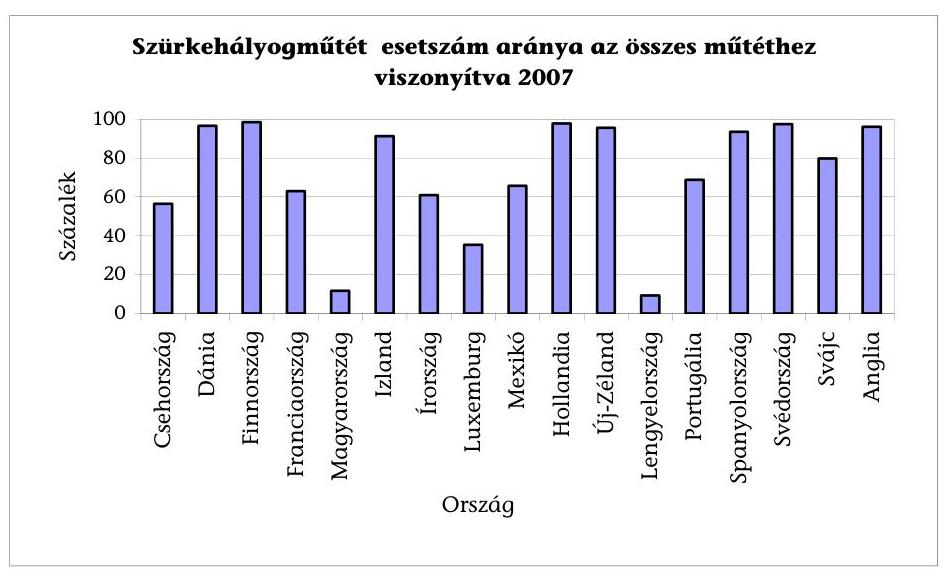

[^0]
[^0]:    ${ }^{24}$ Az önköltségi adatokban az amortizációs költséget egy szolgáltató (Bp. XIII. ker. Egészségügyi Szolgáltató) vette figyelembe, így adatai az egy esetre jutó finanszírozást jóval meghaladják, hiszen maga a finanszírozás ezt a költségelemet nem veszi figyelembe.

---

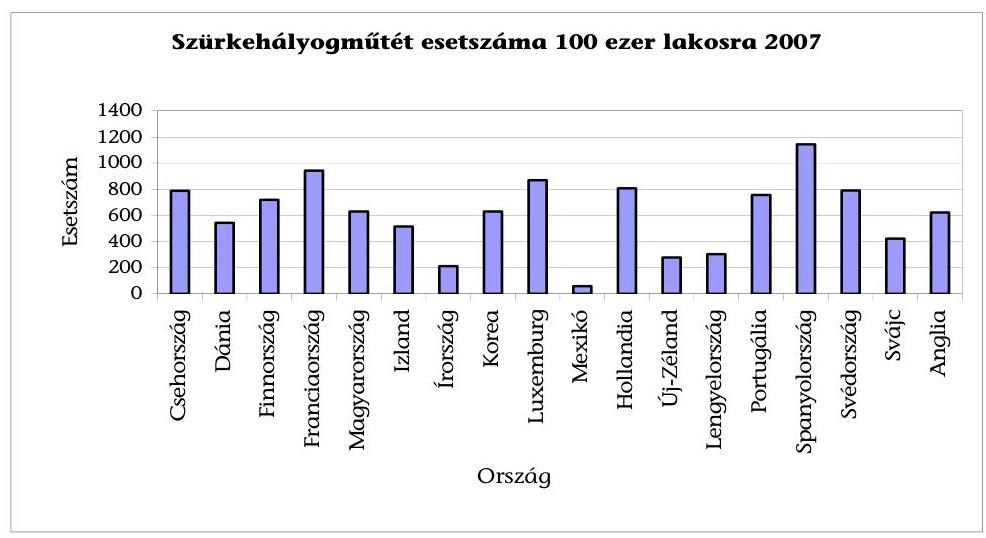

Forrás: OECD Health Data 2009. június
A pályázaton kapacitást nyert szolgáltatóknál 2008-ban ${ }^{25}$ legnagyobb számban (10,2 ezret) szürkehályog műtétet végeztek. Ez a pályázatosok összes egynapos 43,2 ezer beavatkozásának 23,5\%-a (bővebben: 16/c tábla). Más megközelítésből: az összes 59,0 ezer szürkehályog műtétből 16,5 ezret ( $28 \%$-át) egynaposként végezték, melynek $62 \%$-át a pályázaton kapacitást nyert szolgáltatók hajtották végre.

Az E. Alapból a kifizetés 1173445 E Ft volt, az egynapos ellátásokra teljesített finanszírozás közel 40\%-a. A 0680-as jelű HBCS szorzó 0,81571, ami 2007-2008-ban 119090 Ft-nak, 2009. szeptemberig 122357 Ft-nak felelt meg. Az önköltségre vonatkozó ÁSZ adatkérést a 47 intézetből - a szürkehályog műtétre vonatkozóan - 11 szolgáltató teljesítette. Számításaik szerint az önköltség 62124 Ft és 156152 Ft közötti. Egy szolgáltató kivételével a beavatkozás nyereséges számukra. A szemészeti szürkehályog beavatkozások 12,5\%-át a Szent Rókus Kórház, a 10,4\%-át a budaörsi Europ-Med Kft. teljesítette. A 10 legtöbb beavatkozást végző szolgáltató esetszáma 330 és 590 közötti. Jellemző a beavatkozás népszerűségére, hogy a 47 egynapos ellátásra szerződött szolgáltató közül 32-nél van ilyen típusú ellátás.

A pályázatos szolgáltatóknál az egynapos beavatkozások közül a második leggyakoribb beavatkozás a 2008-as finanszírozási évben az interrupció (terhesség megszakítás) volt. Összesen 5897 esetet láttak el, ami a pályázaton nyert szolgáltatók összes egynapos esetszámának 13,6\%-a, ennek kifizetésére az OEP 165,4 M Ft-ot utalt át. 2008-ban egy beavatkozásért 28920 Ft , míg 2009-ben 29710 Ft járt. A válaszadók közül mindössze négy szolgáltatónak volt a beavatkozás önköltségére vonatkozó számítása. A megjelölt összegek 10759 és 60560 Ft között szórnak. A legmagasabb esetszámot a Szent Rókus Kórház 560 esettel, a legalacsonyabbat az ajkai kórház 155 esettel érte el. A nyertes intézmények közül 17 helyen múködik ilyen típusú ellátás. (Az éves összes terhesség megszakítás 41,6 ezer volt, ebből egynaposként 27,6 ezret láttak el, többnyire kórházak.)

[^0]
[^0]:    ${ }^{25}$ finanszírozási év

---

Az abrasio (küret) 4588-as esetszámával harmadik a listán, az erre jutó kifizetés 115 627,5 E Ft volt 2008-ban és 39 egynapos ellátásra szerződött szolgáltatónál végzik. A legtöbb esetet a Nyírő Gyula Kórház jelentette, 312 esetet, ez 6,8\%-a az összes esetnek. 200-as esetszám felett 8, míg 100-as esetszám felett 11 szolgáltató jelentett teljesítményt. A beavatkozást 2008-2009. években 25910 Ft-tal, illetve 26617 Ft-tal ismerte el a finanszírozó. Az önköltségüket feltüntető 7 intézmény itt is szélsőséges adatot jelentett 2402 Ft és 68320 Ft között. A Nyírő Gyula Kórház és a vecsési rendelő adata közelíti a finanszírozási értéket, az Ars Medica Klinika és az ajkai Magyar Imre Kórház a súlyszám érték 50\%-át jelölte meg költségként. (Az éves összes küret száma 32,5 ezer volt, melyből 21,4 ezret egynapos ellátásban végeztek, ebből 16,8 ezret nem pályázatos kórházak láttak el.)

Az artroszkópiai (ízületi tükrözés) beavatkozások a 4. helyen állnak az esetszámokban a 2008-as finanszírozási évben 2783 esettel (6,4\%). Finanszírozására az OEP 245 M Ft-ot fordított. A beavatkozás önköltségét három szolgáltató jelezte vissza. A XIII. kerületi rendelőintézet $67520 \mathrm{Ft} / 2008$, illetve $75545 \mathrm{Ft} / 2009$, míg a vecsési rendelő 86120 Ft és 87230 Ft , a kisteleki kórház 80216 Ft ráfordítást számított, ugyanebben az időszakban. Ezt az ellátást a finanszírozó $91730 \mathrm{Ft} / 2008$, illetve 94246 Ft kifizetésével finanszírozza. Az ortopédiai szakmában a pályázott esetszám 12312 volt, ami más beavatkozásokat is magába foglal az artroszkópia mellett. A pályázott szolgáltatóknál 25 helyen múködik egynapos artroszkópiás sebészet. (Az éves összes ízületi tükrözés száma 8,2 ezer volt, melyből 3,0 ezret egynapos ellátásban végeztek, ebből összesen 250-et nem pályázatos kórházak láttak el.)

A szülészeti beavatkozások a 6450-es HBCS női nemi szervek (vagina, cervix, vulva) mútétei az 5 . helyen állnak esetszám szerint, 2355 esettel. Ez 554,3 súlyszám alapján 78889 E Ft kifizetést jelentett az OEP-nek. Ezt a beavatkozást 34570 Ft-tal finanszírozták. Önköltségre vonatkozó adatot mindössze négy szolgáltató jelzett vissza. A finanszírozás összegén belül közülük hárman tudják ellátni az eseteket, egy szolgáltató pedig, annak közel kétszereséért. Ebből a műtéttípusból a legmagasabb éves esetszám 290 volt Várpalotán. 200 és 100 közötti esetszáma 8 szolgáltatónak volt. (Pl. 199 Ajkán, 155 Veresegyházán.) A 47 szolgáltatóból 40 végez ilyen típusú beavatkozást. (Az éves összes 6450-es HBCS beavatkozás száma 10,6 ezer volt, melyből 4,3 ezret egynapos ellátásban végeztek, ebből összesen 1,9 ezret a nem pályázatos kórházak láttak el.)

A visszér mütétet az OECD országokban jellemzően egynapos sebészet keretében végzik. 2007-ben az OECD statisztikai számbevétele szerint hazánkban a beavatkozások 5,2\%-át végezték egy napon belül, míg Svájcban 12,1\%-át, Dániában pedig $92,3 \%$-át. A 100 ezer lakosra vetített 115 visszér műtét tekintetében nemzetközi viszonylatban a középmezőnyben helyezkedtünk el. Ebben a beavatkozásban is előrehaladást eredményezett a 2007. évi pályázat.

A hatodik leggyakoribb beavatkozás a pályázatos szolgáltatóknál a visszérmútét (varix) 2155 esetszámmal. A 2008-as finanszírozási évben 1101,19 súlyszám alapján 152816 E Ft volt a finanszírozása. 39 szolgáltató jelentett ilyen műtétet, de nagy részük igen kevés operációt végzett. 32-en száz alatti műtétszámot teljesítettek. A legtöbb beavatkozást a Semmelweis Egyetem jelentette, 316 ese-

---

tet. A finanszírozás 74650 Ft-tal ismeri el a műtétet. A szolgáltatók közül önköltség adatot 15-en adtak meg (32\%), az adatok 14496 és 97008 Ft közöttiek. (Az éves összes visszér műtétek száma 11,3 ezer volt, melyből 2,7 ezret (23,7\%) egynapos ellátásban végeztek, ebből összesen 519-et a nem pályázatos kórházak láttak el.)
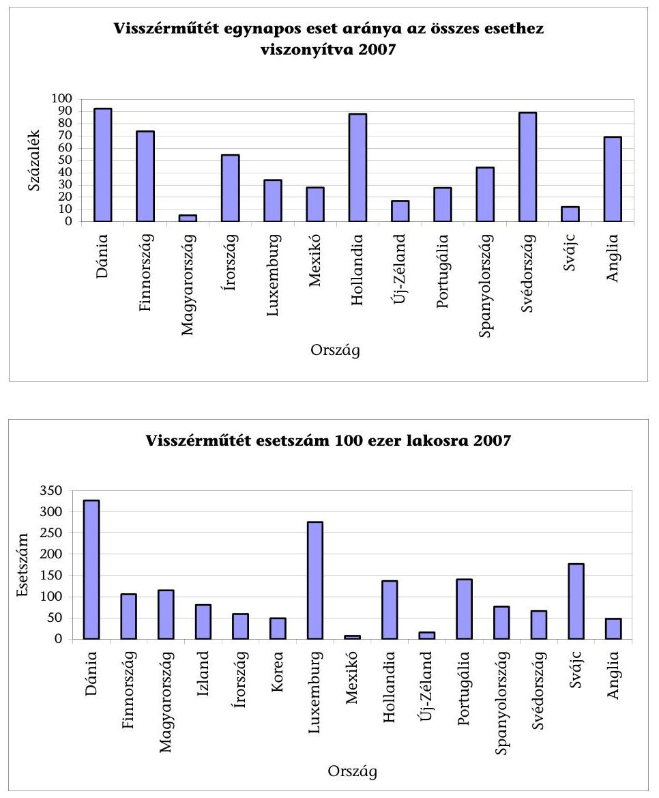

A visszér műtéteket gyakoriságban a végbél, stoma mútétek követik 1659 esetszámmal, amit 681,39 súlyszám alapján 96272 E Ft-tal finanszírozott az OEP, műtétenként 59600 Ft-tal. A beavatkozást 39 szolgáltató jelentette, ebből 34 esetében 100 alatt van az éves műtéti szám. A legtöbb esetet, 372-t az Ars Medica Lézerklinika Kft. teljesítette. A műtéti önköltség adatát öt szolgáltató jelezte vissza, ebből négyen a finanszírozási összegen belüli (15-42 E Ft), ketten azt meghaladóan ( $77,4 \mathrm{E}$ Ft) számították ki az önköltséget. (Az éves összes végbél, stoma műtétek száma 6,4 ezer volt, melyből 1,9 ezret (29,5\%) egynapos ellátásban végeztek, ebből összesen 233-et a nem pályázatos kórházak láttak el.)

A lágyéksérv műtétet az OECD országokban szintén tipikus egynapos sebészeti beavatkozás. 2007-ben az OECD statisztikai számbevétele szerint hazánkban a beavatkozások 2,3\%-át végezték egy napon belül, míg Svájcban 9,3\%-át,

---

Svédországban pedig 72,2\%-át. A 100 ezer lakosra vetített 152,8 lágyéksérv műtét tekintetében nemzetközi viszonylatban a középmezőnyben helyezkedtünk el. Ebben a beavatkozásban is előrehaladást eredményezett a 2007. évi pályázat.
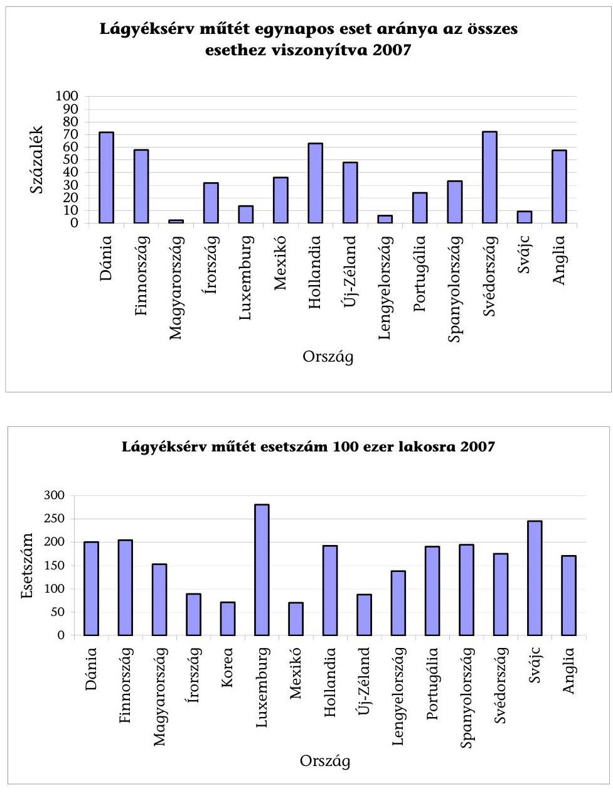

A lágyék, köldök, combsérv mútétek 18 év feletti esetszáma 1478, ez 642,5 súlyszámot jelentett 90930 E Ft kifizetés mellett. Fenti esetszámot 34 szolgáltató jelentette, nagyszámú műtétet 50-109 közöttit 15 szolgáltató végzett. Az OEP ezt a beavatkozást 63510 Ft-tal finanszírozza, ehhez viszonyítva a tíz szolgáltatótól érkezett önköltségre vonatkozó adat 7 esetben akár 20000 Ft-tal is meghaladja ezt az értéket. (Az éves összes sérv műtétek száma 7,9 ezer volt, melyből 1,7 ezret $(21,6 \%)$ egynapos ellátásban végeztek, ebből összesen 237-et a nem pályázatos kórházak láttak el.)

A TOP 9-edik beavatkozást 805 esetszámmal, 245,15 súlyszámmal, 34982 E Ft értékben a belső fémrögzítés eltávolításban látta el 31 szolgáltató. Egy be-

---

avatkozást 44580 Ft-ban finanszírozott az OEP. Nagyobb számú - 50 és 200 közötti - esetszámot öt szolgáltató teljesített. A beavatkozás önköltségét három szolgáltató jelezte vissza 23 490, 32 000, illetve 44533 Ft-ban. 160 és 50 közötti beavatkozást mindössze 4 helyen végeztek. (Az éves összes ilyen típusú beavatkozás száma 9,9 ezer volt, melyből 1,6 ezret ( $16,2 \%$ ) egynapos ellátásban végeztek, ezt közel fele-fele arányban a pályázatos szolgáltatók és a nem pályázatos kórházak láttak el.)

A TOP tizedik egynapos sebészeti beavatkozás a transutrethralis prostatamútét, évi 684 eset számmal. Az OEP kifizetés 822,74 súlyszám alapján 110011 E Ft volt. A TOP tízes lista alapján ennek a beavatkozásnak a legmagasabb a súlyszáma 1,21879, ami 177,94 E Ft-nak felel meg, a 2008-as finanszírozási évben. Ezt a műtét típust 12 szolgáltató jelentette 1 és 175 közötti esetszámmal. A legtöbb esetet Komlón, Pécsen és Kiskunhalason látták el. (Az éves TURP beavatkozás száma 2,3 ezer volt, melyből 1,6 ezret ( $71,8 \%$ ) egynapos ellátásban végeztek, ebből $30 \%$-ot a pályázatos szolgáltatók és $41,9 \%$-ot a nem pályázatos kórházak láttak el.)

Az ÁSZ kérdőívre adott válaszok alapján az engedélyezettnél jóval magasabb műtétszám teszi nyereségessé az ellátási formát. 31 válaszadó saját kapacitását legalább $50 \%$-kal emelné.

A teljesített esetszám, súlyszám és finanszírozás egymáshoz való viszonyát a 4/a-b. sz. tábla mutatja be. Az adatok jelzik, hogy a legmagasabb esetszámokhoz nem kapcsolódik feltétlenül a legtöbb súlyszám, illetve legmagasabb kifizetés. Ez alól kivétel a leggyakrabban végzett 0680-as HBCS kódú szürkehályog műtét.

Az egynapos beavatkozások 2009-es finanszírozási év feldolgozott adatai alapján a leggyakoribb beavatkozás továbbra is a szürkehályog műtét. (5. sz. tábla). Nem módosult az az arány, amit az összes beavatkozásokból a 10 leggyakrabban végzett képviselt továbbra is $75 \%$-ot. Az eddig jelentett műtétszám - kilenc hónap adata alapján - 35 535, ami az előző finanszírozási évhez mért esetszám $82,2 \%$-a.

A válaszadó szolgáltatók 38\%-a az egynapos sebészet költséghatékonyságának elsődleges elemeként a hotelszolgáltatások elmaradásából adódó megtakarítást nevezték meg.

A leggyakoribb 10 beavatkozás alapján a HBCS-k hotelköltség tartalma 2008ban 397,4 M Ft, 2009-ben 345,6 M Ft. A hotelköltség a szolgáltatóknál költséghatékonysági elemként igazolható. (6. sz. tábla)

15 szolgáltató kiemelte még, hogy az ápolás költségei is kisebbek, mint az aktív ellátásban, előbbi módszer szerint feldolgozva a HBCS ide vonatkozó tartalmát, 247,1 M Ft, illetve 216,3 M Ft volt a szolgáltatók finanszírozási bevétele az ápolási költségek fedezetére. (7. sz. tábla)

A költséghatékonyság elemeiként a szolgáltatók még az ügyeleti, az intenzív ápolás, az élelmezés, a gyógyszerköltségek felmerülésének elmaradását sorolták fel.

---

# 2.3. Az egynapos sebészeti ellátásokra vonatkozó minimumfeltételek teljesülése, az orvosok díjazása 

Valamennyi egészségügyi szolgáltató múködésének feltétele, hogy rendelkezzen ÁNTSZ engedéllyel. Az ÁNTSZ engedélyezési eljárásának sajátossága, hogy a 96/2003. (VII. 15.) Korm. rendelet 8. § f)-g) pontja ${ }^{26}$ lehetőséget ad arra, hogy a működési engedélyt a szolgáltató szakmai minimum feltételek meglétére vonatkozó nyilatkozatára, helyszíni bejárás nélkül adja meg a hatóság.

A vecsési szolgáltató már akkor rendelkezett ÁNTSZ múködési engedéllyel az egynapos sebészetre, amikor a vonatkozó épületrész még el sem készült.

Az engedélyezési eljárás módosításának előterjesztése a vizsgálattal egy időben volt tárcaegyeztetésen. A módosítási javaslatok között szerepel, hogy amennyiben az engedélyezési eljárás során az államigazgatási szerv nem folytatott le helyszíni szemlét, azt „az egészségügyi szolgáltatás megkezdésének bejelentésétől számított 60 munkanapon belül köteles elvégezni." Ez garantálhatja, hogy csak a minimum feltételek megléte mellett múködhessenek a szolgáltatók.

A tárgyi feltételek kialakítására a nyertes szolgáltatók az épület, eszköz és informatikai beruházásokat végeztek, adatszolgáltatásuk alapján azok nagyságrendjét és forrásait a 8 . sz. tábla mutatja be.

A 2006-tól teljesített ráfordítások értékét 1,5 Mrd Ft-ban összegezte a vizsgálat. Mind az épület, mind a gép, múszer, mind az informatikai beruházásoknál elsődlegesek voltak a saját forrásból megvalósított fejlesztések, összesen 1,2 Mrd Ft értékben (77,6\%). Az adatban nem szerepel a HT Medical Center korábbi beruházásainak 380 M Ft-os értéke.

Az ÁNTSZ az ESzCsM rendeletben az egynapos sebészeti és a kúraszerűen végezhető ellátások szakmai feltételeiről megfogalmazottakat helyszíni ellenőrzés keretében, a regionális intézetek bevonásával, az EüM felkérése alapján 2007. szeptember 15. és október 10. között ellenőrizte.

A tárgyi feltételek felülvizsgálatán túl hangsúlyt kapott a patológiai háttér megléte mint az egynapos sebészet szükséges feltétele, a személyi feltételek rendelet szerinti betartása, a háttér intézményi szerződések megléte.

Az erről készült összefoglaló jelentést 2007. október 18-án küldték meg az egészségügyi tárcának. A tárgyi feltételek kialakítása 4 szolgáltatónál még folyamatban volt, így a múködést nem kezdték meg a szerződéskötéstől számított három hónapon belül (pl. Kisteleki Egészségügyi Kht., Hatvan Kórház Kft. fül-orr-gégészete, Zirc Városi Erzsébet Kórház, Vecsési Egészségügyi Szolgálat, Dr. Halász Géza Szakorvosi Rendelőintézet).

Az egynapos sebészeti ellátásra ÁNTSZ engedéllyel rendelkező szolgáltatók száma az Országos Tisztifőorvosi Hivatal adatai alapján összesen 236, ebből 94 közszolgáltató és 142 magánszolgáltató intézmény.

[^0]
[^0]:    ${ }^{26}$ az egészségügyi szolgáltatás gyakorlásának általános feltételeiről, valamint a múködési engedélyezési eljárásról

---

Az ESzCsM rendelet szabályozta az ellátás időbeli, műtéti, intézményi kritériumait, személyi és tárgyi feltételeit. A személyi feltételek előírják követelményként, hogy a műtéti eljárásokat valamennyi beavatkozás típusban csak olyan szakorvos végezheti, aki ötéves folyamatos aktív fekvőbeteg intézményi gyakorlattal rendelkezik és az elvégzett műtétek számszerú kimutatásával igazolja szakmai jártasságát. Ez a feltétel a betegbiztonság érdekében szigorúbb, mint a 60/2003. (XI. 20.) ESzCsM rendelet ${ }^{27}$ által az aktív fekvőbeteg ellátásban múködő orvosok gyakorlottságra előírt kritériumok (pl. speciális jártasság, szakorvosi végzettség is elegendő - egyéb feltétel kikötése nélkül az aktív ellátásban).

A személyi feltételekre vonatkozó ÁSZ adatkérésnek a 47 szolgáltatóból 4 intézmény kivételével tettek eleget. A feldolgozott adatokat a 9. sz. tábla mutatja be.

Általános gyakorlat, hogy mind az orvosi, mind az ápoló személyzetet közreműködői szerződésekkel biztosítják a szolgáltatók. A 43 válaszadó összesen 906 orvost vesz igénybe a műtétek biztosításához. Ebből 23\%, nőgyógyászati, 26,3\% sebészeti, $5,4 \%$ urológiai, $17 \%$ szemészeti, $8-8 \%$ traumatológiai és ortopédiai, 5,5\% fül-orr-gégészeti és 6,8\% egyéb orvosi feladatokat lát el. Az orvosok díjazásában vegyesen alkalmazzák a fix, illetve OEP bevétel \%-ában történő díjazást.

Kizárólag fix díjazást két intézmény a békéscsabai Réthy Pál Kórház és a Premed Pharma Kft. alkalmaz. A kizárólag OEP bevétel százalékában megállapított díjazást 12 szolgáltató alkalmazza. Ezek mértéke nagyon változó. Nőgyógyászati szakmában 18-35\% közötti, sebészetben 20-40\% közötti, urológiában, két szolgáltatónál is eléri a $60 \%$-ot, szemészetben egy szolgáltatónál $75 \%$-os a díjazás. Traumatológiai, fül-orr-gégészeti, ortopédiai, és az egyéb beavatkozásoknál az átlagos mérték 20-35\% közötti.

Az orvosi tevékenység HBCS-be foglalt fedezete az 50 költségelemből álló HBCSben nem különül el egy tételbe, hanem az egyes elemekbe épül be (pl. műtét, aneszteziológia, képalkotó diagnosztika stb.).

Elkülönülten az általános osztályos orvosi tevékenység költsége jelenik meg, ami az orvosi tevékenységnek csak egy része. Ezt a költség tartalmat a 10. sz. tábla foglalja össze a leggyakoribb beavatkozások alapulvételével. Az adatok mutatják, hogy ez a HBCS érték rendkívül alacsony arányú a teljes HBCS költség összetevőkben pl. szürkehályog műtétnél, $7 \%$, interruptionál $8,2 \%$, abrasionál $6 \%$, artroszkópiánál $10 \%$, varix műtéteknél $8 \%$ stb.
2009. szeptember 1-jétől egyes HBCS-k súlyszámának csökkentése (11. sz. tábla) miatt kevesebb lett az egy esetre jutó finanszírozás.

[^0]
[^0]:    ${ }^{27}$ az egészségügyi szolgáltatások nyújtásához szükséges szakmai minimum feltételekről

---

# 2.4. A nyertes pályázók kapacitásainak közremúködővel történő ellátása 

A pályázaton nyertes szolgáltatók közül a Nyírő Gyula Kórház, a Kiskőrösi Városi Szakorvosi Rendelőintézet, a Budavári Önkormányzat Egészségügyi Szolgálata, a Vecsési Egészségügyi Szolgálat és a Debreceni Városi Egészségügyi Szolgálat az egynapos sebészeti ellátást közremúködői szerződés alapján magán szolgáltatóval, illetve másik önkormányzati intézménnyel láttatják el. Fenti szolgáltatók mindegyike nyilatkozott arról, hogy a kiírásban szereplő feltételekkel rendelkezik és intézménye alkalmas a feladatok ellátására.

## A megpályázott és saját feltételeik alapján elnyert többlet kapacitásokat más szolgáltató javára hasznosítják a fenti szolgáltatók.

A Budavári Önkormányzat Egészségügyi Szolgálata 278 esetszámot, 239,5 súlyszámot 34 967,78 E Ft-ot a BLESZ, illetve a Premed Pharma Kft. közremúködésével teljesített, ez a pályázott és elnyert kapacitást tekintve is alacsony kihasználtság a 2008-as finanszírozási évben. A szolgáltató szemészetben mindössze 29 esetszámra pályázott, a sebészetben 357, szülészetben 264, ortopédiában 348, urológiában 134 eset ellátását tervezték. A teljesítményt elsősorban a szemészeti szakmában jelenti 262 esettel (az esetszám 94\%-a), amit a közremúködő teljesített.

A közel 35 M Ft bevételből a Premed Pharma mint közreműködő a szemészeti beavatkozások finanszírozásából 85\%-ot, a BLESZ a többi szakmában végzett beavatkozásokért az OEP bevétel 80\%-át kapja, amiből szürkehályog műtétenként 15000 Ft-ot visszatart a megbízó Budavári Önkormányzat Egészségügyi Szolgálata, amennyiben operáló orvost a közreműködő nem biztosít.

A Nyírő Gyula Kórházban a 2006. évi CXXXII. törvény alapján megszűnt a sebészeti és szülészeti kapacitás. 1175 sebészeti és 2700 szülészeti esetszámra pályáztak, a bizottság 3000 esetet javasolt, a miniszteri döntés 1029 esethez 346 súlyszámot hagyott jóvá.

A feladatellátásra a Kórház közreműködői szerződést kötött a Róbert Károly Körüti Egészségügyi Szolgáltató Kft-vel. A vállalkozás a Kórház korábban szülé-szeti-nőgyógyászati feladatok ellátására használt épületében múködik. Az egynapos sebészeti ellátás bevételét 90-10\%-os arányban osztja meg a közreműködő és a kórház. A 2008-as, 2009-es finanszírozási évben a Kft. 839-926 esetet látott el 229-269 súlyszám mellett, amit 31,7 M Ft-tal, illetve 38,6 M Ft-tal finanszírozott az OEP.

A Kiskőrös Város Önkormányzatának Szakorvosi Rendelőintézete saját meglévő feltételei alapján került a nyertes pályázók közé. A feladatot azonban nem a rendelőintézet látja el. Az egynapos sebészeti ellátás végzésére a Kiskunhalasi Semmelweis Kórházzal kötött közreműködői szerződést 6 szakmára. A pályázott esetszám 1850 volt, amit 1000 esetszámra módosított a miniszteri döntés 336 súlyszám mellett. A szerződés 3 hónapig volt érvényben, a bevétel megosztása 90-10\%-os arányú lett volna, de ez alatt nem volt teljesítmény, amikor is a Kórház és a Szakorvosi Rendelő összevonásáról a tulajdonos önkormányzat

---

döntött. A 2008-2009 finanszírozási években 1050-972 esetet láttak el 570-513 súlyszámmal és 82 M Ft , illetve 68 M Ft finanszírozással.

A Vecsési Egészségügyi szolgálat 7 szakmában 2100 esetszámra pályázott. A befogadás 1000 eset és 336 súlyszámra történt. A pályázat benyújtásakor (2007. május) az intézet nem rendelkezett a feltételekkel, hiszen az épületrész építészeti-technikai kialakítására csak 2007 augusztusában kötött ellátási szerződést az Allegro Kereskedelmi, Kivitelező és Szolgáltató Kft-vel. Az ingatlanrészre ingyenes használati jogot biztosítottak a Kft. részére. Ebben a szerződésben meghatározásra kerültek az egynapos sebészeti feladatok ellátásával kapcsolatos követelmények, melynek tényleges ellátására a kft. projektcéget hozott létre. A szerződés futamideje 15 évre szól, 2022-ig. A projektcég, mint alvállalkozó 2008. február 18-án kötött megállapodást a Vecsési Egészségügyi Szolgálattal az egynapos ellátásra. Az OEP-től kapott finanszírozásból havi 120 E Ft+áfa, illetve az önálló mérővel fogadott közüzemi díjak kerülnek levonásra. A megállapodás szerint az alvállalkozó projektcég a szabad kapacitásai terhére térítéses beavatkozások végzésére jogosult. A tevékenység végzéséhez szükséges eszközöket az alvállalkozó biztosította.

Az intézményvezető 2007 májusában arról nyilatkozott, hogy „Az infrastruktúra a korszerüen felújitott szakrendelő 3. szintjén a minimum feltételeket maradéktalanul kielégíti", holott a kialakítás sem történt meg ekkor.

A 2008-2009. finanszírozási évek teljesítménye, 508-517 esetszámot, 260-312 súlyszámot ért el, ez 38 M Ft , illetve 39 M Ft bevételt eredményezett.

# 2.5. Az egynapos sebészeti beavatkozásokat megelőző és követő ellátások és finanszírozásuk 

A beavatkozásokat kötelezően megelőző, szabálykönyv szerinti sebészeti és aneszteziológiai vizsgálatokat az OEP a járóbetegellátás keretében (az egynapos beavatkozás díjazásán felül) finanszírozza. Ezt az orvosi vizsgálatot 750 ponttal ismeri el a finanszírozó, ami 2009-ben 450-600 Ft közötti OEP finanszírozást jelentett.

Az előzetes vizsgálatok alapján dől el, hogy a beteg alkalmas-e egynapos sebészeti beavatkozásra, illetve megfelel-e az ESzCsM rendelet betegekre vonatkozó kritériumainak. A mútéti javaslat ebben a folyamatban készül el. Az előzetes aneszteziológiai kivizsgálás költségeit a járóbeteg ellátásban finanszírozza a biztosító.

Egynapos sebészetet olyan szolgáltatók is végeznek, amelyeknél az előzetes vizsgálatok nem vehetők igénybe közfinanszírozás alapján. Ezen szolgáltatók is jogosultak OEP finanszírozott vizsgálatokra beutalni a pácienst, így biztosítva a térítés mentességet számukra a preoperatív szakaszban.

Az egynapos beavatkozást követő házi szakápolás elrendelhetőségét a 43/1999. (III. 3.) Korm. rendelet 2008. október 1-jétől nem teszi lehetővé, míg korábban ez a lehetőség adott volt. A módosítás megtakarítást eredményez a közfinanszírozás számára.

---

A vonatkozó kormányrendelet előterjesztése szerint: „Az egynapos beavatkozás abban az esetben végezhető el, ha beteg olyan egészségi állapotban van, hogy nem szorul kórházi ellátásra, ebből adódóan otthoni szakápolásra sem. A kötözés és a kontroll az egynapos beavatkozást végző szolgáltató feladata és nem az otthoni szakápolásé."

# 2.6. Az egynapos sebészeti ellátást nyújtó szolgáltatók által megállapított térítési díjak fajtái, mértéke 

Az egynapos sebészeti ellátások finanszírozása fekvőbeteg HBCS besorolás alapján történik, ez a tartalom a műtéti beavatkozásokhoz megkívánt ellátást fedezi, minden kapcsolódó szükséges ápolási- és hotelköltséget is beleértve.

A mútéti beavatkozás ingyenes. A pályázaton nyertes szolgáltatók (95,3\%) döntően térítési dí nélkül biztosítják az egynapos beavatkozások hotel és egyéb ellátásait.

Közülük 9-en tudnak egyágyas elhelyezést biztosítani, 8 szolgáltatónál két- és háromágyas lehetőség is adott, 20-an nem rendelkeznek egyágyas kórteremmel. Kizárólag három ágyas elhelyezést 4 szolgáltató biztosít térítésmentesen. 27 szolgáltatónál a fürdőszoba a szobában ( $62,8 \%$ ), 15 helyen csak a folyosón ( $34,8 \%$ ) vehető igénybe, 16 helyen televízió ( $37 \%$ ), 17 helyen klíma ( $39,5 \%$ ), 6 helyen internet hozzáférés ( $14 \%$ ) is biztosított (12. sz. tábla).

A szükséges ellátásokért néhány helyen térítési díjat állapítottak meg.
A megkérdezettek 17\%-a ${ }^{28}$ térítési díjat kér az elhelyezésért (13. sz. tábla) annak ellenére, hogy az OEP finanszírozás tartalmazza a hotelköltségek fedezetét. Az egyágyas elhelyezésért 5 E Ft és 40 E Ft, a kétágyasért 1 E Ft és 40 E Ft közötti térítést fizetnek a betegek. Egy szolgáltató ${ }^{29}$ a háromágyas elhelyezést is térítteti 3 E Ft-os díjjal.

Egyágyas szobáért a szolgáltatók 12,8\%-a kér a betegtől térítési díjat (debreceni Egészségügyi Járóbeteg Központ Nonprofit Kft., 15000 Ft , Istenhegyi Klinika 10000 és 40000 Ft a műtét utáni tartózkodási idő függvényében, Kelen Kórház Kft. 24000 és 38400 Ft időtartamtól függően, Városi Kórház-Rendelőintézet, Keszthely 5000 Ft, Városi Kórház-Rendelőintézet, Mohács 5000 Ft, Nyírő Gyula Kórház 16000 Ft ).

Kétágyas szobáért a szolgáltatók 12,8\%-a számol fel díjat (Egészségügyi Járóbeteg Központ Nonprofit Kft., Debrecen 12000 Ft -ot, Istenhegyi Klinika 10000 és 40000 Ft -ot a műtét utáni tartózkodási idő függvényében, Városi KórházRendelőintézet, Keszthely 4000 Ft-ot, Napfény 2001 Nonprofit Kft. 1000 Ft-ot, Nyírő Gyula Kórház 8000 Ft-ot, Misszió Egészségügyi Központ 12500 Ft-ot kér a hotelszolgálatért).

[^0]
[^0]:    ${ }^{28}$ Debrecen VESZ Eü. Szolg. Kht. (Egészségügyi Járóbeteg Központ Nonprofit Kft., Debrecen), Istenhegyi Klinika, Kelen Kórház Kft., Városi Kórház-Rendelőintézet, Keszthely, Városi Kórház-Rendelőintézet, Mohács, Napfény 2001 Nonprofit Kft., Nyírő Gyula Kórház, Misszió Egészségügyi Központ
    ${ }^{29}$ Városi Kórház Rendelőintézet, Keszthely

---

Szikszón a II. Rákóczi Ferenc Kórházban 4000 Ft-ot fizet a beteg, ha elhelyezést kér.

A HBCS-be épített hotelköltségre vonatkozó fedezetet a TOP 10 beavatkozásnál a 6. sz. tábla mutatja.

Egy szürkehályogműtétért 16,8 E Ft-ot, egy végbél, stomaműtétért 16,1 E Ft-ot, egy visszérműtétért 15,7 E Ft-ot, lágyék-, köldök-, combsérv- műtétek esetében 12,8 E Ft-ot térít meg az OEP hotelköltségként a szolgáltatónak. A prostata műtéteknél 38 E Ft a hotelköltség fedezete a HBCS-ben, az artroszkópia hotelköltség fedezetére pedig 20,1 E Ft-ot fizet a szolgáltatónak a finanszírozó. Ezeknél a műtét típusoknál a mohácsi, a keszthelyi Városi Kórház Rendelőintézet, a Kelen Kórház Kft., a Napfény 2001. Nonprofit Kft. amellett számított fel hotel díjat, hogy az OEP-től is megkapták a fedezetet.

A hotelköltségre vonatkozó tartalom kismértékben emelkedett a súlyszám forint értékének 2009. április 1-jétől való emelésekor, a 2009. szeptember 1-jétől érvényes visszanormálás miatt azonban néhány beavatkozásnál csökkent.

A törvény ${ }^{30}$ alapján az egészségügyi szolgáltató a biztosított kérésére eltérhet a finanszírozási eljárási rendben, illetve a vizsgálati és terápiás eljárási rendben foglaltaktól. A biztosított részleges térítés mellett jogosult a szolgáltatás többletköltséget okozó, eltérő tartalommal történő igénybevételére. A felmerülő igazolt többlet költséget a szolgáltató jogosult a biztosítottal megtéríttetni.

A XIII. kerületi Egészségügyi Szolgálat Nonprofit Kft-nél a szürkehályog beavatkozásoknál egyes beültetett lencse típusoknál fizet a beteg különbözeti térítést (5000, illetve 135000 Ft -ot). Az OEP által térített implantátum költség szürkehályog műtétnél 2008-ban 25670 Ft, 2009-ben 26373 Ft volt.

A válaszadók 8,5\%-a térítési díjhoz köti az előzetes konzultációt. (Pl. a Budavári Önkormányzat Egészségügyi Szolgálat 10000 Ft-ot kér konzultációnként, a Napfény 2001 Nonprofit Kft. műtét előtt ( 5000 Ft ) és után ( 2500 Ft ) is, a Premed Pharma Kft. 10000 Ft konzultációs díjat fizettet a beteggel.)

A válaszadók közül az Ars Medica Lézerklinika Kft. 30-40 E Ft térítési díjat kér az altatásért (és 10 E Ft-ot konzultációért) a szolgáltatást igénybevevőtől. Az általuk végzett leggyakoribb beavatkozások a varix lekötés-eltávolítás, az abrasio altatásban, a lágyék-, köldök-, comb sérvműtétek 18 év felett. Ezek HBCS forint értéke aneszteziológiára $7113 \mathrm{Ft}, 5960 \mathrm{Ft}, 5670 \mathrm{Ft}$-ot tartalmazott a 2008-as finanszírozási évben. A 14. sz. tábla a TOP 10 leggyakoribb egynapos sebészeti eset finanszírozás szerinti műtéti aneszteziológiai költségfedezetét mutatja.

Nincsenek meghatározva a betegek elhelyezésére vonatkozó tárgyi feltételek követelményei, így a térítési díj ellenében nyújtott többletszolgáltatás nem mérhető, a szolgáltatók egyedi megítélésétől függ. A térítési díj alkalmazása nem indokolt, amennyiben a HBCS fedezetet nyújt a beavatkozások egyes költségelemeire.

[^0]
[^0]:    ${ }^{30}$ a kötelező egészségbiztosítás ellátásairól szóló 1997. évi LXXXIII. törvény 19. § (1) bekezdés

---

# 2.7. Az OEP Szabálykönyv szerinti indikátorok feldolgozása 

A szerződött szolgáltatókra vonatkozó OEP Szabálykönyv speciális feltételeket határoz meg a múködés biztonsági feltételek teljesülésének folyamatos figyelemmel kísérése érdekében. A folyamatokat a szabálykönyv szerinti indikátorok alapján mérik a szolgáltatók, ennek alapján éves minőségellenőrzési jelentést állítanak össze az OEP részére, amit a tárgyévet követő év március 1-jéig küldenek meg.

Ennek a beszámoltatásnak nincs meghatározott formátuma, így tartalma szolgáltatónként változó. Az OEP a szövődmények jelentését nem elemezte annak érdekében, hogy feltárja az egynapos sebészetben előfordult szövődmények számát. A jelen ellenőrzés valamennyi pályázaton nyertes szolgáltató ide vonatkozó adatát bekérte.

A szövődmények összes beavatkozáshoz viszonyított arányát a 15. sz. tábla tartalmazza. Az egynapos mútéti beavatkozások csekély kockázatúak. Egynapos beavatkozás következtében halálozás nem fordult elő. Kórházi fertőzés mindössze hat db volt. Az általános szövődményes esetek száma 60, illetve 34 esetben fordult elő annál a 47 szolgáltatónál, akik az OEP szabálykönyv szerint adatszolgáltatásra kötelezettek. A tábla azt is szemlélteti, hogy hány olyan szolgáltató van, akinél a szövődmények egyik típusa sem fordul elő.

Az ÁSZ adatkérésére a 47 intézmény közül 46 válaszolt, a feldolgozás ennek alapján készült.

Az OEP egynapos ellátásokra vonatkozó országos adataiból az egy héten belül szövődménnyel visszakerültek aránya 1,17\%.

### 2.8. A területi hozzáférés alakulása

Az ezer lakosra jutó - kórházakban és pályázatos szolgáltatóknál - ellátott esetek száma alapján a legtöbb egynapos beavatkozás Budapesten $(16,62)$, Zala megyében $(16,43)$, és Tolna megyében $(16,41)$ történt 2008-ban. A legkevesebb beavatkozás ezer lakosra vetítve Békés megyében $(4,02)$, Somogy megyében $(6,43)$ Jász-Nagykun-Szolnok megyében $(7,33)$ és Győr-Moson-Sopron megyében $(7,61)$ történt. Ezt az alábbi táblázat mutatja be:

---

| Megye | 2008-ban   végzett összes   egynapos   esetszám | Eset-   szám   ezer   lakosra | Pályázaton   befogadott   szolgáltatók   egynapos   esetszámai | Pályáza-   tos   esetszám   ezer   lakosra | Egynapos   beavatkozás-   szám (pályáza-   tos szolgálta-   tók/összes) |
| :-- | :--: | :--: | :--: | :--: | :--: |
| Baranya | 5831 | 14,77 | 2762 | 6,99 | $47 \%$ |
| Bács-Kiskun | 5167 | 9,74 | 1297 | 2,45 | $25 \%$ |
| Békés | 1492 | 4,02 | 1357 | 3,65 | $91 \%$ |
| BAZ | 6966 | 9,93 | 1191 | 1,70 | $17 \%$ |
| Csongrád | 6669 | 15,74 | 2820 | 6,65 | $42 \%$ |
| Fejér | 4023 | 9,39 | 1483 | 3,46 | $37 \%$ |
| Győr-   Moson-   Sopron | 3401 | 7,61 | 732 | 1,64 | $22 \%$ |
| Hajdú-Bihar | 5768 | 10,64 | 865 | 1,60 | $15 \%$ |
| Heves | 4185 | 13,31 | 603 | 1,92 | $14 \%$ |
| Jász-   Nagykun-   Szolnok | 2896 | 7,33 | - | - | $0 \%$ |
| Komárom | 3504 | 11,14 | 2003 | 6,37 | $57 \%$ |
| Nógrád | 2375 | 11,44 | 1501 | 7,23 | $63 \%$ |
| Pest | 13620 | 11,23 | 9067 | 7,47 | $67 \%$ |
| Somogy | 2072 | 6,43 | - | - | $0 \%$ |
| Szabolcs-   Szatmár-   Bereg | 4542 | 8,03 | - | - | $0 \%$ |
| Tolna | 3869 | 16,41 | 2105 | 8,93 | $54 \%$ |
| Vas | 2560 | 9,81 | 433 | 1,66 | $17 \%$ |
| Veszprém | 3411 | 9,46 | 3028 | 8,40 | $89 \%$ |
| Zala | 4769 | 16,43 | 1037 | 3,57 | $22 \%$ |
| Budapest | 28460 | 16,62 | 10932 | 6,38 | $38 \%$ |
| Összesen | 115580 | 11,52 | 43216 | 4,31 | 37\% |

A pályázat hatására 4,31 esettel nőt az ezer lakosra jutó esetszám. Az egyes megyékben az ezerlakosra jutó esetszám 8,9 és 1,6 közötti, így a területi kiegyenlítődés, egyenlő hozzáférés cél nem valósult meg.

---

# 2.9. Az NFT keretében meghirdetett TIOP és ROP pályázatok célja, hatása az egynapos sebészeti ellátások fejlesztésére 

2006. 2007-ben mind az egészségügyi ellátórendszer átalakításával összefüggő intézkedések, mind az uniós források felhasználására készülő Új Magyarország Fejlesztési Terv foglalkozott az egynapos ellátások szerepével.

Az Új Magyarország Fejlesztési Terv Társadalmi Infrastruktúra Operatív Program keretében a járóbeteg szakellátási és kórházi ellátást kiváltó ellátási formák c. fejezete a járóbeteg ellátó központok és az egynapos sebészet helyzetével foglalkozott. A TIOP „aktív kórházi ellátásokat kiváltó járóbeteg-szolgáltatások fejlesztése" 2.1.3. pályázati cél tartalmazta az egynapos sebészeti ellátás fejlesztését, amelyhez uniós forrást is rendeltek.

A Társadalmi Infrastruktúra Operatív Program keretében mintegy 36,5 Mrd Ft, a Regionális Operatív Programokban 2010-ig mintegy 27 Mrd Ft fejlesztési forrás támogatja a járóbeteg szakellátás fejlesztését. Célja a szolgáltatásokhoz való hozzáférés területi kiegyenlítése, amelyet részben a meglevő kapacitások módosításával, részben a járóbeteg szakellátás vonatkozásában a fehér foltnak számító területeken új kapacitások létrehozásával egyenlítenek ki azokban a kistérségekben, ahol az ott lakók száma meghaladja a 15000 főt. Ehhez tartozik a krónikussá átalakított intézmények ellátási területén megerősített, emelt szintű járóbeteg szakellátás létrehozása is, amely részben kiváltja a megszűnt aktív fekvőbeteg ellátást. A Regionális Operatív Programon (ROP) belüli fejlesztések a jelenleg is múködő önálló vagy funkcionálisan önálló szakrendelők fejlesztésére irányulnak.
2007. október 31-én meghirdették a TIOP 2.1.3. keretében az emeltszintű járóbeteg-szakellátási fejlesztéseket tartalmazó „Aktív kórházi ellátásokat kiváltó járóbeteg szolgáltatások fejlesztése" c. pályázatot. Az ebben rendelkezésre álló uniós forrás 25806452 euró, amelynek a kifizetése és a program megvalósítása 2010-ig tart. A támogatás mértéke 90-95\%-ot tesz ki a projektekben, a támogatás minimum és maximum értéke 0,3 és $0,8 \mathrm{Mrd}$ Ft. A pályázat kötelező eleme az egynapos ellátás nyújtása (sebészet, diagnosztika, terápia). Pályázhattak azok az intézmények, ahol többszakmás aktív szakellátás múködött és legkésőbb 2007. április 1-jétől megszűnt, vagy az egészségügyi szolgáltatónak OEP által finanszírozott csak egy szakmára kiterjedő, maximum 20 ágyas aktív kapacitása volt, vagy amennyiben többszakmás aktív fekvőbeteg szakellátása volt és vállalta, hogy legkésőbb a beruházás befejezéséig 20 ágyra csökkenti aktív kapacitását. Az emeltszintű járóbeteg központ legalább 25000 lakos ellátását vállalta, valamint a településen nem múködött más közfinanszírozott vagy területi kórház.

A TIOP 2.1.3. pályázat nyertesei (Siklósi Kórház Nonprofit Kft., Bonyhád Városi Kórház, Rendelőintézet Mór Városi Kórház-Rendelőintézet, Sárvár Városi Kórház, Kapuvár Lumniczer S. Kórház-Rendelőintézet, Pásztó Margit Kórház, Szikszó II. Rákóczi Ferenc Kórház, Zirc Városi Erzsébet Kórház) összesen 6,129 Mrd Ft értékben nyertek pályázati forrást járóbeteg szakrendelő fejlesztésre. A szakrendelők egynapos sebészeti ellátást nyújtó egységeket alakítanak ki.

---

A pályázatba foglalt fejlesztésekkel összefüggő többletkapacitások előzetes befogadásának rendjét az egészségügyi ellátórendszer fejlesztéséről szóló 2006. évi CXXXII. tv. (Eftv.), valamint a törvény végrehajtási rendelete szabályozta. Az előzetes befogadási kérelmet a Regionális Egészségügyi Tanácsokhoz kellett benyújtani. 9 emelt szintű járóbeteg-szakellátás fejlesztésre pályázó nyújtott be többlet-kapacitásra vonatkozó kérelmet. A RET-ek rangsort állapítottak meg és pénzügyi hatásvizsgálatot készítettek, amelyet az egészségügyi miniszternek megküldtek. A miniszter a befogadásra vonatkozó javaslatát a RET által készített pénzügyi hatásvizsgálattal együtt megküldte a pénzügyminiszternek.

Az előterjesztés alapján elfogadták az 1019/2008. (III. 26.) Kormányhatározatot, amely a pályázattal összefüggésben előzetesen befogadott többletkapacitásokat tartalmazta. A kormányhatározat előterjesztése tartalmazta, hogy az aktív fekvőbeteg ellátás kapacitásai és az ezt követő TVK mennyiség országos csökkentése következtében az aktív ellátásból kiszoruló, de szakellátást igénylő betegek gyógyítása a létrehozandó, illetve fejlesztendő járóbetegszakellátásokban történhet meg az adott kistérségekben.

A TIOP 2.1.3. pályázati célban megvalósuló beruházásokhoz egynapos sebészet területén összesen 1300 súlyszámnyi többletkapacitás került előzetesen befogadásra.

| Szolgáltató | 2007- évi   pályázaton   nyert   súlyszám | 2007-ben   teljesített   súlyszám ${ }^{31}$ | 2008-ban   teljesített   súlyszám | TIOP pályázaton nyertes   szolgáltatók, akik egyna-   pos sebészeti többletka-   pacitást kaptak   (súlyszám) |
| :-- | :--: | :--: | :--: | :--: |
| Siklós | 336 | 4,0 | 176,5 |  |
| Bonyhád | 369,6 | 48,5 | 363,5 | 50 |
| Pásztó | 369 | 29,6 | 274,1 |  |
| Szikszó | 571 | 8,0 | 447,9 | 278 |
| Zirc ${ }^{32}$ | 336 | 0 | 14,7 |  |
| Sárvár | 470 | 0 | 138,9 |  |
| Kapuvár | 369 | 32,3 | 378,1 |  |
| Mór | - | 87,9 | 68,4 | 972 |
| Összesen: | $\mathbf{2 8 2 0 , 6}$ | $\mathbf{2 1 0 , 3}$ | $\mathbf{1 8 6 2 , 1}$ | $\mathbf{1 3 0 0}$ |

A ROP pályázatokon volt lehetőség kistérségi emelt szintű járóbeteg szakellátás fejlesztésére. A pályázaton opcionális elem volt az egynapos sebészet kialakítása. A nyertes pályázók, akik vállalták az egynapos ellátás kialakítását, korábban nem végeztek ilyen jellegű beavatkozásokat. A nyertesek összesen

[^0]
[^0]:    ${ }^{31}$ ez 2007. X., XI., XII. hónapokra vonatkozó adat
    ${ }^{32}$ hibás teljesítmény jelentés miatt nulla az egynapos ellátás adata (OEP ellenőrzés folyamatban)

---

6,96 Mrd Ft értékben nyertek támogatást járóbeteg szakrendelők kialakítására, ahol szakrendelőn belül egynapos sebészet feltételeit is kialakítják.

Ehhez a pályázathoz kapcsolódó előzetes kapacitásbefogadásról szóló döntéseket a következő táblázat tartalmazza:

| Város | Egynapos sebészeti   súlyszám/év |
| :-- | --: |
| Nyírbátor | 950 |
| Sárospatak | 767 |
| Szerencs | 485 |
| Tiszaújváros | 773 |
| Bicske | 1008 |
| Érd | 1034 |
| Szigetszentmiklós | 498 |
| Szentendre | 435 |
| Barcs | 500 |
| Összesen | $\mathbf{6 4 5 0}$ |

A ROP pályázat keretében épülő új járóbeteg központok összesen 6450 súlyszámnyi kapacitást kaptak az egynapos sebészetre.

A fenti kapacitások 4 megye között oszlanak meg, Szabolcs-Szatmár-Bereg megye 950 súlyszám, Borsod-Abaúj-Zemplén megye 2025 súlyszám, Pest megye 2975 súlyszám, valamint Somogyban 500 súlyszám. Pest megyében az egynapos ellátás igénybevétele az országos átlagot meghaladó volt már az új beruházások megvalósulása előtt is.

Az uniós forrásokból TIOP és ROP pályázatokon megvalósuló új járóbeteg központokban kialakított egynapos sebészeti egységek összesen 7750 súlyszám erejéig fognak ilyen jellegű beavatkozásokat végezni, ez a 2007-ben kiosztott kapacitást egyharmaddal növeli.

# 3. A FEKVŐBETEG ELLÁTÓ INTÉZMÉNYEKNÉL VÉGZETT EGYNAPOS SEBÉSZETI ELLÁTÁSOK 

### 3.1. A fekvőbeteg ellátás keretében végzett egynapos sebészeti ellátás esetszáma, aránya az aktív ellátásban végzett hasonló/ugyanazon mútétekhez képest

Egynapos beavatkozások minden aktív fekvőbeteg intézményben végezhetők az NM rendelet 9. számú melléklet szerint meghatározott beavatkozások esetében, 1994. április 15 -től ad erre lehetőséget.

Az előkészítés szakaszában a kórházaknak kiküldött kérdőívekre adott válaszok (50 intézmény) alapján a válaszadók 96\%-a (48 intézmény) tisztában volt azzal,

---

hogy az aktív ellátás keretében jelenthet egynapos ellátást, 2 intézmény ezt nem tudta.

A fekvőbeteg ellátás keretében végzett egynapos ellátások elemzését a kérdőíves feldolgozás és az OEP adatai alapján végeztük, az utóbbiak finanszírozási évnek megfelelő ${ }^{33}$ adatokat tartalmaznak. Az adatbázisok az NM rendelet 9. számú mellékletben felsorolt, finanszírozott beavatkozásokat tartalmazzák (lehetséges egynapos eset), amelyből elkülöníthetők a ténylegesen egynaposként ellátott esetek.

A fekvőbeteg ellátó intézményeknél 2006-2008 között a 9. melléklet szerinti beavatkozások körében fekvőbetegként ellátott esetek száma közel 30\%-kal csökkent, ezen belül a ténylegesen egynaposként ellátott esetszám 50\%-kal nőtt (16/a, b, c, d. sz. táblák).
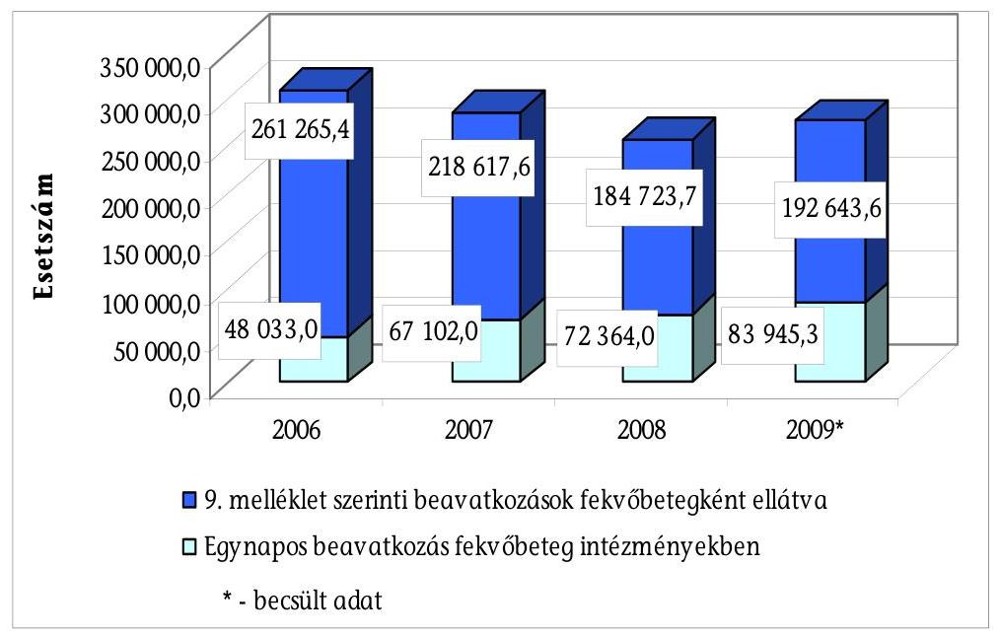

Forrás: OEP GYM Főosztály
A 2009. évre vonatkozóan megjelenített adatok előzetes becsléssel megállapított esetszámot mutatnak a finanszírozási év első 9 hónapjának kivetítésével. Az összes egynaposként végzett beavatkozás száma 55167 -ről 115 580-ra nőtt 2006-2008 között, ez kétszeres növekedést is meghaladó. A pályázattal bekerült szolgáltatók 2006-ban 12\%-kal, 2007-ben 14\%-kal, 2008-ban 37\%-kal járultak hozzá az egynaposként végzett ellátásokhoz.

[^0]
[^0]:    ${ }^{33}$ finanszírozási év: az adott évet megelőző év október 1-je, és az adott évet követő év szeptember 30-a között nyújtott teljesítmények alapján történő finanszírozás, mert a teljesítmények finanszírozása 3 hónapos csúszással történik (adott évben teljesített finanszírozás)

---

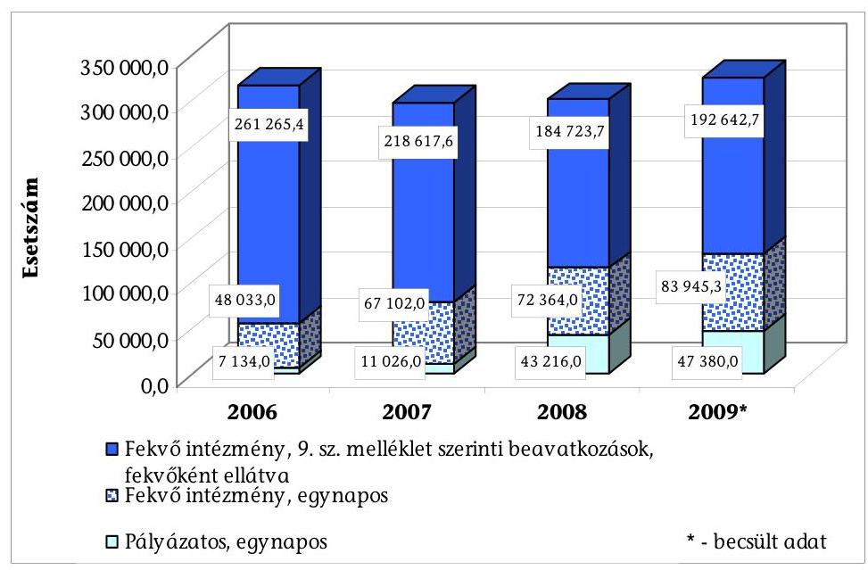

Forrás: OEP GYM Főosztály
A leggyakoribb beavatkozások adatait, megoszlását pályázatos és fekvőbeteg szolgáltatónként részletesen a 16/a, b, c, d. sz. táblák mutatják be.

A fekvőbeteg intézetekben végzett leggyakoribb egynapos beavatkozások esetszáma az egyes években kis eltérést mutat.
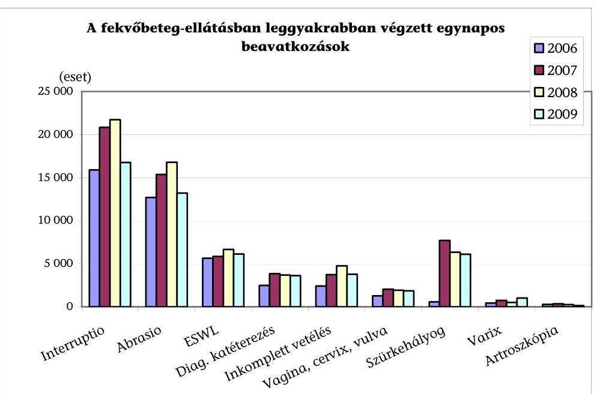

Az első két helyen a szülészet-nőgyógyászat szakmán belüli interruptio (15-20 ezer) és abrasio (12-16 ezer) szerepelt. A 2006-ban alacsony beavatkozásszámot mutató szürkehályog műtétek száma (577) 2007-re 13-szorosára nőtt (7715), és ez az esetszám a következő két évben is 6000 fölött maradt.

---

A vizsgált időszak adatait megfigyelve a ténylegesen egynaposként végzett ellátások aránya az összes fekvőbeteg intézményi esetszámhoz viszonyítva egyértelműen növekedett.

Esetszám százalékában

| A leggyakoribb HBCS | $\mathbf{2 0 0 6}$ | $\mathbf{2 0 0 9}$ |
| :-- | --: | --: |
| Szürkehályog | 1,1 | 15,3 |
| Interruptio | 36,7 | 62,1 |
| Abrasio | 33,3 | 61,7 |
| ESWL | 33,6 | 57,3 |
| Diagnosztikus katéterezés | 19,3 | 31,9 |
| Inkomplett vetélés   müszeres befejezéssel | 36,5 | 62,5 |
| Vagina, cervix | 10,5 | 28,9 |
| Varix | 3,5 | 13,8 |

Ez a növekedés és a kapacitás ilyen módon történő kihasználása láthatóvá teheti a felesleges aktív kapacitásokat, ami ellentétes a kórház intézménymegtartó érdekével, különösen a jövőre vetítve, mivel 2009 áprilisától az ápolási napok számába az egynaposként végzett ellátásokat jogszabály alapján nem számítják bele.

A 43/1999. (III. 3.) Korm. rendelet 40. § (12) bekezdés alapján - 2009. április 1jétől - a teljesített ápolási nap számításánál nem kell figyelembe venni az egynapos ellátás eseteit. Ennek ellenére a kérdőívre adott válaszok alapján az intézmények $24 \%$-a beleszámítja, $26 \%$-a nem számítja bele az ágykihasználtságba.

A már bemutatott esetszámokhoz folyamatosan növekvő súlyszámok és finanszírozási értékek tartoznak. Az egynaposként végzett kórházi ellátások súlyszámának összege a 2006. évi 16 962,7-ről, 2008-ra 28 782,6-ra, 70\%-kal nőtt, a 2009. évi I-III. negyedévi adat 26 602,6. Az erre számított átlagos súlyszám 0,3531-ről 0,3977-re emelkedett.

Az egynapos sebészet keretében végezhető beavatkozások közül az NM rendelet 9. melléklet III. fejezetében felsorolt beavatkozásokat csak fekvőbeteg intézmények végezhetik, a pályázaton nyertes szolgáltatók nem. Ezen beavatkozások bonyolultságát a finanszírozó magasabb, 1 körüli szorzóval (súlyszámmal) ismeri el. A magasabb súlyszám lehetővé teszi, hogy a kórházak összetettebb beavatkozásokat végezzenek, mert a fekvő háttér nagyobb biztonságot jelenthet a beteg számára, például diagnosztikus szívkatéterezés. Ezeket a beavatkozásokat 2008-ban a vesekőzúzás esetében 57 intézet, a diagnosztikus katéterezés esetében 22 intézet látta el egynapos formában is.

A diagnosztikus katéterezés országos esetszáma 2008-ban 12 983, ennek 14,8\%át a Semmelweis Egyetem, 7,6\%-át az SZTE Szent-Györgyi Albert Klinikai Központ végezte.

---

A fekvőbeteg ellátást végző intézményekben végzett egynapos ellátásokat 2006ban 2,2 Mrd Ft-tal, 2008-ban 4,0 Mrd Ft-tal, azaz 82\%-kal magasabb összegben finanszírozta a biztosító, 2009-ben az I-III. negyedévi adat 3,6 Mrd Ft. A finanszírozási összeg emelkedéséhez a súlyszám forint ellenértékének növekedése is hozzájárult. ${ }^{34}$

A fekvőbeteg intézmények finanszírozási szabályainak legutóbbi változása ${ }^{35}$ (EMAFT) hatással van az egynapos ellátásért kapott díjra is. A 70\%-os teljesítmény fölötti lebegtetett súlyszám érték ellenérdekelté teszi az intézményeket a beavatkozásszám növelésében. Ez az intézkedés az egynapos beavatkozásokra is vonatkozik, ami semlegesíti az aktív fekvő és egynapos esetek azonos finanszírozásának ösztönző hatását. A pályázaton nyertes szolgáltatók a szerződött súlyszám erejéig a TVK csökkentése nélküli díjat kapják.

# 3.2. Az intézményi várólista alakulása az egynapos sebészeti ellátás keretében is ellátható beavatkozásoknál 

Az Ebtv. ${ }^{36}$ fogalmi meghatározása szerint az „intézményi várólista: az adott fekvőbeteg ellátó intézményben a betegellátás sorrendjét meghatározó jegyzék, amely - a központi várólista alapján igénybe vehető ellátások kivételével - az egészségügyi ellátások meghatározott sorrend szerinti elvégzése érdekében, továbbá tartós kapacitáshiány esetén kerül kialakításra."

Korm. rendelet ${ }^{37}$ alapján 2008. április 3-tól kötelező a várólista vezetése a rendelet 5. sz. mellékletében felsorolt ellátásokra, ha a szolgáltató a beteg jelentkezését követő 60 napon belül nem tudja biztosítani a szolgáltatást, illetve a biztosított ellátására tartós kapacitáshiány miatt nincs lehetőség.

Az intézményi várólisták sem formailag, sem tartalmilag nem egységesek. Az intézmények többsége szakmánként teszi közzé a várólistát, ugyanakkor vannak, akik ún. kódos rendszert használnak (pl. Szent János Kórház, Pécsi Tudományegyetem, Napfény 2001 Nonprofit Kft. Kulcs), azaz a beteg hozzáférése a várólistához személyre szabott. A várólisták és betegfogadási listák vezetésével kapcsolatos koordinációs feladatokat, ellenőrzési tevékenységet az EBF látja el.

Hivatkozott Korm. rendelet alapján a várólistát meghatározott adattartalommal havonta elküldik az EBF részére. Ehhez ingyenes szoftver áll rendelkezésre az OEP a honlapján. A kötelezettség elmulasztásához kapcsolódó szankció a fi-

[^0]
[^0]:    ${ }^{34}$ 2006. januárban egy súlyszám forintértéke 134000 Ft, 2009. áprilistól 150000 Ft.
    ${ }^{35}$ az egészségügyi szolgáltatások Egészségbiztosítási Alapból történő finanszírozásának részletes szabályairól szóló 43/1999. (III. 3.) Korm. rendelet (2009. április 1-jétől módosította az egészségügyi szolgáltatások Egészségbiztosítási Alapból történő finanszírozásának részletes szabályairól szóló 43/1999. (III. 3.) Korm. rendelet módosításáról szóló 58/2009. (III. 18.) Korm. rendelet
    ${ }^{36}$ a kötelező egészségbiztosítás ellátásairól szóló 1997. évi LXXXIII. törvény 5/B § k) pontja
    ${ }^{37}$ a várólista alapján nyújtható ellátások részletes szabályairól szóló 287/2006. (XII. 23.) Korm. rendelet 13 §. (5) bekezdés

---

nanszírozási összeg 2\%-kal való csökkentése az adott szakma vonatkozásában. A szankció alkalmazására eddig nem volt példa.

Az egynapos ellátásokat érintően 5 szakma meghatározott betegségcsoportjainak (HBCS) meghatározott beavatkozás típusaira kötelező a várólista vezetése.

| Szakma | HBCS | Beavatkozás (OENO) |
| :--: | :--: | :--: |
| Szemészet | Szürkehályog műtétei | 51470, 51471, 51474 |
| Sebészet | Katéteres epekőoldás | 59541 |
|  | Sérvműtétek (hasfali, lágyék-,   köldök-, combsérv)   implantátum beültetése nél-   kül | $\begin{gathered} 55300,55310,55320 \\ 55330,55340 \end{gathered}$ |
| Kardiológia | Diagnosztikus szívkatéterezés, elektrofiziológiai vizsgálat (külön várólistán vezetendő) | $\begin{gathered} 12660,12730-12731, \\ 12740,12750-12754, \\ 12780,33110,33149 \end{gathered}$ |
| Urológia | Prosztata jóindulatú megnagyobbodásának műtétei II. (Transurethralis prostataműtét) | 56013, 56015 |
| Nőgyógyászat | Nőgyógyászati műtétek nem malignus folyamatokban | 56710, 56721, 56722 |

Az EBF által gyűjtött várólista adatok közül az alábbi grafikon mutatja be azon beavatkozások várakozási idejét, amelyeket egynapos sebészeti ellátás keretében is végeznek. A legmagasabb várakozási idő - 50-90 nap - a szürkehályog műtéteknél tapasztalható (intézményenként részletesen az 17. sz. táblában).
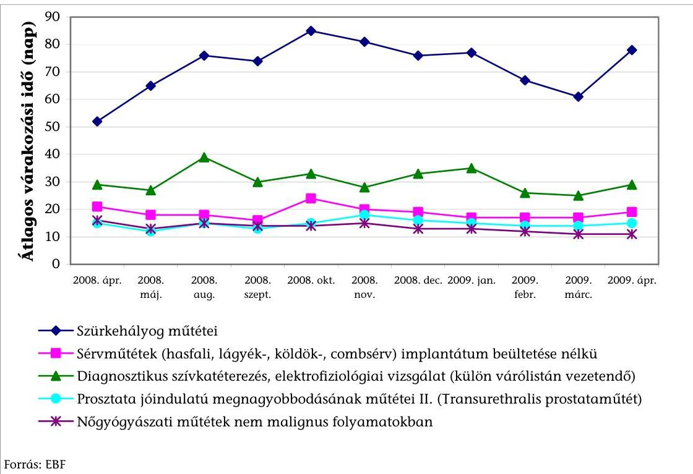

---

Az EBF által a szürkehályog műtétekre készített várólista statisztikának a fekvő és pályázatos intézményekre vonatkozó adatait részletesen az 17. sz. tábla tartalmazza.

A pályázaton nyertes szolgáltatók közül értékelhető információt beküldött, 16 szolgáltató adatai alapján megállapítható, hogy a várakozási idői 2 szolgáltatónál 10 napnál rövidebb [Kapuvár (2-5), Keszthely (4-9)], 9 szolgáltatónál 30 napnál rövidebb (Mohács, Balassagyarmat, Hatvan, Ajka, Kulcs, IX. ker., XVI. ker., Budaörs, HT Medical Center Kft.), 3 szolgáltató adatai nagy szórást mutatnak [Békéscsaba (55-273), Makó (45-168, Veresegyház (9-48)], a Semmelweis Egyetem várakozási ideje jellemzően 40-50 nap, a Hódmezővásárhelyi Erzsébet Kórház várakozási idői 206-660 nap közöttiek.

Az EBF-nek adatot szolgáltató 63 aktív fekvőbeteg ellátó intézmény közül 30 szolgáltató adatai nem értékelhetők, mert egyáltalán nem, vagy nagyon kevés adatot adtak meg. 33 egészségügyi szolgáltató adatai az alábbiak szerint értékelhető: 12 intézménynél 40 nap, vagy annál rövidebb a várakozási idő. 14 intézménynél a várakozási idő 14 -259 nap közötti. Az egri Markhot Ferenc Kórházban 415-535 nap között változott, ami más intézetek várakozási idejéhez hasonlítva azok többszöröse.

Az ÁSZ kérdőívre adott válaszok alapján a válaszadó fekvőbeteg intézmények $60 \%$-a úgy ítéli meg, vannak olyan várólistás betegek, akik elláthatók lennének az egynapos sebészetben, pl. szemészeti és sebészeti szakmákban.

A Multidiszciplináris Egynapos Sebészeti Társaság az egynapos sebészetet alkalmasnak látja az intézményi várólisták csökkentésére. Az egynapos ellátások várakozási időre gyakorolt hatása adathiány, a jelentési kötelezettség be nem tartása miatt nem mérhető.

Az Európai Egészségügyi Fogyasztói Index ${ }^{38}$ (EHCI) ország értékeléseinek egyik eleme a várakozási idők elemzése. Ez azt jelenti, hogy azon országok kaphatnak jó minősítést, ahol a betegek $90 \%$-ára teljesül a 90 napnál kevesebb várakozási célérték elérése, a nem sürgős, nagy műtétek esetében. Ha ez az érték 50\%, a minősítés közepes, ha kevesebb, mint $50 \%$, az adott ország rossz minősítést kap. Ez természetesen feltételezi a várakozási listákhoz tartozó célok meghatározását, amely témában hazánkban nem rendelkeztek. Az EHCI 2009. jelentése alapján Magyarország közepes minősítést kapott.

# 3.3. A járóbeteg TVK terhére végzett egynapos sebészeti ellátások esetszáma, súlyszáma, ezek kihasználtsága 

Az egynapos sebészeti ellátásra kiírt pályázati lehetőségeken túl az ágazatirányító bővíteni kívánta az aktív fekvőbeteg szakellátást kiváltó és a betegek lakóhelyéhez közel biztosított ellátási formákat.

A járóbeteg-szakellátás TVK-ja terhére elszámolható egynapos beavatkozásokat az egészségügyi szakellátás társadalombiztosítási finanszírozásának egyes kérdéseiről szóló NM rendelet 2008. június 1-jétől teszi lehetővé az aktív fekvőbeteg ellátó intézmények számára. Ebben a körben végezhető beavatkozásokat a

[^0]
[^0]:    ${ }^{38}$ Health Consumer Powerhouse

---

9. számú melléklet V. fejezete tartalmazza, amely ezen melléklet I. és III. fejezetéből átemelt néhány egynapos ellátásra vonatkozik.

A járóbeteg-szakellátás TVK-ja terhére 45-féle beavatkozás végezhető, ${ }^{39}$ amelyek HBCS súlyszáma a 0,04994-től 0,85609 -ig terjed. Jellemzően az alacsony HBCS-jű beavatkozások kerültek be az ebben a körben végezhető beavatkozások közé. A súlyszámokat a 2009. szeptember 1-jétől érvényben lévő módosítás ${ }^{40} 13$ beavatkozás esetében csökkentette, a 45 HBCS-ből 34 esetében 0,4 alatti volt a súlyszám.

A járóbeteg-szakellátás keretében/terhére végezhető egynapos beavatkozásokra az OEP külön szerződést köt a szolgáltatókkal. A beavatkozások súlyszám szerinti elszámolása csökkenti a járóbeteg ellátásban elszámolható teljesítményt (német pont) és növeli az egynapos beavatkozásokra szánt kapacitást. A német pont terhére átváltott súlyszámot havi, illetve éves bontásban a szerződés tartalmazza. Az OEP a szolgáltató által jelentett beavatkozásokat a szerződésben rögzített minőségbiztosítási feltételek teljesítése mellett, a szerződésben elkülönített teljesítményvolumen mértékéig számolja el. Az átváltott járóbeteg TVK súlyszám szerinti alakulását intézményenként a 18. sz. tábla tartalmazza.

A fel nem használt súlyszámok a finanszírozási év végén „elvesznek", azok a következő finanszírozási évre nem vihetők át.

Az ilyen módon megnövelt kapacitásokra 2008. október - 2009. június között 0,12 Mrd Ft-ot számolt el az OEP, amely összeg ebben az időszakban egynapos beavatkozásokra kifizetett 6,1 Mrd Ft-nak mindössze 2\%-a.

A súlyszám átváltás jellemző adatait szakmánként az alábbi két táblázat foglalja össze:

| S.sz. Szakma | Esetszám | Súlyszám | E Ft |
| :--: | :--: | :--: | :--: |
| 1. Sebészet | 649 | 280,81 | 40564,23 |
| 2. Szülészet-Nőgyógyászat | 607 | 159,70 | 22005,19 |
| 3. Érsebészet | 532 | 261,89 | 38547,85 |
| 4. Traumatológia | 399 | 107,22 | 13905,44 |
| 5. Kézsebészet | 117 | 32,56 | 4721,88 |
| 6. Gasztroenterológia | 46 | 17,63 | 2376,78 |
| 7. Gyermeksebészet | 22 | 5,08 | 744,56 |
| 8. Urológia | 20 | 3,80 | 506,75 |
| 9. Ortopédia | 16 | 2,93 | 431,95 |
| 10. Szemészet | 4 | 0,20 | 29,96 |
| 11. Fül-Orr-Gégészet | 2 | 0,10 | 14,58 |
| Összesen | 2414 | 871,92 | 123849,17 |

Forrás: OEP (2008. október - 2009. június)

[^0]
[^0]:    ${ }^{39}$ az egészségügyi szakellátás társadalombiztosítási finanszírozásának egyes kérdéseiről szóló 9/1993. (IV. 2.) NM rendelet 9. számú melléklet V. Járóbeteg-szakellátás TVK-ja terhére elszámolható egynapos beavatkozások
    ${ }^{40}$ az egészségügyi miniszter 29/2009. (VIII. 14.) EüM rendelete az egészségügyi szakellátás társadalombiztosítási finanszírozásának egyes kérdéseiről szóló 9/1993. (IV. 2.) NM rendelet módosításáról

---

A 18. sz. tábla mutatja be azokat az időszakokat, amikor lehetőség volt a járó TVK átváltására. Az átváltott TVK-t az intézmények nem használták fel, a 2008-as finanszírozási évben a súlyszámra átváltott TVK több mint 70\%-a (ez 3 hónapra vonatkozik), a 2009-es ${ }^{41}$ finanszírozási évben közel 40\%-a nem került felhasználásra.

Az átváltott kapacitásokra is vonatkoznak az EMAFT szabályai, így az intézmények nem érdekeltek szabad járóbeteg szakellátási kapacitásuk TVK-jának fekvő HBCS-be konvertálásában, mert korábbi járóbeteg teljesítményük 70\%-a fölötti részt csökkentett díjjal finanszírozzák.

# 4. AZ EGYNAPOS SEBÉSZETI ELLÁTÁSOK KÖZVETLEN KÖLTSÉGEINEK MEGHATÁROZÁSA, KÖLTSÉGHATÉKONYSÁGA 

Az ellenőrzés az OEP nyilvántartása szerinti leggyakoribb esetszámban végzett 20 egynapos műtéti beavatkozásfajta költségeit, azoknak az OEP finanszírozással biztosított fedezetét vizsgálta, amihez 10 intézménytől kértünk adatokat. A megkérdezettek közintézmények, pályázati nyertes köz-, és magánszolgáltatók. Nyolc HBCS-be tartozó kilenc beavatkozásra kaptunk legalább 5 intézménytől értékelhető, kitöltött adatlapokat (a stoma beavatkozásoknál a jelentő négy intézmény adatlapjait is értékeltük). Az intézmények adatszolgáltatása beavatkozásonként 10-20 esetre vonatkozott, az elsődleges, a beavatkozásokhoz közvetlenül kapcsolódó költségeik (laboratórium, anyag-eszköz, gyógyszer, orvosok, szakdolgozók bére), valamint a másodlagos közvetlen költségek (mosoda, szállítás, energia) nagyságát tartalmazta. Az anyag és eszköz valamint gyógyszerkészítmények költségeit napi folyó áron számoltunk. Ez utóbbi kategóriában korrekciós tényezőként, az egyes kórházak elszámolásaihoz igazítva figyelembe vettük az általános költségeket (központi irányítás, outsourcing stb.) is. A kiválasztott beavatkozások beletartoznak a fekvőbeteg intézmények és a pályázatos szolgáltatók által végzett leggyakoribb 10 beavatkozás körébe, következtetéseket ezen beavatkozásokra vontunk le. Ez a 10 beavatkozás a pályázatos szolgáltatóknál az esetszám 75\%-át teszi ki, a kórházakban végzett egynapos esetek 89,6\%-át teszi ki a TOP 13 beavatkozás esetszáma.

Nem mindegyik intézmény végzett minden beavatkozást, illetve nem kaptunk minden beavatkozásra a kért számban ( 20 eset) adatlapot.

Az egynapos ellátások finanszírozása a beavatkozások többségénél és a kórházak többségénél meghaladja a fölmerült kiadásokat. (Az egyes beavatkozások bevétele és kiadásai különbségének kórházankénti alakulását ábrázolja a 19. sz. tábla.) A kiemelt beavatkozások közül kettő az adatszolgáltató intézmények számára pozitív fedezetet biztosított. További öt beavatkozásra kapott finanszírozás csak egy vagy két intézménynél nem nyújtott fedezetet a kiadásokra, és mindössze két (nőgyógyászati) beavatkozás költségei haladták meg az OEP bevételt a válaszadó intézmények többségénél. Az intézmények mindegyikénél „veszteséges" beavatkozás finanszírozása az elsődleges

[^0]
[^0]:    ${ }^{41}$ 2009. I-III. negyedév

---

költségek nagyságát sem érte el az adatot szolgáltató hét intézmény közül öt esetében.

A 398A HBCS-jű ízületi tükrözésről (artroszkópiáról) 6 intézmény jelentett adatot, a 6800 HBCS-jű inkomplett műtétről 9, a beavatkozások minden intézménynél pozitív fedezetet mutatnak.

A 6450-es HBCS-jű nőgyógyászati beavatkozások (vagina, cervix, vulva) közül két beavatkozás egyikét (vagina műtét) mindegyik jelentő (7) intézmény veszteséggel végzi, a cervix műtétet a 9-ből 6. A legnagyobb veszteség nagysága (mintegy 50000 Ft ) meghaladja a beavatkozásért kapott finanszírozást (mintegy 35000 Ft ).

A fedezetek nagyságában jelentős különbség van a szolgáltatók között. A minden adatszolgáltatónál pozitív fedezetet biztosító két beavatkozásnál a legmagasabb fedezet 10,6 illetve 8,4 -szerese a legalacsonyabb fedezetnek.

A legmagasabb fedezet a legalacsonyabbnak az inkomplett vetélésnél mintegy 10-szeres, az artroszkópia (ízületi tükrözés) esetében 8-szorosa. A fedezet szélsőséges alakulása mutatható ki a szürkehályog műtéteknél. Kilenc intézmény közül egynél nem fedezi a finanszírozás a költségeket. A nyolc szolgáltatónál kimutatott fedezetek közül a legmagasabb 33-szorosa a legalacsonyabb fedezetnek.

Az ellenőrzés eredményeként első ízben került bemutatásra, hogy az egynapos beavatkozásoknál a finanszírozás pozitív fedezetet nyújt a beavatkozások költségeire.

Budapest, 2010. március
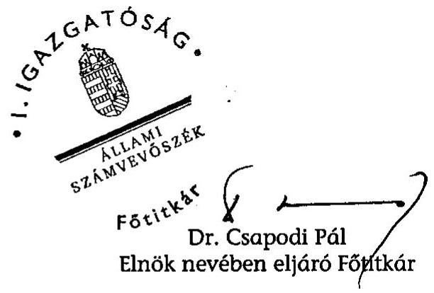

| Melléklet: | 7 db | 44 lap |
| :-- | --: | --: |
| Függelék: | 1 db | 9 lap |

---

# MELLÉKLETEK

---

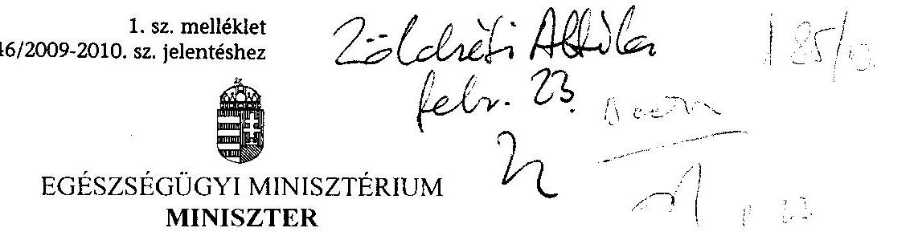

Iktatószám: 750-2/2010-0005EGB

Hiv.szám: V-2006-44/2009-2010.
Tárgy: Számvevői jelentés
véleményezése
Melléklet: -

# Dr. Csapodi Pál 

Elnök nevében eljáró Fötitkár
Állami Számvevőszék
Budapest

## Tisztelt Fötitkár Úr!

A V-2006-44/2009-2010. számú „Az egynapos sebészeti ellátásra fordított pénzeszközök hasznosulásának ellenőrzése" című számvevői jelentést köszönettel megkaptam. A jelentésben foglaltakkal egyetértek.

Az Állami Számvevőszék munkatársainak a számvevőszéki vizsgálat során mutatott együttműködését, segítőkészségét köszönöm.

Budapest, 2010. február „16..."

## Üdvözlettel:

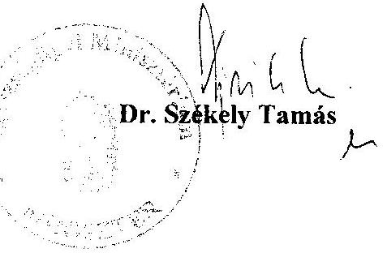

---

# Folyamatábra az egynapos sebészetröl 

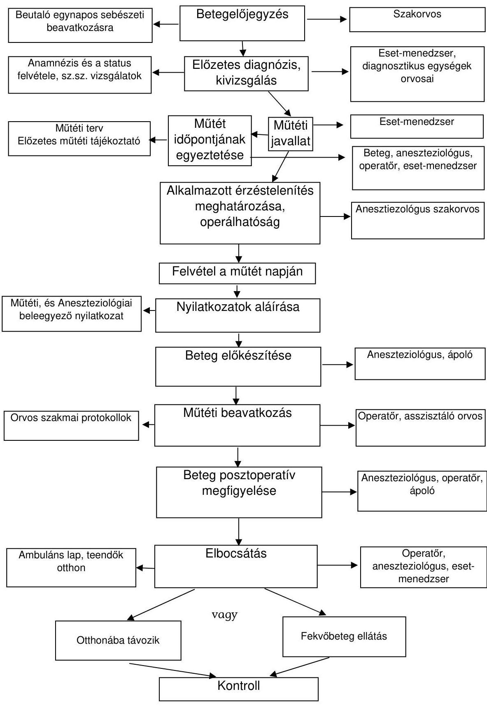

---

# KÉRDÉSEK, KRITÉRIUMOK ÉS ADATFORRÁSOK 

Főkérdés: Az egynapos ellátások kiterjesztése igazolta-e a szolgáltatók, a biztosító minőségi és költséghatékonysági elvárásait?

| Kérdések |  | Kritériumok, mutatók | Adatforrás |
| :--: | :--: | :--: | :--: |
| 1. | Az ágazatirányító szabályozó és szakmai szerepe lehetővé tette-e a célrendszer teljesülését? |  |  |
| 1.1 | Az ágazatirányító kialakította-e az egynapos sebészeti ellátások szerepére vonatkozó stratégiát? | Az ágazatirányító rendelkezik stratégiával. | Ágazati koncepció |
| 1.2 | Az egészségügyi reformban megfogalmazott célok, valamint az egynapos ellátás szabályozási környezete lehetővé tette-e, biztosította-e az egynapos sebészeti ellátás bővítését és általánossá válását? | A célok megjelentek a kormányprogramokban.   A szabályozás segítette a célok megvalósulását. | Kormányprogramok   Vonatkozó jogszabályok   Szabálykönyv |
| 1.3 | Az egynapos sebészeti ellátás bővítésére kiírt pályázatok összhangban álltak-e a kitüzött célokkal? | Az ellátás bővítése a céloknak mefelelő volt. |  |
| 1.3.1 | Az egynapos sebészeti ellátás végzésére kiírt 2007. évi OEP pályázat célja, szempontrendszere, bírálati szempontjai, pályázatok tartalma biztosították-e az egyenlő hozzáférést és az ellátási forma elterjedését? | Az aktív ellátást megszüntető intézményekben, illetve privát szolgáltatóknál lehetővé vált az egynapos sebészeti ellátás. | Pályázati kiírás, pályázatok, bíráló bizottság jegyzőkönyvei, értékelések, beszámolók. |
| 1.3.2 | Az egynapos sebészeti ellátások infrastruktúrájának kialakításához, az NFT keretében a TIOP 2.1.3./07/1. és 2.1.3./08/1 kiírt pályázatok, valamint a ROP pályázatok céljai, szempontrendszere, bírálati szempontjai, pályázatok tartalma hozzájárult-e a szolgáltatóknál szükséges beruházások finanszírozásához? | A pályázati források hozzájárultak az ellátás feltételeinek kialakításához, beruházásokhoz. | A pályázatok anyagai, értékelések, beszámolók. |
| 1.3.3 | Az egynapos sebészeti ellátásokra elnyert címzett támogatások hozzájárultak-e a szolgáltatóknál a tárgyi feltételek fejlesztéséhez? | A pályázati források hozzájárultak az ellátás feltételeinek kialakításához, beruházásokhoz. | A pályázat anyagai, értékelések, beszámolók. |
| 2. | A 2007. évi pályázaton nyertes szolgáltatók müködése eredményesen szolgáljae a kitüzött célok megvalósulását? |  |  |
| 2.1 | A jogszabály szerinti egynapos sebészeti ellátásokra vonatkozó minimumfeltételek teljesülnek-e, illetve a személyi feltételek biztosítottak-e? | A minimum feltételek teljesülnek, az ÁNTSZ rendszeresen ellenőrzi ezek meglétét, a személyi feltételek | Az ÁNTSZ engedélyek   Az orvosok díjazása (kérdőív) |

---

|  |  | biztosítottak. |  |
| :--: | :--: | :--: | :--: |
| 2.2 | A pályázatban megjelölt szakmánkénti esetszámok és súlyszámok teljesültek-e? | A szolgáltatók a pályázaton nyert esetszámot, illetve súlyszámot teljesíteni tudták. | OEP adatok |
| 2.3 | Az egynapos sebészeti ellátások kialakításához szükséges épület és eszközberuházások megvalósultak-e, valamint ezek forrásai rendelkezésre álltak-e? | A szolgáltatók   kialakították az   ellátáshoz szükséges   feltételeket. | Adatbekérés a szolgáltatóktól. |
| 2.4 | A nyertes pályázók kapacitásainak más szolgáltatóval történő ellátása megfelelően szolgálja-e az elérendő célokat? | A kiszervezési szerződések megfelelően szabályozzák az ellátás feltételeit, nem hátrányosak a pályázaton nyertes szolgáltatóra nézve. | Kérdőív feldolgozása,   Kiszervezési szerződések (Nyírő Gyula Kórház) |
| 2.5 | Az egynapos sebészeti beavatkozásokat megelőző teljes körű kivizsgálás és aneszteziológiai konzultáció költségeit tartalmazza-e az OEP által fizetett dij? | A HBCS forintértéke a felmerülő költségekre fedezetet nyújt. | Adatbekérés a szolgáltatóktól. |
| 2.6 | Az egynapos sebészeti ellátást nyújtó szolgáltatók által megállapított térítési díjak gátolják-e a hozzáférést az ellátáshoz? | A betegek számára országosan biztosított az egyenlő hozzáférés az OEP finanszírozott ellátáshoz. | Adatlapok bekérése, feldolgozása. |
| 2.6.1 | Azonos színvonalon elérhető-e a betegek számára az OEP finanszírozott egynapos sebészeti ellátás térítési díj fizetése nélkül? | A betegek az egyes szolgáltaknál az OEP finanszírozott ellátáshoz térítési díj fizetése nélkül férnek hozzá. | Adatbekérés a szolgáltatókról a térítési díj fizetése nélkül elérhető ellátásról. |
| 2.6.2 | Az OEP finanszírozáson felül fizetett térítési díjak nagysága, tartalma biztosítja-e az ellátáshoz való hozzáférést? | A szolgáltatók által kért térítési díjak a pluszszolgáltatásokat érintik. (hotelszolgáltatás, konzultációs díj). | Adatbekérés a szolgáltatóktól a térítési díjakkal elérhető szolgáltatásokról. |
| 2.7 | Biztosított-e, igénybe veszik-e a háziápolást a posztoperatív szakaszban? | A betegek hozzájutnak a háziápolási szolgáltatáshoz. | OEP adatbekérés az egynapos ellátást követően igénybe vett háziápolásról. |
| 2.8 | Értékelik-e a szabálykönyv szerinti indikátorokat? | Az indikátorok értékelését az ágazatirányító figyelemmel kíséri. | Szolgáltatók jelentései ÁSZ adatlap |
| 3. | A fekvőbeteg ellátó intézményeknél végzett egynapos sebészeti ellátások hozzájárultak-e a célok eredményes eléréséhez? |  |  |
| 3.1 | Az egyes intézményeknél a fekvőbeteg ellátás terhére végzett egynapos sebészeti ellátás esetszáma, aránya meghaladja-e az aktív ellátásban végzett hasonló/ugyanazon műtétek számát? | Az egynapos ellátásban ellátott beavatkozások száma meghaladja az aktív ellátásban végzett ugyanazon beavatkozásokét. | OEP adatfeldolgozás |

---

| 3.2 | Az egyes intézményeknél az intézményi   várólista csökkent-e az egynapos sebé-   szeti ellátás keretében is ellátható be-   avatkozásoknál? | Nincs intézményi vá-   rólista az egynapos   ellátásban is ellátható   beavatkozásokra | Kérdőív |
| :--: | :-- | :-- | :-- |
| 3.3 | Az egyes intézményeknél a járóbeteg   TVK terhére végzett egynapos sebészeti   ellátások eredményesen járultak-e hozzá   a célok eléréséhez? | Esetszámát, súlyszámát, ezek kihasználtságát. | OEP adatfeldolgozás |
| 4. | Az egynapos sebészeti ellátások költséghatékonyak-e? |  |  |
| 4.1 | A 20 leggyakoribb egynapos sebészeti   beavatkozás (TOP 20 HBCS) költsége az   egyes szolgáltatóknál eléri-e vagy meg-   haladja-e az OEP finanszírozást? | Az egyes szolgáltatóknál gyüjtött költségadatok alapján az OEP finanszírozás fedezi a költségeket. | Adatbekérés |
| 4.2 | Az egynapos sebészeti ellátás költségha-   tékonysága bizonyítható-e a HBCS szintű   költséggyűjtés alapján az egyes szolgáj-   tatóknál? | Az egynapos ellátásban végzett beavatkozás kevesebb költséget jelent a szolgáltató számára, mint az aktív ellátásban végzett beavatkozás. | Konkrét példákon bemutatva. |
| 4.3 | Az egynapos sebészeti ellátási forma aránya az aktív kórházi ellátásban is elvégezhető beavatkozásokhoz képest eléri-e az uniós átlagot? (Melyek azok az ellátások, amelyek 100\%-ban elvégezhetők egynaposban?) | Az egynapos ellátásban végezhető beavatkozásoknál az egynapos ellátásban és aktív ellátásban elvégzett beavatkozások aránya az uniós átlagnak megfelelő. | OEP adatbekérés, nemzetközi adatok. |

---

# A társadalombiztosítás terhére elszámolható egynapos ellátások jegyzékének változásai 

Az egészségügyi szakellátás társadalombiztosítási finanszírozásának egyes kérdéseiről szóló 9/1993. (IV. 2.) NM rendelet 9. sz. melléklete sorolja fel az Országos Egészségbiztosítási Pénztárnak jelenthető, úgynevezett egynapos beavatkozásokat. A szabályozás mára számottevő változáson esett át. 1994. április 15-én 26 műtéti beavatkozást tartalmazott a megjelent első lista, amelyeket fekvőbeteg ellátási háttér mellett járóbeteg szakellátásban végezhettek el. 2009. október 1-jére a jegyzék már 307 OENO (járóbeteg szakellátás beavatkozási) kódot, továbbá 23 kiegészítő kódot, 39 egynapos klinikai beavatkozást, valamint 410 HBCs (fekvőbeteg szakellátás homogén betegségcsoport) kódot számlál.

Az eltelt 15 évben tizenkilencszer módosították a jegyzéket, majdnem kizárólag bővítették. Az időszak első felére, 2002-ig, 3 módosítás esett, a többi 16 jogszabály-változtatás a 2002től eltelt második hét évben történt.

A lista egyes változtatásainak mértéke széles skálán mozgott: mindössze egy beavatkozásnyi bővüléstől több, mint 130 beavatkozást érintő változásig. Számszerűen és idősorrendben a következő módosításokat léptette életben az egészségügyi tárca:
1994. 04. 15. Hatályba léptették a 9. számú mellékletet a 9/1993. (IV. 2.) NM rendelethez Fekvőbeteg ellátási háttér mellett járóbeteg szakellátásban elvégezhető műtéti beavatkozások címmel, 26-féle beavatkozás felsorolásával.
1997. 03. 01. A listát 129-féle, immár OENO kóddal megjelölt beavatkozásra bővítették. Az addigi két csoportosítást: műtétek, illetve beavatkozások elkülönítését megszüntették. A melléklet címe „Az aktív fekvőbeteg-ellátási intézetben, illetve e célra kialakított részlegén elvégezhető egynapos beavatkozások"-ra változott. Ebből négy hónap múlva (1997. 07. 01-től) törölték az ,,illetve e célra kialakított részlegén" bővítményt.
1998. 04. 01. További 14 beavatkozással bővítették a jegyzéket.
2002. 02. 01. Jelentős változtatás: 123-mal bővítették és 12-vel csökkentették a beavatkozások számát. Új tagolásban, I-III. pontokba csoportosították a beavatkozásokat. Kiegészítő (szükség esetén elszámolható) anesztéziás, illetve narkózis beavatkozási kódcsoportot hoztak létre, amelyhez csillaggal (*) jelölték az elszámolásra jogot adó egyes beavatkozásokat.
2002. 06. 01. Átsoroltak az egynapos sebészet I. pontbeli csoportból 11 OENO kóddal jelölt beavatkozást a III. ponttal jelölt egynapos klinikai ellátások közé.
2003. 03. 16. Töröltek 8 műtéti, 1 kiegészítő beavatkozást és 35 „*" kiegészítő jelölést, valamint 8 új beavatkozást vettek a listára.
2003. 08. 24. Új ponttal, a IV. jelűvel bővítették a listát, amelyben egyes egynapos beavatkozásokhoz egyes konkrét HBCs-ket rendeltek. Ez 284 új sort jelentett, nagyrészt átfedésben az addigi jegyzék OENO szerinti beavatkozásaival. Az egynapos sebészet OENO listája további 1-gyel bővült.

---

2003. 09. 01. Töröltek 4 OENO kódot.
2004. 02. 01. Bővítés 1 OENO kóddal.
2004. 09. 01. 1 OENO beavatkozás bővítés, 2 HBCs hozzárendelés csökkentés.
2005. 08. 01. A lista bővítése 30 egynapos sebészeti, 7 egynapos klinikai beavatkozási, továbbá 46 HBCs hozzárendelési kóddal.
2005. 09. 01. 4 OENO kódot és 9 HBCs hozzárendelést töröltek.
2006. 07. 01. Bővítés 25 OENO kóddal, továbbá 26 HBCs kóddal.
2007. 07. 01. Bővítés 2 OENO, illetve 2 HBCs kóddal.
2007. 10. 01. Bővítés 38 OENO, továbbá 44 HBCs kóddal, illetve 1 beavatkozás törlése az egynapos klinikai beavatkozások közül.
2008. 01. 01. Bővítés 7 OENO és 6 HBCs kóddal azonosított beavatkozással.
2008. 06. 01. A melléklet szerkezetében új, V. pontként felsoroltak 44-et a IV. pontbeli OENO-HBCs összerendelések közül, amely beavatkozások az egyes intézmények járóbeteg szakellátás teljesítmény-volumen keretei terhére számolhatók el.
2008. 10. 01. Bővítés 11 OENO és 13 HBCs kóddal, valamint szűkítés 3 OENO és 4 HBCs kóddal.
2009. 01. 01. További bővítés 11 OENO és 10 HBCs kóddal, valamint a HBCs hozzárendelések csökkentése eggyel.
2009. 09. 01. Egy-egy OENO kóddal bővült, illetve csökkent a lista, illetve néggyel csökkentették a HBCs kód hozzárendelések listáját.

---

# Kérdőív feldolgozás (pályázaton nyertes szolgáltatók adatai lapján) 

## Az ÁSZ vizsgálati programja szerinti 7/b. sz. mellékletet (Kérdőív a 2007. évi pályázaton nyert szolgáltatóknak) három intézet nem küldte vissza az egynapos sebészeti ellátásokról. (Belváros-Lipótváros Egészségügyi Szolgálat, Városi Kh. Keszthely, Palotahosp Kft.)

Az OEP szabálykönyv értelmében az egynapos sebészeti beavatkozást végző szolgáltatónak rendelkeznie kell olyan fekvőbeteg szolgáltatóval kötött szerződéssel, amely háttér osztályokat biztosít a beavatkozások szakmai profiljának megfelelően és vállalja az előre nem látható fekvőbeteg ellátást igénylő esetek ellátását, átvételét. A kijelölt háttérintézménynek mind a szolgáltatótól, mind a beteg lakóhelyétől átlagos forgalom mellett 30 percnyi autóútra kell lennie. Amennyiben fekvőbeteg intézmény elkülönült egységeként múködik az egynapos sebészet a struktúrán belüli háttért az intézmény belső ügyrendjében kell rögzíteni. Hat intézmény a háttérintézményre vonatkozó kérdésre nem adott választ, ez $88 \%$-os válaszadásnak felel meg.

HBCS szintű költséggyűjtést 18 szolgáltatónál végeznek, általános tapasztalat, hogy a költségek nem jelennek meg teljes mértékig az adatokban és egy beavatkozásra vonatkoztatva jelentős szórást mutatnak az adatok. 22-en nem figyelik önköltségi adataikat.

Az egynapos sebészeti ellátásokról betegelégedettségi felmérést 23 helyen készítenek. 13 szolgáltató nem vizsgálja a betegek elégedettségét, holott az OEP szabálykönyv értelmében minőségbiztosítási kritériumok között szerepel.

A 47 nyertes pályázóból 16 intézet kérésünkre megküldte a betegelégedettségi felmérésről készített utolsó feldolgozást.

Várólistát 27 helyen vezetnek, 13 helyen nem tesznek eleget ennek a kötelezettségnek. Ezt annak ellenére teszik, hogy jogszabály szerint vannak olyan egynapos beavatkozások, amelyek várólista kötelezettek a 287/2006. (XII. 23.) Korm. rendelet alapján ${ }^{1}$ Pl. szürkehályog műtétek, katéteres epekőoldás, sérv műtétek, prosztata jóindulatú megnagyobbodásának műtétei, nőgyógyászati műtétek nem malignus folyamatokban.

Egyes szolgáltatók véleménye, hogy nem alakul ki várólista mivel csak az aktuális havi súlyszámig jegyzik elő a beteget. A korlátozott kapacitás miatt az ellátás szüneteltetésére 18 szolgáltató kényszerült, átmenetileg.

32 szolgáltató nyilatkozta, hogy kapacitását ki tudta használni, 28-an annak többszörösét volnának képesek ellátni, és 30 -an a betegek részéről felmerülő igényt is többszörösnek ítélik az egynapos beavatkozások iránt.

A műtétek steril és szeptikus elkülönítése 35 szolgáltatónál megoldott. A mútők darabszámára irányuló kérdést 17 -en nem válaszolták meg, így 64 mútővel rendelkeznek a válaszadók.

[^0]
[^0]:    ${ }^{1}$ A várólista alapján nyújthatóellátások részletes szabályairól

---

A betegek körében népszerűnek ítéli az egynapos sebészetet 39 szolgáltató.
A nyereséges múködtetéshez a jelenlegi szolgáltatónként maximált esetszám megemelése mellett lenne mód. A szolgáltatók közül, ezt a véleményt 20-an erősítették meg.

Az egészségügyi szakellátás társadalombiztosítási finanszírozásának egyes kérdéseiről szóló 9/1993. (IV. 2.) NM rendelet 9. számú melléklettében szereplő beavatkozások körének bővítését 35 szolgáltató ítéli szükségesnek. Ezt a személyesen lefolytatott interjúkon is megerősítették, elsősorban az urológiai szakma képviselői.

Arra a kérdésre, hogy jellemzően mely területekről érkeznek a betegek az egyes szolgáltatókhoz, a válaszadók közül 25 -en 50-100\% közötti adatot közöltek, jellemzően ellátási területen kívülről 5 szolgáltató lát el betegeket.

A betegek egynapos sebészeti ellátáshoz való hozzáférését 34 szolgáltató ítéli biztosítottnak.

---

# Kérdőív feldolgozás (aktív fekvőbeteg ellátó intézmények adatai lapján) 

Az ÁSZ vizsgálati programja szerinti 7/a. sz. mellékletet (Kérdőív az aktív fekvőbeteg ellátó intézményeknek) 64 egészségügyi szolgáltatónak küldtük meg. A kiválasztás szempontja volt, hogy az OEP adatszolgáltatása alapján (Kórházi ágyszám- és betegforgalmi kimutatás fenntartónként) az adott intézmény 2008-ban jelentett le egynapos ellátási esetet, ennek száma 10 , vagy annál több volt.

A kiértékelés $50 \mathrm{db}(78 \%)$ kérdőívre adott válaszok alapján történt, 14 intézmény kérdőíve nem volt értékelhető.

## Értékelés

1. kérdés: Tudja-e, hogy jelenthet egynapos ellátást az aktív ellátás keretében?

A válaszadók 96\%-a (48 intézmény) tisztában volt azzal, hogy az aktív ellátás keretében jelenthet egynapos ellátást.
2. kérdés: Az Önök intézménye az egynapos ellátást beleszámítja-e az ágykihasználtságba?

Az egynapos ellátást 24 válaszadó beleszámítja, 26 nem számítja bele az ágykihasználtságba.
3. kérdés: Van-e olyan várólistás beteg, aki ellátható volna egynapos sebészetben?

A válaszadók 60\%-a (30 intézmény) szerint vannak olyan várólistás betegek, akik elláthatók lennének az egynapos sebészetben, a legtöbben a szemészeti és sebészeti szakmákat jelölték be. A szakmák megoszlását az alábbi grafikon szemlélteti:
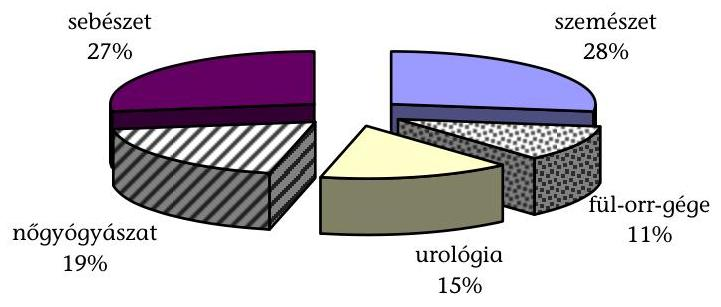

A válaszadók 40\%-a (20 intézmény) szerint nincs olyan várólistás beteg, aki ellátható lenne az egynapos sebészetben.
4. kérdés: Ha alkalmazná az egynapos ellátást, a várólistán lévő betegek hány százalékát tartaná alkalmasnak, hogy ebben a formában lássák el?

A kérdésre 33 intézmény adott választ. Ebből 26 intézmény (79\%) úgy gondolja, hogy a várólistán lévő betegek 0-25\%-a ellátható lenne az egynapos sebészet keretében. 6 (18\%)

---

válaszadó szerint ez az arány 26-50\%, egy intézmény szerint pedig a várólistás betegek 76$100 \%$ lenne alkalmas arra, hogy ebben a formában lássák el.
5. kérdés: Készít-e HBCS szintű költséggyűjtést az egynapos sebészeti ellátásokról?

A válaszadók 88\%-a (44 intézmény) nem készít HBCS szintű költséggyűjtést az egynapos sebészeti ellátásokról.
7. kérdés: Jellemzően mely területekről érkeznek az egynapos ellátást igénybe vevő betegek?

A kérdésre 38 intézmény adott választ. Az egynapos ellátást igénybe vevők többsége, 76-100\%-a jellemzően az ellátási területről érkezik (27 válaszadó). Ellátási területen kívülről érkezik a betegek 0-25\%-a (29 válaszadó).
8. kérdés: Ön szerint biztosított-e a betegek egyenlő hozzáférése az egynapos ellátásokhoz?

47 válaszadóból 79\% (37 intézmény) véleménye az, hogy az egynapos ellátásokhoz biztosított a betegek egyenlő hozzáférése.

---

# Táblák jegyzéke 

| 1/a. sz. tábla | Egynapos beavatkozások befogadására kiírt pályázat eredménye |
| :--: | :--: |
| 1/b. sz. tábla | A 2007. évi egynapos sebészeti ellátás nyertes pályázóinak szerződésteljesítési mutatói 2008-2009. években |
| 2. sz. tábla | A 10 leggyakoribb beavatkozás esetszám alapján az egynapos sebészetben 2008-as finanszírozási év |
| 3. sz. tábla | Egy beavatkozásra jutó átlagos önköltség Ft-ban |
| 4/a. sz. tábla | TOP 10 beavatkozás 2008. finanszírozási évi eset-, súlyszám-, Ft sorrendje |
| 4/b. sz. tábla | TOP 10 beavatkozás 2009. finanszírozási évi eset-, súlyszám-, Ft sorrendje |
| 5. sz. tábla | TOP 10 beavatkozás esetszám alapján az egynapos sebészetben 2009-es finanszírozási év |
| 6. sz. tábla | A hotelköltség fedezete a HBCS-ben |
| 7. sz. tábla | Ápolás költségfedezete a HBCS-ben |
| 8. sz. tábla | Az egynapos sebészeti ellátás kialakításához szükséges ráfordítások adatai 2006-2009. I. félév (E Ft) |
| 9. sz. tábla | Egynapos ellátás keretében foglalkoztatott orvosok létszáma, szakmai megoszlása, díjazási gyakorlata (kérdőív 15. kérdésének feldolgozása) |
| 10. sz. tábla | Az általános osztályos orvosi tevékenység fedezete a HBCS-ben |
| 11. sz. tábla | Egynapos TOP 10 beavatkozás 2009. XI. 1-jétől érvényes HBCS szorzói és súlyszám Ft értéke |
| 12. sz. tábla | Az OEP által finanszírozott egynapos ellátásban kiegészítő díj fizetése nélkül elérhető hotelszolgáltatások (2. sz. adatlap feldolgozása) |
| 13. sz. tábla | Az OEP által finanszírozott egynapos ellátáshoz kapcsolódó térítési díjak (3. sz. adatlap feldolgozása) |
| 14. sz. tábla | Az anesthesiológia költségfedezete a HBCS-ben |
| 15. sz. tábla | Az egynapos beavatkozások összesített szövődményes esetszáma |
| 16/a. sz. tábla | Egynaposban végzett beavatkozások adatai, leggyakoribb lehetséges esetszám szerint rendezve (2006) |
| 16/b. sz. tábla | Egynaposban végzett beavatkozások adatai, leggyakoribb lehetséges esetszám szerint rendezve (2007) |

---

| 16/c. sz. tábla | Egynaposban végzett beavatkozások adatai, leggyakoribb lehetséges   esetszám szerint rendezve (2008) |
| :-- | :-- |
| 16/d. sz. tábla | Egynaposban végzett beavatkozások adatai, leggyakoribb lehetséges   esetszám szerint rendezve (2009) |
| 17. sz. tábla | Szürkehályog műtétek várakozási ideje (nap) |
| 18. sz. tábla | Járóbeteg-szakellátás átváltott TVK-ja, súlyszámban |
| 19. sz. tábla | Egyes beavatkozások OEP finanszírozásának és költségeinek különbsége |
| 20. sz. tábla | Az egynapos sebészeti esetek adatai a 2006-2009 finanszírozási években |
| 21. sz. tábla | 2008-ban a leggyakoribb 10 egynapos sebészeti beavatkozás HBCS   szorzóinak és súlyszám Ft értékeinek változása (2006-2009) |

---

# Egynapos beavatkozások befogadására kiírt pályázat eredménye

1/a sz. tábla

|  ÖVERSÖ | Intézmény megnevezése | Megjegyzés | Bizottsági döntés | Bízottsági döntés | Személyi megyűrész
bevétlenítések előírás | Átlagzámolás | Átlagzámolás | Bízottsági döntés | Személyi megyűrész
bevétlenítések előírás | Átlagzámolás | Átlagzámolás | Bízottsági döntés | Személyi megyűrész
bevétlenítések előírás | Átlagzámolás | Bízottsági döntés | Személyi megyűrész
bevétlenítés | Átlagzámolás | Bízottsági döntés | Személyi megyűrész
bevétlenítés | Átlagzámolás | Bízottsági döntés | Személyi megyűrész
bevétlenítés | Átlagzámolás  |
| --- | --- | --- | --- | --- | --- | --- | --- | --- | --- | --- | --- | --- | --- | --- | --- | --- | --- | --- | --- | --- | --- | --- | --- |
|  2310 | Ajka, Magyar Imre Kárkás | SZ-om gépz. célat meg | 1000 |  | 120 | 1 550 | 3 650 | 1 800 | 470 | 460 | 590 | 1 572 |  |  |  |  |  |  |  |  |  |  |   |
|  28300 | Árs Módos Lészékfizika Kft. | Nem finanszírozott új szolgáltató | 1000 | N.A. | N.A. |  | 1 011 | 1 000 | 350 | 774 |  | 290 |  |  |  |  |  |  |  |  |  |  |   |
|  1903 | Balassagyemut Dr. Koneszty Véh. | SZ-om gépz., immutant, bérgyégyírozó, mezőgép célát meg | 1000 | 157 | 826 | 2 139 | 1 400 | 470 | 466 | 288 | 551 |  |  |  |  |  |  |  |  |  |  |  |   |
|  1249 | Békéscsaba, Rólby Pál Vikh. | Csak a csembelet célát meg | 1000 | 16 | 1 313 | 3 911 | 1 400 | 470 | 443 | 443 | 1 120 |  |  |  |  |  |  |  |  |  |  |  |   |
|  7630 | Bt. JóSS | Szellő járó | 1000 | N.A. | N.A. |  | 1 616 | 1 500 | 403 | 339 |  | 203 |  |  |  |  |  |  |  |  |  |  |   |
|  1292 | Bocsibati V. Kh. |  |  |  |  |  |  |  |  |  |  |  |  |  |  |  |  |  |  |  |  |  |   |
|  0909 | Bp. XIII.hor. Dz. Szolg. Kth. | Szellő járó | 1500 | N.A. | N.A. |  | 3 011 | 1 500 | 500 | 279 |  | 1 480 |  |  |  |  |  |  |  |  |  |  |   |
|  0923 | Bp. XVI. KSH. Önk. Szakosító | Szellő járó | 1000 | N.A. | N.A. |  | 3 011 | 1 000 | 250 | 120 |  | 280 |  |  |  |  |  |  |  |  |  |  |   |
|  6125 | BP. XVIII. KSH. Dz. Szolg. | Szellő járó | 0 000 | N.A. | N.A. |  | 1 311 | 1 000 | 350 | 540 |  | 450 |  |  |  |  |  |  |  |  |  |  |   |
|  5275 | Bufovári Önk. Dz. Szolgátor | Szellő járó | 1000 | N.A. | N.A. |  | 1 171 | 1 000 | 350 | 357 |  | 364 |  |  |  |  |  |  |  |  |  |  |   |
|  0049 | Debrecen VEGF Dz. Szolg. Kth. | Szellő járó | 1595 | N.A. | N.A. |  | 1 595 | 1 200 | 403 | 540 |  | 48 |  |  |  |  |  |  |  |  |  |  |   |
|  4712 | Dombrován Szent Lakács Dz. Kth. | csembelet és mezőgép. célát meg | 1000 | 45 | 705 | 1 271 | 1 300 | 270 |  |  |  |  |  |  |  |  |  |  |  |  |  |  |   |
|  0200 | Dr. Dzsik 14th Gyógösztereg Kft. | Szélteset megoldat | 1005 | 21 | 851 | 2 244 | 1 800 | 470 | 410 | 195 | 1 005 |  |  |  |  |  |  |  |  |  |  |  |   |
|  1080 | Dr. Halász G.Szakocs Kl. Dabas | Szellő járó | 1000 | N.A. | N.A. |  | 1 645 | 1 000 | 350 | 336 | 295 | 112 |  |  |  |  |  |  |  |  |  |  |   |
|  1513 | Ilamp-Med Kft., Budziós | Inotáló egységes, népsősítési évi 1846-csene | 5000 |  | 1846 | 1 846 | 10 838 | 5 000 | 1 680 | 615 |  | 1 017 |  |  |  |  |  |  |  |  |  |  |   |
|  7645 | IVSZ, Bp. IX. hóv. | Szellő járó | 1078 | N.A. | N.A. |  | 1 074 | 1 000 | 350 | 100 | 98 | 291 |  |  |  |  |  |  |  |  |  |  |   |
|  0097 | Hervasi Kárkás Kft. | csembelet bérgyégyírozó célát meg | 1000 | 633 | 1 535 | 1 019 | 1 035 | 340 |  |  |  |  |  |  |  |  |  |  |  |  |  |  |   |
|  1416 | Hóbbaszévészhelyi, Eveshöz KH.R. | SZ-om gépz., csembelet, bérgyégyírozó | 1318 | 6 | 1 017 | 3 819 | 1 400 | 470 | 188 |  | 986 |  |  |  |  |  |  |  |  |  |  |  |   |
|  0765 | MT MDDC 61. COVIDI Kft. | Inotáló egységes 573 csat | 2600 | 572 | 572 | 3 967 | 1 700 | 571 | 503 |  | 1 245 |  |  |  |  |  |  |  |  |  |  |  |   |
|  0003 | Izsadárgyi Kfizika | Nem finanszírozott új szolgáltató | 0 000 | N.A. | N.A. |  | 1 440 | 1 000 | 350 | 820 | 60 | 255 |  |  |  |  |  |  |  |  |  |  |   |
|  3630 | Kapocán, Lomniczov S. Kft.- Rt. | Megoldati aktív, bél szb. célát, gyerek volt | 1000 |  |  | 315 | 1 310 | 1 100 | 370 | 188 | 67 | 668 |  |  |  |  |  |  |  |  |  |  |   |
|  2886 | Kácskyi Szedke Kárkás, Bp. | csembelet mezőgép. célát meg | 2333 | 310 | 2 204 | 2 691 | 1 500 | 500 | 373 |  | 1 450 |  |  |  |  |  |  |  |  |  |  |  |   |
|  644 | Kordilyapok Kfizika Kft., Tzia. | Nem finanszírozott új szolgáltató | 1000 | N.A. | N.A. |  | 1 520 | 1 000 | 350 |  |  |  |  |  |  |  |  |  |  |  |  |  |   |
|  1278 | Kefesi Kárkás Kft. | Inotáló egységes 210 csat | 1000 | 210 | 211 | 1 207 | 1 000 | 350 | 153 |  | 38 | 110 | 12 |  |  |  |  |  |  |  |  |  |   |
|  2703 | Keszthely, V. Kh. | Inotáló egységes 31 csat | 1000 | 351 | 616 | 1 861 | 1 700 | 571 | 36 | 17 | 522 |  |  |  |  |  |  |  |  |  |  |  |   |
|  1116 | Kiskérés, V. Szakocs Kl. | Ökolói járó, csak fenntartóbigógyomozott, új |  |  |  |  |  |  |  |  |  |  |  |  |  |  |  |  |  |  |  |  |   |
|  1116 | Kiskérés, V. Szakocs. |  |  |  |  |  |  |  |  |  |  |  |  |  |  |  |  |  |  |  |  |  |   |
|  0249 | Kesztrán Dz. Kth. | Szellő járó | 1000 | N.A. | N.A. |  | 1 305 | 1 000 | 350 | 233 | 225 | 260 |  |  |  |  |  |  |  |  |  |  |   |
|  1034 | Kizzék, Vikh. | Szélteset, mégyégyírozó, gyerebgyégyírozó | 1000 |  |  | 602 | 2 215 | 1 400 | 470 | 450 |  | 281 |  |  |  |  |  |  |  |  |  |  |   |
|  1460 | Makó, Dr. Dószczőigyi S.V. Kft. | csembelet és SZ-om gépz. célát meg | 1200 | 46 | 712 | 1 216 | 1 100 | 370 |  | 171 |  |  |  |  |  |  |  |  |  |  |  |  |   |
|  0199 | Max For Cyn. KFT. | Szellő járó | 2000 | N.A. | N.A. |  | 3 390 | 2 000 | 672 | 964 | 354 | 534 |  |  |  |  |  |  |  |  |  |  |   |
|  1052 | Módoss, Vikh. | Pál ott gépz. | 1000 | 454 | 949 | 2 545 | 1 400 | 470 | 450 | 460 | 1 050 |  |  |  |  |  |  |  |  |  |  |  |   |
|  1375 | Szpélisy 2001 Kft. | Inotáló egységes, népsősítési évi 1118-csene | 1500 | 1118 | 1 126 | 2 550 | 1 900 | 610 | 540 | 796 | 290 |  |  |  |  |  |  |  |  |  |  |  |   |
|  2887 | Nyitó Gyala Kárkás, Bp. | szb. célát célát meg | 3000 | 622 | 1 103 | 3 877 | 1 020 | 340 | 1 175 |  | 2 700 |  |  |  |  |  |  |  |  |  |  |  |   |
|  0810 | Öbady-Békésmegyei Fű Szolg. Kth. | Szellő járó | 1500 | N.A. | N.A. |  | 2 314 | 1 400 | 470 | 750 |  | 560 |  |  |  |  |  |  |  |  |  |  |   |
|  1636 | Pátó, Kordolódókat | Szellő járó | 1000 | N.A. | N.A. |  | 1 190 | 1 000 | 350 | 560 | 100 | 40 |  |  |  |  |  |  |  |  |  |  |   |
|  0205 | Palotakosp Kft., Várpátira |  |  |  |  |  |  |  |  |  |  |  |  |  |  |  |  |  |  |  |  |  |   |
|  1945 | Pázsit, Magat Kárkás | csélteset, csélteset, gyerek célát meg | 1000 | 25 | 450 | 1 260 | 1 200 | 350 | 933 | 155 | 435 |  |  |  |  |  |  |  |  |  |  |  |   |
|  0820 | Pásztus Pásztus Kft. | Nem finanszírozott új szolgáltató | 0 000 | N.A. | N.A. |  | 2 374 | 1 000 | 350 |  |  |  |  |  |  |  |  |  |  |  |  |  |   |
|  2531 | Sátvai, V. Kh. |  |  |  |  |  |  |  |  |  |  |  |  |  |  |  |  |  |  |  |  |  |   |
|  2915 | Szeményi, Egysérmi |  |  |  |  |  |  |  |  |  |  |  |  |  |  |  |  |  |  |  |  |  |   |
|  3215 | Szénesítési Egysérmi |  |  |  |  |  |  |  |  |  |  |  |  |  |  |  |  |  |  |  |  |  |   |
|  3215 | Sátira |  |  |  |  |  |  |  |  |  |  |  |  |  |  |  |  |  |  |  |  |  |   |
|  3215 | Sátira Kárkás Kft. |  |  |  |  |  |  |  |  |  |  |  |  |  |  |  |  |  |  |  |  |  |   |
|  2269 | Zsont Bókus Kárkás, Bp. |  |  |  |  |  |  |  |  |  |  |  |  |  |  |  |  |  |  |  |  |  |   |
|  1403 | Szikocs, D. Rákóczi F. Kárkás |  |  |  |  |  |  |  |  |  |  |  |  |  |  |  |  |  |  |  |  |  |   |
|  0353 | Velti, Kárkás Egészségügyi Kft. | Inotáló egységes, 557 csat | 1000 | 531 | 532 | 1 446 | 1 700 | 571 | 504 |  | 560 |  |  |  |  |  |  |  |  |  |  |  |   |
|  1090 | Fecsész Egészségügyi Szolgálat | Szellő járó | 1000 | N.A. | N.A. |  | 2 241 | 1 000 | 350 | 715 |  | 252 |  |  |  |  |  |  |  |  |  |  |   |
|  0749 | Vettvegyhely, Micszió Fű Kp. Kth. | Szellő járó | 1000 |  |  |  | 2 160 | 1 000 | 350 | 700 | 70 | 170 |  |  |  |  |  |  |  |  |  |  |   |
|  1911 | Dáv, V. Érzeshet Kft. |  |  |  |  |  |  |  |  |  |  |  |  |  |  |  |  |  |  |  |  |  |   |
|  Összesen |  |  |  |  |  |  |  |  |  |  |  |  |  |  |  |  |  |  |  |  |  |  |   |
|  Összesen |  |  |  |  |  |  |  |  |  |  |  |  |  |  |  |  |  |  |  |  |  |  |   |
|  2269 | Zsont Bókus Kárkás, Bp. |  |  |  |  |  |  |  |  |  |  |  |  |  |  |  |  |  |  |  |  |  |   |
|  1403 | Szikocs, D. Rákóczi F. Kárkás |  |  |  |  |  |  |  |  |  |  |  |  |  |  |  |  |  |  |  |  |  |   |
|  0353 | Velti, Kárkás Egészségügyi Kft. | Inotáló egységes, 557 csat | 1000 | 531 | 532 | 1 446 | 1 700 | 571 | 504 |  | 560 |  |  |  |  |  |  |  |  |  |  |  |   |
|  1090 | Fecsész Egészségügyi Szolgálat | Szellő járó | 1000 | N.A. | N.A. |  | 2 241 | 1 000 | 350 | 715 |  | 252 |  |  |  |  |  |  |  |  |  |  |   |
|  0749 | Vettvegyhely, Micszió Fű Kp. Kth. | Szellő járó | 1000 |  |  |  | 2 160 | 1 000 | 350 | 700 | 70 | 170 |  |  |  |  |  |  |  |  |  |  |   |
|  1911 | Dáv, V. Érzeshet Kft. |  |  |  |  |  |  |  |  |  |  |  |  |  |  |  |  |  |  |  |  |  |   |
|  Összesen |  |  |  |  |  |  |  |  |  |  |  |  |  |  |  |  |  |  |  |  |  |  |   |
|  Összesen |  |  |  |  |  |  |  |  |  |  |  |  |  |  |  |  |  |  |  |  |  |  |   |

---

|  S.
sz. | Intézmény megnevezése | Szerződött
súlyszám 2007 | Szerződött
súlyszám 2008 | Szerződött
súlyszám 2009 | Szerződött
esetszám 2007 | 2008-os finanszírozási év |  |  |  | 2009-os finanszírozási év |  |  |   |
| --- | --- | --- | --- | --- | --- | --- | --- | --- | --- | --- | --- | --- |
|   |  |  |  |  |  | Súlyszám
feljedett | Súlyszám
mónyu a szerződöttől | Súlyszám
mónyu a szerződöttől | Súlyszám
feljedett | Súlyszám
mónyu a szerződöttől | Súlyszám
mónyu a szerződöttől | Súlyszám
mónyu a szerződöttől  |
|  1. Ajka, Magyar Imre Kórház | 470 | 477 | 477 | 1 400 | 496 | 104% | 1319 | 94% | 493,53 | 103% | 1 299,00 | 93%  |
|  2. Ars Medica Lézerklésika Kft. | 336 | 387 | 387 | 1 000 | 394 | 102% | 879 | 88% | 379,55 | 98% | 769,00 | 77%  |
|  3. Balassagyurmut, Dr. Kenessey Vkh. | 470 | 482 | 482 | 1 400 | 327 | 68% | 726 | 52% | 379,28 | 79% | 863,00 | 62%  |
|  4. Békócsuba, Bétby Pál Vkh. BL | 470 | 478 | 478 | 1 400 | 440 | 92% | 1357 | 97% | 507,29 | 106% | 1 249,00 | 89%  |
|  5. BLEIZ (Belváros-Lipótváros Ed. Szolg., Bp.) | 403 | 408 | 408 | 1 200 | 299 | 73% | 509 | 42% | 353,04 | 87% | 616,00 | 51%  |
|  6. Bonyhád, V.Kh. BL | 370 | 379 | 379 | 1 100 | 364 | 96% | 904 | 82% | 395,79 | 104% | 988,00 | 90%  |
|  7. Bp. XIII.ker. Ed. Szolg. Kht. | 504 | 580 | 580 | 1 500 | 599 | 103% | 1250 | 83% | 580,63 | 100% | 1 129,00 | 75%  |
|  8. Bp. XVI. KER. Önk. Szakrend. | 336 | 383 | 383 | 1 000 | 368 | 96% | 460 | 46% | 387,89 | 101% | 484,00 | 48%  |
|  9. BP. XVIII. KER. Ed. Szolg. | 336 | 344 | 344 | 1 000 | 141 | 41% | 429 | 43% | 241,86 | 70% | 758,00 | 76%  |
|  10. Budavárt Önk. Ed. Szolgáltat | 336 | 339 | 339 | 1 000 | 240 | 71% | 278 | 28% | 276,90 | 82% | 365,00 | 37%  |
|  11. Debrecen VESZ Ed. Szolg. Kht. | 403 | 410 | 410 | 1 200 | 302 | 74% | 865 | 72% | 347,77 | 85% | 782,00 | 65%  |
|  12. Dombóvári Szent Lukács Ed. Kht. | 370 | 375 | 375 | 1 100 | 288 | 77% | 379 | 34% | 251,74 | 67% | 333,00 | 30%  |
|  13. Dr. Dnik LKh. Gyógyhudong Kft., Tapolca | 470 | 476 | 476 | 1 400 | 142 | 30% | 542 | 39% | 136,29 | 29% | 515,00 | 37%  |
|  14. Dr. Halász G. Szakrev. Kl. Duhus | 336 | 343 | 343 | 1 000 | 237 | 69% | 389 | 39% | 305,06 | 89% | 531,00 | 53%  |
|  15. Europ-Med KFT, Budaios | 1 680 | 1 744 | 1 744 | 5 000 | 1 668 | 96% | 2953 | 59% | 1 835,03 | 105% | 3 083,00 | 62%  |
|  16. FESZ, Bp. IX. ker. | 336 | 343 | 343 | 1 000 | 316 | 92% | 554 | 55% | 337,83 | 99% | 589,00 | 59%  |
|  17. Harvoni Kórház Kft. | 348 | 354 | 354 | 1 035 | 483 | 137% | 603 | 58% | 343,65 | 97% | 438,00 | 42%  |
|  18. Hódmezővásárhely, Erzsébet Kft. BL | 470 | 475 | 475 | 1 400 | 478 | 101% | 1029 | 74% | 444,86 | 94% | 937,00 | 67%  |
|  19. HT MEDICAL CENTER KFT. | 571 | 679 | 679 | 1 700 | 766 | 113% | 1238 | 73% | 691,62 | 102% | 1 142,00 | 67%  |
|  20. Istenhegyi Klinika | 336 | 343 | 343 | 1 000 | 73 | 21% | 172 | 17% | 143,40 | 42% | 267,00 | 27%  |
|  21. Kapuvár, Lumnáczor S. Kh.- BL | 370 | 376 | 376 | 1 100 | 378 | 101% | 732 | 67% | 377,44 | 100% | 688,00 | 63%  |
|  22. Kárélyi Sándor Kórház, Bp. | 504 | 509 | 509 | 1 500 | 199 | 59% | 869 | 58% | 211,11 | 41% | 927,00 | 62%  |
|  23. Kustélypark Klinika Kft., Tota | 336 | 381 | 381 | 1 000 | 369 | 97% | 639 | 64% | 336,84 | 88% | 557,00 | 56%  |
|  24. Kelen Kórház Kft. | 336 | 350 | 350 | 1 000 | 354 | 101% | 573 | 57% | 358,42 | 103% | 561,00 | 56%  |
|  25. Keszthely, V.Kh. BL | 571 | 575 | 575 | 1 700 | 425 | 74% | 1037 | 61% | 542,84 | 94% | 1 113,00 | 65%  |
|  26. Ködölen, V. Szakrev. Kl.
(Kokunhalos Semmelweis Kh. Kht.) | 336 | 342 | 342 | 1 000 | 614 | 179% | 1297 | 130% | 594,93 | 174% | 1 196,00 | 120%  |
|  27. Kossóski Ed. Kht. | 336 | 344 | 344 | 1 000 | 338 | 98% | 555 | 56% | 348,69 | 101% | 546,00 | 55%  |
|  28. Komás, Vkh. BL | 470 | 482 | 482 | 1 400 | 435 | 90% | 823 | 59% | 510,35 | 106% | 866,00 | 62%  |
|  29. Mukó, Dr. Diószolágyi S.V.Kh. | 370 | 377 | 377 | 1 100 | 399 | 106% | 546 | 50% | 390,57 | 104% | 529,00 | 48%  |
|  30. Men For Cure Kft. | 672 | 680 | 680 | 2 000 | 551 | 81% | 907 | 45% | 694,17 | 102% | 1 201,00 | 60%  |
|  31. Mohács, VKh. BL | 470 | 482 | 482 | 1 400 | 449 | 93% | 1090 | 78% | 442,60 | 92% | 892,00 | 64%  |
|  32. Nagdínyi 2001 Kht. | 638 | 669 | 669 | 1 900 | 769 | 115% | 1483 | 78% | 685,37 | 103% | 1 364,00 | 72%  |
|  33. Nyíró Gyula Kórház, Bp. | 346 | 355 | 355 | 1 029 | 278 | 78% | 1116 | 108% | 327,78 | 92% | 1 153,00 | 112%  |
|  34. Óhsala-Békásmegyre Ed. Szolg. Kht. | 470 | 533 | 533 | 1 400 | 455 | 85% | 770 | 55% | 523,02 | 98% | 934,00 | 67%  |
|  35. Paka, Rendelöntéset | 336 | 370 | 370 | 1 000 | 358 | 97% | 822 | 82% | 395,01 | 107% | 809,00 | 81%  |
|  36. Palotuhosp Kft., Várpultos | 571 | 579 | 579 | 1 700 | 511 | 88% | 1167 | 69% | 497,42 | 86% | 995,00 | 59%  |
|  37. Pásztó, Margit Kórház | 370 | 378 | 378 | 1 100 | 274 | 72% | 775 | 70% | 343,99 | 91% | 811,00 | 74%  |
|  38. Premed Pharma Kft. | 336 | 348 | 348 | 1 000 | 369 | 106% | 454 | 45% | 349,75 | 101% | 434,00 | 43%  |
|  39. Sávsár, V.Kh. BL | 470 | 457 | 457 | 1 400 | 139 | 30% | 433 | 31% | 231,15 | 51% | 661,00 | 47%  |
|  40. Semmelweis Egyetem | 672 | 674 | 674 | 2 000 | 843 | 125% | 1380 | 69% | 1 277,37 | 190% | 2 110,00 | 106%  |
|  41. Siklósi Kórház Kht. | 336 | 345 | 345 | 1 000 | 177 | 51% | 534 | 53% | 209,25 | 61% | 641,00 | 64%  |
|  42. Szent Rónai Kórház, Bp. | 1 680 | 1 696 | 1 696 | 5 000 | 1 757 | 104% | 3322 | 66% | 1 733,64 | 102% | 3 181,00 | 64%  |
|  43. Szikszó, D. Rákóczi T. Kórház | 571 | 583 | 583 | 1 700 | 448 | 77% | 1191 | 70% | 553,06 | 95% | 1 419,00 | 83%  |
|  44. Telki Kórház Egészségügyi Kft. | 571 | 578 | 0 | 1 700 | 120 | 21% | 210 | 12% | 0 | 0% | 0 | 0%  |
|  45. Verzési Egészségügyi Szolgáltat | 336 | 347 | 347 | 1 000 | 260 | 75% | 508 | 51% | 464,96 | 134% | 789,00 | 79%  |
|  46. Veresegyház, Minutó Ed. Kp. Kht. | 336 | 345 | 345 | 1 000 | 384 | 111% | 777 | 78% | 391,99 | 114% | 967,00 | 97%  |
|  47. Zirc, V. Erzsébet Kft. | 336 | 344 | 344 | 1 000 | 15 | 4% | 43 | 4% | 1,02 | 0% | 2,00 | 0%  |
|  Összesen | 22 500 | 23 296 | 22 718 | 66 964 | 20 085 | 89% | 40 888 | 61% | 21 626 | 95% | 42 483 | 63%  |

---

# A 10 leggyakoribb beavatkozás az egynapos sebészetben* 2008-as finanszírozási év**

|  S.
sz. | HBCS | Név | Eset | Súlyszám
(db) | E Ft | HBCS szorzó | Súlyszám Ft
értéke (Ft)  |
| --- | --- | --- | --- | --- | --- | --- | --- |
|  1 | 0680 | Szürkehályogműtét | 10162 | 8296,37 | 1173445 | 0,81571 | 119094  |
|  2 | 681D | Interruptio | 5897 | 1165,91 | 165440 | 0,19807 | 28918  |
|  3 | 647A | Abrasio altatásban | 4589 | 812,33 | 115628 | 0,17745 | 25908  |
|  4 | 398A | Artroszkópia | 2783 | 1745,03 | 246187 | 0,62831 | 91733  |
|  5 | 6450 | Vagina, cervix, vulva műtétek | 2355 | 554,30 | 78889 | 0,23678 | 34570  |
|  6 | 2030 | Varix lekötés, eltávolítás | 2155 | 1101,19 | 152816 | 0,51132 | 74653  |
|  7 | 279B | Végbél, stomaműtétek | 1659 | 681,39 | 96272 | 0,40823 | 59602  |
|  8 | 281B | Lágyék-, köldök-, combsérv-
műtétek 18 év felett | 1478 | 642,50 | 90930 | 0,43497 | 63506  |
|  9 | 9575 | Belső fémrögzítés eltáv. | 805 | 245,15 | 34982 | 0,30536 | 44583  |
|  10 | 6130 | Transurethralis prostataműtét | 684 | 822,74 | 110011 | 1,21879 | 177943  |
|  Összesen: |  |  | 32567 | 16066,91 | 2264600 |  |   |
|  Összes eset: |  |  | 43215 | 21134,19 | 2970755 |  |   |
|  Teljesítés aránya: |  |  | 75 | 76 | 76 |  |   |

- Forrás: OEP Gyógyító-megelőző Főosztály (47 pályázaton nyertes szolgáltató adata alapján). ** 2007. X. 1-től - 2008. IX. 30-ig (12 hónap adata)

---

# Egy beavatkozásra jutó átlagos önköltség Ft-ban*

|  S.
Sz. | Intézet | Szürkehályog | Interruptio | Abrasio | Artroszkópia | Conisatio vagina cer.vulva | Varix | Végbél
stoma | Sérv | Belső
fémrögz.
eltávolít. | Prostata
mütét  |
| --- | --- | --- | --- | --- | --- | --- | --- | --- | --- | --- | --- |
|   |  | 0680 | 681D | 647A | 398A | 6450 | 2030 | 279B | 281B | 9575 | 6130  |
|  1 | Ajka, Magyar Imre Kórház | 93328 | 14876 | 14876 |  | 24765 | 54812 |  |  | 32006 |   |
|  2 | Ars Medica Lézerklinika Kft. |  |  | 11909 |  | 11265 | 19483 | 15091 | 18199 |  |   |
|  3 | Balassogyurmat,Dr.Kenessey Vkh. |  |  |  |  |  |  |  |  |  |   |
|  4 | Békéscsaba, Réthy Pál VKh.Ri. |  |  |  |  |  |  |  |  |  |   |
|  5 | BLESZ |  |  |  |  |  |  |  |  |  |   |
|  6 | Bonyhád, V.Kh.Ri. |  |  |  |  |  |  |  |  |  |   |
|  7 | Bp. XIII.ker. Eü-i. Szolgálat
Közhasznú Nonprofit Kft. | 119540 | 60560 | 60560 | 67520 | 75350 | 68320 |  | 86770 |  |   |
|  8 | Bp. XVI. KER. Önk. Szakrend. | 113800 |  |  |  |  | 52000 |  |  |  |   |
|  9 | BP. XVIII. KER. Eü. Szolg. |  |  |  |  |  |  |  |  |  |   |
|  10 | Budavári Önk. Eü. Szolgálat |  |  |  |  |  |  |  |  |  |   |
|  11 | Debrecen VESZ Eü. Szolg. Kht. |  |  |  |  |  |  |  |  |  |   |
|  12 | Dombóvári Szent Lukács Eü.
Nonprofit Kft. |  |  |  |  |  |  |  |  |  |   |
|  13 | Dr. Deák J.Kh.Gyógybarlang Kft. |  |  |  |  |  |  |  |  |  |   |
|  14 | Dr. Halász G.Szakorv.RI. Dabas |  |  |  |  |  |  |  |  |  |   |
|  15 | Europ-Med KFT, Budaörs | 8339 | 10759 |  | 17089 | 10759 | 14496 | 14326 |  |  |   |
|  16 | FESZ, Bp. IX. ker. |  |  |  |  |  |  |  |  |  |   |
|  17 | Hatvani Kórház Kft. | 66979 |  |  |  |  |  |  |  |  |   |
|  18 | Hódmezővásárhely,Erzsébet KH. |  |  |  |  |  |  |  |  |  |   |
|  19 | HT MEDICAL CENTER Kft. |  |  |  |  |  |  |  |  |  |   |
|  20 | Istenhegyi Klinika |  |  |  |  |  |  |  |  |  |   |
|  21 | Kapuvár, Lumniczer S. Kh.- Ri. | 117623 |  |  | 90329 | 39152 | 72835 |  | 57385 |  | 175211  |
|  22 | Károlyi Sándor Kórház, Bp. |  |  |  |  |  |  |  |  |  |   |
|  23 | Kastélypark Klinika Kft., Tata |  |  |  |  |  |  |  |  |  |   |
|  24 | Kelen Kórház Kft |  |  |  | 84690 |  | 36600 |  |  | 23490 |   |
|  25 | Keszthely, V.Kh.Ri. |  |  |  |  |  |  |  |  |  |   |
|  26 | Kiskőrös, V.Szakorv. Ri. |  |  |  |  |  |  |  |  |  |   |
|  27 | Kisteleki Eü. Kht. | 102625 |  |  | 80216 |  | 83430 |  | 82296 |  | 163274  |
|  28 | Komló, Vkh.Ri. |  |  |  |  |  |  |  |  |  |   |
|  29 | Makó, Dr.Diósszilágyi S.V.Kh. |  |  |  |  |  |  |  |  |  |   |
|  30 | Men For Care Kft. |  |  |  |  |  |  |  |  |  |   |
|  31 | Mohács, VKh.Ri. |  |  |  |  |  |  |  |  |  |   |

---

|  S.
Sz. | Intézet | Szürkehályog | Interruptio | Abrasio | Artroszkópia | Conisatio vagina cer.vulva | Varis | Végbél stoma | Sérv | Belső fémrögz eltávolít. | Prostata mütét  |
| --- | --- | --- | --- | --- | --- | --- | --- | --- | --- | --- | --- |
|   |  | 0680 | 681D | 647A | 398A | 6450 | 2030 | 279B | 281B | 9575 | 6130  |
|  32 | Napfény 2001 Nonprofit Kft. | 147590 |  | 42888 | 93766 |  | 69795 |  | 67242 |  |   |
|  33 | Nyirő Gyula Kórház, Bp. |  | 22100 | 22100 |  | 33100+33600+28200 |  |  |  |  |   |
|  34 | Szent Margit Rí. Nonprofit Kft. | 89320 |  |  | 62443 |  |  |  | 84522 | 44533 | 106766  |
|  35 | Paks, Rendelőintézet |  |  |  |  |  | 62940 | 42000 |  |  | 150000  |
|  36 | Palotahosp Kft., Várpalota |  |  |  |  |  |  |  |  |  |   |
|  37 | Pásztó, Margit Kórház |  |  |  |  |  |  |  |  |  |   |
|  38 | Premed Pharma Kft.-Optimum | 51000 |  |  |  |  |  |  |  |  |   |
|  39 | Sárvár, V.Kh.Ri. |  | 37578 | 33666 |  | 44922 | 97008 | 77450 | 82523 |  |   |
|  40 | Semmelweis Egyetem |  |  |  |  |  | 54000 |  |  |  |   |
|  41 | Siklósi Kórház Nonprofit Kft. |  |  |  |  |  |  |  |  |  |   |
|  42 | Szent Rókus Kórház, Bp. |  |  |  |  |  |  |  |  |  |   |
|  43 | Szikszó, II. Rákóczi F. Kórház | 94550 |  |  |  | 55766 | 57183 |  | 45011 |  |   |
|  44 | Telki Kórház Egészségügyi Kft. |  |  |  |  |  |  |  |  |  |   |
|  45 | Vecsési Egészségügyi Szolgálat | 110240 | 27670 | 25880 | 86120 |  | 90760 |  | 79310 |  |   |
|  46 | Veresegyház, Misszió Eü.Kp. | 93061 |  |  |  | 12284 | 54505 | 26973 | 44158 |  |   |
|  47 | Zirc, V.Erzsebet Kh. |  |  |  |  |  |  |  |  |  |   |

*A szolgáltatók önbevallásos adatközlése alapján.

---

# Az esetszám szerinti leggyakoribb beavatkozások 2008. finanszírozási évi   eset-, súlyszám-, Ft sorrendje 

| TOP 10 |  | Eset | Súlyszám | Ft |
| :-- | :-- | :--: | :--: | :--: |
| HBCS | Név |  |  |  |
| 0680 | Szürkehályogmútét | 1 | 1 | 1 |
| 681D | Interruptio | 2 | 3 | 3 |
| 647A | Abrasio altatásban | 3 | 6 | 5 |
| 398A | Artroszkópia | 4 | 2 | 2 |
| 6450 | Vagina, cervix, vulva mútétek | 5 | 9 | 9 |
| 2030 | Varix lekötés, eltávolítás | 6 | 4 | 4 |
| 279B | Végbél, stomamútétek | 7 | 7 | 7 |
| 281B | Lágyék-, köldök-, combsérv-   mútétek 18 év felett | 8 | 8 | 8 |
| 9575 | Belső fémrögzítés eltáv. | 9 | 10 | 10 |
| 6130 | Transurethralis prostatamútét | 10 | 5 | 6 |

* Forrás: OEP Gyógyító-megelőző Főosztály (47 pályázaton nyertes szolgáltató adata alapján).

Ez a sorrendiség megerősíti a jelentésben leírtakat, pl. a 10 leggyakoribb végzett beavatkozás (Transurethalis prostatamútét) az 5. legtöbb súlyszámot emészti fel, a finanszírozási összeg tekintetében pedig a 6 . helyen áll.

---

# Az esetszám szerinti leggyakoribb beavatkozások 2009. finanszírozási évi   eset-, súlyszám-, Ft sorrendje 

| TOP 10 |  | Eset | Súlyszám | Ft |
| :--: | :--: | :--: | :--: | :--: |
| HBCS | Név |  |  |  |
| 0680 | Szürkehályogmütét | 1 | 1 | 1 |
| 681D | Interruptio | 2 | 5 | 5 |
| 647 A | Abrasio altatásban | 3 | 6 | 6 |
| 398 A | Artroszkópia | 4 | 2 | 2 |
| 2030 | Varix lekötés, eltávolítás | 5 | 3 | 3 |
| 6450 | Vagina, cervix, vulva mütétek | 6 | 9 | 9 |
| 9631 | Bőr, bőr alatti szövet, emlő   kisebb plasztikai és egyéb mütétei | 7 | 10 | 10 |
| 279B | Végbél, stomamütétek | 8 | 8 | 7 |
| 281B | Lágyék-, köldök-, combsérv-   mütétek 18 év felett | 9 | 7 | 8 |
| 6130 | Transurethralis prostatamütét | 10 | 4 | 4 |

* Forrás: OEP Gyógyító-megelőző Főosztály (47 pályázaton nyertes szolgáltató adata alapján).

---

# Leggyakoribb 10 beavatkozás, esetszám alapján az egynapos sebészetben 2009-es finanszírozási év*

|  S.
sz. | HBCS | Név | Eset | Súlyszám
(db) | E Ft | HBCS szorzó | Egy súlyszám Ft
értéke (Ft)**  |
| --- | --- | --- | --- | --- | --- | --- | --- |
|  1 | 0680 | Szürkehályogműtét | 8508 | 6940,06 | 970867 | 0,81571 | 122357  |
|  2 | 681D | Interruptio | 4304 | 852,49 | 119566 | 0,19807 | 29711  |
|  3 | 647A | Abrasio altatásban | 3257 | 577,95 | 81119 | 0,17745 | 26618  |
|  4 | 398A | Artroszkópia | 2414 | 1516,74 | 207541 | 0,62831 | 94247  |
|  5 | 2030 | Varix lekötés, eltávolítás | 2284 | 1167,85 | 157216 | 0,51132 | 76698  |
|  6 | 6450 | Vagina, cervix, vulva műtétek | 1512 | 358,01 | 50544 | 0,23678 | 35517  |
|  7 | 9631 | Bőr, bőr alatti szövet, emlő
kisebb plasztikai és egyéb műtétei | 1450 | 336,11 | 47049 | 0,23180 | 34770  |
|  8 | 279B | Végbél, stomaműtétek | 1147 | 468,24 | 66743 | 0,40823 | 61235  |
|  9 | 281B | Lágyék-, köldök-, combsérv-
műtétek 18 év felett | 1085 | 471,94 | 66500 | 0,43497 | 65246  |
|  10 | 6130 | Transurethralis prostataműtét | 826 | 1006,72 | 136258 | 1,21879 | 182819  |
|  Összesen: |  |  | 26787 | 13696 | 1903404 |  |   |
|  Összes eset: |  |  | 35535 | 18352 | 2531730 |  |   |
|  Teljesítés aránya: |  |  | 75 | 75 | 75 |  |   |

- Forrás: OEP Gyógyító-megelőző Főosztály, 47, pályázaton nyertes szolgáltató adata alapján. ** 2008. X. 1 - 2009. VI. 30. (9 hónap adata)

---

# A hotelköltség fedezete a HBCS-ben*

|  S.
sz. | HBCS | Név | Szorzó
(hotel) | Súlyszámérték
(Ft) |  | $\begin{gathered} \text { Eset } \ 2008 \end{gathered}$ | $\begin{gathered} \text { Eset } \ 2009^{ } \end{gathered}$ | Esetszám alapján kifizetett hotelköltség (Ft) |   |
| --- | --- | --- | --- | --- | --- | --- | --- | --- | --- |
|   |  |  |  | 2008
(szorzó*
146 000) | 2009. IV. 1-jétől
(szorzó*
150 000) |  |  | 2008 | 2009**  |
|  1 | 0680 | Szürkehályogműtét | 0,11526 | 16828,0 | 17289,0 | 10162 | 8508 | 171006136 | 147094812  |
|  2 | 681D | Interruptio | 0,02778 | 4055,9 | 4167,0 | 5897 | 4304 | 23917642 | 17934768  |
|  3 | 647A | Abrasio altatásban | 0,02059 | 3006,1 | 3088,5 | 4589 | 3257 | 13795176 | 10059245  |
|  4 | 398A | Artroszkópia | 0,13742 | 20063,3 | 20613,0 | 2783 | 2414 | 55836220 | 49759782  |
|  5 | 6450 | Vagina, cervix, vulva műtétek | 0,05766 | 8418,4 | 8649,0 | 2355 | 1512 | 19825238 | 13077288  |
|  6 | 2030 | Varix lekötés, eltávolítás | 0,10738 | 15677,5 | 16107,0 | 2155 | 2284 | 33784969 | 36788388  |
|  7 | 279B | Végbél, stomaműtétek | 0,11034 | 16109,6 | 16551,0 | 1659 | 1147 | 26725893 | 18983997  |
|  8 | 281B | Lágyék-, köldök-, combsérv-
műtétek 18 év felett | 0,08773 | 12808,6 | 13159,5 | 1478 | 1085 | 18931081 | 14278058  |
|  9 | 9575 | Belső fémrögzítés eltáv. | 0,06459 | 9430,1 | 9688,5 | 805 | 554 | 7591263 | 5367429  |
|  10 | 6130 | Transurethralis prostataműtét | 0,26035 | 38011,1 | 39052,5 | 684 | 826 | 25999592 | 32257365  |
|  Összesen |  |  |  |  |  |  |  | 397413210 | 345601131  |

- Adatforrás: OEP 50 elemú HBCS megoszlás. ** 9 hónap adata alapján.

---

# Ápolás költségfedezete a HBCS-ben*

|  S.
sz. | HBCS | Név | Szorzó
(ápolás klts-e) | Súlyszámérték
(Ft) |  | $\begin{gathered} \text { Eset } \ 2008 \end{gathered}$ | $\begin{gathered} \text { Eset } \ 2009^{ } \end{gathered}$ | Esetszám alapján kifizetett ápolási költség (Ft) |   |
| --- | --- | --- | --- | --- | --- | --- | --- | --- | --- |
|   |  |  |  | 2008
(szorzó*
146 000) | 2009. IV. 1-jétől
(szorzó*
150 000) |  |  | 2008 | 2009**  |
|  1 | 0680 | Szürkehályogműtét | 0,08159 | 11912,1 | 12238,5 | 10162 | 8508 | 121050760 | 104125158  |
|  2 | 681D | Interruptio | 0,01424 | 2079,0 | 2136,0 | 5897 | 4304 | 12260099 | 9193344  |
|  3 | 647A | Abrasio altatásban | 0,00893 | 1303,8 | 1339,5 | 4589 | 3257 | 5983046 | 4362752  |
|  4 | 398A | Artroszkópia | 0,06961 | 10163,1 | 10441,5 | 2783 | 2414 | 28283796 | 25205781  |
|  5 | 6450 | Vagina, cervix, vulva műtétek | 0,02938 | 4289,5 | 4407,0 | 2355 | 1512 | 10101725 | 6663384  |
|  6 | 2030 | Varix lekötés, eltávolítás | 0,05379 | 7853,3 | 8068,5 | 2155 | 2284 | 16923948 | 18428454  |
|  7 | 279B | Végbél, stomaműtétek | 0,06657 | 9719,2 | 9985,5 | 1659 | 1147 | 16124186 | 11453369  |
|  8 | 281B | Lágyék-, köldök-, combsérv-
műtétek 18 év felett | 0,05154 | 7524,8 | 7731,0 | 1478 | 1085 | 11121714 | 8388135  |
|  9 | 9575 | Belső fémrögzítés eltáv. | 0,04660 | 6803,6 | 6990,0 | 805 | 554 | 5476898 | 3872460  |
|  10 | 6130 | Transurethralis prostataműtét | 0,19844 | 28972,2 | 29766,0 | 684 | 826 | 19817012 | 24586716  |
|  Összesen |  |  |  |  |  |  |  | 247143184 | 216279552  |

- Adatforrás: OEP 50 elemú HBCS megoszlás. ** 9 hónap adata alapján.

---

### **Az egynapos sebészeti ellátáshoz szükséges ráfordítások adatai**

### **2006-2009. I. félév (E Ft)**

|  S. sz. | Intézet | Épület |  |  |  | Gép/műszer |  |  |  | Informatika |  |  |  | Egyéb |  |  |  | Összesen  |
| --- | --- | --- | --- | --- | --- | --- | --- | --- | --- | --- | --- | --- | --- | --- | --- | --- | --- | --- |
|   |  | EU-s pály. | Címzett támog. | Saját forr. | Egyéb | EU-s pály. | Címzett támog. | Saját forr. | Egyéb | EU-s pály. | Címzett támog. | Saját forr. | Egyéb | EU-s pály. | Címzett támog. | Saját forr. | Egyéb |   |
|  1 | Ajka, Magyar Imre Kórház |  |  |  |  |  |  |  |  |  |  |  |  |  |  |  |  | 0  |
|  2 | Ars Medica Lézerklinika Kft. |  |  |  |  |  |  |  |  |  |  |  |  |  |  |  |  | 0  |
|  3 | Balassagyarmat, Dr. Kenessey Vkh. |  |  |  |  |  |  | 2 700 |  |  |  |  |  |  |  |  |  | 2 700  |
|  4 | Békéscsaba, Réthy Pál Vkh. Ri. |  |  |  |  |  |  |  |  |  |  |  |  |  |  |  |  | 0  |
|  5 | BLESZ |  |  |  | 18 834 |  |  |  | 29 780 |  |  |  | 3 600 |  |  |  | 3 860 | 56 074  |
|  6 | Bonyhád, V. Kh. Ri. |  |  |  |  |  |  |  | 400 |  |  |  |  |  |  |  |  | 400  |
|  7 | Bp. XIII.ker. Eü-i. Szolgálat |  |  | 8 813 |  |  |  | 79 752 |  |  |  | 911 |  |  |  | 3 469 |  | 92 945  |
|  8 | Kizhasznú Nonprofit Kft. |  |  |  |  |  |  |  |  |  |  |  |  |  |  |  |  |   |
|  9 | Bp. XVI. KER. Önk. Szakrend. |  |  | 184 |  |  |  | 1 304 |  |  |  | 920 |  |  |  | 2 445 |  | 4 853  |
|  10 | BP. XVIII. KER. Eü. Szolg. |  |  |  |  |  |  |  |  |  |  |  |  |  |  |  |  | 0  |
|  11 | Budavári Önk. Eü. Szolgálat |  |  |  |  |  |  |  |  |  |  |  |  |  |  |  |  | 0  |
|  12 | Debrecen VESZ Eü. Szolg. Kht. |  |  | 15 000 |  |  |  | 2 000 |  |  |  |  |  |  |  | 3 000 |  | 20 000  |
|  13 | Dombóvári Szent Lukács Eü. Nonprofit Kft. |  |  |  |  |  |  |  |  |  |  |  |  |  |  |  | 1 430 | 1 430  |
|  14 | Dr. Deák J. Kh. Gyógybarlang Kft. |  |  |  |  |  |  |  |  |  |  |  |  |  |  |  |  | 0  |
|  15 | Dr. Halász G. Szakorv. Ri. Dubus |  |  | 2 984 |  |  |  | 13 209 |  |  |  | 280 |  |  |  | 1 017 |  | 17 490  |
|  16 | Europ-Med Kft., Budaörs |  |  | 143 738 |  |  |  | 181 318 |  |  |  | 807 |  |  |  |  |  | 325 863  |
|  17 | FESZ, Bp. IX. ker. |  | 0 | 10 520 | 14 055 |  |  | 1 245 |  |  |  | 3 120 |  |  |  | 7 907 |  | 36 847  |
|  18 | Hatvani Kórház Kft. |  |  |  |  |  |  | 1 259 |  |  |  |  |  |  |  | 48 510 |  | 49 769  |
|  19 | Hódmezővásárhely, Erzsébet Kft. |  |  | 39 | 17 591 |  |  |  |  |  |  |  |  |  |  |  | 237 | 17 867  |
|  20 | HT MEDICAL CENTER Kft. |  |  |  |  |  |  | 35 000 |  |  |  | 10 000 |  |  |  | 10 000 |  | 55 000  |
|  21 | Istenhegyi Klinika |  |  | 4 000 |  |  |  | 6 100 |  |  |  |  |  |  |  | 1 000 |  | 11 100  |
|  22 | Kapuvár, Lumniczer S. Kh.- Ri. |  |  |  | 1 000 |  |  |  | 4 646 |  |  |  | 150 |  |  |  | 1 400 | 7 196  |
|  23 | Károlyi Sándor Kórház, Bp. |  |  |  |  |  |  |  |  |  |  |  |  |  |  |  |  | 0  |
|  24 | Kastélypark Klinika Kft., Tata |  |  |  |  |  |  |  |  |  |  |  |  |  |  |  |  | 0  |
|  25 | Kelen Kórház Kft. |  |  |  |  |  |  | 11 324 |  |  |  | 4 950 |  |  |  |  |  | 16 274  |
|  26 | Keszthely, V. Kh. Ri. |  |  |  |  |  |  |  |  |  |  |  |  |  |  |  |  | 0  |
|  27 | Kiskőrös, V. Szakorv. Ri. |  |  |  |  |  |  | 26 378 |  |  |  |  |  |  |  |  |  | 26 378  |
|  28 | Kisteleki Eü. Kht. |  |  | 132 237 |  |  |  | 71 153 |  |  |  |  |  |  |  |  |  | 203 390  |
|  29 | Komló, Vkh. Ri. |  |  | 500 |  |  |  | 380 |  |  |  | 129 |  |  |  |  |  | 1 009  |
|  30 | Makó, Dr. Diösszilágyi S. V. Kh. |  | 12 800 | 2 500 |  |  |  |  |  |  |  |  |  |  |  |  |  | 15 300  |
|  31 | Men For Care Kft. |  |  | 99 543 |  |  |  | 47 654 |  |  |  | 3 543 |  |  |  |  |  | 150 740  |
|  32 | Mohács, Vkh. Ri. |  |  | 3 452 |  |  |  | 5 759 |  |  |  | 1 146 |  |  |  |  |  | 10 357  |
|  33 | Napfény 2001 Nonprofit Kft. |  |  |  |  |  | 400 | 20 137 |  |  |  | 1 070 |  |  |  |  |  | 21 607  |
|  34 | Nyíró Gyula Kórház, Bp. |  |  | 1 000 |  |  |  | 4 824 |  |  |  |  |  |  |  |  |  | 5 824  |
|  35 | Szent Margit Ri. Nonprofit Kft. |  | 4 850 |  |  |  | 5 773 | 2 646 |  |  |  | 5 602 |  |  |  | 1 723 |  | 20 594  |
|  36 | Paks, Rendelőintézet |  |  | 150 000 |  |  |  | 22 000 | 20 000 |  |  | 3 000 |  |  |  | 3 000 |  | 198 000  |

---

Az egynapos sebészeti ellátáshoz szükséges ráfordítások adatai 2006-2009. I. félév (E Ft)

|  S.
sz. | Intézet | Épület |  |  |  | Gép/múszer |  |  |  | Informatika |  |  |  | Egyéb |  |  |  | Összesen  |
| --- | --- | --- | --- | --- | --- | --- | --- | --- | --- | --- | --- | --- | --- | --- | --- | --- | --- | --- |
|   |  | EU-s
pály. | Címzett
támog. | Saját
forr. | Egyéb | EU-s
pály. | Címzett
támog. | Saját
forr. | Egyéb | EU-s
pály. | Címzett
támog. | Saját
forr. | Egyéb | EU-s
pály. | Címzett
támog. | Saját
forr. | Egyéb |   |
|  36 | Palotuhosp Kft., Várpalota |  |  |  |  |  |  |  |  |  |  |  |  |  |  |  |  | 0  |
|  37 | Pásztó, Margit Kórház |  |  |  |  |  |  | 4227 |  |  |  |  |  |  |  |  |  | 4227  |
|  38 | Premed Pharma Kft.-Optimum |  |  | 16000 |  |  |  | 20000 |  |  |  | 1000 |  |  |  |  |  | 37000  |
|  39 | Sárvár, V.Kh.Ri. |  |  | 4829 |  |  |  | 2100 |  |  |  |  |  |  |  |  |  | 6929  |
|  40 | Semmelweis Egyetem |  |  |  |  |  |  |  |  |  |  |  |  |  |  |  |  | 0  |
|  41 | Siklósi Kórház Nonprofit Kft. |  |  | 450 |  |  |  | 60 |  |  |  |  |  |  |  |  |  | 510  |
|  42 | Szent Rókus Kórház, Bp. |  |  |  |  |  |  |  |  |  |  |  |  |  |  |  |  | 0  |
|  43 | Szikszó, II. Rákóczi F. Kórház |  |  |  |  |  |  |  |  |  |  | 800 |  |  |  |  |  | 800  |
|  44 | Telki Kórház Egészségügyi Kft. |  |  |  |  |  |  |  |  |  |  |  |  |  |  |  |  | 0  |
|  45 | Vecsési Egészségügyi Szolgálat |  |  |  | 60943 |  |  |  | 53627 |  |  |  | 560 |  |  |  | 3858 | 118988  |
|  46 | Veresegyház, Misszió Eü.Kp. |  |  | 459 |  |  |  | 8087 |  |  |  |  |  |  |  | 23 |  | 8569  |
|  47 | Zirc, V.Ezzsébet Kh. |  |  |  |  |  |  | 368 |  |  |  |  |  |  |  | 5096 |  | 5464  |
|  Összesen |  | 0 | 17650 | 596248 | 112423 | 0 | 6173 | 570985 | 108453 | 0 | 0 | 37278 | 4310 | 0 | 0 | 87190 | 10785 | 1551494  |

---

# Egynapos ellátás keretében foglalkoztatott orvosok létszáma, szakmai megoszlása, díjazási gyakorlata (kérdőív 15. kérdésének feldolgozása)

|  S.
sz. | Intézet | Díjazás (fix) |  |  |  |  |  |  |  |  |  | Díjazás (OEP bevétel \%-os mértéke) |  |  |  |  |  |  |  |  |  |  |  |  |  |  |  | Létszám (db) |  |  |  |  |  |  |  |  |  |  |  |  |  |  |  |  |  |  |  |  |  |  |  |  |  |  |  |  |  |  |  |  |  |  |  |  |  |  |  |  |  |  |  |  |  |  |  |  |  |  |  |  |  |  |  |  |  |  |  |  |  |  |  |  |  |  |  |  |  |  |  |  |  |  |  |  |  |  |  |  |  |  |  |  |  |  |  |  |  |  |  |  |  |  |  |  |  |  |  |  | 

---

|  S.
sz. | Intézet | Dijazás (fix) |  |  |  |  |  |  |  |  | Dijazás (OEP bevétel %-os mértéke) |  |  |  |  |  |  |  |  |  |  |  |  |  |  |  |  |  |  |  |  |  |  |  |  |  |  |  |  |  |  |  |  |  |  |   |
| --- | --- | --- | --- | --- | --- | --- | --- | --- | --- | --- | --- | --- | --- | --- | --- | --- | --- | --- | --- | --- | --- | --- | --- | --- | --- | --- | --- | --- | --- | --- | --- | --- | --- | --- | --- | --- | --- | --- | --- | --- | --- | --- | --- | --- | --- |
|   |  |  |  |  |  |  |  |  |  |  |  |  |  |  |  |  |  |  |  |  |  |  |  |  |  |  |  |  |  |  |  |  |  |  |  |  |  |  |  |  |  |  |  |   |
|   |  | N | S | U | Sz | T |  |  |  |  |  |  |  |  |  |  |  |  |  |  |  |  |  |  |  |  |  |  |  |  |  |  |  |  |  |  |  |  |  |  |  |  |  |   |
|  37 | Pásztó, Margit Kórház | 1 | 1 |  |  | 1 |  |  |  |  |  |  |  |  |  |  |  |  |  |  |  |  |  |  |  |  |  |  |  |  |  |  |  |  |  |  |  |  |  |  |  |  |  |   |
|  38 | Premed Pharma Kft.-Optimum |  |  |  | 1 |  |  |  |  |  |  |  |  |  |  |  |  |  |  |  |  |  |  |  |  |  |  |  |  |  |  |  |  |  |  |  |  |  |  |  |  |  |  |   |
|  39 | Sárvár, V.Kh.Ri. |  |  |  |  |  |  |  |  |  |  |  |  |  |  |  |  |  |  |  |  |  |  |  |  |  |  |  |  |  |  |  |  |  |  |  |  |  |  |  |  |  |  |   |
|  40 | Semmelweis Egyetem |  |  |  |  |  |  |  |  |  |  |  |  |  |  |  |  |  |  |  |  |  |  |  |  |  |  |  |  |  |  |  |  |  |  |  |  |  |  |  |  |  |  |   |
|  41 | Siklósí Kórház Nonprofit Kft. |  |  |  |  |  |  |  |  |  |  |  |  |  |  |  |  |  |  |  |  |  |  |  |  |  |  |  |  |  |  |  |  |  |  |  |  |  |  |  |  |  |  |   |
|  42 | Szent Rókus Kórház, Rp. | 1 | 1 |  | 1 |  |  |  |  |  |  |  |  |  |  |  |  |  |  |  |  |  |  |  |  |  |  |  |  |  |  |  |  |  |  |  |  |  |  |  |  |  |  |   |
|  43 | Szikszó, II. Rákóczi F. Kórház |  |  |  |  |  |  |  |  |  |  |  |  |  |  |  |  |  |  |  |  |  |  |  |  |  |  |  |  |  |  |  |  |  |  |  |  |  |  |  |  |  |  |   |
|  44 | Telki Kórház Egészségügyi Kft. |  |  |  |  |  |  |  |  |  |  |  |  |  |  |  |  |  |  |  |  |  |  |  |  |  |  |  |  |  |  |  |  |  |  |  |  |  |  |  |  |  |  |   |
|  45 | Vecsési Egészségügyi Szolgálat |  |  |  |  |  |  |  |  |  |  |  |  |  |  |  |  |  |  |  |  |  |  |  |  |  |  |  |  |  |  |  |  |  |  |  |  |  |  |  |  |  |  |   |
|  46 | Veresegyház, Misszió Eü.Kp. |  |  |  |  |  |  |  |  |  |  |  |  |  |  |  |  |  |  |  |  |  |  |  |  |  |  |  |  |  |  |  |  |  |  |  |  |  |  |  |  |  |  |   |
|  47 | Zinc, V Erzsébet Kb. |  | 1 |  |  |  |  |  |  |  |  |  |  |  |  |  |  |  |  |  |  |  |  |  |  |  |  |  |  |  |  |  |  |  |  |  |  |  |  |  |  |  |  |   |
|  Összes szolgáltató száma |  | 12 | 16 | 5 | 12 | 8 | 4 | 7 | 6 |  |  |  |  |  |  |  |  |  |  |  |  |  |  |  |  |  |  |  |  |  |  |  |  |  |  |  |  |  |  |  |  |  |  |   |
|  Összesen |  |  |  |  |  |  |  |  |  |  |  |  |  |  |  |  |  |  |  |  |  |  |  |  |  |  |  |  |  |  |  |  |  |  |  |  |  |  |  |  |  |  |  |   |
|  Összes létszám |  |  |  |  |  |  |  |  |  |  |  |  |  |  |  |  |  |  |  |  |  |  |  |  |  |  |  |  |  |  |  |  |  |  |  |  |  |  |  |  |  |  |  |   |

*A megjelölt intézetek nem szolgáltattak adatot az orvos létszámról és a díjról.* *Az Istenhegyi Magánklinika Zrt-nél a díjazás az (OEP bevétel - anyagköltség)-nek a 40%-a.

Jelmagyarázat: N Nögyógyászat S Sebészet U Urológia Sz Szemészet T Traumatológia O Ortopédia F Fül-orr-gégészet E Egyéb

---

# Az általános osztályos orvosi tevékenység fedezete a HBCS-ben*

|  S.
sz. | HBCS | Név | Szorzó
(orvos bér) | Sályszámérték
(Ft) |  | $\begin{gathered} \text { Eset } \ 2008 \end{gathered}$ | $\begin{gathered} \text { Eset } \ 2009^{ } \end{gathered}$ | Esetszám alapján kifizetett orvos bérköltség (Ft) |   |
| --- | --- | --- | --- | --- | --- | --- | --- | --- | --- |
|   |  |  |  | 2008
(szorzó*
146 000) | 2009. IV. 1-jétől
(szorzó*
150 000) |  |  | 2008 | 2009**  |
|  1 | 0680 | Szürkehályogműét | 0,06395 | 9336,7 | 9592,5 | 10162 | 8508 | 94879545 | 81612990  |
|  2 | 681D | Interruptio | 0,01642 | 2397,3 | 2463,0 | 5897 | 4304 | 14136996 | 10600752  |
|  3 | 647A | Abrasio altatásban | 0,01108 | 1617,7 | 1662,0 | 4589 | 3257 | 7423534 | 5413134  |
|  4 | 398A | Artroszkópia | 0,06813 | 9947,0 | 10219,5 | 2783 | 2414 | 27682445 | 24669873  |
|  5 | 6450 | Vagina, cervix, vulva műtétek | 0,03165 | 4620,9 | 4747,5 | 2355 | 1512 | 10882220 | 7178220  |
|  6 | 2030 | Varix lekötés, eltávolítás | 0,04517 | 6594,8 | 6775,5 | 2155 | 2284 | 14211837 | 15475242  |
|  7 | 279B | Végbél, stomaműtétek | 0,04909 | 7167,1 | 7363,5 | 1659 | 1147 | 11890285 | 8445935  |
|  8 | 281B | Lágyék-, köldök-, combsérv-
műtétek 18 év felett | 0,04100 | 5986,0 | 6150,0 | 1478 | 1085 | 8847308 | 6672750  |
|  9 | 9575 | Belső fémrögzítés eltáv. | 0,05107 | 7456,2 | 7660,5 | 805 | 554 | 6002257 | 4243917  |
|  10 | 6130 | Transurethralis prostataműtét | 0,15302 | 22340,9 | 22953,0 | 684 | 826 | 15281189 | 18959178  |
|  Összesen |  |  |  |  |  |  |  | 211237617 | 183271991  |

- Adatforrás: OEP 50 elemú HBCS megoszlás. ** 9 hónap adata alapján.

---

# Egynapos TOP 10 beavatkozás 2009. IX. 1-jétől érvényes HBCS szorzói és súlyszám Ft értéke 

| S.   sz. | HBCS | Név | HBCS szorzó | Súlyszám Ft   értéke (Ft)* |
| --: | :-- | :-- | --: | --: |
| 1 | 0680 | Szürkehályogmútét | 0,72468 | 108702 |
| 2 | 681 D | Interruptio | 0,19807 | 29711 |
| 3 | 647 A | Abrasio altatásban | 0,17745 | 26618 |
| 4 | 398 A | Artroszkópia | 0,66385 | 99578 |
| 5 | 2030 | Varix lekötés, eltávolítás | 0,40562 | 60843 |
| 6 | 6450 | Vagina, cervix, vulva mútétek | 0,19451 | 29177 |
| 7 | 9631 | Bőr, bőr alatti szövet, emlő   kisebb plasztikai és egyéb mútétei | 0,23180 | 34770 |
| 8 | 279 B | Végbél, stomamútétek | 0,36118 | 54177 |
| 9 | 281 B | Lágyék-, köldök-, combsérv-   mútétek 18 év felett | 0,43497 | 65246 |
| 10 | 6130 | Transurethralis prostatamútét | 0,93807 | 140711 |

*Egy beavatkozásra.

---

# Az OEP által finanszírozott egynapos 

## ellátásban kiegészítő díj fizetése nélkül elérhető hotelszolgáltatások (2. sz. adatlap feldolgozása)

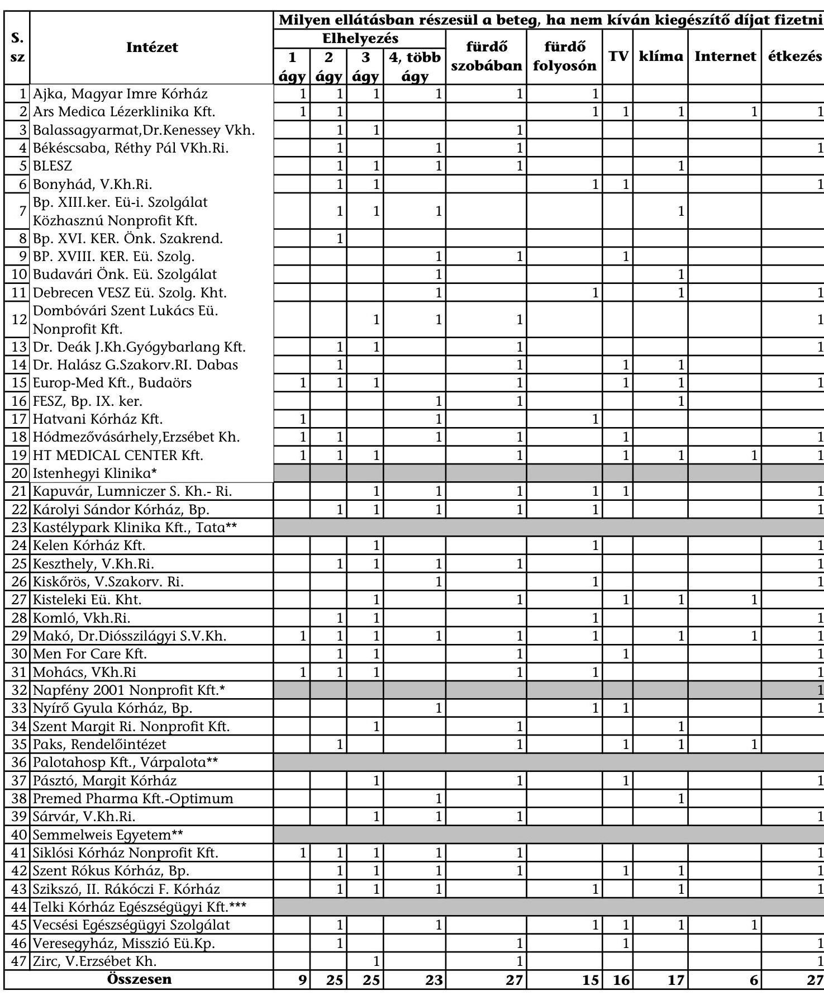
*A megjelölt intézeteknél a hotelszolgáltatásért díjat kell fizetni.
**A megjelölt intézetek nem szolgáltattak adatot a kiegészítő díj fizetése nélkül elérhető hotelszolgáltatásokról.
***A Telki Kórház Egészségügyi Kft. és az OEP felbontotta a szerződést.

---

# Az OEP által finanszírozott egynapos ellátások térítési díjai (3. sz. adatlap feldolgozása)

|  S.
sz. | Intézet | 1 ágyas | 2 ágyas | 3 ágyas | 4 ágyas | Internet | Étkezés | Konz.
díjak | Egyéb  |
| --- | --- | --- | --- | --- | --- | --- | --- | --- | --- |
|  1 | Ars Medica Lézerklinika Kft. |  |  |  |  |  |  | 10000 | $\begin{aligned} & 30000- \ & 40000 \end{aligned}$  |
|  2 | Bp. XIII.ker. Eü-i. Szolgálat Közhasznú Nonprofit Kft. |  |  |  |  |  |  |  | $\begin{aligned} & 5000, \ & 135000 \end{aligned}$  |
|  3 | Budavári Önk. Eü. Szolgálat |  |  |  |  |  |  | 10000 |   |
|  4 | Debrecen VESZ Eü. Szolg. Kht. | 15000 | 12000 |  |  |  |  |  |   |
|  5 | Istenhegyi Klinika | $\begin{aligned} & 10000- \ & 40000 \end{aligned}$ | $\begin{aligned} & 10000- \ & 40000 \end{aligned}$ |  |  |  |  |  |   |
|  6 | Kelen Kórház Kft. | $\begin{aligned} & \text { időtartamtól } \ & 24000-38400 \end{aligned}$ |  |  |  |  |  |  |   |
|  7 | Keszthely, V.Kh.Ri. | 5000 | 4000 | 3000 |  |  |  |  |   |
|  9 | Kisteleki Eü. Kht. |  |  |  |  | $\begin{aligned} & 500- \ & 1000 \end{aligned}$ |  |  |   |
|  10 | Mohács, VKh.Ri. | 5000 |  |  |  |  |  |  |   |
|  11 | Napfény 2001 Nonprofit Kft. |  | 1000 |  |  |  |  | elő́tt 5000 után 2500 |   |
|  12 | Nyírő Gyula Kórház, Bp. | 16000 | 8000 |  |  |  |  |  |   |
|  13 | Premed Pharma Kft.-Optimum |  |  |  |  |  |  | 10000 |   |
|  14 | Szikszó, II. Rákóczi F. Kórház |  |  |  |  |  |  |  | 4000/nap  |
|  15 | Veresegyház, Misszió Eü.Kp. |  | 12500 |  |  |  |  |  |   |
|  Összes szolgáltató (db) |  | 6 | 6 | 1 |  | 1 |  | 4 | 3  |

---

# Az anesthesiológia költségfedezete a HBCS-ben*

|  S.
sz. | HBCS | Név | Szorzó
(anesth.) | Súlyszámérték
(Ft) |  | $\begin{gathered} \text { Eset } \ 2008 . \end{gathered}$ | $\begin{gathered} \text { Eset } \ 2009 . * * \end{gathered}$ | Esetszám alapján kifizetett anesthesiológiai költség (Ft) |   |
| --- | --- | --- | --- | --- | --- | --- | --- | --- | --- |
|   |  |  |  | 2008.
(szorzó*
146 000) | 2009. IV. 1-jétől
(szorzó*
150 000) |  |  | 2008. | 2009.**  |
|  1 | 0680 | Szürkehályogmútét | 0,00870 | 1270,2 | 1305,0 | 10162 | 8508 | 12907772 | 11102940  |
|  2 | 681D | Interruptio | 0,02605 | 3803,3 | 3907,5 | 5897 | 4304 | 22428060 | 16817880  |
|  3 | 647A | Abrasio altatásban | 0,04082 | 5959,7 | 6123,0 | 4589 | 3257 | 27349155 | 19942611  |
|  4 | 398A | Artroszkópia | 0,04353 | 6355,4 | 6529,5 | 2783 | 2414 | 17687023 | 15762213  |
|  5 | 6450 | Vagina, cervix, vulva mútétek | 0,01427 | 2083,4 | 2140,5 | 2355 | 1512 | 4906454 | 3236436  |
|  6 | 2030 | Varix lekötés, eltávolítás | 0,04872 | 7113,1 | 7308,0 | 2155 | 2284 | 15328774 | 16691472  |
|  7 | 279B | Végbél, stomamútétek | 0,02117 | 3090,8 | 3175,5 | 1659 | 1147 | 5127670 | 3642299  |
|  8 | 281B | Lágyék-, köldök-, combsérv-
mútétek 18 év felett | 0,03885 | 5672,1 | 5827,5 | 1478 | 1085 | 8383364 | 6322838  |
|  9 | 9575 | Belső fémrögzítés eltáv. | 0,01598 | 2333,1 | 2397,0 | 805 | 554 | 1878129 | 1327938  |
|  10 | 6130 | Transurethralis prostatamútét | 0,07477 | 10916,4 | 11215,5 | 684 | 826 | 7466831 | 9264003  |
|  Összesen |  |  |  |  |  |  |  | 123463233 | 104110629  |

- Adatforrás: OEP 50 elemú HBCS megoszlás. ** 9 hónap adata alapján.

---

# Az egynapos beavatkozások összesített szövődményes esetszáma

|  S.sz. | Indikátorok | 2008-as finanszírozási év |  | 2009-es finanszírozási év |  | 2007 | 2008 | 2009  |
| --- | --- | --- | --- | --- | --- | --- | --- | --- |
|   |  | (db) | $(\%)$ | (db) | $(\%)$ | db | db | db  |
|  5. | Összes egynapos műtét az OEP adatbázis szerint a 47, pályázaton nyertes szolgáltatóknál | 43215 |  | 35535 |  | (intézmények száma, amelyekben nem fordult elő szövődményes eset) |  |   |
|   | Szövődmény (kivéve vérzés) miatt egynapos műtétet követően (legfeljebb felső ápolási határnapon belül) fekvőbeteg intézménybe elhelyezett esetek száma | 39 | 0,0009 | 16 | 0,0005 | 38 | 30 | 38  |
|  11. | Vérzés miatt történő (intézményi felvételt nem igénylő) szövődményes esetek száma (hazabocsátást követően) | 14 | 0,0003 | 6 | 0,0002 | 42 | 40 | 44  |
|  17. | Vérzés miatt intézeti felvételt igénylő szövődményes esetek száma (hazabocsátást követően, legfeljebb felső határnapon belül) | 31 | 0,0007 | 14 | 0,0004 | 40 | 37 | 38  |
|  19. | Vérzés miatti szövődményes esetek száma összesen (11+17) | 45 | 0,0010 | 20 | 0,0006 | 39 | 34 | 37  |
|  22. | Altatásos szövődményes esetek száma | 60 | 0,0014 | 34 | 0,0010 | 43 | 42 | 41  |
|  25. | Regionális anesztézia miatti szövődményes esetek száma | 6 | 0,0001 | 0 | 0,0000 | 45 | 43 | 46  |
|  28. | Vezetéses érzéstelenítés szövődményei | 0 | 0,0000 | 0 | 0,0000 | 46 | 46 | 46  |
|  33. | Szövődményes sebgyógyulásos esetek száma | 15 | 0,0003 | 9 | 0,0003 | 41 | 38 | 42  |
|  36. | Reoperációk száma | 18 | 0,0004 | 6 | 0,0002 | 41 | 35 | 41  |
|  40. | Az összes műtéti esetekből a kórházi fertőzések száma | 4 | 0,0001 | 2 | 0,0001 | 45 | 44 | 45  |
|  41. | Halálozási arány diagnózishoz kötötten | 0 | 0,0000 | 0 | 0,0000 |  |  |   |
|   | Szövődményes, fertőzéses esetek, reoperáció összesen | 187 | 0,00433 | 87 | 0,00245 |  |  |   |

Adatok: szolgáltatói adatkérés alapján. Az egynapos beavatkozások Szabálykönyv szerint alkalmazott indikátorai, Program 4. sz. adatlap.

---

## **Egynapos beavatkozások adatai, leggyakoribb lehetséges esetszám szerint rendezve (2006)**

|  S.sz. | Megnevezés | 0600 Szárkobaltyogasítót
phakoromátéltudás módszerei | 6810 Interruptív aspirációs
bízottel 12. hét előtt, altutásod | 647A Abrasio altutásban | 9600 ESWE | 2800 Diagnozifikus hatéteresés | 8300 Varta lekötés, eltávolítás | 6450 Voglasi, crevíz, valva
múltitek | 281B Lágyék-, köldök,
combúér-múltitek 18 év felett | 9575 Belső fémringolás
eltávolításai tűzoldott kivételével | 6000 Inkompürt vetítési
mácszess befejezéssel 12 hétig | 279B Végbél, stomsműtétek | 398A Artoszkópia | 4130 Tronnarethsztis
prestataműtét | 1-13 összesen | Finanszírozott egynapos összesen  |
| --- | --- | --- | --- | --- | --- | --- | --- | --- | --- | --- | --- | --- | --- | --- | --- | --- |
|   |  | 1. | 2. | 3. | 4. | 5. | 6. | 7. | 8. | 9. | 10. | 11. | 12. | 13. |  |   |
|  1. Lehetséges egynapos esetszám* |  | 52 911,9 | 44 391,0 | 39 250,4 | 18 147,2 | 12 809,3 | 12 678,0 | 12 331,2 | 11 254,3 | 10 495,9 | 6 835,9 | 6 137,8 | 6 121,1 | 2 166,3 | 235 530,3 | 316 432,4  |
|  ebből |  |  |  |  |  |  |  |  |  |  |  |  |  |  |  |   |
|  2. Egynapos esetszám összesen |  | 961,0 | 16 781,0 | 13 834,0 | 6 991,0 | 2 478,0 | 704,0 | 1 547,0 | 180,0 | 524,0 | 2 625,0 | 418,0 | 843,0 | 0,0 | 47 886,0 | 55 167,0  |
|  3. Egynapos esetszám aránya a finanszírozotthoz (%) (2./1.) |  | 1,8% | 37,8% | 35,2% | 38,5% | 19,3% | 5,6% | 12,5% | 1,6% | 5,0% | 38,4% | 6,8% | 13,8% | 0,0% | 20,3% | 17,4%  |
|  Lehetséges egynaposból |  |  |  |  |  |  |  |  |  |  |  |  |  |  |  |   |
|  4. Pályázatos nyertes, egynapos esetszám |  | 384,0 | 889,0 | 1 138,0 | 1 346,0 | 0,0 | 273,0 | 274,0 | 143,0 | 85,0 | 204,0 | 153,0 | 571,0 | 0,0 | 5 460,0 | 7 134,0  |
|  5. Kórházi, aktív, egynapos esetszám (2.-4.) |  | 577,0 | 15 892,0 | 12 696,0 | 5 645,0 | 2 478,0 | 431,0 | 1 273,0 | 37,0 | 439,0 | 2 421,0 | 265,0 | 272,0 | 0,0 | 42 426,0 | 48 033,0  |
|  6. Kórházi, 24 órán túli esetszám (1.-2.) |  | 51 950,9 | 27 610,0 | 25 416,4 | 11 156,2 | 10 331,3 | 11 974,0 | 10 784,2 | 11 074,3 | 9 971,9 | 4 210,9 | 5 719,8 | 5 278,1 | 2 166,3 | 187 644,3 | 261 265,4  |
|  Lehetséges egynapos esetszámok megoszlása (%) |  |  |  |  |  |  |  |  |  |  |  |  |  |  |  |   |
|  7. Pályázatos nyertes, egynapos (4./1.) |  | 0,7% | 2,0% | 2,9% | 7,4% | 0,0% | 2,2% | 2,2% | 1,3% | 0,8% | 3,0% | 2,5% | 9,3% | 0,0% | 2,3% | 2,3%  |
|  8. Kórházi, aktív egynapos (5./1.) |  | 1,1% | 35,8% | 32,3% | 31,1% | 19,3% | 3,4% | 10,3% | 0,3% | 4,2% | 35,4% | 4,3% | 4,4% | 0,0% | 18,0% | 15,2%  |
|  9. Kórházi, 24 órán túli (6./1.) |  | 98,2% | 62,2% | 64,8% | 61,5% | 80,7% | 94,4% | 87,5% | 98,4% | 95,0% | 61,6% | 93,2% | 86,3% | 100,0% | 79,7% | 82,5%  |
|  Egynapos arányok (%) |  |  |  |  |  |  |  |  |  |  |  |  |  |  |  |   |
|  10. Pályázatos (4./2.) |  | 40,0% | 5,3% | 8,2% | 19,3% | 0,0% | 38,8% | 17,7% | 79,4% | 16,2% | 7,8% | 36,6% | 67,7% | - | 11,4% | 12,9%  |
|  11. Kórházi, aktív (5./2.) |  | 60,0% | 94,7% | 91,8% | 80,7% | 100,0% | 61,2% | 82,3% | 20,6% | 83,8% | 92,2% | 63,4% | 32,3% | - | 88,6% | 87,1%  |

- Az egészségügyi szakellátás társadalombiztosítás finanszírozásának egyes kérdéseiről szóló 9/1993. (IV. 2.) NM rendelet 9. számú mellékletének I., II., III., IV. csoportja alapján

---

## **Egynapos beavatkozások adatai, leggyakoribb lehetséges esetszám szerint rendezve (2007)**

|   | Megnevezés | 0600 Szárkebályugmától
phakorimulsifizetése módszeref | 681D Interruptio aspirációs
kirettől 12. hét előtt, altatással | 647A Sivusis altatásban | 9600 ESWL | 1800 Diagnosztikus hatéterezés | 2020 Varis lekétes, eltávolítás | 2018 Végelsz, kióklás, combsíreműtétek 18 év felett | 6450 Vagóna, cervix, vulva műtétek | 9575 Belző fémvágolás eltávolítása tüzükvő kivételével | 6800 Lakomplett vetélés műszeres befejezései 12 hétig | 398A Szürkebálgai | 279B Végböl, stomaműtétek | 6130 Tronosvetkeális prostataműtét | 1-13 összesen | Finanszírozott egynapos összesen  |
| --- | --- | --- | --- | --- | --- | --- | --- | --- | --- | --- | --- | --- | --- | --- | --- |
|   |  | 1. | 2. | 3. | 4. | 5. | 6. | 7. | 8. | 9. | 10. | 11. | 12. | 13. | 14.  |
|  1. Lehetséges egynapos esetszám* |  | 54 333,2 | 41 615,0 | 35 467,8 | 14 119,0 | 13 073,2 | 11 874,4 | 11 030,8 | 10 766,7 | 9 833,4 | 7 046,8 | 7 040,3 | 5 516,2 | 1 701,3 | 221 438,1  |
|  ebből |  |  |  |  |  |  |  |  |  |  |  |  |  |  |   |
|  2. Egynapos esetszám összesen |  | 8 099,0 | 21 879,0 | 16 634,0 | 7 061,0 | 3 864,0 | 1 136,0 | 381,0 | 2 293,0 | 787,0 | 3 987,0 | 1 575,0 | 525,0 | 856,0 | 69 077,0  |
|  3. Egynapos esetszám aránya a finanszírozotthoz (%) (2./1.) |  | 14,9% | 52,6% | 49,7% | 50,0% | 29,6% | 9,6% | 3,4% | 21,3% | 8,0% | 56,6% | 22,4% | 9,5% | 50,3% | 31,2%  |
|  Lehetséges egynaposhól |  |  |  |  |  |  |  |  |  |  |  |  |  |  |   |
|  4. Pályázatos nyertes, egynapos esetszám |  | 384,0 | 1 023,0 | 1 270,0 | 1 223,0 | 0,0 | 395,0 | 219,0 | 248,0 | 96,0 | 249,0 | 1 219,0 | 169,0 | 4,0 | 6 499,0  |
|  5. Kórházi, aktív, egynapos esetszám (2.-4.) |  | 7 715,0 | 20 856,0 | 15 364,0 | 5 838,0 | 3 864,0 | 741,0 | 162,0 | 2 045,0 | 691,0 | 3 738,0 | 356,0 | 356,0 | 852,0 | 62 578,0  |
|  6. Kórházi, 24 ónán túli esetszám (1.-2.) |  | 46 234,2 | 19 736,0 | 16 833,8 | 7 058,0 | 9 209,2 | 10 738,4 | 10 669,8 | 8 473,7 | 9 046,4 | 3 059,8 | 5 465,3 | 4 991,2 | 845,3 | 152 361,1  |
|  Lehetséges egynapos esetszámok megoszlása (%) |  |  |  |  |  |  |  |  |  |  |  |  |  |  |   |
|  7. Pályázatos nyertes, egynapos (4./1.) |  | 0,7% | 2,5% | 3,8% | 8,7% | 0,0% | 3,3% | 2,0% | 2,3% | 1,0% | 3,5% | 17,3% | 3,1% | 0,2% | 2,9%  |
|  8. Kórházi, aktív egynapos (5./1.) |  | 14,2% | 50,1% | 45,9% | 41,3% | 29,6% | 6,2% | 1,5% | 19,0% | 7,0% | 53,0% | 5,1% | 6,5% | 50,1% | 28,3%  |
|  9. Kórházi, 24 ónán túli (6./1.) |  | 85,1% | 47,4% | 50,3% | 50,0% | 70,4% | 90,5% | 96,5% | 78,7% | 92,0% | 43,5% | 77,6% | 90,4% | 49,7% | 68,8%  |
|  Egynapos arányok (%) |  |  |  |  |  |  |  |  |  |  |  |  |  |  |   |
|  10. Pályázatos (4./2.) |  | 4,7% | 4,7% | 7,6% | 17,3% | 0,0% | 34,8% | 57,5% | 10,8% | 12,2% | 6,2% | 77,4% | 32,2% | 0,5% | 9,4%  |
|  11. Kórházi, aktív (5./2.) |  | 95,3% | 95,3% | 92,4% | 82,7% | 100,0% | 65,2% | 42,5% | 89,2% | 87,8% | 93,8% | 22,6% | 67,8% | 99,5% | 90,6%  |

- Az egészségügyi szakellátás társadalombiztosítás finanszírozásának egyes kérdéseiről szóló 9/1993. (IV. 2.) NM rendelet 9. számú mellékletének I., II., III., IV. csoportja alapján

---

## **Egynapos beavatkozások adatai, leggyakoribb lehetséges esetszám szerint rendezve (2008)**

|  S.sz. | Megnevezés | 0600 Százkehelyegmiköt, abaloomahállítatások módszereit | 6810 Interruptio aspirációs kéretele 12. hét előtt, altatással | 647A Abrasio altatásban | 1800 Diagnozatikus haténevezés | 9600 ESWL | 2030 Varis lekötés, eltávolítás | 6450 Vagina, cervix, valva mátétek | 9574 Belső fémrögzítés eltávolítását tüzödést kivételével | 6800 Inkomplett vétifiés műszeres befejezéssel 12 beitig | 398A Artrenschópia | 281B Lágyók-, kólátok-, combsérvindítók 18 év felett | 279B Végből, stomamátétek | 6150 Tiranserethszék prostatamától | 1-15 összesen | Finanszírozott egynapos összesen  |
| --- | --- | --- | --- | --- | --- | --- | --- | --- | --- | --- | --- | --- | --- | --- | --- | --- |
|   |  | 1. | 2. | 3. | 4. | 5. | 6. | 7. | 8. | 9. | 10. | 11. | 12. | 13. |  |   |
|  1. | Lehetséges egynapos esetszám* | 59 004,0 | 41 633,2 | 52 451,0 | 12 983,1 | 12 719,5 | 11 286,3 | 10 640,8 | 9 943,3 | 8 530,8 | 8 154,1 | 7 925,6 | 6 409,7 | 2 282,6 | 223 964,0 | 300 303,7  |
|   | ebből |  |  |  |  |  |  |  |  |  |  |  |  |  |  |   |
|  2. | Egynapos esetszám összesen | 16 498,0 | 27 624,0 | 21 378,0 | 3 692,0 | 6 865,0 | 2 674,0 | 4 272,0 | 1 612,0 | 5 458,0 | 3 033,0 | 1 715,0 | 1 892,0 | 1 640,0 | 98 353,0 | 115 580,0  |
|  3. | Egynapos esetszám anánya a finanszírozotthoz (%) (2./1.) | 28,0% | 66,4% | 65,9% | 28,4% | 54,0% | 23,7% | 40,1% | 16,2% | 64,0% | 37,2% | 21,6% | 29,5% | 71,8% | 43,9% | 38,5%  |
|  Lehetséges egynapozból |  |  |  |  |  |  |  |  |  |  |  |  |  |  |  |   |
|  4. | Pályázatos nyertes, egynapos esetszám | 10 162,0 | 5 897,0 | 4 589,0 | 0,0 | 193,0 | 2 155,0 | 2 355,0 | 805,0 | 702,0 | 2 783,0 | 1 478,0 | 1 659,0 | 684,0 | 33 462,0 | 43 215,0  |
|  5. | Kórházi, aktív, egynapos esetszám (2.-4.) | 6 336,0 | 21 727,0 | 16 789,0 | 3 692,0 | 6 672,0 | 519,0 | 1 917,0 | 807,0 | 4 756,0 | 250,0 | 237,0 | 233,0 | 956,0 | 64 891,0 | 72 365,0  |
|  6. | Kórházi, 24 ónán túli esetszám (1.-2.) | 42 506,0 | 14 009,2 | 11 073,0 | 9 291,1 | 5 854,5 | 8 612,3 | 6 368,8 | 8 331,3 | 3 072,8 | 5 121,1 | 6 210,6 | 4 517,7 | 642,6 | 125 611,0 | 184 723,7  |
|  Lehetséges egynapos esetszámok megoszlása (%) |  |  |  |  |  |  |  |  |  |  |  |  |  |  |  |   |
|  7. | Pályázatos nyertes, egynapos (4./1.) | 17,2% | 14,2% | 14,1% | 0,0% | 1,5% | 19,1% | 22,1% | 8,1% | 8,2% | 34,1% | 18,6% | 25,9% | 30,0% | 14,9% | 14,4%  |
|  8. | Kórházi, aktív egynapos (5./1.) | 10,7% | 52,2% | 51,7% | 28,4% | 52,5% | 4,6% | 18,0% | 8,1% | 55,8% | 3,1% | 3,0% | 3,6% | 41,9% | 29,0% | 24,1%  |
|  9. | Kórházi, 24 ónán túli (6./1.) | 72,1% | 33,6% | 34,2% | 71,6% | 46,0% | 76,3% | 59,9% | 83,8% | 36,0% | 62,8% | 78,4% | 70,5% | 28,2% | 56,1% | 61,5%  |
|  Egynapos anányok (%) |  |  |  |  |  |  |  |  |  |  |  |  |  |  |  |   |
|  10. | Pályázatos (4./2.) | 61,6% | 21,3% | 21,5% | 0,0% | 2,8% | 80,6% | 55,1% | 49,9% | 12,9% | 91,8% | 86,2% | 87,7% | 41,7% | 34,0% | 37,4%  |
|  11. | Kórházi, aktív (5./2.) | 38,4% | 78,7% | 78,5% | 100,0% | 97,2% | 19,4% | 44,9% | 50,1% | 87,1% | 8,2% | 13,8% | 12,3% | 58,3% | 66,0% | 62,6%  |

- Az egészségügyi szakellátás társadalombiztosítás finanszírozásának egyes kérdéseiről szóló 9/1993. (IV. 2.) NM rendelet 9. számú mellékletések I., II., III., IV. csoportja alapján

---

## **Egynapos beavatkozások adatai, leggyakoribb lehetséges esetszám szerint rendezve (2009**)

|  SZ | Megnevezés | 0600 Szárkebályugmától
phakozmásítisztúra módszeref | 681D Interruptio aspirációs
kirettől 12. hét előtt, altatáinál | 647A Abrasie altatásban | 1800 Diagnosztikus kattéterező | 9600 ESWL | 2020 Varis lekétét, eltávolítás | 6450 Voglian, szervis, valva
múltiéd | 398A Artroszkópus | 6800 Inkomplett vörölés
műszeres betűjesztésű 12. hétig | 281B Légyelk-, koldok-,
combúreműtétek 10 év felett | 279B Végből, stomaműtétek | 9631 Bőr, bőr alatti szövet, emül
kisebb piacrtikai és egyéb
múltiéd | 6130 Tronzaretkeális
prostatamától | 1-13 összesen | Finanszírozott egynapos összesen  |
| --- | --- | --- | --- | --- | --- | --- | --- | --- | --- | --- | --- | --- | --- | --- | --- |
|   |  | 1. | 2. | 3. | 4. | 5. | 6. | 7. | 8. | 9. | 10. | 11. | 12. | 13. |   |
|  1. Lehetséges egynapos esetszám* |  | 48 436,1 | 31 305,2 | 24 679,0 | 11 360,0 | 11 134,9 | 9 641,9 | 7 944,0 | 7 028,5 | 6 641,6 | 6 067,2 | 4 703,2 | 3 574,8 | 2 145,2 | 174 661,6  |
|  ebből |  |  |  |  |  |  |  |  |  |  |  |  |  |  |   |
|  2. Egynapos esetszám összesen |  | 14 606,0 | 21 067,0 | 16 471,0 | 3 626,0 | 6 554,0 | 3 297,0 | 3 377,0 | 2 560,0 | 4 363,0 | 1 526,0 | 1 405,0 | 1 824,0 | 1 640,0 | 82 316,0  |
|  3. Egynapos esetszám aránya a finanszírozotthoz (%) (2./1.) |  | 30,2% | 67,3% | 66,7% | 31,9% | 58,9% | 34,2% | 42,5% | 36,4% | 65,7% | 25,2% | 29,9% | 51,0% | 76,4% | 47,1%  |
|  Lehetséges egynaposhól |  |  |  |  |  |  |  |  |  |  |  |  |  |  |   |
|  4. Pályázatos nyertes, egynapos esetszám |  | 8 508,0 | 4 304,0 | 3 257,0 | 0,0 | 416,0 | 2 284,0 | 1 512,0 | 2 414,0 | 574,0 | 1 085,0 | 1 147,0 | 1 450,0 | 826,0 | 27 777,0  |
|  5. Kérházi, aktív, egynapos esetszám (2.-4.) |  | 6 098,0 | 16 763,0 | 13 214,0 | 3 626,0 | 6 138,0 | 1 013,0 | 1 865,0 | 146,0 | 3 789,0 | 441,0 | 258,0 | 374,0 | 814,0 | 54 539,0  |
|  6. Kérházi, 24 ónán túli esetszám (1.-2.) |  | 33 830,1 | 10 238,2 | 8 208,0 | 7 734,0 | 4 580,9 | 6 344,9 | 4 567,0 | 4 468,5 | 2 278,6 | 4 541,2 | 3 298,2 | 1 750,8 | 505,2 | 92 345,6  |
|  Lehetséges egynapos esetszámok megoszlása (%) |  |  |  |  |  |  |  |  |  |  |  |  |  |  |   |
|  7. Pályázatos nyertes, egynapos (4./1.) |  | 17,6% | 13,7% | 13,2% | 0,0% | 3,7% | 23,7% | 19,0% | 34,3% | 8,6% | 17,9% | 24,4% | 40,5% | 38,5% | 15,9%  |
|  8. Kérházi, aktív egynapos (5./1.) |  | 12,6% | 53,6% | 53,5% | 31,9% | 55,1% | 10,5% | 23,5% | 2,1% | 57,1% | 7,3% | 5,5% | 10,5% | 37,9% | 31,2%  |
|  9. Kérházi, 24 ónán túli (6./1.) |  | 69,8% | 32,7% | 33,3% | 68,1% | 41,2% | 65,8% | 57,5% | 63,6% | 34,3% | 74,8% | 70,1% | 49,0% | 23,6% | 52,9%  |
|  Egynapos arányok (%) |  |  |  |  |  |  |  |  |  |  |  |  |  |  |   |
|  10. Pályázatos (4./2.) |  | 58,3% | 20,4% | 19,8% | 0,0% | 6,3% | 69,3% | 44,8% | 94,3% | 13,2% | 71,1% | 81,6% | 79,5% | 50,4% | 33,7%  |
|  11. Kérházi, aktív (5./2.) |  | 41,7% | 79,6% | 80,2% | 100,0% | 93,7% | 30,7% | 55,2% | 5,7% | 86,8% | 28,9% | 18,4% | 20,5% | 49,6% | 66,3%  |

- Az egészségügyi szakellátás társadalombiztosítás finanszírozásának egyes kérdéseiről szóló 9/1993. (IV. 2.) NM rendelet 9. számú mellékletének I., II., III., IV. csoportja alapján

* - 2009. I-III. negyedév (finanszírozási év)

---

Szürkehályog műtétek várakozási ideje (nap)

17. sz. tábla

|  Régiók, intézmények | 2007. okt-der. | 2008. apr. | 2008. mai. | 2008. jún. | 2008. jul. | 2008. szepi. | 2008. okt. | 2008. nov. | 2008. dec. | 2009. jan. | 2009. febr. | 2009. mán. | 2009. apr.  |
| --- | --- | --- | --- | --- | --- | --- | --- | --- | --- | --- | --- | --- | --- |
|  Nél. tábla |  |  |  |  |  |  |  |  |  |  |  |  |   |
|  Bráz. VÁS ÁL | 120 |  |  |  |  |  |  |  |  |  |  |  |   |
|  Békéscsősz, Bóltó TÁS VÁS ÁL | 60 | 80 |  | 219 | 273 | 204 | 234 | 206 | 208 | 153 | 133 | 83 | 32  |
|  Caráta, Pánek Kálmán MÁN ÁL | 159 | 160 | 249 | 288 | 144 | 168 |  | 210 | 167 | 178 | 182 | 197 | 181  |
|  Bádékoztvasaltony, Eszeltei ÁS ÁL | 356 |  | 360 | 470 | 520 | 480 | 480 | 518 | 558 | 590 | 670 | 670 | 680  |
|  Escskotert, BEM (Nekszin. Kóthúza | 60 |  |  |  | 51 | 60 | 110 | 71 | 70 | 44 | 51 | 62 | 59  |
|  Kokonélőagát VÁS ÁL (sz) ÁL Ég |  |  |  |  |  |  |  |  |  |  |  |  |   |
|  Kokonélsóta (intézménye ÁS, ÁS) |  |  | 100 | 70 | 60 | 111 | 131 | 169 | 161 | 140 | 112 | 89 | 122  |
|  Kémiskó Sz, ÁS |  |  |  |  |  | 14 | 11 | 39 | 39 |  |  |  |   |
|  Makt, Ús Dünnélőgát LÚ ÁS | 94 | 70 | 73 | 126 |  |  |  | 164 |  | 108 | 109 | 108 | 45  |
|  Olmthuta, V. Égy (sz.-M. fel. | 92 |  | 100 | 105 | 118 | 117 | 119 | 127 | 110 | 133 | 122 | 124 | 136  |
|  Szeites Cs M Ónk. ál Bagg (1.Ék. |  |  |  |  |  |  |  |  |  |  |  |  |   |
|  GÚS, Isteni Gýrlagit A. ÁL Kögy. | 180 | 86 | 63 | 63 | 80 | 61 | 46 | 78 | 47 | 24 | 40 | 87 | 52  |
|  Nél fizsokirál |  |  |  |  |  |  |  |  |  |  |  |  |   |
|  Borchód, V ÁS ÁL |  |  |  |  |  |  |  |  |  |  |  |  |   |
|  Domborús (inté) Lakási ÉS, ÁS |  |  |  |  |  |  |  |  |  |  |  |  |   |
|  Ésgestelt, Esgest Mót Ohnész ÁS | 54 |  |  |  |  | 147 | 113 | 157 | 161 | 150 | 117 | 163 | 121  |
|  Komlói Egészégcseresen ÁS |  |  |  |  |  |  |  |  |  |  |  |  |   |
|  Húcsák, VÁS |  |  |  |  |  |  |  |  |  |  |  |  |   |
|  Móhész, VÁS ÁL | 39 | 18 | 17 | 17 | 16 | 16 | 18 | 20 | 18 | 19 | 16 | 16 | 18  |
|  Zaks, Kondekimésze |  |  |  |  |  |  |  |  |  |  |  |  |   |
|  Pécs, Bencészs órágyú Kóthús |  |  |  |  |  |  |  |  |  |  |  |  |   |
|  Pécsi Tezlemészségcseresen (HÁS) |  | 58 | 73 | 73 | 73 |  | 73 | 73 | 73 |  |  |  |   |
|  Siklus Kóthús ÁS |  |  |  |  |  |  |  |  |  |  |  |  |   |
|  Hóhát, VÁS | 60 |  |  |  |  |  |  |  |  |  |  |  |   |
|  Székesíté, Balaton J. M. (1.Ék. | 30 |  |  |  |  |  |  |  |  |  |  |  |   |
|  Szigetség Sz, ÁS |  |  |  |  |  |  |  |  |  |  |  |  |   |
|  Észek tábla |  |  |  |  |  |  |  |  |  |  |  |  |   |
|  Bontószegész, Tettőnít ÁS |  |  |  |  |  |  |  |  |  |  |  |  |   |
|  ÚK (ÁS), Döbészés |  | 73 | 83 | 86 | 90 | 97 | 100 | 103 | 108 |  | 113 | 116 | 114  |
|  Döbészés VÉZÉ ÉS, Szolg. ÁS |  |  |  |  |  |  |  |  |  |  |  |  |   |
|  Döbészés, Komoly Kóthús ÁL ÁS | 106 | 101 |  | 146 | 92 | 169 | 120 | 168 | 123 |  | 162 | 168 | 198  |
|  Fülségcseresen Szombat Bongó ÁS |  |  |  |  |  |  |  |  |  |  |  |  |   |
|  Szubotész, Eszeltei ÁS, ÁL |  |  |  |  |  |  |  |  |  |  |  |  |   |
|  Korong, Kálm Gálmi ÁS, ÁL |  |  |  |  |  |  |  |  |  |  |  |  |   |
|  Mótösszku, Tettőnít Kóthús | 2 |  | 2 | 2 | 2 | 2 | 2 | 2 | 2 | 2 | 2 | 2 | 2  |
|  Mochlat Vás, ÁL Szulcság ÁS |  |  |  |  |  |  |  |  |  |  |  |  |   |
|  Nyíregőrzész, Ime Á. Mégért ÁS | 13 | 34 | 31 | 63 | 100 | 38 | 78 | 87 | 70 | 53 | 40 | 43 | 43  |
|  Szilárek, Horászl. Ú. MÁS | 14 | 44 |  | 53 | 58 | 57 | 63 | 71 | 108 | 124 | 142 | 152 |   |
|  Észek Magyarszcsolg |  |  |  |  |  |  |  |  |  |  |  |  |   |
|  Rémengészésné, Rémencszy VÁS | 21 |  | 28 | 24 | 21 | 21 | 19 | 26 | 34 | 14 | 16 | 16 | 16  |
|  Igen, Mózkbót F. MÁS | 487 |  | 427 | 427 | 488 | 488 | 488 | 535 | 465 | 523 | 433 | 433 | 415  |
|  Szilággal, Komlói Sz. Sz. ÁS |  |  |  |  |  |  |  |  |  |  |  |  |   |
|  Zámusz Kóthús ÁS | 14 |  |  |  |  | 30 |  | 30 |  |  | 20 | 20 |   |
|  Kárpintbérlész, VÁS |  |  | 21 | 3 |  |  |  |  |  |  |  |  | 3  |
|  Móknb, RÁZ M ÁS Égcstrész (ÁL) | 108 | 35 | 11 | 36 | 39 | 21 | 30 | 38 | 23 | 25 | 24 | 19 | 25  |
|  Móknbó Sz. Kögy Egert (ÁS ÁS) | 43 | 10 | 12 | 3 | 3 | 3 | 3 | 4 | 4 | 10 | 10 | 11 | 10  |
|  Csol, Áttest, Bologh. Pól ÁS |  |  |  |  |  |  |  |  |  |  |  |  |   |
|  Pápát, Mergő Kóthús |  |  |  |  |  |  |  |  |  |  |  |  |   |
|  Odgőrzész, Isteni Lészé M ÁS | 58 | 73 | 125 | 102 | 118 | 44 | 48 | 45 | 45 | 52 | 66 | 78 | 76  |
|  Szilusi, X. Rákóczi F. Kóthús |  |  |  |  |  |  |  |  |  |  |  |  |   |

---

Szürkehályog műtétek várakozási ideje (nap)

17. sz. tábla

|  Régiók, intézmények | 2007. okt-der. | 2008. apr | 2008. máj | 2008. jún | 2008. jul | 2008. szepi | 2008. okt | 2008. nov | 2008. dec | 2009. jan | 2009. febr | 2009. mair | 2009. apr  |
| --- | --- | --- | --- | --- | --- | --- | --- | --- | --- | --- | --- | --- | --- |
|  Kózip Pionéelöl |  |  |  |  |  |  |  |  |  |  |  |  |   |
|  Dike, Megyer Isten Kórház | 13 |  | 18 | 20 | 24 | 27 | 18 | 19 | 19 | 20 | 20 | 23 | 27  |
|  Kőzetszőletet Készes Kórház |  |  |  |  |  |  |  |  |  |  |  |  |   |
|  Dr. Thóik Lilis Gyógőszőszeg Kő. |  |  |  |  |  |  |  |  |  |  |  |  |   |
|  Diemstál Zsódi Pionéletet Kő-Kő. | 14 |  | 27 | 30 | 30 | 34 |  | 35 | 40 |  | 38 | 39 | 40  |
|  Kőfrégede Dusszer Kórks Kórház |  |  | 61 | 68 | 69 |  | 99 | 113 | 107 | 63 | 20 | 48 | 24  |
|  Komároló, Szősz Jámcs Kő. |  |  |  |  |  |  |  |  |  |  |  |  |   |
|  Jász Tarsza Kárbász-Boszkolász |  |  |  |  |  |  |  |  |  |  |  |  |   |
|  Napfény 2001 Kőt. |  |  |  |  |  |  |  | 20 | 22 | 21 | 20 | 22 | 20  |
|  Póznalecsár Kő., Tárgyalács |  |  |  |  |  |  |  |  | 5 |  |  |  |   |
|  Pápis, Sz-Szterházy Kő. (eszkumf) | 33 |  |  | 72 | 39 | 19 |  | 24 |  | 35 | 24 | 29 | 20  |
|  Székesfehérvár, Szé Gyógig-Sálló. |  |  |  |  |  |  |  |  |  |  |  |  |   |
|  Tolstóniusz, Szl. Rethális Kórház | 28 | 10 | 10 | 14 | 16 | 16 | 16 | 16 |  | 16 | 16 | 16 | 16  |
|  Pószprém, Csalmak T. M.Kő. K. | 122 |  | 73 | 78 | 82 |  | 130 | 133 |  | 143 | 143 | 143 |   |
|  Kózip Magyarország |  |  |  |  |  |  |  |  |  |  |  |  |   |
|  Állami Egészségügyi Központ | 150 |  | 114 | 120 | 133 | 84 | 21 | 84 |  |  |  |  | 22  |
|  Ám Módos Levedéssíles Kő. |  |  |  |  |  |  |  |  |  |  |  |  |   |
|  Patrói Főfőnédi Kórház, Bp. | 85 | 98 | 40 | 100 | 111 | 143 | 115 | 121 |  | 125 |  |  | 15  |
|  BLEGÍ |  |  |  |  |  |  |  |  |  |  |  |  |   |
|  Bp. 25.6st. Szulcsmédió Kő |  | 14 | 18 | 18 | 18 | 18 |  | 14 |  | 18 | 14 | 19 | 18  |
|  Bp. 330.6. Ért Hólag Kő. Bp. Kő. |  |  |  |  |  |  |  |  |  |  |  |  |   |
|  Bp. 331.6st. Kőfréged Zár. G. |  |  |  | 4 |  | 3 | 15 | 12 |  | 18 | 11 | 11 | 12  |
|  Bádorralt Órál, Sz. Szolgálód |  |  |  |  |  |  |  |  |  |  |  |  |   |
|  Csajdal Csóly T.Kő. Kő Bp Kő.Kő. | 40 | 40 | 40 | 40 | 40 | 40 | 20 | 20 |  | 15 | 13 | 13 | 9  |
|  Dr. Halász G.Aszkert Kő. Hólag |  |  |  |  |  |  |  |  |  |  |  |  |   |
|  Fárag Hőző Kő., Bódszor. | 7 |  | 13 | 13 | 16 | 16 | 14 | 15 |  |  | 13 | 16 |   |
|  Fárforgan Gyógig Órla Kord Int |  |  |  |  |  |  |  |  |  |  |  |  |   |
|  ÉP. MÉDELÁL LÜSÍTEK Kő. |  | 14 |  | 21 |  |  |  | 14 |  | 10 | 10 | 10 | 12  |
|  Kőtrélegig Megszédelség. Ért |  |  |  |  |  |  |  |  |  |  |  |  |   |
|  Jóba Fesete Zárt Érdi Kő., Bp. |  |  |  |  |  |  | 24 | 24 |  | 32 | 23 | 21 | 21  |
|  Késztei Szedés Kórház. Bp. |  |  |  |  |  |  |  |  |  |  |  |  |   |
|  Kőles Kórház Kő. |  |  |  |  |  |  |  |  |  |  |  |  |   |
|  Més Ért Lom Kő. |  |  |  |  |  |  |  |  |  |  | 18 | 16 |   |
|  Mésít Gyóla Kórház. Bp. |  |  |  |  |  |  |  |  |  |  |  |  |   |
|  Főszke Kőszemegesi Sz. Jólag Kő. |  | 21 |  |  |  | 18 |  | 14 |  |  |  |  |   |
|  LÁSÍ |  |  |  |  |  |  |  |  |  |  |  |  |   |
|  Éret Megesi Párt Érstei: Kórház. |  | 32 |  | 17 | 30 | 28 | 29 | 31 |  | 43 | 12 | 27 | 30  |
|  Főszély S.a.Kő. Kő és Bút. Közg. | 30 | 40 | 22 | 33 | 33 | 24 | 33 | 33 |  | 33 | 29 | 33 | 33  |
|  HÉSZÉS FŐSZÉKS Kő. |  |  |  |  |  |  |  |  |  |  |  |  |   |
|  Bári Pori Kő. |  |  |  |  |  |  |  |  |  |  |  |  |   |
|  Áthomásos Úgyalász | 25 | 42 | 42 | 46 | 46 | 47 | 51 | 54 |  | 56 | 42 | 48 | 48  |
|  Isteni Isten Kórház. Fővárcsá Órál. | 43 |  |  |  |  |  |  |  |  |  |  |  |   |
|  Isteni Istrósi Sűl. Lomát Kő. K. | 20 | 20 | 20 | 15 |  |  |  | 15 |  |  | 13 | 13 |   |
|  Isteni Jámcs Kő és Á. Szulcs Zárt. |  |  |  |  |  |  |  |  |  |  |  |  |   |
|  Isteni Békés Kórház. Bp. | 21 |  |  |  |  |  |  |  |  |  |  |  |   |
|  Lomát a. Kórház. Bp. | 35 | 42 |  | 30 | 30 | 40 |  | 36 |  | 39 |  | 27 | 32  |
|  Kék, Játvondó Tábai Tábai Kő. |  |  |  |  |  |  |  |  |  |  |  |  |   |
|  Késztei Egészségügyi Szolgálód |  |  |  |  |  |  |  |  |  |  |  |  |   |
|  Főszesgőszó, Hőszési Sz. Kp Kőt. | 9 | 28 |  |  |  |  |  |  |  | 9 | 12 | 10 | 10  |
|  Nyugad Összáerid |  |  |  |  |  |  |  |  |  |  |  |  |   |
|  Csábámekik, Kotevossalgal Kő. |  |  |  |  |  |  |  |  |  |  |  |  |   |
|  Csontas, Borsgit Kő. |  |  |  |  |  |  |  |  |  |  |  |  |   |
|  Gyóli, Póti Á.Megész. Ökszési Kő. | 102 | 74 | 81 | 74 | 219 | 240 | 204 | 199 |  |  | 112 | 101 |   |
|  Komáros Dánolész Kórház. | 14 |  |  | 30 |  |  |  |  |  |  |  |  |   |
|  Kágyom, Lumiscsári S. Kő.- Bt. |  |  |  |  | 4 | 4 | 3 | 4 |  | 2 | 2 | 2 | 2  |
|  Készthely, V.Kő. Kt. |  |  |  |  |  |  |  |  |  |  | 9 | 9 | 9  |
|  Kőmered, Fő-Bollészészi Kő. Kő. |  |  |  |  |  |  |  |  |  |  |  |  |   |
|  Módszavérdás Kórház. Ért | 200 | 180 | 170 | 195 | 160 | 170 | 150 | 160 |  | 143 | 195 | 170 | 195  |
|  Lépessztségmódos, Karoláns Kő. |  |  |  |  |  |  |  |  |  |  |  |  |   |
|  Bérisk, V.Kő. Kt. |  |  |  |  |  |  |  |  |  |  |  |  |   |
|  Isigész MZV. Szodber Kő. ÖKURC | 31 | 60 | 74 | 70 | 90 | 63 | 73 | 83 |  | 56 | 60 | 50 | 70  |
|  Csárogészség, Bíz jaga Kórház. | 60 | 69 | 69 | 69 | 69 | 20 | 35 | 30 |  | 22 |  | 20 | 20  |
|  Törösi TÉP |  |  |  |  |  |  |  |  |  |  |  |  |   |
|  Megjegyzés: |  |  |  |  |  |  |  |  |  |  |  |  |   |

Megjegyzés: 100.000 Kőszáerid Főfőszészés nyerőnek

---

|  S.sz. | Intézmény | Átváltott TVK, súlyszámban | Kifizetett súlyszám | Kifizetett az átváltott arányában | Átváltott TVK, súlyszámban | Kifizetett súlyszám | Kifizetett az átváltott arányában  |
| --- | --- | --- | --- | --- | --- | --- | --- |
|   |  | július-szeptember |  |  | október-május |  |   |
|  1 | Ajka, Magyar Imre Kórház | 20,0000 | 0,8387 | 4,2\% | - | - | -  |
|  2 | Árpád-házi Sz. Erzsébet SZKh. Ri. | 10,0000 | 0,0000 | 0,0\% | - | - | -  |
|  3 | Békéscsaba, Réthy Pál VKh.Ri. | 94,5840 | 4,8465 | 5,1\% | 72,5288 | 13,4947 | 18,6\%  |
|  4 | Celldömölk, Kemenesaljai Kh. | 25,0000 | 2,9900 | 12,0\% | 10,0000 | 3,2941 | 32,9\%  |
|  5 | Csorna, Margit Kh. | 40,0000 | 9,6569 | 24,1\% | 30,0000 | 3,6384 | 12,1\%  |
|  6 | Debrecen, Kenézy Gy. M.Kh. | 50,0000 | 33,6800 | 67,4\% | - | - | -  |
|  7 | Esztergom, Vaszray Kolos Kórház | 8,0000 | 0,0000 | 0,0\% | - | - | -  |
|  8 | Fehérgyarmat,Szatmár-Beregi Kh. | 18,0000 | 4,8784 | 27,1\% | 8,0000 | 8,0000 | 100,0\%  |
|  9 | Győr, Petz A.Megyei Oktató Kh. | 258,7600 | 69,0956 | 26,7\% | 462,5000 | 365,7254 | 79,1\%  |
|  10 | Gyula, Pándy Kálmán MKh.Ri. | 11,0000 | 0,0000 | 0,0\% | 15,0000 | 0,0000 | 0,0\%  |
|  11 | Kecskemét, BKM Önkorm. Kórháza | - | - | - | 80,0000 | 65,2568 | 81,6\%  |
|  12 | Keszthely, V.Kh.Ri. | 2,0000 | 0,8989 | 44,9\% | 6,0000 | 3,3984 | 56,6\%  |
|  13 | Körmend, Dr.Batthyányi Kh. Kft. | 20,0000 | 8,8926 | 44,5\% | 29,3400 | 25,8368 | 88,1\%  |
|  14 | Makó, Dr.Diósszilágyi S.V.Kh. | 20,0000 | 3,2520 | 16,3\% | 24,9120 | 13,9758 | 56,1\%  |
|  15 | Miskolc, Szent Ferenc Rehab.Kh. | - | - | - | 6,4800 | 2,6786 | 41,3\%  |
|  16 | Mór Városi Kórház-Rendelőint. | 35,0000 | 3,0448 | 8,7\% | 115,0000 | 32,8202 | 28,5\%  |
|  17 | Mosonmagyaróvár, Karolina Kh. | - | - | - | 45,0000 | 16,7553 | 37,2\%  |
|  18 | Nyíregyháza, Jósa A. Megyei Kh. | 33,0000 | 27,7181 | 84,0\% | 17,0000 | 16,5148 | 97,1\%  |
|  19 | Pápa, Gr.Esterházy Kh.-Szakamb. | 22,0000 | 10,0276 | 45,6\% | - | - | -  |
|  20 | Semmelweis Egyetem | - | - | - | 93,4800 | 18,0855 | 19,3\%  |
|  21 | Sopron MJV. Erzsébet Kh. DEOEC | - | - | - | 62,5200 | 35,0213 | 56,0\%  |
|  22 | Szent Imre Kórház,Fővárosi Önk. | 38,0000 | 31,4998 | 82,9\% | 120,0000 | 97,5654 | 81,3\%  |
|  23 | Szent Rókus Kórház, Bp. | - | - | - | 62,0000 | 62,0000 | 100,0\%  |
|  24 | Szentes,Cs.M.Önk.dr.Bugyi I.Kh. | - | - | - | 45,0000 | 28,9263 | 64,3\%  |
|  25 | Vác, Jávorszky Ödön Városi Kh. | 59,9600 | 1,7942 | 3,0\% | 23,0600 | 6,5817 | 28,5\%  |
|  26 | Zalaegerszeg, M-i jogú Kórház | 6,0000 | 4,5828 | 76,4\% | 15,0000 | 15,2847 | 101,9\%  |
|   | Összesen | 771,3040 | 217,6969 | 28,2\% | 1342,8208 | 834,8541 | 62,2\%  |

Forrás: OEP (2008. július - 2009. május)

---

# Egyes beavatkozások OEP finanszírozásának és költségeinek különbsége 

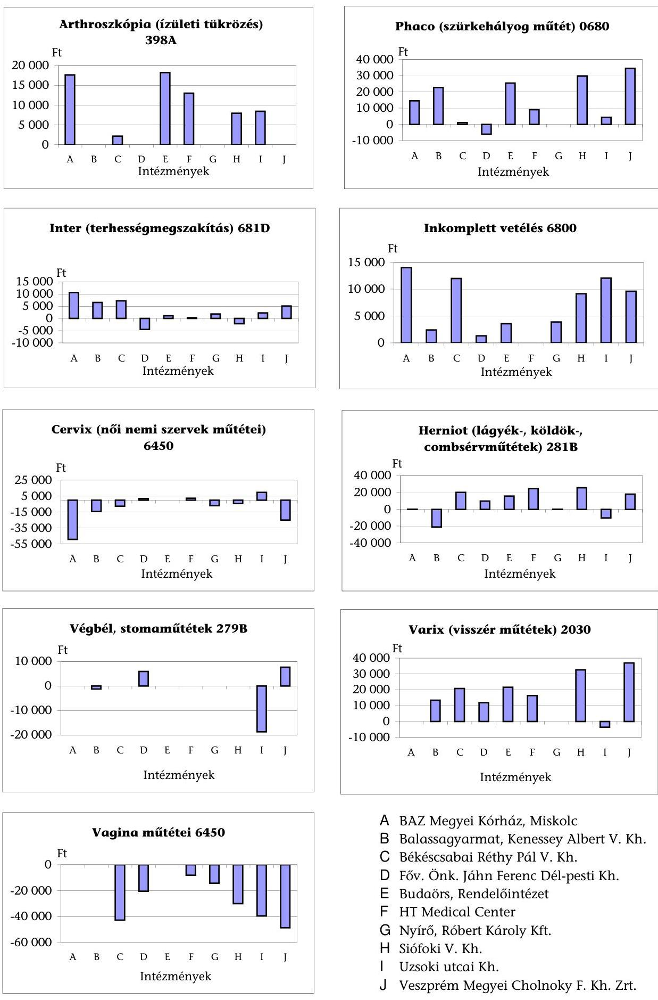

A BAZ Megyei Kórház, Miskolc
B Balassagyarmat, Kenessey Albert V. Kh.
C Békéscsabai Réthy Pál V. Kh.
D Főv. Önk. Jáhn Ferenc Dél-pesti Kh.
E Budaörs, Rendelőintézet
F HT Medical Center
G Nyírő, Róbert Károly Kft.
H Siófoki V. Kh.
I Uzsoki utcai Kh.
J Veszprém Megyei Cholnoky F. Kh. Zrt.

---

# Az egynapos sebészeti esetek adatai a 2006-2009 finanszírozási években

|  S. sz. | Megnevezés | 2006 | 2007 | 2008 | 2009. I-IX. | 2009
várható** | 2008/2006
(\%) | 2009/2006
(\%)****  |
| --- | --- | --- | --- | --- | --- | --- | --- | --- |
|  1 | Összes műtéti esetek száma | 1845938 | 1673069 | 1659121 | 840722 | 1681444 | 89,9\% | 91,1\%  |
|  2 | Lehetséges egynapos esetszám | 316432 | 296745 | 300303 | 242977 | 323969 | 94,9\% | 102,4\%  |
|  3 | ebből egynapos esetszám (1-24 órán belül) | 55167 | 78128 | 115580 | 98494 | 131325 | 209,5\% | 238,1\%  |
|  4 | ebből pályázatos nyertes, egynapos esetszám | 7134 | 11026 | 43216 | 35535 | 47380 | 605,8\% | 664,1\%  |
|  5 | kórházi, aktív, egynapos esetszám | 48033 | 67102 | 72364 | 62959 | 83945 | 150,7\% | 174,8\%  |
|  6 | Egynapos esetek aránya az összes műtéten belül (3/1) | 2,99\% | 4,67\% | 6,97\% | 11,72\% | 7,81\% | 233,1\% | 261,3\%  |
|  7 | Egynapos esetek aránya a lehetséges egynaposon belül (3/2) | 17,4\% | 26,3\% | 38,5\% | 40,5\% | 40,5\% | 220,8\% | 232,5\%  |
|  8 | Lehetséges egynapos esetek súlyszámainak összege | 172793,5 | 158520,8 | 158262,7 | 130863,4 | 174484,5 | 91,6\% | 101,0\%  |
|  9 | Lehetséges egynapos esetek finanszírozási összege (E Ft)* | 23499916,0 | 22707841,8 | 23103463,4 | 19455028,4 | 25940037,9 | 98,3\% | 110,4\%  |
|  10 | ebből egynapos eset finanszírozási összege (E Ft) | 2673003,0 | 4425093,3 | 7014049,0 | 6120020,7 | 8160027,6 | 262,4\% | 305,3\%  |
|  11 | ebből pályázatos nyertesek fin. összege (E Ft) | 454081,0 | 821636,6 | 2970824,6 | 2531730,5 | 3375640,7 | 654,2\% | 743,4\%  |
|  12 | kórházi, aktív fin. összege (E Ft) | 2218122,0 | 3608456,7 | 4043224,4 | 3588290,2 | 4784386,9 | 182,3\% | 215,7\%  |
|  13 | Lehetséges egynapos eset átlagos súlyszáma (8/2) | 0,54607 | 0,53420 | 0,52701 | 0,53858 | 0,53858 | 96,5\% | 98,6\%  |
|  14 | Átlagos finanszírozás (E Ft) - lehetséges egynapos (9/2) | 74,27 | 76,52 | 76,93 | 80,07 | 80,07 | 103,6\% | 107,8\%  |
|  16 | - pályázatos nyertes egynapos(11/4) | 63,65 | 74,52 | 68,74 | 71,25 | 71,25 | 108,0\% | 111,9\%  |
|  17 | - kórházi, aktív egynapos (12/5) | 46,18 | 53,78 | 55,87 | 56,99 | 56,99 | 121,0\% | 123,4\%  |
|  18 | Lehetséges egynapos esetszámból többnapos kórházi esetszám (2-3) | 261265 | 218617 | 184723 | 144483 | 192644 | 70,7\% | 73,7\%  |
|  19 | Lehetséges egynaposból többnaposban ellátott kórházi esetek finanszírozási összege (E Ft) (9-10) | 20826913 | 18282749 | 16089414 | 13335008 | 17780010 | 77,3\% | 85,4\%  |
|  20 | Lehetséges egynaposból többnaposban ellátott kórházi esetek átlagos finanszírozási összege (E Ft) (19/18) | 79,72 | 83,63 | 87,10 | 92,29 | 92,29 | 109,3\% | 115,8\%  |

*: a mindenkori súlyszámérték alapján számított összeg* *: a 2009. I-IX. havi adatok évesítésével becsült szám***: becslés Megjegyzés: 2006-2007 években pályázatos nyertesként a 2003. évi pályázat alapján befogadott intézmények (Tiszaújvárosi Városi Rendelőintézet, Miskolc Megyei Jogú Város Önkormányzata Semmelweis Kórház-Rendelőintézet, Napfény 2001. Kht. Kulcs, Városi Kórház Keszthely, Europ-Med Orvosi Szolgáltató Kft. Budaörs, HT Medical Center Budapest, Nemzetközi Magánkórház és Egészségügyi Szolgáltató Kft. Telki, Kelen Kórház Kft. Budapest) adatai szerepelnek (ESzCsM-PM együttes közélemény a befogadott egynapos sebészeti ellátásra szerződéskötési jogosultságot szerzett szolgáltatókról)

---

# 2008-ban a leggyakoribb 10 egynapos sebészeti beavatkozás HBCS szorzóinak és súlyszám Ft értékeinek változása (2006-2009)

|  $\begin{aligned} & \text { 5. } \ & \text { sz. } \end{aligned}$ | HBCS | Név | HBCS szorzó |  |  |  | Súlyszám Ft értéke (Ft)* |  |  |  |  |  |  |   |
| --- | --- | --- | --- | --- | --- | --- | --- | --- | --- | --- | --- | --- | --- | --- |
|   |  |  | $\begin{gathered} 2006 . \ \text { VII.1. } \end{gathered}$ | $\begin{gathered} 2007 . \ \text { IV. 1-65 } \end{gathered}$ | $\begin{gathered} 2008 . \ \text { II. } \end{gathered}$ | $\begin{gathered} 2008 \ \text { VI. } 1-65 \end{gathered}$ | $\begin{gathered} 2009 . \ \text { IX. } 1-65 \end{gathered}$ | $\begin{gathered} 2006 . \ \text { I. } \ \text { (134000) } \end{gathered}$ | $\begin{gathered} 2006 . \text { II. } \ 2007 . \text { III. } \ \text { (136000) } \end{gathered}$ | $\begin{gathered} 2007 . \text { IV. } \ 2007 . \text { XII. } \ \text { (146000) } \end{gathered}$ | $\begin{gathered} 2008 . \text { I. } \ 2008 . \text { V. } \ \text { (146000) } \end{gathered}$ | $\begin{gathered} 2008 . \text { V. } \ 2008 . \text { XII. } \ \text { (146000) } \end{gathered}$ | $\begin{gathered} 2009 . \text { I. } \ 2009 . \text { III. } \ \text { (146000) } \end{gathered}$ | $\begin{gathered} 2009 . \text { IV. } \ 2009 . \text { VIII. } \ \text { (150000) } \end{gathered}$  |
|  1 | 0680 | Szürkehályogmütét | 1,00063 | 0,80797 | 0,81571 |  | 0,72468 | 134084 | 136086 | 117964 | 119094 | 119094 | 108702 | 122357  |
|  2 | 681D | Interruptio | 0,19547 |  | 0,19805 | 0,19807 |  | 26193 | 26584 | 28539 | 28915 | 28918 | 29711 | 29711  |
|  3 | 647A | Abrasio altatásban | 0,17483 |  | 0,17741 | 0,17745 | 0,17745 | 23427 | 23777 | 25525 | 25902 | 25908 | 26618 | 26618  |
|  4 | 398A | Artroszkópia | 0,62057 |  | 0,62831 |  | 0,66385 | 83156 | 84398 | 90603 | 91733 | 91733 | 99578 | 94247  |
|  5 | 6450 | Vagina, cervix, vulva mütétek | 0,22903 |  | 0,23677 | 0,23678 | 0,19451 | 30690 | 31148 | 33438 | 34568 | 34570 | 29177 | 35517  |
|  6 | 2030 | Varix lekötés, eltávolítás | 0,50099 |  | 0,51131 | 0,51132 | 0,40562 | 67133 | 68135 | 73145 | 74651 | 74653 | 60843 | 76698  |
|  7 | 279B | Végbél, stomamütétek | 0,39531 |  | 0,40821 | 0,40823 | 0,36118 | 52972 | 53762 | 57715 | 59599 | 59602 | 54177 | 61235  |
|  8 | 281B | Lágyék-, köldök-, combsérv-
mütétek 18 év felett | 0,42465 |  | 0,43497 |  |  | 56903 | 57752 | 61999 | 63506 | 63506 | 65246 | 65246  |
|  9 | 9575 | Belső fémrögzítés eltáv. | 0,30020 |  | 0,30536 |  |  | 40227 | 40827 | 43829 | 44583 | 44583 | 45804 | 45804  |
|  10 | 6130 | Transurethralis prostatamütét | 1,19542 |  | 1,21864 | 1,21879 | 0,93807 | 160186 | 162577 | 174531 | 177921 | 177943 | 140711 | 182819  |

*Szorzó változások: 2006. I. : 134000 Ft 2006. II. - 2007. III. : 136000 Ft 2007. IV. - 2009. III. : 146000 Ft 2009. IV-tól : 150000 Ft

---

|  HBCS_nev | oeno_nev  |
| --- | --- |
|  Szürkehályogműtétt phakoemulsificatioz módszerrel, hajlitható műlencse biztosításával | Szürkehályog műtétt phacoemulsificatioz módszerrel, hajl.műlencse-beült  |
|  Interruptio aspirációs küreltel 12. hét előtt, altatással | Interruptio vacuummal  |
|  Abrasio altatásban | Frakcionált curettage  |
|  Abrasio altatásban | Curettage uteri  |
|  Artroszkópia | Meniscectomia partialis, arthroscopos  |
|  Interruptio aspirációs küreltel 12. hét előtt, altatással | Interruptio laminaria tágitással  |
|  Transurethralis prostataműté | Thermotherapia prostatae  |
|  Genetikai amniocentézis kromoszómavizsgálattal | Amniocentesis  |
|  Bőr, bőr alatti szövet, emlő kisebb plasztikai és egyéb műtétei | Hegkimetszés Z-plastica  |
|  Interruptio aspirációs küreltel 12. hét előtt, altatással | Interruptio Hegar tágitással, curettage-al  |
|  Végbél, stomaműtétek | Haemorrhoidectomia  |
|  Varix lekötés, eltávolítás | Crossectomia+stripping+tágult vénák eltávolítása  |
|  Inkomplett vetélés műszeres befejezéssel 12 hétig | Curettage-incomplett abortus után  |
|  Vagina, cervix, vulva műtétek | Conisatio portionis uteri  |
|  Varix lekötés, eltávolítás | Crossectomia+stripping+tágult vénák eltávolítása  |
|  Varix lekötés, eltávolítás | Variactomia  |
|  Varix lekötés, eltávolítás | Crossectomia+stripping+perf.ligatura+tágult vénák eltávolítása  |
|  Vagina, cervix, vulva műtétek | Elektroconisatio portionis  |
|  Bőr, bőr alatti szövet, emlő kisebb plasztikai és egyéb műtétei | Excisio laesionis mammae  |
|  ESWL kezelések | ESWL-vesekó  |
|  Artroszkópia | Meniscectomia partialis, arthroscopos  |
|  Vagina, cervix, vulva műtétek | Kryoconisatio portionis  |
|  Lágyék-, köldök-, combsérvműtétek 18 év felett | Hernioplastica inguinofemoralis c. implant.  |
|  Lágyék-, köldök-, combsérvműtétek 18 év felett | Hernioplastica inguinofemoralis  |
|  Lágyék-, köldök-, combsérvműtétek 18 év felett | Hernioplastica umbilicalis  |
|  Egyéb nőgyógyászati kisműtétek nem malignus folyamatokban | Méhpolyp eltávolítás  |
|  Bőr, bőr alatti szövet, emlő kisebb plasztikai és egyéb műtétei | Hidlebeny  |
|  Lábműtétek | Osteotomia digiti seu metatarsi  |
|  Lágyéktáji sérvműtétek implantátum beültetésével | Hernioplastica inguinofemoralis c. implant.  |
|  Artroszkópia | Shaver műtétt (térd), arthroscopos  |
|  Belső fémrögzítés eltávolítása tűződrót kivételével (kivéve: csípő, femur, gerinc) | Belső fémrögzítés eltávolítása (szeg, lemez stb., kivéve tűződrót)  |
|  Varix lekötés, eltávolítás | Variactomia  |
|  Belső fémrögzítés eltávolítása tűződrót kivételével (kivéve: csípő, femur, gerinc) | Belső fémrögzítés eltávolítása (szeg, lemez stb., kivéve tűződrót)  |
|  Lencseműtétek múlencse-beültetéssel, a múlencse biztosításával | Posterior Chamber Lens implantatio  |
|  Orrmelléküregek, a processus mastoideus műtétei 18 év felett | Resectio submucosus septi nasi sec. Killian  |
|  Percután tűzés és kisebb izom és ín műtétek | Inhúvely exstirpatio tenosynovectomia  |
|  Percután tűzés és kisebb izom és ín műtétek | Inhúvely exstirpatio tenosynovectomia  |
|  Végbél, stomaműtétek | Haemorrhoidectomia sec. Milligan-Morgan  |
|  Egyéb lencseműtétek | Capsulotomia lentis  |
|  Percután tűzés és kisebb izom és ín műtétek | Inhúvely exstirpatio tenosynovectomia  |
|  Emésztőrendszeri endoszkópos műtétek | Polypectomia colontos per colonoscopiam  |
|  Vázizomrendszeri és kötőszöveti betegségek kisműtétei | Exostosis levésés  |
|  Lábműtétek | Schede műtétt  |
|  Végbél, stomaműtétek | Exstirpatio fistulae ani  |
|  Extraocularis műtétek az orbita kivételével, 18 év felett | Adhaesiolysis conjunctivae seu/et palpebrae  |
|  Orrmelléküregek, a processus mastoideus műtétei 18 év felett | Arcüreg drainage (intranas. ablak Lothrop szerint)  |
|  Artroszkópia | Shaver műtétt (térd), arthroscopos  |
|  Női reproduktív rendszer helyreállító műtétei | Plastica vaginae anterior posteriorque  |
|  Izületi vagy ín(húvely) ganglionok eltávolítása | Ganglion manus exstirpatio (kivéve: kézháti)  |
|  Vagina, cervix, vulva műtétek | Marsupialisatio glandulae Bartholini  |

---

# FÜGGELÉK

---

# Nemzetközi kitekintés 

## I. Egynapos ellátás az Egyesült Királyságban

Egynapos ellátásnak nevezik, amikor a kiválasztott páciensek a tervezett sebészeti beavatkozásra kórházba érkeznek és ugyanazon a napon hazatérnek. Az egynapos ellátásra (day surgery) szoruló betegek azok, akik teljes mütői felszereltséget és/vagy általános aneszteziológiát igényelnek, bele nem értve a járó betegeket és az endoszkópiát.

A Modernisations Agency „10 nagy jelentőségű változást" határozott meg, amelyet az egészségügy és a szociális ügyek területén tevékenykedő szervezetek adaptálhatnak annak érdekében, hogy az általuk nyújtott ápolási szolgáltatásban mérhető javulást érjenek el. Az első nagy jelentőségű változás az egynapos ellátás (kórházi ellátás helyett) mint elektív sebészeti norma. Számítások szerint közel félmillió ápolási napot lehetne ezzel az ellátási formával évente megtakarítani.

## Hatékonyság: az egynapos ellátási ráta növelése

Az elektív beavatkozások egynapos ellátásként való végzése megtakarításhoz vezet, mert kevesebb ágy szükséges és kevesebb az ápolás költsége.

Számításaik szerint, ha a végezhető beavatkozások 75\%-át egynapos ellátásként végeznék, 390000 ápolási nap szabadulna fel, amely 78 millió font megtakarítást jelentene (200 Font/elektív betegre jutó ápolási nap.). Néhány régióban jelentős előrelépés volt elérhető az egynapos ellátások területén, azok, akik részt vettek az ún. „NHS Modernisation Agency Day Surgery Programme"-ban egynapos ellátási rátájukat akár évi 6-10\%-kal javították.

Egynapos ellátási ráta:
Az Audit Commission 25 beavatkozást határozott meg, amelyek biztonságosan végezhetőek egynapos beavatkozásként (ennél több a finanszírozási kód). Az egynapos ellátási ráta ezen beavatkozásokból ténylegesen egynaposként elvégzett beavatkozások aránya százalékban kifejezve.

Kiszámítása: egynapos ellátásban végzett elektív mútétek száma
összes elvégzett elektív műtét száma
Cél: minél magasabb egynapos ellátási ráta elérése.
A rátát az aktív ellátást nyújtó kórházak biztosítási pénztárai (trusts) szintjén számolják ki negyedévente, régiónként. Az adatok nyilvánosak, az egynapos ellátási ráta hatékonysági kalkulátor interneten az NHS honlapján elérhető.

Minden régióra publikus és interneten megtekinthető az egyes trust-ök egynapos rátája az országos átlag és az országos felső kvartilis átlagának megjelölésével, a „lehetséges hatékonyság (productivity opportunity)", és az utolsó negyedévhez viszonyított változás százalékban.

---

# Az egynapos ellátási ráta növelése 

1) Adatforrás:

Az indikátort havi adat leválogatásból kalkulálják. A leválogatott adatokat adat tisztítási szabályok alapján tisztítják.
2) Az indikátor kiszámítása:

Az Audit Commission által meghatározott 25 beavatkozást, amelyek az esetek többségében biztonsággal egynapos beavatkozásként elláthatók. Az egynapos ellátási indikátor ezekből a beavatkozásokból az egynaposként elvégzett operációk aránya. A kiszámításának módja egynaposként besorolt elektív ellátások összes száma, ahol a fő beavatkozás a 25 beavatkozás egyike, az összes elektív beavatkozások arányában.
3) Lehetséges hatékonyság (productivity opportunity) számítása:

Minden egynapos beavatkozásra vonatkozóan kiszámítják a nemzeti felső kvartilist (a tíz legmagasabb rátával rendelkező trust átlagos rátája). Az egynapos beavatkozás mennyiségét a felső kvartilis rátája alapján kalkulált mennyiséghez viszonyítják. Ha az egynapos ellátás keretében ellátott esetek mennyisége kevesebb, mint a felső kvartilis alapján kalkulált mennyiség, kiszámítják a különbséget. A lehetséges hatékonyság kiszámításához a különbséget beszorozzák a megfelelő díftarifával.
4) Megtakarítások kiszámítása:

A potenciális költségmegtakarítás becslése, amit a trust-ök akkor érnének el, ha a top kvartilis egynapos ellátási rátáját elérnék. A számok minden egyes operációra a top kvartilisen alapulnak. Tehát, ha egy trust a top kvartilis szintjén teljesít minden beavatkozásban, de a top kvartilis alatt teljesít egyetlen beavatkozást, akkor erre is kimutatják a lehetséges megtakarítás mértékét. A megtakarításokat éves szintre kalkulálják (néggyel szorozzák az adott negyedév megtakarítását).

Az Egyesült Királyságban 2002/2003-ban az egynapos ráta az alábbiak szerint alakult (összes egynapos beavatkozás alakulása az összes elektív mútéthez képest):

| Beavatkozás | Nemzeti   egynapos   ráta (\%) | Nemzeti   egynapos ráta   célértékei (\%) |
| :-- | :--: | :--: |
| 1. Inguinal hernia/lágyéksérv-műtét | 47,5 | 85 |
| 2. Varicose veins/visszértágulat kezelése | 54,4 | 90 |
| 3. Termination of pregnancy/terhesség megszakítás | 89,0 | 95 |
| 4. Cataracta /szürkehályog | 90,6 | 99 |

---

# II. Skót számvevőszéki jelentés az egynapos sebészetről 

A Skót Kormány 2008-ban célul tűzte ki, hogy hatékonyság növekedésből származó megtakarításokat érjenek el az $\mathrm{NHS}^{1}$-en belül az egynapos ellátások fejlesztéséből (day surgery: egynapos sebészeti beavatkozás; surgical procedures carried out in an outpatient setting: járóbeteg rendelésen ambuláns sebészeti beavatkozás). Ebben a programban a skót kormány 1 százalék hatékonyságjavulást célzott meg, többek között az egynapos sebészeti ellátások szélesebb körű alkalmazásával.

Az egynapos sebészetből származó előnyöket az alábbiak szerint határozták meg:

| Az erőforrások hatékonyabb felhasználása | Javuló klinikai outcome |
| :--: | :--: |
| A mútői kapacitások nagyobb kihasználtságát eredményezi. | Gyorsabb gyógyuláshoz vezet. |
| A költségek csökkentése a kórházban töltött éjszakák számának csökkentésével. Ez körülbelül 237 Font/ beteg. | Jobb eredményre vezet, amennyiben a beteg nagyobb valószínúséggel a legjobb gyakorlatként elismert ellátást kapja. |
| Aktív ágyak szabadulnak fel. | A kórházi fertőzések száma csökken (evidencia, hogy az egynapos ellátási egységekben alacsonyabb a fertőzési ráta). |
| Csökkennek a várólisták. |  |
| Mútő kapacitások kihasználtabbakká válnak. |  |
| Csökkennek a mútéti elhalasztások. |  |
| Növekvő kapacitás (több ágy lesz elérhető) |  |
| Betegek tapasztalatai | Elönyök a munkaerő számára |
| A beteg preferálja az egynapos ellátásban történő kezelést, mert mindennapjait ez kevésbé befolyásolja a hagyományos mútétekhez képest. | Flexibilis munkaidő |
| Várólisták csökkennek a kórházi kapacitások jobb kihasználtságával. | A betegutak minden szempontból történő követése |
| Betegre fókuszáló ápolás. | Javuló munkahelyi elégedettség |
| Minimális invazív beavatkozások. | Világos kezdő és végző időpontok az egyes múszakokban |
| Alacsonyabb a kórházi beavatkozások elhalasztásának lehetősége és garantált időpontok. | Előre elkészített operációs listák |
| Megnövekedett betegelégedettség | Csökken a késések és elhalasztások száma az ágyak hiánya miatt. |

A kórházban töltött egy éjszakának 237 font/beteg a becsült költsége. Ezt a becslést az Information Services Divison (ISD) és a Schottish Executive's Improvement and Support Team készítette és a „Planned Care Improvement Programme"-ban jelent meg 2006 novemberében. A becsült összeg összhangban áll az angol Egészségügyi Minisztérium által 2002/03-ban becsült 200 fonttal.

1997-től 3 jelentés foglalkozott az egynapos ellátások fejlődésével. 1998-ban az egészségügyi vezetés meghatározott egy 19 beavatkozásból álló „kosarat", amelyben célul tűzték ki, hogy hány százalékban kell a beavatkozásokat egynapos ellátásként végezni. 2006ban a British Association of Day Surgery (BADS) elkészítette a beavatkozások jegyzékét,

[^0]
[^0]:    ${ }^{1}$ National Health Service (Nemzeti Egészségügyi Szolgálat)

---

amely körülbelül 160 beavatkozást tartalmaz. Ez több, mint a Skóciában használt 19 beavatkozás. Skóciában a lehetséges beavatkozások köre kb. az összes sebészeti beavatkozás 30\%-a, míg Angliában ez több mint 50\%. A skót kormány célja, hogy a jelenlegi összes elektív beavatkozás 75\%-át egynapos beavatkozásként végezzék. Ezt monitorozza a NHS nemzeti teljesítmény rendszeren keresztül.

A skót számvevőszék főbb megállapításai az alábbiak:

- Az egynapos ellátások aránya folyamatosan növekszik. Az 1998-ban kitűzött célokat 19 beavatkozásból 10 esetében elérték 2006/07-re.
- Az egynapos ellátásként elvégzett beavatkozások aránya NHS területenként jelentősen eltér, és ezt nem magyarázza a földrajzi elhelyezkedés vagy a betegek körülményei. Szintén nagyok az eltérések az egyes NHS-eken belül a különféle beavatkozások arányában.
- Skóciának továbbra is alacsonyabbak az egynapos rátái, mint Angliáé.
- Ha a skóciai sebészeti beavatkozások 75\%-át egynapos ellátásként végeznék, további 34000 egynapos beavatkozásra kerülhetne sor, ami 8 millió font/év megtakarításhoz vezetne.

# Német tapasztalatok 

Az egynapos sebészet alkalmazásának alapfeltételeit a német társadalombiztosítás alapszabályát jelentő törvény (SGB V) tartalmazza. A törvény szerint a betegbiztosítók, a kórházak szövetségei és az orvosi szakmai szövetségek megállapodásával határozzák meg az ambuláns sebészeti és egyéb, kórházi tartózkodást kiváltó beavatkozások katalógusát, a kórházak és a szerződéses orvosok (járóbeteg-ellátás) egységes díjazását, valamint a minőséget (az ellátás feltételeit) és gazdaságosságot biztosító intézkedéseket. A háromoldalú megállapodás minden ambuláns ellátást nyújtó orvosra (szerződött orvos) és kórházra kötelező.

## 1. Az egynapos beavatkozások köre

A többi országban a biztosítók többsége elkészíti az egynapos sebészetben elvégezhető műtétek, beavatkozások katalógusát. Az USA-ban csak azokat a beavatkozásokat finanszírozzák fekvőként, amelyek egynaposban nem végezhetők. A német katalógus az egynapos sebészeti és egyéb, kórházi tartózkodást helyettesítő beavatkozásokat tartalmazza. A katalógus jelzi az egynaposként végzendő, illetve az egynaposként és szükség esetén kórházi fekvőbeteg részére végezhető eljárásokat.

A katalógus többször bővült (a nyolcvanas években a helyi érzéstelenítésben végzett kisebb műtétektől az új érzéstelenítési eljárásokkal lehetővé vált beavatkozásokig). Előfordult, hogy egy beavatkozás (741, Gastroskopie) felvétele a katalógusba a kórházban végzett ambuláns sebészeti eljárások félreértelmezéséhez vezetett, ezért a katalógusból az eljárást törölték.

---

2. Az ellátás szervezeti, minőségi feltételei

Az SGB V § 115b szerint a kórházak is jogosultak ambuláns mútétekre a szerződéses orvosok mellett. A tevékenységet elkülönült egység, külön helyiségben végzi, a betegáramlás is elkülönül a bent fekvő betegekétől. Az orvosi praxisban (járó) vagy kórházban folyó tevékenység feltételei ugyanazok, a feltételek csak szakmai szempontok alapján különböznek. A minőségi feltételeket meghatározták. A minőség biztosításának kötelezettségét megsértő kórházak és orvosok csökkentett díjazásban részesülnek, ennek mértékét is rögzítették.

A minőségi és a gazdaságossági követelmények teljesülését a biztosítók vizsgálják, ellenőrzik, amihez a kórházak adatokat szolgáltatnak. [SGB § 115b (2) bek.].
2005. áprilistól az egészségügyi reform lehetőséget ad a mereven elkülönülő járó- és fekvőbeteg ellátáson kívüli szolgáltatási módok (pl. integrált ellátás) alkalmazására.

# 3. Az egynapos sebészet finanszírozása 

Az egynapos ellátást közvetlenül az ellátást követően finanszírozza a biztosító. A díjakat az orvosi tevékenység (járóbeteg-ellátás) egységes pontrendszerében megállapított pontérték és a pont aktuális Európa - értéke alapján állapítják meg. [SGB § 115b (4) bek.]

Ez azt jelenti, hogy a kórházban végzett egynapos beavatkozást is a pontrendszerben finanszírozzák. Az elszámolás a biztosítóval a kezelést követően történik, nem pedig a kórházak negyedév végén leadott teljesítményjelentésében. Az egynapos ellátásban végezhető mútétekért csak akkor fizet fekvőbeteg-finanszírozást a biztosító, ha szakmailag indokolt volt a beteg kórházba fektetése, ellenkező esetben csak a pontrendszer szerinti díjazás jár. A kórházi teljesítmények negyedévente elszámolható mértékét korlátozó előírások mindazonáltal az egynapos beavatkozásokra nem vonatkoznak.

A szerződéses orvosok által végzett beavatkozások (járó) finanszírozása azonban korlátozott (teljesítménykorlát).

## 4. Elvégzett beavatkozások köre, száma

A Német Kórházintézet a kórházak megkérdezésével évente összeállítja a „Kórház Barométert". A Barométerben összegyűjtött adatok szerint a katalógus 2004. évi bővítésének, módosításának hatására jelentősen emelkedett az egynapos ellátású esetek száma. A növekedés az előző évihez képest 2004-ben 60\%-os, 2005-ben 16\%-os és 2006-ban 9\%-os volt. A 2008-ban kapott válaszok szerint az átlagos növekedés 2007-ben is 9\%-os volt. Az egynapos operációk összes operáción belüli aránya is emelkedett kis mértékben, a 2006. évi 8,7\%-ról 9,3\%-ra 2007-ben. (Forrás: Krankenhaus Barometer, Umfrage 2008 - Deutsches Krankenhaus Institut, Oktober 2008)

A beavatkozások száma és köre is ugyanakkor messze elmarad pl. az USA adataitól, ahol az összes sebészi beavatkozás több mint $60 \%$-át ambulánsan végzik. Ott az egynapos mútéteket főleg kórházakban végzik és a kórházhoz hotel kapcsolódik, ahol az operáció utáni kontrolt biztosítják. A magánrendelőben megjelenő beteget az orvos a kórházban egynapos műtéttel megoperálja, majd megszervezi a műtét utáni ellátást, megfigyelést a hotelben.

A német adatokból megállapítható, hogy az egynapos mútétek alacsony hányadát végezték el a kórházakban. A klinikák díjazása valaha kiemelt volt, nem ösztönzött a kórház-

---

ban töltött időszak rövidítésére. A DRG rendszerben járó (fekvő) finanszírozás mintegy hétszerese a járóbeteg-ellátásban nyújtott hasonló teljesítménynek díjazásának. A biztosítók ma nyomást gyakorolnak a háromoldalú szerződés betartására, azaz a Katalógusban jelzett beavatkozásokat csak kivételes esetekben finanszírozzák a fekvő díjazás szerint.

# 5. A finanszírozás megfelelősége 

A finanszírozás elégtelenségét elsősorban a csökkenő pontérték okozza. A teljesítmények díjazása akkor biztosít korrekt bevételt, ha a pont pénzértéke eléri az 5,11 Eurocentet. A pontrendszer meghatározásánál kétféle költségelemmel kalkuláltak: az orvosi teljesítményt fedező résszel és dologi (technikai) kiadásokat ellentételező résszel. A dologi költségek kifizetése után a szolgáltatónál fedezet és eredmény az orvosi tevékenység bevételéből keletkezhet. A magas dologi költségarányú tevékenységeket különösen hátrányosan érinti a pont euró-értékének csökkenése. Az alacsonyabb euró értéknél a technikai rész nem fedezi a dologi költségeket. Ez a helyzet a sebészi beavatkozásoknál, amelyeknél a dologi költségek aránya eléri a $80 \%$-ot. A probléma egyaránt sújtja a szerződéses orvosokat (praxisokat) és a kórházakat.

A praxisok bevétele mennyiségi korlát miatt is behatárolt. Az egyéni teljesítménykorlátot meghaladó beavatkozást a biztosító nem finanszírozza.

Az egynapos műtét bevétele általában nem fedezi a kiadásokat. Ennek következménye a várólisták meghosszabbodása, az ambuláns beavatkozások száma ugyanis az utolsó mindkét évben mintegy 100 ezerrel csökkent.

## 6. Az egynapos sebészet terjedésének ösztönzése

Az ellátási struktúra módosítását a biztosítók sajátos szerződések megkötésével ösztönözték a 90-es évek második felében, a szerződésekben külön forrásokat biztosítottak. Egyes beavatkozásokat kiemeltek az általános költségvetésből és azokat kiegészítő pontok alapján fix pontértékkel finanszírozták. Azon - kevés számú - beavatkozásra kötöttek külön szerződést, amelyeknek kórházi helyett egynapos elvégzése a biztosítóknak különösen érdekében állt. Az egységes pontrendszer 2000. évi módosításával ezeket a szerződéseket felmondták, új megállapodásokat nem kötöttek.

A 4,2-4,6 Cent körüli pontérték a költségeket fedezi, de orvosi jövedelem nem keletkezik.
A BAO 2009. július 27-i sajtónyilatkozata tudósított arról, hogy a pénztárak és az orvosok képviselőiből, valamint független szakértőkből álló grémium március 17-i döntését a kötelező beteg-biztosítási pénztárak nem hajtották végre. A döntéssel az egynapos beavatkozásokra is kiegészítő díjakat állapítottak meg, amelyeket a kasszák a mai napig nem folyósítottak. A kiegészítő finanszírozást 2009. áprilistól alkalmazni kellett volna.

A jövőben előtérbe kerül a praxisok, orvosok közötti együttműködés, a felszerelés közös használata. Ezen túlmenően, az egynapos beavatkozások terjedése az általános finanszírozási rendszeren kívüli szerződéseken alapul.

## Hogyan javítható az ellátórendszer hatékonysága és termelékenysége, ami egyben növelheti a német közpénzügyek teherbíró képességét?

(a német pénzügyminisztérium megbízásából készített kutatási jelentés, 2009. szeptember)

---

Az egészségügyi ellátási rendszer hatékonysága és eredményessége fokozható az elkülönült szektorális formákon (járó- és fekvő) túli szolgáltatások alkalmazásával. Ezért az elmúlt 10 évben a jogalkotó többféle lehetőséget teremtett a biztosítók és a szolgáltatók között ún. szelektív szerződések megkötéséhez. A szerződéses partnerek helyi igények alapján, innovatív ellátási módokra megkötött szerződései oldották az egyes szektorok merev szétválasztását.

A népesség ellátások iránti növekvő keresletének kielégítése, a korlátozott források elosztásánál jelentkező konfliktusok feloldása érdekében a kutatás alapján tett javaslatok között van:

- verseny fokozása: a kórházaknak legyen lehetőségük árversenyre: a jól szervezett kórházak átlagosnál gazdaságosabb múködtetése legyen átlátható, egyezhessenek meg a biztosítóval a DRG átalánynál alacsonyabb térítési díjban, illetve adott esetben kiegészítő díjazásban;
- a szerződéskötés területén is növelni kellene a versenyt. A szolgáltatók különböző csoportjainak azonos lehetőséget kell kapniuk a biztosítókkal való szerződéskötéshez. Nem kellene akadályozni a szolgáltatók, illetve a biztosítók közötti koncentráció folyamatát, ha az együtt jár az integrált ellátási formák terjedésével. Az integrált ellátásra az ún. szelektív szerződések jogosítják fel a szolgáltatót;
- a teljesítmények átláthatóságának növeléséhez az egyes ellátási szektorok (járó-, fekvő) feletti (tehát nem szektoronként külön-külön meghatározott) minőségi indikátorokat és standardokat kellene alkalmazni. Az új kezelési eljárások engedélyezését, azon túlmenően a teljesítmény meghatározásokat is szektortól függetlenül kellene megállapítani, egységesíteni kellene;
- szektorokon felüli teljesítménydíjazási rendszert kellene megalkotni. Az integrált ellátás díjazására a szelektív-szerződésekben szektorokon felüli teljesítménydíjazást kell alkalmazni. A szektoronként meghatározott díjazási rendszereket közelíteni, hosszú távon egységesíteni kellene.

# Osztrák tapasztalatok 

Ausztriában az egynapos beavatkozásokat a kórházi teljesítmények elszámolási rendszerében finanszírozza a társadalombiztosítás. Az egynaposként végezhető orvosi beavatkozások körét a finanszírozási szabály melléklete tartalmazza. A kórházi teljesítmények díjazása a kórházak teljesítményelvű finanszírozási rendszerében (LKF-Leistungsorientierte Krankenanstalten-Finanzierung, osztrák DRG, HBCS elvű finanszírozás) történik. A tevékenység kategorizálásával, a szakmai szempontból összetartozó elemek, az orvosi teljesítmények és a fölmerülő költségek homogenitásának tekintetbe vételével, összesen 979 di-agnózis-csoportban (LDF-leistungsorientierte Diagnosenfall-Gruppe) számolhatók el a kórházi esetek. Az egyes csoportokhoz rendelt átalány pontok (Fallpauschale) két költségkomponenst tartalmaznak, a közvetlenül a beteghez rendelhető szakmai teljesítményhez (Leistungskomponent) és a többi, első-sorban az ellátási napokhoz kapcsolódó költségelemet (Tageskomponent). A 2009-re érvényes LKF szabályok megállapításánál felhasználták a 2005-ben indított, referencia-kórházak adatain alapuló utókalkulációs projekt eredményeit.

---

A kórházi bevételek mintegy 50\%-át adó, társadalombiztosításból származó bevételek 9 tartományi alapon keresztül jutnak a kórházakhoz. A társadalombiztosítás az LKF keretében meghatározott ellátásokra magánkórházaknak is fizet térítést, a Magánkórházak Finanszírozási Alapjába (PRIKAF-Privatkranken-anstalten-Finanzierungsfonds) történő befizetéssel. A kórházak költségvetésének fennmaradó 50\%-ából 40\% a tulajdonosok hozzájárulása, $10 \%$ magánbiztosítás vagy önrész.

Az egynapos ellátás LKF-en belül finanszírozása az ún. Napiklinika (Tagesklinik) modell szerint történik. A finanszírozás feltételeit a 2009. évre elfogadott LKF modell rögzíti (a modell leírásának 3.15. pontjában). Az LKF 9. melléklete tartalmazza az egynaposként végezhető beavatkozások katalógusát, amely 2009-re is bővült. A modell szerinti elszámolásnak feltétele, hogy a beavatkozást a Katalógus tartalmazza, valamint a tartományi egészségügyi platform (ld. az ellátási kapacitások tervezésénél) vagy a magánbiztosító (PRIKRAF) a kórházzal kötött szolgáltatási szerződésben engedélyezze. Az egynapos beavatkozást (a feltételek teljesülése esetén) a kórházi teljesítményfinanszírozásban meghatározott, megfelelő esetátalánnyal finanszírozzák.

A katalógusban fel nem tüntetett beavatkozásoknál is előfordulhat, hogy a beteget a felvétel napján elbocsátják (vagy a beteg meghal). Ezen egynapos esetek elszámolása is a Napiklinika modell szerint történik, de sajátos szabályok szerint. Így pl. az elhalálozás miatti egynapos tartózkodásra, az onkológiai terápiában részesülőkre az alsó határnapot el nem érő esetért járó, csökkentett pont jár. Az ún. naponkénti elszámolású (tageweise Finanzierung) esetekre (pl. remobilizáció, akut geriátria, gyermek- és ifjúsági pszichiátria, egyes palliatív ellátások területén) konkrét szabály alkalmazandó. Egyéb esetekben az egynapos kezelés díjazása megegyezik a szakmai teljesítmény díj (Leistungskomponent) és az alsó határnap alatti, csökkentett napi költségkomponens (Tageskomponent) 10\%-a összegével.

Az egynapos ellátásban részesülő beteg számára ágy biztosítandó, minden beavatkozás automatikusan együtt jár az ágy igénybevételével (az elszámolásnál mindenképp). Viszont egy ágyat egy nap alatt többször is (több betegnél) lehet használni és elszámolni. Az ágyakat területi szinten számba kell venni.

Az egynapos eseteket a dokumentációban is jelölni kell. A kórházak múködését jellemző mutatók körébe beletartoznak az egynapos beavatkozásokra vonatkozók (pl. esetszám). A hatékonysági mutatókat (pl. ágykihasználás) pedig az egynapos esetek figyelembevételével és figyelmen kívül hagyásával is meghatározzák.

A szakminisztérium honlapján található adatok szerint az egynapos esetek száma 1997 és 2007 között 179 208-ról 414 870-re, közel két és félszeresre emelkedett. Arányuk a kórházi eseteken belül 9,2\%-ról 16,8\%-ra nőtt.

A Minisztérium évente nyilvánosságra hozza a szolgáltatók teljesítményjelentései, adatszolgáltatása alapján a társadalombiztosításból finanszírozott ellátásokat jellemző tartományi adatokat, az éves költségek, teljesítmények szakmánkénti statisztikáit, értékelését. A 2007. évről szóló kiadvány adatai szerint az egynapos esetek aránya tartományonként eltér.

A kórházi esetek mintegy egynegyede egynapos beavatkozás Burgenlandban és Bécsben, míg Steiermarkban kevesebb, mint egytizede.

---

Az egynapos tartózkodások súlya diagnózis-csoportonként szélsőségesen változik, és egyegy beavatkozás-típuson belül is jelentősek a területi különbségek. Pl. ténylegesen egynaposan végzik a szemhéj plasztikai műtétek $90 \%$-át Burgenlandban és $11,8 \%$-át Salzburgban, az országos átlag $44,1 \%$.

Az ágykihasználás 2007-ben 81,03\% volt beszámítva az egynapos beavatkozásokat is, és $78,71 \%$ azokat figyelmen kívül hagyva.