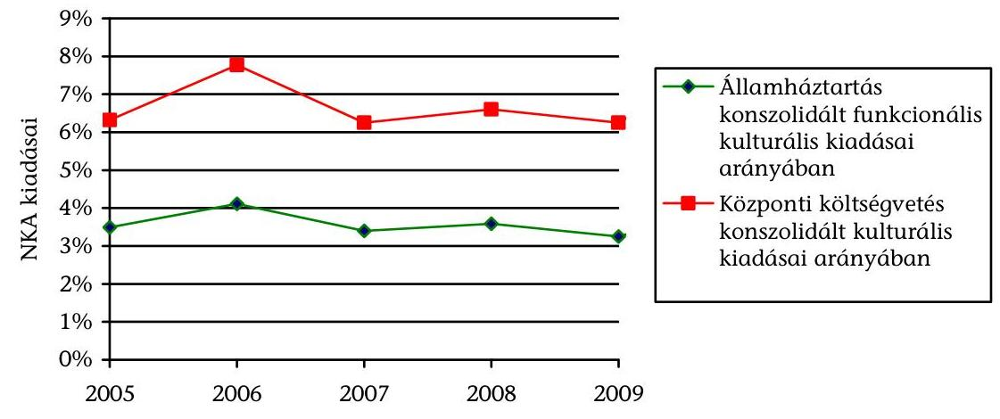
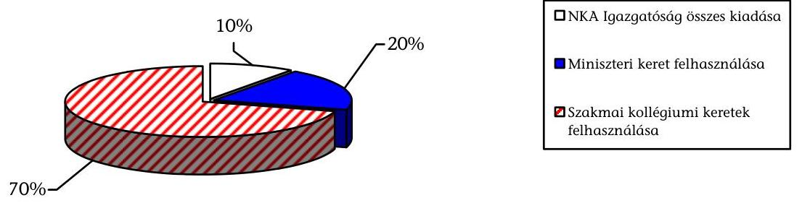
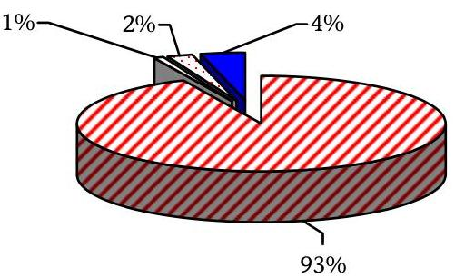
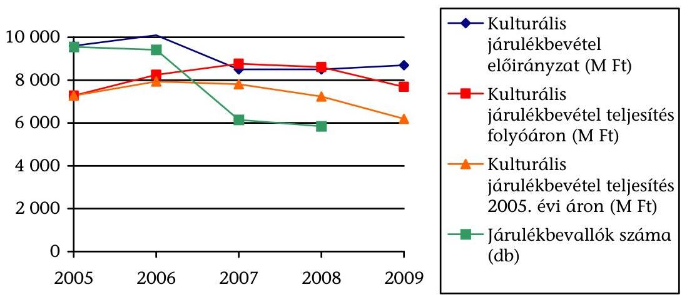
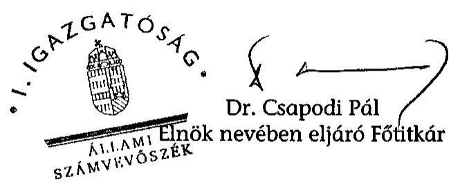
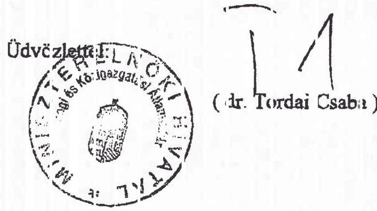
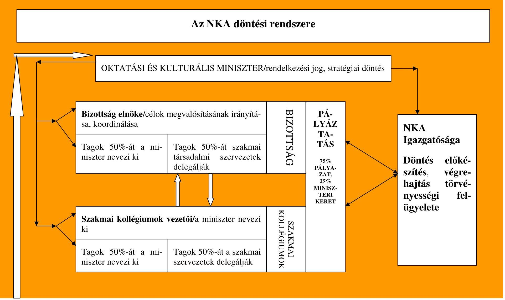
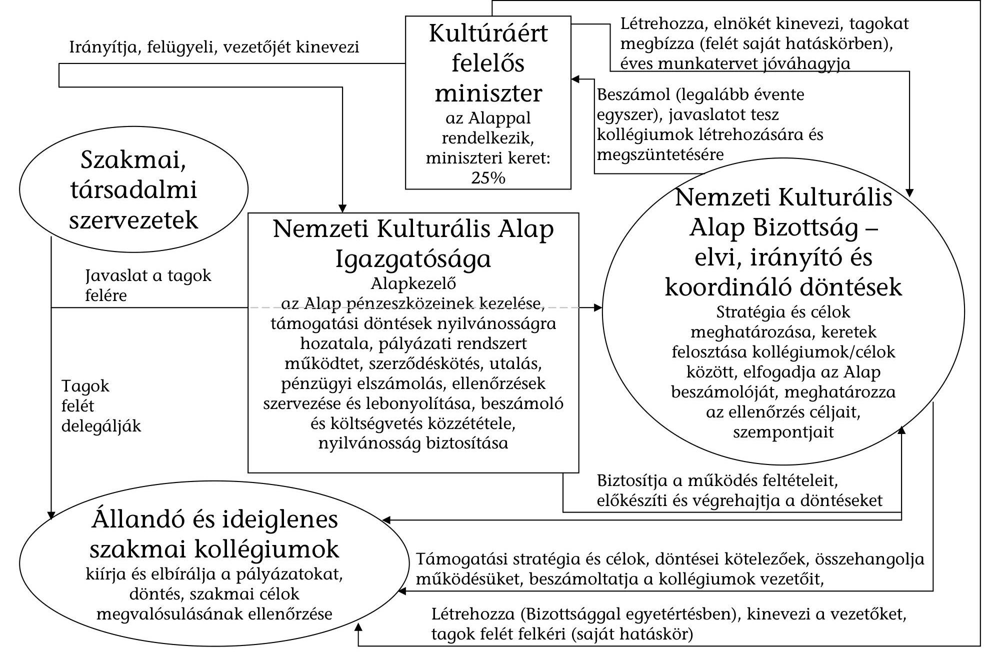

# ÁLLAMI   SZÁMVEVŐSZÉK 

## JELENTÉS

a Nemzeti Kulturális Alap működésének
ellenőrzéséről

---

2. Államháztartás Központi Szintjét Ellenőrző Igazgatóság
3. Átfogó Ellenőrzési Főcsoport

Iktatószám: V-2004-057/2009-2010.
Témaszám: 948
Vizsgálat-azonosító szám: V0473

# Az ellenőrzést felügyelte: 

Dr. Becker Pál
főigazgató
Az ellenőrzés végrehajtásáért felelős:
Hegedűsné dr. Müllern Veronika
főcsoportfőnök
Az ellenőrzést vezette:
Belovai Sándorné
osztályvezető főtanácsos
Az ellenőrzést végezték:
Dobos András
számvevő tanácsos, főtanácsadó

Vértényi Gábor
számvevő

Dr. Fónyad Erzsébet
számvevő tanácsos

Samu István
számvevő tanácsos

## A témához kapcsolódó eddig készített számvevőszéki jelentések:

## címe

Jelentés az elkülönített állami pénzalapok rendszerének, a pályázati célok teljesülésének ellenőrzéséről
Jelentés a Magyar Köztársaság 2007. évi költségvetése végrehajtásának ellenőrzéséről
Vélemény a Magyar Köztársaság 2008. évi költségvetéséről 0736
Jelentés a Magyar Köztársaság 2006. évi költségvetése végrehajtásának ellenőrzéséről
Vélemény a Magyar Köztársaság 2007. évi költségvetéséről 0641
Jelentés a Magyar Köztársaság 2005. évi költségvetése végrehajtásának ellenőrzéséről
Jelentés a Nemzeti Kulturális Alapprogramra fordított pénzeszközök hasznosulásának ellenőrzéséről
Vélemény a Magyar Köztársaság 2006. évi költségvetéséről 0550

---

# TARTALOMJEGYZÉK 

BEVEZETÉS ..... 9
I. ÖSSZEGZŐ MEGÁLLAPÍTÁSOK, KÖVETKEZTETÉSEK, JAVASLATOK ..... 13
II. RÉSZLETES MEGÁLLAPÍTÁSOK ..... 22

1. Az NKA támogatási rendszerének eredményes és hatékony működtetéséhez szükséges források ..... 22
1.1. A kulturális járulék - mint forrásgyűjtő eszköz - eredményessége és hatékonysága ..... 22
1.2. A kulturális járulék kiváltása az ötöslottó szerencsejáték játékadója 90%-ával, további források bevonása a támogatási rendszerbe ..... 25
2. A döntéshozók beavatkozása, a testületek és az Igazgatóság működése, informatikai támogatottsága ..... 28
2.1. Az NKA szabályozottsága, a döntést hozó testületek és az Igazgatóság működési rendszere ..... 28
2.1.1. A jogi és belső szabályozás változása, összhangja ..... 28
2.1.2. A testületek hatásköre, felelőssége, az Igazgatóság tevékenysége ..... 29
2.1.3. Az NKA működtetésével kapcsolatos költségek, a támogatási keretek felosztási rendszere ..... 32
2.2. Az elfogulatlan elbírálás feltételeinek biztosítása ..... 33
2.3. A pályázatkezelő informatikai rendszer működése, hatékonysága ..... 35
3. A miniszteri és a kollégiumi támogatási rendszer működtetésének hatékonysága és eredményessége ..... 38
3.1. A miniszteri keret indokoltsága, felhasználása ..... 38
3.1.1. A miniszteri keret indokoltsága, szabályozottsága és átláthatósága ..... 38
3.1.2. A döntések szempontrendszere, a párhuzamos támogatások elkerülése, a nyilvánosság biztosítása ..... 40
3.1.3. A támogatási szerződésben foglalt feltételek teljesítése, a beszámoltatás és értékelés rendszere ..... 42
3.2. A kollégiumi támogatási rendszer működése ..... 43
3.2.1. A szakmai kollégiumok pályáztatási és támogatási rendszere ..... 43
3.2.2. A támogatások elbírálása, jóváhagyása ..... 47
3.2.3. A támogatási szerződések feltételrendszere ..... 51
3.2.4. A beszámoltatás és értékelés rendszere ..... 52
4. A külső és belső ellenőrzések kockázatfeltáró tevékenysége ..... 56

---

4.1. A külső szervezetek által végzett ellenőrzések eredménye ..... 56
4.2. A belső ellenőrzési rendszer működése ..... 58

# MELLÉKLETEK 

1. sz. Észrevételek
2. sz. Az NKA döntési rendszere
3. sz. A Nemzeti Kulturális Alap pályázati rendszerének folyamatábrája
4. sz. Az NKA irányításában résztvevők kapcsolatrendszere
5. sz. Az NKA pályázati támogatásai a 2005-2009. években
6. sz. Az NKA által nyújtott pályázati támogatások alakulása az NKA törvényben meghatározott kulturális célkitűzések szerint a 2005-2009. években
7. sz. Az NKA támogatások szakmai kollégiumok szerinti megoszlása a 2005-2009. években
8. sz. Az NKA költségvetésének alakulása a 2005-2009. években
9. sz. A Nemzeti Kulturális Alap működtetésében, kezelésében közreműködők működési költségei, létszáma 2005-2009. években
10. sz. A Nemzeti Kulturális Alap miniszteri keretéből nyújtott támogatások alakulása a 2005-2009. években
11. sz. Az állandó és ideiglenes szakmai kollégiumok pályázati tevékenysége a 2005-2009. években
12. sz. A Nemzeti Kulturális Alapból nyújtott támogatások felhasználásának ellenőrzése a 2005-2008. években

---

# RÖVIDÍTÉSEK JEGYZÉKE 

| Áhsz. | Az államháztartás szervezetei beszámolási és könyvvezetési kötelezettségének sajátosságairól szóló 249/2000. (XII. 24.) sz. Korm. rendelet |
| :--: | :--: |
| Áht. | Az államháztartásról szóló 1992. évi XXXVIII. törvény |
| Alapprogram | Nemzeti Kulturális Alapprogram |
| Ámr. | Az államháztartás működési rendjéről szóló 217/1998. (XII. 30.) Korm. rendelet (2010. 1. 1-jétől hatályon kívül helyezte az államháztartás működési rendjéről szóló 292/2009. (XII. 19.) Korm. rendelet) |
| APEH | Adó- és Pénzügyi Ellenőrzési Hivatal |
| ÁSZ | Állami Számvevőszék |
| BEO | Belső Ellenőrzési Osztály |
| Bizottság | Nemzeti Kulturális Alap Bizottsága |
| FEUVE | Folyamatba épített előzetes, utólagos és vezetői ellenőrzés |
| GDP | Bruttó hazai össztermék |
| Igazgatóság | Nemzeti Kulturális Alap Igazgatósága |
| KEHI | Kormányzati Ellenőrzési Hivatal |
| Kincstár | Magyar Államkincstár |
| KKF | Közigazgatási Koordinációs Főosztály |
| KKPK | Kiemelt Kulturális Programok Kollégiuma |
| KNPA | Központi Nukleáris Pénzügyi Alap |
| Knyt. | A közpénzekből nyújtott támogatások átláthatóságáról szóló 2007. évi CLXXXI. törvény |
| KTIA | Kutatási és Technológiai Innovációs Alap |
| M Ft | millió forint |
| MMKA | Magyar Mozgókép Közalapítvány |
| MMS | multimédiás üzenetküldési szolgáltatás vezeték nélküli telefonhálózatokon keresztül |
| MNV Zrt. | Magyar Nemzeti Vagyonkezelő Zrt. |
| MPA | Munkaerőpiaci Alap |
| Mrd Ft | milliárd forint |
| MTFA | Magyar Történelmi Film Alapítvány |
| NKA | Nemzeti Kulturális Alap |
| Nkatv. | A Nemzeti Kulturális Alapról szóló 1993. évi XXIII. törvény |
| NKÖM | Nemzeti Kulturális Örökség Minisztériuma |
| OKM | Oktatási és Kulturális Minisztérium |
| ORTT | Országos Rádió és Televízió Testület |
| PKR | Pályázatkezelő Rendszer |

---

| PM TVI | Pénzügyminisztérium Támogatásokat Vizsgáló Irodája |
| :-- | :-- |
| SZA | Szülőföld Alap |
| SZMSZ | Szervezeti és Működési Szabályzat |
| Vhr. | A Nemzeti Kulturális Alapról szóló 1993. évi XXIII. évi |
|  | törvény végrehajtásáról szóló 9/2006. (V. 9.) NKÖM |
|  | rendelet |
| WMA | Wesselényi Miklós Ár- és Belvízvédelmi Kártalanítási |
|  | Alap |

---

# ÉRTELMEZŐ SZÓTÁR 

Egyenlegtartási
kötelezettség
Elkülönített
állami pénzalap

Építmény létrehozásának bekerülési költsége

Építmény
megvalósításának munkadíj

Építmény
megvalósításának anyagköltsége

Erőszaktartalmú mú

Finanszírozási terv

Forgalmazó

Importáló
az NKA kincstári számlájának tárgyévi egyenlege nem lehet kisebb mint a megelőző év egyenlege
az elkülönített állami pénzalap az állam egyes feladatait részben államháztartáson kívüli forrásokból finanszírozó olyan alap, amely működésének jellege az államháztartáson belül elkülönített finanszírozást tesz szükségessé (Áht. 4. §)
átalánydíjas szerződés alapján végzett munkánál a kivitelező által számlázott - általános forgalmi adót nem tartalmazó - összeg, szerződés alapján tételesen elszámolt munkánál az építmény megvalósulása (megépítése) számlázott anyagköltségének és munkadíjának együttes összege, a számla - általános forgalmi adó nélküli - végösszege
magában foglalja az építmény megvalósításához (megépítéséhez) igénybe vett munkaerő bérköltségét és annak járulékait, az igénybe vett gépek és szolgáltatások költségeit, az ezekre jutó általános költségek hasznos fedezetét
magában foglalja az építmény megvalósítása (megépítése) során felhasznált vásárolt anyagok és saját előállítású termékek bekerülési (beszerzési, előállítási) értékét, ezen anyagoknak, termékeknek a felhasználás helyéig felmerült szállítási, rakodási költségeit, továbbá az egyéb rakodási költségeket
minden olyan múzeum, amelynek célja és egyben legfőbb hatáskeltő eszköze - a múzeum egészéből megállapíthatóan - az erőszakos, illetve az erőszakos cselekedetre ösztönző jelenetek ábrázolása
az alap havi pénzforgalmában tervezhető bevételeit, kiadásait, a szükséges hitel és a tervezett betétállomány mértékét tartalmazó, a pénzügyminiszter által jóváhagyott, a Kincstár részére rendszeresen benyújtandó kimutatás (Ámr. 113. § (1))
a termék első belföldi forgalomba hozatalával foglalkozó természetes személy, jogi személy vagy a Ptk. 685. § c) pontja szerinti gazdálkodó szervezet, beleértve a gyártót is, mint első forgalomba-hozót
az a természetes személy, jogi személy vagy a Ptk. 685. § c) pontja szerinti gazdálkodó szervezet, aki (amely) először szerez jogot arra, hogy az importált termék vagy szolgáltatás felett rendelkezzen, ideértve a külföldi székhelyű vállalkozás belföldi fióktelepét is, ilyen személy hiányában pedig az, aki (amely) az adófizetési kötelezettség keletkezésének időpontjában az importált terméket birtokolja

---

Jövőbeni (éven túli) kötelezettség

Kivitelező

Költségvetési tartalék

Maradvány, pénzmaradvány

Multiplikátorhatás
Párhuzamos támogatás

Pénzforgalmi jelentés

Remittenda

Olyan visszavonhatatlan kötelezettség, amely a mérleg fordulónapján már fennáll, de a szerződés teljesítése még nem történt meg, ezért mérlegtételként nem szerepeltethető. A biztos (jövőbeni) kötelezettségek lehetnek pénzeszközre, illetve egyéb eszközre vonatkozó biztos (jövőbeni) kötelezettségek. Idetartoznak különösen: a határidős adásvételi ügyletek, a swap ügyletek határidős része miatti pénzeszköz vagy egyéb eszköz átadására vonatkozó kötelezettségek. Nem tartoznak ide az üzleti tevékenységgel kapcsolatos, folyamatosan felmerülő költségek. (a számvitelről szóló 2000. évi C. törvény 3. § (8) 15. pont)
a művet, annak példányát vagy más terméket sajátjaként megjelentető, illetve más módon nyilvánosságra hozó természetes személy, jogi személy vagy a Ptk. 685. § c) pontja szerinti gazdálkodó szervezet
építmény létrehozására - az épített környezet alakításáról és védelméről szóló 1997. évi LXXVIII. törvény szerint - jogosult természetes személy, jogi személy vagy a Ptk. 685. § c) pontja szerinti gazdálkodó szervezet
a költségvetési év költségvetési tartalékaként kell kimutatni a pénzmaradványt, amely az alaptevékenység aktív és passzív pénzügyi elszámolások pénzforgalma nélküli - ténylegesen teljesített tárgyévi bevételeinek, valamint a ténylegesen teljesített tárgyévi kiadásainak különbözete, illetve az előirányzat-maradványt, amely a módosított előirányzatok és azok teljesítésének különbözete
az alapot megillető tárgyévi bevételek és az alapot terhelő tárgyévi kiadások különbözete. A beszámolóban a maradvány az alaptevékenységgel kapcsolatban előírázat-maradványt, pénzmaradványt, a vállalkozási tevékenységgel kapcsolatban az eredményt tartalmazza (Áhsz. 6. §, a 42. úrlap 7. sorának /Kiadási megtakarítás, bevételi lemaradás különbsége/ tárgyévi adata)
a pályázat tényleges megvalósítási költségének és az NKA támogatás összegének aránya
Ugyanannak a szervezetnek, ugyanarra a feladatra állami forrásból nyújtott támogatások
az alap kiadásairól és bevételeiről, valamint kötelezettségvállalásának alakulásáról a Kincstár részére készített jelentés (Ámr. 141. §)
a könyv- és lapterjesztőknél eladatlanul maradt, a kiadóhoz visszaküldésre kerülő nyomdai termék

---

Szolgáltató
Tárgyévi bevétel/kiadás
a Központi Statisztikai Hivatal elnöke által kiadott, mindenkor érvényes Szolgáltatások Jegyzéke hatálya alá sorolt tevékenységet végző természetes személy, jogi személy vagy a Ptk. 685. § c) pontja szerinti gazdálkodó szervezet
a költségvetési szerv, az elkülönített állami pénzalap Kincstárnál vezetett számláján a számlatulajdonos javára/terhére a költségvetési év során teljesített jóváírások/terhelések

---

.

---

# JELENTÉS   a Nemzeti Kulturális Alap működésének ellenőrzéséről 

## BEVEZETÉS

A Nemzeti Kulturális Alap (NKA) a nemzeti és egyetemes értékek létrehozására, megőrzésére, valamint hazai és határon túli terjesztésének támogatására szolgáló elkülönített állami pénzalap, amelyet a Nemzeti Kulturális Alapról szóló 1993. évi XXIII. törvénnyel (Nkatv.) hoztak létre. Az NKA-t a Magyar Köztársaság 1999. évi költségvetéséről szóló 1998. évi XC. törvény – 1999. január 1-jei hatállyal – az Nkatv. megváltoztatásával Nemzeti Kulturális Alapprogramra módosította, amely megszüntette az NKA elkülönített állami pénzalapként való működését, és a támogatási előirányzatát fejezeti kezelésű előirányzatként a Nemzeti Kulturális Örökség Minisztériuma (NKÖM) költségvetési fejezetbe integrálta. 2005-ben ismét alappá alakították, amelynek a törvényi indoklása szerint „az NKA céljainak megvalósításához törvényben is garantált függetlenséget elkülönített állami pénzalapként sokkal hatékonyabban tudta őrizni a különböző adminisztrációs befolyásokkal szemben"1.

Az NKA-t és az azt kezelő Nemzeti Kulturális Alap Igazgatóságát (Igazgatóság) 2006. július 31-éig a nemzeti kulturális örökség minisztere, azt követően az oktatási és kulturális miniszter felügyelte.

Az Nkatv. az előírt feladatok teljesítéséhez az Áht. 54. § (2) bekezdésben rögzített adójellegű (államháztartáson kívülről származó) forrásként a kulturális járulékot határozta meg, amelyet 2009. év végéig az APEH szedett be, a befolyt összeget naponta jóváírta az NKA számláján.

A kulturális járulék helyett
 2010. január 1-jétől - a közteherviselés rendszerének átalakítását célzó törvénymódosításokról szóló 2009. évi LXXVII. tv. szerint - az NKA forrásainak kiemelt fedezete az ötöslottó szerencsejáték játékadója 90%-a.

Az NKA kezelésének és felhasználásának részletes szabályait - a Nemzeti Kulturális Alap Bizottsága (Bizottság) és a szakmai kollégiumok (kollégiumok) tagjainak megválasztásának rendjét, a pályázati rendszert, valamint az állandó kol-

[^0]
[^0]:    ${ }^{1}$ A 2005. évi CL. törvény indokolása a Nemzeti Kulturális Alapprogramról szóló 1993. évi XXIII. évi törvény módosításáról, Általános indokolás

---

légiumok listáját is tartalmazó - az Nkatv. végrehajtásáról szóló 9/2006. (V. 9.) NKÖM rendelet (Vhr.) határozza meg.

Az NKA irányító testülete a Bizottság, amelynek tagjai egyik felét az NKA felügyeletét ellátó kulturális miniszter saját hatáskörében, másik felét az érdekelt civil szervezetek javaslata alapján bízza meg. Az Országgyűlés a tervezett bevétel felosztását - a törvényi célok között - a költségvetési törvényben határozta meg. Az NKA kiemelt céljai a kulturális ágazat területén a nemzeti és az egyetemes értékek létrehozása, megőrzése, hazai és határon túli terjesztése, a művészeti alkotások új irányzatai, a kultúrateremtő, kultúraközvetítő, valamint egyéni és közösségi tevékenységek, új kulturális kezdeményezések támogatása. A Bizottság feladata, hogy döntsön az NKA támogatási stratégiájáról, valamint a miniszter egyetértésével az éves keret - az NKA működtetésével csökkentett részének - szakterületek szerint létrehozott kollégiumok közötti felosztásáról. Az NKA - működési kiadásokra tervezett összeggel csökkentett - éves kerete 25%-ának felhasználásáról - döntő többségében egyedi kérelmek alapján - a miniszter döntött. A létrehozott szakmai kollégiumok kereteikből döntéseik alapján alapvetően pályázati úton nyújtottak támogatást. A 2005. évben 16 állandó és 7 ideiglenes, a 2009. évben 17 állandó és 2 ideiglenes kollégium működött, amelyek kiemelt szerepet töltöttek be a támogatások szétosztásában. Az NKA működési rendszerének folyamatát és az irányításban résztvevők kapcsolatrendszerét a 2., 3. és 4. számú mellékletek mutatják be.

Az NKA kiadásai - az államháztartás konszolidált funkcionális mérlege ${ }^{2}$ (központi költségvetés és az önkormányzatok) és a központi költségvetés konszolidált funkcionális kulturális kiadások tekintetében - 3,4-4,2%, illetve 6,3-8,2% közötti arányt képviselt.

Megjegyzés: 2005-2008. évi teljesítés, 2009. évi és 2010. évi eredeti előirányzat

[^0]
[^0]:    ${ }^{2}$ Az éves zárszámadási törvényjavaslatok PM mellékletei szerint

---

Az NKA pénzeszközeit a kultúráért felelős miniszter által alapított, önállóan gazdálkodó költségvetési szervként működő Nemzeti Kulturális Alap Igazgatósága kezelte. Az NKA-ból természetes és jogi személyek, jogi személyiség nélküli gazdasági társaságok, valamint egyéni vállalkozások igényelhettek támogatást nyílt, vagy meghívásos pályázatok útján, illetve - a miniszteri keret felhasználásával vagy kivételesen indokolt esetben - egyedi elbírálás alapján, visszatérítendő és részben vagy egészben vissza nem térítendő formában. A 2005-2009. évek közötti időszakban 54468 db pályázat érkezett 107,5 Mrd Ft támogatási igénnyel. A beérkezett pályázatokból 30389 db-ot fogadtak el, a támogatott pályázók által igényelt 67,9 Mrd Ft-ból 41,9 Mrd Ft-ot ítéltek meg. A támogatott pályázatok száma 2005-ben 6483 db, 2009-ben 5906 db volt (5. számú melléklet). A törvényben meghatározott kulturális célok szerint jóváhagyott pályázatok számát és a támogatások összegét a 6., a támogatások szakmai kollégiumok szerinti megoszlását a 7. számú melléklet tartalmazza. A pályázatok és a miniszteri keretből nyújtott támogatások adminisztrációját, valamint pénzügyi és utóellenőrzését az Igazgatóság látja el.

Az Állami Számvevőszék (ÁSZ) 2005. évben vizsgálta a Nemzeti Kulturális Alapprogramra fordított pénzeszközök hasznosulását, és 2009. júliusban fejezte be az elkülönített állami pénzalapok rendszerének, és a pályázati célok teljesülésének ellenőrzését. A vizsgált időszakban minden évben ellenőriztük az NKAt a költségvetés tervezése és végrehajtása keretében. A vizsgálatok tapasztalatait figyelembe vettük, és hasznosítottuk.

# Az ellenőrzés célja annak értékelése volt, hogy: 

- eredményes és hatékony volt-e az NKA támogatási rendszerének működtetéséhez szükséges források előteremtése;
- a rendszer működését eredményesen szolgálták-e a döntéshozók beavatkozása, a végrehajtó szervezet felépítése, informatikai támogatottsága, és a belső kontrollrendszer működése;
- a támogatási rendszer működtetése eredményes és hatékony volt-e;
- az ellenőrzések megfelelően segítették-e a kockázatok feltárását és azok hatékony kezelését, hogyan hasznosultak a korábbi ÁSZ ellenőrzések javaslatai.

Az ÁSZ 2009. évi ellenőrzési terve alapján az ellenőrzést a rendszerellenőrzés módszerével végeztük el. Az NKA működési rendszerének ellenőrzése során értékeltük a rendszer működtetésében résztvevők irányító, felügyelő, koordináló és döntéshozó tevékenységét, az NKA feletti rendelkezési jog gyakorlását, és annak az ágazati stratégiai döntésekkel való összhangját. Az ellenőrzés kiterjedt az NKA-ból nyújtott támogatások elosztási rendszerének teljes folyamatára. Az ellenőrzés szempontrendszerét előtanulmánnyal alapoztuk meg.

A helyszíni ellenőrzés keretében vizsgált pályázatokat rétegzett mintavételi eljárással választottuk ki a 2008. évben lezárt pályázatok közül. A minta alapján 41 támogatást, és 31 db elutasított pályázat dokumentációját vizsgáltuk meg.

---

Az ellenőrzés a 2005-től 2009 októberéig terjedő időszakot fogta át, alapvetően a 2006-2008. évek működésére irányult. A vizsgálat a 2005. évet tekintette viszonyítási alapnak és a 2009. év tendenciáinak értékelésére is kiterjedt a várható éves adatok alapján.

A jelen ellenőrzés végrehajtásának jogszabályi alapját az Állami Számvevőszékről szóló 1989. évi XXXVIII. törvény 1. § (2), 2. § (3), (5), (6), (9) és 17. § (3) bekezdéseiben, valamint az államháztartásról szóló 1992. évi XXXVIII. törvény 104. § (3), és 120/A. § (1) bekezdéseiben foglaltak képezték.

A jelentést egyeztettük az oktatási és kulturális, valamint a Miniszterelnöki Hivatalt vezető miniszterrel.

---

# I. ÖSSZEGZŐ MEGÁLLAPÍTÁSOK, KÖVETKEZTETÉSEK, JAVASLATOK 

Az Nkatv. alapján létrehozott NKA célja - önálló kezdeményezéssel, illetve kiegészítő, pótlólagos források nyújtásával - a kulturális ágazat valamennyi szakterületén a nemzeti értékek létrehozásának, megőrzésének és terjesztésének hazai és határon túli támogatása volt. Az Alap anyagi lehetőséget biztosított ahhoz, hogy mind a hazai, mind a nemzetközi életben a magyar kultúra részvétele és képviselete összehangolt legyen. Az Nkatv. támogatási lehetőséget biztosított - a kulturális egyenjogúság elve alapján - a kulturális élet egészének. A 16 éve működő NKA feladatai megvalósításához rendelt feltételrendszer elemei - a pénzeszközök biztosítása, a döntéshozó testületek és az Igazgatóság szervezetének működése - segítették a törvényi célok megvalósulását. Az ellenőrzött időszakban (2006-2009. évi várható) az NKA rendelkezésére álló forrás (37,9 Mrd Ft) felhasználásának megoszlását az alábbi diagram mutatja.

A vizsgált időszakban az NKA bevételi forrásai döntően a kulturális járulékból, és csekély mértékben a központi költségvetési előirányzatokból átvett pénzeszközökből származtak. A kulturális járulék bevétele nominálértéken a 2005. évi 7277 M Ft-tal szemben 2008-ban 8613 M Ft volt, és a 2009. évi várható adatok szerint 7682 M Ft-ra csökken. A vizsgált időszakban azonban a járulékfizetők száma folyamatosan csökkent, 2008-ra 5842 db-ra esett vissza, ami a 2005. évi 61,2%-a. Az NKA 242 M Ft költségvetési támogatásban részesült, annak ellenére, hogy az Nkatv. indoklásában az állami támogatást, mint nem nélkülözhető forrást jelölte meg. Vállalkozásoktól, magánszemélyektől az NKA-nak közvetlen bevétele nem volt, erre irányuló tevékenységet nem folytatott. Az ellenőrzött időszakban (2006-2009. évi várható) az NKA bevételeinek (35,6 Mrd Ft) megoszlását az alábbi diagram mutatja.

[^0]
[^0]:    ■ Kulturális járulék
    $\square$ Állami támogatás
    $\square$ Támogatás visszafizetések(visszatérítendő, vissza nem térítendő, kötbér, bírság)
    ■Átvett pénzeszközök

---

Az elkülönített állami pénzalapokhoz rendelt kulturális járulék az ún. kisadók közé tartozott, amelynek adminisztrációja - az APEH és szakértői álláspontok szerint - időigényes és költséges feladatot jelentett a bevallóknak és az adóhatóságnak egyaránt, ezért indokoltnak látszott ezek egyszerűsítése, vagy megszüntetése. A kulturális járulék megszüntetése - adózási szempontból csökkenti a vállalkozások terheit, eltörlése nagyobb részt a korábban járulékfizetésre kötelezett vállalkozások jövedelemtermelő képességét növeli, de egyben megszünteti azt az alaphelyzetet, hogy az NKA-n keresztül a kultúra támogatására fordított forrásokat döntően tevékenységükkel az ágazathoz kapcsolható vállalkozások teremtsék elő befizetéseikkel.

Az NKA bevételi forrásainak megteremtésére előbb 2008. évben az Oktatási és Kulturális Minisztérium (OKM) a járulékkör bővítésére ${ }^{3}$, majd 2009-ben a Pénzügyminisztérium (PM) az ún. kisadók megszüntetésének koncepciója alapján az ötöslottó szerencsejáték adója 90%-val történő kiváltására nyújtott be törvényjavaslatot, amelyet az Országgyűlés elfogadott ${ }^{4}$.

Az NKA bevételi forrásai tervezett változásának hatására, a finanszírozás megváltoztatására és kiszámíthatóságára vonatkozó előzetes szakmai háttéranyag, elemzés sem az OKM-nél, sem az NKA-nál nem készült. A 2010. évi költségvetés tervezéséhez, az új bevételi forrást megjelölő törvény elfogadását követően - a Szerencsejáték Zrt. által az Igazgatóság részére megküldött tényadatok alapján - a játékadó bevételek 90%-ának átengedésével az NKA várhatóan 1-1,5 Mrd Ft-tal magasabb bevételhez jut a kulturális járulékhoz képest.

Az OKM SZMSZ-e alapján az NKA ágazati felügyelete részben rendezett. A miniszter személyes hatáskörébe tartozik az NKA-hoz kapcsolódó „át nem ruházott jogkörök gyakorlása", azonban szakmai vonatkozásában az SZMSZ a feladatok és jogkörök delegálásáról nem rendelkezett ${ }^{5}$.

A kialakított keretszabályozás (Nkatv.,Vhr., SZMSZ, Ügyrend) összességében lefedte az NKA működését, és a jogszabályok döntően egymással összhangban voltak, de hiányosságokat is tartalmaztak. Az Nkatv.-t a 2006-2009. évek között összesen 4 alkalommal módosították, amelyek átláthatóbbá tették az NKA működését. A kulturális járulékra vonatkozóan a törvény mellékletében szereplő járuléklista 2006 óta nem változott.
${ }^{3}$ A járulékköteles termékek és szolgáltatások körének és a járulék mértékének újragondolását és módosítását tartalmazó - elsősorban a kedvezőtlenül érintett szakmai szervezetek részéről megnyilvánuló ellenállás miatt - törvényjavaslatot az oktatási és kulturális miniszter visszavonta.
${ }^{4}$ A közteherviselés rendszerének átalakítását célzó törvénymódosításokról szóló 2009. évi LXXVII. tv.
${ }^{5}$ Jelentés az elkülönített állami pénzalapok rendszerének ellenőrzéséről, 2009. július (0917)

---

Az Országgyűlés a nagyobb pénzügyi önállóság érdekében az Alapprogramot 2006-tól visszaalakította elkülönített állami pénzalappá. Ennek ellenére előírta az alapok - így az NKA - számára, hogy a tárgyévi kiadásuk nem lehet magasabb a tárgyévi bevételüknél (egyenlegtartási kötelezettség) ${ }^{5}$, ami korlátozta az NKA forrásainak cél szerinti felhasználását, csorbult az „alapszerű" működés elve.

Az Nkatv. jelentős tartalmi változtatása volt 2006-tól, majd 2009-től az összeférhetetlenség részletes szabályozása, amellyel biztosítani kívánta a kollégiumi döntéseknek és pályázatok elbírálásának tisztaságát. A pályáztatás folyamatában az összeférhetetlenségről az érintettnek nyilatkoznia kell, és a valótlan nyilatkozat következménye a tisztségviselő visszahívása és a pályázat kizárása lehet, a gyakorlatban azonban erre nem volt példa. Az összeférhetetlenségi szabályok kiszélesítésével növelte az NKA-ból nyújtott támogatások döntéshozatalának átláthatóságát.

A miniszter a Vhr.-ben részletesen szabályozta a visszaalakított NKA működtetésének szabályait, azt követően 4 alkalommal, kisebb, adminisztratív változtatásokkal módosították. Jelentősebb változtatás volt a szakmai kollégiumi tagság időtartamának 3 évről 4 évre emelése, valamint a pályázók Kincstári Monitoring Rendszerben levő adataikhoz a jogszabályban meghatározott személyek által történő hozzáférése.

Az NKA céljainak megvalósítása érdekében a miniszter az elvi, irányító és koordináló döntések meghozatalára Bizottságot, az NKA támogatási forrásainak felosztására állandó és ideiglenes szakmai kollégiumokat hozott létre. A Bizottság az elnökből és 2005-ben 12, a 2006-2009.
 években 10 tagból állt. Az NKA támogatások odaítéléséről az összesen 132-147 főből - részben szakmai szervezetek képviselőiből - álló testületek döntöttek, ami évi 86-128 M Ft-os működési költséget jelentett.

A kollégiumok működésének részletes szabályait a Vhr. és az Ügyrend szabályozta. Az Nkatv.-ben meghatározott támogatási célokkal nincsen összhangban a szakmai kollégiumok Vhr. 1. számú mellékletében meghatározott struktúrája. Az Nkatv. a támogatások céljait rögzíti, a Vhr. a szakterületek szerinti kollégiumi struktúrát szabályozza. Így az egyes kollégiumok több, a törvényben meghatározott célra is adhatnak támogatást, ami nehezítette a célok megvalósulásának nyomon követését, az átfedések kiszűrését, a meghatározott célok elérésének összehangolását.

A Bizottság külső szakértő bevonásával átvilágítást ${ }^{6}$ készíttetett, amely a kollégiumok számának csökkentését és funkcionális kollégiumok létrehozását javasolta. A Bizottság kiigazításokkal, pontosításokkal elfogadhatónak tartotta a javaslatot ${ }^{7}$, és azt a nemzeti kulturális örökség minisztere is támogatta. A tár-

[^0]
[^0]:    ${ }^{6}$ Budapest Investment Rt. „A javaslat a Nemzeti Kulturális Alapprogram stratégiai szerepének erősítését szolgáló szervezet fejlesztési téziseire" 2004. június
    ${ }^{7}$ A Bizottság 5/2005. (I. 24.) számú határozata

---

sadalmi viták során az eredetileg meghatározott szakmai struktúra változatlanul hagyása mellett döntöttek, a döntéshozó beavatkozás elmaradt.

Az OKM nem készítette el a kulturális ágazati stratégiáját, ezért nem volt olyan középtávú terv sem, amely az NKA tevékenységét több évre átfogta és összehangolta volna. A Bizottság csak korlátozottan látta el az előírt elvi, irányító és koordináló feladatát ${ }^{8}$, mert nem készítette el az NKA rövid- és középtávú kulturális támogatási stratégiáját, amellyel konkretizálta volna az Nkatv.-ben foglalt általános célokat. A 2007-2009. I. félévi bizottsági határozatok között az elvi, irányító döntések 6\%-ot képviseltek.

A szakmai kollégiumok a Vhr.-ben előírt, a szakterületük támogatási célkitűzéseit rögzítő különálló dokumentumot nem fogalmaztak meg. A támogatási elvek, célkitűzések részlegesen a kollégiumi jegyzőkönyvekben és az éves szakmai beszámolókban kerültek leírásra. A szakmai kollégiumok minden évben jellemzően ugyanazokat a pályázatokat írták ki.

A Bizottság évente meghatározta a kiemelten kezelendő programokat, a címzett támogatásokat ${ }^{9}$ és céltámogatásokat ${ }^{10}$ a Vhr. előírásainak megfelelően. Ezekben megjelentek a minisztérium forrás hiányában csak részben finanszírozott programjaira vonatkozó NKA társfinanszírozási elképzelései. Döntéseinek nagyobb részét olyan előterjesztésekre alapozta, amelyekből hiányzott a téma részletes szakmai és pénzügyi megvalósíthatóságának alátámasztása.

A minisztériumokkal együttműködési szerződés keretében kialakított programok - bár az Nkatv.-ben rögzített célokra költötték a pénzt, megítélésünk szerint - a partner minisztériumok alapfeladatai közé tartoztak.

Az NKA kezelését leíró jogszabályok nem határozták meg az NKA-ból az alapkezelési feladatokra fordítható összeg maximumát, azt minden évben a költségvetési törvények írták elő. Az alapkezelőnél elszámolt kiadások csökkenő tendencia mellett az éves pénzmaradvány nélküli bevételek 11,6-10,3\% között mozogtak. Az elszámolt működési kiadások folyóáron 34,6\%-kal, reálértéken számítva 15,8\%-kal emelkedtek. A 2005-2008. években az NKA a Bizottság döntései alapján 315 M Ft-ot fordított kommunikációra, azonban a tevékenység megvalósulásáról készült Bizottsági beszámolók alapján a kitűzött kommunikációs célokat az NKA csak részlegesen tudta elérni.

# A Bizottság nem készítette el a pályázati keretek meghatározásához szükséges, szakmailag megalapozott szempontrendszert, illetve a források egészének felhasználásakor a támogatás során követendő szempontokat és ezek figyelembevételének rangsorát ${ }^{11}$. Emiatt a kollégiumi pályázati (pénzügyi) keretek meghatározása bázis alapon valósult meg, a pályáztatásra rendelke-

[^0]
[^0]:    ${ }^{8}$ Nkatv. 2. § (1) pontja, Vhr. 6. § a)
    ${ }^{9}$ A Bizottság által meghatározott feladatra, külön forrásból biztosított összeg
    ${ }^{10}$ A Bizottság által meghatározott feladatra, kollégiumi forrásból biztosított összeg
    ${ }^{11}$ Vhr. 6. § a), 7. § a).

---

zésre álló források felosztása nem a költségvetésben megtervezett törvényi célok, hanem a szakmai területek szerint kialakított szakmai kollégiumi szerkezet alapján történt.

A vizsgált időszakban nem működött olyan kulturális ágazati adatbázis, amelyben az összes állami pályázati támogatás adatait a kollégiumok fellelhették volna, így nem volt teljes körűen biztosított az azonos pályázó különböző támogatásainak kiszűrése. Az Igazgatóság az NKA pályázati rendszerébe nagy mennyiségű, évente 9-10 ezer, az OKM költségvetési fejezethez tartozó fejezeti kezelésű előirányzatainak pályázati rendszerébe évente 1-2 ezer pályázatot fogadott be, amelyet két különböző szoftverrel kezeltek. A pályázati és a pénzügyi-számviteli informatikai rendszer együttműködése hatékony volt, mert az adatátvitel automatikus. A magas üzemeltetési költségek miatt döntés született az új pályázatkezelési szoftver fejlesztéséről annak érdekében, hogy a három különböző szoftverrel végzett folyamatot (NKA és OKM fejezeti pályáztatás, online adatlap kitöltése), valamint az NKA könyvelését egy rendszerben egyesítsék.

A Bizottság határozata alapján 2006-tól számítógépes döntéselőkészítő-döntéstámogató szoftvert vezettek be a kollégiumi döntéshozatal segítésére. A 6 M Ft-ba került rendszert a kollégiumok kipróbálták, de (két kivétellel) a későbbiekben nem használták, mert a Bizottságnak nem sikerült elfogadtatnia a kollégiumokkal, hogy a rendszer szükséges és objektívvé teszi a döntést.

A miniszteri keretből nyújtott támogatásokra a kollégiumok által nyújtott támogatásoktól eltérő feltételrendszert, támogatási elveket nem határoztak meg. A miniszter az Nkatv. 7. §-ában meghatározott céloktól a 7/C. §-ában meghatározott miniszteri keret vonatkozásában nem állapított meg eltérő feltételrendszert. A miniszteri keret felhasználásának gyakorlata alapján nem volt olyan indok, amely szerint a támogatás eredményességének szempontjából a miniszteri döntés kedvezőbb lett volna, mint a kollégiumok által hozott döntés, és az átfutási ideje sem volt gyorsabb. A hasznosulás hatékonyságát csökkentette, hogy a miniszter nem tájékoztatta a Bizottságot a miniszteri keret éves felosztásának arányairól. Az egyedi támogatás igénylésének lehetőségéről nem jelent meg külön tájékoztatás, arról az egyedi támogatási kérelmekre vonatkozó eljárási rendről szóló miniszteri utasítás rendelkezett.

A miniszter a 2006-2008. évi támogatások értékének 97,5\%-át (átlagosan 1,8 M Ft) egyedi döntéssel, 2,5\%-át pályázat útján hagyta jóvá. A döntések megalapozásához nem készítettek egységes, mérhető, a pályázók által is megismerhető szempontrendszert. A támogatási kérelmek nem tartalmazták teljes körűen a megalapozott döntéshez szükséges információkat, ennek ellenére a minisztérium a kérelmeket befogadta. A 2008. évi programok 66\%-a mellé nem készítettek értékelhető költségvetést, 26\%-ában a kérelem nem tartalmazta, hogy mekkora az igényelt támogatási összeg. A döntések előkészítését, az igények értékelését, támogatási javaslatot a szakterületi főosztályok a kérelmek 47\%-ához nem készítették el. A miniszter döntése után a támogatási szerződéseket az Igazgatóság a Pályázatkezelési Szabályzatnak megfelelően kezelte.

---

A miniszteri döntés előtti, az NKA kollégiumokkal való rendszeres, dokumentált egyeztetés rendszerét nem alakították ki, amely kiszűrte volna a párhuzamos támogatások nyújtását. A miniszteri keretből a 2008. évben támogatott projektek 9,2\%-a párhuzamosan kapott támogatást a kollégiumoktól is.

A pályázati témakörök meghirdetésénél biztosították a megfelelő nyilvánosságot, a nyílt pályázatoknál megteremtették az esélyegyenlőség feltételeit. A kollégiumi pályázati felhívásokban megjelölték a támogathatósági feltételrendszert, azonban az elbírálás szempontjait nem minden esetben (2008. évben 42\%-ban), vagy általánosan jelentették meg.

A Belső Ellenőrzési Osztály a 2009. évben soron kívüli ellenőrzéssel vizsgálta a pályázati felhívásokban előforduló teljesítménymutatók meglétét. Az ellenőrzés szerint a 2008. évben megjelent 214 pályázati felhívásból 25, a 2009-ben 141 felhívásból 10 tartalmazott teljesítménymutatót.

A Bizottság egyes címzett támogatások esetében előre kijelölte a pályázati részvételre meghívandó szervezetet. A 2005-2009. I. félévben a meghívotti kör kialakítása során 84,4\%-ban egyetlen szervezetet hívtak meg ${ }^{12}$, amely szűkítette a kollégiumok, valamint a döntések szabadságát és a versenyeztetés lehetőségét.

Az NKA szándékainak megfelelően a pályázatok és a pályázók száma is csökkent a vizsgált időszakban. A 2005. évben 5466-an jelentkeztek kérelemmel az NKA-nál, 2008-ban számuk 4301-re csökkent. Nőtt a meghívásos pályázatok aránya, ezeket a szervezeteket 93,9\%-ban támogatták. Nőtt az egy pályázatra jutó támogatási összeg, de az elaprózottság még mindig jellemző volt. Az összes kérelmező 25,6-33,7\%-a volt új pályázó évente, tehát a pályázók kétharmada rendszeresen pályázott az NKA-hoz. A pályázati fegyelem javulását mutatta, hogy az érvénytelen pályázatok száma és aránya is csökkent. A pályázatok 96,5\%-a a támogatási szerződésnek megfelelően, eredményesen fejeződött be. A pályázatok 3,5\%-ánál részbeni, vagy teljes mértékű meghiúsulás miatt vissza-, vagy ki sem utalták a támogatást.

A kollégiumok által egyedi elbírálással megítélt támogatások átlagos aránya a Bizottság által meghatározott mérték alatt volt, de a korábbi és a jelenlegi vizsgált időszakban sem felelt meg az Nkatv.-ben megfogalmazott kivételesen indokolt esetnek ${ }^{13}$. Az egyedi elbírálással támogatásban részesült kérelmezők

[^0]
[^0]:    ${ }^{12}$ A Nemzeti Kulturális Alapprogramra fordított pénzeszközök hasznosulásának ellenőrzéséről szóló ÁSZ jelentés (2005. október, 26. oldal) is megállapította, hogy: „A meghívásos pályázatok nem jelentettek valódi versenyeztetést, mivel gyakran egy meghívottnak szóltak."
    ${ }^{13}$ A Nemzeti Kulturális Alapprogramra fordított pénzeszközök hasznosulásának ellenőrzéséről szóló ÁSZ jelentés (2005. október, 26. oldal) is megállapította, hogy: „Az egyedi elbírálással támogatásban részesült pályázók egy része olyan célkitűzések megvalósítására kapott támogatást, amelyre a kollégium nyilvános pályázatot is írt ki (pl. Színházi Szakmai Kollégium, Zenei Szakmai Kollégium)."

---

olyan célkitűzések megvalósítására is kaptak támogatást, amelyekre a kollégiumok nyilvános pályázatokat is kiírtak (pl. hanghordozók, könyvek megjelentetése, nemzetközi konferenciákon, vásárokon való részvétel) ${ }^{14}$. Az egységes szempontrendszer hiányát jelzi, hogy a támogatási rendszeren belül az egyik kollégium által nem támogatott kérelmet egy másik kollégium támogatta. A szakmai kollégiumok által elutasított pályázatok közül - amit szabályozás nem zár ki - több a miniszteri keretből kapott támogatást.

A Revizor online (kritikai lap) projekt célja a szakmai vizsgálatok sűrítése, a műkritika, főként a teljes nyilvánosság előtti szakmai vizsgálat volt, amelynek megjelentetésével a 2008. évben az NKA nem támogatást nyújtott, hanem egy szolgáltatást vett igénybe. Az államháztartás keretében szolgáltatások beszerzését a közbeszerzésekről szóló törvény ${ }^{15}$ adta szabályok szerint kellett volna végrehajtani.

Az államháztartás finanszírozásának jogi szabályozása nem határozta meg a költségvetési szervek alapfeladatát és ennek ellátásához szükséges források mértékét. Ennek következményei, hogy nincs egyértelműen meghatározva az állami feladatellátás, és az ahhoz szükséges források mértéke. A költségvetési szervek alaptevékenységének ellátásához szükséges forrást a felügyeleti szerveknek kell biztosítaniuk. Esetenként nem teljesen egyértelmű, hogy egyes célok alap-, vagy többlet feladatként valósultak-e meg, s az ehhez nyújtott támogatás a költségvetésében biztosított alapfeladat finanszírozásával vagy pótlólagos forrással valósult meg. A feladatok többcsatornás költségvetési finanszírozása nem segíti az államháztartási folyamatok átláthatóságát.

A támogatási szerződések megfelelő garanciákat és szankciókat tartalmaztak a vállalt feladatok elmaradása esetére. A szakmai beszámolók és a pénzügyi elszámolások alkalmasak voltak a szerződés szerinti feladatok megvalósulásának megítélésére, de a pénzeszközök hasznosulásának, hatékony felhasználásának értékelésére jellemzően nem.

A vizsgált időszakban az OKM Ellenőrzési Főosztálya több alkalommal vizsgálta az Igazgatóságnak az NKA felhasználásával, a támogatások pénzügyi lebonyolításával kapcsolatos tevékenységét. A helyszíni ellenőrzés folyamatában a kisebb, de kezelhető problémákat azonnal, az intézkedést igénylő módosításokat a hiányosságok felszámolására hozott intézkedési terv ütemezésének
 megfelelően kezelték.

Az Állami Számvevőszék 0552. sz., a Nemzeti Kulturális Alapprogramra fordított pénzeszközök hasznosulásának ellenőrzéséről szóló jelentésben a felügyelő

[^0]
[^0]:    ${ }^{14}$ Az Nkatv. indokolása szerint egyedi elbírálás csak a miniszteri keret esetén, illetve a kollégiumok kapcsán kivételesen indokolt (pl. vis major, előre nem tervezhető kulturális kiadás) esetben lehetséges.
    ${ }^{15}$ A közbeszerzésekről szóló 2003. CXXIX. törvény 2. § (1), a nemzeti értékhatárokat elérő értékű közbeszerzésekre vonatkozó rendelkezések szerint (éves költségvetési törvények szerint)

---

miniszter számára fogalmazott meg NKA-ra vonatkozó javaslatokat, amelyek csak részben valósultak meg. Nem határozták meg az NKA kultúrafinanszírozó szerepének sajátos céljait (pl. a költségvetési támogatással létrejött magán alkotások további hasznosítása, elaprózott támogatások stb.). Az ÁSZ NKA-ról szóló 2005. évi jelentésében ${ }^{16}$ javasolta a nemzeti kulturális örökség miniszterének, hogy kezdeményezze a sajátos kulturális támogatási céloknak a jogi szabályozásban való rögzítését, azonban ilyen irányú intézkedés nem történt. A kollégiumok nem rendelkeztek a Vhr.-ben előírt saját stratégiai jellegű támogatási célkitűzéssel, ami azóta sem változott.

Az Nkatv. 2006. január 1-jei módosításával visszaállították az alapszerű működést, a miniszter jóváhagyta az NKA Ügyrendjét, és ennek megfelelően kialakították a belső szabályozást. A Bizottság és a kollégiumok döntéseinek megalapozottsága - a nem kellően előkészített szakmai értékelési eljárások miatt - azóta sem megfelelően biztosított. Az NKA-n belül a miniszteri és a kollégiumi támogatások egyeztetését, a visszatérítendő és részben visszatérítendő támogatások nyújtásának szempontjait továbbra sem szabályozták. A támogatások elbírálásánál és értékelésénél nem fektettek kellő hangsúlyt a megvalósítás hatásaira. Ennek elmaradását az Igazgatóság belső ellenőrzése is kockázatnak minősítette. A kollégiumok a pályázók szakmai beszámolóinak elkészítéséhez nem alakítottak ki egységes, eredményközpontú értékelési rendszert, ezért a jelenlegi szakmai beszámoltatási rendszer nem alkalmas a megvalósítás hatásainak, a pénzeszközök hasznosulásának megítélésére.

A vizsgált időszakban pozitív változást mutatott a pályázatok helyszíni ellenőrzéseinek lefedettsége, a vizsgált támogatások aránya az éves összes támogatáshoz viszonyítva a 2005. év előtti 3%-ról, 2008-ra közel 12%-ra emelkedett.

Az Igazgatóság a folyamatba épített előzetes, utólagos és vezetői ellenőrzés (FEUVE) rendszerét az ellenőrzési nyomvonalak kialakításával és a kontrollok beépítésével, a rendszernek folyamatos visszacsatolási lehetőségeinek biztosításával a működés folyamataira, a sajátosságaira tekintettel megfelelően kialakította, azonban a vezetői ellenőrzések értékelésének a FEUVE rendszerében külön dokumentált helye nincs. A FEUVE, a kockázatkezelési eljárások meghatározása és a kockázatok feltárása a Bizottság és a kollégiumok működésére nem terjedt ki.

A 2009-2012-ig belső érvényesülő ellenőrzési stratégia kialakítását, a prioritások meghatározását a kockázatelemzéssel, a kockázati tényezők és kezelhetőségük számbavételével megalapozták.

Az Igazgatóság - az Ellenőrzési Kézikönyvében szabályozott előírásnak megfelelően - a külső-belső ellenőrzésekről, a kapcsolódó javaslatokról, a megtett intézkedésekről szervezeti egységenként nyilvántartást vezetett, és figyelemmel kísérte az intézkedések hasznosulását. A kontroll kockázatok feltárása rámutatott

[^0]
[^0]:    ${ }^{16}$ Jelentés a Nemzeti Kulturális Alapprogramra fordított pénzeszközök hasznosulásának ellenőrzéséről, 2005. október (0552)

---

a rendszer kritikus, magas kockázatú területeire. Ezek között azonosította a pályázati támogatások cél szerinti megvalósulását, a támogatási összegek a kulturális feladatnak megfelelő hasznosulását.

A helyszíni ellenőrzés megállapításainak hasznosítása mellett javasoljuk:

# a Kormánynak 

Kezdeményezze az Nkatv. megfelelő módosítását a kollégiumi döntés és a nyílt pályáztatás kizárólagosságának bevezetése érdekében.

## az oktatási és kulturális miniszternek

1. Az OKM SZMSZ-ében részletesen határozza meg az NKA-val kapcsolatos szakmai, felügyeleti és ágazati irányítási feladatokat, valamint az azzal kapcsolatos hatásköri és felelősségi rendszert.
2. Dolgoztassa ki a kulturális ágazati stratégiát és azzal összhangban követelje meg az NKA rövid és középtávú stratégiájának elkészítését.
3. Gondoskodjon arról, hogy a pályázati felhívásokban - a Vhr. előírásainak megfelelően - minden esetben szerepeltessék az elbírálás szempontjait.
4. Gondoskodjon az NKA-ból odaítélt támogatásoknál a teljesebb körű, a támogatás hatékonyságát és eredményességét kifejező teljesítménymutatók, eredményközpontú értékelési rendszer kimunkálásáról és alkalmazásáról.
5. Intézkedjen, hogy az NKA pályázati rendszerében a FEUVE és a kockázatkezelési eljárások terjedjenek ki a Bizottság és a kollégiumok működésére.

---

# II. RÉSZLETES MEGÁLLAPÍTÁSOK 

## 1. Az NKA TÁMOGATÁSI RENDSZERÉNEK EREDMÉNYES ÉS HATÉKONY MŰKÖDTETÉSÉHEZ SZÜKSÉGES FORRÁSOK

A vizsgált időszakban az NKA bevételi forrásai voltak: az Nkatv. mellékletében felsorolt termékek, szolgáltatások és építmények után befizetett kulturális járulék, a központi költségvetési előirányzatokból átvett pénzeszközök, gazdasági társaságok (jogi személyek, jogi személyiség nélküli) és természetes személyek befizetései és egyéb bevételek.

Az NKA bevétele és év végi maradványa az alapszerű működésnek megfelelően nem vonható el. Az NKA költségvetésének tervezésére, végrehajtására és zárszámadására az Áht. és az éves költségvetési törvény rendelkezéseit kell alkalmazni. Az NKA-t felügyelő miniszter jogosult - a pályázati döntések függvényében - az NKA kiadási jogcímei között átcsoportosításokat végrehajtani.

A közteherviselés rendszerének átalakítását célzó törvénymódosításokról szóló 2009. évi LXXVII. tv. 155.§-a szerint 2010-től a kulturális járulék megszüntetésre került, és helyét az ötöslottó szerencsejáték adója 90%-ából származó bevétel vette át.

### 1.1. A kulturális járulék - mint forrásgyűjtő eszköz - eredményessége és hatékonysága

A kulturális járulék meghatározásának, kiszámításának, bevallásának, teljesítésének, ellenőrzésének módját az 1993-2009. években az Nkatv. tartalmazta ${ }^{17}$. Alkalmazása során figyelemmel kellett lenni további jogszabályi előírásokra is (pl. az áfa törvény, adózás rendje stb.). A járulék mértéke 0,25-25% között változott termékcsoporttól függően. Az adózás formája az Nkatv.-ben meghatározott önadózás volt, ezért az adóalanyok gyakran nem voltak tudatában adóalanyiságuknak. Így az adózás szempontjából nagy volt a kockázata az adókötelezettség teljesítésének ${ }^{18}$. A vétlen, vagy szándékos eltitkolásának mértékére vonatkozó kimutatással, vagy becsléssel az APEH nem rendelkezett. Kifejezetten a kulturális járulékra vonatkozó célellenőrzés nem volt, az ellenőrzéseket a más adónemekre vonatkozó ellenőrzésekkel együtt végezték, ennek alapján jelentős mértékű adókülönbözetet nem állapítottak meg.

Az APEH 2006-ban 112, 2007-ben 110 és 2008-ban 80 vizsgálatot végzett. A megállapított nettó járulékhiány 2,1 és 2,9% között változott.

[^0]
[^0]:    ${ }^{17}$ Nkatv. 5., 5/A., 5/B., 6. §-ok
    ${ }^{18}$ Dr. Papp István Adó online 2007. „Jövőre is lesz kulturális járulék".

---

Nem állt az ellenőrzés rendelkezésére elemzés, adat arra vonatkozóan, hogy milyen gazdasági és fogyasztási hatást gyakorolt a járulékfizetési kötelezettség, illetve annak elmaradása.

APEH és szakértői álláspontok szerint általában a „kisadók" és köztük a kulturális járulék is a bevallások sokfélesége, bonyolultsága, a szükséges számítástechnikai fejlesztések költségei, a bevallási határidők eltérései bonyolult, időigényes és költséges feladatot jelentenek a bevallóknak és az adóhatóságnak egyaránt. A befolyt adóbevételek nagysága nincs arányban az adminisztrációs költségekkel és terhekkel, ezért indokolt ezek egyszerűsítése vagy akár megszüntetése, ami javítja az adórendszer átláthatóságát és a hatósági adminisztráció hatékonyságát is ${ }^{19}$. Az APEH a kulturális járulék ellenőrzését más adónemekkel együtt végezte, erre az adónemre vonatkozó költség, illetve idő-ráfordítási adatokkal nem rendelkezett ${ }^{20}$.

A befizetések tekintetében a járulék százalékos mértékei nem változtak azonban a járulékalap meghatározásának változása miatt 2007. január 1-jétől csökkenés következett be. A járulékfizetési kötelezettséget 2008-tól tovább szűkítette az általános forgalmi adóról szóló 2007. évi CXXVII. törvény ${ }^{21}$ által bevezetett módosítás.

A járulékalapot csökkenti a fizetésre kötelezett által értékesített járulékköteles termék előállításával vagy az általa nyújtott szolgáltatás teljesítésével közvetlenül összefüggő, ahhoz kapcsolódó járulékköteles termékbeszerzések, igénybe vett szolgáltatások számlával igazolt áfa nélküli beszerzési ára ${ }^{22}$.

A kulturális járulék bevétel eredeti előirányzatát felültervezték a 2005. és 2006. években, míg 2007. és 2008. években a bevételek kis mértékben haladták meg az előirányzatot. A kulturális járulék bevétel 2009. évi teljesítése várhatóan 11,7%-kal elmarad az eredeti előirányzattól.

A kulturális járulék bevétele nominálértéken (folyóáron) a 2005. évi 7277 M Ft-tal szemben 2008-ban 8613 M Ft volt, 2009-ben várhatóan 7682M Ft lesz. A kulturális járulék bevétele 2005-től a reálértékét 2008-ig megőrizte. A járulékfizetők száma 2005-höz viszonyítva folyamatosan csökkent és 2008-ban 61,2%-ra esett vissza. Gazdálkodási forma szerint a járulékok közel 99%-át a társas vállalkozások fizették be. Tevékenységi területenként a járulékköteles árbevétel több mint felét a hirdetési tevékenység és az építmény kivitelezés biztosította ${ }^{20}$. A járulékbevételek előirányzatainak teljesítését és reálértékét, a járulék befizetők számának alakulását a következő diagram tartalmazza.

[^0]
[^0]:    ${ }^{19}$ Kisadók szerepe az APEH tevékenységében 2007. október; A gazdaság növekedési és versenyképességének javítása az adórendszer átalakításával Reform szövetség 2009.
    ${ }^{20}$ APEH Tervezési és Elemzési Főosztály 4007629859 számú levele, 2009. május 12.
    ${ }^{21}$ Nkatv. 5. § (3), (5) bekezdése
    ${ }^{22}$ A Magyar Köztársaság 2007. évi költségvetését megalapozó egyes törvények módosításáról szóló 2006. évi CXXI. törvény.

---

Az NKA Bizottságának és Igazgatóságának tényleges ráhatási lehetősége a járulékbevétel növelésére nem volt, ennek mértéke kisebb részben a jogszabályi változásoktól, nagyobb részben a gazdasági helyzet a GDP és a járulékköteles termékek értékesítési és piaci helyzetének alakulásától függött. Az éven belüli teljesítést a bevallási és fizetési kötelezettség teljesítési határidők határozták meg, a nagyobb befizetések a negyedéveket követő hónapokban jelentkeztek. Ez nehezen kiszámíthatóvá tette a járulékbevételek éves és éven belüli alakulását, kockázatot jelentett, amit a támogatási keretek felhasználásának részbeni ideiglenes korlátozásával kezeltek.

A kulturális járulékra vonatkozóan az Nkatv. 1993. évi megalkotása óta többször módosult (pl. bővült a járulékfizetésre kötelezettek köre, változtak a kulcsok), de a járulékköteles termékek listája 2006 óta nem változott. A Magyar Államkincstár (Kincstár) a befolyt kulturális járulék összegét 2007-től a havi rendszeresség helyett naponta utalja át az NKA számlájára, ami a likviditását kedvezően befolyásolta.

Az NKA bevételi forrásainak megteremtésére előbb az OKM a járulékkör bővítésére, majd egy éven belül a Pénzügyminisztérium (PM) az ún. kisadók megszüntetésének koncepciója alapján az ötöslottó szerencsejáték adója 90%-val történő kiváltására nyújtott be törvényjavaslatot.

A járulékköteles termékek és szolgáltatások körének és a járulék mértékének újragondolását, módosítását tartalmazó törvényjavaslatot ${ }^{23}$ nyújtott be az OKM 2008 áprilisában.

A javaslat néhány új terméket és szolgáltatást bevont, néhány kisebb forgalmút kivett a kulturális járulék fizetésére kötelezett körből. A járulékalap bővítésére a javaslat szerint a korábbiaknál kisebb nagyságú, 0,8%-os kulcs felhasználásával került volna sor. A javaslat „internetadó" „nyakkendőadó" néven vált közismertté.

[^0]
[^0]:    ${ }^{23}$ Törvényjavaslat a Nemzeti Kulturális Alapról szóló 1993. évi XXIII. törvény módosításáról, 2008. április (T/5395)

---
 mágnesszalag, hanglemez, bélyeg, divattervezés és videokazetták kölcsönzése)

A módosító javaslat szerint a melléklet új termékei és szolgáltatásai a mobil adatátvitelből származó tevékenységekből a WAP, MMS szolgáltatás, az internethozzáférési szolgáltatásokból, valamint az átlagosnál jelentősebb formatervezéssel megvalósuló termékcsoportokból (pl. bútorok) kerültek ki.

A Bizottság a törvényjavaslatra vonatkozó támogató vagy elutasító döntést nem hozott. Az általános vitára bocsátást követően azonban - elsősorban a kedvezőtlenül érintett szakmai szervezetek részéről (internet és távközlési szolgáltatók) ellenállás nyilvánult meg - a gazdasági tárca sem támogatta és egyes szakértői vélemények szerint az uniós célok ellen is hatott.

Az oktatási és kulturális miniszter 2008. júniusában tárgyalásokat kezdeményezett és szándéknyilatkozatot írt alá a Hírközlési Érdekegyeztetési Tanács elnökével a kultúra támogatása alternatíváinak kidolgozására. Az NKA-nak a szándéknyilatkozat eredményeként bevétele nem volt.

# A benyújtott törvénytervezetet az oktatási és kulturális miniszter visszavonta. 

### 1.2. A kulturális járulék kiváltása az ötöslottó szerencsejáték játékadója 90%-ával, további források bevonása a támogatási rendszerbe

A közteherviselés rendszerének átalakítását célzó 2009. évi LXXVII. tv. alapvető célja az adóterhelés átalakításával, az élőmunka terheinek csökkentésével az adórendszer egyszerűsítésével a foglalkoztatási helyzet javítása ${ }^{24}$. A törvény 155. és 156. §-ai rendelkeznek a kulturális járulék megszüntetéséről és az NKA forrásainak az ötöslottó szerencsejáték játékadója 90%-val történő helyettesítéséről 2010. január 1-jétől, a Kincstár havi utalása mellett.

A törvény 155. §-ához fűzött részletes indoklása rögzítette, hogy „Az NKA bevételi forrásainak átalakítása a kulturális feladatok finanszírozását nem érinti hátrányosan, a

[^0]
[^0]:    ${ }^{24}$ A közteherviselés rendszerének átalakítását célzó törvénymódosításokról szóló 2009. évi LXXVII. törvény általános indokolása.

---

kulturális járulék megszüntetése ugyanakkor javítja a vállalkozások gazdasági helyzetét."

A kulturális járulék megszüntetése - adózási szempontból - csökkenti a vállalkozások terheit, de egyben megszűnik az az alapelv, hogy az NKA-n keresztül a kultúra támogatására fordított forrásokat döntően tevékenységükkel az ágazathoz kapcsolható vállalkozások teremtik elő befizetéseikből. A korábban is létező és költségvetési bevételként jelentkező ötöslottó szerencsejáték adója lakossági befizetés és korábban is a költségvetés bevételét képezte. A költségvetés a módosítás nyomán lemondott egy korábbi bevételi forrásáról, illetve egy már meglévő 90%-át közvetlenül az NKA-hoz rendelte. A külön forrás megjelölésére az NKA elkülönített állami pénzalapként való működtetése miatt volt szükség ${ }^{25}$.

A járulék eltörlésének társadalmi, gazdasági hatására vonatkozó szakmai tanulmány, hatásmodellezés, elemzés a törvénytervezet benyújtásakor nem készült, tapasztalati számok sem álltak rendelkezésre. A kulturális járulék megszüntetésének hatása, hogy a járulék eltörlése a korábban járulékfizetésre kötelezett vállalkozások nyereségét növeli.

Az NKA bevételi forrásainak változására vonatkozóan a törvénytervezetet a Bizottság nem véleményezte, erről határozatot nem hozott. A tervezett bevételváltozásra, annak hatásaira, a finanszírozás kiszámíthatóságára, kockázatának hosszabb távú megítélésére vonatkozó előzetes szakmai háttéranyag, számítások és elemzések az OKM-nél és az NKA-nál sem készültek. A felügyeletet ellátó oktatási és kulturális miniszter és a Bizottság elnöke a törvénymódosítást támogatta.

Az OKM sajtóközleménye szerint - amellyel a Bizottság elnöke is egyetértett - az NKA bevétele stabilizálódik, kiszámítható helyzetet teremt a kultúra finanszírozásában, a többletforrások pedig lehetőséget biztosítanak a magyar kultúrát népszerűsítő programok indításához. Megalapozottságát Nagy-Britanniában, Olaszországban és Finnországban megvalósult hasonló modellekkel támasztotta alá.

A 2010. évi költségvetés tervezéséhez - az új bevételi forrást kijelölő törvény ${ }^{26}$ elfogadását követően - a Szerencsejáték Zrt. által az Igazgatóság részére megküldött 2007-2009. I. féléves kimutatott adatai alapján a játékadó bevételek 2007-ben 10811 M Ft-ot, 2008-ban 11148 M Ft-ot, 2009. I. félévben 5201 M Ft-ot tettek ki. Ennek alapján az ötöslottó játékadó bevételek 90%-a átengedésével az NKA várhatóan 1-1,5 Mrd Ft-tal magasabb bevételhez jut, mint ahogy a kulturális járulékból jutott volna.

Az Nkatv. 4. § az alap bevételi forrásai között a kulturális járulékon kívül további forrás bevonást feltételez, mint a központi költségvetési előirányzatokból átvett pénzeszközök, a jogi személyek, jogi személyiség nélküli gazdasági

[^0]
[^0]:    ${ }^{25}$ Az államháztartásról szóló 1992. évi XXXVIII. törvény 54. §
    ${ }^{26}$ A közteherviselés rendszerének átalakítását célzó törvénymódosításokról szóló 2009. évi LXXVII. tv.

---

társaságok és természetes személyek befizetései, és az egyéb bevételek. A Bizottság az Nkatv. 4. § (1) c)-d) pontjaiban megfogalmazott egyéb pótlólagos források bevonását nem tudta elérni.

Az NKA év végi pénzmaradványa és a pályázati támogatás visszafizetés nélküli bevételek 2006 és 2007-ben elmaradtak a 2005. évi szinttől, és ezt 2008. év végére közelítették meg, 2009-re 19%-os csökkenés várható. Reálértéke 2005-2008. években 84-87% között volt, ami 4598 M Ft bevétel kiesést eredményezett az állami támogatás elmaradása miatt. 2009-ben nominálértéken tervezett szinten is csökkenés következett be.

Központi költségvetési támogatásban az OKM fejezeti kezelésű előirányzatából - az összes forrás 1%-ában - 2006-tól összesen 242 M Ft-ban részesült, annak ellenére, hogy az Nkatv. általános indoklásában az állami támogatást, mint nem nélkülözhető forrást jelöli meg. Összességében az alappá történő visszaalakulást követően az állami támogatás szerepe csekély volt.

A átvett pénzeszközök a 2005. évi 30 M Ft-ról 2008-ra 665 M Ft-ra növekedtek, de részarányuk nem érte el a 7%-ot, és szinte teljes egészében az államháztartáson belülről származtak.

A költségvetésből átvett pénzeszközök a Környezetvédelmi és Vízügyi Minisztériummal (2006-ban 25 M Ft, 2007-ben 15 M Ft) a természetvédelmi folyóiratok közös támogatására, az Önkormányzati és Területfejlesztési Minisztériummal, és az Önkormányzati Minisztériummal (2007-ben és 2008-ban 200 M Ft, 2009-re 400 M Ft) a nemzetközi hatókörű turisztikai vonzerőt jelentő kulturális rendezvények támogatására kötött megállapodások biztosították.

A 2007-2008. években az NKA-hoz támogatásért pályázók 8,1-10,3%-a fizetett nevezési díjat, ami 46,7 M Ft, illetve 50,2 M Ft bevételt jelentett. A nevezési díjakat az Igazgatóság a pályázatkezeléssel kapcsolatos költségekre használta fel (pl.: szakértők alkalmazására), illetve a fennmaradó részt átutalta az NKA-ba. Az államháztartáson kívülről átvett pénzeszközök kizárólag egyetlen nonprofit szervezettel kötött megállapodásból származtak (2006-ban 65 M Ft; 2007-ben 45 M Ft; 2008-ban 59 M Ft.) amelyet alkotói és könyvszakmai lapok támogatására használtak fel. Vállalkozásoktól, magánszemélyektől az NKA-nak közvetlen bevétele nem volt ${ }^{27}$. Az NKA költségvetésének alakulását a 2005-2009. években a 8. számú melléklet tartalmazza.

[^0]
[^0]:    ${ }^{27}$ A Nemzeti Kulturális Alap éves beszámolója 2005, 2006, 2007, 2008.

---

# 2. A DÖNTÉSHOZÓK BEAVATKOZÁSA, A TESTÜLETEK ÉS AZ IGAZGATÓSÁG MŰKÖDÉSE, INFORMATIKAI TÁMOGATOTTSÁGA 

### 2.1. Az NKA szabályozottsága, a döntést hozó testületek és az Igazgatóság működési rendszere

### 2.1.1. A jogi és belső szabályozás változása, összhangja

A Nemzeti Kulturális Alap az ellenőrzött időszakban alapvetően az Nkatv., a Vhr., az NKA Szervezeti és Működési Szabályzata (SZMSZ), valamint az NKA Ügyrendje (Ügyrend) alapján végezte tevékenységét. A szabályozás teljes körűen lefedte az NKA működését, a vonatkozó jogszabályok alapvetően egymással összhangban voltak.

Az Nkatv. rögzítette, hogy melyek azok az általános célok, amelyekre az NKAból támogatás nyújtható, azonban az NKA kultúrafinanszírozó szerepének sajátos céljait - mint például a professzionális és amatőr tevékenység támogatásának arányai - nem határozták meg. Az általános célok szűkítésének hiányában a támogatásokat az egész kulturális szakterületre osztották fel, amely elaprózta a támogatásokat. Az ÁSZ az NKA-ról szóló 2005. évi jelentésében ${ }^{28}$ javasolta a nemzeti kulturális örökség miniszterének, hogy kezdeményezze a sajátos kulturális támogatási céloknak a jogi szabályozásban való rögzítését, azonban ilyen irányú intézkedés nem történt. A korábbi helyzetet nem javította, hogy a Bizottság nem készítette el az NKA támogatási stratégiáját, amely a támogatások előre tervezett és koncentrált felhasználását segíthetné.

Az Nkatv.-t a 2006-2009. évek között összesen 4 alkalommal módosították, amelyek átláthatóbbá tették az NKA működését. Az Országgyűlés a Nemzeti Kulturális Alapprogramot 2006-tól visszaalakította elkülönített állami pénzalappá. Ezzel szemben a 2006-2008. évekről szóló költségvetési törvények tiltották a bevételek keletkezésének időszakától (költségvetési év) eltérő felhasználását. Az NKA számára egyenlegtartási kötelezettséget írtak elő, ami azt jelentette, hogy pénzmaradványát (tartalékát) nem használhatta fel ${ }^{29}$. Ez korlátozta az NKA forrásainak cél szerinti felhasználását, és csorbult az „alapszerű” működés elve.

Az NKÖM-nek az Oktatási Minisztériummal való 2006. augusztusi összevonásakor az oktatási és kulturális miniszterhez került az NKA felügyelete, ami érdemben nem befolyásolta a működést.

[^0]
[^0]:    ${ }^{28}$ Jelentés a Nemzeti Kulturális Alapprogramra fordított pénzeszközök hasznosulásának ellenőrzéséről, 2005. október (0552)
    ${ }^{29}$ Jelentés az elkülönített állami pénzalapok rendszerének ellenőrzéséről, 2009. július (0917)

---

Az Nkatv. jelentős tartalmi változtatása volt 2006-tól, majd 2009-től az összeférhetetlenség részletes szabályozása, amellyel biztosítani kívánta a kollégiumi döntéseknek és pályázatok elbírálásának tisztaságát, támadhatatlanságát, átláthatóságát. A közpénzekből nyújtott támogatások átláthatóságáról szóló 2007. évi CLXXXI. tv. (Knyt.) 6. § - az NKA esetében 2009-től kiszélesítette - az összeférhetetlenségi szabályokat, amely kizárja az összeférhetetlenségi szabályba ütköző pályázókat.

A Knyt. növelte az NKA-ból nyújtott támogatások felosztásának átláthatóságát, mert a korábbinál több adat nyilvánosságra hozatalát írta elő a központi honlapon (www.kozpenzpalyazat.gov.hu), mint amennyit a Vhr. előírt az NKA honlapján.

A miniszter az alappá történő visszaalakításnak megfelelően a Vhr.-ben részletesen szabályozta az NKA működtetésének szabályait, a mellékletében meghatározta az állandó szakmai kollégiumok listáját. A rendeletet ezt követően 4 alkalommal módosította, amelyek jellemzően kisebb, adminisztratív változtatások voltak. Jelentősebb módosítás volt szakmai kollégiumi tagság időtartamának 3 évről 4 évre való emelése, valamint a pályázók kötelezése arra, hogy a Kincstári Monitoring Rendszerben levő adataikhoz hozzáférhessenek a jogszabályban meghatározott személyek, amely egyszerűsíti és felgyorsítja az ügyintézést.

Az NKA és az Igazgatóság belső szabályzatai és utasításai a jogszabályi előírásoknak (Áht., költségvetésekről szóló törvények, Ámr.) alapvetően eleget tettek.

Elmaradt például a szakmai ellenőrzés szempontrendszerének szabályozása, és a Knyt. változásának átvezetése.

# 2.1.2. A testületek hatásköre, felelőssége, az Igazgatóság tevékenysége 

Az Alap céljainak megvalósítása érdekében a miniszter az elvi, irányító és koordináló döntések meghozatalára létrehozta a Bizottságot, amelynek feladatait részletesen a Vhr.-ben, illetve az Ügyrendben határozták meg.

A Bizottság tagjainak felét a miniszter saját hatáskörében, másik felét pedig az érintett szakmai, illetve társadalmi szervezetek javaslata alapján bízza meg. A Bizottság elnökét a miniszter nevezi ki. A Bizottság a miniszter által jóváhagyott éves munkaterv alapján látta el feladatát ${ }^{30}$. A támogatás formája és módja szerinti megosztás arányairól - ideértve a támogatás összegének a kollégiumok közötti felosztását is - a Bizottság a miniszter egyetértésével dönt (Vhr. 7. § (1)).

A Bizottság az elnökből és 2005-ben 12, 2006-2009. években 10 tagból állt. A tagok több mint fele 2005-2009. évek között kicserélődött mandátumuk lejárta, és egy esetben (2006) lemondás miatt. Az elnöki teendőket a vizsgált időszakban ugyanazon személy látta el.

[^0]
[^0]:    ${ }^{30}$ Nkatv. 2. § (1)-(2)

---

A miniszter állandó szakmai kollégiumokat hozott létre, amelyek döntöttek az NKA forrásainak felhasználásáról. Az állandó szakmai kollégiumok hatáskörébe nem tartozó igények elbírálására a miniszter ideiglenes kollégiumokat is létrehozott. A
 2005-2007. években 16, 2008-2009-ben 17 állandó szakmai kollégium működött. Az ideiglenes kollégiumok száma 2005-ben 7, 2006-ban 3, 2007-2008-ban 1, 2009-ben 2 volt. A kollégiumok 130 fős létszáma közel fele részben kicserélődött a vizsgált időszakban. A kollégiumok vezetői közül 2008-tól 8, korábban is működött állandó szakmai kollégium vezetőjének személye változott.

A miniszter az állandó szakmai kollégiumok tagjainak felét saját hatáskörben kéri fel a szakmai, illetve társadalmi szervezetek véleményének meghallgatása után, másik felét pedig az érintett szakmai szervezetek delegálják.

A kollégiumok működésének részletes szabályait a Vhr. és az Ügyrend szabályozta. Az Nkatv.-ben meghatározott támogatási célokkal nincsen összhangban a szakmai kollégiumok Vhr. 1. számú mellékletében meghatározott struktúrája. Az Nkatv. a támogatások céljait rögzíti, a Vhr. a szakterületek szerinti kollégiumi struktúrát szabályozza. Így az egyes kollégiumok több, a törvényben meghatározott célra is adhatnak támogatást, ami nehezítette a célok megvalósulásának nyomon követését, az átfedések kiszűrését, a meghatározott célok elérésének összehangolását. Az ÁSZ 2005. évi jelentése javasolta az NKA támogatási rendszere átláthatóságának és hatékonyságának növelése érdekében a jogi szabályozás megváltoztatása útján a pályázati lehetőségek átfedéseinek megszüntetését és a jelenlegi szakmai kollégiumi rendszer felülvizsgálatát.

A Bizottság külső szakértő bevonásával 11,2 M Ft-ért átvilágítást ${ }^{31}$ készíttetett, amely a kollégiumok számának csökkentését és funkcionális kollégiumok (különböző szakmai szereplőkből) létrehozását javasolta. A Bizottság kiigazításokkal, pontosításokkal elfogadhatónak tartotta a javaslatot ${ }^{32}$, és azt NKÖM minisztere is támogatta. A társadalmi viták során, a kurátorok és a szakmai szervezetek egyet nem értése miatt az eredetileg meghatározott szakmai struktúra változatlanul hagyása mellett döntöttek, a döntéshozó beavatkozás elmaradt.

Az ellenőrzött időszakban az NKA támogatások odaítéléséről az összesen 132147 főből - részben szakmai szervezetek képviselőiből - álló testületek döntöttek, ami évi 86-128 M Ft-os működési költséget jelentett (9. számú melléklet).

Az Alapot az Nkatv.-nek megfelelően a miniszter felügyelete alá tartozó önálló költségvetési szerv, az Igazgatóság kezelte. Az Igazgatóság felelt a bizottsági és kollégiumi döntések előkészítésének és végrehajtásának törvényességéért. Ellátta a tervezési, kötelezettségvállalási, bevétel-előírási, szerződéskötési, utalványozási, ellenőrzési és államháztartási információszolgáltatási, beszámolási

[^0]
[^0]:    ${ }^{31}$ Budapest Investment Rt. „A javaslat a Nemzeti Kulturális Alapprogram stratégiai szerepének erősítését szolgáló szervezet fejlesztési téziseire" 2004. június
    ${ }^{32}$ A Bizottság 5/2005. (I. 24.) számú határozata

---

feladatokat ${ }^{33}$. Az Igazgatóság feladatainak részletes meghatározását a Vhr., az Ügyrend, illetve az Igazgatóság SZMSZ-e tartalmazta ${ }^{34}$. Az Igazgatóság az alapkezelési feladatokat évi 85-92 fő közötti létszámmal, 2005-ben 1157 M Ft, 2006-ban 982 M Ft, 2007-ben 916 M Ft, 2008-ban 959 M Ft költséggel látta el (9. számú melléklet).

Az OKM nem készítette el a kulturális ágazati stratégiát, ezért nem volt olyan középtávú terv, amely az NKA tevékenységét több évre átfogta és összehangolta volna. A Bizottság csak korlátozottan látta el az Nkatv. 2. § (1) pontjában előírt elvi, irányító és koordináló feladatát, ami növelte a hatékony és eredményes működés kockázatát. Koordinációs döntéseivel biztosította, hogy az NKA felhasználásában túlköltekezés ne következzen be, és szempontokat alakított ki a kollégiumi beszámolók elkészítéséhez. A szakmai kollégiumok - a Bizottság által meghatározott kulturális támogatási stratégiának hiányában - nem tudták kidolgozni a szakterület támogatási célkitűzéseit, ezért minden évben jellemzően ugyanazokat a pályázatokat írták ki.

Az elvi irányításra és koordinálásra létrehozott Bizottság határozatai között az ilyen típusú döntések mindössze 6%-ot képviseltek a 2007-2009. I. félévi időszakban. A Bizottság nem készítette el a Vhr. 6. § a) pontjában előírt NKA rövid- és középtávú kulturális támogatási stratégiáját, amellyel konkretizálta és rangsorolta volna az Nkatv.-ben foglalt általános célokat. A rendelkezésre álló pénzeszközök fölötti döntési rendszerben a meghozott döntések felsőbb szinten következtek be, mert emelkedett a kiemelt programok, a címzett és céltámogatások összege, valamint a Bizottság által a kollégiumok helyett, összeférhetetlenségi okból hozott támogatási döntések száma.

A Bizottság évente meghatározta a kiemelten kezelendő programokat, a címzett támogatásokat ${ }^{35}$ és céltámogatásokat ${ }^{36}$ a Vhr. előírásainak megfelelően. Ezekben megjelentek a minisztérium forrás hiányában csak részben finanszírozott programjaira vonatkozó NKA társfinanszírozási elképzelései. Döntéseinek nagyobb részét olyan előterjesztésekre alapozta, amelyekből hiányzott a téma részletes szakmai és pénzügyi megvalósíthatóságának alátámasztása.

Az Igazgatóság előterjesztései egyértelműen tartalmazták a szakmai célokat, azok megvalósítását és várható pénzügyi forrását. Korábban javaslatot is készített a bizottsági előterjesztések tartalmi és formai meghatározására, de alkalmazása elmaradt.

A minisztériumokkal együttműködési szerződés keretében kialakított programok - bár az Nkatv.-ben rögzített célokra költötték a pénzt, megítélésünk szerint - a partner minisztériumok alapfeladatai közé tartoztak.

[^0]
[^0]:    ${ }^{33}$ Nkatv. 2/B. §; Áht. 54/A. §
    ${ }^{34}$ NKA Ügyrend (jóváhagyva a miniszter által 2007. 05. 30.); NKA Igazgatóság SZMSZ-e (jóváhagyva a miniszter által 2007. 11. 30.)
    ${ }^{35}$ A Bizottság által meghatározott feladatra, külön forrásból biztosított összeg
    ${ }^{36}$ A Bizottság által meghatározott feladatra, kollégiumi forrásból biztosított összeg

---

Az NKA Könyvtári Kollégiumának keretéből 5 M Ft-ot a fogvatartottak könyvtári ellátottságát javítására költöttek, ami a partner Igazságügyi és Rendészeti Minisztérium alapfeladata. A turisztikai programokra az Önkormányzati és Területfejlesztési Minisztériummal kötött szerződés (NKA támogatás 600 M Ft) előtt nem határozták meg annak szakmai tartalmát.

Az OKM SZMSZ-e alapján az NKA ágazati felügyelete részben rendezett. A miniszter személyes hatáskörébe tartozik az NKA-hoz kapcsolódó „át nem ruházott jogkörök gyakorlása”, azonban szakmai vonatkozásában az SZMSZ a feladatok és jogkörök delegálásáról nem rendelkezett ${ }^{37}$. A Költségvetési és Közgazdasági Főosztálynál nevesíti a költségvetéssel és zárszámadással valamint a könyvvizsgálói megbízással kapcsolatos feladatokat.

A miniszter - mint az NKA működésének kialakításáért felelős személy - nem alkotott olyan szabályrendszert, amely meghatározza, milyen szempontrendszer alapján kell a Bizottság, a kollégiumok tagjait megválasztani (pl. delegáló szervezetek kiválasztásának szempontjai, tagokkal szemben támasztott követelmények). Erre ugyan nem kötelezi jogszabály, azonban ennek hiányában a kiválasztási rendszer nem kellően átlátható. Az OKM álláspontja szerint a jelenlegi szabályozás megfelelő garanciát ad arra, hogy az adott szakma kiválóságai kerüljenek kinevezésre kollégiumi tagként.

# 2.1.3. Az NKA működtetésével kapcsolatos költségek, a támogatási keretek felosztási rendszere 

Az NKA kezelését leíró jogszabályok nem határozták meg az NKA-ból az alapkezelési feladatokra fordítható összeg maximumát, azt minden évben a költségvetési törvények írták elő. Az Igazgatóság az NKA-ból biztosított forrásai terhére látta el az OKM (korábban NKÖM) fejezeti kezelésű előirányzataihoz kapcsolódó pályázatok lebonyolítását is, ami nem az NKA céljai között meghatározott felhasználás. Ez rontja a költségvetés átláthatóságát is, mert nem mutatható ki tisztán az NKA működtetésére fordított kiadás.

Az alapkezelőnél elszámolt összes kiadás (Igazgatóság működési és felhalmozási és az NKA egyéb, nem közvetlen működési költségei) az éves pénzmaradvány nélküli bevételek 11,6-10,3%-a között volt, csökkenő tendencia mellett. A működési kiadások folyóáron a 2005. évhez viszonyítva 2008-ra 34,6%-kal, reálértéken számítva 15,8%-kal emelkedtek. Kérdőíves felmérésünk alapján a kollégiumok 82%-a szerint az Igazgatóság teljes mértékben biztosította a szakmai kollégium működéséhez szükséges feltételeket.

A 2005-2008. években az NKA a Bizottság döntései alapján 315 M Ft-ot fordított kommunikációra. A kommunikációs tevékenység végrehajtásáról készült Bizottsági beszámolók alapján a kitűzött kommunikációs célokat az NKA csak részlegesen tudta elérni. A 2005-2008. években nem mutatott javulást a

[^0]
[^0]:    ${ }^{37}$ Jelentés az elkülönített állami pénzalapok rendszerének ellenőrzéséről, 2009. július (0917)

---

bevételekben az államháztartáson kívüli források összege és a támogatók száma, de nőtt az NKA ismertsége.

A kommunikációs feladatok megvalósítására az Igazgatóság megbízási szerződéseket kötött egy kft.-vel az éves kommunikációs tervek összeállítására, a megvalósításhoz kapcsolódó szakértői és PR tevékenységek lebonyolítására egyszerű közbeszerzési eljárás keretében 2005-ben 9,4 M Ft, 2006-ban 11,5 M Ft, 2007-ben 12,2 M Ft, 2008-ban 14,4 M Ft, 2009-ben 14,7 M Ft összegben. A média megjelenésekre 2005-ben részben egyszerű, részben hirdetmény közzététele nélküli közbeszerzési eljárás keretében kötöttek szerződést médiavállalkozásokkal. A média megjelenéseket 2006-tól egy kft.-vel nyílt közbeszerzési eljárás keretében kötött megbízási szerződésekkel biztosították, ami a 2005. évhez hasonló médiavásárlásokat jelentett.

A Bizottság nem készítette el a pályázati keretek meghatározásához szükséges szakmailag megalapozott szempontrendszert, illetve a források egésze felhasználásakor a támogatás során követendő szempontokat és ezek figyelembevételének rangsorát ${ }^{38}$. Ennek hiányában a kollégiumi pályázati (pénzügyi) keretek meghatározása bázis alapon valósult meg. A Bizottság Elnöke és tagjai konzultáltak a kollégiumi vezetőkkel, illetve figyelembe vették a korábbi években kiírt és megismételni kívánt pályázatokat. Az egyes évek kollégiumi kereteire vonatkozó döntéseket a Bizottság a 2006-ban írásos szavazás, 2007-2009. években bizottsági ülések keretében hozta meg ${ }^{39}$. A pályáztatásra rendelkezésre álló források felosztása nem a költségvetésben megtervezett törvényi célok szerint, hanem a kollégiumi szerkezet alapján történt, ami nehezítette a cél szerinti felhasználás átláthatóságát, nyomon követését, és elszámoltathatóságát.

A Bizottság minden esetben a tárgyév januárjáig meghatározta a szakmai kollégium rendelkezésére álló keretet, azonban az átcsoportosítások magas száma - amely szinte minden kollégiumot érintett - a stratégiai tervezés hiányát mutatta, és csökkentette a pályáztatási rendszer működésének kiszámíthatóságát.

A keretmódosítások száma 2005. évben 30, 2006. évben 51, 2007. évben 87; 2008. évben 61; 2009. I. félévében 45 volt.

# 2.2. Az elfogulatlan elbírálás feltételeinek biztosítása 

A döntéshozatal folyamatában az elfogulatlan elbírálás feltételeinek szabályozását az Nkatv. 2006. január 1-jétől, illetve a Vhr. biztosította. A Knyt. szigorító követelményeit az eljárásokban alkalmazták, ennek figyelembevételével az Igazgatóság SZMSZ-ét, és az NKA Ügyrendjét még nem aktualizálták.

A pályáztatás folyamatában az összeférhetetlenségről az érintetteknek nyilatkoznia kell, a valótlan nyilatkozat következménye a döntésben résztvevő

[^0]
[^0]:    ${ }^{38}$ Vhr. 6. § a), 7. § a)
    ${ }^{39}$ 1/2006. (I. 13.), 1/2007. (I. 22.), 4/2008. (I. 14.), 3/2009. (I. 26.) számú határozatok.

---

tisztségviselő visszahívása, a pályázat érvénytelensége lehetne, a gyakorlatban azonban erre nem volt példa. A pályázók figyelmét az útmutatókban és az általános és pályázati tudnivalókban felhívták, a nyilatkozatok meglétét ellenőrizték.

A testületi döntések előkészítését az Igazgatóság munkatársai biztosították. Az Igazgatóság a kollégiumok döntéséről 10 napon belül értesítette a pályázókat. Az átláthatóságot csökkentette, hogy a támogatói döntésekhez nem készítettek indoklást, és a döntéssel kapcsolatos jogorvoslati lehetőséget sem biztosítottak.

Az Nkatv. és az NKA Ügyrendje szerint a szakmai kollégiumnak a nem támogatott pályázókkal szemben - a pályázatuk érvénytelenségének kivételével - indokolási kötelezettsége nincs. Az állampolgári jogok országgyűlési biztosa első alkalommal a 2000. évben vizsgálta az indoklási kötelezettség témakörét. A Biztos a vizsgálati jelentésre tett NKA választ elfogadva az indoklási kötelezettség előírására vonatkozó javaslatát visszavonta.

Az NKA szabályozása ezt követően tartalmazta, hogy írásbeli kérelem alapján a szavazati arány megismerhető. A vizsgált években írásban a pályázók nem kezdeményezték a szavazati
 arány megismerését, érdeklődés esetén az NKA munkatársai telefonon adtak tájékoztatást.

Az indoklási kötelezettség tárgyában az állampolgári jogok országgyűlési biztosa 2008. évi vizsgálatában arra az álláspontra jutott, hogy a jogszabályi rendelkezések hiányosságai miatt sérült a jogbiztonság követelménye, valamint a tisztességes eljáráshoz való jog. A pályázók ugyanis nem kaptak tájékoztatást az elutasító döntésének érdemi indokairól és sérült a jogorvoslathoz való jog is, mert ilyen lehetőséget a jelenleg érvényes szabályozás nem tartalmaz. Az állampolgári jogok országgyűlési biztosának javaslatait sem az NKA, sem az OKM nem fogadta el, véleményük szerint a biztos ajánlásai elméletileg hibásak, a gyakorlatban nem valósíthatók meg.

Az Igazgatóság a Knyt. 5. § (1) bekezdésének megfelelően a www.kozpenzpalyazat.gov.hu honlapon a támogatott pályázat tárgyát, kiíróját, benyújtóját és az igényelt összeget, valamint érintettség esetén a szükséges nyilatkozatot közzétette, a pályázatkezelési szabályzatnak megfelelően a pályázatok eredményeit nyilvánosságra hozta.

A 2006-2008 években az összeférhetetlenségi szabályok okán határozatképtelenné vált kollégiumok helyett meghozott pályázati döntések jelentős többletfeladatot okoztak a Bizottságnak, mert határozatainak 20%-a összeférhetetlenség miatti döntés volt. Ugyanakkor megkérdőjelezi az érdemi bírálatot, hogy a Bizottság az elé terjesztett kollégiumi döntési javaslatok 100%-át támogatta, és 97%-ban a javasolt összeggel.

A belső ellenőrzés a kockázatok felmérése során az összeférhetetlenség alakulását 2007-ben kockázatos, 2008-ban korlátozottan megfelelő, kockázatos tevékenységnek ítélte.

A testületek tagságában összeférhetetlenség, vagy vagyonnyilatkozat tételi kötelezettségről szóló elmulasztása miatt nem történt változás. Az egyes vagyonnyilatkozat tételi kötelezettségről szóló 2007. évi CLII. törvény előírásainak

---

megfelelően az Igazgatóságnál a 2008. július 31-étől hatályos Vagyonnyilatkozat-kezelési Szabályzatban írták elő ezt a kötelezettséget, amelyet azonban az SZMSZ-ben a helyszíni ellenőrzés lezárásáig nem vezették át. A vagyonnyilatkozatokkal kapcsolatos feladatok ellátása, a vagyonnyilatkozatok megtétele, nyilvántartása és a dokumentumok kezelése, őrzése a törvény előírásainak megfelelően történt.

# 2.3. A pályázatkezelő informatikai rendszer működése, hatékonysága 

Az Igazgatóság az NKA pályázati rendszerébe évente 9-10 ezer, az OKM költségvetési fejezethez tartozó fejezeti kezelésű előirányzatok pályázati rendszerébe évente 1-2 ezer pályázatot fogadott be. A két pályázati rendszert két különböző szoftverrel kezelték, amelyek összekapcsolását vagy a pályázatkezelésnek a fejlettebb, az NKA-t kezelő GrantSysben való egyesítését - bár az adminisztrációt és az ellenőrzéseket könnyíthetné - nem találták költséghatékonynak, mert a munkafolyamatok és az azokat segítő szoftverek rendszere alapvetően különböznek.

A GrantSys a pályázatok lebonyolításával járó összes feladatot lefedő modulokból áll (Keretnyilvántartó, Pályázatkezelő, Szerződéskezelő, Iratkezelési, Elszámoltatás, Pénzügyi), amelyekben a pályázatok kezeléséhez szükséges adatok teljes körűen és visszakereshetően megtalálhatóak. Az adatbevitelt törzsadatbázisok, valamint beépített figyelmeztetések és ellenőrzések segítik.

A pályázati adatlapnak az NKA honlapján való kitöltését segítő szoftver - beépített ellenőrzései révén - csökkentette a pályázók adminisztrációs terheit, és hozzájárult ahhoz, hogy az érvénytelen pályázatok aránya a 2005. évi 7,4%-ról 2008-ra 4,6%-ra csökkent. Ugyanakkor nem tudták megoldani, hogy - az előbbitől különböző - a pályázati adatlapok online kitöltését segítő szoftver teljes körűen átadja az adatokat a GrantSys-nek, ami jelentősen csökkentené az Igazgatóság adminisztrációs terheit. Hiányában a papír alapon beérkezett adatlapokon szereplő adatokat továbbra is kézzel kell rögzíteni.

A kollégiumok támogatói döntéseinek elősegítése érdekében a Bizottság 2004 decemberében határozatot hozott arról, hogy 2005 első felében minden kollégiumnál bevezetteti a számítógépes döntéstámogató rendszert. A döntéselőkészítő-döntéstámogató rendszer 2005 novemberében elkészült, fejlesztése összesen 6 M Ft-ba került.

A rendszer lényege, hogy a pályázatok értékelését előre rögzített szempontrendszer alapján végezték el, majd az egyes részszempontok összesítése alapján a pályázatokat 0-100 pont közötti értékkel minősítették. Valamennyi kollégium legalább egy altémában kipróbálta a döntéstámogató rendszert, de többségük ellenezte a használatát, mert véleményük szerint ezeknek a típusú pályázatoknak az értékelése nem számszerűsíthető.

A kollégiumok (két kivétellel) - a Bizottság 19/2004. (XII. 13.) számú határozatával ellentétesen - a későbbiekben nem használták a döntéstámogató rendszert, annak ellenére, hogy a Bizottság határozatai kötelező érvényű-

---

ek az Nkatv. 2. § (9) bekezdése értelmében, és a Bizottság feladata a határozatokban előírtak teljesítésének számonkérés.

A döntéstámogató rendszert azért nem alkalmazták, mert a Bizottságnak nem sikerült elfogadtatnia a kollégiumokkal, hogy a rendszer szükséges, és objektívv teszi a döntést. Hozzájárult ehhez az is, hogy a kollégiumok által a döntéshez fontosnak tartott információkat nem mérték fel, így azokat a kialakított rendszer nem tartalmazta maradéktalanul.

A GrantSys-ben tárolt adatok lehetővé tették a munkafolyamatok és a támogatások sok szempontú elemzését, amit eredményesen használtak fel a költségvetési beszámoló elkészítésekor. Azonban a szoftver nyújtotta lehetőségeket nem lehetett teljes körűen kihasználni, mert az egy-egy programról és annak ügymenetéről bevitt adatok nem teljes körűek (pl. egyes munkafázisok befejezésének időpontja, a miniszteri keret estében az igényelt összeg). Ennek oka, hogy a GrantSys a támogatási program lezárásakor nem minden esetben figyelmeztetett az adatok hiányára és ellentmondásaira.

Az Igazgatóság szabályszerűen végrehajtotta az Ámr. 79. § (11) bekezdésében előírt egyeztetést az OKM fejezet Egyházi kulturális örökség értékeinek rekonstrukciója előirányzat kezelőjével. Az előirányzatoknak az informatikai úton való egyeztetését nem alakították ki, mert mindössze egy előirányzattal kellett egyeztetniük, amely papír alapon valósult meg.

Az Igazgatóság szabályszerűen dokumentálta, hogy a támogatás utalása előtt a pályázónak nem volt köztartozása, nem volt lejárt határidejű elszámolatlan támogatása az NKA-ból vagy az Igazgatóság által kezelt OKM fejezeti kezelésű előirányzatokból támogatott pályázatoknál, és a rendezett munkaügyi kapcsolatok követelményét nem sértette meg oly mértékben, hogy az a támogatásból való kizárást indokolta volna.

A GrantSys az adatok és az ügymenet pontosságát számos belső összefüggés ellenőrzésével biztosította, amelyek közül legfontosabb az ún. Utalási fék vizsgálat funkció, amely addig megakadályozza a támogatás kifizetését, amíg az ellenőrzés összes, jogszabályban előírt eredménye nem megfelelő.

A köztartozásról szóló igazolásokat a Kincstári Monitoring Rendszerből informatikai úton kapták meg. A rendezett munkaügyi kapcsolatok érvényesülését igazoló dokumentumokat az előírt módon állították elő, azonban a hatóságok weboldalán elkészített nyomtatványok nem alkalmasak arra, hogy hitelt érdemlően igazolják a lekérdezés eredményét és idejét. A jogszabályi környezet miatt a rendezett munkaügyi kapcsolatok követelményének megsértését 2009. évben 5 hónapon keresztül az Egyenlő Bánásmód Hivatal esetében nem szankcionálta, ami csökkentette a pályázók esélyegyenlőségét, és a rendszer működésében kockázati tényezőként jelentkezett.

Az Igazgatóságon az informatikai terület szabályozása teljes körűen lefedi a rendszer működését. A költségvetési szervek belső ellenőrzéséről szóló 193/2003. (XI. 26.) Korm. rendelet 2. § f) pontjában meghatározott informatikai ellenőrzést a Belső Ellenőrzési osztály - szakmai felkészültség hiányában - nem végezte az ellenőrzött időszak alatt, amely kockázatot jelentett, mert az alaptevékenységként végzett pályázatkezeléshez elengedhetetlen a folyamatos informatikai támogatás. A 2009-2012-re szóló Belső Ellenőrzési Stratégiában új feladatként tüntették fel az informatikai rendszerek áttekintését, ami szükséges lépés volt. Az informatikai területet két felügyeleti ellenőrzés is érintette, amelyek az ellenőrzésünk szerint érdemben javítottak a rendszer működésén.

A pályázatkezelő és a pénzügyi-számviteli informatikai rendszer együttműködése hatékony, mert a GrantSys a napi könyvelési adatokat képes automatikusan feladni az NKA könyvelését ellátó Pénzügyi Informatikai Rendszernek.

Az Igazgatóság szervezeti egységeit és a feladatellátást segítő informatikai eszközöket egy épületben helyezték el. Az eszközpark a feladatnak megfelelően korszerű és homogén volt, amely megkönnyítette az üzemeltetést és a hibák javítását is. A pályázatokat kezelő GrantSys rendszert minden évben több alkalommal fejlesztették a szabályozás módosulásai, a rendszer működésének gyakorlati tapasztalatai és változásai alapján, ami alapvetően javította a program által nyújtott funkciókat, és lehetővé tette a jogszabályi elvárásoknak megfelelő ügyintézést. Azonban a módosítások következtében növekedett a felhasználói hibabejelentések száma, ami növekvő terhet okozott az Igazgatóságnak. Kedvezőtlen, hogy a GrantSys fejlesztését és üzemeltetését mivel az zárt forráskódú - kizárólag egy szolgáltató végezheti, ami minden évben jelentős, 40-50 M Ft költséget okozott. A beszerzett szoftverek és a meglevő szoftverek fejlesztései összességében javították az intézményi feladatellátást.

Az Igazgatóság középtávú informatikai fejlesztési tervét (2009-2013) az igazgató 2008. október 13-án jóváhagyta. A terv részletezettsége általánosságban a szervezet méretének és az ellátandó feladatának megfelelő, de hiányoznak belőle a költségadatok és a prioritások, ami megnehezíti a középtávú tervnek az éves tervek elkészítéshez való felhasználását.

Az igazgató a 2008. október 27-ei vezető értekezleten döntött az új pályázatkezelési szoftver fejlesztéséhez szükséges felmérés és tervezés elindításáról annak érdekében, hogy az eddig három különböző szoftverrel végzett folyamatot (NKA és OKM fejezeti pályáztatás, online adatlap kitöltés), valamint az NKA könyvelését egy rendszerben egyesítsék.

Célja a feladatellátás hatékonyságának növelése a rendszerüzemeltetés- és fejlesztés költségeinek csökkentése. Az iratkezelést - takarékosan - kész szoftverrel tervezik megoldani, és a fejlesztéskor kialakíttatják a beszerzendő, tanúsítvánnyal rendelkező iratkezelő szoftverrel való együttműködést. A takarékosság érdekében a fejlesztést az NKA portálja által is használt Novell exteNd fejlesztői környezetben tervezték elvégeztetni, emiatt viszont csak a központosított közbeszerzésben egyedül nyertes beszállítótól rendelhették meg a rendszer tervezését.

Az új pályázatkezelő rendszer fejlesztéséhez szükséges felmérésre és rendszerterv készítésére 2009. február 9-én indított projekt szervezését meghatározó Projekt Alapító Dokumentum a szakmai előírások alapján megfelelő volt, azonban az ütemtervben - a vállalkozó hibájából - nem jól becsülték meg az egyes munkafolyamatokhoz szükséges időt, ezért azt három alkalommal is módosították. A Projekt Alapító Dokumentumban eredetileg tervezett 2009. június 4-e helyett december 14-én fejezték be a projektet, azonban a szerződésben rögzített véghatáridő 2009. december 31-e, ezért kötbérigény nem merülhetett fel.

---

# 3. A MINISZTERI ÉS A KOLLÉGIUMI TÁMOGATÁSI RENDSZER MŰKÖDTETÉSÉNEK HATÉKONYSÁGA ÉS EREDMÉNYESSÉGE 

### 3.1. A miniszteri keret indokoltsága, felhasználása

### 3.1.1. A miniszteri keret indokoltsága, szabályozottsága és átláthatósága

A miniszteri keret célját sem az alapok általános működését szabályozó jogszabályok, sem az egyes alapok létrehozását, működtetését szabályozó törvények és kormányrendeletek nem határozták meg. A kultúráért felelős miniszter közvetlenül dönthet a támogatások legfeljebb 25%-áról az NKA-nál ${ }^{40}$.

A felügyeletet ellátó miniszter dönt a támogatások 10%-áról a Szülőföld Alapnál41 (SZA) és előre meg nem határozott hányadáról a Munkaerőpiaci Alapnál (MPA). A Kutatási és Technológiai Innovációs Alap (KTIA), a Wesselényi Miklós Ár- és Belvízvédelmi Kártalanítási Alap (WMA) és a Központi Nukleáris Pénzügyi Alap (KNPA) felett rendelkező minisztereknek nincsen ilyen jogkörük.

A miniszteri keretből nyújtott támogatásokra a kollégiumok által nyújtott támogatásoktól eltérő feltételrendszert, támogatási elveket nem határozták meg. A miniszter az Nkatv. 7. §-ában meghatározott céloktól a 7/C. §-ában meghatározott miniszteri keret vonatkozásában nem állapított meg eltérő feltételrendszert. A kérelem beérkezésétől számított átlagosan 2,2 hónapon belül hozta meg a támogatásról szóló döntést a miniszter, a szerződést további átlagosan 3,5 hónap múlva küldték ki aláírásra. A támogatott a megítélt összeg első részletét a kérelem beérkezésétől számított átlagosan 9,2 hónap múlva (csak az esetek 13%-ában 3 hónapon belül) kapta meg, így a miniszteri keret általában nem a sürgősséggel megoldandó, vis major kérelmezőket segítette. A hosszú átfutási idő miatt a miniszter 2005 óta nem használta ki teljes mértékben az Nkatv. alapján rendelkezésére
 álló keretet, az év végi maradvány 2005-ről 2008-ra 55%-kal nőtt, és elérte az 508,1 M Ft-ot. A miniszteri keretből nyújtott támogatások részletes adatait a 10. számú melléklet tartalmazza.

A hasznosulás hatékonyságát csökkenti, hogy nem készítették el a miniszteri keret felhasználásának a stratégiáját, és a miniszter - a Vhr. 7. § (4) bekezdése ellenére - nem tájékoztatta a Bizottságot a miniszteri keret éves felosztásának arányairól. A miniszteri keret felhasználásának gyakorlata alapján nincs olyan indok, amely szerint a támogatás eredményességének szempontjából a miniszteri döntés kedvezőbb, mint a kollégiumok által hozott.

[^0]
[^0]:    ${ }^{40}$ Nkatv. 7/C.
    ${ }^{41}$ A Szülőföld Alapról szóló 2005. évi II. tv. 10. § (1), a Szülőföld Alapról szóló 2005. évi II. törvény végrehajtásáról szóló 355/2006. (XII. 27.) Korm. rend. 22. § (1)-(2)

---

A miniszteri keret mértékét a Bizottság a miniszterrel egyetértésben évente (januárban) határozatban állapította meg, a Hírlevélben és az NKA honlapján hozta nyilvánosságra. A miniszteri keretből egyedi támogatás igénylésének lehetőségéről, ügymenetéről az NKA, az OKM honlapja és az Oktatási és Kulturális Közlöny sem adott tájékoztatást, ami csökkentette a támogatást igénylők esélyegyenlőségét, és az adatlapok utólagos kitöltése és benyújtása következtében növelte a résztvevők adminisztrációs terheit. Az OKM álláspontja szerint azzal, hogy megjelentette az NKA miniszteri keret terhére nyújtott egyedi támogatási kérelmekre vonatkozó eljárási rendről szóló 6/2008. (OK. 28.) utasítást, mindenki számára hozzáférhetővé tette az egyedi támogatás igénylésének lehetőségét.

A 2008. évi támogatottak 72%-a nem az NKA miniszteri keretéből, hanem a minisztertől kérte a támogatást. Az esetek 9%-ában országgyűlési képviselő vagy önkormányzati vezető kérte a támogatást az illetékességi területéhez tartozó szervezet számára, és nem a szervezet folyamodott támogatásért.

A miniszteri keret terhére kiírt pályázatok esetén a pályázati rendszerre vonatkozó szabályokat kellett alkalmazni ${ }^{42}$. A támogatások igénylésének ügymenetéről szóló szabályokat a minisztériumnál a Vhr., a 6/2008. OKM utasítás, a Közigazgatási és Koordinációs Főosztály (KKF) vezetőjének munkaköri leírása tartalmazza, de az OKM SZMSZ-e, a KKF ügyrendje nem tér ki rá. Az Igazgatóság tekintetében az NKA Ügyrendje, az Igazgatóság SZMSZ-e és a Pályázatkezelési Szabályzat tartalmazza.

Az összeférhetetlenséggel kapcsolatban a Knyt. által előírt feladatok végrehajtását az NKA miniszteri kerete terhére nyújtott egyedi támogatási kérelmekre vonatkozó eljárás rendjéről szóló 6/2008. OKM (OK. 28.) utasítás szabályszerűen meghatározta. Az NKA-ból nyújtott támogatásokra az összeférhetetlenségi szabályokat csak 2009-től ${ }^{43}$ kellett alkalmazni, de a miniszter az érintett kérelmeket már a törvény általános hatályba lépésétől a Miniszteri Ideiglenes Kollégium (MIK) hatáskörébe utalta.

A MIK elnöke a KKF vezetője, tagjai a Közművelődési Főosztály és a Költségvetési és Közgazdasági Főosztály vezetője. A MIK 2008-ban két alkalommal összesen 18 kérelmet bírált el. Mindegyiket támogatta, az esetek 83%-ában 100%-os arányban. A MIK 2009. szeptember 30-áig a két ülésén mind a 27 kérelmet támogatta, az esetek 41%-ában 100%-os arányban. A miniszter döntött a kérelmekről, az összesen elbírált 227 kérelem 7%-át utasította el.

A miniszter, vagy a MIK döntése után a támogatási szerződéseket az Igazgatóság kötötte meg. A Pályázatkezelési Szabályzat 12.1 pontja szerint a támogatottat csak a támogatói döntésről szóló értesítő levélben szólítják fel az adatlap kitöltésére, bár az Nkatv. 9. § (4) előírja, hogy az adatlapot már a kérelemhez mellékelni kell. A szabályzat a támogatói döntéssel kapcsolatos jogorvoslati le-

[^0]
[^0]:    ${ }^{42}$ Vhr. 7. § (3)
    ${ }^{43}$ A közpénzekből nyújtott támogatások átláthatóságáról szóló 2007. évi CLXXXI. tv. 19. § (7)

---

hetőségeket nem tartalmazza, és nem korlátozza a szerződésmódosítások számát sem.

A támogatások felhasználásának pénzügyi elszámoltatását a Vhr. 26. § (1) bekezdése szerint az Igazgatóság, a szakmai beszámoltatást a miniszter által kijelölt személy végzi. A szakmai ellenőrzés részletes szempontjait - az ellenőrzés egységes és objektív elvégzéséhez - nem dolgozták ki, holott azt a Vhr. 26. § (2) bekezdése értelmében az NKA Ügyrendjében elő kellene írni.

A miniszter által odaítélt támogatások utólagos (szakmai és pénzügyi együttes) ellenőrzését az Igazgatóság Belső Ellenőrzési Osztálya (BEO) szervezi meg (NKA Ügyrend 17.3).

# 3.1.2. A döntések szempontrendszere, a párhuzamos támogatások elkerülése, a nyilvánosság biztosítása 

A miniszteri keret felhasználására a KKF nem dolgozott ki stratégiát, mert véleménye szerint „a miniszteri keret terhére az egyes ad hoc jelleggel beérkező egyedi támogatási kérelmek finanszírozhatóak, ebből kifolyólag hosszú távú stratégiaalkotásra nincs reális lehetőség"44. A miniszter - a Vhr. 7. § (4) bekezdése előírása ellenére - nem határozta meg a miniszteri keret felosztásának arányait. A 2006-2008-as évek átlagában a támogatások értékének 97,5%-át (átlagosan $1,8 \mathrm{MFt}$) egyedi döntéssel, 2,5%-át pályázat útján hagyta jóvá.

A döntések megalapozásához nem készítettek egységes, mérhető, a pályázók által is megismerhető szempontrendszert, amely iránymutatást ad a pályázat elkészítéséhez, és egyben a döntések indoklását is adja. A döntésről a pályázatok benyújtóit határidőn belül értesítették.

Az egyedi támogatási kérelmek elbírálásához - bár sem az Nkatv. sem a Vhr. nem írja elő - az átláthatóság és az esélyegyenlőség biztosítása érdekében célszerű egységes támogatási elveket kidolgozni, mint ahogy az például a Szülőföld Alap esetében megvalósult ${ }^{45}$. A támogatási kérelmek nem tartalmazták teljes körűen a megalapozott döntéshez szükséges információkat, mert a minisztérium úgy fogadta be a kérelmeket, hogy a támogatást igénylők nem töltötték ki az Nkatv. 9. § (4) bekezdésében előírt adatlapot.

Álláspontunk szerint az adatlap az NKA honlapján nehezen lelhető fel, és a tájékoztatásból nem egyértelmű, hogy az egyedi támogatási kérelemhez pályázati adatlapot kell kitölteni. Az OKM tájékoztatása szerint a hiányzó adatokat a minisztérium munkatársai beszerezték.

A 2008. évi támogatási kérelmek 48%-ában nem írták le az összes, a szakmai program objektív bírálatához szükséges információt (ki, mit, hol, mikor és kinek

[^0]
[^0]:    ${ }^{44}$ A Nemzeti Kulturális Alap 2008. évi beszámolója
    ${ }^{45}$ A Szülőföld Alapról szóló 2005. évi II. törvény végrehajtásáról szóló 355/2006. (XII. 27.) Korm. rend. 22. § (3)

---

hoz létre; költségvetés). A leggyakoribb hiányosság az, hogy nem mellékelték a tervezett rendezvény részletes programját, az érdeklődők várható létszámát, az elkészítendő kiadványok példányszámát (pl. CD, könyv).

A 2008. évben támogatott programok 66%-a mellé nem készítettek értékelhető költségvetést, ezért nem lehetett a döntéskor megítélni az Nkatv. 3. §-ának megfelelően a támogatás pótlólagosságát (50%-osnál kisebb mérték). Az esetek 26%-ában a kérelem nem tartalmazta, mekkora az igényelt támogatási összeg.

A döntések előkészítését, az igények értékelését és a támogatási javaslatot a szakterületi főosztályok a kérelmek 47%-ához nem készítették el, ami jelentősen növeli a döntési kockázatot és nehezíti a dokumentálást és az utólagos ellenőrzést. A miniszter a megítélt támogatások 70%-áról egyenként, 30%-áról csoportosan döntött a KKF által készített, az egyes kérelmeket táblázatos formában bemutató előterjesztés alapján. Így a kérelmek összehasonlítása, értékelése egy előre meghatározott szempontrendszerhez nem történt meg, egymáshoz pedig részlegesen valósult meg.

Nem alakították ki a miniszteri döntés előtt, az NKA kollégiumokkal való rendszeres, dokumentált egyeztetés rendszerét, amely segítené a párhuzamos támogatások összehangolását. A 2008. évi miniszteri keretből támogatott projektek 9,2%-a (51 db) párhuzamosan kapott támogatást a kollégiumoktól is.

A miniszteri keretből támogatott programok leggyakrabban, 11 alkalommal a Zenei Kollégiumtól kaptak támogatást párhuzamosan. A miniszteri támogatáson túl másik 3 kollégium ítélt meg 4 alkalommal támogatást a Kritika folyóirat 2008. évi megjelentetésére.

A párhuzamos támogatások elkerülését segíti, hogy a 2009. novemberi pályázati felhívásokban a 2010. évi folyóirat megjelentetésére csak egy kollégiumtól kérhető támogatás.

Kulturális ágazati adatbázis hiányában a pályázati rendszer nem zárta ki - s tapasztalataink alapján előfordult - hogy ugyanarra a feladatra kaptak támogatást a felügyeleti szervtől, más pályázati forrásból és az NKA-tól is. A költségvetési szerveknek többcsatornás finanszírozása miatt csorbult az alapfeladatra juttatott támogatások tervezésének és elszámoltatásának átláthatósága.

A támogatottak 28%-a költségvetési szerv volt, amelyeknek az összes támogatás 21%-át ítélték meg. A támogatási szerződések alapján előfordult, hogy a költségvetési szerveknek alapfeladatra is nyújtottak támogatást (pl. múzeumnak kiállítás rendezésére, közgyűjteményi állományának bővítésére). Az összes alapfeladatra nyújtott támogatás összege erre vonatkozó jogszabályi kötelezettség és nyilvántartás hiányában nem állapítható meg.

Az Igazgatóság kimutatásai nem tartalmazzák a miniszteri keret felhasználásnak Vhr. 7. § (2) rögzített célok szerinti megoszlását, mert az adatokat a korábbi (2006 előtti) rendeletben szereplő felosztás alapján csoportosították.

---

Az Igazgatóság az NKA honlapján az előírtnál ${ }^{46}$ ritkábban, havonta hozta nyilvánosságra a támogatott pályázatokat, amelyek 2005-ig visszamenőleg megtalálhatóak. Az OKM a helyszíni ellenőrzés lezárásáig a Knyt. 5. §-ával ellentétesen nem töltött fel adatot a központi honlapra az NKA miniszteri keretéből megítélt támogatásokról, ezért részben - mert az adatok egy része az NKA weboldalán megismerhető - sérül a döntések nyilvánossága. Ennek oka, hogy a szakterületileg illetékes szakállamtitkár - a 6/2008. OKM utasítás mellékletének 3., 5. és 15. pontjaival ellentétesen - nem jelölte ki a közzététellel kapcsolatos feladatok ellátásáért felelős személyt.

# 3.1.3. A támogatási szerződésben foglalt feltételek teljesítése, a beszámoltatás és értékelés rendszere 

A miniszter minden esetben értesítette a döntéséről a kérelmezőt és az NKA elnökét. Az NKA Ügyrendjének előírása ellenére a leiratok nem tartalmazták teljes körűen a szerződések megkötéséhez szükséges adatokat. A szerződések megkötéséhez, a további előkészítést - habár ez nem feladata - az Igazgatóság végezte el, ami a szerződéskötések elhúzódását okozta és átlagosan 3,5 hónapot vett igénybe. Az Igazgatóság a szerződéseket a pályázatkezelő rendszerben egységes formátumban és - az egyedi adatokon kívül - előre rögzített tartalommal készítette el. A szerződésekhez minden esetben olyan, jogcím szerinti költségvetést kértek, amely alapján az pénzügyileg elszámoltatható volt.

Az aláírásra előkészített szerződést a támogatottak 95%-a - a Pályázatkezelési szabályzatban előírt - 30 napon belül visszaküldte. Az utalás előtt ellenőrizték és dokumentálták a támogatni kívánt szervezet köztartozás-mentességét, a rendezett munkaügyi kapcsolatok meglétét, és az NKA-tól és az OKM-től kapott támogatások elszámoltságát. A szerződésekben a nem vagy késedelmes teljesítés esetére szankciót írtak elő, ezért gyakran éltek a szerződésmódosítás lehetőségével.

A 2008. évi keret terhére kötött 553 szerződés 21%-ában kezdeményezett szerződésmódosítást a támogatás igénylője, amelyet minden esetben megindokoltak. Az esetek 66%-ában valamelyik határidő módosítását kérték. A miniszter a módosítási kérelmek 87%-át elfogadta.

A késedelmesen beérkezett beszámolók aránya 13%, az átlagos késedelem 13 nap, ami - figyelembe véve, hogy a megvalósítási határidőtől számított 2 hónapon belül kell benyújtani a beszámolót - nem jelentős. A támogatási szerződéseknek 1%-a hiúsult meg.

A pénzügyi elszámoltatás megfelelő volt, a pénzügyi ellenőrzés a 2008. évről beküldött beszámolókat ellenőrizte, és rendben találta. Azonban csak a programok 79%-át zárták le 2009. szeptember 28-áig, mert a szakmai
 ellenőrzés elvégzéséhez a pénzügyi ellenőrzésnél (átlagosan 1,6 hónap) két és félszer több időre volt szükség.

[^0]
[^0]:    ${ }^{46}$ Nkatv. 9. § (8) bekezdés; Vhr. 22. § (4) bekezdése szerint 10 napon belül

---

A pénzügyi elszámolásokat maradéktalanul ellenőrizték, a számlák tartalmazták az NKA támogatási szerződés számát. A hiányos vagy hibás elszámolást készítőket minden esetben javításra, hiánypótlásra szólították fel (2008-ban a szerződések 30\%-a) a leggyakoribb hiba, hogy pályázók nem tüntették fel a program teljes költségét. A késedelmi kötbért 94 esetben (17\%) 1,4 M Ft értékben vetettek ki, a fel nem használt támogatást $27,6 \mathrm{M}$ Ft értékben visszautaltatták.

A beszámolók szakmai értékelésének nem volt előre rögzített szempontrendszere. Az értékeléshez szükséges teljesítménymutatókat a szerződések 86\%-ban rögzítették, amelyeket számon is kértek.

# 3.2. A kollégiumi támogatási rendszer működése 

### 3.2.1. A szakmai kollégiumok pályáztatási és támogatási rendszere

A szakmai kollégiumok Vhr. 13. § a) pontja szerint a szakterületük támogatási célkitűzéseit rögzítő különálló dokumentumot nem fogalmazták meg. A támogatási elvek, célkitűzések részlegesen a kollégiumi jegyzőkönyvekben és az éves szakmai beszámolókban kerültek leírásra.

A vizsgált időszakban a céltámogatások helyett a címzett támogatások kerültek előtérbe, amiben szerepet játszott a cél- és címzett támogatások meghatározásának módosulása és a Kiemelt Kulturális Programok Kollégiumának (KKPK) megalakulása. Az állandó és ideiglenes szakmai kollégiumok pályázati tevékenységének a vizsgált időszakra vonatkozó részletes adatait a 11. számú melléklet tartalmazza.

A kollégiumok jóváhagyott év elejei kerete a 2005. évben 5385 M Ft, a céltámogatások összege 719 M Ft volt. A 2009. évben a kollégiumi keret 5703 M Ft-ra emelkedett, ebből 1300 M Ft volt a címzett és 65 M Ft a céltámogatás.

A Nemzeti Kulturális Alapprogram fejezeti kezelésű előirányzat 2006. január 1-jétől önálló alapként való működése a kollégiumi támogatási rendszerben lényeges változást nem eredményezett. Az Nkatv.-ben megfogalmazott hét célkitűzés megvalósítását a Bizottság mellett döntően szakterületenként kialakított kollégiumok végezték.

A kollégiumok 2008-ban 93 pályázati felhívásban 214 alkalommal hirdettek meg altémákat, amelyekre átlagosan $31,9 \mathrm{M}$ Ft keretösszeg jutott. Az altémák egynegyedét meghívásos pályázat keretében bonyolították le, a nyílt pályázat útján lebonyolítottak négyötöde nem változott a vizsgált időszakban. A nyilvános pályázatok $80,9 \%$-át, 131 darabot már a 2005. évben is kiírta az NKA.

A pályázati témakörök meghirdetésének nyilvánosságával biztosították a nyílt pályázatoknál az esélyegyenlőség feltételeit. A felhívásokban a támogathatósági feltételrendszert - a pályázók körét, a témát - megjelölték. A kollégiumi pályázati felhívásokban a Vhr. 19. § (1) bekezdésével szemben nem minden esetben, vagy általánosan jelentek meg az elbírálás szempontjai.

A 2008. évi pályázati felhívásokban a 214 altéma közül mindösszesen 90 esetben szerepeltek a bírálati szempontok, ami a felhívások 42,1\%-a. A felhívásokban 58

---

esetben megjelentek az előnyben részesítés szempontjai is - 17 esetben a bírálati szempontok mellett - de ez nem helyettesíti a bírálati szempontok meghatározását. A Bizottság a 13/2006. (II. 6.) sz. határozatában előírta, hogy a kollégiumok pályázati felhívásaikban szerepeltessék az elbírálási szempontokat.

A meghívásos pályázati keretet a Bizottság a kollégiumok pénzkeretének 10\%-ában maximálta, amit a 2009. évben 15\%-ra emeltek. A 2005-2009. I. félévben a meghívotti kör kialakítása során 84,4\%-ban egy szervezetet hívtak meg $^{47}$.

A Bizottság Elnökének álláspontja szerint a kulturális terület jellegzetes vonása, hogy sok esetben bizonyos kulturális tevékenységet egy-két intézmény, vagy akár magánszemély képes megfelelő módon ellátni.

A Bizottság egyes címzett támogatások esetében előre kijelölte a meghívandó szervezetet, ami szűkítette a kollégiumok lehetőségeit és a döntések szabadságát. Néhány esetben nevesítetten egy rendezvénynek szólt a támogatás.

A 2008. évben nevesített címzett támogatásban részesült, például a Miskolci Operafesztivál 100 M Ft, a „Sajtófesztivál 2008" 3 M Ft, és a Pécsi Tavaszi Fesztivál 20 M Ft összegben. A „Radnóti Miklós 100 éves emlékév" lebonyolítására a Petőfi Irodalmi Múzeumot jelölték meg az előkészítés során. A Kálvin-év és az OKM által javasolt Haydn emlékévnél a Hungarofest Kft. volt az előzetesen kijelölt meghívott. A Pécs 2010 esetében 2007. és 2009. években a Pécsi Kulturális Központ volt a támogatott. Kivétel volt a KKPK „2008-ban megvalósítandó, kiemelkedő jelentőségű kulturális események támogatására" szóló meghívásos pályázat, ahol 26 résztvevőből 22 szervezetet támogattak.

A Vhr. 18. § (1) bekezdésének megfelelően a pályázati naptár féléves bontásban megjelent az NKA honlapján és az NKA Hírlevélben. A pályázati naptár ugyanakkor az NKA Ügyrend 4.2-es pontja szerinti pályázati felhívások konkrét célkitűzéseit nem tartalmazta, ami nem tette lehetővé a pályázati célok, prioritások végrehajthatóságának értékelését. A pályáztatás időszakát 30 nappal növelte, hogy a felhívásokat előzetes elbírálásra meg kellett küldeni a Pénzügyminisztérium Támogatásokat Vizsgáló Irodájának (PM TVI).

Kérdőíves felmérésünk alapján a támogatott szervezetek 76\%-a az NKA honlapjáról szerzett információt a pályázati (támogatási) lehetőségről.

A pályázatokkal együtt a pályázók száma is csökkent a vizsgált időszakban. A 2005. évben 5466-an jelentkeztek kérelemmel az NKA-nál, 2008-ban számuk 4301-re csökkent, s nőtt az egy pályázatra jutó támogatási összeg. Az összes kérelmező 25,6-33,7\%-a volt új pályázó évente, tehát a pályázók kétharmada rendszeresen pályázott az NKA-hoz. A pályázati fegyelem javult, az érvénytelen pályázatok száma és aránya csökkent.

[^0]
[^0]:    ${ }^{47}$ A Nemzeti Kulturális Alapprogramra fordított pénzeszközök hasznosulásának ellenőrzéséről szóló ÁSZ jelentés (2005. október, 26. oldal) is megállapította, hogy: „A meghívásos pályázatok nem jelentettek valódi versenyeztetést, mivel gyakran egy meghívottnak szóltak."

---

A 2005. évben benyújtott 12683 db pályázatból 7,4\%, 2008-ban benyújtott 9506 db pályázatból $4,6 \%$ volt érvénytelen.

A támogatott szervezetek, személyek az ellenőrzött időszakban alapvetően vissza nem térítendő támogatásban részesültek. A visszatérítendő támogatások összege növekedett az előző ellenőrzéshez képest, 327,0 M Ft-ot tett ki 2005-2009. I. féléve között, de még mindig jelentéktelen mértékű volt az összes kifizetett támogatáshoz viszonyítva ${ }^{48}$.

A költségvetési szervek - egy kivétellel - minden olyan felhívásra pályázhattak, amelyekre jogi személyek is. Az Nkatv. 7/B § (2) alapján az állandó fenntartási és üzemeltetési kiadásokra az NKA keretében nyújtott támogatás legfeljebb 5\%-a számolható el, amit nem minden esetben tartottak be.

A Múzeumi Szakmai Kollégium kifejezetten a múzeumi tevékenységet ellátó költségvetési szervek alaptevékenységére, szakmai céljai ellátására írt ki nyílt pályázatokat. A Könyvtári Szakmai Kollégium egy alkalommal, a 2006. évben hirdetett meg nyílt pályázatot, könyvtári dokumentumok beszerzésére $35,0 \mathrm{M}$ Ft keretösszeggel.

A pályázati felhívásokban nem volt jellemző az önrész előírása, így a pályázati felhívásokban a kollégiumok nem törekedtek eléggé az NKA pótlólagos forrásnyújtó funkciójának biztosítására.

2008-ban a pályázati kiírások 11,6\%-ában 10-50\% közötti önrészt írtak elő a pályázók számára.

A BEO 2009. évben soron kívüli ellenőrzéssel vizsgálta, a pályázati felhívásokban előforduló teljesítménymutatók meglétét. Az ellenőrzés szerint a 2008. évben megjelent 214 pályázati felhívásból 25, a 2009-ben 141 felhívásból 10 tartalmazott teljesítménymutatót. A pályázatok egy részénél, azok tárgya miatt mérőszámok meghatározása nem volt lehetséges. A Bizottság a vizsgálat alapján kezdeményezte, hogy a kollégiumok határozzák meg, mely altémák esetében lehetséges teljesítménykövetelmények előírása, illetve erre milyen esetekben nem alkalmas a téma.

A Bizottság évente meghatározta a folyóirat-támogatás elveit, amelyekben eredményességi kritériumok is megjelentek a koncentrált támogatás érdekében. A KKPK az Önkormányzati Minisztériummal közös nyílt pályázatán a pályázati feltételek között írt elő eredményességi kritériumokat. A Múzeumi Szakmai Kollégium 2008. évi meghívásos pályázatában, a Reneszánsz Év keretében megnyíló, kiemelt jelentőségű, országos érdeklődést kiváltó kiállítások, a kiállításokhoz

[^0]
[^0]:    ${ }^{48}$ A Nemzeti Kulturális Alapprogramra fordított pénzeszközök hasznosulásának ellenőrzéséről szóló ÁSZ jelentés (2005. október): A vizsgált időszakban - 1999-2004 között a visszatérítendő támogatás összege 66,4 M Ft volt, ez összesen 17 pályázatot érintett. A támogatások pénzügyi forrásán belül mindössze 0,8-2,0\% közötti arányt képviseltek a visszatérített pénzeszközök.

---

kapcsolódó kiadványok és múzeumpedagógiai programok megvalósítására fogalmazott meg teljesítménykövetelményeket.

A pályázóktól bekért információk lehetővé tették a döntések szakmai és költségvetési megalapozását, de teljesítménymutatók hiányában a tervezett hasznosulásról - az altémák 90\%-ánál - nem adtak képet (2008-2009. I. félévi adatok alapján).

A Bizottság az Nkatv. 9. § (3) bekezdése szerint meghatározta az egyedi támogatásokra fordítható összegek arányait, amelyet a 2005-2008. évek között a kollégiumok pénzkeretének 10\%-ában írt elő.

A 2009. évben a Bizottság az 50/2009. (VIII. 7.) számú határozatában úgy döntött, hogy a kollégiumok 2009-ben a számukra megállapított éves pénzkeretük 15\%-át fordíthatják egyedi és 15\%-át meghívásos pályázatok támogatására. A 2009. évben a Kiemelt Kulturális Programok Kollégiuma kivételben részesült az egyedi döntések korlátja alól.

Az Nkatv.-ben nem szerepel az egyedi támogatásokra fordítható összeg maximális mértéke, de a 9. § (2) bekezdése szerint a támogatások kivételesen indokolt esetben egyedi elbírálás alapján is adhatók. A 2008. évben a Bizottság három esetben saját határozatában írta elő, hogy kiemelt címzett támogatást egyedi támogatással kell lebonyolítani. Ezekben az esetekben előzetes egyeztetést követően a döntéshozó testület, és nem a kérelmező kezdeményezte a támogatást.

A Bizottság a 2008. évben a „100 éves a Nyugat" programsorozatot, valamint a 31/2008. (IV. 9.) sz. határozatában a „Megemlékezés 1968-ról" programot is egyedi támogatással kívánta lebonyolítani. Ugyancsak egyedi kérelemmel bonyolították le a POSZT 2008. évi címzett támogatást. A rendezvény 2009. évben a miniszteri keretből kapott támogatást.

A Revizor online kritikai lap megjelentetését a Bizottság az 52/2007. (IX. 10.) sz. határozatában az Igazgatóságon keresztül, nyílt közbeszerzési eljárás keretében kívánta megvalósítani, de ezt a döntést később visszavonták (65/2007. (XI. 19.) sz. határozat). A Bizottság a 22/2008. (II. 18.) sz. határozatában a Revizor online programot a pályázati keretből való támogatásként a Kiemelt Kulturális Programok Kollégiuma címzett támogatásaként egyedi lebonyolítással írta elő 30 M Ft összegben. A 2009. évben is egyedi támogatással tervezték a szolgáltatás beszerzését, amit a Bizottság meghívásos pályázatra módosított.

A támogatott a kérelmében a következő célt jelölte meg: „a szakmai auditálás, minőségellenőrzés, a kuratóriumok által támogatásra érdemesített produkciók túlnyomó részének szakmai kritikája, melynek révén a kuratóriumok a következő években szakkritikai visszajelzéssel a tarsolyukban mérlegelhetik az egyes pályázatokat, valamint megismerhetik a pályázó szakmai „előítéletét", illetve nyomon követhetik pályájukat."

A támogatott pályázó 2008. évi támogatásról szóló szakmai beszámolója szerint: „A Nemzeti Kulturális Alap kritikai portálja, ami azt jelenti, hogy szinte kizárólag olyan eseményeket, műalkotásokat, rendezvényeket tesz kritika tárgyává, amelyek létrejöttét az NKA támogatta. Ilyen formán a Revizor elsődleges feladata

---

az NKA tevékenységének szakmai auditálása; visszajelzés a kollégiumoknak arról, hogy a döntések milyen szakmai-esztétikai »megtérülést« hoztak."

Az utólag megkötött szerződés szerint a megvalósítás időtartama 2008.01.01-2009.02.28 között volt. A „kérelmet" a Budapest Fesztiválközpont Kht. 2008.02.20-án nyújtotta be, a szerződést 2008.04.11-én írták alá. A szerződés megkötése 2009-ben is utólagosan történt. A megvalósítás időtartama 2009.03.01-2009.08.31 volt, a „pályázat" 2009.04.14-én érkezett be az NKA-hoz, a szerződést 2009.05.21-én kötötték meg.

A Revizor online kritikai lap megjelentetésével 2008. évben az NKA szolgáltatást vett
 igénybe és tartalmilag nem támogatást nyújtott annak ellenére, hogy formailag támogatási szerződést kötöttek a megvalósítóval, mivel a projekt célja a szakmai vizsgálatok sűrítése, a mûkritika, főként a teljes nyilvánosság előtti szakmai vizsgálat volt. Az államháztartás keretében szolgáltatások beszerzését a közbeszerzésekről szóló törvény ${ }^{49}$ adta szabályok szerint kell végrehajtani. A közpénzből való szolgáltatás beszerzése így versenyeztetés nélkül történt meg.

# 3.2.2. A támogatások elbírálása, jóváhagyása 

Az Nkatv. 3. §-a szerint „az Alap pótlólagos forrást biztosít célja szerint megvalósítandó feladatokhoz". A megítélt támogatások - az állandó szakmai kollégiumok által megítélt támogatásoknál - az ellenőrzött időszakban 10,5 és $74,8 \%$ között szóródott, átlagosan - a tervezett költségvetések alapján - a megvalósításhoz szükséges teljes összeg 23,3\%-a volt.

A teljes program megvalósításához 2005-2008 között a Levéltári Szakmai Kollégium nyújtotta a legnagyobb arányú támogatást, a programok összegének 74,8\%-át, illetve a Könyvtári Szakmai Kollégium 65,8\%-át. Ezzel szemben a Mozgókép Szakmai Kollégium 10,5\%-át, és a Zenei Szakmai kollégium 13,9\%-át biztosította.

Az NKA támogatási rendszerének mûködtetésével a pályázatok megvalósítására a támogatottak részéről közvetlen forrás bevonás is megvalósult. Ez a támogatott szervezetek pályázatainak megvalósításához rendelkezésre álló saját forrás (saját erő), ami további támogatásokból, szponzori befizetésekből és a saját bevételekből állt. A 2008. évtől az NKA pályázatkezelő rendszere lehetővé tette a befejezett pályázatoknál a tervezett és a megvalósítás elszámolt költségeinek nyomon követését. Az összesített adatok alapján 2008-ban a pályázatok elszámolt és tervezett költségeinek aránya 78,6\%, 2009-ben a várható adatok alapján $61 \%$ volt. Az adatok alapján a pályázók forrásainak (saját és más átvett forrás) bevonása révén az NKA támogatásai átlagosan 2008-ban 3,4-szeres, 2009. I. félévben 3,5-szeres multiplikátorhatást értek el (A pályázat elszámolt megvalósítási költségének és az NKA támogatás összegének

[^0]
[^0]:    ${ }^{49}$ A közbeszerzésekről szóló 2003. CXXIX. törvény 2. § (1), a nemzeti értékhatárokat elérő értékű közbeszerzésekre vonatkozó rendelkezések szerint (éves költségvetési törvények szerint)

---

aránya.). Ennek kimutatása államháztartáson belüli, kívüli és vállalkozói forrásmegoszlásban a jelenlegi pályázati nyilvántartási rendszerből nem érhető el.

Az állandó és ideiglenes szakmai kollégiumok által támogatott pályázatok száma folyamatosan csökkent, a 2005. évi 6019 db-ról 2008. évre 5378 dbra. Ezzel szemben a kollégiumok által megítélt támogatás összege emelkedett (2005-ben 6931 M Ft, 2008-ban 7478 M Ft ). Az igényelt összeghez képest a megítélt támogatás 29,8-38,9\%-ot tett ki. Az egy pályázatra jutó támogatási összeg növekedett, de az elaprózottság még mindig jellemző volt.

A kollégiumok összességét tekintve az egy pályázatra jutó támogatás a 2005-ben 1,15 M Ft, 2008-ban 1,39 M Ft volt. A támogatott pályázatok 12,8-20,6\%-ában a teljes igényelt összeget megszavazták a kollégiumok.

Kérdőíves felmérésünk alapján az érdekvédelmi szervezetek 65\%-a és a pályázók $57 \%$-a azt a kulturális támogatási stratégiát tartják jobbnak, ha kevesebb pályázó nagyobb összegű támogatásban részesül.

# Az 50 legnagyobb pályázó a 2008. évben a kollégiumi támogatások $32,0 \%$-át $(2395,2 \mathrm{M}$ Ft) nyerte el. 

A kollégiumi kereteken belül a Szépművészeti Múzeum 162,6 M Ft, a Miskolci Operafesztivál Kulturális Szolgáltató Nonprofit Kft. 145,1 M Ft, a Budapesti Fesztiválközpont Nonprofit Kft. 139,0 M Ft, és a Hungarofest Nemzeti Rendezvényszervező Nonprofit Kft. 101,7 M Ft támogatásban részesült a 2008. évben.

A nyílt pályázat útján nyújtott támogatások aránya 10\%-kal csökkent. A 2005. évben még a kollégiumok 87,2\%-ban nyílt pályázat útján nyújtottak támogatást, 2008-ban már csak 77,7\%-ban, 2009. I. félévében 76,3\%-ban. A meghívásos pályázatokon résztvevő szervezeteket 93,9\%-ban támogatták. A meghívásos pályázatok nem jelentettek versenyeztetést, nem több meghatározott meghívottból választották ki a szakmailag legalkalmasabbat. Az ún. meghívásos pályázatok és az egyedi támogatások között mindössze az volt a különbség, hogy ki a kezdeményező fél. A meghívásos pályázati felhívások nyilvánosak voltak, és a PM TVI előzetesen véleményezte azokat. Előfordult a meghívásos pályázatok és az egyedi támogatások közötti átjárás is.

A Színházi Kollégium 2008-ban, mivel meghívásos kerete elfogyott, a Színház- és Filmművészeti Egyetem vizsgaelőadásaira egyedi támogatást biztosított. Az 1968 Százarcú Happening programot a tervek szerinti meghívásos pályázat helyett egyedi kérelem beérkezésével bonyolították le.

A meghívásos pályázatok útján nyújtott támogatások összege emelkedett, a 2005. évben még a kollégiumok által megítélt támogatások 8,7\%-a, 2008-ban már 13,4\%-a (1005,4 M Ft) volt. A 2009. I. félévben a kollégiumok a megítélt támogatások 19,0\%-át, 801,9 M Ft-ot meghívásos pályázóknak nyújtották.

---

A vizsgált időszakban a kollégiumok által egyedi elbírálással megítélt támogatások átlagos aránya a Bizottság által meghatározott 10\%os mérték alatt volt ugyan, de nem felelt meg az Nkatv.-ben megfogalmazott kivételesen indokolt esetnek. ${ }^{50}$ Az egyedi elbírálással támogatásban részesült kérelmezők olyan célkitűzések megvalósítására kaptak támogatást, amelyekre a kollégiumok nyilvános pályázatokat is kiírtak (pl. hanghordozók, könyvek megjelentetése, nemzetközi konferenciákon, vásárokon való részvétel). A Nemzeti Kulturális Alapprogramról szóló 1993. évi XXIII. évi törvény módosításáról szóló 2005. évi CL. törvény indokolása szerint egyedi elbírálás csak a miniszteri keret esetén, illetve a kollégiumok kapcsán kivételesen indokolt (pl. vis major, előre nem tervezhető kulturális kiadás) esetben lehetséges.

Az egyedi támogatások összege 286 M Ft-ról 642 M Ft-ra emelkedett, a kollégiumi megítélt támogatásokhoz viszonyítva arányuk 4,1\%-ról 8,9\%-ra nőtt, 2009. I. félévében $3,8 \%$ volt.

A 2009. évet megelőzően a címzett támogatásokat is egyedi eljárással bonyolították le. A Bizottság a 24/2009. (III. 23.) sz. határozata szerint a címzett és céltámogatási pénzkeretek terhére csak nyílt, vagy meghívásos pályázati felhívás alapján lehet pályázni, mert a közvélemény így időben tájékoztatást kap a lehetőségről, és ez növeli az átláthatóságot is.

A 2008. évben a Zenei Kollégium komolyzenei hanghordozók megjelentetésére nyílt pályázatot írt ki, de egyedileg is támogatta hanghordozók megjelentetését (1413/429; részben a 1413/435, 1413/450 sz. pályázatok). A Szépirodalmi Kollégium a magyar szépirodalmi mûvek megjelentetését pályázat útján és egyedileg is támogatta (2613/62; 2613/66; 2613/67; 2613/68; 2613/72; 2613/73 sz. pályázatok). A Kiemelt Kulturális Programok Kollégiuma a 2008-as Budapesti Öszi Fesztivál (BÖF) keretében megvalósuló programsorozat megvalósítását egyedileg (2813/8 sz. pályázat), magát a rendezvényt pályázat útján támogatta. A Táncművészeti Kollégium hazai hivatásos táncművész együttesek, szólisták, szakemberek nemzetközi fórumokon, versenyeken, konferenciákon, tanulmányutakon való részvételét pályázat mellett egyedileg is támogatta (1513/138; 1513/139; 1513/140; 1513/151; 1513/153 sz. pályázatok).

A kifizetett támogatások egyharmadát államháztartáson belüli, kétharmadát államháztartáson kívüli szervezetek nyerték el.

A kifizetett támogatások 15\%-a költségvetési szerveknek, 18,2\%-a önkormányzati intézményeknek, $15,4 \%$-a nonprofit szervezeteknek jutott. A magánszemélyek a kifizetett támogatások 4,5\%-át, 16,2\%-át a gazdasági társaságok, 12,7\%-át alapítványok, $12,0 \%$-át egyesületek, $2,6 \%$-át külföldi és $3,4 \%$-át egyházi intézmé-

[^0]
[^0]:    ${ }^{50}$ A Nemzeti Kulturális Alapprogramra fordított pénzeszközök hasznosulásának ellenőrzéséről szóló ÁSZ 0552 számú jelentés (26. oldal) is megállapította, hogy: „Az egyedi elbírálással támogatásban részesült pályázók egy része olyan célkitűzések megvalósítására kapott támogatást, amelyre a kollégium nyilvános pályázatot is írt ki (pl. Színházi Szakmai Kollégium, Zenei Szakmai Kollégium)."

---

nyek kapták. A központi költségvetési szervek az igényelt támogatás 74,8\%-át, az önkormányzati költségvetési szervek 56,4\%-át nyerték el.

Tevékenységenként a lapkiadás és periodika, a rendezvények, a könyv, a kiállítás támogatások az ellenőrzött időszakban a megítélt támogatások 54,7\%-át jelentették.

Egységes szempontrendszert a kollégiumi pályázatoknál, illetve az egyes altémák esetében nem alakítottak ki, erre nem minden esetben volt lehetőség. Az elbírálás dokumentumaiban nincs rögzítve, hogy a kollégiumok mennyire vették figyelembe a bírálati szempontokat, a bekért adatokat. A támogatásról szóló döntések a kurátorok szavazatainak összesítéséből adódott.

A kollégiumok alapvetően egyhangú döntéseket hoztak. A 2007-2009. I. félévében 78,6-84,8\% között alakult a kollégium összes jelenlévő tagja által támogatott pályázatok aránya. A nem támogatott pályázatok esetében 81,0-90,4\% volt az egyhangú elutasító döntések aránya.

Az egységes szempontrendszer hiányát jelzi, hogy a támogatási rendszeren belül esetenként az egyik kollégium által nem támogatott kérelmet egy másik kollégium támogatta. A szakmai kollégiumok által elutasított pályázatok közül - amit szabályozás nem zár ki - több a miniszteri keretből kapott támogatást.

A Kiemelt Kulturális Programok Kollégiuma nagy rendezvényeknek szóló 2008. évi pályázatán egyhangúlag nem támogatott pályázatai közül az Iparművészeti Szakmai Kollégium egyedi kérelemre 7 M Ft-tal támogatta a Craft és Design című kiállítást. A Színházi Szakmai Kollégium a kiemelt kollégium által nem támogatott Magyarországi Bábszínházak Találkozója c. rendezvényt egyedi kérelemre 5 M Ft-tal támogatta.

A kollégiumok által elutasított pályázatok, amelyeket a miniszteri keretből támogattak a 2008. évben pl.: a Titanic Filmjelenlét Alapítvány „a 15. Titanic Nemzetközi Filmfesztivál megrendezésére" 6,0 M Ft helyett 5,0 M Ft-ot, a Nyitott Kör Egyesület („színházi-nevelési programsorozat megvalósítására Szentendrén") 760 E Ft helyett 1,0 M Ft-ot, a Kultusz Kiadó Kommunikációs Szolgáltató és Produkció Iroda Kft., a Kritika Alapítvány („a Kritika című folyóirat 2008. évi 11 lapszámának megjelentetésére") 4,0 M Ft helyett 5,0 M Ft-ot, az Új Átlók Művészeti Társaság „az Átlók (1960-1964) művészcsoport történetét és reneszánsz törekvéseit feldolgozó album kiadására" a kollégiumtól igényelt 1,0 M Ft helyett 2,0 M Ft-ot kapott.

A kollégiumok a 2008. évben 214 pályázati felhívásukban 90 alkalommal jelöltek meg bírálati szempontokat, amelyek közül mindössze két esetben kértek tényleges teljesítmény kritériumokat. Az NKA nem minden szakmai kollégiumánál értelmezhetők a teljesítménymutatók.

Pl. A Kiemelt Kulturális Programok Kollégiuma az Önkormányzati Minisztériummal közös nemzetközi, országos turisztikai vonzerővel bíró kulturális rendezvények, programsorozatok/fesztiválok támogatására irányuló pályázatánál alkalmaztak egyedül teljesítménykövetelményeket bírálati szempontként.

Az Igazgatóság kimutatása szerint, - amelyet a 2007. évi folyóirat-támogatási kollégiumi döntésekről készített - a döntések 61,5\%-ánál eltértek a bizottsági

---

irányelvektől, amire a Bizottság 54/2007 (IX. 20.) számú határozata lehetőséget adott. A Bizottság a támogatásokat megvizsgálva a következő évben a szabályok alkalmazását már javaslatként - nem kötelező előírásként - határozta meg.

A Bizottság kezdeményezésére a 2005. évben a szakmai kollégiumok egy pályázati altéma alkalmával tesztelhették a pontozásos bírálati módszert, ezzel a lehetőséggel 14 állandó szakmai kollégium élt. A Bizottság a 32/2006. (IV. 3.) határozatában tárgyalta legutóbb a döntéstámogatási és kritériumrendszer bevezetését, többek között az ÁSZ 2005. évi vizsgálatában megfogalmazott átláthatóság és hatékonyság kritériumoknak történő megfeleléshez. A döntéstámogatási és kritériumrendszert a kollégiumok ellenállása miatt nem alkalmazták.

A 2008-2009. években a pontozásos elbírálási rendszert a Kiemelt Kulturális Programok Kollégiuma az Önkormányzati Minisztériummal közös pályázatánál és a Levéltári Kollégium alkalmazta.

Kérdőíves felmérésünk alapján a döntéshozatal objektivitását csak a kollégiumok $24 \%$-a szerint erősítené a pályázók anonimitása, és $12 \%$-a szerint a pontozásos elbírálási rendszer.

A vizsgált időszakban nem mûködött olyan kulturális ágazati adatbázis, amelyben az összes állami pályázati támogatás adatait a kollégiumok fellelhették, így nem volt teljes körűen biztosított az azonos pályázó különböző támogatásainak kiszűrése.

Az NKA 2008. évi beszámolója szerint: A Mozgókép Szakmai Kollégiumnak 2007-2008-ban az ORTT pályázatairól nem volt semmi információja. A kollégium vezetője szerint a mozgóképes szakma elemi érdeke lenne az állami finanszírozók
 (NKA, MMKA, MTFA, ORTT) pályázatainak egyeztetése, a kölcsönös és folyamatos információcsere. A 2008. évben a Reneszánsz Programiroda által kiírt pályázatokról a Múzeumi Szakmai Kollégium nem értesült, csak eseti információkat kapott. A nagy kiállításoktól eltekintve nem volt semmilyen egyeztetési mechanizmus a döntéshozatalban.

# 3.2.3. A támogatási szerződések feltételrendszere 

Az ellenőrzésbe vont 35 pályázat esetében a pályázati adatlap beküldése és a támogatási szerződés kiküldése között átlagosan 4,4 hónap telt el.

Azok a pályázók, akik a korábbi támogatási szerződésüknek a bírálat napjáig nem megfelelően tettek eleget, az adott pályázati ciklusban a szabályozás alapján nem vehettek részt. Ennek ellenőrzéséről az Elszámolási Osztály gondoskodott. A támogatási szerződések alapján a vállalt feladatok teljesíthetőek voltak. A szerződéskötéseknél az Nkatv. és az Ügyrend előírásainak megfelelően jártak el. A szerződéseket az Igazgatóság kötötte meg a támogatást elnyerő pályázóval. A helyszíni ellenőrzés időszakában a támogatási szerződést aláirók - egyéb operatív feladataik mellett - napi 33 szerződést írtak alá.

A támogatás utalásának ütemezését a szerződések tartalmazták, ami alapvetően igazodott a feladatok szakmai teljesítéséhez.

---

A támogatást az Igazgatóság egy összegben vagy részletekben utalta a szerződésben rögzített időpontok szerint. A folyóiratok esetében a pályázatkezelési szabályzat szerint a 3 M Ft alatti támogatásokat egy összegben, a 3-10 M Ft közötti támogatásokat két részletben, a 10 M Ft feletti támogatásokat három részletben ütemezték. A Színház c. folyóirat esetében az előírástól eltérően a 15,9 M Ft összegű támogatást két egyenlő részletben utalta át az NKA.

A kiválasztott 35 pályázatból 8 esetben határozták meg a kollégiumok a támogatási szerződésben a szakmai beszámolás szempontjait, annak ellenére, hogy a Bizottság a 13/2006. (II. 6.) sz. határozata előírta, hogy a kollégiumok szerepeltessék a pályázat megvalósításával kapcsolatos szakmai beszámolók fontosabb tartalmi elemeit, mutatóit (a szerződés mellékletét képezve).

A támogatási szerződések megfelelő garanciákat és szankciókat tartalmaztak a vállalt feladatok elmaradása esetére. Az Nkatv. 9. § (7) bekezdésének megfelelően a szerződésben szerepelt, hogy a támogatás összegének a szerződésben foglaltaktól való eltérő felhasználása, a támogatási határidőn túl bejelentett meghiúsulás, a pénzügyi elszámolás hiánya, indokolatlan késedelme, illetve az ellenőrzés akadályoztatása esetén a támogatási összeget az Alap számlájára vissza kell fizetni, a jegybanki alapkamat kétszeresének megfelelő késedelmi kamattal növelt értékben, amit az NKA megkövetelt. Lehetőség volt a szerződések egy alkalommal történő módosítására, a megvalósítás, illetve az elszámolás határidejére, valamint a felhasználás jogcímének (költségnemek közötti) változására, amellyel a támogatottak nagy számban éltek.

A 2008. évben 1251 szerződésmódosítási kérelem érkezett az Igazgatósághoz, amelynek 90,2%-át, 1128 kérelmet támogattak a kollégiumok. A 2007. évben 1356 kérelemből 1256 módosítást fogadtak el a kollégiumok.

A támogatási szerződésben foglalt pályázati cél megváltoztatására nem volt lehetőség. Azokban az esetekben, amikor a pályázati adatlapon feltüntetett saját forrás és a megítélt támogatás együttes összege kevesebb, mint a pályázati cél megvalósulásához szükséges, a pályázati adatlapon feltüntetett teljes költség 80%-a, a szerződésben rögzítették, hogy „a pályázó vállalja, hogy a pályázati célt a csökkentett támogatással is megvalósítja".

A kiválasztott pályázatok közül a Fiatal Képzőművészek Stúdiója Egyesület az igényelt támogatás 26%-át nyerte el, ami saját erővel együtt a tervezett költségek 46%-a volt, de a szerződésben a vonatkozó kitétel nem szerepelt.

# 3.2.4. A beszámoltatás és értékelés rendszere 

A pénzügyi elszámoltatás megbízható képet adott arról, hogy a támogatottak egyenként teljesítették pénzügyi kötelezettségeiket. A szakmai beszámolók a vállalt feladat teljesítését tartalmazták, a támogatás hasznosulásának értékelését nem foglalták magukba. Az Nkatv. és a Vhr. előírásainak megfelelően a kedvezményezettek a vállalt feladatok megvalósításáról pénzügyi elszámolást és szakmai beszámolót készítettek. A részben, vagy egészben államháztartási forrásból megvalósított kulturális programok szakmai beszámolói nem voltak nyilvánosak.

---

A szakmai beszámolókat a kollégium tagjai értékelték. Kiadványok esetén elegendő volt a könyv vagy folyóirat beküldése az Igazgatósághoz. Az egyes produkciókról megjelent kritikák, digitális anyagok beadásával kiegészítették a szakmai beszámolókat, amelyek gyakorisága, terjedelme és tartalma eltérő volt.

A Bizottság kezdeményezésére 2008-ban kezdte meg működését a Revizor online internetes kritikai lap. A honlapon a 2008. évben 1090 cikk jelent meg az NKA által támogatott produkciókról, az oldalt havonta 25 ezren keresték fel.

A kulturális szakmában a teljesítménymutatók nem minden területen értelmezhetők. A szakmai beszámolók és a pénzügyi elszámolások alkalmasak voltak a szerződés szerinti feladatok megvalósulásának megítélésére. A szakmai beszámolók nem tértek ki a pénzeszközök hatékony felhasználásának értékelésére. A kollégiumok a támogatásban részesülők beszámoltatásához egységes szempontrendszert nem alakítottak ki. A szakmai kollégiumok a támogatások hasznosításáról kivételes esetben kértek teljesítménymutatókat. A támogatások egy részénél erre nem is volt lehetőség (például alkotói támogatások, stb.). A kiválasztott pályázatokból egy esetben, a Múzeumi Szakmai Kollégium kérte a beszámolóban a támogatás megvalósulásának hatásait feltüntetni.

A Magyar Nemzeti Filmarchívumnak a magyar filmgyűjtemény felújítására, restaurálására elnyert 9,9 M Ft támogatásból három néma- és egy hangos filmet és a magyar filmhíradó két évfolyamát újították fel, tíz filmet digitalizáltak. A Pál utcai fiúk a 2007. évi Poredononei Némafilmes Fesztiválon szerepelt. A teljes projekt 10,2 M Ft-ba került, a támogatást kópiák megvételére, film előhívásra, és 2,8 M Ft értékben digitalizálásra használták fel.

A Színház Alapítvány a Színház c. folyóirat 2007. évi 12 lapszámának megjelentetésére és internetes megjelenítésére elnyert 15,9 M Ft támogatást felhasználta, a megvalósítás teljes költsége 35,0 M Ft, egy lap ára 392 Ft volt. A támogatott a folyóiratok egy példányát az NKA-nak átadta. Szakmai beszámolót nem kellett készítenie. A támogatásból 7,3 M Ft-ot nyomda költségre, nyomdai előkészítésre és grafikai tervezésre használtak fel, a számlás honoráriumok (cikkírás, fotók, szerkesztés, fordítás, lektorálás) 7,8 M Ft-ot, az átalány 0,8 M Ft-ot tett ki. A kinyomtatott és értékesített példányszámról a következő évi pályázat betétlapján kellett számot adni, a beszámolóban nem. A 2008. évben benyújtott pályázat betétlapja szerint a folyóirat 31500 példányszámban jelent meg, a remittenda 39%-os volt. A Csodaceruza Szolgáltató és Kereskedelmi Bt. a Csodaceruza c. folyóirat 2007. évi 6 lapszámának megjelentetésére a 7,2 M Ft támogatást felhasználta, a teljes költség 10,2 M Ft volt, egy lap 1180 Ft-ba került. A támogatásból 4,7 M Ft nyomdai költségekre és nyomdai előkészítésre, 1,7 M Ft-ot szerkesztésre, 0,4 M Ft-ot honoráriumra, 0,4 M Ft-ot átalány költségekre fordítottak.

A Kiemelt Kulturális Programok Kollégiuma által támogatott pályázatoknál a beszámolóban nem kellett olyan részletezettségű adatokat szolgáltatni, mint a pályázat beadásánál.

A Gárdonyi Géza Színház az Agria Összművészeti Fesztiválról készített szakmai beszámolójából nem derült ki, hogy mennyi volt a rendezvényeken résztvevők száma, sikerült-e elérni a 3000 fős külföldi vendéglétszámot. A megvalósítás teljes költsége 51,1 M Ft volt. A 9,0 M Ft összegű támogatást alkotó és előadóművészeti tevékenységre fordították.

---

A Magyar Szőlő- és Borkultúra Szolgáltató Kht. a 17. Budapesti Nemzetközi Borés Pezsgőfesztivál megrendezésére a 20,0 M Ft összegű támogatást 2008. szeptember 8-19. között megrendezett fesztiválra felhasználta, a rendezvény teljes költsége 135,1 M Ft volt. A szakmai beszámolóban a rendezvényeket, illetve a helyszíneket sorolták fel: Fesztivál boregyetem a Magyar Kultúra Alapítvány székházában 350 fő hallgatóval, kiállítás a Magyar Nemzeti Galériában, Borkiállítás és Vásár 44 ezer fő látogatóval, amelyből a külföldi résztvevők számát 20-25%-ra becsülték, szüreti sokadalom a Skanzenben 8 ezer látogatóval, szüreti fölvonulás, borárverés, gálakoncert a Művészetek Palotájában. A támogatásból 5,9 M Ft reklám, propaganda költségekre, 4,1 M Ft tiszteletdíjra, 4,0 M Ft installációra, 2,9 M Ft bérleti díjra, 1,8 M Ft nyomda költségekre, 1,0 M Ft színpadépítésre, bontásra, 0,3 M Ft hatástanulmány elkészítésére fordítottak.

A kollégiumok pénzkeretéből meghatározó részt képviselő laptámogatás esetében az eladatlanul maradt példányok száma (remittenda) alapján az állami támogatás korlátozott vagy nem megfelelő mértékben hasznosult, de javuló tendenciát mutatott. A hagyományos folyóirat-kiadás támogatásáról szóló tanúsítvány adatai szerint a 2006. évben a támogatott folyóiratok esetében 47,5% volt a remittenda, ami a 2007. évben 39,1%-ra, 2008. évben 28,8%-ra csökkent.

Az NKA Ügyrendnek megfelelően az értékelő lapon a szakmai beszámoló értékelésére ötféle lehetőséget alakítottak ki: szakmailag elfogadható, kiegészítésre javasolt, nem fogadható el, illetve teljesítmény-ellenőrzésre javasolt vagy nem javasolt. A beszámoló elfogadásán túl a kollégiumok nem minősítették a támogatás megvalósulását $^{51}$. A rendelkezésre bocsátott támogatási összeg felhasználásának és a pályázati cél megvalósításának összhangjáról nem kellett nyilatkozni.

Az ellenőrzött években 26510 szakmai beszámolót fogadtak el a kollégiumok, mindössze öt esetben utasítottak el beszámolót. A kiválasztott pályázatok szakmai beszámolóját a kollégiumok mind elfogadták.

A 2007-2009. években két beszámolót nem fogadtak el a kollégiumok. A Fotóművészeti Szakmai Kollégium a Pécsi Tudományegyetem „fotóművészeti mező vizsgálata Magyarországon" c. pályázatát, többszöri határidő módosítás és egyeztetés után a kollégiumi jegyzőkönyv szerint szakmailag nem fogadta el, de a szakmai értékelő lapon teljesítmény-ellenőrzésre javasolta, az 5,0 M Ft támogatási összegből 1,0 M Ft visszafizetésére kötelezte a támogatottat. A Pannonica Kiadó Kft. Filippov Szergej: Az orosz vallásosság sajátosságai című tanulmánykötet megjelentetésére szóló 400 E Ft összegű támogatás felhasználását szakmailag nem fogadta el, mivel a könyvet a kiadó orosz nyelven jelentette meg.

Az államháztartás finanszírozásának jogi szabályozása nem határozta meg a költségvetési szervek alapfeladatának és ennek ellátásához szükséges források mértékét. Ennek következményei, hogy nincs egyértelműen meghatározva az állami feladatellátás, és az ahhoz szükséges források mértéke. A költségvetési

[^0]
[^0]:    $^{51}$ Az Országos Tudományos Kutatási Alapprogramok (OTKA) esetében a megvalósított programok minősítése: kiváló, jól megfelelt, megfelelt, nem elfogadható.

---

szervek alaptevékenységének ellátását a felügyeleti szerveknek kell biztosítani. Esetenként nem teljesen egyértelmű, hogy egyes célok alap-, vagy többlet feladatként valósultak-e meg, s az ehhez nyújtott támogatás a költségvetésében biztosított alapfeladat finanszírozásával vagy pótlólagos forrással valósult meg. A feladatok többcsatornás költségvetési finanszírozása nem segíti az államháztartási folyamatok átláthatóságát.

A beszámoltatási rendszerben nem volt szempont a költségvetési szervek támogatása alapfeladatra történő felhasználásának vizsgálata, a szabályozás ezt nem írta elő. A kiválasztott 35 pályázatból kettő központi, és 11 önkormányzati költségvetési szerv volt, amelyek közül négy költségvetési szervezet alaptevékenységére kapott támogatást.

Adony Város Önkormányzata Közösségi-kulturális Központ és Könyvtára állománybővítésre pályázott, ami az intézmény Alapító okirata 13. pontja szerint alaptevékenységébe tartozik. A Szabadtéri Néprajzi Múzeum, új állandó kiállítását bemutató katalógus megjelentetésére szóló támogatása az Alapító okirat 3.2. pontja szerint alaptevékenységébe tartozó feladat. Székesfehérvár Megyei Jogú Város Levéltára levéltári iratok restaurálására kért támogatást, az Alapító okirat szerint a közművelődési könyvtárosi tevékenység a költségvetési szerv feladata. Budapest Főváros Levéltára állománybővítésre, Budapest Főváros levéltári gyűjteményébe magániratok vásárlására részesült támogatásban, ami az Alapító okirat 6/a pontja szerint alaptevékenysége.

A Múzeumi Szakmai Kollégium esetében - mivel érvényes működési engedéllyel rendelkező muzeális intézmények nyújthattak be pályázatot - az igények 89%-a, a támogatott kérelmek 91%-a
 költségvetési szervtől származott. Ennek oka, hogy a múzeumi intézményrendszer alapvetően állami tulajdonban van.

A pénzügyi elszámolások ellenőrzését az Igazgatóság Elszámoltatási Osztálya végezte. A pályázatok 96,5%-a a támogatási szerződésnek megfelelően, eredményesen fejeződött be. A pályázatok 3,5%-ánál részben, vagy teljes mértékű meghiúsulás miatt vissza-, vagy ki sem utalták a támogatást. A pénzügyi elszámoltatás a vizsgált pályázatoknál alkalmas volt a támogatások jogcím szerinti felhasználásának ellenőrzésére.

A pénzügyi elszámoltatás a támogatás felhasználását igazoló számlamásolatok szabályszerűségének vizsgálatára, a támogatás cél szerinti, a szerződésben meghatározott jogcím szerinti felhasználásának ellenőrzésére irányult. A céltól, illetve szerződéstől való eltérés esetén az Elszámoltatási Osztály nem fogadta el az elszámolást, a nem megfelelően felhasznált támogatást vissza kellett fizetni. Nem teljes körű elszámolás esetén hiánypótlást kezdeményeztek.

A beszámolási fegyelem alapvetően nem változott, az elszámolások 59,6-62,3%-át küldték be határidőre a támogatottak. A határidőt követő 8. napon, illetve azon túl érkezett elszámolások aránya 12,1-14,9% volt a 2007-2009. I. félévben. Az Igazgatóság Elszámoltatási Osztálya az Nkatv.-ben és az Úgyrendben meghatározott szankciókat megfelelően alkalmazta. Az összes elszámolás egynegyedét, a 2007. évben az elszámolások 27,3%-ára, 2009. I. félévében 23,9%-ára kellett kötbért kiróni.

A szakmai kollégiumok éves tevékenységükről az Úgyrendnek megfelelően minden évben beszámoltak a Bizottságnak. A beszámolók egységes

---

szempontok alapján készültek és az NKA éves beszámolóiban, a honlapon megtekinthetők. A kollégiumok beszámolói a szakterületnek nyújtott támogatás hatásait nem mutatták be. Objektív mérőszámokon keresztül a kollégiumok nem követték nyomon a törvényi pályázati célok altéma szerinti teljesítését. A kulturális szakterületre a más területeken használható teljesítménymutatók sok esetben nem használhatók.

Ellenőrzésünk során végzett kérdőíves felmérésünk alapján a kollégiumok szerint a pályázati célok megvalósulását a leggyakrabban a pályázók nem megfelelő informáltsága és a pályázati rendszer bürokratizmusa akadályozzák.

# 4. A KÜLSŐ ÉS BELSŐ ELLENŐRZÉSEK KOCKÁZATFELTÁRÓ TEVÉKENYSÉGE 

### 4.1. A külső szervezetek által végzett ellenőrzések eredménye

A vizsgált időszakban az OKM Ellenőrzési Főosztálya a jogszabályi kötelezettsége szerint, több alkalommal vizsgálta az Igazgatóságnak az NKA felhasználásával, a támogatások pénzügyi lebonyolításával kapcsolatos tevékenységét. A helyszíni ellenőrzés folyamatában a kisebb, de kezelhető problémákat azonnal, az intézkedést igénylő módosításokat a hiányosságok felszámolására hozott Intézkedési Terv ütemezésének megfelelően kezelték.

Az OKM Ellenőrzési Főosztálya 2008. májusában az Igazgatóság kezelésében lévő 2006. évi támogatásokat vizsgálta rendszerellenőrzés keretében. Az ellenőrzés az Igazgatóság tevékenységét alacsony kockázatúnak, az NKA-ból folyósított támogatások, kérelmek kezelését, pénzügytechnikai lebonyolítását megfelelőnek minősítette.

Az OKM által felügyelt kulturális intézmények 2009. évi belső ellenőrzési tevékenység szabályszerűségi ellenőrzése nyomán elkészült intézkedési terv alapján a jelzett hiányosságok felszámolása folyamatban volt.

A Belső Ellenőrzési Kézikönyvet a hatályos jogszabályoknak és az intézményi sajátosságoknak megfelelően módosították. A BEO belső vizsgálatai és a pályázók helyszíni ellenőrzései a jóváhagyott terv szerint folynak. A 2008. évi ellenőrzési beszámolót a kötelező tartalmi elemekkel készítették el, kiemelt vizsgálati szempontként kezelik a konkrét teljesítmény-mutatók meglétét.

Az OKM szabályszerűségi, a belső kontroll-mechanizmus kialakításáról, és a szervezet kockázatainak felméréséről szóló ellenőrzése az Igazgatóság belső kontroll rendszerének összesített kockázatát alacsonynak, az informatikai környezet szabályozottságát és működését magas kockázatúnak, az intézmény függetlenített belső ellenőrzésének 2007. évi tevékenységét és működését közepes kockázatúnak minősítette.

Az intézkedési terv 2009. január 26-án elkészült, a feladatok végrehajtását 2009. évben folyamatosan kezelték. A hibák, hiányosságok egy részének kijavításáról már a vizsgálat során intézkedtek.

---

Az ÁSZ ${ }^{52}$ ezt megelőző jelentésében a felügyelő miniszter számára megfogalmazott javaslatai csak részben valósultak meg.

Az Nkatv. 2006. január 1-jei módosításával visszaállították az alapszerű működés feltételeit, a miniszter jóváhagyta az NKA ügyrendjét, és ennek megfelelően alakították ki a belső szabályozást. A Bizottság és a kollégiumok döntéseinek megalapozottsága - a nem kellően előkészített szakmai értékelési eljárások miatt - nem megfelelően biztosított, azóta sem. Elmaradt a pályázatok értékelésének és döntési szempontrendszerének bevezetése.

Az Elszámoltatási Osztály által minden támogatott elszámoltatása, a lezárt pályázatok ellenőrzése pedig utólagosan, a BEO által - 2009-től főleg teljesítmény-ellenőrzésként - a tárgyévi támogatás összegéhez viszonyított több mint 10%-os lefedettséggel valósult meg. A támogatások felhasználásának ellenőrzésére vonatkozó részletes adatokat a 12. számú melléklet tartalmazza.

A kollégiumok nem rendelkeztek a Vhr.-ben előírt saját, stratégiai jellegű támogatási célkitűzéssel, amely azóta sem változott. Kockázat növelő tényező volt, hogy a kollégiumok tagjainak - akik gyakran egyben a támogatott szervezetek képviselői is - szervezetei az átlagosnál nagyobb mértékben részesedtek a támogatásokból. Az összeférhetetlenség szigorításával ezt a problémát szándékozott a jogalkotó felszámolni.

A támogatások elbírálásánál és értékelésénél nem fektettek hangsúlyt a megvalósítás hatásaira, a pénzeszközök hasznosulására. Ez utóbbira a jelenlegi szakmai beszámoltatási rendszer sem alkalmas, ugyanis a kollégiumok a pályázók szakmai beszámolóinak elkészítéséhez máig nem alakítottak ki egységes, eredményközpontú értékelési rendszert.

A Bizottság Elnöke szerint ez az igény sem elvileg, sem gyakorlatilag nem lehetséges és nem is szükséges. Az Igazgatóság igazgatója szerint a pénzeszköz eredményesen hasznosult, ha az eredmény létrejött, a megcélzott alkotás elkészült stb. Pénzügyileg ennyi mérhető, szakmai hasznosulás - az esetek többségében - azonnal nem mérhető.

A költségvetési támogatással létrejött magán alkotások további hasznosítására azóta sem készült javaslat.

Az NKA-n belül a miniszteri és a kollégiumi támogatások egyeztetését, a visszatérítendő és részben visszatérítendő támogatások nyújtásának szempontjait nem szabályozták.

A miniszteri keret céljainak és szerepének újragondolása részben valósult meg, mert céljait a Vhr. módosította, de felhasználása, működése a gyakorlatban az átláthatóság és hatékonyság tekintetében továbbra sem javult.

[^0]
[^0]:    ${ }^{52}$ Jelentés a Nemzeti Kulturális Alapprogramra fordított pénzeszközök hasznosulásának ellenőrzéséről, 2005. október (0552)

---

# 4.2. A belső ellenőrzési rendszer működése 

Az Igazgatóság az ellenőrzési nyomvonalak kialakításával, a folyamatba épített előzetes, utólagos és vezetői ellenőrzés (FEUVE) rendszerének kiépítésével és működtetésével, a döntéshozóknak folyamatos visszacsatolást, korrekciós lehetőséget biztosított. A FEUVE rendszerét az Igazgatóság a működés folyamataira, a sajátosságaira tekintettel kialakította.

A vezetői ellenőrzések értékelésének a FEUVE rendszerében külön dokumentált helye nincs. A FEUVE, a kockázatkezelési eljárások meghatározása és a kockázatok feltárása a Bizottság és a kollégiumok működésére nem terjedt ki.

A FEUVE rendszerének szabályozása a (2009. január 1-jétől hatályos) humánerőforrás gazdálkodásával kapcsolatos követelményeket nem fogja át. A kockázatkezelési szabályzatban nem rögzítették a kockázatkezelés feladatainak meghatározását és kezelését.

A humánerőforrás-kezelése az Igazgatóság vonatkozásában átlátható, a munkaköri leírásokban egyértelműen meghatározták a személy szerinti felelősségi, hatásköri viszonyokat és feladatokat, de a FEUVE módosításait nem vezették át.

Az Igazgatóság működési rendszerében a kontrolltevékenységek hozzájárultak a kockázatok kezeléséhez, a szervezet tevékenységének teljesítéséhez. A BEO 2005-től az évi feladatterveinek megfelelő ütemezés szerint átfogó rendszerbe integrálta az NKA, a Bizottság, a szakmai kollégiumok, valamint az Igazgatóság ellenőrzési szabályait és gyakorlatát, amelyek felülvizsgálatára rendszeresen sor került.

Az Igazgatóság Alapító okirata az alaptevékenységek között határozta meg a szakmai kollégiumokkal közösen végzendő cél szerinti felhasználás ellenőrzési feladatát. Ennek megfelelően az Igazgatóság felügyeli a törvényesség betartását, ellenőrzi a kifizetések rendjét, a pályázatok pénzügyi elszámolását és szabályszerűségét, feladata a helyszíni pénzügyi és teljesítmény-ellenőrzések szervezése és lebonyolítása. A miniszter a szakmai és pénzügyi ellenőrzés részletes szempontjait az NKA Úgyrendjében határozta meg.

A BEO a 2004-2006-ig jóváhagyott, majd 2008-ig kiterjesztett középtávú ellenőrzési stratégiának megfelelően, az éves tervekben számszerűsített program szerint látta el feladatait. Ezek főleg a FEUVE rendszerének kiépítését, az ellenőrzési nyomvonalak meghatározását, a kockázatelemzési módszerek gyakorlatba iktatását jelentették. Vizsgálatai kiterjedtek az Igazgatóság működésére, gazdálkodására és főbb folyamatainak ellenőrzésére, de elsősorban a pályázatok helyszíni vizsgálataira.

A 2009-2012-ig érvényesülő ellenőrzési stratégia kialakítását, a prioritások meghatározását kockázatelemzéssel, a kockázati tényezők és kezelhetőségük felmérésével alapozták meg.

A BEO a Belső Ellenőrzési Kézikönyvben szabályozott előírásnak megfelelően a külső-belső ellenőrzésekről, a kapcsolódó javaslatokról és a tett intézkedésekről szervezeti egységenként nyilvántartást vezetett, és figyelemmel kísérte az intéz-

---

kedések hasznosulását. Az ellenőrzés éveiben 2005-2008-ig összesen 100 igazgatói intézkedést igénylő javaslatot tettek.

A kontroll kockázatok feltárása rámutatott a rendszer kritikus, magas kockázatú területeire. Ezek között azonosította a pályázati támogatások cél szerinti megvalósulását, a támogatási összegek kulturális feladatnak megfelelő hasznosulását.

A belső ellenőrzés részére 2009-től - az új ellenőrzési stratégia alapján - elvárásként fogalmazták meg, hogy a helyszíni vizsgálati tevékenységet a fejezeti kezelésű támogatások felhasználására és a miniszteri keretből támogatott pályázatok teljesítmény ellenőrzésére is ki kell terjeszteni. A kollégiumi támogatások teljesítmény ellenőrzését pedig indokoltnak látták több mint háromszorosára emelni, valamint valamennyi kurátornak évente legalább egyszer ilyen típusú vizsgálatban részt kell vennie. A változtatások hatása, eredménye az eltelt idő rövidsége miatt nem értékelhető.

A pályázati teljesítmény-ellenőrzések kiterjesztését indokolta, hogy a kockázatok elemzésének eredménye szerint a pályázatok kezelése, a megvalósítás és az elszámolás tekintetében az „integrált kockázati mutató a közepes tartományban helyezkedik el”. A helyszíni pénzügyi vizsgálatok minősítései ezt az előző évekre - összességében - kedvezőbbnek jelezték. A kockázatok beazonosítása, mérése és összehasonlítása érdekében 2008-tól keresték a teljesítmény kategóriák meghatározásához alkalmazható mérőszámokat, amely az eltérő kulturális célok és eredmények különbözősége miatt nehézséget jelentett. Az eddig végzett helyszíni teljesítmény ellenőrzések a kulturális célok teljesítésének igazolására irányultak a benyújtott beszámolók alapján. Teljesítmény kategóriák alkalmazására akkor került sor, ha azt már a pályázati kiírásban rögzítették.

Összességében valamennyi, a BEO által a 2008. évben ellenőrzött terület kockázati szintje nőtt a 2007. évi felméréshez képest. A 2009. évre magas kockázatot nem azonosítottak, de saját mutatójuk az előző évihez képest romlott. A kedvezőtlen változásban a külső környezeti tényezők hatása mutatkozott meg. A 2009-től érvényesülő stratégiai elemzésük a gazdálkodási folyamatok kockázatát alacsonynak, a humánpolitikai tényezők (létszám-stop), az informatikai követelmények érvényesülését (informatikai fejlesztés átütemezése), és a pályázatok eredményességét - a pénzügyi beszámolás, és a mérhető kulturális többlethozam oldaláról - közepes kockázatúnak értékelte.

A szakmai, teljesítmény ellenőrzéseket 2007-ig főleg a kurátorok végezték a beszámolók szakmai értékelésével, azonban a pályázati célok megvalósulásának helyszíni ellenőrzésére csak elvétve került sor. A beszámolók elkészítéséhez nem írtak elő kötelező szempontokat, mérőszámokat, teljesítmény kategóriákat, ezért az nem is mindig adott megfelelő értékelést a vállalt cél megvalósulásáról. A 2008. évben a BEO a teljesítmény vizsgálatok kockázatát magas kockázatúnak minősítette, aminek okát a konkrétumok nélküli általános megfogalmazásokban látták. Ennek eredményeként a 2009. évtől az ellenőrzési kapacitás több mint kétharmadát a pályázatok helyszíni teljesítmény-ellenőrzése köti le. A vizsgált időszakban a pályázatok helyszíni ellenőrzésének lefedettsége, a helyszínen átvizsgált támogatások aránya az éves összes támogatáshoz a 2005 előtti 3%-ról, 2008-ra megközelítette a 12%-ot.

---

A vizsgálat időszakában a BEO a teljesítmény ellenőrzések bevezetését és kiterjesztését tartotta elsődleges feladatának.

Ennek megfelelően 2005-ről 2008-ra a pályázati támogatások teljesítményellenőrzésének száma duplájára, az ellenőrzött összeg közel négyszeresére nőtt. A BEO a 2005. évben az összes vizsgált támogatás 9%-át, 2008-ban 17%-át vizsgálta teljesítményellenőrzésként. A pályázat útján nyújtott vagy egyedi döntés alapján juttatott támogatások ellenőrzésénél 2005-ben 10 db; 2006-ban 31 db; 2007-ben 1 db; 2008-ban 3 db támogatás vizsgálatát követően
 rendeltek el intézkedést.

A teljesítmény-ellenőrzések célja a támogatás-felhasználás gazdaságosságának, hatékonyságának, eredményességének és annak megállapítása volt, hogy a pályázók a felhasznált támogatást összhangba tudták-e hozni az elvárt minőséggel, és a létrehozott vagy megőrzött kulturális alkotás, tevékenység, program szándékolt és tényleges hatása, és hozadéka közötti kapcsolat szoros, tartós, hosszabb távon fenntartható-e. Az értékelés azonban csak a szakmai szempontú megfelelőségre, és a támogatási keretek elszámolására tért ki, annak a gazdaságosságát, hatékonyságát vagy eredményességét nem tudták mérni, a kategóriákra mutatószám vagy értékelés ritkán készült. A kurátorok észrevételei szerint indokolt volna a még folyamatban lévő pályázati teljesítések megismerésére is, mert ezzel az eredményességre, és a teljesítményre lehetnének hatással.

A megállapítások tapasztalatainak átadása a Bizottság elnöke, a szakmai kollégiumok vezetői és az Igazgatóság igazgatója részére szabályozott rendben jelentés, vezetői összefoglaló - minden elvégzett vizsgálat esetében megtörtént. Az éves jóváhagyott helyszíni vizsgálati tervet megjelentetik az NKA honlapján, az ellenőrzések általánosítható tapasztalatairól és a gyakrabban előforduló hibaforrások elkerülésének módjáról, eljárásairól pedig részletes tájékoztatást adtak közre, amellyel céljuk, hogy a pályázóknál mérsékeljék a hiba vagy a szabálytalanság kockázatát. A vizsgált időszakban megfogalmazott növekvő elvárásokhoz az Igazgatóság a szükséges személyi feltételeket biztosította, a belső ellenőrök létszáma a 2005. évi 2-ről 6 főre emelkedett.

Budapest, 2010. március 29.

Melléklet: $\quad 12 \mathrm{db} \quad 14 \mathrm{lap}$
Főtitkár

---

# MINISZTERI ELNÖKI HIVATAL JOGI ÉS KÖZIGAZGATÁSI ÁLLAMTITKÁR 

|  |  |
| :-- | :-- |
| iktatószáma: | VIII/650/2/2010 |
| hivatkozási száma: | $V-2004-054/1009-2910$ |

Dr. Csapodi Pál úr részére főtitkár Állami Számvevőszék Budapest

Tisztelt Főtitkár Úr!
„A Nemzeti Kulturális Alap működésének ellenőrzéséről” szóló jelentés-tervezetét Dr. Mohár Csaba miniszter úr köszönettel megkapta.

A jelentésben foglalt és a Kuratóriumnak címzett javaslatra tekintettel tájékoztatom, hogy miniszter úr nevében ahhoz észrevételt nem teszek.

Főtitkár úr és munkatársai áldozatos munkáját ezúton is köszönöm.

Budapest, 2010. március 17.

---

# Oktatási és kulturális minisztérium 

Iktatószám: 7086-1/2(10.
Hivatkozási szám: V-2004-054/2009-2(10.

## Dr. Csapody Pál úr

Elnök nevében eljáró Főtitkár részére
Állami Számvevőszék

## Budapest

Tisztelt Főtitkár Úr!

A Nemzeti Kulturális Alap működésének ellenőrzéséről készült jelentésüket megkaptam, az abban foglaltakat áttekintettem.

Álláspontom szerint az NKA tv. 2010. január 1-jével hatályba lépett módosítása, amely a korábbi kulturális árucikkek megszüntetésével, a ma már ötöslottó szerencsejáték adójának 90%-ával történő kiváltásával az NKA bevételét új alapokra helyezte. Ennek eredményeként várhatóan növekedni fog a kultúrára fordítható összeg, megoldva egy évek óta akut problémát.

A jelentésben a kormány számára megfogalmazott javaslattal kapcsolatban szeretném megjegyezni, hogy véleményem szerint az NKA tv. legutóbbi módosítása rendezett minden olyan kérdést, amely a bevételi forrás megváltozásával kapcsolatban felmerül, ezért további módosítást nem látok indokoltnak. A javaslat teljesülése a miniszteri keret megszünését jelentené, ezzel pedig veszélybe kerülhetne számos olyan szakmailag magas színvonalat képviselő kulturális projekt sikeres megvalósítása, amelyre - a kollégiumi pályázat rendszer természetéből adódóan - az NKA egyes kollégiumai adott évben vagy időszakban nem írnak ki pályázatot. A kollégiumi struktúra ugyan lefedi a kultúra részterületeit, azonban - a miniszteri keret kivételével - nem ad lehetőséget a kiírt pályázati témán kívüli támogatások megítélésére.

---

Az oktatási és kulturális miniszternek megfogalmazott javaslatokkal kapcsolatban az OKM elkészíti a szükséges intézkedési tervet, amelyet jóváhagyásom után hivatalosan is megküldök Főtitkár úrnak.

Végezetül szeretném megköszönni, hogy a vizsgálatot végző kollégái folyamatos és alapos egyeztetést folytattak az OKM munkatársaival, amelynek eredményeként az előzetes jelentéstervezetekre tett OKM-es észrevételek zöme beépíthető volt a jelentés végleges szövegébe.

Budapest, 2010. március 13.

Tisztelettel:

---

# Az NKA döntési rendszere

## OKTATÁSI ÉS KULTURÁLIS MINISZTER

### Rendezési jog, stratégiai döntés

|  Bizottság elnöke/célok megvalósításának irányítása, koordinálása | Távsza |
| --- | --- |
|  Tagok 50%-át a miniszter nevezi ki | 75% PÁLYÁZAT, 25% MINISZTERI KERET  |
|  Szakmai kollégiumok vezetői/a miniszter nevezi ki | 75%-át a szakmai szervezetek delegálják  |
|  Tagok 50%-át a miniszter nevezi ki | 75%-át a szakmai szervezetek delegálják  |

**NKA**

- Igazgatósága
- Döntés előkészítés, végrehajtás törvényegy
- Döntés előkészítés, végrehajtás törvényegy felügyelete

---

3. sz. melléklet

A Nemzeti Kulturális Alap pályázati rendszerének folyamatábrája a V-2004-057/2009-2010. sz. jelentéshez

Döntéshozó

|  Országgyűlés | 1 | NKA céljainak meghatározása  |
| --- | --- | --- |
|  Kulturáért felelős miniszter | 2 | NKA működésének meghatározása  |
|   |  | szakterületek meghatározása  |
|  Bizottság | 3 | Támogatási stratégia kidolgozása  |
|  Országgyűlés | 4 | Éves támogatási keret meghatározása és törvényi célok szerinti felosztása  |
|  Bizottság, miniszter egyetértésével | 5 | Szakterületi keretek meghatározása a támogatás formájának, és az elbírálás módjának meghatározása  |
|  Szakmai kollégiumok, Bizottsági elnök egyetértésével | 6 | Pályázati felhívás meghatározása cél és pályázói kör meghatározása megfogalmazás  |
|   | 7 | Pályázatok elbírálása  |
|  NKA Igazgatósága |  | formai bírálat  |
|  NKA Igazgatósága |  | döntése  |
|  Szakmai kollégiumok, Bizottsági elnök egyetértésével |  | szakmai elbírálás és döntés  |
|  NKA Igazgatósága |  | szerződés  |
|   |  | A pályázati cél megvalósítása  |
|   | 8 | Pályázók elszámolhatása  |
|  Szakmai kollégiumok |  | Szakmai beszámoló értékelése  |
|  NKA Igazgatósága |  | Pénzügyi beszámoló értékelése  |
|  NKA Igazgatósága | 9 | Pályázók helyszíni ellenőrzése  |
|  Miniszter által kijelölt személy vagy szakmai kollégium | 10 | Pályáztatás tapasztalatainak hasznosítása  |
|  Bizottság |  | beszámoló a miniszternek  |
|  NKA Igazgatósága |  | NKA éves beszámoló  |

Felhatalmazás

|  Nkatv.10. § (2)-(3) | |
| --- | --- |
|  Nkatv.2. § (1), Vhr. 6. § (a) | |
|  Nkatv.9. § (3) | |
|  Nkatv.2. § (5) | |
|  Nkatv.2. § (6) | |
|  Nkatv.2. § (7) | |
|  Nkatv.2. § (8) | |
|  Vhr. 15. § (b) | |
|  Vhr. 2. § (3) | |
|  Nkatv.2/B. § | |

---

# Az NKA irányításában résztvevők kapcsolatrendszere 

---

Az NKA pályázati támogatásai a 2005-2009. években

| Pályázat éve | Beérkezett   pályázat   (db) | Elbírált   pályázat   (db) | Támogatott   pályázat   (db) | Igényelt   támogatás   (M Ft) | Megvalósításhoz   szükséges összeg   (M Ft) | Támogatott   pályázatok igénye   (M Ft) | Megítélt   támogatás   (M Ft) |
| :-- | :--: | :--: | :--: | :--: | :--: | :--: | :--: |
| 2005 | 12683 | 12683 | 6483 | 23226,3 | 56593,0 | 13981,9 | 8423,1 |
| 2006 | 11820 | 11578 | 6301 | 20628,0 | 53379,8 | 11750,7 | 7482,7 |
| 2007 | 10879 | 10359 | 5766 | 21183,1 | 48566,0 | 12912,3 | 7583,2 |
| 2008 | 9506 | 10052 | 5933 | 21374,1 | 58373,6 | 15727,6 | 9626,9 |
| 2009 | 9580 | 9747 | 5906 | 21100,9 | 54218,6 | 13556,7 | 8822,6 |
| Összesen | 54468 | 54419 | 30389 | 107512,4 | 271131,0 | 67929,2 | 41938,5 |

* Előző évről áthúzódó pályázatokkal együtt

---

6. sz. melléklet

Az NKA által nyújtott pályázati támogatások alakulása az NKA törvényben meghatározott kulturális célkitűzések szerint a 2005-2009. években

|   | 2005. év |  |  | 2006. év |  |  | 2007. év |  |  | 2008. év |  |  | 2009. év |  |   |
| --- | --- | --- | --- | --- | --- | --- | --- | --- | --- | --- | --- | --- | --- | --- | --- |
|  NKA törvényben meghatározott kulturális célkitűzés | Támogatott pályázat (db) | Megítélt támogatás (M Ft) | Megoszlás (%) | Támogatott pályázat (db) | Megítélt támogatás (M Ft) | Megoszlás (%) | Támogatott pályázat (db) | Megítélt támogatás (M Ft) | Megoszlás (%) | Támogatott pályázat (db) | Megítélt támogatás (M Ft) | Megoszlás (%) | Támogatott pályázat (db) | Megítélt támogatás (M Ft) | Megoszlás (%)  |
|  Nemzeti és egyetemes értékek létrehozásának, megőrzésének, terjesztésének támogatása | 2149 | 2802 | 33,27% | 2137 | 3000 | 40,09% | 1744 | 2336 | 30,80% | 2026 | 3313 | 34,42% | 2128 | 3614 | 40,97%  |
|  Évfordulók, hazai fesztiválok és rendezvények, valamint azokon való részvétel támogatása | 1244 | 1294 | 15,36% | 1310 | 1550 | 20,71% | 1498 | 1676 | 22,10% | 1459 | 2354 | 24,45% | 1733 | 2564 | 29,06%  |
|  Nemzetközi fesztiválok, rendezvények és azokon való részvétel támogatása | 1053 | 2663 | 31,62% | 717 | 1440 | 19,24% | 766 | 1936 | 25,53% | 669 | 2058 | 21,38% | 532 | 1315 | 14,91%  |
|  Művészeti alkotások új irányzatai, új kulturális kezdeményezések támogatása | 533 | 293 | 3,48% | 497 | 292 | 3,90% | 430 | 208 | 2,74% | 530 | 273 | 2,84% | 462 | 229 | 2,60%  |
|  Kulturával kapcsolatos tudományos kutatások támogatása | 24 | 43 | 0,51% | 16 | 29 | 0,39% | 14 | 39,5 | 0,52% | 15 | 90 | 0,93% | 24 | 34 | 0,39%  |
|  Épített örökség, építőművészet támogatása | 82 | 358 | 4,25% | 99 | 338 | 4,52% | 126 | 322 | 4,25% | 133 | 331 | 3,44% | 97 | 282 | 3,20%  |
|  Kulturateremtő-, közvetítő, valamint egyéni és közösségi tevékenységek támogatása | 1394 | 969 | 11,51% | 1482 | 817 | 10,92% | 1178 | 1062 | 14,00% | 1090 | 1202 | 12,49% | 923 | 780 | 8,84%  |
|  Szakmai díjazáshoz való hozzájárulás | 2 |  | 0,00% | 39 | 15 | 0,20% | 7 | 4 | 0,05% | 9 | 5 | 0,05% | 2 | 1 | 0,01%  |

  Nemzetközi tagdíjak | 2 |  | 0,00% | 4 | 2 | 0,03% | 3 | 1 | 0,01% | 2 |  | 0,00% | 5 | 2 | 0,02%  |
|  Összesen | 6483 | 8422 | 100,00% | 6301 | 7483 | 100,00% | 5766 | 7584,5 | 100,00% | 5933 | 9626 | 100,00% | 5906 | 8821 | 100,00%  |

---

Az NKA támogatások szakmai kollégiumok szerinti megoszlása a 2005-2009. években

|   | 2005. év |  |  | 2006. év |  |  | 2007. év |  |  | 2008. év |  |  | 2009. év |  |   |
| --- | --- | --- | --- | --- | --- | --- | --- | --- | --- | --- | --- | --- | --- | --- | --- |
|  Szakmai kollégium | Támogatott pályázat (db) | Megítélt támogatás (M Ft) | Megoszlás (\%) | Támogatott pályázat (db) | Megítélt támogatás (M Ft) | Megoszlás (\%) | Támogatott pályázat (db) | Megítélt támogatás (M Ft) | Megoszlás (\%) | Támogatott pályázat (db) | Megítélt támogatás (M Ft) | Megoszlás (\%) | Támogatott pályázat (db) | Megítélt támogatás (M Ft) | Megoszlás (\%)  |
|  Mozgókép | 320 | 480 | 5,70% | 321 | 630 | 8,41% | 183 | 444 | 5,85% | 309 | 829 | 8,62% | 239 | 791 | 8,97%  |
|  Színház | 371 | 791 | 9,39% | 347 | 556 | 7,43% | 318 | 648 | 8,54% | 432 | 860 | 8,93% | 348 | 603 | 6,84%  |
|  Zene | 720 | 1357 | 16,11% | 631 | 1800 | 24,05% | 589 | 986 | 13,00% | 598 | 1257 | 13,06% | 554 | 1063 | 12,05%  |
|  Tánc | 257 | 263 | 3,12% | 334 | 263 | 3,51% | 212 | 229 | 3,02% | 441 | 464 | 4,82% | 327 | 288 | 3,26%  |
|  Képzőművészet | 609 | 749 | 8,89% | 537 | 433 | 5,78% | 559 | 402 | 5,31% | 640 | 517 | 5,37% | 598 | 453 | 5,13%  |
|  Iparművészet | 241 | 267 | 3,17% | 257 | 239 | 3,19% | 295 | 276 | 3,64% | 282 | 303 | 3,15% | 309 | 313 | 3,55%  |
|  Fotóművészet | 158 | 147 | 1,75% | 145 | 142 | 1,90% | 172 | 137 | 1,81% | 133 | 157 | 1,63% | 160 | 176 | 2,00%  |
|  Népművészet | 571 | 395 | 4,69% | 625 | 229 | 3,06% | 578 | 312 | 4,11% | 363 | 281 | 2,91% | 403 | 263 | 2,98%  |
|  Közművelődés | 951 | 597 | 7,09% | 991 | 545 | 7,29% | 776 | 1061 | 14,00% | 717 | 1755 | 18,23% | 782 | 1234 | 13,99%  |
|  Könyvtár | 539 | 712 | 8,45% | 566 | 595 | 7,96% | 460 | 486 | 6,41% | 409 | 463 | 4,81% | 295 | 415 | 4,70%  |
|  Levéltár | 380 | 370 | 4,39% | 311 | 320 | 4,28% | 260 | 289 | 3,81% | 154 | 137 | 1,43% | 225 | 204 | 2,31%  |
|  Múzeum | 365 | 464 | 5,51% | 314 | 624 | 8,34% | 376 | 891 | 11,75% | 408 | 721 | 7,49% | 388 | 747 | 8,47%  |
|  Építőművészet | 97 | 180 | 2,13% | 63 | 86 | 1,14% | 63 | 90 | 1,18% | 72 | 138 | 1,44% | 82 | 165 | 1,87%  |
|  Ismenetteljesztés | 380 | 686 | 8,15% | 361 | 336 | 4,48% | 405 | 523 | 6,89% | 404 | 511 | 5,31% | 614 | 709 | 8,04%  |
|  Szépirodalom | 368 | 514 | 6,11% | 319 | 254 | 3,40% | 338 | 446 | 5,89% | 351 | 735 | 7,63% | 380 | 883 | 10,00%  |
|  Müemlék és régészet | 156 | 450 | 5,34% | 179 | 433 | 5,78% | 182 | 363 | 4,79% | 220 | 498 | 5,17% | 202 | 515 | 5,84%  |
|  Összesen | 6483 | 8423 | 100,00% | 6301 | 7483 | 100,00% | 5766 | 7583 | 100,00% | 5933 | 9627 | 100,00% | 5906 | 8822 | 100,00%  |
|  Ebből pályázati döntéssel | 5909 | 6643 | 78,87% | 5809 | 5301 | 70,84% | 5242 | 5654 | 74,56% | 5137 | 6844 | 71,09% | 5111 | 6360 | 72,09%  |
|  Ebből egyedi döntéssel | 165 | 286 | 3,40% | 159 | 274 | 3,66% | 193 | 543 | 7,16% | 241 | 642 | 6,67% | 294 | 397 | 4,50%  |
|  miniszteri | 409 | 1493 | 17,73% | 333 | 1907 | 25,49% | 331 | 1386 | 18,28% | 555 | 2141 | 22,24% | 501 | 2065 | 23,41%  |

- Az egyes szakmai kollégiumok adatai az NKA-ból nyújtott összes támogatási adatokat tartalmazza (pl. Kiemelt kulturális program, miniszteri stb.)

---

# Az NKA költségvetésének alakulása a 2005-2009. években

|   |  |  |  |  |  |  |  |  |  |  |  |  |  |  |  |  |  |  |  |  |  |  |  |  |  |  |  |  |  |  |  |  |  |  |  |  |  |  |  |  |   |
| --- | --- | --- | --- | --- | --- | --- | --- | --- | --- | --- | --- | --- | --- | --- | --- | --- | --- | --- | --- | --- | --- | --- | --- | --- | --- | --- | --- | --- | --- | --- | --- | --- | --- | --- | --- | --- | --- | --- | --- | --- | --- | --- | --- |

  |  |  |  |  |  |  |  |  |  |  |  |  |  |  |  |  |  |   |
|   |  |  |  |  |  |  |  |  |  |  |  |  |  |  |  |  |  |  |  |  |  |  |  |  |  |  |  |  |  |  |  |  |  |  |  |  |  |  |  |  |  |  |   |
|   |  |  |  |  |  |  |  |  |  |  |  |  |  |  |  |  |  |  |  |  |  |  |  |  |  |  |  |  |  |  |  |  |  |  |  |  |  |  |  |  |  |  |   |
|   |  |  |  |  |  |  |  |  |  |  |  |  |  |  |  |  |  |  |  |  |  |  |  |  |  |  |  |  |  |  |  |  |  |  |  |  |  |  |  |  |  |  |   |
|   |  |  |  |  |  |  |  |  |  |  |  |  |  |  |  |  |  |  |  |  |  |  |  |  |  |  |  |  |  |  |  |  |  |  |  |  |  |  |  |  |  |  |   |
|   |  |  |  |  |  |  |  |  |  |  |  |  |  |  |  |  |  |  |  |  |  |  |  |  |  |  |  |  |  |  |  |  |  |  |  |  |  |  |  |  |  |  |   |
|   |  |  |  |  |  |  |  |  |  |  |  |  |  |  |  |  |  |  |  |  |  |  |  |  |  |  |  |  |  |  |  |  |  |  |  |  |  |  |  |  |  |  |   |
|   |  |  |  |  |  |  |  |  |  |  |  |  |  |  |  |  |  |  |  |  |  |  |  |  |  |  |  |  |  |  |  |  |  |  |  |  |  |  |  |  |  |  |   |
|   |  |  |  |  |  |  |  |  |  |  |  |  |  |  |  |  |  |  |  |  |  |  |  |  |  |  |  |  |  |  |  |  |  |  |  |  |  |  |  |  |  |  |   |
|   |  |  |  |  |  |  |  |  |  |  |  |  |  |  |  |  |  |  |  |  |  |  |  |  |  |  |  |  |  |  |  |  |  |  |  |  |  |  |  |  |  |  |   |
|   |  |  |  |  |  |  |  |  |  |  |  |  |  |  |  |  |  |  |  |  |  |  |  |  |  |  |  |  |  |  |  |  |  |  |  |  |  |  |  |  |  |  |   |
|   |  |  |  |  |  |  |  |  |  |  |  |  |  |  |  |  |  |  |  |  |  |  |  |  |  |  |  |  |  |  |  |  |  |  |  |  |  |  |  |  |  |  |   |
|   |  |  |  |  |  |  |  |  |  |  |  |  |  |  |  |  |  |  |  |  |  |  |  |  |  |  |  |  |  |  |  |  |  |  |  |  |  |  |  |  |  |  |   |
|   |  |  |  |  |  |  |  |  |  |  |  |  |  |  |  |  |  |  |  |  |  |  |  |  |  |  |  |  |  |  |  |  |  |  |  |  |  |  |  |  |  |  |   |
|   |  |  |  |  |  |  |  |  |  |  |  |  |  |  |  |  |  |  |  |  |  |  |  |  |  |  |  |  |  |  |  |  |  |  |  |  |  |  |  |  |  |  |   |
|   |  |  |  |  |  |  |  |  |  |  |  |  |  |  |  |  |  |  |  |  |  |  |  |  |  |  |  |  |  |  |  |  |  |  |  |  |  |  |  |  |  |  |   |
|   |  |  |  |  |  |  |  |  |  |  |  |  |  |  |  |  |  |  |  |  |  |  |  |  |  |  |  |  |  |  |  |  |  |  |  |  |  |  |  |  |  |  |   |
|   |  |  |  |  |  |  |  |  |  |  |  |  |  |  |  |  |  |  |  |  |  |  |  |  |  |  |  |  |  |  |  |  |  |  |  |  |  |  |  |  |  |  |   |
| 

  |  |  |  |  |  |  |  |  |  |  |  |  |  |  |  |  |  |  |  |  |  |  |  |  |  |  |  |  |  |  |  |  |  |  |  |  |  |  |  |  |  |  |  |   |
|   |  |  |  |  |  |  |  |  |  |  |  |  |  |  |  |  |  |  |  |  |  |  |  |  |  |  |  |  |  |  |  |  |  |  |  |  |  |  |  |  |  |  |  |   |
|   |  |  |  |  |  |  |  |  |  |  |  |  |  |  |  |  |  |  |  |  |  |  |  |  |  |  |  |  |  |  |  |  |  |  |  |  |  |  |  |  |  |  |  |   |
|   |  |  |  |  |  |  |  |  |  |  |  |  |  |  |  |  |  |  |  |  |  |  |  |  |  |  |  |  |  |  |  |  |  |  |  |  |  |  |  |  |  |  |  |   |
|   |  |  |  |  |  |  |  |  |  |  |  |  |  |  |  |  |  |  |  |  |  |  |  |  |  |  |  |  |  |  |  |  |  |  |  |  |  |  |  |  |  |  |  |   |
|   |  |  |  |  |  |  |  |  |  |  |  |  |  |  |  |  |  |  |  |  |  |  |  |  |  |  |  |  |  |  |  |  |  |  |  |  |  |  |  |  |  |  |  |   |
|   |  |  |  |  |  |  |  |  |  |  |  |  |  |  |  |  |  |  |  |  |  |  |  |  |  |  |  |  |  |  |  |  |  |  |  |  |  |  |  |  |  |  |  |   |
|   |  |  |  |  |  |  |  |  |  |  |  |  |  |  |  |  |  |  |  |  |  |  |  |  |  |  |  |  |  |  |  |  |  |  |  |  |  |  |  |  |  |  |  |   |
|   |  |  |  |  |  |  |  |  |  |  |  |  |  |  |  |  |  |  |  |  |  |  |  |  |  |  |  |  |  |  |  |  |  |  |  |  |  |  |  |  |  |  |  |   |
|   |  |  |  |  |  |  |  |  |  |  |  |  |  |  |  |  |  |  |  |  |  |  |  |  |  |  |  |  |  |  |  |  |  |  |  |  |  |  |  |  |  |  |  |   |
|   |  |  |  |  |  |  |  |  |  |  |  |  |  |  |  |  |  |  |  |  |  |  |  |  |  |  |  |  |  |  |  |  |  |  |  |  |  |  |  |  |  |  |  |   |
|   |  |  |  |  |  |  |  |  |  |  |  |  |  |  |  |  |  |  |  |  |  |  |  |  |  |  |  |  |  |  |  |  |  |  |  |  |  |  |  |  |  |  |  |   |
|   |  |  |  |  |  |  |  |  |  |  |  |  |  |  |  |  |  |  |  |  |  |  |  |  |  |  |  |  |  |  |  |  |  |  |  |  |  |  |  |  |  |  |  |   |
|   |  |  |  |  |  |  |  |  |  |  |  |  |  |  |  |  |  |  |  |  |  |  |  |  |  |  |  |  |  |  |  |  |  |  |  |  |  |  |  |  |  |  |  |   |
|   |  |  |  |  |  |  |  |  |  |  |  |  |  |  |  |  |  |  |  |  |  |  |  |  |  |  |  |  |  |  |  |  |  |  |  |  |  |  |  |  |  |  |  |   |
|   |

---

9. sz. melléklet a V-2004-057/2009-2010. sz. jelentéshez

A Nemzeti Kulturális Alap működtetésében, kezelésében közreműködők működési költségei, létszáma 2005-2009. években

|   | 2005. |  | 2006. |  | 2007. |  | 2008. |  | 2009. |   |
| --- | --- | --- | --- | --- | --- | --- | --- | --- | --- | --- |
|   | Eredeti előirányzat | Teljesítés | Eredeti előirányzat | Teljesítés | Eredeti előirányzat | Teljesítés | Eredeti előirányzat | Teljesítés | Eredeti előirányzat | Teljesítés |
| VI. hó 30-ig  |
|  Alapból az alapkezelő működésére átvett pénzeszköz | 919 | 1157 | 919 | 982 | 830 | 916 | 830 | 959 | 853 | 947  |
|  Az alapkezelési
 feladatokra az alapkezelőnél elszámolt kiadások | 930 | 1134 | 930 | 969 | 841 | 1003 | 860 | 1008 | 890 | 1011  |
|  ebből: az alapkezelésbe bevont szervezeteknek kifizetett díjazás |  |  |  |  |  |  |  |  |  |   |
|  A testületek működése miatt felmerült kiadás (Bizottság+Kollégium) | 92 | 86 | 82 | 122 | 96 | 93 | 108 | 99 | 128 | 128  |
|  Pályázatok, támogatások, programok lebonyolításához kapcsolódó további működési és fejlesztési kiadások |  |  |  |  |  |  |  |  |  |   |
|  ebből kifizetés költségvetési szervezet részére |  |  |  |  |  |  |  |  |  |   |
|  Az alapkezelő szervezet létszáma (december 31-én, fő) | 103 | 85 | 107 | 87 | 97 | 91 | 97 | 90 | 101 | 93  |
|  ebből pályázatkezeléssel foglalkozók létszáma (december 31-én, fő) |  |  |  |  |  |  |  |  |  |   |
|  Testületek létszáma (december 31-én, fő) Bizottság+ Kollégiumok | 144 | 144 | 132 | 132 | 132 | 132 | 140 | 142 | 144 | 147  |

---

10. sz. melléklet a V-2004-057/2009-2010. sz. jelentéshez

# A Nemzeti Kulturális Alap miniszteri keretéből nyújtott támogatások alakulása a 2005-2009. években

|  Támogatások / költségvetési évek | Pályázat útján nyújtott támogatások |  |  |  |  |  |  | Nem pályázat útján nyújtott támogatások |  |  |  |   |
| --- | --- | --- | --- | --- | --- | --- | --- | --- | --- | --- | --- | --- |
|   | Felhasználható keret (M Ft) | Meghirdetett pályázat (db) | Megkötött szerződés (db) | Szerződésben rögzített támogatási összeg (M Ft) | Tárgyévben kötött szerződés alapján kifizetett (M Ft) | Tárgyévi összes pályázati kifizetés (M Ft) | Felhasználható keret (M Ft) | Megkötött szerződés (db) | Szerződésben rögzített támogatási összeg (M Ft) | Tárgyévben kötött szerződés alapján kifizetett összeg (M Ft) | Tárgyévi összes kifizetés (M Ft) |   |
|  2005. év | 88 | 1 | 55 | 86 | 85 | 114 | 1771 | 409 | 1493 | 1315 | 1468 |   |
|  ebből: költségvetési szervek |  |  | 16 | 37 | 37 | 48 |  | 122 | 356 | 290 | 335 |   |
|  2006. év | 56 | 2 | 34 | 56 | 54 | 54 | 2063 | 333 | 1907 | 1862 | 2043 |   |
|  ebből: költségvetési szervek |  |  | 18 | 34 | 25 | 25 |  | 82 | 389 | 379 | 460 |   |
|  2007. év | 50 | 1 | 26 | 49 | 38 | 38 | 2020 | 334 | 1386 | 1300 | 1340 |   |
|  ebből: költségvetési szervek |  |  | 14 | 29 | 19 | 19 |  | 98 | 511 | 483 | 494 |   |
|  2008. év | 74 | 3 | 52 | 69 | 37 | 42 | 2608 | 546 | 2090 | 1922 | 1932 |   |
|  ebből: költségvetési szervek |  |  | 32 | 42 | 6 | 16 |  | 154 | 457 | 363 | 372 |   |
|  2009. év (Jún.30.) | 0 | 0 | 0 | 0 |  | 30 | 2440 | 441 | 1788 | 1683 | 1934 |   |
|  ebből: költségvetési szervek |  |  |  |  |  |  |  | 149 | 501 | 446 | 553 |   |

---

Az állandó és ideiglenes szakmai kollégiumok pályázati tevékenysége a 2005-2009. években

| Kollégiumi pályáztatás mutatói/év | 2005. év | 2006. év | 2007. év | 2008. év | 2009. év |
| :--: | :--: | :--: | :--: | :--: | :--: |
| Építóművészeti Szakmai Kollégium |  |  |  |  |  |
| - felhasználható keret (M Ft) | 128 | 103 | 118 | 141 | 125 |
| - pályázati kiírások száma (db) | 2 | 2 | 2 | 5 | 5 |
| - beérkezett pályázatok száma (db) | 209 | 149 | 165 | 114 | 113 |
| - elbírált pályázatok száma (db) | 209 | 149 | 157 | 125 | 115 |
| - érvénytelen pályázatok száma (db) | 8 | 9 | 20 | 0 | 3 |
| - elutasított pályázatok száma (db) | 106 | 74 | 74 | 55 | 30 |
| - halasztott pályázatok száma (db) | 0 | 0 | 0 | 0 | 0 |
| - technikai halasztott pályázatok száma (db) | 0 | 3 | 0 | 2 | 23 |
| - támogatott pályázatok száma (db) | 95 | 63 | 63 | 68 | 82 |
| - igényelt támogatás (M Ft) | 371 | 317 | 250 | 240 | 273 |
| - támogatott pályázatok igénye (M Ft) | 202 | 124 | 114 | 180 | 217 |
| - megítélt támogatás (M Ft) | 138 | 86 | 90 | 131 | 165 |
| - tárgyévi keretet terhelő támogatás (M Ft) | 130 | 86 | 90 | 131 | 125 |
| - következő 2 évre megítélt támogatás (M Ft) | 8 | 0 | 0 | 0 | 40 |
| - egy pályázatra jutó támogatás (M Ft) | 1 | 1 | 1 | 2 | 2 |
| Fotóművészeti Szakmai Kollégium |  |  |  |  |  |
| - felhasználható keret (M Ft) | 128 | 144 | 129 | 134 | 150 |
| - pályázati kiírások száma (db) | 3 | 4 | 4 | 6 | 11 |
| - beérkezett pályázatok száma (db) | 384 | 385 | 331 | 307 | 292 |
| - elbírált pályázatok száma (db) | 384 | 385 | 334 | 307 | 293 |
| - érvénytelen pályázatok száma (db) | 21 | 28 | 4 | 18 | 0 |
| - elutasított pályázatok száma (db) | 211 | 213 | 165 | 161 | 135 |
| - halasztott pályázatok száma (db) | 0 | 2 | 0 | 0 | 0 |
| - technikai halasztott pályázatok száma (db) | 0 | 1 | 0 | 1 | 1 |
| - támogatott pályázatok száma (db) | 152 | 141 | 165 | 127 | 155 |
| - igényelt támogatás (M Ft) | 497 | 519 | 440 | 406 | 439 |
| - támogatott pályázatok igénye (M Ft) | 225 | 202 | 233 | 200 | 263 |
| - megítélt támogatás (M Ft) | 130 | 136 | 128 | 130 | 168 |
| - tárgyévi keretet terhelő támogatás (M Ft) | 127 | 136 | 128 | 130 | 150 |
| - következő 2 évre megítélt támogatás (M Ft) | 3 | 0 | 0 | 0 | 18 |
| - egy pályázatra jutó támogatás (M Ft) | 1 | 1 | 1 | 1 | 1 |
| Iparművészeti Szakmai Kollégium |  |  |  |  |  |
| - felhasználható keret (M Ft) | 235 | 282 | 284 | 271 | 252 |
| - pályázati kiírások száma (db) | 3 | 4 | 3 | 6 | 6 |
| - beérkezett pályázatok száma (db) | 518 | 411 | 398 | 379 | 438 |
| - elbírált pályázatok száma (db) | 518 | 411 | 404 | 380 | 439 |
| - érvénytelen pályázatok száma (db) | 12 | 23 | 21 | 6 | 10 |
| - elutasított pályázatok száma (db) | 271 | 131 | 90 | 100 | 126 |
| - halasztott pályázatok száma (db) | 0 | 0 | 0 | 1 | 0 |
| - technikai halasztott pályázatok száma (db) | 0 | 6 | 1 | 0 | 29 |
| - támogatott pályázatok száma (db) | 235 | 251 | 292 | 273 | 303 |
| - igényelt támogatás (M Ft) | 693 | 618 | 563 | 596 | 620 |
| - támogatott pályázatok igénye (M Ft) | 379 | 369 | 448 | 452 | 460 |
| - megítélt támogatás (M Ft) | 235 | 237 | 271 | 261 | 294 |
| - tárgyévi keretet terhelő támogatás (M Ft) | 233 | 237 | 271 | 261 | 255 |
| - következő 2 évre megítélt támogatás (M Ft) | 2 | 0 | 0 | 0 | 39 |
| - egy pályázatra jutó támogatás (M Ft) | 1 | 1 | 1 | 1 | 1 |
| Ismeretterjesztés és Környezetkultúra Szakmai Kollégium |  |  |  |  |  |
| - felhasználható keret (M Ft) | 314 | 329 | 405 | 413 | 408 |
| - pályázati kiírások száma (db) | 3 | 4 | 5 | 7 | 8 |
| - beérkezett pályázatok száma (db) | 1266 | 833 | 827 | 662 | 855 |
| - elbírált pályázatok száma (db) | 1266 | 673 | 844 | 658 | 1002 |
| - érvénytelen

 pályázatok száma (db) | 35 | 13 | 31 | 19 | 17 |
| - elutasított pályázatok száma (db) | 923 | 349 | 448 | 329 | 452 |
| - halasztott pályázatok száma (db) | 0 | 0 | 0 | 0 | 0 |
| - technikai halasztott pályázatok száma (db) | 0 | 0 | 0 | 0 | 2 |
| - támogatott pályázatok száma (db) | 308 | 311 | 365 | 310 | 533 |
| - igényelt támogatás (M Ft) | 1861 | 1392 | 1486 | 1064 | 1115 |

---

| Kollégiumi pályáztatás mutatói/év | 2005. év | 2006. év | 2007. év | 2008. év | 2009. év |
| :--: | :--: | :--: | :--: | :--: | :--: |
| - támogatott pályázatok igénye (M Ft) | 486 | 322 | 623 | 645 | 967 |
| - megítélt támogatás (M Ft) | 371 | 219 | 384 | 293 | 507 |
| - tárgyévi keretet terhelő támogatás (M Ft) | $339^{*}$ | 219 | 384 | 293 | 407 |
| - következő 2 évre megítélt támogatás (M Ft) | 32 | 0 | 0 | 0 | 100 |
| - egy pályázatra jutó támogatás (M Ft) | 1 | 1 | 1 | 1 | 1 |
| Képzőművészeti Szakmai Kollégium |  |  |  |  |  |
| - felhasználható keret (M Ft) | 275 | 312 | 251 | 367 | 304 |
| - pályázati kiírások száma (db) | 3 | 5 | 5 | 6 | 7 |
| - beérkezett pályázatok száma (db) | 1323 | 1160 | 1079 | 1036 | 956 |
| - elbírált pályázatok száma (db) | 1323 | 1160 | 1079 | 1050 | 960 |
| - érvénytelen pályázatok száma (db) | 87 | 184 | 46 | 13 | 26 |
| - elutasított pályázatok száma (db) | 710 | 466 | 489 | 438 | 369 |
| - halasztott pályázatok száma (db) | 0 | 0 | 18 | 0 | 0 |
| - technikai halasztott pályázatok száma (db) | 0 | 0 | 0 | 0 | 8 |
| - támogatott pályázatok száma (db) | 526 | 510 | 526 | 599 | 565 |
| - igényelt támogatás (M Ft) | 1443 | 1355 | 1203 | 1320 | 1189 |
| - támogatott pályázatok igénye (M Ft) | 694 | 676 | 608 | 828 | 715 |
| - megítélt támogatás (M Ft) | 309 | 364 | 227 | 383 | 373 |
| - tárgyévi keretet terhelő támogatás (M Ft) | 270 | 311 | 227 | 376 | 303 |
| - következő 2 évre megítélt támogatás (M Ft) | 39 | 52 | 0 | 7 | 70 |
| - egy pályázatra jutó támogatás (M Ft) | 1 | 1 | 0 | 1 | 1 |
| Könyvtári Szakmai Kollégium |  |  |  |  |  |
| - felhasználható keret (M Ft) | 759 | 498 | 473 | 419 | 373 |
| - pályázati kiírások száma (db) | 5 | 9 | 9 | 5 | 6 |
| - beérkezett pályázatok száma (db) | 720 | 718 | 582 | 570 | 401 |
| - elbírált pályázatok száma (db) | 720 | 718 | 582 | 570 | 401 |
| - érvénytelen pályázatok száma (db) | 65 | 63 | 26 | 68 | 58 |
| - elutasított pályázatok száma (db) | 119 | 91 | 100 | 98 | 55 |
| - halasztott pályázatok száma (db) | 0 | 0 | 0 | 0 | 0 |
| - technikai halasztott pályázatok száma (db) | 0 | 0 | 0 | 0 | 3 |
| - támogatott pályázatok száma (db) | 536 | 564 | 456 | 404 | 288 |
| - igényelt támogatás (M Ft) | 887 | 554 | 601 | 639 | 538 |
| - támogatott pályázatok igénye (M Ft) | 785 | 453 | 497 | 494 | 420 |
| - megítélt támogatás (M Ft) | 710 | 410 | 462 | 450 | 389 |
| - tárgyévi keretet terhelő támogatás (M Ft) | 710 | 410 | 462 | 419 | 373 |
| - következő 2 évre megítélt támogatás (M Ft) | 0 | 0 | 0 | 31 | 17 |
| - egy pályázatra jutó támogatás (M Ft) | 1 | 1 | 1 | 1 | 1 |
| Közművelődési Szakmai Kollégium |  |  |  |  |  |
| - felhasználható keret (M Ft) | 402 | 454 | 386 | 409 | 448 |
| - pályázati kiírások száma (db) | 3 | 4 | 4 | 5 | 6 |
| - beérkezett pályázatok száma (db) | 1238 | 1912 | 1390 | 822 | 1091 |
| - elbírált pályázatok száma (db) | 1238 | 1912 | 1288 | 874 | 1142 |
| - érvénytelen pályázatok száma (db) | 230 | 299 | 270 | 38 | 49 |
| - elutasított pályázatok száma (db) | 242 | 691 | 344 | 344 | 478 |
| - halasztott pályázatok száma (db) | 0 | 0 | 0 | 0 | 0 |
| - technikai halasztott pályázatok száma (db) | 0 | 0 | 0 | 0 | 0 |
| - támogatott pályázatok száma (db) | 766 | 922 | 674 | 492 | 615 |
| - igényelt támogatás (M Ft) | 1381 | 1817 | 1811 | 831 | 1467 |
| - támogatott pályázatok igénye (M Ft) | 934 | 1069 | 997 | 588 | 890 |
| - megítélt támogatás (M Ft) | 419 | 453 | 391 | 354 | 468 |
| - tárgyévi keretet terhelő támogatás (M Ft) | 394 | 453 | 384 | 354 | 448 |
| - következő 2 évre megítélt támogatás (M Ft) | 25 | 0 | 7 | 0 | 20 |
| - egy pályázatra jutó támogatás (M Ft) | 1 | 0 | 1 | 1 | 1 |
| Levéltári Szakmai Kollégium |  |  |  |  |  |
| - felhasználható keret (M Ft) | 350 | 318 | 278 | 174 | 208 |
| - pályázati kiírások száma (db) | 3 | 6 | 5 | 3 | 5 |
| - beérkezett pályázatok száma (db) | 499 | 427 | 358 | 257 | 283 |
| - elbírált pályázatok száma (db) | 499 | 427 | 358 | 258 | 283 |
| - érvénytelen pályázatok száma (db) | 27 | 12 | 4 | 26 | 3 |
| - elutasított pályázatok száma (db) | 94 | 104 | 95 | 78 | 56 |
| - halasztott pályázatok száma (db) | 0 | 0 | 0 | 0 | 0 |
| - technikai halasztott pályázatok száma (db) | 0 | 0 | 1 | 0 | 6 |
| - támogatott pályázatok száma (db) | 378 | 311 | 258 | 154 | 224 |
| - igényelt támogatás (M Ft) | 600 | 483 | 442 | 270 | 304 |
| - támogatott pályázatok igénye (M Ft) | 472 | 384 | 337 | 174 | 246 |
| - megítélt támogatás (M Ft) | 361 | 320 | 273 | 138 | 203 |

---

| Kollégiumi pályázatátás mutatói/év | 2005. év | 2006. év | 2007. év | 2008. év | 2009. év |
| :--: | :--: | :--: | :--: | :--: | :--: |
| - tárgyévi keretet terhelő támogatás (M Ft) | 349 | 314 | 273 | 138 | 203 |
| - következő 2 évre megítélt támogatás (M Ft) | 11 | 6 | 0 | 0 | 0 |
| - egy pályázatra jutó támogatás (M Ft) | 1 | 1 | 1 | 1 | 1 |
| Mozgókép Szakmai Kollégium |  |  |  |  |  |
| - felhasználható keret (M Ft) | 391 | 427 | 246 | 506 | 328 |
| - pályázati kiírások száma (db) | 3 | 4 | 4 | 4 | 7 |
| - beérkezett pályázatok száma (db) | 560 | 598 | 379 | 388 | 377 |
| - elbírált pályázatok száma (db) | 560 | 598 | 291 | 476 | 378 |
| - érvénytelen pályázatok száma (db) | 13 | 9 | 6 | 3 | 11 |
| - elutasított pályázatok száma (db) | 247 | 289 | 122 | 189 | 159 |
| - halasztott pályázatok száma (db) | 0 | 0 | 0 | 1 | 0 |
| - technikai halasztott pályázatok száma (db) | 0 | 0 | 0 | 0 | 0 |
| - támogatott pályázatok száma (db) | 300 | 300 | 163 | 283 | 208 |
| - igényelt támogatás (M Ft) | 1467 | 1442 | 1433 | 1224 | 1098 |
| - támogatott pályázatok igénye (M Ft) | 811 | 703 | 467 | 1145 | 662 |
| - megítélt támogatás (M Ft) | 372 | 458 | 243 | 540 | 359 |
| - tárgyévi keretet terhelő támogatás (M Ft) | 351 | 425 | 232 | 505 | 327 |
| - következő 2 évre megítélt támogatás (M Ft) | 21 | 32 | 11 | 35 | 32 |
| - egy pályázatra jutó támogatás (M Ft) | 1 | 2 | 1 | 2 | 2 |
| Múzeum Szakmai Kollégium |  |  |  |  |  |
| - felhasználható keret (M Ft) | 331 | 434 | 797 | 625 | 655 |
| - pályázati kiírások száma (db) | 3 | 4 |
 9 | 7 | 7 |
| - beérkezett pályázatok száma (db) | 520 | 577 | 688 | 715 | 624 |
| - elbírált pályázatok száma (db) | 520 | 577 | 688 | 713 | 628 |
| - érvénytelen pályázatok száma (db) | 8 | 21 | 7 | 5 | 9 |
| - elutasított pályázatok száma (db) | 155 | 255 | 320 | 311 | 255 |
| - halasztott pályázatok száma (db) | 0 | 0 | 0 | 2 | 0 |
| - technikai halasztott pályázatok száma (db) | 0 | 0 | 0 | 0 | 0 |
| - támogatott pályázatok száma (db) | 357 | 301 | 361 | 395 | 364 |
| - igényelt támogatás (M Ft) | 941 | 1100 | 1592 | 1519 | 1415 |
| - támogatott pályázatok igénye (M Ft) | 738 | 668 | 1065 | 963 | 931 |
| - megítélt támogatás (M Ft) | 363 | 405 | 749 | 592 | 611 |
| - tárgyévi keretet terhelő támogatás (M Ft) | 344* | 390 | 746 | 592 | 581 |
| - következő 2 évre megítélt támogatás (M Ft) | 19 | 15 | 3 | 0 | 30 |
| - egy pályázatra jutó támogatás (M Ft) | 1 | 1 | 2 | 1 | 2 |
| Műemlék és Régészeti Szakmai Kollégium |  |  |  |  |  |
| - felhasználható keret (M Ft) | 404 | 418 | 388 | 451 | 446 |
| - pályázati kiírások száma (db) | 1 | 4 | 4 | 3 | 6 |
| - beérkezett pályázatok száma (db) | 300 | 387 | 350 | 290 | 245 |
| - elbírált pályázatok száma (db) | 300 | 387 | 322 | 274 | 289 |
| - érvénytelen pályázatok száma (db) | 48 | 46 | 15 | 12 | 38 |
| - elutasított pályázatok száma (db) | 103 | 166 | 127 | 60 | 59 |
| - halasztott pályázatok száma (db) | 0 | 0 | 0 | 0 | 0 |
| - technikai halasztott pályázatok száma (db) | 0 | 0 | 0 | 0 | 0 |
| - támogatott pályázatok száma (db) | 149 | 175 | 180 | 202 | 192 |
| - igényelt támogatás (M Ft) | 1540 | 2284 | 1916 | 1463 | 996 |
| - támogatott pályázatok igénye (M Ft) | 716 | 859 | 968 | 954 | 745 |
| - megítélt támogatás (M Ft) | 426 | 417 | 361 | 389 | 455 |
| - tárgyévi keretet terhelő támogatás (M Ft) | 404 | 417 | 361 | 389 | 445 |
| - következő 2 évre megítélt támogatás (M Ft) | 22 | 0 | 0 | 0 | 10 |
| - egy pályázatra jutó támogatás (M Ft) | 3 | 2 | 2 | 2 | 2 |
| Népművészeti Szakmai Kollégium |  |  |  |  |  |
| - felhasználható keret (M Ft) | 224 | 219 | 252 | 187 | 214 |
| - pályázati kiírások száma (db) | 3 | 3 | 4 | 5 | 5 |
| - beérkezett pályázatok száma (db) | 851 | 1078 | 1055 | 669 | 621 |
| - elbírált pályázatok száma (db) | 851 | 1069 | 1064 | 669 | 621 |
| - érvénytelen pályázatok száma (db) | 64 | 110 | 101 | 122 | 120 |
| - elutasított pályázatok száma (db) | 245 | 338 | 390 | 204 | 112 |
| - halasztott pályázatok száma (db) | 0 | 0 | 0 | 0 | 0 |
| - technikai halasztott pályázatok száma (db) | 0 | 0 | 0 | 0 | 0 |
| - támogatott pályázatok száma (db) | 542 | 621 | 573 | 343 | 389 |
| - igényelt támogatás (M Ft) | 1008 | 1115 | 1010 | 784 | 749 |
| - támogatott pályázatok igénye (M Ft) | 658 | 602 | 641 | 455 | 529 |
| - megítélt támogatás (M Ft) | 255 | 224 | 284 | 190 | 220 |
| - tárgyévi keretet terhelő támogatás (M Ft) | 224 | 221* | 251 | 186 | 214 |
| - következő 2 évre megítélt támogatás (M Ft) | 32 | 3 | 32 | 4 | 7 |

---

| Kollégiumi pályáztatás mutatói/év | 2005. év | 2006. év | 2007. év | 2008. év | 2009. év |
| :--: | :--: | :--: | :--: | :--: | :--: |
| - egy pályázatra jutó támogatás (M Ft) | 0 | 0 | 0 | 1 | 1 |
| Szépirodalomi Szakmai Kollégium |  |  |  |  |  |
| - felhasználható keret (M Ft) | 283 | 305 | 372 | 468 | 342 |
| - pályázati kiírások száma (db) | 5 | 4 | 2 | 5 | 9 |
| - beérkezett pályázatok száma (db) | 725 | 773 | 621 | 501 | 618 |
| - elbírált pályázatok száma (db) | 725 | 700 | 620 | 575 | 618 |
| - érvénytelen pályázatok száma (db) | 120 | 169 | 34 | 26 | 49 |
| - elutasított pályázatok száma (db) | 305 | 260 | 329 | 262 | 238 |
| - halasztott pályázatok száma (db) | 0 | 0 | 0 | 0 | 0 |
| - technikai halasztott pályázatok száma (db) | 0 | 0 | 0 | 0 | 0 |
| - támogatott pályázatok száma (db) | 300 | 271 | 257 | 287 | 331 |
| - igényelt támogatás (M Ft) | 980 | 1060 | 978 | 831 | 1520 |
| - támogatott pályázatok igénye (M Ft) | 549 | 301 | 537 | 860 | 1186 |
| - megítélt támogatás (M Ft) | 395 | 199 | 362 | 564 | 804 |
| - tárgyévi keretet terhelő támogatás (M Ft) | 283 | 199 | 362 | 466 | 334 |
| - következő 2 évre megítélt támogatás (M Ft) | 112 | 0 | 0 | 97 | 470 |
| - egy pályázatra jutó támogatás (M Ft) | 1 | 1 | 1 | 2 | 2 |
| Színházművészeti Szakmai Kollégium |  |  |  |  |  |
| - felhasználható keret (M Ft) | 314 | 335 | 237 | 433 | 261 |
| - pályázati kiírások száma (db) | 3 | 6 | 4 | 5 | 6 |
| - beérkezett pályázatok száma (db) | 752 | 508 | 595 | 615 | 580 |
| - elbírált pályázatok száma (db) | 752 | 508 | 535 | 676 | 581 |
| - érvénytelen pályázatok száma (db) | 42 | 27 | 7 | 30 | 16 |
| - elutasított pályázatok száma (db) | 406 | 209 | 278 | 326 | 262 |
| - halasztott pályázatok száma (db) | 0 | 2 | 0 | 0 | 0 |
| - technikai halasztott pályázatok száma (db) | 0 | 0 | 0 | 0 | 0 |
| - támogatott pályázatok száma (db) | 304 | 270 | 250 | 320 | 303 |
| - igényelt támogatás (M Ft) | 1635 | 995 | 938 | 1135 | 1142 |
| - támogatott pályázatok igénye (M Ft) | 757 | 543 | 403 | 786 | 664 |
| - megítélt támogatás (M Ft) | 366 | 335 | 227 | 438 | 333 |
| - tárgyévi keretet terhelő támogatás (M Ft) | 311 | 335 | 227 | 430 | 259 |
| - következő 2 évre megítélt támogatás (M Ft) | 54 | 0 | 0 | 8 | 73 |
| - egy pályázatra jutó támogatás (M Ft) | 1 | 2 | 2 | 2 | 2 |
| Táncművészeti Szakmai Kollégium |  |  |  |  |  |
| - felhasználható keret (M Ft) | 196 | 197 | 176 | 262 | 193 |
| - pályázati kiírások száma (db) | 5 | 3 | 4 | 3 | 3 |
| - beérkezett pályázatok száma (db) | 484 | 568 | 583 | 504 | 520 |
| - elbírált pályázatok száma (db) | 484 | 568 | 351 | 736 | 521 |
| - érvénytelen pályázatok száma (db) | 30 | 63 | 40 | 35 | 25 |
| - elutasított pályázatok száma (db) | 204 | 185 | 118 | 282 | 183 |
| - halasztott pályázatok száma (db) | 0 | 0 | 0 | 0 | 0 |
| - technikai halasztott pályázatok száma (db) | 0 | 0 | 0 | 0 | 2 |
| - támogatott pályázatok száma (db) | 250 | 320 | 193 | 419 | 313 |
| - igényelt támogatás (M Ft) | 1093 | 890 | 822 | 767 | 650 |
| - támogatott pályázatok igénye (M Ft) | 646 | 549 | 322 | 640 | 409 |
| - megítélt támogatás (M Ft) | 216 | 219 | 123 | 279 | 214 |
| - tárgyévi keretet terhelő támogatás (M Ft) | 195 | 198* | 123 | 260 | 187 |
| - következő 2 évre megítélt támogatás (M Ft) | 21 | 21 | 0 | 18 | 26 |
| - egy pályázatra jutó támogatás (M Ft) | 1 | 1 | 1 | 1 | 1 |
| Zenei Szakmai Kollégium |  |  |  |  |  |
| - felhasználható keret (M Ft) | 358 | 508 | 387 | 495 | 459 |

 |
| - pályázati kiírások száma (db) | 2 | 7 | 9 | 7 | 7 |
| - beérkezett pályázatok száma (db) | 922 | 880 | 942 | 716 | 796 |
| - elbírált pályázatok száma (db) | 922 | 880 | 906 | 752 | 797 |
| - érvénytelen pályázatok száma (db) | 42 | 2 | 19 | 6 | 27 |
| - elutasított pályázatok száma (db) | 362 | 317 | 384 | 285 | 313 |
| - halasztott pályázatok száma (db) | 0 | 0 | 0 | 0 | 4 |
| - technikai halasztott pályázatok száma (db) | 0 | 0 | 0 | 0 | 0 |
| - támogatott pályázatok száma (db) | 518 | 561 | 503 | 461 | 453 |
| - igényelt támogatás (M Ft) | 2073 | 2272 | 1911 | 1501 | 1752 |
| - támogatott pályázatok igénye (M Ft) | 1222 | 1615 | 1160 | 1126 | 1143 |
| - megítélt támogatás (M Ft) | 402 | 787 | 382 | 525 | 497 |
| - tárgyévi keretet terhelő támogatás (M Ft) | 353 | 508 | 382 | 494 | 454 |
| - következő 2 évre megítélt támogatás (M Ft) | 50 | 279 | 0 | 31 | 43 |
| - egy pályázatra jutó támogatás (M Ft) | 1 | 1 | 1 | 1 | 1 |
| Kiemelt Kulturális Programok Kollégiuma |  |  |  |  |  |

---

| Kollégiumi pályázatátás mutatói/év | 2005. év | 2006. év | 2007. év | 2008. év | 2009. év |
| :--: | :--: | :--: | :--: | :--: | :--: |
| - felhasználható keret (M Ft) | — | — | — | 1102 | 823 |
| - pályázati kiírások száma (db) | — | — | — | 10 | 14 |
| - beérkezett pályázatok száma (db) | — | — | — | 242 | 269 |
| - elbírált pályázatok száma (db) | — | — | — | 240 | 176 |
| - érvénytelen pályázatok száma (db) | — | — | — | 9 | 16 |
| - elutasított pályázatok száma (db) | — | — | — | 87 | 75 |
| - halasztott pályázatok száma (db) | — | — | — | 0 | 0 |
| - technikai halasztott pályázatok száma (db) | — | — | — | 0 | 1 |
| - támogatott pályázatok száma (db) | — | — | — | 144 | 87 |
| - igényelt támogatás (M Ft) | — | — | — | 3542 | 3767 |
| - támogatott pályázatok igénye (M Ft) | — | — | — | 2247 | 1039 |
| - megítélt támogatás (M Ft) | — | — | — | 1361 | 697 |
| - tárgyévi keretet terhelő támogatás (M Ft) | — | — | — | 1061 | 697 |
| - következö 2 évre megítélt támogatás (M Ft) | — | — | — | 300 | 0 |
| - egy pályázatra jutó támogatás (M Ft) | — | — | — | 9 | 8 |
| ÉDES ANYANYELVÜNK II. IDEIGLENES SZAKMAI KOLLÉGIUM |  |  |  |  |  |
| - felhasználható keret (M Ft) | 88 | — | — | — | — |
| - pályázati kiírások száma (db) | 1 | — | — | — | — |
| - beérkezett pályázatok száma (db) | 138 | — | — | — | — |
| - elbírált pályázatok száma (db) | 138 | — | — | — | — |
| - érvénytelen pályázatok száma (db) | 16 | — | — | — | — |
| - elutasított pályázatok száma (db) | 67 | — | — | — | — |
| - támogatott pályázatok száma (db) | 55 | — | — | — | — |
| - igényelt támogatás (M Ft) | 341 | — | — | — | — |
| - halasztott pályázatok száma (db) | 0 | — | — | — | — |
| - technikai halasztott pályázatok száma (db) | 0 | — | — | — | — |
| - támogatott pályázatok igénye (M Ft) | 134 | — | — | — | — |
| - megítélt támogatás (M Ft) | 86 | — | — | — | — |
| - tárgyévi keretet terhelő támogatás (M Ft) | 86 | — | — | — | — |
| - következő 2 évre megítélt támogatás (M Ft) | 0 | — | — | — | — |
| - egy pályázatra jutó támogatás (M Ft) | 2 | — | — | — | — |
| KULTURA 2000 IDEIGLENES SZAKMAI KOLLÉGIUM |  |  |  |  |  |
| - felhasználható keret (M Ft) | 69 | — | — | — | — |
| - pályázati kiírások száma (db) | 2 | — | — | — | — |
| - beérkezett pályázatok száma (db) | 18 | — | — | — | — |
| - elbírált pályázatok száma (db) | 18 | — | — | — | — |
| - érvénytelen pályázatok száma (db) | 0 | — | — | — | — |
| - elutasított pályázatok száma (db) | 0 | — | — | — | — |
| - halasztott pályázatok száma (db) | 0 | — | — | — | — |
| - technikai halasztott pályázatok száma (db) | 0 | — | — | — | — |
| - támogatott pályázatok száma (db) | 18 | — | — | — | — |
| - igényelt támogatás (M Ft) | 69 | — | — | — | — |
| - támogatott pályázatok igénye (M Ft) | 69 | — | — | — | — |
| - megítélt támogatás (M Ft) | 69 | — | — | — | — |
| - tárgyévi keretet terhelő támogatás (M Ft) | 69 | — | — | — | — |
| - következő 2 évre megítélt támogatás (M Ft) | 0 | — | — | — | — |
| - egy pályázatra jutó támogatás (M Ft) | 4 | — | — | — | — |
| KIEMELT KULTURÁLIS ESEMÉNYEK IDEIGLENES SZAKMAI KOLLÉGIUM |  |  |  |  |  |
| - felhasználható keret (M Ft) | 1000 | 217 | 1214 | 413 | — |
| - pályázati kiírások száma (db) | 2 | 3 | 16 | 1 | — |
| - beérkezett pályázatok száma (db) | 92 | 21 | 142 | 59 | — |
| - elbírált pályázatok száma (db) | 92 | 21 | 142 | 59 | — |
| - érvénytelen pályázatok száma (db) | 0 | 0 | 2 | 0 | — |
| - elutasított pályázatok száma (db) | 3 | 0 | 10 | 14 | — |
| - halasztott pályázatok száma (db) | 0 | 0 | 0 | 0 | — |
| - technikai halasztott pályázatok száma (db) | 0 | 0 | 0 | 0 | — |
| - támogatott pályázatok száma (db) | 89 | 21 | 130 | 45 | — |
| - igényelt támogatás (M Ft) | 1790 | 285 | 2246 | 918 | — |
| - támogatott pályázatok igénye (M Ft) | 1733 | 285 | 2044 | 754 | — |
| - megítélt támogatás (M Ft) | 1100 | 207 | 1190 | 400 | — |
| - tárgyévi keretet terhelő támogatás (M Ft) | 1000 | 207 | 1190 | 400 | — |
| - következő 2 évre megítélt támogatás (M Ft) | 100 | 0 | 0 | 0 | — |
| - egy pályázatra jutó támogatás (M Ft) | 12 | 10 | 9 | 9 | — |
| SAJATOS IGÉNYÚ EMBEREK MÚVÉSZETI ÉLETÉÉRT 2005 |  |  |  |  |  |
| - felhasználható keret (M Ft) | 34 | — | — | — | — |
| - pályázati kiírások száma (db) | 1 | — | — | — | — |
| - beérkezett pályázatok száma (db) | 256 | — | — | — | — |
| - elbírált pályázatok száma (db) | 256 | — | — | — | — |
| - érvénytelen pályázatok száma (db) | 66 | — | — | — | — |
| - elutasított pályázatok száma (db) | 98 | — | — | — | — |
| - halasztott pályázatok száma (db) | 0 | — | — | — | — |
| - technikai halasztott pályázatok száma (db) | 0 | — | — | — | — |
| - támogatott pályázatok száma (db) | 92 | — | — | — | — |
| - igényelt támogatás (M Ft) | 247 | — | — | — | — |
| - támogatott pályázatok igénye (M Ft) | 60 | — | — | — | — |
| - megítélt támogatás (M Ft) | 34 | — | — | — | — |
| - tárgyévi keretet terhelő támogatás (M Ft) | 34 | — | — | — | — |
| - következő 2 évre megítélt támogatás (M Ft) | 0 | — | — | — | — |

 | - | - |
| - egy pályázatra jutó támogatás (M Ft) | 0 | - | - | - | - |
| DIGITÁLIS MÉDIAMŰVÉSZET 2004 IDEIGLENES SZAKMAI KOLLÉGIUM |  |  |  |  |  |  |
| - felhasználható keret (M Ft) | 147 | - | - | - | - | - |
| - pályázati kiírások száma (db) | 1 | - | - | - | - | - |
| - beérkezett pályázatok száma (db) | 97 | - | - | - | - | - |
| - elbírált pályázatok száma (db) | 97 | - | - | - | - | - |
| - érvénytelen pályázatok száma (db) | 1 | - | - | - | - | - |
| - elutasított pályázatok száma (db) | 62 | - | - | - | - | - |
| - halasztott pályázatok száma (db) | 0 | - | - | - | - | - |
| - technikai halasztott pályázatok száma (db) | 0 | - | - | - | - | - |
| - támogatott pályázatok száma (db) | 34 | - | - | - | - | - |
| - igényelt támogatás (M Ft) | 551 | - | - | - | - | - |
| - támogatott pályázatok igénye (M Ft) | 156 | - | - | - | - | - |
| - megítélt támogatás (M Ft) | 147 | - | - | - | - | - |
| - tárgyévi keretet terhelő támogatás (M Ft) | 147 | - | - | - | - | - |
| - következő 2 évre megítélt támogatás (M Ft) | 0 | - | - | - | - | - |
| - egy pályázatra jutó támogatás (M Ft) | 4 | - | - | - | - | - |
| POPULÁRIS ZENEKULTÚRA IDEIGLENES SZAKMAI KOLLÉGIUM |  |  |  |  |  |  |
| - felhasználható keret (M Ft) | 26 | - | - | - | - | - |
| - pályázati kiírások száma (db) | 1 | - | - | - | - | - |
| - beérkezett pályázatok száma (db) | 402 | - | - | - | - | - |
| - elbírált pályázatok száma (db) | 402 | - | - | - | - | - |
| - érvénytelen pályázatok száma (db) | 7 | - | - | - | - | - |
| - elutasított pályázatok száma (db) | 325 | - | - | - | - | - |
| - halasztott pályázatok száma (db) | 0 | - | - | - | - | - |
| - technikai halasztott pályázatok száma (db) | 0 | - | - | - | - | - |
| - támogatott pályázatok száma (db) | 70 | - | - | - | - | - |
| - igényelt támogatás (M Ft) | 265 | - | - | - | - | - |
| - támogatott pályázatok igénye (M Ft) | 63 | - | - | - | - | - |
| - megítélt támogatás (M Ft) | 26 | - | - | - | - | - |
| - tárgyévi keretet terhelő támogatás (M Ft) | 26 | - | - | - | - | - |
| - következő 2 évre megítélt támogatás (M Ft) | 0 | - | - | - | - | - |
| - egy pályázatra jutó támogatás (M Ft) | 0 | - | - | - | - | - |
| NEMZETKÖZI KULTURÁLIS TÁMOGATÁSOK IDEIGLENES KOLLÉGIUM |  |  |  |  |  |  |
| - felhasználható keret (M Ft) | - | 44 | - | - | - | - |
| - pályázati kiírások száma (db) | - | 1 | - | - | - | - |
| - beérkezett pályázatok száma (db) | - | 22 | - | - | - | - |
| - elbírált pályázatok száma (db) | - | 22 | - | - | - | - |
| - érvénytelen pályázatok száma (db) | - | 1 | - | - | - | - |
| - elutasított pályázatok száma (db) | - | 0 | - | - | - | - |
| - halasztott pályázatok száma (db) | - | 0 | - | - | - | - |
| - technikai halasztott pályázatok száma (db) | - | 0 | - | - | - | - |
| - támogatott pályázatok száma (db) | - | 21 | - | - | - | - |
| - igényelt támogatás (M Ft) | - | 46 | - | - | - | - |
| - támogatott pályázatok igénye (M Ft) | - | 44 | - | - | - | - |
| - megítélt támogatás (M Ft) | - | 44 | - | - | - | - |
| - tárgyévi keretet terhelő támogatás (M Ft) | - | 44 | - | - | - | - |
| - következő 2 évre megítélt támogatás (M Ft) | - | 0 | - | - | - | - |
| - egy pályázatra jutó támogatás (M Ft) | - | 2 | - | - | - | - |
| DRAMAÍRÓI PÁLYÁZAT IDEIGLENES SZAKMAI KOLLÉGIUM |  |  |  |  |  |  |
| - felhasználható keret (M Ft) | - | 45 | 50 | 55 | - | - |
| - pályázati kiírások száma (db) | - | 1 | 1 | 1 | - | - |
| - beérkezett pályázatok száma (db) | - | 54 | 63 | 61 | - | - |
| - elbírált pályázatok száma (db) | - | 54 | 63 | 61 | - | - |

---

| Kollégiumi pályáztatás mutatói/év | 2005. év | 2006. év | 2007. év | 2008. év | 2009. év |
| :--: | :--: | :--: | :--: | :--: | :--: |
| - érvénytelen pályázatok száma (db) | — | 4 | 3 | 3 | — |
| - elutasított pályázatok száma (db) | — | 32 | 34 | 33 | — |
| - halasztott pályázatok száma (db) | — | 0 | 0 | 0 | — |
| - technikai halasztott pályázatok száma (db) | — | 0 | 0 | 0 | — |
| - támogatott pályázatok száma (db) | — | 18 | 26 | 25 | — |
| - igényelt támogatás (M Ft) | — | 139 | 155 | 128 | — |
| - támogatott pályázatok igénye (M Ft) | — | 54 | 62 | 55 | — |
| - megítélt támogatás (M Ft) | — | 45 | 49 | 50 | — |
| - tárgyévi keretet terhelő támogatás (M Ft) | — | 45 | 49 | 50 | — |
| - következő 2 évre megítélt támogatás (M Ft) | — | 0 | 0 | 0 | — |
| - egy pályázatra jutó támogatás (M Ft) | — | 3 | 2 | 2 | — |
| BABPRODUKCIÓS IDEIGLENES KOLLÉGIUM |  |  |  |  |  |
| - felhasználható keret (M Ft) | — | 11 | — | 15 | — |
| - pályázati kiírások száma (db) | — | 1 | — | 2 | — |
| - beérkezett pályázatok száma (db) | — | 26 | — | 23 | — |
| - elbírált pályázatok száma (db) | — | 26 | — | 23 | — |
| - érvénytelen pályázatok száma (db) | — | 3 | — | 1 | — |
| - elutasított pályázatok száma (db) | — | 7 | — | 6 | — |
| - halasztott pályázatok száma (db) | — | 0 | — | 0 | — |
| - technikai halasztott pályázatok száma (db) | — | 0 | — | 0 | — |
| - támogatott pályázatok száma (db) | — | 16 | — | 16 | — |
| - igényelt támogatás (M Ft) | — | 38 | — | 38 | — |
| - támogatott pályázatok igénye (M Ft) | — | 23 | — | 27 | — |
| - megítélt támogatás (M Ft) | — | 11 | — | 15 | — |
| - tárgyévi keretet terhelő támogatás (M Ft) | — | 11 | — | 15 | — |
| - következő 2 évre megítélt támogatás (M Ft) | — | 0 | — | 0 | — |
| - egy pályázatra jutó támogatás (M Ft) | — | 1 | — | 1 | — |
| SZÖVEGKÖNYVÍRÓI SZAKÉRTŐI TESTÜLET |  |  |  |  |  |
| - felhasználható keret (M Ft) | — | — | — | 4 | — |
| - pályázati kiírások száma (db) | — | — | — | 1 | — |
| - beérkezett pályázatok száma (db) | — | — | — | 21 | — |
| - elbírált pályázatok száma (db) | — | — | — | 21 | — |
| - érvénytelen pályázatok száma (db) | — | — | — | 0 | — |
| - elutasított pályázatok száma (db) | — | — | — | 10 | — |
| - halasztott pályázatok száma (db) | — | — | — | 0 | — |
| - technikai halasztott pályázatok száma (db) | — | — | — | 0 | — |
| - támogatott pályázatok száma (db) | — | — | — | 11 | — |
| - igényelt támogatás (M Ft) | — | — | — | 9 | — |
| - támogatott pályázatok igénye (M Ft) | — | — | — | 5 | — |
| - megítélt támogatás (M Ft) | — | — | — | 4 | — |
| - tárgyévi keretet terhelő támogatás (M Ft) | — | — | — | 4 | — |

 4 | — |
| - következő 2 évre megítélt támogatás (M Ft) | — | — | — | 0 | — |
| - egy pályázatra jutó támogatás (M Ft) | — | — | — | 0 | — |

*A kollégium a következő évi keret terhére túlköltötte tárgyévi keretét.

---

# A Nemzeti Kulturális Alapból nyújtott támogatások felhasználásának ellenőrzése a 2005-2008. években

|  Támogatások / költségvetési évek | A pályázat útján nyújtott támogatások esetében |  |  |  | Egyedi döntés alapján juttatott támogatások esetében |  |  |   |
| --- | --- | --- | --- | --- | --- | --- | --- | --- |
|   | Ellenőrzött szerződések száma (db) | Ellenőrzéssel érintett támogatási összeg (M Ft) | Hány ellenőrzés rendelt el intézkedést (db) | Ellenőrzéssel érintett támogatási összeg (M Ft) | Ellenőrzött szerződések száma (db) | Ellenőrzéssel érintett támogatási összeg (M Ft) | Hány ellenőrzés rendelt el intézkedést (db) | Az ellenőrzés eredményeként visszakövetelt támogatási összeg (M Ft)  |
|  2005. | 268 | 388 | 7 | 58 | 49 | 273 | 3 | 10  |
|  ebből: költségvetési szervek | 114 | 87 | 2 | 5 | 21 | 57 | 1 | 1  |
|  2006. | 83* | 752 | 25 | 41 | 18 | 342 | 6 | 2  |
|  ebből: költségvetési szervek | 31 | 128 | 4 | 9 | 7 | 85 | 3 | 1  |
|  2007. | 115 | 574 | 1 | 0 | 14 | 336 | 0 | 0  |
|  ebből: költségvetési szervek | 44 | 237 | 0 | 0 | 4 | 54 | 0 | 0  |
|  2008. | 98 | 446 | 3 | 2 | 12 | 837 | 0 | 0  |
|  ebből: költségvetési szervek | 57 | 227 | 1 | 0 | 11 | 832 | 0 | 0  |

*az adat a 12 darab korábbi évről áthúzódó ellenőrzés keretében vizsgált pályázatok számát nem tartalmazza Budapest, 2010. március
