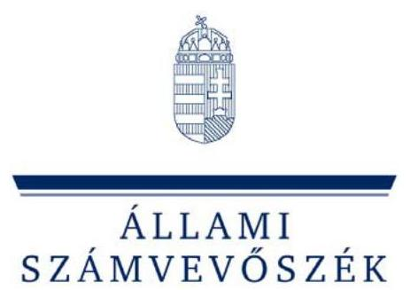
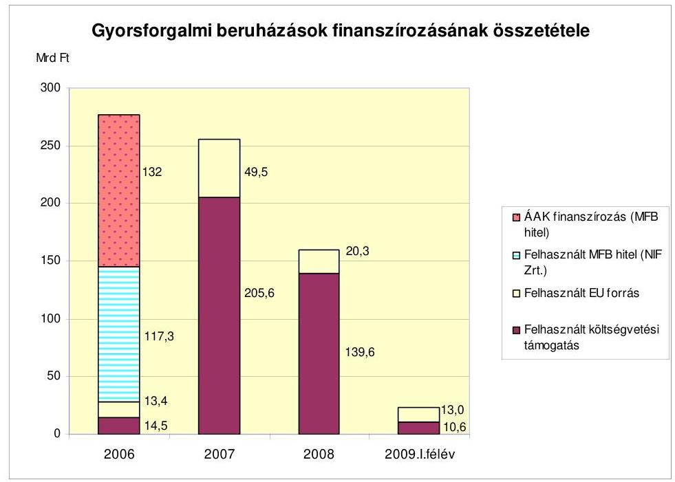
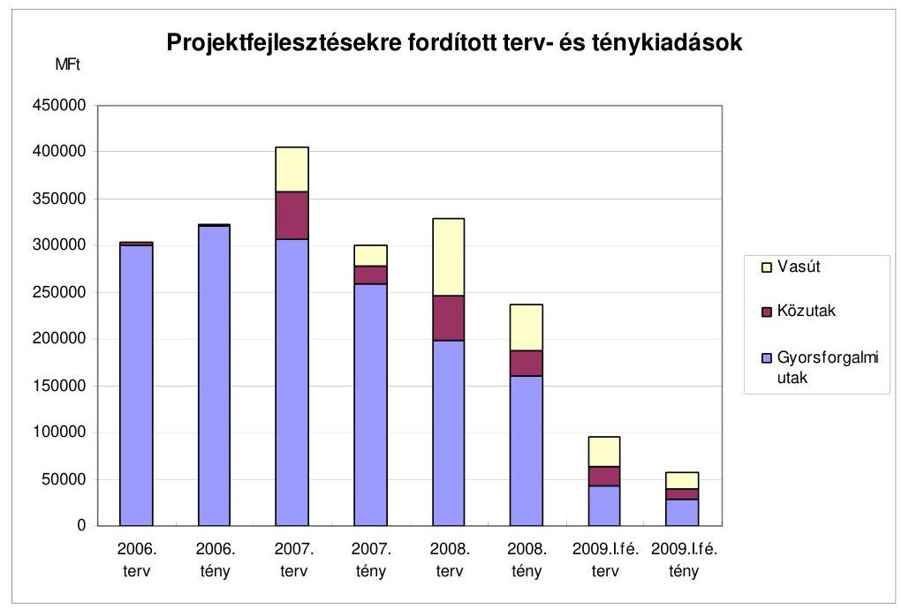
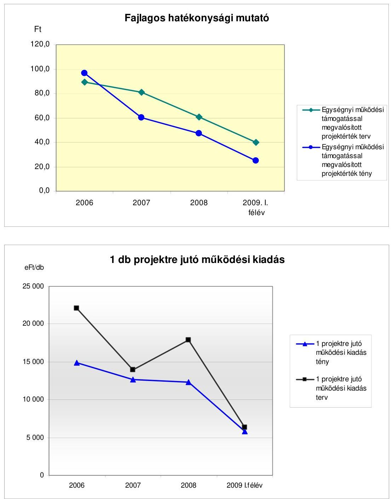
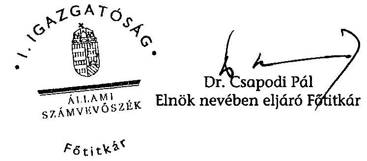
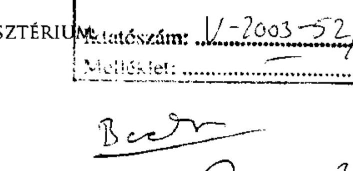
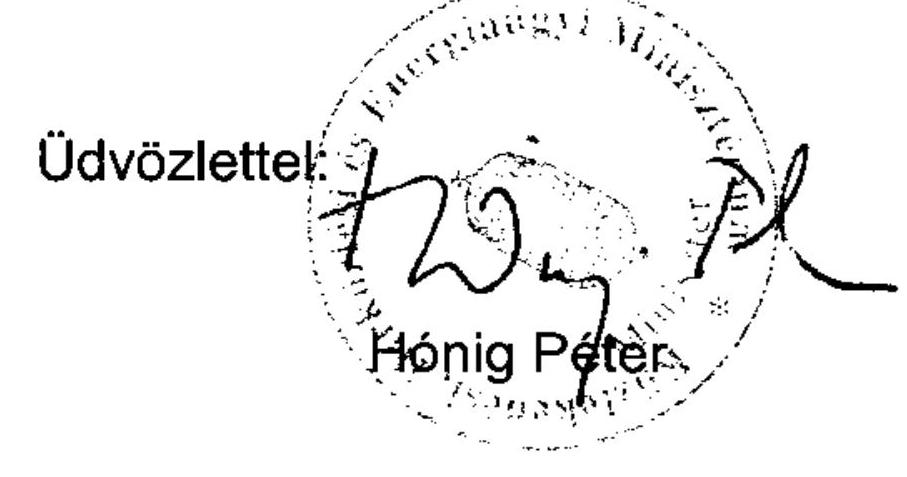
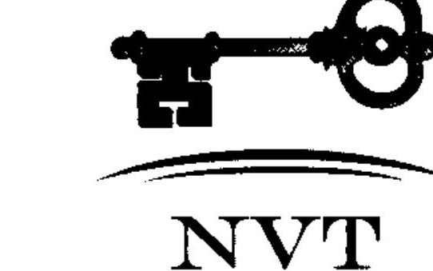
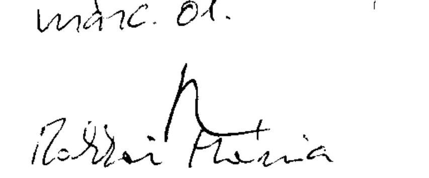
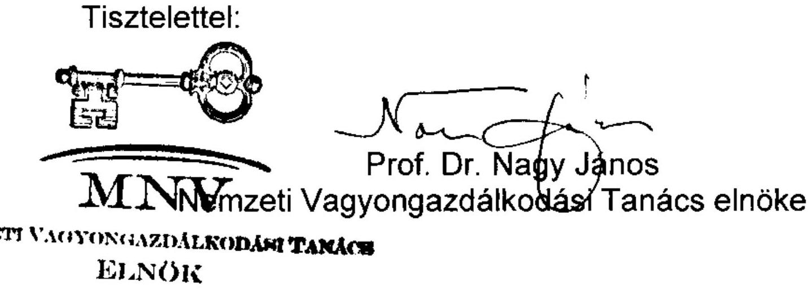

# JELENTÉS 

a gyorsforgalmi úthálózattal kapcsolatban állami feladatot ellátó szervezetrendszer müködésének ellenőrzéséről

---

2. Államháztartás Központi Szintjét Ellenőrző Igazgatóság
2.1. Teljesítmény Ellenőrzési Főcsoport
Iktatószám: V-2003-53/2009-2010.
Témaszám: 947
Vizsgálat-azonosító szám: V0481
Az ellenőrzést felügyelte:
Dr. Becker Pál
főigazgató
Az ellenőrzés végrehajtásáért felelős:
Dr. Zöldréti Attila
főcsoportfőnök
Az ellenőrzést vezette:
Makkai Mária
főcsoportfőnök-helyettes
Az ellenőrzést végezték:

| Barta József számvevő tanácsos | Dr. Dicső Ildikó számvevő | Gaálné Izsó Éva számvevő tanácsos, tanácsadó |
| :--: | :--: | :--: |
| Lucza Anikó számvevő tanácsos | Major Lászlóné számvevő tanácsos | Massányi Tibor számvevő tanácsos |
| Nagy Ákos számvevő |  |  |

# A témához kapcsolódó eddig készített számvevőszéki jelentések: 

címe
sorszáma
Jelentés a koncesszióba adott állami tevékenységek vizsgálatáról 0114
Jelentés az M3 autópálya beruházás pénzügyi folyamatának el- 0218 lenőrzéséről
Jelentés az M7 autópálya felújítás pénzügyi folyamatának ellenőr- 0342 zéséről
Jelentés a szekszárdi Duna-híd beruházás ellenőrzéséről 0428
Jelentés a Magyar Köztársaság 2004. évi költségvetése végrehajtá- 0540 sának ellenőrzéséről
Jelentés a Magyar Köztársaság 2005. évi költségvetése végrehajtá- 0628 sának ellenőrzéséről
Jelentés az autópálya beruházások finanszírozási megoldásainak 0645 összehasonlító ellenőrzéséről

---

Jelentés a 2006-ban befejeződő autópálya beruházások ellenőrzéséröl
Jelentés a 2007-ben befejeződő autópálya beruházások ellenőrzéséröl
Jelentés a 2008-ban befejeződő autópálya beruházások ellenőrzéséröl

---

# TARTALOMJEGYZÉK 

BEVEZETÉS ..... 5
I. ÖSSZEGZŐ MEGÁLLAPÍTÁSOK, KÖVETKEZTETÉSEK, JAVASLATOK ..... 10
II. RÉSZLETES MEGÁLLAPÍTÁSOK ..... 23

1. A gyorsforgalmi úthálózattal kapcsolatos jogszabályi feladatok ..... 23
2. A közlekedésért felelős minisztérium stratégiája, szervezete, a társaságok szakmai és tulajdonosi felügyelete ..... 24
3. A NIF Zrt. múködése ..... 27
3.1. A NIF Zrt. stratégiája ..... 27
3.2. A NIF Zrt. irányítási, döntéshozatali rendje és szervezete ..... 28
3.3. A Felügyelő Bizottság és a belső ellenőrzés múködése ..... 32
3.4. Az éves üzleti tervek meghatározása és teljesülése ..... 35
3.5. A feladatellátás személyi és tárgyi feltételei, a feladatellátás változásainak hatása a létszámra és a költségekre ..... 38
3.6. A személyi jellegű ráfordítások alakulása, a bér- és létszámgazdálkodás ..... 42
3.7. Az anyagjellegú ráfordítások alakulása, az eszközbeszerzések, a tanácsadói és szakértői díjak indokoltsága ..... 44
3.8. A NIF Zrt. gazdálkodásának szabályozottsága, eszközállományának összetétele ..... 48
4. Az ÁAK Zrt. múködése ..... 49
4.1. Az ÁAK Zrt. feladatai, az irányítási és döntéshozatali rend ..... 49
4.2. A feladatellátáshoz kialakított szervezeti rendszer, a múködés szabályozása ..... 56
4.3. Az üzleti tervek meghatározása ..... 59
4.4. A személyi jellegú ráfordítások alakulása és összetétele ..... 61
4.5. Az anyagjellegú ráfordítások alakulása, a beszerzések ..... 64
4.6. Az ÁAK Zrt. és a KKK között létrejött szerződésekben foglaltak végrehajtása ..... 68
4.7. Az ÁAK Zrt. eszközállományának alakulása ..... 73
5. A KKK múködése ..... 75
5.1. A KKK gyorsforgalmi úthálózattal kapcsolatos feladatai, szervezete ..... 75
5.2. A KKK vagyonkezelési tevékenysége ..... 80
5.3. Az Útpénztár és a Gyorsforgalmi úthálózat fejlesztési előirányzat tervezésével és kezelésével kapcsolatos feladatok végrehajtása ..... 82

---

5.4. A KKK, a NIF Zrt. és az ÁAK Zrt. között megkötött szerződésekben foglaltak megvalósulása

# MELLÉKLET 

1/a sz. a Közlekedési, Hírközlési és Energiaügyi Minisztérium észrevétele
1/b sz. a Nemzeti Vagyongazdálkodási Tanács elnökének észrevétele
2. sz. A gyorsforgalmi úthálózat létrehozásával, múködtetésével kapcsolatos intézményrendszer

---

# RÖVIDÍTÉSEK JEGYZÉKE 

| Áht. | az államháztartásról szóló 1992. évi XXXVIII. törvény |
| :--: | :--: |
| AKA Zrt. | AKA Alföld Koncessziós Autópálya Zrt. |
| Aptv. | a Magyar Köztársaság gyorsforgalmi közúthálózatának közérdekúségéről és fejlesztéséről szóló 2003. évi CXXVIII. törvény |
| ÁAK Zrt. | Állami Autópálya Kezelő Zrt. |
| ÁSZ | Állami Számvevőszék |
| EKFS | egységes közlekedésfejlesztési stratégia |
| EU | Európai Unió |
| FB | Felügyelő Bizottság |
| GKM | Gazdasági és Közlekedési Minisztérium |
| Gt. | a gazdasági társaságokról szóló 2006. évi IV. törvény |
| Hay | Hay Group Menedzsment Tanácsadó Kft. |
| Kbt. | a közbeszerzésekről szóló 2003. évi CXXIX. törvény |
| KHEM | Közlekedési, Hírközlési és Energiaügyi Minisztérium |
| KIKSZ | Közlekedésfejlesztési Integrált Közremúködő Szervezet |
| KKK | Közlekedésfejlesztési Koordinációs Központ |
| Kktv. | a közúti közlekedésről szóló az 1988. évi I. törvény |
| KözOP | Közlekedés Operatív Program |
| KPMG | KPMG Hungária Kft. |
| KSZ | Kollektív Szerződés |
| MFB Zrt. | Magyar Fejlesztési Bank Zrt. |
| MNV Zrt. | Magyar Nemzeti Vagyonkezelő Zrt. |
| NFÜ | Nemzeti Fejlesztési Ügynökség |
| NIF Zrt. | Nemzeti Infrastruktúra Fejlesztő Zrt. |
| NKH | Nemzeti Közlekedési Hatóság |
| NVT | Nemzeti Vagyongazdálkodási Tanács |
| PM | Pénzügyminisztérium |
| PSZMK | Projekt Szervezeti és Múködési Kézikönyv |
| SZMSZ | Szervezeti és Múködési Szabályzat |
| UMFT | Új Magyarország Fejlesztési Terv |
| ÜKSZ | Üzemeltetési és Karbantartási Szerződés |
| VIR | vezetői információs rendszer |
| Vtv. | az állami vagyonról szóló 2007. évi CVI. törvény |

---

.

---

# JELENTÉS 

## a gyorsforgalmi úthálózattal kapcsolatban állami feladatot ellátó szervezetrendszer múködésének ellenőrzéséről

## BEVEZETÉS

A közúti közlekedésről szóló 1988. évi I. törvény (továbbiakban: Kktv.) 9/B § (1) bekezdése szerint az állam a kizárólagos tulajdonát képező, az országos közúthálózatba tartozó autópályák, autóutak (együtt: gyorsforgalmi utak) létesítése, fejlesztése, felújítása, fenntartása és üzemeltetése (együtt: múködtetés) céljából költségvetési szervet alapíthat vagy e célra olyan gazdálkodó szervezetet hozhat létre, amelyben többségi részesedéssel, szavazati joggal rendelkezik. A gyorsforgalmi úthálózat fejlesztésének és múködtetésének szervezeteit a vizsgált időszak kezdete előtt kialakították, amelynek intézményrendszerét az 1. sz. melléklet mutatja be.

A gyorsforgalmi utak megvalósításával kapcsolatos feladatokat 2004. január 1-jétől a Magyar Köztársaság gyorsforgalmi úthálózatának közérdeküségéről és fejlesztéséről szóló 2003. évi CXXVIII. törvény (továbbiakban: Aptv.) határozta meg. Az Aptv. szerint 2004-től 2007 végéig összesen 687 km gyorsforgalmi útszakaszt kellett átadni, ami $60 \%$-ban ( 412 km ) teljesült. A 2008-ban átadott $76,2 \mathrm{~km}$ gyorsforgalmi úttal együtt a teljesítés $71,1 \%$. Az Aptv. 2007 júliusától nem nevesíti az előkészítésre kerülő gyorsforgalmi utakat és nem tartalmazza éves bontásban az átadási határidőket. A gyorsforgalmi utak jellemzőit és kivitelezésének várható kezdetét a 2007-2013 közötti időszakban megvalósítani tervezett közlekedésfejlesztési projektek indikatív listájáról szóló 1004/2007. (I. 30.) Korm. határozat rögzíti.

A 2006 októberében a Kormány által az 1103/2006. (X. 30.) határozattal elfogadott Új Magyarország Fejlesztési Terv egyik prioritását képezi a közlekedés fejlesztése, ezen belül a gyorsforgalmi úthálózat bővítése. A hét évre szóló Fejlesztési Terv meghatározta a feladatok ellátásához szükséges forrásokat, amely EU fejlesztési forrásokat, hazai társfinanszírozást és magántőkét tartalmaz. A Közlekedés Operatív Programra - 2004-es árakon számítva - 1721 Mrd Ft forrást hagyott jóvá a Kormány. A gyorsforgalmi úthálózat fejlesztéséhez szükséges pénzeszközök összege a Fejlesztési Tervben nem szerepel. A Kormány által jóváhagyott, az uniós gyorsforgalmi útfejlesztésekkel kapcsolatos részletes finanszírozási források megtalálhatók a két éves akciótervekben, illetve a Közlekedési Operatív Programban összefoglalva.

A Kormány közlekedéspolitikáért felelős tagja 2006. január 1-jétől 2008. május 14-ig a gazdasági és közlekedési miniszter volt, ezt követően a közlekedési, hír-

---

közlési és energiaügyi miniszter látja el a feladatot. A miniszter a közlekedésért való felelőssége körében előkészíti a közúti közlekedésről, a gyorsforgalmi utakról szóló és az utakkal kapcsolatos egyéb jogszabályokat, továbbá e tárgykörökben miniszteri rendeleteket ad ki.

A gyorsforgalmi úthálózattal kapcsolatos feladatokat a Gazdasági és Közlekedési Minisztériumban (továbbiakban: GKM), illetve a Közlekedési, Hírközlési és Energiaügyi Minisztériumban (továbbiakban: KHEM) a Szervezeti és Múködési Szabályzat tartalmazta (továbbiakban: SZMSZ). A minisztériumokban az arra kijelölt szervezeti egységek feladata - többek között - az infrastruktúra fejlesztési elvek kidolgozása, a döntések előkészítése, azok megvalósításának figyelemmel kísérése, finanszírozási stratégia kialakítása, a közlekedéssel kapcsolatos ágazati szintű tervezés, valamint a PPP projektek előkészítése és lebonyolítása volt.

A gyorsforgalmi utak építtetője a Nemzeti Infrastruktúra Fejlesztő Zrt. (továbbiakban: NIF Zrt.), amely 100\%-os állami tulajdonban van. A részvényesi (tulajdonosi) jogok gyakorlója 2008. májusig a gazdasági és közlekedési miniszter, ezt követően a közlekedési, hírközlési és energiaügyi miniszter volt. A NIF Zrt. feladatai fokozatosan bővültek, amelyek azonban nem a gyorsforgalmi úthálózathoz kapcsolódnak. A 122/2005. (XII. 28.) GKM rendelet alapján a NIF Zrt. 2006-tól végzi a nem EU-s finanszírozású közútfejlesztési feladatokat, alapítói határozat alapján 2007-től az EU-s finanszírozású közúti és vasútfejlesztési feladatokat is. A NIF Zrt. 2008. január 1-jétől - a magántőke bevonásával megvalósult utak kivételével - az országos közutak építtetője is.

Az Állami Autópálya Kezelő Zrt. (továbbiakban: ÁAK Zrt.) a gyorsforgalmi úthálózat üzemeltetője és fenntartója, valamint bizományosként ellátja az autópálya használati díjak és pótdíjak beszedését, amely az Útpénztár fejezeti kezelésű előirányzatot illeti meg. Az ÁAK Zrt. 2000-ben jött létre, 2003-tól a Magyar Állam 100\%-os tulajdonában álló, egyszemélyes részvénytársaság. Az ÁAK Zrt. felett a tulajdonosi jogokat a GKM gyakorolta az alapító okirat, illetve az állami vagyonról szóló 2007. évi CVI. törvény (továbbiakban: Vtv.) alapján a Magyar Nemzeti Vagyonkezelő Zrt.-vel (továbbiakban: MNV Zrt.) kötött szerződés szerint. A vagyonkezelési szerződés 2008. évi módosításában nem szerepelt a vagyonkezelésre átadott társaságok között az ÁAK Zrt., így az az MNV Zrt. közvetlen irányítása alá került. Az ÁAK Zrt. felett a szakmai irányítást a KHEM, a tulajdonosi irányítást a Nemzeti Vagyongazdálkodási Tanács (a továbbiakban: NVT) az MNV Zrt. útján gyakorolja. Az ÁAK Zrt. által fenntartott gyorsforgalmi úthálózat hossza 2005. év végén 850 km , 2009. április végén pedig 1285 km volt.

A NIF Zrt. és az ÁAK Zrt. múködésére a gazdasági társaságokról szóló 2006. évi IV. törvény (továbbiakban: Gt.) rendelkezései irányadóak.

A Közlekedésfejlesztési Koordinációs Központ (továbbiakban: KKK), mint a GKM illetve KHEM szakmai feladatokat ellátó háttérintézménye önállóan gazdálkodó központi költségvetési szerv, amelyet 1996. június 1-jén alapított a közlekedési, hírközlési és vízügyi miniszter Útgazdálkodási és Koordinációs Igazgatóság (UKIG) néven a közútkezelő közhasznú társaságok tevékenységének koordinálására. 2006-tól az Útpénztár fejezeti kezelésű előirányzat múköd-

---

tetésével összefüggő feladatokat lát el, és mint vagyonkezelő végzi az országos közúthálózat - kivéve a koncessziós szerződés keretében, illetőleg a magántőke bevonásával megvalósult és megvalósuló országos közutak - vagyonnyilvántartását. Az UKIG 2007-től viseli a Közlekedésfejlesztési Koordinációs Központ nevet és látja el a Gyorsforgalmi úthálózat fejlesztése fejezeti kezelésű előirányzat kezelésével kapcsolatos feladatokat. A gazdasági és közlekedési miniszter az Útgazdálkodási és Koordinációs Igazgatóság átszervezésének elrendeléséről szóló 34/2006. (XI. 23.) GKM utasítással 2007. január 1-jétől 2008. február 28-ig a közlekedés valamennyi ágazata uniós forrásalapú fejlesztéseinek finanszírozását koordináló közremúködő szervezet feladatainak ellátásával a KKK-t bízta meg.

A 2003-2015-ig szóló magyar közlekedéspolitikát az Országgyűlés a 19/2004. (III. 26.) OGY határozattal elfogadta. Ebben az általános közlekedéspolitikai elemek között határozta meg a páneurópai közlekedési hálózat magyarországi bővítését. A fejlesztés/bővítés céljaként megjelölte, hogy az országhatártól országhatárig tartó, a főváros központúságot oldó gyorsforgalmi úthálózat a folyamatosan növekvő hazai és transz-európai forgalmi terhelésnek is megfeleljen.

A NIF Zrt., az ÁAK Zrt. és a KKK működésére az Útpénztár fejezeti kezelésű előirányzatból a központi költségvetés biztosított forrást. 2006-tól az ÁAK Zrt.-nél a társasággal kötött szolgáltatási és bizományosi szerződésekben megállapított költségtérítések és jutalékok fedezték a működési kiadásokat és azon felül nyereség is képződött. A központi költségvetésben a gyorsforgalmi úthálózat fejlesztésének finanszírozására a Gyorsforgalmi úthálózat fejlesztése és az Útpénztár fejezeti kezelési előirányzatok szolgálnak.

Az Állami Számvevőszék (továbbiakban: ÁSZ) stratégiai célkitűzéseinek megfelelően kiemelt figyelmet fordít a közlekedési infrastruktúra fejlesztésének, fenntartásának és finanszírozásának ellenőrzésére. Ennek keretében - többek között - ellenőrizte 2006-ban az autópálya beruházások finanszírozási megoldásait, majd a 2006., 2007. és 2008. években befejezett autópálya beruházásokat, az intézményi kereteket nem ellenőriztük. A gyorsforgalmi úthálózattal összefüggő állami feladatok ellátására kialakított szervezeti rendszer működésének, gazdálkodásának ellenőrzésére a jelen vizsgálat keretében került sor.

A jelenlegi ellenőrzés célja annak értékelése volt, hogy a gyorsforgalmi úthálózattal összefüggő állami feladatot ellátó szervezeteknél

- a 2006-2009. években az irányítási, szervezeti struktúra összhangban állt-e a szakmai feladatokkal;
- biztosították-e a múködéshez és feladatellátáshoz szükséges személyi, tárgyi és pénzügyi feltételeket;
- hatékonyan használták-e fel az erőforrásokat;
- jól múködtették-e a belső kontrollrendszereket;
- a szakmai és tulajdonosi felügyelet intézkedései segítették-e NIF Zrt., az ÁAK Zrt. és a KKK múködését.

---

Az ellenőrzés 2006-tól 2009. október végéig terjedő időszakban a GKM, illetve KHEM, az ÁAK Zrt., a NIF Zrt. és a KKK gyorsforgalmi úthálózattal kapcsolatos tevékenységére irányult.

A GKM-re, illetve a KHEM-re vonatkozó megállapítások a minisztériumnál és a többi ellenőrzött szervezetnél végzett ellenőrzéseken alapulnak.

2006-2009 között a NIF Zrt. tevékenységének egy része a gyorsforgalmi úthálózat fejlesztése (2008-ban a beruházási projektek összértékén belül 67\%-a, a szakmai kapacitásnak 30\%-a) volt, szemben a 2006. előtti időszakkal, amikor kizárólagosan ezt a feladatot látta el. A közúti és vasút fejlesztéseket nem ellenőriztük, azonban a feladatbővülésnek a szervezetre, a múködésre, a múködési kiadásokra gyakorolt hatását a jelentésben bemutatjuk.

A helyszíni ellenőrzés lezárásakor a KKK létszámának (123 fő) 23,6\%-a (29 fő) foglalkozott egyéb feladataik mellett a gyorsforgalmi utakkal összefüggő feladatokkal, ami a KKK teljes kapacitásának 8,5\%-a volt. Ezzel a kapacitással 2008. évben a KKK a gyorsforgalmi utakkal összefüggésben 175,2 Mrd Ft közpénz múködtetésében vett részt (fejlesztés, üzemeltetés, felújítás, múködési támogatás, matrica díjbevétel) és 2008. év végén 915,5 Mrd Ft közvagyon gazdálkodásáért volt felelős, amelynek múködtetése 2006-2009. I. félév között mintegy 350 M Ft-ba került. A KKK-nak csak a gyorsforgalmi úthálózattal kapcsolatos tevékenységét ellenőriztük. Az átadott dokumentumok, beszámolók alapján az intézmény egészére vonatkozó megállapításaink a gazdálkodást érintették.

2008-ban a szervezeti múködés költségeinek a NIF Zrt.-nél 75\%-át, az ÁAK Zrt.-nél 55\%-át, a KKK-nál 46\%-át a személyi jellegú kiadások tették ki. Mindhárom szervezetnél a szakmai feladatellátást gépjármúpark segíti. Ezen felül a szervezetek személyi használatú gépjármúvekkel is rendelkeznek, amelynek száma a NIF Zrt.-nél 2006-2008 között duplájára nőtt és az üzemanyagköltség az anyagköltségek több mint 50\%-át tették ki. Az ÁAK Zrt.-nél a személyi használatú gépjármúvek száma nem nőtt, ugyanakkor az azokkal kapcsolatos kifizetés három év alatt megközelítette a 700 M Ft-ot. Mindezek miatt ellenőriztük a személyi jellegú kiadásokat és a személyi használatú gépjármúvek feladatellátással való indokoltságát.

A NIF Zrt. múködési hatékonyságának értékelése nem lehetett egzakt, mivel a hatékonyság mérésének egységes mutatószámrendszere nincs kialakítva. Öszszehasonlító értékelésre nincs mód, mivel a NIF Zrt. az állami infrastrukturális beruházások egyedüli építtetője (benchmarking hiánya). Nemzetközi adatok e területen nem ismertek, a NIF Zrt.-nél jelenleg folyamatban van a nemzetközi adatok feltérképezése. Mindezek mellett az ellenőrzés és a NIF Zrt. is meghatározott egy-egy hatékonysági mutató számítási módszert. A kialakított mutatószámok azonban részlegesek, mivel a rendelkezésre álló adatokat és információkat nem tudják komplexen figyelembe venni, ezért korlátozott következtetések levonására alkalmasak.

Az ellenőrzött időszakban megvalósult autópálya beruházásoknál az uniós forrás nem volt meghatározott mértékű, ezért a gyorsforgalmi úthálózathoz kapcsolódó hazai uniós intézményrendszert nem ellenőriztük.

---

Az ellenőrzés jogalapját az Állami Számvevőszékről szóló 1989. évi XXXVIII. tv. 2. § (5) és (6) bekezdése képezte.

A jelentés-tervezetet egyeztettük a közlekedési, hírközlési és energiaügyi miniszterrel és a Magyar Nemzeti Vagyongazdálkodási Tanács elnökével. A leveleket az 1/a-b számú mellékletek tartalmazzák.

---

# I. ÖSSZEGZŐ MEGÁLLAPÍTÁSOK, KÖVETKEZTETÉSEK, JAVASLATOK 

2006-2009 közötti években a gyorsforgalmi úthálózat állami tulajdonban álló és közpénzből finanszírozott szervezetrendszerének múködésében a kialakított munkamegosztás alapvetően nem módosult, az a jogszabályokban meghatározott szakmai feladatokon alapult. Az intézményi múködéshez szükséges források rendelkezésre álltak. Az állami feladatellátást végző társaságok és szervezet múködését az jellemezte, hogy a jogszabályokban meghatározott feladatok végrehajtásához külső kapacitást vettek igénybe.

A gyorsforgalmi útépítéssel kapcsolatos feladatokat az Aptv. határozza meg, amelynek gyakori módosításai (2006-2009 között 9, 2004-től összesen 17 alkalommal) nehezítették a törvényi szabályozás kiszámíthatóságát és a feladatellátást. A megépíteni tervezett gyorsforgalmi utakat 2007 júliusáig az Aptv. tartalmazta, azt követően kormányhatározat (indikatív lista) rögzíti. Az Aptv.-ben rögzített gyorsforgalmi útberuházások megvalósítása jellemzően az előírt határidőn túl teljesült. ${ }^{1}$ 2006-2009 közötti években közel 312 km gyorsforgalmi útszakaszt helyeztek forgalomba, amelyek beruházási értéke megközelítette a 800 Mrd Ft-ot. A gyorsforgalmi úthálózat mennyiségi fejlesztésének üteme 2007-től mérséklődött, a fejlesztésekhez kapcsolódó költségvetési kiadások év-ről-évre csökkentek.

A központi költségvetésből a gyorsforgalmi úthálózat fejlesztésének finanszírozására a NIF Zrt.-nek 2006-2009. I. féléve között 370,3 Mrd Ft-ot, az ÁAK Zrt.nek - az Útpénztárból - fenntartásra, karbantartásra, felújításra, bizományosi tevékenység ellátására 84 Mrd Ft-ot biztosítottak. Az Útpénztár fejezeti kezelésű előirányzat szolgált forrásul a NIF Zrt. (13,2 Mrd Ft), és a KKK (teljes tevékenységre 9,6 Mrd Ft) múködésére. Ugyanebben az időszakban a Magyar Állam (Útpénztár) a gyorsforgalmi úthálózat használatáért beszedett díj és pótdíj révén 134 Mrd Ft bevételhez jutott.

A mindenkori Kormányok szándéka ellenére a gyorsforgalmi úthálózat építésébe a magántőke és az Európai Uniós források bevonása - a megvalósított fejlesztések nagyságrendjéhez képest - minimális volt. A felhasznált uniós forrás összege 2006-2009 között 96,2 Mrd Ft-ot tett ki, ami a projektekre kifizetett öszszeg 11,6\%-a. A Kormány a magántőke bevonásának formájaként 2006-ban kötvénykibocsátást tervezett, aminek meghiúsulása miatt az ÁAK Zrt. hitelfelvételre kényszerült. A tervezett magántőke bevonáshoz szükségessé vált a NIF Zrt.-től az ÁAK Zrt. részére a beruházói feladatkör átadása, majd a meghiúsulás miatt annak visszavétele, valamint a kötvénykibocsátás előkészítése. Mindezeknek a közvetlenül kimutatható és meg nem térülő költsége meghaladta a

[^0]
[^0]:    ${ }^{1}$ Az ÁSZ a 0712. sz. jelentése azt tartalmazza, hogy „A 2006. végéig átadni tervezett útszakaszok 68\%-át helyezték ideiglenesen forgalomba." Az ÁSZ 0926. sz. jelentésében megállapította, hogy „Az autópálya szakaszok forgalomba helyezése az Aptv.-ben meghatározotthoz képest 1-2. évvel később volt."

---

3,0 Mrd Ft-ot. Ebből az ÁAK Zrt.-nél 1,7 Mrd Ft (tanácsadói díjak és egyéb költség), a NIF Zrt.-nél 1,3 Mrd Ft (Program utakhoz kapcsolódó bonyolítói díj) merült fel.

A szakmai irányítást a közlekedésért felelős minisztérium látta el. 2006-2009. években a közlekedéspolitikáért felelős miniszter személye öt alkalommal változott, ami nem segítette a stabil, kiszámítható irányítást, a szakmai feladatellátást.

Az ellenőrzött időszakban az állami beruházások meghatározó hányadát jelentették a gyorsforgalmi útfejlesztések, ez és a bővülő úthálózat fenntartása folyamatos szakmai irányítást és koordinációt igényelt. 2006-2009. években a gyorsforgalmi úthálózattal kapcsolatos minisztériumi szintű feladatokat a GKM-nél, illetve a KHEM-nél több szervezeti egységhez rendelték. A KHEM által kimutatott gyorsforgalmi úthálózattal foglalkozó létszám a 2005. év végi 100 fơről 2009-re 32 főre csökkent, de a munkatársak feladatainak is csak egy része kapcsolódik a gyorsforgalmi utakhoz. A létszámcsökkenés - többek között - azzal állt összefüggésben, hogy a gyorsforgalmi úthálózatot érintő előirányzatok kezelésével kapcsolatos tevékenységeket, valamint az EU-s forrásbevonáshoz szükséges közremúködő szervezeti funkciókat a KKK-hoz telepítették, amelyek célszerűségét szakmai indokok nem támasztják alá. A közreműködő szervezeti feladatokat 2008 decemberétől a KIKSZ Közlekedésfejlesztési Zrt. látja el.

A GKM, illetve a KHEM SZMSZ-e szerint a társaságok tulajdonosi, részvényesi jogait a Magyar Állam, mint tulajdonos nevében a miniszter gyakorolja. A miniszter a NIF Zrt. és az ÁAK Zrt. alapító okiratában meghatározta a kizárólagos hatáskörébe tartozó döntéseket. Ennek megfelelően tulajdonosi határozattal elfogadta a beszámolót, megválasztotta az irányító testületeket (igazgatóság, FB), összeghatártól függően a kivitelezési szerződéseket és azok módosításait jóváhagyta. Ezen túlmenően az operatív feladatok egyeztetése levélben, e-mailben, szakállamtitkári értekezletek keretében, illetve szóban történt, egy

---

részük nem dokumentált, ezáltal a szakmai és tulajdonosi irányítás teljes körűen nem volt átlátható.

A GKM 2007-2010-ig terjedő időszakra szóló intézményi stratégiája szerint az egyik legfontosabb feladat az egységes közlekedésfejlesztési stratégia (továbbiakban: EKFS) kialakítása volt, ami elkészült, azonban az elfogadásáról kormányhatározat nem rendelkezett. Az EKFS a Közlekedés Operatív Programjából (továbbiakban: KözOP) támogatott projektek kiválasztásához és megvalósításához szükséges. A GKM stratégiája rögzítette a megkezdett hálózatfejlesztések folytatását a magántőke fokozott bevonása mellett, valamint az ÁAK Zrt. privatizációjának szükségességét. Az EU-s forrás finanszírozásával tervezett gyorsforgalmi úthálózat fejlesztésekre forrásbevonás nem volt (pl. M7 autópálya Balatonkeresztúr-Nagykanizsa közötti szakasz), az autópálya beruházásokat minimális mértékben finanszírozták magántőkéből (M6 autópálya), az ÁAK Zrt. privatizációját felfüggesztették.

A GKM, illetve KHEM a gyorsforgalmi úthálózattal kapcsolatban állami feladatot ellátó szervezetrendszer múködését, gazdálkodását nem ellenőrizte, az intézményrendszer tevékenységének célszerűségét és hatékonyságát nem értékelte.

A NIF Zrt. végzi a gyorsforgalmi úthálózat építtetése mellett a közútfejlesztés, továbbá az európai uniós finanszírozású közúti és vasútfejlesztési feladatokat. A tevékenységi kör szélesítésével párhuzamosan a NIF Zrt. átalakította a szervezetét. A szervezeti változtatást követően külön váltak a beruházói (közúti, gyorsforgalmi és vasúti), beruházás támogatói és gazdasági funkciók. A NIF Zrt.-nél kialakított szervezeti modell összhangban áll az ellátandó feladatokkal. A szervezeti átalakítás következtében a vezetői szintek száma csökkent. A közúti feladatoknak a KKK-tól és a Magyar Közút Kht.-tól való átvételéhez teljes körű létszám és egyéb tételes felmérés nem készült, a vasúti feladatbővülés támogatási igényét a 2007. évi üzleti tervben rögzítették, azonban azt részletes számításokkal nem támasztották alá. A NIF Zrt.-nek a 2008-ban jóváhagyott vállalati stratégiája rögzíti a társaság jövőképét, a múködéssel kapcsolatos szervezeti célokat, azonban nem tartalmazza az infrastruktúrafejlesztés végrehajtásának stratégiai elemeit. A NIF Zrt. 2006 augusztusától szabályozta a projektek múködését és a beruházások lebonyolítását, 2007 márciusától minőségirányítási rendszer múködik. A NIF Zrt. folyamatai és múködése szabályozott.

A NIF Zrt. 2007-ben kiépítette a vezetői információs rendszerét (továbbiakban: VIR). A VIR adatszolgáltatás megfelelőségét a NIF Zrt. vezetése nem minősítette. A havi kontrolling jelentésekben a tervteljesítésekről táblázatok készültek, szöveges értékelést nem tartalmaztak.

A NIF Zrt. ügyvezető szerve, az igazgatóság havi rendszerességgel ülésezett. A döntések évente 10-20\%-át faxos szavazás útján hozta meg, amelyek a beruházási projektekkel függtek össze. Tagjainak száma a 2007. évi 11 fơről 2008-ra a Vtv. előírásainak megfelelően lecsökkent 7 főre. Az igazgatóság elnökének és tagjainak tiszteletdíja a tulajdonos döntése alapján az ellenőrzött időszakban kétszer változott, 10 majd $50 \%$-kal csökkent. A $10 \%$-os csökkentés után elnök/tag tiszteletdíja 433/400 E Ft-ról 390/360 E Ft-ra, 2009. július 1-jétől az $50 \%$-os csökkenés után a tiszteletdíj havi 195/180 E Ft/fő.

---

A tulajdonosi joggyakorló számára a felügyelő bizottság (továbbiakban: FB) ellenőrzi a NIF Zrt. ügyvezetését. Tagjainak száma folyamatosan, 5 főről 11 főre emelkedett. A NIF Zrt.-nél az ülés megtartása nélkül hozott FB határozatok számának aránya $11 \%$ volt. Az ügyrend alapján az FB ülésein az igazgatóság tagjai tanácskozási joggal részt vehetnek.

Az igazgatóság és az FB ügyrendje szerint a NIF Zrt. érdeke által indokolt kivételes esetben lehet ülés megtartása nélkül határozatot hozni, azonban a kivételes esetek köre nincs meghatározva. Az igazgatósági és FB ülések megtartása nélküli határozathozatalt nem előzi meg az előterjesztések megtárgyalása, részletes szakmai vita lefolytatása.

Az FB szakmai irányítása alatt álló függetlenített belső ellenőrzés létszáma 2 fő, tevékenysége kapacitáshiány miatt nem biztosította a NIF Zrt. múködésének és szakmai tevékenységének folyamatos ellenőrzését. A belső ellenőrzés tevékenységének döntő hányadát a külső ellenőrzések kiszolgálása tette ki.

Az ellenőrzött időszakban a NIF Zrt.-nél a 2006. év kivételével a projekt beruházásokra (gyorsforgalmi úthálózat fejlesztése, közútfejlesztés és vasúti beruházások) fordított összeg 25,7-39,8\%-kal alatta maradt a tervezett értéknek. Az eltérések okait, magyarázatát az üzleti jelentések 2008. év kivételével nem mutatták be, ilyen jellegű elemző munka a NIF Zrt.-nél nem volt. Üzleti tervmódosítást a tulajdonosi jogokat gyakorló miniszter csak egy alkalommal, 2006-ban hagyott jóvá.

A feladatellátás változása hatására a NIF Zrt. létszáma 2005. évi 135 fơről 2009. I. félév végére 327 főre emelkedett. A 192 fős növekményből 79 fő a szakmai területeken, 113 fő a támogató és irányító területeken jelentkezett. A támogató területek egy része a szakmai tevékenység ellátásához járul hozzá, pl. területszerzés, közbeszerzés stb. 2006-2009. I. félév közötti időszakban a NIF Zrt. által kimutatott, a projektfejlesztésekre fordított kiadások fokozatosan csökkentek, a projektek száma ugyanakkor megháromszorozódott. A NIF Zrt. a straté-

---

giája szerint az időszakonként és átmenetileg kialakuló szabad kapacitásának lekötését külső munkavégzéssel, például önkormányzati és magánberuházásokban való részvétellel, európai uniós pályázatokhoz tanácsadással tervezi megoldani.

A NIF Zrt. az Útpénztárból a közutak építésére, fejlesztésére biztosított források igénybe vételére támogatási szerződést köt évente a KKK-val. Az Útpénztár előirányzatnál maradványtartási kötelezettség volt 2007-2008. években, ami a NIF Zrt.-nek juttatott forrásokra nem vonatkozott. Az összes folyósított támogatás az ellenőrzött három és fél év alatt 36,5 Mrd Ft volt, amiből a NIF Zrt. 28,9 Mrd Ft felhasználását igazolta, és nyilatkozata szerint a fennmaradó 7,6 Mrd Ft-ot a továbbiakban használja fel. A támogatási szerződések előírása szerint az igénybe nem vett támogatás zárolható, vagy visszavonható, amely intézkedéssel a KKK nem élt.

A Kormány határozata alapján a KKK a NIF Zrt.-nek az Útpénztár fejezeti kezelésű előirányzatból 3,25 Mrd Ft-ot utalt át 2007 decemberében. A NIF Zrt. 2009 augusztusáig $75,7 \mathrm{M}$ Ft-ot használt fel, így a támogatás szakmailag nem volt indokolt.

2006-2007. években a NIF Zrt. részéről három vagyonátadás történt a Magyar Állam részére összesen 664,3 Mrd Ft összegben 16 szakaszt érintően. 2007. augusztust követően 4 szakasznál értékhelyesbítés nem történt, emiatt ezen vagyonelemek értéke nem tükrözi a tényleges ráfordításokat.

A NIF Zrt. múködési támogatása 2006-ról 2008-ra 3,34 Mrd Ft-ról 5,7 Mrd Ft-ra emelkedett. A NIF Zrt.-vel a működési költségekre megkötött éves szerződések hatékonysági, illetve gazdaságossági követelményeket nem tartalmaztak. A következő évekre elhatárolt múködési támogatás nagysága 2007-ben és 2008-ban megközelítette az éves támogatások 20\%-át. A fel nem használt múködési támogatás alapvetően a feladatbővüléshez kapcsolódó, a tervezettől időben és számban eltérő létszámfejlesztéssel függött össze.

Az ellenőrzés által, a NIF Zrt. adatai alapján meghatározott fajlagos hatékonysági mutató szerint a NIF Zrt. múködésére biztosított támogatás egy forintjára jutó beruházási érték évről-évre csökkent, azaz a működési hatékonyság romlott. Ez a mutató nem tükrözi a projektek darabszámának növekedése miatti többletmunkát. A NIF Zrt. által a vizsgálathoz kidolgozott egy projektre jutó múködési kiadás csökkent, azaz a múködés hatékonysága javult. Ugyanakkor a mutató nem fejezi ki a projektek eltérő nagyságrendjéhez és tartalmához kapcsolódó teljesítménykülönbözeteket.

---

A múködési költségek háromnegyedét a bérköltség és egyéb személyi jellegű juttatások képezik, amelyek alapvetően a feladatbővüléssel összefüggő létszámnövekedés következtében megkétszereződtek. A NIF Zrt.-nél 2006. előtt a bér jellegű és béren kívüli juttatások köre nem volt szabályozott, a bérsávok „hagyomány" alapján alakultak ki, a prémium az alapbér fix részeként funkcionált. Az ellenőrzött időszakban a NIF Zrt. a béren kívüli juttatások körét szabályozta, a prémiumot teljesítményértékeléshez kötötte és munkakör családokat alakított ki. A NIF Zrt. írásos bérpolitikával nem rendelkezik, a munka-

---

körcsaládokra vonatkozó átlagbéreket, átlagjövedelmeket nem tartja nyilván, ${ }^{2}$ ezek hiányában azok tényleges alakulása nem követhető. A NIF Zrt.-nél az átlagjövedelem a 2006. évi 724,4 E Ft-ról 2008-ra 677,8 E Ft-ra csökkent, amiben az játszott szerepet, hogy 2008-ban a 13. havi jutalmat megszüntették és az új munkatársak béremelésből jellemzően nem részesültek. A NIF Zrt. által 2009 októberében a honlapján közzétett adatok alapján a 41 fő vezető személyi alapbére átlagosan 962 E Ft/hó. Ezen felül munkakörönként eltérő mértékű prémium, személyi jellegű egyéb juttatások és költségtérítések illetik meg a munkavállalókat.

A múködési költségeken belül az igénybevett szolgáltatások összege több mint kétszeresére emelkedett. Ebben szerepet játszott - a közúthálózati feladatbővüléshez és a NIF Zrt. új székházba költözésével kapcsolatos - irodabérleti díjak, az egyéb szolgáltatások, illetve a szakértői, tanácsadói díjak növekedése. Ez utóbbi a múködéshez kapcsolódóan 2006-2009. I. félév vége között 271 M Ft volt.

A projektekre 2006-2009. I. félév között - nem múködési költségként - elszámolt szakértői, tanácsadói (területszerzés, műszaki és egyéb) költség 3,2 Mrd Ft volt.

A 2006-2008. években a NIF Zrt. a múködési támogatásból összesen 1095,7 M Ft-ot fordított eszközeinek fejlesztésére. A tárgyi eszközbeszerzések 31,3\%-a, 261,7 M Ft a NIF Zrt. feladatbővülésével áll összefüggésben. A NIF Zrt. gépkocsiparkja - a feladatellátás és létszámbővítéssel együtt - megkétszereződött (102 db), az ellenőrzött időszakban 386 M Ft-ot fordítottak személyi gépjármú beszerzésre. A személyi használatú gépjárműveket a béren kívüli juttatásokat tartalmazó kompenzációs csomag részeként biztosítják a NIF Zrt. szabályzatának megfelelően, az abban meghatározott munkakörökben foglalkoztatottak részére - amit a munkaszerződésekben is rögzítettek -, függetlenül attól, hogy az a feladatellátáshoz szükséges-e. A munkakör jellege és az ellátott feladat (pl. számviteli, pénzügyi, belső ellenőrzési, humán terület vezetői stb.) 13-14 munkakör esetében nem indokolta a személyi gépjármú használatot.

A gyorsforgalmi úthálózat üzemeltetője és fenntartója az ÁAK Zrt., amelynek kiszámítható múködését kedvezőtlenül befolyásolta a stratégiai célként meghatározott privatizáció elhúzódása, illetve annak felfüggesztése, amelynek előkészítéseként 2009. szeptember végéig felmerült költség 715 M Ft volt. A privatizációval összefüggésben a szakmai és tulajdonosi irányítás 2008-ban szétvált, aminek következtében 2009-ben a szakmai döntések (pl. matrica szerződés megkötése) időben elhúzódtak.

Az ÁAK Zrt. 2006-ban elkészült cégstratégiája meghatározta a rövid- és hosszú távú általános célokat. A 2008-2010. évekre vonatkozó vállalati stratégiát a

[^0]
[^0]:    ${ }^{2}$ A NIF Zrt. tájékoztatása szerint: „A vállalat számára semmi sem írja elő ezek nyilvántartását, a NIF Zrt.-nek erre vonatkozó kötelezettsége nincs. A vállalat jelenlegi bérrendszere nem befelé, a belső méltányosságra, hanem kifelé a munkaerőpiacra, a külső méltányosságra fókuszál. A NIF Zrt. a jelenlegi korszerú vállalatirányitási elveknek megfelelően, a HAY-Group által elkészített bérpiaci felmérés alapján a dolgozóinak a munkaerőpiacon található hasonló munkakörökhöz való viszonyát figyeli."

---

GKM megrendelésére tanácsadó cég készítette el a minisztérium 2007-2010. évekre szóló stratégiájának figyelembe vételével. A stratégia alapelvei voltak az alaptevékenységhez kapcsolódó, hosszú távú szerződések létesítésével stabil működés biztosítása, privatizációképes társaság létrehozása és a bevételi források növelése. Az ÁAK Zrt.-re vonatkozó stratégiákat az igazgatóság nem tárgyalta és nem hagyta jóvá.

Az igazgatóság feladatait éves munkaterv alapján látta el. Az ÁAK Zrt. ellenőrző szerve az FB, amely a tulajdonosi jogokat gyakorló számára ellenőrizte a társaság gazdálkodását és ügyvezetését.

Az ÁAK Zrt. függetlenített belső ellenőrzése éves tervek alapján végezte tevékenységét, 2006-tól 2009. első félévével bezárólag 117 db vizsgálatot hajtott végre. Ellenőrizte a működés törvényességét, szabályosságát, a tevékenységek és az elszámolások szabályszerűségét, a vagyon védelmét, az alaptevékenység egyes részterületeit. A vizsgálatok során tett javaslatok végrehajtását utólagosan követik, az ellenőrzési javaslatai hasznosultak.

2006-tól az ÁAK Zrt. által kezelt úthálózat hossza 50\%-ot meghaladóan növekedett és 2009. I. félév végén közel 1300 km hosszúságú gyorsforgalmi útszakaszt tesz ki. Az ÁAK Zrt. 2006-2008. években 12,6; 15,7; 17,4 millió db úthasználati jogosultságot közvetített. A matrica értékesítés bevétele 2007-ben közel $38 \%$-kal emelkedett, ami a kezelt úthálózat hosszának növekedésével és a díjak emelésével állt összefüggésben.

Az ÁAK Zrt. szervezeti struktúrájának változásai a szervezeten belüli munkamegosztás racionalizálását jelentették. 2006-2008. években az ÁAK Zrt. záró létszáma stagnált és 1000 fő körül alakult. Az üzemeltetési és karbantartási feladatok $51 \%$-os mennyiségi növekedése mellett a műszaki ágazatban foglalkoztatottak száma 7\%-kal növekedett, ami az emberi erőforrások hatékonyabb felhasználását mutatja. Az irányító és támogató területeken igénybe vett külső szakértői, tanácsadói szolgáltatások jelentős kapacitásnövelést biztosítottak, emiatt létszám- és költséghatékonyság növekedés nem mutatható ki ezen a területen.

Az ÁAK Zrt. folyamatai és múködése szabályozott. 2008-ban a folyamatalapú szabályozási rendszerre tértek át, amelynek múködtetésére, karbantartására és informatikai támogatottságára külső tanácsadó cégeket vettek igénybe. Az ÁAK Zrt. az integrált irányítási rendszerben a szabványok előírásainak való minőségi megfelelést biztosítja.

Az ÁAK Zrt. mérleg szerinti eredménye 2006-2007. években 4,7 és 6,7 Mrd Ft-tal meghaladta az üzleti tervekben meghatározott értéket. 2008-ban a tulajdonosi jogokat gyakorló MNV Zrt. 25 Mrd Ft osztalékelőleg, majd osztalék kifizetéséről határozott, amelynek forrása a 2008-ban elért 20,65 Mrd Ft mérleg szerinti eredmény és a 4,35 Mrd Ft eredménytartalék volt. A 2008. évi nyereség döntő hányadát az ÁAK Zrt. AKA Zrt.-ben meglévő 39,48\%-os részesedésének tulajdonosi döntés alapján történt értékesítése során realizált 19,3 Mrd Ft árfolyamnyereség tette ki. Az ÁAK Zrt. üzleti tervei a bennük lévő tartalékok miatt 2006-2008. években nem módosultak. A 2009. évi üzleti terv módosítását az MNV Zrt. rendelte el - mivel a KKK nem rendelkezett a szükséges finanszírozási

---

forrással - és döntött arról, hogy a szolgáltatási és bizományosi szerződések alapján végzett tevékenységek után nem terveznek nyereséget az ÁAK Zrt.-nél. A 2009-re megállapított Útpénztárból fizetett díjak és költségek véglegesen az ÁAK Zrt.-t illetik meg.

A humán erőforrás rendszer elemei 2008. és 2009. évi bevezetését megelőzően az ÁAK Zrt.-nél nem volt munkaköri és bérbesorolási rendszer, teljes körűen nem volt szabályozott a munkavállalók érdekeltségi rendszere. A vezetői prémiumok mértéke a személyi alapbér 40-120\%-a között volt, a beosztotti munkakörökben 30\%-os mértékú jutalmat fizettek. 2007. és 2008. években az ÁAK Zrt.-nél a személyi jellegú egyéb kifizetések 9,7-27,5\%-os, bérköltséget meghaladó (6,6-8\%) ütemű emelkedése miatt az átlagjövedelmek 12\%-kal emelkedtek. 2008-ban az átlagjövedelem a vezetői munkakörben 1297,3 E Ft; szellemi munkakörben 539,7 E Ft; fizikai munkakörben 311,2 E Ft volt.

Az útkezelési feladatok 51\%-os növekedése mellett az anyagköltségek 2007-ben 7,1\%-kal, 2008-ban 11,4\%-kal emelkedtek. 2009-ben 35,7\%-os ( 482 M Ft ) anyagköltség növekedést terveznek, ami az előző évek felhasználásai alapján indokolatlan tartalékot foglal magába. ${ }^{3}$ Az igénybe vett szolgáltatásokon belül a fenntartásra, javításra és karbantartásra fordított kiadások 2 Mrd Ft-ról 1,6 Mrd Ft-ra csökkentek 2007. és 2008. években. Az úthasználati jogosultság értékesítéshez és a múködéshez kapcsolódó informatikai rendszer üzemeltetés költsége a 2006. évi 57 M Ft-ról 2008-ban 360 M Ft-ra emelkedett az új fejlesztések és az autópályákon az elektronikus felügyeleti rendszer bővítése miatt.

A személyi használatú személygépjármúvek ( 54 db ) költsége 2006-2008 közötti években 694 M Ft volt. ${ }^{4}$ Ezeket a gépkocsikat az ÁAK Zrt. bérli, 2008-ban az éves bérleti díj 198 M Ft volt. A személyi használatú gépjármúvek miatt teljesített kifizetések indokolatlanul magasak, mert a teljes vezetői körben biztosítják a személyi használatot függetlenül attól, hogy a betöltött munkakör indokoljae.

Az ÁAK Zrt. az alaptevékenység végzéséhez kapcsolódóan és a múködés területén szakértői, tanácsadói szerződéseket kötött összesen 288 db -ot, ezen a címen 2006-2008 között összesen 1355 M Ft-ot fizettek ki, amelyből a privatizáció előkészítésére kifizetett összeg 715 M Ft volt. Az ÁAK Zrt. a privatizáció előkészítéséhez kapcsolódóan egy ügyvédi irodával és egy szakértővel úgy kötött határozatlan időtartamú szerződést, hogy azt az alapító okirat rendelkezése ellenére az igazgatóság nem hagyta jóvá. E két szerződés alapján 2009. szeptember 30-ig 393 M Ft kifizetés volt. Az ÁAK Zrt. olyan tevékenységekre is igénybe vesz tanácsadókat, szakértőket, amelyre a szervezeten belül saját kapacitással rendelkezik (pl. humán fejlesztés, amire önálló osztály van).

[^0]
[^0]:    ${ }^{3}$ Az ÁAK Zrt. 2009. december 4-i levele szerint a tervezés során mindig „kemény" téli időjárási viszonyokat feltételeznek, egyébként finanszírozási keret hiányában veszélyeztetve lenne a forgalombiztonság. Továbbá 2009-ben jelentősen emelkedtek az energia költségek ( $+76 \mathrm{M} \mathrm{Ft}$ ).
    ${ }^{4}$ Az ÁAK Zrt. tájékoztatása szerint a 694 M Ft-ból 426 M Ft volt a bérleti díj, amelynek $71 \%$-a ( 303 M Ft ) finanszírozási díj volt, 123 M Ft pedig a karbantartást, a biztosítást, az adókat és egyéb költségeket fedezte.

---

Az ÁAK Zrt. 2008-tól múködteti a VIR-t, amely teljes körúen tartalmazza a múködési és gazdálkodási adatokat, részletezettsége alkalmas a folyamatok értékelésére, valamint a tulajdonosi jogokat gyakorló felé a jelentéstételi kötelezettség teljesítésére. A rendszer informatikai háttérét külső szakértő cég fejlesztette ki, azt nem a rendelkezésre álló SAP rendszerben alakították ki. A döntés előkészítésekor a rendszer költségét 11,2 M Ft-ra becsülték, a megkötött szerződés opcionális lehetőségként tartalmazta a tervező modul 19,2 M Ft költségét is (összesen 30,4 M Ft). Ezzel szemben a teljes kifizetés 2009. április végével bezárólag nettó 126,0 M Ft-ot tesz ki. Az ÁAK Zrt. 2007-ben teljes körűen kiszervezte az SAP rendszer üzemeltetését, fejlesztését és a technikai feltételek biztosítását, aminek ötéves költséget nettó 135 M Ft-ban határozták meg. 2006-2009. I. félévéig a SAP-hoz kapcsolódó megrendelések összértéke nettó 93 M Ft volt, ami az időarányosan tervezett költséget $40 \%$-kal meghaladta.

Az ÁAK Zrt. a kezelésébe tartozó úthálózaton rövid távú (1-2 év) szerződések alapján látja el az üzemeltetési, karbantartási, fenntartási feladatokat, valamint végzi az úthasználati jogosultság értékesítését, a pótdíjak beszedését. Az ÁAK Zrt. a szolgáltatási és a bizományosi megállapodásokban foglalt kötelezettségeinek eleget tett. A szerződések 2006. és 2009. első hónapjában nem álltak rendelkezésre, illetve az indokolt felülvizsgálatot időben nem hajtották végre és ez a körülmény nehezítette az ÁAK Zrt. kiszámítható múködését.
2009. január-május közötti időszakban a Magyar Államot megillető útdíakat és pótdíakat ( $23,2 \mathrm{Mrd}$ Ft) az ÁAK Zrt. szerződés hiányában nem fizette meg. A pénzügyminiszter 2009. május 14-én kelt levele megerősítette, hogy a bevétel befizetésére csak szerződés alapján van lehetőség. A hatályos üzemeltetési és karbantartási szerződés alapján végzett tevékenység ellenértékét (5,1 Mrd Ft) és a matrica értékesítés költségét és jutalékát ( $2,0 \mathrm{Mrd}$ Ft) a KKK pénzügyileg nem teljesítette az ÁAK Zrt. felé. A probléma rendezése érdekében jogszabály értelmezések és állásfoglalások történtek a PM és az MNV Zrt. részéről a KHEM kezdeményezésére. Az elszámolás június 15 -ével megtörtént. A vonatkozó GKM rendelet 2009. júniusi módosítása a beszedett használati díjak és pótdíjak befizetésének határidejét rögzítette, azonban az ÁAK Zrt. és más közútkezelők által végzett üzemeltetési és karbantartási tevékenység, illetve a bizományosként végzett matrica értékesítés ellátásáért járó díj állam általi megfizetésének határidejét nem rendezte.

Az üzemeltetési és karbantartási tevékenységeknél a fajlagos költség 2007-ben 14,2 M Ft/km, 2008-ban 14,0 M Ft/km volt, a 2009. évi tervezett érték 13,6 M $\mathrm{Ft} / \mathrm{km}$, a kiadások nominál és reálértéken csökkentek. A folyamatosan bővülő kezelt úthálózat mellett a KKK-tól származó bevételek nominál értéken csökkentek, a szerződésekben kalkulált nyereségtartalom a 2006. évi $12 \%$-ról 2009-re 0\%-ra változott. 2006-2008. években a kezelt útszakaszok felújítására, fenntartására fordított kiadások az éves jóváhagyott költségterven belül alakultak a kivitelezői árak mérséklődése és új technológia alkalmazása miatt, a kiadás összege 5,8-6,7 Mrd Ft volt. 2008-2009. években a jóváhagyott tervek öszszegei az e célra biztosított költségvetési források csökkenése miatt elmaradtak

---

a műszaki tervektől, így az úthálózat műszakilag indokolt felújítása, fenntartása teljes körűen nem valósult meg. ${ }^{5}$

A koordinációs céllal létrehozott KKK a hozzá kihelyezett minisztériumi feladatokat ellátta, azonban minisztériumi háttérintézményként döntési jogköre nincs, a gyorsforgalmi úthálózattal kapcsolatosan érdemi szakmai irányító tevékenységet nem végez. A KKK szakmai részfeladatokat látott el mellérendelt jelleggel, együttműködve a NIF Zrt.-vel és az ÁAK Zrt.-vel. A KKK a jogszabályokban, a minisztériumi utasításokban, az alapító okiratban és a belső szabályzatokban számára előírt - a gyorsforgalmi úthálózat fejlesztése fejezeti kezelésű előirányzat kezelése és a felhasználásának ellenőrzése, valamint a vagyonkezelés - feladatokat elvégezte.

A KKK által elkészített, az előirányzatok kezelésére vonatkozó belső szabályzatot a minisztérium nem hagyta jóvá. A KKK - a GKM utasításokban meghatározott előírások alapján - az előirányzatokkal kapcsolatos könyvviteli és beszámoló készítési feladatokat végezte el.

Az ellenőrzési feladatot a GKM a KKK részére 2007-ben írta elő, amelyhez létszámot nem biztosított. A műszaki ellenőrzést 2007 októberétől, a pénzügyi ellenőrzést 2008-ban a KKK által megbízott külső szakértők végezték el. A pénzügyi ellenőrzéseket a KKK stratégiai és éves ellenőrzési terveinek megfelelően folytatták le, a megállapítások és a javaslatok hasznosulását figyelemmel kísérték.

A KKK a gyorsforgalmi utak vagyonkezelője, ami a koncesszióban és a magántőke bevonásával megvalósuló utakra nem terjed ki, a végrehajtást rendeletek és belső utasítások szabályozzák. A KKK által kezelt gyorsforgalmi útvagyon bruttó értéke, az értéknövelő beruházások és értékhelyesbítések eredményeképpen 2009. június 30 -án 1439,6 Mrd Ft volt. A Vtv. a hatálybalépésekor meglévő, a központi költségvetési szervekkel kötött vagyonkezelési szerződések felülvizsgálatát és módosítását 2008. június 30 -i határidővel írta elő, ami nem történt meg. Az MNV Zrt. és a KKK között nem jött létre a vagyonkezelési szerződés, emiatt 2007 végétől a KKK gyorsforgalmi utakat nem vett át a NIF Zrt.-től. ${ }^{6}$

A KKK múködési költségei, amelyek között a személyi és dologi kiadások a meghatározóak, a 2006. évi 2242 M Ft-ról 2008-ban 3455 M Ft-ra növekedtek. A KKK munkatársainak átlagos havi jövedelme a 2006. évi 316 E Ft-ról 2008-ban 417 E Ft-ra emelkedett. A KKK-nál a vonatkozó szabályzat szerint a főigazgató által meghatározott munkatársak számára biztosítanak tartós személyes használatra személygépjárművet. 2008. december 31-én a vezetők $60 \%$-a (18 fő) rendelkezett személyi használatú gépjármú jogosultsággal. Ezek

[^0]
[^0]:    ${ }^{5}$ A KKK 2009. december 13-i levele szerint ez a fokozott üzemeltetési, karbantartási és ellenőrzési tevékenységnek köszönhetően az úthálózaton vagyonvesztést nem okozott.
    ${ }^{6}$ A PM és az MNV Zrt. 2009. december 4-én, illetve december 9-én kelt levele szerint „A KKK vagyonkezelési szerződésének átdolgozása és egyeztetése azóta - és jelenleg is - folyamatban van, azonban tekintettel arra, hogy több tízezer ingatlanról van szó, melyek közül számos jogi helyzete rendezetlen, a megkötés várhatóan hosszabb időt fog igénybe venni, ezen kívül a szerződés átdolgozása során számos elvi jellegű probléma is felvetődött."

---

egy részét a munkakör jellege, az ellátott feladat nem indokolja (pl. jogi, kommunikáció, gazdasági, informatikai, ellenőrzési terület stb.) Ezekben a feladatkörökben a feladatellátáshoz nélkülözhetetlen, eseti jelleggel felmerülő gépkocsi igény az intézmény tulajdonában álló kulcsos gépjármúvekkel megoldható.

A helyszíni ellenőrzés megállapításainak hasznosítása mellett javasoljuk:

# a közlekedési, hírközlési és energiaügyi miniszternek 

1. Módosítsa a 8/2008. (III. 18.) GKM rendeletet és abban határozza meg a szolgáltatási és bizományosi díjak megfizetésének határidejét.
2. Ellenőrizze és értékelje a gyorsforgalmi úthálózattal kapcsolatos intézményrendszer hatékonyságát és gazdaságosságát.
3. Rendelje el a KKK-nál a személyi használatú gépjárművekre való jogosultság korlátozását, annak érdekében, hogy az a felső vezetésre és a munkavégzéshez feltétlenül szükséges munkakörökre vonatkozzon.
4. Intézkedjen arról, hogy a NIF Zrt. igazgatósága és FB-je az ügyrendjében szabályozza a testületi ülés megtartása nélküli határozathozatalra vonatkozó kivételes esetek körét a döntések megalapozottabbá tétele és a faxos szavazások számának csökkentése érdekében.
5. Biztosítsa a NIF Zrt.-nél a függetlenített belső ellenőrzés működésének feltételeit annak érdekében, hogy az folyamatosan ellenőrizze a NIF Zrt. tevékenységét és folyamatait.
6. Gondoskodjon a költségtakarékosság céljából a NIF Zrt. igazgatóságán keresztül
a) az éves működés támogatási előirányzata megalapozottságáról, az előirányzat és a teljesülés összhangjáról;
b) a személyi használatú gépjárművekre való jogosultság korlátozásáról, úgy, hogy az a felső vezetésre (vezérigazgató és helyettesei), valamint a munkavégzéshez feltétlenül szükséges munkakörökre terjedjen ki.

## a Nemzeti Vagyongazdálkodási Tanács elnökének

1. Intézkedjen arról, hogy az MNV Zrt. a gyorsforgalmi utakra vonatkozó, a Vtv.-nek megfelelő vagyonkezelési szerződést kösse meg a KKK-val.
2. Gondoskodjon az MNV Zrt.-én keresztül, szükség esetén a KHEM bevonásával az ÁAK Zrt.-nél arról, hogy
a) az éves üzleti tervek a maximális téli üzemeltetési költségeken felül indokolatlan tartalékot ne tartalmazzanak;
b) a tanácsadói és szakértői szerződéseket vizsgálják felül a költségek csökkentése és a feladatok ÁAK Zrt. általi ellátása érdekében;

---

c) a személyi használatú gépjárművek esetében a bérleti konstrukció megszüntetésével és az arra jogosultak számának felső vezetői körre (vezérigazgató és helyettesei), illetve a munkavégzéshez feltétlenül szükséges eseteire való korlátozásával a kiadások számottevően csökkenjenek.

---

# II. RÉSZLETES MEGÁLLAPÍTÁSOK 

## 1. A GYORSFORGALMI ÚTHÁLÓZATTAL KAPCSOLATOS JOGSZABÁLYI FELADATOK

A közúthálózat - amelynek része a gyorsforgalmi úthálózat - létesítése, fenntartása és üzemeltetése törvénnyel (Kktv. 8. §) szabályozott állami feladat.

A 2003-2015-ig szóló magyar közlekedéspolitikát az Országgyűlés a 19/2004. (III. 26.) OGY határozattal elfogadta, amely az ellenőrzött időszakban nem változott. Az OGY határozat meghatározta a 2006-ig terjedő kiemelt feladatokat és a 2015 -ig prioritást élvező - a gyorsforgalmi úthálózattal is kapcsolatos - fejlesztéseket.
2004. január 1-jétől az Aptv. határozza meg a gyorsforgalmi utak megvalósításának feladatait. Az Aptv. a hatálybalépésétől kezdődően 2009. október 15-ig 17 alkalommal módosult, amiből 9 módosítás az ellenőrzött időszakra esik. A módosítások érintették a gyorsforgalmi útépítésben résztvevő szervezetek feladatait. A gyakori módosítások nem segítik a törvényi szabályozás következetességét, kiszámíthatóságát és nehezítik a feladatellátást, amit az ÁSZ az autópálya beruházásokkal kapcsolatos ellenőrzéseiről szóló jelentéseiben évek óta folyamatosan jelez.

Az Aptv. 3. § (4) bekezdése 2005. március 29-től a magántőke bevonásával, piaci forrásokból megvalósuló utak - kivétel a koncessziós szerződés keretében létesített utak - beruházási és üzemeltetési feladatainak ellátására az ÁAK Zrt.-t jelölte ki, az építtető továbbra is a NIF Zrt. maradt. A magántőke bevonásával megvalósuló utak beruházását a NIF Zrt. már megkezdte, az Aptv. módosításából származó feladatok végrehajtása érdekében a NIF Zrt. és az ÁAK Zrt. 2006. április és május hónapokban beruházási szerződést kötött és az ÁAK Zrt. részére átadták az érintett beruházások értékét. A magántőke bevonás nem valósult meg, a kötvénykibocsátás elmaradt. 2007. július 3-tól a feladat visszakerült a NIF Zrt.-hez. Mindez a NIF Zrt.-nél és az ÁAK Zrt.-nél is többletmunkát okozott, a módosítás végrehajtása közel 4 Mrd Ft felesleges kiadást (kötvénykibocsátás előkészítésének költsége és az ÁAK Zrt. részére fizetett bonyolítói díj) okozott.

Az Aptv. 2007 júliusától nem nevesíti az előkészítésre kerülő gyorsforgalmi utakat és nem tartalmazza éves bontásban az átadási határidőket. A gyorsforgalmi utak jellemzőit és kivitelezésének várható kezdetét a 2007-2013 közötti időszakban megvalósítani tervezett közlekedésfejlesztési projektek indikatív listájáról szóló 1004/2007. (I. 30.) Korm. határozat rögzíti.

A vizsgált időszakban a közlekedéspolitikáért felelős miniszter személye öt alkalommal változott, - ebből három esetben a miniszter 5-5, illetve 2 hónapot vezette a minisztériumot - ami nem segítette a stabil, kiszámítható irányítást, feladatellátást.

A közlekedési, hírközlési és energiaügyi miniszter feladat- és hatásköréről szóló 133/2008. (V. 14.) Korm. rendelet szerint a miniszter felelősségi körében előírt

---

tevékenysége - a gyorsforgalmi úthálózat vonatkozásában - megegyezik a korábban a gazdasági és közlekedési miniszter részére meghatározottakkal.

A gazdasági és közlekedési miniszter feladat- és hatásköréről szóló 163/2006. (VII. 28.) Korm. rendelet szerint a miniszter a Kormány közlekedéspolitikáért felelős tagja. E felelősségi körében előkészíti a közúti közlekedésről, a gyorsforgalmi utakról és az utakkal kapcsolatos egyéb szabályokról szóló jogszabályokat.

A gyorsforgalmi úthálózat fejlesztésének és múködtetésének szervezeteit a vizsgált időszak előtt kialakították.

A KKK az országos közúthálózat, 2006. január 1-jétől a gyorsforgalmi utak vagyonkezelője, kivéve a koncesszióban és a magántőke bevonásával megvalósuló gyorsforgalmi utakat, továbbá kezeli az Útpénztár és a gyorsforgalmi úthálózat fejlesztése fejezeti kezelésű előirányzatokat.

2007-2008-ban a KKK feladata bővült, ami részben érintette a gyorsforgalmi úthálózatot. Alapvető változás volt, hogy a gazdasági és közlekedési miniszter az Útgazdálkodási és Koordinációs Igazgatóság átszervezésének elrendeléséről szóló 34/2006. (XI. 23.) GKM utasítással 2007. január 1-jétől a közlekedés valamennyi alágazatának uniós forrás alapú fejlesztéseinek finanszírozását koordináló közreműködő szervezet feladatainak ellátását a KKK feladatává tette, amit a GKM-től átkerült, valamint a KKK-ban munkakör áthelyezéssel e területre átcsoportosított dolgozók láttak el. A feladatátadás nem volt középtávon stabil célkitúzés, mivel 2008. december 6-tól az a KIKSZ Közlekedésfejlesztési Zrt.-hez került a 25/2008. (XII. 5.) NFGM-KHEM együttes rendelet alapján.

A gyorsforgalmi utak építtetője a NIF Zrt. az ÁAK Zrt. a gyorsforgalmi úthálózat üzemeltetője és fenntartója. A társaságok 100\%-os állami tulajdonban vannak.

A mindenkori Kormányok szándéka ellenére a fejlesztésekbe a magántőke és az Európai Uniós források bevonása - a megvalósított úthálózat fejlesztések nagyságrendjéhez képest - minimális. Koncessziós szerződés keretében épült meg az M5 autópálya, PPP konstrukcióban az M6 autópálya szakaszai, uniós forrás igénybe vétele az M0 Keleti szektor beruházásnál volt.

2007-től a gyorsforgalmi úthálózat fejlesztésének finanszírozását a Magyar Köztársaság éves költségvetésében e célra jóváhagyott előirányzat biztosítja.

# 2. A KÖZLEKEDÉSÉRT FELELŐS MINISZTÉRIUM STRATÉGIÁJA, SZERVEZETE, A TÁRSASÁGOK SZAKMAI ÉS TULAJDONOSI FELÜGYELETE 

A 2007-2010-ig terjedő időszakra szóló GKM intézményi stratégia 2007. év elejére készült el. 2007 előtt a GKM intézményi stratégiát nem készített, a stratégiában leírtak szerint a minisztériumok között is úttörő szerepet töltenek be a stratégia elkészítésével. Az intézményi stratégia az ellenőrzött időszakban nem módosult.

A stratégia szerint az egyik legfontosabb feladat a hazai közlekedéspolitika felülvizsgálatát követően az EKFS kialakítása volt. Az EKFS tervezetét a GKM

---

2007-ben elkészítette, amelyet a Kormány - KözOP-ban leírtak szerint - 2008. szeptember 3-i ülésén jóváhagyott. A jóváhagyásról kormányhatározat nem készült. Az EKFS a KözOP-ot támasztja alá, és az abból támogatott projektek kiválasztásához, projekttervezéshez és projektek megvalósításához szükséges.

Közlekedési hálózat fejlesztés területén a megkezdett hálózatfejlesztések folytatását tartalmazza a GKM stratégiája, amelynél nélkülözhetetlennek tartja a magántőke fokozott bevonását. A közlekedési szolgáltatások versenyfeltételeinek megteremtése keretében az intézményi stratégia rögzíti az ÁAK Zrt. privatizációjának megkerülhetetlenségét. Az ÁAK Zrt. privatizációját az új tulajdonosi program keretében értékesítendő egyes társasági részesedések kijelöléséről szóló 1059/2008. (IX. 9.) Korm. határozat rendelte el, amit a Kormány 1069/2008. (XI. 12.) határozatával felfüggesztett.

A vizsgált időszakban a gyorsforgalmi úthálózattal kapcsolatos minisztériumi szintű feladatokat a közlekedésért felelős minisztérium SZMSZ-e tartalmazta. Az SZMSZ-ben a gyorsforgalmi úthálózat fejlesztésével kapcsolatosan elvégzendő feladatok - a minisztérium horizontálisan felépített közlekedési feladatellátásából következően - nem elkülönülten jelennek meg, és több szervezeti egységhez rendeltek.

Az SZMSZ a GKM-ben 2006. január 1-jétől - a gyorsforgalmi úthálózattal is kapcsolatban lévő területeken - hat alkalommal módosult. A szervezeti változások miatt a gyorsforgalmi utakhoz kapcsolódó szakmai feladatok szervezeti egységei nem voltak stabilak, változtak. A minisztériumi feladatváltozásokat az SZMSZ-ek követték. Az SZMSZ-ben az egyes feladatok közreműködői és végrehajtói, a feladat felelősei egyértelműen meghatározottak voltak.

A GKM intézményi stratégiája megállapítja, hogy a munkavégzés hatékonyságát negatívan befolyásolják a minisztériumon belüli szervezeti változások, illetve - különösen vezetői szinteken - a magas fluktuáció.

A közlekedési, hírközlési és energiaügyi miniszter 2/2009. (II. 13.) KHEM utasítása a Közlekedési, Hírközlési és Energiaügyi Minisztérium Szervezeti és Múködési Szabályzatáról tartalmazza a helyszíni ellenőrzés befejezésekor hatályos SZMSZ-t.

Az SZMSZ-ben a gyorsforgalmi úthálózattal kapcsolatos közlekedési szakmai tevékenységek a Közlekedési Infrastruktúra Főosztály feladatai között szerepelnek. A közbeszerzésekkel és a PPP finanszírozással kapcsolatos feladatok a Közbeszerzési és PPP főosztály tevékenységének részét képezik.

A KHEM-ben a gyorsforgalmi úthálózat fejlesztésével és fenntartásával foglalkozó főosztályok és az ott dolgozó munkatársak száma - a minisztérium kimutatása szerint - a következők szerint alakult:

| SZMSZ   száma | Főosztályok   száma | Munkatársak   száma |
| :--: | :--: | :--: |
| 7/2005. (XI. 16.) | 5 | 100 |
| 17/2007. (MK. 63.) | 3 | 75 |
| 9/2008. | 2 | 38 |
| 2/2009. | 2 | 32 |

---

A szervezeti egységek és az ott dolgozó munkatársak nem kizárólag a gyorsforgalmi úthálózattal foglalkoztak, illetve foglalkoznak. A gyorsforgalmi utak építése 2004-től felgyorsult, az Aptv. mellékletében meghatározott fejlesztések döntő része megvalósult. A gyorsforgalmi úthálózat fejlesztéssel kapcsolatos minisztériumi feladatok súlypontja nem a kivitelezési, hanem a tervezési és előkészítési fázisban van. A csökkenésben az is szerepet játszott, hogy 2007. január 1-jétől a GKM-től a KKK-hoz került a közlekedés valamennyi alágazatának uniós forrás-alapú fejlesztéseinek finanszírozását koordináló közremúködő szervezet. (Ez 2007-2008-ban összesen 42 fő volt, ennek egy része volt a gyorsforgalmi úthálózathoz kapcsolódó létszám.) Ezen túl a csökkenésben szerepet játszott - a KHEM tájékoztatása szerint - a kormányzati szinten évről évre megvalósuló létszámcsökkentés is.

A társaságok tulajdonosi, részvényesi jogait a Magyar Állam, mint tulajdonos nevében a miniszter gyakorolja. A miniszter adta ki a tulajdonosi határozatokat és a képviseletekre (igazgatósági tagok, FB tagok részére) szóló meghatalmazásokat. A miniszter a tulajdonosi jogait a Társasági és intézményfelügyeleti bizottság (korábban Tulajdonosi és intézményfelügyeleti bizottság) javaslatainak figyelembevételével hozta meg, aminek az SZMSZ értelmében döntés előkészítő szerepe van.

A mindenkori miniszter a társaságok alapító okiratában meghatározta a tulajdonosi joggyakorló kizárólagos hatáskörébe tartozó döntéseket és annak megfelelően járt el (pl. beszámoló elfogadása, irányító testületek megválasztása, alapító okirat megállapítása és módosítása, közbeszerzések, kivitelezési szerződések és azok módosításának jóváhagyása összeghatártól függően a NIF Zrt.-nél).

A GKM a Vtv. 29. § (5) bekezdése értelmében vagyonkezelési szerződést kötött az MNV Zrt.-vel 2007. november 9-én. A vagyonkezelési szerződésben a Magyar Államot megillető tulajdonosi részesedések között, az ideiglenes vagyonkezelésre átadott társaságok között rögzítették a NIF Zrt.-t és az ÁAK Zrt.-t. A vagyonkezelési szerződés 2008. július 14-én kelt módosítása a vagyonkezelésbe adott társaságok között nem nevesíti az ÁAK Zrt.-t. Emiatt a Vtv. alapján az állami vagyon feletti tulajdonosi jogokat gyakorló MNV Zrt. vette át a társaság közvetlen irányítását 2008 októberében. A NIF Zrt. tulajdonosi jogainak gyakorlója az MNV Zrt.-vel 2008. szeptember 12-én kötött megállapodás értelmében jelenleg a KHEM.

A minisztérium a KKK múködését, tevékenységét miniszteri utasításokkal szabályozta. A KKK irányításával kapcsolatos döntések minisztériumi értekezleteken, döntéshozó fórumokon is születnek, ezekről azonban nem áll rendelkezésre részletes, a döntéseket megalapozó/megindokoló dokumentáció. (Az ellenőrzés rendelkezésére álló vezetői értekezletek emlékeztetői a döntések végrehajtásával kapcsolatos feladatokat, azok felelőseit és határidőit tartalmazzák.)

A GKM-nél, illetve a KHEM-nél az intézményi stratégiának megfelelően kialakították a cégreferensi rendszert, ennek keretében egycsatornás kommunikáció múködik a felügyelt társaságokkal.

---

A GKM, illetve KHEM Belső Ellenőrzési Főosztálya a gyorsforgalmi úthálózattal kapcsolatban állami feladatot ellátó szervezetrendszer (NIF Zrt., ÁAK Zrt., KKK) múködését, gazdálkodását nem ellenőrizte.

# 3. A NIF ZRT. MŰKÖDÉSE 

### 3.1. A NIF Zrt. stratégiája

A NIF Zrt. 2008. előtt nem rendelkezett stratégiával. A 2008-2011 közötti időszakra vonatkozó stratégiájának operacionalizálása érdekében tanácsadó cég segítségét vette igénybe. A stratégiát a miniszter a 40/2008. (XI. 12.) tulajdonosi határozatával jóváhagyta.

A stratégia szerint, a gyorsforgalmi utakkal, közutakkal és vasútfejlesztéssel összefüggő feladatait a NIF Zrt. költséghatékonyan és transzparensen, európai színvonalú közlekedést biztosítva kívánja ellátni. A 2007-2013 közötti időszak 8000 Mrd Ft-os uniós programjából, több mint $25 \%$ a KözOP részesedése. A mintegy 1800 Mrd Ft-os közlekedési beruházási program 1/3-a vasút, 2/3-a útfejlesztés. A NIF Zrt. a fejlesztési feladatok időbeli eltérő megoszlása miatt, az alacsonyabb terhelésű időszakokban a kapacitásnak a piaci értékesítését tervezi, önkormányzati illetve magánberuházásokban való részvétellel, EU tanácsadással. A NIF Zrt. stratégiája szerint a gyorsforgalmi úthálózat fejlesztései az országhatárok elérését, a sugaras mellett a keresztirányú hálózati elemek kiépítését tartalmazzák. A közútfejlesztési célkitűzések a túlterhelt átkelési szakaszok elkerülőkkel való kiváltására, a kapacitások bővítésére, valamint a meglévő burkolat felújítására, megerősítésére irányulnak. A feladatokat hídfelújítások és balesetveszélyes csomópont átépítések egészítik ki.

A stratégia - a munkaszervezethez kapcsolódóan a prioritásokat meghatározva - négy pillérre épül, projektmenedzsment, üzletfejlesztés/ügyfélfejlesztés, szervezeti múködés, múködési környezet.

A stratégia a célok megvalósításának eszközeit részletezi. A NIF Zrt. akcióprogramja tartalmazza a stratégiából levezetett, az adott évre vonatkozó feladatokat, felelősöket, határidőket, pénzügyi és naturális jellemzőket. A 2009-es akcióprogram az IPMA minősítés (mesterlevél a projektmenedzsment képességekről) megszerzését; a NIF Zrt. teljesítményorientált szervezetté történő átalakítását; az önkormányzati beruházások lebonyolítása és az EU projekt-tanácsadás megalapozását; a TÉR rendszer továbbfejlesztését, összekapcsolását a személyzetfejlesztési rendszerrel; a benchmarking módszertan megalapozását, a cég összehasonlítását EU és magyar beruházókkal, a legjobb gyakorlat kialakítását; projekt kontrolling létrehozását foglalja magába.

A projektmenedzsment akcióprogram célja az „egyedülállóan magas szintü projektmenedzsment kompetencia" elérése a nemzetközi standardoknak megfelelő, professzionális projektmenedzsment ismeretekkel rendelkező projektszakértői, projektvezetői csoport kialakítása, amely az ütemtervnek megfelelően történik.

A kultúraváltás akcióprogram céljaként, a NIF Zrt. teljesítményorientált szervezetté való átalakítása, valamint a szervezeten belüli együttmúködés hatékonyságának fejlesztése fogalmazódott meg. Az akcióprogram megvalósításának idő-

---

igénye túlmutat a stratégia időtávján. A 2009-ben elért eredmények a „panasznap most te beszélsz, az iránytü és a mozdulj meg" elnevezésű programok, melynek keretében a mindennapi munkavégzés során tapasztalt problémák feltárása, szakmai fórumok szervezésével a szakmai tudás/ismeret átadása, a szervezeten belüli együttműködés javítása, fokozása került a középpontba.

Az új üzletágak (önkormányzatok, EU-tanácsadás, közúthálózat fejlesztésével érintett magánberuházások) akcióprogram eredményeként elkészült a megvalósíthatósági előtanulmány, belső elszámolhatósági és eredmény elszámolási útmutató, a külsős lebonyolítói feladatvégzéshez megállapodás tervezet készült.

A teljesítményértékelés akcióprogram keretén belül az ütemtervhez viszonyítva 12 hónapos késedelemmel valósult meg a teljesítményértékelési folyamat és szabályozás aktualizálása, a munkavállalók felé történő kommunikálása és a fejlesztő megbeszélések tartása. Összeállították a teljesítménymutató katalógust, a kompetencia könyvtárt, értékelő formanyomtatványok készültek, meghatározták a prémium súlyokat, valamint a prémium kifizetést korrigáló és csökkentő feltételeket. Ez alapján prémium kifizetésére 2010 januárjában kerül sor az ütemterv szerint.

A benchmarking akcióprogram keretében többek között, az infrastruktúrafejlesztéssel foglalkozó külföldi cégek feltérképezése, kapcsolatfelvétel és a hasznosítható adatok, módszerek gyűjtése fogalmazódott meg. A program keretében elkészült egy kérdőív, mely a 2006. után átadott külföldi autópályák építési költségeire kérdez rá. A kérdőívekre kapott válaszok kiértékelése a vizsgálat idején folyamatban volt.

A stratégia végrehajtásának értékelése a vezetői értekezletek keretében, valamint a projektüléseken történik. A vezérigazgató éves prémium feladatai között szerepel a stratégia időarányos részének a végrehajtása. A féléves és éves értékelés keretében a vezérigazgató önértékelésében, illetve a tulajdonosi joggyakorló értékelésében kerül sor a stratégia teljesülésének vizsgálatára. A 35/2008. (X. 13.) tulajdonosi határozattal a miniszter a stratégia megalkotásával teljesítettnek értékelte a vezérigazgatónak a 2008. évre előírt stratégiával kapcsolatos prémium feladatát. A 2009. évi első féléves tulajdonosi értékelés a vizsgálat idején még nem készült el.

# 3.2. A NIF Zrt. irányítási, döntéshozatali rendje és szervezete 

A NIF Zrt. egyszemélyes, 100\%-ban a Magyar Állam tulajdonában lévő részvénytársaság. A Gt. 19. § (5) bekezdése értelmében a NIF Zrt.-nél közgyűlés nem működik. A közgyűlés hatáskörébe tartozó ügyekben a részvényesi (tulajdonosi) jogokat gyakorló miniszter dönt. A részvényesi (tulajdonosi) jogokat gyakorló kizárólagos hatáskörébe tartozik - az alapító okirat szerint, többek között - a társaság ügyvezető szerveként eljáró igazgatóság tagjainak, elnökének; az FB tagjainak, elnökének; valamint a társaság könyvvizsgálójának a megválasztása, visszahívása és díjazásának megállapítása.

Az igazgatóság nevében és képviseletében a NIF Zrt. operatív működését vezérigazgató irányítja.

A tulajdonos dönt, a szerződésenként 5 Mrd Ft feletti kötelezettségvállalás, hitelfelvétel és közbeszerzési eljárás meghirdetése ügyében. Az igazgatóság 800 M Ft-tól 5 Mrd Ft-ig jogosult dönteni. A 400 M Ft feletti szerződéseknél a vezérigaz-

---

gató önálló aláírásával vagy a gazdasági vezérigazgató-helyettes és a szerződés tárgyának megfelelő igazgató együttes aláírása szükséges a kötelezettségvállaláshoz. Nettó 10 M Ft felett a pénzügyi számviteli terület vezetője és a szerződés tárgyának megfelelő igazgató együttesen, 10 M Ft értékhatárig, pedig a pénzügyi és számviteli terület vezetője és a releváns koordinációs főmérnök/projekt iroda/régió vezetője/a területszerzési és vagyonkezelési osztályvezető együttesen dönthet.

A NIF Zrt. alapító okirata rögzíti az igazgatóság összetételét, feladat- és hatáskörét, a tagok felelősségét.

A tagok egymás közötti feladat- és hatáskör megosztásáról a Gt. 243. §-ának megfelelően, az igazgatóság által elfogadott és a részvényesi (tulajdonosi) jogok gyakorlója által jóváhagyott ügyrend rendelkezik. Az ügyrend szerint az igazgatóság az ügyvezetésről, a NIF Zrt. vagyoni helyzetéről és üzletpolitikájáról évente egyszer a részvényesi (tulajdonosi) jogok gyakorlója részére, 3 havonta az FB részére jelentést készít, amelynek az igazgatóság rendszeresen eleget tett. Az ügyrend értelmében az igazgatóság üléseit szükség szerint, de negyedévente legalább egyszer tartja. Az éves munkarend alapján havi rendszerességgel tartja és ülés megtartása - levél, telefax, intranet útján - nélkül a határozat meghozatalára csak kivételes esetben kerülhet sor.

Az igazgatóság havi rendszerességgel ülésezett, 2006 és 2009 között 144, 141, 151, és 45 határozatot hozott. A döntések évente 10-20\%-át faxos szavazás útján hozta meg, amelyek a beruházási projektekkel függtek össze.

Az igazgatóság elnökének és tagjainak tiszteletdíja a tulajdonos döntése alapján, a vizsgált időszakban kétszer változott, 10, majd 50\%-kal csökkent. A 10\%-os csökkentés után elnök/tag tiszteletdíja 433/400 E Ft-ról, 390/360 E Ft-ra, 2009. július 1-jétől az 50\%-os csökkentés után az elnök/tag tiszteletdíja havi 195/180 E Ft/fő.

A NIF Zrt. a hatályos jogszabályok, az alapító okirat, a részvényesi (tulajdonosi) jogokat gyakorló határozatai, az igazgatóság határozatai, valamint a belső irányítás eszközei alapján múködik. A belső irányítás eszközei a vezérigazgatói utasítások, körlevelek, az egyes szervezeti egységek ügyrendjei és a belső szabályzatok.

A NIF Zrt. tevékenységi körét elsősorban az Aptv., Kktv., valamint a vasúti közlekedésről szóló 2005. évi CLXXXIII. törvény szabályozza.

2006 augusztusától a Projekt Szervezeti és Múködési Kézikönyv szabályozza a NIF Zrt.-nél a beruházások lebonyolítását, amelyben a folyamatok és hatáskörök meghatározottak. A NIF Zrt. SZMSZ-e tartalmazza a helyettesítés rendjét és rögzíti, hogy azt az ügyrendben is szabályozni kell, ami nem történt meg. Továbbá a 2. és 3. számú mellékletekben lévő mintaütemtervek a beruházási folyamat lépéseinek kezdő és befejező időpontját, a NIF Zrt. és a külső felelősök megnevezését tartalmazzák, a felelősség terjedelmének meghatározása nélkül. A NIF Zrt. valamennyi, a projekt megvalósításához kapcsolódó tevékenységét a minőségirányítási rendszer részét képező folyamatábra szabályozza. A projektek EU támogatással kapcsolatos követelményeit a Kohéziós Alap Múködési Ké-

---

zikönyv, valamint a támogatási szerződések tartalmazzák. A szakmai munkát a Műszaki Képviselői Kézikönyv segíti.

A Beruházás Támogatási Igazgatóság és a Gazdasági Igazgatóság külön ügyrenddel rendelkezik. A Támogatási Igazgatóság ügyrendje - a Koncessziós osztály feladatkörében bekövetkezett változások alapján - nincs aktualizálva az SZMSZ-nek megfelelően.

A NIF Zrt.-nél 2007. március 1-jével bevezették a Minőségirányítási Rendszert. A DEKRA Certification Kft. mint független tanúsító szervezet az ISO 9001:2000 szabvány követelményeinek való megfelelésről tanúsítványt adott ki, melynek érvényessége a sikeresen lefolytatott felügyeleti auditok esetén 2010. július 11-e. A tanúsítás a budapesti, győri, székesfehérvári, szekszárdi és békéscsabai telephelyekre vonatkozott.

A NIF Zrt. a SAP rendszerének a továbbfejlesztésével 2007-ben kiépítette a VIR-t. A VIR jelentések 2007 áprilisától havi rendszerességgel jutnak el a felsővezetőkhöz (vezérigazgató és helyettesei) és a középvezetőkhöz. A jelentések táblázatos formában tartalmazzák a projektek ágazati ráfordításait, terv-tény elemzéseit és diagramos ábrázolását; valamint a múködési költségek és ráfordítások havi költséghelyi (osztályszintű) alakulását.

A 10/2008. vezérigazgatói utasítás szabályozza a feladatfinanszírozott előirányzatok tény és várható felhasználásáról készülő havi PM és vezetői riport (jelentés) elkészítésének módját. Ez rögzíti a minisztériumi és a NIF Zrt. vezetői részére havonta készülő adatszolgáltatás célját, tartalmát, gyakoriságát, határidejét az adatszolgáltatásban közremúködő osztályok feladatát és felelőseit.

A VIR adatszolgáltatás megfelelőségét dokumentáltan a NIF Zrt. nem minősítette. A monitoring, a pénzügyi és számviteli jelentések együttes adattartalma a NIF Zrt. írásos tájékoztatása szerint összhangban volt az aktuális vezetői elvárásokkal és a jelentések szerkezete, tartalma - a vezetői igényekre tekintettel bevezetésük óta folyamatosan változik.

A havi kontrolling jelentésekhez 2006. júniusig szöveges értékelés is kapcsolódott, ezt követően havi rendszerességgel csak az Excel adattáblázatok tartalmazták a terv és teljesítési számadatokat.

A vizsgált időszakban megvalósított informatikai fejlesztésekkel megoldották a költségnyilvántartás-költségelemzés problémakörét - 2006 előtt a beruházásokra fordított költségeket (PST) kódok alapján különítették el projektenként és költségelemzések csak igény esetén készültek - a múködési és projektköltségek tekintetében. A fejlesztések a projektfolyamatok múszaki monitoringjára és nyomonkövetésére nem nyújtottak megoldást, a vizsgálat idején folyamatban volt a rendszer továbbfejlesztése.

A részvényesi (tulajdonosi) jogokat gyakorló a 26/2006. (VIII. 19.) részvényesi határozatával jóváhagyta a NIF Zrt. új szervezeti felépítését és múködését tartalmazó SZMSZ-ét. A NIF Zrt. 2006-os szervezeti átalakítását a szervezet által ellátandó feladatok bővülésével, a szervezeti múködés racionalizálásával, hatékonyabbá tételével indokolták. A NIF Zrt.-nél a 2006. évi szervezeti változtatást követően mátrix típusú szervezeti múködést alakítottak ki.

---

A mátrix szervezet a funkcionális és projekt szervezetek tulajdonságainak kombinációja. A szervezeti felépítés a projekt alapú szervezet, ahol vannak támogató funkciót ellátó szervezeti egységek.

Az átalakítás következtében külön váltak a beruházói, beruházás támogatói és gazdasági funkciók. A beruházási tevékenységet három különálló szervezeti egység (közúti, gyorsforgalmi és vasúti) látja el. A beruházást támogató funkciók (gazdasági és szakmai) önálló szervezeti egységbe tartoznak és horizontálisan kapcsolódnak a projektek megvalósításába. A 2006-tól kialakított szervezeti rendszer, összhangban áll az ellátandó feladatokkal.

A szervezeti reform a munkaköri rendszert is érintette. Célként fogalmazódott meg a vezetői szintek és a vezető munkakörök számának a csökkentése.

A szervezeti átalakítás előtt vezérigazgató, 2 vezérigazgató-helyettes, 12 igazgató, irodavezetők és osztályvezetők képezték a vezetői szintet.

A projekt megvalósítás irányítása 3 szintű (projekt megbízó/szponzor, projektirányító bizottság (PIB), projektvezető). A szervezeti átalakítás következményeként az igazgatók száma 4 főre csökkent, ugyanakkor a vizsgálattal érintett időszakban új vezetői munkakörök is létrejöttek pl. koordinációs főmérnök, pénzügyi és számviteli terület vezetője. A NIF Zrt. a koordinációs főmérnöki munkakör létrehozásának szükségességét azzal indokolta, hogy az irodavezetők is ellátnak projektvezetést, ezért az igazgató munkájának a segítésére, illetve helyettesítésére hozták létre az új vezetői munkakört.

A NIF Zrt. SZMSZ-e a vizsgált időszakban három alkalommal módosult.
A NIF Zrt.-nél - a 2009. július 30-ai záró létszám alapján - alkalmazott 327 fő munkavállalóból 305 fő határozatlan idejű munkaszerződéssel és 22 fő határozott idejű munkaszerződéssel foglalkoztatott.

A NIF Zrt.-nél 78 féle munkakör van. A munkavállalók 15 munkakörcsaládba és azon belül 28 vezető állású és besorolású, valamint 50 beosztotti munkakörbe tartoznak. A NIF Zrt.-nél a 327 főből 42 fő közép- és felső vezető. A projekt időtartama alatt további 78 fő projektvezető van, akik nem tartoznak a középés felsővezetői körbe. Több 2-3 fős osztály is található a szervezeten belül, (pl. kommunikációs, belső ellenőrzési, koncessziós, illetve biztonsági osztály)

A munkaköri leírások munkakörönként tipizáltak, tartalmazzák a munkavállaló munkakörét, a munkakörnek a szervezetben betöltött helyét (felettes, beosztott, párhuzamos munkakörök), valamint célját. A munkavállaló felelősségének terjedelmét, illetve az adott munkakörhöz rendelt teljesítménymutatókat rögzítették. A tervek szerint a munkavállalók teljesítményének értékelésére 2009 decemberében az új Teljesítménykatalógusban (KPI) megfogalmazott mérhető teljesítménymutatók alapján kerül sor. A munkaköri leírások között egy munkakör olyan megnevezés is található, amelyet a hatályos SZMSZ nem nevesít (műszaki képviselő).

A NIF Zrt. a múködésével összefüggésben külső céggel kötött megbízási szerződés alapján látja el a bérszámfejtési, munkaügyi nyilvántartási és társadalombiztosítási számfejtési feladatait nettó $1950 \mathrm{Ft} /$ fő/hó vállalkozási dí fizetése el-

---

lenében. Továbbá az egyes közbeszerzési tanácsadói és lebonyolítói feladatai ellátására megbízási szerződéssel rendelkezett. 2008-ban 75 közbeszerzési eljárás teljes körű előkészítésére és lebonyolítására szerződött a NIF Zrt. eljárásonként nettó 1730 E Ft megbízási dí ellenében. A NIF Zrt. kiszervezte a székház bérleményének a takarítását, illetve őrzés-védelmét.

A NIF Zrt. 2009 februárjától vizsgálja a költségcsökkentési és a szervezeti hatékonyság növelési intézkedéseinek a megalapozására, a külső erőforrásokat szerződéses keretek között bevonó megoldásoknak a NIF Zrt. állományában való alkalmazási lehetőségét, illetve a rendelkezésre álló humán erőforrásnak a hasznosítási kereteit. Ennek területei a közbeszerzési külső bonyolító fajlagos költségeinek csökkentése; a tervezési dokumentumok felülvizsgálatához szükséges saját tervezői kapacitás kialakítása és a területszerzési ügyvédi megbízások egységesítése voltak.

# 3.3. A Felügyelő Bizottság és a belső ellenőrzés múködése 

Az FB a tulajdonosi jogokat gyakorló miniszter által jóváhagyott ügyrendjében előírtaknak megfelelően megvizsgált és támogatott minden, a részvényesi (tulajdonosi) jogok gyakorlójának ülésén napirenden lévő, lényeges üzletpolitikai jelentést, valamint a részvényesi (tulajdonosi) jogok gyakorlójának kizárólagos hatáskörébe tartozó ügyekről szóló előterjesztést. Ellátta az ügyrend által meghatározott ellenőrzési feladatokat, éves jelentéstételi kötelezettségének eleget tett a NIF Zrt. felé.

Az ügyrend az FB tagjainak számát 3-15 főben határozza meg, ami összhangban áll a Gt. 34. § (1) pontjában foglaltakkal, valamint a NIF Zrt. alapító okiratával.

Az FB tagjainak száma 2002-ben 4 fő volt, 2006-ban a tulajdonosi jogokat gyakorló miniszter a taglétszámot 5 főre bővítette, 2007-ben tovább növelte a létszámot 8 főre, 2008-ban a létszám 6 és 9 fő között változott, 2009. októberben 11 fő volt.

Az FB tagjainak megválasztására és a tagok visszahívására vonatkozóan a KHEM-ben előterjesztések nem készültek, a létszámváltoztatást és a konkrét személyi döntéseket írásos formában nem indokolták. Az FB tagjairól szóló személyi döntéseket a miniszter saját hatáskörben hozta meg.

A KHEM 2009. december 4-én kelt tájékoztatása szerint a tulajdonosi jogokat gyakorló miniszter a jogszabályi előírásoknak megfelelően, saját hatáskörben dönt a tagokról, ezért nem születnek e körben írásbeli előterjesztések.

Az FB ülése akkor határozatképes, ha azon a tagok kétharmada jelen van. Az ügyrend rendelkezik arról, hogy az FB, „a Társaság érdeke által indokolt kivételes esetben...", ülés megtartása nélkül írásban is hozhat határozatot. Az ügyrend nem határozza meg a kivételes eset tartalmát. Az FB ülés megtartása nélkül történő határozathozatalát követően a NIF Zrt. belső ellenőre minden esetben megvizsgálta annak előkészítését, a szavazás szabályszerűségét.

---

Az FB üléseit szükség szerint, de negyedévente legalább egyszer tartja. A NIF Zrt. tevékenységéről készített beszámolók negyedéves gyakorisággal elkészültek, amiket az FB megtárgyalt.

Az FB létszámának megemelése az ún. faxos szavazások arányának - a 2007-es átmeneti csökkenést követően - a növekedéséhez vezetett. Az ülés megtartása nélkül hozott határozatok száma a vizsgált időszakban 37 db volt (11\%). Az ülés megtartása nélküli határozathozatalt nem előzi meg az előterjesztések megtárgyalása, részletes szakmai vita lefolytatása.

Az FB által 2006-ban hozott 93 db határozatból 16 volt ülés megtartása nélkül hozott határozat (17\%), 2007-ben ugyanez a szám 100-ból 5 (5\%), 2008-ban 80 -ból 9 (11\%), 2009-ben augusztus végéig 50-ből 7 (14\%) volt.

A NIF Zrt. tájékoztatása szerint az ülés megtartása nélküli határozathozatal legfőbb oka a közbeszerzési eljárások során, valamint különböző szerződéses megállapodásokban rögzített határidők szűkössége volt, amikor az esetenként rendelkezésre álló 2-8 nap alatt nem volt lehetőség az ülés megtartására.

Az FB a 3/2009. (II. 19.) határozathozatala során kijelentette, hogy véleményét a „Nyilt közbeszerzési eljárás meginditása a Záhony térsége széles nyomtávú vontatóvágány hálózat felújitása, pályaépités II. ütem munkái elvégzésére" tárgyában az ajánlati felhívás ismerete nélkül hozta meg. Az FB. 4/2009. (II. 19.) határozatában foglalt véleményét a „Nyilt közbeszerzési eljárás megindítása a 4. sz. főút 60,6-69,6 km szelvények közötti szakasz négynyomúsitás kivitelezési munkáinak elvégzése" tárgyában az ajánlati felhívás ismerete nélkül hozta meg. A közbeszerzési eljárások megindításáról szóló részvényesi (tulajdonosi) határozatokat megalapozó előterjesztések már tartalmazták az ajánlati felhívásokat.

Az FB taglétszámának növekedése párhuzamosan történt az igazgatóság taglétszámának a 2007. évi 11 főről 2008-ra 7 főre való csökkentésével. A Vtv. 30. § (2) írta elő, hogy 2008. január 1-jétől az igazgatóság legfeljebb 7 főből állhat.
2009. január 1-jétől az FB elnökének és tagjainak tiszteletdíját a tulajdonosi jogokat gyakorló közlekedési, hírközlési és energiaügyi miniszter 10\%-kal csökkentette, amely így 390000 Ft , illetve 360000 Ft lett. 2009. július 1-jétől a tulajdonosi jogok gyakorlója újabb tiszteletdíj csökkentésről döntött, amely során a tiszteletdíjak a korábbi összeg felére, 195000 Ft-ra, illetve 180000 Ft-ra csökkentek.

Az FB ügyrendje alapján, a Gt. 34. § (3) rendelkezésével összhangban az FB elnöke tanácskozási joggal részt vehet az igazgatóság ülésein és a napirendre javaslatot tehet.

Az ügyrend alapján az FB ülésein az igazgatóság tagjai tanácskozási joggal részt vehetnek, akik - kérés esetén - előzetesen értesítést kapnak az ülés napirendjéről. Az ügyrendnek ez a rendelkezése eltér a társasági testületek múködésének általános gyakorlatától, tekintettel arra, hogy ez alapján a NIF Zrt. legfelsőbb ellenőrző, felügyelő testületének ülésén az ellenőrzött szerv képviselői is korlátozás nélkül részt vehetnek.

Az igazgatóság tagjainak az FB ülésein való részvétele zavaró lehet, ha az adott napirenden az igazgatóság múködésének, vagy valamely határozatának stb.

---

tárgyalása szerepel. Az ebből fakadó problémák elkerülése érdekében az FB zárt ülés tartását rendelheti el. A NIF Zrt. FB elnökének álláspontja szerint az ügyrendnek ebből a rendelkezéséből a vizsgált időszakban nem származott probléma.

A függetlenített belső ellenőrzési tevékenységet a Belső Ellenőrzési Osztály látja el, tevékenységét, feladatait az SZMSZ és a Belső Ellenőrzési Kézikönyv határozza meg.

A 2 fő dolgozói létszámmal működő Belső Ellenőrzési Osztály munkáját a vezérigazgató és az FB által jóváhagyott, 2007. november 15-én készült Belső Ellenőrzési Kézikönyv és az éves ellenőrzési munkaterve alapján végzi.

A Belső Ellenőrzési Kézikönyv a belső ellenőrzés faladatává teszi a NIF Zrt. vezetése által kialakított és működtetett kockázatkezelési, ellenőrzési és irányítási rendszerek és eljárások megfelelőségének vizsgálatát, előírja az éves ellenőrzési munkaterven túl stratégiai ellenőrzési terv készítési kötelezettséget is, továbbá a belső ellenőrzési tevékenységről szóló éves beszámolókon túl negyedéves tájékoztatási kötelezettséget a vezérigazgató és az FB felé. A NIF Zrt.-nél stratégiai ellenőrzési terv nem készült, a Belső Ellenőrzési Osztály negyedéves beszámolókat nem készített a vizsgált időszakban.

A NIF Zrt.-nél működő Belső Ellenőrzési Osztály a vezérigazgatóhoz közvetlenül alárendelve, szakmailag a vezérigazgató és az FB együttes irányításával végzi a tevékenységét. A Belső Ellenőrzési Osztály dolgozói létszáma 2008-tól kezdődően két fő, egy vezető és egy beosztott munkatárs, az azt megelőző időszakban a belső ellenőrzési feladatokat egy-két fő látta el jelentős fluktuáció mellett. A legrövidebb ideig dolgozó belső ellenőr kevesebb, mint két hónapig látta el feladatát a NIF Zrt.-nél.

A 2006. és a 2007. évek belső ellenőrzési tevékenységéről szóló beszámolók megállapítják, hogy a belső ellenőrzési erőforrások korlátozottsága és a folyamatok kockázati szintje közötti egyensúly nem biztosítható, a folyamatok belső ellenőrzéssel történő lefedettsége nem lehet teljes körű.

2006-ban a munkatervben szereplő 5, 2007-ben 3, 2008-ban 2 ellenőrzés maradt el. A kapacitáshiány akadályozta a tevékenység munkaterv szerinti ellátását.

Végrehajtott belső ellenőrzések száma
(2006. - 2009 I. félév)

| Megnevezés | 2006. | 2007. | 2008. | 2009.   I. félév |
| :-- | --: | --: | --: | --: |
| Belső ellenőrzések száma | 17 | 14 | 13 | 8 |
| - ebből faxos szavazás útján   hozott Felügyelő Bizottsági   határozatról | 11 | 4 | 7 | 4 |
| Megállapítást tartalmazó belső   ellenőrzések száma | 4 | 3 | 2 | 2 |

---

A NIF Zrt. SZMSZ-e és az éves ellenőrzési munkaterve szerint a belső ellenőrzés feladata, hogy a NIF Zrt.-nél működő külső ellenőrök tevékenységét koordinálja és biztosítsa a kapcsolatot az ügyvezetés felé.

2008-ban külső szervek (Európai Bizottság, ÁSZ, KEHI, MÁK, KKK, NFÜ, KHEM) jelenléte a NIF Zrt.-nél gyakorlatilag folyamatossá vált, az általuk végrehajtott ellenőrzések száma 16 volt, amelyek kiszolgálására a belső ellenőrzés 249 munkanapot fordított.

A külső ellenőrzési folyamatok belső értékelésére monitoring rendszert múködtet a NIF Zrt. 2008. évtől.

Mind a végrehajtott ellenőrzések számát, mind pedig a belső ellenőri munkaidő ráfordítást tekintve a külső ellenőrzések túlsúlya jellemző. 2008-ban 13 belső és 16 külső ellenőrzés (55,2\%) történt 129 és 249 munkanap (65,9\%) ráfordítással. Az egy ellenőrzésre fordított átlagos munkaidőt tekintve a saját, belső ellenőrzés időtartama 10 nap/vizsgálat volt, ezzel szemben a külső ellenőrzésre fordított belső ellenőri átlagos kapacitás ráfordítás 16 nap/vizsgálat volt.

A belső ellenőrzés tevékenysége kapacitáshiány miatt nem segíti elő az FB és a tulajdonosi joggyakorló KHEM döntéshozó munkáját a Belső Ellenőrzési Kézikönyv által előírt módon, és az ott, valamint az éves ellenőrzési tervekben meghatározott vizsgálati körben.

A belső ellenőri feladatok elvégzésére a 2009. évi üzleti terv 10 M Ft szakértői díjat tartalmaz külső szervezetek kapacitásának bevonására, amelyből felhasználásra nem került sor 2009. októberig.

A belső vizsgálatok több mint felét két, rendszeresen visszatérő ellenőrzési típus teszi ki, az FB faxos szavazásait követő szabályszerűségi vizsgálatok és a NIF Zrt. pénzkezelési és befektetési tevékenységének vizsgálata.

# 3.4. Az éves üzleti tervek meghatározása és teljesülése 

A vizsgált időszakban a NIF Zrt. éves üzleti terve a KHEM által meghatározott feltételrendszer alapján készült. A KHEM közölte a várható GDP növekedésre és éves inflációra, az engedélyezett bérfejlesztés mértékére és az Európa-rt árfolyamra vonatkozó előrejelzését, illetve hivatalos álláspontját.

Az éves üzleti tervek a tulajdonos jóváhagyását követően léptek hatályba. Az üzleti tervek évente összefoglalták az adott évi beruházási projekteket, a gazdálkodás éves tervszámait. Az üzleti tervek megalapozása a kijelölt költséggazdák, szakterületi költségfelelősök, projektvezetők és ágazati műszaki igazgatók, illetve a Kontrollig Osztály feladata volt.

2007-től a legkisebb, osztály szintű költséghelyekre bontott, költségnemenkénti költséghely szerkezetet alkalmazták a tervezés során.

A tervezési kalkulációs feltételeket és a kockázatokat az üzleti tervben összefoglalták és értékelték. A 2006. évi üzleti terv 19 pontban sorolta fel a minisztériumi döntést igénylő, illetve a közúti adminisztrációs struktúra változásával öszszefüggő, valamint egyéb tervmódosító feltételeket és magas kockázati ténye-

---

zőket. Kiemelt kockázati tényezőként 2007-ben 15 elemet soroltak fel, 2008-ban 12 tételt, a 2009-es tervben 17 tényezőt tartalmazott a lista.

A legfőbb, visszatérően említett kockázati tényezők a nem egyértelmű feladat meghatározások, az EU előírások és a hazai szabályok megfeleltetésének hiányossága, az európai uniós források és a központi költségvetési források igénybevételének bizonytalanságai és az utakra történt ráfordításokkal kapcsolatos, a Magyar Állammal szembeni pénzügyi elszámolások rendjének hiányosságai.

Üzleti terv felülvizsgálatra egy alkalommal, a féléves gazdálkodási tényadatok ismeretében, 2006-ban került sor. A tulajdonosi jogokat gyakorló miniszter 43/2006 (X. 29.) határozatával elfogadta a módosított üzleti tervet. A teljesítményadatok tervszámoktól való elmaradását 2006-ban többek között az országos közutak fejlesztési feladatainak átvételében bekövetkezett 4 hónapos csúszása valamint a Program Utak fejlesztési feladatainak módosulása okozta.

A 2007. évtől kezdődően sem a NIF Zrt. vezetése, sem a tulajdonosi jogok gyakorlója részéről nem jelent meg az éves terv módosításának igénye akkor sem, ha a várható adatok alapján 10\%-ot meghaladó eltérés volt előre látható az összevont kiadás, bevétel vagy projektérték tételeknél.

A KHEM 2009. december 4-i írásos tájékoztatása szerint a tulajdonosi jogok gyakorlója részéről az időben érkező megfelelő információ, tájékoztatás hiányában nem merült fel a tervmódosítás igénye. Az üzleti terv elkészítése, illetve módosításának előterjesztése a társaság feladata.

A NIF Zrt. múködési adatainak a tervtől való, 10\%-ot meghaladó eltérésének okait a vizsgált időszakban az éves üzleti jelentésekben összevont tételenként sem minden esetben indokolták. A jelentésekről határozatot hozó szervezetek (igazgatóság, FB, tulajdonos) a jelentések elfogadásával az eltéréseket részletes, írásos indoklás nélkül (a szóbeli kiegészítésekkel) is elfogadták.

A NIF Zrt.-nél nincs érvényben olyan vezérigazgatói utasítás, vagy eljárásrend, ami a kontrolling rendszer múködését szabályozná, nem volt elfogadott Kontrolling Kézikönyv.

Az 5/2009. (III. 3.) számú részvényesi határozattal elfogadott SZMSZ szerint a Kontrolling Osztály feladata a Kontrolling Kézikönyv elkészítése és rendszeres aktualizálása. Az SZMSZ-ben foglaltaknak megfelelően kell a NIF Zrt. műszakigazdasági folyamatainak számszerű elemzését és az üzleti terv teljesítésének rendszeres kiértékelését elvégezni, a készülő jelentéseket, beszámolókat összeállítani.

A NIF Zrt. álláspontja szerint „egyfelől nincs jogszabályi követelmény egy gazdálkodó szervezet controlling folyamatainak mibenlétére, szabályozási kötelezettségére, ez legfeljebb ajánlás lehet. Másfelől, munkaanyag formában a NIF Zrt. Controlling Kézikönyv 2006 októbere óta folyamatos átdolgozás alatt áll, azzal párhuzamosan, ahogyan a tervezési-, vezetői információs- és IT rendszerfejlesztési folyamatok a gyakorlatban fejlődtek, pontosodtak... a gyakorlati folyamatok a munkaanyag szerint müködnek".

A NIF Zrt.-nél működő Kontrolling Osztály 2006-ban 3 fő dolgozói létszámmal, 2007-2009 közötti időszakban 5 fővel látta el tevékenységét, mely létszámból 1 fő vezető beosztású.

---

A NIF Zrt. múködési költségeinél az éves összeg egyötödét megközelítő maradvány keletkezett, aminek mértéke 2007-ben 1095 M Ft, 2008-ban 804 M Ft volt. A fel nem használt összeget a NIF Zrt. elhatárolta, azt a következő év múködésének finanszírozására fordította.

A NIF Zrt. a közfeladatot ellátó tevékenységre való hivatkozással a gazdálkodást nem értékelte eredményességi szempontok alapján az üzleti jelentésekben, amit a tulajdonosi jogok gyakorlója az éves jelentések elfogadásával jóváhagyott.

A 2006. évi üzleti beszámoló szerint a NIF Zrt. összes bevétele 143 M Ft-tal (3,8\%-kal) haladta meg a 2006. októberben elfogadott, módosított terv szerinti értéket. Az eltérés arányait mutatóan jelentős különbség mutatkozott az egyéb bevételeknél, ahol a többlet 54 M Ft (azaz 153,9\%) és a múködésre kapott támogatásnál, ami 204 M Ft-tal (11,3\%-kal) haladta meg a módosított terv szerinti értéket.

A NIF Zrt. álláspontja szerint a múködésre kapott támogatás bevétele soron tapasztalt eltérés oka az alábbi:

- 39 M Ft értékú elhatárolás történt a következő évi kötelezettségvállalások terhére (csökkentő tétel);
- 244 M Ft összegű többlettámogatásban részesült a NIF Zrt. a 2006. évben, mellyel a terv módosításakor nem tudott kalkulálni.

Az üzleti jelentés szerint a NIF Zrt. összes kiadása 2006-ban 247 M Ft-tal (6,4\%-kal) elmaradt a terv szerinti értéktől. Ezen belül százalékos arányait tekintve a két legjelentősebb eltérést mutató tétel az igénybevett és egyéb szolgáltatások értéke, amely 142 M Ft-tal (20,6\%-kal), és az anyagköltség, amely 10 M Ft-tal ( $12,8 \%$-kal) maradt el a tervezettől.
2007. évben a NIF Zrt. összes bevétele 152 M Ft-tal (2,8\%-kal) haladta meg az üzleti terv szerinti értéket, az összes kiadás 843 M Ft-tal (15,4\%-kal) elmaradt attól. A nettó árbevétel 262 M Ft-tal (217,0\%-kal) haladta meg a tervezettet, a pénzügyi műveletek bevétele 7 M Ft-ra teljesült, ezáltal 158 M Ft-tal ( $95,6 \%$-kal) elmaradt a tervtől. A kiadások között az igénybevett szolgáltatások értéke 388 M Ft-tal (37,6\%-kal), az anyagköltség 42 M Ft-tal (33,6\%-kal) elmaradt a tervtől.
2008. évben a NIF Zrt. összes bevétele 1092 M Ft-tal (17,7\%-kal) haladta meg az üzleti terv szerinti értéket, az összes kiadás 288 M Ft-tal (4,7\%-kal) magasabb szinten teljesült a tervhez képest. Az összes bevétel tervtől való eltérését alapvetően a pénzügyi műveletek bevételei ( 719 M Ft ) és a múködésre kapott támogatás bevételei ( 389 M Ft ) okozták.

A NIF Zrt. 2008. évi üzleti beszámolója szerint a kiadások és bevételek főbb öszszesítő sorai esetében a tervtől való eltérés az összesítő táblázat 16 sorából 7 esetben ( $43,8 \%$ ) magasabb értéket mutatott $10 \%$-nál. Egy esetben, a pénzügyi műveletek bevételeinél az eltérés meghaladta a 100\%-ot (eltérés: 150,6\%).

---

Beruházási projektek összértéke, és a NIF Zrt. múködési támogatása 2006-2008. években

| Megnevezés | 2006. év |  | 2007. év |  | 2008. év |  | 2009.   I. félév |  |
| :--: | :--: | :--: | :--: | :--: | :--: | :--: | :--: | :--: |
|  | terv | tény | terv | tény | terv | tény | terv | tény |
| Közútfejlesztések |  |  | 50,8 | 64,3 | 46,6 | 27,6 | 21,4 | 10,5 |
| Vasútfejlesztések |  |  | 46,7 | 22,0 | 82,3 | 49,7 | 31,6 | 18,4 |
| Gyorsforgalmi úthálózat fejl. |  |  | 307,4 | 258,5 | 199,5 | 160,3 | 42,7 | 28,7 |
| Összesen   (- teljesülés   \%-ban) | 302,9 | $\begin{gathered} 322,6 \\ (106,5) \end{gathered}$ | 404,9 | $\begin{gathered} 300,8 \\ (74,3) \end{gathered}$ | 328,4 | $\begin{gathered} 237,6 \\ (72,3) \end{gathered}$ | 95,7 | $\begin{gathered} 57,6 \\ (60,2) \end{gathered}$ |
| NIF múködési támogatás | 3,2 | 3,4 | 5,0 | 5,0 | 5,4 | 5,0 | 2,4 | 2,3 |
| Projektérték   fújlagos (Ft/Ft) ${ }^{7}$ | 94,7 | 94,9 | 81,0 | 60,2 | 60,8 | 47,5 | 39,9 | 25,0 |

(A vizsgálat rendelkezésére bocsátott 2006. évi projekttáblázat szerkezete eltér a későbbi időszakban készített adatsortól, ezért ebben az évben csak az összesen sor került feltüntetésre a táblázat összeállítása során.)

A 2006. évet követő időszakban a projektértékek teljesülése során 25,7-39,8\% közötti elmaradás volt a tervezetthez képest. Az eltérések okait az üzleti jelentések a 2008. év kivételével nem tartalmazták, ilyen jellegú elemző munkát a NIF Zrt.-nél nem folytattak a vizsgált időszakban. Az éves üzleti jelentéseknek a NIF Zrt. szakmai tevékenységéről beszámoló fejezete projektenként tartalmazta az előkészítés és kivitelezés helyzetének leírását, az esetleges időbeli késések okait röviden.

Az egységnyi költségvetési múködési támogatással megvalósított beruházási érték folyamatosan csökkent.

# 3.5. A feladatellátás személyi és tárgyi feltételei, a feladatellátás változásainak hatása a létszámra és a költségekre 

A NIF Zrt. részére 2006. évben 2,044 Mrd Ft, 2007-ben 4,990 Mrd Ft, a 2008. évben 5,7574 Mrd Ft múködési támogatást biztosított az Útpénztár fejezeti kezelésű előirányzaton keresztül a központi költségvetés.

Az éves beszámolók adatai szerint a 2006. évben 2472,7 M Ft, a 2007. évben 3533,7 M Ft, a 2008. évben 4679,8 M Ft múködési költséget számoltak el. A múködési költségek 71,7-77,6\%-át a bérköltség, egyéb személyi jellegú juttatás és a bérjárulékok képezték, 18,1-24,0\%-át az igénybevett szolgáltatások költsége, a többit az anyagköltségek és egyéb szolgáltatások költségei tartalmazták.

[^0]
[^0]:    ${ }^{7}$ Egységnyi múködési támogatással megvalósított projektérték

---

A NIF Zrt. feladata 2006. január 1-jétől bővült, a 122/2005. (XII. 28.) GKM rendelet 6. §- a szerint a NIF Zrt. végzi a nem EU-s finanszírozásból megvalósuló, közútfejlesztéssel kapcsolatos - építési engedélyköteles - építési feladatot, amelyet a Magyar Közút Kht.-tól, illetve az UKIG-tól vett át. A GKM rendelet a közútfejlesztési feladatok átadás-átvételének lezárását legkésőbb 2006. június 30-i időpontban jelölte meg.

A közútfejlesztési feladatok átvétele a GKM rendeletben rögzítettektől eltérően, - a tulajdonos által előírt fejlesztési prioritások szerint - történt, az építési feladatok átvétele még 2008-ban is folyamatos volt.

A GKM X-3/1014/1/2006. sz. levele alapján a közúti és vasúti közlekedés kormányzati reformjának részeként 2007. évtől a NIF Zrt. feladatkörébe került valamennyi tervezett, illetve folyamatban lévő uniós forrásból megvalósuló közútfejlesztés, illetve az uniós és EIB forrásokból megvalósuló vasúti fejlesztés is. A GKM-nél a feladatok NIF Zrt.-hez történő telepítését megelőzően a feladatok nagyságrendjének, azok személyi és egyéb költségvonzatának felmérése nem történt meg.

A feladat elrendelésével egyidejúleg a GKM a vasúti átadás-átvételt képező feladatok, projektek meghatározását, azok sorrendiségét, a végrehajtás határidejének, az átadás-átvételek költségtervének kidolgozását kérte meg a NIF Zrt.-től, a közútfejlesztési feladatok végrehajtásáról a GKM nem kért feladattervet és költségkimutatást a NIF Zrt.-től.

A feladatbővülésekkel összefüggésben szervezeti átalakítások történtek, létszámfejlesztésre került sor, a tárgyi feltételeket fokozatosan kialakították.

A 2005. december 31-i 135 fős záró létszámhoz viszonyítva 2008-ra a NIF Zrt. személyi állománya 317 főre - 135\%-kal - nőtt, a működési költségek 2006-ról 2008-ra 2472,7 M Ft-ról 4679,8 M Ft-ra, 90\%-kal emelkedtek.

A NIF Zrt. jogszabályokban előírt tevékenységéből adódóan a 2005. évi zárólétszám a gyorsforgalmi úthálózat feladatellátással kapcsolatos. A 2005. évi záró-létszám a területi irodákra épített 18 fős - 13 fő szakmai, 5 fő asszisztens -, a közúthálózat fejlesztését célzó regionális szervezetet tartalmazott. A NIF Zrt. szervezeti felépítése és létszámadatai alapján a vezérigazgatóság 35 fő, a gazdasági ágazat 28 fő, a beruházási ágazat létszáma 72 fő volt. A beruházási ágazat feladatait képezték a szakmai feladatellátáson kívül az EU koordinációs és monitoring feladatok is, az ágazat létszámán belül a szakmai létszám 55 fő.

A 2006. évi feladatok ellátásához az üzleti tervben a működési kiadások 32\%-os növekedésével, összesen 2,9 Mrd Ft kiadással számoltak. A közútfejlesztési feladatokkal összefüggésben 61 fő - 41 fő létesítmény mérnök, 20 fő többek között kontroller, közbeszerzési, területszerzési, pénzügyi és számviteli, egyéb munkatárs - új létszám felvételét irányozták elő. A megyeszékhelyeken, illetve régióközpontokban 17 cégautó beszerzését tervezték, irodatechnikai eszközökre 450 E Ft/fő költséggel kalkuláltak, amelybe a számítógépes munkaállomások kialakítását, vidéki irodaközpontokban két számítógép és egy nyomtató telepítését vették számításba.

---

2007-től a NIF Zrt. feladata az EU-s forrásból finanszírozott közúti feladatokkal bővült, melyhez kapcsolódóan 28 fő új - 12 fő beruházási mérnök és 16 fő támogató - munkatárs felvételét tervezték. A feladatnövekedés miatti múködési kiadás növekményt az üzleti terv nem tartalmazta. A gyorsforgalmi feladatellátáshoz 1 fő asszisztens, 1 fő beruházási mérnök és 20 fő műszaki ellenőrt terveztek.

2008-ban a NIF Zrt.-nek a KKK a lakott területen kívüli és azon belüli balesetveszélyes csomópontok és útszakaszok, illetve a Magyar Közút Kht. kezelésében levő hídállomány 2008. évi engedélyköteles terveztetési és felújítási létesítményjegyzékét átadta.

A NIF Zrt. a 2008. évi feladatokhoz kapcsolódóan 49 fő létszámnövekedést tervezett, ebből vasútfejlesztés 7 fő, a közúti feladat 12 fő, a támogató területek 30 fő. A 2009. évi üzleti tervben további 12 fő új létszám felvételét - 3 fő vasúti projektekhez, a műszaki és a gazdasági támogató területekhez 4 és 5 fő felvételét - a tervezett projektek beindításával tették függővé. A 2007-2009. évi üzleti tervek a feladatbővülésekkel kapcsolatos számszerúsített támogatási igényt - a vasúti feladatok átvételének kivételével - nem tartalmaztak.

A GKM rendeletből adódó 2006. évi közúti, továbbá az EU-s feladatátvételekhez kapcsolódó teljes körű létszám és egyéb tételes költségfelmérés nem készült. A NIF Zrt. tájékoztatása szerint 3-6 projektszám/fő szakmai létszámmal (mérnök) kalkuláltak. A létszámbővítések folyamatosan valósultak meg. A közúti igazgatóság induló létszáma 2006. január 1-jén 18 fő, a 2006. év végén a szakmai létszám 43 fő, 2007. év végén 56 fő, 2008. év végén 62 fő, 2009. I. félévben 63 fő volt.

A közúti infrastruktúra-fejlesztéssel kapcsolatos feladatok ellátására 2006. július 1-jétől 14 vidéki telephelyet alakítottak ki, a 2009. évi szervezeti átalakítást követően 6 régióközpontot és 12 megyei irodát múködtetnek. Az irodabérletek az irodatakarítás, mosdóhasználat, konyhahasználat, telefonvonalak biztosítása, fax és fénymásolati lehetőség, széles sávú internet-hozzáférés, tárgyaló helyiséghasználat, parkoló-használat biztosítása költségeit tartalmazták. A vidéki telephelyekre, régióigazgatóságokra, illetve a közutak fejlesztési programirodára a 2006-2008. években 31 db gépkocsi beszerzésére került sor.

A 2007. évi üzleti tervben a NIF Zrt. a vasútfejlesztéssel összefüggésben 70 fős létszámbővítést tervezett, a tervezés folyamatának dokumentumai rendelkezésre álltak. A NIF Zrt. tájékoztatása szerint a létszámot a MÁV Zrt.-vel folytatott szakmai konzultációk alapján határozták meg, amelyekről dokumentumok nem állnak rendelkezésre. A vasútfejlesztéshez kapcsolódóan a 2007. évben 1108,2 M Ft, a 2008. évben 907,5 M Ft működési támogatás többletigénnyel kalkuláltak. A szervezeti átalakulás során létrehozott vasúti igazgatóság szakmai létszáma a 2007. évben 34 fő, a 2008. évben 39 fő, a 2009. I félévben 41 fő volt.

A vasúti és a közúti feladatátcsoportosítás tényleges múködési költségnövekedéséről a NIF Zrt. nem készített elszámolást. A feladatbővülések a szakmai munkakörökön felül a szervezeti átalakulás során létrehozott - korábban a vezérigazgatóság szervezetébe tartozó (közbeszerzési, területszerzési,

---

EU-koordinációs) feladatok - beruházás támogatási igazgatóság létszámában a 2006-2009 közötti időszakban - 59 fős létszámfejlesztést eredményeztek.

A NIF Zrt.-nél a gyorsforgalmi úthálózat építéséhez kapcsolódó létszámok 2007-2008-ban csökkentek. A 2005. év végi 55 fős létszámhoz (ebből közút 18 fő) viszonyítva a gyorsforgalmi igazgatóság a 2006. év végén 37 fő, a 2007. év végén 33 fő, a 2008. év végén 35 fő záró létszámmal rendelkezett. A 2009. I. félév végén a szervezeti egység létszáma az M6-os autópályához kapcsolódóan műszaki képviselői munkakörökkel 44 főre nőtt. A gyorsforgalmi és kiemelt közútfejlesztési beruházási kiadások összege a 2006. évben 236,4 Mrd Ft, a 2007. évben 238,1 Mrd Ft volt, a 2008. évben 147,8 Mrd Ft-ra csökkent.

A NIF Zrt. szervezeti átalakítását követően a - számviteli, pénzügyi, kontrolling, informatikai szolgáltatás, üzemeltetési és ellátási, valamint biztonsági osztályt magába foglaló - gazdasági igazgatóság létszáma a vizsgált időszakban megduplázódott, a 2005. év végi 28 főről 2009. június 30-ra 55 főre emelkedett. A létszámfejlesztéseket alapvetően a 2006-2008. évi többletfeladatokhoz kapcsolódó vidéki irodák kialakításával, számla és egyéb dokumentum forgalom növekedésével, iratkezelési, irattározási, adminisztrációs feladatok növekedésével indokolták.

A vizsgált időszakban 19 főre redukálódott a vezérigazgatóság szervezeti egység létszáma, az egyes feladatok (területszerzés, közbeszerzés, controlling biztonsági igazgató) más szervezeti egységhez történő integrálása, részben új munkakör (projektmenedzsment-tanácsadó) és létszámfejlesztések eredőjeként.

A 2009. I. félévi záró létszám ( 327 fő) 48,0\%-át ( 157 főt) a támogató területek (31,2\%-át - 102 főt - a támogatási igazgatóság, 16,8\%-át - 55 főt - a gazdasági igazgatóság), 46,2\%-át, 151 főt a beruházási igazgatóság, 5,8\%-át (19 fő) a vezérigazgatóság záró létszáma alkotta. Az éves üzleti tervek szerint a többletfeladatokhoz a 2006-2008. években (az előző évi tényszámok alapján) összesen 128 fő (2006-ban 41 fő, 2007-ben 65 fő, 2008-ban 19 fő, 2009-ben 3 fő) szakmai (mérnöki) létszámot és 111 fő (2006-ban 20 fő, 2007-ben 52 fő, 2008-ban 30 fő, 2009-ben 9 fő) támogató létszámot terveztek, annak személyi és egyéb költségvonzatával együtt. A 2009. I félévi záró-létszám alapján a közúti igazgatóságon 56 fő, a vasúti igazgatóságon 39 fő, a gyorsforgalmi igazgatóságon 41 fő, összesen 136 fő volt a szakmai létszám (asszisztensek nélkül), ami azt jelenti, hogy a 2005. évi záró szakmai létszámhoz (55-7 fő) viszonyítva ténylegesen (136-48) 88 fő, a tervezett szakmai létszám 68,7\%-a (40 fővel kevesebb) valósult meg. A támogatási terület létszámbővítése $10 \%$ - 12 fő - kivételével (58-ról 157-re) teljesült.

A NIF Zrt. nem adott át az ellenőrzés számára olyan dokumentumot, amelyből megállapítható lett volna a tervezés alátámasztása. Amennyiben a tervezés a várható projektszám alapján történt, a tervezettnél 40 fővel kevesebb szakmai (mérnöki) létszám alkalmazása a projektek számának tervtől lényegesen eltérő megvalósulását támasztja alá.

A NIF Zrt.-ben a működési költségeket és az abból finanszírozott fejlesztéseket tevékenységek szerint nem határolják el, azt az ellenőrzés részére - létszámarányosan - készítették el.

---

A NIF Zrt. múködési költségei tevékenységenként 2006-2008. években (M Ft)

| Tevékenységek | 2006. év | 2007. év | 2008. év |
| :-- | :--: | :--: | :--: |
| Gyorsforgalmi utak | 2473 | 1221 | 1339 |
| közutak | - | 1564 | 2069 |
| vasutak | - | 748 | 1272 |
| Összesen | 2473 | 3534 | 4680 |

A múködési költségek tevékenységek szerinti összetétele alapján meghatározó lett a közút $44,2 \%$-os éves részaránya, a vasút a 2007. évi $21,2 \%$-ról a 2008. évre $27,2 \%$-ra növekedett, a gyorsforgalmi ágazat aránya csökkenő, a 2007. évi $34,6 \%$-ról a 2008. évre $28,6 \%$-ra mérséklődött.

A NIF Zrt. a múködési támogatásból 2006-ban 309,6 M Ft, 2007-ben 320,5 M Ft, 2008-ban 465,7 M Ft, összesen 1095,7 M Ft fejlesztési célú ráfordítást mutatott ki beszámolóiban. A fejlesztések 23,6\%-a - 259,1 M Ft - az immateriális javak, $76,4 \%$-a $-836,7 \mathrm{M} \mathrm{Ft}$ - a tárgyi eszközök értékének növekedését eredményezte. A NIF Zrt. adatszolgáltatása szerint a tárgyi eszközbeszerzések 31,3\%-a - 261,7 M Ft - a feladatbővüléssel kapcsolatos.

Az értéknövekedés $46,1 \%$-a - 386 M Ft - a jármúveknél, gépkocsiknál történt, $31,3 \%-a-261,8 \mathrm{M}$ Ft - a számítás és ügyvitel-technikai eszközöknél, 9,7\%-a az egyéb gépek, berendezéseknél.

# 3.6. A személyi jellegú ráfordítások alakulása, a bér- és létszámgazdálkodás 

A NIF Zrt. 2006 májusában a Telkes Tanácsadó Rt.-vel elemzést készíttetett - többek között - a kompenzációs rendszerének felmérésére és átalakítására azzal a céllal, hogy bemutassa a rendszer jellemzőit, feltárja az aránytalanságokat, és javaslatot tegyen a változtatásokra.

A felmérés legfontosabb megállapításai szerint:

- az egyes munkakörökhöz kapcsolódó bérsávok „hagyomány" alapján alakultak ki, nagy szélsőségekre adnak lehetőséget; az egyes munkakörökhöz kapcsolódó alapbérek átlagosak, egyes beosztotti munkakörökben még alacsonynak is mondhatók;
- a prémium az alapbér arányában van meghatározva, követi a szervezeti hierarchiát (felső vezető, középvezető, beosztott) gyakorlatilag az alapbér negyedévente kifizethető fix részeként ( $80 \%, 50 \%, 30 \%$ ) funkcionál; nincs anyagi ösztönzés, a prémium és jutalom nem kapcsolódik teljesítményértékeléshez;
- a béren kívüli juttatások fogalma nem teljesen tudatos a dolgozók előtt, vannak elemei amelyekkel nem számolnak, adottságként tartják nyilván (telefon, laptop); legtöbb elem nem kapcsolódik a munkakör értékéhez, kifejezetten egyéni alkuhoz kötődik (pl. gépkocsi); az elemek száma szűk körű, a

---

rendszer költséges, nem átlátható sem a vezetők, sem a beosztottak számára, nem kommunikált a szervezet felé.

Az elemzők a NIF Zrt. juttatási rendszerének változtatásai között javasolták:

- megfogalmazott bérezési politika kialakítását, mely szabályozza a bér jellegű és béren kívüli juttatások körét az egyes munkaköröknek megfelelően;
- legyen a rendszer objektív, átlátható, mind a bér jellegű, mind a béren kívüli juttatások legyenek ösztönzőek; kerüljenek kialakításra munkaköri bérsávok;
- a béren kívüli juttatások összege és költsége legyen jól kommunikált a szervezet felé, az alapbérek tükrözzék a munkakör szervezeten belüli értékét; a prémium és a jutalmazás kötődjön formális egyéni célkitűzésekhez és telje-útmény-értékeléshez; a jutalmazás kerüljön megszüntetésre;
- a bérjellegú jövedelem és összjövedelem arányában, az új munkaköröknek megfelelő bérsávok 80-120\% egyéni beállást, kiemelkedő kompetenciák elismerését tegye lehetővé.

A NIF Zrt. írásban rögzített bérezési politikát nem készített, a béren kívüli juttatások körét szabályozta. A jutalmazást (13. havi jutalom) 2008. évtől megszüntették, a prémium rendszerét teljesítményértékeléshez kötötték. Az SZMSZ-ben szabályozottak szerint 2006. augusztusától munkakörcsaládokat alakítottak ki. Írásban rögzített bérezési politika nélkül a javadalmazási rendszer teljes körű transzparenciája szervezeten belül és a külső ellenőrzés számára nem biztosított.

A NIF Zrt. 2007. október 1-jén megbízta a Hay Group Menedzsment Tanácsadó Kft.-t (továbbiakban: HAY), hogy a NIF Zrt. munkaköreit sorolja be a HAY munkakör besorolási rendszerébe. Az ellenőrzés részére készített írásos tájékoztató szerint a NIF Zrt. bérpolitikáját a bérpiaci felmérésen alapuló - HAY tanulmány - képezi, amelynek alapján új bérsávokat - HAY referenciaszinteket alakítottak ki. A referenciaszintek és a hozzá kapcsolódó bérsávok a NIF Zrt. hivatalos dokumentumaiban nem rögzítettek, ezáltal nem derül ki, hogy hány és milyen munkakörcsaládot alkalmaznak, azokba milyen munkakörű dolgozók, milyen összeghatárú bérsávok tartoznak, a dolgozók munkaszerződése, illetve munkaköri leírása nem hivatkozik a referenciaszint szerinti besorolásukra. A NIF Zrt. a munkakörcsaládokra vonatkozó átlagbéreket, átlagjövedelmeket nem tartja nyilván, ezek hiányában a munkakörcsaládok szerinti tényleges javadalmazás alakulása nem követhető.

A NIF Zrt. személyi állományának a 2005. évi létszámhoz képest történt 134\%-os növekedése a szervezetnél a személyi jellegű ráfordítások 102\%-os növekedését eredményezte. A bérköltség a 2005. évi 1037,4 M Ft-ról 2008-ban 2106,5 M Ft-ra, 103\%-kal, a személyi jellegű kifizetések 177,8 M Ft-ról 416,2 M Ft-ra, 134,1\%-kal növekedtek. Ennek ellenére az egy főre jutó átlagjövedelem (bér + személyi juttatás összesen) a 2006. évi 724,4 E Ft-ról 2008-ra 677,8 E Ft-ra csökkent. Ebben szerepet játszott az, hogy a 13. havi jutalmat 2008-tól megszüntették, továbbá az is, hogy az adott évben felvett munkatársak a béreme-

---

lésből jellemzően nem, vagy több hónap után részesültek. A 2006-2008. évben belépők száma megközelítőleg 180 fő volt.

A NIF Zrt. számára az évente a keresetnövekedés tervezésére kiadott GKM, illetve KHEM tájékoztatók alapján az 1 főre jutó bruttó keresetnövekedés nem haladhatta meg 2006-ban a 4,7\%-ot, 2007-ben a 6,65\%-ot, 2008-ban a 7\%-ot, 2009-ben a NIF Zrt. átlagkereset növekménnyel nem számolhatott. A keresetnövekedésre vonatkozó előirásokat a NIF Zrt. betartotta.

2006-ban 6,1\%, 2007-ben 8,2\%, 2008-ban 7,1\% átlagbérfejlesztés történt, amelyből a vizsgált években 110 fő, 153 fő, illetve 265 fő részesült. Az éves bérfejlesztések összege 2006-ban 3,33 M Ft, 2007-ben 5,54 M Ft, 2008-ban 7,52 M Ft volt. A vizsgált időszakban a bérköltség összetételében elmozdulás történt, az alapbér súlya növekedést, a prémium, jutalom aránya csökkenést mutat. 2006-ban a bérköltség 60,6\%-át képezte az alapbér, 2008-ban 72,2\%-át, a prémium, jutalom részaránya 2006-ról 2008-ra 33,5\%-ról 23,5\%-ra mérséklődött. A csökkenés oka alapvetően az volt, hogy 2008 júliusától a prémium mértékét az alapbérek javára csökkentették, a 13. havi jutalmat megszüntették. 2009. évtől új teljesítményértékelési rendszert vezettek be.

A NIF Zrt. vezérigazgatói utasítás alapján munkavállalói részére 2006. július 1-jétől béren kívüli juttatási rendszert (cafetéria) biztosít. A felajánlott juttatási keret elemei közül a munkavállalók szabadon választhattak. A cafetéria éves összege 2006-2009. években bruttó 450 E Ft/év/fő volt.

A vizsgált időszakban 52 fő volt a NIF Zrt.-től kilépők száma, 2006-ban 11 fő, 2007-ben 17 fő, 2008-ban 18 fő, 2009. I. félévben 6 fő. 2006-2008. években végkielégítésre 64,2 M Ft-ot fizettek ki, 2009. I. félévben ilyen jogcímen kifizetés nem történt. 2006-2007-ben évente 24,8 M Ft-os kifizetés volt 2, illetve 6 fő részére, 2008-ban 4 fő részére, 14,5 M Ft-ot fizettek ki. A végkielégítések személyenkénti összege 845 E Ft és 20,9 M Ft között szóródott.

# 3.7. Az anyagjellegú ráfordítások alakulása, az eszközbeszerzések, a tanácsadói és szakértői díjak indokoltsága 

A NIF. Zrt. anyagjellegű ráfordításainak összege 2006-ban 622,1 M Ft, 2007-ben 1007,7, M Ft, 2008-ban 1327,3 M Ft, 2009. I. félévben 600,1 M Ft volt. A 2006. évtől 2008. évre történő, mintegy 705 M Ft növekedést alapvetően az igénybevett szolgáltatások összegének 626 M Ft-os, az anyagköltség összegének 56 M Ft-os, illetve az egyéb szolgáltatások összegének 23 M Ft-os növekedése eredményezte.

Az anyagköltség több mint felét - 2006-ban 53,5\%-át, 2008-ban 55,6\%-át - az üzemanyagköltség, 22-24\%-át a nyomtatvány, irodaszer, számítástechnikai anyagok beszerzése, a többit víz, energiaköltségek és egyéb anyagköltségek képezik. Az üzemanyagköltségek a vizsgált időszakban 33 M Ft-tal növekedtek, ami elsősorban a gépkocsipark növekedésével hozható összefüggésbe.

A NIF Zrt. kimutatása szerint a gépkocsiállomány a 2005. évi 49 db-ról a 2009. I. félév végére 102 db-ra növekedett (további 2 db terepjárót bérelnek). Összesen 90 db gépkocsit vettek, amelyből 18 db gépkocsi-csere volt, 72 db a gépkocsi-

---

park bővítését célozta. A lecserélt autókat 4 kivétellel eladták. A NIF Zrt. a vizsgált időszakban 386 M Ft-ot költött gépkocsik beszerzésére. Új feladathoz (közút, vasút) összesen 39 db gépkocsi beszerzése történt, a gyorsforgalmi úthálózathoz 5 db , egyéb területre összesen 24 db gépkocsit vásároltak. A helyszíni vizsgálat időpontjában a gépkocsiállomány $45 \%$-a ( 46 db ) személyi használatú, 56 db kulcsos üzemeltetésű. (A személyi használatú gépkocsik 76\%-a - 35 db - VW GOLF plusz 1,6 típusú, 5 db VW PASSAT és egyéb típusok. A kulcsos üzemeltetésű gépjárművek $70 \%$-a - 39 db - SKODA FABIA SEDAN 1,4 típusú, továbbá 8 db VW BORA 1,6 típusú és egyéb típusú gépkocsik.)

A 2006. szeptember 20. napjától hatályos gépjármú szabályzat szerint a NIF Zrt. tevékenységével összefüggő feladatok ellátására az egyes szervezeti egységek rendelkezésére bocsátott kulcsos gépjárművek vehetők igénybe a jogszabályokban előírt rendelkezések (menetlevél betartása) mellett. A személyi használatú gépjárművek használatára való jogosultságot a munkáltatói jogkör gyakorlója a vezérigazgató, annak helyettesei, igazgatók, projekt irodavezetők, osztályvezetők részére munkakörhöz kötötten határozta meg. A szabályozás szerint munkakörtől függetlenül azok a munkatársak jogosultak személyi használatú gépjármú használatára, akiknek a munkaszerződése ezt tartalmazza, a munkavégzésükhöz szükséges, a NIF Zrt. számára gazdaságos közlekedési eszköz használói. A személyi használatú gépjárműveknél - a vezérigazgató és helyettesei kivételével, akik korlátlan gépjármúhasználatra jogosultak - a NIF Zrt. munkavállalóinak beosztástól függően $35 \mathrm{E} \mathrm{km} /$ év, illetve $28 \mathrm{E} \mathrm{km} /$ év futásteljesítményi normát rögzítettek.

A vizsgált időszakban a NIF Zrt. tulajdonában levő gépkocsik futásteljesítménye 8350552 km volt, amelynek $48,5 \%$-át - 4058160 km -t - a kulcsos üzemeltetésű, több mint felét ( $51,5 \%$-át) - 4292392 km -t - a személyi használatú gépjárművek futásteljesítménye képezte. A 2009. június 30-i gépkocsiállomány alapján a 2006-2009. I. félévben átlagosan egy személyi használatú gépjármú futásteljesítménye 93313 km volt (éves átlagban 26661 km ), ugyanakkor a NIF Zrt. tevékenységével összefüggő feladathoz kapcsolódó, a szabályzatban felsorolt szervezeti egységek rendelkezésére bocsátott kulcsos üzemeltetésű gépjárművek futásteljesítménye átlagosan 72467 km (éves átlagban 20705 km ). A NIF Zrt. tevékenységével összefüggő feladatok ellátását biztosító gépkocsik futásteljesítménye - a vizsgált időszakban összességében több mint 234000 km-rel - kevesebb, mint a személyi használatú gépjárműveké.

Az ellenőrzés megítélése szerint a munkaköri leírások alapján 13-14 munkakör esetében nem indokolta a feladatellátás a szabályzatban meghatározott személyi gépjármú használatának biztosítását.

A NIF Zrt. kimutatása szerint az igénybevett szolgáltatások összege 2006. évben 497 M Ft, 2007-ben 643 M Ft, 2008-ban 1124,7 M Ft volt. Az igénybevett szolgáltatások összegének 627 M Ft-tal történő emelkedését nagyságrendileg az irodabérleti díjak, mintegy 166 M Ft , az egyéb szolgáltatások 137 M Ft , továbbá a szakértői, tanácsadói díjak 2008. évi 176,6 M Ft múködési ráfordítása eredményezte. Az irodabérleti díjak emelkedése a közúti feladatbővüléshez kapcsolódó vidéki irodák bérlésével, valamint a NIF Zrt. új, megnövekedett alapterületű irodaház bérlésével kapcsolatos.

---

Az igénybevett szolgáltatások összegének 32-20\%-át az informatikai rendszer múködtetésével és fejlesztésével kapcsolatos rendszerüzemeltetési költségek jelentik. A posta, illetve telefonköltségek meghatározó részét - 2006-ban 49,5\%-át, 2007-ben 60,5\%-át, 2008-ban 54,2\%-át-a NIF Zrt. tulajdonában és a munkatársai használatában lévő mobiltelefon - költség képezte. A szabályozás szerint - a szervezet által átvállalt előfizetési díj - lebeszélhető. A költségtérítés mértékét beosztáshoz és munkakörhöz kötötten szabályozták: költségtérítés nélkül, 10 E Ft, 20 E Ft, illetve korlátlan használattal.

A NIF Zrt. a vizsgált időszakban oktatásra, képzésre 38,1 M Ft-ot - 2006-ban 5,6 M Ft-ot, 2007-ben 9,4 M Ft-ot, 2008-ban 23,1 M Ft-ot -, (további 14,7 M Ftot a szakértői díjak között) számolt el. A 2009. évre ilyen címen - az előző 3 évben kifizetett összeg dupláját - 77,85 M Ft-ot terveztek. A képzési költségek nem tartalmazzák annak járulékos költségeit (terembérlet, ellátás, utazás). Az oktatási költségek között évről évre megjelennek a kötelező - pénzügyi, számviteli, adórendszer, a közbeszerzés változásait érintő - szakmai továbbképzések a múszaki ellenőri továbbképzések.

A 2009. évi oktatásra tervezett 77,8 M Ft összeg a következőket tartalmazza: teljesítményértékelő beszélgetések ( $5,8 \mathrm{M} \mathrm{Ft}$ ) képzés, projektmenedzsment képzések ( $14,2 \mathrm{M} \mathrm{Ft}$ ), kompetencia fejlesztés ( $7,7 \mathrm{M} \mathrm{Ft}$ ), kulcsember program 30 fő részére ( $13,2 \mathrm{M} \mathrm{Ft}$ ), műszaki ellenőri továbbképzések ( $8,2 \mathrm{M} \mathrm{Ft}$ ), egyéb szakmai képzések ( $24,7 \mathrm{M} \mathrm{Ft}$ ), tanulmányi szerződések ( $4,0 \mathrm{M} \mathrm{Ft}$ ).

A NIF Zrt. a működési költségek anyagjellegű ráfordításai között a 2007-2008. években $258,7 \mathrm{M}$ Ft szakértői, tanácsadói díjat mutatott ki, 2009. évben ilyen címen 315 M Ft szakértői díjat terveztek. Ezen felül a projektekre elszámolt szakértői díj kifizetések nagyságrendje 2006-ban 854,3 M Ft, 2007-ben 1038,7 M Ft, 2008-ban 986,6 M Ft, 2009. I. félévben 292,8 M Ft volt.

A 2006-2008. években a szakértői díjak 45\%-át, 116,3 M Ft-ot közbeszerzési feladatokhoz kapcsolódóan fizettek ki, amelyből 16,8 M Ft-ot az ajánlati felhívások alkalmassági követelményeinek piaci kitekintés alapján való megállapítására, közel 100 M Ft-ot 2008-ban a feladatbővülések okozta közbeszerzési eljárásokkal indokoltak.

A NIF Zrt. kimutatása szerint a 2008. évre szóló beszerzési tervben 264 közbeszerzési eljárást terveztek, amelyben nem szerepeltek a 2008. év során átvett hídfelújítási és csomópont (közúti beruházások) átépítési munkák beszerzései. 198 eljárást fejeztek be, 54 eljárásnál alkalmaztak tanácsadót, 144 eljárást a NIF Zrt. folytatott le - amelyekben további 93 önálló projekthez kötött beszerzési részre született szerződés ún. részajánlattételi lehetőséggel -, ami egyfajta eljárás összevonást jelentett. A külső bonyolítóval magas fajlagos egységáron kötöttek szerződést. 2008. március 3-án legalább 75 közbeszerzési eljárás teljes körű előkészítésére és lebonyolítására eljárásonként 2 M Ft-ot meghaladó (1730 E Ft-+áfa) összeggel szerződtek az aláírást követő 12 hónapra. A megbízási szerződés 10. pontjában azt rögzítették, amennyiben jelen szerződés aláírását követő 12 hónapon belül a II. 2. pontban meghatározott legalább 75 közbeszerzési eljárás teljes körű előkészítésének és lebonyolításának feladatait Megbízó nem adja át Megbízott részére, Megbízott a 75 közbeszerzési eljárás teljes körű előkészítésének és lebonyolításának díjára jogosult.

---

A magas bonyolítói egységárat a NIF Zrt. az általa, a közbeszerzések bonyolítói költségeinek csökkentésére készített anyagában is elismerte. A dokumentum szerint szerződéses feltételezések alapján a vállalkozónak egy kiugróan magas teljesítménycsúcs elérésére kellett alkalmassá válnia, amit a kényszerhelyzetben lévő ajánlatkérőnek (NIF Zrt.) el kellett fogadnia. A feltételezések nem igazolódtak, a tervezés egyenletesen oszlott meg, nem volt csúcsszerú, emiatt a bonyolítói felár nem indokolható. A dokumentum szerint új közbeszerzési eljárás esetén az elkötelezett minimális mennyiséget lényegesen alacsonyabb mennyiségben kell megadni, annak fajlagos költségét meg kell felezni.

A NIF Zrt. 44,7 M Ft tanácsadói díjat fizetett ki a vasútfejlesztési feladatok átvételéhez kapcsolódóan. A 2007. január 12-i GKM-MÁV-NA-NFÜ egyeztetésen az NFÜ igénye volt a későbbi EU audit megfelelősége érdekében annak külső ellenőr bevonásával történő átvilágítása. Az új feladatok szervezetbe történő bevezetésére, a feladatok meghatározására és ütemezésére, valamint az ISO tanúsítás bevezetésére és alkalmazására is szakértőt vettek igénybe.

Általános üzletviteli tanácsadás címén 5,3 M Ft-ot a 2006-ban kialakított teljesítményértékelési rendszer felülvizsgálatára, objektív mutatószámrendszer és kompetenciamérés, fejlesztés kidolgozására, 8,8 M Ft-ot az AUDITOR Kft. személyes - tanácsadói - közremúködésére fizettek ki. A NIF Zrt. a „PVT-M7-Konzorcium" Balatonkeresztúr-Nagykanizsa autópálya szakaszra vonatkozó vállalkozási szerződés végrehajtásával kapcsolatban a szerződő felek által létrehozott Koordinációs Bizottságban az ügyvezető személyes - tanácsadói - közremúködését kérte. Feladatát képezte a Koordinációs Bizottság ügyrendjének és "Megbízott által adott szempontok szerinti tanácsadói feladatok ellátása". A szerződés határidejét legkésőbb a létesítmény múszaki átadás-átvételi eljárás befejezéséig határozták meg. Az ellenőrzés megállapítása szerint a szakértői díjat a hivatkozott projekt ráfordításai terhére kellett volna elszámolni.

A gazdasági, pénzügyi, adótanácsadás területén kifizetett 22,5 M Ft szakértői díjak célja a korábbi évek ingatlanszerzései (földterületek) során a NIF Zrt. által fizetett áfa visszaigénylése, az egységes műszaki előírások kidolgozása, amit az EU-s előírások tettek szükségessé, a szerződéses stratégiát korábbi ÁSZ vélemények és a tapasztalatok alapján a szakmával - Magyar Útügyi Társaság - véleményeztették. A NIF Zrt. kimutatása szerint a vállalati stratégia megalkotásában a tulajdonosi jogokat gyakorló GKM-KHEM - szakmai közremúködése mellett - annak felkérése alapján a munkában a kezdetektől fogva a Telkes Tanácsadó Zrt. vett részt. A közműcégekkel való mielőbbi, akadálymentesítésekre vonatkozó megállapodások egységesítését célozta az arra irányuló szerződésminta kidolgoztatása. A NIF Zrt. 14,7 M Ft-ban a szakértői díjak között számolta el az oktatási költségek közé tartozó vertikális tréning, tanácsadási vezetőképzés, személyiség fejlesztés költségeit.

A NIF Zrt. a 2009. évi üzleti tervében a működési kiadások között 315,4 M Ft szakértői díjat tervezett: közbeszerzési eljárások külső lebonyolítására 232 M Ft-ot, a management tanácsadás közel 25 M Ft-ot, a gazdasági tanácsadás 6 M Ft-ot, a műszaki tanácsadási területén 52 M Ft-ot terveztek.

A közbeszerzési szakértői díjak nagyságát a tervezett közbeszerzési eljárások növekedésével - 297 db - indokolták. A 2008. évi bonyolítói díjakkal kalkulálva a 232 M Ft szakértői díj 115-116 eljárás lefolytatását tette volna lehetővé, a

---

fennmaradó mintegy 170 eljárást saját apparátussal tervezték. A NIF Zrt. tájékoztatása szerint a gazdasági válság hatásaként a hazai költségvetési forrásokat korlátozták, az Útpénztári kivitelezési projektek és eljárásaik nagyszámban leálltak, a további előkészítések és eljárásaik is megszűntek, illetve szünetelnek. A NIF Zrt.-ben az év végéig várhatóan összesen 106 saját és 35 külső bonyolítású, összesen 141 lezárt eljárással, valamint részajánlatokból további 20 szerződéssel számolnak, ami az előző évinek alig több mint 70\%-a. A közbeszerzési eljárásokhoz kapcsolódó szakértői díjak megalapozott tervezése és a tervezett eljárásszám alapján ( 170 belső és 115 külső) a külső bonyolító igénybevétele nem támasztható alá.

# 3.8. A NIF Zrt. gazdálkodásának szabályozottsága, eszközállományának összetétele 

A NIF Zrt., mint gazdasági társaság gazdálkodásával kapcsolatos elszámolásaira a számvitelről szóló 2000. évi C. törvény vonatkozik. A NIF Zrt. elfogadott és az igazgatóság által jóváhagyott számviteli politikával rendelkezik. A számviteli politika a vizsgált időszakban 3 alkalommal változott. A változtatások közül egy esetben - 2007. júniusban - a számviteli politikát a NIF Zrt. fél évre visszamenőlegesen változtatta meg, amelyről az igazgatóság határozatot nem hozott.

A NIF Zrt. a számviteli törvényben előírt szabályzatokat elkészítette.
Az eszköz átadási értékének kivezetését megelőző Magyar Állam által átvállalt hitel és kamata a mérlegben a Magyar Állammal szembeni hosszúlejáratú kötelezettségek között szerepel. A saját tőkéből finanszírozott eszközre jutó rész a Magyar Állammal szembeni követelésként kerül kimutatásra, amelynek összege 2009. június 30 -án $41,35 \mathrm{Mrd}$ Ft, ami 2006. év vége óta fennáll és nem rendezett.

A NIF Zrt. a tevékenységét képező gyorsforgalmi- és közúthálózatot érintő beruházásokat - amelyek még nem kerültek átadásra a jogszabályban kijelölt vagyonkezelő részére - mérlegében a készletek, ezen belül az áruk között tartja nyilván. Az értékelést megnehezíti, hogy a mérlegadatok összesítve tartalmazzák a gyorsforgalmi, közúti és vasúti hálózati elemek adatait.

Az áruk értéke 2006. december 31-én 272,3 Mrd Ft, 2009. I. félév végén 573,4 Mrd Ft volt. A növekedés 2007-ről 2008-ra volt kiemelkedő: 307,8 Mrd Ft-ról 523,0 Mrd Ft-ra nőtt. 2008. évben a növekedést az áruk soron nyilvántartott befejezetlen beruházások 70\%-os emelkedése váltotta ki.

A 2006. évet érintően a készletállomány növekedésének részét képezte az ÁAK Zrt.-nek 2006. január 31-vel átadott, majd 2006. december 31-vel az ÁAK Zrt.-től visszavett 9 db ún. Program utak értéknövekedése 105 Mrd Ft.

Az ÁAK Zrt. által a 9 db Program útra könyvelt tételek (előleg, ráosztott kamat, bonyolítóí díj, rendelkezésre tartási díj) értékével növelt érték 192,4 Mrd Ft volt, ami megegyezett a mérleg szerinti év végi állományi értékkel.

---

A készletállomány év közbeni mozgását tartalmazó - kiegészítő mellékletben található - táblázat 27,2 Mrd Ft-ban értékhelyesbítést rögzít úgy, hogy azt nem magyarázza. A NIF Zrt. által átadott analitikus nyilvántartások ezen tételek tartalmát, okát nem tárják föl.

A NIF Zrt. szabad pénzeszközeit befektetési szabályzata alapján értékpapírokba nem fektetheti, azokat kizárólag bankbetétbe fekteti. A jellemzően pár napos lekötések eredményeként a társaság éves szinten 356,6, 3,7 és 1192,8 M Ft, 2009. I. félévben 555,8 M Ft kamatbevételt realizált.

A 2007. évi „alacsony" mértékű kamatbevétel oka az, hogy a kamatbevételt 343,2 M Ft összegben elhatárolta a NIF Zrt. a következő évi, a múködési költségek részét képező késedelmi kamatok fedezetére.

2006-2009. időszakban a NIF Zrt. 3 db vagyonátadási szerződést kötött a KKK-val. Az átadási értéket három alkalommal értékhelyesbítették, mivel a KKK-nak való átadást követően még további ráfordítások merültek fel az ideiglenesen forgalomnak átadott gyorsforgalmi utakhoz kapcsolódóan, ami az utak könyv szerinti értékében megjelent.
2007. márciust, illetve 4 szakasznál 2007. augusztust követően értékhelyesbítési célú elszámolás nem volt a NIF Zrt. és a KKK között, ami azt jelenti, hogy a KKK részére átadott négy szakasz értéke nem tükrözi a tényleges értéket a vagyonkezelői nyilvántartásokban. A már átadott utakra vonatkozó értékhelyesbítés meghatározása a NIF Zrt.-nél 2009. decemberben folyamatban volt.

Az átadott utak ideiglenes forgalomba helyezésének időpontjához képest a vagyonátadásra vonatkozó szerződéseket akár többéves késéssel kötötte meg a NIF Zrt. a KKK-val - illetve 2006-ban a GKM-mel.

Így pl. a 2003. november 30-án forgalomba helyezett M30 Emőd-35. sz. fóút közötti szakaszt 2006. december 21-én adta át a NIF Zrt. a KKK-nak. Ezen túl a 2006. év végi átadás során érintett 9 db szakaszból 4 db -ot 2004-ben, 4 db -ot 2005-ben adott át a NIF Zrt. a forgalomnak.

A fennmaradó 5 korábbi - 2006. év végén még befejezetlen beruházások közé tartozó - programút szakasz esetében értékhelyesbítésre vonatkozó szerződés nem született, az ÁAK Zrt. és az NA Zrt. között 2006. december 22-én létrejött vagyonkezelői jogot átruházó szerződés rögzítette a beruházások könyvvizsgálói nyilatkozattal alátámasztott, 2006. december 20-ig költségként elszámolt és a nyilvántartásokban kimutatott értékét.

Az öt szakaszból 2 db (M6 két szakasza) 2009. októberben is építés alatt áll, 3 db szakasz (M0 északi-híd, M7 Balatonkeresztúr-Nagykanizsa, M7 Letenyeországhatár) átadása 2008. évben megtörtént.

# 4. Az ÁAK ZRT. MÜKÖDÉSE 

### 4.1. Az ÁAK Zrt. feladatai, az irányítási és döntéshozatali rend

Az ÁAK Zrt. által kezelt úthálózat hossza az elmúlt több mint, három évben $51 \%$-kal ( +435 km ) növekedett és 2009 . év április végén 1285 km volt. Az

---

ÁAK Zrt. az üzemeltetésébe tartozó úthálózat növekedésével párhuzamosan fejlesztette eszközparkját, és 14 autópálya mérnökséget müködtet.

Az autópályák használati díjáról szóló 110/2005. (XII. 23.) GKM rendelet értelmében 2006. január 1-jétől az ÁAK Zrt. bizományosként ellátja az autópálya használati díjak és pótdíjak beszedését. A teljes beszedett összeg az Útpénztár fejezeti kezelésű előirányzatot illeti meg.

A Kktv. rendelkezése értelmében az országos közutak egyes szakaszainak használatáért a megtett távolsággal arányos díjat, útdíjat, amelynek elmulasztása esetén pótdíjat kell fizetni a Kormány rendeletében megállapított útdíj fizetésére kötelezetteknek. Ezzel szemben az úthasználati díjat a díjkategória (D1-D4 kategóriába sorolt jármúvek) és az utak igénybe vételének időtartama (1, 4 nap, heti, havi, éves időtartam), a pótdíjat a díjkategória és a fizetési határidő határozza meg.

Az úthasználattal arányos elektronikus díjfizetési rendszer magyarországi bevezetéséről a 69/2007. (VI. 28.) OGY határozat rendelkezett. A határozatot hatályon kívül helyezte az egyes közlekedési tárgyú törvények módosításáról szóló 2007. évi CLXXV törvény. A távolságarányos elektronikus díj bevezetésével öszszefüggő szakmai, előkészítő feladatokat a KKK végzi az ÁAK Zrt. munkatársai bevonásával, e területen az elmúlt években lényegi előrelépés nem történt.
2006. év végén az ÁAK Zrt.-nél megszűnt a gyorsforgalmi utakra vonatkozó vagyonkezelési tevékenység, 2006-tól nem vesz részt a területszerzési tevékenység ellátásában.

2009-től a Kktv. 33/B § (8) bekezdése értelmében a díjköteles utak díjfizetés ellenében történő használatának ellenőrzésére a Nemzeti Közlekedési Hatóság (továbbiakban: NKH) jogosult. A hatóság a vizuális ellenőrzést végzi. A tervezett, ún. adatgyűjtési szerződés alapján, az NKH megbíza az ÁAK Zrt.-t egyes ellenőrzési feladatok ellátására (pl. adatgyűjtés, első felszólító levél kiküldése). Az elektronikus díjellenőrzést továbbra is az ÁAK Zrt. végzi.

Az ÁAK Zrt. felett a tulajdonosi jogokat 2008 októberéig a gazdasági és közlekedési miniszter gyakorolta.

Az NVT 13/2007. (X. 16.) határozata alapján vagyonkezelési szerződés jött létre 2007. november 9-én, ebben az MNV Zrt. ideiglenesen a GKM-et bízta meg a vagyonkezelési feladatok ellátásával az ÁAK Zrt.-ben lévő állami tulajdonosi jogok gyakorlásával. A vagyonkezelési szerződés 2008. július 14-i módosítása nem tartalmazta a vagyonkezelésre átadott társaságok között az ÁAK Zrt.-t. Az ÁAK Zrt. az MNV Zrt. közvetlen irányítása alá került.

A Vtv. 1 §. (2) bekezdés e) pontja értelmében állami vagyonnak minősül az államot megillető társasági részesedés, a 3. § akként rendelkezik, hogy az állami vagyon feletti tulajdonosi jogok és kötelezettségek összességét - eltérő rendelkezés hiányában - a Magyar Állam nevében az NVT gyakorolja. Az NVT feladatait az MNV Zrt. útján, annak ügyvezető szerveként látja el. A Vtv. 23. § (1) bekezdése alapján az állami vagyont az MNV Zrt. maga kezeli, illetve szerződés alapján központi költségvetési szervnek hasznosításra átengedi. A Vtv. 29. § (5) bekezdése értelmében központi költségvetési szerv állami tulajdonú gazdálkodó szervezet-

---

ben az állam nevében tulajdonosi jogokat az MNV Zrt.-vel kötött szerződés alapján gyakorolhat.

Az ÁAK Zrt. alapító okiratában a tulajdonosi jogok gyakorlásának változását követték. Az ÁAK Zrt. 100\%-ban a Magyar Állam tulajdonában áll.

A Gt. 19. § (5) bekezdése értelmében az ÁAK Zrt.-nél közgyűlés nem múködik. A közgyűlés hatáskörébe tartozó ügyekben a részvényesi (tulajdonosi) jogokat gyakorló dönt, akinek kizárólagos hatáskörébe tartozik az alapító okirat megállapítása és módosítása; az igazgatóság és az FB tagjainak, a könyvvizsgálónak a megválasztása, visszahívása, díjazásának megállapítása; az FB - az ÁSZ által jelölt - elnökének megválasztása. Az alapító okiratban rögzített döntési hatáskör továbbá a számviteli törvény szerinti beszámoló elfogadása, ideértve az adózott eredmény felhasználására vonatkozó döntést is, az SZMSZ-nek, pénzgazdálkodási és befektetési szabályzatának, éves üzleti tervnek, továbbá az igazgatóság és az FB ügyrendjének jóváhagyása.

A mindenkori tulajdonosi jogokat gyakorló az alapító okiratban meghatározott hatáskörben alapítói határozatokat adott ki.

Az ÁAK Zrt. ügyvezető szerve az igazgatóság, az alapító okirat rögzíti az igazgatóság feladatait és hatáskörét. A testület tagjainak egymás közötti feladat- és hatáskör megosztását az igazgatósági ügyrend melléklete tartalmazza az alapító okirat rendelkezésével összhangban.

Az igazgatóság hatáskörébe és feladatai közé tartozik az ÁAK Zrt. gazdálkodásának irányítása, az éves és középtávú üzleti és fejlesztési célok kidolgozása, az éves üzleti és beruházási terv elkészítése, továbbá félévenként beszámoló készítése az üzleti terv időarányos részének teljesítéséről a NVT-nek, háromhavonta pedig az FB-nek.

Az igazgatóság éves munkaterv alapján látja el feladatait. Az ügyrend tartalmazza az igazgatóság múködési szabályait.

Az igazgatóság a vizsgált időszakban 45 ülést tartott. Ügyrendjének megfelelően - egyebek mellett - tárgyalta és hozott határozatot az ÁAK Zrt. SZMSZ-ének módosításáról, az éves beszámolókról, illetve azokat megküldte elfogadásra a tulajdonosi (részvényesi) jogok gyakorlójának, javaslatot tett a közbeszerzési eljárással kiválasztott könyvvizsgáló megválasztására. Félévenként az ÁAK Zrt. a gazdálkodásról beszámolót készített, amelyet a tulajdonosi (részvényesi) jogok gyakorlója részére megküldött. Minden évben megtárgyalta és határozatot hozott a KKK-val, illetve jogelődjével az UKIG-gal kötendő szerződésekről és azok módosításáról. Az igazgatóság rendszeresen megtárgyalta és tudomásul vette a befektetési tevékenységről szóló negyedévenkénti beszámolót, döntött a cégjegyzési jog odaítéléséről és a cégképviseleti jogosultság visszavonásáról, tárgyalta a társaságokban meglévő üzletrészek, illetve kezelői jogok elidegenítését, illetve azok átadására javaslatokat tett a tulajdonosi (részvényesi) jogok gyakorlója felé.

Az igazgatóság tagjainak száma a vizsgált időszakban 5-7 fő között mozgott az alapító okiratban foglaltak szerint.

---

Az igazgatóság elnökének tiszteletdíja 2008. december 31.-jéig 740 E Ft volt, 2009. január 1-jétől 666 E Ft-ra, július 1-jétől 300 E Ft-ra csökkent. (A korábbi elnök 800 E Ft-ért töltötte be a tisztséget 2008. februárig.) Az igazgatósági tagok tiszteletdíja az előbbi időpontoktól kezdően 370 E Ft; 333 E Ft; 170 E Ft.

Az ÁAK Zrt. munkaszervezetét az elnök-vezérigazgató közvetlenül irányítja. Az elnök-vezérigazgató döntéseinek előkészítése és megalapozottságának növelése érdekében testületeket, bizottságokat és értekezleteket hoz létre, illetve müködtet.

Az ÁAK Zrt. belső szabályzatban rögzítette az igazgatóság és az FB üléseinek, valamint a faxos szavazásoknak a menetét, továbbá a részvényesi (tulajdonosi) határozatokhoz kapcsolódó folyamatokat.

Az ÁAK Zrt. feletti tulajdonosi jogokat gyakorló számára az FB ellenőrzi a társaság ügyvezetését. Az FB a hatályos ügyrendjét 2007. november 27-én fogadta el. A részvényesi (tulajdonosi) jogokat gyakorló azt 19/2007. (XII. 20.) határozatával hagyta jóvá.

Az FB az ÁAK Zrt. belső ellenőrzésének éves munkatervét, a negyedéves tevékenységről szóló beszámolót rendszeresen megtárgyalta és azokat elfogadta. A belső ellenőrzés terven felül végzett és az évközben meghatározott vizsgálatait az ÁAK Zrt. vezérigazgatójával közösen határozta meg.

A vizsgált időszakban az FB 23 ülést tartott. Az ügyrendjének megfelelően megtárgyalta az ÁAK Zrt. éves üzleti terveit, a társaság negyedéves gazdálkodási tevékenységéről szóló beszámolókat. Negyedévenként megtárgyalta az ÁAK Zrt. időszakra vonatkozó befektetési tevékenységét, az arról készült jelentést elfogadta és azt elfogadásra a tulajdonosi (részvényesi) jogok gyakorlója felé továbbította. Az FB a vezérigazgató, illetve az elnök-vezérigazgató prémiumfeladatának kitűzését és annak módosítását, illetve a feladat teljesítését megtárgyalta és véleményével a tulajdonosi (részvényesi) jogok gyakorlója felé továbbította.

Az ÁAK Zrt.-nél a vizsgált időszakban az FB létszáma 11; 10; 9 fő volt, jelenleg a 6-fős testületbe 3 független, külső tagot delegáltak.

Az FB elnökének tiszteletdíja 2008. december végéig bruttó 370 E Ft/hó volt, 2009. január-június között 333,0 E Ft, 2009. július 1-jétől 170 E Ft-ra csökkent. Az FB tagjainak tiszteletdíja 320 E Ft; 288 E Ft; 160 E Ft volt 2008 decemberében, illetve 2009 januárjában és júliusától kezdődően. A 2009 júliusában meghatározott tiszteletdíjakat az MNV Zrt. a 331/2009. (VI. 24.) alapítói határozatával rendelte el.

A belső ellenőri létszám az ellenőrzött időszakban három fő volt, a belső ellenőrzés az FB szakmai irányítása alá tartozik.

Az ÁAK Zrt. belső ellenőrzése az ellenőrzött időszakban negyedéves ütemezésben kialakított éves tervek alapján végezte tevékenységét. Az igazgatóság tájékoztatásul megkapta a belső ellenőrzés éves munkatervét, és negyedévente a végzett tevékenységről készített beszámolókat.

---

2006-2009 első félév időtartam alatt 117 db ellenőrzést hajtottak végre, évente 31-37 db-ot. A tervezett ellenőrzéseket végrehajtották 2007. év kivételével, amikor az év utolsó négy hónapjában nem volt ellenőrzési vezető.

Az SZMSZ rendelkezése értelmében a függetlenített belső ellenőrzés vizsgálja az ÁAK Zrt. múködésének törvényességét, szabályosságát, a tevékenységek és az elszámolások szabályszerűségét, a vagyon védelmét. E tekintetben a belső ellenőrzés minden évben és negyedévente vizsgálta a pénzgazdálkodás és befektetési tevékenység szabályszerűségét (éves tervben meghatározott feladat).

Ellenőrizték a közbeszerzések lebonyolítását, a beszerzési folyamatot, a rovancsokat, a feleslegessé vált vagyontárgyak hasznosítását és a selejtezést. Az alaptevékenység ellátásával kapcsolatos ellenőrzések voltak pl. a forgalombiztonság és a baleset megelőzés, az internetes és a mobiltelefonos matricaértékesítés, az ügyfélszolgálat és a panaszkezelés, a változtatható jelzésképű táblák üzemeltetése, burkolat felújítási pótmunkák, a mérnökségek tevékenysége.

Az éves audit tervben szereplő ellenőrzéseket három kategóriába sorolták, azok jogszabály, belső szabályzatok, valamint az elnök-vezérigazgató és a felügyelő bizottság által előírt vizsgálatok; az adhoc, terven felüli vizsgálatok, amelyeket az elnök-vezérigazgató és az FB rendel el; és az ún. opcionális, magas kockázati értékű folyamatokra vonatkozó ellenőrzések.

A kockázatokat az úthálózat kezelés; a forgalomirányítás; a hálózat üzemeltetés; az elektronika üzemeltetése, informatika, stratégia; a fenntartás; az értékesítés; a díjellenőrzés; gépészet és energetika; a fizikai, az emberi erőforrás és a pénzügyi erőforrás menedzsment; a kommunikáció; az üzleti tervezés; a múködés és irányítás; a pénzügyi kontroll területein határozták meg. A múködési területenkénti összesített magas kockázatú folyamatok száma 130 db , amelynek folyamatos ellenőrzését a jelenlegi ellenőrzési kapacitás nem biztosítja.

Az ellenőrzések során tett konkrét javaslatok végrehajtását a jelentésekben meghatározott időszakban figyelemmel kísérték (utókövetés). A belső ellenőrzés nyilvántartja az elvégzett vizsgálatokat és utóvizsgálatokat, amelynek alapján megállapítható, hogy javaslatait a társaságnál realizálták-e.

Az ÁAK Zrt. cégstratégiája 2006. február 23-án - időhorizont meghatározása nélkül - készült el. A célkitűzések között határozták meg a nemzetközi öszszehasonlításban is hatékonyan, gazdaságosan, piaci alapokon múködő autó-pálya-fejlesztő és kezelő társaság kialakítását, a piaci pozíció megtartását, megerősítését. A stratégiában megfogalmazottak az ÁAK Zrt. múködésének és gazdálkodásának általános irányait kijelölték, konkrét értékeket, mutatószámokat nem határoztak meg az elérni kívánt célokhoz rendelve.

Az ÁAK Zrt. jelenleg érvényben lévő, 2008-2010. évek közötti időszakra vonatkozó vállalati stratégiája összhangban van a GKM 2007-2010 közötti időszakra szóló stratégiájával. A stratégia elkészítését az ÁAK Zrt. számára a minisztérium rendelte meg a Telkes Tanácsadó Kft.-től. Az elkészítésében közremúködött az ÁAK Zrt., a végleges stratégiát az ÁAK Zrt. a GKM-től, a projekt finanszírozójától kapta meg.

A stratégia alapelvei voltak: a hosszú távú múködés biztosítása; a folyamatos üzletfejlesztés és a privatizációképes társaság kialakítása.

---

A stratégiai célok időarányos teljesülését nem értékelték, 2009-ben a hatályos stratégiát felülvizsgálták. Az éves üzleti tervekben a kiemelt stratégiai irányvonalakat rögzítik és kijelölik azok megvalósítását célzó projekteket.

Az ÁAK Zrt. vállalati stratégiáját követően készült el a humán jövőkép és stratégia, és az informatikai stratégia. Ezekben a kétéves rövid távú stratégiákban feladatterveket határoztak meg az adott területre vonatkozóan, további részstratégiák nem készültek.

Az ÁAK Zrt. alapító okiratában foglaltak szerint a középtávú üzleti és fejlesztési célok kidolgozása az igazgatóság hatáskörébe tartozik. Az ÁAK Zrt.-re vonatkozó stratégiákat az igazgatóság nem tárgyalta, azok elfogadása nem történt meg a testület által. A stratégiához kapcsolódóan az igazgatóság tárgyalta pl. az ÁAK Zrt. privatizációjához szükséges szakértő kiválasztását (2007. év).

Az ÁAK Zrt. 2006-2007. években és 2008. első féléve közötti időszakban a GKM, azt követően pedig az MNV Zrt. részére teljesített adatszolgáltatást.

Az ÁAK Zrt.-nél 2007-ben vezették be a VIR-t, amelyet 2008-tól alkalmaznak. A VIR adatait az operatív irányítás keretében hasznosítják. Az ÁAK Zrt. igazgatósága az ellenőrzött időszakban a negyedéves kontrolling jelentéseket és a kapcsolódó tájékoztatást megkapta és tudomásul vette, egyes időszakokban havi beszámolók is készültek a testület részére (pl. 2008. május).

A VIR teljes körűen tartalmazza az ÁAK Zrt.-re vonatkozó működési és gazdálkodási adatokat, részletezettsége alkalmas a folyamatok értékelésére, elemzésére.

Kimutatják a kezelt úthálózat hosszát, a gazdálkodási adatokat, a matricabevételt típusonként, a beruházások alakulását, a számviteli és kontrolling típusú eredményt (bázis-terv-tény, eltérés összege és mértéke, havi terv és tény), a beszerzéseket és a panaszügyekre vonatkozó információkat, a költségek részletezését. A kiugró eltéréseket, és az időszakhoz kapcsolódó információkat szövegesen is megjelenítik.

Az ÁAK Zrt. 2009-től teljesítménymutatókat alkalmaz. Értékelik a feladatellátás jellemzőit, a bevételeket, a nyereségességet (bruttó fedezet/saját bevétel), a költségek alakulását, illetve a költséghatékonyságot. Mutatószámokat alakítottak a létszámhatékonyságra, a likviditásra, a készletforgásra, a vevőknél a 30 napnál régebbi lejárt követeléseket, a szállítóknál a 15 napnál régebbi lejárt szállítói tartozások összegét kísérik figyelemmel.

A 2009-től hatályos SZMSZ rendelkezése értelmében a vezetői értekezlet havi rendszerességgel, és ütemezésben a havi záráshoz igazodva megtartott értekezlet, amelyen a havi eredmény-beszámolót, a havi teljesítést értékelik. A belső kontrolling jelentések havonta és negyedéves gyakorisággal készülnek.

A VIR-t támogató Cognos rendszer fejlesztési feladatai 2008-ban fejeződtek be, ami felváltotta az alkalmazott SAP rendszert, és az excel alapon készült terveket.

2005 novemberében a VIR és a tervezés SAP BW-ben történő megvalósításának költségét 21,25 M Ft-ra, a Cognos rendszerben pedig 11,21 M Ft-ra becsülték

---

nettó értéken. A megvalósítás a tervezetthez viszonyítva magasabb összegben történt meg.

A belső ellenőrzés 2007. évi vizsgálatában az informatikai igényekkel és a rendszerekkel kapcsolatosan azt a véleményt rögzítette, hogy az SAP-BW és a CognosVIR összehasonlítása dokumentált volt, annak alaposságát az ellenőrzés kifogásolta és döntés előkészítésre alkalmatlannak ítélte. Rögzítették, hogy gazdasági szempontból kockázatos, ha új alkalmazások beszerzése, illetve fejlesztése az SAP rendszerrel szembeni pénzügyi, technikai vagy esetleges szubjektív előnyeik kimutatása nélkül történik.

A VIR bevezetésére kötött első keretszerződés összege meghaladta a tervezettet, amely tartalmazta opcionális lehetőségként a tervező modult bruttó 19,2 M Ft összegben. A VIR és a tervezési rendszer kialakítása folyamatosan valósult meg. A Cognos rendszer fejlesztésére, támogatására és a licencekre teljesített kifizetések 2009. április hónappal bezárólag összesen nettó 126,0 M Ft-ot tettek ki, amely több mint tízszerese a bevezetés előtt meghatározott költségnek.

A bővülő VIR információs igények kielégítése és a rendszerek közötti integráció növelése érdekében ugyanakkor 2009-ben a rendelkezésre álló SAP Business Intelligence rendszer fejlesztését tűzték ki célul. Megállapítható, hogy nem volt megalapozott az ÁAK Zrt. által használt SAP rendszer moduljának fejlesztése helyett új rendszer (Cognos) bevezetése.

Az ÁAK Zrt. 2007. év elején kiszervezte az SAP rendszer üzemeltetését. A 2006. évi üzleti tervben az SAP üzemeltetésének megvalósítása saját beruházásként szerepelt, az üzemeltetést külső cég (T-System) végezte. A T-Systems Hungary Kft.-vel 2006 októberében megkötött szerződésben az üzemeltetésre nettó 1,84 (+áfa) havi díjat, a rendszer migrálására nettó $2,73 \mathrm{M} \mathrm{Ft}$ (+áfa) díjat, a verzió váltás költségére nettó $1,716 \mathrm{M} \mathrm{Ft}$ (+áfa) vállalkozási díjat rögzítettek, továbbá meghatározták a havi átalánydíjban kalkulált munkák feletti extra munkák költségeit, valamint a bővítéssel kapcsolatos díjakat. 2006. év végével tervezték a SAP rendszer leválasztását a NIF Zrt. szerveiről.

A 2006 júliusában készült döntés előkészítő anyag költségkalkulációja a saját tulajdonú SUN/Solaris platform esetén az ötéves költséget (egyszeri és folyamatos) 136,75 M Ft-ra becsülte, a PC platform esetére pedig 98,75 M Ft-ot jelölt meg. Ez utóbbinál kimutatott 38 M Ft-os megtakarítás okaként alapvetően az olcsóbb saját üzemeltetést és support-ot határozták meg. A teljes üzemeltetés kihelyezését is megvizsgálták, aminek ötéves költségét 135 M Ft-ban határozták meg. Összességében a SAP bázisszintig kiszervezett üzemeltetést határozták meg legelőnyösebbnek, elsődleges prioritásként rögzítve a minőség biztosítását.

Az ÁAK Zrt. kimutatása szerint a SAP szolgáltatási szerződés alapján 2006-2009. I. félévében a megrendelések összértéke bruttó $111,4 \mathrm{M} \mathrm{Ft}$, a pénzügyi teljesítés bruttó $89,9 \mathrm{M}$ Ft volt.

2008-ban az ÁAK Zrt. vezetősége úgy határozott, hogy a jövőben az SAP rendszerének futtatásához szükséges hardvert, az operációs rendszer licencét és az adatbázis-kezelő rendszer licencét teljes körűen és azonnal birtokolni kívánja, és az újonnan kiépítendő architektúráját saját szerződött infrastruktúra (hosting) szolgáltatójánál helyezi el.

---

Az ÁAK Zrt. 2009. július 8-án vállalkozási szerződést kötött a Navigator Zrt.-vel és a SAP Hungary Kft.-vel, a munkák ellenértéke nettó 37,2 M Ft (+áfa) összeg. A szerződésben foglaltak alapján a rendszer üzemeltetését az éles rendszer indulását követően két év időtartamon átnyújtja.

Az ÁAK Zrt. által működtetett informatikai rendszerekből nyerhető adatok és információk teljes körűek, a döntések megalapozásához és a tulajdonosi jogok gyakorlásához szükséges struktúrában és időpontban azok rendelkezésre állása biztosított.

# 4.2. A feladatellátáshoz kialakított szervezeti rendszer, a múködés szabályozása 

Az ÁAK Zrt. szervezeti felépítésében a szervezeti egységek és a részükre rögzített feladatok összhangot mutatnak a végzett tevékenységekkel és a feladatok ellátásával.

A fő feladatként jelentkező gyorsforgalmi úthálózat üzemeltetése és fenntartása a műszaki ágazatba tartozik.

A gazdasági ágazathoz tartozik a Díjszedési és ügyfélkapcsolati igazgatóság irányításával a matricaértékesítés szervezése, múködtetése, az értékesítő egységek ez irányú tevékenységének ellenőrzése, az előírt nyilvántartások vezetése és jelentési kötelezettségek teljesítése.

Az elnök-vezérigazgató irányítása alá tartoznak a társasági múködéssel kapcsolatos tevékenységek igazgatóság, vagy iroda formájában funkcionáló egységei (Humánerőforrás igazgatóság, Múködésirányítási, Kommunikációs, Jogi, Belső ellenőrzési irodák), és az Informatikai és elektronikai igazgatóság.

Az ÁAK Zrt. szervezeti struktúrája az ellenőrzött időszakban több alkalommal változott a feladatellátás módosulása (pl. 2006. évi tervezett kötvénykibocsátás), a végzett tevékenységek mennyiségi növekedése, (pl. területi csoportok számának növekedése) továbbá szervezetracionalizálás miatt. A szervezetet érintő intézkedések egy-egy szervezeti egység felügyeletének megváltozását jelentették a kapcsolódó szakterületek összevonásával, illetve egyes tevékenységek más szervezeti egységbe történt integrálásával.

Az ÁAK Zrt. központjában az átszervezések a szervezeten belüli korrekciós, feladatracionalizálási intézkedéseket jelentették.

Az ellenőrzött időszakban az ÁAK Zrt. 3 területi igazgatósággal és 13-14 mérnökséggel végezte üzemeltetési és karbantartási tevékenységét, 2009-ben a területi csoportok száma csökkent a feladatellátás változásával összefüggésben.

Az ÁAK Zrt. szervezeti felépítését az SZMSZ-ben rögzítették, a változásokkal összhangban módosították, amelyet a tulajdonosi jogokat gyakorló részvényesi (tulajdonosi) határozatával hagyott jóvá.

---

# A szervezeti egységenkénti záró létszám változása (fő) 

| Szervezeti egység | 2006. 12. 31. | 2007. 12. 31. | 2008. 12. 31. | 2009. terv |
| :-- | --: | --: | --: | --: |
| Irányitás/támogatás | 44 | 52 | 53 | 92 |
| Múszaki ágazat | 670 | 678 | 712 | 661 |
| - ebből területi igazg. | 565 | 575 | 604 | 593 |
| Gazdasági ágazat | 349 | 338 | 301 | 220 |
| - ebből területi irodák | 212 | 203 | 175 | 110 |
| Záró létszám összesen | 1063 | 1068 | 1066 | 973 |

Megjegyzés: A 2009. évi terv a módosított tervet jelenti. 2009-től az informatikai és elektronikai terület vezérigazgatósági irányítás alá került a létszám átcsoportositásával.

Az ÁAK Zrt. záró létszáma 2006-2008. években stagnált, a feladatellátás mennyiségi növekedésére tekintettel a műszaki ágazat létszáma bővült, a gazdasági ágazat létszáma mérséklődött, az irányítás és támogatás területén foglalkoztatottak száma emelkedett.

2006-2008 között a területi igazgatóságok záró létszáma 6,9\%-kal növekedett, 2009-ben 11 fő létszámcsökkenéssel kalkulálnak. A 2009. évi terv szerint 93 fő csökkenésből 81 fő létszám megtakarítás a gazdasági ágazatban valósul meg. Az ellenőrzési hatáskör NKH-hoz való rendelése az ÁAK Zrt. területi irodai létszámában 57 fő munkaviszonyának megszüntetését jelentette 2008. év végén.

A tervezett 2009. évi záró létszám szerint az összlétszám 67,9\%-át a műszaki ágazatban, 22,6\%-át a gazdasági ágazatban, 9,5\%-át pedig az irányítási/támogatási területen foglalkoztatják.

Az ÁAK Zrt. átlagos statisztikai létszáma az ellenőrzött időszakban a tervezett alatt alakult valamennyi állománycsoportban (vezető, szellemi, fizikai). Nagysága 2006-2007. években növekvő, majd ezt követően csökkenő tendenciát mutat, a foglalkoztatott létszám 1000 fő körül alakult (tény 2006-2008. évek: 984, 1032, 1023 fő, terv 2009: 969 fő).

Az átlagos statisztikai állományon belül a vezetői létszám aránya 2005. évi 5,6\%-ról 4,7\%-ra mérséklődött, a szellemi munkakörökben a 2005. évi átlagos statisztikai állomány létszám aránya 50,0\% volt, amely 2008-ban 40,5\%-ra mérséklődött, a fizikai állomány aránya a 2005 évi 44,4\%-ról 54,8\%-ra emelkedett 2008-ban.

A munkavállalók iskolai végzettségének alakulása követte a létszámösszetétel változását. A felső, illetve szakmai felsőfokú végzettségűek aránya a 2005. évi 37,1\%-ról 30,3\%-ra csökkent, a középfokú végzettségűek aránya 29,1\%-ról $28,2 \%$ változott, az alapfokú végzettségűek aránya $33,8 \%$-ról $41,5 \%$-ra emelkedett.

A létszám nagysága és összetétele alapvetően követette az ÁAK Zrt. tevékenységében jelentkezett módosulásokat, amely döntően a kezelt úthálózat hosszának növekedése volt. Az üzemeltetési és karbantartási feladatok bővülése nem eredményezte a hozzárendelt kapacitás számottevő változását, ami a szakmai erőforrások hatékony felhasználását mutatja. Az irányító/támogató területen a

---

feladatellátáshoz igénybe vett külső szakértői, tanácsadói szolgáltatások kapacitásnövelést és költségráfordítást jelentettek a feladatellátás részleges „kihelyezésével", így létszám- és költséghatékonyság növekedés nem mutatható ki.

Az ÁAK Zrt.-nél munkaköri leírás sztenderdeket alkalmaznak, amelyekben röviden meghatározták a munkaköri feladatokat. Valamennyi munkavállaló részletes feladatköre nem rögzített, mivel az ÁAK Zrt. összes folyamatának valamennyi elemét munkakörre lebontva, munkautasításokban nem szabályozza. A munkaköri leírásokban a felelősség, és hatáskör általános és egységes a vezetők, valamint a beosztottak esetében. Az általános felelősség meghatározás következtében a végzett tevékenységhez rendelt, konkrét felelősségi területek közvetlenül nem kapcsolódnak a betöltött munkakörhöz.

A munkaköri leírások szerint a munkavállaló „felelős az SZMSZ, valamint az egyéb belső szabályzatok és vezetői utasítások betartásáért", illetve vezetői szinteken a betartatásáért, „a feladatok ellátásához szükséges intézkedési és operatív döntési jogkör az SzMSz, valamint az egyéb belső szabályzatok és vezetői utasítások szerint."

A munkaköri leírásokat formailag aktualizálták. A megvizsgált tételek 20\%-nál hiányzott az aláírás (munkavállaló, munkáltató, vagy mindkettő), így azok elfogadása nem történt meg. Az ÁAK Zrt. tájékoztatása szerint a hiányosság megszüntetése folyamatban van.

Az ÁAK Zrt. folyamatai és működése szabályozott volt. 2006-2008. május között vezérigazgatói utasítások, szabályzatok és ügyrendek voltak hatályban. Az értékesítési terület szabályozottsága (tevékenységek és folyamatok) teljes körű volt az ügyrendtől az alkalmazott formalevelekig bezárólag, amelyeket együttesen kézikönyvben foglaltak össze. A szervezeti egységek rendelkeztek a tevékenységek ellátásához szükséges szabályzatokkal, és a feladatellátás alapjául szolgáló ügyrenddel. Ez alól kivétel a humán erőforrás terület. Az ÁAK Zrt. informatikai biztonsági szabályzatát 2006-ban készítette el a KÜRT Kft., amelynek aktualizálása jelenleg folyamatban van.

A gazdálkodás területén az ÁAK Zrt. rendelkezik a jogszabályban kötelezően előírt szabályzatokkal. 2008-ban hagyta jóvá a tulajdonosi jogokat gyakorló részvényesi határozatával a pénzgazdálkodási és befektetési szabályzatot. A 2003. óta hatályos számviteli politikát és számlarendet 2008-ban, a 2004-ben kiadott ön-költség-számítási szabályzatot 2006 és 2008 években aktualizálták. Az ÁAK Zrt. 2003-ban elkészítette az eszközök és források értékelési szabályzatát, amelyet 2008-ban aktualizált. Szabályozott volt a központi és a mérnökségi házipénztárak pénzkezelése; a kötelezettségvállalás, az utalványozás és a számlák kezelésének rendje; a feleslegessé vált vagyontárgyak hasznosítási és selejtezési eljárása, és a leltározás. Az ÁAK Zrt. 2006 januárjában szabályozta a kinnlevőségek kezelésének rendjét, amit a belső ellenőrzés javaslatára 2008-ban aktualizáltak.

Az ÁAK Zrt. 2008-ban a szervezetközpontú szabályozási gyakorlatról a folyamatalapú szabályozási rendszerre tért át, és megkezdte a szabályzatok folyamatalapú aktualizálását.

Az ÁAK Zrt. 2007 februárjában megbízási szerződést kötött az IVM-Bridge Ta-nácsadó Kft.-vel a szabályozási rendszer folyamatalapú fejlesztésében való közreműködésre. A szabályozási rendszer átalakítására, működtetésére, karbantartására és informatikai támogatottságára külső tanácsadó cégeket vettek, illetve

---

vesznek igénybe, a szakterületi feladatok fejlesztési tevékenységét „kiszervezték", illetve kihelyezték, amelyre nettó $7,931 \mathrm{M}$ Ft kifizetést teljesítettek. 2008 márciusában a tanácsadó céggel újabb megbízási szerződés jött létre a folyamatszabályozáshoz kapcsolódó folyamatos tevékenységekre, a szerződés alapján teljesített fizetés $2,8 \mathrm{M}$ Ft-ot tett ki. 2008-ban vállalkozási szerződést kötött az IDS Scheer Hungária Kft.-vel a szabályozást támogató ARIS informatikai rendszer fejlesztésére, a szolgáltatások nyújtására, amelyre nettó $14,867 \mathrm{M}$ Ft (+ áfa) kifizetést teljesítettek. Az IDS Scheer Hungária Kft.-vel 2009 áprilisában vállalkozási szerződés jött létre a szabályozás további módszertani és technikai támogatására nettó $14,0 \mathrm{M} \mathrm{Ft}(+$ áfa) keretösszeg erejéig.

Az ÁAK Zrt. 2007 szeptemberében határozott időtartamra vállalkozási szerződést kötött a KÜRT Zrt.-vel a társaság informatikai rendszereiben tárolt adatvagyon felmérésére, a kapcsolódó feladatok ellátására és a szabályozottság vizsgálatára nettó $11,9 \mathrm{MFt}$ (+áfa) dí ellenében. A megbízás keretében az üzleti folyamatok felmérésének eredménye kiinduló alap volt a szerződésben foglaltak szerint, a vállalkozó elvégezte az üzleti folyamatfelmérés dokumentációinak felülvizsgálatát. Az ÁAK Zrt. 2007 decemberében KÜRT Zrt.-vel megbízási szerződést kötött nettó $12,35 \mathrm{M}$ Ft (+áfa) ellenében az IT üzletmenet érzékenység vizsgálatra, mely megbízás magába foglalta az üzleti hatáselemzés készítését, ezen belül pl. a kritikus üzleti folyamatok listájának elkészítését.

Az ÁAK Zrt. üzleti folyamatainak felmérését egy időben több külső szakértői szerződés keretében végezték el.

2006 júliusában vállalkozási szerződést jött létre a FLEXUS Consulting Tanácsadó Kft.-vel az iratkezelési rendszer átvilágítására, a dokumentumkezelés helyzetfelmérésére, az iratkezelési szabályzat elkészítésére nettó $3,95 \mathrm{MFt}$ (+áfa) dí ellenében, a további, 2006 novemberében kelt szerződés a dokumentumkezelési tanácsadásra vonatkozott.

Az integrált irányítási rendszer az ISO 9001:2001 és ISO 14001:2004 szabványok előírásainak való együttes megfelelést jelenti. Az ÁAK Zrt.-nél 2006-tól évente külső szakértők auditálják a vonatkozó szabványoknak megfelelő múködést, továbbá folyamatosan végzik a belső auditokat.

# 4.3. Az üzleti tervek meghatározása 

Az ÁAK Zrt. tervezési és kontrolling rendszere átlátható módon biztosítja a tevékenység és működés értékeléséhez szükséges adatokat, a folyamatok nyomon követhetőségét.

Az alapító okirat rendelkezésével összhangban az ÁAK Zrt. 2008. és 2009. évi üzleti és közbeszerzési tervét és módosításait alapítói, a 2006-2007. években igazgatósági határozatok hagyták jóvá.

---

Mérleg szerinti eredmény (M Ft)

| Megnevezés/évek | 2006.   év | 2007.   év | 2008.   év | 2009.   év |
| :--: | :--: | :--: | :--: | :--: |
| Terv | 2283,638 | 2031,633 | 2833,450 | 1760,949 |
| Tény | 7037,140 | 8730,463 | 0 |  |
| Eltérés | 4753,502 | 6698,830 | $-2833,450$ | - |

Az ÁAK Zrt.-nél kimutatott mérleg szerinti eredmény 2006-2007. években számottevően meghaladta a tervezett értékeket, amelyeket az eredménytartalékba helyezték. 2008-ban az MNV Zrt. 25000 M Ft osztalékelőleg, majd osztalék kifizetéséről határozott. A 2008-ban elért 20 653,617 M Ft társasági eredmény és a 4346,383 M Ft eredménytartalék felhasználása képezte az osztalék összegét. A 2009. évi módosított üzleti terv a fizetett osztalék soron 1000 M Ft -ot tartalmaz.

Az ÁAK Zrt. éves üzleti tervei 2006-2008. években nem módosultak. A 2009. évi üzleti terv módosítását a tulajdonosi jogokat gyakorló MNV Zrt. rendelte el.

A múködési költségeken belül az anyagköltségek és az igénybe vett szolgáltatások a tervértékeken belül alakultak (anyagköltségnél 72-60-68\%, igénybe vett szolgáltatásnál 77-73-74\%).

Az ellenőrzött időszakban az ÁAK Zrt.-nél az átlagos statisztikai létszám a tervezetthez képest $87-96 \%$ között volt, a személyi jellegű ráfordítások éves tervteljesítési arányai $89,3 ; 96,5 \%$ voltak.

Az ÁAK Zrt. dokumentumban rögzítette a 2006-2009. évi üzleti tervek kialakításának módját, a határidőket és a felelősöket. Az éves üzleti tervek kialakítása ütemezetten valósult meg a tervévet megelőző utolsó negyedévben, a terveket számszakilag és szövegesen megalapozták és dokumentálták.

A múködési költségeknél alkalmazott tervezési módszerek voltak: a mennyiségi tényezők figyelembe vételével bázis alapon, inflációs korrekcióval megállapított értékek (pl. energiaköltségek 2008-2009. évek); piaci áron (anyagköltség és szolgáltatások); normák alkalmazásával, illetve norma piaci árak figyelembe vételével (pl. a mobiltelefon használat, a reprezentációs keret, a gépkocsikkal kapcsolatos költsége, a természetbeni juttatások).

A tulajdonosi (részvényesi) jogokat gyakorló a 2009. évre jóváhagyott Üzemeltetési és Karbantartási szerződés módosítását hatályon kívül helyezte és döntött arról, hogy a KKK-val kötött szerződések alapján végzett tevékenységek után nem terveznek nyereséget a megváltozott gazdasági körülmények miatt. A szolgáltatási díjak jóváhagyásának feltételeként rögzítette, hogy annak nagysága legkésőbb 2009 decemberében megemelhető legyen az ÁAK Zrt. ESA eredményének függvényében, amelynek pénzügyi elszámolására 2010-ben kerüljön sor.

Az NVT az ÁAK Zrt. 2009. évi szolgáltatási és bizományosi szerződéseit azzal a feltétellel támogatta, hogy az érdekeltté tegye az ÁAK Zrt.-t a hatékony múködésben, ennek megfelelően a megállapított díjak véglegesen az ÁAK Zrt.-t illessék meg, és tételes költségelszámolásra ne kerüljön sor.

---

2006-tól az üzleti terv számviteli eredmény-kimutatást és kontrolling típusú eredmény-kimutatást tartalmaz. Évente meghatározott elvek, számszerú értékek alapján költségfelosztást alkalmaznak. A kontrolling típusú eredménykimutatás, a költségfelosztás alkalmazásának célja az alaptevékenység fedezetének kimutatása.

A bevételeket, költségeket és a ráfordításokat csoportosították a közvetlen árbevétel termelő tevékenységhez való viszony alapján. A költségek hozzárendelése közvetlenül (pl. szerződés alapján), valamint közvetetten (pl. központi irányítás költsége) történik. A fel nem osztott tételek körét az olyan eredménytételek jelentik, amelyek nem az alaptevékenység ellátásával összefüggésben merülnek fel (pl. osztalékbevétel és kifizetés, privatizációs költségek).

Az önköltség számítás során meghatározzák a közvetlen önköltséget (anyagjellegű és személyi jellegű ráfordítások, értékcsökkenési leírás, egyéb kapcsolódó ráfordítások), a szűkített önköltséget (előbbi növelve az üzemi általános és a közvetlenül elszámolható költségekkel és ráfordításokkal), a teljes önköltséget (szűkített önköltség növelve a közvetett költségekkel és ráfordításokkal). A bruttó fedezet a közvetett költségekre, ráfordításokra és a nyereségre nyújt fedezetet, mértékét (\%) utókalkulációval állapítják meg.

2007-2008. években és a 2009. évi tervet tekintve az ÁAK Zrt. múködési költségeiben az általános költségek $30-32 \%$-ot, az értékesítés közvetlen költségei 14-16\%-ot, az üzemeltetés és a karbantartás közvetlen költségei 52-56\%-ot tettek ki, ez utóbbiak részaránya folyamatosan növekedett az időszakban.

# 4.4. A személyi jellegú ráfordítások alakulása és összetétele 

A tulajdonosi jogokat gyakorló a 2006. évi üzleti terv kialakításának szempontjai között a bérfejlesztésnél a teljes munkaidős létszám bruttó átlagkeresetének max. 4,7\%-kal növelt értékét határozta meg, 2007-re 6,5\% bérnövekedést állapított meg, 2008-ban a személyi jellegű kifizetések változását 107\%-ban határozta meg. 2009-ben az éves üzleti terv jóváhagyása során került elfogadásra az éves bérfejlesztés mértéke.

2006-ban január 1-jei hatállyal 4,7\%-os, 2007-ben április 1-jétől a 8\%-os, 2008-ban április 1-jétől 6\%-os, 2009-ben január 1-jétől 4,3\%-os átlagos béremelést hajtottak végre az ÁAK Zrt.-nél a differenciálási alapelvek alkalmazásával. 2009-ben a fizikai állományú munkavállalóknál a 30\%-os jutalom mértékéből $15 \%$ beépült a személyi alapbérbe és a bérfejlesztés mértéke $14,3 \%$ volt.

2008 novemberében a 2009. évi üzleti terv kialakításánál az NVT alapvető követelményként határozta meg a működőképesség fenntartását azzal, hogy elsődleges szempont a foglalkoztatottak létszámának megőrzése. Egyidejűleg az ÁAK Zrt. vezető testületeiben a tisztségviselők 2009. évi tiszteletdíjának $10 \%$-os csökkentéséről rendelkezett.

Az MNV Zrt. alapítói határozatában az ÁAK Zrt. igazgatósági elnökének, az igazgatóság tagjainak, az FB elnökének, és az FB tagjainak tiszteletdíját 2009. július 1-jétől tovább csökkentette átlagosan közel 50\%-kal (44-55\%).

Az elnök-vezérigazgatóra vonatkozó éves érdekeltségi feltételeket a tulajdonosi jogokat gyakorló határozta meg, illetve módosította (2008. év); a teljesítések ér-

---

tékelését elfogadta és a kifizetéseket engedélyezte. Az ÁAK Zrt. alapítói okiratában foglaltakkal összhangban az elnök-vezérigazgató érdekeltségi rendszerét tartalmazó javadalmazási szabályzatokat a tulajdonosi jogokat gyakorló részvényesi határozattal hagyta jóvá (2007., 2008. évek).

2006-2008. években nem volt szabályozott - az elnök-vezérigazgató kivételével -, illetve átlátható az ÁAK Zrt. munkavállalóinak érdekeltségi rendszere, a személyi alapbéren felüli jutalmakra és prémiumokra való jogosultság, azok mértéke, a kifizetések ütemezése. A KSZ-ben nem szabályozták részleteiben az alapbéren felüli juttatásokat, a jutalmat és a prémiumot.

Az ÁAK Zrt. tájékoztatása szerint a vezetői prémiumok mértékét a munkaszerződésekben rögzítették (vezérigazgató-helyettesek, igazgatók, középvezetők), amelyek kifizetésének feltétele a beszámolók elfogadása volt. A prémiumok mértéke az elnök-vezérigazgató esetében 2006-2007. években 120\% (alapprémium 100\%), 2008-2009. években 80\%. A vezérigazgató-helyettesek prémium \%-a 2006-2007. években 60\%, 2008-2009. években 70\%. Az igazgatói munkakörökben a prémium mérték az időszakban 50\%, a középvezetői munkakörökben (irodavezető, ov., mérnökség vezető) $40 \%$ volt a szakterület tájékoztatása szerint.

A beosztotti munkakörökben 30\%-os mértékű jutalom volt az ösztönzés formája, negyedévente a személyi alapbér átlagosan 30\%-át jutalmazásra fizették ki. A differenciálási alapelveket rögzítették, a végzett teljesítménytől tették függővé a jutalom összegét. 2007-2008. években a negyedik negyedévi jutalmak személyenkénti meghatározásánál a teljesítményértékelési rendszert alkalmazták, amelyet 2006-tól alakítottak ki. A teljesítményértékelési és ösztönzési rendszer múködtetését 2008 májusában szabályozták. A munkautasítás tartalmazza a teljesítményértékelések rendjét, a bonusz-megállapítására vonatkozó előírásokat, és azok kifizetésének tervezett időpontjait.

További juttatások: munkakörökhöz rendelve gépkocsi használat, mobiltelefon használat, illetve térítés. A béren kívüli juttatások a következők: biztosítás, étkezési hozzájárulás, önkéntes nyugdíj és egészségpénztári hozzájárulás, üdülési támogatás, ruházati költségtérítés, karácsonyi ajándékutalvány, differenciált utazási költségtérítés.

A helyszíni ellenőrzés idején meglévő humán erőforrás rendszer elemei 2008 és 2009. évi bevezetését megelőzően az ÁAK Zrt.-nél nem volt munkaköri és bérbesorolási rendszer a szakterület tájékoztatása szerint. A munkaköröket 2007. évtől rendszerezték és strukturálták. A munkakörök objektív értékelését, a módszertan oktatását külső tanácsadó cég, a Hay végezte el nettó 5,0 M Ft (+áfa) megbízási díj ellenében 2009. február-május között.

Az integrált munkaköri rendszerről szabályzatot 2008 júniusában és 2009 márciusában adott ki az ÁAK Zrt. A munkakörök egymáshoz viszonyított relatív értékét az ún. HAY módszerrel határozták meg. Az összes munkakör egységes szempontrendszer szerint került értékelésre és besorolásra. 2008 októberétől szabályozták a sávos bérrendszer múködtetését, ezeknél az alapbér a kialakított munkakörökhöz, és munkaköri szintekhez bérsáv kategóriákat rendeltek, amelyekhez a szabályzat szerint differenciált alapbérek tartoznak.

---

A munkaköri rendszer bevezetése után egyes munkavállalók munkaköri szinten előreléptek, pl. csoportvezetők száma megnövekedett, és magasabb bérsávba kerültek. A bérsávok alsó korlátjának bevezetése miatt pedig bérfejlesztés történt, az egyedi, bérsáv határok feletti alapbérek nem változtak. A munkaköri rendszer bevezetésének éves többlet személyi jellegű ráfordítása a szakterület kalkulációja szerint $6,476 \mathrm{M}$ Ft, amely 32 főt érint.

Személyi jellegű ráfordítások (M Ft, \%)

| Megnevezés/évek | 2006. év   tény | 2007. év   tény | 2007/2006   tény (\%) | 2008. év   tény | 2008/2007   tény (\%) | 2009. év   terv | 2009. év-   terv/   2008. év-   tény (\%) |
| :-- | :--: | :--: | :--: | :--: | :--: | :--: | :--: |
| Alapbér | 2238,9 | 2438,3 | 108,9 | 2549,1 | 104,5 | 2845,7 | 111,6 |
| Jutalom, prémium | 1206,7 | 1092,5 | 90,5 | 1229,2 | 112,5 | 1002,5 | 81,6 |
| Egyéb bér | 356,2 | 410,6 | 115,3 | 429,3 | 104,6 | 538,6 | 125,4 |
| Bérköltség össz. | 3801,8 | 3941,4 | 103,7 | 4207,6 | 106,8 | 4386,8 | 104,3 |
| Személyi jell. egyéb | 941,1 | 1199,9 | 127,5 | 1316,2 | 109,7 | 1454,7 | 110,5 |
| Bérjárulékok | 1420,9 | 1514,9 | 106,6 | 1569,6 | 103,6 | 1685,4 | 107,4 |
| Összesen | 6163,8 | 6656,2 | 108,0 | 7093,4 | 106,6 | 7526,9 | 106,1 |

Megjegyzés: a 2009. évi terv a módosított üzleti tervben szereplő értékeket tartalmazza.
A személyi jellegű ráfordítások évente 6,1-8\% közötti mértékben növekedtek. A 2009. évi módosított terv 1363,1 M Ft-tal haladja meg a 2006. évi tényleges személyi jellegű ráfordítás összegét. Az alapbérekre kifizetett összegek a bérfejlesztés mértékével egyezően, vagy azt meghaladóan növekedtek. A jutalom és prémium kifizetések csökkenésének okai között szerepelnek a bérintézkedések (jutalom beépítése az alapbérbe 2009-ben) és a létszámösszetétel változásának hatásai. Az egyéb béren belül a felmentések összege a 2009. évi tervben 115,689 M Ft, a 2008. évi kifizetés e jogcímen 15,203 M Ft volt. Az átadott részletező dokumentum szerint a 2008. évi kifizetés 18 főt érintett, 2009-ben a felmentésre tervezett összeget 133,146 M Ft-ban rögzítették, amelyből 112,0 M Ft előre nem látható munkakörökben fog jelentkezni.

A személyi jellegú egyéb kifizetések a bérköltséget meghaladó ütemben növekedtek (9,7-27,5\%), a 2009. évi módosított üzleti terv a 2006. évi tényleges felhasználáshoz viszonyítva 513,6 M Ft növekedést mutat. Számottevő a jóléti és kulturális költségek (32,3 M Ft-ról 142,5 M Ft-ra), az üdülési csekk (90,3 M Ftról 200,4 M Ft-ra), a nyugdíj és egészségpénztári hozzájárulások (280,6 M Ft-ról 408,0 M Ft-ra), és az egyéb juttatások (16,3 M Ft-ról 133,5 M Ft-ra) növekedése. Ez utóbbi között szerepel 2009-ben 36,3 M Ft végkielégítés, valamint 97,2 M Ft, amelyet betegszabadságra, táppénz 1/3-ára, napidíjra, segélyekre, korengedményes nyugdíjra és „nem tervezett" végkielégítésre állítottak be.

Az ÁAK Zrt.-nél két év alatt - 2008. év viszonyítva a 2006. évhez - az átlagbérek 6,5\%-kal, az átlagjövedelmek pedig 12\%-kal emelkedtek. Az átlagbérek növekedése a vezetöknél volt a legmagasabb (10,2\%), a fizikai állománynál pedig a legalacsonyabb (5,9\%). Az átlagjövedelem a vezetöknél 12\%-kal, a szellemi

---

foglalkozásúaknál 10,8\%-kal, a fizikai állományú munkavállalóknál 19,8\%kal emelkedett a kétéves időszakban.

2008-ban vezető munkakörökben foglalkoztatottaknál a havi átlagbér 1142,4 E Ft, a havi átlagjövedelem 1297,3 E Ft; a szellemi munkakörökben a havi átlagbér 411,5 E Ft, a havi átlagjövedelem 539,7 E Ft; a fizikai munkakörökben a havi átlagbér és jövedelem 223,6 E Ft és 311,2 E Ft volt.

# 4.5. Az anyagjellegú ráfordítások alakulása, a beszerzések 

Az ellenőrzött időszakban a feladatellátás tárgyi feltételei biztosítottak voltak, a költségek növekedése az időszakra kivetítve nem haladta meg az infláció ütemét.

Anyagjellegú ráfordítások (M Ft, \%)

| Megnevezés/évek | $\begin{gathered} 2006 . \\ \text { év } \\ \text { tény } \end{gathered}$ | $\begin{gathered} 2007 . \\ \text { év } \\ \text { tény } \end{gathered}$ | $\begin{gathered} 2007 / 2006 \\ \text { év } \\ \text { tény } \% \end{gathered}$ | $\begin{gathered} 2008 . \\ \text { év } \\ \text { tény } \end{gathered}$ | $\begin{gathered} 2008 / 2007 \\ \text { év } \\ \text { tény } \% \end{gathered}$ | $\begin{gathered} 2009 . \\ \text { év } \\ \text { terv } \end{gathered}$ | $\begin{gathered} 2009 . \text { év } \\ \text { terv/ } \\ 2008 . \text { év } \\ \text { tény } (\%) \end{gathered}$ |
| :--: | :--: | :--: | :--: | :--: | :--: | :--: | :--: |
| Anyagköltség | 1132 | 1212 | 107,1 | 1349 | 111,4 | 1831 | 135,7 |
| Igénybe vett szolg. | 3856 | 3722 | 96,5 | 4077 | 109,5 | 3972 | 97,4 |
| Egyéb szolgáltatás | 177 | 406 | 229,4 | 345 | 85,0 | 229 | 66,4 |
| Összesen | 5165 | 5340 | 103,4 | 5771 | 108,1 | 6032 | 104,5 |

A 2006-2008. években az anyagköltségek a feladatellátás mennyiségi növekedése mellett 2007-ben 80 M Ft-tal, 2008-ban pedig 137 M Ft-tal emelkedtek. A 2009. évi tervezett érték 482 M Ft növekedést irányoz elő, amit a szakterület az úthálózat bővülésével és a költségkockázat (pl. időjárás) miatt tart indokoltnak. A 2009. évi módosított terv, az eredeti tervvel egyezően átlagosan 18\%-os villamos energia áremelkedéssel, és 15-15\%-os víz és gáz energia áremeléssel számol.

Az elnök-vezérigazgató által kiadott 2009. augusztus 25-i hatályú utasításban vezetői elvárásokat rögzítettek a 2009. évi üzleti tervhez. Hatékonysági követelményként határozták meg az energiaforrások és anyagok (villamos energia, gáz, gázolaj, víz, papír) felhasználásának csökkentését.

Az anyagköltségeken belül az irodaszer és nyomtatvány költségeknél az ellenőrzött időszakban csökkenés volt tapasztalható, mely tendencia az igénybe vett szolgáltatások közül a posta, telefon költségeknél is jelentkezett (2006. tény: 292 M Ft, 2008. tény: 230 M Ft ).

Az igénybe vett szolgáltatások alakulásánál csökkenés és növekedés egyaránt kimutatható, azon belül a fenntartásra, javításra, karbantartásra fordított kiadások csökkentek. A 2006. évi kiadás 1991 M Ft volt, amely 2008-ban 1596-ra csökkent, a 2009. évi terv 1587 M Ft-ot irányoz elő, amely összegszerűen nem éri el az előző évi felhasználást. A rendszer üzemeltetés költsége 2006-ban 57 M Ft-ot, 2007-ben 303 M Ft-ot, 2008-ban 360 M Ft-ot tett ki, a 2009. évi terv 440 M Ft (az előző évhez képest +80 M Ft ), a kiadások növekménye eléri a 383 M Ft-ot. Ezen belül az értékesítéshez kapcsolódó informatikai költségek a 2006. évi

---

51,8 M Ft-tal szemben 2008-ban 233,6 M Ft-ot tettek ki, a 2009. évi terv 309,1 M Ft kiadással számol. A múködéshez kapcsolódó informatikai kiadásokra 2006-ban 2,41 M Ft-ot mutat ki az ÁAK Zrt., ez 2008-ban 111,9 M Ft volt, a 2009. évi terv 120,515 M Ft-ot irányoz elő. (Az egyéb informatikai üzemeltetési költség 2006-2008 években: 2,3; 6,4; 14,8 M Ft, 2009. évi terv: 10,4 M Ft.)

Az irodabérleti díj 2009. évi tervezett összege 154 M Ft, amely 2006-ban 118 M Ft volt, a három év alatt jelentkező növekedés 30,5\%. Az irodaépületek üzemeltetésére fordított összeg 2008-ban 121,7 M Ft volt.

Az oktatásra, képzésre fordított kiadások 2006. évi 69 M Ft-ról 2008-ban 106 M Ft-ra emelkedett, a 2009. évi terv 158 M Ft , ami $49 \%$-os tervezett költségemelkedésnek felel meg. Ez az elmúlt években megvalósult költségnövekedésre tekintettel magas és nem veszi figyelembe a 2009. évi költségtakarékossági szempontokat.

A szakértői, tanácsadói díjak a 2006. évi 277 M Ft-ról 655 M Ft-ra emelkedtek 2008-ban, a 2009. évi terv 534 M Ft-ot kalkulál ezekre a kifizetésekre a privatizációs előkészületek költségeinek csökkenése miatt.

Az ÁAK Zrt. saját tulajdonú járműállománya 2006-2007-2008. évek végén és 2009. június végén $475,515,523,491$ db volt.

A személyi használatú személygépjárműveket a társaság bérli, amelyek nagysága az időszakban 58, 58, 56, 54 db (2009. év). A 2006. évi összes kifizetés 235,679 M Ft, a 2007. évi 222,798 M Ft, a 2008. évi 235,333 M Ft. A 2008. évi kifizetésből a gépkocsi bérleti díja 198,2 M Ft volt. Az egy gépjárműre számított havi költségek összege 2006-2008. években 338,6; 320,1; 350,2 E Ft. Az ellenőrzés megítélése szerint a jelenlegi szabályozás, illetve az ellenőrzött időszakban alkalmazott gyakorlat, azaz a teljes középvezetői körben biztosított személyi gépjármúhasználat indokolatlan. Azt a felsővezetői, funkcionális (igazgató), valamint a szakmai feladatellátás olyan eseteinél indokolt biztosítani, amikor a munkavégzés jellege folyamatosan nagyobb távolságok megtételét követeli meg. Különösen a középvezetői körben a korlátlan üzemanyag felhasználás nem elfogadható, annak költséghatása miatt.

Az éves közbeszerzési tervek az üzleti tervben előirányzott beszerzések figyelembe vételével készültek el.

2008 májusában az ÁAK Zrt.-nél részletesen szabályozták a beszerzés és a közbeszerzés folyamatát, a két terv összehangolását. A beszerzéseknél alkalmazzák a beszállítói előminősítést, a stratégiai és a nem stratégiai szállítók minősítését, és kialakították azok dokumentálásának rendjét. A közbeszerzési szabályzatban foglaltak a közbeszerzésekről szóló 2003. évi CXXIX törvény (továbbiakban: Kbt.) rendelkezéseivel összhangban állnak. A szabályzatokat 2009 októberében aktualizálták a nyilvántartás, illetve a jogszabály változása miatt.

A beszerzések dokumentumait (ajánlatkérés, közbeszerzés, szerződés), adatait az SAP moduljaiban rögzítették, illetve tartják nyilván. Biztosított a beszerzési folyamat és a kapcsolódó dokumentumok átláthatósága, nyomon követhetősége.

---

A belső ellenőrzés 2008-ban vizsgálta a beszerzési folyamatot. A tapasztalt hiányosságok miatt szükségesnek tartotta egyes területek újraszabályozását, amelynek végrehajtása megtörtént. A belső ellenőrzés 2008-ban vizsgálta az üzemeltetés és a fenntartás területein lefolytatott közbeszerzési eljárások lebonyolítását, a döntési folyamatot, a fizikai és a pénzügyi teljesítéseket. Az ellenőrzés lényegi kifogást nem tett az ellenőrzött eljárásoknál (egy esetben állapított meg adminisztrációs hiányosságot).

Az ellenőrzött időszakban az ÁAK Zrt. az alaptevékenység végzéséhez kapcsolódóan és a működés területén szakértői, tanácsadói szerződéseket kötött (informatika, értékesítés, fenntartás, üzemeltetés, pénzügy, kontrolling, múködés, jog, kommunikáció, beszerzés, humán erőforrás), az ÁAK Zrt. nyilvántartása szerint összesen 288 db-ot. A szerződések alapvetően rövid, határozott időtartamra kerültek megkötésre egy-egy konkrét feladat ellátására, a kapcsolódó további munkálatok elvégzésére újabb megállapodást kötöttek.

A szakértői, tanácsadói szerződések köre, a nyújtott szolgáltatások terjedelme az ÁAK Zrt. szakmai támogatói feladatait teljes egészében átfogja, a tevékenységek végzése részben kihelyezett, azaz külső kapacitás igénybe vételével történik

2008-ban az összes szakértői, tanácsadói díj $655,1 \mathrm{M}$ Ft volt, amelyből a finanszírozási tanácsadó költséghelyen $328,9 \mathrm{M} F \mathrm{Ft}$, a jogi irodánál $71,5 \mathrm{M} \mathrm{Ft}$, az üzemeltetésnél $68,8 \mathrm{M} \mathrm{Ft}$, a pótdíj adminisztrációnál $39,4 \mathrm{M} \mathrm{Ft}$, a humán erőforrás területen $36,1 \mathrm{M} \mathrm{Ft}$, a kommunikációnál $32,9 \mathrm{M} \mathrm{Ft}$ (összesen: $577,6 \mathrm{M} \mathrm{Ft}$ ). A 77,5 M Ft-os különbözet 13 helyen jelentkezett differenciált összegben.

Az ÁAK Zrt. privatizációjának előkészítésére fordított kiadás 2006-ban 126,6 M Ft, 2007-ben 179,2 M Ft, 2008-ban 335,5 M Ft, 2009-ben (január-szeptember) 73,7 M Ft volt (összesen kimutatott összeg 715 M Ft ).

Az ÁAK Zrt. jelenleg 11 ügyvédi irodával kötött megbízási szerződéssel rendelkezik az átadott dokumentumok alapján. Az ÁAK Zrt. három ügyvédi irodával kötött megbízási szerződést a stratégiai jellegű és a privatizációval összefüggő feladatok ellátására 2008. március és május hónapokban, határozatlan időtartamra. Az ÁAK Zrt. tájékoztatása szerint az azonos tevékenységre kötött több szerződött partner konkrét feladatait egyedileg határozzák azok felmerülésekor, a speciális szakismereti igény alapján. A szerződések tanácsadói díjai nettó 110-380 EUR óradíj között változnak, jellemző a 200 EUR körüli érték, továbbá költségtérítések nyújtásában is megállapodtak a szerződő felek.

A szerződések tárgyai a társaság privatizációjának előkészítéséhez és lebonyolításához kapcsolódó jogi feladatok ellátása (Oppenheim Ügyvédi Iroda); a társaság privatizációjának előkészítésével kapcsolatos jogi szolgáltatás és tanácsadás (Morley Allen \& Overy Iroda); a társaság stratégiai céljainak megvalósulása érdekében felmerülő feladatok tekintetében jogi szolgáltatás nyújtása vagyonkezelői kérdésekben is (Horváth és Társai Ügyvédi Iroda DLA Piper Weiss Tesbach).

A Morley Allen \& Overy ügyvédi iroda részére a privatizációval kapcsolatosan 2008. augusztus és 2009. március között nettó 140,4 M Ft kifizetést teljesítettek. A szerződés megkötését, a kifizetések összegét nem hagyta jóvá az ÁAK Zrt. igazgatósága.

---

Az ÁAK Zrt. tájékoztatása szerint 2008-ban a műszaki vezérigazgató-helyettes és a vezető jogtanácsos külföldi tanácsadó céggel kötött szerződést a hosszú távú üzemeltetési és fenntartási szerződés, valamint üzleti modell előkészítéséhez szükséges forgalmi előrejelzések elkészítésére, műszaki tanácsadói feladatok ellátására, továbbá a hosszú távú szerződés előkészítésében és a hoszszú távú üzleti modell kialakításában való közremúködésre. A szerződés alapján 2009. szeptember hónappal bezárólag nettó 252,3 M Ft kifizetés volt, a tanácsadó cég hat tanulmányt készített el. A szakértő igénybe vételét és annak költségét nem tárgyalta az ÁAK Zrt. igazgatósága, továbbá döntés meghozatalára nem terjesztette elő a tulajdonosi jogokat gyakorló részére.

Az alapító okirat rendelkezése értelmében a részvényesi (tulajdonosi) jogokat gyakorló kizárólagos hatáskörébe tartozik többek között az ÁAK Zrt. minden olyan beszerzése és kötelezettségvállalása, mely az éves üzleti tervben nem szerepel és meghaladja a 200 M Ft értéket, továbbá a hosszú távú fejlesztési koncepciók jóváhagyása.

Két ügyvédi irodával kötöttek megbízási szerződést 2007. április és május hónapokban a pótdíjak érvényesítése tárgyában, amelyekben eltérő siker- és adminisztrációs díjat határoztak meg.

Egy 2008 februárjában kötött megbízási szerződés alapján az ÁAK Zrt. jogi képviseletét a cégbíróságon, a tulajdonos felé ügyvédi iroda látja el, amelynek képviselője részt vesz az ÁAK Zrt. testületi ülésein. Két ügyvédi iroda az ÁAK Zrt. polgári jogi képviseletét látja el (nettó díj: $300 \mathrm{E} \mathrm{Ft} / \mathrm{hó}$ ), egy szerződés a büntető eljárásokban és a kapcsolódó eljárásokban való képviseletre, egy szerződés a munkajogi képviseletre és tanácsadásra, egy pedig az adóhatósági eljárásokban történő jogi képviseletre (átalánydíj és eredményességi díj) vonatkozik. A megbízási szerződések nettó díjai 150-200 E Ft/hó között változnak. Az ügyvédi irodákkal fennálló azonos, vagy hasonló tartalmú szerződéseket az ÁAK Zrt. folyamatosan felülvizsgálja a párhuzamosságok megszüntetése céljából.

Az ÁAK Zrt. könyvvizsgálója az ellenőrzött időszakban a KPMG Hungária Kft. (továbbiakban: KPMG) volt, határozott időtartamú, a gazdálkodási évet követő május 31.-éig történő megbízással. A könyvvizsgáló megbízásait a tulajdonosi jogokat gyakorló részvényesi (tulajdonosi) határozatával hagyta jóvá. A megbízási díjak összegei nettó 11,$95 ; 10,5 ; 11,8$; és $10,25 \mathrm{M}$ Ft. A szerződésekben rögzítették, hogy a könyvvizsgálaton felül nyújtott szolgáltatások, pl. tanácsadások, adóvizsgálat, jelentések készítése külön szerződések tárgyát képezik.

A könyvvizsgálaton felül a KPMG készítette el a társaság 2006. december 31-ére vonatkozó, befejezett és befejezetlen Program utak és az ezekkel kapcsolatban létrehozott vagy megszerzett egyéb eszközök bekerülési értékének és a befejezetlen Program utakhoz kapcsolódó kötelezettségek vizsgálatát. A megbízási díj összege nettó $4,116 \mathrm{M}$ Ft (+áfa) volt. A 2008 májusában kötött szerződés 2008. októberi 1. sz. módosítása során a könyvvizsgálati szerződés tárgya kiegészült az osztalékelőleg fizetési kötelezettség miatti közbenső mérleg auditálásával 2008. június 30-i fordulónappal nettó $3,62 \mathrm{M} \mathrm{Ft}$ (+áfa) megbízási díj ellenében.

A 2009 márciusában létrejött vállalkozási szerződés alapján a KPMG látja el meghatározott munkavállalók adóügyi és számviteli oktatási tevékenységét, különösen az autópályák üzemeltetési, fenntartási és kapacitásbővítési gazdasági események számviteli és adózási elszámolásánál; az elektronikus matrica bizományi értékesítési, pótdíjbeszedési és elszámolási kérdéseiben. A megbízás 2009.

---

december 31.-éig szól, az éves megbízási díj max. keretösszege nettó $15,0 \mathrm{M} \mathrm{Ft}$ (+ áfa).

A KPMG-vel 2009 januárjában kötött vállalkozási szerződés - az ÁAK Zrt. tőzsdei és tőzsdén kívüli úton történő privatizációjának lefolytatásához - az adótanácsadói feladatok ellátására szól, nettó 7,9 M Ft (+áfa) keretösszegre. Az ellenőrzött időszakban további szerződések voltak hatályban az ÁAK Zrt. könyvvizsgáló társaságával, illetve egyéb pénzügyi tanácsadókkal, (pl. Concorde, a Deloitte Üzletviteli és Vezetési Kft, a KPMG Tanácsadó Kft.-vel és a PMX Consulting Group).

A humán erőforrás területen 2006-2009. években megbízási, vállalkozási szerződéseket kötöttek pl. kutatás-fejlesztési keretszerződésben, valamint egyedi szerződésben kutatási feladatokra; pályázati eljárási és támogatáslehívási szakértői tevékenységre (uniós forrás igénybe vétele). Szerződtek továbbá kompetencia rendszer átalakítására, fejlesztésére, mérési rendszer kidolgozására; jövedelemszintek felmérésre, a legjobb munkahely 2008-2009 felmérésének elvégzésére, munkavállalói alkalmassági és pszichológiai vizsgálatokra; vezetői és egyéb álláshelyek betöltésével kapcsolatos feladatokra; humánpolitikai üzletviteli tanácsadásra; vállalati kultúraváltás előkészítésére és lebonyolítására; munkaerő kölcsönzésre, komplex grafológiai elemzésre.

# 4.6. Az ÁAK Zrt. és a KKK között létrejött szerződésekben foglaltak végrehajtása 

Az ÁAK Zrt. a kezelésébe tartozó úthálózaton rövid távú, egy, illetve két éves időtartamra a KKK-val kötött szerződések alapján látja el az üzemeltetési, karbantartási, fenntartási tevékenységet, valamint az úthasználati jogosultság értékesítését és a kapcsolódó feladatokat. Az éves szerződések a gazdálkodási év megkezdésekor 2006-ban és 2009-ben nem álltak rendelkezésre, illetve felülvizsgálat nem történt meg. Ez a körülmény nehezítette az ÁAK Zrt. kiszámítható múködését.

A pénzügyminiszter 2008 júniusában az ÁAK Zrt.-vel kapcsolatos levelében azt kérte a szakmai felügyeletet ellátó KHEM minisztertől, hogy a hosszú távú üzemeltetési és fenntartási, valamint matrica értékesítési és ellenőrzési szerződések előkészítését az ÁAK Zrt.-vel haladéktalanul kezdjék meg a PM illetékes munkatársai bevonásával. Ebben a témában előrelépést nem történt az ÁAK Zrt. részéről adott tájékoztatás szerint.

A közútkezelési tevékenység egységes kezelése céljából a KHEM miniszter javasolta, hogy az ÁAK Zrt. vagyonkezelési joga kerüljön vissza a KHEM-hez. A pénzügyminiszter a Vtv. egyik legfontosabb célja miatt, miszerint a tulajdonos és a megrendelő különüljön el, nem támogatta a javaslatot.

2006-tól az ÁAK Zrt. és az UKIG, illetve a KKK között létrejött üzemeltetési és karbantartási szerződésekben (továbbiakban: ÜKSZ) szabályozták az úthálózat üzemeltetése, karbantartása, fenntartása feltételeit. Rögzítették a nyújtott szolgáltatások terjedelmét a teljesítési színvonalat, a nyilvántartási kötelezettséget, a szolgáltatási díjakat, az elszámolások rendjét (üzemeltetés, felújítás), valamint az ellenőrzés feltételeit. A szerződések értelmében az üzemeltetési és karbantartási szolgáltatások nyújtásáért az ÁAK Zrt.-t havi átalánydíj illeti meg. A felújítási, fenntartási munkák elszámolása során az ÁAK Zrt. a kivitelezők számláit teljesíti, amelyet továbbszámláz a KKK felé. Az éves felújítási munkák

---

feladattervét 2007-től a KKK hagyja jóvá, továbbá ellenőrizte a munkálatok végrehajtását.

Az ÁAK Zrt. részére a szerződések alapján biztosított üzemeltetési és karbantartási szolgáltatási díjak összegei az ellenőrzött időszakban módosultak.

Az üzemeltetésre és karbantartásra megállapított teljes szolgáltatási díj összege havonta (átalánydíj) 2006-ban 1398,0 M Ft, 2007 első félévében 1268,0 M Ft, 2007 második félévében 832,166 M Ft volt, a 2008 és 2009 évi havi átalánydíj összege 1142,68 M Ft. A havi szolgáltatási díj összegét az átalánydíj, a havi teljesítés, és a díjmódosító tényezők határozzák meg.

Az ÜKSZ 2009. márciusi módosításában az átalánydíjat megbontották karbantartásra, üzemeltetésre, tisztításra és rendelkeztek arról, hogy a hídkárok elhárításával összefüggő javítások finanszírozása a szolgáltatási díjon felül történik 2008. évre visszamenőlegesen.

Az MNV Zrt. 2009. július 1-jén kelt tulajdonosi határozatában az ÜKSZ módosítását azzal hagyta jóvá, hogy az tartalmazzon szándéknyilatkozatot a 2010-es évre. E szerint az egyéves időtartamú szerződés feltételeit legkésőbb december 15-ig kidolgozzák, amennyiben a szerződés 2009. december 31-ig nem kerül aláírásra, úgy az ÜKSZ, a KKK eltérő döntése hiányában, meghosszabbodik a 2010-re hatályos szerződés megkötéséig, de legfeljebb az államháztartásról szóló 1992. évi XXXVIII. törvény (továbbiakban: Áht.) 22. § (2) bekezdésében rögzített összeghatár eléréséig.

A 2008-2009. évi ÜKSZ rendelkezése értelmében az ÁAK Zrt. az egy adott jogcímre betervezett költségkeret év közbeni kimerülése esetén köteles a jogcímek közötti átcsoportosítással finanszírozni a tervezett feladatok teljesítését.

A KKK 2009. év májusi levele alapján a 2009-re jóváhagyott teljes üzemeltetési és karbantartási összeg 11700 M Ft volt. Az ÁAK Zrt. módosított üzleti tervében az éves kiadás összege 12315 M Ft-ra változott 2009 augusztusában. A 2009. évre vonatkozó szerződés alapján az üzemeltetési hiány összegét a KKK köteles megfizetni az ÁAK Zrt. részére, a 2009. december 31-ig tartó teljesítési időszak végén fennmaradó üzemeltetési megtakarítás összege az ÁAK Zrt.-t illeti meg.

A 2008-2009. évekre vonatkozó ÜKSZ-ek tartalmazták, hogy az ÁAK Zrt. havonta, a tárgyhónapban teljesített üzemeltetési és karbantartási szolgáltatások ellenében fizetendő szolgáltatási díjról a tárgyhónap végétől számított 15 napon (2007. évi szerződésben 20 napon) belül köteles számlát kiállítani a KKK részére. 2009. január-május közötti időszakban a hatályos ÜKSZ alapján végzett tevékenység ellenértékét a KKK pénzügyileg nem rendezte az ÁAK Zrt. felé.

Az ÁAK Zrt. a 2009. január 1. - május 31. közötti időszakra teljesített üzemeltetési és karbantartási szolgáltatások ellenében fizetendő szolgáltatási díjról öszszesített számlát állított ki a KKK részére a KHEM levele alapján. Az elszámolás június 15 -ével megtörtént az ÁAK Zrt. finanszírozási többletköltségei levonásával.

---

A szerződésekben a késedelmes pénzügyi teljesítés esetére késedelmi kamat fizetésében állapodtak meg, amelynek érvényesítésére az ellenőrzött időszakban nem került sor az ÁAK Zrt. tájékoztatása szerint.

Az ÁAK Zrt. kimutatása szerint az üzemeltetési és karbantartási tevékenységeknél a fajlagos költség 2007-ben 14,2 M Ft/km, 2008-ban 14,0 M Ft/km volt, a 2009. évi tervezett fajlagos költség 13,6 M Ft/km, a fajlagos kiadások nominálisan csökkentek.

2006-2008. években az ÁAK Zrt.-nél nyereség képződött - az ÜKSZ-ekben meghatározott feltételek alapján - a költségek megtérülése mellett, 2009-ben az átalánydíj a tevékenységhez közvetlenül és közvetetten kapcsolódó költségeket tartalmazza, illetve fedezi.

Az állami tulajdonba tartozó országos közlekedési hálózattal, valamint az országos közlekedési hálózat fejlesztésével összefüggő egyes feladatok ellátásáról, továbbá a közlekedési hálózat finanszírozási célokat szolgáló egyes fejezeti kezelésű előirányzatok felhasználásának szabályairól szóló 8/2008. (III. 18) GKM rendelet 7. § (2) b) bekezdése értelmében a Kktv. 33/A. §-ában megjelölt használati díjból és pótdíjból származó, általános forgalmi adóval csökkentett bevételek kedvezményezettje az Útpénztár. A rendelet 11. §-a 2009. június 20 -át megelőzően azt tartalmazta, hogy a KKK, mint az Útpénztár kezelője, múködtetője a „használati díj és pótdíj beszedésére kijelölt bizományossal szerződést köt. A bizományos köteles a használati díjból és pótdíjból származó, valamint egyéb adminisztratív bevételeket az Útpénztár javára befizetni a KKK által kibocsátott számla alapján. A bizományost megillető jutalékokról, költségekről és költségátalányról, valamint a megbízott viszonteladók jutalékairól a bizományos számlát bocsát ki." A rendelet 2009. június 20-i, 11. §-t érintő módosítása rögzíti, hogy a használati díj és pótdíj beszedésére külön jogszabályban kijelölt gazdálkodó szervezet a tényleges bevételeket a tárgyhónap utolsó napját követő 5. napon a KKK javára köteles befizetni. A 8/2008. (III. 18.) GKM rendelet és módosításai nem rendezik az ÁAK Zrt. és egyéb kijelölt közútkezelők által teljesített üzemeltetési és karbantartási, valamint a bizományos által a matrica értékesítés és ahhoz kapcsolódó egyéb tevékenység ellátásáért járó díj elszámolására vonatkozó határidőt.

Az ÁAK Zrt. az értékesítési tevékenységet, valamint a kapcsolódó feladatokat ún. matriceszerződés keretében látja el a KKK-val kötött szerződés alapján a díjköteles gyorsforgalmi útszakaszokon.

Az ÁAK Zrt. végzi a közvetlen értékesítést és az arra vonatkozó adatok nyilvántartását, az ügyfélszolgálatot (információs és marketing tevékenység), az elosztást (kereskedelmi ügynöki hálózatot irányít, felügyeli a területi képviselői rendszert, az értékesítési pontokat), az ellenőrzést (mobilcsoportos, és elektronikus), és a pótdíj adminisztrációt.

Az értékesítési, adatgyűjtési és a pótdíj adminisztrációval kapcsolatos feladatok ellátásáért az ÁAK Zrt. 2006-2008. években a matrica- és pótdíjbevétel adott százalékában megállapított jutalékbevételt realizált. A tevékenység költségfedezetét az átalány díj biztosította. 2009-re vonatkozóan a matriceszerződésben meghatározott díj az ÁAK Zrt.-t illeti. A 2009. év első öt hónapjában a matricabevétel az ÁAK Zrt.-nél volt. Az ÁAK Zrt. tájékoztatása szerint a matricabevé-

---

tel miatt realizált kamatból az ÁAK Zrt. finanszírozási többletköltsége levonásra került. A 2009. évi matrica szerződés értelmében a realizált kamat végelszámolása 2010. január 1-jét követően a KKK által megjelölt módon és időben, legkésőbb 2010. június 30-ig valósul meg.

A 2006. évi matrica bevételi jutalékot a vetítési alap 2,1\%-ában határozták meg (értékesítési bevétel + csere és pótlás), ezzel egyező volt a befolyt pótdíjbevétel után a társaságot megillető jutalék mértéke. A 2006. évi költségátalány havi nettó összege 257,006 M Ft volt.

A 2007 januárjában létrejött matriceszerződésben a matrica bevételi és a pótdíjbevételi jutalékok mértékét 0,5\%-ban határozták meg. A havi közvetlen és közvetett költségátalányt nettó 197,255 M Ft és 135,308 M Ft összegben határozták meg. Megállapodtak továbbá az Elektronikus Felügyeleti és Ellenőrző Rendszeren keresztül történő adatlekérés költségének megtérítésében. A közvetlen költségátalány összege 2007. április 1-jétől havi nettó 218,31 M Ft-ra emelkedett.

A 2008 januárjában kelt matriceszerződés az úthasználati díj megfizetésére szolgáló „elektronikus matricák" értékesítése és a kapcsolódó egyéb feladatok ellátása tárgyában jött létre. A matrica bevételi és a pótdíjbevételi jutalék mértékét $0,6 \%$-ban határozták meg. A 2008. évi közvetlen költségátalány összegét havi nettó $214,383,4 \mathrm{M}$ Ft-ban, a közvetett költség átalány havi nettó összegét 100,6836 M Ft-ban rögzítették, amelyek elszámolása tételes volt.
2009. január-május közötti időszakban a Magyar Államot megillető útdíjak és pótdíjak befizetése nem történt meg a szerződés hiányára való hivatkozással.

A pénzügyminiszter 2009 májusában a közlekedési, hírközlési és energiaügyi miniszter levelében felvetett problémákkal kapcsolatban úgy foglalt állást, hogy a matricabevétel befizetésére csak szerződés alapján van lehetőség. Indokolatlannak tartotta a szerződés megkötésének halasztását, javasolta annak mielőbbi megkötését.

A közlekedési, hírközlési és energiaügyi miniszter a KKK-hoz intézett 2009. június 16-án kelt levelében az év első öt hónapjára vonatkozó visszamenőleges elszámolás lebonyolítására részszámla kiállításáról rendelkezett, amelynek elvi alapja a költségalapú bizományosi szerződéstervezet időarányos részének elismerése. Ez vonatkozik az időszakra eső, az ÁAK Zrt.-nél az ÜKSZ alapján teljesített szolgáltatások után járó költségekre. Továbbá rögzítette, hogy a szerződés aláírásáig terjedő elszámolási időszak kamatbevételeinek Útpénztár fejezeti kezelésű előirányzat részére történő megfizetéséről is rendelkezzenek a szerződésben.

A 2009-re vonatkozó matriceszerződésben nettó 3300 M Ft összegű éves díjban állapodtak meg, rögzítették a 2009. június 15-re vonatkozó egyszeri elszámolást, a realizált kamat számítását és a pénzügyi teljesítést. Az ÁAK Zrt. által, 2009. június 15 -ével átutalt bruttó összeg $16,1 \mathrm{Mrd}$ Ft volt, az időszakban befolyt matrica és pótdíjbevétel bruttó összege 23,2 Mrd Ft-ot tett ki, az ÁAK Zrt.-t a szerződések alapján megillető, illetve levonandó összeg 7 155,753 M Ft volt.

A 2009. évi matriceszerződés rendelkezése értelmében az éves elszámolás keretében a társaság 2010. május 31-ig számol el a számlájára befolyt díjak és a befizetett tényleges bevételek egyenlegének különbségével. A költségeknél nincs

---

éves elszámolás, az ÁAK Zrt. a különbözettel nem számol el a KKK-val. A szerződés aláírása és ellenjegyzése 2009. júniusban, és júliusban történt meg.

Az MNV Zrt. a 2010. évi bizományosi szerződés (matrica) előkészítésére és megkötésére vonatkozó feltételeket az ÜKSZ-re rögzítettekkel egyezően határozta meg, azzal, hogy az összeghatár felső korlátja tekintetében irányadó az Áht. 12/B. § (1) c.) pontja.

A 2009. évi matrica szerződés értelmében a realizált kamat végelszámolása 2010. január 1-jét követően a KKK által megjelölt módon és időben, legkésőbb 2010. június 30-ig valósul meg.

2007-2008. években az ÁAK Zrt. által, szerződéses alapon közvetített szolgáltatások nyújtásából származó bevételek voltak a meghatározóak. 2006-ban az értékesítés nettó árbevétel kimutatott összegében a gyorsforgalmi utak elszámolása egyszeri 135720 M Ft bevételt jelentett.

A Magyar Állam 2006-2008. években 111407 M Ft bruttó bevételhez jutott a gyorsforgalmi úthálózat használatáért beszedett díj és pótdíj révén. A matrica értékesítés bevétele 2007-ben közel 38\%-kal emelkedett, ami a kezelt úthálózat hosszának növekedésével és a díjak emelésével állt összefüggésben, 2008-ban a növekedés $9 \%$ volt. 2006-2008. években az értékesített matrica db száma 12,6; 15,$7 ; 17,4$ millió db volt.

A folyamatosan bővülő kezelt úthálózat mellett a KKK-tól származó bevételek (költségtérítések, jutalékok, fenntartási költségek) nominál értéken csökkentek 2006-2008. években ( 27171 , 25637 , 24130 M Ft ). A KKK-val fennálló szerződésekben évente csökkenő nyereségtartalmat kalkuláltak, amely a 2006. évi $12 \%$-ról 2009-re $0 \%$-ra változott.

A bevételek alakulása (M Ft)

| Megnevezés/évek | 2006. év | 2007. év | 2008. év |
| :-- | :--: | :--: | :--: |
| Matricaértékesítés és kapcs. bev. | 28693 | 39567 | 43147 |
| ÜKSZ szerinti számlázás a KKK felé | 22298 | 20212 | 18549 |
| Átalány és jutalék a KKK-tól | 4873 | 5425 | 5582 |
| Bevétel forgalomterelésből | 528 | 628 | 647 |
| Egyéb | 266 | 277 | 205 |
| Bevétel ingatlan bérbeadásból | 62 | 71 | 83 |
| Program utak elszámolása a Ma-   gyar Állammal, NIF Zrt. felé | 135720 | 0 | 0 |
| Nettó árbevétel összesen | 192440 | 66180 | 68213 |
| Bevétel mindösszesen | 200426 | 74683 | 96236 |

Megjegyzés: az ÜKSZ szerinti számlázás az üzemeltetés, karbantartás átalánydíját, valamint a felújítási (fenntartási) kiadásokat tartalmazza.

Az ÁAK Zrt.-nél 2008-tól az üzemeltetési és karbantartási költségeket, a felújítási és fenntartási költségeket feladattervezéssel végzik el.

---

A szerződéses feltételek szerint a műszakilag jóváhagyott terv alapján az ÁAK Zrt. megindíthatja a közbeszerzési eljárásokat, azonban a kivitelezőkkel csak a pénzügyi terv jóváhagyását követően köthet szerződést. A tervek jóváhagyásának időbeni elhúzódása miatt a terven belül jelentkező megtakarítás felhasználása az adott évben nem biztosított.

Fenntartási (felújítási tervek) és a kiadások alakulása nettó értéken (M Ft)

| Megnevezés/évek | 2006.   év | 2007.   év | 2008.   év | 2009.   évi   üzleti terv |
| :-- | :--: | :--: | :--: | :--: |
| Műszaki terv | 7539,0 | 7628,0 | 8333,0 | 9703,0 |
| Jóváhagyott terv | 7539,0 | 7628,0 | 7394,0 | 3300,0 |
| Tény | 5795,8 | 5468,1 | 6700,2 | - |

2006-2008. években a fenntartásra (felújításra) fordított kiadások az éves terveken belül alakultak, a tervek teljesítésének aránya $77 \%$, $72 \%$ és $91 \%$ volt. Az ÁAK Zrt. kimutatása szerint 2006-ban a súlyozott aszfalt átlagárak 15-20\%-kal csökkentek, 2007-ben további 5\%-os mérséklődés volt tapasztalható, amelynek okaként a piaci verseny árcsökkentő hatását jelölték meg. Továbbá az új technológia, a „meleg remix" alkalmazásával (pl. M1 autópálya) további 26, illetve 19\% árcsökkenés jelentkezett a 2007. és 2008. években, a műszakilag jóváhagyott terv teljesülése mellett pénzügyi megtakarítás jelentkezett.

2008-2009. években a jóváhagyott pénzügyi tervek összegei elmaradtak a műszaki tervektől, a 2009. évi fenntartási terv a műszaki tervben meghatározott igény $34 \%$-a, az előző kiadás $49 \%$-a. A fenntartásra, felújításra fordítható kiadások 2008. évtől összegszerűen csökkentek. 2006 és 2009-ben a hídfenntartásoknál, 2006-2009. években a híd-rehabilitációnál, 2008. és 2009. években a fél-autópályák burkolat-felújításánál ( 31 km ), 2009-ben a csomópontok burko-lat-felújítási munkálatainál jelentkeznek elmaradások a műszaki igényhez képest. A fenntartások elmaradása a folyó karbantartási kiadásokat és középtávon a fenntartási költségeket növeli meg.

A KKK 2009. május 13-án kelt levelében az éves pénzügyi keretekről rendelkezett az ÁAK Zrt. felé. Ennek értelmében az ÁAK Zrt. részére a műszakilag jóváhagyott felújítási és karbantartási terv 2009. évi műszakilag elfogadott bruttó 3960 M Ft összegét 2010-ben teljesíti a KKK. Ezért kérte, hogy az érvényben lévő vállalkozói szerződéseket bontsák fel vagy módosítsák úgy, hogy azokban 2009. évi kifizetés ne szerepeljen. A rendelkezés indoklásaként az Útpénztár előirányzat módosulását (zárolás, maradványtartási kötelezettség) rögzítették. A módosított üzleti tervben foglaltak szerint a 2009. évi felújítási, fenntartási munkák nettó 3300 M Ft költségéből nettó 345 M Ft-ot 2009-ben, a fennmaradó részt csak 2010-ben téríti meg a KKK.

# 4.7. Az ÁAK Zrt. eszközállományának alakulása 

Az ÁAK Zrt. eszközállománya 2006. év végén 106359 M Ft volt, amely 2008. december 31-én 85829 M Ft értéket mutatott. A csökkenésben meghatározó volt, hogy a követelésállomány az időszakban 62096 M Ft-ról 31843 M Ft-ra csökkent.

---

2006. december 31-én az ÁAK Zrt. az UKIG-nak térítés ellenében átadott befejezett Program utakhoz kapcsolódóan 30 475,938 M Ft összegű, állammal szembeni követelést mutatott ki. 2007 márciusában az Állami Adósság Kezelő Központ felhatalmazásával az ÁAK Zrt.-nek a Magyar Fejlesztési Bank Zrt.-vel (továbbiakban: MFB Zrt.) szemben fennálló hiteltartozása részleges átvállalásával a fenti összeget elszámolták.

Az immateriális javak év végi záró állománya 507-572 M Ft között alakult, a tárgyi eszközök állománya a 2006. év végi 16329 M Ft-ról 18380 M Ft-ra emelkedett. A tárgyi eszközök nettó értékén belül 2008 év végén az ingatlanok aránya $71,5 \%$-ot, a műszaki berendezések, gépek, járművek összesen $22 \%$-ot tettek ki.

A készletek értéke 817 M Ft és 959 M Ft között alakult. A pénzeszközök év végi záró állománya 2006-2008. években 14780,30307,17625 M Ft volt.

A befektetett pénzügyi eszközök záró állománya a 2006. év végi 10398 M Ft-ról 959 M Ft-ra csökkent 2008. december 31-re. Az ÁAK Zrt. társaságokban meglévő részesedéseinek könyv szerinti értéke 10182 M Ft-ról 705 M Ft-ra csökkent, az értékesített tulajdonosi részesedések AKA Zrt. és a Magyar Plastiroute Kft. társaságokban voltak. Jelenleg a Kisalföld Autópálya Zrt.-ben (100\%) és két közúti vendégházban áll fenn ( $0,8-0,9 \%$ ) tulajdonosi részesedés. Az ÁAK Zrt 2006-2008. években a részesedések után összesen 2141 M Ft osztalékot realizált.

Az ÁAK Zrt. 2007-ben értékesítette a Magyar Plastiroute Kft.-ben fennállt 27,90\%-os tulajdonosi részesedését, amelynek eredményeként 915,190 M Ft árfolyamnyereséget realizált.

Az AKA Zrt.-ben a 39,48\%-os tulajdonosi részesedését az ÁAK Zrt. 2008-ban értékesítette, amellyel kapcsolatos feladatok előkészítése 2006-ban kezdődött el. 2007. február 13-án a pénzügyminiszter a tárcák közötti egyeztetéseknek megfelelően javasolta az AKA Zrt. 60,52\%-os részesedésére vonatkozó vételi opció lehívását.

A GKM a 3/2007. (V. 15.) és a 7/2007. (VI. 06.) sz. tulajdonosi határozata értelmében az ÁAK Zrt. AKA Zrt.-ben meglévő tulajdonosi részesedésének értékesítésére zártkörű pályázatot írt ki. A tulajdonosi jogok gyakorlója a 10/2007. (VII. 19.) határozatában elrendelte a pályázat sikertelennek nyilvánítását, és felkérte az ÁAK Zrt. vezetését, hogy a tulajdonosi határozatokban rögzített elvek alapján tegyen javaslatot az részesedés értékesítésének módozataira, a szükséges intézkedések megtételére. A tulajdonosi jogokat gyakorló a 11/2007. (VIII. 30.) részvényesi határozatával felhatalmazta az ÁAK Zrt.-t a két ajánlattevővel további tárgyalások lefolytatására az értékesítés céljából.

A részvényesi (tulajdonosi) jogokat gyakorló 16/2007. (XI. 30.) határozatával elrendelte, hogy az ÁAK Zrt. - amennyiben a PM nem állapít meg áfa fizetési kötelezettséget - kösse meg az AKA Zrt.-ben meglévő 39,48\%-os részesedésének és opciós jogának értékesítése tárgyában előkészített szerződést. Az értékesítés a Raiffeisen PPP Infrastruktur Beteiligungs GmbH részére történt meg. A részesedés eladási ára 28 736,96 M Ft volt, az ellenérték 2008 márciusában befolyt az ÁAK Zrt. bankszámlájára. A könyv szerinti érték kivezetése után realizált árfolyamnyereség 19 261,76 M Ft-ot tett ki.

---

Az AKA Zrt. opciós jogának értékesítésével kapcsolatosan pénzügyi (105,2 M Ft) és jogi tanácsadásra ( $41,7 \mathrm{MFt}$ ) összesen 147 M Ft kifizetést teljesítettek.

2009-ben az ÁAK Zrt. múködési beruházási tervének összege 1708,6 M Ft, amelyből öt tétel összesen 1319 M Ft-ot tesz ki, ezek a gépjármú beruházások, a digitális törzskönyvek, a vonali ügyeleti rendszer, az értékesítés informatikai beruházásai, és részben az előző évről áthúzódó SAP fejlesztés költsége.

# 5. A KKK MÜKÖDÉSE 

### 5.1. A KKK gyorsforgalmi úthálózattal kapcsolatos feladatai, szervezete

A KKK a KHEM költségvetési fejezetében önálló címként felvett, önállóan múködő és gazdálkodó, költségvetési előirányzatai felett teljes jogkörrel rendelkező központi költségvetési szerv. Közalkalmazotti jogviszony keretében közalkalmazottakat foglalkoztat, akik fölött a munkáltatói jogokat a főigazgató gyakorolja. Élén a miniszter által kinevezett főigazgató áll.

A vizsgált időszak alatt a KKK a gyorsforgalmi úthálózat fejlesztéséért felelős szervezeti rendszeren belül a GKM, illetve KHEM háttérintézményeként szakmai részfeladatokat látott el, mellérendelt funkciókkal, kiemelt, vezető jellegű, irányítási szerepkör nélkül.

A KKK múködését a vizsgált időszak alatt törvények, rendeletek, utasítások, az alapító okirat, SZMSZ, és belső szabályzatok határozták meg.

A GKM rendeletek a KKK által kezelt fejezeti kezelésű előirányzatokkal kapcsolatos feladatokat határozták meg. A KKK által a vizsgált időszak alatt a gyorsforgalmi úthálózattal kapcsolatosan ellátott legjelentősebb feladat a gyorsforgalmi úthálózat fejlesztése fejezeti kezelésű előirányzat kezelése és a vagyonkezelési tevékenység volt; 2007-től a gyorsforgalmi úthálózattal kapcsolatos feladatkörök bővültek.

A munkaszervezeten belül 2007. január 1-jétől 2008. november 30-ig elkülönült a Közlekedésfejlesztési Integrált Közremúködő Szervezet (továbbiakban: KIKSZ) igazgatóság, amelynek élén igazgató állt. A KKK szervezetébe 2007. január 1-jétől a Kohéziós Alap közremúködő szervezet kijelöléséről szóló 18/2006. (XII. 28.) MeHVM-GKM együttes rendelet alapján integrált KIKSZ feladata a folyamatban lévő európai uniós támogatásokkal kapcsolatos stratégia alkotásban való közremúködés, előkészítésben és tervezésben való közremúködés, projektmenedzsment, pénzügyi lebonyolítás, könyvelés és monitoring feladatok elvégzése volt.

A helyszíni vizsgálat lezárásakor a KKK létszámának (123 fő) 23,6\%-a (29 fő) és egy fő külső megbízott foglalkozott egyéb feladataik mellett a gyorsforgalmi úthálózattal összefüggő feladatokkal. A KKK kimutatása szerint a 29 fő munkakapacitásának 36\%-ában foglalkozott gyorsforgalmi úthálózattal összefüggő feladatokkal. A KKK teljes szakmai kapacitásának 8,5\%-át tette ki a gyorsforgalmi úthálózattal összefüggő feladatok ellátása. A munkatársak munkaköri leírásai rögzítették az ellátandó munkakörhöz tartozó feladatokat, a függelmi

---

kapcsolatokat, a fegyelmi felelősségi, hatásköri kérdéseket és a helyettesítési rendet.

A vizsgált időszak alatt a KKK-t a közlekedésért felelős mindenkori miniszter irányította. A KKK részére általános és alapfeladatokat a miniszteri rendeletek, utasítások, valamint az alapító okirat és az SZMSZ fogalmaztak meg, a napi operatív feladatok egyeztetése a minisztérium és a KKK között levélben, e-mailban, illetve szóban történt. A döntéseket minisztériumi értekezleteken, döntéshozó fórumokon szóban hozták meg, ami az események, döntéshozatali folyamatok és döntések későbbi rekonstruálását, az esetleges felelősség utólagos megállapíthatóságát nem teszi lehetővé.

A KKK gyorsforgalmi úthálózattal kapcsolatos jogszabályi feladatait az SZMSZ-be beépítették, azokat a KKK elvégezte.

A 46/2007. (IV. 4.) GKM rendelet 1. § (2) bekezdése szerint a KKK helyszíni ellenőrzés és egyeztetés céljából betekinthet a NIF Zrt. és az ÁAK Zrt. az előirányzatok felhasználásával és elszámolásával kapcsolatos dokumentációiba. A KKK ellenőrzési tevékenységébe ezen feladatot beépítette. A KKK által végzett ellenőrzések során 2008-ban külső szervezeteket bíztak meg összesen 8 M Ft + áfa értékben.

A KKK 2006. augusztusában ellenőrizte az ÁAK Zrt.-vel kötött matriceszerződés teljesülését, 2007-ben egy, 2008-ban három alkalommal ellenőrizte az ÁAK Zrt.-nél az Útpénztár fejezeti kezelésű előirányzat rendeltetésszerú és cél szerinti felhasználását.

Az ÁAK Zrt.-vel kötött szerződésekben foglaltak teljesülésének ellenőrzései során a KKK ellenőrei hiányosságokat találtak a szerződésekben, illetve a szerződésekkel kapcsolatban nyilvántartási és dokumentációs hiányosságokat tártak fel. Az ellenőrzés kritikát fogalmazott meg az ÁAK Zrt. ellenőrzési nyomvonalának kialakítása kapcsán; a megkötött szerződésekben és az azokkal kapcsolatos pénz-ügyi-számviteli elszámolásokban hiányosságok voltak.

A KKK a NIF Zrt. tevékenységét 2007-ben, 2008-ban és 2009-ben ellenőrizte, az országos közúthálózat fejlesztési tevékenység ellátása kapcsán. Az ellenőrzési javaslatok között szerepelt, hogy a NIF Zrt. erősítse meg a belső ellenőrzési tevékenységét, az intézkedési tervek minden esetben készüljenek el, a KKK folyamatosan számoltassa el a NIF Zrt.-t az átutalt forrásokkal.

A KKK-nak 2007. április 4. óta feladata a fejezeti kezelésű előirányzatok felhasználása során a terveztetés körében a hálózatfejlesztési tervek, az ezekhez kapcsolódó megvalósíthatósági tanulmányok, forgalmi és döntés-előkészítő tanulmányok elkészíttetése.

A KKK 2005. október 28-tól 66 db megbízási szerződést kötött vállalkozókkal, amelyek tárgyai tanulmányok, közúthálózat fejlesztési tervek készítése, szakértői tanácsadások, forgalmi vizsgálatok, elemzések, megvalósíthatósági tanulmányok elkészítése voltak. 2006-ban a KKK szakértők igénybevételére 10 M Ft + áfa összeget, 2007-ben 100 M Ft + áfát, 2008-ban 247 M Ft + áfát, 2009. első félévében 103 M Ft + áfát fordított, a vizsgált időszak alatt ez az összeg összesen 532 M Ft + áfa volt. Ezen belül a gyorsforgalmi úthálózat fejlesztéssel kapcsolatos szakértői tevékenységre fordított kiadások mértéke 2007-ben 14 M Ft ,

---

2008-ban 17 M Ft + áfa, 2009. első félévében 21 M Ft + áfa, összesen 52 M Ft + áfa volt. Az elkészült tanulmányok, a szerződésekhez tartozó számlák, a kifizetések bizonylatai és a teljesítésigazolások rendelkezésre álltak.

A KKK-nak a vonatkozó GKM rendelet előírásainak értelmében 2008. március 18. óta feladata az ÁAK Zrt. üzemeltetési, karbantartási és felújítási feladatainak ellenőrzése. Erre a KKK nem volt felkészülve, az illetékes minisztérium a KKK részére a feladatot megfelelő előkészítés nélkül írta elő. 2007. október 1-jétől a KKK az ellenőrzések lefolytatásához a nyílt közbeszerzési eljárással kiválasztott Eurout Zrt.-t vette igénybe.

Az ÜKSZ-ben foglaltak alapján a KKK minden autópálya mérnökséget havi két alkalommal ellenőriz. A KKK és az ÁAK Zrt. között kötött szerződések rögzítették a KKK ellenőrzési jogosítványait és azon dokumentációkat, amelyek átadását az ÁAK Zrt. köteles a KKK részére biztosítani (havi, negyedéves és éves jelentések). A vizsgált időszak alatt a KKK szerződésekben foglalt ellenőrzési jogosítványait szigorították és szélesebb körűvé tették.

A KKK feladata a KHEM Gyorsforgalmi úthálózat fejlesztése és Útpénztár cálelőirányzatok felhasználásának átfogó, áttekintő ellenőrzése, az előirányzatokból megvalósított feladatok műszaki teljesülésének monitoringja; valamint az előirányzatokból megvalósuló kivitelezési munkák előrehaladásának, költségeinek alakulásának nyomon követése a beruházói adatszolgáltatások, indikátorok alapján. Az SZMSZ előírásai szerint ezt a feladatot az intézmény számára megszabott létszámkeret növeléséig megbízási szerződés keretében külső erőforrással látja el az intézmény. A KKK ezen szakértői feladatokra a vizsgált időszak alatt 3 db megbízásos szerződést kötött a Roadlog Kft.-vel összesen 23527 E Ft + áfa értékben. Ennek keretében a Roadlog Kft. havi jelentéseket készít, amelyekben (hasonlóan a NIF Zrt. által készített kontrolling-kimutatáshoz) az előirányzati források felhasználásának alakulásáról számol be. A beruházások műszaki teljesüléséről a beszámolókban nem esik szó, a jelentések csak a gyorsforgalmú útfejlesztés előirányzat projektenkénti pénzügyi előrehaladásának vizsgálatára terjednek ki.

A Gyorsforgalmiút-fejlesztési előirányzat a gyorsforgalmi úthálózat fejlesztési feladatainak finanszírozását szolgálja. Az állami tulajdonba tartozó országos közlekedési hálózattal, valamint az országos közlekedési hálózat fejlesztésével összefüggő egyes feladatok ellátásáról, továbbá a közlekedési hálózat finanszírozási célokat szolgáló egyes fejezeti kezelésű előirányzatok felhasználásának szabályairól szóló 8/2008. (III. 18.) GKM rendelet szerint az előirányzattal kapcsolatos pénzügyi feladatokat a NIF Zrt., a számviteli (könyvelési és beszámoló készítési) feladatokat a KKK látja el. A GKM rendelet szerint a pénzügyi feladatok ellátása keretében a NIF Zrt. olyan analitikus nyilvántartást vezet, ami biztosítja az előirányzat felhasználásának projektenkénti nyomon követését, amelynek a NIF Zrt. eleget tett. A Gazdasági és Közlekedési Minisztérium közlekedésihálózat-finanszírozási célokat szolgáló egyes fejezeti kezelésű előirányzatai tervezésének és felhasználásának szabályairól szóló 5/2008. (II. 15.) GKM, illetve a 9/2009. (II. 27.) KHEM utasításban előírt könyvelési és beszámoló készítési feladatokat a KKK elvégezte.

---

A KKK ellátta a Gyorsforgalmi úthálózat-fejlesztés előirányzattal kapcsolatos könyvelési feladatokat, másrészt a NIF Zrt. által készített az előirányzat tervezésével és felhasználásának teljesülésével kapcsolatos szakmai anyagokhoz (előirányzat-felhasználási terv, finanszírozási alapokmány) járult hozzá kiegészítő, illetve ellenőrző jelleggel.

A KKK a Gyorsforgalmi úthálózat fejlesztése előirányzattal kapcsolatos könyvelési és beszámoló készítési feladatait a NIF Zrt. által küldött fénymásolt bizonylatok, valamint a KHEM által a Kincstártól kapott és a KKK részére megküldött bankkivonatok felhasználásával látta el. Az előirányzattal kapcsolatos könyvelési tevékenység a KHEM Forrás SQL számítógépes rendszerének felhasználásával történt, amely a KKK-hoz van telepítve. A részletes feladatokra az Utasítás előírásainak megfelelően a KKK 2008-ban szabályzatot fogadott el (Gyorsforgalmi úthálózat fejlesztés múködtetési szabályzata).

A Közlekedési, Hírközlési és Energiaügyi Minisztérium közlekedési hálózat finanszírozási célokat szolgáló egyes fejezeti kezelésű előirányzatai tervezésének és felhasználásának szabályairól szóló 9/2009. (II. 27.) KHEM utasítás 8. §-a az előirányzatokkal kapcsolatos vezetői információs rendszer múködtetését és havi kontrolling jelentés készítését (a NIF Zrt., az ÁAK Zrt. és a Magyar Közút Kht. közremúködésével) a KKK feladatává teszi.

A gyakorlatban a kontrolling jelentést a NIF Zrt. készíti el, amelyhez a KKK szöveges kiegészítést fúz. A Kincstárból és a NIF Zrt.-től származó adatokat a KKK összeveti. Az összeállított jelentést a KKK szóbeli tájékoztatása szerint minden hónap 10 -ig továbbítják a KHEM részére.

A KKK mérlegfóösszege a 2006-os 5902992 M Ft-ról 2009. június 30-ára 6275881 M Ft-ra növekedett, amelynek alapvető okai az útberuházások átvételéből származó tárgyi eszközállomány növekedés és az ehhez kapcsolódó, vagyonnövekedésként elszámolandó felújítások voltak.

A KKK múködési kiadásainak alakulásában a dologi és a személyi kiadások változásának volt meghatározó szerepe. A KKK dologi kiadásai 2006-ban 1203 M Ft-ot, 2007-re 1049 M Ft-ot tettek ki. A csökkenés oka a vonatkozó éves költségvetési törvények által meghatározott éves befizetési kötelezettségekben lévő eltérés volt: 2006-ban a KKK befizetési kötelezettsége 355 M Ft volt, amely 2007-re 135 M Ft-ra csökkent. A személyi kiadások a személyi állomány bővülésével 790 M Ft-ról 983 M Ft-ra emelkedtek. A KKK múködési költségei 2006-ról 2007-re 2242 M Ft-ról 2327 M Ft-ra növekedtek. 2008-ra a KIKSZ csatlakozása miatt a személyi kiadások 983 M Ft-ról 1162 M Ft-ra, a dologi kiadások 1049 M Ft-ról 1881 M Ft-ra növekedtek, a KKK múködési költsége 3455 M Ft volt.

A KKK engedélyezett létszáma 2006-ban 127 fő, 2007-től 157 fő volt. A KKK adatszolgáltatása alapján a kinevezett létszám 2006. december 31-én 73 fő, 2007. december 31-én 142 fő és 2009. június 30 -án 123 fő volt. A 123 fős létszámból a vezető beosztású munkatársak száma 2009. június 30 -án 30 volt; ennek megoszlása: 1 főigazgató, 2 igazgató, a főosztályvezetők, önálló osztályvezetők száma 10, az osztályvezetőké 17.

---

A KKK munkatársainak átlagos havi jövedelme 2006. december 31. és 2009. június 30. között 35,8\%-kal növekedett; 2006. december 31-én 315688 Ft, 2009. június 30-án 428776 Ft volt.

Az UKIG mint a KKK jogelődje 2001. január 1-jén kötött bérleti szerződést a Pest Megyei Állami Közútkezelő Kht.-val mint tulajdonossal a Budapest, II. kerület Fényes Elek utca 7-13. szám alatti irodaház helyiségeinek használatára. A Magyar Közút Kht. létszámbővülése, illetve a KIKSZ KKK-ba való integrálódása miatt fellépő feladat- és létszámbővülés következtében a KKK munkavállalóinak a Közúti Székházban történő további elhelyezése nem volt biztosítható. A KKK a szerződéses partner kiválasztására két szakaszból álló, hirdetmény közzétételével induló tárgyalásos eljárást folytatott le 2007 júniusában, amelynek nyertese a Millenáris Irodaház Ingatlanhasznosító és Szolgáltató Kft. lett, amellyel a szerződést 2007. szeptember 7-én kötötte meg a KKK.

Az irodabérleti díjak értéke 2006-ban 25 M Ft, 2007-ben 27 M Ft volt. A KKK által a Millenáris Irodaház részére kifizetett irodabérleti díjak értéke 2008-ban 121 M Ft, 2009. I. félévében 94 M Ft volt.

A vizsgált időszak alatt a KKK beszerzései között a szoftver és hardver beszerzések domináltak. 2006. folyamán a KKK lecserélte a számítástechnikai rendszerét, ami részben 2007-ben is folytatódott. 2006-ban a szoftver és hardver beszerzések értéke összesen 305 M Ft + áfa, 2007-ben 171 M Ft + áfa, 2008-ban 114 M Ft + áfa, 2009 I. félévében 40 M Ft + áfa volt.

2007-ben 2 db VW Passat gépkocsi beszerzésére került sor 6252313 Ft + áfa, valamint 5956664 Ft + áfa értékben, a KKK főigazgatója és a KIKSZ igazgatója számára.

A személygépjármúvek használati rendjét szabályozó utasítás szerint a gépkocsik hivatali célú használatát („kulcsos kocsik") az igénylő szervezeti egységet közvetlenül felügyelő igazgató/főigazgató határozza meg. A tartós személyes használatra átadott személygépjárművek a szabályzat szerint az intézményi feladatok ellátására szolgálnak, amelyeket a főigazgató által meghatározott személyek és meghatározott munkakörökben dolgozók számára biztosítanak. A szabályzat szerint a tartós személyes használatra átadott gépkocsik esetében a használó által fizetendő egységes havi térítés összegét a főigazgató határozza meg. A szabályzat nem határozta meg sem a vonatkozó intézményi feladatokat, sem az illető munkaköröket. A gyakorlatban egyes vezető beosztású munkatársak (osztályvezetők, főosztályvezetők) számára biztosítanak tartós személyes használatra gépjárművet. 2006-ban 30 db , 2007-ben 32 db , 2008-ban 38 db gépjármú volt a KKK tulajdonában, az időközben értékesített gépjárműveket is figyelembe véve a gépjármúvek éves futásteljesítménye rendre összesen 575979 km , 1035952 km és 912665 km volt. A vizsgált időszak alatt a személyes használatra biztosított gépjármúvek futásteljesítménye az összfutásteljesítményen belül fokozatosan emelkedett: 2006-ban 48,3\%, 2007-ben 54,0\% és 2008-ban 65,1\% volt. Az ellenőrzés megítélése szerint személyi gépjármúhasználatot a főigazgató, múszaki és gazdasági igazgatók részére, valamint a szakmai feladatellátás olyan eseteinél indokolt biztosítani, amikor a munkavégzés jellege folyamatosan nagyobb távolságok (rendszeres vidéki utak) megtételét követeli meg.

---

2009. augusztus 18-án a KKK dolgozói közül 80-an rendelkeztek dolgozói mobiltelefonnal. A mobiltelefonok használatáról főigazgatói utasítás rendelkezett, amelynek értelmében a mobiltelefon használatát a szervezeti egység vezetőjének javaslatára a főigazgató engedélyezi. A szabályzatban a dolgozói mobiltelefonra jogosultak körét nem határozták meg, a mobiltelefon használatát a munkatársakkal kötött szerződések szabályozták. A KKK mobil és vezetékes készülékein az egymás közötti beszélgetés ingyenes a megkötött szolgáltatói szerződés alapján.

A KKK által végzett ellenőrzések széles körűek voltak: teljesítmény- és szabályszerűségi ellenőrzések a KKK működése, az előirányzatok felhasználása, az azokhoz kapcsolódó kifizetések, a beszerzések, a vagyonnyilvántartás ellenőrzése mellett kiterjedtek a szervezeti és személyi kérdések, informatikai és speciális műszaki-beruházási kérdések vizsgálatára. A KKK az éves ellenőrzéseket ellenőrzési stratégia és éves ellenőrzési tervek alapján folytatta le. Az ellenőrzési jelentésekben tett megállapítások, javaslatok hasznosulását a jogszabályi előírásoknak megfelelően az ellenőrzési naplókban figyelemmel kísérték. Az éves ellenőrzési tervek és stratégiai ellenőrzési tervek elfogadása, illetve jóváhagyása a főigazgató általi aláírással történt.

# 5.2. A KKK vagyonkezelési tevékenysége 

Az útfenntartási és fejlesztési célelőirányzathoz kapcsolódó feladatok szabályozásáról szóló 109/2003. (XII. 29.) GKM rendelet a KKK-t jelölte ki az autópályák és autóutak nélküli országos közúthálózat központi vagyonkezelőjévé.

A KKK 2006. február 1-jétől a gyorsforgalmi utak vagyonkezelője, kivéve a Program utakat, a koncesszióban és a magántőke bevonásával megvalósuló gyorsforgalmi utakat. 2007. január 1-jétől a KKK lett a Program utak vagyonkezelője is.

A közúthálózat finanszírozási célokat szolgáló egyes fejezeti kezelésű előirányzatok felhasználásának szabályozásáról, valamint az országos közúthálózattal összefüggő feladatok ellátásáról szóló 46/2007. (IV. 4.) GKM rendelet 1. § (3) pontja szerint a KKK, mint vagyonkezelő működteti az országos közúthálózat - kivéve a koncessziós szerződés keretében, illetőleg magántőke bevonásával megvalósult és megvalósuló országos közutak - vagyonnyilvántartását, azon vagyonelemek tekintetében, amelyeket a KKK az ÁAK Zrt.-től, valamint a NIF Zrt.-től vett át.
2007. július 3-tól az Aptv. úgy rendelkezett (3. § (4) bekezdés), hogy „A gyorsforgalmi utak (ideértve a befejezetlen beruházásokat és azok tartozékait is) - a 6. § (2) bekezdése szerinti eset és a magántőke bevonásával megvalósított utak kivételével vagyonkezelője a miniszter által kijelölt központi költségvetési szerv, amely ennek keretében a kincstári vagyon kezeléséért felelős szervvel vagyonkezelési szerződést köt." A vagyontörvény 59. § (5) bekezdés előírta, hogy a központi költségvetési szervekkel kötött, a törvény hatálybalépésekor hatályos vagyonkezelési szerződéseket 2008. június 30 -ig felül kell vizsgálni és a törvény előírásainak megfelelően módosítani, ami nem történt meg.

---

Az Aptv. 2007. október 25. és december 31. között a „kincstári vagyon kezeléséért felelós szerv" kifejezés helyett az MNV Zrt.-t nevesítette.
2008. január 1-jétől az Aptv. helyett a Kktv. 29. § (1) bekezdése tartalmazza az útberuházásokkal kapcsolatos vagyonkezelői szerződésekre vonatkozó előírásokat. Eszerint a NIF Zrt. mint építtető az elkészült beruházásokat átadja az MNV Zrt. részére, amely a miniszter és az állami vagyon felügyeletéért felelős miniszter egyetértésével megjelölt szervezet részére vagyonkezelésbe adja és azzal vagyonkezelési szerződést köt. 2009. január 1-jétől a Kktv. vonatkozó jogszabályhelye azzal a rendelkezéssel egészült ki, hogy a más vagyonkezelésében lévő állami vagyonon végzett értéknövelő beruházások, felújítások, azokhoz kapcsolódó új eszköz létrehozása esetén a NIF Zrt. azt a vagyonkezelő részére adja át, amely köteles az MNV Zrt. felé a vagyonkezelési szerződésében foglaltak szerint a vagyon értékének változásával elszámolni.

A gyorsforgalmi úthálózat vagyon átadás-átvételei a NIF Zrt. és az ÁAK Zrt., valamint a KKK közötti vagyonkezelői jogot átruházó szerződések alapján történtek. A szerződések alapján összesen 972639 M Ft összegű állami vagyon került a KKK vagyonkezelésébe.

A KKK által kezelt gyorsforgalmi útvagyon nagysága 2006. december 31-én bruttó 689953 M Ft volt, amely 2009. június 30-ra 108,6\%-kal bruttó 1439569 M Ft-ra növekedett.

Az utolsó vagyonátadás óta (2007. december 28.) nem került sor vagyonelemek átvételére, mert az MNV Zrt. nem kötötte meg a KKK-val a vagyonkezelési szerződéseket.

A KKK a vagyonkezelésében lévő vagyont a vagyonátadáskor a KKK-nak megadott értéken tartja nyilván és az aktiválandó tételeket folyamatosan kezeli.

A számviteli politika előírásai szerint a vagyonkezelési feladatokba tartozó állami vagyonnal kapcsolatosan a KKK-nak éves vagyongazdálkodási tervet kell készítenie. A KKK által készített vagyongazdálkodási tervek a számviteli politikában taglalt tartalmi előírásoknak nem feleltek meg.

Az ellenőrzés nem lelt fel olyan, a KKK-tól vagy az illetékes minisztériumtól származó döntést, előterjesztést, amelyekben a vagyonkezelési tevékenységek KKK számára való meghatározása, előírása megtalálható lett volna.

A KKK vagyonkezelésében lévő ingatlanok tulajdonjogának rendezése érdekében a földhivatali térképeket és a tulajdoni lapok adatait magába foglaló térinformatikai rendszert múködtet. A vagyonátadási szerződések lezáró mozzanataként az aláírt szerződéseket rendezni kell az ingatlan-nyilvántartásban, ami több ezer ingatlan átírását jelenti.

Országos közutakat és esetleg gyorsforgalmi utat, ill. azok közvetlen közelében (pl. önkormányzati határozat alapján) végzendő beruházások esetén a KKK folyamatosan egyeztet a földhivatalokkal, beruházókkal és vagyonkezelői hozzájárulásokat ad ki. Ez a feladatkör 2008-ban 16000 -es ügyiratforgalmat jelentett.

---

A KKK-nak a gyorsforgalmi utak vonatkozásában 2009. június 30-án 80 db hasznosítási szerződése volt hatályban, amelyek közül a legfontosabbak és a bevételek szempontjából is legjelentősebbek a gyorsforgalmi utak komplex pihenőiben lévő létesítmények kapcsán kötött szerződések voltak. A vagyonhasznosítási szerződések megkötését pályáztatás előzte meg.

# 5.3. Az Útpénztár és a Gyorsforgalmi úthálózat fejlesztési előirányzat tervezésével és kezelésével kapcsolatos feladatok végrehajtása 

A gyorsforgalmi úthálózat fejlesztésének finanszírozása a 2006-2009 közötti időszakban különböző összetételű forrásszerkezet mellett valósult meg. A 2006-2009. I. félév közötti időszakban a fejlesztésekre fordított költségvetési kiadások csökkenő tendenciát mutatnak.
2006. évben a gyorsforgalmi utak építését részben az MFB Zrt.-től - állami kezességvállalás mellett - felvett hitelekből finanszírozta a NIF Zrt., részben a 2005. évi előirányzatok maradványai képeztek fedezetet a fejlesztésekre. A gyorsforgalmi úthálózatra fordítandó forrásokat EU támogatások egészítették ki (ISPA, Kohéziós Alap).
2007. évtől a fejlesztések finanszírozása az ebben az évben létrehozott Gyorsforgalmi úthálózat fejlesztése előirányzaton keresztül történik, melynek kezelését, múködtetését a KKK látja el. Az előirányzat felülről nyitott, kormánydöntés alapján túlléphető. Túllépést a Kormány 2008. és 2009. években hagyott jóvá.

A következő táblázat rögzíti a teljes közúthálózatra fordított központi költségvetési támogatások éves értékét.

| Adatok: M Ft-ban |  |  |  |
| :-- | --: | --: | --: |
| Megnevezés | $\mathbf{2 0 0 6 .}$ | $\mathbf{2 0 0 7 .}$ | $\mathbf{2 0 0 8 .}$ |
| Útpénztár | 84856,0 | 78613,7 | 78268,9 |
| Gyorsforgalmi úthálózat fejlesz-   tések előkészítése | 100,0 | - | - |
| FIFA - M44 gyorsforgalmi út   tervezése, előkészítése Szarvas-   Tiszakürt szakaszon | 236,0 | - | - |
| M44 Kecskemét-Tiszakürt-   Szarvas-Békéscsaba autóút   előkészítése | - | 1500,0 | 1194,4 |
| Gyorsforgalmi úthálózat prog-   ram, valamint a kiemelt közúti   beruházások | 14156,1 | - | - |
| Hitel- és kamattartozás átválla-   lása NA Zrt.-től és ÁAK Zrt.-től | 438868,0 | 76566,2 | - |
| Gyorsforgalmi úthálózat fejlesz-   tése | - | 205250,0 | 103400,0 |

A gyorsforgalmi úthálózat fejlesztéséhez kapcsolódó költségvetési kiadások közül meghatározóak a Magyar Állam általi hitelátvállalások, amelyek azonban tényleges pénzmozgással nem jártak. Az előirányzatok nagyságrendje csökkenő trendet mutat. A gyorsforgalmi úthálózat fejlesztése előirányzat 2009. évi

---

tervösszege a 2007. évi teljesítés 6\%-a, míg az Útpénztár előirányzat 2009. évi tervösszege a 2006. évi teljesítés $67 \%$-a.

A következő táblázat tartalmazza a gyorsforgalmi úthálózat fejlesztése előirányzatból történt kifizetéseket, valamint a NIF Zrt.-t érintő EU támogatásokat, eszközátadásokat és hitel-átvállalásokat:

|  |  |  |  | Adatok: M Ft-ban |
| :-- | --: | --: | --: | --: |
| Megnevezés | $\mathbf{2 0 0 6 .}$ | $\mathbf{2 0 0 7 .}$ | $\mathbf{2 0 0 8 .}$ | $\mathbf{2 0 0 9 .}$   I. félév |
| Kapott költségvetési támogatás gyors-   forgalmi úthálózat fejlesztése (+) | 14492,0 | 205596,2 | 139571,0 | 10650,9 |
| EU támogatás (+) | 13368,7 | 480,3 | 2067,9 | 0 |
| Átvállalt hitel és kamat (+) | 445819,2 | 28614,7 | 0 | 0 |
| Átadott eszközérték (-) | 553227,3 | 258355,5 | 0 | 0 |
| Éves változás | -79547,4 | -23664,3 | 141638,9 | 10650,9 |

A GKM, illetve 2008. évtől a KHEM fejezetben található, 2006. január 1-jétől létrehozott Útpénztár előirányzat 2006. évtől biztosít forrást a gyorsforgalmi úthálózat múködtetésére, felújítására, valamint a NIF Zrt. múködési költségeire. Az előirányzat kiadásainak 20-30\%-át teszik ki a gyorsforgalmi utakhoz kapcsolódó feladatokra biztosított összegek.

|  |  |  |  | Adatok: M Ft-ban |
| :-- | --: | --: | --: | --: |
| Megnevezés | $\mathbf{2 0 0 6 .}$ | $\mathbf{2 0 0 7 .}$ | $\mathbf{2 0 0 8 .}$ | $\mathbf{2 0 0 9 .}$ I. félév |
| Útpénztár összes kifizetés   (pénzforgalmi szemlélet) | 97350,9 | 122766,4 | 122142,9 | 45386,4 |
| - Téli tisztítás (ÁAK Zrt.) | 5921,8 | 11253,6 | 3672,3 | 592,1 |
| - Üzemeltetés (ÁAK Zrt.) | 7809,4 | 5868,3 | 10491,8 | 6882,0 |
| - Karbantartás (ÁAK Zrt.) | 1865,0 | 2232,2 | 2472,0 | 172,1 |
| - Felújítás (ÁAK Zrt.) | 2320,8 | 11508,9 | 6608,3 | 5,1 |
| - NA/NIF Zrt. müködési költ-   ség | 2044,0 | 4990,0 | 4662,5 | 1530,0 |
| - Új út, hídépítés (NA/NIF Zrt.) | 1397,1 | 17931,4 | 11430,8 | 5800,0 |
| - Területbizt., tervezés (NA   Zrt.) | - | 227,7 | - | - |

Forrás: KKK kimutatások
A 2006. január 1-jétől kialakított Útpénztár fejezeti kezelésű előirányzat az országos közlekedési hálózat felújítását, karbantartását, üzemeltetését és fejlesztését szolgálja, a gyorsforgalmi úthálózat fejlesztéséhez kapcsolódóan kiadásokat nem tartalmaz. Az előirányzat nyújt forrást a gyorsforgalmi úthálózat müködtetési kiadásaira (a felújításokra is) az ÁAK Zrt.-n keresztül, valamint tartalmazza a NIF Zrt. múködési támogatását.

A közutak fejlesztési feladatainak 2006. évi átvételével a NIF Zrt.-nek juttatott költségvetési támogatás összege megemelkedett, az ÁAK Zrt. és a NIF Zrt. használja fel - a csökkenő összegű - Útpénztár előirányzat 22-33\%-át (2007-ben $46 \%$-át).

---

A KKK-tól megkapott dokumentumok azt mutatták, hogy a kialakított tervszámok a költségvetés helyzetéhez igazodtak.

Az Útpénztár és a Gyorsforgalmi úthálózat fejlesztése előirányzatok tervezését és felhasználását 2006-2009. időszakban három GKM rendelet, illetve négy GKM és KHEM utasítás szabályozta. A GKM rendeletek rögzítik az előirányzatok forrásait, az előirányzatok kiadási céljait, kezelésének, tervezésének, múködtetésének, felhasználásának módját, eljárási rendjét. A KKK, mint kezelő szervezet 2008-tól múködési szabályzatot dolgozott ki az előirányzatokra.

Az előirányzatok kezelésével, múködtetésével összefüggő feladatokat, valamint az előirányzatok számviteli feladatait a KKK, a gyorsforgalmi utak tekintetében a NIF Zrt. és az ÁAK Zrt. közremúködésével látja el. A KKK feladatait a jogszabályokban foglalt előírások alapján végzi. A fejezeti kezelésű előirányzatokkal kapcsolatos tevékenysége alapvetően megfelel a GKM rendeletekben foglaltaknak. A vizsgált időszakban a kifizetések ellenőrzése során változó mértékű volt a KKK felügyeleti szerepe (pl. eltérő részletezettségű, nem mindig elégséges alátámasztást biztosító dokumentáció az egyes kifizetési tételek mögött).

Az Útpénztár esetében a tervezési folyamat aktív résztvevője a KKK, a Gyorsforgalmi úthálózat fejlesztése előirányzat esetében a KKK érdemi beleszólást nem gyakorol sem az előirányzat összegére, sem összetételére, felhasználási módjára.

A KKK nem vizsgálja az előirányzatokból történő kifizetések hatékonyságát, mivel arra a minisztérium nem fogalmazott meg követelményt.

A KKK az előirányzatok felhasználásáról éves gyakorisággal készít beszámolót a minisztérium részére. A beszámolók részletezettsége a 2006-2009 közötti időszakban javult.

A NIF Zrt. a beszámolókhoz szöveges értékelést nem készít, a működési támogatás esetében a tételek változásai nincsenek bemutatva és hiányzik a gazdaságossági, hatékonysági követelmények érvényesülésének értékelése. A gyorsforgalmi úthálózat fejlesztése előirányzat tekintetében a kapcsolódó projektek terv-tény adatait a NIF Zrt. elemzi.

A konkrét feladatokat a költségvetési törvény elfogadását követően, a KKK (Útpénztár) és a NIF Zrt. (Gyorsforgalmi úthálózat fejlesztése) által kidolgozott ún. „visszatervezések" során határozzák meg, ami a vizsgált időszakban elhúzódott. A Gyorsforgalmi úthálózat fejlesztése előirányzat 2009. évi visszatervezését a miniszter 2009. júliusban hagyta jóvá, illetve éven belül is sor került módosításra.

A maradványképzési kötelezettség összege nőtt 2006-ról (15,0 Mrd Ft) 2009-re (38,2 Mrd Ft) úgy, hogy az éves előirányzat összege csökkent. A KHEM 2009. december 4-én kelt levele szerint az Útpénztár 2009. évi maradványképzési kötelezettsége 2009. novemberi döntés alapján 33,7 Mrd Ft-ra csökkent.

Az Útpénztárból 2009. évre minimális mértékű (a 108,3 Mrd Ft előirányzatból összesen 7 Mrd Ft) a felhalmozási célú kiadások értéke az évközi, költségvetést érintő igények megjelenése és a maradványképzési kötelezettség miatt. A 2009-

---

ben kifizethető 7 Mrd Ft-ból 4,1 Mrd Ft-ot a NIF Zrt. költhet el, az út-, híd- és forgalombiztonsági kiadásokra egész évben kifizethető összeg (ebben benne vannak a gyorsforgalmi utak is) 2,2 Mrd Ft. A szükséges felújítások elmaradásának radikális és hosszú távon magas költségeket eredményező hatására a KKK több alkalommal felhívta az illetékes minisztérium figyelmét. A maradványtartási kötelezettség olyan kiadásokat is érint, ami már kötelezettségvállalással terhelt, ez a jövőben fog rendkívüli kiadásként (pl. kötbér, késedelmi kamat) jelentkezni.

A Gyorsforgalmi úthálózat fejlesztése előirányzatra maradványképzési kötelezettség nem volt.

# 5.4. A KKK, a NIF Zrt. és az ÁAK Zrt. között megkötött szerződésekben foglaltak megvalósulása 

Az Útpénztárból finanszírozott, támogatott feladatok ellátását a KKK, valamint a NIF Zrt. és ÁAK Zrt. között megkötött szerződések szabályozzák.

A gyorsforgalmi úthálózat fejlesztése előirányzatból finanszírozott feladatok tekintetében a KKK és a NIF Zrt. szerződést nem kötött, a vonatkozó GKM rendeletek és utasítások alapján ún. finanszírozási alapokmány kitöltése révén folyik a költségvetési forrásokból a finanszírozás. A felhasználás tekintetében a NIF Zrt. kezeli a nyilvántartásokat, az éves tervszámokat, a részletes projektlistát, annak változását, összetételét, a kapcsolódó forrásszerkezetet.

A Gyorsforgalmi úthálózat fejlesztése feladatfinanszírozási előirányzatból való kifizetéshez a KKK könyvelőként írja alá az egyes kifizetési tételekhez kapcsolódó kiadási utalványrendeleteket, az érvényesítő, ellenjegyző és utalványozó aláírást a KHEM és a Kincstár adja meg.

Az ÁSZ ellenőrzés során a 2008-2009. évi 9 db kiválasztott tétel közül egynél nem volt mögöttes dokumentum (analitikus kimutatás, számla, stb.) fellelhető (KKK-nál 2009. szeptember 7-én könyvelt, 180 M Ft összegű, BK7T9-00077 bizonylatszámú tétel). Egy másik tételnél a mögöttes dokumentumokból nem állapítható meg, kinek, milyen célra utalták az összeget, mivel csak egy FI biz. szám - NIF Zrt. általi azonosító - szerepel az összeg mellett egy többsoros kimutatásban (KKK-nál 2009. szeptember 8-án könyvelt, 180 M Ft összegű, BK7T9-00080 bizonylatszámú tétel).

Az ÁAK Zrt.-vel a KKK összesen három szerződést kötött 2006-2009. időszakban. Az első ÜKSZ-t 2006. májusban kötötték meg a felek a nem Program utak tekintetében, majd a programút kategória megszüntetését követően 2007. január 1-jétől visszamenőlegesen hatályosan a korábbi Program utakra is szerződött a két szervezet.

Az ÁAK Zrt. az általa kezelt gyorsforgalmi utak üzemeltetési, karbantartási feladatainak ellátására ún. szolgáltatási díjban részesül, amelynek kifizethető összege függ a kezelt gyorsforgalmi szakaszok rendelkezésre állásától és a szolgáltatási hibák mértékétől.

A szerződésekben a karbantartási és üzemeltetési feladatok ellátása ellenében adott szolgáltatási díjra meghatározott minimum nem program utakra 2006-ra

---

1258,2 M Ft/hó, 2007-re 1141,2 M Ft/hó, korábbi Program utakra 144,3 M Ft/hó volt, illetve a felújítási munkák ellenértéke a kivitelezői számlák 2,5\%-a.

A Program utakra vonatkozó ÜKSZ megkötése előtt a Magyar Állam nevében a gazdasági és közlekedési miniszter és az ÁAK Zrt. 2006. november 30-án arról állapodtak meg, hogy a 2006. évben az ÁAK Zrt.-nek a költségvetésből utalt rendelkezésre állási díjat utólag egyösszegben helyesbítették. A szerződés 2006. februárra visszamenőleges hatállyal módosította az ÁAK Zrt.-nek kifizetendő rendelkezésre állási díjat egy ún. vélelmezett rendelkezésre állási díjösszeg alapján. A kifizetendő összegre a GKM kötött szerződést az ÁAK Zrt.-vel. A kifizetés összege 2006. decemberben 1122,1 M Ft volt.

A nem Program utakra kötött szerződésben rögzített minimum szolgáltatási díjat a felek a 2007. augusztusban megkötött szerződésmódosításban csökkentették, a 2007-ben havonta minimum kifizetendő összeg 1141,2 M Ft-ról 748,9 M Ft-ra változott.
2008. januárban az üzemeltetési, karbantartási és felújítási munkákra új szerződést írtak alá a felek, amelyben pontosabban meghatározták a szolgáltatások formáját (pl. kézikönyv kidolgozásával), figyelembe vették a nyújtott szolgáltatási díjon elérhető megtakarítást. A 2008. évi feladatokra tételes elszámolást készített az ÁAK Zrt., amely alapján a társaság 2,2 Mrd Ft-ot visszatérített az Útpénztárba.

A KHEM miniszter 2009. júniusi levelében rögzítette az autópálya bevételek havi költségvetési befizetési kötelezettségét, az ÁAK Zrt.-nek a bevételek elkülönített bankszámlán tartásának kötelezettségét, a KKK felé az ÁAK Zrt. által kiállítható költségszámlával kapcsolatos mértéket.

Az ÁAK Zrt. KKK általi elszámoltatása kiterjedt a 2007. és 2008. évi adatok részletes áttekintésére és összehasonlítására.
2008. decemberben az ÁAK Zrt. kisebbségi részesedésének (25\% - 1 szavazat) Új Tulajdonosi Program keretében történő értékesítésének végrehajtása érdekében 25 évre szóló - a KKK és az ÁAK Zrt. között megkötendő - szerződés tervezetét készítette el az ÁAK Zrt. és a KKK. A részleges privatizáció a jelen ÁSZ vizsgálat lezárultáig nem valósult meg. A tanácsadók részére 150 M Ft értékben rendelt el az Útpénztáron belül átcsoportosítást a KHEM szakállamtitkára.

A benchmarking elemzésre 100 M Ft , annak KKK általi auditálására 50 M Ft került elkülönítésre. A KKK a - privatizáció ideiglenes felfüggesztése következtében az 50 M Ft-ból 7,8 M Ft-ot használt fel.

A szerződéstervezetben foglalt rendelkezésre állási díjra külső tanácsadó cég dolgozott ki forgalmi előrejelzést és benchmarkingot, amelyet a KKK által megbízott - külső - tanácsadó céggel tervezett auditáltatni. (Az audit végül részben valósult meg a privatizáció időközbeni leállítása következtében.)

Az Útpénztár fejezeti kezelésű előirányzatból kapott támogatások (közúti beruházások építtetői és előkészítési feladatainak ellátása, NIF Zrt. múködési költségei) felhasználására 2006-2009. években a KKK és a NIF Zrt. támogatási szerződéseket kötött. A felhalmozási célú támogatási összegek a következő módon

---

alakultak a vizsgált időszakban. A tervszámok a szerződések utolsó módosítása szerinti értéket tüntetik fel. A tényszámok az adott évet érintő támogatásra kifizetett értéket jelölik. A táblázat pénzforgalmi szemléletben tükrözi az adatokat.

Adatok M Ft-ban

| Megnevezés | 2006. |  | 2007. |  | 2008. |  | 2009. |  |
| :--: | :--: | :--: | :--: | :--: | :--: | :--: | :--: | :--: |
|  | Szerződött | Tény | Szerződött | Tény | Szerződött | Tény | Szerződött | Tény   (I. fé.) |
| Épittetői munkák | 2112,7 | 1397,1 | $\begin{gathered} 17925,0+ \\ 3250,0= \\ 21175,0 \end{gathered}$ | 17931,4 | 13285,2 | 11430,8 | 5182,1 | 5800,0 |
| - tényből előző évi maradvány | - | - | - | 701,3 | - | 3945,6 | - | 5800,0 |

Forrás: KKK kimutatásai
A maradvány 2006. évben 715,6 M Ft, a 2007. évi maradvány-felhasználás ettől az összegtől eltért (701,3). A 2007. évi maradvány 3944,9 M Ft (21175,017931,4+701,3) volt, a KKK által átadott adatszolgáltatás szerint 3945,6 M Ft. A 2008-ban képződött maradvány 5800 M Ft volt, ami megegyezett a 2009. évi ma-radvány-felhasználás összegével.

A közútberuházások építési és előkészítési feladataihoz felhasználandó, Útpénztár által nyújtott támogatás összege éven belül változott, 2006. évben csökkent, 2007-2008. években nőtt. Az Útpénztár előirányzat soron 2007-ben 12,4 Mrd Ft, 2008-ban 22,0 Mrd Ft maradvány képződött, a NIF Zrt.-nek juttatott támogatásokat a maradványtartási kötelezettség nem érintette, az Útpénztár egyéb felhasználási területei terhére növelték a NIF Zrt.-nek juttatott összegeket.
2007. év végén a NIF Zrt. rendelkezésére álló forrásokat - külön megjelölt projektekre vonatkozóan - 3,25 Mrd Ft-tal megemelték, azt külön támogatási szerződésben rögzítették. A NIF Zrt.-től megkért kimutatások alapján a 3,25 Mrd Ft összegből a NIF Zrt. által 2009. augusztus végéig felhasznált összeg 75,7 M Ft volt, ami alapján az összeg átutalása nem volt indokolt.

Az összeg felhasználásának elhúzódása nem felel meg az állami pénzekkel való gondos gazdálkodás követelményének, a vonatkozó GKM és KHEM utasítások (5/2008. (II. 15.) és 9/2009. (II. 27.)) azon előírásának, miszerint „az elöirányzatokkal való gazdálkodási feladatok ellátása során biztosítani kell ... a gazdálkodás átláthatóságát, a költséghatékony és racionális forrásfelhasználást, a célok és támogatások, valamint a gazdálkodás jogszabályokkal való összhangját".

Az összeg felhasználásáról 2008. november 1-jén kötött szerződést 2009. február 10-én módosították, amely szerint 2009. évben a NIF Zrt. az átadott összegből 740,6 M Ft-ot használhat fel a projektekre, a fennmaradó összeget - felhasználási időkorlát nélkül - területszerzésre fordíthatja.

---

Az építési feladatok tekintetében a KKK előfinanszírozást lát el, a NIF Zrt. által előzetesen igényelt összegeket utalja át az építtető részére 5 és 8 napos határidővel.

Az Útpénztárból a NIF Zrt. építtetői és előkészítési feladataira nyújtott támogatási összegekkel a NIF Zrt. utólag számol el havonta. Az elszámolás módja a kifizetett összegek táblázatba való rendezése (100-200 tétel), amelyek dokumentációjaként átadja a szerződött partnerekkel kötött szerződések kifizetési listáját, valamint a költségek kifizetését rögzítő bankszámlakivonatokat. A 2006-2007. évekre vonatkozóan az elszámolások tekintetében érdemi hiányosságot az ÁSZ ellenőrzés nem tapasztalt.

A felhasznált összeg minden évben alacsonyabb volt az azévre megállapított összegnél, amit tovább növelt az előző évi maradvány is.
2008. évben a támogatási szerződés 2008. november 19-i módosítása szerint a felemelt összeget a NIF Zrt. részére 2009. június 29-ig fizeti ki a KKK, a felhasználással azonban csak 2009. augusztus 31-ig, azaz a következő támogatási időszak (2009. év) 8. hónapjáig kell elszámolni.
2009. évre a KKK és a NIF Zrt. úgy kötött támogatási szerződést - a II. félévben, 2009. júliusban, melynek NIF Zrt. általi aláírása hiányzik -, hogy a támogatási összeggel a NIF Zrt.-nek 2010. június 30-ig kell elszámolnia.

A folyósított, valamint a NIF Zrt. által igazolt felhasználások összegét a következő táblázat mutatja be pénzforgalmi szemléletben (adott évben folyósított, illetve elszámolt összegek).

Adatok: M Ft-ban

| Megnevezés | 2006. | 2007. | 2008. | 2009. I. | Összes |
| :-- | :--: | :--: | :--: | :--: | :--: |
| Folyósított összeg | 1397,1 | 14681,4   $+3250,0$   $=17931,4$ | 11430,8 | 5800,0 | 36559,3 |
| NIF Zrt. által   elszámolt összeg | 1397,1 | 7256,2 | 14733,1 | 5546,6 | 28933 |

A KKK által nyilvántartott folyósításokhoz képest a NIF Zrt. által felhasznált és igazolt összeg 7,6 Mrd Ft-tal alacsonyabb, ezen összeggel a NIF Zrt. nem számolt el. A támogatási szerződések 2008. évtől nem tartalmazzák azt az előírást, miszerint az előzetes ütemtervben szereplő havi támogatási összeg úgy folyósítható, hogy az csökkentendő azon összeggel, amelyre a NIF Zrt. addig felhasználást nem igazolt.

A támogatási szerződések előírása szerint „a Kedvezményezett tudomásul veszi, hogy az igénybe nem vett támogatás annak zárolásával vagy törlésével visszavonásra kerül". Ezzel az intézkedéssel - a több hónapban, akár egy évben mért késedelem ellenére - a KKK nem élt, a támogatás folyósítását nem függesztette fel, az elszámolással nem igazolt felhasználások összegét nem követelte vissza a NIF Zrt.-től.

---

Késedelmi kamatkiadás mindebből következően az Útpénztári kifizetésekhez kapcsolódóan nem keletkezett. A NIF Zrt. késedelmi kamatkiadása több 100 M Ft-ot ér el évente. Ezek „nagy része" a NIF Zrt. tájékoztatása alapján az EU-források igénybevételéhez kapcsolódik.

A főkönyvi kivonatok adatai szerint a fizetett késedelmi kamatok, bírságok, kötbérek összege (ezek mind egy főkönyvi számlán találhatóak) 2006-ban 331,9 M Ft, 2007-ben 203,7 M Ft, 2008-ban 1176,8 M Ft, 2009. I. félévben 311,2 M Ft volt.

Az Útpénztár képezi a forrását a NIF Zrt. működési költségeinek, amely célra kifizetett összegeket a következő táblázat tartalmazza.

| Megnevezés | Adatok M Ft-ban |  |  |  |
| :-- | :--: | :--: | :--: | :--: |
|  | 2006. | $\mathbf{2 0 0 7 .}$ | $\mathbf{2 0 0 8 .}$ | $\mathbf{2 0 0 9 .}$ I. |
| KKK szerint folyósított összeg   (pénzforgalmi szemlélet) | 2044,0 | 4990,0 | 4662,5 | 1530,0 |
| Támogatási szerződés szerint   kifizethető összeg | 2044,0 | 4990,0 | 4662,5 | $4500,0^{*}$ |
| NIF Zrt. által elkészített kimuta-   tásban - a KKK által elfogadott -   felhasznált összeg | 2004,3 | 5029,7 | 5757,4 | 2334,0 |

* Éves szinten megállapított összeg.

A 2007. és 2008. években a NIF Zrt. által kimutatott támogatási összegek még tartalmazzák az év végi elhatárolásokat (következő évre átvitt felhasználásokat) 1094,9 M Ft és 804 M Ft összegben. Mindez azt jelenti, hogy 2008-ban a múködési támogatások $21,7 \%$-a (ebből 5,3\% volt kötelezettségvállalással terhelt), 2009-ben a rendelkezésre álló támogatási összeg $14 \%$-a volt átvihető a következő évre.

A múködési támogatást a KKK havi rendszerességgel utalja át a NIF Zrt. részére. 2006-ban az eredeti támogatási összeget ( 1,8 Mrd Ft), 2006. májusban hagyta jóvá szerződésileg a KKK, amelyet megelőzően a támogatás aktuális havi részleteit már folyósították. A késői szerződéskötés nem volt egyedi eset, ez ismétlődött 2007-ben és 2009-ben is.

A 2008. évi támogatásra vonatkozó szerződést 2009. február 22-én, második alkalommal módosították a célból, hogy átcsoportosítást hajtsanak végre amiatt, hogy a 2008. évi keret terhére folyósítsák a 2009. I. negyedévi kiadásokat ( 920 M Ft).

A múködési támogatási összegeket 2006. és 2007. években úgy emelték meg ( 24 M és 190 M Ft-tal), hogy a plusz támogatási igény pontos okát, a felhasználási célt nem jelölték meg, azt külön részletes táblázattal nem támasztották alá.

2007-ben a támogatási összeget - külön indoklás nélkül - 190 M Ft-tal emelték meg, a kifizetés összege júliustól az összes hónapra megnőtt. Annak következtében, hogy a tényleges felhasználás összege végül alacsonyabb volt, a támogatási összeg egy részét ( 1200 M Ft-ot) más célra engedélyezte a KKK felhasználni (adófizetés, vasútfejlesztési költségek, autópálya műszaki tevékenység, 2008. évre átmeneti finanszírozás) 2007. december 29-én.

---

A NIF Zrt.-nek nyújtott költségvetési támogatáshoz a KKK nem ír elő előzetes kalkulációt, nem fogalmaz meg előírásokat a költségtakarékos múködés biztosítása érdekében. A KKK nem vizsgálta a 3 és fél év alatt a támogatási összeg felhasználásának célszerűségét, a nyújtott összeg indokoltságát, nem kér beszámolót a támogatási összeg változásának okairól. A szabad pénzeszközök lekötésével elérhető kamatbevételeket, illetve egyéb bevételeket a havonta átutalandó támogatás összegének meghatározásakor nem számították be.

Budapest, 2010. április 12.

Melléklet: $\quad 3 \mathrm{db} \quad 3$ lap

---

MELLÉKLETEK

---

# 1/a. sz. melléklet 

a V-2003-53/2009-2010. sz. jelentéshez

| ÁLLAMI SZÁMVEVOSZEK |
| :--: |
| UGYVITELIjIRODA |
| 2349/2000. |
| Érk.: MAR 312010 |

Dr. Csapodi Pál
Iktatószám: KHEM/2370/10/2010.
főtitkár
Hiv. szám: V-2003-50/2009-2010.
Állami Számvevőszék
Budapest
Tisztelt Fötitkár Úr!
apl. ol.
Kiriz. R
Köszönettel vettem a gyorsforgalmi úthálózattal kapcsolatban állami feladatot ellátó szervezetrendszer működésének ellenőrzéséről készített jelentésüket.

Tájékoztatom, hogy a megküldött jelentés-tervezetre észrevételt nem kívánok tenni.
Az anyagban részemre megfogalmazott javaslatokra készített intézkedési tervet a jogszabályban előírt határidőn belül megküldöm.

Budapest, 2010. március 22.

---

1/b. sz. melléklet
a V-2003-53/2009-2010. sz. jelentéshez

Dr. Becker Pál
föigazgató
Állami Számvevőszék
H-1052 Budapest
Apáczai Csere János u. 10.
Isz: MNV01/ 5616/5/2010.

Tárgy: V-2003-45/2009-2010. ÁSZ Jelentés

# Tisztelt Föigazgató Úr! 

Tárgyi ÁSZ Jelentés tervezetben -„A gyorsforgalmi úthálózattal kapcsolatban állami feladatot ellátó szervezetrendszer müködésének ellenőrzéséről" - a Magyar Nemzeti Vagyonkezelő Zrt. által adott észrevételek és javaslatok átvezetésre kerültek.

A Magyar Nemzeti Vagyongazdálkodási Tanács elnöke részére megfogalmazott feladatok a végleges Jelentés kiadását követően az MNV Zrt. útján azonnal végrehajtásra kerülnek.

Budapest, 2010. február 11.

---

# **A gyorsforgalmi úthálózat létrehozásával, működtetésével kapcsolatos intézményrendszer**

2. sz. melléklet a V-2003-53/2009-2010. sz. jelentéshez

## **KÖZLEKEDÉSI, HÍRKÖZLÉSI ÉS ENERGIAÜGYI MINISZTÉRIUM**

- fejlesztések engedélyezése
- beruházás előkészítések jóváhagyása
- gyorsforgalmi úthálózat fejlesztése előirányzat felhasználási tervének elfogadása
- kötelezettségvállalás

### **NEMZETI INFRASTRUKTÚRA FEJLESZTŐ ZRT.**

- beruházások előkészítési dokumentumainak benyújtása véleményezésre
- előirányzatokhoz kapcsolódó pénzügyi feladatok elvégzése analitika vezetése

### **KÖZLEKEDÉSFEJLESZTÉSI KOORDINÁCIÓS KÖZPONT**

- fejezeti kezelésű előirányzatok kezelése és működtetése
- vagyonnyilvántartás vezetése
- hálózatfejlesztési tervek, döntéselőkészítő tanulmányok elkészíttetése
- gyorsforgalmi utak tanulmányterveinek véleményezése, benyújtása
- beruházások megvalósításáról tájékoztatás
- koncessziós szerződésekben foglaltak ellenőrzése
- útdíj-stratégia kialakítása

### **KÖZLEKEDÉSFEJLESZTÉSI KOORDINÁCIÓS KÖZPONT**

- fejezeti kezelésű előirányzatok kezelése és működtetése
- vagyonnyilvántartás vezetése
- hálózatfejlesztési tervek, döntéselőkészítő tanulmányok elkészíttetése
- gyorsforgalmi utak tanulmányterveinek véleményezése, benyújtása
- beruházások megvalósításáról tájékoztatás
- koncessziós szerződésekben foglaltak ellenőrzése
- útdíj-stratégia kialakítása

### **ÁLLAMI AUTÓPÁLYAKEZELŐ ZRT.**

- áldíj befizetése Útpénztárba
- bizományosi feladatok elvégzése útdíj-beszédéssel kapcsolatban

- számviteli feladatok ellátása
- havi egyeztetés az előirányzatról
- tájékozódás az előirányzatok felhasználásával kapcsolatban
- előirányzat biztosítása, működéshez Útpénztárból