# ÁLLAMI   SZÁMVEVŐSZÉK 

## JELENTÉS

a Magyar Távirati Iroda Zrt. 2009. évi gazdálkodásának ellenőrzéséről

---

2. Államháztartás Központi Szintjét Ellenőrző Igazgatóság
2.3. Átfogó Ellenőrzési Főcsoport

Iktatószám: V-2010-35/2009-2010.
Témaszám: 956
Vizsgálatazonosító szám: V0476

# Az ellenőrzést felügyelte: 

Dr. Becker Pál
főigazgató
Az ellenőrzés végrehajtásáért felelős:
Hegedűsné dr. Müllern Veronika
főcsoportfőnök
Az ellenőrzést vezette:
Dr. Podonyi László
igazgatóhelyettes
A számvevői jelentések feldolgozásában és a jelentés összeállításában közreműködött:

Fülöppné Nagy Marianna
számvevő
Az ellenőrzést végezték:
Dalmayné Szerző Ildikó
Fülöppné Nagy Marianna
számvevő
A témához kapcsolódó eddig készített számvevőszéki jelentések:
címe
sorszáma
Jelentés a Magyar Távirati Iroda költségvetési fejezet és a Magyar ..... 9829
Távirati Iroda Részvénytársaság pénzügyi-gazdasági ellenőrzéséről
Jelentés a Magyar Távirati Iroda Részvénytársaság működésének ..... 9924
pénzügyi-gazdasági ellenőrzéséről (1998.)
Jelentés a Magyar Távirati Iroda Rt. 1999. évi gazdálkodásának ..... 0029
ellenőrzéséről
Jelentés a Magyar Távirati Iroda Rt. 2000. évi gazdálkodásának ..... 0124
ellenőrzéséről
Jelentés a Magyar Távirati Iroda Rt. 2001. évi gazdálkodásának ..... 0236
ellenőrzéséről
Jelentés a Magyar Távirati Iroda Rt. 2002. évi gazdálkodásának ..... 0326
ellenőrzéséről
Jelentés a Magyar Távirati Iroda Rt. 2003. évi gazdálkodásának ..... 0425
ellenőrzéséről

---

Jelentés a Magyar Távirati Iroda Rt. 2004. évi gazdálkodásának 0520 ellenőrzéséről
Jelentés a Magyar Távirati Iroda Rt. 2005. évi gazdálkodásának 0610 ellenőrzéséről
Jelentés a Magyar Távirati Iroda Rt. 2006. évi gazdálkodásának 0709 ellenőrzéséről
Jelentés a Magyar Távirati Iroda Rt. 2007. évi gazdálkodásának 0804 ellenőrzéséről
Jelentés a Magyar Távirati Iroda Rt. 2008. évi gazdálkodásának 0909 ellenőrzéséről

---

# TARTALOMJEGYZÉK 

BEVEZETÉS ..... 5
I. ÖSSZEGZŐ MEGÁLLAPÍTÁSOK, KÖVETKEZTETÉSEK, JAVASLATOK ..... 8
II. RÉSZLETES MEGÁLLAPÍTÁSOK ..... 17

1. A Társaság működésének szabályozottsága, az üzleti tervek megalapozottsága ..... 17
1.1. A Társaság működésének szabályozása ..... 17
1.2. A Társaság közfeladat-ellátásának, közzétételi kötelezettségének szabályozása ..... 23
1.3. A TTT és az FB működésének eredményei ..... 25
1.4. A vezetői- és a belső ellenőrzés rendszerének működése ..... 28
1.5. A Társaság kockázatkezelő rendszerének kialakítása, annak eredményes működése ..... 29
1.6. A Társaság 2009. évi üzleti tervének megalapozottsága, teljesülése, a stratégia és az üzleti terv összhangja ..... 31
2. Az MTI Zrt. 2009. évi gazdálkodása ..... 33
2.1. A működési- és az év közben folyósított egyéb célú támogatások felhasználásának célszerűsége, hatékonysága ..... 33
2.2. A „Nyitott Archívumok" projekthez nyújtott céltámogatás felhasználásának teljesítmény-ellenőrzése ..... 35
2.3. Az MTI Zrt. vagyon, létszám- és bérgazdálkodása ..... 37
2.3.1. Vagyoni helyzet alakulása ..... 37
2.3.2. Az eszközök leltározási gyakorlata ..... 39
2.3.3. A Társaság ingatlangazdálkodása ..... 39
2.3.4. Az MTI Zrt. költségfelhasználásának megalapozottsága ..... 41
2.3.5. A vezető állású munkavállalók javadalmazása ..... 42
2.3.6. A Társaság létszám- és bérgazdálkodása ..... 43
2.4. A Társaság díjszabása ..... 45
3. Az Állami Számvevőszék javaslatai alapján tett intézkedések ..... 46

---

# MELLÉKLETEK 

1. A jelentéstervezetre tett észrevételek
2. ÁSZ-javaslatokkal összefüggő OGY határozatok és az előző évi ajánlások
3. Kérdések és válaszok a rendszer értékeléséhez
4. A Társaság gazdálkodásával kapcsolatos kimutatások
5. Tanúsítványok

## FÜGGELÉK

1. Az MTI Zrt. számára a „Nyitott Archívumok Projekt" megvalósítására biztosított állami támogatás felhasználásának teljesítmény-ellenőrzése

---

# RÖVIDÍTÉSEK JEGYZÉKE 

| AO | Alapító Okirat |
| :--: | :--: |
| Avtv. | A személyes adatok védelméről és a közérdekű adatok nyilvánosságáról szóló 1992. évi LXIII. törvény |
| áfa | Általános Forgalmi Adó |
| Áht. | Az államháztartásról szóló 1992. évi XXXVIII. törvény |
| ÁSZ | Állami Számvevőszék |
| Eitv. | Az elektronikus információszabadságról szóló 2005. évi XC. törvény |
| ekho | Az egyszerűsített közteherviselési hozzájárulásról szóló 2005. évi CXX. törvény |
| EPA | European Pressphoto Agency/Európai Sajtófotó Ügynökség |
| EU | Európai Unió |
| FB | Felügyelő Bizottság |
| FVIR | Felsővezetői Információs Rendszer |
| Gt. | A gazdasági társaságokról szóló 2006. évi IV. törvény |
| ICG | Infora Consulting Group |
| Kbt. | A közbeszerzésekről szóló 2003. évi CXXIX. törvény |
| KSH | Központi Statisztikai Hivatal |
| KSZ | Kollektív Szerződés |
| Kvtv. | A Magyar Köztársaság 2009. évi költségvetéséről szóló 2008. évi CII. törvény |
| MÁK | Magyar Államkincstár |
| Mt. | A Munka Törvénykönyvéről szóló 1992. évi XXII. törvény |
| MTI Zrt., Társaság, Szer- Magyar Távirati Iroda Zártkörűen működő Részvénytársaság |  |
| NKÖM | Nemzeti Kulturális Örökség Minisztériuma |
| Nht. | A nemzeti hírügynökségről szóló 1996. évi CXXVII. törvény |
| OGY | Országgyűlés |
| ORTT | Országos Rádió és Televízió Testület |
| PM | Pénzügyminisztérium |
| Ptk. | A Polgári Törvénykönyvről szóló 1959. évi IV. törvény |
| Szja. | A személyi jövedelemadóról szóló 1995. évi CXVII. törvény |
| Sztv. | A számvitelről szóló 2000. évi C. törvény |
| SZKTSZ | Szakmai és Közszolgálati Tájékoztatási Szabályzat |
| SZMSZ | Szervezeti és Működési Szabályzat |

---

Taktv. A köztulajdonban álló gazdasági társaságok takarékosabb működéséről szóló 2009. évi CXXII. törvény
TTT Tulajdonosi Tanácsadó Testület

---

# JELENTÉS 

## a Magyar Távirati Iroda Zrt. 2009. évi gazdálkodásának ellenőrzéséről

## BEVEZETÉS

A nemzeti hírügynökségi tevékenység ellátására az Állam nevében az Országgyűlés 1997. július 15-én megalapította a Magyar Távirati Iroda Részvénytársaságot. Az MTI Zrt. 2006. február 1-jétől használja a zártkörűen működő részvénytársaság (Zrt.) jelölést, amelyet a Társaság tulajdonosi jogait gyakorló Országgyűlés 2007. március 26-ai jóváhagyása után a Cégbíróság 2007. június 21-ei hatállyal bejegyzett. A Társaság a nemzeti hírügynökségről szóló 1996. évi CXXVII. törvény (Nht.) 2. § (1) bekezdésében felsorolt közszolgálati feladatokat látja el, amelyhez állami támogatásban részesül.

Az MTI Zrt. 100\%-ban állami tulajdonú részvénytársaság, az alapítói, illetve részvényesi jogok gyakorlója az Országgyűlés. Tevékenységét a budapesti (Naphegy tér 8.) székhelyén kívül négy telephelyen ${ }^{1}$ és egy fióktelepen ${ }^{2}$ végzi. Az Nht. 29. §-a értelmében az Állami Számvevőszék ellenőrzi a gazdálkodását. Az Nht. 9. §-a és az MTI Zrt. Alapító Okiratának 5.7. pontja szerint a Társaság elnöke évente beszámol az Országgyűlésnek a Társaság tevékenységéről, amelynek keretében sor kerül a mérleg és az eredmény-kimutatás jóváhagyására, valamint a nyereség felosztására. Az elnök beszámolóját a Társaság Felügyelő Bizottságának véleményével együtt kell az Országgyűlés elé terjeszteni, amihez mellékelni kell az Állami Számvevőszék elnökének jelentését a Társaság ${ }^{3}$ gazdasági tevékenységének ellenőrzéséről.

A közfeladat-ellátás támogatására szolgáló forrásokat a Magyar Köztársaság költségvetésében, az „Országgyűlés" fejezetben tervezik meg. 2009-re az MTI Zrt. közszolgálati feladataira, a határon túli magyar sajtó hírellátására, valamint a 2009. évi európai parlamenti választások időszakában történő tájékoztatási többletfeladatokra összesen 2738 M Ft működési célú támogatást hagyott jóvá az Országgyűlés. A Társaság 2009. II. negyedévben 150 M Ft céltámogatásban részesült a 2009. évi csoportos létszámleépítés végrehajtására. A Társaság 2009-re 1751 M Ft értékesítési árbevételt és egyéb (saját) bevételt tervezett, amely - az egyéb bevételek növekedése miatt - 125\%-ban teljesült. Összes költsége és ráfordítása 2009-ben 4956 M Ft volt, ami 8%-kal több a tervezettnél.

[^0]
[^0]:    1 Budapest I. Naphegy tér 1., Budapest I. Fém u. 8., Budapest I., Krisztina krt. 24., Budapest VII., Károly krt. 19-21.
    2 Gödöllő, Hegy u. 1.
    ${ }^{3}$ Alapító Okirat 5.7. pontjának első bekezdése

---

Az ellenőrzés célja annak értékelése volt, hogy

- az MTI Zrt. szervezeti felépítése, működése, belső szabályozási rendszere, valamint a gazdálkodását meghatározó tervek összhangban voltak-e a feladataival és a hatályos jogszabályokkal;
- törvényesen, célszerűen és eredményesen gazdálkodott-e a rendelkezésére bocsátott erőforrásokkal, a központi költségvetésből a közszolgálati feladatok ellátásához nyújtott működési célú és egyéb céltámogatásokkal;
- a vezetői információs és az ellenőrzési rendszer működése, valamint a Társaság kockázatkezelő képessége megfelelően biztosította-e a kitűzött célok megvalósítását, a vezetői információs és az ellenőrzési rendszer megfelelően segítette-e a Társaság vezetését a döntések meghozatalában;
- hasznosultak-e az MTI Zrt. 2008. évi tevékenységének ellenőrzéséről készült ÁSZ-jelentés megállapításai, ajánlásai.

Az ellenőrzés során összevetettük és elemeztük a 2008. és 2009. évek főbb mutatóinak alakulását, értékeltük a vezetői és a belső ellenőrzés működését, a 2009. évi csoportos létszámcsökkentés végrehajtását, az ehhez biztosított állami céltámogatás felhasználását, az MTI felső szintű vezetőinek 2009. évi javadalmazását, az MTI archívumának digitalizációjához, internetes közzétételéhez nyújtott támogatás felhasználását, továbbá a külső vállalkozások igénybevételének volumenét. Növelte az ellenőrzés kockázatát, hogy az Nht.-ban továbbra sem került pontosításra a közszolgálati feladatellátás, nem változott a támogatás szükséges mértékének meghatározása, az MTI működésének szabályozása továbbra sem megfelelően részletezett.

Az ellenőrzést a rendszerellenőrzés módszerével, meghatározott kritériumok alapján végeztük. Vizsgáltuk, hogy a Társaság megfelelő intézkedéseket és eljárásokat alakított-e ki az erőforrások hatékony felhasználása és a kitűzött célok elérése érdekében. Célszerűség alatt azt értettük, hogy a különböző döntési szinteken meghozott intézkedések összhangban voltak-e a kitűzött célokkal. Az eredményesség kritériuma egyrészt azt jelentette, hogy a vezetői információs és az ellenőrzési rendszer kiépítése, működése, valamint a Társaság kockázatkezelő képessége megfelelő biztosítékot adott-e a Társaság által kitűzött célok megvalósításához, a vezetői információs és az ellenőrzési rendszer megfelelően segítette-e a vezetést a döntések meghozatalában, másrészt a központi költségvetési támogatás felhasználása a kitűzött céloknak és az elvárt eredményeknek megfelelően valósult-e meg. Hatékonyság alatt azt értettük, hogy a 2009. évi központi költségvetési támogatás felhasználása optimális mértékben szolgálta-e a feladatellátást.

Az MTI Zrt. székházában végzett helyszíni ellenőrzés módszere a dokumentális vizsgálat, interjúkészítés és elemzés volt. A helyszíni vizsgálat korábban befejeződött, mint az éves beszámoló könyvvizsgálati ellenőrzése, ezért a könyvelés során bekövetkezett változásokat a jelentésünkben átvezettük.

Az ellenőrzés végrehajtására az Állami Számvevőszékről szóló 1989. évi XXXVIII. törvény 1. § (2) bekezdése, 2. § (5), (6), (9) bekezdése, 16. § (1) bekezdése, 21. § (3) bekezdése, az Nht. 29. §-a, továbbá az államháztartásról szóló

---

1992. évi XXXVIII. törvény (Áht.) 104. § (3) bekezdése és 120/A. § (1) bekezdése adnak jogszabályi alapot.

A jelentést egyeztettük az MTI Zrt. Tulajdonosi Tanácsadó Testülete elnökével, a jelentéstervezetet a Miniszterelnöki Hivatal és a Pénzügyminisztérium államtitkárával, az MTI Zrt. Felügyelő Bizottsága és a Társaság elnökével. Az észrevételeket és az arra adott válaszokat az 1. sz. melléklet tartalmazza.

---

# I. ÖSSZEGZŐ MEGÁLLAPÍTÁSOK, KÖVETKEZTETÉSEK, JAVASLATOK 

Az MTI Zrt. - az egyéb média társaságoktól eltérő - sajátos jogi környezetben látja el közszolgálati feladatait, ami társasággá alakulása óta nem változott, emiatt 2009-ben is fennálltak a szabályozás hiányosságaira visszavezethető kockázatok. Ez a működtetés feladat- és hatásköri, illetve felelősségi szabályozásának, a közszolgálati feladatok tevékenység szintű meghatározásának, az ellátásukhoz szükséges állami támogatás mértékének, felhasználása átláthatósági szabályozásának a hiányát jelenti. ${ }^{4}$ Így 2009-ben sem érvényesült a hatékonyabb tulajdonosi joggyakorlás, működtetés és ellenőrzés. Az Országgyűlés, a Társaság alapítója és tulajdonosi jogainak gyakorlója 2002-ben határozatban fogalmazta meg a nemzeti hírügynökségi törvény, valamint az MTI Alapító Okirata felülvizsgálatának és összehangolásának szükségességét, azonban ez 2009-ben sem valósult meg.

Az MTI speciális tulajdonosi, irányítási, működtetési és ellenőrzési rendszerrel rendelkezik. ${ }^{5}$ Az MTI Zrt. elnöke mellett - az Nht.-ban meghatározott esetben a Tulajdonosi Tanácsadó Testület is döntési hatáskörrel rendelkezik, ami a Gt. alapján - e feladatkörében - ügyvezetésnek is minősül. $^{6}$ Az Nht. és az MTI Alapító Okirata alapján a jogkörökhöz kapcsolt felelősségi viszonyokat viszont egyértelműen nem lehet meghatározni.

A Társaság közfeladatainak állami finanszírozási formája nincs összhangban az uniós szabályokkal. Az EU szabályoknak való megfeleltetéshez hiányzik a finanszírozás átlátható rendszerének és a támogatás felhasználása monitoring

[^0]
[^0]:    ${ }^{4}$ A Pénzügyminisztérium Támogatásokat Vizsgáló Irodája szerint is „...a közszolgáltatási feladatok, illetve az azokhoz rendelhető indokolt költségnemek körének meghatározása nem kielégítő a jelenleg fennálló szabályozási környezetben, ennek következtében az odaítélt támogatások (kompenzáció) átláthatósága megkérdőjelezhető, ami ellentétes az uniós állami támogatási szabályok közszolgáltatások finanszírozására vonatkozó előírásaival. Nem egyértelmű a közszolgáltatási feladatok ellátására kapott összegek elköltése, ellenőrzési mechanizmusa". Álláspontja szerint „...szükséges egy közszolgáltatási szerződés vagy egy végrehajtási rendelet megalkotása, a részfeltételek rögzítése érdekében".
    ${ }^{5}$ Jelentés a Magyar Távirati Iroda Zrt. 2004. évi gazdálkodásának ellenőrzéséről (0520).
    ${ }^{6}$ A TTT véleménye szerint: külön törvényi szabályozás (Nht.) határozza meg azt is, hogy az igazgatótanácsi funkciókat a törvényhozás az MTI Zrt. minősített többséggel megválasztott elnökére ruházza át. A TTT részére csak néhány olyan döntési jogkört állapítottak meg, amelyet az alapító magának kívánt fenntartani, ezért a TTT ebben nem ügyvezetői munkakörben, hanem az alapító tulajdonos képviseletében jár el.
    Az ÁSZ véleménye szerint: a TTT - a Részvénytársaság javaslattevő, véleményező, tanácsadó szerve - az Nht.-ban meghatározott esetben döntési jogosultsággal is rendelkezik. Mivel az MTI Zrt. elnöke mellett a TTT is rendelkezik döntési hatáskörrel ez a Gt. 21. § (1) bekezdése alapján ügyvezetésnek is minősül. A TTT többek között megállapítja az MTI elnökének és az FB tagjainak díjazását; megbízza a Társaság könyvvizsgálóját, megállapítja díjazását; folyamatosan ellenőrzi és évenként értékeli az elnöki pályázatban foglalt célkitűzések végrehajtását; jóváhagyja a Társaság díjszabását.

---

rendszerének a kialakítása. ${ }^{7}$ Az EU előírások megsértésének megállapítása olyan következményekkel járhat, amelyek hátrányosan érinthetik a Társaságot, - közvetetten - a költségvetést. Az Alapító és az MTI között a közszolgálati szerződés 2009-ben sem jött létre, annak ellenére, hogy az elkészült közszolgálati szerződés-tervezetről az Alapító már 2008-ban is tudomással bírt. Az MTI elnöke - a TTT és az FB felhatalmazásával - a pénzügyminiszternél is kezdeményezte a tárgyalási folyamat elindítását, azonban még erre vonatkozó döntés sem született. Ezzel az átlátható finanszírozás megteremtésében előrelépés nem történt. A Pénzügyminisztérium előírásai alapján összeállított működési céltámogatás igénylés és adatszolgáltatás önmagában nem tesz eleget az Nht. előírásának, mert a közszolgálati feladatok ellátásához szükséges mértékű céltámogatást nem határozza meg a feladatok tevékenység szintű lebontásával. A Társaság stratégiai és éves tervezése - a gazdálkodással kapcsolatos tulajdonosi elvárások megfogalmazásának hiányában - az Országgyűlés külön jóváhagyása nélkül történik.

A TTT és az FB törvény által meghatározott feladatellátása - néhány kivétellel - összességében eredményes volt. A TTT elfogadta a Társaság díjszabását, az MTI Zrt. elnökének beszámolóját a pályázati célok megvalósításáról, véleményezte az SZMSZ módosítását, azonban a hatáskörébe tartozó feladatok közül nem készített javaslatot a Társaság Alapító Okiratának - Taktv. szerinti - módosítására. Az FB a Társaság működését, illetve gazdasági tevékenységét folyamatosan figyelemmel kísérte, a belső ellenőri vizsgálatok eredményét felhasználta, azonban nem kezdeményezte a közbeszerzési eljárások részletes vizsgálatát, valamint nem tett javaslatot az MTI céltámogatás igényének "Deloitte" modell ${ }^{8}$ szerinti kimutatására.

A köztulajdonban álló gazdasági társaságok takarékosabb működéséről szóló törvényben előírt Javadalmazási szabályzat elfogadása nem képez garanciát az MTI takarékosabb működtetésére, illetve az abban foglaltak teljesítése hosszú távon az államháztartásnak is indokolatlan többlet terhet jelent. A Javadalmazási szabályzat személyi hatályát nem terjesztette ki a Tulajdonosi Tanácsadó Testület - 2009-ben éves szinten (járulékkal számított) 47 M Ft tiszteletdíjban és költségtérítésben részesülő - tagjaira, ami egyrészt nincs összhangban a jogalkotó céljaival (takarékossági szempontok előtérbe helyezése), másrészt a TTT által ellátott (Nht.-ban meghatározott) feladatok súlyával. A TTT és az FB tagok tiszteletdíja és költségtérítése korábban hasonló szintű volt, 2010-től ez az arány változott - az FB és a TTT tagjai között közel 39\%-os eltérés mutatható ki -, ami azt jelenti, hogy az FB-nél, a költségtérítés összegének csökkenése miatt a takarékosság elve érvényesült, a TTT-nél viszont nem. A TTT tagjai 2009-2010-ben az országgyűlési képviselők alapdíjának megfelelő

[^0]
[^0]:    ${ }^{7}$ Az Állami Számvevőszék az MTI Zrt. megalakulása óta minden évben megállapította, hogy a nemzeti hírügynökségi törvény és a Társaság Alapító Okirata felülvizsgálatra szorul, és ötödik éve az MTI gazdálkodásáról szóló jelentésében kiemeli, hogy a közfeladatok állami finanszírozásának formája nincs összhangban az uniós szabályokkal.
    ${ }^{8}$ A közszolgálati tevékenységgel összefüggő bevételek és kiadások kimutatására, valamint a Társaság termékei/szolgáltatásai számított költsége árbevétel fedezettségének meghatározására szolgáló számítási mód és informatikai megoldás.

---

összegű díjazáson felül költségtérítésben is részesültek, amiről viszont az Nht. nem rendelkezett.

Az MTI Nht.-ban meghatározott közfeladat-ellátása - a közszolgáltatás tevékenység szintű meghatározásának, a céltámogatás igénylés pontos számításon alapuló kimutatásának, valamint a teljesítmény mérésének hiánya miatt nem teljes körűen felelt meg az államháztartásról szóló törvényben foglalt feltételeknek. ${ }^{9}$ A Társaság - javaslattevő, véleményező, tanácsadó és egyes esetekben döntéshozó - Tulajdonosi Tanácsadó Testülete nem kezdeményezte a közfeladat-ellátás Áht.-ban foglalt feltételei (Pl. megállapítható az előállított teljesítmény értéke a finanszírozó számára, biztosított a gazdaságossági, hatékonysági és átláthatósági követelmények érvényesülése) teljes körű fennállásának vizsgálatát, így arról a tulajdonos pontos képet alkotni nem tudott.

Az MTI Zrt. a kitűzött célok elérése és a szervezeti hatékonyság növelése érdekében létszámcsökkentést, ezzel párhuzamosan a szervezeti rendszert racionalizáló intézkedéseket hajtott végre, valamint az SZMSZ-ben megfogalmazta a hírkiadás rendjének folyamatosságát. Az intézkedések azonban nem jártak együtt a munkavállalók besorolási-, bérezési és teljesítményértékelési rendjének szabályozásával, a szervezeti egységek megfelelő üzemeltetési rendjének kialakításával, a munkaidő beosztás átalakításával. A célok elérését nehezítette, így kockázatot jelentett a belső szabályzatokkal (SZMSZ, Iratkezelés) összhang hiányt mutató vezetői döntéshozatal folyamata, a belső információáramlás lassúsága és egyes esetekben elmaradása, a céltámogatással megvalósult projektek belső szabályzattal nem teljes körűen összehangolt működtetése. A Társaság korlátozottan járult hozzá a költségvetési forrás-felhasználás átláthatóbbá tételéhez, mert nem szabályozta a közszolgálati feladatokhoz kapcsolódó állami támogatás igénylésének és felhasználásának rendjét. Ez nem segítette elő a Társaság hatékony erőforrás felhasználásának növelését.

A vezetői információs és ellenőrzési rendszer kiépített, a kockázatkezelés rendszere szabályozott, azonban működésük - a vezetői információs rendszer a teljes vezetői körre történő kiterjesztésének, az ellenőrzési rendszer az MTI közbeszerzési eljárásai vizsgálatának, valamint a kockázatkezelés egyes területekre történő kiterjesztésének (pl. a termékekhez/szolgáltatásokhoz kapcsolódó folyamat-kontrolling) hiánya miatt - nem ad teljes körű biztosítékot a Társaság céljainak megvalósításához.

A Társaság döntéshozatali rendjét SZMSZ-e szabályozza, azonban az abban foglalt rendelkezések, a döntések formája, valamint az MTI irattári terve nincsenek összhangban. A vezetői döntések határozatokban nem jelennek meg, a vezetői értekezletekre előterjesztések, valamint az ülésen elhangzottakról jegyzőkönyvek, illetve emlékeztetők nem készülnek, így azok megőrzése sem lehetséges. Ezzel a döntés-előkészítés folyamatának átláthatósága - a korábbi időszakhoz képest - romlott. A vezetői intézkedések elnöki és alelnöki utasításokban jelennek meg, ami 2009-ben öt elnöki (az ÁSZ jelentése alapján foganatosítandó intézkedések, az SZMSZ módosítása, már meglévő szabályzat módosítása tárgyában), 1-1 gazdasági és szakmai alelnöki utasítást jelentett.

[^0]
[^0]:    ${ }^{9}$ Ez egyrészt a Társaság közfeladatainak jelenlegi finanszírozási formájából fakad.

---

A Társaság belső szabályzatai - kivéve a közbeszerzés rendjének szabályozása, valamint az MTI munkavállalóira kiterjedő Kollektív Szerződés - többségében összhangban voltak a vizsgált időszakban hatályos szakmai, társasági és a gazdálkodást érintő jogszabályokkal. Az MTI Kollektív Szerződése (KSZ) a 2000. évi aláírást követően egy éves időtartamra jött létre, majd külön megállapodásban 2001-ben az aláíró felek rendelkeztek a határozatlan idejűvé válásáról. A megállapodásban foglaltak azonban a KSZ egyes rendelkezéseinek módosításakor nem épültek be, arról sem a munkavállalók, sem a foglalkoztatáspolitikáért felelős miniszter nem értesült; a KSZ Munka Törvénykönyvével összhangba hozásáról, illetve átfogó módosításáról az MTI és a szakszervezet nem intézkedett.

Az SZMSZ, a megkötött munkaszerződések és a KSZ között összehangolási hiányosságok voltak (pl. az igazgatók munkaköri feladatai, a munkavállalók besorolási kritériumai esetében). A személyi alapbér és bérpótlék megállapításának rendje az MTI teljes munkavállalói körére kiterjedő szabályozás hiánya miatt nem átlátható. Az MTI nem rendelkezik az egész szervezetre kiterjedő teljesítménymérési és értékelési rendszerrel, annak kritériuma it nem határozta meg, ezzel nem teszi lehetővé a teljesítmény-arányos béreltérítést, ami nem vezet a hatékony munkavégzés eléréséhez.

Az előző évi szervezeti átalakítást követően a Társaság 2009-ben hajtott végre (a csoportos létszámleépítésben résztvevőkkel együtt) összesen 44 főt érintő létszámcsökkentést, ami az álláshelyek számában 363-ról 319-re történő csökkenést eredményezett. Ezzel az MTI közelített a tevékenységéhez mért szervezetnagyság kialakításához. A létszámcsökkentéssel párhuzamosan felülvizsgálatra került az SZMSZ, és módosult a szervezeti rendszer. Ezen túl a tudósítók - a napi munka irányítására létrehozott - Hírszerkesztési központhoz kerülésével a hierarchikus viszonyok egyértelművé váltak, a hírkiadási tevékenység átláthatóbb lett.

A Társaság a közzétételi kötelezettségének csak részben tett eleget, mivel nem tette közzé pl. az SZMSZ hatályos és teljes szövegét, a szervezet teljesítményét jellemző mutatókat, valamint nem teljesítette a vezető állású - elnök és alelnöki körön kívüli - munkavállalóra előírt kötelezettségét. Az elnökre és alelnökre, valamint a vezető állású munkavállalói körre ugyanakkor a Javadalmazási szabályzatot kiterjesztette.

Az MTI Zrt. 2009. évi gazdálkodása az üzleti tevékenység, valamint a mérleg szerinti eredmény szintjén is nyereséget mutatott, azonban az egy fő átlaglétszámra vetített költség és ráfordítás árbevétel fedezete a 2008. évi 42,9\%-hoz képest 2009-ben - az összes bevétel az áfa arányosítás visszautalásával és az összes költség a projekt-támogatással csökkentett összegével számítva - 40,7\%-ra változott. A Társaság nem alakított ki olyan eljárásrendet, ami a közszolgálati feladatokhoz kapcsolódó állami működési támogatás mértékének meghatározását segítő „Deloitte" modell hasznosításáról rendelkezik, ezért részben járult hozzá a költségvetési forrás-felhasználás átláthatóbbá tételéhez.

A Társaság 2009. évi üzleti terve a 2008. évi tényadatokhoz képest a bevételek ( 4592 M Ft) 3,4\%-os, a költségek és ráfordítások ( 4605 M Ft) 3,3\%-os növekedését tartalmazta, 4 M Ft mérleg szerinti nyereség elérésével. 2009-re a belföldi ér-

---

tékesítés árbevételének 9\%-os csökkenését, az export értékesítés árbevételének 3,4\%-os növekedését, a működési és más célú (egyes célfeladatokra kapott) támogatások 15\%-os emelkedését tervezte. A költségek és ráfordítások 2009-re tervezett összegén belül az anyagjellegű ráfordítások 2,4\%-os, a személyi jellegű ráfordítások 5,5\%-os emelkedését tervezték.

A Társaság vezetése az üzleti tervben a 2009. évi költségvetési törvényben jóváhagyott 2738 M Ft , továbbá 100 M Ft (archívum digitalizációjára megítélt céltámogatással), összesen 2838 M Ft (2008. évihez képest 15\%-kal több) költségvetési támogatással
 számolt, amely 2998 M Ft összegben teljesült.

A 2009. évi összes bevétel ( 5236 M Ft$)^{10}$ a tervet ( 4592 M Ft ) 14\%-kal, a 2008. évi tényadatokat ( 4442 M Ft ) 17,8\%-kal meghaladta. 2009-ben a Társaság - az áfa arányosítás visszautalt összege nélkül számított - összes bevételének 60,9\%-át a költségvetési támogatás, $39,1 \%$-át a saját bevétel jelentette, ami az előző évi 55,6-44,4\%-hoz képest 5,3\%-pontos változást mutat. (A költségvetési támogatás aránya a saját bevétellel szemben nőtt.) 2009-ben 2008-hoz viszonyítva a saját bevétel $1,4 \%$-os csökkenést, a költségvetési támogatásnál $21,4 \%$-os növekedést mutat.

# A Magyar Távirati Iroda Zrt. bevételei a 2002-2009. években 

(ezer forintban)
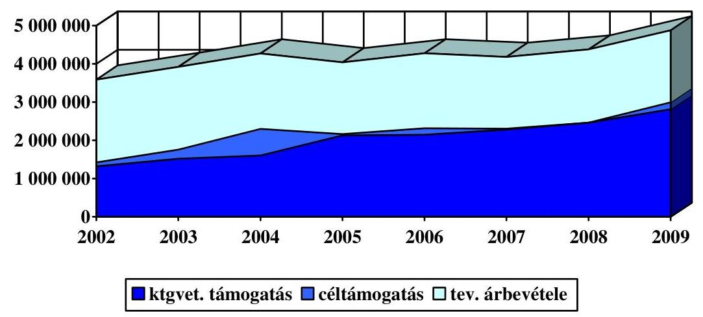

A 2009. évi költség és ráfordítás ( 4956 M Ft ) a tervet ( 4605 M Ft ) 8\%-kal, a 2008. évi tényadatokat ( 4456 M Ft ) 11,2\%-kal meghaladta. A bázishoz képest az anyagjellegű ráfordítások ( 1498 M Ft ) 7,7\%-kal, a személyi jellegű ráfordítások ( 3092 M Ft ) 13,3\%-kal magasabbak, amely az infláció növekedésének ( $4,2 \%$ ), továbbá a csoportos létszámcsökkentés végrehajtásának együttes eredménye. A költségstruktúrán belül továbbra is a személyi jellegű ráfordítások domináltak, az anyag- és a személyi jellegű ráfordítások együttes összegéből a személyi jellegű ráfordítások $67,4 \%$-ot, az anyagjellegű ráfordítások $32,6 \%$-ot tettek ki.

[^0]
[^0]:    ${ }^{10}$ A 2009. évi összes bevétel az előző évek áfa arányosításainak a visszautalása miatt 315 M Ft-tal növekedett.

---

A csoportos (37 főt érintő) létszámcsökkentés oka az MTI középtávú stratégiájában kiemelt cél, a gazdasági egyensúly megőrzése. A létszámcsökkentés összes költsége 250 M Ft volt, amelyből 150 M Ft-ot céltámogatásként a központi költségvetés biztosított. Az MTI a tárgyévi megtakarítást 23 M Ft-ra becsüli, a teljes évi kihatást (2011-ben) 200 M Ft-os összegben valószínűsíti.

Az MTI Zrt. 2009. évi üzleti tevékenységének eredménye (összes bevétel 5236M Ft/összes költség és ráfordítás 4956 M Ft egyenlege) 280 M Ft (2008-ban -13 M Ft), azaz a bázisévi veszteséggel szemben eredményes lett. A rendkívüli eredmény és a pénzügyi műveletek beszámítását követően, a mérleg szerinti eredmény 2009-ben 439 M Ft. ${ }^{11}$ (2008-ban utóbbi 4 M Ft volt.)

A Társaság 2009. december 31-ei ingatlan állományának ${ }^{12}$ könyv szerinti záró értéke 2457 M Ft. Az MTI Zrt. egységes középtávú ingatlangazdálkodási terve és a nem használt ingatlanok értékesítésére vonatkozó javaslat 2009 februárjában készült el, az ingatlankezelési szabályzat 2009. február elsejétől hatályos. Utóbbi rögzíti a saját kezelésű és a bérelt ingatlanok üzemeltetésével, karbantartásával, felújításával, bérbeadásával, bérbevétellel, eladással és vétellel összefüggő eljárási rendet, feladatokat, felelősöket. A 2009. évi üzleti terv munkanemenkénti bontásban tartalmazza az ingatlanüzemeltetéssel összefüggő beruházási és fejlesztési feladatokat, amelynek tervezett összege (a bázisévivel közel egyezően) $82,5 \mathrm{M} \mathrm{Ft}$, teljesítése 81 M Ft volt. A tárgyévben végrehajtott ingatlan beruházások, fejlesztések részben a Társaság használatában lévő, részben a bérbe adandó területek építészeti átalakításait, felújítási munkáit jelentették. Az MTI karbantartásra 2009-ben 32 M Ft-ot, a bázisévinél 20\%-kal kevesebbet költött. A Társaság a működéshez nem szükséges területeket (4420 $\mathrm{m}^{2}$ ) bérbeadás útján hasznosította, ebből származó bevétele 90 M Ft volt.

Az MTI archívumának digitalizációjához és internetes közzétételéhez („Nyitott Archívumok") nyújtott 100 M Ft céltámogatás kitűzött céloknak megfelelő és eredményes felhasználása - egyes kivételeket leszámítva - összességében megvalósult. A projekt javaslatban vannak olyan feladatok, amelyeknek megvalósíthatósága nem ismert, - a levéltári anyag feldolgozható évkörei ismeretének hiányában ${ }^{13}$ - nincs pontosan körülhatárolva a digitalizálásra kerülő anyagok köre, valamint nem tartalmazza egyértelműen a külső és belső humánerőforrás szükségletet. Az összesen 11,5 M Ft célfeladathoz kapcsolódó jutalom esetében nem érvényesült teljes körűen a költséghatékonyság követelménye azzal, hogy a Társaság a projekt szabályzatában megfogalmazott eljárási rendet - a feladat ellátása munkaidőben, a munkaköri feladatok alól részleges felmentéssel történjen - nem követte. A 7,7 M Ft rendszeres és eseti vállalkozói díjak elkülönített költséghelyi nyilvántartásban található összege nem teljes körűen tesz eleget a céltámogatásról szóló kormányhatározatban, valamint az MTI projekt javaslatában foglaltaknak, mert a nem mindenki számára hozzáférhető kiad-

[^0]
[^0]:    ${ }^{11}$ A 2009. évi mérleg szerinti eredmény az előző évek áfa arányosításainak - összesen 429 M Ft, ebből az összes bevételt növelő 315 M Ft áfa és a rendkívüli bevételt növelő 114 M Ft késedelmi kamat - visszautalása miatt növekedett.
    ${ }^{12}$ Az épületek területe összesen 20,4 ezer $\mathrm{m}^{2}$.
    ${ }^{13}$ A feldolgozásra váró levéltári dokumentumok pontos állapotfelmérése nem történt meg, így azok kézbevételét követően vált ismertté képi megjeleníthetőségük.

---

ványok előkészítő munkálatainak költsége is az állami támogatás költséghelyére került.

Az Nht. szerint a TTT feladata az MTI díjszabásának elfogadása. Az elfogadott 2009. évi díjszabás irányadó mértéket határoz meg, azonban százalékos mérték nélkül rögzíti a konkrét árak eltéríthetőségét. A díjszabás rögzíti a hírszolgáltatási kör szűkítésekor (csomagbontás) alkalmazandó árképzési kulcsokat, viszont az e körben megkötött kereskedelmi szerződésekben foglalt hírszolgáltatási díjak a díjszabásban meghatározott díjtételek alatt maradtak, ami nincs összhangban a csomagbontás elveivel.

Az ÁSZ 2009-ben készített jelentésében az Országgyűlésnek, a Kormánynak, a TTT, az FB és az MTI Zrt. elnökének fogalmazott meg ajánlásokat. Az Országgyűlésnek, a Kormánynak tett, jogalkotással és szabályozással kapcsolatos ÁSZ javaslatok, a korábbi években is megfogalmazott megállapítások lényegében nem hasznosultak. 2009-ben sem került sor az állami támogatás folyósításának és felhasználásának versenysemleges és átlátható - EU szabályokkal összehangolt - szabályozására. A Magyar Országgyűlés főtitkára arról tájékoztatta az Állami Számvevőszéket, hogy a közeli jövőben nem látja esélyét az MTI-re is érvényes, korszerű irányítási, ellenőrzési rendszert biztosító, a normatív finanszírozási szabályokat is magába foglaló törvényjavaslat megszületésére.

A Kormány, a 68/2002. (X. 4.) OGY határozatban az MTI Zrt. támogatásával kapcsolatban megfogalmazott átláthatósági követelmény érvényre juttatása érdekében szükséges jogalkotási és egyéb intézkedések kezdeményezésével, valamint az MTI Zrt. jegyzett tőkéje állami részesedésként nyilvántartásba kerüléséhez szükséges törvények módosításának előkészítésével kapcsolatban tett ÁSZ javaslatra intézkedési tervet készített, ami az igazságügyi és rendészeti miniszter, valamint a pénzügyminiszter felelősségével 2010. október 31-ét jelölte meg a javaslatokban foglaltak végrehajtására.

Az MTI Zrt. elnöke részére 2009-ben az ÁSZ három javaslatot fogalmazott meg, amelyek közül egy a korábbi évekből megismételt javaslat volt, ami a humánerőforrás gazdálkodásra vonatkozott. A megismételt ÁSZ javaslat hasznosítására vonatkozó intézkedési tervpont végrehajtása 2010. első negyedévében várható. Az intézkedések közül az MTI Zrt. a 2009. évi közbeszerzési eljárások előkészítésekor és lebonyolításakor biztosította a Kbt. rendelkezéseinek érvényesítését, azonban közbeszerzési szabályzata és a Kbt. előírások közötti összhang nem teljes körű (pl. a közbeszerzési eljárások belső ellenőrzése, hirdetmény ellenjegyzőjének hiánya). Megvalósult a belső információs rendszer ügyviteli alkalmazásai közötti egységes adatforgalom, megtörtént a létszámcsökkentés és ehhez kapcsolódóan módosult az SZMSZ.

---

A helyszíni ellenőrzés megállapításainak hasznosítására - a korábbi évek megállapításainak határozott megerősítésével - javasoljuk:

# az Országgyűlésnek 

1. módosítsa a 68/2002. (X. 4.) OGY határozatban megfogalmazott jogalkotási feladatnak megfelelően - a Kormány intézkedésének figyelembevételével - a nemzeti hírügynökségről szóló 1996. évi CXXVII. törvényt és az MTI Zrt. Alapító Okiratát a teljes körűen összehangolt szabályozás kialakítása, a közszolgálati feladatok és azok ellátásához szükséges állami támogatás egyértelmű és pontos meghatározása, az EU szabályok betartása, az alapítói és részvényesi joggyakorlás és a végrehajtás ellenőrzésének felülvizsgálata, hatékonyabbá tétele érdekében;
2. gondoskodjon az MTI Zrt. működését befolyásoló középtávú stratégiai, illetve az éves tervre vonatkozó tulajdonosi döntés és kontroll megteremtéséről;
3. vizsgálja meg az MTI sajátos tulajdonosi és irányítási rendszerét annak érdekében, hogy a Társaságra vonatkozó döntések és a felelősségi viszonyok egyértelművé váljanak.

## a Kormánynak

1. kérje számon a 2010. október 31-i határidővel intézkedési tervben - felelős megjelölésével - meghatározott feladatok végrehajtását, ezen belül a 68/2002. (X. 4.) OGY határozatban az MTI Zrt. támogatásával kapcsolatban megfogalmazott átláthatósági követelmény érvényre juttatása érdekében szükséges jogalkotási és egyéb intézkedéseket, különös figyelemmel az Európai Unió közösségi előírásaira;
2. kérje számon az MTI Zrt. jegyzett tőkéje állami részesedésként történő nyilvántartásba vételéhez szükséges törvények módosításának 2010. október 31-i határidőre való előkészítését.
3. kezdeményezze az Országgyűlés felé a takarékossági törvény felülvizsgálatával - a köztulajdonban álló gazdasági társaságok takarékosabb működéséről szóló törvény céljának és a jogalkotói szándéknak megfelelően - az olyan köztulajdonban álló gazdasági társaságok fogalomrendszerének a pontosítását, amelyek speciális jogi szabályozással működnek.

## a TTT elnökének

1. kezdeményezze az MTI Zrt. közfeladat-ellátás feltételei teljes körű - az államháztartásról szóló törvény 100/K. §-a szerinti - fennállásának vizsgálatát, annak érdekében, hogy a Tulajdonos (Országgyűlés) teljesebb képet kapjon az MTI Zrt. közfeladat ellátásáról;
2. terjessze ki a köztulajdonban álló gazdasági társaságok takarékosabb működéséről szóló törvény céljának megfelelően a Javadalmazási szabályzatot a TTT tagjaira, illetve a szabályzat vezetőkre vonatkozó részét hozza összhangba e törvény előírásával, és az MTI belső szabályzataival. (Kollektív Szerződés, SZMSZ, stb.)

---

# az FB elnökének 

gondoskodjon az MTI Zrt. közbeszerzési eljárásainak - a Társaság által elkészített tájékoztató megismerésén és annak tudomásul vételén túli - ellenőrzéséről.

## az MTI Zrt. elnökének

1. biztosítsa a köztulajdonban álló gazdasági társaságok takarékosabb működéséről szóló törvényben - az elnök és az alelnöki körön kívüli - az Mt. 188/A. § (1) bekezdése szerinti vezető állású munkavállalókra előírt közzétételi kötelezettség teljesítését, valamint gondoskodjon e vezetői kör belső szabályzatokban történő egyértelmű, Munka Törvénykönyvével összhangban lévő megjelenítéséről;
2. gondoskodjon az MTI Zrt. SZMSZ-ének döntéshozatali eljárásra vonatkozó rendelkezései, az MTI irattári terve és a döntéshozatal menete, formája közötti összhang megteremtéséről;
3. gondoskodjon az MTI teljes munkavállalói körére kiterjedő besorolási és javadalmazási rendszer belső szabályainak vállalt határidőben történő kidolgozásáról, valamint a teljesítménymérési rendszer kialakításáról;
4. gondoskodjon az MTI működési céltámogatás igényének „Deloitte”modell szerinti meghatározásáról;
5. gondoskodjon az év közben folyósított céltámogatásokhoz készített projekt javaslatok (belső) projekt szabályzattal való összhangjáról;
6. kezdeményezzen egyeztetést a Sajtószakszervezet MTI Zrt. alapszervezetével az MTI Zrt. 2000. december 8-án kötött Kollektív Szerződésének felülvizsgálatáról, a Munka Törvénykönyvével összhangba hozásáról, valamint az új Kollektív Szerződés kiadásáról.

---

# II. RÉSZLETES MEGÁLLAPÍTÁSOK 

## 1. A TÁRSASÁG MŰKÖDÉSÉNEK SZABÁLYOZOTTSÁGA, AZ ÜZLETI TERVEK MEGALAPOZOTTSÁGA

### 1.1. A Társaság működésének szabályozása

Az MTI Zrt. működését alapvetően a nemzeti hírügynökségről szóló 1996. évi CXXVII. törvény és a Társaság Alapító Okirata határozza meg. Az Állami Számvevőszék az MTI Zrt. éves ellenőrzései során jelentéseiben megfogalmazta az Nht. és az AO módosításának szükségességét, mivel kifogásolta a működtetés feladat- és hatásköri, illetve felelősségi szabályozását, a közszolgálati tevékenységek meghatározásának, az ellátásukhoz szükséges állami támogatás mértékének, felhasználása átláthatósági szabályozásának, az ellenőrzés garanciájának a hiányát. ${ }^{14}$ A megállapítások ellenére az Nht. és az AO nem módosult, illetve az AO módosítását 2009-ben a TTT nem kezdeményezte.

Az ÁSZ megállapította, hogy az MTI működtetésére 1996-97-ben kialakított tulajdonosi megoldás a nyereséges gazdálkodásra nem ösztönöz, mert a tulajdonos az MTI Zrt.-t nem teszi érdekeltté a minél nagyobb nyereség elérésében.

Az Országgyűlés a 68/2002. (X. 4.) OGY határozat 4. pontjában jogalkotási feladatot fogalmazott meg az Nht. és a Társaság Alapító Okirata áttekintésére, a teljes körű összehangolt szabályozás kialakítására, a közszolgálati feladatok és azok ellátásához szükséges állami támogatás pontosabb meghatározására. Az OGY határozatban rögzített célok azonban nem teljesültek, így a hatékonyabb tulajdonosi joggyakorlás, működtetés és ellenőrzés 2009-ben sem érvényesült.

A Társaság alapítói, részvényesi és közgyűlési jogait gyakorló Országgyűlés 2009-ben a 69/2009. (VII. 3.) OGY határozattal döntött a Magyar Távirati Iroda Zrt. 2008. évi tevékenységéről szóló beszámoló elfogadásáról, jóváhagyta az abban foglalt mérleg- és eredmény-kimutatást, valamint hozzájárult a 2008. évi mérleg szerinti 6537 E Ft eredmény eredménytartalékba helyezéséhez. Nem döntött azonban a Társaság 2009. évi gazdálkodási/üzleti tervének - külön határozattal történő - elfogadásáról.

Az államháztartásról szóló 1992. évi XXXVIII. törvény 2009. január 1-től hatályos - MTI-re is vonatkozó - 100/K. § (1) bekezdése előírja, hogy jogszabályban meghatározott közfeladat - állami tulajdonú, állami részesedéssel működő gazdálkodó szervezet által - milyen feltételek együttes fennállása esetén látható el. Az előírások betartásáról a tulajdonosnak pontos képet kell alkotni, azonban a Társaság - javaslattevő, véleményező, tanácsadó - Tulajdonosi Tanácsadó Testülete nem kezdeményezte a közfeladat-ellátás feltételei teljes körű fennállásának vizsgálatát.

[^0]
[^0]:    ${ }^{14}$ Jelentés a Magyar Távirati Iroda Zrt. 2004., 2005., 2006., 2007., 2008. évi gazdálkodásának ellenőrzéséről (0520), (0610), (0709), (0804), (0909).

---

A feltételek közé tartozik pl. a jogszabályban egyértelműen meghatározott közszolgáltatás, valamint ellátásának költségszámításon alapuló tervezése és finanszírozása, illetve ezek hiányában a finanszírozó államháztartás körébe tartozó szervezet számára megállapítható legyen az előállított teljesítmény értéke.

Az MTI közfeladat ellátása - a közszolgáltatás tevékenység szintű meghatározásának, a céltámogatás igénylés pontos számításon alapuló kimutatásának, valamint a teljesítmény mérésének hiánya miatt - részben felel meg az Áht.ban foglalt feltételeknek. A Társaság a kezdeményező szerepet felvállalva elkészíttette a finanszírozást átláthatóbbá tevő közszolgáltatási szerződés-tervezetet, valamint a közszolgálati feladatokra jutó állami támogatás kimutatását segítő „Deloitte" szakértői modellt ${ }^{15}$, és a hiányosságokra rámutatva - mind az alapítói és közgyűlési jogokat gyakorló Országgyűlés, mind az állami támogatás igénylését és felhasználását ellenőrző Pénzügyminisztérium tájékoztatásával kinyilvánította szándékát tárgyalások lefolytatására. 2008-2009-ben azonban még a tárgyalási folyamat sem kezdődött el.

Az Országgyűlés és a PM - mivel 2009-ben is elmaradt a közszolgálati szerződés megkötése, az Nht. módosítása, a közszolgálati feladatokhoz szükséges állami támogatás kimutatását segítő modell elfogadása - nem biztosította az MTI finanszírozásának átláthatóbbá és EU-konformmá tételét, ami nincs összhangban az Áht. 100/K. §-ában foglalt rendelkezésekkel.

A társasági működés szabályozása az Nht.-n, az AO-n kívül alapvetően a Szervezeti és Működési Szabályzatra (SZMSZ), elnöki és alelnöki utasításokra, szakmai kézikönyvekre épül.

A Társaság döntéshozatali rendjét az SZMSZ szabályozza, azonban az ebben foglalt rendelkezések, az MTI 333/2007. sz. Iratkezelési szabályzatának mellékletét képező irattári terv, valamint a társasági döntések formája nincsenek összhangban. A vezetői intézkedések utasításokban jelentek meg. A vezetői értekezletekre előterjesztések, az ülésen elhangzottakról jegyzőkönyvek, a döntésekről határozatok nem készültek, így azok - irattári terv szerinti - megőrzése nem lehetséges. 2009-ben az Iktatórendszer - az új, megbízható Iktató program 2009. II. félévben történt bevezetéséig - nem biztosította az átlátható és utólag ellenőrizhető nyomon követést, így az elnöki, alelnöki utasításokról, elfogadott szabályzatokról, illetve egyéb vezetői döntésekről pontos képet alkotni - önmagában az Iktató rendszer segítségével - nem lehetett.

2009-ben 5 elnöki, 1 gazdasági-, 1 szakmai alelnöki utasítást adtak ki. Az elnöki utasítások közül 1 az ÁSZ jelentése alapján foganatosítandó intézkedések kiadását, 2 az SZMSZ módosítását, 2 meglévő szabályzat (Beszerzési- és a Szakmai Közszolgálati Tájékoztatási Szabályzat) felülvizsgálatát és módosítását jelentette.

Az SZMSZ-ben hivatkozott - az FB előzetes hozzájárulását igénylő szerződések értékhatárát kimutató - 4. sz. melléklet e szabályzatnak nem képezte mellékletét, kidolgozására az SZMSZ 2009. évi módosításakor sem került sor, így az FB az előzetes hozzájárulást igénylő szerződések értékhatáráról nem értesült.

[^0]
[^0]:    ${ }^{15}$ 2005-2007 között - a modellt is beleértve - közel 40 M Ft értékben készültek „Deloitte" szakértői anyagok.

---

A Társaság 2009-ben - a 2008. II. negyedévében végrehajtott jelentős SZMSZ és szervezeti módosítást követően - kisebb módosítást hajtott végre a szervezeti struktúrában, valamint a működés szabályozásában. Az MTI 4/2009. sz. elnöki utasítással kiadott, 2009. július 1-jétől hatályos SZMSZ-ében - a Szakkönyvtár és Mikrofilmarchívum, valamint Videoarchívum megszűntetésével - az Adatbázisok és Archívumok vezetőjének feladat- és hatásköre csökkent, azonban a megszűnt egységek egyes feladatai más szervezeti egységhez (pl. Médiafigyelő -, valamint Logisztikai osztály) kerültek. Az SZMSZ módosítása összhangban volt a csoportos létszámcsökkentéssel összefüggő feladatok átcsoportosításával.

A szervezeti rendszer 2008. évi változtatását követően a Társaság 2009-ben hajtott végre létszám - és ezzel összefüggő álláshely - csökkentést. Így az álláshelyek száma a 2009. január elsejei 363-ról 2009. december 31-ére 338-ra változott. A létszámcsökkentés teljes végrehajtásának eredményeként 2010. január 31-ére az álláshelyek száma 319-re csökkent.

A csoportos létszámcsökkentést követően a szerkesztőségek munkájában a Társaság ismételt racionalizálási intézkedéseket hajtott végre. 2009. november 30-ától a - 2008. április 26-án a szerkesztési munka irányítására létrejött - Hírszerkesztési Központ létszáma 45 fő lett, mert a Hírszerkesztési Központhoz kerültek - kiválva az egyes szerkesztőségekből - a megyei- (20 fő) és a külföldi (10 fő) tudósítók. A napi munka irányításának egy operatív központba való összevonásával, valamint a tudósítók e központhoz kerülésével a hírkiadási tevékenység átláthatóbbá, a hierarchikus viszonyok egyértelművé váltak.

A Társaság 2009. évi létszámterve - a 2008. évi létszámtervhez képest - álláshelyekre tervezett létszámot mutat ki, ezzel megvalósult az álláshelyre tervezés, ami az átláthatóság mellett így összhangba került a KSH-nak nyújtott adatszolgáltatással. Az MTI a létszámtervezés és létszámgazdálkodás szabályairól szóló 2/2010. sz. elnöki utasításban megfogalmazta, hogy a létszámgazdálkodás alapja az álláshely gazdálkodás.

A Társaságnál 2008 novemberében kezdődött a szervezeti hatékonyság átfogó vizsgálata. A megbízott ICG Kft. feladata többek között a szükséges és elégséges (a folyamatok működését biztosító) erőforrások számbavételének meghatározása, valamint a szervezeti egységek hatékonysági tartalékainak kimutatása volt. 2009. január 29-én elkészült az MTI szervezeti hatékonyságelemzéséről szóló záró jelentés, ami a hírek számának csökkentése nélkül 41-46 munkavállalóra mutatta ki a létszám-csökkentés lehetőségét. A létszámcsökkentés (44 fővel) megvalósult, ezzel az MTI - az ICG által számított hírszám csökkentéssel elérhető létszám megtakarítás figyelembevétele nélkül - közelített a tevékenységéhez mért szervezetnagyság kialakításához.

A köztulajdonban álló gazdasági társaságok takarékosabb működéséről szóló 2009. évi CXXII. törvény (Taktv.) - az abban foglalt közzétételi kötelezettség teljesítésén felül - többek között előírja, hogy a hatálya alá tartozó gazdasági társaságnak - az MTI esetében - az alapító okiratát, illetve működését legkésőbb 2010. január 31-ig összhangba kell hozni e törvény rendelkezéseivel.

A Taktv. többek között a 3-4. §-ában az igazgatóság jogainak gyakorlását, a felügyelőbizottság létrehozását, a könyvvizsgáló választását, az 5. § (3) bekezdésében e törvény hatálya alá tartozók javadalmazási szabályzatának megalkotá-

---

sát, a 6. §-ában az FB tagok díjazását és költségtérítését; a vezetői tisztségviselő megbízatását, illetve az FB tagság után járó javadalmazás mértékét határozza meg.

Az MTI Zrt. 2010. január 31-éig elfogadott 2010. február 1-jétől hatályos Javadalmazási szabályzatában foglaltak - pl. a vezető állású és a vezetőnek minősülő munkavállalói kör személyi alapbére, a vezető munkavállalókkal köthető versenyjogi megállapodás - nem összeegyeztethetők a Taktv. céljával (takarékosság), valamint a versenyjogi megállapodás megkötése - mert nem egyértelmű a jogos gazdasági érdek veszélyeztetése - nincs összhangban az Mt. 3. § (5) bekezdésében és a Taktv. 7. § (3) bekezdésében foglaltakkal.

A Taktv. 8. § (7) bekezdése meghatározza, hogy az 5-7. §-t - egyedül - a Magyar Nemzeti Bankra, annak felügyelőbizottsági tagjaira, illetve a Magyar Nemzeti Bankkal munkaviszonyban álló személyekre nem kell alkalmazni. Az MTI Javadalmazási szabályzatának személyi hatályát nem terjesztette ki a Tulajdonosi Tanácsadó Testület tagjaira, ami nincs összhangban a jogalkotó takarékossági szempontokat előtérbe helyező - céljaival, a Taktv. 8. § (7) bekezdésében foglaltakkal, valamint a TTT által ellátott (Nht.-ban meghatározott) feladatok súlyával. A Javadalmazási szabályzat elfogadása nem biztosítja a Társaság takarékosabb működtetését.

Példaként említhető, hogy amíg az öt tagból álló FB esetében a havi egy főre jutó tiszteletdíj és költségtérítés járulékkal 2009-ben 544 E Ft-ról 2010-re közel 35\%-kal 355 E Ft-ra csökken, addig a Javadalmazási szabályzat hatálya alá nem került nyolc tagból álló TTT esetében a havi egy főre jutó tiszteletdíj és költségtérítés járulékkal 2009-ben 504 E Ft-ot, 2010-ben (járulékcsökkenés miatt) 492 E Ft-ot tesz ki. Így 2010-ben az FB és a TTT tagjai között közel 39\%-os eltérés mutatható ki.

2009-2010-ben a TTT tagjai az országgyűlési képviselők alapdíjának megfelelő összegű díjazáson felül költségtérítésben is részesültek, amiről viszont az Nht. nem rendelkezett. A költségtérítés átalány jellegű, így annak mértéke nincs alátámasztva. ${ }^{16}$ A Javadalmazási szabályzatra vonatkozó jogi szabályozás nem teszi lehetővé a költségtérítés átalány jellegű elszámolását.

Az Nht. 22. §-a szerint a TTT tagjait az országgyűlési képviselők alapdíjának megfelelő összegű díjazás illeti meg, ami - az országgyűlési képviselők javadalmazásáról szóló 1990. évi LVI. törvény 1. § (2) bekezdése szerint - 2009-ben 232 E Ft volt. A TTT tagjai a tiszteletdíjon felül költségtérítésben is részesültek.

Az MTI 2000 decemberében elfogadott Kollektív Szerződése (KSZ) személyi hatályát kiterjesztette az MTI-re és az MTI-vel munkaviszonyban álló valamennyi munkavállalóra, kivéve a részvénytársaság elnökét és az alelnököket. Ugyanakkor nem határozta meg, hogy mely rendelkezések vonatkozásában és mely vezetői körre kell - az Mt. 188/A. § (1) bekezdése alapján - 2009. december 4-éig eltérő rendelkezéseket alkalmazni.

Az Mt. - a Taktv. hatályba lépésével - 2009. december 4-ével módosult, a 189. § a 188. § szerinti vezető állású munkavállalói körön kívül - a 188/A. § (1) bekez-

[^0]
[^0]:    ${ }^{16}$ Jelentés a Magyar Távirati Iroda Zrt. 2007. évi ellenőrzéséről (0804).

---

dése szerinti vezetőnek minősülő munkavállalói körre is megszüntette a kollektív szerződés kiterjesztését.

Az MTI Zrt. SZMSZ-ének V. fejezet 5. pontja meghatározza, hogy az MTI munkaszervezetében milyen beosztások minősülnek vezetői munkakörnek, és a vezetőket vezető I-IV közötti kategóriába sorolja. Az Mt. két vezetői csoportot különböztet meg, a 188. § szerinti vezető állású munkavállalót (MTI esetében elnök, alelnökök) és a 188/A. § szerinti az Mt. egyes rendelkezései (pl. munkáltatói rendkívüli felmondás, munkaidő, kártérítési szabályok) tekintetében vezetőnek minősülő munkavállalót. Az MTI-nél 2009. 12. 31-én a vezetői I. kategóriát (elnök, alelnökök) leszámítva összesen 25 munkavállaló tartozott.
 az SZMSZ-ben meghatározott vezető II-IV kategóriába.

A KSZ hatálya alá nem tartozó vezető állású munkavállalók (elnök, alelnökök) feladatellátását, hatáskörét, valamint felelősségét az SZMSZ szabályozza.

Az MTI és a Sajtószakszervezet MTI alapszervezete között 2000. december 8-án létrejött KSZ-t a felek - az aláírás napjától kezdődő hatállyal - egy éves időtartamra kötötték, majd a 2001-ben aláírt külön megállapodásban felek rendelkeztek a határozatlan idejűvé válásról. A megállapodásban foglaltak azonban a KSZ egyes rendelkezéseinek módosításakor nem épültek be, arról a munkavállalók nem értesültek.

A KSZ átfogó módosítására 2000 óta nem került sor. A KSZ egyes, Mt.-vel összhang hiányt mutató rendelkezéseit - pl. 2009-ben a megszakítás nélküli munkarenddel, a munkaidőkerettel kapcsolatos szabályok - az MTI és a szakszervezet módosította, azonban a foglalkoztatáspolitikáért felelős miniszter tájékoztatása, illetve a módosítások -, valamint 2000-től a hatályban tartás - bejelentése nem történt meg. Így nem teljesült az Mt. 41/A. § (2) bekezdésében foglalt bejelentési kötelezettségre vonatkozó előírás.

A KSZ és a Társaság működése, valamint a hatályos SZMSZ-e közötti összhang nem biztosított. Az MTI általános - a munkavállalók besorolási és bérkategóriáját tartalmazó - javadalmazási szabályzatot nem készített, azonban a KSZ VI. fejezet 4. pontja szabályzatban nem rögzített besorolási bérekre hivatkozik. A személyi alapbér és bérpótlék megállapításának rendje - a szabályozás hiánya miatt - nem átlátható, összegük nem ellenőrizhető.

Az MTI nem rendelkezik az egész szervezetre kiterjedő teljesítménymérési- és értékelési rendszerrel, annak kritériumait nem határozta meg, ezzel nem teszi lehetővé a teljesítményarányos bér eltérítést és nem ösztönzi a hatékony munkavégzést.

Az SZMSZ-ben nevesített vezetői munkakörök leírása az SZMSZ-ben megtalálható, azonban a KSZ III. fejezet 1/a. pontja kimondja, hogy a munkavállalónak a munkába lépést követő 30 napon belül az MTI személyre szóló munkaköri leírást ad. Ez az SZMSZ szerinti vezetői II-IV. kategóriába tartozó munkavállalók 68\%-ának esetében nem teljesült.

2009-ben (az azt megelőző időszakhoz képest) azok a határozatlan idejű munkaviszonyban foglalkoztatott munkavállalók, akik munkaszerződés módosítással határozott időre vezetői (II-IV.) megbízást kaptak - megbízatásuk idejére az alapbértől elváló külön vezetői juttatásban részesülnek. Ezzel a munkáltató-

---

nak 2009-től lehetősége van arra, hogy a határozott idejű vezetői (II-IV.) megbízás megszűnésekor a munkavállaló bérezése a személyi alapbér szintjére beálljon.

A Társaság a 3/2010. sz. elnöki utasításban szabályozta a munkaviszonyok kezelésének eljárásrendjét. A Szabályzat 4.8. pontja a foglalkoztatási szabályokkal összhangban tartalmazza, hogy a munkavállaló a nyugellátás kezdetével egy időben köteles tájékoztatni a munkáltatót, illetve hivatkozik a már 2008. január 1-jétől érvényes, a nyugellátás kezdetekor új munkaszerződés kötés kötelezettségére. A Társaság az előírásnak - abban az esetben, ha a nyugdíjas munkavállaló nyilatkozatban kérte a továbbfoglalkoztatást - új munkaszerződés megkötésével eleget tett.

A Társaság SZMSZ-e - az ügyeleti rend szabályozásának törlését követően 2008. április 26-ától kimondja, hogy az MTI-ben a hírladás megszakítás nélküli rendben folyik, amelynek folyamatosságát a szervezeti egységek megfelelő üzemeltetési rendje és a célszerű munkaidő beosztás biztosítja. A Társaság megállapította, hogy az ügyeletnek tekintett időben is hírkészítés és hírkiadás zajlik informatikai támogatással. E rendelkezésekkel párhuzamosan azonban az informatikai ügyeleti díjak 2009. I. negyedévet követő törlése és az így eredményezett 19\%-os csökkenés ellenére - jelentősen nem csökkent az ügyelet címén számfejtett juttatások összege. Ez azt mutatja, hogy 2009-ben nem valósult meg a szervezeti egységek munkaidő beosztásának átalakítása.

A szabályozás módosítását követően hétvégi ügyeletre a - 2008 júliusától decemberig számfejtett havi átlag 9 M Ft-hoz képest - 2009 januárjától decemberig havi átlag 7,3 M Ft-ot számfejtettek.

Az Nht. 27. § (2) bekezdése alapján a Társaságnak az 500 E Ft-os szerződési értéket meghaladó szerződéseiről külön - a szerződő fél cégszerű azonosításához szükséges adatok, a teljesítendő szolgáltatás és ellenszolgáltatás feltüntetésével - nyilvántartást kell vezetni. AZ SZMSZ V. fejezetének 8. pontja meghatározza, hogy a Gazdasági Alelnökség vezeti az évi 500 E Ft-os szerződési értéket meghaladó szerződések nyilvántartását. A Társaság a szerződések elektronikus kezelésének rendjét a 2009. november 30-ától hatályos 2/2009. sz. gazdasági alelnöki utasítással szabályozta. Ez alapján a szerződés adatainak rögzítését a szervezeti egységek végzik, amelyek vezetői felelősek a szerződések (M-SEC szerződés-nyilvántartó) programrendszerbe kerüléséért.

A Társaság a szerződés nyilvántartási kötelezettségének - átlátható és utólag ellenőrizhető módon - 2009. III. negyedévtől tesz eleget. A szerződésnyilvántartás a szerződésben foglaltakat tartalmazza, azonban az olyan feladatra kötött szerződések, amelyek díjazása óradíjas, nem tartalmazzák a maximális - feladat teljesítéséhez köthető - óradíj keretösszegét. Így az a szerződésnyilvántartásban sem jelenik meg.

2009-ben az MTI-ben megvalósult a három nagy nyilvántartó rendszer - Marketing Manager (kereskedelmi szerződéseket nyilvántartó), Vectory (gazdasági tevékenységet kiszolgáló), M-Sec (szerződés-nyilvántartó) - integrációja.

---

# 1.2. A Társaság közfeladat-ellátásának, közzétételi kötelezettségének szabályozása 

A Társaság, a közfeladatok ellátásához alapvetően kapcsolható szabályzatok közül 2009-ben felülvizsgálta és módosította a Szakmai és Közszolgálati Tájékoztatási Szabályzatot, valamint a közbeszerzések rendjét is meghatározó Beszerzési Szabályzatot. 2009-ben azonban nem szabályozta a közszolgálati feladatokhoz kapcsolódó állami támogatás igénylésének és felhasználásának rendjét.

Az MTI 2005. október 6-án az Nht. 11. §-ában foglaltak szerint az ORTT egyetértéssel léptette hatályba - a közgyűjteménynek nem minősülő dokumentumok vonatkozásában - az Nht. 2. § (1) j) bekezdésében meghatározott közfeladatot képező archiválás szabályait.

Az MTI Zrt. a 2/2009. sz. elnöki utasítással módosította a Szakmai és Közszolgálati Tájékoztatási Szabályzatát, amelynek elfogadott 1. sz. melléklete az Avtv.-ben foglalt előírásokkal összhangban rendelkezik a - Társaság hírügynökségi tevékenysége során tudomására jutott - személyes adatok kezelésének szabályairól.

A Társaság, a (köz)beszerzések szabályozására a 3/2009. sz. elnöki utasítással 2009. február 10-től hatályos, új szabályzatot léptetett életbe, azonban a Kbt. 2009. április 1-jei módosításával szabályzat-módosítást nem hajtott végre. A Beszerzési szabályzat nem tett teljes körűen eleget a Kbt. 6. §-ában foglalt - a közbeszerzési szabályzat kötelező tartalmára vonatkozó - rendelkezéseknek, mert nem határozta meg a közbeszerzési eljárások belső ellenőrzésének felelősségi rendjét, nem jelölte ki a közbeszerzési eljárást megindító hirdetmény jogszerűségét ellenjegyzésével igazoló személyt. A beszerzési szabályzat V. fejezet F/3. pontja nem határozza meg egyértelműen - a Kbt. módosított, 2009. április 1-jétől hatályos 54. § (1) pontjával összhangban - az ajánlatkérőnek (MTI Zrt.) azon kötelezettségét, hogy a megfelelő ajánlattétel elősegítése érdekében a szerződéstervezetet is tartalmazó dokumentációt kell készíteni.

Az állami költségvetésből közszolgálati feladatokra kapott működési támogatás igénylésével és felhasználásával kapcsolatos szabályzat megalkotását és elfogadását az ÁSZ évek óta szorgalmazza, ${ }^{17}$ mert a jelenlegi állami finanszírozás - közszolgálati szerződés nélkül - nem felel meg az uniós szabályoknak. Az MTI Zrt. - a kezdeményező szerepet felvállalva - szakértői céget bízott meg a működési támogatással kapcsolatos szabályok kidolgozására, így elkészült a nemzeti hírügynökségi tevékenység ellátására vonatkozó közszolgálati szerződés tervezete.

Mind az Nht. 30. § (1) bekezdése, mind az MTI Zrt. Alapító Okiratának 10.3. pontja megfogalmazza a Társaság közszolgálati feladatai ellátásához szükséges mértékű országgyűlési céltámogatásban való részesítését, azonban sem az Nht., sem az AO nem határozza meg pontosan a szükséges mérték kritériumát, számításának módját, a támogatás felhasználásának ellenőrzését.

[^0]
[^0]:    ${ }^{17}$ Jelentés a Magyar Távirati Iroda Zrt. 2004-2008. évi ellenőrzéseiről (0520), (0610), (0709), (0804), (0909).

---

A TTT egyetértett azzal, hogy az állami finanszírozás - átlátható és EU szabályoknak megfelelő formában - közszolgálati szerződésen keresztül valósuljon meg, és azon az állásponton volt, hogy a közszolgálati szerződésre történő hivatkozás az Nht.-ban külön pontként jelenjen meg. Az Nht. módosítására készített javaslatát 2008. április 20-án juttatta el a Magyar Országgyűlés Elnökének, azonban azt a Kulturális és sajtóbizottság sem 2008-ban, sem 2009-ben nem tűzte napirendjére, illetve az Országgyűlés az Nht.-t nem módosította. Az Alapító és az MTI között a közszolgálati szerződés 2009-ben sem jött létre, illetve a tárgyalási folyamat elindítását, ezzel az átlátható finanszírozás megteremtését késleltető helyzet alakult ki.

A Társaság, a Pénzügyminisztériumnak küldött működési támogatási kérelemben fogalmazta meg a 2009. évi (valamint 2009-ben a 2010. évi) támogatási igényét, azonban az nem támaszkodott az elkészült - a közszolgálati tevékenységgel összefüggő bevételek és kiadások kimutatását segítő - „Deloitte" szakértői modell számítására. A céltámogatás-igénylés nem tesz eleget az Nht. 30. § (1) bekezdésében (közszolgálati feladatok ellátásához szükséges mértékű céltámogatás) foglaltaknak, mert az igényelhető támogatás összegének meghatározásához a közszolgálati feladatokra jutó támogatásnak a kimutatása szükséges. ${ }^{18}$ A PM 2009. évi tervezési körirata szerint összeállított PM felé továbbított adatszolgáltatás nem elégséges feltétele annak, hogy az Állam által biztosított támogatás odaítélése megfeleljen a hatályos jogszabályokban, illetve az EU előírásokban foglaltaknak.

A Társaság 2009-re összesen 2813 M Ft működési támogatást igényelt, amit a 2009. évi költségvetési törvény - létszám-leépítési támogatás nélkül - 2738 M Ft-tal hagyott jóvá. Az Országgyűlés a 2009. évi költségvetési törvényben - az MTI létszám-leépítési támogatás nélkül számított ( 2672 M Ft ) igényéhez képest - 66 M Ft-tal több céltámogatást fogadott el, azonban a plusz céltámogatás megállapítása - sem a PM-hez benyújtott támogatási igényhez, sem az utólag a "Deloitte" modellben kimutatott állami támogatás összegéhez képest - nem volt megalapozott.

A Kormány a létszámcsökkentéssel kapcsolatos egyszeri személyi kiadások fedezetéhez való hozzájárulásként az 1060/2009. (IV. 24.) Korm. határozattal 150 M Ft-ot biztosított.

A Társaság az elektronikus információszabadságról szóló 2005. évi XC. törvény 4. § (3) bekezdésében és e törvény mellékletében foglaltakkal összhangban álló közzétételi szabályzattal rendelkezik. Az MTI Zrt. (közfeladatot ellátó egyéb szerv) a személyes adatok védelméről és a közérdekű adatok nyilvánosságáról szóló 1992. évi LXIII. törvény 19. § (2) bekezdésében, valamint az Eitv. 6. § (1) bekezdésében és a törvény mellékletében foglalt - a Társaságra vonatkozó és tevékenységével kapcsolatos - legfontosabb adatokat (pl. SZMSZ hatályos szövege, a közfeladat-ellátás teljesítményére, kapacitásának jellemzésére, hatékonyságának mérésére szolgáló mutatók nélkül) nem teljes körűen teszi közzé.

[^0]
[^0]:    ${ }^{18}$ Jelentés a Magyar Távirati Iroda Zrt. 2008. évi gazdálkodásának ellenőrzéséről (0909)

---

A Társaság a 2009. év összesített közbeszerzési tervét 2009. április 15-én közzétette, a közbeszerzési tevékenységére - eljárások, megkötött szerződések - vonatkozó információkat az előírt gyakorisággal nyilvánosságra hozta.

A köztulajdonban álló gazdasági társaságok működésének átláthatóbbá tételéről szóló 175/2009. (VIII. 29.) Korm. rendelet előírta az Mt. 188. § (1) bekezdése és 188/A. § (1) bekezdése szerint vezető állású munkavállalók, a Társasághoz tartozó többségi befolyású leányvállalat vezetők, valamint a felügyelő bizottsági tagok nevének és javadalmazásának 2009. szeptember 15-ig történő közzétételét. A Társaság, a Korm. rendelet szerinti közzétételi kötelezettségének 2009. szeptember 14-én, honlapján részben tett eleget, mert nem teljesítette az Mt. 188/A. § (1) bekezdése szerint vezető állású munkavállalókra (25 fő) a Korm. rendeletben előírt kötelezettségét. 2009. december 4-én az MTI a honlapján közzétette a Taktv. 2. § (2) bekezdésében előírt bankszámla feletti rendelkezésre
 jogosultak körét, azonban az Mt. 188/A. § (1) bekezdése szerint vezető állású munkavállalókra vonatkozó, a Taktv.-ben előírt adatokat nem tette közzé.

Az Mt. 188/A. §-a alá tartozó munkavállalói körre az MTI a Javadalmazási szabályzatot kiterjesztette, azonban e kört kivonta az előírt közzétételi kötelezettség alól.

# 1.3. A TTT és az FB működésének eredményei

A TTT-nek az Nht. 17. § (1) bekezdése és az MTI Zrt. Alapító Okirata szerint döntési, javaslattételi, véleményezési, tanácsadói hatáskörben végzett feladatai vannak. Éves feladatát képezi a Társaság elnöke pályázatában foglalt célkitűzései megvalósításának ellenőrzése, értékelése, a Társaság díjszabásának jóváhagyása, valamint - szükség esetén - az Alapító Okirat módosításának előkészítése és a Szervezeti és Működési Szabályzat véleményezése.

A TTT féléves munkatervek alapján dolgozik, amelyeket 2009-ben az 1/2009. (I. 22.) és a 13/2009. (IX. 24.) számú TTT határozatokkal fogadott el. Az ülésekről emlékeztetők készültek. A TTT 2009. január és november között 8 ülésen 15 határozatot hozott. A 2009 decemberi ülés megtartása a jogszabály-változások (Áht., Taktv.) miatt indokolt lett volna.

2009-ben a TTT nem kezdeményezte a Társaság közfeladat-ellátásának feltételei teljes körű fennállásának vizsgálatát, nem készített javaslatot a Társaság Alapító Okiratának módosítására.

A TTT 2009. június 25-én véleményezte a Társaság - csoportos létszámcsökkentés feladataival összefüggő - SZMSZ-módosítását, és e tárgyban meghozta a 12/2009. (VI. 25.) számú határozatot.

A TTT 2009. február 26-án megtárgyalta és véleményezte az Állami Számvevőszék 2007. évi jelentésében foglaltak alapján készült feladatterv végrehajtását, valamint a Társaság 2008-2012. évekre vonatkozó stratégiai tervének érvényesülését, és kiadta a 2/2009. és a 3/2009. (II. 26.) számú határozatokat. A TTT a 9/2009. (VI. 25.) számú határozatával tudomásul vette az MTI 2010. évi díjszabása legfontosabb alapelveit, majd határidőben, a 14/2009. (X. 22.) számú határozatával jóváhagyta a Társaság 2010. évi díjszabását.

---

A TTT az 5/2009. (IV. 23.) számú határozatával elfogadta az MTI Zrt. elnöke 2009. évi prémiumfeladatainak kitűzését.

Ezek a feladatok a pénzügyi stabilitás biztosítása, a 4 M Ft összegű mérleg szerinti eredmény elérése; az MTI hírarchívumának 1989 és 2004 közötti anyagai, a digitalizálási projekt keretében feldolgozott 1945 előtti évek híranyagai - az MTI internetes honlapján ingyenesen történő - hozzáférhetővé, valamint 20 ezer archív fotó kereshetővé tétele; az Önkormányzati sajtószolgálat program megvalósítása és működtetése; a Társaságnak ne legyen kettőnél több ORTT panaszbizottságától kapott jogerős elmarasztalása.

A TTT 2009. május 21-én elfogadta a Társaság elnökének beszámolóját a pályázati célok 2008. évi megvalósításáról, és a 8/2009. (V. 21.) számú határozatával jóváhagyta a Társaság elnökének 2008. évi (a Pekingi Olimpiával kapcsolatos feladatok végrehajtásával, a céltámogatás elszámolásával, az MTI ingatlangazdálkodási stratégiájának elkészítésével összefüggő) prémiumfeladatainak teljesítését, valamint javasolta a kitűzött prémium teljes összegű kifizetését.

Az FB feladatait és hatáskörét az Nht. 16. §-a és az MTI Zrt. Alapító Okirata határozza meg. Az FB - a gazdasági társaságokról szóló 2006. évi IV. törvény 2008. január 1-jétől hatályos módosított 36. § (4) bekezdésében foglalt felelősséggel - ellenőrzi a Társaság ügyvezetését, irányítja a Társaság belső ellenőrzési szervezetét. Feladatát képezi a Társaság éves beszámolójának véleményezése; az 1 Mrd forintnál vagy a tervezett éves forgalom 10\%-ánál magasabb értékű szerződésekhez előzetes tárgyalási felhatalmazás megadása; hitelfelvétel, illetve 300 M Ft forintnál vagy a tervezett éves forgalom 3\%-ánál nagyobb értékű szerződések előzetes jóváhagyása; ingatlan elidegenítése, illetve 100 M Ft feletti vagyoni értékű jog elidegenítésének engedélyezése.

Az FB az MTI Zrt. 2009. évi gazdálkodásával kapcsolatban megfogalmazta a pénzügyi egyensúly fenntartásának és a gazdálkodás eredményességének szükségességét. A Társaság figyelmét felhívta a külső üzleti és gazdasági környezet esetleges változásaihoz - időben - történő alkalmazkodásra, valamint a szükséges intézkedések megtételére. Az FB elvárásainak teljesülését a Társaság üzleti terve teljesítéséről készült tájékoztatókon keresztül ellenőrizte, és a tájékoztatókat tudomásul vette.

Az FB a 2009. évre elfogadott munkatervével összhangban végezte tevékenységét, az év során összesen 45 határozatot hozott ${ }^{19}$, amelyek közül 10 esetben döntött belső ellenőri jelentés elfogadásáról. Az ülésekről emlékeztetők készültek.

Az FB a 11/2009. (IV. 21.) számú határozat elfogadásával javasolta a tulajdonosnak a Társaság 2008. évi mérlegbeszámolójának 6573 E Ft mérleg szerinti eredménnyel történő elfogadását, és annak eredménytartalékba helyezését. Az FB a 12/2009. (IV. 21.) számú határozatával elfogadta a saját tevékenységéről

[^0]
[^0]:    ${ }^{19}$ Az FB három - a közbeszerzések vizsgálata, stratégiai terv véleményezése, MTI Zrt. tájékoztatóinak tudomásul vétele - témakörben véleményeltérést fogalmazott meg, amelyet részletesen az 1. sz. melléklet tartalmaz.

---

szóló 2008. évi jelentését, az összefoglaló jelentést a Társaság 2008. évi gazdálkodásáról és a 2009. évi üzleti tervéről. Utóbbit a 13/2009. (IV. 21.) számú határozatával tudomásul vette.

Az FB a 24/2009. (VIII. 6.) számú határozatával - a Pénzügyminisztérium felé továbbítást megelőzően - támogatólag tudomásul vette az MTI Zrt. 2010. évi 2960 M Ft céltámogatás-igényét, azonban a számszaki adatokra vonatkozó - a Deloitte modellre támaszkodó - módosító javaslatot nem tett.

Az FB tájékoztatást kért a Társaságtól a 2009-ben lebonyolított közbeszerzési eljárásokról, azonban a közbeszerzési eljárások (az előző évi ÁSZ megállapítások ${ }^{20}$ miatti) vizsgálatát nem kezdeményezte, illetve a belső ellenőrnek megbízást - pl. az egybeszámítási kötelezettség teljesítésének, a megválasztott eljárások helyességének, valamint a közbeszerzési eljárások lebonyolításának vizsgálatára - nem adott. ${ }^{21}$

Az FB 2009 októberében megkezdte az MTI elnöke és alelnökei munkaszerződésének vizsgálatát, a vizsgálat 2009 decemberében zárult le. Az FB a 2009. október 27-ei ülésére az MTI elnökétől tájékoztatást kért a megkötött menedzserszerződésekről, azonban az írásos tájékoztató megtárgyalását - a munkaszerződések megismerésének jogos igénye miatt - felfüggesztette. Az FB 2009. november 17-én a tárgyalást elnapolta, majd 2009. december 15-én - a menedzserszerződések átvizsgálását követően - meghozta a 40/2009. (XII.15.) számú határozatát. Az FB a határozatban megállapította, hogy a menedzserszerződésekben foglalt juttatások összességében nem kirívóak, azonban a végkielégítések mértékéről egy FB tag eltérő véleményt fogalmazott meg.

Az FB a 9/2009. (III. 31.) számú határozatot hozta az MTI Zrt. középtávú stratégiai tervének áttekintéséről. A határozatban az FB tagjai megfogalmazták, hogy az MTI középtávú stratégiai tervével kapcsolatos véleményüket emlékeztetőbe foglalva rögzítik. Az FB ülésekről készült emlékeztetők az FB egyes tagja-

[^0]
[^0]:    ${ }^{20}$ Jelentés a Magyar Távirati Iroda Zrt. 2008. évi gazdálkodásának ellenőrzéséről (0909) 1.3. pont.
    ${ }^{21}$ Az FB véleménye szerint: a közbeszerzések (gyakorlatának, valamint az eljárások lefolytatásának) vizsgálatára 2009-ben és azt megelőzően is sor került azáltal, hogy az FB megismerte és megtárgyalta az MTI közbeszerzésekről készült tájékoztatóit, az MTI Zrt. 2008. évi gazdálkodásának vizsgálatakor megfogalmazott ÁSZ javaslatokra készült intézkedési tervben foglalt feladatok teljesítését.
    Az ÁSZ véleménye szerint: az MTI belső ellenőrzésének vizsgálata az MTI (köz)beszerzési szabályzat módosításának, az éves ellenőrzési terv, valamint az éves közbeszerzési összegzés elkészítésének ellenőrzésére terjedt ki. Az MTI Zrt. adott évben lebonyolított közbeszerzéseiről készült tájékoztatóinak megismerésén túl kezdeményezheti a közbeszerzési eljárások tényleges vizsgálatát annak érdekében, hogy a Kbt. előírások (pl. egybeszámítási kötelezettség teljesítése, megválasztott eljárásra előírt feltételek) teljesüléséről véleményt tudjon alkotni.

---

inak véleményét tartalmazzák, azonban ez külön határozatban nem jelenik meg. ${ }^{22}$

Az FB külső megbízással, valamint a belső ellenőr megbízásával vizsgálatot indított a 2004. évi létszámleépítés végrehajtásáról. A vizsgálati jelentéseket szóbeli kiegészítésekkel - az FB a 17/2009. (VI. 30.) számú határozatával elfogadta, és külön határozattal megállapította, hogy a jelentések nem tartalmaznak a 2004. évi létszámleépítésre vonatkozó negatív megállapítást.

Az FB 2009-ben a Társaság felelős vezetőjétől tájékoztatást kért többek között a munkaszerződések törvényességéről; az MTI I-IV. negyedévi üzleti tervének teljesítéséről; az ingatlangazdálkodás és az ingatlanstratégiai tervben foglaltak végrehajtásáról; az ingatlan és informatikai beruházásokról; az MTI Zrt.-ben foglalkoztatott tanácsadók, külső foglalkoztatottak helyzetéről; a 2009. évi csoportos létszámleépítés végrehajtásáról és annak hatásáról; a jogi ügyek állásáról; a 2009-ben lebonyolított közbeszerzési eljárásokról. Az írásos tájékoztatókat az FB tudomásul vette. A tájékoztatók tudomásulvétele egyes esetekben az ülésen szóban elhangzott pontosításokkal történt, azonban a határozat szövege nem tartalmazza a javasolt pontosításokat, illetve az FB adott kérdéskört érintő véleményét. ${ }^{23}$

# 1.4. A vezetői- és a belső ellenőrzés rendszerének működése

A hatékony vezetői ellenőrzés működéséért a Társaság SZMSZ-e szerint az alelnökök a felelősek. Az SZMSZ az egyes fejezetekben rögzíti a vezetői ellenőrzéshez tartozó részterületeket (a vezetők szabályozási, utasítási, ellenőrzési joga, vezetői beszámoltatás), azonban a vezetői ellenőrzés folyamatát szabályzat 2009-ben sem tartalmazza. A vezetői ellenőrzés működésének hatékonysági szempontból történő értékelésére a Társaság nem dolgozott ki kritériumokat, működésének értékelése nem valósult meg.

[^0]
[^0]:    ${ }^{22}$ Az FB véleménye szerint: a stratégiai terv kérdésében az FB azért nem hozott részletes határozatot, mert annak vizsgálata nem tartozott a hatáskörébe.
    Az ÁSZ véleménye szerint: az éves üzleti terv teljesítését folyamatosan nyomon követi, az éves üzleti terv pedig szorosan kapcsolódik a stratégiai célokhoz, és a stratégiai tervhez, a kettő elválaszthatatlan. Az MTI Zrt. 2008. évi gazdálkodásáról szóló ÁSZ jelentés 1.7. pontjának 2. bekezdése utal arra, hogy a Társaság 2008-2012. évekre szóló stratégiai tervének FB véleményezésére 2009-ben kerül sor. A Felügyelő Bizottság az Nht.-ban előírt kiemelt feladatokon kívül, a Gt.-ben foglaltak alapján is felelősséggel ellenőrzi a Társaság ügyvezetését, ezért az FB tagjainak véleményét hasznos lenne az emlékeztetőkön kívül - az ügyvezetés jelentős döntéseinek véleményezésekor - határozatban is megjeleníteni.
    ${ }^{23}$ Az FB véleménye szerint: a szóbeli kiegészítésekkel elegendő az MTI Zrt. által készített tájékoztatók tudomásul vétele, a határozat szövegében ennek megjelenítése.
    Az ÁSZ véleménye szerint: az FB speciális és kiemelkedő szerepét és feladatát tovább erősíti, ha a Társaság vezetőjétől kért tájékoztatásokról (pl. a 2009. évi csoportos létszámleépítés végrehajtása, az ingatlan és informatikai beruházások, közbeszerzési eljárások) az FB kialakítja véleményét és azt határozatban jeleníti meg.

---

A vezetői ellenőrzést az MTI-ben működő (Felső) Vezetői Információs Rendszer (VIR) támogatja. 2009-ben a VIR a felső vezetői szinten látta el feladatát, a rendszer működéséről szabályzat nem került kiadásra. Adatfeltöltése 2009. III. negyedévében megkezdődött, 2009 utolsó negyedévétől a vezetői értekezleteken az adattáblák a vezetői beszámoltatást segítették. A VIR adattáblái áttekinthetőek, egységes, havonta frissítésre kerülő adatokat tartalmaznak. A VIR az elnök számára időbeni összehasonlítást nyújt a Társaság legfontosabb gazdálkodási, kereskedelmi, szakmai és humánerőforrás-gazdálkodási mutatóiról.

A Társaságnál a belső ellenőrzési tevékenységet - az FB irányítása alá tartozó - függetlenített belső ellenőr látja el, akinek feladatait a 2003. január 14-én elfogadott Belső Ellenőrzési Szabályzat határozza meg.

A belső ellenőrzés 2009. évi munkatervét az FB jóváhagyta, az abban foglalt ellenőrzések lefolytatása megtörtént. 2009-ben - az FB 33/2008. (X. 28.) számú határozatával - soron kívül elemezte a 2004. évi létszámleépítés végrehajtását, megvizsgálta annak következményeit. A 9 belső ellenőri jelentést az FB elfogadta. Az FB és a Társaság vezetése a 2009. évi belső ellenőri megállapításokról rendszeresen, a jelentések elkészítését követően tájékoztatást kapott. Az FB a jelentésekkel kapcsolatos jegyzőkönyveket az MTI elnökének megküldte, és a Társaság vezetésénél kezdeményezte - a jelzett hiányosságok megszüntetése érdekében - az intézkedések megtételét.

Az ellenőri jelentésekbe foglalt megállapítások és javaslatok hasznosulását, a Társaság megtett intézkedéseit a belső ellenőr utóvizsgálat keretében értékelte. Vizsgálta az ÁSZ - az MTI Zrt. 2007. és 2008. évi gazdálkodásáról szóló - jelentése kapcsán foganatosított - a 4/2008. és az 5/2009. számú elnöki utasításban kiadott - intézkedések végrehajtását, valamint az MTI Zrt.-nél a 2008. II. és 2009. I. félévben készített belső ellenőri jelentésekben rögzített megállapítások, javaslatok hasznosulását. A belső ellenőr megállapította, hogy a korábbi időszakok teljesítményeihez, eredményeihez képest pontosabb volt a kitűzött határidők meghatározása, valamint megkétszereződött a maradéktalanul és időben végrehajtott feladatok száma.

# 1.5. A Társaság kockázatkezelő rendszerének kialakítása, annak eredményes működése 

A Társaság elnöke 2008 augusztusában hagyta jóvá a - TTT által nem véleményezett - 2008-2012 közötti időszakot átfogó, az MTI Zrt. helyzetét, képességeit és céljait elemző stratégiai tervet. A stratégia részét képező és a szervezeti célokat figyelembe vevő fejlesztési, beruházási terv, valamint az ingatlangazdálkodási terv 2008-2012-re meghatározza a feladatok (összesített) pénzügyi erőforrás-szükségletét. A stratégiai terv a feladatok évekre történő lebontását nem tartalmazza, a Társaság humánerőforrás-szükségletét, valamint ahhoz kapcsolódóan a változtatás irányát nem mutatja be.

Az MTI 2010. január 15-én a 4/2010. számú elnöki utasítással kiadta az MTI Zrt. kockázatkezelési szabályzatát, ami általános alapelvként rögzíti, hogy a kockázatok elemzése és kezelése szerves részét képezi az információ gyűjtésének, feldolgozásának, továbbá a tervezésnek, a döntés-előkészítésnek és a végrehajtásnak. A szabályzat a kockázati forrásokat azonosítja, és meghatározta a

---

Társaságot kívülről érintő, valamint az MTI szervezetén belüli kockázati tényezőket. A nemzeti kockázati források sorában megjelöli az Állammal kötendő szerződés hiányát. A Társaságon belüli kockázati forrásként azonosítja a belső információáramlás gyengeségét, a munkaerő szükséglet nagyságát és a szakmai struktúra szerkezetét, a lassú termékfejlesztést, a bérek és az egyéni teljesítmények közötti összhang hiányát.

Az MTI a hírügynökségi feladatok rendkívüli helyzetben történő ellátására rendelkezik cselekvési tervvel, arra a Társaság Kockázatkezelési szabályzatában utalás történik. A minősített időszakokra és válsághelyzetekre intézkedési tervet, a minősített időszakokra tájékoztatási tervet készített, valamint rendelkezik a munkahelyi polgári védelmi század alkalmazási és készenlétbe helyezési tervével.

Elnöki utasítással kiadta az „MTI Zrt. tudósítóinak működéséhez szükséges anyagi, technikai feltételek biztosítására vészhelyzet elrendelése és rendkívüli esemény tudósítása esetén" című és a Rendkívüli események tudósításának rendjéről szóló szabályzatokat, valamint a biztonsági, védő-óvó rendszabályokat. Alelnöki utasítással 2007-ben hatályba helyezték az MTI Számítástechnikai és védelmi szabályzatát.

A Társaság, mind a 2008-2012 közötti időszakot átfogó stratégiai, mind a 2009. évi üzleti terv elkészítésekor beazonosította a szervezet működését befolyásoló kockázatokat, azonban az éves üzleti terv nem teljes körűen épül az azonosított kockázatokra (pl. költségracionalizálás hiánya). A Társaság a kockázatkezelési szabályzatban meghatározta azt a kritériumrendszert, amely alapján a kockázatokat elemzi. 2009-ben azonban egyes kritériumoknak megfelelő kockázatelemzés néhány területen - pl. az anyagjellegű kiadások, szolgáltatásvásárlások takarékos megvalósítására, a bérgazdálkodás racionalizálására szolgáló költségracionalizálási program - nem készült.

A Társaság a kockázatkezelési politikában meghatározta azokat a cselekvési módokat, amelyeket a kockázatok mértéke, illetve azok természete alapján követni kell. Ennek eszközei a kockázatok elkerülése, csökkentése, megosztása. A Társaság kockázatkezelési folyamata a tervezés és végrehajtás menetének része. A kockázatkezelés kontrollját a Kontrolling Csoport, a Termékfejlesztési Tanács, valamint a vezetői információs rendszer működésével a Társaság biztosítja.

2009-ben a Társaság nem teljes körűen azonosította és kezelte a kockázatait. Többek között kockázatot jelentett, hogy a vezetői döntések folyamata nem volt átlátható; a belső információáramlás nem volt megbízható; nem volt kidolgozott - az összes munkavállalóra kiterjedő - besorolási- és javadalmazási, valamint teljesítmény-értékelési rendszer; nem működött a termékekhez/szolgáltatásokhoz kapcsolódó folyamat-kontrolling.

A Társaság ugyanakkor a kockázat beazonosításával és kezelésével eredményt is tudott felmutatni. A Médiafigyelő osztály feladata közé tartozik többek között a szöveges anyagok (hírek) szerződésszerű felhasználásának ellenőrzése, valamint a jogosulatlan felhasználók megtalálása. Ennek eredményeként közelítőleg 10 új szerződés született. 2009-ben megvalósult az ügyviteli alkalmazások közötti egységes adatforgalom, biztosított a szerződések nyilvántartásának teljes körűsége.

---

# 1.6. A Társaság 2009. évi üzleti tervének megalapozottsága, teljesülése, a stratégia és az üzleti terv összhangja 

Az előző évekhez képest nem történt változás a társaság középtávú stratégiájának és éves üzleti tervének elfogadási gyakorlatában. A stratégiai terv elfogadásáról nincs előírás, az éves terveket, az éves beszámolóval együtt az Országgyűlés elé terjesztik, legkésőbb május 31-éig. Az alapító, a közgyűlési jogokat gyakorló jóváhagyása nélkül történik a tervezés, annak teljesítését nem kérik számon. ${ }^{24} 2008$ augusztusában az MTI Zrt. elnöke írta alá a Társaság 20082012. évekre szóló stratégiáját.

A stratégia nagyvonalakban vázolja az abban foglalt célok megvalósításának jelenlegi jogi/pénzügyi, piaci/szakmai, szervezeti környezetét, a változtatás irányát, finanszírozási gondjának okát, de nem tartalmaz számszaki adatokat a főbb gazdasági (bevétel, kiadás, eredmény, költségvetési támogatás, létszám, bér) mutatók tekintetében. Forintosítja ingatlanstratégiáját, valamint eszközei vonatkozásában a színvonal fenntartásához szükséges forrásigényét; fejlesztési, beruházási terveit, annak 5 évi költségigényét 1780 M Ft nagyságban.

A stratégiával összhangban készítette el a Társaság 2009. évi üzleti tervét, amelyet az előző évi beszámolóval együtt, az FB 2009. április 21-én megtárgyalt, elfogadott, (az üzleti tervet) tudomásul vett (12-13/2009. sz. FB határozatok). A Társaság 2009. évi üzleti terve a bázisévhez képest a bevételek (4592 M Ft-os nagyságával), 3,4\%-os növekedésével, ebből a belföldi értékesítés 9\%-os csökkenésével, az exportértékesítés 3,4\%-os növekedésével, a költségvetési támogatás 8\%-os növekedésével számolt. A bázisévhez képest a költségek és ráfordítások 3\%-os növekedését tervezték, a mérleg szerinti eredményt pedig 39\%-kal alacsonyabbra, 4 M Ft-ra kalkulálták. Az üzleti terv létszámra vonatkozóan 356 fős tervadatot tartalmaz, bérfejlesztést nem terveznek, a személyi jellegű kiadások 5\%-kal magasabb szintje a tervezett létszámcsökkentés miatti többletköltségekre beszámított 50 M Ft-ot tartalmazza.

A beruházásokra tervezett összeg 232,5 M Ft, amely 9,5 M Ft-tal kevesebb a 2008. évi tervnél, és 31,5 M Ft-tal több a 2008. évi ténynél. Ebből az informatikai jellegű beruházásokra 150 M Ft-ot (10 M Ft-tal alacsonyabb szinten, mint az előző évi terv), az ingatlan üzemeltetési beruházásokra a bázisévivel csaknem azonos összeget 82,5 M Ft-ot (500 E Ft-tal többet, mint a 2008. évi tervszám) terveztek. Az üzleti terv „forrás-összesítőként" négy projekt tervezett forrását részletezi, összesen 202,3 M Ft-os nagyságban, felsorolja az éves munkatervhez igazodóan a főbb feladatokat, prioritásokat, illetve az azokkal érintett területeket, de a pénzügyi adatok további bontását nem tartalmazza.

A stratégiai terv és az éves üzleti terv között azoknál a tételeknél van összhang, ahol számszerűsítették a tervezett feladatokat (fejlesztés). Ugyanakkor sem a stratégiai terv, sem az üzleti terv nem utal pl. a Társaság belföldön üzemelő gépkocsi állományának összetételét, részleges cseréjét érintő szándékra.

[^0]
[^0]:    ${ }^{24}$ Jelentés a Magyar Távirati Iroda Zrt. 2005., 2006., 2007., 2008. évi gazdálkodásának ellenőrzéséről (0610), (0709), (0804), (0909).

---

A 2009. évre tervezett belföldi értékesítés árbevétele (1673 M Ft) 9\%-kal alacsonyabb a 2008. évi árbevételnél (1834 M Ft). A tényleges összeg 1716 M Ft, 6,4\%-kal alatta marad a bázisévinek, de 2,6\%-kal meghaladja a tervezettet. Az exportbevételek 3,4\%-os növekedési tervét jelentősen, 51\%-kal magasabban teljesítették (91 M Ft), amely 57,1\%-kal haladta meg a bázisévit. Az egyéb bevételek 175 M Ft-os növekedését tervezte a Társaság, amely ténylegesen 529 M Ft-tal ${ }^{25}$ nőtt.

A bázishoz képest alacsonyabb belföldi értékesítési teljesítés oka a hagyományos médiavevők korábbihoz képest alacsonyabb szolgáltatási és árcsökkentési igényének realizálódása. A hírszolgáltatásoknál sikerült a régi vevők felé a szolgáltatásokat növelni, az év során új vevőket szerezni. A műszaki szolgáltatást igénybe vevő Bloomberg Kft.-t lehetőség volt továbbra is vevőként megtartani, ezzel az e címen elért bevétel 43,6 M Ft. Az exportbevétel növekedésének túlnyomó része az EPA felé irányuló fotóügynökségi exportforgalom emelkedéséből származik.

Az üzleti tervben, az állami támogatás 2838 M Ft, a tényleges felhasznált összeg 2998 M Ft. A tervadat a 2009. évi költségvetési törvény által jóváhagyott 2738 M Ft-on felül tartalmazza a 2008 decemberében átutalt, és 2009-re elhatárolt 100 M Ft-ot, ehhez az év folyamán hozzáadódott az egyszeri jelleggel juttatott 150 M Ft-os céltámogatás.

Az (alaptevékenységre és a projektekre együtt számított) anyagjellegű ráfordítások 2009-re tervezett értéke 34 M Ft-tal (2,4\%) magasabb a 2008. évi tényleges értéknél. ${ }^{26}$ Az egyes költségnemek között jelentősek az eltérések. A 2009. évi tervben az anyagköltség 11\%-os (253 M Ft) csökkenését, az igénybevett szolgáltatások 7,6\%-os (81 M Ft) emelkedését tervezték. A költségek és ráfordításokon belül a legnagyobb részarányt (62,5\%-ot) képviselő személyi jellegű ráfordításokban 149 M Ft-os, 5,5\%-os növekedést terveztek.

A költségek és ráfordítások összesen tervezett értéke 4605 M Ft, 3,3\%-kal magasabb az előző évinél. ${ }^{27}$ Ténylegesen 4956 M Ft, amely jelentős mértékben magasabb mind a tervnél (351 M Ft-tal), mind a bázisévinél (500 M Ft-tal). A tervezett összes bevétel és költségek, ráfordítások egyenlege, a bázisnál 2,6 M Ft-tal kevesebb, 4 M Ft-os tervezett, mérleg szerinti eredményhez vezet. A felsorolt főbb tervszámok stratégiai tervvel való összehasonlítására nincs lehetőség, mivel az nem tartalmaz sem bevételi-, sem költség-, tehát eredménytervet sem.

A 2009. évi üzleti terv teljesítésének értékelése szerint a belföldi értékesítés árbevétele a 2008. évinél alacsonyabban, de a tervezettnél kedvezőbben alakult. Az export értékesítés árbevétele és az egyéb bevételek lényegesen magasabbak mind a tervnél, mind a megelőző évinél. A költségvetési támogatás összege 21,4\%-kal, azaz 529 M Ft-tal magasabb (2998 M Ft) a 2008. évinél és 160 M Ft-tal magasabb a tervnél. A Társaság - az áfa arányosítás visszautalt összege nélkül számított - összes bevételén belül a költségvetési támogatás összegének

[^0]
[^0]:    ${ }^{25}$ Az egyéb bevétel 2009-ben az előző évek áfa arányosításainak visszautalása miatt 315 M Ft-tal növekedett.
    ${ }^{26}$ Az MTI Zrt. alaptevékenységének és projektjeinek elszámolt költségeit az 1/b. sz . tanúsítvány tartalmazza.
    ${ }^{27}$ Lásd. 1/b. sz. tanúsítvány.

---

nagymértékű emelkedését nem követte az értékesítési és egyéb bevételek növekedése. Ennek következtében a költségvetési támogatás részaránya 60,9\%-ra nőtt, a bázisévi 55,6\%-hoz képest.

A 2009. évi összes bevétel, valamint az összes költség és ráfordítás meghaladja a tervezettet, egyenlegük 280 M Ft üzleti tevékenység eredményt jelent. Ez a pénzügyi és a rendkívüli eredmény hozzászámításával 439 M Ft-os mérleg szerinti eredményhez vezet, amely $8,4 \%$-a az összes bevételnek, $20 \%$-a a saját bevételnek. A mérleg szerinti eredmény mind a tervezettet, mind a bázist jelentősen (435 M Ft-tal, 432,4 M Ft-tal) meghaladja. Az adatok a Társaság pénzügyi egyensúlyának megőrzésére törekvő, a változó és kiszámíthatatlan környezethez alkalmazkodó gazdálkodást mutatnak.

# 2. Az MTI ZRT. 2009. ÉVI GAZDÁLKODÁSA 

### 2.1. A működési- és az évközben folyósított egyéb célú támogatások felhasználásának célszerűsége, hatékonysága

A nemzeti hírügynökségről szóló 1996. évi CXXVII. törvény 30. § (1) bekezdésében és a Társaság Alapító Okiratában (70/1997. (VII. 15.) OGY határozat) foglaltak szerint a Társaság közszolgálati tevékenységének finanszírozásához a központi költségvetés céltámogatást biztosít. A 2009. évi állami céltámogatás igénylésének módja, és annak a központi költségvetés, Országgyűlés I. fejezet 14-es címben való biztosítása a korábbi évekhez képest nem változott. A Társaság változatlan gazdálkodási feltétel- és kontroll rendszerek mellett végezte tevékenységét (pl. TÁNYA, helyi adók és az illetéktörvény fizetési kötelezettségei alóli mentesség, függetlenített belső ellenőr, folyamatos könyvvizsgálat, ÁSZ évenkénti ellenőrzése). A közszolgálati szerződés megkötése tárgyában 2009-ben sem történt érdemi előrelépés. Nem következett be változás 2009-ben, az előző években felvetett, EU szabályoknak való megfelelés biztosításában sem.

Az MTI Zrt. részére - a Magyar Köztársaság 2009. évi költségvetéséről szóló 2008. évi CII. törvény alapján - az Országgyűlés 2738 M Ft költségvetési támogatást hagyott jóvá, amelyből 2583 M Ft a szokásos közszolgálati tevékenységet, 80 M Ft a határon túli sajtó hírellátását, 75 M Ft az EU választások miatti többletfeladatokat finanszírozza. A 2738 M Ft-hoz hozzáadódott a 2008 decemberében juttatott 100 M Ft-os állami céltámogatás az archívumok legsürgősebb digitalizációs feladatainak finanszírozásához, továbbá a 2009. év folyamán igényelt és a Kormány által juttatott 150 M Ft-os céltámogatás a csoportos létszámleépítés költségeihez. A Társaság éves szinten 2998 M Ft költségvetési támogatást használt fel, $21,4 \%$-kal, 529 M Ft-tal többet az előző évinél.

A Kormány az MTI Zrt. részére, működési támogatásként, közszolgálati feladatokra elnevezéssel - a szükséges létszámcsökkentéssel kapcsolatos egyszeri személyi kiadások fedezetéhez való hozzájárulásként - elszámolási és visszatérítési kötelezettséggel a 2009. évi központi költségvetés általános tartalékának előirányzatából való felhasználással 150 M Ft-os céltámogatást hagyott jóvá (1060/2009. (IV. 24.) Korm. határozat). A Társaság az előírtaknak megfelelően a pénzügyminiszterrel megállapodást kötött, majd ezt követően a támogatást a MÁK-on keresztül - több részletben hívta le. A határon túli magyar sajtó

---

hírellátása a költségvetési törvényben biztosított 80 M Ft-os céltámogatással valósul meg, amely lehetőséget nyújt a határon kívüli magyar médiumokkal hírszolgáltatási szerződések megkötésére. A támogatás ellenében a Társaság az érintett határon túli médiumok részére ingyenes hír- és fotószolgáltatást nyújtott. A Társaságnak ötévente visszatérő többletfeladata a közvélemény teljes körű tudósítása az EU választásokról, a hazai és nemzetközi választási eseményekről. Az erre kapott 75 M Ft-os céltámogatás felhasználását és elszámolását a belső ellenőr vizsgálta, és megállapította, hogy a Társaság a „céltámogatást rendeltetésszerűen, az igénylésnek, valamint a projekttervben leírtaknak megfelelően használta fel, és a szabályozások szerint számolta el."

Az MTI pályázat benyújtását követően 2009-ben a „Kor-Képek 1989-1994" fotóalbum kiadására ( $0,8 \mathrm{M} \mathrm{Ft}$ ), a hírarchívum és fotóarchívum egy részének digitalizációjára („Nyitott archívumok" 100 M Ft), fotódigitalizálásra (NKA I-II. ütem 45,5 M Ft), valamint fotódigitalizálásra 2009-től 2011-ig a „Norvég Alap" terhére (közelítőleg 138 M Ft ) támogatásban részesült.

A „Norvég Alap" terhére biztosított EU támogatás felhasználásának ellenőrzése a 2009-től 2011-ig történő megvalósítás miatt, valamint a szigorú elszámoltatási szabályokra tekintettel - jelen vizsgálatnak nem képezte tárgyát.

A Társaság a jóváhagyott céltámogatással megvalósuló feladatokat projektnek kezeli, azok működtetésére - 2003. február 17-én hatályba lépett - projekt szabályzatot fogadott el, illetve gazdasági alelnöki utasításban 2004. február 1-jén kiadta a projektek folyamatba épített ellenőrzésének megvalósítására szolgáló szabályzatot.

A „Kor-Képek 1989-1994" kortörténeti fotóalbum kiadásához - sikeres pályázatot követően - az MTI 0,8 M Ft vissza nem térítendő támogatásban részesült a Nemzeti Kulturális Alaptól (NKA). A támogató (NKA) és a támogatott (MTI) között 2009. július 16-án - a támogatás felhasználását és annak elszámolását részletező - támogatási szerződés jött létre. A Társaság 2009. június 24-én készítette el - a projekt szabályzatában előírt - projektjavaslatot, amely a szabályzattal összhangban tartalmazza a projekt indoklását, megvalósításának időpontját, a projekt irányításában és megvalósításában résztvevőket, a saját és idegen forrás (NKA támogatás) arányát, azonban nem tartalmazza a fotóalbum nyomtatásra kerülő példányszámát. A Társaság a projektet elkülönített költséghelyen nyilvántartotta, az NKA felé az előírt formában - a támogatott jogcímre - elszámolási kötelezettségét határidőben teljesítette.

A Társaság a fotódigitalizálás I. ütemére, az MTI fotóarchívum nyílt, kereshető digitális adatbázisának létrehozására - sikeres pályázatot követően 5,5 M Ft vissza nem térítendő támogatásban részesült az NKA terhére. A támogató (NKA) és a támogatott között 2009. február 25-én - a támogatás felhasználását, az elszámolási kötelezettség teljesítésének feltételeit részletező - támogatási szerződés jött létre. A Társaság 2009. február 27-én készítette el - összesen 5,5 M Ft céltámogatás felhasználására, képriport formában 50 ezer kép digitalizálására - a projektjavaslatot. A fotódigitalizálási feladatokat közbeszerzési eljárás keretében kiválasztott konzorcium tagjai végezték el. A Társaság a projektet elkülönített költséghelyen nyilvántartotta, az elszámolási kötelezettségének - a támogatási szerződés formai követelményei szerint - eleget tett.

---

A Társaság a fotódigitalizálás II. ütemére, az MTI fotóarchívum nyílt, kereshető adatbázisa 2009-2011. évi munkálataira - sikeres pályázatot követően - 40 M Ft vissza nem térítendő támogatásban részesült az NKA terhére. Támogató (NKA) és támogatott között 2009. szeptember 17-én - a támogatás felhasználását, az elszámolási kötelezettség teljesítésének feltételeit részletező támogatási szerződés jött létre. A Társaság 2009. szeptember 17-én készítette el - a projekt megvalósításának három éves időtartamára, az összesen 40 M Ft céltámogatás felhasználására - a projektjavaslatot, amely tartalmazza az NKA terhére I. ütemben teljesített, a 2009. évre teljesítendő részletes, valamint a 2010-2011-re teljesítendő nem kellően részletezett feladatokat. A projektjavaslatnak nem képezi mellékletét évekre lebontott üzleti terv, annak ellenére, hogy - a projekt három éves időtartama alatt - közelítőleg 200 ezer képpel bővül a digitalizált képállomány.

Az év közben céltámogatással megvalósult projektek állásáról havonta, a tárgyhót követő 20-áig számszaki adatokkal alátámasztott - a projekt szabályzatban előírt - írásos beszámoló az MTI elnökének nem készült. Ez egyrészt csökkentette az átláthatóságot, mivel párhuzamosan több, céltámogatással megvalósuló fotódigitalizálás volt 2009-ben, másrészt nincs összhangban a projekt szabályzat 5. pont 6. bekezdésében foglaltakkal, mert nem biztosítja a felső vezetők számára a projekt folyamatos, kimutatásokkal alátámasztott nyomon követését.

# 2.2. A „Nyitott Archívumok" projekthez nyújtott céltámogatás felhasználásának teljesítmény-ellenőrzése 

A Magyar Távirati Iroda Zrt. a 2167/2008. (XII. 4.) Korm. határozattal - a 2008. évi központi költségvetés általános tartaléka terhére - 100 M Ft támogatásban részesült a digitális archívum közérdekű használhatóságának javítására, keresési lehetőségeinek bővítésére, a fénykép és hírarchívum egy részének digitalizációjához, az így digitalizált adatok internetes közzétételéhez, valamint az 1989 és 2004 közötti hírarchívum internetes közzétételéhez. A 100 M Ft támogatás jogcímek szerinti felhasználására, az elszámolás pontos feltételeinek meghatározására a céltámogatást nyújtó és a Társaság támogatási szerződést nem kötött, a Korm. határozat szerint az MTI 2009. június 30-ig elszámolási kötelezettséggel tartozott.

A céltámogatás kitűzött céloknak megfelelő és eredményes felhasználása egyes kivételeket leszámítva - összességében megvalósult. ${ }^{28}$

[^0]
[^0]:    ${ }^{28}$ A projekt teljesítmény-ellenőrzését az 1. sz. függelék tartalmazza.

---

Az MTI ${ }^{29}$ 2009. január 20-án készített és elfogadott projekt javaslatában vannak olyan feladatok, amelyeknek megvalósíthatósága nem ismert, - a levéltári anyag feldolgozható évkörei ismeretének hiányában ${ }^{30}$ - nincs pontosan körülhatárolva a digitalizálásra kerülő anyagok köre, nem tartalmazza egyértelműen a külső és belső humánerőforrás szükséglet arányát, valamint a - projekt szabályzatban előírt - projekt vezetőt és a projekt tagjait. A projekt javaslatban a költségfelosztás megtalálható, ami a céltámogatás összegére épül, azaz a 100 M Ft került lebontásra egyes, nem pontosan körülhatárolt feladatokra is. Ez az eljárás nagymértékű szabadságot biztosított a céltámogatás összegének felhasználásakor, és megnehezítette a feladatok költségigényének és a tényleges költségfelhasználásnak az összevetését.

A projekt esetében teljesült az elkülönített költséghelyi nyilvántartás vezetésének követelménye, azonban az elnök részére a projekt állásáról havi rendszerességgel - számszaki kimutatásokkal alátámasztott - beszámoló nem készült.

Az összesen 11,5 M Ft célfeladathoz kapcsolódó jutalom esetében összességében nem érvényesült a költséghatékonyság követelménye, mert a Társaság projekt szabályzata megfogalmazza, hogy a feladat ellátása munkaidőben, a munkaköri feladatok alól részleges felmentéssel történjen. A 7,7 M Ft rendszeres és eseti vállalkozói díjak elkülönített költséghelyi nyilvántartásban található összegének felhasználása - mert nem mindenki számára hozzáférhető kiadványok előkészítő munkálatainak költsége is e költséghelyre került - részben volt célszerű, mert nem teljes körűen tett eleget a céltámogatásról szóló Korm. határozatban, valamint az MTI projekt javaslatában foglaltaknak.

A Társaság a „Nyitott archívumok" projekt keretében két esetben hirdetmény közzététele nélküli tárgyalásos és egy esetben egyszerű - a Kbt.-ben rögzített feltételeknek megfelelő - közbeszerzési eljárást bonyolított le. Mindhárom közbeszerzési eljárás esetében - az ajánlati felhívásban foglaltakkal összhangban -

[^0]
[^0]:    ${ }^{29}$ Az MTI Zrt. véleménye szerint: a projektre azért nem hoztak létre külön projektszervezetet, mert az egyes feladatokat az érintett vezetők (Adatbázisok és Archívumok igazgatója, Sajtóadatbank vezetője, Fotóarchívum vezetője, Informatikai igazgató) és egy az MTI Zrt. elnöke által megbízott munkatárs koordinálta.
    Az ÁSZ véleménye szerint: a 2003-ban elfogadott Projekt szabályzat 2. pontja meghatározza, hogy a projekt megvalósítására akkor is projekt szervezetet kell létrehozni, ha a finanszírozás külső forrásból valósul meg, és megkövetelt a költségek elkülönített elszámolása. A 2167/2008. (XII. 4.) Korm. határozat 100 M Ft támogatást biztosított többek között a fénykép és hírarchívum digitalizációjához, illetve a határozat elszámolási - ebből következően elkülönített költséghelyi nyilvántartás vezetési - kötelezettséget írt elő. Abban az esetben, ha projekt-szervezet jön létre - a szabályzat szerint - lesz egy projektvezető és kijelölésre kerülnek a projekt tagjai. A szabályzat megfogalmazza, hogy a projekt vezetője és a projekt tagjai munkájukat munkaidőben a munkaköri kötelezettségük teljesítése mellett végezzék, szükség esetén munkaköri feladataik ellátása alól részlegesen vagy teljes egészében mentességet kaphatnak a projekt időtartamára. Annak ismerete, hogy hány fő kerül a projekt szervezetbe, hány fő kap mentességet a munkaköri feladatok ellátása alól azért szükséges, mert munkaszervezéssel költségcsökkentést lehet elérni.
    ${ }^{30}$ A feldolgozásra váró levéltári dokumentumok pontos állapotfelmérése nem történt meg, így azok kézbevételét követően vált ismertté képi megjeleníthetőségük.

---

készült összegzés az ajánlatok elbírálásáról, amely tartalmazta az ajánlatkérő nyilatkozatát a fedezet rendelkezésre állásáról. A projekthez kapcsolódóan a megkötött közbeszerzési szerződések értéke 49,1 M Ft (+áfa), a teljesítést követő kifizetés összesen 59,9 M Ft (+ áfa) volt. A megkötött szerződések összhangban voltak mind az ajánlati felhívásban, mind az ajánlati értékelésben foglaltakkal, és a feladatok teljesítési határidejét a Korm. határozatban foglalt elszámolási határidőhöz igazodva határozták meg. A vállalkozói díjak kifizetést megelőző pénzügyi ellenőrzése nem teljes körűen valósult meg, és volt olyan vállalkozói díjról kiállított számla, amelynek benyújtása és kifizetése nem a szerződésben foglaltaknak megfelelően történt.

A Társaság a Nyitott archívumok keretében összesen 23,9 M Ft összegű, a projekt javaslattal összhangban lévő informatikai beruházást hajtott végre. Az informatikai rendszer-fejlesztést egyszerű közbeszerzési eljárás, valamint központosított közbeszerzési eljárás keretében valósította meg. Az MTI a beszerzett immateriális javakról, valamint az informatikai eszközökről analitikát vezetett, és nyilatkozattal igazolta, hogy a Nyitott archívumok projekt részeként beszerzett immateriális javak (programok), informatikai fejlesztések, valamint tárgyi eszközök az MTI Zrt. tulajdonát képezik, azokat más intézmény a saját informatikai rendszerében nem hasznosítja.

Az MTI 2009. július 6-án a Miniszterelnöki Hivatal, majd 2009. szeptember 30-án a Pénzügyminisztérium részére a 100 M Ft összegű céltámogatás felhasználásáról készült - költségvetési összesítést tartalmazó - beszámolót küldött. A beszámoló a céltámogatás felhasználását összegezve tartalmazza, a kiíró nem támasztott követelményeket a céltámogatás felhasználásának tételes elszámolására, azonban az MTI elkülönített költséghelyi nyilvántartással, valamint a könyvelési bizonylatokkal biztosította a céltámogatás felhasználásának ellenőrizhetőségét.

# 2.3. Az MTI Zrt. vagyon, létszám- és bérgazdálkodása 

### 2.3.1. Vagyoni helyzet alakulása

A Társaság 1997. évi megalakításakor a korábban meglévő költségvetési intézményi vagyon került a Zrt. tulajdonába. A Társaság vagyonába tartoznak a tevékenységének ellátásához szükséges immateriális javak, tárgyi eszközök, befektetett pénzügyi eszközök, továbbá a működése során keletkezett követelések és saját pénzeszközök. A Zrt. 2009. évi, éves beszámolójának mérleg szerinti főösszege 3954 M Ft, amely 12\%-kal (422 M Ft-tal) magasabb a bázisév főösszegénél.

A Társaság befektetett eszközeinek 2009. december 31-ei, nettó, záró állománya 2795 M Ft, 2\%-kal magasabb a bázisnál. Ezen belül az immateriális javak 19 M Ft-tal, a műszaki berendezések 24 M Ft-tal, az ingatlanok 18 M Ft-tal ma-

---

gasabb, nettó, záró értékűek az előző évinél. A tárgyi eszközök értéke 2632 M Ft, 36 M Ft-tal haladja meg a bázisévi értéket. ${ }^{31}$

A Társaság 2009. évi üzleti terve beruházási feladatokra 232,5 M Ft-ot tartalmaz, 31,5 M Ft-tal többet, mint a 2008. évi tény. Teljesítése 224,1 M Ft. A tervszám 64,5\%-a, 150 M Ft informatikai célú. Az éves terv „a kiemelt alkalmazások és alapszoftverek bérleti, követési, frissítési díjak" kifizetésére helyezi a hangsúlyt, de a főbb feladatok támogatásához eszközbeszerzéseket is felsorol a tervezettel megegyező nagyságban, amely ténylegesen 143,1 M Ft-os nagyságban teljesült.

A beruházási tervszám 35,5\%-a 82,5 M Ft az ingatlanüzemeltetési beruházásokra, felújításokra tervezett összeg, amelyet a tárgyévben csaknem teljes mértékben 81 M Ft-os nagyságban felhasználtak, (1,4 M Ft-tal alacsonyabban, 98,3\%-ban). A beruházásokat részben a központosított közbeszerzés keretében, részben közbeszerzési eljárások lebonyolításával, közbeszerzési szakértő bevonásával végezték. 2009-ben (a beszerzéseket is beleértve) összesen nyolc közbeszerzési pályázatot írtak ki, amelyből hat volt eredményes. A sikeres eljárások lezárásaként hat szerződést kötöttek, összesen 228 M Ft (+áfa) értékben. ${ }^{32}$

2009-ben fizették ki és aktiválták az előző évben megrendelt, a belföldi gépkocsi állomány részleges cseréjét szolgáló, 4 új gépkocsi vásárlását (30,5 M Ft). Gazdaságtalan üzemeltetésük miatt öt gépkocsit eladtak (3 M Ft), (1999, 2001. és 2002. évi beszerzésűek, nullára leírtak, a futott kilométerek nagy száma alapján). A Társaság gépkocsi parkja 2009. december 31-én 19, itthon üzemelő személygépkocsiból állt.

A bruttó értéknövekedés a műszaki berendezéseknél a legjelentősebb (104,8 M Ft) a hírszolgálati-, riporteri berendezések-, számítógépek-, a gépjárművek beszerzése következtében; az immateriális javaknál, 99,5 M Ft-ért szoftvervásárlás, továbbá az ingatlanoknál, a beruházási, felújítási költségek (69,2 M Ft) épületekre való aktiválása miatt.

A befektetett pénzügyi eszközök záró állománya 66 M Ft, a bázishoz képest a dolgozóknak juttatott kölcsönállomány 2 M Ft-os összegével változott. A tartós részesedések összege (59,9 M Ft) nem módosult (EPA, MTI Kiadó Kft., Promopress Kft.).

A forgóeszközök állománya a bázishoz viszonyítva 48\%-kal, 353 M Ft-tal nőtt (1089 M Ft), amely több tényező együttes hatásának a következménye. Ezek döntő oka az előző évhez képest a pénzeszközök 336 M Ft-tal magasabb összege. A kamatozó betétszámlán az év végi záró állomány 830 M Ft. Csökkentek a készletek, nőttek a követelések, valamint az aktív időbeli elhatárolások. Az MTI likviditási mutatói kedvezőek. A likviditási ráta 4,29, 25,9\%-kal magasabb, mint 2008-ban, és 132,3\%-kal magasabb (több mint a duplája) a 2007. évi ér-

[^0]
[^0]:    ${ }^{31}$ Az MTI Zrt. immateriális javai, ingatlanai és tárgyi eszközei értékének változását 2009-ben a 4/a. sz. melléklet mutatja be.
    ${ }^{32}$ Az MTI Zrt. közbeszerzési eljárásait 2009-ben a 4/b. sz. melléklet mutatja be.

---

téknek. Csaknem azonos a likviditási gyorsráta is, 4,27. Előzőek eredményeként a Társaság eszközeinek 2009. december 31-ei záró állománya 3954 M Ft.

Ezzel megegyező, 3954 M Ft a források összege, amely 12\%-kal magasabb a 2008. évinél. Indoka az áfa arányosítás - két évet érintő önreviziója miatt - az APEH által visszautalt összegének elszámolása. A források növekedését okozta a kötelezettségek 21\%-os emelkedésének, és a céltartalék (26 M Ft-os) csökkenésének együttes hatása is. Az eredménytartalék-, valamint a mérleg szerinti nyereség emelkedése a Zrt. saját tőkéjének 14\%-os növekedéséhez vezet, összege 3488 M Ft, 439 M Ft-tal magasabb a bázisnál.

# 2.3.2. Az eszközök leltározási gyakorlata 

A számviteli törvény alapján az éves beszámoló mérlegtételeit a főkönyvi könyvelés adataival egyező, a valóságban is meglevő eszközöket és forrásokat tartalmazó leltárral kell alátámasztani. Az ezzel összefüggő eljárási rendet a gazdasági alelnök által kiadott 2009. január elsejétől hatályos „Az MTI Zrt. számviteli politikája"; a 2008. január elsejétől hatályos az „MTI Zrt. eszközök és források leltárkészítési és leltározási szabályzata 2008."; a 2009. január 5-étől hatályos „MTI Zrt. selejtezési szabályzat és ütemterv" tartalmazza. E tárgykörben adta ki a pénzügyi igazgató 2009. október 12-én az „Utasítás a 2009. évi leltározásra, leltárkészítésre és könyvviteli zárlatra" című rendelkezést.

A december 31-ei fordulónappal végrehajtandó leltározást az említett belső rendelkezések szabályozzák. Meghatározzák a végrehajtásért felelősöket, a bizottság, a szervezeti egységek és személyek feladatait, felelősségét, a folyamat tartalmi megjelölését, időbeli lebonyolítását, tartalmi és formai kellékeit, dokumentálását.

A 2009. évi leltár teljes vagyonmegállapító leltár, a Zrt. valamennyi eszközét és forrását tartalmazza. A tárgyi eszközöket ötévenként, a műszaki berendezéseket, gépeket háromévenként, a járműveket évenként, a személyi használatra kiadott tárgyi eszközöket évenként leltározzák. Tételes mennyiségi felvétellel a saját előállítású készleteket, és az árukat vették fel. A 2009. évi leltározást lista szerinti egyeztetéssel végezték, eltérést nem találtak. Tételes nyilvántartástól független leltárfelvétel a tárgyi eszközöknél és a műszaki berendezéseknél, gépeknél 2010 negyedik negyedévben lesz esedékes.

Selejtezés 2009-ben 29,5 M Ft értékű; selejtként, a 2007., 2008., és a 2009-es Fotós Szem újság eladatlanul visszamaradt példányszámai és a 2008 decemberében kiadott Ki- kicsoda? 2009-es könyv és CD-ből a hibás példányszámok, kerültek elszámolásra az egyéb ráfordítások között. Ugyanebben a számlaosztályban számolták el a készletek értékvesztését 19,2 M Ft-os nagyságban. Az előző években a saját előállítású készletekre elszámolt és 2009 decemberében visszaírt értékvesztés összege 9,8 M Ft. Az értékvesztésre elszámolt (19,2 M Ft) és a visszaírt értékvesztés eredménycsökkentő hatása együttesen 9,4 M Ft.

### 2.3.3. A Társaság ingatlangazdálkodása

Az MTI Zrt. gazdasági alelnökének 1/2009. sz. utasításaként 2009. január 30-án kiadták a Társaság ingatlankezelési szabályzatát. A szabályzat rögzíti az ingatlankezeléssel (a saját és bérelt) üzemeltetéssel, karbantartással, felújítás-

---

sal, a bérbeadással és bérbevétellel, az eladással és vétellel összefüggően alkalmazandó eljárási rendet, a felelős szervezeti egységeket és azok feladatait.

A Társaság beruházási tervének (232,5 M Ft) teljesítése 224,1 M Ft, 3,6\%-kal marad el a tervezettől. A tervezett összeg 64,5\%-a informatikai célú; 35,5\%-a (82,5 M Ft) az ingatlanüzemeltetési beruházásokra, fejlesztésekre tervezett összeg, ténylegesen 81 M Ft-ban realizálódott. Az üzleti terv tartalmazza az ingatlanüzemeltetéssel összefüggő, munkanemenkénti (építészet, gépészet, elektromosság, munka-, vagyon-, tűzvédelem, egyéb) beruházási, felújítási munkákat, de nem forintosítja azokat. A szükséges felújításokat, átalakításokat, korszerűsítéseket a Társaság szervezeti változásait követő igényekhez, és a bérlői mozgásokhoz igazították.

A megvalósult beruházási és felújítási munkák közel a tervezett szinten teljesültek. A beruházásra és felújításra fordított összeg 2009-ben 81 M Ft, alig kevesebb az előző évinél és a tervezettnél. (82,6 M Ft, 1,83\%-kal alacsonyabb a 2008. évinél; 1,72\%-kal marad a tervezett alatt.) ${ }^{33}$ Az előző évről áthúzódó munkák elvégzésén túlmenően az ingatlanüzemeltetési beruházások, felújítások részben a Társaság használatában lévő, részben a bérbe adandó területek építészeti átalakításait, üvegtető-, speciális üvegmunkák-, vizes helyiségek felújítási munkáit tartalmazta; a tervezett felett költöttek a bérlői mozgások miatti átalakításokra, felújításokra. A Társaság karbantartásra - a gépészeti-, elektromossági-, vagyon- és munkavédelmi jellegű tevékenységek elvégzésére összesen 32 M Ft-ot költött, 8 M Ft-tal kevesebbet a bázisévinél (40 M Ft).

A Társaság 2009. évi ingatlanállományának záró, könyv szerinti értéke 2457 M Ft, 18 M Ft-tal magasabb az előző évinél, (2008. évi ingatlanállományának záró, könyv szerinti értéke 2439 M Ft). Az ingatlanok után elszámolt értékcsökkenés 2009-ben 51 M Ft, amely 87\%-a a 2008. évinek (58,9 M Ft).

A Társaság a működéséhez nem szükséges területeket bérbe adta, 2009-ben ez 4420 m² volt, ami 193 m²-rel több mint 2008-ban. A helyiségek bérbeadásából származó bevétel 2009-ben 90 M Ft, ami 4 M Ft-tal magasabb a 2008. évinél.

2008-hoz képest 2009-ben magasabb (45 M Ft) az összes ideszámító költségek (közüzemi, üzemeltetési szolgáltatások) bevétele. A bérbeadás érdekében elvégzett beruházások, átalakítások összege 2009-ben 5 M Ft volt. A Társaság által alkalmazott gyakorlat szerint egybeszámolva a bérleti díjbevételeket az elszámolt amortizációval, azok összege 2009. évben fedezi (36 M Ft-tal magasabb) a beruházási és a karbantartási költségeket, de alacsonyabb az előző évinél (59\%-a).

Rendszeresen foglalkoztak a vidéki irodák, a balatonföldvári-, Fém utcai ingatlanok értékesítésével, de a kedvezőtlen ingatlanpiaci helyzet miatt a 2009. évi eladásokat nem tartották aktuálisnak. A Károly körúti ingatlan bérleti jogának átruházása érdekében 2009. május 26-án a Társaság szerződést kötött a Bilton Kft.-vel, azonban az ÖKO túlzott mértékű ára/díja miatt a szerződő fél elállt a szerződéstől,
 számára a foglalót a Társaság visszafizette.

[^0]
[^0]:    ${ }^{33}$ Az ingatlanüzemeltetéssel összefüggő 2009. évi beruházási és felújítási munkákat a 4/c. sz. melléklet mutatja be.

---

# 2.3.4. Az MTI Zrt. költségfelhasználásának megalapozottsága 

A költségek és ráfordítások 2009. évre tervezett értéke 4605 M Ft, 3,3\%-kal haladja meg a 2008. évi tényt. A tervezett 148 M Ft költségtöbblet a bázishoz képest az 5,5\%-kal magasabb személyi jellegű ráfordítások, a 2,4\%-kal nagyobb anyagjellegű költségek, a 7,6\%-kal magasabb igénybe vett szolgáltatások, a 6,3\%-kal alacsonyabb értékcsökkenési tervszám és a 13,5\%-kal kevesebb egyéb költségek és ráfordítások, nem tervezett rendkívüli ráfordítások együttes eredménye. Az MTI költségstruktúrájában továbbra is a személyi jellegű ráfordítások dominálnak. 2009. évi költségek és ráfordítások együttes összege 4956 M Ft, 500 M Ft-tal magasabb a bázisnál, és 351 M Ft-tal a tervezettnél. A feladat ellátás érdekében 2009-ban összesen 4590 M Ft anyag- és személyi jellegű ráfordítás merült fel, 11,5\%-kal, 472 M Ft-tal több, mint az előző évben. Az anyag és személyi jellegű ráfordítások együttes összegéből a személyi jellegű ráfordítások $67,4 \%$-ot, az anyagjellegű ráfordítások $32,6 \%$-ot tettek ki.

A 2009. évi személyi jellegű ráfordítások összege 3092 M Ft, 364 M Ft-tal haladja meg az előző évit, és $7 \%$-kal a tervezettet. A személyi jellegű kifizetések előző évhez és az üzleti tervhez képest magasabb szintű realizálódásának oka, a végrehajtott csoportos létszámcsökkentés miatt kifizetett járandóságok.

Az anyagjellegű ráfordítások 2009-ben 1498 M Ft-ot tettek ki, a tervezettnél 4,7\%-kal magasabban teljesültek, az előző évit 7,8\%-kal meghaladva 108 M Ft-tal magasabb összegben. Ezen belül a költségek szerkezete, az egyes költségtényezők aránya lényegesen nem változott.

A Társaság működési kiadásaiban továbbra is az igénybe vett szolgáltatások aránya a meghatározó (az anyagjellegű ráfordítások 76\%-a), éves összege 1138 M Ft. Ezen belül a külső vállalkozóknak, többségében tanácsadóknak, szakértőknek, ügyvédeknek együttesen kifizetett díjazás 334 M Ft (29,5\%). A távközlési szolgáltatások, a hír- és képügynökségi díjak, egyéb szolgáltatások 43,3\%-ot tesznek ki.

A vállalkozási és a megbízási szerződések megkötését és nyilvántartását az Nht. 27. §-a szabályozza. Az év folyamán újonnan megkötött szerződések egy része az MTI által ellátott alaptevékenységek elvégzését szolgálja. Másfajta kategóriát alkotnak a projektek elkészítése érdekében kötött szerződések, a Társaság által gondozott könyvek, időszaki kiadványok kiadásával összefüggő szerződések. A Társaság működését, funkcionális feladatainak ellátását segítik az olyan vállalkozási szerződések, amelyeket a számítógépes szoftverlicencek bővítésére, számítógépek üzemeltetésére, számítástechnikai szolgáltatásokra, számviteli-, könyvtárosi-, futárszolgálati-, műszaki szakértői tevékenységre kötöttek.

A külső vállalkozói tevékenységekre 270 M Ft-ot, tanácsadói, szakértői feladatokra 39 M Ft-ot, ügyvédi szolgáltatásra 15 M Ft-ot fizettek ki, ez összesen 324 M Ft-ot tett ki, amely $23,7 \%$-kal magasabb a bázisévnél. Legnagyobb mértékben az eseti vállalkozói díjak, az ügyvédi díjak, a tanácsadási, szakértési összegek, a fotózásra és a rendszeres vállalkozói szerződésekre kifizetett összegek emelkedtek. Döntő oka a projektekben foglalkoztatottak szerződéseinek számszerű és összegszerű emelkedése, 23 M Ft-ról 63 M Ft-ra. Utóbbi szerződések nélkül a növekedés alatta marad az átlagos 10,5\%-os költség nemi emelkedésnek.

---

A 2009-ben bevezetett szerződés-nyilvántartási rendszer adatai szerint a tárgyévben 6 db ügyvédi (kb. 13 M Ft ); 12 db tanácsadói, szakértői (kb. 29 M Ft); valamint 126 db külső vállalkozói (kb. 182 M Ft ) szerződést kötöttek, amelyek becsült értéke összesen kb. 262 M Ft.

Az MTI a szerződések megkötésekor jogász/ügyvéd által előre elkészített formanyomtatványt használt, amelyet a szerződés konkrétumaival az adott szervezeti egység vezetője/megbízottja és a szerződő fél töltött ki (szerződés száma, szerződők adatai, a szerződés tárgya, határideje, díjazása, kapcsolattartás módja, stb.). A szerződéseken jogi közreműködés, pénzügyi ellenjegyzés jele nem látható vagy nem ismerhető fel, a kézírások, szignálások nem, vagy csak nehezen beazonosíthatóak. Tartalmi hiányosság egyes szerződéseknél, hogy az adott szerződésre kifizethető keretösszeget (pl. az óradíjas szerződések esetében) nem maximálják.

# 2.3.5. A vezető állású munkavállalók javadalmazása 

A Kormány és az Országgyűlés 2009-ben rendelkezett a köztulajdonban álló gazdasági társaságok működésének átláthatóbbá tételéről, továbbá a köztulajdonban álló gazdasági társaságok takarékosabb működéséről (2009. évi CXXII. törvény), a vezető állású munkavállalók javadalmazási kérdéseiről, az adatok közzétételéről, a szerződések módosításáról, illetve az ezzel összefüggő tennivalókról. A Társaság ügyvezetését - pályáztatást követően - a köztársasági elnök által kinevezett elnök látja el. A három alelnököt (gazdasági-, általános szakmai-, és stratégiai alelnök) az Elnök nevezi ki, közvetlenül irányítja őket és gyakorolja felettük a munkáltatói jogkört. A Társaság elnöke és három alelnöke vezető állású munkavállalók, menedzserszerződéssel rendelkeznek, rájuk a Kollektív Szerződés hatálya nem terjed ki, munkaviszonyuk tekintetében a Munka Törvénykönyve az irányadó.

A négy, vezető állású menedzserszerződésében ${ }^{34}$ a pénzügyi javadalmazás összege alapdíjból/alapbérből és költségtérítésből, továbbá éves prémiumból tevődik össze, mértékük különböző. Ezekben a szerződésekben rendelkeznek a prémium kiírás-, kifizetés feltételeiről, nagyságáról, lebonyolításáról, továbbá a Társaság által adott egyéb, természetbeni juttatásokról is.

A Társaság Felügyelő Bizottsága 2009. október 27-ei ülésén tárgyalta a gazdasági alelnök menedzserszerződésekről készített tájékoztatóját, majd ezt követően december 15-én, zártkörű ülésen betekintett a négy, vezető állású munkavállaló szerződésébe. A vezetői juttatásokat nem ítélték kirívónak, azonban egy FB tag eltérő véleményt fogalmazott meg. (FB-40/2009. (XII. 15.) sz. határozat).

Az elnöki és a három alelnöki szerződés feltételeiben, a díjazás mértékében, és az egyéb juttatások körében, 2009-ben az előző évhez képest változás nem történt. Nem változott az alapbér, a költségtérítés, amely az alapbérrel együtt rendszeres bérjövedelem, a prémiumfeladatok kitűzésének, a teljesítmény értékelésének, kifizetésének szabályozottsága, nagysága és számítási módja sem.

[^0]
[^0]:    ${ }^{34}$ A menedzserszerződések főbb jellemzőit a 4/d. sz. melléklet, az MTI Zrt. vezető állású dolgozóinak egyéb juttatásait 2009. évben a 4/e. és a 4/f. sz. melléklet mutatja be.

---

A 2008. január elsejei szervezeti változásra, valamint a Társaság vezetésének a stratégiai alelnöki beosztással való kiegészülésére hivatkozással a Társaság elnöke felülvizsgálta és - a gazdasági és a szakmai alelnökök javára, azonban hatályban nem lévő javadalmazási szabályzat nélkül - módosította e két alelnök munkaszerződését.

Az elnök és a stratégiai alelnök szerződését 2007 decemberében kötötték. A másik két alelnök szerződését, részben módosították 2008 szeptemberében, illetve decemberében. A köztulajdonban álló gazdasági társaságok takarékosabb működéséről szóló törvény 9. § (2), visszautal a 7. § (1)-(3) bekezdésekre és az ott megfogalmazottak a 2009. december 4-e utáni szerződésmódosításokra vonatkoznak. Az előző évhez képest 2009-ben sem a szerződések, sem a javadalmazási feltételek nem változtak.

# 2.3.6. A Társaság létszám- és bérgazdálkodása 

Az elnök második ciklusának megpályázásakor 2007-ben, pályázati anyagában, a gazdasági egyensúly fenntartása érdekében elérendő céljai között mutatta be a szervezet és az ahhoz, szakmai összetétel és létszám tekintetében optimálisan illeszkedő humán erőforrás megteremtését. A Társaság 2009. évi üzleti terve 356 fő tervezett létszámot tartalmaz.

Az elnök levelében a pénzügyminiszterhez fordult; a felterjesztés két év alatti, 60 fő leépítését, és évenként 150 M Ft -150 M Ft támogatási igényt tartalmaz, majd azt módosítva 40 fő létszámcsökkentést és annak 150 M Ft-os tervezett kiadását rögzíti. Egyidejűleg vállalja a 150 M Ft felett felmerülő, jogszabályban, Kollektív Szerződésben meghatározott fizetési kötelezettségek önerőből való teljesítését.

A létszámcsökkentés oka a Társaság középtávú stratégiájában kiemelt cél, a gazdasági egyensúly megőrzése, amelyhez a szükséges pénzügyi fedezetet, az állami támogatás állandó növelése ellenére sem képes a Zrt., csökkenő piaci bevételeivel fedezni, ahhoz költségei csökkentése, ezen belül a nagy részarányt képviselő személyi jellegű ráfordítások (létszám) jelentős nagyságú és tartós mérséklése szükséges.

A Humánerőforrás igazgatósági javaslat (00019/2009. április 9.) 42 fő csoportos létszám leépítésével számol, amelyet az előző év decemberében elkészíttetett szervezeti hatékonyság elemzésre alapoz (ICG tanulmány). Ennek felső szintű megtárgyalása és elfogadása után a Társaság Vezetése szándékbejelentést tett a munkavállalók képviselői, az Üzemi Tanács és a Közép-magyarországi Regionális Munkaügyi Központ felé (00374/2009. április 17.; 00375/2009. április 17.).

A finanszírozási feltételek biztosítása érdekében - a csoportos létszámleépítésre a 150 M Ft céltámogatást jóváhagyó kormányzati döntés (1060/2009. (IV. 24.) Korm. határozat) után - az MTI 2009. május 11-én megállapodott a pénzügyminiszterrel a létszámleépítés támogatási, visszafizetési, ellenőrzési kérdéseiről. A Megállapodás nem tartalmazza számszerűen az érintettek számát, és nem utal a létszámcsökkentés utáni álláshely számra, nem maximálja azt.

A munkavállalók képviselőivel, az Üzemi Tanáccsal a csoportos 38 fő létszámleépítés elveiről és a végrehajtás részleteiről állapodtak meg. Ebben a felelősök

---

vállalták a végrehajtás során nemcsak az előírt eljárási szabályok betartását, de többletjuttatás biztosítását is.

Másfél havi átlagkereset kifizetését annak, aki 10 évnél kevesebb munkaviszonnyal és háromhavit annak, aki több mint 10 évi munkaviszonnyal rendelkezik a Társaságnál. Vállalták továbbá az ezzel összefüggő költségeket, a dolgozók számára az őket megillető összegek számfejtését és kifizetését, a fizetésemelésről - 14 vezetői kategóriákban - való lemondást, a rendszeres munkavégzéshez a vállalkozási, megbízási szerződések 10\%-os csökkentését (darabszámban és értékben is), új munkavállaló felvételének korlátozását.

Az elnök május 15-én hozta meg a létszámleépítésre vonatkozó döntését. Az Üzemi Tanács és a Közép-magyarországi Regionális Munkaügyi Központ felé az elnöki döntést május 19-én bejelentették, a 37 főre korrigált létszámleépítést az Üzemi Tanács és a Közép- magyarországi Regionális Munkaügyi Központ is jóváhagyólag visszaigazolta.

A döntés 2 fő vezető; 27 fő újságíró és egyéb szellemi; 7 fő ügyviteli; 2 fő szakmunkás, összesen 38 fő leépítését tartalmazta. Végrehajtásának kezdő időpontja 2009. június 30-a, befejező időpontja 2009. július 31-e volt, egy ütemben ütemezéssel. Végrehajtásáért az Elnök, a gazdasági- és szakmai alelnök, a humánerőforrás igazgató feleltek.

A felelősök a csoportos létszámcsökkentéssel összefüggő döntéseket, nyilatkozatokat, megállapodásokat a jogszabályok által előírt módon rendezték. A szükséges egyeztetéseket a munkavállalók érdekképviseletével és az érintett dolgozókkal lebonyolították. Személyre szabott tájékoztatást adtak minden érintettnek május 31-ig az átlagkeresetéről, a beszámítható szolgálati időről, végkielégítésről, a ki nem vett szabadságról, a nyugdíjigénylés és a közös megegyezés lehetőségéről.

A csoportos létszámleépítés végrehajtásának kezdő időpontja június 30-a, a befejezési időpontja augusztus 31-ére tolódott ki, a megvalósítás ténylegesen háromüteművé vált. Az érintett 37 dolgozóból 2009-ben 18 főnek, 2010-ben a további 19 főből (egy fő betegállomány miatt) 18 főnek szűnt meg a munkaviszonya. A csoportos létszámcsökkentés 2009. évi költsége összesen 250 M Ft volt, amelyből 150 M Ft a céltámogatás összege. A saját részből 28 M Ft volt annak a többletjuttatásnak a költsége, amelyet az MTI Zrt.-ben töltött szolgálati idő alapján, 30 dolgozó kapott ( 1,5 vagy 3 havi átlagkeresetet) az Üzemi Tanáccsal való Megállapodás alapján. A Társaság a tárgyévi megtakarítást 23 M Ft-ra becsüli, a teljes évi kihatást, először 2011. évre 200 M Ft összegben valószínűsíti.

A létszámcsökkentés hatására a Társaság 2009. január elsejei/induló álláshelyek száma 363-ról 2009. december 31-ére 338-ra változott. Az évközben megszűnt 25 álláshelyből 18 álláshely megszűnésének oka a csoportos létszámcsökkentés, a további 7 álláshely megszűntetését a Társaság vezetése határozta el. 2010-ben 19 főnek szűnt meg a munkaviszonya és a státusza, ezzel a 2010. évi álláshelyek száma 319-re csökkent.

Az éves bérgazdálkodást alapvetően befolyásolta az elhatározott létszámcsökkentés és az ahhoz szükséges pénzügyi forrás megteremtése, az önrész biztosítása.

---

sa. Nem terveztek és nem is hajtottak végre béremelést, nem használták fel béremelésre (tartós kötelezettségvállalásra) a vezetői elhatározással megszűntetett 7 álláshely bérét sem. A létszámcsökkentés tervezésekor az üzleti tervbe létszámot nem, de végkielégítésre és felmentésre 50 M Ft -ot beterveztek, amely ténylegesen 179,1 M Ft-os nagyságban realizálódott. Az üzleti terv nem utal jutalom kifizetésre, de az év során a 13. havi illetményen ( 108 M Ft ) felül még további 126 M Ft -ot, összesen 234 M Ft -ot fizettek. A költségek és ráfordítások együttes összegén belül a legnagyobb részarányú ( $62,4 \%$ ) a személyi jellegű ráfordítások összege ( 3092 M Ft ), 13,3\%-kal magasabb a bázisévnél és 7\%-kal haladja meg a tervezettet.

# 2.4. A Társaság díjszabása 

A Társaságot a közszolgálati tevékenységért az Nht. 2. § (3) bekezdése alapján jóváhagyott díjszabás szerint megállapított díjazás vagy költségtérítés illeti meg. Az Nht. 21. § (1) bekezdésének h) pontja meghatározza, hogy a TTT feladat- és jogköre a Társaság díjszabásának jóváhagyása. A TTT az MTI Zrt. 2009. évi díjszabását a 16/2008. (XI. 06.) számú határozatával elfogadta.

A 2009. évi díjszabás alapelveinek meghatározása során fő szempont az előfizetők megtartása, a piacra lépők megszerzése, a gyakorlatban is visszaigazolt vevő besorolási kategóriák (média esetében a lefedettség vagy az eladott/terjesztett példányszám, nem média esetében a felhasználószám) megtartása, az ármaximum díjszabási tételek meghatározása, a csomagbontás-, valamint a tematikus hírválogatások új árképzési elveinek a kidolgozása volt.

A TTT által elfogadott 2009. évi díjszabás irányadó mértéket határoz meg, azonban százalékos mérték nélkül rögzíti a konkrét árak eltéríthetőségét. ${ }^{35}$ A TTT azzal, hogy a díjszabást elfogadó határozatában nem fogalmazta meg a számított díjak alsó korlátját, csökkentette az árképzés átláthatóságát.

Az éves szinten nettó 12 M Ft-ot meghaladó előfizetési díjon szerződő (nagy)vevők esetében a hírszolgáltatási díjakat az ármaximum alatt alakították ki. A 2009. évi érvényes szerződések közül 19, összesen éves nettó 683 M Ft értékben (2008-hoz képest 17\%-os csökkenéssel) volt e kategóriába tartozó.

A Társaság a 2009. évi díjszabásban új elemként - alkalmazkodva a piac igényeihez - meghatározta a tematikus hírválogatás új árképzési elveit, a csomagbontás ${ }^{36}$ alapelveit, valamint a szerkesztőségi híranyagok válogatásához alkalmazandó bontás viszonyszámait.

A 2009. évi díjszabást a hagyományos médiumoknál a degresszív (az előfizetői díj emelkedésével csökkenő fajlagos díjtételek), az internetes honlapoknál (az előfizetői díj emelkedésével növekvő) progresszív árképzés jellemzi. A 2009. évi

[^0]
[^0]:    ${ }^{35}$ A TTT véleménye szerint: rugalmatlan árképzés esetén könnyen előfordulhat, hogy a Társaságnak teljesen elmaradnak jövedelmei.
    Az ÁSZ véleménye szerint: a rugalmas árképzést kereteken belül szükséges tartani, mert abból sem az MTI Zrt.-nek, sem más piaci szereplőnek nem származhat hátránya.
    ${ }^{36}$ A teljes hírkiadás százalékos bontása.

---

díjtételek a 2008. évi díjtételekhez képest a média-felhasználók (televíziók, rádiók, nyomtatott és internetes médiumok) esetében kis mértékben emelkedtek, azonban strukturálisan nem változtak. A nem-média felhasználóknál (kormányzati, önkormányzati, non-profit és üzleti szervezetek) a díjtételek változtak, a felhasználószám növekedéséhez relatíve csökkenő árak tartoznak.

A médiaszolgáltatók alkotják a Társaság vevőinek jelentős részét. A hírszolgáltatáshoz kapcsolódó szerződéses belföldi vevőállomány 78\%-a tartozik az említett körbe, a 2009. évi árbevételen belüli részesedésük 74\%. 2008-hoz képest előbbi 2\%-os csökkenést, utóbbi 4\%-os növekedést jelent. 2009-ben a Társaság 26 új ügyféllel, összesen nettó $36,6 \mathrm{M}$ Ft értékben (ebből 21\%-ban nem-média felhasználóval) kötött szerződést.

A Társaság - jogszabályi kötelezettségének eleget téve - rendelkezik a „Deloitteféle" modellen alapuló önköltségszámítással, amelynek segítségével, utókalkuláció módszerével meghatározta a Társaság által előállított egyes termékek/szolgáltatások teljes önköltségét. A Társaság a 2008. évi gazdálkodási tény adatokat a modellben feldolgozta, és az egyes termékek/szolgáltatások önköltségén túl kiszámította azok árbevétel-fedezettségét is. A Társaság díjszabásának 2009. évi módosítása - a számításban alkalmazott szorzószámok változtatása - kapcsolható az egyes termékek/szolgáltatások önköltségéhez.

A modell segítségével a Társaság kimutatta, hogy pl. a belpolitikai-, a külpolitikai-, a gazdasági-, a panoráma-, a sport-, valamint a parlamenti hírek (a teljes hírszolgáltatás és a válogatott hírek árbevételét is figyelembe véve) összes számított költségének árbevétel fedezete 2008-ban 43,6\% volt, ami az azt megelőző évhez képest 3,4\%-os emelkedést jelent.

A hírszolgáltatási díjak egyedi árkialakításának ellenőrizhetősége - annak ellenére, hogy a 2008-at követően megkötött kereskedelmi szerződések tartalmazzák a hírszolgáltatás előfizetési díját is meghatározó lefedettségi szintet, illetve terjesztett példányszám mértéket - 2009-ben nem javult. A Társaság a díjszabásban rögzítette a csomagbontás esetén (hírszolgáltatási kör szűkítése) alkalmazandó árképzési kulcsokat, azonban a megkötött kereskedelmi szerződésekben foglalt hírszolgáltatási díjak megállapítása nincs összhangban a díjszabásban foglaltakkal. A kereskedelmi szerződésekben - e kategóriában - meghatározott hírszolgáltatási díjtételek átlag 20-25\%-kal a díjszabásban a csomagbontásra meghatározott díjtételek alatt maradtak, ami nem összeegyeztethető a csomagbontás elveivel.

# 3. Az Állami Számvevőszék javaslatai alapján tett intézkedések 

Az ÁSZ 2009-ben készített jelentésében az Országgyűlésnek, a Kormánynak, a TTT, az FB és az MTI Zrt. elnökének fogalmazott meg ajánlásokat. Az Országgyűlésnek, a Kormánynak tett, jogalkotással és szabályozással kapcsolatos ÁSZ javaslatok, a korábbi években is megfogalmazott megállapítások lényegében nem hasznosultak. 2009-ben sem került sor az állami támogatás folyósításának, felhasználása ellenőrzésének versenysemleges és átláthatósági - EU szabályokkal összehangolt - szabályozására.

---

A Magyar Távirati Iroda Felügyelő Bizottságának felhatalmazásával, illetve Tulajdonosi Tanácsadó Testületének támogatásával az MTI Zrt. elnöke 2009. július 10-én a pénzügyminiszternek címzett levelében - hivatkozva az Állami Számvevőszék megállapításaira - tárgyalások megindítását kezdeményező javaslatot tett a Magyar Állam és MTI Zrt. között létrejövő közszolgáltatási szerződés tárgyában. (A szerződéstervezet kidolgozott formában - a TTT-vel egyeztetve - az MTI rendelkezésére áll.)

A pénzügyminiszter 2009. december 17-én (öt hónap múlva) válaszában megfogalmazta, hogy „hasznos és előremutató elgondolásnak" tartja egy esetleges közszolgáltatási szerződés megalkotását és megkötését, ami „egyértelművé tehetné a támogatásoknak a közösségi joggal való összeegyeztethetőségét." Javasolta a közszolgáltatási szerződés előkészítésének kezdeményezését az Országgyűlés elnökénél, valamint tájékoztatást adott arról, hogy a szerződés előkészítésének egyeztetési folyamatában a kormányzat részéről a Pénzügyminisztérium mellett az Igazságügyi és Rendészeti Minisztérium részvétele szükséges.

A 68/2002. (X.4.) OGY határozatban megfogalmazott feladat végrehajtása - a nemzeti hírügynökségről szóló törvény és a Társaság Alapító Okiratának felülvizsgálata és összehangolása - a törvény módosításának előkészítése (szakértői anyagok készítése) már több éve elkezdődött, azonban a törvény és az alapító okirat nem módosult, összehangolásuk nem valósult meg. ${ }^{37}$

A Magyar Országgyűlés Főtitkára 2010. január 4-én írt levelében arról tájékoztatta az Állami Számvevőszéket, hogy az Országgyűlés a legfontosabb technikai módosításokat végrehajtotta az alapító okiraton, de „ennél többet nem sikerült elérni". Tájékoztatásában kitért arra, hogy az új médiatörvény kidolgozása leállt, így a közeli jövőben nem látja esélyét annak, hogy az MTI-re is érvényes, korszerű irányítási, ellenőrzési rendszert biztosító, a normatív finanszírozási szabályokat is magába foglaló törvényjavaslat szülessen.

Az Országgyűlés, a Társaság alapítója és közgyűlési jogainak gyakorlója 2009ben sem gondoskodott az MTI Zrt. működését befolyásoló középtávú stratégiai, illetve éves tervre vonatkozó tulajdonosi döntés és kontroll megteremtéséről.

Az OGY 2009-ben megismerte a Társaság 2009. évi üzleti tervét, azonban a 2009. július 3-án elfogadott 69/2009. (VII. 3.) OGY határozat a Társaság 2008. évi tevékenységéről szóló beszámolójának elfogadásáról, valamint a 2008. évi mérleg szerinti eredmény - 6573 E Ft - eredménytartalékba helyezéséről született.

A Kormány válaszában az ÁSZ elnökét 2009. július 28-án arról tájékoztatta, hogy a Magyar Távirati Iroda Zrt. 2008. évi gazdálkodásának ellenőrzéséről szóló ÁSZ jelentésben a Kormánynak megfogalmazott javaslatokkal kapcsolatban intézkedési tervet készített. Az Intézkedési Terv az igazságügyi és rendészeti miniszter, valamint a pénzügyminiszter felelősségével 2010. október 31-ét jelölte meg hivatkozott javaslatokban foglaltak végrehajtására.

E határidőre a Kormány kezdeményezi a 68/2002. (X. 4.) OGY határozatban az MTI Zrt. támogatásával kapcsolatban megfogalmazott átláthatósági követel-

[^0]
[^0]:    ${ }^{37}$ Az ÁSZ az MTI Zrt. megalakulása óta minden évben megállapította, hogy az Nht. és a Társaság Alapító Okirata felülvizsgálatra szorul, ami nem történt meg.

---

mény érvényre juttatása érdekében szükséges jogalkotási és egyéb intézkedéseket, különös figyelemmel az Európai Unió közösségi előírásaira, illetve ezeknek a betartására; az Nht. 2. § (1) bekezdés h) pontjában megjelölt - a választási időszak feladataira vonatkozó - külön törvény megalkotását. A pénzügyminiszter felelősségével a Kormány e határidőre előkészíti az MTI Zrt. jegyzett tőkéje állami részesedésként történő nyilvántartásba vételéhez szükséges törvények módosítását.

A TTT elnöke részére megfogalmazott - az MTI Zrt. Alapító Okiratának módosítása, a szakértői modell hasznosítása - javaslatok részben hasznosultak. A TTT 2009-ben nem készített javaslatot az Alapító Okirat módosítására. A „Deloitte" szakértői modellt a Társaság a közszolgálati feladatokhoz szükséges mértékű állami támogatás meghatározására a következő évi működési támogatás igénylésekor nem, azonban az előző év tény adatainak feldolgozására alkalmazza, és a termékek/szolgáltatások esetében utókalkulációra használja.

Az MTI Zrt. elnöke részére 2009-ben az ÁSZ három javaslatot fogalmazott meg, amelyek közül egy a korábbi évekből megismételt javaslat volt. Ez a humánerőforrás gazdálkodással összefüggésben fogalmazódott meg. Az elnök 2009. július 7-én az 5/2009. számú elnöki utasításban szabályozta az Állami Számvevőszék jelentése alapján foganatosítandó intézkedéseket.

Az MTI Zrt. által készített intézkedési terv kilenc feladathoz kapcsolódó tervpontja közül három teljes körűen, határidőben; egy teljes körűen és határidőn túl; három feladat részben; egy részben és határidőn túl teljesült. A besorolási és javadalmazási, valamint teljesítménymérési rendszerről szóló elnöki utasítás kidolgozásának határideje 2010. I. negyedév.

Az intézkedési tervben meghatározott feladatok közül négy feladat a közbeszerzésekről szóló törvény szabályainak való teljes körű megfelelés biztosításával; a Társaság közérdekű adatainak teljes körű közzétételével; a cégnél működő belső információs rendszer ügyviteli alkalmazásai közötti egységes adatforgalom biztosításával; a csoportos létszámleépítéssel és az ehhez kapcsolódó SZMSZ módosításával függött össze. Az MTI a 2009. évi közbeszerzési eljárások előkészítésekor és lebonyolításakor biztosította a Kbt. rendelkezéseinek érvényesítését, azonban közbeszerzési szabályzata és a Kbt. előírások közötti összhang nem teljes körű. Közérdekű adatait nem tette teljes körűen közzé, így nem teljesítette az elektronikus információszabadságról szóló törvényben foglaltakat. Utóbbi két cél teljesítése megvalósult, biztosított az ügyviteli alkalmazások közötti egységes adatforgalom, megtörtént a létszámcsökkentés és ehhez kapcsolódóan módosult az SZMSZ.

A humánerőforrás-gazdálkodással összefüggő átfogó szabályozást és tervezést, az ehhez kapcsolódó feladatokat az intézkedési tervben meghatározták, azok összhangban állnak az ÁSZ javaslataival, azonban a feladatok végrehajtása nem zárult le. A 2008 augusztusában elnöki jóváhagyással kiadott 2008-2012. éveket felölelő MTI stratégia rögzíti a humánerőforrás-gazdálkodás elveit. Ehhez kapcsolódóan az MTI Zrt. elnöke - a besorolási és javadalmazási, a teljesítmény-mérési rendszerről szóló elnöki utasítás kiadását kivéve - 2009. december 30-án kiadta az MTI munkaköri kézikönyvéről, a létszámtervezésről és létszámgazdálkodásról, valamint a munkaviszonyok kezelésének eljárásrendjéről

---

szóló utasításokat. 2010-ben a munkakörelemzés eredményeinek felhasználásával folytatódik a teljesítmény-mérési rendszer kialakítása.

Budapest, 2010. április 27.
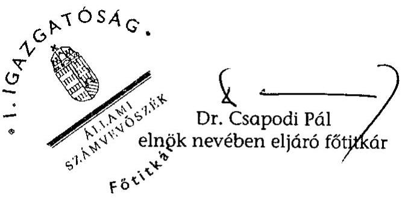

| Melléklet: | 5 db | 40 lap |
| :-- | :-- | :-- |
| Függelék: | 1 db | 3 lap |

---

# Mellékletek

---

# Mellékletek jegyzéke 

| 1. sz. melléklet | A jelentéstervezetre tett észrevételek és az arra adott válaszok |
| :-- | :-- |
| 2. sz. melléklet | ÁSZ-javaslatokkal összefüggő OGY határozatok és az előző évi ajánlások |
| 3. sz. melléklet | Kérdések és válaszok a rendszer értékeléséhez |
| 4. sz. melléklet | A Társaság gazdálkodásával kapcsolatos kimutatások   jegyzéke |
| 5. sz. melléklet | Tanúsítványok |

---

1. sz. melléklet
a V-2010-35/2009-2010. sz. jelentéshez

# A jelentésre és a jelentéstervezetre tett észrevételek és az arra adott válaszok 

1. Magyar Távirati Iroda Zrt. TTT észrevétele
2. Miniszterelnöki Hivatal észrevétele
3. Pénzügyminisztérium államtitkárának észrevétele és az arra adott válasz
4. Magyar Távirati Iroda Zrt. FB észrevétel és az arra adott válasz
5. Magyar Távirati Iroda Zrt. észrevétel és az arra adott válasz

---

# MTI 

## Magyar Távirati Iroda Zrt. Tulajdonosi Tanácsadó Testület

Állami Számvevőszék
Dr. Csapodi Pál úr Főtitkár részére

Tisztelt Dr. Csapodi Pál úr!

ÁLLAMI SZÁMVEVŐSZÉK
Íkt. szám: T-05-2010
Érkezett: 2010.04.26.
Iktatószám: 4.2010.22.104.14
Melléklet:
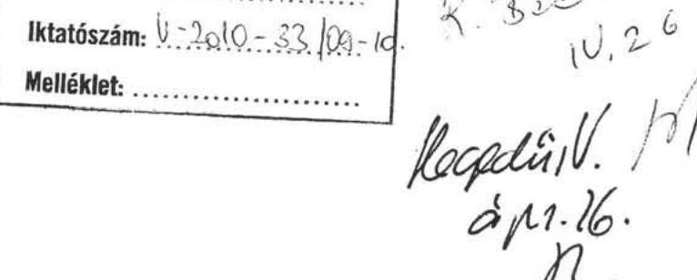

A TTT megtárgyalta az Állami Számvevőszék véglegesnek szánt jelentésváltozatát.
Tekintettel arra, hogy korábbi észrevételeink a jelentésben beépítésre kerültek, a testület további észrevételeket nem kíván tenni. A TTT a további munkája során igyekszik az ÁSZ által javasolt intézkedési tervnek megfelelően eleget tenni a feladatainak.

Budapest, 2010. április 22.
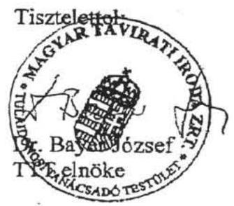

---

# MINISZTERELNÖKI HIVATAL JOGI ÉS KÖZIGAZGATÁSI ÁLLAMTITKÁR 

## Dr. Becker Pál   főigazgató úrnak

Állami Számvevőszék
Budapest

## VWY200Y/2019

## ÁLLAMI SZÁMVEVŐSZÉK

## Érkezett: 2012.04.26.

Iktatószám: 4.2010. 24/09.10
Melléklet:

## Tisztelt Főigazgató Úr!

A Magyar Távirati Iroda Zrt. 2009. évi gazdálkodásának ellenőrzéséről szóló jelentéstervezetüket köszönöm. A tervezetnek a Kormánynak címzett javaslataival kapcsolatban az alábbi észrevételeket teszem.

Az első két - évek óta ismétlődő - javaslat alapján készített, az Önök részére is megküldött intézkedési tervben foglaltak szerint a Kormány 2010. október 31-ig készíti elő a szükséges törvénymódosításokat. A nemzeti hírügynökségről szóló 1996. évi CXXVII. törvény módosításához szükséges minősített többség az új parlamenti ciklusban remélhetőleg biztosítható lesz, így a javaslatban foglaltak teljesítésének nem lesz akadálya.

A köztulajdonban álló gazdasági társaságok takarékosabb működéséről szóló 2009. évi CXXII. törvény (a továbbiakban: Taktv.) alkalmazásának módja az MTI Zrt. esetében valóban nem egyértelmű, noha a törvény fogalomrendszerének a jogalkotó szándéka szerinti értelmezésével az MTI Zrt. élhetett volna. Mivel a Kormánynak az intézmény felett nincs irányítási jogköre, ezért valóban csak a Taktv. megfelelő módosításával érhető el az abban foglaltak alkalmazása a nemzeti hírügynökség vonatkozásában is.

Budapest, 2010. április, „JK",
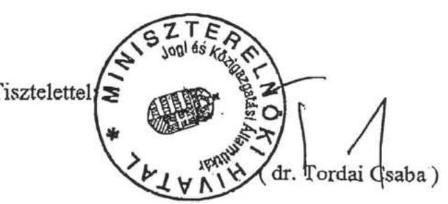

---

1. sz. melléklet a V-2010-25/2009-2010. sz. jelentéshez

H-1051 BUDAPEST V., JÓZSEF NÁDOR TÉR 2-4. POSTACÍM: 1369 BUDAPEST. POSTAFIÓK: 481

TELEFON: (36-1) 795-1407
FAX: (36-1) 795-0290

É-MAIL: allamtitkarsag@pm.gov.hu

ÁLLAMTITKÁR

Dr. Becker Pál úr részére
főigazgató

Állami Számvevőszék

Budapest

Tisztelt Főigazgató Úr!

Iktatószám: 5876/1/2010.
Hiv.sz.: V-2010-28/2009-2010
Tárgy: jelentéstervezet az MTI Zrt. 2009. évi
gazdálkodásáról

Ikepátár Vera
apr. 21.

ÁLLAMI SZÁMVEVŐSZÉK
ÜGYVITEL! IRODA
02873/2010

Érk.: APR 20 2010

Iktatószám: V-2010-31/09-11
Melléklet:

Melléklet:

Az MTI Zrt. 2009. évi gazdálkodásának ellenőrzéséről készített, részemre megküldött
jelentéstervezettel kapcsolatban az alábbi észrevételt teszem.

A tervezetben több ponton is felmerül a közszolgálati/közszolgáltatási szerződés
megkötésének igénye, valamint az MTI Zrt-nek ez ügyben – a Pénzügyminisztérium
irányába is – tett kezdeményezése.

E tekintetben szükségesnek tartom annak az ok-okozati összefüggésnek az egyértelművé
tételét a jelentésben, hogy a Pénzügyminisztérium részéről mindaddig nem tehetőek
érdemi lépések a szerződés megkötését illetően, amíg a nemzeti hírügynökségről szóló
1996. évi CXXVII. törvény (Nht.) nem egészül ki erre vonatkozó felhatalmazással.

Ugyanakkor nem helytálló és a tervezetben belső ellentmondást is okoz az a megállapítás,
hogy az MTI elnöke „a pénzügyminiszternél is kezdeményezte a tárgyalási folyamat
elindítását, azonban még erre vonatkozó döntés sem született”. Az MTI elnökének a
tárgyalási folyamat megkezdésére irányuló levelére adott válaszunkban a kezdeményezést
támogattuk, abban a PM együttműködését, részvételének szükségességét jeleztük (ezt a
tervezet is rögzíti). Az Nht. megfelelő, a jelentésben is szorgalmazott, az alapító
Országgyűlés aktivitását és döntését igénylő módosítása hiányában a PM jogszerű
mozgástere az egyeztetésben, a szerződés lehetséges tartalmának kidolgozásában való
részvételre korlátozódik. A szerződés megkötéséhez, a feladatellátás és a finanszírozás
összhangjának ilyen módon történő megalapozásához azonban az Nht. felhatalmazása
kell.

Az Nht. módosításának előkészítése – természetesen az alapító Országgyűlés aktív
részvételével – az igazságügyi és rendészeti miniszter feladat- és hatásköréről szóló
164/2006. (VII. 28.) Korm. rendelet 3. § (2) bekezdés b) pontja alapján az Igazságügyi és
Rendészeti Minisztérium feladata. Erre utal az a tény is, hogy a jelentésben is hivatkozott
kormányzati intézkedési terv e feladat felelőseként az IRM miniszterét jelöli ki.

---

Tájékoztatom továbbá, hogy az MTI elnökének említett levelére adott válaszomra reagálva dr. Katona Béla, az Országgyűlés elnöke 2010. március 18-án kelt levelében formálisan kezdeményezte az „illetékeseknél az egyeztetést", ahhoz azonban sem az MTI 2008-ban készített (a PM számára ismeretlen) javaslatát, sem az alapító észrevételeit, sem egyéb dokumentumot nem csatoltak (meghívásként sem értelmezhető, mivel helyszínt, időpontot nem jelöltek meg). Válaszunkban kértük: az egyeztetés alapjául, „kezdeményezését kiegészítendő szíveskedjék az IRM és a PM rendelkezésére bocsátani az MTI említett tervezetét, valamint az alapító Országgyűlés ahhoz fűzött általános és konkrét észrevételeit, javaslatait, az elutasítás indokolását".

A jelenlegi jogszabályi környezetben feladat- és hatáskör hiányában szintén nem vállalható a PM részéről az államháztartásról szóló 1992. évi XXXVIII. törvény 100/K. §-ának való megfelelés biztosítása, így a tervezet 18. oldalán szereplő, látszólag a PM-et is elmarasztaló megállapítás átfogalmazása szükséges. A megállapítás - helyesen - a jogi háttér hiányával indokolja az MTI finanszírozásának átláthatóbbá és EU-konformmá tételének elmaradását. E jogi háttér megteremtése azonban az említett jogszabályok alapján nem a PM feladata, így legfeljebb az állítható, hogy a PM nem „segíthette" az Áht. érvényesülését. Felhívom továbbá figyelmét arra, hogy a Magyar Köztársaság 2010. évi költségvetését megalapozó egyes törvények módosításáról szóló 2009. évi törvény 55. § (7) bekezdése az Áht. 100/K. § (1) bekezdésének való megfelelésre 2011. január 1-jei határidőt állapít meg.

Mindezek alapján kérem, hogy a szerződés megkötésére irányuló kezdeményezés meghiúsulása tekintetében a Pénzügyminisztérium (rész)felelősségére utaló szövegrészek átdolgozásáról, pontosításáról gondoskodni szíveskedjék.

Budapest, 2010. április 16.

Tisztelettel:
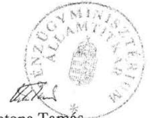

Dr. Katona Tamás

---

# Dr. Katona Tamás úr 

államtitkár
Pénzügyminisztérium

## Budapest

## Tisztelt Államtitkár Úr!

A Magyar Távirati Iroda Zrt. 2009. évi tevékenységének ellenőrzéséről készített jelentéstervezetre tett kiegészítését és észrevételeit megköszönöm, azokkal kapcsolatban a következőkről tájékoztatom.

Jelenleg a Társaság közfeladatainak állami finanszírozási formája nincs összhangban az uniós szabályokkal, mert hiányzik a finanszírozás átlátható rendszerének és a támogatás felhasználása monitoring rendszerének a kialakítása. A Pénzügyminisztérium is rendelkezik azzal az információval, hogy elmaradt az MTI finanszírozásának átláthatóbbá és EUkonformmá tétele. A finanszírozás jelenlegi formájával összefüggésben az EU megállapíthatja az uniós előírások megsértését, ami hátrányosan érintheti az MTI-t és - közvetetten - a költségvetést. Ez összességében olyan mértékű kockázatot hordoz, ami indokolja a közszolgálati szerződés - Nht. módosítástól függetlenül történő - megkötését. A szakértői egyeztetés során is megfogalmazódott egy közszolgálati szerződés vagy egy végrehajtási rendelet megalkotásának szükségessége.

A jelentéstervezet 3. pontjának 3. bekezdése tényszerűen hivatkozik a pénzügyminiszter - az MTI Zrt. elnökének 2009. július 10-én kelt levelére adott - válaszára. „A pénzügyminiszter 2009. december 17-én (öt hónap múlva) válaszában megfogalmazta, hogy „hasznos és előremutató elgondolásnak" tartja egy esetleges közszolgáltatási szerződés megalkotását és megkötését, ami „egyértelművé tehetné a támogatásoknak a közösségi joggal való összeegyeztethetőségét." Javasolta a közszolgáltatási szerződés előkészítésének kezdeményezését az Országgyűlés elnökénél, valamint tájékoztatást adott arról, hogy a szerződés előkészítésének egyeztetési folyamatában a kormányzat részéről a Pénzügyminisztérium mellett az Igazságügyi és Rendészeti Minisztérium részvétele szükséges."

---

Az MTI Zrt. az Áht. 100/K. § szerinti közfeladat-ellátásának TTT általi felülvizsgálatát azért kezdeményeztük, mert amellett, hogy az MTI Zrt.-re vonatkozó jogszabály (Nht.) és a Társaság Alapító Okirata nem módosult, hiányzik az állami finanszírozás átlátható rendszerének a kialakítása, nem került sor a közszolgálati szerződés megkötésére, valamint a közszolgálati feladatokra jutó állami támogatás kimutatását segítő számítási mód következetes alkalmazására. Az Áht.-ban előírt feltételek fennállásának vizsgálatával egyrészt lehetőség nyílik arra, hogy a hiányosságokról a tulajdonos (Országgyűlés) teljesebb képet kapjon, másrészt a Tulajdonosi Tanácsadó Testület tud abba az irányba hatni, hogy a Társaság a jelenlegi helyzet ellenére alkalmazkodjon az előírt feltételekhez.

Kérem Államtitkár urat, hogy a levelemben foglaltakat elfogadni szíveskedjék.
Budapest, 2010. április 22.

Tisztelettel:
$\square$
Dr. Becker Pál
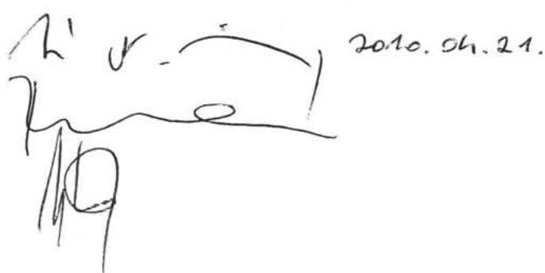

---

# MAGYAR TÁVIRATI IRODA ZRT. - FELÜGYELŐ BIZOTTSÁG 

FB-4/2010.

Állami Számvevőszék
Vagyonellenőrzési Igazgatóság
Dr. Podonyi László
Igazgatóhelyettes Úrnak

Tisztelt Podonyi Úr!
Köszönettel megkaptuk a Magyar Távirati Iroda Zrt. 2009. évi gazdálkodásának ellenőrzéséről készült

V-2010-14/2009-2010. és
V-2010-15/2009-2010.
számvevői jelentéseket.
A munkaanyagokat a Felügyelő Bizottság tagjai megismerték. Ez alapján az FB nevében a jelentéseknek a Felügyelő Bizottságot érintő megállapításaira az alábbi észrevételeket teszem:

## A V-2010-14/2009-2010. sz. jelentéshez:

A számvevői munkaanyag 22. oldalán megállapítja, hogy „a Gazdasági Alelnök 2003. január 1-jével ismét munkaviszonyt létesített a Társasággal. Az FB-vel, továbbá az időközben a személyében megváltozott Elnökkel - a felmondási - és végkielégítési idő Mt. szerinti mértékét rögzítették. Megállapodtak továbbá, hogy amennyiben az elnöki ciklus lejártát követően, az újabb pályáztatás nyertese ugyanaz a személy lesz, a kérdést ismét megtárgyalják."

Ezzel kapcsolatban megjegyezzük, hogy a Felügyelő Bizottság nem vett részt egyetlen munkaszerződés megkötésében sem, így a Gazdasági Alelnök esetében sem. Így nem rögzítettük sem a felmondási, sem a végkielégítési idő mértékét. Ezzel szemben a tény az, hogy amikor az FB tudomást szerzett a Gazdasági Alelnök végkielégítésével kapcsolatos problémáról, azt az álláspontot képviselte, hogy ne legyen kikötve az új 2003. január 1-től érvényes munkaszerződésében végkielégítés. Ez összhangban állt a Gazdasági Alelnök azon lemondó nyilatkozatával, amelyet az Üzemi Tanács 2003. február 24-én tartott ülésén tett. Vince Mátyás elnök új ciklusának kezdetén (2007.) a Gazdasági Alelnök munkaszerződésébe az FB által nem ismert körülmények nyomán történt módosításakor bekerült a végkielégítés kikötése, amelyről az FB csak 2009 őszén, a jogszabály által előírt közzétételi kötelezettség teljesítésekor szerzett tudomást.

Magyar Távirati Iroda Zrt. - Felügyelő Bizottság Elnöke
1016 Budapest, Naphegy tér 8.
Tel.: 441-9036, tel./fax: 356-9538,
mobiltelefon: 06-30-211-3111, 06-30-515-4007
E-mail: fb@mti.hu

---

Ezért a munkaanyag Felügyelő Bizottságra vonatkozó megállapítását kérjük ennek megfelelően pontosítani.

# A V-2010-15/2009-2010. sz. jelentéshez: 

A munkaanyag 1.3. részében, a jelentés 12. oldalán megjegyezte, hogy „Az 5 tagú FB 2009. évi ellenőrzési tevékenységét nehezítette az a tény, hogy az Nht. 13. § (1) bekezdés szerint az FB két tagja az MTI munkavállalói közül kerül ki, így valójában kettős minőségben van jelen az ülésen."

Ezzel kapcsolatban megjegyezzük,
 nem tudjuk, milyen tényekre alapozva tette a Számvevő Biztos a fenti megállapítást. Véleményünk szerint az FB munkavállalói tagjai speciális „helyismeretükkel" jelentősen hozzájárultak a Testület ellenőrző tevékenységének sikeréhez, hatékonyságához. Az elmúlt 12 év során nem volt egyetlen olyan alkalom sem, amikor az FB ezen tagjai gátolták vagy hátráltatták volna a Testület vizsgálati, ellenőrzési tevékenységét. Egyetlen olyan határozat sem született, amely a munkavállalói küldöttek külön akaratát tükrözte volna az FB nem munkavállalói tagjaival szemben. Megjegyezzük továbbá, hogy a munkaanyagban szereplő állítással ellentétesen valószínűleg a törvényalkotó szándéka volt a belső, a nagyobb cégismerettel rendelkező tagok bevonása a Felügyelő Bizottságba, akik rendelkezhetnek olyan információkkal, amelyek ismeretében megalapozottabb döntést tud hozni a Testület.

Ez alapján kérjük a megállapítást pontosítani.
A munkaanyag 1.3. részében, a jelentés 12. oldalán szerepel, hogy „Az FB tájékoztatást kért a Társaságtól a 2009-ben lebonyolított közbeszerzési eljárásokról, azonban - az MTI 2008. évi gazdálkodásának számvevőszéki ellenőrzésekor a közbeszerzés területén feltárt hiányosságok ellenére - a közbeszerzési eljárások vizsgálatát nem kezdeményezte."

A munkaanyag megállapításával kapcsolatban megjegyezzük, hogy a Felügyelő Bizottság 2009. október 27-i ülésén átfogó ellenőrzésként napirendre tűzte a 2009-ben lebonyolított közbeszerzési eljárásokról készült tájékoztatót. A Management a Testület részére kielégítő írásos tájékoztatót készített a 2009. évben lebonyolított közbeszerzésekről, bemutatta az MTI korszerűsített beszerzési szabályzatát, továbbá az anyag mellékleteként csatolták a 2009. évi költségvetésről szóló 2008. évi CII. törvény kivonatát, valamint a Zrt. 2009-es közbeszerzési tervét. Az írásos előterjesztés és a benyújtott dokumentumok, valamint a kérdésekre adott szóbeli kiegészítések kellően meggyőzték a Testületet arról, hogy a napirendhez kapcsolódó további vizsgálat nem szükséges.
Továbbá az ÁSZ 2008. évi megállapításai teljesítésének végrehajtásáról készült belső ellenőri jelentést az FB 2009. december 15-ei ülésén elfogadta, amelyben a közbeszerzésekkel kapcsolatos számvevőszéki megállapítások teljesítésének megtörténtét rögzítettük.

Ezek alapján kérjük a megállapításokat mind tényszerűségükben, mind következtetésükben módosítani.

A munkaanyag 1.3. részében a 13. oldalon szerepel, hogy ,,Az emlékeztetők általában az FB tagjainak véleményét tartalmazzák, azonban az FB tagjainak a megvitatott - kiemelkedően az MTI egészét érintő - témákról közös álláspontot szükséges kialakítani, és azt megjeleníteni a meghozott határozatokban."

A stratégiai terv kérdésében a Felügyelő Bizottság azért nem hozott határozatot, mert annak vizsgálata nem tartozott a hatáskörébe, erről az MTI Elnökének kérésére alakítottak ki az FB tagjai olyan véleményt, amely az MTI Elnökének támogató segítséget kívánt nyújtani a stratégia véglegesítéséhez.

Erre tekintettel kérjük e megállapítás ennek megfelelő kiegészítését.

---

A munkaanyag 1.3. részében a 13. oldalon szerepel, hogy „A tájékoztatók tudomásul vétele egyes esetekben az ülésen szóban elhangzott pontosításokkal történt, azonban a határozat szövege nem tartalmazza, hogy azok a pontosítások érintették-e a tájékoztatókban foglaltakat."

A pontosítások mindig a tájékoztatók módosítására, ill. kiegészítésére vonatkoztak, így evidens, hogy amikor a tájékoztatóknak a szóbeli kiegészítésekkel történő tudomásulvételéről hoz az FB határozatot, így e szóbeli pontosítások nyilvánvalóan módosítják az eredeti tájékoztatókat, amit a határozat szövege így tartalmaz.

Erre figyelemmel kérjük a megállapítás módosítását.
Fentieken túl a munkaanyagokkal kapcsolatban az FB tagjai további véleményt nem fogalmaztak meg.
Budapest, 2010. március 2.
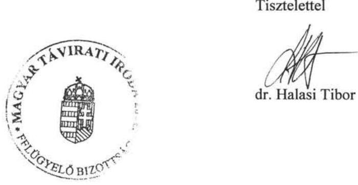

---

# MTI

## MAGYAR TÁVIRATI IRODA ZRT. - FELÜGYELŐ BIZOTTSÁG

Állami Számvevőszék
Hegedűsné dr. Müllern Veronika
főcsoportfőnök asszony részére
Tisztelt Főcsoportfőnök Asszony!
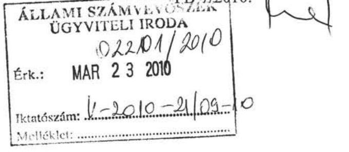

A Magyar Távirati Iroda Zrt. 2009. évi gazdálkodásának ellenőrzéséről készített V-2010-19/2009-2010. számú jelentéstervezetüket köszönettel kézhez kaptuk, a Felügyelő Bizottság tagjai megismerték.

Köszönettel vettük, hogy észrevételeinket figyelembe vették, és azok egy részét átvezették.
A V-2010-14/2009-2010. számú jelentéshez fűzött észrevételeink nyomán a vonatkozó megállapítást törölték. Figyelemmel arra, hogy ez a probléma az MTI életében keletkezése óta meglehetősen érzékeny kérdés, és azóta napirenden is van szinte folyamatosan, valamint, hogy az FB is többször foglalkozott vele, így javasoljuk annak megfontolását, hogy az előző levelünkben foglaltak szerint a megállapítás mégis szerepeljen a jelentésükben.

A V-2010-15/2009-2010. számú jelentéshez fűzött át nem vezetett észrevételeink tekintetében álláspontunk a következő:

1. Ismételten rögzíteni kívánjuk, hogy az FB a társaság közbeszerzési gyakorlatát, valamint az eljárások lefolytatását az elmúlt években és 2009-ben is vizsgálta, és eközben átfogó ellenőrzésre is sor került. Ezt támasztják alá a testület korábbi határozatai, valamint az ülések emlékeztetőinek vonatkozó részei:

FB-39. (2006.X.24.)
FB-11. (2007.III.27.) (átfogó vizsgálat)
FB-32. (2007.X.30.)
FB-35. (2008.XI.18.)
FB-38. (2008.XII.16.) (átfogó vizsgálat)
FB-32. (2009.X.27.)
FB-43. (2009.XII.15.) (melyben a közbeszerzésekkel kapcsolatos számvevőszéki megállapítások teljesítésének megtörténtét rögzítettük)

Magyar Távirati Iroda Zrt. - Felügyelő Bizottság Elnöke
1016 Budapest, Naphegy tér 8.
Tel.: 441-9036, tel./fax: 356-9538,
mobiltelefon: 06-30-211-3111, 06-30-515-4007
E-mail: fb@mti.hu

---

Dr. Podonyi László igazgatóhelyettes úrnak 2010. március 2-án kelt FB-4/2010. számú levelünkben leírtakat az ügyre vonatkozóan nem kívánjuk még egyszer leírni, de a levélben megfogalmazott véleményünket változatlanul fenntartjuk és kérjük a megállapítás ennek megfelelő módosítását.
2. A stratégiai terv kérdésében leírt véleményünkhöz képest a tervezet nem fogalmazott meg érdemi változást, ezért előző levelünkben írt álláspontunkat fenntartjuk.
3. A jelentéstervezetben a tájékoztatók tudomásulvételével kapcsolatban megfogalmazott megállapítás nem tükrözi véleményünket, sőt az eredeti megállapítást egy további nem helytálló résszel egészítette ki, amit nem tudunk elfogadni. Ezért kérjük, hogy a megállapítást előző levelünkben foglalt álláspontunknak megfelelően szíveskedjenek módosítani.

Budapest, 2010. március 22.
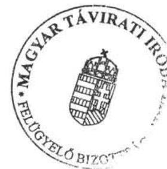

Üdvözlettel:
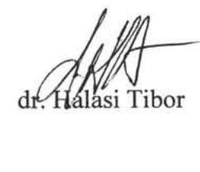

---

# Dr. Halasi Tibor úr

elnök
Felügyelő Bizottság
MTI Zrt.

## Budapest

## Tisztelt Elnök Úr!

A Magyar Távirati Iroda Zrt. 2009. évi gazdálkodásának ellenőrzéséről készített V-2010-26/2009-2010. sz. jelentéstervezetre tett észrevételeit köszönettel megkaptam, azzal kapcsolatban az alábbiakról tájékoztatom.

A jelentéstervezetet - az FB eltérő véleményének, az ÁSZ álláspontjának bemutatásán túl kérésének megfelelően lábjegyzettel egészítettük ki, amelyben hivatkozunk az FB által képviselt álláspont részletes kifejtését tartalmazó észrevételre.

- A közbeszerzési eljárások vizsgálatával kapcsolatban - a helyszíni ellenőrzés alatt megismert dokumentumok alapján - változatlanul az a véleményünk, hogy az FB csak az MTI által készített tájékoztatóból, valamint a közbeszerzési eljárások rendjének szabályozására, a közbeszerzési terv elkészítésére kiterjedő belső ellenőri vizsgálatból ismerte meg a Társaság 2009. évben lebonyolított közbeszerzéseit. A közbeszerzési eljárások kiemelt átfogó vizsgálatának szükségességét azért tartjuk indokoltnak, mert az előző évi ellenőrzésünk során hiányosságokat tapasztaltunk pl. az egybeszámítási kötelezettség figyelmen kívül hagyásában, a megválasztott eljárásban. Emiatt javaslatot is fogalmaztunk meg a közbeszerzések felülvizsgálatára, valamint a közbeszerzési eljárások belső ellenőrzésére vonatkozó Kbt. előírás betartására.
- Mivel a Felügyelő Bizottság az Nht.-ban előírt kiemelt feladatokon kívül, a Gt.-ben foglaltak alapján is felelősséggel ellenőrzi a Társaság ügyvezetését, ezért tartjuk indokoltnak, hogy az FB tagjainak véleményét az emlékeztetőkön kívül - az ügyvezetés jelentős döntéseinek véleményezésekor - határozatban is megjelenítse. Az MTI Zrt. 2008. évi gazdálkodásáról szóló ÁSZ jelentés 1.7. pontjának 2. bekezdése is utal arra, hogy a Társaság 2008-2012. évekre szóló stratégiai tervének FB véleményezésére 2009-ben kerül sor. Az FB az éves üzleti terv teljesítését folyamatosan nyomon követi,

---

az éves üzleti terv pedig szorosan kapcsolódik a stratégiai célokhoz, és a stratégiai tervhez, mivel a kettő elválaszthatatlan.

- A tájékoztatók általános tudomásul vétele helyett álláspontunk szerint az FB speciális és kiemelkedő szerepét és feladatát tovább erősítheti, ha a Társaság vezetőjétől kért tájékoztatásokról (pl. a 2009. évi csoportos létszámleépítés végrehajtása, az ingatlan és informatikai beruházások, közbeszerzési eljárások) az FB kialakítja véleményét és azt határozatban jeleníti meg.

Kérem Elnök urat, hogy az észrevételekre adott válaszainkat mérlegelni, illetve tudomásul venni szíveskedjék.

Budapest, 2010. április 23.

Tisztelettel:

Dr. Becker Pál
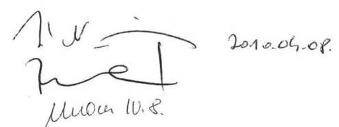

---

1.  sz. melléklet a V-2010-25/2009-2010. sz. jelentéshez

# MTI

ÁLLAMI SZÁMVEVŐSZÉK
03012/2010
Érkezett: 2012.04.25.... Iktatószám: 2010-30/29-10 Melléklet:

Állami Számvevőszék
Dr. Becker Pál
Főigazgató részére

Iktatási szám: 03686/2010
Kevélín Vasa
Ani. 26.
Tárgy: Vélemény a V-2010-26/2009-2010. számú számvevői jelentésre

## Tisztelt Főigazgató Úr!

Köszönettel megkaptuk az Állami Számvevőszék V-2010-26/2009-2010. számú jelentését az MTI Zrt. 2009. évi vizsgálatáról.

Tájékoztatom, hogy a korábbi, 2010. március 23-i levelünkben megfogalmazott, két témát érintő véleményeltérésünket továbbra is fenntartjuk.

Jelentésükben az MTI elnökének tett javaslatok 1. pontjához (biztosítsa a köztulajdonban álló gazdasági társaságok takarékosabb működéséről szóló törvényben - az elnök és az alelnöki körön kívüli - az Mt. 188/A. § (1) bekezdése szerint vezető állású munkavállalókra előírt közzétételi kötelezettség teljesítését, valamint gondoskodjon e vezetői kör belső szabályzatokban történő egyértelmű, Munka Törvénykönyvével összhangban lévő megjelenítéséről) a korábban megküldött, a takarékossági törvény személyi hatályáról szóló jogi szakvéleményhez a következő kiegészítést fűzöm:

Az Mt. 188/A § (1) bekezdése határozza meg azoknak a személyeknek a körét, akik szintén vezető állásúaknak minősülnek, de csak korlátozott mértékben, és az e munkakört betöltőknek speciális elnevezése van. Nevezetesen ők azok a személyek, akik a munkáltató működése szempontjából meghatározó jelentőségű munkakört töltenek be. Hogy melyek a meghatározó jelentőségű munkakörök a munkáltató működése szempontjából, azt a tulajdonosnak illetőleg a tulajdonosi jogokat gyakorló szervnek kell meghatároznia, és előírnia azt, hogy e személyekre az Mt. X. fejezetéből mely jogszabály helyeket kell rájuk alkalmazni. Tehát alapvető feltétel, hogy a tulajdonos vagy a tulajdonosi jogokat gyakorló szerv döntést hozzon, azoknak a munkaköröknek a vonatkozásában, amelyek "a munkáltató működése szempontjából meghatározó jelentőséggel bírnak." A döntésben tehát fel kell sorolni a munkaköröket. Ha ilyen döntés nincs, akkor értelemszerűen nem beszélhetünk a munkáltatónál az Mt. 188/A. § szerinti vezetőkről!

Az ún. takarékossági törvény 5. § (3) bekezdése úgy rendelkezik, hogy a 188. § (1) és 188/A. § -ok hatálya alá eső munkavállalók javadalmazásáról szabályzatot kell alkotni. E törvény 2. § (6) bekezdése ugyan nem módosítja az Mt.-t de azt értelmezi, amikor meghatározó jelentőségű munkakörnek minősíti azt a munkakört, amely a társaság vagyonával való gazdálkodása során döntési jogkört tartalmaz. Ez a rendelkezés azonban nem zárja ki azt a törvényi feltételt, hogy szükséges e munkakörök megjelöléséhez a tulajdonos vagy a tulajdonosi jogokat gyakorló szerv döntése.

---

Továbbá fenntartom előző levelünkben megfogalmazott véleményünket az ÁHT. 100/K §-ra vonatkozóan is. Ezért az erre vonatkozó, és a már elküldött jogi szakvéleményünket ismételten csatolom.

Budapest, 2010. április 2.

Tisztelettel:
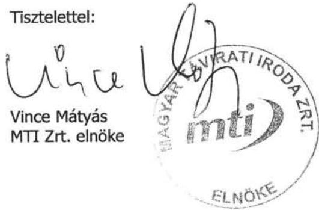

---

# Az MTI Zrt. Tulajdonosi Tanácsadó Testületének jogi státusa

Jogi szakvélemény

## 1. Az ÁSZ megállapításai

Az Állami Számvevőszék folyamatban lévő vizsgálata során felmerült a TTT jogi státusának kérdése, nevezetesen a Taktv. szerinti Javadalmazási szabályzat kapcsán.

Az ÁSZ a TTT-nek az Nht-ban meghatározott feladatai alapján indokoltnak látta a Javadalmazási Szabályzat TTT-re való kiterjesztését. Véleménye szerint „a TTT azontúl, hogy a Részvénytársaság javaslattevő, véleményező, tanácsadó szerve, az Nht-ban meghatározott esetben döntési jogosultsággal is rendelkezik, így a Gt. 21.§ (1) bekezdése alapján az MTI Zrt. elnöke és a TTT kvázi igazgatóságként működik. A TTT többek között megállapítja az MTI elnökének és az FB tagjainak díjazását, megbízza a társaság könyvvizsgálóját, megállapítja díjazását, folyamatosan ellenőrzi és évenként értékeli az elnöki pályázatban foglalt célkitűzések végrehajtását, jóváhagyja a Társaság díjszabását. Ebből következően mind a Taktv. hatálya, az ellátott feladatok súlya és az értük való felelősség" alapján indokolt vonatkozásában a Javadalmazási szabályzat alkalmazása. Megállapításaiban arra hivatkozik az ÁSZ, hogy a Taktv. 8.§ (7) bekezdése meghatározza, hogy ,,az 5-7.§-t - egyedül - a Magyar Nemzeti Bankra, annak felügyelőbizottsági tagjaira, illetve a Magyar Nemzeti Bankkal munkaviszonyban álló személyekre nem kell alkalmazni."

## 2. Vonatkozó jogszabályok

Annak a kérdésnek a megválaszolásához, hogy vonatkozik-e a Taktv., illetve az abban meghatározott javadalmazási szabályzat hatálya a TTT-re, a következő jogszabályok tartalmát kell megvizsgálni:

- a nemzeti hírügynökségről szóló 1996. évi CXXVII. törvény (Nht.)
- a köztulajdonban álló gazdasági társaságok takarékosabb működéséről szóló 2009. évi CXXII. törvény (Taktv.)
- a gazdasági társaságokról szóló 2006. évi IV. tv. (Gt.)

## 3. A Taktv. személyi hatálya (alanyi kör)

A Taktv. személyi hatálya kettős: egyrészt meghatározza azokat a társaságokat, amelyekre vonatkozik, másrészt meghatározza azokat a konkrét személyeket, akik az adott társasággal valamilyen jogviszonyban állnak, és akikre a Taktv. egyes rendelkezései vonatkoznak.

A Taktv. 1.§ a) pontjában határozza meg a „köztulajdonban álló gazdasági társaság" fogalmát, és a továbbiakban minden rendelkezése ezekre a gazdasági társaságokra vonatkozik.
„a) köztulajdonban álló gazdasági társaság: az a gazdasági társaság, amelyben a Magyar Állam, helyi önkormányzat, a helyi önkormányzat jogi személyiséggel rendelkező társulása, többcélú kistérségi társulás, fejlesztési tanács, kisebbségi

---

önkormányzat, kisebbségi önkormányzat jogi személyiségű társulása, költségvetési szerv vagy közalapítvány külön-külön vagy együttesen számítva többségi befolyással rendelkezik,"

Ennek alapján kimondható, hogy magára az MTI Zrt-re vonatkozik a Taktv., mert benne a Magyar Állam az Országgyűlés útján többségi befolyással rendelkezik. Az MTI Zrt. tehát köztulajdonban álló gazdasági társaság.

A Taktv. egyes szabályai a következő, a köztulajdonban álló gazdasági társasággal jogviszonyban álló személyekre vonatkoznak az ÁSZ által hivatkozott, a Taktv. 5-7.§ szerinti körben:

|  TÖRVÉNYHELY | TARTALMA | SZEMÉLYI KÖR  |
| --- | --- | --- |
|  5.§ (1)
bekezdés | a havi személyi alapbér ill. díjazás legfeljebb a Magyar Nemzeti Bank elnöke tárgyévi összes keresete egytizenkettedének az egynegyede lehet | - A társasággal munkaviszonyban álló valamennyi munkavállaló
- a Gt. 22. § (2) bekezdés a) pontja szerinti vezető tisztségviselő (megbízás alapján látja el a tisztséget)  |
|  5.§ (2)
bekezdés | teljesítménykövetelményt, valamint az ahhoz kapcsolódó teljesítménybért vagy más juttatást számára ki és milyen feltételekkel határozhat meg | - a társasággal munkaviszonyban álló vezető tisztségviselő (Gt. 22.§ b) pont)
- az Mt. 188. § (1) bekezdése vagy 188/A. § (1) bekezdése hatálya alá eső munkavállaló (vezető állású munkavállaló)  |
|  5.§ (3)
bekezdés | Javadalmazási szabályzat alkotása a vonatkozásukban | - a vezető tisztségviselők,
- felügyelőbizottsági tagok,
- az Mt. 188. § (1) bekezdése vagy az Mt. 188/A. § (1) bekezdése hatálya alá eső munkavállalók, azaz a vezető állású munkavállalók  |
|  6. § (1)
bekezdés | Havi díjazása nem haladhatja meg a mindenkori kötelező legkisebb munkabér hétszeresét,
Havi díjazása nem haladhatja meg a mindenkori kötelező legkisebb munkabér ötszörösét | - a köztulajdonban álló gazdasági társaság igazgatósága elnöke
- az igazgatóság többi tagja  |
|  6.§ (2)
bekezdés | Havi díjazása nem haladhatja meg a mindenkori kötelező legkisebb munkabér ötszörösét, ezen kívül más javadalmazásra nem jogosult
Havi díjazása nem haladhatja meg a mindenkori kötelező legkisebb munkabér háromszorosát, ezen kívül más javadalmazásra nem jogosult | - felügyelőbizottság elnöke
- felügyelőbizottság tagja  |

---

| 6.§ (3)   bekezdés | e jogviszonyára tekintettel a   megbízatás megszűnése esetére   juttatás nem biztosítható | - a társaság igazgatóságának elnöke   - az igazgatóság más tagja,   - felügyelőbizottság elnöke   - felügyelőbizottság más tagja |
| :--: | :--: | :--: |
| 6.§ (4)   bekezdés | Egy természetes személy   legfeljebb egy köztulajdonban álló   gazdasági társaságnál betöltött   vezető tisztségviselői megbízatás,   valamint legfeljebb egy   köztulajdonban álló gazdasági   társaságnál betöltött   felügyelőbizottsági tagság után   részesülhet javadalmazásban. | - Vezető tisztségviselő   - Felügyelőbizottsági tag |
| 7. § (1)   bekezdés | Végkielégítésre való jogosultság   szabályai | - A társaság   munkavállalója valamennyi |
| 7.§ (2)   bekezdés | Felmondási idő szabályai és   korlátai | - A társaság   munkavállalója valamennyi |
| 7.§ (3)   bekezdés | versenyjogi megállapodás   szabályai és korlátai | - A társaság   munkavállalója valamennyi |

A fenti táblázatból megállapítható, hogy azok a lehetséges személyek, akikre a Taktv. valamilyen rendelkezése vonatkozhat, a következők:

1. valamennyi munkavállaló (azaz a társasággal munkaviszonyban álló személy)
2. a társaság munkaviszonyban álló, vezető állású dolgozója (az Mt. 188. § (1) bekezdése vagy 188/A. § (1) bekezdése hatálya alá eső munkavállaló)
3. az igazgatóság elnöke vagy tagja
4. a felügyelőbizottság elnöke vagy tagja
5. a társaság vezető tisztségviselője (akár a Gt. 22.§ (2) bekezdés b) pontja alapján munkaviszonyban, akár a Gt. 22. § (2) bekezdés a) pontja szerinti megbízási jogviszonyban látja el ezt a tisztséget)

# 4. A TTT jogállása az Nht alapján 

Az MTI Zrt. Tulajdonosi Tanácsadó Testületének jogállását alapvetően az Nht. tartalmazza. Az Nht. 17. § (1) bekezdése szerint „a TTT a részvénytársaság javaslattevő, véleményező, tanácsadó és e törvényben meghatározott esetben döntést hozó szerve."

Az Nht. 21. § (1) bekezdése szerint a TTT feladat- és jogköre:
a) a részvénytársaság elnöki tisztségére a pályázati szempontok meghatározása és a nyilvános pályázati felhívás kiírása,

---

b) javaslat a miniszterelnök részére a részvénytársaság elnökének kinevezésére és felmentésére,
c) a részvénytársaság elnöke díjazásának megállapítása,
d) a felügyelő bizottság egyik tagjának megválasztása, a felügyelő bizottsági tagok díjazásának megállapítása,
e) a részvénytársaság könyvvizsgálójának megbízása, megbízásának felmondása, díjazásának megállapítása,
f) a részvénytársaság elnöke pályázatában foglalt célkitűzések megvalósításának folyamatos ellenőrzése és évenkénti értékelése,
g) az alapító okirat módosításának előkészítése,
h) a részvénytársaság díjszabásának jóváhagyása.

A 17.§ (2) bekezdése értelmében a TTT tagjait, a 20.§ (2) bekezdése értelmében elnökét és elnökhelyettesét a társaság alapítója, az Országgyűlés választja, részletesen meghatározott eljárás és jelölési rend alapján. A TTT megválasztása országgyűlési határozattal történik. A TTT tagjai - más összeférhetetlenségi okok mellett - nem állhatnak munkaviszonyban vagy munkavégzésre irányuló jogviszonyban az MTI Zrt-vel (Nht. 19.§ (1) bekezdés).

# 5. Kiterjed-e a Taktv. 5-7.§-ának személyi hatálya a TTT tagjára? 

Ez a kérdés úgy válaszolható meg, ha a 3. pontban felsorolt, szóbajöhető személyi kört (tehát akikre a Taktv. 5-7.§-a egyáltalán vonatkozhat) megvizsgáljuk, és megállapítjuk, hogy valamelyik kategória illik-e a TTT tagjára. (Értelemszerűen nem vizsgálom a felügyelőbizottsági tagokra vonatkozó rendelkezéseket.)

A Taktv. 5-7.§-ában foglaltak a következő személyekre vonatkozhatnak ${ }^{1}$ :
5.1 valamennyi munkavállaló (azaz a társasággal munkaviszonyban álló személy Taktv. 5.§ (1), 7.§ (1)-(3) bekezdés)

A TTT tagjai nem állnak, és az Nht. 19.§ (1) bekezdése alapján nem is állhatnak munkaviszonyban vagy munkavégzésre irányuló egyéb jogviszonyban az MTI Zrt-vel, tehát nem munkavállalók. Ez a kategória nem vonatkozik rájuk.
5.2 a társasággal munkaviszonyban álló, vezető állású dolgozó (az Mt. 188. § (1) bekezdése vagy 188/A. § (1) bekezdése hatálya alá eső munkavállaló - Taktv. 5.§ (2) és (3) bekezdés)

A TTT tagjai nem állnak, és az Nht. 19.§ (1) bekezdése alapján nem is állhatnak munkaviszonyban vagy munkavégzésre irányuló egyéb jogviszonyban az MTI Zrt-vel, tehát nem lehetnek munkaviszonyban álló, vezető állású dolgozók.
5.3 az igazgatóság elnöke vagy tagja (Taktv. 6.§ (1) és (3) bekezdés)

A TTT tagja nem lehet az igazgatóság elnöke illetve tagja, mert a társaságnál igazgatóság nem működik.

[^0]
[^0]:    ${ }^{1}$ Természetesen lehetnek átfedések: a vezető állású munkavállalóra pl. vonatkozik az a szabály is, amelyik valamennyi munkavállalóra érvényes.

---

Az ÁSZ hivatkozik a Gt. 21.§ (1) bekezdésére. Ez így szól:
„Gt. 21. § (1) A gazdasági társaság ügyvezetését - a gazdasági társaságok egyes formáira vonatkozó rendelkezések szerint - a társaság vezető tisztségviselői vagy a vezető tisztségviselőkből álló testület látja el. E törvény alkalmazásában ügyvezetésnek minősül a társaság irányításával összefüggésben szükséges mindazon döntések meghozatala, amelyek törvény vagy a társasági szerződés alapján nem tartoznak a társaság legfőbb szervének vagy más társasági szervnek a hatáskörébe."

Ez a rendelkezés nem azt mondja ki, hogy aki a társaság irányításával összefüggésben valamilyen döntést hoz, az vezető tisztségviselőnek minősül, hanem azt határozza meg tartalmilag, hogy a vezető tisztségviselő ügyvezetés címén milyen döntéseket hozhat úgy, hogy ne ütközzék más szerv hatáskörébe.

A Gt. az egyes társasági formák esetében kifejezetten meghatározza azt a szervet, amely ellátja illetve elláthatja az ügyvezetést.

A Gt. (4) bekezdése szerint „a részvénytársaság ügyvezetését - kivéve, ha a zártkörűen működő részvénytársaság alapszabálya az igazgatóság hatáskörét egy vezető tisztségviselőre (vezérigazgató - 247. §) ruházta - az igazgatóság mint testület látja el. ..."

Az MTI Zrt. esetében egy olyan egyszemélyes, zártkörű részvénytársaságról van szó, amelyben az alapító Országgyűlés - az Alkotmány rendelkezése alapján kétharmados törvénybe foglalva - az ügyvezetést ellátó igazgatóság hatáskörét egyetlen egy vezető tisztségviselőre ruházta át. Ez az egy vezető tisztségviselő az MTI elnöke.

Az Nht. 5. §-a ugyanis kimondja: „A részvénytársaság ügyvezetését az elnök látja el. A részvénytársaságnál igazgatóság nem működik, az elnök gyakorolja mindazon hatásköröket, amelyeket a Gt. a részvénytársaság igazgatóságának hatáskörébe utal."

Azok a hatáskörök, amelyek a TTT-nek egyfajta döntési jogkört biztosítanak, a társaság alapítójának és legfőbb szervének a hatáskörei. Kétségtelen, hogy ezeket a hatásköröket a legtöbb esetben átadhatja az alapító a társaság vezető tisztségviselőjének is, de megtarthatja magának is. Jelen esetben az MTI Zrt. elnökének át nem adott illetve természeténél fogva át nem adható, alapítói és részvényesi hatáskörök némelyikét ruházta át az alapító a törvény erejénél fogva az MTI Zrt. Tulajdonosi Tanácsadó Testületére. Nem minősíthető azonban át ezen az alapon a TTT tagja igazgatósági taggá, mert ez a hely már a törvény erejénél fogva foglalt: az MTI Zrt. elnöke által.
5.4 a társaság vezető tisztségviselője (akár a Gt. 22.§ (2) bekezdés b) pontja alapján munkaviszonyban, akár a Gt. 22. § (2) bekezdés a) pontja szerinti megbízási jogviszonyban látja el ezt a tisztséget - Taktv. 5.§ (1) és (3) bekezdés, 6.§ (4) bekezdés)

A TTT tagjai nem vezető tisztségviselők, és nem is lehetnek azok. Az MTI Zrt-nek egyetlen vezető tisztségviselője van, az MTI Zrt. elnöke. A vezető tisztségviselő a Gt. 29.§ (1) és (3) bekezdése alapján képviseli a társaságot, a cégbíróságon közhitelesen bejegyzett cégjegyzési joggal. Ilyen képviseleti illetve cégjegyzési joga sem a TTT-

---

nek, sem a TTT tagjának nincs, ezzel kizárólag az elnök rendelkezik az Nht. 5.§-a alapján.

Ha a TTT tagjai vezető tisztségviselőnek minősülnének, akkor ez az Nht. szabályaiba ütközne és összeférhetetlen lenne tisztségükkel. Vezető tisztségviselő ugyanis a Gt. 22.§ (2) bekezdése értelmében vagy a Ptk. megbízásra vonatkozó szabályai alapján (társasági jogi jogviszony), vagy munkaviszony alapján láthatja el tisztségét. Az Nht. 19.§ (1) bekezdése viszont kifejezetten megtiltja a TTT tagjának, hogy a részvénytársasággal akár munkaviszonyban, akár munkavégzésre irányuló jogviszonyban álljon.

A TTT tagjai az Nht. 17.§ (2) bekezdése alapján az Országgyűlés általi választással nyerik el tisztségüket, és a részvénytársasággal nem állnak, de nem is állhatnak sem megbízási-, sem munkajogviszonyban.

# 6. Kifejezetten a Javadalmazási szabályzat vonatkozhat-e a TTT tagjaira?

Eltekintve attól a kis szépséghibától, amit az jelentene, hogy a javadalmazási szabályzatot megalkotó TTT a saját maga javadalmazását szabályozza, más egyéb ok is lehetetlenné teszi, hogy a Taktv. szerinti javadalmazási szabályzat a TTT-re vonatkozzék.

Mint az a 3. pontban szereplő táblázatból is kiderül, a Taktv. 5.§ (3) bekezdése szerinti javadalmazási szabályzatot
a) a vezető tisztségviselők,
b) a felügyelőbizottsági tagok, valamint
c) az Mt. 188. § (1) bekezdése vagy 188/A. § (1) bekezdése hatálya alá eső munkavállalók (vezető állású munkavállalók)
javadalmazása, valamint a jogviszony megszűnése esetére biztosított juttatások módjának, mértékének elveiről, annak rendszeréről kell alkotni.

Az 5.4. pontban írtakat figyelembevéve a TTT tagja nem vezető tisztségviselő, nem is felügyelőbizottsági tag, de még csak nem is vezető állású munkavállaló.

Ennél fogva a Javadalmazási szabályzat nem vonatkozik, és nem is vonatkozhat a TTT-re.
Erre egyébként nincs is szükség. A TTT tagjainak díjazását ugyanis nem szabályzat, hanem maga a törvény határozza meg: az Nht. 22. § szerint „a TTT tagjait az országgyűlési képviselők alapdíjának megfelelő összegű díjazás illeti meg." Ettől sem lefelé, sem felfelé eltérni nem lehet.

Budapest, 2010. március 21.
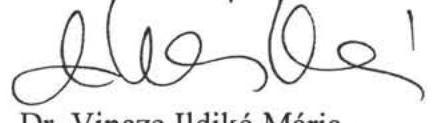

---

# A TTT esetleges szerepe az Áht. 100/K.§-ra vonatkozóan

## Jogi szakvélemény

## 1. ÁSZ JAVASLAT

Az ÁSZ az MTI Zrt. 2009. évi vizsgálata során keletkezett javaslatainak egyike a TTT elnökéhez delegálná, hogy „kezdeményezze az MTI Zrt. közfeladat ellátás feltételeinek teljes körű - az államháztartásról szóló törvény 100/K pontja szerinti fennállásának vizsgálatát."

## 2. Az Áht. 100/K §-a

Az Áht. 100/K.§-a a gazdálkodó szervezet által történő közfeladat-ellátás általános feltételeit tartalmazza, az alábbiak szerint:

## „1992. évi XXXVIII. törvény az államháztartásról

## A gazdálkodó szervezet által történő közfeladat-ellátás általános feltételei

100/K. § (1) Jogszabályban meghatározott közfeladat állami tulajdonú (állami részesedéssel működő) gazdálkodó szervezet által legalább az alábbi feltételek együttes fennállása esetén látható el:
a) az ellátandó közfeladat közszolgáltatás, amely nem foglalja magában közhatalom gyakorlását,
b) érvényesül a gazdasági verseny tisztaságának és szabadságának elve, illetve nem áll elő a tisztességtelen verseny tilalmának követelményeibe ütköző, a gazdasági versenyt korlátozó piaci magatartás, továbbá az érintett gazdálkodó szervezetek versenyre hátrányos összefonódása,
c) jogszabályban biztosított kizárólagos jog vagy jogszabály rendelkezése szerint megkötött szerződés alapján nyújtott közszolgáltatás kivételével nincs korlátozva az adott közszolgáltatás nyújtására jogosultak száma vagy köre,
d) a közszolgáltatást nyújtó szervezetek közötti választáshoz szükséges információk a szolgáltatást igénybevevők számára hozzáférhetők,
e) a közszolgáltatást nyújtó szervezet - a közvetlenül jogszabályon alapuló, a normatív támogatások, a tulajdonosi jogkörben (tagi minőségben) juttatott források, valamint külön törvényben foglalt esetek kivételével csak versenyeztetés útján jut államháztartásból származó forráshoz,
f) a közszolgáltatást nyújtó szervezet vezető tisztségviselője vagy vezető tisztségviselői közül legalább egy természetes személy a felsőoktatásban, gazdaságtudományok képzési területen vagy a többsiklusú képzés bevezetése előtt annak megfelelő egyetemi, főiskolai szakon szerzett végzettséggel, szakképzettséggel rendelkezik, vagy nyilvános pályázat alapján jelölik ki, illetve választják meg,
g) jogszabályban egyértelműen meghatározott a közszolgáltatás, valamint ellátásának költségszámításon alapuló tervezése és finanszírozása, illetve ezek hiányában megállapítható az előállított teljesítmény értéke a finanszírozó államháztartás körébe tartozó szervezet számára,
h) biztosított a gazdaságossági, hatékonysági és átláthatósági követelmények érvényesülése,
i) a közszolgáltatást nyújtó szervezet fizetésképtelensége esetére is biztosítva van az adott közszolgáltatás folyamatos ellátása, és
j) a gazdálkodó szervezet által történő közszolgáltatás-ellátás az államháztartás számára ésszerűbb, gazdaságosabb és finanszírozási szempontból kedvezőbb más ellátási módhoz képest, valamint a magánosítás bizonyítottan hátrányos lenne a közfeladat-ellátás és annak hatékonysága szempontjából.
(2) A közszolgáltatás ellátásáért vagy annak finanszírozásáért külön jogszabály alapján felelős, államháztartás körébe tartozó szervezetnek a gazdálkodó szervezet fizetésképtelenné válása esetén is gondoskodnia kell a közszolgáltatás folyamatos és zavartalan ellátásáról.
(3)
(4) Az e fejezetben foglaltak szerint történő közfeladat-ellátás nem eredményezheti a feladatellátással kapcsolatos közérdekű és közérdekből nyilvános adatok nyilvánosságának korlátozását. Az (1) bekezdés szerinti

---

gazdálkodó szervezet közfeladat-ellátásával kapcsolatos adatkezelése és -szolgáltatása tekintetében a személyes adatok védelméről és a közérdekű adatok nyilvánosságáról szóló 1992. évi LXIII. törvény III. fejezetében foglaltak alkalmazandók.
(5) Az (1)-(4) bekezdésben foglaltak az államháztartás körébe tartozó szervezetek tulajdonában álló (részesedésével működő) gazdálkodó szervezetek tekintetében is irányadók.
(6) A magyar állam, a helyi önkormányzat, költségvetési szerv vagy közalapítvány többségi befolyása alatt álló gazdasági társaság a közérdekű adatok nyilvánosságáról szóló törvény szerinti közfeladatot ellátó szervnek, a nevében eljáró személy pedig közfeladatot ellátó személynek minősül."

# 3. A TTT LEHETSÉGES SZEREPE

Az Áht. 100/K.§-a, mely 2009. január 1-jén lépett hatályba, közvetlenül nem vonatkozik az MTI Zrt-re. Az MTI Zrt-t törvény hozta létre, törvény határozza meg közszolgálati feladatait is.

Az MTI Zrt-re az azt létrehozó törvény, a nemzeti hírügynökségről szóló 1996. évi CXXVII. törvény (Nht.) és a Magyar Távirati Iroda Részvénytársaság létrehozásáról szóló 70/1997. (VII. 15.) OGY határozat (a társaság Alapító Okirata) vonatkozik közvetlenül. A Tulajdonosi Tanácsadó Testület nem tudja módosítani az Nht-t, de az Alapító Okiratot sem.

A TTT az Nht. 22.§ (1) bekezdés g) pontja alapján jogosult az Alapító Okirat módosításának előkészítésére, és ez ügyben a közelmúltban tett is előterjesztéseket az alapító Országgyűlés felé.

Nem lehetséges azonban az Alapító Okirat olyan mértékű módosítása, amely ellentétes az Nht. szabályaival, ilyent a TTT sem javasolhat.

Az Áht. 100/K.§-a az államháztartás rendszerét kialakító és az azt kezelő szervekre ró elsősorban kötelezettséget, behatárolva azt a kört, amelyben átadhatnak közfeladatot gazdálkodó szervezeteknek. Az MTI-nek azonban a törvény már átadta a nemzeti hírügynökség közszolgálati feladatait. Az MTI Tulajdonosi Tanácsadó Testülete szintjén ezek módosítására nincs lehetőség.

Még kevésbé van arra lehetőség, illetve TTT hatáskör, hogy a TTT az Nht-ben meghatározott, tehát az MTI-re nézve kötelező feladatok vonatkozásában „az MTI Zrt. közfeladat ellátás feltételeinek teljes körű - az államháztartásról szóló törvény 100/K pontja szerinti fennállásának vizsgálatát kezdeményezze". Maga az ÁSZ javaslat sem írja le, hogy ki volna ennek a kezdeményezésnek a címzettje.

Indokoltnak látom ezért a TTT-re vonatkozó ÁSZ javaslatok közül ennek a javaslatnak a törlését.

Budapest, 2010. március 22.
Dr. Vincze Ildikó Mária ügyvéd

---

# Vince Mátyás úr

elnök
MTI Zrt.

## Budapest

## Tisztelt Elnök Úr!

A Magyar Távirati Iroda Zrt. 2009. évi gazdálkodásának ellenőrzéséről készített V-2010-26/2009-2010. sz. jelentéstervezetre tett észrevételeit köszönettel megkaptam, azzal kapcsolatban az alábbiakról tájékoztatom.

A jelentéstervezetre tett észrevétel bevezetőjében hivatkozott két témakörre - a TTT szerepe az Áht. 100/K. §-ában és a javadalmazási szabályzat TTT-re kiterjesztése - vonatkozó véleményeltérést a jelentés-tervezetben megjelenítettük. Az észrevételhez csatolt jogi „szakvéleménynek" nevezett dokumentumok megismerése - figyelemmel a jelentéstervezetben foglaltakra - nem befolyásolja megállapításainkat.

- Az állami tulajdonú, állami részesedéssel működő gazdálkodó szervezet közfeladat ellátására előírt feltételek - az Áht. 100/K. § (1) bekezdése - azért vonatkoznak az MTI Zrt.-re, mert a nemzeti hírügynökségről szóló törvény ugyan felsorolja a Társaság részéről ellátandó közfeladatokat, azonban az Áht. az ellátás módját és feltételeit szabályozza. A két jogszabály nem zárja ki egymást. Mivel az MTI Zrt.-re vonatkozó jogszabály (Nht.) és a Társaság Alapító Okirata nem módosult, az állami finanszírozás átlátható rendszerének a kialakítása hiányzik, illetve a közszolgálati szerződés megkötésére, valamint a közszolgálati feladatokra jutó állami támogatás kimutatását segítő számítási mód következetes (a Pénzügyminisztérium által megkövetelt) alkalmazására nem került sor, így az Áht.-ban előírt feltételek fennállását vizsgálni, a hiányosságokat a tulajdonos felé jelezni elengedhetetlen. A Tulajdonosi Tanácsadó Testület tud abba az irányba hatni, hogy a Társaság a jelenlegi helyzet ellenére alkalmazkodjon az előírt feltételekhez.
- A Javadalmazási szabályzat TTT-re való kiterjesztését azért tartjuk szükségesnek, mert a jogalkotó célja az állami tulajdonú gazdasági társaságok esetében a takarékossági szempontok előtérbe helyezése volt. A Taktv. 8. § (7) bekezdése meghatározza, hogy az 57. §-t csak a Magyar Nemzeti Bankra, annak felügyelőbizottsági tagjaira, illetve a Magyar Nemzeti Bankkal munkaviszonyban álló személyekre nem kell alkalmazni. Az MTI Zrt.

---

speciális tulajdonosi szerkezete, irányítási, működtetési és ellenőrzési megoldása sem jelenthet kivételt ez alól. Az általános megközelítésen túl a szabályzat TTT-re történő kiterjesztése a jogszabályokban rögzített feladatokból is levezethető. A TTT a Részvénytársaság javaslattevő, véleményező, tanácsadó szerve, az Nht.-ban meghatározott esetben döntési jogosultsággal is rendelkezik. Mivel az MTI Zrt. elnöke mellett a TTT is rendelkezik döntési hatáskörrel ez a Gt. 21. § (1) bekezdése alapján - e feladatkörében ügyvezetésnek is minősül. A TTT többek között megállapítja az MTI elnökének és az FB tagjainak díjazását; megbízza a Társaság könyvvizsgálóját, megállapítja díjazását; folyamatosan ellenőrzi, és évenként értékeli az elnöki pályázatban foglalt célkitűzések végrehajtását; jóváhagyja a Társaság díjszabását. Ebből következően mind a Taktv. hatálya, mind az ellátott feladatok súlya és az értük való felelősség indokolja a Javadalmazási szabályzat TTT tagjaira való kiterjesztését.

Azért is aggályos az alkalmazott gyakorlat, mert miközben az MTI Zrt. bevételének 60\%-a közpénz, aközben a TTT tagjai azáltal, hogy kivonják magukat a Javadalmazási szabályzat hatálya alól, az átalány jellegű költségtérítéssel tételesen nem számolnak el. Megjegyzem, hogy az Nht. a TTT külön költségtérítéséről nem rendelkezik, illetve a képviselők is csak számlával igazolt költségtérítést vehetnek figyelembe.

A törvény betartatása, egyértelmű alkalmazása érdekében javaslattal fordultunk a Kormányhoz a speciális szabályozással is rendelkező társaságok fogalomhasználatának pontosítása miatt, amely biztosítja, hogy a törvényhozói szándékot egyetlen állami tulajdonban lévő gazdasági társaság, valamint az ahhoz tartozó testület se kerülhesse meg.

A vezető állású munkavállalói körrel kapcsolatban tett észrevételére tájékoztatom, hogy a következők miatt indokolt az Mt. 188/A. § (1) bekezdése alá tartozó munkavállalói kör - az MTI Zrt. munkavállalóinak Kollektív Szerződésében, valamint a Társaság SZMSZ-ében történő - egyértelmű kezelése, valamint a jogszabályban előírt - e körre is vonatkozó közzétételi kötelezettség teljesítése.

Mind az MTI Zrt. SZMSZ-e, mind a Javadalmazási szabályzat kezeli az elnökön és az alelnökön kívüli vezetői kört, így ilyen típusú - az Mt. 188/A. § (1) bekezdés alá tartozó munkavállalói vannak a Társaságnak. A Tulajdonosi Tanácsadó Testület az MTI Zrt. Javadalmazási szabályzatát kiterjesztette az Mt. 188/A. § (1) bekezdése alá tartozó munkavállalói körre, amelyet csak az Mt. szemszögéből lehet értelmezni. Az Mt. meghatározza, hogy kik a vezető állású munkavállalók, és kik azok, akik csak egyes Mt. rendelkezések tekintetében minősülnek vezetőnek. E két besorolás létezik, ami nem teszi lehetővé, hogy egyes - vezetőnek minősülő - munkavállalóra a Társaság ne terjessze ki az MTI Zrt. többi munkavállalóitól eltérő Mt.-ben foglalt (188/A. § szerinti) rendelkezéseket.

A Társaság SZMSZ-e a vezetőket vezetői I-IV. kategóriába sorolja, ami az I. kategória esetében az elnököt és az alelnököket, a II-IV. kategória esetében az egyéb vezetői munkakört betöltő munkavállalókat (pl. igazgatók, főszerkesztő) jelenti. Az Mt. 188. §-a szerint a vezető állású munkavállaló a munkáltató vezetője,
 valamint helyettese, a 188/A. § szerint azonban csak meghatározott, az Mt.-ben foglalt rendelkezések tekintetében (190. § (3) bekezdés, 191-192. §, 192/A. § (2)-(4) bekezdése alkalmazásában) kell a munkavállalót vezetőnek minősíteni.

---

A vezetőnek minősülő személyekre nem általánosságban terjednek ki az Mt.-ben a vezetőre vonatkozó eltérő szabályok, hanem a munkáltatói rendkívüli felmondás, az összeférhetetlenségi szabályok, a munkaidő, pihenőidő, valamint a kártérítési felelősség tekintetében. Az Mt. 2009. december 4-én (a Taktv. hatályba lépésével) módosult 189. §-a szerint az Mt. 188. és a 188/A. § (1) bekezdése alá tartozó munkavállalói körre a Kollektív Szerződés hatálya nem terjed ki.

Kérem Elnök urat, hogy az észrevételekre adott válaszainkat mérlegelni, illetve tudomásul venni szíveskedjék.

Budapest, 2010. április 02.

Tisztelettel:

Dr. Becker Pál

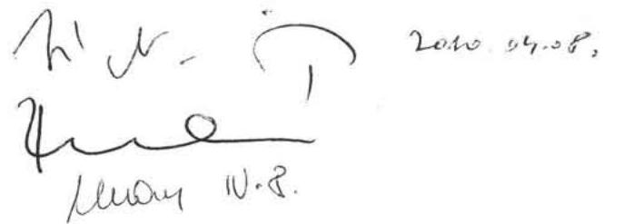

---

# ÁSZ-javaslatokkal összefüggő OGY határozatok és az előző évi ajánlások 

2/a. ÁSZ-javaslatokkal összefüggő OGY határozatok
2/b. Az előző számvevőszéki ellenőrzés javaslatai

---

# ÁSZ-javaslatokkal összefüggő OGY határozatok 

7/1998. (II. 18.) OGY határozat

64/2002. (X. 4.) OGY határozat

65/2002. (X. 4.) OGY határozat

66/2002. (X. 4.) OGY határozat

67/2002. (X. 4.) OGY határozat

68/2002. (X. 4.) OGY határozat

10/2003. (II. 19.) OGY határozat

99/2004. (X. 13.) OGY határozat

100/2004. (X. 13.) OGY határozat

73/2005. (IX. 22.) OGY határozat

26/2007. (III. 28.) OGY határozat

27/2007. (III. 28.) OGY határozat

64/2007. (VI. 27.) OGY határozat

79/2008. (VI. 13.) OGY határozat

69/2009. (VII. 3.) OGY határozat

a Magyar Távirati Iroda Rt. létrehozásáról szóló 70/1997. (VII. 15.) OGY határozat módosításáról
a Magyar Távirati Iroda Részvénytársaság 1997. évi tevékenységéről szóló beszámolójáról
a Magyar Távirati Iroda Részvénytársaság 1998. évi tevékenységéről szóló jelentés elfogadásához
a Magyar Távirati Iroda Részvénytársaság 1999. évi tevékenységéről szóló jelentés elfogadásához
a Magyar Távirati Iroda Részvénytársaság 2000. évi tevékenységéről szóló beszámolójáról
a Magyar Távirati Iroda Részvénytársaság 2001. évi tevékenységéről szóló beszámolójáról
a közszolgálati műsorszolgáltatók és a nemzeti hírügynökség európai uniós csatlakozással kapcsolatos tájékoztatási feladatainak költségvetési többlettámogatásról
a Magyar Távirati Iroda Részvénytársaság 2002. évi tevékenységéről szóló beszámolójáról
a Magyar Távirati Iroda Részvénytársaság 2003. évi tevékenységéről szóló beszámolójáról
a Magyar Távirati Iroda Részvénytársaság 2004. évi tevékenységéről szóló beszámolójáról
a 125 éves MTI - Éves jelentés 2005. című beszámolójáról
a Magyar Távirati Iroda Részvénytársaság létrehozásáról szóló 70/1997. (VII. 15.) OGY határozat módosításáról
a Magyar Távirati Iroda Zrt. 2006. évi tevékenységéről szóló beszámoló elfogadásáról
a Magyar Távirati Iroda Zrt. 2007. évi tevékenységéről szóló beszámoló elfogadásáról
a Magyar Távirati Iroda Zrt. 2008. évi tevékenységéről szóló beszámoló elfogadásáról

---

# Előző számvevőszéki ellenőrzés javaslatai 

## 0909. Jelentés a Magyar Távirati Iroda Zrt. 2008. évi gazdálkodásának ellenőrzése

A helyszíni ellenőrzés megállapításainak hasznosítása mellett javasoljuk:

## az Országgyűlésnek

1. tekintse át és módosítsa a 68/2002. (X. 4.) OGY határozatban megfogalmazott jogalkotási feladatnak megfelelően a nemzeti hírügynökségről szóló 1996. évi CXXVII. törvényt és az MTI Zrt. Alapító Okiratát a teljes körűen összehangolt szabályozás kialakítása, a közszolgálati feladatok és azok ellátásához szükséges állami támogatás egyértelmű és pontos meghatározása, az EU szabályok betartása, a jelenlegi alapítói és részvényesi joggyakorlás és ellenőrzés felülvizsgálata és hatékonyabbá tétele érdekében;
2. gondoskodjon az MTI Zrt. működését befolyásoló középtávú stratégiai, illetve éves tervre vonatkozó tulajdonosi döntés és kontroll megteremtéséről; hozzon határozatot a bemutatott éves tervekről.

## a Kormánynak

1. kezdeményezze a 68/2002. (X. 4.) OGY határozatban az MTI Zrt. támogatásával kapcsolatban megfogalmazott átláthatósági követelmény érvényre juttatása érdekében szükséges jogalkotási és egyéb intézkedéseket, különös figyelemmel az Európai Unió közösségi előírásaira, illetve ezeknek a betartására; az Nht. 2. § (1) bekezdése h) pontjában megjelölt - a választási időszak feladataira vonatkozó - külön törvény megalkotását;
2. készítse elő a törvények módosítását, amelyek ahhoz szükségesek, hogy az MTI Zrt. jegyzett tőkéje állami részesedésként nyilvántartásba kerüljön.

## a TTT elnökének

1. készítsen javaslatot az MTI Zrt. Alapító Okiratának - a nemzeti hírügynökségi törvénnyel összehangolt - módosítására;
2. igényelje az MTI Zrt. elnökénél a „Deloitte" szakértői modell hasznosítását az állami támogatások meghatározásánál, felhasználásánál és a díjszabásnál.

---

# az FB elnökének 

kísérje figyelemmel az MTI Zrt. eredményes és hatékony gazdálkodásával szemben megfogalmazott elvárásainak teljesítését.

## az MTI Zrt. elnökének

1. biztosítsa a közbeszerzésekről szóló törvény rendelkezéseinek teljes körű érvényesítését, vizsgálja felül a személyes adatok védelméről és a közérdekű adatok nyilvánosságáról szóló törvény rendelkezéseinek teljes körű érvényesítését;
2. gondoskodjon az SZMSZ-ben megfogalmazott - a Társaság működését általános szinten szabályozó - rendelkezések betartásáról, biztosítsa a belső információs rendszer ügyviteli alkalmazásai közötti egységes adatforgalmat; gondoskodjon a vezetői ellenőrzés hatékony működéséről;
3. intézkedjen a humánerőforrás-gazdálkodás kritériumrendszerének és szabályainak megalkotásáról, a megalapozott létszámterv elkészítéséről, a besorolási és javadalmazási rendszer belső szabályozásának kidolgozásáról, a teljesítmények méréséről.

---

# Kérdések és válaszok a rendszer értékeléséhez 

3/a. Kérdések és válaszok a rendszer működésének értékeléséhez
3/b. Kérdések és válaszok a „Nyitott Archívum Projekt" megvalósítására biztosított állami támogatás felhasználásának teljesítmény-ellenőrzéséhez

3/c. Kérdések és válaszok a Társaság működését befolyásoló kockázatok kezelésének értékelésére

---

# Kérdések és válaszok a rendszer működésének értékeléséhez 

Célszerűségen azt értjük, hogy a különböző döntési szinteken meghozott intézkedések összhangban vannak-e a kitűzött célokkal.

Az eredményesség kritériuma egyrészt azt jelenti, hogy a vezetői információs és az ellenőrzési rendszer kiépítése és működése, valamint a Társaság kockázatkezelő képessége megfelelő biztosítékot ad-e a Társaság által kitűzött célok megvalósításához, a vezetői információs és az ellenőrzési rendszer megfelelően segítette-e a vezetést a döntések meghozatalában, másrészt a központi költségvetési támogatás felhasználása a kitűzött céloknak és az elvárt eredményeknek megfelelően valósult-e meg.

Hatékonyság alatt azt értjük, hogy a 2009. évi központi költségvetési támogatás felhasználása optimális mértékben szolgálta-e a feladat ellátást.

Főkérdés: Az MTI Zrt. megfelelő intézkedéseket hozott-e és megfelelő eljárásokat alakított-e ki az erőforrások hatékony felhasználása és a kitűzött célok elérése érdekében, valamint a vezetői információs és az ellenőrzési rendszer kiépítése és működése, valamint a Társaság kockázatkezelő képessége megfelelő biztosítékot ad-e e célok megvalósításához?

## Részben.

Az MTI Zrt. a kitűzött célok elérése és a szervezeti hatékonyság növelése érdekében létszámcsökkentést, ezzel párhuzamosan a szervezeti rendszert racionalizáló intézkedéseket hajtott végre, valamint az SZMSZ-ben megfogalmazta a hírkiadás rendjének folyamatosságát. Az intézkedések azonban nem jártak együtt a munkavállalók besorolási-, bérezési és teljesítményértékelési rendjének szabályozásával, a szervezeti egységek megfelelő üzemeltetési rendjének kialakításával, a munkaidő beosztás átalakításával. A célok elérését nehezítette, így kockázatot jelentett a belső szabályzatokkal (SZMSZ, Iratkezelés) összhang hiányt mutató vezetői döntéshozatal folyamata, a belső információáramlás lassúsága és egyes esetekben elmaradása, a céltámogatással megvalósult projektek belső szabályzattal nem teljes körűen összehangolt működtetése. A Társaság korlátozottan járult hozzá a költségvetési forrás-felhasználás átláthatóbbá tételéhez, mert nem szabályozta a közszolgálati feladatokhoz kapcsolódó állami támogatás igénylésének és felhasználásának rendjét. Ez nem segítette elő a Társaság hatékony erőforrás felhasználásának növelését.

---

| Vizsgálati kérdés - szempont |  | Válasz | Indoklás |
| :--: | :--: | :--: | :--: |
| 1. |  |  |  |
| 1.1. | Összhangban voltak-e a belső szabályzatok a vizsgált időszakban hatályos szakmai, társasági és gazdálkodást érintő jogszabályokkal? | Többségében igen | A belső szabályzatok és a vizsgált időszakban hatályos szakmai, társasági és gazdálkodást érintő jogszabályok közötti összhang egyes szabályzatok (pl. beszerzési-, vezetői javadalmazási szabályzat, Kollektív Szerződés) esetében nem volt biztosított. |
| 1.1.1. | Célszerű és eredményes volt-e a feladatok végrehajtásához kialakított szervezeti struktúra, illetve az SZMSZ? | Összességében igen | A Társaság 2009-ben - a 2008-ban végrehajtott jelentős SZMSZ és szervezeti módosítást követően - kisebb módosítást hajtott végre a szervezeti struktúrában, valamint a működés szabályozásában. A 2009. július 1-jétől hatályos SZMSZ-ben - a Szakkönyvtár és Mikrofilmarchívum és a Videoarchívum megszüntetésével - az Adatbázisok és Archívumok vezetőjének feladat- és hatásköre csökkent, azonban a megszűnt egységek egyes feladatai más szervezeti egységekhez (pl. Médiafigyelő osztály) kerültek. Az SZMSZ módosítása összhangban volt a létszámcsökkentéssel összefüggő feladatok átcsoportosításával.   A csoportos létszámcsökkentést követően a szerkesztőségek munkájában a Társaság ismételt racionalizálási intézkedéseket hajtott végre. 2009. november 30-ától a Hírszerkesztési Központhoz kerültek - kiválva az egyes szerkesztőségekből - a megyei - (20 fő) és a külföldi (10 fő) tudósítók. A napi munka irányításának egy operatív központba való összevonásával, és a tudósítók e központhoz kerülésével a hírkiadási tevékenység átláthatóbbá, a hierarchikus viszonyok egyértelművé váltak. |
| 1.1.2.1. | Összhangban voltak-e a szervezeti működés és az SZMSZ, a munkaszerződések és a munkaköri leírások? | Részben | A Társaság működése, hatályos SZMSZ-e, valamint Kollektív Szerződése közötti összhang nem biztosított. Az MTI általános, többek között a munkavállalók besorolási és bérkategóriáját tartalmazó javadalmazási szabályzatot nem készített, azonban a KSZ szabályzatban nem rögzített besorolási bérekre hivatkozik. A személyi alapbér és bérpótlék megállapításának rendje nem átlátható. A KSZ kimondja, hogy a munkavállalónak - elnök, alelnökök kivételével - a munkába lépést követő |

---

|  |  |  | 30 napon belül az MTI személyre szóló munkaköri leírást ad. Ez az SZMSZ szerinti vezetői II-IV kategóriába tartozó munkavállalók 68%-ának esetében nem teljesült. A 2008. január 1-jétől érvényes szabályozásnak az MTI eleget tett, mert a nyugellátás kezdetekor továbbfoglalkoztatás esetén - új munkaszerződést kötött. |
| :--: | :--: | :--: | :--: |
| 1.1.2.2. | Érvényesültek-e a hírkiadás rendjének szabályozására vonatkozó rendelkezések? | Részben | Az SZMSZ 2008. április 26-ától kimondja, hogy az MTI-ben a hírkiadás megszakítás nélküli rendben folyik, amelynek folyamatosságát a szervezeti egységek megfelelő üzemeltetési rendje és a célszerű munkaidő beosztás biztosítja. A Társaság megállapította, hogy az ügyeletnek tekintett időben is hírkészítés és hírkiadás zajlik informatikai támogatással. E rendelkezésekkel párhuzamosan azonban az informatikai ügyeleti díjak 2009. I. negyedévet követő törlése, az így eredményezett 19%-os csökkenés ellenére - jelentősen nem csökkent az ügyelet címén számfejtett juttatások összege. Ez azt mutatja, hogy nem valósult meg a szervezeti egységek munkaidő beosztásának átalakítása. |
| 1.1.2.3. | Szabályozott volt-e a vezető állású munkavállalók feladatellátása és az azokért való felelősség? | Összességében igen | Az MTI elnöke és alelnökei feladatellátását, valamint az azokért - így a hatékony vezetői ellenőrzésért - való felelősséget az SZMSZ szabályozza. |
| 1.1.3.1. | Aktualizálták-e a Részvénytársaság közfeladatainak ellátásához kapcsolódó szabályzatokat? | Részben | Az MTI a közfeladatok ellátásához alapvetően kapcsolható szabályzatok közül 2009-ben felülvizsgálta és módosította a Szakmai és Közszolgálati Tájékoztatási Szabályzatot, valamint a közbeszerzések rendjét is szabályozó beszerzési szabályzatot, azonban nem szabályozta a közszolgálati feladatokhoz kapcsolódó állami támogatás igénylésének és felhasználásának rendjét. |
| 1.1.3.2. | A Társaság a közbeszerzési törvény előírásaival összhangban szabályozta-e a közbeszerzés rendjét? | Részben | A Beszerzési szabályzat nem tett teljes körűen eleget a Kbt. 6. §-ában foglalt - a közbeszerzési szabályzat kötelező tartalmára vonatkozó rendelkezéseknek, mert nem határozta meg a közbeszerzési eljárások belső ellenőrzésének felelősségi rendjét, nem jelölte ki a közbeszerzési eljárást megindító hirdetmény jogszerűségét ellenjegyzésével igazoló személyt. A be- |

---

|  |  |  | szerzési szabályzat nem határozza meg egyértelműen - a Kbt. módosított, 2009. április 1-jétől hatályos 54. § (1) pontjával összhangban - az ajánlatkérőnek (MTI) azon kötelezettségét, hogy a megfelelő ajánlattétel elősegítése érdekében a szerződéstervezetet is tartalmazó dokumentációt kell készíteni. |
| :--: | :--: | :--: | :--: |
| 1.1.4.1. | Szabályozott volt-e a Társaság szerződéseinek nyilvántartása? | Igen | A Társaság a szerződések elektronikus kezelésének rendjét a 2009. november 30-ától hatályos 2/2009. sz. gazdasági alelnöki utasítással szabályozta. Az utasítás alapján a szerződés adatainak rögzítését a szervezeti egységek végzik, amelyek vezetői felelősek a szerződések szerződés-nyilvántartó rendszerbe kerüléséért. A Társaság a szerződés nyilvántartási kötelezettségének átlátható és utólag ellenőrizhető módon 2009. III. negyedévtől tesz eleget. A szerződés-nyilvántartó rendszerben az egyes paraméterekre a keresés lehetősége biztosított, a rendszerből összesítő kimutatások lehívhatók. |
| 1.1.4.2. | Teljes körűen és határidőben teljesítette-e a Társaság az államháztartás pénzeszközei felhasználásával kapcsolatos - kiemelten a vezető állású munkavállalók jövedelmére vonatkozó - közzétételi kötelezettséget? | Részben | Az MTI Zrt. az Avtv., valamint az Eitv. és annak mellékletében foglalt - a Társaságra vonatkozó és tevékenységével kapcsolatos legfontosabb adatokat (pl. SZMSZ hatályos szövege, a közfeladat ellátás teljesítményére, kapacitásának jellemzésére, hatékonyságának mérésére szolgáló mutatók nélkül) nem teljes körűen teszi közzé. Az MTI a köztulajdonban álló gazdasági társaságok működésének átláthatóbbá tételéről szóló Korm. rendelet szerinti közzétételi kötelezettségének 2009. szeptember 14-én a honlapján részben tett eleget, mert nem teljesítette az Mt. 188/A. § (1) bekezdése szerint vezető állású munkavállalókra a Korm. rendeletben előírt kötelezettségét. |
| 1.2. | Eredményes volt-e a TTT és a FB törvény által meghatározott feladat ellátása, a testületek működése? | Összességében igen | 2009-ben a TTT nem kezdeményezte a Társaság közfeladat-ellátásának feltételei teljes körű fennállásának vizsgálatát, valamint nem készített javaslatot az AO módosítására. Az FB támogatólag tudomásul vette az MTI Zrt. 2010. évi céltámogatás igényét, a számszaki adatokra vonatkozó - Deloitte modellre támaszkodó - módosító javaslatot nem tett. Az FB tájékoztatást kért a Társaságtól a 2009-ben lebonyolított közbeszerzési eljárásokról, azon- |

---

|  |  |  | ban a közbeszerzési eljárások vizsgálatát nem kezdeményezte. Az FB a 9/2009. (III. 31.) számú határozatot hozta az MTI középtávú stratégiai tervének áttekintéséről. A határozatban az FB tagjai megfogalmazták, hogy az MTI középtávú stratégiai tervével kapcsolatos véleményüket emlékeztetőbe foglalva rögzítik. Az ülésekről készült emlékeztetők az FB egyes tagjainak véleményét tartalmazzák, azonban ez külön határozatban nem jelenik meg. |
| :--: | :--: | :--: | :--: |
| 1.3. | Megalapozott volt-e a társaság 2009. évi üzleti terve, teljesültek-e az üzleti tervben kitűzött célok? | Részben | A stratégiával összhangban készítette el a Társaság 2009. évi üzleti tervét. A 2009. évi üzleti terv a bázisévhez képest a bevételek 3,4\%-os-, a költségvetési támogatás $8 \%$-os növekedésével számolt. A bázisévhez képest a költségek és ráfordítások 3\%-os emelkedését-, mérleg szerinti eredmény 39\%-kal alacsonyabb összegét ( 4 M Ft ) tervezték. Az üzleti terv 356 fős létszámmal, a személyi jellegű kiadások 5\%-kal magasabb szintjével számolt. A 2009. évi adatok elemzése szerint a Társaság gazdálkodási egyensúlyát megőrizte, a tervezetthez képest jelentős eredményt ért el. |
| 1.3.1. | Összhangban volt-e a 2009. évi üzleti terv a 2008-2012. évekre szóló stratégiai tervvel? | Igen | A stratégiai terv és az éves üzleti terv között azoknál a tételeknél összhang van, ahol számszerűsítették a tervezett feladatokat. Az éves fejlesztési, beruházási tervszámok a stratégiai tervben közölt időarányos irányszámokon belül maradtak. |
| 1.3.2. | Teljesült-e az MTI Zrt. 2009. évi árbevétel-, költség- és eredményterve, a terv és a teljesítés közötti eltérések okait feltárták-e? | Részben | Az okait feltárták. A 2009. évi üzleti terv szöveges részében leírtak teljesítése a Társaság egészére kimutatott adatok alapján a tervezett belföldi értékesítés árbevétele ( 1673 M Ft ) ténylegesen 1716 M Ft (102,6\%). Az exportbevételek 3,4\%-os növekedési tervét, 51\%-kal magasabban teljesítették, 91 M Ft. Az egyéb bevételek is lényegesen magasabbak a tervnél. Az üzleti tervben az állami támogatás 2838 M Ft, ténylegesen 2998 M Ft-ot használtak fel, 160 M Ft-tal többet, mint a tervezett. Így az összes bevételen belül a költségvetési támogatás aránya 60,9\%-ra nőtt, a bázisévi 55,6\%-hoz képest. A költségek és ráfordítások tervezett értéke 4605 M Ft, ténylegesen 4956 M Ft, amely 351 M Ft-tal magasabb a tervnél. A |

---

|  |  |  | tervezett 4 M Ft-os mérleg szerinti eredmény az előző évek áfa arányosításainak visszautalása miatt - 439 M Ft-tal teljesült, ami a tervezettet jelentősen 435 M Ft-tal meghaladta. |
| :--: | :--: | :--: | :--: |
| 2. | Célszerű és eredményes volt-e az MTI Zrt. 2009. évi gazdálkodása? | Részben | 2009-ben sem történt érdemi előrelépés a közszolgálati szerződés megkötése tárgyában, sem az EU szabályoknak való megfelelés biztosításában. Nincs számításokkal alátámasztva a közszolgálati tevékenységek ellátásához szükséges állami támogatás.   Az MTI gazdálkodását 2009-ben is a tartós pénzügyi egyensúlyra való törekvés határozta meg. Pénzügyi, számviteli adatai alapján gazdálkodása eredményes. Értékesítési árbevétele 1807 M Ft, költségvetési támogatása 2998 M Ft, a költségek és ráfordítások összege ténylegesen 4956 M Ft.   Az összes bevétel ( 5236 M Ft ) és az összes költség és ráfordítás ( 4956 M Ft ) egyenlegeként 280 M Ft üzleti eredmény realizálódik. |
| 2.1. | Átlátható és megalapozott volt-e az állami támogatások felhasználása? | Részben | A közszolgálati feladatokra folyósított, működési célú támogatás felhasználása csak részben átlátható, mivel a közszolgálati szerződés előfeltételét jelentő, tevékenység szintű feladat meghatározásában és annak felsőszintű jóváhagyásában, 2009-ben sem történt változás. Ez pedig kiinduló feltétele lenne a finanszírozási forrás átláthatóságának.   Az MTI Zrt. részére a 2009. évi költségvetési törvény 2738 M Ft költségvetési támogatást hagyott jóvá, ebből 2583 M Ft a közszolgálati feladat ellátására, 80 M Ft a határon túli sajtó támogatására, 75 M Ft az EU választások miatti többletfeladatra. Ehhez hozzáadódott a 2008 decemberében a Társaság részére juttatott 100 M Ft-os állami céltámogatás az archívumok legsürgősebb digitalizációs feladatainak finanszírozásához, valamint az egyszeri jelleggel juttatott 150 M Ft-os céltámogatás a csoportos létszámleépítés költségeihez. Összesen, éves szinten 2998 M Ft költségvetési támogatást használt fel a Társaság. |
| 2.1.1. | Átlátható, célszerű és hatékony volt-e a működési célú támogatás felhaszná- | Részben | A Társaság 2009-ben is változatlan gazdálkodási feltételekkel végezte tevékenységét (pl. társasági adó-, illetékfizetés alóli mentesség). |

---

|  | lása, betartották-e az EU   szabályokat? |  | Nem az MTI hozzáállásán múlt, hogy sem a   közszolgálati szerződés megkötése tárgyában-,   sem a közfeladat tevékenység mélységű meg-   határozásában-, sem az EU szabályoknak való   megfelelésben nem történt érdemi előrelépés. |
| :--: | :--: | :--: | :--: |
| 2.1.2. | Szabályos volt-e a 2009.   évi csoportos létszámcsök-   kentésre biztosított állami   támogatás felhasználása,   összhangban volt-e a   Korm. határozatban foglal-   takkal? | Igen | A Kormány az MTI részére a szükséges létszámcsökkentéssel kapcsolatos egyszeri személyi kiadások fedezetéhez 150 M Ft-os céltámogatást hagyott jóvá a 1060/2009. (IV. 24.) sz. Korm. határozattal. A Társaság a Korm. határozatban előírtaknak megfelelően a Pénzügyminiszterrel 2009. május 11-én Megállapodást kötött, majd ezt követően a támogatást több részletben hívta le. A támogatásokat az igényeltek szerint használták fel. A csoportos létszámcsökkentés 2009. évi költségei csaknem 250 M Ft -ot tesznek ki, az állami céltámogatás 150 M Ft -ját, további 99,8 M Ft saját forrással egészítették ki. |
| 2.1.3. | Megalapozott volt-e a projekttervekben megfogalmazott és az év közben folyósított céltámogatások igénylése, célszerű és hatékony volt-e a felhasználás? | Részben | Az MTI pályázat benyújtását követően a „KorKépek 1989-1994" fotóalbum kiadására 0,8 M Ft, fotódigitalizálásra az NKA I-II. ütem terhére összesen 45,5 M Ft támogatásban részesült, minden esetben támogatási szerződésen keresztül. A támogatás odaítélését követően az MTI projekt javaslatot - a 2009-2011 között megvalósítandó projekthez évekre lebontott üzleti terv nélkül - készített, a projekteket elkülönített költséghelyen nyilvántartotta. A költségvetési törvényben - a határon túli magyar sajtó hírellátására ( 80 M Ft ) és az Európai parlamenti választásokra ( 75 M Ft ) - biztosított céltámogatásokat az MTI célszerűen használta fel.   Az év közben céltámogatással megvalósult projektek állásáról azonban havonta, számszaki adatokkal alátámasztott írásos beszámoló az MTI elnökének nem készült, ami egyrészt ellentmondásos, mivel párhuzamosan több, céltámogatással megvalósuló fotódigitalizálás volt 2009-ben, másrészt nincs összhangban a projekt szabályzatban foglaltakkal, mert nem biztosította a folyamatos nyomon követést. |

---

| 2.1.4. | Célszerű és eredményes volt-e a „Nyitott Archívumok" projekthez kapcsolódó céltámogatás felhasználása? | Összességében igen. | Egyes kivételeket leszámítva összességében megvalósult a „Nyitott Archívumok" projektre biztosított céltámogatás célszerű és eredményes felhasználása. Pl. a projekt javaslat nem tartalmazza egyértelműen a külső és belső humánerőforrás szükséglet arányát, a projekt vezetőjét és a projekt tagjait, valamint vannak olyan feladatok a javaslatban, amelyeknek megvalósíthatósága nem ismert. Az összesen 11,5 M Ft célfeladathoz kapcsolódó jutalom esetében nem érvényesült teljes körűen a költséghatékonyság követelménye azzal, hogy a Társaság a projekt szabályzatában megfogalmazott eljárási rendet - a feladat ellátása munkaidőben, a munkaköri feladatok alól részleges felmentéssel történjen - nem követte. A 7,7 M Ft rendszeres és eseti vállalkozói díjak elkülönített költséghelyi nyilvántartásban található összege nem teljes körűen tesz eleget a céltámogatásról szóló Korm. határozatban, valamint az MTI projekt javaslatában foglaltaknak. |
| :--: | :--: | :--: | :--: |
| 2.2. | Eredményes volt-e az MTI Zrt. vagyon-, létszám- és bérgazdálkodása, hatékony és célszerű volt-e a személyi jellegű ráfordítások felhasználása? | Részben | A számviteli adatok alapján a Társaság eszközeinek (befektetett eszközei és forgóeszközei összesen) 2009. december 31-i záró állománya 3954 M Ft. Ezzel megegyező a források összege, amely $12 \%$-kal magasabb a 2008. évinél. A Társaság saját tőkéje 14\%-kal emelkedett, összege 3488 M Ft, 439 M Ft-tal magasabb a bázisnál.   A 2009 évi tervezett létszám 356 fő. A 2009. január elsejei álláshelyek száma 363-ról 2009. december 31-én 338-ra változott, amely elsősorban a csoportos létszámcsökkentés miatt következett be. A személyi jellegű ráfordítások 2009. évi összege - részben a csoportos létszámleépítésből eredő kifizetések miatt - 3092 M Ft volt, 7\%-kal haladta meg a tervezettet. |
| 2.2.1. | Indokoltak voltak-e az eszköz- és forrásállományban 2008-ról 2009-re bekövetkezett változások? | Részben | A Társaság befektetett eszközeinek 2009. december 31-ei nettó záró állománya 2795 M Ft, 2\%-kal magasabb a bázisnál. Ezen belül az immateriális javak 19 M Ft-tal, a műszaki berendezések 24 M Ft-tal, az ingatlanok 18 M Ft-tal magasabb nettó záró értékűek az előző évinél. A tárgyi eszközök értéke 2632 M Ft, 36 M Ft-tal haladja meg a bázisévi értéket. A |

---

|  |  |  | bruttó értéknövekedés legjelentősebb a műszaki berendezéseknél (104,8 M Ft) a hírszolgálati-, riporteri berendezések-, számítógépek-, a gépjárművek-, beszerzése következtében; az immateriális javaknál, 99,5 M Ft-ért szoftver-vásárlás-, továbbá az ingatlanoknál, a beruházási, felújítási költségek ( $69,2 \mathrm{MFt}$ ) épületekre való aktiválása miatt.   A Társaság 2009. évi Üzleti terve beruházási feladatokra 232,5 M Ft-ot tartalmaz. Ténylegesen 224,1 M Ft-os összegben realizálódott, 11,5\%-kal magasabban a bázisévinél. Ebből 143,1 M Ft-ot informatikai célú -, és 81 M Ft-ot ingatlanüzemeltetési beruházásokra, felújításokra fordítottak.   A forgóeszközök állománya a bázishoz viszonyítva 48\%-kal, 353 M Ft-tal nőtt ( 1089 M Ft), amely több tényező együttes hatásának a következménye. Döntő oka az előző évhez képest a pénzeszközök 336 M Ft-tal magasabb összege. A kamatozó betétszámlán az év végi záró állomány 830 M Ft. Csökkentek a készletek, követelések, valamint az aktív időbeli elhatárolások. Előzőek eredményeként az MTI eszközeinek 2009. december 31-i záró állománya 3954 M Ft.   Ezzel megegyező, 3954 M Ft a források összege, amely $12 \%$-kal magasabb a 2008. évinél. A források növekedését okozta az áfa arányosítás visszautalt összegének az elszámolása, a kötelezettségek $21 \%$-os emelkedése, és a céltartalék ( 26 M Ft-os) csökkenésének együttes hatása. Az eredménytartalék-, valamint a mérleg szerinti nyereség emelkedése a Zrt. saját tőkéjének $14 \%$-os növekedéséhez vezet. |
| :--: | :--: | :--: | :--: |
| 2.2.2. | Szabályozott volt-e a Társaság eszközeinek leltározási gyakorlata, alátámasztotta-e a mérleg valódiságát? | Igen | Az ezzel összefüggő eljárási rendet a gazdasági alelnök által kiadott 2009. január elsejétől hatályos Számviteli politika, a 2008. január elsejétől hatályos Eszközök és források leltárkészítési és leltározási szabályzata, a 2009. január 5-étől hatályos Selejtezési szabályzat és ütemterv, valamint a pénzügyi igazgató által 2009. október 12-én kiadott - a 2009. évi leltározásra, leltárkészítésre és könyvviteli zárlatra vonatkozó - utasítás tartalmazza.   A december 31-ei fordulónappal végrehajtan- |

---

|  |  |  | dó leltározást az említett belső rendelkezések egyértelműen szabályozzák. Előírják a felelősöket, a bizottság, a szervezeti egységek és, személyek feladatait, felelősségét, a folyamat tartalmi megjelölését, időbeli lebonyolítását, tartalmi és formai kellékeit, dokumentálását.   A 2009. évi leltár teljes vagyonmegállapító leltár, a Társaság valamennyi eszközét és forrását tartalmazza. A tárgyi eszközöket ötévenként, a műszaki berendezéseket, gépeket háromévenként, a járműveket és a személyi használatra kiadott tárgyi eszközöket évenként leltározzák. A 2009. évi leltározást lista szerinti egyeztetéssel végezték, eltérést nem találtak. |
| :--: | :--: | :--: | :--: |
| 2.2.3. | Megalapozott volt-e a részvénytársaság 2009. évi ingatlangazdálkodással összefüggő költsége és ráfordítása, illetve hatékony volt-e annak felhasználása? | Részben | Az MTI Zrt. 2009. évi üzleti terve a beruházási feladatokra 232,5 M Ft-ot tartalmaz, 31,5 M Ft-tal többet a 2008 évi ténynél. Teljesítése 224,1 M Ft, amelyből 81 M Ft az ingatlanüzemeltetési beruházásokra, felújításokra kifizetett összeg, alig kevesebb az előző évinél és a tervezettnél. Az ingatlanüzemeltetési beruházások, felújítások részben az MTI használatában lévő, részben a bérbe adandó területek építészeti átalakításait, üvegtető-, vizes helyiségek felújítási munkáit tartalmazta; a Társaság karbantartásra - a gépészeti-, elektromossági-, vagyonés munkavédelmi jellegű tevékenységek elvégzésére - összesen 32 M Ft-ot költött, 8 M Ft-tal kevesebbet a bázisévinél. |
| 2.2.4. | Megalapozott volt-e az MTI Zrt. költség felhasználása, ezen belül kiemelten a külső vállalkozói díjak, a tanácsadók, szakértők és ügyvédi szolgáltatás díjazása? | Részben | A 2009. évi költségek és ráfordítások együttes összege 4956 M Ft, 500 M Ft-tal magasabb a bázisnál, és 351 M Ft-tal a tervezettnél. Költségstruktúrájában a személyi jellegű költségek dominálnak.   A 2009. évi adatok szerint az anyagjellegű ráfordítások 1498 M Ft, a tervezettnél 4,7\%-kal magasabban teljesültek, az előző évit 7,8\%-kal meghaladva 108 M Ft-tal magasabb összegben. A Társaság működési kiadásaiban továbbra is az igénybe vett szolgáltatások aránya a meghatározó (az anyagjellegű ráfordítások 76\%-a) éves összege 1138 M Ft. Ezen belül a külső vállalkozóknak, tanácsadóknak, szakértőknek, ügyvédeknek, továbbá oktatási költségként együttesen kifizetett díjazás 334 M |

---

|  |  |  | Ft (29,5\%). A távközlési szolgáltatások, a hírés képügynökségi díjak, egyéb szolgáltatások 43,3\%-ot tesznek ki.   A külső vállalkozókkal kötött szerződések egy része a Társaság által ellátott alaptevékenységek elvégzését szolgálja (a hírügynökségi szolgáltatások, a szerzői jogokat átruházó szerződések/felhasználási szerződések, a projektek elkészítése érdekében kötött szerződések). A Társaság működését, funkcionális feladatainak ellátását segítik pl. a számítógépes szoftverlicencek bővítésére, a műszaki szakértői tevékenységre kötött szerződések.   2009-ben bevezetett szerződés-nyilvántartó rendszer adatai szerint a tárgyévben 6 db ügyvédi (kb. 13 M Ft ); 12 db tanácsadói, szakértői (kb. 29 M Ft ); 126 db külső vállalkozói (rendszeres és eseti összesen, kb. 182 M Ft ); valamint 190 db fotó-fotótudósításra (kb. 38 M Ft ) irányuló szerződést kötöttek. 2009-ben a külső vállalkozói tevékenységekre 270 M Ft -ot, tanácsadói, szakértői feladatokra 39 M Ft -t, ügyvédi szolgáltatásra 15 M Ft -ot összesen 324 M Ft -ot fizettek ki, amely 23,7\%-kal, 62 M Ft-tal magasabb a bázisévnél. Döntő oka a tárgyévi projektekhez, az előző évhez képest nagyobb számú külső szakértő bevonása. |
| :--: | :--: | :--: | :--: |
| 2.2.5.1. | Megalapozott és szabályozott volt-e a személyi jellegű ráfordítások felhasználása? | Részben | A költségek és ráfordítások együttes összegén belül a legnagyobb részarányt képviselik (62,4\%) a személyi jellegű ráfordítások, amelynek 2009. évi összege 3092 M Ft, 7\%-kal haladja meg a tervezettet. Az éves bérgazdálkodást alapvetően befolyásolta az elhatározott létszámcsökkentés és az ahhoz szükséges pénzügyi forrás megteremtése, az önrész biztosítása. Nem terveztek és nem is hajtottak végre béremelést. Nem használták fel béremelésre a csoportos létszámleépítésen felül megszüntetett 7 álláshely bérét. Kifizették a Kollektív Szerződés szerinti 13. havi illetményt (108 M Ft) és az év során további 126 M Ft jutalmat, részben a projektek kapcsán, részben a vezetők prémiumára, részben differenciáltan. |
| 2.2.5.2. | Megalapozott volt-e a vezető állású munkavállalók javadalmazásának mértéke, | Részben | Az elnöki és a három alelnöki szerződés feltételeiben, a díjazás mértékében, az egyéb jutta- |

---

|  | illetve az összhangban volt-e a Kormány takarékossági intézkedéseivel? |  | tások körében 2009-ben az előző évhez képest változás nem történt. Nem változott az alapbér, a költségtérítés, amely az alapbérrel együtt rendszeres bérjövedelem, a prémiumfeladatok kitűzésének, a teljesítmény értékelésének, kifizetésének szabályozottsága, nagysága és számítási módja sem. A köztulajdonban álló gazdasági társaságok takarékosabb működéséről szóló törvény 9. § (2) bekezdése visszautal a 7. § (1)-(3) bekezdésekre, az ott megfogalmazottak a 2009. december 4-e utáni szerződésmódosításokra vonatkoznak. Előzőek alapján az MTI Zrt.-nél az elnök és az alelnökök szerződéseivel összefüggésben nincs tennivaló. |
| :--: | :--: | :--: | :--: |
| 2.2.5.3. | Szabályozták-e a Társaság munkavállalóinak teljesítményértékelési és javadalmazási rendszerét? | Nem | 2009-ben a Társaság nem dolgozott ki szabályzatot a munkavállalók teljesítményértékelési és javadalmazási rendszerére. |
| 2.2.6.1. | Eredményes volt-e a Társaság 2008 és 2009. évi létszámgazdálkodása; biztosította-e a létszám- és bérgazdálkodás a Társaság eredményes működését? | Igen | 2009-ben eredményes volt a Társaság létszám és álláshely gazdálkodása, mert a csoportos létszámcsökkentés hatására az álláshelyek száma a 2009. január elsejei 363-ról 2009. december 31-én 338-ra változott. |
| 2.2.6.2. | Eredményes volt-e a 2009.   évi létszámleépítés végrehajtása? | Részben | A felelősök a csoportos létszámcsökkentéssel összefüggő döntéseket, nyilatkozatokat, megállapodásokat a jogszabályok által előírt módon meghozták, aláírták, megkötötték, az ezzel összefüggő értesítéseket, bejelentéseket az Üzemi Tanács és a Közép-magyarországi Regionális Munkaügyi Központ felé megtették. Az érintett dolgozók részére a járandóságokat kifizették. A csoportos létszámleépítés végrehajtása 2009. augusztus 31-ére kitolódott, az eredetileg tervezett együtemű megvalósítás háromüteművé vált. Az érintett 37 dolgozóból 2009-ben 18 főnek szűnt meg a munkaviszonya és a további 19 főnek 2010-ben szűnik meg. A létszámcsökkentés összes költsége 250 M Ft, amelyből 150 M Ft-ot céltámogatásként a központi költségvetés biztosított, további 100 M Ft-ot pedig az MTI Zrt saját működési költségvetése fedezett. A dologi költségeket nem számítva, a Társaság a tárgyévi megtakarítást 23 M Ft-ra becsüli. |

---

| 2.3. | Szabályozott-e a Társaság által alkalmazott díjszabás mértéke, a megkötött kereskedelmi szerződések visszatükrözik-e az éves elfogadott díjszabásban foglaltakat? | Részben | A TTT az MTI Zrt. 2009. évi díjszabását - a média- és nem média felhasználók számára, valamint termékekre és szolgáltatásokra kidolgozott díjkategóriákat - határozattal elfogadta. A díjszabás irányadó mértéket határoz meg, azonban százalékos mérték nélkül rögzíti a konkrét árak eltéríthetőségét. A TTT azzal, hogy a díjszabást elfogadó határozatában nem fogalmazta meg a számított díjak alsó korlátját csökkentette az árképzés átláthatóságát. Az MTI a díjszabásban rögzítette a csomagbontás esetén alkalmazandó árképzési kulcsokat, azonban a megkötött kereskedelmi szerződésekben - e kategóriában - meghatározott hírszolgáltatási díjtételek átlag 20-25\%-kal a díjszabásban a csomagbontásra meghatározott díjtételek alatt maradtak, ami nem összeegyeztethető a csomagbontás elveivel. |
| :--: | :--: | :--: | :--: |
| 2.4. | Az MTI vezetői információs rendszere szabályozott volt-e, eredményes volt-e a vezetői- és a belső ellenőrzés működése, hasznosultak-e az ellenőrzési javaslatok? | Részben | A vezetői ellenőrzést az MTI-ben működő Vezetői Információs Rendszer (VIR) támogatja. 2009. IV. negyedévtől a VIR a felső vezetői szinten látta el feladatát, a rendszer működéséről szabályzat nem került kiadásra. A VIR az elnök számára időbeni összehasonlítást nyújt a Társaság legfontosabb gazdálkodási, kereskedelmi és humánerőforrás gazdálkodási mutatóiról. A vezetői ellenőrzés működésének hatékonysági szempontból történő értékelésére az MTI nem dolgozott ki kritériumokat. A belső ellenőr 2009-ben 9 ellenőrzési jelentést készített, majd juttatott el mind az FB, mind az MTI elnöke felé. Az ellenőri jelentésekben foglalt megállapítások és javaslatok hasznosulását, az MTI megtett intézkedéseit a belső ellenőr utóvizsgálat keretében értékelte. Vizsgálta az ÁSZ - az MTI Zrt. 2007. és 2008. évi gazdálkodásáról szóló - jelentése kapcsán foganatosított intézkedések végrehajtását, valamint az MTI-nél a 2008. II. és 2009. I. félévben készített belső ellenőri jelentésekben rögzített megállapítások, javaslatok hasznosulását; az 5/2009. számú elnöki utasításban kiadott intézkedések végrehajtásáról megállapította, hogy a javaslatok hasznosulásában az előző évhez képest javulás mutatkozott. |

---

| 2.5. | A Társaság kockázatkezelő képessége kellő biztosítékot jelent-e feladatai eredményes ellátásához? | Részben | 2009-ben a Társaság kockázatkezelő képessége részben jelentett megfelelő biztosítékot feladatai eredményes ellátásához. Kockázatot jelentett többek között a vezetői döntéshozatal - belső szabályzatokkal összhang hiányt mutató - folyamata; a belső információáramlás lassúsága és egyes esetekben elmaradása; - az összes munkavállalóra kiterjedő - besorolási és javadalmazási, valamint teljesítményértékelési rendszer hiánya. Nem érvényesültek a díjszabásban meghatározott csomagbontás elvei; nem működött a - termékekhez/ szolgáltatásokhoz kapcsolódó - folyamat-kontrolling. |
| :--: | :--: | :--: | :--: |
| 3. | Hasznosultak-e az ÁSZ 2008. évi ellenőrzésében megfogalmazott javaslatok, eredményesek voltak-e az ezek alapján tett intézkedések? | Részben | Az Országgyűlésnek és a Kormánynak megfogalmazott javaslatok 2009-ben nem hasznosultak. Az MTI Zrt. részben hasznosította azokat, a javaslatok alapján tett intézkedések (pl. közérdekű adatok nyilvánosságra hozatala, besorolási és javadalmazási rendszer kialakítása területén) részben voltak eredményesek. |
| 3.1. | Hasznosultak-e a részvénytársaságon kívüli szervezeteknek (Országgyűlés, Kormány) tett ajánlások? | Részben | Az Országgyűlésnek, a Kormánynak tett, jogalkotással és szabályozással kapcsolatos ÁSZ javaslatok lényegében nem hasznosultak. 2009-ben sem került sor az Nht., az Ao. módosítására, valamint az állami támogatás folyósításának, felhasználása ellenőrzésének versenysemleges és átláthatósági - EU szabályokkal összehangolt - szabályozására. A Kormány intézkedési tervet készített, amelyben 2010. október 31-ét jelölte meg a számára megfogalmazott javaslatok végrehajtására. |
| 3.2. | Hasznosították-e a helyszíni ellenőrzés megállapításait, hatékonyak és eredményesek voltak-e az elrendelt intézkedések? | Részben | Az elnök 2009. július 7-én az 5/2009. számú elnöki utasításban szabályozta az Állami Számvevőszék jelentése alapján foganatosítandó intézkedéseket.   Az MTI Zrt. által készített intézkedési terv kilenc feladathoz kapcsolódó tervpontja közül három teljes körűen határidőben; egy feladat teljes körűen és határidőn túl; három részben; egy részben és határidőn túl teljesült. Egy feladat végrehajtásának határideje 2010. I. negyedév.   Az MTI a 2009. évi közbeszerzési eljárások előkészítésekor és lebonyolításakor biztosította |

---

|  |  | a Kbt. rendelkezéseinek érvényesítését, azonban közbeszerzési szabályzata és a Kbt. előírások közötti összhang nem teljes körű. Közérdekű adatait nem tette teljes körűen közzé, így nem teljesítette az Eitv.-ben foglaltakat. 2009-ben megvalósult az ügyviteli alkalmazások közötti egységes adatforgalom, megtörtént a létszámcsökkentés és ehhez kapcsolódóan módosult az SZMSZ. A humánerőforrásgazdálkodással összefüggő átfogó szabályozást és tervezést, az ehhez kapcsolódó feladatokat az intézkedési tervben - az ÁSZ javaslataival összhangban - meghatározták, azonban a feladatok végrehajtása nem zárult le. |
| :--: | :--: | :--: |

---

# Kérdések és válaszok a „Nyitott Archívum Projekt" megvalósítására biztosított állami támogatás felhasználásának teljesítmény-ellenőrzéséhez 

A teljesítmény-ellenőrzés a Kormány 2167/2008. (XII. 4.) sz. határozatával az MTI Zrt. digitális archívum közérdekű használhatóságának javítására, a fénykép- és hírarchívum egy részének digitalizációjára biztosított 100 M Ft céltámogatás felhasználás célszerűségének és eredményességének vizsgálatára irányul.

Az eredményesség kritériuma azt jelenti, hogy a céltámogatás felhasználása a kitűzött céloknak és az elvárt eredményeknek megfelelően valósult-e meg.

Főkérdés: Megvalósult-e az MTI Zrt. számára biztosított 100 M Ft céltámogatás kitűzött céloknak és elvárt eredményeknek megfelelő felhasználása?

## Összességében igen.

A „Nyitott Archívumok" projektre biztosított céltámogatás kitűzött céloknak megfelelő és eredményes felhasználása összességében megvalósult. Pl. a projekt javaslat nem tartalmazza egyértelműen a külső és belső humánerőforrás szükséglet arányát, a projekt vezetőjét és a projekt tagjait, valamint vannak olyan feladatok a javaslatban, amelyeknek megvalósíthatósága nem ismert. Az összesen 11,5 M Ft célfeladathoz kapcsolódó jutalom esetében nem érvényesült a költséghatékonyság követelménye, mert a Társaság projekt szabályzata megfogalmazza, hogy a feladat ellátása munkaidőben, a munkaköri feladatok alól részleges felmentéssel történjen. A 7,7 M Ft rendszeres és eseti vállalkozói díjak elkülönített költséghelyi nyilvántartásban található összege nem teljes körűen tett eleget a céltámogatásról szóló Korm. határozatban, valamint az MTI projekt javaslatában foglaltaknak.

| Vizsgálati kérdés - szempont |  | Válasz | Indoklás |
| :--: | :--: | :--: | :--: |
| 1. | A céltámogatás igénylése |  |  |
| 1.1. | A céltámogatás igénylést megelőzően megfogalmazták-e a projekt végrehajtásával elérni kívánt célt? | Igen. | Az elérni kívánt célok a digitális archívum közérdekű használhatóságának javítása, keresési lehetőségeinek bővítése, a fénykép és hírarchívum egy részének digitalizációja, és internetes közzététele. |
| 1.2. | A projekt végrehajtásával elérni kívánt célok összhangban vannak-e az MTI Zrt. 2008-2012. évekre szóló stratégiai tervével? | Összességében igen. | A projekt végrehajtásával elérni kívánt célok -az MTI archívumainak bővítése, a digitalizáltsági fok emelése, a fotók egy részének és 2004-ig a hírarchívum digitalizált részének, valamint archív multimédiás anyagok interneten való |

---

|  |  |  | nyilvánossá tétele - összességében összhangban vannak az MTI stratégiai tervével. A stratégiai terv hangsúlyozza a történeti és kulturális értékekként számon tartott archívumok megóvásának, folyamatos gyarapításának fontosságát, célként fogalmazza meg a közszolgálatiság, közhasznúság jegyében egyes fontos adatbázisok nyilvánossá tételét. |
| :--: | :--: | :--: | :--: |
| 1.3. | A céltámogatás igénylését megelőzően készült-e - számításokkal alátámasztott helyzetértékelés? | Igen. | A Társaság a támogatás odaítélését megelőzően 2003. október 8-án - helyzetértékeléssel, a célok és prioritások (értékmentés szempontjai) bemutatásával alátámasztott - kérelemmel fordult a Nemzeti Kulturális Örökség Minisztériumához a helyzet átfogó rendezése érdekében, valamint minden évben a céltámogatás igénylésekor (összefoglaló helyzetértékelés) jelezte, hogy saját forrásból nem képes az archívumában őrzött fotó- és szöveges dokumentumok tartós megőrzését biztosítani. |
| 1.4. | Felmérték-e a céltámogatáshoz kapcsolódó feladat nagyságát? | Részben. | A projekt javaslat utal arra, hogy akkor folyamatban volt a hír és fotóarchívumból digitalizálásra kerülő anyagok körének meghatározása. |
| 1.5. | Kiszámították-e a finanszírozásra kerülő feladat költségigényét? | Részben. | A projekt javaslatban a sajtóadatbanki és fotóarchívumi tevékenységek, és a nyitott adatbázisok technikai megvalósításának költségfelosztása megtalálható. A költségfelosztás a céltámogatás összegére épül, a 100 M Ft került lebontásra egyes, nem pontosan ismert feladatokra is. |
| 1.6. | A támogatási igény benyújtását megelőzően felmérték-e a rendelkezésre álló erőforrásokat (finanszírozási és humán oldalról)? | Részben. | A projekt javaslat nem tartalmazza egyértelműen a külső és belső humánerőforrás szükséglet arányát, valamint vannak olyan feladatok a javaslatban, amelyeknek megvalósíthatósága nem ismert. |
| 2. | A céltámogatás felhasználása |  |  |
| 2.1. | A Kormány meghatározta-e a céltámogatással finanszírozott feladatokat? | Igen. | Az MTI a 2167/2008. (XII. 4.) Korm. határozattal 100 M Ft támogatásban részesült a digitális archívum közérdekű használhatóságának javítására, keresési lehetőségeinek bővítésére, a fénykép és |

---

|  |  |  | hírarchívum egy részének digitalizációjához, az így digitalizált adatok internetes közzétételéhez, valamint az 1989 és 2004 közötti hírarchívum internetes közzétételéhez. |
| :--: | :--: | :--: | :--: |
| 2.2. | A céltámogatásról rendelkező dokumentumban előírták-e a támogatás összegével határidőben történő elszámolást? | Részben. | A Korm. határozat szerint az MTI 2009. június 30-ig elszámolási kötelezettséggel tartozott. A 100 M Ft támogatás jogcímek szerinti felhasználására, az elszámolás pontos feltételeinek meghatározására azonban a Támogató és a Társaság támogatási szerződést nem kötött. |
| 2.3. | Az MTI Zrt. kijelölte-e a projekt megvalósításáért felelős vezetőt? | Részben. | A projekt javaslat az MTI elnökét, mint a felügyeletet ellátó vezetőt, egyes belső dokumentumok (célfeladat és céljutalom kitűzése), mint a projekt vezetőjét említik, ami nincs összhangban a Társaság projekt szabályzatával. (A projektvezető köztes vezetési kategória az MTI stratégiai és operatív vezetési szintje között.) |
| 2.4. | Biztosították-e a projekt elkülönített költséghelyen való kezelését? | Igen. | A Társaság a projektet elkülönített költséghelyen, „Nyitott archívumok" címen nyilvántartotta. |
| 2.5.1. | A projekt feladatok megvalósítására írtak-e ki pályázatot, abban jelezték-e a feladat támogatási forrásból történő megvalósítását? | Igen. | A Társaság a „Nyitott archívumok" projekt keretében két esetben hirdetmény közzététele nélküli tárgyalásos és egy esetben egyszerű közbeszerzési eljárást bonyolított le, valamint az informatikai eszközök beszerzésére egy központosított közbeszerzési eljáráson vett részt. |
| 2.5.2. | Amennyiben igen, úgy betartották-e a közbeszerzési előírásokat? | Igen. | A Társaság két esetben írt ki hirdetmény nélküli tárgyalásos eljárást, amit az ajánlattételi felhívásban a Kbt. 125. § (2) bekezdés b) pontjára történő hivatkozással indokolt. Mindkét eljárás esetén ezek az okok fennálltak. Az MTI a Közbeszerzési Értesítőben az eljárás eredményének közzétételekor hivatkozott a Korm. határozatra, és részletesen indokolta a választott eljárást. Az MTI a Kbt. - 2009. március 31-ig hatályos - 299. § (1) bekezdésének b) pontjára történő hivatkozással egyszerű közbeszerzési eljárást indított multimédiás web kereső alkalmazás fejlesztésére. A Kbt. hivat- |

---

|  |  |  | kozott rendelkezése hatályban volt.   Mindhárom közbeszerzési eljárás esetében - az ajánlati felhívásban foglaltakkal összhangban - készült összegzés az ajánlatok elbírálásáról, amely tartalmazta az ajánlatkérő nyilatkozatát a fedezet rendelkezésre állásáról. |
| :--: | :--: | :--: | :--: |
| 2.6.1. | Az MTI Zrt. a feladatok végrehajtására kötött-e szerződést, az abban foglaltak összhangban voltak-e a pályázati kiírással? | Igen. | Az MTI - az ajánlati felhívásban és az ajánlati értékelésben foglaltakkal összhangban - az Arcanum Adatbázis Kft-vel 2009.03.18-án, az Országos Széchenyi Könyvtárral 2009.05.04-én, az Ovitas Informatikai Kft-vel 2009.04.10-én kötött szerződést. |
| 2.6.2. | A szerződésben - a teljesítési határidő megállapításánál figyelembe vették-e a céltámogatással történő elszámolás határidejét? | Igen. | Az MTI mindhárom szerződésben a teljesítési határidő megállapításánál figyelembe vette a céltámogatással történő elszámolás 2009. június 30-i határidejét, illetve két szerződésben hivatkozott a támogatás elszámolási határidejére. |
| 2.7. | A projektvezető nyomon követte-e a feladat végrehajtását, rendszeresen tájékoztatást adott-e az MTI Zrt. vezetőjének a feladatok állásáról? | Részben. | A projekt állásáról havi rendszerességgel beszámoló nem készült. Nem teljesült a projekt szabályzatban foglalt azon feltétel, hogy a projektvezető a projekt állásáról havonta a tárgyhót követő 20-áig számszaki adatokkal alátámasztott írásos beszámolót készít és terjeszt fel az MTI elnökének. (Projektvezető az Elnök volt) |
| 2.8. | A céltámogatással finanszírozott feladatok tervezett és tényleges költségei összhangban voltak-e, amennyiben eltérést mutattak, úgy vizsgálták-e annak okait? | Részben. | A projekt javaslatban található költségfelosztás a céltámogatás összegére épül, a 100 M Ft került lebontásra egyes, nem pontosan ismert feladatokra is. Nem tartalmazza egyértelműen a külső és belső humánerőforrás szükséglet arányát, valamint vannak
 olyan feladatok a javaslatban, amelyeknek megvalósíthatósága nem ismert, - a levéltári anyag feldolgozható évkörei ismeretének hiányában - nincs pontosan körülhatárolva a digitalizálásra kerülő anyagok köre. Ez az eljárás nagymértékű szabadságot biztosított a céltámogatás összegének felhasználásakor, és megnehezítette a feladatok költségigényének és a tényleges költségfelhasználásnak az összevetését. |

---

|  |  |  | Az összesen 11,5 M Ft célfeladathoz kapcsolódó jutalom esetében nem érvényesült teljes körűen a költséghatékonyság követelménye; a 7,7 M Ft (+ áfa) rendszeres és eseti vállalkozói díjak elkülönített költséghelyi nyilvántartásban található összege nem teljes körűen tesz eleget a céltámogatásról szóló Korm. határozatban, valamint az MTI projekt javaslatában foglaltaknak. |
| :--: | :--: | :--: | :--: |
| 2.9. | Az MTI Zrt. a támogatásról szóló dokumentummal, valamint a projekt tervben megfogalmazott célokkal összhangban teljesítette-e a projekt feladatokat? | Részben. | A Korm. határozatban és a projekt javaslatban megfogalmazott célokkal a projekt feladatok részben voltak összhangban. (pl. a kiadványokra, valamint a célfeladatra elszámolt költségek mögötti egyes feladatok) |
| 3. | A céltámogatással való elszámolás |  |  |
| 3.1. | Teljesült-e a céltámogatással határidőben történő elszámolás? | Nem. | Az MTI 2009. július 6-án a Miniszterelnöki Hivatal, majd 2009. szeptember 30-án a Pénzügyminisztérium részére a 100 M Ft összegű céltámogatás felhasználásáról készült beszámolót küldött. A beszámoló szakmai oldalról kifejti az elért eredményeket, és tájékoztatást ad arról, hogy a fejlesztések befejezésének elhúzódása miatt a hír- és fotóarchívum adatbázis tényleges megnyitása 2009. június 30-a helyett, 2009. október 15-i véghatáridővel valósul meg.   A beszámolóban rögzítésre került, hogy az MTI Zrt. részére biztosított 100 M Ft összegű céltámogatás felhasználását a Társaság számviteli rendszerében elkülönítetten kezelte. A beszámoló költségvetési összesítést tartalmaz a céltámogatás 102,5 M Ft összegű felhasználásáról. |
| 3.2. | Az arra kötelezett - a projektvezető igazolása mellett -teljesített-e az elszámolást? | Nem. | 2009.06.30-ig a Korm. határozatban előírt elszámolási kötelezettség - az ahhoz szükséges dokumentumok rendelkezésre állása ellenére - nem teljesült. |
| 3.3. | Az elszámolásban foglaltak összhangban vannak-e a projekt nyomon követéséről vezetett dokumentummal? | Részben. | Elszámolás nem készült, a projekt nyomon követése havi rendszerességgel nem valósult meg, azonban a beszámoló költségvetési összesítése és a projektek- |

---

|  |  |  | ről 2009. október 29-én készült 2009. III. negyedévi tájékoztató 2009. szeptember 30-ig kimutatott kiadási tételei összességében egyezőséget mutatnak. |
| :--: | :--: | :--: | :--: |
| 3.4. | Az elszámolás kellő részletezettségben, utólag is beazonosítható módon tartalmazza-e a céltámogatás felhasználását? | Részben. | A 2009. július 6-án a Miniszterelnöki Hivatal, majd 2009. szeptember 30-án a Pénzügyminisztérium részére küldött és befogadott - beszámoló a céltámogatás felhasználását összegezve tartalmazza, a kiíró nem támasztott követelményeket a céltámogatás felhasználására, azonban az MTI elkülönített költséghelyi nyilvántartással, valamint a könyvelési bizonylatokkal biztosította a céltámogatás felhasználásának ellenőrzését. |
| 3.5. | Az elszámolás dokumentumokkal, illetve kimutatásokkal alátámasztott-e? | Részben. | Az elszámolás nem volt bizonylat másolatokkal és kimutatásokkal alátámasztott, azonban a bizonylatok az MTI-ben rendelkezésre állnak, azok utólagos ellenőrzése biztosított. |

---

# Kérdések és válaszok a Társaság működését befolyásoló kockázatok kezelésének értékelésére 

Főkérdés: A Társaság kockázatkezelő képessége kellő biztosítékot jelent-e feladatai eredményes ellátásához, valamint stratégiai céljai eléréséhez?

## Részben.

2009-ben a Társaság kockázatkezelő képessége részben jelentett megfelelő biztosítékot feladatai eredményes ellátásához. Kockázatot jelentett többek között a vezetői döntéshozatal belső szabályzatokkal összhang hiányt mutató - folyamata; a belső információáramlás lassúsága és egyes esetekben elmaradása; - az összes munkavállalóra kiterjedő - besorolási- és javadalmazási, valamint teljesítmény-értékelési rendszer hiánya. Nem érvényesültek a díjszabásban meghatározott csomagbontás elvei; nem működött a - termékekhez/ szolgáltatásokhoz kapcsolódó - folyamat-kontrolling

| Vizsgálati kérdés - szempont |  | Válasz | Indoklás |
| :--: | :--: | :--: | :--: |
| 1. | A Társaság célkitűzései |  |  |
| 1.1. | A Társaság alapvető célkitűzései a stratégiai tervben megjelennek-e? | Igen. | A Társaság elnöke 2008 augusztusában hagyta jóvá a - TTT által nem véleményezett - 2008-2012 közötti időszakot átfogó, az MTI Zrt. helyzetét, képességeit és céljait elemző stratégiai tervet. |
| 1.2. | A stratégiai terv tartalmaz-za-e a Társaság (humán és pénzügyi) erőforrásainak rendelkezésre állását, azok megoszlását és a prioritásokat? | Részben. | A stratégia részét képező és a szervezeti célokat figyelembe vevő fejlesztési, beruházási terv, valamint az ingatlangazdálkodási terv 2008-2012-re meghatározza a feladatok (összesített) pénzügyi erőforrás szükségletét. A stratégiai terv azonban a feladatok évekre történő lebontását nem tartalmazza, a Társaság humán-erőforrás szükségletét, valamint a változtatások irányát nem mutatja be. |
| 2. | A kockázatok azonosítása |  |  |
| 2.1. | A Társaság azonosítja-e a tevékenységét befolyásoló a külső - és belső környezetből származó - kockázatokat, illetve elvégzi-e a | Igen. | A Kockázatkezelési Szabályzat a kockázati forrásokat azonosítja, a Társaságot kívülről érintő (globális, regionális, nemzeti), valamint az MTI szervezetén belüli kockázati tényezőket határoz meg. |

---

|  | kockázati rangsor felállítását? |  | A nemzeti kockázati források sorában megjelöli az állammal kötendő szerződés hiányát. A Társaságon belüli kockázati forrásként azonosítja a belső információáramlás gyengeségét, a munkaerő szükséglet nagyságát és a szakmai struktúra szerkezetét, a lassú termékfejlesztést, a bérek és az egyéni teljesítmények közötti összhang hiányát. |
| :--: | :--: | :--: | :--: |
| 2.2. | A kockázatok azonosítása és elemzése része-e a tervezésnek? | Összességében igen. | A Társaság mind a 2008-2012 közötti időszakot átfogó stratégiai, mind a 2009. évi üzleti terv elkészítésekor beazonosította a szervezet működését befolyásoló kockázatokat, azonban az éves üzleti terv nem teljes körűen épül az azonosított kockázatokra (pl. költségracionalizálás hiánya). |
| 2.3. | A felső vezetők formálisan részt vesznek-e a kockázatok azonosításában, és milyen módon teszik ezt? | Igen. | A felső vezetők részvételével működő stratégiai tervező csoport segítségével megvalósult a kockázatok beazonosítása. |
| 2.4. | A Társaság áttekintette-e a szervezetben vagy rendszerben bekövetkező szokásos (pl. az erőforrásokat érintő), illetve jelentős változások kockázatait? | Igen. | A stratégiai terv tartalmazza a megvalósíthatóságának kritikus tényezőit (pl. az állami finanszírozás alakulása; világos célok, feladatok, következetes döntések; termékfejlesztés), azokat a kockázatokat, amelyeket folyamatosan figyelemmel kell kísérni a stratégiai célok esetleges módosításának szükségessége miatt. |
| 3. | A kockázat elemzése és kezelése |  |  |
| 3.1. | A Társaság kialakított kritérium rendszer szerint elemzi-e a feltárt kockázatokat? | Részben. | A Társaság a kockázatkezelési szabályzatban meghatározta azt a kritériumrendszert, amely alapján a kockázatokat elemzi. 2009-ben azonban egyes kritériumoknak megfelelő kockázatelemzés néhány területen - pl. az anyagjellegű kiadások, szolgáltatásvásárlások takarékos megvalósítására, a bérgazdálkodás racionalizálására szolgáló költségracionalizálási program - nem készült. |
| 3.2. | Egyértelmű-e a kockázatok célkitűzéseket befolyásoló hatása? | Igen. | A Kockázatkezelési Szabályzatban meghatározott kockázatok egyértelműen hatnak a Társaság céljainak teljesítésére. |

---

| 3.3. | Meghatározásra kerül-e a   kockázat bekövetkezésének   valószínűsége és lehetséges   negatív hatása? | Igen. | A Társaság a kockázatkezelési politiká-   ban meghatározta azokat a cselekvési   módokat, amelyeket a kockázatok mér-   téke, illetve azok természete alapján   követni kell. Ennek eszközei a kockáza-   tok elkerülése, - csökkentése, - megoszt-   tása. A Társaság kockázatkezelési fo-   lyamata a tervezés és végrehajtás mene-   tébe ágyazott. |
| :--: | :--: | :--: | :--: |
| 3.4. | A Társaság meghatározta-e   a kockázatok bekövetkezése   lehetőségének csökkentését,   valamint azok kezelésének   kérdését? | Igen. | A kockázatkezelési szabályzat meghatá-   rozza a kockázatelemzés kiindulópont-   ját, a kockázat kezelésének folyamatát és   szabályait, valamint megfogalmazza,   hogy a kockázatelemzés folyamatosságát   az aktuális kockázatelemzés alapján   évente készülő - 2009-ben is meglévő -   stratégiai intézkedési terv biztosítja. A   Vezetői Információs Rendszert a kockázatelemzés fontos eszközeként nevesíti |
| 3.5. | A Társaság rendelkezik-e a   külső és belső kockázatokat   figyelembe vevő kockázatke-   zelési tervvel? | Nem. | A Társaság külön kockázatkezelési ter-   vet nem készít, a kockázatkezelés a ve-   zetési folyamat része. |
| 3.6. | A Társaság rendelkezik-e a   kockázatok kezelésére kiala-   kított kontroll rendszerrel? | Igen. | A kockázatkezelés kontrollját a Kont-   rolling Csoport, a Termékfejlesztési Ta-   nács, valamint a vezetői információs   rendszer működésével a Társaság bizto-   sítja. |
| 3.7. | A Társaság készített-e a   hírügynökségi feladatok   rendkívüli helyzetben történő ellátására cselekvési   tervet? | Igen. | Az MTI a hírügynökségi feladatok rend-   kívüli helyzetben történő ellátására cse-   lekvési tervvel rendelkezik, arra Társaság a Kockázatkezelési szabályzatában   utalás történik. A minősített időszakokra   és válsághelyzetekre intézkedési tervet, a   minősített időszakokra tájékoztatási ter-   vet készített, valamint rendelkezik a   munkahelyi polgári védelmi század al-   kalmazási és készenlétbe helyezési ter-   vével. Elnöki utasítással kiadta az „MTI   Zrt. tudósítóinak működéséhez szüksé-   ges anyagi, technikai feltételek biztosítá-   sára vészhelyzet elrendelése és rendkívüli esemény tudósítása esetén" című és   a Rendkívüli események tudósításának   rendjéről szóló szabályzatokat, valamint   a biztonsági, védő-óvó rendszabályokat. |

---

|  |  |  | Alelnöki utasítással 2007-ben hatályba   helyezték az MTI Számítástechnikai és   védelmi szabályzatát. |
| :-- | :-- | :-- | :-- |
| 3.8. | A Társaság 2009. évi tevékenységét befolyásolta-e   olyan esemény, ami a szer-   vezet számára előre azonos-   sított kockázatot jelentett? | Nem. | 2009-ben ilyen kiugró esemény nem   volt. |
| 3.9. | A kockázat beazonosítása és kezelése. |  |  |
| 3.9.1. | A Társaság számára 2009-   ben jelentett e hátrányt kock-   ázat beazonosításának és   kezelésének elmaradása? | Igen. | 2009-ben a Társaságnak származott hátránya kockázat beazonosításának és kezelésének elmaradásából. Kockázatot jelentett többek között, hogy a vezetői döntések folyamata nem volt átlátható; a belső információáramlás nem volt megbízható; nem volt kidolgozott - az összes munkavállalóra kiterjedő - besoro-lási- és javadalmazási, valamint teljesít-mény-értékelési rendszer; nem érvényesültek a díjszabásban meghatározott csomagbontás elvei; nem működött a termékekhez/ szolgáltatásokhoz kapcsolódó - folyamat-kontrolling. |
| 3.9.2. | A Társaság számára 2009-   ben származott-e előny kockázat beazonosításából és megfelelő időben történő kezeléséből? | Igen. | 2009-ben a Társaság számára származott előny abból, hogy kockázatot beazonosított és -kezelt. A Médiafigyelő osztály feladata közé tartozik többek között a szöveges anyagok (hírek) szerződésszerű felhasználásának ellenőrzése, valamint a jogosulatlan felhasználók megtalálása. Ennek eredményeként közelítőleg 10 új szerződés született. 2009-ben megvalósult az ügyviteli alkalmazások közötti egységes adatforgalom, biztosított a szerződések nyilvántartásának teljes körűsége. |

---

# A Társaság gazdálkodásával kapcsolatos kimutatások jegyzéke 

4/a. Az MTI Zrt. immateriális javai, ingatlanai és tárgyi eszközei értékének változása 2009-ben (E Ft-ban)
4/b. Az MTI Zrt. közbeszerzési eljárásai 2009-ben
4/c. Ingatlanüzemeltetéssel összefüggő 2009. évi beruházási és felújítási munkák (Ft-ban)
4/d. Az MTI Zrt. menedzserszerződései 2009. évben
4/e. Az MTI Zrt. vezető állású dolgozóinak egyéb juttatásai 2009. évben I.
4/f. Az MTI Zrt. vezető állású dolgozóinak egyéb juttatásai 2009. évben II.
4/g. Bevételek, költségek és ráfordítások alakulása
4/h. Magyar Távirati Iroda Zrt. 2009. évi bevételek megosztása
4/i. Magyar Távirati Iroda Zrt. 2009. évi költségek megosztása

---

Az MTI Zrt. immateriális javai, ingatlanai és tárgyi eszközei értékének változása 2009-ben (E Ft-ban)

|  $\begin{gathered} \text { Sor- } \ \text { szá } \ \text { m. } \end{gathered}$ | Megnevezés | 2008. évi záróállomány | állomány növekedés | állomány csökkenés | állomány változás összesen | 2009. évi záró- állomány | Index (\%)
2009. évi tény/
2008.évi tény  |
| --- | --- | --- | --- | --- | --- | --- | --- |
|  1 | Immateriális javak bruttó értéke | 701839 | 99428 | 37055 | 62374 | 764213 | 108,89  |
|  2 | Immateriális javak értékcsökkenése | 623678 | 81520 | 37055 | 44465 | 668143 | 107,13  |
|  3 | Immateriális javak nettó értéke | 78161 | 17909 | - | 17909 | 96069 | 122,91  |
|  4 | Ingatlanok össz.bruttó (földter.,épületek, építm, vagyoni ért.j.) | 3117770 | 69192 | - | 69192 | 3186961 | 102,22  |
|  5 | Ingatlanok össz. értékcsökkenése | 678247 | 51306 | - | 51306 | 729552 | 107,56  |
|  6 | Ingatlanok össz. nettó értéke | 2439523 | 17886 | - | 17886 | 2457409 | 100,73  |
|  7 | Műszaki berendezések, gépek, járművek, össz. bruttó | 1257102 | 104792 | 153638 | - 48846 | 1208256 | 96,11  |
|  8 | Műszaki berendezések.. össz értékcsökkenése | 1124514 | 81240 | 153638 | - 72399 | 1052115 | 93,56  |
|  9 | Műszaki berendezések... össz nettó | 132588 | 23552 | - | 23552 | 156141 | 117,76  |
|  10 | Egyéb berendezések, felszerelések össz bruttó | 153916 | 13486 | 2328 | 11158 | 165074 | 107,25  |
|  11 | Egyéb berendezések..össz értékcsökkenése | 130425 | 18770 | 2328 | 16443 | 146868 | 112,61  |
|  12 | Egyéb berendezések...össz nettó | 23491 | - 5285 | - | - 5285 | 18206 | 77,50  |
|  13 | Összesen bruttó | 5230627 | 286898 | 193021 | 93877 | 5324504 | 101,79  |
|  14 | Écs össz. | 2556864 | 232835 | 193021 | 39815 | 2596679 | 101,56  |
|  15 | Összesen nettó | 2673762 | 54063 | - | 54063 | 2727825 | 102,02  |

---

Az MTI Zrt. közbeszerzési eljárásai 2009-ben

|  Sorszám | Időpont | Szerződés tárgya | Érték (Ft+áfa) | Fajta | Állapot  |
| --- | --- | --- | --- | --- | --- |
|  1 | 2009. február-
március | Az MTI 1988 előtti archív, papíralapú híranyagainak szkennelése, a szkennelt oldalak kereshető szöveggé alakítása és internetes publikálásra előkészítése | 30333050 | Hirdetmény közzététele nélküli tárgyalásos (a Kbt. VI. fejezet szerint) | Eredményes  |
|  2 | 2009. március-április | Multimédiás web kereső alkalmazás fejlesztése az AKR-rel kibővített metaadatok felhasználásával | 11620000 | Egyszerű | Eredményes  |
|  3 | 2009. április | Az Országos Széchenyi Könyvtár állományába tartozó MTI „kőnyomatosok" sorozatának digitalizálása, adatbázisban megjelenítése, az MTI részére elektronikus hordozón történő átadása és internetes közzétételének előkészítése. | 7155600 | Hirdetmény közzététele nélküli tárgyalásos (a Kbt. VI. fejezet szerint) | Eredményes  |
|  4 | 2009. június-július | Az MTI történelmi fotóarchívuma egy részének értékmentő és széles körű felhasználást elősegítő digitalizálása (Norvég Alap) | - | Gyorsított meghívásos | Eredménytelen  |
|  5 | 2009. június-július | Az MTI-székház előcsarnok üvegtetőjének felújítási munkálatai | - | Egyszerű, tárgyalás nélküli (Kbt. VI. fejezet) | Eredménytelen  |
|  6 | 2009. július | Az MTI történelmi fotóarchívuma egy részének értékmentő és széles körű felhasználást elősegítő digitalizálása (Norvég Alap) | 80013000 | Hirdetmény nélküli tárgyalásos (Kbt. 125. § (2) bek. c) pontja szerint) | Eredményes  |
|  7 | 2009. augusztus-
szeptember | Az MTI történelmi fotóarchívuma egy részének értékmentő és széles körű felhasználást elősegítő digitalizálása (NKA) | 35959000 | Egyszerű, tárgyalás nélküli (Kbt. VI. fejezet) | Eredményes  |
|  8 | 2009. október-
november | Villamosenergia beszerzése 2010 | 63280000 | Gyorsított tárgyalásos | Eredményes  |
|   | Összesen: |  | 228360650 |  |   |

---

|   | Ingatlan üzemeltetéssel összefüggő 2009. évi beruházási és felújítási munkák (Ft-ban) |  |  |  |   |
| --- | --- | --- | --- | --- | --- |
|  Sorszám | Munka tárgya | 2009. évi terv | 2009. évben elvégzett munkák munkanemenkénti összege | Index \%
2009 tény/2009 terv | Eltérés
2009 tény-
2009 terv  |
|   | Beruházás, felújítás |  |  |  |   |
|   | 2008. évról áthúzódó munkák | 0 | 3904815 |  | 3904815  |
|   | 2009. évi |  |  |  |   |
|  1. | Építészet |  |  |  |   |
|   | bérlői mozgások miatti átalakítások, felújítások | 3467000 | 5845686 | 168,61\% | 2378686  |
|   | Naphegy tér 1. földszinti álmennyezet csere, beázások megszüntetése, egyéb felújítás |  |  |  |   |
|  2. | Egyéb, MTI használatában lévő épületekben végzendő építészeti átalakítások, beruházások | 11000000 | 9184397 | 83,49\% | $-1815603$  |
|   | "V" épület IV. emeleti elnöki folyosó vizes helyiség felújítása, folyosó PVC burkolatának cseréje, kisebb átalakítások |  |  |  |   |
|   | Egyéb, szervezeti átalakításokhoz kapcsolódó munkák, II. emeleti előtér szőnyegpadló csere |  |  |  |   |
|   | Vizes helyiségek felújítása, "K" épület földszint |  |  |  |   |
|   | "K" épület Lemeleti akusztikai problémák megoldása |  |  |  |   |
|  3. | Recepció üvegtető felújítása és egyéb speciális üvegmunkák | 14000000 | 13149928 | 93,93\% | $-850072$  |
|   | Tervezés után kerül sor a költségbecslésre, csak előirányzat: |  |  |  |   |
|   | Gépészet |  |  |  |   |
|  1. | Új költséggépek beüzemelése | 7000000 | 6825060 | 97,50\% | $-174940$  |
|  2. | "K" épület fain-coliok cseréje I. ütem | 2000000 | 7680050 | 384,00\% | 5680050  |
|  3. | Egyéb, előre nem látható, a biztonságos működéshez szükségessé váló munkák | 2000000 | 2145267 | 107,26\% | 145267  |
|  4. | V épület légcsatorna tisztítás | 5000000 | 5649400 | 112,99\% | 649400  |
|   | gépészeti átalakítások az energiamegtakarítás miatt, beszabályozás, |  |  |  |   |
|   | Elektromos | 1000000 | 1258725 | 125,87\% | 258725  |
|  1. | elektromos átalakítások az energiamegtakarítás miatt |  |  |  |   |
|  2. | Egyéb elektromos beruházások | 8000000 | 1065920 | 13,32\% | $-6934080$  |
|   | Munkavédelem, tűzvédelem, vagyonvédelem |  |  |  |   |
|  1. | „V" épület beléphető karok cseréje | 5000000 | 4839920 | 96,80\% | $-160080$  |
|  2. | biztonsági kamerák felszerelése | 1000000 | 1600350 | 160,04\% | 600350  |
|  3. | Tűzjelző rendszer rendbetétele átépítések miatt | 2000000 | 1023724 | 51,19\% | $-976276$  |
|   | Beszerzések |  |  |  |   |
|  1. | Számítógépes székek beszerzése | 4000000 | 3929600 | 98,24\% | $-70400$  |
|  2. | irodai bútorok és egyéb anyagvásárlások (50.000.-Ft feletti) | 14000000 | 9095952 | 64,97\% | $-4904048$  |
|   | Tervezés, értékbecslés, szakértői vélemények | 3000000 | 3856878 | 128,56\% | 856878  |
|   | 2009 évi beruházás, felújítás, átalakítás összesen: | 82467000 | 81055672 | 98,29\% | $-1411328$  |
|   |  | 2008. évi tény | 2009. évi tény | index \%
2009 tény/2008 tény | 2009 tény-
-2008 tény  |
|   |  | 82564462 | 81055672 | 98,17\% | $-1508790$  |

---

# Az MTI Zrt menedzserszerződései 2009. évben

|   | Név | szerződés időtartama | szerződés megkötésének időpontja | szerződés módosításának időpontja | díjazás/hó (Ft) | ktgtérítés/hó (Ft) | prémium számítási alapja | évi prémium mértéke (hó; Ft)  |
| --- | --- | --- | --- | --- | --- | --- | --- | --- |
|  I./ | MTI Zrt Elnöke | határozott idejű | $\begin{gathered} 2007 .12 .01- \ 2012 .11 .30 . \end{gathered}$ | 2007.12.06 |  | 1300000 | 300000 | 1600000  |
|   |  |  |  |  |  |  |  | 4 havi  |
|   |  |  |  |  |  |  |  |
  |  |  |  | 4*1600 000=  |
|   |  |  |  |  |  |  |  | 6400000  |
|  II./ | MTI Zrt. gazdasági alelnöke | határozatlan |  | 2003.01.01 | 2008.12.15 | 1075000 | 233200 | $\begin{aligned} & 12 * 1075000 * \ & * 25 \%= \end{aligned}$  |
|   |  |  |  |  |  |  |  | 3 havi  |
|   |  |  |  |  |  |  |  | 3225000  |
|  III./ | MTI Zrt. általános, szakmai alelnöke | határozatlan | 2005.09.16 | 2005.09.15 | 2008.09.15 | 1075000 | 233000 | $\begin{aligned} & 12 * 1.075000 * \ & * 25 \%= \end{aligned}$  |
|   |  |  |  |  |  |  |  | 3 havi  |
|   |  |  |  |  |  |  |  | 3225000  |
|  IV./ | MTI Zrt. stratégiai alelnöke | határozatlan | 2008.01.01 | 2007.12.27 |  | 1030000 | 300000 | $\begin{aligned} & 12 * 1030000 * \ & * 25 \%= \end{aligned}$  |
|   |  |  |  |  |  |  |  | 3 havi  |
|   |  |  |  |  |  |  |  | 3090000  |

---

Az MTI Zrt. vezető állású dolgozóinak egyéb juttatásai 2009. évben (I.)

|  I./ | Név | Mobiltelefonra
kifizetett (nettó)
Ft összeg |  | Eltérés
2009-
2008
(Ft) | Index
2009/2008
%  |
| --- | --- | --- | --- | --- | --- |
|   |  | 2008 | 2009 |  |   |
|   | Négy vezetőállású
összesen | 1 437 179 | 1 108 910 | 328 269 | 77,16  |
|   | Éves szinten egy főre
eső átlag (Ft/év) | 359 295 | 277 228 | 82 067 | 77,16  |
|   | Egy főre és egy hóra
eső átlag (Ft/hó/fő) | 29 941 | 23 102 | 6 839 | 77,16  |
|  2./ | Név | Személyi reprezentációra
kifizetett (nettó)
Ft összeg |  | Eltérés
2009-
2008
(Ft) | Index
2009/2008
%  |
|   |  | 2008 | 2009 |  |   |
|   | Elnök | 469 930 | 478 031 | 8 101 | 101,72  |
|   | Gazd. alelnök | 162 147 | 388 861 | 226 714 | 239,82  |
|   | Áll. szakmai alelnök | 421 328 | 385 268 | 36 060 | 91,44  |
|   | Stratégiai alelnök | 941 714 | 1 219 313 | 277 599 | 129,48  |
|   | Négy vezetőállású
összesen | 1 995 119 | 2 471 473 | 476 354 | 123,88  |
|   | Éves szinten egy főre
eső átlag (Ft/év) | 498 780 | 617 868 | 119 089 | 123,88  |
|   | Egy főre és egy hóra
eső átlag (Ft/hó/fő) | 41 565 | 51 489 | 9 924 | 123,88  |
|  3./ | Név | Személyes kötött biztosításokra
kifizetett (nettó)
Ft összeg |  | Eltérés
2009-
2008
(Ft) | Index
2009/2008
%  |
|   |  | 2008 | 2009 |  |   |
|   | Elnök (ING) | 376 956 | 407 112 | 30 156 | 108,00  |
|   | Elnök
(Generali) | 508 098 | 644 728 | 136 630 | 126,89  |
|   | Gazd.alelnök
EURO-ban kötve;
270Ft/EURO | 324 000 | 343 764 | 19 764 | 106,10  |
|   | Áll. szakmai alelnök
EURO-ban kötve;
270Ft/EURO | 773 328 | 820 500 | 47 172 | 106,10  |
|   | Stratégiai alelnök |  |  |  |   |
|   | Három vezetőállású
összesen, éves szinten | 1 982 382 | 2 216 104 | 233 722 | 111,79  |
|   | Éves szinten egy főre
eső átlag (Ft/év) | 660 794 | 738 701 | 77 907 | 111,79  |
|   | Egy főre és egy hóra
eső átlag (Ft/hó/fő) | 55 066 | 61 558 | 6 492 | 111,79  |
|  4./ | Név | Internet előfizetésre
kifizetett (nettó)
Ft összeg |  | Eltérés
2009-
2008
(Ft) | Index
2009/2008
%  |
|   |  | 2008 | 2009 |  |   |
|   | Elnök
(2 előfizetés) | 233 640 | 144 840 | 88 800 | 61,99  |
|   | Gazd. alelnök | 122 820 | 74 040 | 48 780 | 60,28  |
|   | Áll. szakmai alelnök | 84 000 | 74 040 | 9 960 | 88,14  |
|   | Stratégiai alelnök |  |  |  |   |
|   | Három vezetőállású
összesen | 440 460 | 292 920 | 147 540 | 66,50  |
|   | Éves szinten egy főre
eső átlag (Ft/év) | 146 820 | 97 640 | 49 180 | 66,50  |
|   | Egy főre és egy hóra
eső átlag (Ft/hó/fő) | 12 235 | 8 137 | 4 098 | 66,50  |
|  5./ | Név | Étkezési
bónuszjáradék,
12EFt/hó | Étkezési
bónuszjáradék,
12EFt/hó |  |   |
|   |  | 2008 | 2009 |  |   |
|   | Elnök |  |  |  |   |
|   | Gazd. alelnök | 144 000 | 144 000 |  |   |
|   | Áll. szakmai alelnök | 144 000 | 144 000 |  |   |
|   | Stratégiai alelnök | 144 000 | 144 000 |  |   |
|   | Három vezetőállású
összesen | 432 000 | 432 000 |  |   |
|   | Éves szinten egy főre
eső átlag (Ft/év) | 144 000 | 144 000 |  |   |
|   | Egy főre és egy hóra
eső átlag (Ft/hó/fő) | 12 000 | 12 000 |  |   |
|   | Állagértékek | 2008 | 2009 | Eltérés
2009-
2008
(Ft) | Index
2009/2008
%  |
|  T(1-5) | Éves szinten egy főre
eső átlag (Ft/év) | 1 809 689 | 1 875 437 | 65 749 | 103,63  |
|  T(1-5) | Egy főre és egy hóra
eső átlag (Ft/hó/fő) | 150 807 | 156 286 | 5 479 | 103,63  |

---

Az MTI Zrt. vezető állású dolgozóinak egyéb juttatásai 2009 évben (II.)

|  6./ | Név | A használatban lévő gépkocsi típusa, beszerzésre | Gépkocsi futástelj. (Km) | Eltérés 2009-2008 (Ft) | Index 2009/2008 % | Ft/km | Eltérés 2009-2008 (Ft/km) | Index 2009/2008 % | Gk. éves költsége (Ft) | Eltérés 2009-2008 (Ft) | Index 2009/2008 %  |
| --- | --- | --- | --- | --- | --- | --- | --- | --- | --- | --- | --- |
|   |  | 2008 | 2009 | 2008 | 2009 |  |  | 2008 | 2009 |  |   |
|   | Elnök | AUDI A6; 2007. | AUDI A6; 2007. | 20 000 | 16 368 | 3 632 | 81,84 | 232,71 | 243,22 | 10,51 | 104,52  |
|   | Gazd. alalnök | VW Passat 1,8 2001. | VW Passat 1,8 TSI; 2009. | 10 700 | 10 000 | 700 | 93,46 | 95,11 | 203,57 | 108,46 | 214,04  |
|   | Ált. szakmai alalnök | Skoda Octavia 1,8; 2001. | VW Passat 1,8 TSI; 2009. | 23 598 | 21 913 | 1 685 | 92,86 | 69,64 | 101,96 | 32,32 | 146,41  |
|   | Stratégiai alalnök | VW Passat 1,8 2001. | VW Passat 2.0 CC 2009. | 52 002 | 49 412 | 2 590 | 95,02 | 55,41 | 75,94 | 20,53 | 137,05  |
|   | Négy vezetőállású összesen |  |  | 106 300 | 97 693 | 8 607 | 91,90 | 95,92 | 122,87 | 26,95 | 128,10  |
|  7./ | Név | Otthoni használatban lévő tárgyi eszközök 2009. |  |  |  |  |  |  |  | 6+ |   |
|   |  | mobiltelefon | számítógép, monitor | laptop |  |  |  |  |  |  |   |
|   | Elnök | 2 | 1+1 | 1 |  |  |  |  |  | Áthozat Loldalból (21-5) |   |
|   | Gazd. alalnök | 3 |  | 2 |  |  |  |  |  | Áthozat Loldalból (21-5) |   |
|   | Ált. szakmai alalnök | 1 |  | 1 |  |  |  |  |  | Mind összesen (21-6) |   |
|   | Stratégiai alalnök | 1 |  | 1 |  |  |  |  |  |  |   |

---

Bevételek, költségek és ráfordítások alakulása

| Megnevezés | Adatok EFt. 2009 |
| :--: | :--: |
| Anyagköltség | 309358 |
| Igénybe vett szolgáltatások értéke | 1138335 |
| Eladott (közvetített) szolgáltatás | 27649 |
| Egyéb szolgáltatások értéke | 22274 |
| Anyagjellegű ráfordítások | 1497616 |
| Személyi jellegű ráfordítások | 3091899 |
| Értékcsökkenési leírás | 232835 |
| Egyéb ráfordítások | 133171 |
| KÖLTSÉGEK ÉS RÁFORDÍTÁSOK ÖSSZESEN: | 4955520 |
| Valós idejű hírszolgáltatás | 890104 |
| Valós Fotóértékesítés árbevétele | 97260 |
| Egyéb Valós idejű | 32296 |
| Hírdetési felület | 9818 |
| Kiadványok árbevétele | 12129 |
| Műszaki szolgált. belföldi árbevétele | 236284 |
| Nem valós idejű hírszolgáltatás | 122215 |
| Nem valós Fotóértékesítés árbevétele | 90008 |
| Egyéb Nem valós idejű | 24578 |
| Bérlőktől származó árbevétel | 200356 |
| Áruértékesítés árbevétele | 1704 |
| Belföldi értékesítés árbevétele | 1716751 |
| Valós idejű hírszolgáltatás export | 69478 |
| Valós Fotóértékesítés árbevétele export | 8464 |
| Egyéb Valós idejű | 9744 |
| Műszaki szolgáltatások árbevétele (exp.) | 529 |
| Nem valós idejű hírszolgáltatás export | 594 |
| Nem valós Fotóértékesítés árbevétele export | 1534 |
| Bérlőktől származó exp. bevétel | 356 |
| Export értékesítés árbevétele | 90698 |
| Alaptevékenység egyéb bevétel | 389857 |
| ÉRTÉKESÍTÉS ÁRBEVÉTELE ÉS BEVÉTELEK | 2197307 |
| Költségvetési tám. | 2663000 |
| Projekt Céltámogatások | 184551 |
| Létszámleépítés támogatása | 150000 |
| Aktívált saját teljesítmény | 40922 |
| BEVÉTELEK ÖSSZSEN: | 5235779 |

---

4/h. sz. melléklet
a V-2010-35/2009-2010. sz. jelentéshez

Magyar Távirati Iroda Zrt.
2009. évi bevételek megoszlása

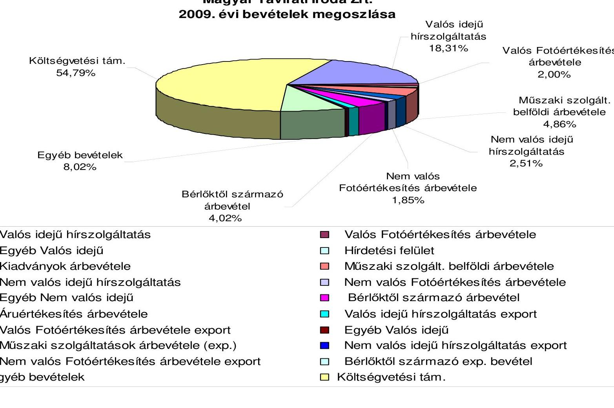

---

4/i. sz. melléklet
a V-2010-35/2009-2010. sz. jelentéshez

Magyar Távirati Iroda Zrt.
2009. évi költségek megoszlása

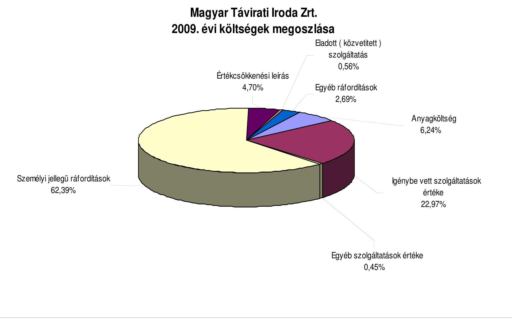

---

# Tanúsítványok jegyzéke 

| 1/a. tanúsítvány | Árbevétel és eredményterv kimutatása 2004-2009. év |
| :-- | :-- |
| 1/b. tanúsítvány | Költség- és ráfordításterv kimutatása 2004-2009. év |
| 2. tanúsítvány | A társaság vagyoni helyzetének alakulása 2004-2009. |
| 3. tanúsítvány | év (eszközök) |
| 4. tanúsítvány | A társaság vagyoni helyzetének alakulása 2004-2009. |
| 5. tanúsítvány | év (források) |
| 6. tanúsítvány | Bevételek alakulása 2004-2009. év |
| 7. tanúsítvány | Költség- és ráfordításterv alakulása 2004-2009. év |
| 8. tanúsítvány | Eredmény alakulása 2004-2009. év |
| 9. tanúsítvány | Költségvetési befizetési kötelezettségek 2004-2009. év |
|  | Költségvetési juttatások |
| Az MTI Zrt. létszámmegoszlása 2004-2009. év |  |

---

Magyar Távirati Iroda Zrt. Budapest

1/a. sz. tanúsítvány a V-2010-35/2009-2010. sz. jelentéshez

|  Megnevezés | Tény 2004 | Tény 2005 | Tény 2006 | Tény 2007 | Tény 2007 tény/terv | Tény 2008 | Tény 2008 | Index ( % ) 2008 tény/terv | Tény 2009 | Előző évek módosításai | Tény 2009 | Index ( % ) 2009 tény tény/terv | Index ( % ) 2009 tény 2008 tény  |
| --- | --- | --- | --- | --- | --- | --- | --- | --- | --- | --- | --- | --- | --- |
|   |  |  |  |  |  |  |  |  |  |  |  |  | 11 (9/6)  |
| Belföldi értékesítés nettó árbevétele | 1 836 034 | 1 732 040 | 1 747 818 | 1 770 584 | 1 707 184 | 96,42% | 1 736 159 | 1 833 540 | 105,61% | 1 673 370 | 1 716 751 | 102,59% | 93,63%  |
| Export értékesítés nettó árbevétele | 124 811 | 125 803 | 150 987 | 169 200 | 135 669 | 80,18% | 141 500 | 57 739 | 40,81% | 60 070 | 90 698 | 150,99% | 157,08%  |
| Egyéb bevételek | 7 858 | 15 144 | 50 100 | 0 | 35 026 |  | 22 000 | 17 181 | 78,10% | 18 000 | 315 202 | 389 857 | 2165,87%  |
| Árbevétel összesen | 1 968 703 | 1 872 987 | 1 957 135 | 1 939 784 | 1 877 879 | 96,81% | 1 999 659 | 1 908 460 | 100,46% | 1 751 440 | 2 197 306 | 125,46% | 115,14%  |
| Költségvetési támogatás | 2 304 186 | 2 167 458 | 2 318 872 | 2 183 328 | 2 307 064 | 185,67% | 2 526 813 | 2 469 666 | 97,74% | 2 840 362 | 2 997 551 | 105,53% | 121,37%  |
| intézményi támogatás | 1 607 200 | 2 050 000 | 2 150 000 | 2 150 000 | 2 283 000 | 186,19% | 2 475 000 | 2 468 720 | 99,75% | 2 663 000 | 2 663 000 | 100,00% | 107,87%  |
| céltámogatások * | 696 986 | 37 458 | 168 872 | 33 328 | 24 064 | 72,20% | 51 813 | 946 | 1,83% | 177 362 | 184 551 | 104,05% | 19508,75%  |
| intézményi támogatás kiegészítése | 0 | 80 000 | 0 | 0 | 0 |  | 0 | 0 |  | 0 | 150 000 |  |   |
| Aktívált saját teljesítmény | 0 | 14 336 | -5 478 | 0 | 5 257 |  | 5 000 | 64 338 |  | 0 | 40 922 |  | 63,60%  |
| Bevételek összesen | 4 272 889 | 4 054 781 | 4 270 528 | 4 123 112 | 4 190 200 | 101,63% | 4 431 472 | 4 442 464 | 100,25% | 4 591 802 | 5 235 779 | 114,02% | 117,86%  |
| Költségek és ráfordítások összesen | 4 547 895 | 4 058 829 | 4 277 686 | 4 134 436 | 4 197 073 | 101,52% | 4 440 169 | 4 456 358 | 100,36% | 4 604 792 | 4 955 520 | 107,62% | 111,20%  |
| Érleti eredmény (II-V) | -275 006 | -4 048 | -7 158 | -11 324 | -6 873 | 60,69% | -8 698 | -13 894 | 159,75% | -12 990 | 280 259 | -2197,55% | -2017,07%  |
| Pénzügyi műveletek bevétele | 36 130 | 35 611 | 30 209 | 27000 | 20 906 |  |  | 37 983 |  |  | 57 810 |  | 152,20%  |
| Pénzügyi műveletek ráfordítása | 5 074 | 15 324 | 13 476 | 12 476 | 8 283 |  |  | 11 186 |  |  | 7 997 |  | 71,49%  |
| Pénzügyi műveletek eredménye | 31 056 | 20 287 | 16 729 | 14 524 | 12 623 | 86,91% | 13 000 | 26 796 | 206,13% | 17 000 | 49 813 | 293,02% | 185,89%  |
| Szokásos vállalkozói eredmény | -243 950 | 16 239 | 9 571 | 3 200 | 5 750 | 179,7% | 4 302 | 12 902 | 299,9% | 4 010 | 330 072 | 8230,6% | 2558,31%  |
| Rendkívüli eredmény | 152 152 | -9732 | -1135 | 0 | -815 |  | 0 | -6329 |  | 0 | 113 756 | 109 033 | -1722,69%  |
| Mérleg szerinti eredmény | -91 798 | 6 507 | 8 436 | 3 200 | 4 935 | 154,2% | 4 302 | 6 573 | 152,8% | 4 010 | 428 958 | 439 105 | 10949,4%  |

Adaforrás: 2009. kontrollog jelentés

- Céltámogatások terve: Az üzleti tervnek megfelelően az időbeli elhatárolások egyenlege

Előző évek módosításai: Az előző évek ÁFA arányosításainak a visszautalása: 428 958 eFt.

- Az ÁFA arányosítás összege: 313 202 eFt.
- Az ÁFA arányosítás kamata: 113 756 eFt.

Budapest, 2010. április 12.

Magyar Távirati Iroda Zrt. 1016 Budapest, Naphegy tér 8. Kevítelm: Budapest, Ft. 3, 1426 6,610 10+8860/ 21418551-00000000 A30szám: 31532392-0 06

---

Magyar Távirati Iroda Zrt. Budapest

Költség- és ráfordításterv kimutatása 2004-2009. év

1/b. sz. tanúsítvány a V-2010-35/2009-2010. sz. jelentéshez

|  Megnevezés | Tény 2004 | Tény 2005 | Tény 2006 | Tény 2007 | Tény 2007 | Index ( % ) 2007 tény/terv | Tény 2008 | Tény 2008 | Index ( % ) 2008 tény/terv | Tény 2009 | Tény 2009 | Index ( % ) 2009 tény 2008 tény  |
| --- | --- | --- | --- | --- | --- | --- | --- | --- | --- | --- | --- | --- |
|   |  |  |  |  |  |  |  |  |  |  |  | 2009 tény 2008 tény  |
|   |  |  |  |  |  |  |  |  |  |  |  | 10 (9/8)  |
| IV. Anyagjellegű ráfordítások | 1 477 552 | 1 376 662 | 1 345 793 | 1 230 963 | 1 153 294 | 93,69% | 1 259 196 | 1 260 856 | 100,13% | 1 273 505 | 1 321 093 | 103,74%  |
| V. Személyi jellegű ráfordítások | 2 005 753 | 1 981 502 | 2 283 069 | 2 424 976 | 2 535 640 | 104,56% | 2 733 195 | 2 697 762 | 98,70% | 2 786 618 | 2 843 283 | 102,03%  |
| VI. Értékcsökkenés összesen | 301 883 | 320 026 | 309 515 | 293 654 | 309 659 | 105,45% | 209 969 | 218 218 | 103,93% | 218 088 | 204 451 | 93,75%  |
| VII. Egyéb költség és ráford. összesen | 233 859 | 202 071 | 41 396 | 18 309 | 39 268 | 214,47% | 5 728 | 81 453 | 1424,01% | 16 110 | 104 024 | 645,71% |
| *Céltámogatás elszámolt költségei | 528 848 | 178 569 | 297 913 | 166 534 | 159 212 | 95,60% | 232 089 | 198 069 | 85,34% | 310 470 | 482 670 | 155,46% |
| - Anyagjellegű ráfordítások | | | | | | | 137 329 | 129 325 | 94,17% | 150 709 | 176 524 | 117,13% |
| - Személyi jellegű ráfordítások | | | | | | | 62 678 | 30 359 | 48,44% | 90 717 | 97 458 | 107,43% |
| - Egyéb költség | | | | | | | 32 082 | 38 384 | 119,64% | 69 044 | 57 530 | 83,32% |
| - Létszámleépítés | | | | | | | 0 | 0 | 0 | 0 | 151 158 | 0 |
| Költség és ráfordítások összesen | 4 547 895 | 4 058 829 | 4 277 686 | 4 134 436 | 4 197 073 | 101,52% | 4 440 169 | 4 456 358 | 100,36% | 4 604 792 | 4 955 520 | 107,62% |

Adatforrás: 2009. kontrolling.jelentés Budapest, 2010. április 12.

- A IV. V. VI. VII. sorokban csak Alaptevékenység terv és tény adatai
- Céltámogatás elszámolt költségei: Projekt költségek= 331 512+ Létszámleépítés 151 158

Készítette: Tölgyi Csapat

Magasí Távirat: Nr. 1016 Budapest, Kőkögy tér 8. Levéltelét: Budapest, Pf. 9. 1426 Kő11 10422142-21428281-00000000 Adószám: 12283226-2-41 1/2 1/2 1/2 1/2 1/2 1/2 1/2 1/2 1/2 1/2 1/2 1/2 1/2 1/2 1/2 1/2 1/2 1/2 1/2 1/2 1/2 1/2 1/2 1/2 1/2 1/2 1/2 1/2 1/2 1/2 1/2 1/2 1/2 1/2 1/2 1/2 1/2 1/2 1/2 1/2 1/2 1/2 1/2 1/2 1/2 1/2 1/2 1/2 1/2 1/2

---

Magyar Távirati Iroda Zrt. Budapest

A társaság vagyoni helyzetének alakulása (ESZKÖZÖK) (2004-2009. év)

2. sz. tanúsítvány a V-2010-55/2009-2010. sz. jelentéshez

| Megnevezés | 2004 | 2005 | 2006 | 2007 | 2008 | Előző évek módosításai | 2009 |
| --- | --- | --- | --- | --- | --- | --- | --- |
| Befektetett Eszközök | 3 080 876 | 2 906 577 | 2 928 427 | 2 793 142 | 2 741 546 | 0 | 2 795 404 |
| ebből: Immateriális javak | 148 651 | 138 606 | 129 707 | 96 313 | 78 161 | | 97 404 |
| tárgyi eszközök | 2 862 112 | 2 707 058 | 2 732 080 | 2 629 953 | 2 595 602 | | 2 631 756 |
| befektetett pü.eszközök | 70 113 | 60 913 | 66 640 | 66 876 | 67 783 | | 66 244 |
| Forgóeszközök | 676 359 | 599 370 | 551 087 | 673 304 | 736 089 | 428 958 | 1 088 987 |
| ebből: készletek | 11 040 | 22 386 | 19 240 | 9 998 | 28 141 | | 6 291 |
| követelések | 263 873 | 286 162 | 219 795 | 225 653 | 152 931 | | 191 613 |
| értékpapírok | 0 | 0 | 0 | 0 | 0 | | 0 |
| pénzeszközök | 401 446 | 290 822 | 312 052 | 437 653 | 555 017 | 428 958 | 891 083 |
| Aktív időbeli elhatárolások | 44 605 | 18 417 | 32 763 | 27 449 | 54 528 | | 69 811 |
| ESZKÖZÖK ÖSSZESEN: | 3 801 840 | 3 524 364 | 3 512 277 | 3 493 895 | 3 532 163 | 428 958 | 3 954 202 |

Adatforrás: 2009. kontrolling jelentés Előző évek módosításai: Az előző évek ÁFA arányosításainak a visszautalása

Budapest, 2010. április 12.

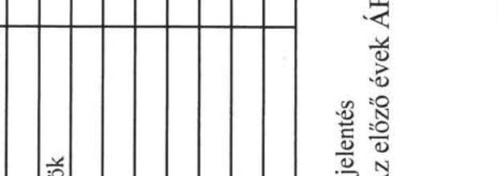

---

Magyar Távirati Iroda Zrt. Budapest

A társaság vagyoni helyzetének alakulása (FORRÁSOK) (2004-2009. év)

| Megnevezés | 2004 | 2005 | 2006 | 2007 | 2008 | Előző évek módosításai | 2009 |
| --- | --- | --- | --- | --- | --- | --- | --- |
| Saját tőke | 3 022 303 | 3 028 810 | 3 037 246 | 3 042 181 | 3 048 754 | 428 958 | 3 487 859 |
| ebből: jegyzett tőke | 1 750 000 | 1 750 000 | 1 750 000 | 1 750 000 | 1 750 000 | | 1 750 000 |
| tőketartalék | 892 396 | 892 396 | 892 396 | 892 396 | 892 396 | | 892 396 |
| eredménytartalék | 471 705 | 379 907 | 386 414 | 394 850 | 399 785 | | 406 358 |
| mérleg szerinti eredmény | -91 798 | 6 507 | 8 436 | 4 935 | 6 573 | 428 958 | 439 105 |
| Céltartalék | 16 712 | 16 712 | 13 000 | 0 | 45 000 | | 19 300 |
| Kötelezettségek | 567 427 | 346 476 | 363 464 | 364 923 | 220 355 | | 267 357 |
| Passzív időbeli elhatárolások | 195 398 | 132 366 | 98 567 | 86 791 | 218 054 | | 179 686 |
| FORRÁSOK ÖSSZESEN: | 3 801 840 | 3 524 364 | 3 512 277 | 3 493 895 | 3 532 163 | 428 958 | 3 954 202 |

Adatforrás: 2009. kontrolling jelentés Előző évek módosításai: Az előző évek ÁFA arányosításainak a visszautalása

Budapest, 2010. április 12.

Készítette: Magyar Távirati Iroda Zrt. 1016 Budapest, Napló. 10. évév. 10. évév. 10. évév. 10. évév. 10. évév. 10. évév. 10. évév. 10. évév. 10. évév. 10. évév. 10. évév. 10. évév. 10. évév. 10. évév. 10. évév. 10. évév. 10. évév. 10. évév. 10. évév. 10. évév. 10. évév. 10. évév. 10. évév. 10. évév. 10. évév. 10. évév. 10. évév. 10. évév. 10. évév. 10. évév. 10. évév. 10. évév. 10. évév. 10. évév. 10. évév. 10. évév. 10. évév. 10. évév. 10. évév. 10. évév. 10. évév. 10. évév. 10. évév. 10. évév. 10. évév. 10. évév. 10. évév. 10. évév. 10. évév. 10. évév. 10. évév. 10. évév. 10. évév. 10. évév. 10. évév. 10. évév. 10. évév. 10. évév. 10. évév. 10. évév. 10. évév. 10. évév. 10. évév. 10. évév. 10. évév. 10. évév. 10. évév. 10. évév. 10. évév. 10. évév. 10. évév. 10. évév. 10. évév. 10. évév. 10. évév. 10. évév. 10. évév. 10. évév. 10. évév. 10. évév. 10. évév. 10. évév. 10. évév. 10. évév. 10. évév. 10. évév. 10. évév. 10. évév. 10. évév. 10. évév. 10. évév. 10. évév. 10. évév. 10. évév. 10. évév. 10. évév. 10. évév. 10. évév. 10. évév. 10. évév. 10. évév. 10. évév. 10. évév. 10. évév. 10. évév. 10. évév. 10. évév. 10. évév. 10. évév. 10. évév. 10. évév. 10. évév. 10. évév. 10. évév. 10. évév. 10. évév. 10. évév. 10. évév. 10. évév. 10. évév. 10. évév. 10. évév. 10. évév. 10. évév. 10. évév. 10. évév. 10. évév. 10. évév. 10. évév. 10. évév. 10. évév. 10. évév. 10. évév. 10. évév. 10. évév. 10. évév. 10. évév. 10. évév. 10. évév. 10. évév. 10. évév. 10. évév. 10. évév. 10. évév. 10. évév. 10. évév. 10. évév. 10. évév. 10. évév. 10. évév. 10. évév. 10. évév. 10. évév. 10. évév. 10. évév. 10. évév. 10. évév. 10. évév. 10. évév. 10. évév. 10. ev. 10. ev.
 10. év. 10. év. 10. év. 10. év. 10. év. 10. év. 10. év. 10. év. 10. év. 10. év. 10. év. 10. év. 10. év. 10. év. 10. év. 10. év. 10. év. 10. év. 10. év. 10. év. 10. év. 10. év. 10. év. 10. év. 10. év. 10. év. 10. év. 10. év. 10. év. 10. év. 10. év. 10. év. 10. év. 10. év. 10. év. 10. év. 10. év. 10. év. 10. év. 10. év. 10. év. 10. év. 10. év. 10. év. 10. év. 10. év. 10. év. 10. év. 10. év. 10. év. 10. év. 10. év. 10. év. 10. év. 10. év. 10. év. 10. év. 10. év. 10. év. 10. év. 10. év. 10. év. 10. év. 10. év. 10. év. 10. év. 10. év. 10. év. 10. év. 10. év. 10. év. 10. év. 10. év. 10. év. 10. év. 10. év. 10. év. 10. év. 10. év. 10. év. 10. év. 10. év. 10. év. 10. év. 10. év. 10. év. 10. év. 10. év. 10. év. 10. év. 10. év. 10. év. 10. év. 10. év. 10. év. 10. év. 10. év. 10. év. 10. év. 10. év. 10. év. 10. év. 10. év. 10. év. 10. év. 10. év. 10. év. 10. év. 10. év. 10. év. 10. év. 10. év. 10. év. 10. év. 10. év. 10. év. 10. év. 10. év. 10. év. 10. év. 10. év. 10. év. 10. év. 10. év. 10. év. 10. év. 10. év. 10. év. 10. év. 10. év. 10. év. 10. év. 10. év. 10. év. 10. év. 10. év. 10. év. 10. év. 10. év. 10. év. 10. év. 10. év. 10. év. 10. év. 10. év. 10. év. 10. év. 10. év. 10. év. 10. év. 10. év. 10. év. 10. év. 10. év. 10. év. 10. év. 10. év. 10. év. 10. év. 10. év. 10. év. 10. év. 10. év. 10. év. 10. év. 10. év. 10. év. 10. év. 10. év. 10. év. 10. év. 10. év. 10. év. 10. év. 10. év. 10. év. 10. év. 10. év. 10. év. 10. év. 10. év. 10. év. 10. év. 10. év. 10. év. 10. év. 10. év. 10. év. 10. év. 10. év. 10. év. 10. év. 10. év. 10. év. 10. év. 10. év. 10. év. 10. év. 10. év. 10. év. 10.
 10. év. 10. év. 10. év. 10. év. 10. év. 10. év. 10. év. 10. év. 10. év. 10. év. 10. év. 10. év. 10. év. 10. év. 10. év. 10. év. 10. év. 10. év. 10. év. 10. év. 10. év. 10. év. 10. év. 10. év. 10. év. 10. év. 10. év. 10. év. 10. év. 10. év. 10. év. 10. év. 10. év. 10. év. 10. év. 10. év. 10. év. 10. év. 10. év. 10. év. 10. év. 10. év. 10. év. 10. év. 10. év. 10. év. 10. év. 10. év. 10. év. 10. év. 10. év. 10. év. 10. év. 10. év. 10. év. 10. év. 10. év. 10. év. 10. év. 10. év. 10. év. 10. év. 10. év. 10. év. 10. év. 10. év. 10. év. 10. év. 10. év. 10. év. 10. év. 10. év. 10. év. 10. év. 10. év. 10. év. 10. év. 10. év. 10. év. 10. év. 10. év. 10. év. 10. év. 10. év. 10. év. 10. év. 10. év. 10. év. 10. év. 10. év. 10. év. 10. év. 10. év. 10. év. 10. év. 10. év. 10. év. 10. év. 10. év. 10. év. 10. év. 10. év. 10. év. 10. év. 10. év. 10. év. 10. év. 10. év. 10. év. 10. év. 10. év. 10. év. 10. év. 10. év. 10. év. 10. év. 10. év. 10. év. 10. év. 10. év. 10. év. 10. év. 10. év. 10. év. 10. év. 10. év. 10. év. 10. év. 10. év. 10. év. 10. év. 10. év. 10. év. 10. év. 10. év. 10. év. 10. év. 10. év. 10. év. 10. év. 10. év. 10. év. 10. év. 10. év. 10. év. 10. év. 10. év. 10. év. 10. év. 10. év. 10. év. 10. év. 10. év. 10. év. 10. év. 10. év. 10. év. 10. év. 10. év. 10. év. 10. év. 10. év. 10. év. 10. év. 10. év. 10. év. 10. év. 10. év. 10. év. 10. év. 10. év. 10. év. 10. év. 10. év. 10. év. 10. év. 10. év. 10. év. 10. év. 10. év. 10. év. 10. év. 10. év. 10. év. 10. év. 10. év. 10. év. 10. év. 10. év. 10. év. 10. év. 10. év. 10. év. 10. év. 10. év. 10. év. 10. év. 10. év. 10. év.
 10. év. 10. év. 10. év. 10. év. 10. év. 10. év. 10. év. 10. év. 10. év. 10. év. 10. év. 10. év. 10. év. 10. év. 10. év. 10. év. 10. év. 10. év. 10. év. 10. év. 10. év. 10. év. 10. év. 10. év. 10. év. 10. év. 10. év. 10. év. 10. év. 10. év. 10. év. 10. év. 10. év. 10. év. 10. év. 10. év. 10. év. 10. év. 10. év. 10. év. 10. év. 10. év. 10. év. 10. év. 10. év. 10. év. 10. év. 10. év. 10. év. 10. év. 10. év. 10. év. 10. év. 10. év. 10. év. 10. év. 10. év. 10. év. 10. év. 10. év. 10. év. 10. év. 10. év. 10. év. 10. év. 10. év. 10. év. 10. év. 10. év. 10. év. 10. év. 10. év. 10. év. 10. év. 10. év. 10. év. 10. év. 10. év. 10. év. 10. év. 10. év. 10. év. 10. év. 10. év. 10. év. 10. év. 10. év. 10. év. 10. év. 10. év. 10. év. 10. év. 10. év. 10. év. 10. év. 10. év. 10. év. 10. év. 10. év. 10. év. 10. év. 10. év. 10. év. 10. év. 10. év. 10. év. 10. év. 10. év. 10. év. 10. év. 10. év. 10. év. 10. év. 10. év. 10. év. 10. év. 10. év. 10. év. 10. év. 10. év. 10. év. 10. év. 10. év. 10. év. 10. év. 10. év. 10. év. 10. év. 10. év. 10. év. 10. év. 10. év. 10. év. 10. év. 10. év. 10. év. 10. év. 10. év. 10. év. 10. év. 10. év. 10. év. 10. év. 10. év. 10. év. 10. év. 10. év. 10. év. 10. év. 10. év. 10. év. 10. év. 10. év. 10. év. 10. év. 10. év. 10. év. 10. év. 10. év. 10. év. 10. év. 10. év. 10. év. 10. év. 10. év. 10. év. 10. év. 10. év. 10. év. 10. év. 10. év. 10. év. 10. év. 10. év. 10. év. 10. év. 10. év. 10. év. 10. év. 10. év. 10. év. 10. év. 10. év. 10. év. 10. év. 10. év. 10. év. 10. év. 10. év. 10. év. 10. év. 10. év. 10. év. 10. év. 10. év. 10. év. 10. év. 10. év. 10. év.
 10. év. 10. év. 10. év. 10. év. 10. év. 10. év. 10. év. 10. év. 10. év. 10. év. 10. év. 10. év. 10. év. 10. év. 10. év. 10. év. 10. év. 10. év. 10. év. 10. év. 10. év. 10. év. 10. év. 10. év. 10. év. 10. év. 10. év. 10. év. 10. év. 10. év. 10. év. 10. év. 10. év. 10. év. 10. év. 10. év. 10. év. 10. év. 10. év. 10. év. 10. év. 10. év. 10. év. 10. év. 10. év. 10. év. 10. év. 10. év. 10. év. 10. év. 10. év. 10. év. 10. év. 10. év. 10. év. 10. év. 10. év. 10. év. 10. év. 10. év. 10. év. 10. év. 10. év. 10. év. 10. év. 10. év. 10. év. 10. év. 10. év. 10. év. 10. év. 10. év. 10. év. 10. év. 10. év. 10. év. 10. év. 10. év. 10. év. 10. év. 10. év. 10. év. 10. év. 10. év. 10. év. 10. év. 10. év. 10. év. 10. év. 10. év. 10. év. 10. év. 10. év. 10. év. 10. év. 10. év. 10. év. 10. év. 10. év. 10. év. 10. év. 10. év. 10. év. 10. év. 10. év. 10. év. 10. év. 10. év. 10. év. 10. év. 10. év. 10. év. 10. év. 10. év. 10. év. 10. év. 10. év. 10. év. 10. év. 10. év. 10. év. 10. év. 10. év. 10. év. 10. év. 10. év. 10. év. 10. év. 10. év. 10. év. 10. év. 10. év. 10. év. 10. év. 10. év. 10. év. 10. év. 10. év. 10. év. 10. év. 10. év. 10. év. 10. év. 10. év. 10. év. 10. év. 10. év. 10. év. 10. év. 10. év. 10. év. 10. év. 10. év. 10. év. 10. év. 10. év. 10. év. 10. év. 10. év. 10. év. 10. év. 10. év. 10. év. 10. év. 10. év. 10. év. 10. év. 10. év. 10. év. 10. év. 10. év. 10. év. 10. év. 10. év. 10. év. 10. év. 10. év. 10. év. 10. év. 10. év. 10. év. 10. év. 10. év. 10. év. 10. év. 10. év. 10. év. 10. év. 10. év. 10. év. 10. év. 10. év. 10. év. 10. év. 10. év. 10. év. 10. év. 10. év. 10. év.
 Magyar Távirati Iroda Zrt. Budapest

Bevételek alakulása (2004-2009. év)

|  Megnevezés | 2004 | 2005 | 2006 | 2007 | 2008 | Előző évek módosításai | 2009  |
| --- | --- | --- | --- | --- | --- | --- | --- |
|  Belföldi értékesítés nettó árbevétele | 1 836 034 | 1 732 040 | 1 747 818 | 1 707 184 | 1 833 540 |  | 1 716 751  |
|  Export értékesítés nettó árbevétele | 124 811 | 125 803 | 150 987 | 135 669 | 57 739 |  | 90 698  |
|  Egyéb bevételek | 2 312 044 | 2 182 602 | 2 377 202 | 2 342 090 | 2 486 847 | 315 202 | 3 387 408  |
|  Aktivált saját teljesítmények | 0 | 14 336 | -5 478 | 5 257 | 64 338 |  | 40 922  |
|  Pénzügyi műveletek bevételei | 36 130 | 35 611 | 30 205 | 20 906 | 37 983 |  | 57 810  |
|  Rendkívüli bevételek | 460 820 | 1 946 | 1 517 | 397 | 29 | 113 756 | 114 285  |
|  BEVÉTELEK ÖSSZESEN: | 4 769 839 | 4 092 338 | 4 302 251 | 4 211 503 | 4 480 475 | 428 958 | 5 407 874  |

Adatforrás: 2009. kontrolling jelentés Előző évek módosításai: Az előző évek áfa arányosításainak a visszautalása

Budapest, 2012. április 12.

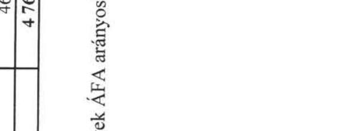

---

Magyar Távirati Iroda Zrt. Budapest

Költségek és ráfordítások alakulása
 (2004-2009. év)

5. sz. tanúsítvány

a V-2010- 35/2009-2010. sz. jelentéshez

|  Megnevezés | 2004 | 2005 | 2006 | 2007 | 2008 | Előző évek módosításai | 2009  |
| --- | --- | --- | --- | --- | --- | --- | --- |
|  Anyagjellegű ráfordítások | 1 521 194 | 1 484 010 | 1 467 149 | 1 255 671 | 1 390 182 |  | 1 497 615  |
|  Személyi jellegű ráfordítások | 2 436 206 | 2 011 604 | 2 390 401 | 2 558 193 | 2 728 121 |  | 3 091 899  |
|  Értékcsökkenési leírás | 356 636 | 361 144 | 378 741 | 343 797 | 248 214 |  | 232 835  |
|  Egyéb költségek és ráfordítások | 233 859 | 202 071 | 41 396 | 39 412 | 89 841 |  | 133 171  |
|  Pénzügyi műveletek ráfordításai | 5 074 | 15 324 | 13 476 | 8 283 | 11 186 |  | 7 997  |
|  Rendkívüli ráfordítások | 308 668 | 11 677 | 2 652 | 1 212 | 6 359 |  | 5 252  |
|  **KÖLTSÉGEK ÉS RÁFORD. ÖSSZESEN:** | 4 861 637 | 4 085 831 | 4 293 815 | 4 206 568 | 4 473 903 | 0 | 4 968 769  |

Adatforrás: 2009. kontrolling jelentés

Előző évek módosításai: Az előző évek ÁFA arányosításainak a visszautalása

Budapest, 2010. április 12.

Készítette: 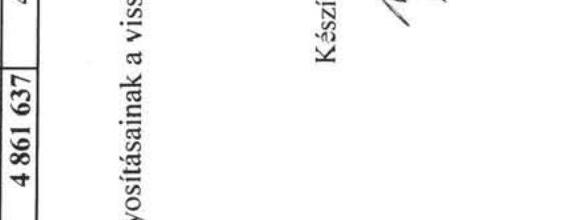

Magyar Távirati Iroda Zrt. 2010 Budapest, Személyi J. Ért. 2010. 1016 Budapest, Személyi J. Ért. 2010. 1016 Budapest, Személyi J. Ért. 2010. 12283220-2-41 06.

---

Magyar Távirati Iroda Zrt. Budapest

Eredmény alakulása (2004-2009. év)

|  Megnevezés | 2004 | 2005 | 2006 | 2007 | 2008 | Előző évek módosításai | 2009  |
| --- | --- | --- | --- | --- | --- | --- | --- |
|  1. Üzemi (üzleti) tevékenység eredménye | -275 006 | -4 048 | -7 158 | -6 873 | -13 894 | 0 | 280 259  |
|  2. Pénzügyi műveletek eredménye | 31 056 | 20 287 | 16 729 | 12 623 | 26 796 | 0 | 49 813  |
|  3. Szokásos vállalkozási eredmény (1+2) | -243 950 | 16 239 | 9 571 | 5 750 | 12 902 | 0 | 330 072  |
|  4. Rendkívüli eredmény | 152 152 | -9 732 | -1 135 | -815 | -6 329 | 113 756 | 109 033  |
|  5. Adózás előtti eredmény (3+4) | -91 798 | 6 507 | 8 436 | 4 935 | 6 573 | 428 958 | 439 105  |

Adatforrás: 2009. kontrolling jelentés Előző évek módosításai: Az előző évek ÁFA arányosításainak a visszautalása

Budapest, 2010. Április 12.

Készítette: PH Felelős vezető: Magyar Távirati Iroda Zrt. 1016 Budapest, Naphegy tér 8. Leváltó: Budapest, Pf. 3. 1426 K&H 10402142-21418581-00000000 Átutalás: 12283226-2-41 06.

---

Magyar Távirati Iroda Zrt.

Költségvetési befizetési kötelezettségek (adók, járulékok) (2004-2009. év)

|  Megnevezés | 2004 | 2005 | 2006 | 2007 | 2008 | 2009  |
| --- | --- | --- | --- | --- | --- | --- |
|  Személyi jövedelemadó | 505 783 | 411 558 | 346 977 | 673 462 | 320 842 | 384 147  |
|  Általános forgalmi adó | 360 630 | 255 728 | 76 147 | 210 644 | 136 217 | 92 729  |
|  Munkaadói járulék | 46 818 | 36 018 | 36 942 | 34 324 | 28 649 | 30 782  |
|  Munkavállalói járulék | 12 185 | 10 927 | 13 389 | 15 760 | 13 631 | 16 077  |
|  Mindösszesen: | 925 416 | 714 230 | 473 455 | 934 190 | 499 339 | 523 735  |

Adatforrás: 2009. kontrolling jelentés

Budapest, 2010. Április 12.

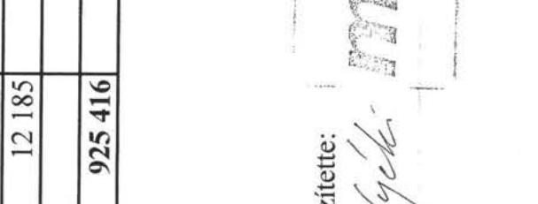

---

Magyar Távirati Iroda Zrt. 8. sz. tanúsítvány (közvetlen és közvetett támogatások) a V-2010-367/2009-2010. sz. jelentéshez

|  Megnevezés | 2004 | 2005 | 2006 | 2007 | 2008 | 2009  |
| --- | --- | --- | --- | --- | --- | --- |
|  Bevételt növelő támogatások (kp. költségvetés) |  |  |  |  |  |   |
|  Közszolgálati feladatok céltámogatása | 1 607 200 | 2 080 000 | 2 100 000 | 2 233 000 | 2 363 003 | 2 583 000  |
|  Határon túli magyar saját hivatatása |  | 50 000 | 50 000 | 50 000 | 80 000 | 80 000  |
|  Olimpiai támogatás tervére |  |  |  |  | 25 717 |   |
|  Működési támogatás összesen | 1 607 200 | 2 130 000 | 2 150 000 | 2 283 000 | 2 468 720 | 2 663 000  |
|  ÖSSZESEN: | 1 607 200 | 2 130 000 | 2 150 000 | 2 283 000 | 2 468 720 | 2 663 000  |
|  Saját tőkét növelő támogatások |  |  |  |  |  |   |
|  Egyéb, bevételt növelő támogatások |  |  |  |  |  |   |
|  Céltámogatás |  |  |  |  |  |   |
|  Választási feladatok |  |  | 116 800 |  |  | 0  |
|  EU. Választási feladatok |  |  |  |  |  | 64 495  |
|  Európai unió komor feladatok | 4 625 |  | 3 071 |  |  | 0  |
|  Élyés Közalapítvány | 715 | 694 | 418 |  |  | 0  |
|  Intaktámaszlási támogatás | 190 000 | 1 880 | 8 120 |  |  | 0  |
|  Létszámlatpítési támogatás | 410 669 |  |  |  |  | 150 000  |
|  KIB-IPM MTI Net projekt* | 14802 | 3 202 | 2 504 | 113 | 103 | 11  |
|  IPM önkormányzatok hivatatása | 9000 |  |  |  |  |   |
|  IPM - MTI DAK projekt* | 47233 | 11 456 | 11 444 | 3 449 |  | 0  |
|  NKOM Digitális Frakaszkív pr.* | 8024 | 420 | 118 |  |  | 0  |
|  SINTAGMA |  | 9 201 | 2 758 | 3 545 | 541 | 1 977  |
|  Környezetvédelmi Minisztérium - Zöld Forrás |  | 3 053 | 323 | 323 | 302 | 0  |
|  Olimpiai |  |  |  |  |  | 2 796  |
|  Nyilott archívumok 1-11. |  |  |  |  |  | 87 238  |
|  NKA fonolgáltalizálás |  |  |  |  |  | 10 094  |
|  Bódigálatadás 4000 |  |  |  |  |  | 21 958  |
|  Ki Kicsoda |  |  | 2 393 |  |  |   |
|  Fotószent |  |  |  | 2 000 |  | 0  |
|  MEH - EU Adatbark - "Kor-Képek 1956" | 1462 |  | 7 000 |  |  | 0  |
|  Nemzeti Kulturális Alap - "Kor-Képek 45-47" | 3000 |  |  |  |  |   |
|  Nemzeti Kulturális Alap - "Kor-Képek 48-55" |  |  |  | 1 000 |  | 0  |
|  Nemzeti Kulturális Alap - "Kor-Képek 49-94" |  |  |  |  |  | 800  |
|  Nemzeti Kulturális Alap - MTI Foto 50 éve |  |  |  |  |  | 0  |
|  Európai unió tám | 7 456 | 7 552 | 13 903 | 13 634 |  | 0  |
|  ÖSSZESEN: | 696 986 | 37 458 | 168 872 | 24 064 | 946 | 334 551  |
|  MINDÖSSZESEN: | 2 304 186 | 2 167 458 | 2 318 872 | 2 307 064 | 2 469 666 | 2 997 551  |

- A céltámogatások tárgyévben elszámolt összegei nem tartalmazzák a beruházások miatt a következő évekre az amortizációval arányosan elhatárolt támogatási fedezetet.

Budapest, 2010. április 12.

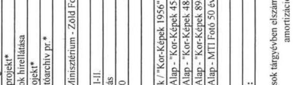

---

9. sz. tanúsítvány a V-2010- 2009-2010. sz. jelentéshez

|  Foglalkoztatottak | 2004.12.31 | 2005.12.31 | 2006.12.31 | 2007.12.31 | 2008.12.31 | 2009.12.31  |
| --- | --- | --- | --- | --- | --- | --- |
|  Munkaviszony keretében foglalkoztatott aktív munkavállalók | 312 | 313 | 350 | 335 | 330 | 297  |
|  Munkaviszony keretében foglalkoztatott nyugdíjasok | 8 | 11 | 18 | 22 | 26 | 9  |
|  Statisztikai létszám összesen | 320 | 324 | 368 | 357 | 356 | 306  |
|  GYES-GYED | 14 | 8 | 9 | 8 | 9 | 13  |
|  Tartós távollévő, egyéb |  |  |  | 3 | 4 | 4  |
|  Felmentés alatt | 86 | 6 | 1 | 2 | 1 | 21 | |
| Munkajogi létszám összesen | 420 | 338 | | 370 | 370 | 344 |
| Munkajogi létszámból: | | | | | | |
| - Határozott idejű msz. | 0 | 0 | 0 | 6 | 6 | 5 |
| - Határozott idejű nyugdíjas | 0 | 0 | 0 | 0 | 0 | 0 |
| - Részmunkaidős | 0 | 0 | 0 | 9 | 8 | 6 |
| Mellékfoglalkozás | 1 | 1 | 1 | 0 | 0 | 0 |
| Másodállás | 0 | 0 | 0 | 0 | 0 | 0 |
| Kettős jogviszonyban | 65 | 51 | | 0 | 0 | 0 |
| Külsős foglalkoztatottak | | | | | | |
| Határozott | 45 | 55 | | 50 | 66 | 82 |
| Határozatlan | 82 | 75 | 22 | 30 | 29 | 27 |
| Összesen | 126 | 130 | 22 | 80 | 95 | 109 |
| - Ebből Projekt keretében | | | | | | 30 |

Budapest, 2010. április 12.

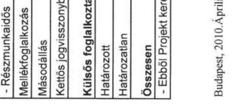

---

# Függelék

---

# Az MTI Zrt. számára a „Nyitott Archívum Projekt" megvalósítására biztosított állami támogatás felhasználásának teljesítmény-ellenőrzése

A Magyar Távirati Iroda Zrt. a 2167/2008. (XII. 4.) Korm. határozattal - a 2008. évi központi költségvetés általános tartaléka terhére - 100 M Ft támogatásban részesült a digitális archívum közérdekű használhatóságának javítására, keresési lehetőségeinek bővítésére, a fénykép és hírarchívum egy részének digitalizációjához, az így digitalizált adatok internetes közzétételéhez, valamint az 1989 és 2004 közötti hírarchívum internetes közzétételéhez.

A 100 M Ft támogatás jogcímek szerinti felhasználására, az elszámolás pontos feltételeinek meghatározására a Támogató és a Társaság támogatási szerződést nem kötött, annak ellenére, hogy a Korm. határozat szerint az MTI 2009. június 30-ig elszámolási kötelezettséggel tartozott.

Az Nht. 2. § (1) bekezdés j) pontja szerint a nemzeti hírügynökség közszolgálati feladatai közé tartozik a tevékenysége során birtokába került kulturális értékek és történelmi jelentőségű eredeti dokumentumok archívumban történő tartós megőrzése és védelme, azok összegyűjtésének, tárolásának, gondozásának és hozzáférhetőségének biztosítása. A Társaság a támogatás odaítélését megelőzően 2003. október 8-án - helyzetértékeléssel, a célok és prioritások (értékmentés szempontjai) bemutatásával alátámasztott - kérelemmel fordult a Nemzeti Kulturális Örökség Minisztériumához a helyzet átfogó rendezése érdekében, valamint minden évben a céltámogatás igénylésekor (összefoglaló helyzetértékelés) jelezte, hogy saját forrásból nem képes az archívumában őrzött fotó- és szöveges dokumentumok tartós megőrzését biztosítani. ${ }^{1}$

A 100 M Ft céltámogatás biztosítását követően az MTI 2009. január 20-án projekt javaslatot készített. A projekt végrehajtásával elérni kívánt célok - az MTI archívumainak bővítése, a digitalizáltsági fok emelése, a fotók egy részének és 2004-ig a hírarchívum digitalizált részének, valamint archív multimédiás anyagok (videó, audió) az interneten való nyilvánossá tétele - összességében összhangban vannak az MTI Zrt. 2008-2012. évekre szóló stratégiai tervével. A stratégiai terv hangsúlyozza a történeti és kulturális értékekként számon tartott archívumok megóvásának, folyamatos gyarapításának fontosságát, valamint célként fogalmazza meg a közszolgálatiság, közhasznúság jegyében egyes fontos adatbázisok nyilvánossá tételét.

A projekt javaslatot, annak elnöki jóváhagyása előtt négy igazgató, két alelnök véleményezte, azonban a humánpolitikai igazgató véleményét a javaslat be-

[^0]
[^0]: ${ }^{1}$ Az MTI archívumait a Magyar Nemzeti Múzeum 1993-ban védett muzeális gyűjteménnyé nyilvánította.

---

terjesztője nem kérte ki. A projekt javaslat nem tartalmazza egyértelműen a külső és belső humánerőforrás szükséglet arányát, a projekt vezetőjét és a projekt tagjait, valamint vannak olyan feladatok a javaslatban, amelyeknek megvalósíthatósága nem ismert. A projekt javaslat az MTI elnökét, mint a felügyeletet ellátó vezetőt, egyes belső dokumentumok (célfeladat és céljutalom kitűzése), mint a projekt vezetőjét említik, ami nincs összhangban a projekt szabályzat 5. pontjának első bekezdésével. (A projektvezető köztes vezetési kategória az MTI stratégiai és operatív vezetési szintje között.)

A projekt javaslatban a sajtóadatbanki és fotóarchívumi tevékenységek, valamint a nyitott adatbázisok technikai megvalósításának költségfelosztása megtalálható. A költségfelosztás a céltámogatás összegére épül, a 100 M Ft került lebontásra egyes, nem pontosan körülhatárolt feladatokra is. Ez az eljárás nagymértékű szabadságot biztosított a céltámogatás összegének felhasználásakor, és megnehezítette a feladatok költségigényének és a tényleges költségfelhasználásnak az összevetését.

A Társaság a projektet elkülönített költséghelyen, „Nyitott archívumok" címen nyilvántartotta.

A céltámogatás terhére a Társaság „teljes munkaidős foglalkoztatottak jutalma" címén 11,4 M Ft-ot fizetett ki. Az MTI elnökének engedélyével az Adatbázisok és Archívumok igazgatója, valamint a projektigazgató 2009. január 4-én - a projekt javaslat jóváhagyását megelőzően több mint két héttel - 36 munkavállalónak célfeladatot írt ki, amelynek eredményes teljesítése esetén összesen 11,5 M Ft céljutalmat tűzött ki.

A célfeladatra megbízás dokumentumai és a feladat végrehajtásáról kibocsátott teljesítésigazolások nem részletezik a végrehajtandó és végrehajtott pontos feladatokat; a célfeladatra a megbízást 36 fő kapta, a projekt javaslat (valószínűsíthetően az MTI belső humánerőforrására támaszkodva) 34 főre bontja le a feladatokat. A projekt javaslatban meghatározott feladatot ellátó munkavállalói létszám nem egyezik meg az egyes célfeladat típusokra megbízott létszámmal, illetve a feladatokra számított keretösszeg és a célfeladathoz kapcsolódó céljutalmak összege eltérést mutat. Nem teljesült az ésszerű munkaerő kihasználás, valamint takarékos költséggazdálkodás követelménye sem.

A „Nyitott archívumok" projekt sajtóadatbankot érintő tevékenységeinek operatív ellenőrzésére, koordinálására tévesen három sajtóadatbank vezető-helyettes (ténylegesen a sajtóadatbank vezetője, annak helyettese és a fotóarchívum vezetője) kapott megbízást összesen 1,3 M Ft összegben. Ez egyrészt nincs összhangban az SZMSZ-ben, valamint a projekt szabályzatban foglaltakkal (a feladat ellátása munkaidőben, a munkaköri feladatok alól részleges felmentéssel történjen), másrészt a projekt javaslat két fő koordinátorral és annak juttatásával (1,1 M Ft) számol.

A projekt javaslat szerint 1 fő informatikai támogatás szükséges, szemben a célfeladatra (a projekt keretében zajló feladatok informatikai hátterének kialakítására, a felmerülő számítástechnikai problémák megoldásában segítségnyújtásra) megbízott egy fő informatikus csoportvezetővel, valamint két fő ügyfélszolgálati munkatárssal, akiknek összesen hatszázezer forint céljutalom megállapítását engedélyezte a projekt vezetője. A céljutalom a tervezett keretösszegen belül maradt,

---

azonban az informatikai támogatást három főnek kellett biztosítani. Egy ember helyett három ember munkaidejét a feladat lekötötte, ezzel nem valósult meg az ésszerű munkaerő kihasználás, azaz egy fő engedélyezett kivonása a projekt feladat ellátására.

A hagyományos fotóarchívum védett történelmi képanyagából 1500 darab felvétel szkennelése, retusálása és a digitális fotó technikai paramétereinek beállítása (képenként 1000 Ft-tal számolva) három fővel, 2061 kép esetében a képaláírások előkeresése, begépelése, indexálása (képenként 900 Ft-tal számolva) hét fővel valósult meg.

A Társaság a „Nyitott archívumok" projekt keretében két esetben hirdetmény közzététele nélküli tárgyalásos és egy esetben egyszerű közbeszerzési eljárást bonyolított le, valamint az informatikai eszközök beszerzésére egy központosított közbeszerzési eljáráson vett részt. A projekthez kapcsolódóan a megkötött közbeszerzési szerződések értéke 49,1 M Ft (+ áfa), a teljesítést követő kifizetés összesen 59,9 M Ft (+ áfa) volt.

A Társaság két esetben írt ki hirdetmény nélküli tárgyalásos eljárást, amit az ajánlattételi felhívásban a Kbt. 125. § (2) bekezdés b) pontjára történő hivatkozással indokolt. A Kbt. hivatkozott pontja szerint ezt az eljárást akkor lehet választani, ha a szerződést műszaki-technikai sajátosságok, művészeti szempontok vagy kizárólagos jogok védelme miatt kizárólag egy meghatározott szervezet, személy képes teljesíteni. Mindkét eljárás esetén ezek az okok fennálltak.

A Társaság, mindkét eljárás esetén a Közbeszerzési Értesítőben az eljárás eredményének közzétételekor hivatkozott a Korm. határozatra, és részletesen indokolta a választott eljárást. A hírarchívum mintegy 412000 oldal terjedelemben nyomtatott formában, valamint 645 mikrofilm tekercsen (109000 mikrofilm kockán) volt. A hírarchívum az elmúlt 100 évben az Országos Széchenyi Könyvtárba és a Magyar Országos Levéltárba került, csak egy része maradt az ajánlatkérő kezelésében. A hatalmas Magyar Országos Levéltárban lévő híranyag - Korm. rendelethez kötött rövididőn belüli - feldolgozásához rendkívüli teljesítményű technológiára és szakember gárdára volt szükség, ez indokolta az Arcanum Adatbázis Kft. kijelölését. Az Országos Széchényi Könyvtár kiválasztását az állományába tartozó „MTI kőnyomatos hírek" eredeti, papír alapú példányainak - kizárólagos jogok védelme miatt saját hatáskörben történő - feldolgozása indokolta.

A Társaság a Kbt. - 2009. március 31-ig hatályos - 299. § (1) bekezdésének b) pontjára történő hivatkozással (2009. március 27-én) egyszerű közbeszerzési eljárást indított multimédiás web kereső alkalmazás fejlesztésére. Ajánlatot az ajánlattételre felhívott ajánlattevők szűk határidőben 2009. április 1-jéig tehettek; a kiválasztás alapja - meghatározott bírálati részszempontok szerint - az összességében legelőnyösebb ajánlat, illetve a közbeszerzés tárgyában meghatározott egy éven belül referenciával rendelkező ajánlattevő volt.

Mindhárom közbeszerzési eljárás esetében - az ajánlati felhívásban foglaltakkal összhangban - készült összegzés az ajánlatok elbírálásáról, amely tartalmazta az ajánlatkérő nyilatkozatát a fedezet rendelkezésre állásáról.

Az Arcanum Adatbázis Kft. és az Országos Széchényi Könyvtár ajánlatában az egyes feladatokhoz rendelve meghatározta az oldalankénti feldolgozás díját. Az Arcanum Adatbázis Kft. ajánlatot tett a Magyar Országos Levéltár állományába tartozó „Napi tudósítások 1920-1944." 400 ezer oldalon felüli, az MTI tulajdonában

---

mikrofilmen lévő archív anyag állományból 1944-45. és 1956. évek közelítőleg 200 ezer oldal digitalizálására, OCR-ezésére ${ }^{2}$ és PDF készítésére. Az Országos Széchenyi Könyvtár az állományába tartozó 1887.,1909., 1910-1911., 1919., 1944. június 1-30-ig teljes hírkiadás; 1930., 1938., 1939. bizalmas értesítések; 1928-1944. sportkiadás; 1945-1946. Magyar Országos Tudósító; 1921-1922. Erdélyi tudósító híranyagainak (közelítőleg 40200 oldal) digitalizálására, OCRezésére és PDF készítésére, adatbázisban megjelenítésére, az MTI részére elektronikus hordozón történő átadására.

Az Arcanum Adatbázis Kft. 30,3 M Ft (+ áfa) becsült összegben, az Országos Széchényi Könyvtár 7,2 M Ft (+ áfa) becsült összegben tett ajánlatot. Mindkét ajánlati felhívás tartalmazta, hogy a feltárt dokumentumok oldalszámának ismeretében - a mennyiség függvényében - az Arcanum esetében plusz 50%-os, a Széchenyi Könyvtár esetében plusz 20%-os mennyiségi eltérést ajánlatkérő elfogad.

Az egyszerű közbeszerzési eljárás keretében benyújtott három ajánlat - meghatározott értékelési módszerrel történő - értékelését követően az Ovitas Magyarország Informatikai Kft. 11,6 M Ft (+ áfa) összegű - az ajánlati felhívásban foglaltakkal összhangban tett - ajánlatával vált a nyertes ajánlattevővé.

Az MTI az Arcanum Adatbázis Kft.-vel - az ajánlati felhívásban és az ajánlati értékelésben foglaltakkal összhangban - 2009. március 18-án kötött szerződést. A szerződésben foglalt feladatok teljesítési határideje 2009. június 23-a. A szerződés 7. pontja hivatkozik a szerződésben foglalt feladatokhoz kapcsolódó támogatás 2009. június 30-i elszámolási határidejére.

A szerződés 1. pontja kimondja, hogy a felek az elszámolást a szerződés teljesítése közben előzetesen egyeztetett és jegyzőkönyvben rögzített, a ténylegesen teljesített oldalszámok alapján végzik. A szerződés 2. és a 3. pontja alapján az MTI lehetőséget biztosít részteljesítésre, ez esetben tárgyhó 15-ig kell két példányban elektronikus adathordozón az adott időszakban feldolgozott anyagot átadni, amelynek szakmai és informatikai ellenőrzése után az MTI részteljesítési jegyzőkönyvet ad ki, és rögzíti, hogy a teljesítés időpontját követő 8 naptári nappal meghatározott fizetési határidővel jogosult az Arcanum részteljesítési számla benyújtására. A 7. pont rögzíti, hogy a vállalkozói díj megfizetésére a teljesítésigazolás elfogadása és annak megfelelően kiállított számla alapján kerül sor.

Az Arcanum négy részletben teljesített, minden esetben átadás-átvételi jegyzőkönyv kíséretében adta át az elkészült képeket és a hozzá tartozó fájlokat. Az Arcanum összesen 717.263 oldalt dolgozott fel, és 43 M Ft (+ áfa) vállalkozói díjat számlázott le. A leszámlázott és átutalt vállalkozói díj - a szerződésben lehetőségként biztosított feldolgozott oldalszám növekedés miatt - 41%-kal magasabb, azonban a megnövekedett vállalkozói díj kifizetést megelőző pénzügyi ellenőrzése - teljes körűen - nem valósult meg. A vállalkozói díjról kiállított számla benyújtása nem a szerződésben foglaltaknak megfelelően történt, mert a vállalkozó által feldolgozott, átadott anyag szakmai és informatikai ellenőrzése után az MTI részteljesítési jegyzőkönyvet nem adott ki.

Az MTI az Országos Széchenyi Könyvtárral - az ajánlati felhívásban és az ajánlati értékelésben foglaltakkal összhangban - 2009. május 4-én kötött szer-

[^0]
[^0]:    ${ }^{2}$ A dokumentumok automatikus szövegfelismerő programmal történő feldolgozása.

---

ződést. A szerződésben foglalt feladatok teljesítési határideje 2009. június 15-e volt. A szerződés II/o. pontja hivatkozik a szerződésben foglalt feladatokhoz kapcsolódó támogatás 2009. június 30-i elszámolási határidejére. A Könyvtár által számlázott 5,29 M Ft (+ áfa) vállalkozói díj átutalása a szerződésben foglaltakkal összhangban valósult meg.

Az MTI az Ovitas Magyarország Informatikai Kft.-vel - az ajánlati felhívásban és az ajánlati értékelésben foglaltakkal összhangban - 2009. április 10-én kötött „Multimédiás web kereső alkalmazás" tárgyban, 2009. június 15-ei teljesítési határidővel, 11,6 M Ft (+ áfa) összegre szerződést. A 2009. június 22-én kelt Átadás-átvételi jegyzőkönyv egyrészt hivatkozik az MTI-nek átadott szoftver termékekre és a kereső rendszer dokumentációjára, másrészt az átadott rendszer helyes működésének az ellenőrzésére, valamint tartalmazza a szerződés szerinti projektvezető teljesítést elfogadó nyilatkozatát.

A Társaság a Nyitott archívumok keretében - a 100 M Ft céltámogatásból összesen 23,9 M Ft összegű, a projekt javaslattal összhangban lévő informatikai beruházást valósított meg. Az MTI az informatikai rendszer-fejlesztést egyszerű közbeszerzési eljárás, valamint központosított közbeszerzési eljárás keretében valósította meg. A beszerzett immateriális javakról, valamint az informatikai eszközökről analitikát vezetett, azokat állományba vételi bizonylaton a leltári szám, a használatba vétel/üzembe helyezés időpontjának feltüntetésével - ellenőrzést követően nyilvántartásba vette. A 2010. január 27-én kelt Nyilatkozatában az MTI igazolta, hogy a Nyitott archívumok projekt részeként beszerzett immateriális javak (programok), informatikai fejlesztések, valamint tárgyi eszközök az MTI Zrt. tulajdonát képezik, azok az MTI-ben megtalálhatóak, és azokat más intézmény (Országos Széchenyi Könyvtár, Magyar Országos Levéltár) a saját informatikai rendszerében nem hasznosítja.

A „Nyitott archívumok" elkülönített költséghelyi nyilvántartásában (a Kbt. hatálya alá tartozó teljesítéseken kívül) 7,7 M Ft (+ áfa) a rendszeres és eseti vállalkozói díj összege, amelynek felhasználása nem minden esetben tett eleget a céltámogatásról szóló Kormányhatározatban ${ }^{3}$, valamint az MTI projekt javaslatában foglaltaknak.

Az MTI e költséghelyen (2009.04.09 és 06.12-én) számolta el a Glória Press Számítástechnikai Tanácsadó és Szolgáltató Bt. 2009.01.06-án 2009.12.31-ig - könyv és időszaki kiadvány gondozásával, kiadásával kapcsolatos szolgáltatás nyújtása tárgyában - létrejött vállalkozási szerződés alapján a „Hiányzó évek" (Elfelejtett képek) kiadványra jutó 50 E Ft (+ áfa) és 100 E Ft (+ áfa) költségeket.

Az MTI e költséghelyen (2009. 05. 25-én) számolta el a GÉTÉ 2002 Alkotói, Kutatói és Kulturális Szolgáltató Bt. 2009. 03. 1-jén 2009. 04. 30-ig - a Film-SzínházMuzsika című emlékkönyv sorozat két kötetének előkészítő munkálataira - létrejött vállalkozási szerződés alapján a kiadványok előkészítő munkálataira jutó összesen 200 E Ft (+ áfa) költségeket.

Az MTI e költséghelyen (2009.06.16-án) számolta el a Redonda Szolgáltató Bt. 2009. 04. 24-én - a Film-Színház-Muzsika című minialbum-sorozat két kötetének

[^0]
[^0]:    ${ }^{3}$ Pl. internetes közzététellel megvalósuló mindenki számára történő hozzáférés.

---

korrektúrázási feladataira -, valamint 2009. 04. 30-án - a „Hiányzó évek" album korrektúrázási feladataira - létrejött vállalkozási szerződések alapján a kiadványok korrektúrázási munkálataira jutó 100 E Ft, valamint 50 E Ft (+ áfa) költséget.

Az MTI e költséghelyen (2009.06.17-én) számolta el az Író-Kezek Bt. 2009. 03. 31-én - a „Hiányzó évek" album fotóinak kiválogatására, és azok fotóarchívummal történő digitalizáltatására és retusálására, a könyv bevezető tanulmányának megírására - létrejött vállalkozási szerződés alapján a „Hiányzó évek" (Elfelejtett képek) kiadványra jutó 400 E Ft (+ áfa) költséget. A vállalkozói díj úgy került átutalásra, hogy a számla kifizetését megelőzően készült teljesítésigazolásban és a szerződésben foglalt feladatok nem voltak összhangban, és a számla kelte megelőzte a 2009. 06. 22-ei teljesítés igazolásét.

Az MTI és a Bereket-2004 Kereskedelmi és Szolgáltató Bt. között 2009.05.25-én jött létre - a szerződés megkötését megelőző 2009. 05. 1. és 31-e közötti időszakra szóló - vállalkozási szerződés. A szerződésben foglalt feladatok („Nyitott archívumok" projekt keretében az 1988. évi rádiófigyelő anyagok digitalizálása) elvégzését követően - nem kellően részletezett, nem a szerződés szerinti teljesítés igazoló által aláírt - 2009. 06. 22-ei teljesítés igazolás alapján került átutalásra 178 E Ft (+ áfa) vállalkozói díj.

A projekt állásáról havi rendszerességgel beszámoló nem készült. Nem teljesült a projekt szabályzat 5. pontjában foglalt azon feltétel, hogy a projektvezető a projekt állásáról havonta a tárgyhót követő 20-áig számszaki adatokkal alátámasztott írásos beszámolót készít és terjeszt fel az MTI elnökének. A projekt vezetője az MTI elnöke volt, ami nincs összhangban a projekt szabályzatban foglaltakkal.

Az MTI 2009. július 6-án a Miniszterelnöki Hivatal, majd 2009. szeptember 30án a Pénzügyminisztérium részére a 100 M Ft összegű céltámogatás felhasználásáról készült beszámolót küldött. A beszámoló szakmai oldalról kifejti az elért eredményeket, és tájékoztatást ad arról, hogy a fejlesztések befejezésének elhúzódása miatt a - hír és fotóarchívum adatbázis - tényleges megnyitása 2009. június 30-a helyett, 2009. október 15-ei véghatáridővel valósul meg. A 2009. június 30-án készült beszámoló 6. pontjában rögzített, az MTI Zrt. részére biztosított 100 M Ft összegű céltámogatás felhasználását a Társaság számviteli rendszerében elkülönítetten kezelte, a kiadások nyilvántartására külön projekt költséghelyet hozott létre. A beszámoló költségvetési összesítést tartalmaz a céltámogatás 102,5 M Ft összegű felhasználásáról. A kiíró nem támasztott követelményeket a céltámogatás felhasználásának tételes elszámolására, azonban az MTI elkülönített költséghelyi nyilvántartással, valamint a könyvelési bizonylatokkal biztosította a céltámogatás felhasználásának ellenőrizhetőségét.

A költségvetési összesítés szövegdigitalizálásra 61,5 M Ft-ot; fotódigitalizálásra 13,4 M Ft-ot; MTI 1989 internetes honlapra 2 M Ft-ot; nyilvánosságra, kiadványok előkészítésére 1,6 M Ft-ot; beruházásokra, fejlesztésekre 23,9 M Ft-ot tartalmaz.