# JELENTÉS 

a 2009. június 7 -én megtartott Európai Parlament tagjai választásának lebonyolításához felhasznált pénzeszközök elszámolásának ellenőrzéséről

---

# 3. Önkormányzati és Területi Ellenőrzési Igazgatóság 

3.3. Átfogó Ellenőrzési Főcsoport

Iktatószám: V-3001-39/2010.
Témaszám: 968
Vizsgálat-azonosító szám: V0512

## Az ellenőrzést felügyelte:

Dr. Lóránt Zoltán
főigazgató
Az ellenőrzés végrehajtásáért felelős:
Dr. Sepsey Tamás
főigazgató helyettes

## Az ellenőrzést vezette:

## Borbély Zsuzsanna

osztályvezető főtanácsos
A számvevői jelentések feldolgozásában és a jelentés összeállításában közremüködtek:

Dér Géza
számvevő tanácsos
Klinga László
számvevő tanácsos
Az ellenőrzést végezték:

| Dér Géza | Dr. Hegedüs György | Humli Tamásné |
| :-- | :-- | :-- |
| számvevő tanácsos | főtanácsadó | számvevő tanácsos |
| Kéri Péter | Dr. Kiss Károly | Klinga László |
| számvevő tanácsos | tanácsadó | számvevő tanácsos |
| Lakatos József | Preller Zsuzsanna | Szilágyi Nándorné |
| számvevő | számvevő tanácsos | számvevő |
| Szudi Ferencné | Dr. Vasváriné | Vojcsekné Szabó |
| számvevő | dr. Rózsa Anikó | Ágnes |
|  | főtanácsadó | számvevő tanácsos |

A témához kapcsolódó eddig készített számvevőszéki jelentések:
címe
sorszáma
Jelentés az 1990. évi országgyűlési képviselő-választások előkészítésével és lebonyolításával kapcsolatos állami feladatok végrehajtására biztosított költségvetési pénzeszközök felhasználásának ellenőrzéséről (1991. évben elkészített jelentés)
Jelentés az 1994. évi országgyűlési, valamint a helyi és kisebbségi
V-1023/94 önkormányzati képviselő-választások lebonyolítására felhasznált

---

pénzeszközök ellenőrzéséről (1995. évben elkészített jelentés) Jelentés az 1997. évi népszavazásra, továbbá az 1998. évi országgyúlési, valamint a helyi és kisebbségi önkormányzati képviselőválasztások lebonyolítására felhasznált pénzeszközök vizsgálatáról Jelentés a 2002. évi országgyúlési, valamint a helyi és kisebbségi önkormányzati képviselő-választásra felhasznált pénzeszközök ellenőrzéséről
Jelentés a 2003. április 12-én megtartott országos népszavazás lebonyolításához felhasznált pénzeszközök elszámolásának ellenőrzéséről
Jelentés a 2004. június 13-án megtartott, az Európai Parlament 0560 tagjai választás és a 2004. december 5-én megtartott országos ügydöntő népszavazás lebonyolításához felhasznált pénzeszközök elszámolásának ellenőrzéséről
Jelentés a 2006. évi országgyúlési, valamint önkormányzati és 0722 nemzeti, etnikai kisebbségi képviselő-választások lebonyolításához felhasznált pénzeszközök ellenőrzéséről
Jelentés a 2008. március 9-én megtartott országos ügydöntő népszavazás lebonyolításához felhasznált pénzeszközök elszámolásának ellenőrzéséről

---

# TARTALOMJEGYZÉK 

BEVEZETÉS ..... 5
I. ÖSSZEGZŐ MEGÁLLAPÍTÁSOK, KÖVETKEZTETÉSEK, JAVASLATOK ..... 7
II. RÉSZLETES MEGÁLLAPÍTÁSOK ..... 13

1. A választás pénzügyi előkészítése ..... 13
1.1. A választás költségtervének elkészítése, az előirányzatok biztosítása ..... 13
1.2. Az előirányzatok módosítása és átcsoportosítása ..... 16
2. A választás pénzügyi lebonyolítása ..... 17
2.1. A jóváhagyott előirányzatok rendelkezésre állása ..... 17
2.2. A szabályozás és a nyilvántartás ..... 18
2.3. A pénzeszközök felhasználásának jogszabályi megfelelősége ..... 19
2.4. A dologi kiadások ..... 21
2.5. A személyi jellegű juttatások ..... 23
2.6. A közbeszerzési eljárás keretébe tartozó beszerzések és szolgáltatás vásárlások lebonyolítása ..... 26
2.7. Az informatikai feladatok tervezése és végrehajtása ..... 27
3. A választási feladatokra felhasznált pénzeszközök elszámolása ..... 28
4. A választásra biztosított előirányzatok felhasználásának és elszámolásának ellenőrzése ..... 30
4.1. Az önkormányzati miniszter és a KEKKH elnöke ellenőrzési tevékenysége ..... 30
4.2. A KüM, a HVI-k, a TVI-k és a RÁH-ok vezetői ellenőrzési tevékenysége ..... 31
5. Az ÁSZ választással, népszavazással összefüggő előző vizsgálata során tett javaslatai végrehajtásának hasznosulása ..... 32

## MELLÉKLETEK

1. számú Az ellenőrzött szervezetek jegyzéke (1 oldal)
2. számú A 2004. és 2009. évi választások kiadásai kiemelt előirányzatonként (1 oldal)
3. számú A választás lebonyolításához kapcsolódó közbeszerzési eljárások (1 oldal)
4. számú Varga Zoltán önkormányzati miniszter úr észrevétele (2 oldal)
5. számú Dr. Navracsics Tibor miniszterelnök-helyettes úrnak írt válaszlevél (1 oldal)

---

6. számú Szabó Vilmos külügyminisztériumi államtitkár úr észrevétele (2 oldal)
7. számú Dr. Martonyi János külügyminiszter úrnak írt válaszlevél (1 oldal)

---

# RÖVIDÍTÉSEK JEGYZÉKE 

## Törvények

Áht.
Kbt.
Számv. tv.
Ve. tv.
2009. évi költségvetési törvény

## Rendeletek, utasítások

Ámr.
Ber.
$\mathrm{ÖM}_{1}$ rendelet
$\mathrm{ÖM}_{2}$ rendelet

ÖM utasítás

## Szórövidítések

ÁSZ
BMSK Zrt.
HVI
IVSZR
KüM
KüVI
KEKKH
MÁK
MEH
megállapodás ${ }_{1}$
megállapodás ${ }_{2}$
megállapodás ${ }_{3}$
OEVI
OEVK
OVI
ÖM
RÁH
az államháztartásról szóló 1992. évi XXXVIII. törvény
a közbeszerzésekről szóló 2003. évi CXXIX. törvény
a számvitelről szóló 2000. évi C. törvény
a választási eljárásról szóló 1997. évi C. törvény
a Magyar Köztársaság 2009. évi költségvetéséről szóló 2008. évi CII. törvény

## az államháztartás működési rendjéről szóló 217/1998. (XII. 30.) Korm. rendelet

a költségvetési szervek belső ellenőrzéséről szóló 193/2003. (XI. 26.) Korm. rendelet
a választási eljárásról szóló 1997. évi C. törvénynek az Európai Parlament tagjainak választásán történő végrehajtásáról szóló 6/2009. (II. 25.) ÖM rendelet
az Európai Parlament tagjai 2009. évi választása költségeinek normatíváiról, tételeiről, elszámolási és belső ellenőrzési rendjéről szóló 7/2009. (II. 25.) ÖM rendelet
a fejezeti kezelésű előirányzatok felhasználási rendjéről szóló 4/2009. (II. 27.) ÖM utasítás

Állami Számvevőszék
Beruházási, Műszaki-fejlesztési, Sportüzemeltetési és Közbeszerzési Zártkörú Részvénytársaság
Helyi Választási Iroda
Integrált Választási Szolgáltató Rendszer
Külügyminisztérium
Külképviseleti Választási Iroda
Közigazgatási és Elektronikus Közszolgáltatások Központi Hivatala
Magyar Államkincstár
Miniszterelnöki Hivatal
az ÖM, a MEH és a KEKKH 2009. február 13-án kötött megállapodása
az ÖM és a KüM 2009. május 11-én kötött megállapodása
a MEH, a KEKKH és a KüM 2009. május 25-én kötött megállapodása
Országgyúlési Egyéni Választókerületi Választási Iroda
Országgyúlési Egyéni Választókerület
Országos Választási Iroda
Önkormányzati Minisztérium
Regionális Államigazgatási Hivatal

---

| SzSzB | Szavazatszámláló Bizottság |
| :-- | :-- |
| TVB | Területi Választási Bizottság |
| TVI | Területi Választási Iroda |
| választás | a 2009. június 7 -én megtartott Európai Parlament tagjai |
|  | választása |
| választási szervek | HVI-k és TVI-k |
| VPIR | Választási Pénzügyi Információs Rendszer |
| 2004. évi EP választás | a 2004. június 13 -án megtartott Európai Parlament tagjai |
|  | választása |

---

# JELENTÉS 

## a 2009. június 7-én megtartott   Európai Parlament tagjai választásának lebonyolításához felhasznált pénzeszközök elszámolásának ellenőrzéséről

## BEVEZETÉS

A Magyar Köztársaság 2004. május 1-től tagja az Európai Uniónak. Első ízben 2004. június 13-án választottak Magyarország választópolgárai képviselőket kiknek választása öt évenként történik - az Európai Parlamentbe. A köztársasági elnök 2009. március 26-án az Európai Parlament tagjainak választását 2009. június 7-ére tűzte ki. Az Országgyűlés a választás lebonyolítására a 2009. évi költségvetésben 4100 millió Ft-ot hagyott jóvá az Önkormányzati Minisztérium fejezeti kezelésű előirányzatai között. Az önkormányzati miniszter a választás lebonyolításához kapcsolódóan kiadta az Európai Parlament tagjai 2009. évi választása költségeinek normatíváiról, tételeiről, elszámolási és belső ellenőrzési rendjéről szóló 7/2009. (II. 25.) ÖM rendeletet. A választásra jogosult 8046086 fő közül 2921779 fő jelent meg a választáson, ami 36,31\%-os részvételi arányt jelentett. Belföldön 2918406 fő, külföldön 3373 fő szavazott.

Az ellenőrzés célja annak megállapítása volt, hogy az Önkormányzati Minisztériumban, a Külügyminisztériumban, a Közigazgatási és Elektronikus Közszolgáltatások Központi Hivatalában, a regionális államigazgatási hivatalokban, valamint a helyi önkormányzatoknál az Európai Parlament tagjainak választásával kapcsolatos feladatok ellátása során:

- az Önkormányzati Minisztérium teljesítette-e az ÖM ${ }_{2}$ rendeletben meghatározott feladatait;
- a feladat- és költségtervek az ÖM ${ }_{2}$ rendeletben meghatározottak figyelembevételével és a választási feladatok számbavétele alapján készültek-e;
- a pénzeszközöket a célnak és a jogszabályi előírásoknak megfelelően hasz-nálták-e fel;
- a pénzügyi elszámolásokat határidőben, az ÖM ${ }_{2}$ rendeletben meghatározott módon teljesítették-e, és gondoskodtak-e az elszámolások ellenőrzéséről;
- megfelelően hasznosultak-e a - 2004. évtől elvégzett - választással, népszavazással kapcsolatos számvevőszéki ellenőrzések megállapításai és javaslatai.

---

A választási eljárásról szóló 1997. évi C. törvény 5. § felhatalmazása, valamint az Állami Számvevőszékről szóló 1989. évi XXXVIII. törvény 2. § (1) és (3) bekezdéseiben foglaltak alapján ellenőriztük a választással összefüggő pénzeszközök felhasználását.

Helyszíni ellenőrzést folytattunk az ÖM-ben, a KEKKH-ban, a KüM-ben, és négy RÁH-ban, három megyei, valamint 21 települési önkormányzatnál. (A vizsgált szervezetek felsorolását az 1. számú melléklet tartalmazza.)

A jelentést az ÁSZ-ról szóló 1989. évi XXXVIII. törvény 25. § (1) bekezdése alapján egyeztetésre megküldtük az önkormányzati miniszter és a külügyminiszter részére. A kapott észrevételeket, valamint az arra adott válaszokat a jelentés 4-7. számú mellékletei tartalmazzák.

---

# I. ÖSSZEGZŐ MEGÁLLAPÍTÁSOK, KÖVETKEZTETÉSEK, JAVASLATOK 

A választási feladatok lebonyolításához szükséges pénzügyi fedezet megállapításához az OVI vezetője és a KEKKH elnöke 2008. októberben előzetes számításokat készített, ennek alapján az Országgyűlés a 2009. évi költségvetési törvényben 4100 millió Ft előirányzatot hagyott jóvá az ÖM fejezetében, melynek felhasználásáról az önkormányzati miniszter az ÖM utasításban rendelkezett. A választás feladataira az előirányzat felhasználása érdekében - megállapodások alapján - a MEH fejezeten belül a KEKKH-hoz 3951 millió Ft, a KüM-höz 86 millió Ft, az ÖM fejezeten belül 63 millió Ft előirányzat került átcsoportosításra. Az önkormányzati miniszter a választás lebonyolításához kapcsolódóan kiadta az ÖM ${ }_{2}$ rendeletet, amelyben a tervezés, az elszámolás és az ellenőrzés rendjét szabályozta. A KEKKH a választás pénzügyi tervét részletesen kidolgozta, a tervezett kiadás a 2004. évi EP választás tervezett kiadásainál 5,8\%-kal alacsonyabb volt. A csökkenést a külképviseleti szavazás közel háromnegyedes, illetve a központi kiadások egyharmados csökkenésének és a helyi kiadások több mint egyharmados növekedésének együttes hatása okozta.

A KüM a választás külképviseleti feladatainak végrehajtásához az ÖM ${ }_{2}$ rendeletben előírtaknak megfelelően pénzügyi feladattervet készített, feladatonkénti bontásban KüVI-nként részletezve. A választási szervek és a RÁH-ok a pénzügyi terv készítési kötelezettségüknek eleget tettek, az előírás betartása a 2004. évi EP választáshoz viszonyítva javult, mivel akkor a HVI-k közel egyötöde nem tett eleget az előírtaknak. Általános hiányosság volt, hogy a választási szervek és a RÁH-ok a kiadásokat csak kiemelt előirányzat bontásban mutatták ki, azon belül a feladatonkénti részletezés - azaz a feladatok számbavétele - elmaradt. A pénzügyi terv készítésekor az önkormányzatok saját forrás igénybevételével nem számoltak, ezzel ellentétben a RÁH-ok háromnegyede ilyet tervezett, amelynek forrásául a választói névjegyzék elkészítésének díjából származó bevétel szolgált.

A választással kapcsolatos előirányzatok a KEKKH-nál 2009. márciusban kerültek megnyitásra, amelyeket megfelelően nyilvántartottak, a módosításokat, átcsoportosításokat szabályszerűen végrehajtották. A jóváhagyott előirányzatokat négy alkalommal módosították, melyekből az OEVK személyi kiadás növelésével kapcsolatos előirányzat-átcsoportosítás nem volt megalapozott, mivel az OEVK személyi kiadás növelése nem kapcsolódott többletfeladathoz. A KEKKH választási feladatok ellátásával kapcsolatos finanszírozását május hónaptól nyolc egyenlő részletben ütemezték annak ellenére, hogy a kiadások forrásigénye április hónaptól folyamatosan jelentkezett. A KEKKH a támogatások választási szervek részére történő továbbutalását - forrás hiányában - tá-mogatás-előrehozás biztosításával tudta teljesíteni. A KüM részére a megállapodás ${ }_{3}$ alapján történt egyszeri előirányzat-átcsoportosítás 2009. májusban teljesült, ami nem volt megalapozott, mivel a KüM választási feladatokhoz biztosított eredeti előirányzatának a maradványa 23 millió Ft volt, amit az átcsoportosított 20 millió Ft tovább növelt.

---

Az önkormányzatok a választás pénzügyi megvalósításához szükséges elői-rányzat-módosításokat az előirányzat felhasználását megelőzően az Áht. előírásával ellentétben nem hajtották végre, így fizetési kötelezettséget jóváhagyott kiadási előirányzat nélkül vállaltak. A települési önkormányzatok 95,2\%a, a megyei önkormányzatok kétharmada a választásra biztosított központi normatív támogatás átvétele miatt indokolt előirányzat-módosítást az Ámrben előírtakkal ellentétben a jóváírást követő negyedévben nem végezte el. A TVI-k a választás pénzügyi fedezetének HVI-ket és OEVI-ket megillető részét az $\mathrm{OM}_{2}$ rendeletben meghatározott napig átutalták az érintettek részére. A normatíva előleg rendelkezésre állását megelőzően a települési önkormányzatok és a megyei önkormányzatok egyharmada előlegezett meg a választással öszszefüggő kiadást, ami a költségvetési gazdálkodásban likviditási gondokat nem okozott.

A választás pénzeszközei feletti gazdálkodási és ellenőrzési jogköröket a KEKKH elnöke az $\mathrm{OM}_{2}$ rendeletben előírtaknak megfelelően szabályozta. A választás feladatainak gazdasági eseményeit - az előírásoknak megfelelően - elkülönítetten tartották nyilván. A külügyminiszter az $\mathrm{OM}_{2}$ rendeletben előírtak figyelembevételével utasításban szabályozta a választás gazdálkodási és ellenőrzési jogköreinek gyakorlási rendjét. A KüM-ben eleget tettek az elkülönített nyilvántartási kötelezettségnek, választással kapcsolatban csak olyan kiadást számoltak el, amelyre a megállapodás ${ }_{2,3}$-ban fedezetet biztosítottak. A jegyzők közel egyötöde az $\mathrm{OM}_{2}$ rendelet előírásától eltérően nem szabályozta a választás pénzeszközei feletti gazdálkodási és ellenjegyzési jogkörök gyakorlásának rendjét, így a 2004. évi EP választáshoz viszonyítva nem tapasztalható javulás, mivel akkor a jegyzők ugyanilyen arányban nem gondoskodtak az előírt szabályozásról. Az Ámr-ben előírtak ellenére a jegyzők közel egyötöde az érvényesítő személyét nem jelölte ki, illetve a szakmai teljesítés igazolás módját a gazdálkodással összefüggő szabályzatokban nem határozta meg. A megyei önkormányzatok és a RÁH-ok mindegyike, a települési önkormányzatok 90\%-a a választással összefüggésben a központi támogatásból fedezett kiadások könyvelésekor a kijelölt szakfeladatot alkalmazta. A megyei önkormányzatok egyharmada és a települési önkormányzatok 10\%-a nem tett eleget az $\mathrm{OM}_{2}$ rendeletben előírtaknak és a kijelölt szakfeladaton a saját forrásból teljesített kiadásokat nem jelenítette meg. A választáshoz nem kapcsolódó kiadást egy települési önkormányzatnál 144 ezer Ft összegben kis értékű tárgyi eszköz beszerzésre és egy RÁH-nál 4394 ezer Ft összegben személyi juttatásokra és járulékaira számoltak el. A választással összefüggő gazdasági eseményeket magukba foglaló számviteli bizonylatok fele a kötelezettségvállalás és annak ellenjegyzésének, közel fele a szakmai teljesítésigazolás és az érvényesítés, több mint egyötöde az utalványozás, továbbá kétharmada az utalványozás ellenjegyzésének elmaradása miatt nem felelt meg az Ámr-ben előírtaknak.

A választással kapcsolatos dologi kiadások 546 millió Ft-os előirányzata 422 millió Ft-ra ( $77 \%$-ra) teljesült, amelynek meghatározó tételei a szavazólapok előállításának ráfordításai, a KEKKH által elszámolt általános költségek és a szállítási költségek voltak. A megtakarításokat a nyomdai kiadások esetében a takarékossági döntések eredményezték. A választás lebonyolításával kapcsolatban a KEKKH múködési kiadásai között merültek fel általános költségek, amelyeket az önköltség-számítási szabályozat előírása alapján osztottak meg és számoltak el. A KüM a dologi kiadások előirányzatának mindössze 53,4\%-át

---

használta fel az informatikai eszközök és kellékanyagok beszerzése, a külképviseleti általános költségek és az utazási költségek túltervezése miatt. A dologi normatívák személyi jellegű juttatásokra történő átcsoportosításának lehetőségével az ellenőrzött községi, nagyközségi önkormányzatok kétharmada, a városi önkormányzatok $83,3 \%-a$, a megyei önkormányzatok mindegyike élt. A RÁH-ok az átcsoportosítás lehetőségével nem éltek. A 2004. évi EP választáskor kisebb arányban - 46,4\%-ban - éltek az önkormányzatok a dologi normatívák személyi jellegű kifizetésekre történő átcsoportosításával, a személyi kiadások növekedése és az átcsoportosítás arányai azt igazolják, hogy a dologi normatívák összegei a felmerülő tényleges kiadások fedezetén túlmenően alapot adtak a személyi juttatások és ezzel párhuzamosan a munkaadókat terhelő járulékok normatívában szereplő tételeinek kiegészítésére.

Az ÖM ${ }_{2}$ rendeletben meghatározott tételek és normatívák nem tartalmaztak a dologi kiadások előirányzatain belül - reprezentációs kiadásokkal, élelmezéssel, étkeztetéssel összefüggő tételeket. A választási feladat végrehajtása során az ellenőrzött HVI-k 95,2\%-a, a TVI-k mindegyike, a RÁH-ok fele teljesített ilyen jellegű kiadást. Az élelmezéssel kapcsolatos kifizetések más normatíva jogcím terhére történtek, azok indokoltak voltak, a választási feladat ellátásához kapcsolódtak. A teljesített dologi kiadásoknak a választási szervek 8,2\% és 80,5\% közötti, a RÁH-ok 3,2\%-13,2\% közötti részét használták fel reprezentációval, élelmezéssel, étkeztetéssel összefüggő kiadásra. A választás napján és azt megelőzően felmerülő általános költséget a HVI-k közel fele, a TVI-k egyharmada nem számolt el annak ellenére, hogy az $\mathrm{OM}_{2}$ rendeletben erre a célra a forrás biztosított volt.

Az ÖM, az OVI vezetője és a KEKKH elnöke az ÖM ${ }_{2}$ rendeletben előírtaknak megfelelően eleget tett az előkészítéshez, szervezéshez, lebonyolításhoz kapcsolódó feladatellátási kötelezettségnek, mivel teljesítette a választópolgárok tájékoztatását, a választási adatkezelést, a technikai feltételek megteremtését, továbbá az elszámolási és az ellenőrzési kötelezettség végrehajtását. A KüM a megállapodás ${ }_{2,3}$-ban és a KüM utasításban foglaltaknak megfelelően gondoskodott a választás lebonyolításáról. A HVI-k 95,0\%-a igényelte a választói névjegyzék készítését a RÁH-tól, azonban a feladatellátásra szerződést egy esetben sem kötöttek.

Az ÖM ${ }_{2}$ rendeletben előírtaknak megfelelően az OVI vezetője által céljutalomra felterjesztett lista az érintettek nevét, feladatait és a javasolt céljuttatás összegét tartalmazta, amit az önkormányzati miniszter jóváhagyott. A választáshoz kapcsolódóan az OVI 48 tagja (ÖM 26 fő, KEKKH 20 fő, KüM két fő) részére adott személyi juttatás kifizetésének átlaga 521 ezer Ft/fő, a legkisebb összeg 200 ezer Ft, a legnagyobb összeg 2610 ezer Ft volt. Az OVI vezetője, a helyettese és a 900 ezer Ft feletti juttatásban részesülő két fő céljutalma összegének meghatározásánál nem vették figyelembe, hogy a választási feladatok a kitűzött célfeladatok ellátása mellett munkaköri feladatukat is képezték. A KEKKH a választást követően 200 fő részére 7,7 millió Ft összegű személyi juttatást fizetett ki, a kifizetések átlaga $38581 \mathrm{Ft} /$ fő, a legkisebb összeg 10000 Ft , a legmagasabb 200000 Ft volt. A KüM a normatíva terhére történt kifizetések esetében betartotta az $\mathrm{OM}_{2}$ rendelet személyi juttatásokra vonatkozó előírását. A választási feladat végrehajtásához a személyi jellegű juttatások tekintetében legalább az $\mathrm{OM}_{2}$ rendeletben megállapított és részletezett normatívákat kellett biztosíta-

---

ni, ettől eltérően három HVI és egy TVI vezető az adott feladat ellátásához kapcsolódó normatívában meghatározott díjazást az érintettek részére nem fizette ki teljes összegben, a szabálytalanságot az utóellenőrzés sem tárta fel. A központi normatívákban meghatározott személyi jellegű juttatásokat saját forrásból két HVI és egy TVI egészítette ki, melynek mértéke a 2004. évi EP választáshoz viszonyítva csökkent.

A KEKKH a választáshoz kapcsolódóan összesen kilenc közbeszerzési eljárást folytatott le. A beszerzések becsült értékére tekintettel közösségi eljárásrendben négy keret-megállapodásos eljárást, illetve három hirdetmény közzététele nélkül induló tárgyalásos eljárást hivatalos közbeszerzési tanácsadói megbízással bonyolítottak le. Két esetben központosított közbeszerzést alkalmaztak. A közbeszerzési értékhatárt meghaladó szerződést nem kötöttek közbeszerzési eljárás mellőzésével. A keret-megállapodásokat, valamint a vállalkozási szerződéseket az ajánlatokkal összhangban kötötték meg, a keret-megállapodások a Kbt-ben előírtaknak megfeleltek. A vállalkozási szerződésekben a teljesítés elfogadásának rendjét, a szerződést biztosító mellékkötelezettségeket meghatározták. A választáshoz kapcsolódó közbeszerzések szerződés szerinti összesített értéke 1611 millió Ft volt.

A választással kapcsolatos informatikai rendszerek tervezése a korábbi feladatok megoldásánál szerzett tapasztalatokra épült. A választás informatikai rendszere megfelelően működött, nem merült fel olyan probléma, amely feldolgozási fennakadást, tájékoztatási zavart, vagy összesítési hibát okozott volna. Az informatikai rendszerek költségeinek tervezésénél az önkormányzati miniszter az ÖM ${ }_{1}$ rendeletben rögzítette, hogy a választás lebonyolításához az IVSZR-t kell alkalmazni, ezért új rendszerelemek fejlesztésére volt szükség. A választáshoz tervezett informatikai kiadási előirányzat kialakításakor figyelembe vették a rendelkezésre álló és felhasználásra alkalmas eszközök kapacitásait. A tervezett kiadás a 2004. évi EP választáshoz viszonyítva 6\%-kal nőtt, ezen belül csökkent az alkalmazásfejlesztés és nőtt az informatikai eszközbeszerzés, az informatikai szolgáltatások, valamint a projektmenedzsment és a minőségbiztosítás kiadása. A választásra tervezett és teljesített informatikai kiadások adatai alapján a megtakarítás 3\%-os mértékű volt.

A HVI-k vezetői az ÖM ${ }_{2}$ rendeletben meghatározott feladat-típusú elszámolást elkészítették és átadták a TVI-k részére. A TVI-k vezetői az elszámolást és az összesítő elszámolást, valamint a KüM, RÁH-ok és az ÖM az elszámolást határidőn belül elkészítették és megküldték a KEKKH elnöke részére, aki az összesítő elszámolást határidőn belül felterjesztette az OVI vezetője útján az önkormányzati miniszter részére. Az önkormányzati miniszter az elszámolásokat elfogadta. A választás lebonyolítására biztosított 4100 millió Ft eredeti előirányzat összege nem változott, az elszámolás alapján a teljesített kiadás 3855 millió Ft, a maradvány 245 millió Ft volt.

---

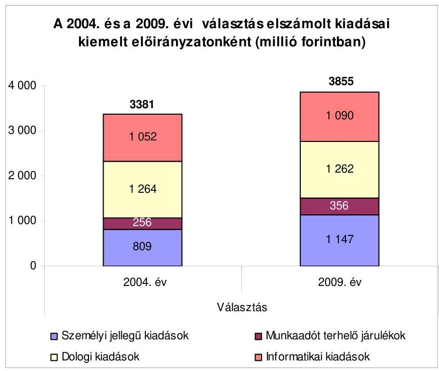

A választáson belföldön 2918406 fő, a külképviseleteken 3373 fő vett részt. Az elszámolt kiadások és a megjelentek száma alapján az egy főre jutó kiadás belföldön 1299 Ft, külföldön 18678 Ft volt.

Az ÖM ${ }_{2}$ rendeletben előírt pénzügyi ellenőrzést az önkormányzati miniszter által jóváhagyott 2010. évi ellenőrzési tervben ütemezték, a kiadott vizsgálati program alapján hat vizsgálati helyszínen terveztek ellenőrzést, melynek eredményéről 2010. március 19-ig nem készült el a jelentés. A KEKKH módosított 2009. évi ellenőrzési tervében a választáshoz kapcsolódó pénzügyi ellenőrzés szerepelt, ami a választás pénzügyi elszámolásaira, valamint az azokhoz kapcsolódó számviteli nyilvántartásokra terjedt ki. A KüM eleget tett az ÖM ${ }_{2}$ rendeletben, valamint a megállapodás ${ }_{2,3}$-ban előírt belső ellenőrzési kötelezettségének. A HVI-k vezetői az $\mathrm{OM}_{2}$ rendeletben előírtak szerint a választás pénzügyi kiadásainak elszámolását és utóellenőrzését a választási iroda egy tagjának adott megbízás útján voltak kötelesek elvégezni, amit egy HVI nem hajtott végre.

A 2008. március 9-én megtartott országos ügydöntő népszavazás lebonyolításához felhasznált pénzeszközök elszámolásának ellenőrzéséről készített, a 2009. évben átadott ÁSZ jelentés az önkormányzati miniszter részére öt javaslatot, a pénzügyminiszternek és az önkormányzati miniszternek egy közös javaslatot, továbbá a külügyminiszternek két javaslatot tartalmazott. Az önkormányzati miniszter részére tett öt javaslat hasznosítása érdekében intézkedési tervet készítettek. A javaslatok közül egy részben hasznosult. Az intézkedési tervben a választás pénzügyi lebonyolításának ellenőrzése kezdetére az önkormányzati miniszter 2009. III. negyedévet jelölte meg, ennek ellenére az ellenőrzési programot 2009. november 27 -én készítették el. A további négy javaslat, illetve a pénzügyminiszternek, és az önkormányzati miniszternek tett egy közös javaslat - az előző számvevőszéki jelentés 2009. augusztusi átadása miatt - a 2010. évi országgyűlési képviselő választások előkészítése, illetve lebonyolítása során

---

hasznosítható. A külügyminiszternek tett két javaslatból egy hasznosult, mivel a szavazáshoz kapcsolódóan csak olyan kiadásokat számoltak el, amelyekre a fedezetet megállapodásokban, illetve normatívákban biztosították. Egy javaslat nem hasznosult, mert a 2009. évi KüM utasítás az előző szabályozással azonosan a szavazástechnikai anyagok kizárólag futárküldeményként való szállítását írta elő, ezzel szemben gyorspostai szolgáltatást vettek igénybe.

A helyszíni ellenőrzés megállapításainak hasznosítása mellett javasoljuk:

# az önkormányzati miniszternek 

1. gondoskodjon arról, hogy a választáshoz kapcsolódóan többlet előirányzatot meghatározott többletfeladatra biztosítsanak;
2. gondoskodjon, hogy a normatívában meghatározott személyi jellegű juttatások kifizetését ellenőrizzék annak érdekében, hogy a feladatot ellátók részére a meghatározott díjazás kifizetésre kerüljön;
3. gondoskodjon arról, hogy a választási feladat ellátásához a céljutalom összege a tényleges többletmunka alapján kerüljön meghatározásra;

## a külügyminiszternek

1. biztosítsa a pénzügyi terv készítése során a dologi kiadások megalapozott, takarékos tervezését;
2. gondoskodjon az ÁSZ korábbi javaslatának megfelelően a KüM utasítás előírásának betartatásáról a szavazástechnikai anyagok szállítására vonatkozóan.

---

# II. RÉSZLETES MEGÁLLAPÍTÁSOK 

## 1. A VÁlasztÁs PÉNZÜGYI ElőKészítÉse

### 1.1. A választás költségtervének elkészítése, az előirányzatok biztosítása

A választási feladatok lebonyolításához szükséges pénzügyi fedezet megállapításához az OVI vezetője és a KEKKH elnöke 2008. októberben előzetes számításokat készített. Az önkormányzati miniszter által jóváhagyott feladatsoros költségterv 4100 millió Ft összköltséget tartalmazott, a fedezetét a 2009. évi költségvetési törvény XI. ÖM fejezetében biztosította az Országgyúlés. Az önkormányzati miniszter az ÖM utasításában ${ }^{1}$ rendelkezett a fejezeti kezelésű előirányzatok felhasználásának rendjéről.

Az ÖM és a MEH a 2009. február 13-án megkötött megállapodás ${ }_{1}$-ben rögzítette, hogy a választás - KEKKH által teljesítendő - feladataira egyszeri jelleggel 3951 millió Ft ( 3584 millió Ft működési célú és 367 millió Ft felhalmozási célú) költségvetési előirányzat átcsoportosítást hajtanak végre a X. Miniszterelnökség fejezet KEKKH cím kiemelt előirányzatai javára. A XI. ÖM fejezet költségvetésében került átcsoportosításra 149 millió Ft múködési célú kiadás, amely az ÖM (33 millió Ft), a RÁH-ok ( 30 millió Ft) és a KüM ( 86 millió Ft) múködési célú kiadási előirányzataiból tevődött össze.
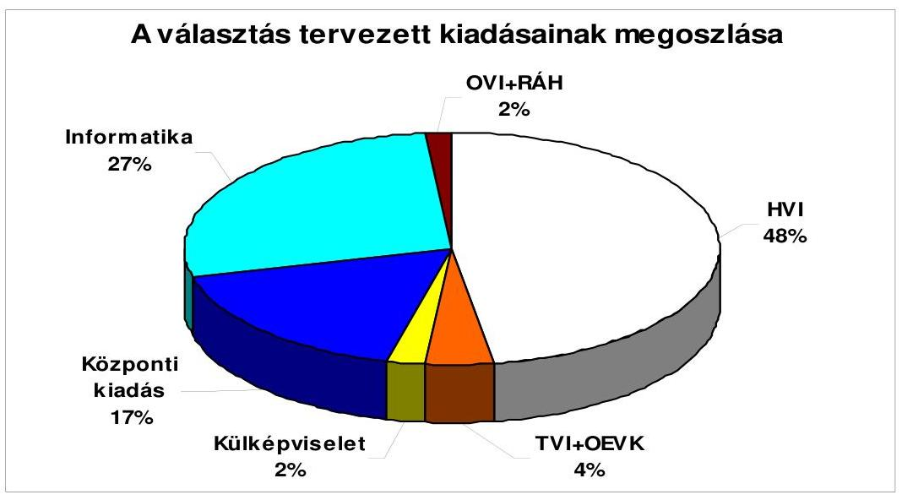

[^0]
[^0]:    ${ }^{1}$ A fejezeti kezelésű előirányzatok felhasználási rendjéről szóló 4/2009. (II. 27.) ÖM utasítás.

---

Az önkormányzati miniszter a választás lebonyolításához kapcsolódóan kiadta az $\mathrm{OM}_{2}$ rendeletet ${ }^{2}$, amelyben a tervezés, az elszámolás és az ellenőrzés rendjét szabályozta. A választás pénzügyi terve összességében 5,8\%-kal volt alacsonyabb a 2004. évinél, annak ellenére, hogy a választási szervek részére tervezett kiadás 34,3\% növekedést képviselt, ezen kiadások emelkedését a 2004. évi EP választás óta a személyi és dologi normatívák növekedése eredményezte.

Az $\mathrm{OM}_{2}$ rendeletben rögzített dologi normatívák tételei változó mértékben (14-168\%-kal), a szavazókörre vetítve a normatívák 500-5800 Ft közötti összegekkel emelkedtek, a személyi juttatások normatívái az SzSzB tagokra és a jegyzőkönyvvezetőkre vonatkozóan ( $50 \%$-kal) $5000 \mathrm{Ft} /$ fő összeggel emelkedtek. A TVB tagok díja ( $140 \%$-kal) $17500 \mathrm{Ft} /$ fő, a TVI tagjainak díja ( $400 \%$-kal) $40000 \mathrm{Ft} /$ fő, a TVI vezető helyetteseinek díja ( $275 \%$-kal) $110000 \mathrm{Ft} /$ fő, a TVI vezető díja ( $50 \%$-kal) $100000 \mathrm{Ft} /$ fő összeggel emelkedett. Az OEVK dologi kiadásai 10 millió Ft, a személyi juttatás és járulékai 14 millió Ft összeggel csökkentek. Az OEVK és a TVI normatíva összegének a tervezés során 0,5\%-os volt a változása.

A külképviseleti választáshoz kapcsolódó feladatok kiadásait ( $71 \%$-kal) 214 millió Ft-tal alacsonyabb összeggel tervezték a 2004. évi választás kiadásainál, ez a csökkenés az utazási költségeknél ( 67 millió Ft), oktatási kiadásoknál ( 40 millió Ft), szállás költségeknél ( 43 millió Ft), a tartaléknál ( 50 millió Ft) és a személyi juttatásnál ( 14 millió Ft) jelentkezett.

A központi szintű feladatok kiadásainak ( $38 \%$-kal) 451 millió Ft-tal alacsonyabb összeggel tervezett összegét az OVI működési kiadásainak 44 millió Ft, a pártsemleges kampány 175 millió Ft, a szavazólapok, nyomtatványok 207 millió Ft, képzés 25 millió Ft, kiadványok, fordítások 88 millió Ft csökkenése és a KEKKH általános költségeinek 82 millió Ft, valamint a személyi kiadás hat millió Ft növekedése határozta meg. Az informatikai kiadások a 2004. évi EP választás adatához viszonyítva $6 \%$-kal magasabb összeggel kerültek tervezésre, a növekedés az informatikai eszközök 69 millió Ft, az informatikai szolgáltatások 84 millió Ft, a projektmenedzsment 39 millió Ft növekedéséből és az alkalmazás fejlesztés 128 millió Ft csökkenéséből adódott.

A KüM a választás külképviseleti feladatainak végrehajtásához az $\mathrm{OM}_{2}$ rendelet 1. § (4) bekezdése alapján 2009. április 28 -án pénzügyi feladattervet készített. A pénzügyi tervet feladatonkénti bontásban a KüM Központi Igazgatása KüVI-ként részletezve ${ }^{3}$, valamint összesítve készítette el, amelyben a kiadások tervezett összege 106,3 millió Ft volt.

A választás pénzügyi tervezési feladatának az ellenőrzött választási szervek és RÁH-ok az $\mathrm{OM}_{2}$ rendelet 1. § (2) bekezdés a) pontjában meghatározottaknak megfelelően eleget tettek, figyelembe véve az $\mathrm{OM}_{2}$ rendelet 1 . számú mellékletében rögzített költségnormatívák összegét. Általános hiányosság volt a pénzügyi tervekben, hogy a kiadásokat csak kiemelt előirányzat - személyi juttatások, munkaadókat terhelő járulékok, dologi kiadások - bontásban mutatták ki, azon belül a feladatonkénti részletezés elmaradt. A választáshoz kapcsolódó

[^0]
[^0]:    ${ }^{2}$ Az Európai Parlament tagjai 2009. évi választása költségeinek normatíváiról, tételeiről, elszámolási és belső ellenőrzési rendjéről szóló 7/2009. (II. 25.) ÖM rendelet.
    ${ }^{3}$ A pénzügyi feladatterv 101 KüVI tervezett kiadásait tartalmazta.

---

pénzügyi tervekben a kiadásokat a HVI-k 38\%-a, a TVI-k egyharmada, a RÁHok fele nem részletezte feladatonként.

Az önkormányzatok a pénzügyi tervekben a választás lebonyolításához saját forrás igénybevételt nem terveztek, ezzel ellentétben a RÁH-ok háromnegyede tervezett, melynek forrásául a választói névjegyzék elkészítésének dijából származó bevétel szolgált.

A választási feladatok ellátáshoz kapcsolódóan az Észak-magyarországi RÁH Salgótarjáni Kirendeltsége 2559 ezer Ft, a Közép-dunántúli RÁH Veszprémi Kirendeltsége 4458 ezer Ft, a Dél-dunántúli RÁH Kaposvári Kirendeltsége 161 ezer Ft összegben tervezett a választással összefüggésben keletkező saját forrás igénybe vételt.

Az ÖM és a MEH fejezet, továbbá a KEKKH képviselői az ÖM ${ }_{2}$ rendelet 3. §ában előírtak alapján 2009. február 13-án három oldalú megállapodásban (megállapodás ${ }_{1}$ ) rögzítették a fejezetek közötti előirányzat átcsoportosítást a KEKKH részére, amelyben meghatározták a kiemelt előirányzat csoportokat és a biztosított forrás felhasználására vonatkozó előírásokat, valamint az elkülönített nyilvántartási kötelezettséget. A megállapodás ${ }_{2}$-ban az ÖM a KEKKH elnökét bízta meg, hogy a választásra biztosított 4100 millió Ft támogatás felhasználásáról összesített elszámolást készítsen az önkormányzati miniszter részére. Az ÖM közjogi és koordinációs szakállamtitkára ${ }^{4}$ és a KüM államtitkára 2009. május 11-én megkötötte az $\mathrm{OM}_{2}$ rendelet $1 . \S$ (3) bekezdésében meghatározott megállapodás ${ }_{2}$-t a külképviseleti szavazás pénzügyi lebonyolítása, elszámolása és ellenőrzése rendjéről. A megállapodás ${ }_{2}$ magába foglalta az ÖM források biztosításával kapcsolatos kötelezettségét, a KüM feladatait a választás lebonyolítása, számviteli nyilvántartása és elszámolása vonatkozásában.

A választás feladataira a 3951 millió Ft előirányzatot a megállapodás ${ }_{1}$ alapján az ÖM fejezet 2009. évi előirányzatából biztosították, amellyel a KEKKH 2009. évi költségvetését 2009. március 4-én módosították. A költségvetési előirányzatok módosításáról - kiemelt előirányzatonként - a MEH jóváhagyása szerint gondoskodtak, külön analitikus nyilvántartást készítettek az önkormányzati miniszter által jóváhagyott pénzügyi terv részletezettségének megfelelően.

Az ÖM a költségvetési fejezetében rendelkezésre álló összegből a KEKKH-t megillető 3951 millió Ft előirányzatot az $\mathrm{OM}_{2}$ rendelet 3. §. és 4. § (1) bekezdésében foglaltaknak megfelelően 2009. március 25-én átcsoportosította a $\mathrm{MEH}^{5}$ fejezeten belül a KEKKH, a KüM-ot megillető 86 millió Ft előirányzatot 2009. május 21-én a KüM ${ }^{6}$ költségvetésébe, ezzel biztosítva az előirányzatok időben történő rendelkezésre állását. A RÁH-oknak 30 millió Ft előirányzatot 2009. április 9-

[^0]
[^0]:    ${ }^{4}$ Az ÖM közjogi és koordinációs szakállamtitkárt az ÖM utasításban ruházta fel a miniszter kötelezettségvállalói jogosultsággal.
    ${ }^{5}$ Az átcsoportosítás a Miniszterelnökség fejezet KEKKH kiemelt előirányzataira történt.
    ${ }^{6}$ Az átcsoportosítás az 1. Külügyminisztérium cím, 1. Külügyminisztérium központi igazgatása alcímre történt.

---

én, a fejezeten belüli előirányzat átcsoportosítással a dologi, személyi és járulékok kiemelt előirányzatra, a központi lebonyolításhoz kapcsolódó személyi juttatás (OVI tagok, vezetők céljutalma) és járulékai kiadásaira szolgáló 33 millió Ft előirányzatot 2009. július 3-án az ÖM gazdálkodási előirányzatra csoportosították át.

# 1.2. Az előirányzatok módosítása és átcsoportosítása 

A KEKKH 2009. évi költségvetését a választáshoz kapcsolódóan négy alkalommal módosították, az első módosítás az ÖM fejezetben jóváhagyott előirányzatból a KEKKH részére meghatározott feladatokhoz ${ }^{7}$ kapcsolódó 3951 millió Ft előirányzat összegének nyilvántartásba vétele volt. A második esetben a költségterv előirányzatainak módosítását hajtották végre az informatikai eszközök bővítése előirányzat 14 millió Ft-os csökkentésével, az OEVK személyi kiadások azonos összegű növelésével az önkormányzati miniszter jóváhagyása alapján. Az ÖM ${ }_{2}$ rendelet 2. § (1) bekezdés szerint „A választás helyi és területi feladatai előkészitésének és lebonyolításának pénzügyi fedezetéül az 1. mellékletben felsorolt tételek, normativák szolgálnak". Az ÖM ${ }_{2}$ rendelet 1. számú mellékletének 2.06. sorában biztosított normatíva szerint az „Okmányirodai HVI plusz tagjainak díja 5 fó x $15000 \mathrm{Ft} /$ fő" díj tétele valamennyi (285) Okmányirodai HVI plusz 5 fő díjának fedezetéül szolgált, ami a választásra készített költségtervben és a támogatás kiutalásban realizálódott. A melléklet 2.22. sorában foglaltak szerint az „OEVK székhely települések és okmányirodai feladatokat ellátó választási iroda tagjainak díja $15000 \mathrm{Ft} /$ fő, irodánként 5 fő figyelembevételével", azon okmányirodai feladatot ellátó választási irodák szerepeltek, amelyek OEVK központ (148) feladatait is ellátták. A többi település esetében a választáshoz kapcsolódó feladatot nem határoztak meg (285-148=137 település). Ennek következtében a többletfeladatra biztosított ( 5 fő/település x 137 település x $15000 \mathrm{Ft} /$ fő= 10275000 Ft) 10,3 millió Ft személyi juttatás és a 3,3 millió Ft munkaadót terhelő járulék, összesen 13,6 millió Ft előirányzat átcsoportosításhoz többletfeladatot nem határoztak meg, ezért az megalapozatlan volt.

Az ÖM arra a javaslatunkra, hogy többlet előirányzatot többletfeladatra biztosítsanak a következő észrevételt tette: „A feladatsoros költségterv összeállítását követően a miniszteri rendelet pontositotta az OEVK települések és okmányirodák feladatait, így a tervezés során még figyelembe nem vett feladatok mögé is pénzügyi támogatás került."

Az észrevétel azért nem megalapozott, mert az $\mathrm{OM}_{2}$ rendeletet nem módosították, és az OEVK székhelytelepülések az abban meghatározott normatíván felül kaptak támogatást, amihez azonban nem határoztak meg többlet feladatot, az előirányzat-átcsoportosításakor csak az összeget növelték meg.

A harmadik és negyedik előirányzat módosítás a MEH (KEKKH) és a KüM által kötött megállapodás ${ }_{2}$ szerint történt az informatikai fejlesztés költségterv jogcím 10 millió Ft előirányzat csökkentésével, ezzel azonos összegű KüM (KüVi infrastruktúra igény) részére történt átadás egyéb dologi kiadás előirányzatára, illetve a tartalék a vészhelyzeti múködés biztosítására költségterv jogcím 10

[^0]
[^0]:    ${ }^{7}$ az önkormányzati miniszter 2009. január 8-án kelt VAL/23/2009. számú levele

---

millió Ft előirányzat-csökkentés végrehajtásával, a KüM részére dologi kiadás előirányzat átadásával történt meg. A MEH fejezeten belül a KEKKH választásra biztosított előirányzatából 20 millió Ft átcsoportosítás történt a megállapodás ${ }_{3}$ alapján a KüM fejezet részére a dologi kiadások kiemelt előirányzatai javára.

A KüM felmérése szerint a külképviseleteken, a névjegyzékek és szavazólapok előállításához szükséges nyomtatók, kellékanyagok beszerzése, szükség esetén meglévő nyomtatók javítása, a KüVI tagok utazási költsége, a forint értékének külföldi valutákkal szembeni romlása pótlólagos kiadások felmerülését okozta az ellátandó feladatokkal kapcsolatban.

A megállapodás ${ }_{3}$ alapján biztosított támogatás nem volt megalapozott, mivel a KüM eredeti előirányzatához ( 86 millió Ft) viszonyított maradványa 23 millió Ft volt, amit az átcsoportosított előirányzat ( 20 millió Ft) tovább növelt.

Az önkormányzatok a választás pénzügyi megvalósításához szükséges előirányzat módosításokat az előirányzat felhasználását megelőzően nem hajtották végre, megsértve ezzel az Áht. 12/A. § (1) bekezdésében foglaltakat, mivel fizetési kötelezettséget jóváhagyott kiadási előirányzat nélkül vállaltak. A választásra biztosított központi normatív támogatás átvétele miatt indokolt előirányzat módosítást az Ámr. 53. § (2) bekezdésében előírtakkal ellentétben a jóváírást követő negyedévben a helyi önkormányzatok 95,2\%-a, a megyei önkormányzatok kétharmada nem végezte el ${ }^{8}$.

# 2. A VÁlasztÁs PÉNZÜGYI LEBONYOLÍTÁSA 

### 2.1. A jóváhagyott előirányzatok rendelkezésre állása

A KEKKH előirányzat felhasználási keret számlájára a 2009. február 3-án az önkormányzati miniszter által jóváhagyott 3951 millió Ft előirányzat átcsoportosításra, a megállapodó felek (ÖM, MEH) intézkedtek a MÁK felé 2009. február 11-ig, az éves keretet megnyitották, de a finanszírozást május hónaptól ütemezte a MÁK nyolc egyenlő részletben. A havi 494 millió Ft forrás nem biztosította a TVI-k részére utalandó 2024 millió Ft fedezetét, a KEKKH a választás kiadásait nem tudta teljesíteni, mivel a választási szervek részére 2009. május 8 -ig folyósítani kellett az előlegeket, továbbá a központi kiadások április hónaptól folyamatosan teljesítendők voltak. A KEKKH a MEH fejezettel közösen előrehozási kérelmet nyújtott be a MÁK felé 2009. április 2-án, amelynek alapján 2009. május 4-én 3026 millió Ft támogatás átutalása megtörtént.

A KEKKH elnöke az ÖM ${ }_{2}$ rendelet 4. § (3) bekezdésében előírt támogatási határidőn belül 2009. május 6-án intézkedett az átutalásra a TVI-k részére. A MEH és KüM közötti kétoldalú megállapodás alapján a KEKKH költségvetéséből, a KüM részére történt egyszeri előirányzat átcsoportosítás 2009. május 25-én teljesült. A választáshoz kapcsolódóan kiadások merültek fel az

[^0]
[^0]:    ${ }^{8}$ Az ÁSZ 2005. évi 0560 számú jelentésében megállapította, hogy az önkormányzatok 58,3\%-a nem gondoskodott a választás pénzeszközeinek határidőn belüli előirányzat módosításáról.

---

előirányzat átcsoportosítását megelőzően, amelyeket a KüM saját forrásból megelőlegezett.

A TVI-k a választás pénzügyi fedezetének a HVI-ket és OEVI-ket megillető részét a választás napját megelőző 15 . munkanapig átutalták a polgármesteri hivatalok, valamint körjegyzőség esetén a körjegyzőség költségvetési elszámolási számlájára. A választáshoz biztosított normatíva előleg rendelkezésre állását megelőzően a HVI-k és a TVI-k egyharmada előlegezett meg a választással öszszefüggő kiadást, ami a költségvetési gazdálkodásban likviditási gondokat nem okozott. A megelőlegezett kiadások közül a személyi juttatásokat az SzSzB-be bevont póttagok számának növekedése miatti többletkifizetés és a választási értesítők kézbesítése kapcsán kifizetett díjazás, a dologi kiadásokat a nyomtatási kellékanyagok beszerzése, utazási költségtérítés, a választói névjegyzék és az értesítő szelvények kifizetése indokolta. A TVI-k által megelőlegezett kiadás a HVI-k vezetői részére szervezett oktatás miatti kifizetésből keletkezett.

# 2.2. A szabályozás és a nyilvántartás 

A KEKKH elnöke az ÖM ${ }_{2}$ rendelet 1. § (2) bekezdés c) pontjában foglaltak alapján 2009. március 10-én az 5/2009. számon intézkedést adott ki a választás gazdálkodási és ellenőrzési feladatainak végrehajtásáról, melyben szabályozta a kötelezettségvállalásra, utalványozásra, ellenjegyzésre vonatkozó előírásokat, meghatározta a számviteli (nyilvántartási) rendet, a reprezentációs kiadások mértékét és az elszámolás módját. Az intézkedésben az $\mathrm{OM}_{2}$ rendelet 1. § (2) bekezdés c) pontjában előírtaknak megfelelően a választás pénzeszközei feletti kötelezettségvállalási és utalványozási jogot a KEKKH elnöke magának tartotta fenn, az ellenjegyzés gyakorlására három köztisztviselőnek adott felhatalmazást.

A külügyminiszter az ÖM ${ }_{2}$ rendelet 1. § (4) bekezdésének megfelelően a Magyar Köztársaság külképviseletein lefolytatandó választások és népszavazás pénzügyi tervezésének, lebonyolításának, valamint elszámolásának rendjéről szóló 8/2009. (V. 20.) KÜM utasítás 1. számú mellékletében szabályozta a választás gazdálkodási és ellenőrzési jogköreinek gyakorlási rendjét.

A HVI vezetők 19\%-a az ÖM ${ }_{2}$ rendelet 1. § (2) bekezdés c) pontjában előírtakat figyelmen kívül hagyva nem szabályozta a választás pénzeszközei feletti gazdálkodási (kötelezettségvállalás, utalványozás) és ellenjegyzési jogkörök gyakorlásának rendjét. Az Ámr. 135. § (3)-(5) bekezdéseiben előírtak ellenére az érvényesítő személyét nem jelölte ki, valamint az Ámr. 135. § (1)-(2) bekezdéseiben meghatározottak ellenére a szakmai teljesítés igazolás módját a jegyzők közel egyötöde a gazdálkodással összefüggő szabályzatokban nem határozta meg. A 2004. évi EP választáshoz viszonyítva nem tapasztalható javulás, mivel akkor a HVI vezetők ugyanilyen arányban nem gondoskodtak az előírt szabályozásról.

Rétság Város és Csopak Község Polgármesteri Hivatalánál a jegyző a választási pénzeszközök feletti kötelezettségvállalás rendjét nem határozta meg. Alsózsolca Város Polgármesteri Hivatalánál szabályozás hiányában a jegyző a szakmai teljesítésigazolás módját nem határozta meg. Dorogháza Község Polgármesteri Hi-

---

vatalánál a jegyző nem szabályozta a szakmai teljesítésigazolás módját, illetve nem jelölte ki az érvényesítést végző személyt.

A TVI-k vezetői és a RÁH-ok hivatalvezetői mindegyike teljes körűen szabályozta a gazdálkodási és ellenőrzési jogkörök gyakorlásának rendjét az összeférhetetlenségi követelmények figyelembe vételével.

A választással kapcsolatos előirányzatokat és az elszámolt teljesítéseket a KEKKH a kijelölt 75117-5 számú szakfeladaton elkülönítve tartotta nyilván. A szakfeladatról készített főkönyvi kivonat tartalmazta a választással kapcsolatos összes kiadást, az analitikus nyilvántartásokban rögzített adatokkal az egyezőség fennállt.

A megyei önkormányzatok és a RÁH-ok mindegyike, a helyi önkormányzatok 90\%-a a választással összefüggésben a kijelölt 75117-5 számú szakfeladatot alkalmazta a bevételek és kiadások könyvelésekor.

Nézsa Község Önkormányzat Polgármesteri Hivatalában a választásra fordított pénzeszközöket a felmerüléskor az igazgatási szakfeladatra (75115-3) könyvelte. Tarany Község Önkormányzat Polgármesteri Hivatalában nem a kijelölt szakfeladaton, hanem a 75118-6 Önkormányzati képviselőválasztással kapcsolatos feladatok végrehajtása elnevezésű szakfeladaton könyvelt.

A normatív támogatásból fedezett kiadásokat a polgármesteri hivatalok két kivétellel a RÁH-ok minden esetben a kijelölt szakfeladaton könyvelték, azonban a saját forrásból teljesített kiadások könyvelésekor a megyei önkormányzatok egyharmada és a helyi önkormányzatok $10 \%$-a nem tett eleget az ÖM ${ }_{2}$ rendelet 6. § (1) bekezdésében előírtaknak, miszerint a kijelölt szakfeladaton meg kell jeleníteni a saját forrás terhére teljesített kiadásokat.

A Jász-Nagykun-Szolnok megyei Önkormányzat hivatalában 211 ezer Ft, a sümegi Polgármesteri hivatalban 105 ezer Ft, a Kunmadarasi Polgármesteri Hivatalban 56 ezer Ft saját forrás terhére elszámolt kiadást nem könyvelt a kijelölt szakfeladaton.

A választás lebonyolításakor - a tervezettől eltérően - az önkormányzatok 29,1\%-a egészítette ki saját forrásból a normatív támogatás összegét, melyből a nagyközségi, községi önkormányzatok 3-56 ezer Ft közötti, a városi önkormányzatok 50-105 ezer Ft közötti, egy megyei önkormányzat 211 ezer Ft összeget használt fel a feladatok finanszírozására. A RÁH-ok háromnegyede 161-2559 ezer Ft közötti összegekkel egészítette ki a normatív támogatás összegeit a saját forrás terhére.

# 2.3. A pénzeszközök felhasználásának jogszabályi megfelelősége 

A KEKKH-nál a Számv. tv. 165. § (1)-(2) bekezdésében előírtak szerint a gazdasági eseményekről a számviteli bizonylatokat kiállították. A gazdálkodási és az ellenőrzési jogkörök gyakorlása során a feladatokat a szabályozásnak megfelelően teljesítették.

---

A KüM a gazdasági eseményeknél a gazdálkodási és ellenőrzési jogkörök gyakorlása során a kötelezettségvállalást és az utalványozást, valamint a kötelezettségvállalás és az utalvány ellenjegyzését, a szakmai teljesítés igazolását és az érvényesítést az arra jogosultak elvégezték, csak olyan kiadást számoltak el, amelyre a megállapodás ${ }_{2,3}$-ban fedezetet biztosítottak.

A választási szerveknél és a RÁH-oknál a választáshoz kapcsolódó bevételi és kiadási bizonylatok (kifizetési jegyzékek, megbízási szerződések, dologi kiadások számlái) rendelkezésre álltak, azok - két kivétellel - alátámasztották az elszámolt kiadások indokoltságát. A választáshoz nem kapcsolódó kiadást - kis értékű tárgyi eszköz beszerzést, illetve személyi jellegű juttatást és járulékait - egy polgármesteri hivatalnál és egy RÁH-ál számoltak el.

A Szentgotthárdi Polgármesteri Hivatalban a normatív támogatás terhére a választási feladathoz nem kapcsolódó kisértékű tárgyi eszközöket (mikrohullámú sütő, vízforraló, kávéfőző) vásárolt 46380 Ft összegben, továbbá iratmegsemmisítő készüléket 98400 Ft összegben.

A Közép-dunántúli RÁH Veszprémi Kirendeltsége - 2010. január 22-én készült feljegyzés alapján - a kijelölt szakfeladatra 2009. december 31-i dátummal, 4394189 Ft összegben elszámolt személyi jellegű kifizetés és járulékai nem voltak indokoltak. A RÁH Veszprémi Kirendeltség dolgozói közül nyolc fő esetében a 2009. április-május-június havi személyi juttatásának és járulékainak 50\%-át, egy fő szintén háromhavi személyi juttatásának a $40 \%$-át (összesen 3328931 Ft személyi juttatás és 1065258 Ft munkaadókat terhelő járulék) könyveltek át a kijelölt választási szakfeladatra, amelynek indokaként a választások lebonyolítása során felmerülő közvetett költségeket jelölték meg. Az 50\%-os, illetve 40\%-os arány meghatározásához számítás nem készült.

A könyvviteli nyilvántartásokban elszámolt gazdasági múveletekről, eseményekről a Számv. tv. 165. § (1)-(2) bekezdéseiben előírt számviteli bizonylatokat kiállították és azok adatait a főkönyvi könyvelésben rögzítették.

A választással összefüggő gazdasági eseményeket magukba foglaló számviteli bizonylatok fele nem felelt meg az Ámr. 134. § (3) és (8)-(9) bekezdéseiben a kötelezettségvállalás és annak ellenjegyzésére vonatkozó előírásoknak, mivel az 50 ezer Ft -ot el nem érő kifizetések rendjét és nyilvántartását belső szabályzatban nem rögzítették, a kötelezettségvállalás nem írásban történt. A bizonylatok közel felénél figyelmen kívül hagyták az Ámr. 135. § (2) bekezdését, mivel a jegyző a szakmai teljesítés igazolás módjáról szabályzatban nem rendelkezett és az érvényesítés nem az Ámr. 135. § (4) bekezdése szerint történt. A választási szervek több mint egyötöde nem tett eleget az Ámr. 136. § (2) bekezdésének mivel az utalványozást nem az arra jogosult végezte, továbbá kétharmada az Ámr. 137. § (3) bekezdésében előírtaknak, mert az utalványozás ellenjegyzése során nem észrevételezték a kötelezettségvállalás, szakmai teljesítésigazolás, érvényesítés elmaradását.

A választást lebonyolító szervek a kötelezettségvállalást és annak ellenjegyzését 50,0\%-ban, a szakmai teljesítés igazolást 42,8\%-ban, az érvényesítést 46,4\%-ban, az utalványozást $21,4 \%$-ban, annak ellenjegyzését $60,0 \%$-ban egyáltalán nem, vagy nem minden kifizetéshez kapcsolódóan teljesítették. A 2004. évi EP választáshoz viszonyítva a bizonylatok alaki és tartalmi követelményeknek történő

---

megfelelése - az utalványozási jogkör gyakorlását kivéve - romlott, mivel akkor a kötelezettségvállalást, utalványozást és annak ellenjegyzését a választási szervek $25,0 \%-a$, a kötelezettségvállalás ellenjegyzését $39,2 \%$-a, az érvényesítést és a szakmai teljesítés igazolást $28,5 \%$-a nem teljesítette.

# 2.4. A dologi kiadások 

A választás dologi kiadásainak eredeti elöirányzata 546 millió Ft volt, ami az előirányzat átcsoportosítást követően 536 millió Ft-ra változott. A felhasználás 422 millió Ft-ra teljesült, amelyből a szavazólapok és nyomtatványok $44,9 \%$-ot, a KEKKH elszámolt általános költsége 10,8\%-ot, a nyomtatványok és a szállítási költség 10,5\%-ot, a tájékoztató anyagok 8,5\%-ot, a választási füzetek készítése $7,7 \%$-ot, a választás szakmai képzés, a névjegyzékek, az internet megjelenítés és a választási központ működési kiadásai 2,02,5\% közötti részesedést tettek ki. Az OVB múködési kiadásai, a külképviseleten szavazók értesítése, az OVI folyamatos, illetve választás napi múködési kiadásai, lakossági, sajtó tájékoztatás költségei, biztosítási feladatok ellátása és közbeszerzési eljárások díjai 0,2-1,8\% közötti részarányt képviseltek.

A választáshoz központilag biztosított nyomtatványok mennyiségének meghatározásánál az igényfelmérésen túl, a lebonyolítás biztonságát tartották elsődleges szempontnak. A költségtervben a dologi kiadások meghatározó tételei a szavazólapok és nyomtatványok, azok szállítási költsége, illetve a tájékoztató kiadványok ráfordításai (összes részesedési arány 71,6\%) voltak, ennek alapján a kialakult megtakarítást ezeken a tételeken a takarékossági döntések eredményezték.

A nyomtatványként szereplő szórólapból a tervezett 4500000 db helyett 4100000 db -ot rendeltek meg. A kiadványok közül a jegyzők és pártok részére tervezett 17000 db tájékoztató nem került megrendelésre, gyorsjelentés a választás eredményéről tervezett 900 db megrendelése elmaradt a takarékossági döntés miatt.

A KüM dologi kiadásainak 53,4\%-os teljesítése a kiadások túltervezését támasztotta alá. A megtakarítást elsődlegesen az informatikai eszközök, kellékanyagok költségeinek 92,9\%-os, a KüM dologi kiadásainak 92,7\%-os, a külképviseleti általános költségek 79,6\%-os és a KüVI tagok utazási költségeinek 35,7\%-os teljesítése okozta.

A dologi normatívák személyi jellegű juttatásokra történő átcsoportosítási lehetőségét az $\mathrm{OM}_{2}$ rendelet nem korlátozta, így az ellenőrzött községi, nagyközségi önkormányzatok kétharmada 2-262 ezer Ft közötti, a városi önkormányzatok 83,3\%-a 42-360 ezer Ft közötti, a megyei önkormányzatok mindegyike 1101428 ezer Ft közötti összegek erejéig élt a lehetőséggel. Az átcsoportosítás a községi, nagyközségi önkormányzatok dologi normatíváinak 10\%-66\% közötti, a városi önkormányzatok esetében 9\%-43\% közötti, a megyei önkormányzatoknál 9\%-67\% közötti összegét érintette. A RÁH-ok az átcsoportosítás lehetőségével nem éltek. A 2004. évi EP választáskor kisebb arányban - 46,4\%-ban - éltek az önkormányzatok a dologi normatívák személyi jellegú kifizetésekre történő átcsoportosításával. A dologi kiadások átcsoportosítását végző szervezetek számának növekedése és az átcsoportosítás arányai alap-

---

ján megállapítottuk, hogy a dologi normatívák összege a felmerülő tényleges kiadások fedezetén túlmenően alapot adtak a személyi juttatások normatívában szereplő tételeinek kiegészítésére.

Az ÖM ${ }_{2}$ rendelet 1. számú mellékletében meghatározott tételek és normatívák nem tartalmaztak - a dologi kiadások előirányzatain belül - reprezentációs kiadásokkal, élelmezéssel, étkeztetéssel összefüggő tételeket. Ennek ellenére a választás napján - a TVI-k esetében a választás napját megelőzően a HVI vezetők részére szervezett értekezletek során - a lebonyolításban résztvevők részére a rendelkezésre álló dologi normatívákból történő felhasználással teljesítettek reprezentációs kiadást. A felhasználások más normatíva jogcím terhére történtek, azok indokoltak voltak, a választási feladat ellátásához kapcsolódtak ${ }^{9}$. Az ellenőrzött HVI-k 95,2\%-a, a TVI-k mindegyike, a RÁH-ok fele teljesített ilyen jellegű kiadást különböző összegekben. A teljesített dologi kiadásoknak a községi, nagyközségi önkormányzatok a $8,2 \%-50,0 \%$ közötti, a városi önkormányzatok a $14,5 \%$ $56,9 \%$ közötti, a megyei önkormányzatok $43 \%-80,5 \%$ közötti, a RÁH-ok 3,2\%$13,2 \%$ közötti részét használták fel reprezentációval, élelmezéssel, étkeztetéssel összefüggő kiadásra.

A községi, nagyközségi önkormányzatok 8,0-55,9 ezer Ft közötti, a városi önkormányzatok 26,9-113,7 ezer Ft közötti, a megyei önkormányzatok 172,0-497,7 ezer Ft közötti, a RÁH-ok 13,5-46,3 ezer Ft közötti összegekben teljesítettek reprezentációs kiadással, élelmezéssel, étkeztetéssel összefüggő kiadást.

A választás lebonyolításával kapcsolatban a KEKKH múködési kiadásai között merültek fel általános költségek, amelyek megosztását az önköltségszámítási szabályozat ${ }^{10} 5$. pontja alapján a választás kiadásai módosított előirányzatának intézményi költségvetésből képviselt megosztási aránya szerint számolták ki. Általános költségként 2009. július 27 -én a választásra elszámolt kiadásra $4,04 \%$-ot, 46 millió Ft-ot könyveltek le.

A választás napján és azt megelőzően a választási szerveknél felmerülő általános költséget (távközlési szolgáltatás, gépjármúhasználat, közüzemi szolgáltatások díja, sokszorosítás) a HVI-k 43\%-a, a TVI-k egyharmada nem számolt el annak ellenére, hogy az $\mathrm{OM}_{2}$ rendelet 1 . számú mellékletében erre a célra a forrás biztosított volt. Az általános költséget elszámoló HVI-k 52\%-a a költségfelosztáshoz szükséges számításokat nem végzett, így a kimutatott és a főkönyvi könyvelésben elszámolt összegek nem voltak alátámasztottak.

Az OVI vezetője és a KEKKH elnöke eleget tett a választás előkészítéséhez, szervezéséhez, lebonyolításához kapcsolódó feladatainak, mivel teljesítette a választó polgárok tájékoztatását, a választási adatkezelést és a technikai feltételek megteremtését az $\mathrm{OM}_{2}$ rendelet 1. § (1) bekezdésében rögzí-

[^0]
[^0]:    ${ }^{9}$ Az országgyűlési képviselők 2010. évi általános választása költségeinek normatíváiról, tételeiről, elszámolási és belső ellenőrzési rendjéről szóló 36/2009. (XII. 30.) OM rendelet 1. mellékletében már tervezték a „választásnapi ellátás költsége szavazókörökben" normatívát.
    ${ }^{10}$ A 2008. január 1-től hatályos önköltség számítási szabályzat.

---

tett előírások szerint. A választáshoz nem kapcsolódó dologi kiadást nem számoltak el a számviteli nyilvántartásban.

A KüM államtitkára 2009. május 25 -én rendelte el a választás lebonyolítására kiutazók kiküldetését, amely kapcsán a megállapodás ${ }_{2,3} 3$. számú mellékletének b) pontjában foglaltak szerint a KüVI vezetők, KüVI tagok és póttagok részére kiutazásukhoz repülőjegy, kijelölt állomáshelyekre történő kiutazáshoz külügyi gépkocsi és gépkocsivezető, utasbiztosítás (biztosítási kártya), napidíj, valamint taxiköltség biztosítását írta elő. A KüM utasítás VI/6. pontjában foglaltaknak megfelelően a kiutazó KüVI vezető, KüVI tag és póttag részére egységesen az állomáshelyre megállapított II. kategóriának megfelelő napidíj elszámolását rendelte el, valamint a KüM utasítás VI/7. pontjában foglaltak szerint meghatározta a „business C" osztályú repülőjeggyel elérhető állomáshelyek körét. A gépkocsival történő utazás esetén a gépkocsivezetők részére a 13/2005. KüM utasítás szerinti IV. kategóriának megfelelő napidíj elszámolását határozta meg.

A választási feladat elvégzését megelőzően a HVI-k által választott szervezési és feladat-ellátási megoldások (szavazókörök kialakítása, választói névjegyzék elkészítése, személyi feltételek biztosítása) megfelelőek voltak. A HVI-k 95\%-a igényelte a választói névjegyzék készítését a RÁH-tól, azonban a feladatellátásra szerződést egy esetben sem kötöttek. Az ellenőrzött RÁH-ok háromnegyede a feladatot $15 \mathrm{Ft} / \mathrm{db}$ összegben - a normatívában meghatározott díjtétellel megegyezően - végezte el, ezzel szemben a Dél-dunántúli RÁH Somogy megyei és Baranya megyei Kirendeltsége $13 \mathrm{Ft} / \mathrm{db}$ összegben teljesítette a megrendeléseket. A HVI-k által fizetett szolgáltatási díj a RÁH-ok saját bevételét képezte, annak felhasználási, elszámolási szabályait nem határozta meg az $\mathrm{OM}_{2}$ rendelet, a bevétel nem képezte a választás lebonyolításának forrását.

Az egyes feladatok költségtakarékos elvégzésére irányuló előzetes gazdaságossági számítást (kalkulációt) a HVI-k 95,3\%-a nem végzett, ennek következtében a jelentkező megtakarítások, vagy többletköltségek várható hatását nem vették figyelembe a döntések meghozatalánál.

Dorogháza község Polgármesteri Hivatalában az értesítők borítékolása, kihordása feladat költségtakarékosabb megvalósíthatósága érdekében végeztek gazdaságossági számítást, melynek következtében a postai szolgáltatás jogcímen 27 ezer Ft megtakarítás keletkezett.

Az ellenőrzött HVI-k 14,2\%-a igényelt papír szavazóurnát a választás lebonyolításához, amit megkaptak és használtak a választás napján. Papír szavazófülkét az ellenőrzött HVI-k nem igényeltek.

# 2.5. A személyi jellegú juttatások 

Az ÖM ${ }_{2}$ rendelet 4. § (6) bekezdése előírta, hogy az önkormányzati miniszter dönt az OVI vezetője, tagjai és a KEKKH elnöke választással kapcsolatos célfeladatainak meghatározásáról, a célfeladat elvégzéséért járó céljuttatásról, továbbá intézkedést tesz annak kifizetésére.

---

Az OVI vezetője által 2009. március 26-án felterjesztett lista az OVI vezetője és a KEKKH hivatal elnöke célfeladatának és díjazásának ${ }^{11}$ kivételével az érintettek feladatait, és a javasolt céljuttatást tartalmazta, amit az önkormányzati miniszter jóváhagyott.

Az önkormányzati miniszter az OVI vezetőjének és a KEKKH elnökének 2009. május 5-én célfeladatot állapított meg a választásra vonatkozóan, a végrehajtás határidejét 2009. június 30 -ába rögzítette. A teljesítésigazolás dokumentumait 2009. június 30-án az önkormányzati miniszter aláírta és intézkedett a kifizetésre.

Az OVI 48 tagja ( 26 fő ÖM, két fő KüM és 20 fő KEKKH) részére adott díj kifizetése a választáshoz kapcsolódóan átlagosan 521 ezer Ft/fő volt, a legkisebb öszszeg 200 ezer Ft, a legnagyobb összeg 2610 ezer Ft volt. Az OVI vezetőjének kifizetett bruttó 2610 ezer Ft, a helyettesének kifizetett 1810 ezer Ft, valamint két tag részére kifizetett 900 ezer Ft feletti céljutalom összegének meghatározásánál nem vették figyelembe, hogy a választási feladatok a kitűzött célfeladatok ellátása mellett munkaköri feladatukat is képezték.

Az ÖM észrevételében a következőket fogalmazta meg: „A választási időszakban az OVI tagjainak munkaterhelése és felelőssége lényegesen magasabb az átlagos köztisztviselői terhelésnél. Az OVI Vezetőjének és a KEKKH Elnökének a juttatása - az előző népszavazáshoz viszonyítva - jelentős mértékben csökkent."

Elismerve a jelentkező többletfeladatokat, az észrevételük csak részben megalapozott, mert a kifizetett céljuttatások a tényleges többletmunkák mellett a választással kapcsolatos egyes - az érintett dolgozók munkaköri leírásában is szereplő feladatok ellátását ismerték el.

Az önkormányzati miniszter az ÖM ${ }_{2}$ rendelet 4. § (4) bekezdés b) pontja alapján az OVI vezetőjének javaslatára 2009. július 29-én döntött a TVI vezetők személyi juttatásának kifizetéséről, amely folyósításáról a KEKKH elnöke az előírt határidőben gondoskodott.

A KEKKH működési kiadásai között a személyi juttatások a következők voltak:

| Megnevezés | Létszám   fő | Kifizetett személyi   juttatás átlaga   Ft/fő |
| :-- | :--: | :--: |
| OVI tag (ÖM-től) | 26 | 541000 |
| OVI tag (KEKKH-től) | 20 | 507000 |
| OVI tag (KüM-ből) | 2 | 400000 |
| KEKKH | 173 | 35181 |
| ORFK | 20 | 50000 |
| ÖM | 3 | 76667 |

[^0]
[^0]:    ${ }^{11}$ Az OVI vezetője és a KEKKH elnöke célfeladatát és a díjazás összegét az önkormányzati miniszter személyre szólóan határozta meg.

---

| Megnevezés | Létszám   fö | Kifizetett személyi   juttatás átlaga   Ft/fö |
| :-- | :--: | :--: |
| OVB jegyzőkönyv vezető   külső megbízott | 1 | 200000 |
| OVB információs szolgáltatás külső   megbízott | 1 | 100000 |
| Nyugdíjasok | 2 | 50000 |
| Összesen | 248 | 131919 |

A személyi juttatások kifizetése a választással kapcsolatos feladatok meghatározása és a teljesítések igazolása alapján, a KEKKH elnöke intézkedése szerint történt. A KEKKH-nál a választással kapcsolatos többletfeladatok ellátására 7,7 millió Ft megbízási dí kerül kifizetésre 200 fő részére. A legalacsonyabb összeg 10000 Ft , a legmagasabb 200000 Ft volt.

Az ÖM ${ }_{2}$ rendelet 4. § (4) bekezdés b) pontjában foglalt TVI vezetői díjak kifizetése az előírt elszámolási és ellenőrzési kötelezettségek teljesítésének elbírálása alapján történt, a mértéke az $\mathrm{OM}_{2}$ rendelet 1 . számú mellékletében rögzített összegekkel azonos, hat millió Ft volt. A személyi juttatások között az OEVK székhely település és okmányirodai feladatokat ellátó választási iroda tagjai többletfeladatára biztosított támogatás és annak kiadásként történő elszámolása többletfeladat meghatározásának hiányában nem kapcsolódott a választási feladatokhoz. Ez 13,6 millió Ft kiadást jelentett.

A KüM a normatíva terhére történt kifizetések esetében betartotta az ÖM ${ }_{2}$ rendelet 2. számú mellékletében a személyi kiadásokra vonatkozó előírásait. A személyi juttatások és a munkaadót terhelő járulékok tervezett kiadásai együttesen 76,2\%-ban realizálódtak.
A választási feladat végrehajtásához biztosított pénzeszközök felhasználásakor a személyi jellegű juttatások tekintetében legalább az $\mathrm{OM}_{2}$ rendelet 5. § (1) bekezdése szerint az 1. számú mellékletében megállapított és részletezett normatívákat kellett biztosítani, vagyis az egyes jogcímeken meghatározott normatíva összegét minimumként a feladatot ellátó személy részére ki kellett fizetni. Három HVI és egy TVI vezető az adott feladat ellátásához kapcsolódó normatívában meghatározott díjazást az érintettek részére nem fizette ki teljes összegben, a szabálytalanságot az utóellenőrzés nem tárta fel, ennek következtében a különbözet kifizetése nem történt meg.

A sümegi HVI-nél az egy főre biztosított díjazást nem kapta meg minden HVI tag, a $15000 \mathrm{Ft} /$ fő normatíva összeg differenciáltan került kifizetésre. A HVI tagok 10000 - 40000 Ft közötti juttatásban részesültek. A szalántai HVI-nél négy fő jegyzőkönyvvezetői és választási irodai feladatokat együttesen ellátó HVI tag $30000 \mathrm{Ft} /$ fő, további két fő jegyzőkönyvvezető és két fő HVI tag $15000 \mathrm{Ft} /$ fő személyi juttatásra lett volna jogosult. Ezzel szemben a HVI vezetője a nyolc választási feladatokkal megbízott személynek egységesen $19000 \mathrm{Ft} /$ fő díjazást fizetett ki. Az egyházasdaróci HVI-nél a HVI egy tagja a meghatározott $15000 \mathrm{Ft} /$ fő díjazás helyett 9000 Ft juttatásban részesült. A Jász-Nagykun-Szolnok megyei TVI a

---

10 tagjára biztosított normatíva ( 50 ezer $\mathrm{Ft} / \mathrm{fő}$ ) összegét differenciáltan osztotta meg, a legkisebb kifizetett összeg 30 ezer Ft, a legnagyobb 60 ezer Ft volt.

Az ÖM a személyi juttatásokra vonatkozó 2. számú javaslatunkra a következő észrevételt tette: „A 2. pont megállapításai már a 2008. évi népszavazásról készült ÁSZ jelentésben is megfogalmazódtak, azonban azt csak az EP választást követően ismertük meg, így alkalmazására csak az idei országgyúlési választások során kerülhetett sor." Javaslatunkat jelenleg is időszerűnek tartjuk, mivel az ÖM2 rendelet előírását nem tartották be azok a választási szervek, amelyek a megjelölt normatív személyi juttatást csökkentették, és ezt az ÁSZ javaslatától függetlenül észrevételezni kellett volna.

A központi normatívákban meghatározott személyi jellegű juttatások saját forrásból történő kiegészítésére lehetőség volt. Saját forrásból egy HVI 13 ezer Ft, illetve egy HVI 58 ezer Ft és egy TVI 211,2 ezer Ft összegben teljesített kifizetést, melynek mértéke a 2004. évi EP választáshoz képest csökkent ${ }^{12}$.

# 2.6. A közbeszerzési eljárás keretébe tartozó beszerzések és szolgáltatás vásárlások lebonyolítása 

A KEKKH a választás feladatainak ellátása érdekében szükséges, összesen kiIenc közbeszerzési eljárást lefolytatta, illetve egyes informatikai eszközöket és szolgáltatásokat a központosított közbeszerzés keretében szerzett be, értékhatárt meghaladó szerződést nem kötött a közbeszerzési eljárás mellőzésével. A választáshoz kapcsolódó közbeszerzések szerződés szerinti összesített értéke 1610,7 millió Ft volt. (A közbeszerzések tárgyát és azok beszerzési értékét a jelentés 3. számú melléklete részletezi.)

A választáshoz kapcsolódóan két esetben a központosított közbeszerzés keretében történt a beszerzés.

A választás lebonyolítását érintően - a beszerzések becsült értékére tekintettel négy esetben közösségi eljárásrendben, keretmegállapodásos eljárással történt a beszerzésekkel kapcsolatos közbeszerzési eljárások lefolytatása. A választások előkészítéséhez és lefolytatásához kapcsolódóan a KEKKH három közbeszerzést a Kbt. 125. § (2) bekezdés b) pontja alapján hirdetmény közzététele nélkül induló tárgyalásos eljárás keretében folytatott le.

A hirdetmény közzététele nélkül induló tárgyalásos eljárás alkalmazásának jogszerűségét a KEKKH arra alapozta, hogy az előző választások lebonyolításához létrehozott, kialakított informatikai, pénzügyi-logisztikai rendszerek tekintetében a KEKKH szerzői jogokkal nem rendelkezett, ezért ezen rendszerek módosítására, továbbfejlesztésére kizárólag a szerzői joggal rendelkező gazdasági társaságok jogosultak. Az eljárás megkezdéséről tájékoztatták a Közbeszerzési Döntőbizottság elnökét, aki a kizárólagos jogok védelmére alapozott döntéseket elfogadta, kifogást nem emelt.

[^0]
[^0]:    ${ }^{12}$ Az ÁSZ 2005. évi 0560 számú jelentésében megállapította, hogy a HVI-k 62-106 ezer Ft közötti, egy TVI 547 ezer Ft összeggel egészítette ki a személyi jellegű juttatásokat saját forrásból.

---

A közbeszerzési eljárásokat a Kbt. előírásait betartva választották ki, illetve alkalmazták. A KEKKH a közösségi értékhatárt meghaladó közbeszerzésekre tekintettel a Kbt. 9. § (1) bekezdésében előírtaknak megfelelően hivatalos közbeszerzési tanácsadót ${ }^{13}$ vont be. A lefolytatott közbeszerzési eljárásokban - a Kbt. 8. § (3) bekezdésében és a Közbeszerzési szabályzatban foglaltak betartásával az ajánlatok elbírálására bíráló bizottságot hoztak létre. A közbeszerzési eljárások dokumentálása a Kbt. 7. § (1) bekezdésében, valamint a Közbeszerzési szabályzatban ${ }^{14}$ rögzítetteknek megfelelően történt. A keretmegállapodásokat, valamint a vállalkozási szerződéseket az ajánlatokkal összhangban kötötték meg. A keret-megállapodások a Kbt. 136/A. § (5)-(6) bekezdéseiben előírtaknak megfeleltek, azaz a keret-megállapodásokat minden esetben határozott időtartamra, az aláírásuktól számított 48 hónapra kötötték, és azok tartalmazták a közbeszerzések tárgyát, az ellenszolgáltatás mértékét. A vállalkozási szerződésekben a teljesítés elfogadásának rendjét, a szerződést biztosító mellékkötelezettségeket (jótállás, szavatosság, késedelmi kötbér) meghatározták. A választásokhoz kapcsolódóan lefolytatott közbeszerzési eljárásokkal kapcsolatosan a Közbeszerzések Tanácsa Közbeszerzési Döntőbizottsága a KEKKH, mint ajánlatkérő ellen eljárást nem indított.

A választáshoz kapcsolódóan a tárgyi eszközök fókönyvi számlákon öszszesen 321 millió Ft felhalmozási célú kiadást könyveltek le a Számv. tv. 23. § (4) és a 24. § (1) bekezdés előírásainak megfelelően. A KEKKH-nál az aktivált eszközök értékéből egyéb vagyoni értékű jogok értéke 312 millió Ft, az egyéb szellemi termék értéke öt millió Ft, a számítástechnikai eszközök értéke négy millió Ft volt. A TVI-k, OEVK-k és a RÁH-ok részére a választáshoz számítástechnikai eszköz nem került beszerzésre, illetve átadásra. A korábbi években üzemeltetésre és kezelésre átadott eszközök év végi leltározásához a 2009. december 31-ei fordulónappal a tárolási nyilatkozatot az eszközök kezelői megküldték.

# 2.7. Az informatikai feladatok tervezése és végrehajtása 

Az ÖM ${ }_{1}$ rendelet ${ }^{15} 4$. § (2) bekezdés b) pontjában rögzítésre került, hogy a választás lebonyolításához a KEKKH által üzemeltetett IVSZR-t kell alkalmazni.

A 2004. évi EP választáson az IVSZR alkalmazás nem, illetve az azóta lebonyolított választásoknál is csak részben állt rendelkezésre, ezért új rendszerelemek fejlesztésére volt szükség, valamint a választáshoz speciális adaptációs feladatokat kellett megvalósítani. A tervezett informatikai kiadás a 2004. évi EP választáshoz viszonyítva 6,0\%-kal növekedett, ezen belül csökkent az alkalmazásfejlesztés és nőtt az informatikai eszközbeszerzés, az informatikai

[^0]
[^0]:    ${ }^{13}$ A hivatalos közbeszerzési tanácsadói feladatok ellátásával a BMSK Zrt. bízták meg, amely a hivatalos közbeszerzési tanácsadói névjegyzék 145. sorszámán volt nyilvántartva.
    ${ }^{14}$ a KEKKH elnöke által jóváhagyott, 2008. augusztus 1-én hatályba lépett Közbeszerzési szabályzat
    ${ }^{15}$ A választási eljárásról szóló 1997. évi C. törvénynek az Európai Parlament tagjainak választásán történő végrehajtásáról szóló 6/2009. (II. 25.) ÖM rendelet.

---

szolgáltatások, valamint a projektmenedzsment és a minőségbiztosítás kiadása. A teljesített kiadás 3,6\%-os emelkedést mutatott.

A választáshoz tervezett informatikai kiadási előirányzat kialakításakor figyelembe vették a rendelkezésre álló és felhasználásra alkalmas eszközök kapacitásait. A választásra tervezett és a tényleges informatikai kiadások tételes összehasonlítása alapján a megtakarítás 34 millió Ft összegű, 3,0\%-os mértékű, a módosított előirányzathoz viszonyítva ez a mérték 1,0\%-os volt.

A KEKKH a választás tervezésekor a meglévő informatikai eszközeinek használatát figyelembe vette, illetve bérbevétellel számolt, amennyiben az adott eszközre csak a választásnál volt szükség, ilyen volt a Választási Központban az infrastruktúra kapacitás megnövelése. Az alkalmazott informatikai rendszer minőségbiztosítási felülvizsgálata megtörtént a hibamentes múködés érdekében. Az ellenőrző tesztelési eljárásokat lefolytatták. A választás során alkalmazott informatikai rendszerek múködésének oktatása megtörtént, az oktatási, tájékoztatási képzéseket gyakorlati próbákkal kötötték össze.

Az informatikai rendszer a választás során megfelelően működött, nem merült fel olyan probléma, amely feldolgozási fennakadást, tájékoztatási zavart, vagy összesítési hibát okozott volna.

# 3. A VÁLASZTÁSI FELADATOKRA FELHASZNÁLT PÉNZESZKÖZÖK ELSZÁMOLÁSA 

A HVI-k vezetői az ÖM ${ }_{2}$ rendelet 7. § (1) bekezdésében meghatározott feladattípusú elszámolást határidőn belül (a választás napját követő 10 naptári nap) elkészítették és átadták a TVI-k vezetői részére. Az ellenőrzött HVIknek, egy esettől eltekintve - Rétság Város Önkormányzata egy SzSzB tag tiszteletdíjról való lemondásának következtében 20 ezer Ft-ot fizetett vissza az előírt határidőn belül - visszafizetési kötelezettségük nem keletkezett. A TVI-k vezetői az $\mathrm{OM}_{2}$ rendelet 7 . § (2) bekezdés a)-b) pontjaiban előírt elszámolást és összesítő elszámolást, a RÁH-ok hivatalvezetői az $\mathrm{OM}_{2}$ rendelet 7 . § (3) bekezdésében meghatározott feladattípusú elszámolást a KEKKH elnöke részére az előírt adattartalommal - 45 naptári napon belül - megküldték. A RÁH-ok és kirendeltségeik vezetőinek díjazását az OVI vezetőjének javaslata szerint az önkormányzati miniszter az $\mathrm{OM}_{2}$ rendelet 4. § (4) bekezdés c) pontja alapján 2009. július 29-én jóváhagyta és intézkedett a kifizetésre, továbbá a feladattípusú elszámolást elfogadta, a megállapított norma szerinti összeggel azonos volt a felhasználás.

A KüM a KEKKH elnöke részére az ÖM ${ }_{2}$ rendelet 7. § (4) bekezdésében foglaltaknak megfelelően a 8., valamint a 9. számú melléklet szerinti adattartalommal az előírt határidőben 95 KüVI múködése alapján összesítő elszámolást készített - a választási pénzügyi informatikai rendszer igénybevételével a rendelkezésre bocsátott támogatás felhasználásáról. Az elszámolás szerint a feladatellátásra biztosított előirányzat 59,5\%-át, 63 millió Ft-ot használtak fel.
Az ÖM ${ }_{2}$ rendelet 7. § (5) bekezdése alapján az ÖM határidőn belül, 2009. augusztus 12-én elkészítette a KEKKH elnöke részére az OVI személyi ki-

---

adásokról az elszámolást ${ }^{16}$, mely szerint a teljes előirányzat felhasználásra került, feladatelmaradás nem volt.

A KEKKH elnöke a választás költségvetési előirányzatainak felhasználásáról készített beszámolót az $\mathrm{OM}_{2}$ rendeletben megjelölt határidőn ${ }^{17}$ belül, 2009. augusztus 17-én az OVI vezetője útján az önkormányzati miniszter részére felterjesztette. Az önkormányzati miniszter a pénzügyi lebonyolításról készített szöveges beszámolót elfogadta és erről a KEKKH elnökét értesítette. A beszámolóban értékelték az $\mathrm{OM}_{2}$ rendeletben meghatározott adattartalommal az előirányzatok alakulását, a végrehajtott előirányzat módosításokat részletezték és indokoltták. A beszámolóhoz csatolták a jóváhagyott feladatsoros pénzügyi tervet, illetve az összesített feladatsoros költségelszámolást.

A feladattípusú elszámolások ellenőrzése, összesítése alapján az indokolt és elfogadott többletkiadások kiutalásra kerültek, illetve a feladatelmaradások miatt jelentkező maradványok visszautalására intézkedtek. Az ÖM fejezetnél, a KüM-nél történt előirányzatok felhasználásáról készített elszámolásokat önkormányzati miniszteri jóváhagyást követően a KEKKH részére megküldték, ezek figyelembevételével készült a választás beszámolója a pénzügyi lebonyolításról.

A választás lebonyolítására biztosított 4100 millió Ft eredeti előirányzat összege nem változott. A KEKKH részére biztosított 3951 millió Ft előirányzatból a választási szerveket 2123 millió Ft illette meg, a tényleges felhasználás 2110 millió Ft volt, így 13 millió Ft maradvány keletkezett. Az informatikai kiadások nélküli központi kiadás 76,3\%-ra teljesült, a megtakarítás 175 millió Ft volt. Az informatikai kiadásoknál 34 millió Ft maradvány volt. Az ÖM fejezet 63 millió Ft eredeti előirányzatból nem képződött maradvány, a KüM megtakarítása 23 millió Ft volt. A választás lebonyolítására a KEKKH által készített elszámolás alapján 3855 millió Ft-ot fordítottak, a teljesítés $94 \%$-os volt, az eredeti előirányzathoz viszonyított maradvány összege 245 millió Ft-ban realizálódott.

[^0]
[^0]:    ${ }^{16}$ ÖM/9014/2009. számú ügyirat
    ${ }^{17}$ Az ÖM rendelet 7. § (6) bekezdése szerint „....A KEKKH elnöke ..... összesítő elszámolást készít a miniszter részére a szavazás napját követő 70 naptári napon belül."

---

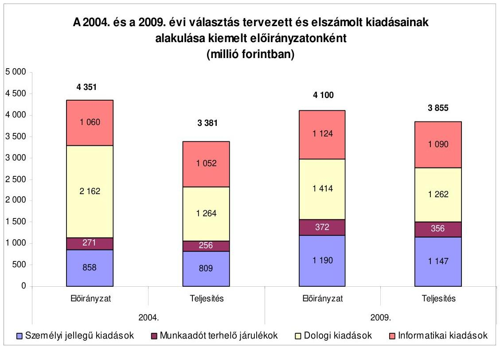

Az önkormányzati miniszter az $\ddot{\mathrm{OM}}_{2}$ rendelet 7. § (7) bekezdésében foglaltaknak megfelelően döntött a KüM és a RÁH-ok elszámolásának, továbbá a választás összesítő elszámolásának elfogadásáról. A KüM elszámolását az önkormányzati miniszter a módosított előirányzathoz viszonyítva 63 millió Ft kiadás teljesítése mellett 43 millió Ft maradvánnyal elfogadta, az ÖM a maradvány fejezetek közötti rendezéséről intézkedett. A választásról készített összesített beszámoló szerinti maradvány visszarendezésére az ÖM intézkedett, a visszautalások megtörténtek ${ }^{18}$.

A választáson belföldön 2918406 fő, a külképviseleteken 3373 fő vett részt. Az elszámolt kiadások és a megjelentek száma alapján az egy főre jutó kiadás belföldön 1299 Ft , külföldön 18678 Ft volt.

# 4. A VÁlasztÁsRa biztosítotT elöIrányzatok felhaszNÁlásáNAK ÉS ELSZÁMOLÁSÁNAK ELLENŐRZÉSE 

### 4.1. Az önkormányzati miniszter és a KEKKH elnöke ellenőrzési tevékenysége

Az ÖM 2010. évi ellenőrzési tervében az ÖM ${ }_{2}$ rendelet 8. § (1) bekezdésében foglaltaknak megfelelően szabályszerűségi ellenőrzésként a választás feladatait végrehajtó ÖM, OVI, KEKKH és a RÁH-ok ellenőrzését tervezték. A vizsgálatra 2009. november 27 -én ellenőrzési programot készítettek,

[^0]
[^0]:    ${ }^{18}$ Az ÖM fejezet előirányzat-keret számláján az előirányzat maradványt a MÁK 2009. december 19-én írta jóvá.

---

az ellenőrzött szervezetek: az ÖM szervezeti egységei, a KüM, a KEKKH és három RÁH ${ }^{19}$ voltak. Az ellenőrzés célja annak megállapítása volt, hogy a választáshoz biztosított pénzeszközök szabályszerűen és célszerűen kerültek-e felhasználásra. A jelentés 2010. március 19-ig nem készült el.

A KEKKH módosított 2009. évi ellenőrzési tervében hét ellenőrzést ütemeztek, amelyek között egy választáshoz kapcsolódó pénzügyi ellenőrzés szerepelt. A tervezett ellenőrzés a választás pénzügyi elszámolásaira, valamint az azokhoz kapcsolódó számviteli nyilvántartásokra terjedt ki. Az éves ellenőrzési tervben foglalt ütemezésnek megfelelően, a belső ellenőrzési osztályvezető által jóváhagyott ellenőrzési program alapján folytatták le a vizsgálatot.

Az ellenőrzés megállapításai - többek között - egyes gazdasági eseményekhez kiállított számlák alaki hiányosságaira, nyilvántartási hiányosságra, a szabadságengedélyek nem megfelelő kitöltésére vonatkoztak.
Az ÖM ${ }_{2}$ rendelet 8. § (1) bekezdése a TVI-k tekintetében a KEKKH számára pénzügyi ellenőrzési kötelezettséget írt elő. A KEKKH a VPIR alkalmazásával a TVI-k elszámolásait felülvizsgálta, az elszámolási hibákat egyeztetés után kijavították, a TVI-k elszámolásait elfogadták.

# 4.2. A KüM, a HVI-k, a TVI-k és a RÁH-ok vezetői ellenőrzési tevékenysége 

A KüM eleget tett az $\mathrm{OM}_{2}$ rendelet 8. § (4) bekezdésében, valamint a megállapodás ${ }_{2}$-ban előírt, a választás kapcsán felmerült belső ellenőrzési kötelezettségének. A KüM Belső Ellenőrzési Osztályának vizsgálata kiterjedt a választás előkészítésével, lebonyolításával kapcsolatos feladatok végrehajtásának teljesítésére, illetve ezzel összefüggésben a KüM Igazgatás és a Külképviseletek Igazgatása alcímen a választási szakfeladaton elszámolt kiadások jogszerűségére, szabályszerűségére és dokumentáltságára. Az ellenőrzés szabályszerűnek minősítette a pénzügyi, tervezési, elszámolási és logisztikai feladatok ellátását. Az ÖM ${ }_{2}$ rendelet 8. § (1) bekezdésének előírásának megfelelően a KüM pénzügyi elszámolásának ellenőrzését az ÖM dokumentumok alapján elvégezte.
A HVI-k és a TVI-k vezetői az $\mathrm{OM}_{2}$ rendelet 8. § (3) bekezdésében előírtak szerint a választás pénzügyi kiadásainak elszámolását és utóellenőrzését a választási iroda egy tagjának adott megbízás útján voltak kötelesek ellátni. A HVI-k vezetői a feladattípusú elszámolás teljesítésével egy időben a KEKKH által javasolt és a TVI-k által kiadott - egységes tartalmú - tanúsítványon nyilatkoztak arról, hogy az elszámolással és az ellenőrzéssel megbízott dolgozók a kötelezettségüket teljesítették.

A TVI-k vezetői a HVI-k feladat-típusú elszámolását a VPIR rendszerbe történő feldolgozás során - az erre kijelölt dolgozók útján -, illetve a helyszínen ellenőrizték. Az ellenőrzés a feladat-típusú elszámolások számszaki ellenőrzésére, továbbá a HVI-k vezetői a választás pénzügyi, logisztikai feladatainak végre-

[^0]
[^0]:    ${ }^{19}$ a Dél-alföldi, a Dél-dunántúli és a Közép-magyarországi Regionális Államigazgatási Hivatalok

---

hajtásáról készült tanúsítványon történő nyilatkozattétel teljesítésére terjedt ki. A választás pénzügyi elszámolásának dokumentumokon alapuló helyszíni ellenőrzésére ellenőrzési programot készítettek, amit a TVI vezetője jóváhagyott, abban meghatározták az ellenőrzés szakmai szempontrendszerét. A HVI-k vezetői díjazásának kifizetésére az $\mathrm{OM}_{2}$ rendelet 4. § (4) bekezdésében előírtakat figyelembe véve a pénzügyi elszámolást követően kerülhetett sor, melyről a TVI vezetője döntött.

A TVI-k vezetői a választási iroda egy tagjának adott megbízás útján gondoskodtak a választás pénzügyi kiadásainak elszámolásáról és utóellenőrzéséről. A RÁH-ok hivatalvezetői az $\mathrm{OM}_{2}$ rendelet 1. § (2) bekezdés b) pontjában foglaltak alapján a választás pénzeszközei felhasználásának ellenőrzéséről gondoskodtak. A TVI vezetők és a hivatalvezetők személyi juttatásainak kifizetésére az $\mathrm{OM}_{2}$ rendelet 4. § (4) bekezdés b)-c) pontjaiban előírtaknak megfelelően a pénzügyi elszámolás elfogadását követően került sor.

# 5. Az ÁSZ választással, népszavazással összefüggő előző vizsgálata során tett javaslatai végrehajtásának hasznosulása 

A 2008. március 9-én megtartott országos ügydöntő népszavazás lebonyolításához felhasznált pénzeszközök elszámolásának ellenőrzéséről készített, a 2009. évben átadott ÁSZ jelentés az önkormányzati miniszter részére öt javaslatot, a pénzügyminiszternek és az önkormányzati miniszternek egy közös javaslatot, továbbá a külügyminiszternek két javaslatot tartalmazott.

## A javaslatok hasznosulása a következő volt:

Az önkormányzati miniszter részére tett öt javaslat hasznosítása érdekében ÖM-919/21/2009. iktató szám alatt intézkedési tervet készítettek.

Az első javaslat, mely szerint: „Intézkedjen arra, hogy a belső ellenőrzés keretében a választásokhoz, illetve a népszavazásokhoz biztosított központi források felhasználásának és elszámolásának ellenőrzése az Áht. 121/A. § (3) bekezdésében előírtaknak megfelelően, ésszerü határidőben megtörténjen" részben hasznosult, mivel az intézkedési tervben a választás pénzügyi lebonyolításának ellenőrzése kezdetére az önkormányzati miniszter 2009. III. negyedévet jelölte meg, ennek ellenére az ellenőrzési programot 2009. november 27-én készítették el. Az ellenőrzésről a jelentés a helyszíni ellenőrzésünk befejezéséig, 2010. március 19ig nem készült el.

A 2-5. javaslat hasznosítására tett intézkedések teljesítési határideje „a következő általános választások pénzügyi végrehajtási rendeletének összeállításával egyidejüleg", ezért a választásra vonatkozó 7/2009. (II. 25.) ÖM rendelet hatálybalépésének időpontja (2009. február 28.) a javaslatok hasznosítását nem tette lehetővé, a teljesítése a 2010. évi országgyűlési képviselő választások előkészítése, illetve lebonyolítása során valósulhat meg.

A pénzügyminiszternek, illetve az önkormányzati miniszternek: „gondoskodjon az országgyúlési választás kampányára biztosított központi támogatás kiutalási ha-

---

táridejének megállapítására és annak betarthatóságára vonatkozó ÁSZ által tett és nem teljesült javaslat végrehajtásáról". A határidők betartására és az ellenőrzési kötelezettség teljesítésére vonatkozó javaslatok a 2010. évi országgyűlési képviselő választások lebonyolítása során teljesíthetők.

A külügyminiszternek két javaslatot tettünk. Az egyik mely szerint „gondoskodjon arról, hogy ne számoljanak el olyan kiadásokat (előirt festékkazetta beszerzése, élelmezési, reprezentációs kiadások) a következő választás, népszavazás során, amelyekre nem terjed ki a megállapodás, illetve nincs megállapított normatíva" hasznosult, mivel a szavazáshoz kapcsolódóan csak olyan kiadásokat számoltak el, amelyekre a fedezetet megállapodás ${ }_{2,3}$-ban, illetve normatívákban biztosították.

A másik javaslatunk, mely szerint „Biztosítsa, hogy a jövőben a szavazástechnikai anyagok szállitása a 2/2008. KüM utasításnak megfelelően történjen" nem hasznosult, mert a Magyar Köztársaság külképviseletein lefolytatandó választások és népszavazás pénzügyi tervezésének, lebonyolításának, valamint elszámolásának rendjéről szóló 8/2009. (V. 20.) KüM utasítás VI. fejezet 4. pontjában továbbra is a kizárólag futárküldeményként való szállítást írták elő a szavazás technikai anyagok szállítására, ezzel szemben a gyakorlatban gyorspostai szolgáltatást vettek igénybe.

A KüM az egyeztetés során kifogásolta, hogy elmarasztaltuk KüM utasítás be nem tartása miatt. Véleménye szerint „a KüM utasításban szereplő futár útján történő szavazás technikai anyagok külképviseletekre történő kijuttatása helyett jelentős megtakarítást ért el a KüM a távoli állomáshelyek (Tokió, Szöul, stb.) esetében a gyorspostai kiszállitás megszervezésével".

Az észrevételt azért nem tartjuk megalapozottnak, mert a 2009. évben a számvevői jelentésünket május 15 -én átadtuk. Abban felhívtuk figyelmüket az utasítás és a gyakorlat eltérésére, amit az új utasítás kiadásánál megszűntethették volna. Mivel ez nem történt meg, mi továbbra is az utasítás betartását kérjük számon.

Budapest, 2010. június " (f"
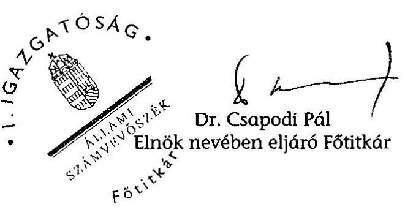

Melléklet: $\quad 7 \mathrm{db} \quad 9$ lap

---

# Ellenőrzött szervezetek 

| Központi szervek | Önkormányzati Minisztérium |
| :-- | :-- |
|  | Külügyminisztérium |
|  | Közigazgatási és Elektronikus Közszolgáltatások |
| Regionális Államigazgatási Hivatalok | Központi Hivatala |
|  | Észak-magyarországi Regionális Államigazgatási |
|  | Hivatal Salgótarjáni Kirendeltsége |
|  | Dél-dunántúli Regionális Államigazgatási Hivatal |
|  | Nyugat-dunántúli Regionális Államigazgatási Hivatal |
|  | Szombathelyi Kirendeltsége |
|  | Közép-dunántúli Regionális Államigazgatási Hivatal |
|  | Veszprémi Kirendeltsége |
| Területi Választási Irodák (TVI) | Borsod-Abaúj-Zemplén Megyei Önkormányzat |
|  | Jász-Nagykun-Szolnok Megyei Önkormányzat |
|  | Somogy Megyei Önkormányzat |
| Helyi Választási Irodák (HVI) | Alsózsolca város Polgármesteri Hivatala |
|  | Balatonboglár város Polgármesteri Hivatala |
|  | Bárna község Polgármesteri Hivatala |
|  | Csopak község Polgármesteri Hivatala |
|  | Dencsháza község Polgármesteri Hivatala |
|  | Dorogháza község Polgármesteri Hivatala |
|  | Egyházasrádóc község Polgármesteri Hivatala |
|  | Iharosberény község Polgármesteri Hivatala |
|  | Inke község Polgármesteri Hivatala |
|  | Juta község Polgármesteri Hivatala |
|  | Kondorfa község Polgármesteri Hivatala |
|  | Kunmadaras nagyközség Polgármesteri Hivatala |
|  | Mágocs város Polgármesteri Hivatala |
|  | Nézsa község Polgármesteri Hivatala |
|  | Nógrádszakál község Polgármesteri Hivatala |
|  | Rétság város Polgármesteri Hivatala |
|  | Sümeg város Polgármesteri Hivatala |
|  | Szalánta község Polgármesteri Hivatala |
|  | Szentgotthárd város Polgármesteri Hivatala |
|  | Tarany község Polgármesteri Hivatala |
|  | Vajszló nagyközség Polgármesteri Hivatala |

---

# A 2004. és a 2009. évi EP választások kiadásai kiemelt előirányzatonként

|  Kiemelt előirányzatok | 2004. évi |  |  |  | 2009. évi |  |  |  | Változás \%-ban 2009./2004. |  |   |
| --- | --- | --- | --- | --- | --- | --- | --- | --- | --- | --- | --- |
|   | Eredeti előirányzat | Módosított előirányzat | Teljesített kiadás | Eltérés (4-2=5) | Eredeti előirányzat | Módosított előirányzat | Teljesített kiadás | Eltérés (8-6=9) | Eredeti | Módosított | Teljesített  |
|  1 | 2 | 3 | 4 | 5 | 6 | 7 | 8 | 9 | 10 | 11 | 12  |
|  Személyi juttatás | 858 | 858 | 809 | $-49$ | 1190 | 1203 | 1147 | $-43$ | 138,7 | 140,2 | 141,8  |
|  Munkaadói járulék | 271 | 271 | 256 | $-15$ | 372 | 375 | 356 | $-16$ | 137,3 | 138,4 | 139,1  |
|  Dologi kiadás | 2162 | 1814 | 1264 | $-898$ | 1414 | 1421 | 1262 | $-152$ | 65,4 | 78,3 | 99,8  |
|  Informatikai kiadás | 1060 | 1068 | 1052 | $-8$ | 1124 | 1101 | 1090 | $-34$ | 106,0 | 103,1 | 103,6  |
|  Összesen | 4351 | 4011 | 3381 | $-970$ | 4100 | 4100 | 3855 | $-245$ | 94,2 | 102,2 | 114,0  |

---

# A 2009. évi európai parlamenti képviselő választás lebonyolításához kapcsolódó közbeszerzési eljárások 

Adatok: ezer Ft-ban

| Sorszám | Közbeszerzési eljárás tárgya | Közbeszerzési eljárás fajtája | Szerződés összege | Teljesités összege |
| :--: | :--: | :--: | :--: | :--: |
| 1. | A választási projektmenedzselési, adminisztrációs és dokumentációs szolgáltatás biztosítása a 2009. évi európai parlamenti képviselő választás előkészítésével és lebonyolításával kapcsolatban. | Keretmegállapodáso s eljárás, írásbeli konzultáció | 139829 | 140382 |
| 2. | Minőségbiztosítási szolgáltatás a 2009. évi európai parlamenti képviselő választás előkészítése és lebonyolítása során | Keretmegállapodáso s eljárás, írásbeli konzultáció | 109710 | 109710 |
| 3. | A 2009. évi európai parlamenti képviselő választás lebonyolításához szükséges nyomdai termékek és szolgáltatások biztosítása | Keretmegállapodáso s eljárás, írásbeli konzultáció | 650666 | 293565 |
| 4. | A 2009. évi európai parlamenti képviselő választás lebonyolításához szükséges nyomdai termékek és szolgáltatások biztosítása II. (Urnacsomag többletigény) | Keretmegállapodáso s eljárás, írásbeli konzultáció | 14297 | 14297 |
| 5. | A 2009. évi európai parlamenti képviselő választás lebonyolításához szükséges Integrált Választási Szolgáltató Rendszer rendszertervének elkészítése, a választási szakrendszer módosítása, kifejlesztése, tesztelése, a meglévő hálózathoz és rendszerelemekhez való illesztése, és az alkalmazásokhoz közvetlenül kapcsolódó oktatási és üzemeltetési szolgáltatások nyújtása | Hirdetmény közzététele nélkül induló tárgyalásos eljárás | 449799 | 449799 |
| 6. | A 2009. évi európai parlamenti képviselő választás pénzügyi-logisztikai lebonyolításához szükséges alkalmazások rendszertervének módosítása, a választási pénzügyi és választási logisztikai alkalmazások módosítása, tesztelése, a meglévő hálózathoz és rendszerelemekhez való illesztése, az alkalmazások üzemeltetése és a közvetlenül kapcsolódó szolgáltatások nyújtása. | Hirdetmény közzététele nélkül induló tárgyalásos eljárás | 101607 | 101607 |
| 7. | A 2009. évi európai parlamenti képviselő választás lebonyolításához kapcsolódó hálózati infrastruktúra műszaki tervének elkészítése, módosítása, a műszaki tervnek megfelelő informatikai szolgáltatások, eszközbérlet és az illetéktelen hozzáférés elleni védelmi szolgáltatás biztosítása. | Hirdetmény közzététele nélkül induló tárgyalásos eljárás | 139500 | 139500 |
| ÖSSZESEN |  |  | 1605408 | 1248860 |
| 8. | ORACLE adatbázis-kezelő és adatfeldolgozó szoftver licencek | Központosított közbeszerzés | 4060 | 4060 |
| 9. | Szerkesztőségi szerver beszerzése | Központosított közbeszerzés | 1262 | 1262 |

---

3. számú melléklet
a V-3001/2010. számú jelentéshez

| Sorszám | Közbeszerzési eljárás tárgya | Közbeszerzési   eljárás fajtája | Szerződés   összege | Teljesítés   összege |
| :--: | :--: | :--: | :--: | :--: |
|  | MINDÖSSZESEN |  | 1610730 | 1254182 |

---

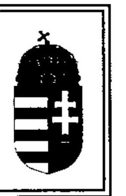
4. számú melléklet a V-3001/2010. számú jelentéshez

ÖNKORMÁNYZATI MINISZTER

Iktatószám: ÖM/4231/6/2010.(1)

Dr. Csapodi Pál úrnak
fötitkár
Állami Számvevőszék

# Budapest 

## Tisztelt Fötitkár Úr!

Hivatkozva a 2010. május 11-én kelt levele mellékleteként megküldött, a 2009. június 7-én megtartott Európai Parlament tagjai választásának lebonyolításához felhasznált pénzeszközök elszámolásának ellenőrzéséről készített Jelentés tervezetére észrevételeink az alábbiak.

Amint azt korábban Államtitkár Úr is jelezte, a jelentés az ÁSZ-ra jellemző magas szintű alapossággal fogalmazta meg a kapcsolatos feladatellátást és a fellelt problémákat egyaránt. Köszönettel vettem tudomásul, hogy korábbi észrevételeinket, érveinket mérlegelték, egy részét elfogadták. Néhány megállapítás, javaslat esetében azonban úgy gondolom, hogy a jelentés teljesebb képet adna, ha azt észrevételeim alapján kiegészítenék.

A jelentés egyik megállapítása, hogy az ÖM ellenőrzési jelentés 2010. március 19-ig nem készült el. Dr. Lóránt Zoltán föigazgató úr válaszában azzal indokolja, hogy nem fogadták el ezen megállapításra tett észrevételünket, hogy az Önök kérésére 2010. április 08-án megküldött jelentéstervezet dátuma 2010. március 31. volt.

Az ellenőrzés végrehajtását keret jelleggel - amint az Önök előtt is ismert - a 193/2003. (XI. 26.) Korm. rendelet, valamint a minisztérium belső ellenőrzési kézikönyve szabályozza. Az ellenőrzési jelentés tervezetét - az ÁSZ-hoz hasonlóan - mi is több körben egyeztetjük. (Az első tervezetet munkatársának, Dér Géza úrnak 2010. február 08-án megküldtük.) Az átdolgozást követően a jelentés tervezet értelemszerủen új dátumot kap. (Önök esetében is az Államtitkár Úr részére megküldött tervezet 2010. áprilisi dátumú, a részemre megküldött pedig 2010. május 11-i keltezésű.) Az említett jogszabály alapján az ellenőrzési jelentés csak akkor készül el, amikor a részletesen szabályozott egyeztetési folyamat lezárul, azaz a hivatalos észrevételeket követően megtörténik az egyeztető megbeszélés és az alapján a vizsgálatvezető dönt az észrevételek elfogadásáról, vagy elutasításáról. A jogszabály szerint az így lezárt vizsgálat után készülhet el az ellenőrzési jelentés, ezt megelőzően jelentéstervezetnek minősül az anyag. Tényszerű tehát az Önök megállapítása, azonban nem teljes körű. Tájékoztatom Főtitkár urat, hogy a minisztérium ellenőrzési jelentése időközben elkészült, azt részemre 2010. május 12-én felterjesztették.

---

Az önkormányzati miniszter részére tett 3. számú javaslathoz - mely előírja, hogy a választási feladat ellátásához a céljutalom összege a tényleges többletmunka alapján kerüljön kifizetésre - az alábbi észrevételt teszem.

Ahogyan dr. Lóránt Zoltán föigazgató úr 2010. május 10 -én kelt levelében is elismeri, egy választás lebonyolítása során az OVI tagjainak munkaterhelése jelentősen meghaladja egy átlagos köztisztviselő terhelését. Ez a terhelés természetesen nem csak az OVI szintjén jelenik meg, hanem a választásban közremüködő valamennyi szervnél.
A jelentés tervezetében foglaltak szakmai megállapításait nem vitatva engedje meg, hogy további érvekkel támasszam alá a célfeladat és céljuttatás rendszerével szemben tett észrevételeit. A választás lebonyolítása olyan jelentős többletterheléssel jár, amely a napi 8 órás tevékenységet több hónapon keresztül jelentősen, esetenként kétszeresen is meghaladja. Ez a „túlmunka" a közigazgatáson belül pénzbeli megváltással nem ellentételezhető, hanem kizárólag szabadidő megváltás adható. Azonban a választások lebonyolításán kívüli időszak is olyan állandó munkaterheléssel - gyakran túlmunkaterheléssel - jár, amely mellett a Ktv. szerint megillető szabadság kivételére sem nyílik lehetőség. Ennél fogva a többletmunka során felhalmozódó túlmunka szabadidő megváltással történő ellentételezése nem oldható meg. E körülményeket természetesen csak súlyosbította, hogy az elmúlt években a választásigazgatásban folyamatosan csökkent a munkatársak száma.
Amint az a helyzet az ÁSZ előtt is ismert az elmúlt közel 10 éves időszakban egy olyan év (2005.) volt, amikor nem került sor valamilyen általános választásra, népszavazásra. Az ebből eredő, a központi választási igazgatásban jelenlévő folyamatos terhelés, stressz és szellemi igénybevétel (éjszakába nyúló munkavégzés, naptári napok szerinti hétvégi munkavégzés és ügyelet) nagyságát is jelzi, hogy az utóbbi 10 évben ezen a területen a fluktuáció mintegy 60 fő. A köztisztviselők többsége igen nehezen alkalmazkodik, az állandó készenlét és folyamatos rendelkezésre állás követelményéhez, a munka melletti egyéb szabadidős és családi programok állandó kiszámíthatatlanságához.
Mindezekre figyelemmel az ezen a területen nyújtott teljesítményt indokolt a választásokért felelős miniszternek szem előtt tartania, és a közigazgatásban is megjelent teljesítményértékelés rendszeréhez igazodva azt ellentételeznie.

Kérem a jelentés összeállítása során észrevételeink szíves figyelembevételét.

Budapest, 2010. május „ ${ }^{\text {„ }}$,
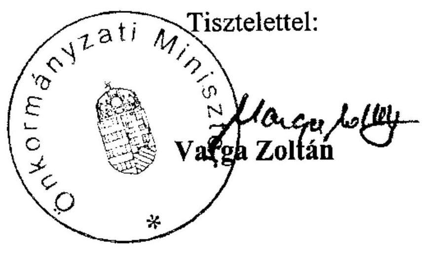

---

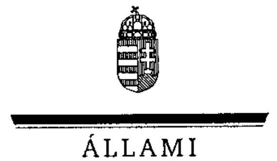

# Dr. Navraesics Tibor úr 

miniszterelnök-helyettes

## Közigazgatási és Igazságügyi Minisztérium

## Budapest

## Tisztelt Miniszterelnök-helyettes Úr!

A 2009. június 7 -én megtartott Európa Parlament tagjai választásának lebonyolításához felhasznált pénzeszközök elszámolásának ellenőrzéséről szóló számvevőszéki jelentésre Varga Zoltán önkormányzati miniszter a törvényi határidőn belül észrevételt tett a vizsgálat egyes megállapításaira.

Miniszter Úr levelében kiegészítette a választással kapcsolatos pénzügyi ellenőrzésről tett azon megállapításunkat, hogy 2010. március 19-ig nem készült el a jelentés azzal: 2010. május 12én az elkészült jelentést felterjesztették. A kiegészítést köszönjük.

Miniszter Úr vitatta azon javaslatunkat, hogy a választási feladat ellátásához a céljutalom összege a tényleges többletmunka alapján kerüljön kifizetésre. Nem vitatjuk az észrevételében megfogalmazott tényt, hogy a választási időszakban a zökkenőmentes lebonyolítás érdekében az ezzel foglalkozók fokozott munkavégzésére van szükség, ugyanakkor megállapítottuk, hogy az OVI vezetője munkaköri leírása 25 pontjából 18 kapcsolódott a választás előkészítéséhez és lebonyolításához, azaz célfeladatként a munkaköri leírásban is megjelölteket határoztak meg. A céljutalom összegének megállapításánál figyelmen kívül hagyták, hogy a feladatok a munkaköri leírásban is szerepeltek, így a többhavi illetménynek megfelelő céljutalom nem volt arányban az elvégzett többletmunkával, illetve a közszférát érintő takarékossági intézkedésekkel.

Kérem a fentiek szíves tudomásulvételét!
Budapest, 2010. június ${ }^{n} 07^{n}$.
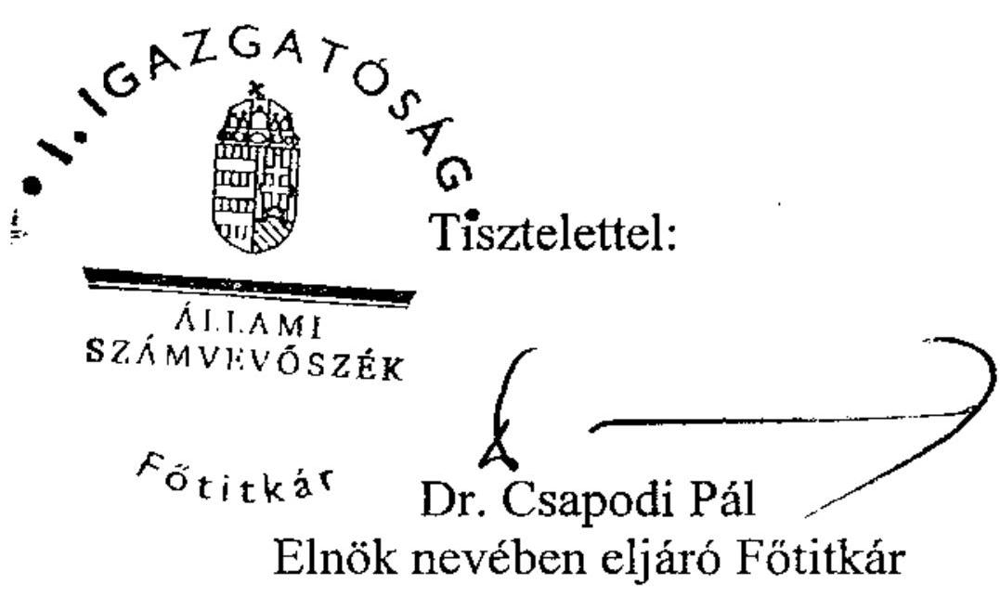

---

# Dr. Csapodi Pál úr részére

Főtitkár

Állami Számvevőszék

I. Igazgatóság

Budapest

Tárgy: Észrevételek az EP választás ellenőrzési jegyzőkönyvéhez

Tisztelt Csapodi Úr!

A 2009. június 7-én megtartott Európa Parlament tagjai választásának lebonyolításához felhasznált pénzeszközök elszámolásának ellenőrzéséről készített V-3001-34/2010. ikt. számú jelentésüket köszönettel megkaptuk és ahhoz az Állami Számvevőszékről szóló tv. 25. § 1) bekezdés alapján az alábbi észrevételeket tesszük.

A jelentés több helyen (I. Összegző megállapítások, következtetések, javaslatok - 7. és 12. oldal; II. Részletes megállapítások 1.2 pont - 17. oldal) megalapozatlannak állítja be a KüM által készített költségtervet, illetve ez alapján az előirányzat átcsoportosítási megállapodásokban biztosított fedezet összegét.

Az ellenőrzés során is jelzett kockázati tényezők és pontosan nem felmérhető adatok esetében azt az elvet igyekeztünk követni, hogy a szavazást minden körülmények között le kell bonyolítani, melyhez a költségek fedezete rendelkezésre kell, hogy álljon. A külképviseleti szavazás esetében a terv- és tényadatok közötti jelentős eltérést az okozta, hogy ezen kritikus pontokon a körülmények sorra az alacsonyabb költségeket eredményező irányban alakultak:

- A világgazdasági válság idején a devizában jelentkező kiadások az árfolyammozgások miatt nehezen tervezhetőek, a szavazás idején azonban a tervezés és a kiadások felmerülése közötti időszakban mind az euró, mind az amerikai dollár árfolyama jelentősen (10-15%-kal) csökkent.
- Az informatikai eszközök állapotának felmérése a költségterv benyújtását követően fejeződött be, a 2008. évi népszavazás adataiból kiindulva a vártnál jóval kevesebb állomáshely szorult nyomtatók, tonerek és egyéb kellékanyagok beszerzésére, cseréjére, javítására. A megelőző évhez képest 7,1 millió Ft volt a kiadáscsökkenés.
- A repülőjegyek áránál kiemelkedően fontos tényező a foglalás ideje, amely 2009-ben a korábbi évekhez képest jóval hamarabb kezdődhetett el. Így a 2008. évi költségekhez képest sok esetben jelentős megtakarítást sikerült elérni, ez azonban csak a tervezés lezárultát követően vált ismertté.
- A tervezés 100 külképviseletet vett számításba, melyből öt nagykövetségen végül nem került sor választásra, mivel nem jelentkezett be egy állampolgár sem a szavazásra. Ezen állomáshelyek várt költsége 5,5 millió Ft volt.

---

A Külügyminisztérium igyekezett a korábbi évek tapasztalatával párhuzamosan az aktuális ismereteket is figyelembe venni a tervezés során, ugyanakkor a nem várt kiadásokra 10,8 millió Ft került elkülönítésre, melynek felhasználhatóságát a megállapodásokban rögzített - feladatok közötti - átcsoportosítási lehetőség biztosította. Ennek magyarázata, hogy a Külügyminisztérium a legtöbb esetben nem rendelkezik olyan szervezéstechnikai alternatívákkal az esetleges nem várt körülmények bekövetkezése esetén, melyek az eredetihez hasonló költségekkel megvalósíthatóak lennének. Példaként említhetjük az elmúlt időszakot, az izlandi vulkánkitörés repülőjegyek árára vagy az euró-övezeti válság árfolyamra gyakorolt hatását, amelyhez hasonló tényezők a külképviseleti választások kiadásait pár nap leforgása alatt jelentősen megváltoztathatják. A 2009. évi EP választás esetében a tervezés tehát álláspontunk szerint nem megalapozatlan volt, hanem a kockázatok kezelésére szükségszerű mértékben tartalékokat tartalmazott. A lebonyolítás során foganatosított költségcsökkentő intézkedések és a körülmények kedvező alakulása eredményezte a felhasználás tervezettől való jelentős elmaradását.

Ahogyan azt 5641/Adm/KüM/2010. ikt. számú levelünkben már jeleztük, a szavazástcchnikai anyagok kiszállításánál - mivel biztonsági szempontból sem merült fel kockázati tényező - elsősorban költséghatékonysági okokból született döntés a gyorspostai úton történő szállításról. Észrevételünket az ÁSZ nem tartja megalapozottnak (33. oldal) arra hivatkozva, hogy tavalyi jelentésüket 2009. május 15 -én átadták. Ezzel kapcsolatban megjegyezzük, hogy a Magyar Köztársaság külképviseletein lefolytatandó választások és népszavazás pénzügyi tervezésének, lebonyolításának, valamint elszámolásának rendjéről szóló 8/2009. (V. 20.) KüM utasítás tervezete jóval hatályba lépése előtt véglegesítésre került, így már nem volt lehetőség az Állami Számvevőszék észrevételeinek beépítésére. A javaslat 2010. évben hasznosult azáltal, hogy az országgyűlési képviselők általános választása külképviseleti lebonyolítása kapcsán kötött ÖM-KüM megállapodás a gyorspostai szolgáltatás igénybevételének lehetőségét kifejezetten tartalmazza.

Kérem észrevételeink szíves figyelembe vételét.

Budapest, 2010. május 18.
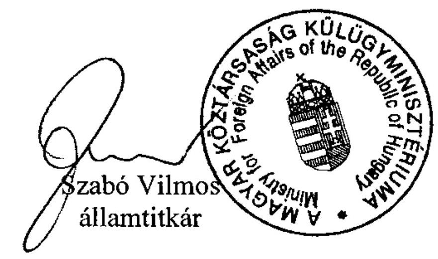

---

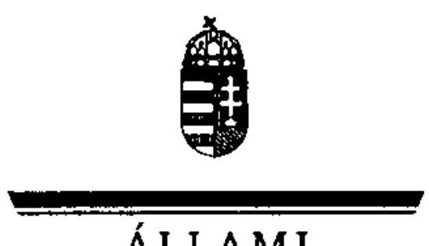

ÁLLAMI
SZÁMVEVÔSZÉK

FÔTITKÁR

Ikt.szám: V-3001-38/2010.

Dr. Martonyi János úr
miniszter

# Külügyminisztérium 

## Budapest

## Tisztelt Miniszter Úr!

A 2009. június 7 -én megtartott Európa Parlament tagjai választásának lebonyolításához felhasznált pénzeszközök elszámolásának ellenőrzéséről szóló számvevőszéki jelentésre Szabó Vilmos államtitkár a törvényi határidőn belül észrevételt tett, amelyben véleménykülönbségét fejezte ki a vizsgálat megállapításaival kapcsolatban.

Sajnálom, hogy a KüM költségtervével és az előirányzat átcsoportosítással kapcsolatos észrevételt csak a miniszteri egyeztetés során tették meg és nem a számvevői jelentés, illetve a számvevőszéki jelentéstervezet egyeztetésekor. Jelentésünkben nem a KüM választás lebonyolításához készített költségtervének, hanem a 20 millió Ft előirányzat átcsoportosításnak a megalapozottságát vitattuk. A 43 millió Ft-os maradvány bizonyítja az Állami Számvevőszék megállapításának helyességét: a 20 millió Ft előirányzat átcsoportosítására nem volt szükség a feladat ellátásához.

A szavazástechnikai anyagok szállítására vonatkozó szabályozásukkal kapcsolatos kiegészítés nem cáfolja megállapításunkat, hogy a 2009. évben a feladat ellátása során a miniszteri utasítást nem tartották be.

Kérem a fentiek szíves tudomásulvételét!
Budapest, 2010. június " 09 ".
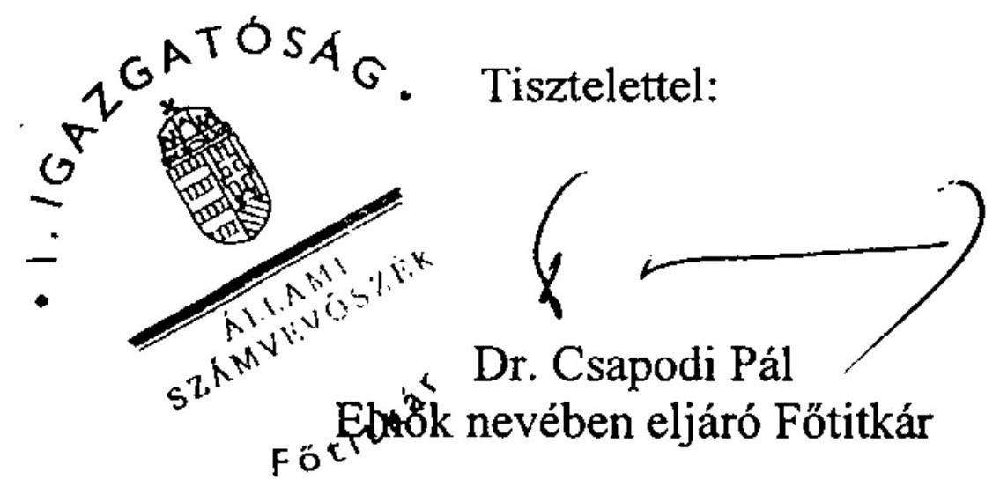