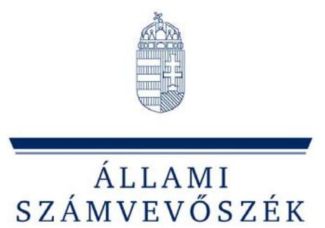

# JELENTÉS 

a TEN-T pályahálózat V. páneurópai korridor (6. sz. kiemelt európai projekt) vonalán EU támogatással megvalósuló vasútvonal fejlesztések teljesítmény-ellenőrzéséről

---

2. Államháztartás Központi Szintjét Ellenőrző Igazgatóság
2.3. Átfogó Ellenőrzési Főcsoport

Iktatószám: VE-12-31/2009-2010.
Témaszám: -
Vizsgálat-azonosító szám: -

# Az ellenőrzést felügyelte: 

Dr. Becker Pál
főigazgató
Az ellenőrzés végrehajtásáért felelős:
Hegedűsné dr. Müllern Veronika
főcsoportfőnök
Az ellenőrzést vezette:
Dr. Podonyi László
igazgatóhelyettes
A számvevői jelentések feldolgozásában és a jelentés összeállításában
közreműködött:

## Biró Endre

számvevő tanácsos,
tanácsadó
Az ellenőrzést végezték:
Báthory Béláné Biró Endre
külső munkatárs
számvevő tanácsos,
tanácsadó

A témához kapcsolódó eddig készített számvevőszéki jelentések:
címe
sorszáma
Jelentés a Zalalövő - Bajánsenye - Hodos - Murska Sobota vasút-
0312
vonal építésének ellenőrzéséről
Jelentés a vasúti közlekedés korszerűsítésének ellenőrzéséről
0815

---

# TARTALOMJEGYZÉK 

BEVEZETÉS ..... 7
I. ÖSSZEGZŐ MEGÁLLAPÍTÁSOK, KÖVETKEZTETÉSEK, JAVASLATOK ..... 9
II. RÉSZLETES MEGÁLLAPÍTÁSOK ..... 14

1. A közösségi közlekedéspolitika elvei, hazai alkalmazása ..... 14
1.1. Az európai tagországok vasúti közlekedésének korszerűsítése fejlesztésének irányelvei ..... 14
1.2. A közösségi jogharmonizáció és a magyarországi közlekedéspolitika összhangja ..... 17
2. Nemzetközi vasúti folyosók fejlesztésének feltételrendszere ..... 19
2.1. A vasúti közlekedés fejlesztésének pénzügyi forrásai ..... 19
2.2. Az intézményrendszer kialakítása ..... 24
2.3. Egységes Monitoring Információs Rendszer ..... 25
2.4. Az uniós támogatások hazai ellenőrzési rendszere ..... 26
3. A páneurópai hálózat V. korridor 6. számú kiemelt vasúti projekt hazai fejlesztésének megvalósítása ..... 28
3.1. A páneurópai közlekedési korridorok kijelölése ..... 28
3.2. A 2000/HU/16/P/PT/PT003 szerződésszámú Zalalövő - Zalaegerszeg - Boba vasútvonal rehabilitációs munkáinak folyamata ..... 34

---

# MELLÉKLETEK 

1. sz. melléklet A jelentéstervezetre tett észrevételek
2. sz. melléklet Kiemelt projektek finanszírozási forrásfelhasználása
3. sz. melléklet A magyar vasúthálózat fejlődésével kapcsolatos főbb jellemzők
4. sz. melléklet Aktualizált közbeszerzési terv a PT 003 szerződésszámú projektnél
5. sz. melléklet A PT 003 sz. projekt eredeti és a harmadik pénzügyi módosítás szerinti költségek összehasonlítása
6. sz. melléklet A 2000/HU/16/P/PT/003 Zalalövő - Zalaegerszeg - Boba vasútvonal felújítása többletköltségeinek és késedelmének okai
7. sz. melléklet Zalalövő - Zalaegerszeg - Boba vasútvonal felújítási munkáinak előrehaladása
8. sz. melléklet A PT 003 sz. projekt 2010. december 31-ei befejezéséhez illeszkedő megvalósítási ütemterve

---

# RÖVIDÍTÉSEK JEGYZÉKE 

| AGC | European Agreement on Main International Railway Lines Európai Megállapodás Nemzetközi Vasúti Fővonalakról |
| :--: | :--: |
| AGTC | European Agreement on Important International Combined Transport Lines and Related Installations - Európai megállapodás a nemzetközi kombinált fuvarozási vonalakról és ezek létesítményeiről |
| EILP | Európai Infrastruktúra Vezérterve |
| EU | Európai Unió |
| EGK | Európai Gazdasági Közösség |
| EKFS | Egységes Közlekedésfejlesztési Stratégia I. Zöld könyv |
| EMIR | Egységes Monitoring Információs Rendszer |
| ERFA | Európai Regionális Fejlesztési Alap |
| ERTMS | Egységes Európai Vasúti Közlekedésirányítási Rendszer |
| ETCS L2 | Európai vonatbefolyásoló rendszer 2. szint |
| FEUVE | Folyamatba épített előzetes és utólagos vezetői ellenőrzés |
| GSM-R | Globális mobiltávközlési rendszer vasúti alkalmazáshoz |
| ISPA | Instrument for Structural Policies for Pre-Accession (Strukturális Politikák Csatlakozás Előtti Eszköze) |
| IVSZ | ISPA Végrehajtó Szervezet (KHEM) |
| KA | Kohéziós Alap |
| Kbt. | 2003. évi CXXIX. sz. törvény a közbeszerzésről |
| KEHI | Kormányzati Ellenőrzési Hivatal |
| KIKSZ Zrt. | Közlekedésfejlesztési Integrált Közreműködő Szervezet Közlekedésfejlesztési Zrt. |
| KIOP | Környezetvédelmi és Infrastruktúra Operatív Program |
| KMOP | Közép-magyarországi Operatív Program |
| KÖZOP | Közlekedési Operatív Program |

---

| KöViM | Közlekedési és Vidékfejlesztési Minisztérium |
| :--: | :--: |
| MÁV Zrt. | Magyar Államvasutak Zrt. |
| NIF Zrt. | Nemzeti Infrastruktúra Fejlesztő Zrt. |
| NFÜ | Nemzeti Fejlesztési Ügynökség |
| NFT | Nemzeti Fejlesztési Terv |
| PP | Priority Project (kiemelt fejlesztés) |
| PPP | Public Private Partnership |
| PRAG | Practical Guide to Phare, Ispa & Sapard contract proceduresGyakorlati útmutató a Phare, Ispa és Sapard szerződéses eljárásokhoz |
| SAPARD | Special Accession Programme for Agriculture and Rural Development (Különleges Előcsatlakozási Program a Mezőgazdaság és Vidékfejlesztés támogatására |
| TEN | Trans European Network - Transz Európai Hálózat |
| TEN-T | Transz Európai Közlekedési Hálózat |
| TINA | Transport Infrastrukture Needs Assessment - Közlekedési Infrastruktúra Igényeinek Értékelése |
| TEN-T Korm. rendelet | 150/2005. (VII. 29.) Korm. rendelet a transzeurópai hálózat projektjeihez juttatott TEN-T támogatás felhasználásáról. |
| ÚMFT | Új Magyarország Fejlesztési Terv |

---

# ÉRTELMEZŐ SZÓTÁR 

| AGC Egyezmény | Európai Megállapodás Nemzetközi Vasúti Fővonalakról. az ENSZ EGB keretében 1985-ben kidolgozott egyezmény, melynek célja egységes vasúti hálózat létrehozása Európában. Az Egyezmény keretében meghatározásra kerültek a legnagyobb nemzetközi fontosságú vasútvonalak, és kiépítési paramétereik, melyek lényegileg megegyeznek az Országos Vasúti Szabályzatban (OVSZ) rögzített előírásokkal. |
| :--: | :--: |
| AGTC Egyezmény | Európai megállapodás a nemzetközi kombinált fuvarozási vonalakról és ezek létesítményeiről, amely 1991-ben az ENSZ EGB keretében került kidolgozásra a nemzetközi kombinált forgalmi hálózat kialakítására, fejlesztésük, üzemeltetésük összehangolására. |
| Application Form | EU támogatási kérelem |
| delta vágány | két elágazó vasútvonalat összekötő harmadik vágány |
| EILP | Európai Infrastruktúra Vezérterve, amely a nemzetközi szállításban, tranzitforgalomban meghatározó vasútvonalak infrastruktúra fejlesztési terve, az AGC, AGTC vonalak kiegészítéseként. |
| externáliák | Egy gazdasági szereplő tevékenysége következtében felmerülő káros vagy előnyös, nem szántszándékkal okozott, hatás(ok), amely(ek) piaci ellentételezés nélkül befolyásolják egy másik gazdasági szereplő helyzetét. |
| interoperabilitás | kölcsönös átjárhatóság: a biztonságos és folyamatos vasúti közlekedés lehetősége a vasúti rendszerek szabályozási, műszaki és üzemeltetési feltételek teljesítése esetén való kölcsönös használhatóságára. |
| kedvezményezett | A TEN-T támogatásban részesülő projektet végrehajtó és a projektből fakadó előnyöket élvező jogi személy, jogi személyiség nélküli gazdasági társaság, egyéb gazdálkodó szervezet, költségvetési szerv. |
| Közreműködő Szervezet | A TEN-T projektek végrehajtásában a Végrehajtó Hatóság javára közreműködő szervezet. Jelen vizsgálatban: Közlekedésfejlesztési Koordinációs Központ Közlekedésfejlesztési Integrált Közreműködő Szervezete 2008. június 15-ig. Majd 2008.június 16-tól Közlekedésfejlesztési Koordinációs Központ. |
| megvalósító | A kedvezményezett képviseletében a projekt lebonyolításáért felelős szervezet. Jelen ellenőrzés során a MÁV Zrt. és a NIF Zrt. |

---

multimodális
négy szem elve
nemzetközi korridorok
páneurópai V. folyosó

PPP

UIC 60 rendszerű hézagmentes felépítménye
vállalkozó vasút

Végrehajtó Hatóság

A multimodális vagy kombinált fuvarozás alatt az árunak különböző fajta fuvareszközökkel való továbbítását kell érteni, más szavakkal a kombinált árufuvarozás részben tengeri hajóval, részben belvízi fuvareszközökkel részben közúti járművel, részben vasúton vagy repülőgépen valósul meg.

Minden végrehajtási és pénzügyi tranzakció engedélyezését megelőzően az adott feladatot ellátó személy munkáját egy másik személy teljes körűen felülvizsgálja, beleértve az ellenőrzési listát és a kitöltési útmutatók alkalmazását is.

Nemzetközi fő közlekedési útvonalak, amelyeket nemzetközi szervezetek, együttműködési fórumok nevesítettek. A TEN-T közlekedési folyosók. Magyarországi szakaszaik a hazai törzshálózat részét képezik.

Velence - Trieszt/Rijeka - Ljubljana- Maribor - Budapest-Ungvár - Lvov - Kijev (kb. 2000 km )

A PPP (Public Private Partnership) a köz- és magánszféra olyan együttműködése, amelyben az állam hosszú távon együttműködik magáncégekkel egy-egy projekt tervezésében, megvalósításában, működtetésében és finanszírozásában.

60,3 kg/fm tömegű, 100-120 m hosszúra hengerelt, majd azokat a helyszínen elektromos ellenállás hegesztéssel „folytonossá" tett acél sínekből, előfeszített vasbeton keresztüljből, a sínleerősítéshez szükséges kapcsolószerből és zúzottkőből álló rendszer. Feladata a sínre átadódó erők rugalmas felvétele, és azok egyenletes elosztása az alépítményre.

A vállalkozó vasúti társaság vagy kereskedővasút olyan vasúti áruszállítást vagy vasúti személyszállítást végző társaság, amely vasúti pályahálózatot nem üzemeltet

Fő kapcsolattartó a TEN-T támogatással kapcsolatos kérdésekben az Európai Bizottsággal. Feladatainak ellátása a GKM (korábban: GKM Infrastruktúra-fejlesztési Programok Főosztály), majd 2008. május 15-től a jogutód KHEM szervezeti keretei között történik. (Jelenleg: Közlekedési Infrastruktúra Főosztály)

---

# JELENTÉS 

## a TEN-T pályahálózat V. páneurópai korridor (6. sz. kiemelt európai projekt) vonalán EU támogatással megvalósuló vasútvonal fejlesztések teljesítmény-ellenőrzéséről

## BEVEZETÉS

Az EU Számvevőszékek Kapcsolattartó Bizottsága CC-R-2008-4. sz. határozatának 2/B pontjában javasolja a Transz Európai Közlekedési Hálózat (TEN-T) V. korridor vasúthálózatát érintő beruházási projektek megvalósítása érdekében kapott EU-s támogatások felhasználására párhuzamos - több tagállamot érintő, határon átnyúló - teljesítmény-ellenőrzés ${ }^{1}$ végrehajtását. A jelenlegi TEN-T prioritási tengelyek és beruházási projektek tekintetében számos ország, így több számvevőszék érintett párhuzamos ellenőrzésben. Magyarország a TEN-T pályahálózat V. páneurópai korridor 6. sz. kiemelt európai projekt ${ }^{2}$ vonalán EU támogatással megvalósuló vasútvonal fejlesztések ellenőrzését javasolta a pályaszakaszt érintő országok bevonásával. Az ellenőrzés egységes alapelveit az biztosította, hogy azt a vizsgálatban résztvevő számvevőszékek a közösen elfogadott programban rögzítették. Az ellenőrzési munka befejezését követően a megállapítások közreadása érdekében az Állami Számvevőszék (ÁSZ) nemzetközi workshop keretében tájékoztatást ad a párhuzamos ellenőrzés eredményeiről és a megszerzett tapasztalatokról. Magyarország jelenleg számos TEN-T projekt megvalósításában vesz részt, amelyek közül az ÁSZ a Lyon-Triest-Koper-Ljubljana-Budapest vasútvonal fejlesztését javasolta párhuzamos teljesítményellenőrzésre. A Kapcsolattartó Bizottság döntését követően felvettük a kapcsolatot a projektben érintett tagországok (Olaszország, Szlovénia, Franciaország) számvevőszékeivel. Mindhárom számvevőszék kifejezte részvételi szándékát a párhuzamos ellenőrzésben. A négy tagország ellenőrzési jelentésének megállapításai megfelelő alapot nyújthatnak olyan előremutató ajánlások megfogalmazására, amelyek hatékonyan szolgálják az uniós döntéshozó szervek munkáját a közösségi közlekedéspolitikai koncepció jövőbeni fejlesztésében.

Az ellenőrzés célja annak értékelése volt, hogy

- a párhuzamos ellenőrzésben részt vevő tagországok saját közlekedési politikája illeszkedik-e a közösségi közlekedéspolitika elveihez, meghatároz-e korszerűsítési igényt az V. korridor fejlesztéséhez kapcsolódóan;

[^0]
[^0]:    ${ }^{1}$ Az INTOSAI ISSAI 100 40. és 41. szakaszának standardjai tartalmazzák a teljesítmény-ellenőrzés meghatározását, alkalmazási területeit és egymáshoz való viszonyukat.
    ${ }^{2}$ Az Európai Parlament és Tanács 884/2004/EK határozata 19. cikk - Kiemelt fontosságú projektek, 19b cikk - Határon átnyúló szakaszok rendelkezései, amelyek a 3. sz. mellékletben felsorolt projektekre vonatkoznak, így többek között a Lyon-Trieszt-Divača/Koper-Divača-Ljubljana-Budapest-ukrán határ vasúti tengely is.

---

- az EU által támogatott vasúti útvonalak fejlesztése - a meghatározott nemzeti és közösségi közlekedéspolitika elveinek figyelembevételével - célszerűen és eredményesen valósul-e meg a TEN-T pályahálózat V. páneurópai korridor 6. sz. kiemelt európai projekt vonalán (V. korridor);
- a kiválasztott projektek előkészítésére és megvalósítására létrehozott rendszer eredményesen biztosítja-e az V. korridort érintő vasúti pályahálózat és a kapcsolódó infrastrukturális fejlesztések megvalósítását a részt vevő országokban;
- a kiválasztott projekt elérte-e, illetve várhatóan el fogja-e érni a közösségi és nemzeti stratégiában meghatározott célokat.

Az ellenőrzés tárgya olyan folyamatban lévő/befejezett vasúti vonalszakasz beruházás, amely uniós támogatással valósul(t) meg. Az ellenőrzés keretében egy-egy ország a saját vonalszakaszát vizsgálta. Az ellenőrzött vonalszakasz, illetve azon belüli projekt(ek) kiválasztása a részt vevő országok önálló hatáskörébe tartozott. A konzisztens megközelítés érdekében minden számvevőszék amennyire csak lehetett - követte az elfogadott ellenőrzési programot, különösen tekintettel arra a fő kérdésre, hogy az ellenőrzés alá vont TEN-T projekt előkészítési folyamata és megvalósítása eredményesen szolgálta-e az uniós és nemzeti közlekedéspolitikai célok időarányos teljesítését és a rendelkezésre álló források hasznosulását. Az ellenőrzés a 2000-2010. évekre irányult. A magyar vasúthálózat fejlődésével kapcsolatos főbb jellemzőket a

 3. sz. melléklet, az ellenőrzött vasúti vonalszakasz felújítása többletköltségeit és késedelmének okait a 6. sz. melléklet tartalmazza. A jelentés további mellékletei részletes megállapításokat és kiegészítő információkat tartalmaznak az ellenőrzés eredményéről.

Nem minden számvevőszék tudta megvizsgálni az ellenőrzési programban meghatározott kérdéseket, különösen az alkérdéseket teljes részletességgel, de minden számvevőszéket ösztönöztünk arra, hogy az ellenőrzési program lehető legnagyobb részét fedje le. Az egyes számvevőszékek által végzett vizsgálatok hatókörét befolyásolhatta a kiválasztott projektek előrehaladása is. Az ellenőrzésben részt vevő országok a vonalszakaszok összehasonlíthatósága érdekében a vasúti teljesítményparaméterek tekintetében a következő dokumentumokban megfogalmazott előírásokat vették figyelembe:

- az Európai Parlament és a Tanács 2001/12/EK irányelvét a közösségi vasutak fejlesztéséről szóló 91/440/EGK tanácsi irányelv módosításáról;
- az Európai Parlament és a Tanács 1692/96/EK határozatát és annak módosítását a transzeurópai közlekedési hálózat fejlesztésére vonatkozó közösségi iránymutatásokról, továbbá az Európai Parlament és a Tanács 2001/16/EK irányelvét a hagyományos transzeurópai vasúti rendszer kölcsönös átjárhatóságáról, valamint az AGC és AGTC Egyezményeket.

Az ellenőrzés jogszabályi alapját az Állami Számvevőszékről szóló 1989. évi XXXVIII. törvény 2. § (5)-(6) bekezdésében foglaltak képezték. A jelentést véglegezés előtt egyeztettük a nemzeti fejlesztési és a nemzetgazdasági miniszterrel, a jelentéstervezetet egyeztettük a MEH államtitkárával, a KIKSZ Zrt., a NIF Zrt. és a MÁV Zrt. vezetőivel. Az észrevételeket az 1. sz. melléklet tartalmazza.

---

# I. ÖSSZEGZŐ MEGÁLLAPÍTÁSOK, KÖVETKEZTETÉSEK, JAVASLATOK 

A Magyar Köztársaság az Európai Unióhoz történt csatlakozását követően részesévé vált az európai közös közlekedéspolitikának is, amelynek fontos célkitűzése a környezetkímélő vasúti közlekedés igénybevételének ösztönzése a jelenleg domináns közúti szállítással szemben. A közösségi közlekedéspolitika kiemelt területként kezeli a vasúti közlekedés fejlesztését, illetve a vasúti tevékenységek fokozatos liberalizációját.

A vasútról szóló 1993. évi törvény ${ }^{3}$ 2001-2004. években történt módosításaival, valamint a részletes szabályokat megállapító miniszteri rendeletek megalkotásával a közösségi jog első vasúti csomagját képező közlekedésfejlesztési irányelvek hazai jogszabályokba való átültetése döntően ${ }^{4}$ megvalósult. Az új vasúti törvény és a hatályban tartott korábbi végrehajtási rendeletek fogalomrendszere egymással nincs összhangban, ezáltal értelmezési nehézségek keletkeznek. A hazai jogszabályokban az integrált vasúti társaságra vonatkozó szabályozás még a MÁV szervezeti átalakulását megelőző időszakot tükrözi. A közlekedéssel összefüggő intézményrendszer kiépítése a 2004. évig csak részben történt meg, az intézményrendszer a vasúti közlekedésről szóló 2005. évi törvény megalkotásával vált egységessé. A vasúti korszerűsítést az Országgyűlés határozatával 2004-ben elfogadott általános közlekedéspolitikai elveken és fejlesztési irányokon túl több „átfogó" fejlesztési koncepció is érintette, amelyek közös jellemzője az volt, hogy forrásokkal nem voltak megfelelően alátámasztva. A csökkenő költségvetési forrásokat a hitelek és az EU-s támogatások egészítették ki, amelyek felhasználását az átütemezés és költségtúllépés jellemezte.

A 2003-2015 évekre szóló Magyar Közlekedéspolitika az általános közlekedéspolitikai elveken túlmenően 2015-ig szóló fejlesztési irányokat is meghatározott. A magyar vasúti közlekedés fejlesztésének rövid távú (2008-2013) stratégiája az infrastruktúra megbízhatóságának fokozására koncentrált, a legfontosabb feladatként az átlagos EU teljesítmény elérését jelölte meg. A rövid távú fejlesztések elsősorban a TEN-T 22. és 6. számú kiemelt vasúti tengellyel (azaz a IV. és V. páneurópai folyosóval) kapcsolatos projektekre koncentráltak.

A vasút működésének és fejlesztésének finanszírozására bonyolult, sokszereplős döntési mechanizmus alakult ki. A beruházási javaslatokat a megvalósító szervezetek állították össze, azok megvalósításával kapcsolatos döntésekben a különböző pénzforrások gazdái, a tulajdonosi jogokat gyakorló GKM és a PM, valamint az uniós támogatások odaítélését elbíráló NFÜ közvetlenül, vagy közvetve vett részt. A fejlesztések finanszírozásához 2000-2005 között a források -

[^0]
[^0]:    ${ }^{3}$ A vasútról szóló 1993. évi XCV. törvényt 2006. január 1. napjával a vasúti közlekedésről szóló, 2005. évi CLXXXIII. törvény 86. § (1) bekezdése hatályon kívül helyezte.
    ${ }^{4}$ A MVH jogszabályelemzése alapján a közösségi jog átültetése még nem valósult meg teljes körűen (pl. pályahasználati díj).

---

megfelelő összegben, összetételben, vagy időben - nem álltak rendelkezésre. Nem finanszírozták a beruházások előkészítését, az esetleg előkészített, de a csúszások miatt részben túlhaladott projektek aktualizálását. A vasútfejlesztés finanszírozásának jelenlegi rendszere nem hatékony, mivel a túlbonyolított szervezeti irányítás nem biztosítja a fejlesztési források átlátható és koncentrált felhasználását.

Az első EU-s támogatások előkészítési rendje és követelményei ismeretlenek, a kedvezményezettek pedig felkészületlenek voltak a támogatások igénylésére és azok fogadására. Nem állt rendelkezésre az EU követelményeinek is megfelelő fejlesztési stratégia. A rendelkezésre álló pénzügyi források behatárolták a projekteket, a tervezett ráfordítások nem tartalmaztak inflációkövetést, a 2000-2001. években csak a MÁV Zrt. kerete állt rendelkezésre az előkészítésre, az állami költségvetésben nem szerepelt fedezet az előkészítési munkák végrehajtására. A támogatások igénybevételét 2000-2005 között nehezítette a magyar költségvetés helyzete, ami miatt a támogatást élvező EU-s projektek határidő csúszása következett be. A döntéseket befolyásolták a forráshiányos környezet, a műszaki állapot, a nemzetközi elkötelezettségek, a MÁV szolgáltatási prioritásai és a változó közlekedéspolitikai koncepciók. Az EU-ból érkező források fogadásához, illetve a projektek lebonyolításához szükséges intézményrendszert Magyarország az EU előírásai alapján, a hazai jogszabályokat is figyelembe véve alakította ki. A szükséges átszervezések is késedelemhez vezettek, így például 2007-ben a MÁV beruházások lebonyolításának átszervezése a Nemzeti Infrastruktúra Fejlesztő Zrt.-be több hónapos kiesést jelentett a támogatások igénybevételénél.

Az ellenőrzött időszak legfontosabb vasúthálózat-fejlesztései a különféle uniós támogatásokkal (ISPA, Kohéziós Alap és KIOP forrásokból, valamint az EIB I/A és I/B, valamint IV. hitelek felhasználásával) megvalósuló vasúti infrastruktúrafejlesztések voltak. Az eleve egy éves késéssel elfogadott Magyar Közlekedéspolitika 2003-2015. évi fejlesztéseinek első, 2006-ig terjedő szakasza teljes körűen nem, a legfontosabb célkitűzések csak részben valósultak meg. Az ISPA csak a helsinki folyosók mentén elhelyezkedő vasútvonalak fejlesztéséhez járult hozzá.

Magyarország az ISPA programban 2004-ig 243,4 M euró támogatásra nyújtott be vasútfejlesztési projekteket. A projektek előkészítetlenek voltak, megvalósításuk csúszott és a költségvetés nem biztosított elég forrást a szükséges saját rész fedezetére. A 2000-2004 közötti programozási időszakban rendelkezésre álló közlekedési célú ISPA forrásból több mint 200 M euró támogatást az ország nem tudott időben felhasználni. A program elsődlegesen 2006-ban, majd a szerződésmódosítások miatt 2010. december 31-én zárul, de a finanszírozott fejlesztések teljes egészében még nem valósultak meg. A vasúti fejlesztések 363,2 M euró tervezett támogatási összegéből a 2009. december 31-ei zárásig 346 M euró kifizetése valósult meg. A szerződésmódosítások alapján a kifizetési lehetőségek 2010. december 31-ig kitolódtak. 2009. év végéig a rendelkezésre álló források 95,3%-a került kifizetésre. Az ISPA Programban be nem fejezett projektek költségei a Kohéziós Alap (KA) keretéből kerülnek kifizetésre.

A vasúti infrastruktúra-fejlesztésre jutó EU-s források (ISPA maximum 50%, KA maximum 85%) költségvetési kiegészítést igényeltek, amelyekre vonatkozó-

---

an a hazai programok nem kellő időben és mértékben biztosítottak forrásokat. A végrehajtás előzőekben részletezett hibái nem tették lehetővé a források maximális kihasználását. A 2004-2006 közötti programozási időszakban a Nemzeti Fejlesztési Terv Környezetvédelmi és Infrastruktúra Operatív Programja (KIOP), valamint a KA felhasználási stratégia tartalmazott közlekedésfejlesztési, ezen belül vasútfejlesztési célkitűzéseket és projekteket. Az Új Magyarország Fejlesztési Terv a Közlekedési Operatív Programon keresztül (KÖZOP) a hazai önerővel együtt 7,3 Mrd eurót meghaladó forrásfelhasználást tervez 2007-2013 között a célok megvalósítására fordítani, amelyből 6,2 Mrd euró az EU támogatás.

Az V. páneurópai közlekedési folyosó (6. sz. kiemelt projekt) részét képező UIC 60 rendszerű hézagmentes felépítménnyel, 225 kN tengelyterheléssel kialakított - az első ütemben még nem villamosított - pálya a Zalalövő - Zalaegerszeg Boba útirányon át kapcsolódott a magyarországi vasúti fővonalakhoz. Ez a megközelítőleg 80 km hosszú vonalszakasz nagyon rossz műszaki állapotban volt, $80 \mathrm{~km} / \mathrm{h}$ üzemi sebességgel, és a vonalkapacitást állandó sebességkorlátozásokkal jelentősen lecsökkentve „fogadta" a nemzetközi személyszállító- és tehervonatokat. Magyarország többek között e vasút-vonalszakasz rehabilitációs (korszerűsítés és felújítás keveréke) munkáinak elvégzéséhez nyújtott be támogatási kérelmet az EU ISPA támogatásának megszerzésére. Az EU Bizottság 2000 decemberében 83,7 M euró támogatást (50\%) ítélt meg a projekt kivitelezési munkáinak finanszírozására a hazai költségvetésből történő társfinanszírozás mellett. A kivitelezési munkák 167,4 M eurót meghaladó részét szintén a magyar költségvetés biztosította, illetve biztosítja. A vasútvonal fejlesztése ISPA/KA finanszírozás keretében valósul meg, melyre a pénzügyi megállapodást 2000. december 21-én, a támogatási szerződést 2001. április 15-én írták alá. A Pénzügyi Megállapodás módosítására - a nem megfelelő előkészítés, a közbeszerzési folyamatok elhúzódása és a pénzügyi források nem megfelelő időben történő biztosítása miatt - három alkalommal került sor, így az eredeti 2006. december 31-ei befejezési határidő 2010. december 31-ére módosult.

A tervezési, területszerzési és egyéb előkészítő, szakértői tevékenység tisztán hazai forrásból valósult meg. A projekt befejezésének várható összes költsége 199 M euróra (17,5%-kal) emelkedett. A költségnövekedést az előre nem kalkulált inflációs hatások, a műszaki szükségességből és a közbeszerzések elhúzódásából adódó átütemezések, valamint a műszaki tartalom változása okozzák, melynek várható értéke meghaladja a 29,6 M eurót.

A 2001-ben átadott Szlovénia-Magyarország vasúti összeköttetését biztosító 19 km hosszú, egyvágányú vonalszakasz az AGC előírások figyelembevételével $160 \mathrm{~km} / \mathrm{h}$ tervezési sebességgel készült el, de a vasútvonal - meghatározóan az áruszállítás igényeihez igazodva - üzemeltetési sebességeként a MÁV 120 $\mathrm{km} / \mathrm{h}$-t határozott meg. A Bajánsenye - Zalalövő vonalszakasz folytatásaként, a Zalalövő - Zalaegerszeg - Boba útirányon belül, 100-120 km/h tervezési sebességgel épült át a Zalalövő - Andráshida - Zalaegerszeg közötti pálya. A Zalaegerszeg - Boba közötti 60 km hosszú vonalszakasz is felújításra kerül, ezzel biztosítva az Országhatár - Boba közötti 100-120 km/h üzemeltetési sebességet. A projekt tervezésénél és megvalósításánál a műszaki- és hatósági előírások mellett környezetvédelmi szempontok is érvényesültek. Az elkerülő- és delta

---

vágányoknál, a nyomvonal korrekciós szakaszokon a tájba illesztve épült az új nyomvonal. Magyarország egyik kiemelt természetvédelmi területén a dízelvontatást felváltó villamosított vasútvonal mentén jelentősen csökken a zaj- és rezgésterhelés és a mozdonyok káros anyag kibocsátása.

A projekt tervezésekor a műszaki és hatósági előírások mellett a helyben lakó emberek, az őket képviselő települési önkormányzatok igényeit is figyelembe vették. Az állampolgárok lakossági tájékoztatókon ismerhették meg az előzetes beruházói elképzeléseket, s észrevételeik, kéréseik a megvalósításnál - a lehetőségek és kockázatok mérlegelése mellett - nagyrészt teljesültek. Zalaegerszeg város az eredeti tervek módosítását kérte, új, a várost elkerülő nyomvonal megépítését javasolta. A helyi igényeket és érdekeket figyelembe véve a közlekedést felügyelő szakminisztérium támogatta a nyomvonal módosítását, s az önkormányzat 500 M Ft hozzájárulással kiegészítve biztosította a megvalósítást. Boba és Zalaegerszeg állomásoknál úgynevezett delta vágányok létesültek(nek), amelyek a szerelvények irányváltás miatti mozdonycseréjét iktatják ki 10 perc menetidő megtakarítást eredményezve. Az átépítés befejezésekor a pályán elrendelt sebességkorlátozásokat is figyelembe véve a nemzetközi gyorsvonatok menetideje Boba és az országhatár között akár 50 perccel is csökkenhet. A vonal mentén
 élők korszerű, az esélyegyenlőségi feltételeket is figyelembe vevő állomási és peronburkolaton juthatnak el a szerelvényekhez. A 2010. február havi indikátorok összegzése alapján az összesen 78 km-es vasúti vonalszakasz felújításának műszaki készültsége 85,1 %-os.

Az V. számú nemzetközi vasúti korridor (6. sz. kiemelt projekt) e szakaszán középtávon a tranzit áruforgalom lehet a meghatározó, így a pálya műszaki paraméterei is elsősorban ezen igények kielégítését szolgálják. A 225 kN tengelyterhelés, a villamos vontatás, a $120 \mathrm{~km} / \mathrm{h}$ sebességű közlekedés kielégíti a tehervonati közlekedés elvárásait. A kedvező eljutási sebességnek köszönhetően a helyi és helyközi vasúti személyszállítás versenyképes alternatívája lehet a közúti közlekedésnek. Az AGC-AGTC előírásoknak megfelelő vasúti pálya, a XXI. század fejlett technikáját alkalmazó, számítógép vezérelt vasúti jelző- és biztosítóberendezések, utas-tájékoztató és utasításadó hangrendszerek, a korszerű, sorompóval biztosított útkeresztezések mind a közlekedés, mind a közlekedők biztonságát növelik, valamint hozzájárulnak az árufuvarozás és a személyszállítás területén az interoperábilis közlekedés feltételeihez.

A helyszíni ellenőrzés megállapításainak hasznosítása mellett javasoljuk ${ }^{5}$ :

# a Kormánynak: 

1. intézkedjen a közlekedés korszerűsítésével kapcsolatos döntések összhangjáról, időben biztosítsa a szükséges költségvetési forrásokat a Magyar Közlekedéspolitikában 2015-ig meghatározott célok megvalósítása érdekében,
[^0]
[^0]:    ${ }^{5}$ A párhuzamos ellenőrzésben részt vevő számvevőszékekkel egyeztetve, a Kapcsolattartó Bizottságnak megfontolásra javasoljuk, hogy biztosítson elsőbbséget a kijelölt TEN-T projektek - különösen a határokon átnyúló vonalszakaszok - finanszírozásának, amelyek befejezése szükséges ahhoz, hogy a TEN-T transzeurópai értéke kibontakozhasson.

---

2. gondoskodjon arról, hogy a jelentős határidő túllépések elkerülése érdekében, az EU által is finanszírozott projektek előkészítése, lebonyolítása és a projektek ellenőrzése az előírt pénzügyi- és intézményrendszer biztosítása mellett zökkenőmentes legyen,
3. kezdeményezze a vasúti közlekedésre vonatkozó jogszabályi környezetben még fennálló harmonizálatlanságok megszüntetését a közlekedésfejlesztésekhez rendelkezésre álló EU-os források hatékonyabb felhasználása érdekében.

---

# II. RÉSZLETES MEGÁLLAPÍTÁSOK 

## 1. A KÖZÖSSÉGI KÖZLEKEDÉSPOLITIKA ELVEI, HAZAI ALKALMAZÁSA

### 1.1. Az európai tagországok vasúti közlekedésének korszerűsítése fejlesztésének irányelvei

Az Európai Unió - a vasutak piaci térvesztésében jelentkező - kedvezőtlen tendenciák megállításával különösen a 80-as évek második felétől kezdett foglalkozni, és kidolgozta a közösség vasútpolitikáját. Ennek fő célkitűzései a következők voltak:

- a személyszállításban gyors eljutási idő biztosítása, a meghatározásra került főbb gazdasági és politikai központok között nagysebességű hálózat kialakítása;
- a közúti/vasúti kombinált fuvarozás előnyben részesítése;
- a vasúti műszaki szabványok egységesítése és kompatibilissé tétele;
- a határállomásokon az adminisztráció minimálisra csökkentése (határok nélküli vasút).

A 90-es években megtörtént a közösségi elvek kidolgozása, amely elsősorban a vasúti szervezetek átalakítására, a vasúti infrastruktúra használatára és a szolgáltatások meghatározására vonatkozott. A Tanács megállapította, hogy a vasúti közlekedés fejlődését hátráltatja az egyes vasutak merev nemzeti jellege, továbbá a hagyományos állam-vasút kapcsolat. Ennek megfelelően 1991. július 29-én került elfogadásra a közösségi vasutak fejlesztéséről szóló 91/440/EGK irányelv, amely a vasutak versenyképességének fokozására a következő alapelveket rögzítette:

- a vasúti vállalatok vezetésének függetlensége - tevékenységüket a piachoz igazítva, a kereskedelmi társaságoknál alkalmazott elvek szerinti vezetés;
- a vasúti infrastruktúra és az üzemeltetés szétválasztása (legalább számviteli szinten), a pályahasználati díj bevezetése, a pénzügyi helyzet javítása - állami intézkedések a vasúti vállalatok adósságának csökkentésére;
- a vasúti infrastruktúrához való hozzáférés - a tagállamok hálózatára belépési és tranzitjog biztosítása, hozzájutás más vasutak, nemzetközi szállítók részére;
- a nemzetközi szolgáltatásokban a szabadpiacra jutás előfeltétele a pályahasználat rendszerének versenyképes, diszkriminációmentes kidolgozása.

Az elvi deklarációk nem hozták meg a kívánt eredményt. A vasutak piaci térvesztése, veszteséges gazdálkodásuk tovább folytatódott. A folyamat megállítására az EU közlekedési főbiztosa kiadta „A Közösségi Vasutak újraélesztésének stratégiája" című 96/441 számú ajánlásokat tartalmazó ún. „Fehér Könyv"et. Ennek fejezetei lényegében megismétlik a 91/440/EGK irányelv előírásait,

---

hangsúlyozva a gyorsabb ütemű megvalósítás szükségességét, e mellett új elemeket is tartalmaz.

A főbb elvárások az alábbiak voltak:

- új vállalati felépítésű vasúttársaságok, a pálya és vállalkozó vasút szétválasztásával, a felgyülemlett adósságállomány leépítésével, a pénzügyi egyensúly megteremtésével;
- nemzetközi, szabadon hozzáférhető gyorsforgalmi áruútvonalak - freeways - létrehozása, amely a pályára való szabad hozzájutást teszi lehetővé. Egyben ajánlja a szabad hozzáférés lehetőségét a hagyományos áruszállításban is biztosítani;
- műszaki-technológiai rendszerek integrációja, az árufuvarozás volumenének prioritása az infrastruktúrafejlesztéseknél, kombinált szállítás, logisztikai fejlesztések prioritása.

A közösségi vasúti szabályozás területén alapvető jelentőségű változást hozott az ún. első vasúti csomag részét képező irányelveknek a 2001. évben történt elfogadása. A Európai Parlament és a Tanács közösségi vasutak fejlesztéséről szóló irányelve módosításáról szóló 2001/12/EK (2001. február 26.), valamint 2004/51/EK irányelvei (2004. április 29.) (a továbbiakban együtt: vasútfejlesztési irányelvek) követelményként rögzítik a vállalkozó vasúti (árufuvarozás és személyszállítás) tevékenységet végző szervezetek vasúti pályahálózathoz történő hozzáférésének átlátható, megkülönböztetéstől mentes és tisztességes biztosítását annak érdekében, hogy a vasúti közlekedés területén hatékony verseny alakuljon ki.

A vasútfejlesztési irányelvek előírják, hogy a vasúti szervezeteknek az államtól függetlenül, piaci alapon kell működniük, továbbá el kell különíteni a vasúti pályahálózat működtetését a vállalkozó vasúti tevékenységektől. Az irányelvek a szervezeti szétválasztást ugyan nem teszik kötelezővé, azonban a különböző tevékenységek (pályahálózat működtetés, vasúti vállalkozói tevékenység) számviteli elkülönítését mindenképpen biztosítani kell.

A vasúti pályák megkülönböztetéstől mentes igénybevételének biztosítása érdekében született meg az Európai Parlament és a Tanács 2001. február 26-ai, a vasúti infrastruktúrakapacitás elosztásáról, továbbá a vasúti infrastruktúra használati díjának felszámításáról szóló 2001/14/EK irányelve (a továbbiakban: kapacitáselosztási irányelv) megköveteli azt is, hogy az a szervezet, amely a vasúti pályahálózat kapacitását elosztja, illetve a vasúti pályahálózat használatáért fizetendő díjat megállapítja, szervezeti, döntéshozatali, illetve jogi szempontból független legyen minden vasúti pályát igénylő vállalkozó vasúti tevékenységet végző szervezettől.

A Tanácsnak a vasútvállalatok engedélyezéséről szóló 1995. június 19-ei 95/18/EK irányelve, valamint a módosításáról szóló 2001. február 26-ai 2001/13/EK irányelve (továbbiakban: engedélyezési irányelv) pedig a vasúti szervezetek működési engedélyére vonatkozó tagállami szabályok közelítéséről rendelkezik annak érdekében, hogy az engedély megszerzéséhez teljesítendő követelményekre vonatkozó eltérő szabályok ne akadályozzák meg az egyik

---

tagállamban alapított vasúti szervezeteknek egy másik tagállam területén lévő vasúti pályához történő hozzáférését. A fentiek teljesülése érdekében a közösségi jog kötelezővé teszi a vasúti szervezetektől független, piac-felügyeleti feladatokat is ellátó szabályozó testület (Regulatory Body) létrehozását a tagállamokban.

Az első vasúti csomag a versenypiaci alapon működő vasúti közlekedés kereteinek megteremtése mellett az árufuvarozás területén - legkésőbb 2007. január 1. napjáig - teljes, míg a nemzetközi személyszállítás esetében korlátozott piacnyitást írt elő.

A 2004. év során fogadták el az ún. második vasúti csomag részét képező irányelveket, amelyek elsősorban a vasúti közlekedés biztonságával, valamint a különböző típusú vasúti pályahálózatok közötti átjárhatóság biztosításával kapcsolatosan állapítanak meg jogharmonizációs kötelezettséget a tagállamok számára, az integrált európai vasúti térségnek az első vasúti csomag által megteremtett alapokon történő továbbfejlesztése érdekében. A második vasúti csomag vasútbiztonsági irányelve alapján, létrejött - a 278/2006. (XII. 23.) Korm. rendelet szerint - a Közlekedésbiztonsági Szervezet, amely a vasúti szervezetektől függetlenül végzi a vasúti balesetek kivizsgálását.

A transzeurópai közlekedési hálózat fejlesztésére vonatkozó 1692/96/EK számú határozat módosításáról szóló 884/2004/EK határozat bevezeti azon európai érdekű, kiemelt fontosságú projektek koncepcióját, amelyeken 2010 előtt meg kell kezdeni a munkálatokat. A határozat III. sz. mellékletében szerepel többek között a 6. sz. kiemelt projekt (1. sz. ábra), amely tengely szakaszai megfelelnek az V. páneurópai folyosónak.
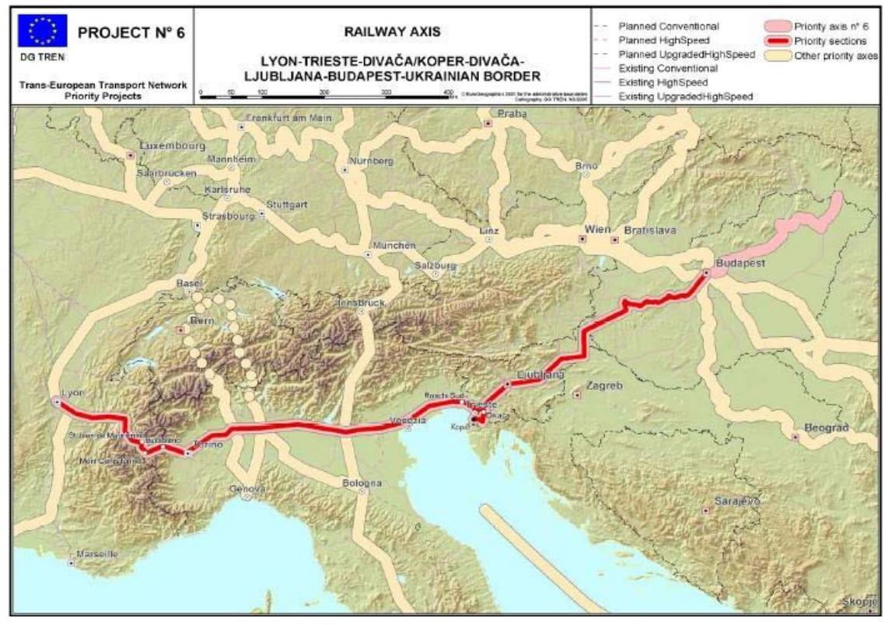

1. sz. ábra

---

A Tanács a III. mellékletben felsorolt kiemelt fontosságú projekteket európai érdekű projekteknek nyilvánította. Amennyiben az európai érdekűnek nyilvánított projekt munkálatainak megkezdése a 2010. december 31-ei határidőhöz képest jelentősen késik, úgy az érintett tagállamnak legfeljebb 3 hónapon belül értesítenie kell a Bizottságot a késést okozó problémákról.

# 1.2. A közösségi jogharmonizáció és a magyarországi közlekedéspolitika összhangja 

A Magyar Köztársaság az Európai Unióhoz történt csatlakozását követően részesévé vált az európai közös közlekedéspolitikának is, amelynek fontos célkitűzése a környezetkímélő vasúti közlekedés igénybe vételének ösztönzése a jelenleg domináns közúti szállítással szemben. Ennek megfelelően a közös közlekedéspolitika kiemelt területként kezeli a vasúti közlekedés fejlesztését, illetve ennek érdekében a vasúti tevékenységek fokozatos liberalizációját.

Az EU irányelvek és rendeletek egyrészt lehetőséget adnak a magyar vasút számára a felzárkózásra (állami kötelezettségvállalás teljesítése: infrastruktúra és személyszállítási fejlesztési forrás biztosítása, közszolgáltatási tevékenységek kötelező ellentételezése), másrészt jelentős feladat a vasúti szállítási piac liberalizálása. A vasúti közlekedésben az EU elvárások, előírások teljesítésének kiemelt szerepe volt, amely célt a Magyar Közlekedéspolitika 2003-2015. évekre szóló koncepciója ${ }^{6}$ is rögzít.

A vasútról szóló 1993. évi XCV. törvény 2001-2004. években történt módosításával, valamint a részletes szabályokat megállapító miniszteri rendeletek megalkotásával a közösségi jog első vasúti csomagját képező irányelvek átültetésre kerültek a magyar jogrendszerbe. Az új vasúti törvény és a hatályban tartott korábbi végrehajtási rendeletek fogalom-rendszere egymással nincs összhangban, ezáltal értelmezési nehézségek keletkeznek. A hazai jogszabályokban az integrált vasúti társaságra vonatkozó szabályozás még a MÁV szervezeti átalakulását megelőző időszakot tükrözi. Nincs összhangban a közforgalmú személyszállítási utazási kedvezményekről szóló kormányrendelet a fogyasztói árkiegészítésről szóló törvény előírásaival. ${ }^{7}$

A magyar vasúti közlekedésről szóló 2005. évi CLXXXIII. törvény (Vtv.) megalkotásánál meghatározó volt a 91/440 EGK irányelv és az azt módosító irányelvek elvárásainak minél teljesebb körű érvényesítése. Ezen elvek megvalósulása érdekében a következő főbb intézkedések történtek:

- infrastruktúra és üzemeltetés szétválasztásának létrehozása. 1996. január 1-től a MÁV Rt.-n belül az átalakítás első ütemeként létrejött a gazdasági és irányítási szempontból elkülönült pályavasút és vállalkozóvasút. Lezárult a vasúti reform végrehajtása, amely biztosítja a 2001/12/EK irányelv szerinti elkülönülést a létrejött üzletágak (pálya-, személyszállítás-, árufuvarozás-, gépészet) között;

[^0]
[^0]:    ${ }^{6}$ A koncepciót az Országgyűlés 19/2004. (III. 26.) számú határozatával fogadta el.
    ${ }^{7}$ 0815 Jelentés a vasúti közlekedés korszerűsítésének ellenőrzéséről. A jelentésben a Kormánynak javasoltuk a szabályozás összehangolását.

---

Tekintettel arra, hogy - az egységes állami vasút lebontása mellett - a hazai vasúti közlekedéspolitika kiemelt stratégiai célkitűzése a vasúti közlekedés regionalizálása, a törvény újraszabályozza a vasúti közlekedés területi vonatkozásait is. A törvény az országos és a helyi vasúti közlekedés mellett megteremti a térségi és az elővárosi vasúti közlekedés kialakulásának feltételeit. Ennek megfelelően a működési engedélyek is országos, térségi, elővárosi vagy helyi területi hatállyal kerülnek kiadásra.
A Vtv. a fentiek mellett megalkotja az elővárosi személyszállítás fogalmát, amely a nagyvárosok - így elsősorban a főváros - és agglomerációjuk személyszállítási igényeinek a „hagyományos" vasúti közlekedés keretében történő kielégítését jelenti szemben a speciális jellegű helyi vasúti közlekedéssel (pl. villamos).

- harmadik fél hozzájutása a vasúti infrastruktúra létrehozásához. A vasúti törvény (Vtv.) kimondja, hogy megfelelő díj ellenében lehetővé kell tenni a vasúti pálya és tartozékai igénybevételét belföldi székhelyű (valamely EGT államban a 95/18EK irányelv alapján kiadott működési engedéllyel rendelkező) vállalkozói vasúttársaság, nemzetközi szerződés, vagy viszonosság esetén pedig külföldi székhelyű vállalkozó vasút számára is. A
 törvény rendelkezik a pályakapacitásokat elosztó és pályahasználati díjat megállapító Vasúti Pályakapacitás-elosztó Szervezet állami tulajdonú társaság felállításáról is. Kiadásra került a 45/2006. (VII. 11.) GKM rendelet a vasúti társaságok működésének engedélyezéséről;
- interoperabilitás (a kölcsönös átjárhatóság elvének) lehetővé tétele. A 37/2006. (VI. 21.) GKM rendelet biztosítja a nagysebességű transzeurópai vasúti rendszerekre vonatkozó kölcsönös átjárhatóság feltételeit, míg a hagyományos vasúti rendszerek kölcsönös átjárhatóságával összefüggésben a 2001/16/EK irányelvvel való összhangot a 36/2006. (VI. 21.) GKM rendeletben foglalt előírások biztosítják;
- a vasúti közlekedésről szóló törvény szabályozza a vasúti tevékenységeket végző szervezeteknek a vasúti biztonsággal kapcsolatos alapvető kötelezettségeit, a közösségi vasutak biztonságáról szóló, 2004/49/EK irányelvének a nemzeti jogba történő átültetése érdekében.

Az eddigi kormányzati, ágazati és vállalati szintű intézkedések jogi- és szervezeti szempontból megteremtették a lehetőségét a versenyképes, EU konform magyar vasút megalapozásának. A versenyképesség tényleges érvényesülése, a lefektetett alapelvek mentén, a következetes megvalósításon múlik.

A GKM az úgynevezett Fehér Könyv félidős (2007. évi) felülvizsgálatát követően a Magyar Közlekedéspolitika 2003-2015 dokumentum kiegészítésére a 2008-2020 közötti időszakra elkészítette az „Egységes Közlekedésfejlesztési Stratégia I. Zöld könyv" (EKFS) című dokumentumot, amelyben a vasúti közlekedés főbb fejlesztési irányait mutatja be, amelyek az alábbiak:

- a rövid távú (2008-2013) stratégia az infrastruktúra megbízhatóságának fokozását határozza meg, célként az átlagos EU teljesítmény elérését jelöli meg. A rövid távú fejlesztéseket elsősorban a TEN-T 22. és 6. vasúti kiemelt vasúti tengellyel (azaz a IV. és V. páneurópai folyosóval) kapcsolatos projektekre fókuszálja;
- a középtávú (2014-2020) stratégia kiterjeszti az infrastruktúra megbízhatóságának célját és egyre inkább a legjobb szolgáltatási szinteket határozza

---

meg. Ezen időszak során az egyik legfontosabb cél olyan infrastruktúraprojektek megvalósítása, amelyek megnövelik a vonatok maximális megengedett sebességét, azért hogy az utazás idejét csökkentsék. A TEN-T vasúti folyosók jellemző tervezett sebessége szakaszonként eléri a $160 \mathrm{~km} / \mathrm{h}$ értéket annak érdekében, hogy az intercity stratégiai üzletág a közúti közlekedés életképes alternatívájává váljon. A fejlesztések a TEN-T 22. és 6. számú vasúti tengelyeire koncentrálnak, és közvetlen előnyöket nyújtanak az elővárosi, valamint a belföldi és nemzetközi intercity és teherszállítási szolgáltatások számára;

- a hosszú távú (2020-2030) stratégia a kapacitás fokozását, valamint a TEN-T vasúti hálózatnál alkalmazott új technológiák bevezetését célozza, mint az egységes vonatbefolyásoló rendszer (ERTMS). Az egész élettartamra kiterjedő költségek csökkentése kulcsfontosságú cél, annak érdekében, hogy fennmaradjon az erős versenyhelyzet az alternatív modalitásokkal, különösen a közúttal szemben;
- Magyarországon a nagy - $200 \mathrm{~km} / \mathrm{h}$ feletti - sebességű vonalak fejlesztése 2020 előtt nem tűnik reálisnak. A nemzetközi vonalakba történő befektetés egy koordinált stratégiai és tőke-beruházási program lesz a szomszédos országokkal, melyhez EU támogatás szükséges és ahol üzleti érdekek érvényesülhetnek (PPP). Ez biztosítaná, hogy egységes, nagy kereskedelmi sebesség legyen elérhető a nemzetközi vonalak mentén, annak érdekében, hogy a beruházást követően annak teljes körű előnye élvezhető legyen.

Az Egységes Közlekedésfejlesztési Stratégiában a GKM azt vizsgálta, hogy az egyes időtávokban tervezett beruházások mennyiben járulnak hozzá a kitűzött szolgáltatásfejlesztési célok megvalósításához. Az azonos értékek esetében előnyt élveznek azok az előkészített projektek, melyek TEN prioritási projekt vagy az országos törzshálózat részei. Természetesen az egyes időtávokon elkölthető beruházási összegek határt szabnak a beruházások megvalósításának.

# 2. NEMZETKÖZI VASÚTI FOLYOSÓK FEJLESZTÉSÉNEK FELTÉTELRENDSZERE

### 2.1. A vasúti közlekedés fejlesztésének pénzügyi forrásai

Az Európai Uniótól érkező források az egyes időszakokban folyamatosan növekvő mértékűek. A PHARE előcsatlakozási támogatást az Európai Unió 1990 óta biztosítja hazánk részére, az Előcsatlakozási Alapokból (ISPA, SAPARD) a 2000. évtől részesültünk. Ezek a csatlakozás évétől a Strukturális Alapokból és a Kohéziós Alapból, valamint egyéb forrásokból érkező támogatásokkal (Schengen Alap, Norvég Alap + EGT, Svájci - Magyar Együttműködési Program) egészültek ki. A 2007-2013 közötti programozási időszakban a korábbi támogatási szint jelentősen emelkedett. Az Előcsatlakozási Alapokon keresztül az Unió általában 50%-ban támogatta a megvalósítandó projekteket. A csatlakozást követően 2004-2006. évek között a Kohéziós Alap által biztosított fejlesztési források esetében a támogatások aránya - projektenként eltérően - 80-85%-ra nőtt.

---

A pénzügyi források trendjének 1990-2013 közötti alakulását a 2. sz. ábra mutatja be.

EU-támogatások 1990-2013
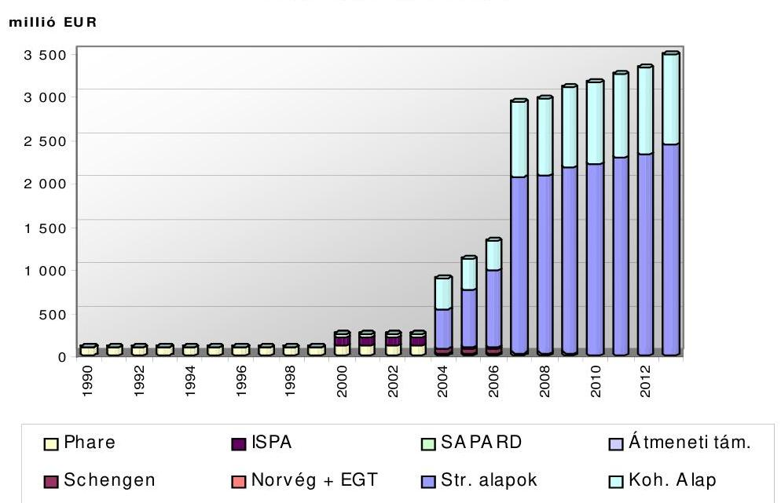

Forrás: NFÜ
2. ábra

2004-től ezek a támogatások megjelennek a Magyar Köztársaság költségvetésében.

Magyarországon a 2000-től EU (ISPA / Kohéziós Alap) támogatás segítségével megvalósított beruházások (vasútvonal rehabilitációk) és szakértői feladatok az alábbiak:

- 2000/HU/16/P/PT/001 Budapest - Cegléd - Szolnok - Lőkösháza I,
- 2000/HU/16/P/PT/002 Budapest - Hegyeshalom II.,
- 2000/HU/16/P/PT/003 Zalalövő - Zalaegerszeg - Boba,
- 2001/HU/16/P/PT/007 Budapest - Szolnok - Lőkösháza II/1,
- 2001/HU/16/P/PA/006 Szakértői segítségnyújtás tender eljáráshoz, műszaki felülvizsgálathoz,
- 2003/HU/16/P/PA/013 Technikai segítségnyújtás a KA-ból finanszírozott közlekedési projektek előkészítésére,
- 2005/HU/16/C/PA/001 a Kohéziós Alap által finanszírozott projektek előkészítése a vasúti ágazatban 2007-2013 között,
- 2004/HU/16/C/PT/001 Budapest - Szolnok - Lőkösháza II/2.

A projektek kedvezményezettje 2007. június 30-áig a MÁV Zrt. volt, 2007. július 1-jétől a támogatás új címzettje a Nemzeti Infrastruktúra Fejlesztő (NIF) Zrt. lett. A projektek előkészítésére 2005-ig csak a MÁV Zrt. saját forrásai álltak rendelkezésre. A 2000. évi Application Form (támogatási kérelem) elkül-

---

dése és EU általi elfogadását követően a 2001-2002. évi költségvetésbe sem az előkészítés, sem a kivitelezés hazai forrását nem tervezték be. Az előkészítés és finanszírozás hiánya két év csúszást okozott a projektek megvalósításában. A projektekre vonatkozó Application Form benyújtásakor csak előzetes tanulmányok álltak rendelkezésre, amelyekben a műszaki tartalom meghatározása nem volt pontos, amely körülmény az EU Bizottsága előtt is ismert volt. Mindezek következményeként a tervezett ráfordítások csak becslések alapján kerültek meghatározásra, 2000. évi áron, a későbbi megvalósítások inflációs hatásainak kimunkálása nélkül. A kiemelt projektek pénzügyi forrás felhasználását a 2. sz. melléklet tartalmazza.

A 2002. évi beruházási felhasználások elmaradtak a tervezettől. A végrehajtott 14 Mrd Ft értékű műszaki tartalom csökkentés mellett 17 Mrd Ft-tal nőtt a projektek bekerülési költsége folyó áron a Finanszírozási Megállapodáshoz képest. Az EU támogatási részaránya ilyen körülmények mellett már nem éri el a lehetséges és eredeti megállapodás szerinti 50%-ot, mert az EU csak a megállapodásoknak megfelelő összeget fizeti.

A MÁV Zrt. és NIF Zrt. közötti 2007. évi átadáshoz készült szakértői un. „Státuszjelentés”8 szerint 19 vasúti beruházási projektből 7 kivitelezési, és 3 tervezői/konzulensi projekt finanszírozási megállapodásában rögzített ütemezését módosították. A projektek előrehaladásában tapasztalt csúszások okai elsődlegesen a beruházási projekteket érintő stratégiai döntések, a tervezői kapacitáshiány, a finanszírozási körülmények változása, a projektekben meghatározott alprojektek egymásra épülése (egy alprojekt csúszása több másik csúszását is előidézte); közbeszerzési eljárás lebonyolításában bekövetkezett késedelem (eredménytelen eljárás, eljárás eredményének megtámadása), valamint az intézményrendszer változása. Az EU támogatások előkészítési rendje és követelményei ismeretlenek9, a kedvezményezettek felkészületlenek voltak a támogatások igénylésére és azok fogadására. A hazai és a nemzetközi (EU hivatalos lapjában meghirdetett) pályázatokon résztvevő vállalkozók felkészületlensége, pályázati gyakorlatlansága, a megfelelő gyakorlott és képzett munkaerő hiánya évekre vetette vissza az egyes projektek teljesítését.

Az EU elvárásainak megfelelő intézményi rendszer 2000-2005 között került kialakításra a támogatások előkészítésére, fogadására, a projektek lebonyolítására és ellenőrzésére. A szükséges átszervezések is csúszásokhoz vezettek. A Bizottság 1999 végén adta ki az ISPA-t szabályozó rendeletét, így a 2000 januárjától megnyíló források felhasználási rendszere a támogatást Magyarországon közvetítő intézményrendszer számára sem volt ismeretes, ennek következtében a kedvezményezettek felkészítését, a beadandó projektekkel szembeni elvárásokat a Kormányzat sem tudta időben megkezdeni, megfogalmazni. Az első pillanattól kezdve nehezítette az igénybevételt az, hogy a költségvetés az önrészt nem finanszírozta ütemesen, ami miatt a támogatást élvező EU projektek határidő módosítására kényszerültek.

[^0]
[^0]:    ${ }^{8}$ AAM Tanácsadó Zrt. 2007. április 27-ei jelentése
    ${ }^{9}$ Megállapította az ISPA támogatásokról szóló 530. sz. ÁSZ jelentés

---

Az ISPA csak a transzeurópai hálózat és a helsinki folyosók mentén elhelyezkedő vasútvonalak fejlesztéséhez járult hozzá. A vasúti fejlesztések tervezett 243,4 M euró támogatási összegéből a 2004. április 30-áig - a jelentős teljesítésbeli elmaradás miatt - mindössze 31,7 M euró kifizetése valósult meg.

A 2000-2004 közötti programozási időszakban rendelkezésre álló összes közlekedési célú ISPA forrásból - 363,2 euró - több mint 200 M euró támogatást (55%) az ország nem tudott időben felhasználni, az ISPA Programban be nem fejezett projektek költségei a Kohéziós Alap keretéből kerülnek kifizetésre. A KA projektek a nemzetközi közlekedési szempontból meghatározó helsinki folyosók és csatlakozó mellékágak fejlesztését célozzák (vasúti és közúti folyosók). A szerződésmódosítások következtében a kifizetési lehetőségek 2010. december 31-éig kitolódtak. 2009. december 31-éig a rendelkezésre álló források 95,3%-a került kifizetésre. (lásd 3. sz. ábra)
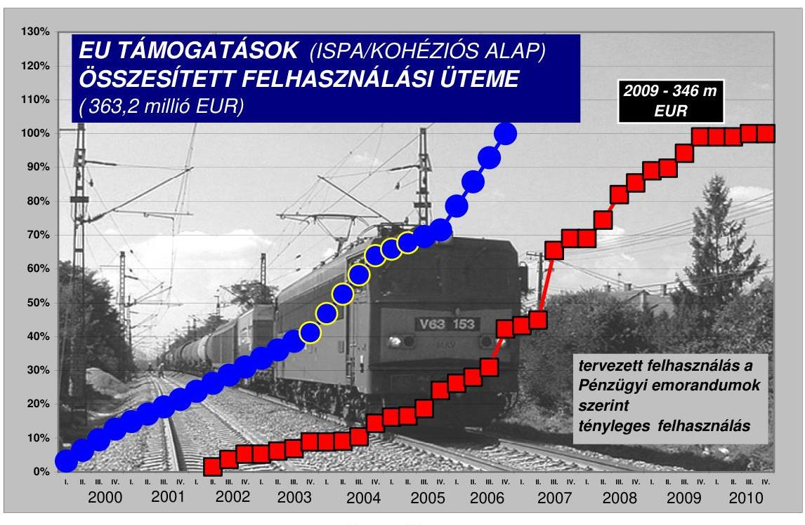
3. sz. ábra

A közlekedési tárca által megfogalmazott stratégia megvalósítása 2007-2013. között a Közlekedési Operatív Program (KÖZOP) keretében a Kohéziós Alapból (73%) és ERFA finanszírozással történik. A közlekedés-fejlesztésre rendelkezésre álló EU-s forrásokon belül a KÖZOP szerint vasútfejlesztésre 1,95 Mrd euró10, a TEN-T vonalak fejlesztésére áll rendelkezésre.

A KÖZOP hét vasúti közlekedési nagyprojektet (indikatív lista) támogat, amelynek előkészítése már korábban megkezdődött. Az uniós fejlesztések eredményeképpen mintegy 500 km vasútvonal, ezen belül elővárosi vonal korszerűsítésére és a kapcsolódó informatikai, biztonsági és irányítás-technikai eszközök fejleszté-

[^0]
[^0]:    ${ }^{10}$ Hazai önerő nélkül, a vízi utakra szánt becsült összeg levonásával, valamint nem tartalmazza az elővárosi közlekedés forrását.

---

sére kerül sor. A KözOP-ban felsorolt nagyprojektek listája indikatív, költségvetésük túltervezett, így nem garantált valamennyi projekt megvalósítása.

A saját költségvetési támogatás biztosítása érdekében a Nemzeti Közlekedéspolitikában foglalt 2004-2006 között megvalósítandó fejlesztési és beruházási programokat a Kormány a Nemzeti Fejlesztési Tervben (NFT) fektette le. E szerint hosszú távon a TEN-T hálózat magyarországi szakaszainak az egységes európai vasúti hálózat részeként a $140 \mathrm{~km} /$ óra és a $160 \mathrm{~km} /$ óra közlekedési sebességet kell elérni. A páneurópai V. folyosó mentén haladó vonalak villamosítását a dunántúli térség vonalainak villamosítása követi. A terv az uniós csatlakozásból eredő határátkelőhely korszerűsítések megvalósítását 2006-ig határozta meg, amelyek a schengeni határokra vonatkozó előírásoknak megfelelően elkészültek. A NFT 5 operatív programja közül a Környezetvédelmi és Infrastruktúra Operatív Program (KIOP) tartalmaz közlekedésfejlesztési, ezen belül vasútfejlesztési célkitűzéseket és projekteket. A NFT az 1260/1999. EK Tanácsi rendelet alapján közlekedésfejlesztésre 2004-2006 között 83,7 M euró támogatást irányzott elő ERFA forrásból, amelyhez 22,3 M euró támogatást a központi költségvetésből, valamint 5,6 M eurót a helyi önkormányzatok útján tervezett biztosítani.

Az ÚJ Magyarország Fejlesztési Terv (ÚMFT) részben a TEN-T hálózatba tartozó beruházásokat is meghatározott. Az ÚMFT szerint a KÖZOP az Uniós forrásokból 6,2 Mrd eurót fordíthat 2007-2013 között a célok megvalósítására, ez a hazai önerővel kiegészülve meghaladja a 7,3 Mrd eurót. Az EU-s források hazai forrásokkal történő kiegészítési igénye a támogatások alapszerződései alapján:

- 2000. évi ISPA
 források esetén 50%-os hazai forrás igénye merült fel, amelyből az EU és a Magyar Állam közötti együttműködési megállapodás szerint 40% volt EIB hitel, és 10% volt költségvetési forrás;
- a 2003. évi ISPA források esetében a hazai hányad 46% volt;
- a 2004. évi Kohéziós Alap esetében a hazai hányad 20% volt;
- az EIB I/A és EIB I/B hiteleket 50% hazai hányaddal szükséges kiegészíteni;
- TEN-T források esetében a 2004. évi TEN-T támogatás 50-67%-os, a 2005., 2006. és 2007. évi TEN-T támogatás 50%-os hazai forrást igényelt;
- a 2007-2013. évi Kohéziós Alap tervezett támogatási intenzitása 85%-os, azaz a hazai hányad legalább 15%-os.

A hazai társfinanszírozás szempontjából felelős irányító szervek (Kormány, PM, GKM, valamint az IH) az eredeti Financing Memorandumhoz viszonyítva 2001-2006 között - mintegy 15 Mrd Ft, 2007-ben további 6 Mrd Ft - költségtúllépést fogadtak el, $^{11}$ ill. a beruházások megvalósításához szükséges magasabb költségek felhasználását engedélyezték. A költségtúllépéseket az EU nem finan-

[^0]
[^0]:    $^{11}$ A költségek túllépése az IH szerint részben a projektek nem teljes körű előkészítettségére, részben a jogszabályi és belső szabályozásbeli hiányosságok következményeire vezethető vissza.

---

szírozta, ezért annak fedezetét Magyarországnak többlet költségvetési forrásból, vagy más projektek megvalósításának terhére kellett finanszírozni.

# 2.2. Az intézményrendszer kialakítása 

Az EU-ból érkező források fogadásához, illetve lebonyolításához szükséges intézményrendszert Magyarország az EU előírásai alapján, a hazai jogszabályokat figyelembe véve alakította ki. Magyarországon a 2000-től EU (ISPA/Kohéziós Alap) támogatás segítségével megvalósított beruházások intézményrendszere biztosított volt.

A hazai alapjogszabály a transzeurópai hálózat projektjeihez juttatott TEN-T támogatás felhasználásáról szóló 150/2005. (VII. 29.) Korm. rendelet, amely az intézményrendszer (Végrehajtó Hatóság és Kedvezményezett) működését valamint a projektek lebonyolításának főbb fázisait szabályozza. A 34/2006. (XI. 23.) GKM utasítás a GKM-ben működő Végrehajtó Hatóság feladatainak ellátását megosztotta: a stratégiai koordinációs feladatokat továbbra is az e feladatra kijelölt szakterület (Infrastruktúra-fejlesztési Programok Főosztály), míg a projekt lebonyolítással kapcsolatos közreműködő szervezeti feladatokat a KKK, KIKSZ látja el. Az Európai Unió strukturális alapjaiból és Kohéziós Alapjából származó támogatások hazai felhasználásáért felelős intézményekről az 1/2004.(I. 5.) Korm. rendelet intézkedik.

A 2007-2013-as programozási időszakban a korábbit meghaladó nagyságrendű uniós fejlesztési támogatások minél teljesebb körű igénybevételéhez és a meghatározott támogatási célok hatékony felhasználásához a feladatokat gazdaságosan, hatékonyan, eredményesen ellátó intézményrendszer (stabil szervezeti háttér, megfelelő kapacitás, valamint egységes eljárásrend) működése szükséges. Ennek kialakítása érdekében a Kormány 2006. július 1-jével a Nemzeti Fejlesztési Hivatal általános jogutódjaként létrehozta a Nemzeti Fejlesztési Ügynökséget (NFÜ), amelynek keretében látták el feladataikat az új és korábbi programozási időszak Operatív Programjainak Irányító Hatóságai. $^{12}$

Az NFÜ felelőssége az előző feladatokon túl kiterjedt - a PHARE programokkal és a Schengen Alappal, az Átmeneti Támogatással, a Norvég Finanszírozási Mechanizmussal, illetve az EGT Finanszírozási Mechanizmussal, Svájci - Magyar Együttműködési Programmal kapcsolatos - az előkészítési, szervezési és koordinációs feladatokra is. Az NFÜ szervezetében kiemelt szerepet kapott a Koordinációs Irányító Hatóság, amely figyelemmel kíséri a Közösség Támogatási Keret végrehajtását és az irányító hatóságok tevékenységét, irányítja a programok értékelését.

A kormányzati struktúra változásából következően az NFÜ 2008. május 15-étől a nemzeti fejlesztési és gazdasági miniszter felügyelete alatt működik (ezen időpontig tevékenységét a Miniszterelnöki Hivatalt vezető miniszter, majd az önkormányzati és területfejlesztési miniszter irányította). Az Irányító Ható-

[^0]
[^0]:    $^{12}$ Az AVOP irányító hatóság és az új programozási időszak agrár- és vidékfejlesztési, illetve halászati támogatásai irányító hatóságainak kivételével. Az AVOP Irányító Hatósága az FVM Agrár-vidékfejlesztési Főosztálya.

---

# ságok (IH) feladataik egy részét Közreműködő Szervezetekre delegálták. 

Az ÚMFT-re vonatkozóan az intézményi felkészülést és ezen belül az irányítási és ellenőrzési rendszerek kialakításának megfelelőségét az uniós $^{13}$ és hazai $^{14}$ szabályozással összhangban a KEHI, mint Ellenőrzési Hatóság „Megfelelőségi vizsgálatról" szóló (akkreditációs) jelentésének kell igazolni. Az ÚMFT intézményrendszerének megfelelőségi vizsgálatáról szóló akkreditációs jelentéseket az EU Bizottság 2008. év folyamán a KÖZOP és a KMOP 2. prioritás kivételével jóváhagyta és a KEHI által benyújtott nem minősített véleményt elfogadta. A Bizottság 2009. június 12-én mind a KÖZOP, mind a KMOP 2. prioritására vonatkozó irányítási és ellenőrzési rendszert elfogadta, így valamennyi operatív program irányítási és ellenőrzési rendszerének jóváhagyása megtörtént.

A PM Nemzeti Programengedélyező Iroda (a továbbiakban Kifizető/Igazoló Hatóság) ellátja az Európai Unió strukturális és kohéziós alapjaiból származó támogatásokkal kapcsolatosan a kifizető és az igazoló hatósági feladatköröket. Továbbá ellátja az Európai Unió által támasztott követelményeknek megfelelő és a Pénzügyminisztérium feladatkörébe rendelt pénzügyi lebonyolítási, számviteli és intézményfejlesztési feladatokat az előcsatlakozási eszközök és az Átmeneti Támogatás tekintetében.

Az ellenőrzések rámutattak, hogy 2008-ban az NFÜ illetve az uniós támogatások lebonyolításában érintett intézményrendszer feladatai jelentősen megnövekedtek, mivel a 2004-2006-os programozási időszak lebonyolítási és zárási feladatainak végrehajtása mellett beindult az ÚMFT végrehajtása is. A feladatellátást befolyásoló állandó külső tényezők közül - a korábbi évekhez hasonlóan - az egyik legfontosabb az intézményrendszer folyamatos átalakítása (szervezeti változások, vezetőváltások), a kapacitáshiány, illetve a magas fluktuáció, melyek a feladatellátásban az előző évekhez hasonlóan 2008-ban is problémákat, fennakadásokat okoztak, és amelyek hatásai a pénzügyi feladatok ellátása terén is érezhetőek voltak (hitelesítési jelentések hiányos és/vagy késedelmes benyújtása, kifizetések elhúzódása). Az ellenőrzések a feladatellátás kapacitáshiányra és fluktuációra visszavezethető hiányosságait elsősorban a szabálytalanságkezelés, a FEUVE és a pénzügyi folyamatok területén tárták fel.

### 2.3. Egységes Monitoring Információs Rendszer

Az uniós rendelet előírásai szerint a tagállamnak megfelelően kiépített informatikai rendszerrel kell rendelkezni, amely a közösségi források felhasználásá-

[^0]
[^0]:    $^{13}$ A Tanács 2006. július 11-ei 1083/2006/EK rendelete az Európai Regionális Fejlesztési Alapra, az Európai Szociális Alapra és a Kohéziós Alapra vonatkozó általános rendelkezések megállapításáról és az 1260/1999/EK rendelet hatályon kívül helyezéséről.
    $^{14}$ 281/2006. (XII. 23.) Kormányrendelet a 2007-2013 programozási időszakban az ERFA, ESZA és a Kohéziós Alapból származó támogatások fogadásához kapcsolódó pénzügyi lebonyolítási és ellenőrzési rendszerek kialakításáról.

---

ról megbízható adatokat és információkat szolgáltat a Kormány, az intézményrendszer és az Európai Unió számára.

Az Európai Uniós támogatások felhasználásának átláthatósága érdekében, illetve a lebonyolítási intézményrendszer munkájának informatikai támogatására az NFÜ az EMIR-t működteti. Az EMIR egy olyan adminisztratív és napi menedzsment munkát is támogató, átfogó rendszer, mely nyomon követi a finanszírozott projektek előrehaladását a befogadástól a kifizetésig, azzal, hogy a projekteket a fenntartási időszakban is nyomon követi.

Az EMIR-t integrált rendszerelemek alkotják. Az alrendszerek felhasználói funkcionalitását modulok (főbb logikai funkció csoportok) támogatják.

A rendszerelemeket a keretrendszer, az EMIR alkalmazás támogatáskezelő alrendszerei és azok moduljai, az EMIR HelpDesk rendszer, az EMIR elektronikus pályázatkitöltő program és adatlapjai, az EMIR WEB alrendszer, az EMIR adattárház modul és az EMIR interfész modul (külső adatkapcsolatok) képezik. Az EMIR alkalmazás támogatáskezelő alrendszerei kilenc alrendszerből tevődnek össze: Strukturális Alapok, Kohéziós Alap, EQUAL, PHARE és Átmeneti Támogatás, Schengen Alap, EGT/Norvég Alap, Projekt Előkészítő Alap és Új Magyarország Fejlesztési Terv alrendszer és a Projekt Értékelő és Fejlesztő Eszköz.

A rendszer kidolgozásának kezdete (2003) óta a Welt 2000 Kft. üzemelteti és fejleszti az EMIR-t. Az NFÜ tájékoztatása szerint az EMIR a 2008. évi szoftver- és hardverfejlesztéseknek köszönhetően a korábbiaknál magasabb színvonalon képes támogatni az Európai Uniós források hatékony felhasználását. Az intézményi felhasználók oldaláról az EMIR-rel szemben megfogalmazott kritikák ugyan jelentős mértékben csökkentek, azonban nem szűntek meg.

Hiányosságok jelentkeztek néhány alrendszer számviteli moduljának működése, a pénzügyi modul részét képező követeléskezelés funkció kialakítása, a kötelezettségvállalások analitikus alátámasztása terén. Az Ellenőrzési Hatóság által a megfelelőségi vizsgálatok során feltárt, az EMIR-t érintő hiányosságokat az NFÜ megszüntette.

# 2.4. Az uniós támogatások hazai ellenőrzési rendszere 

A támogatások pénzügyi ellenőrzéséért - az Európai Bizottság az Európai Közösségek főköltségvetése végrehajtásáért való felelőssége sérelme nélkül - elsődlegesen a tagállamok vállalnak felelősséget. Minden tagállamnak kötelessége gondoskodni a rá vonatkozó ellenőrzési feladatok olyan ellátásáról, amellyel megvalósítja az alapelvek és ellenőrzési célok érvényesítését. A feladatok ellátásához kapcsolódóan a tagállamoknak az ellenőrzések három szintjét kell ellátniuk.

Az első szintű ellenőrzés az úgynevezett folyamatba épített ellenőrzés, amely révén ellenőrizni lehet a társfinanszírozott termékek tényleges leszállítását, a szolgáltatások nyújtását, objektumok kivitelezését, továbbá a bejelentett kiadások valós voltát, valamint ezek megfelelését a közösségi és nemzeti jogszabályoknak.

---

A második szintet a rendszer- és mintavételes ellenőrzések adják, melyek során a tagállamok vizsgálják az irányítási és ellenőrzési rendszerek működésének hatékonyságát, az ellenőrzési nyomvonal megfelelőségét, a számviteli nyilvántartások és az azokat alátámasztó bizonylatok valódiságát, összhangját a jogszabályi előírásokkal, valamint a társfinanszírozás rendelkezésre állását.

A harmadik szint a programok zárásához kapcsolódóan a támogatások végelszámolását megalapozó záró költségnyilatkozatok ellenőrzését foglalja magában.

Az Állami Számvevőszék - mint az Országgyűlés pénzügyi-gazdasági ellenőrző szerve, az állam legfőbb pénzügyi ellenőrző szerve - egyrészt jogosult az államháztartás teljes körét érintő vizsgálatokra, másfelől az EU-ból érkező támogatások felhasználását, illetve a Közösséget megillető befizetéseket ellenőrizve hatékonyan részt vesz a Közösség pénzügyi érdekeinek védelmében. Az Államháztartási Belső Pénzügyi Ellenőrzési rendszer keretében a pénzügyminiszter felel $^{15}$ a FEUVE és a belső ellenőrzési rendszer szabályozásáért, fejlesztéséért, koordinációjáért és harmonizációjáért.

A hazai jogszabályok a Kormányzati Ellenőrzési Hivatalt jelölték ki az Európai Regionális Fejlesztési Alapból, az Európai Szociális Alapból és a Kohéziós Alapból, továbbá a Szolidaritás és migrációs áramlások igazgatása általános program által finanszírozott támogatások, illetve a Magyarország-Horvátország és a Magyarország-Szerbia IPA Határon Átnyúló Együttműködési Programok és az ETE programok tekintetében az ellenőrzési hatósági feladatok ellátására a 2007-2013 közötti programozási időszakra.

A KEHI ellátja továbbá a 2004-2006 közötti programozási időszak tekintetében a Strukturális Alapokkal, a Kohéziós Alappal, az EQUAL és az INTERREG IIIA Közösségi Kezdeményezés programokkal kapcsolatos - az uniós pénzügyi rendeletekben előírt $^{16}$ - ellenőrzéseket, az európai uniós előcsatlakozási eszközök, az Átmeneti Támogatás és a Schengen Alap támogatásai felhasználásának ellenőrzését. A KEHI feladata az EGT és a Norvég Alap Finanszírozási Mechanizmusokból támogatott projektek ellenőrzése, valamint a Svájci - Magyar Együttműködési Program általános pénzügyi ellenőrzése is.

Az ellenőrzési funkciók hiányos működésére vonatkozó megállapítások - a 2005. évi tapasztalatokhoz hasonlóan - a 2008. évben lefolytatott ellenőrzések során is megfogalmazódtak, amely arra utal, hogy az ellenőrzési rendszer további erősítése szükséges az Irányító Hatóságok (IH) és a Közreműködő Szerve-

[^0]
[^0]:    $^{15}$ Az államháztartásról szóló 1992. évi XXXVIII. törvény 121/B. §-a.
    $^{16}$ A Bizottság 438/2001/EK rendelete (2001. március 2.) a strukturális alapok keretében nyújtott támogatások irányítási és ellenőrzési rendszerei tekintetében az 1260/1999/EK tanácsi rendelet végrehajtása részletes szabályainak megállapításáról, valamint a Bizottság 386/2002/EK rendelete (2002. július 29.) a Kohéziós Alapból nyújtott támogatások irányítási és ellenőrzési rendszere,

---
 valamint a pénzügyi korrekciós eljárás tekintetében az 1164/94/EK tanácsi rendelet végrehajtására vonatkozó részletes szabályok megállapításáról.

---

zetek (KSZ) vonatkozásában. A KSZ-ek első szintű és az IH által elvégzendő felülvizsgálati ellenőrzésének nem kielégítő volta magas kockázatot hordoz a programok szabályszerű és a támogatási célnak megfelelő végrehajtása/megvalósulása tekintetében. Az ellenőrzések hangsúlyozták az első szintű ellenőrzések IH általi felülvizsgálatának fontosságát, mert a KSZ előírásszerűen végrehajtott első szintű ellenőrzései kell, hogy kiszűrjék a kedvezményezettek által elkövetett szabálytalanságokat, pl. az el nem ismerhető költségeket.

# 3. A PÁNEURÓPAI HÁLÓZAT V. KORRIDOR 6. SZÁMÚ KIEMELT VASÚTI PROJEKT HAZAI FEJLESZTÉSÉNEK MEGVALÓSÍTÁSA 

### 3.1. A páneurópai közlekedési korridorok kijelölése

Az 1994-ben Krétán, majd 1997-ben Helsinkiben tartott 2., ill. 3. Összeurópai Közlekedési Értekezlet fogadta el a legfontosabb európai közlekedési útvonalakat, mely a TEN hálózathoz illeszkedve egységes európai törzshálózat létrehozását tűzte ki célul. Közép- és Kelet-Európában 10 közlekedési folyosót jelöltek ki. Meghatározták az európai közlekedés szempontjából fontos tranzit útvonalakat és regionális kapcsolatokat, az egységes elvek szerint fejlesztendő TEN-T hálózatot.

Az EU által kialakított Kelet-Közép-Európát érintő tíz ún. helsinki folyosó közül hat folyosó - ebből öt vasúti - halad át Magyarországon, így az EU által támogatott szállítási útvonalak fejlesztése az ország vasúthálózatának jelentős hányadát érinti. Geopolitikai helyzetünket a nyugati-keleti irányú árukapcsolatok feltételeinek fejlesztésével tudjuk a legjobban kamatoztatni. Magyarország az észak-dél irányú forgalomban is szinte kihagyhatatlan, alternatív útvonalat csak az Unión kívül haladó, a tőlünk keletre elhelyezkedő 9. folyosó jelent. A magyar vasúti hálózat Záhonyon keresztül csatlakozik a FÁK-országok széles nyomtávú hálózatához, ami az orosz és ázsiai piacok irányába biztosít kulcsfontosságú kapcsolatot. Az európai - ázsiai áruszállítási folyosók négy útvonalából három érinti hazánkat. (4. sz. ábra)

A magyarországi vasúti pályahálózat hossza 7727 vonalkm, ebből a TEN-T hálózat 2727 km. A kétvágányú vonalak aránya 17,5 %.

A földrajzi helyzetből adódó, ma is jelentős és a továbbiakban a fejlesztésekkel tovább fokozható előnyökkel szemben áll az infrastruktúra jelenlegi helyzete. Vasúti hálózatunk 85,4 km/1000 km² sűrűsége meghaladja az EU átlagot, de a minőségi jellemzők jelentősen elmaradnak attól. A villamosított vasúti pálya hossza 2627,6 km (34,5%) nem éri el az EU átlagot (46,4%). A magyar vasúthálózat fejlődésével kapcsolatos főbb jellemzőket a 3. sz. melléklet tartalmazza.

---

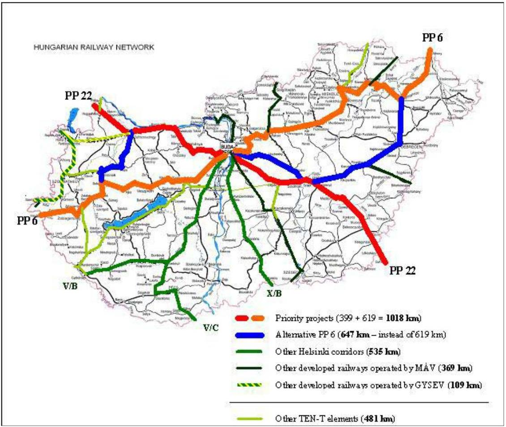
4. sz. ábra

A tíz multimodális páneurópai közlekedési folyosó kijelölésénél az (a K-NY és az É-D) útirányok lettek meghatározva. Az egyes nemzeti vasutak vonalhálózatán a páneurópai folyosók szakaszait 1998 nyarán a TINA Iroda jelölte ki. A nemzetközi törzshálózati vonalak versenyképességét elsősorban a tranzit forgalomban betöltött szerepük adja, de a hazai vonalhálózat tekintetében legalább ilyen fontos a belföldi távolsági és a nagyvárosok körzetében a helyi elővárosi forgalomból eredő igények együttes kielégítése. Ezzel a vegyes forgalmi rendszerrel, a MÁV hálózatával hosszú távon kell számolni, mely alól a jövőben kivételt képeznek a budapesti elővárosi forgalom legterheltebb vonalszakaszai.

A páneurópai folyosók hazai vonalhálózata:
IV. Folyosó: Hegyeshalom/Rajka - Budapest - Cegléd - Szolnok - Lökösháza,
V. Folyosó: Hódos - Zalalövő - Zalaegerszeg - Boba - Veszprém - Székesfehérvár - Budapest - Miskolc - Nyíregyháza - Záhony

V/B. Folyosó: Gyékényes - Dombóvár - Pusztaszabolcs - Budapest
V/C. Folyosó: Magyarbóly - Pécs - Dombóvár
X/B. Folyosó: Kelebia - Budapest

---

A páneurópai folyosókhoz tartozó vonalakon a vasútfejlesztési célkitűzés az AGC paraméterek távlati biztosítása.

Magyarország az 1985-ös alapítástól kezdve tagja az AGC Egyezménynek. Az AGC hálózat része valamennyi A.1. kategóriájú nemzetközi fővonalunk. A nemzetközi kombinált forgalmi hálózat összehangolására alapult AGTC Egyezményhez hazánk 1994-ben csatlakozott.

A 2005. évtől a Vtv. szerint az Országos Vasúti Szabályzat (OVSz) I. kötete határozza meg a magyar vasúthálózat kategóriába sorolását úgymint: A.1. Nemzetközi törzshálózati fővonalak, A.2. Hazai törzshálózati fővonalak, B.1. Egyéb fővonalak és B.2. Mellékvonalak. A hatékonyság és versenyképesség szempontjából a vonalkategorizálásnak amiatt is kiemelt jelentősége van, mert a fejlesztési paraméterek vonalkategóriánként kerültek rögzítésre. Az Országos Vasúti Szabályzat vasútvonal kategóriánként meghatározott tervezési paraméterei az alábbiak:
A.1. Nemzetközi törzshálózati fővonal 160-200 km/h
A.2. Hazai törzshálózati fővonal 120-160 km/h
B.1. Egyéb fővonal 100-120 km/h
B.2. Egyéb vonal - mellékvonalak 60-80 km/h

A nemzetközi törzshálózati vonalainkat akkor tekinthetjük versenyképesnek, ha:

- eleget tesznek a nemzetközi kötelezettségvállalás szerinti kiépítési és üzemeltetési paramétereknek,
- a konkurens szállítási útvonalakkal legalább azonos szolgáltatási szintet képesek nyújtani,
- a teljes, országhatártól - országhatárig terjedő útvonalon biztosított az egyen kapacitás (AGC paraméterek biztosítása), túlmutatva a jelenlegi vonali szemléleten.

A nemzetközi törzshálózati vonalak versenyképességének feltételei korlátozottan, de rendelkezésre állnak. Ezt az EU forrástámogatási rendszer alapozza meg, mely szinte kizárólag a pályainfrastruktúra tranzit forgalmat lebonyolító hálózatára irányul, összhangban az EU irányelveivel, egységes és szabadon hozzáférhető európai törzshálózat létrehozása érdekében.

A fejlett Nyugat-Európai vasutaknál a vasúti szállítás részarányának csökkenése nem járt együtt a szállítási teljesítmények zuhanásszerű visszaesésével, hanem a folyamatos megújulás és fejlesztés révén a szállítási teljesítmények viszonylag stabilnak mondhatók.

Magyarországon a drasztikus teljesítménycsökkenés mellett a vasúti áruszállítás aránya még ma is kedvezőbb a Nyugat-Európai átlagnál. Ugyanakkor a vasúti áruszállítás aránya az elmúlt években is csökkent (lásd 1. sz. táblázat), ráadásul ez növekvő összközlekedési teljesítmények mellett valósult meg.

---

|  | $\mathbf{1 9 8 0}$ | $\mathbf{1 9 8 5}$ | $\mathbf{1 9 9 0}$ | $\mathbf{1 9 9 2}$ | $\mathbf{1 9 9 4}$ | $\mathbf{1 9 9 6}$ | $\mathbf{1 9 9 8}$ | $\mathbf{2 0 0 0}$ | $\mathbf{2 0 0 2}$ | $\mathbf{2 0 0 4}$ | $\mathbf{2 0 0 6}$ | $\mathbf{2 0 0 8}$ |
| :-- | :--: | :--: | :--: | :--: | :--: | :--: | :--: | :--: | :--: | :--: | :--: | :--: |
| Elszállított   utasfő   (millió fő/év) | 245,8 | 204,1 | 208,2 | 171,5 | 155,8 | 153,3 | 155,2 | 154,2 | 162,3 | 160,0 | 154,2 | 141,8 |
| Elszállított   árutonna (millió   tonna/év) | 129,2 | 116,9 | 87,4 | 52,9 | 44,3 | 44,6 | 47,5 | 43,6 | 43,6 | 43,2 | 44,5 | 38,6 |

1. sz. táblázat

A kilencvenes évektől, a piacgazdaság megjelenésével, a korábban mesterségesen fenntartott gazdasági környezetben lévő vasút teljesítménye 40%-ra zsugorodott, mivel a vasúti közlekedést érintő kedvezőtlen hatások egyszerre, egyidejűleg sokk-szerűen érvényesültek. A gazdasági szerkezetváltás és a szabad piac megnyitásával járó változások a következő főbb tényezőkben foglalhatók össze:

- a termelési volumen drasztikus visszaesése,
- a vasúti szállításra orientált nagy iparvállalatok és mezőgazdasági komplexumok szétesése,
- a hagyományos keleti piac összeomlása, belföldi és tranzit forgalomban egyaránt,
- a kialakuló kis- és középvállalatok eltérő, közútra alapozott szállításigényessége,
- a motorizáció előretörése,
- korszerű termelési szerkezet, kevésbé anyag és szállítás igényes iparágak elterjedése,
- a termékmozgást helyettesítő információ-közvetítés rohamos térnyerése.

A magyar vasúthálózat jövőbeni helyzetét meghatározó jellemző, hogy a különböző nemzetközi vasúti szállítási közlekedési folyosók hálózatából és az ebből eredő forgalomból hogyan részesülünk. Ebből a szempontból kiemelt fontossága van az egyes közlekedési folyosók hazai szakaszai kijelölésének, fejlesztési szempontjai meghatározásának.

A nemzetközi törzshálózat fejlesztésében abszolút elsődlegessége van a legnagyobb forgalmú hazai folyosónak, a TEN-T 22. számú kiemelt tengelynek, a IV. páneurópai korridornak (lásd 5. sz. ábra). A korridor nyomvonala meghatározott. Alternatív útvonalra - új vasútvonal építése nélkül - csak Budapest és Szolnok között van lehetőség. A jelenlegi nyomvonal: Hegyeshalom-Győr-Budapest-Cegléd/Újszász-Szolnok-Szajol-Békéscsaba-Lőkösháza. Ez az Észak-nyugat - Dél-kelet irányú vasúti folyosó kapcsolatot teremt a nyugateurópai országok és a Balkán térsége között. Jelentőségét fokozzák a magyar vasúthálózaton kívüli fejlesztések, a Calafat és Vidin között épülő új Duna-híd, mely a korábban hagyományosnak számító Bécs - Budapest - Belgrád - Nis Szófia - Thessaloniki/Istanbul útirányt váltja fel az EU tagországok vasúthálózatán keresztül. A fejlesztések a TEN-T 22. tengely hazai szakaszán további forgalomnövekedést eredményeznek. A projektek egyben teljesítik az átjárhatóság

---

műszaki feltételeire vonatkozó EU elvárást, mivel a korridor teljes hosszán az interoperabilitást biztosító GSM-R és ETCS rendszer is megvalósul. A projektek tervezésénél, megvalósításánál a környezetvédelmi, környezet megóvási szempontok is érvényesültek.
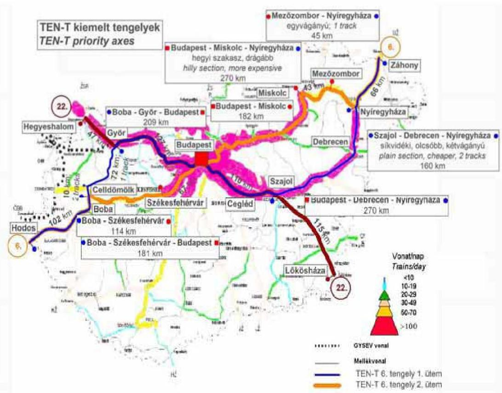
5. sz. ábra

Második helyen kiemelt - a főleg keleti szakaszán nagy forgalmú - folyosó, a TEN-T 6. számú kiemelt tengely, az V. páneurópai korridor.

Bajánsenye - Zalaegerszeg vonalon még nem alakult ki a keleti szakaszhoz hasonló forgalom, mivel ez a szakasz még új hálózati elemnek tekinthető. Alig egy évtizede, hogy Szlovénia és Magyarország között ismét kiépült az összeköttetés. Első ütemben kiépült a főág nyugati vége (Hodos) - Bajánsenye - Boba szakasz, majd a 2009. évben megkezdődött a jelentős elővárosi és belföldi regionális forgalmat lebonyolító Székesfehérvár-Budapest szakasz is. 2001. május 16-án indult meg a közlekedés a Szlovénia és Magyarország között újjáépített vasútvonalon, amely Hodos - Muraszombat irányába 56 év után létesített országhatáron átnyúló vasúti kapcsolatot, 20 év után visszaállítva a Zalalövő-Bajánsenye között felszedett sínpárt. A beruházás eredményesen szolgálta a vasúti közlekedési stratégiát, mert közvetlen összeköttetést biztosított két NATO tagállam között. A katonai stratégiai kapcsolat létesítésén túl a beruházás megvalósításával Magyarország számára közvetlenül elérhetővé vált a szlovéniai Koper tengeri kikötője, lehetőséget teremtve a vasúti és tengerhajózási forgalom fejlesztésére, segítve a fenntartható mobilitást, áruszállítást.

---

Az V. TEN-T közlekedési folyosó részét képező, 2001-ben átadott Szlovénia-Magyarország összeköttetést biztosító 19 km hosszú, egyvágányú vonalszakasz az AGC előírások figyelembevételével 160 km/h tervezési sebességgel készült el, de a vasútvonal meghatározóan áruszállítási igényeihez igazodva üzemeltetési sebességként a 120 km/h-t határozták meg. Az UIC 60 rendszerű hézagmentes felépítménnyel, 225 kN tengelyterheléssel kialakított - az első ütemben még nem villamosított - pálya a Zalalövő - Zalaegerszeg - Boba útirányon át kapcsolódott a magyarországi vasúti fővonalakhoz. Ez a 80 km hosszú vonalszakasz nagyon rossz műszaki állapotban, 80 km/h üzemi sebességgel, de a vonalkapacitást állandó sebességkorlátozásokkal jelentősen lecsökkentve „fogadta" a nemzetközi személyszállító- és tehervonatokat.

Az átépítés megkezdésekor a pályán elrendelt sebességkorlátozásokat is figyelembe véve a nemzetközi gyorsvonatok menetideje Boba és az Országhatár között akár 50 perccel is csökkenhet.

A GKM szerint, a folyosó több alternatív nyomvonal-lehetőséget is kínál. Fő ága Bajánsenye - Zalalövő - Zalaegerszeg - Ukk - Boba - Veszprém - Székesfehérvár - Budapest - Miskolc - Nyíregyháza - Záhony útvonalon halad, és a legfontosabb útirányt hivatott biztosítani az Adria térsége és Ukrajna között. A korridor két hegyvidéki szakasza is - ahol költségesebb a korridor szintű sebesség (160 km/h) kiépítése - kiváltható ideiglenesen alacsonyabb költséggel kiépíthető síkvidéki szakasszal. A kiváltások által jelentős hosszon összefonódik a TEN-T 22. és a TEN-T 6. tengely. E szakaszon várhatóan kapacitáshiány keletkezik,
 de addigra a hegyvidéki költségesebb szakaszok is kiépíthetők, és kiváló lehetőség adódik a korridor növekvő forgalmának alternatív nyomvonalakon (pl. Boba - Győr vonalszakasz) történő lebonyolítására, a személyszállítási és teherszállítási hangsúlyok szétválasztására.

A nyugati oldalon a Bakonyt átszelő Boba - Székesfehérvár szakasz váltható ki a síkvidéki Boba - Győr szakasz kiépítésével, Győrnél a TEN-T 6. tengely becsatlakoztatásával a - már korridor szinten kiépített - 22. tengelybe. A becsatlakozás 127 km hosszú közös korridor szakaszt eredményez, és 28 km-rel hosszabbítja meg a 6. tengelyt, de így a főág költségesebb hegyi szakaszának kiépítése későbbre halasztható. A vasúti törzshálózat fejlesztése nehézkes, a nagysebességű vasúthoz alkalmas pálya hiányzik, az egyetlen korszerű pálya Budapest-Hegyeshalom között létezik (amelynél az eredeti 160 km-es sebesség a fenntartás hiányosságai miatt már nem tartható mindenütt),

A vonali rekonstrukciókon kívül a fejlesztés fontos eleme az utasforgalmi létesítmények korszerűsítése, a műszakilag és erkölcsileg elavult biztosítóberendezések lecserélése, korszerű központi forgalomirányító-, valamint távvezérelhető erősáramú- és biztosítóberendezések telepítése (KÖFI), valamint általánosan a 60 kg-os felépítmény beépítésével a $160 \mathrm{~km} / \mathrm{h}$ sebesség, és a 225 kN tengelyterhelés elérése. Kiemelten kezelendő az interoperabilitás szempontjából meghatározó ETCS L2 jelfeladási rendszer hálózati kiépítése, amely egyben a 120 $\mathrm{km} / \mathrm{h}$-nál nagyobb sebességű közlekedés szükséges feltétele is. Ez utóbbi előfeltétele a GSM-R rádiós távközlési rendszer kiépítése.

---

# 3.2. A 2000/HU/16/P/PT/PT003 szerződésszámú Zalalövő-Zalaegerszeg - Boba vasútvonal rehabilitációs munkáinak folyamata 

A vasútvonal átépítése ISPA/KA finanszírozás keretében valósul meg, melyre a pénzügyi megállapodás 2000. december 21-én, a támogatási szerződés 2001. április 15-én került aláírásra, amely 167,39 M EUR forrást biztosított a munkák elvégzésére 50\% EU támogatással a 89/2002. (IV. 20.) Korm. rendelet 15. sz. mellékletében meghatározott megvalósíthatósági feltételek szerint. A Pénzügyi Memorandumot eddig három alkalommal módosították, a jelenlegi befejezési határidő 2010. december 31.

A Bajánsenye - Zalalövő vonalszakasz folytatásaként, részben új nyomvonalon, 100-120 km/h tervezési sebességgel épült át a Zalalövő - Andráshida - Zalaegerszeg-delta közötti pálya. A Zalaegerszeg-delta vágány - Boba közötti 60 km hosszú vonalszakaszon $120 \mathrm{~km} / \mathrm{h}$ a tervezési sebesség, ezzel biztosítva az Országhatár - Boba közötti $120 \mathrm{~km} / \mathrm{h}$ üzemeltetési sebességet. Boba és Zalaegerszeg állomásoknál úgynevezett delta vágányok létesültek, amelyek a szerelvények irányváltás miatti mozdonycseréjét iktatják ki 10 perc menetidő megtakarítást eredményezve. Ehhez a $2 \times 10$ perc megtakarításhoz társul a 80 $\mathrm{km} / \mathrm{h}$ és a $120 \mathrm{~km} / \mathrm{h}$ sebességű vasútüzem elméletben 15 másodperces kilométerenkénti menetidő megtakarítása, amely a 80 km hosszon további 20 perc (a $160 \mathrm{~km} / \mathrm{h}$ sebességnél ez már csak további 10 perccel csökkenne).

Az V. számú nemzetközi vasúti korridor (6. sz. kiemelt projekt) e szakaszán középtávon a tranzit áruforgalom lehet a meghatározó, így a pálya műszaki paraméterei is elsősorban ezen igények kielégítését szolgálják. A 225 kN tengelyterhelés, a villamos vontatás, a $120 \mathrm{~km} / \mathrm{h}$ sebességű közlekedés maximálisan kielégíti a tehervonati közlekedés elvárásait, de a kedvező eljutási sebességnek köszönhetően a helyi és helyközi vasúti személyszállítás is versenyképes alternatívája lehet a közúti közlekedésnek.

A Zalalövő - Zalaegerszeg - Boba vasútvonal főbb műszaki jellemzői: hossza 83 km, amely Zalaegerszeg várost elkerülő új vonallal lecsökkent 78 km-re. Ezen belül: 45 km pályaszakasz rehabilitálásra, 22 km új nyomvonalon átépítésre került és 11 km-en teljesen új vasúti pálya épül.

A villamosított szakasszal együtt így összesen 101 km a korszerűsített vasúti pályaszakasz (lásd: 6. sz. ábra)

---

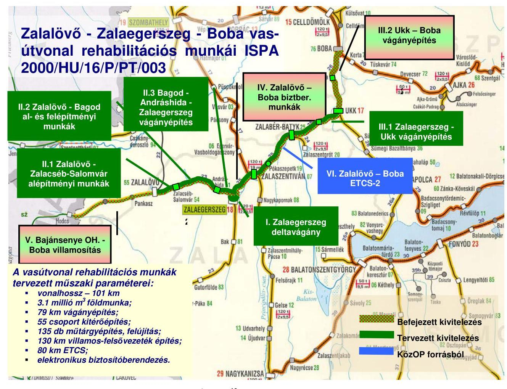
6. sz. ábra

A 2000/HU/16/P/PT/003 Pénzügyi Memorandum által finanszírozott projektben eredetileg 6 db vasúti pályaépítési (78 km), 1 db biztosítóberendezési, 1 db vonatbefolyásolás kiépítési (ETCS L1) és 1 db vasút villamosítási (96 km) alprojekt volt, melyek az alábbiak:
I. 1. Zalaegerszeg deltavágány építése (al- és felépítményi munkák)
II. 1. Zalalövő (kiz.) - Zalacséb-Salomvár (kiz.) vonalszakaszon (vsz) alépítményi munkák
II.2. Zalacséb - Salomvár (bez.) - Bagod (bez.) vsz-on al-, és felépítményi munkák és Zalalövő (kiz.) - Zalacséb-Salomvár (bez.) vsz-on felépítményi munkák
II.3. Bagod (kiz.) - Andráshida - Zalaegerszeg deltavágány vsz-on al- és felépítményi munkák (kiz.)
III. 1 Zalaegerszeg delta vágány - Ukk vsz. rehabilitációja
III.2. Ukk (bez.) - Boba deltavágány (kiz.) (beleértve Jánosháza állomást) és új Boba deltavágány építése (al- és felépítményi munkák)
IV. Zalalövő - Zalaegerszeg - Boba vasútvonalon (vv) biztosítóberendezési és távközlési munkák
V. Hodos országhatár-Boba vv villamosítása (kivitelezése folyamatban)

---

VI. Zalalövő - Zalaegerszeg - Boba vv-on ETCS 1 telepítése (törölt)

Az ETCS 1-es szint kiépítése Zalalövő - Boba között (a Pénzügyi Memorandum 2009. évi 3. sz. módosítása alapján) törlésre került, mivel ETCS2+GSM-R rendszer telepítésére történt kötelezettség-vállalás, amelynek forrása a 2007-2013-as Kohéziós Alap.

A vonalszakasz tervezése során a 2000. évben elkészült Támogatási Kérelem mennyiségei és a műszaki tartalom is tanulmánytervek alapján került meghatározásra. A Támogatási Kérelemben jelölt alprojekt összegek szintén a tanulmánytervek alapján képzett mérnök árakat tartalmazták. A részletes tervezési munka, az engedélyezési tervek, majd a kiviteli tervek elkészítése, amelyek a mennyiségeket és a műszaki tartalmat pontosították, csak a Támogatási Kérelem befogadását követően indultak meg. A Zalaegerszeg - Ukk - Boba szakaszra 2003-ban kötötték meg a tervezői szerződést. Az előkészítési tevékenység és a tervezési munka előrehaladását nagyban befolyásolta a források időszakos pénzügyi bizonytalansága, valamint az intézményrendszer változása miatti szabályozásváltozás. A tervezői kapacitás hiány miatt a tervezési munkában jelentkező lemaradás a projekttel kapcsolatban folyamatosan gondot jelentett.

A projekt tervezésénél és megvalósításánál a műszaki- és hatósági előírások mellett környezetvédelmi szempontok is érvényesültek. Az elkerülő- és delta vágányoknál, a nyomvonal korrekciós szakaszokon a tájba illesztve épült az új nyomvonal. Magyarország egyik kiemelt természetvédelmi területén a dízelvontatást felváltó villamosított vasútvonal mentén jelentősen csökken a zaj- és rezgésterhelés és a mozdonyok káros anyag kibocsátása.

A helyben lakó emberek, az őket képviselő települési önkormányzatok igényeit is figyelembe vették. Az állampolgárok lakossági tájékoztatókon ismerhették meg az előzetes beruházói elképzeléseket, s észrevételeik, kéréseik a megvalósításnál - a lehetőségek és kockázatok mérlegelése mellett - nagyrészt teljesültek. Zalaegerszeg város az eredeti tervek módosítását kérte, új a várost elkerülő nyomvonal megépítését javasolta. A helyi igényeket és érdekeket figyelembe véve a közlekedést felügyelő szakminisztérium támogatta a nyomvonal módosítását, s az önkormányzat 500 M Ft hozzájárulását költségvetési forrásból kiegészítve biztosította a megvalósítást.

A közbeszerzési folyamatok úgy a közösségi, mint a nemzeti beszerzésekre irányuló eljárásoknál is több esetben megváltoztak. Az EU csatlakozást megelőző időszakban (2004. május 1. előtt) a PRAG szerint történt a kivitelezői munkák közbeszereztetése. Az átmeneti időszakban a közbeszerzés indítása még szintén a PRAG-os eljárás szerint történt. A Kbt. alkalmazásával a vasúti tenderek kiírása és az eredményhirdetések követően jogorvoslati eljárások sora jelentkezett.

A jogorvoslati eljárások önmagában 2-3 hónappal növelték a tenderértékelés és vállalkozásba adás időtartamát. Számos esetben oda vezettek, hogy új közbeszerzési eljárást kellett kiírni, ami 2-3 éves késést is okozott egy-egy alprojekt esetében.

Sikertelenül zárult a Zalaegerszeg-Ukk első közbeszerzési eljárása a 2006. évben. A kivitelezői szerződést a tervezett 2006. májusához képest 2007. júliusában sikerült megkötni. Sikertelenül zárult a Bajánsenye - Boba vonalszakasz villamosítására kiírt pályázat is. Az eredetileg ütemezett 2005. év végi szerződéskötés helyett a tényleges szerződéskötésre a harmadik közbeszerzési eljárást követően, 2007. december 28-án kerülhetett sor. Jelentős késedelemmel indult az Ukk-Boba vonalszakasz közbeszerzési kiírása. Ennek oka a területszerzés elhúzódása volt.

A kivitelezési munkák jellegükből adódóan döntően a nyári hónapokban végezhetők. A késve induló közbeszerzések, majd az eljárások elhúzódása és ez idő alatt szerzett további késedelmek nem tették lehetővé a tervezett időpontban a szerződéskötések létrehozását. Az aktualizált közbeszerzési tervet a 4. sz. mellékletben mutatjuk be.

A Pénzügyi Megállapodás módosításra három alkalommal került sor. Ennek okai a következők voltak:

1. sz. módosítás 2001. 07. 24. - EU általi jóváhagyás: 2001. 12. 20.

- pénzügyi ütemterv módosítás
- közbeszerzési terv módosítása

2. sz. módosítás 2004. 04. 13. - EU általi jóváhagyás: 2004. 04. 30.

- projekt befejezési határidejének módosítása 2006. december 31-éről 2008. június 30-ára,
- műszaki tartalomváltozás: új feladatként került be Zalaegerszeg elkerülő megépítése, ami többlet feladatként jelentkezik a projektben, de EU támogatási többletforrást nem igényelt, mert az önkormányzat és a hazai költségvetés biztosítja/biztosította hozzá a forrást.

Zalaegerszeg város önkormányzatának kezdeményezésére - a minisztériumok támogatásával - a város területén új vasúti nyomvonal megtervezése és egyeztetése vált szükségessé, amely hátráltatta a kapcsolódó nyomvonal és az egész vonal irányítását ellátó biztosítóberendezés tervezését, tenderezését.
3. sz. módosítás 2007. 08. 28 - EU általi jóváhagyás: 2009. 03. 11

- projekt befejezési határidejének módosítása 2008. június 30-áról 2010. december 31-ére,
- műszaki tartalomváltozás: új feladatként került be Zalaegerszeg elkerülő megépítése, ami többlet feladatként jelentkezett a projektben (többlet EU forrást nem igényelt), elmaradó feladat az ETCS 1 telepítése, ezen költségek átcsoportosításra kerültek egyéb alprojekteken jelentkező többlet feladatokra, amelyet hatóságok, önkormányzatok rendeltek el az építési engedély megadásakor. A jelenlegi műszaki követelmények már egy magasabb biztonsági rendszer, az ETCS 2 kialakítását követelik meg.

2007-ben Magyarország elkötelezte magát az ETCS L2 szint + GSM-R rendszer kialakítása mellett. Az ETCS 2 szint kialakításának ebben a projektben pedig mind időben, mind pedig forrásbeli akadályai voltak. A pénzügyi memorandum módosításában Magyarország azt vállalta, hogy a 2007-2013-as programozási időszakban KÖZOP támogatásra pályázatot nyújt be és megvalósítja a zalai vonalon ETCS 2 szint telepítését.

---

- A projektben az ETCS 1-re allokált 8 M EUR felhasználására vált lehetőség az EU jóváhagyásával:
- 100 km/h vonali sebesség helyett 120 km/h vonali sebesség kialakítása;
- többlet ívkorrekció, többlet műtárgyépítést vont maga után;
- a 2000-es támogatási kérelem beadása óta megjelent új hatósági előírások miatti felépítményi szerkezet változások többletköltségének finanszírozása;
- a lakossági fórumok, önkormányzati egyeztetések során szükségessé vált módosítások megvalósítása;
- a 120 km/h sebesség érdekében Ukk és Zalaszentiván állomáson a főirány korridor irányba történő átépítése;
- új aluljáró építése Nemeskeresztúr állomáson.

Az eredeti és a harmadik szerződésmódosítás szerinti projektek, valamint a befejezés várható költségeinek összehasonlítását tartalmazza az 5. sz. mellékletben szereplő táblázat. E szerint a projekt eredeti összes költsége 169,4 M euróról várhatóan 199 M euróra, azaz 17,5%-kal emelkedik, ami a támogatások tervezett értékéhez viszonyított eredeti 49,5%-os szintjének 42,05%-ra történő csökkenését hozta magával. A várható költségnövekedést az előre nem kalkulált inflációs hatások, a műszaki szükségességből és a közbeszerzések elhúzódásából adódó átütemezések, valamint a műszaki tartalom változása okozzák, melynek várható értéke meghaladja a 29,6 M eurót (7,4 Mrd forintot). A rendelkezésre álló ISPA források tervezett és tényleges időbeli felhasználását 2000-2010. években a 7. sz. ábra mutatja be.
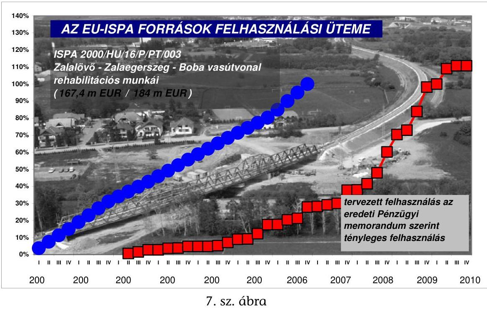

A fenti ábra bemutatja az előkészítés (ingatlan kisajátítás, régészet, környezetvédelmi előírások, engedélyeztetési eljárások), pályáztatási rendszer, a beruházás lebonyolítása (műszaki kivitelezés, tervmódosítás,
 többlet- és pótmunka,

---

műszaki tartalomváltozás) során kialakult határidőcsúszások miatt jelentkező finanszírozás jelentős elhúzódását, amely csak a 2006. évtől kezdődően gyorsult fel. Az ISPA támogatás aránya az eredeti 50%-a helyett a projekt befejezéséig (2010. december végéig) mindössze 42%-ot képvisel. Az eredeti 2006. december 31-ei befejezési határidőhöz képest a projekt négy éves késésben van.

A projekt előrehaladásáról a NIF Zrt. beruházási program-igazgatósága a mérnök beszámolója alapján havonta készít, ún. „Előrehaladási jelentést" a közreműködő szervezet (KIKSZ Zrt.) részére. Az előrehaladási jelentések tartalmazzák az alprojektek kivitelezésével összefüggő tenderek állapotát, a szerződések szerinti munkák aktuális helyzetét, a felmerült műszaki-, pénzügyi-, jogi és hatósági problémákat és a határidőcsúszásokat. A részletesen vizsgált 2000/HU/16/P/PT/003 Zalalövő - Zalaegerszeg - Boba vasútvonal felújítása esetében a többletköltségek és a késedelmek kialakulásának okait a 6. melléklet tartalmazza.

Félévente az ISPA Végrehajtó Szervezet (IVSZ) Monitoring Bizottsági ülésre a támogatási szerződésben szereplő feltételek szerint monitoring beszámoló készül. A beszámolók tartalmazzák az alprojektekre vonatkozó műszaki előrehaladás helyzetét, a környezetvédelmi hatóság határozatait, a projekt karbantartási programjára vonatkozó feltételeket, a közbeszerzési eljárások alkalmával kiválasztott alvállalkozók körét a szerződések legfontosabb adataival, a pénzügyi elszámolást, valamint a műszaki és pénzügyi indikátorok aktuális teljesítési fokát. A 2009. december 31-ei indikátorok összegzését a 7. sz. melléklet tartalmazza. A 78 km-es vasúti vonalszakasz felújításának műszaki készültsége 85,2 %, míg a pénzügyi előrehaladás állapota 85,1 %. A szerződésmódosításokat figyelembe véve a projekt várható 2010. december 31-ei befejezési határidejéhez illeszkedő megvalósítási ütemtervet a 8. sz. melléklet mutatja be. A kialakított jelentéstételi rendszer folyamatosan nyomon kíséri a projekt helyzetét, de több mint negyedéves késéssel tájékoztatja az EU Bizottság illetékes szervezeteit a felmerült problémákról. Az EU által el nem számolható költségek nagyságrendje a 2009. év végéig 3,75 Mrd Ft volt, ami a kapcsolódó tartaléktervezések, a kisajátítási többletköltségek, a mérnök költsége, a felmerülő régészeti költségek, valamint a nem vasúti távközlési létesítmények védőcsőbe történő helyezése következtében jelentkezett.

A vonal mentén élők korszerű, az esélyegyenlőségi feltételeket is figyelembe vevő állomási- és peronburkolaton juthatnak el a szerelvényekhez.

Az AGC-AGTC előírásoknak megfelelő vasúti pálya, a XXI. század fejlett technikáját alkalmazó számítógép vezérelt vasúti jelző- és biztosítóberendezések, utas-tájékoztató- és utasításadó hangrendszerek, a korszerű, sorompóval biztosított útkeresztezések mind a közlekedés, a közlekedők biztonságát növelik, valamint hozzájárulnak az interoperábilis közlekedéshez mind az árufuvarozás, mind a személyszállítás tekintetében.

A vasútvonalon az állomások távvezérlésével központi forgalom-irányítás valósul meg Zalaszentiván központtal, melynek köszönhetően javul a forgalom menetrendszerűsége, valamint az üzemeltető csökkentheti az élőmunka ráfordítás nagyságát, ezzel is elősegítve az állami vasúttársaság reorganizációját. A

---

2013-ig megvalósuló ERTMS rendszerrel (ETCS-2 és a GSM-R) válik teljessé a vasútvonal EU által előírt interoperabilitása.

Az átépített vasútvonal Magyarország elérhetőségének, gazdasági versenyképességének és a társadalom kohéziójának növelését elősegítve jobb, biztonságosabb és környezetbarát közlekedési rendszert eredményez. Az elérhetőség javulása kedvezően befolyásolhatja az érintett régió gazdaságának növekedését, nagyobb teret adva a munkaerő mobilitásának. Az új, környezetbarát vasúti infrastruktúra elősegíti a régióközpontok elérhetőségének javítását, a vidéki esetenként hátrányos helyzetű térségek felzárkózását és a gazdasági fejlettség térbeli kiegyenlítését.

Budapest, 2010. augusztus 6.
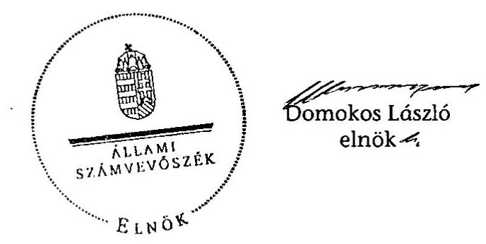

Melléklet: $\quad 8 \mathrm{db} \quad 12$ lap

---

# Mellékletek

---

# Mellékletek jegyzéke 

1. sz. melléklet A jelentéstervezetre tett észrevételek
2. sz. melléklet Kiemelt projektek finanszírozási forrásfelhasználása
3. sz. melléklet A magyar vasúthálózat fejlődésével kapcsolatos főbb jellemzők
4. sz. melléklet Aktualizált közbeszerzési terv a PT 003 szerződésszámú projektnél
5. sz. melléklet A PT 003 sz. projekt eredeti és a harmadik pénzügyi módosítás szerinti költségek összehasonlítása
6. sz. melléklet A 2000/HU/16/P/PT/003 Zalalövő - Zalaegerszeg - Boba vasútvonal felújítása többletköltségeinek és késedelmének okai
7. sz. melléklet Zalalövő - Zalaegerszeg - Boba vasútvonal felújítási munkáinak előrehaladása
8. sz. melléklet A PT 003 sz. projekt 2010. december 31-ei befejezéséhez illeszkedő megvalósítási ütemterve

---

1. sz. melléklet

a VE-12-31/2009-2010. sz. jelentéshez

# A jelentésre és a jelentéstervezetre tett észrevételek 

1. Nemzetgazdasági Minisztérium észrevétele
2. Nemzeti Fejlesztési Minisztérium észrevétele
3. MEH államtitkárának észrevétele
4. KIKSZ Zrt. észrevétele
5. NIF Zrt. észrevétele
6. MÁV Zrt. észrevétele

---

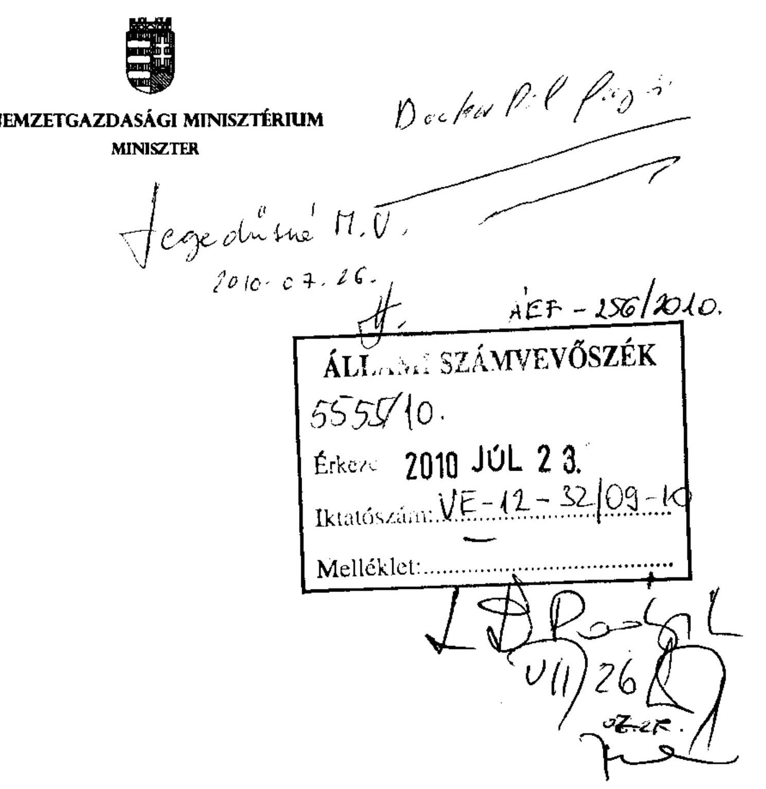

Tájékoztatom, hogy a TEN-T pályahálózat V. páneurópai korridor (6. sz. kiemelt európai projekt) vonalán EU támogatással megvalósuló vasútvonal fejlesztések teljesítményellenőrzéséről szóló jelentés kapcsán észrevételt nem teszek.

Budapest, 2010. július 16.
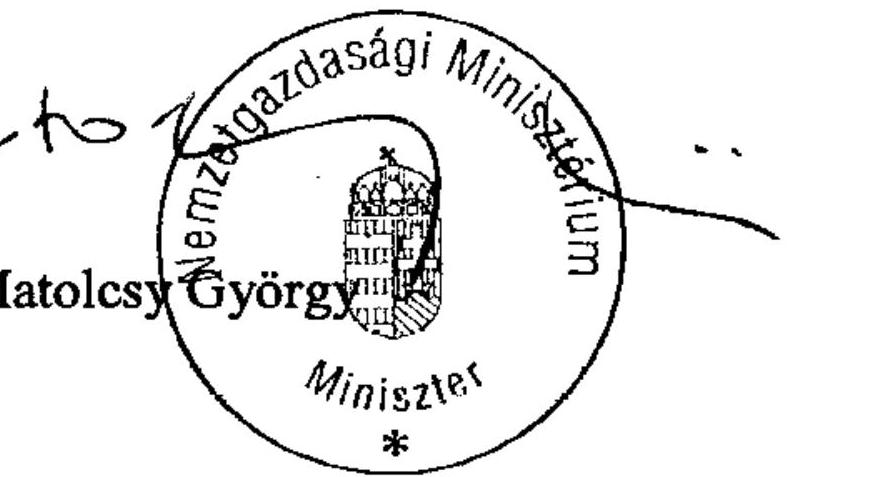

---

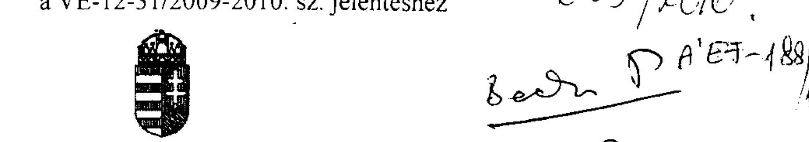

Dr. Csapodi Pál
elnök nevében eljáró főtitkár
Állami Számvevőszék
Budapest

Tisztelt Főtitkár Úr!
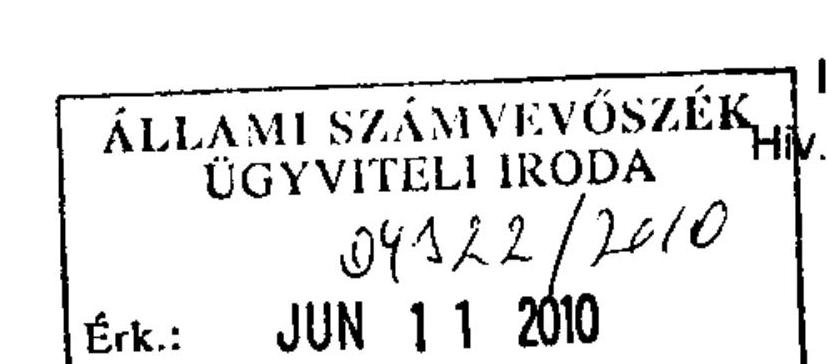

Iktatószám: NFM/95/4/2010. szám: VI-12-25/2009-2010.

Köszönettel vettem a TEN-T pályahálózat V. páneurópai korridor (6. sz. kiemelt európai projekt) vonalán végzett EU támogatással megvalósuló vasútvonal fejlesztések teljesítmény-ellenőrzéséről készített jelentésüket.

Tájékoztatom, hogy a megküldött jelentés-tervezetre észrevételt nem kívánok tenni.

Budapest, 2010. június 4.
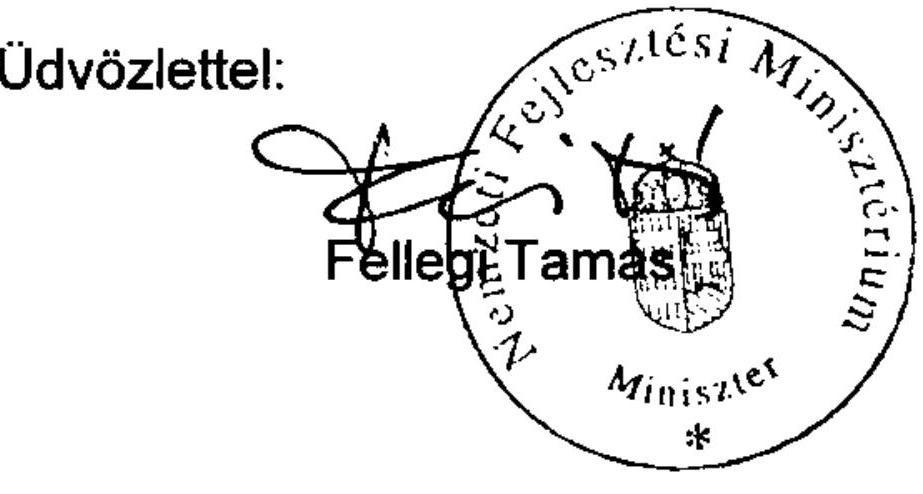

---

# 1. sz. melléklet 

a VE-12-31/2009-2010. sz. jelentéshez
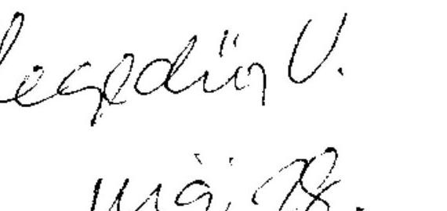

MINISZTERELNÖKI HIVATAL JOGI ÉS KÖZIGAZGATÁSI ÁLLAMTITKÁR
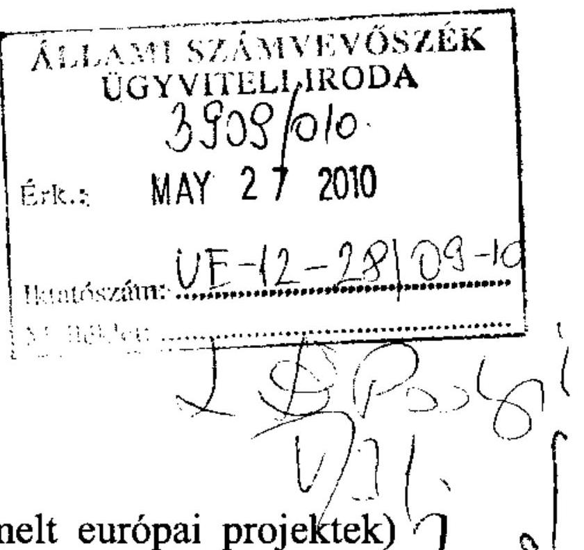

Tisztelt Főigazgató Úr!
„A TEN-T pályahálózat V. páneurópai korridor (6. sz. kiemelt európai projektek) vonalán EU támogatással megvalósuló vasútvonal fejlesztések teljesítmény-ellenőrzéséről" szóló jelentés-tervezetben foglaltakhoz észrevételt nem teszek.

Főigazgató Úr és munkatársai eddigi együttműködését ezúton is köszönöm.

Budapest, 2010. május 26.
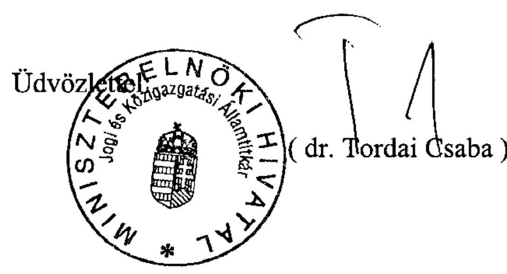

---

# 5/4/1c 

## Becker Pál úr

főigazgató részére
Állami Számvevőszék
Budapest
Apáczai Csere János u. 10.
1052

Ikt.sz.: KIKSZ-K-5248 /2010
Hiv.sz.:
Üi.: Tardi Edgár
Tel.: 883-4910
Budapest, 2010.05.20.
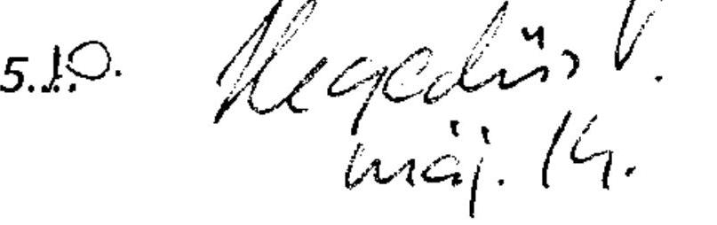

Tárgy: észrevétel ellenőrzési jelentés-tervezettel kapcsolatban

Tisztelt Főigazgató Úr!

## Tisztelt Főigazgató Úr!

A 2010. április 28-án kelt levelében foglaltakkal kapcsolatban tájékoztatom, hogy a TEN-T pályahálózat V. páneurópai korridor (6. sz. kiemelt európai projekt) vonalán EU támogatással megvalósuló vasútvonal fejlesztések teljesítmény-ellenőrzéséről készült jelentés-tervezetre további észrevételt nem kívánunk tenni.

Üdvözlettel:
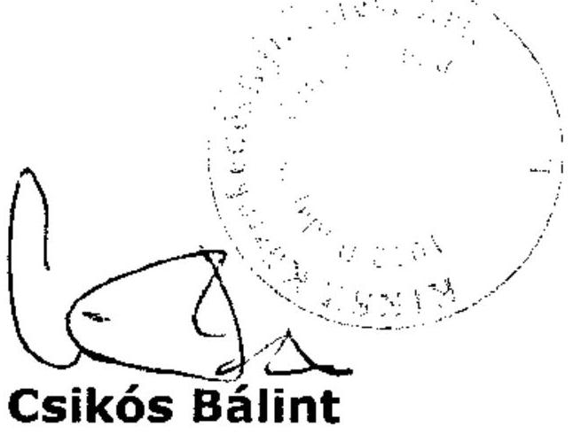

---

Nemzeti Infrastruktúra Fejlesztő Zrt.

# Állami Számvevőszék 

2. Államháztartás Központi Szintjét Ellenőrző Igazgatóság Hegedüsné Dr. Müllern Veronika
főcsoportfőnök

Budapest
Apáczai Csere János u. 10.
1052
Tárgy: VE-12-13/2009-2010 számú ÁSZ jelentés

## Tisztelt Főcsoportfőnök Asszony!

## NIF- 21116 -1/2010

K- 7192 /2010/1
Ügyintéző: Knitlhoffer Tamás

## Állami Számvevőszék ÜGYVITELI IRODA

05A15/2010
firk.: APR 30 2010
Iktatószám: $1 / 1=12-18 \mid 05-10$
Átvételi:

## J. Pockonyi

14.30 . 11.30

Az Állami Számvevőszék TEN-T pályahálózat V. Páneurópai korridor (6. sz. kiemelt európai projekt) vonalán végzett EU támogatással megvalósuló vasútvonal fejlesztések teljesítmény ellenőrzéséről készített jelentésre észrevételt nem kívánok tenni.

Budapest 2010. 04. 22.

Tisztelettel:

Nemzeti Infrastruktúra Fejlesztő Zrt.
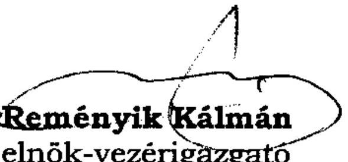

Kapják: 1) Állami Számvevőszék
2) Irattár

---

# ELNÖK-VEZÉRIGAZGATÓ 

Hegedüsné Müller Veronika
főcsoportfőnök asszony részére
Állami Számvevőszék

## Budapest

Apáczai Csere János u. 10.
1052
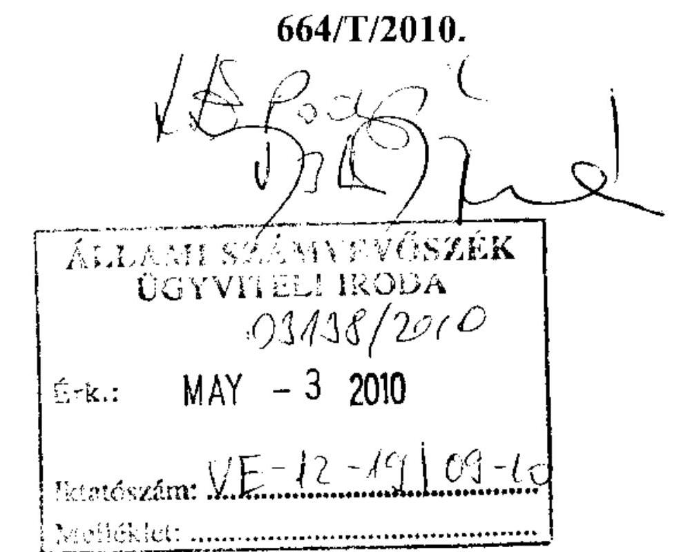

## Tisztelt Főcsoportfőnök Asszony!

A VE-12-09/2009-2010. szám alatt az Állami Számvevőszék által elvégzett „A TEN-T pályahálózat V. páneurópai korridor (6. sz. kiemelt európai projekt) vonalán EU támogatással megvalósuló vasútvonal fejlesztések teljesítmény-ellenőrzésről" készült számvevőszéki jelentést áttanulmányoztuk, a korábban megtett észrevételeink bedolgozásra, átvezetésre kerültek, az elkészült jelentéssel kapcsolatosan további észrevételt nem teszünk.

Budapest, 2010. április 22.

Tisztelettel:
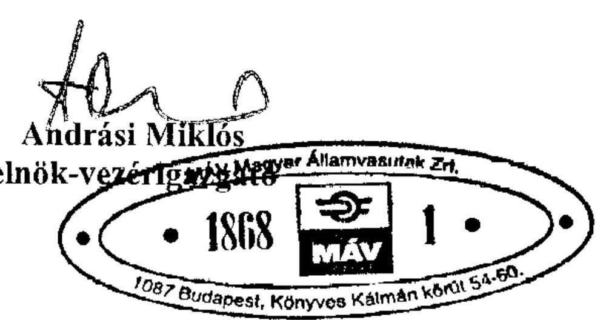

MÁV MAGYAR ÁLLAMVASUTAK
ZÁRTKÖRÜEN MŰKÖDŐ RÉSZVÉNYTÁRSASÁG
1087 Budapest, Könyves Kálmán körút 54-60. - Telefon: (1) 3515177 - Fax: (1) 342-8535
A Fővárosi Bíróság, mint cégbíróság CG. 01-10042272

---

|  Projektszám | Tartalom | ISPA/KA támogatás | MÁV (EIB) | Központi Költségvetés | Központi és helyi költségvetésből finanszírozott | Projekt teljes nettó költsége  |
| --- | --- | --- | --- | --- | --- | --- |
|  2000/HU/16/P/PT/001 | Budapest - Cegléd - Szolnok Lökősháza vasútvonal rehabilitációja I. ütem | € 63 000 000 | € 19 827 655 | € 102 130 680 | € 0 | € 184 958 335  |
|  2000/HU/16/P/PT/002 | Budapest - Győr - Hegyeshalom vasútvonal rehabilitációja II. ütem | € 47 494 000 | € 19 404 412 | € 41 898 088 | € 0 | € 108 796 500  |
|  2000/HU/16/P/PT/003 | Zalalövő - Zalaegerszeg - Boba vasútvonal rehabilitációja | € 83 695 000 | € 18 767 933 | € 90 157 749 | € 11 165 766 | € 203 786 448  |
|  2001/HU/16/P/PT/007 | Budapest - Cegléd - Szolnok Lökősháza vasútvonal rehabilitációja II/1 | € 56 818 800 | € 0 | € 64 996 536 | € 0 | € 121 815 336  |
|  2004/HU/16/C/PT/001 | Budapest - Cegléd - Szolnok Lökősháza vasútvonal rehabilitációja II/2 | € 103 270 832 | € 0 | € 30 401 455 | € 0 | € 133 672 287  |
|  2001/HU/16/P/PA/006 | Műszaki segítségnyújtás projektek megvalósítására | € 2 295 885 | € 0 | € 1 020 196 | € 0 | € 3 316 081  |
|  2003/HU/16/P/PA/013 | Műszaki segítségnyújtás projektek megvalósítására | € 2 108 250 | € 0 | € 6 290 334 | € 0 | € 8 398 584  |
|  2005/HU/16/C/PA/001 | A Kohéziós Alap által finanszírozott projektek előkészítése a vasúti ágazatban 2007 és 2013 között | € 4 500 000 | € 0 | € 3 107 843 | € 180 703 | € 7 788 546  |
|  Összesen |  | € 363 182 767 | € 58 000 000 | € 340 002 881 | € 11 346 469 | € 772 532 117  |

---

# A magyar vasúthálózat fejlődésével kapcsolatos főbb jellemzők 

A magyar vasúthálózat 7606,6 km (a GYSEV hálózatával együtt) a két világháború időszakáig folyamatosan lépést tudott tartani az európai műszaki fejlődéssel. Napjainkra ez a kedvező kép megváltozott, és csak egyes részterületeken mutatkozik meg a párhuzam az átlagos európai fejlődéssel. Ezt leginkább a vasúthálózatunk főbb minőségi mutatóinak összevetése érzékelteti

## - Hálózatsűrűség

Magyarország vasúthálózattal való ellátottsága európai szinten is kedvező. Az építési hossz alapján számított hálózatsűrűség $85,4 \mathrm{~km} / 1000 \mathrm{~km}^{2}$, ami a fejlett európai vasutak hálózatsűrűsége átlagának felel meg, és mutatja a magyar vasútnak a kiépítés időszakában elért fejlettségét. Ugyanakkor ennek a hálózatnak a minőségi mutatói elmaradnak a korszerű európai vasutak szintjétől.

A vasúthálózat minőségét jellemző főbb mutatók:

## - Kétvágányú vonalak aránya

Ebből a szempontból hálózatunk igen elmaradott, mivel az összvonal-hossznak mindössze 17,5%-a kétvágányú a 41,2%-os EU átlaggal szemben. Az európai törzshálózati vonalak fejlesztésére elfogadott AGC előírások teljesítése esetén is ez az arány még mindig csak 21,4%-ra növekedne, ugyanakkor ismeretes, hogy a 2010-ig szóló fejlesztési koncepció második vágányépítést - egy rövid elővárosi szakaszon kívül - nem tartalmaz a hálózaton.

## - Villamosított vonalak aránya

Ez a mutató is elmarad a 46,4%-os EU átlagtól, és jelenleg a villamos vontatás aránya 34,5 %. Az utóbbi évtizedben, az EU országokban a villamosított vonalhossz 11000 km-rel (18%) növekedett, míg nálunk - az elért eredmények ellenére ez az adat mindössze 4,3 %.

## - Pályára engedélyezett sebesség

Vasúthálózatunk engedélyezett sebesség szempontjából messze elmarad az EU vasútjaitól. Az utóbbi évek fejlesztési eredményei ellenére csak a hegyeshalmi és a most felújítás alatt álló ceglédi vasútvonal egyes szakaszain van 140-160 $\mathrm{km} / \mathrm{o}$-ás emelt sebesség, s a fővonali vonalszakaszaink többsége 100-120 km/óval járható. Ennél is nagyobb gondot okoz, hogy az engedélyezett pályasebességhez képest a hálózat több mint 800 pontján 3500 km hosszban állandó sebességkorlátozás van érvényben, döntően a felépítmény rendkívül leromlott állapota miatt.

---

# -
 Hézagnélküli felépítmény aránya 

E tekintetben a magyar vasúthálózat előkelő helyen áll. A műszaki feltételeket kielégítő vágányok szinte mindenütt hézagnélküli kialakításúak. E téren tudományos eredményeink is élenjáróak.

- Nagytömegű sínek aránya

A $160 \mathrm{~km} / \mathrm{h}$ és annál nagyobb személyvonati sebesség, egyben az AGC Egyezményben rögzített vállalások megkövetelik a $60 \mathrm{~kg} / \mathrm{m}$ tömegű sínek beépítését az emelt sebességű vonalakon. A fejlett nyugati vasutaknál ez 40 - 60\%-os arányt jelent, míg nálunk döntően csak a hegyeshalmi vasútvonal emelt sebességű szakaszain van összefüggő hosszban beépítve.

## - Állomások száma

A magyar vasúthálózaton az állomások száma viszonylag magas, és az európai vasutak között az elsők között foglal helyet (645 állomás a 7607 km-es hálózaton).

## - Szintbeni útátjárók

Hazánkban mintegy 6000 szintbeni átjáró, a hálózathoz viszonyítva - Portugáliát leszámítva - a legmagasabb arányt képviseli az európai vasutaknál. Ez a kedvezőtlen arány az emelt sebességű pályaszakaszok építésével javulhat.

## - Műtárgyak

A nagy folyamokat (Duna, Tisza) átszelő vasúti hidak száma alacsony, és állapotuk nem kielégítő. Hídállagunk elöregedett, a hidak zöme 40-50 éves.

## - Biztosítóberendezés

Az önműködő térközbiztosítás terén az EU középmezőnyéhez tartozunk, viszont a korszerű állomási biztosítóberendezések és a központi forgalomirányítás terén az elmaradás jelentős.

## - Járművek

A vontatójárművek száma 19\%-kal csökkent az 1990. évi állományhoz képest. A dízel és villamos vontatójárművek üzemképessége mintegy 10-15\%-kal marad el az EU átlagtól.

A személykocsik száma 1990-től folyamatosan csökkent, mintegy 20\%-kal, típusösszetétele megváltozott, átlagéletkora 21 évre nőtt. A nemzetközi forgalomban 216 db az európai követelményeknek megfelelő nagysebességű kocsi üzembe helyezésével a szolgáltatási színvonal jelentősen javult.

A teherkocsik száma 64\%-kal csökkent, ami meghaladta ugyanezen időszak áruszállítási teljesítmény csökkenését. A teherkocsik életkora több mint 20 év. Az 1990 óta végrehajtott nagyarányú teherkocsi selejtezés és csekély számú kocsi beszerzés típusösszetétel módosító hatása mellett sem tudja a hazai teherkocsipark a vállalkozó vasúti igényeket kielégíteni. A meglévő teherkocsi állomány átlagos raksúlykapacitása $26,6 \mathrm{t} / \mathrm{kocsi}$, ami megfelel az EU átlagnak.

Az 1990-es évek óta a MÁV Zrt.-ből több tevékenységet új gazdasági társaságokba szerveztek ki, a leányvállalatok közül többet (járműjavító társaságok egy részét, MÁV Cargo Zrt.-t, stb.) értékesítettek.

Összességében a pályainfrastruktúra és a gördülőállomány színvonalának elmaradása közrejátszik abban, hogy

- a MÁV Zrt. gazdálkodása nem hatékony,
- a vasúti szállítás nem versenyképes a társközlekedési ágakkal szemben,
- a hátrányos helyzetű régiók és az alacsony vasúti szolgáltatási szint egybeesése révén csökken az érintett régió versenyképessége,
- károsan befolyásolja a magyar gazdaság versenyképességét a konkurens szomszédos országokkal való részbeni elmaradás, elsősorban a tranzit forgalom csökkenése révén.

---

# Aktualizált közbeszerzési terv a PT003 szerződésszámú projektnél

|  Az alprojektek megnevezése |  | Tender típusa | Feladás dátuma |  | Szerződéses ár
€ millió | Finanszirozás típusa | Szerződés aláírás dátuma | Befejezési határidő  |
| --- | --- | --- | --- | --- | --- | --- | --- | --- |
|   |  |  | $\begin{gathered} \text { Ha } \ \text { még } \ \text { nem } \ \text { jelent } \end{gathered}$ | Ha meg-
jelent |  |  |  |   |
|   |  |  | $\begin{gathered} \text { Becsült } \ \text { dátum } \end{gathered}$ | Tényle-
ges dátum |  |  |  |   |
|  $\begin{aligned} & 2 \ & 3 \ & 4 \ & 5 \ & 6 \ & 7 \ & 8 \ & 9 \ & 10 \ & 11 \end{aligned}$ | I. 1. Zalaegerszeg deltavágány építése (al-, és felépítményi munkák) | Nemzetközi nyílt tender FIDIC Vörös |  | 23.08.2001. | 7,687 | $\begin{gathered} \text { Közös } \ 50 \%-50 \% \end{gathered}$ | 28.03.2002.
Delta 2002
konzorcium |   |
|   | II. 1. Zalalövő (excl.) - Zalacséb-Salomvár (excl.) vsz-on alépítményi munkák | Nemzetközi nyílt tender FIDIC Vörös |  | $\begin{gathered} 13.05.2003 \ \text { és } \ 27.05.2003 \end{gathered}$ | 3,7 | $\begin{gathered} \text { Közös } \ 50 \%-50 \% \end{gathered}$ | 05.12.2003
Zalai Vasútvonal Építése konzorcium |   |
|   | II. 2 Zalacséb-Salomvár (incl.) -Bagod (incl.) vsz-on al és felépítményi munkák és Zalalövő (excl.) - Zalacséb-Salomvár (incl.) vsz-on felépítményi munkák | Nemzetközi nyílt tender FIDIC Vörös |  | 24.04.2004 | 17,14 | $\begin{gathered} \text { Közös } \ 50 \%-50 \% \end{gathered}$ | 05.11.2004
Zala-Bagod
2004 konzorcium | 18.05.2006  |
|   | IV. Zalalövő - Zalaegerszeg - Boba vv-on biztosítóberendezési és távközlési munkák | Nemzetközi nyílt tender FIDIC Sárga |  | 27.04.2004 | $\begin{gathered} 28,6+300 \ \text { millió HUF } \end{gathered}$ | $\begin{gathered} \text { Közös } \ 50 \%-50 \% \end{gathered}$ | 07.12.2004
Alcatel-
Mávépcell Zala
konzorcium | 30.06.2010  |
|   | II. 3 Bagod (excl.) - Andráslida - Zalaegerszeg deltavágány vsz-on al-, és felépítményi munkák (excl.) | Nemzetközi nyílt tender FIDIC Vörös |  | 18.06.2005 | $\begin{gathered} 12,23+2,8 \ \text { milliárd HUF } \end{gathered}$ | I szakasz:
Közös 50\%-50\%
II. szakasz: Zalaegerszeg város önkormányzata és a költségvetés | 29.12.2005
MSV Konzorcium | 15.09.2009  |
|   | III. 1 Zalaegerszeg delta vágány - Ukk vsz rehabilitációja | Nemzetközi nyílt tender FIDIC Vörös |  | 10.02.2007 | 39,91 | $\begin{gathered} \text { Közös } \ 50 \%-50 \% \end{gathered}$ | 20.07.2007
V.H.M Zala
Konzorcium | 03.07.2009  |
|   | V. Országhatár-Boba vv villamosítása | Nemzetközi nyílt tender FIDIC Sárga |  | 04.09.2007 | 27,13 | $\begin{gathered} \text { Közös } \ 50 \%-50 \% \end{gathered}$ | 28.12.2007
BB 2007 Kon-
zorcium | 31.05.2010  |
|   | III. 2 Ukk (incl.) - Boba deltavágány (excl.) (beleértve fánosháza állomás) és új Boba deltavágány építése (al és felépítmény) | Nemzetközi nyílt tender FIDIC Vörös |  | 17.06.2008 | 28,9 | $\begin{gathered} \text { Közös } \ 50 \%-50 \% \end{gathered}$ | Hid-Wiva Kon-
zorcium | 30.06.2010  |

---

# A PT 003 sz. projekt eredeti és a harmadik pénzügyi módosítás szerinti költségek összehasonlítása 

|  | Megnevezés | Eredeti összes   ktg.   (euro) | Harmadik módosítás összes ktg. (euro) | Várható   ktg.   (euro) |
| :--: | :--: | :--: | :--: | :--: |
| I. | Zalaegerszeg új delta vágány | 12230000 | 7681000 | 7681000 |
| II. | Zalalövő-Zalaegerszeg pályafelújítás és építés | 50060000 | Következő háromban szerepel |  |
|  | II./1.Zalalövő-Zalacséb | -a II. sorban szerepel | 3697000 | 3697000 |
|  | II./2. Zalacséb-Bagod Zalalövő | -a II. sorban szerepel - | 16821000 | 16821000 |
|  | II./3. Bagod-Zalaegerszeg | -a II. sorban szerepel - | 11785000 | 12229000 |
| III. | Zalaegerszeg-Boba pályarehabilitáció | 70320000 | Következő háromban szerepel |  |
|  | Zalaegerszeg elkerülő (2. sz. FM mód szerint) | -a III. sorban szerepel | 10152000 | 11114000 |
|  | III./1. Zalaegerszeg elkerülő-Ukk | -a III. sorban szerepel | 39100000 | 39906000 |
|  | III./2. Ukk-Boba elk. és Boba delta vágány | -a III. sorban szerepel | 36376000 | $31525000^{*}$ |
| IV. | Boba új deltavágány | 8790000 | (előzőbe beépítve) |  |
| IV. | Zalaövő -Zalaegerszeg -Boba biztosítóberendezési és telekommunikációs munkái | - | 28600000 | $32180000^{*}$ |
| V. | Bajánsenye-Zalalövő-Zalaegerszeg-Boba villamosítása | 17960000 | 27130000 | $28862000^{*}$ |
| VI. | ETCS (bizber.) Hodos-Bajánsenye-Zalalövő-Zalaegerszeg-Boba | 8030000 | (előzőkbe beépítve többlet műszaki feladatok finanszírozására) |  |
|  | EU támogatás | 83695000 | 83695000 | 83695000 |
|  | Összesen (EU-nál szereplő) | 167390000 | 181342000 | 184015000 |
|  | „Kiegészítő" ktg. | 2009301 | 4000000 | 15001000 |
|  | A várható összes bekerülési   ktg. | 169399301 | 185342000 | 199016000 |
|  | EU támogatás részarány az összes   ktg.-hez viszonyítva | $49,51 \%$ | $45,16 \%$ | $42,05 \%$ |
|  | Várható összes bekerülési   ktg. emelkedés | - | 15942699 | $29616699^{*}$ |

[^0]
[^0]:    *a vállalkozói szerződések, módosítás alatt állnak

---

# A 2000/HU/16/P/PT/003 

## Zalalövő - Zalaegerszeg - Boba vasútvonal felújítása többletköltségeinek és késedelmének okai

## Többletköltségek alakulása, többletforrások biztosítása:

A Pénzügyi Megállapodás részletes felmérési adatok nélkül készült tanulmányterveken alapszik, így maguk az alprojektekhez rendelt költségek is.

A Pénzügyi Memorandum a 2000. évtől eltelt időben bár két alkalommal módosításra került, e módosítások tenderstruktúra változásokat, műszaki tartalomváltozásokat és határidő módosítást jelentettek. A Pénzügyi Memorandum harmadik módosításával, az ETCS 1 projektelem elhagyása mellett annak felszabaduló forrásainak a Zalaegerszeg-Ukk és Ukk-Boba alprojektekre való allokálása vált lehetővé.

A Pénzügyi Megállapodás jelölt 167390 M EUR projektköltség túllépése az alprojektek költségalakulásában csak részben tükröződik vissza. A már lezárt alprojektek költségterven belül alakultak. Az el nem végzett ETCS 1-es szint kiépítése Zalalövő - Boba között a 3. sz. szerződésmódosítás alapján törlésre került, mivel ETCS 2+ GSM-R rendszer telepítésére történt kötelezettségvállalás, ami 2007-2013-as Kohéziós Alapforrásból valósul meg. A várható költségnövekedést az előre nem kalkulált inflációs hatások, a műszaki szükségességből és a közbeszerzések elhúzódásából adódó átütemezések, valamint a műszaki tartalom változása okozzák, melynek várható értéke meghaladja az 7,4 Mrd Ft-ot.

Elsősorban a Zalaegerszeg-Ukk és Ukk-Boba vonalszakaszok, valamint a villamosítás eredeti FM szerinti költségeihez képest jelentkezett többletköltség. Mindazoknál az alprojekteknél, ahol a tender ár magasabb volt, mint az eredetileg tervezett mérnök ár, a 14/2004 (VIII.13.) TNM-GKM-FMM-FVM-PM együttes rendelet értelmében a Közreműködő Szervezetnek kell megvizsgálnia ezeket a magas költségeket és jóváhagyásuk esetén forrás biztosítását kell indítaniuk. Bagod-Zalaegerszeg vonalszakasz rehabilitációs munkái esetében a vállalkozó 2007-ben rövidebb időre fel is függesztette a munkát, mert a felmerülő többlet feladatokra a forrás biztosítása nagyon elhúzódott. Végül a 2243/2007. (XII. 17.) kormányhatározat biztosított forrást a felmerülő többletköltségekre.

---

A projekthez a 2243/2007 (XII. 23.) ${ }^{1}$ és a 2296/2005 (XII. 23) kormányhatározatokban került többlet hazai forrás biztosításra.

Bagod - Zalaegerszeg pályaépítési munkák
A vasútvonal alatt 1,5 km hosszban húzódó gázvezeték kiváltása az előírások változása és a menetközben pontosításra kerülő műszaki megoldások többletköltségei miatt. Hatósági előírások is jelentettek drágulást, valamint a kivitelezés időszakában a terven nem jelölt további közművek kerültek elő.

Ukk - Boba pályaépítési munkái
Az engedélyezési
 terveket a támogatási kérelem befogadását követően készítették el, melyben lényeges mértékben változott a műszaki tartalom és a mennyiségek. A $120 \mathrm{~km} / \mathrm{h}$ tervezési sebességgel a vonalszakasz közel fele új nyomvonalra került. Az új nyomvonal többlet földmunka mennyiséget jelentett és a keresztező utak jelentős átalakításával jár. A támogatási kérelem benyújtásának időszakát követően előírás is változott. Pl. a megjelölt UIC 54 rendszerű felépítmény helyett a költségesebb UIC 60-as rendszerű felépítménnyel kell átépíteni a vasútvonalat.

Zalalövő - Boba vonalszakasz kiegészítő költségei
Kisajátítási költségek emelkedtek. A támogatási szerződés a pénzügyi megállapodásban rögzített költségeken túl további hazai forrást is biztosít a projektre melyekből a területszerzés, mérnök, kommunikációs feladatok, egyéb tervezési feladatok, minőségbiztosítási feladatok, nem vasúti hírközlő kábelek kiváltása stb. finanszírozhatók.

# A késedelmes kivitelezés okai 

A vasútvonal átépítése ISPA/KA finanszírozás keretében valósul meg, melyre a pénzügyi megállapodás 2000.12.21-én, a támogatási szerződés 2001. 04. 15-én került aláírásra az EU, a GKM és a MÁV részvételével, amely 167,39 m EUR forrást biztosít a munkák elvégzésére 50\% EU támogatással.

A Pénzügyi Megállapodás eddig három alkalommal került módosításra, jelenleg a befejezési határidő 2010. december 31. Zalalövő - Zalaegerszeg - Boba országhatár teljes hossza 101 km a villamosított szakasszal együtt. Villamosított szakasz nélkül a vasútvonal hossza 83 km. A vasútvonal Zalaegerszeg város elkerülő új vasútvonallal lecsökkent 78 km-re. 45 km rehabilitálásra kerül, 22 km átépítésre kerül új nyomvonalon, 11 km-en teljesen új vasúti pálya épül.

[^0]
[^0]:    ${ }^{1}$ d) A 2000/HU/16/P/PT/003 Zalalövő - Zalaegerszeg - Boba vasútvonal felújítása projektben az Országhatár - Zalaegerszeg - Boba vasútvonal villamosításcímű alprojektek részére az európai ügyekért felelős tárca nélküli miniszter a XIX. EU Integráció fejezet 3. cím Fejezeti kezelésű előirányzatok, 8. alcím Kohéziós Alap támogatásából megvalósuló projektek, 1. jogcímcsoport a Kohéziós Alap támogatásából megvalósuló közlekedési projektek előirányzat terhére - az eddigi kötelezettségvállalásokon felül - 2005-ben további 15 Mrd Ft összegű kötelezettséget vállalhasson.

---

A villamosított szakasszal együtt így összesen 96 km lesz a vasúti pálya a 101 km helyett.

A 2000/HU/16/P/PT/003 Pénzügyi Megállapodás által finanszírozott projektben 6 db vasúti pályaépítési (78 km), 1 db biztosítóberendezési, 1 db vonatbefolyásolás kiépítési (ETCS L1) és 1 db vasút villamosítási (96 km) alprojekt van, melyek az alábbiak:

- A Zalalövő - Zalacséb - Salomvár vonalszakasz alépítményi munkái (befejezett)
- A Zalalövő - Zalacséb - Salomvár - Bagod vonalszakasz al- és felépítményi munkái, Zalalövő - Bagod felépítményi munkái (befejezett)
- Az új Zalaegerszeg delta vágány kiépítése (befejezett)
- A Bagod - Andráshida - Zalaegerszeg delta vágány al- és felépítményi munkái (befejezett)
- A Zalaegerszeg deltavágány - Ukk vonalszakasz átépítése (befejezett)
- Az Ukk - Boba deltavágány vonalszakasz átépítése, új Boba deltavágány építése, al- és felépítményi munkák (kivitelezés folyamatban)
- A Zalalövő - Zalaegerszeg - Boba vonalszakasz távközlő és biztosítóberendezési munkái (kivitelezés folyamatban)
- A Hódos oh. - Boba vonalszakasz villamosítása (kivitelezése folyamatban)
- Az ETCS 1-es szint kiépítése Zalalövő - Boba között. (törlésre került, mivel ETCS2+GSM-R rendszer telepítésére történt kötelezettségvállalás, ami 2007-2013-as Kohéziós Alap forrásból valósul meg.)

# Támogatási kérelem és tervezés: 

A 2000. évben elkészült Támogatási Kérelem mennyiségei és a műszaki tartalom is tanulmánytervek alapján került meghatározásra. A Támogatási Kérelemben jelölt alprojekt összegek szintén a tanulmánytervek alapján képzett mérnök árakat tartalmazzák.

A részletes tervezési munka, az engedélyezési tervek, majd a kiviteli tervek elkészítésével, amelyek a mennyiségeket és a műszaki tartalmat pontosították, csak a Támogatási Kérelem befogadását követően indult meg. A Zalaegerszeg - Ukk - Boba szakaszra csak 2003-ban sikerült a tervezői szerződést megkötni. A részletes műszaki tervek nélkül, nagyrészt becsléssel készült Pályázati kérelem alapadatok miatt már 2001-ben bemutatásra került az EU és a hazai finanszírozók részére, hogy a projekt megvalósításához várhatóan jelentős kiegészítő források szükségesek.

Az előkészítési tevékenység és a tervezési munka előrehaladását nagyban befolyásolta az előkészítő források rendelkezésre állásának késedelme, vagy hiánya. A forrást biztosító okmányokon gyakran évközbeni forráselvonások történtek, melyek esetenként év végével visszaemelésre kerültek. Az okmányok közötti átcsoportosítás, egyik okmány megszűnése lezárása, majd új okmány nyitása közrejátszott az időszakos pénzügyi bizonytalansághoz. Az előkészítő okmányok forrását biztosító intézmény is változott, Gazdasági és Közlekedési Minisztérium (GKM) Vasúti Közlekedési Főosztálytól, átkerült a GKM Közreműködő

---

Szervezethez, ezzel a felhasználás feltételei is újra szabályozásra kerültek, melyhez való igazodás időt vett igénybe.

A tervezési folyamatban jelentkező szűk keresztmetszetet a tervezői kapacitás hiánya okozta. Mindez párosult a meglévő szakemberek tervezőintézetek közötti szétaprózódásával, illetve ezt tetézte a tervek készítését intézeti szinten összehangoló vezetőtervezők tervezőintézettől való távozása. Gyakran a tervezői szerződések erőltetetten feszített, szoros határidőket tartalmaztak, melyeket objektív okoknál fogva nem sikerült teljesíteni. A Zalalövő-Zalaegerszeg vonalszakaszon késedelmet okozott az 1:2 rézsűhajlással készült tervek szakértői felülvizsgálatát követően az 1:1,5 rézsűhajlásra való átdolgozása. Az áttervezés ugyan földmunka mennyiség csökkenéssel járt, mely az EU részére bemutatásra és elfogadásra is került, de az áttervezési tevékenység időigényéhez hozzájöttek olyan objektív problémák, mint a fent említett tervezői kulcsszemélyzet elvándorlása. Az áttervezési munka azonban kihatott a Zalaegerszeg - Ukk - Boba vonalszakasz tervezési előrehaladására a már említett kapacitásproblémák miatt.

A 2000-ben a tanulmánytervek alapján aláírt Pénzügyi Megállapodás szerinti 2006. év végi pénzügyi elszámolási határidőhöz igazodóan a tervezési munka nem volt jól előkészített. Ez a vasúti szakágak közötti párhuzamos tervezési munkával látszott megoldhatónak. Mivel mindennek az alapja a vasúti pályaterv, annak bármilyen módosulása a kapcsolódó szakági tervekben is jelentkezett és éreztette hatását, vagyis minden egyes változást a szakági tervekben is át kellett vezetni. A tervezési munkában jelentkező lemaradás a projekt élete során folyamatosan gondot jelentett a kisajátítási tervek készítésében is, amit tetézett, hogy a tervezési időszakra tehető a Földhivatalok analitikusról digitális állományra való áttérése jelentős időt igényelt.

# Közbeszerzési Eljárások: 

Ez idő alatt a nemzetközi beszerzésre irányuló eljárások is több esetben megváltoztak. Az EU csatlakozást megelőző időszakban azaz, 2004. május 1. előtt a PRAG szerint történt a kivitelezői munkák közbeszereztetése. PRAG alatti tenderezési folyamatban, a határidő jelentős megnövekedését az EU delegáció által történő tenderdokumentáció és tenderértékelés jóváhagyása okozta. Azonban a PRAG eljárás szabályai is változtak, ebből kifolyólag a dokumentációt át kellett dolgozni, melynek időigénye visszavetette a tenderkiadást. Az átmeneti időszakban a közbeszerzés indítása még szintén a PRAG-os eljárás szerint történt, de május 1-e után a Minisztériumban működő Közreműködő Szervezet (KSZ) hagyta jóvá mind a tendert, mind a tenderértékelést. Ezek jóváhagyási időtartama közel azonos volt a korábbiakhoz. Azonban mindenképpen az eljárást tekintve új elemként első időben lassító tényező volt.

EU tagságunkat követően belépett a nemzeti Közbeszerzési törvény (KBT) szerinti tenderezés. A KBT a tendereljárás időtartamait jól meghatározza, bizonytalanságot továbbra is a KSZ tender és ajánlati felhívás jóváhagyási időszükséglete jelentette. A tenderek pedig nem egyen kapacitással kerültek a jóváhagyóhoz, ami feltorlódáshoz vezetett. A KBT megjelenésével a korábbiakban nem tapasztalt jogi eljárások sora jelentkezett. Az eljárások következtében 2-3 hónappal növekedett a tenderértékelés és vállalkozásba adás időtartama. Szá-

---

mos esetben azonban oda vezettek, hogy új közbeszerzési eljárást kellett kiírni, ami fél-egy éves késéseket is okozott egy-egy alprojekt esetében. Ennek következtében sikertelenül zárult a Zalaegerszeg-Ukk közbeszerzési eljárása 2006. évben. A tenderdokumentáció újra kiírása csak 2007. februárban realizálódhatott ismét, a kivitelezői szerződést a tervezet 2006 májusához képest 2007 júliusában sikerült megkötni.

Sikertelenül zárult a Bajánsenye-Boba vonalszakasz villamosítása is 2005. év végén. Ekkor ugyan történt szerződéskötés, de a MÁV végül elállt a szerződéstől. A tenderdokumentáció újra meghirdetése annak átdolgozását követően 2006-ban elindult, de év végével ismét sikertelenül zárult a közbeszerzés. Harmadszori kiírása 2007 augusztusában valósult meg. Az eredetileg ütemezett 2005. év végi szerződéskötés helyett a tényleges szerződéskötésre a harmadik közbeszerzési eljárást követően 2007. december 28-án kerülhetett sor. Ez már önmagában két év volt. A Bagod-Zalaegerszeg vonalszakasz munkáinak közbeszerzése is mintegy 4 hónapos késéssel 2005. év végén került leszerződésre.

Jelentős késedelemmel indult az Ukk-Boba vonalszakasz közbeszerzési kiírása. Ennek oka a területszerzés elhúzódása volt. A NIF Zrt. mindaddig nem indította el a közbeszerzési eljárást, amíg a kivitelezéshez szükséges terület legalább 90%-ban rendelkezésre nem állt. A területszerzési feladatok a MÁV Zrt.-től 2007. július 1-jével kerültek át a NIF Zrt.-hez. Volt olyan alprojekt, aminek a területszerzési feladatait a NIF Zrt. azért nem vette át, mert az átadás-átvétel folyamatában készült auditálás e területszerzéseket - tévesen - rendezettként jelölte, holott az egyes alprojektekhez tartozó területszerzési feladatok a vizsgálat befejezéséig nem kerültek lezárásra.

A kivitelezési munkák jellegükből adódóan döntően a nyári hónapokban végezhetők. A késve induló közbeszerzések, majd az eljárások elhúzódása és ez idő alatt szerzett további késedelmek nem tették lehetővé a tervezett időpontban a szerződéskötéseket.

# A Pénzügyi Megállapodás és annak módosításai: 

A Pénzügyi Megállapodás módosításra három alkalommal került sor. Ennek okai a következők:

1. sz. módosítás 2001. 07. 24 - EU általi jóváhagyás: 2001. 12. 20

- pénzügyi ütemterv módosítás
- közbeszerzési terv módosítása

2. sz. módosítás 2004. 04. 13- EU általi jóváhagyás: 2004. 04. 30

- projekt befejezési határidejének módosítása 2006. december 31-ről 2008. június 30-ig
- műszaki tartalomváltozás: új feladatként került be Zalaegerszeg elkerülő megépítése, ami többlet feladatként jelentkezik a projektben, de többletforrást nem igényelt, mert az önkormányzat és a hazai költségvetés biztosítja/biztosította hozzá a forrást.

---

Zalaegerszeg város önkormányzatának kezdeményezésére - a minisztériumok támogatásával - a város területén új vasúti nyomvonal megtervezése és egyeztetése vált szükségessé, amely hátráltatta a kapcsolódó nyomvonal és az egész vonal irányítását ellátó biztosítóberendezés tervezését, tenderezését.
3. sz. módosítás 2007. 08. 28.- EU általi jóváhagyás: 2009. 03. 11

- projekt befejezési határidejének módosítása 2008. június 30-ról 2010. december 31-ig
- műszaki tartalom változás: elmaradó feladatként jelentkezik az ETCS 1 telepítése a projekten, e költségek átcsoportosítása egyéb alprojekteken jelentkező többlet feladatokra, melyet hatóságok, önkormányzatok rendeltek el az építési engedély megadásakor. A 2000-es műszaki elvárásoknak megfelelően a projekt ETCS 1 szint telepítését tartalmazta. A jelenlegi műszaki követelmények azonban már egy magasabb biztonsági rendszer, az ETCS 2 kialakítását követelik meg. 2007-ben Magyarország elkötelezte magát az ETCS L2 szint + GSM-R rendszer kialakítása mellett és aláírt egy Együttműködési Megállapodást. Az ETCS 2 szint kialakításának ebben a projektben pedig mind időben, mind pedig forrásbeli akadályai voltak. A pénzügyi megállapodás módosításában Magyarország azt vállalta, hogy a 2007-2013-as programozási időszakban KÖZOP támogatásra pályázatot nyújt be és megvalósítja a zalai vonalon ETCS 2 szint telepítését.
- A projektben az ETCS 1-re allokált 8 millió EUR-t pedig a következő többlet műszaki tartalom felhasználásra kértük és kaptuk meg az EU Brüsszeli bizottságától:
- $100 \mathrm{~km} / \mathrm{h}$ vonali sebesség helyett
 $120 \mathrm{~km} / \mathrm{h}$ vonali sebesség
- Többletívkorekció, többletműtárgyépítést von magával
- A 2000-es támogatási kérelem beadása óta megjelent új hatósági előírások miatti felépítményi szerkezetváltozás
- Lakossági fórumok, önkormányzati egyeztetések során szükségessé vált módosítások
- $120 \mathrm{~km} / \mathrm{h}$ sebesség érdekében Ukk és Zalaszentiván állomáson a főirányú korridor irányba történő átépítése
- Új aluljáró építése Nemeskeresztúr állomáson

# Jogszabály és intézményi rendszerváltozások: 

A 2000. év óta eltelt időben számos jogszabályváltozás volt, mind vasútszakmai, mind építési engedélyezési, mind közbeszerzési, mind pedig EU eljárási rendek (pénzügyi, eljárási, felhasználási, közreműködő kijelölési) tekintetében. Az új jogszabályok megismerése, megértése és azok szerinti munkavégzés, dokumentáció összeállítása felkészülési időt követelt.

Ebbe a kategóriába sorolandó a Közbeszerzési Törvény gyakori módosítása, amely miatt a már kész, kiadás előtt álló tenderdokumentáció újbóli felülvizsgálatát kellett és kell napjainkig is elvégezni.

---

A jogszabályváltozások következtében az intézményi rendszer is átalakult, amely az átállás időszakában lassította az ügymenetet. A két legjelentősebb változásra 2007-ben került sor. 2007. július 1-től a MÁV Zrt. mint korábbi kedvezményezett helyébe a Gazdasági és Közlekedési Miniszter X-3/1014/1/2006. levele alapján a NIF Zrt. lépett, illetve a közreműködő szervezet is kikerült az illetékes minisztériumból és első lépésben a Közlekedésfejlesztési Koordinációs Központ egy szerveként működött, majd a KKK-ból is kivált és KIKSZ Zrt.-ként működik. Mind a két szervezeti átalakulás, kiválással 2-3 hónapos csúszást okozott a projektek megvalósításában.

# Az alprojektek egymásra hatása: 

A bevezetőben részletesen felsorolt alprojektek, azaz tenderek egymással szoros kapcsolatban és összefüggésben vannak.

A tenderstruktúra kialakulása részben a teljes projektet megalapozó tanulmánytervek alapján készített Támogatási Kérelemből fakadó adottság, részben pedig abból ered, hogy a vasúti tenderek alapvetően szakmánként kerültek meghirdetésre (pályaépítés, biztosítóberendezés, villamosítás), így a tárgyi projektben is a tenderek szakmánként vannak szakaszolva. Ezzel a módszerrel mindaddig nincsen gond, amíg az egymással összefüggő és egymásra épülő tenderek valamelyikében nem következik be jelentős csúszás. Mihelyt ilyen csúszás kialakul, probléma jelentkezik a vele korrelációban lévő tenderben is, annak átütemezését, teljesítési határidő-módosítását, és költségek alakulásának változását jelentheti.

A pályaépítések a külön tenderben épülő biztosítóberendezéssel és a külön a villamosítási tenderben készülő térvilágítással helyezhetők üzembe. De vannak olyan erősáramú munkák szintén a villamosítási tenderben, amik a biztosítóberendezés üzembe helyezéséhez szükségesek, többek között ilyen a tartalékenergia-ellátás.

A fentiekben bemutatottak miatt a még kiírás előtt, vagy közbeszerzési eljárás alatt lévő tenderek a NIF szerint, önállóan nem fejezhetők be az eredeti műszaki tartalommal. Vagyis a villamosításnak ugyanúgy szüksége van a pályatenderre, mint fordítva, de igaz ez a biztosítóberendezésekre is.

## Környezetvédelmi feltételek teljesülése

Boba delta vágány
EU elfogadás: levél szám 108618 (2003. 07. 03.)
Boba delta (kiz.) - Zalaegerszeg delta (kiz.)
EU elfogadás: levél szám 108618 (2003.07.03.)
Zalaegerszeg delta vágány
EU elfogadás: levél szám 112669 (2001. 12. 20.)
Zalaegerszeg delta vágány (kiz.) - Andráshida / Zalaegerszeg deltavágány
EU elfogadás: 2004. 04. 30. (FM 2. sz. módosítás elfogadásának levele)
Andráshida - Zalalövő
EU elfogadás: levél szám 109380 (2001. 10. 08.)

---

### *Zalalövő - Zalaegerszeg - Boba vasútvonal rehabilitációs munkái*

|  TÁJÉKOZTATÓ TABLAZAT A MŰSZAKI ÉS A PÉNZÜGYI TELJESÍTÉSRŐL |  |  |  |  |  |  |  |  |  |  |  |  |  |  |  |  |  |  |  |  |  |  |  |  |  |  |  |  |  |  |   |
| --- | --- | --- | --- | --- | --- | --- | --- | --- | --- | --- | --- | --- | --- | --- | --- | --- | --- | --- | --- | --- | --- | --- | --- | --- | --- | --- | --- | --- | --- | --- | --- |
|   |  |  |  |  |  |  |  |  |  |  |  |  |  |  |  |  |  |  |  |  |  |  |  |  |  |  |  |  |  |  |   |
|  Felhasználási kategóriák |  |  |  |  |  |  |  |  |  |  |  |  |  |  |  |  |  |  |  |  |  |  |  |  |  |  |  |  |  |  |   |
|   |  |  |  |  |  |  |  |  |  |  |  |  |  |  |  |  |  |  |  |  |  |  |  |  |  |  |  |  |  |  |   |
|   |  |  |  |  |  |  |  |  |  |  |  |  |  |  |  |  |  |  |  |  |  |  |  |  |  |  |  |  |  |  |   |
|   |  |  |  |  |  |  |  |  |  |  |  |  |  |  |  |  |  |  |  |  |  |  |  |  |  |  |  |  |  |  |   |
|   |  |  |  |  |  |  |  |  |  |  |  |  |  |  |  |  |  |  |  |  |  |  |  |  |  |  |  |  |  |  |   |
|   |  |  |  |  |  |  |  |  |  |  |  |  |  |  |  |  |  |  |  |  |  |  |  |  |  |  |  |  |  |  |   |
|   |  |  |  |  |  |  |  |  |  |  |  |  |  |  |  |  |  |  |  |  |  |  |  |  |  |  |  |  |  |  |   |
|   |  |  |  |  |  |  |  |  |  |  |  |  |  |  |  |  |  |  |  |  |  |  |  |  |  |  |  |  |  |  |   |
|   |  |  |  |  |  |  |  |  |  |  |  |  |  |  |  |  |  |  |  |  |  |  |  |  |  |  |  |  |  |  |   |
|   |  |  |  |  |  |  |  |  |  |  |  |  |  |  |  |  |  |  |  |  |  |  |  |  |  |  |  |  |  |  |   |
|   |  |  |  |  |  |  |  |  |  |  |  |  |  |  |  |  |  |  |  |  |  |  |  |  |  |  |  |  |  |  |   |
|   |  |  |  |  |  |  |  |  |  |  |  |  |  |  |  |  |  |  |  |  |  |  |  |  |  |  |  |  |  |  |   |
|   |  |  |  |  |  |  |  |  |  |  |  |  |  |  |  |  |  |  |  |  |  |  |  |  |  |  |  |  |  |  |   |
|   |  |  |  |  |  |  |  |  |  |  |  |  |  |  |  |  |  |  |  |  |  |  |  |  |  |  |  |  |  |  |   |
|   |  |  |  |  |  |  |  |  |  |  |  |  |  |  |  |  |  |  |  |  |  |  |  |  |  |  |  |  |  |  |   |

 |  |  |  |  |  |  |  |  |  |  |  |  |  |
|---|---|---|---|---|---|---|---|---|---|---|---|---|
|   |  |  |  |  |  |  |  |  |  |  |  |  |
|   |  |  |  |  |  |  |  |  |  |  |  |  |
|   |  |  |  |  |  |  |  |  |  |  |  |  |
|   |  |  |  |  |  |  |  |  |  |  |  |  |
|   |  |  |  |  |  |  |  |  |  |  |  |  |
|   |  |  |  |  |  |  |  |  |  |  |  |  |
|   |  |  |  |  |  |  |  |  |  |  |  |  |
|   |  |  |  |  |  |  |  |  |  |  |  |  |
|   |  |  |  |  |  |  |  |  |  |  |  |  |
|   |  |  |  |  |  |  |  |  |  |  |  |  |
|   |  |  |  |  |  |  |  |  |  |  |  |  |
|   |  |  |  |  |  |  |  |  |  |  |  |  |
|   |  |  |  |  |  |  |  |  |  |  |  |  |
|   |  |  |  |  |  |  |  |  |  |  |  |  |
|   |  |  |  |  |  |  |  |  |  |  |  |  |
|   |  |  |  |  |  |  |  |  |  |  |  |  |
|   |  |  |  |  |  |  |  |  |  |  |  |  |
|   |  |  |  |  |  |  |  |  |  |  |  |  |
|   |

---

# ISPA/KOHÉZIÓS ALAP VASÚT-REHABILITÁCIÓS PROJEKTEK

## - tenderszintű -

### MEGVALÓSÍTÁSI ÜTEMTERVE

8. sz. melléklet

a VE-12-31/2009-2010. sz. jelentéshez

2009. december

|  Tender száma | Tender megnevezése | 2001. | 2002. | 2003. | 2004. | 2005. | 2006. | 2007. | 2008. | 2009. | 2010.  |
|---|---|---|---|---|---|---|---|---|---|---|---|
|  ISPA 2000/HU/16/P/PT/003 |  Zalalövő - Zalaegerszeg - Boba vasútvonal rehabilitációs munkái |  |  |  |  |  |  |  |  |  |   |
|  |  Pályaépítési munkák |  |  |  |  |  |  |  |  |  |   |
|  |  BB 110500.1 Zalalövő (kiz) - Zalacséb-Salomvár (kiz) alépítmény |  |  |  |  |  |  |  |  |  |   |
|  |  BB 110507.2 Zalalövő (kiz) - Bagod (bez) al- és felépítmény |  |  |  |  |  |  |  |  |  |   |
|  |  BB 110809.1 Bagod (kiz) - Zalaegerszeg-delta (kiz) vágányépítés |  |  |  |  |  |  |  |  |  |   |
|  |  BB 111000.1 Zalaegerszeg deltavágány építés |  |  |  |  |  |  |  |  |  |   |
|  |  BB 111117.2 Zalaegerszeg (kiz) - Ukk (kiz) vágányrehabilitáció |  |  |  |  |  |  |  |  |  |   |
|  |  BB 111822.1 Ukk (bez) - Boba delta (bez) vágányrehabilitáció |  |  |  |  |  |  |  |  |  |   |
|  |  Erősáramú munkák |  |  |  |  |  |  |  |  |  |   |
|  |  BB 130000.2 Bajánsenye Oh. - Boba vasútvonal villamosítás |  |  |  |  |  |  |  |  |  |   |
|  |  Biztosítóberendezési munkák |  |  |  |  |  |  |  |  |  |   |

 |  |  |  |   |
|  BB 140522.1 Zalalövő (kiz) - Boba (bez) biztosítóberendezés + távközlés |  |  |  |  |  |  |  |  |  |  |   |
|  BB 140522.2 Zalalövő (kiz) - Boba (bez) ETCS |  |  |  |  |  |  |  |  |  |  |   |

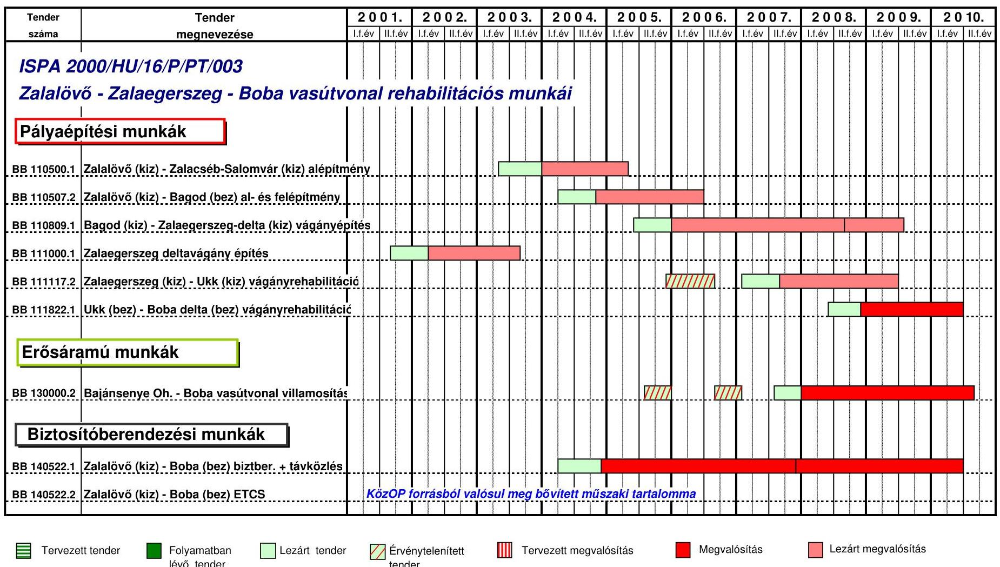
