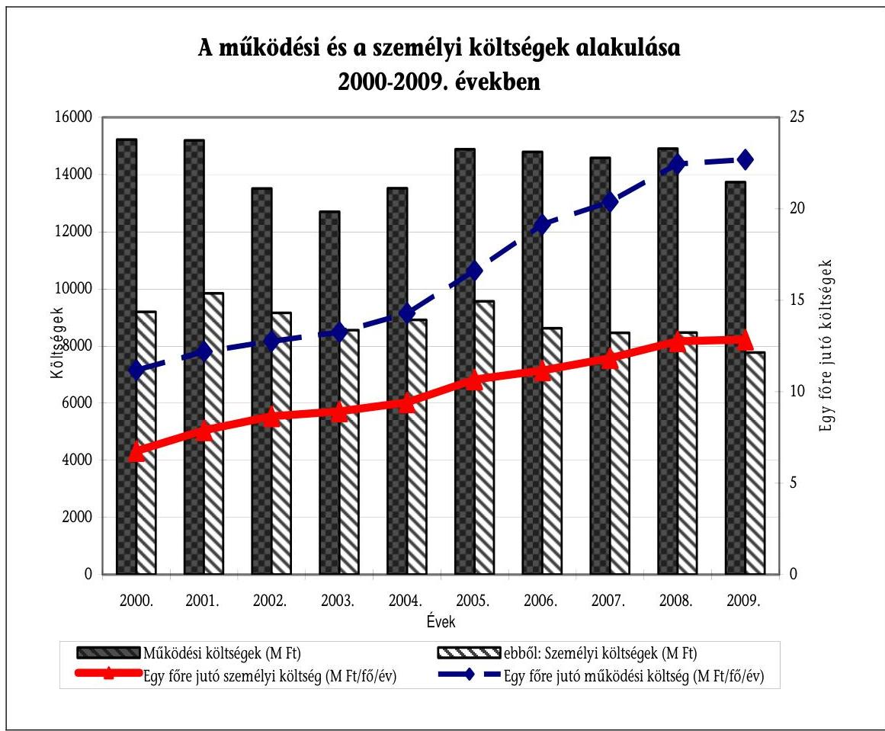
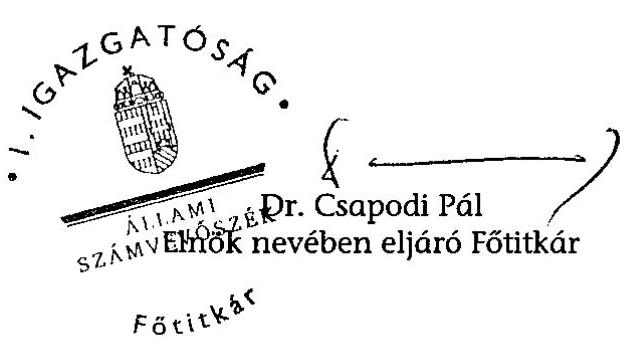
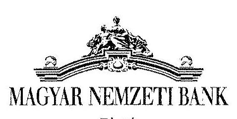
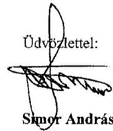
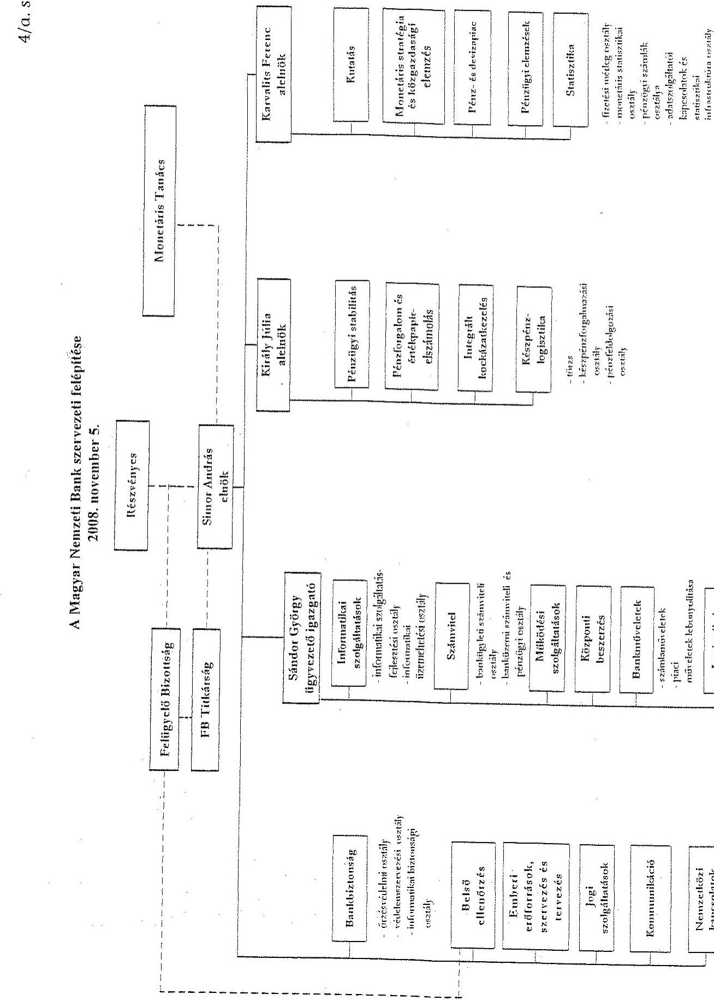
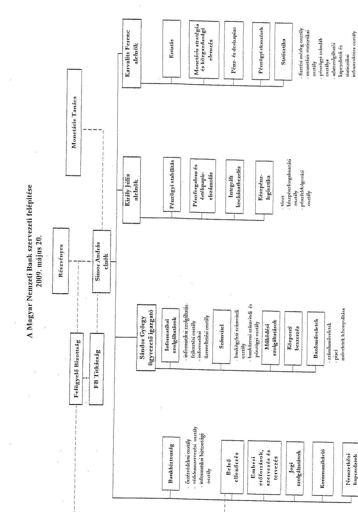

# ÁLLAMI   SZÁMVEVŐSZÉK 

## JELENTÉS

a Magyar Nemzeti Bank 2009. évi múködésének ellenőrzéséről

---

2. Államháztartás Központi Szintjét Ellenőrző Igazgatóság
2.1. Teljesítmény Ellenőrzési Főcsoport
Iktatószám: V-2013-032/2009-2010.
Témaszám: 962
Vizsgálat-azonosító szám: V0479

# Az ellenőrzést felügyelte: 

Dr. Becker Pál
főigazgató
Az ellenőrzés végrehajtásáért felelős:
Dr. Zöldréti Attila
főcsoportfőnök
Az ellenőrzést vezette:
Tóthné Nagy Éva
osztályvezető főtanácsos
Az ellenőrzést végezték:
Jordanics Tamás
Osztoics Danica
Verő Tünde
számvevő
számvevő
számvevő

## Vörös Katalin

számvevő tanácsos
A témához kapcsolódó eddig készített számvevőszéki jelentések:
címe
sorszáma
A Magyar Nemzeti Bank működésének ellenőrzése ..... 0238
A Magyar Nemzeti Bank belső (banküzemi) múködésének ellenőr- ..... 0328
zése
A Magyar Nemzeti Banknál alkalmazott teljesítményértékelési ..... 0438
rendszer múködésének ellenőrzése
A Magyar Nemzeti Bank 2002. évi múködésének ellenőrzése ..... 0340
A Magyar Nemzeti Bank 2003. évi múködésének ellenőrzése ..... 0447
A Magyar Nemzeti Bank 2004. évi múködésének ellenőrzése ..... 0531
A Magyar Nemzeti Bank 2005. évi múködésének ellenőrzése ..... 0622
A Magyar Nemzeti Bank 2006. évi múködésének ellenőrzése ..... 0716
A Magyar Nemzeti Bank 2007. évi múködésének ellenőrzése ..... 0810
A Magyar Nemzeti Bank 2008. évi múködésének ellenőrzése ..... 0916

---

# TARTALOMJEGYZÉK 

BEVEZETÉS ..... 5
I. ÖSSZEGZŐ MEGÁLLAPÍTÁSOK, KÖVETKEZTETÉSEK, JAVASLATOK ..... 9
II. RÉSZLETES MEGÁLLAPÍTÁSOK ..... 15

1. Az MNB irányítási, döntéshozatali és ellenőrzési rendszereinek múködése ..... 15
1.1. Irányítási és döntéshozatali rendszer ..... 15
1.2. A felügyelő bizottság tevékenysége ..... 16
1.3. A belső ellenőrzési szervezet múködése ..... 18
2. Az MNB gazdálkodása ..... 19
2.1. A múködési költségek tervének megalapozottsága, az elszámolások szabályszerűsége, a hatékonyságjavító intézkedések eredményei ..... 20
2.1.1. Az emberi erőforrás gazdálkodás, személyi költségek ..... 23
2.1.2. Az információ-technológiai rendszerek múködtetési költségei ..... 30
2.1.3. Az üzemeltetési és az egyéb költségek ..... 33
2.2. A beruházási kiadások tervezési rendszerének szabályozottsága, a tervkészítés szabályszerűsége, a hatékonyságjavító intézkedések eredményei ..... 35
2.3. Az ingatlan- és helyiséggazdálkodás ..... 38
2.4. A Logisztikai Központ múködtetése, az üzembehelyezés hatása a feladatellátás gazdaságosságára ..... 39
2.5. Az MNB befektetett eszközei ..... 42
2.5.1. Az immateriális javak, tárgyi eszközök, beruházások állományváltozása, az elszámolások szabályszerűsége ..... 42
2.5.2. A Bank tulajdonosi részesedései ..... 42
2.6. A keresetre és a juttatásokra kialakított szabályok alkalmazása ..... 46
2.7. A közérdekú adatok megismerhetőségére, a múködés átláthatóbbá tételére vonatkozó jogszabályi előírások betartása ..... 48
3. Az MNB elszámolásai a központi költségvetéssel ..... 50
4. Az ÁSZ 2009-ben közzétett jelentésében megfogalmazott javaslatok hasznosulása ..... 52

---

# MELLÉKLETEK 

1. számú Észrevétel
2. számú A múködési költségek, a személyi költségek és a létszám alakulása a 20002009. években
3. számú A másokkal együttesen cégjegyzésre vagy a bankszámla feletti rendelkezésre jogosult munkavállalók, valamint a munkáltató múködése szempontjából meghatározó jelentőségú egyéb munkavállalók közzétett adatai
4. számú A Magyar Nemzeti Bank szervezeti felépítése
5. számú Az MNB 2009.évi múködési költségeinek tervezése és a tervteljesítés alakulása
6. számú A HAJÓ projekt 2009. évi költségmegtakarítási célkitűzéseinek alakulása, azok hatása a múködési költségekre
7. számú Az MNB 2009. évi záró létszámának alakulása
8. számú A 2009. évi munkaviszony megszüntetések jogcímenkénti alakulása
9. számú Az MNB 2009. évi személyi költségeinek tervezése és a tervteljesítés alakulása
10. számú Az MNB 2009. évi tervezett és elszámolt beruházási kiadásainak stratégiai célok szerinti alakulása
11. számú Tanúsítványok

---

# RÖVIDÍTÉSEK JEGYZÉKE 

| ÁKK | Államadósság Kezelő Központ |
| :--: | :--: |
| ÁSZ | Állami Számvevőszék |
| BBT | Bankbiztonság szervezeti egység |
| BEL | Belső ellenőrzés szervezeti egység |
| BÉT Zrt. | Budapesti Értéktőzsde Zrt. |
| BIS | Bank for International Settlements (Nemzetközi Fizetések Bankja) |
| BKB | Beruházási és Költséggazdálkodási Bizottság |
| EEF | Emberi erőforrások, szervezés és tervezés szervezeti egység |
| EKB | Európai Központi Bank |
| EU | European Union (Európai Unió) |
| FB | Felügyelő bizottság |
| GIRO Zrt. | GIRO Elszámolásforgalmi Zrt. |
| Gt. | 2006. évi IV. tv. a gazdasági társaságokról |
| HAJÓ projekt | A 2008 augusztusában elindított hatékonyságjavító program |
| ISZ | Informatikai szolgáltatások szervezeti egység |
| IT | Információ-technológia |
| KBER | Központi Bankok Európai Rendszere |
| Kbt. | 2003. évi CXXIX. törvény a közbeszerzésekről |
| KELER Zrt. | Központi Elszámolóház és Értéktár Zrt. |
| KELER KSZF Kft. | KELER Központi Szerződő Fél Kft. |
| KESZ | Kincstári egységes számla |
| Ket. | 2004. évi CXL. törvény a közigazgatási hatósági eljárás és szolgáltatás általános szabályairól |
| Kgt. | 2009. évi CXXII. törvény a köztulajdonban álló gazdasági társaságok takarékosabb múködéséről |
| KPL | Készpénzlogisztikai szervezeti egység |
| Logisztikai Központ | Emissziós, számítástechnikai és logisztikai központ |
| MNB, Bank | Magyar Nemzeti Bank |
| MNB Korm. rendelet | 221/2000. (XII. 19.) Korm. rendelet a Magyar Nemzeti Bank éves beszámoló készítési és könyvvezetési kötelezettségének sajátosságairól |
| MNB tv. | 2001. évi LVIII. törvény a Magyar Nemzeti Bankról |
| MNV Zrt. | Magyar Nemzeti Vagyonkezelő Zrt. |
| MSZ | Múködési szolgáltatások szervezeti egység |
| Munka tv. | 1992. évi XXII. törvény a Munka Törvénykönyvéről |
| Pénzügyi tervezésről szóló utasítás | A Magyar Nemzeti Bank pénzügyi tervezéséről és az évközi gazdálkodás szabályairól szóló szervezeti egység vezetői utasítás |
| Pénzverő Zrt. | Magyar Pénzverő Zrt. |
| PIB | HAJÓ Projekt Irányító Bizottság |
| PMI | HAJÓ Projekt Monitoring Iroda |

---

PSZÁF
Rendelet

SWIFT

SZMSZ
Számviteli tv.
Tanácsadó
v.a.

VB
VBK
2009. évi beszámoló

Pénzügyi Szervezetek Állami Felügyelete
a köztulajdonban álló gazdasági társaságok múködésének átláthatóbbá tételéről szóló 175/2009. (VIII. 29.) Korm. rendelet (A Rendeletet a 337/2009. (XII. 29.) Korm. rendelet 2010. január 1-től hatályon kívül helyezte.)
Society for Worldwide Interbank Financial Telecommunication, Nemzetközi fizetések átutalási rendszere
Szervezeti és Múködési Szabályzat
2000. évi C. törvény a számvitelről

A HAJÓ projektben közremúködő tanácsadó cég
Végelszámolás alatt
Vezetői Bizottság
Választható béren kívüli juttatások
az MNB 2009. évi múködési költségeinek és beruházási kiadásainak, valamint tervezett ráfordításainak alakulásáról szóló beszámoló

---

# JELENTÉS   a Magyar Nemzeti Bank 2009. évi múködésének ellenőrzéséről 

## BEVEZETÉS

Az Állami Számvevőszék (továbbiakban: ÁSZ) 2002 óta évente ellenőrzi a Magyar Nemzeti Bank (továbbiakban: MNB, Bank) gazdálkodását és a Magyar Nemzeti Bankról szóló 2001. évi LVIII. törvényben (továbbiakban: MNB tv.) foglaltak alapján folytatott, az alapvető feladatok körébe nem tartozó tevékenységét. E körben az ÁSZ azt ellenőrzi, hogy az MNB a jogszabályoknak, kiemelten az MNB tv. rendelkezéseinek, az alapító okiratának és a részvényesi ${ }^{1}$ határozatoknak megfelelően múködik-e.

Az MNB múködésének és gazdálkodásának folyamatos tulajdonosi ellenőrzését a felügyelő bizottság (továbbiakban: FB) látja el. Az éves beszámoló valódiságát - az Európai Központi Bank alapokmányában foglaltakkal összhangban független könyvvizsgáló ellenőrzi. Az MNB alapító okirata a könyvvizsgáló feladatait tartalmazza.

Az MNB tv. 2009-ben végrehajtott módosításai nem érintették sem az alapító okiratban foglaltakat, sem az MNB múködésének, gazdálkodásának ÁSZ ellenőrzési hatáskörébe tartozó területeit.

A 2002-től² végzett ÁSZ ellenőrzések megállapításai szerint az MNB folyamatosan törekedett a költségtakarékosan és hatékonyan múködő szervezet kialakítására. Ennek érdekében a Bank 2001 óta három alkalommal indított múködésfejlesztési és hatékonyságjavító programot, amit minden alkalommal a tevékenységek és a munkafolyamatok átvilágítása előzött meg. A múködésfejlesztési és hatékonyságjavító programok eredményeit a Bank a létszám csökkenésével mérte. 2000. december 31-én az MNB-vel munkaviszonyban állók száma 1316 fő volt. A legnagyobb létszámcsökkentés - a nem jegybanki tevékenységek és egyes szervezeti egységek megszüntetésének következtében - 2001-ben volt, ebben az évben 198 fő távozott a Banktól. A következő évben az MNB folytatta a tevékenységek, illetve a folyamatok racionalizálását, amelynek eredményeként 2002-ben további 179 fő munkavállaló munkaviszonya szűnt meg. A 2005 második félévében elindított múködésfejlesztési programmal a

[^0]
[^0]:    ${ }^{1}$ A Magyar Államot, mint részvényest az államháztartásért felelős miniszter (továbbiakban: pénzügyminiszter) képviseli.
    ${ }^{2}$ Az ÁSZ ellenőrzések az MNB előző évi - alapfeladatokon kívüli - tevékenységét vizsgálják, első alkalommal az ÁSZ a Bank 2001. évi múködését és gazdálkodását ellenőrizte.

---

Bank feladatok kiszervezésével, valamint a Logisztikai Központ beruházás üzembehelyezésével elérhető létszám-megtakarítást tűzött ki célul. A programot két év alatt, két ütemben tervezte megvalósítani, amely a Logisztikai Központ kivitelezésének elhúzódása miatt, 2006-ról 2008 második félévére tolódott, a tervezett létszámleépítések egy része pedig 2009-ben valósult meg. E múködésfejlesztési program hatására a Bank létszáma több mint 200 fővel csökkent. Az MNB 2008-ban - tanácsadó cég (továbbiakban: Tanácsadó) bevonásával újabb hatékonyság-javító programot indított, amelynek megvalósításával a létszámot - a Bank célkitűzése szerint - a 2009-2010. években további közel 90 fővel tervezi csökkenteni. A három múködésfejlesztési program hatására a Bank záró létszáma 2009 végére 593 főre, a 2000. december 31-i létszámhoz viszonyítva több mint 50\%-kal csökkent. A Bank 2009-ben 13,7 Mrd Ft múködési költséget számolt el, ami mintegy 10\%-kal alacsonyabb a 2000. évi 15,2 Mrd Ft-nál. A 2009-ben nyilvántartott személyi költségek összege (7,8 Mrd Ft) több mint 15\%-kal volt alacsonyabb a 2000. évinél, míg az átlagos statisztikai állományi létszám ugyanebben az időszakban több mint 55\%-kal, 1361 fôről 605 fôre csökkent. Az egy fôre jutó múködési költségek több mint kétszeresére (102,9\%-kal), ezen belül a személyi költségek pedig 90,3\%-kal nőttek 2001-2009 között. ${ }^{3}$

[^0]
[^0]:    ${ }^{3}$ A múködési költségek, a személyi költségek és a létszám alakulását a 2000-2009. években az 2 . számú melléklet mutatja be.

---

Az MNB eredménytartaléka 2009. december 31-én 9,5 Mrd Ft, 2009. évi mérleg szerinti eredménye 65,5 Mrd Ft nyereség volt, amely 2010-ben növeli az eredménytartalék állományát. Az MNB 2010 májusában közzétett prognózisa szerint 2010-ben 69,0, 2011-ben 55,0, 2012-ben 54,0 Mrd Ft mérleg szerinti veszteség várható ${ }^{4}$. Az MNB tv. rendelkezése szerint a veszteség eredménytartalékot meghaladó része a központi költségvetést terheli, e miatt a költségvetésnek várhatóan 2012-ben 49,0 Mrd Ft térítési kötelezettsége keletkezik. ${ }^{5}$

Az ÁSZ a 2002 óta elvégzett vizsgálatok keretében ellenőrizte az MNB banküzemi múködését és gazdálkodását, a múködési költségek és a beruházási kiadások alakulását, a kontrolling feladatokat támogató informatikai, a katasztrófatűrő adattároló és a teljesítményértékelő rendszerek megvalósítását, az analitikus számlavezető rendszer bevezetését, a Konferencia-központ kialakítását, valamint a Logisztikai Központ beruházás megvalósítását.

A jelenlegi ellenőrzés célja annak értékelése volt, hogy az MNB:

- működése megfelelt-e a törvényi előírásoknak, a részvényesi határozatoknak, a belső szabályzatoknak, irányítási, döntéshozatali és ellenőrzési rendszere szabályozottan és szabályszerűen működött-e;
- gazdálkodása szabályozott és szabályszerű volt-e, a folyamatokban múködtetett kontrollok támogatták-e a szabályszerű és gazdaságos múködést, a közbeszerzési törvény előírásainak betartását, valamint az intézményi célkitúzések teljesítését;
- központi költségvetési kapcsolataival összefüggő elszámolásai szabályozottak és szabályszerűek voltak-e;
- hasznosította-e az előző évi ÁSZ ellenőrzés megállapításait, és tett-e intézkedéseket a javaslatok megvalósítására.

Az ellenőrzés végrehajtására az Állami Számvevőszékről szóló 1989. évi XXXVIII. tv. 3. §-ában foglaltak biztosítottak jogszabályi alapot. A törvényi szabályozás értelmében az ÁSZ nem vizsgálta a Bank MNB tv. 4. §-ában meghatározott alapvető feladatait, így például a monetáris politikát és az azzal összefüggő tevékenységeket, a bankjegy- és érmekibocsátást, a devizatartalék kezelésével és az árfolyampolitika végrehajtásával kapcsolatos devizamúveleteket, valamint azok banki eredményre gyakorolt hatását.

A vizsgálat a 2009. évi gazdálkodásra, illetve - indokolt esetben - az adott gazdasági esemény keletkezésétől számított időszakra irányult, és - szükség sze-rint-a helyszíni ellenőrzés befejezéséig figyelemmel kísérte a pénzügyigazdasági folyamatokat.

[^0]
[^0]:    ${ }^{4}$ Az államadósság finanszírozásába bevont devizahitelek közvetett módon növelik az MNB kötvényállományát. Ennek az állománynak a forint, illetve a devizahozamok közötti kamatkülönbözete várhatóan negatív hatással lesz az MNB eredményére.
    ${ }^{5}$ Az üzleti évet követő évben esedékes költségvetési térítési kötelezettség az államadósságot és a költségvetési hiányt is növeli.

---

Az ellenőrzést az ÁSZ ellenőrzési kézikönyve és egyéb szakmai dokumentumai, ezen belül az MNB múködésének ellenőrzéséhez összeállított, az ÁSZ honlapján közzétett segédlet iránymutatásai alapján végeztük el. A Bank múködését és gazdálkodását az ellenőrzési szempontokhoz kidolgozott kérdések, kritériumok és adatforrások szerint értékeltük.

A jelentést megküldtük az MNB elnökének. Válaszlevelét az 1. számú melléklet tartalmazza.

---

# I. ÖSSZEGZŐ MEGÁLLAPÍTÁSOK, KÖVETKEZTETÉSEK, JAVASLATOK 

Az MNB irányítási és döntéshozatali rendszere összhangban volt az MNB tv.-ben rögzített előírásokkal és a Bank alapító okiratában foglaltakkal. Az MNB elnöke az MNB tv.-ben foglalt felhatalmazásának megfelelően irányította a Bank működését, döntött minden, az MNB működésével és irányításával öszszefüggő - a monetáris tanács hatáskörébe nem tartozó - ügyben, munkáját a konzultatív testületként működő Vezetői Bizottság (továbbiakban: VB) támogatta. Az MNB elnöke határozott egyebek mellett az MNB tv. módosításával összefüggő feladatok végrehajtásáról, a Bank 2009. évi pénzügyi tervéről és annak módosításáról, valamint a Bank 100\%-os tulajdonában lévő társaságok múködését érintő témakörökről. A részvényesi jogokat gyakorló pénzügyminiszter 2009-ben hozott részvényesi határozataival elfogadta a Bank 2008. évi auditált éves beszámolóját, valamint az FB ügyrendjének módosítását.

Az MNB folyamatos tulajdonosi ellenőrzését ellátó felügyelő bizottság a munkáját a törvényi előírások betartásával, az MNB alapító okiratában foglaltaknak és a hatályos ügyrendjének megfelelően végezte, munkatervét teljesítette. Kiemelten foglalkozott az MNB gazdálkodásával, a hatáskörébe tartozó területeken irányította az MNB belső ellenőrzési szervezetét. Az FB tagjai elkészítették a 2008. júniustól - 2009. júniusig tartó tevékenységükről szóló közös beszámolójukat az Országgyűlésnek és a pénzügyminiszternek. A belső ellenőrzés (továbbiakban: BEL) az FB, illetve - az FB hatáskörébe nem tartozó feladatokban - az MNB elnökének irányítása alatt végezte munkáját, amelyről rendszeresen beszámolt. Éves munkatervében az előzetes kockázatelemzés alapján meghatározott nagyobb kockázatú területek és tevékenységek vizsgálatára helyezte a hangsúlyt. A BEL 2009-ben 59 jelentéssel záruló vizsgálatot hajtott végre, ebből 22 pénzügyi és sztenderd emissziós, 7 informatikai vizsgálat, 30 pedig utóvizsgálat volt. A BEL összesen 57 megállapítást (és 21 ajánlást) tett az ellenőrzött időszakban, ami 59 intézkedést vont maga után. Az intézkedések közül 6 magas, 22 közepes, 31 pedig alacsony kockázatú hiányosság megszüntetéséhez kapcsolódott. A megállapítások - többek között - az egyes informatikai alkalmazások biztonsági szintjének emelésére, rendszergazdai jogosultságok szűkítésére, üzemeltetési dokumentáció elkészítésére, illetve a folyamatok feletti ellenőrzések erősítésére irányultak.

Az MNB a 2009. évre kitűzött feladatait a középtávú stratégiai célkitűzéseire alapozva, a funkcionális stratégiák figyelembevételével határozta meg. A Bank belső szabályzataiban a jogszabályok előírásaival összhangban alakította ki a múködésével és gazdálkodásával kapcsolatos eljárási rendeket, valamint az elszámolási szabályokat. A Bank beszerzéseinél betartotta a közbeszerzésekről szóló törvény (továbbiakban: Kbt.) előírásait, valamint a pénzügyi előirányzatok felhasználásának és elszámolásának szabályait. A beruházási kiadások és a múködési költségek elszámolásának dokumentumai alapján a Bank a folyamatba épített kontrollokat a belső szabályzataiban előírtaknak megfelelően alkalmazta.

---

A múködési költségek tartós csökkentése érdekében az MNB 2008-ban hatékonyságjavító programot ${ }^{6}$ kezdeményezett, amelynek célkitűzéseit a Bank elnöke 2008. december 17-én hagyta jóvá. A 2009-2011. évekre tervezett hatékonyságjavító program (továbbiakban: HAJÓ projekt) megvalósításával 1,7 Mrd Ft „hosszú távon fenntartható megtakarítási elvárást" tűzött ki célul, amelyet 0,1 Mrd Ft - még 2008-ban felmerült - egyszeri költséggel 1,6 Mrd Ft-ra csökkentett. A HAJÓ projekt dokumentumai szerint a 2009-re előirányzott tartós múködési költség-megtakarítás 0,8 Mrd Ft, a beruházási kiadások tervezett mérséklése 0,02 Mrd Ft, a kitűzött létszámcsökkentés pedig 67 fő volt. A HAJÓ projekt a létszám-megtakarítás célértékének kialakításakor 17 fő olyan létszámot is figyelembe vett, amely a korábbi hatékonyságjavító intézkedésekkel, a Logisztikai Központ üzembehelyezésével függött össze. A Bank 2009. évi tervezett záró létszáma (590,5 fő) nincs összhangban a HAJÓ projekt által meghatározott létszám-megtakarítási elvárás ( 67 fő) és a HAJÓ projekt által figyelembe vett induló létszám alapulvételével levezetett 578 fős záró létszámmal, azt 12,5 fővel meghaladja. A 12,5 fő többlet létszámigény arra utal, hogy a HAJÓ projekt létszámleépítési javaslata túlzó volt. Az ellenőrzött dokumentumok alapján összességében 29,5 fő létszám és annak személyi költségekre gyakorolt 0,3 Mrd Ft hatása csökkenti a HAJÓ projekttel összefüggő hosszú távú megtakarítást, amit azonban a Bank a projekt 2009. évi eredményeinek értékelésekor nem vett figyelembe.

A Bank a Tanácsadó módszertana szerint heti rendszerességgel mérte a HAJÓ projekt 2009-ben elért eredményeit, amelyek alapján a HAJÓ Projekt Monitoring Iroda (továbbiakban: PMI) három alkalommal készített tájékoztatót a VB részére. A megtakarítási célértékek meghatározása és az elért eredmények értékelése, a célkitűzések megvalósításának időpontjától 12 hónapra számított költség-megtakarítások összegzésével történt. A Tanácsadó módszertana alapján összeállított beszámolók azonban egyoldalúan, csak az elért megtakarításokat mutatták be, nem tartalmazták a célkitűzések megvalósításának (pl. a létszámleépítésekkel összefüggő végkielégítések) költségnövelő hatását.

A HAJÓ projekt dokumentuma szerint a projektben közreműködő Tanácsadó további ( 0,1 Mrd Ft) költség-megtakarítást jelentő „szisztematikus cserét" javasolt megvalósítani, amelynek keretében a Bank a piaci célszintet meghaladó javadalmazású dolgozókat alacsonyabb jövedelemkategóriába tartozó munkatársakkal váltja fel, illetve a létszámleépítésnél figyelembe veszi ezt a szempontot is. A Tanácsadó javaslata nem felel meg a Munka Törvénykönyvében (továbbiakban: Munka tv.) rögzített előírásoknak. A Tanácsadó három év alatt összességében 60 fő létszám cseréjét, illetve leépítését javasolta. A Bank 2009ben 17 fő leépítése, illetve 19 fő alacsonyabb költségű munkavállalóra történő cseréje esetében ezt a szempontot is figyelembe vette.

Az MNB 2009-ben 103 fő munkaviszonyát szüntette meg és 52 fővel létesített munkaviszonyt, amelynek eredményeként a záró létszám 51 fővel csökkent, amit a munkajogi állományi létszám változása (+3fő) 48 főre mérsékelt. Mind-

[^0]
[^0]:    ${ }^{6}$ A Bank kitűzött célja szerint nem csak a projektben azonosított területeken, hanem a költségérzékeny, tudatos gondolkodásmód megerősítésével más, a vezetők és a munkatársak által befolyásolható egyéb területeken is költségcsökkentést vár el.

---

ezek hatására a Bank 2008. év végi 641 fő záró létszáma 2009 végére 593 fő lett. A Bank a 2009. évi múködéséről készített beszámolójában 69,3 fő HAJÓ projekt keretében megvalósított létszámcsökkentésről, míg a PMI a HAJÓ projekt megvalósításának 2009. évi eredményeiről készített tájékoztatójában 73,5 fő létszámleépítésről számolt be, e mellett az egyes szakterületek létszámcsökkentésének megvalósulását is eltérően számszerúsítette a projektet értékelő két dokumentum. A HAJÓ projekt eredményeinek bemutatása a Bank egyes beszámolóiban nem pontos, az adattartalom nem összemérhető. Sem a 2009. évi beszámoló, sem a PMI tájékoztató nem teljes körűen mutatta be a HAJÓ projekt 2009. évi időarányos eredményeit és azok múködési költségekre gyakorolt hatását.

A 2009. évi múködési költségek tervét az MNB elnöke 14,5 Mrd Ft-ban határozta meg, ami 3,4\%-kal volt alacsonyabb a 2008 végén elszámolt 15,0 Mrd Ftnál. A 2009. évi felhasználás 13,9 Mrd Ft volt, 4,3\%-kal alacsonyabb a tervezettnél. A Bank működési költségekre 1,1 Mrd Ft-tal, ezen belül a személyi költségekre 0,7 Mrd Ft-tal kevesebbet számolt el az előző évinél, amit a 2009-ben megvalósított takarékossági intézkedések alapoztak meg. A személyi költségek 0,7 Mrd Ft-os csökkenéséhez - többek között - hozzájárult, hogy a Tanácsadónak 2008-ban kifizetett 0,3 Mrd Ft 2009-ben nem merült fel, továbbá a Bank 2009. évi létszámintézkedéseivel összefüggő 59,1 fő átlagos statisztikai állományi létszámcsökkenés $0,4 \mathrm{Mrd}$ Ft megtakarítást eredményezett. A Bank 2009ben nem hajtott végre általános alapbérfejlesztést. Az MNB alkalmazottainak átlagkeresete ( $7,8 \mathrm{MFt} /$ fő/év) 2009-ben 4,6\%-kal emelkedett, amely a nemzetgazdaságban alkalmazásban állók átlagkeresetének növekedését ( $0,5 \%$ ) 4,1 százalékponttal, a költségvetésben alkalmazásban állókét pedig 12,5 százalékponttal haladta meg a Központi Statisztikai Hivatal által közzétett adatok alapján. A Bank vezetőinek keresete $2,8 \%$-kal, a beosztott dolgozóié pedig $5,2 \%$-kal nőtt. A vezetők keresetemelkedését a részükre kifizetett, bázis évit $8,0 \%$-kal meghaladó jutalom, a dolgozókét pedig a létszámleépítéssel összefüggő, $26,8 \%$-kal magasabb összegű felmentési illetmények elszámolása, valamint a beosztott dolgozók állományának összetétel változása eredményezte. A Bank dokumentumai alapján az MNB elnökének és alelnökeinek keresete alapbérből és felső vezetői bónuszból állt, amely megbontás nem indokolt, mivel a felső vezetői bónuszhoz nem kapcsolódik teljesítménykritérium és annak elszámolása azonos módon történik a személyi alapbérrel, továbbá a bónusz kifizetésekről szóló utasítás hatálya sem terjed ki a Bank elnökére és alelnökeire. Az önkéntes nyugdíjpénztári hozzájárulást szabályozó belső utasítás nem vonatkozik az MNB elnökére és alelnökeire, a juttatást a Bank az Önkéntes Kölcsönös Biztosító Pénztárakról szóló törvényre alapozva számolja el, ugyanakkor a további monetáris tanács tagok, akik a Bankkal szintén munkaviszonyban állók, nem részesülnek önkéntes nyugdíjpénztári hozzájárulásban, amelynek indokoltságát a Bank dokumentumokkal nem támasztotta alá. Mindezek felvetik a felső vezetői bónusz és a felsővezetők, valamint a további monetáris tanács tagok nyugdíjpénztári hozzájárulása egyértelmú és összehangolt rendezésének igényét.

A Bank 2009-ben 1,3 Mrd Ft információ-technológiai (továbbiakban: IT) múködtetési költséget számolt el, amely $0,2 \mathrm{Mrd}$ Ft-tal volt alacsonyabb a 2008. évinél, döntően a szállítói szerződések felülvizsgálatával elért megtakarítás hatására. Az üzemeltetési költségekre elszámolt 1,6 Mrd Ft 0,1 Mrd Ft-tal

---

maradt el a 2008. évitől, meghatározóan az ingatlanköltségeknél elért megtakarítások miatt. A Logisztikai Központ üzembehelyezésének hatására a Bank éves szinten 0,3 Mrd Ft - döntően az elszámolt értékcsökkenéssel összefüggő működési költségnövekedést mutatott ki, azonban a kapcsolódó dokumentumok felülvizsgálata alapján összességében mintegy 0,1 Mrd Ft költségmegtakarítást nem vett számításba.

Az MNB 2009. évi beruházási tervét a középtávú stratégiájára és a funkcionális stratégiákra alapozva, a belső szabályzatok előírásainak megfelelően készítette el. A beruházások 2009-re jóváhagyott előirányzata 2,4 Mrd Ft volt, amelyből 2,2 Mrd Ft kapcsolódott kiemelt stratégiai célokhoz. A beruházási kiadások 2009-ben elszámolt összege 1,8 Mrd Ft volt, amely mintegy 23\%-kal maradt el a tervezettől. A 0,1 Mrd Ft tervezett, de elmaradó beruházások a Bankbiztonság szervezeti egységhez (továbbiakban: BBT), illetve az Informatikai szolgáltatások szervezeti egységhez (továbbiakban: ISZ) kapcsolódtak és 0,6 Mrd Ft-ot tettek ki a fel nem használt, következő évekre áthúzódó előirányzatok. Az elszámolt beruházási kiadások 49,2\%-a a Működési szolgáltatások szervezeti egységhez (továbbiakban: MSZ), 46,3\%-a az ISZ-hez kapcsolódóan merült fel.

Az MNB a befektetett eszközeivel a jogszabályok előírásainak betartásával gazdálkodott, amelyek 2009 végén nyilvántartott nettó záró állománya 34,0 Mrd Ft volt, 6,6\%-kal alacsonyabb a nyitó értéknél. A befektetett eszközökből a tulajdonosi részesedések 17,4 Mrd Ft-ot (51,3\%) tettek ki. A Bank továbbra is csak az MNB tv.-ben meghatározott feladatai ellátása érdekében tartott fenn tulajdonrészt, 2009 végén hat belföldi és három külföldi székhelyű társaságban volt részesedése. A belföldi befektetések könyv szerinti értéke 0,6 Mrd Ft-tal (5,4\%) csökkent az MNB Bankjóléti Kft. v.a. megszűnése, míg a külföldi befektetéseké 3,1\%-kal nőtt a devizában nyilvántartott állomány év végi átértékelése miatt. A befektetett eszközökön belül az immateriális javak, a tárgyi eszközök és a beruházások együttes állománya 16,6 Mrd Ft-ot (48,7\%) tett ki, könyv szerinti értékük 2,0 Mrd Ft-tal csökkent, amelyhez 1,3 Mrd Ft-tal járult hozzá a Bank Hold u. 7. szám alatti épületének és az egri ingatlanjainak térítés nélküli átadása a Magyar Állam részére.

Az MNB a költségvetési kapcsolatok elszámolását a jogszabályok előírásaival összhangban szabályozta, az elszámolásokat - így a Kincstári egységes számla (továbbiakban: KESZ) kamatelszámolásait is - szabályszerűen végezte. A 2009-ben elszámolt banküzemi bevételek, valamint a múködési költségek és a ráfordítások egyenlege 13,4 Mrd Ft veszteség volt, 11,2\%-kal kisebb az előző évinél, amelyhez döntően a banküzemi múködési költségek mintegy 1,2 Mrd Ft-os csökkenése járult hozzá. A 2009. évi mérleg szerinti eredmény 65,5 Mrd Ft nyereség, szemben az előző évi 5,5 Mrd Ft veszteséggel. A forintárfolyam kiegyenlítési tartalék (nem realizált átértékelési eredmény) év végi egyenlege 230,8 Mrd Ft, az előző évinél 2,3\%-kal kevesebb, amit a forint árfolyamának év közben bekövetkezett változásai, illetve a nettó devizapozíció alakulása együttesen eredményezett. A deviza értékpapírok kiegyenlítési tartaléka 2009 végén - az állomány piaci értékének változása miatt - 21,5 Mrd Ft volt, szemben az előző évben elszámolt 46,7 Mrd Ft-tal. A központi költségvetésnek - az MNB tv. előírásainak megfelelően - nem keletkezett térítési kötelezettsége, mivel a kiegyenlítési tartalékok egyenlege pozitív volt.

---

A Bank a köztulajdonban álló gazdasági társaságok múködésének átláthatóbbá tételéről szóló kormányrendelet (továbbiakban: Rendelet) előírásainak részben tett eleget, mivel nem hozta nyilvánosságra az egy, vagy több szervezeti egységet, illetve több munkavállalót tartósan irányító vezetők adatait. Ezzel összefüggésben a Bank az Adatvédelmi Biztos állásfoglalását kérte, mivel véleménye szerint az egyes vagyonnyilatkozat-tételi kötelezettségekről szóló törvény azok nyilvánosság előli elzárását írja elő. Az Adatvédelmi Biztos válaszában arról tájékoztatta a Bankot, hogy nem mentesül a közzétételi kötelezettség alól, amit - a Rendelet előírásait törvényi szintre emelő, 2009. december 4-től hatályos - a köztulajdonban álló gazdasági társaságok takarékosabb múködéséről szóló 2009. évi törvény (továbbiakban: Kgt.) előírásának megfelelően teljesítenie kell. A Bank a Kgt.-ben előírt kötelezettségének 2010. április 20-án tett eleget, az információk megtekinthetők az MNB internetes honlapján ${ }^{7}$ (www.mnb.hu).

Nem felelt meg a Rendelet előírásának az sem, hogy a Bank az MNB elnökének és alelnökeinek keresetét személyi havi bruttó alapbérként tette közzé, mert az tartalmazta a felső vezetői bónusz összegét is. A Kgt. a hatálya alá tartozó gazdasági társaságokkal munkaviszonyban álló munkavállalók és a vezető tisztségviselő személyi alapbére, illetve havi díjazása felső korlátjának meghatározását az MNB elnökének - az MNB tv. által folyamatos növekedési pályára állított - keresetéhez kötötte, maximumát annak egynegyedében határozta meg. A Kgt. vonatkozó rendelkezése csak a személyi alapbérhez ír elő felső korlátot, a teljesítménybér meghatározásához nem. A Kgt.-ben előírt viszonyítás alapjául szolgáló kereset és a személyi alapbér valamint a havi juttatás nem azonos tartalmú fogalmak. Az MNB elnökének tárgyévi keresete, amely a viszonyítási alap, csak internetes honlapon érhető el, amelynek a hitelességéért a Kgt. szerint az MNB vezetője felelős.

Az MNB elnöke elfogadta és hasznosította az ÁSZ 2009-ben közzétett jelentésében megfogalmazott javaslatokat, amit az ellenőrzés is igazolt. A Bank belső szabályzatában pontosította a részvényesi határozatok aláírásának rendjét, intézkedett a tulajdonosi képviselők képviseleti jogosultságának módosításáról, továbbá értékelte a Logisztikai Központ üzembehelyezésének hatását a múködési költségekre.

A helyszíni ellenőrzés megállapításainak hasznosítása mellett javasoljuk:

# az MNB elnökének 

1. Vizsgálja felül a HAJÓ projekt célkitűzéseit, és csökkentse azokat a Bank egyéb hatékonyságjavító intézkedéseivel összefüggő megtakarításokkal, az értékelés alapjául szolgáló beszámolókban csak azokat a HAJÓ kezdeményezésekből származó eredményeket mutassa ki, amely egyéb hatékonyságjavító intézkedésektől mentesek, kizárólag a HAJÓ projekthez kapcsolódnak.
[^0]
[^0]:    ${ }^{7}$ A másokkal együttesen cégjegyzésre vagy a bankszámla feletti rendelkezésre jogosult munkavállalók, valamint a munkáltató múködése szempontjából meghatározó jelentőségű egyéb munkavállalók közzétett adatait a 3. számú melléklet mutatja be.

---

2. Biztosítsa a HAJÓ projekt célkitűzéseinek és eredményeinek a Bank pénzügyi tervezési és beszámoltatási rendszerén alapuló rendszeres értékelését.

---

# II. RÉSZLETES MEGÁLLAPÍTÁSOK 

## 1. Az MNB IRÁNYÍTÁsi, DÖNTÉSHOZATALI És ELLENŐRZÉSI RENDSZEREINEK MŰKÖDÉSE

### 1.1. Irányítási és döntéshozatali rendszer

A pénzügyminiszter 2/2009. (V. 15.) számú részvényesi határozatával elfogadta az MNB 2008. évről szóló auditált beszámolóját, tudomásul vette az üzleti jelentést. Jóváhagyta továbbá a Bank 5,5 Mrd Ft mérleg szerinti veszteségét és úgy döntött, hogy nem von el a Banktól osztalékot. A részvényesi jogok gyakorlása megfelelt az MNB tv.-ben (a 46. § (4) bekezdése, valamint a 46/A. § (b) pontja) és az MNB alapító okiratában foglaltaknak.

A részvényesi jogokat gyakorló pénzügyminiszter 1/2010 (I. 27.) számú határozatával - 2010. február 1-jei hatállyal - jóváhagyta az MNB alapító okiratának módosítását, ennek alapján az MNB elnöke az FB egyetértésével tesz javaslatot a részvényesnek a könyvvizsgáló személyére ${ }^{8}$. Az alapító okirat módosítása összhangban volt az MNB tv. 46. § (3) és (4) bekezdései, valamint a 46/A. § (a) pontja előírásaival.

A monetáris politika kialakításáért felelős monetáris tanács létszáma tizenegyről kilenc főre csökkent ${ }^{9}$ 2009-ben, két tag megbízatásának megszűnése miatt.

Az MNB elnöke az MNB tv. 50. §-ában meghatározott felhatalmazásának megfelelően irányította a Bank múködését, - a monetáris tanács hatáskörébe utalt döntéseket kivéve - határozott az egyszemélyi hatáskörébe tartozó ügyekben. Az MNB elnökének munkáját - az általa létrehozott, konzultatív testületként

[^0]
[^0]:    ${ }^{8}$ A 2009. december 4-én hatályba lépett Kgt. 4. §-ának (1) bekezdése kimondja, hogy a köztulajdonban álló gazdasági társaságnál a könyvvizsgáló személyére az ügyvezetés a felügyelő bizottság egyetértésével tesz javaslatot. A Kgt. 9. §-a (1) bekezdésének rendelkezése alapján a Kgt. hatálya alá tartozó társaságoknak - így az MNB-nek is - a létesítő okiratukat (az MNB esetében az alapító okiratot) legkésőbb 2010. január 31-ig kellett összhangba hozniuk a Kgt.-vel, amelynek az MNB alapító okirata megfelelt. Az MNB alapító okiratának 6.2.2 pontja szerint „Az MNB könyvvizsgálójának megválasztását, illetve visszahívásának kezdeményezését megelőzően az ÁSZ elnökének a véleményét ki kell kérni. A könyvvizsgáló személyére az MNB elnöke a felügyelő bizottság egyetértésével tesz javaslatot a Részvényesnek.", ami összhangban áll az MNB tv. 45. § (3) bekezdésében foglaltakkal.
    ${ }^{9}$ Az MNB tv. 49. § (3) bekezdése alapján a monetáris tanács legalább öt, legfeljebb hét tagból áll. A jogszabály szerint a monetáris tanács létszáma mindaddig meghaladhatja a maximális hét főt, ameddig az MNB tv.-t módosító 2007.évi LXXXV. tv. 2007. július 3-i hatályba lépésekor monetáris tanácsi tagsággal rendelkező - az MNB elnökén és alelnökein kívüli - (külső) tagok száma nem csökken négy főre. Két külső tag megbízatása szűnt meg 2009-ben a Költségvetési Tanács tagjaivá való kinevezésükkel összefüggésben, két további külső tag megbízatása pedig 2010. március 1-jén járt le, így ettől az időponttól kezdve teljesül a külső tagok számára előírt felső korlát.

---

múködő szakmai bizottság - a Vezetői Bizottság ${ }^{10}$ (továbbiakban: VB) támogatta, amely feladatát múködési szabályainak és munkatervének megfelelően végezte. Az MNB elnöke - a VB ülések keretében - döntött egyebek mellett az MNB tv. módosításával összefüggő feladatokról (pl. rendeletalkotás, belső szabályzatok módosítása, új utasítások kibocsátása), a Szervezeti és Múködési Szabályzat (továbbiakban: SZMSZ) és a Kollektív Szerződés módosításairól, a Bank 2009. évi pénzügyi tervéről és annak módosításáról, a Bank 100\%-os tulajdonában lévő társaságok múködését érintő kérdésekről, valamint az MNB három éves (2009-2011.) bankbiztonsági stratégiájáról. Elfogadta továbbá - egyebek mellett - az MNB múködési költségeinek és beruházási kiadásainak alakulásáról, valamint a HAJÓ projekt célkitúzéseinek időarányos megvalósításáról szóló beszámolókat.

Az MNB múködése irányításához az MNB elnöke - konzultatív testületként további szakmai bizottságokat múködtet, amelyek tevékenységéről, ügyrendjének módosításáról az SZMSZ-ben foglaltak szerint határozott.

Az MNB SZMSZ-e tartalmazta a múködéssel és irányítással kapcsolatos feladatokat és hatásköröket, továbbá meghatározta a Bank szervezeti felépítését is. Az ellenőrzött időszakban hét alkalommal módosította a Bank az SZMSZ-t, amelyeket az MNB elnöke jóváhagyott.

A változtatásokat egyrészt az MNB tv. módosításaihoz kapcsolódó feladatok meghatározása (pl. szervezeti egységek ${ }^{11}$ hatósági eljárásban betöltendő szerepe), másrészt a HAJÓ projekt keretében elfogadott változtatások (pl. szakmai titkári tevékenység átcsoportosítása a Jogi szolgáltatások szervezeti egységtől a Pénzügyi elemzések szervezeti egységhez), továbbá feladatkörök és felelősségi körök egyértelmúvé tétele, illetve módosítása indokolta.

Az MNB az ellenőrzött időszakban belső szabályzatait a hatályos törvényi változásokkal összhangban módosította. A Bank szabályozási rendszere elnöki, alelnöki, ügyvezetői igazgatói és szervezeti egység vezetői utasításokból, irányelvekből, útmutatókból és technikai eljárások leírásaiból állt. A Bank szervezeti felépítése 2009-ben a Logisztikai központ szervezeti egység megszüntetésével összefüggésben változott. (A Magyar Nemzeti Bank szervezeti felépítését a 4/a. és 4/b. számú mellékletek tartalmazzák.)

# 1.2. A felügyelő bizottság tevékenysége 

Az MNB tv. 52/A. § (1) bekezdése alapján a Bank folyamatos tulajdonosi ellenőrzését ellátó FB a munkáját a törvényi előírások betartásával, az MNB alapító okiratában foglaltak és a hatályos ügyrendje szerint végezte. Az FB 2010. februári 11-i ülésén fogadta el módosított ügyrendjét az alapító okirat változásával összefüggésben.

[^0]
[^0]:    ${ }^{10}$ A VB elnöke az MNB elnöke, tagjai pedig az MNB alelnökei, az ügyvezető igazgató és az EEF szervezeti egység vezetője.
    ${ }^{11}$ Készpénzlogisztika, Pénzforgalom és értékpapír-elszámolás, Pénzügyi elemzések, Statisztika szervezeti egységek.

---

A pénzügyminiszter 2009. június 30-i hatállyal visszahívta megbízottját az FBből - annak nyugdíjba vonulása miatt -, és 2009. július 1-jei hatállyal új megbízottat delegált az így megüresedett helyre. A személyi változtatások végrehajtása összhangban volt az MNB tv. 52/C. §-ának, illetve 52/A. § (4) bekezdése c) pontjának előírásaival.

Az FB tagjai eleget tettek az MNB tv. 58/A. §-ában meghatározott vagyonnyi-latkozat-tételi kötelezettségüknek, a dokumentumok az Országgyúlés honlapján megtalálhatóak. Az FB titkárságán rendelkezésre álló dokumentumok szerint az FB tagjai eleget tettek az MNB tv. 54. §-ában meghatározott titoktartási, valamint az MNB tv. 57. §, 58. § (2) bekezdése és az 58/B. §-a alapján fennálló összeférhetetlenségi nyilatkozattételi kötelezettségüknek.

Az FB - ügyrendjével összhangban - félévenként határozta meg a következő egy évre (12 hónapra) vonatkozó munkatervét, amelyet időarányosan teljesített. 2009-ben összesen tíz rendes és öt zárt ülést tartott, a hatáskörébe tartozó területeken irányította az MNB belső ellenőrzési szervezetét. Kiemelten foglalkozott az MNB gazdálkodásával, amellyel összefüggésben kéréseket fogalmazott meg és ajánlásokat tett a Bank vezetése részére, így pl. a beruházások tervezési rendszerének további korszerűsítésére.

Az FB a vizsgált időszakban megtárgyalta - többek között - a 2009. évi pénzügyi tervet és az annak teljesítéséről szóló negyedéves beszámolókat, véleményezte az MNB 2008. évről készített éves beszámolójának hatáskörébe tartozó részeit és javaslatot tett a részvényesnek annak elfogadására. Rendszeresen megtárgyalta az FB a BEL jelentéseit és nyomon követte megállapításainak hasznosulását. Az FB foglalkozott az MNB emberierőforrás-gazdálkodásának és beszerzési tevékenységének tapasztalataival, a Bank tulajdonosi érdekeltségébe tartozó vállalkozások gazdálkodásával, vizsgálta a Logisztikai Központ megvalósítását és múködésének kezdeti tapasztalatait. Áttekintette az MNB költséghatékonyabb múködésének támogatására vonatkozó tanácsadói javaslatokat (HAJÓ projekt) és az annak nyomán tett és tervezett intézkedéseket.

A HAJÓ projekttel összefüggésben az FB kérte az MNB vezetését, hogy az éves gazdálkodásról szóló tájékoztatók térjenek ki a HAJÓ projektben elfogadott döntések megvalósítására is. Az FB e mellett - 2009. február 19-i ülésének jegyzőkönyve szerint - támogatta „az MNB vezetésének azt a szándékát és törekvését, hogy gondosan figyelemmel kíséri nemcsak a projektből adódó döntések megvalósítását, hanem azoknak a Bank müködésére gyakorolt komplex hatását is, azzal, hogy amennyiben indokolttá válik, megteszi a szükséges kiegészitő, illetve korrekciós intézkedéseket."

Az FB tagjai az MNB tv. 52/D. §-ának megfelelően eleget tettek beszámolási kötelezettségüknek, az Országgyűlésnek és a pénzügyminiszternek készített közös beszámoló az FB 2008. júniustól - 2009. júniusig tartó tevékenységéről adott számot.

---

# 1.3. A belső ellenőrzési szervezet múködése 

A BEL az MNB tv. előírásaival ${ }^{12}$ összhangban az FB, illetve - az FB hatáskörébe nem tartozó feladatokban - az MNB elnökének irányítása alatt, a rá vonatkozó belső szabályzatok betartásával végezte munkáját. A BEL tevékenységének szabályozása összhangban volt az MNB tv. rendelkezéseivel. A Bank függetlenített belső ellenőrzésének rendjét, múködésének alapelveit a függetlenített belső ellenőrzésről szóló elnöki utasítás, valamint az ahhoz kapcsolódó gyakorlati eljárásokat is tartalmazó belső ellenőrzési kézikönyv szabályozta.

A függetlenített belső ellenőrzés rendjéről szóló elnöki utasítás felülvizsgálatára az FB, valamint külső szervezetek (ÁSZ, Nemzetközi Valutaalap, a Bank által még 2008-ban felkért külső tanácsadó) megállapításai, javaslatai alapján került sor. Az FB és a VB elnöke által is elfogadott, 2009. április 23-tól hatályos 2009-6. számú elnöki utasítás többek között rögzítette, hogy a függetlenített belső ellenőrzés rendjét az MNB elnöke az FB-vel egyetértésben szabályozza, a BEL hatásköre kiegészült továbbá az MNB többségi tulajdonában álló gazdasági társaságok ellenőrzésével. A függetlenített belső ellenőrzés rendjéről szóló elnöki utasítás módosításával összhangban, 2009. május 4-i hatállyal változott a belső ellenőrzési kézikönyv is, amely tartalmazta az FB által előzetesen jóváhagyott, a leányvállalatok ellenőrzésére vonatkozó stratégiát is.

Az FB és az MNB elnöke által jóváhagyott 2009. évi munkaterv összeállításakor a BEL az elnöki utasításnak megfelelően, az előzetes kockázatelemzés alapján meghatározott magas kockázatú területek és tevékenységek vizsgálatára helyezte a hangsúlyt, figyelembe véve az MNB elnöke és az FB igényeit, a Központi Bankok Európai Rendszere (továbbiakban: KBER) Belső Ellenőri Bizottsága által tervezett vizsgálatokat, valamint az előző évek ellenőrzési tapasztalatait. Új feladatként jelentek meg a tervben pl. a negyedéves Nemzetközi Valutaalap adatszolgáltatáshoz kapcsolódó - az adatszolgáltatás tartalmi és számszaki helyességére, illetve teljes körűségére irányuló - vizsgálatok.

A BEL 2009-ben 59 jelentéssel záruló vizsgálatot hajtott végre, ebből 22 pénzügyi és sztenderd emissziós, 7 informatikai vizsgálat, 30 pedig utóvizsgálat volt. Az év során a munkaterv teljesítéséről a BEL az FB-t ülésenként, a VB-t negyedévente, míg a monetáris tanácsot ${ }^{13}$ félévente tájékoztatta.

Az éves munkaterv teljesítése 2009 végéig - egy vizsgálat kivételével, amelynek lezárása 2010 februárjára húzódott át - megtörtént, évközi tervmódosítás nem vált szükségessé.

A BEL 2009-ben összesen 57 megállapítást (ami 59 intézkedést vont maga után) és 21 ajánlást tett. Az intézkedések közül 6 magas, 22 közepes, 31 pedig alacsony kockázatú hiányosság megszüntetésére irányult. A megállapítások többek között - egyes informatikai alkalmazásokhoz kapcsolódó biztonsági

[^0]
[^0]:    ${ }^{12}$ Az MNB elnökének a BEL-re vonatkozó hatásköréről az MNB tv. 50. § (1) bekezdés b) pontja, míg az FB hatásköréről az MNB tv. 52/A. § (2)-(3) bekezdései rendelkeznek.
    ${ }^{13}$ A függetlenített belső ellenőrzés rendjéről szóló elnöki utasítás a Nemzetközi Valutaalap javaslatára írta elő a monetáris tanács félévenkénti tájékoztatását.

---

szintek emelésére, rendszergazdai jogosultságok szűkítésére, szoftverek frissítésére, hardverek kapacitásának felülvizsgálatára, üzemeltetési dokumentáció elkészítésére, illetve egyes belső szabályok pontosítására, a folyamatok feletti ellenőrzések erősítésére irányultak. A 2009. évi vizsgálatok során tett megállapításokat és ajánlásokat a vizsgált területek elfogadták, 2009 végén nem volt olyan megállapítás, amelyhez lejárt határidejű intézkedési terv kapcsolódott volna.

Az év során a BEL folyamatosan nyomon követte a korábbi vizsgálataiban tett megállapítások és ajánlások hasznosulását. A BEL által 2009-ben végzett 30 utóvizsgálatból 24 pénzügyi, 6 pedig informatikai vizsgálat volt.

Az utóvizsgálatok keretében 57 korábbi megállapításra és 41 ajánlásra tett intézkedést vizsgált a BEL, a megállapítások alapján a szükséges intézkedéseket az érintett szervezeti egységek végrehajtották.

A BEL éves kapacitásának 81\%-át (2008-ban 84\%-át) fordította vizsgálatokra, amely megfelelt a KBER Belső Ellenőri Bizottsága által a tagországok jegybankjai felé jövőbeni célként megfogalmazott $80 \%$-os részaránynak. A tervezés megalapozásához végzett kockázatelemzés, belső utasítások véleményezése, képzéseken való részvétel töltötte ki egyebek mellet a BEL éves kapacitásának $19 \%$-át.

A BEL a tevékenységéről készített nyilvántartások alapján teljesítette 2009. évi célkitűzéseit, a szervezeti egység beszámolóját mind a Bank elnöke, mind pedig az FB elfogadta.

# 2. Az MNB GAZDÁlKODÁsA 

Az MNB működésével, gazdálkodásával kapcsolatos eljárási rendet, valamint a kapcsolódó elszámolási szabályokat a Gazdálkodási Kézikönyv, a Számviteli Kézikönyv, valamint a Magyar Nemzeti Bank pénzügyi tervezéséről és az évközi gazdálkodás szabályairól szóló szervezeti egység vezetői utasítás ${ }^{14}$ (továbbiakban: Pénzügyi tervezésről szóló utasítás) tartalmazta, amelyek a jogszabályokkal és azok változásaival összhangban, aktualizáltan rögzítették a banki elszámolások sajátosságait.

A 2009. január 1-jén hatályos, 2008-303. számú ügyvezető igazgatói utasítással kiadott Gazdálkodási Kézikönyvet a vizsgált időszakban egy alkalommal módosították (2009-302. ügyvezető igazgatói utasítás) amelyet többek között az

[^0]
[^0]:    ${ }^{14}$ A 2009. évi tervezés időtartama alatt - a tervkészítéssel összefüggő - hatályos szabályzatok az alábbiak voltak: 2008-17. elnöki utasítás egyes belső múködési kérdésekről, amelyet a 2008-25. számú elnöki utasítás módosított. A 2008-303. számú ügyvezető igazgatói utasítás a Magyar Nemzeti Bank Gazdálkodási Kézikönyvéről. A 2007-510. számú szervezeti egység vezetői utasítás a Magyar Nemzeti Bank pénzügyi tervezéséről és az évközi gazdálkodás szabályairól, amelyet a 2008-554. számú, illetve a 2008-562. számú szervezeti egység vezetői utasítások módosítottak.

---

adótörvények változásai ${ }^{15}$, a közbeszerzésről szóló 2003. évi CXXIX. tv. változása, valamint egyes belső elszámolások rendjének pontosítása, illetve módosítása indokolt.

Az MNB Számviteli kézikönyve tartalmazta a számvitelről szóló 2000. évi C. tv. (továbbiakban: Számviteli tv.), az MNB tv., valamint a Magyar Nemzeti Bank éves beszámoló készítési és könyvvezetési kötelezettségének sajátosságairól szóló 221/2000. (XII. 19.) Korm. rendelet (továbbiakban: MNB Korm. rendelet) által előírt szabályzatokat. A Számviteli kézikönyvet a vizsgált időszakban három alkalommal módosította a Bank, többek között a jogszabályok (Számviteli tv., MNB tv., MNB Korm. rendelet) és egyes belső eljárásrendek (pl. leírási kulcsok meghatározása, hatósági eljárásokból származó követelések nyilvántartása és elszámolása) változása miatt. A pénzügyi tervezés keretszabályait - a tervezéstől a tervteljesítés értékeléséig - az egyes belső működési kérdésekről szóló elnöki utasítás és a Gazdálkodási Kézikönyv tartalmazta, végrehajtásának részletes előírásait a Pénzügyi tervezésről szóló utasítás határozta meg.

# 2.1. A múködési költségek tervének megalapozottsága, az elszámolások szabályszerúsége, a hatékonyságjavító intézkedések eredményei 

A 2009. évi tervezés módszeréről és ütemezéséről készített előterjesztést a Bank belső szabályzatainak ${ }^{16}$ megfelelően állította össze az EEF szakterület, jóváhagyásáról az arra felhatalmazott vezető, a Beruházási és Költséggazdálkodási Bizottság (továbbiakban: BKB) elnöke 2008 júliusában döntött. A működési költségterv irányelveit a Pénzügyi tervezésről szóló utasításnak megfelelően az MNB stratégiai és éves célkitűzéseinek figyelembevételével állította össze a Bank.

Változást jelentett az előző évek tervezési gyakorlatához viszonyítva, hogy a Bank első ízben szerepeltetett a 2009. évi múködési költségek tervében kitekintést a tervévet követő két év várható költségeire, a pénzügyi irányelv az egyes költségnemeknél felső korlátot tartalmazott, továbbá, hogy a Bank a gazdálkodási felelősséget a nem költséggazda felhasználókra is kiterjesztette. (A költséggazdáknak számot kellett adniuk az előző évben jóváhagyott beruházás indítási javaslatban (esettanulmányban) kimutatott múködési költségmegtakarításokról, valamint arról, hogy a költségterv melyik során vették azokat figyelembe.)

Az MNB elnöke 2008. szeptember 30-án a 2009. évi pénzügyi terv összeállításához kialakított irányelvekben a múködési költségek összegének felső határát 15 053,4 M Ft-ban hagyta jóvá, amelynél a 2008. december 16-án elfogadott átvezetések és tartalék nélküli - múködési költségterv 458,3 M Ft-tal alacsonyabb, 14 595,1 M Ft volt. Az irányelvekben kitűzött tervszámokhoz mérve - az

[^0]
[^0]:    ${ }^{15}$ 2008. évi LXXXI. tv. az egyes adó- és járuléktörvények módosításáról, 2008. évi LXXXII. tv. a Magyar Köztársaság 2009. évi költségvetését megalapozó egyes törvények módosításáról
    ${ }^{16}$ 2008-12. számú elnöki utasítás az Egyes belső múködési kérdésekről, valamint a 2007-510. számú szervezeti egység vezetői utasítás a Magyar Nemzeti Bank pénzügyi tervezéséről és az évközi gazdálkodás szabályairól

---

értékcsökkenés kivételével - minden tervsoron alacsonyabb értéket tervezett a Bank, legnagyobb csökkenés a személyi költségeknél volt (-416,7 M Ft). (Az MNB 2009. évi múködési költségeinek tervezését és a tervteljesítés alakulását a 5. számú melléklet mutatja be.)

A HAJÓ projekt megtakarítási célkitűzéseivel módosított pénzügyi tervet az MNB elnöke 2009. február 3-án fogadta el. A múködési költségek módosított tervszáma a 2008 decemberében elfogadott 14 595,1 M Ft-ról 144,9 M Ft-tal (1,0\%-kal), 14 450,2 M Ft-ra csökkent, ami 531,5 M Ft-tal (3,6\%-kal) volt alacsonyabb a 2008 végén elszámolt 14 981,7 M Ft-nál.

A pénzügyi terv módosítását az tette szükségessé, hogy az elfogadott PIB döntések pénzügyi hatását a múködési költségekre, valamint a beruházási kiadásokra a 2008. december 16-án jóváhagyott tervében még nem vette számításba a Bank, az éves tervelőirányzatokban azonban azokat érvényesítenie kellett ${ }^{17}$. A PIB döntéseivel módosított, átvezetéseket és tartalékot nem tartalmazó múködési költségterv összességében 144,9 M Ft-tal csökkent. A Bank a módosított terv előterjesztésében (2009. február 3.) utólag mutatta be a 2008 decemberében jóváhagyott tervében szerepeltetett HAJÓ projekttel összefüggő 209,8 M Ft megtakarítást. Ezzel együtt a Bank a módosított múködési költségtervében 354,7 M Ft HAJÓ projekttel összefüggő megtakarítási előirányzatot szerepeltetett, amely alig fele ( $46,8 \%$ ) a HAJÓ projektben bemutatott 2009. évi múködési költség megtakarítási elvárás 758,2 M Ft-os összegének. A HAJÓ projekt megtakarítási elvárását a Tanácsadóval egyeztetve ( 55,4 M Ft egyszeri költséggel) 702,8 M Ft-ra csökkentette a Bank, amit tovább mérsékelt a 2009-re jutó 138,5 M Ft végkielégítés, a HAJÓ projektben szereplő 128,6 M Ft „kompenzáció ${ }^{18 \prime \prime} 2010$-re halasztása ${ }^{19}$, az adattárház támogatási szintjének csökkentése miatt 12,5 M Ft és a VIBER szolgáltatás $13,9 \mathrm{M}$ Ft költségmegtakarítási előirányzatának átvezetése a ráfordítások közé. Mindezek hatására a HAJÓ projekt korrigált 2009. évi célértéke 409,3 M Ft-ra csökkent, amely 54,0\%-a a HAJÓ projektben elfogadott „eredeti" 758,2 M Ft megtakarítási elvárásnak. (A HAJÓ projekt 2009. évi költségmegtakarítási célkitűzéseinek alakulását, azok hatását a múködési költségekre az 6. számú melléklet mutatja be.)

A HAJÓ projekt kitűzött eredményeinek pénzügyi tervbe való beépítésére vonatkozóan a Bank dokumentumaiban eltérő információk álltak rendelkezésre. A 2008 decemberében jóváhagyott 2009. évi pénzügyi terv dokumentumaiban az EEF szakterület és a költséggazdák úgy nyilatkoztak, hogy a múködési költségterv, azon belül a létszám- és az IT költségek terve nem tartalmaznak HAJÓ

[^0]
[^0]:    ${ }^{17}$ Az EEF vezetője és a Bank elnöke közti levelezésben az elnök jóváhagyta, hogy a 2008. decemberben előterjesztett pénzügyi terv a HAJÓ projekt eredményeinek költség hatását nem tartalmazza, azokat a pénzügyi terv 2009. februári módosítása foglalja magába.
    ${ }^{18}$ A kompenzáció a bért, a bónuszt, az általános költségtérítést, a választható béren kívüli juttatásokat (továbbiakban: VBK), valamint az önkéntes nyugdíjpénztári hozzájárulást tartalmazza.
    ${ }^{19}$ A Bank és az érdekképviseletek megállapodtak az általános költségtérítés VBK-ba építéséről, valamint a VBK juttatás módosításáról, egyúttal a tervezett intézkedések 2010re halasztásáról.

---

projekttel összefüggő megtakarítási elvárásokat. A 2009. február 3-i VB ülésre előterjesztett módosított pénzügyi terv dokumentumaiban már arról tájékoztatták a VB tagjait, hogy „A HAJÓ projekt eredményeinek a 2009. évi müködési költségtervre gyakorolt hatását több költséggazda részlegesen már a december 16-án jóváhagyott tervben érvényesítette".

A pénzügyi tervezésről szóló utasítás előírása szerint a komplex számszaki terv összeállítása során a költséggazdáknak a felhasználókkal egyeztetnie kell azok igényeit, figyelemmel az EEF által kiadott, az MNB elnöke által jóváhagyott tervezési irányelvekre és egyéb útmutatókra. A terv alátámasztottságát és indokoltságát az EEF szakterületnek is vizsgálnia kell, amelynek keretében feladata az esetleges eltérések okainak elemzése, amely a 2008 decemberében elfogadott terv összeállításakor nem valósult meg. A Bank elnöke a 2009. évi pénzügyi tervet 2008 decemberében úgy hagyta jóvá, hogy az előterjesztésben szereplő javaslatok számszaki részei nem voltak összhangban az EEF által adott szöveges tájékoztatással. Az egymásnak ellentmondó tartalmú dokumentumok alapján nem biztosított a tervszámok átláthatósága, valamint a terv-tény adatok és az elért megtakarítások összemérhetősége.

Az MNB elnöke a VB 2010. február 23-i ülésén elfogadta a 2009. évi beszámolót. A 2009-ben elszámolt - átvezetések nélküli - múködési költségek összege (13 873,2 M Ft) az előző évinél 1108,5 M Ft-tal, a 2009. évre tervezettnél pedig 577,0 M Ft-tal volt alacsonyabb. A Bank 2009. évi költségei minden költségnem esetében alacsonyabbak voltak a tervezettnél. Az üzemeltetési költségek 188,9 M Ft-tal, az egyéb költségek 136,1 M Ft-tal, a személyi költségek 98,6 M Ft-tal, az értékcsökkenés 82,6 M Ft-tal, az IT költségek pedig 70,8 M Fttal maradtak el a tervezettől. A 2008. évi felhasználáshoz mérten a legnagyobb csökkenést a személyi költségeknél ( 697,5 M Ft) érte el a Bank, még az elmúlt évben a hatékonyságjavító projekt megvalósításában közreműködő Tanácsadónak kifizetett egyszeri összeggel ( $336,0 \mathrm{M} F \mathrm{Ft}$ ) korrigálva is. 100 M Ft -ot meghaladó költségcsökkenés mutatkozott 2008-hoz képest az IT költségeknél (175,7 M Ft), az egyéb költségeknél (133,9 M Ft) és az üzemeltetési költségeknél (111,2 M Ft). Az elszámolt értékcsökkenés 9,8 M Ft-tal haladta meg az előző évit.

A HAJÓ projekt hatékonyságnövelési kezdeményezéseihez szervezeti egységenként részletes implementációs tervek készültek, amelyek alap információt nyújtottak a kezdeményezések megvalósításának folyamatos figyelemmel kíséréséhez, továbbá e tervek képezték az elvárt eredmények értékelésének alapját is. A HAJÓ projektben tervezett megtakarítási célértékek és a magvalósítás eredményeinek számszerúsítésekor a Bank a kezdeményezés megvalósításától számított 12 hónapra vetített, hosszú távú megtakarításokat összegezte, a pénzügyi terv és a tervteljesítés értékelése pedig az év végéig elért megtakarításokat tartalmazta. A HAJÓ projekt által 2009-ben elért eredményekről a PMI három alkalommal tájékoztatta a VB-t. A HAJÓ projekt keretében elért megtakarítások pénzügyi tervteljesítéssel való összemérését nem biztosította, hogy a PMI beszámolók nem tartalmazták a tárgyévi megtakarításokat, továbbá nem biztosítottak a pénzügyi beszámolók struktúrájának, illetve részletezettségének megfelelő információkat.

---

A 2009. évi beszámolóban a HAJÓ projekt eredményeinek bemutatása nem pontos, így a két beszámoló együttesen sem biztosított az elért megtakarításokról teljes körű értékelést.

# 2.1.1. Az emberi erőforrás gazdálkodás, személyi költségek 

A VB 2008. december 2-i ülésén jóváhagyott létszámterv szerint a Bank 2009. évi tervezett záró létszáma 637 fő, amely a 2008. évi várhatóhoz ( 647 fő) 10 fő, a 2008 végén kimutatotthoz ( 641 fő) képest 4 fő csökkentést jelentett. A tervezett átlagos statisztikai állományi létszám 643,2 fő, a 2008. évi várható értéknél ( 664,2 fő) 21 fővel volt alacsonyabb. A VB 2008. december 2-i ülésére előterjesztett 2009. évi létszámterv 11 fő létszámemelkedéssel számolt a korábban megüresedett és az új pozíciók betöltése miatt és 31 fő létszámcsökkenést tervezett a korábbi hatékonyságjavító intézkedések, projektek és a 2009. évi egyedi szervezeti egységvezetői intézkedések következtében.

A 2008. december 2-án jóváhagyott létszámterv összeállításának ellenőrzött dokumentumai szerint a Bank - a HAJÓ projekttől függetlenül - 17 fő olyan létszám-megtakarítással számolt, amelyet a PIB 2008. december 17-én véglegesített létszám-megtakarítási célkitúzései is tartalmaztak. A tervegyeztetésekről készített emlékeztetők és az egyéb banki dokumentumok azt tanúsítják, hogy a 17 fő létszám-megtakarítást ( 15 fő BBT, 2 fő Készpénzlogisztika) nem volt indokolt a HAJÓ projekt célkitűzéseként feltüntetni.

A BBT költséggazdai szakterület tervegyeztető jegyzőkönyvében rögzítettek szerint „Az őrzésvédelmi költségeknél tapasztalható csökkenést a saját középtávú stratégiai céljaiknak megfelelően tervezték, bár a HAJÓ projekt is javasolta". A Készpénzlogisztikai szervezeti egység (továbbiakban: KPL) szakterület arról számolt be, hogy „a bankjegyfeldolgozó gépek átalakítása kapcsán vállalt létszám megtakarítás a következő évi létszámtervben már tükröződik.".

A HAJÓ projekt keretében a BBT szakterületen tervezett 15 fő létszámleépítése már a Bank 2005 júniusában indított múködésfejlesztési és hatékonyságjavító programjában ${ }^{20}$ és a Bankbiztonsági szakterület 2005-2007 ${ }^{21}$ éveket átfogó, valamint az emlékeztetőben hivatkozott stratégiában ${ }^{22}$ is szerepelt célkitúzésként. A Logisztikai Központ beruházás megvalósításával összefüggő létszámcsökkenés azonban - a beruházás elhúzódása miatt - 2008 második felétől valósulhatott meg. Ily módon a beruházás üzembehelyezésével összefüggő létszámmegtakarítás HAJÓ projektben való figyelembevétele nem volt indokolt, hiszen annak a korábbi stratégiai célkitűzések megvalósításaként mindenképp realizálódnia kellett volna.

A Logisztikai Központ üzembehelyezése és az azt követő további beruházások (pl. érmetároló kialakítása, integrált emissziós rendszer további fejlesztése, bankjegyfeldolgozó gépek átalakítása) a Bank készpénzlogisztikai tevékenységének élőmunka igényét is csökkentették. A PIB döntés a készpénzlogisztikai szakterületen

[^0]
[^0]:    ${ }^{20}$ Az Igazgatóság 45/2005. (VI. 21.) számú határozata
    ${ }^{21}$ Az MNB középtávú biztonsági stratégiája (2005-2007.), amelyet az Igazgatóság 2004. október 5-i ülésén 49/04. számú határozatában fogadott el.
    ${ }^{22}$ Bankbiztonsági stratégia (2009-2011.), amelyet a VB elnöke 2009. március 24-i VB ülésen a 30/2009. (03. 24.) számú határozatban elfogadott.

---

ugyancsak figyelembe vett olyan létszám-megtakarítási lehetőséget (2 fő érmeforgalmazás racionalizálása, „konténerizáció"), ami nem tekinthető a hatékonyságjavító projekt eredményének.

A 2009. február 3-án elfogadott módosított létszámtervben a Bank záró létszáma 590,5 fő volt, amely a 2008 decemberében jóváhagyott létszámtervhez képest 46,5 fővel csökkent, a HAJÓ projekt előirányzataként elfogadott 70 fővel ${ }^{23}$ szemben. A Bank az eltérést azzal indokolta, hogy:

- a szervezeti egységek feladatainak ellátásához szükséges létszám meghatározásánál a HAJÓ projekt nem számolt az akkor betöltetlen pozíciókkal;
- annak ellenére, hogy a jóváhagyott létszámterv előterjesztésében az EEF rögzítette azt a tényt, hogy a HAJÓ projekt eredményei nem szerepeltek, a módosított létszámterv előterjesztése szerint a szervezeti egység vezetők a projekt eredményeinek egy részét már az eredeti munkaerőtervben figyelembe vették.

A Bank által rendelkezésre bocsátott dokumentumok ${ }^{24}$ alapján a HAJÓ projektben résztvevők (a Tanácsadó és a Bank munkatársai) az MNB minden szervezeti egységére, az általuk végzett valamennyi tevékenységre és folyamatra, azok költségeire kiterjedő átvilágítást végeztek, valamint meghatározták a folyamatok munkaerő szükségletét. A PIB ülésekre összeállított dokumentumok, valamint a részletes implementációs tervek tanúsága szerint az átvilágítás az MNB-ben ellátott feladatokból, folyamatokból és az akkor rendelkezésre álló teljes munkaidőben foglalkoztatottak létszámából indult ki. Hatékonyságjavító javaslataikat a fent ismertetettek szerint tették meg és mérték, amelyet a PIB jóváhagyott. Mindezek alapján a Bank azon érvelése, hogy a HAJÓ projekt nem számolt az akkor betöltetlen pozíciókkal - ezért azt a 2009. évi létszámtervben a PIB döntések korrigálása nélkül figyelembe kell venni - nem fogadható el. Az ellenőrzött dokumentumok szerint, mivel a projekt a banki feladatok ellátásának munkaerőigényéből indult ki és abból vezette le a létszámszük-

[^0]
[^0]:    ${ }^{23}$ A HAJÓ projekt eredményeit bemutató táblázat a 2008. szeptember 1-jei záró létszámába (633 fő) a Logisztikai Központ Projekt szervezet létszámát is tartalmazta, azonban a létszám megtakarítási célkitűzések között nem szerepeltette. Az adatok összehasonlíthatóságának megteremtése érdekében a 2009. évre előirányzott létszám megtakarítást ( 67 fő), növelni kell az említett szervezet megszűnésével együtt járó további 3 fő létszám csökkenéssel.
    ${ }^{24}$ A Tanácsadóval kötött MNB/19108/2008. számú megbízási szerződés, a HAJÓ projekt eredményeit tartalmazó dokumentumok. A megbízási szerződés 2. számú mellékletében található a részvételi és az ajánlattételi dokumentáció részét képező „Feladatleírás" című dokumentum, amely szerint: „II.1.5.) A szerződés meghatározása/tárgya: ... a meglévő banki folyamatok teljes körú átvilágításával és a folyamatokhoz szükséges munkaerő és közvetlen költségek felülvizsgálatával ... Ajánlatkérő „banki folyamatok átvilágitása" kifejezés alatt:

    - A Bank egész müködésének, illetve valamennyi folyamatának felmérését és azok felülvizsgálatát, míg „hatékonyságjavitási tanácsadási" tevékenység kifejezés alatt:
    - Azon hatékonyságnövelési lehetőségek és javaslatok meghatározását és bevezetésüknek támogatását értik melyek implementálhatóak az adott szervezet megfelelő müködése érdekében..."

---

ségletet, illetve a létszám felesleget, arra hivatkozással, hogy a HAJÓ projekt a betöltetlen státuszokat figyelmen kívül hagyta, a 2009. évi létszámtervben létszámot növelni nem volt indokolt. A tervezett létszámot ezen a jogcímen csak új, előre nem látható feladat felmerülése esetén növelhette volna a Bank.

A HAJÓ projekt a Bank 2008. szeptember 1-jei létszámából (633 fő) indult ki, amelyből - a PIB döntése alapján - 70 fő a leépítendő létszám. Ezzel korrigálva a Bank 2009. évi záró létszáma (563 + 11) 574 fő lehetne. (A HAJÓ projekt feladatát nem érintő 11 fő a Bank elnöke, alelnökei, a további monetáris tanácstagok és az ügyvezető igazgató.) A Bank módosított létszámtervében 2009ben megjelenő új feladatok ellátásához négy fő létszámbővülést (Kutatás 3 fő, Informatikai szolgáltatások 1 fő) tervezett, amelynek figyelembevételével tervezett záró létszámként 578 fő adódna. A Bank ezzel szemben módosított létszámtervében 590,5 fő záró létszámot tervezett, amely - elfogadva az új feladatok ellátásához szükséges 4 fő létszámnövelést - 12,5 fővel meghaladta a PIB döntésnek megfelelőt.

Abból kiindulva, hogy a Bank feladatainak ellátásához szükséges a tervezett a PIB döntését 12,5 fővel meghaladó - záró létszám, a HAJÓ projektben meghatározott létszámleépítés túlzottnak minősül, a szükséges többlet létszám és annak személyi költségekre gyakorolt hatása a projekt megtakarítási célkitűzéseit - a projekt eredményének pontos visszamérése érdekében - 105,4 M Ft-tal csökkenti. A HAJÓ projekt eredményeit tovább mérsékelte a Logisztikai Központ üzembehelyezésével ${ }^{25}$ (BBT 15 fő, KPL 2 fő) összefüggő $17 \mathrm{fő}^{26}$ létszámcsökkentés és annak személyi költségekre gyakorolt hatása, ami 168,6 M Ft-ot tett ki. Ezek a tervezett költségmegtakarítások ( $274,0 \mathrm{M} \mathrm{Ft}^{27}$ ) nem tekinthetők a HAJÓ projekt eredményének.

A Tanácsadó „szisztematikus cserére" vonatkozó javaslata volt „a jelentősen túlfizetett egyének cseréje alacsonyabb kompenzációjú emberekre". A piaci célszintet meghaladó besorolási szint azonban nem felelt meg a Munka tv. 89. § (3) bekezdésében ${ }^{28}$ foglaltaknak.

A HAJÓ projekt dokumentuma azt tartalmazta, hogy a „szisztematikus csere" keretében 3 év alatt 60 főt kell a Bankban lecserélni, ennek hatásaként összességében 132,0 M Ft megtakarítást prognosztizált, a 2009. évre pedig 11,0 M Ft-ot számszerűsített.

[^0]
[^0]:    ${ }^{25}$ A VB 2009. február 3-i ülésén megtárgyalt és jóváhagyott „A Magyar Nemzeti Bank 2009. évi múködési költségtervének módosítása címú előterjesztés szerint „...a projekt létszám-leépítési kezdeményezései részben átfedésben voltak a szervezeti egységek saját, egyébként is megvalósítani tervezett intézkedéseivel."
    ${ }^{26}$ A Logisztikai Központ Projekt szervezeti egység megszűnésével együtt járó 3 fő létszámcsökkenésével a HAJÓ projekt eredményeit nem szükséges korrigálni, mivel az csak a projekt kiinduló adatának összesen sorában szerepelt, a létszámleépítésre vonatkozó javaslatban nem.
    ${ }^{27}$ a HAJÓ projektben a megtakarítások számszerűsítésénél alkalmazott „átlagos költséggel" számolva
    ${ }^{28}$ „a felmondás indoka csak a munkavállaló képességeivel, a munkaviszonnyal kapcsolatos magatartásával, illetve a munkáltató müködésével összefüggő ok lehet"

---

A Bank 2009. évi záró létszáma 593 fő volt, amely 2,5 fővel haladta meg a tervezettet (590,5 fő), és 48 fővel volt kevesebb a 2008. évinél (641 fő).

Az MNB dokumentumai ${ }^{29}$ szerint 2009-ben 103 fő munkaviszonya szűnt meg és 52 fő létesített munkaviszonyt, amelynek hatására a 2008. december 31-i záró létszám 51 fővel csökkent, amit a munkajogi állományi létszám változása (+3 fő) 48 főre mérsékelt.

A 2009. évi átlagos statisztikai állományi létszám 604,8 fő volt, ami a 2008. évinél ( 663,9 fő) 59,1 fővel, a tervezettnél ( 608,3 fő) pedig 3,5 fővel volt alacsonyabb.

A PIB döntést ( $633+11$ fő) és az új feladat ellátásához tervezett 4 fő többlet létszámot figyelembe véve a Bank 2009. évi tervezett záró létszáma 578 fő lett volna. A Logisztikai Központ biztonsági őrzésének átalakítása további 6 fő létszámnövekedést jelentett, mivel a feladatot nem külső szolgáltatóval, hanem saját állományba tartozó új munkavállalókkal látja el a Bank. Ezzel együtt a 2009. évi záró létszám 584 főre emelkedett volna, amit a Bank 2009. december 31-i záró létszáma 9 fővel meghaladott. A Logisztikai Központ üzembehelyezésével összefüggő 17 fő létszámcsökkentés, az új feladatok végrehajtásához felvett 9 fő - nem vitatva annak szükségességét -, valamint a meglévő tevékenységek ellátásához biztosított további 9 fő, együttesen 32 főre csökkentik a PIB döntéssel előirányzott 67 fő létszámleépítést. (Az MNB 2009. évi záró létszámának alakulását az 7. számú melléklet mutatja be.)

A Bank beszámolójában a 2009. évre tervezett 64,5 fővel szemben 62,3 fő HAJÓ projekt keretében megvalósított, 6 fő nem tervezett, 2010. évről előre hozott, valamint 1 fő nem tervezett jogi állományváltozást, összesen 69,3 fő létszámleépítést tekint a projekt eredményeként megvalósuló létszámcsökkentésnek. A $\mathrm{PMI}^{30}$ a HAJÓ projekt megvalósításának 2009. évi eredményeiről szóló tájékoztatóban 73,5 fő létszám-megtakarításról adott számot. A PMI tájékoztatójában 4 fő olyan 2008-ban megszüntetett munkaviszonyt vesz figyelembe, amiből 3 fő nem szerepelt a célkitűzések között.

A fő számok mellett az egy-egy szakterület létszámcsökkentésének megvalósulását is eltérően mutatja be a projektet értékelő két dokumentum. A HAJÓ projekt létszámleépítésben érintett 16 szervezeti egység 2009. évi záró létszáma MNB elnöki jóváhagyással vagy a nélkül - 13 szervezeti egységénél eltér a projekt előirányzatától már a módosított terv, illetve az év közbeni változások hatására.

Az MNB a PIB döntéseket egyrészt egyedi munkaviszony megszüntetésekkel, másrészt csoportos létszámcsökkentéssel valósította meg. A csoportos létszámcsökkentés megvalósítása során - amely 40 főt érintett - a Bank betartotta a Munka tv.-ben meghatározott formai követelményeket, eljárási rendet és ha-

[^0]
[^0]:    ${ }^{29}$ A Bank analitikus nyilvántartása, 2009. évi éves beszámolója
    ${ }^{30}$ Feladata a HAJÓ projekt implementációjának heti értékelése, valamint az elért eredményekről a VB tagjait időszakonként tájékoztatni, amely a 2009. évi teljesítményekről a helyszíni vizsgálat befejezéséig 3 alkalommal történt meg.

---

táridőket. 2009-ben az MNB-ből távozó munkavállalók munkaviszonyának megszüntetését több mint 70\%-ban a munkáltató kezdeményezte. (A 2009. évi munkaviszony megszüntetések jogcímenkénti alakulását a 8. számú melléklet mutatja be.)

A Bank nyilvántartása szerint a távozó munkavállalók közül 19 főt ${ }^{31}$ pótoltak 2009-ben, a munkaerő csere az MNB számítása szerint 2010-ben 77,5 M Ft megtakarítást fog jelenteni. A pótlás a HAJÓ projekt keretében elfogadott „szisztematikus cserének" felelt meg, mivel a Bank a távozó munkavállalókat alacsonyabb kompenzációjúra cserélte. A HAJÓ projekt keretében leépített létszámból további 17 főt a „kompenzációs" javaslat szerinti szempontok figyelembevételével, valamint az azonos tevékenységet ellátók közül - a tudás, tapasztalat értékelése mellett - a magasabb jövedelemmel, juttatással rendelkező munkatársakat választották ki.

A munkáltatói kezdeményezésből közös megegyezéssel megszüntetett munkaviszonyok elszámolása 12 esetben tért el a Munka tv., valamint a Kollektív Szerződés szerinti mértéktől, ami járulékok nélkül 3,6 M Ft többlet költséget jelentett a Banknak a munkáltató által kezdeményezett rendes felmondás járandóságaihoz viszonyítva. A közös megegyezés alkalmával létrejött megállapodásokat - kerekítéseken és jogcímváltozásokon (hét megállapodás) kívül - három esetben a Bank elnöke engedélyezte, két esetben pedig a szakszervezettel történt megállapodás alapozta meg.

Az MNB 2009. évi munkaköri feladatváltozásaival összefüggésben ellenőrzött munkaköri leírások módosítása megfelelt a Munka tv. előírásainak és a Bank SZMSZ-ének. A munkaszerződéseket a Bank a feladatváltozásoknak megfelelően módosította, egy esetben az EEF szakterületen megtalálható munkaszerződésről a dolgozó és a munkáltatói jogokat gyakorló szervezeti egység vezető aláírása hiányzott.

A működési költségek tervezésére vonatkozó felső vezetői irányelveken belül a 2009. évi személyi költségeket 8304,3 M Ft-ban maximálta a Bank. A jóváhagyott összeg tartalmazta az elfogadott létszámterv és a 6\%-os mértékű alapbérfejlesztés bérköltségre gyakorolt hatását, valamint a VBK összegének az infláció mértékével növelt értékét. A Bank dokumentumai ${ }^{32}$ szerint a PIB döntéseinek létszámra és személyi költségekre gyakorolt hatását nem tartalmazták az elfogadott irányelvek.

A tervdokumentumok szerint a 2009-re tervezett személyi költségek irányelvének kialakításakor a 2008. évi létszám-megtakarítás 222 M Ft-os csökkentő és a tervezett 6\%-os mértékű bérfejlesztés 363 M Ft-os növelő hatásával számolt a Bank. Hatással volt továbbá a személyi költségek alakulására a tervezett munkaerő öszszetétel változása is.

A 2008 decemberében elfogadott terv összeállításakor a Bank már nem számolt sem általános alapbérfejlesztéssel, sem a bónuszok és a VBK miatti költség-

[^0]
[^0]:    ${ }^{31}$ ebből 10 esetben a munkavállaló kezdeményezte a munkaviszony megszüntetését
    ${ }^{32}$ Az EEF szakterület 2008. szeptember 30-i „Felsővezetői irányelvek a 2009. év pénzügyi terv elkészítéséhez" c. előterjesztése és az ülésről készült jegyzőkönyv

---

emelkedéssel. A pénzügyi tervben a Bank már csak az elnökre, az alelnökökre, a monetáris tanács és az FB tagjaira vonatkozó ${ }^{33}$ bér-, illetve tiszteletdíj emeléseket ( $1,15 \%$-ot tettek ki a Bank munkavállalóinak alapbérére vetítve), továbbá az előléptetésekkel összefüggő bérfejlesztéseket ( $0,3 \%$-ot tettek ki a Bank munkavállalóinak alapbérére vetítve) szerepeltette, amelyek banki szinten összességében 1,45\%-os mértékű bérfejlesztésnek feleltek meg. Az Elnök és az alelnökök alapbérfejlesztése a tervezett bónusz kifizetések ${ }^{34}$ összegét is növelte ( $4,6 \mathrm{M} \mathrm{Ft}$ ).

A személyi költségek módosított terve 7874,7 M Ft volt, amely a HAJÓ projekt megvalósításával összefüggésben $12,9 \mathrm{M}$ Ft-tal csökkentette a 2008 decemberében elfogadott tervet, a projekt viszont 2009-re 409,2 M Ft megtakarítási célkitűzést mutatott be. Az irányelvekhez mért személyi költség megtakarítás 429,6 M Ft, amelyből $266,2 \mathrm{M} \mathrm{Ft}^{35}$ a banki szintű bérfejlesztés elmaradásának, 14,5 M Ft a VBK juttatások előző évi szinten tartásának, 134,4 M Ft pedig a HAJÓ projekt megvalósításához 2009-ben igénybe venni tervezett többlet tanácsadói közreműködés elvetésének eredménye. Mindezek figyelembevételével a 2009. február 3-án elfogadott módosított tervben a HAJÓ projekttel összefüggő megtakarítás tervezett összegére $14,5 \mathrm{M}$ Ft maradt. A HAJÓ projekt által kitűzött (409,2 M Ft) megtakarítási célkitűzést csökkentve a Tanácsadó által számított végkielégítés összegével ( $138,5 \mathrm{M} \mathrm{Ft}$ ) és a „kompenzáció" 2010-re halasztásának 2009. évi költségekre gyakorolt hatásával (128,6 M Ft) korrigált 2009. évi megtakarítási célkitúzés $142,1 \mathrm{M}$ Ft, aminek kevesebb, mint egytizedét érvényesítette a Bank a 2009. évi személyi költségek tervében. (A HAJÓ projekt 2009. évi költségmegtakarítási célkitűzéseinek alakulását, azok hatását a működési költségekre a 6. számú melléklet, az MNB 2009. évi személyi költségeinek tervezését és a tervteljesítés alakulását a 9. számú melléklet mutatja be.)

A személyi költségek tervében szereplő információk figyelembevételével levezetett 14,5 M Ft-tal szemben a Bank a - létszámleépítéssel összefüggő - PIB döntés személyi költségmegtakarító hatását 53,3 M Ft-ban határozta meg a 2009. évi módosított tervben. Az eltérés többek között abból adódik, hogy a HAJÓ projekt olyan létszám-megtakarítással is számolt, amely nem tekinthető a HAJÓ projekt eredményének. A Bank 2009. évi tervében szereplő 53,3 M Ft megtakarítás mintegy harmada ( $37,5 \%$-a) a korrigált ( $142,1 \mathrm{M} \mathrm{Ft}$ ) HAJÓ célkitúzésnek. Az elmaradás többek között azzal magyarázható, hogy a Bank létszámterve a HAJÓ projekt javaslatától eltérően 12,5 fő többlet létszámot is tartalmazott, aminek személyi költség hatása 105,4 M Ft volt (a HAJÓ projekt célkitűzéseinek meghatározásakor alkalmazott egy főre jutó átlagköltségekkel számolva). (A

[^0]
[^0]:    ${ }^{33}$ A bérfejlesztés mértéke megfelelt a konvergencia programban jelzett 2009. évi fogyasztói árindex 3\%-os mértékének.
    ${ }^{34}$ A bónusz kifizetésekről és a Magyar Nemzeti Bank munkavállalóinak erkölcsi elismeréséről szóló 2008-548. számú, valamint a 2009-510. számú szervezeti egység vezetői utasítás szerint: az utasítás a bónusz-jogosultság tekintetében az Elnökre és az alelnökökre nem terjed ki.
    ${ }^{35}$ A Bank számítása szerint 1\%-os mértékű bérfejlesztés (a pótlékok, a munkáltatói nyugdíjpénztári hozzájárulás, a bónusz és járulékok) személyi költségekre gyakorolt hatása 58,5 M Ft. Ennek figyelembevételével a minden munkavállalóra kiterjedő bérfejlesztés elvetése ( $6 \%-1,45 \%=4,55 \%$ * $58,5 \mathrm{M} \mathrm{Ft}=266,2 \mathrm{M}$ Ft tervezett személyi költség csökkenést jelentett az irányelvhez képest.)

---

HAJÓ projekt 2009. évi költségmegtakarítási célkitűzéseinek alakulását, azok hatását a múködési költségekre a 6. számú melléklet tartalmazza.)

Az MNB 2009-ben elszámolt személyi költségei a 2008. évinél 8,2\%-kal (697,5 M Ft-tal), a 2009. évi módosított tervnél pedig 1,3\%-kal (98,6 M Ft-tal) voltak alacsonyabbak. A 2009-ben megvalósult személyi költségcsökkenés több mint $50 \%$-át ( $361,7 \mathrm{M}$ Ft) a Bank létszámintézkedéseivel összefüggő 59,1 fő átlagos statisztikai állományi létszámcsökkenés eredményezte, a további mintegy $50 \%$-át a 2008-ban egyszeri kifizetésként felmerült 336,0 M Ft tanácsadói dí okozta.

A 2009-ben elszámolt személyi költségek tervezetthez viszonyított 1,3\%-os mértékű csökkenéséhez többek között a bérek ( $-53,2 \mathrm{MFt}$ ), a végkielégítések és felmentései illetmények ( $-27,0 \mathrm{MFt}$ ), valamint a járulékok ( $-42,1 \mathrm{MFt}$ ) tervtől való elmaradása járult hozzá, amit mérsékelt egyebek mellett az oktatási ( $23,6 \mathrm{MFt}$ ), a hirdetési költségek és a tanácsadói díjak ( $8,1 \mathrm{MFt}$ ) növekedése. A második félévben elszámolt személyi jellegú egyéb költségeket (pl. hirdetési díjak) a nem tervezett áfa mérték változás 7,0 M Ft-tal növelte. (Az MNB 2009. évi személyi költségeinek tervezését és a tervteljesítés alakulását a 9. számú melléklet mutatja be.)

2009-ben az MNB munkavállalóinak átlagjövedelme 7801,8 E Ft/év/fő volt, amely $4,6 \%$-kal haladta meg a 2008. évit, a tervezettől pedig $1,5 \%$-kal maradt el. A Bank vezetőinek átlagjövedelme a bázis évinél $2,8 \%$-kal, a tervezettnél $4,5 \%$-kal volt magasabb, a beosztott dolgozók esetében ugyanezek az adatok rendre $5,3 \%$, illetve $1,6 \%$-ot tettek ki. A vezetők jövedelme közel négy és félszer haladta meg a beosztott dolgozókét, amely 2008-hoz képest 0,1 százalékponttal csökkent. A vezetők jövedelem emelkedését a bázist $5,7 \%$-kal, a tervet $8,0 \%$-kal meghaladó $372,6 \mathrm{M}$ Ft összegű jutalom kifizetés eredményezte. A dolgozók jövedelem alakulására legnagyobb mértékben a létszámleépítéssel összefüggő végkielégítés és felmentési illetmények (205,0 M Ft) 2009. évi kifizetése volt növelő hatással. A létszámleépítéssel összefüggő többlet költség a 2008-ban kifizetettet $46,5 \mathrm{M}$ Ft-tal, a tervezettet pedig $16,8 \mathrm{M}$ Ft-tal haladta meg. A létszámleépítéshez kötődő kifizetésekkel korrigált dolgozói átlagjövedelem a 2008. évihez képest $0,5 \%$-kal nőtt, a tervtől pedig $3,9 \%$-kal elmaradt. (A bér és jövedelem alakulását az 1. számú tanúsítvány tartalmazza.)

A 2009. évi beszámoló önálló fejezetben ismertette a PIB döntések megvalósításának eredményeit. A 2009. február 3-án elfogadott múködési költségtervben a Bank a személyi költségeknél 53,3 M Ft megtakarítást irányzott elő. A beszámolóban bemutatott 2009. évi megtakarítás összege $108,2 \mathrm{M}$ Ft volt, amely 54,9 M Ft-tal meghaladta a tervezettet, amihez hozzájárult egyebek mellett, hogy a 2010-re tervezett létszámcsökkentésekből hat fő leépítése már 2009-ben megvalósult, valamint év közben a Bank több esetben a tervezett ütemezésnél korábban hajtotta végre a leépítéseket.

A létszámleépítésről, valamint a személyi költségek megtakarításáról sem ad a 2009. évi beszámolónál részletesebb információt a PMI által ugyanarra a VB ülésre előterjesztett tájékoztató. Szakmai szempontból értelmezhetetlen, hogy a PIB 2008. december 17-én meghozott döntésével elfogadott tervszámokat a PMI tájékoztatóban mire alapozva módosították a létszámleépítés tervének

---

ütemezése ${ }^{36}$ és az egyes ütemek alatt leépítendő létszámok vonatkozásában. A Bank dokumentumai szerint a projekt elért eredményeinek értékelése nem pontos, nem teljes körű, nem tartalmaz részletes elemzést a célkitűzésektől eltérő megvalósításokról. A beszámolók adattartalma nem összemérhető (pl. a 2009-ben megvalósított létszámcsökkentés), sem a beszámoló, sem a PMI tájékoztató nem ad áttekinthető képet a HAJÓ projekt megvalósításának 2009. évi eredményeiről és a Bank múködési költségeire gyakorolt hatásáról.

A Bank szervezeti egységei a 2009. évi tevékenységükről szóló beszámolókat elkészítették, amelyeket a VB megtárgyalt és a Bank elnöke jóváhagyott. A vezetők elkészítették a dolgozók értékelését, két szervezeti egység azonban (EEF, Központi beszerzés szervezeti egység) az egyéni teljesítmények értékelését a Bank teljesítménymenedzsment rendszerében nem dokumentálta ${ }^{37}$. A kifizetések alapját egy külön excel táblában rögzített adatok képezték.

# 2.1.2. Az információ-technológiai rendszerek múködtetési költségei 

Az MNB az információ-technológiai rendszereinek (továbbiakban: IT) működtetési költségeit a pénzügyi terv részeként irányozta elő, amelyek tervezése az MNB 2008-2011. évekre vonatkozó középtávú informatikai stratégiájában megfogalmazott alapelvek figyelembe vételével történt. A 2009. évi pénzügyi tervhez az ISZ elkészítette a számszaki adatok szöveges indokolását. A költségek tervezése a felhasználói igényeket figyelembe véve, a listaárak helyett a piaci árak alkalmazásával történt, az ISZ a devizában szereplő tételeket - a tervezésre vonatkozó szabályozásnak megfelelően - a 2008. szeptember 30-i MNB közép árfolyamon vette figyelembe. Az adójogszabályok 2009. január 1-jétől hatályos változásai az IT költségek tervezését nem érintették.

Az általános forgalmi adóról szóló 2007. évi CXXVII. törvény (továbbiakban: áfa) 2009. július 1-jétől hatályos módosítása az áfa mértékét 20\%-ról 25\%-ra növelte. A változás a 2009. évi pénzügyi terv készítésekor még nem volt ismert, árnövelő hatása később, a beszerzéseknél jelentkezett.

Az ISZ 2009. évi múködtetési költségeiről (a 2008. december 16-án elfogadott tervhez) készült szöveges indokolás szerint a terv a „normál" tervezési folyamat részeként számolt a szállítói szerződések felülvizsgálatával elérhető költségcsökkentésekkel és nem tartalmazta a HAJÓ projekttel összefüggő költségmegtakarításokat. A Bank középtávú stratégiai céljai között kiemelten szerepel az eredményesség és hatékonyság fejlesztése, e mellett a 2008-2011. évekre vonatkozó középtávú informatikai stratégia is tartalmazza a gazdaságos, költségtakarékos gazdálkodásra vonatkozó célkitűzést. A szerződések rendszeres felülvizsgálata, a költségek optimalizálása a tanácsadói átvilágítás és javaslatok nélkül is alapvető elvárás és gyakorlat volt az MNB-ben, amit a Bank beszerzési eljárásaira kialakított belső szabályzata is előírt.
„A HAJÓ projekt eredményeit a terv még nem tartalmazza, de természetesen számos olyan költségcsökkentés szerepel már benne, ami a normál tervezési folyamat eredmé-

[^0]
[^0]:    ${ }^{36}$ 2009. 1.-2. és 2009. 3.-12. helyett 2009. 1.-4.- 2009. 5.-12. hóra, az egyes ütemek alatt leépítendő létszámot pedig 42 illetve 25 fơről, 43,25 illetve 23,5 före
    ${ }^{37}$ A Bank a helyszíni vizsgálat hatására a jelzett hiányosságokat pótolta.

---

nye volt és átfedésben van a HAJÓ projekt informatikai költségekre vonatkozó megállapításaival. (pl. szolgáltatási szintek csökkentése, elszámolás alapú igénybevételek, licencszám csökkentések) ${ }^{38}$

Az ISZ módosított pénzügyi tervének egyeztetéséről készült 2009. január 26-i emlékeztető szerint azonban a jóváhagyott terv már tartalmazott a HAJÓ projekt elvárások miatt 136,4 M Ft múködési költségcsökkentést, amelyet a Bank a szállítói szerződések felülvizsgálatával kívánt megvalósítani.

A múködési költségek 2009. évi módosított tervében az IT rendszerek költségeit az MNB elnöke 1370,8 M Ft-ban hagyta jóvá. Az előterjesztés alapján a HAJÓ projekt eredményekkel kapcsolatos tervezett költségcsökkentés összesen 174,9 M Ft-ot tett ki, amelyből 123,1 M Ft a jóváhagyott tervben, $51,8 \mathrm{MFt}^{39}$ pedig a tervmódosításban számításba vett költségcsökkentés volt.

A HAJÓ projekt javaslatai - egy tétel (a Cisco eszközök) kivételével - csak a költségcsökkentési lehetőségeket ( $136,4 \mathrm{MFt}$ ) vették figyelembe. A HAJÓ projekt kezdeményezései között nem szereplő megtakarítást ( $61,4 \mathrm{MFt}$ ), illetve költségnövekményt ( $74,7 \mathrm{MFt}$ ) a Bank a terv módosítása során - a szállítói szerződések felülvizsgálatából adódóan - figyelembe vette, amelyek hatására a jóváhagyott tervben összességében 123,1 M Ft költségcsökkenést irányzott elő.

A költségnövekményeket, illetve a Tanácsadó által javasolt megtakarításon felüli költségcsökkentéseket figyelmen kívül hagyva az ISZ a szállítók felülvizsgálatából származó múködési költségmegtakarítás 2009. évi célértékét 202,1 M Ft-ban ${ }^{40}$ határozta meg, amelyet 12,5 M Ft-tal tovább csökkentett az MNB elnökének az adattárház támogatásához kapcsolódó 2009. májusi döntése. ${ }^{41}$ Az egyszeri költségek, illetve az adattárház miatti módosítások után az ISZ szállítók felülvizsgálatából adódó 2009. évi megtakarítási célérték ${ }^{42} 175,7 \mathrm{M}$ Ft volt.

Az 51,8 M Ft költségcsökkentésből 3,1 M Ft-ot a hardver és telekommunikációs eszközöknél (a „Cisco hálózati eszközök támogatásának" csökkentése miatt), 28,8 M Ft-ot a szoftverek üzemeltetési költségeinél (a külső támogatások, illetve a támogatandó eszközök és licencek számának csökkentésével), 19,9 M Ft-ot a hírszolgálati díjaknál (a terminálok számának csökkentésével) irányzott elő a Bank.

Az MNB 2009-ben 1300,0 M Ft IT múködtetési költséget számolt el, amely a múködési költségek (13 727,5 M Ft) 9,5\%-át tette ki. A IT költségek a tervezett-

[^0]
[^0]:    ${ }^{38}$ Adatok forrása: Szöveges indokolás az ISZ 2009. évi, 2008. december 16-án jóváhagyott múködési költségek tervéhez.
    ${ }^{39}$ Az 51,8 M Ft-os költségcsökkentés számítása: az egyszeri költségekkel korrigált célértékből, 202,1 M Ft-ból levonva a tervben már figyelembe vett 136,4 M Ft-os kezdeményezési eredményt, csökkentve a VIBER miatti ráfordítás 13,9 M Ft összegével.
    ${ }^{40}$ amely a $257,5 \mathrm{M}$ Ft (a HAJÓ projektben 2013-ig megvalósítandó költségcsökkentés $66 \%$-a) és az 55,4 M Ft (egyszeri költségek) különbözete.
    ${ }^{41}$ A VB elnöke az 52/2009. (05. 05.) határozattal jóváhagyta az adattárházra vonatkozó $30,0 \mathrm{M}$ Ft-os költség előirányzatot. A PMI csapat 2009. július 28-i emlékeztetője szerint - elnöki döntés értelmében - a kezdeményezés célértékét az összeggel módosítani kell. A 30 M Ft-ból 2009. évre 12,5 M Ft-tal, 2010. évre 17,5 M Ft-tal csökkent a célérték.
    ${ }^{42}$ VIBER 13,9 M Ft ráfordítás célértéke nélkül

---

nél (1370,8 M Ft) 5,2\%-kal, a 2008-ban elszámoltnál (1475,7 M Ft) 11,9\%-kal alacsonyabban alakultak. Az árfolyamváltozás $78,6 \mathrm{M}$ Ft-os, az áfa mérték emelkedés $24,1 \mathrm{M}$ Ft-os, az adattárház támogatásának terven felüli engedélyezésével összefüggő $9,6 \mathrm{M}$ Ft-os költségnövelő hatását az igénybe nem vett, illetve a csökkentett mértékben igénybevett szolgáltatások, valamint a kedvezőbb támogatási díjak ellensúlyozták. Mindezek összességében az IT működtetési költségek tervezetthez mért 70,8 M Ft-os csökkenését eredményezték. Az IT költségeken belül a hírszolgálati díjak értéke ( $280,1 \mathrm{M} \mathrm{Ft}$ ) haladta meg a tervezett szintet, azonban a túllépés nem érte el az 5\%-ot. A költségek tervtől eltérő alakulását a költséggazda indokolással alátámasztotta.

Az ellenőrzött dokumentumok („a DW támogatás", „Internet honlap üzemeltetés és tartalomadminisztrálás" és „Cisco adathálózati eszközök támogatása") alapján a Bank a belső szabályzatainak megfelelően számolta el az IT működési költségeket. Az MNB a beszerzési eljárásokat a Kbt., valamint a Gazdálkodási Kézikönyv előírásainak betartásával végezte. A „Cisco adathálózati eszközök támogatása" beszerzési eljárásban az elvárt minőségi színvonal (és a kitűzött pénzügyi és egyéb feltételek) biztosítása mellett a Bank - a meghirdetett bírálati szempontnak megfelelően - a legalacsonyabb összegű ajánlatot fogadta el. A további két eljárásban egy-egy ajánlattevő vett részt, a „DW támogatás" ajánlati felhívására egy pályázó nyújtott be ajánlatot, az Internet honlapra vonatkozó eljárás keretében a Bank - összhangban a Kbt. 29. § és 243. §-aival - egy ajánlattevőt keresett meg. Az ajánlati dokumentációk és az aláírt szerződések alapján a pályázati kiírásokban meghirdetett és a szerződésbe foglalt feltételek összhangja biztosított volt. A szerződések a minőségi követelményekre és a határidőben történő teljesítésre vonatkozó garanciális feltételeket tartalmazták. A szerződésben vállalt feladatok elvégzését teljesítésigazolások támasztották alá, az igénybevett szolgáltatás kifizetését a Gazdálkodási Kézikönyvben szabályozottak szerint utalványozták. Az elszámolt összegek és a szerződésben foglaltak között számszaki egyezőség volt. A tételesen ellenőrzött dokumentumok alapján a múködési költségként elszámolt szolgáltatások igénybevételében és elszámolási folyamatában a Bank végrehajtotta a belső szabályzataiban rögzített kontrolleljárásokat.

Az ISZ a szállítói szerződések felülvizsgálatával a pénzügyi (naptári) évben elért megtakarítások mérésére - a HAJÓ projekt heti riportja mellett - nyilvántartást vezetett a számvitelileg elszámolt múködési költségekről, és az azok alapján számszerűsített megtakarításokról. A Bank integrált vállalatirányítási rendszerében a 2008. és 2009. évekre elszámolt költségek, valamint az ISZ által vezetett nyilvántartások alapján az ellenőrzött szerződésekhez kapcsolódóan a Bank a kitűzött megtakarítási célokat teljesítette. A Bank 2009. évi beszámolója a HAJÓ projekt elért eredményeinek bemutatásakor nem számolt az adattárház 12,5 M Ft-os évközi célérték csökkentéssel. A tételesen ellenőrzött dokumentumok alapján a célérték csökkentés figyelembevételével a szállítói szerződések felülvizsgálatával elérhető megtakarítás a 174,9 M Ft-ról 162,4 M Ft-ra módosult, az elért költségcsökkentés $9,6 \mathrm{M}$ Ft-tal meghaladta az elvárt összeget, ezzel szemben a Bank beszámolóiban 2,9 M Ft-t elmaradást mutatott ki a megtakarítási előirányzattól.

---

# 2.1.3. Az üzemeltetési és az egyéb költségek 

Az üzemeltetési költségek 2009. évi terve 1868,6 M Ft-ról - a februári módosítás hatására - 54,7 M Ft-tal (2,9\%-kal), 1813,9 M Ft-ra csökkent, ami 77,7 M Ft-tal ( $4,5 \%$-kal) volt magasabb a 2008-ban elszámolt 1736,2 M Ft-nál.

A Bank az üzemeltetési költségek módosított, 2009 februárjában elfogadott tervében - a még 2008 decemberében elfogadott tervben szereplő 18,6 M Ft-tal együtt - összesen 73,3 M Ft, a HAJÓ projekt célkitűzéseivel összefüggő, 2009-re előirányzott költségmegtakarítást mutatott ki.

Az ingatlanokkal kapcsolatos költségeknél a fegyveres őrzés és védelem 2008 decemberében elfogadott 237,0 M Ft-os előirányzatának 13,7\%-os (32,5 M Ft) mérséklését tartalmazta a módosított terv, az „A" épület külső rendőri őrzésének megszüntetésével összefüggésben. Már a 2008. decemberi tervjavaslat is több, összesen 12,9 M Ft költségcsökkentést tartalmazott az ingatlanok üzemeltetésével kapcsolatban, ezen belül pl. a vagyonvédelmi rendszerek karbantartási és javítási tevékenységének optimalizálásához kötődően 10,9 M Ft megtakarítást irányzott elő.

Az üzemeltetési költségek 2009 februárjában elfogadott módosított tervében, hasonlóan a 2008. év végi adatokhoz ( $1122,9 \mathrm{MFt}, 64,7 \%$ ), továbbra is meghatározóak voltak - 1198,9 M Ft-ot, 66,1\%-ot képviseltek - az ingatlanokkal öszszefüggő költségek. E költségcsoport alakulását befolyásolta a Logisztikai Központ teljes évi üzemeltetése, szemben a 2008. évi hat hónapos múködéssel. (A Bank a 2009. évi tervben 376,9 M Ft-ot szerepeltetett ezzel összefüggésben.)

A Bank üzemeltetési költségekre 1625,0 M Ft-ot, a tervezettnél 188,9 M Ft-tal ( $10,4 \%$-kal) kevesebbet számolt el 2009-ben (a megtakarítás 2008-hoz képest $6,4 \%, 111,2 \mathrm{M}$ Ft volt). Ehhez hozzájárult, hogy az ingatlan költségek a tervezettnél 122,2 M Ft-tal ( $10,2 \%$-kal) alacsonyabban, 1076,7 M Ft-ban teljesültek, a legnagyobb összegű megtakarítás az elektromos áram ( $46,0 \mathrm{MFt}$ ), illetve a fegyveres őrzés és védelem költségeinél ( $37,2 \mathrm{MFt}$ ) valósult meg.

Az üzemeltetési költségeken belül a pénzszállításokkal ( $47,1 \%$-kal, 2,6 M Ft-tal a pénzszállítások számának, valamint az igénybe vett pénzszállítók körének tervtől eltérő alakulása miatt) és a tanácsadói díjakkal ( $6,7 \%$-kal, 1,4 M Ft-tal többlet szakértői munka igénybe vétele miatt) összefüggésben elszámolt költségek haladták meg a költségnem-csoport előirányzatát.

A 2009. évi beszámoló szerint az üzemeltetési költségeknél a pénzügyi tervben előírt 73,3 M Ft HAJÓ projekt kezdeményezés miatti megtakarítással szemben 58,4 M Ft-tal több, 131,7 M Ft megtakarítás teljesült. A banki kimutatások szerint az üzemeltetési költségeknél elért 188,8 M Ft megtakarítás 69,8\%-a származott a HAJÓ projektből. A többlet HAJÓ projektbeli megtakarítás meghatározó része ( $87,7 \%, 51,2 \mathrm{M}$ Ft) az ingatlan költségeknél jelentkezett.

Az ingatlan költségeknél - a Bank által - kimutatott többlet megtakarítás meghatározó része ( $44,8 \mathrm{MFt}, 87,5 \%$ ) a fegyveres őrzés és védelem költségeinél reali-

---

zálódott, a Logisztikai Központ biztonsági szintjének áttekintéséből eredő költségmegtakarítással összefüggésben. ${ }^{43}$

A BBT költséggazdai hatáskörében lévő, „Az egri létesítmény őrzésvédelmének kiszervezése" elnevezésű HAJÓ projekt kezdeményezéshez kapcsolódó feladatok (nyolc főt érintő létszámcsökkentés) végrehajtása keretében - átmenetileg felmerült külsős őrzésvédelmi feladatok költségét nem vették figyelembe a heti riportok aktualizálása során. E mellett a Bank - számviteli nyilvántartásai szerint - mintegy 2,5 M Ft megtakarítás csökkentéssel sem számolt a HAJÓ projekt eredményeinek bemutatásakor ${ }^{44}$.

Az egyéb költségek 2009. évi terve - a HAJÓ projekttel összefüggő módosítás következtében - 854,8 M Ft-ról 25,5 M Ft-tal (3,0\%-kal), 829,3 M Ft-ra csökkent, ami 2,2 M Ft-tal ( $0,3 \%$-kal) volt magasabb a 2008-ban elszámolt 827,1 M Ftnál.

Az egyéb költségek 2009 februárjában elfogadott módosított tervében - a még 2008 decemberében elfogadott tervben szereplő 27,7 M Ft-tal együtt - összesen 53,2 M Ft, 2009-ben realizálható, HAJÓ projektben rögzített költségmegtakarítást szerepeltetett az MNB.

A kommunikációval kapcsolatos költségeken belül pl. a kiadvány-előállítás 2008 decemberében elfogadott 83,0 M Ft-os előirányzatának 21,7\%-os (18,0 M Ft) mérséklését irányozta elő a módosított terv. (A 2008. decemberi tervjavaslat is már több, összesen 11,9 M Ft kiadvány-előállítással összefüggő költségcsökkentési kezdeményezést tartalmazott, ezen belül pl. a „Pénz beszél" (pénzügyi kultúra) kiadványt 2009-ben csak egy középiskolai évfolyam diákjai részére tervezte terjeszteni a Bank, a kapcsolódó megtakarítási előirányzat 10,0 M Ft volt.

A 2009 februárjában elfogadott módosított pénzügyi tervben az egyéb költségeken belül továbbra is meghatározóak voltak a kommunikációval kapcsolatos (310,3 M Ft, 37,5\%) és a kiküldetési költségek (166,8 M Ft, 20,1\%).

A Bank egyéb költségekre a tervezettnél 16,4\%-kal, 136,1 M Ft-tal kevesebbet, 693,2 M Ft-ot számolt el 2009-ben (a megtakarítás 2008-hoz képest 16,2\%, illetve 133,9 M Ft). Ezen belül a legnagyobb összegű megtakarítást a kommunikációval kapcsolatos költségeknél ( 65,9 M Ft-ot a tervezettnél kevesebb médiamegjelenés és elkészült kiadvány miatt), a jogi költségeknél (24,1 M Ft-ot az eljárások számának és lezárásának tervezettől eltérő alakulásával összefüggésben) és a konferenciákkal kapcsolatos költségeknél (21,0 M Ft-ot elmaradt konferenciák és szakmai rendezvények miatt) érte el a tervezetthez képest a Bank.

Az egyéb költségeken belül a tagsági díjakkal (30,3\%-kal, 9,7 M Ft-tal) és az audittal (6,3\%-kal, 2,0 M Ft-tal) összefüggésben elszámolt költségek haladták

[^0]
[^0]:    ${ }^{43}$ A HAJÓ projektben szereplő kezdeményezéssel összefüggő intézkedésekről a 2009. évi pénzügyi terv jóváhagyását követően, 2009. március 10-én döntött a VB elnöke. A költségmegtakarítást mérsékelte a megvalósításához kapcsolódó hat fő biztonsági (vagyon) őr felvétele, ami - a Bank számításai szerint - időarányosan 13,4 M Ft többletköltséget eredményezett 2009-ben.
    ${ }^{44}$ „a HAJÓ projekt implementációjának 2009. évi eredményei" című dokumentum

---

meg a költségnem-csoport előirányzatát, amihez hozzájárultak a nem tervezett - a Bank Tudományos Bizottságának 2009-ben született határozataiból következő - tagdíjbefizetések és az áfa mértékének évközi emelkedése.

A 2009. évi beszámoló szerint az egyéb költségeknél a 2009. évi pénzügyi tervben a HAJÓ projekttel összefüggésben előírt 53,2 M Ft megtakarítási elvárás 54,3 M Ft-ban teljesült, ami a banki kimutatások szerint a megtakarítások 39,9\%-át jelentette az egyéb költségeknél.

A kommunikációs költségeknél jelentkező mintegy 2,0 M Ft-os elmaradást ellensúlyozta a külföldi kiküldetéseknél elért mintegy 2,5 M Ft többlet megtakarítás.

A kommunikációval kapcsolatos megtakarítási célkitűzések közül a „Pénz beszél kiadvány csak a középiskolák 11. évfolyamának küldése", a „Média tanácsadó szerződésének havidíjasról óradíjasra módosítása", valamint a „Monetary külső tanácsadás beépítése a stratégiai kommunikációs tanácsadó feladatkörébe" a kommunikációs szakterület (egyben költséggazda) „normál" tevékenységéhez tartoztak, azokat a Bank a HAJÓ projekttől függetlenül is megvalósította volna, a tervegyeztető dokumentum ${ }^{45}$ szerint - szerepeltek a szakterület eredeti, a HAJÓ projekttől független megtakarítási elgondolásai között. Az ellenőrzött dokumentumok szerint ennek ellenére a három kezdeményezés a HAJÓ projekt megtakarítási célértékében 17,2 M Ft, a Bank 2009. évre kimutatott projekttel összefüggő megtakarításai között pedig 15,0 M Ft összegben szerepelt.

# 2.2. A beruházási kiadások tervezési rendszerének szabályozottsága, a tervkészítés szabályszerűsége, a hatékonyságjavító intézkedések eredményei 

A beruházások 2009. évi terve az MNB középtávú stratégiája mellett már a funkcionális stratégiák (IT, Ingatlan, Kommunikációs) figyelembevételével készült, kivéve a Bankbiztonsági stratégiát (amelyet a Bank elnöke a terv készítésénél később, 2009. március 24-én fogadott el). A beruházások tervét 2009-től már komplex üzleti esettanulmányokkal is megalapozta a Bank. A VB ülések keretében az MNB elnöke hagyta jóvá - a Bank pénzügyi tervezésről szóló utasításának megfelelően - azokat az üzleti esettanulmányokat, amelyekben a beruházás bekerülési értéke és a hasznos élettartam alatt felmerülő (értékcsökkenés nélküli) működési költségek együttes összege meghaladta a 30 M Ft-ot. A tervszámokat a költséggazdák szöveges indokolással alátámasztották, az EEF a terv egyeztetését emlékeztetőkkel dokumentálta.

A beruházási kiadások 2009-2011. közötti évekre előirányzott tervét az MNB elnöke 2008. december 16-án hagyta jóvá, amelyben a beruházási kiadások (három évre vonatkozó és a 2008. év végi kifizetéseket tartalmazó) teljes előirányzata 4707,9 M Ft volt. A 2009-re előirányzott teljes beruházási összeg 2311,1 M Ft, amelyből az új és aktualizált, az MNB elnökének jóváhagyását igénylő beruházások előirányzata 1002,5 M Ft-ot tett ki.

[^0]
[^0]:    ${ }^{45}$ „A Kommunikáció költségtervével és a HAJÓ projekttel kapcsolatos változások" című (2009. január 23-i keltezésű) dokumentum

---

A beruházások három évre jóváhagyott előirányzata 47,5 M Ft-tal nőtt a 2008. évi tervben már jóváhagyott, de 2009-re áthúzódó kiadások miatt, amit az MNB elnöke a VB 2009. május 5-i ülésén jóváhagyólag tudomásul vett. A 47,5 M Ft-os növekedést a folyamatban lévő beruházások 2008. évi kifizetéseinek 27,7 M Ft-os csökkenése, valamint a 2009-re áthúzódó kifizetések 75,2 M Ft-os növekedése okozta.

A 2009-re előirányzott 2386,4 M Ft beruházási kiadás a 2008-ban elszámolt 2569,5 M Ft-nál 7,2\%-kal (183,1 M Ft) kevesebb. A beruházásokon belül az IT fejlesztések, illetve az ingatlanokhoz kapcsolódó beruházások együttesen a 2009. évi előirányzat 85,9\%-át tették ki. Az IT beruházásainak 2009-re tervezett összege (1102,8 M Ft) a 2009. évi terv (2386,4 M Ft) 47,7\%-át tette ki. A központi épületek beruházásainak 2009. évi tervszáma 883,4 M Ft, az éves terv 38,2\%a volt, ezen belül a számítástechnikai gépterem kialakításához 590,0 M Ft, az „A" épület átalakításához 292,4 M Ft, 402,0 M Ft pedig egyéb beruházásokhoz kapcsolódott. (Az MNB 2009. évi tervezett és elszámolt beruházási kiadásainak stratégiai célok szerinti alakulását a 10. számú melléklet mutatja be.)

A Bank a HAJÓ projekt 2009. évre kitűzött kezdeményezései miatt nem módosította a beruházási tervet, mivel a HAJÓ projekt eredmények összefoglaló dokumentuma alapján előirányzott $20,0 \mathrm{M}$ Ft-os csökkentés a beruházások aktualizált tervszámának mindössze $0,8 \%$-át tette ki. A beruházások csökkenése az ISZ, a BBT és az MSZ szervezeti egységekhez kötődött.

Az új és folyamatban lévő beruházásoknál a 2009. évi tervben jóváhagyott 2386,4 M Ft előirányzat 77,1\%-a (1838,9 M Ft) teljesült. Az 547,5 M Ft-os tervtől való elmaradásból 521,0 M Ft a stratégiai célokhoz kötődött.

Az elszámolt beruházási kiadások 49,2\%-a (905,3 M Ft) az MSZ-hez, 46,3\%-a (851,3 M Ft) az ISZ-hez, 4,5\%-a pedig egyéb területekhez kapcsolódott. A 2009ben elszámolt beruházási kiadások közül a 100 M Ft-os nagyságrendet „a számítástechnikai gépterem "A" épületbe történő átköltöztetése" (621,1 M Ft), az „MS Enterprise kötelezettség" (157,3 M Ft), „a KPL korábbi területén új munkahelyek kialakítása" (128,7 M Ft), valamint a „Szervervirtualizáció" (125,7 M Ft) tervsorokhoz kapcsolódó beruházások haladták meg.

A beruházási előirányzatok elszámolt kiadásai a 2006-2008. közötti években mintegy 36-39\%-kal elmaradtak a tervezettől. A beruházási kiadások tervteljesítésének mértéke kedvezőbb volt 2009-ben, a korábbi évekhez mérten magasabb szinten, $77,1 \%$-ban teljesült. A terv-tényadatok közelítését a tervezés módszerének változása, valamint a szervezeti egység vezetők célkitűzéseibe beépített hatékonysági elvárások is elősegítették.

A tervezett, de elmaradó beruházások (113,0 M Ft) elsődlegesen a BBT-hez, illetve az ISZ-hez kapcsolódtak, amelyek oka egyebek mellett az volt, hogy egyes beruházásoknál a korábbi elgondolásokhoz képest eltérő módszerrel valósult meg a kivitelezés, illetve a felhasználó visszavonta az igényét.

A következő év(ek)re áthúzódó beruházások 624,7 M Ft fel nem használt előirányzatot jelentettek, amelyet a banki dokumentumok alapján pl. eredményte-

---

lenül zárult beszerzési eljárások, előfeltételként tervezett beruházás elmaradása, illetve nem tervezett pótmunkák okoztak.

Az MNB elnöke 2009 augusztusában hagyta jóvá az „"A" épület géptermének központi hálózati kapcsolat kialakítása" és „az alaphálózat eszközigénye", valamint a „Nokia tüzfalak cseréje" - 2010-re tervezett - beruházások korábbi elindítását, amelyekhez kapcsolódó 2009. évi pénzügyi teljesítés 109,0 M Ft volt. Terven kívüli beruházási kiadásként - a Pénzügyi tervezésről szóló utasítás előírásának megfelelő döntéshozó jóváhagyása mellett - a Bank 59,0 M Ft-ot számolt el, amelyből pl. az Adattárház jövőjét érintő új igénnyel összefüggésben 7,0 M Ft kifizetés történt.

A beruházási előirányzatok alakulásáról a BKB, illetve a VB a szabályozásnak megfelelően kapott tájékoztatást. A 2009. évre tervezett beruházások folyamatosan - a terv szerint - indíthatóak voltak, ahhoz nem volt szükség a BKB, illetve az MNB elnökének újabb jóváhagyására.

A 2009. évi pénzügyi terv részét képező, az „"A" épület volt készpénzlogisztikai területen munkahelyek kialakítása" és a „szervervirtualizáció" beruházások megvalósításával és elszámolásával összefüggő dokumentumok tételes ellenőrzése alapján a folyamatba épített kontrollokat a beruházási szolgáltatások igénybevételének és elszámolásának folyamatában a Bank Gazdálkodási és Számviteli Kézikönyvében előírtaknak megfelelően alkalmazták. A beruházási kiadások elszámolását a Bank a belső szabályzatoknak megfelelően végezte, amelyet az építési naplók, a teljesítésigazolások, a határidőben elvégzett (integrált vállalatirányítási rendszerben rögzített) utalványozás, a szerződésekkel számszakilag egyező számlák, valamint a beszerzések tartalmának és összegének megfelelő számviteli dokumentumok támasztottak alá. Mindkét beruházáshoz - a szabályozásnak megfelelően - üzleti esettanulmány készült, amelyet a MNB elnöke a pénzügyi terv részeként jóváhagyott. A beruházások elszámolt kiadásai meghaladták az előirányzott keret összegét, jóváhagyásuk - a költséggazdák szöveges indokolásával alátámasztva - a pénzügyi tervezésről szóló utasításnak megfelelő döntéshozói szinten történt.

A beszerzés dokumentumai alapján a beszerzési eljárások a Bank Gazdálkodási Kézikönyvében rögzített előírásokkal összhangban voltak. A kitűzött célok gazdaságos megvalósítása érdekében a Bank az elvárt minőségi színvonal (és a kitűzött pénzügyi és egyéb feltételek) biztosítása mellett a legalacsonyabb összegű ajánlatot tevő pályázóval kötött szerződést. A pályázati kiírásokban megjelölt és a szerződésbe foglalt feltételek összhangját az ajánlati dokumentáció és a szerződések alátámasztották. A szerződések tartalmazták a minőségi és határidőben történő munkavégzés garanciális biztosítékait.

A PMI harmadik - 2010. február 23-i - beszámolója adott számot a 2009-ben lezárt beruházás csökkentő kezdeményezések eredményéről, amely szerint a megtakarítás 2009-ben - az előirányzott 20,0 M Ft-nál kevesebb - 10,3 M Ft volt. A PMI beszámoló 2. számú táblázata ettől eltérő számszaki adatot tartalmaz, mivel abban a lezárt kezdeményezések 2009-ben elért megtakarítása 11,6 M Ft (BBT 10,3 M Ft, ISZ 1,3 M Ft). A PMI beszámoló a kezdeményezésen-

---

kénti teljesülésről nem tartalmazott részletes adatokat, azokat a heti riportok mutatták be, azonban a fentiektől eltérő, 16,3 M Ft-os összegben ${ }^{46}$. Az „I" meghajtó megszüntetésének 1,1 M Ft-os (2010. évre tervezett) beruházás csökkentési célkitűzését a PMI 2009. december 8-i döntésével eredmény nélkül lezárta (az előfeltétel meghiúsulása miatt), így a kezdeményezés nem teljesült ${ }^{47}$.

A HAJÓ projekt részletes implementációs terve a BBT-hez kapcsolódóan több olyan kezdeményezést tartalmazott, amelyek a felszabaduló eszközök felhasználására irányultak („KPL kiköltözésével felszabaduló eszközök felhasználása", "A" épület pénztár eszközeinek felhasználása az „A" épület átalakítási munkálatainál"). Az MSZ - az ellenőrzött dokumentumok alapján - a HAJÓ projekt javaslatától függetlenül, azt megelőzően, már a beruházás tervezési szakaszában számolt a felszabaduló eszközök hasznosításával. A Bank stratégiai céljai között szerepel a gazdaságos múködésre való törekvés is, amelybe beletartozik a feladatok teljesítéséhez szükséges erőforrások szintjének optimalizálása, a felszabaduló és még használható eszközök továbbmüködtetése. Azon beruházás megtakarítási kezdeményezések, amelyek felszabaduló eszközök felhasználásával érhetőek el ( $4,7 \mathrm{M} \mathrm{Ft}$ ), a Bank stratégiájával összhangban levő múködés részei, a HAJÓ projekt kezdeményezésétől függetlenül is megvalósultak volna. Ezt támasztja alá, hogy a beruházásnál nem csak a Tanácsadó által javasolt, hanem további eszközöket is felhasználtak a hatékony gazdálkodási elvárásnak megfelelően (pl. páncélszekrények, érmefeldolgozó gép, bútorok).

# 2.3. Az ingatlan- és helyiséggazdálkodás 

A Bank ingatlangazdálkodással összefüggésben 2009-ben megtett intézkedései összhangban voltak az MNB 2008-2012. évekre elfogadott ingatlan stratégiájával, amely szerint az MNB 2010 első félévére háromra csökkenti saját tulajdonú ingatlanjainak számát. A megmaradó ingatlanok a Szabadság tér 8-9. számú „A" épület, a Logisztikai Központ, valamint a Soroksári út 53. alatti létesítmény.

Az ingatlanok térítésmentes átadásáról készült megállapodások és jegyzőkönyvek alapján a Bank - az ingatlan stratégiában 2009-re megfogalmazott célokkal és az MNB elnökének döntésében foglaltakkal összhangban - intézkedett a Hold utcai („E" épület) és az egri ingatlanok tulajdonjogának átruházásáról a Magyar Nemzeti Vagyonkezelő Zrt. (továbbiakban: MNV Zrt.) részére. Az ingatlanok átadása az MNB elnökének határozatában foglalt határidőn belül teljesült. Az elszámolásokat - a tételesen ellenőrzött bizonylatok alapján - a Bank számviteli szabályzatainak megfelelően végezték.

Az MNB elnöke 2009. január 13-án hozzájárult, hogy a Hold u. 7. szám alatti ingatlan a Magyar Állam részére kerüljön térítésmentesen átadásra. A megállapodás szerint az ingatlan tulajdonjogát az MNB 2009. március 31-én adta át

[^0]
[^0]:    ${ }^{46}$ A Banktól kapott információ szerint az eltérés oka, hogy „néhány ISZ beruházáshoz kötődő megtakarítás a költséggazda heti riportjában a múködési költségek megtakarításai között szerepelt."
    ${ }^{47}$ A kezdeményezéshez 0,5 M Ft-os múködési költségmegtakarítási célérték is kapcsolódott.

---

az MNV Zrt.-nek. Az átadás-átvételi jegyzőkönyv alapján az ingatlan és tartozékainak átadási értéke az MNB könyveiben szereplő 2009. április 30-i, 925,4 M Ft nyilvántartási érték volt. A Bank az ingatlan használatára (pl. informatikai és biztonsági érdekek érvényesítése, parkolóhelyek hosszú távú biztosításának lehetősége) háromoldalú szerződést kötött az MNV Zrt.-vel és a Magyar Államkincstárral, mivel az ingatlan birtokba adása két ütemben, várhatóan 2010. június 30 -ig valósul meg.

A Bank célja, hogy a belvárosi munkahelyek egy helyen, az „A" épületben legyenek kialakítva, továbbá, hogy a számítógépterem az „E" épületből az „A" épületbe kerüljön át. Az „A" épületben az összes központi funkció számára megfelelő irodaterület biztosítható. Az MNB a számítógépterem és az új munkahelyek kialakítását az „A" épületben 2009-ben megkezdte, a műszaki átadás 2010. január 31-én megtörtént.

Az MNB elnöke 2009. február 10-én határozatot hozott az egri ingatlanok térítés nélküli átadásáról a Magyar Állam részére. Az MNB MNV Zrt.-vel megkötött megállapodása alapján az ingatlanok átadási értéke $403,7 \mathrm{M}$ Ft volt, amely megegyezett az MNB könyveiben szereplő 2009. március 31-i nyilvántartási értékkel. Az átadás-átvételi jegyzőkönyv alapján az ingatlanok birtokba adása 2009. április 30 -án megtörtént.

# 2.4. A Logisztikai Központ múködtetése, az üzembehelyezés hatása a feladatellátás gazdaságosságára 

A Logisztikai Központ műszaki átadás-átvételi eljárása a 2008. június 30-i birtokbavétellel befejeződött, a Bank 2008. július 1-jétől üzemelteti a létesítményt. A szakterületek átköltözése 2008. november végére befejeződött.

A Logisztikai Központban helyezte el a Bank a teljes készpénzlogisztikai tevékenységet, a Pénzverő Zrt.-t, az Azonnali Tartalék Központot, valamint a funkcionálisan kapcsolódó szakterületek (MSZ, BBT stb.) illetékes munkatársait.

A létesítmény főépületének nettó, hasznos alapterülete $14021 \mathrm{~m}^{2}$, amelyből a Pénzverő Zrt. $4227 \mathrm{~m}^{2}$-t (30,1\%) bérelt 2009 végén, a fennmaradó $9794 \mathrm{~m}^{2}$ $(69,9 \%)$ a Bank használatában volt.

A Bank a Pénzverő Zrt.-vel megkötött bérleti szerződésben szereplő bérleti díjat piaci összehasonlító módszerrel - piackutatással, valamint szakértői tanulmánnyal megalapozva - határozta meg. A Bank által rendelkezésre bocsátott dokumentumok alapján az MNB megalapozottan és szabályszerűen, a hatáskörökre és cégjegyzésre vonatkozó belső szabályok - az SZMSZ és a Gazdálkodási Kézikönyv előírásai - betartásával kötötte meg a Pénzverő Zrt.-vel 2008. június 30 -án létrejött szerződést és annak módosításait. A 2009-ben elszámolt $95,5 \mathrm{M} \mathrm{Ft}+$ áfa bérleti dij ${ }^{48}$ megfelelt a bérleti szerződésben foglalt feltételeknek.

[^0]
[^0]:    ${ }^{48}$ Az MNB által a Pénzverő Zrt. részére a bérleti szerződésnek megfelelően - a bérleti díjon felül - továbbszámlázott, ún. rezsi-jellegű tételek összege 2009-ben mintegy $20,0 \mathrm{M} \mathrm{Ft}+$ áfa volt.

---

A Bank 2009 márciusában áttekintette a Logisztikai Központ biztonsági szintjét, ennek keretében módosította az élőerős őrzésvédelmi szervezet feladatkörét, és 2009. második félévétől saját alkalmazottakkal (hat fő felvétele) váltotta ki az addig igénybe vett külső vagyonvédelmi szolgáltató tevékenységét. A banki dokumentumok (VB előterjesztés, számviteli nyilvántartások stb.) szerint az őrzésvédelmi intézkedések hozzájárultak a Logisztikai Központ gazdaságos múködtetéséhez, 2009-ben összességében mintegy 28,0 M Ft költségmegtakarítást jelentettek.

A Bank a 2009-ben elszámolt költségek, illetve múködési tapasztalatok alapján számszerúsítette ${ }^{49}$ a Logisztikai Központ üzembehelyezésének hatását az MNB múködési költségeinek alakulására, amellyel összefüggésben 1225,2 M Ft éves költségtöbbletet mutatott ki.

A többletköltségeken belül meghatározó, 678,0 M Ft (55,3\%) volt az ingatlanra és az üzembehelyezett új gépekre, berendezésekre elszámolt értékcsökkenés. A személyi költségeknél 137,1 M Ft, a műszaki üzemeltetési költségeknél 262,4 M Ft, a bankbiztonsági üzemeltetési költségeknél $76,4 \mathrm{M} \mathrm{Ft}$, míg az automata értéktár üzemeltetésénél 71,3 M Ft többletköltséget mutatott ki a Bank.

A Logisztikai Központ üzembehelyezésével felszabaduló ingatlanokhoz kapcsolódóan összesen 728,6 M Ft költségmegtakarítást számszerúsített a Bank.

A debreceni és a székesfehérvári regionális emissziós központok bezárása évenként 235,7 M Ft megtakarítást jelent. A Stratégiai készpénztároló megszüntetése miatt 203,9 M Ft, míg az "E" épület átadásával kapcsolatosan 158,6 M Ft megtakarítást mutatott ki a Bank. Az ingatlan bérleti díjaknál összességében 130,4 M Ft-tal csökkentek a költségek, döntően az Azonnali Tartalékközpont Logisztikai Központba költöztetése miatt.

A többletköltségeket a Pénzverő Zrt. által fizetett bérleti díj 116,9 M Ft-tal, míg a készpénzlogisztikai szakterületen végrehajtott hatékonyságjavító intézkedések (a szervezeti egység létszáma a Logisztikai Központ átadásával összefüggésben, több lépésben, összesen 23 fővel csökkent) további 111,7 M Ft-tal csökkentették.

Az MNB számításai alapján a Logisztikai Központ üzembehelyezésének hatására a megtakarítások és többletköltségek egyenlegeként éves szinten a Bank költségei 268,0 M Ft-tal emelkednek (az összeg tartalmazza az automata értéktár üzemeltetésének 71,3 M Ft többletköltségét).

A kapcsolódó banki háttérszámítások ellenőrzése alapján, továbbá figyelemmel az MNB-től kapott kiegészítő tájékoztatásra is, a Logisztikai Központ üzembehelyezésével összefüggésben a Bank által kimutatott többletköltségek összességében mintegy 68,1 M Ft-tal csökkenthetők.

A Bank a készpénzlogisztikai tevékenységet érintő hatékonyságjavító intézkedések közül 2009-re nyolc fő létszám-megtakarítást számszerúsített, míg a háttér-

[^0]
[^0]:    ${ }^{49}$ Adatok forrása: „Tájékoztató a Logisztikai Központ 2009. évi múködési költségeiről" című, a VB 2010. március 9-i ülésére, illetve - azonos tartalommal - az FB 2010. április 15-i ülésére előterjesztett dokumentum.

---

számítások szerint a megtakarítás helyesen kilenc fő volt. A Bank által ki nem mutatott éves szintű többlet megtakarítás mintegy $4,8 \mathrm{M} \mathrm{Ft}$.

A Logisztikai Központtal összefüggésben felmerülő, ISZ-hez kapcsolódó többlet személyi költségek ellenőrzése eredményeként $1,7 \mathrm{M}$ Ft többlet megtakarítás mutatható ki.

A Logisztikai Központ üzembehelyezését követően, az MNB központi „A" épülete biztonsági szintjének áttekintése keretében ötfős ( $-22,5 \mathrm{MFt}$ ), a páncélgépjármú vezetői pozíciók újraértékelése miatt egyfős ( $-4,5 \mathrm{MFt}$ ), a vagyonvédelmi logisztikusi pozícióknál további egyfős létszámcsökkentés ( $-4,5 \mathrm{MFt}$ ) vált lehetővé. Az „A" épület rendőri őrzésének megszüntetése miatt 32,5 M Ft-tal, a fegyveres pénzkisérettel összefüggésben - döntően a készpénzlogisztikai tevékenység Logisztikai Központba telepítése miatt - 18,9 M Ft-tal csökkentek az egyéb működési költségek. A bankbiztonsági jellegű intézkedésekhez kapcsolódó éves szintű többlet megtakarítás összesen mintegy $82,9 \mathrm{MFt}$.

A Bank számításaiban a Pénzverő Zrt. által fizetett 116,1 M Ft bérleti díj 21,4 M Ft - MNB által befizetendő - áfa-t tartalmaz. Az áfa összegét a Bank tévesen megtakarításként mutatta ki.

A Bank 2009. március 2-án kötött szerződést a Logisztikai Központ komplex üzemeltetésére, négy évre szólóan, igazodva a Logisztikai Központ beruházás fővállalkozói szerződésében rögzített, 2012. december 15-ig tartó, teljes körű garancia időtartamához. A Bank a Logisztikai Központ komplex üzemeltetésének kiszervezésére vonatkozó döntést - alternatívákat bemutató, összehasonlító elemzéseket, számításokat tartalmazó - üzleti esettanulmánnyal alapozta meg.

A Bank az egy üzemeltetős modell bevezetésével éves szinten 26,9 M Ft költségcsökkentést prognosztizált, a banki számítások szerint várhatóan a Logisztikai Központ üzemeltetési költségei bruttó 198,0 M Ft-ról 171,1 M Ft-ra (133,6 M Ft üzemeltetési átalánydíj + a kiszervezést követően megmaradó háromfős belső erőforrás 37,5 M Ft költsége) csökkennek éves szinten.

A rendelkezésre bocsátott pályázati dokumentumokból megállapítható, hogy a pályázati eljárás megfelelt a Kbt. és a belső szabályzatok rendelkezéseinek. Az MNB a részvételi felhívásban, illetve a pályázati dokumentációban meghatározott bírálati szempontok szerint értékelve, az összességében legelőnyösebb ajánlatot tevő pályázót minősítette nyertesnek. A nyertes pályázóval megkötött vállalkozási szerződés és mellékleteinek tartalma megfelelt a pályázati kiírásban és a nyertes pályázó végső ajánlatában foglaltaknak.

Az MNB a vállalkozási szerződésben meghatározta - többek között - a szolgáltatásokra vonatkozó minőségi követelmények mellett a munka-, tűz- és környezetvédelemre, valamint a belépésre, benntartózkodásra vonatkozó előírásokat. A Bank a vállalkozó részére előírta továbbá a Logisztikai Központ megvalósításának fővállalkozói szerződésében kikötött szavatossági és jótállási jogok szerződésszerű érvényesíthetőségének biztosítását.

Az MSZ által adott tájékoztatás szerint a vizsgált időszakban a Bank nem lépett fel kötbér igénnyel sem a fővállalkozó, sem az üzemeltető felé, e mellett sem a fővállalkozói, sem pedig az üzemeltetési szerződés keretében nem került sor bankgarancia lehívására.

---

A Bank számviteli nyilvántartása szerint a teljes körű üzemeltetési szerződés keretében az MNB által teljesített összes kifizetés bruttó 157,4 M Ft-ot (113,6 M Ft átalánydíj $+43,8 \mathrm{M}$ Ft eseti feladatokra) tett ki a tíz hónapos időszakra (2009. március-december) vonatkozóan. A kifizetéseket a belső szabályoknak megfelelően teljesítésigazolásokkal támasztották alá, az elvégzett teljesítmény ellenőrizhetően dokumentált volt.

A bank belső utasításaiban előírt kontrollok végrehajtása a munkák elvégzését alátámasztó teljesítésigazolásokon, a munkalapokon, az összetettebb munkák megrendelését, ezen belül a vállalási árat megalapozó többes árajánlatkéréseken dokumentált volt.

# 2.5. Az MNB befektetett eszközei 

### 2.5.1. Az immateriális javak, tárgyi eszközök, beruházások állományváltozása, az elszámolások szabályszerűsége

Az MNB nyilvántartásai szerint az immateriális javak, tárgyi eszközök és beruházások 2009. januári nyitó nettó állománya 18586,7 M Ft volt, amely az év végére - 2003,1 M Ft-tal - 16 583,6 M Ft-ra csökkent. Az eszközállomány csökkenésének 66,4\%-át a térítés nélkül átadott - összesen 1329,1 M Ft könyv szerinti értékű - ingatlanok és eszközök nyilvántartásból való kivezetése okozta. (Az eszközmozgások alakulását a 2. számú tanúsítvány mutatja be.)

A beruházások elszámolt állománya 2009-ben 214,4 M Ft-tal nőtt, ebből 128,7 M Ft-ot tett ki az „A" épületben végzett munkahelyek kialakításához kapcsolódó beruházás elszámolt összege.

Az MNB a múködési költségek 2009. évi tervében 2561,5 M Ft értékcsökkenési leírást irányozott elő, amely 3,7\%-kal haladta meg a 2008-ban elszámolt 2469,1 M Ft-ot. Az értékcsökkenés elszámolt összege 2009. december 31-én 2478,9 M Ft volt, a 3,2\%-os elmaradást néhány tervezett beruházás elmaradása és elhalasztása (pl. „Inforex számlakivonatok tárolása MonDoc-ban", „Hálózatszétválasztás"), illetve az áfa mérték növekedése befolyásolta.

A tételesen ellenőrzött dokumentumok alapján az eszközök állományában bekövetkezett változások és az értékcsökkenés elszámolása a számviteli szabályok betartásával történt. A beruházásként elszámolt összegek bekerülési értéke a szerződés szerinti, valamint a számlában foglalt értékkel megegyezett. A beruházás aktiválása, valamint a leírási kulcs mértékének meghatározása a Bank számviteli kézikönyvében meghatározott szabályok szerint történt. A munkahelyek kialakítása beruházás aktiválása a tervezett 2009. december 31-i határidőre nem valósult meg, tekintettel arra, hogy a beruházás áthúzódott a következő évre, a műszaki átadás-átvétel 2010. január 31-ével történt meg. Az eszközök aktiválására várhatóan 2010. május 31-ig kerül sor.

### 2.5.2. A Bank tulajdonosi részesedései

Az MNB tulajdonosi részesedéseinek 2009. december 31-i könyv szerinti értéke 17437,3 M Ft volt, amely az előző évihez (17 831,7 M Ft) viszonyítva 394,4 M Ft-tal kevesebb. Az állományváltozásra a Bankjóléti Kft. v.a. megszűnése (602,2 M Ft), a KELER Központi Szerződő Fél Kft.-ben (továbbiakban:

---

KELER KSzF Kft.) lévő 6,8 M Ft-os tulajdoni rész megszerzése és a külföldi befektetések 201,0 M Ft-os állományemelkedése volt hatással. (A befektetéseket és a befektetésekből származó osztalékok alakulását a 3. számú tanúsítvány tartalmazza.)

Az MNB három külföldi befektetésének - Európai Központi Bank, BIS ${ }^{50}$, SWIFT ${ }^{51}$ könyv szerinti állománya 6919,1 M Ft volt 2009. december 31-én, amely az előző évi 6718,0 M Ft-ot 201,1 M Ft-tal haladta meg a devizában nyilvántartott állományok év végi átértékelése miatt.

A társaságok 2008. évi gazdálkodása után az MNB 2009-ben 2362,9 M Ft osztalékot kapott, 363,4 M Ft-tal kevesebbet, mint az előző évben.

Az MNB 2009. évben kapott osztalékbevételéből a Budapesti Értéktőzsde Zrt. (továbbiakban: BÉT Zrt.) 158,0 M Ft-ot, a Pénzverő Zrt. 259,8 M Ft-ot, a Pénzjegynyomda Zrt. 1120,0 M Ft-ot utalt át 2008. évi adózott eredménye terhére. A GIRO Elszámolásforgalmi Zrt. (továbbiakban: GIRO Zrt.), valamint a BIS 154,0 M Ft illetve 671,1 M Ft osztalékot utalt át az MNB-nek. A Központi Elszámolóház és Értéktár Zrt. (továbbiakban: KELER Zrt.) közgyűlése úgy határozott, hogy a 2008. évi eredményből nem fizet osztalékot.

Az MNB részesedéseivel a hatályos törvényi előírások - kiemelten az MNB tv. 50. § (1) bekezdése d) pontjában és 69. §-ában foglaltak - betartásával, szabályszerűen gazdálkodott. Az MNB elnöke tulajdonosi döntéseit a belső szabályoknak - elsősorban az SZMSZ és az MNB tulajdonában álló társaságok tulajdonosi képviseletéről szóló, mindenkor hatályos elnöki utasítás ${ }^{52}$ rendelkezéseinek - megfelelően hozta meg, amelyek összhangban voltak a Bank stratégiai céljaival és éves célkitűzéseivel.

A Pénzjegynyomda Zrt. 2014-ig rendelkezik a tulajdonos által elfogadott stratégiai tervvel, amely szerint a társaság középtávú stratégiai célkitűzése - a forintbankjegy gyártásának megszűnését követően - a működőképesség és az eredményes gazdálkodás fenntartása. Ennek érdekében feladatul tűzte ki új piacok feltárását és az ahhoz szükséges kereskedelmi, műszaki és humánpolitikai feltételek megteremtését.

A 2009. évi üzleti terv a középtávú stratégián alapult, 7780,0 M Ft éves nettó árbevétellel (2008-ban 8008,4 M Ft), 952,7 M Ft adózás előtti eredménnyel (2008-ban 1355,0 M Ft), továbbá 750,0 M Ft osztalék kifizetéssel számolt. A társaság 2009. évi adózás előtti eredménye 997,5 M Ft, 44,8 M Ft-tal magasabb a tervezettnél.

A Pénzjegynyomda Zrt. 100\%-os tulajdonában lévő Diósgyőri Papírgyár Zrt. 2009 decemberében tájékoztatta az MNB elnökét a 2009-re vonatkozó célkitűzéseinek várható teljesítéséről. A tájékoztató adatai szerint a nettó árbevétel a tervezett 2539,2 M Ft-hoz viszonyítva 2408,0 M Ft, az adózás előtti eredmény pedig a tervezett 110,0 M Ft-ot 115,0 M Ft-tal haladja meg (225,0 M Ft). A társaság beszá-

[^0]
[^0]:    ${ }^{50}$ Bank for International Settlements - Nemzetközi Fizetések Bankja
    ${ }^{51}$ Society for Worldwide Interbank Financial Telekommunication - Nemzetközi fizetések átutalási rendszere
    ${ }^{52}$ a 2008-6., a 2009-4., illetve a 2009-8. számú elnöki utasítások

---

molója szerint az eredményeket a beszerzéshez kötődő árfolyamváltozások, valamint a termékösszetétel-változása (okmánypapírok értékesítésének emelkedése) befolyásolták.

A Pénzverő Zrt. üzleti tervét 2009 februárjában hagyta jóvá az MNB elnöke, összhangban a Bank 2009. évi készpénz stratégiai célkitűzéseivel. Az üzleti terv kidolgozását meghatározta az MNB elnökének 2008 októberében hozott döntése, amelynek értelmében a „Magyar Pénzverő Zrt. a kereslethez igazított csökkentett kapacitással folytassa tovább működését. Stratégiáját az ERM II.-höz ${ }^{53}$ való csatlakozást követően kell felülvizsgálnia."

A Pénzverő Zrt. - a tulajdonos MNB jóváhagyásával - a kapacitáscsökkentéshez kapcsolódó szervezetkorszerűsítés keretében megszüntette a belső ellenőri státuszt. A társaság ellenőrzésével kapcsolatos feladatokat a jövőben az MNB BEL látja el, amelyről - az MNB FB-jének előzetes egyetértésével - az MNB elnöke 2009. április 22-én határozott.

A Pénzverő Zrt. 2008. évi beszámolóját az MNB VB 2009. áprilisi ülésén tárgyalta. Az MNB elnöke tudomásul vette a könyvvizsgáló jelentésében foglaltakat, döntött 259,8 M Ft osztalék kifizetéséről, a 2009. évi üzleti terv teljesítménymutatóinak felülvizsgálatáról, valamint további osztalékelőleg fizetéséről az eredménytartalék terhére. A Pénzverő Zrt. a 2009. év első negyedévének tapasztalataira és eredményeire alapozva átdolgozta üzleti tervét, az árbevétel a korábban tervezett 3254,9 M Ft-ról 3594,3 M Ft-ra, az adózás előtti eredmény pedig 220,2 M Ft-ról 265,7 M Ft-ra nőtt. A Pénzverő Zrt. a 2009-es üzleti évben 3683,6 M Ft árbevételt és 463,2 M Ft adózás előtti eredményt ért el.

A Pénzverő Zrt. Könyves Kálmán körúti telephelyének - a társaság Logisztikai Központba költözését követő - hasznosításával összefüggésben az MNB elnöke a VB 2009. június 16-i ülésen úgy döntött, hogy mivel az ingatlant a megjelölt - 2009. május 30-i - határidőre nem sikerült értékesíteni, a Bank osztalékelőlegként vonja el az ingatlan könyv szerinti értékét ${ }^{54}$. A tulajdonos $8 / 2009$. számú részvényesi határozatával a gazdasági társaságokról szóló 2006. évi IV. tv. (továbbiakban: Gt.) 220. § (1) bekezdésének megfelelően módosította a Pénzverő Zrt. alapító okiratát.

A Pénzverő Zrt. 2009. első félévi gazdálkodásáról készített auditált beszámoló alapján az MNB 476,6 M Ft osztalékelőleget vont el a Társaság eredménytartaléka terhére, amelyből 160,3 M Ft volt a telephely 2009. szeptember 30-i könyv szerinti értéke. Az ellenőrzött dokumentumok alapján az osztalékelőleg, valamint az ingatlan számviteli elszámolása az MNB belső szabályzatai szerint történt. Az ingatlan tulajdonjogának térítés nélküli átadásáról a megállapodást 2010. február 8-án kötötte meg az MNB és az MNV Zrt., a birtokba adás 2010. február 15-én megtörtént.

[^0]
[^0]:    ${ }^{53}$ ERM II. a Gazdasági és Monetáris Unió árfolyamrendszere
    ${ }^{54}$ A Gt. 220. § (1) bekezdése abban az esetben biztosít lehetőséget erre, ha az alapító okirat tartalmazza azt a kitételt, hogy „...a részvényest megillető osztalék nem pénzbeli vagyonértékü juttatásként kerüljön teljesitésre."

---

A Bankjóléti Kft. v.a. 2003. február 1-jétől folyamatban lévő végelszámolását ${ }^{55}$ a Cégbíróság 2009. szeptember 22-én lezárta, és 2009. december 7-én törölte a társaságot a cégjegyzékből.

A végelszámolás befejezése a bírósági eljárások befejezésével, a megállapodások megkötésével és a Budapest Nánási úti ingatlan kiürítésével vált lehetővé. A végelszámolás lezárása keretében - a Bank számviteli elszámolásai alapján 204,9 M Ft került átutalásra a tulajdonos MNB részére 2009. december 15. és 28. között a bankszámla megszüntetések miatt, amelyet a Bank a Számviteli Kézikönyv előírásainak megfelelően bevételként számolt el. A Nánási úti ingatlan 500,5 M Ft könyv szerinti értéken szerepelt a Bank nyilvántartásában 2009. december 31-én. Az MNB a Bankjóléti Kft. v.a. végelszámolásának lezárását, az azzal összefüggő tulajdonosi döntések meghozatalát a jogszabályoknak és a belső szabályzatoknak megfelelően végezte, a végelszámolás folyamatát - a végelszámoló rendszeres beszámolói alapján - figyelemmel kísérte. A végelszámolás pénzügyi lebonyolítása a jogszabályoknak és a belső szabályzatoknak megfelelően történt.

Az MNB 2009. évi célkitűzései között szerepelt a Bank nem kizárólagos tulajdonában lévő elszámolás-forgalmi intézményekre vonatkozó középtávú tulajdonosi stratégia kialakítása, amely magában foglalta a KELER Zrt.-t, a KELER KSZF Kft.-t, a BÉT Zrt.-t és a GIRO Zrt.-t. Az MNB a KELER Zrt.-ben (53,3\%) és a hozzá kapcsolótó KELER KSZF Kft.-ben (13,6\% közvetlen) többségi tulajdonrésszel, a GIRO Zrt.-ben (7,3\%) és a BÉT Zrt.-ben pedig (6,9\%) kisebbségi tulajdonrésszel rendelkezett 2009 végén.

A társaságokkal összefüggő középtávú banki stratégiáról a 2009. novemberi VB ülés keretében az MNB elnöke úgy döntött, hogy a BÉT Zrt.-ben lévő részesedés értékesítése még nem időszerű, továbbá - a hazai tőkepiaci szereplők érdekeit szem előtt tartva - az MNB többségi tulajdonát fenn kívánja tartani a KELER Zrt.-ben. Az MNB a GIRO Zrt.-ben lévő 7,3\% tulajdonrészét egy tanácsadó ${ }^{56}$ bevonásával értékesíteni tervezi 2010. december 31-ig.

Az MNB elnöke úgy ítélte meg, hogy a GIRO Zrt.-ben lévő tulajdonrész a jegybanki alapfeladatok szempontjából többletjogosultságot nem biztosít, a szabályozói és a felvigyázói szerephez nem szükséges, hogy az MNB üzletrésszel rendelkezzen a társaságban. A GIRO Zrt. az elmúlt évek során megbízhatóan múködött és az MNB ennek figyelembevételével tovább csökkentette tulajdonosi részarányát, amely 2003-ban 14,6\% volt, 2004-től kezdődően és jelenleg is 7,3\%.

Az MNB elnöke az MNB nem 100\%-os tulajdonában álló társaságokkal kapcsolatosan kialakított középtávú stratégiája keretében döntött arról, hogy kezdeményezi az MNB csatlakozását a KELER KSZF Kft. két tulajdonosa, a BÉT Zrt. és a KELER Zrt. között létrejött „szindikátusi szerződéshez". Az együttmúködéshez való csatlakozással az MNB vétójogot kíván szerezni a KELER Zrt. által jelölendő ügyvezető igazgató személyére vonatkozóan, az ügyvezető igazgató-

[^0]
[^0]:    ${ }^{55}$ A társaság a végelszámolás megkezdésétől kezdve évente tájékoztatta a Cégbíróságot a peres eljárás elhúzódásáról, kérve a végelszámolás határidejének meghosszabbítását, utoljára 2009. augusztus 31-ig.
    ${ }^{56}$ A tanácsadó kiválasztásának határideje 2010. március 31. volt.

---

helyettes jelölésével összefüggő rendelkezéseket pedig töröltetni kívánja a szindikátusi szerződésből.

A KELER KSZF Kft. múködését 2009. január 1-jétől kezdte meg, tevékenysége a központi garantőri szerep betöltése a tőzsdei ügyletek kockázatának minimalizálása érdekében.

# 2.6. A keresetre és a juttatásokra kialakított szabályok alkalmazása 

A 2001. július 13-át megelőzően hatályos törvényi szabályozás (a Magyar Nemzeti Bankról szóló 1991. évi LX. tv. 56. §-a) szerint az MNB elnöke díjazásának megállapítása a közgyűlés hatáskörébe tartozott. A hatályos MNB tv. 53. § (1) bekezdése ${ }^{57}$ az elnök MNB-től származó tárgyévi összes keresetének növelésére vonatkozó mértéket 2001-től rögzíti, és azt az elnök előző évi keresetéből vezeti le. A Bank az MNB tv. hatályba lépésével az elnök keresetét a közgyűlési határozatokkal kialakított, több éves gyakorlat szerint személyi alapbérben és felső vezetői bónuszban határozta meg, amit a tulajdonosi joggyakorló nem kifogásolt. (Ezzel egy időben a személyi alapbérbe és a bónuszba beépítették a korábbi években önálló jogcímen elszámolt járandóságokat, mint nyelvpótlék, tiszteletdíj stb.).

A Bank rendelkezik Kollektív Szerződéssel, amely többek között tartalmaz a munkaviszonyra, a munka díjazására vonatkozó előírásokat. A Kollektív Szerződés - a Munka tv.-vel ${ }^{58}$ összhangban - az 1. § (3) bekezdésében kimondja, hogy „A Kollektív Szerződés - nem számítva a foglalkozás-egészségügyi juttatásokat, a menedzserszürést - nem terjed ki a Bank elnökére és alelnökeire, valamint a monetáris tanács további tagjaira.". A Bank utasításban szabályozta a béren kívüli juttatások ${ }^{59}$ rendjét, amely rögzíti, hogy annak személyi hatálya csak a Kollektív Szerződés hatálya alá tartozókra terjed ki. A bónusz kifizetésekre vonatkozó utasítás ${ }^{60}$ arról rendelkezik, hogy „Nem terjed ki az utasítás hatálya a bónuszjogosultság tekintetében az elnökre és az alelnökökre.".

Az ellenőrzött dokumentumok alapján az MNB elnöke és alelnökei részére a Bank munkadíjként havonta alapbért és felső vezetői bónuszt számolt el, to-

[^0]
[^0]:    ${ }^{57}$ 2001. július 13-tól: „Az elnök MNB-től származó tárgyévi összes keresete az elnök részére előző évre megállapított összes keresetnek a Központi Statisztikai Hivatal által közzétett nemzetgazdasági bruttó tárgyévi átlagkereset növekménnyel megnövelt mértéke." 2004. december 29-től: „Az elnök MNB-től származó tárgyévi összes keresete az elnök részére előző évre megállapított összes keresetnek ... konvergencia programban a tárgyévre vonatkozó várható fogyasztói árindex értékével megemelt összege."
    ${ }^{58}$ Az Munka tv. 189. §-a kimondja, hogy a vezetőre, valamint a 188/A. § (1) bekezdése szerinti munkakört betöltő munkavállalóra a Kollektív Szerződés hatálya nem terjed ki.
    ${ }^{59}$ a Magyar Nemzeti Bank béren kívüli juttatási rendszeréről szóló 2008-506. számú szervezeti egység vezetői utasítás
    ${ }^{60}$ a bónusz kifizetéséről és a Magyar Nemzeti Bank munkavállalóinak erkölcsi elismeréséről szóló 2008-548. számú (hatályos 2008. augusztus 21 - 2009. március 17.), valamint a 2009-510. számú (hatályos: 2009. március 18-tól) szervezeti egység vezetői utasítások

---

vábbá az alapbérük 5,6\%-ának megfelelő mértékű önkéntes nyugdíipénztári hozzájárulásban részesültek. A bónusz juttatása azonban formális, mivel nem kötődik teljesítmény-kritériumokhoz, továbbá annak elszámolása a személyi alapbérrel azonos módon történik, így a Bank elnöke és alelnökei keresetének megbontása személyi alapbérre és bónuszra nem indokolt. Az MNB a nyugdíjpénztári hozzájárulást az elnök és az alelnökök részére az Önkéntes Kölcsönös Biztosító Pénztárakról szóló, 1993. évi XCVI. tv. 12. § (2) bekezdésére hivatkozással számolja el, ugyanakkor a további monetáris tanács tagok, akik a Bankkal szintén munkaviszonyban állók, nem részesülnek önkéntes nyugdíjpénztári hozzájárulásban, amelynek indokoltságát a Bank dokumentumokkal nem támasztotta alá. Mindezek felvetik a felső vezetői bónusz és a nyugdíjpénztári hozzájárulás egyértelmú és összehangolt rendezésének igényét, továbbá a nyugdíjpénztári hozzájárulás juttatása nem része az MNB tv. 53. § (1) bekezdésében meghatározott keresetnek.

A 2007. július 3-tól hatályos MNB tv. 50. § (1) bekezdés c) pontjában ${ }^{61}$ rögzítettek szerint az MNB elnöke a Munka tv. munkaszerződésre vonatkozó előírása alapján az alelnökök esetében, mint a munkáltatói jogok gyakorlója munkaszerződés kötésére jogosult. Az MNB elnökének és alelnökeinek szóló - a keresetüket, illetve a munkaviszonyukat érintő információkat tartalmazó 2007. márciusi és júliusi - tájékoztatóleveleket a Bank a helyszíni ellenőrzést követően, 2010. március 22 -én bocsátotta az ellenőrzés rendelkezésére, amelyeken azonban nincs iktatószám, és nem szerepelnek a tudomásul vételt tanúsító aláírások és keltezések. Az MNB alelnökeinek szóló tájékoztatóleveleket nem az MNB tv. 50. § (1) bekezdés c) pontjának megfelelő munkáltatói jogok gyakorlója, hanem az EEF vezetője írta alá. Az FB tagok 2009. évi tiszteltdíja összegének megállapításáról szóló értesítésen ${ }^{62}$ nem szerepelt az átvétel dátuma és az azt igazoló aláírás.

A monetáris tanács tagjai megbízatásuk kezdetén (2004. 03. 01 2005. 03. 01. között) a munkaügyi jogszabályoknak megfelelően az MNB elnökétől írásbeli tájékoztatást kaptak a havi bruttó javadalmazásukról, a munkarendjükről, a munkabér fizetés napjáról, az évi rendes szabadság mértékéről és a tájékoztatóban nem érintett kérdésekben irányadó jogszabályokról.

Az MNB 2009-ben az alelnökök és a további monetáris tanácstagok keresetét, valamint az FB tagjainak tiszteletdíját az MNB tv. 53. § (2)-(6) bekezdésének megfelelően, az elnök MNB-től származó keresetének arányában határozta meg.

[^0]
[^0]:    ${ }^{61}$ A törvény kimondja, hogy az elnök hatáskörébe tartozik - ide nem érve a monetáris tanács külső tagjait - az MNB alkalmazottai fölötti munkáltatói jogok gyakorlása, kivéve az alelnökök kinevezésével és felmentésével kapcsolatos jogkört.
    ${ }^{62}$ A dokumentumokat a Bank a helyszíni vizsgálat befejezését követően, 2010. március 22-én bocsátotta az ellenőrzés rendelkezésére.

---

# 2.7. A közérdekú adatok megismerhetőségére, a múködés átláthatóbbá tételére vonatkozó jogszabályi előírások betartása 

A Kormány 2009 augusztusában adta ki a köztulajdonban álló gazdasági társaságok múködésének átláthatóbbá tételéről szóló 175/2009. (VIII. hó 29.) Korm. rendeletet (továbbiakban: Rendelet) annak érdekében, hogy a közpénzekkel való gazdálkodás szélesebb körben átlátható, takarékos és nyilvános legyen, majd az Országgyűlés 2009 decemberében megalkotta a Kgt.-t, amellyel törvényi szintre emelte a köztulajdonban álló gazdasági társaságok vezetői javadalmazásának nyilvánosságáról szóló jogszabályi rendelkezéseket. A Kgt. a köztulajdonban álló gazdasági társaságok vezető tisztségviselője, valamint a munkaviszonyban álló munkavállalói esetében „bérplafont" vezetett be, amely szerint az e jogviszonyra tekintettel megállapított személyi alapbért, valamint havi díjazás mértékét az MNB elnöke - MNB tv. által folyamatos növekedési pályára állított - tárgyévi összes keresete egy tizenkettedének az egynegyedében maximálta ${ }^{63}$. A 2001. július 13 -tól hatályos MNB tv. 53. § (1) bekezdésében ${ }^{64}$ csak az elnök MNB-től származó tárgyévi összes keresetének az előző évi keresetéhez viszonyított növelésére vonatkozó szabályt rögzíti. Jogszabály nem rendelkezik azonban az MNB elnök személyi alapbére, keresete meghatározásának kiinduló alapjáról, számítási módjáról, a személyi alapbér vagy kereset megállapításáról, annak közzététele interneten történik. Az MNB elnökének a Bank internet-honlapján közzétett 2010. februári keresete 8340,3 E Ft volt, amely - betartva az MNB tv.-ben biztosított évenkénti emelés mértékét - a 2001. januári keresethez mérve összességében több mint kétszeresére (113,6\%$\mathrm{kal})$ emelkedett. A köztulajdonban álló gazdasági társaságokkal munkaviszonyban álló munkavállalók, valamint a vezető tisztségviselő személyi alapbére, illetve havi díjazása felső korlátjának meghatározásához az MNB inter-net-honlapjáról szerezhető információ a „bérplafon" számításának alapjára. Sem a Kgt., sem a hatályos MNB tv. nem szabályozza, hogy az MNB elnök keresetének hiteles közzététele milyen módon történjen, az internet-honlap pedig nem tekinthető megfelelő kiindulási alapnak, mivel nem áll mögötte állami „garancia", csak a közzétevő Kgt. előírása szerinti felelőssége.

[^0]
[^0]:    ${ }^{63}$ A Kgt. általános indokolása szerint a törvényalkotó célja a vezetői javadalmazás takarékos, ésszerű korlátok közé szorítása volt. A Kgt. 5. § (1) bekezdése azonban csak a személyi alapbérhez szab felső korlátot, a teljesítménybérek meghatározásához a Kgt. változatlanul nem ír elő felső korlátot.
    ${ }^{64}$ „Az elnök MNB-től származó tárgyévi összes keresete az elnök részére előző évre megállapított összes keresetnek ... konvergencia programban a tárgyévre vonatkozó várható fogyasztói árindex értékével megemelt összege."

---

A Kormány a 2010. január 1-jétől hatályon kívül helyezett ${ }^{65}$, de a vizsgált időszakban hatályos Rendeletben előírta, hogy azon gazdasági társaságoknak, amelyekben a Magyar Állam többségi befolyással rendelkezik, a Rendeletben szabályozottak szerinti adataikat honlapjukon 2009. szeptember 15-ig közzé kell tenniük. Az MNB részvénytársasági formában müködő jogi személy, 100\%ban a Magyar Állam tulajdonában van.

A Rendelet 2. § (1) bekezdése alapján a vezető tisztségviselő, a felügyelő bizottsági tagok, a vezető állású munkavállalók, az elkülönült szervezeti egység vezetők, valamint az egyes munkavállalók tevékenységét irányító munkavállalók adatait közzé kell tenni. A Rendeletben előírt adatok közzétételéért, folyamatos hozzáférhetőségéért és hitelességéért a (2) bekezdés értelmében a gazdasági társaság vezetője felelős.

Az MNB közzé tette a Bank elnöke és alelnökei 2009. július havi és 2010. február havi „személyi havi bruttó alapbére" összegét, ez azonban nem felelt meg a Rendelet előírásának, mivel az együttesen tartalmazta az alapbért és a felső vezetői bónuszt. A munkáltatói önkéntes nyugdíppénztári hozzájárulás százalékos mértékét a Bank nyilvánosságra hozta, azonban a számítás alapjául szolgáló személyi alapbér nem egyezett meg a honlapon személyi alapbérként közzétett összeggel. Ebből eredően a nyilvánosságra hozott adatokból számítható nyugdíjpénztári hozzájárulás összege téves információt hordozott, az háromszorosa volt a bérszámfejtés dokumentumai szerint elszámoltnak.

Az MNB a Rendelet által előírt közzétételi kötelezettségének csak részben tett eleget, mivel nem hozta nyilvánosságra az egy vagy több elkülönült szervezeti egységet irányító vezetők és a tartósan egyes munkavállalók tevékenységét irányító munkavállalók vonatkozó adatait annak ellenére, hogy az MNB SZMSZ-e és annak melléklete szerint 21 fő minősül a Rendelet 2. § (1) bekezdése szerint elkülönült szervezeti egység vezetőnek, 16-an pedig tartósan irányítanak banki munkavállalókat. Ezzel összefüggésben az MNB 2009. szeptember 14-én arra kért állásfoglalást az Adatvédelmi Biztostól, hogy a Rendeletben rögzített személyi körből azoknak a juttatásaira vonatkozó adatok nyilvánosságra hozha-tók-e, akiknek a vagyonnyilatkozata nem nyilvános, mivel ez esetben törvény ${ }^{66}$ rendelkezik a jövedelmi adatok nyilvánosság előli elzárásáról. Az Adatvédelmi Biztos a 2010. február 3-án kelt, indokolással ellátott válaszában - a feltett kérdésnél teljesebb kört érintve - arról értesítette a Bankot, hogy a közzétételi kötelezettség alól az MNB nem mentesül.

Az Adatvédelmi Biztos indokolásában többek között kifejtette, hogy „A személyes adatok védelméhez való jog nem korlátozhatatlan. Számos törvény tartalmaz olyan

[^0]
[^0]:    ${ }^{65}$ A Kormány a Rendeletet az Állami Népegészségügyi és Tisztiorvosi Szolgálatról és a gyógyszerészeti államigazgatási szerv kijelöléséről szóló 362/2006. (XII. 28.) Korm. rendelet módosításáról, az Egészségügyi Engedélyezési és Közigazgatási Hivatalról szóló 295/2004. (X. 28.) Korm. rendelet módosításáról, valamint egyes egészségügyi tárgyú kormányrendeleteknek a költségvetési szervek jogállásáról és gazdálkodásáról szóló 2008. évi CV. törvény végrehajtásával összefüggő módosításáról szóló 337/2009. (XII. 29.) Korm. rendelet 23. § (6) bekezdésében, 2010. január 1-jétől helyezte hatályon kívül. ${ }^{66}$ az egyes vagyonnyilatkozat-tételi kötelezettségekről szóló 2007. évi CLII. törvény

---

szabályt, amely meghatározott személyes adatok nyilvánosságát, sőt kötelező közzétételét írja elő."

A személyes adatok védelméről és a közérdekű adatok nyilvánosságáról szóló 1992. évi LXIII. törvény szerint a Rendelet alapján nyilvánosságra hozandó adatok a Rendelet hatályba lépése előtt is nyilvánosak voltak, változás csak annyiban történt, hogy azokat már kérés nélkül is minden állampolgár megismerheti. A törvény értelmében a személyes adatok védelméhez fűződő érdeknél erősebb az, hogy a nyilvánosság megismerhesse a közpénzzel gazdálkodó szervezetek jogszabályban meghatározott adatait.

A Bank sem az Adatvédelmi Biztos válaszának kézhezvételét követően, sem a 2010. március 12-i frissítés alkalmával nem egészítette ki a Kgt.-ben szabályozott adattartalomnak megfelelően a honlapján közzétett adatokat. Az ellenőrzés álláspontja szerint a Rendeletben foglalt közzétételi kötelezettség törvényi szintre emelésével és a közzététel adattartalmának módosításával feloldódott az az „ellentmondás", amellyel összefüggésben az MNB az Adatvédelmi Biztos állásfoglalását kérte. A Bank közzétételi kötelezettségének 2010. április 20-án eleget tett.

# 3. AZ MNB ELSZÁmolÁSAI A KÖZPONTI KÖLTSÉGVETÉSSEL 

Az MNB a költségvetési kapcsolatok elszámolását a rá vonatkozó hatályos jogszabályokkal összhangban szabályozta. A forint és devizaszámlák vezetésével, a pénzforgalmi megbízások kezelésével és a SWIFT használatával kapcsolatos ügyviteli folyamatokról szóló 2008-555. számú szervezeti egység vezetői utasítást a jogszabályok (a 2008. évi CIX. törvény a Magyar Nemzeti Bankról szóló 2001. évi LVIII. tv. módosításáról, valamint a pénzforgalmi szolgáltatásokról és az elektronikus fizetési eszközökről szóló 227/2006. (XI. 20.) Korm. rendelet módosításai) változásainak megfelelően módosította a Bank.

Az MNB 2008. évi eredménye 5464,0 M Ft veszteség volt, amelynek elszámolása után az eredménytartalék egyenlege 9460,8 M Ft lett. A veszteségre az eredménytartalék fedezetet nyújtott, a központi költségvetésnek az MNB tv. 65. § (3) bekezdése szerint nem keletkezett térítési kötelezettsége. Az elszámolások az MNB számviteli szabályai szerint, a belső utasításoknak megfelelően történtek.

Az MNB 2009. évi mérleg szerinti eredménye 65 542,0 M Ft nyereség, amely 2010-ben növeli az eredménytartalék állományát.

A pénzügyi válság miatt az államadósság finanszírozásába bevont devizahitelek - közvetett módon - az MNB kötvényállományát növelik. Ennek az állománynak a forint, illetve a devizahozamok közötti kamatkülönbözete lesz negatív hatással az MNB eredményére 2010-2012 években. A negatív eredmény eredménytartalékot meghaladó része az MNB tv. 17. § (5) bekezdése szerint a költségvetés térítési kötelezettségét vonja maga után.

A kiegyenlítési tartalékok év végi egyenlege pozitív volt, így a központi költségvetést az MNB tv. 17. § (4) bekezdése alapján nem terheli térítési kötelezettség.

---

A forint árfolyam kiegyenlítési tartalék 2009. december 31-i egyenlege 230 792,2 M Ft volt, amelyet a forint árfolyamának az év során bekövetkezett változásai és a nettó devizapozíció alakulása együttesen eredményeztek. A deviza értékpapírok kiegyenlítési tartaléka 21 514,9 M Ft volt 2009. december 31én, azok piaci értékváltozásának hatására. A kiegyenlítési tartalékok elszámolása az MNB belső szabályainak megfelelően történt, amelyet az ellenőrzött számviteli elszámolások alátámasztottak.

Az ellenőrzött időszakban a banküzemi múködési költségek és ráfordítások elszámolt összege 15 140,1 M Ft volt, amely az előző évben elszámolthoz viszonyítva 1,0\%-kal csökkent. A banküzemi ráfordítások év végi egyenlege 1427,9 M Ft volt, amelyből az eszközök és készletek miatti ráfordítások (döntően az 1 és 2 forintos érmék értékesítése) 1273,2 M Ft-ot, a kiszámlázott szolgáltatások (pl. Pénzverő Zrt. bérleti díja) 145,7 M Ft-ot, az eredményt terhelő adók (gépjármúadó, foglalkozás-egészségügy nem adómentes részének önrevíziója) 8,9 M Ft-ot tettek ki. Az MNB banküzemi bevételként 1738,4 M Ft-ot számolt el, amelyből meghatározóak voltak az eszköz- és készletértékesítés 1246,4 M Ft bevétele (pl. az 1 és 2 forintos érmék értékesítése), valamint az egyéb bevételek (309,8 M Ft, döntően késedelmi kamatokkal növelt adó-visszatérítés). (A banküzemi bevételek és ráfordítások alakulását a 4. számú tanúsítvány tartalmazza.)

Az MNB tv. 15. § (2) bekezdésének 2009. január 1-jétől hatályos módosítása ${ }^{67}$ a KESZ-re vonatkozóan elszámolandó kamat mértékéről úgy rendelkezik, hogy a Bank a KESZ „mindenkori egyenlege után a piaci kamatnak, de legfeljebb a jegybanki alapkamatnak megfelelő mértékú kamatot fizet a központi költségvetés javára." Az MNB a KESZ kamatelszámolásának mértékét a Magyar Államkincstárral kötött - 2009. március 31-től módosított - Pénzforgalmi bankszámlaszerződésben az MNB tv. 15. §-ával összhangban úgy rögzítette, hogy a jegybanki alapkamattal megegyező mértékű kamatot téríti. ${ }^{68}$ (A 2006. április 29-től 2009. március 31-ig hatályban lévő bankszámlaszerződés a kamat mértékeként szintén a jegybanki alapkamatot vette figyelembe.)

A KESZ forintállománya után a Bank által fizetendő kamat előirányzata a Magyar Köztársaság 2009. évi költségvetéséről szóló 2008. évi CII. törvény XLI. a központi költségvetés kamatelszámolásai, tőke visszatérülései, az adósság- és követeléskezelés költségei fejezet 2.4. kincstári egységes számla forintbetét kamatelszámolásai alcímén 16 148,9 M Ft. Az MNB elszámolása szerint 36373,5 M Ft-ot fizetett, 20224,6 M Ft-tal többet az előirányzatnál, a tervezettnél magasabb évközi számlaállomány miatt, amelyet az EU-tól 2009. júliusban felvett hitel és a devizakötvény kibocsátások befolyásoltak.

[^0]
[^0]:    ${ }^{67}$ a 2008. évi CIX tv. a Magyar Nemzeti Bankról szóló 2001. évi LVIII. tv. módosításáról ${ }^{68}$ Az MNB elnöke az Implementációs Bizottság 2009. március 9-i ülése keretében - figyelembe véve, hogy a piaci kamat megegyezik a jegybanki alapkamattal - úgy döntött, hogy az MNB változatlanul jegybanki alapkamatot térítsen a KESZ nap végi egyenlegére.

---

A KESZ devizaállománya után fizetett kamat az előző évi 5066,1 M Ft-tal szemben 9905,2 M Ft volt a betétállomány növekedése miatt.

Az MNB 2009-ben az Államadósság Kezelő Központ forintszámlájának állománya után 34,6 M Ft, a devizaállománya után 83,2 M Ft kamatot fizetett. Az MNB a Magyar Államkincstár és az Államadósság Kezelő Központ pénzforgalmi számláin a kamatokkal és díjakkal kapcsolatos elszámolásokat - a bankszámlaszerződésekben foglaltaknak megfelelően - a pénzforgalmi számlák egyenlegére a jegybanki alapkamatnak megfelelő mértékben, a devizaszámlák egyenlege után pedig az MNB Hirdetményében meghatározottak szerint, a belső szabályzatok előírásainak betartásával végezte. (Az MNB elszámolásait a központi költségvetéssel az 5. számú tanúsítvány tartalmazza.)

# 4. AZ ÁSZ 2009-BEN KÖZZÉTETT JELENTÉSÉBEN MEGFOGALMAZOTT JAVASLATOK HASZNOSULÁSA 

Az ÁSZ a 2009 júniusában közzétett - V-2021-035/2008-2009. számú, a Magyar Nemzeti Bank 2008. évi múködésének ellenőrzéséről szóló - jelentésben javasolta az MNB elnökének, hogy:
„Értékelje a Logisztikai Központ üzembehelyezésének hatását a Bank költséghatékonyságának alakulására a 2009. évi müködés tapasztalatai alapján."

Az MNB elnöke a VB 2009. június 30-i ülésén döntött arról, hogy a Logisztikai Központ teljes körű és teljes 2009. évi múködésének terv- és tényadatai lezárását követően, 2010. március 31-i határidővel tájékoztatót kell készíteni a VB részére, amely bemutatja a Logisztikai Központban múködtetett tevékenységek áttelepítés előtti, illetve utáni elszámolt múködési költségeit és azok banki szintű működési költségekre gyakorolt hatását. Az MNB elnöke határozatában kijelölte a felelősöket, továbbá felkérte a BEL-t, kövesse nyomon az elrendelt intézkedések megvalósítását. Az MSZ a kapcsolódó szakterületek bevonásával 2010 márciusára - igazodva az MNB elnöke által előírt határidőhöz - elkészítette a dokumentumot, ezzel a Bank eleget tett az ÁSZ javaslatában megfogalmazottaknak.
„Hozza összhangba az MNB 100\%-os tulajdonában lévő társaságok részvényesi határozatai aláírásának szabályozását az alkalmazott gyakorlattal, továbbá intézkedjen a cégnyilvántartás tulajdonosi képviselők képviseleti jogosultságának megfelelő módosítása iránt."

A vizsgált időszakban az MNB VB kétszer vette napirendjére és tárgyalta meg az ÁSZ javaslatát. A VB 2009. június 30-i ülésén az MNB elnöke az MNB tulajdonában álló társaságok tulajdonosi képviseletéről szóló 2009-4. számú elnöki utasítás javaslat szerinti módosításának előkészítéséről, majd a 2009. július 21i ülésen a szabályzat módosításáról döntött.

A döntésnek megfelelő - a 2009-8. számú elnöki utasítással újra kiadott - szabályzatban, figyelemmel az ÁSZ javaslatára, úgy pontosították a részvényesi határozatok aláírásának és az aláírás átruházásának rendjét, hogy azokat az elnök által meghatalmazott tulajdonosi képviselő is aláírhatja. A Cégbírósághoz beadott „változásbejegyzési kérelem" megnevezésű dokumentum alapján

---

az MNB a Cégbíróságon is eljárt a nyilvántartásba vett meghatalmazások módosítása ügyében és ezzel eleget tett az ÁSZ javaslatában megfogalmazottaknak.

Budapest, 2010. június 201

Melléklet: $\quad 11 \mathrm{db} \quad 21$ lap

---

# MELLÉKLETEK

---

.

---

# ÉSZREVÉTEL

---

.

---

ÁLLAMI SZÁMVEVÓSZÉK
ÚGYVITELI IRODA
$4604 / 2010$
Érk.: JUN 232010
Iktatószám: V-2013-031/2010 -
Melléklet: 2010.

Dr. Csapodi Pál úr, elnök nevében eljáró Főtitkár

Állami Számvevőszék
Budapest

Tisztelt Főtitkár Úr!

Köszönettel kézhez kaptam a V-2013-030/2009-2010. iktatószámú levelét a Magyar Nemzeti Bank 2009. évi müködésének ellenőrzéséről készített jelentésükkel.
Tájékoztatom Főtitkár Urat, hogy az Állami Számvevőszék ellenőrzésének megállapításaira észrevételt nem teszek.

Budapest, 2010. június 23.

---

# A müködési költségek, a személyi költségek és a létszám alakulása a 2000-2009. években

|  Megnevezés | 2000. év | 2001. év |  | 2002. év |  | 2003. év |  | 2004. év |  | 2005. év |   |
| --- | --- | --- | --- | --- | --- | --- | --- | --- | --- | --- | --- |
|   | összege | összege | előző
évhez mért
változása | összege | előző
évhez mért
változása | összege | előző
évhez mért
változása | összege | előző
évhez mért
változása | összege | előző
évhez mért
változása  |
|   | M Ft | M Ft | \% | M Ft | \% | M Ft | \% | M Ft | \% | M Ft | \%  |
|  Müködési költségek | 15220 | 15196 | 99,8 | 13507 | 88,9 | 12699 | 94,0 | 13524 | 106,5 | 14883 | 110,0  |
|  ebből: Személyi költségek | 9194 | 9841 | 107,0 | 9156 | 93,0 | 8547 | 93,3 | 8917 | 104,3 | 9570 | 107,3  |
|  Személyi költségek a müködési költségek \%ában | $60,4 \%$ | $64,8 \%$ | 107,2 | $67,8 \%$ | 104,7 | $67,3 \%$ | 99,3 | $65,9 \%$ | 98,0 | $64,3 \%$ | 97,5  |
|  Átlagos statisztikai állományi létszám (fő) | 1361 | 1246 | 91,6 | 1058 | 84,9 | 958 | 90,5 | 946 | 98,7 | 896 | 94,7  |
|  Záró létszám év végén (fő) | 1316 | 1163 | 88,4 | 984 | 84,6 | 946 | 96,1 | 938 | 99,2 | 809 | 86,2  |
|  Egy főre jutó személyi költség (M Ft/fő/év) | 6,8 | 7,9 | 116,9 | 8,7 | 109,6 | 8,9 | 103,1 | 9,4 | 105,7 | 10,7 | 113,3  |
|  Egy főre jutó müködési költség (M Ft/fő/év) | 11,2 | 12,2 | 109,1 | 12,8 | 104,7 | 13,3 | 103,8 | 14,3 | 107,8 | 16,6 | 116,2  |

---

|  Megnevezés | 2006. év |  | 2007. év |  | 2008. év |  | 2009. év |  | Változása a vizsgált időszakban 2000-2009.  |
| --- | --- | --- | --- | --- | --- | --- | --- | --- | --- |
|   | összege | előző évhez mért változása | összege | előző évhez mért változása | összege | előző évhez mért változása | összege | előző évhez mért változása |   |
|   | M Ft | \% | M Ft | \% | M Ft | \% | M Ft | \% | \%  |
|  Müködési költségek | 14794 | 99,4 | 14576 | 98,5 | 14911 | 102,3 | 13727 | 92,1 | 90,2  |
|  ebből: Személyi költségek | 8624 | 90,1 | 8465 | 98,2 | 8474 | 100,1 | 7776 | 91,8 | 84,6  |
|  Személyi költségek a müködési költségek \%-ában | $58,3 \%$ | 90,7 | $58,1 \%$ | 99,6 | $56,8 \%$ | 97,9 | $56,6 \%$ | 99,7 | 93,8  |
|  Átlagos statisztikai állományi létszám (fő) | 773 | 86,3 | 715 | 92,5 | 664 | 92,9 | 605 | 91,1 | 44,5  |
|  Záró létszám év végén (fő) | 739 | 91,3 | 690 | 93,4 | 641 | 92,9 | 593 | 92,5 | 45,1  |
|  Egy főre jutó személyi költség (M Ft/fő/év) | 11,2 | 104,5 | 11,8 | 106,1 | 12,8 | 107,8 | 12,9 | 100,7 | 190,3  |
|  Egy főre jutó müködési költség (M Ft/fő/év) | 19,1 | 115,2 | 20,4 | 106,5 | 22,5 | 110,2 | 22,7 | 101,0 | 202,9  |

---

# A másokkal együttesen cégjegyzésre vagy a bankszámla feletti rendelkezésre jogosult munkavállalók, valamint a munkáltató müködése szempontjából meghatározó jelentőségű egyéb munkavállalók közzétett adatai

|  Munkakör | Személyi alapbér (Ft/hó) | A munkavállaló részére közvetlenül vagy közvetve nyújtott egyéb pénzbeli juttatások |  |  |  | Végkielégítés (Kollektiv Szerződés szerint) (hó) | Felmondási idő (Kollektiv Szerződés szerint) (nap) | Az Mt. 3. § (6) bekezdése alapján kikötött |   |
| --- | --- | --- | --- | --- | --- | --- | --- | --- | --- |
|   |  | Éves teljesítmény bónusz (egyéni teljesítménycélok elérésétől függően adható, az éves személyi alapbér \%-ában) |  | Választható béren kívüli juttatás (Ft/év) | Önkénies nyugdíjpénztári hozzájárulás mérték (a személyi alapbér \%-ában) |  |  | Időtartam | Kötelezettségvállalás ellenértéke  |
|   |  | Minimum | Maximum |  |  |  |  |  |   |
|  üzletkötő | 617000 | 0 | 21 | 620000 | 3,8 | 3 | 85 |  |   |
|  üzletkötő | 916200 | 0 | 30 | 620000 | 3,8 | 3 | 85 |  |   |
|  üzletkötő | 1067800 | 0 | 30 | 620000 | 3,8 | 6 | 120 |  |   |
|  ügyviteli munkatárs | 170300 | 0 | 14 | 620000 | 4,6 | 7 | 120 |  |   |
|  ügyviteli munkatárs | 201900 | 0 | 11 | 620000 | 3,8 | 1 | 65 |  |   |
|  ügyviteli munkatárs | 233100 | 0 | 13 | 620000 | 3,8 | 2 | 75 |  |   |
|  ügyviteli munkatárs | 245400 | 0 | 11 | 620000 | 0,0 | 0 | 30 |  |   |
|  ügyviteli munkatárs | 254000 | 0 | 13 | 620000 | 3,8 | 5 | 120 |  |   |
|  ügyviteli munkatárs | 259400 | 0 | 13 | 620000 | 3,8 | 4 | 90 |  |   |
|  ügyviteli munkatárs | 283000 | 0 | 14 | 620000 | 3,8 | 5 | 120 |  |   |
|  ügyviteli munkatárs | 296700 | 0 | 14 | 620000 | 4,6 | 7 | 120 |  |   |
|  ügyviteli munkatárs | 300000 | 0 | 14 | 620000 | 3,8 | 5 | 120 |  |   |
|  ügyviteli munkatárs | 302100 | 0 | 13 | 620000 | 0,0 | 6 | 120 |  |   |
|  ügyviteli munkatárs | 303200 | 0 | 13 | 620000 | 3,8 | 7 | 120 |  |   |
|  ügyviteli munkatárs | 312000 | 0 | 13 | 620000 | 3,8 | 2 | 80 |  |   |
|  ügyviteli munkatárs | 323100 | 0 | 13 | 620000 | 3,8 | 2 | 80 |  |   |
|  ügyviteli munkatárs | 347700 | 0 | 13 | 620000 | 3,8 | 6 | 120 |  |   |
|  ügyviteli munkatárs | 349500 | 0 | 14 | 620000 | 3,8 | 5 | 120 |  |   |
|  ügyviteli munkatárs | 353100 | 0 | 14 | 620000 | 4,6 | 7 | 120 |  |   |
|  ügyviteli munkatárs | 353600 | 0 | 18 | 620000 | 3,8 | 2 | 75 |  |   |
|  ügyviteli munkatárs | 362200 | 0 | 14 | 620000 | 3,8 | 5 | 120 |  |   |
|  ügyviteli munkatárs | 376100 | 0 | 18 | 620000 | 3,8 | 5 | 120 |  |   |
|  ügyviteli munkatárs | 395000 | 0 | 14 | 620000 | 3,8 | 6 | 120 |  |   |
|  ügyviteli munkatárs | 401000 | 0 | 18 | 620000 | 3,8 | 4 | 100 |  |   |
|  ügyviteli munkatárs | 447600 | 0 | 18 | 620000 | 3,8 | 2 | 75 |  |   |
|  ügyviteli munkatárs | 507600 | 0 | 18 | 620000 | 3,8 | 6 | 120 |  |   |
|  ügyviteli munkatárs | 539600 | 0 | 18 | 620000 | 3,8 | 6 | 120 |  |   |
|  ügyviteli munkatárs | 566900 | 0 | 14 | 620000 | 3,8 | 6 | 120 |  |   |

---

|  Munkakör | Személyi alapbér (Ft/hó) | A munkavállaló részére közvetlenül vagy közvetve nyújtott egyéb pénzbeli juttatások |  |  |  | Végkielégítés (Kollektiv Szerződés szerint) (hó) | Felmondási idő (Kollektiv Szerződés szerint) (nap) | Az Mt. 3. § (6) bekezdése alapján kikötött |   |
| --- | --- | --- | --- | --- | --- | --- | --- | --- | --- |
|   |  | Éves teljesítmény bónusz (egyéni teljesítménycélok elérésétől függően adható, az éves személyi alapbér %-ában) |  | Választható béren kívüli juttatás (Ft/év) | Önkéntes nyugdíjpénztári hozzájárulás mérték (a személyi alapbér %-ában) |  |  | Időtartam | Kötelezettségvállalás ellenértéke  |
|   |  | Minimum | Maximum |  |  |  |  |  |   |
|  ügyvezető igazgató | 2 952 900 | 0 | 88 | 620 000 | 3,8 | 4 | 90 | 3 hó | 3 havi átlagkereset 60 %-a  |
|  szervezeti egység vezető | 1 048 800 | 0 | 53 | 620 000 | 3,8 | 2 | 75 |  |   |
|  szervezeti egység vezető | 1 307 800 | 0 | 53 | 620 000 | 3,8 | 4 | 90 |  |   |
|  szervezeti egység vezető | 1 369 300 | 0 | 53 | 620 000 | 3,8 | 2 | 80 |  |   |
|  szervezeti egység vezető | 1 403 200 | 0 | 58 | 620 000 | 3,8 | 3 | 85 |  |   |
|  szervezeti egység vezető | 1 443 800 | 0 | 53 | 620 000 | 3,8 | 2 | 75 |  |   |
|  szervezeti egység vezető | 1 568 800 | 0 | 58 | 620 000 | 3,8 | 0 | 30 |  |   |
|  szervezeti egység vezető | 1 603 200 | 0 | 58 | 620 000 | 3,8 | 3 | 85 |  |   |
|  szervezeti egység vezető | 1 623 800 | 0 | 58 | 620 000 | 3,8 | 0 | 30 |  |   |
|  szervezeti egység vezető | 1 628 100 | 0 | 53 | 620 000 | 3,8 | 0 | 30 |  |   |
|  szervezeti egység vezető | 1 628 100 | 0 | 53 | 620 000 | 3,8 | 2 | 80 |  |   |
|  szervezeti egység vezető | 1 671 800 | 0 | 53 | 620 000 | 5,5 | 0 | 30 |  |   |
|  szervezeti egység vezető | 1 783 300 | 0 | 64 | 620 000 | 3,8 | 0 | 30 | 3 hó | 3 havi átlagkereset 60 %-a  |
|  szervezeti egység vezető | 1 811 300 | 0 | 64 | 620 000 | 3,8 | 3 | 85 | 3 hó | 3 havi átlagkereset 60 %-a  |
|  szervezeti egység vezető | 1 877 800 | 0 | 58 | 620 000 | 3,8 | 0 | 30 |  |   |
|  szervezeti egység vezető | 2 000 000 | 0 | 58 | 620 000 | 3,8 | 0 | 30 |  |   |
|  szervezeti egység vezető | 2 000 000 | 0 | 58 | 620 000 | 0,0 | 0 | 30 |  |   |
|  szervezeti egység vezető | 2 099 700 | 0 | 64 | 620 000 | 3,8 | 3 | 85 | 3 hó | 3 havi átlagkereset 60 %-a  |
|  szervezeti egység vezető | 2 249 100 | 0 | 64 | 620 000 | 3,8 | 0 | 30 |  |   |
|  szervezeti egység vezető | 2 289 800 | 0 | 58 | 620 000 | 3,8 | 5 | 120 |  |   |
|  szervezeti egység vezető | 2 529 300 | 0 | 64 | 620 000 | 3,8 | 2 | 80 |  |   |
|  szakértő | 382 900 | 0 | 18 | 620 000 | 3,8 | 2 | 75 |  |   |
|  szakértő | 445 600 | 0 | 21 | 620 000 | 3,8 | 0 | 30 |  |   |
|  szakértő | 448 200 | 0 | 21 | 620 000 | 3,8 | 2 | 80 |  |   |
|  szakértő | 457 600 | 0 | 21 | 620 000 | 3,8 | 0 | 30 |  |   |
|  szakértő | 493 300 | 0 | 21 | 620 000 | 3,8 | 2 | 75 |  |   |
|  szakértő | 522 600 | 0 | 18 | 620 000 | 3,8 | 4 | 100 |  |   |
|  szakértő | 560 900 | 0 | 21 | 620 000 | 3,8 | 2 | 75 |  |   |
|  szakértő | 565 100 | 0 | 26 | 620 000 | 4,6 | 4 | 90 |  |   |
|  szakértő | 576 100 | 0 | 26 | 620 000 | 3,8 | 2 | 75 |  |   |
|  szakértő | 645 000 | 0 | 26 | 620 000 | 3,8 | 0 | 30 |  |   |
|  szakértő | 656 800 | 0 | 21 | 620 000 | 3,8 | 2 | 80 |  |   |
|  szakértő | 665 000 | 0 | 26 | 620 000 | 3,8 | 0 | 30 |  |   |
|  szakértő | 670 500 | 0 | 26 | 620 000 | 3,8 | 2 | 75 |  |   |
|  szakértő | 737 100 | 0 | 30 | 620 000 | 5,5 | 1 | 65 |  |   |

---

|  Munkakör | Személyi alapbér (Ft/hó) | A munkavállaló részére közvetlenül vagy közvetve nyújtott egyéb pénzbeli juttatások |  |  |  | Végkielégítés (Kollektiv Szerződés szerint) (hó) | Felmondási idő (Kollektiv Szerződés szerint) (nap) | Az Mt. 3. § (6) bekezdése alapján kikötött  |
| --- | --- | --- | --- | --- | --- | --- | --- | --- |
|   |  | Éves teljesítmény bónusz (egyéni teljesítménycélok elérésétől függően adható, az éves személyi alapbér %-ában) |  | Választható béren kívüli juttatás (Ft/év) | Önkéntes nyugdíjpénztári hozzájárulás mérték (a személyi alapbér %-ában) |  |  |   |
|   |  | Minimum | Maximum |  |  |  |  |   |
|  szakértő | 740 800 | 0 | 26 | 620 000 | 3,8 | 2 | 80 |   |
|  szakértő | 751 300 | 0 | 30 | 620 000 | 3,8 | 5 | 120 |   |
|  szakértő | 780 000 | 0 | 30 | 620 000 | 3,8 | 2 | 80 |   |
|  szakértő | 800 100 | 0 | 26 | 620 000 | 4,6 | 4 | 100 |   |
|  szakértő | 805 000 | 0 | 26 | 620 000 | 4,6 | 7 | 120 |   |
|  szakértő | 824 800 | 0 | 26 | 620 000 | 3,8 | 1 | 65 |   |
|  szakértő | 866 800 | 0 | 30 | 620 000 | 3,8 | 2 | 80 |   |
|  szakértő | 988 800 | 0 | 35 | 620 000 | 0,0 | 0 | 30 |   |
|  szakértő | 1 055 800 | 0 | 35 | 620 000 | 3,8 | 2 | 80 |   |
|  szakértő | 1 146 500 | 0 | 42 | 620 000 | 5,5 | 7 | 120 |   |
|  szakértő | 1 150 000 | 0 | 30 | 620 000 | 3,8 | 2 | 80 |   |
|  szakértő | 1 150 000 | 0 | 30 | 620 000 | 3,8 | 2 | 80 |   |
|  osztályvezető | 623 800 | 0 | 32 | 620 000 | 3,8 | 2 | 75 |   |
|  osztályvezető | 703 800 | 0 | 37 | 620 000 | 3,8 | 5 | 120 |   |
|  osztályvezető | 748 800 | 0 | 32 | 620 000 | 3,8 | 2 | 75 |   |
|  osztályvezető | 763 800 | 0 | 37 | 620 000 | 3,8 | 2 | 75 |   |
|  osztályvezető | 783 800 | 0 | 37 | 620 000 | 3,8 | 1 | 65 |   |
|  osztályvezető | 810 000 | 0 | 30 | 620 000 | 0,0 | 3 | 85 |   |
|  osztályvezető | 818 800 | 0 | 37 | 620 000 | 3,8 | 2 | 80 |   |
|  osztályvezető | 841 000 | 0 | 37 | 620 000 | 3,8 | 3 | 85 |   |
|  osztályvezető | 845 700 | 0 | 37 | 620 000 | 3,8 | 4 | 100 |   |
|  osztályvezető | 865 000 | 0 | 32 | 620 000 | 4,6 | 7 | 120 |   |
|  osztályvezető | 900 000 | 0 | 37 | 620 000 | 4,6 | 7 | 120 |   |
|  osztályvezető | 953 800 | 0 | 37 | 620 000 | 3,8 | 0 | 30 |   |
|  osztályvezető | 1 015 000 | 0 | 37 | 620 000 | 4,6 | 5 | 120 |   |
|  osztályvezető | 1 040 300 | 0 | 37 | 620 000 | 5,5 | 4 | 90 |   |
|  osztályvezető | 1 158 800 | 0 | 42 | 620 000 | 3,8 | 0 | 30 |   |
|  osztályvezető | 1 251 700 | 0 | 42 | 620 000 | 3,8 | 1 | 65 |   |
|  elméleti elemző | 977 400 | 0 | 35 | 620 000 | 3,8 | 2 | 75 |   |
|  elméleti elemző | 1 123 800 | 0 | 35 | 620 000 | 3,8 | 2 | 80 |   |
|  elméleti elemző | 1 150 000 | 0 | 35 | 620 000 | 3,8 | 2 | 80 |   |
|  elméleti elemző | 1 171 300 | 0 | 40 | 620 000 | 3,8 | 3 | 85 |   |
|  elméleti elemző | 1 208 300 | 0 | 40 | 620 000 | 3,8 | 3 | 85 | 3 hó  |
|  elméleti elemző | 1 256 400 | 0 | 40 | 620 000 | 3,8 | 2 | 75 | 3 hó  |
|  elméleti elemző | 1 338 800 | 0 | 40 | 620 000 | 3,8 | 3 | 85 |   |

---

|  Munkakör | Személyi alapbér (Ft/hó) | A munkavállaló részére közvetlenül vagy közvetve nyújtott egyéb pénzbeli juttatások |  |  |  | Végkielégítés (Kollektiv Szerződés szerint) (hó) | Felmondási idő (Kollektiv Szerződés szerint) (nap) | Az Mt. 3. § (6) bekezdése alapján kikötött |   |
| --- | --- | --- | --- | --- | --- | --- | --- | --- | --- |
|   |  | Éves teljesítmény bónusz (egyéni teljesítménycélok elérésétől függően adható, az éves személyi alapbér \%-ában) |  | Választható béren kívüli juttatás (Ft/év) | Önkéntes nyugdíjpénztári hozzájárulás mérték (a személyi alapbér \%-ában) |  |  | Időtartam | Kötelezettségvállalás ellenértéke  |
|   |  | Minimum | Maximum |  |  |  |  |  |   |
|  elméleti elemző | 1366400 | 0 | 40 | 620000 | 3,8 | 3 | 85 | 3 hó | 3 havi átlagkereset $60 \%$-a  |
|  elemző | 696700 | 0 | 30 | 620000 | 3,8 | 2 | 75 |  |   |
|  elemző | 918000 | 0 | 35 | 620000 | 3,8 | 3 | 85 |  |   |
|  elemző | 968800 | 0 | 35 | 620000 | 0,0 | 2 | 80 |  |   |
|  elemző | 986800 | 0 | 35 | 620000 | 3,8 | 2 | 80 |  |   |
|  csoportvezető | 363000 | 0 | 14 | 620000 | 4,6 | 2 | 80 |  |   |
|  csoportvezető | 366600 | 0 | 18 | 620000 | 3,8 | 3 | 85 |  |   |
|  csoportvezető | 368700 | 0 | 14 | 620000 | 3,8 | 2 | 75 |  |   |
|  csoportvezető | 375100 | 0 | 18 | 620000 | 3,8 | 3 | 85 |  |   |
|  csoportvezető | 430600 | 0 | 18 | 620000 | 3,8 | 5 | 120 |  |   |
|  csoportvezető | 526300 | 0 | 18 | 620000 | 3,8 | 2 | 75 |  |   |
|  csoportvezető | 759000 | 0 | 26 | 620000 | 3,8 | 3 | 85 |  |   |
|  csoportvezető | 773600 | 0 | 30 | 620000 | 3,8 | 3 | 85 |  |   |
|  csoportvezető | 833800 | 0 | 30 | 620000 | 3,8 | 0 | 30 |  |   |
|  csoportvezető | 845900 | 0 | 21 | 620000 | 4,6 | 4 | 100 |  |   |
|  csoportvezető | 878800 | 0 | 30 | 620000 | 3,8 | 0 | 30 |  |   |

Ataok forrás: www.mnb.hu

---

# A Magyar Nemzeti Bank szervezeti felépítése 2008. november 5.

## Békésfeszülési osztály

### Bocsátási osztály
- szellemi szobák
- szobák
- szobák
- szobák

### Bocsátási szobák
- szobák
- szobák
- szobák

### Bocsátási szobák
- szobák
- szobák

### Bocsátási szobák
- szobák
- szobák

### Bocsátási szobák
- szobák
- szobák

### Bocsátási szobák
- szobák
- szobák

### Bocsátási szobák
- szobák
- szobák

### Bocsátási szobák
- szobák
- szobák

### Bocsátási szobák
- szobák
- szobák

### Bocsátási szobák
- szobák
- szobák

### Bocsátási szobák
- szobák
- szobák

### Bocsátási szobák
- szobák
- szobák

### Bocsátási szobák
- szobák
- szobák

### Bocsátási szobák
- szobák
- szobák

### Bocsátási szobák
- szobák
- szobák

### Bocsátási szobák
- szobák
- szobák

### Bocsátási szobák
- szobák
- szobák

### Bocsátási szobák
- szobák
- szobák

### Bocsátási szobák
- szobák
- szobák

### Bocsátási szobák
- szobák
- szobák

### Bocsátási szobák
- szobák
- szobák

### Bocsátási szobák
- szobák
- szobák

### Bocsátási szobák
- szobák
- szobák

### Bocsátási szobák
- szobák
- szobák

### Bocsátási szobák
- szobák
- szobák

### Bocsátási szobák
- szobák
- szobák

### Bocsátási szobák
- szobák
- szobák

### Bocsátási szobák
- szobák
- szobák

### Bocsátási szobák
- szobák
- szobák

### Bocsátási szobák
- szobák
- szobák

### Bocsátási szobák
- szobák
- szobák

### Bocsátási szobák

---

# A Magyar Nemzeti Bank szervezeti felépítése 2009. május 20.

|  **Király Júlia** | **Kárvalító Ferenc** | **Korutás**  |
| --- | --- | --- |
|  **Pénztügyi stabilitás** | **Monetáris stratégia és közponkodó elviszése** | **Monetáris stratégia és közponkodó elviszése**  |
|  **Pénztügyi stabilitás** | **Pénztügyi stabilitás** | **Pénztügyi stabilitás**  |
|  **Pénztügyi stabilitás** | **Pénztügyi stabilitás** | **Pénztügyi stabilitás**  |
|  **Bakó elfeadzéés** | **Bakó elfeadzéés** | **Bakó elfeadzéés**  |
|  **Embesi széltereknek, szervezéés és tervezés** | **Embesi széltereknek, szervezéés és tervezés** | **Embesi széltereknek, szervezéés és tervezés**  |
|  **Jogi szolgálatárokká** | **Jogi szolgálatárokká** | **Jogi szolgálatárokká**  |
|  **Kommunikáció** | **Kommunikáció** | **Kommunikáció**  |
|  **Nemzetközi kapcsolatok** | **Nemzetközi kapcsolatok** | **Nemzetközi kapcsolatok**  |

---

# Az MNB 2009. évi müködési költségeinek tervezése és a tervteljesítés alakulása

|  |   |   |   |   |   |   |   |   |   |   |   |
| --- | --- | --- | --- | --- | --- | --- | --- | --- | --- | --- | --- |
|  Megnevezés | 2008. évi tény | 2009. évi tervezés |  |  |  |  |  |  |  |  |   |
|   |  | Irányelvek 2008.09.30. | Jóváhagyott terv 2008.12.16. | Módosított terv 2009.02.03. | Eltérés | Eltérés | 2009. évi tény | Eltérés módosított tervhez | Tervteljesítés | Eltérés 2008. évi tényhez | 2009. tény/ 2008. tény  |
|  1. | 2. | 3. | 4. | 5. | 6. | 7. | 8. | 9. | 10. | 11. | 12.  |
|   |  |  |  |  | (4.-3.) | (5.-4.) |  | (8.-5.) | (8./5.) | (8.-2.) | (8./2.)  |
|  Személyi költségek | 8473,6 | 8304,3 | 7887,6 | 7874,7 | $-416,7$ | $-12,9$ | 7776,1 | $-98,6$ | 98,7\% | $-697,5$ | 91,8\%  |
|  IT költségek | 1475,7 | 1557,6 | 1422,6 | 1370,8 | $-135,0$ | $-51,8$ | 1300,0 | $-70,8$ | 94,8\% | $-175,7$ | 88,1\%  |
|  Üzemeltetési költségek | 1736,2 | 1922,2 | 1868,6 | 1813,9 | $-53,6$ | $-54,7$ | 1625,0 | $-188,9$ | 89,6\% | $-111,2$ | 93,6\%  |
|  Értékcsökkenés | 2469,1 | 2360,3 | 2561,5 | 2561,5 | 201,2 | 0,0 | 2478,9 | $-82,6$ | 96,8\% | 9,8 | 100,4\%  |
|  Egyéb költségek | 827,1 | 909,0 | 854,8 | 829,3 | $-54,2$ | $-25,5$ | 693,2 | $-136,1$ | 83,6\% | $-133,9$ | 83,8\%  |
|  Összesen* | 14981,7 | 15053,4 | 14595,1 | 14450,2 | $-458,3$ | $-144,9$ | 13873,2 | $-577,0$ | 96,0\% | $-1108,5$ | 92,6\%  |
|  Átvezetések | $-70,9$ | 0,0 | $-101,8$ | $-101,8$ | $-101,8$ | 0,0 | $-145,7$ | $-43,9$ | 143,1\% | $-74,8$ | 205,5\%  |
|  Központi tartalék | 0,0 | 0,0 | 217,4 | 215,2 | 217,4 | $-2,2$ | 0,0 | $-215,2$ | 0,0\% | 0,0 | 0,0\%  |
|  Összesen | 14910,8 | 15053,4 | 14710,7 | 14563,6 | $-342,7$ | $-147,1$ | 13727,5 | $-836,1$ | 94,3\% | $-1183,3$ | 92,1\%  |

*Átvezetések és tartalék nélkül

---

A HAJÓ projekt 2009. évi költségmegtakarítási célkitűzéseinek alakulása, azok hatása a működési költségekre

|  Megnevezés | HAJÓ projekt kezdeményezéseinek célértéke a működési költségek tervében |  |  |  |  |  |  |  |  | HAJÓ projekt célkitűzések további módosítása |  |  |  |   |
| --- | --- | --- | --- | --- | --- | --- | --- | --- | --- | --- | --- | --- | --- | --- |
|   | Jóváhagyott
tervben
figyelembe
vett
2008.12.16. | Módosított
tervben
figyelembe
vett
2009.02.03. | A
módosított
tervben
figyelembe
vett
összesen | HAJÓ projektben
elfogadott 2009.
évi
megtakarítások | 2008-ban
felmerült,
későbbi
években nem
jelentkező
egyszeri
költségek
miatti
módosítás | HAJÓ projekt
tanácsadóval
egyeztetett
módosított
célértéke | VÍBER
szolgáltatás
költség
megtakarítási
előirányzatának
átvezetése a
ráfordítások közé | Ráfordításokkal
korrigált HAJÓ
célérték | Adattárbáz
támogatási
szintjének
csökkentése
* | Végkielégítés
HAJÓ
projektben
számított
összege | Kompenzáció 2010-re
halasztása az
érdekképviselettel
történt megállapodás
alapján | Bank korrekciói a
HAJÓ projekt
célkitűzéseinek
értékeléséhez
összesen | Korrigált
2009. évi
HAJÓ
célkitűzések |   |
|  1. | 2. | 3. | 4.
(2+3) | 5. | 6. | 7. | 8. | 9. | 10. | 11. | 12. | 13. | 14. |   |
|   |  |  |  |  |  | (5+6) |  | (7+8) |  |  |  | (10.+11.+12.) | (9+13) |   |
|  Személyi
költségek | -40,4 | -12,9 | -53,3 | -409,2 | 0 | -409,2 | 0,0 | -409,2 | 0,0 | 138,5 | 128,6 | 267,1 | -142,1 |   |
|  IT költségek* | -123,1 | -51,8 | -174,9 | -257,5 | 55,4 | -202,1 | 13,9 | -188,2 | 12,5 | 0,0 | 0,0 | 12,5 | -175,7 |   |
|  Üzemeltetési
költségek | -18,6 | -54,8 | -73,4 | -91,5 | 0,0 | -91,5 | 0,0 | -91,5 | 0,0 | 0,0 | 0,0 | 0,0 | -91,5 |   |
|  Egyéb költségek | -27,7 | -25,4 | -53,1 |  |  |  |  |  |  |  |  |  |  |   |
|  Értékcsökkenés | 0,0 | 0,0 | 0,0 | 0,0 | 0,0 | 0,0 | 0,0 | 0,0 | 0,0 | 0,0 | 0,0 | 0,0 | 0,0 |   |
|  Összesen | -209,8 | -144,9 | -354,7 | -758,2 | 55,4 | -702,8 | 13,9 | -688,9 | 12,5 | 138,5 | 128,6 | 279,6 | -409,3 |   |

- Az IT költségek jóváhagyott tervében figyelembevett összeg (-123,1 M Ft) a HAJÓ projekt szállítói tételeihez kapcsolódó megtakarításokat (-136,4 M Ft), valamint a projektben megjelölt célértékek feletti megtakarításokat (-61,4 M Ft) és költség növekményeket (74,7 M Ft) is ** A célértéket a Bank a 2009. évi módosított pénzügyi terv jóváhagyását követően, elnöki döntés alapján módosította.

---

7. számú melléklet

Az MNB 2009. évi záró létszámának alakulása

|  Megnevezés | 2008.12.31 | Módosított létszámterv | 2009.12.31 | HAJÓ projekt kiinduló létszáma | HAJÓ PIB döntés* | 2009. évi záró létszám HAJÓ létszámleépítéssel és az új feladatokkal | Logisztikai Központ üzembehelyezésével összefüggő | Eltérés | Eltérés | Évközbeni jóváhagyott módosítások  |
| --- | --- | --- | --- | --- | --- | --- | --- | --- | --- | --- |
|  1. | 2. | 3. | 4. | 5. | 6. | 7. | 8. | 9. | 10. | 11.  |
|   |  |  |  |  |  |  |  | (3.-7.) | (4.-7.) |   |
|  Elnök közvetlen irányítása alatt álló szervezetek | 150,0 | 128,0 | 135,0 | 153,0 | 26,5 | 126,5 | 15,0 | 1,5 | 8,5 | 7,0  |
|  ebből GYES program | 0,0 | 4,0 | 2,0 |  |  | 0,0 |  |  |  |   |
|  Általános alelnök irányítása alatt álló szervezeti egységek | 144,0 | 146,0 | 145,0 | 141,0 | 9,0 | 132,0 |  | 14,0 | 13,0 |   |
|  Alelnök irányítása alatt álló szervezeti egységek | 129,0 | 123,0 | 118,0 | 128,0 | 9,0 | 119,0 | 2,0 | 4,0 | $-1,0$ |   |
|  Ügyvezető igazgató irányítása alatt álló szervezeti egységek | 201,0 | 182,5 | 183,0 | 208,0 | 22,5 | 185,5 | 3,0 | $-3,0$ | $-2,5$ | $-1,0$  |
|  Logisztikai Központ Projekt szervezet megszűnése** | 3,0 | 0,0 | 0,0 | 3,0 |  |  | $-3,0$ | 0,0 | 0,0 |   |
|  Megszűnt szervezetek | 1,0 | 0,0 | 0,0 |  |  |  |  | 0,0 | 0,0 |   |
|  Összesen | 628,0 | 579,5 | 581,0 | 633,0 | 67,0 | 563,0 | 17,0 | 16,5 | 18,0 |   |
|  Monetáris tanács, Elnök, alelnökök, ügyvezető igazgató | 13,0 | 11,0 | 12,0 | 12,0 |  | 11,0 |  | 0,0 | 1,0 |   |
|  Új feladatok |  |  |  |  |  | 4,0 |  | $-4,0$ | $-4,0$ |   |
|  Mindösszesen | 641,0 | 590,5 | 593,0 | 645,0 | 67,0 | 578,0 |  | 12,5 | 15,0 |   |
|  Bank Elnöke által jóváhagyott évközbeni módosítás |  |  |  |  |  | 6,0 |  |  |  | 6,0  |
|  Évközbeni módosítással összesen |  | 590,5 | 593,0 |  |  | 584,0 |  | 6,5 | 9,0 |   |

*A HAJÓ projekt nem vizsgálta a Monetáris tanács, az Elnökség és a GYES program létszámát* *A Bank az egyedi intézkedései között vette figyelembe

---

# A 2009. évi munkaviszony megszüntetések jogcímenkénti alakulása 

Adatok: fő

| Megnevezés | Munkáltatói   kezdeményezés | Munkavállalói   kezdeményezés | Összesen |
| :-- | :--: | :--: | :--: |
| Közös megegyezés | 58 | 15 | 73 |
| Rendes felmondás | 13 | 1 | 14 |
| Próbaidő alatt | 2 | 1 | 3 |
| Lemondás |  | 2 | 2 |
| Rész összesen | 73 | 19 | 92 |
| Egyéb okok: |  |  |  |
| Határozott idejű   munkaszerződés   lejárata | 3 |  | 3 |
| Kedvezményes   nyugdíj | 7 |  | 7 |
| Munkavállaló   halála | 1 |  | 1 |
| Mindösszesen | 84 | 19 | 103 |

---

# Az MNB 2009. évi személyi költségeinek tervezése és a tervteljesítés alakulása

|  |   |   |   |   |   |   |   |   |   |   |   |
| --- | --- | --- | --- | --- | --- | --- | --- | --- | --- | --- | --- |
|  Megnevezés | 2008. évi tény | 2009. évi tervezés |  |  |  |  |  |  |  |  | Adatok: M Ft  |
|   |  | Irányelvek 2008.09.30. | Jóváhagyott
terv
2008.12.16 | Módosított
terv
2009.02.03. | Eltérés | Eltérés | 2009. évi tény | Eltérés módosított tervhez | Tervteljesítés | Eltérés
2008. évi tényhez | 2009.
tény/2008.
tény  |
|  1. | 2. | 3. | 4. | 5. | 6.
$(4 .-3)$ | 7.
$(5 .-4)$ | 8. | 9.
$(8 .-5)$ | 10.
$(8 .-5)$ | 11.
$(8 .-2)$ | 12.
$(8 .-2)$  |
|  Bérek | 4151,8 | 4242,6 | 4046,8 | 3921,7 | $-195,8$ | $-125,1$ | 3868,5 | $-53,2$ | 98,6\% | $-283,3$ | 93,2\%  |
|  Jutalmak (bónusz) | 785,5 | 831,7 | 827,8 | 812,8 | $-3,9$ | $-15,0$ | 810,8 | $-2,0$ | 99,8\% | 25,3 | 103,2\%  |
|  Végkielégítés, felmentés | 191,2 | 125,7 | 139,4 | 253,8 | 13,7 | 114,4 | 226,8 | $-27,0$ | 89,4\% | 35,6 | 118,6\%  |
|  Járulékok | 1917,0 | 1894,2 | 1848,2 | 1870,4 | $-46,0$ | 22,2 | 1828,3 | $-42,1$ | 97,7\% | $-88,7$ | 95,4\%  |
|  Oktatás | 93,6 | 112,8 | 110,0 | 110,0 | $-2,8$ | 0,0 | 133,6 | 23,6 | 121,5\% | 40,0 | 142,7\%  |
|  VBK | 332,6 | 339,7 | 329,0 | 307,0 | $-10,7$ | $-22,0$ | 303,4 | $-3,6$ | 98,8\% | $-29,2$ | 91,2\%  |
|  Alapjuttatások és jóléti ktg. | 594,9 | 559,2 | 545,6 | 548,0 | $-13,6$ | 2,4 | 545,6 | $-2,4$ | 99,6\% | $-49,3$ | 91,7\%  |
|  Hirdetési ktg., tanácsadói díjak | 407,0 | 198,4 | 40,8 | 51,0 | $-157,6$ | 10,2 | 59,1 | 8,1 | 115,9\% | $-347,9$ | 14,5\%  |
|  Személyi költségek összesen | 8473,6 | 8304,3 | 7887,6 | 7874,7 | $-416,7$ | $-12,9$ | 7776,1 | $-98,6$ | 98,7\% | $-697,5$ | 91,8\%  |
|  Átlaglétszám (fő) | 663,9 | 645,1 | 643,2 | 608,3 | $-1,9$ | $-34,9$ | 604,9 | $-3,4$ | 99,4\% | $-59,0$ | 91,1\%  |
|  Záró létszám (fő) | 641,0 | 649,0 | 637,0 | 590,5 | $-12,0$ | $-46,5$ | 593,0 | 2,5 | 100,4\% | $-48,0$ | 92,5\%  |

---

# Az MNB 2009. évi tervezett és elszámolt beruházási kiadásainak stratégiai célok szerinti alakulása 

Adatok: M Ft-ban

| Megnevezés | Jóváhagyott aktualizált elöirányzat | Ebből:   korábbi   évek   kiadásai | Ebből:   2009. éves elöirányzat | 2009.   éves   tény   kiadás | Eltérés 2009. tény elöirányzat | Elmaradás (-) /tállépés az elöirányzathoz képest \% |
| :--: | :--: | :--: | :--: | :--: | :--: | :--: |
|  | 1. | 2. | 3. | 4. | $\begin{gathered} \text { 5. } \\ \text { (4.-3.) } \end{gathered}$ | $\begin{gathered} \text { 6. } \\ \text { (5./3.) } \end{gathered}$ |
| 1. A Bank kiemelt stratégiai céljaihoz közvetlenül kapcsolható beruházások | 3414,5 | 173,6 | 2169,8 | 1648,8 | $-521,0$ | $-24,0 \%$ |
| 1.1. A monetáris döntéstámogató rendszer hatékonyságának fejlesztése | 413,6 | 105,4 | 239,0 | 129,5 | $-109,5$ | $-45,8 \%$ |
| 1.2. A pénzügyi stabilitási funkció egyre magasabb szintű ellátása | 9,5 | 0,0 | 9,5 | 0,0 | $-9,5$ | $-100,0 \%$ |
| 1.3. A hitelesség fejlesztése | 199,4 | 8,4 | 135,3 | 21,7 | $-113,5$ | $-84,0 \%$ |
| 1.4. Eredményesség és hatékonyság fejlesztése | 1568,8 | 55,0 | 1322,8 | 1109,6 | $-213,2$ | $-16,1 \%$ |
| 1.5. A szakterületek informatikai támogatottságának fejlesztése | 1223,2 | 5,0 | 463,3 | 388,0 | $-75,3$ | $-16,3 \%$ |
| 2. A Bank kiemelt stratégiai céljaihoz közvetlenül nem kapcsolódó, mindennapi müködéshez szükséges beruházások | 1340,9 | 1,9 | 216,6 | 190,1 | $-26,5$ | $-12,2 \%$ |
| 2.1. Biztonsági környezet | 274,6 | 0,8 | 90,3 | 59,0 | $-31,3$ | $-34,7 \%$ |
| 2.2. Müködéshez szükséges egyéb informatikai beruházások | 508,8 | 0,0 | 47,0 | 62,6 | 15,6 | 33,2\% |
| 2.3. Ingatlan állagmegőrzése | 337,7 | 1,0 | 30,7 | 26,5 | $-4,2$ | $-13,7 \%$ |
| 2.4. Készpénzlogisztikai stratégiával kapcsolatos beruházások | 9,7 | 0,0 | 9,7 | 12,5 | 2,8 | 28,9\% |
| 2.5. Egyéb tárgyi eszközök beszerzése | 210,1 | 0,0 | 38,9 | 29,5 | $-9,4$ | $-24,2 \%$ |
| Beruházások összesen | 4755,4 | 175,5 | 2386,4 | 1838,9 | $-547,5$ | $-22,9 \%$ |

---

# TANÚSÍTVÁNYOK   (1-5.)

---

# Tanúsítványok jegyzéke 

| Sorsz.: | Megnevezés |
| :-- | :-- |
| 1. számú | Bér és jövedelem alakulása |
| 2. számú | Az eszközmozgás alakulása |
| 3. számú | A befektetések és a befektetésekből származó osztalékok   alakulása |
| 4. számú | A banküzemi bevételek és ráfordítások alakulása |
| 5. számú | Az MNB elszámolásai a központi költségvetéssel |

---

# 1. számú tanúsítvány

|   |  |  |  |  |  |  |  |  |  |  |  |  |  |  |  |  |  |  |  |  |  |  |  |  |  |  |   |
| --- | --- | --- | --- | --- | --- | --- | --- | --- | --- | --- | --- | --- | --- | --- | --- | --- | --- | --- | --- | --- | --- | --- | --- | --- | --- | --- | --- |
|   |  |  |  |  |  |  |  |  |  |  |  |  |  |  |  |  |  |  |  |  |  |  |  |  |  |  |   |
|   |  |  |  |  |  |  |  |  |  |  |  |  |  |  |  |  |  |  |  |  |  |  |  |  |  |  |   |
|   |  |  |  |  |  |  |  |  |  |  |  |  |  |  |  |  |  |  |  |  |  |  |  |  |  |  |   |
|   |  |  |  |  |  |  |  |  |  |  |  |  |  |  |  |  |  |  |  |  |  |  |  |  |  |  |   |
|   |  |  |  |  |  |  |  |  |  |  |  |  |  |  |  |  |  |  |  |  |  |  |  |  |  |  |   |
|   |  |  |  |  |  |  |  |  |  |  |  |  |  |  |  |  |  |  |  |  |  |  |  |  |  |  |   |
|   |  |  |  |  |  |  |  |  |  |  |  |  |  |  |  |  |  |  |  |  |  |  |  |  |  |  |   |
|   |  |  |  |  |  |  |  |  |  |  |  |  |  |  |  |  |  |  |  |  |  |  |  |  |  |  |   |
|   |  |  |  |  |  |  |  |  |  |  |  |  |  |  |  |  |  |  |  |  |  |  |  |  |  |  |   |
|   |  |  |  |  |  |  |  |  |  |  |  |  |  |  |  |  |  |  |  |  |  |  |  |  |  |  |   |
|   |  |  |  |  |  |  |  |  |  |  |  |  |  |  |  |  |  |  |  |  |  |  |  |  |  |  |   |
|   |  |  |  |  |  |  |  |  |  |  |  |  |  |  |  |  |  |  |  |  |  |  |  |  |  |  |   |
|   |  |  |  |  |  |  |  |  |  |  |  |  |  |  |  |  |  |  |  |  |  |  |  |  |  |  |   |
|   |  |  |  |  |  |  |  |  |  |  |  |  |  |  |  |  |  |  |  |  |  |  |  |  |  |  |   |
|   |  |  |  |  |  |  |  |  |  |  |  |  |  |  |  |  |  |  |  |  |  |  |  |  |  |  |   |
|   |  |  |  |  |  |  |  |  |  |  |  |  |  |  |  |  |  |  |  |  |  |  |  |  |  |  |   |
|   |  |  |  |  |  |  |  |  |  |  |  |  |  |  |  |  |  |  |  |  |  |  |  |  |  |  |   |
|   |  |  |  |  |  |  |  |  |  |  |  |  |  |  |  |  |  |  |  |  |  |  |  |  |  |  |   |
|   |  |  |  |  |  |  |  |  |  |  |  |  |  |  |  |  |  |  |  |  |  |  |  |  |  |  |   |
|   |  |  |  |  |  |  |  |  |  |  |  |  |  |  |  |  |  |  |  |  |  |  |  |  |  |  |   |
|   |  |  |  |  |  |  |  |  |  |  |  |  |  |  |  |  |  |  |  |  |  |  |  |  |  |  |   |
|   |  |  |  |  |  |  |  |  |  |  |  |  |  |  |  |  |  |  |  |  |  |  |  |  |  |  |   |
|   |  |  |  |  |  |  |  |  |  |  |  |  |  |  |  |  |  |  |  |  |  |  |  |  |  |  |   |
|   |  |  |  |  |  |  |  |  |  |  |  |  |  |  |  |  |  |  |  |  |  |  |  |  |  |  |   |
|   |  |  |  |  |  |  |  |  |  |  |  |  |  |  |  |  |  |  |  |  |  |  |  |  |  |  |   |
|   |  |  |  |  |  |  |  |  |  |  |  |  |  |  |  |  |  |  |  |  |  |  |  |  |  |  |   |
|   |  |  |  |  |  |  |  |  |  |  |  |  |  |  |  |  |  |  |  |  |  |  |  |  |  |  |   |
|   |  |  |  |  |  |  |  |  |  |  |  |  |  |  |  |  |  |  |  |  |  |  |  |  |  |  |   |
|   |  |  |  |  |  |  |  |  |  |  |  |  |  |  |  |  |  |  |  |  |  |  |  |  |  |  |   |
|   |  |  |  |  |  |  |  |  |  |  |  |  |  |  |  |  |  |  |  |  |  |  |  |  |  |  |   |
|   |  |  |  |  |  |  |  |  |  |  |  |  |  |  |  |  |  |  |  |  |  |  |  |  |  |  |   |
|  

---

## 2. számú tanúsítvány

### Az eszközmozgás alakulása

|  Eszközcsoport | Győző állományúgy |  |  |  |  |  |  |  |  |  |  |  |  |  |  |  |  |  |  |  |  |  |  |  |  |  |  |  |  |  |  |  |  |  |  |  |  |  |  |  |  |  |  |  |  |  |  |  |  |  |  |  |  |  |  |  |  |  |  |  |  |  |  |  |  |  |  |  |  |  |  |  |  |  |  |  |  |  |  |  |  |  |  |  |  |  |  |  |  |  |  |  |  |  |  |  |  |  |  |  | 

---

### 3. számú tanúsítvány

### A befektetések és a befektetésekből származó osztalékok alakulása

|  Sorszám | Megnevezés | Tulajdonosi hányad (%) | Könyv szerinti érték | Kapott osztalék *  |
| --- | --- | --- | --- | --- |
|   |  | 2008.12.31. | 2009.12.31. | 2008.12.31.  |
|  1 | **Bellöldi befektetések:** |  |  |   |
|   | Budapest Estékfészés Zrt | 6,94939 | 6,94939 | 321 104  |
|  2 | GIRÓ elszámolásforgalmi Zrt | 7,2917 | 7,2917 | 45 710  |
|  3 | KELER ZRT | 53,3 | 53,3 | 642 667  |
|  4 | KELER KSZF KFT | 13,6 | 13,6 | 6 800  |
|  5 | Pénzjegynyomda Zrt | 100 | 100 | 8 927 000  |
|  6 | Magyar Pénzverő Zrt | 100 | 100 | 575 000  |
|   | MNB Bankyolási Kft | 100 | 100 | 602 220  |
|   | **Bellöldi befektetések összesen:** |  |  | 11 113 701  |
|  1 | **Külföldi befektetések:** |  |  |   |
|   | BIS BASEL | Ft-ban |  | 5 312 680  |
|   |  | XDR-ben: | 1,33 | 1,33  |
|  2 |  | CHF-ben: | 0,1 | 0,1  |
|   | Európai Központi Bank | Ft-ban |  | 1 403 083  |
|   |  | EUR-ban | 1,3141 | 1,3856  |
|  3 | SWIFT | Ft-ban |  | 2 282  |
|   |  | EUR-ban | 0,02 | 0,02  |
|   | **Külföldi befektetések összesen forintban:** |  |  | 6 718 045  |
|   | **Befektetések mindösszesen:** |  |  | 17 831 746  |

- Az előző évi eredmény után a tárgyévben elszámolt osztalék
- *A befektetés pénznemében

A fenti adatok az MNB számviteli nyilvántartásaival megegyeznek.

Budapest, 2010. január 20.

Horkai Katalin

Bankügylet

Számviteli vonat

Kallina Gábor

Számviteli vonat

Bentügylet

Számviteli vonat

---

# A banküzemi bevételek és ráfordítások alakulása

|  Megnevezés | 2008. évi tény | 2009. évi tény | Index %
2009/2008  |
| --- | --- | --- | --- |
|  Exportértékesítés árbevétele | 1 838 | 2 079 | 113%  |
|  Befektetés értékesítésének árfolyamnyeresége | - | - |   |
|  Eszköz- és készletértékesítés bevétele | 16 302 | 1 246 402 | 7646%  |
|  Közvetített szolgáltatás bevétele | 74 331 | 30 064 | 40%  |
|  Közámlázott szolgáltatások bevétele | 75 214 | 148 544 | 197%  |
|  Egyéb bevételek | 11 617 | 309 796 | 2667%  |
|  Rendkívüli bevételek | 1 751 | 1 476 | 84%  |
|  Banküzem bevételei összesen | 181 053 | 1 738 361 | 960%  |
|  Anyagellegű ráfordítások | 4 557 824 | 3 841 113 | 84%  |
|  Személyi jellegű ráfordítások | 8 067 633 | 7 660 724 | 95%  |
|  Értékszökkenési leírás | 2 473 604 | 2 482 276 | 100%  |
|  Eszközök aktivált értéke | - | - |   |
|  Egyéb tevékenység önköltségének átvezetése | 188 224 | 256 620 | 136%  |
|  Banküzem működési költségei összesen | 14 910 837 | 13 727 493 | 92%  |
|  Befektetés értékesítésének árfolyamvesztesége | - | - |   |
|  Eszközök és készletek miatti ráfordítások | 140 819 | 1 273 257 | 904%  |
|  Közámlázott szolgáltatások ráfordításai | 70 769 | 145 729 | 206%  |
|  Eredmények terhelő adók | 171 826 | 8 922 | 5%  |
|  Térítés nélkül átsított eszközök | - | - |   |
|  Egyéb ráfordítások | 13 | - | 0%  |
|  Banküzem működési ráfordításai összesen | 383 427 | 1 427 908 | 372%  |
|  Banküzem működési költségei és ráfordításai mindösszesen | 15 294 264 | 15 155 401 | 99%  |

A fenti adatok az MNB számviteli nyilvántartásaival megegyeznek.

Budapest, 2010. március 1.

Kalina Gábor Számvitel vezetője

Horkai Katalin Bankügyleti számviteli vezető

---

# Az MNB elszámolásai a központi költségvetéssel

|  Megnevezés | 2008.12.31. | 2009.12.31. | Változás  |
| --- | --- | --- | --- |
|  Osztalékfizetés* (a részvényes döntése alapján) | 0 | N/A | N/A  |
|  Az MNB mérleg szerinti eredményéhez fizơdő elszámolás**
Mérleg szerinti eredmény (amennyiben veszteség)
Eredménytartalék igénybevétele veszteség fedezetére
Központi költségvetés térítési kötelezettsége | -5 464 015
5 464 015 | 0
0 | 5 464 015
-5 464 015
0
0  |
|  Kiegyenlítési tartalékok
Forintárfolyam kiegyenlítési tartaléka
Központi költségvetés térítési kötelezettsége (negatív kiegyenlítési tartalék esetén)***
Deviza-értékpapírok kiegyenlítési tartaléka
Központi költségvetés térítési kötelezettsége (negatív kiegyenlítési tartalék esetén)*** | 236 258 020
0
46 744 378 | 230 792 216
21 514 891 | -5 465 804
0
-25 229 487
0
0  |
|  Kincstári egységes számlához kapcsolódó kamatfizetések
Forintállomány után fizetett kamatok
Devizaállomány után fizetett kamatok | 33 433 306
5 066 075 | 36 373 485
9 905 168 | 2 940 179
4 839 093  |
|  Államadósság Kezelő Központ Zrt. számlájához kapcsolódó kamatfizetések
Forintállomány után fizetett kamatok
Devizaállomány után fizetett kamatok | 35 743
53 984 | 34 598
83 163 | -1 145
29 179  |

*A Magyar Nemzeti Bankról szóló 2001. évi LVIII. törvény 65. § (1) **A Magyar Nemzeti Bankról szóló 2001. évi LVIII. törvény 65. § (3) ***A Magyar Nemzeti Bankról szóló 2001. évi LVIII. törvény 17. § (4-5)

A fenti adatok az MNB számviteli nyilvántartásaival megegyeznek.

Budapest, 2010. január 21.

Kaliná Gábor Számvitel vezetője

Horkai Katálin Banktágyleti számviteli vezető