# ÁLLAMI   SZÁMVEVŐSZÉK 

## JELENTÉS

az Állami Számvevőszék 2009. évi tevékenységéről
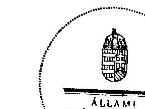
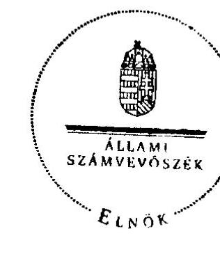

Domokos László
elnök

---

ISSN 1789-8773

---

# TARTALOMJEGYZÉK 

BEVEZETÉS ..... 3

1. AZ ÁSZ 2009. ÉVI FELADATAI ..... 4
1.1. Az éves ellenőrzési terv teljesítése ..... 4
1.2. Egyéb számvevőszéki feladatok ..... 7
2. AZ ÁSZ ELLENŐRZÉSI TAPASZTALATAI ..... 10
2.1. Főbb tapasztalatok államháztartási alrendszerenként ..... 10
2.1.1. A központi költségvetés ..... 10
2.1.2. Az elkülönített állami pénzalapok ..... 17
2.1.3. A társadalombiztosítás pénzügyi alapjai ..... 19
2.1.4. A helyi önkormányzatok ..... 22
2.2. Az állami és az önkormányzati feladatellátásra irányuló ellenőrzések főbb tapasztalatai ..... 29
2.3. Az uniós források felhasználása ..... 36
2.4. Az államháztartáson kívülre juttatott támogatások ..... 40
2.5. Az állami vagyongazdálkodás ..... 41
3. AZ ELLENŐRZÉSEK HASZNOSÍTÁSA ..... 44
3.1. A jelentések országgyűlési tárgyalása, határozatok és az országgyűlési kapcsolatok ..... 44
3.2. A számvevőszéki javaslatok érvényesülése ..... 45
3.2.1. Javaslatok hasznosítása az Országgyűlés szintjén ..... 46
3.2.2. Javaslatok hasznosítása kormányzati szinten ..... 47
3.2.3. Javaslatok hasznosítása az ellenőrzött szervezetek szintjén ..... 56
3.3. Az ÁSZ jogi realizálással kapcsolatos tevékenysége ..... 58
3.4. A számvevőszéki tevékenység nyilvánossága ..... 60
4. A SZÁMVEVŐSZÉKI TEVÉKENYSÉGHEZ KAPCSOLÓDÓ KUTATÓ ÉS FEJLESZTŐ MUNKA ..... 62
5. AZ ELLENŐRI MUNKA MINŐSÉGÉNEK FEJLESZTÉSE ..... 68
5.1. Az ellenőrzések minőségbiztosítása ..... 68
5.2. Humán erőforrás gazdálkodás és fejlesztés ..... 69
5.3. Nemzetközi kapcsolatok ..... 71
6. AZ INTÉZMÉNY MŰKÖDÉSE ÉS GAZDÁLKODÁSA ..... 76
6.1. Költségvetési gazdálkodás ..... 76
6.2. Az infrastruktúra működtetése, fejlesztések ..... 79
6.3. Az informatika és a telekommunikáció működtetése, fejlesztése ..... 80
6.4. Belső ellenőrzés ..... 84

---

# MELLÉKLETEK 

1. számú A 2009. évi jelentések jellemzői ..... 1
2. számú ÁSZ jelentések az országgyűlési bizottságok/plenáris ülések napirendjén 2009-ben
3. számú Az ÁSZ 2009. évi jelentéseiben a fejezetek vezetőinek megfogalmazott javaslatok és az azokra adott válaszok ..... 21
4. számú Összefoglalók a 2009-ben befejezett ellenőrzések tapasztalatairól ..... 75

---

# BEVEZETÉS 

Az Állami Számvevőszék (ÁSZ) évente beszámol tevékenységéről az Országgyűlésnek. A jelentést - az eddigi gyakorlat szerint - a plenáris ülés tárgyalta meg, azt megelőzően több országgyűlési bizottság is napirendre tűzte. Az éves tevékenységről szóló jelentés megvitatását követően az Országgyűlés határozatot hozott az elvégzett munka értékeléséről, illetve a jövőbeni ellenőrzési és fejlesztési irányokról. Ezen országgyűlési határozatokat figyelembe véve állítottuk össze éves ellenőrzési tervünket.

2009-ben 57 jelentést készítettünk. Az országgyűlési bizottságok 6 jelentésről és 1 tanulmányról összesen 46 alkalommal tárgyaltak. A korábbi gyakorlatnak megfelelően néhány jelentést - a költségvetés végrehajtásának ellenőrzése, a költségvetési javaslat véleményezése, illetve az ÁSZ éves jelentése - több bizottság is napirendjére tűzte. 2009-ben közreadott jelentéseinkben közel 700 javaslatot tettünk, amelyeket mintegy 650 szervezetnél végzett helyszíni ellenőrzés lefolytatásával alapoztunk meg.

Éves jelentésünk lehetőséget ad ellenőrzési tapasztalataink rendszerszemléletű értékelésére, a javaslataink alapján kibontakozó intézkedések és azok befolyásoló tényezőinek áttekintésére. A számvevőszéki tevékenység sajátosságából adódóan ellenőrzési munkánk a múltra irányul, de a jelenben közreadott ajánlásainkkal, ellenőrzési tapasztalatainkkal a jövő feladatait célozzuk, a feltárt hiányosságok ismételt előfordulásának megelőzéséhez és a döntések megalapozásához szándékozunk hátteret nyújtani.

Éves jelentésünk szervezetünk működésének, gazdálkodásának és fejlesztésének bemutatását is szolgálja. A számvevőszéki törvény előírásának megfelelően az Országgyűlés elnöke által pályázat útján megbízott független könyvvizsgáló ellenőrzi az intézmény gazdálkodását. A könyvvizsgálat a 2009. évi gazdálkodásról készült költségvetési beszámolót hitelesítő záradékkal látta el.

A jelentés az adatokat a 2010. április 19-i állapotnak megfelelően tartalmazza.

---

# 1. Az ÁSZ 2009. ÉVI FELADATAI 

### 1.1. Az éves ellenőrzési terv teljesítése

Az ÁSZ 2009-ben is a jóváhagyott - az Országgyűlés Költségvetési, pénzügyi és számvevőszéki bizottsága által megtárgyalt - ellenőrzési tervben foglaltak szerint végezte tevékenységét.

A 2009. évi ellenőrzési tervben 69 téma szerepelt. Év közben a terv egy vizsgálattal kiegészült, két feladat törlésre került, így a módosított ellenőrzési terv 68 vizsgálatot tartalmazott. A 2009-re ütemezett ellenőrzési feladatokat teljesítettük, és 57 jelentést tettünk közzé. ${ }^{1}$

Ellenőrzési kapacitásunk az elmúlt években folyamatos csökkenést mutat. Ellenőrzési feladatainkra 2009-ben összesen 54814 közvetlen ellenőri napot fordítottunk, ami 1003 nappal kevesebb az előző évinél. A csökkenés a létszámkorlátozó, pénzügyi megtakarításokat célzó intézkedésekkel összefüggésben és a megnövekedett nyugállományba vonulás hatásából adódott.

Az ÁSZ ellenőrzési kötelezettségeinél változatlanul meghatározóak a törvényekben különféle rendszerességgel előírt (évenkénti, kétévenkénti, illetve rendszeres) feladatok. A törvényi kötelezettségek teljesítése az ellenőrzési kapacitás 72%-át (2008-ban 64%-át) vette igénybe, s 38 jelentés készült (2008-ban 32 jelentés).

Az évenkénti ellenőrzési kötelezettségek teljesítéseként 5 jelentés készült (a költségvetés megalapozottságának véleményezése, a zárszámadás ellenőrzése, az MNV Zrt. és az MTI Zrt. működésének, valamint a fővárosi önkormányzatot és a kerületi önkormányzatokat osztottan megillető bevételek megosztásának ellenőrzése). E kötelezettségek közül a legnagyobb súlyt a zárszámadás ellenőrzése jelentette, ami az éves ellenőrzési kapacitás 38%-át kötötte le.

Kétévenkénti ellenőrzési kötelezettségek keretében 5 párt és 3 pártalapítvány gazdálkodásának ellenőrzéséről 8 jelentés készült.

A rendszeres ellenőrzési feladatok teljesítéseként 25 számvevőszéki jelentést adtunk közre. E feladatok meghatározó részét (78%-át) a helyi önkormányzatok gazdálkodási rendszerének ellenőrzése képezte. A 109 helyi és települési önkormányzat helyszíni ellenőrzésénél szerzett tapasztalatokat összefoglaló jelentésen kívül 16 jelentős nagyságrendű költségvetéssel, illetve vagyonnal rendelkező önkormányzatról önálló számvevőszéki jelentés készült. A központi költségvetési fejezetek közül az Országgyűlés és a Honvédelmi Minisztérium fejezetek több évre kiterjedő átfogó ellenőrzéséről készült jelentés. Rendszeres feladatként valósult meg továbbá „A központi költségvetési támogatásban nem részesült pártok 2005-2008. évi gazdálkodásának ellenőrzése", „A 2008. március 9-én megtartott országos ügydöntő népszavazás lebonyolításához felhasznált pénzeszközök ellenőrzése", valamint „Az időközi országgyűlési képviselőválasztási kampányra fordított pénzeszközök elszámolásának ellenőrzése".
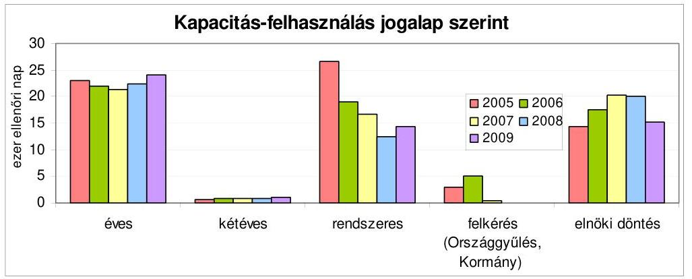

A törvényi előírások teljesítése mellett az éves ellenőrzési kapacitás 28%-át képezhették olyan feladatok, amelyek végrehajtásának gyakoriságát törvény nem rögzíti. Ezen, az ÁSZ elnökének döntése alapján végzett ellenőrzésekről 19 jelentés készült.

Az elnöki döntés alapján megvalósult ellenőrzések az ÁSZ stratégiai céljaihoz illeszkedően négy súlypont köré csoportosíthatók:

Az államháztartás átlátható, szabályszerű működését célozta a magyar központi közigazgatási rendszer modernizációjának, az elkülönített állami pénzalapok rendszerének, a lakástámogatási rendszer, a kincstári rendszer működésének ellenőrzése.

Az uniós források igénybevételére, cél szerinti hasznosítására irányult a Kohéziós Alapból és a hazai forrásokból finanszírozott kiemelt szennyvíztisztítási projektek megvalósulásának ellenőrzése, a szilárd hulladékgazdálkodásra nyújtott támogatások hasznosulásának ellenőrzése.

Az állami fejlesztési források védelmét, az államháztartás és a magángazdaság kapcsolataiban rejlő kockázatok feltárását célozta a Sport XXI. program keretében támogatott PPP beruházások, a 2008-ban befejeződő autópálya beruházások ellenőrzése.

Az állami feladatok hatékony és eredményes ellátására irányult a sürgősségi betegellátó rendszer fejlesztésének, az egyes kórházi tevékenységek kiszervezésének, a nemzeti audiovizuális vagyon működtetésének, a felsőoktatási törvény végrehajtásának, a települési önkormányzatok tulajdonában lévő zöldterületek fejlesztésének és fenntartásának ellenőrzése.

---

A miniszterelnök részéről 2009-ben az 1%-os személyi jövedelemadó felajánlások hibaaránya okainak vizsgálatára érkezett felkérés, amelyet 2010-ben a 2009. évi zárszámadás ellenőrzése keretében kívántunk megvalósítani².
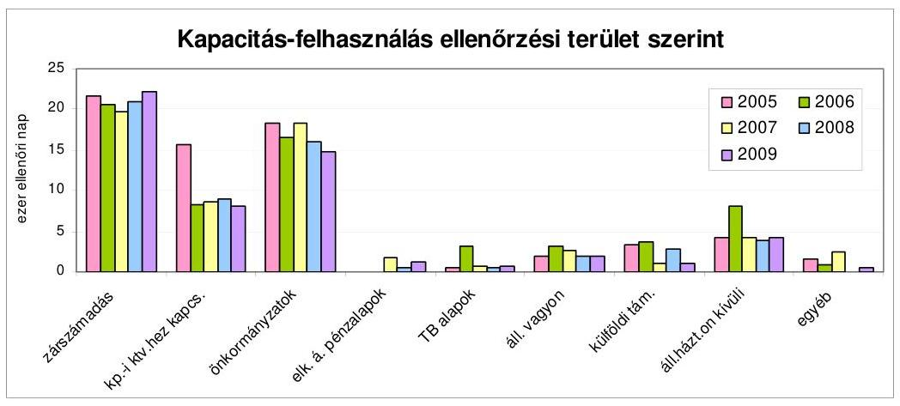

Az ÁSZ ellenőrzéseit három fő típusba sorolja. Az intézmény 2009-ben a kapacitás 46%-át a szabályszerűségi ellenőrzésekre (költségvetés véleményezése, zárszámadás, pártok, alapítványok gazdálkodásának ellenőrzése), 22%-át az átfogó ellenőrzésekre (önkormányzatok, minisztériumok, központi költségvetés intézményrendszere és előirányzatai), 32%-át teljesítmény-ellenőrzésekre fordította. Ez a megoszlás az előző évek szerkezetéhez képest elmozdulást jelent a teljesítmény-ellenőrzések javára, amit az ezen ellenőrzési típusba sorolt rendszerellenőrzések megjelenése eredményezett.
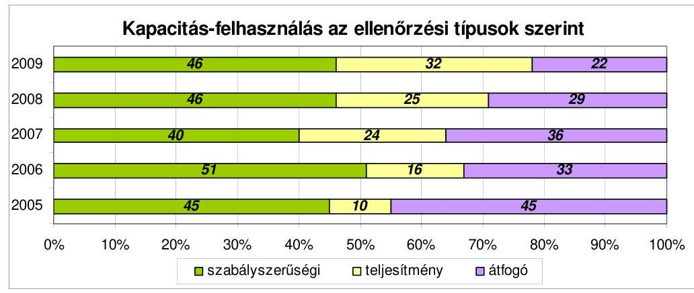

A 2009-ben elkészült jelentések jellemzőit az 1. sz. melléklet tartalmazza.

[^0]
[^0]:    ${ }^{1}$ Három 2008-ra tervezett ellenőrzés esetében a jelentés közzététele 2009-re húzódott át. Ezek: „A magyar központi közigazgatás modernizációjának ellenőrzése", „A MIÉP 2005-2006. évi gazdálkodása törvényességének ellenőrzése" és „A 2008. februári időközi országgyűlési képviselőválasztási kampányra fordított pénzeszközök elszámolásának ellenőrzése".

---

# 1.2. Egyéb számvevőszéki feladatok 

A szervezet egyéb tevékenységi körébe számos - a szorosan vett ellenőrzési kötelezettségen és jogosítványon túlmutató - felhatalmazás, illetve feladat tartozik, amelyeket az Alkotmány, a számvevőszéki törvény és egyéb törvények írnak elő.

Az Állami Számvevőszékről szóló 1989. évi XXXVIII. törvény 2. § (2) bekezdése alapján az ÁSZ elnöke ellenjegyzi a költségvetés hitelfelvételeire vonatkozó szerződéseket. A 2009. évben hitelkeret szerződés ellenjegyzésére nem került sor.

A számviteli rend változásával összefüggésben az Állami Számvevőszékről szóló 1989. évi XXXVIII. törvény 2. § (8) bekezdésében biztosított véleményezési jogkörét az ÁSZ 2009-ben az államháztartás szervezetei beszámolási és könyvvezetési kötelezettségének sajátosságairól szóló 249/2000. (XII. 24.) Korm. rendelet, valamint a kincstári elszámolások beszámolási és könyvvezetési kötelezettségének sajátosságairól szóló 240/2003. (XII. 17.) Korm. rendelet módosításai kapcsán gyakorolta.

Az ÁSZ elnöke három esetben tett könyvvizsgáló személyére - a 2009. üzleti évre - vonatkozó, az államháztartási törvény 57. §-ának (5) bekezdésén alapuló javaslatot (a Központi Nukleáris Pénzügyi Alapnál, a Nemzeti Kulturális Alapnál, a Kutatási és Technológiai Innovációs Alapnál).

Az ÁSZ hat éve a főtitkár hatáskörében végzi a felügyelő bizottsági elnök jelölési feladatot. 2003-tól az Áht. 95/A. §-ának (2) bekezdése, 2008-tól 2009. december 31-ig az állami vagyonról szóló törvény 30. §-ának (4) bekezdése szabályozta az ÁSZ - egyes állami tulajdonú gazdasági társaságok felügyelő bizottság (FB) elnöke személyét érintő - javaslattételi (és visszahívási javaslattételi) jogát.

A köztulajdonban álló gazdasági társaságok takarékosabb működéséről szóló törvény 4. §-ának (3) bekezdése alapján ez a jogkör 2010. január 1-jétől már szélesebb alanyi körre - a köztulajdonban álló, kettőszáz millió Ft-ot meghaladó jegyzett tőkéjú gazdasági társaságokra - terjed ki.

A Jelölési Szabályzat alapján évente egy pályázat meghirdetésére kerül sor az FB-elnöki megbízatás ellátására alkalmas személyek névjegyzékének bővítése, kiegészítése érdekében. A 2003. évi indulástól összesen 741 személy került a névjegyzékbe, a jelölésre alkalmas személyek száma 2009. december 31-én 733 fő volt. A 2010-től szélesebb alanyi körre kiterjedő javaslattétel miatt pályázat kiírására került sor 2009. december 10. - 2010. január 31. között.

A 2003. évi indulástól 2009. december 31-ig összesen 364 gazdálkodó szervezettől érkezett kérelmet vizsgáltunk meg, és 336 személy jelölésére tettünk javaslatot. Javaslatunk alapján 2009. december 31. napján 129 személy töltött be FB-elnöki megbízatást. Ez a szám 2003-tól folyamatosan csökkent, ami jelzi, hogy elsősorban összevonás, jegyzett tőke leszállítás miatt évről-évre kevesebb - a törvény hatálya alá tartozó - gazdasági társaság működött (2003 óta mintegy 60 társaság került ki a számvevőszéki jelölés hatálya alól). FB-elnöknek megválasztott személy visszahívására vonatkozó javaslat 2009-ben nem volt.

---

2003 óta a beszámolási évben fordult elő második alkalommal, hogy a tulajdonosi jogok gyakorlója (törvényben szabályozott ok megjelölése nélkül) meg kívánta tagadni az általunk javasolt személy kinevezését.
 Több esetben előfordult, hogy az általunk korábban FB-elnöknek jelölt személyt az ÁSZ nem jelölte az új időszakra, miután a javasolt nem felelt meg mindenben a feltételeknek, ÁSZ-szal szemben vállalt kötelezettségét nem teljesítette. Az ÁSZ nem támogatja egy személynek két, vagy több gazdasági társasághoz történő jelölését.

Az Országgyűlés 2008 elején fogadta el az állami vezetők javadalmazásának átláthatóságához szükséges egyes törvénymódosításokról szóló 2008. évi X. törvényt. A jogszabály egy új 12/A. §-sal egészítette ki a központi államigazgatási szervekről, valamint a kormány tagjai és az államtitkárok jogállásáról szóló 2006. évi LVII. törvényt. Az új szakasz értelmében az állami vezetők vagyongyarapodásának vizsgálatát az ÁSZ ötévente, vagy az állami vezetői megbízás megszűnése után haladéktalanul - az adózás rendjéről szóló törvény rendelkezéseinek alkalmazásával - végzi.

Az ÁSZ-nak nem volt módja arra, hogy a törvénytervezettel kapcsolatos véleményét kifejtse az előterjesztőnek, így csak a törvény elfogadása után tudtuk jelezni az Országgyűlésnek és a Kormánynak, hogy az új szabályozás annak fogyatékosságai miatt nem hajtható végre. Az ÁSZ 2007. évi tevékenységéről szóló jelentés elfogadásáról rendelkező 72/2008. (VI. 10.) OGY határozat 3. b) pontja szerint az Országgyűlés felkérte a Kormányt: „az állami vezetők javadalmazásának átláthatóságához szükséges egyes törvénymódosításokról szóló 2008. évi X. törvény rendelkezéseit vizsgálja felül és a vizsgálat eredményeire figyelemmel nyújtson be javaslatot az állami vezetők vagyongyarapodási vizsgálata szabályozásának módosítására." 2009. március 31-én, majd 2010. január 7-én az Országgyűlés Alkotmányügyi, igazságügyi és ügyrendi bizottsága elnökénél kezdeményeztük a kérdés rendezését. 2010. februárjában a bizottság megtárgyalta a szabályozási javaslatunkat, és végül bizottsági önálló indítványt nyújtott be a törvény 12/A. §-ának hatályon kívül helyezése iránt. Az előző Országgyűlés utolsó ülésnapjára tervezte a törvény megvitatását, erre azonban nem került sor.

Egyes - törvényben meghatározott - gazdálkodók (hitelintézeti, befektetési, biztosítási, költségvetési) esetében csak minősített könyvvizsgáló vagy könyvvizsgáló cég végezhet jogszabályi kötelezettségen alapuló könyvvizsgálói tevékenységet, amihez - kérelmére, hatósági eljárás keretében - a Könyvvizsgálói Kamarától kaphat minősítést. Az új könyvvizsgálói törvény alapján a kamarai tag könyvvizsgáló vagy könyvvizsgáló cég költségvetési minősítésére vonatkozó kérelmek elbírálása és a minősítések visszavonása során ki kell kérni az ÁSZ véleményét. Az ÁSZ-nak vélemény-nyilvánítási jogosultsága van a Kamara felé az összeférhetetlenség megállapítása, illetve fegyelmi vétség elkövetésének alapos gyanúja jelzésének vonatkozásában is.

Panasszal és közérdekű bejelentéssel bárki - szóban, írásban vagy elektronikus úton - fordulhat a tárgykörben eljárásra jogosult szervhez. A közérdekű bejelentések, javaslatok és kérelmek intézésének jogi alapját a 2004. évi XXIX. törvény közérdekű kérelmekkel, panaszokkal és bejelentésekkel kapcsolatos eljárásra vonatkozó szakaszai (141-143. §-ok) képezik. A közpénzek felhasználásával, annak szabályosságát érintő kérdésekkel kapcsolatban az állampolgárok érdeklődése fokozódott, és bővülő számban fordultak hozzánk kérdéseikkel, ké-

---

réseikkel és javaslataikkal a gazdasági élet különféle szereplői. További intézkedés és tájékoztatás céljából a hivatalos szervek is minden eddiginél nagyobb számban kerestek meg bennünket.

2009-ben a hivatalos megkeresések száma 22%-kal nőtt. A helyi önkormányzatok gazdálkodásával és működésével összefüggésben kapott beadványok száma azonban csökkent.
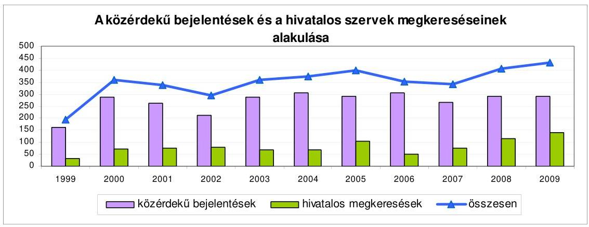

A megkereséseken belül jelentősen növekedett a korrupció, visszaélés, szabálytalanság kategóriákba sorolható tartalom. Az érintettek esetenként a helyi önkormányzat polgármestere, képviselő-testülete, egyes állami szervek intézményeinek, gazdálkodó szervezeteinek vezetői. Emelkedett az adott szervezeteken belülről érkező, névtelen, a gazdálkodás anomáliáit észlelő bejelentések száma. Gyakorta irányult a bejelentés egyes állami, vagy önkormányzati tisztségviselők vagyongyarapodására.

Nőtt az ÁSZ-hoz állásfoglalásért, tanácsért fordulók száma, akik gyakorta jogszabály-értelmezést kértek, vagy a jogszabály gyakorlati alkalmazásának nehézségeire hívták fel a figyelmet. A lakossági panaszok egy része a lakások korszerűsítésére kiírt pályázatokkal, azok megvalósításával kapcsolatos vizsgálatok kérésével, további része a különféle hitel- és pénzintézetek eljárásával kapcsolatos negatívumokkal foglalkozott. A közérdekű bejelentések egy részében az ÁSZ tájékoztatásának, figyelme felkeltésének szándéka is érzékelhető.
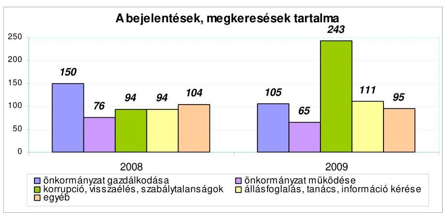

---

Amennyiben a megkeresés tartalma ellenőrzési hatáskörünkbe tartozik, azt az ellenőrzési programok kialakítása, illetve a folyamatban lévő ellenőrzések keretében időről-időre hasznosítjuk. Számos beadvány az ÁSZ hatáskörét, lehetőségeit meghaladó elvárásról, téves felfogásról tanúskodik, ezért arra törekszünk, hogy a hozzánk forduló levélíróknak ilyen esetben az eligazodást segítő tájékoztatást adjunk.

# 2. Az ÁSZ ELLENŐRZÉSI TAPASZTALATAI 

### 2.1. Főbb tapasztalatok államháztartási alrendszerenként

### 2.1.1. A központi költségvetés

## A 2008. év zárszámadásának ellenőrzése

A 2009. évi feladatok közül súlyát tekintve kiemelkedik a költségvetés végrehajtásának ellenőrzése. A központi költségvetés 2008. évi törvényben rögzített hiánya a tervezettnél lényegesen kisebb összegben teljesült, ami az elmúlt hat évben csak két ízben fordult elő.

A központi költségvetés - ÁSZ által korábban is többször jelzett - tervezési pontatlanságaira, problémáira utal azonban, hogy a hiány az elmúlt évekhez hasonlóan 2008-ban is - bár kedvező irányban - jelentős összeggel és mértékkel tért el a törvényben rögzítettől.
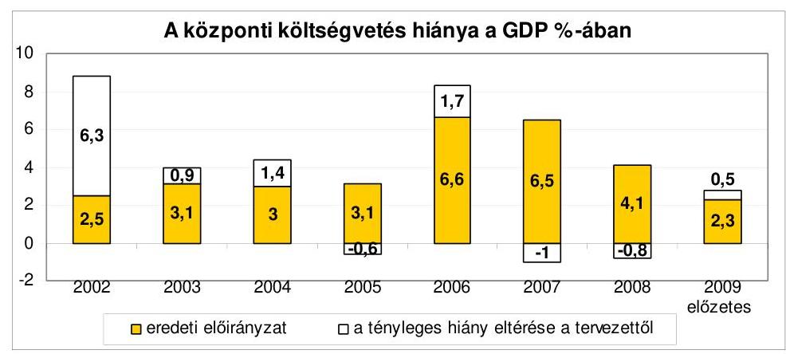

Forrás: költségvetési és zárszámadási törvények, PM
A központi költségvetés bevételeinek több mint háromnegyed részét az APEH és a VP felelősségi körébe tartozó adónemek adják. Az adóbevételi előirányzatok és teljesítésük azt jelzi, hogy a tervezés megalapozottsága ezen a területen javult.

---

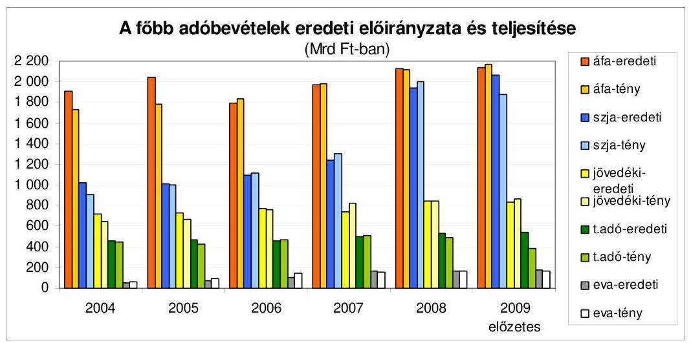

Forrás: költségvetési és zárszámadási törvények, PM
A központi költségvetés hiányát mérsékelte az ún. egyéb bevételek előirányzatát jelentősen meghaladó többletbevétel. Ennek döntő részét a MAVIR Zrt. egyszeri, törvényi kötelezettségen alapuló befizetése adta.

Az állami vagyonnal kapcsolatos bevételek a tervezettnél jóval kisebb összegben realizálódtak. A 25,6% bevételi elmaradást a kormányzati ingatlanok értékesítéséből származó bevételek, a központi költségvetési szervek által fizetett bérleti díj 2008. évi teljes összegű kiesése, valamint a koncessziós díjak közül az infrastruktúrából származó tervezett bevételek egy része teljesítésének - a 2007. évi előrehozott befizetés miatti - elmaradása okozta.

A központi költségvetési szervek által teljesítendő bérleti díjfizetési kötelezettség 2008. és 2009. évekre vonatkozó „szüneteltetése" a PM és a tárcák közötti megállapodás eredménye. A PM és a tárcák közötti 2008. évi megállapodás nem felel meg a vonatkozó törvényi előírásoknak, mivel - a központi költségvetési szervek állami tulajdonú ingatlan használatáért fizetendő bérleti díj törvényi előírásaira vonatkozóan - sem a Kvtv., sem pedig a Vtv. módosítására nem került sor.

A helyszíni ellenőrzés súlyos hiányosságokat állapított meg az állami vagyonnal kapcsolatos bevételek vizsgálata során. Az állami vagyonnal kapcsolatos bevételeket - a koncessziós díjbevételeket kivéve - a financial audit módszerrel nem lehetett ellenőrizni, mivel „Az állami vagyonnal kapcsolatos bevételek" technikai fejezet főösszege 96,5%-ának elszámolását az MNV Zrt. teljes körű dokumentációval alátámasztani nem tudta. Ennek oka az, hogy a törvényi előírás ellenére az elődszervezetek nem készítették el a 2007. december 31-ei záró állományt, a vagyonmérleget és a vagyonleltárt. A 2008. január 1-jei nyitó állományt - az elődszervezetek 2007. december 31-ei megszűnését követően - az MNV Zrt. közel 1,5 éves késéssel vette nyilvántartásba. Az állami vagyon mérlegszerű nyilvántartás hiányában teljes körűen nem volt ismert.

Az adózók központi költségvetés felé fennálló tartozása a 2008. év végén 1410,4 Mrd Ft-ra emelkedett, míg a VP hátralékállománya 2,1 Mrd Ft-tal csökkent az előző évihez képest. Az állami adóhatóság által nyilvántartott hátralékok évről-évre progresszíven nőttek. E kedvezőtlen jelenségre zárszámadási jelentéseinkben minden évben felhívtuk a figyelmet. A felhalmozódott hátralék összege azért érdemel kiemelt figyelmet, mert az meghaladja például az államadóssággal kapcsolatos 2008. évi adósságszolgálatra és kamattérítésre fordított költségvetési kiadásokat, illetve a központi költségvetés személyi jövedelemadó bevételének 70%-át, a realizált társasági adó és különadó bevételek kétszeresét teszi ki.

A hátralékok gyors ütemű növekedése a kintlévőségek összetételének a behajthatóság szempontjából kedvezőtlen alakulásával párosult. A hátraléknövekedés közvetett oka - az adózói magatartáson és a behajthatatlanságon túlmenően - a gazdasági növekedés mérséklődése, amelynek következtében a gazdasági társaságoknál likviditási problémák merültek fel. Ezért a vállalkozások a folyamatos működés biztosításához elsősorban a szállítókkal szembeni tartozások rendezésére törekednek, elhalasztva az adótartozások kiegyenlítését.

A hátralékállomány növekedését az APEH a rendelkezésére álló eszközökkel igyekezett mérsékelni. Ezek hatása a behajtásból származó bevételek emelkedésében mutatkozik meg.

A központi költségvetési szervek finanszírozási helyzetét a tartósan magas - az év végére azonban jelentősen csökkenő - tartozásállomány jellemezte. Az elmúlt évektől eltérően az is megállapítható, hogy a finanszírozási problémák nagyságrendje és aránya mérséklődött. A minősített állomány nagymértékben csökkent. Az adósság kincstári, ezen belül biztosi eszközökkel kezelhető mértékű volt.

A központi költségvetés tartalékainak 2008. évi módosított előirányzatai az év során - 8,3 Mrd Ft kivételével - felhasználásra kerültek. Az elmúlt évek ellenőrzési tapasztalataival egyezően az általános tartalék felhasználása 9,6 Mrd Ft összegben, az átcsoportosítások mintegy 33%-ánál eltért a jogszabályi előírásoktól. Nem tekinthető az állam pénzeszközével való takarékos gazdálkodásnak pl. a kormányzati reformok lakossági tájékoztató kampánya, a kormányfői protokoll kiadási előirányzatának megemelése (ezeknek az általános tartalékból való finanszírozása), továbbá a módosított előirányzat 12%-ának 2008. utolsó munkanapjaiban történt felhasználása.

Évről-évre kifogásoljuk a központi egyensúlyi (illetve az azonos célú, más elnevezésű) tartalék szabályozásának hiányát, miután a költségvetési törvényben adott általános jellegű felhatalmazás a mindenkori kormánynak korlátlan és ellenőrizhetetlen felhasználási lehetőséget biztosít.

# A központi költségvetés, a társadalombiztosítás pénzügyi alapjai és az elkülönített alapok finanszírozása 2008-ban is biztosított volt. 

A központi költségvetés 2008. év végi bruttó adóssága 6,2%-kal haladja meg a tervezettet, és 16,2%-kal a 2007. évit.

---

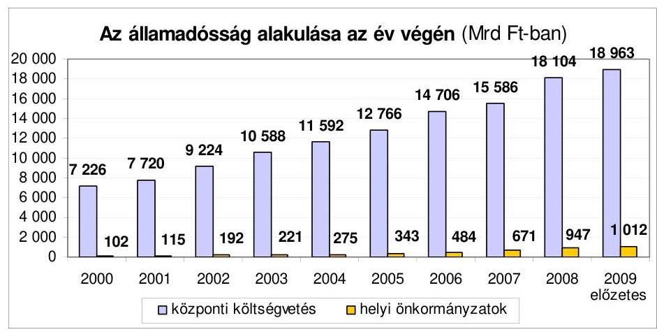

Forrás: ÁKK Zrt., PM
Az adósságállomány - a betétként elhelyezett IMF/EU hitelrésszel együtt - a GDP arányában 68,4%-ot tett ki, ami 7,1%-ponttal magasabb az előző évi értéknél. A növekedést több, ellentétes irányban ható tényező együttes hatása okozta. A 2008. évben a központi költségvetés finanszírozási igénye kedvezőbben alakult, 236,3 Mrd Ft-tal elmaradt a 2007. decemberi tervtől, a társadalombiztosítási alapok hiánya azonban 73,4 Mrd Ft-tal növelte a finanszírozást.

A KESZ likviditását tovább rontotta az európai uniós elszámolások egyenlege, ami szintén kedvezőtlenebbül alakult a tervezettnél. Az adósság növekedésének legfontosabb tényezője az 1824,8 Mrd Ft összegű devizahitel felvételéből finanszírozási célra fel nem használt és a Magyar Nemzeti Banknál devizabetétként elhelyezett rész, ami az adósság növekedésének 59,0%-át tette ki. Tovább növelte az adósságot az átlagos devizaárfolyam tervezéskori árfolyamához viszonyított növekedés.

A 2009. év végére a központi költségvetés adóssága - előzetes adatok alapján - 4,7%-kal növekedett, ami alacsonyabb éves növekedést jelent, mint az előző év növekedési üteme. A központi költségvetés év végi bruttó adósságának a GDP-hez viszonyított aránya 73,8% volt. Ez növekedést jelent az egy évvel korábbi adósságmutatóhoz képest. A nemzetközi hitelcsomagból a bankrendszernek továbbhitelezett állomány és az MNB-nél elhelyezett devizabetét összege csökkent az egy évvel korábbi állományhoz viszonyítva. A nemzetközi hitelkeretből 2009-ben - az előzetes adatok alapján - 1726,0 Mrd Ft összegű lehívás történt.

2008-ban a központi költségvetés adóssága után fizetett bruttó kamat abszolút összege növekedett az előző évhez viszonyítva. A növekvő folyó kamatkiadás más tényezők mellett - a központi költségvetés adósságának nagyobb éves növekedési ütemével függ össze.

---

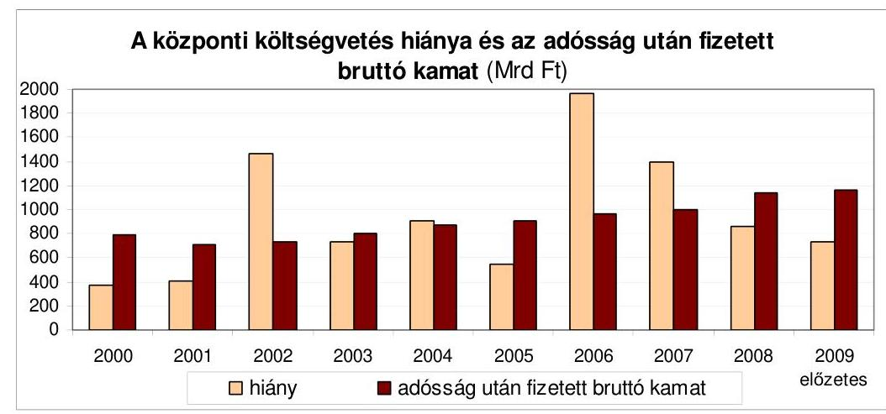

Forrás: zárszámadási törvények, PM
A fejezeteknél, központi költségvetési szerveknél megvalósuló zárszámadási ellenőrzést befolyásolta, hogy módosult a
 kormányzati szerkezet. A kormányzati struktúraváltás folyamatában az előirányzatok, a létszám, a fejezeti kezelésű előirányzatok, valamint a pénzeszközök átadás-átvétele megtörtént, de a 2009. évre is húzódtak át feladatok.

Az elemi beszámolók ellenőrzése során a szabályozások, a mérleg, a pénzforgalmi jelentés és a kiegészítő melléklet ellenőrzése tekintetében is állapítottunk meg hiányosságokat. A mérlegek ellenőrzésénél állapítottuk meg a legtöbb hiányosságot, amelyek elsősorban az eszközök üzembe helyezéséhez, besorolásához, a követelések értékelésének elmaradásához, valamint a függő-, átfutó tételek nem megfelelő használatához kapcsolódtak.

Két tárcát érintően állapította meg az ellenőrzésünk, hogy a fejezeti kezelésű előirányzatokból történt finanszírozás lehetőséget teremtett az átutalt támogatások kamatoztatására, amely összegek felhasználásáról a minisztériumok nem rendelkeztek. Az államháztartási kár a kamatot meghaladó, mivel a Kormány a nemzetközi hiteleket a hazai kihelyezések betéti kamatainál magasabb kamatokkal veszi igénybe.

A KvVM fejezetnél a bevétel és a kiadás teljesítését befolyásolta a kiotói egységek átruházásából származó egyszeri bevétel, amelynek felhasználása a 2008. év folyamán nem történt meg. A Zöld Beruházási Rendszer elindulásának késedelme miatt így a fel nem használt bevétel előirányzat-maradványként került kimutatásra.

A korábbi évek zárszámadásainak ellenőrzésekor feltárt hiányosságok megszüntetésére tett intézkedések ellenőrzése során megállapítottuk, hogy a javaslatokban megjelölt feladatokat a tárcák csak részben teljesítették, illetve azok végrehajtása folyamatban van.

A 2008. évi zárszámadás ellenőrzése során - az ÁSZ és a fejezetek ellenőrzési szervezetei által - lefolytatott pénzügyi szabályszerűségi vizsgálatok alapján a központi költségvetés kiadási főösszege 92%-ának megbízhatóságát minősítettük. A minősítések alapján a központi költségvetés zár-

---

# számadási törvényjavaslatban szereplő pénzforgalmi adatai összességükben megbízhatóak. 

Az ÁSZ által ellenőrzött elemi beszámolók 83%-a elfogadó, 15%-a korlátozott minősítést kapott. A beszámolók 2%-ánál tárt fel az ellenőrzés lényegességi küszöböt meghaladó hibákat, hiányosságokat.

A tárcák belső ellenőrzési szervezeti egységei által ellenőrzött elemi beszámolók 78%-a elfogadó, 20%-a korlátozott minősítést kapott. A beszámolók 2%-ánál tárt fel az ellenőrzés lényegességi küszöböt meghaladó hibákat, hiányosságokat.

A 2008. évi zárszámadás ellenőrzése keretében a központi költségvetési szervek és a fejezeti kezelésű előirányzatok körében az előzetes kockázatértékelések és a helyszíni ellenőrzések megállapításai alapján kiemelten elemeztük a fejezetek igazgatási címei és a fejezeti kezelésű előirányzatok belső kontrollrendszereinek kiépítettségét és működését a költségvetési beszámolók megbízhatóságát befolyásoló kockázatok mérséklése szempontjából.

Az intézményi és a fejezeti kezelésű előirányzatok költségvetési beszámolóját egyaránt érintő legkockázatosabb terület az informatikai környezet szabályozottsága és működése, a belső ellenőrzési tevékenység, valamint a folyamatba épített, előzetes, utólagos és vezetői ellenőrzés (FEUVE) működése volt. Pozitívumként értékelhető ugyanakkor, hogy a pénzügyi és számviteli rendszer szabályozottsága alacsony kockázatot képviselt.

## A 2010. évi költségvetés véleményezése

A véleményezés során az ÁSZ a korábbi évektől eltérően - takarékos állami gazdálkodásról és a költségvetési felelősségről szóló törvény előirásaiból adódóan ${ }^{3}$ - kisebb terjedelemben, és csak annyiban foglalkozott a makroadatok értékelésével, amennyiben az elkerülhetetlen volt a bevételi és kiadási főösszegek megalapozottságának értékeléséhez.

A központi költségvetés közvetlen bevételeinek 2010. évi tervezett összege a központi költségvetés fő bevételei fejezet főösszegének 99,1%-a.

Az adóbevételi előirányzatok tervezetének megalapozottságát (a költségvetési tervező munkát), annak előző évekhez viszonyított változását - a korábbi évekhez hasonlóan - teljes körűen nem tudtuk megítélni. A véleményalkotáshoz szükséges egyes adatok és részletes számítási anyagok hiánya nem tette lehetővé, hogy a tervezett adóbevételek teljesíthetőségét és - néhány kivétellel - ennek kockázatát minősítsük.

[^0]
[^0]:    ${ }^{3}$ A takarékos állami gazdálkodásról és a költségvetési felelősségről szóló 2008. évi LXXV. törvény új intézményként létrehozta a Költségvetési Tanácsot, amelynek feladata az Országgyúlés törvényhozási tevékenységének támogatása. A Tanács hatásköre makrogazdasági előrejelzések, technikai kivetítés, módszertani ajánlás készítése. Közreműködik a költségvetési kihatással járó törvényjavaslatok tárgyalása során a várható hatások prognosztizálásában.

---

A 2010. évi költségvetési törvényjavaslatról szóló véleményünkben a központi költségvetés bevételeit meghatározó adókkal kapcsolatosan a következőkre hívtuk fel a figyelmet:

- A gazdasági növekedés kockázati tényezője nemcsak a világgazdasági válság jövőbeni alakulása, hanem a magyar gazdaságot befolyásoló hazai környezet is, így többek között az évek óta visszaeső beruházási ütem, az alacsony foglalkoztatottsági szinttel párosuló magas munkanélküliségi ráta, a jövedelmi viszonyok kedvezőtlen alakulásának piacszűkítő hatása, a korábbi évekbenél lényegesen visszafogottabb banki hitelezés.
- Nem indokolt a társasági adó előirányzat-tervezetét a folyóáras GDP 2010. évi prognosztizált növekedésével azonos ütemű nyereségképződésre alapozni, miután egy-egy vállalkozás nyereségét számos olyan tényező befolyásolja, amely még az azonos szakágazatban gazdálkodó szervezetek eredményére is eltérő hatást gyakorol.
- Az áfa-bevételek 2010. évi előirányzatának teljesülésében kockázati tényezőként jelölhető meg, hogy az MNB a reáljövedelmek csökkenését, a Költségvetési Tanács a háztartások fogyasztásának azzal egyező visszaesését prognosztizálja a GDP további csökkenésével együtt, amely a foglalkoztatottságot és a jövedelemképződést kedvezőtlenül érinti.

A központi költségvetés közvetlen kiadásai a költségvetési törvényjavaslat kiadási főösszegének több mint 44%-át jelentik. Jelentős részüknél a kiadások előirányzat-módosítási kötelezettség nélkül, az uniós támogatásoknál korlátozásokkal túlteljesíthetők. Az előirányzat-módosítási kötelezettség nélkül túlteljesíthető kiadások köre a költségvetési törvényjavaslatban rögzített hiány betartásánál kockázati tényezőként jelentkezhet. A kockázatot csökkenthetik a költségvetési törvényjavaslatban meghatározott tartalékok.

A közvetlen kiadási előirányzatok tervezetének 86,9%-át minősítettük megalapozottnak, az államháztartás adott szerkezetében, feladatrendszerében szükségesnek.

A véleményünk kialakításához rendelkezésre álló, a korábbi éveknél rövidebb idő alatt az ellenőrzést nem tudtuk elvégezni. Ezért a fejezetek teljes körére kiterjedő helyszíni ellenőrzés helyett alapvetően tematikus ellenőrzést végeztünk. A tervezési feladatok végrehajtásáról az ellenőrzés elsősorban a rendelkezésére bocsátott nyilatkozatok alapján tudott meggyőződni. A dokumentumok ellenőrzése alapján a megállapításokról jegyzőkönyv készült, amelyeket az ellenőrzésre kiválasztott tárcáknál helyszíni ellenőrzéssel kiegészítve egyeztettünk.

A Vélemény tervezet államtitkári körben történő egyeztetése során az észrevételek mintegy fele a tervezett előirányzatok számszaki módosításához kapcsolódott, amely alátámasztja, hogy a tárcák és a PM közötti tárgyalások, egyeztetések eredményeként a támogatási előirányzatok (többször) módosultak.

Az ellenőrzés keretében rendelkezésre álló dokumentumok alapján összességében az a tendencia mutatkozott, hogy a feladatok és a

---

rendelkezésre álló források között feszültségek vannak. A feladatok és források összhangjának hiányára, annak mértékére, kezelési mechanizmusára, a szükséges szerkezeti átalakításokra vonatkozó hatástanulmányokat nem bocsátottak az ellenőrzés rendelkezésére.

# 2.1.2. Az elkülönített állami pénzalapok 

Az alapok pénzügyi helyzete a 2009-ben lefolytatott ellenőrzések tapasztalatai alapján - a korábbi évekhez hasonlóan - 2008-ban összességében és alaponként is kiegyensúlyozott volt. Az alrendszer szintjén a bevételek a vártnál kedvezőbben alakultak, a kiadások az előirányzottaktól elmaradtak. Az alapok pozitív egyenlege kedvezően befolyásolta az államháztartás egészének egyensúlyi helyzetét, hozzájárult az államháztartási hiány tervezettnél kedvezőbb alakulásához.
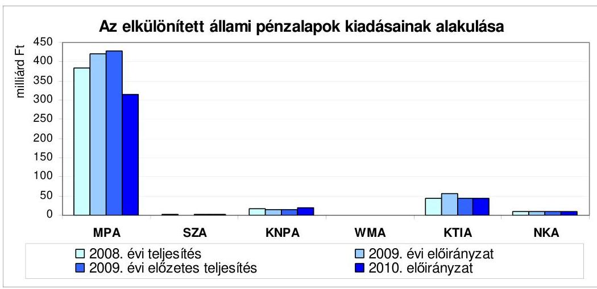

Költségvetése nagyságrendjét tekintve az alapok között változatlanul meghatározó a Munkaerőpiaci Alap, amely a foglalkoztatás elősegítésével és a munkanélküliség kezelésével kapcsolatos állami feladatokat az országosan kiépített munkaerőpiaci szervezeten keresztül látja el.

Ellenőrzéseink évek óta jelzik, hogy az MPA kiadásainak belső szerkezetében bekövetkezett változások egy része kedvezőtlen tendenciát mutat, az Alap költségvetési kapcsolatainak, jogszabályi hátterének felülvizsgálatát célzó javaslataink azonban csak részben találtak kedvező fogadtatásra.
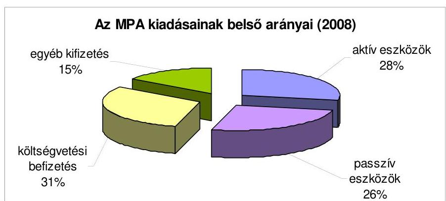

---

Az Alapból egyre nagyobb hányadot képeznek a Kvtv.-ben meghatározott pénzeszközátadások, az MPA-ból mind többet fordítanak a foglalkoztatáshoz közvetlenül vagy közvetve kötődő szervezetek, alapítványok, testületek működési kiadásainak finanszírozására.
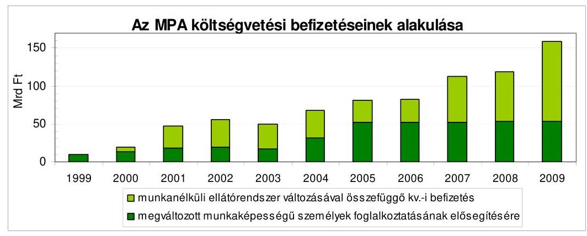

A foglalkoztatáspolitika aktív eszközeinek felhasználása az Alap költségvetésének új tagolása miatt átláthatóbbá vált, viszont az aktív foglalkoztatáspolitikai eszközökre fordítandó források változatlanul háttérbe szorulnak, foglalkoztatást befolyásoló hatásuk továbbra is nehezen követhető.

A foglalkoztatáspolitika passzív eszközrendszerébe tartozó kiadások teljesítése elmaradt a tervezettől, a pénzügyi válság munkaerőpiacra gyakorolt hatása 2008-ban érdemben még nem volt érezhető. Megtakarítás keletkezett a passzív ellátásoknál, az aktív eszközöknél, illetve a bérgarancia kifizetéseknél is. A 2010. évi költségvetési javaslatról szóló véleményben kiemeltük, hogy a munkanélküliség változása, a regisztrált munkanélküliek száma az MPA kiadásaira, az MPA-ból nyújtott álláskeresési támogatások kiadásainak alakulására nézve - tekintettel arra, hogy az álláskeresési támogatások előirányzatainak meghatározásánál azok 2009. évi szintjével számoltak - kockázati tényezőt jelent.

A többi elkülönített állami pénzalap (Szülőföld Alap, Központi Nukleáris Pénzügyi Alap, Nemzeti Kulturális Alap, Wesselényi Miklós Ár- és Belvízvédelmi Kártalanítási Alap, Kutatási és Technológiai Innovációs Alap) a Munkaerőpiaci Alaphoz képest kisebb jelentőséggel bír. Az alapok, ahogyan azt a 2010. évi költségvetési véleményben is kifejtettük, tervezési kockázatot súlyuknál fogva ugyan nem jelentenek, azonban a hozzájuk rendelt feladatok ellátása szempontjából, az alapokról szóló törvényekben rögzített céljaiknak megfelelően sajátos, egyedi feladatokat látnak el.

Az elkülönített állami pénzalapok működtetésének, ellenőrzésének rendszere különböző, pénzeszközeik felhasználásának ellenőrzése - a jogszabályi előírások ellenére - nem minden esetben biztosított. Az alapokat irányító szervek vezetőinek ezért javaslatot tettünk az alapok működtetésének és ellenőrzési rendszerének felülvizsgálatára, hogy a jogszabályban előírt hatáskörök érvényre juttatásával az ellenőrzési kötelezettségek teljesüljenek.

---

# 2.1.3. A társadalombiztosítás pénzügyi alapjai 

Az államháztartás társadalombiztosítási alrendszerének pénzügyi helyzete a 2009-ben lefolytatott ellenőrzések tapasztalatai alapján - az utóbbi években összességében javuló tendenciát mutat. A Nyugdíjbiztosítási Alapnál (Ny. Alap) negatív, az Egészségbiztosítási Alapnál (E. Alap) pozitív egyenleg alakult ki. Az alrendszer összevont hiánya - 67,5 Mrd Ft - az államháztartás egészének egyensúlyi helyzetét rontotta, a 2008. évi hiányt növelte.
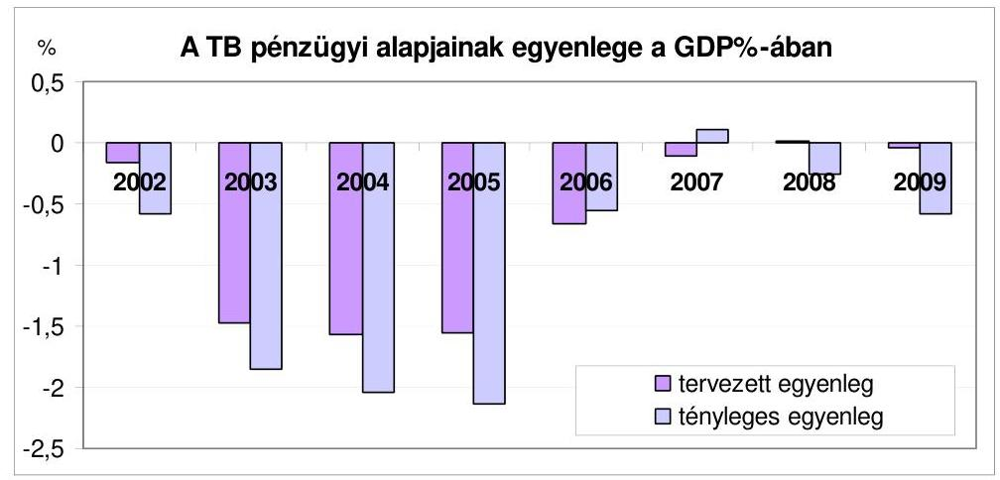

Forrás: zárszámadási törvények, KSH
A társadalombiztosítási alapok meghatározó bevételi forrásai a társadalombiztosítási járulékok és egyéni biztosítotti járulékok. Ezek együttes mértéke 2008-ban összességében változatlan volt. A járulékok megosztása a két alap között változott, a korhatár alatti rokkantnyugdíj fedezetét jelentő 3+1%-os járulék átcsoportosítás következtében.

Az alapokat megillető járulékbevételek továbbra is összevont számlára érkeznek, amely az átláthatóság követelményének nem felel meg. Az elmúlt években ezért javasoltuk a munkáltatói és biztosítotti járulékok külön-külön számlára történő befizetését, de a javaslat nem hasznosult. Az előkészítés 2008. évben megtörtént, de döntés nem született, ezért az összevont számlára történő befizetés 2009-re is fennállt, és 2010-re sem változott.

A 2010. évi költségvetési törvényjavaslatról szóló véleményünkben az alapok bevételi oldalán csökkenést valószínűsítettünk a munkaadókat terhelő társadalombiztosítási járulék mértékének több lépcsőben megvalósuló változása miatt. A kiadásokat kis mértékben a pénzbeli juttatások csökkentése fogja vissza, pl. a 13. havi nyugdíj megszüntetése, a táppénz mértékének csökkenése, a gyed, gyes szabályainak szigorítása.

Az Ny. Alap a 2008. évet 67,6 Mrd Ft hiánnyal zárta. Az Alapnak azért nem alakult ki egyensúlyi helyzete az év végére, mert a járulékbevételek növekedése nem teremtette meg a nyugdíjemelések fedezetét, és a központi költségvetés az előirányzottnál alacsonyabb térítést adott át a magánnyugdíjpénztár tagjai által fizetett tagdíj összegének pótlására. Az Alap saját tőke értéke továbbra is

---

negatív előjelű, ami a járulék-kintlévőség növekvő értékvesztésének következménye.

Az Ny. Alap kiadása, hiánya és közvetlen költségvetési támogatása

| Év | Hiány-   megtérítés | A központi   költségvetés   pénzátadása | Együtt   (2.+3.) | Ny. Alap   kiadási   főösszege | Index   (4./5.)   % |
| :--: | :--: | :--: | :--: | :--: | :--: |
| 1. | 2. | 3. | 4. | 5. | 6. |
| 2001 | 1,5 | 51,8 | 50,3 | 1175,1 | 4,3 |
| 2002 |

 $-14,2$ | 185,2 | 199,4 | 1405,9 | 14,2 |
| 2003 | $-39,0$ | 115,9 | 154,9 | 1540,1 | 10,1 |
| 2004 | $-80,2$ | 144,3 | 224,5 | 1707,0 | 13,2 |
| 2005 | $-93,5$ | 187,3 | 280,8 | 1916,0 | 14,7 |
| 2006 | $-19,5$ | 321,0 | 340,5 | 2113,1 | 16,1 |
| 2007* | 0 | 138,5 | 138,5 | 2354,1 | 5,9 |
| 2007 | 0 | 138,5 | 138,5 | 2642,6 | 5,2 |
| 2008 | $-67,6^{* *}$ | 143,4 | 211,0 | 2925,2 | 7,2 |
| 2009*** | $-7,2$ | 217,5 | 224,7 | 2866,8 | 7,8 |

* A korábbi évek adattartalmával azonosan, korábban az E. Alap által fedezett rokkantnyugdíjjal kapcsolatos kiadások nélkül.
** Ebből -9,1 Mrd Ft-ot a magánnyugdíj-pénztári tagdíj-megtérítési előirányzatánál kisebb összegű központi költségvetési pótlás eredményezett.
***Előzetes adat.
Az Alapot terhelő nyugellátásoknak az előirányzotthoz viszonyított eltérése a bevezetett nyugdíjszámítási szabályok változásának következménye, ami az automatizmusok csökkenő mértékű emelkedését eredményezte. A nyugellátásokat 2008-ban három alkalommal emelték, valamint teljesítették a 2008. január 1-jén esedékes korrekciós célú nyugdíjemeléseket is. A nyugdíjrendszer fenntarthatóságának érdekében megváltoztatott nyugdíj-megállapítási szabályok a nyugdíjkiadások 2009. évi csökkenésében már jelentkeznek.

A 2010. évi költségvetési törvényjavaslatról szóló véleményünkben jeleztük, hogy a nyugdíjrendszer szabályozásának módosulása, a rövid távon többletbevételt maga után vonó magánnyugdíjpénztári visszalépések miatt a költségvetés bevételeinek átmeneti növekedése várható, azonban a kiadások alakulására gyakorolt hatás még nem teljes körűen ismert. Az állami nyugdíjrendszerbe történő visszalépési lehetőséget biztosító új törvényi rendelkezés a költségvetés átláthatósága szempontjából különös figyelmet érdemel. A visszalépések következtében, a korábban a magánnyugdíj-pénztárakban felhalmozódott befizetések visszautalása teljes egészében az állami bevételeket növeli, ugyanakkor előre nem látható a várható nyugdíjkiadási többlet.

Az E. Alap költségvetési helyzetében létrejötte óta 2008 volt a második év, amikor az Alap nem hiánnyal, hanem 73,4 M Ft többlettel zárt, azonban ez az egyenleg 1,9 Mrd Ft-tal kevesebb volt az előirányzottnál.

---

Az Alap 2008. évi, lényegében „0" szaldós költségvetésében, illetve annak teljesítésében az alapvető szerepet a kiadások és a bevételek összhangjának megteremtésére irányuló intézkedések hozták. A járulékot nem fizetők utáni kötelezettség 2007. január 1-jétől rendeződött. A gyógyszerekért fizetett térítési díjak megemelkedése mellett, valamint a hatályba lépett gyógyszer-gazdaságossági törvény intézkedéseinek hatására stabilizálódott a gyógyszerkiadás.

Az Alap olyan kiadásokat is megtérített, amelyeket eredetileg központi költségvetési kiadásként terveztek, pl.: az egészségügyi intézmények bérpolitikai intézkedéseire kifizetett összeg. Ez az Alap ellátás-kiadási előirányzatai között nem szerepelt, külön soron, a céltartalék címen jelent meg. A gyed-kiadásokat korábban megtérítette a központi költségvetés, a 2008. évben csak a kiadások felét vállalta. Ugyanakkor a rokkantnyugdíjak finanszírozása kikerült az E. Alapból, és az ennek fedezetét biztosító bevételt is átcsoportosították a Ny. Alaphoz.

Az ellátórendszerben a fekvőbeteg-szakellátás 2007. évi átalakításának 2008. évi hatásai mellett nem került sor lényeges változtatásokra.

Az elmúlt másfél évtized tapasztalatai azt mutatták, hogy az Alap kiadásai között a legnagyobb kockázatot a gyógyszerkiadás jelentette. Ezen a területen a 2008. évben a kiadások stabilizálódása volt megfigyelhető, amiben jelentős szerepet játszott a versenyt élénkitő piaci helyzet, az adminisztratív szabályozás, valamint a keresleti oldal (orvos, gyógyszerész, beteg) költségtudatos választásának támogatása. A gyógyszerszektorban bevezetett intézkedések mintájára a gyógyászati segédeszközök körében is hasonló átalakítás valósult meg, azonban a hatásukra kialakult verseny jelentősen elmarad a gyógyszerszektorban tapasztalttól.

Az egészségügyi struktúra-átalakítás folyamatairól és a szükségesnek tartott korrekciókról az egészségügyi miniszter az egészségügyi ellátórendszer fejlesztéséről szóló törvényben előírt beszámolási kötelezettsége keretében adott tájékoztatást.

A 2010. évi költségvetési törvényjavaslatról szóló véleményünkben rögzítettük, hogy az Alap bevételi oldalán forráskivonást okozhat a munkáltatói természetbeni egészségbiztosítási járulékmérték csökkenése, és a tételes egészségügyi hozzájárulás megszűnése, de az esetleges pénzügyi problémák kezelésére a jogszabály a Kormány számára beavatkozási lehetőséget biztosít (az előirányzaton belül és azok közötti átcsoportosítások lehetőségein túlmenően az előirányzatok megemelésére is).

# Az elkülönített állami pénzalapokat és a társadalombiztosítás pénzügyi alapjait több jogszabályi változás érintette. Az alapok 2009. december 31-ig az államháztartás elkülönült alrendszerét alkották, az alapok beszámolóját könyvvizsgáló hitelesítette, az ÁSZ az alapokat egyéb szabályszerűségi ellenőrzés keretében vizsgálta. Az Áht. 2010. január 1-jétől hatályos módosítása ${ }^{4}$ 

[^0]
[^0]:    ${ }^{4}$ A takarékos állami gazdálkodásról és a költségvetési felelősségről 2008. évi LXXV. törvény 22. §-a.

---

alapján az alapok a központi alrendszer részét képezik, és a jogszabály módosítás értelmében ${ }^{5}$ az alapok beszámolójának ellenőrzését az ÁSZ által kidolgozott módszertan szerint kell végezni ${ }^{6}$.

# 2.1.4. A helyi önkormányzatok 

Az államháztartás önkormányzati alrendszerét 2009-ben 3194 helyi önkormányzat és 173 kistérségi társulás alkotta. Az állami feladatok felülvizsgálata, a nagy elosztórendszerek reformja, az államháztartás súlyának lényeges, további visszafogása évek óta napirenden lévő, még megoldatlan feladat. Az állami feladatok és azok végrehajtására rendelkezésre álló források közötti feszültségek fokozódásában - az ÁSZ tapasztalatai szerint - szerepet játszott többek között az önkormányzati kötelező feladatok és azok önkormányzati szintek közötti telepítésének kevésbé következetes meghatározása, a feladatok és a finanszírozás összehangolatlansága, még ha történtek is e területen előrelépések. Az Államreform keretében a közfeladatok áttekintése 2007-ben megtörtént (feladatkataszter), de ez sem hozott az önkormányzati feladat- és hatáskörökben elmozdulást.

Az önkormányzati forrásszabályozás rendszere az utóbbi években alapvetően nem változott. Továbbra is jellemző, hogy az önkormányzatok számára előírt új feladatok ellátásához a költségvetés nem biztosít megfelelő forrásokat. Az egyes támogatási, normatív hozzájárulási jogcímek megszüntetése, összevonása - az önkormányzatok mozgásterének bővítése szándékával - inkább technikai jellegű volt. Az önkormányzati feladat- és hatáskör, a finanszírozási rendszer átfogó felülvizsgálatának hiányában a különböző önkormányzati szintek költségvetési kockázatai továbbra is bizonytalanságot jelentenek.

A 2009. évi előzetes adatok szerint a helyi önkormányzati bevételek, a hitel- és értékpapír-műveletekkel együtt, 3572 Mrd Ft-ra teljesültek. Ezen belül a saját folyó bevételek dominanciája erősödött. Az állami támogatások és hozzájárulások (a normatívan elosztott átengedett személyi jövedelemadóval együtt is) visszaestek. A saját folyó bevételeken belül a helyi adók 16\%-ot (az iparűzési adó ennek 83\%-a) képviselnek. A saját bevételeken belül legjobban a kamatbevételek és az ÁFA-bevételek nőttek. Az intézmények a stagnáló gazdaságban nem tudták saját bevételeiket - alapvetően a különböző szolgáltatásokért fizetendő térítési díjat - növelni, így a működési bevételek a 2008. évivel hasonló

[^0]
[^0]:    ${ }^{5}$ A Magyar Köztársaság 2009. évi költségvetését megalapozó egyes törvények módosításáról szóló 2008. évi LXXXII. törvény 2. § (11) bekezdése módosította az Áht. 57. § (3) bekezdését, illetve a törvény 2. § (22) bekezdése az Áht. 86/A. § (2) bekezdését.
    ${ }^{6}$ A változás abban nyilvánul meg, hogy korábban a könyvvizsgálat az alapok bevételeiről és kiadásairól készült beszámoló és mérleg megbízhatóságáról, az adatok valódiságáról általánosan adott véleményt, a jogszabályváltozás következtében az alapok APEH által beszedett bevételeinek megbízhatóságáról az ÁSZ az általa végzett vizsgálat keretében győződik meg, és a könyvvizsgálók - az ÁSZ módszertan alapján - csak az alapoknak a nem az APEH által beszedett bevételeiről és az alapok kiadásainak teljes köréről mondanak véleményt. A 2008. évi LXXXII. törvény 29. § (8) bekezdése értelmében az ÁSZ módszertant először a 2009. évi költségvetés végrehajtásáról szóló zárszámadás során kell alkalmazni.

---

összegben realizálódtak. A felhalmozási és tőkejellegű bevételek között megjelenő, Európai Uniótól átvett felhalmozási célú pénzeszközök és a hazai társfinanszírozás együttes összege, az előzetes teljesítési adatok szerint, négyötszöröse az előző évekének (85 Mrd Ft), de mélyen alatta maradt az Országgyülés által tervezettnek (240 Mrd Ft).
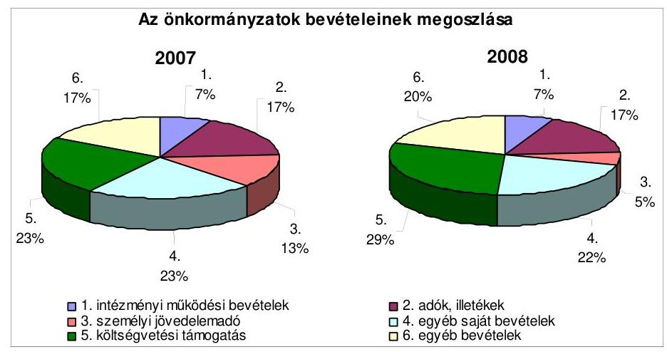

Az önkormányzatok költségcsökkentő intézkedéseinek hatására a kiadásokból a folyó működési kiadások részaránya csökkent, de így is közel kétharmad volt. Ezen belül a személyi juttatások részaránya is mérséklődött. A felhalmozási és tőkejellegű kiadások összege az előző évhez viszonyítva ugyan kismértékben emelkedett, az összes kiadáson belüli aránya (mintegy 16\%) azonban csökkent. A támogatásokra - különösen a szociálisan rászorultak részére - fordított kiadások jelentősen bővültek. A feladatok ellátásában 2008-ban 40 ezer köztisztviselő és 361 ezer teljes munkaidőben foglalkoztatott közalkalmazott vett részt.

Az önkormányzatok könyvviteli mérleg szerinti vagyona 2008 végére 2005-höz viszonyítva 12,6\%-kal nőtt. A könyvviteli mérleg szerinti vagyon értékének növekedését elsősorban az ingatlanok és a kapcsolódó vagyoni értékű jogok 8\%-os, a befektetett pénzügyi eszközök 7\%-os, valamint az üzemeltetésre, kezelésre, koncesszióba átadott, vagyonkezelésben lévő eszközök 23\%-os emelkedése eredményezte. A pénzeszközök év végi állománya 2005-höz viszonyítva 2008 végéig 126\%-kal nőtt, döntően a 2007. és 2008. évi kötvénykibocsátásokból származó bevételek következtében. A beruházások hatására növekvő ingatlanértékkel szemben kedvezőtlen, hogy évente nagymértékben növekedett a kötelezettségek év végi állománya, amelynek értéke 2008 végén a 2005. év végi érték kétszeresére emelkedett. A növekedés 87\%-át a hosszú lejáratú kötelezettségek, ennek 63\%-át a kötvénykibocsátások okozták. Az önkormányzatok 2008. év végi könyvviteli mérleg szerinti 1274,3 Mrd Ft hosszú és rövid lejáratú kötelezettségéből a kötvénykibocsátások miatti kötelezettségállomány összesen 444,7 Mrd Ft.

---

| A HELYI ÖNKORMÁNYZATOK KÖNYVVITELI MÉRLEG SZERINTI VAGYONA |  |  |  |  |
| :--: | :--: | :--: | :--: | :--: |
| Megnevezés | 2005 | 2006 | 2007 | 2008 |
| BEFEKTETETT ESZKÖZÖK | 9297 | 9746 | 9992 | 10244 |
| Immateriális javak | 21 | 25 | 26 | 25 |
| Tárgyi eszközök | 7238 | 7576 | 7688 | 7803 |
| Befektetett pénzügyi eszközök | 556 | 558 | 557 | 592 |
| Üzemeltetésre, kezelésre átadott eszközök | 1482 | 1587 | 1721 | 1824 |
| FORGÓESZKÖZÖK | 564 | 554 | 632 | 855 |
| ESZKÖZÖK ÖSSZESEN | 9861 | 10300 | 10624 | 11099 |
| KÖTELEZETTSÉGEK | 697 | 925 | 1088 | 1395 |
| SAJÁT VAGYON | 9164 | 9375 | 9536 | 9704 |

A 2005-2008. években az önkormányzatok több mint kétharmada költségvetési hiánnyal hagyta jóvá az éves költségvetését. Az ellenőrzött önkormányzatok közel négyötöde 2005-2008 között az évenkénti költségvetés megállapításakor - az Áht.-ban előírtak ellenére - a költségvetési hiány finanszírozásával kapcsolatos pénzügyi műveletek bevételeit költségvetési hiányt, illetve költségvetési többletet módosító költségvetési bevételként számolta el, ezáltal a költségvetési rendeletben nem mutatták be az önkormányzat valós pénzügyi helyzetét.

A költségvetés végrehajtása során a teljesített költségvetési bevételek az önkormányzatok tervezettnél jelentősen kisebb részénél (mintegy negyedénél) nem fedezték a költségvetési kiadásokat. A költségvetési hiány finanszírozásában szerepet játszó pénzügyi műveleteken belül csökkent a hitelt felvevő önkormányzatok száma a kötvénykibocsátás elterjedése következtében.

Önkormányzat kötvényt 2005-ben nem bocsátott ki, míg 2006-2008 között elsősorban a megyei, megyei jogú városi, Budapest
 fővárosi kerületi, városi önkormányzatoknál történt – döntően fejlesztési és adósságrendezési célra – kötvénykibocsátás. A kötvénykibocsátás legkisebb összege 0,2 Mrd Ft, legnagyobb összege 12 Mrd Ft volt. Az ellenőrzött önkormányzatok többsége a 2007–2008. évben deviza alapú, változó kamatozású kötvényt bocsátott ki, amelyek közel nyolctizedénél a futamidő 20 év volt. A kötvénykibocsátások az önkormányzatok fokozódó eladósodását okozták. Az ebből származó kötelezettség visszafizetését – a képviselő-testületi előterjesztések szerint – a működési célú költségvetési bevételből tervezték. Az ellenőrzött önkormányzatok a kötvénykibocsátásokhoz kapcsolódó tőke- és kamatfizetési kötelezettségvállalások során betartották az Ötv.-ben meghatározottak szerinti felső határt, annak átlagosan egyharmadáig vállaltak hosszú távra, évenkénti fizetési kötelezettséget. A kibocsátás első éveiben a kötvénykibocsátásból elért bevétel mintegy 95%-át betétként helyezték el, valamint rövid és hosszú lejáratú értékpapírok vásárlására fordították. A kötvénykibocsátás a visszafizetendő deviza árfolyamváltozása,

---

valamint a változó kamatfeltétel miatt az önkormányzatok számára kockázatot jelent ${ }^{7}$.
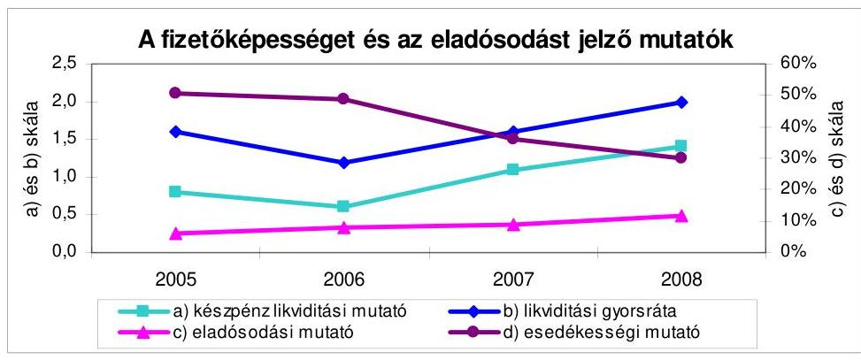

Az eladósodás az önkormányzatok pénzügyi helyzetét hosszú távon kedvezőtlenül befolyásolja. A pénzügyi mutatók együttesen rámutatnak az önkormányzatok fokozódó eladósodására, a pénzügyi helyzet kedvezőtlen irányú változására.

A költségvetésben jóváhagyott eredeti előirányzatokat az ellenőrzött önkormányzatok növekvő arányánál teljesítették túl. Az előirányzatok alul- vagy túlteljesítése a költségvetés tervezésének hiányosságára vezethető vissza. Az eredeti előirányzatok meghatározásánál az előző évek pénzmaradványának igénybevételét az áthúzódó kötelezettségek forrásaként az önkormányzatok kétharmadánál nem tervezték, ezáltal az indokoltnál nagyobb költségvetési hiányt állapítottak meg költségvetési rendeleteikben.

Az ellenőrzött önkormányzatok közel fele meghatározta az informatikai stratégiáját. A korszerű, hatékony és átlátható e-közszolgáltatás kialakításához és működtetéséhez szükséges feltételek biztosítása érdekében az önkormányzatok közel egyharmada európai uniós támogatásra nyújtott be pályázatot. Az ellenőrzött önkormányzatok mintegy 90%-ánál működtettek e-közszolgáltatásokat biztosító informatikai rendszert.

A közérdekű adatok elektronikus közzététele 2008. július 1-jétől kötelező, ennek ellenére a közzétételi listákat az ellenőrzött önkormányzatok háromnegyedénél a jegyző nem jelentette meg a jogszabályban előírt szerkezetben és tartalommal.

A költségvetési gazdálkodás kontrolljainak kialakítására, működésére irányuló ellenőrzés során megállapítottuk, hogy a költségvetés tervezési és a zárszámadás készítési folyamatok szabályozottsága az önkormányzatok több mint felénél összességében alacsony kockázatot jelentett a feladatok megfelelő és szabályszerű végrehajtásában, mivel a jegyzők – a korábbi években tett javaslatainkat hasznosítva – az Ámr. előírásainak és a helyi sajátosságoknak megfelelően kialakították a tervezési és a zárszámadás készítési feladatok belső kontrolljait. A tervezési és a zárszámadás készítési feladatok belső kontrolljainak kialakítására vonatkozó kötelezettség teljesítését a jegyzők az előző évhez hasonló arányban, az önkormányzatok közel negyedénél elmulasztották, ezért a szabályozás hiányosságai magas kockázatot jelentettek a feladatok megfelelő és szabályszerű végrehajtásában. A költségvetés tervezés és a zárszámadás készítés folyamatában kialakított kontrollok működésének megbízhatósága volt az ellenőrzött önkormányzatok 33%-ánál összességében kiválóan, 25%-ánál jól működtek, a megállapított hiányosságok ellenére kielégítették a célszerűségi elvárásokat a működésbeli hibák megelőzése, feltárása és kijavítása tekintetében. A többi önkormányzatnál az Áht.-ban foglalt előírások ellenére elmulasztották a költségvetés tervezés és a zárszámadás készítés ellenőrzését, ezért a kontrollok működésének megbízhatósága gyenge volt.

A gazdálkodási, a pénzügyi-számviteli és a folyamatba épített ellenőrzési feladatok szabályozottsága az önkormányzatok 30%-ánál összességében alacsony kockázatot jelentett a feladatok megfelelő és szabályszerű végrehajtásában, mivel a belső kontrolltevékenységeket a jegyzők a jogszabályi előírásoknak és a helyi sajátosságoknak megfelelően kialakították. Az önkormányzatok 46%-ánál a szabályozás hiányosságai közepes kockázatot jelentettek, azonban a kialakított belső kontrollok – megfelelő működtetésük esetén – a lehetséges hibák többsége ellen védelmet nyújtottak. A belső kontrollok kialakítására vonatkozó kötelezettségük teljesítését az önkormányzatok 24%-ánál, előző évhez képest csökkenő hányadánál, a jegyzők elmulasztották, ezáltal a szabályozás hiányosságai a gazdálkodási feladatok megfelelő és szabályszerű végrehajtásában magas kockázatot jelentettek.

Az önkormányzati hivatalok mintegy egyharmada – az Ámr. előírása ellenére – a képviselő-testület által jóváhagyott SzMSz-szel nem rendelkezett, egynegyedénél a gazdasági szervezet által ellátandó feladatok szabályozására nem készítettek ügyrendet. Az üzemeltetésre, kezelésre átadott eszközök leltározásának módját, valamint ezen eszközök selejtezésével, hasznosításával kapcsolatos döntéshozatalra jogosultak körét – az évek óta tett javaslataink ellenére – az önkormányzatok még mindig indokolatlanul magas arányánál – mintegy felénél – nem határozták meg. Az önköltségszámítás rendjét az önkormányzatok közel kétharmadánál nem szabályozták. A FEUVE rendszerét az Áht. és az Ámr. előírásai ellenére még mindig hiányosan alakították ki a jegyzők.

A szakmai teljesítésigazolás és az utalvány ellenjegyzés működésének megbízhatósága az ellenőrzött önkormányzati hivatalok előző évinél nagyobb arányánál volt gyenge, mert a folyamatba épített ellenőrzési feladatok teljesítését elmulasztották. Ezeknél az önkormányzatoknál a belső kontrollok működésével kapcsolatban megállapított hiányosságok, mulasztások rendszeresek voltak, egy-egy gazdasági esemény folyamatában egyidejűleg több kontroll végrehajtása maradt el. Az önkormányzatok közel kétharmadánál a kiadások jogosultságának, összegszerűségének ellenőrzését, valamint a szerződések, megrendelések, megállapodások teljesítésének szakmai igazolását a kijelölt személyek nem, vagy nem az előírásoknak megfelelően végezték el. Az utalvány ellenjegyzés ellenőrzési feladatait az önkormányzatok mintegy kétharmadánál nem végezték el. Az utalványok ellenjegyzése az önkormányzatok mintegy felénél

---

formai volt, mivel az ellenjegyzők nem észrevételezték a hiányosságokat. A kötelezettségvállalások során tapasztalataink szerint bizonytalanságot okoztak az önkormányzati hivataloknál a Htv., az Áht. és az Ámr. – kötelezettségvállalásra jogosultak körének meghatározására irányuló – eltérő rendelkezései.

A belső kontrollok működésének hiányosságai következtében az önkormányzatok mintegy tizedénél nem a szerződésben meghatározott összeget fizették ki, illetve nem a jogosult részére teljesítettek kifizetést, továbbá ugyanilyen arányuknál előirányzat nélküli kötelezettségvállalások alapján teljesítettek kiadásokat.

A belső ellenőrzés szervezeti kereteinek kialakításánál, szabályozásánál és működésénél a korábbi évekhez viszonyítva előrelépés volt tapasztalható, különösen a feladatok megszervezésénél, a működéshez szükséges személyi, szervezeti, szabályozási feltételek biztosításánál. A belső ellenőrzés szervezeti kereteinek kialakítása és szabályozása az ellenőrzött önkormányzatok felénél összességében alacsony kockázatot jelentett a belső ellenőrzés szabályszerű végrehajtásában, mivel meghatározták a belső ellenőrzés szervezeti kereteit, szabályozták működésének feltételeit. A belső ellenőrzési tevékenység szervezeti kereteinek kialakítása, illetve szabályozásának hiányosságai az önkormányzatok 47%-ánál közepes, 3%-ánál magas kockázatot jelentettek a feladatok megfelelő végrehajtásában. A közepes, illetve magas kockázatot az okozta, hogy az ellenőrzést végző személy, szervezet jogállását, feladatait hiányosan határozták meg, a belső ellenőrzést külső szolgáltatóval – társulással, vállalkozóval – megszervező önkormányzatok esetében a megállapodások háromnegyedében nem rendelkeztek a belső ellenőrzési vezetői feladatokról, annak ellátási módjáról, az ellenőrzési feladatok tervezését nem, vagy nem a jogszabályban előírtaknak megfelelően tervezték. A belső ellenőrzés működésének megbízhatósága az önkormányzatok 14%-ánál összességében kiváló, több mint felénél jó volt. Az önkormányzatok egyharmadánál gyenge volt a belső ellenőrzés működésének megbízhatósága, mert az ellenőrzési tervben foglalt feladatokat hiányosan teljesítették, a tervezett ellenőrzési feladatok ellátásához szükséges belső ellenőri kapacitás nem állt rendelkezésre. A társulások az éves ellenőrzési terv végrehajtásáról, valamint az abban foglaltaktól történő eltérésről év közben az érintett önkormányzat jegyzőjét nem tájékoztatták, illetve a jegyző és a képviselőtestület előzetes egyetértése nélkül tértek el az éves ellenőrzési tervben foglaltaktól.

A belső ellenőrzés keretében a FEUVE rendszerek kiépítésének és működésének központi és helyi szabályoknak való megfelelését az önkormányzatok kétharmadánál nem ellenőrizték, háromnegyedüknél pedig elmaradt a pénzügyi irányítási és ellenőrzési rendszer működésének gazdaságossági, hatékonysági és eredményességi ellenőrzése. A közbeszerzési eljárást lefolytató önkormányzatok háromnegyede nem végeztette el a közbeszerzési eljárások végrehajtásának, továbbá a gazdasági társasággal rendelkező önkormányzatok többségi irányítást biztosító befolyása alatt működő gazdasági társaságoknál, közhasznú társaságoknál a rendelkezésre álló erőforrásokkal való gazdálkodásnak, a vagyon megóvásának, az elszámolások megbízhatóságának az ellenőrzését. A belső ellenőrzést végzők az önkormányzatok 5%-ánál tártak fel fegyelmi eljárás megindítására okot adó cselekményt.

---

A Magyar Köztársaság 2008. évi költségvetése végrehajtásának ellenőrzése során a normatív hozzájárulás, az átengedett személyi jövedelemadó és a többcélú kistérségi társulásoknak járó normatív, kötött felhasználású támogatás elszámolását 71 önkormányzatnál és 16 többcélú kistérségi társulásnál, a felhalmozási célú támogatásokat 30 önkormányzatnál ellenőriztük. A normatív hozzájárulással elszámoló önkormányzatok és többcélú kistérségi társulások 28%-a nyújtott be hibátlan elszámolást, a normatív kötött felhasználású támogatással elszámoló többcélú kistérségi társulások egyike sem. A normatív hozzájárulásnál a lényegességi küszöböt (2%) meghaladó elszámolási hibát négy önkormányzat esetében állapítottunk meg. Az önkormányzatok közoktatási célú feladatainak finanszírozása a 2007. évtől új alapokra helyeződött, miszerint nem költségvetési éven belül, hanem tanévre garantált a normatívák igénylési feltételrendszere és a hozzájuk rendelt fajlagos mérték. A közoktatási támogatások, hozzájárulások igénylésénél és az elszámolásnál a 2007. évtől két év költségvetési törvényének előírásait kellett figyelembe venni, ami az elszámolási kódszámok további növekedését (a 2008. évi elszámolásnál 242 kód az előző évi 230-cal szemben) eredményezte. A többcélú kistérségi társulások ösztönző támogatását bonyolult szabályozási feltételek mellett nyújtotta a központi költségvetés. A közös feladatellátást szervező tevékenységével is biztosíthatta a többcélú kistérségi társulás, amelynek konkrét tartalmát nem szabályozták. A támogatás igénylése és elszámolása az ÖM által kidolgozott adatbázis rendszerben történt, mely terjedelmes és nehezen áttekinthető volt, számítási módszere a mutatószámok kerekítésére vonatkozó szabályok tekintetében nem volt összhangban a 2008. évi Kvtv. előírásaival.

A minisztériumoknál az önkormányzatokat megillető támogatások rendjének szabályozása, a támogatások odaítélése, elszámoltatása ellenőrzése során megállapítottuk, hogy az ÖM úgy juttatott az önkormányzatoknak a 2008. év utolsó időszakában támogatást, hogy a pénzügyi folyósítást megelőzően a támogatásokra szerződéseket nem kötött. Nem tartotta be az adott központosított előirányzat igénybevételi feltételének, döntési rendjének, folyósításának, felhasználásának, elszámolásának részletes szabályairól szóló rendelet kiadásának a 2008. évi Kvtv.-ben meghatározott határidejét az önkormányzati miniszter négy jogcím esetében, az oktatási és kulturális miniszter három jogcím esetében, továbbá a közlekedési, hírközlési és energiaügyi miniszter, a környezetvédelmi és vízügyi miniszter és a szociális és munkaügyi miniszter egy-egy jogcím esetében. Továbbra sem szabályozták egyértelműen a működésképtelen önkormányzatok egyéb támogatására vonatkozóan a méltánylást érdemlő körülmény lehetséges eseteit.

Az egyes hatósági díjak megállapítására irányuló tevékenység ellenőrzése során megállapítottuk, hogy a Fővárosi Önkormányzat, mint árhatóság nem rendelkezett díjkoncepcióval, nem határozta meg a közszolgáltatások hatósági díj képzésének általános, valamint az egyes közszolgáltatásokra vonatkozó sajátos, közép és hosszú távon érvényesítendő elveit. A közszolgáltatás ellátására kötött szerződésekben, együttműködési megállapodásban nem adott útmutatást a közszolgáltató társaságoknak az önköltség-számítás előírásainak, tartalmának kialakításához. A távhő-, a vízszolgáltatás, a szennyvízelvezetés, a szilárd- és a folyékonyhulladék-kezelés, valamint a kéményseprő-ipari közszolgáltatások hatósági díjai egyaránt tartalmaztak a közszolgáltatáshoz közvetlenül, illetve közvetett módon nem kapcsolódó költségeket.

---

A közszolgáltatások fejlesztése fedezetéül szolgáló adott évi értékcsökkenési leírás összege, a közszolgáltatás nyeresége, a felvett fejlesztési célú hitel, illetve támogatás helyett a távhődíjban a fejlesztési hányadot önálló díjelemként tervezték, annak ellenére, hogy a FŐTÁV Zrt. külön nyereség díjelemet is képzett. A Fővárosi Önkormányzat a szennyvízelvezetés közszolgáltatásnál a tervezett önkormányzati beruházások
 saját forrásigényét fejlesztési hányadként építtette be a hatósági díjba. A Fővárosi Önkormányzat a távhődíj és a csatornahasználati díjban a fejlesztési hányad jóváhagyására vonatkozó döntésénél nem érvényesítette a fogyasztók érdekeit, mivel a nyereség helyett önálló díjelemként hagyta jóvá a fejlesztések fedezetét. A FŐTÁV Zrt., a Vízművek Zrt., a Csatornázási Művek Zrt., valamint a Fővárosi Közterület-fenntartó Zrt. évente a Fővárosi Önkormányzat Közgyűlése által meghatározott összeget - a 2007. évre 2012 M Ft-ot, a 2008. évre 1846 M Ft-ot - fizetett be a Hálózat Alapítványba. A Fővárosi Önkormányzat a Hálózat Alapítványnak átutalandó összeg meghatározására vonatkozó döntésénél nem érvényesítette a fogyasztók érdekeit, mivel a lakossági fogyasztók fizetőképessége fenntartásának teljes terhét - a közszolgáltatók, a Fővárosi Önkormányzat, és a fogyasztók közötti megosztás helyett - a fizető fogyasztókra hárította. Minősítésünk szerint a Fővárosi Önkormányzat nem járt el megfelelő gondossággal a hatósági díjak megállapításánál.

A fővárosi önkormányzatot és a kerületi önkormányzatokat osztottan megillető bevételek 2009. évi megosztásáról szóló önkormányzati rendelet felülvizsgálata keretében megállapítottuk, hogy a forrásmegosztási törvény az Ötv. megosztandó bevételek körére és a megosztás módjára vonatkozó előírásait figyelmen kívül hagyva, azzal ellentétes, illetve annak nem megfelelő előírásokat tartalmazott. A forrásmegosztási törvény a fővárosi önkormányzatokat megillető bevételek százalékos megosztásával korlátozta a Közgyűlés Ötv. felhatalmazásán alapuló jogkörét, amely a megosztási arányok meghatározására vonatkozott. A forrásmegosztási rendelet megalkotásánál a forrásmegosztási törvény előírásait alkalmazták, az Ötv. rendelkezéseit figyelmen kívül hagyták. A forrásmegosztási törvény 2009. évi módosítása megváltoztatta az „állandó népesség” meghatározását, azonban továbbra sem teljesült az összhang a költségvetési törvényben a normatív hozzájárulások összegének megállapításánál alkalmazott lakosságszám adattal. A forrásmegosztási rendelet a 2009. évi módosító törvényben foglaltaknak megfelelően osztotta meg az állandó népességhez kapcsolódó normatív hozzájárulásból származó bevételt.

# 2.2. Az állami és az önkormányzati feladatellátásra irányuló ellenőrzések főbb tapasztalatai 

Rendszer szemléletű megközelítésben először 2009-ben vizsgáltuk a központi közigazgatás fejlesztését. A központi közigazgatás modernizációjának folyamatát 2006-tól tekintettük át és értékeltük. Ellenőrzési tapasztalataink alapján a közigazgatásról 2008-ra felvázolható helyzetkép a 2006. évihez képest előrelépést mutat. A modernizációt akadályozó hiányosságokat a Kormány 2006 közepén kezdeményezett intézkedései a következő két évben csak részben pótolták, illetve azok a megkezdett fejlesztések hatására teljesülnek. Megállapítottuk, hogy a 2006 előtti időszak legfontosabb hiányossága - a tervezés és a stratégiaalkotás, az előzetes és utólagos hatásvizsgálat szabályozási és szervezeti kereteinek megteremtése - terén nem történt érdemi előrehaladás.

---

Az egyes intézkedések ütemezése, megvalósulása, a szakmai összefüggések feltárása nem rendszerszerűen valósult meg. Gyakran helytelenül mérték fel a programok beindításának és befejezésének idejét. Nem segítette a modernizációs folyamatot, hogy annak kormányzati felelősségi rendszere folyamatosan változott. A tárcák egyes funkcióinak egységesítése csupán az üzemeltetési/ellátási feladatok esetében valósult meg. A tevékenység központosításától várt költséghatékonyság, fontos döntések elmaradása miatt, több területen nem érvényesült.

A humánerőforrás-gazdálkodás fejlesztésében fokozatosan és folyamatosan történt az új alapokon álló köztisztviselői teljesítményértékelés, a szigorúbb kiválasztási rendszer és a rugalmasabb jogviszony-megszüntetést szolgáló intézkedések bevezetése. A pályázati kötelezettség kiszélesítésének, a versenyalapú kiválasztásnak, a próbaidő kötelező előírásának, a felmentési szabályok harmonizálásának bevezetése, működtetése folyamatosan megtörtént, de ezek hatása a hatékonyság növekedésében, a megtakarításokban még nem érzékelhető.

A közigazgatás modernizációja az Új Magyarország Fejlesztési Terv két operatív programját foglalja magába: az Államreform Operatív Programot (ÁROP) és az Elektronikus Közigazgatás Operatív Programot (EKOP).

Az ÁROP projektjei közül több késik a kormányzaton belüli 2008-as feladatátrendezés miatt, illetve az eredetileg tervezetthez képest kevésbé átfogó eredményt hozott. Nem újult meg a tárcáknál a szervezet- és folyamatfejlesztés, és továbbra sem kap kellő figyelmet a minőségbiztosítás. Az EKOP projektjei milliárdos nagyságrendűek, szervezetileg-műszakilag komplexek, egymással összefüggőek. Szükséges lenne azonban, hogy a közöttük levő szakmai-technikai koherenciáért felelős Nemzeti Fejlesztési Ügynökség és az informatikáért felelős kormánybiztos között a feladat- és hatáskör megosztás intézményesítetten biztosított legyen.

2009-ben először vizsgáltuk rendszerszemléletű megközelítésben a közpénzekkel történő hatékony és ellenőrizhető gazdálkodás céljából létrehozott kincstári rendszert. Korábbi ellenőrzéseink csak a rendszer működésének egyes területeire terjedtek ki. A kincstári rendszernek a pénzügyminiszter felelősségi körébe tartozó szervezetei: a költségvetés pénzügyi végrehajtását főfeladatként végző Magyar Államkincstár (Kincstár) és a költségvetés folyamatos fizetőképességéért felelős Államadósság Kezelő Központ Zrt. (ÁKK Zrt.).

A kincstári rendszerbe az államháztartás alrendszereinek és gazdálkodási folyamatainak egyre szélesebb körét vonták be, növelve ezzel az átláthatóságot, az ellenőrizhetőséget. Az önkormányzati alrendszer ugyanakkor ellenőrzésünk idején is csak részlegesen kapcsolódott a rendszerhez. Az alrendszernek - az önkormányzatokra vonatkozó szabályozás változását igénylő - teljesebb körű bevonása hozzájárulhat az államháztartás hatékonyabb működéséhez, egyben ezen a területen a korrupciós kockázatok mérsékléséhez.

Ellenőrzésünk megállapította, hogy a létszámcsökkentéseket és a szervezeti változásokat kivéve, kormányzati szinten nem fogalmazták meg az államháztartás érdekeit képviselő makro-, közép-, illetve az intézményi szint közötti jog- és hatáskörök célszerűbb megosztása rendszerszemléletű áttekintésének szüksé-

---

gességét. A kincstári rendszerrel kapcsolatban álló intézményekre vonatkozó szabályozásban az eltérő előírások, az indokolatlan kivételek nagy száma jelentősen korlátozza az államháztartás hatékony működését. Az egyes folyamatokat támogató kincstári informatikai rendszereknél, illetve azok fejlesztésénél is hiányoztak a központilag meghatározott stratégiák. Az informatikai rendszerek összehangolatlan fejlesztése, az egyenetlen és eltérő színvonalú megoldások alkalmazása volt a jellemző. A szakmai munka megbízhatósága szempontjából kockázatot jelentettek és többletköltséget okoztak, hogy a kincstári információs alrendszerek adattartalmának felmérése, rendszerezése, biztonsági szempontú kategóriákba sorolása évek óta visszatérő, a helyszíni ellenőrzés idején is még csak folyamatban lévő feladat volt.

A közel 4 ezer főt foglalkoztató, területi hálózattal rendelkező Kincstár folyamatosan szélesedő feladatrendszere különösen indokolttá teszi a Pénzügyminisztérium irányítási tevékenységének erősítését, a Kincstáron kívüli szakmai koordináció biztosítását, a szervezeten belüli tevékenység szorosabb felügyeletét.

A pénzeszközök optimális szinten való biztosítása/tartása (likviditáskezelés) az ÁKK Zrt. és a Kincstár összehangolt és egymásra épülő feladatainak eredménye. A kifizetések teljesítésének optimalizálását korlátozza, hogy a Kincstár a kincstári kör egészét magában foglaló fizetőképesség menedzseléshez nem rendelkezik jogszabályi felhatalmazással, technikai feltételekkel, illetve a szükséges részletezettségű információkkal. Többletterhet jelent a költségvetés finanszírozása szempontjából, hogy a meghatározó nagyságrendű költségvetési bevételek beérkezésének és a kifizetések teljesítésének havi időpontjai eltérnek egymástól.

A Kincstár szakmai felelősként vesz részt a rendkívül jelentős uniós forrás biztosításával megkezdett Költségvetési Gazdálkodási Rendszer (KGR) kidolgozásában. Az uniós projektként megvalósuló KGR céljai szerint hozzájárul a megalapozottabb döntéshozatal, a hatékonyabb kincstári működés informatikai alapjának biztosításához. A projekt előkészítésekor jelentkező kedvezőtlen jelenségek időközben megoldódtak, melyben szerepe volt a korábbi vizsgálatunk során tett javaslatainknak is.

A kormányprogramok, a konvergencia-program és a Nemzeti Fejlesztési Terv az ellenőrzött, 2000-2007 közötti időszakban, általános lakástámogatási célkitűzéseket tartalmaztak, de teljes körű, a lakástámogatási rendszer számszerűsített céljait tartalmazó nemzeti lakáspolitikai program nem készült. A lakástámogatási rendszer működését, a lakáspolitikai célkitűzések megvalósulását, a megtett intézkedések, változtatások hatásait a Kormány átfogóan nem értékelte. A 2000-től bevezetett lakástámogatási rendszer működésében az állami szerepvállalás irányai, célkitűzései alapjaiban nem változtak.

A támogatási rendszer rövid távú céljai - a lakásépítések számának emelése, a lakáshitelezés fellendítése, a bérlakás állomány növelése - teljesültek. Az engedélyezett, államilag támogatott lakáscélú hitelek száma és összege 2003-ig emelkedett, majd 2008-ra az összes engedélyezett hitelállományon belül a számuk is és értékük is csökkent. A csökkenést a devizahitelek 2004-től bekövetkezett előretörése okozta.

---

A devizahitelezés növekedésében szerepet játszott, hogy 2003-ban a lakáscélú állami támogatásokat szigorították, és megváltozott a lakáshitelekhez nyújtott kamattámogatás alapja és mértéke. Ennek következtében megnőtt a támogatott hiteleknél az ügyfél által fizetendő kamat. A kamattámogatás számítása megváltoztatásának az is célja volt, hogy a hitelintézeti kamatkülönbözetet szűkítsék. A kitűzött cél teljesült, ugyanakkor a hitelintézetek a hitelkamatok csökkenését a költségek és díjak emelésével kompenzálták.

A lakáscélú támogatásokat szabályozó kormányrendelet 2001 februárjától 2008 júniusáig 25 alkalommal módosult, ami nem segítette a lakástámogatási rendszer kiszámíthatóságát, kezelhetőségét. A lakáspolitikával kapcsolatos feladatokat ellátó szervezeti rendszer nem volt stabil. Nehezítette a szakmai, elemző és értékelő munkát, hogy 2000-től 2008 májusáig öt minisztérium látta el a lakáspolitikával kapcsolatos kormányzati feladatokat.

A pályázati típusú lakástámogatási rendszernél a pályázatok meghirdetése esetleges volt, a meghirdetésre vonatkozó miniszteri döntések nem dokumentáltak, a támogatással elérendő számszerűsített célokat nem határoztak meg és azok teljesülését nyomon követő monitoring rendszert nem alakítottak ki.

Az elkülönített állami pénzalapok rendszerének, a pályázati célok teljesülésének ellenőrzése megállapította, hogy a jogalkotás törvényi szinten nem volt következetes, így egyes alapokhoz nem rendeltek célzott adójellegű bevételt. Költségvetési támogatásban két alap részesül. A pénzeszközök felhasználásának egyes szabályait a költségvetési törvények rendre felülírták. Korlátozták a bevétel szakmai célú felhasználását, és több éven át megakadályozták a tartalék igénybevételét. A szabályozás szükségszerűen a tárgyévi bevételek elköltésére ösztönzött. Az alapok működése elkülönült forrásaik ellenére nem volt független a központi költségvetés alakulásától.

Az alapokból a működés kiadásai is finanszírozhatók. Az alapkezelés költségei nem állapíthatók meg, mert az egyéb tevékenységet is végző alapkezelők ezen költségeiket nem különítették el nyilvántartásukban. Az állami feladat alapból és azon kívüli, valamint a költségvetési szervezetek központi költségvetésen és alapokon keresztüli, párhuzamos finanszírozása rontotta a költségvetés átláthatóságát, akadályozta a feladatalapú költségvetés bevezetését.

Az alapokra vonatkozó szabályozásra jellemző a jogszabályok többszörös, érdemi módosítása. A rendelkező miniszter személyének gyakori változtatása, az ezzel összefüggő, vagy ettől független szervezeti módosulások nehezítették a napi munka folytonosságát, valamint a folyamatok nyomon követését, a felhasználás pénzügyi és szakmai ellenőrzését, és a felelősség megállapítását.

Az alappal rendelkező miniszter a szakterület kormányzati felelőse. Az irányítása, vezetése alatt álló minisztérium (kormányhivatal) szakmai tevékenysége befolyással bír az alap működésére, a pénzeszközök felhasználására. A miniszter a döntési hatáskörébe tartozó támogatásokkal (egyedi döntések), illetve a testületi tagok megbízásával és visszahívásával közvetlen beavatkozási lehetőséggel bír az „elkülönített” alap működésére.

---

A törvényalkotó azon döntését, mely szerint az állami feladatok közül hat feladatcsoport finanszírozására hozott létre állami pénzalapot, nem előzte meg az alap működésétől elvárt eredmények, hatások előzetes felmérése. Elmaradt az alapok működésének értékelésénél a szakmai, gazdasági kritériumok meghatározása. Szükséges lenne, hogy az Országgyűlés négyévente értékelje az egyes elkülönített állami pénzalapok működésének indokoltságát és ennek ismeretében hozzon döntést az alap további működéséről.

A felsőoktatásról szóló törvény súlyponti előírásainak - ágazati irányítás, képzési rendszer, finanszírozás-gazdálkodás - rendszerszemléletű ellenőrzését a 2005-2008 közötti időszakra végeztük el. A 2005-ben hatályba lépő törvényi szabályozást nem előzte meg átfogó, közép- és hosszú távú felsőoktatási stratégia elkészítése, csak koncepcionális szakmai programok kimunkálása. A felsőoktatás rendszere túlszabályozott, a törvény mellett azt több mint 30 kormányrendelet és miniszteri rendelet szabályozza gyakori módosításokkal. A törvényt megalapozó szakmai programok nem számoltak kellő mértékben a demográfiai helyzetből adódó hallgatói létszámcsökkenéssel, valamint a létszám és az oktatási kapacitások közötti harmónia megteremtésének szükségességével.

Összhangban a felsőoktatás ágazati céljaival, a törvény végrehajtásaként megtörtént a többciklusú képzési rendszerre való átállás, amely azonban nem volt
 kellően előkészített. Az alap- és mesterképzés kialakítása időben eltért egymástól, ami megnehezítette az egymásra épülő szakstruktúra létrehozását.

A képzési szerkezet munkaerő-piaci prognózisok hiányában nem felel meg a munkaerő-piaci igényeknek. Az elhelyezkedést közvetítő szervezetek a pedagógus-, közgazdász- és menedzserszakokon, a jogász- és bölcsész szakokon túlkínálatot jeleztek 2008 végén. Nem történt érdemi előrelépés a törvény által előírt, a felsőoktatás és a munkaerő-piac kapcsolatát segítő diplomás pályakövetési rendszer kialakításában.

A törvényi szabályozás biztosította tizenkét féléves képzési idő nem ösztönzi a hallgatókat tanulmányaik mielőbbi elvégzésére. Ez pazarló állami támogatást jelent és a hallgatói teljesítmények színvonalának csökkenését eredményezi. Az ellenőrzött időszak éveiben több tízezres létszámkülönbség mutatkozott az utolsó évfolyamos és a diplomát szerző hallgatók száma között. A felsőoktatásról teljes körű adatszolgáltatást előirányozó felsőoktatási információs rendszer működése - 28%-os intézményi adatfeltöltöttségével - az állami támogatás ellenére sem tekinthető eredményesnek, mert használhatósága erősen korlátozott.

A felsőoktatási törvény előírásai szerint a felsőoktatás finanszírozása többcsatornás rendszerben valósult meg. A normatívák meghatározása nem a képzéshez szükséges költségek vagy teljesítmény-követelmények alapján történik, hanem bázisalapú finanszírozásként a hallgatói létszámhoz rendelten működik. A finanszírozásra vonatkozó jogszabályok az ellenőrzött időszakban többször változtak. Az intézményi teljesítmény-követelmények nem egységesek, nem összehasonlíthatóak. A támogatások reálértékének megőrzésére irányuló állami kötelezettségvállalások nem teljesültek.

---

Az új szabályozással kialakított képzési rendszer, működési rend teljes átalakítása még nem fejeződött be, jelenlegi stádiumában eredményesség- és hatékonyságcsökkenést mutat. A finanszírozás és a gazdálkodás szabályozása nem érte el a kitűzött versenyképességi célokat.

Egyes kórházi tevékenységek kiszervezésének ellenőrzése során a magánszférával létesített partnerségi kapcsolat mértékét, formáit és szabályozottságát kívántuk feltárni. Megállapítottuk, hogy nincs az ágazatnak a magántőke és magánvállalkozások lehetséges méretét, szerepét, szakmai területeit meghatározó stratégiája. Nem gondoskodtak a kórházi kiszervezések törvényi szintű szabályozásáról. A fekvőbeteg ellátások Egészségbiztosítási Alapból származó GDP-arányos kiadása 2008-ra csökkent. A kórházi menedzsmentek, illetve a tulajdonos önkormányzatok a finanszírozási-működtetési nehézségek fokozódására a magánvállalkozások, a magántőke egyre növekvő bevonásával reagáltak. Növelték egyes kórházi-háttértevékenységek kiszervezését, az orvosok közreműködői szerződéssel való foglalkoztatását, illetve a teljes kórház-üzem magánműködtetésbe adását.

Megállapítottuk, hogy a működtetők szerződésben vállalt kötelezettségeiket - a működés stabilitása, a megvalósított beruházások és az ellátás minőségének javulása terén - csak részben valósították meg. A működtető társaságok valós pénzügyi helyzetének átláthatósága, stabilitásának megítélése bonyolultabbá vált, ami növelte az üzemeltetés kockázatát. Az önkormányzatok nem kérték számon a működtetőtől az ellátás szakmai színvonalát.

Az amortizáció finanszírozatlanságából fakadó hiányt a magánműködtetésbe adással járó hatékonyabb gazdálkodás sem tudta megszüntetni. A magántőkebevonással végrehajtott beruházások a megtérülést a magasabb színvonalú és széleskörű fizetős egészségügyi szolgáltatások térítési díj bevételére alapozták. Ellenőrzésünk során megállapítottuk, hogy nincs részletesen meghatározva a fekvőbeteg ellátáshoz kapcsolódó kényelmi szolgáltatások köre, minősége. A kórházműködtetés koncentrálódását tapasztaltuk, ugyanakkor kórházhálózatok működési kereteit, feltételeit, lehetséges méreteit jogi norma nem szabályozta.

Az orvosok foglalkoztatásában a vizsgált kórházaknál a vállalkozói szerződéses foglalkoztatás létszám szerint emelkedett, és duplájára nőtt az ellátott havi óraszám. A háttértevékenységek (mosás, takarítás, őrzés-védelem, energetika, élelmezés) kiszervezését a fenntartók és az intézmény forráshiánya, a költséghatékonyabb feladatellátás szükségessége, a kórházi menedzsment tehermentesítésének igénye, és a létszámhiány indokolta. Legnagyobb arányban a mosást szervezték ki a kórházak, azt követte arányában az őrzés-védelem és a takarítás. A háttérszolgáltatók területén is koncentrálódás volt tapasztalható.

A sürgősségi betegellátás fejlesztése több kormányzati ciklusban szerepelt az egészségügyi ágazat hosszú távú programjaiban. A Kormány „A sürgősségi betegellátás egységes rendszerének kiépítéséről" szóló egészségügyi minisztériumi tájékoztatót 2005 júliusában ugyan elfogadta, de az előterjesztés részét képező feladattervről nem döntött. Az „Államreform program" keretében 2006-ban elkészült „A hazai sürgősségi ellátás fejlesztésének programja", ez azonban nem került meghirdetésre.

---

Nem egységes a sürgősségi betegellátás szakmai értelmezése, megszervezésének gyakorlata. A támogatásból megvalósult sürgősségi betegosztályok finanszírozásának, a sürgősségi ellátás humánerőforrás fejlesztésének, az átfogó minőségfejlesztési programnak, a teljesítmény monitoringnak, értékelésnek, a program kommunikációjának hiányában a megvalósítás nélkülözte a komplexitást, elsősorban az infrastruktúra, eszközfejlesztés területére összpontosult. Az ellátás folyamatos működtetésének központi szervezési kérdései között szerepelt a háziorvosi ügyeleti ellátásnál a készenléti forma megszüntetése, a mentőkkel együttműködő központi ügyeletek szervezése, a kórházaknál az ügyeleti rendszer működtetése, a sürgősségi fogadóhelyek vagy osztályok létrehozásának követelménye. A sürgősségi betegellátás megszervezésére, fejlesztésére és finanszírozására tett intézkedések a háziorvosi ügyeletek korszerűsítésében, központi ügyeletek kialakításában, a kórházak új rendszerű sürgősségi kapacitásának növekedésében eredményeztek változást, azonban komplex módon nem valósult meg a sürgősségi ellátás modernizálására - a Szakmai Kollégium által javasolt akcióterv. Az ellátó struktúra földrajzi eloszlása, szakmai összetétele heterogén.

A Sport XXI. Létesítményfejlesztési Program keretében támogatott önkormányzati PPP beruházások megvalósításának és az önkormányzati feladatok ellátására gyakorolt hatásának ellenőrzése során megállapítottuk, hogy a program megvalósítása a 2004-2008. évi időszakban nem volt eredményes, mivel a tervezett sportlétesítményeknek csak mintegy negyede épült meg 2008 végéig. A különböző PPP alprogramokban tervezett 100 tornaterem, 50 tanuszoda és megyénként egy-egy sportcsarnok igényével szemben 18 tornaterem, 18 tanuszoda és egy sportcsarnok valósulhat meg. A tornatermek, tanuszodák megépítéséhez és üzemeltetéséhez a PPP nem bizonyult megfelelő beruházási módszernek. Nem tudtak érvényesülni a gazdaságossági szempontok, mivel egyrészt az államháztartás szintjén nem került kialakításra egységes módszertan e konstrukció és a hagyományos állami beruházás gazdaságosságának összehasonlítására. Másrészt az önkormányzatoknak nem volt választási lehetőségük, hiszen csak PPP konstrukcióban megvalósítható sportlétesítményekhez kaptak támogatást. A kormányzati szervek várakozásával ellentétben, a projektek 93%-ánál a meghirdetett közbeszerzési eljárásokban nem alakult ki versenyhelyzet.

A szerződésekben rögzített kockázatmegosztással ellentétes üzemeltetési gyakorlat alakult ki azzal, hogy a közszférát képviselő önkormányzatok és az érdekeltségükbe tartozó gazdasági társaságaik átvették az üzemeltetési feladatokat vagy azok egy részét a magánszférától. Kedvezőtlen, hogy az önkormányzatok harmadánál a felvállalt újabb működési kiadások megjelenése tovább fokozta a - már korábban kialakult - forráshiányt. A hiánypótló beruházásokkal létrejött sportlétesítmények kedvező hatást gyakoroltak az önkormányzatok feladatellátására. A létesítmények kihasználtsága a tornatermek esetében megfelelő. A tanuszodák felénél jó a kihasználtság, ott ahol megvalósul a kistérségre kiterjedő feladatellátás. A multifunkcionális csarnok kihasználtsága alacsony, működtetése veszteséges.

A helyi közszolgáltatási feladatok közé tartozó zöldterület fenntartásnak és fejlesztésnek nincs önálló törvényi szabályozása. A zöldterület fogalmának meghatározása a jogszabályokban nem azonos. A jogi szabályozás hiá-

---

nyosságai következtében az önkormányzatok eltérően értelmezték, szabályozták és teljesítették az önkormányzati zöldterületek fenntartásában, felújításában, fejlesztésében vállalt feladataikat. Csupán 24%-uk tekintette kötelező feladatnak. A zöldterületi vagyon ingatlanvagyon-kataszter szerinti besorolása nem fedi le a teljes zöldterületet.

A 2003-2008 közötti időszakra szóló Nemzeti Környezetvédelmi Program célkitűzései között szerepelt az egy városi lakosra jutó közhasználatú zöldterületek nagyságának 1999/2000. évi 38,7 m² alapállapotról 45 m²-re való növelése 2008-ra. A program azonban nem jelölte meg, hogy ebbe a városok mely zöldterületei tartoznak. Ennek hiányában a kitűzött cél teljesítése nem volt mérhető. Az ingatlanvagyon-kataszterben kimutatott adatok alapján - valamennyi város tekintetében - az egy lakosra jutó zöldterület 2008-ban csupán 22,25 m² volt. Az ellenőrzött városi, fővárosi kerületi önkormányzatok esetében is az egy lakosra jutó zöldterület mennyisége 2008-ban jelentősen alatta maradt az NKPII célkitűzésének, hiszen átlagosan csak 28,4 m² lett, és nagy volt a városok közötti szóródás. A zöldterület fenntartást, fejlesztést az önkormányzati források behatárolták, s így az elvégzett feladatok intenzitása is változó volt.

A 2008. március 9-én megtartott ügydöntő népszavazás kiadásainak előirányzatára az Országgyűlés határozatában 4470 M Ft-ot hagyott jóvá, a feladatsoros elszámolás szerint a teljesített kiadások összege 4236 M Ft (95%-os teljesítés), a maradvány 234 M Ft volt. A választási szervezetek a népszavazással összefüggésben felmerült bevételeket és kiadásokat elkülönítetten tartották nyilván, biztosítva ezzel a népszavazásra fordított pénzeszközök számbavételét és átláthatóságát. Az elszámolt kiadások döntő többsége a népszavazáshoz kapcsolódott, melyet a vizsgált bizonylatok alátámasztottak.

# 2.3. Az uniós források felhasználása 

A negyedik alkalommal elkészített, az európai uniós támogatások felhasználásának ellenőrzéséről szóló Tájékoztatóban (Trend Report) bemutattuk Magyarország európai uniós pénzügyi kapcsolatait, a támogatásokkal kapcsolatos ellenőrzések 2008-as tapasztalatait és elemeztük Magyarország abszorpciós képességét nemzetközi összehasonlításban.

Bemutattuk, hogy a strukturális alapok esetében a felhasználható forrásokat Magyarország teljes egészében lekötötte, kifizetések tekintetében az újonnan csatlakozók élmezőnyében (2. helyen) foglalt helyet, az EU 25 között a 10. helyen állt. A Kohéziós Alap esetében hazánk a 47,26%-os kifizetési aránnyal a középmezőny tagja volt, az új tagországok között pedig a 6. helyen állt. Az előcsatlakozási alapok és a Schengen Alap forrásait sikeresen felhasználta, a SAPARD esetében 2008-ban a pénzügyi zárás is megtörtént.

Megállapítottuk, hogy az EU-források ellenőrzési rendszere betöltötte a szerepét, ugyanakkor nem mentes az átfedésektől és az esetenkénti egyidejű ellenőrzésektől. A munkafolyamatba épített (ún. első szintű) ellenőrzési funkciók működésének erősítése szükséges.

A 2004-2006-os időszakra vonatkozó Nemzeti Fejlesztési Terv (NFT) megvalósítása tekintetében kedvező, hogy a rendelkezésre álló keret kötelezettségvállalás-

---

sal lefedett, a kifizetések aránya összességében megfelelő. Néhány prioritás esetében azonban elmaradás volt tapasztalható, amire megoldást jelentett, hogy hazánk kérése alapján az EU Bizottság (más tagországokhoz hasonlóan) hozzájárult az elszámolhatósági időszak 2009. június 30-áig történő meghosszabbításához négy operatív program és az EQUAL Közösségi Kezdeményezés vonatkozásában. Az NFT sikeres végrehajtásának feltétele a forrásvesztés elkerülése mellett a források szabályos és eredményes felhasználása.

A Kohéziós Alap tekintetében az időszakot a projektek megvalósításának időbeli elhúzódása, a nagymértékű költségtúllépés és műszaki tartalomváltozás, illetve az ellenőrzések által - elsősorban a közbeszerzési eljárások terén - feltárt jelentős hiányosságok jellemezték.

Hangsúlyoztuk, hogy a pénzügyi periódus zárása tekintetében kiemelt figyelmet kell fordítani a szabálytalanságok lehető legnagyobb mértékű feltárására, nyomon követésére és az adósságmenedzsment hatékony működtetésére, valamint az uniós támogatásokból megvalósult projektek kötelező működési monitoringjára. Ezek nem megfelelő működtetése jelentősen meghosszabbíthatja az EU-val való pénzügyi elszámolási és zárási folyamatot, ami kedvezőtlenül hathat a hazai költségvetés helyzetének alakulására.

A 2007-2013-as uniós költségvetési periódus első két évét a felkészülés és a programok lassú beindulása jellemezte. Az agrár- és vidékfejlesztési támogatások intézményrendszerének akkreditálása megtörtént. Az Új Magyarország Fejlesztési Terv (ÚMFT) Operatív Programjait az EU Bizottság az elsők között fogadta el, az akkreditációs eljárások - a KÖZOP és a KMOP 2. prioritás kivételével - 2008-ban sikeresen lezárultak. Az ÚMFT teljes keretének több mint 50%-át hirdették meg és 19%-ára történt szerződéskötés. Az összesített adatok kedvező alakulását a Kormány egyedi döntési hatáskörébe tartozó kiemelt projekteknél tapasztalható előrehaladás nagymértékben befolyásolta.

Kiemeltük, hogy az elkövetkezendő években fokozott figyelmet kell fordítani az ÚMFT kiemelt jelentőségű közlekedési és környezetvédelmi projektjeire annak érdekében, hogy elkerülhetőek legyenek a két ágazatot érintően a Kohéziós Alap projektjei megvalósítását kísérő negatív tendenciák.

Az EU költségvetéséből történő forráslehívás 2008. évben a tavalyi évhez mérten növekedett (66,6 M euró), a programok lassú beindulása és a megfelelőségi eljárások 2008. évi lezárása következtében több operatív program/alap esetében csak 2009-ben került sor időközi kifizetési
 kérelem benyújtására.

A szilárdhulladék-gazdálkodásra a Kohéziós Alapból és hazai forrásból nyújtott támogatások hasznosulásának ellenőrzése eredményeként rámutattunk, hogy a források hasznosulását a lefektetett stratégiai célok teljesítésében mutatkozó elmaradás, a költségvetést terhelő többletkiadás, valamint több éves késedelem jellemezte.

A hulladékképződés megelőzési célt szolgáló szabályozások (a betétdíj, a termékdíj szabályozás) nem voltak kellően eredményesek. A szelektív gyűjtés mérlegelésénél alapvetően hiányzott a betétdíjas rendszer figyelembe vétele. A kereskedelmi csomagolás termékdíja tekintetében nem érte el az eredeti célokat, nem csökkent az egyszer használatos csomagolás mennyisége.

A hulladékhasznosítást főként a piaci kereslet befolyásolta, nem dolgozták ki a hasznosítást támogató, a hazai felvevő piacot és háttéripart katalizáló rendszert. Ennek hiányában, a világban jelenleg zajló gazdasági válságból fakadó drasztikus kereslet- és árzuhanás negatív következményei csillapítatlanul érvényesülnek a másodlagos alapanyagok hazai piacán. A szelektíven összegyűjtött hulladék értékesíthetőségének problémái, illetve az emiatt mutatkozó bevételkiesés veszélyeztetik a szelektív hulladékgyűjtő rendszerek fenntarthatóságát.

A hulladék energetikai hasznosításának feltételei és a hulladék előkezelésének technikái nem voltak biztosítottak (a mechanikai-biológiai előkezelő létesítmények hiánya). A hulladék égetőműben (előkezelés nélkül) történő égetését kapacitás korlátok akadályozták, mivel az Országos Hulladékgazdálkodási Tervben elvi lehetőségként szereplő égetőművek nem épültek meg, nem hangolták össze a létrejövő hulladéklerakók és égetőművek valamint az egyes lerakók kapacitását és elhelyezkedését, nem volt egységes, régiókra lebontott terv a komplex rendszerek gazdaságos és optimális kialakításához.

# A Kohéziós Alapból és hazai forrásokból finanszírozott kiemelt 

szennyvíztisztítási projektek megvalósításának ellenőrzése során rámutatottunk, hogy a projektek tervezésére és megvalósítására kihatott, hogy azokat intenzív hazai fejlesztést követően és hazai fejlesztésekkel párhuzamosan, a hazai és az uniós források harmonizációja és összehangolása nélkül, pályázatarányos forrásbőség mellett, közbeszerzési szabálytalanságokkal és lekötetlen kapacitás-többletek kialakításával valósították meg.

A költséghatékonysági szempontok érvényesítése háttérbe szorult, mivel a források felhasználásának hatékonyságát a támogatás-közvetítő intézmények és a kedvezményezettek nem értékelték.

A vízi közmű létesítmények pénzügyi fenntarthatóságához nem szabályozták az országosan egységes díjképzést, a rekonstrukciós terv (ehhez igazodóan amortizációs terv) készítést. Ezek hiányában a pénzügyi fenntarthatóság garanciái hiányosak voltak, nem volt árhatósági kontroll.

Az EU Bizottság 2007 végén és 2008 elején végzett auditjai során kifogásokat emelt a Budapesti Központi Szennyvíztisztító Telep 2005-ös közbeszerzési eljárásának lefolytatásával kapcsolatban. A folyamat eredményeként a Bizottság az eredetileg tervezett támogatásból megvont 40,5 M eurót (mintegy 10,5 Mrd Ft-ot), amit a magyar félnek kellett pótolni, viszont egyidejűleg engedélyezte a 40,5 M euró felhasználását új létesítményekre.

A gazdálkodási rendszer ellenőrzése részeként vizsgáltuk a helyi önkormányzatok felkészültségét az európai uniós források igénybevételére. Megállapítottuk, hogy az önkormányzatok a 2005-2008. évekre vonatkozó fejlesztési célkitűzéseiket meghatározták, amelyek közel 80%-a helyzetelemzésen, valamint a megvalósítás lehetséges pénzügyi forrásainak figyelembevételén alapult. Az önkormányzatok pályázatai a gazdasági programokban, ágazati, szakmai és területfejlesztési koncepciókban megfogalmazott fejlesztési cél-

kitűzésekhez kapcsolódtak. Az önkormányzatok 82%-a a szabályozottság, 17%-a a szervezettség vonatkozásában nem készült fel eredményesen az európai uniós források igénybevételére és felhasználására. A szabályozások ezen önkormányzatoknál nem tartalmazták a pályázatfigyelést végzők és a döntési, illetve a döntés-előkészítési jogkörrel rendelkezők közötti információk szolgáltatásának kötelezettségét, a polgármester és a fejlesztési feladat lebonyolítója közötti kapcsolattartás rendjét, nem írták elő a folyamatba épített, előzetes és utólagos vezetői ellenőrzési feladatokat, továbbá a belső ellenőrzési feladatokat megalapozó kockázatelemzések nem terjedtek ki az európai uniós forrásokkal támogatott fejlesztési feladatokra. Az önkormányzati hivatalok szervezetén belül, valamint külső szervezetek igénybevételével a pályázatfigyelés és a pályázatkészítés személyi feltételeit az ellenőrzött önkormányzatok biztosították, azonban a külső szervezetekkel kötött szerződések mintegy felében nem rögzítették a pályázatkészítést végző személyek és a pályázat benyújtásáért felelős személyek közötti kapcsolattartás és felelősség szabályait. A fejlesztési célkitűzéseik megvalósításához az önkormányzatok 98%-a európai uniós forrás igénybevételéről döntött, amelyek alapján a benyújtott pályázatok mintegy fele részesült támogatásban.
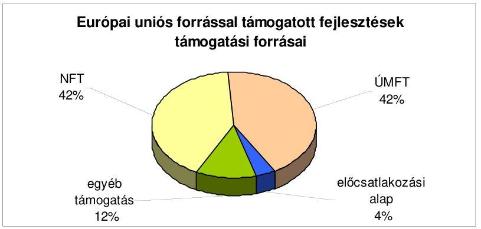

A pályázatok elutasításának okai között a pályázati források hiánya, a pályázatok szakmai kidolgozatlansága, tartalmi és formai hibái, a pályázati feltételek hiányos vagy nem teljesítése szerepelt. A 2005-2008. évek költségvetési rendeleteiben az ellenőrzött önkormányzatok a pályázatokhoz szükséges saját forrás biztosításáról gondoskodtak, annak fedezetét mintegy tizedük pénzintézeti hitel felvételével, valamint kötvénykibocsátásból származó bevételből tervezte finanszírozni. A támogatással megvalósított célkitűzések kiadásainak finanszírozásában a teljesített saját forrás részaránya a tervezetthez viszonyítva, a megvalósítás során jelentkezett pót- és többletmunkák, valamint a nem támogatott feladatok kiadásai miatt emelkedett. A hiányos felkészültség is közrejátszott abban, hogy az európai uniós forrással támogatott, ellenőrzött fejlesztési feladatok esetében a feladat megvalósítása során a támogatási szerződések több mint kétharmadát módosították az időbeli csúszások, az előlegigénylések, a támogatási és a kiadási ütemezések évek közötti átcsoportosításai, valamint a műszaki tartalom változásai miatt. A kifizetési kérelmek benyújtása után a támogatások folyósítása átlagosan fél hónap és egy év közötti időtartamot vett igénybe, az időbeli elhúzódást elsősorban az igénylést alátámasztó dokumentumok hiánya, a számlák alaki és tartalmi hiányosságai okozták. A közreműködő szervezetek a hiánytalanul benyújtott kifizetési kérelmeket az ellenőrzött projektek mintegy háromnegyedénél 60 napon túl teljesítették.

Az önkormányzati hivatalok közel kétharmadánál az európai uniós források felhasználásával megvalósított feladatok kiadásainak és bevételeinek teljesítése során a folyamatba épített, előzetes és utólagos vezetői ellenőrzéseket végrehajtották. A támogatásban részesült önkormányzatok döntő többségénél (98%-nál) azonban a belső ellenőrzés nem vizsgálta a 2005-2008. években az európai uniós forrás felhasználását. Az európai uniós forrással támogatott fejlesztési feladatok megvalósulását a közreműködő szervezetek, az ÁSZ, a KEHI és az Európai Bizottság az ellenőrzött önkormányzatok mintegy 80%-ánál vizsgálták, megállapításaikra a polgármesterek intézkedést tettek.

# 2.4. Az államháztartáson kívülre juttatott támogatások 

A kormányzati alapítású közalapítványok közül háromnál ellenőriztük a gazdálkodás törvényességét és szabályszerűségét. Két közalapítvány esetében jellemző volt, hogy közfeladatuk ellátásának finanszírozásába államháztartáson kívüli forrást nem tudtak bevonni, így működésüket csaknem teljes egészében (90% feletti részarányban) a központi költségvetés finanszírozta. Saját bevételeik túlnyomó része az átmenetileg fel nem használt és pénzintézeteknél lekötött állami források kamatbevételeiből származott. Egy közalapítvány közfeladatának ellátásához bevételei közel felét kitevő külső forrást (nemzetközi szervezetek) használt fel. A közalapítványok kuratóriumai a kapott támogatásokat az alapító okiratokban meghatározott célok megvalósítása érdekében használták fel. A kuratóriumi döntések meghozatalának szabályszerűsége körében kifogásoltuk az alapító okirattal ellentétes írásbeli szavazások gyakorlatát. Az egyik közalapítvány esetében kifogásoltuk, hogy eltérően az alapító okirat és a vonatkozó jogszabályi rendelkezéstől, pályázat kiírása nélkül nyújtotta támogatásai egy részét.

A pártok gazdálkodása törvényességét 5 ellenőrzési témában, összességében 39 pártnál vizsgáltuk. A nyilvánosságra hozott számvevőszéki jelentésekben a párttörvény, valamint a számviteli törvény előírásainak többszörös megsértésével összefüggésben 10, parlamenten kívüli párt elnökének képviseleti jogkörében állapítottunk meg személyes felelősséget. Jelentéseink alapján - ügyészségi kezdeményezésre - több büntetőeljárás kezdődött. Az ellenőrzések a törvénysértő mulasztásokon túlmenően közel 25 M Ft értékben tártak fel a pártok számára tiltott bevételt, illetve hasonló nagyságrendű adó- és járulék fizetési kötelezettség elmulasztását is. Az ellenőrzött pártok kétharmada minden vizsgált évben elmulasztotta a párttörvényben meghatározott beszámolók közzétételét. Súlyos gond, hogy a szankció hiányára visszavezethetően a pártok „büntetlenül" megtehetik az éves pénzügyi beszámolási kötelezettségük elmulasztását. Az éves gazdálkodásról adott képet torzította, hogy a hivatalosan megjelentetett beszámolók 80%-a nem minősült megbízhatónak, valósnak. A lényeges mértékű hibák abból is fakadtak, hogy a párttörvény beszámolási rendje nincs összhangban a hatályos számviteli törvény előírásaival.

Az országgyúlési képviselő választási kampányra fordított pénzeszközök elszámolását a 2009. januári időközi választáson képviselethez jutott jelölő szervezetnél hivatalból ellenőriztük. Felhívtuk a figyelmet, hogy a választási eljárási törvényből hiányoznak a finanszírozás teljes körű zártságára, azonosíthatóságára vonatkozó garanciális szabályok. A számvevőszéki ellenőrzés hatásköri korlátaiból fakadóan nem tudja teljes mértékben betölteni a választási

kampány átláthatóságával kapcsolatosan azt a szerepet, melyet az alkotmányos szabályozás, a választási alapelvek érvényesítése megkívánna.

A parlamenti pártok által létrehozott, költségvetési támogatásra jogosult alapítványok gazdálkodása törvényességének - kétévenkénti törvény által előírt - ellenőrzését a pártok gazdálkodásának vizsgálatával összhangban teljesítettük. Az ellenőrzött három pártalapítvány gazdálkodására jellemző volt, hogy a kuratóriumok által nyújtott támogatások, valamint a saját szervezeti keretek között megvalósított programok megfeleltek az alapítványok alapító okiratában megfogalmazott céljainak. Hiányosságokat tártunk fel a támogatottak szabályszerű elszámoltatásában, elsősorban a szerződésekben előírt határidők betartására és a támogatások felhasználásának dokumentált ellenőrzésére vonatkozóan.

Az ellenőrzött önkormányzatok mintegy hattizedénél a céljelleggel, szervezetek, magánszemélyek számára nyújtott támogatások rendeltetésszerű felhasználásáról - a számvevőszéki javaslatokat hasznosítva - számadási kötelezettséget írtak elő, működtették a számadások, felhasználások ellenőrzési rendszerét, intézkedtek a céltól eltérő, nem rendeltetésszerű felhasználás esetén a visszafizetésre, illetve a számadási kötelezettség elmulasztása esetén a kötelezettség teljesítéséig a további támogatás felfüggesztésére. Az önkormányzatok mintegy 5%-ánál alapítványi támogatás kifizetése az Ötv. előírása ellenére a képviselő-testület döntésének hiányában történt.

# 2.5. Az állami vagyongazdálkodás 

Az állami vagyongazdálkodás ellenőrzésének évenként ismétlődő eleme az MNV Zrt. működésének és az MTI Zrt. gazdálkodásának az ellenőrzése. Az MNV Zrt. részvényesi joggyakorlója a pénzügyminiszter, az MTI Zrt.-ben az alapítói, részvényesi és közgyűlési jogokat a Magyar Országgyűlés gyakorolja. A két szervezet évenkénti ellenőrzése törvényi kötelezettségünk.

Az állami vagyongazdálkodás körében a törvényi kötelezettségen túlmenően az ÁSZ elnökének döntése alapján további ellenőrzéseket is végeztünk. A közlekedési infrastruktúra fejlesztését, az adott évben befejeződő autópálya beruházások ellenőrzése formájában évenként vizsgáltuk, ami lehetőséget ad a folyamat remélt változásának - átláthatóságának, célszerűségének - értékelésére. Az elmúlt évben ellenőriztük a nemzeti vagyon részét képező nemzeti audiovizuális vagyon működtetésére fordított pénzeszközök hasznosulását, a közpénzek felhasználásának hatékonyságát.

Az MNV Zrt. éves gazdálkodásának ellenőrzései során szorgalmaztuk egy vagyontörvény megalkotását az állami vagyonkezelés átláthatóságának növelésére, a korábban széttagolt vagyonkezelés rendszerbe foglalására. Az új vagyontörvény megszületése önmagában pozitívnak minősíthető, mert a törvény nyomán a vagyonkezeléssel összefüggő bevételek és kiadások a költségvetésen belül egy fejezetbe összpontosulnak, megteremtve ezzel a transzparencia lehetőségét.

A társasági forma az állami vagyon esetében azt a célt is szolgálta, hogy megvalósuljon a vállalkozói szemlélet, bár ez egyelőre csak részben volt felfedezhető a vagyonkezelő működésében. A vagyontörvényt - elfogadott koncepcionális ja-

vaslat hiányában - erőltetett törvényalkotási menetrenddel hozták létre, amiből számtalan probléma adódott. A törvénnyel kialakított vagyonkezelői rendszer jogi szabályozása több ponton nem egyértelmű, rendelkezései hiányosak. Ez az irányításban és a határozathozatalban 2008-ban - az induló évben - számos problémát okozott, lehetőséget teremtett olyan megoldásokra, amelyeket az ügyészi szervek és az ÁSZ jogosan kifogásolt.

A törvény hiányossága pl., hogy tárgyi hatálya nem terjed ki a közvetett állami tulajdonú cégekre és azok leányvállalataira, így ezeknél a társaságoknál az állami tulajdon csak közgazdasági értelemben áll fenn, a vagyontörvényben megfogalmazott célok - az állami vagyon megőrzése, gyarapítása - nem megfelelően érvényesíthetők.

Megállapítottuk, hogy az MNV Zrt. 2008. évi tevékenysége összességében nem volt összhangban a vagyontörvényben megfogalmazott általános célokkal, a rábízott vagyonra vonatkozó szabályozással. A Társaság működése nem volt átlátható. Az intézményi döntéshozók
 (Kormány, Részvényesi Jog Gyakorlója, pénzügyminiszter, Nemzeti Vagyongazdálkodási Tanács, vezérigazgató) beavatkozásai összességükben nem voltak kellően eredményesek, esetenként nem a vagyontörvényben meghirdetett célokat szolgálták. Hiányos volt a döntéselőkészítés, emiatt a döntéshozatal sok esetben formálissá vált.

Az MNV Zrt. számviteli, pénzügyi és vagyon-nyilvántartása nem lett egységes, teljes körű és megbízható. Nem érvényesült az átlátható pályáztatási rendszer a moszkvai Magyar Kereskedelmi Képviselet ingatlanának értékesítése során. A Nemzeti Földalapra vonatkozó törvényi szabályozás nem volt egyértelmű, ebből következően nem lehetett teljesen egyértelmű a belső szabályozás sem. Az értékesítési és haszonbérbe adási folyamatok sem voltak teljes mértékben átláthatóak. A földalapba tartozó sukorói földterület cseréje a pilisi/albertirsai ingatlanra nem volt szabályos, és nem volt célszerű.

A 2008-ban befejezett autópálya beruházások ellenőrzése során megállapítottuk, hogy az állami beruházásokra vonatkozó gazdaságossági elvárásokat, az állami beruházókkal szembeni követelményeket nem rögzíti jogszabály, és ezeket nem határozta meg a tulajdonosi jogokat gyakorló minisztérium sem. Az ellenőrzött autópálya beruházásoknál - a korábbi években befejezett autópálya beruházásokhoz hasonlóan - elsődleges szerepe az átadási határidőnek volt, a gazdaságossági szempontok nem kaptak prioritást. A törvény szerinti határidők általában tarthatatlanok voltak, azokat az előkészítettség tényleges állapota és a kivitelezéshez szükséges, műszakilag indokolt időtartam nem támasztotta alá. Az ellenőrzéseink során évről-évre visszatérően jelezzük, hogy hiányzik az autópálya építések megkezdése előtt az olyan előzetes költségbecslés, árkalkuláció, amely részletes egységárelemzésen alapszik. A közbeszerzési törvényben megfogalmazott „összességében legalacsonyabb árajánlat" önmagában nem jelenti a nemzetgazdaság szempontjából a legjobb ajánlatot.

A gyorsforgalmi utak fejlesztésének jogszabályi környezete nem írja elő olyan közlekedésfejlesztési koncepció készítését, amelyet az adott térségre vonatkozóan a beruházás előkészítésének szakaszában az önkormányzatokkal, civil szervezetekkel koordináltan alakítanának ki, és az érintettekre kötelezettségeket, illetve a közérdekre tekintettel változtatási tilalmat tartalmazna. Ennek hiányában két

---

autópálya szakasznál is tapasztalható volt - a beruházás végzését gátló, azt jelentősen késleltető - folyamatos egyeztetési kényszer, az önkormányzatok és a civil szervezetek által bírósági eljárások kezdeményezése, a kiadott engedélyek és a meghozott ítéletek megfellebbezése.

Az MTI Zrt. 2008. évi gazdálkodásának ellenőrzése során megállapítottuk, hogy a szabályozás hiányosságaira visszavezethető kockázatok 2008-ban is fennálltak az MTI Zrt. sajátos jogi környezetének eredményeként. A Társaságnál hiányos a feladat- és hatáskör, illetve a felelősségi struktúra szabályozása, a közszolgálati feladatok meghatározása. Nem szabályozott a feladatellátáshoz szükséges állami támogatás mértékének megállapítása, a közpénzfelhasználás átláthatóságának biztosítása.

A legnagyobb kockázatot a közfeladatok jelenlegi állami finanszírozása hordozza, mert nincs összhangban az uniós szabályokkal. Kockázatot jelent az is, hogy a Társaság 2008-2012. évi stratégiai tervezése - a gazdálkodással kapcsolatos tulajdonosi elvárások megfogalmazásának hiányában - az Országgyűlés jóváhagyása nélkül történt.

A 2008-ban végrehajtott szervezeti átalakítás ellenére nem valósult meg a közfeladatok ellátásához szükséges szervezetnagyság kialakítása. Megállapítottuk, hogy a vezetői ellenőrzés, a kontrolling nem jelentett megfelelő biztosítékot a kitűzött célok megvalósításához, a Társaság gazdálkodási tevékenységének szabályszerű ellátásához. Nem érvényesült a költségtakarékosság.

# A nemzeti kulturális örökség audiovizuális részének megőrzése és gyűjtése a társadalom kiemelten fontos érdeke, ennek ellenére a hatályos jogszabályok nem rendelkeznek egységesen a nemzeti örökség részét képező audiovizuális értékek megőrzéséről, nyilvántartásáról. A Nemzeti Audiovizuális Archívumról szóló törvényben megfogalmazottak sem következetesek, egyértelműek.

A Nemzeti Audiovizuális Archívum a jogszabályi háttér és megfelelő forrás hiányában nem tudta megszerezni, rendszerezni és tárolni a más archívumok által már összegyűjtött és őrzött anyagot. Erre az okra vezethető vissza az is, hogy az állam tulajdonában álló társaságoktól költségvetési támogatással megvásárolt audiovizuális alkotásokat az állami nyilvántartási rendszerben csak jelentős késéssel, vagy egyáltalán nem vezették át. A szakmai, felügyeleti irányítás többször változott, a döntéshozó beavatkozások rendszere sem volt egységes. A közpénzek átlátható módon történő felhasználása és eredményessége, valamint a vagyon védelme, az állományban bekövetkező változások nyomon követése nem volt biztosított.

A nemzeti vagyonnak tekintett audiovizuális közgyűjteményekkel rendelkező szervezetek egységes szakmai koncepció, irányítási, szabályozási és finanszírozási elveken alapuló stratégia és évenkénti feladatterv nélkül működtek. A nemzeti audiovizuális vagyon kezelése során kialakult párhuzamosságok, valamint a széttagolt elhelyezés megnehezítette a rendelkezésre álló pénzforrások koncentrált és eredményes felhasználását is.

Az MNV Zrt. tulajdonában álló filmszakmai társaságok nem tartoznak a tartósan állami tulajdonban maradó vagyoni körbe. Megállapítottuk, hogy az egysé-

---

ges ágazati stratégia és irányítás hiányában, és a többször változtatott tulajdonosi döntések miatt, a filmes portfolióval kapcsolatos állami pénzeszközök felhasználása célszerűtlen, átgondolatlan.

# 3. Az ELLENŐRZÉSEK HASZNOSÍTÁSA

Az ÁSZ jelentéseinek elsődleges felhasználói az Országgyűlés, a képviselők, a kormányzati szektor, az önkormányzati testületek és az ellenőrzött szervezetek vezetői.

A 2009 során jelentkező világgazdasági válsággal kapcsolatos kormányzati feladatok, valamint a 2010. évi választások közelsége is közrejátszhatott abban, hogy a korábbi évekhez viszonyítva a bizottságok által megtárgyalt ÁSZ jelentések száma csökkent.
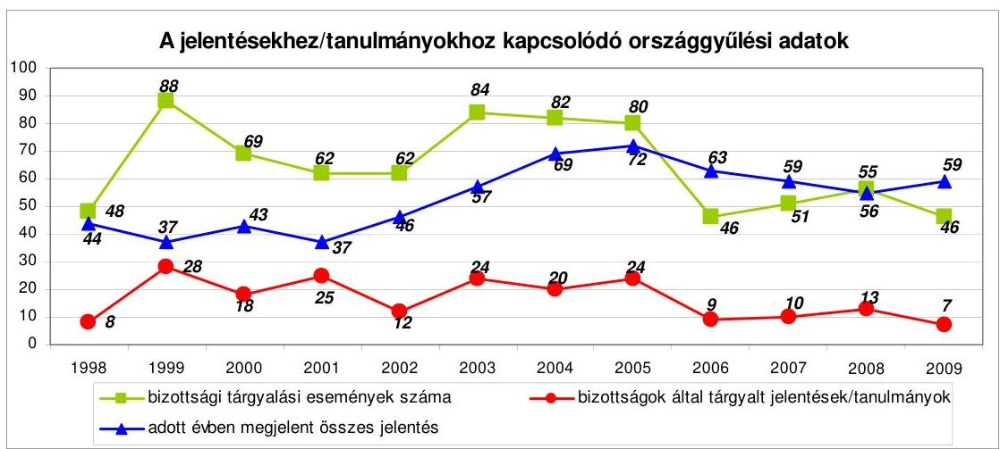

### 3.1. A jelentések országgyűlési tárgyalása, határozatok és az országgyűlési kapcsolatok

Az ÁSZ 2009-ben is határidőre tett eleget a törvényekben előírt jelentéskészítési kötelezettségeinek, nyújtotta be az Országgyűlésnek a költségvetésről szóló véleményt, a zárszámadás, az MNV Zrt., és az MTI Zrt. ellenőrzéséről szóló jelentéseket.

2009-ben 57 jelentést tettünk közzé. Az Országgyűlés bizottságai 6 jelentést és 1 tanulmányt tűztek napirendjükre. A jelentésekhez fűződő bizottsági események száma 2009-ben visszaesett, 46 bizottsági esemény kapcsolódott az ÁSZ jelentéseihez, tanulmányaihoz.

Az Országgyűlés plenáris ülésének napirendjén 4 jelentésünk szerepelt (költségvetési vélemény, zárszámadási jelentés, MTI Zrt. ellenőrzése, ÁSZ éves jelentés).

Az MNV Zrt. 2008. évi tevékenységének ellenőrzéséről készült jelentés általános vitára való alkalmasságának megtárgyalását a bizottságok 2009-ben nem vették napirendre.

---

Az ÁSZ tevékenységéről szóló éves beszámoló megtárgyalására 2009-ben 6 bizottság került kijelölésre (a Költségvetési, a Gazdasági, az Önkormányzati, az Emberi jogi és a Környezetvédelmi bizottság mellett a Foglalkoztatási bizottság is megvitatta a beszámolót). Az éves jelentést az Országgyűlés 343 igen szavazattal, egyhangúlag fogadta el.

A 2008. évi zárszámadásról készült jelentésünket - a Mentelmi bizottság kivételével - valamennyi bizottság megtárgyalta.

Az ÁSZ költségvetési véleményét 17 bizottság tárgyalta. A Költségvetési, pénzügyi és számvevőszéki bizottság ülésén a képviselők tájékoztatásul kézhez kapták az ÁSZKUT „Az állam célszerű gazdasági szerepvállalása a XXI. század elejének globális gazdaságában" c. tanulmányát is.

A MTI Zrt. 2008. évi gazdálkodásának ellenőrzéséről szóló ÁSZ-jelentést az eddigi évekhez hasonló módon a Költségvetési, pénzügyi és számvevőszéki, valamint a Kulturális és sajtóbizottság az MTI beszámolójával együtt tárgyalta.

Mint 2008-ban, az Új Magyarország Fejlesztési Terv végrehajtását felügyelő eseti bizottság 2009-ben is külön napirend keretében foglalkozott az európai uniós támogatások felhasználásának ellenőrzéséről szóló tájékoztatóval. A közgyógyellátási rendszer működésének ellenőrzéséről szóló jelentésünket az Egészségügyi és az Ifjúsági, szociális és családügyi bizottságok tárgyalták meg. Az ÁSZKUT „Pénzügyi kockázatok az önkormányzati rendszerben" c. tanulmányát az Önkormányzati bizottság ülésén vitatták meg a képviselők.

Az ÁSZ elnöke 2009-ben is több alkalommal személyesen képviselte az intézményt az Országgyűlés plenáris és bizottsági ülésein. 4 alkalommal tartott expozét és 14 bizottsági ülésen vett részt.

Az ÁSZ elnökéhez 2009-ben két írásbeli képviselői kérdés érkezett. A számvevőszéki válaszok - mindkét esetben - törvényi határidőn belül készültek el és kerültek megküldésre.

A jelentések parlamenti/bizottsági tárgyalásainak adatairól a 2. sz. melléklet ad tájékoztatást.

# 3.2. A számvevőszéki javaslatok érvényesülése

A 2009-ben végzett ellenőrzéseink során is arra törekedtünk, hogy javaslatainkkal segítsük az ellenőrzött szervezetekben, rendszerekben, folyamatokban rejlő kockázatok feltárását és kiküszöbölését, a szabályszerűség érvényesülését, a hatékonyság javítását. Javaslatokat tettünk jogszabályok módosítására, összehangolására, betartására is. Figyelmet fordítottunk korábbi megállapításaink, ajánlásaink hasznosulására, azaz a szükséges intézkedések megtételére és végrehajtásuk nyomon követésére. Mind az érintett fejezetek intézkedési tervei, mind az éves jelentésünkhöz kért tájékoztatások alapján megállapítható, hogy javaslataink jellemzően pozitív fogadtatásra találtak.

Az elmúlt esztendővel kapcsolatban is elmondható, hogy a pénzügyi ellenőrzés közvetlen hatásaként a korrekciós jellegű módosításokra vagy egyes, különállóan is megvalósítható szabályozási kérdésekre vonatkozó javaslataink, illetve

---

a belső szabályozási, nyilvántartási, elszámolási rendszerekre vonatkozó, a célszerűséget, hatékonyságot javító intézkedéseket célzó ajánlásaink fogadtatása kedvező volt. Ezzel szemben a pénzügyi biztonságot szolgáló, a rendszer méretű és szemléleti változásokat igénylő felvetéseink befogadása szerényebb.

A meg nem valósult javaslataink jellemzője, hogy azok célszerűségét és indokoltságát az érintettek nem vitatták, realizálásuk mégis rendre elmarad. E körbe említhetjük: a helyi önkormányzati feladatok és a források összhangja megteremtésének, a feladat- és hatásköri, ezzel összefüggésben a finanszírozási rendszer átfogó felülvizsgálatának, a hitelfelvételi korlát indokolt újraszabályozásának elmaradását, a közigazgatás modernizációjának stratégiai megalapozására, a kormányzási képesség javítására, a hatékonyabb állam megteremtésére tett javaslataink nyomán az érdemi intézkedések elmaradását, az elkülönített állami pénzalapok céljai megvalósulásának, az alapszerű működés feladatellátásra gyakorolt hatása értékelésének elmaradását, valamint a nemzeti hírügynökség állami támogatása folyósításának, felhasználása ellenőrzésének versenysemleges és átláthatósági - az uniós szabályokkal összehangolt - szabályozása elmaradását.

A pártfinanszírozás átláthatóságának fokozására beterjesztett önálló képviselői indítvány kétharmados többségű elfogadásához 2009 végén sem sikerült a politikai konszenzust megteremteni. Hasonlóan nem fogadta el az Országgyűlés 2010. február 22-én a kampányfinanszírozás átláthatóvá tételéről szóló T/11446 számú törvényjavaslatot.

# 3.2.1. Javaslatok hasznosítása az Országgyűlés szintjén

A Vám- és Pénzügyőrség működésének ellenőrzéséről szóló jelentésünkben javasoltuk, hogy a Kormány vizsgálja felül a fegyveres szervek hivatásos állományú tagjainak szolgálati viszonyáról szóló 1996. évi XLIII. törvény (Hszt.) nyugdíjazással kapcsolatos rendelkezéseit annak érdekében, hogy a hivatásos állományúak nyugállományba vonulása feltételei közelítsenek az általános feltételekhez. Készítsen számításokat, elemzéseket arra vonatkozóan, hogy a kedvezmények különböző mértékei - figyelembe véve a humánerőforrás-gazdálkodás szempontjait - milyen költségvetési kihatással járnak, és ennek alapján kezdeményezze a jogszabály módosítását. A Hszt. módosításáról szóló 2009. évi CXLI. törvény 2010. január 1-jétől a szolgálati nyugdíj vonatkozásában a felső korhatár, az egészségi alkalmatlanság miatti felmentés esetén a nyugdíjfolyósítás mértéke, továbbá visszavétel esetén a szolgálati nyugellátás folyósításának szüneteltetése tekintetében eredményezett változást.

A változtatások alapvetően a civil szabályok fokozatos követését jelentik, tartalmi alapon kerültek meghatározásra, nem a konkrét költségvetési kihatás alapján születettek meg, hanem annak a körülménynek a szem előtt tartásával, hogy a Hszt. hatálya alá tartozókkal szemben a társadalom sajátos többletigényeket és korlátozásokat fogalmaz meg.

Az egyes kórházi tevékenységek kiszervezésének ellenőrzése kapcsán javasoltuk a Kormánynak, hogy dolgozza ki és készítse elő a fekvőbeteg ellátás törvényi szintű szabályozását, amelyben egyértelműen meghatározza a magánszektor szerepvállalását a szektorsemlegesség figyelembevételével. A 2009.

---

évi CLIV. törvény 2010. január 1-jétől módosította az egészségügyi ellátórendszer fejlesztéséről szóló 2006. évi CXXXII. törvényt. A módosításban az egészségügyi közszolgáltatásért felelős szervek által a szakellátási feladatok ellátására kötött szerződésekre (tehát az ún. „kiszervezésre") vonatkozó szabályok részletesen kidolgozásra kerültek.

A helyi önkormányzatok és a helyi kisebbségi önkormányzatok központi költségvetési kapcsolatokból származó forrásai igénybevétele és elszámolása felülvizsgálati tevékenységének ellenőrzéséről készített jelentésben tett javaslataink hatására az Áht. 64/D. §-a kiegészült az önkormányzatok részére biztosított költségvetési támogatások elszámolása utólagos helyszíni ellenőrzésének előírásával, illetve a 2008. évtől fokozatosan biztosították ennek személyi feltételeit. A Kincstár ellenőrzési tevékenységének kiterjesztése következtében a normatív hozzájárulások elszámolásának megbízhatósága javult.

A
 Magyar Köztársaság 2008. évi költségvetése végrehajtásának ellenőrzése keretében tett javaslataink eredményeképpen módosították a Közokt. tv. 117. § (2) bekezdését, így megteremtették az összhangot a költségvetési törvénnyel az alapfokú művészetoktatási intézményekben fizetendő térítési díj számítására vonatkozóan.

A lakástámogatási rendszer hatékonyságának ellenőrzése kapcsán javasoltuk, hogy a Kormány kezdeményezze a banki hitelezési tevékenységgel kapcsolatosan a szorosabb állami felügyeletet és a hitelezéssel együtt járó kockázatoknak a lakossággal való hatékonyabb megismertetését. Az Országgyűlés 2009. december 14-én elfogadta a fogyasztóknak nyújtott hitelről szóló 2009. évi CLXII. törvényt, valamint a pénzügyi közvetítőrendszer felügyeletének hatékonyabbá tételéhez szükséges egyes törvénymódosításokról szóló 2009. évi CXLVIII. törvényt. A 2009. évi CLXII. törvény a hitelezés egész folyamatát szabályozza. Előírásokat tartalmaz a kereskedelmi kommunikációra, a szerződéskötést megelőző tájékoztatásra, a szerződés tartalmára, az ellátási jogra és az előtörlesztésre is.

Az Országgyűlés a közalapítványok ellenőrzéséről készített jelentéseinkben megfogalmazott javaslatainkat is figyelembe véve hatályon kívül helyezte a Ptk. közalapítványokra vonatkozó 74/G. §-át, megtiltva ezzel új közalapítvány létrehozását. 2009. január 1-jétől, ha törvény vagy önkormányzati rendelet eltérően nem rendelkezik, kötelező egy éven belül kezdeményezni a közalapítvány megszüntetését, ha vagyonán belül az államháztartáson kívülről származó bevételeinek aránya két éven át 80% alatti volt.

# 3.2.2. Javaslatok hasznosítása kormányzati szinten 

A 2009-ben befejeződött számvevőszéki ellenőrzések során tett ajánlások, javaslatok hasznosításának nyomon követése érdekében a korábbi évek gyakorlatának megfelelően tájékoztatást kértünk a Kormánytól és a tárcák vezetőitől az ajánlások hasznosulásáról. A megkereséseknek az érintettek kivétel nélkül eleget tettek. Válaszlevelében több tárca is jelezte, hogy ellenőrzéseink során a szakmai feladatellátásukat és gazdálkodásukat javaslatainkkal nagyban segítettük, munkánk nyomán több területen értek el a szabályszerűség, a szabályozottság és a hatékonyság tekintetében előrehaladást.

---

A kapott tájékoztatás fontos információ az ÁSZ számára, mert a számvevőszéki javaslatok kötelező figyelembevételére - a törvényesség helyreállítására irányuló jogi realizálás kezdeményezésén túl - nincs általános érvényű törvényi előírás.

Jelentésünk 3. sz. mellékletében röviden megjelenítjük a tárcák válaszait, amelyeket tájékoztatást kérő levelünkre, a 2009-ben befejezett ellenőrzéseink javaslataival kapcsolatban jeleztek vissza. Az ÁSZ a tárcák vezetői által jelzett intézkedések végrehajtását további ellenőrzései során figyelemmel kíséri, jelentéseiben rendre kitér ezek megvalósítására.
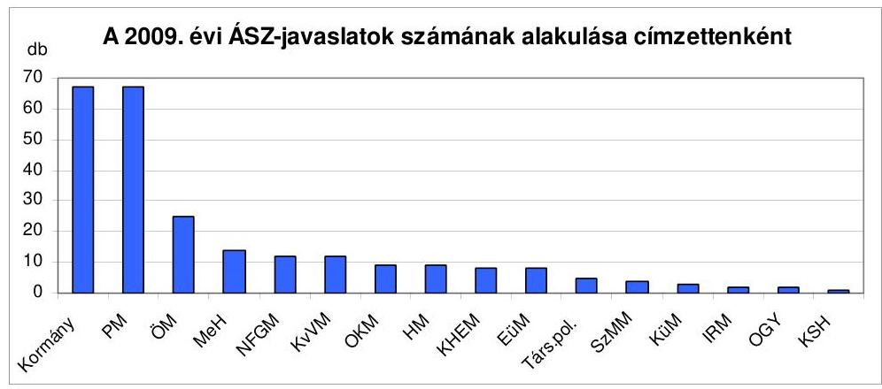

Javaslataink fogadtatása az előző évhez képest 2009-ben kedvezőbben alakult. A megvalósult javaslatok aránya az előző évivel megegyező, a meg nem valósult javaslataink aránya 6%-kal csökkent. Összességében javaslataink 88%-a jutott el a megvalósítás különféle szakaszaiba.
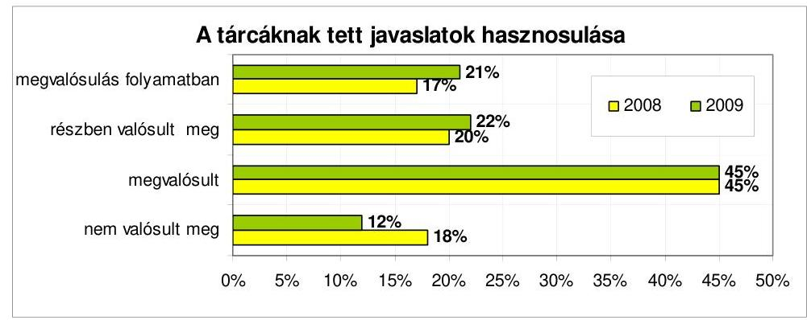

A jogszabályi változtatásokra vonatkozó kezdeményezéseink részaránya az előző évihez hasonlóan alakult. Ezen belül a kedvező fogadtatásúak aránya 38%, az egyértelmű elutasítások aránya 14%. Ez utóbbi javaslataink jellemzően a már meglévő törvények, illetve egyéb jogszabályok módosításaira vonatkoztak. Néhány esetben a fennálló szabályozást megfelelőnek tartották a tárcák, illetve nem tartották kompetensnek magukat a változtatásra. A jogszabályok összehangolására, illetve betartására tett javaslataink az előző évinél kedvezőbb fogadtatásra találtak.

---

A célszerűséget, hatékonyságot, eredményességet javító intézkedésre, illetve a feltárt hibák, hiányosságok megszüntetésére vonatkozó javaslataink aránya az előző évihez hasonló mértékű volt. Ezen javaslataink 87%-a talált kedvező fogadtatásra, fele részük már meg is valósult.

A belső szabályozási rendszer, illetve a fejezeti és a belső ellenőrzés működésének felülvizsgálatát, továbbfejlesztését célzó javaslatok 96%-ával kapcsolatban konkrét intézkedések történtek, illetve az érintettek megkezdték a javaslatok hasznosításának előkészítését.

Az elszámolási, finanszírozási, nyilvántartási rendszer átalakítását célzó javaslataink aránya az összes javaslaton belül az előző évhez képest nem változott. Ezen javaslatainkra tett pozitív intézkedések aránya 79%, míg javaslataink 21%-ánál a fejezetek a fennálló gyakorlatukat megfelelőnek tekintették.

Az egyéb, egyedi jellegüknél fogva nem rendszerezhető és az előző csoportokba nem sorolható ajánlások 9%-ot tettek ki. Elfogadottságuk közel 96%-os, és jelentésünk összeállításáig 39%-uk már megvalósult.

A 2006-2009 közötti időszak áttekintése alapján megállapítható, hogy az ÁSZ által tett javaslatok közül a legnagyobb arányt - mindegyik évben 37%-ot - a jogszabályokkal összefüggő javaslatok tették ki. Hasonlóan magas arányú - átlagosan 31%, de növekvő tendenciájú - a hatékonyságot javító, feltárt hibák megszüntetésére vonatkozó javaslatok aránya is. A vizsgált szervezetek belső működésének javítását célzó javaslataink átlaga 11%. Az elszámolási, finanszírozási, nyilvántartási rendszer átalakítását célzó javaslataink átlaga 9%. Az egyéb, előző csoportokba nem sorolható, egyedi jellegű javaslatok részaránya az induló 14%-ról fokozatosan csökkenve 9% lett.
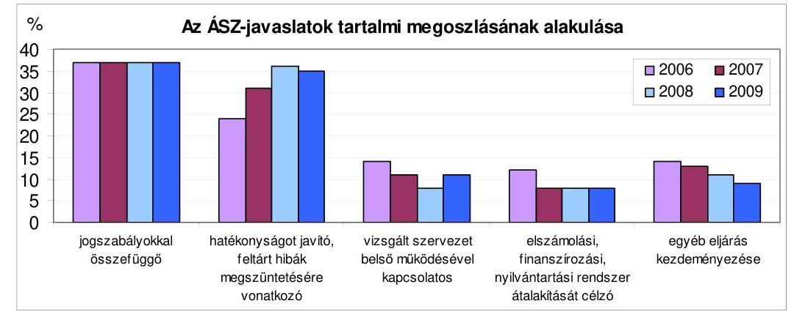

A javaslatok fogadtatása - az azokra tett intézkedések minősítése alapján - az elmúlt négy év mindegyikében kedvező volt. Éves átlagban a megvalósítás különböző szakaszaiba 87% jutott, átlagosan 49% már éven belül megvalósult. Az egyértelmű elutasítások átlagos értéke 12% volt. Mivel a tárcák által adott válaszok évről-évre teljesebbé váltak, az utóbbi két évben szinte minden javaslatunkra kaptunk válasz-információt.

---

Általánosságban elmondható, hogy az elmúlt négy év során a hatékonyságot javító, feltárt hibák megszüntetésére vonatkozó javaslatok fogadtatása volt a legkedvezőbb, már éven belül is több mint 50%-uk megvalósult. Hasonlóan kedvező, az évek során egyre javuló fogadtatásúak a vizsgált szervezetek belső működésével kapcsolatos javaslataink. Az egyes éveken belül minden esetben a jogszabályokkal kapcsolatos javaslataink fogadtatása volt - arányaiban - a legrosszabb, átlagosan több mint 16% volt az elutasítások aránya. Ezek a javaslatok jellemzően a már meglévő törvények, jogszabályok módosítására vonatkoztak. A jogszabályok betartására, összehangolására tett javaslataink esetében sokkal kedvezőbb a teljesülési arány.

# Javaslataink hasznosításaként - többek között - a következő intézkedések valósultak meg az elmúlt évben: 

A közgyógyellátás folyamatának ellenőrzése alapján javasoltuk a Kormánynak, hogy tekintse át, miként lehet a tényleges rászorultsághoz igazítani az ellátás mértékét és egységesebbé tenni a jogosultság szempontrendszerét, kezdeményezze az adatvédelmi és a szociális törvényi szabályozás felülvizsgálatát az eljárás egyszerűsítése és a működési költségek csökkentése érdekében. Vizsgálja felül és módosítsa az eljárás rendjét annak érdekében, hogy az egészségbiztosító által ismert tényadatok és a gyógyszertámogatási elv együttes figyelembevétele alapján határozza meg a közgyógyellátáshoz jutás feltételeit.

Ezen túlmenően javasoltuk az egészségügyi miniszternek, hogy vizsgálja meg, megszüntethető-e az egészségbiztosítás által nulla százalékban (azaz nem) támogatott gyógyszerek közgyógyellátás keretében történő rendelhetősége, valamint tegye hatékonyabbá a közgyógyellátottak gyógyszer, gyógyászati segédeszköz rendelés biztosító általi szakmai ellenőrzését. Az egészségügyi miniszter 2009. februári válaszában arról tájékoztatott, hogy a változtatáshoz szükséges hatásvizsgálatokat elkezdték, bizonyos jogszabályváltozásokat is végrehajtottak az év folyamán, ugyanakkor megállapításainkon, illetve a közgyógyellátás rendszerén ezek az intézkedések nem változtattak.

A költségvetési szervek jogállásáról és gazdálkodásáról szóló 2008. évi CV. törvény, valamint az ennek alapján kidolgozott új Ámr. az államháztartás működési rendjéről szóló 292/2009. (XII. 19.) Korm. rendelet elfogadásával és 2009. december 20-ai hatályba lépésével a magyar központi közigazgatás modernizációjának ellenőrzése alapján tett azon javaslataink megvalósultak, miszerint a Kormány határozza meg a meglévő szabályozások áttekintésével és egységesítésével a minisztériumi SzMSz-ek kötelező elemeit, valamint, hogy a hatékonyabb állam megteremtése érdekében alakítsa ki a meglévő szabályozások áttekintésével, egységesítésével és kiegészítésével a költségvetési szervek legfontosabb szervezeti változásaira (alapítás, összevonás, szétválás stb.) vonatkozó normatív eljárásrendet (határidők, felelősségi rend stb.).

A lakástámogatási rendszer hatékonyságának ellenőrzése eredményeképp javasoltuk, hogy a Kormány határozza meg a lakástámogatás számszerűsített célkitűzéseit, és intézkedjen azok végrehajtásáról. Az intézkedés első lépéseként - a gazdasági és pénzügyi világválság hatásai miatt - a lakáscélú állami támogatásokról szóló 12/2001. (I. 31.) Korm. rendelet szerinti, az új és használt lakás vásárlását, új lakás építését, bővítését segítő, vissza nem térítendő és visszatérítendő legjelentősebb támogatások 2009. július 1-jétől felfüggesztésre kerültek.

A devizában történő hitelnyújtáshoz kapcsolódó jövőbeni állami kezességvállalás indokoltságának megvizsgálására tett javaslatunk megvalósításaként az előbb megnevezett, valamint a fiatalok lakáskölcsönéhez kapcsolódó állami kezesség vállalásának és érvényesítésének részletes szabályairól szóló 4/2005. (I. 12.) Korm. rendelet megváltoztatta az ún. Fészekrakó hitel feltételeit. 2009. július 1-jétől állami kezesség kizárólag a forintban folyósított hitelekhez vehető igénybe.

A Fészekrakó programmal összefüggésben javasoltuk, hogy írja elő a jogszabály a hitel igénybevételéhez szükséges önerőnél az ügyfél általi megtakarítás meglétét is. A fészekrakó hitel feltételeit módosító 125/2009. (VI. 15.) Korm. rendelet a hitelfelvételhez szükséges önerő mértékét 10%-ról 30%-ra emelte. A 4/2005. (I. 12.) Korm. rendelet szerint pedig a kölcsön teljes összege nem haladhatja meg a hitelcél szerinti ingatlan vételárának 70%-át.

# A felsőoktatási törvény végrehajtásának rendszerszemléletű ellenőrzése alapján a Kormánynak megalapozott, társadalmi-piaci viszonyokhoz 

igazított, felsőoktatási stratégia kidolgozását javasoltuk, az oktatási és kulturális miniszternek a felsőoktatás fejlesztési terveinek elkészítését és a képzési rendszer munkaerő-piaci prognózisok figyelembevételével elvégzett felülvizsgálatát, valamint azt, hogy kezdeményezze a finanszírozási rendszer minőségi teljesítmény-követelményeken alapuló átalakítását, a felsőoktatási információs rendszer és a diplomás pályakövetési rendszer jogszabályok szerinti kialakítását, működtetését.

A felsőoktatás képzési rendszerének áttekintése az illetékes szakmai testületek bevonásával megtörtént, amelynek eredményeit „A felsőoktatásban folyó többciklusú képzés első tapasztalatai" című kiadvány foglalja össze. Az ÁSZ jelentésének megtárgyalását a Rektori Tanács is napirendjére tűzte. Az áttekintés alapján folyamatban lévőnek tekinthető a jogszabályi változtatások előkészítése. A felsőoktatás jobb munkaerő-piaci, hazai és nemzetközi illeszkedése feltételeinek kialakítására vonatkozó vizsgálatok most indulnak.

A felsőoktatás finanszírozási rendszerének átalakítását célzó javaslatok kidolgozására - az OKM tájékoztatása szerint - a teljesítménykövetelményekre vonatkozó összeállítás elfogadását követően kerül sor. A teljesítménykövetelmények kidolgozását a 2009. évi vállalások teljesítéséről bekért adatok, nemzetközi tapasztalatok, valamint a Felsőoktatási Tudományos Tanács tanulmánya alapján kívánják elvégezni.

A felsőoktatási információs rendszer (FIR) eddigi működésének tapasztalatai alapján - a jelenlegi és leendő felhasználók véleményének figyelembevételével - az Oktatási Hivatal kidolgozta a FIR továbbfejlesztési irányait, a segítségével megvalósítandó szervezeti célokat. Ez alapján történik majd a jelenlegi és az elvárt funkció közötti eltérések meghatározása, és a részletes specifikáció elkészítése.

---

Az intézkedési tervben rögzített határidőre (2010. január 31.) nem készült el az intézményi pályakövetés mintájára, egységes alkalmazására, a központi adatintegráció működésére vonatkozó javaslat. A tárca vezetője a javaslat kidolgozásának megkezdéséről adott tájékoztatást. A minisztérium álláspontja szerint a 2007. évi CI. törvény lehetőséget biztosít az ágazati döntéshozatalhoz szükséges információk előállításához, ehhez azonban működő pályakövetési rendszer és egységes adattartalom szükséges.

A szilárdhulladék-gazdálkodásra a Kohéziós Alapból és hazai forrásból nyújtott támogatások hasznosulásának ellenőrzéséről szóló jelentésünkben ajánlottuk a környezetvédelmi és vízügyi miniszternek, hogy dolgozzon ki a hulladékképződés megelőzésére a jelenleginél hatékonyabb és szélesebb körű programokat, és szabályozási rendszert, figyelembe véve a legjobb nemzetközi gyakorlatot is.

Az EU új, 2008 végén kihirdetett 2008/98/EK irányelve alapján 2013-ig kidolgozzák a Nemzeti Megelőzési Programot. Ettől függetlenül a 2014-ig szóló II. Országos Hulladékgazdálkodási Terv is tartalmazni fog átfogó megelőzési programot, amelynek megvalósításához ágazati megelőzési intézkedések kapcsolódnak, a 2010. december 12-ig módosítandó 2000. évi XLIII. törvény pedig a hulladékgazdálkodásról tartalmazni fogja a jogi oldalról megtehető megelőzési előírásokat. A GOP 2.1.4. környezetközpontú technológiafejlesztés támogatási prioritás egyik komponenseként, kimondottan a megelőzési célú fejlesztésekre vonatkozó pályázati felhívás ismételten kiírásra került.

Azon ajánlásunkkal kapcsolatos intézkedések eredményessége, miszerint alakítsa ki a szelektív hulladékgyűjtés eredményeként keletkező másodlagos nyersanyagok hasznosításának
 stratégiáját, és - az NFGM-mel és a PM-mel együttműködve - dolgozzon ki érdekeltségi rendszert annak végrehajtásához, a későbbiekben ítélhető meg.

A nemzeti fejlesztési és gazdasági miniszter ugyanezen ellenőrzésünk ajánlása alapján intézkedett arra vonatkozóan, hogy az ÚMFT operatív programjai (különösen a KEOP, GOP) végrehajtása során a pályázatok úgy kerüljenek kiírásra, hogy az azokban foglalt célok támogassák az uniós kötelezettségek teljesítését.

Az ellenőrzés keretében javaslatot tettünk a Kormánynak, hogy vizsgáltassa meg a hulladékgazdálkodásról szóló törvény hatályos előírásai mellett az egyre növekvő mértékű uniós kötelezettségek teljesíthetőségét, figyelembe véve, hogy jelenleg a települési önkormányzatok és a lakosság számára csak lehetőség és nem előírás a szelektív hulladékgyűjtés. A Kormány nevében válaszoló Környezetvédelmi és Vízügyi Minisztérium jelezte, hogy a hulladékgazdálkodásról szóló törvény legkésőbb 2010. december 12-éig módosításra, megújításra kerül, az uniós kötelezettségek és azok teljesíthetőségét szolgáló szabályozók beépülnek a nemzeti jogszabályba.

A Kohéziós Alapból és hazai forrásokból finanszírozott kiemelt szennyvíztisztítási projektek megvalósításának ellenőrzéséről szóló jelentésünkben javaslatot tettünk a környezetvédelmi és vízügyi miniszternek, hogy vizsgáltassa felül a víz- és csatornadíj állami támogatási rendszerét tekin-

---

tettel arra, hogy egységes díjképzési előírás és árkontroll hiányában nem állapítható meg az egyes települési önkormányzatok igényének megalapozottsága, rászorultsága. A KvVM tájékoztatása szerint az ajánlásban foglaltak megoldására a díjképzésre vonatkozó előírások egyértelmű megteremtése után kerülhet sor, amely további egyeztetéseket tesz szükségessé.

Azon ajánlásunk teljesítése még folyamatban van, hogy a miniszter intézkedjen annak felmérésére, hogy 100%-os csatornára való rákötöttség mellett mely tisztító telepek rendelkeznek még szabad kapacitással, és ennek alapján nyújtson szakmai iránymutatást a szennyvízkezelési pályázatok készítéséhez, elbírálásához annak érdekében, hogy - szakmai és gazdaságossági feltételek megfelelősége esetén - elsődlegesen a már meglévő szabad kapacitásokat vegyék igénybe a pályázók, ellenőrizhető módon. Az ajánlásban foglaltak végrehajtása a vízügyi szakállamtitkár vezetésével elkezdődött, befejezési határidő: 2010. június 30.

Ugyanezen ellenőrzésünk kapcsán a nemzeti fejlesztési és gazdasági miniszternek tett ajánlásaink alapján több intézkedés történt. Az NFGM tájékoztatása szerint a KvVM Fejlesztési Igazgatósága a folyamatban lévő KEOP pályázatok elbírálásánál és az ellenőrzéseknél a részletes megvalósíthatósági tanulmány legfontosabb szempontjaként vizsgálja a fejlesztés szükségszerűségét, a szakmai és gazdaságossági feltételeket.

A nemzeti audiovizuális vagyon működtetésére fordított pénzeszközök hasznosulásának ellenőrzése alapján javasoltuk a pénzügyminiszternek, hogy intézkedjen az MNV Zrt.-re rábízott nemzeti filmvagyon MNFA részére történő átadásáról és hasznosításáról. A beszámoló szerint az átadás 2009 novemberében megtörtént.

# A Honvédelmi Minisztérium fejezet gazdálkodásának ellenőrzése 

kapcsán tett javaslatunkhoz illeszkedve a Kormány - többek között a nemzeti vagyonról szóló 2007. évi törvényben kapott felhatalmazás alapján - a honvédelmi szervezetek működésének az államháztartás működési rendjétől eltérő szabályait rendeletben állapította meg.

Az Országgyűlés fejezet működésének ellenőrzése kapcsán megfogalmazott javaslathoz illeszkedve az Országgyűlés gazdasági főigazgatója felügyeleti jogkörében az elmúlt rendszer titkosszolgálati tevékenységének feltárásával kapcsolatos törvény szükségessé váló módosításának parlamenti előkészítése során gondoskodik arról, hogy az Állambiztonsági Szolgálatok Történeti Levéltára a fejlesztési igények és a működés költségvetési hatásainak bemutatásával segítse a jogalkotók, döntéshozók munkáját.

A kincstári rendszer működésének ellenőrzése során a Kormánynak javasoltuk, hogy vizsgáltassa meg az új jogi szabályozási környezetre, valamint a KGR által biztosított új informatikai lehetőségekre alapozottan egy más szemléletű, a centralizáltabb költségvetés gazdálkodási modell megteremtésének indokoltságát, megvalósításának feltételeit, valamint az államháztartás bevételét biztosító adó- és egyéb törvények, továbbá a kiadási oldalon a különböző szociális és társadalombiztosítási ellátásokat szabályozó törvények módosítási le-

---

hetőségét, az előírt befizetési és kifizetési időpontok összehangolása szempontjából.

A Kormánynak tett javaslatainkkal kapcsolatban, a MeH-től kapott tájékoztatás alapján, egyes részterületeken történtek lépések (a nyugdíj kifizetés időpontjának módosításával a KESZ ingadozások mérséklése). A rendszerhibákra jellemzően a költségvetési szervek jogállásáról és gazdálkodásáról szóló 2008. évi CV. törvény végrehajtásától várják a korrekciókat, így pl.: a törvény következményeinek ágazati jogszabályokban való érvényesítését.

Az MNV Zrt. 2008. évi gazdálkodásának ellenőrzése kapcsán a moszkvai Magyar Kereskedelmi Képviselet ingatlanértékesítése körülményeinek kivizsgálása érdekében elrendelt ellenőrzések, továbbá az NVT, az MNV Zrt. és a KHEM bevonásával a MÁV Zrt. és a Magyar Posta Zrt. székházaival kapcsolatos döntések kivizsgálása megkezdődött, de még nem fejeződött be.

Hasznosult a középtávú stratégia kidolgozására, Kormány általi elfogadására tett javaslatunk, ugyanis az állami vagyon fejlesztésével, hasznosításával, elidegenítésével kapcsolatos középtávú stratégiát a Kormány 2009 decemberében jóváhagyta.

A helyi önkormányzatok gazdálkodási rendszere ellenőrzésének tapasztalatai alapján 2009-ben a minisztereknek 11 javaslatot tettünk. A helyi önkormányzatok gazdálkodási rendszerének ellenőrzésekor tett javaslataink alapján a Kormány előírta a társult önkormányzatok stratégiai belső ellenőrzési tervének és éves ellenőrzési tervének összeállításakor az érintett önkormányzatok jegyzője írásos véleményének figyelembevételét, a belső ellenőrzési feladatokat ellátó társulások részére az éves belső ellenőrzési jelentések önkormányzatonkénti elkészítését és annak megküldését az önkormányzatok részére a zárszámadási határidőt megelőzően. Az új Ámr. elfogadása keretében meghatározták az önkormányzati hivatal költségvetési előirányzatai terhére kötelezettségvállalásra jogosult személyeket, de nem zárták ki annak lehetőségét, hogy a törvényben biztosított lehetőségen kívül - a választásokkal kapcsolatos kiadások esetében -, valamint a polgármester felhatalmazása nélkül a jegyzők kötelezettséget vállalhassanak.

A sürgősségi betegellátó rendszer kialakítására, fejlesztésére fordított pénzeszközök felhasználásának ellenőrzésekor a Kormánynak tett javaslatunknak megfelelően - egyelőre kísérleti jelleggel - a háziorvosi ellátásban indikátor rendszer került bevezetésre. A Kormány képviselője jelezte, hogy a kórházi sürgősségi ellátásban a rendelkezésre állás és az elvégzett beavatkozások költségeit tükröző finanszírozást a még folyamatban lévő átfogó kódkarbantartás befejezését követően pontosítani fogják. A hatékonyabb betegutak szervezését segíti az OEP által kialakított betegágy-foglaltságot nyilvántartó rendszer. Az Új Magyarország Fejlesztési Terv sürgősségi ellátás fejlesztését szolgáló forrásai felhasználásának ütemezését a Kormány a Társadalmi Infrastruktúra Operatív Program Akciótervében 2009. szeptember 23-án elfogadta.

Az egészségügyi miniszternek javasoltuk a laikus elsősegélynyújtással kapcsolatos lakossági ismeretek bővítését, a sürgősségi ellátás humánerőforrás helyzetének javítása érdekében a sürgősségi szakorvos és szakápoló képzés feladatainak meghatározását. Javaslataink időarányosan végrehajtásra kerültek. A sürgősségi ellátásra vonatkozó jogszabályi előírások összehangolását segíti az egészségügyi szolgáltatások nyújtásához szükséges szakmai minimumfeltételek módosítása, továbbá az egészségügyi szolgáltatók és működési engedélyük nyilvántartásáról, valamint az egészségügyi szakmai jegyzékről szóló előírások módosítását célzó egyeztetések végrehajtása.

A települési önkormányzatok tulajdonában lévő zöldterületek fejlesztésének és fenntartásának vizsgálati tapasztalatai alapján javaslatot tettünk a kormányzati szerveknek a feladatok egyértelmű meghatározása érdekében önálló, a zöldterület-gazdálkodást magába foglaló, az önkormányzat kötelező önkormányzati feladatait is tartalmazó kerettörvény és végrehajtási rendelet előkészítésére, az ingatlanvagyon-kataszter felülvizsgálatára és módosítására. A szakmai előkészítő munka elkezdődött.

Az önkormányzati PPP beruházások megvalósításának ellenőrzése során tett javaslataink alapján a Pénzügyminisztérium intézkedett, hogy a beszámoló rendszer keretében 2010. január 1-jétől a PPP miatti hosszú távú kötelezettségek adatszolgáltatása megvalósuljon, és a nyilvántartási kötelezettség értékelési szabályaival a számviteli szabályokat kiegészítette. Az Önkormányzati Minisztérium kezdeményezte a szerződések módosítását a projektgazda ellenőrzési jogát korlátozó rendelkezések megszüntetése érdekében. Eddig a szerződések harmadának módosítása történt meg.

A 2010. évi költségvetési javaslat véleményezése során tett kezdeményezésünkre a Kormány jelezte, hogy a költségvetés szabályrendszerének megújítása, valamint a középtávú szemlélet hangsúlyozása a jövőben lehetővé teszi, hogy a költségvetést megalapozó törvények módosításáról szóló törvény legkésőbb a költségvetési fejezeti főszámok lezárása előtt elfogadásra kerüljön, ekként biztosítva, hogy a fő költségvetési számokra gyakorolt hatás a költségvetési törvényjavaslatban szükség esetén korrigálásra kerüljön.

A Magyar Köztársaság 2008. évi költségvetése végrehajtásának ellenőrzése keretében tett javaslatainknak megfelelően az államháztartás szervezetei beszámolási és könyvvezetési kötelezettségének sajátosságairól szóló 249/2000. (XII. 2.) Korm. rendelet módosításakor gondoskodtak arról, hogy a többcélú kistérségi társulások feladatonként számoljanak el az igénybe vett ösztönző támogatásokkal. A feladatok közötti átcsoportosítások, a jogszerűen elszámolt kiadások és kötelezettségvállalások költségvetési törvényben előírt szabályainak betartását a 2010. évtől a beszámolóban bemutatják.

A fővárosi önkormányzatot és a kerületi önkormányzatokat osztottan megillető bevételek 2008. évi forrásmegosztásáról szóló önkormányzati rendelet felülvizsgálatáról készített jelentésünkben az állandó népesség meghatározására vonatkozó javaslatunk részben teljesült, mivel továbbra sem biztosított az összhang a költségvetési törvényben a normatív hozzájárulások összegének megállapításánál alkalmazott lakosságszám adattal. A forrásmegosztási számításoknál figyelembe veendő feladatok meghatározására, a belterületre számított népsűrűség definíciójára, a fővárosi önkormányzat kizárólagos bevételét képező igazgatási és közművelődési feladatra vonatkozó javaslatunkat megvalósították. A 2008. évi forrásmegosztásnál javaslatunknak megfelelően

---

az ÁSZ felülvizsgálattal érintett kerületi önkormányzatok adatait, valamint a 2007. és 2008. évi megosztandó bevételeket módosították.

A 2008. március 9-én megtartott ügydöntő népszavazás lebonyolításához felhasznált pénzeszközök ellenőrzéséről szóló jelentésben az önkormányzati miniszternek öt javaslatot, a pénzügyminiszterrel közösen egy javaslatot, a külügyminiszternek két javaslatot tettünk. A javaslatok hasznosítására az önkormányzati miniszter intézkedési tervet hagyott jóvá, az abban foglaltak végrehajtásával a 2010. évi országgyűlési választások lebonyolításánál a javaslataink a szabályozásban és a végrehajtásban hasznosulnak. A külügyminiszter intézkedési terv kiadásával biztosította a javaslatok megvalósítását.

A közalapítványi ellenőrzéseink során a Kormány részére megfogalmazott javaslatainknak megfelelően az érintett tárcák módosították az alapító okiratokat és gondoskodtak azok közzétételéről. A pénzügyminiszter hatáskörében intézkedés történt a rendszeres állami támogatásban részesülő, névtelen adományt elfogadó pártnál a támogatás azonos összegű csökkentésére. A központi költségvetési támogatásban nem részesülő, tiltott bevételt elfogadó hat párt esetében a befizetés hiányára tekintettel kezdeményezte a tartozások adók módjára történő behajtását.

# 3.2.3. Javaslatok hasznosítása az ellenőrzött szervezetek szintjén 

A Honvédelmi Minisztérium fejezet gazdálkodásának ellenőrzése kapcsán a minisztérium átdolgozta a HM Költségvetési Ellenőrzési és Hatósági Hivatal okmányait, amely - az ÁSZ javaslatához igazodva - biztosítja a belső ellenőrzési feladatok funkcionális függetlenségét.

A minisztérium 2009 decemberében utasításban szabályozta az inkurrencia bevételek veszélyes hulladék megsemmisítésére fordításának megszervezését és megvalósítását, a bevételek teljes körű kezelésének jogszabályhoz illeszkedő rendjét. A tárca szintű informatikai rendszer működési biztonságát és hatékonyságát érintő szabályozási és fejlesztési feladatokat miniszteri utasítás írja elő, amely meghatározza a toborzási modul, valamint a Beszerzési Információs Rendszer fejlesztésével kapcsolatos feladatokat. A befejezés végső határidejét 2010. év végére határozta meg.

Az ÁSZ által feltárt hiányosságok megszüntetésére a tárca az MH hosszú távú Humán Stratégiával kapcsolatos, valamint a katonai toborzás hosszú távú irányelveiről szóló miniszteri utasítást adott ki. A tárca szintű kontrolling rendszer kialakítására, a HM SzMSz felülvizsgálatával miniszteri utasítás rendelkezik, a végrehajtás határidejét a 2010. év végére írja elő a miniszteri utasítás.

A munkabérek és járulékaik számviteli elszámolásának szabályosságára vonatkozóan kiadott HM KPÜ vezérigazgatói intézkedés rendszeres célellenőrzést határozott meg. A minisztérium ez évi jelzése alapján az ellenőrzések hatására tárca szinten az átfutó főkönyvi számlák vonatkozásában 2009-re rendezetlen egyenleg (eltérés) nem mutatkozott. A logisztikai ellátás rendszerének és működésének felülvizsgálatára a HM Fejlesztési és Logisztikai Ügynökség vezérigazgatója intézkedést adott ki. Az inkurrencia hasznosításának rövid távú sikere érdekében az értékesítési árbevételt befolyásoló körülményeket a tárca felülvizsgálva a tevékenységhez kapcsolódó értékbecslést szervezetileg elkülönítette, amellyel párhuzamosan megkezdték az inkurrencia nyilvántartó program korszerűsítését.

A kincstári rendszer működésének ellenőrzése során javasoltuk a pénzügyminiszternek, hogy intézkedjen a kincstári rendszer középtávú szakmai stratégiájának kidolgozásáról, a vonatkozó irányítási jogosítványai
 hatékony és eredményes gyakorlásához szükséges feltételek megteremtéséről, a KGR projekt újonnan jelentkezett kockázatainak kezeléséről, továbbá a Kincstár működésének teljes körű átvilágításáról.

A pénzügyminiszter tájékoztatása alapján a kincstári rendszerre vonatkozó javaslatainkkal kapcsolatban az intézkedések realizálása a PM-ben folyamatban van. Azok hozzájárulnak a szakmai stratégiák elkészítéséhez (Kincstár Informatikai Stratégia), illetve a KGR megvalósítási kockázatainak csökkentéséhez.

Az ellenőrzött önkormányzatoknál a gazdálkodás korábbi átfogó ellenőrzése során a számvevői jelentésekben mintegy 2500 javaslatot tettünk, amelyek 70%-át hasznosították az önkormányzatok. A tett intézkedések hatására a képviselő-testületek tájékoztatása pontosabbá, teljesebbé vált, javult a döntéseik megalapozottsága a költségvetési koncepció, a költségvetési és a zárszámadási rendelettervezetek előírt határidőben és tartalommal történt előterjesztésével, a javasolt előirányzatokat megalapozó rendelettervezetek bemutatásával. Javult az önkormányzatok gazdálkodásának szervezettsége, az önkormányzati hivatalok és intézmények pénzügyi-számviteli tevékenységének szabályozottsága a költségvetési szervek egységes számviteli rendjének kialakításával, a számlarend, a számviteli politika és a kapcsolódó belső szabályzatok aktualizálásával, kiegészítésével. Előrelépés történt a vagyonnal való gazdálkodás szabályszerűségét biztosító feltételek kialakításában, a vagyont érintő döntési jogkörök, a vagyon tulajdonjogára és kezelési jogára vonatkozó ingyenes átruházás és a követelésről való lemondás módjának, eseteinek meghatározásával, a törzsvagyon és a nem törzsvagyon részét képező eszközök szabályszerű nyilvántartásának kialakításával. A jogszabályi előírásoknak jobban megfelelővé váltak a települési kisebbségi önkormányzatokkal való együttműködés feltételei az együttműködési megállapodások megkötésével, javaslataink szerinti kiegészítésével. Javaslataink és az időközben hatályba lépett Ber. előírásainak érvényesítésével javultak a belső ellenőrzési rendszer kialakításának, működtetésének feltételei az ellenőrök funkcionális függetlenségének biztosításával, az éves ellenőrzési tervek elkészítésével, jóváhagyásával, az ellenőrzések megállapításairól szóló jelentések összeállításával.

A gazdálkodási rendszer ellenőrzése részeként megállapítottuk, hogy az önkormányzatoknál a 2003-2007. években végzett, zárszámadáshoz kapcsolódó ellenőrzések során tett 626 javaslat mintegy 90%-ának, az egyéb ellenőrzések közel 400 javaslata háromnegyedének hasznosítására tettek intézkedést. Ezek a normatív, a normatív kötött és a központosított állami hozzájárulások, támogatások igénylésének és elszámolásának szabályszerűségére, a helyi önkormányzatok beruházásaihoz nyújtott támogatások igénybevételének és felhasználásának jogszerűségére, az önkormányzati feladatellátás ellenőrzéssel érintett területein a szabályszerűség, eredményesség javítására, az önkormányzati feladatok ellátásának célszerűbb megszervezésére irányultak.

---

Az önkormányzatoknál végzett ellenőrzéseink során a számvevői jelentésekben megtett több mint 3500 javaslatunk hasznosulása a következőképpen alakult:
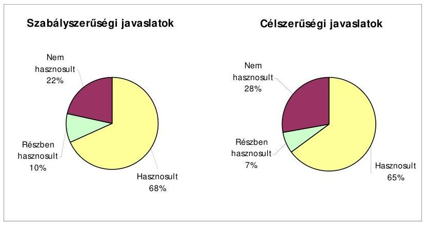

# 3.3. Az ÁSZ jogi realizálással kapcsolatos tevékenysége 

## Büntetőeljárások lefolytatásához való hozzájárulás

A közpénzek szabályellenes felhasználásához kapcsolódó büntetőjogi felelősségre vonás össztársadalmi érdek, amelynek feltárásában és bizonyítékokkal való alátámasztásában az ÁSZ-nak kiemelkedő szerepe van. Különösképpen igaz ez az önkormányzati kört illetően, amelynek gazdálkodására vonatkozó releváns információkat szinte kizárólag az ÁSZ tud szolgáltatni. Az ÁSZ jelentések nyilvánossága, honlapon történő hozzáférhetősége szintén támogatja a büntető eljárásokban közreműködő szervek tevékenységét. Tapasztalataink szerint a nyomozó hatóságok feladatellátásuk során támaszkodnak is a jelentésekre.

A korábbi évek viszonylatában egyre nagyobb számban érkező hatósági megkeresések teljesítésével az ÁSZ jelentős mértékben segíti a nyomozó hatóságok (rendőrkapitányságok, Vám- és Pénzügyőrség hivatalai, ügyészségek, Nemzeti Nyomozó Iroda) munkáját. A tárgyévi összesen 43 megkeresésből 40 megkeresés már folyamatban lévő - korábban az ÁSZ, vagy más feljelentő által kezdeményezett - nyomozáshoz kapcsolódott. Adatszolgáltatási kötelezettségének az ÁSZ válaszlevéllel, ezen túlmenően a lefolytatott ellenőrzés során tudomására jutott tényeket tartalmazó dokumentumok megküldésével tett eleget.

Általános tapasztalat, hogy az illetékes nyomozó hatóságokhoz eljuttatott jelzések alapján indított büntetőeljárások a következő évekre is áthúzódnak. Az ÁSZ jelentései alapján a Nemzeti Nyomozó Iroda jelenleg is nyomozást folytat például a Bábolna Nemzeti Ménesbirtok Kft. működésével, a Kerteskői Gazdaság értékesítésével, a sukorói ingatlancserével, az FHB Nyrt. részvénycsomagjának értékesítésével, valamint a MOL Nyrt. törzsrészvényeinek értékesítésével összefüggésben. A moszkvai Magyar Kereskedelmi Képviselet ingatlanértékesítése kapcsán a Legfőbb Ügyészség indított büntetőeljárást. Az ÁSZ a nyomozó szervek munkáját személyes konzultációkkal és egyéb adatkérések teljesítésével folyamatosan segíti.

---

A nyomozások tárgyát képező legjellemzőbb bűncselekménytípusok a hűtlen kezelés vétsége/bűntette (17), a jogosulatlan gazdasági előny megszerzésének bűntette (5) és a számvitel rendje megsértésének vétsége/bűntette (5).
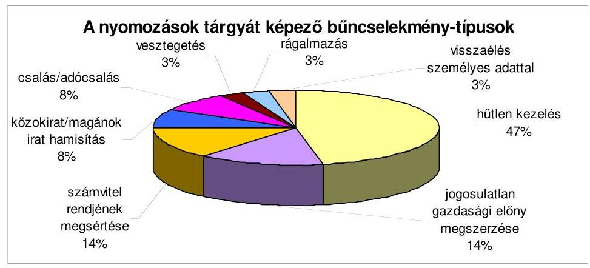

Az ÁSZ - törvényben meghatározott kötelezettségének megfelelően - az ellenőrzések során a közpénzek szabálytalan felhasználása kapcsán tett, a bűncselekmény elkövetésének alapos gyanúját alátámasztó megállapításait minden esetben az illetékes nyomozó hatóság tudomására hozza.

Az ÁSZ a tárgyévben Kunszentmárton Város Önkormányzata gazdálkodásának átfogó ellenőrzésének megállapításai alapján - az önkormányzat egyes befektetésein realizált veszteségek miatt - különösen nagy vagyoni hátrányt okozó hanyag kezelés bűncselekménye elkövetésének alapos gyanúja okán tett feljelentést ismeretlen tettesek ellen, mely alapján az ügyészség elrendelte a nyomozást. Az ÁSZ által még 2008-ban tett feljelentés alapján, a jelentős vagyoni hátrányt okozó hűtlen kezelés bűntettének megalapozott gyanúja Krasznokvajda Önkormányzatánál teljesítés-igazolás, illetve körjegyzői ellenjegyzés nélküli kifizetések - miatt folytatott nyomozást követően az ügy 2009-ben bírósági szakba került.

# Jogorvoslati eljárás kezdeményezése 

A közbeszerzési törvény korábbi módosítása a jogorvoslati eljárás kezdeményezésére nyitva álló, a jogsértés bekövetkezésétől számított 90 napos határidőt az ÁSZ javaslatával összhangban - a jogsértés megtörténtétől számított egy évre, illetve a közbeszerzési eljárás jogtalan mellőzése esetén három évre módosította, mely az ÁSZ által kezdeményezett jogorvoslati eljárások számának jelentős növekedését tette lehetővé.

A jogorvoslati eljárás-kezdeményezések számának emelkedési tendenciája megszakadt a Kbt. 2009. április 1-jétől hatályos újabb módosításával, melynek értelmében a közbeszerzés mellőzése esetén a közbeszerzési eljárás nélkül létrejött szerződés megkötésének időpontjától számított mindössze egy éves jogvesztő határidőn belül van lehetőség jogorvoslati eljárás kezdeményezésére.

A törvény változása miatt a 2008. évi 36-tal szemben az ÁSZ a 2009. évben összesen 2 jogorvoslati eljárást kezdeményezett, egyik esetben a közbeszerzési el-

---

járás jogtalan mellőzése, másik esetben a tájékoztatók késedelmes elkészítése és közzététele miatt. A Közbeszerzési Döntőbizottság mindkét ÁSZ által kezdeményezett jogorvoslati eljárásban megállapította a jogsértés megtörténtét.

# 3.4. A számvevőszéki tevékenység nyilvánossága 

Tevékenységünk nyilvánosságának biztosítása számunkra nem csupán törvényi kötelezettség, hanem egyben lehetőség is arra, hogy ellenőrzési tapasztalatainkat, megállapításainkat, munkánk eredményeit széles körben elérhetővé tegyük. A nyilvánosságra építve szervezzük és fejlesztjük kommunikációnkat, hozzáigazítva a folyamatosan változó környezethez és követelményekhez, szem előtt tartva a legszigorúbb takarékossági elveket.

Az Országgyűlés, valamint az országgyűlési bizottságok tájékoztatása, munkájuk segítése 2009-ben is kiemelt feladatunk volt. Jelentéseinkhez a legfontosabb megállapításokat összegző képviselői levelet készítünk, a bizottságok munkáját folyamatosan figyelemmel kísérjük, valamint munkatársaink rendszeresen részt vesznek a bizottsági üléseken.

2009-ben 248 különböző forrásból összesen 6756 hírt, cikket, interjút, illetve említést regisztráltunk a sajtófigyelő adatbázisunkban.
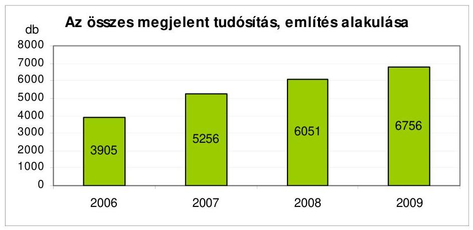

Elnöki sajtótájékoztatót 2009-ben két alkalommal tartottunk: az ÁSZ 2009. évi ellenőrzési tervéről és a „Pénzügyi kockázatok az önkormányzati rendszerben" c. ÁSZKUT tanulmányról, illetve a 2008. évi költségvetés végrehajtásának és a Magyar Nemzeti Vagyonkezelő Zrt. 2008. évi tevékenységének ellenőrzéséről.

2009 novemberében főtitkári sajtótájékoztatót rendeztünk az ÁSZ központi székházában, amelynek témája a „Korrupciós kockázatok feltérképezése - integritás alapú közigazgatási kultúra terjesztése" c. kiemelt európai uniós projekt elindítása volt.

Tizenkét alkalommal került sor vidéken főigazgatói sajtótájékoztatóra (Miskolcon, Zalaegerszegen, Pécsett, Kaposvárott, Nyíregyházán, Egerben, Hódmezővásárhelyen, Sopronban, Veszprémben, Tatabányán, Nagykanizsán és Békéscsabán).

---

Júliusban sajtóbeszélgetésre hívtuk az újságírókat, amelynek témája a szilárdhulladék gazdálkodásra a Kohéziós Alapból és hazai forrásból nyújtott támogatások hasznosulásának ellenőrzése, valamint a Sport XXI. Létesítményfejlesztési Program keretében támogatott önkormányzati PPP-beruházások megvalósítása és az önkormányzati feladatok ellátására gyakorolt hatása voltak.

Augusztusban szintén sajtóbeszélgetés keretében kérdezhettek az újságírók a sürgősségi betegellátó rendszer kialakítására, fejlesztésére fordított pénzeszközök felhasználásának, valamint az egyes kórházi tevékenységek kiszervezésének ellenőrzéséről.

Novemberben az ÁSZKUT főigazgatója tartott sajtóbeszélgetést, amelynek témái a megváltozott munkaképességű személyek támogatási rendszere társadalmi-gazdasági hatékonyságának vizsgálata, a felnőttképzési rendszerek hatékonysága nemzetközi összehasonlításban, valamint az állam célszerű gazdasági szerepvállalása a XXI. század elejének globális gazdaságában c. tanulmányok voltak.
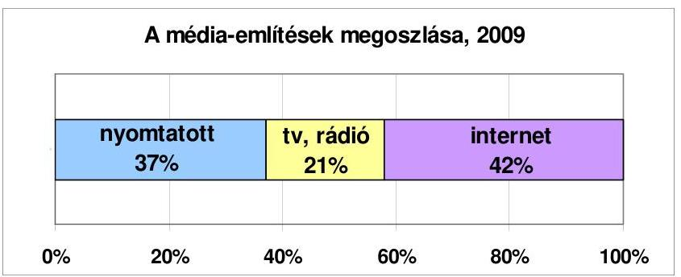

Tovább folytatva a korábbi években kialakított gyakorlatot az ÁSZ személyügyi híreit, valamint a jelentések összefoglalóit a Hivatalos Értesítőben is megjelentettük.

Honlapunk nyitóoldalán 2009-ben közel 90 ezer látogatást regisztráltunk, az érdeklődők mintegy 72 ezer alkalommal töltöttek le magyar nyelvű jelentést külső IP címről, emellett angol nyelvű összefoglalót is több mint ezerszer nyitottak meg.

2009-ben kialakítottuk az ÁSZ honlapjának olyan „akadálymentes" verzióját, amely a vakok és a gyengén látók speciális igényeinek is megfelel.

Az internet-használat által kínált lehetőségeket kihasználva a lakossággal való kapcsolattartás elősegítésére három kommunikációs csatornát alakítottunk ki. A honlapon található internetes fórum, melyet 2003-ban indítottunk el, két lehetőséget kínál a honlapra látogatók részére: az „Elnöki fogadóórá"-t, és az „ÁSZ Fórumá"-t. A kapcsolatteremtés másik formája a 2004-ben megnyitott központi címünk (szamvevoszek@asz.hu), ahova elektronikus leveleket küldhetnek az érdeklődők.

Az Elnöki fogadóóra 2003. évi indulás óta összesen 14 alkalommal került megrendezésre. Az érdeklődés folyamatos visszaesését tapasztaltuk, ezért 2009-ben Elnöki fogadóórát nem tartottunk.

---

A Fórum rovatra érkező megkeresések száma 2008-ban számottevően csökkent. Ekkor az előző évekhez képest a kérdést feltevők száma 40%-kal esett vissza. Az érdeklődés 2009-ben sem növekedett, évi mintegy 40 kérdés érkezett. A leggyakrabban felmerült témák: számviteli problémák, különböző területeken tapasztalt visszaélések, jogszabályok értelmezése, pályázatok, szerződések elkészítése, képviselői jutalmak kifizetése, hitelek finanszírozása.

A központi elektronikus levélcím a hozzánk fordulók számára a nyilvánosság kizárásával biztosítja annak a lehetőségét, hogy véleményüket, észrevételüket elmondják, kérdésüket feltegyék. Az utóbbi években folyamatosan emelkedik a megkeresések száma, 2009-ben közel 300 érdemi levél érkezett (jogszabályok értelmezése, segítségkérés konkrét probléma megoldásához, panaszok, észrevételek, vélemények, bejelentések a lakókörnyezetben tapasztaltakról és a gazdaság általános helyzetével kapcsolatban).

# 4. A SZÁMVEVŐSZÉKI TEVÉKENYSÉGHEZ KAPCSOLÓDÓ KUTATÓ ÉS FEJLESZTŐ MUNKA 

Az ÁSZ Kutató Intézete (ÁSZKUT) az ÁSZ stratégiájának céljait szem előtt tartva 2009-ban is elsősorban a közszféra versenyképessége, a közfinanszírozás hatékonysága témakörében folytatott kutatást. Egyfelől átfogó tanulmányokat dolgozott ki a közszféra és a gazdaság versenyképességének kölcsönhatásáról, az állam célszerű gazdasági szerepvállalásáról, a nemzetgazdasági tervezés megújításának lehetőségeiről, az önkormányzati gazdálkodás pénzügyi kockázatairól, másfelől konkrét szakpolitikák (megváltozott munkaképességű személyek támogatási rendszere, felnőttképzés, turizmus, kultúra) eredményességéről, hatékonyságáról készített elemzéseket.
Az ÁSZKUT 2009-ben az alábbi kiadványokat publikálta:
A helyi önkormányzatok pénzügyi rendszerének feszültségpontjai,
A megváltozott munkaképességűek támogatási rendszerének társadalmi-gazdasági hatékonysága,
Az állam célszerű gazdasági szerepvállalása a XXI. század elejének globális gazdaságában,
A felnőttképzési rendszerek hatékonysága nemzetközi összehasonlításban.
Az említett többi kutatás eredményeiről azok befejeződését követően, 2010-ben jelentet meg az Intézet kiadványt. A kiadványok nagy szakmai érdeklődést váltottak ki: számos újságcikk, televízió- és rádióműsor foglalkozott az azokban foglaltakkal. A tanulmányok alapján az intézet munkatársai szakmai folyóiratokban több cikket adtak közre, illetve kutatásaik fontosabb üzeneteit nemzetközi és hazai tudományos konferenciákon ismertették.
„A helyi önkormányzatok pénzügyi rendszerének feszültségpontjai" címú tanulmány az önkormányzatok működéséből adódó pénzügyi kockázatok feltérképezésére, a kockázatokat kiváltó okok feltárására és azok lehetséges kezelésére vonatkozó javaslatok megfogalmazására vállalkozik. E kockázatokat a rendszer egészére és egyes szegmenseire vonatkozóan elemzi. A tanulmány fontosabb megállapításai a következők:

---

- Az államháztartási kiadások mintegy negyedét teljesítő helyi önkormányzati szektor növekvő fiskális kockázatok hordozója. A kockázatok forráshiány, likviditáshiány és bonitáshiány formájában jelentkezhetnek.
- A helyi önkormányzati szektor a pénzügyileg sem tekinthető homogénnek. Külön szegmenst jelentenek a kis önkormányzatok (községek), a nagy (döntően megyei jogú) városok,
 a megyei önkormányzatok, a fővárosi és a kerületi önkormányzatok.
- A községi önkormányzatok szegmensében a legfontosabb probléma a forráshiány. Ez csak az esetek kis részében vezet likviditás- vagy bonitáshiányhoz, mivel ennek megelőzését a kormányzat diszkrecionális eszközökkel általában el tudja érni. Ezért, valamint pénzügyi súlya miatt ez a szegmens a költségvetési szabályok betarthatósága szempontjából nem hordoz jelentős makrogazdasági szintű fiskális kockázatot. Az állandósult forráshiány azonban az itt élő lakosságot súlyosan érinti.
- A nagyvárosi önkormányzatok csoportja gyorsuló mértékben adósodott el. A nyílt eladósodás elsősorban devizában denominált kötvénykibocsátás formájában történt. Ez egyfelől jelentős árfolyamkockázatot jelent, másfelől azt eredményezi, hogy jelentős szabad pénzeszközök halmozódtak fel e szereplőknél. A kibocsátott kötvényekből rendelkezésre álló források kis hányadát fordították beruházásokra. A bevont források egy része a működési hiányt fedezte, más része pedig pénztartalékként ülepedett le. Ezek gyors elköltése makrogazdasági szinten is kockázatot jelent.
- A megyei önkormányzatok esetében a fenti kockázatok még azzal is kiegészülnek, hogy a megyék szerény fiskális kapacitásaik ellenére adósodtak el. Esetükben nem látszik az a pénzügyi többlet, amely majd fedezetet nyújt a kötvények visszafizetésére.
- Nem elhanyagolható mértékű a fővárosi önkormányzat eladósodottsága. Figyelmet érdemel, hogy az „elszegényedő”, romló pénzügyi helyzetben lévő főváros mellett viszonylag „gazdag”, stabil pénzügyi helyzetben lévő kerületek is működnek.
- A szektorban megjelenő kockázatok alapvető oka a magyar önkormányzati modell, illetve ennek folyamatos deformációja. Az önkormányzati rendszer „konfliktuskonténerként” működik. A kockázatok további okai: az információgazdálkodási rendszer gyengesége, a forrásszabályozási rendszer, a hitelfelvételi szabály jelenlegi formája.
- A jelenlegi szabály- és intézményrendszer nem alkalmas a szektor kockázatainak kezelésére. A jelenlegi Alkotmány keretei között is van lehetőség a pénzügyi fegyelem erősítésével a kockázatok kezelésére.

A tanulmány az információgazdálkodási rendszer korszerűsítése, a korszerű tervezési módszerek alkalmazása, a kincstári rendszerre történő áttérés, az adósságrendezési törvény következetesebb alkalmazása, az önkormányzati hitelfelvétel szabályozása, az önkormányzati hitelgarancia intézmény és a pénzügyi ellenőrzés erősítése területén fogalmaz meg konkrét javaslatokat.

---

# „A megváltozott munkaképességű személyek támogatási rendszere társadalmi-gazdasági hatékonyságának vizsgálata" címú tanul-

mány a támogatások társadalmi-gazdasági hatékonyságát elsődlegesen a foglalkoztatás szempontjából ítéli meg. A tanulmány fontosabb megállapításai:

- A támogatási rendszer potenciális célcsoportjának mérete 250-300 ezer főre becsülhető, szemben a jelenleg éves szinten foglalkoztatást segítő támogatásban, illetve szolgáltatásban részesülő 110-130 ezer fővel.
- A támogatási rendszer a sikeres foglalkoztatási rehabilitációnak alapeseteit (a teljes rehabilitációt, a részleges rehabilitációt, a védett foglalkoztatást) nem különbözteti meg. Az integrált körülmények között megvalósuló teljes rehabilitációhoz nem nyújt megfelelő támogatást, de bőkezűen támogatja a részleges rehabilitációt, illetve a védett foglalkoztatást. Ezáltal ellenérdekeltséget teremt a teljes rehabilitációval szemben.
- A jelenleg rendelkezésre álló költségvetési előirányzatokból lényegesen több megváltozott munkaképességű személy munkába helyezését lehetne támogatni, ha
a foglalkoztatás nagyobb arányban integrált formában valósulna meg,
a védett szervezeti foglalkoztatást védett foglalkoztatással vagy szociális foglalkoztatással lehetne felváltani,
a szabályozás a megváltozott munkaképességű személy rehabilitációs szakaszának lezárultakor megkövetelné a rehabilitációs intézkedés értékelését, és a támogatás időszakának meghosszabbítását csak a legszükségesebb esetben tenné lehetővé.
- Nagyon fontos azoknak a szabályoknak a megalkotása, illetve kiterjesztése, amelyek az egészségkárosodást szenvedett munkavállalót és munkáltatóját a foglalkoztatás fenntartására késztetik. A munkáltatóknak több szakmai segítséget kellene kapniuk a teljes rehabilitációt lehetővé tevő munkakör kialakításához. Az akkreditáció feltételeit úgy kellene megállapítani, hogy azt több ezer munkáltató vállalja. A védett foglalkoztatást a védett piacok megteremtésével lehetne jobban elősegíteni.
- A rehabilitációs járadékra jogosult személyek komplex rehabilitációs modelljének kiértékelése alapján, egy olyan rehabilitációs rendszert szükséges kialakítani, amely alkalmas évi 50-70 ezer megváltozott munkaképességű ember rehabilitációját, majd munkába állását hatékonyan segíteni.
- Az orvosi rehabilitáció jelenlegi rendszere nem garantálja, hogy a sérült személyek a szükséges rehabilitációs szolgáltatásokat megkapják. Következésképpen jelentős részük nem kerül munkavállalásra kész állapotba. Ez is hozzájárul ahhoz, hogy ők inkább keresik a biztonságot jelentő rokkantsági, illetve szociális ellátást, mint a teljes értékű rehabilitációt.

## „Az állam célszerű gazdasági szerepvállalása a XXI. század elejének globális gazdaságában" címú tanulmány az állam szerepével kapcsolatos logikai lánc felrajzolása, a nemzetközi trendek, valamint a magyar államműködés elmúlt 20 éve főbb tapasztalatainak áttekintése után felvázolja, milyen változtatások szükségesek a magyar állam szerepvállalásában. A tanulmány főbb megállapításai a következők:

---

- A napjaink globális versenyében történő helytállás az államot új kihívások elé állítja. Az egyik a piactökéletesítő funkció. A globalizáció új helyzetet teremtett a gazdaság és a környezete kapcsolatában is. Előtérbe került a környezeti szempontból is fenntartható fejlődés követelménye. A jelenlegi válság nyilvánvalóvá tette e kihívásokat. A hasonló válságok elkerülése erős nemzetállamokat igényel.
- A magyar gazdaság jelenlegi állapota nem egy rövid időszak alatt, hirtelen kialakult válsághelyzet, hanem hosszabb időszakon át tartó, kedvezőtlen folyamatok, felhalmozott feszültségek következménye. A tanulmány Magyarország rendszerváltás óta bejárt pályáinak elemzésével próbálja megvilágítani ezt a folyamatot. Végső következtetése az, hogy Magyarországnak a fejlett nyugati országok intézményrendszerébe történt gyors integrálódása ellenére nem jött létre a magyar gazdaság egészének a felzárkózása. Az országban megtelepedett külföldi vállalatok szervesebben kötődnek a globális, mint a magyar gazdasághoz, és ezért húzó hatásuk a nemzetgazdaság egészére kevéssé érvényesült. A következő évek gazdaságpolitikájának a magyar gazdasági fejlődést legerőteljesebben meghatározó pontja: miként lehet úgy megtartani a külföldi működő tőke reális mértékű bevonását, hogy e folyamat a kis- és középvállalati szektor megerősödésével is járjon.
- A rendszerváltáshoz kapcsolódó államháztartási reformok létrehozták a modern piacgazdaságok fontos intézményeit, de a politikai erők nem jutottak konszenzusra az állam célmodelljéről. Ezért az új intézmények egy része súlyos belső ellentmondásokkal működik. Az államháztartási rendszereket érintő döntéshozatal kerülte a szerkezet-átalakítással járó konfliktusokat. Ehelyett a finanszírozás szűkítésével próbálta az intézményeket, illetve azok fenntartóit hatékonyabb gazdálkodásra ösztönözni. A szerkezetváltoztatás nélküli forrásszűkítés vagyonfeléléshez, illetve a túl sok közfeladat alacsony szintű ellátásához vezetett.
- A kormányzati szektor reformja kapcsán pragmatikus megoldásokra, a különböző közszektor reformstratégiák megfelelő keverésére van szükség. A magyar állam legfontosabb feladata az országot egy olyan új fejlődési pályára állítani, amely gazdasági, társadalmi és ökológiai szempontból egyaránt fenntartható.
„A felnőttképzési rendszerek hatékonysága nemzetközi összehasonlításban" címú tanulmány egy olyan kutatás eredményeit összegzi, amelynek az volt a célja, hogy háttér-információkat szolgáltasson és szempontokat adjon „a felnőttképzés feltételrendszere, eredményessége, szerepe a gazdaság munkaerőigényének kielégítésében" című számvevőszéki ellenőrzéshez. A tanulmány ismerteti, hogy az EU a felnőttkori tanulás területén milyen stratégiai célokat tűzött ki, illetve milyen cselekvési programot indított el. Bemutatja Hollandia, Lengyelország, Németország felnőttképzési rendszerének jellemzőit. Arra a kérdésre keresi a választ, hogy a magyar intézményrendszer mennyiben felel meg az EU által megfogalmazott célkitűzéseinek. A hazai felnőttképzés súlyos problémája, hogy
- az egész életen át tartó tanulásban a magyar 25-64 éves népesség mindössze 3,1 százaléka vesz részt, szemben az EU25-ök 9,6 százalékos átlagával;

---

- a felnőttképzésen belül a szakképzés és a szakmai továbbképzés a meghatározó. A gyakorlatban kevés az ún. „általános célú felnőttképzés”, jóllehet ezek a képzési formák lennének képesek pótolni az alapképzettségbeli hiányokat, ami előfeltétele lenne a társadalmi hátrányok mérséklésének;
- a képzési kínálat nem alkalmazkodik elég rugalmasan a kereslet változásához.

A munkaerő-piaci igények minél teljesebb kielégítése mellett nagyon fontosak a felnőttképzés társadalompolitikai céljai is: az esélyegyenlőség és a társadalmi befogadás előmozdítása. A felnőttképzés az az eszköz, amellyel a kirekesztődési spirál megtörhető.

A nemzetközi trendekhez igazodó, a gyakorlati ellenőrzési munkát támogató folyamatos fejlesztő tevékenység a modern számvevőszéki működés nélkülözhetetlen velejárója. Célja, hogy hozzájáruljon az ellenőrzés módszereinek a nemzetközi standardokkal összhangban történő korszerűsítéséhez és a nemzetközi legjobb gyakorlat adaptációjához. Az ÁSZ stratégiája kiemelten kezeli a minőségirányítási rendszer működtetését és a szabályozási rendszer minőségközpontú fejlesztését, továbbá a már bevezetett minőségirányítási rendszer továbbfejlesztését.

Értékelő áttekintés készült 2009-ben az ÁSZ minőségirányítási rendszerének működéséről, valamint a minőségi követelmények és a teljesítményértékelés viszonyáról. Egyúttal javaslatok fogalmazódtak meg minőségirányítási rendszerünk továbbfejlesztésére.

Az ÁSZ stratégiai céljaival összhangban vizsgálja a korrupciós kockázatokat jelentő területeket. Az Új Magyarország Fejlesztési Terv keretében arra vállalkoztunk, hogy elkészítjük a magyar közszféra korrupciós kockázati térképét, mely a jövőben segítséget nyújt az ellenőrzést végző szervezeteknek az ellenőrzési terveik összeállításához. 2009-ben az Országgyűlés határozatával kinyilvánította, hogy egyetért a korrupciós kockázatok feltérképezésére irányuló kiemelt, a Kormány által is támogatásra érdemesített projekt megvalósításával.

Az uniós finanszírozású projekt keretében egy nemzetközileg igazolt és bevált olyan kockázatértékelési módszer hazai adaptálására kerül sor, mely a 2008-ban befejeződött, a holland és a magyar számvevőszék által megvalósított twinning projekt végeredményén alapul. Célja, hogy a rendszeres - korrupciós szempontokra is kiterjedő - kockázatelemzés általános megközelítéssé és gyakorlattá váljon a költségvetési szervek működése során. A projekt keretében a közigazgatási rendszer előre kiválasztott intézményei körében az ÁSZ felmérést készít az intézmények korrupciónak való kitettségéről, majd a mért eredményeket egy adatbázisba rendezi, melyek az interneten keresztül a nyilvánosság számára elérhetők lesznek (korrupciós kockázati térkép).

A részletes projekttervek kidolgozását és a pályázati dokumentáció bíráló bizottsági jóváhagyását követően - az erről szóló Elnöki utasítás alapján - 2009 végén megtörtént a projektért felelős vezetők kinevezése, valamint a projektre vonatkozó eljárásrendek és határidők rögzítése. 2009. december 1-jétől megkezdődött a két évig tartó, 286,5 M Ft összköltségvetésű fejlesztés megvalósítása.

---

Az ÁSZ stratégiája szerint az ellenőrzések során szerzett gyakorlati tapasztalatok és a legjobb nemzetközi gyakorlat alapján folyamatosan fejleszti a számvevőszéki ellenőrzés szakmai szabályrendszerét. 2009-ben folytatódott a főbb ellenőrzési típusok szerint korábbi években készült módszertanok korszerűsítése, valamint az ezekhez kapcsolódó segédletek ellenőrzési tapasztalatok alapján történő felülvizsgálata. Ennek keretében különösen fontos volt az újonnan kidolgozott rendszerellenőrzési módszertani útmutató első alkalmazásaiból levonható tapasztalatok feldolgozása és felhasználása. A szakmai szabályok aktualizálása mellett új ellenőrzés-szakmai dokumentumok is (módszertanok, segédletek) készültek (így például a társadalombiztosítás pénzügyi alapjai és az elkülönített állami pénzalapok pénzügyi szabályszerűségi ellenőrzéséről szóló módszertan).

A rendszeresen ülésező Módszertani Bizottság mellett megalakult a Módszertani Bizottság Terminológiai és Fordításlektorálási Munkacsoportja. A munkacsoport tevékenysége keretében megkezdődött a fontosabb nemzetközi ellenőrzés-szakmai dokumentumok fordítása, a meglévő magyar nyelvű fordítások szakmai szempontú lektorálása, illetve a meglévő ellenőrzés-szakmai terminológiai gyűjtemény (Glosszárium) tartalmi korszerűsítése.

Lényeges módszertani, szakmai fejlesztési tevékenységet jelentett 2009-ben az INTOSAI keretében felgyorsult ellenőrzési standard-fejlesztési munkában való részvétel a standard és útmutató tervezetekkel kapcsolatos véleményezések, javaslattételek révén. Jóllehet ezen dokumentum-tervezetek várhatóan csak 2010 őszén kerülnek elfogadásra, illetve lépnek hatályba, a véleményezésükre, javaslatok kialakítására fordított jelentős munka fontos hozadéka, hogy egyrészt közvetlenül megismertük és követtük az ellenőrzési szakma nemzetközi fejlődését, a közszféra ellenőrzésével szemben támasztott növekvő minőségi, standard követelmények alakulását, másrészt már a tervezetek szintjén fel tudtunk használni ezeket a dokumentumokat módszertani fejlesztési feladataink megvalósításához.

Az Elnöki Tanácsadó Testület az elnök stratégiai munkáját segítő konzultatív munkaszervezet - a kialakult gyakorlat szerint - éves munkaprogramja alapján végezte tevékenységét.

A szakmai konzultációk,
 viták elsősorban a számvevőszéki ellenőrzéshez kapcsolódó tervezési, minőségirányítási, módszertani, nemzetközi kapcsolatépítési és közpénzügyi kutatási munkákra, a Költségvetési Tanáccsal kialakítható kapcsolatra, valamint az ÁSZ középtávú stratégiájának megújítására irányuló felkészülés tartalmi kérdéseire, ennek részeként a hatályban lévő stratégia megvalósítására vonatkozó felmérés tanulságainak áttekintésére összpontosultak. Ezek mellett az ÁSZ Kutató Intézetének több tanulmányát is napirendjére tűzte a testület.

Az Országgyűlés 43/2005. (V. 26.) határozatában szükségesnek tartotta, hogy az ÁSZ alaptevékenységéhez is kapcsolódóan korszerű pénzügyi szakfolyóiratot jelentsen meg. Négy évvel később, 35/2009. (V. 12.) határozatában egyetértett azzal, hogy az ÁSZ színvonalas szakfolyóirattá fejlesztette a Pénzügyi Szemlét, és a határozat azt is kimondta, hogy az ÁSZ folytassa a folyóirat gondozását.

---

A folyóirat 2009-ben - az impresszumában rögzített céljának megfelelően - a nemzetgazdaság és a pénzügyi rendszer működése szempontjából időszerű és fontos probléma-komplexumként a (pénzügyi) világgazdasági válságnak a magyar gazdaságra és az államháztartásra gyakorolt hatásait állította reflektorfénybe. Ehhez kötődően figyelmet fordított olyan speciális témákra is, mint például a pénzügyi és a pénzintézeti válság kapcsolata, a pénzügyi stabilitás és a bankrendszer, valamint a számvevőszéki ellenőrzés egyes kérdései (az ÁSZ helye a hatalmi ágak rendszerében, a tanácsadás az ÁSZ tevékenységében, az Európai Számvevőszék együttműködése a legfőbb uniós ellenőrző intézményekkel).

A szerzők köre - hasonlóan a megelőző évekéhez - akadémiai rendes, valamint levelező tagoktól kezdve egyetemi tanárokon, állami vezetőkön, szakértőkön át Ph.D.-hallgatókig terjedt (köztük volt például az Alkotmánybíróság elnöke, az Európai Számvevőszék elnöke és egy OECD gazdasági szakértő is).

# 5. AZ ELLENŐRI MUNKA MINŐSÉGÉNEK FEJLESZTÉSE 

### 5.1. Az ellenőrzések minőségbiztosítása

Az elmúlt években az ellenőrzési munka valamennyi fő szakaszában kiépültek és működnek azok a tevékenységek és eljárások, amelyek a jó minőségű munkát hivatottak szavatolni.

A minőségirányítási rendszer részeként az ellenőrzési munkafolyamatokba épített minőségkontrollok megfelelő működése biztosítja, hogy az ellenőrzést végzők az ellenőrzések tervezése, előkészítése és végrehajtása, valamint a jelentések elkészítése során

- betartsák a számvevőszéki ellenőrzés alapvető követelményeit,
- alkalmazzák az egyes ellenőrzési típusokra vonatkozó speciális szabályokat, módszereket, technikákat és belső kontrollokat,
- visszacsatolást kapjanak az elvégzett munka minőségéről, és elvégezzék az ellenőri munka javításához, fejlesztéséhez szükséges feladatokat.

A számvevőszéki jelentések és a személyes felelősség felvetését tartalmazó számvevői jelentések tervezetei ezen felül kétszeri független felülvizsgálaton is átestek a megállapítások, következtetések és javaslatok, illetve a felelősség felvetésének ellenőrzés-szakmai és jogi megalapozottsága szempontjából. A független felülvizsgálatot végző, az elnök közvetlen irányítása alatt álló Minőségbiztosítási önálló osztály az év során végzett, lezárt ellenőrzések teljes folyamatának szakmai, módszertani megfelelőségéről utólag is meggyőződött. Felülvizsgálati tapasztalatait - amelyek egészében véve a szakmai normáknak és minőségkövetelményeknek megfelelő munkavégzést igazolták -, valamint az ezek alapján - a szakmai, módszertani fejlesztés, a hatékonyság javítása érdekében - tett ajánlásait az elnöki értekezlet megtárgyalta. A tapasztalatokat összegző értékelést - a belső hálózaton keresztül - az ÁSZ teljes kollektívája megismerhette.

---

# 5.2. Humán erőforrás gazdálkodás és fejlesztés 

## Személyi feltételek

Az állományi létszám 2009. december 31-én 542 fő volt, ami a stratégiai ciklusunk kezdetéhez képest (607 fő), folyamatos és jelentős mértékű csökkenést mutat. Az idősebb szakemberek közül sokan éltek a viszonylag kedvező nyugdíjazási lehetőségekkel, így négy-öt éves periódusban a személyi állomány közel egynegyede vonult nyugállományba. A szakember-utánpótlás - a nélkülözhetetlen pénzügyi, ellenőrzési tapasztalatot tekintve - nehezen tartott lépést e tendenciával.
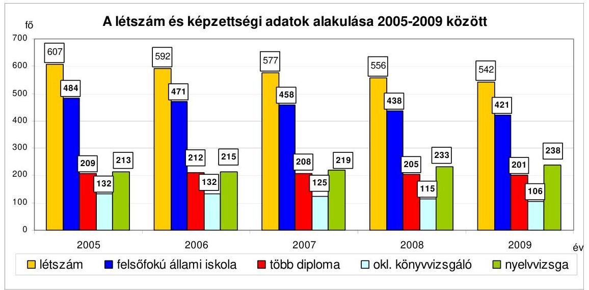

A 2009. évi személyi mozgások esetében 50 munkaviszony-megszűnés közül 40 nyugdíjazás volt - többségében a munkavállaló kezdeményezésére -, és az 50 megüresedő álláshelyre 28 új munkatársat vettünk fel.
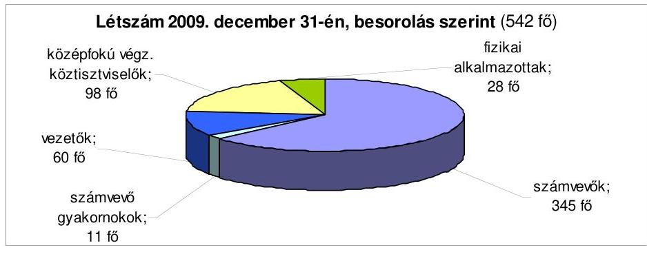

A pénzügyi-ellenőrzési pálya hivatás, sokrétű, alapos felkészültséget kíván. Az ellenőrzés gyakran konfliktusos erőtérben zajlik, ezért a számvevőknek a vizsgálati szituációkat ismerni és kezelni kell tudni. Ezért természetesnek tekintjük, hogy a személyi állomány átlagéletkora a fiatalabb korosztály állandó beáramlása mellett is viszonylag magas, 48-50 év körül mozog.

---

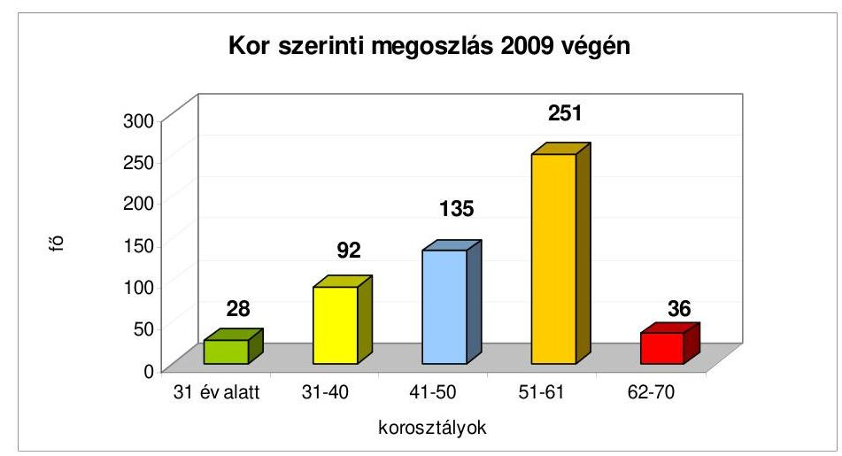

# Továbbképzési munka 

A 2009. évi továbbképzési programba a munkatársak módszertani, informatikai, minőségbiztosítási ismereteit, kommunikációs és együttműködési készségét egyaránt fejlesztő szakmai képzések kerültek. Így 55 alkalommal 35 féle témakörben, 99 napon szerveztünk belső felkészítő, illetve továbbképző oktatásokat.
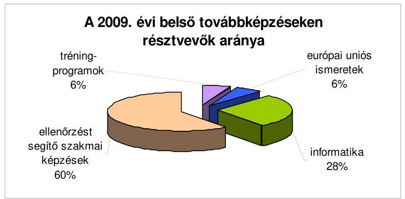

Az ellenőrzési módszertanok oktatása mellett egy-egy előadás keretében átfogó képet adtunk az INTOSAI standardokról és az etikai előírásokról és elvárásokról is. Új formában - három modulban - aktualizálva került sor az európai uniós témakör bemutatására az alapismeretektől a legújabb ellenőrzési tapasztalatokig. Külön blokkban kaptak helyet a napi ellenőrzési munka során folyamatosan hasznosítható ismertetők (jogi aktualitások, adójogszabályokkal kapcsolatos változások).

A könyvvizsgáló kamarai tagsággal rendelkező számvevőknek 2009-ben lehetőségük nyílt arra, hogy kötelező továbbképzési kredit-pontjaik nagy részét belső képzéseinken szerezzék meg.

Munkatársaink 69 konferencián, szakmai előadáson vettek részt, több mint 50 témakörben. A költségtakarékosság érdekében a konferencia típusú országos rendezvényeken (Közgazdász Vándorgyűlés, Jogász Vándorgyűlés, Jegyzői és Közigazgatási Konferencia) korlátoztuk a delegálható munkatársak számát.

---

Számottevően emelkedtek viszont az informatikai munkatársak speciális programozói képzéseinek díjai.

Továbbra is éltünk a Goethe Intézet és a Francia Intézet által a magyar köztisztviselők számára meghirdetett, kedvezményes nyelvtanfolyamok lehetőségével. Az idegen nyelvi képzésben - a megújult Kormányzati Személyügyi Közigazgatási Központtal - hatékony az együttműködésünk. 25 fő fejezte be az első félévben az előző évről átnyúló „e-learning" kurzust, és újabb 22 fő vett részt sikeresen az év végéig tartó tanfolyamon.

Az ÁSZ évek óta lehetőséget kap arra, hogy az Indiai Köztársaság Külügyminisztériumának ITEC ösztöndíja révén szakértőket jelöljön az indiai partnerintézmény által minden évben meghirdetett nemzetközi ellenőrzési tanfolyamokon való részvételre. 2009-ben munkatársaink részt vettek a környezetvédelmi ellenőrzés, az állami vállalatok ellenőrzése, illetve a teljesítmény-ellenőrzés témákban indított képzési programban. Intézményünk ugyancsak képviseltette magát az USA Külügyminisztériuma által, az „Elszámoltathatóság a kormányzati és a magánszférában" címmel szervezett ösztöndíjas programon. Figyelemmel kísérjük a Nemzeti Szakértő kiírásokat, amire két számvevő pályázatát fogadták el. A fiatal vezetőjelöltek Robert Bosch ösztöndíj-programjára jelentkező munkatársunk pályázata elbírálás alatt áll.

Az „e-learninges" nyelvoktatási szerződéseken kívül 6 új tanulmányi szerződést kötöttünk, ami a 2008-as évhez képest csökkenést jelent. 2009 végén 22 élő szerződést tartottunk számon.

A takarékossági szempontok és a feszített ellenőrzési feladatok mind a vezetőket, mind a munkatársakat átgondoltabb jelentkezésekre kényszerítik. Az egy főre jutó képzési költség 2009-ben 37210 Ft volt.

# 5.3. Nemzetközi kapcsolatok 

Intézményünk stratégiájának megfelelően vettünk részt 2009-ben is a nemzetközi ellenőrzés-szakmai közéletben. Arra törekedtünk, hogy a szerzett tapasztalatok közvetítésével, hasznosításuk elősegítésével folyamatosan hozzájáruljunk a hazai külső ellenőrzési tevékenység fejlesztéséhez, ezen belül is az ellenőrzési módszertanok, technikák korszerűsítéséhez, illetve ösztönözzük a számvevőszékek közötti hatékony együttműködési formák fejlesztését.

Két- és többoldalú nemzetközi együttműködésünket 2009-ben túlnyomórészt azok a kötelezettségek határozták meg, amelyek Magyarország európai uniós tagságából származnak. Mindemellett az ÁSZ hosszú évek óta kiemelkedő szerepet játszik a legfőbb ellenőrző intézmények nemzetközi szervezetein belül is. A Legfőbb Ellenőrző Intézmények Nemzetközi Szervezete (INTOSAI) Kormányzótanácsában betöltött elnöki tisztség révén szerzett tekintélyünket megőrizve, tevékenységünk súlypontját folyamatosan a Számvevőszékek Európai Regionális Szervezete (EUROSAI) szakmai fórumaira helyezzük át.

A partnerintézményekkel folytatott kétoldalú kooperáció elsődleges célja a korszerű ellenőrzési és intézményfejlesztési elvek átadása, az ez irányú tevékenységek támogatása, valamint a gyakorlatban megvalósuló segítségnyújtás. Ennek

---

értelmében a fentieken túlmenően a kölcsönös tapasztalatcserére épülő kétoldalú kapcsolatokban rejlő lehetőségek, előnyök kihasználását is szem előtt tartottuk.

# Többoldalú szakmai együttműködés 

Az ÁSZ intézményi és szakértői szinten is aktív szerepet vállal az INTOSAI megújulásában. 2009-ben is eleget tettünk a Kormányzótanácsi, és a Pénzügyi és Igazgatási Bizottsági tagságunkból eredő kötelezettségeinknek, valamint részt vettünk a világszervezet stratégiai tervének megvalósításában kiemelt fontosságú kérdéssel foglalkozó munkacsoportok tevékenységében.

Aktív tagjai voltunk az INTOSAI ellenőrzési útmutatókkal, belső kontroll standardokkal és külső felülvizsgálatokkal foglalkozó szakmai albizottságainak. Továbbra is képviseltettük magunkat az INTOSAI Privatizációs, Gazdasági Szabályozási és PPP Munkacsoportjában, amelynek ülésén bemutattuk a közfeladatoknak a közszféra és a magántőke együttműködésében történő ellátásához kapcsolódó ÁSZ ellenőrzések tapasztalatait.

Folytattuk részvételünket a szervezet 2008 folyamán alakult munkacsoportjaiban. Egy, a tudásalapú gazdaság és társadalom folyamatait leíró nemzeti teljesítmény-indikátorokkal foglalkozó kísérleti program koordinátoraként járultunk hozzá a Nemzeti Teljesítménymutatók Munkacsoport tevékenységéhez. Közreműködtünk az amerikai számvevőszék irányítása alatt létrehozott Pénzügyi Válság Munkacsoport két alcsoportjának tevékenységében. Egyrészt aktív tagjai lettünk a negatív hatások mérséklése érdekében hozott, a reálgazdaságot stimuláló kezdeményezések hatását tanulmányozó alcsoportnak, másrészt véleményezési szerepet vállaltunk a számvevőszékek kihívásait vizsgáló alcsoportban.

Az ÁSZ képviselői részt vettek az INTOSAI és az ENSZ rendszeres időközönként megrendezett közös szakmai eseményén, amelynek témája 2009-ben „A számvevőszéki ellenőrzés értéke és haszna egy globális környezetben" volt. A szimpóziumon bemutattuk a korrupció-elleni küzdelem területén szerzett tapasztalatainkat.

Az INTOSAI európai regionális munkacsoportja, az EUROSAI tevékenységének keretében folytattuk a számvevőszéki minőségirányítási rendszer kialakításának és működtetésének jó gyakorlatait bemutató útmutató kidolgozását végző nemzetközi munkacsoport tevékenységének koordinálását. (A munkacsoport a szervezet 2008. évi krakkói kongresszusát követően kapott felhatalmazást a dokumentum kidolgozására a kérdéskörrel foglalkozó kongresszusi téma folytatásaként.) Az útmutató tervezete 2009 folyamán elkészült. A végleges dokumentumot az EUROSAI Kormányzótanácsa soron következő ülésén hagyja jóvá.

Továbbra is részt vettünk a Környezetvédelmi Munkacsoport és az IT Munkacsoport tevékenységében. Utóbbi keretében végrehajtottuk intézményünk IT ellenőrzésekre vonatkozó önértékelését a munkacsoport által kidolgozott módszertan alapján. Az önértékelés célja annak feltárása volt, hogy miként tudná az IT ellenőrzési terület hatékonyabban támogatni az ÁSZ általános ellenőrzési célkitűzéseit.

---

Aktív szerepet vállaltunk az EUROSAI Képzési Bizottság munkájában is. Hozzájárultunk a Bizottság operatív tervének és ügyrendjének kidolgozásához, valamint - a feladat koordinátoraként - folyamatosan frissítjük munkatervét, továbbá részt veszünk a szemináriumok szervezését segítő útmutató kidolgozásában. Munkatársaink több alkalommal vettek részt például a teljesítményellenőrzés és a legfőbb ellenőrző intézmények nemzetközi standardjai (ISSAI) témákban megrendezett szakmai szemináriumokon.

Bekapcsolódtunk az EUROSAI VII. Kongresszusán a katasztrófák megelőzésére és következményeik felszámolására elkülönített pénzalapok ellenőrzésére létrehozott munkacsoport tevékenységébe. A munkacsoport alakuló ülésén az ÁSZ képviselői ismertették a hazai katasztrófavédelem szervezeti rendszerének felépítését és működési elvét, a továbbiakban pedig az információcserét megalapozó „Glosszárium" kidolgozásában veszünk részt.

Munkatársaink a tavalyi évben is részt vettek, valamint előadást is tartottak az európai regionális ellenőrző intézmények szervezetének (EURORAI) szemináriumain, amelyek a jóléti ellátások és a környezetvédelmi ellenőrzések kérdéskörét dolgozták fel.

Az EU-tagországok számvevőszékei és az Európai Számvevőszék együttműködési hálózata, a Kapcsolattartó Bizottság éves elnöki értekezletét 2009-ben intézményünk látta vendégül. A hálózat soros elnökeként az év során megtettük a szükséges szakmai és szervezési előkészületeket, majd sikeresen lebonyolítottuk a rendezvényt. Az értekezleten a résztvevők megvitatták a számvevőszékek szerepvállalásának kérdését a kormányzatok pénzügyi-gazdasági válságra adható válaszlépéseinek támogatásában. Ezen túlmenően, az EU-tagállamok számvevőszéki együttműködésének különböző lehetőségeit tárgyaló napirendi pontok mellett a Kapcsolattartó Bizottság tagjai megbeszéléseket folytattak a számvevőszékek függetlensége témájában. Ennek eredményeként nyilatkozatot fogalmaztak meg a függetlenség biztosítására irányuló kezdeményezések támogatására.

Folytattuk közreműködésünket a Kapcsolattartó Bizottság üléseit előkészítő összekötők együttműködési hálózatában, amelynek feladata a szakmai munkacsoportok tevékenységének koordinációja és
 a hálózaton belüli kooperáció eredményesebbé tétele.

Intézményünk a Kapcsolattartó Bizottság keretében működő, az EU-alapok felhasználásának különböző kérdésköreivel foglalkozó munkacsoportokban is képviseltette magát. A tavalyi év során számos szakmai munkacsoport (Strukturális Alapok, ÁFA, valamint Közös ellenőrzési standardok) tevékenységében folyamatos szerepet vállaltunk. Az ÁSZ rendezte meg 2009-ben az EUpénzeszközök tagállami felhasználásáról szóló számvevőszéki jelentések munkacsoport éves értekezletét. Mindezen túl munkatársaink részt vettek az EU-tagországok számvevőszékeinek ellenőrzési felhatalmazásáról, szerepéről és tapasztalatairól a pénzügyi és gazdasági válság tükrében rendezett szakmai műhelyen.

---

A Kapcsolattartó Bizottság 2008. évi ülésén elfogadott határozat értelmében 2009-ben - az együttműködés keretében - elvégzendő egyik feladat az EU-forrásból finanszírozott TENT-T V. korridor (Lyon-Triest-Koper-Ljubljana-Budapest) vasútfejlesztési beruházás koordinált teljesítmény-ellenőrzésének lefolytatása, amely tevékenység az ÁSZ irányításával és részvételével valósul meg. A feladat végrehajtásának első lépéseként, az egyes helyszíni vizsgálatok megkezdése előtt, a közös ellenőrzési program véglegesítése céljából munkaértekezletet rendeztünk az érintett partnerintézmények (francia, olasz és szlovén számvevőszékek) képviselőinek részvételével. A közös munka befejezésének határideje 2010. év vége.

Munkatársaink ugyancsak bekapcsolódtak - szintén a Kapcsolattartó Bizottság tevékenységeként - a költségvetési politikával, illetve a Lisszaboni Stratégiával összefüggő ellenőrzések témakörében létrehozott tudáshálózatok munkájába.

A visegrádi országcsoport, valamint Ausztria és Szlovénia számvevőszéki vezetői 2009-ben Lengyelországban tartották éves értekezletüket. Az ülés során hangsúlyt kapott a számvevőszéki elszámoltathatósághoz kapcsolódó kérdések megtárgyalása. Az ÁSZ képviselői részt vettek „az INTOSAI ellenőrzési standardok alkalmazása az informatikai rendszerek ellenőrzésében" témáról megrendezett nemzetközi szemináriumon, ahol bemutatták az ÁSZ-nál végzett IT ellenőrzési önértékelés tapasztalatait is.

A NATO Nemzetközi Számvevő Testülete által rendezett brüsszeli tanácskozáson 2009-ben is részt vettünk a Testület éves beszámoló jelentésének vitájában.

Az ÁSZ elnöke részt vett a világ vezető közgazdászait tömörítő nemzetközi szervezet, a Trilaterális Bizottság európai tagozatának éves értekezletén. Az ÁSZKUT egyik munkatársának pedig lehetősége volt az OECD 3. Világfórumán, a tudásalapú gazdaság és társadalom indikátoraival kapcsolatban előadást tartani.

# Kétoldalú nemzetközi kapcsolatok 

Kétoldalú együttműködés keretében 2009-ben is a hagyományosnak tekinthető partnereinkkel ápoltuk kapcsolatainkat. Folytatódott intézményünk és a vietnámi számvevőszék együttműködése, amely egyben Magyarország nemzetközi fejlesztési stratégiájának is integráns részét képezi. Ennek keretében az ÁSZ szakértői szakmai ismeretek átadásával segítették az átalakuló ázsiai ország legfőbb ellenőrző intézményét a költségvetési terv véleményezéséhez kapcsolódó módszertan kidolgozásában. Ezen túlmenően, az ÁSZ munkatársai fogadták a vietnámi privatizációs szervezet képviselőit is.

Szakértői szinten munkatársaink megbeszéléseket folytattak a szlovák partnerintézmény képviselőivel az önkormányzatoknál végzett teljesítményellenőrzések gyakorlatáról, illetve tapasztalatairól. Az ÁSZ képviseltette magát a dán számvevőszék által, a számvevőszékek képzési tevékenysége témában megrendezett szemináriumon, valamint a brit partner szervezésében tartott, „A teljesítmény szerepének erősítése a közszférában" c. konferencián.

---

Pakisztáni közigazgatási szakemberek, az OECD ország-tanulmányokat kidolgozó egységének képviselői, valamint a koreai Antikorrupciós és Polgárjogi Bizottság munkatársai érkeztek 2009-ben intézményünkhöz szakértői konzultációra.

# A nemzetközi kapcsolattartás költségvetési összefüggései, statisztikai adatai 

A 2009. évi nemzetközi kapcsolattartási terv 46,7 M Ft-ot irányzott elő kiutazásokra. Ebből az összegből 39 M Ft-ot szántunk a külföldre utazás, szállás és biztosítás költségeire; 7,7 M Ft-ot külföldi napidíjra terveztünk. Ezen felül 1 M Ft összegű árfolyamtartalékot is képeztünk.

A kiutazások tényleges költségei a körültekintő tervezésnek és a szigorú, következetes végrehajtásnak köszönhetően a tervszámokon belül alakultak. Az összes kiutazási ráfordítás 23,9 M Ft volt.
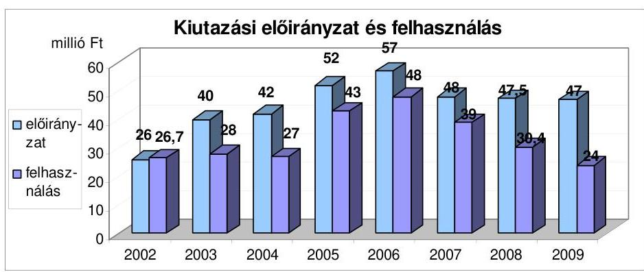

Meg nem megvalósult utak következtében 2009-ben 15,5 M Ft maradvány képződött, 9,1 M Ft-ot pedig a megvalósított utakon, előzetes kalkulációinkhoz képest takarítottunk meg. Az összes tényleges ráfordításból 22,1 M Ft-ot (92 %) megtervezett utazásokra fordítottunk. Terven felül 6 kiutazás valósult meg (2008-ban 13), amelyek költsége összesen 1,8 M Ft volt.

Az elmúlt évben az ÁSZ munkatársai 57 külföldi úton vettek részt, amelyeken 85 kiküldött 476 kiküldetési napot töltött el. (A tervben 70 utazás, 157 fő kiküldése és 566 kiküldetési nap szerepelt.) Egy külföldi út - a hosszú időtartamú képzések $^{8}$ nélkül - átlagosan 4 napot tett ki. Egy külföldi kiküldetésben töltött munkanap átlagos költsége 101 ezer Ft volt.

Az ÁSZ elnöke 4 alkalommal utazott külföldre 2009-ben, ott összesen 10 napot töltött, tengeren túli kiutazáson nem vett részt. (A tervben 12 út, 41 nap szerepelt.) Egy elnöki út átlagos költsége 2009-ben 392 ezer Ft, egy napra eső átlagos költsége 40 ezer Ft volt. Az összes kiküldetés és az elnöki utak számának alakulását a 2002-2009. időszakban az alábbi ábra szemlélteti.

[^0]
[^0]:    $^{8}$ Képzésen való részvételhez 4 külföldi kiküldetés kapcsolódott, időtartamuk összesen 124 nap volt.

---

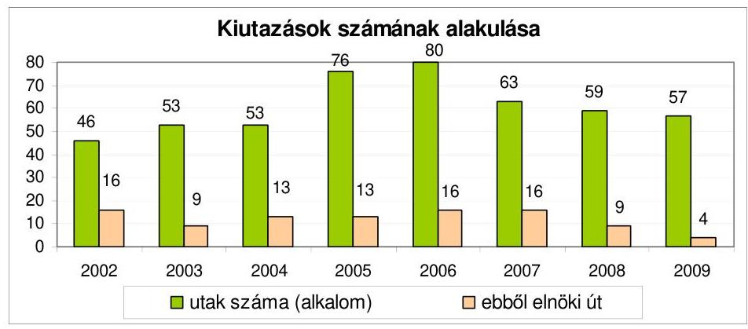

A költségek alakulását a tengeren túli utazások is befolyásolták. Ilyen utat 2009-ben 10 alkalommal szerveztünk, 12 fő részvételével. Ezen kiküldetésekre fordítottuk a kiutazási kiadások 23%-át, összesen 5,7 M Ft-ot.

Vendégfogadásra és ajándékozásra, konkrét eseményekhez kötve 2009-ben 2,4 M Ft felhasználását irányoztuk elő, a tényleges kiadás 1,2 M Ft-ot tett ki. A tervezett és tényleges költségek különbségét - többek között - az okozta, hogy kisebb létszámú külföldi delegációk érkeztek, olcsóbb vendéglátóhelyeket választottunk, valamint a vendégeknek átadott ajándéktárgyak költsége 2008-ban, azok beszerzésekor merült fel. A kiadások több mint 80%-át, 1 M Ft-ot fordítottuk az EU-tagországok számvevőszékei és az Európai Számvevőszék kooperációja keretében rendezett ülésekre, munkaértekezletekre. Az EUROSAI-jal való együttműködésünkhöz kapcsolódó költségünk 180 ezer Ft volt, szakértői szintű tapasztalatcserére összesen 20 ezer Ft-ot költöttünk el.

Az EU Kapcsolattartó Bizottság soros értekezletét 2009-ben intézményünk rendezte meg, amely eseményre 95 fő külföldi vendég érkezett. A rendezvényre készített költségtervünk 20 M Ft összeget tartalmazott, amelyből ténylegesen 15,4 M Ft-t használtunk fel. A megtakarítás abból fakadt, hogy a szakmai dokumentáció fordítására, valamint a rendezvény lebonyolításához szükséges technikai, informatikai berendezések bérleti díjára kevesebbet költöttünk.

# 6. Az intézmény működése és gazdálkodása 

### 6.1. Költségvetési gazdálkodás

A számvevőszéki törvény 2004. évi módosítása óta az ÁSZ maga állítja össze az állami számvevőszéki fejezet költségvetésére és a költségvetés végrehajtására vonatkozó javaslatát. E javaslatot a Kormány - változtatás nélkül - a központi költségvetési, illetve a zárszámadási törvényjavaslat részeként terjeszti elő az Országgyűlésnek.

Az Országgyűlés elnöke által közbeszerzési pályázat útján kiválasztott független könyvvizsgáló elvégezte az ÁSZ költségvetési fejezet 2009. december 31-i fordulónapra elkészített költségvetési beszámolójának könyvvizsgálatát. A könyvvizsgálatot a magyar Nemzeti Könyvvizsgálati Standardok, a könyvvizsgálatra vonatkozó törvények és egyéb jogszabályok alapján, valamint az ÁSZ

---

financial audit típusú módszerének alkalmazásával hajtották végre. Az elvégzett könyvvizsgálat magába foglalta az éves költségvetési beszámoló tényszámait alátámasztó bizonylatok mintavételen alapuló vizsgálatát, emellett tartalmazta az alkalmazott számviteli alapelvek, valamint az éves költségvetési beszámoló bemutatásának értékelését.

Ennek alapján a könyvvizsgálat elegendő és megfelelő bizonyosságot szerzett arról, hogy az éves költségvetési beszámolót a számviteli törvényben, illetve az államháztartás szervezetei beszámolási és könyvvezetési kötelezettségeinek sajátosságairól szóló 249/2000. (XII. 24.) Kormányrendeletben foglaltak, valamint az általános számviteli elvek szerint készült el. Véleményük szerint az éves költségvetési beszámoló az ÁSZ költségvetési fejezet 2009. december 31-én fennálló vagyoni és pénzügyi helyzetéről megbízható és valós képet ad.

A törvény adta felhatalmazásból eredő nagyobb felelősség okán szükségesnek tartottuk és tartjuk a jövőben is, hogy a fejezet költségvetési javaslata részletesen mutassa be az ÁSZ stratégiájának alapvető céljait, az abból fakadó szakmai feladatait, külön kiemelve az ÁSZ éves ellenőrzési tervében szereplő meghatározott gyakoriságú, illetve rendszeresen teljesítendő, törvényekben előírt ellenőrzési feladatokat. Önálló programként mutattuk be mindazon egyéb szakmai, valamint működési feladatokat, amelyek az intézmény alaptevékenységét támogató külön csoportokba sorolhatók és meghatároztuk a végrehajtáshoz szükséges erőforrásokat.

Az előzőek alapján összeállított, többszörösen egyeztetett költségvetési tervjavaslatunkat, amelynek kialakításakor a Pénzügyminisztérium tervezési köriratában foglaltakon túl figyelembe vettük az ellenőrzési és egyéb feladatokat alapvetően befolyásoló törvények előírásait, a vonatkozó országgyűlési határozatokat, a Kormány a központi költségvetés részeként terjesztette elő az Országgyűlés részére. Arra törekedtünk, hogy az ÁSZ kellő körültekintéssel, takarékosan, az ország gazdasági helyzetének figyelembe vételével igyekezzen törvényi kötelezettségeinek - lehetőségeihez képest - maradéktalanul eleget tenni.

Az Országgyűlés az ÁSZ 2009. évi feladatainak ellátására a költségvetési törvényben 7.224,4 M Ft-ot hagyott jóvá, melynek fedezetét 7.179,1 M Ft támogatás és 45,3 M Ft saját bevétel biztosította. Ez a megelőző év eredeti előirányzatához képest összességében 8,3%-os csökkenést jelentett.

A változás okai a következők:

# Csökkenés 

- 796,5 M Ft ÁSZ tv. alapján fizetendő két havi külön juttatás fedezetének elvonása,
- 135,5 M Ft a megváltozott makrogazdasági feltételrendszer miatt szükségessé váló támogatás mérséklés,
- 14,9 M Ft az EU támogatás csökkenése.

Növekedés

- 163,8 M Ft a 2008. évi illetményjavítás összege,

---

- 27,0 M Ft az Apáczai Csere János utcai székház központi fűtési rendszere korszerűsítése folytatásának fedezete,
- 30,0 M Ft a Lónyay utcai irodaház liftgép cseréjével és a kapcsolódó munkák végzésével összefüggő feladatok következménye,
- 75,7 M Ft külső szakértők foglalkoztatásának növelése.

Az Állami Számvevőszékről szóló, többször módosított 1989. évi XXXVIII. törvény 14. § (11) bekezdésében foglaltak alapján az ÁSZ-nál dolgozók minden naptári évben külön juttatásként kéthavi illetményre jogosultak. A juttatás fedezetéül szolgáló összeg csökkentésére a 2009. évi költségvetési törvényjavaslat parlamenti tárgyalása során, módosító indítvány elfogadása következtében került sor. Mivel az Állami Számvevőszékről szóló törvény változatlanul hatályban maradt, az abban foglaltakat - így a kéthavi külön juttatás kifizetését is - teljesítenünk kellett.

A költségvetési forrásokkal való gazdálkodás mozgásterét tovább csökkentette az ÁSZ előtt álló szakmai feladatok mintegy kétharmadának törvényi, illetve az országgyűlési határozatok általi kötöttsége, ezzel összefüggésben a személyi juttatások és a közterhek, valamint a dologi kiadások automatizmusaiból következő determináció.

Mindezen feltételek megkövetelték, hogy a szakmai és az intézményi fenntartási, üzemeltetési feladatok ellátása során továbbra is fokozottan érvényesüljenek a takarékossági, gazdaságossági szempontok. Ennek megvalósítása érdekében törekedtünk a központosított és a saját hatáskörben lefolytatott közbeszerzési eljárások nyújtotta kedvező lehetőségek maximális kihasználására.

A kiadási főösszegből a személyi juttatások előirányzatai 4.459,1 M Ft-ot, a munkaadókat terhelő járulékok 1.365,1 M Ft-ot, a dologi kiadások 1.056,8 M Ft-ot, az intézményi beruházási kiadások 219,6 M Ft-ot, a felújítási előirányzatok 13,7 M Ft-ot, a fejezeti egyensúlyi tartalék 84,8 M Ft-ot, a vizsgálatok dokumentációs rendszerének fejlesztése 25,3 M Ft-ot jelentettek.

A jóváhagyott előirányzatot az évközi módosítások 562,4 M Ft-tal növelték, melyből

- 446,8 M Ft a 2008. évi kötelezettség-vállalással terhelt előirányzatmaradvány igénybevétele,
- 5,7 M Ft az EU pályázat többlet bevétele miatti módosítás,
- 27,9 M Ft az EU-s pályázatok elszámolási előírásai miatti technikai módosítás (mely miatt az előirányzat fejezeti szinten duplázódik),
- 4,8 M Ft a befolyt törlesztő részletek terhére folyósított lakáskölcsön,
- 5,6 M Ft a nemzeti szakértői foglalkoztatással kapcsolatos kiadás összege,
- 71,6 M Ft a "Korrupciós kockázatok feltérképezése ..." című - EU-s pályázatból megvalósítandó - projekt támogatási előlege.
A módosítások után 7.786,8 M Ft állt rendelkezésre.
A felhasználás 7.498,1 M Ft volt, amely a módosított előirányzat 96,3%-a. A személyi juttatások és a munkaadókat terhelő járulékok együttes összege

---

(5.927,6 M Ft)
 a kiadások 79,1%-át tette ki, a dologi kiadások aránya 14,5%, a felhalmozási kiadásoké 6,0%, a támogatás értékű kiadásoké pedig 0,84%.

A számvevőszéki törvény alapján kötelezően kifizetendő kéthavi külön juttatásnak a törvény szerinti időpontokban történő átutalását - a tervezési folyamat során végrehajtott előirányzat-megvonás ellenére - a betöltetlen álláshelyekből, a betegállományokból és a személyi juttatás egyéb tételein képződő megtakarítások, valamint a jutalomra tervezett előirányzat összege tették lehetővé.

A tervezett 45,3 M Ft saját bevétellel szemben a teljesítés 139,9 M Ft volt. Többletbevétel, 102,0 M Ft a pályázatokkal kapcsolatos EU-s támogatásból, illetve az azok elszámolására vonatkozó előírások szerinti támogatás értékű bevételekből adódik, az intézményi saját bevétel összege 7,4 M Ft-tal maradt el a tervezettől.

A költségvetési támogatás összege 7.184,7 M Ft, az igénybe vett előirányzat maradványé 446,8 M Ft volt.

A 2009-ben képződött maradvány összege 278,1 M Ft. Az előirányzat-maradvány 85,7%-a kötelezettség-vállalással lekötött, a feladatok, a teljesítések 2010. évre való átütemezésének, áthúzódásának következménye, 39,9 M Ft a szabad maradvány összege.

A rendelkezésre álló előirányzatok - megfelelő körültekintéssel, takarékoskodással - összességükben biztosították az intézmény feladatellátásához szükséges működési, üzemeltetési feltételeket.

# 6.2. Az infrastruktúra működtetése, fejlesztések 

A 2009. évben teljes egészében elkészült az ÁSZ központi irodaházában az évek óta - megfelelő fedezet hiányában - húzódó fűtéskorszerűsítés, ezzel együtt megvalósult az épület munkaszobáinak légkondicionálása. A korszerűsítés első üteme 2008-ban kezdődött el, amely magába foglalta az épület IV. és V. emeletén az önálló kazánokkal működő fűtési rendszer kiépítését, valamint a III., a IV. és az V. emeletek hűtési rendszerének kiépítését, az eddig elmaradt iroda-felújításokkal, és elektromos szerelési munkákkal együtt. Szintén még a 2008. évben elkészültek a fűtéskorszerűsítés II. és III. ütemének tervezési munkái, a pince, a földszint, a félemelet, az I. és a II. emelet gépészeti rendszerének műszaki és közbeszerzési tervei, a III. emelet önálló fűtési gépészeti rendszerének kiépítéséhez, valamint a megvalósításhoz szükséges építészeti, statikai, belsőépítészeti és elektromos tervek. A III. ütem kivitelezési munkáira a tervek szerint a 2010. évben került volna sor, de a társasház fűtési rendszerének alacsony hatékonysága és megbízhatatlansága miatt 2009. II. félévében elindítottuk a III. ütemet is, amelyet sikerült a fűtési szezon kezdetéig teljesen befejezni.

Az Apáczai Csere János utcai ingatlan fűtéskorszerűsítési munkáinak elkészültével szabályozható, korszerű, az épület szintjein elhelyezett önálló kazánok fűtik az irodákat. Számításaink szerint ez a technológia mintegy 50%-kal kisebb energiafelhasználást tesz lehetővé, mint a társasházzal közösen üzemeltetett elavult rendszer. A 2009. évi árszinten számolt fűtési díjmegtakarítást figyelembe véve, a beruházás mintegy 16 év alatt megtérül. Az új rendszer üzembe

---

helyezésével megszűnt a sorozatos fűtés-leállás, vezeték- és radiátor-meghibásodás, valamint (a régi rendszer szabályozhatatlansága okán) az épület túlfűtése.

A Lónyay utcai irodaházban a személyfelvonókat új, mikroprocesszoros, gyűjtővezérléssel ellátott liftekre cseréltük, a fülkék átalakításával új liftajtók kerültek felszerelésre.

Az ingatlanok rekonstrukciós munkáira a tárgyévben mindösszesen 276,7 M Ft-ot használtunk fel.

A felújítási keret terhére csak műszaki szükségességből végzett kisebb munkákat végeztünk 1,7 M Ft értékben. A fennmaradó összeget a 2010. évre tervezett előirányzattal összevonva kívánjuk a Bécsi utca 5. szám alatt lévő irodacsoport teljes körű felújítására felhasználni. Ennek érdekében 2009. december hónapban közbeszerzési eljárást írtunk ki.

A feladatok magasabb szintű ellátása érdekében 31,1 M Ft-ot fordítottunk többek között fénymásolók, és egy hőkötőgép beszerzésére.

A gépjárműpark tervszerű megújítása érdekében 2 db gépjármű cseréjére került sor, ezen túlmenően a gépjárművek üzemeltetéséhez szükséges alkatrészeket, tartozékokat szereztünk be, összességükben 19,2 M Ft értékben.

Tovább folytatódott az ÁSZ vagyonkezelési szerződésének az állami vagyonról szóló 2007. évi CVI. törvény (Vtv.) előírásai szerinti módosítási folyamata. Az MNV Zrt. eredeti elképzelését, mely szerint az eddigi vagyonkezelési szerződést az ingatlanokra vonatkozóan az általános piaci feltételeknek megfelelő bérleti díjat tartalmazó bérleti szerződésre kívánják módosítani, az intézmény sajátos helyzetére, így feladatkörére, jogállására, függetlenségére tekintettel nem állt módunkban elfogadni. E tárgyban az MNV és az ÁSZ felső szintű vezetői az év folyamán többször személyesen is egyeztettek.

A Vtv. 2009. július 9-én hatályba lépett módosítását - mely nem teszi kötelezővé a díjfizetést a vagyonkezelői jog gyakorlásáért - követően az MNV Zrt. elkészítette az új vagyonkezelési szerződéstervezetét, mely az ingatlanok vonatkozásában vagyonkezelői jogunkat meghagyta. Az év hátralévő részében tovább folytak mind a személyes, mind a levélbeni egyeztetések a szerződés véglegesítése tárgyában. Módosítási javaslatainkat döntő többségében elfogadták. Előkészítés alatt áll a mindkét fél által elfogadható, végleges szerződéstervezet, melynek a Nemzeti Vagyongazdálkodási Tanács általi elfogadására és ezt követő aláírására 2010. első félévében kerülhet sor.

# 6.3. Az informatika és a telekommunikáció működtetése, fejlesztése 

Az IT-tevékenységünk alapvető célja, hogy informatikai és telekommunikációs eszközökkel sokoldalúan és hatékonyan támogassa az ÁSZ stratégiai küldetését és feladatainak eredményes ellátását. Az informatikai és telekommunikációs fejlesztések - a korábbi években megvalósult eredmények figyelembe vételével - 2009-ben is az évente aktualizált, elnöki értekezleten jóváhagyott, részletes IT-stratégiában meghatározott projekt-tervek szerint történtek.

---

Az ÁSZ - az elmúlt évek dinamikus fejlesztésének köszönhetően - a változó kommunikációs igényeket is rugalmasan követni képes, a biztonsági követelményeknek megfelelő, folyamatosan karbantartott, fejlesztett és ellenőrzött infrastruktúrával, egységes hálózati telekommunikációs rendszerrel, korszerű eszközökkel felszerelt oktató- és konferenciateremmel rendelkezik.

A 2009. évre jóváhagyott IT-költségvetés biztosította a stratégiában és az éves tervben rögzített projektek, fejlesztési feladatok végrehajtását.

A vezetői igényeknek megfelelően folyamatosan fejlesztjük, módosítjuk a SZEKRETER vizsgálat-nyilvántartó és nyomon követő rendszerünket, amely 2002 óta a tervezéstől az ellenőrzésekre fordított erőforrások kimutatásán keresztül a javaslatok realizálásáig minden lényeges információt tartalmaz az ÁSZ által végzett ellenőrzésekről. Ebből a rendszerből az Ellenőrzési terv, valamint a jelentéseinkben megfogalmazott javaslatok és az arra érkezett válaszok az internetes honlapunkon is megtekinthetők.

Az ÁSZ kiemelt informatikai projektje a számvevői munkavégzés dokumentálásának támogatására, a vizsgálatok során keletkezett, illetve begyűjtött dokumentumok nyilvántartására, tárolására szolgáló elektronikus rendszer fejlesztése (VIDOR), melynek megvalósításához 2006-ban sikeresen pályáztunk ún. EU Átmeneti Támogatásra. A szoftverfejlesztést a közbeszerzési eljárás nyertese, a Bull Magyarország Számítástechnikai Kft. végezte. Az informatikai rendszer fejlesztése 2009 májusában befejeződött. A fejlesztés, illetve a rendszer bevezetésének előkészítése igazgatóságaink intenzív részvételével, és az ellenőrzési területek szakmai irányításával történt. A fejlesztés során az ÁSZ szakembereinek közreműködésével a CFCU központosított közbeszerzési eljárást indított a rendszer hardver-eszközeinek beszerzésére. Az 5 db szervergépet és a kapcsolódó eszközöket határidőre üzembe helyeztük, megteremtve ezzel a dokumentációs rendszer gyors és biztonságos működéséhez szükséges infrastrukturális feltételeket. A projekt független, közbenső teljesítmény-minősítését a Nemzeti Fejlesztési Hivatal megbízásából az Europe Kft. két alkalommal kiválóra értékelte.

A SZEKRETER vizsgálat-nyilvántartó rendszerünk és a VIDOR rendszer között automatizált adatkapcsolatot építettünk ki, így biztosítva az egyszeri adatbevitelt, és a megfelelő jogosultsági rendszer érvényesítését. A rendszer üzembe helyezése 2009 májusában befejeződött. A projektet az ÁSZ sikeresen zárta. A VIDOR rendszer felhasználóinak képzése folyamatosan, tantermi képzés keretében, valamint a rendszer funkcióit bemutató videók formájában történik. A rendszerben a 2009. június 15-ét követően indult ellenőrzéseket dokumentálják a vizsgálatban résztvevők, melynek használatát Elnöki utasítás szabályozza. A fejlesztés eredményeként az ellenőrzések - különösen az előkészítés - hatékonyságának javulása, az ellenőrzések előkészítésére fordított munkaidő csökkenése, az ellenőrzési bizonyítékok on-line elérhetőségével a vezetői minőség-kontroll és a minőségbiztosítás hatékonyságának javulása várható. A rendszer hatékonyabb csoportmunkát, továbbá az ellenőrzések során előállított tudás széleskörű további felhasználását teszi lehetővé (ellenőri tudásbázis). A dokumentációs rendszer bevezetésének eredményeként megvalósítható lesz az ellenőrzések dokumentálási módjának egységesítése is. A rendszer kialakításánál figyelembe vettük a távoli eléréshez szükséges biztonsági feltételek megteremtését is. A

---

rendszert a felhasználói tapasztalatok és igények alapján az ÁSZ vezetőinek döntése szerint tervezzük továbbfejleszteni.

Az IT-szolgáltatásokhoz kapcsolódó hibák, problémák bejelentésére, dokumentálására és kezelésére 2007-ben bevezettünk egy számítógépes HelpDesk rendszert. Az elmúlt évek tapasztalatai alapján kimutatható, hogy a rendszer használatával gyors és dokumentált probléma-kezelést és hibaelhárítást tudtunk megvalósítani. Az IT-vezetők naprakész nyilvántartással rendelkeznek a bejelentésekről, a hibaelhárítások és a munkautasítások aktuális állapotáról, a szolgáltatást nyújtó szakemberek elfoglaltságáról. A rendszert összekapcsoltuk a hálózati aktív eszköz-menedzselő szoftverrel, így a hálózat-felügyeleti rendszerből érkező hibajelzések és azok kezelése is megoldott. A rendszer hatékonyan támogatja az üzemeltetésben résztvevők teljesítmény-értékelését is.

Az ÁSZ vezetése 2009-ben döntött arról, hogy az elektronikus közszolgáltatásról szóló 2009. évi LX. törvény alapján csatlakozik a Központi Elektronikus Szolgáltató Rendszerhez.

Intézményünk az irat-nyilvántartási feladatok támogatására 2000 óta számítógépes ügykövetési és iktatási rendszert alkalmaz. 2007-ben előkészítettük és bevezettük a közfeladatot ellátó szerveknél alkalmazható iratkezelési szoftverekkel szemben támasztott követelményekről szóló 24/2006. (IV. 29.) BM-IHMNKÖM együttes rendeletnek megfelelő elektronikus ügykövetési és iratkezelési rendszer teljes körű tanúsítvánnyal rendelkező verzióját (OFFICE.GOV), összhangban a módosított és a Magyar Országos Levéltár által jóváhagyott iratkezelési szabályzattal. 2009-ben megkezdtük a rendszer felkészítését a hivatali kapu használatára.

Honlapunk szolgáltatásait folyamatosan bővítjük, és naprakészen tartjuk. A honlapunkon külön menüpontban, a vonatkozó előírásoknak megfelelően, teljes körűen jelenítjük meg a törvény által előírt dokumentumokat, információkat. A vonatkozó jogszabályok szerint a Neumann Nonprofit Kft. által működtetett Közadatkereső rendszerben is folyamatosan, az ÁSZ szakemberei által fejlesztett program segítségével automatikusan frissítjük a dokumentumokat ${ }^{9}$. 2009-ben elkészítettük a gyengén látók számára a KIETB ajánlásnak megfelelő oldalakat.

Az ÁSZ Intranet rendszere az elmúlt évek fejlesztése eredményeként minden közérdekű információ és dokumentum elektronikus elérését, naprakészségét lehetővé teszi a munkatársak számára. A közérdekű adataink gyors, pontos nyilvánosságra hozatalát honlapunkon az Intranet rendszerünkbe beépített elektronikus engedélyezési, illetve jóváhagyási eljárás biztosítja. Az új rendszer egy strukturális navigációs felülettel is rendelkezik, amely segíti az egyre növekvő számú, különböző típusú dokumentumok közötti gyors eligazodást.

Az ÁSZ az ellenőrzéseihez jelenleg is rendszeresen felhasználja az ellenőrzött költségvetési intézmények tranzakciós adatait tartalmazó különböző elektroni-

[^0]
[^0]:    ${ }^{9}$ Az Állami Számvevőszéket a legjobban teljesítő szervek közé sorolták a törvény érvényesülését vizsgáló kutatások.

---

kus adatbázisokat. Az ellenőri munka hatékonyságának növelése érdekében a Magyar Államkincstár, a GIRO Zrt. és az ÁSZ együttműködésének eredményeként 2010-től a központi költségvetési intézményeknél egységes felépítésben, a számvevők igényeit figyelembe véve állnak rendelkezésre a pénzügyi ellenőrzésekhez szükséges adatok.

2006 óta valamennyi telephelyünk az Elektronikus Kormányzati Gerinchálózathoz (EKG) kapcsolódik. Az EKG-n logikailag elkülönített és titkosított virtuális magánhálózat (VPN) rendszert szakembereink felügyelik. 2008-ban megvalósítottuk az ÁSZ országos hálózatában működő valamennyi munkaállomás távoli felügyeletét. Ezen túlmenően a hálózatban működő eszközök, és az adataink védelmét szolgáló további szoftverfejlesztéseket és frissítéseket is végeztünk. 2009-ben belső hálózatunk sebességnövelése érdekében szereztünk be hardver-eszközöket.

Az IT-infrastruktúra másik fontos eleme az ÁSZ hardver-eszközparkjának megfelelő színvonalú kialakítása és folyamatos fejlesztése, a munkatársak feladatai hatékony elvégzéséhez, valamint a korszerű informatikai szolgáltatások igénybevételéhez szükséges hardver-eszközök - elsősorban asztali és/vagy notebook számítógépek - biztosítása. Stratégiai céljainknak
 megfelelően a notebook gépet használók aránya - a helyszíni ellenőrzésben résztvevők körében - évről évre folyamatosan növekszik.

A munkavégzés hatékonyságának növelése érdekében 2009-től az ÁSZ-os notebook-ot használó minden ellenőr részére, megfelelő hardver biztonsági eszköz alkalmazásával (RSA-kulcs) az ÁSZ hálózatán kívüli helyszínről is biztosítjuk a hozzáférést néhány központi szolgáltatásunkhoz (pl. levelező rendszer, on-line céginformációs szolgáltatás, a Vizsgálati Dokumentációs rendszer).

Az elmúlt évben 80 db asztali PC, valamint 90 db notebook számítógépet vásároltunk központosított közbeszerzési eljárással. Az eszközeink tervszerű cseréje keretében 20 db közepes teljesítményű nyomtatót telepítettünk az ÁSZ különböző telephelyeire. A vizsgálati dokumentációs rendszer bevezetésével megnövekedett a papír alapú dokumentumok digitalizálásának mennyisége. Ezért minden telephelyet megfelelő szkennerrel láttunk el. Összesen 25 db irodai szkennert helyeztünk üzembe. A dinamikusan növekvő számítógépes szolgáltatások megfelelő színvonalú kiszolgálása érdekében két új szervergépet vásároltunk, melyek közül egyet a Lónyay utcai számítógépterembe telepítettünk, a másik nagyteljesítményű szervergépen a VMware szoftver (virtuális infrastruktúra) alkalmazásával 1 db fizikai szerver gépen 3-4 db virtuális szervergépet tudunk futtatni. Ezzel tárolási helyet, telepítési időt és üzemeltetési költséget takarítunk meg.

A beszerzések mellett a szervergépek funkcióinak további átszervezésével az erőforrások optimalizálása érdekében jelentős előrelépést tettünk az elmúlt két évben.

A vezetékes telefonszolgáltatásra fordított kiadásainkat 2008-ban éves szinten 42%-kal tudtuk csökkenteni. A 2009 decemberében kötött szerződésünk szerint 2010. januártól az ÁSZ telephelyei közötti beszélgetés, hangadat forgalmazás után nem kell forgalmi díjat fizetnünk. Az ÁSZ munkatársai 24 telephelyen

---

dolgoznak, így a vezetékes telefonszolgáltatásra fordított kiadásaink 2010-ben várhatóan tovább csökkennek.

A tárgyévben alkalmazói és biztonsági szoftverbeszerzésre 34,1 M Ft-ot, számítástechnikai és telekommunikációs eszközök, gépek vásárlására 40,1 M Ft-ot fordítottunk. Az EU Átmeneti támogatással megvalósult fejlesztés szoftver elemeire összesen 47,1 M Ft költöttünk.

# 6.4. Belső ellenőrzés 

Az ÁSZ belső ellenőrzési feladatait 2009-ben is - a korábbi éveknek megfelelően - egy fő belső ellenőr látta el.

A belső ellenőr a tevékenységét a vonatkozó jogszabályi előírásoknak, illetve az ÁSZ belső irányítási eszközeinek - ezen belül az ÁSZ Belső Ellenőrzési Kézikönyvének - megfelelően, a főtitkár közvetlen irányítása alatt, a főtitkár által jóváhagyott középtávú stratégiai terve és éves munkaterve alapján végezte.

A belső ellenőrzés személyi és tárgyi feltételei az év folyamán megfelelően biztosítottak voltak, a tevékenység teljes folyamatában érvényesült a funkcionális függetlenség. A belső ellenőr feladatkörét érintően állandó meghívottként részt vett az elnöki értekezleten. Tagja a féléves munkaterv alapján szervezett főtitkári értekezletnek, továbbá rendszeresen részt vett a főtitkár által tartott vezetői értekezleten. Ez jelentős mértékben segítette az ÁSZ gazdálkodásával kapcsolatos kérdésekben a naprakész tájékozódást, továbbá az ellenőrzési feladatok eredményesebb végrehajtását.

Az éves munkaterv ellenőrzési célkitűzései teljesültek. Sor került a továbbképzés, a hivatalos külföldi utazások, az új vagyontörvényből eredő feladatok ellenőrzésére. A terv szerint megkezdődött a reprezentációs célokra fordítható összeg felhasználásának ellenőrzése is.

A beszámolási időszak ellenőrzési tapasztalatai alapján

- az ÁSZ gazdálkodása az ellenőrzött területeken - az előző évekhez hasonlóan - a jogszabályi és belső előírásokkal összhangban, az ésszerű takarékosság szempontjainak figyelembevételével történt,
- az ellenőrzések következtében büntető-, szabálysértési, kártérítési illetve fegyelmi eljárás megindítására okot adó cselekmény, mulasztás vagy hiányosság gyanúja nem merült fel,
- az ellenőrzések során feltárt, kisebb jelentőségű hiányosságok megszüntetése, a gazdálkodási kockázatok további csökkentése érdekében a belső szabályozás néhány részterületen kiegészítésre, aktualizálásra szorul.

A belső ellenőri jelentésekben szereplő javaslatok megvalósítása folyamatban van, 2009 végéig a javaslatok nagy részének végrehajtása megtörtént. A szabályozás-módosítás jellegű javaslatok realizálása - a nagymértékű külső jogszabályváltozás miatt - a jóváhagyott intézkedési tervek alapján 2010 közepéig történik meg.

---

# Mellékletek

---

.

---

# 1. számú melléklet 

2009. évi jelentések jellemzői

---

.

---

# 2009. évi jelentések jellemzői

|   | A jelentés tárgya, száma, az ellenőrzés típusa | Az ellenőrzés alapja | Az ellenőrzés célja | Az ellenőrzött költségvetési nagyságrend  |
| --- | --- | --- | --- | --- |
|  I. 2008-BAN MEGKEZDETT, 2009-RE ÁTHÚZÓDÓ ELLENŐRZÉSEK |  |  |  |   |
|  A KÖLTSÉGVETÉS VÉGREHAJTÁSÁNAK ELLENŐRZÉSÉVEL ÉS A KÖLTSÉGVETÉS ELŐÍRÁNYZATAINAK VÉLEMÉNYEZÉSÉVEL KAPCSOLATOS ELLENŐRZÉSEK |  |  |  |   |
|  1. | A Magyar Köztársaság 2008. évi költségvetése végrehajtásának ellenőrzése (pénzügyi-szabályszerűségi) | törvényekben előírt évenkénti ellenőrzési kötelezettség | annak értékelése, hogy a 2008. évi költségvetési törvény végrehajtása törvényesen, szabályszerűen történt-e; a központi költségvetési szervek beszámolói és elszámolásai, közvetlen bevételei és kiadásai megbízhatóak-e; a helyi önkormányzatokat és többcélú kistérségi társulásokat megillető hozzájárulások, támogatások előirányzatainak módosítását szabályszerűen végezték-e, azok folyósítása a jogszabályi előírások szerint történt-e; a helyszíni vizsgálatba vont önkormányzatok és többcélú kistérségi társulások a jogszabályoknak megfelelően igényelték, használták fel és számolták-e el a hozzájárulásokat és a támogatásokat; a pályázati kiírások tartalma és a hozott döntés összhangban van-e a vonatkozó költségvetési törvénnyel és a kapcsolódó jogszabályokkal. | A központi költségvetés tényleges kiadási főösszege: 9 029,2 Mrd Ft bevételi főösszege: 8 159,3 Mrd Ft hiánya: 870,0 Mrd Ft  |
|   | 0928 |  |  |   |
|  A KÖZPONTI KÖLTSÉGVETÉSSEL KAPCSOLATOS ELLENŐRZÉSEK |  |  |  |   |
|  2. | A Vám- és Pénzügyőrség működésének ellenőrzése (átfogó) | az ÁSZ elnökének döntése alapján végzett egyéb ellenőrzések | annak értékelése, hogy a PM segítette-e a VP szervezeti átalakításának végrehaj- tását, személyi feltételeinek, eszközellátottságának biztosítását és ösztönzési- értékelési rendszerének fejlesztését és működtetését; a VP biztosította-e feladata- inak és személyi, tárgyi, szervezeti feltételeinek összhangját; a VP hogyan alakí- totta ki és működtette a szakterületek teljesítményeinek értékelését, a vezetői döntéseket megalapozó információs rendszereket, valamint a belső kontroll- rendszerét. | Vámbeszedések költségmegtérülés előirányzat teljesítés 2005-ben: 10,0 8,8 Mrd Ft 2006-ban: 7,0 8,9 Mrd Ft 2007-ben: 9,0 9,2 Mrd Ft jövedéki adó bevétele 2005-ben: 672,3 670,7 Mrd Ft 2006-ban: 735,0 760,8 Mrd Ft 2007-ben: 743,0 818,6 Mrd Ft  |
|  3. | A lakástámogatási rendszer hatékonyságának ellenőrzése (teljesítmény) | az ÁSZ elnökének döntése alapján végzett egyéb ellenőrzések | annak értékelése, hogy a 2001-ben bevezetett lakáscélú állami támogatások gaz- dasági és társadalmi céljai hogyan teljesültek; hozzájárult-e a lakásállomány növeléséhez és összetételének javulásához; a támogatási rendszer segítette-e az első otthonhoz jutást, figyelembe vette-e a szociális helyzetet és hogyan hatott az öngondoskodás alakulására; a lakáscélú támogatások keretében felvett hitelek visszafizetésének kockázata változott-e és ez milyen hatást gyakorolt az állami szerepvállalásra, a támogatási formákra. | Lakáscélú állami támogatások 2005-ben: 254,9 Mrd Ft 2006-ban: 223,6 Mrd Ft 2007-ben: 228,5 Mrd Ft  |

---

|   | A jelentés tárgya, száma, az ellenőrzés típusa | Az ellenőrzés alapja | Az ellenőrzés célja | Az ellenőrzött költségvetési nagyságrend  |
| --- | --- | --- | --- | --- |
|  4. | A felsőoktatási törvény végrehajtásának ellenőrzése (teljesítmény-ellenőrzésrendszerellenőrzés) 0915 | az ÁSZ elnökének döntése alapján végzett egyéb ellenőrzések | annak értékelése, hogy a 2005. évi új felsőoktatási törvény ágazati irányítási és finanszírozási rendszere elősegítette-e a feladatok minőségi, versenyképes, eredményes ellátását; a felsőoktatási rendszer intézményeinek oktatási-képzési tevékenysége, működési rendje, valamint a gazdasággal való együttműködése eredményesség- és hatékonyságjavulással járt-e; az új szabályozás rendszerbeli beavatkozása elérte-e a kitűzött célokat. | Központi költségvetés felsőoktatással kapcsolatos kiadásai 226,8 Mrd Ft 235,0 Mrd Ft 253,2 Mrd Ft  |
|  5. | A kincstári rendszer működésének ellenőrzése (átfogó) 0918 | az ÁSZ elnökének döntése alapján végzett egyéb ellenőrzések | annak értékelése, hogy a rendszer szabályozási környezete, intézményrendszere megfelelően szolgálja-e a közpénzek felhasználásának átláthatóságát, hatékonyságát, ellenőrizhetőségét, a döntéshozók számára biztosítja-e a költségvetés végrehajtásáról a naprakész információkat; az információs, informatikai rendszerek fejlesztései miként segítik a kincstári rendszer működését; a közpénzek kiutalásának és felhasználásának ellenőrzöttsége, monitoringja támogatta-e a szabály- és célszerű felhasználást, a döntéshozók beavatkozásai elérték-e a kitűzött célokat; a kincstári rendszer hogyan hasznosította a korábbi számvevőszéki ellenőrzések megállapításait, ajánlásait. | Éves tranzakciók (ki- és befizetések) összege nagyságrendileg megegyezik a bruttó hazai össztermékkel (GDP) 2007-ben: 2008-ban: Kincstár teljesített bevétele: 2007-ben: 2008-ban: 26 620,5 Mrd Ft 2007-ben: 8,4 8,0 30,1 Mrd Ft 28,4 Mrd Ft  |
|  6. | A Honvédelmi Minisztérium fejezet működésének ellenőrzése (átfogó) 0905 | törvényekben előírt rendszeres ellenőrzési kötelezettség | annak értékelése, hogy a fejezet irányítási, működtetési rendje és szervezeti kialakítása megfelelően igazodott-e a jogszabályokban, és egyéb szabályozókban meghatározott feladatokhoz és a szövetségi feladatvállalásokhoz; költségvetési gazdálkodás rendje támogatta-e a honvédség feladatainak végrehajtását, biztosítékot jelentett-e a gazdálkodási előírások betartásához, az erőforrások, a vagyon védelméhez; a vezetői irányítási, pénzügyi-gazdasági információs rendszerek segítették-e a teljesítések, az erőforrás felhasználás figyelemmel kísérését; a magyarországi NSIP projektekre kiterjedő belső kontrollrendszer biztosította-e a hazai és nemzetközi előírások betartását; hogyan hasznosították a korábbi szám- vevőszéki ellenőrzések megállapításait, ajánlásait. | Honvédelmi Minisztérium fejezet kiadásai: 2005-ben: 2006-ban: 2007-ben: 2008-ban: * kiadási előirányzat  |
|  A HELYI ÉS HELYI KISEBBSÉGI ÖNKORMÁNYZATOKKAL KAPCSOLATOS ELLENŐRZÉSEK |  |  |  |   |
|  7. | A helyi önkormányzatok gazdálkodási rendszerének 2008. évi ellenőrzése (átfogó) 0927 | törvényekben előírt rendszeres ellenőrzési kötelezettség | annak értékelése, hogy biztosították-e a költségvetési és a pénzügyi egyensúlyt a költségvetésben és annak teljesítése során, változott-e a finanszírozási célú pénzügyi műveletek jelentősége a hiányzó bevételek pótlásában; eredményes volt-e a szabályozottság és a szervezettség az uniós források igénylésére és felhasználására, biztosították-e az elektronikus közigazgatás feltételeit, az adatok nyilvánosságát; kialakították-e a külső és a belső feltételeknek megfelelően a költségvetés tervezési, gazdálkodási és zárszámadási feladatok belső kontrollrendszerét, hozzájárult-e a folyamatba épített, előzetes és utólagos vezetői ellenőrzés, a belső ellenőrzés; hasznosították-e a korábbi számvevőszéki ellenőrzések megállapításait, javaslatait. | Az ellenőrzött önkormányzatok előirányzatainak teljesített bruttó bevétele: kiadása: 2005-ben: 2006-ban: 2007-ben: 2008-ban: 2005-ben: 627,8 664,6 712,6 563,0 Mrd Ft 597,5 Mrd Ft 610,3 Mrd Ft 634,4 Mrd Ft  |

---

|   | A jelentés tárgya, száma, az ellenőrzés típusa | Az ellenőrzés alapja | Az ellenőrzés célja | Az ellenőrzött költségvetési nagyságrend  |
| --- | --- | --- | --- | --- |
|  8. | A sürgősségi betegellátó rendszer kialakítására, fejlesztésére fordított pénzeszközök felhasználásának ellenőrzése (teljesítmény) 0924 | az ÁSZ elnökének döntése alapján végzett egyéb ellenőrzések | annak értékelése, hogy a megtett intézkedések biztosították-e a sürgősségi ellátás egységes szakmai feltételeit; a helyi önkormányzatok a háziorvosi ügyeleti ellátás megszervezésével, fejlesztésével biztosították-e a lakosság folyamatos egészségügyi alapellátását, a társulás eredményeként javult-e az ügyeleti ellátás; a kórházakban a pályázati és egyéb források felhasználásával a sürgősségi betegel-látó-helyek kialakítása a tervezett ütemben valósult-e meg, a szakmai és hatékonysági kritériumok megfelelően érvényesültek-e. | 2004-2008 között sürgősségi ellátás működtetésére fordított összegből fekvőbeteg ellátás: 7,0 Mrd Ft háziorvosi ügyeleti ellátás: 44,8 Mrd Ft  |
|

  9. | Budapest Főváros Önkormányzat hatósági díjak megállapítására irányuló tevékenységének ellenőrzése (teljesítmény)
0930 | az ÁSZ elnökének döntése alapján végzett egyéb ellenőrzések | annak értékelése, hogy a Fővárosi Önkormányzat megfelelő gondossággal járt-e el a közüzemi hatósági díjak megállapításánál. Ehhez értékelni kellett, hogy megfelelően szabályozott-e a közszolgáltatások hatósági díjának megállapítása országos, önkormányzati és a közszolgáltató szervezetek szintjein; megalapozottak voltak-e a közszolgáltatók díjavaslatai; megfelelően működtek-e a hatósági díjmegállapítás folyamatába épített, a fogyasztói és a tulajdonosi érdekeket érvényesítő kontrollok. |   |
|  10. | A Sport XXI. Létesítményfejlesztési Program keretében támogatott önkormányzati PPP beruházások megvalósítása és az önkormányzati feladatok ellátására gyakorolt hatása (teljesítmény) 0919 | az ÁSZ elnökének döntése alapján végzett egyéb ellenőrzések | annak értékelése, hogy a központi szervek - ÖM, PPP TB, PM - intézkedései eredményesen segítették-e a központilag támogatott önkormányzati PPP beruházások megvalósítását; a PPP konstrukcióban megvalósuló tanuszoda, tornaterem és többcélú sportcsarnok projektek során az állami és önkormányzati szerepvállalás és érdekérvényesítés hogyan valósult meg, gazdaságos volt-e, a megvalósított létesítmény pozitív hatást gyakorolt-e az önkormányzati feladatellátásra; a tervezés, kivitelezés, üzemeltetés és hasznosítás eredményes, gazdaságos és hatékony volt-e, a díjfizetési kötelezettségek rövid- és hosszú távú teljesítéséhez a források biztosítottak-e. | PPP formában megvalósuló futó projektekre jutó kifizetések 2007-ben: 189,7 M Ft 2008-ban: 698,8 M Ft  |
|  11. | A települési önkormányzatok tulajdonában lévő zöldterületek fejlesztésének és fenntartásának ellenőrzése (teljesítmény)
0934 | az ÁSZ elnökének döntése alapján végzett egyéb ellenőrzések | annak értékelése, hogy a jogi szabályozások és intézkedések eredményesen szolgálták, segítették-e a helyi önkormányzatok zöldterületi közszolgáltatási feladatainak meghatározását, szabályozását és megvalósítását; érvényesítették-e a környezetvédelmi szempontokat; a zöldterületek létesítésére, fenntartására és üzemeltetésére fordított pénzeszközök felhasználása biztosította-e a célok megvalósítását, valamint a játszótéri eszközök EU követelményeknek való megfelelését. | Az ellenőrzött önkormányzatok zöldterület ingatlan vagyona (becsült értéke)
2004-ben: 817 Mrd Ft
2006-ban: 848 Mrd Ft
2008-ban: 847 Mrd Ft  |
|  AZ ELKÜLÖNÍTETT ÁLLAMI PÉNZÁLAPOKKAL KAPCSOLATOS ELLENŐRZÉSEK |  |  |  |   |
|  12. | Az elkülönített állami pénzalapok rendszerének, a pályázati célok teljesülésének ellenőrzése (teljesítmény-ellenőrzésrendszerellenőrzés)
0917 | az ÁSZ elnökének döntése alapján végzett egyéb ellenőrzések | annak értékelése, hogy biztosították-e az alapszerű működés pénzügyi, irányítási sajátosságai, a döntési mechanizmusok, az előírányzatok felhasználása és a végrehajtás ellenőrzése a források megfelelő felhasználását, az alapok céljainak megvalósítását; indokolt-e az alapok egyben ágazati feladatok körébe besorolt feladatait elkülönített alrendszerben, sajátos szabályok szerint ellátni; hasznosultak-e a korábbi számvevőszéki ellenőrzések javaslatai. | Az alapok
bevétele:
2006-ban: 391,9
2007-ben: 459,5
2008-ban: 485,4
2006-ban: 342,0 Mrd Ft
2007-ben: 396,6 Mrd Ft
457,2 Mrd Ft  |

---

|   | A jelentés tárgya, száma, az ellenőrzés típusa | Az ellenőrzés alapja | Az ellenőrzés célja | Az ellenőrzött költségvetési nagyságrend  |
| --- | --- | --- | --- | --- |
|  A TÁRSADALOMBIZTOSÍTÁSI ALAPOKKAL KAPCSOLATOS ELLENŐRZÉSEK |  |  |  |   |
|  13. | Egyes kórházi tevékenységek kiszervezésének ellenőrzése (teljesítmény) | az ÁSZ elnökének döntése alapján végzett egyéb ellenőrzések | annak értékelése, hogy a kórházak háttér- és alaptevékenységében milyen a magánszférával létesített partnerségi kapcsolat; mi indokolta a funkciók kiszervezését; a közreműködők alkalmazása hogyan befolyásolta az egészségügyi ellátás minőségét, illetve költséghatékonyak voltak-e ezek a döntések. | Vállalkozások részesedése a fekvőbeteg szakellátás kiadásai között: 2006-ban: 3,4 Mrd Ft 2008-ban: 34,7 Mrd Ft  |
|  0921 |  |  |  |   |
|  AZ ÁLLAM VÁLLALKOZÓI ÉS KINCSTÁRI VAGYONÁVAL KAPCSOLATOS ELLENŐRZÉSEK |  |  |  |   |
|  14. | A Magyar Távirati Iroda Zrt. 2008. évi gazdálkodásának ellenőrzése (teljesítmény-ellenőrzésrendszerellenőrzés) | törvényekben előírt évenkénti ellenőrzési kötelezettség | annak értékelése, hogy az MTI Zrt. szervezeti felépítése, működése, belső szabályozási és információs rendszere, a gazdálkodási tervek összhangban voltak-e feladataival és a jogszabályokkal; törvényesen, és eredményesen gazdálkodott-e az erőforrásokkal, a működési célú és egyéb céltámogatásokkal; a belső kontroll biztosította-e a kitűzött célok megvalósítását, segítette-e a Társaság vezetését; hasznosultak-e a korábbi ÁSZ-jelentés megállapításai, ajánlásai. | Tényleges
bevétel költség/ráfordítás 2007-ben: 4,2 4,2 Mrd Ft 2008-ban: 4,4 4,5 Mrd Ft  |
|  15. | A nemzeti audiovizuális vagyon működtetésére fordított pénzeszközök hasznosulásának ellenőrzése (teljesítmény-ellenőrzésrendszerellenőrzés) | az ÁSZ elnökének döntése alapján végzett egyéb ellenőrzések | annak értékelése, hogy az archívumot kezelő szervezetek, valamint a műsorszolgáltatók hatékonyan és eredményesen használták-e fel a pénzforrásokat; a vagyon hatékony és eredményes működtetésére vonatkozó elvárások érvényesültek-e, mennyiben járultak hozzá a vagyon megőrzéséhez, működtetéséhez és fejlesztéséhez; a támogatásokat átlátható és takarékos módon használták-e fel, eredményes volt-e a források felhasználása; hasznosultak-e az ÁSZ korábbi ellenőrzéseinek javaslatai. | A nemzeti audiovizuális vagyon működtetésére fordított pénzeszközök: 2004-2007 között 40,3 Mrd Ft, ennek 83%-a költségvetési támogatás.  |
|  16. | A Magyar Nemzeti Vagyonkezelő Zrt. 2008. évi tevékenységének ellenőrzése (teljesítmény-ellenőrzésrendszerellenőrzés) | törvényekben előírt évenkénti ellenőrzési kötelezettség | annak értékelése, hogy az állami vagyon hasznosításának, kezelésének javítására kialakított vagyonkezelői rendszer és gyakorlat megfelelt-e a törvényhozói céloknak; a stratégia és jogi szabályozás világos, egyértelmű és elégséges volt-e; az intézményrendszer - a rábízott vagyonnal való gazdálkodásban - biztosította-e az állami vagyon hatékony működtetését, állagának védelmét, értékének megőrzését, hasznosítását, gyarapítását; a társaság működési bevételei, ráfordításai a célkitűzéseknek és az előirányzatnak megfelelően alakultak-e; saját vagyona gazdálkodásában érvényesültek-e a szabályszerűségi, célszerűségi, takarékossági, gazdaságossági, hatékonysági, eredményességi szempontok; megfelelt-e a szabályoknak, a vagyontörvény céljainak és a döntéshozók elvárásainak - az elkülönített nyilvántartásban is - a könyvvezetés, a pénzügyi, számviteli, beszámolási nyilvántartások rendszere; kiépítettek és megbízhatók-e a kontrollrendszerek; biztosították-e az informatikai rendszerek a kimutatások teljes körűségét. | Rábízott vagyon 2008 évi értéke nyitóállomány: 15 966,9 Mrd Ft saját vagyon 2008-ban: 6,4 Mrd Ft  |

---

|   | A jelentés tárgya, száma, az ellenőrzés típusa | Az ellenőrzés alapja | Az ellenőrzés célja | Az ellenőrzött költségvetési nagyságrend  |
| --- | --- | --- | --- | --- |
|  A KÜLFÖLDI TÁMOGATÁSOKKAL KAPCSOLATOS ELLENŐRZÉSEK |  |  |  |   |
|  17. | A szilárdhulladék gazdálkodásra a Kohéziós Alapból és hazai forrásból nyújtott támogatások hasznosulásának ellenőrzése (teljesítmény) | az ÁSZ elnökének döntése alapján végzett egyéb ellenőrzések | annak értékelése, hogy a megvalósuló települési szilárdhulladék-kezelési fejlesztések eredményesen szolgálták-e a környezetvédelmi és hulladékgazdálkodási célokat; a feltételrendszer kialakítása lehetővé tette-e a célrendszer teljesítését, a hazai stratégiák illeszkedését az uniós követelményekhez, a hazai stratégiákhoz rendelt pénzügyi és naturális célok, és források összhangját, a megvalósuló rendszerek előkészítése hozzájárult-e a célrendszer teljesítéséhez, megvalósult-e a projektek megállapodás szerinti előrehaladása, érvényre jutottak-e a gazdaságosság szempontjai, a pénzügyi és számviteli rendszer támogatta-e a projektek megvalósítását; az ellenőrzési és a monitoring, a jelentéstételi rendszer támogatta-e a célok elérését, a források és a befejezett rendszerek hozzájárultak-e a hazai hulladékgazdálkodási célok időarányos teljesítéséhez; az együttműködő önkormányzatok ellátták-e a települési közszolgáltatási feladataikat, javult-e a színvonal, a hulladékgazdálkodási programok hozzájárultak-e a környezettudatos fejlődés alapjainak megteremtéséhez. | A hulladékgazdálkodás költségei 1,8 Mrd Ft 2,0 Mrd Ft 2,4 Mrd Ft 2,8 Mrd Ft 2,9 Mrd Ft Támogatások 2008-ban EU Önerő Alap: 2,0 Mrd Ft érintett önkormányzatok: 174,8 Mrd Ft  |
|  0920 |  |  |  |   |
|  AZ ÁLLAMHÁZTARTÁSON KÍVÜLI SZERVEZETEKKEL KAPCSOLATOS ELLENŐRZÉSEK |  |  |  |   |
|  18. | A Kereszténydemokrata Néppárt 2006-2007. évi gazdálkodása törvényességének ellenőrzése (pénzügyi-szabályszerűségi) | törvényekben előírt kétévenkénti ellenőrzési kötelezettség | annak megállapítása, hogy az elkészített, és a közzétett éves beszámolók a törvényi előírásoknak megfeleltek-e, a könyvvezetéssel és a valósággal megegyező adatokat tartalmaztak-e; a könyvvezetés és a gazdálkodás során betartották-e a számvitelről szóló törvényt és az egyéb jogszabályokat, belső előírásokat; a Párt a működéséhez szabályszerűen igénybe vehető forrásokat használta-e fel, folytatott-e tiltott gazdálkodó tevékenységet, fogadott-e el tiltott vagyoni hozzájárulást, illetőleg adományt. | bevétel 189,0 250,8  |
|  0911 |  |  |  |   |
|  19. | A MIÉP-Jobbik a Harmadik út Párt 2006-2007. évi gazdálkodása törvényességének ellenőrzése (pénzügyi-szabályszerűségi) | törvényekben előírt kétévenkénti ellenőrzési kötelezettség | annak megállapítása, hogy az elkészített, és a közzétett éves beszámolók a törvényi előírásoknak megfeleltek-e, a könyvvezetéssel és a valósággal megegyező adatokat tartalmaztak-e; a könyvvezetés és a gazdálkodás során betartották-e a számvitelről szóló törvényt és az egyéb jogszabályokat, belső előírásokat; a Párt a működéséhez szabályszerűen igénybe vehető forrásokat használta-e fel, folytatott-e tiltott gazdálkodó tevékenységet, fogadott-e el tiltott vagyoni hozzájárulást, illetőleg adományt. | bevétel 34,6 2007-ben: 38,0  |
|  0912 |  |  |  |   |
|  20. | A Barankovics István Alapítvány 2006-2007. évi gazdálkodása törvényességének ellenőrzése (szabályszerűségi) | törvényekben előírt kétévenkénti ellenőrzési kötelezettség | annak értékelése volt, hogy az éves beszámolók jogszabályi előírásoknak megfeleltek-e; a könyvvezetésben a számvitelről szóló törvényt, egyéb jogszabályokat és belső előírásokat betartották-e. | bevétel 50,1 124,5  |
|  0910 |  |  |  |   |

---

|   | A jelentés tárgya, száma, az ellenőrzés típusa | Az ellenőrzés alapja | Az ellenőrzés célja | Az ellenőrzött költségvetési nagyságrend  |
| --- | --- | --- | --- | --- |
|  21. | A 2008-ban befejeződő autópálya beruházások ellenőrzése (teljesítmény) | az ÁSZ elnökének döntése alapján végzett egyéb ellenőrzések | annak értékelése, hogy a beruházások előkészítése, a Szerződéses Feltételek (továbbiakban: SZF) összhangban voltak-e a jogszabályokban meghatározott követelményekkel; a beruházások során a határidő, a minőség és a költség célok teljesültek-e; a teljesítések elszámolásának módja biztosította-e a teljesítések nyomon követését; az SZF-nek megfelelően történt-e a beruházások megvalósítása; hasznosultak-e a korábbi számvevőszéki ellenőrzések javaslatai. | Az ellenőrzött beruházások 2008. dec. 31-ei értéke: 270,9 M Ft Forrásainak összetétele költségvetési: 187,5 Mrd Ft uniós: 40,8 Mrd Ft hitel: 36,6 Mrd Ft NIF Zrt. saját tőke: 6,0 Mrd Ft  |
|  22. | A Magyar Nemzeti Bank 2008. évi működésének ellenőrzése (átfogó) | törvényekben előírt rendszeres ellenőrzési kötelezettség | annak értékelése, hogy az MNB működése megfelelte-e a törvényi előírásoknak, a részvényesi határozatoknak, a belső szabályzatoknak és az intézményi célkitűzéseknek, irányítási, döntéshozatali és ellenőrzési rendszere szabályszerűen és eredményesen működött-e; gazdálkodásának belső kontrollrendszere biztosította-e a gazdaságos és szabályszerű gazdálkodást, a

 közbeszerzési törvény előírásainak betartását, központi költségvetési elszámolásai szabályszerűek voltak-e; a Logisztikai Központ beruházást a jóváhagyott előirányzatból, a céloknak megfelelően, határidőre valósította-e meg; hasznosította-e az előző évi ÁSZ ellenőrzés megállapításait. | A Bank működési költsége 2008-ban: 15,3 Mrd Ft  |
|  0916 |  |  |  |   |

# II. 2009-BEN INDULÓ, 2009-BEN BEFEJEZNI TERVEZETT ELLENŐRZÉSEK

## A KÖLTSÉGVETÉS VÉGREHAJTÁSÁNAK ELLENŐRZÉSÉVEL ÉS A KÖLTSÉGVETÉS ELŐIRÁNYZATAINAK VÉLEMÉNYEZÉSÉVEL KAPCSOLATOS ELLENŐRZÉSEK

|  23. | Vélemény a Magyar Köztársaság 2010. évi költségvetési javaslatáról (szabályszerűségi) | törvényekben előírt évenkénti ellenőrzési kötelezettség | annak megállapítása, hogy a 2010. évi költségvetési törvényjavaslat kimunkálása során érvényesültek-e a törvényi és egyéb jogszabályi előírások, a tervezési köriratban foglaltak; a törvényjavaslat megalapozottságát a tervezési módszerek, a már érvényben lévő, illetve bevezetni tervezett módosítások biztosítják-e; a 2010. évi költségvetés számításba vette-e az EU-tagság pénzügyi-gazdasági hatásait, számszerűsítették-e az EU-tól származó forrásokat és a társfinanszírozási követelményeket, az EU költségvetésébe történő befizetési kötelezettséget; a helyi önkormányzatok forrásainak megalapozottságát biztosították-e a számítások, tekintettel a feladatok és a pénzügyi források változására, a köztük lévő összhangra; a takarékos állami gazdálkodásról és a költségvetési felelősségről szóló törvényből és az egyensúly javítását szolgáló intézkedésekből adódó követelmények tükröződnek-e a szabályozásban és a helyi önkormányzatok pénzügyi pozíciójában, az egyes ágazatok egymáshoz viszonyított arányában. | A központi alrendszer tervezett kiadási főösszege: 13 553,0 Mrd Ft bevételi főösszege: 12 662,7 Mrd Ft hiánya: 870,3 Mrd Ft  |
| --- | --- | --- | --- | --- |
|  0935 |  |  |  |   |

---

|   | A jelentés tárgya, száma, az ellenőrzés típusa | Az ellenőrzés alapja | Az ellenőrzés célja | Az ellenőrzött költségvetési nagyságrend  |
| --- | --- | --- | --- | --- |
|  A KÖZPONTI KÖLTSÉGVETÉSSEL KAPCSOLATOS ELLENŐRZÉSEK |  |  |  |   |
|  24. | Az APEH által kialakított ellenőrzési portfólió és a kockázatkezelési rendszer célszerűségének és eredményességének ellenőrzése (teljesítmény) 0947 | az ÁSZ elnökének döntése alapján végzett egyéb ellenőrzések | annak értékelése, hogy az APEH hogyan alakította ellenőrzési portfólióját, hasznosította-e az adatszolgáltatói, illetve a belső adatokat, információkat, milyen kockázati tényezőket vesz figyelembe az ellenőrzései során; hátralékkezelésre kialakított eljárásrendje eredményes-e, a hátralékok nyilvántartási rendszerei, az informatikai rendszerei, a beszedésre tett intézkedései hozzájárultak-e a hátralékállomány teljesebb körű beszedéséhez; humánerőforrás-elosztási gyakorlata segítette-e a feladatok ellátását; hasznosította-e a korábbi számvevőszéki ellenőrzések megállapításait, javaslatait. | Megállapított adókülönbözetek 2005-ben:
2006-ban:
2007-ben:
2008-ban:  |
|  25. | Az Országgyűlés fejezet működésének ellenőrzése (teljesítmény-ellenőrzésrendszer-ellenőrzés) 0942 | törvényekben előírt rendszeres ellenőrzési kötelezettség | annak értékelése, hogy a fejezetnél a belső kontrollrendszer kiépítése, működtetése támogatja-e a parlamenti munkát, az igazgatási, gazdálkodási feladatok és szolgáltatások ellátását; a költségvetési források tervezésének, felhasználásának kontrolljai segítették-e a döntésre jogosultak beavatkozásainak gazdaságosságát, hatékonyságát; hasznosították-e a korábbi számvevőszéki ellenőrzések megállapításait, javaslatait. | Az Országgyűlés Hivatalának támogatása 15,3 Mrd Ft 16,6 Mrd Ft 15,6 Mrd Ft 16,4 Mrd Ft  |
|  A HELYI ÉS HELYI KISEBBSÉGI ÖNKORMÁNYZATOKKAL KAPCSOLATOS ELLENŐRZÉSEK |  |  |  |   |
|  26. | A Baranya Megyei Önkormányzat gazdálkodási rendszerének 2009. évi ellenőrzése (átfogó) 0931 | törvényekben előírt rendszeres ellenőrzési kötelezettség | annak értékelése, hogy az Önkormányzat milyen módon biztosította a költségvetési és a pénzügyi egyensúlyt, változott-e a hiányzó bevételi források pótlásában a finanszírozási célú pénzügyi műveletek jelentősége; felkészült-e az uniós források igénylésére és felhasználására, biztosította-e az elektronikus közszolgáltatás feltételeit, a gazdálkodás nyilvánosságát; kialakította-e a tervezési, gazdálkodási és zárszámadási feladatai belső kontrollrendszerét; hasznosították-e a korábbi számvevőszéki ellenőrzések megállapításait. | A 2008. évi bevétel: kiadás: vagyon:  |
|  27. | A Somogy Megyei Önkormányzat gazdálkodási rendszerének 2009. évi ellenőrzése (átfogó) 0932 | törvényekben előírt rendszeres ellenőrzési kötelezettség | annak értékelése, hogy az Önkormányzat milyen módon biztosította a költségvetési és a pénzügyi egyensúlyt, változott-e a hiányzó bevételi források pótlásában a finanszírozási célú pénzügyi műveletek jelentősége; felkészült-e az uniós források igénylésére és felhasználására, biztosította-e az elektronikus közszolgáltatás feltételeit, a gazdálkodás nyilvánosságát; kialakította-e a tervezési, gazdálkodási és zárszámadási feladatai belső kontrollrendszerét; hasznosították-e a korábbi számvevőszéki ellenőrzések megállapításait. | A 2008. évi bevétel: kiadás: vagyon:  |
|  28. | Hódmezővásárhely Megyei Jogú Város Önkormányzata gazdálkodási rendszerének 2009. évi ellenőrzése (átfogó) 0941 | törvényekben előírt rendszeres ellenőrzési kötelezettség | annak értékelése, hogy az Önkormányzat milyen módon biztosította a költségvetési és a pénzügyi egyensúlyt, változott-e a hiányzó bevételi források pótlásában a finanszírozási célú pénzügyi műveletek jelentősége; felkészült-e az uniós források igénylésére és felhasználására, biztosította-e az elektronikus közszolgáltatás feltételeit, a gazdálkodás nyilvánosságát; kialakította-e a tervezési, gazdálkodási és zárszámadási feladatai belső kontrollrendszerét; hasznosították-e a korábbi számvevőszéki ellenőrzések megállapításait. | A 2008. évi bevétel: kiadás: vagyon:  |

---

|   | A jelentés tárgya, száma, az ellenőrzés típusa | Az ellenőrzés alapja | Az ellenőrzés célja | Az ellenőrzött költségvetési nagyságrend  |
| --- | --- | --- | --- | --- |
|  29. | Sopron Megyei Jogú Város Önkormányzata gazdálkodási rendszerének 2009. évi ellenőrzése (átfogó) 0940 | törvényekben előírt rendszeres ellenőrzési kötelezettség | annak értékelése, hogy az Önkormányzat milyen módon biztosította a költségvetési és a pénzügyi egyensúlyt, változott-e a hiányzó bevételi források pótlásában a finanszírozási célú pénzügyi műveletek jelentősége; felkészült-e az uniós források igénylésére és felhasználására, biztosította-e az elektronikus közszolgáltatás feltételeit, a gazdálkodás nyilvánosságát; kialakította-e a tervezési, gazdálkodási és zárszámadási feladatai belső kontrollrendszerét; hasznosították-e a korábbi számvevőszéki ellenőrzések megállapításait. | A 2008. évi bevétel: kiadás: vagyon:  |
|  30. | A Heves Megyei Önkormányzat gazdálkodási rendszerének 2009. évi ellenőrzése (átfogó) 0938 | törvényekben előírt rendszeres ellenőrzési kötelezettség | annak értékelése, hogy az Önkormányzat milyen módon biztosította a költségvetési és a pénzügyi egyensúlyt, változott-e a hiányzó bevételi források pótlásában a finanszírozási célú pénzügyi műveletek jelentősége; felkészült-e az uniós források igénylésére és felhasználására, biztosította-e az elektronikus közszolgáltatás feltételeit, a gazdálkodás nyilvánosságát; kialakította-e a tervezési, gazdálkodási és zárszámadási feladatai belső kontrollrendszerét; hasznosították-e a korábbi számvevőszéki ellenőrzések megállapításait. | A 2008. évi bevétel: kiadás: vagyon:  |
|  31. | Nyíregyháza Megyei Jogú Város Önkormányzata gazdálkodási rendszerének 2009. évi ellenőrzése (átfogó) 0936 | törvényekben előírt rendszeres ellenőrzési kötelezettség | annak értékelése, hogy az Önkormányzat milyen módon biztosította a költségvetési és a pénzügyi egyensúlyt, változott-e a hiányzó bevételi források pótlásában a finanszírozási célú pénzügyi műveletek jelentősége; felkészült-e az uniós források igénylésére és felhasználására, biztosította-e az elektronikus közszolgáltatás feltételeit, a gazdálkodás nyilvánosságát; kialakította-e a tervezési, gazdálkodási és zárszámadási feladatai belső kontrollrendszerét; hasznosították-e a korábbi számvevőszéki ellenőrzések megállapításait. | A 2008. évi bevétel: kiadás: vagyon:  |
|  32. | Békéscsaba Megyei Jogú Város Önkormányzata gazdálkodási rendszerének 2009. évi ellenőrzése (átfogó) 0953 | törvényekben előírt rendszeres ellenőrzési kötelezettség | annak értékelése, hogy az Önkormányzat milyen módon biztosította a költségvetési és a pénzügyi egyensúlyt, változott-e a hiányzó bevételi források pótlásában a finanszírozási célú pénzügyi műveletek jelentősége; felkészült-e az uniós források igénylésére és felhasználására, biztosította-e az elektronikus közszolgáltatás feltételeit, a gazdálkodás nyilvánosságát; kialakította-e a tervezési, gazdálkodási és zárszámadási feladatai belső kontrollrendszerét; hasznosították-e a korábbi számvevőszéki ellenőrzések megállapításait. | A 2008. évi bevétel: kiadás: vagyon:  |
|  33. | Tatabánya Megyei Jogú Város Önkormányzata gazdálkodási rendszerének 2009. évi ellenőrzése (átfogó) 0946 | törvényekben előírt rendszeres ellenőrzési kötelezettség | annak értékelése, hogy az Önkormányzat milyen módon biztosította a költségvetési és a pénzügyi egyensúlyt, változott-e a hiányzó bevételi források pótlásában a finanszírozási célú pénzügyi műveletek jelentősége; felkészült-e az uniós források igénylésére és felhasználására, biztosította-e az elektronikus közszolgáltatás feltételeit, a gazdálkodás nyilvánosságát; kialakította-e a tervezési, gazdálkodási és zárszámadási feladatai belső kontrollrendszerét; hasznosították-e a korábbi számvevőszéki ellenőrzések megállapításait. | A 2008. évi bevétel: kiadás: vagyon:  |

---

|   | A jelentés tárgya, száma, az ellenőrzés típusa | Az ellenőrzés alapja | Az ellenőrzés célja | Az ellenőrzött költségvetési nagyságrend  |
| --- | --- | --- | --- | --- |
|  34. | A Veszprém Megyei Önkormányzat gazdálkodási rendszerének 2009. évi ellenőrzése (átfogó) 0945 | törvényekben előírt rendszeres ellenőrzési kötelezettség | annak értékelése, hogy az Önkormányzat milyen módon biztosította a költségvetési és a pénzügyi egyensúlyt, változott-e a hiányzó bevételi források pótlásában a finanszírozási célú pénzügyi műveletek jelentősége; felkészült-e az uniós források igénylésére és felhasználására, biztosította-e az elektronikus közszolgáltatás feltételeit, a gazdálkodás nyilvánosságát; kialakította-e a tervezési, gazdálkodási és zárszámadási feladatai belső kontrollrendszerét; hasznosították-e a korábbi számvevőszéki ellenőrzések megállapításait. | A 2008. évi bevétel: kiadás: vagyon:  |
|  35. | Nagykanizsa Megyei Jogú Város Önkormányzata gazdálkodási rendszerének 2009. évi ellenőrzése (átfogó) 0952 | törvényekben előírt rendszeres ellenőrzési kötelezettség | annak értékelése, hogy az Önkormányzat milyen módon biztosította a költségvetési és a pénzügyi egyensúlyt, változott-e a hiányzó bevételi források pótlásában a finanszírozási célú pénzügyi műveletek jelentősége; felkészült-e az uniós források igénylésére és felhasználására, biztosította-e az elektronikus közszolgáltatás feltételeit, a gazdálkodás nyilvánosságát; kialakította-e a tervezési, gazdálkodási és zárszámadási feladatai belső kontrollrendszerét; hasznosították-e a korábbi számvevőszéki ellenőrzések megállapításait. | A 2008. évi bevétel: kiadás: vagyon:  |
|  36. | Budapest Főváros XII. kerület Hegyvidéki Önkormányzata gazdálkodási rendszerének 2009. évi ellenőrzése (átfogó) 0923 | törvényekben előírt rendszeres ellenőrzési kötelezettség | annak értékelése, hogy az Önkormányzat milyen módon biztosította a költségvetési és a pénzügyi egyensúlyt, változott-e a hiányzó bevételi források pótlásában a finanszírozási célú pénzügyi műveletek jelentősége; felkészült-e az uniós források igénylésére és felhasználására, biztosította-e az elektronikus közszolgáltatás feltételeit, a gazdálkodás nyilvánosságát; kialakította-e a tervezési, gazdálkodási és zárszámadási feladatai belső kontrollrendszerét; hasznosították-e a korábbi számvevőszéki ellenőrzések megállapításait. | A 2008. évi bevétel: kiadás: vagyon:  |
|  37. | Budapest Főváros XXIII. kerület Soroksár Önkormányzata gazdálkodási rendszerének 2009. évi ellenőrzése (átfogó) 0922 | törvényekben előírt rendszeres ellenőrzési kötelezettség | annak értékelése, hogy az Önkormányzat milyen módon biztosította a költségvetési és a pénzügyi egyensúlyt, változott-e a hiányzó bevételi források pótlásában a finanszírozási célú pénzügyi műveletek jelentősége; felkészült-e az uniós források igénylésére és felhasználására, biztosította-e az elektronikus közszolgáltatás feltételeit, a gazdálkodás nyilvánosságát; kialakította-e a tervezési, gazdálkodási és zárszámadási feladatai belső kontrollrendszerét; hasznosították-e a korábbi számvevőszéki ellenőrzések megállapításait. | A 2008. évi bevétel: kiadás: vagyon:  |
|  38. | Budapest Főváros VII. kerület Erzsébetváros Önkormányzata gazdálkodási rendszerének 2009. évi ellenőrzése (átfogó) 0958 | törvényekben előírt rendszeres ellenőrzési kötelezettség | annak értékelése, hogy az Önkormányzat milyen módon biztosította a költségvetési és a pénzügyi egyensúlyt, változott-e

 a hiányzó bevételi források pótlásában a finanszírozási célú pénzügyi műveletek jelentősége; felkészült-e az uniós források igénylésére és felhasználására, biztosította-e az elektronikus közszolgáltatás feltételeit, a gazdálkodás nyilvánosságát; kialakította-e a tervezési, gazdálkodási és zárszámadási feladatai belső kontrollrendszerét; hasznosították-e a korábbi számvevőszéki ellenőrzések megállapításait. | A 2008. évi bevétel:
kiadás:
vagyon:  |

---

|   | A jelentés tárgya, száma, az ellenőrzés típusa | Az ellenőrzés alapja | Az ellenőrzés célja | Az ellenőrzött költségvetési nagyságrend  |
| --- | --- | --- | --- | --- |
|  39. | Budapest Főváros XIV. kerület Zugló Önkormányzata gazdálkodási rendszerének 2009. évi ellenőrzése (átfogó) 9443 | törvényekben előírt rendszeres ellenőrzési kötelezettség | annak értékelése, hogy az Önkormányzat milyen módon biztosította a költségvetési és a pénzügyi egyensúlyt, változott-e a hiányzó bevételi források pótlásában a finanszírozási célú pénzügyi műveletek jelentősége; felkészült-e az uniós források igénylésére és felhasználására, biztosította-e az elektronikus közszolgáltatás feltételeit, a gazdálkodás nyilvánosságát; kialakította-e a tervezési, gazdálkodási és zárszámadási feladatai belső kontrollrendszerét; hasznosították-e a korábbi számvevőszéki ellenőrzések megállapításait. | A 2008. évi bevétel: kiadás: vagyon:  |
|  40. | Budapest Főváros XVII. kerület Rákosmente Önkormányzata gazdálkodási rendszerének 2009. évi ellenőrzése (átfogó) 0944 | törvényekben előírt rendszeres ellenőrzési kötelezettség | annak értékelése, hogy az Önkormányzat milyen módon biztosította a költségvetési és a pénzügyi egyensúlyt, változott-e a hiányzó bevételi források pótlásában a finanszírozási célú pénzügyi műveletek jelentősége; felkészült-e az uniós források igénylésére és felhasználására, biztosította-e az elektronikus közszolgáltatás feltételeit, a gazdálkodás nyilvánosságát; kialakította-e a tervezési, gazdálkodási és zárszámadási feladatai belső kontrollrendszerét; hasznosították-e a korábbi számvevőszéki ellenőrzések megállapításait. | A 2008. évi bevétel: kiadás: vagyon:  |
|  41. | Budapest Főváros XXI. kerület Csepel Önkormányzata gazdálkodási rendszerének 2009. évi ellenőrzése (átfogó) 0959 | törvényekben előírt rendszeres ellenőrzési kötelezettség | annak értékelése, hogy az Önkormányzat milyen módon biztosította a költségvetési és a pénzügyi egyensúlyt, változott-e a hiányzó bevételi források pótlásában a finanszírozási célú pénzügyi műveletek jelentősége; felkészült-e az uniós források igénylésére és felhasználására, biztosította-e az elektronikus közszolgáltatás feltételeit, a gazdálkodás nyilvánosságát; kialakította-e a tervezési, gazdálkodási és zárszámadási feladatai belső kontrollrendszerét; hasznosították-e a korábbi számvevőszéki ellenőrzések megállapításait. | A 2008. évi bevétel: kiadás: vagyon:  |
|  42. | A fővárosi önkormányzatot és a kerületi önkormányzatokat osztottan megillető bevételek 2009. évi megosztásáról szóló önkormányzati rendelet felülvizsgálata (szabályszerüségi) 0956 | törvényekben előírt évenkénti ellenőrzési kötelezettség | annak megállapítása, hogy a 2009. évi forrásmegosztási rendelet a forrásmegosztási törvény előírásainak megfelelően határozta-e meg a bevételeket és azok összegét, a felhasznált alapadatok megalapozottak és a számítási eljárások helyesek voltak-e, az esetleges hibák miatt milyen korrekciót kell elvégezni a tárgyévet követő év forrásmegosztásánál. | 2009-ben a forrásmegosztásba bevont tételek összesen Főváros: kerületek:  |
|  43. | Budapest Főváros Önkormányzata európai uniós források igénylésére és felhasználására történt felkészültségének ellenőrzése (szabályszerüségi) 0957 | törvényekben előírt rendszeres ellenőrzési kötelezettség | annak értékelése, hogy az Önkormányzat eredményesen készült-e fel az európai uniós források igénylésére és felhasználására; megfelelően hasznosították-e a korábbi számvevőszéki ellenőrzések megállapításait, szabályszerűségi és célszerűségi javaslatait. | A 2008. évi bevétel: kiadás: vagyon:  |

---

|   | A jelentés tárgya, száma, az ellenőrzés típusa | Az ellenőrzés alapja | Az ellenőrzés célja | Az ellenőrzött költségvetési nagyságrend  |
| --- | --- | --- | --- | --- |
|  A KÜLFÖLDI TÁMOGATÁSOKKAL KAPCSOLATOS ELLENŐRZÉSEK |  |  |  |   |
|  44. | A Kohéziós Alapból és hazai forrásokból finanszírozott kiemelt szennyvíztisztítási projektek megvalósításának ellenőrzése (teljesítmény) 0948 | az ÁSZ elnökének döntése alapján végzett egyéb ellenőrzések | annak értékelése, hogy a társfinanszírozással megvalósuló szennyvízkezelési projektek eredményesen és hatékonyan szolgálták-e a célok megvalósítását, a források hasznosulását. A feltételrendszer kialakítása lehetővé tette-e a célok eredményes, hatékony teljesítését; a kiemelt projektek megvalósítása a projektek dokumentumaiban foglaltakkal összhangban történt-e; a működő szennyvíztisztító teleppel rendelkező projektek keretében létrehozott létesítmények megvalósítása költséghatékonyan történt-e; a használatba vett létesítmények üzemeltetése során teljesültek-e a vonatkozó uniós alapelvek, különös tekintettel a fenntarthatóság és a szennyező fizet elvre; a megvalósuló szennyvíztisztító létesítmények működése eredményes-e; ehhez kapcsolódóan a szennyvíziszap-kezelés és ártalmatlanítás elvégzése megfelelő-e. | A települési önkormányzatok támogatása a feladatot illetően 2006-ban: 2007-ben: 2008-ban: 2000-2005-ben: 2006-ban: 2007-ben: 2008-ban: 523,2 Mrd Ft  |
|  AZ ÁLLAMHÁZTARTÁSON KÍVÜLI SZERVEZETEKKEL KAPCSOLATOS ELLENŐRZÉSEK |  |  |  |   |
|  45. | Központi költségvetési támogatásban nem részesülő pártok 2005-2008. évi gazdálkodása törvényességének ellenőrzése (pénzügyi-szabályszerüségi) 0937 | törvényekben előírt rendszeres ellenőrzési kötelezettség | annak megállapítása, hogy a bejegyzett, központi költségvetési támogatásban nem részesült pártok eleget tettek-e éves beszámolási és beszámoló közzétételi kötelezettségüknek, az éves beszámolók a törvényi előírásoknak megfelelnek-e, a könyvvezetéssel és a valósággal megegyező adatokat tartalmaznak-e; betartották-e a számvitelről szóló törvény és az egyéb jogszabályok rendelkezéseit, a belső gazdálkodási és számviteli előírásokat; szabályszerűen igénybe vehető forrásokat használtak-e fel, engedélyezett gazdálkodó tevékenységet folytattak-e; betartották-e a párttörvényben foglalt korlátozásokat. | Az ellenőrzött pártok bevétele/kiadása 2005-2008 között összesen: bevétele $856,6 \quad 706,0 \mathrm{M} \mathrm{Ft}$  |
|  46. | Magyar Szocialista Párt 2007-2008. évi gazdálkodása törvényességének ellenőrzése (pénzügyi-szabályszerüségi) 0950 | törvényekben előírt kétévenkénti ellenőrzési kötelezettség | annak megállapítása, hogy az elkészített és közzétett éves beszámolók a törvényi előírásoknak megfelelnek-e, a könyvvezetéssel és a valósággal megegyező adatokat tartalmaznak-e; a könyvvezetés és a gazdálkodás során betartották-e a számvitelről szóló törvényt és az egyéb jogszabályi rendelkezéseket, belső előírásokat; a működéséhez szabályszerűen igénybe vehető forrásokat használt-e fel, a párttörvényben engedélyezett gazdálkodó tevékenységet folytatott-e, nem fogadott-e el tiltott adományt. | bevétel 2,3 1,4 2,1 Mrd Ft  |
|  47. | Szabad Demokraták Szövetsége - a Magyar Liberális Párt 2007-2008. évi gazdálkodása törvényességének ellenőrzése (pénzügyi-szabályszerüségi) 0951 | törvényekben előírt kétévenkénti ellenőrzési kötelezettség | annak megállapítása, hogy az elkészített és közzétett éves beszámolók a törvényi előírásoknak megfelelnek-e, a könyvvezetéssel és a valósággal megegyező adatokat tartalmaznak-e; a könyvvezetés, a gazdálkodás során betartották-e a számvitelről szóló törvényt és az egyéb jogszabályok rendelkezéseit, belső előírásokat; a működéséhez szabályszerűen igénybe vehető forrásokat használt-e fel, a párttörvényben engedélyezett gazdálkodó tevékenységet folytatott-e, nem fogadott-e el tiltott adományt. | bevétel 2007-ben: 2008-ban: bevétel 500,2 681,4 kiadás 534,1 M Ft 716,8 M Ft  |

---

|   | A jelentés tárgya, száma, az ellenőrzés típusa | Az ellenőrzés alapja | Az ellenőrzés célja | Az ellenőrzött költségvetési nagyságrend  |
| --- | --- | --- | --- | --- |
|  48. | Az Európai Összehasonlító Kisebbségkutatások Közalapítvány gazdálkodásának ellenőrzése (szabályszerüségi) 0913 | az ÁSZ elnökének döntése alapján végzett egyéb ellenőrzések | annak értékelése, hogy a közalapítvány a vagyonát, a költségvetési támogatást szabályosan, és céljai érdekében használta-e fel. A közalapítvány alapító okirata és szabályzatai megteremtették-e az induló vagyon törzsvagyon felüli része és hozadéka, a költségvetési támogatás felhasználásának törvényes kereteit; a kuratórium biztosította-e a könyvvezetés, éves beszámoló és gazdálkodás törvényességét; az induló vagyon törzsvagyon feletti részét és hozadékát, a támogatásokat, a közalapítvány saját bevételeit szabályosan, rendeltetésszerűen használta-e fel meghatározott céljainak megvalósítása érdekében. | 2006-ban: 2007-ben: 2008-ban:  |
|  49. | A Demokrácia Központ Közalapítvány gazdálkodásának ellenőrzése (szabályszerüségi) 0914 | az ÁSZ elnökének döntése alapján végzett egyéb ellenőrzések | annak értékelése, hogy a közalapítvány alapító okirata és belső szabályzatai megteremtették-e az induló vagyon törzsvagyon felüli része és hozadéka, valamint a központi költségvetési támogatás felhasználásának törvényes kereteit; a kuratórium biztosította-e a könyvvezetés és éves beszámolók, a gazdálkodás törvényességét; az induló vagyon törzsvagyon felüli részét és hozadékát, a támogatásokat, a közalapítvány saját bevételeit szabályosan, rendeltetésszerűen használta-e. | 2006-ban: 2007-ben: 2008-ban:  |
|  50. | A Habsburg-kori Kutatások Közalapítvány gazdálkodásának ellenőrzése (szabályszerüségi) 0939 | az ÁSZ elnökének döntése alapján végzett egyéb ellenőrzések | annak értékelése, hogy a közalapítvány alapító okirata és belső szabályzatai megteremtették-e a költségvetési támogatás felhasználásának törvényes kereteit; a közalapítvány gazdálkodása megfelelte-e a vonatkozó jogszabályok, az alapító okirat és a belső szabályzatok előírásainak; a közalapítvány a kapott állami támogatást szabályosan, rendeltetésszerűen használta-e fel az alapító okiratban meghatározott céljai és feladatai érdekében. | 2006-ban: 2007-ben: 2008-ban:  |
|  51. | A Szabó Miklós Tudományos, Ismertetljesztő, Kutatási és Oktatási Szabadelvű Alapítvány 2007-2008. évi gazdálkodása törvényességének ellenőrzése (szabályszerüségi) 0955 | törvényekben előírt kétévenkénti ellenőrzési kötelezettség | annak értékelése, hogy az alapítvány gazdálkodása törvényes volt-e; az éves beszámolók jogszabályi előírásoknak megfeleltek-e; az alapítvány betartotta-e könyvvezetésében a számvitelről szóló törvényt és egyéb jogszabályi rendelkezéseket, és belső előírásokat; a kuratórium intézkedései az ÁSZ előző ellenőrzése során feltárt hiányosságok megszüntetése, valamint az intézkedési tervben megjelölt feladatok megvalósítása érdekében történtek-e. | 2007-ben: 2008-ban:  |
|  52. | A Táncsics Mihály Alapítvány 2007-2008. évi gazdálkodása törvényességének ellenőrzése (szabályszerüségi) 0954 | törvényekben előírt kétévenkénti ellenőrzési kötelezettség | annak értékelése, hogy az alapítvány gazdálkodása törvényes volt-e; az éves beszámolók jogszabályi előírásoknak megfelelőek voltak-e; az alapítvány könyvvezetésében a számvitelről szóló törvényt és egyéb jogszabályi rendelkezéseket, és belső előírásokat betartotta-e; az ÁSZ előző ellenőrzése során feltárt hiányosságok megszüntetése érdekében milyen kuratóriumi intézkedéseket hozott. | 2007-ben: 2008-ban:  |

---

|   | A jelentés tárgya, száma, az ellenőrzés típusa | Az ellenőrzés alapja | Az ellenőrzés célja | Az ellenőrzött költségvetési nagyságrend  |
| --- | --- | --- | --- | --- |
|  EGYÉB ELLENŐRZÉSEK |  |  |  |   |
|  53. | A 2008. március 9-én megtartott országos ügydöntő népszavazás lebonyolításához felhasznált pénzeszközök ellenőrzése (szabályszerüségi) 0925 | törvényekben előírt rendszeres ellenőrzési kötelezettség | annak megállapítása, hogy a központi és általános hatáskörű területi államigazgatási szerveknél, a helyi önkormányzatoknál a népszavazással kapcsolatos feladatok ellátása során a bevételek és a kiadások tervezése megalapozottan történt-e; a pénzeszközöket a jogszabályi előírásoknak megfelelően használták-e fel; a pénzügyi elszámolásokat határidőben, a jogszabályban meghatározott módon teljesítették-e; hasznosultak-e a korábbi számvevőszéki ellenőrzések megállapításai. | A népszavazás tényleges kiadása 2004. évben: 2,6 Mrd Ft 2008. évben: 4,2 Mrd Ft  |
|  ÁTHŰZŐDŐ ELLENŐRZÉSEK |  |  |  |   |
|  54. | A magyar központi közigazgatás modernizációjának ellenőrzése (átfogó) 0901 | az ÁSZ elnökének döntése alapján végzett egyéb ellenőrzések | annak értékelése, hogy a központi közigazgatás továbbfejlesztését, korszerűsítését megalapozták-e; a közfeladat-felülvizsgálat hozzájárult-e a feladatellátás kereteinek meghatározásához; a modernizációs törekvésekhez hozzárendelték-e a forrásokat; a közszféra humánerőforrás-gazdálkodásának átalakításánál megalapozottan történt-e a célok meghatározása, a végrehajtás eredményes volt-e; a fejlesztési célok megvalósulását nyomon követték-e; biztosították-e a feladatok és a kompetenciák egyensúlyát, összhangját; a korábbi ÁSZ ellenőrzések megállapításai, javaslatai hasznosultak-e. | Unió támogatás a feladat ellátására 2007-2008-ban a két operációs
 program révén
EKOP: 89,3 Mrd Ft 37,2 Mrd Ft  |
|  55. | A Magyar Igazság és Élet Pártja 2005–2006. évi gazdálkodása törvényességének ellenőrzése (pénzügyi-szabályszerűségi) 0902 | törvényekben előírt kétévenkénti ellenőrzési kötelezettség | arra irányult, hogy megállapítsa az éves beszámolók a törvényi előírásoknak megfelelnek-e, valós adatokat tartalmaznak-e; a könyvvezetés, a gazdálkodás során betartották-e a számvitelről szóló törvény és az egyéb jogszabályok rendelkezéseit, a belső előírásokat; működéséhez szabályszerűen igénybe vehető forrásokat használt-e fel, nem folytatott-e a párttörvény által tiltott gazdálkodó tevékenységet, nem fogadott-e el tiltott vagyoni hozzájárulást, adományt. | bevétel ráfordítás 2005-ben: 90,4 92,0 M Ft 2006-ban: 36,4 44,8 M Ft  |
|  56. | A 2008. évi februári időközi országgyűlési képviselő-választási kampányra fordított pénzeszközök elszámolásának ellenőrzéséről a képviselethez jutott jelölő szervezetnél (pénzügyi-szabályszerűségi) 0903 | törvényekben előírt rendszeres ellenőrzési kötelezettség | annak megállapítása, hogy a mandátumhoz jutott jelölő szervezet a választás második fordulóját követő 60 napon belül a nyilvánosságra hozta-e a választásra fordított pénzeszközök, anyagi támogatások összegét, forrását, felhasználásának módját, gondoskodott-e azok szabályszerű nyilvántartásáról; betartotta-e az egymillió forintos költséghatárt. | A választásra fordított pénzeszközök összesen: 908 E Ft  |
|  TERVEN FELÜLI ELLENŐRZÉS |  |  |  |   |
|  57. | A 2009. januári időközi országgyűlési képviselő-választási kampányra fordított pénzeszközök elszámolásának ellenőrzéséről a képviselethez jutott jelölő szervezetnél (pénzügyi-szabályszerűségi) 0949 | törvényekben előírt rendszeres ellenőrzési kötelezettség | annak megállapítása, hogy a mandátumhoz jutott jelölő szervezet a választás második fordulóját követő 60 napon belül a nyilvánosságra hozta-e a választásra fordított pénzeszközök, anyagi támogatások összegét, forrását, felhasználásának módját, gondoskodott-e azok szabályszerű nyilvántartásáról; betartotta-e az egymillió forintos költséghatárt. | A választásra fordított pénzeszközök összesen: 987 E Ft  |

---

.

---

# 2. számú melléklet 

ÁSZ jelentések az országgyűlési bizottságok/plenáris ülések napirendjén 2009-ben

---

.

---

ÁSZ-jelentések az országgyűlési bizottságok/plenáris ülések napirendjén 2009-ben*

|  Sorszám | ÁSZ
szám | OGY
szám | A jelentés címe | Bizottság | A bizottsági tárgyalás dátuma | A plenáris tárgyalás dátuma | Megjegyzés  |
| --- | --- | --- | --- | --- | --- | --- | --- |
|  1. | 0855 |  | Jelentés a közgyógyellátási rendszer működésének ellenőrzéséről | Egészségügyi
Ifjúsági, szociális | $\begin{gathered} 03.25 . \ 05.05 . \end{gathered}$ |  | Az Ifjúsági, szociális és családügyi bizottság a jelentés megállapításait alapul véve egyhangú állásfoglalásban összegezte véleményét. (lásd: Az Országgyűlés Ifjúsági, szociális és családügyi bizottságának 1/2006–2010. számú tájékoztatója a közgyógyellátási rendszerről)  |
|  2. | 0907 | J/9364 | Jelentés az Állami Számvevőszék 2008. évi tevékenységéről | Emberi jogi
Költségvetési
Környezetvédelmi
Gazdasági
Önkormányzati
Foglalkoztatási | $\begin{gathered} 04.21 . \ 04.21 . \ 04.21 . \ 04.22 . \ 04.22 . \ 04.27 . \end{gathered}$ | $\begin{gathered} 04.28 . \ 05.04 . \end{gathered}$ | A beszámolót és a határozati javaslatot (H/9470) az Országgyűlés 343 igen szavazattal egyhangúlag fogadta el. (35/2009. (V. 12.) OGY határozat)  |
|  3. | 0909 | J/9456 | Jelentés a Magyar Távirati Iroda Zrt. 2008. évi gazdálkodásának ellenőrzéséről | Kulturális
Költségvetési | $\begin{gathered} 05.19 . \ 06.10 . \end{gathered}$ | 06.22. | Az Országgyűlés a Magyar Távirati Iroda Zrt. Éves jelentés 2008. címú beszámolóját tudomásul vette és az abban foglalt mérleg és eredmény-kimutatást jóváhagyta.  |
|  4. | 0928 | T/10380/1 | Jelentés a Magyar Köztársaság 2008. évi költségvetése végrehajtásának ellenőrzéséről | 17 bizottság | 09.21.-09.23. | $\begin{gathered} 09.29 . \ 10.05 . \ 11.23 . \ 11.30 . \end{gathered}$ | 2009. évi CXXIX. törvény a Magyar Köztársaság 2008. évi költségvetésének végrehajtásáról  |
|  5. | 0933 | J/10541 | Tájékoztató az európai uniós támogatások 2008. évi felhasználásának ellenőrzéséről | Új Magyarország
Fejlesztési Terv
végrehajtását
felügyelő eseti
bizottság | 10.13. |  | A napirend tárgyában közös álláspontot nem tudott kialakítani a bizottság.  |

---

|  6. | 0935 | T/10554/1 | Vélemény a Magyar Köztársaság 2010. évi költségvetési javaslatáról | 17 bizottság | 09.28.-09.30. | 10.06.-10.08.
10.19.-10.20.
11.03.
11.09.-11.10.
11.23.
11.30. | 2009. évi CXXX. törvény a Magyar Köztársaság 2010. évi költségvetéséről  |
| --- | --- | --- | --- | --- | --- | --- | --- |
|  7. |  |  | Pénzügyi kockázatok az önkormányzati rendszerben | Önkormányzati | 06.10. |  | A tanulmány megvitatása után a bizottság külön napirendi pontban kért tájékoztatást az ÁSZKUT képviselőjétől az önkormányzatok európai modelljeiről, valamint az önkormányzati finanszírozás néhány új tendenciájáról.  |
|  *a jelentések ÁSZ számának sorrendjében |  |  |  |  |  |  |   |

---

# 3. számú melléklet 

Az ÁSZ 2009. évi jelentéseiben a fejezetek vezetőinek megfogalmazott javaslatok és az azokra adott válaszok

---

.

---

# Az Állami Számvevőszék 2009. évi jelentéseiben a fejezetek vezetőinek megfogalmazott javaslatok és az azokra adott válaszok 

## Egészségügyi miniszter

## Jelentés az egyes kórházi tevékenységek kiszervezésének ellenőrzéséről (0921)

Javaslat: 1. Folytassa a biztosítási alapcsomag pontos és szakmai protokollok szerinti részletes tartalmának kidolgozására irányuló munkát és gondoskodjon annak a folyamatos karbantartásáról.

Válasz: A biztosítottak számára az Egészségbiztosítási Alapból finanszírozott ellátások körét törvények, jogszabályok határozzák meg. A szakmai protokollokon alapuló finanszírozási protokollok kialakítása folyamatban van. A szakmai protokollok tartalma időszakosan aktualizálásra kerül. A finanszírozási kódok rendszeres figyelemmel kísérése és az ellátási igényekhez kapcsolódó időszakos karbantartása megtörténik. Jelenleg az OEP közreműködésével átfogó kódkarbantartás zajlik, melynek a tervek szerint 2010 nyarán lesz eredménye.
Javaslat: 2. Dolgozza ki és szabályozza a közfinanszírozott egészségügyi szolgáltatók által nyújtott kényelmi szolgáltatások körét és részletes feltételeit.

Válasz: Az Ebtv. 2010. január 1-jétől hatályos módosítása felhatalmazza az egészségbiztosításért felelős minisztert, hogy rendeletben határozza meg az egészségügyi ellátás keretében igénybe vehető egyéb kényelmi szolgáltatásokra vonatkozó részletes szabályokat. A tárca 2010. évi feladattervében szerepelteti az új miniszteri rendelet kidolgozását.
Jelentés a sürgősségi betegellátó rendszer kialakítására, fejlesztésére fordított pénzeszközök felhasználásának ellenőrzéséről (0924)
Javaslat: 1. Tekintse át a laikus elsősegélynyújtással, a lakosság sürgősségi ellátással kapcsolatos ismereteinek bővítését célzó kezdeményezések és a Dr. Info működésének tapasztalatait, és dolgozzon ki további intézkedéseket a lakossági és betegtájékoztatók, oktatási programok indítására.

Válasz: A tárca a javaslattal kapcsolatban intézkedési tervet készített, döntően 2010. évi határidők megjelölésével. Az Országgyűlés Egészségügyi Bizottsága megtárgyalta és elfogadta a laikus elsősegély-nyújtás helyzetéről szóló beszámolót, több pontját kiemelkedőnek értékelte. Az elsősegély-nyújtás Nemzeti Alaptantervbe kötelező tantárgyként történő beépítése érdekében ismételten felveszik a kapcsolatot az Oktatási és Kulturális Minisztérium vezetőjével. A tárca által közzétett pályázat száz helyen teszi lehetővé automata defibrillátorok kihelyezését, ezáltal jelentősen javítva a laikus újraélesztés esélyét.
Javaslat: 2. Határozza meg a sürgősségi ellátás humánerőforrás helyzetének javítása érdekében szükséges feladatokat a sürgősségi szakorvos- és szakápoló képzés és utánpótlás területén.

Válasz: A tárca a javaslattal kapcsolatban intézkedési tervet készített, 2010. június 30-i határidővel. Az egészségügyi felsőfokú szakirányú szakképzési rendszerről szóló kormányrendelet alapján a kiemelten támogatható szakmák közé került az oxyológia és sürgősségi orvostan. Az OKJ sürgősségi ápoló képzés megindult. A tárca ösztöndíj program elindítását tervezi a közeljövőben a szakképzésben résztvevők részére.

---

| Javaslat: | 3. Gondoskodjon a sürgősségi ellátás szakmai felügyeletének erősítését szolgáló felté-   telek kialakításáról az ellátórendszer valamennyi elemére (alapellátási ügyeletek, kórhá-   zi sürgősségi ellátás, mentés) kiterjedően. |
| :--: | :--: |
| Válasz: | A tárca a javaslattal kapcsolatban intézkedési tervet készített, 2010. június 30-i határ-   idővel. Az időpontra tekintettel a tárca érdemi intézkedésekről még nem tud beszámolni. |
| Javaslat: | 4. Biztosítsa az egészségügyi szolgáltatások nyújtásához szükséges szakmai minimum-   feltételekről szóló 60/2003. (X. 20.) ESzCsM rendelet, az egészségügyi ellátás folyam-   tos működtetésének egyes szervezési kérdéseiről szóló 47/2004. (V. 11.) ESzCsM ren-   delet, valamint az egészségügyi szolgáltatók és működési engedélyük nyilvántartásáról,   valamint az egészségügyi szakmai jegyzékről szóló 2/2004. (XI. 17.) EüM rendelet kö-   zötti összhangot. |
| Válasz: | A tárca a javaslattal kapcsolatban intézkedési tervet készített, döntően 2010. évi határidők   megjelölésével. A 60/2003. (X. 20.) ESzCsM rendelet módosítása elkészült, kihirdetésre   került a rendeletet módosító 48/2009. (XII. 29.) EüM rendelet. A 2/2004. (XI. 17.) EüM ren-   delet módosítása elkészült, a közigazgatási egyeztetés lezajlott, a szükséges további változtatásokat követően a jogszabály közzététele rövid időn belül várható. A 47/2004. (V. 11.)   ESzCsM rendelet módosítását a tárca a 2010. II. félévi munkatervbe tervezi felvenni. |
| Javaslat: | 5. Gondoskodjon a sürgősségi ellátásban a minőségügyi követést biztosító indikátorok   bevezetéséről, rendszeres adatgyűjtésről és értékelésről. |
| Válasz: | A tárca a javaslattal kapcsolatban intézkedési tervet készített, 2010. június 30-i határ-   idővel. Az időpontra tekintettel a tárca érdemi intézkedésekről még nem tud beszámolni. |
| Jelentés a Magyar Köztársaság 2008. évi költségvetése végrehajtásának ellenőrzéséről (0928) |  |
| Javaslat: | Az egészségügyi ellátórendszer egészének helyzetét elemezve, tegye meg a rövid távon   szükséges intézkedéseket és dolgozzon ki az ellátórendszer hosszú távú koncepciójára   vonatkozó megoldási javaslatokat. |
| Válasz: | A tárca a javaslattal kapcsolatban intézkedési tervet készített, döntően 2010. évi határ-   idők megjelölésével. Az időpontra tekintettel a tárca érdemi intézkedésekről még nem   tud beszámolni. |

# Honvédelmi miniszter 

## Jelentés a Honvédelmi Minisztérium fejezet működésének ellenőrzéséről (0905)

| Javaslat: | 1. Intézkedjen   a) a feladatellátás eredményességét megalapozó vezetői döntések információs rendszerének javítása és a preventív kockázatkezelés érvényesülésének további elősegítése érdekében a tárca szintű kontrolling továbbfejlesztésére és a fejezeti szintű kockázati térkép kialakítására; |
| :--: | :--: |
| Válasz: | A tárca szintű kontrolling rendszer kialakításának elméleti megalapozása megkezdődött, a feladat végrehajtása folyamatban van. A fejezet illetékes szervezeti eleme összeállította elgondolását a fejezeti szintű kockázati térkép kialakításával kapcsolatos feladatok végrehajtására. Az elgondolás kétkörös egyeztetése során az eredetileg tervezett megoldási javaslat a véleményező szervezetek észrevételei alapján megváltozott, így a határidő 2010. 03. 31-re módosult. |

---

| Javaslat: | b) a toborzási stratégia kidolgozására a létszámarányok javítása érdekében, továbbá a szerződéses legénységi állomány megtartási képességét tárca szintjén biztosító eszközök alkalmazására; |
| :--: | :--: |
| Válasz: | A feladat végrehajtása megkezdődött, kiadásra került a katonai toborzás hosszú távú irányelveiről szóló HM utasítás, valamint a toborzás, megtartás érdekében a Magyar Honvédség humánstratégiájának (2008–2017) kiadásáról szóló HM utasítás. |
| Javaslat: | c) a tárca szintű informatikai rendszer működési biztonságát és hatékonyságát érintő szabályozási és fejlesztési feladatok megoldására, ennek keretében a szabályzatok kidolgozására, a toborzási modul frissítésére, a Beszerzési Információs Rendszer fejlesztésére és használatának

 általánossá tételére; |
| Válasz: | Elkészült az MH Informatikai Szabályzatának első szövegváltozata. Kidolgozásra került a honvédelmi tárca információbiztonság-politikájáról szóló HM utasítás, melynek követelményei alapján megkezdődött az MH Elektronikus Információvédelmi Szabályzatának kidolgozása. Elkészült és belső szakmai egyeztetésre került a Szabályzat szinopszisa, mely alapján megkezdődött a kidolgozói munka. A HM Költségvetés Gazdálkodási Információs Rendszer verzióváltására kötött szerződésben szereplő ütemterv szerint a HR tevékenységek vonatkozásában 2011. január 01-jei hatállyal történik a rendszer éles indítása. Ennek megfelelően a toborzó modul új formájában várhatóan 2011. január 01-jétől éri el működőképességét. A Katonai Beszerzési Információs Rendszer fejlesztése az alkalmazói gyakorlat és a kiterjesztés igényeinek, valamint a különböző szintű ellenőrzések során tett megállapítások figyelembevételével folyik. |
| Javaslat: | d) a vagyongazdálkodás ésszerűbbé tétele érdekében a feleslegessé vált ingatlanok értékesítésének stratégiai szempontú felülvizsgálatára, az inkurrencia hasznosításának rövid távú sikere érdekében az értékesítési árbevételt befolyásoló körülmények felülvizsgálatára; |
| Válasz: | Az értékbecslési folyamat szervezeti elkülönítése megtörtént, az alkalmazott szakértők által aláírt összeférhetetlenségi nyilatkozatok a fejezet részére rendelkezésre állnak. A hivatkozott vagyonelemek értékesítésére minden esetben nyilvános pályázatok útján került sor. A feleslegessé vált ingatlanállomány elidegenítésének, átadásának felgyorsítása megtörtént, a szakmai és a számviteli ingatlannyilvántartások egyezősége folyamatosan biztosított. Az inkurrencia nyilvántartó program korszerűsítése megkezdődött. |
| Javaslat: | e) a logisztikai ellátás rendszerének működésének felülvizsgálatára és a szükséges intézkedések megtételére az MH szükségleteinek zavartalan ellátása érdekében; |
| Válasz: | A feladat végrehajtása érdekében Logisztikai Rendszerbizottságot hoztak létre. A bizottság eddigi munkájának eredményeként összeállításra került azon jogszabályok, szabályozók listája, amelyek átdolgozása, illetve módosítása a termelői logisztikai szakterület illetékes vezetői szerint időszerű és indokolt. A munka következő szakaszában a konkrét normaszöveg-javaslatok kidolgozására kerül sor. Ezek tervezete egyeztetésre kerül a logisztikai feladatok ellátásában együttműködő HM és MH szervezetekkel (HM KPÜ, HM IÜ, MH ÖHP). A végleges javaslatok 2010. 06. 30-ig aláírásra kerülnek. |
| Javaslat: | f) az államháztartási belső ellenőrzés funkcionális függetlensége biztosításának érdekében a szabályozási háttér harmonizációjának biztosítására, a szükséges (szabályozási, szervezeti) korrekciók végrehajtására; |
| Válasz: | A Honvédelmi Minisztérium és a HM Központi Ellenőrzési és Hatósági Hivatal vezetési okmányainak (alapító okirat, SZMSZ, Hatásköri Jegyzék, Munkaköri Jegyzék) felülvizs- |

---

gálata és átdolgozása 2009. évben megtörtént, amelynek során a fejezetet irányító szerv államháztartási belső ellenőrzési egységére háruló államháztartási belső ellenőrzési feladatok funkcionális függetlensége érdekében a szükséges módosítások megtörténtek. A fejezetszintű szabályozókat felülvizsgálták, átdolgozásuk az intézkedési tervben ütemezett határidőre (2010. március 31.) várhatóan befejeződik.
Javaslat: g) a számviteli elszámolások folyamatos felülvizsgálatára, kiemelt figyelemmel a munkabérek és járulékaik elszámolásának szabályosságára.

Válasz: A feladat a rendszeres célellenőrzések elrendeléséről szóló vezérigazgatói intézkedés előírásainak végrehajtásával valósul meg, melynek célja a személyi juttatások és az azokat terhelő munkaadói járulékok könyvviteli elszámolásához használt átfutó főkönyvi számlák rendezett egyenlegének biztosítása. A személyi juttatások és az azokat terhelő munkaadói járulékok könyvviteli elszámolásával kapcsolatos feladatok a HM KPÜ folyamatlistájába, illetve ellenőrzési nyomvonalába beépítésre kerültek. A kontrolltevékenységek eredményeként tárcaszinten az átfutó főkönyvi számlák vonatkozásában rendezetlen egyenleg (eltérés) a 2009. év vonatkozásában nem mutatkozott.
Javaslat: 2. Gondoskodjon:
a) a munkabiztonsági követelmények feltételeinek megteremtéséről, azok költségvetési forrásainak biztosításáról;

Válasz: A HM fejezet rendelkezésére álló szűkös költségvetési keretszámok (lehetőségek) ellenére az illetékes HM háttérintézmény mindent elkövet a katonai szervezetek munkabiztonsági feltételeinek javításáért, azok követelményeknek megfelelő kialakításáért.
Javaslat: b) az inkurrencia bevételek veszélyes hulladék megsemmisítésére fordításának megszervezéséről és megvalósításáról; a befolyt bevételek teljes körű és szabályos kezeléséről.

Válasz: 2009. decemberben kiadásra került a terven felüli bevételekkel kapcsolatos feladatokról szóló HM utasítás. A tárcánál a veszélyes anyagok, illetve a hulladékok megsemmisítése minden esetben az inkurrencia értékesítéséből származó bevételek terhére történik, kiadási előirányzatot e tekintetben a fejezet külön nem tervez.

# Igazságügyi és rendészeti miniszter 

## Jelentés a helyi önkormányzatok gazdálkodási rendszerének 2008. évi ellenőrzéséről (0927)

Javaslat: Kezdeményezze a Kbt. 327.§ (2) bekezdésének módosítását annak érdekében, hogy az ÁSZ részére a jogorvoslati eljárás kezdeményezésére nyitva álló határidő a közbeszerzési eljárás megsértésének, illetve jogellenes mellőzésének az ÁSZ tudomására jutásától számított 30 napra vonatkozzon, továbbá a jogsértés megtörténtétől számított objektív jogvesztő határidő három évre változzon.

Válasz: A közbeszerzésekről szóló törvényben megváltoztak a hivatalból i jogorvoslati eljárásindítással kapcsolatos szabályok. Ennek következtében a Közbeszerzési Döntőbizottság hivatalból i jogorvoslatának kezdeményezésére jogosultak az addigi 15 (illetve 8) napos határidő helyett a jogsértést követő 30 napon belül indíthatják meg a jogorvoslatot. Közbeszerzési eljárás jogtalan mellőzése esetén ez a határidő pedig egy év. Miután a határidő már nem a tudomásra jutástól kezdődik, így szubjektív véghatáridő megállapítása értelmetlen lenne. Mindamellett a Kbt. következő módosítása során a tárca kiemelt figyelmet fordít a kérdésre.

---

# Jelentés a Magyar Köztársaság 2008. évi költségvetése végrehajtásának ellenőrzéséről (0928) 

Javaslat: Vizsgáltassa felül a Vas Megyei Országos Bv. Intézet megszüntetésével kapcsolatos eljárást, rendelje el az adminisztrációs hiányosságok megszüntetését, intézkedjen, hogy a jogutódlással összefüggő, még hiányzó feladatokat pótlólag, mind a felügyeleti gazdálkodó szervnél, mind pedig a jogutód Szombathelyi Országos Bv. Intézetnél elvégezzék.

Válasz: Intézkedési terv alapján elvégezték a szükséges intézkedéseket. A Szombathelyi Országos Bv. Intézet megalakulásával felmerülő teendőket elvégezték, a hiányosságok pótlásra kerültek. Az ÁSZ jelentésben feltárt hiányosságok és javaslatok figyelembevételével 2009. év folyamán négy bv. intézet került megszüntetésre.

## Kormány

## Jelentés a magyar központi közigazgatás modernizációjának ellenőrzéséről (0901)

Javaslat: 1. A közigazgatás modernizációjának stratégiai megalapozása érdekében:
a) gondoskodjon a költségvetési tervezésen túlmutató komplex szakmai-pénzügyi tervezésre vonatkozó szabályozás kialakításáról a stratégiai jellegű dokumentumok szakmai és időbeni koherenciájának biztosítása érdekében;

Válasz: Az ÚMFT-n belül az ÁROP és EKOP kialakítása a közigazgatás modernizációja tekintetében a stratégiai tervezést és költségvetési tervezést is integráló módon történt.
A közigazgatást is érintő ez irányú változás a költségvetési szervek jogállásáról és gazdálkodásáról szóló 2008. évi CV. törvényben meghatározott teljesítményterv és megvalósítási terv konstrukció bevezetése, amely az intézményi szintű szakmai és pénzügyi tervezés koordinációját, integrációját hivatott erősíteni.
Javaslat: b) intézkedjen a közigazgatás modernizációjához kapcsolódó feladatok teljes körű megvalósításához az ÚMFT-ben és más stratégiai jelentőségű dokumentumokban elfogadott beavatkozási területek részfeladatai, azok prioritásai, felelősei, ütemezésük, forrásaik meghatározásáról és a különböző projektek közötti szakmai-időbeli összhang megteremtéséről, kiemelt figyelemmel az ÚMFT forrásainak felhasználására.

Válasz: Az ÁROP tekintetében - az érintettek bevonásával és szakmai álláspontjának alapján a Nemzeti Fejlesztési Ügynökség folyamatosan végzi a beavatkozási területek részfeladatai, azok felelősei, ütemezésük és forrásaik összehangolásával, valamint a különböző projektek közötti szakmai-időbeli összhang megteremtésével kapcsolatos feladatokat. A jövőbeni tervezés során a Kormányzat továbbra is figyelembe veszi a javaslatban foglaltakat, a különböző fejlesztések összekapcsolását vagy azok hátterét biztosító konstrukciók lehetővé tételét, a közöttük lévő szakmai-technikai koherencia intézményesített biztosítását szem előtt tartva.
Javaslat: 2. A kormányzási képesség javítása érdekében:
a) gondoskodjon a minőségi jogalkotás érvényesüléséhez (dereguláció, előzetes és utólagos hatásvizsgálatok) szükséges feltételek biztosításáról;

Válasz: A Kormány a javaslat érvényesülése érdekében több lépést is tett. Pl.: technikai dereguláció, érdemi dereguláció (ezen belül is elsősorban az adminisztratív terhek csökkentése), előzetes és utólagos hatásvizsgálatok, a szabályozás átláthatóságának és színvonalának javítása.

---

| Javaslat: | b) kezdeményezze a Ksztv.-nek az állami vezetőkre vonatkozó előírásai módosítását annak érdekében, hogy a Kormány megbízatásának megszűnésekor a minisztériumi szervezet vezetői szintjeinek folyamatos működtetése biztosított legyen; |
| :--: | :--: |
| Válasz: | A Ksztv. 52. és 63. §-a alapján a minisztériumi vezetői szintek folyamatos működtetése biztosított. |
| Javaslat: | c) határozza meg a meglévő szabályozások áttekintésével és egységesítésével a minisztériumi SzMSz-ek kötelező elemeit; |
| Válasz: | A költségvetési szervek szervezeti és működési szabályzatainak egységes tartalmi követelményei 2010. január 1-jétől meghatározásra kerültek az államháztartás működési rendjéről szóló kormányrendeletben. |
| Javaslat: | d) készíttessen átvilágításon alapuló elemzést a MeH erőforrásairól a kormányzati munkavégzés feltételeinek hatékonyabb biztosítása szempontjából; |
| Válasz: | A gazdasági és pénzügyi világválságra tekintettel a Hivatal költségvetése nem tette lehetővé a külső partner bevonásával történő átvilágítás elvégzését. |
| Javaslat: | e) hangolja össze az informatikáért felelős kormánybiztos, valamint az uniós programok végrehajtásáért felelős NFÚ döntési jogosítványait; |
| Válasz: | Kidolgozásra került az Infokommunikációs Bizottság (továbbiakban: Bizottság) létrehozására vonatkozó döntés-előkészítő munkaanyag. Az ebben foglaltak szerint az infokommunikációért felelős kormánybiztos által vezetett Bizottság megtárgyalja a Kormány számára készített, az infokommunikációt, informatikát, elektronikus hírközlést érintő dokumentumokat, és javaslatot tesz a vizsgált konstrukciók, projektek informatikai szempontú támogatásáról vagy elutasításáról. A Bizottság állásfoglalása az előfeltétele az érintett konstrukciók és kiemelt projektek Kormány általi napirendre vételének. A Bizottság megfelelő fórumot biztosíthat a hivatkozott javaslatban foglalt döntési jogosítványok összehangolásához. A tényleges felállításról kormányzati döntés még nem született. |
| Javaslat: | f) biztosítsa az informatikai kormánybiztos egyetértési jogának teljes körű gyakorlásához szükséges feltételrendszert, illetve tekintse át az egyetértési jog kiterjesztésének indokoltságát a központi kormányzat nem költségvetési szervezeteire is. |
| Válasz: | A kormányzati informatika koordinációjáról és a kapcsolódó eljárási rendről szóló kormányrendelet felülvizsgálata folyamatban van. |
| Javaslat: | 3. A „kisebb, olcsóbb állam" megteremtése érdekében:   a) alakítsa ki a meglévő szabályozások áttekintésével, egységesítésével és kiegészítésével a költségvetési szervek legfontosabb szervezeti változásaira (alapítás, összevonás, szétválás stb.) vonatkozó normatív eljárásrendet (határidők, felelősségi rend stb.); |
| Válasz: | Az ÁSZ ajánlásait figyelembe véve a költségvetési szervek jogállásáról és gazdálkodásáról szóló törvény, valamint az ennek alapján kidolgozott új Ámr. elfogadásával és hatályba lépésével a javaslat megvalósult. |
| Javaslat: | b) intézkedjen a KSZF-hez központosított feladatok méretgazdaságossági előnyei teljes körű kihasználásához szükséges szabályozások és döntések meghozataláról (a HM és a KüM bevonása indokoltságának, célszerűségének tisztázása, a „normarendelet" kiadása, az ellátott minisztériumokkal való együttműködés, a Magyar Nemzeti Vagyonkezelő Zrt.-vel kötendő megállapodás, a „flottabeszerzés"); |

---

| Válasz: | A KüM ellátási rendszerbe történő bevonása felülvizsgálatának eredményeként a KüM és a KSzF között új szolgáltatási megállapodás született, így mindkét fél számára megfelelőbb, magasabb színvonalú szolgáltatás valósulhatott meg. A HM - speciális státuszára való tekintettel - nem került bevonásra a KSzF által ellátott szervezetek körébe. A normarendelet tervezetét a KSzF előkészítette, miniszteri aláírásra felterjesztette, kiadására még nem született döntés. A vagyonkezelési szerződés megkötésének előkészítése az MNV Zrt-vel folytatott tárgyalások eredményeként megtörtént, véglegesítése és aláírásra való előkészítése folyamatban van; a szerződés aláírása 2010 első negyedévben várható. 2009 nyarán elkészült a saját és a bérelt gépkocsi-flotta üzemeltetésére vonatkozó összehasonlító tanulmány. |
| :--: | :--: |
| Javaslat: | c) határozza meg a KSZF-hez történt feladatcentralizálás további működésére vonatkozó követelményeit a tárcák, illetve a KSZF tapasztalatainak összegzése, elemzése alapján; |
| Válasz: | Az ellátási feladatok hatékonyságának növelése érdekében átalakításra került a KSzF szervezete, illetve előkészítésre került a 2007. évi integráció során átvett, de az alapfeladatok ellátásához nem szükséges ingatlanok

 (pl. bérlőkijelölési jogú lakások, szállóépületek, egyes üdülőingatlanok) átadásának előkészítése az MNV Zrt. részére. |
| Javaslat: | d) tegye kötelezővé a Kormány és a minisztériumok szintjén a szervezeti teljesítmény monitoringján alapuló folyamat- és szervezetfejlesztést; |
| Válasz: | A Közös Értékelési Keretrendszer (CAF) olyan, az Európai Unió tagállamai számára kifejlesztett és a közszférában bevezetésre ajánlott teljes körű minőségfejlesztési eszköz, amely a közigazgatási szervek szervezeti teljesítőképességének növelését és a közigazgatási szolgáltatások minőségének fejlesztését szolgálja.   A CAF hazai terjesztése érdekében a MeH az elmúlt években számos, az alkalmazást ösztönző intézkedést hajtott végre. Az esetleges újabb intézkedések meghozatala előtt szükséges felmérni a CAF közigazgatási szervekre gyakorolt eddigi hatását, valamint a CAF alkalmazásával kapcsolatos tapasztalatokat. Ennek érdekében lépések történtek. |
| Javaslat: | e) készíttessen a jövőbeni szervezeti változásokkal és a létszám-leépítésekkel kapcsolatban a rövid távú költségvetési hatáson túlmutató előzetes és utólagos elemzést. |
| Válasz: | A javasolt univerzális módszertan kidolgozása nem lehetséges, mert az ilyen intézkedések tipikusan függnek a konkrét céltól, az elvárt hatástól, a szóban forgó intézményektől. A PM a költségvetési hatások vizsgálatában kialakult módszertannal rendelkezik. A néhány éve rendszeresített elemi költségvetés és beszámoló űrlapja (foglalkoztatottak funkciócsoport szerinti és azon belüli bontása) segítséget nyújt a létszám differenciált megismerésében, az intézkedés hatásának felmérésében. |
| Jelentés a 2008. évi februári időközi országgyűlési képviselő-választási kampányra fordított pénzeszközök elszámolásának ellenőrzéséről a képviselethez jutott jelölő szervezetnél (0903) |  |
| Jelentés a 2009. évi januári időközi országgyűlési képviselő-választási kampányra fordított pénzeszközök elszámolásának ellenőrzéséről a képviselethez jutott jelölő szervezetnél (0949) |  |
| Javaslat: | Ismételten kezdeményezze a választási eljárásról szóló törvény módosítását - figyelemmel az Állami Számvevőszék korábbi jelentéseiben is megfogalmazott javaslataira - annak érdekében, hogy a választási kampány finanszírozása átlátható, ellenőrizhető legyen. |
| Válasz: | A törvényhozás előtt van a kampányfinanszírozás átláthatóvá tételéről szóló képviselői indítvány, amely bírja a Kormányzat támogatását. |

---

# Jelentés a Vám- és Pénzügyőrség működésének ellenőrzéséről (0904) 

Javaslat: Vizsgálja felül a Hszt. nyugdíjazással kapcsolatos rendelkezéseit annak érdekében, hogy a hivatásos állományúak nyugállományba vonulása feltételei közelítsenek az általános feltételekhez. Készítsen számításokat, elemzéseket arra vonatkozóan, hogy a kedvezmények különböző mértékei - figyelembe véve a humánerőforrás-gazdálkodás szempontjait - milyen költségvetési kihatással járnak, és ennek alapján kezdeményezze a jogszabály módosítását.

Válasz: A Hszt. módosítása 2010. január 1-jétől a szolgálati nyugdíj vonatkozásában a felső korhatár, az egészségi alkalmatlanság miatti felmentés esetén a nyugdíjfolyósítás mértéke, továbbá visszavétel esetén a szolgálati nyugellátás folyósításának szüneteltetése tekintetében eredményezett változást. Összességében a változtatások minden eleme költségvetési megtakarítással jár.
Jelentés a Honvédelmi Minisztérium fejezet működésének ellenőrzéséről (0905)
Javaslat: 1. Kísérje figyelemmel, hogy a Magyar Honvédség megtartó képességének erősítésére - a Magyar Köztársaság Nemzeti Katonai Stratégiájában rögzítettek teljesülése érdekében - a honvédelmi tárca hatáskörét meghaladóan, operatívan milyen kormányzati (munkaerő-piaci, oktatási, társadalombiztosítási és egyéb) intézkedések megtételére nyílik lehetőség a nemzetgazdaság teherbíró képességének függvényében.

Válasz: A toborzás hatékonyságának növelése, valamint a Magyar Honvédség megtartó képességének erősítése érdekében meghatározott feladatok végrehajtásának helyzetét 2009. során a HM folyamatosan vizsgálta. A megtartó képesség javításával összefüggő elemző munka megkezdődött, a végrehajtásra megalakult munkacsoport a feladatokat rendszerezte, a részletes javaslatok 2009. augusztusra készültek el. A HM Kollégium 2009. októberi ülésén döntött arról, hogy az ösztönző és kompenzációs rendszer - ennek részeként az illetményrendszer - továbbfejlesztésére, átalakítására csak az ezekkel szoros kapcsolatban lévő teljesítményértékelési és előmeneteli rendszer felülvizsgálatát követően kerülhet sor, az átalakítás ennek ismeretében csakis a gazdasági-költségvetési lehetőségek függvényében, a 2011. évi költségvetési keretszámok ismeretében történhet meg. Az ösztönző és kompenzációs rendszer továbbfejlesztésére a költségvetés helyzete miatt nem volt lehetőség.
Javaslat: 2. Vizsgálja meg a költségvetési szervek egyes típusai - ideértve a honvédelmi, rendvédelmi szerveket és a nemzetbiztonsági szolgálatokat - állami vagyonnal való gazdálkodását érintő speciális szabályok megalkotásának feltételét.

Válasz: Az állami vagyonról szóló törvényben biztosított felhatalmazás alapján a költségvetési szervek megjelölt egyes típusainál az államháztartás működési rendjétől eltérő szabályokról szóló kormányrendeletek a törvényi kereteken belül tartalmazzák a speciális szabályokat. Külön rendeletalkotásra, illetve ennek feltételét jelentő törvénymódosításra kezdeményezés nem történt.
Jelentés a nemzeti audiovizuális vagyon működtetésére fordított pénzeszközök hasznosulásának ellenőrzéséről (0906)
Javaslat: 1. Intézkedjen az audiovizuális kulturális örökség megmentése, megtartása és gyarapítása érdekében, a szükséges források mellérendelésével egy közép- és hosszú távú feladatterv elkészítéséről.

Válasz: A jelentésben megfogalmazott javaslatok megvalósítását célzó intézkedési terv egyeztetés alatt áll.

---

| Javaslat: | 2. Kezdeményezze a nemzeti kulturális örökség megóvásával, gyarapításával kapcsolatos jogszabályok közötti átfedések és fogalmi pontatlanságok megszüntetését. |
| :--: | :--: |
| Válasz: | A jelentésben megfogalmazott javaslatok megvalósítását célzó intézkedési terv egyeztetés alatt áll. |
| Javaslat: | 3. Intézkedjen az audiovizuális archívumokban őrzött kulturális vagyon átfogó felméréséről és egységes nyilvántartási rendszerének kialakításáról. |
| Válasz: | A jelentésben megfogalmazott javaslatok megvalósítását célzó intézkedési terv egyeztetés alatt áll. |
| Jelentés a lakástámogatási rendszer hatékonyságának ellenőrzéséről (0908) |  |
| Javaslat: | 1. Határozza meg a lakástámogatás számszerűsített célkitűzéseit és intézkedjen azok végrehajtásáról. |
| Válasz: | A gazdasági és pénzügyi világválság hatásai miatt a lakáscélú állami támogatásokról szóló kormányrendelet új és használt lakás vásárlási, új lakás építési, lakásbővítési célú vissza nem térítendő és visszatérítendő legjelentősebb támogatásainak, hitelkamattámogatásainak igénybevételei 2009. július 1-jétől felfüggesztésre kerültek. |
| Javaslat: | 2. Vizsgálja felül a devizában történő hitelnyújtáshoz kapcsolódó jövőbeni állami kezességvállalás indokoltságát. |
| Válasz: | Kormányrendelet módosította az ún. fészekrakó hitel feltételeit. Eszerint 2009. július 1-jétől állami kezesség kizárólag a forintban folyósított hitelekhez vehető igénybe. |
| Javaslat: | 3. Módosítsa a lakáscélú támogatásokról szóló kormányrendeletet, és annak keretében írja elő az állami támogatások számítását és elszámolását végző hitelintézeti informatikai rendszerek külső szakértő által végzett kötelező auditálását. |
| Válasz: | A javaslat megvalósításának kormányzati vizsgálata folyamatban van. |
| Javaslat: | 4. Kezdeményezze a banki hitelezési tevékenységgel kapcsolatos szorosabb állami felügyeletet és a hitelezéssel együtt járó kockázatoknak a lakossággal való hatékonyabb megismertetését. |
| Válasz: | Az Országgyűlés 2009-ben két törvényt is elfogadott a témában. A fogyasztóknak nyújtott hitelről szóló törvény a hitelezés egész folyamatát szabályozza. Előírásokat tartalmaz a kereskedelmi kommunikációra, a szerződéskötést megelőző tájékoztatásra, a szerződés tartalmára, az ellátási jogra és az előtörlesztésre is. A tájékoztatásra vonatkozó részletes szabályok célja annak biztosítása, hogy a fogyasztók megfelelő információk birtokában a számukra legelőnyösebb hitelterméket tudják választani. A pénzügyi közvetítőrendszer felügyeletének hatékonyabbá tételéhez szükséges egyes törvénymódosításokról szóló törvény célja a felügyeleti rendszer megerősítése, a pénzügyi szervezetek hatékonyabb ellenőrzése. A törvény módosítása keretében meghatározásra kerültek a Felügyelet fogyasztóvédelmi eljárásainak szabályai. |
| Javaslat: | 5. Vizsgálja felül a Fészekrakó programot, ennek keretében a hitel igénybevételéhez szükséges önerőnél az ügyfél általi megtakarítás előírását. |
| Válasz: | Kormányrendelet módosította a fészekrakó hitel feltételeit, eszerint a hitelfelvételhez szükséges önerő mértéke 10%-ról 30%-ra emelkedett. |

---

| Javaslat: | 6. Követelje meg a pályázati típusú támogatások lebonyolításának ütemezett, átlátható és dokumentált végrehajtását, valamint a programok hasznosulásának rendszeres értékelését. |
| :--: | :--: |
| Válasz: | A pályázati típusú támogatásokról szóló miniszteri döntés, a szerződéskötés, a támogatással való elszámolás, a támogatás folyósítása dokumentált és átlátható. A programok hasznosulásának rendszeres értékelését segíteni fogja a pályázók 2008. évi pályázati kiírásban előírt jelentési kötelezettsége a beruházás megvalósításával elért energiamegtakarításról. |
| Jelentés a Magyar Távirati Iroda Zrt. 2008. évi gazdálkodásának ellenőrzéséről (0909) |  |
| Javaslat: | 1. Kezdeményezze a 68/2002. (X. 4.) OGY határozatban az MTI Zrt. támogatásával kapcsolatban megfogalmazott átláthatósági követelmény érvényre juttatása érdekében szükséges jogalkotási és egyéb intézkedéseket, különös figyelemmel az Európai Unió közösségi előírásaira, illetve ezeknek a betartására; az Nht. 2. § (1) bekezdése h) pontjában megjelölt - a választási időszak feladataira vonatkozó - külön törvény megalkotását. |
| Válasz: | A Kormány részéről megvan az együttműködési szándék egy ún. „közzszolgálati szerződés" kidolgozását illetően, amennyiben azt az MTI Zrt. alapítói, ill. részvényesi jogait gyakorló Országgyűlés elnöke kezdeményezi. 2010. október 31-ig tervezik a szükséges törvénymódosítás(ok) törvényhozás elé terjesztését. |
| Javaslat: | 2. Készítse elő a törvények módosítását, amelyek ahhoz szükségesek, hogy az MTI Zrt. jegyzett tőkéje állami részesedésként nyilvántartásba kerüljön. |
| Válasz: | 2010. október 31-ig tervezik a szükséges törvénymódosítás(ok) törvényhozás elé terjesztését. |
| Jelentés a felsőoktatási törvény végrehajtásának ellenőrzéséről (0915) |  |
| Javaslat: | Intézkedjen megalapozott felsőoktatási stratégia elkészítéséről, amely rövidtávon a társadalmi-gazdasági és demográfiai folyamatokhoz igazodó képzési szerkezetet irányoz elő; közép- és hosszú távon a piaci kontroll érvényesítésével határozza meg az intézményi szerkezetet, az állami szerepvállalást, valamint a felsőoktatás erőforrás-allokációját. |
| Válasz: | A stratégiát megalapozó munka megkezdődött. Ugyanakkor a stratégiaalkotáshoz szükséges idő, továbbá a meghozandó döntések súlya és kihatása miatt ennek elfogadása a következő kormányzatra fog hárulni. |
| Jelentés az elkülönített állami pénzalapok rendszerének, a pályázati célok teljesülésének ellenőrzéséről (0917) |  |
| Javaslat: | 1. Intézkedjen, hogy a rendelkező miniszterek értékeljék - az alap megalakulásától eltelt időszakra vonatkozóan, a Kormány által meghatározott kritériumok alapján - az alap céljainak megvalósulását és az alapszerű működés hatását az állami feladat ellátásának eredményességére. A felülvizsgálat eredménye alapján a Kormány szükség szerint kezdeményezze a törvényi szabályozás módosítását. |
| Válasz: | A Miniszterelnöki Hivatalt vezető miniszter megkereste a pénzügyminisztert, hogy az érintett miniszterek bevonásával tegyen javaslatot az elkülönített állami pénzalapok felülvizsgálatával kapcsolatos kritériumrendszerre. Az egyes alapok kezelői által megküldött, a felülvizsgálat kritériumrendszerére vonatkozó megállapításokat a PM feldolgozta, értékelte. Ezek alapján ez évben kerülhet sor a felülvizsgálatra. |

---

| Javaslat: | 2. Kezdeményezze minden alapnál a működéssel kapcsolatos érdemi információk nyilvánosságra hozatalát. |
| :-- | :-- |
| Válasz: | Az érdemi információk nyilvánosságra hozatalának általános szabályait a Kormány meghatározta. Az államháztartás működési rendjéről szóló kormányrendelet rendelkezik az államháztartással összefüggő közérdekű adatok kötelező közzétételéről. A Magyar Államkincstár honlapján megtekinthetők az elkülönített állami pénzalapokkal kapcsolatos aktuális jelentések. |

# Jelentés a kincstári rendszer működésének ellenőrzéséről (0918) 

Javaslat: 1. Szabályozási feladatkörében: tekintse át a „státusztörvény" által előírt szervezeti célszerűség és az ehhez kapcsolódó gazdálkodási jogosítványok folyamatos érvényesülése érdekében az államháztartás makro-, illetve az intézményi szintű, továbbá a fejezetgazdák (középirányító szervek) között a gazdálkodást érintő jog- és hatáskörök célszerűbb megosztásának lehetőségeit, valamint intézkedjen ennek érvényesítéséről a kapcsolódó ágazati jogszabályokban is.
Válasz: A „státusztörvény" következményeinek az ágazati jogszabályokban való érvényesítése fokozatosan és folyamatosan történik.
Javaslat: 2. Szabályozási feladatkörében: vizsgálja meg az államháztartás bevételét biztosító adó- és egyéb törvények, továbbá a kiadási oldalon a különböző szociális és társadalombiztosítási ellátásokat szabályozó törvények módosítási lehetőségét, az
 előírt befizetési és kifizetési időpontok összehangolása szempontjából, csökkentve ezzel a KESZ ingadozását.
Válasz: Az ÁSZ ajánlását figyelembe véve megváltozott a nyugellátások folyósítása, módosult a társadalombiztosítási nyugellátásról szóló törvény végrehajtásáról szóló kormányrendelet. 2010. július 1-től a kifizetés időpontja a tárgyhó 15-e, így mérsékelni lehet a KESZ ingadozásokat.
Javaslat: 3. A kincstári rendszer hatékonyabb működtetése érdekében: vizsgáltassa meg
a) a gazdálkodási szabálytalanságok és/vagy túlköltekezések keletkezésének rendszerszerű okait, az azok mérséklését szolgáló belső kontrollrendszer erősítésének eszköztárát;
Válasz: A szükséges intézkedések megalapozása érdekében készül a Kincstár teljes körű átvilágítása, amely pályázati forrás (ÜMFT ÁROP) bevonásával lehetséges. Amennyiben a megfelelő pályázati ablak megnyílik, megtörténhet az átvilágítás, amelynek eredményei alapján kezdődhet meg a javaslat végrehajtása.
Javaslat: b) a KGR szakmai projekt által megteremtett centralizáltabb költségvetési intézményi gazdálkodási modell alkalmazásának lehetőségeit;
Válasz: Az ÁSZ ajánlásának megfelelően, a költségvetési szervek jogállásáról és gazdálkodásáról szóló törvény alapján kidolgozott, az államháztartás működési rendjéről szóló kormányrendelet hatályba lépésével a centralizáltabb költségvetési gazdálkodási modell megvalósul (ld. kötelezettségvállalások teljes körű nyilvántartása a Kincstárban, előirányzat-gazdálkodási adatok nyilvántartása központi szerveren stb.).
Javaslat: c) a Kincstár számára rendelkezésre álló likviditáskezelési eszközök bővítését a központi költségvetési alrendszerre vonatkozóan;
Válasz: A szükséges intézkedések megalapozása érdekében készül a Kincstár teljes körű átvilágítása, amely pályázati forrás (ÚMFT ÁROP) bevonásával lehetséges. Amennyiben a megfelelő pályázati ablak megnyílik, megtörténhet az átvilágítás, amelynek eredményei alapján kezdődhet meg a javaslat végrehajtása.
Javaslat: d) a költségvetési intézményi gazdálkodás átfogó informatikai rendszereinek (KIR, kötelezettségvállalás) a központi költségvetési alrendszer összes intézményére való kiterjesztése feltételrendszerét;

Válasz: Az illetmény-számfejtési feladatok a felsőoktatási intézmények kivételével átkerültek a Kincstárhoz a korábban még nem a KIR körbe tartozó intézményektől. Miniszteri döntés alapján elkezdődött a KIR hosszú távú fejlesztésének előkészítése, ami a rendszer korszerűsítését szolgálja, és lehetőséget teremt az eddig kimaradt körre (felsőoktatás) való kiterjesztésre. A tervek szerint a felsőoktatási intézmények a kifejlesztett új programot (KIR+) kapják meg, a Kincstár pedig az informatikai üzemeltetést végzi.
Javaslat: e) a kincstári ügyfelek készpénzkímélő eszköztára bővítésének lehetőségeit.
Válasz: A szükséges intézkedések megalapozása érdekében készül a Kincstár teljes körű átvilágítása, amely pályázati forrás (ÚMFT ÁROP) bevonásával lehetséges. Amennyiben a megfelelő pályázati ablak megnyílik, megtörténhet az átvilágítás, amelynek eredményei alapján kezdődhet meg a javaslat végrehajtása.
Jelentés a szilárdhulladék-gazdálkodásra a Kohéziós Alapból és hazai forrásból nyújtott támogatások hasznosulásának ellenőrzéséről (0920)
Javaslat: 1. Vizsgáltassa meg a Hgt. hatályos előírásai mellett az egyre növekvő mértékű uniós kötelezettségek teljesíthetőségét, figyelembe véve azt, hogy jelenleg a települési önkormányzatok és a lakosság számára csak lehetőség és nem előírás a szelektív hulladékgyűjtés.

Válasz: A Hgt. legkésőbb 2010. december 12-ig módosításra, megújításra kerül, az uniós kötelezettségek és azok teljesíthetőségét szolgáló szabályozók beépülnek a nemzeti jogszabályba. A jelenlegi szakmai koncepció alapján a települési hulladékok kezelésében a szelektív hulladékgyűjtés kötelező elem lesz. Ennek kiterjedésére és mikéntjére vonatkozó vizsgálatok és számítások elvégzése folyamatban van.
Javaslat: 2. Készíttesse elő a hulladékból előállított komposztok minőségi osztályaira és felhasználási területeire vonatkozó szabályozást, valamint a minőséget garantáló minőségbiztosítási rendszert.

Válasz: Az új szabályozás megalapozásához szükséges tanulmányok jórészt kidolgozásra kerültek. Az érintett tárcák (KvVM, FVM, EüM) megkezdték a komposztok minőségi és felhasználási követelményeinek egyeztetését, azonban az új jogszabály elkészítésével célszerű megvárni az uniós szinten kidolgozás alatt álló, a biohulladék kezelésre vonatkozó közösségi szabályozás (irányelv) fő elemeinek véglegesítését.
Jelentés az egyes kórházi tevékenységek kiszervezésének ellenőrzéséről (0921)
Javaslat: Dolgozza ki és készítse elő a fekvőbeteg ellátás törvényi szintű szabályozását, amelyben egyértelműen meghatározza a magánszektor szerepvállalását a szektorsemlegesség figyelembevételével.

Válasz: 2010. január 1-jétől módosult az egészségügyi ellátórendszer fejlesztéséről szóló törvény. A módosításban az egészségügyi közszolgáltatásért felelős szervek által a szakellátási feladatok ellátására kötött szerződésekre (tehát az ún. „kiszervezésre”) vonatkozó szabályok részletesen kidolgozásra kerültek.

---

| Jelentés a sürgősségi betegellátó rendszer kialakítására, fejlesztésére fordított pénzeszközök felhasználásának ellenőrzéséről (0924) |  |
| :--: | :--: |
| Javaslat: | 1. Határozza meg a Sürgősségi Ellátás Fejlesztésének Programja megvalósításának eddigi tapasztalatai alapján a sürgősségi ellátás hatékonyabb megszervezését szolgáló intézkedéseket tartalmazó Feladattervet. |
| Válasz: | Az elmúlt évek és az elkövetkező időszak sürgősségi fejlesztései a sürgősségi ellátás fejlesztésének 2006 tavaszán elkészült és meghirdetett programja alapján zajlottak és zajlanak. A fejlesztési program összeállításakor megfogalmazott célok továbbra is aktuálisak, ezért új feladatterv összeállítását nem tartják indokoltnak. |
| Javaslat: | 2. Módosítsa az egészségügyi szolgáltatások Egészségbiztosítási Alapból történő finanszírozásának részletes szabályairól szóló 43/1999. (III. 3.) Korm. rendeletet annak érdekében, hogy:   a) a háziorvosi ügyeleteknél a finanszírozás a biztonságos és folyamatos betegellátást szolgáló szakmai követelmények érvényesülését és a befejezett (definitív) ellátást ösztönözze; |
| Válasz: | A háziorvosi ügyeleti ellátás finanszírozásának fontos tényezője a rendelkezésre állás figyelembe vétele. A díjazás alapösszege jelenleg 40 forint/fő. A háziorvosi ellátás területén bevezetésre került - az Országos Egészségbiztosítási Pénztár által - az indikátor rendszer, amely egyik elemeként tartalmazza a definitív ellátásokra vonatkozó mutatót is. A kezdeti időszakban a rendszer kísérleti jelleggel működik, jelenleg még finanszírozás nem kötődik hozzá. A legutóbbi, a szakterületen történt finanszírozási változás: a területi szorzó 2008. augusztus 1-jétől 1,8-ról 2,1-re emelkedett a kistérségekben működő, kevés lakost nagy területen ellátó szolgálatok esetében (3000 fő alatti lakosságszámú településeken). Ez elősegíti a biztonságos és folyamatos betegellátást a kistelepüléseken. |
| Javaslat: | b) a kórházi sürgősségi ellátásban a rendelkezésre állás és az elvégzett beavatkozások költségeit tükröző finanszírozás ösztönözze a hatékonyabb betegutak szervezését. |
| Válasz: | EüM rendelet emelte meg a sürgősségi osztályok havi fix összegű díjazását 20%-kal. A traumatológiai beutalási rend felülvizsgálatra került. Az Országos Tisztifőorvosi Hivatal az illetékes regionális ÁNTSZ-ek bevonásával elkészítette új javaslatát. 2010-ben ér véget az átfogó kódkarbantartás folyamata, melynek eredményeként az egyes eljárások tényleges költségeiről és az eljárások költségei egymáshoz viszonyított arányairól kapnak információt. A karbantartás folyamán a járó és fekvőbeteg-szakellátás költségeiről egyaránt képet kapnak. Az OEP kialakította a fekvőbeteg ellátó intézmények betegágy foglaltságát valós idejű adatokkal nyilvántartó rendszerét, 2010. január 1-jétől kezdődött meg az éles indítása. |
| Javaslat: | 3. Intézkedjen az Új Magyarország Fejlesztési Terv sürgősségi ellátás fejlesztését szolgáló forrásai Akcióterv szerinti ütemben történő felhasználására. |
| Válasz: | A sürgősségi fejlesztések végrehajtásának 2009-2010-re vonatkozó ütemtervét a Kormány a Társadalmi Infrastruktúra Operatív Program 2009-2010-es Akciótervének elfogadásakor megállapította. Ezzel kapcsolatban a javaslatnak megfelelően az érintett minisztereknek feladat- és hatáskörükben eljárva gondoskodniuk szükséges az Új Magyarország Fejlesztési Terv sürgősségi ellátás fejlesztését szolgáló forrásainak Akcióterv szerinti ütemben történő felhasználásáról. |

---

| Jelentés a 2008-ban befejeződő autópálya beruházások ellenőrzéséről (0926) |  |
| :--: | :--: |
| Javaslat: | 1. Kezdeményezze az Aptv. módosítását annak érdekében, hogy a törvény írja elő a gyorsforgalmi útfejlesztések megvalósítása előtt költséghaszon-elemzés készítését. |
| Válasz: | Az Aptv. alapján a gyorsforgalmi utak tervezés előkészítési szakaszában a műszaki tanulmányterv kötelező tartalmi eleme a költség-haszon elemzés. E folyamat során a nemzetgazdaság szempontjából legelőnyösebb változatot kell kiválasztani, megfelelve a versenyképesség és a gazdaságosság alapelveinek, mint kiemelt közérdekű célnak. |
| Javaslat: | 2. Vizsgálja meg - a gyorsforgalmi utak építésének közérdekűségére való tekintettel a szakhatósági, önkormányzati, civil szervezeti igények központi, koordinált módon való kezelésének lehetőségét, az ehhez rendelhető olyan eszközrendszert, ami az idő- és költséghatásokat kezeli. |
| Válasz: | A KHEM olyan munkabizottság felállításán dolgozik, amely 2010. II. félévére, de legkésőbb december 20-ig olyan jogszabályi javaslatokat készít - elsősorban az Aptv. módosításaként - ami a gyorsforgalmi utak építését érintő külön igények elfogadható keretek közé szorítását lehetővé teszi. |
| Jelentés a Magyar Köztársaság 2008. évi költségvetése végrehajtásának ellenőrzéséről (0928) |  |
| Javaslat: | 1. Fordítson figyelmet arra, hogy a központi költségvetés általános tartalékából csak az Áht. 25. § (1) bekezdésében előírt feltételek megléte esetén kerüljön előirányzat átcsoportosításra a fejezetekhez. |
| Válasz: | A Pénzügyminisztérium kiemelt feladata a jövőben, hogy a kormányzati döntések előkészítő szakaszában fokozott figyelemmel kíséri az Áht. 25.§ (1) bekezdésében foglaltak megvalósulását. |
| Javaslat: | 2. Kezdeményezze az Áht. 26. § (4) bekezdésében foglaltak módosítását úgy, hogy   a) valamennyi, az általános tartalékból nyújtott támogatás a felhasználást követő 30 napon belüli elszámolási és - az igényelt célra fel nem használt része tekintetében, illetve nem az igényelt célra történő felhasználás esetén - egyidejű visszatérítési kötelezettséggel kerüljön átcsoportosításra. A módosításban szabályozza az elszámolás és a visszafizetés rendjét; |
| Javaslat: | b) abban meghatározásra kerüljön az elszámolási és a fel nem használt rész tekintetében visszatérítési kötelezettséggel átcsoportosított általános tartalék előirányzat felhasználása elszámolásának, az esetleges visszatérítési kötelezettség teljesítésének figyelemmel kísérésért felelős, illetve felelősök személye. |
| Válasz: | A javaslatban kezdeményezett módosítás, az új típusú eljárásrend kialakítása széles körű kormányzati egyeztetést igényel, melynek lebonyolítása hosszabb előkészítő munka alapján történhet. Az ajánlás az Áht. következő, átfogó módosítási javaslatának előkészítése során vehető figyelembe. |
| Javaslat: | 3. Gondolja át a központi költségvetés céltartalékának felhasználásával kapcsolatos KEHI ellenőrzések kiterjesztési lehetőségeit és intézkedjen annak megvalósítása érdekében. |
| Válasz: | A KEHI kapacitásának jelentős bővítését igényelné az ellenőrzések számának növelése és a gyakoriságuk fokozása. Ez jelenleg nem időszerű, nem találkozik a Kormányzatnak az igazgatási kiadások csökkentésére irányuló szándékával. |
| Javaslat: | 4. Határozza meg a központi költségvetésen keresztül finanszírozott állami feladatok MPA-ból történő hozzájárulásának arányát. Ezzel egyidejűleg intézkedjen az MPA gaz- |

---

|  | dálkodásának racionalizálásáról. |
| :--: | :--: |
| Válasz: | Az MPA központi költségvetési befizetése és (a központi költségvetésen keresztül finanszírozott állami feladatként) az önkormányzatok támogatása között nincs közvetlen kapcsolat. Az Alap nem közvetlenül finanszírozza a feladatot, hanem hozzájárul a program megvalósításához oly módon, hogy befizetést teljesít. |
| Javaslat: | 5. Alakítsa ki az egészségügyi finanszírozás stabil, kiszámítható és objektív rendszerét. Határozza meg az ellátási rendszer koncepcióját és ennek alapján készíttesse el a járulék (fedezet) kalkulációt, amely figyelembe veszi a szükségletek, a lehetőségek és a kívánalmak egyeztetett rendszerét, ami hosszú távon biztosítja a kiadások és bevételek összhangját. |
| Válasz: | Klasszikus értelemben vett fedezet kalkulációról nem lehet beszélni, mert a járulékmértékek meghatározása szorosan összefügg a foglalkoztatáspolitikával is. Tekintettel arra, hogy az Egészségbiztosítási Alapon belül a globális fedezet elve érvényesül (mely elv az államháztartás gazdálkodásának alapelvei közé tartozik), az egyes járulékelemekkel kapcsolatos elkülönült fedezet kalkuláció nem értelmezhető. |
| Javaslat: | 6. Követelje meg a 2008. évi XX. tv. és a végrehajtását szolgáló jogszabályokból adódó kormányzati struktúra-változásokkal összefüggő feladatok teljes körű teljesítését, és az érintett tárcák vezetőit ezek végrehajtásáról számoltassa be. |
| Válasz: | A 2008. évi XX. tv. és a végrehajtását szolgáló jogszabályokból adódó kormányzati struktúra-változásokkal összefüggő feladatok

 teljesítése az eszköz átadás-átvételeket kivéve teljesült. Érvényes vagyonkezelési szerződés hiányában az ÖM-től való eszközátvétel kezdeményezésére még nem került sor. Az NFGM - az ÖM-től átveendő eszközök kivételével - folyamatosan törekszik az eszközök átadására. |
| Javaslat: | 7. Fordítson figyelmet arra, hogy a 2006. évi kormányzati struktúra-váltás következtében (a GKM jogutódjánál) az NFGM fejezetnél nyilvántartott eszközök átadásra kerüljenek azokhoz a tárcákhoz, ahol azok szakmai feladatellátáshoz szükségesek (ME és HM fejezetek), illetve átadásra kerüljenek az azokat használó államháztartáson kívüli szervezetek részére. |
| Válasz: | A 2009-ben Miniszterelnöki Hivatal (MeH) által korábban a védelemszervezés területén végzett feladatok és a Közháló eszközök működtetésének feladata átkerültek a Közigazgatási és Elektronikus Közszolgáltatások Központi Hivatal (KEKKH) illetékességébe. Az eszközcsoportok átadás-átvétele iránti kérelem megküldésre került az MNV Zrt. részére (csatolva az NFGM-MNV Zrt. - KEKKH háromoldalú vagyonkezelési szerződés tervezetét, valamint az eszköz analitikát). |
| Javaslat: | 8. Intézkedjen a budapesti 4-es - Budapest Kelenföldi pályaudvar-Bosnyák tér közötti - metróvonal megépítésének állami támogatásáról szóló 1059/2005. (VI. 4.) Korm. határozat 10. pontjának módosításáról a GKM jogutód intézményei beszámolási kötelezettségének tisztázása és érvényesítése érdekében. |
| Válasz: | A kormányhatározat javaslat szerinti pontosítása folyamatban van. Az Európai Bizottság 2009. szeptember 3-án jóváhagyta a metróprojekt I. szakasza jelentős részének uniós finanszírozását. A Bizottság döntése nagyban módosítja az eddig meglévő kereteket és a projektet egy döntően uniós finanszírozású beruházássá alakítja. Így más típusú rendszer lépett életbe, új szereplők bevonásával és új szabályrendszer kialakításával. |

---

| Vélemény a Magyar Köztársaság 2010. évi költségvetési javaslatáról (0935) |  |
| :--: | :--: |
| Javaslat: | 1. Gondoskodjon a jövőben a költségvetést megalapozó ágazati (szakmai) törvények olyan időpontban történő előkészítéséről és az Országgyűlés elé terjesztéséről, hogy azok hatása érvényesülhessen a tervezőmunkában. |
| Válasz: | A költségvetési szabályrendszerének megújítása, a PayGo-szabály, valamint a középtávú szemlélet hangsúlyozása a jövőben lehetővé teszi, hogy a költségvetést megalapozó törvények módosításáról szóló törvény legkésőbb a költségvetési fejezeti főszámok lezárása előtt elfogadásra kerüljön. Ekként biztosítva, hogy a fő költségvetési számokra gyakorolt hatás a költségvetési törvényjavaslatban szükség esetén korrigálásra kerüljön. |
| Javaslat: | 2. Gondoskodjon arról, hogy az Állami Számvevőszék részére - a költségvetési törvényjavaslat beadását 10 munkanappal megelőzően - a központi költségvetés fő bevételi előirányzatainak és az állami vagyonnal kapcsolatos előirányzatoknak a kialakítását alátámasztó számítások teljes körűen rendelkezésre álljanak. |
| Válasz: | Az ÁSZ ajánlását is figyelembe véve a mindenkori költségvetési törvényjavaslat előkészítése során a Pénzügyminisztérium gondoskodik a megalapozó számítások lehető legteljesebb körének - megfelelő időben történő - rendelkezésre állásáról. |
| Javaslat: | 3. Vizsgálja meg annak lehetőségét, hogy a befolyó járulékokat önálló, elkülönített számlákon számolják el különös tekintettel a Munkaerőpiaci Alap és a társadalombiztosítás pénzügyi alapjai bevételei átláthatóságának az adott címeken befolyó járulékok valós összege megállapításának, ellenőrizhetőségének biztosítása érdekében. |
| Válasz: | Az egyszámlára történő befizetés segíti a munkáltatók adminisztrációs terheinek csökkentését, ezért jelenleg nem tartják indokoltnak a külön számlára történő befizetés alkalmazását. |
| Javaslat: | 4. Kezdeményezze a stabilitási tartalék céljának, képzésének és felhasználásának Áht. szintű szabályozását. |
| Válasz: | A stabilitási tartalék beépítésére az utóbbi években felmerült költségvetési problémák miatt került sor, a nemzetközi pénzügyi világ magyar költségvetés iránti bizalmának erősítése céljából. E jogintézményt nem kívánják állandósítani, a világgazdasági válság elültével, a magyar államháztartás stabilitásának növekedésével nem tartják indokoltnak alkalmazását. Ezért általános szabályozást nem igényel. A továbbiakban a takarékos állami gazdálkodásról és a költségvetési felelősségről szóló törvény rendelkezéseinek megfelelő szabályok az irányadók. |
| Javaslat: | 5. Vizsgálja meg a helyi adóhatóságoknál az iparűzési adóztatással kapcsolatos feladatok megszűnése miatt felszabaduló munkaerő további hasznosításának lehetőségét az állami adóhatóságnál. |
| Válasz: | A 2010. évi első iparűzési adóelőleg részletek és a 2009. évről szóló adóbevallások még mindig az önkormányzathoz érkeznek, ahogyan a 2010. évet megelőző adóévekkel kapcsolatos feladatok is az önkormányzati adóhatóságnál maradnak. Mivel az önkormányzatoknál adóigazgatási feladatokat ellátó személyek jellemzően nem csupán iparűzési adóval, hanem más helyi adókkal is foglalkoznak, az intézkedéstől 2010-ben nem várható jelentős munkaerő felszabadulása. Legkorábban 2011-ben lehet időszerű a létszámmozgás. |

---

Javaslat: 6. Vizsgálja felül - figyelemmel a regionális költségvetési fejezet kialakítására és a régiókkal kötendő tervszerződéses rendszer szabályozására - a területfejlesztési támogatásokról és a decentralizáció elveiről, a kedvezményezett térségek besorolásának feltételrendszeréről szóló 67/2007. (VI. 28.) OGY határozatban meghatározott feladatok végrehajtásáról szóló Intézkedési Tervet tartalmazó 2011/2008. (II. 14.) Korm. határozatban, valamint a közfeladatok felülvizsgálatával kapcsolatos további feladatokról szóló 2171/2008. (XII. 12.) Korm. határozatban foglaltak megvalósíthatóságát.

Válasz: Az országgyűlési határozatban meghatározott feltételrendszer alapján előterjesztést kell készíteni 2011. július 31-ig a kedvezményezett kistérségek, illetve a társadalmi-gazdasági és infrastrukturális szempontból elmaradott, valamint a jelentős munkanélküliséggel sújtott települések besorolására. A fenti határidők szükségesek és tarthatók. Több, nagy horderejű kérdés tisztázása (pl. felelősségi körök) és a szükséges egyeztetések lefolytatásának időigénye, a szükséges törvénymódosítások hiánya miatt a regionális fejezet létrehozását valamint régiók és a Kormány között kötendő megállapodások rendszerét jogi, technikai szempontból leghamarabb várhatóan 2011-re lehet megvalósítani. Ennek megfelelően a 2011/2008. (II. 14.) Korm. határozat módosítása folyamatban van, a regionális fejezet létrehozására vonatkozó intézkedés határideje 2011. december 31-re módosul.
Javaslat: 7. Vizsgálja felül a bejáró, autóbusszal utaztatott gyermekek, tanulók létszám meghatározásánál a sajátos nevelési igényű, vagy beilleszkedési, tanulási, magatartási nehézséggel küzdő ellátottak közoktatási alap-hozzájárulással azonos módon történő számbavétele érdekében a többcélú kistérségi társulások normatív, kötött felhasználású támogatásának a 2010. évi költségvetési törvényjavaslat 8. sz. mellékletében foglalt igénybevételi szabályait.

Válasz: 2007 szeptemberétől a közoktatási normatívák rendszere jelentősen átalakult. A szabályozás új eleme a közoktatási teljesítmény-mutató meghatározásánál az óvodába, az általános iskolába, a középiskolába, a szakiskola 9-10. évfolyamára járó, valamint a szakképzés elméleti képzésben részt vevő gyermekeknek, tanulóknak 1 főként kell szerepelnie, függetlenül attól, hogy milyen pedagógiai programban, vagy speciális foglalkoztatási formában vesznek részt. A sajátos nevelési igényű gyermekek, tanulók esetében meglévő ellátási igénybeli különbség a - fogyatékosság fokától függően eltérő összegű kiegészítő normatívákban fejeződik ki. Így itt az érintett gyermekek, tanulók 1-1 főként szerepelnek mind a teljesítménymutatók, mind az egyes normatívák igénylése során. A többcélú kistérségi társulások ösztönző támogatásai - így a bejáró, ill. autóbusszal utaztatott gyermekek után járó támogatások - esetében a sajátos nevelési igényű gyermekeket külön jogcímen, a 2010. évi költségvetési törvény 3. sz. mellékletével összhangban nem indokolt támogatni, az esetleges többletköltségeket a jelenlegi szabályozással (a tanulókat a mutatószám megállapításakor 2, ill. 3 főként számítva) ismerjük el. E tanulók egy főként való figyelembevétele csökkentené a társulások számára járó támogatásokat.
Jelentés a központi költségvetési támogatásban nem részesülő pártok 2005-2008. évi gazdálkodása törvényességének ellenőrzéséről (0937)
Javaslat: Ismételten terjessze elő a pártfinanszírozás átláthatóságának, a pártok elszámoltathatóságának fokozott érvényesítése érdekében a párttörvény módosítását figyelemmel:

1. a pártok számviteli nyilvántartási és beszámolási rendszerét érintő - már évek óta fennálló - ellentmondások feloldására, amelyek a párttörvény és a számviteli törvény között továbbra is fennállnak;

---

| Javaslat: | 2. a rendszeres állami támogatásban részesülő és a nem részesülő pártok között jelenleg meglévő, a tiltott bevételszerzésre vonatkozó szankcionálási különbség megszüntetésére; |
| :--: | :--: |
| Javaslat: | 3. az éves beszámolók közzétételét elmulasztó, vagy a gazdálkodásról nem megbízható adatokat közlő pártok visszatartó erejű szankcionálására; |
| Javaslat: | 4. a pénzügyi beszámoló megbízhatósága érdekében előírandó garanciális követelményekre, különös tekintettel a kötelező könyvvizsgáló megbízására, képesített könyvelő alkalmazására. |
| Válasz: | A pártfinanszírozás átláthatóvá tételéről szóló törvényjavaslat elfogadásával az Országgyűlés rendezhette volna az 1.-4. pontban megfogalmazott kérdéskört. A szükséges kétharmados többség hiányában azonban az OGY elutasította a javaslatot. Jelenleg a törvényhozás előtt van a kampányfinanszírozás átláthatóvá tételéről szóló képviselői indítvány (Tóbiás József - MSZP), amely bírja a Kormányzat támogatását. A javaslat azokból az elemekből épül, amit korábban a kormány által, valamint az MSZP képviselői által, valamint a FIDESZ-MPSZ képviselői által benyújtott törvényjavaslatok tartalmaztak. Ezen javaslatokból a Javaslat mindazon elemeket átvette, amelyeket a korábbi javaslatok országgyűlési vitáiban nem ellenzett egyik képviselőcsoport sem. |

# Környezetvédelmi és vízügyi miniszter 

## Jelentés a szilárdhulladék-gazdálkodásra a Kohéziós Alapból és hazai forrásból nyújtott támogatások hasznosulásának ellenőrzéséről (0920)

Javaslat: 1. Dolgozzon ki a hulladékképződés megelőzésére a jelenleginél hatékonyabb és szélesebb körű programokat, és szabályozási rendszert, figyelembe véve a legjobb nemzetközi gyakorlatot is.

Válasz: Az EU új, 2008. év végén kihirdetett 2008/98/EK irányelve előírta, hogy a tagállamok 2013-ig dolgozzanak ki Nemzeti Megelőzési Programot. Ettől függetlenül a 2014-ig szóló II. Országos Hulladékgazdálkodási Terv is tartalmazni fog átfogó megelőzési programot, amelynek megvalósításához ágazati megelőzési intézkedések kapcsolódnak. Ez utóbbiak tárgyában megkezdődtek a társtárcák szakértőivel az egyeztetések.
Szabályozási oldalról a hulladékgazdálkodásról szóló törvény módosítása is tartalmazni fogja a jogi oldalról megtehető megelőzési előírásokat.
A GOP 2.1.4. környezetközpontú technológiafejlesztés támogatási prioritás egyik komponenseként kimondottan a megelőzési célú fejlesztésekre vonatkozó pályázati felhívás ismételten kiírásra került.
Javaslat: 2. Alakítsa ki a szelektív hulladékgyűjtés eredményeként keletkező másodlagos nyersanyagok hasznosításának stratégiáját, és - az NFGM-mel és a PM-mel együttműködve dolgozzon ki érdekeltségi rendszert annak végrehajtásához.

Válasz: A lakossági hulladék újrafeldolgozásának bővítése - többek között - szintén tárgya a II. OHT-nak. A hasznosítás fejlesztését tovább erősíti a hulladék irányelv azon előírása, amely a lakossági papír, üveg, műanyag és fém hulladékok 50%-os újrafeldolgozását írja elő 2020-ra, és 2015-re az ehhez szükséges szelektív gyűjtési rendszer kialakítását. A szükséges jogi intézkedéseket szintén a Hgt. módosítása fogja tartalmazni. Gyakorlati oldalról itt is kiemelhető a GOP 2.1.4 másik komponense, amely a hulladék anyagában és energetikailag történő hasznosításának fejlesztésére nyitott pályázati lehetőséget.

---

| Javaslat: | 3. Intézkedjen a projektek fenntartási, üzemeltetési szakaszára vonatkozó ellenőrzési és   folyamatos monitoring rendszer - közreműködő szervezet általi - bevezetésére. |
| :-- | :-- |

Válasz: A KvVM Fejlesztési Igazgatóság a projektek fenntartási, üzemeltetési szakaszára vonatkozó ellenőrzési és folyamatos monitoring rendszer bevezetése érdekében eljárásrendet alakított ki, és a fenntartási időszak alatt működteti a rendszert.
Javaslat: 4. Intézkedjen a hulladékkezelési projektek megvalósítása során a teljesítmények egymástól független műszaki felülvizsgálatára, a fizikai teljesítéseknél a "négy szem" elvének alkalmazására. Továbbá vizsgáltassa felül a projektek életképességi számításait, és a hulladékkezelési rendszerek fenntarthatóságát a projektek megvalósítása közben is, a szükséges beavatkozások mielőbbi megtételéhez.

Válasz: Intézkedés történt annak érdekében, hogy a projektek megvalósítása során a fizikai teljesítmények egymástól független műszaki felülvizsgálata, szükség esetén külső cég bevonásával megtörténjen, betartva a „négy szem" elvét.
A KvVM Fejlesztési Igazgatóság szerint a projektek életképességének számítására vonatkozó felülvizsgálat már nem aktuális a Kohéziós Alap projekteknél, mivel a projektek zárás előtti stádiumban vannak (a hátralévő munkálatok
 a rekultivációnál tartanak), ezért a Fejlesztési Igazgatóság törekszik a javaslatok KEOP projekteknél történő hasznosítására.
Jelentés a Magyar Köztársaság 2008. évi költségvetése végrehajtásának ellenőrzéséről (0928)
Javaslat: 1. Gondoskodjon a lakossági víz- és csatornaszolgáltatás támogatása odaítélésénél a folyamatba épített ellenőrzés fokozottabb érvényesüléséről.

Válasz: A pályázatokat a Környezetvédelmi és Vízügyi Minisztériumhoz kell benyújtani a Magyar Államkincstár Regionális Igazgatósága (a továbbiakban: Igazgatóság) útján. Az Igazgatóság megvizsgálja, hogy az önkormányzat pályázatában szereplő adatok megfelelnek-e a pályázati feltételeknek, illetve hogy a pályázó az előírt dokumentumokat, nyilatkozatokat csatolta-e. Ezt követően a Tárcaközi Bizottság hozza meg a döntést az egységes szempontrendszert figyelembe véve.
Az adminisztrációs hibák elkerülése érdekében az ellenőrzési és visszacsatolási fázisokat a KvVM szigorúbban megköveteli.
Javaslat: 2. Gondoskodjon a helyi önkormányzatok lakossági víz- és csatornaszolgáltatás támogatása tekintetében a rendeletalkotási kötelezettség jogszabályban előírt határidejének betartásáról.

Válasz: A rendelet kiadásához több tárcával érdemi egyeztetés szükséges. A költségvetési törvény hatályba lépése és a rendelet megalkotására szabott határidő közötti időtartam a szükséges egyeztetések lebonyolításához, illetve a jogalkotásban meghatározott lépések végigvitelére gyakran nem elegendő. A tárca törekszik a jogszabály határidőben történő megalkotására és kihirdetésére.
Jelentés a települési önkormányzatok tulajdonában lévő zöldterületek fejlesztésének és fenntartásának ellenőrzéséről (0934)
Javaslat: Vizsgálja meg az NKP-II végrehajtásáról készülő jelentés tervezetében az egy városi lakosra jutó közhasználatú zöldterület célkitűzésének teljesítését, tisztázza a 2000. és 2008. évi adatok tartalmát és mutassa be a kitűzött céltól való elmaradás okát.

Válasz: Az NKP-II végrehajtásáról készült hatéves jelentés összeállítása során kiemelt szempont volt, hogy az eredmények, esetleges elmaradások és azok okainak bemutatása mellett a

---

jelentés tartalmazza a számszerű célkitűzések teljesítésének értékelését is. A városi lakosra jutó közhasználatú zöldterületek nagyságának növelésére vonatkozó célkitűzés adataival kapcsolatban a KSH tájékoztatása szerint 2004-től a nyilvántartásban olyan módszertani változás történt, ami nem teszi lehetővé a korábbi időszak (1999/2000.) adataival való összehasonlítást. (A módszertani változás okairól részletes felvilágosítással a KSH tud szolgálni.) Ezek alapján a NKP-II végrehajtásáról szóló hatéves jelentésben nem volt lehetőség az 1999/2000. és a 2008. évi adatok összehasonlítására, ugyanakkor az egyedi felmérések azt mutatják, hogy a hazai települések zöldterületi ellátottsága összességében elmarad a kívánatostól.
Jelentés a Kohéziós Alapból és hazai forrásokból finanszírozott kiemelt szennyvíztisztítási projektek megvalósításának ellenőrzéséről (0948)
Javaslat: 1. Vizsgáltassa felül a víz- és csatornadíj állami támogatási rendszerét tekintettel arra, hogy egységes díjképzési előírás és árkontroll hiányában nem állapítható meg az egyes települési önkormányzatok igényének megalapozottsága, rászorultsága.
Válasz: A víz- és csatornadíj állami támogatási rendszerének felülvizsgálatára a víziközmű szolgáltatásra vonatkozó szabályozás korszerűsítéséhez kapcsolódóan kerülhet sor a díjképzésre vonatkozó előírások egyértelmű megteremtésével. Erre tekintettel szükséges a törvényi háttér biztosítása.
Javaslat: 2. Intézkedjen annak felmérésére, hogy 100%-os csatornára való rákötöttség mellett mely tisztító telepek rendelkeznek még szabad kapacitással, és ennek alapján nyújtson szakmai iránymutatást a szennyvízkezelési pályázatok készítéséhez, elbírálásához annak érdekében, hogy - szakmai és gazdaságossági feltételek megfelelősége esetén - elsődlegesen a már meglévő szabad kapacitásokat vegyék igénybe a pályázók, ellenőrizhető módon.
Válasz: A vízügyi szakállamtitkár és a VKKI felmérést végez, hogy 100%-os csatornára való rákötöttség mellett mely tisztító telepek rendelkeznek még szabad kapacitással, és ennek alapján 2010. június 30.-ig szakmai iránymutatást nyújt a szennyvízkezelési pályázatok készítéséhez, elbírálásához.
Javaslat: 3. Intézkedjen a KvVM Fejlesztési Igazgatóságán keresztül, hogy a jövőbeni szennyvízkezelési projektek kedvezményezettjénél, illetve lebonyolítójánál a beruházás valamennyi fázisában a szakszerű költségirányítás biztosított legyen, valamint a Fejlesztési Igazgatóság felügyelje a költséggazdálkodást.
Válasz: A Fejlesztési Igazgatóság lépéseket tesz a javaslat teljesülése érdekében.
Javaslat: 4. Felügyelje a KvVM Fejlesztési Igazgatóságán keresztül, hogy a veszprémi projekt fenntarthatósága a projekt egészére, a kedvezményezett Veszprém és Térsége szennyvízelvezetési és -kezelési Önkormányzati Társulás szintjén teljesüljön, tekintettel a hegyesdi agglomerációra vonatkozóan megállapított kockázatokra.
Válasz: A Fejlesztési Igazgatóság figyelmet fordít arra, hogy a veszprémi projekt fenntarthatósága a projekt egészére, a kedvezményezett Veszprém és Térsége szennyvízelvezetési és kezelési Önkormányzati Társulás szintjén teljesüljön, tekintettel a hegyesdi agglomerációra vonatkozóan megállapított kockázatokra.
Javaslat: 5. Szorgalmazza, hogy a különböző környezetvédelmi programok készítésekor vegyék figyelembe azt, hogy a Homokhátság térségében megtisztított szennyvíz mielőbb hasznosításra kerüljön a térség vízvisszapótlásának megoldásában.

---

| Válasz: | A klímaváltozás hatásai által leginkább sújtott térségként számon tartott Duna-Tisza   közi Homokhátság vízháztartásának javítása érdekében a KvVM minta-beavatkozások   elindítását tervezi a Környezet és Energia Operatív Program keretében. A beavatkoza-   sok két mintaterületet érintenek, egyrészt a Közép-Homokhátság területét, másrészt   Kecskemét és Tiszaalpár települések térségét. Felismerve a használtvizek visszatartásá-   ban rejlő lehetőségeket, a második mintaterületen Kecskemét és Kiskunfélegyháza vá-   rosok tisztított szennyvizeinek visszatartását és vízpótlási célú hasznosítását lehetővé   tevő tározó-fejlesztések megvalósítását is tervezik.   A vízügyi szakállamtitkár, a környezet- és klímapolitikai szakállamtitkár, valamint a   VKKI szorgalmazza a javaslat megvalósulását. |
| :--: | :--: |

# Közlekedési, hírközlési és energiaügyi miniszter 

| Jelentés a 2008-ban befejeződő autópálya beruházások ellenőrzéséről (0926) |  |
| :--: | :--: |
| Javaslat: | 1. Követelje meg a NIF Zrt.-től, hogy az autópálya beruházások előkészítése során készítsen előzetes költségkalkulációt. |
| Válasz: | A NIF Zrt.-nél a Projekt Szervezeti és Működési Kézikönyvben (PSZMK) előírásra és vezérigazgatói utasításban kiadásra került az előzetes költségkalkuláció készítésének kötelezővé tétele. |
| Javaslat: | 2. Alakítsa ki az autópálya beruházások értékelési rendszerét hatékonysági, eredményességi és gazdaságossági mutatók alapján, alkalmaztassa azt a tervezési és vezetési folyamatokban és az ezek alapján meghozott intézkedések hasznosulását évente beszámoló keretében értékelje. |
| Válasz: | A közlekedési, hírközlési és energiaügyi miniszter által jóváhagyott intézkedési terv megvalósítása folyamatban van. |
| Javaslat: | 3. Intézkedjen a NIF Zrt.-nél annak érdekében, hogy a társaság   a) közvetlenül ellenőrizze a kivitelezők és a mérnök szervezetek tevékenységét a beruházások lebonyolítása alatt; |
| Válasz: | Az intézkedés végrehajtása vezérigazgatói utasítás kiadásával megtörtént a NIF Zrt.-nél. A módosítás értelmében a projektvezető feladata és felelőssége a kivitelezés alatt a munkaterület rendszeres - legalább kétheti gyakorisággal történő - ellenőrzése, a projekt tervszerű előrehaladásának felügyelete, a kivitelezési szakaszban lévő projekt esetében a szállítói team tevékenységének - különös tekintettel a mérnök által végzett tevékenységek - helyszíni ellenőrzése és annak a felmérési naplóban és a Projekt Státuszjelentésben történő dokumentálása. |
| Javaslat: | b) az ügyvédi irodákkal - a területszerzési feladatok elvégzésére - megkötött szerződésekben írjon elő teljesítési határidőt, az ügyvédi késedelemre szankciót, valamint követelje meg a szerződés szerinti beszámolók teljesítését; |
| Válasz: | A NIF Zrt.-nél a területszerzési feladatoknál az ügyvédi szerződésmintában előírásra kerülnek a teljesítési részhatáridők és az ügyvédi késedelmet szankcionáló rész. |
| Javaslat: | c) szabályozza a szerződéses feltételekben rögzített előre nem látható fizikai akadályok esetén az igazolt költségeket (azok tartalmát, számítási módját stb.) és a határidő hosszabbítás során figyelembe vehető időszakot. |
| Válasz: | A NIF Zrt. Szerződéses Stratégiája alapján az Szerződéses Feltételek (SZF) átdolgozása megtörtént, amelyet az Igazgatóság és a Tulajdonos is elfogadott. |

---

| Jelentés a Magyar Köztársaság 2008. évi költségvetése végrehajtásának ellenőrzéséről (0928) |  |  |
| :--: | :--: | :--: |
| Javaslat: | 1. Intézkedjen a helyi közösségi közlekedés normatív támogatása felosztásával kapcsolatos eljárásrend felülvizsgálatáról, a támogatás odaítélésében résztvevő KHEM, PM és ÖM közötti feladatmegosztás újragondolása érdekében. |  |
| Válasz: | A tárca, a Pénzügyminisztérium, és az Önkormányzati Minisztérium szakemberei megegyeztek, hogy javaslatot dolgoznak ki a felmerült probléma megoldásához szükséges munkamódszer kialakítására, mely jogalkotási folyamatban érvényesítésre kerül. |  |
| Javaslat: | 2. Gondoskodjon a helyi közösségi közlekedés normatív támogatása odaítélésénél a folyamatba épített ellenőrzés fokozottabb érvényesüléséről. |  |
| Válasz: | A közlekedési, hírközlési és energiaügyi miniszter által jóváhagyott intézkedési terv szerint a javaslatra megfogalmazott feladat végrehajtási határideje nem járt le. A javaslat realizálása folyamatban van. |  |
| Javaslat: | 3. Gondoskodjon a helyi önkormányzatok helyi közösségi közlekedés normatív támogatása tekintetében a rendeletalkotási kötelezettség jogszabályban előírt határidejének betartásáról. |  |
| Válasz: | A közlekedési, hírközlési és energiaügyi miniszter által jóváhagyott intézkedési terv szerint a javaslatra megfogalmazott feladat végrehajtási határideje még nem járt le. A javaslat realizálása folyamatban van. |  |

# Központi Statisztikai Hivatal elnöke 

## Jelentés a Sport XXI. Létesítményfejlesztési Program keretében támogatott önkormányzati PPP beruházások megvalósításának és önkormányzati feladatok ellátására gyakorolt hatásának ellenőrzéséről (0919)

Javaslat: Vizsgálja felül - a Sport XXI. Létesítményfejlesztési Programhoz kapcsolódó - egyedi projektek Eurostat szerinti minősítését a projektgazda ÖM által az önkormányzatoktól bekért, az önkormányzatok, illetve önkormányzati gazdasági társaságok és a magánpartnerek között létrejött szerződések áttekintésével.
Válasz: A KSH a Sport XXI Létesítményfejlesztési Program egyedi projektjeinek statisztikai besorolásának felülvizsgálatát a PPP Tárcaközi Bizottság keretein belül kívánta megvalósítani annak érdekében, hogy a statisztikai felülvizsgálat egy egységes monitoring rendszer kereteibe illeszkedjen. A Kormány 2009 októberében megszüntette a Tárcaközi Bizottságot, így erre a felülvizsgálatra 2009-ben nem került sor. A projektek statisztikai besorolásának vizsgálatát az ÖM közreműködésével 2010-ben fogják elvégezni.

## Külügyminiszter

## Jelentés a Demokrácia Központ Közalapítvány gazdálkodásának ellenőrzéséről (0914)

Javaslat: Tegyen javaslatot a Kormánynak a közalapítvány székhelyének megfelelő ingatlan biztosítására és kezdeményezze ez alapján az alapító okirat módosítását.
Válasz: A Vagyongazdálkodási Tanács jóváhagyta a közalapítvány által jelenleg is használt ingatlan biztosítását, erről az MNV Zrt.-t értesítette. Jelenleg az ingatlan értékbecslése zajlik a „Vagyonkezelői Szerződés" megkötése érdekében, melynek lezárultát követően kerülhet sor az Alapító Okirat módosítására.

---

| Jelentés a 2008. március 9-én megtartott országos ügydöntő népszavazás lebonyolításához   felhasznált pénzeszközök elszámolásának ellenőrzéséről (0925) |  |
| :-- | :-- |
| Javaslat: | 1. Gondoskodjon arról, hogy ne számoljanak el olyan kiadásokat (előírt festékkazetta   beszerzése, élelmezési, reprezentációs kiadások) a következő választás, népszavazás so-   rán, amelyekre nem terjed ki a megállapodás, illetve nincs megállapított normatíva. |
| Válasz: | A tárca biztosítja, hogy csak a megállapodásban rögzített kiadások kerülhessenek elszá-   molásra. |
| Javaslat: | 2. Biztosítsa, hogy a jövőben a szavazástechnikai anyagok szállítása a 2/2008. KüM   utasításnak megfelelően történjen. |
| Válasz: | A tárca biztosítja, hogy csak a vonatkozó - jelenleg hatályos - KüM utasításban foglal-   taknak megfelelően kerül sor a szavazástechnikai anyagok szállítására. |

# Miniszterelnöki Hivatalt vezető miniszter 

| Jelentés a nemzeti audiovizuális vagyon működtetésére fordított pénzeszközök hasznosulásának ellenőrzéséről (0906) |  |
| :--: | :--: |
| Javaslat: | Intézkedjen annak érdekében, hogy a törvényi rendelkezéseknek megfelelően jöjjön létre az Audiovizuális Örökség Tanácsadó Testület. |
| Válasz: | A Tanácsadó Testület felállításának előkészületei megkezdődtek - várhatóan 2010 júliusában kezdheti meg működését. |
| Jelentés az Európai Összehasonlító Kisebbségkutatások Közalapítvány gazdálkodásának ellenőrzéséről (0913) |  |
| Javaslat: | 4. Gondoskodjon minden esetben az egységes szerkezetbe foglalt

 alapító okirat megjelentetéséről a Magyar Közlönyben az alapító okirat módosítása esetén. |
| Válasz: | A közalapítvány egységes szerkezetbe foglalt alapító okiratának közzétételére a kormányhatározat alapján a Hivatalos Értesítőben került sor. A módosítás a bírósági nyilvántartásba vételről szóló határozat jogerő emelkedését követően kerül megjelentetésre egységes szerkezetben. |
| Javaslat: | 5. Határozza meg a közalapítvány alapító okiratában a vagyon felhasználásának módját. |
| Válasz: | Az EÖKIK hatályos Alapító Okirata soron következő módosításánál kerül meghatározásra, addig is az Alapító képviselője a Kuratóriumot az ÁSZ által javasolt észrevételek szerinti eljárásra hívta fel. |
| Javaslat: | 6. Határozza meg minden esetben az elszámolás feltételeit és módját a közalapítványnak nyújtott támogatásokról készült szerződésekben a Khtv. 14. § (2) bekezdésének megfelelően. |
| Válasz: | A soron következő támogatási szerződés, így a 2010. évi is a törvényi követelménynek megfelelően készül. |
| Jelentés a helyi önkormányzatok gazdálkodási rendszerének 2008. évi ellenőrzéséről (0927) |  |
| Javaslat: | 1. Kezdeményezze az Eisztv. mellékletében a III. Gazdálkodási adatok 3. és 4. pontjainak módosítását annak érdekében, hogy azokban az Áht. 15/A. § (1) bekezdésében és 15/B. § (2) bekezdésében foglaltakkal összhangban történjen a közzétételi idő meghatározása. |

---

| Válasz: | A 2009. évi CXXXIV. törvény 23. § (8) bekezdésében foglaltak alapján az Eisztv. mellékletében és az Áht-ban foglaltak összhangba kerültek. |
| :--: | :--: |
| Javaslat: | 2. Egészítse ki a közzétételi listákon szereplő adatok közzétételéhez szükséges közzétételi mintákról szóló 18/ 2005 (XII. 27.) IHM rendelet 2. számú mellékletében a 3. gazdálkodási adatok 3.3. költségvetési beszámolók „Támogatások" közzétételi egység adatainak megnevezését a működési célú támogatásokkal. |
| Válasz: | A rendelet módosítása folyamatban van, várhatóan 2010. első negyedévében kerül kiadásra. |
| Jelentés a Magyar Köztársaság 2008. évi költségvetése végrehajtásának ellenőrzéséről (0928) |  |
| Javaslat: | 1. Intézkedjen a hatályos jogszabályi előírások módosításának kezdeményezésével az NFGM és KSZF közötti átadás-átvétel mielőbbi megvalósítása érdekében. |
| Válasz: | A vagyontörvénynek a térítésmentes átadás-átvételre vonatkozó módosult szabályai, az áfa alkalmazással kapcsolatos, a KSzF részére adott PM állásfoglalás, illetve mindezek alapján az MNV Zrt.-vel folytatott egyeztetés eredményeként 2010 januárjában kialakításra kerültek a zökkenőmentes átadás-átvétel jogszerű keretei. Az átadás-átvételi eljárások lebonyolítása 2010. első negyedévében várhatóan megvalósul. |
| Javaslat: | 2. Intézkedjen a 2007. évben beszerzett tárgyi eszközök állományba vételéről és a vagyonkezelési szerződés MNV Zrt.-vel való megkötéséről. |
| Válasz: | A 2007. évben átvett eszközök állományba vétele megtörtént. A vagyonkezelési szerződés megkötésének előkészítése az MNV Zrt.-vel folytatott tárgyalások eredményeként megtörtént, véglegesítése és aláírásra való előkészítése folyamatban van; a szerződés aláírása 2010. első negyedévben várható. |
| Javaslat: | 3. Gondoskodjon a Szülőföld Alapból nyújtott támogatások felhasználásának ellenőrzéséről. |
| Válasz: | A Szülőföld Alapból nyújtott támogatások felhasználásának ellenőrzési rendszere megfelel a jogszabályi előírások támasztotta követelményeknek. Az Alap kezelője, a Szülőföld Alap Iroda minden támogatás esetében elvégzi az elszámolás dokumentumainak vizsgálatát. Az Iroda szükség esetén helyszíni ellenőrzés keretében is megvizsgálja a támogatási cél tényleges megvalósulását, a pénzügyi elszámolás alapjául szolgáló dokumentumok, nyilvántartások valódiságát, szabályszerűségét. |
| Javaslat: | 4. Intézkedjen a Szülőföld Alap kezelője felé, hogy a Szatv. 15. §. (4) bekezdésében foglaltaknak megfelelően a pályázati felhívások teljes körűen tartalmazzák a pályázatok tartalmi elemeit. |
| Válasz: | A pályázati felhívások 2009 szeptemberétől kiegészítésre kerültek a pályázati elbírálás szempontjaival, a szerződéskötéshez szükséges feltételek és csatolandó mellékletek meghatározásával, és a szerződésszegés jogkövetkezményeinek bemutatásával. |
| Javaslat: | 5. Gondoskodjon   a) a MeH Alapító Okiratának módosításáról és a Kockázatkezelési Szabályzat kiadásáról; |
| Válasz: | A MeH Alapító okirata kiadásra került. A kockázatkezelési szabályzat elkészült, várhatóan 2010 februárjában kiadásra kerül. |

---

| Javaslat: | b) a KSZF által a MeH és más minisztériumok zavartalan feladatellátásának érdekében informatikailag üzemeltetett CARISMA alkalmazás éves rendszeres felülvizsgálatáról; |
| :--: | :--: |
| Válasz: | A CARISMA alkalmazás 2009. évre vonatkozó licencének beszerzése megtörtént, továbbá elkészült a katasztrófa-védelmi terv. A katasztrófa-védelmi tervben meghatározott eljárások tesztelése megvalósult. |
| Javaslat: | c) a szükséges intézkedésekről annak érdekében, hogy a szakmai kezelő szervezetek kiemelt figyelmet fordítsanak a szakmai beszámolók és a pénzügyi elszámolások határidejének betartatására. |
| Válasz: | A MeH Költségvetési főosztály analitikus nyilvántartás alapján figyelemmel kíséri a határidőket, és a szükséges intézkedéseket megteszi, illetve kezdeményezi. |

# Nemzeti fejlesztési és gazdasági miniszter 

## Jelentés a szilárdhulladék-gazdálkodásra a Kohéziós Alapból és hazai forrásból nyújtott támogatások hasznosulásának ellenőrzéséről (0920)

Javaslat: Gondoskodjon arról, hogy az ÜMFT operatív programjai (különösen a KEOP, GOP) végrehajtása során a pályázatok úgy kerüljenek kiírásra, hogy az azokban foglalt célok támogassák az uniós kötelezettségek teljesítését.

Válasz: Az NFÜ beszámolója szerint a javaslat alapján készített intézkedési tervbe foglalt feladatok maradéktalanul teljesültek. A KEOP pályázati kiírások az uniós elvárások maximális figyelembevételével kerülnek kidolgozásra. Az uniós kötelezettségek teljesítését folyamatosan szem előtt tartják.
Jelentés a Magyar Köztársaság 2008. évi költségvetése végrehajtásának ellenőrzéséről (0928)
Javaslat: 1. Kezdeményezze a Regionális Egészségügyi Tanács és a Területi Vízgazdálkodási Tanács bevonását a Címzett és céltámogatások rendeltetésszerű felhasználásának ellenőrzésébe annak érdekében, hogy az ÖM és a szakminisztériumok mellett szakmai szervezetek is elvégezzék a teljesítések igazolását.

Válasz: A javaslat megvalósíthatóságának szakmai vizsgálata a címzett és céltámogatással kapcsolatos feladatokat ellátó önkormányzatokért felelős miniszterrel megtörtént, a javaslat elfogadásra került.
A helyi önkormányzatok címzett és céltámogatási rendszeréről szóló törvény módosítása az önkormányzatokért felelős miniszter kezdeményezésére megtörtént, mely módosítás rendezte az NFGM és ÖM között évek óta megosztott címzett és céltámogatási feladatjogosultságokat. Az önkormányzatokért felelős miniszter indítványozta továbbá a címzett és céltámogatások felhasználásának részletes szabályait tartalmazó kormányrendelet módosítását, a tervezetbe beépítésre került a fenti javaslat. Az előterjesztést a Kormány 2010 januárjában várhatóan tárgyalni fogja.
Javaslat: 2. Gondoskodjon arról, hogy — az Áht. 49. § o) pontjában előírtaknak megfelelően a fejezeti kezelésű előirányzatok bevételeiről és kiadásairól, felhasználásáról, kezelési költségeiről, az előirányzat-maradványok jóváhagyásáról és következő évi felhasználásáról, az éven túli kötelezettségvállalásról, a visszterhesen nyújtható támogatások (kölcsönök) folyósításának és visszatérítésének, az előlegek folyósításának és elszámolásának, a behajthatatlan követelésekről való lemondásnak a rendjéről szóló szabályozás (rendelet) évente február 15-éig megjelentetésre kerüljön.

---

| Válasz: | Az NFGM Költségvetési és Kontrolling Főosztálya az Áht.-ban foglalt törvényi kötelezettségnek megfelelően minden év február 15-éig elkészíti mindazokat a fejezeti kezelésű előirányzatokra vonatkozó szabályozásokat, amelyek elkészítése az SZMSZ szerint a KKF feladatkörébe tartoznak. Ezek a - fejezeti kezelésű előirányzatok felhasználásáról, illetve azok szakmai kezelőinek kijelöléséről szóló - miniszteri utasítások minden évben közzétételre kerülnek. |
| :--: | :--: |
| Javaslat: | 3. Gondoskodjon a Kutatási és Technológiai Innovációs Alap gazdálkodásának szabályairól szóló 11/2008. (II. 25.) GKM Utasítás aktualizálásával az Alap szabályszerű működésének feltételeinek megteremtéséről. |
| Válasz: | A Kutatási és Technológiai Innovációs Alap felett a Nemzeti Kutatási és Technológiai Hivatal rendelkezik. Az alap gazdálkodásának szabályairól szóló GKM utasítás felülvizsgálata folyamatban van. |
| Jelentés a települési önkormányzatok tulajdonában lévő zöldterületek fejlesztésének és fenntartásának ellenőrzéséről (0934) |  |
| a környezetvédelmi és vízügyi miniszterrel, valamint az önkormányzati miniszterrel együttműködve: |  |
| Javaslat: | 1. Kezdeményezze a zöldterület-gazdálkodást magába foglaló, önálló kerettörvény, valamint részletes végrehajtási rendelet megalkotását, azokban   a) határozza meg a zöldterület és összetevői fogalmát; |
| Javaslat:   Javaslat: | b) terjessze ki az a) pont szerinti fogalom meghatározását más jogszabályokra; c) fogalmazza meg a zöldterület-gazdálkodásban a helyi önkormányzatok kötelező feladatait és azok tartalmát. |
| Válasz: | Az Állami Számvevőszék javaslata alapján elkészített intézkedési tervnek megfelelően az NFGM egyeztetést kezdeményezett az érintett tárcákkal a megfogalmazott feladatok értelmezése, az azzal kapcsolatos feladat-és hatáskörök tisztázása érdekében. Az egyeztetések alapján új feladat- és ütemterv készült. |
| Javaslat: | 2. Kezdeményezze az Ivkr. felülvizsgálatát és ennek során módosítását annak érdekében, hogy   a) a települési önkormányzatok tulajdonát képező valamennyi zöldterületet az önkormányzatok az ingatlanvagyon-kataszterben a zöldterületek között, a „Z" lapon vegyék nyilvántartásba; |
| Javaslat: | b) az Ivkr. 3. számú mellékletében a zöldterületek besorolására alkalmazott kategóriák fedjék le a települési önkormányzatok tulajdonában lévő összes zöldterületet. |
| Válasz: | Az új zöldterület-gazdálkodási kerettörvény normaszövegének az országgyűléshez való benyújtását követően a tárca kezdeményezi, hogy az önkormányzati tárca hangolja össze az abban foglaltakat és az Ivkr szabályozását. |
| Jelentés a Kohéziós Alapból és hazai forrásokból finanszírozott kiemelt szennyvíztisztítási projektek megvalósításának ellenőrzéséről (0948) |  |
| Javaslat: | 1. Gondoskodjon az uniós társfinanszírozással megvalósuló projektek támogatása során a kapacitásfeleslegek kiépítésének elkerüléséről azáltal, hogy a KvVM szakmai iránymutatása alapján a pályázók - szakmai és gazdaságossági feltételek megfelelősége esetén - elsődlegesen a már meglévő szabad kapacitásokat vegyék igénybe, a fejlesztés erre irányuljon. |

---

| Válasz: | A jelenleg kiírás alatt lévő 1.2.0. pályázat részletes megvalósíthatósági tanulmányának legfontosabb szempontja a változatelemzés, amely bemutatja a fejlesztés szükségességét, a szakmai és gazdaságossági feltételeket. A szakmai és gazdaságossági kritériumokat a KvVM FI az RMT ellenőrzésénél vizsgálja. A kiírás alatt álló szennyvizes pályázat a legmesszebbmenőkig figyelembe veszi az ellenőrző szerv javaslatát. |
| :--: | :--: |
| Javaslat: | 2. Vizsgáltassa felül a jövőbeni projektek megvalósíthatósági tanulmányában a társadalmi-gazdasági és környezeti hatások becslését annak érdekében, hogy a projektek reális költségen kerüljenek megtervezésre és a megvalósított létesítmények hosszú távon pénzügyileg fenntarthatóak legyenek, a kedvezményezettek által beszedett díjakból a projekt megtérüljön. |
| Válasz: | A KEOP 1.2.0. pályázat esetében a CBA útmutató és az RMT előírásai, követelményei megfelelnek az uniós szabályoknak, az uniós elvárásoknak. A fenntarthatóságra és a települési díjpolitikára az NFÜ kiemelt figyelmet fordít. |
| Javaslat: | 3. Írja elő olyan műszaki részletezettségű pályázati anyagok beadását, amelyek lehetővé teszik a költség-tervek megalapozottságának ellenőrzését. |
| Válasz: | Az NFÜ tájékoztatása szerint az intézkedési tervben előírtak szerint a pályázati anyagokban engedélyes terveket kérnek. |

# Oktatási és kulturális miniszter 

## Jelentés a felsőoktatási törvény végrehajtásának ellenőrzéséről (0915)

| Javaslat: | 1. Készíttesse el a kormányzati felsőoktatási stratégia alapján a felsőoktatás rendszere fejlesztési terveit, különös tekintettel az eddig hiányzó középtávú fejlesztési tervre, amely rögzíti az oktatás-politikai célkitűzéseket, prioritásokat, a célok elérésének feltételeit, határidőit, finanszírozási forrásait és költségvonzatait. |
| :--: | :--: |
| Válasz: | A tárca szintű feladat érdemi végrehajtására várhatóan az új Kormányprogram ismeretében kerülhet sor. |
| Javaslat: | 2. Tekintse át - az illetékes szakmai testületek bevonásával - a felsőoktatás képzési rendszerét, és határozza meg

 a képzési rendszer hatékonyabbá tételének főbb irányait; a   mesterszak létesítési folyamat lezárását követően végeztesse el a képzési és kimeneti   követelmények egységes felülvizsgálatát, különös tekintettel a munkaerő-piaci prognó-   zisokra. |
| Válasz: | A felsőoktatás képzési rendszerének áttekintése az illetékes szakmai testületek bevonásá-   val megtörtént, s ennek alapján most zajlik a jogszabályi változtatások előkészítése. A   képzési rendszeren belül a legnagyobb változáson a tanárképzés ment át. A felsőoktatás   és a közoktatás közös igényeként született meg a tanári szakképzettség megszerzéséhez   kapcsolódó féléves szakmai gyakorlat ajánlásának kidolgozása. A pedagógusképzést   támogató szakmai szolgáltató- és kutatóközpontok kialakítására pályázati felhívás került   kiírásra, amelynek keretében nyolc, a konvergencia régióként egy-egy és a Közép-   magyarországi régióban két központ kialakítására kerül sor. A tanárképzés fejlesztésé-   vel párhuzamosan indul az új tanítási és tanulási módszerek megjelenését, a hagyomá-   nyos pedagógus szerepek megváltoztatását segítő pedagógus-továbbképzési program. A   felsőoktatás jobb munkaerő-piaci, hazai és nemzetközi illeszkedése feltételeinek kialakítására vonatkozó vizsgálatok most indulnak. |

---

| Javaslat: | 3. Kezdeményezze a felsőoktatás mennyiségi alapon nyugvó normatív finanszírozásának átalakítását egységes és összehasonlítható, az intézmények felé minőségi teljesít-mény-követelményeket támasztó finanszírozási rendszerré. |
| :--: | :--: |
| Válasz: | A felsőoktatásban alkalmazható egységes, összehasonlítható és a minőségi szint emelését ösztönző teljesítménymutatókra vonatkozó javaslatát a tárca három forrásból merítve kívánja összeállítani, emellett a Magyar Rektori Konferencia az egyetemi autonómiára alapozva hozott létre munkabizottságot, akik szakértői anyagot készítenek a finanszírozási rendszer átalakítására. E feladatkörhöz tartozóan a költségvetési források keretei között a feladat a jelenlegi finanszírozási rendszer karbantartása, amelynek eleget téve készítették elő az 50/2008. (III. 14.) Korm. rendelet módosítását.   A teljesítménykövetelmények megadására vonatkozó összeállítás elfogadása után a tárca kidolgozza javaslatát a felsőoktatás finanszírozási rendszerének átalakítására. |
| Javaslat: | 4. Intézkedjen a FIR továbbfejlesztéséről és oktatás-politikai célokat szolgáló működéséről, gondoskodva a FIR-ben kezelt adatok védelmét szolgáló kontrollok kialakításáról, a FIR-re vonatkozó törvényességi ellenőrzési kötelezettség teljesítéséről, kijelölve az oktatás-politikai igények meghatározásáért és érvényesítéséért felelős tárcaképviselőt. |
| Válasz: | Az intézkedési tervben vállalt feladat végrehajtása folyamatban van. A FIR eddigi működésének tapasztalatai alapján az Oktatási Hivatal javaslatot dolgozott ki, mely tartalmazta a FIR továbbfejlesztési irányait, a rendszer segítségével megvalósítandó szervezeti célokat, a rendszerben kialakítandó folyamatokat és a folyamatokhoz kapcsolódó funkcionális elvárásokat. A rendszer céljainak és a fejlesztési igények meghatározásának alapja egy workshop volt, melyen a FIR jelenlegi és leendő felhasználói vettek részt, majd a workshop-on definiált továbblépési irányokat a felhasználók munkacsoportok keretében dolgozták fel. A további tervezett lépések között a Fejlesztési koncepció véleményezése és OKM általi jóváhagyása, a jelenlegi működés és elvárt funkciók közötti eltérések azonosítása (GAP analízis), a fejlesztés ütemezése, kapcsolódó költségtervek elkészítése és részletes specifikáció készítése, kapcsolódó beszerzés(ek) megindítása szerepel. |
| Javaslat: | 5. Gondoskodjon a diplomás pályakövetési rendszer központi adatintegrációjához szükséges jogszabály-módosítások előterjesztéséről. |
| Válasz: | Amennyiben a pályakövetési rendszerek célja nem az egyéni pályák részletes nyomon követése, hanem az ágazati döntéshozatalhoz szükséges, statisztikai leíró jellegű információ előállítása, akkor erre a „A döntés előkészítéshez szükséges adatok hozzáférhetőségének biztosításáról" szóló 2007. évi CI. törvény „algoritmizálható" lehetőséget biztosít. A feladat végrehajtásában résztvevők megkezdték a központi adatintegráció működésére vonatkozó konkrét és részletes javaslat kidolgozását, összhangban az ÜMFT TÁMOP 4.1.3 központi projektjével. |
| Jelentés a Magyar Köztársaság 2008. évi költségvetése végrehajtásának ellenőrzéséről (0928) |  |
| Javaslat: | 1. Gondoskodjon a pénzügyminiszterrel együtt a Közokt. tv. 117. § (2) bekezdés térítési díjra vonatkozó előírása és a mindenkori költségvetési törvény alapfokú művészetoktatással kapcsolatos előírása közötti összhang megteremtéséről. |
| Válasz: | Módosításra került a Közokt. tv. 117. §-ának (2) bekezdése. A jogszabály módosítás következtében a Közokt. tv. térítési díjra vonatkozó előírása összhangban van a költségvetési törvény alapfokú művészet oktatással kapcsolatos rendelkezéseivel. |

---

| Javaslat: | 2. Gondoskodjon a helyi önkormányzatok központosított támogatásai tekintetében a   rendeletalkotási kötelezettség jogszabályban előírt határidejének betartásáról. |
| :-- | :-- |
| Válasz: | A helyi önkormányzatok központosított támogatásai tekintetében a rendeletalkotási köte-   lezettség jogszabályban előírt határidejének betartása érdekében a tárca megtette a   szükséges intézkedéseket. A rendelettervezetek előkészítése megtörtént, az előterjeszté-   sek véleményezési, egyeztetési szakaszban vannak. Figyelembe véve, hogy - a megtett   intézkedések következtében - az egyeztetések megfelelő ütemben zajlanak, a rendeletak-   kotás a költségvetési törvényben előírt határidőig megvalósul. |

# Jelentés a Habsburg-kori Kutatások Közalapítvány gazdálkodásának ellenőrzéséről (0939) 

| Javaslat: | 1. Tegyen javaslatot a Kormánynak az alapító okirat módosítására a beszámolók köz-   zététele módjára vonatkozó belső ellentmondásának megszüntetésére. |
| :-- | :-- |
| Válasz: | Az alapító okirat módosítása megtörtént, a Hivatalos Értesítőben megjelent. |
| Javaslat: | 2. A támogatási szerződések megkötésekor hozza összhangba a támogatásból finanszí-   rozandó valamennyi költségtétel elszámolásának és felhasználhatóságának határidejét a   szerződéskötés időpontjával. |
| Válasz: | Az éves támogatási szerződések megkötésekor a jövőben a tárca fokozott figyelmet fordít   arra, hogy összhangba hozza a támogatásból finanszírozandó valamennyi költségtétel   elszámolásának és felhasználhatóságának határidejét a szerződéskötés időpontjával. |

## Országgyúlés

## Jelentés a Magyar Távirati Iroda Zrt. 2008. évi gazdálkodásának ellenőrzéséről (0909)

Javaslat: 1. Tekintse át és módosítsa a 68/2002. (X. 4.) OGY határozatban megfogalmazott jogalkotási feladatnak megfelelően a nemzeti hírügynökségről szóló 1996. évi CXXVII. törvényt és az MTI Zrt. Alapító Okiratát a teljes körűen összehangolt szabályozás kialakítása, a közszolgálati feladatok és azok ellátásához szükséges állami támogatás egyértelmű és pontos meghatározása, az EU szabályok betartása, a jelenlegi alapítói és részvényesi joggyakorlás és ellenőrzés felülvizsgálata és hatékonyabbá tétele érdekében.

Válasz: Az új médiatörvény kidolgozása leállt, így a közeljövőben nincs esélye annak, hogy az MTI-re is érvényes, korszerű irányítási, ellenőrzési rendszert biztosító, a normatív finanszírozási szabályokat is magába foglaló törvényjavaslat szülessen.
Javaslat: 2. Gondoskodjon az MTI Zrt. működését befolyásoló középtávú stratégiai, illetve éves tervre vonatkozó tulajdonosi döntés és kontroll megteremtéséről; hozzon határozatot a bemutatott éves tervekről.

Válasz: A javaslat eddig nem hasznosult.

## Önkormányzati miniszter

## Jelentés a MIÉP - Jobbik a Harmadik Út Párt 2006-2007. évi gazdálkodása törvényességének ellenőrzéséről (0912)

Javaslat: Szólítsa fel a Pártot a 2006. évi országgyűlési képviselőválasztásra folyósított jelöltarányos támogatás elszámolására, valamint a fel nem használt támogatás központi költségvetésbe való visszafizetésére.

---

| Válasz: | A tárca felszólította a Párt Társelnökeit a 2006. évi országgyűlési képviselőválasztás   kapcsán folyósított jelöltarányos támogatás elszámolására. |
| :-- | :-- |

Jelentés a Sport XXL Létesítményfejlesztési Program keretében támogatott önkormányzati PPP beruházások megvalósításának és önkormányzati feladatok ellátására gyakorolt hatásának ellenőrzéséről (0919)
Javaslat: 1. Kezdeményezze valamennyi megkötött szolgáltatási szerződés módosítását annak érdekében, hogy a megvalósított PPP projektek üzemeltetését, valamint a közcélú igénybevételt az ÖM az önkormányzatokhoz hasonlóan a helyszínen minden előzetes, valamint írásbeli bejelentés nélkül ellenőrizhesse.

Válasz: A tárca a javaslatnak megfelelően kezdeményezte a szerződések módosítását. Elektronikus formában elkészítette a projektekhez kapcsolódó szolgáltatási szerződés módosítások tervezetét, amelyet megküldött a partnerek részére aláírásra. A partnerek által aláírt szerződésmódosítások folyamatosan érkeznek be, a partnerek által jóváhagyott és aláírt szerződés módosítás tárca általi aláírásának előkészítése folyamatosan történik. A be nem érkezett szolgáltatási szerződésmódosításokat a tárca beküldi.
Javaslat: 2. Tegyen intézkedést annak érdekében, hogy a szolgáltatási szerződésekben rögzített kockázatmegosztásnak megfelelően a sportlétesítmények üzemeltetését ténylegesen a magánpartnerek és ne az önkormányzatok, illetve önkormányzati tulajdonú gazdasági társaságok végezzék, ezáltal biztosított legyen a projektek államháztartási körön kívüli elszámolhatóságát meghatározó feltételek érvényesülése, továbbá a teljesítésigazolásban tapasztalt összeférhetetlenség megszüntetésre kerüljön.

Válasz: A PPP Tárcaközi Bizottság megszünését követően a Bizottság PPP projektek minősítését is érintő feladata a Pénzügyminisztériumhoz került. 2009 decemberében az ÖM és a Pénzügyminisztérium képviselői személyes találkozó keretében egyeztették a továbblépéshez szükséges feladatokat. A Pénzügyminisztérium 2010 januárjában a kapcsolódó feladatokat közvetlenül a KSH-hoz delegálta, a KSH-val történő szakmai egyeztetések lezárását követően kerülhet sor a további intézkedések megtételére.
Javaslat: 3. Intézkedjen annak érdekében, hogy a projektek statisztikai minősítésének felülvizsgálatához a KSH-nak szükséges, az üzemeltetési feladatok ellátására kötött szerződések a programban részt vevő önkormányzatoktól, illetve gazdasági társaságaiktól vagy a magánpartnerektől bekérésre kerüljenek.

Válasz: A PPP Tárcaközi Bizottság megszünését követően a Bizottság PPP projektek minősítését is érintő feladata a Pénzügyminisztériumhoz került. A Pénzügyminisztérium 2010 januárjában a kapcsolódó feladatokat közvetlenül a KSH-hoz delegálta, a KSH-val történő szakmai egyeztetések lezárását követően kerülhet sor a további intézkedések megtételére.

Jelentés a szilárdhulladék-gazdálkodásra a Kohéziós Alapból és hazai forrásból nyújtott támogatások hasznosulásának ellenőrzéséről (0920)
Javaslat: A Pénzügyminiszterrel egyeztetve segítse elő az Uniós forrásokból megvalósuló hulladékkezelő létesítmények tulajdonviszonyainak egységes kezelését és ezzel összefüggő számviteli nyilvántartását.

Válasz: A tárca véleménye szerint a javaslat a Pénzügyminisztérium feladatkörét érinti, ezért arra választ nem tudnak adni.

---

| Jelentés a 2008. március 9-én megtartott országos ügydöntő népszavazás lebonyolításához felhasznált pénzeszközök elszámolásának ellenőrzéséről (0925) |  |
| :--: | :--: |
| Javaslat: | 1. Intézkedjen arra, hogy a belső ellenőrzés keretében a választásokhoz, illetve a népszavazásokhoz biztosított központi források felhasználásának és elszámolásának ellenőrzése az Áht. 121/A. § (3) bekezdésében előírtaknak megfelelően, ésszerű határidőben megtörténjen. |
| Válasz: | Az önkormányzati miniszter intézkedési tervben rendelte el a 2009. évi európai parlamenti képviselő választás pénzügyi lebonyolításának ellenőrzését. Az ÖM Ellenőrzési Főosztály az EP választás pénzügyi ellenőrzését most végzi. |
| Javaslat: | 2. Intézkedjen annak érdekében, hogy a választások, illetve népszavazások lebonyolítását kiszolgáló informatikai rendszerek fejlesztése a költségtakarékosság és a biztonságos működtetés követelményeinek maradéktalan betartásával, megalapozottan, indokoltan, alátámasztottan történjen. |
| Válasz: | Az önkormányzati miniszter felkérte az informatikai rendszerek fejlesztéséért felelős KEKKH elnökét, hogy a mindenkori általános választások (jelenleg a 2010. évi országgyűlési választás) informatikai fejlesztéseinek tervezése a költségtakarékosság szempontjának figyelembevételével történjen. |
| Javaslat: | 3. Kezdeményezze a normatívában meghatározott személyi jellegű juttatások kifizetésének tételes elszámoltatását annak érdekében, hogy a feladatot ellátók részére a minimálisan meghatározott díjazás kerüljön kifizetésre. |
| Válasz: | Az önkormányzati miniszter felkérte a KEKKH elnökét olyan elszámoltatási rend megalkotására, amely biztosítja, hogy a személyi normatívák kifizetésre kerüljenek. Ezen szempont figyelembevételével készült el az országgyűlési képviselők 2010. évi általános választása költségeinek normatíváiról, tételeiről, elszámolási és belső ellenőrzési rendjéről szóló ÖM rendelet. |
| Javaslat: | 4. Vizsgálja felül a dologi normatívák jogcímeit és határozza meg a reprezentációs kiadással, élelmezéssel, étkeztetéssel összefüggő tételek normatíváinak összegét. |
| Válasz: | A dologi normatívák felülvizsgálata megtörtént, kiadásra került az országgyűlési képviselők 2010. évi általános választása költségeinek normatíváiról, tételeiről, elszámolási és belső ellenőrzési rendjéről szóló ÖM rendelet, melynek melléklete tartalmazza a fenti dologi kiadások előirányzatait. |
| Javaslat: | 5. Kezdeményezzen egyeztetést és megállapodás-kötést az

 ajánlószelvények postai kézbesítése kapcsán annak érdekében, hogy az erre vonatkozó normatíva meghatározására az egységes és kedvező díjtétel alapján kerüljön sor. |
| Válasz: | Az önkormányzati miniszter felkérte a fenti javaslat megvalósítására a KEKKH elnökét, melynek eredményeképp a KEKKH a 2010. évi országgyűlési választást megelőzően megállapodást köt az egységes és kedvező díjszabás érdekében. |
| Javaslat: | 6. Gondoskodjon az országgyűlési választás kampányára biztosított központi támogatás kiutalási határidejének megállapítására és annak betarthatóságára vonatkozó ÁSZ által tett és nem teljesült javaslat végrehajtásáról. |
| Válasz: | A választási eljárásról szóló 1997. évi C. törvény módosítása kétharmados többséget igényel, ezért a fenti határidő módosítására ebben a ciklusban nem nyílt lehetőség. Az Országos Választási Bizottság azonban a 2010. évi országgyűlési választás során is |

---

|  | mindent elkövet, hogy a kifizető számára a feladat teljesítéséhez szükséges adatok a megfelelő időben rendelkezésre álljanak. |
| :--: | :--: |
| Jelentés a helyi önkormányzatok gazdálkodási rendszerének 2008. évi ellenőrzéséről (0927) |  |
| Javaslat: | 1. Kezdeményezze az önkormányzatok kötelező feladatainak egyértelmű meghatározását. |
| Válasz: | Az önkormányzati miniszter koordinációs szerepet lát el az önkormányzatok feladat- és hatásköreit érintő jogszabályok módosításakor. Azonban az önkormányzati feladat- és hatásköröket nem lehet az adott társadalmi viszony ágazati szabályozásból kiragadva külön vizsgálni, hanem a rendszer együttesen, állami és más feladatokkal együtt szorul áttekintésre. A tárca javasolta, hogy a feladatellátó-rendszert érintő szabályozás komplex felülvizsgálatához kapcsolódóan az ágazati miniszterek végezzék el az önkormányzati kötelező feladatok egyértelmű meghatározását. |
| A pénzügyminiszterrel közösen: |  |
| Javaslat: | 2. Kezdeményezzék a kötelezettségvállalásra jogosult személyeket meghatározó jogszabályok összhangjának biztosítása érdekében az Ámr. 134. § (1) bekezdésében rögzített - a költségvetési szerv vezetőjének kötelezettségvállalási jogosultságára irányuló szabályozás kiegészítését a Htv. 139. § (1) bekezdésében, valamint az Ámr. 134. § (2) bekezdésében foglalt eltérő szabályozásra történő utalással, ennek során az önkormányzati hivatal, mint költségvetési szerv nevében kötelezettségvállalásra jogosult személyek meghatározásával. |
| Válasz: | Az államháztartás működési rendjéről szóló jogszabállyal kapcsolatos jogalkotási feladatok a Pénzügyminisztérium kompetenciájába tartoznak. A javaslatban hivatkozott 217/1998. (XII. 30.) Korm. rendelet (Ámr.) már hatályát vesztette, helyette a 292/2009. (XII. 19.) Korm. rendelet (új Ámr.) hatályos. |
| Javaslat: | 3. Az önkormányzatok belső ellenőrzési feladatainak elősegítése és a jegyzők Ötv. 92. § (4)-(5) bekezdéseiben foglalt kötelezettségeihez kapcsolódó felelősségének érvényesíthetősége érdekében   a) kezdeményezzék a Ber. kiegészítését, hogy az tartalmazza a belső ellenőrzést végző társulások esetében a belső ellenőrzési feladatokat meghatározó stratégiai terv és éves ellenőrzési terv tartalmára, módosítására, végrehajtására vonatkozóan, valamint a belső ellenőrzési feladatok tervezését megalapozó kockázatelemzés esetében a jegyző és a társulás közötti egyeztetési kötelezettséget, valamint a jegyző egyetértési jogosultságát; |
| Válasz: | A költségvetési szervek belső ellenőrzéséről szóló 193/2003. (XI. 26.) Korm. rendelet módosításáról szóló 180/2009. (IX. 4.) Korm. rendelet szabályozza a fenti javaslatokat. |
| Javaslat: | b) kezdeményezzék, hogy jogszabály írja elő a belső ellenőrzési feladatokat ellátó társulások részére, hogy évente készítsenek a belső ellenőrzési feladatok ellátásáról, az éves ellenőrzési tervtől történt eltérés indokáról, a terven felüli ellenőrzések indokoltságáról, a fontosabb megállapításokról, javaslatokról, a megállapítások és javaslatok hasznosításáról beszámolót a társulásban érintett önkormányzatok polgármesterei részére annak érdekében, hogy a polgármester a képviselő-testületet tájékoztathassa a belső ellenőrzési feladatok ellátásáról; |
| Válasz: | A költségvetési szervek belső ellenőrzéséről szóló 193/2003. (XI. 26.) Korm. rendelet módosításáról szóló 180/2009. (IX. 4.) Korm. rendelet szabályozza a fenti javaslatokat. |

---

| Jelentés a Magyar Köztársaság 2008. évi költségvetése végrehajtásának ellenőrzéséről (0928) |  |
| :--: | :--: |
| Javaslat: | 1. Intézkedjen a lakástámogatások folyósításában érintett hitelintézetek esetében a szerződések mielőbbi megkötése érdekében. |
| Válasz: | A lakáscélú állami támogatásokról szóló 12/2001.(I.31.) Korm. rendeletben található legjelentősebb lakástámogatási formák igénybevételének 2009. július 1-jei felfüggesztése, új lakástámogatási formaként a fiatalok, valamint a többgyermekes családok lakáscélú kölcsöneinek állami támogatásáról szóló 134/2009. (VI. 23.) Korm. rendelet 2009. október 1-jei hatályba lépése következtében, továbbá a gyakorlatban felmerült egyéb problémák kezelése érdekében a tárca folyamatosan dolgozik a meglévő megbizási elszámolási szerződés módosításán, mely jelenleg egyeztetés alatt áll. |
| Javaslat: | 2. Intézkedjen a jogtalanul igénybe vett költségtérítés mielőbbi visszafizetése érdekében. |
| Válasz: | Az érintett hitelintézetet írásban már felszólították a vitatott összeg visszafizetésére. Jelenleg a tárca szakmai egyeztetést folytat a hitelintézettel a problémáról. |
| Javaslat: | 3. Intézkedjen annak érdekében, hogy   a) a Helyi önkormányzatok támogatásai és átengedett személyi jövedelemadója fejezet Kormány hatáskörben létrehozott új címei közül vizsgálják felül azokat a 2008. év végén folyósított támogatásokat, amelyeknél még a 2009. évben sem került sor szerződéskötésre; |
| Válasz: | Miskolc Város Önkormányzata megküldte az Önkormányzati Minisztérium részére a támogatási megállapodás megkötéséhez szükséges projektjavaslatot. Ennek alapján előkészítésre került a támogatási szerződés, melynek aláírása folyamatban van.   Szikszó Város Önkormányzata jelenleg a támogatási megállapodáshoz szükséges dokumentumok előkészítését végzi. Ezeknek az Önkormányzati Minisztériumhoz való megküldését követően kerülhet sor a támogatási szerződés megkötésére. |
| Javaslat: | b) a többcélú kistérségi társulások ösztönző támogatásának igényléséhez és elszámolásához kidolgozott adatbázis rendszer a kerekítési szabályok tekintetében összhangban legyen a költségvetési törvény előírásaival; |
| Válasz: | A tárca nem ért egyet a javaslattal. A szociális alapszolgáltatások esetében több feladatot ellátó szolgáltató mutatóit kell összeszámítani a mutató meghatározásakor. Az időben eltérő és a többi ellátott feladathoz is igazodó mutatószám-számításkor indokolt, hogy a mutatót ne egész számként határozzuk meg. Ez nem azt jelenti, hogy a fenntartóknak kell tizedes számokkal számolni, hanem azt, hogy az egybeszámítás során a mutatót nem kell egész számra kerekíteni. |
| Javaslat: | c) a belső ellenőrzési feladatok ösztönző támogatása jogcímen a mutatószámban az önkormányzatot és hivatalát, valamint a többcélú kistérségi társulást és munkaszervezetét ne külön vegyék számításba. |
| Válasz: | A tárca nem ért egyet a javaslattal. Az önkormányzatot és a költségvetési szerveit külön-külön kell figyelembe venni. A képviselő-testület hivatala költségvetési szerv, míg az önkormányzat nem. Amennyiben egy önkormányzat körjegyzőséghez tartozik, akkor is el kell látni a belső ellenőrzési feladatokat, míg adott esetben 2-3, vagy több önkormányzatnak körjegyzőséget alkotva csak egy hivatal után van lehetősége támogatást igényelni. A tárca a fennálló szabályozáson nem kíván változtatni. |

---

| Javaslat: | 4. Gondoskodjon az egyes helyi önkormányzatok által le nem mondott, jogtalanul le-   kötött, összesen 53 830 ezer Ft címzett támogatási előirányzat elvonásáról, figyelemmel   a képviselő-testület (közgyűlés) döntése alapján időközben lemondott előirányzatokra   (az 5. számú melléklet szerint). |
| :--: | :--: |
| Válasz: | Az érintett Győr Megyei Jogú Város Önkormányzata esetében a támogatásról való le-   mondás az önkormányzatnál folyamatban van. |
| Javaslat: | 5. A működésképtelen önkormányzatok egyéb támogatásaira vonatkozóan intézkedjen   a) az ÖM utasításban és az ahhoz kiadott Útmutatóban meghatározott szempontok szabályozásban való érvényesítéséről annak érdekében, hogy a támogatási összeg oda-   ítélése egységes és szakmailag megalapozott legyen; |
| Javaslat: | b) a méltánylást érdemlő körülmények egyértelműbb szabályozásáról az utasítással   ellentétes gyakorlat megszüntetése érdekében. |
| Válasz: | A működésképtelen helyi önkormányzatok egyéb támogatása jogcím szabályozása több   területen is változott, pontosabb lett. Az ÁSZ ezen észrevételeinek érvényesítése nagyon   bonyolult és részletes szabályozást igényelne. A tárca véleménye szerint kockázatos lehet egy ennyire kötött szabályozás, hiszen elképzelhető, hogy egy olyan önkormányzat-   nak nem lehet segítséget nyújtani a jogszabály alapján, amelyik leginkább rászorulna -   ez veszélyeztetné az előirányzat céljait, és megkérdőjelezné a létjogosultságát. |
| Javaslat: | 6. Gondoskodjon a helyi önkormányzatok központosított támogatásai tekintetében a   rendeletalkotási kötelezettség jogszabályban előírt határidejének betartásáról. |
| Válasz: | Az önkormányzati miniszter jogalkotási felelősségébe tartozó rendeletek előkészítése az   elfogadott 2010. évi költségvetési törvényben meghatározott határidők figyelembevételével folyamatban van. |

# Jelentés a központi költségvetési támogatásban nem részesülő pártok 2005-2008. évi gazdálkodása törvényességének ellenőrzéséről (0937) 

Javaslat: Intézkedjen olyan eljárási rend kialakítására, amellyel biztosítható az országgyűlési képviselő-választásra folyósított jelöltarányos támogatás szabályszerű elszámolása, visszafizettetése.

Válasz: A választási eljárásról szóló törvény szerint a költségvetési támogatás kiutalását az államháztartásért felelős miniszter által vezetett minisztérium, vagy az általa kijelölt pénzintézet végzi. A támogatás felhasználásáról a kifizető helyen kell elszámolniuk a független jelölteknek és jelölő szervezeteknek. Jelenleg nem ismert, hogy mely szerv végzi majd a támogatások kiutalását.

## Pénzügyminiszter

## Jelentés a Vám- és Pénzügyőrség működésének ellenőrzéséről (0904)

Javaslat: 1. Tegyen intézkedéseket annak érdekében, hogy a VP által lefoglalt ingóságok értékesítése internetes árverési rendszeren keresztül történjen, figyelembe véve a költségvetési szempontokat és az APEH által már kialakított rendszer működését.

Válasz: A javaslat alapján módosításra került a közösségi vámjog végrehajtásáról szóló törvény és a lefoglalás és a büntetőeljárás során lefoglalt dolgok kezelésének, nyilvántartásának, előzetes értékesítésének és megsemmisítésének szabályairól szóló IM-BM-PM

---

|  | együttes rendelet, kimondva az elektronikus árverés lehetőségét a vámhatóságok általi értékesítés végrehajtására. |
| :--: | :--: |
| Javaslat: | 2. Intézkedjen a 10/2001. (III. 1.) PM rendelet módosításáról annak érdekében, hogy a VP rendelkezés alatt álló lakások, helyiségek értékesítésének valamennyi feltétele közelítsen a piaci viszonyokhoz, figyelembe véve a vonatkozó törvény rendelkezéseit. |
| Válasz: | A lakások és helyiségek bérletére, valamint az elidegenítésükre vonatkozó egyes szabályokról szóló törvény alapján a Kormány jogosult rendeletben meghatározni a központi költségvetési szervekkel szolgálati, köztisztviselői, közalkalmazotti és egyéb munkaviszonyban álló személyek elhelyezéséhez szükséges lakások elidegenítésével kapcsolatos szabályokat. Ennek megfelelően jelenleg nincs lehetőség ebben a témában miniszteri rendeleti szinten történő szabályozásra. |
| Javaslat: | 3. Írja elő a Vám- és Pénzügyőrség országos parancsnoka számára, hogy   a) a szervezeti átalakításokat és a humánerőforrás-fejlesztéseket és -átcsoportosításokat számításokkal, elemzésekkel alapozza meg; |
| Válasz: | A javasolt intézkedést a tárca megtette. Ennek eredményeként a VP országos parancsnoka módszertant készített a szervezeti átalakítások és a humánerőforrás-fejlesztések alátámasztását biztosító számításokhoz és elemzésekhez, amely a VP Szervezeti és Működési Szabályzatának részét képezi. |
| Javaslat: | b) alakítson ki integrált vezetői információs rendszert, amely alkalmas a vezetői döntések megalapozására, a teljesítmények mérésére és értékelésére, továbbá a szolgálatszervezés támogatására; |
| Válasz: | A javasolt intézkedést a tárca megtette. A VP vállalkozási szerződést kötött a Synergon Rendszerintegrátor Kft.-vel az adattárház kialakítása tárgyában, és megalakult a projektszervezet. |
| Javaslat: | c) tegyen intézkedéseket annak érdekében, hogy ingatlan-nyilvántartása az ingatlanokról az adatokat teljes körűen, pontosan és naprakészen tartalmazza. |
| Válasz: | A javasolt intézkedést a tárca megtette. A javaslat alapján a VP egy új Forrás SQL program
 segítségével 2009. év végére elkészítette a kért adatszolgáltatást az MNV Zrt. részére. |
| Jelentés a nemzeti audiovizuális vagyon működtetésére fordított pénzeszközök hasznosulásának ellenőrzéséről (0906) |  |
| Javaslat: | Intézkedjen a Filmtv.-nek megfelelően az MNV Zrt. rábízott nemzeti filmvagyon MNFA részére történő átadásáról, valamint egységes és hosszú távú hasznosításáról. |
| Válasz: | Az MNFA részére történő átadás 2009. év novemberében megtörtént. |
| Jelentés a Barankovics István Alapítvány 2006-2007. évi gazdálkodása törvényességének ellenőrzéséről (0910) |  |
| Javaslat: | Vizsgálja felül az alapítvány részére folyósított, a pártok működéséről és gazdálkodásáról szóló 1989. évi XXXIII. törvény 9/A. § (5) bekezdésétől eltérő mandátumarányos kiegészítő támogatás folyósított összegét. |
| Válasz: | Módosításra került a pártalapítványok támogatására vonatkozó szabály, ezek szerint támogatás a párt jelöltjeire az országgyűlési képviselők utolsó általános választásán az első érvényes fordulóban leadott szavazatok arányában illeti meg az alapítványt. Az új szabálynak megfelelően kerül biztosításra 2008. IX. 30-tól az alapítványok támogatása. |

---

# Jelentés a Kereszténydemokrata Néppárt 2006-2007. évi gazdálkodása törvényességének ellenőrzéséről (0911) 

Javaslat: A vizsgálat során megállapított 89210 Ft értékű névtelen adománynak megfelelő összeggel a párttörvény 4. § (4) bekezdés előírása szerint csökkentse a Párt 2009. évi költségvetési támogatását.

Válasz: Intézkedés történt a támogatáscsökkentésre.
Jelentés az elkülönített állami pénzalapok rendszerének, a pályázati célok teljesülésének ellenőrzéséről (0917)
Javaslat: Kezdeményezze az Áht. módosítását, hogy az Országgyűlés négyévente értékelje az egyes elkülönített állami pénzalapok működésének indokoltságát és döntsön az állami feladat további elkülönített finanszírozásáról; az értékelés szakmai, gazdasági kritériumait a Kormány rendeletben szabályozza.

Válasz: A Miniszterelnöki Hivatalt vezető miniszter megkereste a tárcát, hogy az érintett miniszterek bevonásával 2009. december 31-ig tegyen javaslatot az elkülönített állami pénzalapok felülvizsgálatával kapcsolatos kritériumrendszerre. Az egyes alapok kezelői által megküldött, a felülvizsgálat kritériumrendszerére és az érdemi információk nyilvánosságra hozatalára vonatkozó javaslatokat a tárca feldolgozta, értékelte, majd határidőre megküldte a Miniszterelnöki Hivatalba.
Jelentés a kincstári rendszer működésének ellenőrzéséről (0918)
Javaslat: 1. Intézkedjen:
a) a kincstári rendszer működtetését középtávon meghatározó szakmai stratégia kidolgozása érdekében;

Válasz: Folyamatban van az Informatikai stratégia elkészítése, mely figyelembe veszi a szakmai területek stratégiai céljait.
Javaslat: b) a Kincstárral kapcsolatos irányítási jogosítványok hatékony és eredményes gyakorlásához a PM-en belül a szabályozási és szervezeti feltételek kialakítása érdekében, beleértve a Kincstár beszámoltatásának, munkája eredményessége értékelésének kidolgozását is;

Válasz: A Kincstár beszámoltatásában, munkája eredményességének értékelésében előrelépés az ún. Státusztörvényben előírt megvalósítási és teljesítményterv részletes kidolgozása. A rendelkezésére álló jogszabályi felhatalmazások alapján a Kincstár maga is elősegíti a PM irányítási jogosítványainak eredményes gyakorlását. Az irányítási jogosítványok operatívabbá tétele érdekében a PM módosított Szervezeti és Működési Szabályzatában a Kincstár felügyelete a költségvetésért felelős szakállamtitkár feladata.
Javaslat: c) a KGR bevezetése kockázatainak (kiemelt szakemberek leterheltsége, a párhuzamosan folyó fejlesztések összhangjának hiánya; a projekt eredményességét mérő indikátorok részleges alkalmassága) minimalizálása érdekében;

Válasz: A KGR-ben részt vevő kiemelt szakemberek jelentős leterheltsége miatti kockázatok csökkentésére fokozott figyelmet fordít a Kincstár vezetése. A terhelések csúcspontja a teszteléseknél, éles indulásoknál várható, erre külön Intézkedési terv készül. A projekt megvalósítása során minden elkészítendő önálló termékhez Termék Definíciós Lap (TDL) készül. A PM a Kincstárral együtt a párhuzamosan folyó fejlesztések összhangjának megteremtésére törekszik. A Kincstárban a KGR és EFER rendszerkapcsolatok kialakítása most van folyamatban.

---

| Javaslat: | d) irányítási jogkörében a Kincstár működésének teljes körű átvilágítására, a kontroll-   ing funkciók áttekintésére és összehangolására, az eljárásrendek aktualizálására, ki-   használva az ÚMFT ÁROP forrásaira történő pályázati lehetőségeket; |
| :-- | :-- |
| Válasz: | A Kincstár teljes körű átvilágítása valóban csak pályázati forrás bevonásával lehetsé-   ges, melyhez kapcsolódóan a pályázatfigyelés kialakítása megtörtént. Amennyiben meg-   felelő pályázati ablak nyílik, a tárca elkészíti a pályázati anyagot és végrehajtja az átvi-   lágitást. |
| Javaslat: | e) irányítási jogkörében a Kincstárnál üzemelő informatikai/információs rendszerek   adatvagyonának átfogó felmérése és a kockázatainak csökkentése érdekében. |
| Válasz: | Az adatvagyon felmérése megtörtént. A kockázatok csökkentése érdekében az informati-   kai rendszerek szalagos mentőegységre történő mentése (két példányban) a Kincstárban   minden nap megtörténik. Meghatározott időnként a szalagok egy példánya fizikailag   elkülönített helyre kerül. |

# Jelentés a Sport XXI. Létesítményfejlesztési Program keretében támogatott önkormányzati PPP beruházások megvalósításának és önkormányzati feladatok ellátására gyakorolt hatásának ellenőrzéséről (0919) 

Javaslat: 1. Tegyen javaslatot a számviteli törvény módosítására annak érdekében, hogy a PPP beruházások során létrehozott eszközök államháztartási szervezetek általi nyilvántartásához szükséges adatok magánpartnerek általi közlésének módja és határideje szabályozott legyen, továbbá meghatározásra kerüljenek az államháztartás szervezeteinél a PPP konstrukcióban megvalósított eszközök - nyilvántartási számlákon történő - értékelésének szabályai.

Válasz: A PPP beruházások során létrehozott eszközök nyilvántartásához szükséges adatszolgáltatási kötelezettség előírása a magánszektor számára valóban törvényi szintű szabályozást igényel, ez azonban nem számviteli szabályozási feladat. Amennyiben törvényi előírás alapján az ilyen típusú beruházások nyilvántartásához a magánpartnerek részéről adatszolgáltatásra kerül sor, az adatok nyilvántartásba vételére az államháztartás szervezetei részéről a hatályos államháztartási számviteli előírások lehetőséget adnak.
Javaslat: 2. Kezdeményezze a központi információs rendszer részét képező, elemi költségvetési beszámoló megfelelő űrlapjának módosítását annak érdekében, hogy abból elkülönítve megállapítható legyen a PPP miatt vállalt hosszú távú kötelezettség összege.

Válasz: Az államháztartás szervezetei beszámolási és könyvvezetési kötelezettségének sajátosságairól szóló kormányrendelet módosítása tartalmazza az államháztartás szervezetei által nyilvántartott, PPP miatti hosszú távú kötelezettségvállalással kapcsolatos adatszolgáltatási kötelezettség előírását. Az ÁSZ javaslata 2010-től megvalósul.
Javaslat: 3. Kezdeményezzen jogszabály módosítást annak érdekében, hogy a központi költségvetési szervekhez hasonlóan az önkormányzatoknál is törvényi előírások szabályozzák a vállalható hosszú távú kötelezettségek költségvetési felső korlátját.

Válasz: E javaslat az önkormányzati törvény soron következő módosításakor vehető figyelembe.
Javaslat: 4. Tegyen eleget a hosszú távú kötelezettségek vállalásának egyes szabályairól szóló 24/2007. (II. 28.) Korm. rendelet 8. § (3) bekezdésben rögzített, a PPP beruházások költség-haszon elemzését segítő útmutató készítési kötelezettségének, ezzel biztosítsa az egységes módszertant a PPP beruházások gazdaságosságának objektív megítéléséhez.

---

| Válasz: | Az államháztartásról szóló törvény 2010. január 1-jei hatállyal megváltoztatta a PPP beruházások államháztartási elszámolásának szabályait. Az új szabály szerint a PPP beruházás teljes értékét a számviteli aktiválás időpontjában egyösszegű költségvetési kiadásként kell elszámolni. Részben az új szabályozás hatására jelentősen visszaszorultak a PPP konstrukcióban megvalósuló beruházások. Az új Áht. szabályra tekintettel az alacsonyabb szintű jogszabályi rendelkezéseknek szélesebb szabályozási kört kell lefedniük. Erre az új Áht. szabályozás vonatkozó részének hatályba lépése után kerül sor. |
| :--: | :--: |
| Jelentés a 2008. március 9-én megtartott országos ügydöntő népszavazás lebonyolításához felhasznált pénzeszközök elszámolásának ellenőrzéséről (0925) |  |
| Javaslat: | Gondoskodjon az országgyűlési választás kampányára biztosított központi támogatás kiutalási határidejének megállapítására és annak betarthatóságára vonatkozó ÁSZ által tett és nem teljesült javaslat végrehajtásáról. |
| Válasz: | A szükséges intézkedés megtétele az önkormányzati miniszter feladata. |
| Jelentés a helyi önkormányzatok gazdálkodási rendszerének 2008. évi ellenőrzéséről (0927) |  |
| Javaslat: | 1. Kezdeményezze az Áht. módosítását annak érdekében, hogy az önkormányzatokra vonatkozóan egyértelműen meghatározásra kerüljön a hiány számításának, valamint a költségvetési rendeletben a finanszírozási célú pénzügyi műveletek bevételei és kiadásai figyelembevételének módja. |
| Válasz: | A Magyar Köztársaság 2010. évi költségvetését megalapozó egyes törvények módosításáról szóló törvényben módosításra került az Áht. 69. §-a. A nevezett jogszabályhely meghatározza a hiány számításának, az önkormányzat költségvetési rendeletében a hiány külső-belső finanszírozásának, továbbá a finanszírozási célú pénzügyi műveletek bevételei és kiadásai figyelembevételének módját. |
| Javaslat: | 2. Kezdeményezze az Ámr. 135. § (1) bekezdése 2009. január 1-jétől hatályos kiegészítésében foglalt - a szerződés, megrendelés, megállapodás végrehajthatóságának szakmai teljesítés igazolására vonatkozó - előírás pontosítását azzal, hogy a szerződés, megrendelés, megállapodás végrehajthatóságát mely kiadások, illetve bevételek esetében kell ellenőrizni, szakmailag igazolni. |
| Válasz: | Az Ámr. 76. §-a a szakmai teljesítés igazolását teljes körűen meghatározza. A kiadások körére alap esetben kötelezést ír elő. Az Ámr.-ben meghatározott azon kiadások esetében, ahol az összegszerűséget és a fedezet meglétét ellenőrizni lehet (ideértendő a pénzeszközátadás megállapodás alapján), a kötelezettségvállalóra bízza a szabályozást. A bevételek tekintetében ugyancsak a kötelezettségvállaló feladata a szabályozás. |
| Javaslat: | 3. Kezdeményezze a helyi és a helyi kisebbségi önkormányzatok gazdálkodási rendszerének 2006. évi átfogó és egyéb szabályszerűségi ellenőrzéséről készített jelentésben tett és nem hasznosított javaslat megvalósítása céljából a Számv. tv. 167. § (1) bekezdés a)-j) pontjaiban foglalt alaki és tartalmi követelményekkel összhangban az Ámr. kiegészítését, hogy abban előírásra kerüljön - a pénzforgalmat érintő gazdasági eseményekre vonatkozó szabályokhoz hasonlóan - az egyéb gazdasági események bizonylataira is a vezetői elrendelés és az érvényesítés kötelezettsége. |
| Válasz: | Az új Ámr. tervezetében a Pénzügyminisztérium javasolta az ún. „egyéb gazdasági események" bizonylataira a vezetői engedélyezés és érvényesítés szabályait. A tárcaközi egyeztetések során azonban olyan álláspont alakult ki, hogy ezen gazdasági eseményekre nem értelmezhető az utalványozás kategóriája, helyette a költségvetési szerv számlarendjében köteles az azokra vonatkozó előírásokat rögzíteni. |

---

| Javaslat: | 4. Gondoskodjon a Miniszterelnöki Hivatal bevonásával a helyi és a helyi kisebbségi önkormányzatok gazdálkodási rendszerének 2005. évi átfogó és egyéb szabályszerűségi ellenőrzéséről készített jelentésben tett és nem hasznosított javaslat megvalósítása céljából a helyi kisebbségi önkormányzatok szabályszerű működésének elősegítése érdekében a gazdálkodásukkal összefüggő pénzügyi-számviteli nyilvántartási követelményeket, valamint az operatív gazdálkodási és belső ellenőrzési feladatok sajátos rendjét összefoglalva kézikönyv megjelentetéséről. |
| :--: | :--: |
| Válasz: | A Nemzeti és Etnikai Kisebbségi Jogok Országgyűlési Biztosa által 2006. évben kiadott kisebbségi önkormányzatok kézikönyvének aktualizálására - az Országgyűlési Biztos egyetértésével, a Miniszterelnöki Hivatal bevonásával - 2010. évben kerül sor. |
| Az önkormányzati miniszterrel közösen: |  |
| Javaslat: | 5. Kezdeményezzék a kötelezettségvállalásra jogosult személyeket meghatározó jogszabályok összhangjának biztosítása érdekében az Ámr. 134. § (1) bekezdésében rögzített - a költségvetési szerv vezetőjének kötelezettségvállalási jogosultságára irányuló szabályozás kiegészítését a Htv. 139. § (1) bekezdésében, valamint az Ámr. 134. § (2) bekezdésében foglalt eltérő szabályozásra történő utalással, ennek során az önkormányzati hivatal, mint költségvetési szerv nevében kötelezettségvállalásra jogosult személyek meghatározásával. |
| Válasz: | Az Ámr. 72. § (6) bekezdésében egyértelműen meghatározásra került, hogy az önkormányzati hivatal költségvetési előirányzatai terhére a polgármester vállalhat kötelezettséget, aki ezt a jogkörét átruházhatja. Kivételt képez, ha a jegyzőt törvény meghatározott előirányzatok felett kötelezettségvállalásra jogosítja. |
| Javaslat: | 6. Az önkormányzatok belső ellenőrzési feladatainak elősegítése és a jegyzők Ötv. 92. § (4)-(5) bekezdéseiben foglalt kötelezettségeihez kapcsolódó felelősségének érvényesíthetősége érdekében   a) kezdeményezzék a Ber. kiegészítését, hogy az tartalmazza a belső ellenőrzést végző társulások esetében a belső ellenőrzési feladatokat meghatározó stratégiai terv és éves ellenőrzési terv

 tartalmára, módosítására, végrehajtására vonatkozóan, valamint a belső ellenőrzési feladatok tervezését megalapozó kockázatelemzés esetében a jegyző és a társulás közötti egyeztetési kötelezettséget, valamint a jegyző egyetértési jogosultságát; |
| Válasz: | A Ber. 2009. évi módosítása során meghatározásra került a jegyző egyetértési kötelezettsége. |
| Javaslat: | b) kezdeményezzék, hogy jogszabály írja elő a belső ellenőrzési feladatokat ellátó társulások részére, hogy évente készítsenek a belső ellenőrzési feladatok ellátásáról, az éves ellenőrzési tervtől történt eltérés indokáról, a terven felüli ellenőrzések indokoltságáról, a fontosabb megállapításokról, javaslatokról, a megállapítások és javaslatok hasznosításáról beszámolót a társulásban érintett önkormányzatok polgármesterei részére annak érdekében, hogy a polgármester a képviselő-testületet tájékoztathassa a belső ellenőrzési feladatok ellátásáról; |
| Válasz: | A javaslat a Ber. 2009. évi módosítása során a 32/B. § (9)-(10) bekezdéseiben foglaltak szerint érvényesítésre került. |

---

| J | J |  |
| :--: | :--: | :--: |
| Javaslat: | 1. | Gondoskodjon arról, hogy   a) a központi költségvetés általános tartalékának átcsoportosítására készített kormányelőterjesztésekben a tárcák által jelzett forrásigények kellően megalapozottak és indokolással alátámasztottak legyenek; |
| Válasz: | A javaslatot a tárca megfontolta, végrehajtását a hivatali feladatellátás keretében folyamatosan végzi, a pénzügyminiszter részéről külön intézkedést nem igényel. |  |
| Javaslat: | b) a központi költségvetés céltartalék előirányzata fejezetekhez történő átcsoportosításának feltételét képező, jogszabályban előírt előzetes ellenőrzési kötelezettségüknek mind az érintett tárcák, mind a PM dokumentált módon tegyenek eleget. |  |
| Válasz: | A pénzügyminiszter a fejezetek előzetes ellenőrzésére nem tud befolyást gyakorolni. A PM vonatkozásában nincs mód olyan eljárásrend kialakítására, amely a hibás adatszolgáltatás kijavítási folyamatát dokumentálná. A PM-ben kiszűrhető hibákat telefonon, emailben rendezik az érintettekkel és új adatlapot kérnek be. |  |
| Javaslat: | 2. | Intézkedjen, hogy a kincstári körbe tartozók költségvetési előirányzatai módosításának nyilvántartási rendje minden évben a költségvetési törvény jóváhagyásával egyidejűleg, de legkésőbb a tárgyévet megelőző év végéig - amennyiben szükséges - aktualizálásra, módosításra kerüljön. |
| Válasz: | A javasolt intézkedésnek a pénzügyminiszter évente aktualizált Utasítás formájában tesz eleget. A szabályozás kiadásának szakmai előkészítése csak a mindenkori költségvetési törvény elfogadása után kezdődhet meg. Ennek keretében először a felelős főosztály széleskörű szakmai egyeztetésére van szükség, majd a szaktárcák is véleményezik. Ezután kerülhet sor a szabályozás kiadására, amire az egyeztetési folyamat időigénye miatt a tárgyévet megelőző év végéig nem kerül sor. |  |
| J | J | 3. Gondoskodjon arról, hogy az APEH kezelésébe tartozó adónemek és illetékek év végi hátraléka, annak alakulása, a változások okai a költségvetés zárszámadása során bemutatásra kerüljenek. |
| Válasz: | Az ajánlásban szereplő információk a 2009. évről szóló zárszámadásban bemutatásra kerülnek. |  |
| J | J | 4. Ismételten tekintse át a VP által kezelt - az APEH részére behajtásra átadott - hátralékok alakulását, és intézkedjen az azokból származó megtérülési arány növelése érdekében. |
| Válasz: | A behajtás hatékonyabbá tétele érdekében az állami adóhatóságnál folyamatban van az APEH és a VP közötti elektronikus adatkapcsolat bővítése. A fejlesztés előrehaladásának függvényében a rendszer várhatóan 2010. I. negyedévben valósul meg. Az elektronikus adatkapcsolat következtében a behajtási információk naprakészebbek lesznek, a gyorsabb reakcióidő a behajtási eredményeket javíthatja. Ugyanakkor a VP-nek lehetősége van a tartozások beszedésére hatósági átutalási megbízás kiadásával, mely a végrehajtás legeredményesebb eszköze. Az APEH által ezt követően foganatosítható végrehajtás kevésbé hatékony. |  |
| J | J | 5. Biztosítsa az előirányzat-maradvány jogszabályban előírt elfogadási határidejének betartását. |
| Válasz: | A javaslattal a tárca egyetért, végrehajtását a hivatali feladatellátás keretében végzi, a pénzügyminiszter részéről külön intézkedést nem igényel. |  |

---

| Javaslat: | 6. Intézkedjen a központi költségvetéssel történő elszámolás elveinek, módszertanának és számviteli eljárásainak jogszabályi kialakításáról azoknál a fejlesztéseknél, ahol a beruházást először a hazai költségvetésből finanszírozták, majd ezt később EU-támogatással váltják fel. Olyan egyértelmű, minden érintettre kiterjedő, általánosan alkalmazandó előírás készüljön, amely megfelel a hazai költségvetési szabályozásnak, és egyúttal lehetővé teszi az EU-s támogatások és költségvetési előirányzatok felhasználásának átláthatóságát. |
| :--: | :--: |
| Válasz: | A javaslatnak megfelelő adatszolgáltatást az Áhsz. módosításáról szóló kormányrendelet 4. számú melléklete írja elő. (E melléklet 2009. január 1-jén lépett hatályba, rendelkezéseit a 2008. évről készített beszámolónál már alkalmazni kellett.) |
| Javaslat: | 7. Tekintse át a NFT operatív programjainak zárásához kapcsolódó sajátos nyilvántartási, számviteli és előirányzat-kezelési teendőket (az EU-tól a jövőben beérkező források, az operatív programokban szereplő követelések, kötelezettségek zárás utáni kezelése, a projektek fenntartási időszak alatti, pénzmozgással járó feladatok stb.). |
| Válasz: | A javaslatnak megfelelően az uniós támogatások lezárásához kapcsolódó szabályozást az államháztartás működési rendjéről szóló kormányrendelet 140. § (7)-(8) bekezdése, az Áhsz. módosításáról szóló kormányrendelet 6. számú melléklete 2. pontjának b) alpontja, valamint a kormányrendelet 8. számú mellékletének 21. pontja tartalmazza. |
| Javaslat: | 8. Fontolja meg, hogy a munkáltatói nyugdíjbiztosítási járulék és a biztosítotti nyugdíjjárulék realizált összegének pontos ismerete érdekében az APEH a munkáltatói és biztosítotti járulékot önálló „adónemnek" tekintse, és ennek megfelelő külön számlára történjen a befizetés. |
| Válasz: | A tárca jelenleg nem tartja indokoltnak a külön számlára történő befizetés alkalmazását. A nyugdíjbiztosítási Alapot megillető járulékok realizált pontos összege a jelenlegi egy beszedési számla alapján ismert, a realizált összeg megbontása nyugdíjbiztosítási járulékra és nyugdíjjárulékra az elektronikus úton benyújtott, hibátlan bevallások adatai alapján lehetséges. Az egy számlára történő befizetés segíti a munkáltatók adminisztrációs terheinek csökkentését. |
| Javaslat: | 9. Segítse az egészségügyi ellátórendszer hosszú távú finanszírozási lehetőségeinek elemzésével az egészségügyi finanszírozás stabil, kiszámítható és objektív rendszerének kialakítását. |
| Válasz: | A tárca az éves költségvetés tervezése és elkészítése során folyamatosan figyelemmel van a finanszírozási rendszer ellentmondásainak mérséklésére. |
| Javaslat: | 10. Gondoskodjon arról, hogy az előirányzatoktól eltérő teljesítések okai a társadalombiztosítási alapok vonatkozásában is egzaktán levezethetők legyenek és ezek a zárszámadásban megjelenjenek. |
| Válasz: | A társadalombiztosítás pénzügyi alapjai 2009. évi költségvetéséről készítendő zárszámadási dokumentumokban valamennyi meghatározó jellegű előirányzat esetében előírásra kerül - az ÁSZ javaslatait is figyelembe vevő zárszámadási köriratban foglaltak alapján - az előirányzat és a teljesítés közötti eltérések bemutatása. |
| Javaslat: | 11. Gondoskodjon az MNV Zrt. rábízott vagyonnal kapcsolatos beszámolási kötelezettsége, valamint a zárszámadáshoz kapcsolódóan a költségvetési beszámolási kötelezettsége időbeli összehangolásáról. |

---

| Válasz: | A Magyar Nemzeti Vagyonkezelő Zrt. saját vagyonával és a rábízott állami vagyonnal kapcsolatos éves beszámoló készítési és könyvvezetési kötelezettségéről szóló kormányrendelet módosítására sor került, így az összehangolási hiányosságok a Vtv. és a végrehajtásához kapcsolódó kormányrendeletek előírásaival kiküszöbölésre kerültek. |
| :--: | :--: |
| Javaslat: | 12. Gondoskodjon az állami vagyonnal kapcsolatos bevételek és kiadások esetében az előirányzat megalapozottságáról, az előirányzat és a teljesítés összhangjának a megteremtéséről. |
| Válasz: | A 2010. évi költségvetési törvény összeállítása az ÁSZ javaslatának figyelembevételével történt. Kizárólag az MNV Zrt. tényszerűen megalapozott, megfelelően alátámasztott kiadási és bevételi előirányzatai szerepelnek a költségvetési törvényben. |
| Javaslat: | 13. Intézkedjen annak érdekében, hogy a Nemzeti Vagyongazdálkodási Tanács, valamint az MNV Zrt. döntéseit a rábízott vagyon hasznosítása során a költségvetési előirányzatok figyelembevételével hozza meg. |
| Válasz: | A javaslatnak eleget téve a Pénzügyminiszter által jóváhagyott éves vagyonkezelési tervnek megfelelően, kizárólag a Részvényesi Jogok Gyakorlója (RJGY) által előzetesen jóváhagyott előirányzat felhasználására kerülhet sor. |
| Javaslat: | 14. Gondoskodjon arról, hogy a PM fordítson különös figyelmet a fejezeti kezelésű előirányzatok eljárási szabályairól szóló miniszteri rendelettervezetek véleményezésekor a kezelési költség, illetve az előlegek folyósítási és elszámolási rendjének tervezett szabályozására. |
| Válasz: | Az ajánlásnak megfelelően a hivatali feladatellátás keretében a nevezett szempontokat a tárca folyamatosan érvényre juttatja a szabályozások jóváhagyása során. |
| Javaslat: | 15. Kezdeményezze   a) a mindenkori költségvetési törvény 3. és 8. számú mellékletében a szociális alapszolgáltatási feladatok azonos jogcímeire vonatkozóan a kerekítés szabályainak egységes meghatározását; |
| Válasz: | A szociális alapszolgáltatások esetében több, feladatot ellátó szolgáltató mutatóit kell figyelembe venni a mutató meghatározásakor. Az időben eltérő és a többi ellátott feladathoz is igazodó mutatószám-számításkor indokolt, hogy a mutatót ne egész számként határozzuk meg. Ez nem azt jelenti, hogy a fenntartóknak kell tizedes számokkal számolni, hanem azt, hogy az egybeszámítás során a mutatót nem kell egész számra kerekíteni. |
| Javaslat: | b) a következő évekre vonatkozó költségvetési törvények 3. és 8. számú mellékleteiben a mutatószám meghatározásánál a Közokt. tv. 3. számú melléklet II. rész 3. pontja alá tartozó sajátos nevelési igényű, vagy beilleszkedési, tanulási, magatartási nehézséggel küzdő ellátottak azonos módon történő számbavételét. |
| Válasz: | 2007 szeptemberétől a közoktatási normatívák rendszere jelentősen átalakult. A szabályozás új eleme a közoktatási teljesítmény-mutató meghatározásánál az óvodába, az általános iskolába, a középiskolába, a szakiskola 9-10. évfolyamára járó, valamint a szakképzés elméleti képzésben részt vevő gyermekeknek, tanulóknak 1 főként kell szerepelnie, függetlenül attól, hogy milyen pedagógiai programban, vagy speciális foglalkoztatási formában vesznek részt. A sajátos nevelési igényű gyermekek, tanulók esetében meglévő ellátási igénybeli különbség a - fogyatékosság fokától függően eltérő összegű kiegészítő normatívákban fejeződik ki. Így itt az érintett gyermekek, tanulók 1-1 főként szerepelnek mind a teljesítménymutatók, mind az egyes normatívák igénylése során. A |

---

|  | többcélú kistérségi társulások ösztönző támogatásai esetében a sajátos nevelési igényű gyermekeket, tanulókat külön jogcímen - a költségvetési törvény 3. számú mellékletével összhangban - nem indokolt támogatni, az esetleges többletköltségeket a jelenlegi szabályozással (a tanulókat a mutatószám megállapításakor 2, illetve 3 főként számítva) ismerjük el. E tanulók egy főként való figyelembevétele csökkentené a társulások számára járó támogatásokat. |
| :--: | :--: |
| Javaslat: | 16. Kezdeményezze a pénzügyi információs rendszer módosítását annak érdekében, hogy a többcélú kistérségi társulások az igénybe vett ösztönző támogatások felhasználásáról feladatonként megbontva, a feladatok közötti átcsoportosításokat, a költségvetési évben jogszerűen elszámolt kiadásokat és vállalt kötelezettségeket figyelembe véve számoljanak el. |
| Válasz: | Az Áhsz 8. számú - az önkormányzati alrendszer sajátos gazdálkodásához kapcsolódó elszámolásokról szóló - melléklete kiegészítésre került. Az ÁSZ javaslatának megfelelően a többcélú kistérségi társulások támogatásának jogcím szerinti elszámolásáról, a mutatószámok, feladatmutatók alakulásáról kell adatokat szolgáltatni az új L) és M) táblázatokon. Elsősorban a 2010. évről készítendő beszámolóban kell alkalmazni az új adatlapokat. |
| Javaslat: | 17. Gondoskodjon a Budapest 4-es - Budapest Kelenföldi pályaudvar-Bosnyák tér közötti - metróvonal építésével kapcsolatos 2005. évi LXVII. törvény 2. § (2)
 bekezdésének megfelelő állami kontrollpozíció érvényesítéséről. |
| Válasz: | Az Európai Bizottság (11 szerződés kivételével) jóváhagyta a metróprojekt I. szakaszának uniós finanszírozását, így a 4-es metró beruházás jelentős része bekerül a több szereplő által felügyelt, ellenőrzött uniós kontroll-mechanizmusba. A Közlekedési Operatív Program Irányító Hatóság, a Közreműködő Szervezet (KIKSZ Zrt.), a KEHI, az ÁSZ, az Európai Bizottság, az Európai Számvevőszék a feladatkörüknek megfelelő jogosítványok birtokában ellenőrizhetnek, nyerhetnek betekintést a projektbe, fogalmazhatják meg észrevételeiket és tehetnek javaslatokat. Ezáltal sokkal szigorúbb kontroll valósulhat meg, mint ami a metrótörvényben definiált állami szakértő útján lehetséges lenne. Amennyiben a II. szakasz is Kohéziós Alap forrásokhoz jut, úgy az I. szakaszhoz hasonlóan itt is sokkal szigorúbb kontroll várható. |
| Javaslat: | 18. Kezdeményezze a Magyar Államkincstár elnökénél, hogy gondoskodjon a Budapest 4-es - Budapest Kelenföldi pályaudvar-Bosnyák tér közötti - metróvonal építése finanszírozását érintő átfogó belső ellenőrzés megvalósításáról. |
| Válasz: | A PM államtitkára 2009. szeptemberi levelében felkérte a Magyar Államkincstár elnökét arra, hogy tegye meg a szükséges lépéseket a 4-es metró beruházás átfogó belső ellenőrzésének megvalósítása érdekében. A Magyar Államkincstár elnöke 2010. január 8-án kelt levele mellékleteként megküldte a belső ellenőrzés alapján készült jelentést, és jelezte, hogy a jelentés javaslatainak megvalósítását azonnali hatállyal elrendelte. |
| Jelentés (0929) | a Magyar Nemzeti Vagyonkezelő Zrt. 2008. évi tevékenységének ellenőrzéséről |
| Javaslat: | 1. Tekintse át és kezdeményezze - a joghiányok kiküszöbölése, a hatáskörök egyértelművé tétele, a felelősség megállapíthatósága, a pontatlanságok és koherencia zavarok megszüntetése érdekében - az állami vagyonról szóló 2007. évi CVI. törvény, valamint a kapcsolódó más törvények és a vagyoncsoportokat érintő jogszabályok módosítását. |
| Válasz: | A jogi szabályozás tényszerűen fennálló, kisebb módosításokkal valójában nem korrigálható hiányosságainak egy része mára megoldódott. A 2008. évi működés során előforduló további hiányosságok döntő része már az MNV Zrt. vezérigazgatója, ill. a Ta- |

---

|  | nács „kettős" hatáskörébe tartozó ügyekre vonatkozik. Azokba operatív módon való beavatkozásra a miniszternek nincs hatásköre, ez nem is feladata a minisztériumnak. A vagyontörvény módosítására már 2008. év első felében megkezdődtek az előkészületek, a még meg nem alkotott jogszabályra (állami lakások) a koncepció és a normaszöveg szakmai kidolgozása megtörtént. A vagyonstratégiát a Kormány 2009. december 23-ei ülésén elfogadta. |
| :--: | :--: |
| Javaslat: | 2. Vizsgálja felül és kezdeményezze az MNV Zrt. alapító okiratának módosítását, a jelentésben jelzett hiányosságok megszüntetésére és a működéshez szükséges tárgyi eszközök teljes körű meghatározására. |
| Válasz: | Az Alapító Okiratot a Kormány 2008-ban kétszer módosította. Az MNV Zrt. alapító okiratának módosításában a kötelező tartalmi elemek pótlására sor került.   Az ÁPV Zrt. saját vagyonából az MNV Zrt. működéséhez szükséges tárgyi eszközök az MNV Zrt. saját vagyonába kerültek. Az eszközök vagyonleltár szerinti értéke az MNV Zrt. jegyzett tőkén felüli vagyona javára számolandó el, azaz az Alapító Okirat módosítására emiatt nincs szükség. Az MNV Zrt. saját vagyon beszámolója 2009. augusztus 31-ével a tulajdonosi jogok gyakorlója által elfogadásra került. |
| Javaslat: | 3. Kezdeményezze a szükséges felelősségre vonást azokkal szemben, akik miatt az ún. „előd" szervezetek és az MNV Zrt. éves beszámolóinak törvényessége, hitelessége, a felelősség megállapítása nem volt biztosított. |
| Válasz: | A beszámolók határidőben nem kerültek elfogadásra. Ennek oka az, hogy az MNV Zrt. nem tett eleget a Vtv.-ben előírt, a három elődszervezet megszünéséből adódó feladatainak. Az elődszervezetek vezetőit azonban nem lehet utólag felelősségre vonni. A 2008. évi nyitómérlegek nagyban támaszkodtak az elődszervezetek 2007. évi zárómérlegeire (melyek hol késedelmesek, hol hiányosak voltak), így a 2008. évi beszámolók elkészítésének késedelmét nem lehet azoktól függetlenül kezelni. A javaslat szorosan kapcsolódik a 4. számú javaslathoz, ezért az RJGY által kért EB vizsgálat feltehetően mindkét hiányosság feltárásában, és a személyi felelősség megállapításában is segítséget nyújt. |
| Javaslat: | 4. Vizsgáltassa ki és indokolt esetben kezdeményezze a felelősségre vonást azokkal szemben, akik miatt az RJGY döntések a törvényes határidőben nem születtek meg. |
| Válasz: | Tekintettel arra, hogy az EB hatásköre nem terjedhet ki a Pénzügyminisztériumon belüli vizsgálat lefolytatására, így a törvényesség, hitelesség biztosításával kapcsolatos személyi felelősség megállapításának érdekében az illetékes szervezetekben - az MNV Zrt.-n, a FVM-en, és a PM-en belül is - a tárca vizsgálat lefolytatását kezdeményezte, melynek lezárására 2010. I. negyedévében kerülhet sor. |
| Javaslat: | 5. Intézkedjen a moszkvai Magyar Kereskedelmi Képviselet ingatlanértékesítése körülményeinek kivizsgálása érdekében. |
| Válasz: | A vizsgálat lefolytatására a tárca felkérte az Ellenőrző Bizottságot. Eközben az NVT intézkedési tervében rendelkezett az ingatlan értékesítéséből származó összeg egyértelmű rendeltetésének vizsgálatáról, és a tisztázást követően annak költségvetésbe történő befizetéséről. Az értékesítésből származó 3,5 Mrd Ft Magyar Államkincstár „Értékesítési bevételek" számlára való átvezetése 2009 novemberében megtörtént, ezzel a bevétel részévé vált a költségvetési bevételnek. |
| Javaslat: | 6. Vizsgáltassa ki az NVT, az MNV Zrt. és a KHEM bevonásával a MÁV Zrt. és a Magyar Posta Zrt. székházakkal kapcsolatos döntéseit, kezdeményezze a szerződések felülvizsgálatát, gondoskodjon a társaságok érdekeinek érvényesítéséről. |

---

| Válasz: | A tárcának ebben az ügyben közvetlen hatásköre, érintettsége nincs, ismeretei alapján a Magyar Posta Zrt. székház eladása kapcsán az EB a tranzakciót már vizsgálta, de a jelentését még nem véglegesítette. A tulajdonosi jogokat nem az MNV Zrt., hanem a KHEM gyakorolja a MÁV Zrt. székháza vonatkozásában. Az MNV Zrt.-t a tárca felkérte, hogy a Közlekedési, Hírközlési és Energiaügyi Minisztérium bevonásával folytassa le a vizsgálatot. |
| :--: | :--: |
| Javaslat: | 7. Gondoskodjon az MNV Zrt. működésének támogatási előirányzata megalapozottságáról, az előirányzat és a teljesítés összhangjáról a túlfinanszírozás elkerülése és a takarékosságra való ösztönzés érdekében. |
| Válasz: | A Társaság a 2008. évet 2,3 milliárd Ft nyereséggel zárta, az RJGY a nyereség osztalékként való elvonásáról döntött, így az ÁSZ által jogtalannak ítélt támogatás is visszafolyt a költségvetésbe. A tárca az említett plusz költségeket visszafogja, így 2009. évben sem engedélyezte az MNV Zrt. által kért előirányzat-átcsoportosítást a tanácsadók, értékbecslők, jogi képviselők többletkiadásainak finanszírozására, továbbá a 2010. évi költségvetés tervezése során szigorú takarékossági követelményeket érvényesítettek az MNV Zrt. működési támogatásánál is. |
| Javaslat: | 8. Intézkedjen az állami tulajdonú, különösen a veszteséges gazdasági társaságok tőkeemelésének - az EU előírások betartása érdekében történő - teljes körű előzetes felülvizsgáltatásáról. |
| Válasz: | A javaslat megvalósult. Az Áht. 2010. január 1-jétől hatályos rendelkezése szerint „A Magyar Állam nevében az MNV Zrt. az állami tulajdonú gazdasági társaságoknak tőkeemelést és támogatást csak az állami vagyon felügyeletéért felelős miniszter jóváhagyásával nyújthat". |
| Javaslat: | 9. Gondoskodjon az Ellenőrző Bizottság jelentéseinek hasznosításáról. |
| Válasz: | A pénzügyminiszter a felsorolt hiányosságok (elődszervezetek éves beszámolói, munkajogi viták, kárigények) miatt a felelősségre vonást nem tartotta szükségesnek, az EB e témakörben végzett ellenőrzési jelentésében sem fogalmazódott meg felelősségre vonás iránti igény. Az EB jelenleg folyamatban lévő vizsgálata alapján összeállított, az MNV Zrt. menedzsmentjével ismertetett jelentés-tervezet szövegének tartalma szerint az új vezérigazgató kinevezését követően a feltárt hiányosságok megszüntetése érdekében megtett intézkedések következtében a társaságnál pozitív változások tapasztalhatók. |
| Javaslat: | 10. Kérje fel a NVT elnökét, hogy intézkedjen az MNV Zrt. vezérigazgatója feladatkörébe tartozó döntések végrehajtásáról. |
| Válasz: | A tárca a kért intézkedést megtette. |
| Jelentés Budapest Főváros Önkormányzatának egyes hatósági díjak megállapítására irányuló tevékenysége ellenőrzéséről (0930) |  |
| Javaslat: | Gondoskodjon az ártörvény előírásainak és az Európai Unió 2005/842/EK bizottsági határozata a közszolgáltatással járó ellentételezés formájában megítélt állami támogatással összefüggő szabályainak összeegyeztetéséről. |
| Válasz: | A kormány a jövőben is folytatja a hatósági árszabályozás modernizálására irányuló munkát, amely során az ÁSZ ezen jelentéséből leszűrhető tanulságokat is fel fogja használni. Az ÁSZ jelentése óta eltelt néhány hónapban az ártörvény érdemi változtatására nem került sor. |

---

| Vélemény a Magyar Köztársaság 2010. évi költségvetési javaslatáról (0935) |  |
| :--: | :--: |
| Javaslat: | 1. Gondoskodjon jogi szabályozás útján arról, hogy a fejezetek irányító szervei az új előirányzat megnyitásakor a funkcionális besorolást - a módszertani segédletnek megfelelően - teljes körűen hajtsák végre. |
| Válasz: | A javaslattal a tárca egyetért, végrehajtását a hivatali feladatellátás keretében végzi, a pénzügyminiszter részéről külön intézkedést nem igényel. |
| Javaslat: | 2. A költségvetés tervezésekor úgy határozza meg az európai uniós támogatások felhasználásához a XII. és XIX. fejezetek számára a támogatási keretszámot, hogy évközben ne váljon szükségessé az előirányzatok „felülről nyitása", ami által az előirányzatok tervezése megalapozottabbá válhat. |
| Válasz: | A költségvetés tervezésekor a kormány már jelenleg is úgy jár el, hogy lehetőség szerint ne legyen szükség év közben a felülről nyitásra. A felülről nyitás szabályait a hatályos költségvetési törvény szigorúan szabályozza, feltételhez köti, illetve a mértékét is rögzíti. Ennek megfelelően az eredeti támogatási előirányzat 30%-ával történő túllépésre pénzügyminiszteri engedéllyel, e fölött Kormány döntés alapján lehet sort keríteni akkor, ha az érintett fejezet előirányzatain belüli valamennyi átcsoportosítási lehetőség kimerült. Vagyis a felülről nyitás nem automatikus eljárás, hanem mérlegelés előzi meg az aktuális költségvetés-politika érdekeit, az államháztartási helyzetét figyelembe véve. Ugyanakkor az uniós források felhasználása alapvetően nem a kormányzaton, hanem a kedvezményezetteken múlik, így a rendszer bizonytalanságot hordoz magában. Ezért az előirányzatok felülről nyithatóságától nem lehet eltekinteni. |
| Javaslat: | 3. Vizsgálja meg, hogy milyen intézkedések szükségesek az adókintlévőség állománya további növekedésének megállítása, illetve érdemi csökkentése érdekében. |
| Válasz: | Az állami adóhatóság illetékes szakterülete a hátralékos adózók számának és a hátralékok növekedésének megakadályozását célzó és eredményező 2010. évi feladatok határidőben történő elvégzése érdekében szükséges feladatokról szóló intézkedési tervet dolgozott ki. Az intézkedési terv szakterületenként részletezi a konkrét feladatokat, a dokumentum jóváhagyás alatt van. |
| Jelentés a központi költségvetési támogatásban nem részesülő pártok 2005-2008. évi gazdálkodása törvényességének ellenőrzéséről (0937) |  |
| Javaslat: | 1. Kísérje figyelemmel a részletes megállapítások 3.2. pontjában érintett pártok befizetési kötelezettségének teljesítését. |
| Válasz: | Végrehajtása megtörtént a 13.498/4/2009. számú levéllel, befizetés nem történt. |
| Javaslat: | 2. A kötelezettség nem teljesítése esetén a párttörvény 4. § (4) bekezdésében előírtaknak megfelelően intézkedjen a tartozás adók módjára történő behajtására. |
| Válasz: | Végrehajtása folyamatban van (megkeresés az APEH felé). |
| Jelentés az APEH által kialakított ellenőrzési portfólió és a kockázatkezelési rendszer célszerűségének és eredményességének ellenőrzéséről (0947) |  |
| Javaslat: | 1. Alakítsa ki az

 adórész mérésének módszerét, hogy értékelhető legyen az adóalanyok jogkövető magatartásának javítása érdekében hozott intézkedések hatása. |
| Válasz: | A pénzügyminiszter levélben utasította az Adó- és Pénzügyi Ellenőrzési Hivatal elnökét. |

---

Az adórész mérésének módszerének kialakítására vonatkozó javaslatot 2010. február 15-éig kell megküldeni a pénzügyminiszter részére.
Javaslat: 2. Írja elő az Adó- és Pénzügyi Ellenőrzési Hivatal elnöke számára, hogy
a) vizsgálja felül és módosítsa a Hivatal ellenőrzési stratégiájának a fekete- és szürkegazdaság mérésére vonatkozó célkitűzéseit;
Javaslat: b) intézkedjen olyan mutatószámok kidolgozásáról, amelyek alkalmasak egyrészt az éves ellenőrzési irányelvekben meghatározott célkitűzések megvalósulásának, másrészt valamennyi ellenőrzési típus eredményességének mérésére, továbbá gondoskodjon arról, hogy azok összhangban legyenek a teljesítményértékelési és ösztönzési rendszerében már meglévő mutatókkal;
Javaslat: c) tegyen eleget az APEH működésének ellenőrzéséről készült (0616) ÁSZ jelentésre kidolgozott intézkedési tervnek: véglegesítse a humánerőforrás-kapacitás rendszeres és azonos mutatószámokon alapuló tervezésének módszerét, továbbá készíttessen ilyen elemzéseket;
Javaslat: d) vizsgáltassa felül a hátralékkezelés eljárásrendjét, továbbá alakíttasson ki olyan informatikai rendszert, amely támogatja a hátralékok teljes körének hátralékkezelésbe vonását.

Válasz: A pénzügyminiszter levélben utasította az Adó- és Pénzügyi Ellenőrzési Hivatal elnökét. Az előírt feladat végrehajtására az APEH elnöke részére megállapított határidő folyamatos, azzal, hogy a feladat-végrehajtás állásáról negyedévente köteles írásban beszámolni.

# Polgári nemzetbiztonsági szolgálatokat irányító tárca nélküli miniszter 

## Jelentés a Magyar Köztársaság 2008. évi költségvetése végrehajtásának ellenőrzéséről (0928)

Javaslat: Kezdeményezze a 32/2004. (III. 2.) Korm. rendelet módosítását annak érdekében, hogy a polgári nemzetbiztonsági szolgálatok költségvetési beszámolója elkészítésekor a számvitelről szóló 2000. évi C. törvény és a kormányrendelet közötti összhang a külső számlák vonatkozásában biztosítható legyen.

Válasz: A kormányrendelet módosítását 2010. január 15-én a szakmapolitikai munkacsoport elfogadta, tárcakörözésre bocsátották. Várhatóan február közepén kerül a Kormány elé.

## Szociális és munkaügyi miniszter

## Jelentés az elkülönített állami pénzalapok rendszerének, a pályázati célok teljesülésének ellenőrzéséről (0917)

Javaslat: Kezdeményezze az Flt. módosítását annak érdekében, hogy a törvény határozza meg a MAT ügyrendjének kötelező tartalmát.

Válasz: A MAT ügyrendjének Flt. általi meghatározását a tárca nem tartja szükségesnek, tekintettel arra, hogy azt a MAT – jogszabály szerint – maga határozza meg. Az ügyrend módosítása az ÁSZ megállapításaira tekintettel folyamatban van.
Jelentés a Magyar Köztársaság 2008. évi költségvetése végrehajtásának ellenőrzéséről (0928)
Javaslat: 1. Vizsgálja felül az MPA ellenőrzési rendszerét, és intézkedjen, hogy a jogszabályban meghatározott hatáskörök érvényre juttatásával az ellenőrzési kötelezettségek teljesüljenek.

---

| Válasz: | A javaslat kapcsán intézkedési terv készült, mely alapján a tárca 2010. évi belső ellenőrzési terve három regionális munkaügyi központ tevékenységének megbízhatósági ellenőrzését tartalmazza. |
| :-- | :-- |
| Javaslat: | 2. Kezdeményezze az OFA programoknál a végrehajtás ütemezésének előírását, annak következetes ellenőrzését. |
| Válasz: | A javaslat tárgyában intézkedési terv készült, melyben foglaltak végrehajtása folyamatosan történik. |
| Javaslat: | 3. Gondoskodjon a helyi önkormányzatok központosított támogatásai közül a nyári gyermekétkeztetés tekintetében a rendeletalkotási kötelezettség jogszabályban előírt határidejének betartásáról. |
| Válasz: | A tárca a javaslatra figyelemmel az eddigieknél korábban fogja megküldeni a MeH felé kihirdetésre a miniszteri rendeletet. |

# A társadalompolitika összehangolásáért felelős tárca nélküli miniszter 

## Jelentés a Magyar Köztársaság 2008. évi költségvetése végrehajtásának ellenőrzéséről (0928)

| Javaslat: | 1. Gondoskodjon arról, hogy   a) a 9.2.25 Kisebbségi intézmények átvételének és fenntartásának támogatása és a 9.2.26. Kisebbségi koordinációs és intervenciós keret célelőirányzatokhoz kapcsolódóan kötött támogatási szerződések minden kedvezményezettje a saját forrással, illetve társfinanszírozás összegével az 1/2008. (V. 8.) MeHVM rendeletnek és a szerződéseknek megfelelően – utólagosan – számoljon el, valamint arról, hogy a célelőirányzatokat kezelő szakmai szervezet a belső kontrollrendszer hiányosságait küszöbölje ki, ezáltal biztosítsa a FEUVE megfelelő működését; |
| :--: | :--: |
| Válasz: | A 2008-ban nyújtott támogatásokat felülvizsgálták, az érintett kedvezményezettek a támogatott projektek során felhasznált saját forrással utólag elszámoltak. A FEUVE egyes elemeinek pontosítása kidolgozás alatt áll, azok a 2010. évi fejezeti szabályozással egyidejűleg kerülnek majd kiadásra. |
| Javaslat: | b) amennyiben a pályázat megvalósításához saját, illetve egyéb forrás megléte is szükséges, ennek biztosítékait már a pályázati kiírás is tartalmazza annak befogadási feltételeiként, valamint a szerződésben kerüljenek rögzítésre az önrész és a társfinanszírozás elszámolásának tartalmi és formai követelményei; |
| Válasz: | 2008-ban egyik pályázat benyújtásához sem volt, és jelenleg sincs szükség saját forrásra. A pályázati elszámolások szabályszerű elkészítésének megkönnyítése érdekében módszertani útmutató kerül kidolgozásra, amely a 2010. évi pályázatok meghirdetésétől alkalmazandó. |
| Javaslat: | c) a kedvezményezettekkel – a pályázatokkal összhangban – csak olyan szerződések kerüljenek megkötésre, amelyek a működési és felhalmozási célra juttatott támogatások összegét elkülönítve tartalmazzák, szükség esetén a támogatások felhasználását érintő kiemelt előirányzatok közötti átcsoportosítás történjen meg. |
| Válasz: | A 2008-ban nyújtott támogatások esetében kötött szerződések a működési és felhalmozási célra juttatott támogatás összegét elkülönítve tartalmazták. Szükség esetén a támogatás |

---

felhasználását érintő kiemelt előirányzatok közötti átcsoportosítás kezdeményezése minden esetben megtörtént.
Javaslat: 2. Intézkedjen annak érdekében, hogy
a) a Nemzetpolitikai tevékenységek támogatása előirányzatnál csak jogszerű támogatás-felhasználásra kerüljön sor;

Válasz: 2008-tól – a megalapozottabb döntés-előkészítés érdekében – még részletesebb költségterv és szakmai alátámasztás kerül bekérésre az egyedi támogatások mellékleteként, még a döntési fázis előtt.
Javaslat: b) a szakmai kezelő szervezetek kiemelt figyelmet fordítsanak a szakmai beszámolók és a pénzügyi elszámolások határidejének betartatására.

Válasz: A folyamatosan vezetett, részletes nyilvántartási rendszerben az elszámolási határidők kellően követhetőek. Az előirányzatok felhasználásában közreműködő szervezeti egység a felszólításokat és hiánypótlással kapcsolatos kéréseket időben megküldi. A lezárások határidejét azonban a támogatás határon túli megvalósulásának jellege is meghosszabbíthatja, ideértve a határokon áthúzódó postai szolgáltatást, valamint az, hogy a támogatottak széles köre civil szervezet.

# a fejezetek, fejezeti jogosultságú költségvetési szervek felügyeletét ellátó szervek vezetőinek 

## Jelentés a Magyar Köztársaság 2008. évi költségvetése végrehajtásának ellenőrzéséről (0928)

Javaslat: 1. Intézkedjenek a folyamatba épített, előzetes és utólagos vezetői ellenőrzések hatékonyságának növelésére, valamint a fejezeti kezelésű előirányzatok ellenőrzésére.

EüM: A folyamatba épített előzetes, utólagos és vezetői ellenőrzések hatékonyságának növelésére a szabályzat aktualizálása, pontosítása megtörtént, az előkészületek megkezdődtek a szakmai területen történő kialakításra. A fejezeti kezelésű előirányzatok felhasználásának ellenőrzése priorizáltan szerepel az éves ellenőrzési tervekben, törekedve a teljességre.
HM: HM utasítás határozza meg a FEUVE rendszer kialakításához, működtetéséhez és fejlesztéséhez kapcsolódó szakmai feladatokat, követelményeket, illetve a kidolgozandó okmányok körét és mintáit, ezzel hozzájárul a honvédelmi szervek vezetői által, helyi szinten kialakított és működtetett FEUVE folyamatos, hatékony működéséhez. A 2010. évi fejezetszintű államháztartási belső ellenőrzési tervben a fejezeti kezelésű előirányzatokat érintő ellenőrzések továbbra is kiemelt fontosságú területként szerepelnek.
IRM: A folyamatba épített előzetes, utólagos és vezetői ellenőrzések, valamint a fejezeti kezelésű előirányzatok ellenőrzése hatékonyságának növelésére a tárca minden évben különös figyelmet fordít.
KHEM: Intézkedési terv készült, a javaslatra megfogalmazott feladat végrehajtási határideje még nem járt le. A javaslat realizálása folyamatban.
KSH: A folyamatba épített ellenőrzések hatékonyságának növelése érdekében valamennyi szervezeti egységnek ügyrendet kellett készítenie, melynek kötelező tartalmi elemét képezik a folyamatba épített, előzetes és utólagos vezetői ellenőrzésekkel összefüggő előírások is.

KüM: A tárca a FEUVE ellenőrzések hatékonyságát az intézmény-, és fejezeti kezelésű előirányzatok vonatkozásában egyaránt biztosítja.

---

| KvVM: | A Környezetvédelmi és Vízügyi Minisztérium Szervezeti és Működési Szabályzatáról szóló KvVM utasítás melléklete tartalmazza a folyamatba épített előzetes, és utólagos vezetői ellenőrzés (FEUVE) működése során észlelt szabálytalanságok kezelésének rendjéről szóló szabályzatot, a 9. számú melléklete pedig a minisztérium ellenőrzési nyomvonalának rendjéről szóló szabályzatot.   A Kockázatkezelési Szabályzat kodifikációja folyamatban van. |
| :--: | :--: |
| MeH : | Az ellenőrzések hatékonyságának növeléséről belső szabályzatokkal, az informatikai eszközök magasabb szintű alkalmazásával, az érintettek folyamatos képzésével, illetve képzéseken való részvételével gondoskodnak. A fejezeti kezelésű előirányzatok ellenőrzése során a belső kontrollrendszerek, a folyamatba épített, előzetes, utólagos és vezetői ellenőrzések hatékonysága, működése, a jogszabályoknak és szabályzatoknak való megfelelése minden esetben ellenőrizve, értékelve volt. |
| NFGM: | A tárca az új, folyamatba épített, előzetes, utólagos és vezetői ellenőrzési FEUVE rendszerének kialakítása külső tanácsadó cég közreműködésével megkezdődött. Az intézkedési tervben foglalt feladatok teljesítése folyamatban van, a FEUVE szabályzat aktualizálása, valamint a tárca belső eljárásrendjeinek egységes szerkezetben történő kialakítása 2010. április 30-éig (illetve 2010. április 15-éig) megtörténik. |
| OKM: | A fejezeti kezelésű előirányzatok felhasználása ellenőrzése tekintetében még következetesebben kérte számon a tárca a folyamatba épített, előzetes és utólagos vezetői ellenőrzések, valamint a helyszíni ellenőrzések hatékonyságának növelésére tett intézkedéseket. Az elszámoltatás rendszerében továbbra is kiemelt szerepet kaptak a szabályszerűségi, a gazdaságossági, hatékonysági követelmények. |
| ÖM: | A FEUVE rendszer vezetői ellenőrzése folyamatos, amelynek eredménye a szakterületek vezetői intézkedéseiben, és a gazdálkodást érintő szabályozásban érvényesülnek. Az érintett vezetők figyelmének felhívása mellett javasolják, hogy a belső ellenőrzés során helyileg és konkrétan kérjék számon a FEUVE érvényesülését, hatékonyságát a gazdálkodási folyamatok, és a fejezeti kezelésű előirányzatok ellenőrzése tekintetében is. |
| PM: | A PM Ellenőrzési osztálya éves ellenőrzési tervében rendre figyelmet szentel a fejezeti kezelésű előirányzatok ellenőrzésének. 2009. évben a könyvvizsgálói közfelügyeleti rendszer működéséhez biztosított előirányzat felhasználásának ellenőrzésére került sor. |
| Javaslat: | 2. Gondoskodjanak arról, hogy a fejezeti kezelésű előirányzatok felhasználásának keretében az Áht. 24. § (9) bekezdésében meghatározottak szerint kerüljön szabályozásra a fejezeti kezelésű előirányzatok kezelési költsége, illetve az előlegek folyósításának és elszámolásának rendje. |
| EüM: | A 47/2009. (XII. 28.) EüM rendelet kiadásával a tárca gondoskodott a fejezeti kezelésű előirányzatok felhasználási rendjének szabályozásáról. Ennek keretében – többek között – sor került a kezelési költség, illetve az előlegek folyósítása és elszámolása rendjének meghatározására is. |
| HM: | A problémakör a HM KPÜ központi költségvetési, fejezeti kezelésű és egyes nemzetközi előirányzatokkal kapcsolatos gazdálkodási feladatai végrehajtásának szabályozásáról szóló HM KPÜ vezérigazgatói intézkedésben került rendezésre. |
| IRM: | Az IRM fejezet részére jóváhagyott fejezeti kezelésű előirányzatok felhasználására vonatkozó IRM rendelet, valamint IRM utasítás előirányzatonként tartalmazza azok kezelési költségét, és szabályozásra került az előlegekkel kapcsolatos eljárás is. |
| KHEM: | A gazdálkodás átláthatósága, a költségek megoszlásának tisztánlátása érdekében, a minisztérium közreműködő szervezetei által kezelt, a működtetett fejezeti kezelésű előirányzatok 2010. szabályozása keretében a tárca szabályozni kívánja a fejezeti kezelésű előirányzatok kezelési költségeit. |

---

| KïM: | A tárca folyamatosan biztosítja, hogy a fejezeti kezelésű előirányzatok felhasználásának keretében az Áht. 24. § (9) bekezdésében meghatározottakkal összhangban történjen meg a fejezeti kezelésű előirányzatok kezelési költsége, illetve az előlegek folyósítása és elszámolása. |
| :--: | :--: |
| KvVM: | Az ÁSZ jelentésben foglalt javaslatok teljes körű figyelembevételére a fejezeti kezelésű előirányzatok 2010. évi felhasználásáról szóló KvVM utasítás kidolgozása során kerül sor. A

 KvVM utasítás kidolgozása folyamatban van, hatályba lépésére a törvényi előírásokkal összhangban kerül sor. |
| MeH: | Az Áht. vonatkozó előírásainak megfelelően a fejezeti kezelésű előirányzatok felhasználásáról szóló MeHVM utasításban került szabályozásra. |
| NFGM: | Mind a 2008. évre vonatkozó NFGM utasítások, mind a 2009. évre vonatkozó miniszteri utasítások megfelelnek az Áht előírásainak, tartalmazzák az Áht. 24. § (9) bekezdésben foglaltak közül mindazokat a rendelkezéseket, amelyek nem tartoznak más jogszabályok szabályozási körébe. |
| OKM: | A 2010. évi fejezeti kezelésű előirányzatok felhasználásának szabályairól szóló rendelet, illetve a belső normaként kiadásra kerülő szabályzat előkészítése során a javaslat figyelembevétele megtörtént. |
| ÖM: | A szabályozás az éves felhasználásra vonatkozó rendeletekben és a miniszteri utasításban megtörtént. |
| PM: | Az ajánlásnak megfelelően a hivatali feladatellátás keretében a nevezett szempontokat a PM folyamatosan érvényre juttatja a szabályozások jóváhagyása során. |

# a fejezetek, az alapok felügyeletét ellátó szervek vezetőinek 

| Jelentés a Magyar Köztársaság 2008. évi költségvetése végrehajtásának ellenőrzéséről (0928) |  |
| :-- | :-- |
| Javaslat: | Vizsgálják felül az alapok ellenőrzési rendszerét - különös tekintettel az MPA-ból és az |
|  | SZA-ból nyújtott támogatásokra -, hogy a jogszabályban előírt hatáskörök érvényre |
|  | juttatásával az ellenőrzési kötelezettségek teljesüljenek. |
| KHEM: | A Központi Nukleáris Pénzügyi Alapnál az ellenőrzési rendszer működik, az ellenőrzési |
|  | kötelezettségek teljesülnek. |
| NFGM: | A Kutatási és Technológiai Innovációs Alap felett a Nemzeti Kutatási és Technológiai |
|  | Hivatal rendelkezik, ezért a jogszabályban előírt hatáskörök érvényre juttatása az ellen- |
|  | őrzési kötelezettségek teljesítése érdekében az NKTH feladata. |
| OKM: | Az ellenőrzés a kulturális miniszter, mint a Nemzeti Kulturális Alap feletti rendelkezési |
|  | jogot gyakorló számára tett megállapítás szerint: „Az Alap pénzeszközei felhasználásá- |
|  | nak ellenőrzési rendszere a miniszter, a szakmai kollégiumok, valamint az Igazgatóság |
|  | önálló Belső Ellenőrzési Osztálya összehangolt tevékenysége által biztosított." Így |
|  | konkrét intézkedés megtételére nem volt szükség. |
| PM: | A pénzügyminiszter hatáskörébe egyedül a Wesselényi Miklós Ár- és Belvízvédelmi Kár- |
|  | talanítási Alap tartozik, ez az Alap nem nyújt támogatásokat. |
| SzMM: | A javaslat kapcsán intézkedési terv készült, mely alapján a tárca 2010. évi belső ellen- |
|  | őrzési terve három regionális munkaügyi központ tevékenységének megbízhatósági el- |
|  | lenőrzését tartalmazza. |
| Társadal | A Szülőföld Alapból megítélt támogatások célnak megfelelő és szabályszerű felhasználását, a támogatott programok megvalósulását a Szülőföld Alap Iroda ellenőrzi. Az ellen- |
| ompol. | őrzés eszközei a kedvezményezettek részéről benyújtott szakmai beszámoló és pénzügyi |
| Tárca | elszámolás dokumentumainak áttekintése, helyszíni ellenőrzés, monitoring vizsgálat |
| nélküli | lefolytatása. |
| Min.: |  |

---

.

---

# 4. számú melléklet 

## ÖSSZEFOGLALÓK   a 2009-ben befejezett ellenőrzések tapasztalatairól

---

.

---

# I. A KÖLTSÉGVETÉS VÉGREHAJTÁSÁVAL ÉS A KÖLTSÉGVETÉS ELŐIRÁNYZATAINAK VÉLEMÉNYEZÉSÉVEL KAPCSOLATOS ELLENŐRZÉSEK 

## 1. A Magyar Köztársaság 2008. évi költségvetése végrehajtásának ellenőrzése

Az államháztartás tényleges hiánya 893,7 Mrd Ft, ami 27%-kal alacsonyabb az eredetileg előirányzottnál. Az államháztartási hiány tervezettnél kedvezőbb alakulását a központi költségvetés 247,6 Mrd Ft-tal kisebb hiánya, az elkülönített állami pénzalapok 23,3 Mrd Ft-tal nagyobb tőbblete, a helyi önkormányzatok 126,7 Mrd Ft-tal jobb egyenlege, valamint a társadalombiztosítási alapok 69,5 Mrd Ft-os egyenlegromlása eredményezte.
A központi költségvetés bevételeinek több mint háromnegyed részét - 6240,7 Mrd Ft-ot - a központi adónemek adták. Ezek előirányzata és teljesítése azt jelzi, hogy a tervezés megalapozottsága javult, „felültervezettség" 2007-hez hasonlóan 2008-ban sem volt.
Az ÁSZ és a fejezetek ellenőrzési szervezetei által lefolytatott pénzügyi szabályszerűségi, illetve a megbízhatósági vizsgálatok alapján a központi költségvetés kiadási főösszegének 92%-ának megbízhatóságát minősítettük. A minősítések alapján a központi költségvetés zárszámadási törvényjavaslatban szereplő pénzforgalmi adatai összességében megbízhatóak.
Ez nem jelenti azt, hogy a teljes vizsgált körben minden beszámoló kifogástalan. Több területen számottevő - a lényegességi küszöböt meghaladó mértékű - hiányosságok kerültek felszínre. Emellett jó néhány további intézmény és előirányzat elszámolásának kisebb súlyú, de mindenképpen gazdasági kockázatokat hordozó hibáira mutatott rá az ellenőrzés.
Az államháztartás hatékony működését elősegítő szervezeti átalakításokról szóló kormányhatározatban meghatározott feladatok végrehajtása a 2008. év végéig csak részben valósult meg, több feladat esetében még nem zárult le.
A koncessziós díjbevételeket kivéve az állami vagyonnal kapcsolatos bevételekről az ÁSZ nem tudott véleményt alkotni, a jogszabályi előírásoknak megfelelő, teljes körű dokumentációs alátámasztás hiányában.
Az adózók központi költségvetés felé fennálló tartozása - az APEH nyilvántartása szerint 330 Mrd Ft-tal - 1410 Mrd Ft-ra emelkedett, ezzel szemben a VP hátralékállománya 2 Mrd Ft-tal csökkent az előző évhez képest. A központi költségvetés követelésállománya az utóbbi 3 évben progresszíven emelkedett. A hátralékállomány összetétele a behajthatóság szempontjából évről évre kedvezőtlenebb.
A központi költségvetési szervek finanszírozási helyzetét 2008-ban is a tartósan magas - az év végére azonban jelentősen csökkenő - tartozásállomány jellemezte. Az elmúlt évektől eltérően az is megállapítható, hogy a finanszírozási problémák nagyságrendje és aránya mérséklődött.
A költségvetésben megjelenő és költségvetésen kívül felhasznált európai uniós források (583,9 Mrd Ft) összességében meghaladták a teljesített hazai befizetési kötelezettség (210,6 Mrd Ft) összegét. A költségvetésben megjelenő uniós források felhasználása 45%-kal, a központi költségvetési eszközök felhasználása 37%-kal maradt el a tervezett előirányzattól. Az uniós források és a hazai társfinanszírozás tényleges felhasználásának a tervezettől eltérő alakulását az egyes támogatási csoportoknál különféle indokok magyarázzák (pl. a kivitelezések csúszása, a kifizetések folyósításának tervezetthez viszonyított késése, a programok megvalósításának elhúzódása stb.).
Az elkülönített állami pénzalapok, valamint a társadalombiztosítás pénzügyi alapjainak költségvetési beszámolóit könyvvizsgálók hitelesítették. A társadalombiztosítás pénzügyi alapjai 67,5 Mrd Ft hiánnyal, az elkülönített állami pénzalapok viszont 28,2 Mrd Ft többlettel zártak. A társadalombiztosítási alapok tekintetében az ÁSZ az átláthatóságot rontó, évek óta kifogásolt gyakorlatot (t.i., hogy a járulékbevételek összevont számlára érkeznek és így az adatok sem a tervezéshez, sem az értékeléshez nem használhatók fel) ismételten bírálja.
Az Ny. Alapnak azért nem alakult ki egyensúlyi helyzete az év végére, mert a járulékbevételek növekedése nem teremtette meg a nyugdíjemelések fedezetét és a központi költségvetés az előirányzottnál alacsonyabb térítést adott át a magánnyugdíjpénztár tagjai által fizetett tagdíj összegének pótlására.
Az E. Alap 2008. évi, lényegében „0" szaldós költségvetésében, illetve annak teljesítésében az alapvető szerepet a kiadások és a bevételek összhangjának megteremtésére irányuló intézkedések hozták. A járulékot nem fizetők utáni kötelezettség 2007. január 1-jétől rendeződött, a gyógyszerekért fizetett térítési díjak megemelkedtek és a hatályba lépett gyógyszergazdaságossági törvény intézkedéseinek hatására stabilizálódott a gyógyszerkiadás.
A központi költségvetés, a társadalombiztosítás és az elkülönített pénzalapok finanszírozása 2008-ban is biztosított volt.
A zárszámadáshoz kapcsolódóan a helyi önkormányzatok költségvetési kapcsolatait, a pénzmozgások és felhasználások szabályszerűségét helyszíni ellenőrzésekkel értékelte az ÁSZ és összességében rendezettnek találta azokat. Mindezek mellett az ellenőrzés jogosulatlanul igénybe vett hozzájárulásokat, támogatásokat is feltárt, melyek visszafizetésére összegszerű javaslatot tett. Az adatok tanúsága szerint e körben - a figyelmesebb elszámolások mellett a Kincstár ellenőrzési tevékenységének kiterjesztése folytán - javult a zárszámadás megbízhatósága.
Az elmúlt évre vonatkozó zárszámadási dokumentumban a törvényjavaslat normaszövege és a törvényi mellékletek összhangban állnak. Mindemellett az ÁSZ ezúttal is hangsúlyozta: szükséges a törvényjavaslat átláthatóságának további javítása, a parlamenti döntéshez fontos összefüggések és adatok minél teljesebb körű bemutatása, ami a zárszámadási dokumentum tartalmi és formai követelményeinek meghatározását és a prezentáció megújítását is igényli.
A feladatot a 2009. évi ellenőrzési terv 1. pontja tartalmazta. A jelentés nyilvánosságra hozatalának ideje 2009. szeptember hónap, sorszáma: 0928. A jelentést 17 bizottság tárgyalta meg.
A vizsgálat előkészítésétől a jelentés-tervezet elkészítéséig ráfordított ellenőri napok száma: 16.064.

# 2. Vélemény a Magyar Köztársaság 2010. évi költségvetéséről 

A törvényjavaslati makropálya megvalósulását számos kockázati tényező befolyásolhatja, amelyek közül a legnagyobb súlyú a világgazdasági válság - megbízhatóan nem prognosztizálható - további alakulásával összefüggő bizonytalanság.
A gazdaság teljesítményének további kockázati tényezőit jelentik azok a hazai késleltető, társadalmi-gazdasági és alkalmazkodási tényezők is (pl. a nagy ellátórendszerek helyzete), amelyek méretéről érdemi információt, hatáselemzést az ellenőrzés során nem tudtunk fellelni.
A központi költségvetés közvetlen bevételeinek tervezett összege (a gazdálkodó szervezetek befizetései, a fogyasztáshoz kapcsolt adók és a lakosság befizetései) a központi költségvetés bevételi főösszegének 99%-a. A 2010. évi adóbevételi előirányzatok tervezetének megalapozottságát (a költségvetési tervező munkát), annak előző évekhez viszonyított változását - a korábbi évekhez hasonlóan - teljes körűen nem tudtuk megítélni. A véleményalkotáshoz szükséges egyes adatok és részletes számítási anyagok hiánya nem tette lehetővé, hogy a tervezett adóbevételek teljesíthetőségét és - néhány kivétellel - ennek kockázatát minősítsük. A pénzügyi-gazdasági válság szükségszerű következménye a tervezési feltételek romlása, a prognóziskészítés növekvő bizonytalansága, amelyek tükröződnek az adóbevételek tervezésében. Amennyiben azonban a gazdasági folyamatok a törvényjavaslatban bemutatott módon alakulnak, az adóbevételek a számítottnak megfelelően teljesülhetnek.
A központi költségvetés közvetlen kiadásai a költségvetési törvényjavaslat kiadási főösszegének több mint 44%-át jelentik. Az ellenőrzés a közvetlen kiadási előirányzatok tervezetének jelentős részét (87%-át) megalapozottnak, és az államháztartás adott szerkezetében, feladatrendszerében szükségesnek minősítette.
A költségvetési szervek előirányzatainak és a fejezeti kezelésű előirányzatok tartalmi és számszaki levezetései megfelelnek az Áht.-ban foglalt előírásoknak. A fejezetek irányító szervei a tervezési körirat előírásának eleget tettek. A költségvetési szervek, illetve a fejezeti kezelésű előirányzatok költségvetési keretszámainak fejezeti szintű kialakítása során az előirányzatokat és a létszámot az alapfeladatok ellátásához, meghatározóan a kialakított prioritások figyelembevételével tervezték.
A tervezési folyamat alapján azonban összességében az a tendencia látszik, hogy a feladatok és a rendelkezésre álló források között feszültségek vannak. Év közben a feladatok ellátása, a gazdálkodás során a fejezetek irányító szerveinek további takarékossági intézkedéseket kell hozniuk, illetve fennáll annak a kockázata, hogy egyes területeken feladatcsökkenések, feladatelmaradások következnek be.
Az elkülönített állami pénzalapok 2010. január 1-jétől a központi alrendszer részét képezik. Az alapok kiadásai a központi alrendszer kiadásainak csupán 3%-át jelentik.
Az alapok tervezett kiadási főösszege 388 Mrd Ft, amelyből 81%-ot a Munkaerőpiaci Alapnál terveznek felhasználni. A gazdasági és pénzügyi válság munkaerőpiacra gyakorolt hatása 2008-ban még korlátozottan, de 2009-ben a bevételek elmaradásában már érzékelhetően jelentkezett. A 2010-es kiadásokat a 2009-es szinten tervezték, legnagyobb kockázatot a romló gazdasági környezet foglalkoztatási hatása, és a munkanélküliség ingadozása miatt az MPA tervezett költségvetésének teljesülése hordozza.
A többi elkülönített állami pénzalap tervezett kiadása az államháztartás helyzetére, súlyánál fogva nem jelent kockázatot.
A társadalombiztosítás pénzügyi alapjai 2010. január 1-jétől szintén a központi alrendszer részét képezik, az alrendszer kiadásaiból mintegy 35%-ban részesülnek. (Az alapok tervezett kiadási főösszege összesen 4342 Mrd Ft, melyből az Ny. Alap 2934 Mrd Ft-ot, az E. Alap
 1408 Mrd Ft-ot jelent.)
Az alapok bevételi oldalán csökkenés várható (Ny. Alapnál 2,2\%-os, E. Alapnál 3,9\%-os) a munkaadókat terhelő TB-járulék mértékének több lépcsőben megvalósuló, 2009. július 1-jétől, illetve a 2010. január 1-jétől hatályos változása miatt.
Az Ny. Alapnál a kiadásokat előreláthatólag rövid és hosszú távon is visszafogja a 13. havi nyugdíj megszüntetése, a nyugdíjindexálás módszerének megváltoztatása, a 2012-től folytatódó korhatáremelés. Az E. Alapnál a kiadásokat a számítások szerint hosszú távon kis mértékben visszafogja a pénzbeli juttatások csökkentése (pl. a táppénz mértékének 10\%-pontos csökkenése és a GYED szabályainak szigorítása). Így összességében a bevételi-kiadási oldalak „párhuzamos" mozgása következik be, ami azonban - intézkedések hiányában - változatlan struktúrákat feltételezve, a nyugdíjszolgáltatások csökkenését, illetve az egészségbiztosítási szolgáltatások romlását jelenti.
A helyi önkormányzati alrendszer 2010. évi költségvetésével kapcsolatos tervező munka feltételeit a makrogazdasági folyamatok, az államháztartási egyensúly megőrzését, javítását szolgáló követelmények határozták meg. A Kormány a járulékcsökkentés hatásán (51 Mrd Ft) túl a 2010. évi költségvetés tervezése során 120 Mrd Ft megtakarítás elérését tűzte ki célul. Az önkormányzatok költségvetési kapcsolatainak javasolt központi forráscsökkentése a beterjesztett törvényjavaslatban 128,7 Mrd Ft, amely az egyes ágazatokat, támogatásokat differenciáltan érinti. A visszafogás negyedrésze a jogszabályokban megfogalmazott kötelező (közoktatási, szociális ellátási) önkormányzati feladatok szűkítéséből adódó kiadás- és támogatásmegtakarítás; 40\%-a a fejlesztési támogatások átterelése az EU-s források irány; harmada forráskivonás az üdülőhelyi, az ápolási, a sport feladatok, valamint az intézményi társulások, iskolai étkeztetés, továbbá a megyei önkormányzatok támogatásából.
Néhány területet érintően (Út a munkához program, gyermekellátások, stb.) 21 Mrd Ft támogatásnövelést tartalmaz a javaslat.
A központi költségvetési források - hitel- és értékpapírműveletek nélküli - bevételeken belüli aránya csökken az előző évhez képest. A takarékossági követelmények érvényesítése keretében a kötelező feladatok finanszírozásába a saját források bevonása tovább emelkedik.
Az önkormányzatok saját folyó bevételeinek 2010. évi irányszámában az iparűzési adó növekedésének tervezése kockázatot rejt magában. Az adóalanyok ellen kezdeményezett csőd- és felszámolási eljárások az érintett önkormányzatok pénzügyi egyensúlyát veszélyeztetik.
A helyi önkormányzatok pénzügyi helyzete önkormányzat-típusonként és egy-egy önkormányzatot tekintve is eltérő. A támogatások csökkentése az elmúlt években nem mindig járt, s 2010-ben sem jár teljes egészében a feladatok változását eredményező és kiadáscsökkentő intézkedésekkel. Így a helyi önkormányzatok feladatai és forrásai közötti összhang folyamatosan romlik. Az önkormányzati feladat- és hatáskör, a finanszírozási rendszer átfogó felülvizsgálatának, a hitelfelvételi korlát indokolt újraszabályozásának hiányában a különböző önkormányzati szintek költségvetési kockázatai így bizonytalanságot jelentenek.
Az elmúlt évek gyorsuló eladósodása, és ezzel párhuzamosan az önkormányzatok számláin lévő pénzkészlet-állomány 2010. évi felhasználása a hiánycsökkentési makro célok teljesítését tekintve is kockázatot jelent. Mindemellett, ha ezeket a forrásokat az önkormányzatok nem jövedelemtermelő (vagy költségcsökkentő) beruházások finanszírozására fordítják, már középtávon is igen nagy a veszélye annak, hogy a megnövekedett fenntartási költségek okoznak majd nehézséget. Az elkövetkezendő években különösen a megyei önkormányzatok gazdálkodásában - a saját bevételek alacsony szintje miatt - az eladósodás miatti kockázat ugrásszerű növekedése várható.
A feladatot a 2006. évi ellenőrzési terv 23. pontja tartalmazta. A jelentés nyilvánosságra hozatalának ideje 2009. szeptember hónap, sorszáma: 0935. A jelentést 17 bizottság tárgyalta meg.
A vizsgálat előkészítésétől a jelentés-tervezet elkészítéséig ráfordított ellenőri napok száma: 1.362

# II. A KÖZPONTI KÖLTSÉGVETÉSSEL KAPCSOLATOS ELLENŐRZÉSEK 

## 3. A magyar központi közigazgatás modernizációjának ellenőrzése

A 2006 előtti időszak legfontosabb hiányossága - a tervezés és a stratégiaalkotás, az előzetes és utólagos hatásvizsgálat szabályozási, szervezeti kereteinek megteremtése - terén nem történt érdemi előrehaladás. Az egyes intézkedések ütemezése, megvalósulása között szükséges szakmai összefüggések feltárása továbbra sem rendszerszerűen valósult meg, időigényüket, a programok beindításának, befejezésének idejét gyakran helytelenül mérték fel. Nem segítette a modernizációs folyamatot, hogy annak kormányzati felelősségi rendszere folyamatosan változott, illetve a munkálatokban nem kapott kiemelt szerepet a Kormány, mint szervezet munkájának elemzése. A tárcák egyes támogató funkciók egységesítése pedig csupán az üzemeltetési-ellátási feladatok esetében valósult meg. A tevékenységek központosításától várt költséghatékonyság azonban fontos döntések elmaradása miatt 2008 augusztusáig több területen nem érvényesült.
A közigazgatás, illetve a központi közigazgatás eltérő kört ölel fel alkotmányjogi, statisztikai, költségvetési gazdálkodási, illetve a foglalkoztatási jogviszonyok szempontjából. Ezért a kormányzati intézkedések, az uniós projektek jellemzően a központi közigazgatásnál szélesebb kört ölelnek fel, vagy annak csak egy-egy részét érintik. Ugyanakkor a szabályozás egységesítése érdekében fontos előrelépést jelentett, hogy 2006-ban törvényi szinten határozták meg a központi államigazgatás körét és annak legfontosabb működési szabályait. Az állami vezetőkre vonatkozó szabályozás viszont a kormányzati működés személyi feltételeinek folyamatos biztosítása vonatkozásában kockázatos elemeket is tartalmaz. A költségvetési szervekre vonatkozó szabályozást szervesen egészítette ki a jogállásukról és gazdálkodásukról 2008 decemberében elfogadott törvény.
A 2006-ban hivatalba lépett Kormánynál új megközelítést jelentett, hogy a közigazgatás modernizációját az állami működés egészének megújítását célzó államreform részeként határozta meg, illetve az uniós fejlesztéspolitika szélesebb összefüggéseibe illesztette. A stratégiai jelentőségű dokumentumok (Konvergencia program, a felülvizsgált Nemzeti Lisszaboni akcióprogram) szerint a közszférában a tartós kiadáscsökkenést megalapozó reformokat, azok fenntarthatóvá tételét részben szervezeti változásokkal (a szervezetek, kiemelten a minisztériumok számának csökkentése, a párhuzamos funkcionális területek központosítása), részben a teljesítménykövetelmények egyértelmű meghatározásával, érvényesítésével kívánták megvalósítani, melyek eredményeként már rövid távon a minisztériumokban 20\%-os, a központi közigazgatásban 10\%-os létszámcsökkentést prognosztizáltak.
A humánerőforrás-gazdálkodás fejlesztésében fokozatosan és folyamatosan történik az új alapokon álló köztisztviselői teljesítményértékelés, a szigorúbb kiválasztási rendszer és a rugalmasabb jogviszony-megszüntetést szolgáló intézkedések (a pályázati kötelezettség kiszélesítése, a versenyalapú kiválasztás, a próbaidő kötelező előírása, a felmentési szabályok harmonizálása) bevezetése, illetve működtetése. Ezeknek hatása azonban a hatékonyság növekedésében, a megtakarításokban még nem érzékelhető.
A közigazgatás modernizációjának legfontosabb intézkedései az uniós fejlesztések keretei között, az uniós források támogatásaiból valósulnak meg. A közigazgatás modernizációja az Új Magyarország Fejlesztési Terv két operatív programját foglalja magába: az Államreform Operatív Programot (ÁROP) és az Elektronikus Közigazgatás Operatív Programot (EKOP). A két operatív program keretében 2008 augusztusáig megkötött szerződések és az elbírálás alatt lévő projektek együttes összege a rendelkezésre álló támogatás egyharmadát (44 Mrd Ft) tette ki.
Az ÁROP (középpontjában a kormányzási képesség javítása, az eljárások és munkafolyamatok megújítása, valamint a közigazgatásban az emberi erőforrás minőségének javítása áll) projektjei közül több késik a kormányzaton belüli 2008-as feladatátrendezés miatt (a minőségi jogalkotás támogatása, illetve a dereguláció és az eljárások egyszerűsítése), illetve az eredetileg tervezetthez képest kevésbé átfogó eredményt hozott (közfeladatok felülvizsgálata). Nem újult meg a tárcáknál a szervezet- és folyamatfejlesztés, és továbbra sem kap kellő figyelmet a minőségbiztosítás. Az EKOP (a közigazgatás belső folyamataihoz kapcsolódó, illetve a közigazgatási szolgáltatásokhoz történő hozzáférést biztosító informatikai fejlesztésekhez nyújt támogatást) projektjei - támaszkodva a korábbi, forrás hiányában meg nem valósult tervek aktualizálására - általában előrehaladottabb fázisban vannak. Azok jellemzően milliárdos nagyságrendűek, szervezetileg-műszakilag komplexek, egymással összefüggőek. Ezért szükséges, hogy a közöttük levő szakmai-technikai koherenciáért felelős Nemzeti Fejlesztési Ügynökség, illetve az informatikáért felelős kormánybiztos között a feladat- és hatáskör megosztás intézményesítetten biztosított legyen.
A vizsgálati tapasztalataink összegzése alapján a közigazgatásról 2008-ra felvázolható helyzetkép a 2006. évihez képest előrelépést mutat. A nemzetközi elvárásoknak megfelelő „jó kormányzás" jegyében számos területen születtek a központi közigazgatás modernizációját támogató intézkedések. Ugyanakkor a modernizációt akadályozó hiányosságokat a Kormány 2006 közepén kezdeményezett intézkedései a következő két évben csak részben pótolták, illetve azok a megkezdett fejlesztések hatására teljesülnek.
A feladatot a 2008. évi ellenőrzési terv 07. pontja tartalmazta. A jelentés nyilvánosságra hozatalának ideje 2009. január hónap, sorszáma: 0901.
A vizsgálat előkészítésétől a jelentés-tervezet elkészítéséig ráfordított ellenőri napok száma: 405

# 4. A Vám- és Pénzügyőrség működésének ellenőrzése 

A Vám- és Pénzügyőrség (VP) ellátta a jogszabályokban meghatározott feladatait, kialakította a közösségi és a hazai költségvetési bevételek beszedésének szervezeti és működési feltételeit. A vám- és a jövedéki adó szakterületeken a költségvetési törvényekben meghatározott bevételi előirányzatait 2004-ben és 2005-ben alulteljesítette, 2006-ban és 2007-ben túlteljesítette. A vámbeszedési költségmegtérítés esetében a bevétel-elmaradást a tervezettnél alacsonyabb átlagvám, a túlteljesítést a vámköteles importforgalom emelkedése okozta, a jövedéki adóbevétel elmaradását a dohánytermékek forgalmának visszaesése, többletbevételét az adómértékek emelése és a jövedéki termékek forgalmának növekedése eredményezte.
A VP feladatai hazánk és a szomszédos országok EU csatlakozása következtében részben megváltoztak, így azok hatékony ellátása szükségessé tette szervezeti struktúrájának átalakítását, humán erőforrásának részleges átcsoportosítását. A szervezeti átalakításokat megelőzően meghatározta azok általános célját, de öt esetből négyben nem készített elemzéseket azok célszerűségéről, számításokat várható költségkihatásairól. Utólagos értékelést csak a bűnügyi szakterület átalakítását követően végzett.
A feladatváltozásokkal és a szervezeti átalakításokkal összefüggésben - növekvő létszám mellett - humánerőforrás-átcsoportosítást hajtott végre, amelynek során csökkent a szakmai ismerettel és gyakorlattal rendelkező munkatársak száma, ami egyes alsó fokú szervek esetében rontotta a feladatellátás eredményességét, a hatósági munka és szolgáltatás színvonalát. Ennek oka részben, hogy a fegyveres szervek hivatásos állományú tagjainak szolgálati viszonyáról szóló 1996. évi XLIII. törvény (Hszt.) - amely a hivatásos szolgálat felső korhatárát az öregségi nyugdíjkorhatárnál 5 évvel alacsonyabb életkorban határozza meg - 25 éves szolgálati viszony megléte esetén az 50. életév betöltésével, valamint átszervezés esetében lehetővé teszi a nyugdíjba vonulást. A vizsgált időszakban összesen 842 fő ment a szolgálat felső korhatárának (57 év) betöltése előtt - átlagosan 43-48 évesen - nyugdíjba, amelyre az adott években a VP 11-57 M Ft többletkiadást fordított. A Hszt. szerinti nyugdíjazási rendszer célszerűtlen a feladatellátás szempontjából, továbbá többletköltséget jelent mind a testület, mind a költségvetés számára.
A nyomozati jogkör kibővítése és a környezetvédelmi termékdíjjal kapcsolatos adóztatási feladatok kivételével, az egyes szakterületek, illetve szervezeti egységek humánerőforrás-szükségletét számításokkal, elemzésekkel a VP nem alapozta meg, továbbá nem vizsgálta, hogy a létszámnövekedéssel milyen mértékű eredményességi és hatékonysági javulás érhető el. A problémák megoldása érdekében a VP egyéb intézkedéseket tett (túlmunka elrendelése, vezénylések, illetve szabadságok ki nem adása).
A pénzügyminiszter minden alkalommal úgy hagyta jóvá a VP szervezeti felépítésének átalakítására, valamint a szükséges létszámfejlesztésekre vonatkozó előterjesztéseket, hogy ezekhez nem követelte meg a javaslatok alátámasztását elemzésekkel és számításokkal, továbbá nem kérte azok utólagos értékelését sem. Folyamatosan fejlesztette a VP számára az érdekeltségi jutalom kifizetésének feltételeit, bővítette ezek körét, szakmai megalapozottságát. Mindezekkel ösztönözte a VP-t a feladatellátás eredményességének növelésére, ugyanakkor olyan követelményeket is megfogalmazott, amelyek végrehajtását törvény írja elő a VP számára, illetve amelyekhez nem írt elő számszerű kritériumokat, így azok teljesítése nem mérhető.
A VP kialakította az alapfeladatai ellátásához szükséges ingatlanellátásra vonatkozó átfogó koncepcióját, amelyet elemzésekkel, számításokkal megalapozott. Felmérése szerint ingatlanai többségükben nem felelnek meg a korszerű feladatellátás követelményeinek. A pénzügyminiszter a VP budapesti székhelyű szervezeti egységei elhelyezésére a 2004-2006. években három, eltérő irányú koncepció szerinti döntést hozott.
 Az eltérő irányú intézkedések nem oldották meg az egy székházban való elhelyezés problémáját, továbbá közel 10 M Ft többletkiadást eredményeztek. A VP ingatlan nyilvántartása hiányos, nem pontos és nem naprakész, így nem biztosított, hogy a jogszabályban előírt pontos és megbízható adatok szolgáltatására vonatkozó kötelezettségének eleget tegyen.
A VP gépjárműállománya a vizsgált időszakban folyamatosan nőtt, biztosítva a feladatok ellátását. A pénzügyminiszter 2004-ben utasítást adott a járműszám csökkentésére, amelyet a VP nem hajtott végre azzal az indokolással, hogy számításai szerint az általa optimálisnak ítélt állomány kialakításához további mintegy 100 gépjármű beszerzésére lenne szüksége. Sem a pénzügyminiszter utasítása, sem a VP felmérése szerinti mennyiségi igény nem megalapozott, mivel nem dolgoztak ki normákat a VP feladatellátásához szükséges gépjárművek mennyiségi és minőségi követelményeire.
A szakterületek által alkalmazott informatikai rendszerek segítik a feladatok eredményes ellátását. A vezetői döntések előkészítésének támogatására a testület nem alakított ki integrált vezetői információs rendszert, és a szakterületek által alkalmazott rendszerek - amelyek között az adatkapcsolat nem teljes körű - erre nem alkalmasak.
A VP kialakította és működteti a folyamatba épített, előzetes és utólagos vezetői ellenőrzések rendszerét. A független, valamint szakmai belső ellenőrzési egységei együttesen biztosították a szakmai és a gazdálkodási feladatok ellátásának folyamatos ellenőrzését a testület mindhárom szervezeti szintjén.
A feladatot a 2009. évi ellenőrzési terv 02. pontja tartalmazta. A jelentés nyilvánosságra hozatalának ideje 2009. március hónap, sorszáma: 0904
A vizsgálat előkészítésétől a jelentés-tervezet elkészítéséig ráfordított ellenőri napok száma: 580

# 5. A lakástámogatási rendszer hatékonyságának ellenőrzése 

A 2000-től bevezetett lakástámogatási rendszer működésében az állami szerepvállalás irányai, célkitűzései - a lakhatás minőségének javítása új lakások építésével és a használt lakások felújításával, valamint a bérlakás állomány növelése - alapjaiban nem változtak. A kormányprogramok, a Nemzeti Fejlesztési Terv és a konvergencia program általános lakástámogatási célkitűzéseket tartalmaztak. A lakástámogatási rendszer teljes körű és számszerűsített céljait tartalmazó lakás program nem készült. A lakástámogatási rendszer működését, a megtett intézkedések, változtatások hatásait a Kormány átfogóan nem értékelte.
2000-2008 között a költségvetés lakáscélú kiadása összesen 1469 Mrd Ft volt. A lakáscélú támogatásokra fordított költségvetési kiadások a 2000. évi 50 Mrd Ft-ról 2008-ra 186 Mrd Ft-ra növekedtek.
A támogatási rendszer rövid távú (2000-től 2003-ig) céljai - a lakásépítések számának emelése, a lakáshitelezés fellendítése, a bérlakás állomány növelése - teljesültek. A meghozott intézkedések 2000-2004. között a lakásépítések számának emelkedését eredményezték. Az engedélyezett, államilag támogatott lakáscélú hitelek száma és összege 2003-ig emelkedett, majd 2008-ra az összes engedélyezett hitelállományon belül a számuk 10%-ra, értékük 8,6%-ra csökkent. A csökkenést a devizahitelek 2004-től bekövetkezett előretörése okozta.
A devizahitelezés növekedésében szerepet játszott, hogy 2003-ban a lakáscélú állami támogatásokat - a lakáscélú költségvetési kiadások ugrásszerű megnövekedése miatt - szigorították (új lakás esetén a felvehető összeg 30 M Ft-ról 15 M Ft-ra csökkent, használt lakásnál a támogatott hitel összege maximum 5 M Ft lehet) és megváltozott a lakáshitelekhez nyújtott kamattámogatás alapja és mértéke, aminek következtében megnőtt a támogatott hiteleknél az ügyfél által fizetendő kamat. A devizahitel-állományra növekvő hatást gyakorolt az is, hogy 2005-től az állam készfizető kezességet vállal a 35. életévüket be nem töltött házastársak, élettársak és gyermeket nevelő egyedülálló személyek devizában felvett lakáskölcsöne esetében a hitel fedezetéül szolgáló lakásingatlan hitelbiztosítéki értékének 60%-át meghaladó részére. A kamattámogatás számítása megváltoztatásának az is célja volt, hogy a hitelintézeti kamatkülönbözetet szűkítsék. A kitűzött cél teljesült (a kamatkülönbözet a 2000. évi 8,8-12,2%-ról 2008-ra 2,7-3,1%-ra csökkent), ugyanakkor a hitelintézetek a hitelkamatok csökkenését a költségek és díjak emelésével kompenzálták.
A 2004-től változatlan kamattámogatási rendszer nem versenyképes a devizahitelekkel szemben, az új lakást vásárolni és építeni képes, megfelelő önerővel rendelkező házasok és gyermeket nevelők kivételével érdemben nem nyújt támogatási lehetőséget a lakást szerzők részére. A rendszer az alacsonyabb költségű, de nagyobb kockázatú devizahitelekkel az öngondoskodás irányába mozdult el.
A lakáscélú támogatásokat szabályozó kormányrendelet 2001 februárjától 2008 júniusáig 25 alkalommal módosult, ami nem segítette a lakástámogatási rendszer kiszámíthatóságát, kezelhetőségét. 2003-tól a szabályozás változtatásai során a finanszírozási szemlélet érvényesült, a támogatási rendszer teljesítményét mérő mutatószám a költségvetési kiadások nagysága volt. A lakáspolitikával kapcsolatos feladatokat ellátó szervezeti rendszer nem volt stabil. 2000-től 2008 májusáig öt minisztérium látta el a lakáspolitikával kapcsolatos kormányzati feladatokat, ami nehezítette a szakmai, elemző és értékelő munkát.

---

A lakásépítési kedvezmény összege 2000 és 2007 között három alkalommal, az inflációt meghaladóan emelkedett. Az új lakást vásárlók és építők a meglévő gyermekek után igénybe vették a lakásépítési kedvezményt, de döntésüket nem ez befolyásolta, hanem jövedelmi viszonyaik, a kedvező devizahitel lehetőségek és a lakáskínálati piac összetett hatásrendszere.
A pályázati típusú lakástámogatási rendszernél a kilenc pályázati lehetőségből négyet 2003 óta (bérlakás állomány növelése, közművesített telkek kialakítása, a lakhatást szolgáló egyházi ingatlanok felújítása, az iparosított technológiával épült lakóépületek energiatakarékos korszerűsítése és teljes felújítása), egyet (városrehabilitáció) pedig 2004 óta nem hirdettek meg, holott arra a jogszabály folyamatosan lehetőséget biztosít. A lakóépületek energiatakarékos korszerűsítése, felújítása program folyamatosan élt, 2007. év kivételével minden évben volt pályázati kiírás.
A pályázatok meghirdetése esetleges volt, a meghirdetésre vonatkozó miniszteri döntések nem dokumentáltak, a támogatással elérendő számszerűsített célokat nem határozták meg és azok teljesülését nyomon követő monitoring rendszert nem alakítottak ki.
A feladatot a 2009. évi ellenőrzési terv 03. pontja tartalmazta. A jelentés nyilvánosságra hozatalának ideje 2009. április hónap, sorszáma: 0908
A vizsgálat előkészítésétől a jelentés-tervezet elkészítéséig ráfordított ellenőri napok száma: 700

# 6. A felsőoktatási törvény végrehajtásának ellenőrzése 

A felsőoktatásról szóló 2005. évi CXXXIX. törvény (Ftv.) célja a hazai felsőoktatás európai közösségi harmonizációjához szükséges korszerű törvényi szabályozás megteremtése és ezzel összefüggésben felsőoktatásunk versenyképességének, hatékonyságának növelése volt. A felsőoktatás rendszerét a 2008/2009-es tanévben 71 intézmény (30 állami, 26 egyházi, 15 magán vagy alapítványi) alkotta, a képzésben részt vevő hallgatók száma 381019 fő volt. Az EU 27 tagállamában 2007-ben a felsőoktatásra a GDP 1,2%-át költötték átlagosan, Magyarországon ez csak a GDP 1%-át érte el.
A 2005. évi törvényi szabályozást nem előzte meg átfogó, közép- és hosszú távú felsőoktatási stratégia elkészítése, csak koncepcionális szakmai programok kimunkálása. A felsőoktatás rendszere túlszabályozott, a törvény mellett azt több mint 30 kormányrendelet és miniszteri rendelet szabályozza gyakori módosításokkal. Az Ftv.-t megalapozó szakmai programok nem számoltak kellő mértékben a demográfiai helyzetből adódó hallgatói létszámcsökkenéssel, valamint a létszám és az oktatási kapacitások összhangjával. (A 2008. évi hivatalos felsőoktatási kapacitás-akkreditáció 489 ezres hallgatói férőhelyet rögzített.)
Az Ftv. végrehajtásaként - összhangban a felsőoktatás ágazati céljaival - megtörtént a többciklusú képzési rendszerre való átállás, amely azonban nem volt kellően előkészített. Az alap- és mesterképzés kialakítása időben eltért egymástól, ami az egymásra épülő szakstruktúra létrehozását megnehezítette. A 2005-ben elindított alapképzési szakok többségének képzési gyakorlata szétaprózódott, párhuzamos képzést jelent; így kommunikációs és médiatudomány alapszakot 19, gazdálkodási és menedzsment alapszakot 28 intézmény indított. A képzési szerkezet munkaerő-piaci prognózisok hiányában nem felel meg a munkaerő-piaci igényeknek. Az elhelyezkedést közvetítő szervezetek a pedagógus-, közgazdász- és menedzserszakokon 10-30%-os, a jogász- és bölcsész szakokon 30-50%-os túlkínálatot jeleznek 2008 végén. A törvény által előírt - a felsőoktatás és a munkaerő-piac kapcsolatát segítő - diplomás pályakövetési rendszer (DPR) kialakításában nem történt érdemi előrelépés.
A törvényi szabályozás biztosította tizenkét féléves képzési idő nem ösztönzi a hallgatókat tanulmányaik mielőbbi elvégzésére. Ez pazarló állami támogatást jelent és a hallgatói teljesítmények színvonalának csökkenését eredményezi. Az ellenőrzött időszak éveiben több tízezres létszámkülönbség mutatkozik az utolsó évfolyamos és a diplomát szerző hallgatók száma között. A felsőoktatásról teljes körű adatszolgáltatást előirányozó felsőoktatási információs rendszer (FIR) működése - 28%-os intézményi adat feltöltöttségével - a 730 M Ft-os állami támogatás ellenére sem tekinthető eredményesnek, mert használhatósága erősen korlátozott.
Az Ftv. előírásai szerint a felsőoktatás finanszírozása többcsatornás (normatív támogatások, pályáztatás, megállapodások) rendszerben valósult meg. A normatívák meghatározása nem a képzéshez szükséges költségek vagy teljesítménykövetelmények alapján történik, hanem bázisalapú finanszírozásként a hallgatói létszámhoz rendelten működik. A finanszírozásra vonatkozó jogszabályok az ellenőrzött időszakban többször változtak. Az állami intézményeknél 2008-ban bevezetett hároméves fenntartói megállapodási rendszer az eddigi tapasztalatok szerint nem ösztönzi az intézményeket az oktatás minőségének és a működés hatékonyságának javítására. A megállapodásokban foglalt intézményi teljesítménykövetelmények nem egységesek, nem összehasonlíthatóak. A támogatások reálértékének megőrzésére irányuló állami kötelezettségvállalások nem teljesültek, elsősorban a képzések normatív támogatásának reálérték-csökkenése miatt. A nem állami intézményeknél a fenntartókat az Ftv. nem kötelezi meghatározott mértékű fenntartói támogatásra. Az állami intézményekkel azonos elvi alapon álló finanszírozásukban 2008-tól bekövetkezett változást jelent, hogy a magán intézmények nem kapnak fenntartói normatívát.
A törvény végrehajtásaként működő ágazati irányítási és finanszírozási rendszer az oktatás-képzési feladatok végrehajtását részlegesen segítette, amely elsősorban a felsőoktatási stratégia hiányára, a szabályozás és a végrehajtás hiányosságaira vezethető vissza. Az új szabályozással kialakított képzési rendszer, működési rend teljes átalakítása még nem fejeződött be, jelenlegi stádiumában eredményesség- és hatékonyságcsökkenést mutat. A finanszírozás és a gazdálkodás szabályozása nem érte el a kitűzött versenyképességi célokat.

---

A feladatot a 2009. évi ellenőrzési terv 04. pontja tartalmazta. A jelentés nyilvánosságra hozatalának ideje 2009. június hónap, sorszáma: 0915
A vizsgálat előkészítésétől a jelentés-tervezet elkészítéséig ráfordított ellenőri napok száma: 1647

# 7. A kincstári rendszer működésének ellenőrzése 

A kincstári rendszerbe az államháztartás alrendszereinek és gazdálkodási folyamatainak egyre szélesebb körét vonták be, növelve ezzel az átláthatóságot, az ellenőrizhetőséget. Az önkormányzati alrendszer ugyanakkor ellenőrzésünk idején is csak részlegesen kapcsolódott a rendszerhez. Az alrendszernek - az önkormányzatokra vonatkozó szabályozás változását igénylő - teljesebb körű bevonása hozzájárulhat az államháztartás hatékonyabb működéséhez, egyben ezen a területen a korrupciós kockázatok mérsékléséhez.
A 2007-2009. éveket átfogó ellenőrzésünk során megállapítottuk, hogy a létszámcsökkentéseket és a szervezeti változásokat kivéve, kormányzati szinten nem fogalmazták meg az államháztartás érdekeit képviselő makro-, közép-, illetve az intézményi szint közötti jog- és hatáskörök célszerűbb megosztása rendszerszemléletű áttekintésének igényét. A kincstári rendszerrel kapcsolatban álló intézményekre vonatkozó szabályozásokban az eltérő előírások, az indokolatlan kivételek nagy száma jelentősen korlátozza az államháztartás hatékony működését. Az egyes folyamatokat támogató kincstári informatikai rendszereknél, illetve azok fejlesztésénél is hiányoztak a központilag meghatározott stratégiák. Az informatikai rendszerek összehangolatlan fejlesztése, az egyenetlen és eltérő színvonalú megoldások alkalmazása volt. A szakmai munka megbízhatósága szempontjából kockázatot jelentettek és többletköltséget okoztak, hogy a kincstári információs alrendszerek adattartalmának felmérése, rendszerezése, biztonsági szempontú kategóriákba sorolása évek óta visszatérő, a helyszíni ellenőrzés idején is még csak folyamatban lévő feladat volt.
A kialakított információs rendszer biztosítja mind a közérdekű adatokhoz való jogszerű hozzáférést, mind a jogszabályi előírás, illetve a Pénzügyminisztérium (PM) igénye szerinti adatszolgáltatást. Ugyanakkor nem járul hozzá célszerűen a szakmai döntések előzetes
 és utólagos elemzéséhez, értékeléséhez, illetve nem támogatja az információvagyon célszerű prezentálását.
A szabályozási hiányosságok, az ügyfélkört érintő nagyszámú kivételek, az irányítás gyakorlata, a heterogén és korszerűtlen informatikai háttér, a sokrétű és az adattartalmak szempontjából rendezetlen információs rendszerek gátolták a Kincstár hozzájárulását az államháztartás hatékony működtetéséhez. Jellemzően a megfelelő előkészítés és az adekvát források felmérése nélkül történt a feladatainak bővítése. A közel 4 ezer főt foglalkoztató, területi hálózattal rendelkező Kincstár folyamatosan szélesedő feladatrendszere különösen indokolttá teszi a Pénzügyminisztérium irányítási tevékenységének erősítését, a Kincstáron kívüli szakmai koordináció biztosítását, a szervezeten belüli tevékenység szorosabb felügyeletét. A megalapozott, hatékonyabb megoldások érdekében már eddig is indokolt lett volna a Kincstár átfogó átvilágítása.
A pénzeszközök optimális szinten való biztosítása/tartása (likviditáskezelés) az Államadósság Kezelő Központ (ÁKK) Zrt. és a Magyar Államkincstár (Kincstár) összehangolt és egymásra épülő feladatainak eredménye. A kifizetések teljesítésének optimalizálását korlátozza, hogy a Kincstár a kincstári kör egészét magában foglaló fizetőképesség menedzseléshez nem rendelkezik jogszabályi felhatalmazással, technikai feltételekkel, illetve a szükséges részletezettségű információkkal. Többletterhet jelent a költségvetés finanszírozása szempontjából, hogy a meghatározó nagyságrendű költségvetési bevételek beérkezésének és a kifizetések teljesítésének - jogszabályban rögzített - havi időpontjai eltérnek egymástól. A pénzforgalmi bevételek közel fele (jövedelmek után fizetett adók, járulékok) havonta, 12-e után érkezik a Kincstárba, a finanszírozási szükséglet nagy része viszont tipikusan havonta 4-e körül jelentkezik. A kifizetési és a befizetési időpontok optimalizálásával olcsóbb finanszírozás is megvalósulhatna.
A költségvetés pénzügyi végrehajtásának folyamatait a kapcsolódó bizonylatok magas száma, bonyolult, összetett tevékenységek jellemzik. A kincstári finanszírozási rendszer speciális előírásainak és kivételeinek kezelése az előirányzatgazdálkodási rendszer átláthatóságát, a jogosulatlan kifizetések teljes körű megakadályozását nem támogatja. A kockázatot a Kincstár technikailag részletezett eljárásrendekkel, valamint folyamatos vezetői ellenőrzéssel ellensúlyozta. A kockázatok csökkentésére történtek előrelépések (a kötelezettségvállalások határidőhöz kötése, rendelkezésre állási díj bevezetése), a megszüntetésükre azonban informatikai háttér hiányában nem került sor.
A Kincstár szakmai felelősként vesz részt a rendkívül jelentős uniós forrás biztosításával (közel 12 Mrd Ft) 2007-ben megkezdett Költségvetési Gazdálkodási Rendszer (KGR) kidolgozásában. A PM, a PM fejezet informatikai fejlesztéseit koordináló szervezet (PM Informatikai Szolgáltató Központ) és a Kincstár részvételével uniós projektként 2010 elejére megvalósuló KGR céljai szerint hozzájárul a megalapozottabb döntéshozatal, a hatékonyabb kincstári működés informatikai alapjának biztosításához, a feladatellátás informatikai támogatásának hiányosságaiból fakadó problémák megoldásához. A projekt előkészítésekor jelentkező kedvezőtlen jelenségek (projekt költségelemeinek belső megosztása, a megvalósításban részt vevő szervezetek közötti együttműködés stb.) időközben megoldódtak, melyben szerepe volt a korábbi vizsgálatunk során tett javaslatainknak is. Mostani ellenőrzésünk során felhívtuk a figyelmet a megvalósítással járó új kockázatokra, amelyek elsősorban a PM és a Kincstár munkatársainak leterheltségével állnak összefüggésben. Ezek a határidők csúszásával, a döntések megalapozottságának gyengülésével járhatnak. Problémaként jeleztük, hogy hiányzik a kormányzati döntés a rendszer által biztosított, a hatályostól eltérő gazdálkodási modellek (pl. feladatalapú költségvetési tervezés, eredményszemléletű számvitel) bevezetése lehetőségének és indokoltságának vizsgálatára.

---

A feladatot a 2009. évi ellenőrzési terv 05. pontja tartalmazta. A jelentés nyilvánosságra hozatalának ideje 2009. július-június hónap, sorszáma: 0918
A vizsgálat előkészítésétől a jelentés-tervezet elkészítéséig ráfordított ellenőri napok száma: 883

# 8. A Honvédelmi Minisztérium fejezet működésének ellenőrzése 

Az utóbbi öt év több lépcsőben végrehajtott honvédelmi átszervezései egyaránt célozták a haderő szervezetének egyszerűsítését és a Kormány közigazgatási hatékonyságot fokozó célkitűzéseinek teljesítését. A szervezeti átalakításokat azonban sem elfogadott katonai stratégia (mely csak 2009 februárjában vált hatályossá), sem a létszámcsökkentést szorgalmazó kormányzati előírások előzetes hatásvizsgálatai nem alapozták meg. Az átalakítási folyamat átfogó strukturális és működési korszerűsítéshez vezetett, csökkent a HM hivatalok és intézmények, illetve a vezetői szintek száma, a logisztika területén a hatáskörök rendezése megszüntette a korábbi párhuzamosságokat. Ugyanakkor ezek a korlátozott költségvetési támogatási lehetőségekkel párosulva - a NATO vállalásokat is kockáztatva - az arányaiban egyre kedvezőtlenebbül alakuló állomány túlterheltségét és túlmunkáját vonták maguk után. A haderő technikai felszereltsége, infrastruktúrája, illetve az állomány élet- és munkakörülményeinek a NATO-haderők átlagszínvonalához való közelítése is távolodott az eredeti célkitűzésektől.
A NATO vállalások teljesítésének kiemelkedően kockázatos tényezőjévé vált az élőerő kulcsfontosságú elemében, a legénységi állományban mutatkozó hiány, melynek kezelésére a HM 2008-ban körültekintően sokoldalú programot dolgozott ki ugyan, de a probléma teljes körű megoldása - a tárca korlátozott lehetőségei miatt - csak koordinált kormányzati szintű munkaerő-piaci, társadalombiztosítási, oktatási megoldásokkal lehetséges. Ezzel összefüggésben javasoltuk a Kormánynak annak figyelemmel kísérését, hogy milyen - a nemzetgazdaság teherbíró képességének is megfelelő és a Magyar Köztársaság Nemzeti Katonai Stratégiájában rögzítettek teljesítését is biztosító - operatív kormányzati intézkedések megtételére nyílik lehetőség a Magyar Honvédség megtartó képességének erősítésére.
A honvédelmi tárca nemzetközi feladatainak teljesítését kiemelt prioritással kezelte, ami - kockázatkezelő képességének javulását, az egyes részterületeken eredményesen működő kontrolling tevékenységét tükrözve - rendszeres jó minősítéseket, a nemzetközi missziók sikereit vonta maga után, egyúttal a NATO biztonsági beruházásainak magyarországi projektjei megvalósulását is biztosította.
A tárca ésszerűsítő és takarékosságra törekvő intézkedései mellett a 2009-2018. évek stratégiai céljait az egyensúlyi tartalékok felhasználására építve látja teljesíthetőnek. Az időtálló nemzeti és szövetségi feladatvállalások teljesíthetőségére a feladatok és azok forrása közti ellentmondásból eredő kritikus helyzetek gyakori évközi póttámogatásokkal történő - egyben tervszerűtlenséget tükröző - megoldása jelenthet kockázatot. Ebből a helyzetből elmozdulás a Nemzeti Katonai Stratégiában kormányzati szinten vállalt honvédelmi támogatási mérték teljesítésétől várható (2009-től 2013-ig 0,2\%-kal növelt költségvetési támogatás).
A honvédség képességeinek két kulcsterületét - a humán, illetve személyügyi állapot változást valamint a haderő-átalakítást - folyamatos és színvonalasan végzett monitoring és kontrolling tevékenység kísérte kiemelt figyelemmel. Ezzel együtt a folyamatok még nem kerültek abba a stádiumba, hogy a nemkívánatos jelenségeket - a tiszti állomány kiáramlását, a toborzás alacsony eredményességét - a vezetés kellő időben kezelje. A vezetői információs rendszer részeként a feladattervezéshez kapcsolódó információszolgáltatás mechanizmusa lényegében biztosította a vezetői döntéshozatalhoz szükséges információkat, informatikai támogatottsága azonban még számos területen fejlesztésre, kiegészítésre szorul. A HM informatikai rendszerét nagyszámú önálló hálózat együttesen alkotja, nehezen menedzselhető, magas az erőforrás igénye. Ezekkel kapcsolatban intézkedési irányokat javasoltunk a honvédelmi miniszternek.
A tárca költségvetési és vagyongazdálkodását több esetben kedvezőtlenül érintette a haderő-átalakítás folyamata. Egyfelől az időközben feleslegessé vált objektumokra fordított kiadásokra tekintettel, másfelől azzal összefüggésben, hogy az önkéntes haderőre történt átállással és az MH létszámának csökkentésével megnőtt az ilyen ingatlanok száma. Ezek értékesítése szabályosan, dokumentáltan történt, ugyanakkor az állami vagyonról szóló törvény hatályba lépésével a szabályozási háttér még nem nyújtott kellő eligazítást az érintett ingatlanok őrzési, állagmegóvási kötelezettségéhez, valamint az átadás-átvétel rendjével kapcsolatos kérdések általánostól eltérő kezeléséhez. Ezért javasoltuk a Kormánynak, hogy vizsgálja meg a sajátos (honvédelmi, rendvédelmi, nemzetbiztonsági) költségvetési szervek állami vagyonnal való gazdálkodását érintő speciális szabályok megalkotásának feltételét. Hasonlóan az egyértelmű szabályozás szükségességét vetették fel a forgóeszköz-kurrencia értékesítésénél - a bevételek felhasználása, elszámolása terén - tapasztalt következetlenségek, amit a tárca figyelmébe ajánlottunk.
A tárca ellenőrzési rendszere magába foglalja a honvédelmi szervek alaprendeltetésével kapcsolatos és a végrehajtásra való alkalmasság szakellenőrzéseit, továbbá az államháztartási belső ellenőrzéseket, melyek összességében javuló tendenciát mutattak. Ezzel együtt tapasztalható volt még a központi gazdálkodó szerv belső kontrollrendszerében az elszámolás nyomon követését hátráltató hiányosság, valamint az államháztartási belső ellenőrzés rendjére vonatkozó és a honvédelmi törvényből levezethető szabályozási háttér ellentmondásossága a tárca központi ellenőrző hivatalának működtetése tekintetében. A kontroll hiányosságok kockázatának felszámolására 2009-ben már intézkedést foganatosítottak.
A feladatot a 2009. évi ellenőrzési terv 06. pontja tartalmazta. A jelentés nyilvánosságra hozatalának ideje 2009. április hónap, sorszáma: 0905 A jelentést a Foglalkoztatási bizottság tárgyalta meg.
A vizsgálat előkészítésétől a jelentés-tervezet elkészítéséig ráfordított ellenőri napok száma: 780

---

# 9. Az APEH által kialakított ellenőrzési portfólió és a kockázatkezelési rendszer célszerűségének és eredményességének ellenőrzése 

A kormánynak az APEH közép-, illetve hosszabb távú (2002-2008 közötti) működésével kapcsolatos elvárásai, valamint a Hivatal feladat-végrehajtása feltételeinek meghatározására tett intézkedései nem voltak konzisztensek. Míg 2003-ban az elvárás a feladat-végrehajtás hatékonyságának növelése volt, amelynek céljából mintegy 1300 fős létszámcsökkentést rendeltek el, addig 2006-ban a többletfeladatok eredményesebb ellátását fogalmazták meg, amelyhez 2217 (1717+500) fő felvételét engedélyezték. Ezen felül az illetékhivatalok és a Szerencsejáték Felügyelet 2007. évi integrációjával további 1456 fő került át a Hivatalhoz. A vizsgált időszakra vonatkozó elvárás megfogalmazására, illetve az ehhez kapcsolódó jogszabályok módosításának előkészítésére azokban az években került sor, amikor az ezen időszakot megelőző kormányzati döntés szerinti létszámleépítést hajtotta végre a Hivatal. Az átszervezések, illetve létszámfejlesztések végrehajtását követően a PM nem követelte meg, az APEH pedig nem értékelte azok megvalósításának célszerűségét, az elvárt hatások, eredmények teljesülését.
Az APEH a középtávú stratégiában megfogalmazott célok figyelembevételével alakította ki éves ellenőrzési irányelveit, amelyekben meghatározta azokat az adózói köröket, amelyekre az adott évi ellenőrzései elsődlegesen irányulnak, valamint a kiemelten kezelendő kockázati szempontokat. Ezeket elemzésekkel, értékelésekkel megalapozta. Az irányelvekben célul tűzte ki pl. az adóelkerülés elleni eredményesebb fellépést, a költségvetési bevételek minél teljesebb körű beszedését, a hatósági munka színvonalának emelését, az adókötelezettségek teljesítését segítő szolgáltatások fejlesztését, azonban nem mérte és nem értékelte, hogy az egyes években az ellenőrzési stratégiájában kitűzött célok milyen mértékben valósultak meg.
A Hivatal ellenőrzési portfóliója az ellenőrzések tervezésének egyik eszköze. Alkalmazását korlátozza, hogy a Hivatalnak folyamatosan változó feltételek (pl. feladatbővítések, a létszám ellentétes irányú változtatásai) mellett kell megfelelnie a kormány elvárásainak. A portfólióban meghatározza az ellenőrzési típusok tervezett arányszámait a felhasználható revizori kapacitások arányában. E tervezési mód esetében a humánerőforrás-kapacitás arányok egyrészt nem vezethetők le a tervezési dokumentumokban megfogalmazott célkitűzésekből és feladatokból, másrészt nem teszi lehetővé a kapacitások rugalmas felhasználását, mivel azt a szervezeti struktúra alapvetően meghatározza. Orientálja az ellenőrzési szakterületei az irányelvekben megfogalmazott célok megvalósítására, ugyanakkor nem alkalmas az ellenőrzési tevékenység utólagos értékelésére.
Az APEH célszerűen alakította ki az adóalanyok ellenőrzésre kiválasztását segítő kockázatkezelési rendszerét. Központilag fogalmazta meg és folyamatosan bővítette a különböző vizsgálati célokhoz kapcsolódó kockázati tényezőket, biztosítva annak egységes alkalmazását. A regionális igazgatóságok a helyi sajátosságok figyelembevételével határozták meg a kockázati tényezők paraméterértékeit az egyes feladatokhoz, vizsgálati típusokhoz, témákhoz rendelve. A vizsgált időszakban az összes ellenőrzésnek több mint háromnegyedét kockázatkezelés alapján rendelték el olyan adózói körök és adózói magatartás típusok esetében, amelyeknél magas az adóelkerülés kockázata. Az ellenőrzésre kiválasztás eljárásrendje, folyamata és dokumentálása szabályozott. A Hivatal folyamatosan bővítette a kiválasztáshoz alkalmazott adatállományok körét, de nem biztosította, hogy egy adóalanyra vonatkozóan valamennyi információ egy adatállományban álljon rendelkezésre.
A Hivatal nem az Art. előírásait, illetve belső szabályzatait figyelembe véve tesz intézkedéseket a hátralékállomány teljes körének „haladéktalan" hátralékkezelésbe vonásáról, hanem a humánerőforrás-kapacitása függvényében kockázati paraméterek alapján kiválasztja az állományból azokat a hátralék-tételeket, amelyekre megindítja a végrehajtási cselekményeket. A
 hátralékállomány a vizsgált időszakban 77%-kal, 964 Mrd Ft-ról 1710 Mrd Ft-ra nőtt annak ellenére, hogy a Hivatal 42%-kal növelte a beszedett hátralékok összegét, és évente növekvő összegben törölt hátralékokat. A törlések közel felét az elévülés miatti törlések tették ki. Az APEH folyamatosan méri a hátralékkezelésbe vont hátralékállomány alakulását, és csak közvetve figyeli a hátralékkezelésbe nem vont állomány összesen értékét. Nem követi nyomon, hogy a hátralékkezelésbe nem vont hátralékok mennyi ideje állnak fenn. Ennek következménye, hogy ezen tételek esetében fokozottabban áll fenn az elévülés lehetősége, ami kedvezőtlenül hat az adófizetési fegyelemre. A hátralékok fennállási idejének hosszabbodásával egyre magasabb a hátralékkezelésbe nem vont hátralékok aránya: a 2008. december 31-ei állapot szerint a 4,2 millió működő adózó hátralék-tételből 3,1 millió (73,8%) tételt, ezen belül a működő adózó körben a 60 napnál régebben fennálló hátralék-tételek közel kétharmadát, a 360 napnál régebbiek 69%-át a Hivatal nem vonta hátralékkezelésbe. A 60 napnál hosszabb ideje fennálló hátralék-tételek több mint 2/3-át nem vonta hátralékkezelésbe.
A feladatot a 2009. évi ellenőrzési terv 24. pontja tartalmazta. A jelentés nyilvánosságra hozatalának ideje 2009. december hónap, sorszáma: 0947
A vizsgálat előkészítésétől a jelentés-tervezet elkészítéséig ráfordított ellenőri napok száma: 634

## 10. Az Országgyűlés fejezet működésének ellenőrzése

A költségvetési fejezet irányító szervének vezetője az Országgyűlés Hivatala gazdasági főigazgatója. A költségvetési fejezetben ugyanakkor - az Országgyűlés közhatalmi jellegével összefüggésben - több olyan költségvetési cím is helyet kapott, melyek gazdálkodása felett a fejezeti jogosítványokat ténylegesen nem a fejezet irányító szervének vezetője gyakorolja. A kapcsolódó jogszabályi háttér a Magyar Köztársaság 2010. évi költségvetéséről szóló - az Országgyűlésnek 2009. szeptember 11-én benyújtott - T/10554. számú törvényjavaslatban ezzel összefüggésben megfogalmazottak elfogadásával válhat teljessé.
Az Országgyűlés működését támogató hivatali szervek - takarékossági intézkedések következtében csökkentett, a képviselők és a frakció-alkalmazottak nélkül számított - létszáma a feladatellátáshoz elegendőnek bizonyult. A személyi juttatások növekedése az illetményalap változtatásának, a személyi juttatások jogszabályi módosításának és a bérintézkedések együttes hatásaként következett be. A képviselői jövedelmek alakulására az Országgyűlés hivatali szerveinek nincs ráhatása, annak mindenkori szabályairól a törvényhozás dönt. Az ezek alapján számított előirányzatok biztosítását, azokból a személyi jellegű kifizetések teljesítését, illetve az elhelyezési, eszközellátási feltételek javítását szolgáló előirányzatok felhasználását a hivatali szervek szabályszerűen végezték.
A parlamenti, képviselői munkavégzéshez célirányos helyiséggazdálkodással elfogadható elhelyezési körülményeket tudtak biztosítani. A folyamatos üzemeltetés feltételeinek teljesülését igazolta, hogy az infrastruktúra működtetésében a képviselők és a hivatali állomány munkáját hátráltató műszaki üzemzavar nem fordult elő. A megfelelően átgondolt koncepciók, megalapozott középtávú elképzelések alapján műszakilag indokolt, de forráshiány miatt tárgyévben elmaradó beruházások és felújítások tudomásul vételét a prioritások kellően alátámasztott meghatározásával igyekeztek elfogadhatóvá tenni. Gazdasági előnyöket elsősorban a közbeszerzési eljárások széles körű alkalmazásával tudtak elérni. Az előírásokat betartva bonyolították a beszerzéseket, a szerződéskötéseknél törekedtek a megvalósítás kockázatainak minimalizálására.
Az országgyűlési munkát és annak nyilvánosságát támogató informatikai fejlesztések jól átgondolt informatikai stratégián alapultak. Az Országgyűlés Hivatala pénzügyi-gazdasági informatikai rendszerei támogatták a gazdálkodási feladatok ellátását, az információ átadást, a nyilvántartások naprakészségét. A biztonságos működtetés és rendelkezésre állás feltételeiről gondoskodtak. A parlamenti működést kiszolgáló tájékoztató, nyilvántartó tevékenységek aktív részese az Országgyűlés hivatali szerveként működő - országos feladatkörű, tudományos, nyilvános (de nem kölcsönző) - szakkönyvtár és információs központ. Alaptevékenységi kötelezettségek ellátása mellett, a belső és külső igényekhez igazodva folyamatosan végzik az adatbázisok, a belső hálózati és internetes szolgáltatások fejlesztését. Az állományvédelmet és a parlamenti munka nyilvánosságának növelését egyaránt szolgálja a parlamenti iratanyag folyamatos digitalizálása, szabályozott keretek között kezelik a muzeális értékű dokumentumokat.
A parlamenti diplomácia része a magyar külügyi tevékenységnek. Az Országgyűlés aktív és széles nemzetközi kapcsolatrendszerét biztosító hivatali szervek működésének kontrollelemei kiforrottak, megbízhatóak. A külföldi kiküldetések és a külföldi delegációk fogadásának rendjét, a kapcsolódó pénzügyi folyamatok menetét előírásszerűen és a számonkérhetőség követelményét is betartva alakították ki.
Összességében az Országgyűlés hivatali szervei költségvetési gazdálkodásában racionálisan alakították ki a szervezeti hátteret, azok belső szabályozásait, az irányítás, együttműködés és a végrehajtás kontrolljait. Megteremtették az elnök és a fejezeti irányítás részére a felügyeleti és ellenőrző funkciók érvényesítésének biztosítékait, gondoskodtak az előirányzatfelhasználások nyomon követéséről, a beszerzések monitoringjáról. Az előirányzat-felhasználásokat a költséghatékonyságra való törekvés jellemezte. A parlamenti képviselőcsoportok hivatalai a törvényi szabályozással normatív módon meghatározott működési keretükkel gazdálkodhattak önállóan, aminek belső szabályzatait a sajátosságaikhoz igazodóan, ugyanakkor az államháztartási jogszabályokkal, valamint az OGY Hivatala szabályozási követelményeivel összhangban határozták meg. A képviselőcsoportok keretgazdálkodásába épített és a felügyeleti monitoring funkciók, illetve kontroll mechanizmusok alkalmasak az előírásoktól eltérő forrásfelhasználás megelőzésére, feltárására.
Az Állambiztonsági Szolgálatok Történeti Levéltára (Levéltár) működését az Országgyűlés elnöke felügyeli, a költségvetési gazdálkodása feletti fejezeti felügyeletet gyakorolja az OGY Hivatala gazdasági főigazgatója. A Levéltár költségvetési gazdálkodását az előírások betartása, mértéktartó és célirányos tervezés, takarékosság jellemezte, aminél úgy az intézményi, mint a felügyeleti belső ellenőrzések hatékony kontrollnak bizonyultak. A Levéltár működtetésére alapvetően az elmúlt rendszer titkosszolgálati tevékenységének feltárásával kapcsolatos szabályozások az irányadók, így a működés eredményességére értelemszerűen kihat, hogy e szabályozások esetleges módosításánál (melyek az utóbbi években időnként felmerültek) mennyiben veszik figyelembe a végrehajtó intézmény adottságait, a módosuló célok teljesíthetőségének költségvonzatait.
A feladatot a 2009. évi ellenőrzési terv 25. pontja tartalmazta. A jelentés nyilvánosságra hozatalának ideje 2009. november hónap, sorszáma: 0942
A vizsgálat előkészítésétől a jelentés-tervezet elkészítéséig ráfordított ellenőri napok száma: 685

# III. A HELYI ÉS A HELYI KISEBBSÉGI ÖNKORMÁNYZATOKKAL KAPCSOLATOS ELLENŐRZÉSEK 

## 11. A helyi önkormányzatok gazdálkodási rendszerének 2008. évi ellenőrzése

Az ellenőrzött önkormányzatok évente jelentős aránya - közel négyötöde - költségvetésében nem biztosította a tervezett költségvetési bevételek és kiadások egyensúlyát, költségvetési bevételeik nem nyújtottak fedezetet a költségvetési kiadásokra, a különbséget hitel felvételével tervezték biztosítani. A költségvetés végrehajtása során tervezettnél kisebb arányuk - mintegy harmaduk - zárta az egyes éveket pénzügyi hiánnyal. A pénzügyi egyensúly kialakításához a tervezettnél kevesebben és alacsonyabb összegben vettek fel hitelt, azonban a tervezetthez viszonyítva lényegesen nőtt a kötvényt kibocsátó önkormányzatok száma. Az ellenőrzött megyei, megyei jogú városi, Budapest fővárosi kerületi, városi önkormányzatok negyede a 2007-2008. évben többségében deviza alapú, változó kamatozású kötvényt bocsátott ki. A tőketörlesztés megkezdéséhez meghatározott türelmi idő 1-10 év között változott. A 2007. évi bevételek összetételét figyelembe véve az ellenőrzött önkormányzatok a kötvénykibocsátásokhoz kapcsolódó tőke- és kamatfizetési kötelezettségvállalások során betartották a törvényben meghatározottak szerinti felső határt, annak átlag harmadáig vállaltak hosszú távra évenkénti fizetési kötelezettséget. A kötvénykibocsátás a visszafizetendő deviza árfolyamváltozása, valamint a változó kamatfeltétel miatt az önkormányzatok számára kockázatot jelent. Az eladósodás az önkormányzatok pénzügyi helyzetét hosszú távon kedvezőtlenül befolyásolja. A pénzügyi mutatók együttesen rámutatnak az önkormányzatok fokozódó eladósodására, a pénzügyi helyzet kedvezőtlen irányú változására.
Az európai uniós források igénybevételére és felhasználására a szabályozottság terén az ellenőrzött önkormányzatok négyötöde, a szervezettség vonatkozásában közel ötöde 2005-2008 között nem készült fel eredményesen, annak ellenére, hogy a gazdasági programban, ágazati koncepciókban meghatározott fejlesztési célkitűzésekhez kapcsolódtak pályázataik. A szabályozások azonban nem tartalmazták a pályázatfigyelést végzők és a döntési, illetve a döntés-előkészítési jogkörrel rendelkezők közötti információk szolgáltatásának kötelezettségét, a polgármester és a fejlesztési feladat lebonyolítója közötti kapcsolattartás rendjét, továbbá nem terjedtek ki az európai uniós forrásokkal támogatott fejlesztési feladatokra a folyamatba épített, előzetes és utólagos vezetői ellenőrzési feladatok meghatározásai, és a belső ellenőrzési feladatokat megalapozó kockázatelemzések. Az önkormányzati hivatalok szervezetén belül, valamint külső szervezetek igénybevételével a pályázatfigyelés és a pályázatkészítés személyi feltételeit az ellenőrzött önkormányzatok általában biztosították, azonban a külső szervezetekkel kötött szerződések mintegy felében nem rögzítették a pályázatkészítést végző személyek és a pályázat benyújtásáért felelős személyek közötti kapcsolattartás és felelősség szabályait. Nem határozták meg a fejlesztési feladatok lebonyolítását végző személyek feladatait és a kapcsolattartás rendjét, továbbá a személyre szóló felelősséget. Az európai uniós forrással támogatott, ellenőrzött fejlesztési feladatok megvalósítása során a támogatási szerződések több mint kétharmadát módosították, az időbeli csúszások, az előlegigénylések, a támogatási és a kiadási ütemezések évek közötti átcsoportosításai, valamint a műszaki tartalom változásai miatt. A kifizetési kérelmek benyújtása után a támogatások folyósítása átlagosan fél hónap és egy év közötti időtartamot vett igénybe, az időbeli elhúzódást többségében az igénylést alátámasztó dokumentumok hiánya, a számlák alaki és tartalmi hiányosságai okozták.
Az ellenőrzött önkormányzatok mintegy 90%-ánál működtettek e-közigazgatási szolgáltatásokat biztosító informatikai rendszert, melyek kétharmada biztosította az adott ügy intézéséhez szükséges nyomtatványok letöltését és azok elektronikus kitöltésének lehetőségét. Az elektronikus ügyintézés további fejlesztését a pénzügyi források, az informatikához értő humán erőforrás, valamint a szükséges szoftver hiánya késleltette. A közérdekű gazdálkodási adatok nyilvánosságát még mindig nem biztosítják eléggé az önkormányzatok, az ellenőrzött önkormányzatok mintegy fele a törvényi kötelezettség ellenére elmulasztotta a céljellegű támogatások, a nettó öt millió Ft feletti szerződések és az éves költségvetési beszámoló szöveges indoklásának a közzétételét.
A gazdálkodás szabályozottságának ellenőrzése során megállapítottuk, hogy a feladatok szervezeti és szabályozási kereteinek, valamint ellátási módjának kialakítása a költségvetés tervezési, zárszámadás készítési folyamatok, és az informatikai feladatok esetében alacsony kockázatot jelentett az ellenőrzött megyei, megyei jogú városi, Budapest fővárosi kerületi önkormányzatok mintegy felénél, valamint a városi önkormányzatok mintegy negyedénél. A feladatok szervezeti és szabályozási kereteinek, valamint ellátási módjának kialakítása a gazdálkodási, a pénzügyi-számviteli feladatok, valamint a belső ellenőrzés esetében alacsony kockázatot jelentett az ellenőrzött megyei, megyei jogú városi, Budapest fővárosi kerületi önkormányzatok közel harmadánál, illetve a városi és községi önkormányzatok felénél.
A kialakított belső kontrollok működésének megbízhatósága a költségvetés tervezés és a zárszámadás készítés folyamatában, valamint az informatikai rendszerek működtetésénél az önkormányzatok harmadánál összességében kiváló volt. A gazdálkodási és a pénzügyi-számviteli feladatok végrehajtásánál a szakmai teljesítés igazolás és az utalvány ellenjegyzés működésének megbízhatósága az ellenőrzött önkormányzatok előző évinél alacsonyabb hányadánál volt összességében kiváló, mivel az önkormányzatok előző évinél nagyobb arányánál a szakmai teljesítés igazolást nem, vagy nem az előírásoknak megfelelően végezték el, továbbá elmaradt az utalvány ellenjegyzése, vagy annak elvégzése során nem végezték el az előírt ellenőrzési feladatokat. A belső ellenőrzés működésénél a kialakított kontrollok megbízhatósága az ellenőrzött önkormányzatok alacsony arányánál - hetedénél - volt összességében kiváló, mivel hiányosan végezték el a tervezett ellenőrzési feladatokat. Az ellenőrzési programok, az elvégzett ellenőrzésekről készített jelentések formailag hiányosak voltak, a jegyzők a költségvetési beszámoló keretében nem számoltak be a folyamatba épített előzetes és utólagos vezetői ellenőrzési rendszer, valamint a belső ellenőrzés működtetéséről. A polgármesterek harmada a zárszámadás előterjesztése során nem adott tájékoztatást a képviselő-testületnek a költségvetési szervek ellenőrzési tapasztalatáról.
A feladatot a 2009. évi ellenőrzési terv 07. pontja tartalmazta. A jelentés nyilvánosságra hozatalának ideje 2009. augusztus hónap, sorszáma: 0927
A vizsgálat előkészítésétől
 a jelentés-tervezet elkészítéséig ráfordított ellenőri napok száma: 7.180

---

# 12. A sürgősségi betegellátó rendszer kialakítására, fejlesztésére fordított pénzeszközök felhasználásának ellenőrzése 

Nem egységes a sürgősségi betegellátás szakmai értelmezése, megszervezésének gyakorlata. A támogatásból megvalósult sürgősségi betegosztályok finanszírozási befogadásának, a sürgősségi ellátás humánerőforrás-fejlesztésének, az átfogó minőségfejlesztési programnak, a teljesítmény-monitoringnak, értékelésnek, a program kommunikációjának hiányában a megvalósítás nélkülözte a komplexitást, elsősorban az infrastruktúra, eszközfejlesztés területére összpontosult.
Az ágazati intézkedések körében a sürgősségi ellátás egységes szakmai elveit, rendszerét első ízben 2004-ben szabályozta az ágazati miniszter. Az ellátás folyamatos működtetésének szervezési kérdései között szerepelt a háziorvosi ügyeleti ellátásnál a készenléti forma megszüntetése, a mentőkkel együttműködő központi ügyeletek szervezése, a kórházaknál az ügyeleti rendszer működtetése, a sürgősségi fogadóhelyek vagy osztályok létrehozásának követelménye.
A lakosság egészségügyi ismereteinek, tájékozottságának növelése érdekében 2004. májusában kezdte meg működését a Dr. Info szolgáltatás. Az interneten és telefonon keresztül történő betegtájékoztatás és az ellátórendszer megfelelő szintjére történő betegirányítás tapasztalatait azonban az eltelt időszakban nem értékelték. A sürgősségi ismeretek iskolai tantervekbe építése és az egészségügyi sürgősségi ellátásról, rendszerről szóló oktatás, valamint az érdeklődést fokozó és a tájékozottságot bővítő médiatámogatás nélkül a sürgősség megítélését segítő lakossági ismeretek hiányosak.
A hazai támogatások között a központi ügyeletek kialakítását a többcélú kistérségi társulások ösztönzésére 2004-ben és 2005-ben kiírt pályázatokból 1,9 milliárd Ft, a szaktárca fejezeti kezelésű előirányzataiból 2004-2006 között 0,7 milliárd Ft szolgálta. A sürgősségi osztályok, fogadóhelyek létrehozására, fejlesztésére, helikopter fel- és leszállóhely létrehozására 1,2 milliárd Ft volt pályázható.
Az Új Magyarország Fejlesztési Terv egyik prioritása a sürgősségi ellátás fejlesztése. A Társadalmi Infrastruktúra Operatív Programban uniós forrásból közvetlenül a mentés, légimentés, mentésirányítás és a kórházak sürgősségi osztályainak fejlesztésére 35 milliárd Ft áll rendelkezésre 2007-2013 között, és közvetetten egyéb (infrastruktúra-fejlesztés az egészségpólusokban, kistérségi járóbeteg-szakellátó központok kialakítása) intézkedések is tartalmazhatnak sürgősségi ellátást érintő fejlesztéseket. A 2007-2008. évi Akcióterv 20,5 milliárd Ft pályázati keretösszeget tartalmazott, azonban a helyszíni vizsgálat lezárásáig a pályázati eljárás nem fejeződött be. Az egészségügyi reformfolyamat teremtette bizonytalan helyzet, a szakmapolitikai változások az ágazatban, valamint az egészségügyi fejlesztések összetettsége és bonyolultsága lassította a pályázatok meghirdetését, illetve a bírálat folyamatát.
A háziorvosi ügyeleti ellátást megszervezték a települési önkormányzatok. A központi ügyeletek száma közel egyharmadával nőtt 2004-2008 között, az egy ügyeletre jutó átlagos lakosságszám 8,3 ezer főről 28,5 ezer főre emelkedett. A sürgősségi alapellátás háziorvosi ellátástól független, folyamatos működése csak a fővárosban fordult elő. A kórházi sürgősségi osztálylal és a mentőszolgálattal közös diszpécserszolgálatok száma 2008 végére az 5%-os arányt sem érte el, így továbbra is fennmaradt a párhuzamos sürgősségi ellátás és riasztás lehetősége.
A sürgősségi ellátás új rendszerű kialakításával, fejlesztésével kapcsolatos elképzeléseket, feladatokat a vizsgált kórházak szakmai programjai tartalmazták. A megfelelő időben és feltételek mellett történő sürgősségi betegellátás javította az egészségi állapot visszaállításának esélyét, közvetve hatással volt a kórházi ápolás időtartamára és a kezelés költségeire. A betegek számára a folyamatos sürgősségi ellátás gyorsabb, biztonságosabb, a társszakmák és az ügyeletek szervezése szempontjából kiszámíthatóbb ellátás feltételeit teremtette meg. A kórházi sürgősségi fogadóhelyek, osztályok száma országosan növekedett. Nem biztosított azonban, hogy az ország lakosai - lakóhelyüktől függetlenül - azonos eséllyel, azonos időn belül jussanak azonos minőségű sürgősségi ellátáshoz. Esetlegesek a progresszivitás elvének megfelelő betegutak. A 2008. decemberi finanszírozás alapadatai szerint országos átlagban százezer lakosra 3,9 sürgősségi ágy jutott, de az egyes megyék mutatóinál közel tízszeres különbség is előfordult. Jelentős fejlesztés, a területi aránytalanság csökkenése várható az Új Magyarország Fejlesztési Terv keretében elnyert támogatás eredményeként. Az aneszteziológus, sürgősségi szakorvosok száma nem biztosítja a mentőszolgálat és a kórházi sürgősségi osztályok szakemberigényét. A szakorvos és ápoló képzésben a sürgősségi betegellátásra való szakosodás az ellátórendszer átalakításához, a szervezeti, tárgyi feltételekhez képest is lemaradásban van.
A sürgősségi betegellátás megszervezésére, fejlesztésére és finanszírozására tett intézkedések a háziorvosi ügyeletek korszerűsítésében, a központi ügyeletek kialakításában, a kórházak új rendszerű sürgősségi ellátó kapacitásának növekedésében eredményeztek változást, azonban komplex módon nem valósult meg a sürgősségi ellátás modernizálására a Szakmai Kollégium által javasolt akcióterv. A finanszírozás az alapellátásban nem ösztönzi a sürgősségi esetek befejezett (definitív) ellátását (akár ügyeletben, akár azon kívül), sokszor költségtakarékosság miatt is tovább küldik a beteget.
Szakmai konszenzus, szakmai alapelvek tisztázásának hiányában az egyes szakmák sürgősségi ellátása között nincs összhang, az ellátó struktúra mind a földrajzi eloszlását mind a szolgáltatás szakmai összetételét illetően heterogén. A sürgősségi ellátás folyamata szabályozatlan, jellemzően több bemeneti kapun keresztül történik a betegfelvétel és az ellátás a kórházakban. A korszerű információtechnológiai eszközök hiánya gátolja a sürgősségi ellátást nyújtó szolgáltatók közötti kommunikációt, a gyógyítás terén a digitális technológia alkalmazását, a diszpécserszolgálat biztonságos működését, valamint az adat- és információközlést. A sürgősségi ellátás minőségügyi követését biztosító indikátorrendszer nem került bevezetésre, hiánya a struktúra létrehozására szolgáló uniós támogatások hatékony felhasználásában is kockázatot jelent.
A feladatot a 2009. évi ellenőrzési terv 08. pontja tartalmazta. A jelentés nyilvánosságra hozatalának ideje 2009. augusztus hónap, sorszáma: 0924
A vizsgálat előkészítésétől a jelentés-tervezet elkészítéséig ráfordított ellenőri napok száma: 2.367

---

# 13. Budapest Főváros Önkormányzat hatósági díjak megállapítására irányuló tevékenységének ellenőrzése 

A közszolgáltatások hatósági díjára a közszolgáltató társaságok tettek javaslatot. A hatósági díjavaslatot a távhő-, a vízszolgáltatásnál, valamint a szennyvízelvezetésnél díjképlet, a szilárd- és folyékonyhulladék-kezelés, a kegyeleti, valamint a kéményseprő-ipari közszolgáltatások esetében költségelemzés alapján, illetve önköltségszámítás alapján határozták meg. A közszolgáltató társaságok a következő évi hatósági díjavaslatukat előkalkuláció keretében, a tervezett költségek alapján munkálták ki. A hatósági díjavaslatot a Főpolgármesteri hivatal megbízásából szakértő véleményezte, a szakértői véleménnyel ellátott díjavaslatot - a közgyűlési előterjesztést megelőzően - a Közgyűlés három bizottsága tárgyalta meg, és alakította ki álláspontját. A Fővárosi Önkormányzat megkérte a fogyasztók területileg illetékes érdek-képviseleti szerveinek véleményét. A Közgyűlés rendeletben döntött a közszolgáltatások következő évi hatósági díjáról.
A Fővárosi Önkormányzat, mint árhatóság nem rendelkezett díjkoncepcióval, amelynek hiányában nem határozta meg a közszolgáltatások hatósági díj képzésének általános, valamint az egyes közszolgáltatásokra vonatkozó sajátos, közép- és hosszútávon érvényesítendő elveit.
A Fővárosi Önkormányzat a közszolgáltatókkal a közszolgáltatói feladatok ellátására kötött közszolgáltatási szerződésekben, közüzemi szolgáltatási szerződésben, együttműködési megállapodásban, valamint szindikátusi és menedzsmentszerződésben az egyes közszolgáltatások - díjképzés alapjául szolgáló - tartalmát a szakmai törvényekben előírtakkal összhangban rögzítette. A Fővárosi Önkormányzat a szakmai befektetőkkel 25 évre kötötte meg a vízszolgáltatásra a szindikátusi és menedzsment-szerződést, a szennyvízelvezetésre a részvényesi szerződést, 1997-ben. A vízdíj vonatkozásában a szindikátusi és menedzsment-szerződés, a csatornahasználati díj esetében a részvényesi szerződés, illetve a közüzemi szolgáltatási szerződés annak ellenére, hogy a hatósági díjban indokolt a tényleges költségek összetétele változásának, alakulásának hatását érvényesíteni, nem tartalmazta a díjképlet alkalmazásának alapjául szolgáló 1997. évi bázis adatok teljes körű felülvizsgálatának időszakonkénti kötelezettségét a költségelemek, költségtételek tényleges adatokhoz igazítása érdekében.
A közszolgáltatás ellátására kötött szerződésekben, együttműködési megállapodásban a Fővárosi Önkormányzat nem adott útmutatást a közszolgáltató társaságoknak az önköltség-számítás előírásainak, tartalmának kialakításához, a távhőszolgáltatás és a kéményseprő-ipari közszolgáltatások esetében nem rögzítette a közszolgáltatás költségeinek elkülönített számviteli nyilvántartását, tekintettel a közszolgáltatáson kívüli tevékenységek végzésére. A Fővárosi Önkormányzat egyes közszolgáltatások (folyékonyhulladék-kezelés, kegyeleti, kéményseprő-ipari közszolgáltatások) esetében nem rendelkezett a díjkalkuláció módszeréről.
A hatósági díjak a vízszolgáltatás, a szennyvízelvezetés, a szilárdhulladék-kezelés, a kegyeleti közszolgáltatások közül a szórás, a sírásás, valamint a ravatalozás esetében biztosították a közszolgáltatás folyamatos és biztonságos ellátását, mivel fedezetet nyújtottak a közszolgáltatások ráfordításaira. Nem volt megítélhető a távhőszolgáltatás és a kéményseprő-ipari közszolgáltatás hatósági díj általi fedezettsége a közszolgáltatás költségeinek számviteli elkülönítése hiányában, valamint a folyékonyhulladék-kezelésnél a díjkalkuláció megalapozatlansága miatt. A 2007. évben a hatósági díj nem nyújtott fedezetet a köztemetők fenntartása, a halotthűtés és a temetőn belüli szállítás kegyeleti közszolgáltatások költségeire. Ezen kegyeleti közszolgáltatások bevételt meghaladó költségeit a nyereséges közszolgáltatási tevékenységek 105,1 millió Ft eredményéből finanszírozták. A 2007. évben a fővárosban ellátott szilárdhulladék-kezelés közszolgáltatás kivételével az FKF Zrt. többi tevékenysége veszteséges volt, az együttesen 1682 millió Ft értékű veszteségüket a szilárdhulladék-kezelés 2128 millió Ft összegű eredményéből finanszírozták. A veszteséges közszolgáltatási tevékenységek keresztülfinanszírozásával a nyereséges közszolgáltatást igénybe vevő finanszírozta meg az általa igénybe nem vett közszolgáltatási, illetve közszolgáltatáson kívüli tevékenység veszteségét.
A távhő-, a vízszolgáltatás, a szennyvízelvezetés, a szilárd- és a folyékonyhulladék-kezelés, valamint a kéményseprő-ipari közszolgáltatások hatósági díjai egyaránt tartalmaztak a közszolgáltatáshoz közvetlenül, illetve közvetett módon nem kapcsolódó költségeket (személygépkocsik magánhasználata adóterhének költségei, alapítványok, társadalmi szervezetek támogatása, üzleti ajándékok). A működés hatékonyságának növelése érdekében valamennyi közszolgáltató hozott a költségek csökkentésére irányuló intézkedéseket a 2007. és a 2008. években. A költségek csökkentésére irányuló intézkedések kiemelt területe a létszámgazdálkodás volt, az ellenőrzött közszolgáltatásoknál a 2007. és a 2008. években együttesen 392 fővel csökkent a létszám.
A FŐTÁV Zrt., a Vízművek Zrt., a Csatornázási Művek Zrt., valamint az FKF Zrt. évente a Fővárosi Önkormányzat Közgyűlése által meghatározott összeget fizetett be a Hálózat Alapítványba. A Hálózat Alapítvány magánszemélyek által létrehozott, közhasznú tevékenységet folytató alapítvány, amely támogatást nyújtott a távhő-, a vízszolgáltatás, a szennyvízelvezetés, valamint a szilárdhulladék-kezelés díjtartozásának kiegyenlítésében, a lakossági fogyasztók fizetőképességének fenntartása érdekében. A FŐTÁV Zrt., a Vízművek Zrt., a Csatornázási Művek Zrt. és az FKF Zrt. együttesen a 2007. évre 2012 millió Ft-ot, a 2008. évre 1846 millió Ft-ot utaltak át a Hálózat Alapítvány részére. A közszolgáltatók a Hálózat Alapítványnak befizetendő összeget beépítették a hatósági díjba. A Fővárosi Önkormányzat a Hálózat Alapítványnak átutalandó összeg meghatározására vonatkozó döntésénél nem érvényesítette a fogyasztók érdekeit, mivel a lakossági fogyasztók fizetőképessége fenntartásának teljes terhét - a közszolgáltatók, a Fővárosi Önkormányzat, és a fogyasztók közötti megosztás helyett - a fizető fogyasztókra hárította. Nem érvényesítette a fogyasztók érdekeit azáltal sem, hogy nem tette átláthatóvá a lakossági fogyasztók fizetőképessége fenntartásának áthárított terhét, mivel a közszolgáltatás számláján a közszolgáltató társaságok ennek mértékét nem jelenítették meg, valamint nem ellenőrizhető módon szervezte meg az egyes közszol-

---

gáltatók által a Hálózat Alapítvány részére átutalt összegnek az adott közszolgáltatás díjhátralékosai segítésére történő felhasználását.
A közszolgáltatások fejlesztése fedezetéül az adott évi értékcsökkenési leírás összege, a közszolgáltatás nyeresége, a felvett fejlesztési célú hitel, illetve támogatás szolgálhat, a BTI Zrt. és a FŐKÉTÜSZ Kft. ennek figyelembevételével tervezte meg a fejlesztései fedezetét. A FŐTÁV Zrt. a távhődíjban a fejlesztések fedezeteként a fejlesztési hányadot önálló díjelemként tervezte, annak ellenére, hogy külön nyereség díjelemet is képzett. A Fővárosi Önkormányzat a szennyvízelvezetés közszolgáltatásnál a tervezett önkormányzati beruházások saját forrásigényét fejlesztési hányadként építtette be a hatósági díjba. A Fővárosi Önkormányzat távhődíj és a csatornahasználati díjban a fejlesztési hányad jóváhagyására vonatkozó döntésénél nem érvényesítette a fogyasztók érdekeit, mivel a nyereség
 (fejlesztési célú hitel, támogatás) helyett önálló díjelemként hagyta jóvá a fejlesztések fedezetét. Az Állami Számvevőszék minősítése szerint a Fővárosi Önkormányzat nem járt el megfelelő gondossággal a távhőszolgáltatás, a vízszolgáltatás, a szennyvízelvezetés, a szilárd-és folyékonyhulladékkezelés, a kegyeleti közszolgáltatások, és a kéményseprő-ipari közszolgáltatások hatósági díjai megállapításánál.
A feladatot a 2009. évi ellenőrzési terv 09. pontja tartalmazta. A jelentés nyilvánosságra hozatalának ideje 2009. szeptember hónap, sorszáma: 0930
A vizsgálat előkészítésétől a jelentés-tervezet elkészítéséig ráfordított ellenőri napok száma: 523

# 14. A Sport XXL Létesítményfejlesztési Program keretében támogatott önkormányzati PPP beruházások megvalósítása és az önkormányzati feladatok ellátására gyakorolt hatása 

Az önkormányzati PPP konstrukcióban megvalósított beruházások központi támogatását az állam (a képviseletében eljáró ÖM) úgy vállalta, hogy 15 éves időtartamot felölelő szolgáltatásvásárláshoz szolgáltatási díj hozzájárulást biztosít. A PPP beruházások előkészítésének és önkormányzati lebonyolításának folyamatát a projektgazda ÖM, továbbá a Kormány által 2003-ban létrehozott PPP Tárcaközi Bizottság megfelelő eljárásrend és szerződésminták kialakításával segítette annak érdekében, hogy a beruházások az Eurostat előírásait betartva úgy valósuljanak meg, hogy a vállalt kötelezettségek ne növeljék az államháztartás hiányát. A Kormány döntésének meghozatalakor háttérbe szorult annak mérlegelése, hogy kötelező önkormányzati feladatok megvalósítását szolgáló létesítmények (tornatermek, tanuszodák) megépítéséhez és üzemeltetéséhez a PPP konstrukció-e a megfelelő beruházási módszer. A tanuszodák és tornatermek esetében a viszonylag kicsi projektméretek és így kis költségű beruházások, a sportcsarnokoknál pedig a méretekhez és a felmerülő költségekhez képest rövidre szabott 15 éves futamidő nem indokolták a PPP konstrukció választását.
A sportlétesítmények létrehozásának segítése érdekében kialakított, szolgáltatási díjhozzájárulás formájában nyújtott központi támogatási rendszer nem tudta biztosítani a gazdaságossági szempontokat előtérbe helyező választást a különböző beruházási lehetőségek között, mivel az önkormányzatok és egyéb szervezetek központi támogatást sportlétesítmény megvalósításához csak akkor kaphattak, ha a beruházás megoldási módjaként a PPP konstrukciót választották. A projektgazda ÖM által a PPP beruházások gazdaságosságának megítélésére kialakított pénzügyi számítás szintén nem segítette az objektív döntés meghozatalát, mivel az ÖM által a PPP beruházások javára feltételezett 10-20%-os megtakarítási arányhoz nem közelítettek a 15 éves futamidőre vállalt szolgáltatási díjak nettó jelenértékeiből számítható 0,37-4,5%-os megtakarítások. A gazdaságossági szempontok érvényesülésének előzetes becslését nehezítette az is, hogy az államháztartás szintjén nem került kialakításra egységes módszertan a PPP konstrukció és a hagyományos állami beruházás gazdaságosságának összehasonlítására. Az önkormányzati döntéseknél sem a gazdaságosság volt a meghatározó, hanem a hiányzó, már régóta tervezett, a kötelező önkormányzati vagy kistérségi feladataikat szolgáló sportlétesítményeik megvalósítását segítő központi források megszerzése.
A PPP programokra a működési forráshiányos önkormányzatok is pályázhattak, amely kedvezőtlen pénzügyi döntés volt, mivel a korábban is működési forráshiányos önkormányzatok harmadánál a felvállalt újabb működési kiadások megjelenése tovább fokozta a - már korábban kialakult - forráshiányt. Az ellenőrzött önkormányzatok 13,3%-a pedig a PPP szolgáltatási díj fizetése miatt vált működési forráshiányossá.
A PPP konstrukciókban tervezett alprogramok előkészítése során a Gyermek-, Ifjúsági és Sportminisztérium (a programok lebonyolításában az ÖM jogelődje) nem mérte fel jól, hogy a 2004-2006. években történő megvalósításhoz van-e megfelelő befektetői kör és elegendő befektetői szándék. Emiatt - a várakozásokkal ellentétben - a vizsgált önkormányzatok 93,3%-ánál a PPP beruházások meghirdetett közbeszerzési eljárásaiban nem alakult ki versenyhelyzet, ami nehezítette az állami (és az önkormányzati) érdekek hatékony érvényre juttatását a tárgyalások során. A verseny hiánya miatt a lefelé irányuló áralkura alig volt lehetőség, melynek következtében a megvalósított projekteknél a projekttervezetben becsült költségekhez képest 1,1-2,9-szeres ajánlatok érkeztek, illetve többletköltségek merültek fel.
A magánszférával kötött szolgáltatási szerződésekben rögzített kockázatmegosztás az állam érdekeit szem előtt tartva készült el. A projektek államháztartáson kívüli elszámolhatósága érdekében az építési kockázatot teljes egészében, a rendelkezésre állási és keresleti kockázat nagyobb részét a szolgáltatási szerződésekben a magánszférára hárították. A gyakorlati végrehajtásban azonban az aláírt szolgáltatási szerződéssel ellentétes üzemeltetési gyakorlat alakult ki, melynek során a közszférát képviselő önkormányzatok és az érdekeltségükbe tartozó gazdasági társaságaik átvették az üzemeltetési feladatokat vagy azok egy részét a magánszférától.
Ellenőrzési tapasztalataink azt támasztják alá, hogy a közszféra, a PPP beruházás miatt vállalt szolgáltatási díjban nemcsak a közcélú igénybevétel időtartamára jutó költségeket, valamint a magánpartner hozamelvárását fizeti meg, hanem a közcélú

---

igénybevételen kívüli időben - a létesítmény üzemeltetésével kapcsolatosan - felmerülő költségeket is. A közcélú igénybevételi időszakkal arányosan ugyanis nem változik a közszféra részéről a létesítmény használatáért fizetendő szolgáltatási díj. Emiatt a megvalósított PPP beruházásokkal a közszférát képviselő önkormányzatok, valamint a projektgazda ÖM nem tudta biztosítani, hogy az állampolgárok, illetve a nemzetgazdaság a projektek megvalósításával a legjobb ár-érték arányú beruházást kapják.
Az építőipari vállalkozók köréből kikerült magánpartnerek a projekteket gyorsan, többnyire határidőn belül, legfeljebb kis késedelemmel és megfelelő színvonalon készítették el. Nem volt jellemző azonban sem a kivitelezésben, sem az üzemeltetésben költséghatékony megoldási módok alkalmazása, amit a PPP konstrukció választása melletti érvként szoktak felhozni. A közfeladatok ellátásának színvonalát meghatározó követelményeknek önkormányzatok általi számonkérését csökkentette az üzemeltetésben való közvetlen vagy gazdasági társaságaik útján történő szerepvállalásuk.
Az ŐM a magánpartnerekkel szemben támasztott követelmények érvényesülésének havonkénti teljesítésigazolását az önkormányzatokra bízta, amely több problémát is okozott a gyakorlatban. Különösen ott volt gond, ahol a létesítménnyel szemben a közszféra képviselői részéről (ÖM és önkormányzat) támasztott elvárások nem voltak összhangban, továbbá azoknál a projekteknél, ahol az önkormányzat vagy az érdekeltségébe tartozó gazdasági társaság végezte az üzemeltetést. A teljesítést igazolónak ezeknél a projekteknél nem áll érdekében a szerződésben foglalt szankciórendszer alkalmazásán keresztül az ÖM által fizetett szolgáltatási díj csökkentésének javaslata, mivel a díjcsökkentést a magánpartner a szerződés alapján továbbháríthatja az üzemeltetést ténylegesen végző önkormányzati társaságra, növelve ezzel az önkormányzatra háruló terheket. Az üzemeltetésben kialakult gyakorlat alkalmas a szolgáltatási szerződésben foglalt - a megfelelő színvonalú közszolgáltatás nyújtásának megkövetelését segítő - mechanizmus gyengítésére, továbbá nincs összhangban a PPP konstrukció elveivel sem, melynek lényege éppen abban van, hogy a tervezést, finanszírozást, építést és az üzemeltetést is a magánpartner látja el.
A Sport XXI. Létesítményfejlesztési Programban PPP formában megvalósított sportlétesítmények száma messze elmarad a 2006 végéig megvalósulásra tervezett nagyságrendtől, mivel annak csak mintegy negyede épült meg 2008 végéig. A különböző PPP alprogramokban tervezett 100 tornaterem, 50 tanuszoda és megyénként egy-egy sportcsarnok igényével szemben 18 tornaterem, 18 tanuszoda és egy sportcsarnok valósulhat meg. A megépített sportlétesítményeknek az eredeti elképzelésekhez képest alacsony száma miatt a program megvalósítása a 2004-2008. évi időszakban nem tekinthető eredményesnek.
A hiánypótló beruházásokkal létrejött létesítmények üzemeltetése kedvező hatást gyakorolt az önkormányzatok feladatellátására, bár a létesítmények kihasználtsága csak a tornatermek esetében megfelelő. A tanuszodák felénél azért jó a kihasználás, mert ott megvalósul a kistérségre kiterjedő feladatellátás. A multifunkcionális csarnok kihasználtsága alacsony, működtetése veszteséges.
Az önkormányzati alrendszerben a PPP beruházásokhoz kapcsolódó évenkénti kötelezettségek államháztartási szintű - a központi információs rendszerben történő - figyelemmel kísérése nem biztosított. A helyi információs rendszerben (zárszámadási rendelet) ugyan kötelező a PPP projektekkel kapcsolatos többéves kiadások bemutatása, ennek azonban az ellenőrzött önkormányzatok 38,5%-a nem tett eleget. A PPP konstrukcióban létrehozott eszközök értékét 2008. január 1-jétől a közszférának nyilvántartásaiban szerepeltetnie kell, miközben a nyilvántartás alapjául szolgáló adatok magánpartnerek általi közlésének kötelezettségét, továbbá értékelésének módját a számviteli törvény nem szabályozza. Az önkormányzatoknál nincs kötelező előírás a vállalható hosszú lejáratú kötelezettségek felső határára, valamint az azokat keletkeztető szerződések megkötésére vonatkozó helyi szabályok megalkotására sem. Így az államháztartás helyi szintjén szabályozatlan körülmények között, korlátlanul lehet hosszú lejáratú kötelezettséget vállalni, amely hátrányosan befolyásolhatja a generációk közötti teherelosztást.
Az önkormányzatok 61,5%-ánál a jövőbeli fejlesztések lehetőségét a PPP konstrukció miatt hosszú távra vállalt kötelezettségek meghatározó mértékben szűkítik, és kedvezőtlenül befolyásolja működési lehetőségeiket is, miközben a projektek kezdeti szakaszában a projekttársaságok és az üzemeltető gazdasági társaságok 77%-a jelentős, akár 50%-ot is elérő árbevétel arányos, adózatlan eredményt realizált.
A feladatot a 2009. évi ellenőrzési terv 10. pontja tartalmazta. A jelentés nyilvánosságra hozatalának ideje 2009. július hónap, sorszáma: 0919
A vizsgálat előkészítésétől a jelentés-tervezet elkészítéséig ráfordított ellenőri napok száma: 1.263

# 15. A települési önkormányzatok tulajdonában lévő zöldterületek fejlesztésének és fenntartásának ellenőrzése 

A jogi szabályozás hiányosságai miatt az önkormányzatok eltérően értelmezték, szabályozták és teljesítették az önkormányzati zöldterületek fenntartásában, felújításában, fejlesztésében vállalt kötelező feladataikat. Azok az önkormányzatok, akik a park terület alatt az önkormányzat összes zöldterületét értették, a zöldterület-gazdálkodást kötelező önkormányzati feladatnak tekintették (24%). Az ellenőrzött önkormányzatok 76%-a a zöldterület-gazdálkodást önként vállalt feladatai között szerepeltette.
Az egészséges környezet biztosítása érdekében az önkormányzatok figyelembe vették a parlagfű védekezésre vonatkozó -2008-ban megjelenő - jogszabályi előírásokat, a vizsgált időszakban éltek a parlagfüvel fertőzött területek fizikai mentesítésére, a parlagfű elleni védekezés közmunkaprogramjainak támogatására kiírt pályázati lehetőségekkel.

---

Az önkormányzatok ingatlanvagyon kataszterében kimutatott zöldterületi vagyon az ellenőrzött önkormányzatok 70%-ánál felelt meg valóságnak, és 62%-ánál egyezett a földhivatal által az önkormányzat nevén nyilvántartott területtel. Az itt kimutatott zöldterületek mennyisége 2004-ről 2008-ra 16%-kal nőtt, amelyben az erdőterület növekedése volt a meghatározó. Kedvezően változott a gondozott területek mennyisége is a vizsgált önkormányzatoknál: 2004-ről 2008-ra 22,5%-kal emelkedett.
Az önkormányzatok a tulajdonukban lévő zöldterületi vagyont jellegük szerint közpark, közkert, közjóléti erdő, véderdő, arborétum kategóriába sorolták be. Ezek a kategóriák - a hozzá tartozó fogalmakat figyelembe véve - azonban nem fedik le az önkormányzatok tulajdonában lévő teljes zöldterületet. Egyrészt nem tartalmazzák az állandóan növényzettel fedett, de 200 m²-nél kisebb, pihenés, játék, sport tevékenység végzésre nem alkalmas zöldterületeket, ezért önkormányzatoknak csak a fele sorolta be azokat közkertbe vagy közparkba. Másrészt nem tartalmazzák az állandóan növényzettel fedett és az önkormányzat tulajdonában lévő közhasználatú területek közül az útszéli rézsüket, zöldsávokat, árkok és fasorok zöldterületeit, amelyek így nem jelennek meg a zöldterületi ingatlanok között. Ezek területe az ellenőrzött önkormányzatoktól bekért adatok alapján 2008-ban elérte a zöldterületek között kimutatott vagyon 67%-át.
Az NKP-II célul tűzte ki az egy városi lakosra jutó közhasználatú zöldterületek nagyságának 1999/2000. évi 38,7 m² alapállapotról $45 \mathrm{~m}^{2}$-re való növelését 2008-ra. Azt azonban nem határozta meg, hogy ebbe a városok mely zöldterületei tartoznak. Ennek hiányában az alapállapotnak tekintett $38,7 \mathrm{~m}^{2}$ nem ellenőrizhető és a kitűzött cél teljesítése nem mérhető. A zöldterületek állományáról készített, 2003. évi utolsó statisztikai adat szerint az egy városi lakosra jutó közhasználatú zöldterület $39,11 \mathrm{~m}^{2}$ volt. Valamennyi város ingatlanvagyon-kataszterében kimutatott adatok alapján az egy lakosra jutó zöldterület a várt növekedéssel szemben 2,5%-kal csökkent, és 2008-ban csupán $22,25 \mathrm{~m}^{2}$ volt.
Az ellenőrzött városi, kerületi önkormányzatok tulajdonában lévő zöldterület 2008-ban - az önkormányzatok teljes, állandóan növényzettel fedett területe alapján is - jelentősen alatta maradt az NKP-II célkitűzésének, hiszen csak $28,4 \mathrm{~m}^{2}$ (2005-ben $24,4 \mathrm{~m}^{2}$) lett. Az

 egy lakosra jutó zöldterület mennyisége a városoknál 0,49-144,06 m² között szóródott.
Az önkormányzatok saját polgármesteri hivataluk, intézményük, gazdasági társaságuk, többcélú kistérségi társulásuk szervezésében, külső vállalkozás bevonásával, illetve ezen ellátási formák kombinációival látták el a zöldterület fenntartási feladataikat. Miniszteri rendelet előírta ugyan a közhasználatú zöldterületek fenntartását az önkormányzatok számára, de a fenntartás szakmai szempontjait, ennek keretében elvégzendő feladatokat nem határozta meg.
A zöldterületek fenntartása, fejlesztése keretében elvégzett munkákat az önkormányzatok rendelkezésére álló központi és helyi költségvetési források behatárolták. Ebből adódóan a zöldterület-gazdálkodás egyes területein elvégzett feladatok intenzitása is változó volt.
A feladatok tervezésére az önkormányzatok 58%-a nem fordított kellő figyelmet, mert nem határozta meg a zöldterületgazdálkodással kapcsolatos konkrét feladatait. Ezek az önkormányzatok a feladatokat és a költségvetési kiadásokat a korábbi évek tapasztalatai és az előző évi kiadásaik alapján tervezték. Nem volt jellemző a zöldterület-gazdálkodási feladatterv technológiai-, idő-, alapanyag-, létszám- és gépszükségleti tervvel való alátámasztása sem. Az önkormányzatok negyede mérte csak fel a lakosság zöldterületekkel kapcsolatos igényeit.
Az ellenőrzött önkormányzatok zöldterület fenntartásának kiadása 2005-2008 között összesen 5,4 milliárd Ft, az összes működési célú kiadásuk 1,7%-a volt. Ebben az időszakban a községi önkormányzatoknál 72 Ft-ról 79 Ft-ra nőtt, a városi, kerületi önkormányzatoknál 162 Ft-ról 155 Ft-ra csökkent az egy négyzetméterre jutó működési kiadás. A 2005. évről 2008-ra 9,6%-kal emelkedett a zöldterületek fenntartására fordított munkaóra. Az önkormányzati zöldterületek fenntartásán belül a legtöbb munkaidőt és költségvetési forrást a füves felületek gondozása vett igénybe, amely négy év alatt a zöldterületekkel kapcsolatos működési kiadások 35%-a volt.
Szinte valamennyi önkormányzat felhasználta a zöldterületi feladatellátáshoz a közfoglalkoztatás valamely formáját, figyelembe véve a zöldterületek gondozásának idényjellegét és az ehhez kapcsolódó támogatást. A fenntartási munkák 66%-át szervezték ily módon. A zöldterületek fenntartásában résztvevő közfoglalkoztatottak létszáma a vizsgált időszakban átlagosan 1425 fő, a teljesített munkaórák átlaga 781 ezer volt.
Az ellenőrzött önkormányzatok összességében (hét fenntartási kategória alapján) hatékonyan végezték a zöldterület-fenntartási feladataikat, mert a fenntartással érintett zöldterületek 23%-os növekedése mellett 2008-ban egységnyi (ezer Ft) fenntartási költségvetési forrásból 9,3%-kal több zöldterületet gondoztak, mint 2005-ben (2005-ben 1,51 hektár, 2008-ban 1,65 hektár).
Az ellenőrzött önkormányzatok harmada valósított meg zöldterület-fejlesztést a vizsgált időszakban, amelynek közel 90%-a a zöldterületek minőségének javítására irányult. A felhalmozási kiadások azonban 2008-ra a 2005. évi mérték felére, a 2006. évi szint harmadára estek vissza.
Az önkormányzatok 80%-a rendelkezett az ellenőrzött időszakban játszótérrel, számuk 448-ról 364-re csökkent. A 2005. évi 30%-ról azonban 2008-ra 54%-ra nőtt a játékok körül ütéscsillapító talajjal ellátott játszóterek aránya. A jogszabályban előírt játszótéri eszközök évenkénti ellenőrzését az ellenőrzött önkormányzatok 28%-a végezte el. A jogszabályi előírásoknak megfelelve az önkormányzatok 40%-ánál valamennyi játszótéri eszköz, 53%-ánál az eszközök egy része nem, 7%-ánál egy játszótéri eszköz sem rendelkezett megfelelőségi tanúsítvánnyal.
A feladatot a 2009. évi ellenőrzési terv 11. pontja tartalmazta. A jelentés nyilvánosságra hozatalának ideje 2009. szeptember hónap, sorszáma: 0934
A vizsgálat előkészítésétől a jelentés-tervezet elkészítéséig ráfordított ellenőri napok száma: 1.785

---

# 16. A Baranya Megyei Önkormányzat gazdálkodási rendszerének ellenőrzése 

Az Önkormányzatnál a 2006-2009. évi eredeti előirányzatok alapján a költségvetési egyensúly nem volt biztosított, a tervezett költségvetési bevételek nem nyújtottak fedezetet a tervezett költségvetési kiadásokra. A tervezett költségvetési hiány 3,8-6,4% között alakult. A költségvetés végrehajtása során a 2006-2008. években a pénzügyi egyensúlyt biztosították, a tervezett költségvetési hiánnyal szemben 5,6-8,5% közötti költségvetési többletet értek el, ennek ellenére az Önkormányzat a 2006. évben hosszú lejáratú hiteleket vett fel, a 2007. évben pedig hosszú lejáratú működési és felhalmozási célú kötvényt bocsátott ki. Az önkormányzat adósságállománya a 2008. év végére a 2006. év végéhez viszonyítva 1,8-szeresére, ezen belül a hosszú lejáratú kötelezettségek 4,5-szeresére növekedtek.
Az Önkormányzat a belső szabályozottság és szervezettség tekintetében a 2006-2008. évek között eredményesen készült fel az európai uniós források igénybevételére és a felhasználására, mivel szabályozták és kialakították a pályázatfigyelés és a fejlesztési feladat lebonyolításának szervezeti, személyi feltételeit, az információk áramlásának rendjét, valamint a támogatott fejlesztések lebonyolításának ellenőrzési kötelezettségét, feladatait és felelőseit.
Az Önkormányzat a gazdálkodási, támogatási adatokkal kapcsolatos közzétételi kötelezettségének eleget tett, azonban a támogatási program megvalósítási helyét nem tették közzé.
Az Önkormányzat hivatalában a költségvetési tervezés és a zárszámadás-készítési folyamatok szabályozottsága alacsony kockázatot jelentett a feladatok megfelelő, szabályszerű végrehajtásában, mivel a belső szabályzatokban meghatározták a költségvetési tervezés és a zárszámadás elkészítés rendjét. A költségvetési tervezés és a zárszámadás készítési folyamatban a kontrollok működésének megbízhatósága kiváló volt, mivel a szabályozásban foglaltaknak megfelelően ellenőrizték a meghatározott követelmények érvényesülését. A gazdálkodási, a pénzügyi-számviteli és a folyamatba épített ellenőrzési feladatok szabályozottsága összességében alacsony kockázatot jelentett a feladatok megfelelő, szabályszerű végrehajtásában, mivel az Önkormányzat hivatala - az önköltségszámítás rendjére vonatkozó szabályzat kivételével - rendelkezett az előírt és aktualizált szabályzatokkal.
A pénzügyi gazdálkodás folyamatában a belső kontrollok működésének megbízhatósága összességében gyenge volt, mert a működési célú pénzeszközátadások államháztartáson kívülre teljesített kifizetései során a szakmai teljesítés igazolásokat nem végezték el, az utalványok ellenjegyzője ezt nem kifogásolta, és nem észrevételezte a gazdálkodásra vonatkozó szabályok megsértését, azt, hogy az alapítványi támogatások kifizetésénél a Közgyűlés helyett a Közgyűlés elnöke döntött.
A belső ellenőrzés szervezeti kereteinek kialakítása és szabályozása a belső ellenőrzés végrehajtásában összességében alacsony kockázatot jelentett, mivel a belső ellenőrzési kötelezettség teljesítéséhez szükséges függetlenített belső ellenőrzési szervezetet kialakították, és szabályozták működésének feltételeit. A belső ellenőrzéshez kialakított kontrollok működésének megbízhatósága kiváló volt.
A feladatot a 2009. évi ellenőrzési terv 26. pontja tartalmazta. A jelentés nyilvánosságra hozatalának ideje 2009. szeptember hónap, sorszáma: 0931
A vizsgálat előkészítésétől a jelentés-tervezet elkészítéséig ráfordított ellenőri napok száma: 250

## 17. A Somogy Megyei Önkormányzat gazdálkodási rendszerének ellenőrzése

Az Önkormányzat a költségvetési bevételek és kiadások egyensúlyát a 2006-2008. évi költségvetési rendeleteiben nem biztosította, a 2009. évben a tervezett költségvetési bevételek már fedezetet nyújtottak a költségvetési kiadásokra. A költségvetések végrehajtása során a 2006-2007. években a realizált költségvetési bevételek nem fedezték a költségvetési kiadásokat, míg a 2008. évben pénzügyi többlet alakult ki. A 2006-2008. években a tervezett feladatok megvalósításához és a fizetőképesség fenntartásához hosszú lejáratú fejlesztési célú, valamint likviditási hitelt vettek igénybe, továbbá összesen 6000 millió Ft összegben svájci frank alapú, változó kamatozású kötvényt bocsátottak ki, ami az árfolyamváltozások miatt az Önkormányzat számára kockázatot jelent. A kötvénykibocsátásból származó bevételeket cél szerinti felhasználásig állampapírokba fektették, illetve lekötött betétben helyezték el, továbbá - az Önkormányzat számára kockázatos - azonnali és határidős deviza ügyleteket is kötöttek. A költségvetési egyensúlyi helyzet javítása érdekében a 2007-2008. évi létszámleépítéssel kapcsolatos döntések alapján a fenntartott intézményekben 461 fő közalkalmazotti és az Önkormányzati hivatalnál 30 fő köztisztviselői létszám leépítését valósították meg. Az Önkormányzat pénzügyi helyzete 2006-2008 között a kötvénykibocsátás következményeként fokozódó eladósodásának hatására - fizetőképességének javulása ellenére - összességében kedvezőtlenül alakult.
Az Önkormányzat az európai uniós források igénybevételére 2006-2009 között a szabályozottság és a szervezettség tekintetében összességében eredményesen készült fel, a benyújtott pályázatok a Közgyűlés által megfogalmazott fejlesztési célkitűzésekhez kapcsolódtak. Az Önkormányzat az európai uniós támogatás elnyerésére a 2006-2009. években 54 pályázatot nyújtott be, amelyből 32 részesült támogatásban, 11 elbírálásáról 2009. március végéig nem döntöttek, 11 pályázatot elutasítottak. Az Önkormányzati hivatalban az e-közigazgatás keretében elektronikus tájékoztató rendszert működtettek, amely az 1. elektronikus szolgáltatási szint követelményeinek felelt meg. Az előírt követelményeknek megfelelően közzétették a céljellegű működési és felhalmozási támogatásokat, a pénzeszközök felhasználásával, a vagyonnal történő gazdálkodással összefüggő szerződéseket, a 2008. évi költségvetési beszámoló szöveges indokolását.
Az Önkormányzati hivatalnál a költségvetés tervezési és a zárszámadás készítési folyamatok, valamint a gazdálkodási, a pénzügyi-számviteli és a folyamatba épített ellenőrzési feladatok szabályozottsága alacsony kockázatot jelentett a feladatok

---

szabályszerű végrehajtásában, mivel a költségvetés tervezési, a gazdálkodási és a zárszámadási folyamatok kontrolltevékenységeit kialakították. A kialakított belső kontrollok kiválóan működtek, a szabályozásban foglalt ellenőrzési feladatokat elvégezték. A belső ellenőrzés szervezeti kereteinek kialakítása és szabályozásának hiányosságai a feladatok megfelelő, szabályszerű végrehajtásában közepes kockázatot jelentettek, mivel a belső ellenőrzési feladatok ellátásának szabályozása a 2008. évben hiányos, illetve ellentmondásos volt. A belső ellenőrzés működésének megbízhatósága összességében kiváló volt, az elvégzett ellenőrzések során a hibák feltárásával, intézkedések kezdeményezésével és a javaslatok realizálásának ellenőrzésével hozzájárult a hibák és szabálytalanságok megelőzéséhez, feltárásához, kijavításához. A főjegyző a 2008. évi költségvetési beszámoló keretében beszámolt a folyamatba épített, előzetes és utólagos vezetői ellenőrzés működéséről, a Közgyűlés elnöke az előírásoknak megfelelően a Közgyűlés elé terjesztette az éves összefoglaló ellenőrzési jelentést.
A feladatot a 2009. évi ellenőrzési terv 27. pontja tartalmazta. A jelentés nyilvánosságra hozatalának ideje 2009. szeptember hónap, sorszáma: 0932
A vizsgálat előkészítésétől a jelentés-tervezet elkészítéséig ráfordított ellenőri napok száma: 237

# 18. Hódmezővásárhely Megyei Jogú Város Önkormányzata gazdálkodási rendszerének ellenőrzése 

Az Önkormányzatnál a 2006. és a 2009. évben a költségvetési egyensúly nem állt fent, a tervezett költségvetési bevételek nem nyújtottak fedezetet a tervezett költségvetési kiadásokra a költségvetési egyensúly biztosításához a 2006. évben rövid és hosszú lejáratú, a 2009. évben rövid lejáratú hitel felvételét tervezték. A 2007-2008. években a költségvetés egyensúlya biztosított volt. A költségvetés végrehajtása során a 2008. évben a tervezettnél nagyobb összegű pénzügyi többletet értek el, amelyet a 2006. évi 12069 millió Ft összegű, svájci frank alapú kötvénykibocsátásból származó bevétel egy részének felhasználása okozott. A 2007. és a 2008. években a teljesített költségvetési bevételek fedezetet nyújtottak a költségvetési kiadásokra, ennek ellenére a 2007. évben rövid lejáratú, a 2008. évben rövid- és hosszú lejáratú hitelt vettek fel. Az Önkormányzat pénzügyi helyzete eladósodásának kismértékű fokozódása és fizetőképességének romlása miatt 2006. év vége és 2008. év vége között összességében kedvezőtlenül alakult.

Az Önkormányzat a szabályozottság és szervezettség tekintetében 2006-2008 között összességében nem készült fel eredményesen az európai uniós források igénybevételére és a várható támogatások felhasználására annak ellenére, hogy az európai uniós forrásokra benyújtott pályázatai az ágazati, szakmai koncepciókban, tervekben megfogalmazott fejlesztési célkitűzésekhez kapcsolódtak, valamint szabályozták a pályázatfigyelést végző és a döntési, illetve a döntés előterjesztési jogkörrel rendelkezők közötti információszolgáltatás kötelezettségét, kialakították a Polgármesteri hivatalon belül és külső szervezet igénybevételével a pályázatfigyelés, a pályázatkészítés és a fejlesztési feladat lebonyolításának szervezeti, személyi feltételeit. Nem készült azonban a belső ellenőrzési stratégiát megalapozó kockázatelemzés, így nem értékelték az európai uniós forrásokkal támogatott fejlesztési feladatok kockázati tényezőit, továbbá nem írták elő a fejlesztési feladat lebonyolítását végző ellenőrzési kötelezettségeit. Az Önkormányzat 2006-2008 között 35 pályázatot nyújtott be, melyekből 16 támogatásban részesült, hat pályázat elbírálása még nem történt meg. A Polgármesteri hivatalban az e-közsolgáltatás keretében történő ügyintézést egyes ügykörökben a 3. elektronikus szolgáltatási szinten valósították meg. A 2008. évben a működési és felhalmozási támogatások,
 valamint a vagyonnal történő gazdálkodással összefüggő szerződések jogszabályban meghatározott adatait hiányosan tették közzé.
A Polgármesteri hivatalban a 2008. évben a költségvetés tervezési és a zárszámadás készítési folyamatok szabályozottsága összességében alacsony kockázatot jelentett a feladatok megfelelő, szabályszerű végrehajtásában, a kialakított belső kontrollok működésének megbízhatósága összességében kiváló volt. A gazdálkodási, a pénzügyi-számviteli és a folyamatba épített ellenőrzési feladatok szabályozottságának hiányosságai közepes kockázatot jelentettek a feladatok szabályszerű végrehajtásában, mivel a Polgármesteri hivatal ügyrendje, az ellenőrzési nyomvonal, a kockázatkezelési eljárásrend és a munkaköri leírások hiányosak voltak, valamint a gazdasági szervezet nem rendelkezett a jogszabályban előírt tartalmú ügyrenddel. A gazdasági eseményekkel kapcsolatos kifizetések során a kialakított belső kontrollok működésének megbízhatósága összességében kiváló volt. A belső ellenőrzés szervezeti kereteinek kialakítása és szabályozásának hiányosságai a belső ellenőrzési feladatok megfelelő, szabályszerű végrehajtásában közepes kockázatot jelentettek, a belső ellenőrzés működésénél a kontrollok megbízhatósága jó volt.
A feladatot a 2009. évi ellenőrzési terv 28. pontja tartalmazta. A jelentés nyilvánosságra hozatalának ideje 2009. november hónap, sorszáma: 0941
A vizsgálat előkészítésétől a jelentés-tervezet elkészítéséig ráfordított ellenőri napok száma: 234

## 19. Sopron Megyei Jogú Város Önkormányzata gazdálkodási rendszerének ellenőrzése

A költségvetési bevételek és kiadások egyensúlya a 2006-2009. évi költségvetési rendeletekben nem volt biztosított, a tervezett költségvetési bevételek nem nyújtottak fedezetet a költségvetési kiadásokra. A költségvetés végrehajtása során 2007-ben biztosították az egyensúlyt, a 2006. és 2008. évben 10%, illetve 1,8% hiány volt, amit a felhalmozási célú költségvetési bevételeket meghaladó felhalmozási kiadások okoztak. A hiányt hosszú lejáratú hitelek felvételével és kötvénykibocsátásokkal finanszírozták. A 2007. évben annak ellenére történt kötvénykibocsátás, hogy a kiadások finanszírozásához erre nem volt szükség. Az Önkormányzat a 2006-2007. években három alkalommal összesen 3250 millió Ft összegben svájci frank

---

alapú kötvényt, a 2009. évben egy alkalommal 7000 millió Ft összegben forint alapú kötvényt bocsátott ki. A kötvénykibocsátásból származó forrást a 2006-2008. években a tervezett fejlesztési célokra használták fel. Az Önkormányzat az évközi likviditás biztosítása érdekében a 2006-2009. I. negyedéve között folyamatosan folyószámlahitelt vett igénybe. A kötvénykibocsátás és a hitelfelvétel következtében az eladósodottság folyamatosan emelkedett.
Az Önkormányzat a belső szabályozottság és szervezettség tekintetében a 2006-2008. években eredményesen készült fel az európai uniós források igénybevételére és a várható támogatások felhasználására, mivel pályázatai a fejlesztési koncepciókhoz kapcsolódtak, szabályozták, és kialakították a pályázatfigyelés és a fejlesztési feladatok lebonyolításának szervezeti, személyi feltételeit, előírták a fejlesztési feladat lebonyolítását végzők ellenőrzési kötelezettségeit. Indokoltsága ellenére nem terjedt ki a belső ellenőrzési stratégiát és az éves ellenőrzési tervet megalapozó kockázatelemzés az európai uniós forrásokkal támogatott fejlesztési feladatokra.
Az Önkormányzat a gazdálkodási, támogatási adatokkal kapcsolatos közzétételi kötelezettségének nem tett eleget, mivel az Önkormányzat intézményeire vonatkozó adatokat, valamint a költségvetési beszámolók szöveges indoklását teljes körűen nem tették közzé.
A Polgármesteri hivatalban a költségvetési tervezés és a zárszámadás-készítési folyamatok, valamint a gazdálkodási, a pénzügyi-számviteli és a folyamatba épített ellenőrzési feladatok szabályozottsága összességében alacsony kockázatot jelentett a feladatok megfelelő, szabályszerű végrehajtásában. A költségvetési tervezés és a zárszámadás készítési folyamatban a kontrollok működésének megbízhatósága jó volt, annak ellenére, hogy az ellenőrzés több hiányosságot is feltárt, de azok nem veszélyeztették a költségvetés tervezés és zárszámadás készítés hibáinak megelőzését, feltárását és kijavítását.
A pénzügyi gazdálkodás folyamatában a belső kontrollok működésének megbízhatósága összességében gyenge volt, mert a szakmai teljesítés-igazolásokat nem a szabályzatban előírt módon végezték el, az utalványok ellenjegyzője ezt nem kifogásolta.
A belső ellenőrzés szervezeti kereteinek kialakítása és szabályozása a belső ellenőrzési feladatok megfelelő szabályszerű végrehajtásában összességében alacsony kockázatot jelentett, mivel a feladat ellátásának módját és az eljárásrendet az előírásoknak megfelelően szabályozták, négyfős belső ellenőrzési csoportot hoztak létre, a belső ellenőrök funkcionális függetlenségét biztosították. A belső ellenőrzés működésénél a kontrollok megbízhatósága összességében kiváló volt.
A feladatot a 2009. évi ellenőrzési terv 29. pontja tartalmazta. A jelentés nyilvánosságra hozatalának ideje 2009. november hónap, sorszáma: 0940
A vizsgálat előkészítésétől a jelentés-tervezet elkészítéséig ráfordított ellenőri napok száma: 209

# 20. A Heves Megyei Önkormányzat gazdálkodási rendszerének ellenőrzése 

Az Önkormányzat a költségvetési bevételek és kiadások egyensúlyát a 2006-2008. évi költségvetési rendeletekben nem biztosította, azonban a 2009. évben a tervezett költségvetési bevételek már fedezetet nyújtottak a költségvetési kiadásokra. A költségvetési rendeletekben a tervezett költségvetési hiány a 2006-2008. években 3,7-4,9% között volt, a 2009. évben a tervezett költségvetési bevételek főösszege 1,5%-kal meghaladta a tervezett költségvetési kiadások főösszegét. A költségvetés végrehajtása során a 2006. és a 2008. években a realizált költségvetési bevételek nem fedezték a költségvetési kiadásokat, a 2007. évben pénzügyi többlet keletkezett. Az Önkormányzat a 2006-2008. években a költségvetési kiadások csökkentését és bevételek növelését eredményező intézkedéseket valósított meg, emellett a tervezett feladatok teljesítéséhez, valamint a fizetőképesség fenntartásához likvid hitelt vett igénybe, továbbá a 2007. év közben 3000 millió Ft összegben svájci frank alapú, változó kamatozású, felhalmozási célú kötvényt bocsátott ki. Az Önkormányzat pénzügyi helyzete 2006-2008 között a kötvénykibocsátás következményeként fokozódó eladósodásának hatására - a fizetőképességének javulása ellenére - összességében kedvezőtlenül alakult.
Az Önkormányzat belső szabályozottság és szervezettség tekintetében 2006-2008 között eredményesen készült fel az európai uniós források igénybevételére és a felhasználására, mivel az európai uniós forrásokra benyújtott 42 pályázata a gazdasági programban, az ágazati szakmai koncepciókban megfogalmazott fejlesztési célkitűzésekhez kapcsolódott, továbbá szabályozták és kialakították a pályázatfigyelés, a pályázatkészítés és a fejlesztési feladat lebonyolításának szervezeti, személyi feltételeit. Az Önkormányzat a gazdálkodási, támogatási adatokkal kapcsolatos közzétételi kötelezettségének eleget tett.
Az Önkormányzat hivatalában a költségvetési tervezés és a zárszámadás-készítési folyamatok, valamint a gazdálkodási, a pénzügyi-számviteli és a folyamatba épített ellenőrzési feladatok, továbbá az informatikai rendszerek működésének szabályozottsága alacsony kockázatot jelentett a feladatok megfelelő, szabályszerű végrehajtásában, a belső szabályzatokban meghatározták a költségvetési tervezés és a zárszámadás elkészítés rendjét, valamint az Önkormányzat hivatala rendelkezett az előírt és aktualizált szabályzatokkal. A költségvetési tervezés és a zárszámadás-készítési folyamatban a kontrollok működésének megbízhatósága kiváló volt, a szabályozásban foglaltaknak megfelelően ellenőrizték a meghatározott követelmények érvényesülését. A külső szolgáltatók által végzett karbantartási, kisjavítási munkákkal, a gépek, berendezések, felszerelések beszerzéseivel, valamint az államháztartáson kívülre történő működési és felhalmozási célú pénzeszközátadásokkal kapcsolatos kifizetések területein a pénzügyi gazdálkodás folyamatában kialakított belső kontrollok működésének megbízhatósága gyenge volt, mivel a szakmai teljesítésigazolásokat nem végezték el, illetve a főjegyző kijelölésével nem rendelkező személyek látták el, az utalványok ellenjegyzője ezt nem kifogásolta és nem észrevételezte, hogy elmaradt a

---

kötelezettségvállalások írásba foglalása és azok ellenjegyzése, továbbá hogy a kötelezettséget nem az arra jogosult, illetve felhatalmazott személy vállalta. A belső ellenőrzés szervezeti kereteinek kialakítása és szabályozása alacsony kockázatot jelentett, mivel a függetlenített belső ellenőrzési szervezetet kialakították és szabályozták működésének feltételeit. A belső ellenőrzéshez kialakított kontrollok működésének megbízhatósága jó volt, az elvégzett ellenőrzésekkel, intézkedések kezdeményezésével és a javaslatok realizálásának ellenőrzésével hozzájárultak a működésbeli hibák megelőzéséhez, feltárásához, kijavításához.
A feladatot a 2009. évi ellenőrzési terv 30. pontja tartalmazta. A jelentés nyilvánosságra hozatalának ideje 2009. november hónap, sorszáma: 0938
A vizsgálat előkészítésétől a jelentés-tervezet elkészítéséig ráfordított ellenőri napok száma: 187

# 21. A Heves Megyei Önkormányzat gazdálkodási rendszerének ellenőrzése 

Az Önkormányzat a költségvetési bevételek és kiadások egyensúlyát a 2006-2008. évi költségvetési rendeletekben nem biztosította, azonban a 2009. évben a tervezett költségvetési bevételek már fedezetet nyújtottak a költségvetési kiadásokra. A költségvetési rendeletekben a tervezett költségvetési hiány a 2006-2008. években 3,7-4,9% között volt, a 2009. évben a tervezett költségvetési bevételek főösszege 1,5%-kal meghaladta a tervezett költségvetési kiadások főösszegét. A költségvetés végrehajtása során a 2006. és a 2008. években a realizált költségvetési bevételek nem fedezték a költségvetési kiadásokat, a 2007. évben pénzügyi többlet keletkezett. Az Önkormányzat a 2006-2008. években a költségvetési kiadások csökkentését és bevételek növelését eredményező intézkedéseket valósított meg, emellett a tervezett feladatok teljesítéséhez, valamint a fizetőképesség fenntartásához likvid hitelt vett igénybe, továbbá a 2007. év közben 3000 millió Ft összegben svájci frank alapú, változó kamatozású, felhalmozási célú kötvényt bocsátott ki. Az Önkormányzat pénzügyi helyzete 2006-2008 között a kötvénykibocsátás következményeként fokozódó eladósodásának hatására - a fizetőképességének javulása ellenére - összességében kedvezőtlenül alakult.
Az Önkormányzat belső szabályozottság és szervezettség tekintetében 2006-2008 között eredményesen készült fel az európai uniós források igénybevételére és a felhasználására, mivel az európai uniós forrásokra benyújtott 42 pályázata a gazdasági programban, az ágazati szakmai koncepciókban megfogalmazott fejlesztési célkitűzésekhez kapcsolódott, továbbá szabályozták és kialakították a pályázatfigyelés, a pályázatkészítés és a fejlesztési feladat lebonyolításának szervezeti, személyi feltételeit. Az Önkormányzat a gazdálkodási, támogatási adatokkal kapcsolatos közzétételi kötelezettségének eleget tett.
Az Önkormányzat hivatalában a költségvetési tervezés és a zárszámadás-készítési folyamatok, valamint a gazdálkodási, a pénzügyi-számviteli és a folyamatba épített ellenőrzési feladatok, továbbá az informatikai rendszerek működésének szabályozottsága alacsony kockázatot jelentett a feladatok megfelelő, szabályszerű végrehajtásában, a belső szabályzatokban meghatározták a költségvetési tervezés és a zárszámadás elkészítés rendjét, valamint az Önkormányzat hivatala rendelkezett az előírt és aktualizált szabályzatokkal. A költségvetési tervezés és a zárszámadás-készítési folyamatban a kontrollok működésének megbízhatósága kiváló volt, a szabályozásban foglaltaknak megfelelően ellenőrizték a meghatározott követelmények érvényesülését. A külső szolgáltatók által végzett karbantartási, kisjavítási munkákkal, a gépek, berendezések, felszerelések beszerzéseivel, valamint az államháztartáson kívülre történő működési és felhalmozási célú pénzeszközátadásokkal kapcsolatos kifizetések területein a pénzügyi gazdálkodás folyamatában kialakított belső kontrollok működésének megbízhatósága gyenge volt, mivel a szakmai teljesítésigazolásokat nem végezték el, illetve a főjegyző kijelölésével nem rendelkező személyek látták el, az utalványok ellenjegyzője ezt nem kifogásolta és nem észrevételezte, hogy elmaradt a

---

kötelezettségvállalások írásba foglalása és azok ellenjegyzése, továbbá hogy a kötelezettséget nem az arra jogosult, illetve felhatalmazott személy vállalta. A belső ellenőrzés szervezeti kereteinek kialakítása és szabályozása alacsony kockázatot jelentett, mivel a függetlenített belső ellenőrzési szervezetet kialakították és szabályozták működésének feltételeit. A belső ellenőrzéshez kialakított kontrollok működésének megbízhatósága jó volt, az elvégzett ellenőrzésekkel, intézkedések kezdeményezésével és a javaslatok realizálásának ellenőrzésével hozzájárultak a működésbeli hibák megelőzéséhez, feltárásához, kijavításához.
A feladatot a 2009. évi ellenőrzési terv 30. pontja tartalmazta. A jelentés nyilvánosságra hozatalának ideje 2009. november hónap, sorszáma: 0938
A vizsgálat előkészítésétől a jelentés-tervezet elkészítéséig ráfordított ellenőri napok száma: 187

# 21. Nyíregyháza Megyei Jogú Város Önkormányzata gazdálkodási rendszerének ellenőrzése 

Az Önkormányzat a költségvetési bevételek és kiadások egyensúlyát a 2006-2009. évi költségvetési rendeleteiben nem biztosította, a tervezett költségvetési bevételek nem nyújtottak fedezetet a költségvetési kiadásokra. A költségvetések végrehajtása során a realizált költségvetési bevételek fedezetet nyújtottak a teljesített költségvetési kiadásokra. A 2006-2008. években a tervezett feladatok megvalósításához és a fizetőképesség fenntartásához hosszú lejáratú fejlesztési célú, valamint likviditási hitelt vettek igénybe, továbbá összesen 7640 millió Ft összegben svájci frank alapú, változó kamatozású kötvényt bocsátottak ki, ami az árfolyamváltozások miatt az Önkormányzat számára kockázatot jelent. A kötvénykibocsátásból befolyt bevételeket a tervezett célra történő felhasználásig lekötött betétben helyezték el, továbbá - az Önkormányzat számára kockázatos - határidős deviza ügyleteket is kötöttek közgyűlési döntés nélkül. Az Önkormányzat pénzügyi helyzete 2006-2008 között összességében kedvezőtlenül alakult, eladósodása fokozódott, kötelezettségeinek állománya másfélszeresére, 18491 millió Ft-ra nőtt.
Az Önkormányzat a belső szabályozottság és szervezettség tekintetében a 2006-2008. évek között eredményesen készült fel az európai uniós források igénybevételére és a felhasználására, mivel a Polgármesteri hivatalnál szabályozták és kialakították a pályázatfigyelés és a fejlesztési feladat lebonyolításának szervezeti, személyi feltételeit, az információk áramlásának rendjét, valamint a támogatott fejlesztések lebonyolításának ellenőrzési kötelezettségét, feladatait és felelőseit. Az Önkormányzat európai uniós támogatások elnyerésére a 2006-2009. I. negyedév között összesen 55 pályázatot nyújtott be, amelyből 23 részesült támogatásban, 12 pályázat elbírálásáról 2009. március végéig nem döntöttek. Az Önkormányzat közzétette honlapján a céljellegű működési és felhalmozási támogatások, a pénzeszközök felhasználásával, a vagyonnal történő gazdálkodással összefüggő szerződések adatait és a költségvetési beszámolók szöveges indokolását.
A Polgármesteri hivatalban a költségvetés tervezési és a zárszámadás készítési folyamatok, valamint a gazdálkodási, a pénzügyi-számviteli és a folyamatba épített ellenőrzési feladatok szabályozottsága alacsony kockázatot jelentett a feladatok szabályszerű végrehajtásában. A költségvetési tervezési és a zárszámadás készítési folyamatban a kontrollok megbízhatósága kiváló volt, a kialakított kontrollokat az előírásoknak megfelelően működtették. A pénzügyi gazdálkodás folyamatában a belső kontrollok működésének megbízhatósága jó volt, mivel a szabályozásban foglalt ellenőrzési feladatokat kisebb hiányosságok mellett elvégezték, a megállapított hiányosságok nem veszélyeztették a hibák megelőzését, feltárását és kijavítását. A belső ellenőrzés szervezeti kereteinek kialakítása és szabályozása a feladatok megfelelő, szabályszerű végrehajtásában alacsony kockázatot jelentett, mivel a feladatok ellátására a jegyzőnek közvetlenül alárendelt belső ellenőrzési egységet hoztak létre, a feladatellátás módját és az eljárásrendet az előírásoknak megfelelően szabályozták. A belső ellenőrzés működésének megbízhatósága összességében kiváló volt, az elvégzett ellenőrzések során a hibák feltárásával, intézkedések kezdeményezésével és a javaslatok realizálásának ellenőrzésével hozzájárult a hibák és szabálytalanságok megelőzéséhez, feltárásához, kijavításához. A jegyző a 2008. évi költségvetési beszámoló keretében teljesítette nyilatkozattételi kötelezettségét a folyamatba épített, előzetes és utólagos vezetői ellenőrzés, valamint a belső ellenőrzés működtetéséről, továbbá a polgármester az éves összefoglaló jelentést a zárszámadással egyidejűleg a Közgyűlés elé terjesztette.
A feladatot a 2009. évi ellenőrzési terv 31. pontja tartalmazta. A jelentés nyilvánosságra hozatalának ideje 2009. november hónap, sorszáma: 0936
A vizsgálat előkészítésétől a jelentés-tervezet elkészítéséig ráfordított ellenőri napok száma: 263

## 22. Békéscsaba Megyei Jogú Város Önkormányzata gazdálkodási rendszerének ellenőrzése

Az Önkormányzat 2006-2009. évi költségvetési rendeleteiben a költségvetési bevételek és kiadások nem voltak egyensúlyban, a tervezett költségvetési bevételek nem nyújtottak fedezetet a költségvetési kiadásokra. A 2006-2009. évi költségvetési rendelet-tervezetekben finanszírozási célú pénzügyi műveletek bevételeit-kiadásait is figyelembe vették költségvetési hiányt módosító költségvetési bevételként, illetve költségvetési kiadásként. Az Önkormányzat a költségvetési egyensúlyi helyzet javítása érdekében létszámcsökkentéseket és intézményátszervezéseket hajtott végre. A pénzügyi egyensúlyt 2006-2008 között biztosították, a teljesített költségvetési bevételek fedezetet nyújtottak a költségvetési kiadásokra, bevételi többlet keletkezett.
 A 2006-2007. években hosszú lejáratú hitelt vettek fel, a 2008. évben pedig 4000 millió Ft összegben svájci frank alapú kötvényt bocsátottak ki. A kötvénykibocsátásból származó bevételt forint- és devizabetétekbe helyezték el, állampapírokba fektették, valamint opciós devizaügyleteket is lebonyolítottak. A kötvénykibocsátásból származó bevétel befektetésénél és a devizaügyleteknél figyelmen kívül hagyták a döntési hatáskörökre vonatkozó jogszabályi előírásokat. Az Önkormányzat számára kockázatot jelent a devizában történt hitelfelvétel, illetve kötvénykibocsátás az árfolyamváltozás, valamint a változó kamatmérték miatt. Az Önkormányzat pénzügyi helyzete a 2006-2008. évek között a kötvénykibocsátás miatti eladósodás következményeként - a fizetőképességének javulása ellenére - összességében kedvezőtlenül alakult.
Az Önkormányzat a szabályozottság és szervezettség tekintetében 2007-2009 között eredményesen készült fel az európai uniós források igénybevételére, mivel a benyújtott pályázatok a Közgyűlés által megfogalmazott fejlesztési célkitűzésekhez kapcsolódtak, biztosították a pályázatfigyelés, pályázatkészítés és a fejlesztési feladatok lebonyolításának szervezeti, személyi feltételeit. Az Önkormányzat 2006-2009. I. féléve között európai uniós támogatásokra 71 pályázatot nyújtott be, amelyek 63%-a támogatásban részesült, 14%-ának az elbírálásáról tájékoztatást még nem kaptak. A Polgármesteri hivatalban az e-közigazgatás keretében történő ügyintézést egyes ügykörökben a 3. elektronikus szolgáltatási szinten valósították meg. A jegyző a jogszabályi előírás ellenére az előírt határidőn belül nem tette közzé a céljelleggel nyújtott támogatások, valamint az intézmények pénzeszközeinek felhasználásával, a vagyonnal történő gazdálkodással összefüggő szerződések jogszabályban előírt adatait, és a Polgármesteri hivatal költségvetési beszámolójának szöveges indoklását.
A költségvetés tervezési és a zárszámadás készítési folyamatok, valamint a gazdálkodási, a pénzügyi-számviteli és a folyamatba épített ellenőrzési feladatok szabályozottsága alacsony kockázatot jelentett a feladatok megfelelő, szabályszerű végrehajtásában, mivel az elvégzendő kontrolltevékenységeket meghatározták. A költségvetés tervezési, gazdálkodási és zárszámadás-készítési folyamatban a belső kontrollok működésének megbízhatósága kiváló volt, a szabályozásban foglalt ellenőrzési feladatokat elvégezték. A Polgármesteri hivatalban a pénzügyi-számviteli feladatoknál alkalmazott informatikai rendszerek működésére vonatkozó szabályok hiányosságai magas kockázatot jelentettek a feladatok szabályszerű végrehajtásában. A belső ellenőrzés szervezeti kereteinek kialakítása és szabályozása összességében alacsony kockázatot jelentett, a kialakított kontrollok megbízhatósága összességében kiváló volt.
A feladatot a 2009. évi ellenőrzési terv 32. pontja tartalmazta. A jelentés nyilvánosságra hozatalának ideje 2009. december hónap, sorszáma: 0953
A vizsgálat előkészítésétől a jelentés-tervezet elkészítéséig ráfordított ellenőri napok száma: 241

# 23. Tatabánya Megyei Jogú Város Önkormányzata gazdálkodási rendszerének ellenőrzése 

Az Önkormányzatnál a 2006-2009. évi költségvetési rendeletekben a tervezett költségvetési bevételek nem nyújtottak fedezetet a költségvetési kiadásokra. A 2006-2007. évi költségvetések végrehajtása során a realizált költségvetési bevételek fedezetet biztosítottak a teljesített költségvetési kiadásokra, azonban a 2008. évben a teljesített költségvetési kiadások meghaladták a költségvetési bevételeket. Az Önkormányzat a 2006-2008. években a tervezett fejlesztési feladatok végrehajtásához 3716 millió Ft hosszú lejáratú hitelt vett fel, ezen túl az Élményfürdő és Strand beruházást svájci frank alapú pénzügyi lízing igénybevételével valósította meg, amely kötelezettség (5280 millió Ft tőkerész és a 1540 millió Ft kamat) 20 éves futamidejű kifizetése a létesítmény 2009. évi birtokba vételével megkezdődött. A 2009. évben a fejlesztési feladatok finanszírozásához további összesen 2600 millió Ft összegben euró alapú, változó kamatozású kötvényt bocsátottak ki. A forint devizákhoz viszonyított árfolyamváltozása miatt az Önkormányzat számára a 2007. évben kötött szerződés szerinti pénzügyi lízing és a 2009. évi kötvénykibocsátás kockázatot jelent. Az Önkormányzat pénzügyi helyzete 2006-2008 között összességében kedvezőtlenül változott, a hitelfelvételekből, valamint a pénzügyi lízingszerződésből eredő eladósodása fokozódott.
Az Önkormányzat a 2006-2008. évek között eredményesen készült fel az európai uniós források igénybevételére és a felhasználására a belső szabályozottság és szervezettség tekintetében, mivel a Polgármesteri hivatalnál szabályozták és kialakították a pályázatfigyelés és a fejlesztési feladat lebonyolításának szervezeti, személyi feltételeit, az információk áramlásának rendjét, valamint meghatározták a támogatott fejlesztések lebonyolításának ellenőrzési kötelezettségét, feladatait és felelőseit. Az Önkormányzat európai uniós támogatások elnyerésére 2006-2008 között összesen 20 pályázatot nyújtott be, amelyből 13 részesült támogatásban, kettő pályázat elbírálásáról 2009. szeptember végéig nem döntöttek. Az Önkormányzatnál a közérdekű adatokkal kapcsolatos közzétételi kötelezettségnek eleget tettek.
A Polgármesteri hivatalban a költségvetés tervezési és a zárszámadás készítési folyamatok, valamint a gazdálkodási, a pénzügyi-számviteli és a folyamatba épített ellenőrzési feladatok szabályozottsága alacsony kockázatot jelentett a feladatok megfelelő, szabályszerű végrehajtásában. A költségvetés tervezés, a zárszámadás készítés, valamint a pénzügyi gazdálkodás folyamatában a működésbeli hibák megelőzésére, feltárására, kijavítására kialakított kontrollok működésének megbízhatósága kiváló volt, a kiépített belső kontrollokat az előírásoknak megfelelően működtették. A belső ellenőrzés szervezeti kereteinek kialakítása és szabályozása a feladatok megfelelő, szabályszerű végrehajtásában alacsony kockázatot jelentett, a feladatellátás módját és az eljárásrendet az előírásoknak megfelelően szabályozták. A belső ellenőrzés működésének megbízhatósága kiváló volt, az elvégzett ellenőrzések a hibák feltárásával, intézkedések kezdeményezésével és a javaslatok realizálásának ellenőrzésével hozzájárultak a hibák és szabálytalanságok megelőzéséhez, feltárásához, kijavításához.
A feladatot a 2009. évi ellenőrzési terv 33. pontja tartalmazta. A jelentés nyilvánosságra hozatalának ideje 2009. december hónap, sorszáma: 0946
A vizsgálat előkészítésétől a jelentés-tervezet elkészítéséig ráfordított ellenőri napok száma: 175

# 24. A Veszprém Megyei Önkormányzat gazdálkodási rendszerének ellenőrzése 

Az Önkormányzatnál a 2006-2009. években a költségvetési egyensúly nem állt fent. A költségvetési egyensúly biztosításához működési és felhalmozási célú hitel felvételét, értékpapírok értékesítését tervezték. A 2008-2009. évek költségvetési rendeleteiben a költségvetés bevételi főösszegének megállapításakor finanszírozási célú pénzügyi műveletek bevételeit is figyelembe vették a költségvetési hiányt módosító költségvetési bevételként. A 2006-2008. évi költségvetések végrehajtása során pénzügyi többlet keletkezett. A biztosított pénzügyi egyensúly ellenére az Önkormányzat a 2006. évben konkrét fejlesztési célok finanszírozásához hosszú lejáratú fejlesztési hitelt vett fel, a 2007. évben értékpapírt értékesített, továbbá a hosszú távú felhalmozási célok megvalósítása érdekében 5000 millió Ft összegű kötvényt bocsátott ki, melynek kilenctizedét befektették, illetve lekötött betétben helyezték el. Az Önkormányzat fizetőképessége jelentős mértékben javult, ugyanakkor pénzügyi helyzete eladósodási szempontból - a kötvénykibocsátással összefüggésben keletkezett hosszú távú fizetési kötelezettség miatt - kedvezőtlenül alakult.
Az Önkormányzat a szabályozottság és szervezettség tekintetében 2006-2008. I. félév között összességében nem készült fel eredményesen az európai uniós források igénybevételére és a várható támogatások felhasználására annak ellenére, hogy az európai uniós források igénybevételére benyújtott pályázatai a gazdasági programokban, ágazati koncepciókban megfogalmazott célkitűzésekhez kapcsolódtak, a pályázatfigyelés, pályázatkészítés és a lebonyolítás szervezeti és személyi feltételeit biztosították, a külső szervezettel kötött szerződésben a pályázat formai és szakmai követelményeinek biztosítására vonatkozóan meghatározták a pályázat készítő felelősségét, továbbá a folyamatba épített, előzetes és utólagos vezetői ellenőrzési feladatok szabályozása kiterjedt az európai uniós támogatással megvalósuló feladatokra is. A szabályozásban azonban nem rögzítették a pályázatfigyelést végzők és a döntési, illetve a döntés-előterjesztési jogkörrel rendelkezők közötti információszolgáltatási kötelezettséget, a belső ellenőrzési stratégiát megalapozó kockázatelemzés nem készült, így az nem terjedt ki az európai uniós forrásokkal támogatott fejlesztési feladatokra, nem írták elő fejlesztési feladatok lebonyolítását végző ellenőrzési kötelezettségeit. A 2008. II. félévtől az Önkormányzat felkészültsége eredményes, mivel a 2006-2008. I. félévében fennálló hiányosságait kiküszöbölte. Az Önkormányzat 2006-2008 között 22 pályázatot nyújtott be, melyekből 12 támogatásban részesült. A 2008. évben nem minden esetben tették közzé az Önkormányzat pénzeszközei felhasználásával, a vagyonnal történő gazdálkodásával összefüggő szerződések, valamint a nem normatív, működési és felhalmozási támogatások adatait.
A Polgármesteri hivatalban a 2008. évben a költségvetés tervezési és a zárszámadás készítési folyamatok szabályozottsága összességében alacsony kockázatot jelentett a feladatok megfelelő, szabályszerű végrehajtásában, a kialakított belső kontrollok működésének megbízhatósága összességében kiváló volt. A gazdálkodási, a pénzügyi-számviteli és a folyamatba épített ellenőrzési feladatok szabályozottsága összességében alacsony kockázatot jelentett a feladatok megfelelő, szabályszerű végrehajtásában. A gazdasági eseményekkel kapcsolatos kifizetések során a kialakított belső kontrollok működésének megbízhatósága gyenge volt, mert a működési és felhalmozási célú pénzeszközátadások államháztartáson kívülre teljesített kifizetései során a szakmai teljesítés igazolását nem végezték el. A belső ellenőrzés szervezeti kereteinek kialakítása és szabályozása a belső ellenőrzési feladatok megfelelő, szabályszerű végrehajtásában összességében alacsony kockázatot jelentett, a működésnél a kialakított kontrollok megbízhatósága összességében kiváló volt.
A feladatot a 2009. évi ellenőrzési terv 34. pontja tartalmazta. A jelentés nyilvánosságra hozatalának ideje 2009. december hónap, sorszáma: 0945
A vizsgálat előkészítésétől a jelentés-tervezet elkészítéséig ráfordított ellenőri napok száma: 251

## 25. Nagykanizsa Megyei Jogú Város Önkormányzata gazdálkodási rendszerének ellenőrzése

Az Önkormányzat 2006-2009. évi költségvetési rendeleteiben a költségvetési bevételek és kiadások nem voltak egyensúlyban, a tervezett költségvetési bevételek nem nyújtottak fedezetet a költségvetési kiadásokra. A 2006-2007. évi költségvetések teljesítése során a pénzügyi egyensúly nem volt biztosított, míg a 2008. évben a teljesített költségvetési bevételek fedezetet biztosítottak a költségvetési kiadásokra. A 2006-2008. években a költségvetés végrehajtása során a likviditás biztosításához folyószámlahitelt vettek igénybe, ezen túl 2862 millió Ft hosszú lejáratú, fejlesztési célú hitelt vettek fel. Az Önkormányzat pénzügyi helyzete összességében nem változott, fizetőképességének kedvező változása mellett az eladósodása kis mértékben növekedett.
Az Önkormányzat az európai uniós források igénybevételére 2006-2009 között a szabályozottság és a szervezettség tekintetében eredményesen készült fel, szabályozták és kialakították a pályázatfigyelés és a fejlesztési feladat lebonyolításának szervezeti, személyi feltételeit, az információk áramlásának rendjét, valamint a támogatott fejlesztések lebonyolításának ellenőrzési kötelezettségét, feladatait és felelőseit. A Közgyűlés a 2006-2009. I. negyedévben 45 - az Önkormányzat fejlesztési célkitűzéseihez kapcsolódó - európai uniós forrásokkal összefüggő fejlesztési feladatot megvalósító pályázatról döntött. Az európai uniós támogatásban részesült 26 pályázatból 15 megvalósult, 11 projekt megvalósítása folyamatban volt, a benyújtott pályázatok közül fizet elutasítottak, kilenc elbírálása 2009. június végéig nem történt meg. A Polgármesteri hivatalban az e-közigazgatás keretében az 1. elektronikus szolgáltatási szint követelményeinek megfelelő elektronikus tájékoztató rendszert működtettek. A közérdekű adatokkal kapcsolatos közzétételi kötelezettségüknek eleget tettek, az Önkormányzat honlapján hozzáférhetőek az Önkormányzat által nyújtott nem normatív, céljellegű működési és felhalmozási támogatások, és a vagyonnal történő gazdálkodással összefüggő szerződések adatai.

A költségvetés tervezési és a zárszámadás készítési folyamatok szabályozásának hiányosságai magas kockázatot jelentettek a feladatok szabályszerű végrehajtásában, mivel nem szabályozták a Polgármesteri hivatal és a költségvetési intézmények költségvetés tervezésével és zárszámadás készítésével kapcsolatos ellenőrzési feladatokat. A költségvetés tervezési és zárszámadás készítési folyamatban a belső kontrollok működésének megbízhatósága gyenge volt, mert - az ellenőrzési feladat előírásának hiánya miatt - nem ellenőrizték a meghatározott követelmények teljesítését. A gazdálkodási, a pénzügyi-számviteli és a folyamatba épített ellenőrzési feladatok szabályozottsága összességében alacsony kockázatot jelentett a feladatok szabályszerű végrehajtásában, a pénzügyi gazdálkodás folyamatában a belső kontrollok működésének megbízhatósága összességében gyenge volt, mert az államháztartáson kívülre teljesített pénzeszköz átadásoknál nem a jegyző által kijelölt személy igazolta a kiadások jogosultságának, összegszerűségének ellenőrzését, és ezt a hiányosságot az utalványok ellenjegyzője sem kifogásolta. A belső ellenőrzés szervezeti keretei kialakításának és szabályozásának hiányosságai a belső ellenőrzési feladatok végrehajtásában közepes kockázatot jelentettek, a belső ellenőrzés működésénél a kialakított
 kontrollok megbízhatósága jó volt.
A feladatot a 2009. évi ellenőrzési terv 35. pontja tartalmazta. A jelentés nyilvánosságra hozatalának ideje 2009. december hónap, sorszáma: 0952
A vizsgálat előkészítésétől a jelentés-tervezet elkészítéséig ráfordított ellenőri napok száma: 219

# 26. Budapest Főváros XII. kerület Hegyvidéki Önkormányzat gazdálkodási rendszerének ellenőrzése 

A 2006-2009. évi költségvetési rendeletekben a költségvetési bevételek és kiadások egyensúlyát nem biztosították. A 2007-2009. évi költségvetési rendeletekben a költségvetési kiadási és bevételi főösszeg megállapításakor finanszírozási célú pénzügyi műveleteket vettek figyelembe költségvetési hiányt módosító költségvetési kiadásként és bevételként. A költségvetés végrehajtása során a 2006. évben a pénzügyi hiány a tervezett költségvetési hiányhoz képest kedvezőbben alakult, míg a 2007-2008. években a tervezett költségvetési hiánnyal szemben pénzügyi többlet alakult ki. A költségvetés végrehajtása során a pénzügyi fedezet biztosításához és a fizetőképesség fenntartásához az Önkormányzat kötvény kibocsátásáról és zártkörű forgalomba hozataláról döntött a 2005. évben, melyet a 2006-2007. években jegyeztek le. Az Önkormányzat pénzügyi helyzete a 2006. évről a 2008. évre eladósodásának növekedése miatt, fizetőképességének kedvező alakulása ellenére összességében romlott.
Az Önkormányzat a szabályozottság és szervezettség tekintetében a 2006-2008. évek között nem készült fel eredményesen az európai uniós források igénybevételére és a várható támogatások felhasználására, mivel a külső szervezettel kötött szerződésben nem határozták meg a pályázatkészítést végző felelősségét, a pályázatfigyelést végző és a döntési, illetve a döntés-előterjesztési jogkörrel rendelkezők közötti információszolgáltatási, valamint a fejlesztési feladat lebonyolítását végző ellenőrzési kötelezettségeit. Az Önkormányzat a 2006-2008. években öt európai uniós forrással támogatott fejlesztésre nyújtott be pályázatot, amelyből kettő volt eredményes. A Polgármesteri hivatalban az e-közigazgatás keretében történő ügyintézést egyes ügykörökben 2. és 3. elektronikus szolgáltatási szinten valósították meg. Az Önkormányzat a pénzeszközei felhasználásával, a vagyonnal történő gazdálkodással összefüggő szerződések adatait a szerkezeti rendre vonatkozó előírásokat betartva honlapján közzétette. A társasházak felújítására adott felhalmozási célú támogatások, valamint egy közhasznú társaságnak nyújtott 200 ezer Ft-ot meghaladó összegű működési támogatás közzététele elmaradt. A közzétett éves költségvetési beszámoló szöveges indoklása nem felelt meg a tartalmi követelményeknek.
A költségvetés tervezési és zárszámadás-készítési folyamatok szabályozottságának hiányosságai közepes kockázatot jelentettek a feladatok szabályszerű végrehajtásában, mivel a jegyző nem szabályozta az ismert kötelezettségek megtervezésének, a benyújtott költségvetési igények teljesíthetőségének, a saját bevételek előirányzatai és a költségvetés megalapozását szolgáló helyi rendeletek összhangjának ellenőrzését. A kontrollok működésének megbízhatósága gyenge volt, mert a hiányos szabályozás miatt nem végezték el az ismert kötelezettségek megtervezésének, az intézményi mutatószám felmérés adatai megalapozottságának, a benyújtott költségvetési igények teljesíthetőségének, a saját bevételek előirányzatai és a költségvetés megalapozását szolgáló helyi rendeletek összhangjának, a mutatószámok adatai megbízhatóságának ellenőrzését. A gazdálkodási, a pénzügyi-számviteli és a folyamatba épített ellenőrzési feladatok szabályozottsága összességében alacsony kockázatot jelentett a feladatok megfelelő, szabályszerű végrehajtásában. A gazdasági eseményekkel kapcsolatos kifizetések során a kialakított belső kontrollok működésének megbízhatósága gyenge volt, mivel a szakmai teljesítésigazolásra kijelölt személyek, valamint az utalvány ellenjegyzője ellenőrzési feladataikat a belső szabályzatban foglaltak ellenére nem megfelelően végezték el. A belső ellenőrzés szervezeti kereteinek kialakítása és szabályozása a belső ellenőrzési feladatok megfelelő szabályszerű végrehajtásában összességében alacsony kockázatot jelentett, míg a működésénél a kialakított kontrollok megbízhatósága jó volt.
A feladatot a 2009. évi ellenőrzési terv 36. pontja tartalmazta. A jelentés nyilvánosságra hozatalának ideje 2009. augusztus hónap, sorszáma: 0923
A vizsgálat előkészítésétől a jelentés-tervezet elkészítéséig ráfordított ellenőri napok száma: 224

---

# 27. Budapest Főváros XXIII. kerület Soroksár Önkormányzata gazdálkodási rendszerének ellenőrzése 

Az Önkormányzat a 2006-2009. évi költségvetési rendeleteiben a költségvetési bevételek és kiadások egyensúlyát nem biztosította. A 2008-2009. évi költségvetési rendeletekben a jogszabályi előírások ellenére a finanszírozási célú pénzügyi műveleteket a költségvetési bevételekkel és kiadásokkal összevontan mutatták ki, illetve nem mutatták be a költségvetés hiányát. A költségvetés végrehajtása során a 2007. és a 2008. évben pénzügyi többlet alakult ki, a 2006. évben a tervezettől alacsonyabb összegű pénzügyi hiánnyal zárták az évet. A 2006-2008. években a pénzügyi fedezet biztosításához hosszú lejáratú, fejlesztési célú hiteleket vettek igénybe, továbbá fejlesztési céllal kötvényeket bocsátottak ki. Az Önkormányzat 2006-2008. évek közötti pénzügyi helyzete az eladósodás növekedése miatt fizetőképességének kedvező változása ellenére összességében romlott.
Az Önkormányzat a 2006-2008. év áprilisáig terjedő időszakban a szabályozottság és a szervezettség tekintetében nem készült fel összességében eredményesen az európai uniós források igénybevételére, mivel nem szabályozták az európai uniós támogatások igénybevételének és felhasználásának feltételeit. Az Önkormányzat európai uniós támogatásra a 2006-2009. első negyedév során 10 pályázatot nyújtott be, amelyből egy részesült támogatásban. A Polgármesteri hivatalban az e-közigazgatás keretében történő ügyintézést egyes ügykörökben 1. és 2. elektronikus szolgáltatási szinten valósították meg. A közérdekű adatok közzétételére vonatkozó kötelezettség elektronikus teljesítése során betartották a jogszabályi előírásokat, az előírt követelményeknek megfelelően közzétették a céljellegű működési és felhalmozási támogatásokat, a pénzeszközök felhasználásával, a vagyonnal történő gazdálkodással összefüggő szerződéseket, a 2007. évi költségvetési beszámoló szöveges indokolását.
A költségvetés tervezési és a zárszámadás készítési folyamatok szabályozottsága közepes kockázatot jelentett a feladatok szabályszerű végrehajtásában, mivel a jegyző nem szabályozta a Polgármesteri hivatal és az intézmények költségvetési javaslatai előírások szerinti kidolgozásának, a javasolt előirányzatok megalapozottságának, a saját bevételek előirányzatai és a költségvetés megalapozását szolgáló helyi rendeletek összhangjának ellenőrzését, a belső kontrollok működésének megbízhatósága jó volt. A gazdálkodási, a pénzügyi-számviteli és a folyamatba épített ellenőrzési feladatok szabályozottsága összességében alacsony kockázatot jelentett a feladatok megfelelő, szabályszerű végrehajtásában annak ellenére, hogy a kockázati eljárásrend kialakítása nem a jogszabályi előírásoknak megfelelően történt meg. A gazdasági eseményekkel kapcsolatos kifizetések során a kialakított belső kontrollok kiválóan működtek. A belső ellenőrzés szervezeti kereteinek kialakítása és szabályozásának hiányosságai a feladatok megfelelő, szabályszerű végrehajtásában közepes kockázatot jelentettek, mivel a jegyző a jogszabályban foglaltak ellenére nem nevezett ki belső ellenőrzési vezetőt, a stratégiai és a 2008. évi ellenőrzési tervet kockázatelemzéssel nem támasztották alá, a belső ellenőrzési programok jóváhagyása és tartalma nem felelt meg a jogszabályi előírásoknak. A belső ellenőrzési kontrollok működésének megbízhatósága összességében kiváló volt. A jegyző a 2008. évi költségvetési beszámoló keretében beszámolt a FEUVE valamint a belső ellenőrzés működéséről, a polgármester az előírásoknak megfelelően a Képviselő-testület elé terjesztette az éves összefoglaló ellenőrzési jelentést.
A feladatot a 2009. évi ellenőrzési terv 37. pontja tartalmazta. A jelentés nyilvánosságra hozatalának ideje 2009. augusztus hónap, sorszáma: 0922
A vizsgálat előkészítésétől a jelentés-tervezet elkészítéséig ráfordított ellenőri napok száma: 219

## 28. Budapest Főváros VII. kerület Erzsébetváros Önkormányzata gazdálkodási rendszerének ellenőrzése

Az Önkormányzat 2006-2009. évi költségvetési rendeletekben a költségvetési bevételek és kiadások egyensúlyát nem biztosította, mivel a tervezett költségvetési kiadások meghaladták a tervezett költségvetési bevételeket. A költségvetés végrehajtása során a 2006. és a 2008. évben pénzügyi hiány keletkezett, míg a 2007. évben többletet realizáltak. A fizetőképesség fenntartásához az Önkormányzat értékpapírt értékesített, hosszú lejáratú hiteleket vett fel és kötvényt bocsátott ki. Az Önkormányzat pénzügyi helyzete a 2006-2008. évek között az eladósodottságának több mint két és félszeresére történt növekedése miatt, a fizetőképesség kedvező irányú változása ellenére, összességében kedvezőtlenül alakult.
Az Önkormányzat a szabályozottság és szervezettség tekintetében a 2006-2008. évek között összességében nem készült fel eredményesen az európai uniós források igénybevételére és a várható támogatások felhasználására, mivel nem szabályozták a pályázatfigyelést végző és a döntési, illetve a döntés-előterjesztési jogkörrel rendelkezők közötti információszolgáltatási kötelezettséget, valamint nem írták elő a fejlesztési feladat lebonyolítását végző ellenőrzési kötelezettségét. A szabályozás hiányosságait 2008. december közepétől megszüntették, az előírásokat pályázati szabályzatban rögzítették. Az Önkormányzat a 2006-2009. I. negyedévben 21 európai uniós forrással támogatott fejlesztésre nyújtott be pályázatot, amelyből 11 volt eredményes, továbbá három 2005. évben nyertes pályázat megvalósításáról és pénzügyi elszámolásáról gondoskodott a 2006-2009. években. A Polgármesteri hivatalban az e-közigazgatás keretében történő ügyintézést egyes ügykörökben 1. és 2. elektronikus szolgáltatási szinten valósították meg. A közérdekű adatok közzétételére vonatkozó kötelezettség elektronikus teljesítése során nem tartották be a jogszabályi előírásokat, mivel a céljellegű működési és felhalmozási támogatások egyharmadát, a pénzeszközök felhasználásával, a vagyonnal történő gazdálkodással összefüggő szerző-

---

dések közel felét nem tették közzé. Az éves költségvetési beszámoló szöveges indoklásaként közzétett dokumentum nem felelt meg a jogszabályban előírt tartalmi követelményeknek.
A költségvetés tervezési és a zárszámadás készítési folyamatok szabályozottsága összességében alacsony kockázatot jelentett a feladatok megfelelő, szabályszerű végrehajtásában, mivel a jegyző a pénzügyi irányítási és ellenőrzési rendszer keretében szabályozta a költségvetési tervezés és a zárszámadás készítés rendjét. A kialakított belső kontrollok működésének megbízhatósága összességében kiváló volt. A gazdálkodási, a pénzügyi-számviteli és a folyamatba épített ellenőrzési feladatok szabályozottságának hiányosságai közepes kockázatot jelentettek a feladatok szabályszerű végrehajtásában, mivel a hivatali ügyrend nem tartalmazta a gazdasági szervezet megnevezését, engedélyezett létszámát, feladatait. A gazdasági eseményekkel kapcsolatos kifizetések során a kialakított belső kontrollok működésének megbízhatósága kiváló volt. A belső ellenőrzés szervezeti kereteinek kialakítása és szabályozása a belső ellenőrzési feladatok megfelelő szabályszerű végrehajtásában összességében alacsony kockázatot jelentett, mivel a jegyző meghatározta a belső ellenőrzési tevékenységre vonatkozó belső szabályokat és eljárásokat. A belső ellenőrzés működésénél a kialakított kontrollok megbízhatósága összességében kiváló volt.
A feladatot a 2009. évi ellenőrzési terv 38. pontja tartalmazta. A jelentés nyilvánosságra hozatalának ideje 2010. január hónap, sorszáma: 0958
A vizsgálat előkészítésétől a jelentés-tervezet elkészítéséig ráfordított ellenőri napok száma: 249

# 29. Budapest Főváros XIV. kerület Zugló Önkormányzata gazdálkodási rendszerének ellenőrzése 

Az Önkormányzat a 2006-2007. és 2009. évi költségvetési rendeleteiben a költségvetési bevételek és kiadások egyensúlyát nem biztosította, mivel a tervezett költségvetési kiadások meghaladták a tervezett költségvetési bevételeket. A költségvetés végrehajtása során a tényleges egyensúlyi helyzet a tervezetthez viszonyítva javult, a 2006-2008. években pénzügyi többlet keletkezett. A fizetőképesség fenntartásához az Önkormányzat hosszú lejáratú, fejlesztési célú hiteleket vett igénybe, továbbá a 2008. évben fejlesztési céllal kötvényt bocsátott ki. Az Önkormányzat pénzügyi helyzete a 2006. évről a 2008. évre eladósodásának növekedése miatt összességében kedvezőtlenül alakult, azonban fizetőképessége kiemelkedően kedvező volt, mert a likviditási mutatók öt-tízszeresen meghaladták a Budapest fővárosi kerületek 2008. évi likviditási mutatóinak az átlagos mértékét.
Az Önkormányzat a szabályozottság és szervezettség tekintetében a 2006-2008. években nem készült fel eredményesen az európai uniós források igénybevételére és a várható támogatások felhasználására, mivel a pályázatkészítés rendjét, valamint a pályázatfigyelést végzők és a döntési jogkörrel rendelkezők közötti információszolgáltatási kötelezettséget nem írták elő, a belső ellenőrzési stratégiát megalapozó kockázatelemzést nem terjesztették ki az európai uniós forrásokkal támogatott fejlesztési feladatokra, továbbá nem határozták meg a lebonyolítást végző ellenőrzési kötelezettségét. Az Önkormányzat európai uniós támogatásra 2006-2009. I. negyedév során 15 pályázatot nyújtott be, amelyből kilenc eredményes volt. A Polgármesteri hivatalban az e-közigazgatás keretében történő ügyintézést egyes ügykörökben 1., 2. és 3. elektronikus szolgáltatási
 szinten valósították meg. A közérdekű adatok közzétételre vonatkozó kötelezettség elektronikus teljesítése során nem tartották be a jogszabályi előírásokat, mivel a társasházaknak nyújtott támogatások esetében az előírt határidőn túl történt meg a közzététel, a vagyonértékesítési és a szolgáltatási szerződések közzététele elmaradt. A közzétett 2008. évi költségvetési beszámoló szöveges indoklása nem felelt meg az előírt tartalmi követelményeknek.
A költségvetés tervezési és zárszámadás-készítési folyamatok szabályozottsága alacsony kockázatot jelentett a feladatok megfelelő, szabályszerű végrehajtásában, mivel a jegyző a pénzügyi irányítási és ellenőrzési rendszer keretében szabályozta a költségvetési tervezés és zárszámadás készítés rendjét. A kialakított belső kontrollok működésének megbízhatósága kiváló volt, mivel az előírásoknak megfelelően ellenőrizték a költségvetés tervezési és a zárszámadás készítési folyamatokat. A gazdálkodási, a pénzügyi-számviteli és a folyamatba épített ellenőrzési feladatok szabályozottságának hiányosságai közepes kockázatot jelentettek a feladatok megfelelő, szabályszerű végrehajtásában, mert a jegyző nem készítette el a gazdasági szervezet ügyrendjét. A gazdasági eseményekkel kapcsolatos kifizetések során a kialakított belső kontrollok működésének megbízhatósága jó volt, azonban a működési és a felhalmozási célú, államháztartáson kívülre teljesített pénzeszközátadásoknál a szakmai teljesítésigazolásra kijelölt személyek a kiadás jogosultságának, összegszerűségének ellenőrzését az előírt módon nem végezték el, az utalványok ellenjegyzője nem győződött meg a szakmai teljesítésigazolás előírt módon való megtörténtéről.
A belső ellenőrzés szervezeti kereteinek kialakítása és szabályozása a belső ellenőrzés végrehajtásában összességében alacsony kockázatot jelentett, mivel a független belső ellenőrzési szervezetet kialakították és szabályozták működésének feltételeit. A belső ellenőrzés működésénél a kialakított kontrollok megbízhatósága jó volt.
A feladatot a 2009. évi ellenőrzési terv 39. pontja tartalmazta. A jelentés nyilvánosságra hozatalának ideje 2009. december hónap, sorszáma: 0943
A vizsgálat előkészítésétől a jelentés-tervezet elkészítéséig ráfordított ellenőri napok száma: 213

---

# 30. Budapest Főváros XVII. kerület Rákosmente Önkormányzata gazdálkodási rendszerének ellenőrzése 

Az Önkormányzatnál a 2006-2009. évi eredeti előirányzatok alapján a költségvetési egyensúly nem volt biztosított, a tervezett költségvetési bevételek nem nyújtottak fedezetet a tervezett költségvetési kiadásokra. A költségvetés végrehajtása során a 2006-2008. években a pénzügyi egyensúlyt biztosították, az Önkormányzat sem működési, sem felhalmozási célokra hitelt nem vett igénybe. Az Önkormányzat a 2007. évben a fejlesztési célú lízingtartozás kiváltása céljából bocsátott ki kötvényt. Az Önkormányzat pénzügyi helyzete a 2006. évről a 2008. évre összességében nem változott, mivel az eladósodás mértéke azonos szinten volt, az Önkormányzat fizetőképessége ugyan gyengült, azonban a likviditási mutatók így is meghaladták a Budapest fővárosi kerületek 2008. évi likviditási mutatóinak az átlagos mértékét.
Az Önkormányzat a szabályozottság és szervezettség tekintetében a 2006-2008. évek között nem készült fel eredményesen az európai uniós források igénybevételére és a várható támogatások felhasználására, mivel nem határozták meg a pályázatfigyelést végző és a döntési jogkörrel rendelkezők közötti információk áramlásának rendjét, a támogatott fejlesztések lebonyolításának ellenőrzési kötelezettségét. Az Önkormányzat európai uniós támogatásra 2006-2009. I. negyedév során 19 pályázatot nyújtott be, amelyből hét volt eredményes. A Polgármesteri hivatalban az e-közigazgatás keretében történő ügyintézést egyes ügykörökben 1. és 2. elektronikus szolgáltatási szinten valósították meg. A közérdekű adatok közzétételre vonatkozó kötelezettség elektronikus teljesítése során nem tartották be a jogszabályi előírásokat, mivel a céljellegű működési és felhalmozási támogatások négyötödét, a pénzeszközök felhasználásával, a vagyonnal történő gazdálkodással összefüggő szerződések kilenctizedét nem tették közzé. Az Önkormányzat által közzétett 2007. évi költségvetési beszámoló szöveges indoklása nem felelt meg az előírt tartalmi követelményeknek.
A költségvetés tervezési és a zárszámadás készítési folyamatok szabályozottságának hiányosságai közepes kockázatot jelentettek a feladatok szabályszerű végrehajtásában, mivel a jegyző nem szabályozta a Polgármesteri hivatal és az intézmények költségvetési javaslatai kidolgozásának, előirányzatai megalapozottságának, valamint az intézményi pénzmaradványok kimunkálása szabályszerűségének ellenőrzési feladatait. A belső kontrollok működésének megbízhatósága gyenge volt, mert a hiányos szabályozás miatt nem végezték el annak ellenőrzését, hogy a Polgármesteri hivatal és az intézmények költségvetési javaslatukat a jogszabályi előírásnak megfelelően dolgozták-e ki, javasolt előirányzataik megalapozottak-e, valamint az intézmények pénzmaradvány megállapítása szabályszerűen történt-e.
A gazdálkodási, a pénzügyi-számviteli és a folyamatba épített ellenőrzési feladatok szabályozottsága összességében alacsony kockázatot jelentett a feladatok megfelelő szabályszerű végrehajtásában annak ellenére, hogy a gazdasági szervezet ügyrendjében nem határozták meg a vezetők és más dolgozók feladat-, hatás- és jogkörét. A gazdasági eseményekkel kapcsolatos kifizetések során a kialakított belső kontrollok működésének megbízhatósága kiváló volt.
A belső ellenőrzés szervezeti kereteinek kialakítása és szabályozása a belső ellenőrzés végrehajtásában összességében alacsony kockázatot jelentett, mivel a belső ellenőrzési kötelezettség teljesítéséhez szükséges függetlenített belső ellenőrzési szervezetet kialakították, és szabályozták működésének feltételeit. A belső ellenőrzés működésénél a kialakított kontrollok megbízhatósága jó volt, azonban a 2008. évi ellenőrzési tervben a Polgármesteri hivatalra vonatkozó ellenőrzéseket - az évközben felmerült soron kívüli vizsgálatok miatt, ellenőrzési kapacitás hiányában - nem végezték el.
A feladatot a 2009. évi ellenőrzési terv 40. pontja tartalmazta. A jelentés nyilvánosságra hozatalának ideje 2009. december hónap, sorszáma: 0944
A vizsgálat előkészítésétől a jelentés-tervezet elkészítéséig ráfordított ellenőri napok száma: 223

## 31. Budapest Főváros XXI. kerület Csepel Önkormányzata gazdálkodási rendszerének ellenőrzése

Az Önkormányzatnál a 2006-2009. évi eredeti előirányzatok alapján a költségvetési egyensúlyt nem biztosították, a pénzügyi egyensúly a 2006. évi teljesítés során sem állt fenn, míg a 2007-2008. évi költségvetések végrehajtásakor a pénzügyi egyensúlyt megvalósították. Az Önkormányzat a 2006-2008. években a tervezett rövid lejáratú működési célú hiteleket nem vette fel, folyószámla-, illetve munkabérhitelt vett igénybe. Az Önkormányzat pénzügyi helyzete a 2006. évről a 2008. évre összességében nem változott, mivel az eladósodás mértéke közel azonos szinten volt, továbbá a pénzeszközök és a követelések fedezetet biztosítottak a rövid lejáratú kötelezettségek kiegyenlítésére.
Az Önkormányzat a szabályozottság és szervezettség tekintetében a 2006-2009. I. negyedév között eredményesen készült fel az európai uniós források igénybevételére és a várható támogatások felhasználására. Európai uniós támogatásra 2006-2009. I. negyedév közötti időszakban 20 pályázat benyújtásáról döntöttek, amelyből 17 sikeres volt. A Polgármesteri hivatalban az e-közigazgatás keretében történő ügyintézést egyes ügykörökben 1. és 2. elektronikus szolgáltatási szinten valósították meg. A közérdekű adatok elektronikus közzétételére vonatkozó kötelezettség teljesítése során betartották a jogszabályi előírásokat, azonban a közzétett 2008. évi költségvetési beszámoló szöveges indoklása nem felelt meg az előírt tartalmi követelményeknek.
A költségvetés tervezési és zárszámadás készítési folyamatok szabályozottsága alacsony kockázatot jelentett a feladatok megfelelő, szabályszerű végrehajtásában, mivel a jegyző a pénzügyi irányítási és ellenőrzési rendszer keretében szabályozta a költségvetési tervezés és zárszámadás készítés rendjét. A költségvetési tervezési és zárszámadás készítési folyamat-

---

ban a működésbeli hibák megelőzésére, feltárására, kijavítására kialakított belső kontrollok működésének megbízhatósága összességében kiváló volt.
A gazdálkodási, a pénzügyi-számviteli és a folyamatba épített ellenőrzési feladatok szabályozásának hiányosságai közepes kockázatot jelentettek a feladatok szabályszerű végrehajtásában, mivel a gazdasági szervezet ügyrendje nem felelt meg az előírásoknak, nem készítették el az önköltségszámítás rendjére vonatkozó szabályzatot, azonban a kialakított belső kontrollok - megfelelő végrehajtásuk esetén - a lehetséges hibák többsége ellen védelmet nyújtottak. A gazdasági eseményekkel kapcsolatos kifizetések során a kialakított belső kontrollok működésének megbízhatósága gyenge volt, mivel az államháztartáson kívülre nyújtott működési és felhalmozási célú pénzeszközátadásokkal kapcsolatos kiadások teljesítését megelőzően a szakmai teljesítésigazolásra kijelölt személyek a kiadások jogosultságának, összegszerűségének ellenőrzését nem igazolták, az utalványok ellenjegyzője a kiadások teljesítését megelőzően nem győződött meg a szakmai teljesítésigazolás megtörténtéről.
A belső ellenőrzés szervezeti kereteinek kialakítása és szabályozása a belső ellenőrzés végrehajtásában összességében alacsony kockázatot jelentett, mivel meghatározták a belső ellenőrzési vezető feladatait, rendelkeztek stratégiai tervvel és az éves ellenőrzési terveket a Képviselő-testület hagyta jóvá. A belső ellenőrzés működésénél a kialakított kontrollok megbízhatósága jó volt, azonban az elvégzett ellenőrzésekről vezetett nyilvántartás nem felelt meg az előírásoknak, illetve nem a belső ellenőrzési vezető hagyta jóvá az ellenőrzési programokat.
A feladatot a 2009. évi ellenőrzési terv 41. pontja tartalmazta. A jelentés nyilvánosságra hozatalának ideje 2010. január hónap, sorszáma: 0959
A vizsgálat előkészítésétől a jelentés-tervezet elkészítéséig ráfordított ellenőri napok száma: 224

# 32. A fővárosi önkormányzatot és a kerületi önkormányzatokat osztottan megillető bevételek 2009. évi megosztásáról szóló önkormányzati rendelet felülvizsgálata 

A szabályozás hiányosságainak megszüntetése érdekében az Országgyűlés a forrásmegosztási törvényt 2007. decemberben és 2009. novemberben módosította, azonban a forrásmegosztásra vonatkozó kettős és egymással nem összhangban lévő szabályozást nem szüntette meg. A forrásmegosztási törvény, az Ötv. megosztandó bevételek körére és a megosztás módjára vonatkozó előírásait figyelmen kívül hagyva, azzal ellentétes, illetve annak nem megfelelő előírásokat tartalmazott. A forrásmegosztási rendelet megalkotásánál a forrásmegosztási törvény előírásait alkalmazták, az Ötv. rendelkezéseit figyelmen kívül hagyták.
A forrásmegosztási törvény a fővárosi és a kerületi önkormányzatokat az Ötv. szerint osztottan megillető bevételekből a 2008. évben a fővárosi önkormányzatot 47%, a kerületi önkormányzatokat együttesen 53% részesedés illette meg. A forrásmegosztási törvény a fővárosi önkormányzatokat megillető bevételek százalékos megosztásával korlátozta a Közgyűlés Ötv. felhatalmazásán alapuló jogkörét, amely a megosztási arányok meghatározására vonatkozott.
A minősített többségi szavazattal elfogadott Ötv. előírásait figyelmen kívül hagyva, az egyszerű többségi szavazattal módosított forrásmegosztási törvény 2007. decembertől hatályos rendelkezése szerint a kerületi önkormányzat által beszedett adóbevételek, az egyéb központi adó, a gépjárműadó és a kerületi helyi adóbevétel 100%-a a kerületi önkormányzatot illeti meg.
A 2007. évi módosító törvény szerint az „állandó népesség”-hez kapcsolódó normatív hozzájárulás megosztása során a KSH adatát kellett figyelembe venni, ami nem volt összhangban a költségvetési törvényben a normatív hozzájárulások összegének megállapításánál alkalmazott lakosságszám adattal. A 2009. évi módosító törvény megváltoztatta az „állandó népesség” meghatározását, azonban továbbra sem teljesült az összhang, mert nem tartalmazta az érvényes állandó lakóhely hiányában az érvényes tartózkodási hellyel, vagy ennek hiányában az érvénytelen tartózkodási hellyel rendelkező polgárok számát.
A minősített többségi szavazattal elfogadott Ötv. előírását figyelmen kívül hagyva, az egyszerű többségi szavazattal elfogadott 2009. évi módosító törvény rendelkezése szerint az „állandó népesség”-hez kapcsolódó normatív hozzájárulások - a település-üzemeltetési, igazgatási, valamint a sportfeladatokhoz kapcsolódó normatív hozzájárulás kivételével - 100%-ban a feladatot ellátó kerületi önkormányzatot illették meg, a rendelkezést a 2007., 2008. és 2009. évi felülvizsgálatnál is alkalmazni kellett. A forrásmegosztási rendelet a 2009. évi módosító törvényben foglaltaknak megfelelően osztotta meg az állandó népességhez kapcsolódó normatív hozzájárulásból származó bevételt.
A 2009. évi módosító törvény a „központi hozzájárulás” fogalom meghatározásában felsorolta a figyelembe veendő feladatokat, mellyel megszűnt a szabályozás hiányossága. A forrásmegosztási törvény szerint a bázisév önkormányzati költségvetési beszámolójának az ÁSZ vagy a Kincstár által elvégzett felülvizsgálata esetén a vizsgálat alapján korrigált adatokat kell figyelembe venni. A „központi hozzájárulás” meghatározásához a lakosságszám alapján járó 2007. évi normatív hozzájárulások esetében - a Kincstár jogerős döntésének hiányában - az ÁSZ felülvizsgálattal érintett önkormányzatoknál figyelembe vettük a 2007. évi elvonásokat, melyek következményeként a „központi hozzájárulás” összesen 78872 ezer Ft-tal, a felhasználási kötöttséggel
 járó támogatások összege egy ezer Ft-tal tért el a háttérszámítás adatától. A fővárosi önkormányzat a 2009. évi módosító törvényben foglaltak szerint határozta meg a részesedési arány korrekcióját.
A működési kiadásokat az önkormányzati költségvetési beszámolók szakfeladatonként részletezték. A figyelembe veendő szakfeladatok esetében a kerületi önkormányzatok véleménye eltérő volt. A fővárosi önkormányzat a figyelembe veendő

---

szakfeladatokat azért nem szabályozta rendeletben, mert nem volt rá törvényi felhatalmazása. A „központi hozzájárulás"-sal támogatott feladatok működési kiadásait a kincstár adatai alapján ellenőriztük, eltérés nem volt.
A forrásmegosztási törvény 2007. évi módosítása megteremtette az összhangot a működési kiadás és a kapcsolódó „központi hozzájárulás" között, ezért a működési kiadási forráshiányra rendelkezésre álló források megosztását követően maradt forrás a 6. § (2) bekezdés szerinti megosztásra. Az adatok, valamint az előírt százalékos megosztás számításának ellenőrzése során eltérés nem volt.
Az ÁSZ felülvizsgálata alapján módosított adatok figyelembevételével meghatározott arányok alapján kell a forrásmegosztást módosítani a 2010. évben.

A feladatot a 2009. évi ellenőrzési terv 42. pontja tartalmazta. A jelentés nyilvánosságra hozatalának ideje 2010. január hónap, sorszáma: 0956
A vizsgálat előkészítésétől a jelentés-tervezet elkészítéséig ráfordított ellenőri napok száma: 162

# 33. Budapest Főváros Önkormányzata európai uniós források igénylésére és felhasználására történt felkészültsége ellenőrzése 

Az Önkormányzatnál a 2006-2009. I. negyedév közötti időszakban a Közgyűlés 69, az intézményvezetők 156, együttesen 225 európai uniós forrást igénylő pályázat benyújtásáról döntöttek. Az európai uniós források igénybevételére benyújtott pályázatokkal kapcsolatos közgyűlési és intézményvezetői döntések összhangban voltak a fejlesztési koncepciókban, programokban, tervekben foglalt célkitűzésekkel. Az Önkormányzat által benyújtott pályázatok 11\%-ának elbírálása 2009. szeptember végéig nem történt meg, 63\%-a támogatott, 25\%-a elutasított, 1\%-a tartalékba helyezett volt.
Az európai uniós források igénybevételének és felhasználásának feladatait, a pályázatfigyelés, pályázatkészítés és a fejlesztés-lebonyolítás eljárásrendjét a 2006-2009. I. negyedévben nem, illetve hiányosan szabályozták a hivatali SzMSz-ben, a szakmai ügyosztályok és az egyéb szervezeti egységek belső működési szabályzataiban, folyamatszabályozásaiban, valamint a köztisztviselők munkaköri leírásaiban. A belső szabályzatok nem tartalmazták az eljárásrend valamennyi elemének -feladat-meghatározás, kapcsolattartás, információáramlás - szabályozását.
A Főpolgármesteri hivatalban az európai uniós források igénybevételéhez és felhasználásához a szervezeti kereteket fokozatosan alakították ki a 2006-2009. I. negyedévben. A 2006. évben az Integrációs Iroda feladata volt a pályázatfigyelés, a 2007. évi megszüntetésével egyidejűleg létrehozták az EU Irodát, amelynek feladatai a pályázatfigyelés és a pályázatok készítésében való részvétel voltak. A 2008. évben az EU Projekt Megvalósító Alosztály létrehozásával az európai uniós forrásokból elnyert támogatásokból megvalósuló fejlesztési feladatok lebonyolításának folyamatát tervezték erősíteni.
Az egy európai uniós forrással megvalósuló fejlesztési feladat lebonyolításának ellenőrzésére kiválasztott projekt „Az Észak-Pesti Térségi Integrált Szakképző Központ infrastrukturális feltételeinek javítása" volt. Az Önkormányzat a fejlesztési feladat támogatási szerződését megkötötte, ennek módosítása keretében a főkedvezményezett státuszát, valamint a beruházói feladatokat - a pályázati kiírás feltételeinek megfelelően - a fejlesztési feladat megvalósítására létrehozott közhasznú társaságra, az ÉPTISZK Kht.-ra ruházta át. Az ÉPTISZK Kht. gondoskodott a projekt támogatási szerződésben rögzített időbeli megvalósításáról.
Az ÁSZ minősítése szerint az Önkormányzat a szabályozottság és a szervezettség tekintetében a 2006-2009. I. negyedév között nem készült fel eredményesen az európai uniós források igénylésére és felhasználására, mivel szabályozása nem tartalmazta a pályázatfigyelést végző és a döntési, illetve a döntés-előterjesztési jogkörrel rendelkezők közötti információk szolgáltatásának kötelezettségét, a folyamatba épített, előzetes és utólagos vezetői ellenőrzési feladatok keretében a felhalmozási célú pénzeszközátadásoknál elmaradt az érvényesítő főjegyző általi írásbeli megbízása, továbbá a belső ellenőrzési stratégiát megalapozó kockázatelemzés nem terjedt ki az európai uniós forrásokkal támogatott fejlesztési feladatokra, valamint a külső szervezettel kötött négy szerződésben nem határozták meg a pályázatkészítést végző felelősségét.
A feladatot a 2009. évi ellenőrzési terv 43. pontja tartalmazta. A jelentés nyilvánosságra hozatalának ideje 2010. január hónap, sorszáma: 0957
A vizsgálat előkészítésétől a jelentés-tervezet elkészítéséig ráfordított ellenőri napok száma: 252

## IV. ELKÜLÖNÍTETT ÁLLAMI PÉNZALAPOKKAL KAPCSOLATOS ELLENŐRZÉSEK

## 34. Az elkülönített állami pénzalapok rendszerének, a pályázati célok teljesülésének ellenőrzése

Az elkülönített állami pénzalapok (alapok) létrehozása a törvényalkotó azon szándékának kifejezése, hogy néhány állami feladat ellátását az államháztartás aktuális helyzetétől függetlenül, külön szabályok szerint, célzott adójellegű befizetéseken és költségvetési támogatáson alapuló finanszírozással biztosítsa. A bevételekkel az alap rendelkezik, maradványa el nem vonható, a jövőbeni bevételek terhére kötelezettség vállalható. Magyarországon a kilencvenes évek első felében közel negyven alap működött. A működésükben tapasztalt problémák miatt számukat radikálisan csökkentették, az ezredfordulón

---

már csak két alap, a Munkaerőpiaci Alap (MPA) és a Központi Nukleáris Pénzügyi Alap (KNPA) működött. Az Országgyűlés 2003 második felétől további négy új alapot hozott létre, a Wesselényi Miklós Ár- és Belvízvédelmi (WMA), a Kutatási és Technológiai Innovációs (KTIA), a Szülőföld (SZA) és a Nemzeti Kulturális Alapot (NKA). Az alapok súlya az államháztartásban alacsony, 485 Mrd Ft bevételük 2008-ban a központi költségvetés bevételeinek 5,9\%-a, kiadásuk (457 Mrd Ft) aránya 5,1\% volt. Az alapok között meghatározó az MPA, 2008-ban részesedése az alapok összes bevételéből 81\%, összes kiadásából 84\%.
A jogalkotás törvényi szinten nem volt következetes, így egyes alapokhoz nem rendeltek célzott adójellegű bevételt (WMA, SZA). Költségvetési támogatásban részesül - kisebb vagy nagyobb arányban - a KTIA és a KNPA. A pénzeszközök felhasználásának egyes szabályait a költségvetési törvények rendre felülírták. Az alapoknál megakadályozták a tartalék felhasználását (egyenlegtartási követelmény, 2004-2007), az MPA forrásainak egy részét nem költhette el (kötelező befizetés a központi költségvetésbe). E szabályozás szükségszerűen a tárgyévi bevételek elköltésére ösztönzött, ami az adójellegű bevételek kockázatával együtt az év folyamán óvatos, az év végén az átlagosnál magasabb (MPA, NKA), illetve kiugró (KTIA) felhasználáshoz vezetett. Az alapok működése elkülönült forrásaik ellenére nem volt független a központi költségvetés alakulásától.
Az alapokból a működés kiadásai is finanszírozhatók. Az SZA kivételével nem állapíthatók meg az alapkezelés költségei, mert az egyéb tevékenységet is végző alapkezelők e költségeket nem különítették el. Az állami feladat alapból és azon kívüli, valamint a költségvetési szervezetek központi költségvetésen és alapokon keresztül, párhuzamos finanszírozása rontja a költségvetés átláthatóságát, akadályozza a feladatalapú költségvetés bevezetését. Egyes alapok célja nem, vagy részben valósult meg. A KNPA létrehozásának egyik célja a tartalék képzése volt. A felhalmozott tartalék az Alap számláján megjelenik, de a kimutatott pénzmaradvány (2008 végén 130 Mrd Ft) mögött nincs elkülönített nemzetgazdasági megtakarítás. A WMA célja (az öngondoskodás ösztönzése) öt év alatt nem valósult meg.
Az alapokra vonatkozó szabályozásra jellemző - a WMA-t kivéve - a jogszabályok többszörös, érdemi módosítása. A rendelkező miniszter személyének gyakori változtatása, az ezzel összefüggő, vagy ettől független szervezeti módosulások nehezítik a napi munka folytonosságát, valamint a folyamatok nyomon követését, a felhasználás pénzügyi és szakmai ellenőrzését, és a felelősség megállapítását.
Az alappal rendelkező miniszter a szakterület kormányzati felelőse, kivéve a KNPA-t, ahol az OAH (az alap kezelője is) felügyeletét tárca felelősségétől függetlenül látja el a rendelkező miniszter. Az irányítása, vezetése alatt álló minisztérium (kormányhivatal) szakmai tevékenysége befolyással bír az alap működésére, a pénzeszközök felhasználására. A miniszter a döntési hatáskörébe tartozó támogatásokkal (egyedi döntések) - az SZA-t kivéve -, illetve a testületi tagok megbízásával és visszahívásával közvetlen beavatkozási lehetőséggel bír az „elkülönített" alap működésére.
Az alapok irányításában különböző hatáskörrel döntési, véleményezési jogkörrel felruházott testületek vesznek részt. A Munkaerőpiaci Alap Irányító Testület (MAT) közhatalmi jogosítványokkal felruházott, de annak megfelelő felelősséggel nem terhelt testület, az önmaga által meghatározott ügyrendje több ponton aggályos. A Kutatási és Technológiai Innovációs Tanács egyetértési jogot gyakorló testület, felelőssége ugyancsak szabályozatlan. A döntéshozók gondoskodtak a pályázati célok ágazati célokhoz illesztéséről, illetve az egyedi és pályázati támogatások céljainak összehangolásáról. A felhasználás - pénzügyi és szakmai - ellenőrzése eredményeinek megismerését, hasznosításának igényét néhány alapnál (NKA, KNPA és részben MPA, SZA) tapasztaltuk.
Az alapok működésének nyilvánossága különös jelentőséggel bír. Elvárható, hogy az alapok működéséről (testületi, egyedi döntések indokai, változtatások okai, a támogatásokkal elért vagy meghiúsult célok értékelése, az esetleges visszaélések és a hasonlók megakadályozására tett lépések bemutatása stb.) közérthető információkat közzétegyenek a befizetők érdekeltségének biztosítása, valamint az alapok léte indokoltságának alátámasztása érdekében. A nyilvánosság biztosításáról, annak tartalmáról az ágazati törvények eltérően rendelkeznek.
Az alapoknál tapasztalt hiányosságok szükségszerűen nem következnek az alapkénti működésből, egyrészt a jogi szabályozás bemutatott ellentmondásaiból, változásaiból származnak, másrészt nem különböznek a központi közigazgatásban tapasztalt problémáktól. A törvényalkotó azon döntését, mely szerint az állami feladatok közül hat feladatcsoport finanszírozására hozott létre állami pénzalapot, nem előzte meg az alap működésétől elvárt eredmények, hatások előzetes felmérése. Elmaradt az alapok működésének értékelésénél a szakmai, gazdasági kritériumok meghatározása.
A feladatot a 2009. évi ellenőrzési terv 12. pontja tartalmazta. A jelentés nyilvánosságra hozatalának ideje 2009. szeptember hónap, sorszáma: 0917
A vizsgálat előkészítésétől a jelentés-tervezet elkészítéséig ráfordított ellenőri napok száma: 876

# V. A TÁRSADALOMBIZTOSÍTÁSI ALAPOKKAL KAPCSOLATOS ELLENŐRZÉSEK 

## 35. Egyes kórházi tevékenységek kiszervezésének ellenőrzése

A vizsgált időszakban vállalkozások részesedése a fekvőbeteg-szakellátásokra fordított kiadások között tízszeresére emelkedett, a 2006. évi 3,4 Mrd Ft-ról 2008-ra 34,7 Mrd Ft-ra, amely a közfinanszírozott kórházi ellátások kiadásainak 8,4\%-a, ugyanakkor nincs az ágazatnak a magántőke és magánvállalkozások lehetséges méretét, szerepét, szakmai területeit meg-

---

határozó stratégiája. A vizsgált 3 évben 3 kormányzati program alakította az egészségügy intézményrendszerét, amelyek mindegyike az átalakítások hatékony eszközének tekintették a piaci mechanizmusok, a magántőke fokozott alkalmazását annak ellenére, hogy előzetesen nem gondoskodtak a kórházi kiszervezések törvényi szintű szabályozásáról.
A 2006. évi aktualizált konvergencia program, egyrészt az Egészségbiztosítási Alap gyógyító-megelőző célú GDP arányos kiadásainak 0,2\%-os csökkentését, másrészt a kórházak működési kereteinek átalakítását, eredményérdekeltségük fokozását, a dolgozók rugalmasabb foglalkoztatási formáinak bővítését fogalmazták meg. A fekvőbeteg ellátások Egészségbiztosítási Alapból származó GDP arányos kiadása a 2006. évi 1,8\%-ról 2008-ra 1,6\%-ra csökkent, nominálisan 410,6 Mrd Ft-ról 435,3 Mrd Ft-ra emelkedett, reálértéke csökkent. A kórházi menedzsment, illetve a tulajdonos önkormányzatok a finanszírozási-működtetési nehézségek fokozódására a magánvállalkozások, a magántőke egyre növekvő bevonásával reagált, így növelték egyes kórházi-háttértevékenységek kiszervezését, az orvosok közreműködői szerződéssel való foglalkoztatását, illetve a teljes kórház-üzem magánműködtetésbe adását.
Helyszíni ellenőrzésünk 22 kórházra terjedt ki. Ennek keretében vizsgáltunk működésiforma-váltást végrehajtó, magán működtetésbe adott és a magántőke-bevonással üzemelő kórházakat is. Megállapítottuk, hogy a működtetők szerződésben vállalt kötelezettségeiket, - a működés stabilitása, a megvalósított beruházások és az ellátás minőségének javulása terén csak részben valósították meg. A működtető társaságok valós pénzügyi helyzetének, stabilitásának megítélése átláthatatlanabbá, bonyolultabbá vált, amely az üzemeltetés kockázatát növeli. Az önkormányzatok nem kérik számon a működtetőtől az ellátás szakmai színvonalát.
A működtetők a problémák egy részét tipizálható eszközökkel kezelték, pl. a kórházi osztályszerkezetet a rugalmasabb, hatékonyabb mátrix szervezettel váltották fel, amelynek következtében csökkenteni tudták a kiadások legnagyobb részét kitevő
 bérköltséget. Az orvosokat jellemzően közreműködői (vállalkozási) szerződéssel foglalkoztatták. Az amortizáció finanszírozatlanságából fakadó hiányt a magánműködtetésbe adással járó hatékonyabb gazdálkodás sem tudta megszüntetni. A magántőke-bevonással végrehajtott beruházások a megtérülést a magasabb színvonalú és széles körű fizetős egészségügyi szolgáltatások térítési díj bevételére alapozták. Ellenőrzésünk során megállapítottuk, hogy nincs meghatározva részletesen, pontosan a fekvőbeteg ellátáshoz kapcsolódó kényelmi szolgáltatások köre, minősége. A kórházműködtetés koncentrálódása tapasztalható, kórházhálózatok működési kereteit, feltételeit, lehetséges méreteit nem szabályozza jogszabály.
Az orvosok foglalkoztatásában a vizsgált kórházaknál a vállalkozói szerződéses foglalkoztatás 48%-kal emelkedett létszámban, és duplájára nőtt az ellátott havi óraszám tekintetében. A háttértevékenységek (mosás, takarítás, őrzés-védelem, energetika, élelmezés) kiszervezését a fenntartók és az intézmény forráshiánya miatti tőkebevonás szükségessége, a költséghatékonyabb feladatellátás, a kórházi menedzsment tehermentesítése, a létszámhiány indokolta. Legnagyobb arányban a mosást szervezték ki a kórházak (58%), az őrzés-védelmet és a takarítást a válaszadók 40-50%-a szervezte ki, míg az energiaellátást 30%-uk, a betegélelmezést 22%-uk. A háttérszolgáltatók területén is koncentrálódás tapasztalható.
A feladatot a 2009. évi ellenőrzési terv 13. pontja tartalmazta. A jelentés nyilvánosságra hozatalának ideje 2009. július hónap, sorszáma: 0921
A vizsgálat előkészítésétől a jelentés-tervezet elkészítéséig ráfordított ellenőri napok száma: 970

# VI. AZ ÁLLAM VÁLLALKOZÓI ÉS KINCSTÁRI VAGYONÁVAL KAPCSOLATOS ELLENŐRZÉSEK 

## 36. A Magyar Távirati Iroda Zrt. 2008. évi gazdálkodásának ellenőrzése

Az MTI Zrt. sajátos jogi környezetében a szabályozás hiányosságaira visszavezethető kockázatok 2008-ban is fennálltak. Ez a működtetés feladat- és hatásköri, illetve felelősségi szabályozásának, a közszolgálati feladatok tevékenység szintű meghatározásának, az ellátásukhoz szükséges állami támogatás mértékének, felhasználása átláthatósági szabályozásának a hiányát jelenti. A közfeladatok jelenlegi állami finanszírozása hordozza a legnagyobb kockázatot, mert nincs összhangban az uniós szabályokkal. Kockázatot jelent továbbá, hogy a Társaság 2008-2012. évi stratégiai tervezése a gazdálkodással kapcsolatos tulajdonosi elvárások megfogalmazásának hiányában, az Országgyűlés jóváhagyása nélkül történt. 2008-ban sem teljesült az Országgyűlés 2002. évi határozata, azaz a nemzeti hírügynökségi törvény és a Társaság Alapító Okirata nem módosult.
Az MTI Zrt. belső szabályzatai többségében összhangban voltak a vizsgált időszakban hatályos szakmai, társasági és gazdálkodást érintő jogszabályokkal. Kivételt képez ez alól a közbeszerzési eljárások szabályozása és az eljárások lebonyolítása, mert nem érvényesültek maradéktalanul a közbeszerzésekről szóló törvény rendelkezései, illetve egyes esetekben a Társaság megsértette a törvényben foglaltakat. A belső kontroll rendszer elemeinek működése összességében szabályozott volt, azonban a vezetői ellenőrzés és a kontrolling nem jelentett megfelelő biztosítékot a Társaság által kitűzött célok megvalósításához, a Társaság gazdálkodási tevékenységének szabályszerű ellátásához.
Az MTI Zrt. 2008. évi üzleti eredménye veszteséget, mérleg szerinti eredménye szerény mértékű nyereséget mutatott. A 2008-ban végrehajtott szervezeti átalakítás ellenére nem valósult meg a közfeladatok ellátásához szükséges szervezetnagyság kialakítása, csökkent az egy fő átlaglétszámra vetített költség és ráfordítás árbevétel fedezete és a Társaság összes bevételéből a saját bevétel részesedése. A Társaság nem alakított ki olyan eljárásrendet, ami a közszolgálati feladatokhoz kapcsolódó állami működési támogatás mértékének meghatározását segítő szakértői modell hasznosításáról rendel-

kezik, így korlátozottan járult hozzá az évről-évre növekvő - 2008-ban 56% - költségvetési forrás-felhasználás átláthatóbbá tételéhez.
A Társaság nem csökkentette az anyagjellegű - és a személyi jellegű ráfordításokat, így gazdálkodásának ezen a területén 2008-ban nem érvényesült a költségtakarékosság. 2007-ben és 2008-ban 6-6%-os személyi alapbéremelést hajtott végre, ami hosszú távon rögzítette a bérkiáramlás nagyságrendjét.
Az MTI Zrt. a humánerőforrás-gazdálkodás elveit kidolgozta, azonban a szervezet, létszám, munkakör összhangját magába foglaló humánerőforrás-gazdálkodás megújítására 2008-ban sem került sor. Az MTI Zrt. a humánpolitika területén olyan tartalékokkal rendelkezik, aminek kihasználása mind a Társaságnak, mind az állami költségvetésnek gazdálkodási érdeke.
Az MTI Zrt. az ingatlangazdálkodásban lévő gazdálkodási lehetőségeit feltárta, 2009 februárra elkészítette egységes középtávú ingatlangazdálkodási tervét, ingatlangazdálkodási szabályzatát és a nem használt ingatlanok értékesítésére vonatkozó javaslatát.
A feladatot a 2009. évi ellenőrzési terv 14. pontja tartalmazta. A jelentés nyilvánosságra hozatalának ideje 2009. április hónap, sorszáma: 0909. A jelentést a Kulturális és a Költségvetési bizottságok tárgyalták meg.
A vizsgálat előkészítésétől a jelentés-tervezet elkészítéséig ráfordított ellenőri napok száma: 311

# 37. A nemzeti audiovizuális vagyon működtetésére fordított pénzeszközök hasznosulásának ellenőrzése 

A hatályos jogszabályok nem szabályozták egységesen a nemzeti örökség részét képező audiovizuális értékek megőrzését, nyilvántartását. A Nemzeti Audiovizuális Archívumról szóló tv.-ben (NAVA tv.) megfogalmazottak nem következetesek és nem egyértelműek, ugyanis a Nemzeti Audiovizuális Archívum (NAVA) a megfelelő forrás és a jogszabályi háttér hiányában nem tudja megszerezni, rendszerezni és tárolni más archívumok által már összegyűjtött és őrzött műsorszámokat. Az állam tulajdonában álló társaságoktól költségvetési támogatással megvásárolt audiovizuális alkotások az állam nyilvántartási rendszerébe jelentős késéssel, vagy egyáltalán nem kerültek átvezetésre. A szakmai felügyeleti irányítás többször változott, a döntéshozó beavatkozások rendszere sem volt egységes. A közpénzek átlátható módon történő felhasználása és eredményessége, valamint a vagyon védelme és az állományban bekövetkező változások nyomon követése nem volt biztosított.
Az audiovizuális közvagyon jelentős része nem köthető egyetlen intézménytípushoz, őrzésére nem alakult ki szakmailag tiszta profilú intézményrendszer, amely megnehezítette a közvagyon helyzetének áttekintését. A nemzeti vagyonnak tekintett audiovizuális közgyűjteményekkel rendelkező szervezetek egységes szakmai koncepció - irányítási, szabályozási és finanszírozási elveken alapuló - stratégia és évenkénti feladatterv nélkül működtek. Ezért a nemzeti audiovizuális vagyon kezelése során kialakult párhuzamosságok, valamint a széttagolt elhelyezés megnehezítette a rendelkezésre álló pénzforrások koncentrált és eredményes felhasználását is.
A közszolgálati műsorszolgáltatók által gyártott műsorokat jelenleg három helyen gyűjtik, melyeket az Országos Rádió és Televízió Testület (ORTT) hatósági feladatainak ellátása keretében rögzít. Az eltérő minőségű, de közel azonos tartalmú műsorszámok vonatkozásában egyedül a NAVA rendelkezik visszakereshető nyilvántartási rendszerrel és a nagyközönség számára az ún. NAVA pontokon (a nemzeti audiovizuális archívumban lévő adatok elérésére szolgáló elektronikus hozzáférési lehetőség) keresztül biztosít széles körű elérhetőséget.
A NAVA tv. az audiovizuális köteles példány gyűjtési kötelezettségét a minőségi paraméterek meghatározása nélkül írja elő, szemben a Mozgóképről szóló 2004. évi II. sz. törvénnyel (Film tv.), ahol a köteles példány fogalma és minősége meghatározott. A NAVA tv. az audiovizuális köteles példány gyűjtését csak a műsorszámokra írja elő, a törvényben használt audiovizuális nemzeti vagyon fogalmi körbe viszont a filmalkotások és más audiovizuális gyűjtemények anyagai is beletartoznak, amelyekre viszont a törvény hatálya nem terjed ki. A műsorszolgáltatók által sugárzott műsorszámok közül a NAVA archívumába kerülő műsorszámok meghatározása és kiválasztása az Audiovizuális Örökség Tanácsadó Testület feladata lenne, amelynek létrehozásáról 2006 óta nem született döntés.
A Magyar Nemzeti Vagyonkezelő Zrt. tulajdonában álló filmszakmai társaságok nem tartoznak a tartósan állami tulajdonban maradó vagyoni körbe. Egységes ágazati koncepció és irányítás hiányában a filmes portfolióval kapcsolatos, többször változtatott tulajdonosi döntésekhez kapcsolódó állami pénzeszközök felhasználása célszerűtlen volt. A Dialóg Filmstúdió Kft. és a filmstúdiók közötti filmjog vásárlási szerződéseket jóváhagyó kormányhatározat tartalmazta, hogy a nemzeti filmvagyonba tartozó jogok az állam kincstári vagyonába, a Kincstári Vagyoni Igazgatósághoz (KVI), majd a Film tv.-ben foglaltaknak megfelelően - 2005. december 1-jéig - a Magyar Nemzeti Filmarchívum (MNFA) vagyonkezelésébe kerüljenek. A határozat végrehajtása elmaradt. A Film tv.-ben nincs konkrét határidő az állam tulajdonában álló, de különböző szervezetek birtokában, illetve vagyonkezelésében lévő filmvagyon MNFA részére történő átadására. A kultúráért felelős miniszter a Film tv.-ben kapott felhatalmazása alapján jogkörében később járt el, amikor kiadásra került a nemzeti filmvagyonba tartozó filmalkotások terjesztésének részletes szabályairól szóló Korm. rendelet. Ezért jogszabályi hivatkozás hiányában 2006. december 31-ig a filmstúdiók rendelkeztek az állami tulajdonú filmek hasznosítási jogával és a forgalmazási bevételekkel.
Az archívumok fenntartása és üzemeltetése a kötelező közszolgálati feladatellátáson belül, döntően a költségvetésből származó források felhasználásával történt és történik. A meglévő szabályozásban rejlő hiányosságok és a forrásfelhasználás ellenőrzésének az elmaradása miatt, a társaságok archiválással kapcsolatos többletkiadásait ellensúlyozni kívánó tranzakciók bevételei csak közvetve, részlegesen vagy egyáltalán nem az audiovizuális vagyonra kerültek felhasználásra, hanem működési kiadások fedezetére.
A nemzeti audiovizuális vagyon megőrzése és a felhasználói jogok Magyar Televízió Zrt. archívumában őrzött műsorszámainak részbeni - NAVA számára történő - megszerzésére az Oktatási és Kulturális Minisztérium (Nemzeti Kulturális Örökség Minisztériuma) 2005. évi, valamint a 2006. évi költségvetése 9,989 Mrd Ft-ot biztosított, amelyből 7,023 Mrd Ft összegű forrást használtak fel. A műsorszámok átadásának módjáról és határidejéről a szerződésekben nem rendelkeztek, a NAVA-t működtető Neumann Kht. információja szerint az átadás 2008. november 30-ig 40%-ban teljesült. Az MNV Zrt. nyilatkozata alapján a felhasználási jogok az állami vagyonkezelő nyilvántartásában nem szerepelnek, a költségvetési támogatás biztosítása ellenére a felhasználási jogok állami tulajdonba vétele nem teljesült.
A feladatot a 2009. évi ellenőrzési terv 15. pontja tartalmazta. A jelentés nyilvánosságra hozatalának ideje 2009. április hónap, sorszáma: 0906
A vizsgálat előkészítésétől a jelentés-tervezet elkészítéséig ráfordított ellenőri napok száma: 456

# 38. A Magyar Nemzeti Vagyonkezelő Zrt. 2008. évi tevékenységének ellenőrzése 

Az MNV Zrt. működése összességében nem volt összhangban a vagyontörvényben megfogalmazott általános célokkal, a rábízott vagyonra vonatkozó szabályozással, a Tanács döntési jogköre - az RJGY (Részvényesi Jogok Gyakorlója) hatáskörébe tartozó legfontosabb döntések elhúzódása, valamint a döntés-előkészítés hiányosságai miatt - részben érvényesült. A Társaság működése a vagyontörvény hatályba lépése után továbbra sem volt átlátható.
A vagyontörvénnyel kialakított vagyonkezelői rendszer jogi szabályozása több ponton nem volt egyértelmű, rendelkezései hiányosak voltak. Nem hagyták jóvá törvényes határidőben az ÁPV Zrt. 2007. évi hozzárendelt vagyona éves beszámolóját, az MNV Zrt. 2008. évi saját vagyonáról szóló éves beszámolóját, valamint a rábízott vagyonáról szóló előzetes beszámolóját, mivel azok nem feleltek meg teljes körűen a vagyontörvény (Vtv.) és a számviteli törvény (Sztv.) előírásainak. A jogszabályok (Vtv., Áht., Ftv.) közötti összehangolási hibák megmaradtak, az ún. státusztörvénnyel újak is keletkeztek. Az ÁSZ 2008-as javaslata ellenére a vagyontörvény felülvizsgálata, módosítása elmaradt. A vagyonkezelési és a költségvetési szervek ingatlanbérleti szerződéseiben nem sikerült elérni a piaci alapú vagyonkezelési és bérleti díjak bevezetését. Az MNV Zrt. számviteli, pénzügyi és vagyon-nyilvántartása nem lett egységes, teljes körű és megbízható. A 3 megszűnt szervezet -ÁPV Zrt., Kincstári Vagyoni Igazgatóság (KVI), Nemzeti Földalap (NFA) és az MNV Zrt. között leltárral alátámasztott átadás-átvétel nem volt, a Társaság az elődszervezetek adatállományát vette át, amelyek közül az NFA, a KVI adatai nem voltak teljes körűek.
Az intézményi döntéshozók (Kormány, RJGY, Nemzeti Vagyongazdálkodási Tanács (NVT), vezérigazgató) beavatkozásai összességükben nem voltak kellően eredményesek, esetenként nem a vagyontörvény meghirdetett céljait szolgálták. Az NVT az általa elkészített - tervként maradt - középtávú stratégiai elképzeléseket követte, ebben nem lehetett következetes. Az állami vagyongazdálkodás benyújtott stratégiáját ugyanis a Kormány nem tárgyalta meg. A vezérigazgató saját és átruházott hatáskörében hozott döntéseinek átláthatósága nem volt biztosítva, a döntés-előkészítés hiányossága miatt a döntéshozatal formálissá vált.
Az állami ingatlanvagyon hasznosításával kapcsolatban a Vtv. célként tűzte
 ki, hogy javuljon a hasznosítás átláthatósága és hatékonysága. Ezt a célt az ellenőrzött időszakban csak részben sikerült elérni a szabályozási és szervezeti hiányosságok miatt. Nem érvényesült az átlátható pályáztatási rendszer a moszkvai Magyar Kereskedelmi Képviselet ingatlanának értékesítése során.
A Nemzeti Földalapra vonatkozó törvényi szabályozás nem volt egyértelmű, ebből következően nem lehetett teljesen egyértelmű a belső szabályozás sem. Részlegesen teljesültek a vagyonkezelési, termőföld hasznosítási tervben előírtak, birtokhasznosítási stratégia nem volt. Az értékesítési és haszonbérbe adási folyamatok nem voltak teljes mértékben átláthatóak. Részlegesen valósult meg az NFA szakterület ellenőrzése. A földalapba tartozó sukorói földterület cseréje a pilisi/albertirsai ingatlanra nem volt szabályos, és nem volt célszerű.
A vagyontörvény hibája, hogy tárgyi hatálya nem terjed ki azokra a közvetett állami tulajdonú cégekre és azok leányvállalataira, az állami tulajdon csak közgazdasági értelemben áll fenn, a Gt. általános szabályai az irányadók. Továbbá az állami tulajdonú társaságok vagyonkezelésbe adásával - vagyontörvényben megfogalmazott célok - az állami vagyon megőrzése, gyarapítása, nem voltak érvényesíthetők. A korábbi vagyonkezelők működése idején értékesített társaságokkal, vagyonelemekkel (MALÉV Zrt., Budapest Airport Zrt., Bábolna csoport) kapcsolatos hiányosságok következményei az MNV Zrt. megalakulása után is megmaradtak, amelyeket az MNV Zrt. sem kezelt megfelelően.
A feladatot a 2009. évi ellenőrzési terv 16. pontja tartalmazta. A jelentés nyilvánosságra hozatalának ideje 2009. szeptember hónap, sorszáma: 0929
A vizsgálat előkészítésétől a jelentés-tervezet elkészítéséig ráfordított ellenőri napok száma: 1.345

---

# VII. A KÜLFÖLDI TÁMOGATÁSOKKAL KAPCSOLATOS ELLENŐRZÉSEK 

## 39. A szilárdhulladék-gazdálkodásra a Kohéziós Alapból és hazai forrásból nyújtott támogatások hasznosulásának ellenőrzése

Az Európai Unió (EU) a hulladékgazdálkodás területén több, egyértelmű tagállami kötelezettséget fogalmaz meg a környezet védelme érdekében. Ezek között szerepel az EU előírásoknak nem megfelelő lerakók bezárása 2009. július 16-ig. Az EU már 1999-től az ISPA előcsatlakozási eszköz, majd a Kohéziós Alap társfinanszírozásával támogatta a települési szilárdhulladék-kezelési beruházásokat a hulladékgazdálkodási célok teljesítéséhez. 2007-2013 között további uniós források állnak rendelkezésre.
Hulladékgazdálkodási programokra az érintett minisztériumok 95 Mrd Ft kiadást teljesítettek 2003-2008 között. A kiadások 74%-a a Kohéziós Alap projektekre EU támogatásból és annak hazai társfinanszírozásából, a 26%-a tisztán hazai forrásból származott. Az önkormányzatok hulladékgazdálkodásra fordított összes kiadása országos szinten nem volt megállapítható a nyilvántartásaik jellegéből adódóan, az ellenőrzöttek adatszolgáltatása szerint a kiadásaik 1,14%-át fordították hulladékgazdálkodásra.
Hazánkban a hulladékgazdálkodási stratégiák és azok gyakorlati végrehajtása eltérő súlypontokat mutatott. Míg a különböző szintű hazai stratégiák a megelőzésre, majd a hulladék hasznosítására, és végül az ártalmatlanításra helyezték a hangsúlyt az uniós irányelveknek megfelelően, a gyakorlatban az ártalmatlanítás, és azon belül a lerakás kapott súlyponti szerepet.
Magyarországon az utóbbi években 4,4-4,6 millió tonna települési szilárdhulladék keletkezik évente. A lerakott hulladék aránya fokozatosan csökkent, azonban a lerakás mértéke (65%) még meghaladja az uniós kötelezettségek teljesítéséhez szükséges célkitűzést (2009-re 60%). Várhatóan nem teljesül a lerakott hulladék biológiailag lebomló szerves anyag tartalmának csökkentésére vonatkozó uniós kötelezettség 2009-ben, amely elmaradás az uniós előírások szerint pénzbírsággal járhat.
A hulladék hasznosításának aránya javult 2008-ra a 2004. évi szinthez képest, azonban az elért 25,7% helyett a hulladék 40%-át kellett volna hasznosítani. A hulladék erőműi hasznosításához a kapacitás adott volt (Mátrai erőmű), de az ehhez szükséges mechanikai-biológiai előkezelés műszaki feltételei hiányoztak. A hulladék égetőműben (előkezelés nélkül) történő égetését pedig kapacitás korlátok akadályozták, mivel a tervezett égetőművek nem épültek meg. A hulladékból előállított komposztok mezőgazdasági felhasználása szabályozás hiányában szintén nem megoldott.
A szelektíven összegyűjtött hulladék hasznosítására koncepció sem volt a vizsgált időszakban, bár az uniós szabályokat átvette hazánk. A szelektív hulladékgyűjtés Magyarország, mint tagország számára kötelezettségé vált, ugyanakkor az önkormányzatok számára ez nem kötelező feladat a hatályos szabályozás szerint.
Az uniós és hazai források felhasználása hozzájárul a települési szilárdhulladék-gazdálkodás fejlődéséhez, elősegíti az uniós előírásoknak való megfelelést. Várhatóan teljesül az a cél, hogy a szelektív gyűjtés eszközei legalább a lakosság 60%-a részére elérhetőek legyenek 2009-re, valamint teljesíthető a lerakásra vonatkozó követelményeket ki nem elégítő lerakók bezárása is 2009. július 16-ra. A támogatások hatására javul az önkormányzatok e körbe tartozó közszolgáltatási feladatellátása.
A 13 projekt keretében 17 új hulladéklerakó épül és három meglévő kapacitását bővítik, emellett a hulladékválogatók, komposztálók, hulladékudvarok és gyűjtőszigetek építésével tovább szélesítik a szelektív hulladékgyűjtés feltételrendszerét. A projektek tervezettnél későbbi üzembe helyezése azonban késlelteti a célkitűzések megvalósítását. A források felhasználásának hatékonyságát rontja a kitűzött célok teljesítésében mutatkozó elmaradás, a költségvetést terhelő többletkiadás, valamint a projektek megvalósításában tapasztalható késedelem.
Az önkormányzatok meglévő közszolgáltatási szerződéseinek érvényessége (2012. december 31-ig tart) nincs összhangban a hulladékkezelési rendszerek üzembe lépésével, amelyek folyamatosan, de legkésőbb 2010-ig megkezdik működésüket. Az üzemeltetési szerződésekből gyakran hiányoznak az új létesítmény hosszú távú működtetését, fejlesztését szolgáló pénzügyi garanciák. Jogszabályi előírás ellenére az ellenőrzött önkormányzatok 61,5%-a egyáltalán nem, 12,8%-a pedig csak részlegesen határozta meg a közszolgáltatás díjának tartalmát. Teret engedtek az egyedi mérlegelésnek. Díjkedvezményt vagy mentességet az ellenőrzöttek 59%-a adott a lakosság részére, ezen túlmenően a szociális juttatások keretében is nyújtottak támogatást. A közszolgáltatás díja a kedvezmények ellenére is jelentősen, 38-160%-kal emelkedett 2004-2008 között. A díj összetevői közül legerőteljesebben a szállítási költség nőtt, ami az új regionális hulladékkezelő rendszerek belépésével még tovább nőhet.
Az ÁSZ által végzett (231 ezer háztartás részére lehetővé tett) lakossági elégedettségmérés szerint a válaszadók 63,1%-a rendelkezett információval arról, hogy megyéjében vagy tágabb lakókörnyezetében jelentős szilárdhulladék kezelést szolgáló beruházások valósulnak meg. A 60%-uk úgy vélte, hogy nem történt meg kellő alapossággal tájékoztatásuk az egyes hulladékkezelési technológiák - ezen belül a szelektív gyűjtés - költségigényességéről, azok díjakra gyakorolt hatásáról.
A feladatot a 2009. évi ellenőrzési terv 17. pontja tartalmazta. A jelentés nyilvánosságra hozatalának ideje 2009. július hónap, sorszáma: 0920
A vizsgálat előkészítésétől a jelentés-tervezet elkészítéséig ráfordított ellenőri napok száma: 2.555

---

# 40. A Kohéziós Alapból és hazai forrásokból finanszírozott kiemelt szennyvíztisztítási projektek megvalósításának ellenőrzése 

Hazánkban a települési önkormányzatok szennyvíztisztító mű fejlesztés címén 591,5 Mrd Ft uniós és hazai támogatásban részesültek az első ISPA támogatások megítélésének évétől, 2000-től 2008 végéig. Ebben az időszakban összességében túlsúlyban volt a tisztán hazai források felhasználása, amely az uniós támogatások megjelenésével fokozatosan csökkent, majd 2007-től megszűnt. A szennyvíztisztító mű fejlesztés 34,5%-ban (204,3 Mrd Ft összegben) az ISPA/Kohéziós Alap (a továbbiakban: ISPA/KA) társfinanszírozásával történt, 10 projekt keretében, amely projektek ellenőrzésünk tárgyát képezték. A 10 ISPA/KA projekt eredeti terveinek megvalósításával várhatóan kiépül 656 ezer m²/nap tisztító-kapacitás (a 2006. évi kapacitás 22%-a), megvalósul 1164 km csatorna építése (2004. évi csatornahálózat 3%-a) és 30,5 km csatorna rekonstrukciója. Továbbá 120 km főgyűjtő építése és 95 km főgyűjtő rekonstrukciója, 95 ezer t/év új (iszap) komposztáló-kapacitás, valamint $1857 \mathrm{~km}^{2}$ burkolat felújítása. Ezeken felül a kedvezményezettek fele a Bizottság jóváhagyásával új projektelemeket valósít meg, amelyeket 2010 végéig szintén be kell fejezni. A tízből két projekt befejezése, a rendelkezésre álló uniós keretek teljes kihasználásával, a 2010. december 31-ei határidőre kockázatos.
Az ISPA/KA stratégiák által fejleszteni kívánt 50000 lakos egyenérték feletti településekre, illetve a fővárosra és a megyei jogú városokra és agglomerációikra vonatkozó uniós kötelezettség - főként a szennyvíztisztítás fokát tekintve - az ez idáig megvalósult fejlesztésekkel még nem teljesül maradéktalanul minden érintett város esetében a derogációt is figyelembe vevő 2010. december 31-ei határidőre. Azonban 6 nagyváros támogatása folyamatban van és még további fejlesztési elképzelések is kidolgozás alatt vannak a 2007-2013. között rendelkezésre álló Kohéziós Alap keret felhasználására.
A 10 ISPA/KA projekt tervezett költsége összességében várhatóan 14%-kal (29,2 Mrd Ft-tal) fog növekedni. A kedvezményezettek a megnövekedett keret 76,1%-át kötötték le szerződéssel és 58%-át fizették ki 2009. június 30-ei állapot szerint.
A projektek tartalma a helyi igényeknek megfelelően - főként az adott agglomeráció korábbi hazai fejlesztésétől függően - eltért, de a projektek minden esetben hozzájárultak, illetve hozzájárulnak a szennyvízkezelés javulásához, elősegítik az uniós előírásoknak való megfelelést.
A 10 ISPA/KA projekt tervezésére és megvalósítására kihatott, hogy azokat intenzív hazai fejlesztést követően és hazai fejlesztésekkel párhuzamosan, a hazai és az uniós források harmonizációja és összehangolása nélkül, pályázatarányos forrásbőség mellett, közbeszerzési szabálytalanságokkal és lekötetlen kapacitás-többletek kialakításával valósították meg.
A költséghatékonysági szempontok érvényesítése háttérbe szorult, ugyanakkor a forrásfelhasználás hatékonyságának kiemelt jelentőséggel kellett volna bírnia, mivel az ellenőrzött időszakban az ISPA/KA stratégia által érintett 24 nagyvárosból csak 10 város szennyvíztisztító mű fejlesztése valósult, illetve valósul meg, valamint a projektek költségvetésének átlagosan 22%-át az Európai Beruházási Bank által nyújtott hitel fedezte és annak tőke és kamatterhei növelték az államadósságot.
A tervezési rendszerből hiányzott az egységes szempontrendszer, a társadalmi-gazdasági és környezeti hatások korlátok nélküli felbecsülésével akár túlzott költségekkel is megtérülőnek értékelték a projekteket. A Bizottság a költség-haszon elemzések elfogadása tekintetében rugalmas volt, illetve a projektek előkészítésében résztvevő uniós szakértőkre támaszkodott. A közbeszerzések során - a tervezési hiányosságokból adódóan - a kivitelezők árai lényegesen eltértek a tervezett költségektől, a kivitelezők a tervezett költségek feléért, vagy másfél, háromszorosáért vállaltak kivitelezést. A támogatásközvetítő intézmények és a kedvezményezettek a források felhasználásának hatékonyságát nem értékelték.
A projektek előkészítésekor a kedvezményezett önkormányzatok az elnyerhető uniós támogatás összegére koncentráltak, a lakossági hozzájárulások kérésekor az egy lakosra jutó összköltség, a várható csatornadíjak közzététele, ismertetése elmaradt.
A szennyvízkezelés feltételrendszerének (jogi, intézményi és információs rendszerének) kiépítése alapvetően megtörtént. A helyszíni ellenőrzés idején azonban még nem volt szabályozás országosan egységes víz- és csatornadíjképzésre. Egységes díjképzési előírás hiányában az áthatósági feladatokat ellátó önkormányzati testületek különböző módszertan és eltérő érdekek mentén állapították meg a víz- és csatornadíjakat, amelynek eredményeként a díjak szerkezete, a díjak mértéke, a használt fogalmak víziközmű szolgáltatónként, és azon belül településenként is eltértek. A szennyvízelvezetési és -tisztítási agglomerációk gazdaságos kialakítását szabályozták, de a szabályozás alkalmazása nem volt eredményes, lekötetlen szennyvíztisztító kapacitástöbbletek alakultak ki.
A már működő szennyvíztisztító telepek tisztítási tevékenysége eredményes, hatásos volt. A befogadó vizekbe bocsátott tisztított szennyvíz minősége megfelelt a telepek engedélyében meghatározott határértékeknek. A szennyvíztisztító telepek kapacitás-kihasználtsága többségében megfelelő volt. A keletkezett szennyvíziszap elhelyezése, ártalmatlanítása és hasznosítása a vonatkozó uniós irányelvnek és az azzal összhangban kialakított hazai jogszabályoknak megfelelően történt.
A feladatot a 2009. évi ellenőrzési terv 44. pontja tartalmazta. A jelentés nyilvánosságra hozatalának ideje 2009. december hónap, sorszáma: 0948
A vizsgálat előkészítésétől a jelentés-tervezet elkészítéséig ráfordított ellenőri napok száma: 457

---

# 41. A Magyar Igazság és Élet Pártja 2005-2006. évi gazdálkodása törvényességének ellenőrzése 

A Párt a 2005. évi beszámolóját a párttörvényben előírt határidőben, a Magyar Közlönyben megjelentette, amit más bevételi és kiadási összegekkel, belső tartalommal 2008. novemberben a Magyar Közlöny hivatalos mellékletében újra közzétett. Egyidejűleg - másfél éves késedelemmel - pótolta a
 2006. évi beszámoló nyilvánossá tételét. A Párt a párttörvény előírása ellenére az éves beszámolóit saját honlapján nem jelenítette meg, az egyéb hozzájárulásokat, adományokat nem megfelelően részletezte, továbbá 2005. évben a 3000 ezer Ft magánszemélytől származó értékhatár feletti adományt elmulasztotta nevesíteni. A szabálytalanságokat a jelenleg hatályos párttörvényi előírások nem szankcionálják. Az Állami Számvevőszék erre is figyelemmel támogatja a pártfinanszírozás átláthatóvá tételét szolgáló törvénymódosító javaslatok elfogadását.
A Párt a 2005-2006. évi gazdálkodás törvényességi ellenőrzéséhez nem tudta rendelkezésre bocsátani az eredeti pénzügyi bizonylatokat, hiteles könyvviteli nyilvántartásokat. A Párt nem biztosította az eredeti bizonylatok megőrzésére vonatkozó számviteli törvényi előírásokat. A gazdálkodási dokumentumok hiányában az ellenőrzés által nem volt megítélhető a 2005. és 2006. évi beszámolók megbízhatósága és valódisága, a beszámolók alapjául szolgáló könyvvezetés szabályszerűsége, illetve egyezősége; a bizonylati elv és fegyelem előírásainak érvényesülése; a gazdálkodó és bevételszerző tevékenység jogszerűsége, valamint a gazdálkodással összefüggő egyéb jogszabályok betartása.
A Pártnál 2005. március 1-jei hatállyal módosult a gazdálkodás rendje. A megváltozott hatásköri és feladat-megosztási szabályozásnak megfelelően elmaradt a számviteli szabályzatok aktualizálása. A vizsgált időszak gazdasági eseményeinek könyvelésére, valamint nem a párttörvényben meghatározott beszámoló elkészítésére, hanem a pártokra nem vonatkozó „számviteli törvény szerinti egyéb szervezetek" beszámolójára utólag, 2007 áprilisában kötöttek megbízási szerződést. A hiba összefüggött azzal, hogy a Párt a gazdálkodási rendjében a pártbeszámoló összeállítása kapcsán indokolatlanul kihagyta a párttörvényre való hivatkozást. A belső ellenőrzési rendszer szabályozott működését, illetve az ÁSZ előző felhívása alapján készült intézkedési terv végrehajtását dokumentumok nem igazolták.
A feladatot a 2008. évi ellenőrzési terv 23. pontja tartalmazta. A jelentés nyilvánosságra hozatalának ideje 2009. március hónap, sorszáma: 0902
A vizsgálat előkészítésétől a jelentés-tervezet elkészítéséig ráfordított ellenőri napok száma: 133

## 42. A Kereszténydemokrata Néppárt 2006-2007. évi gazdálkodása törvényességének ellenőrzése

A Kereszténydemokrata Néppárt (Párt) a 2006. évi országgyűlési képviselőválasztáson elért eredmény alapján szerzett újból jogosultságot a rendszeres költségvetési támogatásra. A 2006. és 2007. évi pénzügyi beszámolóit a párttörvényben előírt formában, a Magyar Közlönyben nyilvánosságra hozta. A 2006. évi beszámolót a törvényes határidőhöz képest késéssel jelentette meg, továbbá mindkét évi beszámolót elmulasztotta internetes honlapján is közzétenni. A közzétett beszámolók nem mutattak megbízható és valós képet a Párt gazdálkodásáról és pénzügyi helyzetéről, mivel a beszámolók összeállításánál nem érvényesítették a számviteli törvényben szabályozott valódiság, teljesség, következetesség, egyedi értékelés és lényegesség elvét. A beszámolók szabályozási mulasztásokból, könyvvezetési és bizonylatolási hibákból eredően lényeges eltérést mutattak. A Párt a helyszíni ellenőrzés megállapításai alapján a hibákat kijavította, a 2006. és 2007. évi módosított pénzügyi beszámolót a Magyar Közlöny Hivatalos Értesítőjében és internetes honlapján közzétette.
A Párt a számviteli és gazdálkodási törvényesség érvényesülését elősegítő szabályzatokkal, a vizsgált időszak nagyobb részében, nem rendelkezett. Az alapszabályban előírt gazdálkodási szabályzat, valamint szervezeti és működési szabályzatok a helyszíni ellenőrzés időszakáig nem készültek el. A vizsgált ciklus végén hatályba léptetett számviteli szabályzatok nincsenek összhangban a számviteli törvény követelményeivel és a Párt sajátosságával. A számviteli politika nem tartalmazza a párttörvény szerinti beszámoló sorok tartalmát, a beszámoló sorok és a főkönyvi számlák összefüggéseit. A pénzkezelési szabályzat nem szabályozza a bankszámlaforgalom rendjét, a pénzkezelés személyi és tárgyi feltételeit, a napi záró készpénzállomány maximális mértékét, a pénztári ellenőrzés gyakoriságát, a megyei és helyi szervezetek sajátos pénzkezelési szabályait. Az eszközök és források értékelési szabályzata nem rögzíti az állományból történő kivezetés feltételeit, az azokat alátámasztó bizonylatokat, a követelések, valamint a nem pénzbeli vagyoni hozzájárulás értékelési módját. A számlarendben hiányos és hibás a kijelölt főkönyvi számlák köre, nem tartalmazza teljes körűen a kapcsolódó analitikákat és bizonylati rendet.
A könyvvezetésben a számviteli szabályozási hiányosságok lényeges hibákhoz vezettek. A kettős könyvvezetést regisztrált külső könyvelési szolgáltató végezte megbízási szerződés alapján, amely az éves beszámoló összeállítására vonatkozó feladatokat nem tartalmazta. A belső szabályozásban előírt, a helyi szervezetek negyedéves, a megyei szervezetek havi gyakoriságú elszámolási kötelezettsége a vizsgált években nem érvényesült; 2006 végén egyszer számoltak el, 2007-ben a szervezeteknek mintegy egyötöde számolt el szabályszerűen. A gazdasági események időrendi nyilvántartását a számviteli törvény előírása ellenére nem biztosították. A helyi szervezetek több mint négyötödénél nem rögzítették a pénzmozgással egyidejűleg a pénzeszközöket érintő gazdasági műveleteket. A leltározás egyik évben sem volt teljes körű, a zárási feladatokat hiányosan hajtották végre. A Pártnál szabályozás hiányában nem teljes körűen érvényesültek a bizonylati elv és fegyelem számviteli törvényben meghatározott követelményei.

---

A Párt bevételszerző tevékenysége során, könyvviteli nyilvántartásai szerint betartotta a párttörvényben előírt gazdálkodási tilalmakat, de 2006-ban megszegte a forrásszerzési korlátozásokat, mivel 89210 Ft összegű névtelen adományt fogadott el. Bevételei szabályozott tagdíjfizetésből, egyéb hozzájárulásokból és adományokból, a tulajdonát képező üzletrész értékesítéséből, költségek visszatérüléséből, valamint kamatbevételekből álltak.
Az adózási, társadalombiztosítási jogszabályok előírásainak a Párt munkáltatóként eleget tett, a havi és éves adatszolgáltatási, bevallási és befizetési kötelezettségét szabályszerűen teljesítette, a foglalkoztatottak biztosítási jogviszonyában történt változásokat határidőben bejelentette. A béreket szabályszerű munkaszerződések alapján központilag számfejtették. A magántulajdonú gépjármű hivatali célú használatát, elszámolási rendjét nem szabályozták, az érintettekkel a saját gépjármű használatára megállapodást nem kötöttek. A költségtérítést szabályosan kitöltött kiküldetési rendelvények és útnyilvántartások alapján, adómentes normatív mértékkel számolták el. A külföldi kiküldetések eljárási rendjét, elszámolható költségeit hatályos szabályzat rögzítette, elszámolása szabályszerűen történt. A helyszíni ellenőrzés ideje alatt önellenőrzéssel állapították meg a reprezentációs kiadásokat, azok egyik évben sem érték el az adóköteles mértéket.
A belső ellenőrzés hiányosan felállított szervezeti rendszere és a kontrollok működtetése, a vizsgált időszakban nem volt alkalmas a lényeges beszámolási hibák, a szabályozási hiányosságok, a névtelen bevételek kiszűrésére, a könyvvezetési és bizonylatolási hibák feltárására. A belső ellenőrzés rendszerében az alapszabály országos és megyei pénzügyi ellenőrző bizottságról rendelkezett. Az OPEB feladat- és hatáskörében nem szerepelt az éves költségvetés és pénzügyi beszámoló felülvizsgálata. A testület 2006. évi ellenőrzési javaslatai nem hasznosultak: a megyei bizottságok a vizsgált időszakban nem alakultak meg, nem működtek; az alapszabályban előírt szervezeti és működési, valamint gazdálkodási szabályzat nem készült el. A 2007. januárban megválasztott új OPEB szabályosan megalakult, elkészítette éves munkatervét, de ellenőrzést nem végzett.
A vezetői és a munkafolyamatba épített ellenőrzési feladatok körében nem határozták meg a beszámolási, zárlati, leltározási és pénzkezelési kontroll kötelezettségeket, nem rendelkeztek az operatív gazdálkodást irányító, ellenőrző vezetői funkciókról. Az alkalmazottakat munkaköri leírás nélkül foglalkoztatták. A kötelezettségvállalást és utalványozást a központban szabályszerűen végezték, a területi szerveknél azonban hiányosan teljesítették. A munkafolyamatba épített ellenőrzés körében a gazdasági tranzakciók teljesítésigazolását hiányosan dokumentálták; a pénztári nyilvántartások és a készpénzállomány ellenőrzése nem valósult meg, mivel a feladat ellátására nem adtak megbízást.
A feladatot a 2009. évi ellenőrzési terv 18. pontja tartalmazta. A jelentés nyilvánosságra hozatalának ideje 2009. június hónap, sorszáma: 0911
A vizsgálat előkészítésétől a jelentés-tervezet elkészítéséig ráfordított ellenőri napok száma: 172

# 43. A MIÉP-Jobbik a Harmadik út Párt 2006-2007. évi gazdálkodása törvényességének ellenőrzése 

A MIÉP-Jobbik a Harmadik Út Párt (Párt) 2005 végén alakult, a 2006. évi országgyűlési képviselőválasztáson elért eredménye alapján 2006-tól jogosult rendszeres költségvetési támogatásra, az ÁSZ első alkalommal vizsgálta gazdálkodásának törvényességét. A Párt a 2006. és 2007. évi pénzügyi beszámolót nem készítette el, így a párttörvényben előírt határidőben és formában, a Magyar Közlönyben sem tette közzé. A hatályos párttörvényi előírások a mulasztásokat nem szankcionálják, amelyre figyelemmel az ÁSZ támogatja a pártfinanszírozás átláthatóvá tételét szolgáló törvénymódosító javaslatok elfogadását.
A Párt a számviteli szabályozási rendszerét 2006. január 26-ai hatállyal alakította ki. A számviteli szabályozásban elmulasztották a törvényi összhang megteremtését, valamint nem vették figyelembe a gazdálkodási sajátosságokat. A számviteli politikában a párttörvény előírásait figyelmen kívül hagyva szabályozták a beszámoló összeállítását, nem rendelkeztek a zárlati feladatokról, nem határozták meg az egyéb bevételek fogalomkörét, a működési, a politikai és egyéb kiadások ismérveit. A számviteli politikához kapcsolódó szabályzatok közül nem került sor a pénzkezelési szabályzat számviteli törvény módosításával összhangban álló aktualizálására. A leltározási szabályzat a pénzeszközök leltározási feladatait nem rögzítette. Az értékelési szabályzatot csak az egyik társelnök írta alá, így az nem tekinthető hatályosnak. A számviteli politikában rögzített kettős könyvvitelhez a törvényi előírás ellenére számlarendet nem készítettek.
A kettős könyvviteli nyilvántartás vezetéséről, a könyvviteli zárlat végrehajtásáról, a számviteli törvény és a számviteli politika rendelkezése ellenére a Párt a vizsgált időszakban nem gondoskodott. A 2006-2007. évi időszak könyvvezetési feladatait utólag, megbízási szerződés alapján külső vállalkozó végezte el, azonban a főkönyvi könyvelés valódiságát a Párt társelnökei feladatkörében nem biztosították, mivel 2006. évben 46%-ban, 2007. évben 97%-ban a könyvelés alapjául szolgáló bizonylatok nem minősültek hitelesnek. A készpénzforgalomról szabálytalanul időszaki pénztárjelentést nem vezettek, bevételi és kiadási pénztárbizonylatokat nem állítottak ki, rendszeres pénztárzárlatot nem végeztek. A banki forgalom kivonatainak 2006-ban háromnegyede, 2007-ben teljes köre hitelesítés nélküli fénymásolat volt. Mindezek következtében a pénzkészlet záró állományának valódisága nem volt igazolt.
A bizonylati elv és fegyelem érvényesüléséhez a Párt nem szabályozta bizonylati rendjét, a pénzkezelés szabályszerűségéhez nem jelölte ki a kötelezettségvállalásra és utalványozásra jogosultak körét. A szabályozási hiányosságból fakadóan nem teljesült a számviteli törvényben meghatározott feldolgozási rend, nem tettek eleget a bizonylatolás alaki és tartalmi, valamint

---

a szigorú számadási kötelezettség követelményeinek. A Párt nem tartotta be a bizonylatok megőrzésére vonatkozó számviteli törvényi előírásokat sem, mivel nem tudta eredetiben bemutatni a bank- és készpénzforgalom könyvelési bizonylatait.
A bevételszerző tevékenység belső szabályozása összhangban állt a párttörvényben engedélyezett bevételi forrásokkal, gazdálkodó tevékenységekkel. A Pártnál a hiteles nyilvántartások és a bizonylatok hiányában nem volt megítélhető a párttörvényben meghatározott tilalmak betartása.
A Párt a 2006. és 2007. évi költségvetés végrehajtásáról szóló törvények alapján 22,1 millió Ft, illetve 37,9 millió Ft állami támogatást kapott. A Párt a 2006. évi országgyűlési képviselőválasztásokra 12,4 millió Ft jelöltarányos költségvetési támogatásban részesült, elszámolási kötelezettséggel, amelynek teljesítését nyilatkozatkérésre sem igazolták. Az alapszabály rendelkezése ellenére a közgyűlés nem állapított meg tagdíjfizetést, így ilyen jogcímen bevétele nem volt a Pártnak. Folyószámla kamatból és adományból jelentéktelen mértékű, évente 0,2% bevétel származott.
A Párt a vizsgált időszaki együttes kiadásainak 96%-át alapítványi támogatásra fordította, amelyre a közgyűlés költségvetést nem határozott meg az alapszabályban foglaltak ellenére. A rendelkezésre bocsátott bizonylatok szerint a működési költségekből a 2006. évi választási időszakban felmerült anyagköltség és igénybe vett szolgáltatás együttesen nem érte el az 1,2 millió Ft-ot, így nem teljesülhetett a jelöltarányos normatív költségvetési támogatás cél szerinti felhasználása (a tételes bankforgalom vizsgálatnál visszafizetési tranzakciót nem talált az ellenőrzés).
A Párt gazdálkodásának, működésének, valamint pénzügyi és számviteli tevékenységének belső ellenőrzési rendszerét hiányosan szabályozták. Az alapszabály a választott ellenőrző testület felállítását nem írta elő, a társelnökök feladatai közé rendelte a Párt törvényes működésének biztosítását,

 a gazdasági tevékenységek felügyeletét. A vezetői ellenőrzés végrehajtását, a számviteli rend és a pénztár ellenőrzését a Pártnál dokumentumok nem igazolták. A Pártnál a szabálytalanságok kiküszöbölésére alkalmas belső kontrollrendszer nem működött.
A párttörvényi és számviteli mulasztásokért az alapszabály rendelkezése értelmében a Párt társelnökei a felelősek, akiknek feladata a Párt törvényes működésének biztosítása.
A feladatot a 2009. évi ellenőrzési terv 19. pontja tartalmazta. A jelentés nyilvánosságra hozatalának ideje 2009. június hónap, sorszáma: 0912
A vizsgálat előkészítésétől a jelentés-tervezet elkészítéséig ráfordított ellenőri napok száma: 108

# 44. A Barankovics István Alapítvány 2006-2007. évi gazdálkodása törvényességének ellenőrzése 

A kuratórium az ellenőrzött időszakban az alapító okirat előírásait betartva, törvényesen működött. Döntéseit határozatképes üléseken, az alapító okiratban előírt szavazati aránnyal hozta meg. A kuratórium döntései a pártalapítványi törvényben és az alapító okiratban rögzített alapítványi célok megvalósítását szolgálták. A kuratórium minden esetben határozott az alapítvány részére történt felajánlások elfogadásáról, az alapítványi vagyon cél szerinti felhasználásáról, a támogatások odaítéléséről. A képviseleti és a bankszámla feletti rendelkezési jog alapító okiratbeli szabályozása megfelelt a törvényi előírásoknak. A bankszámla feletti rendelkezés gyakorlása 2007. júniusáig nem felelt meg az alapító okirat szerinti előírásoknak, mivel a banki aláírásra bejelentettek között az alapító által fel nem jogosított személy is szerepelt (az ellenőrzött időszakban valamennyi átutalás az alapítványi célokkal kapcsolatban merült fel), ezt követően a bankszámla feletti rendelkezés gyakorlata a szabályoknak megfelelően történt. A kuratórium a működés szervezeti kereteit és rendjét az SZMSZ-ben rögzítette, ebben az alapító okirattól eltérően felhatalmazta a kuratóriumi elnököt 1000 ezer Ft összeghatárig önálló kötelezettségvállalásra (az elnöki hatáskörben nyújtott támogatásokról a kuratórium minden esetben tájékoztatást kapott és utólagosan jóváhagyta azokat).
Az alapítvány összes bevétele 174627 ezer Ft volt az ellenőrzött években, amelyből a központi költségvetési támogatás 97,6%-ot, a csatlakozói adomány 0,6%-ot, a szabad pénzeszközök kamatbevétele 1,8%-ot képviselt. A központi költségvetési támogatás (170400 ezer Ft) összege egyik évben sem felelt meg a párttörvényben meghatározott mértékű alap-, és mandátumarányos kiegészítő támogatás együttes értékének, mivel a KDNP 23 fős parlamenti képviselői csoport létszáma helyett mindkét évben 24 főre kapta a támogatást az alapítvány. A kuratórium az adományok elfogadásáról a pártalapítványi törvénynek megfelelően határozott, azokat beazonosítható személyektől, az alapítvány pénzforgalmi számlájára történő folyósítással fogadta el, azonban hat esetben, összesen 174 ezer Ft értékben, eltérően a pártalapítványi törvény rendelkezésétől, nem a magánszemélyek pénzforgalmi számlájáról érkezett az adomány, hanem banki készpénzbefizetéssel. A kuratórium elnöke elrendelte a jelzett összegű támogatás visszafizetését a támogatók részére, ezért a pártalapítványi törvényben meghatározott jogkövetkezmény nem alkalmazható.
A kuratórium az ellenőrzött években bevételeinek mintegy felét, 85414 ezer Ft-ot használt fel az alapítványi célok megvalósítására és működésére, a fennmaradó 89213 ezer Ft a következő évek kiadásainak fedezetét szolgálja. A ráfordítások 60,4%-át célszerinti feladatokra (szervezeteknek nyújtott támogatások, magánszemélyek támogatása, saját szervezeti keretek között megvalósított célszerinti tevékenység), 39,6%-át az alapítvány működésére fordította a kuratórium. A magánszemélyek és szervezetek részére továbbadott támogatásokról a kuratórium, illetve az SZMSZ felhatalmazása alapján a kuratórium elnöke határozott, a támogatottakkal a kuratórium elnöke szerződést kötött. A szerződések tartalmazták a támogatás célját, mértékét, folyósításának és elszámolásának módját és határidejét, az elszámolási határidő elmulasztásának szankcióját. Az ellenőrzött időszakban kifizetett 31 támogatás 90%-ával a szerződésnek megfelelően, határidőben, három esetben késedelmesen számoltak el a támogatottak, de a kuratórium nem érvényesítette a szerződésben kikötött szankciókat.

---

Az alapítvány határidőben, a jogszabályi előírásoknak és a belső szabályzatoknak megfelelően készítette el az ellenőrzött évekre vonatkozó egyszerűsített éves beszámolóit. A beszámolókat a felügyelő bizottság véleményezte, a könyvvizsgáló hitelesítette, a kuratórium érvényes határozatokkal elfogadta, és a belső szabályozásnak megfelelően nyilvánosságra hozta. Az éves beszámolók megbízható, valós információkat nyújtottak az alapítvány gazdálkodásáról, azok elkészítésénél érvényesítették a Szt.-ben megfogalmazott alapelveket. A mérleg és eredmény-kimutatás sorok adatai megegyeztek a kapcsolódó analitikus és főkönyvi nyilvántartások összesített adataiból levezethetőek voltak. Az éves mérlegekben kimutatott eszközök és források értékadatait az Szt. rendelkezésének megfelelően, a leltározási szabályzat szerinti leltárakkal, az eredménykimutatásban kimutatott bevételeket és ráfordításokat könyvelési alapbizonylatokkal támasztották alá. Az alapítvány rendelkezett a jogszabályokban előírt, a könyvvezetés és a beszámoló elkészítésének rendjét meghatározó számviteli politikával és az ahhoz kapcsolódó szabályzatokkal, amelyek azonban nem igazodtak az alapítvány sajátosságaihoz. A szabályozási hiányosságok is hozzájárultak az alapítvány könyvvezetésében feltárt hibákhoz.
A könyvvezetésben - a nyilvántartásokban történt rögzítés időpontjának feltüntetése kivételével - érvényesítették a bizonylatokra Szt. által előírt alaki és tartalmi követelményeket. A BIA a vonatkozó jogszabályoknak megfelelően számviteli nyilvántartásában elkülönítette az alapítványi célú tevékenység közvetlen, a kuratórium közvetett, és az egyéb közvetett költségeit. A házipénztári nyilvántartások vezetése szabályszerű volt, a záró pénzkészlet nem haladta meg a belső szabályozásban előírt mértéket. Az elszámolásra adott előlegekkel elszámoltak, azokat, valamint a szigorú számadású nyomtatványokat nyilvántartották. Az eszközbeszerzéseknél és a ráfordítások elszámolásánál érvényesítették a kötelezettségvállalás és az utalványozás, valamint a banki aláírás szabályait.
Az alapítvány ellenőrzési rendszere hozzájárult a törvényes gazdálkodásához. Az alapító az alapítvány működésének és gazdálkodásának ellenőrzésére háromfős felügyelő bizottságot jelölt ki. Az FB az alapító okiratban előírt ellenőrzési tevékenységét ellátta, véleményezte az alapítvány éves költségvetéseit és éves beszámolóit, szabályzatait, az alapítvány éves tevékenységéről készített szakmai beszámolókat. Az éves beszámolókat az ellenőrzött években független könyvvizsgáló hitelesítette. A belső ellenőrzés folyamatba épített, előzetes és utólagos vezetői ellenőrzéssel valósult meg. A vezetői ellenőrzést a kuratórium elnöke és az alapítvány igazgatója a munkáltatói jogkör gyakorlása, a képviseleti jog, a kötelezettségvállalás, az utalványozás és a bankszámla feletti rendelkezés során megfelelően látták el.
A feladatot a 2009. évi ellenőrzési terv 20. pontja tartalmazta. A jelentés nyilvánosságra hozatalának ideje 2009. június hónap, sorszáma: 0910
A vizsgálat előkészítésétől a jelentés-tervezet elkészítéséig ráfordított ellenőri napok száma: 125

# 45. A 2008-ban befejeződő autópálya beruházások ellenőrzése 

Az ellenőrzött autópálya szakaszok megépítésének költsége 270,9 Mrd Ft-ot tett ki, amelyet közvetlen költségvetési juttatásból, állami kezességvállalás mellett felvett hitelből és európai uniós forrásból finanszíroztak.
Az Aptv. 2007. június 30-ig középtávú tervet tartalmazott, miszerint 2004-től 2007 végéig összesen 687 km gyorsforgalmi útszakaszt kellett átadni és forgalomba helyezni. 2004 és 2007 között 413 km gyorsforgalmi utat adtak át a forgalomnak, ami a törvényben meghatározottnak 60%-a. A 2008-ban átadott összesen 76,2 km gyorsforgalmi úttal együtt a teljesítés 71,1%. A jelen ellenőrzéssel érintett 10 gyorsforgalmi útszakaszból 4 szakasz forgalomba helyezését az Aptv. 2006. év végére, 6 szakaszét 2007. év végére írta elő. A még hiányzó szakaszok építése folyamatban van, átadásuk 2009-ben és 2010-ben várható. Az Aptv. 2007. júliusi módosításáig meghatározta az előkészítésre kerülő gyorsforgalmi utak körét, ezt követően azonban már nem nevesíti azokat, és nem tartalmazza éves bontásban az útszakaszok átadási határidejét.
Az ellenőrzött beruházásoknál - a 2006-ban és 2007-ben befejezett autópálya beruházásokhoz hasonlóan - a gazdaságossági szempontok nem kaptak prioritást. Az állami beruházásokra vonatkozó gazdaságossági és az állami beruházókkal szembeni követelményeket jogszabály nem rögzíti, ilyeneket a tulajdonosi jogokat gyakorló minisztérium (GKM, KHEM) sem határozott meg. Az ellenőrzéseink során évről-évre, visszatérően hiányoljuk, hogy az autópálya építések megkezdése előtt nincs olyan előzetes költségbecslés, árkalkuláció, amely részletes egységár elemzésen alapszik. A beruházások kivitelezéséhez a NIF Zrt. által készíttetett mérnökárak a korábbi kivitelezői árakon alapultak, amelyek a kivitelezők kockázati felárait is tartalmazták. Az erre alapozott becslés nem mutatta egy-egy szakasz reális költségét. A közbeszerzési törvényben megfogalmazott „összességében legalacsonyabb árajánlat" önmagában nem jelenti a nemzetgazdaság szempontjából legjobb ajánlatot. A beruházásoknál általános gyakorlat volt a nyomvonalváltozatok között a környezetvédelmi szempontokon alapuló választás. A környezetvédelmi hatástanulmányok gazdasági szempontú értékelést nem tartalmaztak, a szakhatóságok határozataikat az átfogó nemzetgazdasági következmények mérlegelése nélkül hozták meg. A jelenlegi szabályozás nem rendelkezik az előkészítő döntések költségkövetkezményeinek, a közpénzek hatékony felhasználásának költségbecslésen alapuló értékeléséről.
Az autópálya beruházásokat gazdaságossági, hatékonysági, eredményességi mutatók alapján a NIF Zrt. nem értékelte, erre vonatkozó elvárást a GKM (KHEM) sem írt elő. Az ellenőrzés során meghatározott hatékonysági mutató (átlagos napi forgalom/1 km-re jutó kivitelezési ráfordítás) alapján az M0 autópálya keleti szektor volt a leghatékonyabb fejlesztés, a legalacsonyabb hatékonyságú pedig az M0 északi szektor (Északi Duna-híd).
A gyorsforgalmi utak fejlesztésének jogszabályi környezete nem írja elő olyan közlekedésfejlesztési koncepció készítését, amelyet az adott térségre vonatkozóan a beruházás előkészítésének szakaszában az önkormányzatokkal, civil szervezetekkel koordináltan alakítanának ki, és az érintettekre kötelezettségeket, illetve a közérdekre való tekintettel változtatási tilalmat

---

tartalmaz. Két autópálya szakasznál (M0 északi szektor, M0 keleti szektor) volt tapasztalható folyamatos egyeztetési kényszer, a kiadott engedélyek megfellebbezése, az önkormányzatok és a civil szervezetek általi bírósági eljárások kezdeményezése, a meghozott ítéletek ismételt megfellebbezése. A Budapest környéki szakaszok (M0 észak, M0 kelet, M6) tekintetében az érintett önkormányzatok olyan többletigényt támasztottak az építési engedélyekhez való hozzájárulásuk ellenében, amelyek több mint tízmilliárdos többletkiadásokat okoztak/okoznak.
A feladatot a 2009. évi ellenőrzési terv 21. pontja tartalmazta. A jelentés nyilvánosságra hozatalának ideje 2009. augusztus hónap, sorszáma: 0926
A vizsgálat előkészítésétől a jelentés-tervezet elkészítéséig ráfordított ellenőri napok száma: 929

# 46. A Magyar Nemzeti Bank 2008. évi működésének ellenőrzése 

Az MNB 2008-ban tevékenységét a rá vonatkozó törvények és az alapító okirata előírásaival összhangban végezte, gazdálkodása teljes körűen szabályozott volt, a pénzügyi keretek felhasználásának előírásait betartotta. A működési költségek 2008. évi főösszege 14,9 Mrd Ft volt, amely 2,3%-kal haladta meg az előző évit. A működési költségek meghatározó hányadát, 56,8%-át a személyi költségek tették ki, amelyek részaránya azonban az előző évihez képest csökkent. Az információ technológiai és az üzemeltetési költségek összege és részaránya a működési költségeken belül ugyanakkor nőtt. Az MNB 2008. évi átlagos statisztikai állományi létszáma 664 fő volt, a tervezettnél 45 fővel kevesebb, ennek hatására a tervezetthez viszonyítva 200 M Ft bérköltség megtakarítás volt. Az MNB 2008. évi mérleg szerinti eredménye 5,5 Mrd Ft veszteség volt, amelyre az eredménytartalék fedezetet biztosít. A banküzemi bevételek és ráfordítások egyenlege 15,1 Mrd Ft veszteség volt, amely az előző évit 5%-kal haladta meg.
A beruházási kiadások 2008-ban elszámolt összege 2,6 Mrd Ft volt, 36,3%-kal alacsonyabb a tervezett 4,0 Mrd Ft-nál. A terv alulteljesítéséhez hozzájárult többek között, hogy a Bank év közben döntött a stratégiai készpénztároló megszüntetéséről, elfogadta a felhasználói igények változtatását. Az elszámolt kiadások mintegy 60%-a a Logisztikai Központ kialakításához kapcsolódott. A Bank 2003. júniusában döntött a Logisztikai Központ megvalósításáról, a kivitelezés 2008. június 30-ára fejeződött be. A beruházás a jóváhagyott előirányzaton belül, a tervdokumentációknak megfelelően, a szerződésekben rögzített, többször módosított határidőre készült el. Szakértői értékelés szerint a létesítmény azon túl, hogy alkalmas az euró készpénzcsere
 biztonságos lebonyolítására, korszerű védelmi rendszerek kiépítésével biztonságosabbá és átláthatóbbá tette az emissziós munkafolyamatokat, ezzel az MNB a kitűzött céljainak megfelelő létesítményt hozott létre. A Logisztikai Központ 2008. december 31-én nyilvántartott aktivált értéke 12,6 Mrd Ft volt. A regionális emissziós központok bezárásával megvalósult a készpénzlogisztika területi racionalizálása, a feladatellátás munkaerőigénye csökkent, amely e területen működési költség- és létszám-megtakarítást eredményezett. A Bank előzetes számításai szerint a Logisztikai Központ üzemeltetésével a működési költségek éves szinten 0,2 Mrd Ft-tal emelkednek. Az ÁSZ javasolta az MNB elnökének, hogy értékelje a Logisztikai Központ működésének hatását a Bank költséghatékonyságának alakulására a 2009. évi üzemeltetési tapasztalatok alapján. A 2001-től elindított, működési hatékonyságot javító intézkedések eredményeként az MNB tulajdonát képező ingatlanok száma 18-ról folyamatosan 4-re csökkent, a Logisztikai Központ átadásával pedig 5-re nőtt. A felszabaduló ingatlanok közül 12 térítés nélkül került a Magyar Állam tulajdonába, két ingatlan értékesítéséből a Banknak összesen 7,2 M Ft bevétele származott.
A Bank a 2008-2013 közötti időszakra elfogadott középtávú intézményi stratégiájának kiemelt céljai között jelölte meg a működés- és költséghatékonyság további javítását, a teljesítmény-orientált vállalati kultúra megerősítését. Ennek érdekében külső szakértő közreműködésével 2008 decemberére befejeződött az MNB minden szervezeti egységére, az általuk végzett valamennyi tevékenységre és folyamatra, azok költségeire kiterjedő átvilágítás, amellyel összefüggésben a Bank 0,3 Mrd Ft megbízási díjat fizetett ki. A szakértő céggel kötött megbízási szerződés keret jelleggel határozta meg a Megbízott és a Bank munkavállalóinak munkamegosztását, a feladatellátásról munkaidő elszámolás nem készült. A program megvalósításával a Bank a 2009-2010. években összesen 87-90 fő leépítését tervezi - a 2008. december 31-ei 641 fő záró létszámhoz viszonyítva -, amely hatására éves szinten a személyi költségeknél 0,8 Mrd Ft, a további működési költségeknél pedig 0,9 Mrd Ft megtakarítással számol.
A Bank irányítási és döntéshozatali rendszere - az MNB törvényben rögzített felhatalmazásnak megfelelően - az elnök egyszemélyi döntési hatáskörére és felelősségére épült, amit a Bank Szervezeti és Működési Szabályzata a jogszabályokkal összhangban szabályozott. A többszintű kontrollt a beszámoltatás kialakított rendszere biztosította. Az MNB folyamatos tulajdonosi ellenőrzését ellátó felügyelő bizottság munkáját a törvényi előírásoknak megfelelően végezte, a hatáskörébe tartozó területeken irányította a Bank belső ellenőrzési szervezetét.
A befektetett eszközök 2008. évi nettó záró állománya 36,4 Mrd Ft volt, 0,9%-kal magasabb a nyitó értéknél. Az állomány 49%-át az MNB gazdasági társaságokban meglévő befektetései alkották. A Banknak hat belföldi és három külföldi társaságban van részesedése, amelyek év végi könyv szerinti értéke 17,8 Mrd Ft volt. Az MNB kizárólagos tulajdonában álló társaságok részvényesi döntéseit a hatályos utasítás szerint a Bank elnöke hozza meg és írja alá. A részvényesi döntéseket három kivétellel a belső szabályozásnak megfelelően a Bank elnöke hozta meg, a részvényesi határozatokat pedig eseti felhatalmazás alapján a tulajdonosi képviselők írták alá.
A feladatot a 2009. évi ellenőrzési terv 22. pontja tartalmazta. A jelentés nyilvánosságra hozatalának ideje 2009. június hónap, sorszáma: 0916
A vizsgálat előkészítésétől a jelentés-tervezet elkészítéséig ráfordított ellenőri napok száma: 439

---

# 47. Központi költségvetési támogatásban nem részesült pártok 2005-2008. évi gazdálkodása törvényességének ellenőrzése 

A Magyarországon működő, a 2005-2008 időszakban rendszeres költségvetési támogatásban nem részesült pártok gazdálkodásukról egyik évben sem adtak teljes körű, hiteles képet. Az ellenőrzött pártok kétharmada minden évben elmulasztotta a párttörvényben meghatározott beszámoló közzétételét. A nyilvánosság alacsony szintje mellett az éves gazdálkodásról adott képet torzította, hogy a hivatalosan közzétett beszámolók 80%-a nem minősült megbízhatónak és valósnak. A számvevőszéki felülvizsgálattal feltárt lényeges mértékű beszámolási hibák a számviteli törvény előírásainak megsértéséből fakadtak és szabályozási, könyvvezetési, bizonylatolási szabálytalanságokkal egyaránt összefüggtek.
A vizsgált, rendszeres állami támogatásban nem részesült pártok 2005-2008. években együttesen 856623 ezer Ft bevétellel gazdálkodtak.
A bevételszerző gazdálkodó tevékenység párttörvényben előírt korlátozásait - hat párt kivételével - betartották. A számvevőszéki ellenőrzés költségvetési forrásból, névtelen adományból, állami tulajdonú ingatlan hasznosításából összességében 24762 ezer Ft értékű, a pártokat meg nem illető bevételt állapított meg, amelyet a hatályos szabályozás a központi költségvetésbe rendeli befizetni. A 2006. évi általános országgyűlési képviselő-választáson történt jelöltállításra tekintettel az ellenőrzött pártok közül kilenc, együttesen 12270 ezer Ft összegű költségvetési céltámogatásban részesült. A választási törvény által előírt elszámolási kötelezettségnek hat párt nem tett eleget, közülük egy párt a 994 ezer Ft összegű költségvetési támogatást nem használta fel.
Az ellenőrzött pártok 2005-2008. években együttesen 706000 ezer Ft kiadást teljesítettek. A pártok ráfordításainak mintegy harmada működési és politikai kiadásokra teljesültek. Az egyéb kiadások 62,6%-os magas részarányát hitel visszafizetés és tartozás kiegyenlítés indokolta, amelyből az ingatlanát hasznosító párt 355000 ezer Ft teljesítése volt meghatározó. A párttörvényben engedélyezett egyszemélyes kft-t két párt alapított, de szabálytalanul névtelen adományból. Az adózási, társadalombiztosítási jogszabályok előírásainak a pártok munkáltatóként és kifizetőként - egy párt kivételével - nem tettek eleget. Az adó- és járulékfizetési kötelezettség elmulasztásából fakadóan a nyilvántartások egy pártnál 16167 ezer Ft APEH tartozást mutattak, két párt az adó- és járulékkötelezettség megállapítása nélkül teljesített 3900 ezer Ft megbízási díjat, valamint 5307 ezer Ft költségtérítést, három pártnál nem teljesítették a telefonok magáncélú használatából eredő költségvetési befizetési kötelezettséget.
A pártok gazdálkodása törvényességének ellenőrzése során megállapítottuk, hogy az önkéntes jogkövetés nem volt megfelelő. Az ellenőrzött harmincnégy párt között egyetlen olyan sem akadt, amely maradéktalanul betartotta volna a pénzügyi gazdálkodásra vonatkozó jogszabályok előírásait. Az ellenőrzés személyes felelősséget állapított meg a párttörvény, a számviteli törvény, az adózási törvények többszöri megsértésével összefüggésben nyolc párt elnökeinél az éves pénzügyi beszámolási, számviteli szabályozási, könyvvezetési és bizonylatolási, adó- és járulékfizetési kötelezettség elmulasztása, a belső kontroll hiánya miatt.
A hatályos párttörvényben nincs visszatartó erejű szankciója a törvénysértéseknek. Az éves pénzügyi beszámoló közzétételét rendszeresen elmulasztó pártok az ÁSZ felhívására - retorzió nélkül - akár több évre visszamenőleg pótolhatják a gazdálkodási beszámoló hivatalos közzétételét. Hasonlóan nincs szankciója a gazdálkodásról adott nem megbízható tájékoztatásnak sem. A rendszeres állami támogatásban nem részesülő pártoknál nincs mód a tiltott bevétellel azonos mértékű költségvetési zárolásra. A számvevőszéki hatáskör kizárólag a párttörvénybe ütköző módon szerzett bevétel központi költségvetésbe való befizetésének előírására ad jogosultságot.
A pártok finanszírozásának átláthatóságát és ellenőrizhetőségét érintően jelen körben végzett vizsgálati tapasztalatok ismételten megerősítették, hogy tovább nem tartható fenn a párttörvény - számviteli törvény szabályozásától eltérő - ellentmondásosan alkalmazható beszámolási rendje. Az ÁSZ évek óta visszatérően jelzi kiadott jelentéseiben, hogy a pártok éves beszámolóiban feltárt lényeges hibák eredője a törvények összehangolatlansága, a gazdálkodási beszámoló áttekinthetőségét és valódiságát rontó, pártfüggő szabályozása vagy szabályozatlansága. A hatályos törvényből hiányoznak a gazdálkodásról adott hivatalos közlés megbízhatóságára vonatkozó garanciák is. A pártok gazdálkodásának átláthatósága fokozott érvényesítéséhez halaszthatatlan a párttörvény módosításának politikai konszenzussal való elfogadása.
A számviteli törvény által kötelezően előírt, a párt képviselőjének felelősségi körébe utalt számviteli szabályozással a pártok 41,2%-a nem, 29,4%-a hiányosan rendelkezett. A hatályos számviteli politikák közül csak minden negyedik felelt meg a számviteli és a párttörvény előírásainak, a pártok gazdálkodási sajátosságainak. A számviteli szabályozással nem, vagy hiányosan rendelkező pártok 58%-a elmulasztotta a könyvvezetési kötelezettségét is, így összességében tizennégy pártnál állapítottuk meg az egyszeres, illetve kettős könyvvitel hiányát. A pártok által közzétett éves beszámolók közül tizenkettőnek nem volt könyvviteli megalapozottsága. A belső ellenőrzés a szabályozási és működési hiányosságok miatt nem tárta fel a pártok gazdálkodásának és számvitelének lényeges hibáit, személyi felelősséggel járó súlyosabb mulasztásait.
A feladatot a 2009. évi ellenőrzési terv 45. pontja tartalmazta. A jelentés nyilvánosságra hozatalának ideje 2009. november hónap, sorszáma: 0937
A vizsgálat előkészítésétől a jelentés-tervezet elkészítéséig ráfordított ellenőri napok száma: 488

---

# 48. Magyar Szocialista Párt 2007-2008. évi gazdálkodása törvényességének ellenőrzése 

A Magyar Szocialista Párt (Párt) a 2007. és 2008. évi beszámolót a párttörvényben előírt határidőn belül és formában nyilvánosságra hozta. Mindkét évi beszámolót a helyszíni ellenőrzés megállapításaira 2009. szeptember 11-én a Hivatalos Értesítő 45. számában és a Párt internetes honlapján ismételten közzétették, mivel a beszámolók összeállításánál nem érvényesítették a számviteli törvényben szabályozott következetesség és lényegesség elvét. A hatályos számlarendi előírástól és az előző évek gyakorlatától eltérően, mindkét évben az egyéb bevételek között tették közzé az önkormányzatoktól kedvezményes bérleti díjú ingatlanhasználat formájában kapott nem pénzbeli vagyoni hozzájárulás 21776 ezer Ft, illetve 23310 ezer Ft értékét, a belföldi jogi személyektől kapott egyéb hozzájárulások helyett. Ezzel összefüggésben a nevesítési értékhatárt meghaladó támogatást nyújtó önkormányzatokat nem nevesítették. Továbbá a 2008. évi beszámoló - konszolidálási hibából eredően - mind a bevételi, mind a kiadási oldalon 10220 ezer Ft összegű halmozódást tartalmazott. A módosított beszámolók - a lényegesség figyelembevételével - megbízható és valós képet mutatnak a gazdálkodásról.
A Párt a számviteli szabályzatai közül változatlan előírásokkal tartotta hatályban az előző ÁSZ ellenőrzés során megfelelőnek minősített számviteli politikát, értékelési szabályzatot, valamint a leltározási és selejtezési szabályzatot, amelyek módosítását a számviteli törvény és a gazdálkodási sajátosságok változása nem indokolta. A Párt a számvevői jelentés megállapításaira hozta összhangba a területi szövetségek és helyi szervezetek pénzkezelés szabályait a hatályos számviteli törvényi előírásokkal, aktualizálta számlarendjét az idegen tulajdonon végzett felújítások elszámolási és beszámolási szabályaival.
A könyvvezetést a számviteli politika előírása szerint, a kettős könyvvitel rendszerében központilag végezték. A bizonylatok feldolgozási rendje - a gazdálkodási szabályzat előírásával összhangban - alkalmazkodott a decentralizált gazdálkodási jogosítványokhoz. A főkönyvelőség a számviteli elvek érvényesítésével végezte a Párt könyvelési feladatait. A beszámoló tartalmát nem érintő könyvvezetési hibák - szabályozási hiányosságból fakadóan - előfordultak, amelyeket az ellenőrzés észrevételére kijavítottak. Az éves zárások előtt, a rövid lejáratú kötelezettségek kivételével, a belső előírásokkal összhangban végezték az egyeztetéses leltározást, az eszközök és források értékelését.
A Párt az analitikus nyilvántartásokat a számlarend és a pénzkezelési szabályzat előírásai szerint szabályszerűen vezette. A naptári évben különböző szervezeteknél azonos támogatótól származó adományok összesítéséről gondoskodtak, az összesítést azonban nyilvántartás nem dokumentálta. A számvevői jelentés megállapításaira a nyilvántartás rendjét kialakították, bevezetéséről intézkedtek.
A bizonylatolás számviteli törvényben meghatározott követelményeit bizonylati szabályzat tartalmazta. A hatályos szervezeti és számviteli szabályzatok meghatározták a gazdálkodással kapcsolatos hatás- és jogköröket, előírták a számlavezetés és készpénzkezelés, a bizonylatok kiállításának és feldolgozásának eljárásait. A gazdasági eseményeket számviteli bizonylatok támasztották alá. A bizonylatok alaki és tartalmi kellékeire vonatkozó számviteli törvényi előírások esetileg sérültek, a hibák a könyvvezetés és az éves beszámolók valódiságát lényeges szinten nem befolyásolták.
A Párt gazdálkodó, bevételszerző tevékenysége során - könyvviteli nyilvántartásai szerint - betartotta a párttörvényben előírt forrásszerzési és gazdálkodási tilalmakat. Bevételei szabályozott tagdíjfizetésből, egyéb hozzájárulásokból és adományokból, a tulajdonát képező ingatlan értékesítéséből, tárgyi eszközei hasznosításából, költségtérítésből, valamint kamatbevételekből álltak. A bevételek meghatározó része, 2007. évben 41%,
 2008. évben 68% állami támogatásból származott. Az egyéb bevételek 2007. évi magas hányadát (44%), a Párt kizárólagos tulajdonában lévő Köztársaság tér 26. alatti székház értékesítése eredményezte. A Párt 2007-2008. években új székházat és további 51 ingatlant vásárolt, összességében 1707607 ezer Ft értékben. Az ingatlanok közül 39-et a vagyontörvényben szabályozott feltételekkel, részben a törvény által biztosított kedvezményes hitellel vásárolt.
A Párt a vizsgált időszakban átlagosan 70 fő teljes munkaidős, főfoglalkozású munkavállalót alkalmazott. A béreket szabályszerű munkaszerződések alapján, központilag számfejtették. A munkavállalóknak adómentes mértékben étkezési utalványt, helyközi közlekedéshez bérlettérítést és esetileg munkaruhát biztosítottak. A magántulajdonú gépjármű hivatali célú használatához kapcsolódó költségtérítést szabályos elszámolások alapján, adómentes mértékkel fizették. A hivatali gépkocsikat a belső szabályozásnak megfelelően, az útnyilvántartások és a gépkocsik tárolási helyén vezetett nyilvántartások szerint hivatalos célú utazáshoz használták.
Az adózási, társadalombiztosítási jogszabályok előírásainak a Párt munkáltatóként és kifizetőként eleget tett, az adatszolgáltatási, bevallási és befizetési kötelezettségét szabályszerűen teljesítette, a foglalkoztatottak biztosítási jogviszonyában történt változásokat határidőben bejelentette. A kötelező nyilvántartásokat vezették. Az APEH folyószámla kivonat szerint befizetési késedelme, költségvetési tartozása nem volt a Pártnak.
A belső ellenőrzést a hatályos belső szabályzatok összehangoltan szabályozták. A KPEB és a PEB-ek éves munkatervek alapján végezték ellenőrzési tevékenységüket. A testületek ellenőrző tevékenységükkel a gazdálkodás szabályszerűségét, a törvényes működést segítették, a feltárt eseti szabálytalanságok megszüntetésére intézkedtek. A vezetői és munkafolyamatba épített ellenőrzés a pénztárnok irányításával, a kötelezettségvállalási és utalványozási jogkör szabályozott gyakorlásával, a főkönyvelőség szakembereinek felülvizsgálatával és egyeztetésével működött. A belső ellenőrzési rendszer összehangolt működésével biztosították a Párt szabályszerű gazdálkodását, de az éves beszámoló felülvizsgálatára irányult kontrollok nem tárták fel a beszámolási hibát.
A feladatot a 2009. évi ellenőrzési terv 46. pontja tartalmazta. A jelentés nyilvánosságra hozatalának ideje 2009. december hónap, sorszáma: 0950
A vizsgálat előkészítésétől a jelentés-tervezet elkészítéséig ráfordított ellenőri napok száma: 201

---

# 49. Szabad Demokraták Szövetsége - a Magyar Liberális Párt 2007-2008. évi gazdálkodása törvényességének ellenőrzése 

A Szabad Demokraták Szövetsége - a Magyar Liberális Párt (Párt) a vizsgált évek gazdálkodási beszámolóit a párttörvényben előírt formában és tartalommal a Magyar Közlönyben és a Párt internetes honlapján határidőben, szabályzatával összhangban, a főkönyvi számlákkal és analitikus nyilvántartásokkal alátámasztottan jelentette meg. Az ellenőrzés által feltárt elszámolási problémák a lényegességi küszöböt nem érték el, ennek figyelembe vételével a számviteli törvényben meghatározott számviteli alapelveket érvényesítették. A Párt 2007-2008. évi gazdálkodásáról megbízható és valós képet adtak a megjelentetett beszámolók.
A Párt a számviteli szabályzatait a korábbi ÁSZ ellenőrzés által tett felhívásra figyelemmel, összhangban a jogszabályi és gazdálkodási változásokkal a Párt sajátosságainak megfelelően megújította. A számviteli politikában szabályozták az értékcsökkenés elszámolási szabályait, a kis értékű tárgyi eszközök költségként való elszámolásának értékhatárát 100 ezer Ft-ban állapították meg és a jelen ellenőrzés megállapítására pótolták, hogy az értékelésnél mit tekint a Párt jelentősnek, nem jelentősnek. A pénzkezelési szabályzatban meghatározták a központi iroda napi készpénz záró állományát, megállapították a kerekítési szabályokat. Az eszközök és források értékelési szabályzatában rögzítették az értékelési szabályokat a nem pénzbeli vagyoni hozzájárulásokra és az adott támogatásokra. A számlarendben kijelölték az alkalmazott számlákat, meghatározták a számlák tartalmát.
A könyvvezetés külső vállalkozás által, a kettős könyvvitel rendszerében központilag, az alapbizonylatok számítógépes feldolgozásával történt, mindkét évben azonos program használatával. A főkönyvi könyvelést idősorrendben, a zárlati munkákat - a pénzkészletek eltérésének rendezése kivételével - a számviteli politikában előírt módon végezték. A számlakijelölésnél betartották a törvényi és számlarendi előírásokat. Az eszközök és források leltározását és kiértékelését mindkét évben elvégezték, a házipénztári és bankszámla nyilvántartások alapján feltárt többlet rendezése nem zárult le. A főkönyvi számlákhoz rendelt analitikus nyilvántartások körét, tartalmát és vezetésének rendjét szabályzatokban meghatározták. Az analitikus nyilvántartások vezetésénél a központilag működtetett valutapénztárban lévő valutáról, két kerületi és három megyei szervezet házipénztári forgalmáról pénztárjelentést nem vezettek; az elszámolásra kiadott előlegek központi analitikájában nem rögzítették a pénzfelvétel jogcímét és a ténylegesen elszámolt összeget. A hiányosságokat az ellenőrzés észrevételére pótolták. A Párt 2008. évben a korábbi évekre visszamenőleg is végrehajtotta az értékcsökkenés elszámolását. Teljes körűen, a szabályozásnak megfelelő adattartalommal vezették; az immateriális javak és tárgyi eszközök; a szállítók és vevők, a szigorú számadású nyomtatványok nyilvántartását.
A bizonylati elv és fegyelem érvényesüléséhez - a számlarend részeként - rendelkeztek a gazdálkodási sajátosságoknak megfelelő bizonylati szabályzattal, amelynek követelményei kiegészültek a pénzkezelési szabályzatban, valamint az utalványozás és kötelezettségvállalás rendjéről kiadott elnöki utasításokban. A számviteli nyilvántartásokban könyvelt gazdasági műveleteket - a valutapénztár kivételével - szabályszerűen kiállított bizonylatok alátámasztották. A számviteli bizonylatok hitelesek és megbízhatóak voltak, eleget tettek a bizonylatok alaki és tartalmi követelményeinek, megfelelve a számviteli törvényben foglalt szabályoknak. A kötelezettségvállalást és az utalványozást szabályszerűen, a hatáskörileg illetékes vezetők gyakorolták.
A Párt gazdálkodó, bevételszerző tevékenysége során könyvviteli nyilvántartásai szerint betartotta a párttörvényben előírt gazdálkodási tilalmakat és forrásszerzési korlátozásokat. A tagdíjak befizetése mindkét évben 2%-os részaránnyal teljesült. A Párt a párttörvény alapján a vizsgált időszakban évenként 261100 ezer Ft állami támogatásra volt jogosult. A politikai tevékenység finanszírozására az egyéb hozzájárulások és adományok 2007-ben 195480 ezer Ft, 2008-ban 272181 ezer Ft összegben teljesültek, amely tartalmazta a kedvezményes ingatlanhasználattal megvalósult, a párttörvénynek megfelelően értékelt nem pénzbeli vagyoni hozzájárulások értékét. Az egyéb bevételek a Párt tulajdonában álló ingatlan díj ellenében történő hasznosításából, feleslegessé vált tárgyi eszközök értékesítéséből; költségtérítésekből; káreseményekkel kapcsolatos bevételekből; kamatbevételekből; propaganda tárgyak értékesítéséből, rendezvények szervezéséből; különféle egyéb bevételekből és kölcsönökből tevődött össze.
A gazdálkodással összefüggő egyéb jogszabályokat a munkáltatói és megbízási jogviszony keretében felmerült kiadásoknál betartották. A foglalkoztatáshoz kapcsolódóan az adózási és társadalombiztosítási jogszabályokban előírt adó- és járulékfizetési kötelezettségnek - két határidő csúszás kivételével - határidőben eleget tettek. A társadalombiztosítás és adózás kötelező nyilvántartásait vezették. Szabályszerűen történt a külföldi napidíjak adójának és az értékesítés utáni Áfa megfizetése. A Párt által üzemeltetett és a magántulajdonú gépjármű hivatali célú használatának költségtérítése és elszámolása a szabályozás szerint történt, az üzemanyag költségtérítések normatív mértékkel, szabályszerűen teljesültek.
A Párt gazdálkodásának és működésének, pénzügyi és számviteli tevékenységének belső ellenőrzési rendszerét az alapszabály, a pénzkezelési és bizonylati szabályzat összehangoltan szabályozta. A Párt választott belső ellenőrző szervezete az SZB, amely az alapszabály értelmében a Párt gazdálkodását folyamatosan ellenőrizte, figyelemmel kísérte a jogszabályok és a Párt gazdálkodására vonatkozó egyéb szabályok érvényesülését, a pénzügyi és számviteli szabályok megtartását, valamint a forrásfelhasználás célszerűségét. Az SZB ügyrendjében foglaltak szerint véleményezte a Párt éves költségvetését és beszámolóját, a testület ajánlásával fogadta el a hatáskörileg illetékes OT az éves gazdálkodási dokumentumokat. A munkafolyamatba épített belső kontroll során nem tárták fel az eseti könyvvezetési és beszámolási eltéréseket, a pénzkezelési hiányosságokat. A vezetői és munkafolyamatba épített ellenőrzés gyakorlása során az összeférhetetlenségi szabályok érvényesültek. A belső kontroll tevékenység javulását mutatja, hogy a korábbi ÁSZ vizsgálatok során feltárt beszámolási és könyvvezetési lényeges hibákat jelen ellenőrzés nem tapasztalt.

---

A feladatot a 2009. évi ellenőrzési terv 47. pontja tartalmazta. A jelentés nyilvánosságra hozatalának ideje 2009. december hónap, sorszáma: 0951
A vizsgálat előkészítésétől a jelentés-tervezet elkészítéséig ráfordított ellenőri napok száma: 172

# 50. Az Európai Összehasonlító Kisebbségkutatások Közalapítvány gazdálkodásának ellenőrzése 

A kuratórium az állami és egyéb támogatásokat, valamint a közalapítvány saját bevételeit szabályosan, rendeltetésszerűen használta fel az alapító okiratban meghatározott céljainak megvalósítása érdekében. A közalapítvány bevételeinek (238 913 ezer Ft) 92%-a származott a központi költségvetésből. A közalapítvány a vonatkozó jogszabályi rendelkezésnek megfelelően, írásbeli szerződések alapján kapta a költségvetési támogatásokat, amelyek az alapító okiratbeli célok elérését szolgálták. A közalapítványt az Európa Tanács támogatta a Kisebbségi Nyelvek Európai Kartájának internetes megjelentetését, konferencia megszervezését a karta alkalmazásáról. A közalapítvány célszerinti tevékenységét saját szervezetén belül, munka-, megbízási, vállalkozási vagy ösztöndíj-szerződéssel alkalmazott kutatóival végezte. A közalapítvány célszerinti tevékenysége - két kivétellel - lefedte az alapító okiratban előírt tevékenységeket (közvélemény-kutatást nem szervezett, a kutatói kapacitás bővítésére pályázatot nem írt ki). A közalapítvány által végzett kutatások az alapító okiratban meghatározott célok elérését szolgálták. Kutatásai eredményeinek megismertetése érdekében műhelytanulmányokat, köteteket adott ki, rendezvényeket, tudományos konferenciákat szervezett. Kiadványait interneten tette elérhetővé, tevékenységéről rendszeresen sajtótájékoztatót tartott. Kutatói részt vettek a hazai felsőoktatásban, posztgraduális képzésben, tanulmányi utakon. A határokon átnyúló régiók közösségei számára a közalapítvány kialakította a CEUCOM - Közép-európai Közösségi Virtuális Üzleti Klub - internetes portált. A közalapítvány, a más kisebbségvédelmi intézményekkel, szervezetekkel történő kapcsolattartás érdekében, külföldi támogatás bevonásával elkészítette az ET Regionális vagy Kisebbségi Nyelvek Európai Kartájának internetes felületét.
A közalapítvány működésének törvényes kereteit az alapító okirat megteremtette, az abban foglaltak megfeleltek a jogszabályi előírásoknak. A Miniszterelnöki Hivatalt vezető miniszter az alapító okirat módosításait a törvényi előírástól eltérően egy eset kivételével - nem hozta nyilvánosságra. A közalapítvány képviseletének, bank- és értékpapírszámla feletti rendelkezésének alapító okiratbeli szabályozása megfelelt a törvényi előírásoknak, a gyakorlat - az SZMSZ hiányossága ellenére - megfelelt a szabályozásnak. Az SZMSZ a képviseleti jog szabályozása tekintetében nem volt összhangban az alapító okirattal, mivel nem követte a módosításokat. A kuratóriumi ülések száma minden évben megfelelt, a kuratóriumi határozatok közel fele viszont nem felelt meg az alapító okirat előírásának, mivel azokat a kurátorok nem az alapító okiratban előírt határozatképes üléseken hozták meg. A kétharmados minősített többséghez kötött határozatok elfogadásának 60%-a nem felelt meg az alapító okirat rendelkezésének, mivel az előírt létszám nem volt jelen. A közalapítvány a működése során törzsvagyonát megőrizte. A közalapítvány - az alapító okirat előírásától eltérően - nem készített gazdálkodási tervet, éves költségvetést. A működéshez szükséges rezsi (pl.: posta-, telefon-, internet-, irodaszer) költségekről a kuratórium, mint testület nem döntött, azok kifizetését az utalványozási jogkörrel rendelkező kuratóriumi elnök engedélyezte. A kuratórium minden év elején elfogadta a kutatási tervet, mely kutatók szerint határozta meg a kutatási feladatokat.
A közalapítvány elkészítette a számviteli törvényben előírt, a könyvvezetés és az éves beszámolók elkészítésének rendjét meghatározó számviteli politikai, és ahhoz kapcsolódó szabályzatokat. Elfogadásukról azonban a kuratórium, mint a közalapítvány vagyonának kezelője, határozatot nem hozott. A szabályzat-tervezetek nem vették figyelembe a közalapítvány gazdálkodásának sajátosságait. A törvényi előírástól eltérően a befektetési szabályzat elkészítéséről a kuratórium nem gondoskodott. A közalapítvány a törvényi előírásnak megfelelően elkészítette a közhasznú egyszerűsített éves beszámolókat és az éves közhasznúsági jelentéseket, azokat a kuratórium a vonatkozó jogszabályban előírt határidőt meghaladóan, és nem az alapító okirat szerinti kétharmados szótöbbséggel fogadta el. Az éves mérlegekben az induló tőke összegét az alapító okirattól eltérően 60000 ezer Ft helyett - a törzsvagyonként meghatározott - 20000 ezer Ft összegben mutatták ki, ennek ellenére az éves beszámolókat a könyvvizsgáló hitelesítő záradékkal látta el.

 el. A közalapítvány a közhasznúsági jelentéseket a törvényi előírással összhangban saját honlapján közzétette, az éves beszámolót, illetve gazdálkodásának legfontosabb adatait az alapító okirat és a számviteli politika rendelkezésétől eltérően, országos sajtóban nem jelentette meg. A közalapítvány működéséről az éves beszámolók és közhasznúsági jelentések megküldésével beszámolt az alapítónak. A könyvvezetés alkalmas volt a támogatások és azok terhére elszámolt ráfordítások jogcím szerinti, és a támogatók által előírtaknak megfelelő elszámolására, de a vonatkozó jogszabályokban előírt célszerinti és működési költségek elkülönítését nem biztosította.
Az alapító a kuratórium működésének és gazdálkodásának ellenőrzésére háromfős FB-t nevezett ki, meghatározta működésének szabályait. Az FB az alapító okirat előírásától eltérően 2006-ban nem, csak 2007-ben készített éves jelentést a közalapítvány működéséről, amelyben nem kifogásolta a határozatok érvényességére vonatkozó előírásoktól eltérő gyakorlatot. A belső ellenőrzési rendszer a folyamatba épített és a vezetői ellenőrzés útján megfelelően érvényesült, a célszerinti tevékenység ellenőrzése a kuratórium elnöke által vezetett rendszeres műhelyvitákon valósult meg.
A feladatot a 2009. évi ellenőrzési terv 48. pontja tartalmazta. A jelentés nyilvánosságra hozatalának ideje 2009. június hónap, sorszáma: 0913
A vizsgálat előkészítésétől a jelentés-tervezet elkészítéséig ráfordított ellenőri napok száma: 144

---

# 51. A Demokrácia Központ Közalapítvány gazdálkodásának ellenőrzése 

A közalapítvány a célszerinti tevékenységét az igazgató irányítása alatt álló jogi személyként létrehozott szervezeti egységével, a Demokratikus Átalakulásért Intézettel (intézet) látta el. A közalapítvány és intézete (szervezetek) együttesen 619602 ezer Ft bevételt realizáltak a 2006-2008. években. A közalapítvány az intézeten keresztül közfeladatának ellátásához jelentős, a bevételek közel felét kitevő külső forrást vont be, amelyek külföldi kormányoktól, nemzetközi szervezetektől és magánszemélyektől származtak. A bevételek másik fele költségvetési forrásból származott. A közalapítvány és intézete a kapott állami és külföldi támogatásokat, teljesített egyéb bevételeit szabályosan, rendeltetésszerűen használta fel az alapító okiratban meghatározott céljai megvalósítása érdekében. A közalapítvány a 2006. és 2007. években kapott költségvetési támogatásokkal nem a szerződéses előírásoknak megfelelően, hanem a közhasznúsági jelentések megküldésével számolt el. Az intézet a pályázati úton elnyert költségvetési és a külföldi támogatóktól kapott támogatásokhoz kapcsolódó elszámolási kötelezettségének a szerződéses előírásoknak megfelelően eleget tett. Az intézet által végzett projektek teljes körűen lefedték a közalapítvány alapító okiratában meghatározott feladatokat. Az intézet által végzett és befejezett projektek elérték a kitűzött céljukat, ezek keretében többek között nemzetközi konferenciákat, műhelyvitákat, szakértői találkozókat, tanulmányutakat szervezett, tanulmányokat készített, video-interjú adatbázist alakított ki. Az éves konferenciái keretében rendezte meg a nemzetközi szaktekintélyekből álló igazgatótanács üléseit, amelyre a világ meghatározó nemzetközi szervezetei is meghívást kaptak, ezzel erősítve az intézet nemzetközi ismertségét és növelve a potenciális támogatóik számát.
A közalapítvány működésének legfontosabb szabályait a Kormány által jóváhagyott alapító okirat tartalmazta, amely megteremtette az induló vagyon törzsvagyon felüli részének, hozadékának, valamint a központi költségvetési támogatás felhasználásának törvényes kereteit. Az alapító okiratban az induló vagyon részeként, a székhelyként kijelölt ingatlant a közalapítvány nem tudta használatba venni, mert a társasház többi ingatlanának tulajdonosai az alapszabályra hivatkozva nem járultak hozzá az ingatlan irodai célokra való használatához. A szervezetek jelenleg bérleti díj fizetése mellett egy másik ingatlanban működnek. A kuratórium a közalapítvány szervezeti és működési szabályzatát (SZMSZ), annak módosítását az alapító okiratban előírt minősített többséggel fogadta el. A hatályos SZMSZ-ek az alapító okirat előírásától eltérően engedélyezték az írásbeli szavazás útján történő határozathozatalait (a határozatok 12%-át írásbeli szavazással hozta). A kuratórium az alapító okirat előírásának megfelelő számban ülésezett a 2005-2007. években, de kevesebbszer 2008-ban, a megtartott kuratóriumi ülések határozatképesek voltak. A kuratórium az alapító okirat előírásának megfelelően a határozatokat a közalapítvány honlapján közzétette. A kuratórium az intézet igazgatóját az összeférhetetlenségi szabályokra figyelemmel nevezte ki, az intézetnek átadta a meghatározott induló vagyont, a részére történt külső felajánlásokról döntött, elfogadta az intézet SZMSZ-ét és annak módosítását. Az intézetnél a képviseleti jog gyakorlása az alapító okirat és az SZMSZ szabályozásának megfelelően történt. A kuratórium a közalapítvány költségvetését a 2007. és 2008. években, az intézetét minden évben az előírt határidőn túl fogadta el. A költségvetések adatai teljes körűek és megalapozottak voltak. A közalapítvány az átmenetileg szabad pénzeszközeit és a törzsvagyont államilag garantált értékpapírokba fektette.
A szervezetek rendelkeztek a számviteli törvényben előírt, a könyvvezetés és az éves beszámolók elkészítésének rendjét meghatározó számviteli politikával és az ahhoz kapcsolódó szabályzatokkal. A szabályzatokban nem vették figyelembe a közalapítvány, illetve az intézet működésének és gazdálkodásának sajátosságait. A szervezetek a törvényi előírás szerint elkészítették a számviteli beszámolókat és az éves közhasznúsági jelentéseket, azokat a kuratórium döntését megelőzően az FB elfogadta, könyvvizsgáló hitelesítő záradékkal látta el, a közhasznúsági jelentéseket a törvényi előírással összhangban saját honlapján közzétették. A kuratórium a törvényi és az alapító okiratbeli rendelkezésnek megfelelően beszámolt az alapítónak. A szervezetek a könyvvezetést a törvényi előírásnak megfelelően végezték, amely alkalmas volt a támogatások és egyéb bevételek elkülönített nyilvántartására, de a vonatkozó jogszabályokban előírt célszerinti és működési költségek, ráfordítások elkülönítését a szabályozás hiányossága miatt nem biztosította. A jogszabályi előírástól eltérően a 2005-2006. években az év végi egyeztetést, leltározást és zárást nem, 2007-ben már dokumentálták. A pénzkezelési szabályzatok hiányossága miatt a teljesítésigazolást és az utalványozás módját a szervezetek nem következetesen végezték, a házipénztári nyilvántartásokat hiányosan vezették.
Az alapító a kuratórium működésének és gazdálkodásának ellenőrzésére háromfős felügyelő bizottságot (FB) nevezett ki, amely az alapító okirat előírásától eltérően a 2005. és 2006. évre vonatkozóan nem készített jelentést az alapítónak, és mindhárom évben az előírt háromnál kevesebbszer ülésezett. A kuratórium a közalapítványt és az intézetet tevékenységéről és gazdálkodásáról évente beszámoltatta. A belső ellenőrzési rendszer a folyamatba épített vezetői ellenőrzés útján megfelelően érvényesült, a célszerinti tevékenység pénzügyi és szakmai folyamatait projektenként ellenőrizték.
A feladatot a 2009. évi ellenőrzési terv 49. pontja tartalmazta. A jelentés nyilvánosságra hozatalának ideje 2009. június hónap, sorszáma: 0914
A vizsgálat előkészítésétől a jelentés-tervezet elkészítéséig ráfordított ellenőri napok száma: 136

## 52. A Habsburg-kori Kutatások Közalapítvány gazdálkodásának ellenőrzése

A közalapítvány a kapott állami és egyéb támogatásokat szabályosan, rendeltetésszerűen használta fel az alapító okiratban meghatározott céljai megvalósítása érdekében. A közalapítvány céljainak megvalósítását szolgáló 300300 ezer Ft összegű bevételeinek 96,3%-a származott a központi költségvetésből, 2,7%-a költségvetésen kívüli gazdálkodó szervezetektől, 1,0%-a pedig az átmenetileg szabad pénzeszközök hasznosításából. A támogatásokról készült szerződések szabályszerűek voltak, a közalapítvány eleget tett a szerződésekben meghatározott elszámolási kötelezettségeinek. A címzett támogatást

---

nyújtó OKM a 2007-2008. években késve biztosította a támogatást, ez a közalapítványnál tervezési és működési bizonytalanságot okozott a támogatási szerződés megkötésének időpontjáig.
A közalapítvány az ellenőrzött években összesen 307366 ezer Ft ráfordítást számolt el, amelynek 92,1%-át az alapító okiratban meghatározott célszerinti tevékenységére és 7,9%-át a kuratórium és az FB működésére fordított. A közalapítvány az alapító által létrehozott intézettel szorosan együttműködve ellátott célszerinti tevékenysége, amelyet egyrészt saját szervezetén belül, másrészt támogatások nyújtásával végzett, összhangban voltak az alapító okiratban megjelölt célokkal. A közalapítvány közvetlen célszerinti tevékenységének mintegy kétharmadát képviselték a könyvkiadásra és ösztöndíjakra fordított összegek, egy-egy tizedét a konferenciák és a tudományos munkatársak finanszírozására fordították, ezeken felüli tevékenységei a ráfordítások hetedét tették ki. A közalapítvány (kivéve a kilenchónapos ösztöndíjra vonatkozó pályáztatást), az alapító okirat és a jogszabályi rendelkezéstől eltérően, pályázat kiírása nélkül nyújtotta támogatásait, amely a három év alatt elszámolt 99866 ezer Ft összes támogatás 67,6%-át tette ki. A támogatási szerződéseket szabályzataiban meghatározottak szerint kötötte, azokat a kuratórium elnökhelyettese aláírta. A működéssel kapcsolatos költségek és ráfordítások az alapító okiratban rögzített 10%-os mértéket nem haladták meg. A tiszteletdíjak, költségtérítések kifizetésének módja és mértéke megfelelt az alapító okirat és az SZMSZ szabályozásának.
Az alapító okirat és annak módosításai a vonatkozó jogszabályi előírásoknak megfeleltek. Az alapító okirat rendelkezett az intézet létrehozásáról, amely a közalapítvány célszerinti szakmai tevékenységét látta el. Az alapító okirat a beszámolók közzétételének módját ellentmondásosan szabályozta. A közalapítvány SZMSZ-ében megjelölték a kuratórium hatáskörét, a közalapítvány és az intézet feladatkörét és az alkalmazási szabályokat. A közalapítványnál a képviseleti jog gyakorlása az alapító okirat és az SZMSZ előírásainak megfelelően valósult meg. A kuratórium az írásbeli szavazások alkalmával nem tartotta be az alapító okirat előírásait, mivel az eldöntendő javaslatok nem kerültek továbbításra, döntéshozatalra az összes kuratóriumi tag részére. A kuratóriumi ülésekről készült emlékeztetők, jegyzőkönyvek és a határozatok tára megfeleltek a vonatkozó jogszabályi előírásoknak. A közalapítvány bevételeinek felhasználásáról, gazdálkodásáról az éves költségvetésekben rendelkezett. A vagyonkezelési és befektetési szabályzattal ellentétesen a kuratórium előzetesen nem határozott az állampapírok vásárlásáról, azt a beszámolók elfogadásakor utólag vette tudomásul.
A közalapítvány a számlarend és az eszközök és források értékelési szabályzata kivételével rendelkezett a számviteli törvényben előírt számviteli szabályzatokkal. A szabályzatokban nem vették figyelembe teljes mértékben a közalapítvány működésének és gazdálkodásának sajátosságait, azokat nem aktualizálták. A közalapítvány a beszámoló készítési kötelezettségnek az ellenőrzött időszakban a vonatkozó jogszabályi előírás szerint és a számviteli politikában meghatározott módon eleget tett. A számviteli beszámolókat a megbízott könyvvizsgáló hitelesítő záradékkal látta el, az FB elfogadásra ajánlotta, kuratórium az alapító okiratban rögzített szavazati aránnyal elfogadta. A számviteli beszámolók adatai az év végi főkönyvi kivonatok adataiból levezethetőek voltak, azokat leltárral alátámasztották. A kuratórium a törvényi és az alapító okiratbeli rendelkezéseknek megfelelően eleget tett az alapító felé fennálló beszámolási kötelezettségének. A közalapítvány éves közhasznúsági jelentéseit a vonatkozó jogszabályi rendelkezésnek megfelelően honlapján közzétette és az alapító okirat rendelkezése szerint székhelyén kifüggesztette, azonban nem hozta nyilvánosságra az alapító okiratban előírt, országos napilap útján. A közalapítvány könyvvezetése alkalmas volt a támogatások és azok terhére elszámolt ráfordítások jogcím szerinti, és a támogató által előírtak szerinti elszámolására.
Az alapító a közalapítvány működésének és gazdálkodásának ellenőrzésére háromfős FB-t nevezett ki, akik ügyrendjük szerint megfelelő számban üléseztek, részt vettek a kuratóriumi üléseken, véleményezték a beszámolókat és szabályzatokat, a véleményeket a kuratórium döntéseinél figyelembe vette. A folyamatba épített vezetői ellenőrzést a kuratórium elnökhelyettese képviseleti, az elnökhelyettes és a titkár az utalványozási jog, valamint a munkáltatói jogkör gyakorlása során látta el. Az ösztöndíjasok tevékenységét az intézet igazgatója, a kuratórium egyes tagjai és a tudományos tanácsadók kontrollálták.
A feladatot a 2009. évi ellenőrzési terv 50. pontja tartalmazta. A jelentés nyilvánosságra hozatalának ideje 2009. november hónap, sorszáma: 0939
A vizsgálat előkészítésétől a jelentés-tervezet elkészítéséig ráfordított ellenőri napok száma: 188

# 53. A Szabó Miklós Tudományos, Ismeretterjesztő, Kutatási és Oktatási Szabadelvű Alapítvány 2007-2008. évi gazdálkodása törvényességének ellenőrzése 

A kuratórium az ellenőrzött időszakban az alapítvány vagyonkezelését, gazdálkodását érintő döntéseit az alapító okirat szerinti határozatképes üléseken hozta, melyek az alapítványi cél megvalósulását szolgálták. A kuratórium egyik ellenőrzött évben sem fogadott el az
 alapító okiratban előírt költségvetési tervet. A képviseleti és a bankszámla feletti rendelkezési jogot az alapító okirat a Ptk.-nak megfelelően szabályozta. A képviseleti jog gyakorlása megfelelt az alapító okirat előírásának. A szerződéseket minden esetben a képviseleti joggal rendelkező ügyvezető írta alá. A bankszámla feletti rendelkezés 2008. február 13. után megfelelt az alapító okiratnak. Korábban a banki aláírási címpéldányon olyan személyt is bejelentettek, akit az alapító nem jogosított fel erre.
Az ellenőrzött években az alapítvány összes bevétele 224 196 ezer Ft volt. Ennek 98,6%-át tette ki a párttörvény alapján szabályosan folyósított központi költségvetési támogatás. Az alapítvány belföldi természetes személyektől 100 ezer Ft adományt kapott. A kuratórium az adományok elfogadásáról a pártalapítványi törvénynek megfelelően határozott, azokat beazonosítható személyektől, az alapítvány pénzforgalmi számlájára fogadta el.

---

Az alapítvány cél szerinti tevékenységére és működési költségeire összesen 187 402 ezer Ft ráfordítást mutatott ki éves beszámolóiban. Céljait továbbadott támogatásokkal (152 724 ezer Ft) valósította meg.
A kuratórium az alapító okiratban megfogalmazott célok elérése érdekében elemző tanulmányok készítéséhez, konferenciák, rendezvények szervezéséhez járult hozzá. Az alapítvány kérelemre, egyedi elbírálás alapján könyvek, kiadványok, filmek készítését támogatta. Pályázatot hirdettek az országosan működő liberális klubok működésének és rendezvényeinek, valamint a Liberális hét szervezésének támogatására, kilenc fő számára folyósítottak ösztöndíjat. A támogatásokról hozott kuratóriumi döntések minden esetben az alapító okirat szerint, határozatképes kuratóriumi ülésen születtek, egyhangú szavazással. A kedvezményezettekkel minden esetben az alapítvány képviseletére jogosult ügyvezető kötött szerződést. Egy támogatás esetében az ügyvezető a kuratóriumi döntést megelőzően kötött szerződést, egy másik támogatás esetében a folyósítást követően. A szerződések kikötötték az elszámolási feltételeket, meghatározták a támogatás célját. A támogatottak elszámoltak a felhasználással, de a határidőben történő elszámoltatás nem volt dokumentált, mivel a belső szabályozástól eltérően az ellenőrzést végző nem írta alá és nem dátumozta azokat. A kuratórium, az alapító okirat előírásától eltérően, dokumentáltan nem ellenőrizte a támogatások felhasználását.
Az alapítvány a kifizetett támogatások 58,3%-át egy szervezet számára folyósította. Az alapítvány ügyvezetője a szervezettel mindkét ellenőrzött évben szerződést kötött. A szerződések non profit kutatási tevékenység, konkrét elemzések és tanulmányok elkészítésének és filmkészítés támogatásáról szóltak. A támogatott szervezet mindkét évben elszámolt a támogatások felhasználásáról, de az elszámolás nem volt alkalmas a kiadások forrásának, valamint a non profit kutatási tevékenység költségeinek megállapítására, mivel a szerződések nem írták elő a támogatásnak és felhasználásának a támogatott könyvvezetésében való elkülönítését. A támogatott a szerződés előírásától eltérően az alapítvány támogatásával elkészült szellemi termékeken, filmen nem tüntette fel az alapítványt a támogatók között.
Az alapítvány az ellenőrzött időszak mindkét évében eleget tett beszámoló készítési kötelezettségének, éves beszámolóit a számviteli politikájában megjelölt formában, a vonatkozó jogszabályban előírt határidőre készítette el. A számviteli alapelvek érvényesítésével elkészített egyszerűsített éves beszámolókat a kuratórium érvényes határozatokkal elfogadta. A mérleg és eredmény-kimutatás sorait alátámasztották a kapcsolódó analitikus és főkönyvi nyilvántartások, azok az év végi főkönyvi kivonatok adataiból levezethetőek voltak. A magánszemélyek részére teljesített alapítványi kifizetéseket az Szt. rendelkezésétől eltérően nem a személyi jellegű ráfordítások, hanem az egyéb ráfordítások között mutatták ki. A könyvvezetésben 2007-ben a továbbadott támogatások 12%-át nem az egyéb ráfordítások, hanem az anyag, illetve a személyi jellegű ráfordítások között mutatták ki. Az éves mérlegekben kimutatott eszközök és források értékadatait a leltározási szabályzat szerinti leltárakkal támasztották alá. Az eszközbeszerzéseknél és a ráfordítások elszámolásánál érvényesítették a kötelezettségvállalás, a teljesítésigazolás és utalványozás, valamint a banki aláírás szabályait. 2008. évtől az éves beszámoló részét képezte a kötelezően elkészítendő éves jelentés, melynek tartalma megfelelt a jogszabályi előírásoknak. Az alapítvány rendelkezett a jogszabályokban előírt, a könyvvezetés és a beszámoló elkészítésének rendjét meghatározó számviteli politikával és ahhoz kapcsolódó szabályzatokkal.
A könyvvezetésben érvényesítették a bizonylatok jogszabály által előírt alaki és tartalmi követelményeit. A számlakijelölés gyakorlata összhangban volt a vonatkozó jogszabályi előírásokkal. A belső szabályzatokban előírt egyedi nyilvántartásokat vezették, és azoknak a főkönyvi adatokkal való egyeztetését elvégezték. A házipénztárt a megbízott pénztáros kezelte, a záró pénzkészlet nem haladta meg a pénzkezelési szabályzatban előírt mértéket. A szigorú számadású nyomtatványokat és az elszámolásra adott előlegeket nyilvántartották, utóbbiak elszámolása szabályos volt.
Az alapítvány csak részben alakította ki ellenőrzési rendszerét. A belső kontroll mechanizmusokat egyrészt az alapító okirat, másrészt a pénzkezelési szabályzat és a támogatási és elszámolási szabályzatok rögzítették. Az ellenőrzési feladatokat a kuratórium elnöke és az alapítvány ügyvezetője a továbbadott támogatásokkal való elszámoltatás kivételével ellátta.
A feladatot a 2009. évi ellenőrzési terv 51. pontja tartalmazta. A jelentés nyilvánosságra hozatalának ideje 2009. december hónap, sorszáma: 0955
A vizsgálat előkészítésétől a jelentés-tervezet elkészítéséig ráfordított ellenőri napok száma: 176

# 54. A Táncsics Mihály Alapítvány 2007-2008. évi gazdálkodása törvényességének ellenőrzése 

A kuratórium az ellenőrzött időszakban az alapító okirat előírásait betartva működött. A kuratórium döntéseit minden esetben az alapító okiratban előírtak szerint, határozatképes üléseken, a jelen lévő kuratóriumi tagok egyszerű szótöbbségével hozta, üléseiről jegyzőkönyvet, határozatairól nyilvántartást vezetett. A kuratórium vagyoni döntései a pártalapítványi törvényben és az alapító okiratban rögzített célok megvalósítását szolgálták. A képviseleti jog és a bankszámla feletti rendelkezés alapító okiratbeli szabályozása megfelelt a jogszabályi előírásoknak. A bankszámla feletti rendelkezési jog gyakorlását az alapító okiratban és a pénzkezelési szabályzatban meghatározott személyek elektronikus módon végezték a szabályozások szerint. A korábbi ellenőrzésünk javaslata alapján a kuratórium kiegészítette a SZMSZ-t valamennyi működő szervezeti egység működési rendjére, feladataira vonatkozó szabályozással, továbbá megteremtette a kuratórium elnöke és az alapítványi igazgató felelősségi, feladat-, és hatáskörére vonatkozóan az alapító okirattal való összhangot.
Az alapítvány a 2007-2008. évekre vonatkozó éves beszámolóiban kimutatott összes bevétele 1 112 465 ezer Ft, ebből a központi költségvetési támogatás 90,5%-ot képviselt. A költségvetési támogatás összege megfelelt az időszakban hatályos párttörvény szabályozásának. Csatlakozóktól a kimutatott bevételek 0,2%-át kitevő pénzbeli adományt kapott az alapítvány.

---

A kuratórium az alapító okirat előírásának megfelelően az adományokról elfogadó határozatot hozott, a csatlakozók személye a vonatkozó jogszabályi rendelkezés szerint beazonosítható volt, az adományukat az alapítvány pénzforgalmi számlájára utalták. Az alapítvány a csatlakozók adományaival kapcsolatos közzétételi kötelezettségét az adatok saját honlapján való megjelentetésével teljesítette. A bevételek további 9,3%-a az átmenetileg szabad pénzeszközök lekötéséből, az alapítvány támogatottai által fel nem használt támogatás visszafizetéséből és rendkívüli bevételekből származott.
Az alapítvány az ellenőrzött években 1 132 244 ezer Ft ráfordítást számolt el, amelynek 93,1%-át cél szerinti feladatokra, rendezvények és kutatások végzésre, a honlap, a kapcsolat.hu portál működtetésére és támogatásra, 6,9%-át az alapítvány működtetésére fordította.
A kuratórium elnöke a támogatottakkal szerződést kötött. A szerződések tartalmazták az elszámolás határidejét, az elszámoláshoz csatolandó dokumentumok körét, előírták - az előző ellenőrzésünk javaslatára - az elszámoláskor bemutatandó számlák záradékolását, az elszámolási határidő elmulasztásának szankcióját. Az alapítvány pályáztatási szabályzata nem tartalmazta a hiánypótlás és a támogatás visszakövetelésének lépéseit és határidejét. A támogatottak a kapott támogatásról az előírt formában és tartalommal elszámolást készítettek, de 26,1%-uk határidőn túl számolt el az alapítvány felé. Az alapítvány munkaszervezete a hiányosan, illetve késve elszámolókat minden esetben hiánypótlásra felszólította, amelynek a támogatottak eleget tettek.
Az alapítvány az ellenőrzött időszak mindkét évében eleget tett a beszámoló készítési kötelezettségnek, éves beszámolót a számviteli politikájában megjelölt formában, a vonatkozó jogszabályban előírt határidőre elkészítette. Az éves beszámolók elkészítésénél érvényesítették a számviteli törvényben megfogalmazott alapelveket, a beszámolók az alapítvány gazdálkodásáról megbízható és valós képet mutattak. Az éves beszámolók adatai az év végi főkönyvi kivonatok adataiból mindkét évben levezethetőek voltak. Az éves mérlegekben kimutatott eszközök és források értékadatait leltárakkal alátámasztották. Az ellenőrzött időszak eredmény-kimutatás sorai - az egyéb ráfordításokat kivéve - a fogalomkörükbe tartozó tételeket tartalmaztak. Az alapítvány mindkét évben a kifizetett ösztöndíjak értékét tévesen a személyi jellegű ráfordítások helyett az egyéb ráfordítások között mutatta ki, az emiatt keletkező eltérés az eredményt, a lényegességi szintű és jelentős összegű hiba értékét nem érintette. A ráfordítások elszámolásánál érvényesítették a kötelezettségvállalás, a teljesítésigazolás és a banki aláírás szabályait. Az alapítvány - a 2008. évtől hatályos szabályozás szerinti - éves jelentéskészítési és közzétételi kötelezettségének eleget tett. Az éves jelentés szerkezete megfelelt a vonatkozó jogszabályi előírásnak, azt a kuratórium érvényesen elfogadta. Az alapítvány rendelkezett a jogszabályoknak megfelelő, a könyvvezetés és beszámoló készítés rendjét meghatározó számviteli politikával és az ahhoz kapcsolódó szabályzatokkal.
A könyvvezetésben érvényesítették a bizonylatok jogszabályban előírt alaki és tartalmi követelményeit. A pénzkezelési szabályzatban előírt nyilvántartásokat vezették, az előző ellenőrzés javaslatára az utólagos elszámolásra kiadott előlegek elszámolása a szabályzatokban megjelölt határidőre megtörtént. A pénzkezelési szabályzat előírásától eltérően a 200 000 Ft-ot meghaladó ráfordítások bizonylatainak utalványozását az alapítvány igazgatója végezte el a kuratórium elnöke helyett. A vizsgált időszakban a házipénztár havi záró készpénz állománya hét esetben túllépte a szabályzat szerinti értékhatárt, amit a pénztár ellenőrzése nem tárt fel. A könyvvezetésben az alapítványi célú tevékenység közvetlen és az alapítvány kezelő szervének költségeit, valamint az egyéb közvetett költségeket a főkönyvi könyvelés keretében, munkaszámmal elkülönítették.
Az FB az alapító okirat előírásával összhangban - a támogatási rendszer kivételével - rendszeresen ellenőrizte a kuratórium működésének törvényességét, az alapítvány gazdálkodásának szabályosságát, a belső szabályozottságot, a pénzügyi terveket és az éves beszámolókat. A belső kontroll mechanizmusokat a gazdálkodási szabályzatok rögzítették. A vezetői ellenőrzés a képviseleti jog, a munkáltatói jogkör gyakorlása, a kötelezettségvállalás, a támogatások elszámoltatása, a bankszámla feletti rendelkezés és a házipénztár ellenőrzése során érvényesült.
A kuratórium a kapcsolatépítő és kommunikációs program megvalósítására létrehozott egyszemélyes kft.-je felett az alapítói jogokat megfelelően gyakorolta, érvényes határozatairól a jogszabályi rendelkezésekre tekintettel az ügyvezetőt írásban értesítette.
A feladatot a 2009. évi ellenőrzési terv 52. pontja tartalmazta. A jelentés nyilvánosságra hozatalának ideje 2009. december hónap, sorszáma: 0954
A vizsgálat előkészítésétől a jelentés-tervezet elkészítéséig ráfordított ellenőri napok száma: 161

# IX. EGYÉB ELLENŐRZÉSEK 

## 55. A 2008. március 9-én megtartott országos ügydöntő népszavazás lebonyolításához felhasznált pénzeszközök ellenőrzése

A 2008. március 9-én megtartott ügydöntő népszavazás kiadásainak előirányzatára az Országgyűlés határozatában 4470 millió Ft-ot hagyott jóvá. A tervezett kiadások a viszonyítási alapul szolgáló 2004. évi népszavazás kiadásait 54%-kal haladták meg. A népszavazás tervezett kiadásaiból a helyi kiadások 48%-ot, a központi kiadások 18%-ot, az informatikai kiadások 31%-ot képviseltek, a külképviseleti szavazás részaránya 3%-os volt.
A KEK KH a népszavazás lebonyolítása érdekében hat közbeszerzési eljárást bonyolított le, a közbeszerzések összege 1202 millió Ft volt. Az informatikai eszközöket és szolgáltatásokat központosított közbeszerzés keretében szerezték be

---

288 millió Ft értékben. A népszavazás lebonyolításához kapcsolódó informatikai kiadások összege 1344 millió Ft volt, ami a teljes kiadás közel 32%-át tette ki. A 2004. évi népszavazás informatikai kiadásaihoz képest a növekedés több mint kétszeres, 746 millió Ft összegű
 volt.
A Külügyminisztérium az előírt összesítő és külképviseleti választási irodánkénti elszámolást határidőre elkészítette, az átadott pénzeszközök közel 59%-át használták fel. A helyi választási irodák a feladat-típusú, a területi választási irodák a feladat-típusú és összegző jellegű feladat-típusú elszámolási kötelezettségüknek határidőn belül eleget tettek. A népszavazás után az ellenőrzött helyi önkormányzatok 19%-ánál a helyi választási irodavezető díjazásának kifizetése az előírások ellenére történt, mivel az ellenőrzési kötelezettséget nem teljesítették, a területi választási iroda vezetője nyilatkozat alapján döntött a kifizetésről. A népszavazás pénzeszközeinek felhasználását az önkormányzati miniszter az ésszerű határidőt követően, a 2009. évben 10 szervezetnél vizsgáltatta.
Az OVB által hitelesített, összesített adatok alapján a népszavazáson, belföldön 4058196 fő, külföldön 2819 fő jelent meg. Az elszámolt kiadások és a szavazásra megjelentek száma alapján az egy főre jutó kiadás összege belföldön 1017 Ft, a külképviseleti szavazáson 27787 Ft volt, ami a belföldön lebonyolított szavazás egy főre jutó kiadásának több mint huszonhétszeresét tette ki, ezt a külképviseleten történő szavazáshoz kapcsolódó többlet kiadások (utazási és szállítmányozási költség, napi díj) okozták.
A KEK KH vezetője a népszavazás kiadásairól az előírt határidőben elkészítette és felterjesztette az önkormányzati és területfejlesztési miniszter részére az elszámolást. A feladatsoros elszámolás szerint a népszavazási kiadások előirányzatának összege 4470 millió Ft, a teljesített kiadások összege 4236 millió Ft (95%-os teljesítés), a maradvány 234 millió Ft volt.
A feladatot a 2009. évi ellenőrzési terv 53. pontja tartalmazta. A jelentés nyilvánosságra hozatalának ideje 2009. augusztus hónap, sorszáma: 0925
A vizsgálat előkészítésétől a jelentés-tervezet elkészítéséig ráfordított ellenőri napok száma: 529

# 56. A 2008. februári időközi országgyűlési képviselő-választási kampányra fordított pénzeszközök elszámolásának ellenőrzése a képviselethez jutott jelölő szervezetnél 

A 2008. februári időközi országgyűlési képviselő-választásra fordított pénzeszközök elszámolásának ellenőrzésére a budapesti 15. számú egyéni választókerületben képviselethez jutott KDNP-Fidesz jelölő szervezetnél került sor hivatalból. A választási eljárásról szóló törvény 1998 óta hatályos rendelkezései, valamint a pártok működéséről és gazdálkodásáról szóló törvény előírásai - az ÁSZ visszatérő javaslatai ellenére - jelenleg sem biztosítják a feltételeket a választási kampánypénzek eredetének és felhasználásának teljes átláthatóságához. Az ÁSZ, mint jogalkalmazó szerv a jelen vizsgálatnál is - a korábbiakhoz hasonlóan - tudomásul vette, hogy a jelölő szervezetnél dokumentális ellenőrzést végezhet, csak azt veheti figyelembe kampányköltségként az elszámolásban, amit a jelölő szervezet annak minősít, továbbá amely az elszámolási határidőig megjelent a számviteli nyilvántartásaiban.
A közös jelöltállításra tekintettel kötött megállapodás értelmében mind a finanszírozás, mind az elszámolás - a jelölő szervezet nevében - a KDNP feladata volt. A jelölő szervezet az időközi képviselő-választással kapcsolatos forrásokról és ráfordításokról törvényes határidőben teljesítette beszámolási kötelezettségét. A Magyar Közlönyben nyilvánosságra hozott beszámolót megalapozó számviteli nyilvántartásban az időközi választásra fordított pénzeszközök ráfordításait a KDNP munkaszámmal különítette el a működéssel összefüggő kiadásoktól, így a beszámolóban közölt 908 ezer Ft ráfordítási adat a munkaszámos főkönyvi kivonatból, valamint a nyilvántartás alapját képező bizonylatokból levezethető volt.
Belső szabályozást vagy utasítást, az elszámolást teljesítő KDNP nem léptetett hatályba a választásokkal kapcsolatos speciális nyilvántartási és gazdálkodási teendők ellátásához. A gazdálkodási jogköröket az általános működésre vonatkozó hatásköri szabályok szerint gyakorolták. A jelölő szervezet - a közös jelöltállításra vonatkozó megállapodáson kívül - az időközi választással kapcsolatos gazdasági döntést nem hozott. A jelölő szervezet a szankció nélkül felhasználható egymillió forintos költséghatárt a rendelkezésre bocsátott dokumentációk szerint nem lépte túl. A párttörvényben rögzített forrászerzést korlátozó előírásokat a KDNP - a nyilvántartások szerint - a beszámolóban feltüntetett országgyűlési képviselőválasztásra fordított összeg forrásai vonatkozásában betartotta, forrásként kizárólag működési célú költségvetési támogatást jelölt meg.
A kampánytevékenységre vonatkozó, annak jogszerűségét igazoló szerződések, egyéb kötelezettségvállalási dokumentumok rendelkezésre álltak. A nyilvántartott kampányköltségek bizonylatai a könyvelési adatok alapján visszakereshetők voltak. Tartalmuk szerint a könyvelt gazdasági eseményt támasztották alá. A bizonylatok alaki és tartalmi követelményei - a könyvelési dátum rögzítése kivételével - megfeleltek a számviteli törvényben rögzített, a szabályszerű bizonylatra vonatkozó előírásoknak.
A Kormány a 2006. évi országgyűlési képviselő-választást követően előterjesztette a párttörvény és a választási eljárásról szóló törvény módosítását. Az Országgyűlés tárgysorozatba vette a törvényjavaslatot, elfogadására azonban nem került sor.
A feladat a 2009. évi ellenőrzési tervbe terven felüli ellenőrzésként került be. A jelentés nyilvánosságra hozatalának ideje 2009. február hónap, sorszáma: 0903
A vizsgálat előkészítésétől a jelentés-tervezet elkészítéséig ráfordított ellenőri napok száma: 14

---

# 57. A 2009. januári időközi országgyűlési képviselő-választási kampányra fordított pénzeszközök elszámolásának ellenőrzése a képviselethez jutott jelölő szervezetnél 

A közös jelöltállításra tekintettel kötött megállapodás értelmében mind a finanszírozás, mind az elszámolás - a jelölő szervezet nevében - a Fidesz - Magyar Polgári Szövetség feladata volt. A jelölő szervezet a választási eljárásról szóló törvényben előírt közzétételi kötelezettségét határidőn belül teljesítette. A 2009. januári időközi országgyűlési képviselő-választással kapcsolatos forrásokról és ráfordításokról az adatokat a Hivatalos Értesítő 2009. évi 10. számában, 2009. március 13-án hozta nyilvánosságra.
A közzétett adatokat megalapozó számviteli nyilvántartásban az időközi választásra fordított pénzeszközök ráfordításait a Fidesz-MPSZ a kettős könyvvitelében a központi országgyűlési kampány főkönyvi számlán különítette el a működéssel összefüggő kiadásoktól, így a beszámolóban közölt 987 ezer Ft ráfordítási adat a főkönyvi kivonatból, valamint a nyilvántartás alapját képező bizonylatokból levezethető volt. A választási kampányforrások és ráfordítások elszámolásért felelős Fidesz-MPSZ belső szabályzatában rögzítette a kampánytevékenység, a kampányköltség a választási költségek elszámolása szempontjából az elszámolási időszak fogalmát, a gazdálkodási jogköröket. A jelölő szervezet - a közös jelöltállításra vonatkozó megállapodáson kívül - az időközi választással kapcsolatos gazdasági döntést nem hozott.
A jelölő szervezet a szankció nélkül felhasználható egymillió forintos költséghatárt a rendelkezésre bocsátott dokumentációk szerint nem lépte túl, 987 ezer Ft-ot fordított a Budapest 12. számú egyéni választókerület időközi országgyűlési képviselőválasztási kampányára. A párttörvényben rögzített forrásszerzést korlátozó előírásokat a Fidesz-MPSZ - a nyilvántartások szerint - a közzétett, országgyűlési képviselő-választásra fordított összeg forrásai vonatkozásában betartotta, forrásként kizárólag saját forrást jelölt meg.
A kampánytevékenységre vonatkozó, annak jogszerűségét igazoló szerződések, egyéb kötelezettségvállalási dokumentumok rendelkezésre álltak. A nyilvántartott kampányköltségek bizonylatai a könyvelési adatok alapján visszakereshetők voltak. A számviteli törvény előírásainak megfelelő bizonylatok tartalmuk szerint a könyvelt gazdasági eseményt támasztották alá, a bizonylatolás alaki és tartalmi követelményei érvényesültek.
Jelentésünkben ismételten jeleztük a számvevőszéki ellenőrzés hatásköri korlátait, mely szerint a jelenleg hatályos jogi szabályozás mellett az ÁSZ csak a jelölő szervezet könyvelésében szereplő bevételeket és kiadásokat ellenőrizheti.
A feladat a 2009. évi ellenőrzési tervbe terven felüli ellenőrzésként került be. A jelentés nyilvánosságra hozatalának ideje 2009. augusztus hónap, sorszáma: 0949
A vizsgálat előkészítésétől a jelentés-tervezet elkészítéséig ráfordított ellenőri napok száma: 13
