# JELENTÉS 

az energiagazdálkodást érintő állami és önkormányzati intézkedések, kiemelten az energiaracionalizálást célzó támogatások hatásának ellenőrzéséről

---

3. Önkormányzati és Területi Ellenőrzési Igazgatóság
3.2. Szabályszerűségi és Teljesítmény Ellenőrzési Főcsoport Iktatószám: V-3014-152/2009.
Témaszám: 951
Vizsgálat-azonosító szám: V0471

# Az ellenőrzést felügyelte: 

Dr. Lóránt Zoltán
főigazgató
Az ellenőrzés végrehajtásáért felelős:
Dr. Varga Sándor
főigazgató-helyettes
Hegedüsné dr. Müllern Veronika
főcsoportfőnök
Az ellenőrzést vezette:
Holman Magdolna
osztályvezető
Papp Sándor
osztályvezető
A számvevői jelentések feldolgozásában és a jelentés összeállításában közreműködtek:

Csóry Györgyné
főtanácsadó
Keszthelyi Zoltán
tanácsadó
Jánoska Zsolt
külső szakértő
Az ellenőrzést végezték:

| Batkiné Vas Anna   számvevő | Csiszárné dr. Kosik   Mária   főtanácsadó | Csóry Györgyné   főtanácsadó |
| :-- | :-- | :-- |
| Eigner György   számvevő tanácsos | Dr. Endrédy   Györgyina   számvevő | Dr. Ernst László   főtanácsadó |
| Gelencsér Zoltán   számvevő tanácsos | Horváth Klára   számvevő tanácsos | Hódi Krisztina   számvevő gyakornok |
| Keszthelyi Zoltán   tanácsadó | Kisapáti Angéla   számvevő | Dr. Kiss Károly   tanácsadó |
| Lingné Rajz Borbála   főtanácsadó | Dr. Mezei Imréné   főtanácsadó | Moder Beatrix   számvevő |

Jelentéseink az Országgyűlés számítógépes hálózatán és az Interneten a www.asz.hu címen is olvashatóak.

---

| Molnár Istvánné számvevő tanácsos | Nyikon Zsigmondné főtanácsadó | Palágyiné dr. Gömöri Katalin számvevő |
| :--: | :--: | :--: |
| Radics Ludvig Györgyi számvevő gyakornok | Sinka Zoltán számvevő tanácsos | Szeibel Gáborné számvevő |
| Szikszai Bertalan külső szakértő | Szudi Ferencné számvevő | Tóth Péter számvevő |
| Tóthné Salamon Ildikó főtanácsadó | Újvári Józsefné számvevő tanácsos |  |

# A témához kapcsolódó eddig készített számvevőszéki jelentések: 

címe
Jelentés a lakástámogatási rendszer hatékonyságának ellenőrzéséről (2009. április)
Jelentés a villamosenergia-ellátás rendszerének ellenőrzéséről 0740
(2007. október)

---

# TARTALOMJEGYZÉK 

BEVEZETÉS ..... 11
I. ÖSSZEGZŐ MEGÁLLAPÍTÁSOK, KÖVETKEZTETÉSEK, JAVASLATOK ..... 14
II. RÉSZLETES MEGÁLLAPÍTÁSOK ..... 29

1. Az energiaszektor működésének szervezeti és jogi háttere ..... 29
1.1. Az állami energiagazdálkodás jogi háttere, szervezeti struktúrája, a feladat- és hatáskörök szabályozása ..... 29
1.2. Az energiaszektor szereplőinek tevékenységét meghatározó piaci viszonyok, a piacnyitás hatása, ellentmondásai ..... 35
2. Az energiaracionalizálást szolgáló állami intézkedések megalapozottsága, feltételrendszerének kialakítása és a szabályozás eszközrendszere ..... 39
2.1. A hazai energiapolitika célrendszerének megalapozottsága, az EU, valamint a nemzetközi környezetvédelmi irányelvekhez való igazodása ..... 39
2.2. A Nemzeti Energiahatékonysági Cselekvési Tervben megfogalmazott intézkedések szakmai-pénzügyi megalapozottsága ..... 41
2.3. Az energiaracionalizálást szolgáló támogatási konstrukciók célkitűzései, a források felhasználása ..... 47
2.4. A pályázatok pénzügyi ellenőrzési és monitoring rendszere ..... 55
3. A települési önkormányzatok energiagazdálkodása ..... 58
3.1. Az önkormányzatok energiagazdálkodási feladatainak szabályozása ..... 58
3.2. A feladatellátás szervezeti háttere ..... 62
3.3. Az önkormányzatok kötelező közvilágítási feladatainak ellátása ..... 65
3.4. Az önkormányzatok térfűtési feladatai ..... 78
3.5. A villamosenergia biztosításával összefüggő önkormányzati feladatok ..... 84
3.6. Az önkormányzati intézkedések energiapolitikai célkitűzésekre gyakorolt hatása ..... 89
MELLÉKLETEK
4. számú A helyszínen ellenőrzött önkormányzatok
5. számú Magyarország energiafelhasználásának alakulása
6. számú Az Energia Központ által kezelt pályázatok támogatási keretei és energiamegtakarítási adatai

---

4. számú Az Energia Központ által kezelt energiaracionalizálási célú támogatások a 2004-2009. években
5. számú Az ellenőrzött önkormányzatok közvilágítási adatai a 2004-2009. években
6. számú A helyi önkormányzatok energiakiadásainak alakulása
7. számú Az ellenőrzött önkormányzatok költségvetési adatai a 2004-2009. években
8. számú Az ellenőrzött önkormányzatok összes energiafelhasználásának adatai a 2004-2009. években
9. számú Az ellenőrzött önkormányzatok összes fűtési célú energia felhasználásának adatai a 2004-2009. években
10. számú Az ellenőrzött önkormányzatok villamosenergia felhasználásának adatai a 2004-2009. években
11. számú Az ellenőrzött önkormányzatok energiagazdálkodását jellemző adatok a 2004-2009. években
12. számú Dr. Pintér Sándor belügyminiszter úr észrevétele
13. számú Dr. Matolcsy György nemzetgazdasági miniszter úr észrevétele
14. számú Dr. Fellegi Tamás nemzeti fejlesztési miniszter úr észrevétele
15. számú Dr. Fazekas Sándor vidékfejlesztési miniszter úr észrevétele

# FÜGGELÉKEK 

1. számú A magyar energiapolitika szakaszait meghatározó jogszabályok
2. számú A hazai energiapolitika célkitűzései
3/1. számú Hatósági (legmagasabb) földgázárak (ÁFA és energiaadó nélkül)
3/2. számú Lakossági villamosenergia-árak és árváltozások ÁFÁ-val
3. számú Az energiaracionalizálási célú pályázati konstrukciók főbb jellemzői
4. számú A villamosenergia piac nyitásának jogszabályi háttere

---

# RÖVIDÍTÉSEK JEGYZÉKE 

| AAU | Assigned Amount Unit = kibocsátható mennyiségi egység |
| :--: | :--: |
| ÁSZ | Állami Számvevőszék |
| BM | Belügyminisztérium |
| CÉDE | Céljellegű decentralizált támogatás |
| CER | Igazolt széndioxid kibocsátás-csökkentési egység (Certified   Emission Reduction) |
| Cselekvési Program | Energiatakarékossági és energiahatékonyság-növelési Cse-   lekvési Program (az 1107/1999. (X. 8.) Korm. határozat   melléklete) |
| Cselekvési Terv | Nemzeti Energiahatékonysági Cselekvési Terv (a Kormány   tudomásul vette a 2019/2008. (II. 23.) számú határozatá-   val, hatályos 2010. április 8-ig) |
| EÉT | Energetikai Érdekegyeztető Tanács |
| EHA | Energiatakarékossági Hitel Alap |
| EHP | Energiatakarékossági Hitel Program |
| Éhvt. | a 2007. évi LX. törvény az ENSZ Éghajlatváltozási Keret-   egyezménye és annak Kiotói Jegyzőkönyve végrehajtási   keretrendszeréről |
| ÉMI | Építésügyi Minőségellenőrző Innovációs Kht. (2009. május   19-től Építésügyi Minőségellenőrző Innovációs Nonprofit   Kft.) |
| EMIR | Egységes Monitoring Információs Rendszer |
| Energia Hivatal | Magyar Energia Hivatal |
| Energia Központ | „Energia Központ" Energiahatékonysági Környezetvédel-   mi és Energia Információs Ügynökség Kht. (2009. március   5-től „Energia Központ" Energiahatékonysági Környezet-   védelmi és Energia Információs Ügynökség Nonprofit Kft.) |
| ENSZ | Egyesült Nemzetek Szervezete |
| ETB | Energiatakarékossági Tárcaközi Bizottság |
| EU | Európai Unió |
| FVM | Földművelésügyi és Vidékfejlesztési Minisztérium |
| GKM | Gazdasági és Közlekedési Minisztérium |
| GVH | Gazdasági Versenyhivatal |
| HTM | Hosszú távú villamosenergia- és kapacitáslekötési megál-   lapodások |
| JPE | Jelentős Piaci Erő |
| KEOP | Környezet és Energia Operatív Program (2007-2013.) |
| Keretegyezmény | Rio de Janeiróban, 1992. június 13-án aláírt, az 1995. évi   LXXXII. törvénnyel kihirdetett ENSZ Éghajlatváltozási   Keretegyezmény |
| KHEM | Közlekedési, Hírközlési és Energiaügyi Minisztérium |
| KIOP | Környezetvédelem és Infrastruktúra Operatív Program   (2004-2006.) |

---

| Kiotói Jegyzőkönyv | 1997-ben aláírt, a 2007. évi IV. törvénnyel kihirdetett dokumentum, amelyben Magyarország és 38 fejlett, illetve átalakuló gazdaságú állam kötelezi magát arra, hogy 2008-2012 közötti időszakra az üvegházhatást okozó gázok összes együttes kibocsátását legalább 5\%-kal az 1990es szint alá csökkentik |
| :--: | :--: |
| KSH | Központi Statisztikai Hivatal |
| Kvt. | az 1995. évi LIII. törvény a környezet védelmének általános szabályairól |
| KvVM | Környezetvédelmi és Vízügyi Minisztérium |
| LEKI | Leghátrányosabb kistérségek felzárkóztatásának támogatása |
| MAVIR | Magyar Villamosenergia-ipari Átviteli Rendszerirányító Zrt. |
| MeH | Miniszterelnöki Hivatal |
| MTA | Magyar Tudományos Akadémia |
| MTESZ | Műszaki és Természettudományi Egyesületek Szövetsége |
| MVM | Magyar Villamos Művek Zrt. |
| NEP | Nemzeti Energiatakarékossági Program |
| NÉP | Nemzeti Éghajlatváltozási Program |
| NÉS | Nemzeti Éghajlatváltozási Stratégia |
| NFFT | Nemzeti Fenntartható Fejlődési Tanács |
| NFGM | Nemzeti Fejlesztési és Gazdasági Minisztérium |
| NFH | Nemzeti Fogyasztóvédelmi Hatóság |
| NFT | Nemzeti Fejlesztési Terv (2004-2006.) |
| NFÜ | Nemzeti Fejlesztési Ügynökség |
| NKP | Nemzeti Környezetvédelmi Program |
| OP | Operatív Program |
| ÖM | Önkormányzati Minisztérium |
| ÖTM | Önkormányzati és Területfejlesztési Minisztérium |
| Ötv. | a 1990. évi LXV. törvény a helyi önkormányzatokról |
| Phare hitelkonstrukció | Phare Társfinanszírozású Energiahatékonysági Hitelkonstrukció |
| régi Get. | a 2003. évi XLII. törvény a földgázellátásról (hatálytalan 2009. július 1-től) |
| régi Vet. | a 2001. évi CX. törvény a villamos energiáról (hatálytalan 2008. január 1-től) |
| Stt. | az 1993. évi XLVI. törvény a statisztikáról |
| SzMSz | Szervezeti és Működési Szabályzat |
| TEKI | Területi kiegyenlítést szolgáló fejlesztési célú támogatás |
| TRFC | Terület- és Régiófejlesztési Célelőirányzat decentralizált támogatás |
| Tszt. | a 2005. évi XVIII. törvény a távhőszolgáltatásról |
| új Get. | a 2008. évi XL. törvény a földgázellátásról |
| új Vet. | a 2007. évi LXXXVI. törvény a villamos energiáról |
| ÚMFT | Új Magyarország Fejlesztési Terv (2007-2013.) |

---

ÚMVP Új Magyarország Vidékfejlesztési Program
UNDP/GEF
ZBR
ENSZ Fejlesztési Program/Globális Környezetvédelmi Alap Zöld Beruházási Rendszer

---

.

---

# ÉRTELMEZŐ SZÓTÁR 

egyetemes szolgáltatás
egyetemes szolgáltatásra jogosultak
elosztó hálózat
elosztóvezeték
emisszió kereskedelem
energia
energiafüggőség (importfüggőség)
energiagazdálkodás
a gáz- és villamosenergia-kereskedelem körébe tartozó sajátos gáz- és villamosenergia-értékesítési mód, amely az ország területén bárhol, meghatározott minőségben a jogosult felhasználó számára méltányos, összehasonlítható, átlátható ár ellenében igénybe vehető
az új Vet. értelmében a lakossági fogyasztók, valamint a kisfeszültségen vételező, összes felhasználási helyük tekintetében együttesen 2008-ban a $3 \times 25$ A-nál (átmeneti szabályként a $3 \times 50$ A-nál), 2009-től a $3 \times 63$ A-nál nem nagyobb csatlakozási teljesítményű felhasználók, továbbá 2009-től a költségvetési szerv és közfeladatot ellátó intézménye, a helyi önkormányzat és közfeladatot ellátó költségvetési intézménye, a közfeladatot ellátó egyházi jogi személy, valamint a közfeladatot ellátó alapítványi fenntartású intézmény. Az új Get. szerint a lakossági fogyasztó és a $20 \mathrm{~m}^{3} /$ óra kapacitást meg nem haladó vásárolt kapacitással rendelkező egyéb felhasználó, 2010. június 30-ig a $20 \mathrm{~m}^{3} /$ óra fogyasztást meghaladó, de a $100 \mathrm{~m}^{3} /$ óra fogyasztást el nem érő felhasználók. A távhőtermelési engedéllyel rendelkező felhasználó 2011. június 30-ig.
a villamosenergia elosztására és felhasználói csatlakozási pontra való eljuttatás céljára szolgáló vezetékrendszer beleértve a tartószerkezeteket is - a hozzátartozó átalakító és kapcsoló-berendezésekkel együtt.
az a csővezeték tartozékaival együtt, amelyen keresztül a földgáz elosztása történik, és amelynek kezdőpontja a Magyar Köztársaság államhatára, a gázátadó állomások kilépő pontja, a földalatti gáztároló vagy a földgáztermelő üzem betáplálási pontja, végpontja pedig a Magyar Köztársaság államhatára vagy a felhasználási hely telekhatára
a 2003/87/EK irányelv alapján az üvegházhatást okozó gázok kibocsátási jogának piaci alapú szabályozása
a kereskedelmi forgalomban hozzáférhető energia valamennyi formája, beleértve a villamos energiát, a földgázt (a cseppfolyósított földgázt), a cseppfolyósított propánbután gázt, a fűtésben és hűtésben (a távfűtésben és hűtésben) használt valamennyi tüzelőanyagot, a szenet és a lignitet, a tőzeget, a közlekedési üzemanyagokat (a repülőgép-üzemanyagok és a tengerészeti bunkerolajok kivételével), valamint a biomasszát
az ország saját energiaszükségletének külföldi energiavásárlásból való biztosításának mértéke (energiaimport/hazai összes energiafelhasználás hányadosa)
azoknak a tevékenységeknek az összessége, amelyek az energiahordozók beszerzésére, elosztására, felhasználására, hasznosítására, valamint ezek ellenőrzésére irányulnak

---

energiagazdálkodás hatékonyságának javítása
energiahatékonyság
energiahatékonyságjavulás
energiahatékonyságot javító intézkedések
energiaigényesség
energia-megtakarítás
energiaracionalizálás
(energiahatékonyság növelése)
energiatakarékosság
engedélyezett

Erdészeti Leltár
feljogosított fogyasztó
fosszilis energiahordozók
geotermikus energia
az azonos egységnyi termék és szolgáltatás kibocsátását (output) jelenti, a kibocsátás minőségének és hatékonyságának csökkentése nélkül, az adott kibocsátáshoz szükséges energia mennyiségének csökkentésével
a teljesítményben, a szolgáltatásban, a termékekben vagy az energiában kifejezett hozam és a befektetett energia aránya
az energia-végfelhasználás hatékonyságának növekedése a technológiai, magatartásbeli és/vagy gazdasági változások eredményeképpen
minden olyan intézkedés, amely rendszerint az energiahatékonyság igazolható, mérhető vagy felbecsülhető növekedéséhez vezet
azt mutatja meg, hogy egységnyi pénzegységre vonatkozóan - GDP-hez, vásárlóerőhöz-paritáshoz mérve - mennyi energiát használunk fel (pl. mennyi az egységnyi GDP
 megtermeléséhez szükséges energia)
az a megtakarított energiamennyiség, amely egy vagy több energiahatékonyságot javító intézkedés végrehajtása előtt és után mért és/vagy becsült fogyasztás alapján kerül meghatározásra, biztosítva az energiafogyasztást befolyásoló külső feltételeknek megfelelő normalizálást
mindazon tevékenységek, amelyeknek célja az energiatakarékosság, az energiafelhasználás ésszerűsítése, a hatékonyságának és a gazdaságosságának a javítása, valamint az energia költségek csökkentése
köznapi értelemben az energiapazarlás megszüntetését jelenti, tágabb értelmezésben az energiatakarékosság a különféle energiafelhasználások csökkentése, ésszerű minimalizálása megfelelő intézkedések és szervezések útján a gáz- és villamos energiáról szóló törvény szerint engedélyköteles tevékenység végzésére a Magyar Energia Hivatal által kiadott érvényes engedéllyel rendelkező társaság
az erdő által megkötött és a kibocsátott üvegházhatású gázok leltára, melyet az ENSZ Éghajlatváltozási Keretegyezménye és annak Kiotói Jegyzőkönyve keretében kidolgozott metodika alapján kell elkészíteni
az a fogyasztó, aki (amely) a külön jogszabályban megállapított felhatalmazás szerint, saját döntése alapján nem közüzemi szerződés keretében vásárolhat villamos energiát, illetve földgázt
a fosszilis energiahordozók (kőszén, kőolaj, földgáz) a nem megújuló energiaforrások körébe tartoznak
a Föld belsejéből származó hőenergia, amely sugárzás, áramlás és vezetés révén a földfelszín és a mélyebb rétegek hőmérsékletkülönbsége következtében nyerhető ki (a földkéregben lévő hosszú felezési idejű radioaktív elemek bomlási hőjéből származtatva)

---

harmadik fél általi finanszírozás
harmadik féles finanszírozás
információs aszimmetria
joule (J)

JPE-vel rendelkező engedélyes
közvilágítási berendezés
olyan szerződéses megállapodás, amelyben az energiaszolgáltatón és az energiahatékonyságot javító intézkedés kedvezményezettjén felül egy harmadik fél is részt vesz, aki az intézkedéshez szükséges tőkét biztosítja, és az energiahatékonyságot javító intézkedés eredményeképpen elért energia-megtakarítás egy részével, vagy egészével egyenértékű díjat számít fel a kedvezményezettnek. Ez a harmadik fél az energetikai szolgáltató vállalat is lehet, aki végrehajtja, és egyben finanszírozza az energiahatékonyságot javító fejlesztést
olyan beruházás-finanszírozási eszköz, amelynek alkalmazása esetén a létesítmény tulajdonosa részére egy állami támogatásban részesülő, a létesítmény tulajdonosától gazdálkodásában és tulajdonviszonyai szerint független gazdálkodó szervezet beruházást tervez, finanszíroz és hajt végre azzal, hogy a beruházás támogatással csökkentett árát a tulajdonos a gazdasági társaság számára a beruházás befejezését követően fokozatosan fizeti vissza az energia fogyasztók és kereskedők eltérő piaci informáltsága
az energia mértékegysége: 1 MJ (mega joule) $=10^{6}$ joule, 1 GJ (giga joule) $=10^{9}$ joule, 1 TJ (tera joule) $=10^{12}$ joule, 1 PJ (peta joule) $=10^{15}$ joule
olyan piaci helyzetben van, amely lehetővé teszi, hogy tevékenységét a versenytársaitól, a tevékenysége végzésével összefüggő szerződésekben részes más engedélyesektől és vállalkozásoktól, valamint végső soron a felhasználóktól nagymértékben függetlenül folytassa
a közvilágítási célt szolgáló eszköz. Közvilágítási berendezésnek minősülnek különösen az új Vet. 3. § 40. pontja szerint:
a) a fényforrások és lámpatestek a tartozékaikkal együtt;
b) a kizárólag a közvilágítás céljait szolgáló tartószerkezetek;
c) a kizárólag a közvilágítás villamosenergia ellátását szolgáló vezetékrendszer;
d) a közvilágítás ki- és bekapcsolását, továbbá szabályozását biztosító vezérlő rendszer. Több célú vezérlési rendszer esetén azonban annak csak kizárólag a közvilágítás célját szolgáló része
A 2008. december 31-ig hatályban volt 11/1985. (XI. 30.) IpM rendelet szerint a közvilágítási berendezés része fentieken túl a közvilágítás villamosenergia felhasználását, illetőleg üzemidejét mérő berendezés, a d) pontban felsoroltak közül azonban nem nevesítette a közvilágítás szabályozását biztosító vezérlő rendszert.

---

megújuló energiaforrások
forgó hitel alap
tercier szektor
térfűtés
versenypiac
zöld beruházás
2006/32/EK irányelv

A megújuló energiaforrás olyan közeg, természeti jelenség, amelyből energia nyerhető ki, és amely akár naponta többször ismétlődően rendelkezésre áll, vagy jelentősebb emberi beavatkozás nélkül legfeljebb néhány éven belül újratermelődik.
A megújuló energiaforrások: a napenergia (naperőmű, napelem), a vízenergia (vízerőmű, árapály-, hullám energia), a szélenergia, a geotermikus energia, a biomassza, a hulladéklerakóból és szennyvízkezelésből származó gáz és biogáz.
olyan hitelezési célt szolgáló alap, amelynél a hitelt igénybevevők (kedvezményezettek) által visszafizetett tőke és kamat szolgál a további hitelkihelyezések forrásául
magába foglalja a központi igazgatást és a helyi önkormányzatokat, a kis- és nagykereskedelmet, a szolgáltató (magán) hivatalokat, a szállodákat és éttermeket, az egészségügyi és szociális ellátást
valamely épület vagy épületcsoport, ipari vagy egyéb létesítmény fűtött helyiségei légtérfogatának a fűtése
A versenypiac olyan piaci modell, amelyben a versenyt csak az erőfölényes helyzetekkel való visszaélés megelőzése, illetve a kiszolgáltatott felhasználók védelme érdekében lehet korlátozni. A felhasználók, illetve a kereskedők szabadpiaci körülmények között szerezhetik be, a termelők pedig ugyanilyen módon értékesíthetik az energiát.
minden olyan energetikai beruházás, amelynek létrejöttével a környezet ökológiai terhelése csökken
az Európai Parlament és a Tanács 2006. április 5-i 2006/32/EK irányelve az energia-végfelhasználás hatékonyságáról és az energetikai szolgáltatásokról, valamint a 93/76 EGK tanácsi irányelv hatályon kívül helyezéséről

---

# JELENTÉS 

## az energiagazdálkodást érintő állami és önkormányzati intézkedések, kiemelten az energiaracionalizálást célzó támogatások hatásának ellenőrzéséről

## BEVEZETÉS

A hazai energiapolitika célkitűzéseinek első, 1993. évi megfogalmazása és Országgyűlés általi elfogadása óta alapvető változások mentek végbe Magyarország nemzetgazdaságában, annak részeként az energiaszektorban. Mérséklődött a gazdaság energiaigényessége ${ }^{1}$, csökkent az energiahordozók által okozott környezetterhelés, sokszereplős és döntően magántulajdonú lett az energiaszektor, kialakult a versenypiac feltételrendszere mind a kőolajszármazékok, mind a vezetékes energiahordozók területén.
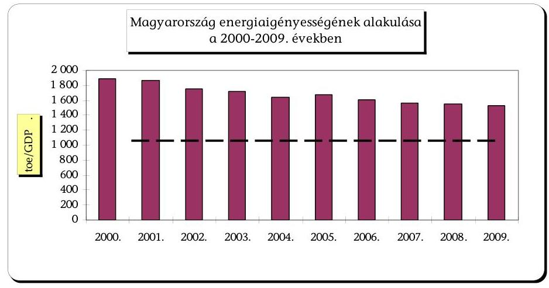

Fogyasztási szokásaink, környezettudatosságunk, a jövő generációk iránt érzett társadalmi felelősségünk egyik kiemelt tényezőjévé vált az energiával való gazdálkodás. A hazai gazdasági fejlődés nemzetközi viszonylatban még mindig magas fajlagos energiafelhasználási mutatókkal párosul², ezért a gazdaság energiahatékonyságának a növelése és ezzel összefüggésben a környezet álla-

[^0]
[^0]:    ${ }^{1}$ Az energiaigényesség változását mutató grafikon az egységnyi (1 milliárd Ft) GDP-re jutó energiafelhasználást tartalmazza, tonna kőolajegyenértékben (egy tonna olaj (toe) 41868 MJ nettó energiát tartalmaz). A szaggatott vízszintes vonal az 1107/1999. (X. 8.) Korm. határozatban tervezett célkitűzést mutatja.
    ${ }^{2}$ Az EU tagállamainak energiaigényességi mutatóját a 2. számú melléklet 1. számú ábrája mutatja.

---

potának javítása kiemelt szempont. Az energiával való takarékosság, az energiafelhasználás minimalizálása pedig hazánk energiafüggőségének csökkentése szempontjából is elsődleges gazdasági, társadalmi és környezetvédelmi érdek.
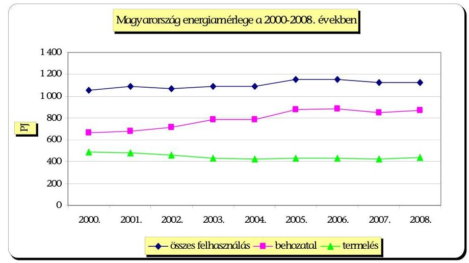

E körülmények között az energiapolitikai célkitűzések kiemelt szempontjai közé tartozik az ország ellátásbiztonsága, a versenyképesség, a fenntartható fejlődés követelményeinek érvényesítése, a fogyasztói érdekekkel összhangban lévő energiaellátás biztosítása. A magyar energiapolitika megvalósításának 2000-2020 közötti időszakra vonatkozó ütemezését, jogszabályi struktúráját a jelentés 1. számú, célkitűzéseit a 2. számú függeléke tartalmazza.

Az energiával való gazdálkodás az Európai Unióban (EU) is fontos szerepet tölt be a fenntartható fejlődés és a gazdasági növekedés hosszú távú alakulásában, ezért az EU részéről - a tagországok differenciált energiaszerkezetéből és körülményeiből adódó érdekkülönbséget figyelembe véve - olyan versenypolitikai, piacszabályozó és környezetvédelmi dokumentum-csomagokat, irányelveket fogalmaztak meg, amelyekkel befolyásolni és orientálni kívánják a tagállamok belső energiapolitikai célkitűzéseit.

A 2006/32/EK irányelv szerint a tagállamoknak 2008-tól 2016-ig évente legalább egy százalékkal ${ }^{3}$ kell csökkenteniük a fajlagos energiafelhasználást. Ennek keretében az EU tagállamok 2007-ben azt vállalták, hogy 2020-ig 20%-kal csökkentik az üvegházhatású gázok kibocsátását, 20%-ra növelik az energiafelhasználásban a megújuló erőforrások részarányát ${ }^{4}$ és 20%-kal fokozzák az energiahatékonyságot.

A hazánk számára kitűzött tagállami elvárás - egyúttal hazai célkitűzés - átlagosan évi 6,4 PJ, amely 2008-2016 között - évenként differenciáltan - össze-

[^0]
[^0]:    ${ }^{3}$ Az Európai Parlament és Tanács 2006/32/EK irányelvének IV. számú mellékletében meghatározott módszertan alapján az évi 1%-os megtakarítás vetítési alapja a végső (közvetlen) energiafelhasználás 5 éves (2002-2006 évek közötti) átlaga, amelyen belül nem kell figyelembe venni az emisszió-kereskedelem hatálya alá tartozó ágazatokat.
    ${ }^{4}$ Magyarország felé az elvárás a 13%-os részarány elérése volt.

---

sen 57,4 PJ megtakarítási igényt jelent. A hazai energiapolitika célkitűzéseinek megvalósítása indokolja, hogy az energiamegtakarításra vonatkozó stratégiák és cselekvési tervek összehangolása, az azokban foglalt célkitűzések egymásra épülő rendszerének kialakítása megtörténjék. Az energiatakarékosság és energiahatékonyság növelését célzó hazai és európai uniós programok keretében már eddig is jelentős forrásokat fordítottunk energiaracionalizálást elősegítő beruházások támogatására. A pályázók között a települési önkormányzatok is számottevő forrásokhoz jutottak.

Az ellenőrzés célja annak értékelése volt, hogy az energiafelhasználás racionalizálása, csökkentése érdekében megtett állami és önkormányzati intézkedések eredményesen és hatékonyan járultak-e hozzá a magyar energiapolitikai célkitűzések megvalósításához, az EU által megfogalmazott követelmények teljesítéséhez. Ennek során értékeltük:

- a hazai energiapolitika célrendszerének megalapozottságát, a kitűzött célok elérését szolgáló jogi, szabályozási, szervezeti feltételrendszer működését, a szakmai háttér stratégiák, programok általi biztosítottságát;
- az energiaracionalizálást szolgáló támogatási rendszer hozzájárulását az energiapolitikai célkitűzések hatékony megvalósításához és az EU által megfogalmazott követelmények teljesítéséhez;
- az önkormányzatok energiagazdálkodásának, a helyi energiaellátás megszervezésében betöltött szerepének illeszkedését a hazai energiapolitikai célkitűzésekhez;
- az energiaracionalizálást szolgáló önkormányzati intézkedések végrehajtásának eredményességét és hatékonyságát, hozzájárulását a helyi és központi energiapolitikai célkitűzések megvalósításához.

A helyszíni ellenőrzés a 2004-2009 közötti időszakra terjedt ki, kitekintéssel az ellenőrzött időszakban megvalósult (befejeződött), korábban indult programokra, valamint a vizsgálat befejezéséig tartó időszak releváns folyamataira.

A vizsgálat a Közlekedési, Hírközlési és Energiaügyi Minisztériumra, az Önkormányzati Minisztériumra, a Környezetvédelmi és Vízügyi Minisztériumra, a Földművelésügyi és Vidékfejlesztési Minisztériumra, a Magyar Energia Hivatalra, az „Energia Központ" Energiahatékonysági Környezetvédelmi és Energia Információs Ügynökség Nonprofit Kft-re, a Nemzeti Fejlesztési Ügynökségre, 38 önkormányzatra (1. számú melléklet), terjedt ki. A témakörhöz kapcsolódóan a Nemzeti Fejlesztési és Gazdasági Minisztérium, az Építésügyi Minőségellenőrző Innovációs Nonprofit Kft., a Környezetvédelmi és Vízügyi Minisztérium Fejlesztési Igazgatósága biztosított tájékoztató jellegű információt.

Az ellenőrzés típusa rendszerellenőrzés volt.
Az ellenőrzés végrehajtására az Állami Számvevőszékről szóló 1989. évi XXXVIII. törvény 2. § (3), (5)-(6) bekezdéseiben, valamint a 16. § (1) bekezdésében foglaltak adtak jogszabályi alapot.

---

# I. ÖSSZEGZŐ MEGÁLLAPÍTÁSOK, KÖVETKEZTETÉSEK, JAVASLATOK 

Az energiaszektorban a 2004. évet követően végbement változások - a piacnyitás, az energiahatékonyság, az energiatakarékosság kapcsán jelentkező, az Európai Unió (EU) által megfogalmazott külső, valamint a belső követelmények egységes jogi hátteret, összehangolt feladat- és hatásköröket, egységesen szabályozott szervezeti keretet, az energiaügyekkel foglalkozó szereplők felelős, hatékony, koordinált működését igényelték.

Az energiafelhasználás racionalizálása, csökkentése érdekében megtett állami és önkormányzati intézkedések részben járultak hozzá a magyar energiapolitikai célkitűzések megvalósításához és ezzel az EU által megfogalmazott követelmények teljesítéséhez. Az EU irányelvekben rögzített elvárások beépültek a hazai energiapolitikai célkitűzésekbe, a kialakított jogi szabályozási, szervezeti és támogatási rendszer azonban nem biztosította a célkitűzések ütemezett és hatékony végrehajtását.

Az elmúlt években megtörtént a villamos- és a gázenergia piac liberalizációja, az EU irányelvek jogharmonizációja, és - döntően - elkészültek az aktuális energiapolitika végrehajtását megalapozó stratégiák, koncepciók, valamint ezek végrehajtási programjai. Az energiaügyek kormányzati irányítási, beszámoltatási és ellenőrzési funkcióinak hiányosságai miatt azonban az adott időben aktuális hazai energiapolitikai célkitűzések, valamint a nemzetközi kötelezettségek teljesítésének eszközei nem voltak teljes körűen biztosítottak. Ennek hatása a piacnyitás csúszásában, az energiapolitika végrehajtásának alapját jelentő stratégiák, programok készítésének hiányosságában, késedelmében, a források és feladatok összhangjának hiányában és az EU által kezdeményezett kötelezettségszegési eljárás(ok)ban jelentkezett.

A vizsgált időszakban két energiapolitikáról szóló - 1993-ban és 2008-ban elfogadott - OGY határozat ${ }^{5}$ rögzített energiahatékonysági és energiatakarékossági célkitűzéseket.
 Az 1993-ban elfogadott OGY határozat egy, az EU jogrendjével harmonizáló kerettörvény kidolgozását határozta meg a Kormány számára. Az előírás nem teljesült, egységesen, keretjelleggel nem egyetlen törvényben, hanem az energetikai ágazati törvények ${ }^{6}$ fejezeteiben szabályozták az energetikai szereplők működésének feltételrendszerét.

A szabályozás módja nem átlátható, esetleges feladat- és hatáskörök változása esetén szabályozási inkoherencia létrejöttének kockázatát veti fel. Különösen igaz ez a Magyar Energia Hivatal (Energia Hivatal) - szabályozási, felügyeleti, fogyasztói érdekvédelmi, tájékoztatási - tevékenységét szabályozó ágazati törvények ${ }^{7}$ vonatkozásában.

[^0]
[^0]:    ${ }^{5}$ a magyar energiapolitikáról szóló 21/1993. (IV. 9.) OGY határozat (hatálytalan 2008. IV. 17-től), a 2008-2020 közötti időszakra vonatkozó energiapolitikáról szóló 40/2008. (IV. 17.) OGY határozat
    ${ }^{6}$ új Vet., új Get., Tszt.

---

leti, fogyasztói érdekvédelmi, tájékoztatási - tevékenységét szabályozó ágazati törvények ${ }^{7}$ vonatkozásában.

Az energiaügyekért felelős miniszter feladatait rögzítő kormányrendeletből ${ }^{8}$ 2008-tól kikerültek az energetikai stratégia, illetve koncepció kidolgozására, végrehajtására, valamint az energiagazdálkodás hazai és nemzetközi koordinációjára, szakmai programok kialakítására, a miniszter hatáskörébe utalt források kezelésére vonatkozó felelősségi- és hatáskörök. A Kormány energiapolitikáért felelős tagjának felelőssége ettől kezdve csak a szabályozások előkészítésére, valamint a Nemzeti Energiahatékonysági Cselekvési Terv (Cselekvési Terv) végrehajtásának felügyeletére korlátozódott. A szakmai feladatokhoz kapcsolt felelőssége nem áttekinthető, mert szerteágazó jogszabályokban, kormányhatározatokban jelent meg.

A Cselekvési Terv a végrehajtás fő felelőseként a hazai energiahatékonysági és energiastatisztikai ügynökségi feladatokat ellátó Energia Központ Energiahatékonysági Környezetvédelmi és Energia Információs Ügynökség Nonprofit Kft-t (Energia Központ) jelölte meg, feladat- és hatáskörét ugyanakkor jogszabály nem rögzíti. Az NFT illetve az ÚMFT ${ }^{9}$ végrehajtásában résztvevő szervezetek feladatainak szabályozása kivételével ${ }^{10}$ hiányzik a Cselekvési Terv által érintett szereplők - Közlekedési, Hírközlési és Energiaügyi Minisztérium (KHEM), Nemzeti Fejlesztési Ügynökség (NFÜ), Energia Központ - közötti, a több tárcát érintő intézkedések, pályázati rendszerek működtetésével kapcsolatos feladat- és hatáskörök áttekinthetőségét, a döntések nyomon követhetőségét, számonkérhetőségét biztosító egységes, átfogó szabályozás. A szervezetek között az energiaügyek végrehajtása során az eseti, kellően nem dokumentált kapcsolattartás, együttműködés dominált. Az összehangoltság, a koordináció hiányát, a villamosenergia-ellátás rendszerének ellenőrzéséről szóló, 2007. évben befejeződött ÁSZ ellenőrzés is megállapította ${ }^{11}$, azóta előrelépés nem történt. A Nemzeti Fenntartható Fejlődési Tanács ${ }^{12}$ (NFFT) 2008-ban szorgalmazta „a klíma- és energiapolitika ügyekben az eddigieknél hatékonyabb kormányzati koordinációs intézményrendszer létrejöttét, egyes jogszabályok megfelelő összehangolását és egyszerűsítését, az energiahatékonyság növelését elősegítő pénzügyi keretek bővítését"13.

[^0]
[^0]:    ${ }^{7}$ Az Energia Hivatal szervezetével, vezetőivel kapcsolatos - ágazattól független - rendelkezéseket az új Vet. rögzítette.
    ${ }^{8}$ a 133/2008. (V. 14.) Korm. rendelet a közlekedési, hírközlési és energiaügyi miniszter feladat- és hatásköréről
    ${ }^{9}$ Nemzeti Fejlesztési Terv, illetve annak a Környezetvédelem és Infrastruktúra Operatív Programja, valamint az Új Magyarország Fejlesztési Terv, illetve annak Környezet és Energia Operatív Programja.
    ${ }^{10}$ Tevékenységük szabályozását a 2007-2013 programozási időszakban az Európai Regionális Fejlesztési Alapból, az Európai Szociális Alapból és a Kohéziós Alapból származó támogatások felhasználásának alapvető szabályairól és felelős intézményeiről szóló 255/2006. (XII. 8.) Korm. rendelet tartalmazza.
    ${ }^{11}$ Jelentés a villamosenergia-ellátás rendszerének ellenőrzéséről (0740) (2007. október)
    ${ }^{12}$ Az Nemzeti Fenntartható Fejlődési Tanács közjogi jogállásáról, jogköréről, összetételéről és feladatairól, valamint működési kereteiről az 57/2008. (V. 22.) OGY határozat rendelkezik. Az NFFT 32 tagját a parlamenti pártok, a Kormány, az MTA, a gazdasági kamarák, az egyházak, a szakszervezetek, a munkaadói szervezetek, az önkormányzati szövetségek, a MTESZ, a Rektori Konferencia, a civil szervezetek, valamint a nemzeti és az etnikai kisebbségi szervezetek delegálják.

---

intézményrendszer létrejöttét, egyes jogszabályok megfelelő összehangolását és egyszerűsítését, az energiahatékonyság növelését elősegítő pénzügyi keretek bővítését"13.

Az EU energia-végfelhasználás hatékonyságáról és az energetikai szolgáltatásokról szóló irányelvben ${ }^{14}$ foglaltak összhangban állnak a villamos energia, valamint földgáz belső piacára ${ }^{15}$ vonatkozó EU irányelvekkel, amelyek kimondják a teljesen nyitott energiapiac kialakításának szükségességét. A piacnyitás folyamata hazánkban 2004-től mindkét ágazatban megkezdődött, de a teljesen nyitott villamosenergia piac az EU irányelv szerinti (2007. július 1.) időponthoz képest féléves késéssel, a földgáz ágazatban egyéves késéssel ${ }^{16}$ valósult meg. A teljesen liberalizált gázpiac működése csak 2009. július 1-jétől, a szükséges feltételrendszer hatályba lépésétől számítható ${ }^{17}$.

A Gazdasági Versenyhivatal (GVH) Országgyűlés elé terjesztett 2008. évi beszámolója szerint a piacnyitást - energiatőzsde hiánya, áremelkedések, hosszú távú megállapodások felszámolása miatt - számos hiányosság, ellentmondás jellemezte. A piaci verseny kedvező hatásai kizárólag egyes nagyfogyasztóknál érvényesültek, a versenypiacra kényszerített fogyasztók és a lakosság jelentős áremelkedéssel szembesültek ${ }^{18}$. Az egyetemes szolgáltatásból kiszorulók információ, vagy megfelelő ajánlat hiányában jellemzően nem váltottak szolgáltatót, a törvényi előírások ellenére nem jött, illetve várhatóan késve jön létre ${ }^{19}$ az áramtőzsde. Még nem érvényesült a piacnyitás előnyeinek a kihasználása, a hatékonyságnövekedésből eredő haszon fogyasztókhoz történő eljuttatása. Az Energia Hivatal által 2008-ban elvégzett fogyasztói elégedettség vizsgálata szerint a lakossági fogyasztók alig több mint fele ismerte a szolgáltató váltással kapcsolatos lehetőséget. Nem kellően átgondolt az energiaszektorban a szoci-

[^0]
[^0]:    ${ }^{13}$ Az NFFT állásfoglalása az energia- és klímapolitika aktuális kérdéseiről (2009. január 16.)
    ${ }^{14}$ az Európai Parlament és a Tanács 2006. április 5-i 2006/32/EK irányelve az energiavégfelhasználás hatékonyságáról és az energetikai szolgáltatásokról, valamint a 93/76 EGK tanácsi irányelv hatályon kívül helyezéséről
    ${ }^{15}$ A 2003/54/EK irányelv a villamos energia belső piacára vonatkozó közös szabályokról és a 96/92/EK irányelv hatályon kívül helyezéséről, valamint a 2003/55/EK irányelv a földgáz belső piacára vonatkozó közös szabályokról és a 98/30/EK irányelv hatályon kívül helyezéséről.
    ${ }^{16}$ A villamosenergia piac esetében 2008. január 1-jétől, a gázpiac esetében 2008. július 1-jétől. A villamosenergiáról szóló 2001. évi CX. törvény, valamint a földgázellátásról szóló 2005. évi LXIII. törvény szerint a törvény az Európai Unió (2003/54/EK, illetve a 2003/55 EK) irányelveknek részbeni megfelelését szolgálja.
    ${ }^{17}$ A KHEM vitatja a teljes piacnyitás csúszására vonatkozó megállapítást, az Energia Hivatal a csúszás tényét elismeri, de ennek okaként a törvényhozás szándéka szerinti szabályozás ütemezésére hivatkozik.
    ${ }^{18}$ A lakossági átlagár 2004 és 2010 között a villamosenergia esetében 63\%-kal, a gáz kisfogyasztók esetében 2,2-szeresére nőtt. A teljesen nyitott versenypiac belépésével (2008. január 1-re vetítve) a növekedés mértéke a villamos energia esetében 13\%, a földgáz esetében 26\%.
    ${ }^{19}$ A KHEM szakállamtitkárának 2010. május 14-én kelt, elektronikus úton érkezett álláspontja szerint 2010. július 1-jével kezdi meg működését.

---

álpolitikai támogatások és a védendő fogyasztók részére a szolgáltatók által biztosított kedvezmények összehangolása.

A fogyasztóvédelem a piacnyitás megkerülhetetlen eleme. Szabályozása pontosításra szorul, mert a Nemzeti Fogyasztóvédelmi Hatóság (NFH) és az Energia Hivatal közötti - a törvényekből eredő - feladat- és hatáskörmegosztás nem egyértelmű. Az energiaszolgáltatók által kötelezően működtetett ügyfélszolgálati, illetve fiókirodák működési rendjét az Energia Hivatal hagyta jóvá és a szolgáltatás minőségi követelmények betartását évente az engedélyesek adatszolgáltatása, színvonal és minőségi mutatók, és az ügyfélkapcsolati szolgáltatásminőség szempontjai szerint ellenőrizte. A fogyasztói elégedettségi vizsgálatokban 2008-tól - új piaci viszonyokhoz illesztett - módszertant vezettek be. Hátránya, hogy nem alkalmas a korábbi évekkel való összehasonlításra ${ }^{20}$. A felmérés eredményei szerint elégedetlenségre leggyakrabban a szolgáltatók panasz- és reklamációkezelése, valamint a telefonos ügyfélszolgálatok működésének színvonala adott okot.

A hazai jogalkotás és a szakmai programok készítése körében - annak ellenére, hogy az Európai Uniónak nincs önálló átfogó energiapolitikája - egyértelműen megnyilvánult az EU vonatkozó irányelveinek, az ún. Klíma/Energia Csomagban foglalt célkitűzések adaptációjára irányuló törekvés. Az energia takarékos és hatékony felhasználását célzó intézkedések alapját meghatározó nemzetközi vállalások beépültek a hazai energiagazdálkodási célkitűzések sorába.

A magyar energiapolitikát megalapozó két - 1993-ban és 2008-ban elfogadott, korábban említett - OGY határozatban rögzített energiapolitika kiemelten kezelte az ellátásbiztonságot, mint kockázati tényezőt, a külső - elsődlegesen az orosz földgáztól való - energiafüggőség miatt. A földgázellátás biztonsága érdekében indított beruházások eredményeként a teljes tárolói kapacitás 6,2 milliárd $\mathrm{m}^{3}$, és kb. 80 millió $\mathrm{m}^{3} /$ nap maximális kitárolást tesz lehetővé. Ezen tárolókban - a kereskedelmi készletek mellett - 1,4 milliárd $\mathrm{m}^{3}$ biztonsági földgázkészlet is rendelkezésre áll. A tárolói kapacitások a hideg téli időszakban is két hónapig biztosíthatják a hazai ellátást. A földgázellátás válsághelyzete és a villamosenergia krízis megelőzésére, enyhítésére szolgáló intézkedéseket, a jelentős zavar esetén szükséges kormányzati teendőket a Kormány rendeletben, illetve határozatban jelölte ki ${ }^{21}$.

Az energiához és klímavédelemhez kapcsolódó nemzetközi irányelvekben rögzített célok és követelmények átvételére való törekvést jelzi az energiapolitikák végrehajtását szolgáló szakmai stratégiák, programok kidolgozása. Az energiapolitikai célok végrehajtását a 2000-2010 közötti időszakra szóló straté-

[^0]
[^0]:    ${ }^{20}$ az Energia Hivatal 2008. évi jelentése szerint
    ${ }^{21}$ a 265/2009. (XII. 1.) Korm. rendelet a földgázvételezés korlátozásáról, a földgáz biztonsági készlet felhasználásáról, valamint a földgázellátási válsághelyzet esetén szükséges egyéb intézkedésekről, és a 285/2007. (X. 29.) Korm. rendelet a villamosenergiarendszer jelentős zavara és a villamosenergia-ellátási válsághelyzet esetén szükséges intézkedésekről, valamint a földgázellátási válsághelyzettel összefüggésben szükséges kormányzati intézkedésekről szóló 1202/2009. (XII. 1.) Korm. határozat

---

gia és a 2008-2016 évekre vonatkozó Cselekvési Terv szolgálta ${ }^{22}$. Elkészült a 2008-2025. időszakra szóló Nemzeti Éghajlatváltozási Stratégia ${ }^{23}$ (NÉS) és a magyarországi megújuló energiaforrások felhasználásának növelésére vonatkozó 2008-2020 közötti időszakra szóló stratégia ${ }^{24}$ is. A 2008-ban kidolgozott Cselekvési Terv követelményei közé beépítették a nemzetközi kötelezettségeket, a hazai energiapolitikai célkitűzéseket, és figyelembe vették a korábban indított energiagazdálkodási programokat. Az egyes konstrukciók céljainak és működésének összehangolása részben megtörtént, a célokat konkrét mutatókhoz kötötték. Emellett ezen időszakban törvények ${ }^{25}$ és stratégiák, programok sora jelent meg.

A 2000-2010 közötti időszakra vonatkozó energiapolitika végrehajtásához kiadott kormánykoncepció ${ }^{26}$ csak 2002-ig tartalmazott részletes terveket, a 2002-2007. közötti időszakra részletes feladatokat nem, csak az elérni kívánt általános célokat jelölte meg. A 2008-2020 közötti időszakra vonatkozó energiapolitikai célok és a nemzetközi vállalások végrehajtásában kockázatot jelentenek a kormányzati mulasztások, késedelmek, a forráshiány, valamint a megfogalmazott célkitűzések összehangolt megvalósítását szolgáló programok eltérő időhorizontja és rendszere. A Kormány a megújuló stratégia kidolgozásával párhuzamosan nem gondoskodott - gyakorlatilag a 2010-ig szóló stratégia folytatását jelentő - energiahatékonysági stratégia elkészítéséről. Ennek következtében stratégiai szinten nem biztosított az OGY határozat által rögzített energiapolitika és a klímapolitika közötti összhang. Energiahatékonysági stratégia hiányában az energiapolitika végrehajtásának részletes dokumentuma a 2008-2016 évekre szóló Cselekvési Terv lehetett volna, de ennek készítése során nem érvényesült kellő kormányzati felügyelet. A Cselekvési Terv EU Bizottság részére
 történő benyújtására nyolc hónap késéssel került sor ${ }^{27}$, emiatt az EU kötelezettségszegési eljárást indított. További késedelmet jelentette, hogy az EU Bizottság 2008. évi felülvizsgálata szerint a tervezet nem alkotott reális stratégiát, és többek között hiányosnak találta azt a közszféra példamutatása tekintetében is. Ezért a benyújtott változaton alapvető módosításokat kellett végrehajtani. A módosított változat csak egy évvel később, 2009 végén készült el,

[^0]
[^0]:    ${ }^{22}$ 1107/1999. (X. 8.) Korm. határozat a 2010-ig terjedő energiatakarékossági és energiahatékonyság-növelési stratégiáról, valamint a 2019/2008. (II. 23.) Korm. határozat Magyarország Nemzeti Energiahatékonysági Cselekvési Tervéről. A Cselekvési Terv intézkedéseinek végrehajtását a Kormány 1076/2010. (III. 31.) számú határozatával áttekintette, egyben intézkedési programot határozott meg az elkövetkezendő, 2016-ig terjedő időszak kiemelt energiatakarékossági céljainak megvalósítására.
    ${ }^{23}$ a 29/2008. (III. 20.) OGY határozattal kihirdetve
    ${ }^{24}$ 2148/2008. (X. 31.) Korm. határozat a magyarországi megújuló energiaforrások felhasználásának növelésére vonatkozó 2008-2020 közötti stratégiáról
    ${ }^{25}$ a 2003. évi XLII. törvény a földgázellátásról, a 2007. évi LXXXVI. törvény a villamos energiáról
    ${ }^{26}$ A 2199/1999. (VIII. 6.) Korm. határozattal elfogadott „A magyar energiapolitika alapjai, az energetika üzleti modellje".
    ${ }^{27}$ Határideje 2007. július 1. volt, benyújtására 2008. februárjában került sor, egy hónappal az EU Bizottság számára előírt a tagállamok energiamegtakarítási céljaik előrehaladására vonatkozó jelentéstétel határidejét követően.

---

ezt a Kormány általi 2010. évi elfogadását ${ }^{28}$ követően nyújtották be ismételten az EU részére ${ }^{29}$. A helyszíni vizsgálat idején még nem volt ismert a megújuló energiaforrásokra vonatkozó nemzeti cselekvési terv 2010. június 30-ai bejelentési határidejének teljesítése, egy esetleges késedelem Magyarországgal szemben újabb EU kötelezettségszegési eljárás megindítását vetíti előre ${ }^{30}$. A hazai megújuló stratégiában előírtak ellenére nem készült el határidőre (2008. december 31-ig), és a helyszíni vizsgálat lefolytatásáig a Megújuló Energiahordozó Program – az egy évvel később megjelent EU irányelvre ${ }^{31}$ hivatkozással –, ami a program benyújtását 2010-re írta elő. A 2009-2010. évekre szóló Nemzeti Éghajlatváltozási Programot (NÉP) a Kormány, a két évet átfogó program második évében fogadta el. A benne foglalt intézkedésekhez időbeni ütemezést nem határoztak meg.

A megújuló energiaforrások intenzívebb kiaknázására irányuló törekvések nem kellően koordináltak. A szilárd biomassza elsősorban a villamosenergia termelésben nyert teret, az ebből előállított árammennyiség 2004 és 2009 között megháromszorozódott, amelyet nem hulladék, hanem döntően tűzifa elégetése révén érték el ${ }^{32}$. A hazai erdők a jelenlegi igényt még képesek kielégíteni, de jelentősebb biomassza volumen (mező- és erdőgazdasági melléktermékek és hulladékok) növelése összehangolt, hatékony agrárenergetikai program révén lehetséges. A biomassza energiaforrások kiterjedt használatát a Földművelésügyi és Vidékfejlesztési Minisztérium (FVM) és az Új Magyarország Vidékfejlesztési Program (ÜMVP) keretén belül támogatja, a mezőgazdasági termelők csak erre pályázhattak. A szélenergia hasznosítása egyre inkább teret nyer, de részaránya csekély.

A Cselekvési Terv végrehajtása a finanszírozási igény megalapozatlansága, illetve a szükséges források elégtelensége miatt kockázatos, sőt a hazai források biztosítása hiányában veszélybe kerülhet az EU források igénybevétele is. A Cselekvési Tervben megfogalmazott, az EU irányelvhez igazodó fő célkitűzés, az energiafelhasználás – 2008-2016 között – évi 1%-os csökkentéshez kapcsolt konkrét energiahatékonysági intézkedések megvalósításának összes beruházási igényét 2295-2870 milliárd Ft-ra, az állami támogatás mértékét 9 évre összesen 230-860 milliárd Ft-ra tervezte, ugyanakkor rögzítette azt is, hogy „a kitűzött cé-

[^0]
[^0]:    ${ }^{28}$ az 1076/2010. (III. 31.) Korm. határozattal
    ${ }^{29}$ a KHEM szakállamtitkárának 2010. május 14-én kelt, elektronikus úton érkezett levele alapján
    ${ }^{30}$ A megújuló energiaforrásokra vonatkozó nemzeti cselekvési terv előrejelzési dokumentumát – amelynek benyújtási esedékessége 2009. december 30. volt – a KHEM 2010. január 14-én küldte meg az EU Bizottságnak.
    ${ }^{31}$ A megújuló energiaforrásból előállított energia támogatásáról, valamint a 2001/77/EK és a 2003/30/EK irányelv módosításáról és azt követő hatályon kívül helyezéséről szóló 2009/28/EK irányelv 4. cikk (2) bekezdése szerint a tagállamok 2010. június 30-ig bejelentik a Bizottságnak a megújuló energiaforrásokra vonatkozó nemzeti cselekvési tervüket.
    ${ }^{32}$ Az Energia Hivatal elnökének 2010. május 27-én kelt észrevétele szerint „a törvényi szabályozás 2008-tól nem tette lehetővé csak fenntartható erdőgazdálkodás alapú a VET-ben meghatározott fatüzelésből származó energia támogatását."

---

lok megvalósításához további jelentős támogatási források biztosítása válik a jövőben szükségessé, melyek forrása jelenleg bizonytalan".

A Cselekvési Terv a források között konkrétan csak az ÚMFT KEOP 38 milliárd Ft keretét számszerűsítette, ez a kvótabevétel összegét és az egyéb források becsült/tervezett összegét nem tartalmazta. Ugyanakkor a 2020-ig vállalt, a 20%-os energia megtakarítás teljesítéséhez a KHEM számítása szerint 1000-1100 milliárd Ft támogatás szükséges, de ennek forrásoldala nem biztosított. Kockázatot jelent továbbá, hogy a KHEM-nek nincs közvetlen ráhatása a Cselekvési Tervhez kapcsolódó – de más tárcák költségvetésébe tartozó – programok pénzügyi tervezésére.

A forráshiány mérséklése tekintetében számításba vehető forrás a Kiotói egyezmény keretében folytatott szén-dioxid kvóta eladásából befolyó bevétel, melyet a Zöld Beruházási Rendszer (ZBR) céljaira lehet felhasználni. A ZBR elindítása késve, csak 2009 év közepén kezdődött meg. A Környezetvédelmi és Vízügyi Minisztérium (KvVM) szerint – a helyszíni vizsgálat lezárásáig – e forrásból kifizetés nem történt. A ZBR felhasználása kapcsán a Jövő Nemzedékek Országgyűlési Biztosa vizsgálatot indított. Az ombudsmani „állásfoglalásra” a KvVM – internetes honlapján – csak két hónappal később adott észrevételt. Az ellenőrzésünk részére adott KvVM magyarázat szerint a választ a koppenhágai értekezlet utánra időzítették ${ }^{33}$. A vizsgálatunk lezárását követően, 2010. március 17-én újabb, a KvVM által értékesített CER kvóták ${ }^{34}$ jogtalan újrahasznosítására – CER kvóták uniós kereskedelmi rendszerbe való visszakerülésére – utaló jelek miatt átmenetileg felfüggesztették a kereskedelmet a kvótakereskedelmi piacokon ${ }^{35}$.

A Kiotói Jegyzőkönyv előírja, hogy 2010-től a korábbiaknál részletesebb, ún. Erdészeti Leltárt kell benyújtani az ENSZ, illetve az EU felé. Ennek Magyarország az EU által előírt 2010. január 15-i határidőn túl – a szükséges források hiánya miatt – megkésve tett eleget, ami kötelezettségszegési eljárást vonhat maga után ${ }^{36}$.

Az energiaracionalizálást célzó pályázatokra 2000-2009 között az Energiatakarékossági Programok ${ }^{37}$ keretében 18,2 milliárd Ft-ot, a KIOP keretében 6 milliárd Ft-ot fordítottak, míg a KEOP pályázatai során – 2009 végéig – 13,1 milliárd Ft támogatást ítéltek meg. A hazai és nemzetközi támogatással létrehozott

[^0]
[^0]:    ${ }^{33}$ részletesen a jelentés a 2.2. pontjában.
    ${ }^{34}$ A CER-ek úgy jönnek létre, hogy egy fejlett ország beruházást visz egy fejlődő országba, aminek részeként kibocsátás-csökkenés valósul meg, és a beruházó CER-t kap a kibocsátás-csökkenésért „cserébe”.
    ${ }^{35}$ az okok részletes kifejtése a jelentés 2.2.pontjában
    ${ }^{36}$ Az FVM levele szerint, ha az ENSZ részére a – 2010. április 15-i határidőre – előírt jelentés csak részlegesen, nem az elvárt minőségben került leadásra, ez a kiotói mechanizmusból való kizárást, egyúttal a nemzetközi kibocsátás-kereskedelemből való kizárást is jelentheti. Az FVM álláspontját a KvVM vitatja, ugyanakkor elismeri az Erdészeti Leltár hiányosságának kockázatát.
    ${ }^{37}$ Energiatakarékossági Program (2000), Széchenyi Terv energiatakarékossági programja (2001-2002), NEP (2003-2009)

---

különböző hitelprogramok ${ }^{38}$ 30,7 milliárd Ft kedvezményes hitel kihelyezését tették lehetővé. E támogatási formák összesen 175 milliárd Ft energiaracionalizálási célú beruházás megvalósítását segítették. Az energiamegtakarítási célú, pályázati rendszerű lakástámogatásokra (panel- és ÖKO programok) jóváhagyott további 53 milliárd Ft pedig 160 milliárd Ft összköltségű korszerűsítési, felújítási munkák elvégzésére adott lehetőséget.

A 2010-ig terjedő energiatakarékossági és energiahatékonyság-növelési célok megvalósítása érdekében meghatározott Cselekvési Program 15 különböző megtakarítási területet jelölt ki. Ebből kilenc területen számszerűsített 69,7 PJ/év energiahordozó megtakarítást, és egy esetben 20 PJ/év megújuló energiaforrás-bővítést, ezek azonban elmaradtak az összességében kitűzött 75 PJ/év, illetve 22 PJ/év célértéktől.

A Cselekvési Programhoz kapcsolódó pályázati kiírások – folyamatosan változó – feltételrendszere és az elbírálás szempontrendszere az eltelt időszakban fellazult. A pályázati kiírásokban közzétett energiahatékonysági és -megtakarítási célok a támogatott fejlesztésekkel nem voltak elérhetők, illetve előfordult, hogy a támogatások felhasználásától elvárt célértékeket közzé sem tették. Ezeknél a pályázatoknál nem számszerűsítették az elérendő energiamegtakarítási célokat, azok mindössze becsülhetők voltak a műszaki tartalom tapasztalati adatai alapján.

A kitűzött célok és hozzárendelt eszközök, források nem voltak összehangoltak, a pályázati rendszerben párhuzamosságok és lefedetlen területek is voltak. Ezekre több tanulmány ${ }^{39}$ is rámutatott, de intézkedések nem történtek. A pályázatok lebonyolításának sokszereplős megbízási és finanszírozási rendszere, ennek gyakori módosításai nem segítették a végrehajtás tervezhetőségét és kiszámíthatóságát. A lebonyolításban közreműködő szervezetek – Energia Központ, ÉMI – számára előírták a támogatási keretek felhasználási szabályainak kidolgozását, a felhasználás ütemezését, valamint a beszámolók, értékelések összeállítását. A pályázati konstrukciónkénti összegzések azonban – az európai uniós források igénybevételével megvalósuló pályázatok kivételével – döntően csak szűkszavúan tartalmazták az egyes támogatási célok konkrét eredményeit, mivel azok mérése és nyomon követése nem volt biztosított. A KIOP és KEOP programoknál az intézkedések eredményeinek mérési lehetőségét a monitoring rendszer kialakításával megteremtették, de az eredmények összegzését – és ezáltal a programokban, akciótervekben elfogadott célokhoz való viszonyának értékelését – a monitoring rendszerben nem biztosították. A KIOP – gyűjtéssel összesített – adatai egy mutatónál alatta maradtak, kettőnél meghaladták a

[^0]
[^0]:    ${ }^{38}$ EHA, a Phare hitelkonstrukció, EHP, „Sikeres Magyarországért” Lakossági Energiamegtakarítási Hitelprogram
    ${ }^{39}$ Tanulmány az „1107/1999. (X. 8.) Kormányhatározat a 2010-ig terjedő energiatakarékossági és energiahatékonyság-növelési stratégiáról, valamint az ennek mellékletét képező Energiatakarékossági és energiahatékonyság-növelési Cselekvési Program” végrehajthatóságáról (készült az UNDP/GEF projekt keretében 2005. június); „Tanulmány a hazai és Uniós támogatási rendszerek energiapolitikai szempontú összehangolásáról az Energia Központ részére” (2008. december 10.)

---

program-kiegészítő dokumentumban elvárt célértékeket ${ }^{40}$. A hazai energiatakarékossági programok irányítására, valamint a különböző, nemzetközi támogatással folyó energiatakarékossági és klímavédelmi programok működtetésére, felügyeletére összehangolási szándékkal létrehozott Energiatakarékossági Tárcaközi Bizottság ${ }^{41}$ (ETB) a pályázatok elbírálásán túl koordinációs szerepköröket nem töltött be.

Az energiaracionalizálási célú programok eredményeit a statisztikai információs rendszer nem mutatta be. A vizsgált években az önkormányzatok mindössze 7-12%-a teljesítette az energiafelhasználási beszámoló ${ }^{42}$ elkészítési kötelezettségét. A közvilágításra vonatkozó – a szolgáltatók részére előírt – statisztikai adatszolgáltatás összesítését az Energia Központ 2008-ra nem végezte el ${ }^{43}$. A tercier szektor energiafelhasználását – az alszektorok statisztikájának hiánya miatt – „maradványelv” alapján számították ki.

Az önkormányzatok energiaracionalizálási céljait a hazai decentralizált döntési jogkörű területfejlesztési források is segítették, azonban
 ezek pályázati feltételei 2008 előtt nem közvetítettek energiamegtakarítási elvárásokat a támogatottak felé. Ezek elsődleges célja nem az energiafelhasználás csökkentése volt, de közvetett módon - az alkalmazott korszerűbb épületszerkezeti anyagok és épületgépészeti megoldások révén - hozzájárultak az energiafelhasználás csökkenéséhez.

Az energia-végfelhasználás hatékonyságáról és az energetikai szolgáltatásokról szóló irányelv ${ }^{44}$ kiemelten hangsúlyozza a közszféra, így az önkormányzatok példamutató szerepét az energiahatékonyság javításában. Az energiahatékonyság növelését, az energiatakarékosság ösztönzését szolgáló állami, önkormányzati szervezetek, társaságok felé irányuló intézkedés, kezdeményezés a KHEM részéről - a 2006-2009. évek között - dokumentumokkal alátámasztott formában nem volt fellelhető.

Az Ötv. a települési önkormányzatok feladatai között nevesíti ugyan a helyi energiaszolgáltatásban való közreműködést, de a feladatellátás mértékéről és módjáról való döntést - a lakossági igények és az anyagi lehetőségek

[^0]
[^0]:    ${ }^{40}$ A mutató a kitűzött célértéknek a beépített megújuló villamos energia kapacitásnál a $88,4 \%$-át, az új megújuló kapacitással termelt villamos energiánál a $122,6 \%$-át, az energiahatékonysággal kiváltott éves energiahordozó megtakarításnál a 114,6\%-át teszi ki.
    ${ }^{41}$ az 1031/2000. (IV. 7.) Korm. határozat 4. pontja alapján
    ${ }^{42}$ 1335/a számú adatszolgáltatás a kommunális és tercier szektor energiafelhasználásáról
    ${ }^{43}$ 1660/04. számú adatgyűjtés a közvilágításról
    ${ }^{44}$ A 2006/32/EK irányelv 7. pontja szerint: „A közszektornak valamennyi tagállamban példát kell mutatni az energiát használó berendezésekre, az energetikai szolgáltatásokra....A közszektort arra kell ösztönözni, hogy az energiahatékonyság javítására vonatkozó megfontolásokat építse be beruházásaiba, értékcsökkenési leírásaiba és működési költségvetéseibe."; II. Fejezet 5. cikk (1) pontja szerint „ a tagállamok gondoskodnak arról, hogy a közszektor ezen irányelvvel összefüggésben példamutató módon járjon el".

---

figyelembevételével - az önkormányzatra bízza ${ }^{45}$. A környezet védelmének általános szabályairól szóló törvény (Kvt.) szerint az energiagazdálkodással kapcsolatos feladatokat és előírásokat a települési önkormányzatok környezetvédelmi programjának kell tartalmaznia. Azonban sem erről, sem az Ötv-ben megjelölt helyi energiaszolgáltatásban való közreműködés módjáról, területeiről és azok tartalmáról más, ágazati feladat- és hatáskört szabályozó jogszabály nem rendelkezik. Ezt az energiaügyekért felelős miniszter nem kezdeményezte ${ }^{46}$. Az önkormányzatok így nem kaptak útmutatást a feladataik ellátásához, illetve azok önkormányzati szféra egészére kiterjedő egységes értelmezéséhez. Ezek hiányában az önkormányzatok saját értelmezésük szerint látták el mind az energiaszolgáltatással, mind az energiagazdálkodással kapcsolatos feladataikat.

Központi előírás, útmutatás hiányában az ellenőrzött önkormányzatoknak csak 57,9%-a szabályozta önkormányzati rendelettel a település energiaszolgáltatásában való közreműködését. Ezek közös vonása volt, hogy a közreműködés konkrét területeit nem részletezték, és a gazdasági programokban (stratégiákban) megjelölt feladatokat - indokoltsága ellenére - nem kapcsolták össze a szervezeti és működési szabályzatokban, valamint a hivatali ügyrendekben foglaltakkal. A Kvt-ben foglaltaknak megfelelve az önkormányzatok 78,9%-a készített környezetvédelmi programot, amelyek 86,7 %-a tartalmazott energiagazdálkodással kapcsolatos helyi feladatokat és előírásokat. Ezek nagyobb részt a település hosszú távú energiagazdálkodási elképzeléseire, a főbb beavatkozási területekre, a fejlesztések megvalósításához szükséges források számbavételére irányultak. Mindössze az önkormányzatok 5,3%-a határozta meg az energiaszolgáltatókkal való együttműködés kereteit.

A felhasznált energia beszerzése, mérése, ellenőrzése szervezeti és személyi feltételeinek kialakítása differenciált volt. A feladatok ellátása az önkormányzatok 57,9%-ánál a polgármesteri hivatalokon belül kapcsolt munkakörben, 7,6%-ánál külső szervezetekkel, 26,9%-ánál a hivatali dolgozók mellett szakértő szervezetek megbízásával valósult meg. Önálló energetikust mindössze az önkormányzatok 7,6%-a foglalkoztatott, azonban ott sem volt kellően összefogott, rendszerszerűen felépített az energiagazdálkodással, energiafelhasználással összefüggő feladatok ellátása. A Cselekvési Terv módosított változata tartalmazza ugyan az energetikusok kötelező foglalkoztatását a nagy energiafogyasztóknál. Ez azonban nem ad megoldást valamennyi önkormányzatra, közöttük a kistelepülésekre és nem veszi figyelembe a településszerkezeti és méretgazdaságossági szempontokat ${ }^{47}$. A felhasznált energia beszerzésének, felhasználásának és mérésének figyelemmel kíséréséről csak az ellenőrzöttek fele,

[^0]
[^0]:    ${ }^{45}$ az Ötv. 8. § (1)-(2) bekezdése
    ${ }^{46}$ A KHEM és az ÖM ezt a kérdést - az Ötv-re hivatkozva - eltérően ítélte meg. Részletesen a 3.1 fejezetben.
    ${ }^{47}$ A módosított Cselekvési Terv a nagy energiafogyasztóknál, köztük az 50000 ezer főnél nagyobb létszámú települések önkormányzatainál tervezi az energetikusi rendszer kötelező formában történő visszaállítását. A 2008 decemberében a KHEM által készíttetett tanulmány a már működő többcélú kistérségi társulások bázisán tett javaslatot az energiagazdász hálózat kialakítására.

---

míg az ehhez párosuló ellenőrzési kötelezettség szervezeti és személyi feltételeiről a vizsgált önkormányzatok 44,8%-a gondoskodott.

Az Ötv. alapján ${ }^{48}$ a közvilágítás a települési önkormányzatok által kötelezően ellátandó közszolgáltatások körébe tartozik. A feladatokkal kapcsolatos részletszabályokat tartalmazó IpM rendeletet ${ }^{49}$ 2009. január 1-jétől hatályon kívül helyezték, de az ennek helyébe lépő új jogszabályt - az új Vet. felhatalmazása ellenére - a mai napig nem alkották meg ${ }^{50}$. Mindezek következtében a közvilágítási feladat ellátásának módjáról, további részletszabályairól sem törvények, sem ágazati jogszabályok nem rendelkeztek. Ez akadályozta a helyi feladatok meghatározását és végzését.

A régi Vet. a feljogosított fogyasztók körében, majd az új Vet. 2008-tól - a tiszta versenypiaci modellben - minden felhasználó számára lehetővé tette, hogy a szabadpiacon vásároljon villamos energiát. Az önkormányzatok azonban kevés információval rendelkeztek a villamosenergia-piac liberalizációjáról és nem volt szakmai ismeretük a különböző tartalmú árak összehasonlításához. Emellett hiányzott a széles körű érdekeltség és a megfelelő adatbázis is ahhoz, hogy mérlegeljék a jogszabályi változások nyújtotta új lehetőségeket. Az önkormányzatok a közvilágítás korszerűsítésnél alkalmazott finanszírozási megoldások és vállalt kötelezettségek, valamint a kialakult vegyes tulajdoni viszonyok miatt sem tudták kihasználni a piacnyitás nyújtotta előnyöket. A szolgáltatók hosszú távú szerződések megkötésére, és a tulajdonukba került közvilágítási létesítmények üzemeltetési, fenntartási jogának megtartására törekedtek a piac biztosítása érdekében. Az ellenőrzött önkormányzatok több mint kétharmada jelenleg is az egyetemes árszabást alkalmazza.

Az önkormányzatok összességében eredményesen látták el közvilágítási feladataikat, mivel biztosították a közszolgáltatást a településen. A közvilágítás, mint kötelező feladat a helyi szabályzatokban megjelent, de ezek nem, vagy csak részlegesen tértek ki a berendezések létesítésének és üzemeltetésének részletfeladataira. Nem fordítottak kellő figyelmet a közvilágításra vonatkozó fogyasztói panaszok fogadásának és kivizsgálási rendjének szabályozására sem. Központi jogszabályi útmutatás hiánya a közvilágítási feladatok ellátására kötött szerződéses feltételek egységes kialakítását is akadályozta. Az önkormányzatok több mint kétharmada felülvizsgálat és kontroll nélkül elfogadta a területileg illetékes szolgáltató ajánlatát, a szolgáltató-váltásokat a döntéseket megelőzően gazdaságossági számításokkal nem támasztotta alá. Az önkormányzatok egynegyedénél még az ellenőrzési időszakra vonatkozó valamennyi közvilágítási szerződés sem állt rendelkezésre. Közel kétharmaduknál a közvilágítási célú villamosenergia felhasználását nem mérték, így a szolgáltatás díját a lámpatestek beépített teljesítménye és a közvilágítási naptár - vagyis nem a valós fogyasztás - alapján fizették meg. A mérés feltételeinek kialakítása az önkormányzatok részéről beruházási forrásokat igényelne.

[^0]
[^0]:    ${ }^{48}$ Ötv. 8. § (4) bekezdése
    ${ }^{49}$ a közvilágításról szóló 11/1985. (XI. 30.) IpM rendelet
    ${ }^{50}$ A központi jogszabály kialakítását célzó munka a vizsgált időszakban a KHEM-ben folyamatban volt, az egyeztetések elkezdődtek.

---

Az önkormányzatok felismerték a közvilágítási célú létesítmények műszaki felülvizsgálatának és korszerűsítésének szükségességét, valamint az abból származó megtakarítási lehetőségeket. Az ellenőrzött önkormányzatok a vizsgált időszakot érintő 24 beruházáshoz kapcsolódóan 1787 millió Ft-ot fordítottak a közvilágítás korszerűsítésére, amelyek hatására az egy lámpahelyre jutó energiafelhasználás és a károsanyag-kibocsátás 3,5%-kal csökkent a vizsgált időszakban. A közvilágítás-korszerűsítések érdekében alkalmazott szerződéses konstrukciók és finanszírozási módozatok kialakításában meghatározó szerephez jutottak a villamos energiaszolgáltató, illetve a közvilágítási rendszert üzemeltető gazdasági társaságok. A szerződések megkötésénél az önkormányzatok 59,5%-a nem mérlegelte a gazdaságossági szempontokat, nem élt a versenyeztetés lehetőségével. A várható energia- és kiadásmegtakarítást az önkormányzatok több mint fele számításokkal nem ellenőrizte. Az ajánlatok utólag nem bizonyultak megalapozottnak, mert a tervezett műszaki tartalom és energia megtakarítások 97,1%-os teljesülése ellenére a kiadási megtakarítások 13,5%-kal elmaradtak az előzetesen számítottnál. Mindezek következtében a beruházások megtérülési ideje 26,1%-kal - 13 évről 16,4 évre - növekedett, így a pénzeszközök felhasználása nem volt hatékony.

A szolgáltatók által megvalósított, és az önkormányzatok által utólag megfizetett közvilágítás-korszerűsítések az önkormányzatoknál vagyongyarapodásként nem jelentek meg. Az önkormányzatok által aktivált, majd térítésmentesen a szolgáltatók tulajdonába adott létesítmények tekintetében pedig nem vizsgálták a kötelező feladatellátást szolgáló, az Ötv. alapján a korlátozottan forgalomképes törzsvagyon feletti döntési jogosultságokat. Az Ötv. 1995. évi módosítását követően ${ }^{51}$ történt fejlesztések, korszerűsítések esetében önkormányzatonként eltérő, vegyes tulajdoni viszonyok alakultak ki.

A fejlesztéseket az önkormányzatok háromnegyedénél 4-15 éves üzemeltetési, feladat-ellátási szerződésekkel kapcsolták össze, ami hosszú távú elkötelezettséget jelent a szolgáltatók felé. E szerződések alapján a különböző (energiahatékonysági, bérleti, lízing-, energia-korszerűsítési-, területbővítési díjak, kölcsönök, pénzeszköz átadások) jogcímeken fizetett összegek az ellenőrzött hat év alatt évente átlagosan 36,3%-kal növelték meg a közvilágítás működtetésének a költségeit. A harmadik fél - szolgáltató vagy egyéb vállalkozó - bevonásával finanszírozott fejlesztések nem voltak gazdaságosak az önkormányzatok számára, mert a fejlesztésekért fizetett különböző díjak nettó jelenértéke ${ }^{52}$ 18,7%-kal meghaladta a beruházások bekerülési költségeit.

A közvilágításra felhasznált villamos energia mennyisége az ellenőrzött időszakban 1,2%-kal növekedett a végrehajtott bővítések következtében. A kiadások növekedését így 97,3%-ban a villamos energiáért fizetett díjak emelkedése

[^0]
[^0]:    ${ }^{51}$ Az önkormányzatokat megillető vagyon rendezése során az Ötv. 1995. július 28-tól hatályos 107/A. §-a alapján a lakossági szükségleteket kielégítő - állami tulajdonban lévő - villamos közmű vagyon a közművet üzemeltető gazdasági társaság vagyonának része lett. Ennek 25%-a értékében az érintett települési önkormányzatok részvényt kaptak.
    ${ }^{52}$ A számításokat a beruházások kezdő évére, a PM által közzétett kamatlábak alapján végeztük el.

---

okozta. Ez azonban tartalmazta a szolgáltatók által a fejlesztésekért különböző - előzőleg említett - módon felszámított és a közvilágítási díjak részeként elszámolt összegeket is.

Az önkormányzatok összes energiafelhasználását a közvilágítás mellett a költségvetési intézményeik térfűtésére, valamint a világítására fordított kiadások határozták meg.

Az önkormányzatok intézményeinek térfűtését alapvetően a földgázenergia biztosította. A gázellátás kettős - közüzemi és szabadpiaci - modelljének bevezetése, majd a gázpiac teljes nyitásával összefüggő új szabályozás lehetőséget biztosított az önkormányzatok számára, hogy 2009 júniusáig feljogosított fogyasztóként ${ }^{53}$, ezt követően versenypiaci gázenergia kereskedőtől szerezzék be a fűtési célú földgáz energiát. Ezzel a lehetőséggel élve - a gázenergia kiadásainak csökkentése érdekében - az ellenőrzött önkormányzatok 36,8%-a vizsgálta a versenypiaci gázfogyasztók csoportjába való átlépés lehetőségét, és ennek fele kötött versenypiaci gázenergia kereskedővel szerződést.

Az ellenőrzött önkormányzatok térfűtésre fordított kiadása a 2004. évi 2,5 milliárd Ft-ról a vizsgált időszak végére 43%-kal nőtt, miközben a felhasznált energia mennyisége 18%-kal csökkent ${ }^{54}$. Az egy légköbméter
 térfűtésére 2009-ben 51,1%-kal fordítottak többet (684,6 Ft), mint 2004-ben. A fűtési energia felhasználásának mérséklése érdekében az önkormányzatok 65,8%-a végzett fűtéskorszerűsítést, amelynek 58,2%-át támogatás igénybevételével, egyharmadát önerőből, 9,1%-át harmadik fél bevonásával hajtották végre. A saját beruházásban végzett korszerűsítések megtérülési ideje közel másfélszerese volt a tervezettnek. Az energiaracionalizálást célzó intézkedések egyes önkormányzatoknál a geotermikus megújuló energiaforrás felhasználásának bevezetésével és növelésével jártak együtt.

Az önkormányzatok számára a szabadpiaci körülmények közötti villamos energia beszerzés elterjedését nehezítette a díjszerkezeten belül a díjtételek összehasonlíthatóságára vonatkozó ismeretek hiánya. A 2008. évtől az ellenőrzött önkormányzatok 28,9%-a vizsgálta a versenypiaci fogyasztók csoportjába való átlépés lehetőségét, de csak egyötödük kötött ilyen tartalmú szerződést. Az önkormányzatok 92,1%-ánál nem is értékelték a villamos-energia fogyasztására fordított kiadások alakulását befolyásoló tényezőket, a változások okait sem vizsgálták. A világítási célú energiafelhasználás kiadása az időszak végére 32,1%-kal emelkedett, miközben az egy m² megvilágított alapterületre jutó villamosenergia felhasználás 6,8%-kal csökkent. Egy m² alapterület megvilágítása 2009-ben 42,8%-kal került többe (1129,2 Ft/m²), mint 2004-ben. Az önkormányzatok 47,3%-a végzett világításkorszerűsítést. A gazdaságossági szempontok a harmadik féles finanszírozású korszerűsítések közel 90%-ánál nem érvényesültek, az átlagos primer energia-megtakarítások - az önkormányzatoktól kért adatok szerint - a tervezettnek csak 66,1%-ára teljesülnek.

[^0]
[^0]:    ${ }^{53}$ A 112/2003. (VII. 29.) Korm. rendelet 1. § (1) bekezdés alapján feljogosított fogyasztó - a háztartási fogyasztó kivételével - minden földgázfogyasztó.
    ${ }^{54}$ Ebben az időszakban a fűtött légtér 5,4%-kal csökkent.

---

Az ellenőrzött önkormányzatok energiaracionalizálást és megtakarítást szolgáló intézkedéseit 57,9%-ban eredményesnek, 28,9%-ban részben eredményesnek értékeltük, az önkormányzat által kitűzött energiapolitikai célok (éves energiaköltség, energiafelhasználás és károsanyag-kibocsátás mennyiségének csökkenése, a megújuló energiaforrások felhasználási arányának növekedése) teljesítése alapján. Az önkormányzatok közel felénél hatékony, több mint harmadánál részben hatékony ${ }^{55}$ volt a rendelkezésre álló források felhasználása az egy közvilágítási lámpahelyre jutó villamos energia felhasználás, az egy m² megvilágított alapterületre jutó villamos energia felhasználás és az egy fűtött légköbméterre jutó fűtési célú energiafelhasználás mutatói alapján. Ugyanakkor egyötödüknél a korszerűsítések révén nem érték el a fajlagos energiafelhasználás csökkenést.

A helyszíni ellenőrzés során az ellenőrzött önkormányzatoknak a környezetvédelmi program elkészítésére, felülvizsgálatára, az előírt adatszolgáltatási kötelezettség teljesítésére, az energiagazdálkodás helyi szervezeti, személyi és monitoring feltételeinek biztosítására, a gazdaságossági szempontok fokozott érvényesítésére, valamint a közvilágítással összefüggésben a fogyasztói panaszok kezelésének rendjére vonatkozó szabályozás kialakítására tettünk javaslatot.

A helyszíni ellenőrzés megállapításainak hasznosítása mellett javasoljuk:

# A Kormánynak 

1. Intézkedjen a hazai energiapolitikai célok hatékony végrehajthatóságát és a nemzetközi kötelezettségek szakmai, időbeni teljesítését biztosító felügyeleti, koordinációs, felelősségi, illetve hatásköri előírások pontos rögzítéséről, egyértelmű elhatárolásáról, a szervezeti háttér működésének, feladatainak egységes keretbe illesztett szabályozásáról.
2. Gondoskodjon az energiapolitika teljes körű megvalósítását megalapozó, az energetikával, a klíma- és környezetvédelemmel kapcsolatos stratégiák és programok pótlásáról, a meglevők kiegészítéséről, a stratégiák gazdaságpolitikai, területfejlesztési stratégiákkal való összehangolásáról, kiemelten a célkitűzések, mutatók összehangolásáról, azonos időhorizontot átfogó meghatározásáról, különös tekintettel a finanszírozás biztosítására.
3. Tegyen intézkedéseket az EU irányelvekben rögzített, a közszféra példamutatása érdekében, az államháztartás működési kiadásait csökkentő, az energia takarékos, illetve hatékony felhasználására.
4. Gondoskodjon a tercier szektor energia statisztikai információs rendszerének továbbfejlesztéséről, annak teljes körűsége és megbízhatósága érdekében.
[^0]
[^0]:    ${ }^{55}$ A rendelkezésre álló források felhasználását akkor minősítettük hatékonynak, ha az értékelés alapjául szolgáló három teljesítménymutató közül legalább kettőnél, részben hatékonynak, ha egy esetében következett be kedvező változás (felhasználáscsökkenés).

---

5. Tegyen intézkedéseket a települési önkormányzatokra háruló kötelező közvilágítási feladatokkal kapcsolatos jogalkotási folyamat felgyorsítására.
6. Tegyen intézkedéseket az Ötv. 8. § (1) bekezdésében a települési önkormányzatok feladatai között felsorolt helyi energiaszolgáltatásban való közreműködés, valamint a Kvt. 48/E. § (1) bekezdésében rögzített energiagazdálkodással kapcsolatos önkormányzati feladatok jogi szabályozására.
7. Dolgoztassa ki az energiatakarékosság és az energiahatékonyság fokozása érdekében - településszerkezeti és méretgazdaságossági szempontokat figyelembe véve - az önkormányzati energetikusi hálózat kialakítása ösztönzésének térségi lehetőségeit annak érdekében, hogy a különböző energiagazdálkodási feladatok gazdaságosan elláthatók legyenek.

# az energiaügyekért felelős miniszternek 

1. Gondoskodjon az energiaügyeket kezelő szervezeti háttér és a feladatok összhangjáról.
2. Gondoskodjon a 133/2008. (V. 14.) Korm. rendelet 2. § i) pontjában foglalt, a feladat- és hatáskörével kapcsolatos statisztikai információs rendszer kialakítására, működtetésére és fejlesztésére vonatkozó feladatai körében az önkormányzatok részére előírt 1335/a számú statisztikai adatszolgáltatás összegyűjtéséről és feldolgozásáról.

---

# II. RÉSZLETES MEGÁLLAPÍTÁSOK 

## 1. AZ ENERGIASZEKTOR MŰKÖDÉSÉNEK SZERVEZETI ÉS JOGI HÁTTERE

### 1.1. Az állami energiagazdálkodás jogi háttere, szervezeti struktúrája, a feladat- és hatáskörök szabályozása

A vizsgált időszakban, a 2004-2009. évek között az energiaszektorban végbement változások, - a piacnyitás, az energiahatékonyság, energiatakarékosság kapcsán jelentkező, az EU által is előírt külső, valamint a belső követelmények összehangoltan működő szervezeti hátteret, az energiával foglalkozó szereplők koordinált működését igényelték.

Magyarországnak - az EU többi tagállamához hasonlóan - szembe kellett néznie a külső energiafüggőség növekedésével, a fosszilis energiahordozók iránti növekvő kereslettel, a világpiaci árak emelkedő tendenciájával, a környezetvédelmi követelmények szigorodásával.

A vizsgált időszakban két, a magyar energiapolitikáról szóló 21/1993. (IV. 9.), valamint a 2008-2020 közötti időszakra vonatkozó energiapolitikáról szóló 40/2008. (IV. 17.) OGY határozat rögzített energiahatékonysági és energiatakarékossági célkitűzéseket, és a Kormány számára írt elő feladatokat.

A magyar energiapolitikáról szóló 21/1993. (IV. 9.) OGY határozat egy, az EU jogrendjével harmonizáló kerettörvény előterjesztését határozta meg feladatként a Kormány számára. Az előírás nem teljesült, mert egységesen, keretjelleggel nem egyetlen törvény szabályozta az energetikai szereplők működésének feltételrendszerét. A KHEM ezt az EU jogszabályalkotás rendszerének változásával indokolta.

A 2008-2020 közötti időszakra vonatkozó energiapolitikáról szóló 2008. évi 40/2008. (IV. 17.) OGY határozat előírásai vizsgálatunk idején - az időarányos teljesíthetőség korlátait is figyelembe véve - még nem realizálódtak. A piacnyitás előnyeinek a kihasználása, a hatékonyság növekedésből eredő haszon fogyasztókhoz történő eljuttatása nem érvényesült. A rendelkezések alapján nem kellően átgondolt az energiaszektor szociálpolitikai eszközrendszerével kapcsolatos támogatási eszközök szabályozása. A hatályos törvények alapján az ún. védendő fogyasztók részére az engedélyesek által biztosított kedvezményeken túl a szociálisan rászorulók egyéb más jogcímen (pl. gázártámogatás) is támogatáshoz juthattak.

A Vet., Get. előírásai alapján a védendő fogyasztók két fő csoportja, a szociálisan rászorulók és a fogyatékkal élők különleges bánásmódban részesülnek, a szolgáltatók és az elosztó hálózati engedélyesek által nyújtott kedvezmények alapján, pl. részletfizetési kedvezmény, fizetési haladék, előrefizető mérő használata.

Az OGY többször tárgyalt az energiapolitikához kapcsolódó előterjesztéseket, beszámolókat, ugyanakkor a Kormány az 1993. évi OGY

---

határozatban megfogalmazott kétévenkénti beszámolási kötelezettségének 2008-ig összesen háromszor tett eleget. (A 2008. évi OGY határozatban foglalt kétévenkénti beszámolási kötelezettség helyszíni ellenőrzésünk idején még nem volt aktuális.)

Az energiaszektor kialakított jogi szabályozása összetett és szerteágazó.

A Kormány, valamint az energiaügyért felelős miniszter számára a vizsgált időszakban két fő ágazati törvény ${ }^{56}$, a villamos és a földgáz szolgáltatásról rendelkező Vet., Get. irányítási, felügyeleti, továbbá hatósági feladatokat határozott meg. A részletes szabályok rendeletekben történő megállapítását, továbbá az ágazati jogszabályok előkészítését, az árképzési, valamint az eljárási szabályok megállapítását írták elő. Az energiaszektor - nagyszámú - szereplőinek sokrétű feladat- és (hatósági, felügyeleti) hatásköre különböző jogszabályokban, programokban, - ismétlődésektől sem mentesen - jelent meg, és nem rendezett az érintett szereplők közötti koordináció felelőssége. Az összehangolás, a koordináció hiányát, a villamosenergia-ellátás rendszerének ellenőrzésével kapcsolatos, 2007. évben befejeződött ÁSZ vizsgálat ${ }^{57}$ is kifogásolta.

Az energiaágazat sajátosságait külön-külön álló törvények szabályozzák, ugyanakkor az egyes szervezetek feladatainak egységes szabályozása, átláthatósága nem biztosított. Az általános, valamennyi ágazatra vonatkozó, szervezeti keretekkel, fogyasztóvédelemmel kapcsolatos rendelkezések egy keretjogszabályban történő megjelenítése célszerű lenne.

A szabályozásból adódó kockázatokat és jellemzőit a KHEM, az Energia Hivatal és az Energia Klub eltérő módon ítélte meg.

A KHEM szakállamtitkárának 2010. május 14-én kelt, elektronikus úton érkezett álláspontja szerint „az energiapolitika végrehajtását semmilyen mértékben nem korlátozta a szakági törvények rendszere, amely biztosította a feladat és hatáskörök lehatárolását és felelősségi körök pontos meghatározását."

Az Energia Hivatal elnökének 2010. május 27-én kelt észrevétele szerint „hatáskörök - különböző jogszabályokban nem mindig összehangolt - változása miatt a szabályozási hiányosságok, a túlszabályozás, és az áthangolt ellentmondásoktól terhes szabályozást eredményezhet, különösen az Energia Hivatal kompetenciáira vonatkozóan." Az ország ellátásbiztonságát, a gazdaság versenyképességét és a társadalmi jólétet alapvetően befolyásolni tudó energetikai jogszabályok megalkotásánál intézményesített módon kellene biztosítani az átgondolt, megfontolt, hatásaiban elemzett jogszabályalkotást."

Az Energia Klub tanulmánya a jogszabályi háttérről megállapítja, hogy „...bár a források nyilvánosan hozzáférhetőek, abban kiigazodni még az államot képviselő szakembereknek is nehéz". „ ...az energetika területén hatályos mintegy 134 jogszabály közel 60%-a rendeleti szint.... Ez a tendencia maga után vonhatja a túlságosan gyors, átgondolatlan, sőt a napi politikai érdekek alapján befolyásolt jogalkotás lehetőségét".

Az Energia Hivatal törvény által létrehozott ${ }^{58}$, önálló feladat- és hatáskörrel rendelkező kormányhivatal, elnökét a miniszterelnök - a miniszterrel egyetértésben - nevezi ki. A 2006. évi LVII. törvény ${ }^{59}$ értelmében az Energia Hivatal irányítását a Kormány, felügyeletét az energiaügyért felelős miniszter látja el. Az Energia Hivatal - energiahatékonysággal összefüggő feladatokhoz, programokhoz kapcsolódó - szabályozási, felügyeleti, fogyasztói érdekvédelmi, tájékoztatási feladat- és hatásköre - energetikai kerettörvény hiányában - az ágazati törvényekben külön-külön, részben átfedésekkel jelenik meg. A KHEM és az Energia Hivatal közötti kapcsolattartást sem az ágazati törvények sem a vonatkozó SzMSz-ek ${ }^{60}$ nem tartalmazzák. Az Energia Hivatal elnöke évente beszámol - 2007. január 1-jétől - a Kormánynak, valamint tájékoztatja az Országgyűlés érintett bizottságát.

A megállapítást az Energia Hivatal elnöke ellentmondásosan véleményezte. 2010. május 13-án kelt levele: „mindez azonban az Energia Hivatal hatékony működését hátrányosan nem befolyásolja". Ugyanakkor a 2010. május 27-én kelt észrevétele szerint a rendelkezések „több jogszabályban jelentek meg, amelyek nincsenek feltétlen összhangban egymással."

A korábbi, a gazdasági és közlekedési miniszter feladat- és hatásköréről szóló 163/2006. (VII. 28.) Korm. rendelet nevesítette, hogy az energiapolitikáért való felelőssége körében a miniszter felügyeli az Energia Hivatalt. Ez a közlekedési, hírközlési és energiaügyi miniszter feladat- és hatásköréről szóló kormányrendeletből kimaradt. A KHEM és az Energia Hivatal kapcsolatát a központi államigazgatási szervekről, valamint a Kormány tagjai és az államtitkárok jogállásáról szóló 2006. évi LVII. törvény 71-72. §-a rendezi.

Az Energia Hivatal elnöke szerint is „szükséges a törvényi szintű energetikai kérdésekkel összefüggő

 szabályozás és a szükséges koordináció államigazgatáson belüli megoldása.”

A feladat és hatásköri rendelkezések hiányosságának, illetve szerteágazó megjelenésének oka, hogy az energiaügyekért mindenkor felelős miniszternek, az energetikai stratégia, illetve koncepció kidolgozására, végrehajtására, az energiagazdálkodás hazai és nemzetközi koordinációjára, szakmai programok kialakítására, a hatáskörébe utalt források kezelésére vonatkozó felelősségi- és hatáskörök a miniszter feladatait rögzítő kormányrendeletből 2008-tól kikerültek. A vizsgált időszakban az energiaügyért - a 2008. évi kormányzati szerkezetváltozás előtt - a gazdasági és közlekedési, ezt követően a közlekedési, hírközlési és energiaügyi miniszter felelt. A felsorolt feladatokat 2008-tól a hatályba lépett rendelkezés már nem tartalmazta, minisz-

[^0]
[^0]:    ${ }^{58}$ a gázszolgáltatásról szóló 1994. évi XLI. törvény
    ${ }^{59}$ 2006. évi LVII. törvény 1. § (4) bekezdés d) pontja, 2. § (1) bekezdése, valamint 13. § (3) bekezdése
    ${ }^{60}$ a 2/2009. (II. 13.) KHEM utasítás a KHEM Szervezeti és Működési Szabályzatáról, továbbá a 23/2006. (MK 120.) GKM utasítás az Energia Hivatal Szervezeti és Működési Szabályzatáról

---

ter feladatai az energiapolitikával kapcsolatos szabályozás előkészítési, valamint a Cselekvési Tervvel összefüggő felügyeleti feladatokra korlátozódtak.

A gazdasági és közlekedési miniszter feladat- és hatásköréről szóló 171/2002. (VIII. 9.) Korm. rendelet szerint a miniszter az érdekelt miniszterekkel együttműködve kidolgozza az energiastratégiát és döntési javaslatokat, gondoskodik azok végrehajtásáról, valamint összehangolja az energiagazdálkodás hazai és nemzetközi feladatait. A rendelet 2004. december 16-tól módosult, úgy, hogy az energia kifejezés energetikára változott, de lényegi rendelkezései megmaradtak.

A közlekedési, hírközlési és energiaügyi miniszter feladat- és hatásköréről szóló 133/2008. (V. 14.) Korm. rendelet szerint a miniszter az energiapolitikáért való felelőssége körében előkészíti különösen az energetikai ágazati jogszabályokat, továbbá e tárgykörben miniszteri rendeleteket ad ki. A rendelet értelmében a miniszter az energiapolitikáért való felelőssége körében felügyeli a Cselekvési Terv végrehajtását. A felügyelet keretében a Cselekvési Terv végrehajtását végző szervezet vezetője rendszeresen beszámol a végrehajtás előrehaladásáról, valamint éves monitoring jelentéseket készít az intézkedések eredményéről.

Az energiahatékonyság-növekedéssel és az energiatakarékossággal kapcsolatos feladat- és hatásköröket tartalmazó, a Kormány által megtárgyalt és a 2019/2008. (II. 23.) Korm. határozattal tudomásul vett, a 2008-2016 időszakra szóló Cselekvési Terv, valamint az EU Bizottság kifogásai alapján módosított változata a közreműködők széles körének - hét minisztérium, szakmai szereplők - együttműködését nem szabályozza. Megoldatlan az energiáról szóló EU irányelvekhez kapcsolódóan az energiagazdálkodás, a mező- és erdőgazdálkodás, a területfejlesztés feladatainak jogszabályi összekapcsolása, annak ellenére, hogy a Cselekvési Terv e feladatok szereplőit is - az FVM - kivételével megemlíti.

A Cselekvési Terv a végrehajtásában érintett kormányzati szereplők között a GKM-et, az Igazságügyi és Rendészeti Minisztériumot, a KvVM-et, az Oktatási és Kulturális Minisztériumot, az ÖTM-et, a PM-et, a Szociális és Munkaügyi Minisztériumot nevesítette. A mezőgazdasági eredetű megújuló energiaforrások kezelésében érintett FVM-et viszont meg sem említette. A Cselekvési Terv a kormányzati körön kívül szakmai szereplőket - az Energia Központ, a Magyar Fejlesztési Bank Zrt., a Magyar Kereskedelmi Engedélyezési Hivatal, a NFÜ - is megjelölt.

A Cselekvési Terv rögzítette, hogy a Cselekvési Terv kialakításának felelőse és végrehajtásának ellenőrzője a Gazdasági és Közlekedési Minisztérium Energetikai Főosztálya. A végrehajtás fő felelőseként a kormányhatározattal létrehozott ${ }^{61}$, a hazai energiahatékonysági és energiastatisztikai ügynökségi feladatokat ellátó Energia Központot jelölte meg. Az Energia Központ feladat- és hatáskörét azonban jogszabály nem tartalmazza, és hiányzik a Cselekvési Terv végrehajtásában érintett szereplők ${ }^{62}$ közötti, a több tárcát érintő pályázati rendszerek működtetésével kapcsolatos feladat- és hatáskörök átte-

[^0]
[^0]:    ${ }^{61}$ 1031/2000. (IV. 7.) Korm. határozat az „Energia Központ” Energiahatékonysági, Környezetvédelmi és Energia Információs Ügynökség Kht. létrehozásáról, valamint az 1107/1999. (X. 8.) Korm. határozat végrehajtásáról
    ${ }^{62}$ a KHEM, az NFÜ, a támogatásokat kezelő, és az energiaügynökségi feladatokat ellátó Energia Központ

---

kinthetőségét, a döntések nyomon követhetőségét, számon kérhetőségét biztosító egységes, átfogó szabályozás, a feladatot végrehajtó szereplők közötti koordinációra a Cselekvési Terv sem tér ki. Az NFT ${ }^{63}$ illetve ennek folytatását jelentő ÚMFT ${ }^{64}$ végrehajtásában részt vevő szereplők feladatainak szabályozását 2006-ban kiadott kormányrendelet ${ }^{65}$ tartalmazza, de a két program a Cselekvési Terv csak egy részének végrehajtását célozta. Az energiapolitika végrehajtásának feladatait ellátó szervezetek között az energiaügyek végrehajtása során az eseti kapcsolattartás, együttműködés dominált, ami dokumentált formában nem teljes körűen követhető nyomon.

A minisztériumok (KHEM, FVM, KvVM) közötti eseti együttműködést példázza a KHEM 2009. november 26-án kelt írásos, az adott témával kapcsolatos tájékoztatása: „A biomassza termesztés támogatása az FVM-nél van, a felhasználó oldali támogatásokat pedig az NFÚ az általa kezelt KEOP programból nyújtja.” „A tárcaközi egyeztetések során beérkező tárcavélemények minisztériumunknál nem állnak rendelkezésre, a több ízben lebonyolított szakértői találkozókról külön emlékeztetők nem készültek.” A KvVM-nél ugyanakkor rendelkezésünkre bocsátottak több, köztük a Cselekvési Terv egyeztetésével kapcsolatos dokumentumot.

A Cselekvési Terv végrehajtásához szükséges, a pályázati rendszerek működtetésével kapcsolatos feladat- és hatáskörök áttekinthetőségét, a döntések nyomon követhetőségét, számon kérhetőségét biztosító egységes, átfogó szabályozás hiányosságát a Nemzeti Fejlesztési Ügynökség Elnöke vitatja. Véleménye szerint „az ÚMFT lebonyolításában résztvevő szereplők feladatait a 2007-2013 programozási időszakban az Európai Regionális Fejlesztési Alapból, az Európai Szociális Alapból és a Kohéziós Alapból származó támogatások felhasználásának alapvető szabályairól és felelős intézményeiről szóló 255/2006. (XII. 8.) Korm. rendelet 3-13. §-ai mutatják be”.

Az észrevételt nem fogadtuk el. A Cselekvési Tervben kitűzött célkitűzések végrehajtásának forrása ugyanis - figyelemmel annak nagyságrendjére is - nemcsak európai uniós támogatás, bár konkrétan csak azt nevesíti, a kvótabevétel, és az egyéb források tervezett összegét nem tartalmazza. Ezen túl a Cselekvési Terv szabályozásra irányuló célkitűzéseket is tartalmaz. Mindezek szükségessé teszik a pályázati rendszer működtetésével kapcsolatos feladat- és hatáskörök áttekinthetőségét, a döntések nyomon követhetőségét, számonkérhetőségét biztosító egységes, átfogó szabályozás meglétét.

A KHEM az energiahatékonysági programok végrehajtásában - a Cselekvési Terv elkészítésén túl - nem játszik jelentős szerepet. A Cselekvési Tervben foglalt intézkedésekre, pályázati rendszerekre a KHEM-nek nincs közvetlen ráhatása. A Cselekvési Tervben megfogalmazott célkitűzések, tervek összehangolt megvalósulása, azok hatása és nyomon követése a sok intézményt érintő programok, támogatások eltérő rendszereinél fogva

[^0]
[^0]:    ${ }^{63}$ Nemzeti Fejlesztési Terv, illetve annak a Környezetvédelem és Infrastruktúra Operatív Programja
    ${ }^{64}$ Új Magyarország Fejlesztési Terv, illetve annak Környezet és Energia Operatív Programja
    ${ }^{65}$ a 255/2006. (XII. 8.) Korm. rendelet a 2007-2013 programozási időszakban az Európai Regionális Fejlesztési Alapból, az Európai Szociális Alapból és a Kohéziós Alapból származó támogatások felhasználásának alapvető szabályairól és felelős intézményeiről

---

kockázatos. Az energiaracionalizálást célzó támogatások, pályázatok rendszere nehezen átlátható. A Cselekvési Terv alapján különálló programonként, pályázatonként megvalósuló intézkedések összegzése, összhatásának kimutatása is szinte megoldhatatlan, rendkívül nehéz feladat.

Az energiaügyekért felelős minisztérium (GKM, KHEM) és az önkormányzatok kapcsolatának szabályozása ${ }^{66}$ hiányos, mert nem tartalmaz az önkormányzati szférával való együttműködésre, valamint az energiagazdálkodáshoz kötődő különböző szintű feladatok koordinációjára való utalásokat.

Az energiaforrások racionális felhasználását, az energiahatékonyság növelését, az energiatakarékosság ösztönzését szolgáló, az állami szervezetek felé történő kezdeményezés a KHEM részéről dokumentumokkal alátámasztott formában nem volt fellelhető.

Az EU Bizottság által a Cselekvési Terv felülvizsgálata során hiányolt - a közszféra példamutató szerepét és az intézmények közötti tapasztalatok cseréjét célzó - intézkedéseket az állami intézmények üzemeltetését végző MeH Központi Szolgáltatási Főigazgatóság irányába a KHEM nem tett. Az EU Bizottság szintén jelezte a fegyveres erők Cselekvési Tervből való kimaradását. Az átdolgozott változat a közigazgatásra és a fegyveres erőkre vonatkozóan - néhány általánosságon kívül - nem tartalmaz többlet információt.

A 2006/32/EK irányelv előírta, hogy valamennyi végfelhasználói szektorra (háztartások, tercier szektor, nem energiaintenzív ipar, közlekedés, mezőgazdaság) kiterjedő energiahatékonysági intézkedéseknek ellenőrizhetőnek, mérhetőnek vagy becsülhetőnek kell lennie. A hazai energiastatisztikai rendszerben azonban nem megoldott a nemzetközi - és a Cselekvési Tervben számszerűsített - kötelezettségek teljesítésének mérése, illetve becslése. A tercier szektor - növekvő súlya ellenére - statisztikai adatfelvételekkel a legkevésbé lefedett, alszektorai heterogének, utóbbiak közül a helyi önkormányzatok statisztikái hiányosak. A vizsgált években az önkormányzatok mindössze 7-12%-a teljesítette az energiafelhasználási beszámoló ${ }^{67}$ elkészítési kötelezettségét. A tercier szektor statisztikai információs rendszerének továbbfejlesztése szükséges ahhoz is, hogy kimutatható legyen - az irányelvben megfogalmazott - a közszféra példamutató szerepe az energiahatékonysági indikátorok segítségével.

Az energiastatisztika megbízhatóságával kapcsolatos problémák területén hazánk nem áll egyedül, az energiastatisztikáról szóló 1099/2008/EK rendelet is megállapítja, hogy „Az energiapiac liberalizációja és növekvő összetettsége egyre nehezebbé teszi a megbízható, időszerű energiaügyi adatok beszerzését, különösen az ilyen adatok szolgáltatására vonatkozó előírások jogalapjának hiányában”. Az egy-

[^0]
[^0]:    ${ }^{66}$ a 132/2008. (V. 14.) Korm. rendelet az önkormányzati miniszter, a 133/2008. (V. 14.) Korm. rendelet a közlekedési, hírközlési és energiaügyi miniszter feladat- és hatásköréről
    ${ }^{67}$ 1335/a számú adatszolgáltatás a kommunális és tercier szektor energiafelhasználásáról

---

ségesítés érdekében többek között a 9. cikkben rendelkeztek a megújuló energiákra és a végső energiafogyasztásra vonatkozó statisztikákról.

A tercier (kommunális) szektor energiafelhasználását, a forrásoldal energiafelhasználás-meghatározását (termelés + import - export +/- készletváltozás) követően, az ipari, a mezőgazdasági, a közlekedési célú és a lakosság energiafelhasználásának összesítése után, ún. „maradványelv” alapján határozták meg. A statisztikai rendszer továbbfejlesztésének lehetőségeit az ellenőrzött időszakban vizsgálták, de további intézkedések - az informatikai háttér fejlesztése hiányában - nem történtek.

Az Országos Statisztikai Adatgyűjtési Program és a vonatkozó kormányrendeletek ${ }^{68}$ alapján az ellenőrzött időszakban az önkormányzatok és intézményeik az 1335/a számú energiafelhasználási beszámoló készítésére voltak kötelezettek ${ }^{69}$. A GKM, majd a KHEM feladatkörébe tartozó adatgyűjtést végző Energia Központ a kitöltendő statisztikai adatlapok nyomtatványait a honlapján ugyan közzétette, de az adatszolgáltatás pótlására vonatkozó figyelemfelhívást - az adatszolgáltatás mindössze 7-12%-os aránya ellenére - nem intézett az érintett szervezetekhez.

# 1.2. Az energiaszektor szereplőinek tevékenységét meghatározó piaci viszonyok, a piacnyitás hatása, ellentmondásai

Az energiaszektor szereplőinek tevékenységét, mozgásterét meghatározó piaci viszonyok a vizsgált időszakban változtak, kialakult az egyetemes szolgáltatói rendszer, a hazai fogyasztók előtt megnyílt a szolgáltató választás lehetősége. A versenypiacon részt venni nem akaró lakossági fogyasztók az egyetemes szolgáltatótól vásárolhatnak földgázt. Hazánkban a piacnyitás folyamata 2004-től mindkét ágazatban megkezdődött, de az EU irányelvekben rögzített eredeti időponthoz képest a villamosenergia ágazatban fél évvel, a földgáz ágazatban egyéves késéssel valósult meg a teljes piacnyitás, sőt a gázellátásban a teljesen liberalizált piac jogi szabályozása csupán 2009 közepétől lépett hatályba.

A villamos, illetve a gáz belső piacára vonatkozó EU irányelvek a piacok teljes megnyitásának időpontját 2007. július 1-jében jelölték meg. Ehhez képest a villamosenergia piac 2008. január 1-jétől, a gázellátás piaca 2008.
 július 1-jétől nyílt meg, az egyetemes gázszolgáltatás igénybevételéről szóló rendelkezés 2009. július 1-jétől lépett hatályba.

A KHEM vitatja a teljes piacnyitás csúszására vonatkozó megállapítást, fenntartva, hogy a teljes piacnyitás mindkét ágazatban 2007. július 1-vel megtörtént. Az Energia Hivatal elnökének 2010. május 27-én kelt észrevétele a csúszás tényét el-

[^0]
[^0]:    ${ }^{68}$ a 215/2003. (XII. 10.) Korm. rendelet, a 303/2004. (XI. 2.) Korm. rendelet, a 247/2005. (XI. 14.) Korm. rendelet, a 229/2006. (XI. 20.) Korm. rendelet, a 300/2007. (XI. 9.) Korm. rendelet, valamint a 265/2008. (XI. 6.) Korm. rendelet (valamennyit hatályon kívül helyezte a 288/2009. (XII. 15.) Korm. rendelet 2010. január 1-jétől)
    ${ }^{69}$ Az adatszolgáltatás energiahordozónként tartalmazta az éves energiafelhasználás adatait fütési, alaptevékenység és egyéb célokra.

---

ismeri, azzal a megjegyzéssel, hogy a "piacnyitás csúszása a törvényhozás szándéka szerinti törvényi szabályozás ütemezésén alapult."

A KHEM álláspontja szerint a piacnyitás 2007-től megtörtént a villamos energiáról szóló 2001. évi CX. törvény, valamint a földgázellátásról szóló 2003. évi XLII. törvény szerint, amelyek kimondták, hogy 2007. július 1-jétől feljogosított fogyasztóvá válhat minden fogyasztó.

A piacnyitás mind a villamos-, mind a földgázszolgáltatás esetében több lépésben történt. A két törvény szerint a rendelkezések a szakági EU - a belső villamosenergia-piacra vonatkozó közös szabályokról, valamint a 96/92/EK irányelv hatályon kívül helyezéséről szóló 2003/54/EK, illetve a földgáz belső piacára vonatkozó közös szabályokról és a 98/30/EK irányelv hatályon kívül helyezéséről szóló 2003/55/EK európai parlamenti és tanácsi - irányelvnek való részleges megfelelést szolgálják. Az uniós jogi aktusoknak való teljes megfelelést a 2008. január 1-vel hatályba lépő, a villamos energiáról szóló 2007. évi LXXXVI. törvény, illetve a piacnyitás feltételeit 2009. július 1-től hatályba léptető, a földgázellátásról szóló 2008. évi XL. törvény mondta ki. A Vet. és a Get. bevezető rendelkezése kimondja, hogy az Országgyűlés a törvényeket a hatékony működő versenypiac kialakítása érdekében alkotta meg. A földgázellátásról szóló 2008. évi XL. törvény szinte valamennyi rendelkezése a 147. § alapján 2009. július 1-től lépett hatályba.

Az energiaszektorban a piacnyitás körülményeit - a Gazdasági Verseny Hivatal (GVH) által az Országgyűlés elé terjesztett 2008. évi beszámolója szerint - az alábbi hiányosságok, ellentmondások jellemezték:

- „A kínálati oldalon a 2008. évben csak az MVM volt jelen, értékesítését sem kínálati oldali versenynyomás, sem - jogszabályi felhatalmazás hiányában - szabályozói felügyelet nem korlátozhatta. A nem lakossági végfogyasztók 2008-ban 30-50%-os áremelkedéssel is szembesülhettek. A verseny kedvező hatásai kizárólag egyes nagyfogyasztóknál érvényesültek.
- A közüzemi ellátás megszünésével a versenypiacra kényszerített fogyasztók esetében, a korábbi, nem piaci alapú hatósági árhoz képest jelentős áremelkedésre került sor, amely komoly fogyasztói elégedetlenséghez vezetett. Az egyetemes szolgáltatók kereskedelmi engedélyük birtokában piaci áron látják el az egyetemes szolgáltatásból kiszorulókat, akik vagy információ, vagy megfelelő ajánlat hiányában jellemzően nem váltottak szolgáltatót. Az egyetemes szolgáltatók árszabályozási árrése jelentős mértékben meghaladta az engedélyezett (maximált) mértéket, 2008-ban kiemelkedő nyereséggel működtek. Az egyetemes szolgáltatók az egyetemes szolgáltatásra jogosult fogyasztókat (lakosság, kisebb vállalkozók) hatóságilag maximált áron kötelesek ellátni.
- A HTM rendszere 2008. évre is rányomta a bélyegét, továbbra is egy kézben koncentrálta a hazai, termelői kapacitások mintegy 75%-át. Az Európai Bizottság 2008 nyarán hozott határozatának eleget téve, a 2008. évi LXX. törvény 2008. december 31-ei hatállyal a HTM-eket megszüntette, azonban az új kereskedelmi szerződések továbbra is domináns, 50% feletti részesedést biztosítottak az MVM-nek.

---

- A 2008 októbere óta jelentkező gazdasági válság a környező országokban a villamos energia iránti kereslet visszaesésével és az árak csökkenésével járt. A magyar piacon kialakult szerződési gyakorlattal összefüggésben a piaci szereplők a következő évre szóló kapacitásokat minden év szeptember 25-éig igyekeztek biztosítani. A hazai kereskedők rendkívül magas áron kötötték le a 2009. évi energiaszükségleteiket, megakadályozták a kereslet visszaeséséből eredő árcsökkenés eljutását a fogyasztókhoz.
- Az Európai Bizottság által kidolgozott harmadik energiapiaci szabályozási csomag javaslat egyik opcióként a teljes tulajdonosi szétválasztást írta elő az MVM-MAVIR vonatkozásában. A GVH és az Energia Hivatal, valamint egyéb szakmai csoportok véleménye és törekvése ellenére sem történt meg a MAVIR függetlenedése az MVM-től ${ }^{70}$.
- Magyarországon nincsen szervezett energiapiac (energiatőzsde), így a piacnyitás óta hiányzó, megbízható piaci árjelzés továbbra sem elérhető. A törvényi előírások ellenére sem jött létre a transzparenciát szolgáló áramtőzsde ${ }^{71}$. Ebből adódóan alacsony fokú az átláthatóság, valamint információs aszimmetria van a kereskedők és a fogyasztók között. A piac transzparenciájának növelése érdekében mihamarabb szükség volna egy magyar, vagy régiós áramtőzsde beindítására, a fogyasztók és a kereskedők közti információs aszimmetriát csökkentő ár-összehasonlító honlapok kialakítására. A Világbank, az E-CONTROLL, az Energia Hivatal közös tanulmányt készített a regionális tőzsdei lehetőségek elemzésére. Az osztrák, a román és a magyar rendszerirányító, szabályozó hatóságok, illetve tőzsdék részéről megnyilvánuló piac-összekapcsolási szándéknak a magyar villamosenergia tőzsde hiánya jelent akadályt.
- A földgáz piacon a 2008. évben lényeges változások nem történtek, 2009. július 1-jétől a közüzemi nagykereskedő helyét a kereskedő vette át, valamint kialakult az egyetemes szolgáltatói rendszer. Az új Vet-hez hasonlóan új elemként jelent meg a JPE szabályozása is"72.

A vizsgált időszakban a fogyasztók jelentős áremelkedéssel szembesültek, ezen belül a lakossági áram átlagára a 2004. évi 27,13 Ft/kWh-ról 2010-re - több mint 60%-kal - 44,11 Ft/kWh-ra, a lakossági kisfogyasztók hatósági földgázára 2,2 szeresére 1490 Ft/GJ-ról, 3272 Ft/GJ-ra nőtt. A versenypiac belépésével 2008. január 1-re vetítve - a villamos energia esetében a lakossági áraknál a növekedés mértéke 13%, a földgáz esetében 26%.

A GVH beszámolóját támasztja alá az Energia Hivatal elnökének 2010. május 27-én kelt, az ellenőrzés részére küldött levele, amely szerint "a halasztott piac-

[^0]
[^0]:    ${ }^{70}$ Az egyes energetikai tárgyú törvények módosításáról szóló, 2010. január 29-étől hatályos 2010. évi VII. törvény értelmében a MAVIR - szigorú szabályok között az MVM tulajdonában maradt, amelyre nemzetközi példák is vannak (Csehország, Franciaország).
    ${ }^{71}$ A KHEM szakállamtitkárának 2010. május 14-én kelt tájékoztatása szerint az áramtőzsde várhatóan 2010. július 1-jével kezdi meg működését.
    ${ }^{72}$ Az egyes energetikai tárgyú törvények módosításáról szóló, 2010. évi VII. törvény a földgázellátással kapcsolatban a szállítási rendszerüzemeltetésre vonatkozóan tartalmaz módosításokat.

---

nyitás olyan időszakban érte a fogyasztókat, amikor a térséget emelkedő olajárak és kapacitáshiány jellemezte. Az EU irányelvekkel összhangban versenypiacon vásárló fogyasztók árnövekedéssel szembesülnek a korábbi költség alapú, maximált árak után a kereslet-kínálat alapú árak piacán."

A magyar energiapolitikát megalapozó két - 1993-ban és a 2008-2020 közötti időszakra szóló, 2008-ban elfogadott - OGY határozatban rögzített ${ }^{73}$ energiapolitika kiemelten kezelte az ellátásbiztonságot, mint kockázati tényezőt, a külső - kiemelten orosz földgáz - energiafüggőség miatt. A földgázellátás biztonsága érdekében indított beruházások eredményeként a teljes tárolói kapacitás 6,2 milliárd $\mathrm{m}^{3}$, és kb. 80 millió $\mathrm{m}^{3} / \mathrm{nap}$ maximális kitárolást tesz lehetővé. Ezen tárolókban - a kereskedelmi készletek mellett - 1,4 milliárd $\mathrm{m}^{3}$ biztonsági földgázkészlet is rendelkezésre áll. A tárolói kapacitások a hideg téli időszakban is két hónapig biztosíthatja a hazai ellátást. A földgázellátás válsághelyzete és a villamosenergia krízis megelőzésére, enyhítésére szolgáló intézkedéseket, a jelentős zavar esetén szükséges kormányzati teendőket a Kormány rendeletben, illetve határozatban jelölte ki${ }^{74}$.

A piacnyitás megkerülhetetlen eleme a fogyasztóvédelem kiépítése. A felhasználói oldal hiányos ismereteivel, a piaci szereplők közötti kommunikációval kapcsolatos problémák valamennyi energetikai ágazatban érzékelhetőek. A fogyasztóvédelemmel kapcsolatos lakossági és nem lakossági panaszok kezelésére irányuló, az NFH és az Energia Hivatal közötti feladat- és hatáskörmegosztás a törvényekből eredően nem egyértelmű.

Az NFH és az Energia Hivatal a feladat- és hatáskörök szabályozottságát, annak egyértelműségét eltérően ítéli meg. Az Energia Hivatal álláspontja szerint - a törvényi módosításokra való hivatkozással - a két hatóság közötti hatáskörmegosztás rendeződött. Az NFH szerint hatásköri ellentmondások vannak, többek között az ügyfélszolgálati tevékenység és a fogyasztói panaszok szolgáltatók általi kezelése kapcsán.

A szolgáltatóknak a törvényileg előírt ügyfélszolgálati kötelezettségük szerint a kistérségi székhelyen ügyfélszolgálati irodákat, illetve fiókirodákat kell működtetniük. Ezek regionális elosztása, a fiókirodákkal kapcsolatos magas fenntartási költségek és az alacsony forgalom közötti ellentmondás miatt, valamint a fogyasztói elégedettség alacsony szintje alapján - az Energia Hivatal szerint is - a törvényi előírások újraszabályozását igénylik ${ }^{75}$. Az Energia Hivatal által évente elvégeztetett fogyasztói elégedettségi vizsgálat szerint elsődlegesen az egyetemes szolgáltatói engedélyesek panasz- és reklamációkezeléssel, vala-

[^0]
[^0]:    ${ }^{73}$ 21/1993. (IV. 9.) OGY határozat a magyar energiapolitikáról, 40/2008. (IV. 17.) OGY határozat a 2008-2020 közötti időszakra vonatkozó energiapolitikáról
    ${ }^{74}$ a 265/2009. (XII. 1.) Korm. rendelet a földgázvételezés korlátozásáról, a földgáz biztonsági készlet felhasználásáról, valamint a földgázellátási válsághelyzet esetén szükséges egyéb intézkedésekről, a 285/2007. (X. 29.) Korm. rendelet a villamosenergiarendszer jelentős zavara és a villamosenergia-ellátási válsághelyzet esetén szükséges intézkedésekről, a földgázellátási válsághelyzettel összefüggésben szükséges kormányzati intézkedésekről szóló 1202/2009. (XII. 1.) Korm. határozat
    ${ }^{75}$ az Energia Hivatal 2008. évi beszámolója

---

mint a telefonos ügyfélszolgálatok szolgáltatási színvonalával kapcsolatos tevékenysége váltott ki elégedetlenséget, az ügyfélszolgálatok elérhetőségével, az ügyintézés lassúságával, valamint eredményességével összefüggésben.

A fiókirodák országos ügyfélforgalma 4,6 ügyfél/óra, a legkisebb forgalom 1 ügyfél/óra, a legnagyobb forgalmú fiókirodában 17 ügyfél/óra.

Az NFH villamos energiával kapcsolatos vizsgálata alapján a szolgáltatók számlázási gyakorlatát érintő 68 panasz 76%-a, a 27 elszámolási kifogás 81%-a, a 3 szerződéskötéssel és felmondással összefüggő panasz közül 2 egyetlen szolgáltatóra, az egyetemes szolgáltatásra jogosult villamosenergia-felhasználók mintegy 45%-át ellátó, E.On Energiaszolgáltató Kft-re vonatkozott.

Az árampiacon - a fogyasztói elégedettségi mérések szolgáltatóváltást érintő elemzések szerint - a változtatást a szolgáltatói tarifák nem motiválják. A fogyasztóknak a csekély különbség miatt nem éri meg szolgáltatót váltani. A szolgáltatóváltással kapcsolatos felmérések adatai alapján - különösen a lakossági fogyasztók esetében - van elmaradás az alternatív lehetőségek ismeretében.

Egy 2008. évben végzett elégedettségi vizsgálat alapján a villamosenergia-piacon a lakossági fogyasztók 64%-a, a nem lakossági fogyasztók 77%-a; a földgázpiacon a lakossági ügyfelek 58%-a, a nem lakossági fogyasztók 66%-a tudott az új alternatíváról.

# 2. AZ ENERGIARACIONALIZÁLÁST SZOLGÁLÓ ÁLLAMI INTÉZKEDÉSEK MEGALAPOZOTTSÁGA, FELTÉTELRENDSZERÉNEK KIALAKÍTÁSA ÉS A SZABÁLYOZÁS ESZKÖZRENDSZERE 

### 2.1. A hazai energiapolitika célrendszerének megalapozottsága, az EU, valamint a nemzetközi környezetvédelmi irányelvekhez való igazodása

A magyar energiapolitika stratégiai célja - az Európai Unióéval megegyezően - az ellátásbiztonság, a versenyképesség és a fenntarthatóság, mint elsődleges célok együttes érvényesülésének optimalizálása.

Az aktuális energiapolitika célkitűzéseinek megvalósítását szolgáló, az energiával, környezetvédelemmel, éghajlatváltozással kapcsolatos stratégiák, programok elkészítése, megjelenése, eltérő időhorizontot fog át, ami negatívan
 befolyásolja a két energiapolitikában foglalt és a nemzetközi kötelezettségekben vállalt célkitűzések kölcsönös összefüggéseinek következetes figyelembevételének, az összhang megteremtésének lehetőségét.

A Nemzeti Éghajlatváltozási Stratégia (NÉS) a 2008–2025 közötti időszakra vonatkozik és a 2008. évi országgyűlési elfogadása megelőzte az energiapolitika megjelenését. A helyszíni vizsgálat időpontjában hatályos energiapolitika, valamint a megújuló energiaforrások felhasználásának növelésére irányuló stratégia (Megújuló Stratégia) egyaránt a 2008–

---

2020 közötti időszakot fogja át. A II. Nemzeti Környezetvédelmi Program középtávra 2009-től 2014-ig terjed. Ez utóbbi időtartama nem illeszkedik az EU környezetvédelmi programjához, ami a 2002–2012 évekre vonatkozik. ${ }^{76}$

A földgázellátásról szóló törvény 2003. évi, valamint az új villamosenergia törvény 2007. évi elfogadása időszakában, a 2000–2010 közötti időszakra vonatkozó energiapolitika végrehajtásához a 2199/1999. (VIII. 6.) Korm. határozattal elfogadott, „A magyar energiapolitika alapjai, az energetika üzleti modellje” csak 2002-ig tartalmazott részletes terveket, a 2002–2007. közötti időszakra részletes feladatokat nem, csupán az elérni kívánt általános célokat jelölte meg.

A Megújuló Stratégiát megjelentető 2148/2008. (X. 31.) Korm. határozatban előírt Megújuló Energiahordozó Program a határozatban előírt határidőre – (2008. december 31-ére) és a helyszíni ellenőrzés lefolytatásáig nem készült el.

#### Abstract

A határozatban a Kormány „a közlekedési, hírközlési és energiaügyi minisztert bízta meg a megújuló energiaforrások felhasználásának ösztönzését célzó különböző eszközök optimális kihasználása céljából, hogy a pénzügyminiszterrel, a földművelésügyi és vidékfejlesztési miniszterrel, a környezetvédelmi és vízügyi miniszterrel, a nemzeti fejlesztési és gazdasági miniszterrel, az önkormányzati miniszterrel, valamint a Miniszterelnöki Hivatalt vezető miniszterrel egyetértésben hozza létre az intézkedési terveket tartalmazó Megújuló Energiahordozó Programot. Ennek kidolgozásával Magyarország megfelel az Európai Unió Tanácsa megújuló forrásokból előállított energia támogatásáról szóló irányelv javaslatának.”

A hazai jogalkotást az EU vonatkozó irányelveinek gyors adaptációjára irányuló nagyfokú törekvés jellemezte, azzal együtt, hogy az Európai Uniónak nem volt és még jelenleg sincs egyetlen dokumentumban összefoglalt energiapolitikája. (Az EU most kezdte meg a 2020-ig szóló energiastratégia, valamint a 2050-ig szóló energia koncepció kidolgozását.)

Az Európai Bizottság Magyarország ellen jogsértési kötelezettségszegési eljárást indított 2007. október 17-én. Minden tagállamnak 2007. június 30-áig be kellett nyújtania a Bizottságnak saját energiahatékonysági cselekvési tervét. Hazánk azonban csak nyolc hónappal később, 2008 februárjában tett eleget kötelezettségének, azt követően, hogy a Kormány 2019/2008. (II. 23.) határozatával tudomásul vette Magyarország Energiahatékonysági Cselekvési Tervét. A késés mértékére jellemző, hogy a benyújtásra, a Bizottság részére megszabott, a tagállamok nemzeti energia-megtakarítási célelőirányzatuk elérésében elért előrehaladást felmérő jelentés közzétételének határidejét (2008. január 1.) követően került sor.

A megújuló energiaforrásokra vonatkozó nemzeti cselekvési terv elkészítésének elmaradása újabb EU kötelezettségszegési eljárás megindítását vetíti előre, mert ennek dokumentumait 2010. június 30-áig kell bemutatniuk a Bizottságnak. A jelentés készítésének időpontjában az ellenőrzés rendelkezésére álló információk alapján a feladat határidőre történő elvégzése kétséges.

[^0]
[^0]:    ${ }^{76}$ az NFÜ elnökének 2010. május 31-én kelt észrevétele szerint

---

A Kiotói Jegyzőkönyv 2010-től az eddigieknél sokkal részletesebb évenkénti adatszolgáltatást ír elő az erdőgazdálkodás, az erdőtelepítés és az erdőirtás témakörében. Az ún. Erdészeti Leltárt január 15-éig kellett benyújtani az Európai Uniónak, majd április 15-éig az ENSZ Éghajlatváltozási Keretegyezmény Titkárságának. A megkésve, 2010. február elején benyújtott jelentés hiányos, mivel a megfelelő intézményi háttér – elsősorban a szükséges források hiányában – nem volt biztosítható. Ugyanez érvényes az ENSZ részére 2010. április 15-re határidős jelentés esetében, amelyet 2010 májusában nyújtottak be, de csak részleges formában.

Az FVM szakállamtitkárának a KvVM szakállamtitkárához írt 41736/2009. számú (2009. június 16.) levele szerint a határidő elmulasztása Magyarországnak a kiotói mechanizmusból, egyúttal a nemzetközi kibocsátás-kereskedelemből való kizárásához vezethet. Az FVM-nek ezt az álláspontját a KvVM vitatja, ugyanakkor elismeri az Erdészeti Leltár hiányosságának kockázatát: „a 2010. február elején benyújtott jelentés hiányos, mivel a kérdéses témakörben a megfelelő intézményi háttér nem volt biztosítható elsősorban a szükséges források hiányában…”${ }^{77}$.

Az FVM államtitkárának 2010. május 28-i levele szerint: „a Kiotói jegyzőkönyv előírja, hogy 2010-től a korábbinál részletesebb üvegházhatású gázleltárt kell benyújtani az ENSZ-nek, illetve – az EU tagságból fakadóan – az Európai Bizottságnak. Az Erdészeti leltár összeállításának késedelmes megkezdése és a források biztosításának elmaradása miatt Magyarország a jelentés-leadási kötelezettségének egyik szervezet felé sem tett eleget. Az EU felé fennálló 2010. január 15-i határidő elmulasztása miatt várható kötelezettség-szegési eljárás megindítása. Az ENSZ felé fennálló 2010. április 15-i leadási határidő elmulasztása Magyarország nemzetközi kibocsátási kereskedelemből történő kizárását vonhatja maga után.”

# 2.2. A Nemzeti Energiahatékonysági Cselekvési Tervben megfogalmazott intézkedések szakmai-pénzügyi megalapozottsága 

Magyarország Cselekvési Tervét a Kormány a 2019/2008. (II. 23.) számú határozatával vette tudomásul. Kidolgozásának fő célja az Európai Parlament és a Tanács 2006/32/EK irányelvének végrehajtása, az uniós kötelezettségek 2020-ig történő, – az energiafelhasználás 20%-kal való mérsékelését és ez által az üvegházhatású gázok kibocsátásának 20%-os csökkentésének – segítése volt. Ennek érdekében azokat a már folyamatban lévő, illetve tervezett energiahatékonysági intézkedéseket vázolta fel, amelyeket megfelelő hatékonysággal alkalmazva Magyarország energiafelhasználását a 2008–2016 közötti időszak 9 évében évi 1%-kal lehet mérsékelni.

A Cselekvési Tervet a Kormány – a MeH javaslata alapján – nem elfogadta, hanem csak tudomásul vette, ezért határozatban nem jelentették meg. A Cselekvési Tervet csak a KHEM honlapján tették közzé.

A Cselekvési Terv fő célkitűzése Magyarország energiafelhasználásának évi 1%-os (6,4 PJ/év) csökkentése a 2008–2016 közötti időszakban, amely azonos az EU irányelvben a tagállamok részére előírt 1%-os megtakarítási mértékkel.

[^0]
[^0]:    ${ }^{77}$ a KvVM KLO/49/2/2010. számú levelének III. pontja

---

A Cselekvési Terv – a 2008. évi felülvizsgálatot megelőzően – szakmailag nem volt megalapozott, amit alátámaszt az Európai Bizottság és az Energia Klub véleménye. Az EU Bizottság 2008. évi felülvizsgálata szerint az nem alkotott reális stratégiát, és többek között hiányosnak találta a közszféra példamutatása tekintetében.

Az Európai Bizottság (Energiaügyi és Közlekedési Főigazgatósága) szerint a Cselekvési Terv nem alkotott reális stratégiát. Több szempontból is szükségesnek tartotta a Cselekvési Terv továbbfejlesztését: a közszféra példamutatása nem jelenik meg; az uniós irányelvet alkalmazni kell a fegyveres erőkre is; ösztönzőket kell létrehozni annak érdekében, hogy az energia hatékony felhasználásáról a piaci szereplők minél több információt és tanácsot kaphassanak.

Az Energia Klub tanulmánya szerint a GKM nem fordított kellő figyelmet a kidolgozásra, legfőbb hiányossága, hogy nélkülözi a megalapozó háttértanulmányokat és közgazdasági elemzéseket, amelyek révén teljesíthető az EU felé vállalt 9%-os mértékű energiamegtakarítás.

A módosítás csak egy évvel később, 2009 végén készült el, ezt a Kormány általi 2010. évi elfogadását ${ }^{78}$ követően küldte meg az EU részére ${ }^{79}$. A Cselekvési Tervben meghatározott célok elérésének, illetve az intézkedések megtételének finanszírozhatósága és ezzel teljesülése a pénzügyi tervadatok alapján – a finanszírozási igény megalapozatlansága, illetve a szükséges források elégtelensége miatt – kockázatos.

A lakossági és a kommunális szektorban, az iparban ($\mathrm{CO}_{2}$ kereskedelem nélkül), a közlekedésben és a mezőgazdaságban tervezett konkrét energiahatékonysági intézkedések megvalósításának összes beruházási igényét a Cselekvési Tervben 2295–2870 milliárd Ft-ra, az állami támogatás mértékét pedig (az átlagos támogatási intenzitás függvényében) 9 évre összesen 230–860 milliárd Ft-ra becsülték. A Cselekvési Terv is tartalmazta, hogy „a kitűzött célok megvalósításához további jelentős támogatási források biztosítása válik a jövőben szükségessé, melyek forrása jelenleg bizonytalan”.

A KHEM előterjesztése szerint „a cselekvési terv célkitűzéseinek megvalósításához 2016-ig 393 milliárd Ft állami támogatás szükséges”. A források között azonban konkrétan csak az ÚMFT KEOP 2013-ig terjedő időszakra rendelkezésre álló 38 milliárd Ft támogatási keretét tudják számszerűsíteni, a $\mathbf{CO}_{2}$ értékesítésből származó bevétel e célra fordítható része, továbbá az egyéb források (EHA, Közép-magyarországi OP) nagyságrendjének még a becsült összege sem jelent meg.

Az NFÜ elnökének 2010. május 31-én kelt levele szerint „.....célszerű lenne az energetikai beruházások finanszírozási kereteinek megteremtése: ez részben a KHEM és az ÖM saját forrásaiból, részben a PM, illetve NFGM-NFÜ által kialakított pénzügyi konstrukciók révén lehetséges. E nélkül még az Európai Uniós források felhasználása is veszélybe kerülhet. A beruházások költségeinek fedezésére szolgáló „harmadik féles finanszírozás” során kötendő szerződések minőségének javítása érdekében szintén to-

[^0]
[^0]:    ${ }^{78}$ az 1076/2010. (III. 31.) Korm. határozattal
    ${ }^{79}$ a KHEM szakállamtitkárának 2010. május 14-én kelt levele szerint

---

vábbi lépések megtétele szükséges (ld. leírt energetikai és gazdaságossági szempontok!).”

A módosított Cselekvési Terv a pályázatok támogatási intenzitását 20–90%-ban irányozza elő, amely jelentősen eltér a korábbi, a 2008. évi kormányhatározat alapjául szolgáló előterjesztésben szereplő 10–30%-os támogatási mértéktől. Minél alacsonyabb a támogatás intenzitása, annál kisebb külső (lakossági és vállalkozói) forrásokat képes mozgósítani energiahatékonyság növelő célokra.

Ahhoz, hogy Magyarország a 2020-ig tartó időszakban – az EU irányelvben foglalt célnak megfelelően – a 20%-os energiatakarékosságot teljesíteni tudja, 1000–1100 milliárd Ft támogatás szükséges, amelynek forrásoldala nem biztosított. A források biztosítására a KHEM javaslatot fogalmazott meg, de végül kezdeményezése kikerült az előterjesztésből.

A KHEM az egyeztetések utolsó szakaszáig szorgalmazta az „energiahatékonysági hozzájárulás” (ún. zöldfillér) bevezetését a vezetékes gáz- és villamos energia árába 2011-től. E javaslat megvalósításával – a gáz árába köbméterenként 0,5 Ft, a villamos energia árába kWh-onként 0,2 Ft beépítésével – évi 12 milliárd Ft (öt év alatt 60 milliárd Ft) támogatási forrás lett volna megteremthető, normatív módon és pontosan tervezhetően. Végül ez a kezdeményezés kikerült az előterjesztésből.

Az energia- és a környezetpolitika összhangja a fenntartható fejlődés megvalósítása tekintetében alapvető fontosságú. Az energiával, környezetvédelemmel, éghajlatváltozással kapcsolatos stratégiai dokumentumok időhorizontja azonban más és más (rövid, illetve középtávúak), ez megnehezíti a kölcsönös összefüggések következetes figyelembevételét, az összhang megteremtését.

Az Országgyűlés a Magyar Köztársaság hosszú távú fenntartható fejlődésével kapcsolatos célkitűzések, cselekvési irányok és eszközök meghatározásának és megújításának fontosságára, a természeti környezetével harmonikusabban együtt élő társadalom kialakítását szolgáló stratégiai program végrehajtásához nélkülözhetetlen társadalmi és politikai összhang megteremtésének szükségességére tekintettel hozta létre a Nemzeti Fenntartható Fejlődés Tanácsot (NFFT) ${ }^{80}$. Az NFFT 32 tagját a parlamenti pártok, a Kormány, az MTA, a gazdasági kamarák, az egyházak, a szakszervezetek, a munkaadói szervezetek, az önkormányzati szövetségek, az MTESZ, a Rektori Konferencia és a civil szervezetek delegálták.

Az Országgyűlés az NFFT-t bízta meg egy éghajlatvédelmi kerettörvény szakmai előkészítésével. Ezzel kifejezésre juttatta, hogy egy széleskörű konszenzuson alapuló, több tárca hatáskörét érintő stratégiai fontosságú törvény megalkotására ezt a szervezetet tartja alkalmasnak. A kerettörvény tervezetét az NFFT 2010. január 21-ei ülésén elfogadta, de az Országgyűlés átdolgozásra visszaadta ${ }^{81}$.

[^0]
[^0]:    ${ }^{80}$ a 100/2007. (XI. 14.) OGY határozat és az 57/2008. (V. 22.) OGY határozat
    ${ }^{81}$ A KHEM szakállamtitkárának 2010. május 14-én kelt álláspontja szerint.

---

A 2009–2010. évekre szóló Nemzeti Éghajlatváltozási Programot (NÉP) 2010. január 21-én az 1005/2010 (I. 21.) számú
 határozattal fogadta el a Kormány, vagyis a két évet átfogó program második évében. A KvVM a jelentős csúszást az egyeztetések több hónapos időigényével indokolta. A NÉP-ben rögzített intézkedésekhez időbeni ütemezést (határidőket) nem határoztak meg. A KvVM indoklása szerint az intézkedések forrását az ÚMFT és az Új Magyarország Vidékfejlesztési Program (ÚMVP) jelenti. Az ÚMFT akcióterveinek intézkedési 2009-2010-re szólnak, az ÚMVP feladatai 2013-ig kerülnek megvalósításra, ezért nem lehetett a NÉP-ben foglalt intézkedésekhez ütemezést rendelni.

A KvVM véleménye szerint „a NÉP 2009-2010 készítése során számos olyan intézkedés is felmerült, amelyek megvalósítása fontos lenne a széndioxid kibocsátás-csökkentés, az alkalmazkodás és a szemléletformálás szempontjából, ám a most elkészült programba forráshiány miatt nem kerülhettek bele".

A megújuló energiaforrások intenzívebb kiaknázására irányuló törekvések és a környezet-, illetve a természetvédelem szempontjainak összehangolása nem problémamentes, a prioritások nem egyértelműen tisztázottak. Nélkülözhetetlen a megújuló energiaforrások arányának növelése során a gazdasági-versenyképességi szempontok mellett a környezeti, természeti és társadalmi szempontok megfelelő súllyal való figyelembevétele.

A szilárd biomassza elsősorban a villamosenergia termelésben nyert teret, az ebből előállított árammennyiség 2004 és 2009 között megháromszorozódott, amelyet nem hulladék, hanem döntően tűzifa elégetése révén érték el. A hazai erdők a jelenlegi igényt még képesek kielégíteni, de jelentősebb biomassza volumen (mező- és erdőgazdasági melléktermékek és hulladékok) növelése csak összehangolt, hatékony agrárenergetikai program végrehajtása révén érhető el. A megújuló, ezen belül a biomassza energiaforrások kiterjedt használatát az FVM az ÚMVP keretén belül támogatja, a mezőgazdasági termelők csak erre pályázhattak. A szélenergia hasznosítása egyre inkább teret nyer, de részaránya csekély.

Az Országgyűlés két külön törvényben hirdette ki az ún. Kiotói Jegyzőkönyvet ${ }^{82}$ és annak végrehajtási keretrendszerét ${ }^{83}$. A Kiotói Jegyzőkönyvben szereplő nemzetközi kibocsátás-kereskedelemmel kapcsolatos feladatokról szóló 2059/2007. (IV. 3.) Korm. határozat felhívta a környezetvédelmi és vízügyi minisztert, hogy a pénzügyminiszter bevonásával haladéktalanul kezdje meg a tárgyalásokat a potenciális vevő országokkal. A nemzetközi emissziókereskedelemben való magyar részvételt és a nemzetközi emissziókereskedelemből származó bevételek felhasználását a Kormány rendeletben

[^0]
[^0]:    ${ }^{82}$ a 2007. évi IV. törvény az ENSZ Éghajlatváltozási Keretegyezményben Részes Felek Konferenciájának 1997. évi harmadik ülésszakán elfogadott Kiotói Jegyzőkönyv kihirdetéséről
    ${ }^{83}$ a 2007. évi LX. törvény az ENSZ Éghajlatváltozási Keretegyezménye és annak Kiotói Jegyzőkönyv végrehajtási keretrendszeréről (Éhvt.)

---

szabályozta ${ }^{84}$, amely előírta - többek között -, hogy a KvVM-nek a kvótaértékesítési bevételek 95%-át kibocsátás-csökkentési tevékenységre kell fordítania, legfeljebb 5%-ából pedig a rendszer fenntartása, monitorozása és auditálása finanszírozható.

Az ENSZ Kiotói Jegyzőkönyve 17. cikke szerinti nemzetközi emisszió kereskedelem képezi a ZBR alapját, amely lehetővé teszi, hogy azok a kibocsátás-csökkentési vállalással rendelkező országok, amelyeknek többlet üvegházhatású gáz kibocsátási jogosítvány, kvóta áll rendelkezésére, ezt eladhatják olyan hasonló vállalással rendelkező országoknak, amelyek kvóta hiánnyal küszködnek.

Az Éhvt. 10. § (2) bekezdése felhatalmazza a környezetvédelmi és vízügyi minisztert, hogy a nemzetközi emisszió-kereskedelem keretében a Magyar Állam nevében kiotói egységeket értékesítsen és vegyen a törvény céljának hatékonyabb elérése céljából.

Magyarország 2008 augusztusában 2 millió, szeptemberében 6,65 millió széndioxid kvótát (AAU) értékesített Belgiumnak, illetve Spanyolországnak, összesen 28,2 milliárd Ft összegben. A kvótaértékesítés bevételeinek felhasználásáról a Jövő Nemzedékek Országgyűlési „állásfoglalást"85 készített, amelyre a KvVM „A zöldtárca folytatja a Zöld Beruházási Rendszert" címmel 2009. november 24-én egyoldalas kommünikében reagált.

Az ombudsmani jelentésre adott részletes észrevételeket a KvVM az ellenőrzés többszöri kérése ellenére sem bocsátotta rendelkezésre, azok a helyszíni vizsgálat lezárását követően, 2010. január 25-én jelentek meg a KvVM honlapján. A KvVM kabinetfőnöke 2010. március 17-én kelt levelében a témával kapcsolatban kiegészítést fogalmazott meg.

A levél szerint: „Az elektronikusan (internet) nyilvánosságra hozott ombudsmani jelentésre a KvVM részletes észrevételeit úgy készítette elő, hogy a koppenhágai tárgyalásokat ne zavarja meg a válasz. Ezt a KvVM miniszter 2010. január 25-én hagyta jóvá, és rendelkezett a KvVM honlapján való közzétételről hasonlóan ahhoz, ahogy az ombudsmani jelentés nyilvánosságra lett hozva."

A kvótaeladásokból szerzett bevételeket - a Kiotói jegyzőkönyv alapján - csak a Zöld Beruházási Rendszer (ZBR) keretében lehet klímavédelmi célokra, az üvegházhatású gázok hazai kibocsátásának csökkentésére fordítani. Hazánkban az épületekhez kapcsolódó szén-dioxid kibocsátások adják a teljes hazai kibocsátások 30 százalékát. A KvVM a ZBR keretében ezért ezt a szegmenst célozta meg, azonban indítása, a pályázatok kiírása - az eredeti célkitűzéshez viszonyítva - több mint féléves késedelmet szenvedett.

A 2008-ban végrehajtott kvótaértékesítés bevételéből - a KvVM nyilatkozata szerint - a helyszíni vizsgálat lezárásáig nem történt tényleges kifizetés.

[^0]
[^0]:    ${ }^{84}$ a 323/2007. (XII. 11.) Korm. rendelet az ENSZ Éghajlatváltozási Keretegyezménye és annak Kiotói Jegyzőkönyve végrehajtási keretrendszeréről szóló 2007. évi LX. törvény végrehajtásának egyes szabályairól
    ${ }^{85}$ a Jövő Nemzedékek Országgyűlési Biztosának Állásfoglalása (Ügyszám: JNO-3072/2009.)

---

A ZBR az energiatakarékossági célú pályázati rendszer új, energiatakarékossági szempontból minőségi változásokat hozó eleme. A Klímabarát Otthon program 2009 nyarán meghirdetett panelpályázata után 2009 decemberében a hagyományos építésű épületekre és lakásokra is kiterjesztették a klímavédelmi célú pályázatot.

A Klímabarát Otthon pályázat energiahatékonysági célú alprogramjai keretében csak olyan beruházások támogathatóak, amelyek mérhető széndioxidkibocsátáscsökkentést eredményeznek, és igazolhatóan javul az épületek energiahatékonysága. A ZBR keretében - a panel alprogramot kivéve - az épületek korától függetlenül nyújtható támogatás, sőt a pályázaton az új, energiatakarékos házak építése is támogathatóvá vált, illetve előtérbe került a megújuló energiákkal előállított hő és villamosenergiatermelés technikai feltételeinek támogatása. A bírálati rendszer új eleme, hogy a pályázatok az értékelést követően a beruházással elért $1 \mathrm{~m}^{2}$-re jutó $\mathrm{CO}_{2}$ kibocsátás csökkentés mértéke alapján kerülnek rangsorolásra. A pályázatok bírálata során a pályázati feltételeknek való megfelelés mellett a felhasználni tervezett anyagok, berendezések energetikai-műszaki megfelelőségét is figyelembe veszik, valamint előnyt élvez az a pályázó, aki vállalja, hogy a kivitelezés során Kiváló Építési Termék védjeggyel ellátott terméket alkalmaz.

A ZBR keretében 2010 márciusában indult az Energiatakarékos Háztartási Gépcsere Alprogram, amely az időskorúak, nagycsaládosok, fogyatékkal élők és a regisztrált munkanélküliek körében támogatja a régi, magas energiafelhasználású mosó- és hűtőgépek cseréjét ${ }^{86}$. Az elmúlt évben még uniós forrásból finanszírozott izzócsere programot ${ }^{87}$ követően 2010-től a ZBR alprogramjaként újabb 450 millió Ft-os keretösszegű támogatás áll rendelkezésre, amelyből a rászorulók cserélhetik le hagyományos izzóikat energiatakarékos változatúakra. A program célkitűzése, hogy a rezsiköltség csökkentése mellett a légkört 47 ezer tonnával kevesebb széndioxiddal szennyezzék, mintegy 12 ezer hektárnyi erdő meneküljön meg a kivágástól, az erőműveknek 6,3 MW-tal kevesebb áramot kelljen előállítaniuk. A KvVM a ZBR keretében a Klímabarát Intézmény Program meghirdetését is tervezte, amely a közintézmények energiahatékonysági felújításának támogatásával a közszféra energiatudatosságának fokozását, példamutatását kívánta támogatni. Az alprogram indítására - miután erre uniós források is rendelkezésre állnak - eddig nem került sor.

A tárca további, ZBR keretén kívüli klímavédelmi tervei között szerepel klímaerdő telepítése uniós forrásból a nemzeti parkok területén. Az őshonos fafajokból álló, mintegy 220 ezer hektárnyi klímaerdő az üvegházhatású gázok csökkentésével globálisan hat az éghajlatváltozás ellen. Csaknem 300 millió Ft-ból évi 2700 tonna széndioxid megtakarítás érhető el.

A ZBR pályázati rendszer lebonyolítása többszereplőssé vált. A pályázati rendszer energetikai hatékonysági célkitűzéseinek eredményessége fokozott együttműködést igényel az ÖM, a KvVM, az ÉMI, a KvVM FI és az Energia Központ között.

[^0]
[^0]:    ${ }^{86}$ A hazai háztartásokban a háztartási nagygépek (hűtők, mosógépek) 43,2 %-a 8 évnél idősebb. Amennyiben az összes kevésbé korszerű készüléket lecserélnék a vásárlók a legkorszerűbb, energiatakarékos készülékekre, közel 1,85 millió tonna - a 8 évnél idősebb készülék cseréjével 1,66 millió tonna $-\mathrm{CO}_{2}$ kibocsátás csökkentést lehetne elérni.
    ${ }^{87} 2009$ év végén 230 millió Ft keretösszegű izzócsere pályázatot bonyolítottak le, a nagycsaládosok 121 ezer, az idősek 83 ezer, a fogyatékkal élők 15 ezer, az óvodák pedig 8 ezer energiatakarékos izzóhoz jutottak.

---

A vizsgálatunk lezárását követően, 2010. március 17-én a KvVM által értékesített CER kvóták ${ }^{88}$ jogtalan újrahasznosítására - CER kvóták uniós kereskedelmi rendszerbe való visszakerülésére - utaló jelek miatt felfüggesztették a kereskedelmet a kvótakereskedelmi piacokon. A KvVM tájékoztatása szerint 1743000 egység eladására kötöttek szerződést, azokat egy kvótabróker cégnek adták el, amely Japánnak adta tovább a kvótákat.

A KvVM-től 2010. május 28-án e-mail-ban kapott tájékoztatás szerint "2010. március 17-én újabb, a KvVM által értékesített CER széndioxid-kvóták jogtalan újrahasznosítására - CER széndioxid-kvóták uniós kereskedelmi rendszerbe való visszakerülése utaló jelek miatt átmenetileg felfüggesztették a kereskedelmet a kvótakereskedelmi piacokon. Két tőzsdén történt ideiglenes felfüggesztés, az egyik a norvég North pole, a másik a párizsi Bluenext tőzsdén, ennek a CER számlája Svájcban van "

# 2.3. Az energiaracionalizálást szolgáló támogatási konstrukciók célkitűzései, a források felhasználása 

Az 1107/1999. (X. 8.) Korm. határozatban foglalt, 2010-ig terjedő energiatakarékossági és energiahatékonyság-növelési stratégia három fő célkitűzésének ${ }^{89}$ végrehajtását - a stratégia mellékletét képező - Cselekvési Programban megfogalmazott intézkedések szolgálták. A Cselekvési Program 15 különböző megtakarítási területet jelölt ki.

Célcsoportjai a társadalom és a gazdasági élet valamennyi területére, az önkormányzatok és a lakosság mellett a termelőszférára, az ipari, a mezőgazdasági és a közlekedési szektorra egyaránt kiterjedtek. Az energiatakarékossági és energia-hatékonyság-növelési célokra fordítandó pénzeszközöket és azok forrását azonban mindössze hét területen határozták meg, a Cselekvési Program indítására a Gazdaságfejlesztési Célelőirányzaton belül elkülönített egymilliárd Ft keretű Energiatakarékossági Programból ${ }^{90}$.

A környezetterhelési díj bevezetését követően, a program intenzifikálásával a támogatásokra fordítandó pénzeszközök növelését tervezték, ennek nagyságrendjét azonban mindössze öt területen jelölték meg (évi 1,0-1,2 milliárd Ft).

A Cselekvési Program kilenc feladatánál 69,7 PJ/év energiahordozó megtakarítást és egynél a megújuló energiaforrások hasznosításának 20 PJ/év bővítését számszerűsítették, ez azonban elmaradt az 1107/1999. (X. 8.) Korm. határozatban célul kitűzött 75 PJ/év energia megtakarítástól, illetve a 22 PJ/év megújuló energiahasznosítástól.

A kormányhatározatban jóváhagyott stratégia és a Cselekvési Program céljai közötti konzisztencia hiányát már 2005-ben feltárta egy tanulmány, mely sze-

[^0]
[^0]:    ${ }^{88}$ A CER-ek úgy jönnek létre, hogy egy fejlett ország beruházást visz egy fejlődő országba, aminek részeként kibocsátás-csökkenés valósul meg, és a beruházó CER-t kap a kibocsátás-csökkenésért „cserébe". Magyarországi cégek általában kereskedőkön keresztül vásárolhatnak CER egységeket, amelyekkel aztán részben elszámolhatnak.
    ${ }^{89}$ A célkitűzéseket a jelentés 1. számú függeléke mutatja be.
    ${ }^{90}$ a 15-ből hét feladatra 2000-2001 évekre 0,6 milliárd Ft-ot osztottak fel

---

rint a célkitűzések teljesítése a hozzá rendelt eszközökkel és forrásokkal nem volt reálisan megvalósítható ${ }^{91}$.

A tanulmány megállapította, hogy a vizsgált 2000-2004. években összességében az egyes alprogramokban számszerűsített megtakarítások 10%-a teljesült, ugyanakkor a teljes időszakra előirányzott forrásoknak közel a háromszorosát használták
 fel.

A Cselekvési Program akkor javasolt felülvizsgálata és módosítása azonban nem történt meg, a módosított Cselekvési Terv pedig tényként állapította meg, hogy a „Korm. határozat célkitűzéseinek a megvalósítása a szükséges támogatások hiánya miatt ellehetetlenült".

A 2000-től indult Energiatakarékossági Program 2001-2002-ben a Széchenyi Terv keretében, 2003-tól a NEP keretein belül folytatódott. A Cselekvési Program végrehajtásának további eszköze volt az Energiatakarékossági Hitel Alap (EHA), a Phare hitelkonstrukció, valamint az UNDP/GEF Magyarországi Önkormányzati Energiahatékonysági Projekt. A 2001-től indult lakástámogatási rendszer keretében emellett megkezdődtek a hazai lakásállomány energiaigényességének csökkentését szolgáló panel- és ÖKO programok is. Az egyes támogatási konstrukciók azonban nem voltak egyértelműen megfeleltethetők a Cselekvési Programban meghatározott területeknek, a pályázatok feltételrendszerének folyamatos változtatásai során pedig az elbírálási szempontok fellazultak.

A NEP pályázati konstrukciói 2004-ben a vállalkozói, az önkormányzati és a lakossági, 2005-től a lakossági szféra energiatakarékossági beruházásait ösztönözték. A 2004-ben, majd a 2006-2009. években ${ }^{92}$ meghirdetett egy-nyolc pályázati konstrukció feltételrendszere (tagoltsága, a támogatás aránya és nagysága, az elbírálás szempontjai) minden évben - de előfordult, hogy éven belül is - módosult. A kiszámíthatóság hiánya hatással volt a pályázatok mennyiségére és minőségére is.

Az ellenőrzött időszak elején alkalmazott gazdaságossági és hatékonysági feltételeket az elbírálás szempontjai közül a módosítások során törölték, és csak a felhasznált anyagok, berendezések energetikai-műszaki megfelelőségét vizsgálták. Az EHA feltételrendszere (kedvezményes hitel aránya, elvárt energia megtakarítás) az ellenőrzött időszakban kétszer, a pályázók számára kedvező irányba változott.

A pályázati kiírások szerint a NEP keretében 2004-2009 között összesen 9,1 milliárd Ft, az évközi módosításokkal 10,8 milliárd Ft állt rendelkezésre. A befogadott pályázatok támogatási igénye 36-150%-kal meghaladta a rendelkezésre álló kereteket, ezért a nagyszámú lakossági pályázat befogadását - a 2007. évi alacsony támogatási intenzitású konstrukció kivételével minden évben keretkimerülés miatt zárták le. A jóváhagyott támogatások összege ennek ellenére - 2009 kivételével - évente 5,2-35,7%-kal elmaradt a rendelkezésre álló keretektől. Az ellenőrzött időszakban jóváhagyott 7,9 milliárd Ft az eredeti támogatási kereteknek a 86,9%-át, a módosítottnak a $\mathbf{73,0\%}$-át tette ki ${ }^{93}$. Ebben része volt a magas kizárási (20,2%) és elutasítási rátának (17,7%) is. A döntések meghozatalát követően szabaddá vált keretekre nem nyitották meg ismét a pályázatok befogadását.

A jóváhagyott támogatások 31 milliárd Ft összköltségű beruházás megvalósulásához járultak hozzá. A 2004-2008. évi pályázati konstrukciókra - a támogatási szerződések megkötésének és a beruházásoknak a 2-3 éves elhúzódása miatt - mindössze 3,76 milliárd Ft-ot, a jóváhagyott éves támogatásoknak a 35-90,1%-át ${ }^{94}$ fizették ki 2009 végéig. Ez a vonatkozó támogatási keretek 17,1-71,5%-os felhasználását mutatja. A 2009. évi támogatási szerződések megkötése a helyszíni ellenőrzés lezárásakor még folyamatban volt, kifizetés nem történt.

A beérkezett 33301 pályázat 60,4%-a részesült támogatásban, amelyek 60,8%-ánál 2009 végéig megtörtént a pénzügyi zárás, további 36%-ánál a megvalósítás, illetve a szerződéskötés még folyamatban volt. A támogatott pályázatok 3,2%-ánál a szerződéskötés, illetve a megvalósítás különböző okok miatt meghiúsult (visszalépés, elállás, 60 napon belül nem küldte vissza a szerződést).

A „Sikeres Magyarországért" Lakossági Energiatakarékossági Hitelprogram keretében a Kormány a 2007-2013 közötti időszakra mintegy 100 milliárd Ft fejlesztési hitelforrást biztosít. A 2007-2009 közötti időszakban 47,1 milliárd Ft hitelkeretet hirdettek meg, amelytől - a NEP pályázati konstrukciókhoz kapcsolódóan - igényelt 6,4 milliárd Ft jelenősen elmaradt. A jóváhagyott 4,1 milliárd Ft hitel pedig mindössze a 8,7%-a volt a rendelkezésre álló kereteknek, amelyből - a keretet kezelő hitelintézet adatszolgáltatása szerint 2009. november 10-ig - 975,3 millió Ft hitel kihelyezése történt meg.

A rulírozó hitelalapként működő EHA pályázatokra az ellenőrzött időszakban évente mintegy 1-3 milliárd Ft hitelkeret ${ }^{95}$ állt rendelkezésre, amelyet a lecsökkent igények miatt nem merítettek ki. A 2004-2009. években összesen 3,3 milliárd Ft hitel kihelyezésére kötöttek támogatási szerződést (évente 89-2021 millió Ft között) 7,4 milliárd Ft beruházás megvalósításához kapcsolódóan. Ez elmaradt a korábbi évek sikeresnek tekintett időszakától ${ }^{96}$. Emiatt a törlesztésekből és a kamatokból képződött forráslehetőség felhalmozódott, elérte az 1,7 milliárd Ft-ot. Az UNDP/GEF költségvetéséből mintegy 450

[^0]
[^0]:    ${ }^{93}$ A jóváhagyott támogatások nem tartalmazzák azokat a döntéseket, amelyeknél nem jött létre támogatási szerződés. Ez a jóváhagyott pályázatoknak a 2,8%-át tette ki öt év átlagában.
    ${ }^{94}$ A legmagasabb a 2004. évi, legalacsonyabb a 2008. évi kifizetési arány.
    ${ }^{95}$ A forrás mértéke az aktuális törlesztések, a kamatfizetések és az engedélyezések függvényében változott.
    ${ }^{96}$ Az 1991-ben nem egészen egymilliárd Ft-ból indult EHA összesen 616 támogatási szerződés alapján 16,4 milliárd Ft hitelt nyújtott 29,4 milliárd Ft beruházáshoz.

---

millió Ft szolgált az önkormányzati energiahatékonysági projektek előkészítése - energetikai veszteségfeltáró vizsgálatok (auditok) és megvalósíthatósági tanulmányok elkészítése - céljára 2002-2006 között. A támogatott 259 pályázat részére jóváhagyott 384 millió Ft a pályázati keret 85,3%-át, a folyósított 295,4 millió Ft támogatás pedig mindössze a 65,6%-át tette ki ${ }^{97}$.

Az energiaracionalizálási célú támogatási programokhoz 2004-től az NFT keretein belül a KIOP, 2007-től az ÚMFT keretein belül a KEOP célkitűzései alapján meghirdetett pályázati konstrukciók csatlakoztak.

Az NFT 2010-re a megújuló energiaforrások arányának 12%-ra ${ }^{98}$ növelése mellett - a gazdaság energiaigényességére tekintettel - az energiahatékonyság javítását tűzte ki célul. A KIOP 1.7. „Energiagazdálkodás környezetbarát fejlesztése" intézkedés két komponense ${ }^{99}$ által tervezett feladatok a KIOP Programkiegészítő Dokumentum alapján szűkültek, a támogatandó területek konkrét meghatározása során. A Program-kiegészítő Dokumentumban már nem szerepelt a lakossági megújuló energiaforrás hasznosítását célzó beruházások támogatása és a lakossági energiahatékonysági fejlesztések támogatása. Az intézkedésre előirányzott 6,1 milliárd Ft felhasználásával 25 MW beépített megújuló villamosenergia kapacitást, 50 GWh/év új megújuló kapacitással termelt villamos energiát, valamint 1,11 PJ/év energiahatékonysággal kiváltott éves energiahordozó megtakarítást terveztek. A beérkezett támogatási igények 287,5%-kal meghaladták a közzétett keretet, a támogatott 48 pályázatra jóváhagyott 6,6 milliárd Ft pedig annak teljes körű kihasználását jelentette ${ }^{100}$. Ez a beérkezett pályázatok számának a 45,3%-a, az igényelt támogatásnak a 37,8%-a volt.

Az önkormányzati és a non-profit szféra, a kis- és középvállalkozások, valamint az állami többségi tulajdonú gazdasági társaságok részére meghirdetett három konstrukció pályázatainak elbírálása során energiahordozó-megtakarítási, megújuló energiaforrás hasznosítási, beruházás gazdaságossági, környezetterhelés csökkentési szempontokat vettek figyelembe ${ }^{101}$.

Szerződést 44 pályázat esetében kötöttek, ezek műszaki és pénzügyi befejezése 2008 végére megtörtént. A részükre folyósított 6 milliárd Ft támogatás 22 milliárd Ft beruházás megvalósulását segítette.

Az ÚMFT a fenntarthatóság feltételeinek biztosítása indikátorai között a gazdaság energiaintenzitásának javítását és a teljes energiafelhasználáson belül a

[^0]
[^0]:    ${ }^{97}$ A 2006. évi pályázati útmutató szerint a tervezett 1,5 millió dollárból a konstrukció utolsó évében egymillió dollár még rendelkezésre állt.
    ${ }^{98}$ ennek aránya akkor 3,6%, az EU átlag 5,7% volt
    ${ }^{99}$ „Megújuló energiaforrások felhasználásának növelése" és „Energiahatékonyság növelése"
    ${ }^{100}$ A KIOP Monitoring Bizottság dokumentumai szerint a költségvetés 10%-os tartalékot biztosított a keretek kihasználása érdekében.
    ${ }^{101}$ Négy indikátor kiszámítását írták elő, az energiahatékonyság javítási pályázatoknál pedig a pályázóknak igazolniuk kellett a beruházás gazdaságosságát, a pénzügyi megtérülési ráta előírt minimum követelményeknek való megfelelését.

---

megújuló energia részarányának növekedését (2013-ra 14%-ra) tűzte ki célul. A KEOP két prioritás ${ }^{102}$ keretében 100 milliárd Ft ${ }^{103}$ felhasználásával 2010-re 566 GWh/év, 2015-re 1169 GWh/év megújuló energiahordozó bázisú villamosenergia termelés (célérték 2010-re 5,4%, 2015-re 6,5% az összes villamosenergia felhasználáson belül), valamint 2010-re 27 PJ/év, 2015-re 41 PJ/év megújuló energiahordozó felhasználás, az energiahatékonyság révén 11 PJ/év energiahordozó megtakarítás elérését tervezte ${ }^{104}$.

A 2007-2008. évi három pályázati kiírásban 23,86 milliárd Ft, 2009-ben nyolc pályázati kiírásban ${ }^{105}$ 34 milliárd Ft támogatási keretet hirdettek meg.

A vállalkozások, a költségvetési szervek, valamint a nonprofit szervezetek által egyaránt elérhető konstrukciók pályázatainak elbírálásánál kiemelt szerepet kaptak a beruházások pénzügyi megtérülési mutatói, a fajlagos költségszintek. A projekteknek - előzetes energetikai felmérést feltételező - megvalósíthatósági tanulmányon, emellett energetikai számításokon kellett alapulniuk.

A 2007-2008. években 144 projekt részére 9,6 milliárd Ft támogatást hagytak jóvá ${ }^{106}$, ez a beérkezett pályázatok számának a 46%-a, az igényelt támogatásnak a 45,1%-a volt. A jóváhagyott támogatás a keret 40,2%-os lekötését jelentette ${ }^{107}$, amelyből 1,9 milliárd Ft-ot fizettek ki. A 2009. évi konstrukciókra beérkezett, 26,3 milliárd Ft támogatási igényt tartalmazó 348 pályázat az ellenőrzés lezárásakor a feldolgozás és szerződéskötés időszakában volt. Ebből 2009. december 31-ig 3,5 milliárd Ft-ot hagytak jóvá.

Az Energia Központ által kezelt pályázatok támogatási kereteit, felhasználását és energia megtakarítási adatait a jelentés 3. és 4. számú mellékletei tartalmazzák.

A lakástámogatási pályázati rendszer ${ }^{108}$ és az energiapolitikai célkitűzések összehangolásának igénye a támogatási rendszer közérdeklődésre számot tartó eleme volt. A települési önkormányzatok és az egyházak támoga-

[^0]
[^0]:    ${ }^{102}$ KEOP 4. „A megújuló energiaforrás-felhasználás növelése" és az 5. „Hatékonyabb energiafelhasználás" prioritások. Ezek mellett a KEOP 6. „Fenntartható életmód és fogyasztás" prioritás szintén tartalmazott energetikai vonatkozásokat.
    ${ }^{103}$ A KEOP 4. és 5. prioritásokra 253,07 millió eurót, illetve 154,37 millió eurót (mintegy 62 illetve 38 milliárd Ft-ot) különítettek el.
    ${ }^{104}$ A regionális operatív programokban is szerepelt az energiatakarékosság és -hatékonyság, illetve a megújuló energiaforrások felhasználásának növelése.
    ${ }^{105}$ további három konstrukció előkészítés alatt volt
    ${ }^{106}$ A beérkezett pályázatok 29,1%-át a teljességi és a jogosultsági szempontoknak való meg nem felelés miatt, 20,8%-át a műszaki, szakmai értékelés alapján utasították el, 4,1%-a visszavonásra került.
    ${ }^{107}$ 4 pályázó visszalépett, 11 esetében pedig még nem történt meg a szerződéskötés. A 2009 végéig megkötött 129 szerződésben vállalt 6,3 milliárd Ft támogatás a meghirdetett keret terhére 26,4%-os kötelezettségvállalást jelentett.
    ${ }^{108}$ A lakástámogatási pályázati rendszer működésének szabályait a lakáscélú állami támogatásokról szóló 12/2001. (I. 31.) Korm. rendelet VIII. fejezete tartalmazta.

---

tásának körében összesen hét különböző támogatási jogcímet nevesítettek {
 }^{109}$. Kifejezett energia-megtakarítási elvárások ezek közül a 2. Lakóépületek energiatakarékos korszerűsítése, felújítása jogcímhez, ezen belül két energetikai célkitűzéshez - közismert nevén a panel- és az ÖKO programokhoz - kapcsolódtak.

A növekvő energiaárak és fűtési költségek elsősorban a kedvezőtlen hőtechnikai jellemzőkkel rendelkező lakóépületekben lakó családokat sújtották. A folyamatosan növekvő energiaárak miatt az energiatakarékosságot, az épületek, illetve a lakások energiafelhasználásának csökkentését célzó beruházások ösztönzése így kiemelt kormányzati feladattá vált.

Az ÖM megrendelésére készített kutatások, hatáselemzések ${ }^{110}$ tapasztalatait, javaslatait a pályázati rendszer egyes elemeinek korszerűsítése, a támogatási célok kiterjesztése, az energetikai célkitűzéseinek megalapozása során hasznosították. Ezek azonban - megfelelő monitoring mellett is - csak a 2008. évi források terhére meghirdetett pályázati konstrukciókat követően teszik lehetővé az energia-megtakarítási célok számszerúsítését és értékelhetőségét. A tanulmányok tapasztalatai hozzájárultak ZBR keretében 2009-ben meghirdetett pályázatok energetikai követelményeinek meghatározásához is, a lakásszektor egészét érintő energiatakarékossági támogatások integrált működésének irányába való elmozdulás azonban az ellenőrzött időszakban még nem következett be ${ }^{111}$.

A panel- és ÖKO programokra 2001-2009 között odaítélt 53 milliárd Ft támogatási keret 160 milliárd Ft összköltségű korszerűsítési, felújítási munkák elvégzésére nyújt lehetőséget. Ebből a támogatási szerződéssel rendelkező 3484 pályázat 165 ezer lakást érintett és 32,7 milliárd Ft támogatást jelentett.

A pályázatokban vállalt kötelezettségek megvalósítása - részben a konstrukciók utófinanszírozásos jellege következtében - több évre elhúzódott, így a vizsgált időszakban indított konstrukciók pályázatai még nem zárultak le. A 2008. évi források terhére megítélt támogatásoknak mindössze a 12,7%-ára kötötték meg a támogatási szerződést, s ennek alig több mint egyötödét - az összes támogatás

[^0]
[^0]:    ${ }^{109}$ A támogatás jogcímei az alábbiak voltak: 1. Bérlakás-állomány növelése; 2. Lakóépületek energiatakarékos korszerűsítése, felújítása; 3. Városrehabilitációs program; 4. Közművesített építési telkek kialakítása; 5. Lakhatást szolgáló egyházi ingatlanok korszerűsítése, felújítása; 6. Egycsatornás gyűjtő kémények (termofor kémények) felújítási programja; 7. Lakbértámogatás.
    ${ }^{110}$ 2002-ben az Energiamegtakarítási és Épületfelújítási megfontolások az új tízéves lakáskoncepció kialakításához, 2005-ben az épületek egészének hőtechnikai javítását jellemző felújítások célszerűtlenségéhez, 2007-ben a támogatások energiamegtakarítási szempontok szerinti differenciált ösztönzéséhez, 2008-ban az energiatanúsítványok követelményrendszerének érvényesíthetőségéhez kapcsolódó tanulmányok készültek.
    ${ }^{111}$ A lakásszektort érintő energetikai támogatások feltételeinek egységesítésére a ZBR keretében esély mutatkozik azzal, hogy a lakásállomány különböző elemei - ideértve a magánszemélyek újabb építésű, illetve az új lakóingatlanok építését is - az energia-megtakarítás igazolása esetén azonos elvek mentén válnak támogathatóvá.

---

2,5%-át - vették igénybe a támogatottak ${ }^{112}$. A pénzügyileg befejezett beruházások a teljes támogatási keret 1%-át fedik le, amely a szerződött pályázatok 3,3%-ának a megvalósulását jelenti.

Az energiaracionalizálási célú pályázati konstrukciók főbb jellemzőit a jelentés 4. számú függeléke tartalmazza.

A megújuló energiaforrások felhasználásának ösztönzésére a NEP, a KIOP és a KEOP intézkedések keretében egyaránt jelentős figyelmet fordítottak. E célok a 2009. év végéig megítélt támogatásoknak a 23,8%-át, a 65,2%-át, illetve a 65,9%-át tették ki. A panel- és az ÖKO programok pályázatainál azonban a 2008-as pályázati felhívások megjelenéséig nem kezelték és nem értékelték külön a megújuló energiák szerepét.

A NEP keretében elsősorban lakosság által preferált a napenergiát és geotermikus energiát, a KIOP keretében a szélenergiát, a biogáz és a geotermikus energia hasznosítását támogatták, a KEOP pályázatoknál a legjelentősebb a biogáz, a szilárd biomassza és a geotermikus energia támogatása volt.

Az energia-megtakarítási célú támogatások mellett a vizsgált időszak egésze alatt működtek egyéb olyan támogatási konstrukciók is, amelyeknek elsődleges célja nem az energia felhasználás csökkentése volt, de közvetett módon, az alkalmazott korszerűbb épületszerkezeti anyagok és épületgépészeti megoldások révén, hozzájárultak az épített környezet energiaigényességének csökkenéséhez.

Ezek közé tartoztak a nagyvárosok lakóépülettömb-felújítási és a lakhatást szolgáló egyházi ingatlanok korszerűsítési, felújítási programjai, valamint a városrehabilitáció és az önkormányzati bérlakásépítés támogatásai is. Az önkormányzatok energiaracionalizálási céljait hazai decentralizált döntési jogkörű területfejlesztési források (TEKI, CÉDE, LEKI) is segítették, azonban ezek felhasználási jogcímei és pályázati feltételei 2008 előtt nem közvetítettek energia-megtakarítási elvárásokat a támogatottak felé.

Az Energia Központ megbízásából készült tanulmány ${ }^{113}$ 2008-ban feltárta a különböző tárcák által meghirdetett - pályázati lehetőségeket, rámutatott a párhuzamosságokra, a lefedetlen területekre és az intézményrendszer összetettségére ${ }^{114}$. Javaslatait három, egymásra épülő szinten (szemléletformálás, a támogatási célok és feltételek, intézményrendszer) fogalmazta

[^0]
[^0]:    ${ }^{112}$ az ÉMI 2009. november 30-án lezárt adatszolgáltatása szerint
    ${ }^{113}$ „Tanulmány a hazai és Uniós támogatási rendszerek energiapolitikai szempontú összehangolásáról az Energia Központ részére" 2008. december 10 (készítette: Nemzetközi Bankárképző Központ Zrt.).
    ${ }^{114}$ A tanulmány szerint a pályázati rendszerben szakmai felügyelet szempontjából öt minisztérium - a KHEM, az ÖM, a KvVM, az NFGM és az FVM -, valamint a fejlesztéspolitikát képviselő NFÜ, továbbá szakmai szervezetként az Energia Hivatal is megjelenik, finanszírozóként pedig a Magyar Fejlesztési Bank. „Mindez kifejezi az energiapolitikai célok fontosságát, ugyanakkor rendkívül összetetté teszik a támogatási, finanszírozási rendszert" állapította meg.

---

meg. A megfogalmazott javaslatokra azonban konkrét, dokumentált intézkedések nem történtek.

Az 1107/1999. (X. 8.) Korm. határozat végrehajtása érdekében a 2000-ben létrehozott Energia Központ ${ }^{115}$ az Energiatakarékossági Program, és a Cselekvési Program végrehajtásához kapcsolódó további támogatások kezelésén túl közreműködő szervi feladatokat látott el a KIOP 1.7. intézkedés, valamint a KEOP 4. és 5. prioritás vonatkozásában.

A feladatok konkrét meghatározását a minisztériumokkal (GKM, KHEM, KvVM), a KIOP és a KEOP Irányító Hatósággal évente kötött - gyakran év közben is módosított - közhasznúsági és egyéb feladat-ellátási szerződések tartalmazták. Ebben állapodtak meg a feladatok ellátásához szükséges támogatás összegéről is ${ }^{116}$.

A sokszereplős megbízási rendszer, a feladatok és a hozzá kapcsolódó finanszírozás évenkénti meghatározása, azok rendszeres módosításai nem segítették a támogatási rendszer végrehajtásának tervezhetőségét és kiszámíthatóságát.

A beérkezett pályázatok formai és tartalmi ellenőrzését, valamint döntésre előkészítését az Energia Központ, bírálatát az e célra alakult bizottságok ${ }^{117}$ végezték. Az előzetes értékelés alapján a döntési javaslat megtétele a bizottságok feladata volt a döntésre jogosult keretgazdák, illetve a KIOP és a KEOP Irányító Hatóság részére. Az 1031/2000. (IV. 7.) Korm. határozat 4. pontja alapján létrehozott ETB - ügyrendje szerint - az ellenőrzött időszakban a pályázatok elbírálásához kapcsolódó véleményező és javaslattevő feladatokon túl, a kormányhatározatban előírt - a különböző, nemzetközi támogatással folyó energiatakarékossági és klímavédelmi programok működtetésében, felügyeletében - koordinációs szerepkör ${ }^{118}$ nem töltött be.

[^0]
[^0]:    ${ }^{115}$ A szervezet a GKM, majd a KHEM háttérszervezeteként energia-ügynökségi, információszolgáltatási, statisztikai, adatgyűjtési, adatbanki, környezetvédelmi, valamint tanácsadási, tanulmány- és prognózis-készítési feladatokat látott el.
    ${ }^{116}$ A KIOP és a KEOP programokhoz kapcsolódó támogatások folyósítása 2007-től teljesítmény-alapú finanszírozás alapján történik, alapdíj, átalánydíj, valamint sikerdíj formájában. A NEP pályázatkezelési feladatok vonatkozásában 2007-től a pályázatok számától függő - de maximált végösszegű - normatív finanszírozást alkalmaztak.
    ${ }^{117}$ NEP, EHA, UNDP/GEF esetén az ETB, a KIOP Projekt Kiválasztási Bizottság, valamint a KEOP Bíráló Bizottság
    ${ }^{118}$ az 1031/2000. (IV. 7.) Korm. határozat szerint „Az Energiatakarékossági Tárcaközi Bizottság a hazai energiatakarékossági programok irányítása mellett koordinációs szerepet lát el a különböző, nemzetközi támogatással folyó energiatakarékossági és klímavédelmi programok működtetésében, felügyeletében"

---

A panel- és az ÖKO programok pályázatainak lebonyolítója - az ÖM-mel kötött közhasznú szerződés alapján - az ÉMI volt. A feladatellátás szervezeti keretei e területen is folyamatosan változtak ${ }^{119}$.

A pályázatkezelés rendjét a kormányrendeletben, és miniszteri utasításokban szabályozták ${ }^{120}$.

A szabályozások előírták az előirányzatok felhasználása elvi és módszertani szabályainak kidolgozását, az előirányzatok felhasználásának ütemezését, a pénzügyi keretek felhasználásával kapcsolatos féléves, éves pénzügyi beszámolók, értékelések összeállítását, azonban az előirányzatok felhasználását pályázati programonkénti bontásban nem követték. A pályázatkezelés paramétereit és szakaszait reprezentáló pénzügyi mutatók mellett az egyes támogatási konstrukciónként nyilvántartandó sajátos műszaki adatok, információk tartalmáról nem rendelkeztek. A pályázatok szakmai tartalmának részletes meghatározására, ezen belül az elvárt energia-megtakarításokra, az azt megalapozó felújítások, korszerűsítések naturális számbavételére 2008-ig egyáltalán nem került sor. Az energia-megtakarításokról 2008-tól kezdődően is mindössze egy naturális mérőszámot, a pályázati anyagban számított megtakarítás GJ-ban kifejezett összértékét tartják nyilván. Arról, hogy e számított megtakarításokat milyen konkrét épületenergetikai korszerűsítési munkálatok (nyílászáró-csere, homlokzatszigetelés, fűtésrendszer-korszerűsítés) eredményeként kívánták elérni, nem készült összegzés, erre vonatkozó elvárásokat a pályázati rendszer lebonyolításában közreműködő szervezetek számára sem határoztak meg ${ }^{121}$.

# 2.4. A pályázatok pénzügyi ellenőrzési és monitoring rendszere 

A támogatások pénzügyi elszámolása a NEP pályázatok esetén jellemzően egy végső kifizetéssel, a KIOP és a KEOP projekteknél az előrehaladási jelentések alapján a pénzügyi és a műszaki teljesítést követően történt. A projektek életciklusában az ellenőrzéseket kockázatelemzés alapján, a NEP eljárásrendje szerint előzetes, közbenső és utólagos ellenőrzések, a KIOP és a KEOP eljárásrendjében előzetes, közbenső, záró és utólagos ellenőrzések keretében végezték.

A NEP éves költségterveiben tervezett ellenőrzéseknek átlagosan a 80%-át hajtották végre, ezek 5%-ánál fordult elő szabálytalanság és 0,5%-ánál - 2 millió Ft összegben - jogtalan támogatás-igénybevételt is megállapítottak. A KIOP projektek végrehajtott ellenőrzései a projektek előrehaladottságának állapota miatt je-

[^0]
[^0]:    ${ }^{119}$ 2003. április 16-ig a GM, 2005. január 31-ig a BM, 2007. december 22-ig a regionális fejlesztésért és felzárkóztatásért felelős tárca nélküli miniszter, 2007. december 23-tól az ÖTM, 2008. május 15-től az ÖM volt (lett) a pályázati keretek előirányzatainak felhasználásáért felelős tárca. Ezzel egyidejűleg az egyes minisztériumokon belül is folyamatosan átalakult a feladatot ellátó szakterület, jelenleg az ÖM-ben az Önkormányzati és Lakásügyi Szakállamtitkárság Lakásügyi Főosztálya látja el a lakástámogatási előirányzatok kezelésének irányítási feladatait.
    ${ }^{120}$ a 10/2001. (IV. 11.) GM utasítás, a 3/2003.(BK. 2.) BM utasítás, a 7/2006. (BK. 23.) ÖTM utasítás
    ${ }^{121}$ Az ÖM Lakásügyi Főosztályának véleménye szerint a pályázatok műszaki tartalmának sokrétűsége (2008-ban 27 tárgykör) akadályozza az összegzést.

---

lentősen elmaradtak a tervezettől ${ }^{122}$. A KEOP 2008-2009. évi ellenőrzési tervét 93,6%-ban végrehajtották. A szabálytalansági nyilvántartások szerint a KIOP esetében 15, a KEOP esetében öt projekttel kapcsolatban merült fel a szabálytalanság gyanúja, KIOP projektnél 123,4 millió Ft, a KEOP projektnél 42,3 millió Ft megítélt támogatást érintett.

Az energiaracionalizálást célzó pályázati konstrukciók mindegyikénél előírták a projektek kötelező fenntartási idejét, amelyre - különböző módon - kötelező volt a monitoring és nyomon követési rendszer működtetését.

A NEP támogatási szerződések szerint a beruházásokat a pénzügyi zárást követő öt évig kell fenntartani és működtetni. Éves jelentések hiányában a fenntartási időszak monitoringja azonban nem

 működött. Az adatok bekérését az öt éves fenntartási időszak végén tervezték, amely a 2003-2004-es pályázatok vonatkozásában kezdődött el.

A KIOP és a KEOP programoknál kedvezményezetteknek a megvalósítás időszakában projekt előrehaladási jelentést és zárójelentést, a fenntartási időszakban fenntartási jelentést és nyomon követési-zárójelentést kell benyújtaniuk. A jelentések adatai az EMIR rendszerben kerülnek rögzítésre, melynek szakmai felügyeletéről, folyamatos és biztonságos üzemeltetéséről, valamint továbbfejlesztéséről a jogszabály alapján az NFÜ gondoskodik. Működtetésében és fejlesztésében a közreműködői feladatok ellátására kötött szerződések alapján részt vesz az Energia Központ is.

A NEP vizsgált időszak elején megjelent pályázati kiírásaiban közzétették a - támogatások felhasználásának céljaként - nemzetgazdasági szinten tervezett energiamegtakarítási adatokat ${ }^{123}$, és ezekhez igazodott az elbírálás szempontrendszere ${ }^{124}$ is. A pályázatok adatai és az e célra kialakított értékelési módszertan alapján az elbírálás során számított várható energiamegtakarítás a 2004. évi pályázatoknál 347,79 TJ/év, a 2006. évieknél 91,6 TJ/év volt, ami a pályázati kiírásokban tervezettnek a 31,6\%-át, illetve a $41,1 \%$-át jelentette. A 2007-2009 évek pályázati kiírásaiban tervezett energiamegtakarítás, környezeti terheléscsökkentés adatok nem szerepeltek, a pályázók részére ehhez kapcsolódóan gazdaságossági és/vagy hatékonysági feltételeket nem határoztak meg, azok csak becslések alapján álltak rendelkezésre ${ }^{125}$. A becsült várható energia megtakarítás a 2007. évi pályázatoknál 239,1 TJ/év, a 2008. évieknél 270,7 TJ/év ${ }^{126}$ volt.

[^0]
[^0]:    ${ }^{122}$ Az ellenőrzött időszakban az éves költségtervekben szereplő ellenőrzéseknek a harmadrésze valósult meg, de a végrehajtás a 2007-2009. években már 88,7\%-os volt.
    ${ }^{123}$ 2004-ben 1100 TJ/év, 2006-ban 223 TJ/év volt. A támogatásokkal elérni tervezett környezeti terheléscsökkenés a pályázati kiírásokban nem szerepelt.
    ${ }^{124}$ Fogyasztói és a nemzetgazdasági szintű energiahordozó-megtakarítás nagysága és realitása, a környezetterhelés csökkentés hatékonysága, valamint az állami támogatás egységére jutó nemzeti szintű energia megtakarítás.
    ${ }^{125}$ Lakásonként és műszaki tartalom alapján becsülték a tervezett energiaköltség megtakarítást, az energia megtakarítást, és a káros anyag kibocsátás csökkenését.
    ${ }^{126}$ A 2009. évi adatok a helyszíni ellenőrzés lezárásakor még nem álltak rendelkezésre.

---

Egymillió Ft központi támogatással a NEP pályázati kiírások szerint 210-431 GJ/év, egymillió Ft beruházási értékre vetítve 70-129 GJ/év energia megtakarítás elérését tervezték. A pályázatok adatai alapján 92-333 GJ/év, illetve 18-64 GJ/év realizálódhat.

A KIOP és a KEOP pályázati kiírásokban nem tették közzé az operatív programokban meghatározott célkitűzések adott konstrukciókra lebontott célértékeit. Az elbírálás szempontjai között szerepelt a környezetterhelés csökkentés hatékonysága, valamint az állami támogatás egységére jutó nemzeti szintű energia megtakarítás (KIOP), illetve vizsgálták a projekt illeszkedését az akcióterv céljaihoz (KEOP).

A KIOP pályázati adatlapokon a Program-kiegészítő Dokumentumban meghatározott célértékekkel összhangban szerepeltek a projekt eredményeit számszerűsítő mutatók. A KEOP pályázati adatlapok és a kapcsolódó energetikai melléklet a projekt jellegének megfelelően tartalmazta a konkrét célkitűzéseket.

A KIOP összesített adatai szerint a kedvezményezettek által vállalt monitoring és értékelési mutatók a kitűzött célértéknek a beépített megújuló villamosenergia kapacitásnál a $88,4 \%$-át, az új megújuló kapacitással termelt villamos energiánál a $122,6 \%$-át, az energiahatékonysággal kiváltott éves energiahordozó-megtakarításnál a $\mathbf{114,6 \%}$-át teszik ki ${ }^{127}$. A KEOP intézkedések várható eredményeit mutató, EMIR rendszerben rögzített monitoring indikátorok adatait azonban a helyszíni ellenőrzés lezárásáig még nem tudták előállítani, mivel erre a rendszer nem biztosított lehetőséget. Emiatt nem lehetett értékelni azok viszonyát az akciótervekben kitűzött célokhoz.

A panel- és ÖKO programok lakástámogatási pályázati tevékenységének szabályozottságát, monitoring eljárását az ÁSZ mellett az ÖM Ellenőrzési Főosztálya legutóbb 2009-ben ellenőrizte ${ }^{128}$. Az ÖM a megállapításai során külön kiemelte a panelprogram műszaki, biztonsági követelményeit érvényesítő kontrollrendszer továbbfejlesztésének szükségességét. Ennek keretében az ellenőrzés több olyan javaslatot is tett, amely a támogatási rendszer működésének hatékonyságát, átláthatóságát, monitoring rendszerének működését szolgálta. A projektek monitoring eljárása során az energia megtakarítást úgy számították, hogy amennyiben a támogatási szerződésben megjelölt feladat az abban részletezett műszaki tartalom - vagy azt helyettesítő, de egyedi eszközönként, kiviteli eljárásonként

[^0]
[^0]:    ${ }^{127}$ Végleges adatok a beruházások megvalósulását követő egy éves adatszolgáltatás után számíthatók.
    ${ }^{128}$ Az ÁSZ 0908 sz. jelentése a Lakástámogatási rendszer hatékonyságának ellenőrzéséről. A 2009. április 27-én közzétett jelentés - többek között - a pályázati típusú támogatások lebonyolításának ütemezett, átlátható és dokumentált végrehajtását, valamint a programok hasznosításának rendszeres értékelését javasolta. Az ÖM Ellenőrzési Főosztálya 2009. szeptember 21-november 27. között az iparosított technológiával épült lakóépületek pályázati rendszerű támogatásai 2008. évi pénzügyi lebonyolítási rendjét vizsgálta, a pályázati támogatások közül az Állami Támogatású Bérlakás Program, a Lakóépületek és Környezetük Felújításának Támogatása, a Lakbértámogatás és az Egyéb lakástámogatások fejezeti kezelésű előirányzatait érintették.

---

legalább az eredeti számításoknak megfelelő energetikai jellemzők mellett valósult meg, akkor a pályázatban számított energia megtakarítás is teljesült.

# 3. A TELEPÜLÉSI ÖNKORMÁNYZATOK ENERGIAGAZDÁLKODÁSA 

### 3.1. Az önkormányzatok energiagazdálkodási feladatainak szabályozása

Az Ötv. 8. § (1) bekezdése szerint a települési önkormányzat feladata különösen a helyi energiaszolgáltatásban való közreműködés. Ennek tartalmát, mértékét és módját a törvény alapján ${ }^{129}$, a lakossági igények és az anyagi lehetőségek függvényében az önkormányzat maga határozza meg. Az Ötv. 8. § (4) bekezdése alapján ugyanakkor a települési önkormányzat köteles gondoskodni a közvilágításról (részletesen a 3.3 pontban).

Míg a közvilágítás feladatellátásának részletszabályait 2008. december 31-ig a 11/1985. (XI. 30.) IpM rendelet szabályozta, addig a települési önkormányzatok helyi energiaszolgáltatásban való közreműködésének területeire és tartalmára (a távhőszolgáltatás kivételével) az ágazati jogszabályok nem tartalmaztak előírást, és nem határozták meg a Kvt-ben előírt ${ }^{130}$ települési környezetvédelmi program részét képező energiagazdálkodási feladatokkal kapcsolatos elvárásokat sem. Így az önkormányzatok nem kaptak szakmai útmutatást feladatuk tartalmának, mértékének és módjának helyi szintű szabályozásához, illetve annak egységes értelmezéséhez ${ }^{131}$.

A KHEM nem kezdeményezett intézkedéseket ${ }^{132}$ az önkormányzatok helyi energiaszolgáltatásban való közreműködésének, valamint az energiagazdálkodással összefüggésben ellátott feladatainak tartalmi meghatározására, annak értelmezésére.

A KHEM 2009. november 26-i álláspontja szerint „Az önkormányzatok feladatait az Ötv. tartalmazza és a KHEM-nek nincs jogköre az önkormányzatok felé utasításokat megfogalmazni".

Az ÖM 2010. február 16-án kelt levele szerint „a helyi önkormányzatokért felelős miniszter - a helyi önkormányzatokról szóló 1990. évi LXV. törvény 96. § c) pontja alapján - a helyi önkormányzatok feladatát és hatáskörét érintő jogszabályok, állami irányítás egyéb jogi eszközei és egyedi állami döntések tervezeteinek előkészítésében csupán

[^0]
[^0]:    ${ }^{129}$ az Ötv. 8. § (2) bekezdése szerint
    ${ }^{130}$ Kvt. 46. § (1) bekezdés b) pontja és a 48/E. § (1) bekezdés i) pontja alapján
    ${ }^{131}$ Az egyes feladat- és hatáskörök önkormányzatokhoz történő telepítését - az Ötv. keret jellegű szabályozásán túl - az ágazati törvények végzik.
    ${ }^{132}$ A közlekedési, hírközlési és energiaügyi miniszter - mint a 133/2008. (V. 14.) Korm. rendelet 1. § (1) bekezdésnek b) pontja alapján a Kormány energiapolitikáért felelős tagja - feladata a rendelet 2. § b) pontja és a 3. § (2) bekezdése alapján az energia ügyekkel kapcsolatos jogszabályok előkészítése, továbbá az energiapolitika területén a Kormány felé javaslattevő szerepet tölt be.

---

közreműködik. Az elsődleges jogalkotási felelősség az adott ágazatot irányító tárcát érinti."

Az ÖM álláspontjával az ÁSZ annyiban egyetért, hogy az önkormányzatok energiaszolgáltatásban való közreműködését megalapozó ágazati szakmai jogszabályok megalkotásának kezdeményezése a szaktárca feladata.

Az útmutatások hiányában a vizsgált 38 önkormányzatnak csak 57,9\%-a - az Ötv. 8. § (1) bekezdésében foglaltakra alapozva - szabályozta helyi önkormányzati rendelettel a helyi energiaszolgáltatásban való közreműködését, amely többféle dokumentumban - az önkormányzat adott időszakra vonatkozó gazdasági programjában, nagyobb települések esetében az integrált városfejlesztési stratégiájában, szervezeti és működési szabályzatában - jelent meg. A szabályozások közös vonása volt, hogy a közreműködés konkrét területeit nem részletezték, és a gazdasági programokban (stratégiákban) megjelölt feladatokat - indokoltságuk ellenére - nem kapcsolták össze a szervezeti működési szabályzatokban, valamint erre alapozottan a hivatali ügyrendekben foglaltakkal.

A Kvt. 1995. évi megalkotása óta - annak 46. § (1) bekezdés b) pontja szerint a települési önkormányzatnak önálló települési környezetvédelmi programot kell kidolgoznia, amelynek - a 48/E. § (1) bekezdés i) pontja alapján ${ }^{133}$ - tartalmaznia kell az energiagazdálkodással kapcsolatos feladatokat és előírásokat is. Ennek megfelelve a vizsgált önkormányzatok 78,9\%-a (30) készített környezetvédelmi programot, amelyek $86,7 \%$-a tartalmazott energiagazdálkodással kapcsolatos helyi feladatokat és előírásokat.

A környezetvédelmi program összeállítását jellemzően a kisebb települések önkormányzatai - Erk, Hosszúpályi, Kistelek, Bóly, Kisigmánd, Teleki - mulasztották el, de nem készült ilyen dokumentum Mezőkövesd és Mohács városokban sem.

Az elkészült környezetvédelmi programok fele részletezte a település hosszú távú energiagazdálkodási elképzeléseit, 28,9\%-a pedig megjelölte a helyi energiagazdálkodási célok megvalósításához szükséges beavatkozási területeket is.

A beavatkozási területeket megjelölő 11 önkormányzat ${ }^{134}$ mindegyike fontosnak tartotta a meglevő energia ellátó rendszereinek felülvizsgálatát, azok fejlesztését, korszerűsítését, és környezettudatos átalakítását. Ez utóbbi a megújuló energiák (termálvízkincs, nap- és szélenergia, biomassza) önkormányzati területen való hasznosításának lehetőségeit kívánta az elemzések középpontjába állítani. A környezetvédelmi programokban szerepelt a lakosság tudatos energiatakarékosságra való ösztönzése is.

[^0]
[^0]:    ${ }^{133}$ A környezetvédelmi program készítésének kötelezettségét és annak tartalmát 1995. június 22-től 2008. december 27-ig a Kvt. 47. § (1) bekezdés h) pontja a jelenlegi szabályozással azonos módon tartalmazta.
    ${ }^{134}$ Zalaszentbalázs, Szeged, Tolna, Somberek, Tata, Gyula, Mosonszolnok, Siófok, Balmazújváros, Szentlászló, Gyöngyös

---

A tervezett fejlesztések megvalósításának forrásait, ezen belül a reálisan elérhető támogatási lehetőségeket azonban mindössze az önkormányzatok 10,5\%-a (Szeged, Kisigmánd, Tata, Oroszlány) mérte fel. Az adott ellátási területen működő energiaszolgáltatókkal való együttműködés tartalmát, kereteit, rendjét az önkormányzatok mindössze 5,3\%-a (Szeged, Kisigmánd) határozta meg.

Az épített környezet alakításáról és védelméről szóló 1997. évi LXXVIII. törvény 8. § (1) bekezdés f) pontja alapján a településfejlesztési és rendezési tervek, helyi építési szabályzatok kidolgozásakor az önkormányzatok 84,2 %-a figyelembe vette a település energiaellátását befolyásoló körülményeket.

Az ellenőrzött önkormányzatok 31,6\%-ának ${ }^{135}$ területén működött távhőszolgáltatás. A Tszt-ben előírt szabályozási kötelezettségeiknek az önkormányzatok eleget tettek, a képviselő-testületek rendeletet alkotottak a távhőszolgáltatás helyi szabályairól, a távhőszolgáltató és a felhasználó közötti jogviszony részleteiről.

Az önkormányzati rendeletek rögzítették a távhőszolgáltatás szüneteltetésének feltételeit, valamint - egy települést kivéve - részletezték a felhasználók korlátozásának feltételeit, a korlátozás szabályait, sorrendjét, a távhőszolgáltató korlátozással kapcsolatos jogait és kötelezettségeit. Az önkormányzatok háromnegyede meghatározta a távhőigénnyel jelentkező felhasználási hely tulajdonosától kérhető csatlakozási díj összegét, a kiemelt környezetvédelmi, területfejlesztési szempontokkal alátámasztott távhőszolgáltatás fejlesztési területeket.

A helyi rendeletekben a távhőszolgáltatással érintett önkormányzatok mindegyike - a Tszt. előírásainak megfelelve -
 meghatározta a mérés helyére és a mérés szerinti elszámolásra, a díjalkalmazásra vonatkozó előírásokat. Az önkormányzatok fele (Hajdúszoboszló, Kistelek, Pécs, Oroszlány, Mezőkövesd, Mohács) ugyanakkor az árak megállapítása előtt nem biztosította a képviselő-testület számára a fogyasztóvédelmi hatóság és a felhasználói érdekképviseletek véleményének megismerését. A szolgáltató hőközpont megszűnésének, az azt kiváltó berendezések létesítésének feltételeit az érintett önkormányzatok 58,3%-a (hét önkormányzat) szabályozta. A helyi rendeletekkel szabályozott ármegállapítás - a távhőszolgáltatást fenntartó vizsgált önkormányzatoknál - minden esetben megfelelt az árak megállapításáról szóló 1990. évi LXXXVII. törvény előírásainak.

Az iparosított technológiával épült lakóépületek energiatakarékos korszerűsítésének, felújításának támogatására vonatkozó pályázati feltételek 2007 végéig ${ }^{136}$ előírták, hogy a központi támogatáshoz való hozzájutás feltétele a települési önkormányzatok hozzájárulása.

[^0]
[^0]:    ${ }^{135}$ Százhalombatta, Hajdúszoboszló, Kistelek, Szeged, Pécs, Tata, Siófok, Oroszlány, Mezőkövesd, Mohács, Szekszárd, Gyöngyös
    ${ }^{136}$ A pályázati feltételek 2008-tól már nem írták elő az önkormányzatok hozzájárulását.

---

A vizsgált önkormányzatok egyharmada működtetett helyi rendelettel szabályozott támogatási pályázati rendszert, anyagi lehetőségeik függvényében (Százhalombatta, IX. kerület, Hajdúszoboszló, Mórahalom, Szeged, Pécs, Tata, Gyula, Siófok, Oroszlány, Mohács, Szekszárd, Gyöngyös). Az önkormányzatok rendeletben foglalt előírásai a lakástámogatási rendszer szabályaival ${ }^{137}$, az évente megjelent pályázati célkitűzésekkel és feltételekkel összhangban voltak. A pályázó lakóközösségek számára megítélt központi támogatások igénybevételének feltételéül szabott önkormányzati források kilenc önkormányzatnál teljes egészében, három önkormányzatnál (Pécs, Oroszlány, Gyöngyös) csak részben biztosítottak fedezetet a lakóközösségi igények támogatására, egy önkormányzatnál (Mórahalom) pedig - a vizsgált időszakban - a lakosság nem kezdeményezte a támogatás igénybevételét. Kistelek önkormányzata ugyan nem nyújtott helyi forrásokat a központi pályázatokhoz, de - élve a 2008. évtől biztosított lehetőséggel - a társasházak önálló pályázatainak lebonyolításához és projektügyintézéséhez a lakóközösségek számára segítséget adott.

Az ellenőrzött időszakban a vizsgált települések lakásállományának energiatakarékos homlokzati felújítását, hőszigetelési és fűtéskorszerűsítési munkálatait a különböző támogatási konstrukciók keretében mintegy 9,6 milliárd Ft-tal támogatta a központi költségvetés. E támogatások révén több mint 48500 lakás energetikai megújítására került sor. Az ellenőrzött körben legnagyobb arányú rekonstrukciók Szeged, Pécs, Százhalombatta, Szekszárd, Tata városokban történtek.

Szegeden a közgyűlés az iparosított technológiával épült lakóépületekre vonatkozóan külön felújítási programot fogadott el, amelyben állapotfelmérésre alapozva határozta meg az önkormányzat 2005-2010 közötti időszakra vonatkozó közreműködésének feladatait, az energiatakarékosságot célzó korszerűsítés várható önkormányzati forrásigényét. A város 2004-2009 között közel 5,4 milliárd Ft-ot szánt e célra, amelynek révén 533 lakóépület 20072 lakásának korszerűsítésére került sor. A panelprogramon kívül kiemelt figyelmet fordítottak a társasházak gyűjtőkéményeinek állapotára is, és 2004-2006 között 17,8 millió Ft állami támogatással, 10,1 millió Ft önkormányzati saját forrás bevonásával 13 lakóépület 3770 lakásának műszakilag elavult füstgázelvezető rendszerét újították fel. A távfűtő hálózatok korszerűsítése a helyi hőszolgáltató vállalat szervezésében történt, amelynek során a távhőszolgáltatás szabályozhatósága, a költségmegosztók alapján történő elszámolás érdekében termosztatikus radiátor szelepek és párolgós költségmegosztó beépítésére került sor. A beruházás 507 millió Ft-os összköltségéből 473 millió Ft-ot a hőszolgáltató finanszírozott, a különbözet lakossági önerő volt.

Pécsett a vizsgált időszakban 2,5 milliárd Ft költségvetési támogatást használtak fel a panelprogram céljaira, itt 618 lakóépület 17679 lakása újult meg az energia megtakarítást célzó korszerűsítés eredményeként. A távhővel ellátott épületek hő-fogyasztásának szabályozására szolgáló programot 17 lakóépület 413 lakását érintően támogatta az önkormányzat.

További jelentős panelfelújítások történtek Szekszárdon, ahol az iparosított technológiával készült 6546 lakás közül 4040-et korszerűsítettek, illetve Százhalom-

[^0]
[^0]:    ${ }^{137}$ 12/2001. (I. 31.) Korm. rendelet VIII. fejezete

---

battán, ahol 2707, valamint Tatán, ahol 2063 lakás energetikai rendszerének felújítására került sor.

Az iparosított technológiával épült lakások felújításának támogatása mellett a hagyományos építésű lakóingatlanok támogatására a vizsgált önkormányzatok 7,6%-a (Tata, Százhalombatta, IX. kerület) vállalkozott.

Tata 2007-ben a NEP keretében meghirdetett programban indulókat oly módon támogatta, hogy 50 családi ház pályázatának elkészítési költségeit finanszírozta, 2008-ban 44, 2009-ben pedig 13 pályázónak biztosított átlagosan 226, illetve 230 ezer Ft összegű vissza nem térítendő támogatást.

Százhalom battán a magántulajdonú családi házak energetikai célokkal összekapcsolt felújítását 94 millió Ft-tal támogatta az önkormányzat, amely 364 érintett családi ház esetében 258 ezer Ft átlagos hozzájárulást jelentett.

A Főváros IX. kerületében az önkormányzat lakástámogatási célokra 2004-2009 között összesen 705 millió Ft saját forrást tervezett, amelyből a homlokzatfelújítás mellett a közös tulajdonú közüzemi vezetékek (gáz, víz, csatorna, villany) cseréjét vagy felújítását, a központi fűtési rendszer korszerűsítését, a panel épületek esetében panelhézag szigetelését, a tető és kémények felújítását is támogatták. A városfejlesztés kiemelt része volt a kerületi ingatlanállomány tömb rehabilitációja is. Az önkormányzat kimutatása szerint az önkormányzati tulajdonú lakóépületek felújítására a Fővárosi Önkormányzat rehabilitációs felújítási programjához kapcsolódva 1996-tól 2008-ig összesen 9,8 milliárd Ft támogatást nyertek el és a rehabilitációra 27,2 milliárd Ft-ot költöttek.

# 3.2. A feladatellátás szervezeti háttere 

Az ellenőrzött önkormányzatok az általuk felhasznált energia beszerzésének, mérésének, ellenőrzésének szervezeti és személyi feltételeit differenciált módon alakították ki. A felhasznált energia beszerzésének, felhasználásának és mérésének figyelemmel kíséréséről csak az ellenőrzöttek fele, míg az ehhez párosuló ellenőrzési kötelezettség szervezeti és személyi feltételeiről a vizsgált önkormányzatok 44,8%-a gondoskodott.

Az ellenőrzött önkormányzatok mindössze 7,6%-a (Pécs, Szekszárd, Gyöngyös) foglalkoztatott önálló energetikust, 7,6%-a (Tata, Oroszlány, Mohács) kizárólag külső szervezetet bízott meg az energiagazdálkodás önkormányzati szintű feladatainak ellátásával. A szervezeti és személyi feltételek biztosítása az ellenőrzöttek 57,9%-ánál a polgármesteri hivatalokon belül, egyéb feladatokhoz kapcsolt módon valósult meg. A kapcsolt munkakörök kialakítása - a feladatok nagyságrendjére tekintettel - a községekben vált jellemzővé.

Az energetikai feladatokat jegyzői irányítás mellett a műszaki és településüzemeltetési - vagy a gazdasági - ügyintézők feladatköréhez kapcsolták anélkül, hogy az ellátandó feladatokat akár a szervezeti egység, akár az érintettek munkaköri leírásában részletesen meghatározták volna. Hernád, Ostffyasszonyfa és Bóly községek önkormányzatainál az energiagazdálkodás érdemi feladatait a polgármester irányította és koordinálta. A bólyi, műszaki alapvégzettségű polgármester elhivatottsága nagyban hozzájárult a település önkormányzati intézményeiben kialakított teljesen automatizált geotermikus fűtési rendszer megvalósításához. Két településen (Mohács, Bóly) a polgármesteri hivatalt többcélú kistérségi társulás által foglalkoztatott energetikus is segítette a munkában.

Az önkormányzatra háruló energiagazdálkodási feladatok ellátásában a hivatali dolgozók mellett az önkormányzatok 26,9%-ánál szakértő szervezetek is szerephez jutottak.

Ezek 60%-ánál (Százhalombatta, Tata, Gyula, Siófok, Oroszlány, Balmazújváros) a külső szervezetekkel kötött szerződéses megállapodások részletesen tartalmazták az ellátandó feladatokat. Mórahalom, Szeged, Kisigmánd, Mezőkövesd azonban nem határozta meg konkrétan a megbízott kötelezettségeit.

Az ellenőrzés tapasztalatai szerint azonban még az energetikust foglalkoztató önkormányzatoknál sem volt teljes körűen összefogott, rendszerszerűen felépített az energiagazdálkodással, energiafelhasználással összefüggő feladatok ellátása és felügyelete.

Gyöngyös városban a képviselő-testület 2005 júniusában - az önkormányzat költséghatékony energiastruktúrájának kialakítására vonatkozó határozata keretében - döntött főenergetikusi státusz létrehozásáról, munkakörét azonban csak 2007 januárjától konkretizálták.

A Pécsett működő energetikus tevékenysége csak a közvilágítási feladatok, valamint az energiaracionalizálást szolgáló fejlesztések szakmai megalapozására terjed ki.

A szekszárdi energetikus feladatainak főbb területeit munkaköri leírásban rögzítették ugyan, de nem határozták meg az intézményekkel, az adatszolgáltatással és beszámolási kötelezettség teljesítésével összefüggő feladatait. A jogszabályban előírt éves energiafelhasználási statisztikai jelentések ${ }^{138}$ összeállításáról azonban ezeknél az önkormányzatoknál sem gondoskodtak.

A Cselekvési Terv módosított változata tartalmazza ugyan az energetikusok kötelező foglalkoztatását a nagy energiafogyasztóknál, ez azonban nem veszi figyelembe az önkormányzati feladatellátás szervezeti kereteit ${ }^{139}$. Az energiagazdálkodási feladatok hatékonyabbá tétele, az energiatakarékos szemléletmód elősegítésének megalapozása érdekében 2008 decemberében a KHEM által készíttetett tanulmány a már működő többcélú kistérségi társulások bázisán tett javaslatot az energiagazdász hálózat kialakítására. A tanulmány szerint az energiafelhasználás racionalizálása és a hazai adottságok kihasználása tekintetében jelentős szereplők az önkormányzatok, amelyek azonban - néhány nagyobb települést kivéve - nem alkalmaznak energetikusokat, nem működtetnek az ésszerű energiagazdálkodást biztosító energetikai figyelőrendszert.

[^0]
[^0]:    ${ }^{138}$ az Stt. 11. §-a alapján, a 215/2003. (XII. 10.), a 303/2004. (XI. 2.), a 247/2005. (XI. 14.), a 229/2006. (XI. 20.), a 300/2007. (XI. 9.), a 265/2008. (XI. 6.) számú Korm. rendeletekben előírt 1335/a. számú adatszolgáltatás
    ${ }^{139}$ A módosított Cselekvési Terv a nagy energiafogyasztóknál, köztük az 50000 ezer főnél nagyobb létszámú települések önkormányzatainál tervezi az energetikusi rendszer kötelező formában történő visszaállítását.

---

Az önkormányzatok energiagazdálkodási feladatokra fordított figyelmét mutatja, hogy komplex, energiaféleségenkénti felhasználás értékelést, veszteségfeltárást és arra alapozott fejlesztési irányokat megjelölő energiaauditot az ellenőrzöttek 26,3%-a - Hajdúszoboszló, Mórahalom, Szeged, Bóly, Kondoros, Balmazújváros, Mezőkövesd, Mohács, Győrtelek és a Főváros IX. kerülete - végzett ${ }^{140}$. Az energetikai auditok és a különböző részterületeket érintő felülvizsgálatok négyötödét külső szakértő szervezetekkel végeztették.

Komplex energiaauditokat azok az önkormányzatok végeztettek, ahol a felülvizsgálat valamely pályázati támogatáshoz való hozzájutás feltétele volt, vagy a támogatás eleve az energiaaudit elvégzésére vonatkozott. A komplex energiaauditok elvégeztetését az UNDP/GEF program támogatta ${ }^{141}$.

Egyéb részterületeket érintő energetikai felülvizsgálatra, átvilágításra illetve veszteségfeltáró célú intézkedésre - eltérő mélységben ugyan -, de minden településen sor került.

Az önkormányzatok saját hatáskörben tett, különböző energiafelhasználási (közvilágítási, fütési, világítási) területeket érintő felülvizsgálatai az üzembiztonságra, az üzemelés optimalizálására irányuló veszteségfeltáró intézkedésekre irányultak. Ezek 68,4%-a összehasonlító elemzést követően korszerűsítési vagy gazdaságosabb megoldási módozatok javaslatával zárult. E körbe tartoznak pl. a fogyasztó berendezések karbantartására, fogyasztási optimumának beállítására, a működés időjárási és fényviszonyoktól függő vezérlésére irányuló alternatívák.

A különböző szintű energetikai felülvizsgálatokat követően az önkormányzatoknál intézkedtek az energiafelhasználás korszerűsítésére és racionalizálására, ezek összetételét a következő ábra szemlélteti:
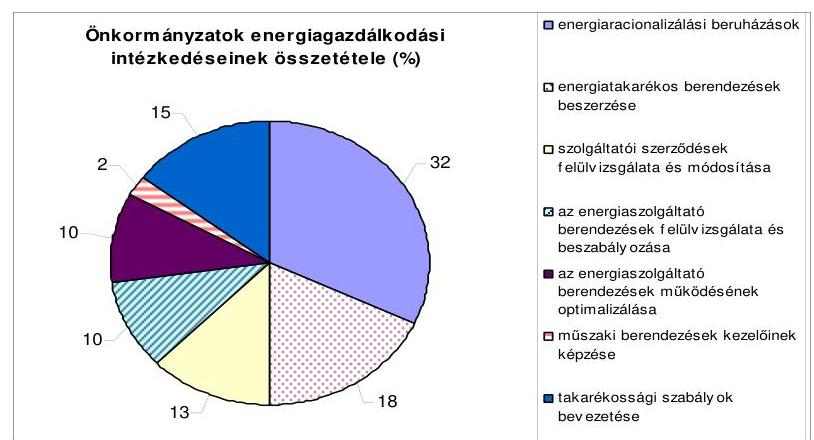

Az energiafelhasználás szervezeti, személyi feltételeinek hiányosságaival is összefügg, hogy az energiagazdálkodás tekintetében hatékonysági elvá-

[^0]
[^0]:    ${ }^{140}$ A helyi önkormányzatok energia kiadásait a 6. számú melléklet mutatja be.
    ${ }^{141}$ Az UNDP, a GEF által létrehozott - 2001-2005 között működő - pénzügyi alap célja az volt, hogy csökkentse az energiahatékonysági fejlesztések előtt álló kezdeti akadályokat, ennek keretében - az energiaauditok elvégeztetésének támogatása révén - átsegítse az önkormányzatokat a fejlesztési, korszerűsítési folyamatok kezdeti lépésein.

---

rásokat érvényesítő helyi megoldásokat mindössze négy önkormányzatnál (Hosszúpályi, Szeged, Bóly, Mohács) alakítottak ki.

Hosszúpályiban az oktatási és nevelési intézményekben - a gyermekek életkori sajátosságaihoz igazítottan - a pedagógiai és minőségirányítási rendszereknek is részét képezte a környezetvédelemmel összehangolt energiatudatos nevelés. Szegeden az energiafogyasztás intézményi adatait 2009-től heti gyakorisággal értékelték, és előkészítették a földgázenergia közbeszerzési eljárás keretében való beszerzését.

A Bólyi önkormányzat intézkedései a geotermikus közmű kiépítésére, a közvilágítás, illetve az intézmények épületeinek energiaracionalizálási korszerűsítései mellett a közvilágítási- és gázszolgáltatói szerződések felülvizsgálatára, illetve újak kötésére irányultak.

A Mohácsi Kistérségi Társulás társult önkormányzatainál a gázenergia és a villamosenergia beszerzésére közbeszerzési eljárás alapján került sor. Mohácson az önkormányzat a saját tulajdonú gazdasági társaságai ügyvezetőinek prémiumfeladatait az energiagazdálkodás hatékonyságát ösztönző elvárásokhoz kötötte.

A különböző saját kezdeményezésre, illetve szakértői felülvizsgálatok hatására megtett intézkedések önkormányzati energiafelhasználásra gyakorolt hatását
 három önkormányzatnál (Szeged, Kisigmánd, Tata) értékelték. Az önkormányzati támogatások révén megvalósított fejlesztések és korszerűsítések eredményeit három településen (Szeged, Siófok, Mohács) tekintették át, ezen belül a lakosságot érintő közvetlen energia-megtakarítások hatásainak értékelésével azonban csak Siófokon foglalkoztak.

# 3.3. Az önkormányzatok kötelező közvilágítási feladatainak ellátása 

Az Ötv. 8. § (4) bekezdése alapján a közvilágítás a települési önkormányzatok által kötelezően ellátandó közszolgáltatások körébe tartozik. Ezt egészítette ki a Hatásköri tv. ${ }^{142}$ 2006. december 31-ig hatályban lévő 65. § (3) bekezdése ${ }^{143}$, amely szerint a „települési önkormányzat képviselőtestülete (közgyűlése) gondoskodik a külön jogszabály rendelkezéseinek megfelelően a közvilágítási berendezés létesítéséről és üzemeltetéséről". A feladatellátás egyes részletszabályait - még az Ötv. hatályba lépését megelőzően kiadott -, a közvilágításról szóló 11/1985. (XI. 30.) IpM rendelet tartalmazta, amelyet 2009. január 1-jétől hatályon kívül helyeztek ${ }^{144}$.

A rendelet a közvilágítási feladatokat szakmai szempontból szabályozta, és rendelkezett a közvilágítási célra történő villamosenergia szolgáltatásról, továbbá a

[^0]
[^0]:    ${ }^{142}$ az 1991. évi XX. törvény a helyi önkormányzatok és szerveik, a köztársasági megbízottak, valamint egyes centrális alárendeltségű szervek feladat- és hatásköreiről
    ${ }^{143}$ hatályon kívül helyezte a kormányzati szervezetalakítással összefüggő törvénymódosításokról szóló 2006. évi CIX. törvény 130. § b) pontja 2007. január 1-jétől
    ${ }^{144}$ hatályon kívül helyezte a 383/2007. (XII. 23.) Korm. rendelet 2. § (2) bekezdés I) pontja

---

közvilágítás létesítési, rekonstrukciós, fenntartási és üzemben tartási feltételeinek a megállapításáról. A települési önkormányzatok feladatait közvetlenül nem tartalmazta, a területileg illetékes községi, városi, fővárosi kerületi, megyei jogú városi jegyzőnek határozott meg feladatokat, illetve állapított meg hatásköröket.

Az új, IpM. rendelet helyébe lépő - az új Vet. 34. § (6) bekezdése, valamint a 170. § (1) bekezdés 37. pontjában foglalt felhatalmazás szerinti, a közvilágításra vonatkozó részletes szabályokra, a közvilágítási berendezéseknek az elosztó hálózat tartószerkezetein és létesítményeiben történő elhelyezésével, üzemeltetésével összefüggő kérdésekre vonatkozó ${ }^{145}$ - jogszabályt 2009 végéig nem alkották meg. Mindezek következtében az önkormányzati közvilágítási feladat ellátásának módjáról, illetve részletszabályairól sem törvény, sem más jogszabály nem rendelkezik.

Mivel az új Vet. a közvilágítás vonatkozásában csak a villamosenergia-rendszer szempontjából legszükségesebb rendelkezéseket tartalmazza (a közvilágítási berendezések és az elosztó hálózat, illetve a közvilágításra kötelezett és az elosztó hálózati engedélyes kapcsolata, az erre vonatkozó szerződéses kötelezettség), az egyéb közvilágítással kapcsolatos kérdések - közvilágítási berendezések létesítése és üzemeltetése - nem tartoznak a tárgykörébe, így azok szabályozatlanok maradtak.

A GKM-ben 2007-ben a jogszabály előkészítése elkezdődött ugyan, azonban alkotmányossági aggályok miatt a jogalkotási folyamat elhúzódott.

A közvilágításról szóló rendelet felülvizsgálatát a gazdasági feltételrendszer módosulása, a piac liberalizációja, a közvilágítás területén jellemzővé vált vegyes tulajdoni viszonyok kialakulása is indokolta. Az erről szóló kormányrendelettervezetet 2007 decemberében a MeH Szakmapolitikai Munkacsoport elé benyújtották, de a munkacsoport alkotmányjogi szempontból - mivel törvényi szabályozás szükségességét látta indokoltnak - nem értett egyet annak közigazgatási egyeztetésre bocsátásával.

Az Igazságügyi és Rendészeti Minisztérium véleménye szerint a közvilágítás feladatának fogalmára, a feladat ellátásának mikéntjére hiányzik az elsődleges, az önkormányzati autonómiát közvetlenül érintő kérdések törvényi szintű rendezése, mivel azokról sem az Ötv., sem az új Vet. nem rendelkezett. Ezek az Alkotmány rendelkezései ${ }^{146}$ alapján csak törvényi szinten rendezhetők, amelyet követően a technikai kérdések kormányrendeleti szinten is szabályozhatóak.

A közvilágítással kapcsolatos részletszabályok kidolgozása a Kormány energiapolitikáért felelős tagjának - a 133/2008. (V. 14.) Korm. rendelet 3. § (2) bekezdése alapján a közlekedési, hírközlési és energiaügyi miniszternek - a feladat és

[^0]
[^0]:    ${ }^{145}$ A felhatalmazás emellett kiterjedt az elosztó hálózati engedélyes és a közvilágításra kötelezett közötti szerződés minimális tartalmi és formai követelményeinek a meghatározására is, amely kötelezettségének a Kormány a 273/2007. (X. 19.) számú rendeletének megalkotásával eleget tett.
    ${ }^{146}$ Az Alkotmány 43. § (2) bekezdése és a 44/A. § (1) bekezdés a) pontja alapján a települési önkormányzatok a helyi közügyek tekintetében szabályozási és igazgatási autonómiával rendelkeznek, amely csak törvényi szinten korlátozható.

---

hatáskörébe tartozik ${ }^{147}$. A központi jogszabály (törvénytervezet) kialakítását célzó munka jelenleg folyamatban van, a szakmai egyeztetés elkezdődött.

A közvilágítással kapcsolatos szabályozási hiányosságok a - szolgáltatók részére - kötelezően előírt statisztikai adatszolgáltatásban ${ }^{148}$ is megmutatkoztak. A statisztikai adatok utolsó feldolgozását 2007-re végezték el, 2008-ban azonban a különböző bizonytalansági tényezők (közvilágításról szóló szabályozás hiánya, üzemeltetés és tulajdoni jogok bizonytalanságai) és az adatszolgáltatás minőségi problémái (az adatszolgáltatás teljessége nem volt megvalósítható és hitelessége nem volt biztosítható) miatt az adatokat már nem dolgozták fel ${ }^{149}$.

A közvilágítás, mint kötelező feladat - az Ötv. 8. § (4) bekezdése alapján - az ellenőrzött önkormányzatok 86,5\%-ánál ${ }^{150}$ a helyi szabályzatokban megjelent ${ }^{151}$, azt mindössze öt önkormányzat nem nevesítette (Mosonszolnok, Hernád, Teleki, Dunaföldvár, Simontornya). A szabályzatok azonban nem, vagy csak részben tartalmazták a berendezések létesítéséhez és üzemeltetéséhez kapcsolódó részletes feladatokat.

A közvilágítási berendezések létesítésével, rekonstrukciójával, az új területek közvilágításának fejlesztésével kapcsolatos feladatokról az ellenőrzött önkormányzatok 27%-a, az üzemeltetéssel kapcsolatos egyes részletfeladatokról pedig mindössze három önkormányzat (Kondoros, Tata, Szekszárd) rendelkezett. Utóbbiak a berendezések felügyeletéhez, ellenőrzéséhez, valamint a fogyasztói panaszok fogadásához és kivizsgálásához kapcsolódtak. A hibák kijavításának, a karbantartásoknak és a kisjavításoknak a dokumentálására, valamint a hibaelhárítások önkormányzati ellenőrzésére egy esetben sem terjedtek ki a szabályozások.

A közvilágítási feladatok jogszabályi meghatározásának hiánya következtében a feladatok ellátására kötött szerződések tartalma - területenként, szolgáltatónként - jelentősen eltért egymástól. Az önkormányzatok 73%-a felülvizsgálat és kontroll nélkül elfogadta a területileg illetékes szolgáltató ajánlatát, illetve a szolgáltató-váltásokat a döntéseket megelőzően gazdaságossági számításokkal nem támasztották alá.

[^0]
[^0]:    ${ }^{147}$ A feladat 2008. május 15 -ét megelőzően a gazdasági és közlekedési miniszter feladatkörébe tartozott, a gazdasági és közlekedési miniszter feladat- és hatásköréről szóló 163/2006. (VII. 28.) Korm. rendelet 1. § g) pontja alapján.
    ${ }^{148}$ 1660/04 számú Adatgyűjtés a közvilágításról, a 215/2003. (XII. 10.) Korm. rendelet alapján
    ${ }^{149}$ A közvilágítási statisztika a 2010-től megszűnt, a továbbiakban az 1058. számú, KSH által kezelt adatszolgáltatás tartalmaz adatokat a közvilágítási berendezésekről.
    ${ }^{150}$ Egy ellenőrzött önkormányzatnak (IX. kerület) az Ötv. 63/A. § d. pontja alapján nem feladata a közvilágítás biztosítása, arról a Fővárosi Önkormányzat köteles gondoskodni.
    ${ }^{151}$ A közvilágítási feladatokat az önkormányzatok 70,3\%-ánál a szervezeti és működési szabályzatokban, 29,7\%-ánál az ügyrendekben, de ezekkel párhuzamosan a kötelező és önként vállalt feladatok jegyzékében, a gazdasági és a környezetvédelmi programokban, a településrendezési tervekben és fejlesztési programokban is szabályozták.

---

A szabályozás szükségességére mutatott rá a közvilágítási feladatok tárgyában az érintett minisztériumok, önkormányzatok, szakmai és érdekképviseleti szervezetek, energiaszolgáltatók képviselői és szakértők részvételével - tartott fókuszcsoport-megbeszélés is.

A résztvevők a központi szabályozást igénylő területek körébe sorolták a közvilágítás fogalmának, műszaki paraméterekkel is meghatározott tartalmának, kötelezettjeinek, megoldási (üzemeltetési) módozatainak, a közvilágítási szerződés tartalmának, a tulajdonjogi kérdéseknek, valamint a fogyasztóvédelmi szabályoknak a meghatározását.

A régi Vet. 2003. január 1-jei hatálybalépésével a villamosenergia piacon gyökeres változások következtek be, amely a korábbi közüzemi szolgáltatás visszaszorulását és a szabadpiac fokozatos megjelenését jelentette a feljogosított fogyasztók ${ }^{152}$ körének bevezetésével. A villamosenergia piac nyitásának jogszabályi hátterét a jelenés 5. számú függeléke tartalmazza.

A villamosenergia piac liberalizációját követően az ellenőrzöttek 13,5%-a (Gyöngyös, Győrtelek, Pécs, Gyula, Bóly) vizsgálta a feljogosított fogyasztói körbe ${ }^{153}$ való belépés és az ebből elérhető megtakarítások lehetőségét, de csak 5,4%-a vált feljogosított fogyasztóvá. Három önkormányzat a szolgáltatók versenyeztetése során kapott ajánlatok alapján nem ítélte előnyösnek az átlépést.

Gyöngyös 19 önkormányzattal közösen, céltársulás keretében lefolytatott közbeszerzési eljárás alapján kötött egyedi közvilágítási szerződést 2006. augusztus és 2007. december között. Később azonban nem élt a szabadpiacra lépés lehetőségével az újabb közbeszerzési eljárás idő- és költségigénye, valamint a regionális áramszolgáltató alacsonyabb karbantartási díja miatt.

Győrtelek 2006. január 1-jétől villamosenergia-kereskedőtől szerezte be a közvilágítási célú villamos energiát, amelyből az első év árai alapján 16,4%-os megtakarítása keletkezett.

Pécsett és Gyulán vizsgálták a feljogosított fogyasztók körébe történő átlépést, de előnytelen lett volna a magasabb piaci ár miatt. Bóly hét villamosenergia-kereskedőtől kért, kettőtől kapott ajánlatot, de azok magasabbak voltak az önkormányzat által minimálisan elvárt megtakarítást eredményezőnél.

Az ellenőrzött önkormányzatok 10,8%-a - a közvilágítás korszerűsítéséhez kapcsolódóan, a korszerűsítést végző vállalkozókkal - kötött olyan egyedi közvilágítási szerződést, amelyben az alkalmazott közvilágítási díjat a szabadpiacon elérhető árakhoz kötötték.

[^0]
[^0]:    ${ }^{152}$ A feljogosított fogyasztók saját döntésük alapján nem közüzemi szerződés keretében, hanem az általuk megválasztott kereskedőtől, termelőtől, kiserőműtől, a szervezett villamosenergia-piacon, valamint a villamosenergia határon keresztül történő beszállítása útján vásárolták a villamosenergiát.
    ${ }^{153}$ A 181/2002. (VIII. 23.) Korm. rendelet 3. § c) pontja alapján 2003. január 1-jétől a fogyasztott mennyiségtől függetlenül, saját döntése alapján a közvilágítás vonatkozásában bármely települési önkormányzat feljogosított fogyasztóvá válhatott.

---

Beremenden, Erken és Zalaszentbalázson a szolgáltató minősített fogyasztóként megversenyeztette a villamosenergia vásárlását és a korábban alkalmazott, központilag szabályozott árak fogyasztói árindexszel növelt összegéhez képest elért árelőnyt éves elszámolás alapján 50-50%-ban megosztotta az önkormányzatokkal. Veresegyházon a szolgáltató a kereskedőtől vásárolt villamosenergia árával megegyező díjszabást vállalt a szerződésben.

A közüzemi szolgáltatás keretei között maradó önkormányzatok (az ellenőrzöttek 83,8%-a) a nem lakossági közüzemi fogyasztók részére a közüzemi szolgáltató által szolgáltatott villamosenergia árának megállapításáról szóló 59/2002. (XII. 29.) GKM rendelet ${ }^{154}$ alapján a közvilágítási, a teljesítménydíjas és az alapdíjas árszabások közül választhattak.

A közüzemi szolgáltatókkal kötött szerződések az általános feltételeket tartalmazták, mindössze négy önkormányzatnál (Pécs, Szeged, Százhalombatta, Győrtelek) állapodtak meg - a régi Vet. 82. §-a alapján - egyedi előírásokban, de ebben az esetben sem léphették túl a rendeletben kihirdetett legmagasabb árakat. Balmazújváros, Hajdúszoboszló és Tata városok - szintén egyedi megoldásokat választva - feladatátvállalási szerződések alapján, vállalkozók útján látták el a közvilágítással kapcsolatos önkormányzati feladatokat, és e vállalkozók kötöttek szerződéseket a közüzemi szolgáltatókkal.

Az új Vet. 2008. január 1-jei hatályba lépésével megszűnt a korábbi kettős modell, és ezzel a közüzemi szolgáltatás, minden felhasználó jogosulttá vált a szabadpiacon vásárolni. A változás leginkább a közvilágítást a közüzemi szolgáltatás keretei között biztosító önkormányzatokat érintette. Az új Vet. - a korábbi közüzemi szolgáltatásnak részben megfeleltetve -, bevezette az egyetemes szolgáltatás és az egyetemes szolgáltató fogalmát. Az egyetemes szolgáltatásra jogosultak között azonban nem nevesítették a helyi önkormányzatokat, illetve a közvilágítási célú villamosenergia felhasználást, hanem a jogosultságot a fogyasztás mennyiségétől tették függővé.

A 273/2007. (X. 19.) Korm.
 rendelet 120. § (6) bekezdésének 2008-ban hatályos rendelkezései szerint az elosztónak és a felhasználót ellátó villamosenergiakereskedőknek, illetve egyetemes szolgáltatóknak 2009. március 31-ig kellett megküldeniük a szerződéskötésre vonatkozó ajánlatot és a szerződéstervezetet a felhasználók részére.

A korábbi közüzemi szerződések felülvizsgálatáig az önkormányzatok jogfolytonosan vételezhették a villamos energiát, a fogyasztást az egyetemes szolgáltatás árszabásai szerint kellett elszámolni ${ }^{155}$, de ettől eltérő gyakorlat is előfordult.

A korábbi közüzemi szerződések 77,8%-át az új Vet. hatálybalépésének évében még nem vizsgálták felül. Három önkormányzatnál (Kondoros, Kistelek, Hernád) a korábbi szerződésből a „hatósági tarifa megszűnése miatt" a villamosenergia

[^0]
[^0]:    ${ }^{154}$ hatályon kívül helyezte a 2007. évi LXXXVI. törvény 183. § m) pontja 2008. január 1-jétől
    ${ }^{155}$ a 115/2007. (XII. 29.) GKM rendelet 7. §-ának átmeneti rendelkezése alapján

---

vásárlásra vonatkozó részt hatályon kívül helyezték, de nem kötöttek másik szerződést. Öt önkormányzatnál 2008-ban úgy számlázták a közvilágítási célú villamos energiát szabadpiaci árakon, hogy arra érvényes szerződés nem volt (Kondoros, Kistelek, Hernád, Mórahalom, Mohácson a Duna bal partjához tartozó részek). Hajdúszoboszlón a közvilágítási feladatokat átvállaló gazdasági társaság ez évben szintén szabadpiaci árat érvényesített.

Az új Vet. 2009. január 1-jei módosításával ${ }^{156}$ a helyi önkormányzatokat az egyetemes szolgáltatás igénybevételére jogosultak körébe sorolták, és az ennek megfelelő árképzési szabályok szerint kialakított áron lettek jogosultak villamosenergia-vásárlási szerződést kötni ${ }^{157}$. Az egyetemes szolgáltatási szerződések megkötése 61,9%-ban 2009-ben megtörtént, illetve a helyszíni ellenőrzés idején folyamatban volt ${ }^{158}$. A szerződéskötések elmaradása esetén a korábbi közüzemi szerződések 2010. január 1-jétől az egyetemes szolgáltató üzletszabályzatának a mellékletét képező mintaszabályzat szerint maradnak hatályban.

A 2009. évtől az önkormányzatok már célirányosabban keresték a közvilágítási célú villamosenergia szabadpiacról történő beszerzésének lehetőségeit, és különböző árajánlatokat szereztek be, de csak hat önkormányzat (az ellenőrzöttek 16,2%-a) kötött erre vonatkozóan szerződést. Öt önkormányzatnál hatályban maradt a korábbi szabadpiaci árhoz kötött szerződés. Az ellenőrzött önkormányzatok 70,3%-a azonban továbbra is a jogszabály által biztosított egyetemes szolgáltatást vette igénybe.

A Mohácsi Többcélú Kistérségi Társulás által lefolytatott közbeszerzési eljárás alapján kötött szerződést közvilágítási célú villamosenergia szállításra Mohács, Bóly, Somberek 2010. december 31-ig. Szeged 2009. április 1. és 2010. március 31., Mórahalom 2009. szeptember 1. és december 31. közötti időszakra, Kistelek 2009. december 1-jétől kötött szerződést a szabadpiacon. Gyulán 2009-ben ismét vizsgálták a szabadpiacra történő kilépés lehetőségeit, de ez - az intézményi villamosenergia fogyasztással együtt - előnytelen lett volna.

A feljogosított fogyasztói körbe átlépés, illetve a szabadpiacról történő vásárlás lehetőségeinek kihasználását a szakemberhiány is akadályozta. Az önkormányzatok - energetikus foglalkoztatásának hiányában ${ }^{159}$ - nem rendelkeztek elegendő információval a villamosenergia-piac liberalizációjáról és a különböző tartalmú árak összehasonlításához. Mindemellett hiányzott a széles körű érdekeltség és a megfelelő adatbázis is ahhoz, hogy mérlegeljék a jogszabályi változások nyújtotta lehetőségek előnyeit.

Az ellenőrzött önkormányzatok 24,3%-ánál még az ellenőrzött időszakra vonatkozó valamennyi közvilágítási szerződés sem állt rendelkezésre. Az önkormányzatok közel 64,7%-ánál - a feltételek kiépítésének hiányában - nem mérték a közvilágítási célú villamosenergia felhasználást, hanem a lámpatestek beépített teljesítménye ${ }^{160}$ alapján fizettek.

[^0]
[^0]:    ${ }^{156}$ az új Vet. 50. § (4) bekezdése alapján (hatályos 2009. január 1-jétől)
    ${ }^{157}$ a 273/2007. (X. 19.) Korm. rendelet 26/A. § (1) bekezdés a) pontja alapján
    ${ }^{158}$ A határideje a 273/2007. (X. 19.) Korm. rendelet 120. § (3) bekezdése alapján 2009. december 31-e lett.
    ${ }^{159}$ A szakemberek foglalkoztatásának igényét, az energetikus hálózat kialakítása ösztönzésének szükségességét a fókusz-csoport megbeszélés is megerősítette.

---

A közvilágítás korszerűsítésnél alkalmazott finanszírozási megoldások és vállalt kötelezettségek, valamint a kialakult vegyes tulajdoni viszonyok szintén hátráltatták a piacnyitás nyújtotta előnyök kihasználását. A szolgáltatók hosszú távú szerződések megkötésére törekedtek a piac biztosítása érdekében ${ }^{161}$, a tulajdonosként pályázó szolgáltatók (szolgáltatói csoportok) pedig kedvezőbb feltételeket tudtak ajánlani a többi pályázónál. A szolgáltatók tulajdonába került közvilágítási lámpatestek és tartozékaik működtetésének, karbantartásának jogát ugyanis - bérleti díj kikötésével is - igyekeztek megtartani.

A közvilágítás korszerűsítése során Kondoros 2017-ig, Győrtelek 2012-ig elkötelezte magát az áramszolgáltatónak, így a piacnyitás előnyei nem, vagy csak korlátozottan érvényesülhettek. Felsőzsolcán a 2009. április 8-án megkötött szerződés szerint az önkormányzat az energiavásárlási szerződés újabb időszakra vonatkozó megkötésénél utolsó ajánlattételi lehetőséget biztosít, és tájékoztatja a kereskedőt „a beérkezett ajánlatok közül a legkedvezőbb ajánlat felhasználói döntést befolyásoló fő kondícióiról".

A közvilágítási berendezések karbantartásáról és üzemeltetéséről a közüzemi, az egyetemes szolgáltatói és az egyéb villamosenergia vásárlására irányuló szerződések keretében rendelkeztek, vagy arra külön szerződéseket kötöttek.

A megkötött szerződések szerint a berendezések fenntartása, karbantartása és üzemeltetése - tulajdonosként - a szolgáltatók kötelezettsége volt, de ennek költségeit - az elfogyasztott villamos energiához, illetve az ún. aktív elemek (közvilágítási berendezések a) pontja) darabszámához igazodóan - az önkormányzatok fizették meg. A szerződések 2008 előtt valamennyi közvilágítási berendezésre, ezt követően a szerződésekben az „aktív elemek" címmel jelölt fényforrások, lámpatestek és tartozékaik üzemeltetésére terjedt ki.

A Gazdasági Versenyhivatal eljárást indított mind a hat magyarországi áramszolgáltatóval szemben, mivel észlelte, hogy az ún. passzív elemek használatáért díjat számítottak fel a nem lakossági közüzemi fogyasztók részére a közvilágítási árszabáson fogyasztók kivételével. Az eljárás során megállapította, hogy a teljesítménydíjas, az alapdíjas és a szabadpiaci árszabások közvilágítási célra történő vételezése esetén nem tartalmazták a közvilágítási eszközök infrastrukturális költségeit, ezért az eljárást Vj-56/2007/073. számú végzésével megszüntette.

[^0]
[^0]:    ${ }^{160}$ A fényforrásnak az előtét, a gyújtó és a lámpatestbe épített feszültségszabályozó teljesítményfelvételével növelt névleges villamos teljesítmény, a fényáram szabályozó tényezők figyelembevételével, a közvilágítási naptár vagy más módon megállapított időtartam alapján számított fogyasztása.
    ${ }^{161}$ A Gazdasági Versenyhivatal Versenytanácsa már a 175/2001. VJ és 176/2001. VJ számú határozataiban megállapította két szolgáltató vonatkozásában, hogy egyes önkormányzatokkal olyan hosszú távú teljes körű közvilágítás szolgáltatási szerződéseket kötöttek, amelyek kötbér kikötésével megakadályozzák, de legalábbis korlátozzák, hogy mástól is vásárolhassanak közvilágítási célra villamos energiát.

---

A 2008. évtől az elosztó tulajdonában lévő „passzív elemekre" - az új Vet. 142. § (1) bekezdés d) pontjával bevezetett - közvilágítási elosztási díj nyújt fedezetet.

A karbantartási és üzemeltetési szerződések 27%-a azonban nem tartalmazott garanciákat a szolgáltatás üzembiztonsági és felelősségi követelményeire, 40,5%-a pedig nem rögzítette a berendezések tulajdonviszonyaival kapcsolatos kérdéseket. A szerződésekben foglaltak teljesítését az önkormányzatok dokumentáltan nem vizsgálták, a szolgáltatók felé jelzést, kifogást mindössze három önkormányzat (Gyula, Szeged, Tata) tett.

Az önkormányzatok összességében eredményesen látták el közvilágítási feladataikat, mivel biztosították a feladat zavartalan ellátását, az eszközök fenntartását és karbantartását. Nem fordítottak figyelmet azonban arra, hogy szabályozott módon kialakítsák a közvilágításra vonatkozó fogyasztói panaszok fogadásának és kivizsgálásának rendjét. A szolgáltatók a közüzemi szerződések alapján fogadták a fogyasztói panaszokat és bejelentéseket. Az önkormányzatok 51,4%-a a hivatalban biztosította a panaszok összegyűjtését és továbbította a szolgáltató felé, a szolgáltató által tett intézkedések ellenőrzésére azonban csak a 29,7%-uk intézkedett.

Gyulán és Szegeden a kialakított monitoring rendszer keretében gazdasági társaságokat bíztak meg a közvilágítási hibák felderítésével és az elvégzett javítások ellenőrzésével. Hajdúszoboszlón a fogyasztói panaszokról a számlákhoz mellékelt nyilvántartások alapján az ellenőrzés lehetősége biztosított.

A közvilágításra felhasznált villamosenergia mennyisége az ellenőrzött időszakban 1,2%-kal növekedett a végrehajtott bővítések következtében ${ }^{162}$. Ugyanakkor a közvilágítási célú kiadások 56,6%-kal, ezen belül a villamosenergia felhasználáshoz kapcsolódó kiadások 43,8%-kal - a dologi kiadások növekedését meghaladóan ${ }^{163}$ - emelkedtek. (Az ellenőrzött önkormányzatok adatait a jelentés 5. számú, az országos összehasonlító adatokat a 6. számú melléklete tartalmazza.) Ez 97,3%-ban a villamosenergia árak növekedésének hatása, amelyet azonban torzítottak a szolgáltatók által megfinanszírozott fejlesztésekért különböző módon - energiahatékonysági, korszerűsítési, szolgáltatási, területbővítési, üzemeltetési, rendszer kiépítettségi díj jogcímeken - felszámított összegek. Az önkormányzatok 32,4%-a - az Áhsz. ${ }^{164}$ 9. számú mellékletének számlaosztályok tartalmára vonatkozó előírásaival ellentétben - nyilvántartásaiban nem különítette el a villamosenergia vásárlására és a karbantartásra, valamint a fejlesztésekhez kapcsolódóan fizetett díjakat ${ }^{165}$.

[^0]
[^0]:    ${ }^{162}$ Az üzemeltetett lámpahelyek száma 89765 db-ról 94122 db-ra (4,9%-kal), a közvilágítással ellátott utak hossza 2756 km-ről 2892 km-re (4,9%-kal) nőtt.
    ${ }^{163}$ A dologi kiadások - amelyek tartalmazzák a villamosenergiát is - ugyanebben az időszakban 15,8%-kal növekedtek. Az országos összehasonlító adatok szerint a közvilágítási célú kiadások 2004-ről 2008-ra 29,3%-kal, a dologi kiadások 21,3%-kal nőttek.
    ${ }^{164}$ az államháztartás szervezetei beszámolási és könyvvezetési kötelezettségének sajátosságairól szóló 249/2000. (XII. 24.) Korm. rendelet
    ${ }^{165}$ A helyszíni ellenőrzés során ezeket részben kigyűjtéssel vagy számításokkal határoztuk meg.

---

Gyulán 2004-2006 között a kiadásnövekedést a 2001-ben végrehajtott korszerűsítés után fizetett energiahatékonysági szolgáltatási díj, majd a 2003-tól fizetett szolgáltatás területi kibővítési díj okozta.

Szegeden nem különítették el a fejlesztésekért fizetett energiahatékonysági díjat a karbantartásra és a villamos energiára kifizetett összegektől. Több önkormányzatnál (Dunaföldvár, Simontornya, Zalaszentbalázs) a számlákból nem is lehetett megállapítani a villamos energiára és a karbantartásra fordított összegeket.

A villamos energia árak növekedésének a hatására folyamatosan emelkedett az egy üzemeltetett lámpahelyre jutó villamos energia kiadás és a közvilágítási kiadás is.
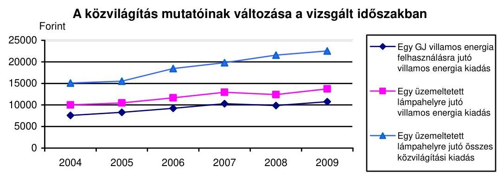

A kiadások növekedése ellenére az önkormányzatok 78,4%-a nem értékelte a közvilágításra fordított kiadások alakulását befolyásoló tényezőket, és 83,8%-uk nem számszerűsítette a villamosenergia árváltozások költségvetési kiadásokra gyakorolt hatását. Az éves költségvetések összeállítása során az energiafogyasztás mennyiségi adatait nem vették figyelembe, az előző év előirányzatai és pénzügyi teljesítései alapján, a várható árnövekedéssel számoltak.

Az önkormányzatok felismerték a közvilágítási célú létesítmények műszaki felülvizsgálatának és korszerűsítésének szükségességét, valamint az abból származó megtakarítási lehetőségeket. Felülvizsgálták a településeket ellátó közvilágítási rendszert és intézkedtek a korszerűbbé tételére.

Az ellenőrzött önkormányzatok a vizsgált időszakot érintő 24 beruházáshoz kapcsolódóan 1787 millió Ft-ot fordítottak a közvilágítás korszerűsítésére. Ennek eredményeként a káros anyag kibocsátás és az egy lámpahelyre jutó energiafelhasználás (1321,4 MJ-ról 2009-re 1275,1 MJ-ra) 3,5%-kal csökkent ${ }^{166}$.

[^0]
[^0]:    ${ }^{166}$ A közvilágítási statisztika országos adatai szerint (a jelentés 6. számú mellékletének 3. ábrája) a fényforrások száma - a közvilágítási hálózat mennyiségi kiépítését követően -, 1990-től 2007-ig mindössze 5,6%-kal növekedett (1309 ezer db-ról 1382,41 ezer db-ra). Ezzel egyidejűleg a fényforrások beépített teljesítménye 43,9%-kal csökkent 156,2 MW-ról 87,56 MW-ra. (Forrás: Energia Központ)

---

A végrehajtott korszerűsítések eredményeként a közvilágítási lámpatestek száma 2004-ről 2009-re 4,9%-kal nőtt, de ezzel párhuzamosan a közvilágításra felhasznált villamosenergia mennyisége - mint láttuk - mérsékeltebben, 1,2%-kal növekedett.

A közvilágítás korszerűsítések érdekében alkalmazott szerződéses konstrukciók és finanszírozási módozatok kialakításában, valamint a végrehajtásban meghatározó szerephez jutottak a villamosenergia-szolgáltató, illetve
 a közvilágítási rendszert üzemeltető gazdasági társaságok. A szerződések megkötésénél az önkormányzatok 59,5%-a nem mérlegelte a gazdaságossági szempontokat, nem élt a versenyeztetés lehetőségével.

A szolgáltatók az önkormányzatok 83,8%-ánál közvetlenül, vagy a korszerűsítést végző gazdasági társasággal kötött megállapodás alapján közvetetten részt vettek a közvilágítás korszerűsítésben. A szolgáltatók ajánlatait az önkormányzatok elfogadták, mindössze 40,5%-uk kért további ajánlatokat (közbeszerzés vagy egyéb pályáztatás útján). Ezek 26,7%-ánál (Hernád, Mosonszolnok, Győrtelek, Simontornya, Szekszárd) szintén a szolgáltatók ajánlatait választották. Az önkormányzatok 18,9%-a pedig a közvilágítás korszerűsítéssel együtt döntött az üzemeltetést végző szervezetről is, részben a megajánlott finanszírozási módozatok, részben a működési és fejlesztési feladatok összehangolásának igénye miatt.

A közvilágítás korszerűsítésre benyújtott ajánlatok lényegi eleme volt az energiamegtakarítás nagysága. Az önkormányzatok pozitív döntési hajlandóságát növelte, ha az elérhető energiamegtakarítás fedezetet nyújtott a fejlesztés várható kiadásaira. Az önkormányzatok nem kontrollálták a benyújtott ajánlatokat, 53,3%-uk megalapozó számítások - a pénzeszközök felhasználása hatékonyságának vizsgálata - nélkül döntött a fejlesztésről.

Az önkormányzatok 76,7%-ánál megvalósíthatósági tanulmány, 83,3%-ánál értékelemzés, 63,3%-ánál költség-haszon elemzés nem készült az ellenőrzött időszakban megvalósított fejlesztések megalapozására. Előfordult, hogy erre a benyújtott ajánlatok pontos műszaki tartalma ismeretének hiányában lehetőségük sem volt, kiegészítéseket pedig nem kértek az ajánlattevőktől. Ezek miatt az energiamegtakarítás mennyiségére, értékére vonatkozó adatok sem álltak rendelkezésre.

Szegeden a szolgáltató az ajánlatához részletes műszaki terveket, gazdaságossági számításokat nem csatolt, és a szerződés sem tartalmazott a megtérülésre, a teljesítménycsökkenéssel elért energia és díj megtakarításra adatokat. Az önkormányzat nem készített érték-, költség-haszon elemzéseket. Gerde, Somberek, Szentlászló, Dunaföldvár önkormányzatai nem rendelkeztek a beruházások előkészítésére és pontos műszaki tartalmára vonatkozó dokumentumokkal.

A közvilágítás korszerűsítési ajánlatok nem bizonyultak megalapozottnak. Az energiamegtakarítás tervezett értékei ugyan átlagosan 97,1%-ban teljesültek ${ }^{167}$, a kiadás megtakarítások azonban átlagosan 13,5%-kal elmaradtak ${ }^{168}$ az előzetesen számítottnál. Mindezek következtében a beruházások megtérülési

[^0]
[^0]:    ${ }^{167}$ 28,3-178,6% közötti szórás mellett
    ${ }^{168}$ 28-119,1% közötti szórás mellett

---

ideje 26,1%-kal - 13 évről 16,4 évre - növekedett, amely nem biztosította a pénzeszközök felhasználásának hatékonyságát.

Hernádon a tervezett teljesítmény, fogyasztás és éves költség megtakarításnak a tény adatok alapján a 28-29%-a volt kimutatható. Simontornyán - a lámpabővülés miatti fejlesztéssel korrigált - tényleges költségmegtakarítás mindössze 70%-a volt az ajánlatban kimutatottnak. Szekszárdon a kiadás csökkenése 52%-kal elmaradt az áramszolgáltató által prognosztizáltnál. Mosonszolnokon a tényleges energiamegtakarítás mennyisége a tervezettnek az 58,2%-a, értéke csupán a 28,0%-a lett. Mindezek következtében a beruházások megtérülési ideje Hernádon 4 évről 14 évre, Simontornyán 3 évről 6 évre, Mosonszolnokon 8 évről 29 évre nőtt.

A beruházások megtérülése már a tervezett adatok szerint széles sávban (3-43 év között) szóródott, amely a megvalósítás során tovább növekedett (4-74 évre).

Az önkormányzatok 67,6%-ánál a szolgáltató végezte a közvilágítás korszerűsítését, és 64,9%-ánál csak átmenetileg biztosította a beruházás forrásainak a fedezetét, mert az önkormányzatok azt később részletekben megfizették. Az egyes korszerűsítési módozatok kialakításakor törekedtek ugyan arra, hogy a fejlesztésekhez kapcsolódó fizetési kötelezettségek az önkormányzatok számára ne jelentsenek egyszeri nagy terhet és igazodjanak a várható megtakarításokhoz, a szerződéseket az önkormányzatok 73%-ánál 4-15 éves üzemeltetési, feladat-ellátási szerződésekkel kapcsolták össze, ami hosszú távú elkötelezettséget jelent a szolgáltatók felé. A közvilágítási feladat ellátása azonban nem indokolta a hosszú távú szerződések megkötését ${ }^{169}$. A fizetési kötelezettségek a szerződések megkötésekor - gazdaságossági számítások, értékelemzések, illetve összehasonlítható ajánlatok, jelenérték számítás hiányában - kedvezőnek tűntek a fejlesztési forrásokban szűkös önkormányzatok számára. Azonban a futamidő alatt a különböző - energia hatékonysági, bérleti, lízing, energia-korszerűsítési, területbővítési díjak, kölcsönök, pénzeszköz átadások - jogcímeken megfizettetett összegek az ellenőrzött hat év alatt évente átlagosan 36,3%-kal ${ }^{170}$ megnövelték a közvilágítás működtetésének a költségeit. A harmadik fél szolgáltató vagy egyéb vállalkozó - bevonásával finanszírozott fejlesztések azért sem bizonyultak gazdaságosnak az önkormányzatok számára, mivel a fejlesztésekért a futamidő alatt fizetett különböző díjak - beruházások megvalósításának évére átszámított - jelenértéke ${ }^{171}$ 18,7%-kal meghaladta az egyszeri bekerülési költségeket.

A szolgáltató 11 önkormányzat részére - az általa felvett hitel kamatához igazított kondíciókkal vagy rögzített kamatfizetési kötelezettség mellett - 4-5 éves részletfizetést biztosított, amelyet az önkormányzatok számla ellenében vagy vissza

[^0]
[^0]:    ${ }^{169}$ Ezt erősítették meg - a vizsgálat közben szervezett - fókusz-csoport megbeszélésen résztvevők is, amikor a hosszú távú szerződések helyett a hosszú távon való gondolkodás szükségességét hangsúlyozták.
    ${ }^{170}$ 9,8-93,9% -os szórás mellett
    ${ }^{171}$ A jelenérték számítás az összehasonlíthatóság érdekében a különböző időpontokban keletkező pénzáramok értékét egy időpontra számítja át. Az ellenőrzés során a számításokat a Pénzügyminisztérium által közzétett kalkulatív kamatlábak alapján végeztük.

---

nem térítendő, felhalmozási célú pénzeszköz átadás formájában teljesítettek. Közülük nyolc önkormányzat kilenc korszerűsítésénél a szolgáltató a beruházási költségek egy részét - jellemzően a 10%-át - magára vállalta. Egy önkormányzat két korszerűsítéséhez emellett központi támogatásban is részesült (NEP-2003-4, TEKI). Csengeren 10 év alatt kellett visszafizetni a 20 millió Ft beruházási és emellett 44,68 millió Ft járulékos költséget. Erre az energia költség megtakarítás ugyan a számítások szerint fedezetet nyújtott, de a futamidő alatt kifizetett többletkiadások jelenértéke kétszerese az egyszeri beruházási költségeknek.

Három önkormányzatnál (Beremend, Erk, Zalaszentbalázs) a szolgáltató úgy valósította meg a közvilágítás korszerűsítést, hogy az önkormányzatok részére saját, illetve kapcsolt vállalkozása részvényeit értékesítette halasztott részletfizetéssel. A fizetési feltételek az önkormányzatok választása alapján igazodtak a beruházások megtérüléséhez. Az önkormányzatok így a beruházások nettó értékével megegyező névértékű részesedéssel rendelkeztek a szolgáltató gazdasági társaságban, de osztalékot eddig nem realizáltak.

Tíz önkormányzatnál a szolgáltató a megvalósított beruházással összefüggésben 5-15 évre megkötött szerződés alapján, a közvilágítás üzemeltetéséhez kapcsolódóan számított fel különböző jogcímeken - energia hatékonysági szolgáltatási, területbővítési üzemeltetési, többletszolgáltatási, üzemeltetési, rendszer kiépítettségi díj - összegeket.

Gyula önkormányzata 2001-ben 90,8 millió Ft fejlesztés ellenében 10 évre havi 1242 ezer Ft energiahatékonysági díjat vállalt, a fogyasztói árindexet követő aktualizálással. A 2006-os számításaik szerint ez a futamidő alatt 187,2 millió Ft-ot jelentett volna, ebből már 87,9 millió Ft-ot kifizettek. A szerződés felmondásakor 48 millió Ft kötbért fizettek.

Szeged önkormányzata az 1999-ben megvalósított 400 millió Ft beruházáshoz kapcsolódva évi 47,5 millió Ft energia hatékonysági díj fizetését vállalta 10 éven át. A saját gazdasági társaságán keresztül utalt díjat nem különítették el a többi közvilágítási szolgáltatási kiadástól. A díjfizetési kötelezettség 2009. augusztus 31-i lejártakor nem volt adat az e jogcímen kifizetett összegekről. Az elvégzett kigyűjtés szerint a kifizetett 756,3 millió Ft 1999. évi jelenértéke 466,5 millió Ft volt, amely 16,6%-kal magasabb a beruházás értékénél. Így az önkormányzat részéről a beruházás nem volt gazdaságos.

Fehérgyarmat önkormányzatánál a kivitelezést végző vállalkozó - Phare hitelkonstrukcióval - biztosította a beruházás fedezetét, amelyet az önkormányzaton keresztül juttatott el a megbízó szolgáltató részére ${ }^{172}$.

Az önkormányzatok 5,4%-ánál (Tata, Hajdúszoboszló) külső vállalkozó (harmadik fél) végzett közvilágítás korszerűsítést, amely eszközöket lízing, illetve bérleti szerződés keretében a közvilágítási feladatokat az önkormányzattól átvállaló gazdasági társaságok üzemeltettek. A finanszírozók az eszközöket a futamidő végén az üzemeltetőnek, illetve az önkormányzatnak értékesítik. Az önkormányzatok további 27%-a a korszerűsíté-

[^0]
[^0]:    ${ }^{172}$ Az önkormányzat - a fizetés biztosítékaként - a bank részére garanciát nyújtott, majd a hitelt és kamatait az energia megtakarításból meg is fizetette.

---

seket önkormányzati saját beruházásban valósította meg ${ }^{173}$, amelyekhez öt esetben különböző támogatásokat ${ }^{174}$, egy esetben hitelt vettek igénybe.

A szolgáltatók által megvalósított, de az önkormányzatok által különböző módon finanszírozott fejlesztések az önkormányzatoknál vagyongyarapodásként nem jelentek meg. A saját beruházásokat az önkormányzatok ugyan aktiválták, de ezeket is térítésmentesen a szolgáltatók tulajdonába adták. Mindezek következtében az önkormányzatok 67,6%-a nem rendelkezik a települését ellátó közvilágítási létesítmények tulajdonjogával. A vagyonátadások során nem vizsgálták a kötelező feladatellátást szolgáló korlátozottan forgalomképes törzsvagyon - villamos közmű - feletti döntési jogosultságot ${ }^{175}$.

A közvilágítási létesítmények mindössze három önkormányzatnál (Balmazújváros, Siófok, Hosszúpályi) vannak az önkormányzatok nyilvántartásaiban, további kilencnél kisebb fejlesztésekhez kapcsolódó résztulajdont mutattak ki.

Mezőkövesden a közvilágítási szerződés kapcsán észlelték, hogy az önkormányzat a tulajdonáról való lemondás ellenében nem kapott ellenszolgáltatást. Felülvizsgálatát feladatul tűzték ki, de az később elmaradt. Simontornya és Tolna önkormányzatoknál a vagyonátadás-átvételről szóló megállapodásokban az eszközöket - konkrét hivatkozás nélkül - a már korábban hatályon kívül helyezett 1994. XLVIII. törvény és a végrehajtásról szóló 34/1995. (IV. 5.) Korm. rendelet alapján közcélú villamosműnek minősítették, ami a villamos energiát szolgáltató rendszer része. A hivatkozott jogszabályok szerint a közcélú villamosműnek, az új Vet. szerint a közcélú hálózatnak nem részei a közvilágítási fényforrások és lámpatestek. Előfordult olyan eset is, hogy az önkormányzatok a fejlesztési támogatásokkal megvalósított létesítményeket is térítésmentesen átadták a szolgáltatóknak (Teleki, Szekszárd).

Az ellenőrzött időszakban hatályos jogszabályok nem tartalmaztak előírást a közvilágítási berendezések létesítési költségeinek a viseléséről. Az Ötv. 1995. július 28-tól hatályos 107/A. §-a alapján a lakossági szükségleteket kielégítő villamos közmű vagyon a közművet üzemeltető gazdasági társaság vagyonának része lett. Ezért akkor az érintett települési önkormányzatokat a közművet üzemeltető gazdasági társaság állami tulajdonú vagyonrészének 25%-a illette meg részvény formájában. A 11/1985. (XI. 30.) IpM rendelet 3. § (3) bekezdése szerint „a közvilágítási berendezés létesítési költségeit a megvalósításban érdekelt jogi személy is vállalhatja", ennél konkrétabb előírásokat azonban nem tartalmazott. A közvilágítás céljára rendelt vagyon tulajdoni viszonyaira vonatkozóan további szabályozásra nem került sor. Az Ötv. 1995. évi módosítását követően történt fejlesztések esetében egyedi megállapodásokra alapozott, önkormányzatonként eltérő vegyes tulajdoni viszonyok

[^0]
[^0]:    ${ }^{173}$ Ezek mellett kisebb, egy-két utcát érintő fejlesztések és korszerűsítések történtek saját beruházásban.
    ${ }^{174}$ Széchenyi terv, EHA, TEKI, CÉDE
    ${ }^{175}$ Az Ötv. 79. § (2) bekezdés b) pontja szerint a közművek a korlátozottan forgalomképes önkormányzati törzsvagyon körébe tartoznak. A törzsvagyon korlátozottan forgalomképes tárgyairól törvény vagy a helyi önkormányzat rendeletében meghatározott feltételek szerint lehet rendelkezni.

---

alakultak ki. A vegyes tulajdoni viszonyok tényét a közvilágítási feladatok tárgyban tartott fókusz-csoport megbeszélés is megerősítette, de a jogi szabályozás kiterjesztésével kezelhetőnek tartotta.

# 3.4. Az önkormányzatok térfűtési feladatai 

Az önkormányzatok összes energiafelhasználását a közvilágítás mellett a költségvetési intézményeik térfűtésére valamint a világítására fordított kiadások határozták meg.

A helyi önkormányzatok 2004-2009 közötti energiakiadásainak alakulását a jelentés 6. számú melléklete, az ellenőrzött önkormányzatok összes energiafelhasználásának költségvetési és naturális adatait a 7. és a 8. számú mellékletek tartalmazzák.

## Az önkormányzatok a költségvetési intézményeik térfűtését alapvetően földgáz és távfűtési energiával biztosították.

Az ellenőrzött önkormányzatok 39,5%-a csak földgáz, 5,3%-a csak egyéb tüzelőanyagot, 18,4%-a földgáz- és távhő, 7,9%-a a távhő mellett egyéb
 tüzelőanyagot, 10,5%-a gáz és geotermikus megújuló, 15,8%-a három¹⁷⁶, míg a 2,6%-a négy féle¹⁷⁷ fütési energiát vett igénybe. Az ellenőrzött önkormányzatok összes fütési célú energiafelhasználásának adatait a 9. számú melléklet tartalmazza.

A vizsgált önkormányzatok 94,7%-a használt földgázenergiát. Az ellenőrzött időszak alatt a gázellátási piacon jelentős változások mentek végbe. A gázellátás kettős - közüzemi és szabadpiaci - modelljének feltételeit a 2004. január 1-jétől hatályos régi Get-tel¹⁷⁸, míg a gázpiac teljes nyitásával összefüggő szabályokat 2009. július 1-jétől az új Get-tel teremtették meg.

A védett gázszolgáltatás előnyeit ettől az időponttól már csak a háztartások és a kisfogyasztók egy része élvezhette¹⁷⁹, egy év múlva pedig már csak az előbbiek és a 20 m³/óra kapacitást meg nem haladó vásárolt kapacitással rendelkező egyéb felhasználók¹⁸⁰. Ha ezt a gázkapacitást meghaladó felhasználók 2010. július 1-jéig nem rendelkeznek új gázvásárlási szerződéssel, akkor un. „beragadt" fogyasztóknak minősülnek. Ez azt jelenti, hogy a versenypiaci (beszerzési)

[^0]
[^0]:    ¹⁷⁶ Pécsett és Tatán földgáz-, távhőenergiát és egyéb tüzelőanyagokat, Telekin és Simontornyán villamos-, földgázenergiát és egyéb tüzelőanyagokat, míg Oroszlányban és Mezőkövesden villamos-, földgáz- és távhőenergiát használtak.
    ¹⁷⁷ villamos-, földgáz-, távhőenergia és egyéb tüzelőanyagok
    ¹⁷⁸ hatályon kívül helyezte a 2008. évi XL. törvény 158. § a) pontja, hatálytalan: 2009. július 1-jétől
    ¹⁷⁹ Az új Get. 140. § (5) bekezdése értelmében a 20 m³/óra fogyasztást meghaladó, de a 100 m³/óra fogyasztást el nem érő felhasználók 2010. június 30-ig jogosultak az egyetemes szolgáltatás igénybevételére.
    ¹⁸⁰ Az új Get. értelmében felhasználó: az a természetes vagy jogi személy, illetve jogi személyiség nélküli társaság, aki (amely) földgázt vagy vezetéken keresztül PB-gázt saját felhasználás céljára vásárol.

---

árat a jelenlegi gázszolgáltató fogja meghatározni¹⁸¹. Az új szabályozás lehetőséget biztosított az önkormányzatok számára, hogy 2009. júniusáig feljogosított fogyasztóként¹⁸², ezt követően versenypiaci gázenergia kereskedőtől szerezzék be a fűtési célú földgáz energiát.

Az új Get. szabályozásának lehetőségével élve az önkormányzatok keresték a gázenergia árának csökkentési lehetőségeit, 36,8%-a vizsgálta a versenypiaci gázfogyasztók csoportjába való átlépés lehetőségét, ennek fele kötött a versenypiaci gázenergia kereskedővel szerződést.

Hernádnak és Kisteleknek versenypiaci gázkereskedő tett ajánlatot, amelyet nem fogadtak el, mert Hernádon a közoktatási intézményben megkezdték a fűtésrekonstrukciót, Kisteleken az intézmények többségét távhőenergiával fűtik. Pécs vizsgálta a lehetőséget, de intézkedést nem tett. Mosonszolnok és Beremend ajánlatot kért, az előbbi maradt az egyetemes szolgáltatásban, az utóbbinál az ajánlat értékelése a vizsgálat időpontjáig nem fejeződött be. Dunaföldvár és Simontornya önállóan, Bóly, Mohács, Somberek a kistérségi társulás, Kondoros és Gyula a megyei önkormányzat közreműködésével szerezte be a versenypiacról a gázenergiát. A vizsgálat időpontjáig Szegeden a közbeszerzési eljárás nem fejeződött be, Gyöngyösön a szerződést nem kötötték meg.

Az ellenőrzött önkormányzatok összes térfűtésre fordított energia kiadása a 2004. évi 2517,1 millió Ft-ról a vizsgált időszak végére 3599,7 millió Ft-ra, 43%-kal növekedett. A tényleges intézményi fűtési energia kiadás növekedését mérsékelte a felhasznált energia mennyiségének csökkenése¹⁸³. Ezen belül a földgázenergiára fordított kiadások emelkedése az átlagtól 7,3 százalékponttal kisebb, míg a távfűtésé 9,1 százalékponttal nagyobb volt.

Egy légköbméter térfűtése az ellenőrzött időszakban folyamatosan emelkedett és 2009-re 684,6 Ft/m³ lett, amely 51,1%-kal nagyobb a 2004. évinél.

[^0]
[^0]:    ¹⁸¹ Az új Get. 139. § (2) bekezdése értelmében a régi Get. szerinti közüzemi szolgáltatásra jogosult, de az e törvény szerinti egyetemes szolgáltatásra nem jogosult és földgázkereskedővel még szerződést nem kötött felhasználók földgázellátását a felhasználó igénye esetén a régi Get. szerinti közüzemi szolgáltatói engedélyes által megjelölt - a szolgáltatóval egy társaságcsoportba tartozó - földgázkereskedő köteles biztosítani. Az egyetemes szolgáltatásra nem jogosult felhasználó és a földgázkereskedő között a szolgáltatás igénybevételével szerződés jön létre, a lényeges feltételekre vonatkozó megállapodás és az üzletszabályzatban meghatározott feltételek szerint. Az egyetemes szolgáltatásra nem jogosult felhasználó és a földgázkereskedő a szerződés létrejöttének napját követő gázév kezdő napjáig köteles a szerződést írásba foglalni.
    ¹⁸² A 112/2003. (VII. 29.) Korm. rendelet 1. § (1) bekezdés alapján feljogosított fogyasztó - a háztartási fogyasztó kivételével - minden földgázfogyasztó.
    ¹⁸³ A 9. számú melléklet adatai szerint 2005-2009 között a tényleges 220,7-1082,6 millió Ft-os intézményi fűtési energia kiadás növekedését 2006-tól 2008-ig évente emelkedve 9,3-34,8%-ban (76,4-440,1 millió Ft), 2009-ben pedig 29,4%-ban (451,6 millió Ft) mérsékelte a felhasznált fűtési energia mennyiségének csökkenése (volumen változás hatása). Forrás: a helyszínen ellenőrzött önkormányzatok által kitöltött tanúsítványok adatai.

---

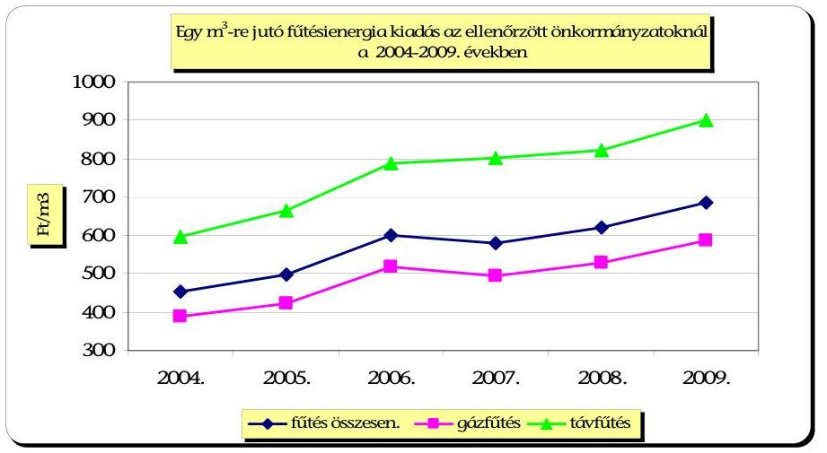

Egy GJ tényleges fűtési célú energia felhasználása az önkormányzatoknak 2004-ben átlagosan 2,3 ezer Ft-ba került, amely a vizsgált időszak végére 74,3%-kal növekedett.

A földgázenergia egységárának az emelkedése az átlagtól 0,9 százalékponttal kisebb, míg a távfűtésé 2,4 százalékponttal nagyobb volt. Az előbbi egységára átlagosan 3,6 ezer Ft/GJ, az utóbbié pedig 5,0 ezer Ft/GJ volt.

Az 1083,7 TJ/év tényleges fűtési célú energia felhasználása a vizsgált időszak végére a 2004. évinek a 82,6%-ára csökkent. Ezen belül az intézmények és telephelyeik által igénybe vett 2004. évi 4,4 TJ/év egyéb tüzelőanyag felhasználás több mint felével mérséklődött.

Az egyéb energiafelhasználás mérséklődését elsősorban a 25258 m³-es fűtött légtér 61,2%-os csökkenése eredményezte, amely négy¹⁸⁴ önkormányzatot érintett. A IX. kerületben, Tatán, Kondoroson és Gyulán a fűtött légtér nem változott. Gerdén a 2268 m³ fűtött légtér 25%-os növekedése mellett a tüzelőfa és a szén felhasználása több mint a kétszeresére emelkedett. Ennek oka, hogy az egyedi kályhás fűtéssel szemben a központi fűtés többlet fűtőanyag felhasználással járt.

Az energiaracionalizálást célzó intézkedések több önkormányzatnál a geotermikus megújuló energiaforrás felhasználásának bevezetésével és növelésével jártak együtt.

Bólyban - kettő ütemben - 2003-ban megkezdték, a 2008. évi fütésszezonra pedig befejezték nyolc meglévő és egy tervezett saját objektum, és egy megyei intézmény geotermikus-energia fűtési- és használati meleg víz célú hasznosítását. Mórahalomban 2005-től a 2127 m² alapterületű gyógyfürdőnél a földgázüzemű kazánok helyett hőcserélőket alakítottak ki. Veresegyházon az 1987-ben létesített termálkút hozamnövelő felújítását, továbbá egy visszasajtoló kutat létesítettek, amellyel a földgázenergia felhasználást 98%-kal csökkentették. Kisteleken a fürdő melegvíz-ellátására 2003-ban létesített termálkút kútfejének átalakításával, 2006-2007-ben kiépített távvezeték és visszasajtoló kút megépítésével 11 intézmény geotermikus-energia fűtési- és használati meleg víz célú ellátását biztosítot-

[^0]
[^0]:    ¹⁸⁴ Pécs, Balmazújváros, Szentlászló, Simontornya

---

ták. Szegeden a kórház 2005. évi energetikai fejlesztésével a használati meleg víz felhasználás közel felét napenergiával biztosítják.

Mórahalmon a 434,8 millió Ft-ra tervezett geotermikus kaszkádrendszer kiépítése 2008-ban kezdődött meg, és még nem fejeződött be. A fejlesztést követően az intézmények 64484 m³-es légtér fűtését és használati meleg víz célú hasznosítását geotermikus energiával biztosítják. Négy helyszínen továbbra is - várhatóan évi 676 GJ - földgázenergiát használnak. A beruházással a termelő- és visszasajtoló kút, távvezeték, hőközpontok és a vezérlőrendszer valósulnak meg, amelyből 2009 végére a termelő termálkút megépült. A működtető rendszer várható villamosenergia felhasználása minimális lesz (0,7 GJ/év). A tervezett földgáz energia kiváltása 17052 GJ/év, a várhatóan igénybe vett geotermikus energiát figyelembe véve a primer energia megtakarítás 2499 GJ/év, a CO₂ károsanyag kibocsátás csökkenés 956,5 t/év.

A végrehajtott energiatakarékossági és energiaracionalizálási intézkedések következtében az egy m³ fűtött légtérre jutó tényleges fűtési célú energia felhasználása a 2004. évinek 86,7%-a volt 2009-ben. A 6 év alatt 195,1 MJ/m³-ről 2009-re 169,1 MJ/m³-re csökkent. Ezen belül 2009-ben a térfűtésre felhasznált energiahordozók közül a földgáz energia az átlag alatt (164,6 MJ/m³), a távfűtésé (180 MJ/m³) az átlag fölött volt. A legkedvezőbb a geotermikus megújuló fűtési célú energia felhasználásának mutatója volt, 136,1 MJ/m³-rel, amit - a gázkazánokhoz és a távfűtési rendszerhez képest - a hőcserélők magasabb hatásfokú működése eredményezett.
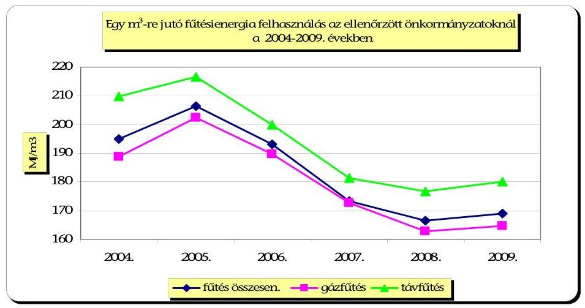

Az önkormányzatok 57,9%-ánál az intézkedések hatására a ténylegesen felhasznált fűtési energia mennyisége nem növekedett, a térfűtésre fordított kiadás 34 önkormányzatnál - Erk, Balmazújváros, Szentlászló, Gyöngyös kivételével - haladta meg a 2004. évit. Ezt a fűtési energia árának növekedése eredményezte. A legnagyobb mértékű fűtési kiadás megtakarítás Szentlászlón (91%), míg a legkisebb Balmazújvároson (6,1%) volt.

A költségvetési szervek térfűtésének feladatellátását vizsgált önkormányzatok 7,9%-ánál eredményesnek¹⁸⁵, 10,5%-ánál eredménytelennek¹⁸⁶, 81,6%-ánál

[^0]
[^0]:    ¹⁸⁵ IX. kerület, Szeged, Beremend
    ¹⁸⁶ Zalaszentbalázs, Teleki, Siófok és Gerde

---

pedig részben eredményesnek¹⁸⁷ minősítette az ellenőrzés. Ezek az önkormányzatok nem, vagy csak részben tettek intézkedéseket a monitoring rendszer kiépítésére és működtetésére, az intézményi térfűtés energiafelhasználásának kontrolljára. Az önkormányzatok 92,1%-ánál nem értékelték a fűtési energia fogyasztására fordított kiadásokat befolyásoló tényezőket, a változások okait sem vizsgálták. Az intézményi fűtési célú energia önkormányzati szintű tervezése nem volt megalapozott.

A fűtési célú energia felhasználásának mérséklése érdekében az önkormányzatok 65,8%-a¹⁸⁸ fűtéskorszerűsítéseket is végzett. Több mint a fele saját beruházási, négy¹⁸⁹ pedig harmadik féles finanszírozású fejlesztési konstrukciót alkalmazott.

A megvalósított projektek 44,7%-a kapcsolódott a költségvetési szervek térfűtéséhez¹⁹⁰, közel egyharmada pedig egyéb korszerűsítéshez. Ez utóbbiak a rossz állapotú önkormányzati épületek általános fizikai állagjavító, helyreállító kivitelezését jelentették, amelyek 7,4-46,4%-ban tartalmaztak energiaracionalizálási célú munkákat is. Térfűtési energetikai fejlesztéseket az üzemeltetett fűtött légtér 12,7%-án, 666 ezer m³-en végeztek. Az egyéb korszerűsítésekkel 61,5%-ban az épületek térfűtését, 7,7%-ban az elektromos világító testek és a hálózat felújítását, 30,8%-ban pedig mindkettő típusú felújítását is elvégezték.

# A fejlesztések 58,2%-át támogatás igénybevételével, egyharmadát önerőből, 9,1%-át harmadik fél bevonásával hajtották végre.

Az önkormányzatok a megvalósított 32 saját projektekből 17-nél területfejlesztési (CÉDE, LEKI, TEKI, TRFC), 3-3-nál NEP és KIOP, 4-4-nél KEOP és egyéb¹⁹¹, egynél pedig ROP támogatást vettek igénybe. A támogatás felhasználásával együtt Zalaszentbalázs EHP, míg Mohács EHA konstrukciót is alkalmazott.

A támogatott térfűtések tervezett 2421,3 millió Ft összegű saját beruházásai 99,4%-ra, míg a 120,7 millió Ft-ra tervezett önerős beruházások kedvezőtlenebbül, 88,4%-ra teljesültek.

[^0]
[^0]:    ¹⁸⁷ Eredményesnek tekintettük a költségvetési szervek térfűtési feladatellátását, ha a fűtött légköbméter alakulása alapján, nem növekedett jelentősen az egységnyi fűtési célra fordított energia felhasználás, és működtettek ellenőrzési vagy monitoring rendszert a fűtési adatok kontrolljára. Részben eredményesnek tekintettük a feladatellátást, ha a kettő közül valamelyik kritérium nem teljesült. Eredménytelennek tekintettük a feladatellátást, ha egyik feltétel

 sem teljesült.
    ${ }^{188}$ Azokat az önkormányzatokat nem tartalmazza, amelyek csak egyéb épületkorszerűsítéseket hajtottak végre.
    ${ }^{189}$ Fehérgyarmat, Balmazújváros, Felsőzsolca, Siófok
    ${ }^{190}$ A térfűtés korszerűsítéséhez tartoznak a gépészeti berendezések (hőcserélő, gázmotor, kazán) a fűtőtestek, a fűtésvezetékek, a fűtést szabályozó berendezések (hőtermelő-, átadó berendezések vezérlése, termosztatikus szelepek) cseréje, illetve beépítése, az épületek (pince-, tetőfödémek, homlokzat) hőszigetelése, a kültéri nyílászárók cseréje, valamint valamely fűtési módról új fűtési módra történő átállás.
    ${ }^{191}$ 18/2008. (III. 28.) ÖTM rendelet, 8/2009. (II. 26.) ÖM rendelet, 2006/2008. (VIII. 26.) Korm. rendelet

---

A támogatott fejlesztések tényleges forrásösszetétele a tervezetthez képest megváltozott. A saját erő 22,8%-ról 2,7 százalékponttal emelkedett, a támogatások összege a tervezett 56,2%-ról 3 százalékponttal, a bankhitel 9,4%-ról 4,7 százalékponttal mérséklődött. A hiányzó forrásokat az önkormányzatok egyéb források bevonásával biztosították. A nem támogatott fejlesztések forrásösszetétele - a saját és egyéb forrás - kis mértékben változott, a tervezett saját forrás 1,1 százalékponttal csökkent.

A saját beruházásban végzett korszerűsítések összességében részben voltak eredményesek ${ }^{192}$, mert a tényleges pénzügyi megtérülés, a primer energia-megtakarítás, valamint a $\mathrm{CO}_{2}$ károsanyag kibocsátás eltért a tervezett értékektől. Az átlagosan 36 évre tervezett megtérülés várhatóan 51 év alatt teljesül. A tényleges átlagos primer energia-megtakarítás és a $\mathrm{CO}_{2}$ károsanyag kibocsátás a tervezetthez képest szintén kedvezőtlenebbül alakult, az előbbi 70,4%-ra, míg az utóbbi 84,1%-ra teljesült. A fejlesztések - a bólyi geotermikus közmű I. ütem kivételével - összességében a tervezett műszaki tartalommal valósultak meg.

Bólyban a II. számú termálkútnál 1500-1800 méteres mélységben a vízadó réteget nem találták meg, ezért a kutat 650-750 méteres mélységben alakították ki. A tervezett $72-80{ }^{\circ} \mathrm{C}$-os termálvízhez képest $40^{\circ} \mathrm{C}$-at nyertek. Ennek következtében a tervezett 12 évi megtérülés várhatóan 14 évre teljesül.

# Az öt harmadik feles finanszírozású energetikai fejlesztés közül egynél sem vizsgálták a primerenergia-megtakarítást, a megtérülést, 

valamint a $\mathrm{CO}_{2}$ kibocsátást. A térfűtési fejlesztések összességében a tervezett műszaki tartalommal valósultak meg.

Fehérgyarmaton és Balmazújvárosban az összes, Felsőzsolcán hét, Siófokon egy költségvetési intézményben a fűtésüzemeltetőkkel kötött szolgáltatási szerződés alapján végezték el a fűtésrekonstrukciót. A siófoki kórházban a fűtésüzemeltetővel kötött megállapodással gázmotoros erőművet építettek. Balmazújvárosban az energiaszolgáltató a javaslatában 14%-os energiaköltség megtakarítást prognosztizált, amely a tényleges energiafogyasztási adatok alapján 37%-ra teljesült. A fejlesztési (üzemeltetési) szerződések közül egynél érvényesültek a gazdaságossági szempontok ${ }^{193}$. Balmazújvároson az önkormányzati költségvetési szervek 44,7 millió Ft-os beruházási költségénél a fizetendő éves kiadások jelenértéke 3,5%-kal volt kisebb.

[^0]
[^0]:    ${ }^{192}$ Eredményesnek tekintettük a költségvetési szervek térfűtési fejlesztését, ha a pénzügyi megtérülés, a primer energia megtakarítás és a $\mathrm{CO}_{2}$ károsanyag kibocsátás nem tért el 5%-nál nagyobb mértékben a tervezettől.
    ${ }^{193}$ A korszerűsítésre vonatkozó szerződés(ek) megkötését gazdaságosnak tekintettük, ha a harmadik feles finanszírozású szerződés esetén, a szerződés szerint fizetendő éves kiadások jelenértéke nem haladta meg a fejlesztés szerződés szerinti beruházási költségét.

---

# 3.5. A villamosenergia biztosításával összefüggő önkormányzati feladatok 

A települési önkormányzatok villamosenergia biztosításával összefüggő feladatait - miként a közvilágítás esetében is - fokozatosan érintette a villamosenergia liberalizációja.

A törvényi szabályozás lehetősége alapján csak három önkormányzat vizsgálta - a régi Vet. szerint - a villamosenergia piac részleges liberalizációja kapcsán elérhető megtakarításokat. Ebből kettő úgy ítélte meg, hogy a szabadpiaci árak magasabbak a közüzemi árnál ${ }^{194}$. A feljogosított fogyasztók csoportjába ezek közül egy sem lépett át ${ }^{195}$.
2009. január 1-jétől - az új Vet. módosításával - az egyetemes szolgáltatás keretében garantálták a helyi önkormányzatok és intézményeik ellátását, és árgaranciát nyújtottak a villamosenergia díjára vonatkozóan ${ }^{196}$.

Az önkormányzatok számára az egyetemes szolgáltatás ${ }^{197}$, illetve a versenypiaci körülmények közötti villamosenergia beszerzés tisztázását nehezítette az eltérő árképzés. Nem ismerték fel, hogy a beszerzési döntésnél a díjszerkezeten belül mely díjtételeket kell összevetni. A teljes villamosenergia díjának számításánál az egyetemes szolgáltatás díja, illetve a versenypiaci áramdíj mellett - figyelemmel kell lenni a rendszerhasználati díjakra ${ }^{198}$, az energiaadóra és egyéb díjtételekre ${ }^{199}$, valamint az áfára.

Az új Vet. felhatalmazása alapján 2008 januárjától az önkormányzatok keresték a villamosenergia árának csökkentési lehetőségeit, 28,9%-a vizsgálta a versenypiaci fogyasztók csoportjába való átlépés lehetőségét, de csak Szeged és Gyöngyös kötött szerződést.

[^0]
[^0]:    ${ }^{194}$ A villamosenergia-ellátás rendszerének ellenőrzéséről 2007-ben kiadott ÁSZ jelentés szerint az árakra a versenypiac - korlátozott jellege miatt - lényeges hatást gyakorolni nem tudott.
    ${ }^{195}$ Erk 2007 áprilisától vált feljogosított fogyasztóvá.
    ${ }^{196}$ Az új Vet. 50. § (4) bekezdése értelmében a külön jogszabály szerint a helyi önkormányzat és közfeladatot ellátó költségvetési intézménye - az egyetemes szolgáltatóhoz tett igénybejelentése esetén - közszolgáltatási kötelezettség keretében az egyetemes szolgáltatóra vonatkozó 48. §, valamint 50. § (2) bekezdése alapján szerződéskötési kötelezettség kedvezményezettjeként, az egyetemes szolgáltatásra vonatkozó árképzési szabályoknak megfelelő áron jogosult az egyetemes szolgáltatóval villamosenergiavásárlási szerződést kötni, jogosult továbbá a végső menedékes jogintézménye keretében biztosított ellátásra.
    ${ }^{197}$ A villamosenergia-piaci egyetemes szolgáltatás árképzését és ennek keretében nyújtandó termékcsomagot 2008-ban a 115/2007. (XII. 29.) GKM rendelet, 2009-ben pedig a 44/2008. (XII. 31.) KHEM rendelet tartalmazta.
    ${ }^{198}$ A villamos energia rendszerhasználati díjakat a 119/2007. (XII. 29.) GKM rendelet szabályozza.
    ${ }^{199}$ szénipari szerkezet átalakítás támogatása, kedvezményes árú villamos energia ellátás

---

Zalaszentbalázsnak és Simontornyának versenypiaci kereskedő tett ajánlatot, amelyről az előbbi önkormányzat elfogadó nyilatkozatot adott. Az utóbbinál az ajánlat szakértői vizsgálata nem fejeződött be.

Bóly, Mohács, Somberek - a kistérségi társulás közreműködésével - készítette elő a közbeszerzési eljárást, amely még nem fejeződött be. Kondoros és Gyula a megyei önkormányzat beszerzési szándékához csatlakozott.

Pécsett a közgyűlés 2009 októberében tárgyalta, Tatán a megbízott energetikus a 2009. év végén vizsgálta az átlépés lehetőségét. Gyöngyös önállóan, míg Szeged a konzorciális partnerekkel - a lefolytatott közbeszerzési eljárás alapján - a versenypiaci villamosenergia szállításáról szóló szerződést megkötötte.

Az önkormányzatok által fenntartott 1558,8 ezer $\mathrm{m}^{2}$ megvilágított intézményi alapterület a vizsgált időszak végére 7,4%-kal csökkent. Ettől eltérően a tényleges világítási célú energiafelhasználás kiadása folyamatosan, az időszak végére 32,1%-kal (1629,2 millió Ft-ra) emelkedett.

Az egy $\mathrm{m}^{2}$ megvilágított alapterületre jutó 791 Ft tényleges villamosenergia felhasználás kiadása 2009-re 42,8%-kal, az egy GJ villamosenergia felhasználásra jutó kiadás pedig 53,2%-kal emelkedett. Az intézményi villamosenergia kiadás növekedését 20,5-47,0%-ban, évente változó mértékben ellensúlyozta a felhasznált villamosenergia mennyiségének csökkenése ${ }^{200}$.
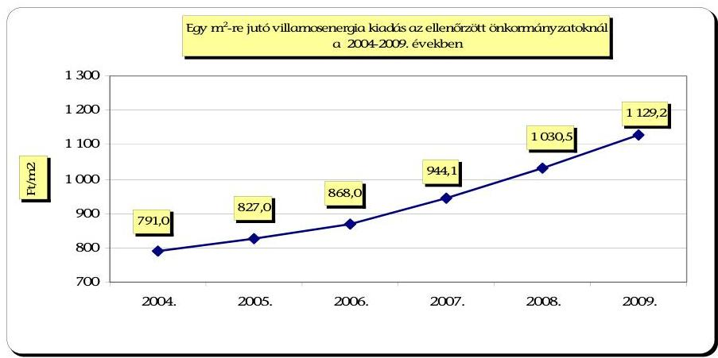

Balmazújvároson a 202,2-5048,9 ezer Ft-os, Gyöngyösön a 3377,1-28 309,2 ezer Ft-os intézményi villamosenergia kiadás növekedését teljes mértékben fedezte a felhasznált villamosenergia mennyiségének csökkenése.

A felhasznált villamosenergia mennyiségének csökkenése az önkormányzatok 13,2%-nál igen, 18,4%-ánál részben, 68,4%-ánál pedig nem eredményezett kiadás megtakarítást. 2009-re a legnagyobb mértékű kiadás megtakarítás Erken (83,1%), míg a legkisebb Szegeden (4%) volt.

Az intézményi villamos energiára fordított tényleges kiadások teljesített költségvetési kiadáson belüli növekedése nem haladta meg az 5 százalékpontot. Az önkormányzatok összes energia kiadásán belül az intézményi villamos energiára

[^0]
[^0]:    ${ }^{200}$ Az árváltozás hatására 2005-2009 között a tényleges intézményi villamos energia kiadás évente emelkedő mértékben, 105,4-565,6 millió Ft-tal nőtt.

---

fordított kiadások 26,5%-ról 1,5 százalékponttal csökkentek, a dologi kiadásokon belüli aránya pedig 0,4 százalékponttal növekedett.

A korszerűsítési, illetve az egyéb intézkedések és az alapterület 7,4%-os csökkenése együttesen eredményezték, hogy az egy $\mathbf{m}^{2}$ megvilágított intézményi alapterületre jutó 2004. évi 105,8 MJ villamosenergia felhasználás 2009-re 6,8%-kal mérséklődött.
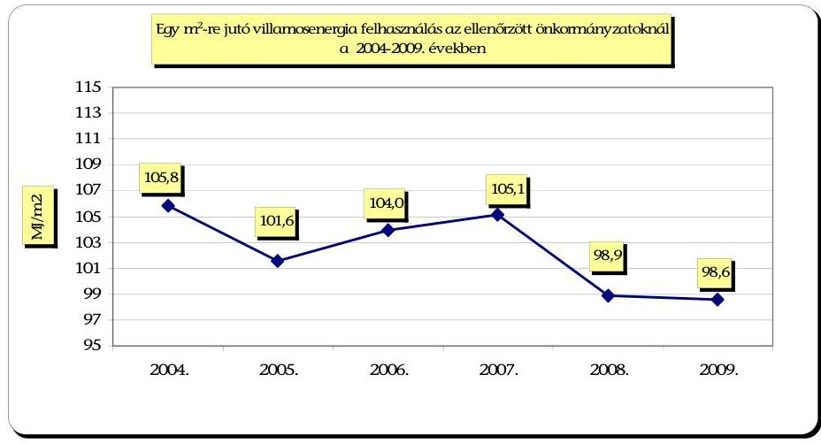

Az összes megvilágított alapterület 29 önkormányzatnál csökkent, 9 önkormányzatnál nem változott.

A vizsgált önkormányzatok 78,9%-ánál részben volt eredményes ${ }^{201}$ a költségvetési szervek villamosenergia feladatellátása, mert nem tettek intézkedéseket a monitoring rendszer kiépítésére és működtetésére, az intézményi villamosenergia felhasználás kontrolljára, ami az energiahatékonyság javítását elősegítő további intézkedésekhez nyújthatott volna információt. A megvilágított intézményi alapterület csökkenéséhez és a feladatok változásához viszonyítva nem növekedett aránytalanul a villamosenergia felhasználása.

A költségvetési szervek villamosenergia fogyasztásán belül a világításra fordított és az egyéb villamosenergia felhasználást ${ }^{202}$ - az épületekben kiépített villamoshálózatok adottságai miatt - Pécsett és Oroszlányban minden intézményben, míg az önkormányzatok 15,8%-nál részben mérték elkülönítetten. Az ellenőrzött önkormányzatok villamosenergia felhasználásának adatait a jelentés 10. számú melléklete tartalmazza.

[^0]
[^0]:    ${ }^{201}$ Eredményesnek tekintettük a költségvetési szervek világítási feladatellátását, ha a megvilágított alapterülethez és a feladatok növekedéséhez viszonyítva, nem növekedett aránytalanul a villamos energia felhasználása, és működtettek ellenőrzési vagy monitoring rendszert a villamos energia felhasználásának kontrolljára. Részben eredményesnek tekintettük a feladatellátást, ha a kettő közül valamelyik kritérium nem teljesült. Eredménytelennek tekintettük a feladatellátást, ha egyik feltétel sem teljesült.
    ${ }^{202}$ Az egyéb villamos energiafelhasználási helyek a konyha, a mosoda, a karbantartó- és tanműhely, a szaktantermek és a laboratórium.

---

Pécsett az intézményekben az elkülönített egyéb fogyasztási helyeken, Oroszlányban az intézmények vállalkozó által működtetett konyháiban, Szekszárdon három főzőkonyhában a villamos energiát külön mérik.

Kondoroson, Dunaföldváron, Erken az intézmények közül egy-egy oktatási létesítményben működő konyha, Felsőzsolcán a karbantartó műhely, továbbá Erken az óvodában használt elektromos vízmelegítők elkülönített mérése biztosított.

A IX. kerületben kettő-kettő intézményben az uszoda és a konyha, egyben pedig a jégpálya villamos fogyasztását mérik elkülönítetten.

Az egyéb fogyasztási helyeken felhasznált villamosenergia elkülönített mérésének hiánya nem tette lehetővé az önkormányzatok számára az energiafelhasználások ellenőrzését, illetve a differenciált költségcsökkentési módozatok alkalmazását.

A mért helyeken a villamosenergia elszámolása a leolvasott fogyasztási értékek alapján történt. Szekszárdon a nem mért fogyasztást - megállapodás keretében - teljesítmény arányosan határozták meg.

A villamosenergia felhasználás csökkentése érdekében az önkormányzatok 47,3%-a világításkorszerűsítéseket is végzett. Ennek 22,2%-a saját beruházást, 61,1%-a harmadik feles finanszírozású fejlesztést, 16,7%-a pedig mindkét konstrukciót alkalmazta.

A megvalósított intézményi projektek 23,6%-a a villamosenergia felhasználás racionalizálására ${ }^{203}$, közel harmada pedig egyéb korszerűsítésekre irányult, amelyek 7,4-46,4%-ban tartalmaztak energiaracionalizálási célú munkákat is. Az egyéb korszerűsítésekkel 7,7%-ban az elektromos felújítást, 30,8%-ban pedig a térfűtés és világítás felújítását is megtették.

A villamos korszerűsítési projektek 13,8%-át támogatás igénybevételével, közel negyedét önerőből saját beruházással, 62,1%-át harmadik fél bevonásával valósították meg, amelyből három kapott támogatást. Energetikai fejlesztéseket 153,4 ezer $\mathrm{m}^{2}$-en valósítottak meg.

Oroszlányban a Városi Sportcsarnok küzdőtér világítás korszerűsítését a sportlétesítmények építésének, korszerűsítésének és felújításának támogatása, Kondoroson a polgármesteri hivatalban 26 db mennyezeti lámpatest cseréjét Dél-Alföldi Operatív Program keretében, Siófok egy, Szegeden öt közoktatási intézmény felújításával együtt a világítás korszerűsítését végezték el. Az előbbi KEOP, míg az utóbbi KIOP támogatásban részesült.

A támogatott korszerűsítések 238 millió Ft-ra tervezett beruházásai 116%-ra, míg a 98,5 millió Ft-os önerős beruházások
 137,9%-ra teljesültek. A tényleges költségek emelkedését a műszakilag szükséges pótmunkák okozták, amelyeket a támogatott fejlesztéseknél saját forrásból finanszíroztak.

A támogatott fejlesztések forrásösszetétele megváltozott, a saját erő 46,8%-ról 14,8 százalékponttal emelkedett, a támogatások összege a tervezett 45,4%-ról,

[^0]
[^0]:    ${ }^{203}$ A világítás korszerűsítések az épületek elavult belső elektromos hálózatának felújítására, valamint a világítótestek cseréjére irányultak.

---

11,3 százalékponttal mérséklődött. Az egyéb források a támogatásokkal azonos tendenciát mutattak, a tervezett 7,8%-os arány 4,3%-ra teljesült. Bankhitelt a fejlesztésekhez nem vettek igénybe.

A nem támogatott fejlesztések forrásösszetétele - a saját és egyéb forrás - jelentős mértékben változott, a tervezett saját forrás aránya 26,1%-ról ténylegesen 15%-ra csökkent, az egyéb forrás pedig hasonló mértékben növekedett. Az átrendeződés oka, hogy a tervezettnél alacsonyabb összegben valósították meg a korszerűsítéseket.

Oroszlányban a polgármesteri hivatal villamos hálózat tényleges felújítási költsége 46,3%-kal, a IX. kerületben a világításkorszerűsítés a közoktatási intézménynél 33,3%-kal, a nevelésinél 13,7%-kal volt alacsonyabb a tervezett kivitelezési összegnél.

A harmadik fél finanszírozású energetikai fejlesztések szerződés szerinti beruházási költsége 670,1 millió Ft volt, amely 10,6%-ban tartalmazott támogatást is. A fejlesztést végrehajtó harmadik félnek nyújtott három KEOP támogatás összege 10,3 millió volt, egy projekt 10%, kettő pedig 20%-os támogatásban részesült.

A saját beruházásban végzett korszerűsítések összességében részben voltak eredményesek, mert a tényleges pénzügyi megtérülés, a primer energia-megtakarítás, valamint a $\mathrm{CO}_{2}$ károsanyag kibocsátás jelentősen eltért a tervezett értékektől. Az átlagosan 14 évre tervezett megtérülés várhatóan több mint a kétszerese alatt teljesül. A tényleges átlagos primer energiamegtakarítás és a $\mathrm{CO}_{2}$ károsanyag kibocsátás a tervezetthez képest szintén kedvezőtlenebbül alakult, az előbbi 39,2%-ra, míg az utóbbi 40,3%-ra teljesült. A fejlesztések összességében a tervezett műszaki tartalommal valósultak meg.

A kitűzött célok tekintetében kedvezőbb a helyzet a harmadik fél finanszírozású energetikai fejlesztéseknél. Az átlagosan 11 évre tervezett megtérülés várhatóan 18 év alatt teljesül. Eltérés mutatkozik azonban a támogatott és nem támogatott korszerűsítések között. Az előbbinél az átlagos megtérülés várhatóan a tervezettel azonosan 12 év, míg az utóbbinál 19 év. Hasonlóan alakultak a tényleges átlagos primer energiamegtakarítások és a $\mathrm{CO}_{2}$ károsanyag kibocsátások értékei is. A támogatott és nem támogatott korszerűsítések esetében a primer energiamegtakarítás 56,1% (a támogatottnál 80,5%, míg a nem támogatottnál 53,3%), a $\mathrm{CO}_{2}$ kibocsátás 75,7% (támogatott 85,5%, nem támogatott 75%) volt. A harmadik fél finanszírozású fejlesztések összességében a tervezett műszaki tartalommal valósultak meg. A támogatott fejlesztések esetében a tervezettnél kedvezőbb teljesítési adatokat a pályázatoknál kötelezően előírt dokumentációkkal megalapozott műszaki-pénzügyi előkészítés eredményezte.

A gazdaságossági szempontok ${ }^{204}$ azonban a harmadik fél finanszírozású energetikai fejlesztési szerződések 88,9%-ánál nem érvénye-

[^0]
[^0]:    ${ }^{204}$ A korszerűsítésre vonatkozó szerződés(ek) megkötését gazdaságosnak tekintettük, ha a harmadik fél finanszírozású szerződés esetén, a szerződés szerint fizetendő éves kiadások jelenértéke nem haladta meg a fejlesztés szerződés szerinti beruházási költségét.

---

sültek. A finanszírozók vállalkozási és bérleti szerződései szerint a fizetendő éves kiadások jelenértéke 10,2-79,3%-kal haladta meg a fejlesztések szerződés szerinti beruházási költségét.

A nem gazdaságos fejlesztések közül a fizetendő éves kiadások jelenértéke a IX. kerületben a közoktatási intézmény 37,9 millió Ft-os beruházását 79,3%-kal, míg Balmazújvároson az önkormányzati intézményekben végzett, 102,6 millió Ft-os világítás korszerűsítések beruházási költségét 10,2%-kal haladta meg.

Csengeren ugyanakkor az önkormányzati költségvetési szervek 28,9 millió Ft-os, Pécsett a 12 oktatási intézmény 150,6 millió Ft-os világítás korszerűsítésének beruházási költségénél a fizetendő éves kiadások jelenértéke az előbbinél 9,2%-kal, míg utóbbinál 30%-kal volt kisebb.

A finanszírozás fedezetéül szolgáló megtakarítások számításakor egyik kiinduló elemként figyelembe vett évi 1300-2000 üzemórát az üzemeltetési gyakorlat nem igazolta vissza. A számítások során ugyanis a meglévő (elbontott) és a racionalizálás során beépített névleges teljesítmény (kW) adatokkal és nem a várható villamosenergia fogyasztással (kWh) számoltak. A ténylegesnél magasabban rögzített irreális induló fogyasztással nagy ívű megtakarítások váltak tervezhetővé. Mindezek következtében az átlagos primer energia megtakarítások várhatóan a tervezettnek csak 66,1%-ára teljesülnek.

A finanszírozók világításkorszerűsítési ajánlatában a IX. kerületben a szociális otthonnál 64,7%-os, Csengeren az önkormányzati költségvetési szervekre fenntartó szinten 20%-os energia megtakarítást prognosztizáltak.

# 3.6. Az önkormányzati intézkedések energiapolitikai célkitűzésekre gyakorolt hatása 

Az egyes energiafelhasználási területeket érintő fejlesztések értékelése mellett minősítettük azt is, hogy önkormányzati szinten összességében eredményesek voltak-e a vizsgált önkormányzatok energiaracionalizálást és megtakarítást szolgáló intézkedései, ezek eredményeztek-e primer energiafelhasználás és a káros anyag kibocsátás csökkenést. Az összegző értékelés alapjául a központi energiapolitikai célkitűzésekhez ${ }^{205}$ való viszonyítás szolgált.

A minősítés négy teljesítménymutató - az éves energiaköltség, a primer energiafelhasználás, a káros anyag kibocsátás, a megújuló energiafelhasználás aránya - alapján történt.

Az önkormányzatok által kitűzött energiaracionalizálást és megtakarítást szolgáló intézkedések összességében eredményesek voltak, ha teljesültek az önkormányzat által kitűzött energiapolitikai célok, az intézkedések hatására az éves energiaköltség csökkent vagy az áremelkedés növekedési üteme alatti növekedés

[^0]
[^0]:    ${ }^{205}$ Az 1107/1999. (X. 8.) Korm. határozattal megállapított 2010-ig terjedő energiatakarékossági és energiahatékonyság-növelési stratégia, valamint a 2418/2008. (X. 31.) Korm. határozat szerinti magyarországi megújuló energiaforrások felhasználásának növelésére vonatkozó 2008-2020 közötti stratégia.

---

következett be, ha csökkent az energiafelhasználás és káros anyag kibocsátás mennyisége, ha nőtt a megújuló energiaforrások felhasználásának az aránya az önkormányzat energiafelhasználásán belül.

Az összegző értékelés szerint az ellenőrzött önkormányzatok 57,9%-ánál az intézkedések összességében eredményes, 28,9%-ánál részben eredményes minősítéssel zárultak. Mindössze az önkormányzatok 13,2%-ának (Hosszúpályi, Pécs, Simontornya, Teleki, Tolna) energiaracionalizálási intézkedései nem érték el az elvárt eredményt.

Az e körbe tartozó önkormányzatok mindegyikénél a megtett intézkedések ellenére nőtt az energiafelhasználás és a károsanyag kibocsátás, Hosszúpályi, Simontornya és Tolna településeken pedig a megújuló energiák felhasználási arányának növelése érdekében elvárt intézkedések, illetve annak eredményei maradtak el.

A kitűzött célok eredményes megvalósítása mellett teljesítménymutatók szolgáltak a hatékonyság mérésére is. Teljesítménymutatóként értékeltük az egy közvilágítási lámpahelyre jutó villamosenergia felhasználás, az egy $\mathrm{m}^{2}$ megvilágított alapterületre jutó villamosenergia felhasználás és az egy fűtött légköbméterre jutó fűtési célú energiafelhasználás naturális mutatóit ${ }^{206}$.

A hatékonyság szempontjából elvégzett összegző értékelés szerint az ellenőrzöttek közel felénél (47,8%-ánál) hatékonynak, több mint harmadánál (33,8%-ánál) részben hatékonynak minősültek a végrehajtott fejlesztések, ugyanakkor az ellenőrzöttek 18,4%-ánál (Felsőzsolca, Gerde, Kistelek, Pécs, Simontornya, Tata, Tolna településeken) a korszerűsítések révén nem értek el fajlagos energiafelhasználás csökkenést.

Pécs, Gerde, Felsőzsolca és Kistelek önkormányzatainál egyik megfigyelt teljesítménymutatónál sem következett be az elvárt javulás.

Az egy közvilágítási lámpahelyre jutó energiafelhasználás Felsőzsolcán 58,7%-kal, Pécsett 5,5%-kal, Gerdén 3,3%-kal, Kisteleken 2,7%-kal növekedett 2004-hez képest.

Az egy fűtött légköbméterre jutó fűtési célú energiafelhasználás és az egy $\mathrm{m}^{2}$ megvilágított alapterületre jutó villamosenergia felhasználás egyaránt Gerdén emelkedett a legnagyobb (79,0 illetve 33,3%-os) mértékben.

Simontornya, Tata és Tolna önkormányzatainál két mutató alakulása volt kedvezőtlen. Simontornyán az egy fűtött légköbméterre jutó fűtési célú energiafelhasználás 14,3%-kal emelkedett, míg a közvilágítás fajlagos mutatója nem változott. Tatán a térfűtés fajlagos mutatója 3,2%-kal, a megvilágított alapterület egységére jutó energiafelhasználás 0,2%-kal emelkedett. Tolnán a térfűtés fajlagos mutatója 45,3%-kal, az egy közvilágítási lámpahelyre jutó energiafelhasználás pedig 8,0%-kal emelkedett.

[^0]
[^0]:    ${ }^{206}$ Az önkormányzat energiaracionalizálási intézkedései akkor minősültek hatékonynak, ha az értékelés alapjául szolgáló három teljesítménymutató közül legalább kettő esetében kedvező változás (felhasználás-csökkenés) következett be.

---

Az ellenőrzött önkormányzatok energiagazdálkodását jellemző energiafelhasználási és energiakiadási mutatóit a jelentés 11. számú mellékletének ábrái szemléltetik.

Budapest, 2010. augusztus ${ }^{10}$
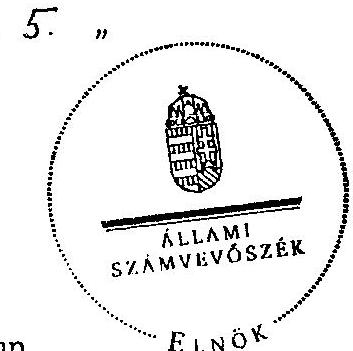

D
Domokos László

Melléklet: $\quad 15 \mathrm{db} \quad 12$ lap
Függelék: $\quad 5 \mathrm{db} \quad 7$ lap

---

# A helyszínen ellenőrzött önkormányzatok 

| Baranya megye | Bóly   Szentlászló   Pécs   Mohács   Somberek   Gerde   Beremend |
| :--: | :--: |
| Békés megye | Gyula |
|  | Kondoros |
| Borsod-Abaúj-Zemplén megye | Mezőkövesd |
|  | Felsőzsolca |
| Csongrád megye | Szeged |
|  | Kistelek |
|  | Mórahalom |
| Főváros | IX. kerület |
| Győr-Moson-Sopron megye | Mosonszolnok |
| Hajdú-Bihar megye | Hajdúszoboszló |
|  | Hosszúpályi |
| Heves megye | Gyöngyös |
|  | Erk |
| Komárom-Esztergom megye | Kisigmánd |
|  | Tata |
|  | Oroszlány |
| Pest megye | Veresegyház |
|  | Százhalombatta |
|  | Hernád |
| Somogy megye | Siófok |
|  | Teleki |
| Szabolcs-Szatmár-Bereg megye | Győrtelek |
|  | Fehérgyarmat |
|  | Balmazújváros |
|  | Csenger |
| Tolna megye | Szekszárd |
|  | Tolna |
|  | Dunaföldvár |
|  | Simontornya |
| Vas megye | Ostffyasszonyfa |
| Zala megye | Zalaszentbalázs |

---

# Magyarország energiafelhasználásának alakulása 

1. ábra ${ }^{1}$

A GDP egységére jutó energia felhasználása az Európai Unió 27 tagállamában 2008-ban
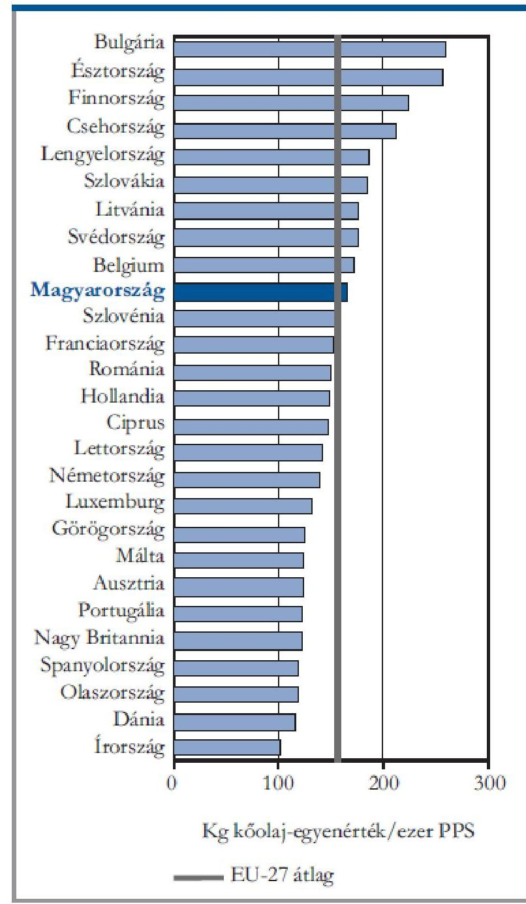
${ }^{1}$ Forrás: KSH, Magyarország 2009 címú kiadványa

---

# 2. ábra ${ }^{2}$ 

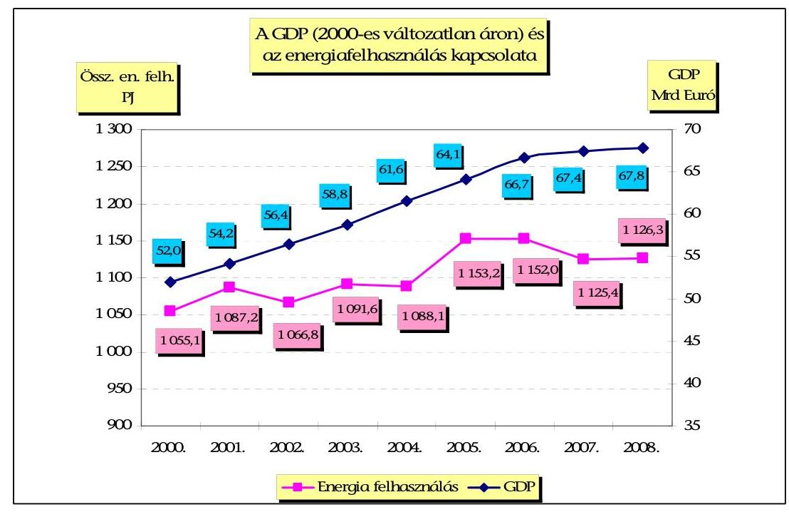
3. ábra ${ }^{3}$
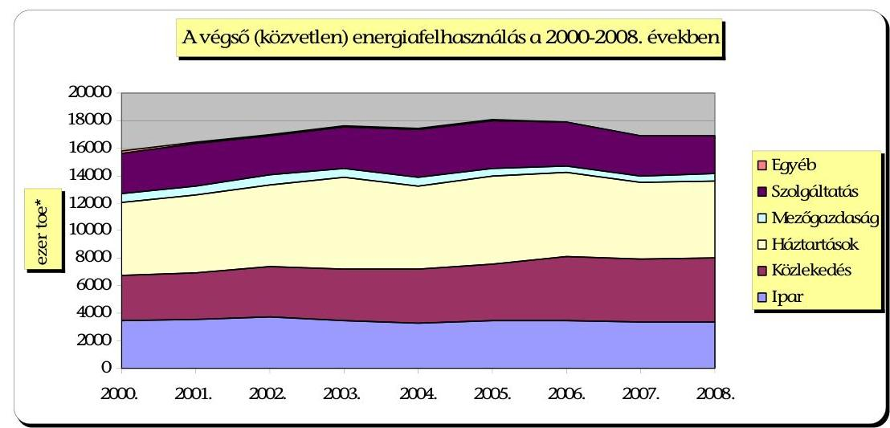
4. ábra ${ }^{4}$

[^0]
[^0]:    ${ }^{2}$ Forrás: Energiagazdálkodási Statisztikai Évkönyv (Budapest, 2009. november)
    ${ }^{3}$ Forrás: KSH 3.1.2. Energia (2000-2008)
    ${ }^{4}$ Forrás: Magyar Energia Hivatal

---

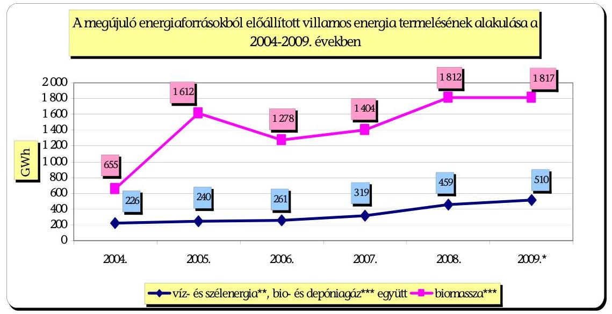

Megjegyzés: * a 2009. év a január-novemberi adatokat tartalmazza, ** előállított primer villamos energia, *** átalakítással nyert villamos energia
5. ábra ${ }^{5}$
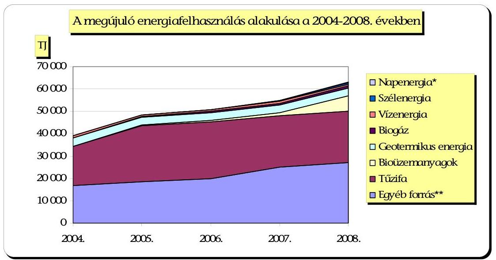

Megjegyzés: * a napenergia a napkollektoros és a fotovillamos eljárást tartalmazza, ** az egyéb források (biomassza) között a fa- és mezőgazdasági hulladék szerepelnek.

[^0]
[^0]:    ${ }^{5}$ Forrás: Energia Központ Nonprofit Kft. (a 2008. évi megújuló energiafelhasználás 63,1 PJ, a nem megújuló kommunális hulladékégetésből származó energia 3,8 PJ volt.)

---

Az Energia Központ által kezelt pályázatok támogatási keretei és energiamegtakarítási adatai

|  Megnevezés | Támogatási keret |  | Beérkezett támogatási igény | Döntéshozó által jóváhagyott támogatás | Jóváhagyott támogatások aránya a támogatási keretekhez (\%) | Energia megtakarítás (TJ/év) |   |
| --- | --- | --- | --- | --- | --- | --- | --- |
|   | pályázati kiírásban közzétett | módosított |  |  |  | Tervezett | Megkötött szerződések alapján várható  |
|  NEP-2004 | 2550 | 2079 | 2827 | 1639 | 78,8 | 1100 | 347,79  |
|  NEP-2006 | 1063 | 1063 | 2655 | 910 | 85,6 | 223 | 91,60  |
|  NEP-2007 | 2400 | 2900 | 1215 | 718 | 24,8 | **** | 239,10  |
|  NEP-2008 | 1600 | 3100 | 3961 | 2938 | 94,8 | **** | 270,70  |
|  NEP-2009 | 1500 | 1700 | 2628 | 1712 | 100,7 | **** | 398,00  |
|  NEP összesen* |

 9113 | 10842 | 13286 | 7917 | 73,0 |  | 1347,19  |
|  KIOP-2004-1.7.0 | 1200 |  | 2572 | 797 | 66,4 | **** |   |
|  KIOP-2004-1.7.0f | 4400 |  | 2077 | 1648 | 37,5 | **** |   |
|  KIOP-2005-1.7.0f | 3500 |  | 12891 | 4180 | 119,4 | **** |   |
|  KIOP összesen | 6100 |  | 17540 | 6625 | 108,6 | 1110 | 1271,78  |
|  KEOP-2007-4.1 | 13260 |  | 14939 | 6896 | 52 | **** |   |
|  KEOP-2007-5.1 | 8760 |  | 5814 | 2239 | 25,6 | **** |   |
|  KEOP-2007-5.2 | 1840 |  | 520 | 451 | 24,5 | **** |   |
|  KEOP-2009 | 34000 |  | 26330 | 3475 | 10,2 | **** |   |
|  KEOP 2007-2009 összesen (2009. december 31.) | 57860 |  | 47603 | 13061 |  | **** | n.a.  |
|  KEOP 2007-2013 összesen megtakarítási célértékek |  |  |  |  |  |  |   |
|  Megújuló energiahordozó felhasználás 2010-re |  |  |  |  |  | 27000 |   |
|  Megújuló energiahordozó felhasználás 2015-re |  |  |  |  |  | 41000 |   |
|  Energiahatékonyság révén elérendő energia megtakarítás |  |  |  |  |  | 11000 |   |

*A jóváhagyott támogatások adatai nem tartalmazzák azokat a döntéseket, amelyeknél nem kötöttek támogatási szerződést. Ez a jóváhagyott pályázatoknak a 2,8%-át tette ki öt év átlagában (2004: 1,3%; 2006: 0,3%; 2007: 13,4%; 2008: 1%; 2009: 0,2%). ** Halmozódás és a különböző időtávok miatt nem összegezhető. A KIOP Program Kiegészítő Dokumentumban 6,1 milliárd Ft szerepelt. *** A keret a 2009-2010. évekre együtt vonatkozik, ezért a teljesítés adatokkal nem összehasonlítható. Az adatok a 2009. december 31-i állapotot mutatják. ****Nem tették közzé n.a. nincs adat

Forrás: Energia Központ Nonprofit Kft.

---

Az Energia Központ által kezelt energiaracionalizálási célú támogatások a 2004-2009. években millió Ft-ban

|  Pályázat azonosítója | Beérkezett pályázatok |  |  |  | Döntéshozó által jóváhagyott pályázatok |  |  |  | Megkötött támogatási szerződés |  |  |  | Folyósított támogatás | Folyósított hitel  |
| --- | --- | --- | --- | --- | --- | --- | --- | --- | --- | --- | --- | --- | --- | --- |
|   | db száma | Igényelt támogatás | Igényelt hitel | Teljes beruházási költség | db száma | Jóváhagyott támogatás | Jóváhagyott hitel | Teljes beruházási költség | db száma | Támogatás összege | Hitel összege | Teljes beruházási költség |  |   |
|  NEP 2004 | 5284 | 2827,6 |  | 11042,7 | 3971 | 1639,0 |  | 5887,6 | 3968 | 1637,5 | n.a. | 5881,7 | 1475,5 | n.a.  |
|  NEP 2006 | 8469 | 2654,8 |  | 9064,1 | 2901 | 910,2 |  | 3226,7 | 2831 | 886,0 | n.a. | 3134,1 | 759,8 | n.a.  |
|  NEP 2007 | 5284 | 1215,1 | 3172,7 | 8508,7 | 3230 | 717,7 | 1872,9 | 5208,6 | 3172 | 705,4 | n.a. | 5059,2 | 496,7 | n.a.  |
|  NEP 2008 | 9026 | 3960,8 | 2250,2 | 15521,9 | 6582 | 2938,1 | 1581,8 | 11223,2 | 6384 | 2752,2 | n.a. | 10524,2 | 1027,2 | n.a.  |
|  NEP 2009 | 5238 | 2627,8 | 942,9 | 8532,2 | 3419 | 1711,8 | 627,2 | 5499,9 | 431 | 218,9 | n.a. | 695,6 | 0,0 | n.a.  |
|  NEP összesen* | 33301 | 13286,1 | 6365,8 | 52669,6 | 20103 | 7916,8 | 4081,9 | 31046,0 | 16786 | 6200,0 | n.a. | 25294,8 | 3759,2 | n.a.  |
|  EHA 2004 előtt | 938 |  | 19824,8 | 34162,9 | 634 |  | 14577,8 | 24577,0 | 567 |  | 13126,3 | 21995,3 |  | 10240,4  |
|  EHA 2004 | 16 |  | 722,0 | 1225,5 | 15 |  | 708,8 | 1176,0 | 14 |  | 621,9 | 1094,0 |  | 814,0  |
|  EHA 2005 | 12 |  | 985,7 | 1334,2 | 8 |  | 620,1 | 855,6 | 7 |  | 612,2 | 837,1 |  | 998,0  |
|  EHA 2006 | 21 |  | 1420,3 | 4693,9 | 12 |  | 701,3 | 945,7 | 11 |  | 647,7 | 872,4 |  | 1157,7  |
|  EHA 2007 | 10 |  | 769,6 | 975,2 | 14 |  | 1104,3 | 4239,7 | 12 |  | 1021,0 | 4125,6 |  | 300,0  |
|  EHA 2008 | 8 |  | 613,2 | 1421,6 | 4 |  | 342,5 | 429,5 | 1 |  | 88,7 | 111,8 |  | 1128,9  |
|  EHA 2009 | 4 |  | 286,5 | 358,4 | 4 |  | 286,5 | 358,4 | 4 |  | 286,5 | 358,4 |  |   |
|  EHA összesen | 1009 |  | 24622,1 | 44171,7 | 691 |  | 18341,3 | 32581,9 | 616 |  | 16404,3 | 29394,6 |  | 14639,0  |
|  UNDP/GEF 2002-2006 összesen | 372 | 530,9 |  | 598,5 | 259 | 384,0 |  | 552,3 | n.a. | n.a. |  | n.a. | 295,4 |   |
|  KIOP-2004-1.7.0 | 17 | 2572 |  | 9471 | 6 | 797 |  | 2161 | 5 | 601 |  | 1712 | 601 |   |
|  KIOP-2004-1.7.0f | 15 | 2077 |  | 8767 | 9 | 1648 |  | 7051 | 7 | 1433 |  | 6818 | 1433 |   |
|  KIOP-2005-1.7.0f | 74 | 12891 |  | 54691 | 33 | 4180 |  | 13547 | 32 | 3990 |  | 13474 | 3987 |   |
|  KIOP összesen | 106 | 17540 |  | 72929 | 48 | 6625 |  | 22759 | 44 | 6024 |  | 22004 | 6021 |   |
|  KEOP 4.1 | 130 | 14939 |  | 41488 | 42 | 6896 |  | 17846 | 32 | 3794 |  | 8207 | 178 |   |
|  KEOP 5.1 | 120 | 5814 |  | 13676 | 45 | 2239 |  | 5489 | 41 | 2070 |  | 5020 | 56 |   |
|  KEOP 5.2 | 63 | 520 |  | 4486 | 57 | 451 |  | 3813 | 56 | 450 |  | 3806 | 437 |   |
|  KEOP 2009. év | 348 | 26330 |  | 62529 | 72 | 3475 |  | 7830 | 39 | 674 |  | 2746 | 255 |   |
|  KEOP összesen** | 661 | 47603 |  | 122179 | 216 | 13061 |  | 34978 | 168 | 6988 |  | 19779 | 926 |   |
|  n.a. nincs adat |  |  |  |  |  |  |  |  |  |  |  |  |  |   |

Forrás: Energia Központ Nonprofit Kft. *A jóváhagyott támogatások adatai nem tartalmazzák azokat a döntéseket, amelyeknél nem kötöttek támogatási szerződést. Ez a jóváhagyott pályázatoknak a 2,8%-át tette ki öt év átlagában (2004: 1,3%; 2006: 0,3%; 2007: 13,4%; 2008: 1%; 2009: 0,2%). **2009. december 31-i állapot

---

Az ellenőrzött önkormányzatok közvilágítási adatai a 2004-2009. években

|  Sorszám | Megnevezés | Mérték-
egység | 2004. | 2005. | 2006. | 2007. | 2008. | 2009. | 2009/2004.
$(\%)$  |
| --- | --- | --- | --- | --- | --- | --- | --- | --- | --- |
|   | 1. | 2. | 3. | 4. | 5. | 6. | 7. | 8. | 9. $(9=8 / 3)$  |
|  1. | Közvilágításra ténylegesen felhasznált villamos energia mennyisége | MWh | 32948 | 31768 | 32265 | 32342 | 32825 | 33338 | 101,2  |
|  2. | Közvilágításra ténylegesen felhasznált villamos energia

 mennyisége ( $1 \mathrm{MWh}=3,6 \mathrm{GJ}$ ) | GJ | 118612,8 | 114364,8 | 116154,0 | 116431,2 | 118170,0 | 120016,8 | 101,2  |
|  3. | 751878 Közvilágítási feladatok szakfeladat tényleges kiadása összesen | ezer Ft | 1355324 | 1402695 | 1698728 | 1834641 | 2023413 | 2121941 | 156,6  |
|  4. | Ebből: villamos energiafelhasználáshoz kapcsolódó kiadás | ezer Ft | 898430 | 947880 | 1071949 | 1198436 | 1165091 | 1291548 | 143,8  |
|  5. | karbantartási, üzemeltetési kiadás | ezer Ft | 261627 | 256842 | 282514 | 341475 | 352070 | 370358 | 141,6  |
|  6. | Közvilágítási célú villamosenergia felhasználás kiadásának aránya a dologi kiadásokból | \% | 2,36 | 2,44 | 2,64 | 3,05 | 2,70 | 2,90 | 122,9  |
|  7. | Üzemeltetett közvilágítási lámpahelyek száma | db | 89765 | 90335 | 91993 | 92643 | 93891 | 94122 | 104,9  |
|  8. | Közvilágítással ellátott utak hossza | km | 2756 | 2778 | 2854 | 2860 | 2877 | 2892 | 104,9  |
|  9. | Egy üzemeltetett közvilágítási lámpahelyre jutó villamos energiafelhasználás | MJ | 1321,4 | 1266,0 | 1262,6 | 1256,8 | 1258,6 | 1275,1 | 96,5  |
|  10. | Egy üzemeltetett közvilágítási lámpahelyre jutó villamos energia kiadás | ezer Ft | 10,0 | 10,5 | 11,7 | 12,9 | 12,4 | 13,7 | 137,1  |
|  11. | Egy üzemeltetett közvilágítási lámpahelyre jutó közvilágítási kiadás | ezer Ft | 15,1 | 15,5 | 18,5 | 19,8 | 21,6 | 22,5 | 149,3  |
|  12. | Egy GJ villamos energiafelhasználásra jutó kiadás | ezer Ft | 7,6 | 8,3 | 9,2 | 10,3 | 9,9 | 10,8 | 142,1  |
|  13. | Villamos energiafelhasználáshoz kapcsolódó kiadás változása | ezer Ft |  | 49450 | 173519 | 300006 | 266661 | 393118 |   |
|  14. | Ebből: árváltozás hatása | ezer Ft |  | 81626 | 192143 | 316530 | 270015 | 382483 |   |
|  15. | volumenváltozás hatása | ezer Ft |  | $-32176$ | $-18624$ | $-16524$ | $-3354$ | 10635 |   |
|  16. | Volumenváltozás (növekedés+, csökkenés-) aránya | \% |  | $-39,4$ | $-9,7$ | $-5,2$ | $-1,2$ | 2,7 |   |

---

# A helyi önkormányzatok energiakiadásainak alakulása 

A helyi önkormányzatok energiakiadása a 2004-2009. években ${ }^{1}$
Adatok: millió Ft-ban

| Megnevezés | $\mathbf{2 0 0 4 .}$ | $\mathbf{2 0 0 5 .}$ | $\mathbf{2 0 0 6 .}$ | $\mathbf{2 0 0 7 .}$ | $\mathbf{2 0 0 8 .}$ | $\mathbf{2 0 0 9 .}$ |
| :-- | --: | --: | --: | --: | --: | --: |
| Költségvetési kiadások | 2849455 | 2972417 | 3210223 | 3135023 | 3559435 | 3315585 |
| Múködési kiadások | 2380879 | 2398084 | 2512551 | 2537738 | 2760018 | 2693698 |
| Dologi kiadások | 667044 | 704226 | 750810 | 732020 | 808796 | 838887 |
| Energiára fordított kiadások* | 75908 | 82510 | 95681 | 97416 | 106407 | 107733 |
| Közvilágításra fordított kiadások | 19397 | 21507 | 22223 | 23805 | 25072 | 26805 |
| Az energia kiadások részaránya a   költségvetési kiadásokon belül | $2,7 \%$ | $2,8 \%$ | $3,0 \%$ | $3,1 \%$ | $3,0 \%$ | $3,2 \%$ |
| Az energia kiadások részaránya a   múködési kiadásokon belül | $3,2 \%$ | $3,4 \%$ | $3,8 \%$ | $3,8 \%$ | $3,9 \%$ | $4,0 \%$ |
| Az energia kiadások részaránya a   dologi kiadásokon belül | $11,4 \%$ | $11,7 \%$ | $12,7 \%$ | $13,3 \%$ | $13,2 \%$ | $12,8 \%$ |
| A közvilágítási kiadások aránya a   dologi kiadásokon belül | $2,9 \%$ | $3,1 \%$ | $3,0 \%$ | $3,3 \%$ | $3,1 \%$ | $3,2 \%$ |

Megjegyzés: * az energiára fordított kiadásokat (térfűtés, világítás és közvilágítás) az 1. számú ábra tartalmazza.

1. ábra ${ }^{2}$
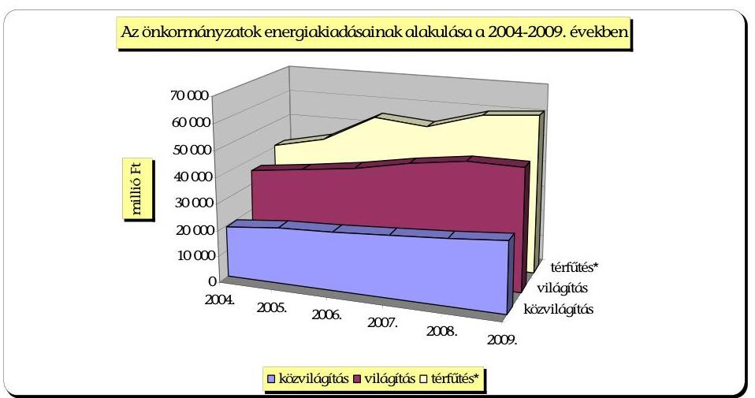

Megjegyzés: * a térfűtési kiadás tartalmazza a gáz-, a távhőenergiára és az egyéb tüzelőanyagokra fordított kiadásokat.

[^0]
[^0]:    ${ }^{1}$ Forrás: az önkormányzatok összevont költségvetési beszámolóiból a 03. számú „Dologi kiadások és egyéb folyó kiadások előirányzata és teljesítése", a 21. számú „Kiadások tevékenységenként", valamint a 80. számú „Önkormányzati költségvetési jelentés" űrlapok.
    ${ }^{2}$ Forrás: az önkormányzatok összevont költségvetési beszámolóiból a 03. és a 21. számú űrlapok.

---

# 2. ábra ${ }^{3}$ 

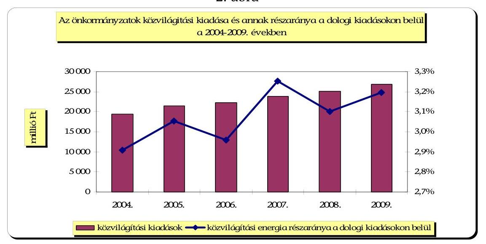
3. ábra ${ }^{4}$
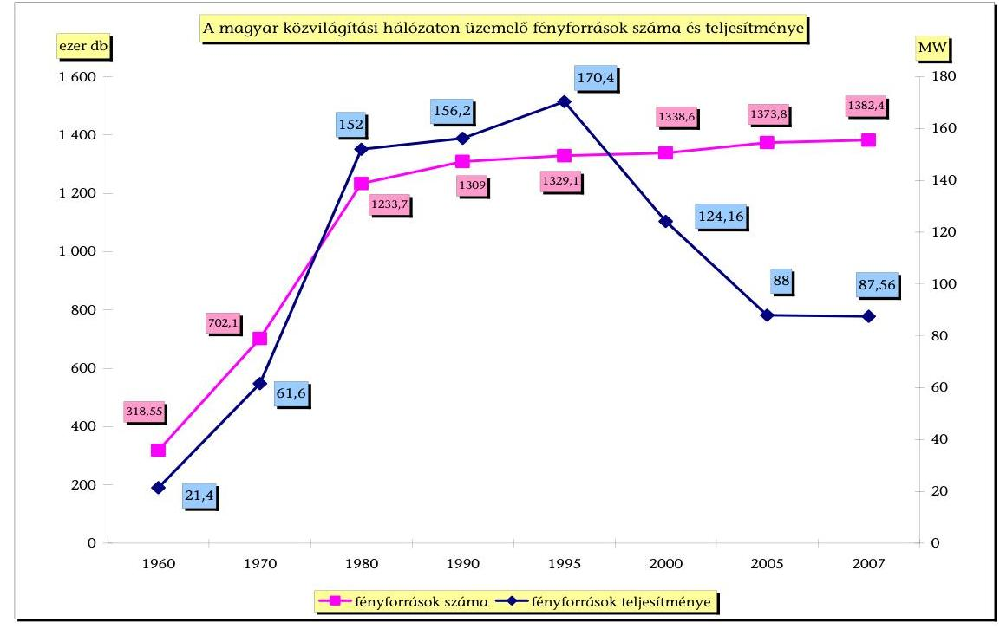

Megjegyzés: Az átlagos teljesítmény 1995-ben 128 W, 2007-ben 63 W volt. Ez 3990 óra üzemidővel évi 1258 TJ energia felhasználást jelent.
Forrás: Energia Központ Nonprofit Kft.
A 2008. évi közvilágítási statisztika összesítése nem állt rendelkezésre.

[^0]
[^0]:    ${ }^{3}$ Forrás: az önkormányzatok összevont költségvetési beszámolóiból a 03. és a 21. számú űrlapok.
    ${ }^{4}$ Forrás: Energia Központ Nonprofit Kft.

---

Az ellenőrzött önkormányzatok költségvetési adatai a 2004-2009. években

|  Sorszám | Megnevezés | 2004. | 2005. | 2006. | 2007. | 2008. | 2009. | 2009/2004.
(\%)  |
| --- | --- | --- | --- | --- | --- | --- | --- | --- |
|   | 1. | 2. | 3. | 4. | 5. | 6. | 7. | 8. (8=7/2)  |
|  1. | Tényleges költségvetési kiadások összesen | 184927451 | 209187807 | 229292138 | 220713262 | 224932206 | 234545752 | 126,83  |
|  2. | Ebből: tényleges felhalmozási kiadások | 34195860 | 51907730 | 69254343 | 45814204 | 54907975 | 54486222 | 159,34  |
|  3. | tényleges működési kiadások | 149175197 | 155750248 | 157728112 | 162488665 | 166966756 | 174167810 | 116,75  |
|  4. | tényleges dologi kiadások | 42527690 | 43360914 | 45451615 | 44024780 | 48151692 | 49265505 | 115,84  |
|  5. | Tényleges összes energia kiadás | 4648442 | 4974393 | 5667262 | 5772754 | 6017433 | 6520357 | 140,27  |
|  6. | Ebből: tényleges villamos energia kiadások | 2136096 | 2239741 | 2409706 | 2623694 | 2680766 | 2925888 | 136,97  |
|  7. | tényleges gázenergia kiadások | 1482200 | 1616253 | 1944887 | 1826956 | 1866719 | 2010987 | 135,68  |
|  8. | tényleges távhőenergia kiadások | 1015932 | 1099277 | 1294454 | 1309903 | 1434536 | 1545755 | 152,15  |
|  9. | tényleges egyéb fűtőanyag kiadás* | 14214 | 19122 | 18215 | 12201 | 35412 | 37727 | 265,42  |
|  10. | Tényleges összes energia kiadás aránya a tényleges összes dologi kiadásból (\%) | 10,93 | 11,47 | 12,47 | 13,11 | 12,50 | 13,24 | 121,09  |
|  11. | Tényleges összes energia kiadás aránya a tényleges összes működési kiadásból (\%) | 3,12 | 3,19 | 3,59 | 3,55 | 3,60 | 3,74 | 120,14  |
|  12. | Tényleges összes energia kiadás aránya a tényleges összes költségvetési kiadásból (\%) | 2,51 | 2,38 | 2,47 | 2,62 | 2,68 | 2,78 | 110,60  |

Megjegyzés:* a tényleges egyéb fűtőanyag kiadás tartalmazza az egyéb tüzelőanyagok- és a megújuló energia kiadásait.

---

Az ellenőrzött önkormányzatok összes energiafelhasználásának adatai a 2004-2009. években

|  Sorszám | Megnevezés | Mérték-
egység | 2004. | 2005. | 2006. | 2007. | 2008. | 2009. | 2009/2004.
(\%)
2009/8/3)  |
| --- | --- | --- | --- | --- | --- | --- | --- | --- | --- |
|  1. | Ténylegesen felhasznált energia összesen | GJ | 1367284,47 | 1408980,17 | 1326946,56 | 1215372,77 | 1157467,32 | 1151591,49 | 84,22  |
|  2. | ebből: villamosenergia összesen | GJ | 284425,20 | 273178,80 | 276559,20 | 275245,20 | 263656,80 | 262893,60 | 92,43  |
|  3. | ebből: közvilágítási célú | GJ | 118612,80 | 114364,80 | 116154,00 | 116431,20 | 118170,00 | 120016,80 | 101,18  |
|  4. | intézményi világítás | GJ | 164966,40 | 158338,80 | 159962,40 | 158418,00 | 145058,40 | 142311,60 | 86,27  |
|  5. | fűtési célú | GJ | 846,00 | 475,20 | 442,80 | 396,00 | 428,40 | 565,20 | 66,81  |
|  6. | földgázenergia | GJ | 720492,27 | 772932,37 | 713209,36 | 635521,57 | 574638,52 | 563834,89 | 78,26  |
|  7. | távhőenergia | GJ | 357936,00 | 357782,00 | 328240,00 | 296545,00 | 308330,00 | 308301,00 | 86,13  |
|  8. | egyéb tüzelőanyagok | GJ | 4431,00 | 4946,00 | 6305,00 | 1872,00 | 1770,00 | 2055,00 | 46,38  |
|  9. | megújuló energia | GJ | 0,00 | 141,00 | 2633,00 | 6189,00 | 9072,00 | 14507,00 |   |
|  10. | Tényleges összes energia kiadás | ezer Ft | 4648442 | 4974393 | 5667262 | 5772754 | 6017433 | 6520357 | 140,27  |
|  11. | ebből: közvilágítás | ezer Ft | 898430 | 947880 | 1071949 | 1198436 | 1165091 | 1291548 | 143,76  |
|  12. | intézményi világítás | ezer Ft | 1232914 | 1288754 | 1334891 | 1423110 | 1511725 | 1629158 | 132,14  |
|  13. | fűtési célú | ezer Ft | 2517098 | 2737759 | 3260422 | 3151208 | 3340617 | 3599651 | 143,01  |
|  14. | Egy MJ tényleges összes energiafelhasználásra jutó tényleges összes kiadás | ezer Ft | 3399,8 | 3530,5 | 4270,9 | 4749,8 | 5198,8 | 5662,0 | 166,54  |
|  15. | ebből: közvilágítás | ezer Ft | 7574,5 | 8288,2 | 9228,7 | 10293,1 | 9859,4 | 10761,4 | 142,07  |
|  16.

 | intézményi világítás | ezer Ft | 7473,7 | 8139,2 | 8345,0 | 8983,3 | 10421,5 | 11447,8 | 153,17  |
|  17. | fütési célú | ezer Ft | 2322,7 | 2409,4 | 3102,7 | 3350,5 | 3735,7 | 4047,9 | 174,28  |
|  18. | Kibocsátott káros anyag mennyiség $\left(\mathrm{CO}_{2}\right)$ | kg | 80625461 | 82095673 | 78081122 | 71935337 | 67091214 | 67184358 | 83,33  |
|  22. | Árváltozás hatása (növekedés) | ezer Ft |  | 184195,52 | 1155959,27 | 1640775,62 | 2082319,39 | 2605219,83 |   |
|  23. | Volumenváltozás hatása (2006-tól csökkenés) | ezer Ft |  | 141755,48 | $-137139,27$ | $-516463,62$ | $-713328,39$ | $-733304,83$ |   |
|  24. | Együttes hatás | ezer Ft |  | 325951,00 | 1018820,00 | 1124312,00 | 1368991,00 | 1871915,00 |   |
|  25. | Volumenváltozás (2006-tól csökkenés) aránya | \% |  | 43,49 | $-11,86$ | $-31,48$ | $-34,26$ | $-28,15$ |   |

---

|  Sorszám | Megnevezés | Mérték-egység | 2004. | 2005. | 2006. | 2007. | 2008. | 2009. | 2009/2004.
(\%)  |
| --- | --- | --- | --- | --- | --- | --- | --- | --- | --- |
|   | 1. | 2. | 3. | 4. | 5. | 6. | 7. | 8. | 9. (9=8/3)  |
|  1. | Ténylegesen felhasznált fütési célú energia összesen | GJ | 1083705,27 | 1136276,57 | 1050830,16 | 940523,57 | 894238,92 | 889263,09 | 82,06  |
|  2. | ebből: fütési célú villamos energia | GJ | 846,00 | 475,20 | 442,80 | 396,00 | 428,40 | 565,20 | 66,81  |
|  3. | fütési célú földgáz energia | GJ | 720492,27 | 772932,37 | 713209,36 | 635521,57 | 574638,52 | 563834,89 | 78,26  |
|  4. | távhőenergia | GJ | 357936,00 | 357782,00 | 328240,00 | 296545,00 | 308330,00 | 308301,00 | 86,13  |
|  5. | egyéb tüzelőanyagok | GJ | 4431,00 | 4946,00 | 6305,00 | 1872,00 | 1770,00 | 2055,00 | 46,38  |
|  6. | megújuló energia | GJ | 0,00 | 141,00 | 2633,00 | 6189,00 | 9072,00 | 14507,00 |   |
|  7. | Ténylegesen fütött légtér összesen | $\mathrm{m}^{3}$ | 5555886 | 5502920 | 5444019 | 5423795 | 5373703 | 5257951 | 94,64  |
|  8. | ebből: fütött légtér (villamos energia) | $\mathrm{m}^{3}$ | 6674 | 3184 | 3184 | 3184 | 3184 | 3915 | 58,66  |
|  9. | fütött légtér (földgáz energia) | $\mathrm{m}^{3}$ | 3817700 | 3816632 | 3760251 | 3683057 | 3530228 | 3424727 | 89,71  |
|  10. | fütött légtér (távhőenergia) | $\mathrm{m}^{3}$ | 1706254 | 1651127 | 1641309 | 1635805 | 1743639 | 1712920 | 100,39  |
|  11. | fütött légtér (egyéb tüzelőanyagok) | $\mathrm{m}^{3}$ | 25258 | 24813 | 21958 | 19355 | 9821 | 9821 | 38,88  |
|  12. | fütött légtér (megújuló energia) | $\mathrm{m}^{3}$ | 0 | 7164 | 17317 | 82394 | 86831 | 106568 |   |
|  13. | Egy $\mathrm{m}^{3}$ fütött légtére jutó energiafelhasználás összesen | MJ | 193,1 | 206,5 | 193,0 | 173,4 | 166,4 | 169,1 | 86,71  |
|  14. | ebből: fütési célú villamos energia | MJ | 126,8 | 149,2 | 139,1 | 124,4 | 134,5 | 144,4 | 113,89  |
|  15. | fütési célú földgáz energia | MJ | 188,7 | 202,5 | 189,7 | 172,6 | 162,8 | 164,6 | 87,24  |
|  16. | távhőenergia | MJ | 209,8 | 216,7 | 200,0 | 181,3 | 176,8 | 180,0 | 85,80  |
|  17. | egyéb tüzelőanyagok | MJ | 175,4 | 199,3 | 287,1 | 96,7 | 180,2 | 209,2 | 119,28  |
|  18. | megújuló energia | MJ |  | 19,7 | 152,0 | 75,1 | 104,5 | 136,1 |   |
|  19. | Tényleges fütési célú energia kiadás összesen | ezer Ft | 2517098 | 2737759 | 3260422 | 3151208 | 3340617 | 3599631 | 145,01  |
|  20. | ebből: fütési célú villamos energia | ezer Ft | 4752 | 3107 | 2866 | 2148 | 3950 | 5182 | 109,05  |
|  21. | fütési célú földgáz energia | ezer Ft | 1482200 | 1616253 | 1944887 | 1826956 | 1866719 | 2010987 | 135,68  |
|  22. | távhőenergia | ezer Ft | 1015932 | 1099277 | 1294454 | 1309903 | 1434536 | 1545755 | 152,15  |
|  23. | egyéb tüzelőanyagok | ezer Ft | 14214 | 18640 | 15092 | 8152 | 7001 | 5044 | 35,49  |
|  24. | megújuló energia | ezer Ft | 0 | 482 | 3123 | 4049 | 28411 | 32683 |   |
|  25. | Egy $\mathrm{m}^{3}$ fütött légtére jutó összes tényleges fütési kiadás | Ft | 453,1 | 497,5 | 598,9 | 581,0 | 621,7 | 684,6 | 151,11  |
|  26. | ebből: fütési célú villamos energia | Ft | 712,0 | 975,8 | 900,1 | 674,6 | 1240,6 | 1325,6 | 185,90  |
|  27. | fütési célú földgáz energia | Ft | 388,2 | 423,5 | 517,2 | 496,0 | 528,8 | 587,2 | 151,24  |
|  28. | távhőenergia | Ft | 595,4 | 665,8 | 788,7 | 800,8 | 822,7 | 902,4 | 151,56  |
|  29. | egyéb tüzelőanyagok | Ft | 562,8 | 751,2 | 687,3 | 421,2 | 712,9 | 513,6 | 91,26  |
|  30. | megújuló energia | Ft |  | 67,3 | 180,3 | 49,1 | 327,2 | 306,7 |   |
|  31. | Egy GJ tényleges fütési energiafelhasználásra jutó tényleges fütési energia kiadás összesen | $\text { ezer Ft } | 2,3 | 2,4 | 3,1 | 3,4 | 3,7 | 4,0 | 174,28  |
|  32. | ebből: fütési célú villamos energia | $\text { ezer Ft } | 5,6 | 6,5 | 6,5 | 5,4 | 9,2 | 9,2 | 165,23  |
|  33. | fütési célú földgáz energia | $\text { ezer Ft } | 2,1 | 2,1 | 2,7 | 2,9 | 3,2 | 3,6 | 173,37  |
|  34. | távhőenergia | $\text { ezer Ft } | 2,8 | 3,1 | 3,9 | 4,4 | 4,7 | 5,0 | 176,65  |
|  35. | egyéb tüzelőanyagok | $\text { ezer Ft } | 3,2 | 3,8 | 2,4 | 4,4 | 4,0 | 2,5 | 76,52  |
|  36. | megújuló energia | $\text { ezer Ft } |  | 3,4 | 1,3 | 0,7 | 3,1 | 2,3 |   |
|  37. | Tényleges fütési energia kiadások aránya a tényleges dologi kiadásokból | \% | 5,92 | 6,31 | 7,17 | 7,16 | 6,94 | 7,31 | 123,45  |
|  38. | Tényleges fütési energia kiadás aránya a tényleges összes energia kiadásból | \% | 54,15 | 55,04 | 57,53 | 54,59 | 55,52 | 55,21 | 101,95  |
|  39. | Fütési energiafelhasználáshoz kapcsolódó kiadás változása | $\text { ezer Ft } |  | 220661,00 | 743324,00 | 634110,00 | 823519,00 | 1082553,00 |   |
|  40. | Ebből: árváltozás hatása | $\text { ezer Ft } |  | 98554,81 | 819682,26 | 966674,92 | 1263588,24 | 1534179,51 |   |
|  41. | volumenváltozás hatása | $\text { ezer Ft } |  | 122106,19 | $-76358,26$ | $-332564,92$ | $-440069,24$ | $-451626,51$ |   |
|  42. | Volumenváltozás (növekedés+, csökkenés-) aránya | \% |  | 55,3\% | $-9,3 \%$ | $-34,4 \%$ | $-34,8 \%$ | $-29,4 \%$ |   |

---

Az ellenőrzött önkormányzatok villamosenergia felhasználásának adatai a 2004-2009. években

|  Sorszám | Megnevezés | Mérték egység | 2004. | 2005. | 2006. | 2007. | 2008. | 2009. | 2009/2004.
(\%)
9. (9=8/3)  |
| --- | --- | --- | --- | --- | --- | --- | --- | --- | --- |
|   | 1. | 2. | 3. | 4. | 5. | 6. | 7. | 8. |   |
|  1. | Ténylegesen felhasznált villamos energia mennyisége | MWh | 45824 | 43983 | 44434 | 44005 | 40294 | 39531 | 86,27  |
|  2. | Ténylegesen felhasznált villamos energia mennyisége ( $1 \mathrm{MWh}=3,6 \mathrm{GJ}$ ) | GJ | 164966,40 | 158338,80 | 159962,40 | 158418,00 | 145058,40 | 142311,60 | 86,27  |
|  3. | Megvilágított alapterület | $\mathrm{m}^{2}$ | 1558749 | 1558428 | 1537952 | 1507339 | 1467005 | 1442786 | 92,56  |
|  5. | Tényleges villamos energia kiadás | ezer Ft | 1232914 | 1288754 | 1334891 | 1423110 | 1511725 | 1629158 | 132,14  |
|  6. | Tényleges villamos energia kiadás aránya a tényleges dologi kiadásból | \% | 2,90\% | 2,97\% | 2,94\% | 3,23\% | 3,14\% | 3,31\% | 114,07  |
|  7. | Tényleges villamos energia kiadás aránya a tényleges összes energia kiadásból | \% | 26,52\% | 25,91\% | 23,55\% | 24,65\% | 25,12\% | 24,99\% | 94,20  |
|  8. | Egy $\mathrm{m}^{2}$ megvilágított alapterületre jutó tényleges villamos energia felhasználás kiadása | Ft | 791,0 | 827,0 | 868,0 |

 944,1 | 1030,5 | 1129,2 | 142,76  |
|  9. | Egy $\mathrm{m}^{2}$ megvilágított alapterületre jutó tényleges villamos energia felhasználás mennyisége | MJ | 105,8 | 101,6 | 104,0 | 105,1 | 98,9 | 98,6 | 93,20  |
|  10. | Egy GJ tényleges villamos energia felhasználásra jutó tényleges villamos energia kiadás | ezer Ft | 7,5 | 8,1 | 8,3 | 9,0 | 10,4 | 11,4 | 153,17  |
|  11. | Villamos energiafelhasználáshoz kapcsolódó kiadás változása | ezer Ft |  | 55 840,00 | 101 977,00 | 190 196,00 | 278 811,00 | 396 244,00 |   |
|  12. | ebből árváltozás hatása | ezer Ft |  | 105 372,88 | 139 375,53 | 239 136,96 | 427 597,98 | 565 559,81 |   |
|  13. | volumenváltozás hatása | ezer Ft |  | $-49532,88$ | $-37398,53$ | $-48940,96$ | $-148786,98$ | $-169315,81$ |   |
|  14. | Volumenváltozás (csökkenés-) aránya | \% |  | $-47,0$ | $-26,8$ | $-20,5$ | $-34,8$ | $-29,9$ |   |

---

# Az ellenőrzött önkormányzatok energiagazdálkodását jellemző adatok a 2004-2009. években

## 1. ábra

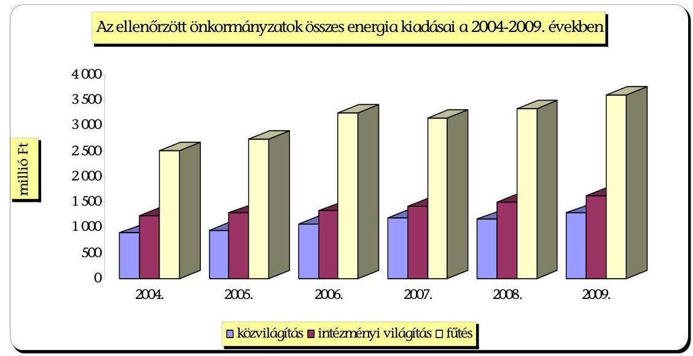

## 2. ábra

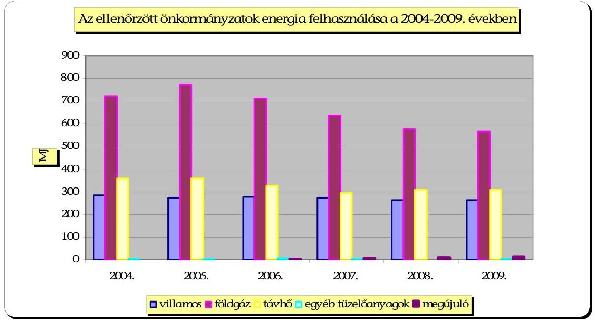

---

# 3. ábra 

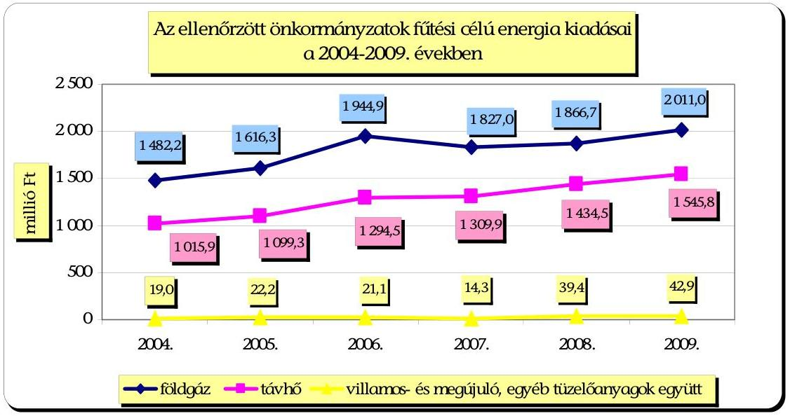
4. ábra
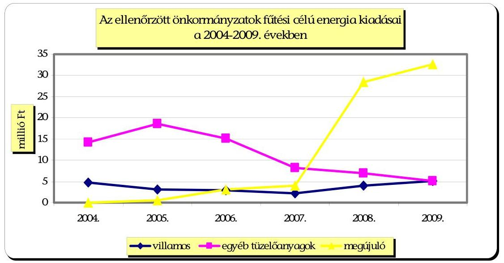

---

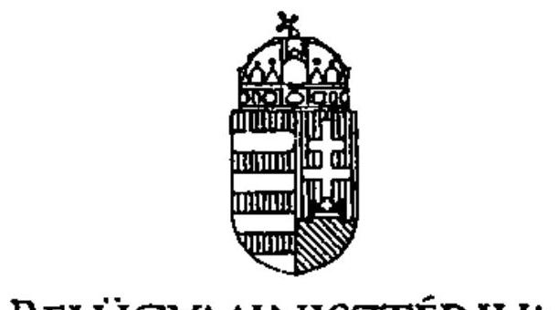

ÁLLAMI SZÁMVEVŐSZÉK
ÜGYVITELI IRODA
$04807 / 1010$
Érk.: JUL -2 2010
Iktatószám: U-3014-138/2009
Melléklet: 110

Iktatószám: ATM/1214/1/2010.
Hivatkozási szám: V-3014-138/2009.

Dr. Csapodi Pál úr részére
elnök nevében eljáró főtitkár
Állami Számvevőszék
Főtitkárság

# Budapest 

## Tisztelt Főtitkár Úr!

Köszönettel megkaptam az Állami Számvevőszék által, az energiagazdálkodást érintő állami és önkormányzati intézkedések - kiemelten az energiaracionalizálást célzó támogatások hatásának ellenőrzése tárgykörben végzett vizsgálatról szóló jelentést.

A jelentésben foglaltakra észrevételt nem teszek.
Kérem, fogadja elismerésem a tárgykört érintő tartalmas számvevőszéki értékelés és a következtetések megfogalmazásáért.

Budapest, 2010. június 20.
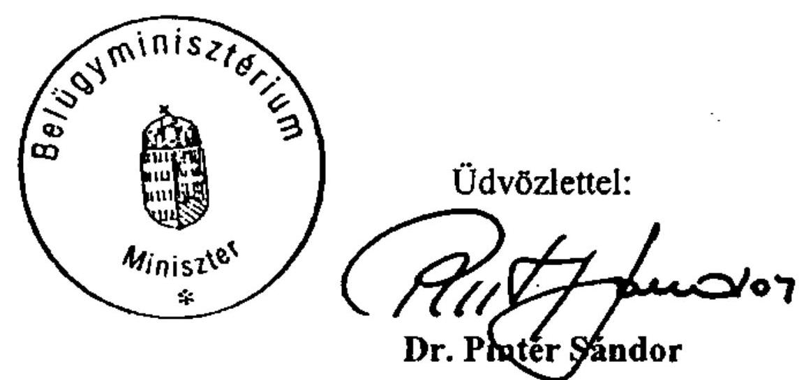

---

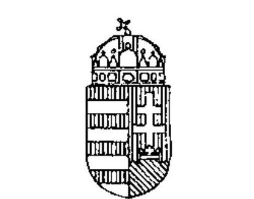

NEMZETGAZDASÁGI MINISZTÉRIUM

DR. MATOLCSY GYÖRGY
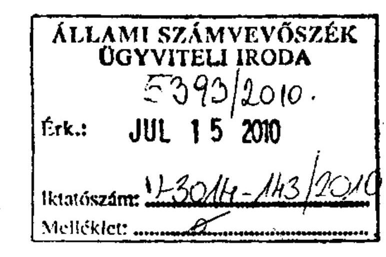

Iktatószám: NGM/1144/5/2010

Dr. Csapodi Pál
főtitkár
részére

Állami Számvevőszék
Budapest
Apáczai Csere János u. 10.
1052

Tárgy: ÁSZ jelentés (továbbiakban Jelentés) az energiagazdálkodást érintő állami és
önkormányzati intézkedések, kiemelten az energiaracionalizálást célzó támogatások
hatásának ellenőrzéséről

Tisztelt Dr. Csapodi Pál Úr!

Hivatkozással 2010. június 21-én Dr. Matolcsy György nemzetgazdasági miniszter
úrnak „Jelentés az energiagazdálkodást érintő állami és önkormányzati intézkedések,
kiemelten az energiaracionalizálást célzó támogatások hatásának ellenőrzéséről"
tárgyában megküldött levelével kapcsolatban az alábbiakról tájékoztatom.

A Jelentésben foglalt állami és önkormányzati energiagazdálkodással,
energiaracionalizálással, a támogatási konstrukciók eredményeit érintő szakmai
felülvizsgálattal kapcsolatos megállapításokkal, következtetésekkel egyetértünk.
Érdemesnek tartjuk megfontolni és figyelembe venni azokat a javaslatokat, amelyek a
jelentésben megállapításra kerültek. Fontosnak tartjuk ezeket átvezetni a hazai
közigazgatási és államigazgatási rendszerbe.

A Nemzetgazdasági Minisztérium elkötelezett abban, hogy az állami, önkormányzati
energiahatékonyságot, energiaracionalizálást és megújuló energiaforrást érintő stratégiák,
jogszabályok, intézkedések, valamint a vonatkozó támogatási konstrukciók felülvizsgálatra
kerüljenek, azok - a társadalmi és gazdasági szempontokat figyelembe véve - hatékonyan
kerüljenek felhasználásra.

Budapest, 2010. július 15.

Üdvözlettel:

Dr. Matolcsy György

1055 Budapest, Szemere u. 6. Telefon: (06 1) 374 2700 E-mail: györgy.matolcsy@ngm.gov.hu

---

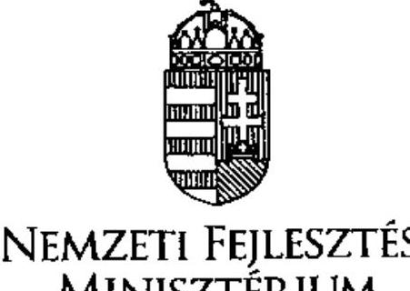

NEMZETI FEJLESZTÉSI MINISZTÉRIUM

Miniszter
Ikt.szám: NFM / 903 / 2 / 2010.
Hív.szám: V-3014-139/2009.
a V-3014-152/2009. számú jelentéshez

ÁLLAMI SZÁMVEVŐSZÉK
ÜGYVITELI IRODA
05484 P2010
Érk.: JUL 20 2010
Iktatószám: V-3014-144/2009.
Melléklet:

Dr. Csapodi Pál úr,
főtitkár
Állami Számvevőszék
Budapest

Tisztelt Főtitkár Úr!
Az energiagazdálkodást érintő állami és önkormányzati intézkedések, kiemelten az energiaracionalizálást célzó támogatások hatásának ellenőrzéséről szóló, V-3014-
130/2009. számú számvevőszéki jelentéssel kapcsolatban szeretném megköszönni azt az együttműködést, ami a Számvevőszék részéről a jelentés véleményezése során a minisztérium irányába megnyilvánult. A számvevőszéki vizsgálatot végzők és az energetikáért felelős kollégák között kiváló munkakapcsolat kialakítására volt lehetőség, aminek eredményeként egy alapvetően korrekt, az energetikai folyamatokat megfelelő módon bemutató anyag született. A minisztérium részéről - a korábbi, lábjegyzetben és megjegyzésként immár feltüntetett eltérő véleményeket továbbra is fenntartva - a jelentéssel kapcsolatban további észrevételt nem teszek.

Budapest, 2010. július 1.
Üdvözlettel,
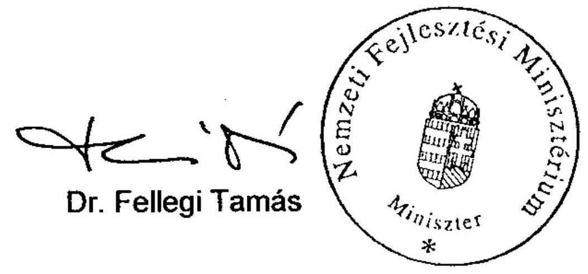

---

# VIDÉKFEJLESZTÉSI MINISZTÉRIUM 

DR. FAZEKAS SÁNDOR
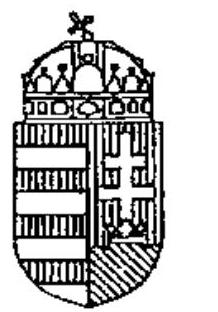

DR. FAZEKAS SÁNDOR
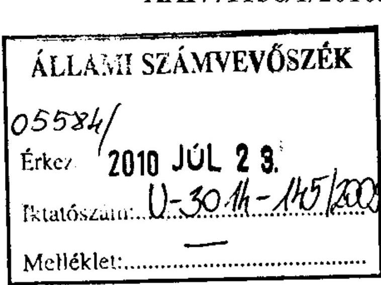

Az Állami Számvevőszék az energiagazdálkodást érintő állami és önkormányzati intézkedések, kiemelten az energiaracionalizálást célzó támogatások hatásának ellenőrzéséről szóló véglegesített jelentését köszönettel megkaptam.

A jelentésben tett megállapításokat, következtetéseket tudomásul veszem, a Vidékfejlesztési Minisztérium részéről elfogadom, arra további észrevételt nem kívánok tenni.

A jelentés áttanulmányozása során megállapítottam, hogy az FVM és a KvVM illetékes szakmai főosztályai által tett korábbi észrevételek a véglegesített ellenőrzési jelentésben maradéktalanul átvezetésre kerültek.

Tekintettel arra, hogy az Ellenőrzési Jelentés a Vidékfejlesztési Minisztériumot érintően nem fogalmaz meg intézkedési javaslatot, így - a megállapítások és következtetések figyelembe vétele mellett - intézkedési terv kidolgozását nem tartom szükségesnek.

Az ellenőrzést végrehajtó munkatársak szíves közreműködését ezúton is köszönöm.

Budapest, 2010. július 16.

## Üdvözlettel:

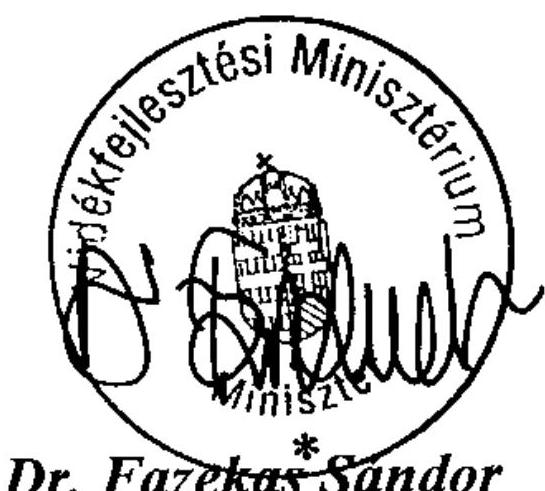

---

# A magyar energiapolitika szakaszait meghatározó jogszabályok 

I. szakasz: 1993-2008-ig

A magyar energiapolitikáról szóló 21/1993. (IV. 9.)
OGY határozat

A Kormány feladataként jelölte meg, többek között:

- gondoskodjon arról, hogy a gazdaság és a lakosság energiaigényeinek kielégítése mindenkor kellő biztonsággal, a környezetvédelmi szempontok figyelembevételével történjen;
- dolgozzon ki átfogó, országos energiatakarékossági, energiahatékonyság-növekedést elősegítő programot;
- terjessze az OGY elé az energetikai kerettörvény koncepcióját;
- legalább kétévente készítsen tájékoztatót az OGY részére az energiapolitika megvalósulásáról.

Az Energiatakarékossági
Hitel Program létrehozásáról szóló 1113/1996. (XI. 29.)

Korm. határozat

Az energiatakarékossági célú beruházások elősegítéséhez évente kialakítandó cél- és eszközrendszerről
meghatározott összegű hitelkeretet különítve el a pénzügyi támogatásra.

A 2010-ig terjedő energiatakarékossági és energiahatékonyság-növelési stratégiáról szóló 1107/1999. (X. 8.) Korm. határozat és annak melléklete: a Cselekvési Program

Az energiatakarékossággal és hatékonyságnöveléssel kapcsolatos fő célokat fogalmazta meg:

- az energiaellátás biztonságának növelése;
- az importfüggőség mérséklése;
- a fosszilis energiaforrásokkal való takarékosság érdekében:

1. a gazdaság összenergia-igényének évi 3,5\%-kal kell mérséklődnie, az energiafelhasználás éves átlagos növekedési üteme ne haladja meg az $1,5 \%$-ot;
2. 2010-re mintegy 75 PJ/év energiahordozó megtakarítás, a kéndioxid-kibocsátás $50 \mathrm{kt} / \mathrm{év}$, a széndioxid-kibocsátás 5 Mt/év mértékben mérséklődjön;
3. a megújuló energiahordozók jelenlegi 28 PJ/év felhasználását 2010-ig 50 PJ/ évre kell növelni.

A Cselekvési Programhoz kapcsolódó pályázati konstrukciók:

- Energiatakarékossági Program (2000);
- Széchenyi Terv (2001-2002);
- Nemzeti Energiatakarékossági Program (2003-2009);
- NFT Környezetvédelem és Infrastruktúra Operatív Program (2004-2006);
- ÜMFT Környezet és Energia Operatív Program (2007-től)
- Hazai és nemzetközi támogatással létrehozott hitelprogramok (EHA, EHP, Phare hitelkonstrukció, „Sikeres Magyarországért" Lakossági Energiamegtakarítási Hitelprogram);

---

# II. szakasz: 2008-2020-ig 

A 2008-2020 közötti időszakra vonatkozó energiapolitikáról szóló 40/2008. (IV. 17.) OGY határozat

A 29/2008. (III. 20.) OGY határozat a Nemzeti Éghajlatváltozási Stratégiáról (NÉS)

A NÉS Magyarország középtávú klímapolitikájának három fő cselekvési irányát jelöli ki:

- üvegházhatású gázok kibocsátásának csökkentése és növekedésének megelőzése;
- az éghajlatváltozás elkerülhetetlen következményeihez való alkalmazkodóképesség javítása;
- az éghajlatváltozás társadalmi tudatosítása, a klímatudatosság erősítése, társadalmi szemléletformálás.

A Kormány feladataként jelölte meg, - az energiapolitika és klímapolitika közötti összhang biztosítását kiemelt célként kezelve - többek között:

- gondoskodjon az ellátásbiztonság, a versenyképesség és a fenntarthatóság, mint elsődleges célok együttes érvényesüléséről;
- dolgozzon ki átfogó, országos energiahatékonysági stratégiát és nemzeti energiahatékonysági cselekvési tervet;
- dolgozza ki a megújuló energiaforrások növelésére vonatkozó stratégiát a hazai üvegházhatású gázkibocsátáscsökkentési célok megvalósítása érdekében;
- gondoskodjon az energiapolitika céljainak hatékony megvalósulását elősegítő pályázatok és források megfelelő koordinációjáról;
- legalább kétévente készítsen tájékoztatót az OGY számára az energiapolitika megvalósulásáról.

A magyarországi megújuló energiaforrások felhasználásának növelésére vonatkozó 2008-2020 közötti stratégiáról szóló 2148/2008. (X. 31.) Korm. határozat

A stratégia fő célkitűzése: Magyarországon a megújuló energiaforrások felhasználása 2020-ban összességében érje el a 186,4 PJ-t.

A közlekedési, hírközlési és energiaügyi miniszter feladataként jelölte meg, hogy a megújuló energiaforrások felhasználásának ösztönzését célzó különböző eszközök optimális kihasználása céljából a pénzügyminiszterrel, a földművelésügyi és vidékfejlesztési miniszterrel, a nemzeti fejlesztési és gazdasági miniszterrel, az önkormányzati miniszterrel, valamint a Miniszterelnöki Hivatalt vezető miniszterrel egyetértésben hozza létre az intézkedési terveket tartalmazó Megújuló Energia Hordozó Programot (Nemzeti Cselekvési Terv).

Magyarország Nemzeti Energiahatékonysági Cselekvési Tervéről szóló 2019/2008. (II. 23.) Korm. határozat

A Cselekvési Terv célkitűzése: Magyarországnak a végső energiafelhasználását 2016-ig összesen 57,4 PJ/év kell csökkentenie.

---

# A HAZAI ENERGIAPOLITIKA CÉLKITÜZÉSEI 

1. ábra
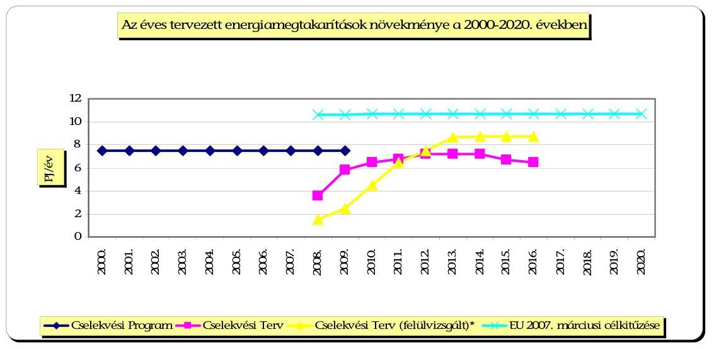

Megjegyzés: A Cselekvési Programban szereplő 75 PJ, illetve az EU 2007. márciusi 20\%-os energia-megtakarítási célkitűzése évenként arányosan került felosztásra.
2. ábra
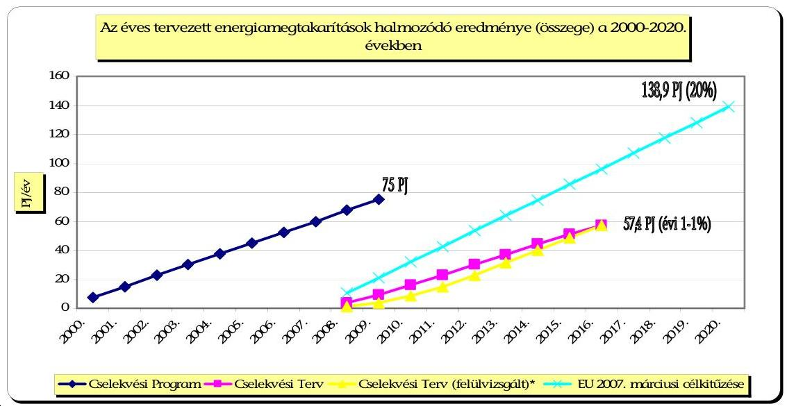

Megjegyzés: A Cselekvési Programban szereplő 75 PJ, illetve az EU 2007. márciusi 20\%-os energia-megtakarítási célkitűzése évenként arányosan került felosztásra.

Az 1. és a 2. számú ábra forrása a 1107/1999. (X. 8.) Korm. határozat melléklete (Energiatakarékossági és energiahatékonyság-növelési Cselekvési Program) és a 2019/2008. (II. 23.) Korm. határozattal tudomásul vett Nemzeti Energiahatékonysági Cselekvési Terv

---

# Stratégia a magyarországi megújuló energiaforrások felhasználásának növelésére 2008-2020 között 

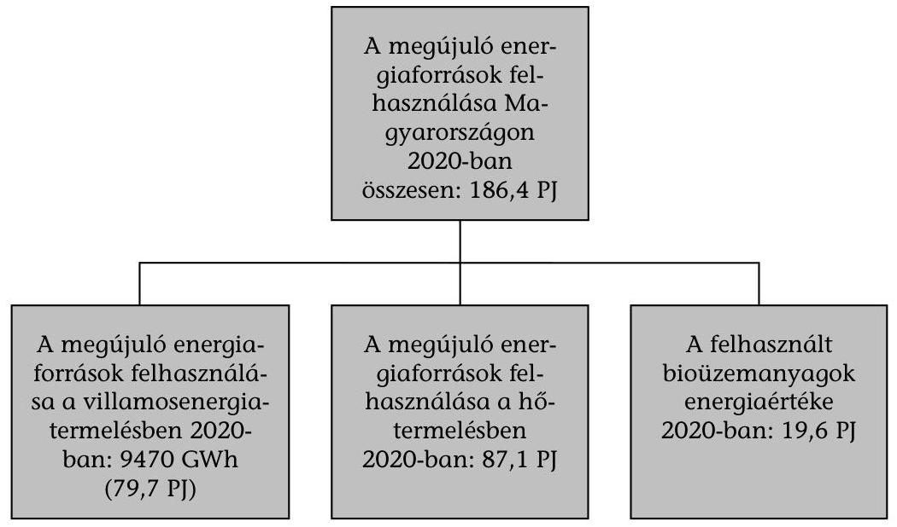

[^0]
[^0]:    ${ }^{1}$ Forrás: Stratégia a magyarországi megújuló energiaforrások felhasználásának növelésére 2008-2020 58. oldal.

---

# Hatósági (legmagasabb) földgázárak (ÁFA és energiaadó nélkül) (1)

|   | 2004. jan. 1-60 | 2004. jan. 1-60 | 2005. jan. 15-60 | 2005. aug. 1-60 | 2005. nov. 1-60 | 2005. nov. 15-60 | 2006. jan. 18-60 | 2006. aug. 18-60 | 2007. jan. 1-60 | 2008. jan. 1-60 | 2008. ápr. 1-60 | 2008. júl. 1-60 | 2009. jan. 1-60 | 2009. okt. 1-60 | 2010. jan. 1-60 | 2010. ápr. 1-60 | 2010.  |
| --- | --- | --- | --- | --- | --- | --- | --- | --- | --- | --- | --- | --- | --- | --- | --- | --- | --- |
|  Kisfogyasztók (20 m²/h alatt) (átlag) | 1 490 | 1 490 | 1 664 | 1 779 | 1 816 | 1 810 | 1 931 | 2 469 | 2 469 | 2 596 | 2 747 | 3 023 | 3 223 | 2 808 | 2 994 | 3 272 | 120  |
|  alapdíj (ft/év) | 2 144 | 2 144 | 1 504 | 2 504 | 2 504 | 2 504 | 3 541 | 4 560 | 4 560 | 4 788 | 5 064 | 5 556 | 5 940 | 6 828 | 12 000 | 12 000 | 282  |
|  gazdíj (2) | 1 437 | 1 437 | 1 603 | 1 716 | 1 753 | 1 752 | 1 872 | 2 393 | 2 393 | 2 513 | 2 659 | 2 922 | 3 113 | 2 672 | 2 736 | 3 005 | 109  |
|  ezen belül: lakossági = 1. árkategória (átlag) |  |  |  | 1 784 | 1 784 | 1 778 | 1 900 | 2 475 | 2 475 | 2 602 | 2 753 | 3 032 | 3 231 |  |  |  |   |
|  alapdíj (ft/év) |  |  |  |  | 3 504 | 3 504 | 3 504 |  |  |  |  |  |  |  |  |  |   |
|  gazdíj (2) |  |  |

  |  | 1 716 | 1 716 | 1 838 |  |  |  |  |  |  |  |  |  |   |
|  2. árkategória (átlag) |  |  |  | 1 745 | 2 039 | 2 039 | 2 154 | 2 431 | 2 431 | 2 554 | 2 702 | 2 974 | 3 168 |  |  |  |   |
|  alapdíj (ft/év) |  |  |  |  | 3 504 | 3 504 | 4 116 |  |  |  |  |  |  |  |  |  |   |
|  gazdíj |  |  |  |  | 2 010 | 2 010 | 2 120 |  |  |  |  |  |  |  |  |  |   |
|  Középfogyasztók (20 - 100 m²/h) (átlag) | 1 662 | 1 662 | 1 797 | 1 916 | 2 145 | 2 142 | 2 325 | 2 621 | 2 621 | 2 734 | 2 875 | 3 056 | 3 333 | 2 908 | 2 801 | 3 047 | 81  |
|  alapdíj [(ft/m3/h)/év] | 9 400 | 9 400 | 10 440 | 10 440 | 10 440 | 10 440 | 12 032 | 13 140 | 13 140 | 13 704 | 14 400 | 15 192 | 16 596 | 19 068 | 19 068 | 19 068 | 103  |
|  gazdíj (2) | 1 362 | 1 362 | 1 500 | 1 610 | 1 840 | 1 844 | 1 982 | 2 259 | 2 259 | 2 354 | 2 476 | 2 611 | 2 847 | 2 321 | 2 244 | 2 470 | 81  |
|  ezen belül: lakossági (akhó = 1. árkat. (átlag) |  |  |  | 1 857 | 1 857 | 1 878 | 2 065 | 2 373 | 2 373 | 2 687 | 2 825 | 3 017 | 3 290 |  |  |  |   |
|  alapdíj [(ft/m3/h)/év] |  |  |  |  | 10 440 | 10 440 | 10 440 |  |  |  |  |  |  |  |  |  |   |
|  gazdíj (2) |  |  |  |  | 1 610 | 1 610 | 1 797 |  |  |  |  |  |  |  |  |  |   |
|  2. árkategória (átlag) |  |  |  | 1 927 | 2 202 | 2 187 | 2 370 | 2 630 | 2 630 | 2 742 | 2 883 | 3 063 | 3 341 |  |  |  |   |
|  alapdíj [(ft/m3/h)/év] |  |  |  |  | 10 440 | 10 440 | 12 276 |  |  |  |  |  |  |  |  |  |   |
|  gazdíj (2) |  |  |  |  | 1 885 | 1 885 | 2 014 |  |  |  |  |  |  |  |  |  |   |

## Megjegyzések:

(1) - Ahol nincs mértékegység (gazdíj, átlagár) ott az értékek Ft/GJ-ban értendők.

- A díjtétélek és átlagárak nem tartalmazzák a külön jogszabályban [a kedvezményes gázellátás igénybevételéről szóló 50/2003. (VIII. 14.) GEM rendelet] meghatározott gázár-kompenzáció hatásait.
- Az átlagos (nem az 1. illetve 2. árkategóriánál jelzett) adatok fogyasztott mennyiséggel súlyozott átlagos értékekként adódnak.
- Az átlagárak változásának oka a gazdíjak, valamint alap- és teljesítménydíjak változásán túl a vetítési alapként szolgáló mennyiségi arányok változása is.
- A díjtétélek és átlagárak nem tartalmazzák a külön jogszabályban [a szociális gázártámogatáiról szóló 289/2007. Korm. rendelet] meghatározott gázár-támogatás hatásait.
- A feltüntetett időpontok között a táblázatban szereplő árak nem változtak. A sötétített cellákban szereplő számok csak az összehasonlíthatóság érdekében kerültek feltüntetésre (nem voltak hivatalosan kihirdetve).

(2) 2004. január 1-től az I. tömb gazdíja 1147 Ft/GJ, a II. tömbé 1226 Ft/GJ (mindkettő a megfelelő kompenzációval), a III. tömbé 1437 Ft/GJ.

2005. január 15-től az I. tömb gazdíja 1187 Ft/GJ, a II. tömbé 1316 Ft/GJ (mindkettő a megfelelő kompenzációval), a III. tömbé 1603 Ft/GJ.

2005. augusztus 1-től a III. tömb gazdíja 1716 Ft/GJ.

(3) A 2005. november 1-én bevezetett 1. árkategória a lakossági fogyasztókra és a lakossági célú törfőtésre, a 2. árkategória pedig minden egyéb fogyasztóra vonatkozik.

(4) Az átlagárak (mind a teljesítmény és gazdíj összegzése, mind az 1. és 2. kategória átlaga) számítása itt aktualizált, a 2006. január átlagárak kiszámításakor használtak azonos fogyasztási szerkezet figyelembevételével történt.

---

# Lakossági villamosenergia-árak és árváltozások ÁFA-val (1)

|  Kategória | 2004. | 2004. | 2005. | 2005. | 2006. | 2006. | 2007. | 2008. | 2009. | 2010. | Növekedés
$(\%)$  |
| --- | --- | --- | --- | --- | --- | --- | --- | --- | --- | --- | --- |
|   | januártól |  |  |  |  |  |  |  |  |  |   |
|   | (3) | (4) | (4) | (5) | (5) | (5) | (5) | (6) |  |  |   |
|  Lakossági átlag | 27,13 | 27,61 | 29,50 | 29,50 | 28,32 | 32,40 | 34,05 | 39,03 (7) | 40,15 | 44,11 | 63  |
|  általános ("A") (2005-től: átlag) | 32,13 | 32,13 | 34,14 | 34,14 | 32,77 | 36,85 | 38,53 | 42,27 | 43,54 | 44,53 | 39  |
|  I. tömb (1320 kWh/év
fogyasztásig) (2) |  | 32,13 | 33,50 | 33,50 | 32,16 | 36,24 | 37,92 | 41,57 | 42,85 | 46,65 | 45  |
|  II. tömb (1320 kWh/év fogyasztás
fölött) (2) |  | 32,13 | 35,00 | 35,00 | 33,60 | 37,68 | 39,36 | 43,14 | 44,40 | 48,45 | 51  |
|  vezérelt ("B") | 16,25 | 16,25 | 17,88 | 17,88 | 17,16 | 21,24 | 22,92 | 25,09 | 25,60 | 28,22 | 74  |

## Megjegyzések

(1) Az ÁFA mértéke 2003. december 31-ig 12 %, 2004. január 1-től 2005. december 31-ig 25 %, 2006. január 1-től 2009. június 30-ig 20 %. (2) 2005. februártól van tömbök szerinti megkülönböztetés. (3) Az átlagárak számítása 2000. és 2004. január között állandó mennyiségi súlyokkal (és a nem lakossági körben is az összes fogyasztó figyelembevételével) történt. (4) A 2005. februári ármegállapítás előkészítése során alkalmazott mennyiségi súlyokkal (a nem lakossági körben a feljogosított fogyasztók figyelembe vett fogyasztásával csökkentett fogyasztási aránnyal) számítva. (5) A 2006. januári ármegállapítás előkészítése során figyelembe vett mennyiségi súlyokkal számítva. (6) A 2008. januártól a közüzemi ellátást felváltó ún. egyetemes szolgáltatásban részesülő lakossági fogyasztókra vonatkozó árak

---

# Az energiaracionalizálási célú pályázati konstrukciók főbb jellemzői 

A NEP pályázati konstrukciói az ellenőrzött időszakban - a 2004. év kivételével ${ }^{1}$ - alapvetően a lakossági szféra energiatakarékossági beruházásait ösztönözték. A pályázatokat - 2005. év kivételével, amikor forráshiány miatt nem írtak ki pályázatot - évente meghirdették, és minden év pályázati kiírásaiban történtek módosítások (pályázati konstrukciók tagoltsága, támogatási intenzitás, maximális támogatás vagy a támogatott projektek nagyságrendje). A támogatott célok a lakások energetikai korszerűsítésére ${ }^{2}$, ennek keretében a lakóépületek utólagos hőszigetelésére, a nyílászárók cseréjére, utólagos hőszigetelésére, a fűtés és a használati meleg vízellátás korszerűsítésére, valamint a megújuló energiaforrások hasznosításának támogatására terjedtek ki. A pályázati konstrukciók kialakításakor törekedtek a több célt egyidejűleg megvalósító, valamint a megújuló energiaforrásokat hasznosító beruházások előtérbe helyezésére.

A támogatási intenzitás 15-50% között változott (jellemző a 25-30% volt), amelyet 2007-től kiegészített a „Sikeres Magyarországért" Lakossági Energiatakarékossági Hitelprogram. Hitelből a bekerülési költség fennmaradó része, de akár az egész beruházás is finanszírozható volt. A pályázati kiírásokban meghatározták az adható támogatás és/vagy támogatható beruházás maximális összegét, valamint a saját forrás szükségletet.

A támogatások nagyságrendje támogatott tevékenységenként, illetve lakásonként 200-1470 ezer Ft között alakult. A saját forrás szükséglet 2004-ben 25%, 2006-ban a beruházási költség 1/3-a volt. A maximálisan támogatható beruházási költséget 2007-től határozták meg (1760-4200 ezer Ft között).

A pályázatok elbírálási szempontjai között 2004-ben és 2006-ban gazdaságossági és hatékonysági feltételek teljesülését ${ }^{3}$ írták elő, és a pályá-

[^0]
[^0]:    ${ }^{1}$ A 2004. évben a NEP konstrukciók kiterjedtek a lakossági, az önkormányzati és a vállalkozói szférára egyaránt. A támogatott tevékenységek köre kiterjedt a lakossági, az önkormányzati energiafelhasználás mérséklésére, a közvilágítás korszerűsítésére és a tanyavillamosításra, a távhőellátás szolgáltató oldali korszerűsítésére, a megújuló energiaforrások felhasználásának a bővítésére, kis- és középvállalkozások K+F jellegű energiatakarékossági fejlesztéseire, a termelő szféra energiafelhasználásának a mérséklésére, a harmadik feles finanszírozás támogatására.
    ${ }^{2}$ A támogatható körbe 2007-ig az 1994 előtt, hagyományos technológiával épült épületek tartoztak. Ezt 2008-tól a nyílászáró cserék és/vagy nyílászárók utólagos hőszigetelése, valamint a fűtés korszerűsítés esetén kiterjesztették az iparosított technológiával épült épületekre is magánszemély pályázóknál (egyedi fűtés és/vagy egyedi használati melegvíz ellátás esetén). 2009-től pályázatokat lehetett benyújtani az 1994-ben épült lakóingatlanokra is.
    ${ }^{3}$ A fogyasztói és a nemzetgazdasági szintű energiahordozó-megtakarítás nagysága és realitása, a beruházás gazdaságossága, a környezetterhelés csökkentés hatékonysága, az állami támogatás egységére jutó nemzeti szintű energia megtakarítás.

---

zatok elbírálásához ezek alapján különböző indikátorokat számítottak ${ }^{4}$. A 2007-2009 között kiírt pályázatoknál azonban a pályázati feltételrendszernek való megfelelés mellett mindössze a felhasználni tervezett anyagok, berendezések energetikai-műszaki megfelelősége szerepelt.

A NEP pályázatokat 2010-ben nem
 hirdették meg. Az energiaracionalizálást célzó pályázati pénzeszközök a lakosság részére 2009. év végétől a ZBR Klímabarát Otthon Energiahatékonysági Alprogram keretében érhetők el. A konstrukciók olyan beruházásokat támogatnak, amelyek hatásaként a széndioxid-kibocsátás csökkentése mérhető, illetve az energetikai hatékonyságjavító hatása igazolható az épületek energetikai jellemzőinek meghatározásáról szóló 7/2006. (V. 24.) TNM rendelet szerint. A beruházással érintett ingatlanoknak legalább egy energiakategóriát kell javulnia. A támogatható tevékenységek köre a korábbi NEP pályázatokhoz képest kibővült, illetve átalakult. A konstrukció alapvetően a hagyományos technológiával épült ingatlanokat támogatja, az iparosított technológiával épült ingatlanok esetében csak ablakcserére lehet pályázatot benyújtani. A megújuló energiafelhasználás növelése csak abban az esetben támogatható, ha az ingatlan eléri a C energiakategóriát, viszont támogatásban részesülhet az új energiatakarékos házak építése is. A pályázattal elnyerhető támogatás többszintű, alap- és ún. klímabónusz támogatásból áll, célja a komplex jellegű felújítások ösztönzése.

Az alaptámogatáshoz az épület az eredeti állapotánál eggyel jobb energetikai kategória elérése szükséges (30%). Összege támogatott tevékenységenként maximált, összesen 3195 ezer Ft és a klímabónusszal együtt nem haladhatja meg az elszámolható költségek 60%-át. A klímabónusz az elismerhető felújítási költség 10-30%-a (maximum 200-600-1000 ezer Ft) lehet, amennyiben az épület eléri a B, A, illetve az A+ kategóriát.

A ZBR pályázatokhoz kapcsolódóan folytatódik a „Sikeres Magyarországért" Hitelprogram is, a támogatáson felüli önrészre pályázat nyújtható be.

Az 1991-ben az ún. „német szénsegélyből" létrehozott Energiatakarékossági Hitel Alap olyan beruházásokat támogatott kedvezményes hitellel, amelynek megvalósítása eredményeként egyértelműen - mérhető módon - igazolható energiahordozó-megtakarítás keletkezik. Pályázati rendszere nyilvános, azon természetes és jogi személyek, valamint jogi személyiséggel nem rendelkező társaságok egyaránt részt vehetnek. A pályázati kiírások feltételrendszere az alap létrehozása óta többször - a pályázók részére kedvezőbb irányba - változott, ennek ellenére a pályázati igények területén 2004-től fokozatos visszaesés volt megfigyelhető.

A kamat mértéke a jegybanki alapkamat 1/3-a+2,5% volt, amelyet 2009-től a jegybanki alapkamat 1/4-e+2,5%-ra csökkentettek. A fejlesztés hatásaként előírt alapenergia megtakarítási mutatót 75 GJ/év/millió Ft-ról 50, 2009-től 30 GJ/év/millió Ft-ra csökkentették. A kedvezményes hitel maximumát a teljes fejlesztési költség 80%-áról 2009-től a 90%-ra, összegét beruházásonként 80 millió Ft-ról 100 millió Ft-ra, 2009-től a 200 millió Ft-ra növelték.

[^0]
[^0]:    ${ }^{4}$ energiahordozó megtakarítás, energiaköltség megtakarítás, környezetterhelés csökkenése

---

A pályázatok elbírálásához - az általános feltételeken ${ }^{5}$ és a fenti alapenergia megtakarítási mutatón túl - előírták a belső megtérülési ráta minimumát (mindenkori jegybanki alapkamat 0,8-szerese, megújuló energiaforrások esetén 0,4-szerese), valamint az energiaköltség-megtakarítás legalább 50%-os arányát az elért összes költség-megtakarításból.

Pályázati kiírások szerint az ellenőrzött időszakban még működött az 1998-2008. közötti időszakra létrehozott Phare Társfinanszírozású Energiahatékonysági Hitelkonstrukció, a gyakorlatban azonban a futamidő lejárta miatt ${ }^{6}$ már új pályázatok nem érkeztek az Energia Központhoz. A konstrukció az energiahatékonyság javítását célzó fejlesztésekhez biztosított kedvezményes hitelt ${ }^{7}$ a magánszektor vállalkozásai, az önkormányzatok, az önkormányzati tulajdonú intézmények és gazdasági társaságok, valamint a független közintézmények részére. A hitelnyújtás feltétele volt a szakszerű energetikai átvilágítás, továbbá megfelelő megvalósítási/kiviteli terv és az energia megtakarítás ellenőrzésére vonatkozó terv.

Az UNDP/GEF Önkormányzati Energiahatékonysági Projekt célja az önkormányzati energiahatékonysági projektek előkészítése, az energetikai veszteségfeltáró vizsgálatok (auditok) és megvalósíthatósági tanulmányok elkészítése volt 2002-2006 között. Pályázatot nyújthattak be az önkormányzatok, valamint önkormányzati tulajdonú kizárólagos és többségi szervezetek, továbbá az audit és/vagy megvalósíthatósági tanulmány készítésére velük szerződött gazdasági társaságok (jellemzően ESCO cégek). A pályázók körét 2006-tól kibővítették a többcélú kistérségi társulásokkal, és a közigazgatási rendszer további intézményeivel (államigazgatási szervek, közintézmények és közalapítványok, többségi állami tulajdonú szervezetek). A pályázatokkal először az energiaaudit, illetve a megvalósíthatósági tanulmányok elkészítését követően érhettek el 20-40% támogatást. Ezt egészítette ki a második fázis újabb 20-40%-kal abban az esetben, ha az előzőekből közvetlenül beruházást valósítottak meg az előírt határidőn belül. Így a támogatás aránya - évente változóan - elérhette az 50-80%-ot, összegét azonban korlátozták nominálisan, illetve az érintett intézmény (terület) energiaköltségének, vagy a megvalósítandó beruházás bekerülési költségének a meghatározott %-ában. Az elbírálás szempontjai alapján egyes pályázatokat előnyben részesítettek, ez 2005-2006-ban a magasabb villamos energia megtakarítást eredményező projekteket érintette.

A KIOP 1.7 „Energiagazdálkodás környezetbarát fejlesztése" intézkedés keretében 2004-2006 között - egymást követően, kisebb módosításokkal - három pályázati konstrukciót hirdettek meg. Ezek az önkormányzati és a non-profit szféra, a kis- és középvállalkozások, valamint az állami többségi tulajdonú gazdasági társaságok részére voltak el-

[^0]
[^0]:    ${ }^{5}$ Az energiapolitikai és környezetpolitikai célkitűzésekkel való összhang, a műszaki megvalósíthatóság, az energetikai hatékonyság, a korszerűség, továbbá az érvényben lévő biztonságtechnikai és környezetvédelmi előírásoknak való megfelelés.
    ${ }^{6}$ A hitel futamideje - három év türelmi idő mellett - nyolc év lehetett, de nem haladhatta meg a 2008. évi lejárati időt.
    ${ }^{7}$ A banki hitel mellett az alapból kamatmentes hitelt biztosítottak a beruházási költség 25%-áig.

---

érhetők 25%-os saját forrás biztosítása mellett. A célcsoportok köre 2005-től kiegészült a kis- és középvállalkozásokból alakult konzorciumokkal, ami a beruházási költség tekintetében megjelölt 125 millió Ft-os alsó határ miatt volt indokolt. Az elnyerhető támogatás összegét 300 millió Ft-ban maximálták. Mértékét - támogatott tevékenységek szerint differenciálva - az önkormányzati és a non-profit szférában 25-60% között, a kis- és középvállalkozásoknál ennél átlagosan 10 százalékponttal alacsonyabban határozták meg. A támogatott tevékenységek köre a programozási időszakban alapvetően nem változott, mindössze kisebb módosítások, illetve pontosítások történtek.

A támogatott tevékenységek közé tartozott a megújuló energiát termelő berendezések működtetéséhez szükséges tüzelőanyag biztosítása (faapríték és pellet készítő, bálázó, növényolaj-prés berendezések), a megújuló energiaforrás hasznosítása, az önkormányzati és a non-profit szférában a közösségi szintű beruházások, valamint az önkormányzati és a kis- és középvállalkozások energiahatékonysági fejlesztései.

Az elbírálás során energiahordozó-megtakarítási, megújuló energiaforrás hasznosítási, beruházás gazdaságossági, a környezetterhelés csökkentési szempontokat vettek figyelembe. Négy indikátor kiszámítását írták elő, az éves energiahordozó megtakarítást/kiváltást nemzetgazdasági szinten, az éves energiaköltség megtakarítást, a fajlagos energiahatékonysági mutatót, és a pénzügyi megtérülési rátát. Az energiahatékonyság javítási pályázatoknál a pályázóknak igazolniuk kellett a beruházás gazdaságosságát, a pénzügyi megtérülési ráta ${ }^{8}$ előírt minimum követelményeknek való megfelelését.

A KEOP 4. „Megújuló energiaforrás-felhasználás növelése" és a KEOP 5. „Hatékony energia-felhasználás" prioritási tengelyekhez kapcsolódóan 2007-2008-ban három, a 2009-2010. évekre nyolc pályázati konstrukciót hirdettek meg a helyszíni ellenőrzés lezárásig ${ }^{9}$. A meghirdetett pályázatok a tevékenységek széles körét támogatták, amelyek a megújuló energiaforrások felhasználásának támogatása, az energetikai hatékonyság fokozása, valamint a harmadik feles finanszírozási konstrukciókra oszthatók. Egy-egy konstrukción belül is támogatták az energetikai korszerűsítéseket a megújuló energiafelhasználással kombináló projekteket.

A megújuló energiafelhasználás-növelése pályázati konstrukciói a megújuló energiaforrások széles körének felhasználását támogatták a helyi hő- és hűtési igények, valamint a villamos energia előállítása területén. Támogatták továbbá a távfútési rendszerek megújuló energia alapon történő teljes vagy részleges energiaellátását, és 2009-től új elemként a biometán termelést. A hatékony energia-felhasználás pályázati konstrukciói támogatták az energiafelhasználás csökkentését bármely kedvezményezett esetén (épületek hőtechnikai adottságainak javítása, az intézmények fűtési, hűtési és használati melegvíz rendszereinek korszerűsítése, a világítási rendszerek korszerűsítése), a közvilágítás energiafelhasználásának csökkentését, továbbá a

[^0]
[^0]:    ${ }^{8}$ A beruházás éves átlagos hozama. Minimumkövetelmény 2004-ben a január 1-jei jegybanki alapkamat 0,5-szerese, 2005. április 15-től a március 31-i alapkamat 0,7-szerese volt.
    ${ }^{9}$ További három konstrukció előkészítés alatt volt.

---

vállalkozásnak minősülő szervezetek üzemi és irodaépületeiben megvalósítandó épületenergetikai fejlesztéseket. Támogatták e tevékenységek megújuló energia hasznosítással kombinált megvalósításait és a távhőellátás energiahatékonysági korszerűsítését, a távhőtermelés és -szolgáltatás primeroldali infrastruktúrájának energetikai korszerűsítését is. A harmadik feles finanszírozás pályázati konstrukciók célja a központi és helyi költségvetési szervek, alapítványok és egyházak közfeladat-ellátással megbízott intézményeiben az elektromos, világítási és fűtési rendszerek korszerűsítése, minőségivé tétele, az intézmények energiaköltségeinek a mérséklése volt.

A támogatások célcsoportjai közé tartoztak a vállalkozások, a költségvetési szervek, valamint a nonprofit szervezetek, azonban jellemzően az önkormányzati és a non-profit szektort, valamint a kis- és középvállalkozásokat preferálták. A harmadik feles finanszírozás pályázati konstrukciói keretében azok a vállalkozások pályázhattak, amelyek saját finanszírozásban hajtottak végre a költségvetési szervek, alapítványok, valamint egyházak intézményeiben - később elsősorban az ezzel elért megtakarításból fedezett energiakorszerűsítést. A konstrukciók különböző nagyságrendű projekteket támogattak, de a nagyságrendet közvetlenül nem, csak az elnyerhető támogatáson keresztül korlátozták ${ }^{10}$.

A benyújtott pályázatokat automatikus eljárási rend esetén a benyújtási, a jogosultsági és a teljességi szempontok, míg a többinél emellett a műszaki és szakmai feltételek alapján bírálták el. Az elbírálásnál kiemelt szerepet kaptak a beruházások pénzügyi megtérülési mutatói, a fajlagos költségszintek. A projekteknek - előzetes energetikai felmérést feltételező - megvalósíthatósági tanulmányon, emellett energetikai számításokon és felméréseken kellett alapulniuk.

# A lakáscélú állami támogatásokról szóló 12/2001. (I. 31.) Korm. 

rendelet 26-43. §-aiban szabályozott, a települési önkormányzatok és az egyházak támogatása keretén belül hét különböző támogatási jogcímet nevesítettek ${ }^{11}$. Ezek közül kifejezett energia megtakarítási elvárások a 2. Lakóépületek energiatakarékos korszerűsítése, felújítása jogcímhez - közismert nevén a panel és az ÖKO programokhoz - kapcsolódtak.

A panel, a közép- és nagyblokk, az alagútzsalu, az öntött, a vasbeton vázas és az egyéb előre gyártott technológia felhasználásával épült lakóépület energiatakarékos korszerűsítésére, felújítására a Lakóépületek és környezetük felújításának támogatása előirányzatból a nyílászárók energiatakarékos felújítása, vagy cseréje, a homlokzatok és födémek utólagos hőszigetelése, az épületgépészeti és épület villamossági rendszerek korszerűsítése, felújítása, a felvonó-berendezés korszerűsítése, felújítása volt támogatható. A megújuló

[^0]
[^0]:    ${ }^{10}$ Összege egymillió Ft és egymilliárd Ft között, mértéke 10-80% között lehetett a kedvezményezett célcsoportja és regionális térkép szerint, illetve jövedelemtermelő képesség függvényében. A pályázóknak 25% saját forrással kellett rendelkezniük.
    ${ }^{11}$ A támogatás jogcímei az alábbiak voltak: 1. Bérlakás-állomány növelése, 2. Lakóépületek energiatakarékos korszerűsítése, felújítása, 3. Városrehabilitációs program, 4. Közművesített építési telkek kialakítása, 5. Lakhatást szolgáló egyházi ingatlanok korszerűsítése, felújítása, 6. Egycsatornás gyűjtő kémények (termofor kémények) felújítási programja, 7. Lakbértámogatás.

---

energiafelhasználás növelése érdekében a hagyományos energiahordozók megújuló energiaforrásokkal való helyettesítésére irányuló beruházások az energiatermelésre, a tárolásra, az energia szállítására és a hálózatba való esetleges visszatáplálására irányuló fejlesztések váltak támogathatóvá.

E feladatok esetében az állami támogatás mértéke a támogatás szempontjából elismerhető bekerülési költség maximum 1/3-a, de legfeljebb lakásonként 400, majd 500 ezer Ft lehetett. A pályázónak saját erőként a bekerülési költség legalább 2/3-át kellett biztosítani. Az önkormányzat, mint támogató - az adott épület esetében - részben vagy egészben átvállalhatta a pályázót terhelő saját részt.

A panelprogramok támogatási rendszere 2009-ben átalakult, ez időtől kezdődően a ZBR keretében rendelkezésre álló források terhére váltak
 támogathatóvá a lakóközösségi pályázatok. A Kiotói jegyzőkönyv végrehajtási keretrendszeréről szóló 2007. évi LX. törvény végrehajtásának egyes szabályairól szóló kormányrendelet 2009. júniusában módosult ${ }^{12}$, amely lehetővé tette, hogy a panel program 2008. évi pályázati konstrukciója keretében a rendelet hatályba lépéséig benyújtott, de kötelezettségvállalással még nem érintett pályázatait a ZBR keretében benyújtott pályázatként bírálják el. Az e körbe tartozó pályázatokra az eredeti pályázati kiírást alkalmazták, azzal, hogy a támogatási szerződésnek viszont már tartalmaznia kell az üvegházhatású gáz kibocsátás csökkenés várható és vállalt mértékét, valamint annak igazolási módját.

A KvVM a ZBR keretébe tartozó panelépületeket érintő energiahatékonysági célú felújítást megvalósító beruházások támogatására irányuló pályázati felhívását 2009 nyarán tette közzé ${ }^{13}$, ezzel a felhívással kezdődött meg a ZBR Klímabarát Otthon Panel alprogramja. A pályázattal elnyerhető támogatás kétkomponensű, célja szerint komplex felújításokra ösztönöz. Ezt a Klíma BÓNUSZ kiegészítő támogatás lehetősége biztosítja. Az alap és kiegészítő támogatás együttvéve elérheti a korszerűsítési, felújítási program akár 60%-át is.

# Az ÖKO-Program a távhővel ellátott lakóépületek hőfogyasztása 

szabályozási lehetőségének a megteremtésére szolgált. A Lakóépületek és környezetük felújításának támogatása előirányzatból a hőleadók egyedi szabályozásához szükséges berendezések (termosztatikus szelepek) lakásonkénti beszerelése, a lakások egyedi hőfogyasztásának mérésére, vagy az épület hőfogyasztásának lakásonkénti költségmegosztására alkalmas mérőeszközök (hőmennyiségmérők és/vagy költségmegosztók) lakásonkénti beszerelése volt támogatható. Az épületek közös tulajdonát képező fűtési rendszernek az átalakítása, ezen belül a strangszabályozók beépítése vagy

[^0]
[^0]:    ${ }^{12}$ A 323/2007. (XII. 11.) Korm. rendelet módosításáról szóló 121/2009.(VI. 11.) Korm. rendelet 21. §-a.
    ${ }^{13}$ A ZBR működtetésének szabályait a környezetvédelmi és vízügyi miniszter a Zöld Beruházási Rendszer működtetésének, felhasználási jogcímeinek, nyilvántartásának és ellenőrzésének részletes szabályairól szóló 10/2009. (VII. 17.) KvVM utasítás tartalmazza.

---

cseréje, illetve az egycsöves fűtési rendszer átalakítása képezte a támogatási program részét.

Az állami támogatás mértéke a támogatás szempontjából elismerhető bekerülési költség maximum 50%-a, de legfeljebb lakásonként 77 ezer Ft lehetett. Az önkormányzat, mint támogató a pályázót terhelő saját részt ez esetben is részben vagy egészben átvállalhatta.

A kifejezett energia megtakarítási célú lakástámogatások mellett a vizsgált időszak egésze alatt működtek olyan egyéb támogatási konstrukciók is, amelynek elsődleges célja nem az energia felhasználás csökkentése volt, de közvetett módon, - az alkalmazott korszerűbb épületszerkezeti anyagok és épületgépészeti megoldások révén - hozzájárultak az épített környezet energiaigényességének csökkenéséhez. Ez utóbbi körbe tartoztak többek közt a nagyvárosok lakóépülettömb felújítási és a lakhatást szolgáló egyházi ingatlanok korszerűsítési, felújítási programjai, valamint a város rehabilitáció és az önkormányzati bérlakásépítés támogatásai is. Az önkormányzatok energiaracionalizálási célú pályázatait - az ÖM fejezeti kezelésű előirányzatai mellett - hazai decentralizált döntési jogkörbe sorolt területfejlesztési források (TEKI, CÉDE, LEKI) is segítették, azonban ezek kormányrendelet által szabályozott felhasználási jogcímei és pályázati feltételei 2008 előtt nem tartalmaztak energia megtakarítási elvárásokat a támogatottak részére.

---

# A villamosenergiapiac nyitásának jogszabályi háttere

|  2001 évi CX. tv. | 54/2003EK irányelv mód. | EU | 2007. évi LXXXVI. tv. | közintézmények egyetemes szolgáltatás  |
| --- | --- | --- | --- | --- |
|  2001. | 2002. | 2003. | 2004. | 2005.  |
|   |  |  |  | 2006.  |
|   |  |  |  | 2007.  |
|   |  |  |  | 2008.  |
|   |  |  |  | 2009.  |
|   |  | 33%-os piacnyitás |  |   |
|   |  |  | 66%-os piacnyitás, profil alapú elszámolás |   |
|   |  | Megszűnt az egyedi termelői ármegállapítás |  |   |
|   |  |  |  | Megszűnt a közüzem, az ellátási kötelezettség és a fogyasztói árszabás, létrejött a versenypiac) villamoskereskedő, illetve az egyetemes szolgáltató.  |
|   |  |  |  | Az új Vet. 176. § (6) bekezdés értelmében a kizárólag feszültségen vételező, 3*25 A-t meghaladó, de 3*50 A-nál nem nagyobb csatlakozási teljesítményű felhasználók is jogosultak egyetemes szolgáltatás keretében villamos energiát vásárolni.  |
|   |  |  |  | Az új Vet. 176. § (6) bekezdés értelmében a kizárólag feszültségen vételező, 3*25 A-t meghaladó, de 3*50 A-nál nem nagyobb csatlakozási teljesítményű felhasználók is jogosultak egyetemes szolgáltatás keretében villamos energiát vásárolni.  |
|   |  |  |  | A 181/2002. (VIII. 23.) Korm. rendelet 3. § (1) pontja alapján legalább 6,5 kJ/kr. (1) bekezdés szerint az egyetemes szolgáltatásra jogosult felhasználónak az egyetemes szolgáltató "A1", "A2", vagy "B" árszabásra kellett ajánlatot tennie.  |
|   |  |  |  | A 181/2002. (VIII. 29.) GKM rendelet 2. § (9) bekezdés értelmében a féljogosított fogyasztók számára a szolgáltató által kiállított számlát olyan mértékben kell részletezni, hogy a) tartalmazza az 57/2002. (XII. 29.) GKM rendelet szerinti díjakat (rendszerszintű-, átviteli- és elosztási díj).  |
|   |  |  |  | A villamos energia rendszerhasználati díjakat a 119/2007. (XII. 29.) GKM rendelet írta elő (rendszerszintű-, átviteli- és elosztási díj).  |

Az Ötv. 8. § (4) bekezdése alapján a közvilágítás a települési önkormányzatok által kötelezően ellátandó közszolgáltatások körébe tartozik.

A Htv. 65. § (3) bekezdése szerint a települési önkormányzat képviselőtestülete (közgyűlése) gondoskodik a külön jogszabály rendelkezéseinek megfelelően a közvilágítási berendezés létesítéséről és üzemeltetéséről.

A közvilágítással kapcsolatos egyes részletszabályokat a 11/985. (XI. 30.) JpM rendelet tartalmazott.

A 119/2007. (XII. 29.) GKM rendelet 3. § (4) bekezdés értelmében a közvilágítási elosztó hálózaton keresztül csatlakozó rendszerhasználók az átviteli-rendszerirányítási-, a rendszerszintű szolgáltatások- és az elosztási díjon felül közvilágítási elosztási díjat kötelesek fizetni az elosztó részére.
