# Allami G̊̊ámbrböséé 

## JELENTÉS

a Belvárosi Vendéglátóipari Vállalat társaságalapításainak, valamint a
Taverna Szálloda és Étterem Rt. alapításának
célszerúségi vizsgálatáról
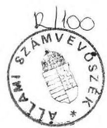

---

# Allami G̊̉ámbrbös̊ek 

## JELENTÉS

a Belvárosi Vendéglátóipari Vállalat társaságalapításainak, valamint a
Taverna Szálloda és Étterem Rt. alapításának
célszerúségi vizsgálatáról
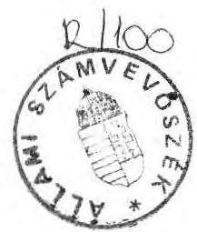

---

Vizsgálatot vezette: dr.Molnár Barnabás tanácsos

Vizsgálatot végezték:
dr. Borisz József tanácsos
dr. Molnár Barnabás tanácsos

---

# Tartalomjegyzék 

1. Bevezetés ..... $1-5$
II. Megállapítások
a) Kft. alapítással kapcsolatos megállapítások ..... $6-8$
b) Rt. alapítással kapcsolatos megállapítások ..... $8-13$
c) Egyéb társaságalapítással kapcsolatos megállap. ..... $13-14$
III. Következtetések, javaslatok

1. Összefoglaló következtetések ..... $15-16$
2. Javaslatok ..... $16-17$

---

# ÁLLAMI SZÁMVEVÖSZÉK 

$\mathrm{V}-2 / 43 / 1992$.
Témaszám: 102

## J E L E N T É S

a Belvárosi Vendéglátóipari Vállalat társaságalapításainak, valamint a Taverna Szálloda és Étterem Rt. alapításának célszerűségi és szabályszerűségi vizsgálatáról

## I.

## B E V E Z E T É S

Az Állami Számvevőszék a nemzetgazdaság fejlődésében meghatározó szerepet játszó privatizációs folyamat ellenőrzését a törvényhozás munkájának segítése érdekében tudatosan építi be ellenőrzési programjába.

A társasági és átalakulási törvényeken alapuló spontán privatizációs folyamatot már 1990-ben több száz gazdasági szervezetnél tematikusan vizsgáltuk. Ez természetesen nem jelenthette az átalakulási folyamat teljes keresztmetszetű áttekintését, jelentések rögzítésére volt csak mód. Arra azonban alkalmas volt, hogy tendenciájában feltárja és rámutasson a társaságalapítási folyamatokban meglévő nem kívánatos jelenségekre és az állami vagyon hasznosításával össze nem egyeztethető megoldásokra is. Az erről szóló jelentéseket a meghatározott rendben 1990. augusztusában az Országgyűlés rendelkezésére bocsátottuk.

---

Az Állami Számvevőszék fokozatosan kialakított eljárási rendjének megfelelően rendszeresen mélységében, teljes keresztmetszetében vizsgál egyedi privatizációkat, esetenként feldolgoz olyan ügyleteket is, ame lyeket az Állami Vagyonügynökség létrejötte elött kezdtek meg, illetve átalakulásokat, társaságalapításokat fejeztek be. Ezt az ÁSZ akkor is szükségesnek tartja, ha tudja, hogy az azóta hatályos törvényi szabályozás változott, illetve az akkor megtett előnytelen vállalati, társaságalapítási lépések esetleges visszafordítására csak nagyon korlátozott lehetőségek vannak.

Ebbe a körbe tartozó tranzakciónak számít a Belvárosi Vendéglátóipari Vállalat társaságalapításainak, valamint a Taverna Rt. alapításainak ügye is, ahol az ÁSZ-t - a vizsgálatot kérve - az Országgyúlés közjogi méltóságai keresték meg.

A BVV társaságalapításait más fórumon is kifogásolták. Legutolsó alkalommal a Legfőbb Ügyészség továbbította az ÁSZ részére jelzéseit a budapesti Berlin étterem privatizációjával kapcsolatban.

Ilyen körülmények között került a BVV és a Taverna Rt. ügye az ÁSZ ellenőrzési munkaprogramjába.

A vizsgálat célja: hogy helyzetfeltáró vizsgálat keretében törvényességi és szabályszerűségi vizsgálatot folytassunk le a Belvárosi Vendéglátóipari Vállalat társaságalapításairól, ezen belül kiemelten a Taverna Szálloda és Étterem Rt. alapításáról.

A vállalat címe: Belvárosi Vendéglátóipari Vállalat Budapest, V. Molnár u. 28.
KSH száma: 100194015151132012201

---

A vállalat eredeti neve és címe: TAVERNA Belvárosi Szálloda és Vendéglátó Vállalat

KSH száma: 100194012015151

Cégbejegyzés száma: Fövárosi Bíróság 01-01-001691

A Részvénytársaság címe: Taverna Szálloda és Étterem Rt. Budapest, V. Molnár u. 28.

KSH száma: 1002696220-523609901

Cégbejegyzés száma: Fövárosi Bíróság 041272

Az ellenőrzés által átfogott időszak 1988. december 31-tól 1991. december 31-ig terjed.

Az ellenőrzés kezdete: 1992. február 1.
befejezése: 1992. április 20.

A Belvárosi Vendéglátóipari Vállalat (továbbiakban: BVV) privatizációs tevékenysége az 1989-90-es években kezdődött el és gyorsult fel. Ezért a vállalat főbb jellemzőinek áttekintését az 1988. évi eredmények alapján tettük, ugyanis az események gyorsulása lényegében ezt követően kezdődött el.

A vállalat 1988. évi nettó árbevétele 1861.138 eFt, összes bevétele 1898.762 eFt volt, ami 141.653 eFt mérleg szerinti nyereséget eredményezett.

---

Az eszközök és források értéke: 1534.794 eFt

A költségvetési kapcsolatokból:

- nyereségadó 52.863 eFt
- SZJA 23.192 eFt
- ÁFA 27.581 eFt
összes költségvetési befizetés: 113.763 eFt
Az összes vagyon értéke: 493.883 eFt

Tevékenységét mintegy 220 saját, illetve bérelt üzletben és üzemekben fejtette ki 3056 fős állományi létszámmal.

A vállalat irányítási formáját tekintve Vállalati Tanács által irányított szervezet. A kislétszámú szervezetek súlya és szerepe meghatározó volt a vállalatnál. Az 1990. január 1-i állapotnak megfelelően 170 db vendéglátó egység, mintegy $40.000 \mathrm{~m}^{2}$ hasznos alapterülete1 került át a Taverna Szálloda és Étterem Rt-hez (továbbiakban TRT) és 47 db egység maradt a BVV-nél ( $15.000 \mathrm{~m}^{2}$ ). Összesen 217 egység volt a vállalat müködtetésében, beleértve a számbavétel időpontjában zárva tartott egységeket is. Belölük 186 üzlet 15 fő alatti létszámmal dolgozott, vagyis az összes üzlet $85,3 \%$-a.

A Belvárosi Vendéglátóipari Vállalat vezérigazgatója és a Taverna Szállóda Étterem Rt. elnök vezérigazgatója 1989. október 9-tól, vagyis az Rt. alapításától 1989. december 31-ig ugyanazon személy volt: dr. Feleki Ferenc.

A társaságalapítások zöme személyes vezetésével indult be a vállalatnál. 1989. október 6-tól 1989. december 31-ig a vállalat nevében a vállalat hátrányára annak legértékesebb vagyonelemeit vitte be a TRT-be, ahol tulajdoni részesedéssel és elnök vezérigazgatói kinevezéssel is bírt.

---

A társasági szerződés szerint a TRT csak 1990. január 1-jével kezdte meg tevékenységét és - kérelemre - a Cégbíróság ezt jegyezte be.

A vállalat helyzete a társaságalapítások következtében lényegesen megváltozott, s a "megmaradt" vagyonrésszel müködő vállalat átalakítása is folyamatban van. A megmaradt vállalati létszám ma 200 fő alatt van.

A vizsgálat a privatizáció törvényességi és szabályszerűségi követelményeinek érvényesülését fogja át. Nem foglalkozik más, például a napi müködéshez tartozó pénzügyi-számviteli elszámolások vizsgálatával. A jelenlegi egy vállalat, két nagy Rt és 19 egyéb társaság 1989. évig visszanyúló vizsgálatának tapasztalatait foglalja össze.

# 11. 

## M E G Á L L A P Í T Á S O K

A vállalat a vizsgálat megkezdéséig 19 Korlátolt Felelősségủ Társaságot és 2 Részvénytársaságot alapított (1/a. sz. melléklet). Ezek zömét vendéglátóipari feladatokra hozták létre, de infrastrukturális célokat szolgáló társaságok is alakultak. A társaságok, a vállalat és az általa 1989. október 9-én alapított Taverna Szálloda és Étterem Rt. közremüködésével, többségében nem a vállalat többségi tulajdoni részesedésével jöttek létre.
A társaságalapítások döntően a Belvárosi Vendéglátó Vállalat apportált üzletrészeivel és/vagy készpénz hozzájárulásaival szerveződtek.

---

# Részletes megállapításaink a következők: 

## a. / KFT alapítással kapcsolatos megállapítások:

- A Belvárosi Vendéglátóipari Vállalat által alapított Kft-ket - 19 db - a 1/a. sz. melléklet szerinti tőke összetétellel hozták létre.
A Kft-k egy részénél tételes beárazott apportlistát fogadtak el, amelyek átvételet az alapszabályban, alapító okiratban az ügyvezető igazgató igazolta. A Kft-k másik részénél hiányoznak a tételesen beárazott apportlisták. E KFt-k apport kimutatása nem felel meg a társasági jog előírásainak (1: Gt 22. paragrafus, ill. Gt 162. paragrafus $(1-2)$ bek. ).
- Az apportlistán olyan természetú tételek is szerepelnek, amelyeknek önálló forgalmi értékük nincs (pl. tetőfedés, belsó felújítás, stb.)(1: Gt 22. paragrafus (2) bek.) E tételek apportként az előadottak alapján nem fogadhatók e1.
- A vagyonkezelői célok ellátására - a TRT részéről bevitt 419.959 eFt apporttal és a BVV részéről bevitt 180.000 eFt készpénzzel - létrehozott Investor KFt apportjának biztosításához részben a Belvárosi Vendéglátóipari Vállalattól a TRT-be apportált - 1989-ben alapított - 11 KFt-ben lévő, részben a TRT közremüködésével közösen alapított és részben a TRT által - a BVV nélkül - alapított társaságokban lévő üzletrészeket - 2-59-szeresére felértékelve - vitték be e KFt-be. A TRT így $70 \%$-os többségi részesedést szerzett. Mindösszesen 37 KFt üzletrészét érintő akcióról van szó, ame lyeket a TRT üzletrészként összesen 419.959 eFt értékben

---

apportált (2. a-b sz. melléklet). Az üzletrészek megvásárlásának elsőbbségi jogáról a BVV által alapított érintett KFt-k előzetesen lemondtak.

Ahol okleveles könyvvizsgálót foglalkoztatnak, ott az okleveles könyvvizsgáló feladata az apportlista leltári beazonosítása, a nyilvántartási, illetve átértékelt, új, reális értéken történő hitelesítése.

Az üzletrészek bevitelére fiktív módon került sor, mert a Gt 172. §. (1-2) bekezdése alapján az okleveles könyvvizsgálónak nyilatkoznia kellett volna az üzletrészek új, reális értékéről és a tételes nyilvántartás szükségességéről. Ez nem történt meg, így nem állapítható meg az, hogy az üzletrészek mit is tartalmaznak és a valóságos értékük reális-e vagy sem. Arra, hogy az üzletrészek eltérő értéke megalapozott-e, semminemũ értékelés, funkcióváltozás, de a könyvvizsgáló sem utal. A Fővárosi Bíróság Cégbíróságánál nem lelhető fel ezen üzletrészek tételes apportjáról szóló dokumentum, csak az egyes felértékelt üzletrészek egyösszegü felsorolása, melyet a Cégbíróság elfogadott. Ennek alapján egyoldalúnak, túlértékeltnek tartjuk az Investor KFt-be bevitt üzletrészek értéke1ését.

Az alapítók "közös érdeke" volt, hogy a BVV által készpénzben bevitt 180 millió forint felett ne az állami vállalat, hanem a többségi tulajdonos, azaz a TRT rendelkezzék. Mindez a TRT vezetése részéről megnyilvánuló egyoldalú és a BVV részéről támogatott alapítási mód, ame1y a BVV részéről gazdasági oldalról nincs alátámasztva, megalapozva (pl. a piaci kamathoz képest mennyivel hoz nagyobb hozadékot a Kft-ból származó osztalék). Tekintettel arra, hogy a BVV állami vállalat, megállapítható, hogy az alapítás az állami tulajdon sérelmére tộrtént.

---

b. / Rt alapítással kapcsolatos megállapítások

1. A Taverna Szálloda és Étterem Rt. alapítása

- A Taverna Szálloda és Étterem Rt. 1989. október 9-én alakult, zárkörű alapítással (3/a. sz. melléklet). Cégbejegyzése 1989. november 3-án kelt (3/b. sz. melléklet). A társasági szerződés és a cégbejegyzés szerint a társaság 1990. 1. hó 1-jével kezdi meg tevékenységét. Az alaptőke 330 MFt volt, melynek apportját a BVV által alapított 11 KFt-ben lévő 16,9 MFt-os űzletrész, továbbá a Budapest, V. Váci u. 20. alatti 224 szobás Taverna Szálloda értéke képezte egy rendkívül alulértékelt 112 MFt likvid értékben (lásd: 4/a-b. sz. melléklet). Az alaptőkébe bevitt vállalati készpénzösszeg 73,4 MFt volt, így a vállalat alaptőkén belüli részaránya alapításkor $61,3 \%$-ot, ma - a részvények névértéken történő értékesítése révén - csak 7,6 \%-ot képvisel (5. sz. melléklet). Mindkét apportot könyvvizsgáló hitelesítette.

A Budapest legértékesebb helyén, az V. kerület Váci u. 20. sz. alatt többszöröse a megállapított apport összegének a 770,1 MFt-os költséggel felépített szálloda. Tekintve a területi elhelyezkedést, bevezetettséget, a realizálható éves nyereséget, a szállodára 1989. december 31-én még fennálló 690,7 MFt-os $6 \%$-os kedvezményes konstrukciójú hiteltartozást, de még a könyvszerinti nyilvántartott 1989. dec. 31-i 581,7 MFt-os értéket is, az apportként meghatározott 112 milliós likviditási érték rendkívül alacsonynak minősül.

A részvénytársaság alapítása során ilyen, apport értékelés mellett készpénz befizetési kötelezettségek megkerülésére nyílott mód.

---

2. Az önkormányzati tulajdonú és bérelt egységek társaságba vitele

- A TRT alapítás kezdeti szakaszában az érdekelt V., VI. és XIII. kerületi tanácsok - mint tulajdonosok, ahol kezelöi jogot az IKV-k gyakorolnak - nem zárkóztak el a részvénytársaságban való részvételtöl (lásd: 6/a-f. sz. melléklet), de a tulajdonukként nyilvántartott és a BVV által használt vendéglátó egységek társaságba való viteléröl egyik kerületi tanács végrehajtó bizottsága sem döntött. A három érdeke1t kerületi tanács közül kettőnél (V. és VI. ker.) tervezték azt - a VB előterjesztésekből megállapíthatóan -, hogy az ingatlanokat nem viszik társaságba, hanem a kezelői jogot elvonva, az ingatlanokat önállóan értékesítik, mert ez számukra lényegesen kedvezőbb feltételeket biztosít.

A BVV nem várta meg az önkormányzatok döntéseit, hanem ezeket az egységeket 1989-90. években - az alapítást követően - a tulajdonosok hozzá járulása nélkül a TRT-nek adta át.

Az önkormányzati tulajdoni hányad - V. ker. 3 db egység, VI. ker. 6 db egység, XIII. ker. 14 db vendéglátó egység részesedése az Rt alaptőkéjében nem szerepel.

Az állami tulajdon átengedésének jelzett módja, amelyet a BVV mint az állami tulajdon kezelöje követett, nem felel meg az állami vállalatról -, valamint az állami pénzügyekröl szóló törvény elöírásainak. Az állami vállalat az 1979. évi II. törvény 49. §. (1) bekezdése alapján az állami vagyonnal felelős módon kell rendelkezzen. Az 51. §. (3) bekezdése alapján az állami vagyonról lemondani csak a vonatkozó jogszabályi keretek között lehet (23/1979.(VI. 28.) MT rendelet 68. §.).

---

Az állami tulajdonjog megváltoztatására csakis a tulajdonos (jelen esetben a helyi önkormányzat) egyetértésével és konkrét megállapodása szerint kerülhet sor. Mivel a kezelói jog vagyonértékủ jog és forgalomképes, az önkormányzat jogosult ellenszolgáltatást kérni ezen jog átengedése fejében. A jelzett körben megkötött megállapodások, amelyekben a BVV hozzájárult egyes állami tulajdonban álló ingatlanok tulajdonjogának átírásához a Részvénytársaság javára, nem fogadhatók el. ( A Gt 17. §-a alapján alkalmazandó PTK 200-201. §-ok szerint.)

- A Belvárosi Vendéglátóipari Vállalat a Fővárosi Kerületek Hivatala Igazgatási Osztályának engedélyével 1990. június 6 -án -1990. január 1-i visszamenőleges hatállyal - 8 db, a VI. és XIII. kerületben lévő ingatlan, 1990. december 5-én és 6-án 58 db V. kerületben lévő ingatlan bérletét engedte át térítésmentesen a TRT-nek. Ugyanerre az 58 db ingatlanra az V. kerületi Tanács VB Igazgatási osztálya is elismerte a TRT jogutódlását 1989. december 6-án (a dátum 1990. január 23-ára javítva), 3408/89. ügyiratszámon (6.sz. melléklet). A társaságba történt bevitel (vagyoni értékủ jogról lévén szó) nem rendezett a helyi önkormányzatokkal.

3. Vendéglátó ingatlanok adásvétele

- A vállalat a TRT-nek 17 db vendéglátó egységet vagy annak kialakítására alkalmas területet adott el 1989. december 15-én, azaz a törvényes müködés szerzödésben meghatározott 1990. január 1-jei időpontja elött. Az "adás-vételre" külön akcióként került sor (lásd: 8/a-c sz. mellékletek). Például :
- a BVV 9,6 MFt-ért adta el 1989. december 15-én a TRT-nek III. ker. 3587. sz. tulajdoni lapon felvett $6182 \mathrm{~m}^{2}$ kert ingatlant a rajta lévő $400 \mathrm{~m}^{2}$-es épület ingatlannal együtt.

---

- 20 MFt-ért értékesítette a TRT-nek ugyancsak 1989. XII. 15-én a Budapest, XIII. kerület 1044. sz. tulajdoni lapon nyilvántartott $1130 \mathrm{~m}^{2}$, a XIII. kerület 1033. sz. tulajdoni lapon nyilvántartott $1041 \mathrm{~m}^{2}$, a XIII. kerület 1031. sz. tulajdoni lapon nyilvántartott $1169 \mathrm{~m}^{2}$ a XIII. ker. 1032. fsz. tulajdoni lapon nyilvántartott $1076 \mathrm{~m}^{2}$ nagyságú - 4 db - belterületi ingatlanokat.

A Budapesti Fővárosi Fópolgármesteri Hivataltól kapott tájékoztatás szerint több száz adás-vételi szerződést tekintettünk át.
Megállapítható, hogy közel hasonló adottságú ingatlanok becsült forgalmi értéke többszöröse a vállalat által kötött adás-vételi szerződésben rögzített értéknek.

# 4. A szerződéses üzletek privatizálása 

- 100 db szerződéses üzletet (9/a-b sz. mellékletek) egyszerü szerződés módosítással - mint üzemeltetési szerzödést - a BVV 1989. november 20-án, 1990. I. 1-i hatállyal térítés nélkül átcedálta a TRT-nek, lemondva 100 szerződéses bolt használati jogáról, ezen üzleteken realizálható magas nyereségről. Ezzel az üzleteket az LXXIV. sz. törvény szerint privatizáltnak tekintették. A TRT alapítói szerződése sem üzletrészként, sem mellékszolgáltatásként, sem annak módosításaként nem tartalmazza a 100 db szerződéses bolt társaságba történő bevitelét. Ezen üzletek az alaptökének nem részei, ezért az 1990. évi LXXIV. sz. elöprivatizációs törvény hatálya alá tartoznak és az ÁvU-nek kell elrendelnie a privatizálást. Ez egyszerü szerződésmódosításnak minösül és a Gt.-ről szóló törvénytöl teljesen független akció, amelyre a Ptk. vonatkozó elöírásai az irányadók. A vállalat és a TRT sem jelentette be a törvény hatálya alá tartozóként az ÁvU-nek ezt a 100 db egységet.

---

A vállalat üzleti hálózatát igyekezett a bevezetésre tervezett elöprivatizációs törvény hatálya alól elözetesen kivonni és a TRT hatáskörébe átvinni ingyenesen vagy irreálisan alacsony értéken. Hálózatának csak kisebb hányadát tartotta meg és üzemelteti saját hatáskörben.

- Nem bizonyult helytállónak az ÁVÜ-nek a vállalat által tett - megtévesztö bejelentésen alapuló - azon téves állásfoglalása, amely szerint a vállalat 15 fö alatti vendéglátóipari egységei azért nem tartoznak az elöprivatizációs törvény hatálya alá, mert a vállalat azokat már korábban privatizálta.

Az Állami Vagyonügynökség a vállalat tájékoztatását, amelyet az elöprivatizációs törvény alapján tett, ellenőrzés nélkül elfogadta. További panaszbejelentés kapcsán sem vizsgálta meg a szerződéses üzletek társaságba bevitelének szabályszerűségét a társasági törvény alapján.

A vállalat a saját álláspontja szerint tájékoztatta az ÁvÜ-t, amely a kapott információkat nem ellenőrizte. A tájékoztatás félrevezető volt, mert a szerződéses boltok "társaságba vitelére" a polgári jog szabályai alapján került sor és nem az elöprivatizációs törvénynek megfelelően.

# 5. A Liget Rt. alapítása 

- A Liget Rt alapítása a gazdasági társaságokról szóló törvény megjelenése előtt történt 295 MFt alaptökével. Cégbejegyzésére többszöri módosítás mellett ismereteink szerint utoljára 1988. október 4-én került sor (lásd: 10. sz. melléklet).

---

A Szálloda építését a vállalat végezte és ehhez 154,5 MFt-os alaptőke részesedéssel járult hozzá. Az alaptőkéhez 90,5 MFt készpénzt és 64 MFt értékủ apportot adott. Az apportból 7 MFt-ot tesz ki az előkészítési költség. Ennek bizonylatolása, tételes felsorolása leltárilag hiányzik. Így nem lehet az apport reális értékét megállapítani.

A kedvezményesen épülő és rövid időn belűl üzembehelyezésre került szállodában lévő saját részvényeket a BVV 1989. december 15 -én a TRT-nek csak névértéken adta át, holott várható volt, hogy annak piaci értéke a közeli üzembehelyezés és kedvezményes szálloda-építési konstrukció miatt is számottevően megnö.

# c. / Egyéb, társaságalapítással kapcsolatos megállapítások 

- A vezérigazgató kettős funkciót látott el. Törvényileg nem volt tiltott a kettős funkció ellátása, de ezzel volt lehetősége arra, hogy a vállalat leghasznosabb vagyonelemeit ez időszak alatt az Rt-be alacsony értéken, vagy ellenszolgáltatás nélkül vigye be egy olyan időszakban, amikor a társaság a cégbejegyzés szerint még nem is müködhetett volna.
- A Taverna Rt. csak 1990. I. 1-től müködhetett volna, mivel a müködésnek a cégbejegyzéstől az alapításig történő visszamenőleges - a Gt -törvényi hatályától a TRT tudatosan eltért. A TRT-nek így az 1989. X. 6. és 1989. XII. 31. közötti időszakára eső összes tevékenysége jogtalan és megkifogásolható. A TRT viszont mint az az általa készített mérlegből is kitűnik, 1990. január 1. előtt is müködött. Az 1989. évi mérleg szerinti nyereségének legnagyobb részét a BVV-tól átvett vendéglátó egységek bérleti, illetve kezelői jogának értékesítéséből szerezte.

---

- A BVV szállodaépítésre felvett 6 \%-os kedvezményes hitelakcióját, járadékfizetési kötelezettségeit - MNB engedéllyel - a TRT-re cedálták változatlan feltételekkel. A szálloda vállalatok privatizációjánál nem engedélyezték a kedvezményes hitelek átvállalását. A BVV újította fel a TRT-nek már korábban eladott vállalati központot (Budapest, V. Molnár u. 28.). A felújítási költség, illetve ennek fedezésére elszámolt hitel hátrányos az állami vállalat számára.
- A vállalat teljes ügyviteli, adminisztratív munkáit szerződésben rögzítettől eltérően és aránytalanul kedvezőtlen 1990. évben 33 millió Ft - díjszabási feltételekkel a TRT végzi (lásd: 11. sz. melléklet).

A vállalat a TRT kiszolgálójává és kiszolgáltatottjává vált, nem képviseli az állami tulajdonosi érdekeket. Vállalati tanács irányítása mellett változatlan formában való müködését - a leirtak miatt - megengedhetetlennek tartjuk. A további tényleges helyzetre egy részletes adóhatósági vizsgálat adhat választ.

- A vállalat létszáma az 1988. évi 3056 fôröl 200 fó alá csökkent. Társasággá történő átalakítását az így kialakult csökkent vagyoni állapotnak megfelelően jelentette be az ÁvÜ-nek az átalakulásról szóló 1989. évi XIII. sz. törvény alapján.

---

# KÖVETKEZTETÉSEK, JAVASLATOK 

## 1. 1. Összefoglaló következtetések:

A társaságalapítások a spontán privatizáció időszakában kerültek végrehajtásra és a Belvárosi Vendéglátóipari Vállalat felismerte azokat a vagyonmozgatási lehetőségeket, amelyeket a Gazdasági Társaságokról szóló törvény lehetővé tett. Azonban az Állami Számvevőszék megitélése szerint a vállalatnál végrehajtott lépések az állam gazdasági érdekeltsége szempontjából kifogásolhatók.
Azóta a jogszabályi környezet változása az ilyen tipusu vagyonmozgási lehetőségeket nem engedi meg, az állami vagyon hasznosulása jogilag jobban védett és megalapozott.

Összességében a Belvárosi Vendéglátóipari Vállalat társaságalapításait az jellemezte, hogy a Taverna Szálloda és Étterem Rt. súlyát és tulajdonosi elsődlegességét, azaz többségi tulajdonosi pozícióit erősítették az állami vállalat rovására. A vállalat a TRT törekvéseit kiszolgálta, támogatta. Ennek következtében a vállalat vagyonának jelentős részét olyan társaságokba vitte be, ahol 1991. december 31-én azok egyikében sem rendelkezett többségi tulajdonnal.

Mindezt figyelembe véve azonban fennáll annak lehetősége, hogy a végrehajtott intézkedések semmissége kimondható legyen. Ezek:

- a 100 db szerződéses űzlet bevitele a TRT-be
- az ingatlanok adásvételének feltűnő értékkülönbsége alapján történő lebonyolítása

---

- a kivont és felértékelve társaságba bevitt üzletrészek értékkülönbsége alapján a társasági szerződés érvénytelensége
- a TRT müködésének tényleges megkezdése
- a tanácsi, ma már önkormányzati tulajdonú üzletek társaságba történt bevonása.

2. Javaslatok

A vizsgálat megállapításai és következtetései alapján javasoljuk, hogy

- az Állami Vagyonügynökség soron kívül vonja államigazgatási felügyelet alá a Belvárosi Vendéglátó Vállalatot és rendeljen ki privatizációs biztost a vállalathoz az állami tulajdon kezelése kapcsán elkövetett szabálytalanságok megszüntetésére és a személyes felelősség megállapítására.

Ennek során rendezze:

- az állami vagyon védelmében a Belvárosi Vendéglátóipari Vállalat kezdeményezze az ingatlan adásvételi szerződések felülvizsgálatát, (szükség esetetén) kezdeményezze a szerződések semmisségének kimondását és azeredeti állapot szerinti helyzet visszaállítását.
- a törvény elöírásainak megfelelően a vállalat és a részvénytársaságok alapításával kapcsolatos feladatokat;
- az önkormányzati vagyon részvételét a társaságokban;
- a társaság alapítók alaptőke, törzstőke, apport, készpénz bevitelének reális értéken alapuló alapszabály kidolgozását és elfogadását a BVV által alapított valamennyi társaságban;

---

- a Taverna Szálloda és Liget Szálloda hitelszerződését és feltételeinek felülvizsgálatát az MNB-nél, számlavezetőnél;
- a Molnár u. 28.sz. alatti irodaépület felújításának pénzügyi elszámolását;
- Az ÁVÜ ellenőrizze le a vállalat valamennyi, az előprivatizációs törvény megjelenése előtt társaságba vitt vagy átadott kereskedelmi, vendéglátó és szolgáltató egységeinek az 1990. évi LXXIV. törvény alóli mentesítésének jogosságát és az e törvény hatálya alá tartozó - 15 fő alatti - egységeket az abban előirt módon privatizálja.
- A vizsgált eset kapcsán javasoljuk az ÁVÜ-nek, hogy a vagyonvédelmi és átalakulási törvény hatálybalépése előtt történt átalakulásokat értékel je, és az állami tulajdon sérelmére történt társaságalapításoknál tegye meg a szükséges intézkedéseket.
- A Fővárosi Önkormányzat, illetve az V., VI. és XIII. kerületi önkormányzatok Vagyonátadó Bizottsága kezdeményezze és hajtsa végre az önkormányzati tulajdon rendezését és a társaságban való részvétel esetleges feltételeit tisztázza.
- A pénzügyminiszter az APEH-et soron kívül bízza meg a Belvárosi Vendéglátóipari Vállalat és az 1988. december 31 -ét követően alapított társaságok - leírt körülmények miatt szükségessé váló - adózásának felülvizsgálatával.

Budapest, 1992. június

Me11éklet: 15 db ( 150 oldal)
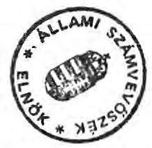
(Hagelmayer István )

---

ÁLLAMI SZÁMVEVŐSZÉK
$\mathrm{V}-2-43 / 1992$.
Témaszám: 102

# M E L L É K L E T E K 

a Be1városi Vendéglátóipari Válla1at társasága1apításainak és a Taverna Szálloda és Étterem Rt. alapításának törvényességi és szabályszerűségi vizsgálatához

---

1/18 sz. melléklet

A BVV részvételével alapított tárcaságok

|  Sz. | Megnevezés
Kft | Alpitó
Líaje | Törzsőke
Alaptőke | ebből
Készpénz | apport | Év
értéke | árás
aránya  |
| --- | --- | --- | --- | --- | --- | --- | --- |
|  1. | Tüköry | 59.08.66. | 1.560 | 500 | 750 | 820 | 25.4  |
|  2. | Gasztrotusz | 59.04.01. | 5.730 | 1.740 | 4.050 | 4.440 | 76.7  |
|  3. | Lila Akás | 59.06.23. | 1.640 | 540 | 1.100 | 1.150 | 67.1  |
|  4. | Király | 59.07.07. | 1.470 | 540 | 930 | 580 | 26.1  |
|  5. | Zár-Társ | 59.07.12. | 1.530 | 550 | 1.280 | 1.380 | 100.0  |
|  6. | Vendiák | 59.07.07. | 1.590 | 532 | 1.293 | 610 | 22.3  |
|  7. | BármasZíg | 59.08.30 | 1.660 | 630 | 1.130 | 560 | 30.1  |
|  8. | Aranyosólag | 59.08.07. | 1.760 | 530 | 1.280 | 440 | 25.0  |
|  9. | Grinóngi H | 59.09.28. | 1.500 | 520 | 930 | 740 | 49.8  |
|  10. | Favorit Tisza |  | 2.630 | 2.600 |  | 390 | 15.0  |
|  11. | Vörös Zárkány | 59.02.15. | 10.500 | 4.500 | 6.000 | 6.000 | 57.1  |
|  12. | Gasztrotecn | 59.12.20. | 6.900 | 2.100 | 4.900 | 6.100 | 53.4  |
|  13. | Tikett | 59.11.20. | 8.000 | 5.100 | 2.900 | 2.500 | 31.3  |
|  14. | Sázkabzs | 60.02.02. | 10.320 | 8.230 | 2.100 | 2.000 | 19.4  |
|  15. | Gasztróknstroll | 60.09.15. | 1.000 | 760 | 240 | 400 | 40.0  |
|  16. | Gasztroért | 60.11.03. | 8.750 | 4.000 | 4.750 | 2.270 | 25.9  |
|  17. | Balaton | 91.01.07. | 1.200 | 700 | 500 |  |   |
|  18. | Liget Kt | 91.05.03. | 295.000 | 143.168 | 146.332 | 154.500 | 52.4  |
|  19. | Investor | 91.07.17. | 600.000 | 109.900 | 422.100 | 130.650 | 30.0  |
|  20. | Teréz | 91.12.05. | 10.000 | 4.300 | 5.700 | 10.000 | 100.0  |
|  21. | Taverna Kt | 69.10.39. | 230.000 | 261.100 | 123.500 | 202.300 | 61.3  |

Megjegyzés: A x-ei leitott tétalak tartalmazzák a BVV hozzájárulását a Taverna Kt apportjához, összesen 16,9 Mft értéken.

---

# 2/a sz. melléklet

A TRT által társaságobból kivont és az Investor EFt-be bevitt üzletrészek értékének összehasonlítása

|  Sorsz. | Megnevezés
Cím | Investorba bevitt
üzletrészek értéke | Társaságobból kivont
Évitt/kivent
aranyalzieres)  |
| --- | --- | --- | --- |
|  1. | Arany Ceillag EFt
Budapest. VI. Eirély u.78. | 4.900 | 440  |
|  2. | Balaton City EFt
Keszthely | 14.770 | 250  |
|  3. | Gazstroemia EFt
Budapest Pozsonyi u. 12. | 8.970 |   |
|  4. | Grincingi Hajós EFt
Budapest Veres Pálné u. 10 | 10.230 | 740  |
|  5. | Hároszög EFt
Budapest. XIII. Eadnóti u.35 | 4.190 | 500  |
|  6. | Eicbojtár EFt
Budapest. XIII. Dagály u.17. | 4.960 |   |
|  7. | Lila Eka EFt
Budapest. VI. Nagynezö u.30 | 7.277 | 1.100  |
|  8. | Sivély EFt
Budapest. VI. Bajcsy Zs.9. | 1.490 | 530  |
|  9. | Tokóry
Budapest. VI. Hold u. 15. | 4.280 | 320  |
|  10. | Vendiák
Budapest. V. Egyetes tér 5. | 3.010 | 610  |
|  11. | Vörös Sárkány
Budapest. VI. Andrássy 80. | 39.795 | 6.000  |
|  12. | Bér-Társ
Budapest. V. Március 15 t.8 | 3.660 | 1.830  |
|  13. | Gazstrokontroll
Budapest. V. Március t.8. | 17.616 | 1.000  |
|  14. | Gazstrotochnik
Budapest. XIII. Visegrédi 17 | 87 | 6.100  |
|  15. | Gazstrotorsz
Budapes. III. Pomázi u 5-7. | 14.220 | 4.440  |
|  16. | Gazstroért
Budapest. XX. Sörház u.3. | 12.940 | 5.900  |
|  17. | Tíketi
Budapest. V. Szemelweis u.19 | 15.000 | 6.000  |

---

|  18. | Amigó Eft | 26.691 | 2.550,0 | 10,5  |
| --- | --- | --- | --- | --- |
|  19. | Ceendes Eft | 4.540 | 230,0 | 16,2  |
|  20. | Dón Eft | 14.940 | - | -  |
|  21. | Eizdelicatesse | 9.380 | 320,0 | 28,4  |
|  22. | Eötüstró Eft | 7.920 | 380,0 | 20,8  |
|  23. | Mini Eft | 9.010 | 290,0 | 31,1  |
|  24. | Musiátli Eft | 27.790 | 2.385,0 | 12,1  |
|  25. | Narcian Eft | 21.000 | 1.260,0 | 16,7  |
|  26. | Okiogun Eft | 7.515,0 | 600,0 | 12,5  |
|  27. | Oznia Eft | 9.330,0 | 390,0 | 24,0  |
|  28. | Razona Eft | 6.870,0 | 270,0 | 25,4  |
|  29. | Soproni Citygrill Eft | 20.446,0 | - | -  |
|  30. | Sziget Eft | 16.830,0 | 1.470,0 | 11,4  |
|  31. | S.E Eft | 5.382,0 | 350,0 | 15,3  |
|  32. | Terminus Eft | 8.160,0 | 400,0 | 23,3  |
|  33. | Váróskapu Eft | 6.440,0 | 630,0 | 10,2  |
|  34. | Visegríd Eft | 13.000,0 | 1.040,0 | 12,5  |
|  35. | Zodiak Eft | 14.660,0 | 490,0 | 29,9  |
|  36. | Adószén Eft | 10.110,0 | - | -  |
|  37. | Revúart Eft | 12.870,0 | - | -  |
|   | MINDSZEZEER: | 419.959,0 |  |   |

MEGJEOTZES: Az üreten zaradt részére adatot nem kaptunk.

---

# Társaság szerződés

Jelen társasági szerződéssel a résztvevő tagok - a gazdasági társaságokról szóló 1986. évi VI. tv. alapján - gazdasági céljaik megvalósítása érdekében korlátolt felelősségű társaságot hoznak létre az alábbi feltételekkel:

## I. Általános feltételek

1. **A Társaság neve:** Investor és Management Befektető és Vezetésfejlesztő Korlátolt Felelősségű Társaság
   - **A Társaság rövidített neve:** I + M Kft.

2. **A Társaság székhelye:** 1132 Budapest, Váci út 8.
   - **telephelye:** 1056 Budapest, Március 15. tér 8.

3. **A Társaság tagjai:**
   - **TAVERNA Szálloda és Étterem Részvénytársaság**
   - **1056 Budapest, Molnár utca 28.**
   - **Cégszáma:** Fővárosi Bíróság Cégbírósága: 041272
   - **Képviselője:** dr. Feleki Ferenc vezérigazgató
   - **Belvárosi Vendéglátó Vállalat**
   - **1056 Budapest, Molnár utca 28.**
   - **Cégszáma:** Fővárosi Bíróság Cégbírósága: 001691
   - **Képviselője:** Tárnoki László igazgató
   - **dr. Sods Béla**
   - **1082 Budapest, Baross utca 59.**

4. **A Társaság tevékenységi köre:**
   - **5161 Belkereskedelmi Ugynöki és szaktanácsadási tevékenység**
   - **5169 Egyéb belkereskedelmi szolgáltatás**
   - **7417 Általános műszaki, fejlesztési szolgáltatás**
   - **7418 Műszaki, gazdasági szolgáltatás**
   - **7421 Irodai ügyviteli szolgáltatás**
   - **7422 Munka- és üzenszervezés**
   - **7423 Egyéb gazdasági jellegű szolgáltatás**
   - **7431 Vagyonkezelő, holding tevékenység**
   - **7541 Pénzipiaci tevékenység**
   - **8451 Vezetők képzése és továbbképzése**
   - **8452 Tanfolyami, egyéb szakmai oktatás**
   - **8453 Egyéb (nem szakmai) oktatás**
   - **8531 Könyv és zenemű kiadás**
   - **9151 Kéreskedelennel kapcsolatos kutatás, kísérleti fejlesztés**
   - **9172 Személyi és gazdasági szolgáltatással kapcsolatos kutatás, kísérleti fejlesztés**

---

5.) A Társaság törzstőkéje: 603.000.000,- Ft
ebből pénzbeli tőke: 180.900.000,- Ft
nem pénzbeli tőke: 422.100.000,- Ft

6.) Az egyes tagok törzsbetétje:
TAVERNA Szálloda és Étterem Rt. 422.100.000,- Ft
ebből pénzbeli betét: -
nem pénzbeli betét 422.100.000,- Ft

Belvárosi Vendéglátó Vállalat: 180.650.000,- Ft
ebből pénzbeli betét: 180.650.000,- Ft
nem pénzbeli betét:

dr. Soós Béla: 250.000,- Ft
ebből pénzbeli betét: 250.000,- Ft
nem pénzbeli betét:

Törzsbetétek aránya:
TAVERNA Szálloda és Étterem Rt. 70,00 %
Belvárosi Vendéglátó Vállalat 29,96 %
dr. Soós Béla 0,04 %

A pénzbetét teljesítésére kötelezett tagok pénzbetétjük
50 %-át:
Belvárosi Vendéglátó Vállalat 90.325.000,- Ft-ot
dr. Soós Béla 125.000,- Ft-ot
a cégbejelentés előtt az erre nyitott elkülönített számlára
befizetik.

A fennmaradó 50 %-ot a következő ütemezés szerint tartoznak
befizetni az elkülönített ideiglenes, vagy az időközben meg-
nyitott végleges számlára.
Belvárosi Vendéglátó V. 1991.VIII.1-ig 2.000.000,- Ft
1991.X.31-ig 50.000.000,- Ft
1991.XII.31-ig 38.325.000,- Ft
összesen: 90.325.000,- Ft
dr. Soós Béla 1991.X.31-ig 125.000,- Ft

Késedelmes fizetés esetén a kamat mértéke a 20 %.

A tárgyi apportot az apportlista tartalmazza. A TAVERNA Rt.
tárgyi apportja a listában felsorolt társaságokban lévő
üzletrészekből, a Társaság működéséhez szükséges eszközökből
áll, melyek tulajdonjogát az Rt. jelen szerződés aláírásával
átruházza a Társaságra.

A tárgyi apportnak a Társaság rendelkezésére bocsátását az
ügyvezető az apportlista aláírásával igazolja.

WTE!
78%

7003

---

7.) Mellékszolgáltatás:
a.) A TAVERNA Szálloda és Etterem Rt. által nyújtandó mellékszolgáltatás:

- A Budapest, XIII., Váci út 8. szám alatti, székhely céljára szolgáló irodahelyiségek albérletbe adása,
- A Budapest, V., Március 15. tér 8. szám alatti telephely céljára szolgáló irodahelyiségek albérletbe adása.
b.) A mellékszolgáltatás nyújtásától mentesül a tag az alábbi esetekben:
- tagsági viszonya megszünik,
- a mellékszolgáltatásnak felhívás ellenére hibás vagy késedelmes teljesítése esetén a taggyűlés megszünteti annak jövőbeli nyújtását,
- a megszüntetésre irányuló bejelentését a taggyűlés elfogadja.
- a Társaság felhívás ellenére sem teljesíti a mellékszolgáltatással kapcsolatos valamely lényeges kötelezettségét; s a tag bejelenti a mellékszolgáltatás nyújtásának megszüntetését,
c.) A taggyűlés a Társaság folyamatos tevékenységének biztosítása érdekében legfeljebb 60 napon belüli időpontra tűzheti ki a mellékszolgáltatás megszüntetését.

8.) A tag halálával vagy megszünésével üzletrésze csak akkor száll át a jogutódra, ha 15 napon belül a tagok nem váltják meg, vagy a taggyűlés nem dönt az üzletrész bevonásáról. A tagok általi megváltás vita esetén törzsbetétjük arányában történhet, és az egész üzletrészre kell vonatkoznia.
9.) Az üzletrész felosztásához a taggyűlés határozata szükséges. Az üzletrész a Társaság tagjaira a taggyűlés hozzájárulásával ruházható át.
Az üzletrész csak olyan személyre ruházható át, aki a szindikátusi szerződés elfogadásáról is nyilatkozik.
10.) A nyereség felosztása a tagok között az alábbi százalékos mértékben történik:
TAVERNA Rt.:
$69,67 \%$
Belvárosi Vendéglátó Vállalat:
$30,00 \%$
dr. Sods Béla:
$0,33 \%$

---

# II. A Társaság szervezete és müködése 

1.) A Társaság legfőbb szerve a taggyűlés, melynek kizárólagos hatáskörébe tartoznak:

- az 1988. évi VI. törvényben és a jelen szerződésben meghatározott ügyek,
- döntés gazdasági társaságba belépésről, társaság alapításáról,
- a Társaság éves nyereségtervének (eredménykövetelményének) meghatározása,
- a hitelfelvétel,
- a Társaság tulajdonában lévő üzletrészek és részvények átruházása,
- minden olyan szerződés, befektetés, illetve bármilyen ügy, melynek anyagi értéke, a 2.000 .000 ,- Ft-ot meghaladja, kivétel pénzeszköz tartós vagy ideiglenes pénzintézeti kihelyezése,
- az érzőkeltségébe tartozó Kft-k ügyvezetői választásának, visszahívásának kezdeményezése,
- a Társaság érdekeltségébe tartozó cégek felszámolásának kezdeményezése.

2.) A befizetett törzsbetét minden 10.000 ,- Ft-ja egy szavazatot ér.
3.) A taggyűlés határozatképes, ha azon a törzstőke legalább $70,04 \%$-a képviselve van.
4.) A taggyűlés a határozatait a jelenlévő tagok szavazatainak egyszerủ többségével hozza, kivéve, ha a társaságí tärvény minősített többséget ír elő.
5.) A Társaság első ügyvezetője:
név: Virágh Antal
anyja neve: Rózsa Erzsébet
lakcím: 1144 Budapest, Ond vezér út 36/c. III/15.
Az ügyvezető megbízatása három évre szól.
A Társaság az ügyvezetőt feljogosítja az ügyvezető igazgató cím használatára.
6.) A társaságnál három tagú felügyelő bizottság müködik. Az első felügyelő bizottság tagjai:
név: dr. Feleki Ferenc
anyja neve: Landesmann Friderika
lakcím: 1031 Budapest, Kadosa utca 46.

---

Investor és Management
Befektető és Vezetésfejlesztő
Korlátolt Felelősségű Társaság
apportlista

TAVERNA Szálloda és Etterem Rt.:

Vegnevezés
Üzletérték (Ft-ban)

1) AMIGÓ Kft.
Bp., V. Kristóf tér 8.
26 691 000

2) ARMYCSILLAG Kft.
Bp. VI., Király u. 78.
4 900 000

3) BALATON CITY GRILL Kft.
Keszthely
14 770 000

4. CSENDES Kft.
Bp., V. Múzeum krt. 13
4 540 000

5) DÓM Kft.
Bp., V. Szent István tér 2
14 940 000

6) GASZTONÓMIA Kft.
Bp., XIII. Pozsonyi u. 12.
8 970 000

7) GRINZINGI - HAJÓS Kft.
Bp., V. Veres Pálné u. 10.
10 230 000

8) HÁROMSZÓG Kft.
Bp., XIII. Rećnóti u. 38.
4 190 000

9) KISBOJTÁR Kft.
Bp., XIII. Dagály u. 17.
4 690 000
93 921 000

---

10) KISDELICATESSE Kft.
Bp.V., Alpári Gy. u. 19. 9 380 000

11) KÉTKORSÓ-ARA Kft.
Bp. XIII., Visegrádi u. 43. 7 920 000

12) LILA AKÁO Kft.
Bp. VI., Nagymess u. 30. 7 277 000

13) MINI Kft.
Bp. V., Szép u. 1/b. 9 010 000

14) MUSKÁTLI Kft.
Bp. V., Váci u.11/A. 27 790 000

15) NÁRCISZ Kft.
Bp. Váci u.32. 21 000 000

16) OKTOGON Kft.
Bp. VI., Oktogon tér 3. 7 515 000

17) OMNIA Kft.
Bp. XIII. Szent István krt. 16. 9 380 000

18) RAMÓNA Kft.
Bp XIII., Váci út 66. 6 870 000

19) SIRÁLY Kft.
Bp. VI. Bajcsy-Zs. u. 9. 1 490 000

20) SOPRONI CITY GRILL Kft.
Sopron 23 446 000
128 078 000

---

21) SZISET Kft.
Bp. V., Szent István krt. 7. 15 830 000

22) S.K. Kft.
Bp. VI., Bajcsy-Zs.u.15/A. 5 362 000

23) TERMINUS Kft.
Bp. VI. Terés krt. 112. 8 100 000

24) TUKORY Kft.
Bp. VI. Hold u. 15. 4 260 000

25) VÁROSKAPU Kft.
Bp. V., Kecskeméti u. 17. 6 440 000

26) VÉNDIÁK Kft.
Bp. V., Egyetem tér 5. 3 010 000

27) VISEGRÁD-RIGOLETTO Kft.
Bp. XIII., Visegrádi u. 9. 13 000 000

28) VÖRÖS SÁRKÁNY Kft.
Bp. VI., Andrássy u. 80. 39 755 000

29) ZODIÁK Kft.
Bp. VI. Núzeum krt. 79. 14 660 000

Szolgáltató Kft-k
30) ADÓSZÁN Kft.
Bp. VI., Aradi u. 40. 10 110 000

31) BÉR-TÁBS Kft.
Bp. V., Március 15. tér 8. 3 660 000

32) GASZTROKONTROLL Kft.
Bp. V., Március 15. tér 8. 17 615 000
142 843 000

---

33) GASETROTECHNIK Kft.

Ep. XIII., Visegrádi u. 17.

87 000

34) GÁSZTROTRANSE Kft.

Ep. III., Pomázi u. 5-7.

14 220 000

35) GASETROZET Kft.

Ep. XX. Sárház u. 3.

12 540 000

36) REVŐ ART Kft.

Ep. VI. Jókai tér 4.

12 870 000

37) TIKSTI Kft.

Ep. v., Semmelweis u. 19.

15 000 000

Összesen:

419 959 000

II. Eszközök:

|  Magnevezés | Mennyiségi | Nettó egységár | Nettó érték  |
| --- | --- | --- | --- |
|   | emy. db | Ft | Ft  |
|  AKCORD SR 1510 rádió | 1 | 1 900 | 1 900  |
|  Hangfal | 2 | 2 000 | 4 000  |
|  BROTHER írógép CE 600 | 1 | 40 000 | 40 000  |
|  BROTHER írógép AX 110 | 1 | 23 600 | 23 600  |
|  FLIP CHART állvány | 2 | 20 800 | 41 600  |
|  SHARP számológép 2635 | 5 | 9 120 | 45 600  |
|  TOSHIBA fénymásoló | 1 | 49 900 | 49 900  |
|  Állófogas | 4 | 800 | 3 200  |
|  Páncélszekrény | 1 | 12 000 | 12 000  |
|  FORD Oridon személyautó | 1 | 1 435 000 | 1 435 000  |
|  IBM-DC-AT | 1 | 296 050 | 296 050  |
|  Ruhásszekrény 1 ajtós | 2 | 1 750 | 3 500  |
|  Iratszekrény 2 ajtós | 8 | 1 000 | 8 000  |
|  Iratszekrény 2 ajtós | 10 | 1 750 | 17 500  |

1 981 650

---

|  Iratszekrény 4 ajtós | 2 | 2 000 | 4 000  |
| --- | --- | --- | --- |
|  Iratszekrény 1 ajtós | 1 | 1 000 | 1 000  |
|  Irattartó polc | 11 | 350 | 3 850  |
|  Íróasztal | 18 | 2 500 | 45 000  |
|  Írógép asztal | 4 | 1 750 | 7 000  |
|  Dohányzó asztal | 1 | 1 150 | 1 150  |
|  Telefonasztal | 3 | 1 150 | 3 450  |
|  Tárgyaló asztal | 2 | 1 150 | 2 300  |
|  Forgószék | 13 | 1 750 | 22 750  |
|  Egyéb szék | 21 | 400 | 8 400  |
|  Forgó fotel | 4 | 1 750 | 7 000  |
|  Karosszék kárpitozott | 6 | 1 900 | 11 400  |
|  Guroló betét | 20 | 1 750 | 35 000  |
|  HT hűtőszekrény | 2 | 3 000 | 6 000  |
|  Virágállvány | 1 | 850 | 850  |
|  Eszközérték összesen |  |  | 2 141 000  |

|  X |  | X |  |  |  |  |  |  |  |  |  |  |  |  |  |  |  |  |  |  |  |  |  |  |  |  |  |  |  |  |  |  |  |  |  |  |  |  |  |  |  |  |  |  |  |  |  |  |  |  |  |  |  |  |  |  |  |  |  |  |  |  |  |  |  |  |  |  |  |  |  |  |  |  |  |  |  |  |  |  |  |  |  |  |  |  |  |  |  |  |  |  |  |  |  |  |  |  |  |  |  | 

---

Investor és Management Befektető és Vezetésfejlesztő Kft. apportlista összesí-
tő:

TAVERNA Rt. üzletrészek összesen
TAVERNA Rt. eszközök összesen

Mindösszesen
$419959000 \mathrm{Ft}$
2.141000 Ft
$422100000 \mathrm{Ft}$

A fenti eszközöket az Investor és Management Befektető és Vagyonkezelő Kft. részére átvettem.

Budapest, 1991. július 18.
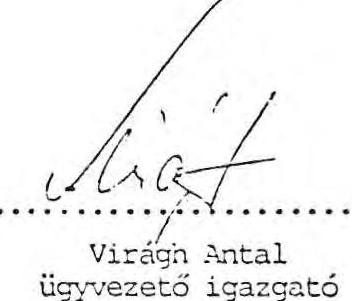

Virágh Antal
ügyvezető igazgató

Előttünk, mint tanuk előtt:

1) 

2) 

3) 
$\square$

---

# ALAPITÓ OKIRAT és ALAPSZABÁLY, 

melyben az alapirók megállapodnak a gazdasági társaságokról szóló 1988. évi VI. tv. alapján részvénytársaság zártkörü alapításáról és legfontosabb feltételeiröl.

## I. Az alapirók

TAVERNA Belvárosi Szálloda és Vendéglátó Vállalat Székhelye: 1056. Budapest, V. Március 15. tér 8. Képviseló: Dr. Feleki Ferenc vezérigazgató

BUDAPEST Hirel és Fejlesztési Bank Részvénytársaság Székhelye: 1052. Budapest, V. Deák Ferenc u. 5. Képviseló: Hegedüs Oszkár elnök-vezérigazgató

Postabank és Takarékpénztár Részvénytársaság Székhelye: 1051. Budapest, V. József Nádor tér 1. Képviseló: Princz Gábor elnök-vezérigazgató

CENTRAPLAN AG.
General-Bauplanung und Immobiliengesellschaft
Székhelye: Svájc, 4053. Basel, Harmerstrasse 10. Képviseló: Joseph Belle

Adár Jánosné
23812187171
1063. Budapest, Szinyei M. u. 11. I/12.

Al-Abaji Krisztina
24604120939
1088. Budapest, Rákóczi ut 55. III/44.

---

$$
2-17 \text { oldal }
$$

- Uelyett

Taitafuna, uéunor

---

# II. A Társaság cégneve és székhelye 

1./ A Társaság cégneve: TAVERNA Szálloda és Érterem Részvénytársaság
A Társaság rövidített cégneve: TAVERNA Rt.
A Társaság angol nyelvü elnevezése:
TAVERNA Hotels and Restaurants Company Limited
A Társaság német nyelvü elnevezése:
TAVERNA Hotel- und Restaurants-Aktiengesellschaft
2./ A Társaság székhelye: 1056. Budapest, V. Március 15. tér 8. A Társaság fióktelepet, képviseletet az Igazgatóság határozata alapján belföldön és külföldön felállithat.
3./ A TAVERNA Belvárosi Szálloda és Vendéglátó Vállalat kiilön nyilatkozatban hozzájárulását adja ahhoz, hogy a megalapítandó Társaság a TAVERNA elnevezést cégnevében használja.

## III. A Társaság időtartama

A Társaságot az alapítók határozatlan idôre hozzák lérre.

## IV. A Társaság tevékenységi köre

5151 Kereskedelmi vendéglátás
5169 Egyéb belkereskedelmi szolgáltatás
5153 Kereskedelmi szálláshely értékesítés
5171 Utazási szolgáltatás
5179 Egyéb idegenforgalmi szolgáltatás
5161 x Belkereskedelmi ügynöki és szakranácsadói tevékenység

---

5131 * Élelmiszer nagykereskedelem
5132 * Ruházati nagykereskedelem
5133 * Vegyes iparcikk nagykereskedelem
5144 * Vegyes iparcikk kiskereskedelem
7411 Minőségellenőrzés
1731 Nyomdaipari tevékenység
* Ide nem értve a 15/1989. (IX.7.) KEM rendeletben foglaltak engedélyköteles tevékenységeket.

# V. Az alaptőke és a részvények 

(1) A Társaság alaptőkéje 330.000 .000 .- Ft, azaz háromszázharmincmillió forint, mely 6.600 db 50.000 .- Ft névértékü, név́re szóló részvényre oszlik.
2.) A Társaság alaptőkéje 201.100.000.- Ft, azaz kettőszázegymillióegyszázezer forint készpénzből és 128.900.000.- Ft, azaz százhuszonnyolcmilliókilencszázezer forint nem pénzbeli hozzájárulásból áll. A nem pénzbeli hozzájárulás részletes felsorolását és értékelését az apportlista tartalmazza.
3./ Az alapítók megállapítják, hogy a részvényesek a teljes alaptőkét lejegyezték.
Az alapítók az alaptőkéből 104.732.030.- Ft-ct készpénzben befizettek. Az alapítók mindegyike az általa jegyzett részvény névértékének legalább $30 \%$-át befizette.
4./ Az alaptőke készpénz részéből a még be nem fizetett összeg az alapító részvényesek 1990. október 15. napjáig kötelesek a Társaság bankszámlájára befizetni.
Késedelmes befizetés esetén a kamat mértéke évi $20 \%$.
Amennyiben a részvényes az esedékes befizetést a felhivástól számított 60 napon belül nem teljesíti, az Igazgatóság jogosult értékesíteni az ideiglenes részvényt.
Nem gyakorolhatja szavazati jogát a részvényes, amig az esedékes vagyoni hozzájárulását nem teljesítette.

---

5./ A nem pénzbeli hozzájárulást a TÁVERNA Belvárosi Szálloda és Vendéglátó Vállalat nyujtja az alábbiak szerint:
a./ A Budapest, V. Váci u. 20. sz. alatti/ingatlant, a rajta lévő TÁVERNA Szállóval együtt 112.000.000.- Ft értékben.
b./ A következőkben felsorolt társaságokban lévő üzletrészeket, összesen 16.900.000.- Ft értékben:

Vörös Sárkány Távolkeleti Kereskedelmi és Vendéglátó Korlátolt Felelősségü Társaság
Grinzingi-Hajós Vendéglátó Korlátolt Felelősségü Társaság

Lila Akác Verdéglátó Korlátolt Felelősségü Társaság Háromszög Verdéglátó Korlátolt Felelősségü Társaság Tüköry Vendéglátó Korlátolt Felelősségü Társaság Véndiák Vendéglátó Korlátolt Felelősségü Társaság Sirály Vendéglátó Korlátolt Felelősségü Társaság FAVORITOURS Utazási Iroda Korlátolt Felelősségü Társaság

Bérszámfejtő és Társadalombiztosítási Korlátolt Felelősségü Társaság

Aranyosillag Vendéglátó Korlátolt Felelősségü Társaság

GASZTROTRANSZ Fuvarozó Korlátolt Felelősségü Társaság
6./ A nem pénzbeli hozzájárulás értékét az apportlista tartalmazza. Az érték megállapítása a SALDO Könyvvizsgáló Kft. értékelésén alapul. Az értékelés jelen okirat melléklete.

---

7./ A nem pénzbeli hozzájárulás szolgáltatásának időpontja 1990. január 1. napja.
8./ Az alapítók a részvényeket az alábbi arányban feszik át (minden részvény 50.000 .- Ft névértékủ és névre szóló):

A TAVERNA Belvárosi Szálloda és Vendéglátó Vállalat 73.400.000.- Ft készpénz és 128.900.000.- Ft értékú nem pénzbeli hozzájárulás ellenében 4.046 db részvényt, az alaptőke 4.046/6600-ad részét.

A BUDAPEST Bank Rt. 40.000.000.- Ft készpénz ellenében 800 db részvényt, az alaptőke 800/6600-ad részét.

A Postabank és Takarékpénztár Rt. 40.000.000.- Ft készpénz ellenében 800 db részvényt, az alaptőke 800/6600-ad részét.

A_CENTRAPLAN AG. 5.000.000.- Ft készpénz ellenében 100 db részvényt, az alaptőke 100/6500-ad részét.

Ádám Jánosné (2 381218 7171) 50.000.- Ft készpénz ellenében 1 db részvényt, az alaptőke 1/6600-ad részét.

Al-Abaji Krisztina (2 460412 0989) 200.000.- Ft készpénz ellenében 4 db részvényt, az alaptőke 4/6600-ad részét.

Alföldi Miklósné (2 351005 3979) 50.000.- Ft készpénz ellenében 1 db részvényt, az alaptőke 1/6600-ad részét.

Ambruzs György (1 570216 0281) 250.000.- Ft készpénz ellenében 5 db részvényt, az alaptőke 5/6500-ad részét.

Ányos Béláné (2 410301 6178) 50.000.- Ft készpénz ellenében 1 db részvényt, az alaptőke 1/6600-ad részét.

---

$$
\begin{gathered}
2 \lambda-50 \text { oldala? } \\
\text { helze } \# \\
\text { Tantalma: névov }
\end{gathered}
$$

---

9./ A Társaság jogosult részvényutalványt kibocsátani. $\sqrt{ }$
10./ A részvény megsemmisülése, elveszése, illetve érvénytelenné válása esetén az értékpapírok megsemmisítésére vonatkozó jogszabályi előirásokat kell alkalmazni.
11./ A részvényes kérésére és költségére az Igazgatóság a sérült részvénynek megfelelő uj részvényt állít ki, ha a sérült részvény eredeti tartalma kétség nélkül megállapítható.
12./ Az alaptőke felemeléséről vagy leszállításáról - a 13./ pontban írt kivétellel - a közgyülés határoz.
Az alaptőke felemelése esetén az Igazgatóság javaslata alapján a közgyülés határoz az alaptőke felemelt részére kibocsátandó részvényekre biztosítandó elő̉ásárlási jogról és annak mértékéről.
13./ Az Igazgatóság jogosult a Társaság cégbejegyzésétől számított öt éven belül az alaptőkét legfeljebb 50 millió forinttal uj részvények kibocsátása utján, vagy az alaptőkén felüli vagyonának alaptőkévé alakításával felemelni. E jog kizárólag ingatlan tulajdonjogának megszerzése érdekében illeti meg az Igazgatóságot.
14./ Az alaptőke felemelésnél az uj részvényes a részvényesi jogait (szavazati jog, csztalékra való jog) a cégbejegyzést követő hónap első napjától gyakorolhatja.
15./ A Társaság jogosult az alaptőke leszállítására részvénybevonás utján is. A részvénybevonás részletes szabályait a közgyülés határozza meg, az Igazgatóság javaslata alapján.

---

16./ Az Igazgatóság köteles részvénykönyvet vezetni.

A Társaság csak a részvénykönyvbe bejegyzett részvényeket ismeri el.
17./ Az elő́vásárlási jog
a./ A részvények harmadik személynek (nem alapitó tagnak) történő átruházásakor az alábbiak rendelkeznek elő́vásárlási joggal:

- az alapitó természetes személyek,
- a Társaság,
- az alapitó jogi személyek.

A sorrend egyben sorrendet is jelent.
b./ A külföldi alapitó tag akkor élhet elő́ásárlási jogával, ha a Társaságnak a külföldi részesedés növeléséhez érdeke füződik. E kérdésről az Igazgatóság dönt.
c./ Az azonos sorrendiségü elő́ásárlási jogával élni kívánó alapitó tagok közül az eladó szabadon választhat.
d./ A részvények csak akkor ruházhatók át valamely harmadik személyre, ha elő́vásárlási jogáról lemond az arra jogosult.
Lemondás, ha a részvényt eladó irásos felhívására 30 napon belül nem él elő́ásárlási jogával a jogosult.
e./ 1990. év végéig az elő́vásárlási jog gyakorlása akkor is megilletia Társaságot, ha névértéken vásárol.
18./ A Társaság által vásárolt és eladott részvények adásvételénél a döntési jog az alábbiak szerint alakul:

---

- Az alaptőke 10 \%-áig a vételről és eladásról, azok feltételeiről az Igazgatóság dönt.
- Az alaptőke 10-20 \%-áig a Felügyeló Bizottság véleményének kikérése után az Igazgatóság dönt.
- Az alaptőke 20-30 \%-áig a közgyülés határoz.

A döntési jog gyakorlása során a részvények névértékét kell figyelembe venni.

A megadott százalékos értékeket ugy kell értelmezni, hogy azok az eladás és vétel egyidejü jelentkezése esetén annak egyenlegére (különbségére) értendő.
VI. A közgyülés
1./ A közgyülés a Társaság legfőbb szerve, azely a részvényesek összességéből áll.
A közgyülést legalább évente egy alkalommal össze kell hívni.

A közgyülés kizárólagos hatáskörébe tartoznak:
a./ Az alapszabály megállapítása és módosítása.
b./ Az alaptőke felemelése és leszállitása.
c./ Az egyes részvényfajtákhoz füződő jogok megváltoztatása.
d./ A részvénytársaság más részvénytársasággal való egyesülésének, beol vadásának, szétválásának és megszünésének, valamint más társasági formába átalakulásának elhatározása.

---

e./ Az Igazgatóság, a Felügyeló Bizottság tagjainak - kivéve a dolgozók által választott tagoknak - és a Könyvvizsgálónak a megválasztása, visszahivása, valamint dijazásuk megállapítása.
f./ A mérleg megállapítása, az éves nyereség felosztása és az éves osztalék mértékének a meghatározása.
g./ Döntés átváltoztatható, vagy elő̉ásárlási jogot biztosító kötvény kibocsátásáról.
h./ A cégbejegyzést követő első év után a Társaság által a természetes személy alapítóktól történő részvények visszavásárlásakor azok árának elfogadása.
i./ Az alaptőke 20-30 \%-a között a Társaság részvény vásárlási és eladási feltételeinek meghatározása.
j./ Az Igazgatóság ügyrendjének elfogadása.
k./ Döntés minden olyan kérdésben, amit a társasági törvény, vagy jelen ckirat a közgyülés kizárólagos hatáskörébe utal.
2./ A közgyülés határozatképes, ha azon a szavazásra jogosító részvények több mint felét képviseló részvényes jelen van.
3./ Amennyiben a közgyülés nem határozatképes, az elnapolt közgyülést változatlan napirenddel, ugyanazon a helyen és órában a következő hét azonos napján kell megtartani. Az elnapolt közgyülés nyilvános meghirdetése, illetve a külön meghivók küldése nem kötelező.
4./ A közgyülésen való részvétel és szavazás feltétele, hogy a részvényesek vagy meghatalmazással rendelkező képviselöik a közgyülés megkezdése elött személyi igazolványuk bemutatásával egyidöben a közgyülésre szóló meghivójukat leadják. Ennek ellenében a szavazásra jogosító részvénynek megfelelő szavazójegyet kap minden részvényes.

---

5./ 1990. XII. 31. napjáig az alapfőke 5 \%-át képviselठ, szavazati joggal rendelkező természetes személy részvényesek - az ok és a cél megjelölésével - írásban az Igazgatóságtól kérhetik a közgyülés összehívását.
6./ A közgyülés összehívását 30 nappal előbb közzé kell tenni a Figyelő cimü hetilapban, és a részvényeseket külön meghivóval is értesíteni kell.
7./ A közgyülés helye Budapest.
8./ A szavazás során egy részvény egy szavazatot ér. A szavazás a szavazójegy felmutatásával történik.
9./ A közgyülés a VI/1.a.-d. pontokban felsorolt ügyekben a leadott szavazatok legalább háromnegyedes többségével, más ügyekben a szavazatok egyszerü több:égével határoz. A közgyülés a határozatair nyílt szavazással hozza meg.
10./ A közgyülésről jelenléti ívet és jegyzőkönyvet kell készíteni.
A jegyzőkönyvről bármely részvényes kivonatot vagy másolatot kérhet az Igazgatóságtól.
11./ A közzétett napirenden nem szereplő ügyben a közgyülés csak akkor hozhat döntést, ha valamennyi részvényes jelen van és ahhoz egyhangulag hozzájárulnak.
12./ A közgyülés elnöke az Igazgatóság elnöke, aki e jogkörér az általa kijelölt részvényesre esetenként átruházhatja. Az elnök vezeti le a közgyülést, a napirendnek megfelelően.

---

13./ Szavazategyenlőség esetén a közgyülés elnökének a szavazata dönt.

# VII. Az Igazgatóság 

1./ Az Igazgatóság három-öt tagból áll.

Az alapítók 1990. december 31. napjáig terjedő időtartam-
ra az alábbi személyeket jelölik az Igazgatóság tagjainak:
Dr. Feleki Ferenc 1031. Budapest, Kadosa u. 46.
Győrffy Hubáné
szül: Rácz Anna 1031. Budapest, Korvin 0. u. 45.
Börcsök András 1125. Budapest, Mátyás K. u. 38/b.
Virágh Antal 1144. Budapest, Ond vezér u. 36/c.

Az első év letelte után az Igazgatóság tagjait a közgyülés választja öt évi időtartamra.
A közgyülést olyan időpontra kell összehívni, hogy az Igazgatóság megbízatásának megszünte előtt 15 nappal az új Igazgatóság megválasztásra kerüljön.
2./ Az Igazgatóság tagjai ujraválaszthatók és visszahívhatók.
3./ Az Igazgatóság elnökét maga választja tagjai közül egyszerú szótöbbséggel. Szavazategyenlőség esetén az elnök személyéről a közgyülés dönt.

Az Igazgatóság ügyrendjét köteles elkészíteni, s az alakuló ülésen az alapító tagok elé terjeszteni elfogadásra. Ezt követően az ügyrend elfogadása és módosítása a közgyülés hatáskörébe tartozik.

---

4./ Az Igazgatóság elnöke jogosult a vezérigazgatói, az igazgatók a vezérigazgatóhelyettesi cim használatára.
5./ Az Igazgatóság hatáskörébe tartoznak mindazok az ügyek, melyeket a társasági törvény vagy jelen okirat nem rendel a közgyülés kizárólagos hatáskörébe.
6./ Az Igazgatóság az ügyvezetésről, a társaság vagyoni helyzetéről és üzletpolitikájáról évente egyszer jelentést köteles készíteni a közgyülés részére.

# VIII. A Felügyelő Bizottság 

1./ Az alapítók öt-kilenc tagu Felügyelő Bizottságot hoznak létre.
Az alapítók 1990. decenber 31 -ig terjedő időtartarra az alábbi személyeket jelölik a Felügyelö Bizottság tagjainak:
Enfrödi György 1225. Budapest, Kardvirág u. 24.
Fábián Judit 1124. Budapest, Fodor u. 105/8/6.
Joseph Belle Svajc, 4102. Einningen In Rehwechsel 44.
Kármán Ferenc 1102. Budapest, Harmat u. 12.
Tárnoki László 1039. Budapest, Lukács Gy u. 18.
2./ A Felügyelő Bizottság tagjai a jelen ckirathoz csatclt nyilatkczatban elfogadták megbizatásukat.
3./ Az 1./ pontban irt idötartam leteltét követően a Felügyelo Bizottság megbizatása öt évre szól.
Tagjait a társasági törvényben meghatározott arányban a közgyülés, illetve a dolgozók választják.

---

A Felügyelő Bizottság tagjai ujraválaszthatók és visszahivhatók.
4./ A Felügyelő Bizottság tagjai közül elnököt választ, ügyrendjét megállapítja, s azt jóváhagyásra a közgyülés elé terjeszti.
5./ A Felügyelő Bizottság választása:
a./ A közgyülés által választandó tagok személyére az Igazgatóság tesz javaslatot, melyet a napirenddel együtt írásban közölni kell a részvényesekkel.
b./ A dolgczók választásának szabályait a Felügyelő Bizottság ügyrendje tartalmazza.
6./ A Felügyelő Bizottság választását olyan időpontban kell lebonyolítani, hogy a Bizottság megbízatásának megszűnte előtr 15 nappal az uj Bizottság megválasztásra kerüljön.

# IX. A könyvvizsgáló 

1./ Az alapítók a Társaság könyvvizsgálójává 1990. december 31-ig terjedő időtartarra Sánta Józsefné szül: Tessik Szilvia, 1124. Budapest, Thómán I. u. 6. sz. alatt: laKost válaszr ják.
A Könyvvizsgáló feladatait, jcgait és kötelezertségeit az Igazgatóság által elkészítendő megbízási szerzőćés tartalmazza.
A Könyvvizsgáló engedélyének szára: K-110/1985.
A Könyvvizsgáló a jelen ckirathcz csatclt nyilatkczatEan a megbízatást elfogadta.

---

2./ Az 1./ pontban irt megbizatás lejárta után a Társaság Könyvvizsgálóját a közgyülés választja öt évi idötartamra.
A Könyvvizsgáló ujraválasztható, megbizatása felmondással megszüntetheto.
3./ A Könyvvizsgáló választása esetén személyére az Igazgatóság tesz javaslatot.

# X. A cégjegyzés 

1./ A Társaság cégjegyzésére jogosultak az Igazgatóság tagjai és a képviseleti jogkörrel felruházott dolgozók.
2./ A Társaság cégjegyzése akként történik, hogy a Társaság előirt, előnyomott, vagy nyomtatott cégnevéhez:

- az Igazgatóság elnöke önállóan a nevét aláirja,
- vagy két igazgatósági tag együttesen aláirja nevét,
- vagy egy igazgatósági tag és egy képviseleti jogkörrel felruházott dolgozó együttesen aláirja nevét,
- vagy két képviseleti jogkörrel felruházott dolgozó együttesen aláirja nevét.

3./ A képviseleti jog és a cégjegyzés gyakorlásának részletes szabályait az Igazgatóság határozza meg.
4./ Az értékpapirck kibocsátása esetén is a cégjegyzésre az elózōekben megállapított szabályokat kell alkalmazni, azzal az eltéréssel, hogy tömeges kibocsátásu értékpapirokon az aláírások sokszorosítás utján is elhelyezhetők.

---

XI. A nyereség felosztásának szabályai
1./ A Társaság üzleti éve január 1.napjától december 31. napjáig tart.
2./ A Társaság az alapitó okiratban irt alaptőke maximum 10 \%-os mértékéig kockázati alapot képez, oly módon, hogy évente az éves adózott nyereségének $2 \%$-át helyezi az alapba.
3./ A kockázati alap felhasználása a Felügyelő Bizottság egyetértésével, az Igazgatóság javaslata alapján történik.
4./ Minden üzleti év végével a Társaság vagyonáról mérleget kell késziteni.
A mérleg készitésének szabályaira a mindenkor hatályos jogszabályok az irányadók.
5./ Az osztalék kifizetésének idópontját és helyét a Figyeló cimiu hetilapban kell közzétenni.
6./ Az osztalék: a részvényesnek a közgyülés által felcsztott mérleg szerinti nyereségből a részvényeire jutó arányos része.
XII. Egyéb rendelkezések
1./ A részvényesek jogvitáik békés uton való rendezésére törekednek. Amennyiben ez nem vezet eredményre, kikötik a Magyar Gazdasági Kamara mellett szervezett Állandó Választott Bíróság hatáskörét és illetékességét.
2./ A természetes személy részvényesek jelen okiratba az Igazgatóság által hozzáférhető helyen betekinthetnek.

---

3./ A Társaság hirdetményeinek közzététele a Figyelo cimü he-
tilapban történik.

4./ A Társaság 1990. január 1. napján kezdi meg a tevékenységi
körének megfelelő müködését.

5./ A Társaság hivatalos üzleti nyelve a magyar.

Budapest, 1989. október 9.

Készítette és ellenjegyezte:
FELVÁROSI SZÁLLODA ÉS VENDESÍTÓ
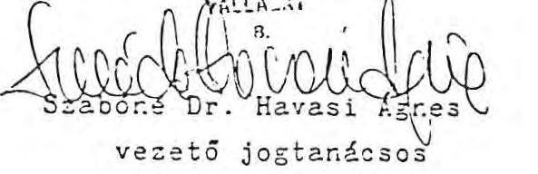

TAVERNA
FELVÁROSI SZÁLLODA ÉS VENDESÍTÓ

Dr. Feleki Ferenc
vezérigazgató
TAVERNA Belvárosi szálloda és
Vendéglátó Vállalat

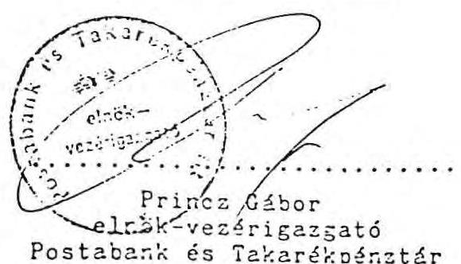

Hegedüs Oszkár
elnök-vezérigazgató
BUDAPEST Eank
Részvénytársaság

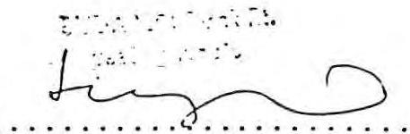

Josepa Belle
CENTRAPLAN AG.

---

A Fővárosi Bíróság mint cégbíróság 041272 szám

# VÉGZES

A bíróság a cég kérelmére elrendeli az "éjemem" nyitásuk 041272 számú cégjegyzékbe a következő cég és az alábbi látelek bejegyzését.

A cégjegyzék "A", részére:

## Részvénytársaság

1. A lársaság elnevezése: TAVERNA Szállati áttétre: Ektoram Részvénytársaság
2. A társaság elnevezésének rövidítésére: 1. cégjegyzék TAVERNA-PI.
3. A társaság elnevezése engéluk: "TAVERNA" Hatela and Pashupants Company Limited
4. A társaság elnevezése némfelk: "TAVERNA" Hatel and Pashupants Limited Limited
5. Szállati áttétre: 1993 Budapest, Hungary
6. A cégjegyzék "B" részére:

|  041272 szám | 1993. oldalra  |
| --- | --- |
|  1. Az alaptátrán a 1000. oldalra 0. |   |
|  2. A málatos alaptátrán a 1000. oldalra 1. |   |
|  3. A társaság időtartama a 1000. oldalra 2. |   |
|  4. A társaság lelkény ágításra: |   |

SZÁT KÉRETTÉSÉGYZÉGYZÉGYZÉGYZÉGYZÉGYZÉGYZÉGYZÉGYZÉGYZÉGYZÉGYZÉGYZÉGYZÉGYZÉGYZÉGYZÉGYZÉGYZÉGYZÉGYZÉGYZÉGYZÉGYZÉGYZÉGYZÉGYZÉGYZÉGYZÉGYZÉGYZÉGYZÉGYZÉGYZÉGYZÉGYZÉGYZÉGYZÉGYZÉGYZÉGYZÉGYZÉGYZÉGYZÉGYZÉGYZÉGYZÉGYZÉGYZÉGYZ

---

5161 Bolkereskedelmi ügynöli és a s a a adói tevékenység (kivéve engedélyhez kö tött tevékenység)
5131 Elelmiszer nagykereskedelem (kivéve engedélyhez kötött tevékenység)
5132 Puházati nagykereskedelem (kivéve engedélyhez kötött tevékenység)
5133 Vegyes iparcill nagykereskedelem (kivéve engedélyhez kötött tevékenység)
5144 Vegyes iparcill kiskereskedelem (kivéve engedélyhez kötött tevékenység)
7411 Minőségellenőrzés
1731 Nyomdaipari tevékenység

5. Az alapfőke nagysága 320.000.000.-Ft. azaz
Háromszázharmincmillió forint, melyből
201.100.000.-Ft. azaz Kétszázegymillió
ezzer forint készpénz és 120.000.000.-Ft. azaz
Egyszázhuzzonnyolcmillió kilencszárazon forint
apport.

6. A társaság alapföléje 6600 db 50.000.-Ft.
névértölti, névre szóló részvayból áll.

7. A társaság hírdetményeit a Figyelti e (a) tudt
lapban teszi közzé.

A Felügyold Rizettség kiújtsi:

11: 0. Endrődi György, 1225 Budapest, Kundvintj p.

11: 0. Fölióa Judit, 1124 Budapest, Font m.

11: 12. Jószó Brille, 1123, 1122 Budapest, Font m.

11: 11. Fölióa Ferenc, 1123 Budapest, H.

11: 12. Tárandi László, 1122 Budapest, H.

12. A társaság főnye az alttal

11: 13. Fölióa Jószó Szélti, 1121, 1122, 1124, 1126, 1. u.

---

A cégjegyzék "C" részére:
041272 szám
1989. október 31.
18: 1. A cégjegyzés abbént történik, hogy a cég kézzel
vagy gáppel írt, előnyomott vagy nyomatott el
nevezése alá az igazgatóság elnöke önállása,
míg két igazgatósági tag együttesen, egy igaz
gatósági tag és egy képviseloti jogkörrel fel-
ruházott dolgozó együttesen vagy két alap, is
ti jogkörrel felruházott dolgozó együttesen ír-
ja a nevét.

Onálló aláírásra jogosult:
10: 2. Dr. F e l e l i F e r e n c, vorderigazgatás
címmel felruházott elnök, Budapest, 1031 tudása
u. 46.

Együttes aláírásra jogosultat:
10: 3. G y ö r f f y ű u b á o d, Budapest, III.,
Borvin Otto u. 45.
10: 4. D ö r c s ö l á n d r á s, Budapest, III.
Mátyás Király u. 38/1.
10: 5. V i r á g h a n t a l, Budapest, III.,
zér u. 36/c.
A bejegyzés fogomata 1484 a bérkép a cégjegyzés
meghagyja.
A bejegyzés át a folyamodat 2 db. is a
rémpállóny kiadása mellett azzal áll. ít,
végjegyzésre jogosult a kéti aláírásra
szoros alathan teljesítse.

---

A tórsaság a korvónyen illetékbólyegben 62.000.-7t.-ot bejegyzés címén lerótt.

Budapest, 1989. október 31.

Fothöné Dr. Kovács ágme -1. a fővárosi bírósági hír.

Fognyilvántartásba bejegyezve: 1989. november 3.

A kiadmány hitelégis ágme:

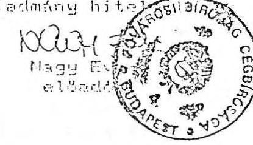

---

# A P P O R T L I S T A 

A Taverna Belvárosi Szálloda és Vendéglázó Vállalat által tárgyi apportként szolgáltatott anyagi javakról és üzletrészekröl

A Taverna Szálloda és Ezzerem Ez. Alapizó Okirszáboz

---

# 1.) OSSZESITO ERTEKLISTA

A Társaság alapítói apportként elfogadják a Taverna Belvárosi Szálloda és Vendéglátó Vállalat részéről átadott

|  Hoteľ Tavernát | 112.0 Mió Ft likviditási értéket  |
| --- | --- |
|  11 különbözö társaságban lévő üzletrészét | 12.9 Mió Ft értékben  |
|  Összesen: | 123.9 Mió Ft értékben  |

---

### 2.) HOTEL TAVERNA

#### 2.1. Likviditási érték

Eszközök, berendezések, felszerelések könyvszerinti értéke

566.727.366.-

t.alkatrész (import)

2.747.420.-

Közművesített telek értéke

153.215.000.-

Vagyonértékű jogok

60.000.000.-

Összesen:

802.692.778.-

Hitelszerződés szerinti és ténylegesen fennálló tartozás

2000-ig (1933.XII.21-i állapot)

Eszközök tudomásul veszik a hitelszerződés valamennyi kötelezettségét és azokat a Társaság átvállalja (kamatterhek, VAM hitel).

---

3.) UZLETRESZEK

3.1.

|  Társaság neve | TSSZVV. által átadott üzletresz | értéke eft  |
| --- | --- | --- |
|  Bér-Társ Kft 1056 Bp. Március 15. tér 8. | 100.00%-os | 1.830  |
|  Casztrotransz Kft 1036 Bp. Pomázi u. 5-7. | 76.64%-os | 4.440  |
|  Sirály Kft 1065 Bp. Bajcsy Zs. u. 9. | 36.05%-os | 530  |
|  Favorittours Kft 1056 Bp. Cukor u. 3-5. | 15.00%-os | 330  |
|  Tüköry Kft 1054 Ep. Rosenberg hp. u. 15. | 25.40%-os | 320  |
|  Vörös Sárkány Kft 1062 Ep. Népköztársaság u. 60. | 57.14%-os | 6.000  |
|  Véndiák Kft 1053 Bp. Egyetem tér 5. | 32.22%-os | 610  |
|  Lila Akáa Kft 1065 Ep. Nagymezö u. 30. | 67.07%-os | 1.100  |
|  Arany Csillag Kft 1065 Ep. Majakouszkij u. 65. | 25.00%-os | 440  |
|  Háromszög Kft 1137 Bp. Radnóti u. 35. | 30.12%-os | 500  |
|  Grinzingi - Hajós Kft 1053 Ep. Veres Pálné u. 10. | 49.33%-os | 740  |

A TSSZVV összesen 16.900.000 Ft értékben (azaz Tizenhatmillió- kilencszázszer Ft) adja át apportként a felsorolt üzletreszeket a Taverna Szálloda és Etterem Ft-nek.

- 72 -

---

# SZAKVELEMENY 

A TAVERNA Belvárosi Szálloda és Vendéglátó Vállalat Budapest V., Váci utca 20. sz. alatt müködö Hotel TAVERNA szálloda telek és vagyonértékii jogok, apportvagyon forgalmi értékének megállapításáról.

Budapest, 1989. október 9.

Szakértöi anuacot készítette:
Munkácsi István
müszaki tanácsos
Könyvszakértö:
dr. Farkas Magdona

---

2.3. A szálloda mellett található a nagyforgalmú Fortuna áruház, és számos nagyforgalmú üzlet is.
3.) Az apportuagyon képletes ismertetése
3.1. Telek: A telek tulajdonosa: Magyar Állam

A telek kezelöje : Taverna Belvárosi Szálloda és Vendéglátó Vállalat
A telek nagysága : $2.203 \mathrm{~m}^{2}$
A telek beépitettsége: $100 \%$
A telek teljes közmüvesitettséggel rendelkezik.
A telek teljesen körbeépitett, igy a terület nagysága nem bơvitheto.

# 3.2. Üzleti bevezetettség 

3.21. A szálloda épülete 12 szintes, a szobák száma 224 db , amelyböl 24 db egyágyas fürdőszobával ellátott, 112 db kétágyas fürdőszobás, 84 db kétágyas zuhanyzóval felszerelt. Minden szobában telefon, színes TV, rádió és minibárral felszerelt. A vendégek kiszolgálását étterem, különterem, sörözö, fagylaltozó, bor és pezsgóbár, bowling bár és egyéb szolgáltatások biztosítják.
3.22. A szálloda üzemeltetését jelenleg 291 fő végzi. A szálloda alkalmazottainak $12.02 \%$-a egyetemi és föiskolai végzettségü, $22.3 \%$-a nyelvvizsgával, $0.1 \%$-a mestervizsgával rendelkezik.
3.23. A szálloda éves kihasználása az elmúlt három évben az alábbiak szerint alakult.

---

3.231. Szobák kihasználtsága:

|  | 1986 | 1987 | 1988 | 1989 |
| :--: | :--: | :--: | :--: | :--: |
| éves | 70.9\% | 71.1\% | 68.0\% | - |
| I. n.év | 38.2\% | 49.5\% | 34.6\% | 54.1\% |
| II. n.év | 80.8\% | 86.4\% | 75.8\% | 87.9\% |
| III. n.év | 88.8\% | 90.0\% | 90.7\% | 93.3\% |
| IV. n.év | 72.0\% | 58.3\% | 70.1\% | - |

3.232. Agykihasználása:

| I. félév | 59.7\% | 68.1\% | 55.5\% | 71.5\% |
| :--: | :--: | :--: | :--: | :--: |
| II. félév | 66.1\% | 60.7\% | 64.3\% | - |

3.233. A szállodai szobák és ágyak kihasználása lényegesen jobb a budapesti szállodai kapacitáskihasználásánál, amely a vállalat részére többletárbevételt biztosít.
A kapacitáskihasználást nagymértékben elösegítette a jó marketing munka, az, hogy a szállodai kiszolgálás jó szinvonalon történik, ezért a vendégek legtöbbje többször viszszatér.

# 4. Az apportvagyon minösitéze 

4.1. A telek forgalmi értékének megállapításánál pozitívként értékeltük a helyet, a teljes közmüvesítettséget, az utaz̄ban már müködö különbözö kereskedelmi és vendéglátási üzleteket.
4.2. A szálloda vagyonértékü jog forgalmi értékének megállapításánál pozitívként értékeltem a szálloda üzemeltetö létszámának felkészültségét, a szállodai szobák felszereltségét, a kapacitáskihasználás fokozása érdakében megvalósitott marketing munkát, a szolgáltatások számát és körét, a vendéglátó egységek számát és kiszolgálás szinvonalát, a különleges szolgáltatások számát és körét. A többletárbevétel nagyságát.

---

5.) Apportvagyon forgalmi értékének megállapítása
5.1. Telek (közmüvesitett) $2.203 \mathrm{~m}^{2} \quad 153.218 .000 \mathrm{Ft}$
5.2. A szálloda üzleti bevezetettségének (vagyonértékü jog) forgalmi értéke
$60.000 .000 \mathrm{Ft}$
$5.1+5.2$ apportforgalmi érték összesen:
$213.218 .000 \mathrm{Ft}$

Budapest, 1989. október 9.

SALDO
Konyvvizsgel
Kft
Kutukarint
Munkácsi István
okl.épitészmérnök
müszaki tanácsos

Könyvszakértöi záradék:

A TAVERNA Belvárosi Szálloda és Vendéglátó Vállalat Budapest V., Váci utca 20. sz. alatti Hotel Taverna telek és vagyonértékü jog forgalmi értékének megállapítázáról

A 3-5. pontok alatt szereplő részadatok helyességét ellenőriztem, és megállapítottam, hogy az igy kialakított apportvagyon forgalmi értéke (213.218.000 Ft azaz kettőszáztizenhárommilliókettőszáztizennyolcezer forint) helyes.

Budapest, 1989. október 9.

SALDO
Konyvvizsgel
Kft
dr. Farkas Vagdalna
könyvszakértö

---

# 5. a melleklet.

TAVERNA Rt. tulajdonosi szerkezete alapításkor (1989. október 9.)

|  Tulajdonos | Részvények száma összesen | Részvények névértéke összesen eFt-ban | Tulajdonosi arány  |
| --- | --- | --- | --- |
|  Belvárosi Vend.Váll. | 4046 | 202.300 | $61.3 \%$  |
|  Budapest Bank Rt. | 800 | 40.000 | $12.1 \%$  |
|  Postabank Rt. | 800 | 40.000 | $12.1 \%$  |
|  Centraplan AG | 100 | 5.000 | $1.5 \%$  |
|  Természeses személyek | 854 | 42.700 | $13.0 \%$  |
|  Összesen: | 6600 | 330.000 | $100.0 \%$  |

A Belvárosi Vendégláció Vállalat Taverna Rt. részvényeinek mozgása alapíáscöl 1991. dec. 31-ig.

|  Induló állomány | 4046 db | 202.300 eFt  |
| --- | --- | --- |
|  1989.XII.1.-1990.I.30. részvényérékesítés Természeses személyek felé | 342 db | 17.100 eFt  |
|  1990. I. 11. részvényérékesítés
Al: Ertékforgalmi Bank felé | 1000 db | 50.000 eFt  |
|  1990. III. 1. részvényérékesítés Budapes: Bank felé | 2200 db | 110.000 eFt  |
|  Ertékesítés összesen: | 3542 db | 177.100 eFt  |
|  Záró állomány: | 504 db | 25.200 eFt  |

---

# TAVERNA Rt. tulajdonosi szerkezete 1991. dec. 31 -én 

| T u l a j d o n o s | Részvények   száma   összesen | Részvények   névértéke   összesen eft-ban | Tulajdonosi   arány |
| :-- | :--: | :--: | :--: |
| Belvárosi Vend.Váll. | 504 | 25.200 | $7.6 \%$ |
| Budapest Bank Rt. | 800 | 40.000 | $12.1 \%$ |
| Postabank Rt. | 800 | 40.000 | $12.1 \%$ |
| Centraplan AG | 100 | 5.000 | $1.5 \%$ |
| Ertékforg. Bank Rt. | 1000 | 50.000 | $15.2 \%$ |
| Investment és Mana-   gement Kft. | 1000 | 50.000 | $15.2 \%$ |
| Taverna Okt.Alapitv. | 400 | 20.000 | $6.1 \%$ |
| Taverna Rt. | 667 | 33.350 | $10.1 \%$ |
| Természetes személyek | 1329 | 66.450 | $20.1 \%$ |
| Összesen: | 6600 | 330.000 | $100.0 \%$ |

Budapest 1992. panuar 16.
chazfiz. Oun

---

# TAVERNA 

Belvárosi Szálloda és Vendéglátó Vállalat 1056 Budapest, V., Marcius 15. tér 8.

Tárgyalás és döntéselökészitö anyag a Taverna Szálloda és Etterem Rt. létrehozásához

Budapest, 1989. julius

---

1989. IV. negyedévében a Taverna Belvárosi Szálloda és Vendéglátó Vállalat, a Budapest Bank, elöreláthatólag mintegy 100 rogánszemély (pontos adatot a jelentkezések lezárása után, szeptember végén lehet megadni), esetleg más jogi személyek, és szándékaink szerint három kerületi Tanács zártkörü részvénytársaságot hoz létre

Taverna Szálloda ès Etterom Rt.
néven.
Székhelye: Budapest, V., Màrcius 15: tér 8.
A társaság alaptökéje: 500 Mio Ft

| TBSZVV | 360 Mio Ft | $72 \%$ |
| :-- | :-- | :-- |
| Dolgozék | 50 Mio Ft | $10 \%$ |
| Bank | 40 Mio Ft | $8 \%$ |
| Tanácsok | 50 Mio Ft | $10 \%$. |

Az alaptöke megoszlása a jelenlegi helyzetet tükrözi. Változhat az arány a dolgozói részarány változása, esetlegesen más jogi személyek bekapcsolása, valamint a Tanácsok döntése alapján.

A Taverna Belvárosi Szálloda ès Vendèglátó Vállalat bármekkora arányban vesz részt (részvényeinek) csak $50 \%$-os tulajdonosi részesedéséhez ragaszkodik, e felett lemond opciós jogáról ès részvényeinek késöbbi eladását tervezi. Az eladandò részvényekböl 5 Mio Ft értékben külföldi cégnek kiván értékesiteni, ès ezáltal biztosítani az Rt. számára egy $10 \%$ pontos (össz. $40 \%$ ) nyereségadó kedvezményt.

Az alaptökébül
150 Mio Ft készpénz
ebböl
60 Mio Ft-ot a TBSZVV
50 Mio Ft-ot a dolgozók
40 Mio Ft-ot a bank
biztosit.
Ez a nagyságrend is változhat a tényleges ès végleges alapítòk ismeretében, illetve az általuk vásárolt részvények névértékének összes értéke ismeretében.

Apportként a TBSZVV átadja a
Notel Tavernát (hitelterhével együtt);
a Dagály utca - Váci út sarkán lévö, szálloda építésre alkalmas
telizet (Hotel Palatinus);
a Ménár utca 20. sz. alatti ingatlant,
jỏo Mithò Ft èttöben.

---

# Apportként vettük figyelembe a Tanácsok által behozott üzletek tulajdonjogát

## 50 Millió Ft értékben

Az összeg, számításaink alapján - figyelembevéve, hogy a kapott osztalék 50 %-kal magasabb, mint a jelenlegi bérleti díj - az alábbi üzletek tulajdonjogának megszerzésére lenne elegendő:

|   |  | Erték: Millió Ft-ban  |
| --- | --- | --- |
|  üzletek | Jelenlegi bérleti díj | 50 %-kal növelt (osztalék)  |
|  V. kerület: |  |   |
|  Mátyás Pince | 1.4 |   |
|  Százéves | 0.3 | 3  |
|  Napoletana | 1.0 |   |
|   | 2.7 | 4.0  |
|  Alaptökében figyelembevett érték: 20 Mio Ft. |  |   |
|  VI. kerület: |  |   |
|  Adám - Eva | 0.7 |   |
|  Minőségi Vajas | 0.2 |   |
|  Opera | 0.4 |   |
|  Terminus | 0.2 |   |
|  Joli | 0.2 | 6  |
|  Városligeti vendéglő | 0.3 |   |
|   | 2.0 | 3.0  |
|  alaptökében figyelembevett érték: 15 Mio Ft. |  |   |
|  XIII. kerület: |  |   |
|  Kiskakukk | 0.3 |   |
|  Vig eszpressző | 0.1 |   |
|  Kétkorsó | 0.1 |   |
|  Oznia | 0.1 |   |
|  Akali | 0.1 |   |
|  Szamovár | 0.1 |   |
|  Göcsej söröző | 0.1 |   |
|  Kávés Katica | 0.3 |   |
|  Bécsi City | 0.1 |   |
|  Nemesgulácsi | 0.2 |   |
|  Gyöngyi eszpressző | 0.2 |   |
|  Ara eszpressző | 0.1 |   |
|  Dália | 0.1 | 14  |
|  Mozí | 0.1 |   |
|   | 2.0 | 3.0  |
|  * kerületes miatt |  |   |
|  alaptökében figyelembevett érték: 15 Mio Ft. |  |   |

---

# A Taverna Rt. jövedelmezöségi számitása 

Erték: Millió Ft-ban

| Megnevezès | 1990. | 1991. | 1992. |
| :--: | :--: | :--: | :--: |
| Netto ärbevétel   (- AFA; - jutalek) | 1.248 . | 1.367 . | 1.312 . |
| A $r$ r ès | 945 . | 1.034 . | 987 . |
| Költség, ráforditás | 689. | 803. | 806. |
| Nyereség | 256. | 231. | 181. |
| Adó egyenleg | 101. | 83. | 56. |
| Felosztható nyereség | 155. | 148. | 125. |
| Kapott osztalèk | 7. | 7. | 24. |
| Összes felosztható nyereség | 162. | 155. | 149. |
| cbböl: egyè kifizetések tartalèk, fejlesztèsck | 17. | 17. | 20. |
|  | 45. | 38. | 29. |
| 0 s z t a lè k: | 100. | 100. | 100. |

* befizetéstöl függöen: 90.55 - 100.0

---

# A Tanácsok által átadott üzletek éves bérleti dija és az utánuk kapott osztalek 

## érték: Ft-ban

|  | Jelenlegi | $50 \%$-kal növelt |
| :-- | :--: | :--: |
| Üzletek | bérleti dij | osztalèk |

V. kerület

| Mátyás Pince | $1.412 .460,-$ |  |
| :-- | --: | :--: |
| Százéves | 288.876,- |  |
| Napoletana | 997.540,- |  |
|  | $1.698 .876,-$ | $4.000 .000,-$ |

VI. kerület

| Adám - Eva | 721.800, - |
| :--: | :--: |
| Minöségi Vajas | 163.040, |
| Opera | 415.860, |
| Terminus | 165.600, |
| Joli cukrászda | 211.140, |
| Városliget vendéglö | 293.040, |
|  | 1.975.480,- |

$3.000 .000,-$
XIII. kerület

| Kiskakukk | 268.860, |  |
| :--: | :--: | :--: |
| Víg eszpresszö | 104.700, |  |
| Kétkorsö | 123.240, |  |
| Omnia | 86.400, |  |
| Akali | 106.020, |  |
| Szamovár | 90.540, |  |
| Göcsej sörözö | 118.620, |  |
| Kávés Katica | 271.920, |  |
| Hécsi City | 68.400, |  |
| Nomesgulácsi | 179.880, |  |
| Gyöngyi eszpresszö | 192.000, |  |
| Ara eszpresszö | 102.000, |  |
| Dália | 114.840, |  |
| Mozi | 133.200, |  |
|  | 1.960 .620 , | 3.000 .000 , |

Az általunk fizetett éves bérleti dij ugyan csökkenne a fenti öszszegekkel, de helyette osztalékként $50 \%$-kal magasabb összegü bevételre tesz szert a tanács. Igy a "befektetett" tóke 5 év alatt térül meg. Ezáltal megoldható lenne, hogy a lakások felújitására forditható keretösszeg ne csökkenjen és plusz bevétele is maradjon a a tanácsoknak.

---

AZ ATADASZI KERÜLÜ ÜZLETRESZEK, INGATLANOK

|  |   |   |   |   |
| --- | --- | --- | --- | --- |
|   | Cim | $m^{2}$ | érték | Megjegyzès  |
|  1.) Molnár utcai ház | V., Molnár u. 28. | 644 alapterület | 30.00 | ingatlan  |
|  2.) TATONG | V., Váci u. 20. | - | 1.40 | üzletrész  |
|  3.) Bèr-Társ Kft | V., Màrcius 15. tèr 8. | - | 1.83 | üzletrész  |
|  4.) Mathias Keller GmbH | Bècs. I., Maysedergasse 2. | - | * 16.10 | üzletrész  |
|  5.) Liget Rt. | VI., Dózsa Gy. u. 106. | - | 152.50 | részvény  |
|  6.) Gasztrotransz Kft | III., Pomàzi u. 3. | 6.582 | 14.44 | ür. + ing.  |
|  7.) Favorit Kft | V., Veres Pálnò u. 16. | 44 | 0.50 | ür. + ing.  |
|  8.) Tüköry Kft | V., Rosenbarg hp. u. 15. |  | 0.32 | üzletrész  |
|  9.) Vörös Sàrkány Kft | VI., Nèpköztàrsasàg btja 80. |  | 6.00 | üzletrész  |
|  10.) Aranycsillag - Rozmering Kft | VI., Majakovszkij u. 73. |  | 0.44 | üzletrész  |
|  11.) Lila Akác Kft | VI., Nagymezö u. 30. |  | 1.10 | üzletrész  |
|  12.) Sirály Kft | VI., Bajcsy Zs. u. 9. |  | 0.53 | üzletrész  |
|  13.) Vèndiák - Wernesgrüner Kft | V., Egyetem tèr 5. |  | 0.61 | üzletrész  |
|  14.) Kaiser | V., Semmelweis u. 10. | 92 | 3.00 | ingatlan  |
|  15.) Palatinus | XIII., Váci u. 140. | 4.416 | 20.00 | ingatlan  |
|  16.) Üteg | XIII., Üteg u. 17. | 368 | 3.70 | ingatlan  |
|  17.) Tejpresszò | XIII., Csanàdy u. 28. | 144 | 2.90 | ingatlan  |
|  18.) Allòeszköz raktár | XIII., Kisgünb u. 5. (XIII., Victor H. u. 35.) | 285 | 2.90 | ingatlan  |
|  19.) Verbunkos | XIII., Rajk u. 60. | 442 | 8.80 | ingatlan  |
|  20.) Visegródi | XIII., Visegródi u. 50 la-b. | 363 | 3.60 | ingatlan  |
|   |  |  | 270.67 |   |
|   |  |  | * - 10.00 |   |
|   |  |  | 260.67 |   |
|  Budapest Bank Rt. | V., Doàk F. u. 5. |  | 19.00 | tiszvény  |

---

# Ge m. mielleltel. 

A Taverna Rt. müködtetésébe tartozó üzletek

| Sor-   szám | $\begin{aligned} & \text { Uzzlet- } \\ & \text { szám } \end{aligned}$ | Neve | Alapter. $m^{2}$ |
| :--: | :--: | :--: | :--: |
| 1. | 5252. | Akali borozó XIII., Szt.Istvàn krt. 2. | 141 |
| 2. | 5114. | Alföldi vendèglö V., Kecskeméti u. 4. | 237 |
| 3. | 5354. | Amigo eszpresszò V., Pàrizsi u. 6. | 81 |
| 4. | 5187. | Angyalföldi sörözö XIII., Váci út 104. | 250 |
| 5. | 5186. | Ara eszpresszò XIII., Balzac u. 37. | 85 |
| 6. | 5133. | Aradi kisvendèglö VI., Aradi u. 61. | 52 |
| 7. | 5136. | Aranybárány V., Harmincad u. 4. | 272 |
| 8. | 5182. | Adàm sörözö (+ Eva) VI., Nèpköztàrsasàg u. 41. | 752 |
| 9. | 5417. | Badacsonyi borozò XIII., Váci út 33. | 142 |
| 10. | 5412. | Badacsonyi borozò V., Alpári Gy. u. 19. | 159 |
| 11. | 5363. | Bajor sörbár (DAB) lásd Ibolyánàl V., Károlyi M. út 7. |  |
| 12. | 5336. | Ballantine's VI., Nèpköztàrsasàg u. 19. | 209 |
| 13. | 5155. | Balzac vendèglö XIII., Balzac u. 17. | 309 |
| 14. | 5192. | Barátság   VI., November 7. tèr 3. | 545 |
| 15. | 5309. | Bèby cukrászda XIII., Pozsonyi út 43. | $\begin{aligned} & 18 \\ & 94 \end{aligned}$ |

---

16. 5171. Bècsi sörözö ..... 151
V., Eötvös u. 8.
17. 5375. Bècsi City ..... 57
XIII., Sallai I. u. 18.
18. 5374. Bèke eszpresszò ..... 106
XIII., Bèke tèr 12.
19. 5172. Belgràd sörözö ..... 367
V., Belgràd rkp. 13.
20. 5103. Belvàrosi Kávèhàz - LIDO ..... 1782
V., Szabadsajtò út 5.
21. 5211. Beugrò ..... 304
VI., Sziv u. 30.
22. 5356. Bonbon eszpresszò ..... 219
V., Szt.Istvàn krt. 29.
23. 5188. Borsodi sörözö ..... 171
V., Honvèd u. 18.
24. 5179. Budvàr sörözö ..... 176
XIII., Röbert K. krt. 66.
25. 5106. Corso ètterem ..... 359
V.,Petöfi S. u. 3.
26. 5413. Csarnok büfè ..... $9 \div 8$
V.,Rosenberg hp. u-i csarnok
27. 5113. Csarnok vendèglö ..... 182
V., Rosenberg hp. u. 11.
28. 5107. Csendes ètterem ..... 256
V., Mizeum krt. 13.
29. 5204. Carmen ..... 135
VI.,Bajcsy Zs. út 15.
30. 5167. Casino ètterem ..... 5686
XIII., Margitsziget
31. 5376. Csibi eszpresszò ..... 176
XIII., Váci út 7816
32. 5372. Csöpi eszpresszò ..... 61XIII., Katona J. u. 14.

---

33. 5373. Dália eszpresszò ..... 123
XIII., Dagàly u. 7.
34. 5339. Deli eszpresszò ..... 86
VI., Nèpköztàrsasàg u. 54.
35. 5241. Delicatesse ..... 243
XIII., Radnòti M. u. 38.
36. 5392. Dèm sörbár ..... 74
V., Szt.István tèr 2.
37. 5170. Dunacorso vendèglö ..... 480
V., Vigadò tèr 3.
38. 5215. Dupla eszpresszò ..... 140
XIII., Szt. István krt. 10.
39. 5362. Edestoj eszpresszò ..... 117
V., Rosenberg hp. u. 13.
40. 5349. Egyetom eszpresszò ..... 163
V. Felszabadulàs tèr 1.
41. 5341. Elöre eszpresszò ..... 115
VI., Bajcsy Zs. u. 78.
42. 5432. Eszèki sörbár ..... 95
XIII., Gogol u. 38.
43. 5177. Etoile ètterem ..... 259
XIII., Pozsonyi út 4.
44. 5121. Fesztivàl ètterem ..... 577
VI., Nèpköztàrsasàg u. 11.
45. 5128. Gantrinus ètterem ..... 763.5
VI., Lenin krt. 104.
46. 5364. Gourmand eszpreszò ..... 240
V., Semmelweis u. 2. ..... 105
47. 5223. Göcscj sörözö ..... 132
XIII., Rèbert K. krt. 38.
48. 5414. Grinzingi borozo ..... 220
V., Veres Pálnè u. 10.
49. 5205. Gulyàs csárda ..... 326
VI., Majakovszkij u. 40.

---

50. 5353. Gyopár eszpresszò ..... 139
V., Engels tér 1.
51. 5382. Gyöngyi eszpresszò ..... 160
XIII., Bèke út 104.
52. 5212. Hajós sörbár ..... 318
VI., Hajós u. 23.
53. 5138. Halászcsárda ..... 286
XIII., Bèke út 7.
54. 5141. Halásztanya ..... 150
XIII., Váci út 47.
55. 5422. Helvècia borozò ..... 98
VI., Eötvös u. 231b
56. 5002. Hidegkonyha ..... 769
XIII., Övezet u. 5-7.
57. 5383. Honvèd sörbár ..... 85
XIII., Dózsa Gy. út 140.
58. 5207. Hunyadi bisztrò ..... 330
VI., Eötvös u. 6.
59. 5116. Huszèves bisztrò ..... 217
V., Mızeum krt. 9.
60. 5363. Ibolya (DAB-bal egyïtt) ..... 285
V., Károlyi M. u. 7.
61. 5356. Imbisz büfè ..... 255
V., Marx tér 6.
62. 5423. Ignàcz borozò ..... 132
V., Nagy I. u. 21. ..... 83
63. 5160. Ipoly ètterem ..... 143
XIII., Ipoly u. 18.
64. 5378. Ipoly eszpresszò ..... 94
XIII., Pozsonyi út 28. ..... 12
65. 5360. Jácint eszpresszò ..... 161
V., Oktèber G. u. 5.
66. 5301. Jèghüfè ..... 339
V., Felszabadulás tér 5.

---

67. 5218. Jofalat grill ..... 175
XIII., Rajk L. u. 5-7.
68. 5320. Joli cukrászda ..... 207
VI., Lenin krt. 79.
69. 5380. Kaiser sörbár ..... 92
V., Vitkovics M. u. 11-13.
70. 5144. Kakas vendèglö ..... 149
XIII., Reitter F. u. 69.
71. 5227. Kávès Katica ..... 289
XIII., Váci út 54.
72. 5431. Kétkorsò sörbár ..... 156
XIII., Visegrádi u. 43.
73. 5185. Kinizsi sörbár ..... 72
VI., Jókai u. 25.
74. 5149. Kisbojtár vendèglö ..... 136
XIII., Dagály u. 17.
75. 5240. Kisdelicatesse ..... 52
XIII., Váci út 39.
76. 5334. Kisdèm eszpresszò ..... 90
VI., Bajcsy Zs. út 191a.
77. 5281. Kis Inbisz ..... 30
V., Tanács krt. 8.
78. 5140. Kiskakukk ..... 239
XIII., Pozsonyi út 12.
79. 5190. Kiskorsò sörbár ..... 31
XIII., Fürst S. u. 31.
80. 5220. Koktèl eszpresszò ..... 224
XIII., Röbert K. krt. 86.
81. 5343. Körönl eszpresszò ..... 143
VI., Szinyci M.P. u. 1.
82. 5356. Kronenbourg ..... 86
V., Szt. István krt. 29.
83. 5159. Lehel önkiszolgáló étterem ..... 417
XIII., Dózsa Gy. út 132.

---

84. 5152. Lehel vendèglö ..... 18
XIII., Lehel út 17. ..... 99
85. 5101. Mátyás Pince ..... 996
V., Mârcius 15. tēr 7. Raktār ..... 326
86. 5387. Mát ra eszpresszò ..... 53
XIII., Mautner S. u. 50.
87. 5195. Mēnes Csárda ..... 100
V., Apàczai Cs.J. u. 17.
88. 5145. Menü ..... 290
XIII., Váci út 10.
89. 5366. Mignon ..... 220
V., Tanács krt. 28.
90. 5193. Mini sörbär ..... 32
V., Váci u. 36.
91. 5250. Minösēgi borozò ..... 220
V., Oktèber 6. u. 3.
92. 5317. Minösēgi Vajassütemèny ..... 136
VI., Lenin krt. 78.
93. 5390. Mokka büfè ..... 72
XIII., Bulcsú u. 23.
94. 5203. Mōkus sörözö ..... 319
V., Zrinyi u. 5.
95. 5192. Montmartre ..... 150
VI., Nèpköztärsasàg útja 47.
96. 5255. Mōri borozò ..... 123
XIII., Pozsonyi út 39.
97. 5385. Mozi eszpresszò ..... 111
XIII., Váci út 12.
98. 5351. Muskátli eszpresszò ..... 85
V., Váci u. 11.
99. 5303. Múzeum (Zodiac) ..... 151
V., Müzcum krt. 41.
100. 5139. Múvèsz vendèglö ..... 201

---

101. 5169. Napoletana ..... 433
V., Petöfi S. tér 3.
102. 5313. Napsugár cukrászda ..... 76
XIII., Csanády u. 5.
103. 5350. Nárcisz ..... 127
V. Váci u. 32.
104. 5254. Nemesgulácsi borozō ..... 302
XIII., Kassák L. u. 43.
105. 5371. Omnia eszpresszō ..... 72
XIII. Szt. István krt. 16.
106. 5123. Opera étterem ..... 425
VI., Népköztársaság útja 44. ..... 24
107. 5337. Operett eszpresszō ..... 95
VI. Nagymezö u. 19.
108. 5183. Otard konyakbár ..... 118
V., Kristóf tér 6.
109. 5348. Parabola eszpresszō ..... 91
V., Október 6. u. 26.
110. 5306. Párizsi cukrászda ..... 195
VI., Népköztársaság útja 37.
111. 5342. Pepsi eszpresszō ..... 147
VI., Lenin krt. 85.
112. 5367. Piccolò eszpresszō ..... 91
V., Párizsi udvar 2.
113. 5264. Piknik ..... 75
V., Tanács krt. 28.
114. 5174. Pilseni sörbár ..... 114
V., Irányi u. 25.
115. 5104. Pilvax étterem ..... 964
V., Pilvax köz 1-3.
116. 5332. Ramòna eszpresszō ..... 156
XIII., Váci út 66.
117. 5321. Rigolettò cukrászda ..... 244 XIII., Visegródi u. 9.

---

118. 5424. Rizling borozó ..... 53
VI., Lázár u. 4.
119. 5410. Rendella borozó ..... 163
V., Régiposta u. 4.
120. 5379. Rózsa eszpresszò ..... 78
XIII., Váci út 51.
121. 5347. Rózsa II. eszpresszò ..... 123
VI., Népköztársaság útja 76.
122. 5357. Santos eszpresszò ..... 154
V., Vécsey u. 5.
123. 5202. Stop bisztró ..... 209
V., Váci utca 86.
124. 5415. Süni borozó ..... 64
XIII., Lehel út 71a.
125. 5358. Szabadsághid eszpresszò ..... 86
V., Tolbuhin krt. 2.
126. 5370. Szanovár eszpresszò ..... 119
XIII., Pozsonyi út 3.
127. 5105. Százèves étterem ..... 347
V., Pesti Barnabás u. 2.
128. 5111. Szerb vendèglö ..... 150
V., Nagy I. u. 16.
129. 5304. Sziget cukrászda ..... 379
V., Szt. István krt. 7.
130. 5184. Szlovák sörözö ..... 271
V., Bihari u. 17.
131. 5335. Tavasz eszpresszò ..... 512
VI., Lenin krt. 120.
132. 5292. Tejpresszò ..... 49
VI., Szondi u. 86.
133. 5389. Terminus Kávèzò ..... 138
VI., Lenin krt. 112.
134. 5365. Terv eszpresszò ..... 80
V., Mïnnich F. u. 19.

---

135. 5180. Trojka ..... 175
VI., Nèpköztärsasàg útja 28.
136. 5344 . Troli eszpresszò ..... 98
VI., Majakovszkij u 70.
137. 5361. Tulipàn eszpresszò ..... 84
V., Minnich F. u. 34.
138. 5291. Turmix ..... 28
XIII., Vàci út 12.
139. 5323. Vâroskapu ..... 186
V., Kecskemèti u. 17.
V., Bàstya u. 35.
140. 5127. Vârosliget ètterem ..... 267
VI., Nèpköztärsasàg u. 130.
141. 5191. Vasas sörbär ..... 92
XIII., Rozsnyai u. 5.
142. 5345. Velence eszpresszò ..... 149
VI., Szondi u. 36.
143. 5148. Verbunkos ..... 442
XIII., Victor Hugo u. 35.
XIII., Rajk L. u. 62-64.
144. 5393. Vidàm büfè A Hidegkonyhâhoz tartozik XIII., Övezet u. 6. Külön adat nincs.
145. 5369. Vig eszpresszò ..... 123
XIII. Szt. István krt. 20.
146. 5137. Villîm vendèglö ..... 262
XIII., Váci út 70.
147. 5251. Villânyi borozò ..... 104
V., Gerlòczy u. 13.
148. 5403. Vinòhâr ..... 48
V., Bihari J. u. 18.
149. 5359. Virùg eszpresszò ..... 134
V., Bajcsy Zs. út 75.
150. 5308. Visogràd eszpresszò ..... 119
XIII., Röbert K. krt. 102.

---

151. 5154. Visegrád vendëglö ..... 363
XIII., Visegrádi u. 50.
152. 5201. Zöna bisztrò ..... 274
V., Bajcsy Zs. út 64.
153. 5197. Taverna Szálló ..... telek 2203
V. Váci u. 20.
154. 5322. Taverna Tourist Service ..... 15
VI., Lenin krt. 112.

---

# RESZVENYTARSASAGHOZ TARTOZO ZARVATARTO ÜZLETEK 

155. 5209. Arpád ..... 321
VI., Szondi u. 45-47.
156. 5266. Boci pavilon ..... 55
2 XIII., Dagály u. 20-22.
157. 5401. Hajnal bár ..... 124
VI., Népköztársaság útja 81.
158. 5421. Kadarka ..... 54
VI., Rudas L. u. 75.
159. 5131. Kékírankos ..... 203
VI. Liszt F. tér 7. ..... 11
160. 5162. Kéksún vendèglö ..... $166+50$
XIII., Mosoly u. 42.
161. 5210. Kövidinka ..... 338
VI. Szondi u. 66.
162. 5288. Mékus tejpresszö ..... 176
V., Október 6. u. 6.
163. 5120. Rózsa vendèglö ..... 153
VI., Rózsa F. u. 98.
164. 5286. Tejhisztro ..... 144
XIII., Csanádi u. 28.
165. 5289. Tejpresszö ..... 26
VI., Szondi u. 37.
166. 5112. Vadúsztanya ..... 204
V., Vadász u. 6.

---

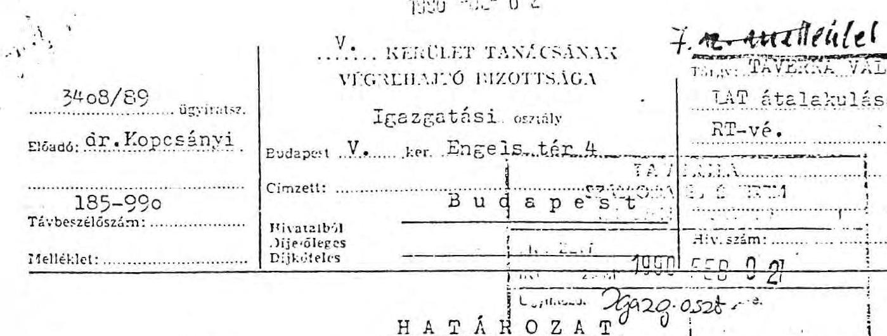

# HATÁHOZAT

1. A TAVERNA BELVÁROSI SZÁLLODA ŔS VENDÉGLÁTÓ VÁLJÁT /1056. Bp.V., Március 15 tér 8./ jogszerű használatában álló, az alanti felsorolásban feltüntetett - a Magyar Állam tulajdonában - a Févárosi V.ker. IKV. kezelésében lévő bérlemények tekintetében a TAVERNA SZÁLLODA ŔS ÉTTEREM RÉSZVÉRT TÁRSASÁG-ot /1056. Bp.V., Március 15 tér 8./ jogutódás jogcímén elismerem az alábbi helyiségekre:

|  5114 | 1. Kecskeméti u. 4. | Alföldi vendéglő | 237 m²  |
| --- | --- | --- | --- |
|  5354 | 2. Párisi u. 6. | Amigó eszpresszó | 81 m²  |
|  5136 | 3. Harmincád u. 4. | Aranybárány vendéglő | 1118 m²  |
|  5412 | 4. Alpári Gyula u. 19. | Badacsonyi borozó | 159 m²  |
|  5363 | 5. Károlyi Mihály u. 7. | Bajor söröző | 285 m²  |
|  5171 | 6. Eötvös L. u. 8. | Bécsi söröző | 151 m²  |
|  5172 | 7. Belgrád rkp. 13-15 | Belgrád söröző | 367 m²  |
|  5356 | 8. Szt. István krt 29. | Bonbon eszpresszó | 219 m²  |
|  5188 | 9. Honvéd u. 18. | Borsodi söröző | 171 m²  |
|  5106 | 10. Petőfi Sándor u. 3. | Corsó étterem | 359 m²  |
|  5113 | 11. Rosenberg hp. u. 11. | Csarnok vendéglő | 182 m²  |
|  5107 | 12. Muzeum krt 13. | Csendes étterem | 256 m²  |
|  5392 | 13. Alpári Gyula u. 7. | Dóm sörbár | 74 m²  |
|  5170 | 14. Vigadó tér 3. | Dunacorsó vendéglő | 480 m²  |
|  5362 | 15. Rosenberg hp. u. 13. | Édestej eszpresszó | 117 m²  |
|  5349 | 6. Felszabadulás tér 1. | Egyetem eszpresszó | 157+6 m²  |
|  5364 | 17. Semmelveis u. 2. | Gourmand eszpresszó | 240+104"  |
|  5414 | 6. Veres Pálné u. 10. | Grinzingi borozó | 220 m²  |
|  5353 | 19. Engels tér 1. | Gyopár eszpresszó | 139 m²  |
|  5316 | 20. Szép u. 1. | Habroló cukrászda | 43 m²  |
|  5315 | 21. Veres Pálné u. 12. | Házi cukrászda | 19 m²  |
|  5116 | 22. Muzeum krt 39. | Huszéves bisztró | 217 m²  |
|  5356 | 23. Marx tér 6. | Inbisz buhé | 255 m²  |
|  5423 | 24. Nagy Ignác u. 21. | Ignácz borozó | 132+83 t  |

22:55-4. - C. Ker. 17. a. 1. 4. - Pátria-Nyolcati 1545. - Pl. 17. 7. 22. 20.

---

|  5360 | 25. |  | 6.u.5. | Jácint eszpresszó | 161 m2  |
| --- | --- | --- | --- | --- | --- |
|  5301 | 26. |  | Felszabadulás tér 5. | Jégbüfé |   |
|  5381 |  |  | /Párizsi udvar 2./ | Jégbüfé | 430 m2  |
|  5281 | 27. |  | Tanács krt. 8. | Kis Imbisz | 30 m2  |
|  5356 | 28. |  | Marx tér 8. | Kronenbourg sörözö | 86 m2  |
|  5195 | 29. |  | Dorottya u.6. | Kénes Csárda | 100 m2  |
|  5193 | 6u. |  | 30. Váci u. 36. | Mini sörözö | 32 m2  |
|  5250 | 31. |  | 31. Oktober 6.u.3. | Minőségi borozó | 208 m2  |
|  5203 | 32. |  | 32. Oktober 6.u.8. | Mókus sörözö | 284+35 m2  |
|  5288 |  |  | /Zrinyi u.9./ | Mókus tejbisztró/ |   |
|  5351 | 33. |  | 33. Váci u. 11/A. | Muskátli eszpresszó | 85 m2  |
|  5303 | 34. |  | 34. Muzeum krt 41. | Muzeum vendéglö | 151 m2  |
|  5169 | 35. |  | 35. Fetőfi tér 3. | Nepoletana étterem | 433 m2  |
|  5350 | 36. |  | 36. Kigyó u.2. | Nárcisz eszpresszó | 127 m2  |
|  5183 | 37. |  | 37. Kristóf tér 7-8 | Otard konyakbár | 118 m2  |
|  5348 | 38. |  | 38. Oktober 6.u.26. | Parabola eszpresszó | 91 m2  |
|  5144 |  |  | 39. Irányi u.25. | Pilseni sörbár | 114 m2  |
|  5410 | 40. |  | 40. Régiposta u.4. | Rendella borozó | 234-44 m2  |
|  5354 | 41. |  | 41. Santo Vécseyu.5 | Santos eszpresszó | 154 m2  |
|  5202 | 6u. |  | 42. Váci u. 86. | Stop bisztró | 185+  |
|  5105 | 43. |  | 43. Festi B.u.2. | Százéves étterem | 257 m2  |
|  5111 | 44. |  | 44. Nagy Ignác u.16. | Szerb vendéglö | 150 m2  |
|  5304 | 45. |  | 45. Szt.István krt.7. | Sziget cukrászda | 379 m2  |
|  5184 | 46. |  | 46. Bihari J.u.17. | Szlovák sörözö | 271 m2  |
|  5365 | 47. |  | 47. Münnich F.u.19. | Terv eszpresszó | 80 m2  |
|  5361 | 48. |  | 48. Münnich F.u.34. | Tulipán eszpresszó | 84 m2  |
|  5175 | 49. |  | 49. Rosenberg hp.u.15. | Tüköry sörözö | 177 m2  |
|  5112 | 50. |  | 50. Vadász u.6. | Vadásztanya vendéglö | 204 m2  |
|  5323 | 51. |  | 51. Bástya u.35. | Városkepu eszpresszó | 186 m2  |
|  5352 | 52. |  | 52. Egyetem tér 5. | Véndiák eszpresszó | 126 m2  |
|  5251 | 53. |  | 53. Gerlóczy u.13. | Villányi borozó | 104 m2  |
|  5403 | 54. |  | 54. Bihari J.u.18. | Vinó bár | 48 m2  |

---

5402 55. Szép u.1. /Kossuth L.u.3./

5359 56. Bajcsy Zs.u.74.

5146 62. 57. Váci u.61.

5201 58. Bajcsy Zs.u.64.

Vinó bár

46 m²

Virág eszpresszó

134 m²

Wernesgrüner söröző

79 m²

Zóna bisztró

2. Felhívóm a TAVERNA SZÁLLODA ÉS ÉTTEREM RÁSZVÉNYTÁRSASÁG

figyelmét, hogy

a. A helyiségeket csak az átadó és átvevő cégek között létrejött megállapodásban foglaltaknak megfelelően használhatja. A helyiségek egyéb célu felhasználásához, a helyiségek hasznosításához az elhelyező hatóság engedélye szükséges. Engedély nélkül történő hasznosítás esetén a helyiség igénybe vehető.

b. A határozat önmagában /bontási, átalakítási, stb./ munkálatok végzésére nem jogosít és nem mentesít az egyéb jogszabályokban meghatározott hatósági engedélyek megszerzése alól.

c. Amennyiben a helyiség használatával felhagy és hasznosításáról a vonatkozó jogszabályokban meghatározott módon nem gondoskodik, köteles ezt a körülményt az elhelyező hatóságnak 15 napon belül bejelenteni.

d. Köteles a határozat jogerőre emelkedésétől számított 15 napon belül az ingatlan kezelőjével bérleti szerződést kötni.

Határozatom a 19/1984./IV.15./ Mt.sz.rend. 23.9/2/bek. alapul. Határozatom indokolását az 1981. évi I.Tv. 43.8/2/bek. alapján mellőztem.

Határozatot kapják:

1. TAVERNA BELVÁROSI SZÁLLODA ÉS VENDÉGLÁTÓ VÁLLALAT
2. TAVERNA SZÁLLODA ÉS ÉTTEREM RT. 1056. Ép. Március 15. tér 8.
3. Iparí-és Ker.0.
4. V.ker. IKV.
5. írattár 1990. január 23.

Budapest, 30. december 1980.

A kisdmány hiteléül:

dr. Tóth Ildikó s.k., osztályvezető

---

# INGATLAN ADASVETELI SZERZODĖS 

mely létrejött a TAVERNA Belvárosi Szálloda és Vendéglátó Vállalat (1056. Budapest, Március 15. tér 8.), mint eladó és a TAVERNA Szálloda és Étterem Részvénytársaság (1056. Budapest, Március 15. tér 8.), mint vevố között a mai napon az alábbi feltételekkel:
1./ Eladó eladja a Magyar Állam tulajdonában és eladó kezelésében lévô alábbi ingatlanok tulajdonjogát vevőnek:
a./ A Budapest, XIII. kerületi 1044. számu tulajdoní lapon felvett 25861. hrsz-u, Karikás Frigyes u. 9. szám alatt $1130 . \mathrm{m}^{2}$ nagyságu belterületi ingatlan.
b./ A Budapest, XIII. kerületi 1033. számu tulajdoni lapon felvett 25.850 . hrsz-u, Váci ut 142. szám alatti $1041 \mathrm{~m}^{2}$ nagyságu belterületi ingatlan.
c./ A Budapest, XIII. kerületi 1031. számu tulajdoni lapon felvett 25848 hrsz-u, Váci ut 140. szám alatti $1169 \mathrm{~m}^{2}$ nagyságu belterületi ingatlan.
d./ A Budapest, XIII. kerületi 1032. számu tulajdoni lapon felvett 25849 hrsz-u, Dagály u. 3. szám alatti $1076 \mathrm{~m}^{2}$ nagyságu ingatlan.
2./ Az 1./ pontban irt ingatlanok vételárát felek bruttó 20.000 .000 .- Ft, aza huszmillió forintban állapítják meg, melynek megfizetésére vevő az alábbi tételekben köteles:
10.000 .000 .- Ft vételárat a jelen szerződés aláirását követő 15 napon belül, 5.000.000.- Ft-ot 1990. január 31. napjáig, 5.000.000.- Ft-ot 1990. február 28. napjáig.

---

3./ Eladós szavatolja az 1./ pontban irt ingatlanok teher-, és permentességét.
4./ Vevõ az ingatlanokat megtekintett és ismert állapotban veszi meg.
5./ Eladós a szerzôdés tárgyát képezõ ingatlanokon a Palatinus Szálloda megépitését tervezte, illetve kezdte meg annak elôkészítését.
6./ Vevô, mint az eladós részvételével megalapított Részvénytársaság, átveszi és folytatja a 4./ pontban irt Szálloda létesitését.
7./ Eladós hozzájárul ahhoz, hogy a vevõ tulajdonjoga jelen szerzôdés alapját az ingatlannyilvántartásba, vétel címét bejegyzésre kerüljön.
8./ Vevô 1939. december 31. napján lér az ingatlanok tirtokába, ettól kezdve szedi annak hasznait és viseli terheit.
9./ A szerzôdéskötéssel és a tulajdonjog bejegyzésével felmerülõ költségek és illetékek vevêt terhelik.
10./ A szerződésben nem szabályozott kérdésekben a Ptk. a ászvételre vonatkozó szabályait kell alkalmazni.

Jelen szerzôdést felek átolvasták, annak tartalmát közösen értelmezték, s azt akaratukkal mindenben megegyezônek találták.
Budapist 1939. december 15.
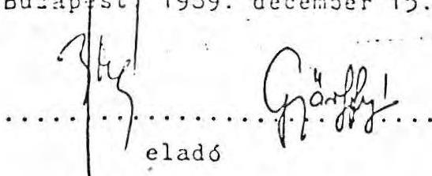
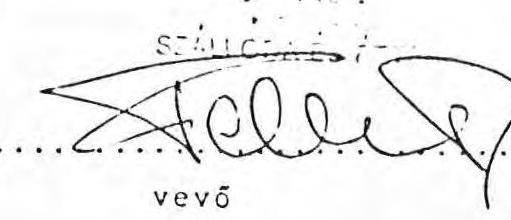

---

# MEGALLAPODAS, 

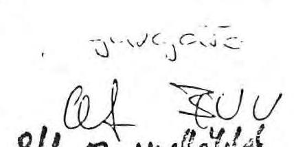
mely létrejött a TAVERNA Belvárosi Szálloda és Vendéglátó Vállalat (1056. Budapest, Március 15. tér 8.) átadó és a TAVERNA Szálloda és Etterem Részvénytársaság (1056. Budapest, Március 15. tér 8.) átvevố között a mai napon az alábbi feltételekkel:
1./ Felek előzményként rögzítik, hogy a TAVERNA Belvárosi Szálloda és Vendéglátó Vállalat részvételével megalakult a TAVERNA Részvénytársaság, melyet a Fôvárosi Bíróság Cégbírósága 041272. számu cégjegyzékbe bejegyzett.
2./ A Részvénytársaság átveszi a Vállalat tevékenységének nagy részét, a folytatásához szükséges ne. lyiségekkel, álló- és fogyóeszközökkel egyutt.
3./ Felek megállapodnak abban, hogy a TAVERNA Rt. megvásárolja az 1. számu mellékletben felsorolt egységekben lévő áru-, anyagkészletet és egyéb különféle fogyóeszköz jellegü készleteket.
A TAVERNA Rt. a TBSZVV számlázása alapján tesz eleget fizetési kötelezettségének.
4./ Az 2./ pontban írt álló- és fogyóeszközök átruházása fejében felek az alabhi hruttó özszegben meghatározott ellenértékben és fizetési határidöben állapodnak meg:
a./ Az állóeszközök vételára 94 millió Ft, melybôl:

- 24.083.471,84 Ft-ot készpénzben az aláirást követő 15 napon belül a TAVERNA Rt. átutal a TBSZVV bankszámlájára,
- 69.916.528,16 Ft értékben pedig a TBSZVV fenntartási és beruházási hitelterhét a TAVERNA Rt. átvállalja, minden kamatterhével. A TAVERNA Rt. a hitel átcedálására vonatkozó banki iratok másolatát köteles 1990. I. 10-ig a TBSZVV-nek másolatban átadni.
Ezzel a tartozás kiegyenlítettnek tekintendô.
b./ A tartós fogyóeszközök vételára 80.500 .000 .Ft, melybôl:
- 68.778.590.- Ft-ot készpénzben utal át, oly módon, hogy 38.778.596.- Ft-ot a jelen megállapodás aláirását követő 15

---

napon belül, 30.000.000.- Ft-ot 1990. január 31. napjáig köteles a TAVERNA Rt. a TBSZVV-nek megfizetni.

- 11.721.404.- Ft értékben pedig a TAVERNA Rt. átvállalja a TBSZVV forgóalapmegelőlegezési hitelterhét, annak minden kamatterhével együtt. TAVERNA Rt. a hitel átcedálására vonatkozó banki iratok másolatát köteles 1990. I. 10. napjáig a TBSZVV-nek másolatban átadni.
c./ A kereskedelmi fogyóeszközök vételára 19 millió Ft. Ebből 9 millió Ft-ot a megállapodás aláirását követő 15 napon belül, 5 millió Ftot 1990. I. 31. napjáig, 5 millió Ft-ot 1990. II. 28. napjáig köteles átvevố megfizetni.
5./ Az eszközkészlet átadására 1989. december 31. napján kerül sor.
6./ Az átadásra kerülő eszközök mennyisége és ennek megfelelően értéke a leltárkiértékeléstől és a számlázástól függően módosulhat.
Felek megállapodnak abban, hogy 1990. XII. 31. napjáig végelszámolást készítenek.
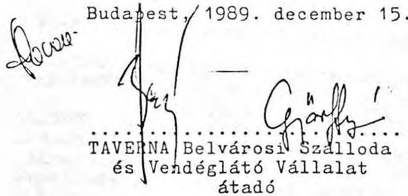
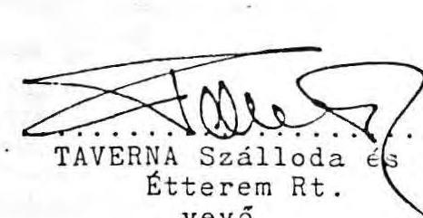

---

# MEGÁLLAPODAS 

mely létrejött a TAVERNA Belvárosi Szálloda és Vendéglátó Válalat /1056 Budapest, Március 15. tér 8.sz./, mint átadó és a TAVERNA Szálloda és Étterem Részvénytársaság /1056. Budapest, Március 15. tér 8.sz./, mint átvevố között a mai napon az alábbi feltételekkel:
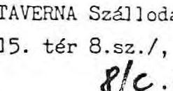

1. Felek elôzményként rögzitik, hogy a Részvénytársaság átveszi és folytatja a vállalat feladatainak nagy részét. A feladatokkal, tevékenységekkel együtt átveszi a folytatásukhoz szükséges helyiségeket, ingatlanokat.
2. Az 1. pontból következôen a Részvénytársaság átveszi a XIII. ker. Margitszigeten lévô Casinó étterem és a hozzátartozó Casinó II.büfé üzemeltetését.
3. A Casinó étterem és büfé helyiségei közterületen lévô épitmények, mely közterület kezelôje a XIII. ker. Tanács VB. Müszaki Osztálya.
4. Az étterem és büfé helyiségei átadó vállalat vagyonához tartoznak, s igy tulajdonát képezik.
5. Atadó a Casinó étterem és büfé helyiségek tulajdonjogát átvevố Részvénytársaságra ruházza bruttó 1.800 .000 R vételárért.
6. Vevô Részvénytársaság a vételárat a szerzôdés aláirását követô 6 hónapon keresztül, minden hónap utolsó napjáig, havi 300.000 R-os részletekben fizeti.
7. A vételárban az üzlethelyiségekben lévô eszközök, berendezési tárgyak ára nem szerepel.
8. Atvevố Részvénytársaság jelen szerzôdés aláirásával megszerzi a helyiségek tulajdonjogát. A birtokbaadás napja 1990. január 1 napja.

---

9. Felek közösen megkisérlik a helyiségek jogi helyzetének tisztázását, az ingatl annyilvántartásba a felépitményi tulajdonjog bejegyeztetését.

Budapest, 1989. december 21.
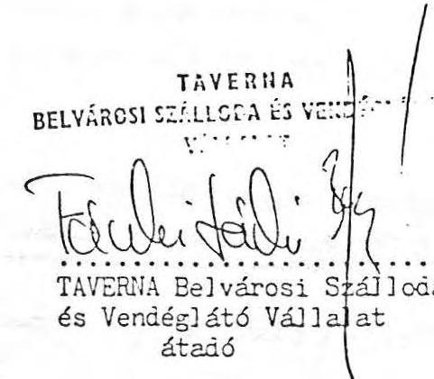

---

A Belvárosi Vendéglátó Vállalat üzletei 1990. január 1-én

|  Üzlet neve | Cime | üzemelési forma | foglalkoztatott létszám  |
| --- | --- | --- | --- |
|  7102 Berlin étt. | V.Szent I. krt. 13. | jövedelemérd. |   |
|  7103 Berlin City | -"- | -"- | 150  |
|  7208. Cairó bisztró | V.Majakovszkij u.112. | -"- | 13  |
|  7194 City Grill | V.Tolbuchin krt.6. | -"- | 12  |
|  7217 City Grill | XIII.Jászai M.tér 3. | -"- | 14  |
|  7119 Habana étterem | VI.Bajcsy Zs.u.21. | -"- | 16  |
|  7178 Kassai söröző | XIII. Rajk L. u. 14. | -"- | 24  |
|  7388 Keringő kávéház | VI. Népköztársaság u.5. | -"- | 9  |
|  7125 Kömüves étterem | VI. Lenin krt. 75. | -"- | 27  |
|  7418 Lángos italbolt | V.Eötvös u.41/a. | -"- | 8  |
|  7115 Luxor-Paprika | V.Szent István krt. 5. | -"- | 17  |
|  7108 Márka étterem | V. Alkotmány u.20. | -"- | 57  |
|  7129 Pódium üzletház | VI.Népköztársaság u.33. | -"- | 32  |
|  7109 Rézkakas étterem | V.Veres Pálné u. 3-5 | -"- | 30  |
|  7214 Tükör büfé | XIII. Szent István krt. 24. | -"- | 11  |
|  7130 Vasút vendéglő | VI. Rudas L.u.37. | -"- | 3  |
|  7132 RÁmpa vendéglő | VI. Lehel u.1/a. | szerződéses | 11  |
|  7302 Sport cukrászda | V.Lengyel Gy. u. 3. | -"- | 11  |
|  7338 Balettcipő | VI. Hajós u. 14. | -"- | 4  |
|  7181 Bohémtanya | VI. Paulay E. u.6. | -"- | 9  |
|  7331 Ciklámen eszpr. | XIII.Dózsa Gy. út 59. | -"- | 4  |
|  7384 Daru eszpresszó | XIII. Váci út 190. | -"- | 2  |

---

7224 Piac bisztró
7146 Fényes vendéglö
7216 Flecken bisztró
7427 Forgács italbolt
7426 Garabonciás italbolt
7164 Hegedüs borozó
7225 Hid italbolt
7228 Jonathán bisztró
7218 Jófalat
7305 Károlyi
7420 Koccinó borozó
7206 Lővér söröző
7253 Patkós borozó
7319 Rétes-mézes cukrászda
7221 Sarok italbolt
7312 Szabolcs cukrászda
7425 Vaskerék bisztró
7180 Trojka
7302 Sport cukrászda
7285 Tejpavilon
7122 Hubertus vendéglö
7311 Hóvirág cukrászda
7310 Mónika cukrászda
7293 Tejpresszó
7151 Üstökös vendéglö
7226 Röppentyü
XIII. Élmunkás térí piac
XIII. Thamann u. 69.
XIII. Váci út 28.
XIII. Forgács u. 8 .
XIII. Szabolcs u. 28.
XIII. Hegedüs Gy.u.103.
XIII.Mautner S.u.7.
XIII. Váci út 129.
V. Károlyi M. u. 17.
VI. Hunyadi tér 1.
VI.Majakovszkij u. 100.
XIII. Gogol u. 22.
VI. Bajcsy Zs.u.15/a.
XIII. Országbiró ut 58.
XIII. Dózsa Gy.u.126.
XIII.Váci út 16.
VI. Andrássy ut 28.
V. Lengyel Gy.u.
VI. Hunyadi tér
VI. Hajós u. 31.
XIII. Váci út 129-131
XIII. Hegedüs Gy. u. 24.
XIII. Hajdú köz
XIII. Kassák L.u.36.
XIII. Röppentyü u.20.
szerződéses 10
-"- 6
-"- 5
-"- 4
-"- 3
-"- 4
-"- 4
-"- 7
-"- 11
-"- 5
-"- 9
-"- 5
-"- 5
-"- 5
-"- 6
-"- 13
-"- 11
ZÁRVA
szerződéses 8
ZÁRVA
szerződéses 2
szerződéses 1
szerződéses 5
ZÁRVA

---

A Taverna Szálloda és Étterem Részvèrsárssaság üzletei 1990. január 1-én

|  Üzlet neve | címe | üzemelési forma | foglalkoztatott létszám  |
| --- | --- | --- | --- |
|  City termelő | VI. Andrássy út 81. | jövedelemérd. | 12  |
|  Kaiser sörbár | V. Vitkovics M. u. 11-13. | -"- | 2  |
|  Amigó eszpressző | V. Párisi u. 6. | -"- | 8  |
|  Aranybárány | V. Harmincad u. 4. | -"- | 40  |
|  Ádám söröző /+Éva/ | VI. Népköztársaság u. 41. | -"- | 52  |
|  Bajor sörbár /DAB/ | V. Károlyi Mihály u. 7. | -"- | 13  |
|  Ibolya, | VI. Népköztársaság útja 19. | -"- | 9  |
|  Ballantine's | VI.Novenber 7.tér 3. Népköztársaság utja 47. | -"- | 27  |
|  Barátság+Montmartre | XIII. Pozsony út 43. | -"- | 4  |
|  Béby cukrászda | V. Eötvös utca 8. | -"- | 15  |
|  Bécsi söröző | XIII. Béke tér 12. | -"- | 9  |
|  Béke eszpressző | V. Belgrád rkp. 13. | -"- | 25  |
|  Belvárosi Kávéház-LIDő | V. Szabadsajtó út 5 | -"- | 105  |
|  Bonbon-Imbisz-Krónenbourg | V.Marx tér 6,8. Szt.István krt.29. | -"- | 27  |
|  Borsodi söröző | V. Honvéd u. 18. | -"- | 5  |
|  Budvár söröző | XIII. Róbert Károly krt. 66. | -"- | 13  |
|  Corsó étterem | V. Petőfi Sándor u. 3. | -"- | 34  |
|  Casinó étterem | XIII. Margitsziget | -"- | 7  |
|  Casinó II. bülé | XIII. Váci ut 73/b. | -"- | 5  |

---

| Dupla eszpresszó | XIIISzent István krt. 10. | jövedelemérd. | 6 |
| :--: | :--: | :--: | :--: |
| Egyetem eszpresszó | V. Felszabadulás tér 1. | -"- | 20 |
| Erdélyi Lakomázó | XIII. Szt. István krt. 22. XIII. Visegrádi u. 4. | -"- | 35 |
| Etoile étterem | XIII. Pozsonyi ut 4. | -"- | 15 |
| Fesztivál étterem | VI. Népköztársaság u. 11. | -"- | 34 |
| Gambrinus étterem | VI. Lenin krt. 104. | -"- | 40 |
| Gourmand eszpresszó | V. Semmelweis u. 2. | -"- | 20 |
| Gyopár eszpresszó | V. Engels tér 1. | -"- | 9 |
| Hidegkonyha | XIII. Övezet u. 5-7. | -"- | 46 |
| Jegbüfé | V. Felszabadulás tér 5. | -"- | 78 |
| Kávés Katica | XIII. Váci út 54. | -"- | 10 |
| Mátyás Pince | V. MÁrcius 15. tér 7. | -"- | 127 |
| Ménes Csárda | V. Apáczal Cs. J. u. 15. | -"- | 18 |
| Mignon | V. Tanács krt. 28. | -"- | 14 |
| Napuletana | V. Petöli 5. Lér 3. | -"- | 37 |
| Opera étterem | VI. Nópköztársaság útja 44. | -"- | 37 |
| Otard konyakbár | V. Kristóf Lér 8. | -"- | 8 |
| Piknik | V. Tanács krt. 28. | -"- | 11 |
| Pilvax étterem | V. Városház u. 10. | -"- | 14 |
| Santos eszpresszá | V. Vécsey u. 5. | -"- | 7 |
| Százéves étterem | V. Pesti Barnabás u. 2 | -"- | 48 |
| Tavasz eszpresszó | VI. Lenin krt. 120. | -"- | 21 |
| Villám vendégló | XIII. Váci út 70. | -"- | 9 |

---

| Akali borozó | XIII. Szt. István krt. 2. | szerződéses | 4 |
| :--: | :--: | :--: | :--: |
| Alföldi vendéglö | V. Kecskeméti u. 4. | -"- | 11 |
| ANGyalföldi sörözö | XIII. Váci ut 104. | -"- | 5 |
| Ara eszpresszó | XIII. Balzac u. 37. | -"- | 5 |
| Aradi, kisvendéglö | V. Aradi u. 61. | -"- | 5 |
| Badacsonyi borozó | XIII. Váci út. 33. | -"- | 4 |
| Badacsonyi borozó | V. Alpári Gy. u. 19. | -"- | 4 |
| Balzac vendéglö | XIII. Balzac u. 1/. | -"- | 11 |
| Bácsi city | (XIII. Sallai I. u.18.   XIII. R. Wallenberg u.5. | -"- | 4 |
| Beugro | VI. Sziv u. 30. | -"- | 5 |
| Csarnok büfé | V. Rosenberg IIp. u. 11. | -"- | 2 |
| Csarnok vendéglö | V. Rosenberg hp. u. 11. | -"- | 11 |
| Csendes étterem | V. Múzeum krt. 13. | -"- | 7 |
| Carmen | VI. Bajcsy Zsilinszky u. 15/a-b. | -"- | 8 |
| Csöpi eszpresszó | XIII. Katona József u. 14. | -"- | 4 |
| Dália eszpresszó | * XIII. Da gály u. 7. | -"- | 4 |
| Deli eszpresszó | VI. Népköztársaság u. 54. | -"- | 5 |
| Dóm sörbár | V. Alpári Gyula u. 7. | -"- | 5 |
| Dunacorsó vendéglö | V. Vigadó tér 3. | -"- | 27 |
| Edestej eszpresszö | V. Rosenberg hp. u. 13. | -"- | 4 |
| Eszéki sörbár | XIII. Gogol u. 33. | -"- | 3,5 |
| Gocsej sorozö | XIII. Róbert K. krt. 38. | -"- | 11 |

---

| Gulyás csárda | VI. Majakovszkij u. 40. | szerződéses | 9 |
| :--: | :--: | :--: | :--: |
| Gyöngyi eszpresszó | XIII. Bóke út 104. | -"- | 6 |
| Habroió | V. Szóp u. 1/b. | -"- | 2 |
| Halászcsárda | XIII. Bóke u. 7. | -"- | 10 |
| Halásztanya | XIII. Váci u. 47/a. | -"- | 7 |
| Házi cukrászda | V. Irányi u. 25. | -"- | 2 |
| Helvécia borozó | Eötvös u. 23/b. | -"- | 3 |
| Hönvéd sörbár | XIII. Dózsa György u. 140. | -"- | 2 |
| Hunyadi bisztró | VI. Szófia u. 8. | -"- | 9 |
| Húszéves bisztró | V. Múzeum krt. 39. | -"- | 9 |
| Ignácz borozó | V. Nagy I. u. 21. | -"- | 1,5 |
| Ipoly étterem | XIII. Ipoly u. 16-18. | -"- | 11 |
| Ipoly eszpresszó | XIII. Pozsonyi ut 28. | -"- | 5 |
| Jácint eszpresszó | V. Október 6. u. 5. | -"- | 5 |
| Joli cukrászda | VI. Lenin krt. 79. | -"- | 5 |
| Kakas vendéglö | XIII. Reitter Ferenc u. 69. | -"- | 5 |
| Kétkorsó sörbár | XIII. Visegrádi u. 43. | -"- | 4 |
| Kinizsi sörbár | VI. Jókai u. 25. | -"- | 5 |
| Kisbojtár vendéglö | XIII. Degály u. 17-19. | -"- | 7 |
| Kisdelicatesse | XIII. Váci út 39. | -"- | 2 |
| Kisdóm eszpresszó | VI. Bajcsy Zsilinszky út 19. | -"- | 5 |
| Kis Imbisz | V. Tanács krt. 8. | -"- | 3 |
| Kiskakukk | XIII. P0zsonyi ut 12. | -"- | 14 |

---

|  Kiskorsó sörbár | XIII. Fürst S. u. 31. | szerződéses | 5  |
| --- | --- | --- | --- |
|  Kokté! eszpresszó | XIII. Róbert K. krt. 86. | -"- | 5  |
|  Körönd eszpresszó | VI. Szinyei M.P. u. 1. | -"- | 4  |
|  Lehel önkiszolgáló étterem | XIII. Dózsa Gy. ut 132. | -"- | 11  |
|  Lehel vendéglő | XIII. Lehel út 17/b. | -"- | 4  |
|  Mátra eszpresszó | XIII. Mautner S. u. 50. | -"- | 4  |
|  Mini sörbár | V. Váci utca 36. | -"- | 2  |
|  Minőségi borozó | V. Október 6.u. 3. | -"- | 7  |
|  Minőségi Vajassütemény | VI. Lenin krt. 78. | -"- | 11  |
|  Mokka büfé | XIII. Bulcsú u. 23/b. | -"- | 5  |
|  Mókus söröző | V. Zrinyi.u. 5. | -"- | 11  |
|  Móri borozó | XIII. Balzac u. 39. | -"- | 5  |
|  Mozi eszpresszó | XIII. Váci út 12. | -"- | 4  |
|  Muskátli eszpresszó | V. Váci u. 11/a. | -"- | 5  |
|  Mózeum /Zodiak/ vendéglő | V. Mózeum krt. 41. | -"- | 10  |
|  Müvész vendéglő | XIII. Vigzsinház u. 5. | -"- | 9  |
|  Napsugár cukrászda | XIII. Csanády u. 5. | -"- | 5  |
|  Nárcisz | V. Váci u. 32. | -"- | 6  |
|  Nemesgulácsi borozó | XIII. Kassák L. u. 43. | -"- | 7  |
|  Omnia eszpresszó | XIII. Szt. István krt. 16. | -"- | 4  |
|  Operett eszpresszó | VI. Nagymező u. 19. | -"- | 3  |
|  Parabola eszpresszó | V. Október 6. u. 26. | -"- | 5  |
|  Párisi cukrászda | VI. Nópköztársaság ut.ja 37. | -"- | 13  |
|  Pepsi eszpresszó | VI. Lenin krt. 95. | -"- | 6  |
|  Piccoló eszpresszó | V. Párisi udvar 2. | -"- |   |

---

|  Pilseni sörbár | V. Irányi u. 25. | szerződéses | 2,5  |
| --- | --- | --- | --- |
|  RÁmóna eszpresszó | XIII. Váci út 66. | -"- | 6  |
|  Rigolettó cukrászda | XIII. Visegrádi u. 9. | -"- | 8  |
|  Rizling borozó | VI. Lázár u. 4. | -"- | 2  |
|  Rondella borozó | V. Rágiposta u. 4. | -"- | 8  |
|  Rozmaring eszpresszó | VI. Népköztársaság utja 46. | -"- | 5  |
|  Rózsa vendéglő | VI. Rózsa F. u. 98. | -"- | 5  |
|  Rózsa eszpresszó | XIII. Váci út 51/b. | -"- | 5  |
|  Stop bisztro | V. Váci utca 86. | -"- | 9  |
|  Süni borozó | XIII. Lehel út 7/a. | -"- | 3  |
|  Szabadsághid eszpresszó | V. Tolbuchin krt. 2. | -"- | 6  |
|  Szerb vendéglő | V. Nagy I. u. 16. | -"- | 8  |
|  Sziget cukrászda | V. Szt. István krt. 7. | -"- | 9  |
|  Szlovák söröző | V. Bihari u. 17. | -"- | 11  |
|  Tejpresszó | VI. Szondi u. 37. | -"- | 2  |
|  Terminus Kávézó | VI. Lenin krt. 112. | -"- | 11  |
|  Terv eszpresszó | V. Münnich Ferenc u. 19. | -"- | 5  |
|  Troli eszpresszó | VI. Majakovszkij u. 70. | -"- | 5  |
|  Tulipán eszpresszó | V. Münnich Ferenc u. 34. | -"- | 3  |
|  Turmix | XIII. Váci ut 12. | -"- | 1,5  |
|  Városkapu | V. Kecskemóli u. 17. | -"- | 6  |
|  Városliget étterem | VI. Népköztársaság u. 130. | -"- | 11  |
|  Vasas sörbár | XIII. Rozsnyai u. 5. | -"- | 2  |

---

|  Velence eszpresszó | VI. Izabella u. 83. | szerződéses | 7  |
| --- | --- | --- | --- |
|  Vidám büfé | XIII. Övezet u. 6. | -"- | 2  |
|  Vig eszpresszó | XIII. Szt. István krt. 20. | -"- | 4  |
|  Villányi borozó | V. Gerlóczy u. 13 | -"- | 4  |
|  Víró bár | V. Szép u. 1/b. | -"- | 4  |
|  Virág eszpresszó | V. Bajcsy zs. út. 74. | -"- | 5  |
|  Visegrád eszpresszó | XIII. Róbert K. krt. 102. | -"- | 5  |
|  Zóna bisztró | V. Bajcsy Zs. ut 64. | -"- | 11  |
|  Taverna Tourist Service | VI. Lenin krt. 112. | -"- | 14  |
|  Verbunkos vendéglő | XIII. Vicor H. u. 35. | -"- | 21  |
|  Visegrád étterem | XIII. Visegrádi u. 50. | -"- | 10  |
|  Vínó bár | V. Bihari J. u. 18. | -"- | 2  |

---

|  Árpád | VI. Szondi u. 45-47. | ZARVA  |
| --- | --- | --- |
|  Anga büfé | XIII. Margitsziget | ZARVA  |
|  Hajnal bár | VI. Népköztársaság u. 81. | ZARVA  |
|  Kadarka | VI. Rudas László u. 75. | ZARVA  |
|  Kékfrankos | VI. Liszt F. tér 7. | ZARVA  |
|  Kéksün | XIII. Mosoly u. 42. | ZARVA  |
|  Kóvidinka | VI. Szondi u. 66. | ZARVA  |
|  Menü | XIII. Váci u. 10. | ZARVA  |
|  Mókus tejpresszó | V. Október 6. u. 6. | ZARVA  |
|  Rózsa II. és/presszó | VI. Nópköztársaság u. 76. | ZARVA  |
|  Tejpresszó | VI. Szondi u. 86. | ZARVA  |
|  Vadásztanya | V. Vadász u. 6. | ZARVA  |

---

Aranycsillag
Delicatesse
Elöre eszpresszó
Grinzingi borozó
Hajós Sörbár, tejbár
Lila Akác
Sirály éttercm
Szamovár
Tüköry sörözö
Véndiák
Vörös Sárkány
Wernesgrüner
VI. Majakovszkij u. 78.
XIII. Radnóti Miklós u. 38.
VI. Bajcsy Zs. u. 35.
V. Veres Pálné u. 10.
VI. Hajós u. 23.
VI. Nagymezö u. 30.
VI. Bajcsi Zs. u. 9.
XIII. Pozsonyi ut 3.
V. Rosenberg hp. u. 15.
V. Egyetem tér 5.
VI. Népköztársaság u. 80.
V. Váci u. 61.

KFT.
KFT.
KFT.
KFT.
KFT.
KFT.
KFT.
KFT.
KFT.
KFT.

---

A Fövárosi Bíróság, mint cégbíróság
41118 szám.

V é g z é s

A biróság a cég kérelmére elrendeli, hogy az ujonnan nyitandó 41118 számú cégjegyzékba a következö cég és az alábbi tételek bejegyeztessenek.

A cégjegyzék "A" lapjára: Részvénytársaság

1. A társaság elnevezése magyar nyelven: Hotel Liget Rt. angol nyelven: Hotel Liget Ltd. német nyelven: Hotel Liget AG. francia nyelven: Hotel Liget S. A. orosz nyelven: Gostinica "Liget" A/0.
2. A társaság székhelye: Budapest, VI., Dózsa György út lo6. szám.
3. A társaság telephelye: Budapest, V. Március 15. tér 8. szám.

A cégjegyzék "B" lapjára: A végzés száma: 41118
kelte: 1988. október 4.

1. Az alapszabály kelte: 1988. szeptember 22.
2. A társaság tartama: 17 /tizenhét/ év
3. A társaság tevékenységi köre:

5151 Kereskedelmi vendéglátás
5153 Kereskedelmi szálláshely értékesítés

---

5169 Egyéb bellereskedelmi szolgáltatás
5179 Egyéb idegenforgalmi azolgáltatás /kivéve külföldi fizetőeszköz ellenében történő teljesítés/.
4. Az alaptőke összege: 295000000 ,- Pt, azaz Kettőszákilencvenötmillió forint, amely 590 db . azaz Ötszázkilencven darab egyenként 500000 ,- Pt, azaz Ütszázezer forint névértóki, névre szólór részvényre oszlik.
5. A közgyülésre szóló meghiv. st a kitüzött időpont előtt. legalább 15 /tizenöt/ nappal, a társaság egyéb hirdetményeivel azonos módon kell közzétenni. A társaság a hirdetményeit a Figyelmó címú lapban teszi közzé. Az Igazgatóság jogosult a hirdetményeket belátása szerint más módon is közzétenni.
6. Az Igazgatóság 3 /azaz három/ tagból áll.
7. Ervényes határozat meghozatalához az Igazgatósáa valamennyi tagjának jelenléte szükséges.

A cégjegyzék "C" lapjára: A végzés száma: 41118
kolte: 1988. október 4.

1. A cégjegyzés módja:

A túrcuság cégét a Taverna által jelölt igazgató, aki az igazgatósás elnöke, önállóan jegyci, míg

---

az igazgatósáa többi tagja a társasáa cégét egy másik igazgatósági taggal, vagy egy képviseleti joggal felruházott társasági tisztviselével együttesen jegyzi.

# Cégjegyzésre jogosultak: 

Igazgatósági tagok:
2. Z a h o v a i A r p á d igazgató, az igazgatósáa elnöke,
Budapest, XX., Eperjes u. 44. szám alatti lakos.
3. K e r e s z t ú r y M i k l ó s igazgatósági tag, Budakoszi, Barackvirág u. 12. szám alatti lakoos.
4. In g. W ol f g a n g D r e i s e i t l igazgatósági tag,
A-2500 Baden Herrnkirchengasse 12. szám alatti
lakos.
A bejegyzés foganatosítását a bíróság a cégjegyzékvezetőnek meghagyja.

A bejegyzésről a folyamodót 6 db . aláirásírcimpéldány és 2 db . társasági szerződés kiadása mellett azzal értesíti, hogy a cégjegyzésre jogosultak aláirásaikat mindenkor a cégjegyzéssel azonos alakban teljesitsék.

Budapest, 1988. október 4.
Szegedinín Sebestyén Katalin s.k.

---

# A) Törzalap 

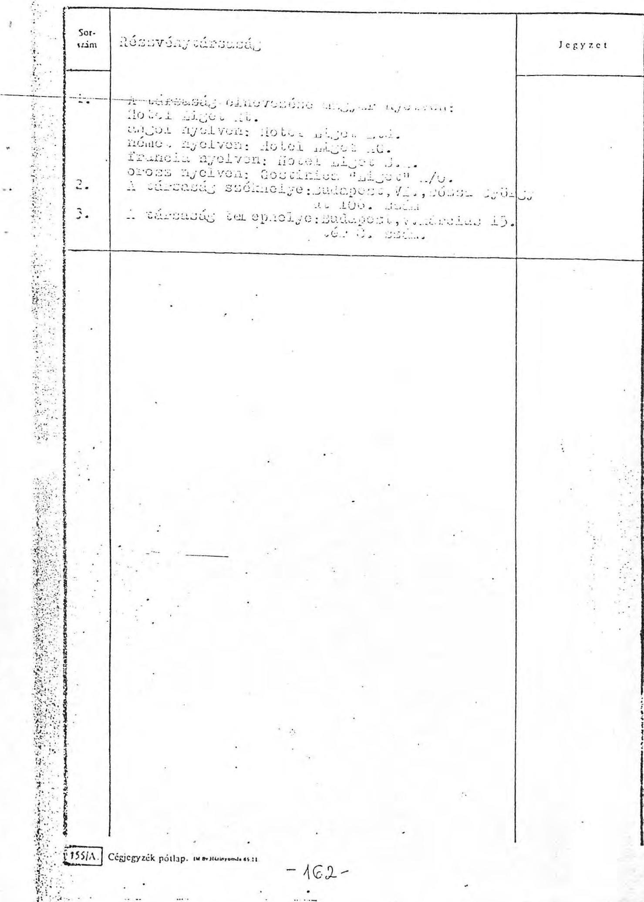

---

## B) Nyilvántartási lap

|  Sor-
szám | A végzés száma: 41118 A végzés zelte: 1900.
öztöber 4. | Jegyzet  |
| --- | --- | --- |
|  1. | Az alapvetőbály zelte: 1900. szeptember 22. |   |
|  2. | A társasáa tartama: 17/91cen/ét/ év |   |
|  3. | A társasáa tevékenyséji köre: 5151 Kereskedelmi vendéglátás 5153 Kereskedelmi szálláshely értékesítés 5169 Egyéb bekereskedelmi szolgáltatás 5179 Egyéb idegenforgalmi szolgáltatás /kivéve külföldi fizetőeszköz ellenében történő teljesítés/ |   |
|  4. | Az alaptöke összege: 295.000.000,- Ft. azaz Kettőszázkilencvenötmillió-forint, amely 590 db azaz űtszázkilencven durab egyenként 500.000,-Ft. azaz űtszázezer forint névértékű, névre szóló részvényre oszlik. |   |
|  5. | A közgyűlésre szóló meghívást a kitűsött időpont előtt legalább 15/91cenőt/ nappal, a társaság egyéb hirdetményeivel azonos módon kell közzéteni. |   |
|  6. | A társaság a hirdetményeit a Figyelő című lapban teszi közzé. Az igazgatóság jogosult a hirdetményeket belátása szerint más módon is közzétenni. |   |
|  7. | Az igazgatóság 3 /azaz három/tagból áll. Érvényes határozat meghozatalához az Igazgatóság valamennyi tagjának jelenléte szükséges. |   |

- 163 -

---

C) Képviseleti lap

|  A végzés száma: 41118 | A végzés költs: 1988. | Jegyezt  |
| --- | --- | --- |
|   | Sítésekr 4. |   |

A segítségéb módja:

A társasági cégét a Taverna által jelölt igazgató, ami az igazgatóság címühe, önállóan jegyzi, míg az igazgatóság többi módja a társasági cégét egy másik igazgatósági tagjai, vagy képviselői jogjai felrészített társasági tisztviselővel együttesen jegyzi.

Végjegyzéare jogosultak:

Igazgatósági tagok:

Hahoval Árpád igazgató, az igazgatóság címühe, Budapest, K. Operjes u. 44. szám alatti lakoz. Zeresztőry Miklós igazgatósági tag, Tudakossi, Barackvirág u. 12. szám alatti lakoz. 1. Wolfgang Breiselti igazgatósági tag, 2. - 2500 Baden Morrankroherdasse 12. szám alatti lakoz.

Cégjegyzék pótlap. 26. 20. 2021. 16:11.

-164-

---

A Fővárosi Bíróság mint cégbíróság hivatalosan igazolja, hogy ez a cégkivonat a 41.118 számú eredeti cégjegyzékkel mindenben megegyezik. Budapest, 1988. november 14.

---

# M. n. melléké 

MEGALLAPODAS
mely létrejött a TAVERNA Szálloda és Etterem RT. (tovdbbiakban TAVERNA RT.), valamint a Belvárosi Vendégidtó vállalat (tovdbbiakban BVV.) között az alábbiak szerint:
1.) A TAVERNA RT. vállalja, hogy a BVV. müködésélez szükséges valamennyi központi tevékenységgel kapcsolatos feladatot - térítés ellenében - elvégzi.
2.) A szolgáltatás elvégzésének diga évente kerül meghatározásra. Az 1990. évi dij 33 milli: Ft, melyet a BVV az alabbi ütemezés szerint utal át a TAVERNA RT. részére:

1990. Janudr 31-ig 5 MFt
1990. július 31-ig 5 MFt
1990. december 31-ig 5 MFt
1991. februdr 15 -ig 18 MFt
3.) A munkafolyamatok elvégzésével kapcsolatos feladatköröket, hatásköröket és jogköröket a 1-10. sz. mellékletek tórtalmazdák.
4.) A BVV. a feladatok ellátásának érdekében a mellékletekben meghatározottak szerint felhatalmazza a TAVERNA RT.-t bélyegzöinek, céges nyontatávnyainak, bizonylatainak és egyeb ügyvitelileg elöirt dokumentumainak használatára, vezetésére illetve kezelésére.
5.) Harmadik személyel folytatand: levelezés (megrendelés, szerzudéskötés, stb.) esetén az írásos anyagot az RT. illetékes osztalya aldi rásra készen állítja össze, az osztóly vezetüje kéajegyvével ellátja.
Az ilyen leveleket, dokumentumokat csak a BVV. vezetüi vagy felhatalmazott dolgoz. i írhatnak alá.

---

6.) A feladatok elvégzéséért a TAVERNA RT. Alapszabályában, illetve Szervezeti és Müködési Szabályzatában meghatározott vezetői munkakörök betöltői a felelősek.
7.) A BVV. köteles a feladatok elvégzéséhez szükséges iratokat, információkat, döntéseket megfelelő határidöben az RT. illetékes osztályának rendelkezésére bocsátani. A késedelembo̊l eredő károkért az RT nem felel.
8.) Az RT. felelős a munkák határidöben történő elvégzéséért; a határidő elmulasztásából, illetve a nem megfelelő munkavégzésböl eredő károkért.
9.) A BVV. vezető́i az RT vezetőit a feladatok elvégzése során nem utasíthatják, de valamennyi feladatkörben valamennyi dokumentumba betekinthetnek, információt kérhetnek, döntéseket hozhatnak.
10.) A BVV. vezető́i alatt az igazgatót, a fókönyvelet és az üzemeltetési igazgatóhelyettest kell érteni.
11.) A központi tevékenység ellátásához szükséges üzletpolitikai célokat, tervsadmokat, költségkereteket és egyéb iránymutatásokat a BVV. a feladatok elvégzéséhez megfelelő idöben, elöre köteles megadni. Az RT. vezetői és dolgozói ennek megfelelöen kötelesek végezni munkájukat. Elő́re nem látható körülmény felmerülése esetén haladéktalanul kötelesek tájékoztatni a BVV. illctékes vezctöit.
12.) Az együttmüködés során felmerülö vitás kérdést elsősorban a kót fél vezetőjének konzultációja útján kell rendezni.

---

A megalllapodds határozatlan idöre szôl. Hatályát veszti abban az esetben, ha valamely fél megszünik.
Ha a TAVERNA RT. valameny - a BVV számára szolgáltatást nyiijtć központi szervezeti egysége az RT alapítéként történő közremüködésével tórsazággá alakul, akkor az új tórsazág a szolgáltatást köteles a gazdálkodási év (naptári év) végéig folytatni, és erról a BVV-vel megállapodni.

Budapest, 1990. január 2.
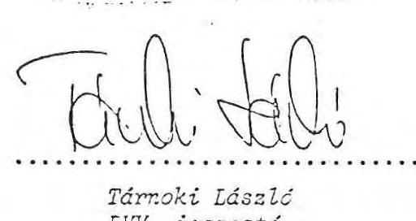
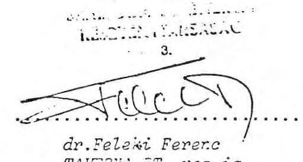

---

1.sz. melléklet

A személyzeti és munkaügyi feladatok ellátása
1./ A BVV minden év január 20.-ig tájékoztatja az RT Személyzeti és Munkaügyi osztályát az éves bér- és létszámtervröl. A tervek meghatározásához az osztály elözetes információt nyújt /bázisadatok, stb./.
2./ A hálózati egységek létszám és bérkeretét a BVV igazgatója határozza meg az osztály javaslata alapján.
3./ Az osztály elvégzi a BVV dolgozóival kapcsolatos valamennyi személyzeti, munkaügyi, oktatási és szociálpolitikai feladatot.
4./ A dolgozók munkaszerzödéseit a BVV vezatői irják alá a BVV SZMSZ-ában foglaltak szerint.
5./ A személyzeti és munkaügyi osztály valamennyi BVV-s dokumentumot /munkaszerzôdés, tanulmányi szerzödés, külsõ levelezés/ aláirásra készen állítja össze. Az aláirandókat az osztályvezető vagy megbizottja kézjegyével látja el.
6./ A személyzeti és munkaügyi területen adódó BVV-s számlákat és egyéb kifizetéseket a vezető vagy meghatalmazottja ellátja kézjegyével, a kifizetést a BVV vezetője aláírásával engedélyezi.

---

A Gazdasági Vezérigazgatóság alá tartozó területek a Megállapodás értelmében a BVV. részére a következő feladatokat látják el:

# 1./ Fökönvvelés 

- A BVV. gazdasági eseményeinek pénzügyi és számviteli bonyolítása fôkönyvi kivonat készitéséig bezárólag.
- A vállalat gazdálkodására vonatkozó számviteli beszámolók elkészitéséhez adatszolgáltatás.
- A szerződéses üzletek nyilvántartásainak vezetése, elszámoltatása és a befizetési kötelezettségek rendezésére vonatkozó intézkedések kezdeményezése.
- Eszközök nyilvántartása, leltárak felvétele, leltárak kiértékelése és a leltáreredményrôl fôkönyvelői jelentés elkészítése.
- Pénzforgalmi feladatok bonyolitása BVV. instrukció alapján.

## 2./ Közgaazdasági Osztály

- A vállalati és üzleti tervek /jövedelmezôségi terv/ nyilvántartása tervezéstől értékelésig, illetve az ezekkel kapcsolatos külsõ-belsõ információs adatszolgáltatási kötelezettség biztosítása.
- Az általános forgalmi adózással kapcsolatban a bevételt terhelő ÁFA határidôre történő meghatározása.
- A szerződéses üzletekkel kapcsolatos teljeskörü számítás elvégzése, döntésre elôkészítése.

---

- A jövedelemérdekeltségú üzletekre vonatkozóan számszaki tervek és értékelések elvégzése, illetve döntésre elôkészítése.

# 3./ Eszközgazdálkodási Osztály 

- Állóeszköz vonatkozásában az elôzetesen tervezett és ütemezett nagyságrendben, a BVV. írásbeli jelzése alapján biztosítja az állóeszközök megrendelését, illetve beszerzését BVV. üzleti átvétellel.
- Fogyóeszközök /tartós fogyó, ker. fogyó, segédanyag, tisztitószer, egyéb/ vonatkozásában a BVV. igény kielégítése az elôzetesen, tervben meghatározott nagyságrendben, és jelzett ütemezés szerint a Taverna RT. raktáraiba történô beszerzés, mely átszámlázással kerül átadásra.
- A két vállalat közötti eszközmozgatás irányítása.
- Selejtezések vonatkozásában a Selejtezési Bizottságban történő részvétel, selejtezésre javaslattétel.
- A szerződéses átadásoknál az értékelésben történő részvétel javaslattétellel.
- A helyiséggazdálkodással kapcsolatos feladatok ellátása.

## 4./ Müszaki Osztály

- A BVV.-t érintő, müszaki tevékenységgel kapcsolatos valamennyi feladat /karbantartás, beruházás, felújítás, energia/ ügyintézése /tervezés, megrendelés, ellenôrzés, átadás kifizetéssel bezárólag/, illetve dokumentációja, nyilvántartása.
- Az ezen tevékenységek, mint költségtervezéstől értékelésig történő nyilvántartása /ütemezése és teljeskörü bontása/.

---

5./ Munkavédelem

- Az üzletekkel kapcsolatos munkavédelmi feladatok szervezése, irányítása, ellenőrzése.
6./ Gondnokság
- Központi tevékenységbōl adódó irattározási és selejtezési feladatok ellátása.
- Távközlési, köztisztaság - közterület fenntartással kapcsolatos gondnoki feladatok ellátása, az ezekkel kapcsolatos költségek kiterhelése.
7./ Ügyvitelszervezés
- Ügyviteli, ügyrendi szolgáltatás.

---

# Gyorsétkeztető Termékigazgatóság 

## feladatai

1./ A Gyorsétkeztető üzletek szakmai felügyeletét a Termékigazgatóság látja el.
2./ A gyorsétkeztető üzleteket érintő kérdésekben /bér- és árváltozás, stb./ a Termékigazgatóság javaslatot tesz a BVV vezetői felé az indokolt utasítások végrehajtására.
3./ Prémium megvonás, illetve fegyelmi eljárás a BVV. vezetői, illetve a Termékigazgatóság vezetőinek együttes konzultációja és az azt követő határozata alapján történik.
4./ Müszaki, szakmai kérdések, felújítás, karbantartás vonatkozásában az Rt. müszaki osztályának bevonásával, a BVV.-vel létrejött megállapodás szerint kell eljárni.
5./ A gyorsétkeztető üzletek áruellátására /éláimiszerek stb./ kötendő szerződéseket az Rt. Termékigazgatósága készíti elõ a BVV., és az Rt. vezetőinek konzultációja alapján.

---

# Az Áruforgalmi osztály feladatai 

1./ A Taverna Rt. Áruforgalmi osztálya - a BVV. illetékes vezetőivel előzetesen egyeztetve - szállítási, illetve értékesítési szerződést köt a BVV. részére.
Ezeknek operativ lebonyolítását az Rt. Áruforgalmi osztálya végzi, az árualapokat a BVV. részére rendelkezésre bocsátja.
2./ A Taverna Rt. a budapesti áruraktárból, húsraktárból, illetve göngyöleg raktárból az operativ áruforgalmi munka érdekében a BVV. részére folyamatos áru utánpótlást nyújt, illetve a göngyöleget begyüjti az Rt. Gazdasági Igazgatósága által meghatározott számlázási rend szerint.
3./ A Taverna Rt. Áruforgalmi osztálya részletesen, üzletenkénti bontásban előkészíti és meghatározza a BVV. jövedelemércekeltségü egységei részére a készletnormákat. A keretgazdálkodásba vont üzletekkel kapcsolatos problémákat a B:̃. vezetői felé, intézkedés végett javaslattal együtt jelzi.
4./ A Taverna Rt. Áruforgalmi osztálya a Gastrotrans Kft-vel kapcsolatos ügyintézés során a BVV. egységeire is alkalmazható, és érvényes megállapodásokat köt, előzetes egyeztetés alapján.
5./ A Taverna Rt. Áruforgalmi osztálya vállalja, hogy piackutatási tevékenysége során új szállítók, új cikkek ajánlatával a BVV. illetékeseit is megkeresik.

---

# Szerződéses Üzletcsoport Igazgatósáa 

## feladatai

1./ A Taverna Rt. Szerződéses Üzletcsoport Igazgatósága a BVV-hez tartozó valamennyi üzletnél elkésziti a müködtetéshez szükséges intézkedések szakiratait /szerződés, levelezés, megrendelés, stb./ . Az iratokat az ÜCSI igazgató /távollétében helyettese/ kézjegyével látja el.
2./ Az általánydijakat érintő témában - módosítási kérelem új kiadatása - a Szerződéses Üzletcsoport Igazgatóság igazgatója /vagy helyettese/ koordinálja az igazgatósági ülések idópontjait. Az előkészitést a Taverna Rt. Közgazdasági osztálya és a Szerződéses Üzletcsoport Igazgatósága végzi.
3./ A Taverna Rt. Szerződéses Üzletcsoport Igazgatósága ellátja a BVV. szerződéses üzleteinél a szakmai felügyeletet, szervezi és lebonyolítja a hirdetést, versenytárgyalást, a szerzödésbeadást, illetve szerződésbontást.

---

# Vendéglátó osztály feladatai 

1./ A Taverna Rt. Vendéglátó osztálya gondoskodik a müködési engedélyben feltüntetett üzletkör szerinti elvárások biztosításáról. Ez vonatkozik az osztálybasorolási feltételek, valamint az üzletköri leírások betartására egyaránt.
2./ A Taverna Rt. Vendéglátó osztálya szakmailag ellenőrzi, figyelemmel is kiséri, illetve javaslatokat tesz a jövedelemérdekeltségü üzletek müszaki-technikai, szakmai és jövedelmezõségi feladataira egyaránt a BVV-re vonatkoztatva.
3./ A Taverna Rt. Vendéglátó osztálya, az Rt. Ellenőrzési osztálya, vagy külső hatóságok által feltárt hiányosságok kivizsgálását elvégzi, a szükséges intézkedések megtételére a BVV. vezetöivel konzultálva javaslatot tesz és ügyintézi azt.
4./ A Taverna Rt. Vendéglátó osztálya fegyelmi ejjárás lefolytatását, határozat hozatalának ellátását a BVV. vezetőségével konzultálva végrehajtja.
5./ Prémium megvonásokat kezdeményez a BVV. üzleteire vonatkozóan is, az elözetes konzultáció alapján.
6./ A hatósági kötelezettségből eredő ügyintézéseket /KÖJÁL ellenőrzés, egyéni panaszlevelek, müszaki hiányosságok stb./ a BVV üzleteire is folyamatosan intézi.
7./ Munkavédelmi szemlén résztvesz az Rt. Vendéglátó osztályának képviselője. A feltárt hiányosságok megszüntetésére az intézkedéseket a BVV illetékesével egyeztetve hajtja végre.
8./ A müsor, zeneszolgáltatást, OSZK, ORI feladatokat a BVV üzleteire is végrehajtja.

---

# 7.sz. melléklet 

## Árcsoport feladatai

Ártájékoztatási, üzemgazdasági és egyéb feladatok ellátása.
1./ A Taverna Rt. Árcsoportja a BVV részére előkésziti az árutasításokat, árközléseket, ezek kiadását, valamint az árváltozások lebonyolítását.
2./ A Taverna Rt. Árcsoportja tájékoztatási kötelezettséggel van a BVV üzletei felé, az árképzéssel kapcsolatos jogi szabályokban bekövetkező változásokró, a szükséges intézkedések megtételéről.
3./ A Taverna Rt. Árcsoportja a BVV üzletek vonatkozásában 5 napon át gyüjti az árbevételeket, üzemgazdasági számításokat, elemzéseket végez. A költségkeretek előkészitésének javaslatában közremüködik.
4./ A Taverna Rt. Árcsoportja minden olyan BVV-s üzletet érintő szerződéssel kapcsolatban /pl. mosatás, cukrásztarmék ellátás/, ami elemzo munkát igényel /üzemgazdaságtani feladatok/, döntés előkészitésre alternativákat és megoldási javaslatot készit.

---

# A Vállalkozási osztály feladatai 

1./ A BVV-hez tartozó üzletre tett ajánlatokról a BVV vezetōit tájékoztatni kell.
2./ A BVV ajánlatát a Vállalkozási osztály javaslata alapján a BVV vezetője jogosult jóváhagyni.
3./ A Vállalkozási osztály tárgyalási eredményekről folyamatos tájékoztatást köteles adni.
4./ A létrehozandó társaság megalapításával kapcsolatos teendőket /apportlista elkészítése, szerződések előkészítése, letéti számla megnyitása stb./ az Rt. SZM Szabályzatában meghatározott szer.ezeti egységei végzik az 1/1989. sz. igazgatói utasításnak megfelelően.
5./ Az Rt-igény szerint biztosít a társaság müködésének időtartamára vállalati képviselôt.

---

# Az Ellenőrzési és Rendészeti osztály feladatai 

1./ Hálózatellenőrzési munka

- gyorsétkeztető üzletek célvizsgálati programja
- szoros elszámolásu üzletek célvizsgálati programja
- jövedelemérdekeltségü üzletek célvizsgálati programja
- szerződéses üzletek szükített, illetve bővitett vizsgálati programja
- termelő üzemek - raktárak célvizsgálati feladatai
2./ Revíziós munkák, belső ellenőri feladatok
- dokumentációs ellenőrzés
- gazdasági részfolyamatok ellenőrzése
- személyi felelősség megállapítás stb.
3./ Tüzvédelmi ellenőrzés
- tüzvédelmi dokumentációk ellenőrzése
- elektromossággal összefüggő tüzvédelmi feladatok ellenőrzése
- gáz és egyéb fütőberendezésekre vonatkoz: elöírások teljesítése
- általános tüzvédelmi utasítás, egyedi tüzvédelmi utasításban elöirt előírások megvalósulása
4./ Rendészeti ellenőrzés
- egységek, üzletek zárásbiztonsága
- kötelezően elöirt TT védelmi feladatok teljesülése
- pénzkezelés
- prevenció megvalósulása
- vagyonvédelem
5./ Polgári védelmi feladatok
- a vonatkozó jogszabályokban elöirt feladatok teljesítése
- polgári védelmi iratok megléte, adatlapok folyamatos vezetése stb.

---

# 11.sz. melléklet 

A TAVERNA RT. Reklám-Propaganda Osztályának feladatai a BVV. reklám-propaganda tevékenységével kapcsolatban

A reklám-propaganda koncepció kidolgozása, tervek készitése akciókra, reklámhordozókra és eszközökre.

A reklám-propaganda tevékenység szervezése, tárgyalás külsõ cégekkel, kapcsolattartás a sajtóval és más hírközlõ szervekkel.

Az értékesítési munkához szükséges reklámeszközök, dekorációk, nyomtatványok biztosítása.

Harmadik személlyel folytatandó levelezés /ajánlatwérés, megrencelés, szerzôdés, reklamáció stb./ esetén az írásos anyag elkészítése. Az osztályvezetô kézjegyével ellátott leveleket, szerzödésekat a BvV vezetői irják alá.

A BVV reklám-propaganda témájú megrendeléseire vonatkozó számlák kollaudálása.

Olyan kivételes esetekben, amikor a BVV-t érintô reklámkoltségeket az RT-t érintô költségekkel együtt az RT. egyenlíti ki, diszzzzíció adása a Pénzügyi Osztálynak a szóbanforgó részköltségeknck az RT. részéről a BVV-nek történô leszámlázására.

Dekorációs tevékenység végzése a BVV üzletek számára a TA:ERNA Dcko rációs Nöhely vagy külsõ munkatársak megbizása útján.

---

A TAVERNA Szálloda és Étterem Rt. és a Belvárosi Vendéglátó Vállalat között 1990. január 2-án kôtött

A megállapodás 2. pontja az alábbiak szerint módosul:

A szolgáltatás a BVV, 1990. évi mérlegének átadásával tekinthetõ elvégzettnek, illetve teljesitettenk. TAVERNÁ-t a szolgáltatás ellenértékeként 33 millió R illeti meg. Az elszámolás a teljesítéssel összefüggően az alábbi ütemezés szerint történik.

| 1990. január 31-ig | 5 Mrt |
| :-- | :-- |
| 1990. julius 31 -ig | 5 Mrt |
| 1990. december 31 -ig | 5 Mrt |
| 1991. február 15-ig | 18 Mrt, amennyiben a mérleg |

átadásra kerül.

A fizetés számla alapján történik, amely egýben a teljesités igazolása is, kivéve a februári fizetést, amely elõlegnek tekintendô, elszámolása 1991. julius 31 -ig történik meg.
A szolgáltatás dija és a fizetési kondiciök évente január 10-ig közös megállapodás alapján kerülnek meghatározásra.

A megállapodás egyéb pontjai változatlanul érvényben maradnak.

Budapest, 1990. december 22.
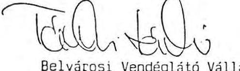

Belvárosi Vendéglátó Vállalat
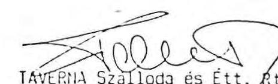