# ÁLLAMI   SZÁMVEVŐSZÉK 

## JELENTÉS

az EU támogatások felhasználása során alkalmazott szabálytalanság-, adósság- és követeléskezelési folyamatok ellenőrzéséről

---

2. Államháztartás Központi Szintjét Ellenőrző Igazgatóság
2.1. Teljesítmény Ellenőrzési Főcsoport
Iktatószám: V-2015-126/2009-2010.
Témaszám: 963
Vizsgálat-azonosító szám: V0478
Az ellenőrzést felügyelte:
Dr. Becker Pál
főigazgató
Az ellenőrzés végrehajtásáért felelős:
Dr. Zöldréti Attila
főcsoportfőnök
Az ellenőrzést vezette:
Tóthné Kiss Katalin
osztályvezető
Az ellenőrzést végezték:

| Fekete Gábor számvevő tanácsos | Dr. Körmendy-Rácz János külső munkatárs | Laczkovich Rita számvevő |
| :--: | :--: | :--: |
| Maklári Dorottya számvevő gyakornok | Dr. Marosi Andrea külső munkatárs | Szepes Béla számvevő tanácsos |
| Terbe Mónika számvevő tanácsos | Tukacs Éva számvevő tanácsos |  |

A témához kapcsolódó eddig készített számvevőszéki jelentések:
címe
sorszáma
Jelentés az uniós támogatások hazai monitoring és ellenőrzési rendszer működésének ellenőrzéséről ..... 0723
Jelentés a gazdaságfejlesztés állami eszközrendszerének működésének ellenőrzéséről ..... 0802
Jelentés a Magyar Köztársaság 2007. évi költségvetése végrehajtásának ellenőrzéséről ..... 0824
Jelentés a közbeszerzési rendszer működésének ellenőrzéséről ..... 0831
Jelentés az INTERREG célú költségvetési előirányzatok hasznosulásának ellenőrzéséről ..... 0845
Jelentés a Magyar Köztársaság 2008. évi költségvetése végrehajtásának ellenőrzéséről ..... 0928

---

# TARTALOMJEGYZÉK 

BEVEZETÉS ..... 11
I. ÖSSZEGZŐ MEGÁLLAPÍTÁSOK, KÖVETKEZTETÉSEK, JAVASLATOK
II. RÉSZLETES MEGÁLLAPÍTÁSOK ..... 29

1. A szabálytalanság-, adósság- és követeléskezelés feltételrendszerének értékelése ..... 29
1.1. A szabálytalanságkezelés megjelenítésének helyzete stratégiai dokumentumban, cselekvési tervben vagy szabályozásban ..... 29
1.2. A szabálytalanság-, adósság- és követeléskezelési folyamatok szabályozottságának, időbeniségének, egyértelműségének értékelése ..... 30
1.2.1. az NFÜ által kezelt uniós támogatásokhoz kapcsolódóan ..... 31
1.2.2. az MVH által kezelt uniós támogatásokhoz kapcsolódóan ..... 31
1.3. Az uniós támogatásokat közvetítő intézmények szabálytalanság-, adósság- és követeléskezelési feladat- és hatásköre összhangjának értékelése ..... 45
1.4. Az uniós támogatásokat közvetítő intézményeknek felróható hibák kezelése (jogorvoslati lehetősége) ..... 56
1.4.1. az NFÜ által kezelt uniós támogatásokra vonatkozóan ..... 56
1.4.2. az MVH által kezelt uniós támogatásokra vonatkozóan ..... 56
2. A kialakított szabálytalanság-, adósság- és követeléskezelési folyamatok értékelése eredményessége szempontból ..... 60
2.1. a szabálytalanságkezelési folyamat értékelése eredményességi szempontból ..... 60
2.1.1. szabálytalanságkezelési folyamat az NFÜ-nél ..... 60
2.1.2. szabálytalanságkezelési folyamat az MVH-nál ..... 68
2.2. a kedvezményezettekkel szembeni követeléskezelési folyamat értékelése eredményességi szempontból ..... 72
2.2.1. követeléskezelési folyamat az NFÜ-nél ..... 72
2.2.2. követeléskezelési folyamat az MVH-nál ..... 76
2.3. az EU-val szembeni adósság elszámolási folyamat értékelése eredményességi szempontból ..... 87
2.3.1. EU-val szembeni adósság elszámolási folyamat az NFÜ-nél ..... 87
2.3.2. EU-val szembeni adósság elszámolási folyamat az MVH-nál ..... 89
3. A szabálytalanságkezelési rendszer fejlesztéséhez szükséges tapasztalatok kiértékelésének, visszacsatolásának helyzete ..... 93
3.1. a szabálytalanságok nyomon követése, elemzése, okai kivizsgálásának helyzete ..... 93

---

3.1.1. az NFÜ esetében ..... 93
3.1.2. az MVH esetében ..... 94
3.2. a tapasztalatok beépülésének helyzete a jelentési rendszer fejlesztésébe ..... 94
3.2.1. az NFÜ esetében ..... 94
3.2.2. az MVH esetében ..... 95

# MELLÉKLETEK 

1/a. sz. Nemzetgazdasági Minisztérium észrevétele
1/b. sz. Vidékfejlesztési Minisztérium észrevétele
1/c. sz. Nemzeti Fejlesztési Minisztérium észrevétele
2. sz. Kimutatás az EU támogatások felhasználásáról 2004-2009. év végéig
3. sz. A szabálytalanság-, adósság- és követeléskezelési folyamatok részei
4. sz. Kimutatás egyes beruházási projektekhez kapcsolódó közbeszerzési tárgyú szabálytalansági esetekről
5. sz. Kimutatás az OLAF-nak megküldött szabálytalansági jelentésekről
6. sz. Kimutatás az EU támogatások felhasználása során keletkezett követelések alakulásáról 2004-2009. év végéig
7. sz. Jelentésünkben hivatkozott, az NFÜ által kezelt projektek
8. sz. Az NFÜ által kezelt uniós támogatások szabálytalanság miatti követelés állománya és értékvesztése, 2009. december 31-i állapot szerint
9. sz. Kimutatás az EMVA, az NVT és az EMGA által támogatott projektek mintavétel alapján nyert adatainak összesítéséről
10. sz. Kimutatás a közreműködő szervezetek, ÚMFT szabálytalanságkezelésére vonatkozó belső szabályozásának helyzetéről
11. sz. Kimutatás az NFÜ által kezelt előcsatlakozási eszközök és a 2004-2006-os programozási időszak programjai végrehajtásának határidejéről 2010. február végi állapot szerint
12. sz. Kimutatás az NFÜ szabálytalansági eljárásainak időigényéről
13. sz. Az NVT követelések elemzése

## FÜGGELÉK

1. sz. A Strukturális Alapok ellenőrzési költségeinek vizsgálata (nemzetközi Ellenőrzési Program alapján)

---

# RÖVIDÍTÉSEK JEGYZÉKE 

| Art. | Az adózás rendjéről szóló 2003. évi XCII. törvény |
| :--: | :--: |
| áfa | általános forgalmi adó |
| Áfa tv. | Az általános forgalmi adóról szóló 2007. évi CXXVII. törvény (új) |
|  | Az általános forgalmi adóról szóló 1992. évi LXXIV. törvény (régi) |
| Áht. | Az államháztartásról szóló 1992. évi XXXVIII. törvény |
| AFCOS | Anti-fraud Coordination Service (Csalásellenes Koordináció Szolgálat)   (OLAF Koordinációs Iroda) |
| Ámr. | Az államháztartás működési rendjéről szóló 292/2009. (XII. 19.) Korm. rendelet (új) |
|  | Az államháztartás működési rendjéről szóló 217/1998. (XII. 30.) Korm. rendelet (régi) |
| ÁROP | Államreform Operatív Program |
| ÁSZ | Állami Számvevőszék |
| AVOP | Agrár- és Vidékfejlesztési Operatív Program |
| Bizottság | Európai Bizottság |
| Btk. | A Büntető Törvénykönyvről szóló 1978. évi IV. törvény |
| COCOF | Committee of the Coordination of Funds |
| DDOP | Dél-dunántúli Operatív Program |
| EKKE | EU Közbeszerzési Koordinációs és Szabályossági Egység |
| EKOP | Elektronikus Közigazgatás Operatív Program |
| EMGA | Európai Mezőgazdasági Garancia Alap |
| EMIR | Egységes Monitoring Információs Rendszer |
| EMOGA (GR) | Európai Mezőgazdasági Orientációs és Garancia Alap (Garancia Részleg) |
| EMVA | Európai Mezőgazdasági Vidékfejlesztési Alap |
| EQUAL | A négy közösségi kezdeményezés egyike, amely a munkaerőpiacon létező mindennemű hátrányos megkülönböztetés és egyenlőtlenség leküzdésére irányuló nemzetek közötti együttműködést támogatja |
| ERFA | Európai Regionális Fejlesztési Alap |
| ESZA | Európai Szociális Alap |
| ETE | Európai Területi Együttműködés |
| EU | Európai Unió |
| EUCS tv. | Az európai csatlakozással összefüggő egyes törvénymódosításokról, törvényi rendelkezések hatályon kívül helyezéséről, valamint egyes törvényi rendelkezések megállapításáról szóló 2004. évi XXIX. törvény |
| EURATOM | European Atomic Energy Community   (Európai Atomenergia Közösség) |
| FÖMI | Földmérési és Távérzékelési Intézet |

---

| EUMSZ | Az Európai Unió Működéséről Szóló Szerződés |
| :--: | :--: |
| FVM | Földművelésügyi és Vidékfejlesztési Minisztérium |
| GOP | Gazdaságfejlesztés Operatív Program |
| GVOP | Gazdasági Versenyképesség Operatív Program |
| HEFOP | Humánerőforrás-fejlesztési Operatív Program |
| HOP | Halászati Operatív Program |
| HOPE | Halászati Orientációs Pénzügyi Eszköz |
| IH | Irányító Hatóság |
| IIER | Integrált Igazgatási és Ellenőrzési Rendszer |
| IMIR | INTERREG Monitoring és Információs Rendszer |
| IMK | Interaktív Működési Kézikönyv |
| INTERACT | INTERREG Animation Cooperation and Transfer (INTERREG ösztönzés, együttműködés és átadás) |
| INTERREG | A négy közösségi kezdeményezés egyike, amely a határokon átnyúló, nemzetek és régiók közötti együttműködést támogatja |
| ISPA | Instrument for Structural Policies for Pre-Accession (Strukturális Politikák Csatlakozás Előtti Eszköze) |
| KA | Kohéziós Alap |
| KAP | Közös Agrárpolitika |
| Kbt. | A közbeszerzésekről szóló 2003. évi CXXIX. törvény (új)   A közbeszerzésekről szóló 1995. évi XL. törvény (régi) |
| KDB | Közbeszerzési Döntőbizottság |
| KEHI | Kormányzati Ellenőrzési Hivatal |
| KEOP | Környezet és Energia Operatív Program |
| Ket. | a közigazgatási hatósági eljárás és szolgáltatás általános szabályairól szóló 2004. évi CXL. törvény |
| KH | Kifizető Hatóság |
| KIOP | Környezetvédelmi és Infrastruktúra Operatív Program |
| KMOP | Közép-magyarországi Operatív Program |
| KOR IH | Koordinációs Irányító Hatóság (NFÜ) |
| KÖZOP | Közlekedés Operatív Program |
| KSZ | Közreműködő Szervezet |
| LEADER | Liaison Entre Actions pour le Developpement de l'Economie Rurale   (Közösségi kezdeményezés a vidék gazdaságfejlesztésére) |
| MÁK | Magyar Államkincstár |
| Mepar | Mezőgazdasági Parcella Azonosító Rendszer |
| IMK | Interaktív Működési Kézikönyv |
| MVH | Mezőgazdasági és Vidékfejlesztési Hivatal |
| MVH tv. | A mezőgazdasági, agrár-vidékfejlesztési, valamint halászati támogatásokhoz és egyéb intézkedésekhez kapcsolódó eljárás egyes kérdéseiről szóló 2007. évi XVII. törvény |
| NFT | Nemzeti Fejlesztési Terv |

---

| NFÜ | Nemzeti Fejlesztési Ügynökség |
| :--: | :--: |
| NVT | Nemzeti Vidékfejlesztési Terv |
| NYDOP | Nyugat-Dunántúli Operatív Program |
| OLAF | Office Européen de Lutte Anti-Fraude (Európai Csalásellenes Hivatal) |
| OP | Operatív Program |
| PHARE | Poland-Hungary: Assistance for Restructuring the Economy   (Támogatás Lengyelország és Magyarország gazdaságának átalakításához) |
| PM | Pénzügyminisztérium |
| PM NAO Iroda | National Authorising Office (Pénzügyminisztérium Nemzeti Programengedélyező Iroda) |
| Ptk. | A Polgári Törvénykönyvről szóló 1959. évi IV. törvény |
| RFÜ | Regionális Fejlesztési Ügynökség |
| ROP | Regionális Fejlesztés Operatív Program |
| SAPARD | Special Accession Programme for Agriculture and Rural Development   (Különleges Előcsatlakozási Program a Mezőgazdaság és Vidékfejlesztés támogatására) |
| SAPS | Single Area Payment Scheme   (Egységes Területalapú Támogatás) |
| SPS | Single Payment Scheme   (Egységes Mezőgazdasági Támogatási Rendszer) |
| SLA | Service Level Agreement   (Együttműködési Megállapodás) |
| STRAPI | Strukturális Alapok Programiroda |
| Sztv. | A számvitelről szóló 2000. évi C. törvény |
| TÁMOP | Társadalmi Megújulás Operatív Program |
| TIOP | Társadalmi Infrastruktúra Operatív Program |
| Top up | Kiegészítő Nemzeti Területalapú Támogatás |
| TS | Technikai Segítségnyújtás |
| TSZ | Támogatási Szerződés |
| ÚMFT | Új Magyarország Fejlesztési Terv |
| ÚMVP | Új Magyarország Vidékfejlesztési Program |
| Vht. | A bírósági végrehajtásról szóló 1994. évi LIII. törvény |
| VHK | Végrehajtási Kézikönyv (MVH) |
| VOP | Végrehajtás Operatív Program |
| VPOP | Vám- és Pénzügyőrség Országos Parancsnoksága |

---

.

---

# ÉRTELMEZŐ SZÓTÁR 

a közösség pénzügyi érdekeinek megsértése
adminisztratív hiba
adósságkezelés
(az EU-val szemben)
csalás
együttműködési megállapodás

Európai Közösségek pénzügyi érdekeinek megsértése bűntett
„(1) Aki az Európai Közösségek költségvetését károsítja azzal, hogy
a) az Európai Közösségek által vagy nevében kezelt pénzalapokból származó támogatásokkal,
b) az Európai Közösségek által vagy nevében kezelt költségvetésbe történő befizetésekkel
kapcsolatban valótlan tartalmú nyilatkozatot tesz, valótlan tartalmú, hamis vagy hamisított okiratot használ fel, avagy az előírt tájékoztatási kötelezettségének nem vagy megtévesztésre alkalmas módon hiányosan tesz eleget, bűntettet követ el, és öt évig terjedő szabadságvesztéssel büntetendő.
(2) Az (1) bekezdés szerint büntetendő az is, aki
a) az (1) bekezdés a) pontjában írt támogatást, vagy
b) az (1) bekezdés b) pontjában írt befizetéssel kapcsolatos kedvezményt
a jóváhagyott céltól eltérően használja fel.
(3) Az (1) bekezdés szerint büntetendő a gazdálkodószervezet vezetője, ellenőrzésre vagy felügyeletre feljogosított tagja vagy dolgozója, ha az (1)-(2) bekezdésben írt bűncselekményt a gazdálkodószervezet tagja vagy dolgozója a gazdálkodószervezet érdekében követi el, és a felügyeleti vagy az ellenőrzési kötelezettségének teljesítése a bűncselekmény elkövetését megakadályozhatta volna." (Btk. 314. §)
„A nem a kedvezményezettek által elkövetett szabálytalanságok miatti jogosulatlan kifizetéseket az EMGA kiadások esetében a 6. cikk b) pontjának megfelelően kell kezelni, az EMVA kiadások esetében pedig a 6. cikk c) pontjának megfelelően. Ez a kategória alapvetően az olyan ügyekre vonatkozik, amelyekben a jogosulatlan kifizetés a nemzeti hatóság által elkövetett hibának a következménye." (a Bizottság 885/2006/EK rendeletéhez, a Bizottság által kiadott 1. sz.
 Iránymutatás bevezetésének (1) pontja)
a folyamat főbb részeit a jelentés 3. sz. melléklete tartalmazza.
aki jogtalan haszonszerzés végett mást tévedésbe ejt, vagy tévedésben tart és ezzel kárt okoz, csalást követ el. (Btk. 318. § (1) bekezdés)
az irányító hatóság és a kifizető hatóság, amennyiben úgy ítéli meg, a Polgári Törvénykönyvről szóló 1959. évi IV. törvény rendelkezései szerint, a programok szakmai és pénzügyi megvalósítására vonatkozó felelősségi és fel-

---

ellenőrzési nyomvonal
első közigazgatási vagy jogi ténymegállapítás

Egységes Monitoring Információs Rendszer (EMIR)
ex-ante hozzájárulás
forrásgazda
hitelesítés
hitelesítés
adatköröket meghatározó Együttműködési Megállapodást köt. (360/2004. (XII. 26.) Korm. rendelet)
az Európai Unió által előírt, a Nemzeti Stratégia Referencia Keret operatív programok támogatásai felhasználásának rendszervizsgálati eszköze, a támogatástervezési, pénzügyi lebonyolítási és ellenőrzési folyamatainak leírása szövegesen vagy táblázatba foglalva, vagy folyamatábrával szemléltetve, amely tartalmazza különösen a felelősségi és információs szinteket és kapcsolatokat, továbbá irányítási és ellenőrzési folyamatokat, lehetővé téve azok nyomon követését és utólagos ellenőrzését (281/2006. (XII. 23.) Korm. rendelet)
az illetékes hatóság - legyen az közigazgatási vagy jogi - első olyan írásbeli értékelése, amely konkrét tényekre alapozva megállapítja a szabálytalanság tényét, nem érintve azt a lehetőséget, hogy ez a megállapítás a közigazgatási vagy jogszabályi eljárás változásainak következtében utólag felülvizsgálható vagy visszavonható (Európai Tanács 2005. június 21.-i, 1290/2005/EK rendelet 32. cikk 4 (a) bekezdése).
a strukturális alapokból, a Kohéziós Alapból, a PHARE-ból, az Átmeneti Támogatásból, a Schengen Alapból, az Európai Gazdasági Térség és Norvég Finanszírozási Mechanizmusból, valamint az ezekhez társuló hazai forrásokból megvalósuló programokkal és projektekkel kapcsolatos menedzsment (végrehajtási és kifizetési), monitoring, illetve ellenőrzési, szabálytalanságkezelési és számviteli feladatokat támogató információtechnológiai rendszer (102/2006. (IV. 28.) Korm. rendelet 2 § (1) bekezdés).
az egyes operatív programokban részt vevő partnerországok által évenként, lakosságszámuk arányában nyújtott hozzájárulás az operatív program hatékony működtetéséhez szükséges költségek fedezésére. (49/2007. (III. 26.) Korm. rendelet)
az alapok előirányzatai esetében a tervezési, előirányzat-módosítási, felhasználási, beszámolási, információszolgáltatási, ellenőrzési kötelezettségek viselője és jogok gyakorlója. (281/2006. (XII. 23.) Korm. rendelet)
a folyamatba épített - dokumentum alapú és helyszíni - ellenőrzések összessége, amelyek célja annak megállapítása, hogy a kedvezményezett a támogatási szerződésben, vagy a támogatási okiratban rögzített vagy a projekt adatlap alapján vállalt kötelezettségeit - a vonatkozó közösségi és hazai jogszabályokkal összhangban - teljesítette (281/2006. (XII.23.) Korm. rendelet)
a költségigazoló nyilatkozat alátámasztása érdekében az Igazoló Hatóság által meghatározott formátumban és ütemezéssel az Igazoló Hatóság részére benyújtandó jelentés (281/2006. (XII. 23.) Korm. rendelet)

---

irányító hatóság
köztartozás
közreműködő szervezet
költségigazolás
közösségi hozzájárulás
rendezése
követelés
követeléskezelés
nemzeti hatóság által elkövetett hiba
megállapított szabálytalanság

OLAF - jelentés
operatív program
az operatív program irányító hatóság, az EQUAL program irányító hatóság, a Közösségi Támogatási Keret (a továbbiakban: KTK) irányító hatóság és a Kohéziós Alap irányító hatóság (360/2004. (XII. 26.) Korm. rendelet)
az adózás rendjéről szóló 2003. évi XCII. törvény 178. §-ának 20. pontjában meghatározottak (292/2009. (XII. 19.) Korm. rendelet)
az európai uniós forrásból finanszírozott támogatások esetén a támogató képviseletében eljáró, jogszabályban kijelölt szervezet (292/2009. (XII. 19.) Korm. rendelet)
a hitelesítési és igazolási tevékenységek összefoglaló elnevezése (281/2006. (XII. 23.) Korm. rendelet)
olyan tevékenység, melynek során az Igazoló Hatóság a központi költségvetési forrásból a kedvezményezett, illetve a szállító részére már kifizetett támogatás közösségi hozzájárulási részét átutalja a Nemzeti Fejlesztési Ügynökség kezelésében lévő megfelelő fejezeti kezelésű előirányzat-felhasználási keretszámlákra (281/2006. (XII. 23.) Korm. rendelet)
szabálytalanság tényének megállapítása miatt, a kedvezményezettel kötött szerződés alapján jogosulatlanná váló, visszafizetési kötelezettséggel terhelt összeg (17/2009. (IX. 4.) NFGM utasítás)
a folyamat főbb részeit a jelentés 3. sz. melléklete tartalmazza.
az adminisztratív hiba kategória „alapvetően az olyan ügyekre vonatkozik, amelyekben a jogosulatlan kifizetés a nemzeti hatóság által elkövetett hibának a következménye". (a Bizottság 885/2006/EK rendeletéhez, a Bizottság által kiadott 1. sz. Iránymutatás bevezetésének (1) pontja) Az ellenőrzött hatóságok dokumentumai a nemzeti hatóság által elkövetett hibát adminisztratív, vagy intézményi hibának is nevezik.
a szabálytalansági vizsgálat lezárásaként hozott olyan döntés, amelyben az irányító hatóság/közreműködő szervezet vezetője kétséget kizáró módon megállapítja a szabálytalanság bekövetkeztét, és meghatározza a reparáció módját. (17/2009. (IX. 4.) NFGM utasítás)
az 1828/2006/EK rendelet 28. cikke szerinti jelentés, a rendelet által meghatározott időközönként és formában. (17/2009. (IX. 4.) NFGM utasítás)
a tagállam által benyújtott és a Bizottság által elfogadott dokumentum, amely összefüggő prioritások alkalmazásával fejlesztési stratégiát határoz meg, amelynek megvalósításához valamely alapból, illetve a „konvergencia" célkitűzés esetében a Kohéziós Alapból és az ERFA-ból támogatást vesznek igénybe. (a Tanács 1083/2006/EK rendelete)

---

szabálytalanság
szabálytalanságkezelés
szabálytalansági eljárás
szabálytalansági eljárás felfüggesztése
szabálytalansági eljárás kezdete
szabálytalansági eljárás lezárása
szabálytalanságfelelős
szabálytalanság gyanúja
szabálytalansági vizsgálat
szabálytalanságvizsgálati jelentés
/jegyzőkönyv
szabálytalansági vizsgálat lezárása
„a közösségi jog valamely rendelkezésének egy gazdasági szereplő általi, annak cselekménye vagy mulasztása útján történő megsértése, amelynek eredményeként a Közösségek általános költségvetése vagy a Közösségek által kezelt költségvetések kárt szenvednek vagy szenvednének, akár közvetlenül a Közösségek nevében beszedett saját forrásokból származó bevétel csökkenése vagy kiesése révén, akár indokolatlan kiadási tételek miatt". (A Tanács 1995. december 18.-i 2988/95/EK, EURATOM rendelete)
a folyamat főbb részeit a jelentés 3. sz. melléklete tartalmazza.
a szabálytalanság gyanújának kivizsgálása, a szükséges döntések meghozatala és a döntések végrehajtásának folyamata. (17/2009. (IX. 4.) NFGM utasítás)
az az eljárási cselekmény, amely más hatóság hatáskörébe tartozó előzetes kérdés jogerős eldöntéséig a szabálytalansági eljárás folytatását félbeszakítja. (17/2009. (IX. 4.) NFGM utasítás)
az a nap, amikor a szabálytalansági gyanú-bejelentő adatlapot a KSZ/IH szabálytalanságfelelőse megkapja, illetve a gyanúbejelentést a szabálytalanságfelelős a gyanúbejelentő adatlapon rögzíti. (17/2009. (IX. 4.) NFGM utasítás)
az a nap, amikor az IH/KSZ vezetője a szabálytalanság fennállásának hiányát a lefolytatott eljárás alapján kétséget kizáró módon megállapítja, illetőleg az a nap, amikor a megállapított szabálytalanság következményeként az Európai Unió, illetőleg a Magyar Köztársaság pénzügyi érdekeinek megfelelő állapot helyreáll. (17/2009. (IX. 4.) NFGM utasítás)
akit az IH/KSZ vezetője a szabálytalanságok kezelése és jelentése érdekében jelöl ki. Az IH-nál legalább egy szabálytalanságfelelős kerül kijelölésre. (17/2009. (IX. 4.) NFGM utasítás)
bármilyen adat vagy információ, amely szabálytalanság elkövetésére utal. (281/2006. (XII. 23.) Korm. rendelet)
a szabálytalansági eljárás azon része, melyben a Szabálytalansági Bizottságnak arra kell választ adnia, hogy szabálytalanság történt-e, továbbá hogy a szabálytalanság milyen következményekkel jár és ezek miként kezelhetők. (17/2009. (IX. 4.) NFGM utasítás)
a vonatkozó jogszabályok szerinti, a szabálytalansági vizsgálat megállapításait összefoglaló dokumentum. (17/2009. (IX. 4.) NFGM utasítás)
az a nap, amikor a szabálytalansági ügyben döntésre jogosult IH vezető a szabálytalanság kérdésében döntést hozott. (17/2009. (IX. 4.) NFGM utasítás)

---

# JELENTÉS 

## az EU támogatások felhasználása során alkalmazott szabálytalanság-,adósság- és követeléskezelési folyamatok ellenőrzéséről

## BEVEZETÉS

Az Európai Unió (a továbbiakban: EU) költségvetése a tagállamok és polgárok közötti megosztott erőfeszítés és elkötelezettség, amely azt szolgálja, hogy jövőképüket valóra válthassák. Ennek megfelelően az Európai Közösséget létrehozó Szerződés arra szólítja fel az Európai Bizottságot (a továbbiakban: Bizottság) és a tagállamokat, hogy az uniós költségvetés védelme, valamint a csalás és a költségvetést érintő egyéb jogellenes tevékenységek, szabálytalanságok elleni küzdelem érdekében hangolják össze fellépéseiket.

Az uniós szabályozás ${ }^{1}$ szerint: szabálytalanság a közösségi jog valamely rendelkezésének egy gazdasági szereplő általi, annak cselekménye vagy mulasztása útján történő megsértése, amelynek eredményeként a Közösségek általános költségvetése vagy a Közösségek által kezelt költségvetések kárt szenvednek vagy szenvednének, akár közvetlenül a Közösségek nevében beszedett saját forrásokból származó bevétel csökkenése vagy kiesése révén, akár indokolatlan kiadási tételek miatt.

Az Európai Tanács rendeletet alkotott a csalással összefüggésben is. Az olyan szabálytalanság, amely alapján nemzeti szinten közigazgatási vagy bírósági eljárás kezdeményezhető annak érdekében, hogy meghatározzák a szándékos magatartást, csalás gyanújának minősül ${ }^{2}$. Csalást követ el: aki jogtalan haszonszerzés végett mást tévedésbe ejt, vagy tévedésben tart, és ezzel kárt okoz ${ }^{3}$.

A szabálytalanság fogalmának uniós meghatározása tág keretet adott a nemzeti szabályozásnak. Ez befolyásolta a tagállamoknál a szabálytalansági esetek számbavételét, a Bizottság felé teljesített adatszolgáltatás tartalmát, minőségét.

A Bizottság 2008. évi jelentése ${ }^{4}$ szerint a tagállamok gyakorlata eltért a szabálytalanságok időben történő bejelentése, a pénzügyi hatásra vonatkozó becslések, valamint a szabálytalanságok besorolása tekintetében. Bizonyos orszá-

[^0]
[^0]:    ${ }^{1}$ A Tanács 1995. december 18-i 2988/95/EK, EURATOM rendelete.
    ${ }^{2}$ A Bizottság 2006. december 8-i 1828/2006/EK rendelete.
    ${ }^{3}$ A Btk. 318. § (1) bekezdése.
    ${ }^{4}$ A Bizottság - Európai Parlamentnek és a Tanácsnak írt - 2008. évről készített éves jelentése „A közösségek pénzügyi érdekeinek védelme - Csalás elleni küzdelem"-ről (COM (2009) 372., Brüsszel, 15.7.2009.).

---

gok ${ }^{5}$ csak akkor jelentették be a szabálytalanságot, ha közigazgatási határozatot hoztak, vagy folyamatban volt a visszafizetés. A Cseh Köztársaság, Magyarország és az Egyesült Királyság (Skócia) jelezte, hogy néha késéseket okozott a jelentéstételi folyamatban a fellebbezés és a felülvizsgálat. Néhány ország ${ }^{6}$, közöttük Magyarország is nehéznek tartotta a csalás gyanúját felvető esetek azonosítását, mert az eljárás kezdetén elégtelen bizonyíték állt rendelkezésre és a besorolást a hosszú közigazgatási, bírósági eljárások is akadályozták.

Az Unió költségvetésének végrehajtásáért a Bizottság felelt, de a pénzügyi végrehajtás módjától függő mértékben ez a tagállamokra is átszállt, azaz megosztott volt a felelősség. Az uniós szabályozás szerint a „megbízható pénzügyi menedzsment" érvényesítésével kialakított rendszereknek a szabálytalanságok megelőzéséről, a keletkezett szabálytalanságok felszámolásáról és az eredeti állapot helyreállításáról is gondoskodni kellett.

Magyarországon a szabálytalanság-, adósság- és követeléskezelés témaköréhez kapcsolódó rendszerek fontosságát mutatta, hogy mindösszesen 3745 Mrd Ft EU és kapcsolódó hazai támogatást használtunk fel az értékelt 2004-2009 közötti ${ }^{7}$ időszakban. A felhasznált támogatásoknak a fejlesztési tervek, pénzügyi alapok szerinti megoszlását az alábbi 1. sz. ábra szemlélteti (adattábla a 2. sz. mellékletben).

EU támogatások felhasználása Magyarországon 2004 - 2009 között
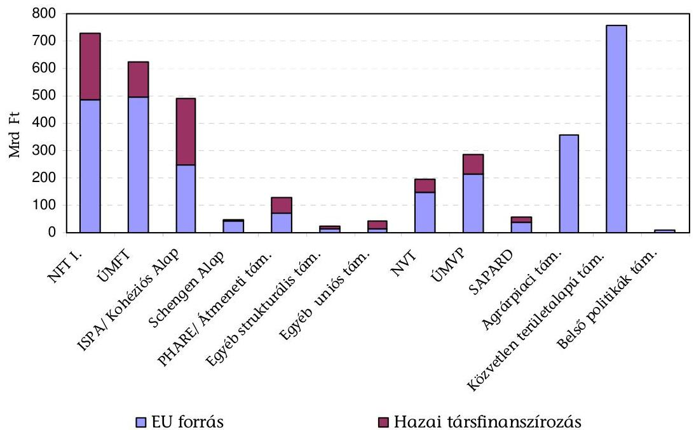

1. sz. ábra
[^0]
[^0]:    ${ }^{5}$ Málta, Finnország
    ${ }^{6}$ Belgium, Spanyolország, Lettország, Litvánia, Portugália, Magyarország
    ${ }^{7}$ Az ÁSZ adott évi költségvetés végrehajtásáról szóló jelentések szerint. A 2009. évi adatok előzetesek.

---

Ellenőrzésünk idején az uniós támogatásokat 7 fejezet foglalta magába. A támogatást kezelő szervezetek ${ }^{8}$ közül az NFÜ, és az FVM fejezeten belül az MVH kezelte az összes uniós program mintegy 90\%-át, ezért ellenőrzésünk e két szervezetre terjedt ki.

Az Európai Tanács meghatározta az Európai Közösség pénzügyi érdekeinek védelméről szóló keretszabályozást, majd alaponként az általános szabályokat. Az általános szabályok alapján a Bizottság a végrehajtást rendeletben szabályozta és Útmutatókat adott ki a szabálytalanság-, adósság- és követeléskezeléshez. A tagállamoknak az uniós előírások és útmutatók alapján kellett kialakítani saját szabályozásukat, gyakorlatukat.

A hazánkban kialakított szabálytalanság- és követeléskezelés függött a támogató és a kedvezményezett között keletkeztetett jogviszony típusától. Eltérő szabályok érvényesültek az NFÜ-nél a polgári jogi és az MVH-nál a közigazgatási jogviszonyban.

A vizsgált folyamatok eltértek a támogatások kezelésének intézményrendszerében. A strukturális és kohéziós támogatások esetében az irányító hatósági feladatokat - az AVOP kivételével - az
 NFÜ, a közreműködő szervi feladatokat az NFÜ-vel szerződéses kapcsolatban álló szervezetek, továbbá az Igazoló Hatósági feladatokat a Pénzügyminisztériumon belül a PM NAO Iroda, azaz többlépcsős intézményrendszer látta el. Az agrár- és vidékfejlesztési támogatások esetében a hatósági feladatokat (ideértve a Kifizető Ügynökségi feladatokat is) az FVM, illetve felhatalmazás alapján az MVH látta el. A közreműködő szervi feladatokat szintén az MVH szervezete végezte.

Az NFÜ által kezelt programok szabálytalanságkezelését kormányrendeleti szintű szabályozás határozta meg a 2007-2013-as programozási időszakra, kijelölve a szabálytalanságkezelésért felelős szervezeteket (irányító hatóságok, közreműködő szervezetek), a szabálytalansági eljárás egyes lépéseit a hozzá tartozó időkorlátokkal, az alkalmazott nyilvántartást (EMIR), valamint a szabálytalansági jelentések összeállításának rendjét. A szabálytalansági döntés elleni jogorvoslati lehetőség a polgári bíróság előtt indított peres eljárás volt.

A kedvezményezettek által elkövetett legtipikusabb szabálytalanság volt a közbeszerzési törvény megsértése, a projekt nem, vagy nem megfelelő mértékű megvalósítása, nem elszámolható költségek elszámolása, jogosulatlan tételek kifizetése.

A követeléseket több uniós és hazai jogszabály együttes alkalmazásával a szabálytalanságot megállapító közreműködő szervezetek kezelték a vonatkozó kormányrendelet alapján. A követelések nyilvántartására jogszabály az EMIR-t jelölte ki. Az NFÜ kormányrendeletben foglalt előírás szerint polgári jogi, a két fél egyenrangúságán alapuló támogatási szerződést kötött a kedvezményezettel, azonban a szabálytalanság miatti követeléseket közigazgatási hatósági eljárás keretében kellett érvényesíteni (a támogatások visszakövetelése adók módjára behajtandó köztartozásnak minősült).

[^0]
[^0]:    ${ }^{8}$ FVM, NFÜ által kezelt „Uniós Fejlesztések", KHEM, IRM, KÜM, KvVM, SZMM.

---

A közreműködő szervezetek, az NFÜ és a PM NAO Iroda egymásra épülve - az uniós előírásokkal összhangban - negyedéves rendszerességgel jelentették a szabálytalanságokat az OLAF Koordinációs Iroda részére. Továbbá az NFÜ évente kimutatást küldött az Igazoló Hatóság részére az operatív program projektjei keretében visszavont összegekről, a behajtott, illetve behajtásra váró összegekről, illetve tájékoztatni kellett az Igazoló Hatóságot a behajtott összegek újrafelhasználásának módjáról, aki tájékoztatta a Bizottságot a tárgyévet követő év március 31-éig. A Bizottsággal szembeni visszafizetési kötelezettségeket (adósságokat) a PM NAO Iroda rendezte, illetve rendezi (egyrészt a pénzigénylések során, másrészt a projektek zárásakor).

Az MVH által kezelt támogatások vizsgált folyamatait, jelentéstételi rendjét a Bizottság végrehajtási rendeletei és a 82/2007. (IV. 25.) Korm. rendelet szabályozták. Az MVH eljárása az EU támogatások biztosításakor a közigazgatási hatósági eljárás szabályain alapult, a szabálytalanságkezelés beépült az ügykezelés folyamatába. A szabálytalanságokról elkülönített nyilvántartást nem vezettek. Az MVH szabálytalanságnak csak azokat az eseteket tekintette, amelyekben szabálytalanság miatt jogerős, végrehajtható, támogatást visszakövetelő határozat született.

Az agrárpolitikáért felelős miniszter az Irányító Hatóság vezetője az 1698/2005/EK tanácsi rendelet 75. cikke alapján, egyben az UMVP program végrehajtásáért is felelős. Az MVH, mint Kifizető Ügynökség az EU-val közvetlenül számol el a mezőgazdasági és vidékfejlesztési támogatásokkal, míg a SAPARD és az AVOP esetében a PM NAO Iroda, mint Igazoló Hatóság számolt el a többi operatív programhoz hasonlóan.

Az MVH - a SAPARD és az AVOP kivételével ${ }^{9}$ - az egységes ügyviteli és pénzügyi nyilvántartásából (IIER-rendszerből) jelentett a szabálytalanságokról az OLAF Koordinációs Iroda részére, valamint a Bizottságnak a szabálytalanságok következtében behajtandó követelésekről, alaponként eltérő módon. A Bizottsággal szembeni pénzügyi elszámolást, ennek keretében a kötelezettségek (adósságok) elszámolását az MVH Kifizető Ügynöksége végezte.

A szabálytalanságok jellemző esetei voltak a jogosulatlan gépbeszerzések, az agrár-környezetgazdálkodási feltételeknek való nem megfelelés miatt a kedvezményezettek visszalépése a vállalt határidő előtt, nem elszámolható költségek elszámolása, jogosulatlan tételek kifizetése, az intervenciós raktározáshoz kapcsolódó, valamint a terület alapú támogatásnál az igényelt és a valódi terület eltéréséből adódó szabálytalanságok.

Az OLAF Koordinációs Iroda (Iroda) a VPOP szervezetén belül, az országos parancsnok közvetlen alárendeltségében, de feladatkörében függetlenül működik. A törvényi előírásoknak megfelelően az Iroda biztosítja az együttműködést az OLAF és Magyarország szervezetei és hatóságai között, valamint részt vesz az

[^0]
[^0]:    ${ }^{9}$ A SAPARD-ra, mint előcsatlakozási eszközre kézi nyilvántartási rendszer került kialakításra. Az AVOP szabálytalanságait és követeléseit a többi operatív programhoz hasonlóan az EMIR-ben kellett nyilvántartani, tekintettel arra, hogy az AVOP a strukturális politika részét képezte.

---

EU pénzügy érdekeinek védelméhez kapcsolódó jogi, adminisztratív és operatív kötelezettségek hazai végrehajtásában.

Az Iroda létrehozásának eredeti célja nem csupán a Bizottság (OLAF) és a magyarországi közösségi forrásokat kezelő intézményrendszer közötti összekötőponti szerep ellátása volt, hanem egy olyan központi szervezet kialakítása is, amely segíti az egységes, a jogszabályoknak, a hazai érdekeknek, valamint az OLAF elvárásainak ${ }^{10}$ is megfelelő - szabálytalanságkezeléssel kapcsolatos feladatokat ellátó - intézményrendszer munkáját. Ennek érdekében az Iroda - tájékoztatása szerint - folytatni kívánja az uniós források lebonyolításával foglalkozó hazai intézményekkel való kapcsolatfelvételt, hogy a jövőbeni szakmai együttműködés a jogszabályok által nem érintett területeken rendezett keretek között, együttműködési megállapodások szerint történjen. Az Iroda a Magyarországra érkező uniós támogatások nemzeti szintű végrehajtásának szerveivel, az NFÜ és az MVH szervezetével, valamint a Kormányzati Ellenőrzési Hivatallal kezdeményezte a megállapodások megkötését, de a megállapodások aláírására helyszíni ellenőrzésünk lezárásáig még nem került sor. Az Iroda Intézkedési tervében szerepelt átfogó csalásellenes stratégia megalkotása a közeljövő feladataként.

A Bizottság főigazgatóságai és a hazai intézmények közötti pénzügyi elszámolás alapját költségnyilatkozatok, jelentések ${ }^{11}$ képezték, azonban a jelentések felépítése, tartalma finanszírozási alaponként, támogatási programonként változott. Az adatok összegyűjtését tovább nehezítette az ellenőrzés számára, hogy halmozott adatok - az NFT I. kivételével - nem álltak rendelkezésre a különböző programokra ${ }^{12}$. Az agrár- és vidékfejlesztési támogatásokra a behajtandó összegekről szóló éves jelentést a Bizottság többször módosította a vizsgált időszakban, és a halmozott adatok előállításához - a különböző évek eltérő szerkezetű adatai miatt - arányosítást kellett alkalmaznunk.

A szabálytalanságkezelési rendszer az irányítási és ellenőrzési rendszer részét képezte, amelynek megfelelőségi vizsgálatát az NFÜ által kezelt támogatások esetében a KEHI, mint Ellenőrzési Hatóság látta el jogszabályi kijelölés alapján. A Bizottság 2008 folyamán és 2009-ben jóváhagyta a KEHI által benyújtott ún. „nem minősített véleményeket". Az MVH által kezelt EMGA és EMVA programokra vonatkozó igazoló szervi feladatot 2007. október 16-a után a KPMG Hungária Kft. látta el, és az akkreditációs kritériumokat teljesítettnek minősítette a 2007-2013-as programozási időszakra.

Az ellenőrzés tárgyi hatálya a szabálytalanság-, adósság- és követeléskezelési folyamatok eredményességének értékelésére terjedt ki, és nem érintette az ellenőrzési hatóság megfelelőségi és az igazoló szerv akkreditációs vizsgálatát. A folyamatok a szabálytalanság, illetve a szabálytalansági gyanú felmerülésétől kezdődtek. (A folyamatok részeit a 3. sz. melléklet tartalmazza.) Az ellenőr-

[^0]
[^0]:    ${ }^{10}$ Az OLAF 2002. december 2-ai levele.
    ${ }^{11}$ Ideértve a már lezárt programok záró végrehajtási jelentéseit.
    ${ }^{12}$ Halmozott adatokat az ÜMFT-re is jelenteni kellett, de az ÜMFT-ben 2007-re és 2008-ra még nem állapítottak meg követeléseket, így csak 2009. évi adatok álltak rendelkezésre ellenőrzésünk idején.

---

zés nem terjedt ki a pályáztatási-, a kifizetési folyamatok, a szabálytalanságok megelőzésének és az intézmények által lefolytatott eljárásoknak, döntéseknek a felülvizsgálatára. A témához kapcsolódó eddig készített számvevőszéki jelentéseket a jelentés belső borítója tartalmazza.

Az ellenőrzés időbeli hatálya a 2007-2013-as programozási időszak eddig eltelt három évére (2007-2009 évekre) terjedt ki a szabálytalanság-, adósság- és követeléskezelési folyamatok (és az ehhez kapcsolódó EMIR alrendszer, funkciók) értékelése tekintetében. Emellett átfogóan, mind a 2004-2006-os, mind a 2007-2013-as programozási időszak vonatkozásában értékeltük a hazai uniós intézmények szabálytalanság-, adósság- és követeléskezelésben elért eredményeit, a rendelkezésre álló adatok alapján.

Az ellenőrzött szervezetek az NFÜ, az MVH az OLAF Koordinációs Iroda, valamint a PM NAO Iroda voltak.

Az ellenőrzést a teljesítmény-ellenőrzés módszertanának alkalmazásával, azon belül eredményességi szempont szerint hajtottuk végre. A rendszer ellenőrzött folyamatai eredményességének értékelését a vonatkozó szabályozás alapján végeztük el és a folyamatokat mintavétellel teszteltük. Az uniós intézmények elért eredményeit a rendelkezésre álló szabálytalansági, követelés és kötelezettség (adósság) adatok elemzésével végeztük el.

Az ellenőrzés célja volt: annak értékelése, hogy az EU támogatások felhasználása során alkalmazott szabálytalanság-, adósság- és követeléskezelési folyamatok eredményesen szolgálták-e az EU és a hazai pénzügyi érdekek védelmét, elegendő és megfelelő információt szolgáltattak-e a Bizottság és a hazai döntéshozók számára.

Ennek során értékelni kellett:

- a szabálytalanság-, adósság- és követeléskezelés feltételrendszerének (szabályozási, intézményi feltételeinek) kialakítását;
- a kialakított szabálytalanság-, adósság- és követeléskezelési folyamatok eredményességét, a folyamatok céljának elérését;
- a rendszer fejlesztéséhez szükséges tapasztalatok kiértékelésének helyzetét.

Az uniós pénzek védelméhez kapcsolódó jelenlegi ellenőrzés keretében folytattuk le „A strukturális alapok ellenőrzési költségeinek vizsgálata" című nemzetközi párhuzamos ellenőrzést. Az ellenőrzés az EU Kapcsolattartó Bizottság Strukturális Alapokkal megbízott Munkacsoportjának tagjai által folytatott ellenőrzés részét képezte, a részt vevő tagállamokkal közösen összeállított program alapján. Az ellenőrzés főbb megállapításait az 1. sz. függelék tartalmazza.

Az ellenőrzések jogalapját az Állami Számvevőszékről szóló 1989. évi XXXVIII. törvény 2. § (5)-(6)-(9) és az államháztartásról szóló 1992. évi XXXVIII. törvény 120/A. § (1) bekezdései képezték.

A jelentést 8 napos egyeztetésre megküldtük a nemzetgazdasági, vidékfejlesztési és a nemzeti fejlesztési miniszter uraknak. Válaszleveleik másolatát az 1/a-c. számú mellékletek tartalmazzák.

---

# I. ÖSSZEGZŐ MEGÁLLAPÍTÁSOK, KÖVETKEZTETÉSEK, JAVASLATOK 

A 2004-2009-es vizsgált időszakban a hazai intézmények az uniós követelményekhez igazodva programonként, illetve intézkedési jogcímenként számoltak be a Bizottságnak a szabálytalanságokról, az azokkal összefüggő követelések és kötelezettségek alakulásáról, de hiányosságként mutatkozott, hogy nem készítettek, nem tettek közzé átfogó, valamennyi uniós programra kiterjedő programalapú ${ }^{13}$, a pénzügyi korrekciókat (átcsoportosításokat, Bizottsági elvonásokat stb.) is tartalmazó beszámolót ${ }^{14}$.

Az uniós források felhasználásának átláthatóságát rontotta, hogy nem kezeltek és nem is tartottak nyilván szabálytalanságként olyan az uniós ellenőrzések következtében szabálytalanság miatt végrehajtott pénzügyi korrekciókat, átcsoportosításokat, amelyek hatásaként a hazai költségvetést több tíz milliárd forintos finanszírozási többlet terhelte. A szabálytalanság miatti átcsoportosítások tipikus esetei a közbeszerzési szabálytalanságok ${ }^{15}$ miatti pénzügyi korrekciók voltak. A Budapesti Szennyvíztisztító Telep, a Metro4, az M0 és a 21. sz. főutak tehermentesítése projektek szabálytalansága miatt 66,6 Mrd Ft uniós finanszírozást kellett pótolni hazai költségvetési forrásból és/vagy hitelből. A Bizottság vitatja egy további 35 Mrd Ft-os tétel uniós forrásból való elszámolhatóságát az M7 projekthez kapcsolódóan, de ez ügyben határozat még nem született (részletek a 4. sz. mellékletben). Az okok feltárásának és a folyamatok felülvizsgálatának és kiigazításának elmaradása az ismétlődési kockázatot hordozza magában.

A felhasználás átláthatóságát az is korlátozta, hogy az átcsoportosításokon túlmenően a követelések megtérítésével, behajtásával keletkezett újra felhasználható források ismételt hasznosítását sem követték nyomon.

[^0]
[^0]:    ${ }^{13}$ A programalapú költségvetés bevezetésének szükségességével és helyzetével az ÁSZ 0802 számú, a gazdaságfejlesztés állami eszközrendszere működésének ellenőrzéséről szóló jelentése foglalkozott. Jelenlegi ellenőrzésünkhöz kapcsolódóan, az EU és a hazai költségvetési kapcsolatokat egyaránt bemutató, eredményszemléletű nyilvántartást és részbeszámolót a MÁK és a PM NAO Iroda készített az
 NFT I.-re és az ÚMFT-re vonatkozó uniós előírás alapján, de ezek hazai felhasználása korlátozott volt.
    ${ }^{14}$ Az átfogó beszámoló hiányát mutatta az is, hogy - az államháztartási törvény 50/A. §-a szerint - az ÁSZ által előzetesen véleményezett jelentésben a jelentéstételre kötelezettek követeléseinek és kötelezettségeinek teljes körű bemutatása elmaradt, továbbá az NFÜ interneten közzétett átadás-átvételi dokumentációk sem tartalmaztak átfogó, a pénzügyi korrekciókat is tartalmazó beszámolót.
    ${ }^{15}$ A közbeszerzési szabálytalanságok megelőzésére, az NFÜ elnökének (2010. 04. 15-én kelt) tájékoztatása szerint jogszabály-módosító javaslat készült. Növelni kívánták a közreműködő szervezetek felelősségét (előzetes ellenőrzési kötelezettségét), az előzetes minőségbiztosításban résztvevő közbeszerzések értékhatárát 1 Mrd Ft-ról a közösségi értékhatárokra tervezték leszállítani.

---

A vizsgált időszakban kialakított és működtetett nyilvántartási és beszámolási rendszer hiányosságai miatt sem a hazai döntéshozók, sem a nyilvánosság nem kapott elegendő és megfelelő információt az uniós források felhasználásának tényleges alakulásáról.

A hazai szabályozás a támogatások kedvezményezettekhez történő eljuttatását kívánta elősegíteni a biztosíték-adási kötelezettségek csökkentésével és a támogatási előleg igénybevételi lehetőség növelésével, ami viszont a követelések megtérítését szempontjából volt kedvezőtlen.

A kedvezményezettekkel szembeni követelések megtérítését az MVH és az NFÜ is, elsősorban a soron következő kifizetésből történő levonással (ún. kompenzálással) kívánta kiegyenlíteni. Általános biztosítékként az inkasszót alkalmazták, de uniós jogharmonizáció miatt a jogszabályon alapuló inkasszó lehetősége megszűnt ${ }^{16}$ 2009. november 1-jétől a támogatást kezelő NFÜ, MVH számára. A továbbiakban az NFÜ-nek volt lehetősége a kedvezményezett felhatalmazásán alapuló beszedési megbízásra a vonatkozó kormányrendelet ${ }^{17}$ alapján. Az MVH a jogszabályváltozást követően az APEH-on keresztül az inkasszó módjára működő hatósági átutalási megbízást alkalmazta.

A biztosítékok, az azonnali beszedés, végrehajtás jelentősége megnőtt a jelenlegi gazdasági helyzetben, mivel a követelések behajthatatlanságának elsődleges indokaként a felszámolást lehetett megjelölni ellenőrzésünk tapasztalata alapján. Tehát a behajthatatlan esetek elkerülésének legfontosabb faktora, a biztosítékrendszer kidolgozása és az időtényező lett. Ez utóbbit a vonatkozó uniós rendelkezés ${ }^{18}$ is hangsúlyozta.

A hazai uniós intézmények az OLAF-nak 2005-2008 között viszonylag azonos számú és értékű szabálytalanságot jelentettek, majd 2009-re ugrásszerű növekedés következett be főként a szabálytalansággal érintett összegben. A szabálytalanságok számának alakulását a 2. sz. ábra, összegének alakulását a 3. sz. ábra szemlélteti (adattábla az 5. sz. mellékletben).

Szabálytalanságok száma db
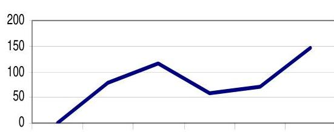
2. sz. ábra

Forrás: VPOP, OLAF Koordinációs Iroda

Szabálytalansággal érintett összeg millió Ft
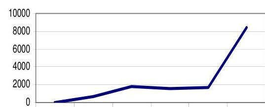
3. sz. ábra

[^0]
[^0]:    ${ }^{16}$ A 2009. évi LXXXV. törvény.
    ${ }^{17}$ A 281/2006 (XII. 23.) Korm. rendelet.
    ${ }^{18}$ Az Európai Tanács 2005. június 21-ei, 1290/2005/EK rendelet 32. cikk 4 (a) bekezdése.

---

Az OLAF-nak jelentett szabálytalanságok száma 2005-ben 78 db (636 M Ft), 2006-ban 116 db (1,8 Mrd Ft), 2007-ben 57 db (1,6 Mrd Ft), 2008-ban 72 db (1,7 Mrd Ft) és 2009-ben 147 db (8,4 Mrd Ft) volt a strukturális, kohéziós, valamint agrár- és vidékfejlesztési, és egyéb uniós támogatásokra együttesen (részletesen az 5. sz. mellékletben).

Az OLAF-nak a szabálytalanságokat nem kellett teljes körűen jelenteni uniós szabályozás szerint ${ }^{19}$, hanem alapelvként a jelentősebb összegű tételekről kellett számot adni. Ebből adódóan például az NFÜ által jelentett esetek az összes szabálytalansággal érintett összegnek a 95%-át, de a darabszámnak csak a 14%-át tették ki a 2007-2009 évek átlagát tekintve. Hasonló a helyzet az MVH-nál, ahol a jelentős összegű tételeket jelentették, de például a LEADER programban előfordult nagyszámú, de kis összegű szabálytalanságokat nem jelentették, mert azok nem estek jelentési kötelezettség alá ${ }^{20}$.

A szabálytalansággal érintett összeg 2009-ben a 2008. évihez képest 5-szörösére, míg a behajtandó összeg több mint 8-szorosára nőtt. Ebben szerepet játszott, hogy megszűnt a behajtandó összeg ún. „kompenzálással” (soron következő kifizetésből levonással) történő megtérítésének lehetősége a 2004-2006-os programozási időszak projektjeinek zárása miatt. Ezen túlmenően a behajtandó összeg 2009-ben a gazdasági válság következményeként is nőtt a vizsgált szervezetek szerint.

A szabálytalanság- és követeléskezelés más gyakorlatot kívánt az NFÜ által alkalmazott polgári jogi és mást az MVH által alkalmazott közigazgatási eljárásban, ezért a továbbiakban a két szervezet eredményességét külön értékeljük. Az értékelésben bemutatott NFÜ adatok előzetesek ${ }^{21}$, mert a 2009. évi költségvetési beszámoló és egyéb éves értékelések összeállítása még folyamatban volt ellenőrzésünk idején.

Az NFÜ szabálytalanság- és követeléskezelési folyamata alapvetően, és időben szabályozott volt a 2007-2013-as időszak ellenőrzött programjaira vonatkozóan, de a szabályozás még nem adott elégséges támpontot a folyamatok kezeléséhez.

A szabálytalanságokról, szabálytalanság miatti követelésekről, azok okairól az NFÜ, belső szabályzatának megfelelően évente értékelést, elemzést készített és ezek alapján a vonatkozó hazai szabályozás átfogó felülvizsgálatáról döntött. A felülvizsgálatot 2009 közepétől belső munkálatok keretében végezte, majd 2009 decemberében külső szakértő bevonását kezdeményezte. A felülvizsgálat külső szakértők bevonásával, helyszíni ellenőrzésünk idején folyamatban volt.

[^0]
[^0]:    ${ }^{19}$ Nem volt jelentési kötelezettség 2004-ben a 4000 euró, 2006-tól a 10000 euró (mintegy 2,7 M Ft) alatti, továbbá a kedvezményezett csődje miatti, a kedvezményezett által önként bejelentett és a kifizetés előtt feltárt tételekre.
    ${ }^{20}$ A LEADER programban a szabálytalanságok száma 553 db volt, az AVOP szabálytalanságok 50,9%-a, de a projektek jellemzően nem érték el a jelentési kötelezettség értékhatárát.
    ${ }^{21}$ Az NFÜ 2009. évi költségvetési beszámolójának végleges adatait az ÁSZ a zárszámadás ellenőrzés keretében vizsgálja.

---

A gyakorlatban ellenőrzésünk idején még értelmezték a szabálytalanságok megítélésének szempontjait ${ }^{22}$. A szabálytalanságkezelés eljárásrendje nem volt kellően kidolgozott. Más jogi eljárási rendbe tartozott a szerződéskötés és a szerződéstől való elállás intézménye (polgári jogügylet), és más jogi eljárási rendbe a támogatás visszakövetelése ${ }^{23}$ (közigazgatási hatósági eljárás), de a két jogviszonyból adódó feladat nem került rendezésre szabályozásban. Ez bizonytalanságot eredményezett a jogorvoslati lehetőségben. Szabálytalansági döntéssel kapcsolatos fellebbezés során nem volt tisztázott, hogy mely bíróságnak - közigazgatási vagy polgári bíróságnak - kell eljárni ${ }^{24}$. A szabálytalansági döntések ellen (bár számos kedvezményezett adott be beadványt) az intézményrendszeren belüli jogorvoslati lehetőség hiányzott az alkalmazott polgári jogi eljárásból adódóan. Továbbá bizonytalan volt a követelések érvényesítésének jogszabályi háttere is ${ }^{25}$.

A szabálytalansági döntések jogorvoslatának polgári peres útja hosszadalmas volt az NFÜ és a kedvezményezett közötti vitás esetekben. Az ellenőrzött időszakban 27 polgári peres eljárás volt, amelyek közül 6 esetben volt felperes irányító hatóság, vagy közreműködő szervezet (az ÁSZ által összegyűjtött információk szerint). A perek többsége, 25 per még lezáratlan volt, a már lezárult perek 3 évig tartottak, a lezáratlan perek között akadt, amelyik már 4 éve tartott 2009 végén.

A hazai közbeszerzési törvény előírásai és az uniós szabályozásnak az NFÜ-vel, mint EU forrásokat kezelő szervezettel szembeni elvárásai nem álltak összhangban a közbeszerzési szabálytalanságok megállapítása tekintetében. A hazai törvényi szabályozás szerint a Közbeszerzési Döntőbizottság állapíthatta meg a közbeszerzési törvény-, illetve eljárási szabályok megsértését (és bírságot szabhatott ki). Ugyanakkor az NFÜ, mint támogatást kezelő szerv uniós jogszabály ${ }^{26}$ és Bizottsági iránymutatás szerint köteles volt szabálytalansági eljárást lefolytatni, szükség szerint pénzügyi korrekciót végrehajtani a Közbeszerzési

[^0]
[^0]:    ${ }^{22}$ A bővebb értelmezésre példa, hogy a támogatási szerződés megkötése előtt visszavonták a támogatói döntést, más esetben csak akkor állapítottak meg szabálytalanságot, ha már kifizetés is történt. Továbbá a 2009. év folyamán került tisztázásra, hogy a „nem teljesült szerződés zárása” jogcímen visszakövetelt összegek, ha felszámolásból és végelszámolásból eredtek, akkor szabálytalanságnak minősülnek.
    ${ }^{23}$ Adók módjára behajtandó köztartozás.
    ${ }^{24}$ A bizonytalanság megmutatkozott mind a kedvezményezettek, mind a bíróságok gyakorlatában.
    ${ }^{25}$ A Fővárosi Ítélőtábla (9.PF.21.411/2009/3.) ítélete az ilyen típusú ügyekre vonatkozóan kimondta, hogy „a közjogi szabályokban meghatározott esetekben köteles határozattal elrendelni a jogosulatlanul igénybe vett támogatás visszafizetését, ez a kötelezettség tehát nem az alperes elállásával, hanem a visszafizetést elrendelő határozattal, vagyis az alperes hatósági jogkörben hozott egyedi aktusával keletkezik.”. Ez utóbbi nem volt szabályozott NFÜ és a kedvezményezett közötti kapcsolatára nézve. Ugyanakkor más esetekben bíróság lefolytatta az eljárást.
    ${ }^{26}$ Az Európai Tanács 2006. július 11-ei 1083/2006/EK rendelete 99. §-a szerint az EU elvonhatja a támogatást akkor is, ha a szabálytalanság felfedése után a tagállam nem hajtja végre a pénzügyi korrekciót (függetlenül tehát a KDB döntésétől).

---

Döntőbizottság elmarasztaló döntése mellett, vagy annak elmaradása esetén is, ami gyakorlati problémaként is megmutatkozott ${ }^{27}$.

A szabálytalanságkezelés eredményességét hátrányosan befolyásolta a szabálytalansági eljárás időigényessége. A teljes időigény a gyanú beérkezésétől a döntés meghozatalának időpontjáig 4 és 509 nap között változott ${ }^{28}$, átlagban 65 nap volt, szemben a jogszabály által előírt 45 naptári nappal (12. sz. melléklet). A jogszabályi határidőt az esetek 42%-ában tartották be. Az elemzés az EMIR adatain alapult ${ }^{29}$.

A hazai jogszabályokban meghatározott szűk körű pénzügyi és jogi lehetőségek csökkentik a szabálytalanságtól visszatartó erőt. Az uniós szabályozás szerint a kamat, bírság kiszabása, szankció alkalmazása csak lehetőség, de az intézkedéseknek hatékonynak, arányosnak és visszatartó erejűnek kell lenniük.

Az uniós szabályozással ellentétben a hazai szabályozás nem tette lehetővé bírság kiszabását, és a közreműködő szervezetek ennek megfelelően jártak el. Az NFÜ helyszínen ellenőrzött három közreműködő szervezete közül kettő számított fel ügyleti és késedelmi kamatot a kedvezményezett szabálytalansága, késedelme esetén. Azokban az esetekben, amikor az NFÜ teljesített késedelmesen a támogatások kifizetése során, az NFÜ fizetett késedelmi kamatot a kedvezményezetteknek, de a hatályos szabályozás szerint - hatékonysági okokból - csak a 10000 Ft-ot elérő összegű tételeket kellett kifizetni. Az utóbbi egy évben mintegy 408 E Ft késedelmi kamatot fizettek ki. Ennek 91,1%-a a Gazdaságfejlesztési Operatív Programhoz kapcsolódott.

A kedvezményezetteknek a projektek keretében létrehozott vagyon feletti rendelkezési joguk (vagyon elidegenítése, terhelése tekintetében) korlátozott a projekt megvalósítása és fenntartásának időszakában a hatályos szabályozás szerint, de a szabályozás nem nyújt kielégítő garanciát a támogatást nyújtó szervezetek számára. A projektek tárgyára fennálló elidegenítési és terhelési tilalom közhiteles ingatlan-nyilvántartásba való bejegyeztetése jogi korlátba ütközött az NFÜ, mint támogató számára. A támogatott projekt keretében beszerzett, vagy létrehozott vagyon feletti rendelkezési jog korlátozása jogszabályon alapult, de a Ptk. nem tette lehetővé a jogszabályon alapuló tilalom ingatlan-nyilvántartásba való bejegyzését.

Eljárásrend nem tartalmazta a törvényességi felügyeleti eljárás kezdeményezését, illetve a cég törlése iránti kérelem lehetőségét. Nem alkalmazták az ún. „mögöttes felelősség” intézményét.

[^0]
[^0]:    ${ }^{27}$ Egyik kedvezményezett kifogásolta az NFÜ, mint támogatást kezelő szerv közbeszerzési szabálytalanság miatti korrekcióját, mivel a KDB nem állapított meg rá nézve közbeszerzési törvény-

 illetve eljárási szabálysértést.
    ${ }^{28}$ A kimutatott időigény esetenként magában foglalja a szabálytalansági eljárás más hatóság megkeresése miatti felfüggesztésének időtartamát is, ami az elintézési határidőbe nem számít bele, de ez az EMIR-ben rögzített adatokból nem lekérdezhető.
    ${ }^{29}$ Az NFÜ észrevételében arról tájékoztatott, hogy egyes, az EMIR-ben tárolt adatok javításra várnak.

---

A gyakorlatban főként a szerződéstől való elállást alkalmazták, szankcióként csak korlátozottan kerültek kizárásra cégek a pályáztatásból, mert a vonatkozó jogszabály alkalmazásában bizonytalanság mutatkozott, az eljárásrendi kérdések nem voltak tisztázottak (az eljárásrend kiadása folyamatban volt).

A követeléskezelés során az NFÜ a belső szabályozásában meghatározta a követelések megtéríttetésének, behajtásának sorrendiségét, amelyet az eljárások során betartott. A sorrendiség betartása azonban nem segítette a behajtás eredményességét. A bírósági végrehajtásról szóló törvény nem határozta meg a végrehajtási cselekmények sorrendiségét pont azért, mert a sorrendiség önmagában véve megakadályozhatja az eredményességet.

Az NFÜ-nek 4,79 Mrd Ft (EU forrás) tagállami kötelezettsége (adóssága) keletkezett, az általa alkalmazott (kedvezményezettnek fel nem róható), és a Bizottság által uniós szabályozástól eltérőnek minősített eljárások, jogszabályok miatt 2004-2009 között. Ez az összeg a strukturális támogatásokhoz kapcsolódó, el nem számolható kiadások (áfa, eszközbeszerzés) miatti pénzügyi korrekció volt, amit költségvetési forrásból kellett fedezni.

Az NFÜ kedvezményezettekkel szembeni szabálytalanság miatti követeléseinek összege 25,6 Mrd Ft (EU forrás) volt a 2004-2009 közötti időszakban, amelyből 6,5 Mrd Ft a strukturális támogatásokhoz, és 19,1 Mrd Ft az ISPA/Kohéziós Alap támogatásokhoz kapcsolódott. A 19,1 Mrd Ft-os követelés megtérüléséről nem volt adat helyszíni ellenőrzésünk idején.

A strukturális támogatásokhoz kapcsolódó 6,5 Mrd Ft követelésből mintegy 2,8 Mrd Ft megtérült 2009 végéig, azaz a behajtási arány 43,1%-os volt átlagosan. Ez az uniós szintnek megfelelő arány volt ${ }^{30}$, ami programonként változott. Például az NFT I. esetében valamivel az átlag alatt maradt (35,9%), a PHARE esetében 62,5%-os volt.

Az NFÜ követelést nem írt le, a minősítéséhez, leírásához szükséges teljes körű szabályozás, eljárásrend nem állt rendelkezésre helyszíni ellenőrzésünk végéig. Főként a projektek zárásához, a Bizottsággal való elszámoláshoz a helyszíni ellenőrzésünk idején adtak ki szabályozást, Bizottsági útmutatással összhangban. A követelések alakulását a következő 4. sz. ábra szemlélteti (adattábla a 6. sz. mellékletben).

[^0]
[^0]:    ${ }^{30}$ Az EU szintjén „Az elmúlt tíz évben a behajtási arány 40 és 55% között mozgott" a Bizottság által az Európai Parlamentnek és a Tanácsnak írt jelentés szerint (COM (2009) 372., Brüsszel, 15.7.2009.).

---

Az NFÜ kedvezményezettekkel szembeni követeléseinek alakulása 2004-2009 között
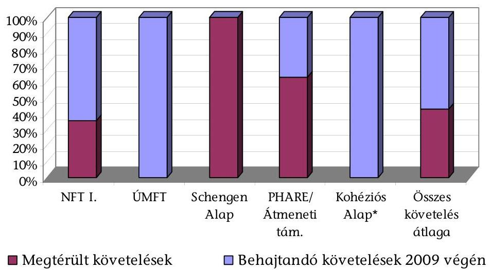
*Az NFÜ tanúsítványa szerint nincs adatuk.

# 4. sz. ábra 

A követelések értékvesztése az NFÜ által az operatív programokról összeállított ${ }^{31}$ beszámolóban került kimutatásra az adósok minősítése alapján, és a Gazdasági Versenyképesség Operatív Programban volt a legnagyobb arányú. Itt a követelések értékének várhatóan a 79%-a nem térül meg a 2009. év végi állapot szerint.

A Bizottsággal behajthatatlan követelések leírása miatti veszteség megosztására még nem került sor az NFÜ strukturális és kohéziós alapok által társfinanszírozott programjaihoz kapcsolódóan, mivel követelést még nem írtak le, az operatív programok pénzügyi zárása ${ }^{32}$ keretében történő elszámolásra pedig ellenőrzésünk után kerül sor.

A megtérítetett követeléseket az NFÜ, a PM NAO Irodán, mint Igazoló Hatóságon keresztül folyamatosan elszámolta a Bizottság felé ${ }^{33}$ 2008 végéig. Az NFÜ Irányító Hatóságai által az Igazoló Hatóságnak 2009-ben visszafizetett kedvezményezettektől befolyt összegek a Bizottsággal nem kerültek elszámolásra, mivel 2009-ben már nem lehetett beadni átutalás igénylést ${ }^{34}$. Ez nem jelentett hiányosságot, mert jogi szabályozás alapján a programok zárása után is sor kerülhet adósság elszámolására, tekintettel arra, hogy a programok több évre szóltak, és időközi kifizetések alapján működtek.

[^0]
[^0]:    ${ }^{31}$ Pénzforgalmi szemléletű.
    ${ }^{32}$ Az operatív programok közül egynek a pénzügyi zárása (ROP) ellenőrzésünk idején zajlott, a többi program zárása 2010. szeptember 30-áig esedékes.
    ${ }^{33}$ Azaz, az átutalási igénylést a megtérült követelések összegével csökkentették.
    ${ }^{34}$ A Tanács 1260/1999. rendelete értelmében az előleg és időközi kifizetések együttes összege nem haladhatja meg az alapokból a szóban forgó támogatáshoz nyújtott hozzájárulás 95%-át.

---

A hazai intézményeknek a támogatások felhasználási szabályain túlmenően a versenyjogi szabályokat is be kellett tartaniuk. Az EU Versenypolitikai Főigazgatósága, mint versenyjogi szabálytalanság megállapítására jogosult szerv, a strukturális és kohéziós támogatásokra vonatkozóan nem állapított meg szabálytalanságot 2004 óta, az előzetes engedélyezést ellátó PM Támogatásokat Vizsgáló Iroda tájékoztatása szerint.

Az MVH szabálytalanság- és követeléskezelési folyamata a 2007-2013-as időszak programjainak, intézkedési jogcímeinek indulásához képest időben szabályozott volt. Az eljárások alapja a közigazgatási eljárás szabályai voltak, az attól való eltérés megfelelő (törvényi) szinten szabályozott volt. Abban az esetben, ha az ügyfél nem értett egyet a hatóság által meghozott határozattal, fellebbezést nyújthatott be ellene az eljárás bármely szakaszában. A fellebbezés lehetősége mind első-, mind másodfokon megoldott volt.

Az MVH a szabálytalanság tényét megállapító határozat jogerőre emelkedésével tekintette szabálytalanságnak az eseteket a közigazgatási eljárásból adódóan. Azonban bizonyos intézkedési jogcímeknél ${ }^{35}$ az első közigazgatási, vagy jogi ténymegállapítás már a jogerős, végrehajtható határozatot megelőzően történt. Ezekben az esetekben a megtett intézkedések kezdő időpontjának számítása az első ténymegállapítás kell, hogy legyen uniós szabály szerint. Az ettől eltérő eljárás a tagállamra nézve pénzügyileg hátrányos ${ }^{36}$.

Szabálytalansági felelős vonatkozó jogszabályi előírás ${ }^{37}$ ellenére nem volt az MVH-nál. Ugyanakkor a szabálytalansági jelentésekért való felelősség, különösen a különböző típusú jelentések ${ }^{38}$ adatai közötti egyeztetés nem volt megoldott.

Az együttműködés kereteinek kiterjesztése vált szükségessé az APEH szervezetével. Fiktív számlázás gyanúja miatt szükségessé vált a számlakibocsátók vizsgálata, de az ellenőrzésre, adótitokra vonatkozó szabály ${ }^{39}$ miatt nem kerülhetett sor. A pályázati feltételeknek nem volt része a pályázó hozzájárulása ahhoz, hogy az MVH megismerjen adótitoknak minősülő adatokat ellenőrzés céljából.

Bár az EMVA-ból finanszírozott intézkedések esetén a vonatkozó kormányrendelet ${ }^{40}$ felsorolta a biztosítékként elfogadható eszközöket, a jogcímek meghirde-

[^0]
[^0]:    ${ }^{35}$ Ilyen esetek voltak például, amikor az ellenőrzést egy zárt területen kellett lefolytatni, és a kedvezményezett is jelen volt, tudomásul vette a megállapított tényeket (az esetleges eltérést, szabálytalanságot), ami uniós fogalomból következően már kimerítette az első közigazgatási ténymegállapítást.
    ${ }^{36}$ A Bizottság e szabály be nem tartása miatt számos országban támogatást vont el.
    ${ }^{37}$ A 82/2007. (IV. 25.) Korm. rendelet 21. §-a.
    ${ }^{38}$ Az OLAF felé a negyedéves, a Bizottság felé a szabálytalanságok következtében behajtandó követelésekről szóló éves jelentés (éves beszámoló III. melléklete), nyilvántartások (adósok főkönyve).
    ${ }^{39}$ Art 54. §.
    ${ }^{40}$ A 82/2007. (IV. 25.) Korm. rendelet 19. § (2) bekezdése.

---

tését célzó FVM rendeletek, és ezzel összhangban az MVH Közlemények nem követelték meg a biztosíték nyújtását.

Az MVH számára az inkasszó lehetőségének megszüntetése a veszteségek kockázatának növekedését eredményezi, mivel inkasszó esetében 36-41%-os, míg APEH végrehajtás során 6-17%-os volt a megtérülési arány. Továbbá az eredményes végrehajtáshoz szükséges idő inkasszónál csaknem azonnali, míg APEH behajtási eljárás esetén több éves átfutási idő is lehet, ami csökkenti a megtérülés esélyét. Az ellenőrzés idején az APEH jogszabályi felhatalmazás alapján ${ }^{41}$ jogosult volt kibocsátani ún. hatósági átutalási megbízást (inkasszó szerepét betöltő megbízást), azonban az MVH-nak a vonatkozó törvényi szabályozás ${ }^{42}$ szerint nem volt erre lehetősége.

Az MVH és az APEH egymás közötti kommunikációjának időigényessége, az információcsere lassúsága a rendszer folyamataiból eredt, a gyakorlatban elhúzódó és nehezen kezelhető ügyet eredményezett ${ }^{43}$. Az idő múlása a tapasztalatok szerint „vagyontalanításhoz", illetve behajthatatlansághoz vezet.

Az MVH-nak 3,64 Mrd Ft (EU forrás) Bizottsági visszavonása, tagállami kötelezettsége keletkezett, az általa alkalmazott, és a Bizottság által uniós szabályozástól eltérőnek minősített eljárások miatt 2004-2009 között ${ }^{44}$.

Az MVH kedvezményezettekkel szembeni követeléseinek összege 7,5 Mrd Ft (EU forrás) volt 2004-2009 között. A 7,5 Mrd Ft-os követelésből 2,7 Mrd Ft megtérült 2009 végéig, azaz a behajtási arány 36%-os volt az agrár- és vidékfejlesztési támogatások esetében. Ez megközelítette a 2008. évi uniós szintnek megfelelő arányt (37,5%), azonban elmaradt az elmúlt tíz év uniós értékektől (40-55% közötti értékek). A SAPARD és az Intervenciós támogatásokhoz kapcsolódó behajtási arány az MVH átlagánál is alacsonyabb volt.

Behajthatatlan követelések leírására 1,1 Mrd Ft (EU forrás) összegben került sor, ami a követelések 14,6%-a volt. A megtérült és leírt követelések összegét a Bizottsággal elszámolták. Az MVH által kezelt uniós programok, támogatások követeléseinek alakulását a következő 5. sz. ábra szemlélteti (adattábla a 6. sz. mellékletben).

[^0]
[^0]:    ${ }^{41}$ Ket. Alapján.
    ${ }^{42}$ Az MVH tv. szerint.
    ${ }^{43}$ A végrehajtás felfüggesztésének nevesített esete, amikor az ügyfél közigazgatási pert indít a határozat ellen és egyben kéri a végrehajtás felfüggesztését. Az Art. szabályai szerint ez azonnali végrehajtás felfüggesztést eredményez a Bíróság jogerős döntéséig. Az ügyfél a végrehajtás felfüggesztését az MVH-tól kérte, és e közben az APEH felé végrehajtási kifogással élt. A keresetlevél benyújtásáról az APEH nem értesült.
    ${ }^{44}$ Ez az összeg a Mezőgazdasági Parcella Azonosító Rendszer hiányossága miatt keletkezett a 2005. és 2006. évekre vonatkozóan. A 2007. és 2008. évekre vonatkozó Bizottsági ellenőrzés megtörtént, de még nem zárult le ellenőrzésünk idején.

---

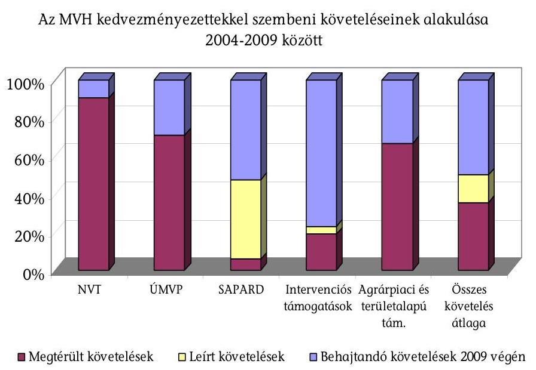

# 5. sz. ábra 

Az intervenciós intézkedés magas (80%-os) követelés állományát 49 cég, 141 tételből álló tartozása tette ki. Az összes tartozás (EU+hazai) 6,8 Mrd Ft. Ebből az EU-s rész 2,1 Mrd Ft. A fennálló magas követelés állomány - az ellenőrzésünk által elvégzett elemzés szerint - visszavezethető egyrészt arra, hogy a cégek fele felszámolás alatt állt a 2009. október 15-ei állapot szerint. Másrészt arra, hogy az egy cégre jutó átlagos tartozás összege magas, 42,9 M Ft volt (csak az EU forrást tekintve).

Az MVH késedelmes eljárás (kifizetés) esetén nem fizet késedelmi kamatot a kedvezményezetteknek, hanem illetékfizetési kötelezettsége áll fenn a költségvetés felé 2009. október 1-je után, de ilyen befizetésre nem került sor. Az ügyfél illeték fizetésére szintén nem volt kötelezett (például a fellebbezések benyújtásakor), de kamatfizetésre igen, a késedelmesen fizetett tartozások után.

A Bizottsággal szembeni kötelezettség (adósság) elszámolására programonként, pénzügyi alaponként a vonatkozó pénzügyi elszámolások alapját képező kimutatások keretében, és az átutalás igénylések során került sor. Az NVT és a SAPARD program esetében a pénzügyi zárás megtörtént, így ezekben az esetekben adósság elszámolás a pénzügyi
 záráskor és azt követően is volt. Valamennyi programra, pénzügyi alapra vonatkozó különböző évek halmozott adata nem állt rendelkezésre.

Az MVH, az ellenőrzés részére átadott dokumentumok szerint korlátozottan végzett elemzést a szabálytalanságokról, a szabálytalanságok miatti követelések keletkezéséről, azok okairól. Szabályozás nem írta elő, és vezetői kérésre csak az NVT-re és csak 2008-ra készítettek írásos elemzést. A témakörben megbeszéléseket, tapasztalatcseréket folytattak.

Az EU Versenypolitikai Főigazgatósága az agrár- és vidékfejlesztési támogatások nyújtása során két versenyjogi szabálytalanságot állapított meg 2004 óta, amelyek kivizsgálása ellenőrzésünk idején még folyamatban volt, az előzetes engedélyezést ellátó FVM Agrárszabályozási Főosztály tájékoztatása szerint.

---

A helyszíni ellenőrzés megállapításainak hasznosítása mellett javasoljuk:

# a Kormánynak 

1. Intézkedjen arra vonatkozóan, hogy az uniós támogatások felhasználásához kapcsolódó szabálytalanság miatti követelések, kötelezettségek, az EU és a hazai intézmények által végrehajtott pénzügyi korrekciók átfogóan, valamennyi uniós programra, intézkedési jogcímre kiterjedően jelenjenek meg a zárszámadás keretében.
2. Intézkedjen arról, hogy a hazai közbeszerzési szabályozás legyen összhangban az uniós elvárásokkal az NFÜ-re, mint EU forrásokat kezelő szervezetre vonatkozóan, a közbeszerzési szabálytalanságok megállapítása tekintetében.
3. Készíttessen elő döntést arra vonatkozóan, hogy az agrár- és vidékfejlesztési támogatások visszakövetelése esetében az azonnali pénzbeszedés és a behajtandó köztartozás végrehajtása az adóhatóság, vagy a támogatást kezelő szerv hatáskörében legyen, a követeléskezelés eredményességének javítása érdekében.

## a nemzeti fejlesztési miniszternek

1. Kezdeményezze az NFÜ és a kedvezményezett közötti támogatás nyújtása, valamint a szabálytalanság- és követeléskezelés során létrejövő jogviszony jogági hovatartozásának megfelelő szintű és egyértelmű jogi szabályozását, ezáltal megfelelő támogatást nyújtva az eljárások lefolytatásához, a kedvezményezettek jogorvoslati lehetőségének tisztázásához. A szabályozás előkészítése során vegye figyelembe a támogatási szerződések és azok módosításának időigényét, a követeléskezelés és a jogorvoslat tapasztalatait.
2. Intézkedjen arra vonatkozóan, hogy az NFÜ szabálytalanságkezelésének szabályozása megfelelő támpontot adjon a szabálytalanságok (azok szándékossága) megítéléséhez, továbbá intézkedjen az eredményességet javító megoldások bevezetésére, különös tekintettel az intézményrendszeren belüli szabálytalansági eljárások időtartamának csökkentésére.
3. Gondoskodjon a követeléskezelés ésszerű, racionális módon való megszervezéséről az eljárások eredményességének növelése érdekében.
4. Intézkedjen belső szabályozásban az uniós és hazai jogszabályi lehetőségek alkalmazásáról a szabálytalanság-, követeléskezelés során, különös tekintettel a mögöttes felelősség érvényesítésére, az egységes kamatfelszámítás, valamint a bírság és a szankció intézményének alkalmazására, hogy az intézkedések megfelelően visszatartó erejűek legyenek.

## a vidékfejlesztési miniszternek

1. Tegye a pályázati feltételrendszer részévé a pályázó hozzájárulását ahhoz, hogy ellenőrzés céljából az MVH megismerjen adótitoknak minősülő adatokat, a számlakibocsátók vizsgálatához.

---

2. Dolgoztassa ki azoknak a dokumentumoknak a jegyzékét, amelyek első közigazgatási ténymegállapításnak tekinthetőek, hogy e dokumentumok alapján a követeléskezelés kezdő időpontja az uniós szabályozásnak megfelelően megállapítható legyen.
3. Készíttessen rendszeres elemzést a szabálytalanságok, a követelések keletkezésének okairól és azok kezelésének tapasztalatairól, valamint intézkedjen az elemzés hasznosítására a szabálytalanságok megelőzése és a követelések behajtása eredményességének javítása érdekében.

---

# II. RÉSZLETES MEGÁLLAPÍTÁSOK 

## 1. A szabálytalanság-, adósság- és követeléskezelés feltételrendszerének értékelése

### 1.1. A szabálytalanságkezelés megjelenítésének helyzete stratégiai dokumentumban, cselekvési tervben vagy szabályozásban

A Bizottság az 1999. évben „a csalások, a korrupció és az Európai közösség pénzügyi érdekeit károsító minden más jogellenes cselekedet, valamint a Közösség rendelkezéseinek bármilyen cselekedet vagy intézkedés általi megsértése elleni küzdelem megerősítése céljából" létrehozta az Európai Csalásellenes Hivatalt ${ }^{45}$ (a továbbiakban: OLAF). Ezt megelőzően csalások elleni küzdelemmel a Bizottság egy belső szervezeti egysége foglalkozott.

Szabálytalanság- és csalásellenes stratégia eddig nem készült hazánkban, az uniós forrásokat érintő jogszabályok hivatottak rendelkezni ezen források megfelelő szintű védelmét érintő kötelezettségekről.

A csalásellenes stratégia készítését jogszabály nem írta elő, de az OLAF ajánlásában ${ }^{46}$ szorgalmazta egy ilyen típusú stratégia elkészítését.

A Bizottság (OLAF) ajánlásait szem előtt tartva a nemzeti csalásellenes stratégia elkészítése a közeljövőben válik igazán aktuálissá, figyelemmel a társadalmigazdasági viszonyok jelentős változásaira, az uniós támogatások egyre nagyobb volumenére, és az elmúlt időszak alatt megszerzett tapasztalatokra.

A fenti cél érdekében az OLAF Koordinációs Iroda - tájékoztatása szerint - első lépésként tervezi áttekinteni azon tagállamok nemzeti csalásellenes stratégiáit, melyek már rendelkeznek ilyen dokumentummal, majd ezt követően meghatározza a magyarországi csalásellenes stratégia megalkotásával várható hatásokat, s gondoskodik a további lépések megtételéről.

A Vám- és Pénzügyőrség Országos Parancsnoksága (a továbbiakban: VPOP) jelenleg érvényben lévő 2008-2011. évi középtávú stratégiája célként tartalmazta az OLAF-fal való munkakapcsolat hatékonyabbá, eredményesebbé tételét, amely cél eléréséhez Intézkedési Tervet ${ }^{47}$ készítettek.

[^0]
[^0]:    ${ }^{45}$ A Bizottság az Európai Csaláselleni Hivatal (OLAF) létrehozásáról (az értesítés a SEC (1999) 802. számú dokumentummal történt) 1999. április 28 -ai 1999/352/EK, ESZAK, EURATOM határozata (továbbiakban: a Bizottság 1999/352/EK határozata).
    ${ }^{46}$ Az OLAF levél (2002. december 2.)
    ${ }^{47}$ Intézkedési Terv a 15. és 17. stratégiai cél megvalósításához, hatályos 2009. november 23 -ától.

---

Az Intézkedési Terv részei: aktív részvétel az OLAF ülésein, javaslatok kidolgozása a szabálytalanságok kezelésére vonatkozó részletszabályok kialakítására, szabálytalansági eljárásrend kialakítása, a szabálytalanság kezelésében résztvevő szervezetekkel való kapcsolat erősítése, szakmai fórumok szervezése.

A Mezőgazdasági és Vidékfejlesztési Hivatal (a továbbiakban: MVH) esetében a vonatkozó jogszabályok ${ }^{48}$ és Végrehajtási Kézikönyvek (a továbbiakban: VHK) határozták meg az EU és hazai pénzek védelme érdekében alkalmazandó eszközöket.

A vizsgált minta alapján a biztosítékok alkalmazása 2007-től egyrészt háttérbe szorult, másrészt alkalmazásában bizonytalanság mutatkozott. A 67/2007. (VII. 26.) FVM rendelet kibocsátásakor még megkövetelték biztosítékok rendelkezésre bocsátását, azonban a rendeletnek ez a része mintegy 3 és fél hónappal később, 2007. november 20-án hatályát vesztette ${ }^{49}$.

A SAPARD és az AVOP esetében - az oktatási jellegű projektek kivételével - még előírt volt a biztosíték kikötése a támogatási szerződésekben.

Jellemző gyakorlat az MVH-ban, hogy a pályázóval szemben fennálló követelést ugyanazon pályázónak járó más támogatásból levonják (kompenzálás) ${ }^{50}$, de a SAPARD és az AVOP követeléseket a támogatási programok eltérő jogi szabályozási háttere miatt nem egységes rendszerben kezelték és nem kompenzálták az EMGA/EMVA terhére történt kifizetések során. Ennek hiányában kifizetés történhetett az EMVA/EMGA forrásaiból olyan partnerek részére, amelyekkel szemben az MVH-nak SAPARD, vagy AVOP követelése volt. A kompenzálás a SAPARD esetében már okafogyottá vált, mivel a program lezárult, a fennálló követelések felszámolás alatt álló cégekkel szemben álltak fenn. Jelenleg az MVH minden új intézkedési jogcímet egységesen az Integrált Irányítási és Ellenőrzési Rendszerben (a továbbiakban: IIER) kezel, ezáltal a kompenzálás lehetősége az új intézkedési jogcímekre megoldott volt, informatikailag is.

[^0]
[^0]:    ${ }^{48}$ A Kormány az Európai Mezőgazdasági Vidékfejlesztési Alapból, az Európai Halászati Alapból, valamint az Európai Mezőgazdasági Garancia Alapból támogatott programok és intézkedések pénzügyi, számviteli és ellenőrzési rendszerek kialakításáról, lebonyolításának rendjéről szóló 82/2007. (IV. 25.) Korm. rendelete (továbbiakban: 82/2007. (IV. 25.) Korm. rendelet), és Földművelésügyi és Vidékfejlesztési miniszter az Európai Mezőgazdasági Vidékfejlesztési Alap társfinanszírozásában megvalósuló támogatások igénybevételének általános szabályairól szóló a 23/2007. (IV. 17.) FVM rendelet (továbbiakban: 23/2007.(IV. 17.) FVM rendelet) és a különféle támogatások FVM jogcímrendeletei.
    ${ }^{49}$ A Földművelésügyi és Vidékfejlesztési miniszter az Európai Mezőgazdasági Vidékfejlesztési Alapból a fiatal mezőgazdasági termelők számára nyújtandó támogatások részletes feltételeiről szóló 67/2007. (VII. 26.) FVM rendelet (továbbiakban: 67/2007. (VII. 26.) FVM rendelet) 7. § (1) bekezdése.
    ${ }^{50}$ Kompenzálásnak minősül továbbá az is, amikor a pályázó APEH, vagy más adóhatóság felé fennálló kötelezettségét vonják le támogatásból.

---

# 1.2. A szabálytalanság-, adósság- és követeléskezelési folyamatok szabályozottságának, időbeniségének, egyértelműségének értékelése 

### 1.2.1. Az NFÜ által kezelt uniós támogatásokhoz kapcsolódóan

A szabálytalanság kezelésére vonatkozóan mind az uniós ${ }^{51}$, mind a hazai jogszabályok hatályba léptek az ÚMFT programok indulása előtt.

Az NFÜ elnöke 7/2007. (IV. 18.) számú, 2007. április 21-től hatályos elnöki utasításában hagyta jóvá a szervezet ÚMFT operatív programjai szabálytalanságok kezelésére vonatkozó eljárásrendjét ${ }^{52}$, amely később a 17/2009. (IX. 4.) NFGM utasításban kiadott NFÜ SZMSZ mellékletét képezte.

Az ÁSZ kifogásolta ${ }^{53}$, hogy a jogszabályi előírás ellenére (Ámr. 145/A § (5) bekezdés) az NFÜ SZMSZ-e nem tartalmazta a szabálytalanságok kezelésének eljárásrendjét.

A fenti eljárásrend hatálya az NFÜ által kezelt szabálytalansági ügyekre, az NFÜ köztisztviselőire és közalkalmazottaira terjedt ki, és a 2007. január 1-je után felmerült szabálytalanságra utaló tények vagy körülmények esetében kellett alkalmazni az újonnan indult szabálytalansági ügyekben. Az NFÜ elnökének a szabálytalanságok kezelésére vonatkozó eljárásrendről szóló - helyszíni ellenőrzésünk idején hatályos - 20/2009. (VI. 2.) E.U. sz. utasítása az eljárásrendet a Működési Kézikönyv (a továbbiakban: IMK) részévé tette. Így az NFÜ és a vele szerződéses kapcsolatban álló közreműködő szervezetek (a továbbiakban: KSZ) is IMK szerint, a hazai és az EU jogszabályok együttes betartásával voltak kötelesek eljárni.

Az IMK a követeléskezelés eljárásrendjére nem tért ki, a szabálytalanságkezelésre vonatkozó eljárásrenddel egyidejűleg. Ez utóbbi eljárásrend csak a követelés fogalmát határozta meg (2.3. pont).

Az NFÜ elnöke a követeléskezelés egységes, központi eljárásrendjét 2010. február 9-én, a feladatokhoz mérten későn hagyta jóvá. A közreműködő szervezetek

[^0]
[^0]:    ${ }^{51}$ A Tanács 2006. július 11-ei az Európai Regionális Fejlesztési Alapra, az Európai Szociális Alapra és a Kohéziós Alapra vonatkozó általános rendelkezések megállapításáról és az 1260/1999/EK rendelet hatályon kívül helyezéséről szóló 1083/2006/EK rendelete, és a Bizottság 2006. december 8-ai Az Európai Regionális Fejlesztési Alapra, az Európai Szociális Alapra és a Kohéziós Alapra vonatkozó általános rendelkezések megállapításáról szóló 1083/2006/EK tanácsi rendelet (továbbiakban: a Tanács 1083/2006/EK rendelete), valamint a Bizottság az Európai Regionális Fejlesztési Alapról szóló 1080/2006/EK európai parlamenti és a tanácsi rendelet végrehajtására vonatkozó szabályok meghatározásáról szóló 1828/2006/EK rendelete (továbbiakban: a Bizottság 1828/2006/EK rendelete).
    ${ }^{52}$ Ennek hatálya az NFT I.-re is kiterjedt az egységes szabályozás érdekében.
    ${ }^{53}$ Függelék a Magyar Köztársaság 2008. évi költségvetése végrehajtásának helyszíni ellenőrzéséhez Együtt kezelendő a T/10380/1 sz. jelentéssel 2009. augusztus, 173. oldal.

---

a mögöttes szabályok (Ptk., Áht., Ámr. ${ }^{54}$ ) alapján járhattak el a követeléskezelés során. Az egységes követeléskezelési szabályzatot helyszíni ellenőrzésünk idején kezdték alkalmazni, így annak alkalmazási tapasztalatait nem tudtuk értékelni.

Az IMK a követelések minősítésére, leírására vonatkozó teljes körű szabályozást, eljárásrendet nem tartalmazott. Az operatív programok zárásához az Állásfoglalási Bizottság 2010. 02. 17-én határozatot adott ki a fennálló követelések Bizottság felé történő pénzügyi elszámolásához. Ez kiterjedt az NFT I.-re és az ÚMFT-re is, de főként az NFT I. programok zárását kívánta elősegíteni. Az Állásfoglalási Bizottság határozata szerint ennek kiadására a Bizottság által a tagállamok rendelkezésére bocsátott zárási útmutató ${ }^{55}$ alapján került sor. A követelések minősítése tekintetében továbbra is az uniós és hazai jogszabályok alapján járhattak el az IH-k és a KSZ-ek. A határozatot az NFÜ az IMK-ban
 megjelentette.

A kisösszegű követelések törlésére vonatkozó szabály volt, de értékhatára helyszíni ellenőrzésünk idején még nem volt összhangban az APEH által alkalmazottal ${ }^{56}$. A követelések szabályozása nem tért ki a tartozással arányban nem álló behajtási költségekkel járó követelések kezelésére, ami az adózás rendjéről szóló 1990. évi XCI. törvényben (továbbiakban: Art.), így az APEH gyakorlatára nézve szabályozott volt.

Az NFÜ helyszíni ellenőrzésünk befejezése (2010. április 16.) után módosította Számviteli Politikáját ${ }^{57}$, így a fenti hiányosságok szabályozási szinten már megoldásra kerültek.

A szabálytalanság fogalmát tekintve a hazai szabályozás szó szerint átvette az uniós megfogalmazást, kiterjesztve a szabályozást az uniós mellett a hazai pénzügyi érdekek védelmére is.

A szabálytalanság fogalmának uniós meghatározását jellemzi, hogy széles teret engedett a tagállamok számára, emellett 19 éve folyamatosan árnyalta azt. Ebből adódóan a szabályozás alkalmazása a gyakorlatban döntést, értelmezést igényelt, állapították meg az FVM, MVH és NFÜ munkatársai az ellenőrzésünk előkészítése során (2010. január 19-én) megtartott fókuszcsoport megbeszélésen.

A szabálytalanság fogalmát meghatározta a Tanács 2988/95/EK, EURATOM rendelete ${ }^{58}$, és e mellett az uniós ágazati szabályok is meghatározták a 2988/95/EK, EURATOM tanácsi rendelettel összhangban, de azt nem szó szerint átvéve. A Ta-

[^0]
[^0]:    ${ }^{54}$ Ámr.: az államháztartás működési rendjéről szóló 217/1998. (XII. 30.) Korm. rendelet.
    ${ }^{55}$ Guidelines on closure of assistance (2000-2006) from the Structural Funds.
    ${ }^{56}$ Az NFÜ esetében 2000 Ft, az APEH eljárásában az Art. alapján 5000 Ft, illetve jelenleg 10000 Ft volt a kisösszegű követelés, amit nem kellett behajtásra előírni.
    ${ }^{57}$ A 10000 Ft vagy az alatti maradvány értékű követelések esetében behajtási eljárást nem kell indítani. A 100000 Ft alatti követelések behajthatóságának gazdaságosságát vizsgálat alapján döntik el.
    ${ }^{58}$ A Tanács 1995. december 18-ai az Európai Közösségek pénzügyi érdekeinek védelméről szóló 2988/95/EK, EURATOM rendelete (a továbbiakban: a Tanács 2988/95/EK, EURATOM rendelete).

---

nács 1083/2006/EK rendelete szerint „szabálytalanság: a közösségi jog valamely rendelkezésének egy gazdasági megvalósító cselekedetéből vagy mulasztásából adódó bármiféle megsértése, amely az Európai Unió általános költségvetését az általános költségvetésre rótt indokolatlan költség formájában sérti vagy sértheti." A 281/2006. (XII. 23.) Korm. rendelet 2. § (1) 15. pontja kiterjesztette a fenti meghatározást a hazai pénzügyi érdekek védelmével.

A szabálytalanság uniós fogalma azonban tág keretet hagyott a tagállamok számára arra vonatkozóan, hogy mit tekintsenek szabálytalanságnak. Sem uniós, sem hazai jogszabály nem rendelkezett arról, hogy a támogatási folyamat mely pontjától kell megállapítani szabálytalanságot: a pályázat benyújtásától, elbírálásának folyamatától, a támogatási szerződés megkötésétől, vagy az első kifizetés időpontjától. Továbbá nem volt egyértelmű a szabályozásban és a gyakorlatban sem, hogy csak a ténylegesen pénzügyi érdeksérelemmel járt, vagy a pénzügyi érdeksérelemmel nem járt szabályoktól való eltérést tekintik szabálytalanságnak. A hazai gyakorlat - az áttekintett szabálytalansági dokumentációk szerint - nem volt egységes.

A tágabb értelmezésre példa, hogy a támogatási szerződés megkötése előtt elálltak a támogatástól szabálytalansági eljárás következtében.

Az Európai Közösségek pénzügyi érdekeinek megsértése bűncselekmény. Egyrészről szélesebb fogalom, mint a csalás, másrészről nem szükséges, hogy az elkövető tudattartalmával átfogja azt, hogy mely uniós alap költségvetését sértette meg magatartásával (EBH2008. 1854).

A Btk. a csalás általános törvényi tényállásának elemén kívül 2002. április 1-jétől hatályosan specifikusként bevezette az Európai Közösségek pénzügyi érdekeinek megsértése törvényi tényállását (314. §).

A csalás törvényi tényállása védelmet kíván nyújtani az ellen, hogy másnak tévedését haszonszerzési célból kihasználhassák. A sértett - tévedése folytán -, az elkövetői magatartás következményeként úgy rendelkezik, hogy azzal valakinek kárt okoz. A tévedés és a károkozás közötti okozati kapcsolat elengedhetetlen. A csalás törvényi tényállási elemei a jogtalan haszonszerzés végett másnak tévedésbe ejtésével, vagy tévedésben tartásával kár okozása.
„Btk. 14. § Gondatlanságból követi el a bűncselekményt, aki előre látja magatartásának lehetséges következményeit, de könnyelműen bízik azok elmaradásában; úgyszintén az is, aki e következmények lehetőségét azért nem látja előre, mert a tőle elvárható figyelmet vagy körültekintést elmulasztja."
„Btk. 314. § (3) Az (1) bekezdés szerint büntetendő a gazdálkodó szervezet vezetője, ellenőrzésre vagy felügyeletre feljogosított tagja vagy dolgozója, ha az (1)-(2) bekezdésben írt bűncselekményt a gazdálkodó szervezet tagja vagy dolgozója a gazdálkodó szervezet érdekében követi el, és a felügyeleti vagy az ellenőrzési kötelezettségének teljesítése a bűncselekmény elkövetését megakadályozhatta volna.
(4) Vétség miatt két évig terjedő szabadságvesztéssel, pénzbüntetéssel vagy közérdekű munkával büntetendő a gazdálkodó szervezet vezetője, ellenőrzésre vagy felügyeletre feljogosított tagja vagy dolgozója, ha a (3) bekezdésben meghatározott bűncselekményt gondatlanságból követi el."

---

Az előbbiek szerint az elkövető ezen esetben nem kifejezetten a vagyoni haszonszerzés végett követi el magatartását.

Az NFÜ-nél létrehozott szabálytalansági bizottságok egyik első rendű feladata éppen az, hogy ne csak a bűnüldöző szervek szignalizációja esetében, hanem saját maguk is észleljék, a szabálytalanság egyben mikor fedi le a bűncselekmény elkövetésének gyanúját is.

Egyik szabálytalansági ügyben a lebonyolító szervezet döntése szerint nem fizették ki a kedvezményezett benyújtott számláit. Ezért a kedvezményezett pert indított. Az Ítélőtábla végzésével megszüntette a pert, mert megállapította, hogy az NFÜ közhatalmi tevékenysége körében (költségvetésből nyújtott támogatások igénybevételével kapcsolatos hatáskörét gyakorolva) köt szerződést a kedvezményezettel. A szerződéses jogviszony valamennyi elemét közjogi rendelkezéseket tartalmazó jogszabályok határozzák meg, a feleknek magánjogi jogviszonyokban elengedhetetlen egyenjogúsága nem érvényesül, így az nem tekinthető Ptk. hatálya alá tartozó magánjogi szerződésnek. A polgári bíróságnak kizárólag a személyek vagyoni és személyi jogaival kapcsolatos jogvitákra van hatásköre, és mivel a támogatási jogviszony nem ilyen, ezért a polgári bíróságnak az ügyben nincs hatásköre. A felfüggesztett kifizetést a kedvezményezett részére át kellett utalnia a közreműködő szervezetnek. Ebben az ügyben NFÜ büntető feljelentést tett.
„A megállapított szabálytalanságok az alábbiakban foglalhatók össze:
Valótlan és hiányos dokumentációk rendszere, ismétlődő benyújtása elszámolásra,

A verseny tisztaságának megsértése, a közbeszerzési törvény mellőzése,
Kettős finanszírozás az alvállalkozói szerződésű projectvezetéshez kapcsolódó projectiroda bérlése esetében, illetve a kapcsolódó irodai eszközök elszámolásában,

A bemutatott szerződések alapján nem azonosíthatók be a hozzájuk tartozó számlák, nem ellenőrizhetők tételesen az egyes számlák, költségek, mivel azok átalány, összesítő költségeket tartalmaznak, sok esetben formailag és szakmailag elfogadhatatlanok,

Valótlan és hiányos jelenléti ívek, a képzések dokumentáltságainak hiányosságai és ellentmondásai (ugyanazon személy ugyanazon időpontban több helyszínen/több képzésen vett részt, ugyanazon személy trénerként s képzettként való megjelenése ugyanazon a jelenléti íven, ugyanazon jelenléti ív többször is benyújtásra került elszámolásra, a képzések színhelye - e régiók megnevezései és a helység megnevezései - nem azonosíthatóak."

Az EU jogrendjében ismert a szándékos szabálytalanság, amit egyedileg kell elbírálni, mérlegelési, illetve döntési kötelezettsége volt a KSZ-eknek.

A Tanács 1995. december 18-ai 2988/95/EK, EURATOM rendelet 5. cikk (1) bekezdés hét különböző jogi, pénzügyi következményt nevesít szándékos vagy gondatlan károkozás esetére.

A vizsgált támogatások szabálytalanságai között - a megküldött tanúsítványok szerint - csak két csalás volt a lebonyolító szervezet-rendszer döntése szerint. Az

---

NFÜ Jogi Főosztály tájékoztatása szerint 24 db büntető feljelentést tettek a KSZ-ek, de lezárult büntető eljárás a helyszíni vizsgálat végéig nem volt.

Nem volt összehangolt, szabályozott a nyomozó hatóságok és a Szabálytalansági Bizottságok, illetve irányító hatóságok munkája. Ezt legjobban az úgynevezett „kaptár" eset példázta ${ }^{59}$. Az Irányító Hatóság nem kapott kellő információt a nyomozó hatóságtól, aminek következtében kényszerhelyzetben lévén az adott pályázati projekt munkaanyagait külön választva értékelte, időbeli és megítélésbeli különbségeket eredményezve.

Az IMK alkalmas volt a szabálytalansági eljárások lefolytatására a szabálytalansági döntés meghozataláig. Egy polgári jogi támogatási szerződésből adódóan lezajló szabálytalansági eljárásban a lebonyolító szervezet egyoldalú döntést hozott, amelynek intézményrendszeren belül kidolgozott jogorvoslati fóruma nem volt, a közigazgatási eljárástól eltérően. Ennek következménye, hogy a kedvezményezett, amennyiben a szabálytalansági döntéssel nem értett egyet, általában ún. „felülvizsgálati" beadvánnyal élt az NFÜ felé. A kedvezményezett peres úton támadhatta meg a döntést. A szabálytalanság pénzügyi, jogi következményeinek érvényre juttatását - évekkel - meghosszabbíthatja, ha bírósági eljárás folyik az ügyben, ami bizonytalanságot okoz mindkét fél gazdálkodásában, és csökkenti a követelés megtérülésének valószínűségét.

Az ellenőrzött időszakban, hat év alatt összesen 27 polgári peres eljárás volt (az ÁSZ által összegyűjtött információk szerint), amelyekben peres félként NFÜ vagy KSZ szerepelt. Ebből mindössze 6 alkalommal voltak felperesi minőségben az említett szervek. A perek többsége (25 per) még lezáratlan, a már lezárult perek 3 évig tartottak. A lezáratlan perek között akadt, amelyik már 4 éve tartott.

Nem egyértelmű a jogi szabályozás abban a tekintetben, hogy az NFÜ szabálytalansági döntésével megtörténik-e a kiutalt, majd jogtalannak ítélt támogatás visszafizetésére történő kötelezés, mert a polgári jogi szerződés alapján NFÜ és a kedvezményezett egyenrangú felek, ugyanakkor a szabálytalansági döntés egyoldalú.

Egyenrangú félként az egyik szerződő fél egyoldalú döntéssel nem kötelezheti partnerét visszafizetésre. A támogatási szerződésben kikötötték azt, hogy a szabálytalanul felvett összeget a kedvezményezettnek vissza kell térítenie, azonban nem tartalmazza a szerződés azt a kikötést, hogy a támogató szabálytalansági döntését el kell fogadnia.

Az államot képviselő szervezetek mellérendeltségéből adódó helyzetek tisztázására már 2002. évben egy bírói döntés született.

Az állam, mint jogi személy, csak mint a vagyoni jogviszonyok alanya lehet polgári jogi szerződés, polgári jogviszony részese. A felek mellérendeltségéből, egyen-

[^0]
[^0]:    ${ }^{59}$ A 900 millió forintos csalást egy országszerte működő pályázatíró cég „kaptár-modell"-nek keresztelt mechanizmussal próbált elkövetni. Ez egy olyan megtévesztési kísérlet, melynek fő kitervelője és valószínűsíthető haszonélvezője is egy - a szálakat háttérből mozgató - pályázatíró cég. A csalásban közel 140 mikro és kisvállalkozás volt érintett.

---

rangúságából következően reá ugyanúgy kihatnak az állam közigazgatási, közjogi funkciójából fakadó eljárásai, intézkedése, esetleges mulasztásai, mint a jogviszony többi alanyára (BH2002. 235. II.).

Az NFÜ és a kedvezményezettek közötti polgári peres eljárások többségét a bíróságok lefolytatják, de akadt példa az eljárás lefolytatásának elutasítására is, azaz a bírói gyakorlat nem volt egységes.

Az NFÜ és a KSZ a jelenlegi gyakorlat szerint polgári jogi jogviszonyban állt a kedvezményezettel, ugyanakkor egy ítélőtábla megítélése szerint a polgári jogviszony csak az elállásig terjedt. A visszafizetési kötelezés önmagában véve hatósági jogkört keletkeztet, ellenben az erre vonatkozó Ket.-ben foglalt szabályok nem kerültek betartásra.

A Fővárosi Ítélőtábla (9.PF.21.411/2009/3.) ítélete az ilyen típusú ügyekre vonatkozóan kimondta, hogy „a közjogi szabályokban meghatározott esetekben köteles határozattal elrendelni a jogosulatlanul igénybe vett támogatás visszafizetését, ez a kötelezettség tehát nem az alperes elállásával, hanem a visszafizetést elrendelő határozattal, vagyis az alperes hatósági jogkörben hozott egyedi aktusával keletkezik."

Az ítélet szerint az NFÜ, illetve közreműködő szervezeteinek a visszafizetésről hatósági jogkörben kell dönteniük a hatósági határozathoz szükséges jogorvoslati rendszer mellett. A másodfokú bíróság ítéletében kifejtette, hogy a támogatási szerződés nem polgári jogi aktus, nem két
 egyenrangú fél kötötte, ezért polgári bíróságnak a támogató és a kedvezményezett közötti vitás ügyek eldöntésére nincs hatásköre.

A 281/2006. (XII. 23.) Korm. rendelet és az NFÜ eljárásrendje nem tett összeghatártól függő különbséget a lefolytatandó eljárásban. Nem lehetett egyszerűbb, gyorsabb szabálytalansági eljárást lefolytatni kisebb összeget érintő szabálytalanságok esetében, figyelembe véve az érdekérvényesítés költséges (idő-, személyzet-, eszközigény) folyamatát. Nem lehetett az eljárást akkor sem egyszerűsíteni az eljárásrend szerint, ha a külső vagy belső ellenőrzés megállapította a szabálytalanságot és a kedvezményezett elismerte azt. Egyszerűsíteni az eljárást abban az esetben lehetett „amennyiben az ellenőrzést végző szerv megállapításait az IH elfogadja, az IH vezető további vizsgálat lefolytatása nélkül megállapíthatja a szabálytalanságot". (20/2009. (VI. 2.) E.U. számú utasítás 2.4.b. alpontja.)

A szabálytalanságkezelési eljárásrend nem határozott meg elévülési időt, erre az EU szabályozás érvényes. A szabálytalansági eljárás hazai gyakorlatában nem fogalmazódott meg a fenti szabályoktól eltérő gyakorlat.

A Tanács 1995. december 18-ai 2988/95/EK, EURATOM rendelet 3. cikk (1) bekezdés alapján az eljárás elévülési ideje az 1. cikk (1) bekezdésében említett szabálytalanság elkövetését követő négy év. Mindazonáltal az ágazati szabályok ennél rövidebb, de legalább három éves időszakot is előírhatnak. A (3) bekezdés szerint: „A tagállamok fenntartják maguknak a lehetőséget, hogy az (1), illetve (2) bekezdésben előírtaktól hosszabb időszakot alkalmazzanak."

A 3. cikk szerint folyamatos vagy ismételt szabálytalanságok esetében az elévülési idő azon a napon kezdődik, amikor a szabálytalanság megszűnt. Többéves programok esetében az elévülési idő minden esetben addig tart, amíg a program véglegesen le nem zárult.

---

Büntetőeljárás mellett a Magyar Állam nevében eljáró jogosult polgári jogi kárigényt érvényesíteni az elkövetővel szemben, erre azonban eddig nem került sor.

Az NFÜ IMK tartalmazott példát („pl. felszámoló levele") a követelések behajthatatlanná minősítésének dokumentumára. Azonban az IMK nem alkalmazta a mögöttes felelősség ${ }^{60}$ rendszerét, amellyel a követelés megtérülhetett volna még a felszámolási eljárás befejezése után, illetve non-profit szervezet esetében a bírósági nyilvántartásból való törlés megtörténte után.

A közbeszerzési szabálytalanságok kiemelt figyelmet érdemeltek, hiszen a közbeszerzések minden esetben nagy támogatási összeget érintettek (a Kbt., illetve az éves költségvetési törvények meghatározta értékhatárok változtak ugyan, de minden esetben több millió forintos szerződések alapján kellett közbeszerzési eljárást indítani).

A közbeszerzésre, illetőleg a közbeszerzési eljárásra vonatkozó szabályok megsértésének megállapítása, az erre vonatkozó eljárás lefolytatása a Kbt. 318. § (1) és (2) bekezdése szerint egyedül a Közbeszerzési Döntőbizottság (a továbbiakban: KDB) hatásköre. A szabályok megsértése esetén a KDB bírságot szabhat ki. A közbeszerzési szabályok megsértése miatti gyanú bejelentési határidejének ${ }^{61}$ elmulasztása jogvesztő, ilyen esetekben a KDB nem állapít meg Kbt.-be való ütközést. A közbeszerzési szabálytalanságot feltáró, uniós támogatásokat kezelő hazai intézményeknek nincs hatáskörük megállapítani törvénysértést.

A közbeszerzési szabálytalanságok magyar jogszabályok szerinti kezelése ellehetetlenül azokban az esetekben, ha a hazai ellenőrző és más szervezetek (ÁSZ, KEHI, NFÜ, stb.) ellenőrzéseik során a szabálytalanságot a Kbt.-ben rögzített határidőn túl észlelték.

Az ÁSZ 2008. szeptemberi, 0831 számú jelentésében megállapította, hogy „a közbeszerzés jelenlegi monitoring és információs eszközei nem alkalmasak arra, hogy érdemben támogassák a közbeszerzési rendszer működésének és a törvényi célok megvalósulásának, illetve megvalósíthatóságának értékelését, erre vonatkozóan kormányzati oldalról igény sem merült fel a viták során."

E jelentés megállapította továbbá, hogy „Az EU forrásokból megvalósuló közbeszerzési folyamat egészébe preventív, kockázatcsökkentést szolgáló elemként épült be a szabálytalanságok megelőzésére hivatott - az NFÜ keretében működő - EU Közbeszerzési Koordinációs és Szabályossági Egység (EKKE) tevékenysége (eljárások véleményezése, iránymutatás, képzés), melyet az EU egy bizottsága 2006-ban „jó gyakorlat-

[^0]
[^0]:    ${ }^{60}$ A mögöttes felelősségről szóló 1/2007. Polgári jogegységi határozat szerint „1. A mögöttes felelősség olyan járulékos jellegű, másodlagos, közvetett helytállási kötelezettség, amely alapulhat szerződésen (pl. szerződéses egyszerű kezesség) vagy törvény rendelkezésén (törvényi kezesség, valamint a mögöttes felelősség egyéb törvényi esetei)."
    ${ }^{61}$ A Kbt. 327. § (1) bekezdése szerint a Közbeszerzési Döntőbizottság hivatalból való eljárását kezdeményezheti a közbeszerzéshez támogatást nyújtó, illetve a támogatás felhasználásában jogszabály alapján közreműködő szervezet a jogsértés tudomásra jutásától számított harminc napon belül.

---

nak" minősített és célszerűnek tartotta a 2007-2013-as időszakban való folytatását is."

A tagállamok kötelezettsége a szabálytalanság megállapítására azonban a közbeszerzési törvénysértéstől független. A Tanács 2006. július 11-ei 1083/2006/EK rendelete 99. cikk b) pontja szerint az EU elvonhatja a támogatást akkor is, ha a szabálytalanság felfedése után a tagállam nem hajtja végre a pénzügyi korrekciót (függetlenül tehát a KDB döntésétől). Közbeszerzési szabálytalanságok pénzügyi korrekciójához a Bizottság tájékoztatást ${ }^{62}$ adott ki, amelyben táblázatosan meghatározta a végrehajtandó korrekció mértékét. A pénzügyi korrekció a kedvezményezettnek nyújtott támogatás meghatározott arányának visszavonására vonatkozik.

A közbeszerzések a Bizottság ellenőrzési tapasztalatai szerint mind a régi, mind pedig az újonnan csatlakozott országokban magas kockázatot jelentettek, ezért munkamegbeszéléseket tartottak több tagállamban, köztük Magyarországon is, 2008 tavaszán.

#### Abstract

„Az Európai Bizottság több új tagállamban is kezdeményezett hasonló megbeszélést. A Bizottság szakemberei egyértelművé tették, hogy a szabálytalanság megállapítása - és az esetleges pénzügyi korrekció kezdeményezése - a támogatásokat kezelő intézményrendszer (közreműködő szervezetek, NFÜ, KEHI) felelőssége, amely nem hárítható át a közbeszerzésekkel kapcsolatos jogorvoslati fórumokra (Közbeszerzési Döntőbizottság, Európai Bíróság). Az uniós szabályozás érdekeltté is teszi a tagállamokat a szabálytalanságok feltárásában. Amennyiben ugyanis a tagállam intézményrendszere maga fedi fel a szabálytalanságot és állapítja meg a jogosulatlanul felhasznált költséget, úgy a tagállam nem veszti el teljesen az érintett összeget: az adott célra ugyan már nem, de más célra még felhasználhatja azt. Ha azonban az elkövetett hibát később a Bizottság tárja fel, a tagállam végérvényesen elveszíti ezt az összeget."

Az NFÜ Jogi Főosztályának jelentése szerint ${ }^{63}$ „Az IH-knak meg kell állapítani a szabálytalanság tényét, a szükséges pénzügyi korrekció alkalmazását.". „A közbeszerzési jogsértésekkel kapcsolatban nemcsak a KDB állapíthat meg szabálytalanságot, hanem a Támogató is, az uniós jogszabályokra és a támogatási szerződésben foglalt követelmények megsértésére való hivatkozással."

Az NFÜ hazai jogszabály szerint önállóan nem állapíthatott meg törvénysértést közbeszerzés esetén, azonban uniós jogszabály (1083/2006/EK rendelet) és a Bizottság iránymutatása szerint köteles volt a szabálytalansági eljárást lefolytatni, a szabálytalansági döntésben meghatározott pénzügyi korrekciót végrehajtani. Az NFÜ intézkedése nyomán a szabálytalansággal érintett összeg átcsoportosítható programon belül, azonban ha a Bizottság intézkedik, akkor az elvont forrás végleg elveszhet Magyarország számára. Kiemelt projekteknél egyedi döntéseket hoz a Bizottság.

[^0]
[^0]:    ${ }^{62}$ A közbeszerzésre vonatkozó szabályok megsértése esetén alkalmazandó pénzügyi korrekciók meghatározására vonatkozó iránymutatások a strukturális alapok és a Kohéziós Alap által társfinanszírozott kiadások tekintetében Version finale du 13/12/2007 COCOF 07/0037/02-FR.
    ${ }^{63}$ Jelentés a 2007. évben lefolytatott szabálytalansági eljárásokról 13. oldal.

---

A közbeszerzési szabálytalanságok minősítése az NFÜ részéről akkor sem egyértelmű, ha a KDB a törvénysértést megállapította. A 7. sz. melléklet, 18. és 19. sz. minta esetében a KDB a kedvezményezettet elmarasztalta, a KSZ vezetője szerint azonban nem történt szabálytalanság. A 7. sz. melléklet, 20-28. sz. minták esetében szabálytalansági gyanú alapján az a döntés született, hogy nem indítanak szabálytalansági eljárást, mert ugyan megsértették a törvényt, de az EU pénzügyi érdekei nem sérültek, ezért szabálytalanság nem történt.

Ennek ellentmond az EU szabályozása és gyakorlata, amely szerint például a közbeszerzési döntések kötelező közzétételének elmulasztása (bár nem feltétlenül járt pénzügyi érdeksérelemmel) szankcionálandó, mert a nyilvánosságra vonatkozó szabályok megsértése sérti a verseny tisztaságát (2004/HU/16/C/PE/001). Jelen vizsgálatunknak nem képezte tárgyát az intézmények által meghozott egyedi döntések felülvizsgálata.

A közbeszerzési szabálytalanságok megelőzésére, az NFÜ elnökének (2010. április 15-én kelt), tájékoztatása szerint munkacsoportot alakítottak. A munka eredményeként jogszabály módosító javaslat készült, amelyet az NFGM közigazgatási egyeztetésre bocsátott a helyszíni vizsgálat idején. A tájékoztatás szerint a javaslat értelmében növelik a KSZ-ek előzetes ellenőrzési kötelezettségét, az előzetes minőségbiztosításban résztvevő közbeszerzések értékhatárát 1 Mrd Ft-ról a közösségi értékhatárokra (Kbt. 30-34. §-a szerint a legalacsonyabb összegű eljárásforma esetén 133 ezer euróra) kívánják leszállítani. A tájékoztatás nem említi az EKKE illetve a kedvezményezett szervezetek vezetői felelősségének megnövelését. A tájékoztatás szerint nem tervezik a Kbt. módosítását abból a célból, hogy - a KDB szerepét érintetlenül hagyva - bíróság utólagosan is minősíthessen egyes közbeszerzési folyamatokat szabálytalannak, törvénytelennek.

A követeléskezelést a 281/2006. (XII. 23.) Korm. rendelet és három mögöttes jogszabály együttesen határozta meg ${ }^{64}$. A 281/2006. (XII. 23.) Korm. rendelet szerint az NFÜ felelőssége annak biztosítása, hogy a már kifizetett, de szabálytalanul felhasznált támogatási összegek a kedvezményezettektől behajtásra kerüljenek ${ }^{65}$.

Az NFT I. programok szabályozását nem ellenőriztük. Az NFÜ tájékoztatása szerint: „az NFT I megvalósításának elején az irányító hatóságok még a szaktárcákon belül működtek. Ebben az időben minden KSZ-nek saját követeléskezelési el-

[^0]
[^0]:    ${ }^{64}$ A Kormány az államháztartás működési rendjéről szóló 217/1998. (XII. 30.) Korm. rendelete (továbbiakban: 217/1998. (XII. 30.) Korm. rendelet) és a Kormány a jogszabálysértő, nem rendeltetésszerű vagy szerződésellenes módon felhasznált európai uniós forrásokból származó és a kapcsolódó állami támogatások behajtásának eljárási rendjéről szóló 55/2005. (III. 26.) Korm. rendelet (továbbiakban: 55/2005. (III. 26.) Korm. rendelet), valamint a Polgári Törvénykönyvről szóló 1959. évi IV. törvény (továbbiakban: régi Ptk.).
    ${ }^{65}$ A Kormány a 2007-2013. programozási időszakban az Európai Regionális Fejlesztési Alapból, az Európai Szociális Alapból és a Kohéziós Alapból származó támogatások fogadásához kapcsolódó pénzügyi lebonyolítási és ellenőrzési rendszerek kialakításáról szóló 281/2006. (XII. 23.) Korm. rendelet (továbbiakban: 281/2006. (XII. 23.) Korm. rendelet) 42. § (1) bekezdés.

---

járása, vagy ellenőrzési nyomvonala volt. Ezeket nem érintette, hogy 2007-ben létrejött az NFÜ."

Eltérő szabályok érvényesültek, mind formai, mind tartalmi szempontból a Ptk. és a Ket. alapján keletkeztetett jogviszonyra. Mindezek következtében a követelések megtérítése is más gyakorlatot kívánt. Amennyiben közigazgatási határozat teremti meg a visszafizetési kötelezettséget, akkor ennek behajtása könnyebbé vált, továbbá összhangban volt azzal, hogy a vissza nem fizetett támogatás adók módjára behajtandó köztartozásnak minősül.

A bírósági határozatokban és egyéb okiratokban foglalt követelések érvényesítése, kötelezettségek kikényszerítése bírósági végrehajtás útján történik, melyet - mint polgári nem peres eljárást - a bírósági végrehajtásról szóló 1994. évi LIII. törvény (a továbbiakban: Vht.) szabályoz. A behajtás, mint tágabb jogi fogalom, szélesebb eszközrendszerrel rendelkezik és ezen belül a végrehajtón keresztül történő érvényesítés csak az egyik formája.

A követeléskezelés eredményességét rontotta az EMIR funkció késedelme túl a követelések polgári jogi érvényesítésének ellehetetlenülése a korábban idézett Fővárosi Ítélőtábla döntése következményeként, az egyéb ügyekben eljáró bíróságok esetében az eljárás időigénye, az alkalmazott biztosítékok rendszere, a követelések minősítése.

Az NFÜ - helyszíni vizsgálatunk lezárását követően megküldött - tájékoztatása szerint az EMIR követeléskezelési funkciója 2010.
 május 4-étől elérhetővé vált.

Az alkalmazandó biztosítékokra vonatkozó szabályozásban a 281/2006. (XII. 23.) Korm. rendelet 60. §-a széles körben határozta meg a biztosíték nyújtás alóli mentességekre jogosultak körét.

Ez a széles körű mentesség nem EU direktíva, és károsan hat a behajtás hatékonyságára. A biztosítékok hiányában nagyfokú a kockázata annak, hogy a támogatott, különösen társaság esetében „vagyontalanítja magát" és ezzel a behajtási kézikönyvekben felsorolt intézkedések eredménytelenek.

A követelések minősítése, értékelése szabályozási szinten részben volt megoldott, és a meglévő szabályok alkalmazásában is mutatkoztak hiányosságok.

Az NFÜ Irányító Hatóságai a vonatkozó szabályozásnak megfelelően az adósok minősítése alapján értékvesztést állapítottak meg a követelésekre. Az NFÜ Fejezeti Főosztálytól 2010. május 5-én megkapott adatok szerint, a GVOP tőkekövetelésének 79%-át, az AVOP-ban 24%-át, az EQUAL programban 66%-át, a GOP-ban 18%-át számolták el értékvesztésként (részletes adatok a 8. sz. mellékletben).

Az értékvesztés elszámolásakor több tétel volt, amelyre 100%-os értékvesztést számoltak el, de a követelések behajthatatlanná minősítésére, és leírására vonatkozó belső szabályozás (minősítési kritérium és eljárási, hatásköri szabályok) hiányában nem került sor. A követelések minősítésére vonatkozó szabályozás, főként az operatív programok zárásához 2010 májusában készült el.

---

Szabályozott volt a kis összegű követelések leírása, de a gyakorlatban a KSZ-ek nem rendezték ennek megfelelően követeléseiket. Ellenőrzésünk idején szerepeltették még a 3 euró alatti (mintegy 800 Ft összegű) követeléseket is, amit behajtásra előírni már nem kellett szabályzat szerint és leírható lett volna. Az aránytalanul nagy behajtási költséggel járó tételeket szintén nem rendezték, nem vezették ki a nyilvántartásból, erre a belső szabályozás sem tért ki.

# 1.2.2. Az MVH által kezelt uniós támogatásokhoz kapcsolódóan 

Az Európai Tanács meghatározta az Európai Közösségek pénzügyi érdekeinek védelméről szóló keretszabályozást ${ }^{66}$, a közös agrárpolitika finanszírozásáról szóló szabályt ${ }^{67}$, majd alaponként az általános szabályokat ${ }^{68}$.

A Tanács rendeletet alkotott a csalással és egyéb szabálytalanságokkal összefüggésben is ${ }^{69}$. Az általános szabályok alapján a Bizottság rendeletekben szabályozta a tagállamok intézményeire, intézkedéseire, szabálytalanság-, adósság- és követeléskezelési folyamataira, jelentéstételi rendjére vonatkozó végrehajtási rendelkezéseket ${ }^{70}$, időben ahhoz, hogy a tagállamok megalkossák belső részletes szabályaikat a 2007-2013-as időszak programjainak végrehajtásához.

A hazai szabályozásban a 82/2007. (IV. 25.) Korm. rendelet ugyancsak időben szabályozta a szabálytalanságkezelés legfőbb kérdéseit a 2007-2013. közötti időszakra vonatkozóan, tekintettel arra, hogy új típusú pályázatok a rendelet megjelenését követően kerültek kiírásra EMVA/EMGA alapok terhére.

[^0]
[^0]:    ${ }^{66}$ A Tanács 1995. december 18-ai 2988/95/EK, EURATOM rendelete.
    ${ }^{67}$ Az Európai Unió Tanácsa 2005. június 21-ei 1290/2005/EK rendelete a közösségi agrárpolitika finanszírozásáról (továbbiakban: a Tanács 1290/2005/EK rendelete).
    ${ }^{68}$ Az Európai Unió Tanácsa 2005. szeptember 20-ai 1698/2005/EK rendelete az Európai Mezőgazdasági Vidékfejlesztési Alapból (EMVA) nyújtandó vidékfejlesztési támogatásról (továbbiakban: a Tanács 1698/2005/EK rendelete) és az Európai Unió Tanácsa 2006. július 27-ei 1198/2006/EK rendelete az Európai Halászati Alapról (továbbiakban: a Tanács 1198/2006/EK rendelete).
    ${ }^{69}$ A Tanács 1996. november 11-ei 2185/96/EURATOM, EK rendelete az Európai Közösségek pénzügyi érdekeinek csalással és egyéb szabálytalanságokkal szembeni védelmében a Bizottság által végzett helyszíni ellenőrzésekről és vizsgálatokról (továbbiakban: a Tanács 2185/96/EK rendelete).
    ${ }^{70}$ A Bizottság 885/2006/EK rendelete az 1290/2005/EK tanácsi rendeletnek a kifizető ügynökségek és más testületek akkreditációja és az EMGA és az EMVA számláinak elszámolása tekintetében történő alkalmazására vonatkozó részletes szabályok megállapításáról (továbbiakban: A Bizottság 885/2006/EK rendelete), a 1320/2006/EK rendelet az 1698/2005/EK tanácsi rendeletben előírt vidékfejlesztési támogatásra történő átmenet szabályainak megállapításáról (továbbiakban: A Bizottság 1320/2006/EK rendelete), 1975/2006/EK a vidékfejlesztési támogatási intézkedésekre vonatkozó ellenőrzési eljárások, valamint a kölcsönös megfeleltetés végrehajtása tekintetében az 1698/2005/EK tanácsi rendelet végrehajtására vonatkozó részletes szabályok megállapításáról (továbbiakban: A Bizottság 1975/2006/EK rendelete) és az 1848/2006/EK rendelete a közös agrárpolitika finanszírozása keretében történt szabálytalanságokról és tévesen kifizetett összegek behajtásáról, továbbá egy információs rendszer e téren történő létrehozásáról, valamint az 595/91/EGK tanácsi rendelet hatályon kívül helyezéséről (továbbiakban: A Bizottság 2006. december 14-i 1848/2006/EK rendelete).

---

A hazai agrár- és vidékfejlesztési támogatásokra vonatkozóan a 2007. évi XVII. törvény határozta meg a szabálytalanság fogalmát úgy, hogy hivatkozott a Tanács 2988/95/EK, EURATOM rendelet 1. cikk (2) bekezdésére.

Az agrár- és vidékfejlesztési támogatásokra vonatkozó hazai szabályozás szerinti fogalomból hiányzott a hazai érdekeket is szem előtt tartó kiegészítés, amelyet az NFÜ által kezelt uniós programokra a 281/2006. (XII. 23.) Korm. rendelet tartalmazott.

A fenti Korm. rendelet 2. § (15) bekezdése szerint: „a nemzeti jogszabályok előírásainak, illetve a támogatási szerződésben a felek által vállalt kötelezettségeknek a megsértése, amelyek eredményeképpen a Magyar Köztársaság pénzügyi érdekei sérülnek, illetve sérülhetnek."

Az MVH által az uniós támogatások, így a szabálytalanságok kezelése SAPARD, AVOP kivételével - a Ket. szabályain alapult, törvényben rögzített eltérésekkel ${ }^{71}$. Ebből adódóan a szabálytalanságok kezelése a Ket. ügykezelés folyamatában jelent meg. A szabálytalanságokat egyedileg kezelték, a nyilvántartásban szerepelt a szabálytalanságok megjelölése, de ezekből legyűjtéseket (az OLAF koordinációs Irodának továbbított jelentéseken kívül) nem végeztek, értékeléseket, elemzéseket nem készítettek.

A hazai áfa szabályozás és a vonatkozó EU irányelv ${ }^{72}$ ellentmondása miatt a Bizottság 2,6 Mrd Ft bírságot rótt ki Magyarországra az AVOP-pal kapcsolatban az EU Mezőgazdasági és Vidékfejlesztési Főigazgatóság vizsgáló bizottsága az általa folytatott DRO/2005/08. számú, a 2004-2005. évi kifizetésekre vonatkozó vizsgálata alapján. Megállapították, hogy az EMOGA és a HOPE alapból Magyarország jogtalanul fizette ki az áfának megfelelő támogatási összeget.

A támogatások elszámolásának hazai szabályai és az Áfa tv. szerint a támogatások kapcsán elszámolható költségek áfája a 2004-2005. évben nem volt visszaigényelhető. Emiatt a hazai szabályozás szerint a támogatások elszámolása során az áfát is tartalmazó összeg volt elszámolható a támogatások terhére.

Az MVH-ban a Ket. eljárás alkalmazásából következően egy szabálytalanságot ténylegesen akkor tekintettek szabálytalanságnak, amikor a szabálytalanság tényét megállapító határozat jogerőre emelkedett.

A Bizottság a vonatkozó jogszabályokban ${ }^{73}$ viszont adatot kért „minden olyan szabálytalansági esetről, amelyek a közigazgatási vagy jogi szempontból történő első ténymegállapítás tárgyát képezték."

[^0]
[^0]:    ${ }^{71}$ A 2007. évi XVII. törvény a mezőgazdasági, agrár-vidékfejlesztési, valamint halászati támogatásokhoz és egyéb intézkedésekhez kapcsolódó eljárás egyes kérdéseiről.
    ${ }^{72}$ A Tanács 77/388. (EGK) 6. irányelv (EU-s áfa irányelv), 2007. jan. 1-jétől 2006/112/EK irányelv, C-204/03, C-243/03 (bírósági ítéletek, Spanyolország, Franciaország), illetve C-409/99 ítélet.
    ${ }^{73}$ A Bizottság 2006. december 14-ei 1848/2006/EK rendelete 3. cikk, a 82/2007. (IV. 25.) Korm. rendelet 23. §-a alapján a VPOP OLAF Koordinációs Iroda részére küldendő jelentések.

---

- A közigazgatási vagy jogi szempontból történő első ténymegállapítás kezdő időpontjának az MVH a támogatás visszafizetését elrendelő jogerős, végrehajtható határozat dátumát tekintette a szabálytalanságok következtében behajtandó követelések táblázata (éves beszámoló III. melléklete) összeállításakor.

A Bizottság szerint ${ }^{74}$ : „Az első közigazgatási vagy jogi ténymegállapítás: Az illetékes hatóság - legyen az közigazgatási, vagy jogi - első olyan írásbeli értékelése, amely konkrét tényekre alapozva megállapítja a szabálytalanság tényét, nem érintve azt a lehetőséget, hogy ez a megállapítás a közigazgatási, vagy jogszabályi eljárás változásainak következtében utólag felülvizsgálható, vagy visszavonható." Ezt az ügyfél tudomására is kell hozni.

Az MVH gyakorlata az EMVA követelések esetében elfogadható, amennyiben legalább megkezdi a szabálytalanság ténymegállapítását követő éven belül a behajtáshoz szükséges lépéseket, mivel a Tanács 1290/2005/EK rendelete 33. cikk (5) bekezdés a) pontja szerint azt szankcionálhatja, ha az „első közigazgatási vagy jogi ténymegállapítást követő első éven belül a tagállam nem kezdett meg minden jogi eljárást a kedvezményezetteknek folyósított alapok behajtása érdekében." Ennek szellemében jogerős, végrehajtható határozat később, az első éven túl is születhet, tehát a szabálytalanságok következtében behajtandó követelések táblázata (éves beszámoló III. melléklete) később is tartalmazhatja az összeget.

Az EMGA esetében az elhúzódó, jogerős határozattal nem rendelkező szabálytalansági esetek jelentős kockázatot rejtenek a Tanács 1290/2005/EK rendelete 32. cikk (4) bekezdés b) pontja szerint. Ugyanis a Bizottság határozhat arról, hogy a behajtandó összegeket a tagállam állja abban az esetben, amikor a közigazgatási, vagy jogi szempontból történő első ténymegállapítás évében nem kerül feltüntetésre ${ }^{75}$ a szabálytalanságok következtében behajtandó követelések táblázata (éves beszámoló III. melléklete) összesítő bevallásban. Tehát az EMGA-t érintő szabálytalanság esetén jogerős, végrehajtható visszafizetési határozatnak is kellene születnie az első ténymegállapítás évében - nem is a ténymegállapítást követő első évben - ahhoz, hogy Magyarország, mint tagállam ne egyedül viselje az esetlegesen meg nem térült követelések miatti veszteséget. Ez az elvárás a két EK rendelet ${ }^{76}$ egyidejű teljesítéséhez túl szigorú, alig betartható követelményt jelent a kifizető hatóság számára, különösen fellebbezések esetén, amikor több hónapot is igénybe vehet a jogerős, végrehajtható határozat megszületése.

- Az MVH szabálytalanságkezelése nem egységes voltát szemlélteti az OLAF részére megküldött adatszolgáltatás. Ennek része a szabálytalanság első ész-

[^0]
[^0]:    ${ }^{74}$ A Bizottság 2006. december 14-ei 1848/2006/EK rendelete 2. cikk 3. pontja.
    ${ }^{75}$ A Tanács 1290/2005/EK rendelete 8. cikk (1) bekezdés c) iii alpontjában és a 32. cikk (3) bekezdésében elrendelt és ennek végrehajtásáról rendelkező 885/2006/EK Bizottsági rendelet 6. cikk az éves beszámolótartalmáról.
    ${ }^{76}$ A Tanács 1290/2005/EK rendelete 32. cikk (4) b) pontja, miszerint szankcionálható, ha az első ténymegállapítás évében nem került feltüntetésre az összesítő bevallásban.
    Ugyanakkor a Bizottság 885/2006/EK rendelet 6. cikk h) pontja a szabálytalanságok következtében behajtandó, tehát jogerős határozattal rendelkező összegeket kell feltüntetni a III. mellékletben.

---

lelésének feltüntetése és ebben, több esetben (BL/4281-2007/278622, és a 2014315710 ügyiratszámú jelentés) a helyszíni ellenőrzési jegyzőkönyv időpontja szerepel és nem a jogerős határozat kelte.

- Az EMVA esetén az 1698/2005/EK rendelet, valamint az 1975/2006/EK rendelet 34. cikkében előírt, Jelentés ${ }^{77}$ a feltárt szabálytalanság egyes típusai szerint alkalmazott csökkentéseket, kizárásokat is kéri közölni. Tehát olyan határozatok is érintettek a szabálytalanságokkal, amelyek nem támogatást visszakövetelő határozatok, hanem csak a szabálytalanság miatt csökkentett kifizetésről szóló határozatok. Tekintettel arra, hogy az EMVA esetén a szabálytalanság miatti csökkentés nem terheli az EU alapokat és befizetési kötelezettség sem áll fenn az EU felé, elfogadható, hogy az MVH gyakorlata nem kezeli ezeket szabálytalansági esetekként.

Ennek leggyakoribb típusa, hogy a kifizetési kérelemben megfogalmazott jogcímeken igényelt és a ténylegesen igényelhető összeg közötti eltérés amennyiben a 3%-ot meghaladja, az esetben a különbség a kifizetési kérelem összegéből kétszeresen is levonásra kerül az 1975/2006/EK rendelet 31. cikk (1) bekezdése alapján.

Gyakori a Bizottság 796/2004/EK rendelet 51. cikke alapján, hogy ha a területalapú támogatási rendszer keretében benyújtott kifizetési kérelemben bejelentett terület meghaladja a szabályok szerint meghatározott terület
 alapján kiszámított támogatást, úgy ez utóbbi támogatást a különbség kétszeresével csökkentik, ha ez a különbség 3%-nál, vagy 2 ha-nál nagyobb, de nem haladja meg a meghatározott terület 20%-át. (A kérelemben megjelölt összegből tehát háromszorosan kerül levonásra a különbség.)

Szabálytalansági felelős a 82/2007. (IV. 25.) Korm. rendelet ${ }^{78}$ ellenére nincs az MVH-nál. Célszerűen feladata lenne:

- a szabálytalanságokkal összefüggő jelentések, így az OLAF felé a negyedéves, a Bizottság felé az éves a szabálytalanságok következtében behajtandó követelésekről szóló éves jelentés (éves beszámoló III. melléklete), nyilvántartások (adósok főkönyve) adatai közötti összhang felügyelete. Ennek hatékony működése esetén a 9. sz. mellékletben szereplő 1. és 4. sz. minta eseteinek is meg kellett volna jelennie az éves beszámoló III. mellékletében; ${ }^{79}$
- a bírósági szakaszban levő, ügyfél által kezdeményezett szabálytalansági ügyeket Excel táblázatban tartják nyilván. A Btk.-t is érintő szabálytalansági ügyeknek nincsen egységes nyilvántartása. Bár a bírósági szakaszban levő esetek az IIER-ben megjelölésre kerültek, (állapotuk „Bírósági eljárás alatt")

[^0]
[^0]:    ${ }^{77}$ A Jelentés az előző naptári évi benyújtott kifizetési kérelmek, adminisztratív ellenőrzések, az intézkedések 4%-át érintő helyszíni ellenőrzések, az utólagos ellenőrzések eseteinek számáról, az ellenőrzött kiadás összegéről, az ellenőrzés eredményéről szól elsődlegesen.
    ${ }^{78}$ Az Európai Mezőgazdasági Vidékfejlesztési Alapból, az Európai Halászati Alapból, valamint az Európai Mezőgazdasági Garancia Alapból támogatott programok és intézkedések pénzügyi, számviteli és ellenőrzési rendszerek kialakításáról, lebonyolításának rendjéről szóló 82/2007. (IV. 25.) Korm. rendelet (továbbiakban: 82/2007. (IV. 25.) Korm. rendelet) 21. § szerint.
    ${ }^{79}$ 1. számú Iránymutatás a 885/2006/EK bizottsági rendelet III. és III/a. mellékletében szereplő táblázatoknak a Bizottság részére 2010. február 1-jéig történő benyújtásáról.

---

a fentiek miatt előfordulhat, hogy jelentős tartozása ellenére kifizetés történik a várhatóan adós ügyfél részére (lásd 1. tábla). Ennek a kezelése is célszerűen a szabálytalansági felelős koordinálásával történne. Ezek a tételek a 885/2006/EK bizottsági rendelet III. mellékletében nem szerepeltek. A szabálytalansággal összefüggő bírósági és büntető ügyek alakulását az 1. sz. táblázat mutatja be.

| A 2009-es pénzügyi évben | db | Szabálytalansággal érintett összeg |
| :-- | :--: | :--: |
| Bírósági szakaszban levő ügyek | 567 | $8,8 \mathrm{Mrd} \mathrm{Ft}$ |
| Btk. feljelentés szerinti ügyek pl.   1003356326 reg. sz. kedvezményezett | 1 | $1,8 \mathrm{Mrd} \mathrm{Ft}$ |

1. sz. táblázat

Az MVH, mint Kifizető Ügynökség a szabálytalanság- és követeléskezelés belső szabályait, jelentési kötelezettségeit igazgatóságonként, vagy osztályonként kiadott VHK rendre szabályozta.

A Pénzügyi Igazgatóság „EMGA-EMVA követeléskezelési tevékenységek Végrehajtási Kézikönyve" tartalmazta a követelések minősítésének, valamint a behajthatatlan követelések leírásának és a követelés ellenében engedményezett vagyon kezelésének szabályait. A felelős szervezeti egység a Biztosíték- és Követeléskezelési Osztály. A VHK 4.3.5. pontjában a követelések minősítése összhangban volt az EU-val történő elszámolás kategóriái, értékhatárai meghatározásaival, ami segíti a majdani pénzügyi elszámolást. A szabályozás összhangban van az AGRI/24487/2000 bizottsági munkadokumentummal, amely a követelések minősítéséről rendelkezett.

A szabálytalanságok Bizottsággal való elszámolásának szabályait a Tanács 1290/2005/EK rendelet 2. fejezete tartalmazta. Az EMVA esetén az 1290/2005/EK Tanácsi rendelet 33. cikke szerint a közösségi finanszírozásból törölt, valamint a behajtott összegeket, továbbá az ahhoz kapcsolódó kamatokat, bírságokat újra felhasználhatja a tagállam. A megtérülések az EMVA javára kerülnek jóváírásra, amelyek így újból felhasználható keretet jelentenek az alapból. A szabálytalanságok Bizottsággal való elszámolásának szabályait a hazai szabályozásban a 82/2007. (IV. 25.) Korm. rendelet rögzítette.

A követelés ellenében engedményezett vagyon kezelésére vonatkozó eljárást az „EMGA-EMVA követeléskezelési tevékenységek Végrehajtási Kézikönyve" nem szabályozta.

# 1.3. Az uniós támogatásokat közvetítő intézmények szabálytalanság-, adósság- és követeléskezelési feladat- és hatásköre összhangjának értékelése 

Az OLAF 2002. évben kidolgozta ${ }^{80}$ az AFCOS-ok (Anti-Fraud Coordination Service, azaz Csalásellenes Koordinációs Szolgálat, amelynek magyarországi meg-

[^0]
[^0]:    ${ }^{80}$ Az OLAF 2002. 12. 02-ai levele.

---

felelője az OLAF Koordinációs Iroda) koncepcióját. Eszerint egy ilyen szervezetnek felhatalmazással kell rendelkeznie az országon belül minden, az Európai Unió pénzügyi érdekeinek védelméhez kapcsolódó jogi, adminisztratív és operatív kötelezettség és tevékenység koordinációjára, valamint az OLAF és a tagállamok közötti együttműködésre. Az OLAF Koordinációs Iroda működésének jogi hátterét a 2255/2001. (IX. 14.) Korm. határozat és a 2007. évi CXXVI. törvénnyel módosított 2004. évi XXIX. törvény (a továbbiakban: EUCS tv.) 123138. §-ai alapozták meg.

Az ajánlás három funkciót, ezen belül speciális feladatokat különböztetett meg.
Jogalkotási és tervezési természetű funkciók: Ez a funkció aktív részvételt, lehetőség szerint vezető szerepet vár el az AFCOS-tól minden olyan szabályozási területen, mely az unió pénzügyi érdekeinek védelméhez kapcsolódik. Ide tartoznak például olyan feladatok, mint a szabályozási hiányosságok feltárása, jogszabály módosítási, vagy alkotási kezdeményezések, valamint a nemzeti csalásellenes stratégia kialakításának a koordinálása.

Operatív funkciók, beleértve az információcserét: az OLAF vizsgálatainak az elősegítését hivatott biztosítani, melynek keretében az információcserére és egyéb a szabálytalanságokat és egyéb uniós pénzügyi érdekeket sértő jogellenes cselekedetekre vonatkozó adatszolgáltatási kötelezettségeket, illetve ezek elősegítését foglalja magában.

Képzési funkciók: A fenti két funkcióból következően egy AFCOS számára lehetővé válhat, hogy felismerje azokat a fejlesztendő területeket, amelyek képzésekkel hatékonyabbá és hatásosabbá válhatnak.

Az OLAF Koordinációs Iroda együttműködési megállapodás megkötését kezdeményezte a szabálytalanság kezelésben résztvevő szervezetekkel (NFÜ, MVH, KEHI) kapcsolatuk erősítése céljából. A helyszíni vizsgálat zárásáig a megállapodásokat még nem írták alá.

Magyarországon először a csatlakozási tárgyalások során, 2001 szeptemberében hoztak létre ${ }^{81}$ munkacsoportot az OLAF szervezetével való együttműködésre. A kapcsolattartás feladatát a PM Jogi Főosztálya látta el. Majd az EU-hoz való csatlakozáskor hazánk tovább erősítette csalásellenes koordinációs szolgálatát az OLAF ajánlására, az ajánlásban foglaltak szerint.

Az OLAF Koordinációs Iroda a VPOP szervezetén belül, a VPOP országos parancsnok közvetlen alárendeltségében, de feladatkörében függetlenül működik, sem hatósági jogkörrel, sem pedig önálló jogi személyiséggel nem rendelkezik. Az OLAF Koordinációs Iroda feladatainak végrehajtásában befolyástól mentesen, önállóan jár el. Az itt foglalkoztatottak a VP más tevékenységének végrehajtásába nem vonhatók be ${ }^{82}$ és nem is kerültek bevonásra.

[^0]
[^0]:    ${ }^{81}$ A 2255/2001. (IX. 14.) Korm. Határozat.
    ${ }^{82}$ A 2004. évi XXIX. törvény az európai uniós csatlakozással összefüggő egyes törvénymódosításokról, törvényi rendelkezések hatályon kívül helyezéséről, valamint egyes törvényi rendelkezések megállapításáról (továbbiakban: 2004. évi XXIX. törvény) 124. § (1) bekezdése.

---

A gyakorlatban az OLAF 2002. évi ajánlásában fő célként megfogalmazott a Közösségek pénzügyi érdekeinek védelméhez kapcsolódó jogi, adminisztratív és operatív kötelezettség koordinációja - jogszabályi felhatalmazás hiányában nem valósult meg teljeskörűen. E jogszabályi hiányosság rendezését célul kitűző, az NFÜ-nek és a KEHI-nek megküldött együttműködési megállapodások megkötésére irányuló kezdeményező levélre még nem jött hivatalos válasz (az MVH esetében a megállapodás tervezete már 2009. decemberben elkészült) és az előzőekben említett nemzeti csalásellenes stratégia kidolgozása - az OLAF Koordinációs Iroda tájékoztatása szerint - a közeljövőben elkezdődik.

Az Iroda nincs felhatalmazva a hozzá beérkező jelentések adattartalmának javíttatására, vagy kijavítására, pedig a Bizottság egyes intézményei többek között a jelentések minősége és adattartalma alapján ítélik meg a tagállamokat, s ennek tükrében határozzák meg az adott országra jellemző kockázati szintet. A szabálytalanságkezelési rendszer megfelelő kialakításával és működtetésével elkerülhető az a nem kívánatos helyzet, hogy az adott tagállam a valós helyzetnél indokolatlanul hátrányosabb képet fessen magáról. ${ }^{83}$

Az uniós támogatásokat érintő szabálytalansági ügyekkel kapcsolatos tagállami jelentéstétel felgyorsítása érdekében az OLAF egy új elektronikus rendszert (IMS) fejlesztett ki, amely a korábbi rendszert (AFIS) hivatott felváltani.

Az OLAF Koordinációs Iroda az EMOGA-t, EMGA-t érintő intervenciós termékek készletvesztésére, a szabálytalanságokkal kapcsolatban ajánlást adott ki ${ }^{84}$.

Az OLAF Koordinációs Iroda OLAF felé megküldött jelentéseinek összesítését az 5. sz. melléklet tartalmazza. A táblázatok nem tartalmazták a kedvezményezett csődje miatti, a kedvezményezett által önként bejelentett, a kifizetés előtt feltárt, valamint a 10000 euró alatti eseteket ${ }^{85}$.

A szabálytalansággal érintett összeg 2009-ben a 2008. évihez képest ötszörösére, míg a behajtandó összeg (követelés) több mint nyolcszorosára nőtt, ami főként annak köszönhető, hogy csökkent, vagy megszűnt a behajtandó összegnek ún. „kompenzálással" (soron következő kifizetésből levonással) történő megtérítés lehetősége a 2004-2006-os programok, projektek zárása miatt.

Az EU támogatásokat előzetesen engedélyező szervezetekre vonatkozóan az EUMSZ 108. cikke határozta meg a tagállamok által követendő eljárás szabályait, amely szerint valamennyi új támogatási tervezetet, ide értve a léte-

[^0]
[^0]:    ${ }^{83}$ A VPOP Koordinációs Iroda összefoglalója a Pénzügyminiszter részére (2009. május 27.).
    ${ }^{84}$ 2010. február 12.
    ${ }^{85}$ A Tanács 1083/2006/EK tanácsi rendelete, a Bizottság 2006. december 8-ai 1828/2006/EK rendelete 28. cikk (2) bekezdés a-c) pontjai, valamint a Bizottság 2009. szeptember 1-jei 846/2009/EK rendelete az Európai Regionális Fejlesztési Alapra, az Európai Szociális Alapra és a Kohéziós Alapra vonatkozó általános rendelkezések megállapításáról szóló 1083/2006/EK tanácsi rendelet, valamint az Európai Regionális Fejlesztési Alapról szóló 1080/2006/EK európai parlamenti és a tanácsi rendelet végrehajtására vonatkozó szabályok meghatározásáról szóló 1828/2006/EK bizottsági rendelet módosításáról (továbbiakban: a Bizottság 2009. szeptember 1-jei 846/2009/EK rendelete) 1. cikk (7) bekezdése.

---

ző támogatások módosítását a tagállam köteles a Bizottság részére előzetes engedélyeztetés végett bejelenteni. Magyarországnak tehát minden támogatási tervezetet, annak hatályba léptetését megelőzően - néhány kivételtől eltekintve $^{86}$ - engedélyeztetnie kell a Bizottsággal.

A PM Támogatásokat Vizsgáló Iroda látja el az „előzetes szűrő" szerepét, azaz felelős a Bizottság felé bejelentendő támogatási intézkedések ellenőrzéséért ${ }^{87}$, valamint a Bizottsággal való kapcsolattartásért (az agrár- és vidékfejlesztési támogatások kivételével). Továbbá a TVI felelős a Bizottság felé nem bejelentés köteles támogatások ellenőrzéséért is.

Az agrár- és vidékfejlesztési támogatások esetében az FVM Agrárszabályozási Főosztálya felelős ugyanezen feladat ellátásáért a vonatkozó kormányrendelet ${ }^{88}$ szerint.

A hivatkozott kormányrendeletek szerint sem az eljárási, sem az anyagi jogi szabályok nem tesznek különbséget attól függően, hogy uniós források felhasználására kerül-e sor hazai társfinanszírozással, vagy csak hazai forrásról van szó egy adott intézkedés értékelése kapcsán.

A PM, illetve az FVM pozitív állásfoglalásának hiányában működtetni kívánt támogatási program vagy egyedi támogatás egyrészt jogsértő, mivel nem felelnek meg a vonatkozó kormányrendelet rendelkezéseinek, másrészt a kifizetésénél komoly technikai akadályok merülnek fel, mivel a Magyar Államkincstáron keresztül történő kifizetések kizárólag a PM, FVM pozitív állásfoglalásának birtokában történhetnek meg.

Ha a Bizottság elrendeli egy támogatás felfüggesztését, a PM, illetve az FVM felhívja a támogatást nyújtó szervezetet a szükséges intézkedés megtételére.

A döntésre jogosult EU Versenypolitikai Főigazgatóság ${ }^{89}$ a strukturális és kohéziós támogatásokra vonatkozóan nem állapított meg, az agrár- és vidékfejlesztési támogatások esetében pedig két szabálytalanságot állapított meg 2004 óta, amelyek kivizsgálása ellenőrzésünk idején még folyamatban volt.

A Bizottsággal jelenleg folyamatban lévő ügyek állása FVM Agrárszabályozási Főosztály tájékoztatása szerint:

[^0]
[^0]: 
 ${ }^{86}$ Ilyen kivétel az ún. de minimis (csekély összegű) támogatás, a csoportmentességi rendeletek hatálya alá tartozó támogatás és a Bizottság által már jóváhagyott támogatási program alapján történő támogatásnyújtás.
    ${ }^{87}$ Az állami támogatások versenyszempontú ellenőrzésének hazai eljárási szabályait pedig az Európai Közösséget létrehozó Szerződés 87.7 cikkének (1) bekezdése szerinti állami támogatásokkal kapcsolatos eljárásról és a regionális támogatási térképről szóló 85/2004. (IV. 19.) Korm. rendelet határozza meg.
    ${ }^{88}$ Az agrár- és vidékfejlesztési állami támogatások Európai Bizottság részére történő bejelentési rendjéről szóló 4/2009. (I. 10.) Korm. rendelet (továbbiakban: 4/2009. (I. 10.) Korm. rendelet) szerint.
    ${ }^{89}$ A versenyjogi szabályok megsértésének megállapítására jogosult szerv.

---

- a Kukorica Iparszerű Termelési Együttműködés és az Iparszerű kukorica Termelési Rendszer vonatkozásában ellenőrzésünk idején nem volt információ a Bizottságtól az ügy kimenetelét illetően;
- egy termőföldvásárlással kapcsolatos ügyben bírósági per indult a Bizottság és a Tanács között.

A Nemzeti Fejlesztési Ügynökség esetében a támogató és a kedvezményezett jogviszonyát, feladatait ezen belül a szabálytalanságok kezelését uniós ${ }^{90}$ és hazai jogszabályok ${ }^{91}$, működési kézikönyv és eljárásrendek tartalmazták a 2007-2013-as programozási időszakra vonatkozóan.

Az uniós támogatások felhasználási szabálytalanságait a gyanú észlelésétől a korrekciós intézkedések megtételéig döntően a programok végrehajtása szintjén, a KSZ-ek kezelték. Az IH-knak - az általuk feltárt szabálytalansági esetek kezelésén túlmenően - lehetőségük volt magukhoz vonni a szabálytalansági eljárást az NFÜ Szabálytalanságkezelési eljárásrendje ${ }^{92}$ alapján.

A szabálytalansági döntést az IH vezetője hagyta jóvá a KSZ javaslatára, a 2007. december 30-áig hatályos szabályozás szerint. Az ÜMFT esetében az Irányító hatóságok nem rendelkeztek jóváhagyói jogkörrel a KSZ szabálytalansági eljárások döntései tekintetében. Az ÜMFT időszakában - csakúgy, mint az NFT I. időszakában - a KSZ-ek negyedévente tájékoztatták az IH-t az elindított, az intézkedés nélkül lezárt, valamint a szabálytalanságot megállapító, intézkedést elrendelő döntésekkel végződő eljárásokról.

A 2007-2013-as programozási időszak eljárásrendjeit és azok részletes leírásait az NFÜ elnöke által jóváhagyott, 2007. június 15-étől hatályos egységes IMK tartalmazta.

A szabálytalansági eljárásokra, valamint a kifizetések felfüggesztésének elrendelésére vonatkozó jogszabályi módosítások ${ }^{93}$ 2009. január 1-jén léptek hatály-

[^0]
[^0]:    ${ }^{90}$ A Tanács 1083/2006/EK rendelete, a Bizottság 1828/2006/EK rendelete.
    ${ }^{91}$ A 281/2006. (XII. 23.) Korm. rendeleten kívül ide értve a konkrét intézményi és eljárási rendeleteket, valamint az összes közvetlenül vagy közvetve rendelkezést tartalmazó jogszabályt (pl. Kbt.).
    ${ }^{92}$ A 17/2009. (IX. 4.) NFGM utasítás (III. sz. melléklet).
    ${ }^{93}$ A 281/2006. (XII. 23.) Korm. rendelet a 2007-2013. programozási időszakban az Európai Regionális Fejlesztési Alapból, az Európai Szociális Alapból és a Kohéziós Alapból származó támogatások fogadásához kapcsolódó pénzügyi lebonyolítási és ellenőrzési rendszerek kialakításáról (továbbiakban: 281/2006. (XII. 23.) Korm. rendelet), 255/2006. (XII. 8.) Korm. rendelet a 2007-2013 programozási időszakban az Európai Regionális Fejlesztési Alapból, az Európai Szociális Alapból és a Kohéziós Alapból származó támogatások felhasználásának alapvető szabályairól és felelős intézményeiről (továbbiakban: 255/2006. (XII. 8.) Korm. rendelet), 16/2006. (XII. 28.) MeHVM-PM együttes rendelet a 2007-2013 időszakban az Európai Regionális Fejlesztési Alapból, az Európai Szociális Alapból és a Kohéziós Alapból származó támogatások felhasználásának általános eljárási szabályairól (továbbiakban: 16/2006. (XII. 28.) MeHVM-PM együttes rendelet), Ámr. (régi).

---

ba az SZMSZ 3. sz. mellékleteként, utolsó módosítását az NFÜ - az IMK éves felülvizsgálatot követően - 2009. október 7-ei hatállyal átvezetett az IMK-ban.

A helyszíni vizsgálat idején hatályos eljárásrend a 2009. év első felében, háromszori módosítást követően alakult ki. A módosítások a szabálytalanságok kezelésére nem hatottak, csak pontosításokat jelentettek.

A szabálytalansági vizsgálatot lezáró döntés elleni fellebbezésről a 2009. évi módosítások után a 9/2009 (III. 24.) és a 12/2009 (IV. 17.) elnöki utasítások az alábbiak szerint rendelkeznek: „6.5. A szabálytalansági vizsgálatot lezáró döntés ellen fellebbezésnek nincs helye. Az a személy, akinek jogát vagy jogos érdekét a szabálytalanságot lezáró döntés érinti, a számára sérelmes döntés ellen keresetet nyújthat be a döntést meghozó szerv székhelye szerint illetékes bíróságon a Polgári perrendtartás szabályai szerint."

A 20/2009 (VI. 2.) elnöki utasítás a szabálytalanságok kezelésének szabályzatának 6.5 pontját az alábbiakra módosította: „6.5. A szabálytalansági vizsgálatot lezáró döntés ellen fellebbezés, felülvizsgálat iránti kérelem támogatóhoz történő benyújtására nincs lehetőség."

Az NFÜ szabálytalanságkezelési eljárásrendjében kiemelt szerepe volt a szabálytalansági felelősnek, a Jogi Főosztálynak és a Szabálytalansági Bizottságnak, melyek feladatait a Szabálytalanságkezelési eljárásrend megfelelően tartalmazta.

Az NFÜ Jogi Főosztálya IMK szerint minden év február hónap 28-áig értékelő összesítést készít az előző év szabálytalansági tapasztalatairól. A 2007. évi szabálytalansági tapasztalatokról szóló éves jelentés 2008. június 23-án, a 2008. éves jelentés 2009. január 12-én készült el. A 2009. évi szabálytalanságokról szóló - az NFÜ elnöke által aláírt - értékelő jelentés a helyszíni ellenőrzés lezárásának időpontjáig nem állt rendelkezésre.

Az NFÜ, honlapján félévente közzéteszi a szabálytalansági esetekben hozott precedens értékű döntéseket. A 2010. április 12-ei állapot szerint a http://www.nfu.hu/ugynokseg/uvegzseb honlapon az ÁROP-EKOP esetében 19 db (297,7 M Ft), ROP esetében 7 db (54,4 M Ft), EKF Tudásközpont esetében 1 db (10 M Ft), KIH esetében 4 db (12,7 M Ft), HEP IH esetében 115 db (394,8 M Ft) szabálytalanságot tettek közzé. A közzé tett adatokból nem állapítható meg, hogy mely esetek kapcsolódnak az NFT I. és mely esetek az ÚMFT programjaihoz.

Az ÚMFT 15 közreműködő szervezete közül 11 szervezet a szabálytalanságkezelési feladatot NFÜ IMK-ban foglaltnál saját szervezetükre vonatkozó, részletesebb leírás (ellenőrzési nyomvonal, működési kézikönyv) alapján látta el. Az Észak-alföldi Regionális Fejlesztési Ügynökség tervezeti szinten adaptálta az MMK-t saját szervezetére, két szervezet (Dél-Dunántúli Regionális Fejlesztési Ügynökség és az Energiaközpont) ilyen jellegű belső szabályozást nem készített, a Közép-Dunántúli Regionális Fejlesztési Ügynökség az ellenőrzéshez nem küldött tájékoztatást. (A Közreműködő Szervezetek belső - ÚMFT szabálytalanságkezelésére vonatkozó - szabályozásának helyzetét a 10. sz. melléklet tartalmazza.)

Az IMK szerint a követeléskezelésből adódó pénzügyi feladatokért az IH felelős. A közreműködő szervezeteknek - a követeléskezelés informatikai támogatásá-

---

nak hiányában is - követnie kellett az IMK-ban leírtakat és olyan visszakereshető nyilvántartást kellett létrehozni, amely lehetővé teszi a folyamatok követését és az adatok megismerését. A nyilvántartás adatainak 5 napon belül elérhetőkké kellett válnia.

Egységes, központi eljárásrend hiányában a követelések egységes nyilvántartására szolgáló informatikai megoldás (EMIR követeléskezelési funkció) sem készült. Az EMIR-nek e funkciója 2010. májusban vált elérhetővé.

Az ESZA NKft. egységes eljárásrend hiányában a követeléskezelési feladatokat részlegesen látta el. A projektek záró kifizetéséhez kapcsolódóan, valamint a szerződéstől való elállást követően keletkező követelések rendezése kamattal növelt összegben megtörtént (a KSZ helyszíni látogatását követő, tájékoztatás szerint), de más esetben kompenzálást nem hajtottak végre EMIR követeléskezelési funkció hiányában.

Az ESZA NKft. tájékoztatása szerint „az IMK eljárásrend hiányában a követeléseket nem tudták érvényesíteni a támogatási szerződés/általános szerződési feltételek, valamint a jogszabályi előírások ellentmondásai miatt. Mivel az EMIR követeléskezelési modul jelenleg még nem áll rendelkezésre, ezért a követelések rögzítése nem lehetséges. A követelések nyilvántartásba vételének hiányában a kedvezményezett tartozását nem tudták levonásba helyezni a még fennálló kifizetések terhére (kompenzálás), annak ellenére, hogy a jogszabály 2007. VIII. 10-től hatályos módon ezt előírta ${ }^{94}$."

Az ESZA NKft. szerint a 281/2006. (XII. 23.) Korm. rendelet értelmében a követelés megtérítésének, behajtásának sorrendisége kötött, azok visszafizetésére vonatkozó felszólítás nem írható elő a kedvezményezetteknek, a kompenzálás lehetősége esetén.

A HEP IH által kiadott pénzügyi útmutatóban szereplő kamatfizetésre vonatkozó értelmezés az ESZA NKft. szerint nem állt összhangban az NFÜ által kiadott követeléskezelési eljárásrenddel (IMK). Az ESZA NKft. (0105143-001/2010. ikt. számú, 2010. március 17-én kelt) levelében jelezte az IH felé az IMK követeléskezelési eljárásrenddel kapcsolatos észrevételeit és értelmezési problémáit. Erre válasz helyszíni ellenőrzésünk lezárásáig nem érkezett.

A fenti szabályozatlanságra hivatkozva azon projektek esetében is történt kifizetés, ahol volt a kedvezményezettnek szabálytalanság miatti tartozása. A TSZ-től való elállás esetében az elállásról szóló okirat azonban tartalmazta a kedvezményezettel szemben fennálló követelés tőke és kamat összegét is.

Az ESZA NKft.-nél az NFT I. követeléskezelésre vonatkozóan 2009. június 29-étől a HEFOP programok zárásához kapcsolódó követeléskezelés folyamatáról szóló 2/2009. sz. közös igazgatói utasítás van hatályban, mely a követeléskezelés folyamatát tartalmazza; a fizetési kötelezettség keletkezését, maradéktalan teljesítését, a fizetési kötelezettség követeléssé alakulását, részletfizetési kérelem elbírálásának folyamatát, valamint az inkasszálást.

A PM Nemzeti Programengedélyező Iroda (angol elnevezéséből adódóan, a továbbiakban: PM NAO Iroda) az európai uniós és hazai jogszabályokkal

[^0]
[^0]:    ${ }^{94}$ A 281/2006 (XII. 23.) Korm. rendelet 62. §. (3) bekezdése elsődlegesen azt írja elő a követelés megtérítésének eszközeként.

---

összhangban látta el feladatát. Ezen belül lehívta a forrásokat a Bizottságtól, beszámolt a támogatás-felhasználás előrehaladásáról, valamint elkészítette a pénzügyi elszámolásokat. Az EU által meghatározott kritériumok alapján (nemzeti alap feladatok 1998-2009, kifizető hatósági feladatok 2004-2009, igazoló hatósági feladatok 2007-2016) ellenőrizte a különböző támogatási eszközök intézményrendszerét és pénzügyi végrehajtását. A saját működésével kapcsolatos szabálytalanságok kezelésére eljárásrendet dolgozott ki ${ }^{95}$, amelyben a Tanács 1995. december 18-i 2988/95/EK, EURATOM rendelet 1. cikk. 2. bekezdés szabálytalanságra vonatkozó definícióját vették át. ${ }^{96}$
A PM NAO Irodának a szabálytalanságokkal kapcsolatban a Bizottság felé közvetlenül és az OLAF felé közvetve, az OLAF Koordinációs Irodán keresztül volt jelentési kötelezettsége a szabálytalanság-, adósság- és követeléskezeléshez kapcsolódóan.

A PM NAO Iroda tevékenységéhez szükséges jogszabályi feltételek a 2007-2013-as programozási időszak programjainak indításakor adottak voltak. A gyakorlatban a szabálytalanságok és az ebből eredő követelések végső rendezését a Bizottsággal a programok zárása miatt előtérbe került, ugyanis e nélkül a programokat nem lehet lezárni.

A PM NAO Iroda évente a Bizottság 1828/2006/EK rendelet ${ }^{97}$ XI. sz. melléklete szerint készített adatszolgáltatást a Bizottság felé a strukturális alapokról, illetve 2007-2013-as időszakra már a Kohéziós Alapról is, amely adatszolgáltatás a Bizottsággal való pénzügyi elszámolás alapját képezi. Az adatszolgáltatás tartalmazza az egyes operatív programokhoz kapcsolódóan keletkezett tagállami adósságot és a kedvezményezettekkel szembeni szabálytalanság miatti követelésekből a ténylegesen befolyt (NAO Iroda által kezelt számlán is megjelent) összegeket.

Az adatszolgáltatás alapját az EMIR nyilvántartási rendszerben tárolt adatok képezték, amelyek tartalmáért az IH-k voltak felelősek. A PM NAO Iroda formai ellenőrzést végzett az esetleges rögzítési hibák, vagy ellentmondások kiszűrése céljából. Ezen felül negyedévente az OLAF Koordinációs Irodán keresztül az OLAF felé továbbítja az irányító hatóságok szabálytalansági jelentését. Így a NAO Irodának - az irányító hatóságok megfelelő minőségű adatszolgáltatása esetén - megvan az a lehetősége, hogy összevesse a szabálytalanság miatti követelések tételeit közvetlenül a Bizottság felé és közvetve az OLAF számára meg-

[^0]
[^0]:    ${
 }^{95}$ A jelenleg hatályos „Eljárásrend a szabálytalanságok kezeléséről" c. dokumentum 2008. 12. 01-jétől van érvényben, de voltak korábban (2005. 09. 01-jétől) is ilyen típusú eljárásrendek.
    ${ }^{96}$ A dokumentum nem terjed ki külön az esetlegesen a NAO Iroda által elkövetett szabálytalanságokra, de nem is zárja ki ennek lehetőségét, tehát a szabálytalanságokat az esetleges elkövető(k)től függetlenül egységesen kezelik.
    ${ }^{97}$ A Bizottság 2006. december 8-ai 1828/2006/EK rendelete az Európai Regionális Fejlesztési Alapra, az Európai Szociális Alapra és a Kohéziós Alapra vonatkozó általános rendelkezések megállapításáról szóló 1083/2006/EK tanácsi rendelet (továbbiakban: 1083/2006/EK tanácsi rendelet), valamint az Európai Regionális Fejlesztési Alapról szóló 1080/2006/EK európai parlamenti és tanácsi rendelet végrehajtására vonatkozó szabályok meghatározásáról.

---

küldött jelentésekben. A NAO Iroda – tájékoztatása szerint – rendszeresen visszaküldi javításra a szabálytalansági jelentéseket az irányító hatóságoknak.

A 2007-2013-as programozási időszak, ÚMFT támogatásai esetében a 281/2006. (XII. 23.) Korm. rendelet 23-26. §-ai előírták a Számviteli törvény szerinti eredmény-szemléletű kettős könyvvitel vezetését és éves beszámoló készítését. A számviteli nyilvántartást az EMIR-ben kell vezetni az előre meghatározott számlarend és számlatükör alapján.

A könyvelést két szervezet (az IH-k és KSZ-ek gazdasági eseményeit a MÁK, a PM NAO Iroda, mint Igazoló Hatóság saját tevékenységére vonatkozó gazdasági eseményeket az Igazoló Hatóság) végezte. A tárgyidőszak elteltével a két érintett szervezetnek részbeszámolót kell készítenie és abból az Igazoló Hatóságnak kell elkészítenie az ÚMFT összevont beszámolóját.

Ennek részei a mérleg, az eredménykimutatás és a kiegészítő melléklet. A beszámoló tartalmazta az EU támogatásokkal kapcsolatos sajátosságokat, vizsgált témánkhoz kapcsolódóan az ÚMFT követeléseket és kötelezettségeket számos lekérdezési lehetőséggel, (például a mérlegben külön sorok voltak a „támogatási követelések az EU-tól”, vagy a „szabálytalanság miatti követelések a költségvetéssel szemben” tételek). Ez a típusú nyilvántartás kialakítását tekintve alkalmas a Bizottsággal, és a hazai költségvetéssel való elszámolásra is, továbbá eredményszemléletben és pénzforgalmi szemléletben is lekérdezhetőek a tételek, azonban e beszámolók használata még korlátozott volt ellenőrzésünk idején. A MÁK saját részbeszámolóját megküldte az NFÜ elnökének, valamint közzétette saját honlapján. A PM NAO Iroda a két részbeszámolóból még nem készített összevont beszámolót helyszíni ellenőrzésünk lezárásának időpontjáig.

A KEHI a vonatkozó 312/2006. (XII. 23.) Korm. rendelet 3. § b) bekezdése értelmében ellátja az Európai Regionális Fejlesztési Alapból, az Európai Szociális Alapból és a Kohéziós Alapból származó támogatások tekintetében az ellenőrzési hatósági feladatokat. Az 1083/2006/EK Tanácsi rendelet 71. cikk (2) bekezdésében előírt megfelelőségi vizsgálat elvégzésére a 281/2006. (XII. 23.) Korm. rendelet 3. §-a az Ellenőrzési Hatóságot jelölte ki.

A KEHI a vonatkozó uniós és hazai jogszabályok alapján megfelelőségi vizsgálat keretében elvégezte az IH-k, valamint a KSZ-ek irányítási és ellenőrzési rendszerének vizsgálatát 2007, illetve 2008 folyamán. A Bizottság a 2008. és a 2009. év folyamán elfogadta a KEHI által benyújtott ún. „nem minősített véleményeit”.

A 2007-2013-as programozási időszak elején a KEHI-nek a szabálytalanságok kezelésére, illetve pénzügyi korrekcióval kapcsolatos eljárásokra vonatkozó – a Bizottság által megadott módszertani kérdőív alapján – hazai jogszabályok és belső eljárásrendek figyelembevételével kidolgozott ellenőrzési listája külön fejezetben tartalmazott kérdéseket.

A KEHI, mint Ellenőrzési Hatóság elvégezte és a Bizottság részére határidőre megküldte az ÚMFT operatív programjaira vonatkozó, az 1083/2006/EK tanácsi rendelet 62. cikk (1) bekezdés d) pontjának megfelelő éves ellenőrzési jelentéseket.

---

A 2007-2013-as programozási időszak kezdetén a pályáztatási és szerződéskötési folyamatok jelentették az intézményrendszer legfőbb feladatait. Ennek megfelelően a programozási időszak első másfél évére vonatkozóan a rendszerellenőrzések témáját a fenti tevékenységek alkották. A szabálytalanságkezelés rendszerellenőrzés keretében történő vizsgálata az ÚMFT projektek megvalósításának előrehaladásával válik aktuálissá, a KEHI rendszerellenőrzésekre meghatározott kockázatelemzése alapján.

Mintavételes ellenőrzések lefolytatására a 2007. január 1. – 2008. június 30. közötti időszakban mindösszesen két operatív program – a GOP és a VOP – esetében került sor, mivel csak ezen operatív programokhoz kapcsolódó költségek szerepeltek költségnyilatkozatban a 2007. költségvetési év végéig. Szabálytalansági gyanú a VOP egyik projektje esetében merült fel, az IH elindította a szabálytalansági eljárást.

A 2008. július 1. – 2009. június 30. közötti időszakra vonatkozó éves jelentések a megfelelőségi vizsgálatok utóellenőrzésének eredményeiről, illetve a pályáztatás és szerződéskötés folyamatairól számoltak be. A KEHI rendszerellenőrzésének eredményeképpen a feltárt hibákat és hiányosságokat alacsony kockázatúnak minősítette az ÁROP, EKOP, KEOP, KMOP és a ROP-ok esetében, míg a KÖZOP, TÁMOP és TIOP esetében a kockázatokat közepesnek értékelte. A rendelkezésre álló éves jelentések alapján az Ellenőrzési Hatóság bizonyossági szintet az ÁROP és EKOP esetében magasnak, míg a többi összes operatív programnál átlagosnak minősítette. ${ }^{98}$

Projektellenőrzésre a 2008. január 1. – 2008. december 31. közötti referencia időszakra vonatkozóan 2009. első félévében az ÁROP, EKOP, ROP-ok, a VOP, valamint a GOP esetében került sor. Több ÁROP-EKOP projekt esetében a KEHI megállapította, hogy a KSZ-nél a szabálytalanságkezelés nem az előírások betartásával történt: a szabálytalansági felelős nem tett felterjesztést a KSZ vezetője felé a gyanúról és a döntést az elintézés módjáról saját maga hozta meg. A mintavételes ellenőrzés két ÉAOP projekt esetében tárt fel szabálytalansági gyanút, mindkét esetben a vizsgálat kezdeményezte a szabálytalansági eljárás lefolytatását.

Az éves jelentéshez kapcsolódó éves vélemény kimondja, hogy a GOP-ra, a VOP-ra, a KEOP-ra, a KÖZOP-ra, a TÁMOP-TIOP-ra, az ÁROP-ra és az EKOP-ra, valamint a konvergencia célkitűzés alá tartozó hat regionális operatív programra kialakított irányítási és ellenőrzési rendszer megfelelt a vonatkozó uniós jogszabályban előírt követelményeknek és hatékonyan működött ahhoz, hogy ésszerű bizonyossággal szolgáljon a költségnyilatkozat helytállóságára, valamint ebből adódóan az alapul szolgáló ügyletek jogszerűségére és szabályszerűségére vonatkozóan.

A KEHI, mint Ellenőrzési Hatóság 2008. II. félévében lefolytatott rendszerellenőrzések során az irányítási és ellenőrzési rendszer további fejlesztése szükségességét állapította meg az alábbi területeken: tájékoztatás és stratégia (KEOP, KÖZOP, ROP-ok), vezetői ellenőrzések (KEOP, KMOP, TÁMOP, TIOP) ellenőrzési

[^0]
[^0]:    ${ }^{98}$ A rendszerellenőrzés eredményei alapján a bizonyossági szint magasnak minősül, amennyiben a rendszer részben működik, és jelentős javításra szorul.

---

nyomvonal (KEOP, KMOP, KÖZOP), a funkciók egyértelmű meghatározása (KMOP, ROP-ok), a funkciók felosztása és szétválasztása (TÁMOP, TIOP), az igazolások megbízhatóságát és szilárd megalapozottságát biztosító megállapodások (KMOP), a műveletek kiválasztására szolgáló eljárások megfelelősége (KÖZOP), valamint a számvitel, monitoring és pénzügyi jelentéstételi rendszerek (TÁMOP, TIOP, ROP-ok).

A KEHI az NFÜ-re vonatkozóan elvégzett rendszerellenőrzései során ${ }^{99}$ minden operatív program esetében fókuszált a szabálytalanságok kezelésének vizsgálatára, különös tekintettel a programok 2010. évi zárására. Az NFÜ által kezelt uniós programok végrehajtásának főbb határidőit a 11. sz. melléklet tartalmazza.

A KEHI fenti ellenőrzései során hiányosságokat állapított meg a jogszabályi, eljárásrendi előírások alkalmazására, a szabálytalanságok nyilvántartására, jelentésére, az EMIR szabálytalansági modul feltöltöttségére, a szabálytalansági ügyek minősítésére, a szabálytalansági felelősök tevékenységére, a szabálytalansági gyanúk kivizsgálására vonatkozóan. A rendszerellenőrzés során a szabálytalanságkezelés területén feltárt hibák kockázatot jelentenek a rendszer működése és a programzárás vonatkozásában; a területet a szabálytalansági eljárások megalapozottságát a KEHI kiemelten vizsgálja a zárás során.

A KEHI ellenőrzési kézikönyvében többek között részletezte az ellenőrzés során feltárt hibák, szabálytalansági gyanúk kezelését. Hiba feltárása esetén a KEHI javaslatot tesz a szabálytalansági eljárás lefolytatására a hibával, szabálytalansággal érintett összeg meghatározása és korrekciója érdekében. Nem számszerűsíthető hiba esetében a hiba súlyosságától függően arányosítás alkalmazására kerülhet sor.

Az agrárpolitikáért felelős miniszter az Irányító Hatóság vezetője az EMVA-ból nyújtandó vidékfejlesztési támogatásról szóló 1698/2005/EK tanácsi rendelet 75. cikke alapján, egyben az UMVP program végrehajtásáért is felelős. Az IH feladataiban a kiadmányozási jogot a miniszter 2008. 02. 01-jei hatállyal szakállamtitkárra delegálta összhangban a tanácsi rendelettel és kinevezte őt az IH vezetőjének.

Az illetékes hatóság feladata a Tanács 1290/2005/EK rendelet szerinti kifizető ügynökség akkreditációja, és az EMGA és EMVA számlái elszámolásának részletes szabályozása. A 885/2006/EK tanácsi rendelet 1. cikk (2) bekezdése szerinti feladatot Magyarországon az agrárpolitikáért felelős miniszter látja el. A miniszter az MVH 2005. 12. 08-án 5676/2005. számon kiadott Akkreditációs Okiratát, EMOGA kifizető ügynökségi akkreditációját kiterjesztette az EMGA és az EMVA intézkedéseire is 2007. április 26-án. Ezzel összhangba került az MVH feladat- és hatásköre.

[^0]
[^0]:    ${ }^{99}$ A 360/2004. (XII. 26.) Korm. rendelet a Nemzeti Fejlesztési Terv operatív programjai, az EQUAL Közösségi Kezdeményezés program és a Kohéziós Alap projektek támogatásainak fogadásához kapcsolódó pénzügyi lebonyolítási, számviteli és ellenőrzési rendszerek kialakításáról (továbbiakban: 360/2004. (XII. 26.) Korm. rendelet) 57. §.

---

A fentiek alapján az MVH, mint kifizető ügynökség az EU-val közvetlenül számol el a mezőgazdasági és vidékfejlesztési támogatásokkal, amíg a SAPARD és az AVOP esetében az EU-val történő elszámolást továbbra is a PM NAO Iroda végzi a többi operatív program elszámolásához hasonlóan.

A kifizető ügynökség akkreditációját előírta a Tanács 1290/2005/EK rendelete, valamint a Bizottság ennek végrehajtásáról rendelkező 885/2006/EK rendelete. Az FVM 2006. november 30-án kötött vállalkozási szerződés alapján az EMGA és EMVA igazoló szervi tevékenységeit a 2007. október 16-a utáni időszakban KPMG Hungária Kft. látta el, amely szervezet 2008. október 16-ától 2009. október 15-ig terjedő pénzügyi évre tett igazoló nyilatkozatot az akkreditációs kritériumokkal kapcsolatban 2010. január 27-én (A1. tanúsítvány). Ezáltal a KPMG a 2007-2013-as programozási időszak EMVA/EMGA programjára vonatkozóan az akkreditációs kritériumokat teljesítettnek minősítette.

Az 1698/2005/EK rendelet 62. és 63. cikke alapján, az ezzel összhangban lévő 2007. évi XVII. törvény 16. § és 21. §, valamint a végrehajtásáról rendelkező 147/2007. (XII. 4.) FVM rendelet és a 93/2007. (VIII. 29.) FVM rendelet alapján és azzal összhangban az MVH az ÜMVP III. és IV. tengely intézkedései támogatási és kifizetési kérelmei vonatkozásában ellátandó feladatok többségét delegálta – az IH által elismert – 96 Leader HACS ${ }^{100}$ szervezettel megkötött megállapodásban. A támogatási kérelmekhez előzetesen felállított rangsort az IH kapta meg véglegesítésre, a kifizetési kérelmek elbírálása az IIER-ben történt. Az MVH kirendeltsége tanúsítványokban ismerte el, hogy a 96 HACS teljesítette a 123/2009. (IX. 17.) FVM rendelettel módosított 141/2008. (X. 30.) FVM rendelet 8. számú mellékletében leírt követelményeket.

Az MVH az MGSZH-ra és a FÖMI-re is ruházott át feladatokat. A Tanács 1290/2005/EK rendelete, valamint ennek végrehajtásáról a Bizottság 885/2006/EK rendelete az akkreditáció megadásának jogát a 2007. évi XVII. törvénnyel összhangban az agrárminiszterre ruházta. Ennek megfelelt, hogy a 48/2007. (VI. 20.) FVM rendeletben az agrárminiszter jelölte ki a fenti szerveket, amelyekre az MVH meghatározott feladatokat ruházhat át. Az MVH a 48/2007. (VI. 20.) FVM rendelet alapján szakértő cégek közreműködését is igénybe vette.

# 1.4. Az uniós támogatásokat közvetítő intézményeknek felróható hibák kezelése (jogorvoslati lehetősége) 

### 1.4.1. Az NFÜ által kezelt uniós támogatásokra vonatkozóan

Az uniós támogatásokat kezelő intézményrendszer által
 késedelmesen teljesített kifizetések problémáját kezelendően született 2008. decemberében a kormányzati döntés a késedelmi kamat bevezetéséről.

[^0]
[^0]:    ${ }^{100}$ A LEADER Helyi Akciócsoport (HACS) olyan települések csoportja, mint tervezési terület, amelyet az IH határozatban elfogadott, az EMVA 3. és 4. tengelyéből támogathatónak ítélt és a 147/2007. (XII. 4.) FVM rendeletben elismert.

---

A 2007-2013-as programozási időszakban a 281/2006. (XII. 23.) Korm. rendelet 20. § (7) bekezdése 2009. április 1-jétől vezette be a lebonyolító szervezetnek felróható késedelmes kifizetés esetére a késedelmi kamatot. Az intézményi felróhatóság miatti késedelmes támogatás-utalásból eredő kamatfizetési kötelezettség a 2009. április 1-je előtt kötött támogatási szerződésekre is vonatkozott, azaz visszamenőleges hatályú volt. A bevezetés napján a kapcsolódó EMIR fejlesztés éles rendszerben elindult és a jóváhagyott eljárásrend is elkészült. A pályázóknak levélben küldtek részletes tájékoztatást a kamat bevezetéséről. A késedelmi kamat beépítésre került az új támogatási szerződésekbe az 5. Támogatás folyósítása fejezetbe ${ }^{101}$.

A rendelet 2009. szeptember 7-ei módosítása a kamatfizetési kötelezettséget csak a 10000 Ft-ot meghaladó kamatokra írta elő költséghatékonysági okokból, illetve értelemszerűen kiterjesztette a kifizetésre jogosultak körét a szállítói finanszírozás és az engedményezés eseteire. A 10000 Ft-os összeghatár nem jelent nagy veszteséget a pályázóknak, mivel azok, akik jelentősebb késedelmi kamatra jogosultak az intézmény késedelmes teljesítése miatt továbbra is megkapják a késedelmi kamatot. Az összeghatár bevezetése jelentős adminisztrációs terheket vett le az intézményről, ezáltal csökkentve a feladat ellátásának költségeit is, azaz hatékonysági szempontból is indokolt volt a bevezetése.

Késedelmi kamatra akkor jogosult a kedvezményezett (vagy szállító, vagy engedményes), ha a kifizetés nem történt meg a kifizetés igénylés beérkezésétől számított 60 naptári napon belül (szállítónak történő közvetlen kifizetés esetén 30 naptári napon belül), amennyiben nem volt hiánypótlásra, a benyújtott elszámolások módosítására szükség. A késedelmi kamat alapja a határidőn túl kifizetett számla támogatástartalma, mértéke pedig a határidő lejártának napján érvényes jegybanki alapkamat.

Késedelmi kamatra a nyertes pályázó jogosult, ha

- a benyújtott kifizetési igénye formailag, tartalmilag megfelelő,
- nincs köztartozása,
- a kifizetési igényléséhez kapcsolódóan eleget tesz a jogszabályban, pályázati kiírásban, támogatási szerződésben előírt feltételeknek,
- nincs ellene folyamatban szabálytalansági, vagy egyéb a kifizetés felfüggesztésével járó eljárás.

Amennyiben a kedvezményezett költségvetési intézmény, nem jogosult a késedelmi kamatra.

A késedelmi kamat kifizetését felfüggesztő esetek: szerződésmódosítás, szerződéstől elállás, változás-bejelentés (ha a kifizetésre vonatkozó adatok változnak), köztartozás, hiánypótlás, biztosíték hiánya, projekt előrehaladási jelentés elutasítása, szabálytalansági gyanú, helyszíni szemle hiányosság esetén.

[^0]
[^0]:    ${ }^{101}$ Ellenkező esetben, amennyiben a kedvezményezett szerződésszegést követ el kötbért köteles fizetni, melynek napi mértéke a kötbér alapját képező támogatás 10\%-ának $1 / 365$-öd része.

---

A kamat összegét a KSZ-ek határozzák meg az EMIR-ben rögzített dátumok és támogatási összegek alapján. Az NFÜ és a KSZ-ek havonta egyeztetnek a késedelmes fizetésekről. A késedelmi kamat kifizetése a KSZ saját bevételei, vagyona, míg az IH-knak felróható esetekben 2009-ben a XIX. Uniós Fejlesztések fejezet kapcsolódó céltartaléka terhére történt.

Az uniós intézményrendszer a késedelmi kamatfizetés címén 2009. április óta összesen mintegy 408 E Ft-ot fizetett ki. Ennek kifizetésére döntő részben (91,1%-ban) GOP-ból teljesített késedelmes fizetések miatt került sor. A maradék összeget a TÁMOP-ból (11 ezer Ft) és TIOP-ból (25 E Ft) teljesített késedelmes fizetések kamata tette ki.

A közérdekű bejelentéssel, panaszokkal és bejelentésekkel kapcsolatos eljárást a 2004. évi XXIX. törvény 141-143. §-ai határozták meg. Az NFÜ e törvény előírásait figyelembe véve vezette be a panasz intézményét. A 2007-2013-as programozási időszakban a 255/2006. (XII. 8.) Korm. rendelet 19. §-a által tartalmazott panasz lehetőség 2006. decemberében a rendelet hatálybalépésével (2007. 01. 01.) jelent meg először. Ennek keretében a pályázó jogosult panasszal élni a döntés kézhezvételétől számított 5 munkanapon belül az NFÜ-nél, amennyiben nem ért egyet a pályázati döntéssel. A KSZ-ek a hozzájuk beérkezett panaszokat kötelesek az NFÜ-höz továbbítani, ahol megindítják a panaszeljárást.

A panasz benyújtásának a 255/2006. (XII. 8.) Korm. rendelet 19. §-ában meghatározott lehetősége csak a pályázati szakaszban állt rendelkezésre, a projekt végrehajtási szakaszában az általános panasztételi jog érvényesítésén kívül az ehhez szükséges feltételek megléte esetén - bírósági út igénybevételére van lehetőség.

Az NFÜ Jogi Főosztályán működő Szabálytalanságkezelési, ellenőrzési és panaszkezelési Önálló Osztály foglalkozik alapvetően a panaszkezelés feladataival. Emellett a KSZ-ek jogi osztályai, NFÜ Irányító Hatóságok és az NFGM miniszter is hoz döntéseket a panaszokhoz kapcsolódóan. Jelenleg a 14/2009. (III. 16.) számú elnöki utasítás szabályozza intézményen belül a panaszkezelés eljárásrendjét. A panaszkezelési feladatok a 255/2006. (XII. 8.) Korm. rendelet 19. §-a szerint megosztásra kerültek, a panasz első fokon és másodfokon való kezelése megoldott volt.

Az alábbi 2. sz. tábla a 2009. január és 2010. február közötti, közel egy éves időszak panaszainak OP-kénti megoszlását mutatja.

| IH megnevezése | Panaszok száma db |
| :-- | --: |
| (GFP IH) Gazdaságfejlesztési Programok Irányító Hatósága | 388 |
| (HEP IH) Humán Erőforrás Programok Irányító Hatósága | 315 |
| (KEOP IH) Környezetvédelmi Programok Irányító Hatósága | 9 |
| (KÖZIG IH) Közigazgatási Reform Programok Irányító | 5 |
| Hatósága |  |
| (ROP IH) Regionális Fejlesztési Programok Irányító | 388 |
| Hatósága |  |
| Összesen: | 1105 |

2. sz. tábla

---

Az 1105 db panaszból eddig 507 db (45,9%) zárult elutasító határozattal.

# 1.4.2. Az MVH által kezelt uniós támogatásokra vonatkozóan 

Az MVH jogorvoslati eljárásrendjét alapvetően meghatározta, hogy az MVH, mint a közösségi agrárpolitika hazai megvalósításának Kifizető Ügynöksége a Ket., illetve a 2007. évi XVII. törvény előírásai szerint járt el tevékenysége során.

Amennyiben az ügyfél nem ért egyet a határozattal 2009. október 1-je előtt indult ügyekben a fellebbezés benyújtására annak kézhezvételétől számított 15 napon belül, 2009. október 1-je után indult ügyekben 10 munkanapon belül írásban fellebbezést nyújthat be ellene, melynek a jelenlegi jogszabályok szerint nem illeték köteles. Ez is eredményezi a fellebbezések igen nagy számát (2009-ben mintegy 11000 db). Az elbírálás során a jogcím vonatkozásában illetékes MVH igazgatóság jár el első fokon, mint első fokon határozatot hozó szerv. Amennyiben a fellebbezésnek egészben vagy részben helyt adnak egyidejűleg az eredeti határozat visszavonására, vagy módosítására kerül sor. Ha nem adnak helyt a fellebbezésben foglaltaknak, a fellebbezés másodfokra való felterjesztésére kerül sor, azaz továbbítják azt a Jogorvoslati Főosztály jogcím szerint illetékes szervezeti egységéhez, ahol a benyújtott fellebbezésnek egészében vagy részben helyt adhatnak, illetve elutasíthatják. A Jogorvoslati Főosztály jogosult a másodfokú határozatok kiadmányozására. A másodfokú határozat ellen, amelyet az MVH elnöke ír alá további fellebbezésnek helye nincs, további jogorvoslatért a bírósághoz lehet fordulni a közléstől számított 30 napon belül. A peres ügyek az összes fellebbezés kb. 5%-át teszik ki.

Fellebbezést túlnyomórészt az alapjogosultsági feltételek ellen, a kérelmek elbírálását kifogásolandó, benyújtott számla elutasítása miatt nyújtottak be. Jellemző eset, amikor a Hivatal az 1975/2006/EK Bizottsági rendelet 31. cikke szerint járt el. A rendelet előírása szerint, ha a kedvezményezett a kifizetési kérelemben 3%-kal magasabb összeget igényel, mint amennyire valóban jogosult az eredetileg igényelt összeget a jogosulatlanul igényelt összeg duplájával kell csökkenteni.

A Jogorvoslati Főosztály az MVH elnökének közvetlen irányítása alá tartozott. A 2010. január 1-jétől hatályos SZMSZ szerint 4 osztályt foglalt magába. Az ügyrend évente felülvizsgálatra került az SZMSZ-el összhangban.

A Ket. 33. §-a előírása szerint a fellebbezést annak benyújtásától számított 22 munkanapon belül kell elbírálni. Ettől hosszabb időt csak törvény vagy kormányrendelet írhat elő. A 2007. évi XVII. törvény 55. §-a lehetővé tette, hogy az MVH mind első, mind másodfokon eltérjen a Ket.-ben előírt ügyintézési határidőtől.

Az MVH a 2007. évi XVII. törvény 2007. márciusi hatálybalépésével már nem fizet késedelmi kamatot, bár ezt a korábbi 2003. évi LXXIII. törvény 16. § (4) bekezdése még előírta: „Ha az MVH határozata jogszabályt sértett és ennek következtében az ügyfélnek támogatás kifizetési igénye keletkezik, az MVH a támogatás kifizetési összege után a mindenkori jegybanki alapkamatnak megfelelő mértékű kamatot fizet." Mivel a Ket. nem ír elő a hatóságok késedelme esetén kamatfizetési kötelezettséget, külön jogszabályi kikötés hiányában pedig a közigazgatási hatóságokat nem terheli kamatfizetési kötelezettség, így a 2007. évi

---

XVII. törvénybe már nem került bele kamatfizetési kötelezettségre utaló rendelkezés. Ezt az eljárást a bírósági gyakorlat is alátámasztja, nem ítélnek meg a bíróságok a közigazgatási szerv késedelme esetén késedelmi kamatot az ügyfeleknek.

A Ket. 38/A § (1) bekezdése szerint a 2009. október 1-je utáni ügyletek esetében, ha a Hivatal az előírt ügyintézési határidőt az ügyfélnek, vagy az eljárás egyéb résztvevőinek fel nem róható okból túllépi illetéket köteles fizetni. Mivel az ügyfél illeték fizetésére nem kötelezett (pl.: a fellebbezések benyújtásakor), így nem az ügyfélnek, hanem a központi költségvetésnek kell befizetni az illetékekről szóló törvény által meghatározott általános tételű eljárási illetéket, mely jelenleg 2200 Ft/ügylet. Az új rendelkezés bevezetése óta az MVH-nál illeték utalására a központi költségvetésbe még nem került sor.

Az MVH-ban az IIER tartalmazza a fellebbezésekre vonatkozó nyilvántartást jogcímenkénti bontásban, emellett a Jogorvoslati Főosztály vezet jogcímenként nyilvántartásokat a hozzá felterjesztett ügyekről.

A másodfokú határozatot is megtámadó ügyfelek Bíróságra kerülő ügyeiről külön részletes nyilvántartás van 2008 óta a KPMG, mint Igazoló Szerv jelentésében tett ajánlást követően. Az EMGA és EMVA 2006/2007 évi végrehajtásának év végi igazoló szervi ellenőrzéséről szóló jelentésükben megállapították, hogy a Hivatal nem tudott az EMGA, EMVA pénzügyi év 2007. október 15-ei forduló napján a peres ügyeket tartalmazó nyilvántartást bemutatni. A nyilvántartás hiányában nem volt megállapítható a Hivatalnak esetlegesen a perek lezárultakor keletkező pénzügyi kötelezettsége, kitettsége, amely kockázatot rejt magában. A másodfokon eljáró, illetve a peres ügyek vonatkozásában az MVH jogi képviseletét ellátó ügyvédi irodával kapcsolatot tartó Jogorvoslati Főosztály 2008 óta vezeti a peres ügyek alapvető információit tartalmazó nyilvántartást.

2008-ban összesen 192 db bírósági keresetből 8 db ügyben került megállapításra, hogy a másodfokú határozat visszavonására, módosítására van szükség. A keresetek nagy része a területalapú támogatásokhoz, illetve az EMVA II. tengely/A környezet és a vidék fejlesztése/Agrár-környezetgazdálkodás (AKG) intézkedésekhez kapcsolódott. 2009-ben már 378 db volt az MVH által kezelt számos jogcím esetében a peres ügyek száma, melyek perértéke elérte a 3,15 Mrd Ft-ot.

# 2. A KIALAKÍTOTT SZABÁLYTALANSÁG-, ADÓSSÁG- ÉS KÖVETELÉSKEZELÉSI FOLYAMATOK ÉRTÉKELÉSE EREDMÉNYESSÉGI SZEMPONTBÓL 

### 2.1. A szabálytalanságkezelési folyamat értékelése eredményességi szempontból

### 2.1.1. Szabálytalanságkezelési folyamat az NFÜ-nél

A folyamatok működésének ellenőrzésére a helyszíni ellenőrzés során az ÚMFT operatív programjai szabálytalansággal érintett projektekből mintát vettünk az NFÜ által az ellenőrzéshez bekért, 2010. januárjában megküldött Tanúsítvány-

---

nyok alapján (II/a-b. sz. Tanúsítványok). (A mintákat és a mintavétel módszerét a 7. sz. melléklet
 tartalmazza.)

Jó gyakorlat volt, hogy a szabálytalansági akták előlapja egy nyomtatott tartalomjegyzék, amely a dokumentumok dátumokkal ellátott ellenőrző listája is egyben (VÁTI NKft.). Az eljárás gyorsítása érdekében nem minden esetben tartottak szabálytalansági bizottsági ülést, a kommunikáció e-mailen folyt.

A 281/2006. (XII. 23.) Korm. rendelet, illetve az IMK csupán a Szabálytalansági Bizottság felállítását írja elő, nem rendelkezik a Bizottság eljárási módjáról.

A 4. és a 6. sz. minták szabálytalansági gyanúbejelentő adatlapja, illetve a szabálytalansági vizsgálatról készült jegyzőkönyv a 281/2006. (XII. 23.) Korm. rendelet 39. § (2) bekezdés b) pontjától eltérően - az IMK előírása ellenére - nem tartalmazta a támogatási összeg EU és hazai forrás szerinti megbontását. A pályázati anyagot megvizsgálva a szerződés, illetve a támogatási döntés sem tartalmazta ezen anyagokat, ezt csak az EMIR-ben lehetett megtalálni (VÁTI NKft.).

A KSZ-ek kétféleképpen számoltak be szabálytalansági vizsgálat eredményéről. Szabálytalansági vizsgálati jelentés készült az 1., 2., 4. és 6. sz. minta ${ }^{102}$, szabálytalansági jegyzőkönyv a 3. és 5. sz. minta esetében. A helyszínen ezt jeleztük a szabálytalanság-felelősnek.

A kedvezményezettek - az elállító okiratok kivételével - nem kaptak külön felszólítást a szabálytalan összeg visszafizetéséről, hanem az Uniós Programigazgatóság által küldött egyenlegközlő tartalmazta a levonandó összeget. A szabálytalan összeget elsősorban kompenzálással (a következő, helyes számlából visszatartással) vonják vissza a kedvezményezettektől. A szervezeten belül a szabálytalansági vizsgálatokat lefolytató Ellenőrzési, szabálytalanság- és panaszkezelési igazgatóság és az Uniós Programigazgatóság között együttműködési megállapodás van érvényben (ESZA NKft.).

A szabálytalanságok nyilvántartására az NFT I.-re, a Kohéziós Alapra és az ÚMFT-re kifejlesztett információs rendszer, az EMIR szabálytalansági moduljában meg volt a lehetőség. Továbbá az INTERREG programok kezeléséhez az IMIR rendszert alkalmazták, amely korábbi vizsgálatunk szerint a feladatra alkalmas volt ${ }^{103}$. Az NFÜ által kezelt egyéb uniós támogatásokra (PHARE, Schengen alapok, stb.) egyedi megoldásokat alkalmaztak.

A Kohéziós Alap szabálytalansági nyilvántartása (EMIR modul) nem változott az új programozási időszakra való áttéréssel. A projektek szabálytalanságait adatbekérés alapján elemeztük. A közlekedési projektekért felelős KIKSZ ZRt. által küldött, a szabálytalanság gyanús esetekre vonatkozó nyilvántartó lap alapján a szabálytalansági gyanúk EMIR-ben való nyilvántartása hiányos volt helyszíni vizsgálatunk idején. Az EMIR Kohéziós Alap alrendszer szabálytalansági modulja az NFÜ Informatikai és Tájékoztatási Főosztálya szerint 2006 januárjában került bevezetésre. Az első szabálytalansági ügyek bejelentésére

[^0]
[^0]:    ${ }^{102}$ A 281/2006. (XII. 23.) Korm. rendelet 39. § (1) bekezdésének megfelelően.
    ${ }^{103}$ Az ÁSZ 0845 számú jelentése az INTERREG célú költségvetési előirányzatok hasznosulásának ellenőrzéséről.

---

2005 októberében került sor. A KIKSZ ZRt. nyilvántartó lapján első ízben 2007 márciusában - vagyis több mint egy évvel a modul bevezetését követően - történt az első bejegyzés a szabálytalansági modulban, azóta a nyilvántartás folyamatos volt, kisebb késések fordultak csak elő.

A gyanú bejelentése és a KSZ vezető értesítése között az esetek több mint 70\%-ában - a szabályozásnak megfelelően - 2 napon belül sor került, azonban előfordult 30 vagy akár 50 napon túli rögzítés is. A nyilvántartásból nem volt egyértelműen követhető a szabálytalansági vizsgálat megindítása, a döntés és lezárás között eltelt idő, a nyilvántartás szerint több esetben az „EMIR vizsgálat rögzítés dátuma", az „Érintettek kiértesítése" oszlopokban egyszerre két időpont is szerepelt. Egyes dátumokhoz megjegyzéseket fűztek, ami az adatok értelmezését akadályozta.

Az ÚMFT - Kohéziós Alap által finanszírozottakon túlmenő - projektjeinek szabálytalansági nyilvántartását NFÜ által az EMIR szabálytalanságkezelési modulból összeállított táblázat alapján elemeztük. A táblázat a 10000 eurós jelentéstételi ${ }^{104}$ értékhatártól függetlenül tartalmazta az ÚMFT operatív programok projektjeivel kapcsolatos, 2009. december 31-éig bejelentett szabálytalansági ügyeket, szabálytalansági gyanúkat, összesen 926 db -ot. A szabálytalansági gyanú bejelentésének alakulását a 3. sz. tábla mutatja be.

| Szabálytalansági gyanú bejelentésének módja | Eset   (db) | Százalékos   arány |
| :-- | :--: | :--: |
| Folyamatba épített ellenőrzés | 426 | $46,0 \%$ |
| Helyszíni ellenőrzés lefolytatása során | 270 | $29,2 \%$ |
| KDB, államigazgatási, bírósági eljárás | 18 | $1,9 \%$ |
| Az ellenőrzésre jogosult szerv megállapítása | 10 | $1,1 \%$ |
| Harmadik személy bejelentése | 9 | $1,0 \%$ |
| Feljelentések alapján | 6 | $0,6 \%$ |
| Belső ellenőrzés | 1 | $0,1 \%$ |
| Egyéb | 186 | $20,1 \%$ |
| Szabálytalansági gyanúk összesen | 926 | $100,0 \%$ |

Forrás: EMIR
3. sz. tábla

A 926 db gyanú bejelentés közül 701 esetben a KSZ szabálytalansági vizsgálat lefolytatásáról döntött, 31 esetben az IH rendelt el vizsgálatot, így összesen az esetek 79\%-ában (732 db) folytattak le vizsgálatot. A 732 esetből 397 döntés $(54,2 \%)$ során állapítottak meg szabálytalanságot, 5 esetben csalás gyanúját;

[^0]
[^0]:    ${ }^{104}$ Az Európai Regionális Fejlesztési Alapra, az Európai Szociális Alapra és a Kohéziós Alapra vonatkozó általános rendelkezések megállapításáról szóló 1083/2006/EK tanácsi rendelet, valamint az Európai Regionális Fejlesztési Alapról szóló 1080/2006/EK európai parlamenti és a tanácsi rendelet (2006. július 5, az Európai Regionális Fejlesztési Alapról és az 1783/1999/EK rendelet hatályon kívül helyezéséről) végrehajtására vonatkozó szabályok meghatározásáról szóló, a Bizottság 2006. december 8-ai 1828/2006/EK Rendelete 36. cikke.

---

221 esetben nem állapítottak meg szabálytalanságot ${ }^{105}$. 109 esetben még nem minősítették a szabálytalanságot.

A 109 esetből 12-nél rendeltek el szabálytalansági vizsgálatot, azonban egyik esetben sem hagyta jóvá a vizsgálat szervezeti vezetője a javaslatot. Továbbá 3 esetben hiányzott a vizsgálat lefolytatásáról szóló döntésének dátuma, 34 esetben a szabálytalansági ügyet felfüggesztették. A maradék 60 esetben a vizsgálatot még nem folytatták le.

Az NFÜ - az ellenőrzés számára megadott adatok szerint - az összes szabálytalansági eset mintegy 14\%-át jelentette az OLAF-nak, de ezek az esetek a szabálytalansággal érintett összeg 95\%-át tették ki, azaz a jelentősebb összegű tételek kerültek jelentésre a 2007-2009 évek átlagát tekintve ${ }^{106}$. A jelentett és nem jelentett szabálytalanságok száma, és összege arányának alakulását az alábbi ábrák szemléltetik.
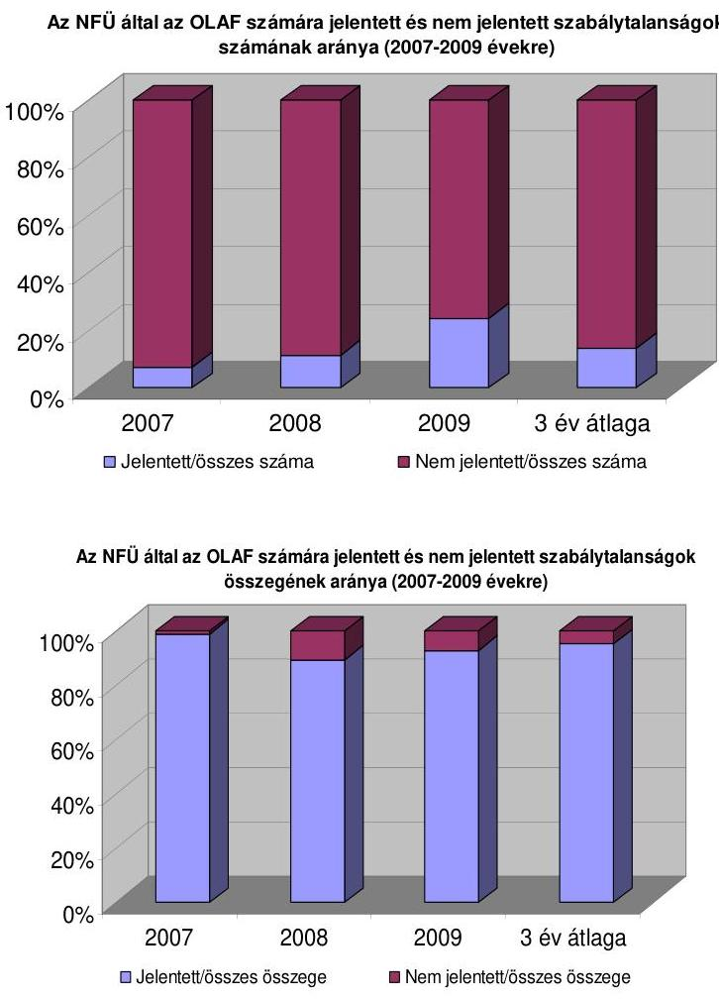

[^0]
[^0]:    ${ }^{105}$ A szabálytalansági vizsgálat jegyzőkönyvében 406 esetben javasolták a szabálytalanság tényének megállapítását, a szervezet vezetője 397 esetben állapított meg szabálytalanságot. A csalással gyanúsított esetek száma a jegyzőkönyvek szerint 7 db volt, amely a döntés szerint 5-re csökkent.
    ${ }^{106}$ Például nagy volt a szabálytalanságok száma a LEADER+ programban (553 db, AVOP szabálytalanságok 50,9\%-a), de a projektek jellemzően 10000 euró alattiak, így nem tartoztak jelentési kötelezettség alá.

---

Az eljárás teljes időigénye a gyanú beérkezésétől a szabálytalansági vizsgálat által javasolt döntés meghozatalának időpontjáig 4 és 509 nap között változott, átlagban 65 nap volt. A jogszabály által előírt határidőt, a 281/2006. (XII. 23.) Korm. rendelet 40. § (5) bekezdése szerinti 45 naptári napot az esetek 42\%-ában tartotta be az intézményrendszer (lásd a 6. sz. ábrán).
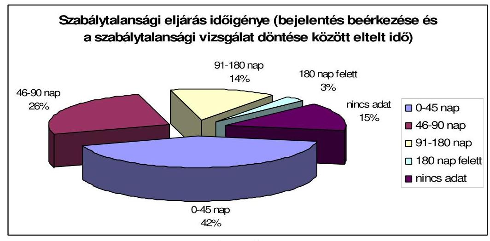
6. sz. ábra

Az NFÜ által az EMIR szabálytalanságkezelési modulból összeállított táblázat elemzése ${ }^{107}$.

A szabálytalansági ügyeket az ÁROP és NyDOP esetében kezelték a legrövidebb idő alatt (44 nap); a KÖZOP esetében viszont az átlag kiemelkedően magas, 238 nap volt (7. sz. ábra).
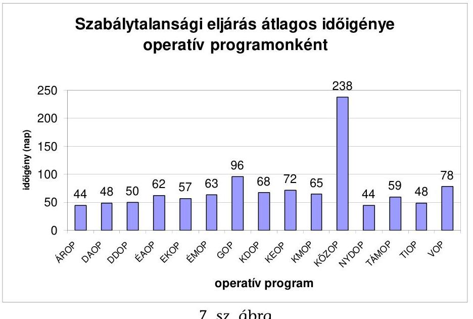
7. sz. ábra

[^0]
[^0]:    ${ }^{107}$ Az NFÜ észrevétele szerint „az EMIR-ben szereplő dátum adatok nem minden esetben megbízhatóan mutatják a valós helyzetet, tekintettel arra, hogy nem minden esetben kerültek megfelelően rögzítésre (esetenként valóban nem teljesül a logikai sorrendiség feltétele, például a bejelentés megelőzi az észlelést). A bejelentési és vizsgálati lapon levő dátum hibákat csak a Welt tudja adatjavítással javítani, a hiba jelzése, azonban nem minden esetben történt meg."

---

A szabálytalansági eljárás egyes lépései között eltelt idő elemzését a 12. sz. melléklet tartalmazza, a jogszabályban előírt határidő megjelölésével. A szabálytalansági gyanú észlelése és a bejelentése között az esetek közel 15\%-ában 30 napnál több idő telt el, 5\% felett van a 90 napnál később bejelentett gyanúk aránya. Az 1. és 2. sz. minta esetében 173 nap telt el a gyanú észlelése és bejelentése között, a késedelmet a KSZ nem tudta indokolni. További öt esetben 30 napnál később jelentették be a szabálytalansági gyanút az észlelés időpontjához képest (3., 4., 6., 9., 12. sz. minta).

Az esetek csak mintegy 29\%-ában döntött a szervezet vezetője két napos határidőn belül a szabálytalansági vizsgálat elindításáról, elutasításáról, vagy a javaslat és a kapcsolódó dokumentumok érintett szervezethez történő átadásáról.

A szabálytalansági eljárás elhúzódása a későbbi követelések behajtásának eredményességét ronthatja.

A szabálytalanságok pénzügyi következményeként a szabálytalanul felhasznált támogatást minden vizsgált esetben visszakövetelték a kedvezményezettnek még járó támogatásból levonással (ún. kompenzálás), vagy a visszafizetés előírásával. Ügyleti és késedelmi kamatot nem minden KSZ határozott meg (VÁTI Kft., MAG ZRt. igen, ESZA NKft. nem ${ }^{108}$). A helyszínen ellenőrzött KSZ-ek egyike sem szabott ki szabálytalanság miatt bírságot. A kiszabható szankciókat nem nevesíti a 281/2006. (XII. 23.) Korm. rendeletben, ellentétben az EU szabályozás ${ }^{109}$ adta lehetőséggel.

A támogatási szerződéseket a szabálytalanságok miatti keret csökkentése ellenére nem módosították, ennek elmaradása miatt az újra elosztható keret nem bővült, hiszen a keret lekötését a támogatási szerződésben meghatározott támogatások összege jelentette. Ez a gyakorlat a rendelkezésre álló pénzügyi keret pontos követését nem tette lehetővé.

A szabálytalanságból eredő tőkeköveteléseket az EMIR rendszer szabálytalansági modulja megfelelően tartalmazta. A 281/2006. (XII. 23.) Korm. rendelet 42. § (1) bekezdése szerint a szabálytalansággal érintett támogatást a kedvezményezettől vissza kell vonni, annak összegét a Szabálytalansági Bizottság javaslata alapján a KSZ/IH vezetője határozta meg.

A helyszíni vizsgálat dokumentumai szerint a kamatok felszámításában az ellenőrzött három KSZ közül kettő (VÁTI Kht., Mag ZRt.) - belső szabályozás hiányában - az Ámr. és a Ptk. alapján járt el.

Egy közreműködő szervezet (ESZA NKft.) - emlékeztetőbe foglalt - tájékoztatása szerint az NFÜ által kiadott követeléskezelési eljárásrend és követelés nyilván-

[^0]
[^0]:    ${ }^{108}$ Az ESZA NKft. esetében a helyszíni vizsgálatunk lezárását követően megkezdődött a követelések kezelése, amelyet a dokumentumok aláírási dátumai igazolnak.
    ${ }^{109}$ Az Európai Regionális Fejlesztési Alapra, az Európai Szociális Alapra és a Kohéziós Alapra vonatkozó általános rendelkezések megállapításáról szóló 1083/2006/EK tanácsi rendelet, valamint az Európai Regionális Fejlesztési Alapról szóló 1080/2006/EK európai parlamenti és a tanácsi rendelet végrehajtására vonatkozó szabályok meghatározásáról szóló, a Bizottság 2006. december 8-ai 1828/2006/EK Rendelete 5. cikk nevesíti a kiszabható szankciókat.

---

tartó rendszer (EMIR követeléskezelési funkció) hiánya miatt részlegesen érvényesítették a követeléseit. Helyszíni ellenőrzésünk idején folyamatban volt a követelések feldolgozása. Szabálytalanság miatt a TSZ-től való elállás esetében az elállásról szóló okirat ugyanakkor tartalmazta a kedvezményezettel szemben fennálló követelés tőke és kamat összegét is.

A szabálytalanul felhasznált
 támogatások utáni ügyleti és késedelmi kamat felszámítása a jogszabályokban nem egységesen szabályozott, ezt tükrözte a lebonyolító szervezetek eltérő gyakorlata is helyszíni vizsgálatunk alapján.

A Tanács 2006. július 11-ei 1083/2006/EK rendelet 70. cikk Irányítás és ellenőrzés fejezet (1) bekezdése alapján a tagállamok felelősek az operatív programok irányításáért és ellenőrzéséért, különösen az alábbi intézkedések révén: b) a szabálytalanságok megelőzése, feltárása és korrigálása, valamint a jogosulatlanul kifizetett összegek - adott esetben a késedelmi kamatokkal együtt történő - visszafizettetése.

Az IMK részét képező követeléskezelési eljárásrend szerint szabálytalanság miatti elállás esetén (IMK 5. oldal) csak „a kifizetett támogatási összeg visszakövetelendő", a „követelés összeállítása" során kamatot kell számítani.

A kamat felszámításának esetleges elmaradása csökkenti a szabálytalanságtól visszatartó erőt.

A Tanács 1995. december 18-ai 2988/95/EK, EURATOM rendelete 2. cikk (1) bekezdése: Szükség esetén ellenőrzések, közigazgatási intézkedések és szankciók kerülnek bevezetésre a közösségi jog megfelelő alkalmazása érdekében. Ezeknek hatékonynak, arányosnak és visszatartó erejűnek kell lenniük, hogy biztosíthassák a Közösségek pénzügyi érdekeinek megfelelő védelmét. A (4) bekezdés szerinti ellenőrzések, intézkedések és szankciók alkalmazásának eljárásaira nézve a tagállamok jogszabályai az irányadók.

Az EU szabályozás kamat és bírság kiszabását csak lehetőségként említi 4. cikkében. Az (1) bekezdés szerint: „Főszabályként minden szabálytalanság a jogtalanul megszerzett előny elvonását vonja maga után."

Hét különféle pénzügyi szankciót az 5. cikk (1) bekezdés szerint közigazgatási eljárásban határoz meg.

Az IMK szabálytalanságkezelési eljárásrendjének 2009. 04. 21-étől hatályos módosítása a kamatszámítást megfelelően tartalmazta. A 2010. január előtt és az után kötött támogatási szerződésekre eltérő kamatot kell számolni.

Az Ámr. (régi) 88. § (1) és (4) bekezdés meghatározott mértékű kamatot, de legalább 20%-ot, az új - 2010. január 1-jétől hatályos - Ámr. 127. § (1) bekezdés alapján Ptk. szerinti kamatot határozott meg. A Ptk. 232. § (3) bekezdés szerint a kamat mértéke - ha jogszabály kivételt nem tesz - megegyezik a jegybanki alapkamattal.

A KSZ-ek a helyszíni vizsgálat szerint jogi következményként főként a szerződéstől való elállást alkalmazták, feljelentést a Btk. 314. §-a szerinti Európai Közösségek pénzügyi érdekeinek megsértése bűncselekmény miatt 24 esetben tettek az NFÜ tájékoztatása szerint. Az eljárások még nem fejeződtek be helyszíni vizsgálatunk idején.

---

A mintában megvizsgált 15 db ÚMFT projekt szabálytalansági eljárásában a szabálytalanul felhasznált összeget (EU és hazai bontásban) az eljárást lezáró döntés tartalmazta. Kamatot a 12., 13., 14. és 15. számú minta tartalmazott.

A szabálytalanul felhasznált összeg megtérülésének egyik - eredményesen - alkalmazott megoldása a következő kifizetési kérelemből illetve a záró kifizetésből levonásba helyezés ún. kompenzálás (7 db, 1., 2., 3., 4., 5., 6., 12. minta).

A tőkekövetelésen felüli kamatkövetelések megállapítása nem volt egységes.
A GOP projektjei szabálytalan felhasználása esetén minden döntés meghatározta az ügyleti és a késedelmi kamatot is (13., 14., 15. minta), erről a kedvezményezettet írásban tájékoztatta. A TÁMOP, ÉMOP szabálytalanságaira nem állapítottak meg kamatot ${ }^{110}$.

Az alkalmazandó biztosítékokra vonatkozó szabályozásban a 281/2006. (XII. 23.) Korm. rendelet széles körben határozta meg a biztosíték nyújtás alóli mentességekre jogosultak körét. Ez a széles körű mentesség nem EU direktíva, és károsan hathat a behajtás hatékonyságára. A biztosítékok hiányában nagyfokú a kockázata annak, hogy a támogatott, különösen társaság esetében „vagyontalaníja magát" és ezzel a behajtási kézikönyvekben felsorolt intézkedések eredménytelenek (7. sz. melléklet).

A támogatási szerződésekben biztosítékként a követelés bankszámláról való leemelésére felhatalmazó levelet ajánlottak a kedvezményezettek 9 esetben (7. sz. melléklet, 4., 7., 8., 9., 10., 11., 14., 16., 17. sz. minták), ezek esetében nem került sor kompenzációra. A felhatalmazó levél felhasználására egy esetben került sor (7. sz. melléklet, 14. sz. minta). Egy esetben (7. sz. melléklet, 10. sz. minta) támogatás kifizetésére nem került sor. Hét esetben nem éltek a felhatalmazó levéllel.

Felhatalmazó levél mellett bankgaranciát egy támogatási szerződés (7. sz. melléklet, 9. sz. minta) tartalmazott, amely esetben a szabálytalanság miatti követelés kompenzációval térült meg. Önállóan csak bankgarancia biztosítékot egy támogatott ajánlott fel (7. sz. melléklet, 13. sz. minta).

A szabálytalansági eljárás során megállapított és az EMIR szabálytalansági moduljában rögzített összegek azonosak voltak (minden minta esetében). Az EMIR követeléskezelési funkciójának hiányában, valamint helyszíni ellenőrzésünk végéig a követelések leltárral alátámasztott analitikájának hiányában a szabálytalansággal érintett, még meg nem térült követeléseket nem tudtuk ellenőrizni.

Jogi következményként csak a szerződéstől elállást alkalmazta az NFÜ, a helyszíni vizsgálat befejezéséig a pályáztatásból nem zártak ki senkit. A pályázatból kizárás lehetőségét a KSZ-ek és az IH-k nem oldották meg, ehhez nem volt az NFÜ-nek adatbázisa sem. Csalás esetén az egyik vizsgált esetben tettek büntető feljelentést 2009-ben, az eljárás vizsgálatunk végéig nem zárult le.

[^0]
[^0]:    ${ }^{110}$ A TÁMOP esetében a helyszíni vizsgálatunk lezárását követően megkezdődött a követelések kezelése, amelyet a dokumentumok aláírási dátumai igazolnak.

---

# 2.1.2. Szabálytalanságkezelési folyamat az MVH-nál 

Az MVH eljárása az EU támogatások közvetítésekor - az AVOP és a SAPARD kivételével ${ }^{111}$ - a Ket. szabályain alapult. A támogatást közigazgatási hatósági eljárás keretében biztosították a kedvezményezettek számára, a szabálytalanságkezelés folyamata beépült az ügykezelés folyamatába, a szabálytalanságokról elkülönített listát nem készítettek. A szabálytalanságokat egyedileg kezelték. A nyilvántartásban szerepelt a szabálytalanságok megjelölése, de az OLAF felé megküldött szabálytalansági jelentésekben szereplő esetek nem kerültek megjelölésre az IIER nyilvántartásban. Ez megnehezítette a szabálytalanság következtében behajtandó összegek táblázatának kitöltését (éves beszámoló III. melléklet), hiba lehetőséget hordozott. Ezzel ellentétben például az éves beszámoló másik melléklete (X-tábla) IIER-ből előállítható volt.

Az MVH esetében 2009 szeptemberétől az OLAF részére elektronikus formában kerültek továbbításra a szabálytalansági jelentések. Az OLAF kifejlesztett egy internet alapú informatikai rendszert, az ún. IMS rendszert (Irregularity Management System - Szabálytalanságkezelési rendszer), amellyel az EMGA-ra és EMVA-ra vonatkozó tagállami jelentések egységes kezelése megoldottá vált. A rendszerbe a korábban megküldött jelentések importálásra kerültek, valamint az új jelentéseket is ide töltötte fel az MVH, ezáltal az elektronikus nyilvántartás kérdése megoldott volt.

A helyszíni ellenőrzés során az MVH Pénzügyi Igazgatósága által összeállított és a Bizottság felé évente kiküldött szabálytalanság következtében behajtandó követelések táblázatát (éves beszámoló III. melléklete) ${ }^{112}$ vettük alapul mind a szabálytalanság-, mind a követeléskezelés értékelésekor. Erre végeztek az MVH-nál évente legyűjtéseket, amely a jogerős határozatokon alapuló követeléseket tartalmazta. Ebben a rendszerben a szabálytalansági gyanú nem volt értelmezhető. A szabálytalanság következtében behajtandó követelések táblázata (éves beszámoló III. melléklete) a következő tételeket nem tartalmazta:

- nem jogerősen megállapított szabálytalanságok, támogatást visszakövetelő határozatok, mert az ügyfél a határozatot megfellebbezte;
- a túligénylést adott éven belül kompenzációval rendezték és nem jelölték meg a nyilvántartásban szabálytalanságként, miként az agrár-környezetgazdálkodási jogcím esetében (például a 9. sz. melléklet, 18. sz. minta 26. sora);
- a szabálytalanságot megállapító határozat az elszámolási időszak végén emelkedik jogerőre, de csak a következő időszakban válik esedékessé, akkor a tétel követelésként nem az első ténymegállapítás évében fog megjelenni;
- az első ténymegállapítás nem határozatban, hanem például olyan helyszíni jegyzőkönyvben történt, ahol a vizsgált kedvezményezett (vagy annak

[^0]
[^0]:    ${ }^{111}$ Az AVOP és a SAPARD eljárásrendjét - az NFÜ által kezelt uniós támogatásokhoz hasonlóan - a Ptk. (régi) figyelembe vételével alakították ki.
    ${ }^{112}$ Az 1290/2005/EK tanácsi rendeletnek a kifizető ügynökségek és más testületek akkreditációja és az EMGA és az EMVA számláinak elszámolása tekintetében történő alkalmazására vonatkozó részletes szabályok megállapításáról szóló a Bizottság 2006. június 21-ei 885/2006/EK rendelete 6. cikke és III, valamint III/A. mellékletei.

---

képviselője) is jelen volt. Ilyenkor az első ténymegállapítás időpontja nem az elsőfokú határozat jogerőre emelkedése, hanem a helyszíni jegyzőkönyv kellene, hogy legyen. Ilyen eset például, ha az ellenőrzést egy olyan zárt térben kell lefolytatni, ahová a kedvezményezett tudta nélkül nem lehet bejutni.

A Tanács 1995. december 18-ai 2988/95/EK, EURATOM rendelet 1. cikk (2) bekezdése szerint szabálytalanság körébe beletartoznak a fentiekben felsorolt esetek is, mivel a szabálytalansággal kapcsolatos első ténymegállapítás már megtörtént (annak ellenére, hogy a követelés még nem jogerős).

A szabálytalanságok előírások szerinti ${ }^{113}$ rögzítése azért fontos, mert elmulasztása esetén a Bizottság dönthet úgy, hogy a tagállam nem tett meg mindent a kedvezményezetteknek folyósított alapok behajtása érdekében, minek következtében a meg nem térült követelés miatti veszteség teljes egészében a tagállamot terheli. Ha viszont a tagállam az előírásoknak megfelelően járt el, a behajtás elmaradásából származó pénzügyi következmények terheit a tagállam és a közösségi költségvetés 50-50%-ban viselik ${ }^{114}$.

A 9. sz. melléklet 19. sz. minta, SAPARD támogatáshoz kapcsolódó szabálytalansági eljárás rámutatott az OLAF és a hazai hatóságok együttműködése erősítésének szükségességére, illetve annak jellegére.

Az MVH a 9. sz. melléklet, 19. sz. minta szerinti projekt esetében szabálytalansági eljárást folytatott le, amelynek során nem állapítottak meg szabálytalanságot a rendelkezésre álló dokumentumok alapján. Az OLAF ugyanezen projekthez kapcsolódóan - külföldi szállítónál végzett vizsgálata alapján - a korábban MVH által belföldön lefolytatott szabálytalansági eljárás eredményével ellentétes következtetésre jutott. Tekintettel arra, hogy az OLAF Magyarországon nem tehetett feljelentést, azt a hazai szervezetre, az MVH-ra bízta, amely szervezet a feljelentést az OLAF által megküldött jelentés ${ }^{115}$ alapján megtette és támogatás folyósítását felfüggesztette ${ }^{116}$.

A gyanúba került kedvezményezett polgári pert indított - és a 2009. 04. 03-án kihirdetett ítélet szerint meg is nyerte ${ }^{117}$ - az MVH ellen, így a felfüggesztett támogatást ki kellett fizetni. Az MVH 2007. 10. 16-án újabb szabálytalansági eljárást indított, de - a folyamatban lévő büntető eljárásra hivatkozva - nem zárta le és nem állt el a szerződéstől.

Az OLAF szervezetével való együttműködés lehetősége minden szervezet számára adott volt, ugyanakkor az együttműködés mikéntje nem volt részleteiben szabályozott. A nemzetközi szintre is kiterjedő projektek esetében a szabálytalansági eljárás érdemi lefolytatásához szükséges lett volna a nemzetközi

[^0]
[^0]:    ${ }^{113}$ A Tanács 2005. június 21-ei 1290/2005/EK rendelete 33. cikk (5) bekezdés a) pontja.
    ${ }^{114}$ A Tanács 2005. június 21-ei 1290/2005/EK rendelete 33. cikk (8) bekezdés.
    ${ }^{115}$ Az OLAF/C/3 YD/pg D(2007-8046) ikt. sz. levele és az OF/2006/0679. ikt. sz. zárójelentés.
    ${ }^{116}$ MVH BL/1692-2007. ikt. sz. Feljegyzés a felfüggesztésről (2007. 03. 08.).
    ${ }^{117}$ A Fővárosi Bíróság 17.G.41.622/2008/6. sz. ítélete a Magyar Köztársaság Nevében.

---

együttműködés (például dokumentumok bekérése céljából), ezt mutatta az MVH példája is.

Az a tény, hogy a nemzeti hatóságok és az OLAF nemzetközi szervezete együttműködésének mikéntje nem volt tisztázott, ellentmondásos helyzet alakult ki. Az MVH nem állapított meg szabálytalanságot, de szabálytalanság miatt feljelentést tett az OLAF
 jelentésre alapozva.

Az MVH észrevétele szerint „mivel a büntetőeljárás még nem fejeződött be, a Hivatal nem tudja a támogatási szerződéstől való elállással lezárni a szabálytalanságkezelési eljárást. Ameddig nincs elállás, addig nincs visszakövetelendő összeg sem. Amennyiben a Hivatal a büntetőeljárás eredményét be nem várva, előre eldöntené, hogy a Kedvezményezett elkövette azt a büncselekményt, amivel az OLAF jelentés alapján gyanúsitható, és ezért elállna a támogatási szerződéstől, súlyosan sértené az Alkotmányt és a büntetőeljárásról szóló törvényt. Továbbá azt a körülményt is nyomatékosan hangsúlyozzuk, hogy a Hivatalunk azonos tárgyban lezárt szabálytalanságkezelési eljárása nem talált hiányosságokat a projekt végrehajtásában. Hatáskör és illetékes hiányában pedig Magyarország határain kívül nem áll módunkban vizsgálatot folytatnunk. Az OLAF Magyarországon kívül végzett ellenőrzése tárt fel számukra, hangsúlyozom számukra (!), büntetőfeljelentésre alapul szolgáló körülményeket. Ezt félénken jelezték, amelynek alapján hivatalunk a büntetőfeljelentést megtette, annak ellenére, hogy a hivatal szabálytalanságkezelési eljárása hibát nem talált. Mindezekre tekintettel az OLAF kérésének megfelelően intézkedtünk, és a Közösség pénzügyi érdekeit messzemenően figyelembe véve nem engedtük meg a kifizetés teljesítését."

Az NVT már lezárult ${ }^{118}$, záró (ex-post) értékelését a Bizottság befogadta ${ }^{119}$. Az NVT-ben és az ÚMVP-ben egyaránt meglévő kifizetési jogcímek az ÚMVP keretében kerülnek finanszírozásra a 2007-2013-as programozási időszakban.

Az EMVA, a 2007-2013-as programozási időszakban indult pénzügyi alap, így a fentiek szerint a szabálytalanságokkal kapcsolatos követelések közötti részaránya alacsony (2,1%) volt.

A szabálytalanság-, adósság- és követeléskezelési folyamatok eredményességének értékelését a keletkezett szabálytalanságok, követelések, a megtérült és a még fennálló követelések elemzésével végeztük el. A folyamatok működésének teszteléséhez mintát vettünk (9. sz. melléklet).

A minta alapján (9-ből 4 esetben) a szabálytalanságokat a helyszíni ellenőrzések kapcsán észlelték, így a mintavétel alapján szerzett tapasztalat szerint az ellenőrzések alkalmasak voltak a szabálytalanságok feltárására az MVH-nál. Másik 4 esetben a pályázó lépett vissza, vagy mondott le a támogatásról, egy esetben pedig az OLAF tárta fel a szabálytalanságot. Az agrár-környezetgazdálkodási jogcím esetében 2009-ig szabálytalanságnak tekintették, ha a kedvezményezett a vállalt időszakon (5 éven belül) visszalép a támogatási feltételek teljesítésétől, vagy ha a helyszíni ellenőrzés során olyan mértékű támogatásigénylés túllépést állapítanak meg, hogy a kedvezményezettet ki kell zárni a további támogatás lehetőségéből. Ezeket a szabálytalanságokat azonban szabálytalanságként külön nem összesítik.

[^0]
[^0]:    ${ }^{118}$ A Nemzeti Vidékfejlesztési Terv 2004-2006 ex-post értékelése (Bp. 2009. március 24.).
    ${ }^{119}$ A Bizottság levele 2009. július 13.

---

Az AKG-nál további hat szabálytalansági mintából 4 eset a kedvezményezett részéről a támogatási kérelmének teljes, vagy részleges visszavonása miatt keletkezett, egy felszámolás bejelentésének elmulasztása, egy esetben a 3. évben lefolytatott helyszíni ellenőrzés alkalmával tárták fel, hogy az első évre vonatkozó tiltott növényvédő szer használata szabálytalanság volt.

Az EMVA III. és IV. tengely vonatkozásában a szabálytalanságok következtében behajtandó követelések táblázata (éves beszámoló III. melléklete) nem tartalmazott egyetlen tételt sem.

Késedelmi kamat hat megvizsgált esetből öt esetben szerepel a visszakövetelést megállapító határozatban. A késedelmi kamat a jogosulatlanul igénybe vett támogatás jogszabály szerinti mindenkori jegybanki alapkamat kétszerese. A határozat kibocsátásáig nem számították ki és közölték a határozatban az ügyleti kamat összegét a fenti öt esetben sem.

Az EMGA esetében a pénzügyi korrekció összegét meghatározták, de a korrekció végrehajthatóságát kedvezőtlenül befolyásolta a pénzügyi nyilvántartási rendszerben és a határozatban bemutatott tények esetleges pontatlansága.

A 36. sz. minta esetében az IIER rendszerben tárolt adatok alapján ellenőrzésünk nem tudta megállapítani a szabálytalanság mibenlétét. A szabálytalansági határozat nem tartalmazta az igényelt és a valódi területmértéket, csak annyit mondott, hogy az ügyfél 0,4 ha-ra jogosulatlan támogatást kapott. A másodfokú eljárás már kitért részletesebben az adatokra, azonban a megjelenő határozatszámot és a területi mértéket nem tudtuk az eredeti határozattal párosítani. Az MVH határozatok arról szóltak, hogy 6,9 ha igényelt támogatással szemben 6,5 ha területet mértek a helyszínen, míg az ügyfél eredeti határozatában 2,92 hektárra kapott támogatást és beadványában földmérővel bizonygatta, hogy területe 2,9458 ha.

A retroaktív (visszamenőleges) intézkedéscsomag keretében megalkotott szabálytalanság miatti visszakövetelő határozatok esetében a határozat meghozatala előtt nem volt minden gazdálkodónak lehetősége a szabálytalanságot megállapító, visszakövetelő határozat állításainak megismerésére, pedig azt a vonatkozó EU joganyag előírta ${ }^{120}$. Ennek következménye, hogy olyan szabálytalansági eljárások is indultak, amelyek korábban kiszűrhetőek lettek volna.

A 9. sz. melléklet, 31. sz. minta, a Mepar éves adatfrissítését végző FÖMI szerint egy adott blokk (R6PV9-3-05) 2006. évre nem volt jogosult támogatásra. Az MVH a FÖMI adatokat átvette, azok a 2009. március 31-ei adatbázisban az MVH által elfogadásra kerültek. A gazda a 2009. április havi kérelembeadás időpontjában észlelte, hogy blokkjának támogatható területe nullára csökkent, ezután változásátvezetési kérelmet nyújtott be, amelyben kérte, hogy a blokk ténylegesen művelt területét állítsák vissza támogatható kategóriába. A változásátvezetési kérelmet a FÖMI 2009. 07. 13-án kapta meg, azt 2009. szeptember 21-én a gazdálkodó szempontjából pozitívan bírálta el.

[^0]
[^0]:    ${ }^{120}$ A Bizottság 796/2004/EK rendelete (2004. április 21.) az 1782/2003/EK tanácsi rendelet és a 73/2009/EK tanácsi rendelet által előírt kölcsönös megfeleltetés, moduláció, valamint integrált igazgatási és ellenőrzési rendszer végrehajtására, valamint a 479/2008/EK tanácsi rendelet által előírt kölcsönös megfeleltetés végrehajtására vonatkozó részletes szabályok megállapításáról szóló 796/2004/EK rendelet 28. Cikk (2) bekezdése.

---

Az EMGA esetében 1301 fellebbezés volt folyamatban ellenőrzésünk idején, amelyek a teljes szabálytalanság miatt visszakövetelt összeg több mint 54%-át érintették.

Az intervenció esetében a DG AGRI I4/D (2009) 8073-as jogértelmező iránymutatása szerint az EMGA-t érintő részeket - intervenciós raktározási veszteségek szabálytalanságai esetén is - a szabálytalanság következtében behajtandó összegek táblázatában (éves beszámoló III-as melléklet szerint) kell jelenteni. A jelentési kötelezettségnek 2009-ben az MVH egy bővített, az intervenció sajátos elemeit is tartalmazó táblázatban tett eleget. Az IIER-ben az éves beszámoló mellékleteinek elkészítéséhez nem legyűjthető módon van nyilvántartva a szabálytalanság első felmerülésének időpontja, illetve a rendszer nem is tartja nyilván az egy éven belül elvégezendő kötelező közigazgatási és jogi aktusok listáját. A bővített intervenciós szabálytalanságokat tartalmazó melléklet ${ }^{121}$, új oszlopai értelmezési problémát vethetnek fel. A Ptk. szerinti szerződéses jogviszony esetén nem tisztázták, hogy mely kézikönyv előírása szerint indul egyik esetben bírósági eljárás, míg más esetben mellőzik azt /(K) oszlop/.

A 9. sz. melléklet, 26. sz. minta szerint egy káreseményről az EU felé 2009. 10. 15-ei határnappal 74 M Ft követelést közölt az MVH, ugyanakkor a céget korábban már felszámolták (a követelést nem állították be behajthatatlannak /(O,P) oszlop/. Az információ a rendszerben nem állt rendelkezésre. Az EU-nak küldött jelentések a pénzügyi elszámolás alapját képezték.

A 34. sz. minta szerinti szabálytalanság kockázatot jelentett a szabálytalanságkezelési rendszerben, mivel a területalapú támogatásokhoz kapcsolódó ellenőrzések nem tárták fel, hogy két igénylő ugyanazon táblán belül ugyanarra a területre kérte-e a támogatást. Ilyen típusú ellenőrzést a 34. sz. minta esetében másodfokú eljárás keretében ügyintéző végzett és állapított meg szabálytalanságot.

Az APEH elnöke kezdeményezte az együttműködés kereteinek kiterjesztését az MVH-val. Az MVH 37. sz. minta esetében felmerült fiktív számlázás gyanúja a szabálytalanság vizsgálata során. Szükségessé vált a számlakibocsátók vizsgálata, de az ellenőrzésre az új Art. 54. §-ban foglalt adótitokra vonatkozó szabályok miatt nem kerülhetett sor. Az APEH elnöke javasolta, hogy a pályázati feltételrendszer része legyen a pályázó hozzájárulása ahhoz, hogy a pályázat ellenőrzése céljából az MVH megismerjen adótitoknak minősülő adatokat.

# 2.2. A kedvezményezettekkel szembeni követeléskezelési folyamat értékelése eredményességi szempontból 

### 2.2.1. Követeléskezelési folyamat az NFÜ-nél

Az NFÜ által központilag kiadott követeléskezelési szabályzat és nyilvántartási rendszer hiányában az ellenőrzött KSZ-ek eltérő eljárásrendeket és nyilvántartásokat alakítottak ki az ÚMFT-re.

[^0]
[^0]:    ${ }^{121}$ File: Public intervention stocks - report on losses HU 2009.xls.

---

Az ÚMFT programok követeléskezelését nem támogatta az EMIR, nem volt meg az ehhez szükséges modul, ezért a KSZ-ek az EMIR-től elkülönült adatbázisban tartották nyilván a követeléseket.

Az NFÜ tájékoztatása szerint (2010. április 06-ai e-mail): „a teljes követeléskezelés specifikációjához szükséges szakmai egyeztetés még nem zárult le, ezért a teljes funkció/modul megvalósítására vonatkozó becslés még nem áll rendelkezésre. A követeléskezelés alapvető, és a jogszabályi kötelezettségek teljesítéséhez szükséges adatainak manuális rögzítésére és nyilvántartására szolgáló felület kifejlesztése megtörtént (EHD F1382), ez jelenleg tesztelés alatt áll, bevezetése várható 2010. május elején, célja a teljes modul kifejlesztéséig a lehetőségeknek megfelelő informatikai támogatás biztosítása."

Helyszíni ellenőrzésünk végéig, 2010. április 16-áig nem álltak rendelkezésre az ÚMFT programjai követeléskezelési adatai. Az adatok feldolgozása, egyeztetése folyamatban volt, ezért a helyszíni ellenőrzéséhez a korábban a szabálytalanságkezelési folyamat vizsgálatához kiválasztott minták követelés-kezelését választottuk abban az esetben, ha a szabálytalansági ügyben történt már követeléskezelés, illetve visszafizetés, kompenzálás.

A szabálytalanság-kezeléshez kiválasztott összesen 17 esetből 7 esetben történt meg a visszafizetés, illetve kompenzálás (1., 2., 3., 4., 6., 13., 14. sz. minta). Egy esetben (15. sz. minta) a KSZ engedélyezte a részletfizetést, egy esetben (12. sz. minta) a visszafizetés határidejét 2009. december 15-ről 2010. április 15-re módosította. A 7-11. sz. minták esetében az ESZA NKft. a követeléseket nem érvényesítette, így visszafizetés/kompenzálás sem történt.

A követeléskezelési folyamat eredményességének értékelése céljából a PM NAO Irodához 2010. március 18-áig elektronikusan beérkezett, a visszavonások, visszafizetések és a függőben lévő behajtásokat tartalmazó előzetes kimutatásokat vettük alapul, amelyek a következő operatív programokra érkeztek be: HEFOP, TÁMOP-TIOP, KEOP, KIOP, KA-közlekedés. A többi programra vonatkozó adat nem érkezett meg határidőre a PM NAO Irodához. A lebonyolító szervezetek adatszolgáltatása a jelentési kötelezettségek teljesítéséhez képest késedelmes volt ${ }^{122}$.

A rendelkezésre álló kimutatások alapján a legtöbb szabálytalanságból származó követelés NFT I. esetében a HEFOP-nál, ÚMFT esetében a TÁMOP-nál keletkezett. A tételek megvizsgálására azonban nem került sor a KSZ-nél (ESZA NKft.) ${ }^{123}$.

A követelések elismertetésére mindegyik KSZ felvette a támogatottakkal a kapcsolatot. A beszámolókhoz szükséges követelés analitika egyeztetetten a helyszíni vizsgálat végéig nem állt rendelkezésre.

GVOP-ra a követeléskezelésre vonatkozó központi eljárásrend hiányában a KSZ-nek belső követeléskezelési eljárásrendje volt (64/2008. sz. Vezérigazgatói utasítás). Az Ámr. 2009. decemberi módosítása, ami érintette a kamatszámítás

[^0]
[^0]:    ${ }^{122}$ A 281/2006. (XII. 23.) Korm. rendelet 43., 44. §-a.
    ${ }^{123}$ A V-2015-064/2009-2010. ikt. számú emlékeztető az ESZA NKft. hivatali helyiségében lefolytatott 2010. március 30-ai megbeszélésről.

---

módját, csak a 2010. 01. 01. után kiírt pályázatokra vonatkozik, ezért a helyszíni ellenőrzés ideje alatt folyamatban volt az eljárásrend vonatkozó részeinek kiegészítése. 2009-ben keletkeztek az első szabálytalanságból eredő követelések; behajthatatlan követelés megállapítására még nem került sor.

Az NFÜ-vel kötött szerződésekben foglalt felhatalmazás alapján a VÁTI NKft. és a MAG ZRt. az Ámr.
 és a Ptk. alapján járt el a követelések behajtására. Az ESZA NKft. munkatársai nem érvényesítették a követeléseiket, sőt a szabálytalansági döntésben meghatározott pénzügyi korrekció - követelés előírása - ellenére is tovább folyósították a támogatást.

Az ÚMFT programok követelés-megtérülés időszükségletének statisztikai elemzésétől az EMIR követeléskezelő funkció hiányában el kellett tekintenünk.

Az NFT I. programjaihoz ugyan készült követeléskezelési modul, azonban az abban lévő adatok megbízhatósága az áttekintett HEFOP táblázat szerint korlátozott; az alábbi adatok a HEFOP követeléskezelésére vonatkoznak, hiszen a kedvezményezettek által már visszatérített követelés Irányító és Kifizető hatóságok közötti rendezése elmaradt, aminek következtében az EU felé még behajtandó követelésként jelentek meg ezek a „rendezetlen" tételek. A behajtandó követelésként nyilvántartott 372353682 Ft követelésből 3041716 Ft volt rendezve IH/KH között 2009. december 31-éig. A rendezetlenség miatt a már visszafizetett, de mégis behajtásra váró tételként nyilvántartott források újrafelhasználása a programon belül ez által lehetetlenné vált.

Összesen 21 szervezet volt érintett szabálytalanságok miatti 1664 db követelésben 118,7 M Ft érintett összeggel, közülük 2 db 0 Ft-tal, (de ez utóbbiak a táblázat szerint a kompenzációval megtérültek). A követelések nyilvántartásában 550 db, 2000 Ft alatti követelés szerepelt, amelyek az NFÜ értékelési szabályzata ellenére nyilvántartásban maradtak előírt követelésként. 12 db olyan szervezet volt, amelynek összes követelése nem érte el a 2000 Ft-ot. A 2000 Ft alatti követelések közül 64 db 100 Ft alatti tétel volt. Az 550 db követelésből 93 db követelést nem kompenzáltak (43,6 E Ft). Egy kedvezményezett 831 db szabálytalansága 9,730 M Ft támogatást érintett, amelyekből 419 db 2000 Ft alatti összegű volt, összesen 313 E Ft értékben (a követelés kompenzálással megtérült).

A KOR IH 2010. 04. 08-i elektronikus úton megküldött tájékoztatása szerint az ÚMFT esetében nem volt szabálytalanság miatt előleg visszakövetelés, sem behajthatatlan követelés a 2009. december 31-ei állapot szerint.

Az NFÜ követeléskezelés szabályozásában a cselekmények sorrendisége kötött volt, szemben a bírósági végrehajtásról szóló 1994. évi LIII. törvénnyel, amely nem határozta meg a végrehajtási cselekmények sorrendiségét.

Az NFÜ KSZ-einél ez a sorrendiség - az ügyintézők egységes eljárását szolgálva esetenként - a jogviszonyi problémákon túl is azt eredményezte, hogy a cselekmények nem a behajtást, hanem az adminisztratív előírások betartását eredményezték.

Például egy kedvezményezett adós székhelyéről ismeretlen helyre költözött és a levélben történő fizetési felszólítást követően felszámolási eljárást kezdeményezett

---

a KSZ a cégbíróságnál egy olyan esetben, amikor a cégbíróság a törvényesség felügyeleti eljárás keretében a cég törlésére is jogosult.

A szabálytalansági kézikönyvek nem tartalmazták a törvényesség felügyeleti eljárás kezdeményezését, illetve a cég törlése iránti kérelem lehetőségét.
2009. november 1. napjával a pénzforgalmi szolgáltatás nyújtásáról szóló 2009. évi LXXXV. törvény alapján megszűnt a végrehajtás jogcímén történő, a jogosult által jogerős bírósági határozatok, illetve közjegyzői okiratok alapján történő inkasszó (azonnali beszedési megbízás) benyújtásának lehetősége (illetve kötelezettsége). Amennyiben a végrehajtást kérő jogerős és végrehajtható bírósági határozaton, vagy közjegyzői okiraton alapuló pénzkövetelését kívánja érvényesíteni az adós nem teljesítése miatt, akkor a módosítás értelmében bíróság által elrendelt végrehajtás keretében lesz mód az adós fizetési számláját megterhelni.

E szabály alól - átmenetileg - kivételt fogalmaz meg a fenti törvény 66. § (1)-(3) bekezdése, miszerint ha a bírósági végrehajtás általános feltételei a törvény hatálybalépését (2009. november 1. napját) megelőzően már fennálltak, a pénzkövetelés pénzforgalmi úton történő behajtására jogosult a kötelezett fizetési számlája, bankszámlája terhére beszedési megbízást nyújthat be a kötelezett (fizető fél) erre vonatkozó felhatalmazása hiányában is.

A kedvezményezetteknek a projektek keretében létrehozott vagyon feletti rendelkezési joguk (vagyon elidegenítése, terhelése tekintetében) korlátozott a projekt megvalósítása és fenntartásának időszakában a hatályos szabályozás szerint, de a szabályozás nem nyújt kielégítő garanciát a támogatást nyújtó szervezetek számára.

A projektek tárgyára fennálló elidegenítési és terhelési tilalom bejegyeztetése jogi korlátba ütközött az NFÜ, mint támogató számára. A támogatott projekt keretében beszerzett, vagy létrehozott vagyon feletti rendelkezési jog kizárása jogszabályon alapult ${ }^{124}$, viszont a Ptk. 114. § (1) és (2) bekezdése nem tette lehetővé a jogszabályon alapuló tilalom ingatlan-nyilvántartásba való bejegyzését ${ }^{125}$.

Nem nyújt teljes garanciát az, hogy a kedvezményezettnek bejelentési kötelezettsége van a támogató felé ${ }^{126}$. Amennyiben a Kedvezményezett hozzájárulás hiányában megterheli, vagy elidegeníti az ingatlant, a szerződés semmiségének megállapítása érdekében a támogatónak a bírósághoz kell fordulnia.

[^0]
[^0]:    ${ }^{124}$ A 1083/2006//EK rendelet 57. cikk, a 281/2006. (XII. 23.) Korm. rendelet, a 217/1998. (XII. 30.) 89. § (1) bekezdés, a 292/2009. (XII. 19.) Korm. rendelet 128. § (1) bekezdés.
    ${ }^{125}$ Az elidegenítési és terhelési tilalom szükséges lenne, mert nem nyújt teljes garanciát az, hogy a kedvezményezettnek bejelentési kötelezettsége van a támogató felé. Amennyiben a Kedvezményezett hozzájárulás hiányában megterheli, vagy elidegeníti az ingatlant, a szerződés semmiségének megállapítása érdekében a támogatónak a bírósághoz kell fordulnia.
    ${ }^{126}$ A 281/2006. (XII. 23.) Korm. rendelet 57. §-a szerint a projekt tárgyának elidegenítéséhez, vagy megterheléséhez a támogató hozzájárulását kell kérni.

---

Az NFÜ gyakorlatában nem volt olyan eset, amelyben büntetőeljárás során a bűncselekmény miatt keletkezett kárt polgári jogi úton érvényesítették volna.

Az NFÜ szervezet belső szabályozásában és gyakorlatában egyáltalán nem alkalmazta az úgynevezett „mögöttes felelősség" intézményét, amely egyrészről a társasági formából fakad (pl.: Betéti Társaság), másrészről a vezető tisztségviselők személyes felelősségére terjed ki rosszhiszemű eljárásaiban, holott ennek már a gyakorlata kialakult. A társaság vezető tisztségviselőjének személyes felelőssége polgári peres úton állapítható meg attól függetlenül, hogy adott esetben a társaság felszámolás alá került.

Általánosan jellemző, hogy a társaság felszámolás alá került és ez esetben a KSZ immáron a felszámolt céggel szemben gyakorolja a polgári jogviszonyból eredő elállási jogát, valamint bejelenti hitelezői igényét.

Abban az esetben, ha a kedvezményezett felszámolása Cégközlönyből történő értesítés során derül ki, a megkötött polgári jogi támogatási szerződés következtében az azonnali érvényesíthetőség nem lehetséges. Azaz még kikötött jelzálogjog esetén is a végrehajtható bírósági ítélet hiányában a behajthatóság érvényesítése csekély, hiszen nem volt olyan társasági felszámolás, hogy valódi behajtási cselekményt tudott volna a KSZ foganatosítani.

Az időbeli elhúzódás a behajtás teljes ellehetetlenítését eredményezheti.
Ezt példázza az a projekt, ahol a projekt befejezési napja 2005. március 31. Ezt követő 60 napon belül kellett a pénzügyi beszámolót benyújtani. A támogató mindezek ellenére 2005. október 10-én támogatási összeg kifizetést teljesített, majd 2008. március 26-án elállt a szerződéstől szabálytalanság miatt. A KSZ 2009. december 18-án megállapította, hogy a követelés visszafizettetése eredménytelen, ezt követően fizetési felszólítást küldött ki, amely elköltözött jelzéssel érkezett vissza. 2010. január 27-én minden ésszerűséget mellőzve újabb fizetési felszólítást küldött ki az ügyvezető részére, hogy a tartozást fizesse meg, ellenkező esetben felszámolási eljárást fog kezdeményezni.

Az ÚMFT, NFT I., KA programjai fennálló követeléseit az NFÜ - tájékoztatása szerint - nem minősítették. ${ }^{127}$

NFÜ nyilatkozata szerint behajthatatlan követelés nem volt az ÚMFT programjai esetében, így behajthatatlan követelés EU-val való elszámolására nem volt szükség. A Kohéziós Alapok projektjei esetében sem került sor követelés leírására.

# 2.2.2. Követeléskezelési folyamat az MVH-nál 

A szabálytalanság miatti követelések alakulását a következő 4. sz. tábla mutatja be a 2004-2009 közötti időszakra vonatkozóan.

[^0]
[^0]:    ${ }^{127}$ Az ÁSZ jelentés észrevételezési szakaszában MAG ZRt. arról tájékoztatott, hogy a 2008. december 31-éig fennálló követeléseiket minősítették 2010. március 20-ig.

---

| Támogatás típusa | Szabálytalanság miatti követelés | Megtérült követelés |  | Leírt követelés |  | 2009. év végén fennálló követelés |  |
| :--: | :--: | :--: | :--: | :--: | :--: | :--: | :--: |
|  |  | százalékos értékek a szabálytalanság miatti követelés arányában |  |  |  |  |  |
| NVT | 1567,6 | 1416,4 | 90,4% | 0,0 | 0,0% | 151,2 | 9,6% |
| UMVP (EMVA) | 102,0 | 72,4 | 71,0% | 0,0 | 0,0% | 29,6 | 29,0% |
| SAPARD | 2354,8 | 138,7 | 5,9% | 977,7 | 41,5% | 1238,3 | 52,6% |
| AVOP | 1367,6 | 273,2 | 20,0% | 60,1 | 4,4% | 1034,0 | 75,6% |
| Agrárpiaci és közvetlen területalapú (EMGA) | 817,6 | 545,0 | 66,7% | 0,8 | 0,1% | 271,9 | 33,3% |
| Összesen: | 6209,6 | 2445,7 | 39,4% | 1038,6 | 16,7% | 2725,0 | 43,9% |

4. sz. tábla

A szabálytalanságokból eredő követelések száma, nagyságrendje függ attól is, hogy az adott program éppen hol tart. A SAPARD program lezárult ${ }^{128}$, a 2009 végén fennálló követelések aránya a szabálytalanság miatti követeléshez képest 52,6% volt (1238,3 M Ft).

A SAPARD pénzügyi helyzetét befolyásolja még, hogy elmarasztalás várható a SAPARD Pénzügyi Megállapodás ${ }^{129}$ 8. cikk. 6. pontja szerint. Ha a teljesítést igazoló dokumentumok átvétele és a kifizetés között több, mint 3 hónap telik el, akkor a közösségi hozzájárulás csökkenthető. Az MVH tájékoztatása szerint az ügyben 2010 elején Brüsszelben Egyeztető Testületi ülés volt, de az egyeztetés nem zárult le.

A SAPARD esetében - ahol a biztosítékok kikötése kötelező - az ingó vagyontárgyakra a jelzálogszerződéseket közjegyzői okiratba foglalták, az ingatlanok esetében pedig az ingatlan-nyilvántartásba jegyezték be a jelzálogjogot. Ennek következtében, ha a visszafizetésre kötelezett felszámolási eljárás alá került, akkor a követelések bekerültek a hitelezői követelések közé, ahol a sorrendiség dönt, tényleges megtérülésére csak nagyon kevés esély van a gyakorlati tapasztalatok szerint tekintettel a felszámolás alatt álló vállalkozások pénzügyi helyzetére. A nagyszámú ${ }^{130}$ és viszonylag gyorsan bekövetkező felszámolások így megszűntették a végrehajtás lehetőségét, emiatt fokozott jelentősége volt, hogy a felszámolást megelőző időszakban mennyire érvényesíthetők a jelzáloggal biztosított követelések, amelyeket viszont - a közjegyzői okiratba foglalás - hiányában nem voltak gyorsan és hatékonyan érvényesíthetők. Az MVH által készített kimutatás szerint a még meg nem térült, fennálló követelések olyan cégekkel szemben álltak fenn, amelyek felszámolás alatt vannak.

[^0]
[^0]:    ${ }^{128}$ A program végrehajtásáról szóló jelentés benyújtásának határideje 2007. december 31-e volt.
    ${ }^{129}$ A Sapard 2002. és 2003. évi Éves Pénzügyi Megállapodás kihirdetéséről szóló 161/2003. (X. 13.) Korm. rendelet.
    ${ }^{130}$ MVH SAPARD kimutatása: Claims-Sapard_31122009 „Q" oszlop.

---

A Ptk. (régi) 262. § (1) bekezdése szerint ugyanis ingatlant csak jelzálogjog alapítása útján lehet elzálogosítani. Az ingatlanra vonatkozó jelzálogjog alapításához az erre irányuló szerződésen felül a jelzálogjognak az ingatlan-nyilvántartásba való bejegyzése szükséges. Ha a jogosult nem záradékoltatta a közvetlen végrehajtási jogot közjegyzővel, akkor ezt külön
 kell kérni a bíróságtól, felszámolás esetén azonban ez bekerül az értékesítési körbe és megtérülés esetén a hitelezői jogcím sorrendisége számít.

Az EMVA-ból finanszírozott intézkedések esetén a 82/2007. (IV. 25.) Korm. rendelet 19. § (2) bekezdés felsorolja a biztosítékként elfogadható eszközöket. A jogcímek meghirdetését célzó FVM rendeletek azonban egyetlen esetben sem írták elő kötelező jelleggel biztosíték kikötését. Az FVM rendeletének megfelelően az MVH általános gyakorlatában a pályázati kérelmek benyújtásának pontos részleteit szabályozó MVH Közlemények sem követelték meg a biztosíték nyújtását. Tehát a Korm. rendelet és az FVM rendelet, valamint az MVH szabályozás nem volt összhangban a közpénzek gondos kezelésének követelményével a biztosítékok mellőzése miatt. A követelések behajtásának eredményességét csökkenti, ha a követelést a kedvezményezett nem téríti meg, vagy nem kompenzálható. Az adóhatóság által adók módjára történő behajtás eredményessége 2009-ben 6%-os volt.

A 2007. évi XVII. törvény 62. § (6) lehetővé tette, hogy az MVH kezdeményezzen végrehajtást, ennek során pedig könnyebbséget jelentene a biztosíték megléte. Ez a törvényben meghatározott kivételek 59. § (3) bekezdés közé tartozik.

Az adóhatóság részére történő visszatartásra is van törvényi felhatalmazása az MVH-nak ${ }^{131}$, amellyel élt is. Az így visszatartott összeg 2007-ben 1 Mrd Ft, 2008-ban 1,6 Mrd Ft és 2009-ben 6,1 Mrd Ft volt.

A tőkekövetelés megtérülését követően a követelések között esetlegesen jelenik meg késedelmi, illetve a büntetőkamat. A mintaként megvizsgált néhány projektnél a vizsgált AKG, fiatal gazdák támogatása és új gép beszerzésének támogatása jogcímek közül csak az utóbbi esetben alkalmaztak szankcióként kamatot is (10. sz. melléklet, 11. sora). Bírság kiszabására egyik esetben sem került sor (9. sz. melléklet, 12. sora).

A korábbi évek cégfigyelés hiányosságát jelezte az MVH 6. sz. minta, melyben szabálytalanság miatt szerepelt a 11177988 Ft visszaigénylése. Az ügyfél 2005. november 24-étől felszámolási eljárás alatt állt, melyet nem jelentett be. A cég felszámolási eljárása jogerősen lezárult 2007. március 17-én. Ennek ellenére ezt követően a 2007. és a 2008. évben lehetőség volt összesen 2944105 Ft kompenzálására, mellyel éltek is. A fennmaradt 8233883 Ft-ot leírásra javasolták. Az MVH 2007-ben vezette be automatikus cégfigyelő rendszert.

Az NVT záró egyenlegének elszámolása során a Bizottság figyelembe vette, hogy szabálytalanságok miatt a visszafizetett és záró egyenlegből levonandó összeg 1352 932,1 euró, mintegy 365 M Ft.

A Ket. alapján hatályos követelések inkasszója volt a nem kompenzálható tételek megtérülésének egyik fő eszköze 2009. október végéig, azonban a pénzfor-

[^0]
[^0]:    ${ }^{131}$ A 2007. évi XVII. törvény 60. § (1)-(2) bekezdései.

---

galmi szolgáltatások nyújtásáról szóló 2009. évi LXXXV. törvény ezt 2009. november 1-től (az új ügyekre) megszüntette. Ez a változás a veszteségek kockázatának növekedését eredményezi, mivel az azonnali beszedési megbízások behajtási rátája mintegy háromszorosa volt az adóhatósági végrehajtás rátájának, illetve az eredményes végrehajtáshoz szükséges idő is lényegesen kevesebb.

Az inkasszók eredményességét az alábbi 5. sz. tábla, az APEH végrehajtás eredményességét a 6. sz. tábla mutatja be.

| MVH | db | MVH inkasszó E Ft | Befolyt E Ft | % |
| :--: | :--: | :--: | :--: | :--: |
| 2008 | 813 | 171829 | 69886 | 41 % |
| 2009 | 693 | 136646 | 49523 | 36 % |
| Összesen | 1506 | 308475 | 119409 | 39 % |

Forrás: MVH Biztosíték- és Követeléskezelési Osztály
5. sz. tábla

| MVH | db | APEH végrehajtás E Ft | Befolyt E Ft | % |
| :--: | :--: | :--: | :--: | :--: |
| 2008 | 124 | 64299 | 10971 | 17 % |
| 2009 | 85 | 60094 | 3796 | 6 % |
| Összesen | 209 | 124393 | 14767 | 12 % |

Forrás: MVH Biztosíték- és Követeléskezelési Osztály 6. sz. tábla

Az APEH behajtás eljárásának hosszú - esetenként több éves - átfutási ideje is csökkenti a megtérülés esélyét az inkasszók csaknem azonnali teljesüléséhez képest. Ennek következtében a jogszabályi módosítás rontja az MVH behajtási eredményességét, és így negatív hatással bír az Európai Unió és Magyarország pénzügyi érdekeire. Törvényi változást követően a Hivatalnak már nem áll módjában megterhelni az ügyfelek számláját, hanem közvetlenül az APEH-nak kell átadni behajtás, végrehajtás céljából a hátralékos ügyfelek tartozásait.

Adóhatósági végrehajtás a jogszabály módosítás előtt is történt, de csak az inkasszók eredménytelenségét követően, illetve akkor, ha inkasszó kibocsátására nem volt lehetőség.

Az AVOP szabálytalansági adatokat az alábbi 7. sz. tábla mutatja be.

|  | AVOP pályázat száma és megnevezése | Szabályt eljár db száma | Érintett össz.(HUF) | Behajtott össz.(HUF) | Behajtandó össz.(HUF) |
| :--: | :--: | :--: | :--: | :--: | :--: |
| 1.1 | Mezőgazdasági beruházások támogatása | 261 | 343187232 | 63860215 | 218448530 |
| 1.3 | A halászati ágazat strukturális támogatása | 10 | 35329381 | 0 | 35329381 |
| 1.4 | Fiatal gazdálkodók induló támogatása | 31 | 39633742 | 7650000 | 21630400 |
| 1.5 | Szakmai továbbképzés és átképzés | 22 | 10249724 | 905702 | 9344022 |
| 2.1 | A mezőg. termékek feldolgozása és értékesítése | 23 | 55407512 | 0 | 5403164 |
| 3.1 | Vidéki jövedelemszerzési lehetőségek | 112 | 47927385 | 5949325 | 41978060 |
| 3.2 | A mezőgazdasághoz kötődő infrastruktúra | 42 | 0 | 0 | 0 |
| 3.4 | Falufeljesztés, a vidéki örökség megőrzése | 32 | 12203039 | 12203039 | 0 |
| 3.5 | LEADER + | 553 | 4794057 | 720833 | 1583404 |
| 4.1 | Technikai segítségnyújtás | 1 | 1754071 | 1754071 | 0 |
|  | AVOP összesen | 1087 | 550486143 | 93043185 | 333716961 |

Forrás: a 2010. március 3-ai zárójelentéshez készített, EMIR 14.2 lista.

---

A táblázat a szabálytalanság miatti követelések 22%-os megtérülését mutatja.
Az AVOP LEADER+ programban részt vevő kedvezményezettek nagy száma és tapasztalatlansága nagy mennyiségű, 553 db (az AVOP szabálytalanságainak 50,9%-át kitevő számú) szabálytalansághoz vezetett. A projektek nagyobb része 10000 euró alatti támogatási összegre jogosult, ezért e szabálytalanságokra nem terjedt ki az OLAF-nak való jelentési kötelezettség. A hibák, hiányosságok, eltérések nem voltak orvosolhatóak, ezért a projektek nem voltak támogatásra jogosultak.

Az AVOP esetében a biztosítékkezelést az 54/2005 (III. 26.) Korm. rendelet ${ }^{132} 3$. $\S$-a szabályozta. Minden olyan AVOP jogcímre, amelynek eredményeként tárgyi eszköz jött létre a támogatási szerződésben illetve annak mellékleteként

- a kedvezményezettnek bankszámláira inkasszó felhatalmazást, továbbá
- biztosítékot kellett adnia arra az esetre, ha a támogatást valamilyen ok miatt vissza kellene fizetnie. Tekintettel a késedelmi kamatra és pótlékra a biztosíték értékének az igénybe vett támogatás 120%-át kellett elérnie.

Az intervenciós intézkedés esetében a 2009. év végén fennálló szabálytalanság miatti követelés állomány a keletkezett követelések 80%-a volt, ugyanez az adat az agrárpiaci és a közvetlen területalapú támogatásokra együttesen (csak együttes adatok álltak rendelkezésre) 33%.

Intervenciós intézkedés magas (80%-os) követelés állományát 49 cég, 141 tételből álló tartozása tette ki. Az összes tartozás (EU+hazai) 6,8 Mrd Ft. Ebből az EU-s rész 2,1 Mrd Ft. A fennálló magas követelés állomány - az ellenőrzésünk által elvégzett elemzés szerint ${ }^{133}$ - visszavezethető egyrészt arra, hogy a 49 cégből 24 felszámolás alatt állt a 2009. október 15-i állapot szerint. Másrészt arra, hogy az egy cégre jutó átlagos tartozás összege magas, 42,9 M Ft volt (csak az EU forrást tekintve).

Az agrárpiaci és a közvetlen területalapú támogatásokra együttesen fennálló követelésállomány (EU-s része) 271,9 millió Ft. Ezt 3107 tétel tette ki, és ez mintegy 2800 ügyfélhez kapcsolható. Az ügyfelek között jellemzően magánszemélyek vannak. A felszámolási eljárás alatt 12 cég volt az MVH nyilvántartás szerint.

Szabálytalanság miatti követelések mind előleg, mind további támogatási összeg terhére előfordultak. A 9. sz. melléklet, 21. sz. minta például visszakövetelt előleget tartalmazott.

Az intervenciós raktározás veszteségekhez kapcsolódó szabálytalanságok kezelése a szakmai osztályon pontos és EU rendjének is szigorúan megfelelő módon folyik. A minőségromlott áruk értékesítésével, a raktározók befizetéseivel illetve a kompenzálással megtérülő követelésállomány 18,1% (2010. március 31-én).

[^0]
[^0]:    ${ }^{132}$ A Nemzeti Fejlesztési Terv operatív programjai és az EQUAL Közösségi Kezdeményezés Program esetében alkalmazandó biztosítékokkal kapcsolatos szabályokról szóló 54/2005. (III. 26.) Korm. rendelet (továbbiakban: 54/2005. (III. 26.) Korm. rendelet).
    ${ }^{133}$ Az Intervenciós Főosztálytól kapott excel táblázat alapján.

---

A beszedett szabálytalanságokból adódó összegeket az MVH az e-Faudit kimutatás 2. táblázat 015-ös sorában számolta el a Bizottsággal.

Az Egységes Területalapú Támogatás esetében első részlet kifizetése történt meg, többnyire a tárgyév decemberi hónapjában, míg a végkifizetés a következő év június 30-áig történt meg. Az MVH gyakorlatában kockázatelemzés alapján egyes kifizetések esetében csökkentett mértékű előleg kifizetést alkalmaztak, amely megfelelt a jogszabályi előírásoknak.

Az EU nem állapított meg visszakövetelést közvetlenül a gazdálkodóval, illetve a kedvezményezettel szemben, hanem a helyszíni jegyzőkönyvek alapján az MVH folytatta le saját eljárását, amely zárulhatott szabálytalansági megállapítással is. Az eseteket egyedileg kezelték - amint arra az EU-val folytatott levelezések utaltak ${ }^{134}$ -, de nem ismert, hogy mennyi volt a visszakövetelésekből az EU által megállapított visszakövetelés összege.

A követeléskezeléssel kapcsolatos cselekmények során az MVH közigazgatási jogviszonyba lép a támogatottal, így a végrehajtás során is érvényesülhetnek a közigazgatási határozatokra vonatkozó behajtási szabályok. A 2007. XVII. tv. 59. § (3) bekezdés a mezőgazdasági és vidékfejlesztési támogatási szervvel szemben fennálló tartozás (jogosulatlanul igénybe vett támogatás, egyéb fizetési kötelezettség) adók módjára behajtandó köztartozásnak minősül, és azt az e törvényben meghatározott kivételekkel az állami adóhatóság hajtja be ${ }^{135}$.

A Fővárosi Ítélőtábla kimondta, hogy a „felek közötti támogatási szerződés és az abban felsorolt közjogi jogszabályok hatálya alá tartozó ún. közigazgatási szerződés a visszafizetési kötelezettség ily módon nem az alperes elállásával, hanem a visszafizetést elrendelő, végrehajtható okiratnak minősülő jogerős határozattal keletkezik". A jogosulatlanul igénybevett támogatás behajtása pedig mindenkor az Art. szabályai szerint történik" (9. sz. melléklet, 38. sz. minta). A fenti ítélet szerint a behajtásra az Art. rendelkezései az irányadóak, akkor mindazon jogosultság is gyakorolható, amivel e jogszabály felhatalmazza a végrehajtásra jogosult szerveket.

Az MVH által végzett végrehajtási cselekmények eredményességét rontotta:

- A jogalkalmazás területén bizonytalanság adódik az azonnali inkasszó jogi intézményének megszüntetéséből. A végrehajtás eredményességét késlelteti eleve az a jogi megoldás, amely egyrészről az MVH-t feljogosítja a végrehajtási cselekményekre, másrészről az adóhatóságot is. A jogtalanul kifizetett támogatások adók módjára behajtandó köztartozásnak minősülnek.
- az MVH szervezet rendszer kialakításakor nem fordítottak kellő gondot a végrehajtáshoz
 szükséges szakmai felkészültségre és létszámigényére. Az ügyek számához képest kis létszám volt, valamint hiányzott a végrehajtás által megkövetelt speciális szakértelem (általában belső végrehajtói vizsga).

[^0]
[^0]:    ${ }^{134}$ A DG Agri és az MVH illetve FVM levelezése 2006-2009 között.
    ${ }^{135}$ A 2007. évi XVII. törvény 60-61. §.

---

A Ket. szerint azonnali végrehajtás elrendelésének az életveszéllyel vagy súlyos kárral fenyegető helyzetben [Ket. 172. § d) pont] van helye. Ugyanakkor az Art. alkalmazza a biztosítási intézkedést a még nem jogerős határozatban foglaltak esetére, ha a végrehajtás meghiúsulásától lehetne tartani.

A végrehajtás felfüggesztésének külön nevesített esete, amikor az ügyfél közigazgatási pert indít a határozat ellen és egyben kéri a végrehajtás felfüggesztését. Abban az esetben, ha az MVH a behajtást átadta az APEH részére, akkor az APEH-nél az Art. szabályai szerint ez azonnali végrehajtás felfüggesztést eredményezi, a Bíróság jogerős döntéséig.

A keresetlevél benyújtásáról viszont az APEH - mint átadott eljárás - nem értesül. Az ügyfél keresetlevelében a végrehajtás felfüggesztését az MVH-tól kérte, közben az APEH felé végrehajtási kifogással élt. Az eset elemzése szemlélteti, hogy az eljárás eredményességét rontotta, hogy két külön közigazgatási szerv járt el, és az egymás közötti kommunikációjuk időigényessége, az információcsere lassúsága egy elhúzódó és nehezen kezelhető ügyet eredményezett.

Amennyiben az ügyfél a követelést megállapító határozatban, illetve jogszabályban megadott határidőben nem vagy csak részben tesz eleget, akkor az MVH él a visszatartási jogával. Ha a visszatartás nem lehetséges és a hatósági átutalás eredménytelen, intézkedni kell az alkalmazható biztosítékok érvényesítése érdekében. A biztosítékok kikötése nem zárja ki egyéb végrehajtási cselekmények alkalmazását.

A biztosítékok rendszerére tekintettel az alkalmazandó biztosítékokra vonatkozó szabályozás a fenti kormányrendeletben rugalmas mozgásteret biztosít. Biztosítékként egyes, az EMVA-ból finanszírozott jogszabályban, illetve pályázati felhívást tartalmazó közleményben meghatározott intézkedések esetében elfogadható:
a) ingó- és ingatlan jelzálogjog,
b) az 1974/2006/EK rendelet 56. cikk (2) bekezdése szerinti írásbeli kötelezvény,
c) garanciaszervezet által vállalt készfizető kezesség vagy garancia.

A gyakorlatban a biztosítékok hiányában nagyfokú a kockázata annak, hogy a támogatott, különösen társaság „vagyontalanítja magát" és ezzel a behajtás eredménytelenné válik.

A bírósági végrehajtásról szóló törvény nem határozta meg a végrehajtási cselekmények sorrendiségét, mert a sorrendiség ronthatta a behajtás eredményességét. Nem alkalmazták a törvényesség felügyeleti eljárás kezdeményezését, illetve a cég törlése iránti kérelem következményeit.

A követelés azonnali beszedési megbízással történő érvényesítése esetén ahhoz, hogy a jogosult az őt megillető pénzösszeget az adós fentiek szerint részletezett „bankszámlájáról" beszedje, korábban nem volt feltétlenül szükség bírósági végrehajtásra. A pénzforgalmi úton érvényesíthető pénzkövetelést 2009. november 1. napja előtt elsősorban azonnali beszedési megbízással kellett behajtani. Bírósági végrehajtásnak akkor volt helye, ha az azonnali beszedési megbízás nem vezetett eredményre.

---

2009. november 1. napjával az új pénzforgalmi jogszabályok értelmében megszűnt a végrehajtás jogcímén történő, a jogosult (kedvezményezett) által jogerős bírósági határozatok, illetve közjegyzői okiratok alapján történő inkasszó (azonnali beszedési megbízás) benyújtásának lehetősége (illetve kötelezettsége). Amennyiben a végrehajtást kérő jogerős és végrehajtható bírósági határozaton, vagy közjegyzői okiraton alapuló pénzkövetelését kívánja érvényesíteni az adós nem teljesítése miatt, akkor a jövőben mindenképp bírósági végrehajtást kell kezdeményeznie, és így a bíróság által elrendelt végrehajtás keretében lesz mód az adós fizetési számláját átutalási végzéssel, vagy az önálló bírósági végrehajtó által kibocsátott hatósági átutalási megbízással megterhelni.

E szabály alól - átmenetileg - kivételt fogalmaz meg a 2009. évi LXXXV. törvény 66. § (1)-(3) bekezdése, miszerint ha a bírósági végrehajtás általános feltételei a törvény hatálybalépését (2009. november 1. napját) megelőzően már fennálltak, a pénzkövetelés pénzforgalmi úton történő behajtására jogosult a kötelezett fizetési számlája, bankszámlája terhére beszedési megbízást nyújthat be a kötelezett (fizető fél) erre vonatkozó felhatalmazása hiányában is, ha:

- a követelés teljesítését bírósági, közjegyzői határozat írja elő vagy az a Vht. 21. §-ának megfelelő közjegyzői okiratban foglalt kötelezettségvállaláson alapul, és
- a jogosult a behajtást végző pénzügyi szolgáltatónak nyilatkozik arról, hogy nincs folyamatban a követelése behajtására irányuló bírósági végrehajtási eljárás, illetőleg nem terjesztett elő végrehajtás elrendelése iránti kérelmet, vagy ilyen kérelme alapján a követelése nem nyert kielégítést.

Ha a kötelezett pénzforgalmi számlája nem ismert, és az a cégnyilvántartásból sem állapítható meg, a végrehajtás elrendelésére jogosult bíróság a jogosult kérelmére felhívja az adóhatóságot a számlaszám közlésére. Az adóhatóság köteles a felhívásnak haladéktalanul eleget tenni.

Ha a pénzforgalmi úton történő behajtás fedezet hiánya miatt nem vagy csak részben vezetett eredményre, bírósági végrehajtásnak csak akkor van helye, ha a végrehajtást kérő igazolja, hogy a kötelezett számlavezető pénzügyi szolgáltatótól nem kérte a beszedési megbízás további függőben tartását, és megjelöli, hogy a beszedési megbízást milyen összegben teljesítette a pénzügyi szolgáltató. A függőben tartásra irányadó határidő lejárta előtt előterjesztett végrehajtási kérelem elbírálására is ez a rendelkezés irányadó.

Ezen átmeneti rendelkezésen túl tehát csak arra lesz mód, hogy amennyiben az adós fizetési számlával (ideértve a nem pénzforgalmi számlát is) rendelkezik, és a végrehajtást kérő kizárólag e számlákra kíván végrehajtást foganatosíttatni, akkor átutalási végzés kibocsátása iránti kérelemmel forduljon az illetékes bírósághoz.

Az MVH tv. 61. § (1) bekezdése a 2009. 10. 01-jét megelőző időszakban egyértelművé tette az MVH jogát arra, hogy megterhelje a hátralékos ügyfél számláját. Törvényben nevesített jog ellenére számos esetben a bankok által elutasításra került „Nem megfelelő jogszabály" hivatkozással a benyújtott inkasszó. Elutasítási okként szerepelt „Egyéb hiba" illetve „Nem pénzforgalmi számlaszám" is. Egyszóval megkérdőjelezték végrehajtási jogosultságukat, illetve a pénzintézetek nem egységesen értelmezték a jogszabályt. Megfigyelhető

---

volt, hogy a Takarékszövetkezetek teljesítették az utalást (abban az esetben, ha volt pénz a számlán), de a bankoknál nem beszélhetünk ilyen „automatizmusról." Ezen probléma ellenére ez az eljárás hatékony volt az elmúlt 2 évben folytatott végrehajtási cselekmények közül.
2009. november 01-jétől hatályon kívül helyezték a korábban inkasszó kitöltésekor hivatkozott 61. § (1) bekezdést. Az inkasszó helyett alkalmazható hatósági átutalási megbízást az MVH nem alkalmazza, hanem közvetlenül az APEH-nak adták át az ügyeket.

A jogszabályok, amelyek ebben a témakörben érintettek: az MVH tv., ami nem tartalmaz konkrét jogosultságot hatósági átutalási megbízás kibocsátására, a Ket. (125. §-152. §), amely kimondja, hogy a végrehajtás során bizonyos eltérésekkel a Vht. szabályai az irányadók, illetve a Vht. ami jogokat határoz meg a végrehajtás foganatosító részére.

Az MVH végrehajtási cselekmények közül a kompenzáció a leggyorsabb módja a tartozás behajtásának.

A helyszíni vizsgálat során nem került elő olyan dokumentum, amely az úgynevezett „mögöttes felelősség" intézményét érvényesítené. Ez a felelősségi forma egyrészről a társasági formából fakad (pl.: Betéti Társaság) másrészről a vezető tisztségviselők rosszhiszemű eljárására alapul.

Az elévülés kérdésében különbséget kell tenni aszerint, hogy polgári jogi, büntetőjogi, avagy szabálytalansági eljárásról van szó.

Az elévülés vonatkozhat magára az eljárásra, illetve az eljárás során megállapított (megítélt) követelésre.

A szabálytalansági eljárás során az alábbi szabályok az irányadóak.
A Tanács 1995. december 18-i 2988/95/EK EURATOM rendelete
3. cikk: (1) Az eljárás elévülési ideje az 1. cikk (1) bekezdésében említett szabálytalanság elkövetését követő négy év. Mindazonáltal az ágazati szabályok ennél rövidebb, de legalább három éves időszakot is előírhatnak.

Folyamatos vagy ismételt szabálytalanságok esetében az elévülési idő azon a napon kezdődik, amikor a szabálytalanság megszűnt.

Többéves programok esetében az elévülési idő minden esetben addig tart, amíg a program véglegesen le nem zárult.

A hatáskörrel rendelkező hatóságnak a szabálytalansággal kapcsolatos bármely vizsgálata vagy eljárása, amelyről az érintett személyt tájékoztatták, megszakítja az elévülést. A megszakadást kiváltó cselekményt követően az elévülés újrakezdődik.

Az elévülés mindazonáltal legkésőbb az elévülési idő kétszeresének megfelelő időszak utolsó napján bekövetkezik, ha a hatáskörrel rendelkező hatóság ez alatt nem szabott ki szankciót, kivéve, ha a közigazgatási eljárást a 6. cikk (1) bekezdésének megfelelően felfüggesztették.

---

(2) A közigazgatási szankciót megállapító határozat végrehajtására nyitva álló időszak három év. Ez az időszak a határozat jogerőssé válásának napján kezdődik.

A megszakítás és felfüggesztés eseteire nézve a nemzeti jogszabályok vonatkozó rendelkezései irányadóak.
(3) A tagállamok fenntartják maguknak a lehetőséget, hogy az (1), illetve (2) bekezdésben előírtnál hosszabb időszakot alkalmazzanak. "A közigazgatási szankciót megállapító határozat végrehajtására nyitva álló időszak három év."

A közigazgatási hatósági eljárásban a végrehajtáshoz való jog általános elévülési ideje öt év, különös eljárási jogszabály ennél rövidebb időtartamot is megállapíthat. Az elévülést a hatóság által a végrehajtás érdekében tett bármely eljárási vagy végrehajtási cselekmény megszakítja, a végrehajtás megszüntetését elrendelő végzés kivételével.

A két elévülési időpont nem áll összhangban az EU direktívával.
A szabálytalanságokkal kapcsolatos követelések alakulását a 6. sz. melléklet tartalmazza. Az adatok a Bizottságnak megküldött szabálytalanság miatt behajtandó követelésekről szóló éves jelentés III. sz. mellékletéből származnak.

A 6. sz. melléklet szerint a megtérült követelések aránya (2684,6 M Ft) magas (36%-os) volt a szabálytalanság miatti követelésekhez képest. A leírás aránya (14,6% volt) és ennek is döntő hányada a SAPARD-nál fordult elő, az EMVA-nál egyáltalán nem, az EMGA-nál pedig csak 0,8 M Ft értékben (0,1%) volt leírás. Ez azért jelent kockázatot, mert szabálytalanságból adódó pénzügyi terhek 50-50%-os közös teherviselésére a tagállam és a közösségi költségvetés között akkor van lehetőség, ha a rendezésre az első ténymegállapítástól kezdődően a közigazgatási eljárásban négy éven belül, igazságszolgáltatási eljárásban (pl. csalás) nyolc éven belül sor kerül. ${ }^{136}$

A szabálytalanságokkal kapcsolatos követeléseket az MVH Pénzügyi Igazgatóságon nem kezelték elkülönítetten a többi követeléstől, így a helyszíni vizsgálat során a követeléskezelést általában véve, valamennyi követelésre kiterjedően tudtuk elemezni. A követeléseket 2009. évben minősítették, október 15-ei fordulónapra vonatkozóan (egyezően a Bizottságnak megküldött III. sz. melléklet fordulónapjával). Ennek során az adatállományt kétfelé bontották: a 10000 euro alattiakat kis értékűnek, az e fölöttieket nagy értékűnek minősítették. A nagy értékűeket egyedileg minősítették és tettek javaslatot értékvesztés elszámolására a megfelelő céginformáció ismeretében.

A követelések alakulását a 2009. október 15-ei állapot szerint a következő 8-9. sz. táblák tartalmazzák.

[^0]
[^0]:    ${ }^{136}$ A 2005. évben feltárt szabálytalanságok esetében 2009. évben járt le, a 2006. évben feltárt szabálytalanságok esetében 2010. év végén fog lejárni a 4 éves határidő a közigazgatási eljárásokra vonatkozóan (A közös agrárpolitika finanszírozásáról szóló a Tanács 2005. június 21-ei 1290/2005/EK rendelet 33. cikk (8) bekezdése).

---

Kimutatás a nagyértékű követelések hátralék és értékvesztés adatairól
(adatok millió Ft-ban)

| Alap | Követelés   összege | Térülés | Kompenzáció | Hátralék | Javasolt   értékvesztés |
| :-- | --: | --: | --: | --: | --: |
| EMGA | 428,5 | 0,9 | 26,5 | 401,1 | 172,9 |
| EMVA | 369,5 | 0,0 | 0,0 | 369,5 | 0,0 |
| Intervenció | 5523,9 | 67,4 | 315,1 | 5141,4 | 3321,9 |
 |
| Nemzeti | 22,2 | 1,0 | 0,9 | 20,3 | 5,9 |
| NVT | 141,1 | 0,0 | 2,9 | 138,2 | 45,0 |
| Összesen | 6485,2 | 69,3 | 345,4 | 6070,5 | 3545,7 |

Forrás: MVH Pénzügyi Igazgatóság
8. sz. tábla

Kimutatás a kisértékű követelések hátralék és értékvesztés adatairól
(adatok millió Ft-ban)

| Alap | Követelés összege | Térülés | Kompenzáció | Hátralék | Javasolt értékvesztés |
| :--: | :--: | :--: | :--: | :--: | :--: |
| EMGA | 211,6 | 4,0 | 37,8 | 169,8 | 34,0 |
| EMVA | 6,3 | 0,0 | 0,0 | 6,3 | 0,0 |
| Intervenció | 62,4 | 5,8 | 5,1 | 51,5 | 15,8 |
| Nemzeti | 197,5 | 3,2 | 9,6 | 184,7 | 20,8 |
| NVT | 154,1 | 5,5 | 14,7 | 133,9 | 31,1 |
| Összesen | 631,9 | 18,5 | 67,2 | 546,2 | 101,7 |

Forrás: MVH Pénzügyi Igazgatóság
9. sz. tábla

A fenti táblázatok adatai szerint a nagy értékűek mintegy felére (58,4%) javasoltak értékvesztést elszámolni a költségvetési beszámolóban. A kis értékűeknél mérlegelendő, hogy a behajtás érdekében tett ráfordítások aránya arányban van-e a várható eredménnyel.

A behajthatatlan követelések elemzését csak az NVT esetében és csak a 2008. évben készítették el (13. sz. melléklet).

Az értékelés alapján a hátralék megoszlása szempontjából kiugróan magas (32,66%) volt a hátralékos fellebbezett ügyek száma, amely azt jelenti, hogy a kedvezményezett szempontjából viszonylag könnyen időt lehet nyerni fellebbezés benyújtásával.

A behajthatatlan követeléseket a szabálytalanságok következtében behajtandó követelések táblázata (éves beszámoló III. melléklete) „O” oszlopa mutatja. Eszerint sem az NVT, sem az EMVA jogcímei kapcsán nem minősítettek behajthatatlannak egyetlen tételt sem. Ezzel összhangban a könyvelési osztály sem írt le behajthatatlan követelést.

Az EMGA esetében Magyarország első ízben 2009. október 15-ei állapot szerint jelentett behajthatatlannak ítélt összeget, a szabálytalanság következtében behajtandó összegek táblázatában (EU-nak megküldött éves jelentés III. mellékletben).

---

A behajthatatlannak ítélt összegeket a 10. sz. tábla mutatja be.

| Dokumentum | Tétel   db | Összeg |
| :-- | :--: | :--: |
| 2009. évi éves jelentés   III. melléklete | 2 | 169 Ft |
|  |  | 802943 Ft |

10. sz. tábla

A cégek esetében - jelen vizsgálat mintái alapján - a felszámolást lehet elsődleges indoknak megjelölni. Ebből az is következett, hogy a behajthatatlan esetek elkerülésének legfontosabb faktora, a biztosítékrendszer kidolgozása mellett az időtényező. Ezt a tényt a Tanács 1290/2005/EK rendelet 32. cikk 4. (a) bekezdése is hangsúlyozta.

Az MVH 22. sz. minta szerint olyan cégre hoztak szabálytalansági határozatot, amely a határozat meghozatalának időpontjában már felszámolásra került. Azokban az esetekben, ahol a felszámolási eljárás alatt került a szabálytalanság megállapításra nagy eséllyel nem lehet a követelést behajtani. A kockázati csoportot nem vette figyelembe az MVH az azonnal ellenőrizendő ügyfelek kijelölésekor.

A fellebbezési hajlandóságot nem korlátozta - az adóhatósági eljáráshoz hasonló - eljárási illeték. Így a szabálytalanságból eredő visszafizetési kötelezettség hátrányba került az adófizetési kötelezettséggel szemben - hasonlóan, mint az 1.2.1. pontban említett adóbírsághoz - az adós szemszögéből nézve a támogatás visszafizetéséről szóló határozatot megfellebbezésével a végrehajtás idejét meghosszabbítja és a tartozás csökkentésére is van lehetőség. Az adók esetében viszont eljárási illetéket kell fizetni, amely a vitatott összeg arányában nő, és ha a másodfokú adóhatóság nem az adózónak ad igazat, vagy csak részben fogadja el adózó álláspontját, akkor az adózó az illeték összegét (vagy annak egy részét) elveszti. Ez utóbbi mindenképpen alaposabb megfontolásra készteti az adóst, mint az MVH esetében közvetített támogatás esetében.

# 2.3. Az EU-val szembeni adósság elszámolási folyamat értékelése eredményességi szempontból 

### 2.3.1. EU-val szembeni adósság elszámolási folyamat az NFÜ-nél

A Bizottsággal behajthatatlan követelések leírása miatti veszteség megosztására még nem került sor az NFÜ strukturális és kohéziós alapok által társfinanszírozott programjaihoz kapcsolódóan, mivel az NFÜ követelést még nem írt le sem az NFT I., sem az ÚMFT programjaihoz kapcsolódóan.

A Bizottság 2006. december 8-i 1828/2006/EK rendelet ${ }^{137}$ 20. cikk (2) bekezdésének megfelelően szabályozta a 281/2006. (XII. 23.) Korm. rendelet 44. § (2) az adatszolgáltatást. Az Igazoló Hatóság a tárgyévet követő év március 31-ig az EMIR rendszerben rendelkezésre álló adatok alapján kimutatást küld a Bizott-

[^0]
[^0]:    ${ }^{137}$ A Tanács 1083/2006/EK rendelete, valamint az Európai Regionális Fejlesztési Alapról szóló 1080/2006/EK európai parlamenti és a tanácsi rendelet végrehajtására vonatkozó szabályok meghatározásáról

---

ság részére a tárgyévben visszavont összegekről, továbbá a behajtott, illetve a behajtásra váró összegekről, a behajtási eljárás megindításának éve szerinti csoportosításban.

A nyilatkozat az ÚMFT esetében a 2007. és a 2008. évekre vonatkozóan nullás adatokat tartalmazott, először 2010-ben nyilatkozik az Igazoló Hatóság a visszavont, illetve visszafizetendő összegekről. A nyilatkozat a bizottsági rendelet által előírt határidőre (március 31.) nem készült el.

Helyszíni ellenőrzésünk lezárásáig - 2010. április 15-éig - az Igazoló Hatóság az ÚMFT öt OP-jára (ÁROP, EKOP, GOP, TÁMOP, VOP) vonatkozóan rendelkezett egyeztetett adatokkal, 10 OP esetében nem tudott az ellenőrzés számára adatot szolgáltatni az EU-val való adósság-elszámoláshoz. Ezen részleges adatok alapján a fennálló követelések állománya ÚMFT-re 2009 végén 297,4 M Ft.

Az öt ÚMFT operatív program esetében is csak a 2009 végén fennálló követelés adatok állnak rendelkezésre. Megtérült, rendezett követelési adatok nem voltak helyszíni vizsgálatunk idején, mert a behajtott összegek IH-KH rendezése elmaradt az ÚMFT EMIR rendszer követeléskezelés funkciója hiányában, ez a folyamat szükséges a behajtott összegek megtérült rendezett követeléssé minősítéséhez. Helyszíni ellenőrzésünk tapasztalata szerint az ÚMFT esetében átadott adatok megbízható következtetések levonására még nem voltak alkalmasak. Ennek fő oka az ÚMFT követeléskezelés szabályozásának és nyilvántartásának késedelme.

A rendelkezésre álló adatokat összesítve az NFT I. esetében a visszavonások (tagállami adósság) teljes összege (EU-s + hazai) 6,37 Mrd Ft, a kedvezményezettektől behajtott összeg 1,6 Mrd Ft. A 2009 végén fennálló követelések állománya 3,96 Mrd Ft volt, közel háromszorosa az előző év 1,4 Mrd Ft-nak.

Az NFT I.-re vonatkozó visszavont és visszafizetendő összegeket tartalmazó, 2009-ben megküldött kimutatás tartalmazta a visszavonásokat és behajtásokat operatív programot finanszírozó alapokra lebontva, teljes közkiadás - EU hozzájárulás szerinti tagolással.

A nyilatkozat különbséget tesz a behajtott, illetve a visszavont összegek között. Behajtás esetén a tagállam csökkenti a költségnyilatkozatot a szabálytalannak minősített és korábban Bizottsággal elszámolt összegek azon részével, amelyek sikeresen behajtásra kerültek. Visszavonás esetén viszont a tagállam a nélkül csökkenti a költségnyilatkozatot a szabálytalannak minősített és korábban az Európai Bizottsággal elszámolt összegekkel, hogy megvárná az összegeket érintő behajtási eljárások eredményét.

A HEFOP esetében elszámoltak visszavonást a Bizottság felé kiállított 2009. évre vonatkozó költségnyilatkozatban, a többi OP elszámolása az OP-k zárásakor várható.

A ROP esetében az Irányító Hatóság és az Igazoló Hatóság között az összes visszafizetés rendezése megtörtént az NFT I. ROP tekintetében az operatív program zárása kapcsán, amelyre 2010. március 31-éig került sor. A többi OP zárását szeptember 30-áig kell befejezni, Bizottsági köztes elszámolási határidő nincs.

---

Az operatív programok esetében - a HEFOP kivételével - a Bizottság felé 2009-ben nem került elszámolásra semminemű behajtás, megtérülés. Helyszíni tapasztalataink szerint volt példa arra, hogy közreműködő szervezet (pl. VÁTI NKft.) részére visszafizetés történt, de a Bizottság felé való elszámoláshoz ez nem elegendő. Ez utóbbinak feltétele, hogy az IH/KSZ és az Igazoló Hatóság között pénzforgalomban megtörténjen a rendezés, és az Igazoló Hatóság a költségnyilatkozatban tudja levonásba helyezni a megtérüléseket.

A kiemelt, főként a Kohéziós Alapból finanszírozott projekteknél egyedileg rendezik az EU-val a szabálytalanságból adódó pénzügyi korrekciókat. Az NFT I. és az ÚMFT esetében van éves jelentés a Bizottságnak a követelésekről, ami a pénzügyi elszámolás alapját képezi. Ez tartalmazza a kedvezményezettek szabálytalansága miatti és a kedvezményezetteknek fel nem róható szabálytalanságok miatt ténylegesen befolyt követelések összegét, és a még fennálló követelések összegét is. Lehetőség van a leírt követelések kimutatására is. A jelentés a tárgyévi adatok mellett halmozott adatokat is tartalmaz.

A felhasználás átláthatóságát korlátozta, hogy az átcsoportosításokon túlmenően a követelések megtérítésével, behajtásával keletkezett újra felhasználható források ismételt hasznosítását sem követték nyomon.

Az NFÜ helyszíni vizsgálatunk idején megküldött tájékoztatása szerint: „A visszakövetelt, befolyt összegekre nézve nem készült elemzés. Az IH-k gyakorlata alapján a nyertes projektekre megítélt támogatás (kötelezettségvállalás) értéke meghaladja a keretet, melyen felül lehetőség van többlet kötelezettségvállalásra, annak érdekében, hogy a további projektek támogatása fedezze az esetleges forintgyengülésből és a pályázatok lemorzsolódásából adódó veszteségeket, és így a Magyarország számára elérhető teljes uniós forrást fel tudjuk használni.”

Tekintettel arra, hogy NFÜ sem az NFT I., sem az ÚMFT operatív programjaihoz kapcsolódóan nem állapított meg behajthatatlan követelést, így a behajthatatlan követelés miatti veszteség, és annak megosztása az EU és a hazai költségvetés között sem rendezett. A hazai, pénzforgalmi szemléletben összeállított elszámolás szerint az adósok minősítése alapján a követelésekre elszámoltak értékvesztést az operatív programok részbeszámolóiban. A 2009. év végi követelésállományra elszámolt értékvesztés összege helyszíni ellenőrzésünk lezárásakor még nem volt ismert.

# 2.3.2. EU-val szembeni adósság elszámolási folyamat az MVH-nál 

A Bizottsággal történő pénzügyi elszámolás alapját képező jelentés finanszírozási alaponként változik. A tagállami elszámolás az EMVA vonatkozásában első alkalommal a 2007. július 01. - 2007. október 15. közötti időszakra határidőben benyújtott költségnyilatkozattal történt. Ezt követően negyedévente folyamatosan. A 2009. december 31-éig terjedő időszakra 10 db költségnyilatkozatot nyújtottak be. Az MVH a Bizottsággal az EMVA Költségnyilatkozat benyújtásával az SFC2007 rendszeren keresztül számolt el. A nyomtatványok alapján 2008-2009. években a Bizottság részére a következő „visszatérítések/kiigazítások” voltak. Az EMVA Költségnyilatkozatok adattartalmát a következő 11. sz. tábla szerinti ÁSZ kigyűjtés tartalmazza.

---

AZ EMVA kifizetések és korrekciók alakulása 2008-2009. években jogcímenként

| Jogcím |  | Kifizetés | Visszatérítés/kiigazítás |  |
| :--: | :--: | :--: | :--: | :--: |
|  |  | millióFt | millióFt | Arány \% |
| 111 | Szakképzés és tájékoztatási akciók | 3203,7 | 365,9 | $11,42 \%$ |
| 121 | Mezőgazdasági üzemek modernizációja | 92522,3 | 8029,5 | 8,68\% |
| 123 | Érték hozzáadása mg-i és erdészeti term.hez | 8482,0 | 968,3 | $11,42 \%$ |
| 212 | 2.tengely:: Természeti hátrányoktól... | 3595,6 | 1,2 | 0,03\% |
| 214 | 1. tengely: Agrár-környezetvédelem | 50775,7 | 48,4 | 0,10\% |
| 221 | Mg-i terület első fásítása | 6100,4 | 36,4 | 0,60\% |
| 341 | 3. tengely: Kézségek elsajátítása | 3562,1 | 144,5 | 4,06\% |
| 431 | Helyi akciócsoport működtetése | 1753,8 | 5 | 0,29\% |
| 114 | Tanácsadói szolgáltatások

 igénybevétele | 867,5 | 0,1 | 0,01\% |
| 125 | Fejlesztéshez és alk-hoz kapcs.infrastruktúra | 654,4 | 95,2 | 14,55\% |
| 141 | Részben önellátó gazdálkodás | 98,7 | 5,8 | 5,88\% |
| 321 | Gazdaság és a vidéki lakosság alapszolg. | 5644,3 | 29,3 | 0,52\% |
| 112 | Fiatal gazdálkodók | 9826,1 | 23,7 | 0,24\% |
| 131 | Közösségi jogszabályok való megfelelés | 154,6 | 0 | 0,00\% |
| 213 | NATURA 2000 kifizetések | 443,9 | 0 | 0,00\% |
| 113 | Koréngedményes nyugdíjazás | 12,4 | 0 | 0,00\% |
| 142 | Termelői csoportok | 4534,3 | 0 | 0,00\% |
| 511 | Technikai segítségnyújtás | 17524,9 | 276,1 | 1,58\% |
| EMVA összesen: |  | 209 756,7 | 10029,4 | 4,78\% |

AZ EMVA kifizetések és korrekciók alakulása 2008-2009. években évenként

| Jogcím | Kifizetés | Visszatérítés/kiigazítás |  |
| :--: | :--: | :--: | :--: |
|  | millióFt | millióFt | Arány \% |
| 2008. év | 68 552,7 | 462,1 | 0,67\% |
| 2009. év | 141 204,0 | 9567,3 | 6,78\% |
| Összesen: | 209 756,7 | 10029,4 | 4,78\% |

Forrás: EMVA 2008-2009. évi költségigénylések, ÁSZ kigyűjtés
11. sz. tábla

A táblázat adatai szerint az EMVA-ban a „mezőgazdasági üzemek modernizációja" jogcímben volt számszakilag a legmagasabb a kifizetés (az összes EMVA kifizetés 44\%-a), a „fejlesztéshez és alkalmazkodáshoz kapcsolódó infrastruktúra" jogcímben pedig a korrekció volt a legmagasabb (14,5\%).

Az EMGA esetében az EU-val szemben fennálló tagállami kötelezettségeket Magyarország időben rendezte. Nincs azonban összesített kimutatás országos szinten abban a tekintetben, hogy milyen jogcímen mely összegek kerültek ki uniós társfinanszírozás alól. Ez mind az EMVA, mind az EMGA területén kulcskérdés. Az EMVA tekintetében azért, mert a program lezárása előtt visszaszedett követeléseket nem kell az EU-nak visszautalni, azokat ismételten fel lehet használni megfelelő adatközlés mellett, azonban a program zárását követően ezen összegek is kizárásra kerülnek a finanszírozásból, azokat is vissza kell utalni az EU-nak. Az EMGA tekintetében azért, mert ott a 4, illetve 8 éves szabály szerint megtörténik az EU elszámolás, és akkor a behajthatatlan szabálytalansági követelések összegét (50 vagy 100\%-ban) a tagállam téríti meg a szabálytalan ügyfél helyett. Ezen kategóriában nagy összegek is szerepelnek, mint arra az OLAF jelentése is rámutat (9. sz. melléklet, 25. sz. minta).

---

A Mezőgazdasági Parcella Azonosító Rendszer (Mepar) hiányossága miatt a Bizottság 2009/721/EK határozatában a 2005. és a 2006. évekre vonatkozóan ${ }^{138}$ a Magyarországnak nyújtandó közösségi finanszírozásból kizárt 3,64 Mrd Ft-ot. A kizárás oka volt, a „Helyes Mezőgazdasági és Környezeti Állapot (HMKÄ) feltételek nem megfelelő ellenőrzése és a nem kielégítő keresztellenőrzések az állat nyilvántartási adatbázissal".

A kizárás mértéke a DG Agri kezdeti álláspontjaként megjelenő 5\%-os általány 9,1 Mrd Ft-ról az egyeztetéseket követően mérsékelődött a 2\%-ot jelentő 3,64 Mrd Ft-ra. Lengyelország ugyanebben a határozatban 12,7 Mrd Ft ${ }^{139}$ Ausztria 408 M Ft elvonásban részesült. A határozat megállapította, hogy „nem minden tagállami finanszírozás felelt meg a közösségi szabályoknak" ${ }^{140}$. Ennek az összegnek a részfizetési kérelmét az EU elutasította, a pénzügyi korrekció nettó módon (az EU-tól esedékes átutalásokból levonással) 2009 novemberében rendezésre került ${ }^{141}$.

Az intervenciós szabálytalanságokból befolyó összegeket az e-Faudit táblában az MVH lejelentette, és a költségigénylésből történő levonással, nettó módon rendezte, a vonatkozó uniós szabállyal összhangban.

Az EU által a tagállamok részére történő kifizetéseikor a tagállami kötelezettségeket levonva nettó módon számol el.

Az MVH EU-nak megküldött jelentéseiben 5,5 M eurót vont le, mint a kedvezményezettektől beszedett szabálytalansági összeget, illetve 13,3 M eurót fizetett meg, mint tagállami bírságot. A fenti összegek a T104-es táblákban az EU-val elszámolásra kerültek.

A SAPARD esetében ún. „Claims-SAPARD" jelentés készült. A táblázatot a Bizottságnak megküldték. Az elszámolás tartalmazza a megtérült, a leírt és a fennálló követeléseket az alábbiak 12. sz. tábla szerint:

[^0]
[^0]:    ${ }^{138}$ A 2007. és 2008. évi Bizottsági ellenőrzés megtörtént, lezárása az ellenőrzés folyamán még nem történt meg.
    ${ }^{139} 47152775$ euró, 270 Ft/euró technikai árfolyamon átszámítva Ft-ra.
    ${ }^{140}$ A 82/2007 (IV.25.) Korm. rendelet 19. § (1) bekezdés e rendelet hatálya alá tartozó intézkedésekhez kapcsolódóan nyújtandó biztosítékokra a mezőgazdasági és élelmi-szer-ipari termékekhez kapcsolódó biztosítékrendszer szabályairól szóló 17/2004. (II. 13.) Korm. rendelet előírásait kell alkalmazni, a (2) bekezdésben foglalt kiegészítésekkel.
    (3) A közös agrárpolitika finanszírozásáról szóló 1258/1999/EK rendelet (továbbiakban: 1258/1999/EK rendelet) és az 1290/2005/EK rendelet értelmében csak azok a mezőgazdasági kiadások finanszírozhatók, amelyek teljesítésére a közösségi szabályoknak megfelelően került sor.
    (4) Az elvégzett ellenőrzések, a kétoldalú megbeszélések és az egyeztetési eljárások eredményei kimutatták, hogy a tagállamok által bejelentett kiadások egy része nem felel meg ennek a feltételnek, ezért azok az EMOGA Garanciarészlegéből, az EMGA és EMVA által nem finanszírozhatóak.
    ${ }^{141}$ T104/2009. novemberi elszámolásba beállította, és nettó elszámolásban ennyivel kevesebb összeget kapott.

---

|  | adatok millió Ft-ban |  |  |
| :-- | --: | --: | --: |
| Követelések halmozott adatai | EU támogatás | EU-s rész utáni   kamat | EU összesen |
| 2009. évig megtérült követelések | 73,4 | 65,3 | 138,7 |
| 2009. évig leírt követelések | 690,3 | 287,4 | 977,7 |
| Fennálló követelések (2009. év végén) | 1119,8 | 118,5 | 1238,3 |
| Szabálytalanságok miatti követelések   összesen: | 1883,5 | 471,2 | 2354,7 |

Forrás: MNV Pénzügyi Igazgatóság
12. sz. tábla

Az NVT és a SAPARD esetében a szabálytalanságkezelés során felszabaduló pénzeszközök újrafelhasználására már nincs lehetőség, mivel ezek a programok már lezárultak.

Az EMVA esetében, a kedvezményezett szabálytalansága miatt keletkezett és megtérült összegeket azon a jogcímen írják jóvá, amelyről az kifizetésre került. A szabálytalanság miatt megtérült összegek, büntető kamatok, szankciók az alap lezárásáig automatikusan újból felhasználhatóak.

Az EMGA tekintetében nincs lehetőség a szabálytalanságból eredő követelések megtérüléséből származó pénzeszközök ismételt felhasználására.

Az MVH Pénzügyi Igazgatósága kimutatja a szabálytalanságokra befolyt összegek EU és hazai forrás szerinti részletezését ${ }^{142}$, illetve a finanszírozási források közötti megosztást is. Az EMGA szabálytalanságokból befolyó összegeket havonta számolták el minden forrás tulajdonosával, így az EU-val is. Az EU-val történő elszámolás alapja a T104-es táblázatba foglalt pénzügyi adatok. A felszabaduló pénzeszközöket havonta visszautalják abba az alapba, ahova azok az elszámolás szerint tartoznak.

Az EU elszámolásaiban külön fejezet foglalkozik a szabálytalanságokból eredő visszafizetésekkel. 67-es szabálytalansági fejezet alatt Magyarország szabálytalanság miatt az EU-nak 2006. október 16. és 2009. december 31. közötti időszakban összesen 5,1 Mrd Ft-ot fizetett vissza. Ebből a rendszer működtetésével kapcsolatos bírság mértéke 71\%-ot tett ki, ezért különösen fontos a Bizottság iránymutatásainak prioritással történő kezelése.

A Tanács 1290/2005/EK rendelet 32. cikk (2) bekezdése alapján a behajtott követelések 80\%-a kerül az EU-hoz, míg 20\%-ot a tagállam megtarthat, de ezt a szabályt csak a 2007-évi elszámolásban (T104) alkalmazták. 100\%-ban abban az esetben kell a tagállamnak a szabálytalanságból befolyt összeget visszafizetnie, amennyiben az a kérdéses tagállam közigazgatási, vagy más szervezeteinek tulajdonítható szabálytalanságokkal, illetve gondatlansággal kapcsolatos. Csak a 2007-i évi elszámolásban alkalmazta Magyarország a 80-20\%-os szabályt, a többi évben a 100\%-ot az EU részére megtérítendő sorban jelentette az összes szabálytalanságból beszedett összeget ${ }^{143}$.

[^0]
[^0]:    ${ }^{142}$ A vizsgált nap minden egyes tételét ellenőrizve nem találtunk eltérést.
    ${ }^{143}$ A 3. sz. melléklet jogcímeiben csak a 2007. évben szerepel a 80-20\%-os szabály szerinti kimutatásban összeg.

---

A behajthatatlan követelések leírásában elmaradások vannak. A többször hivatkozott 6. sz. mellékletben bemutatott táblázat szerint csak EMGA-ban (0,8 millió Ft összegű) és SAPARD-ban volt leírás. A leírások elmaradása és rendszeres felülvizsgálatának hiánya azért kockázatos, mert ha a tagállam 4 évig nem nyilatkozik a leírásról, akkor 50-50\%-ban viseli a tagállam és a Bizottság a behajtás elmaradásából származó pénzügyi terheket. Ha a leírás 4, illetve 8 éven belül megtörténik, akkor lehetőség van arra, hogy a pénzügyi terheket teljes egészében a Bizottság viselje, feltéve, hogy a tagállam mindent megtett a behajtás érdekében, illetve a szabálytalanságot az első ténymegállapítás évében nyilvántartásba vette, és jelentette.

Az EU-val szemben 2009. október 1-jéig nem került egyetlen szabálytalanságból adódó behajthatatlan követelési tétel sem rendezésre, pedig a szabálytalanságokkal kapcsolatban az első ténymegállapítástól számított 4 éven belül ennek meg kellett volna történnie minden olyan esetben, amikor nemzeti igazságszolgáltatási szervek előtt nincs eljárás folyamatban ${ }^{144}$. Az elszámolás késése, továbbá az esetleges téves, eltérő EU, magyar értelmezések az elszámoláskor derülnek ki, amelyek kockázatot jelentenek Magyarország pénzügyi érdekeire nézve.

# 3. A SZABÁLYTALANSÁGKEZELÉSI RENDSZER FEJLESZTÉSÉHEZ SZÜKSÉGES TAPASZTALATOK KIÉRTÉKELÉSÉNEK, VISSZACSATOLÁSÁNAK HELYZETE 

### 3.1. A szabálytalanságok nyomon követése, elemzése, okai kivizsgálásának helyzete

### 3.1.1. Az NFÜ esetében

A helyszínen vizsgált dokumentumok szerint a szabálytalansági eljárásrend érdemi változtatására nem került sor. Az IMK szerint a Jogi Főosztály évente minden év december 5-éig - a szabálytalanság felelősök bevonásával, az érdekeltek, és a társszervek meghívásával értékelő konferenciát tart, melynek eredményét is figyelembe véve, a következő év február hónap 28. napjáig értékelő összesítőt készít a tárgyév szabálytalansági tapasztalatairól; az összesítőt az elnöki vezetői értekezlet elé terjeszti.

Az éves jelentések minden esetben statisztikai szempontból elemezték prioritásonként az elkövetett szabálytalanságokat (darabszám, érték), azonban az okok kivizsgálásáról, a helyzet értékeléséről, a továbblépés irányairól nem tartalmaztak információkat.

[^0]
[^0]:    ${ }^{144}$ A 1290/200/EK 32. cikk. (5) Abban az esetben, ha a behajtásra a közigazgatási vagy jogi szempontból történő első ténymegállapítás időpontját követő négy éven belül nem kerül sor, illetve nyolc éven belül, ha a behajtás nemzeti igazságszolgáltatási szervek előtti eljárás tárgyát képezi, a behajtás elmaradásából származó pénzügyi következmények 50\%-át az érintett tagállam viseli, a fennmaradó 50\%-át pedig a közösségi költségvetésből kell finanszírozni.

---

A vizsgált táblázatok szerint abban az esetben, ha nem érte pénzügyi sérelem az uniós forrásokat, akkor - a megküldött adatok szerint - nem minden esetben állapítottak meg szabálytalanságot. Ez ellentmond mind az uniós ellenőrzési megállapításoknak, mind pedig az NFÜ Jogi Főosztálya álláspontjának. ${ }^{145}$

Jelentésükben leírtak szerint „... bármely szabálynak való nem megfelelés szabálytalanságnak minősül, függetlenül attól, hogy a szabálytalanságnak van-e a támogatással kapcsolatos konkrét pénzügyi hatása."

A szabálytalanság-kezelési eljárásrend nem segítette a szabálytalanságok egységes megítélését a Jogi Főosztály állásfoglalásától eltérően.

# 3.1.2. Az MVH esetében 

## A szabálytalanságok nyomon követése,
 elemzése, okai kivizsgálásának helyzete

A helyszíni ellenőrzés során a szabálytalanságokra vonatkozóan átfogó értékelés, elemzés, a szabálytalanságok okainak vizsgálatára vonatkozó elemzés nem állt rendelkezésre. Értékelést egy esetben az NVT-nél a 2008. év végi állapotra vonatkozóan 2009 márciusában végeztek (lásd 13. sz. melléklet).

A MVH észrevételéhez csatoltan elküldte néhány - a témával kapcsolatos előadás előadói anyagát, illetve az EKTB OLAF Szakértői Munkacsoport 2007. október 26-ai ülésének emlékeztetőjét. E dokumentumok szerint megbeszéléseket, tapasztalatcseréket folytattak a témakörben.

### 3.2. A tapasztalatok beépülése a jelentési rendszer fejlesztésébe uniós és hazai szinten

### 3.2.1. Az NFÜ esetében

A szabálytalanságok miatti követeléseket kezelő rendszer helyszíni vizsgálatunk idején kialakítás alatt volt, a követelésekre csak előzetes adatok voltak, nem az EMIR rendszer szolgáltatta azokat, az EMIR szabálytalansági adatainak egyeztetése folyamatban volt, az EMIR követeléskezelési funkciója csak helyszíni ellenőrzésünket követően (2010. májustól) állt rendelkezésre. Az NFÜ a 281/2006. (XII. 23.) Korm. rendelet 43. § szerinti jelentéstételi határidőt a fentiek miatt is nem tudta tartani. Ahhoz, hogy az Igazoló Hatóság tudja teljesíteni a „Éves kimutatás a visszavont összegekről, a behajtott és a behajtásra váró követelésekről - 2009" szóló adatszolgáltatási kötelezettségét március 31-éig a Bizottság felé többször felhívta az érintett IH-k figyelmét az adatszolgáltatás teljesítésére ${ }^{146}$.

Az NFÜ - az általa elvégzett helyzetértékelés alapján - helyszíni vizsgálatunk idején közbeszerzés keretében külső szakértő céget bízott meg a strukturális ala-

[^0]
[^0]:    ${ }^{145}$ Jelentés a 2007. évben lefolytatott szabálytalansági eljárásokról.
    ${ }^{146}$ Első ízben 2010. január 05-én, majd 2010. március 24-én és április 22-én.

---

pokból származó támogatásokkal kapcsolatos szabálytalanságkezelés hazai szabályozásának átfogó felülvizsgálatára.

A projekt hosszú távú célja „az átláthatóság és a szabályszerűség biztosítása mellett a jogbiztonság követelménye is indokolja azt a hosszú távú célt, hogy a szabálytalanságok EU-s és a magyar jogrendnek megfelelően kialakított anyagi és eljárási szabályai alapján a felmerülő szabálytalansági gyanúkat egységes szabályozáson alapuló gyakorlattal, a közigazgatási és más hatóságokkal együttműködve vizsgálják ki."

Rövid távú célja pedig „A szabálytalanságok kezeléséről szóló uniós, tagállami és hazai szabályozás összhangjának, valamint a szabályozás hazai jogrendszerbe való szerves beépülésének biztosítása, a szabályozási hiányosságok kitöltése, megteremtve a kapcsolatot a különböző hazai jogágak (büntetőjog, szabálysértési jog, polgári jog, közigazgatási jog) és azok hatóságai (pl. rendőrség, OLAF, Közbeszerzési Döntőbizottság) között."

# 3.2.2. Az MVH esetében 

A Bizottságnak az egységes nyilvántartásból (IIER-rendszer) különböző típusú lekérdezések szerinti adatszolgáltatások készültek (alaponként eltérő havi, negyedéves, éves elszámolások, a Bizottságnak megküldött éves jelentés III. sz. melléklete, OLAF felé jelentés), de ezek adattartalmának összevezetését, logikai összekapcsolását nem végezték el, ami a hibalehetőségek miatt kockázatot hordoz magában.

Az uniós támogatásokat érintő szabálytalansági ügyekkel kapcsolatos tagállami jelentéstétel felgyorsítása érdekében az OLAF egy új elektronikus rendszert (IMS) fejlesztette ki, amely a korábbi AFIS rendszert hivatott felváltani. Ez a rendszer 2010. január óta működik, kivéve a Közös Agrárpolitika Finanszírozása keretében történt szabálytalanságokat kezelő modult, mely az érintett intézményrendszer számára 2008 novembere óta hozzáférhetővé vált.

Budapest, 2010. augusztus " 16
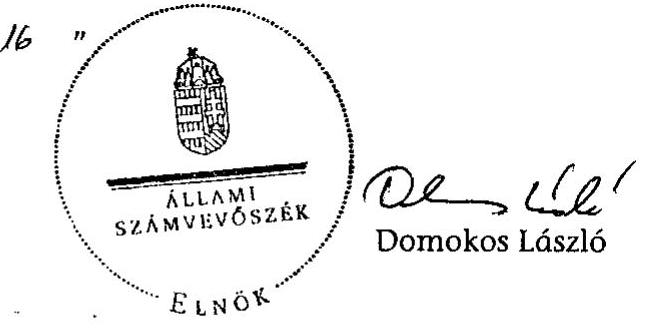

Melléklet: $\quad 13 \mathrm{db} \quad 10$ lap
Függelék: $\quad 1 \mathrm{db} \quad 13$ lap

---

# MELLÉKLETEK

---

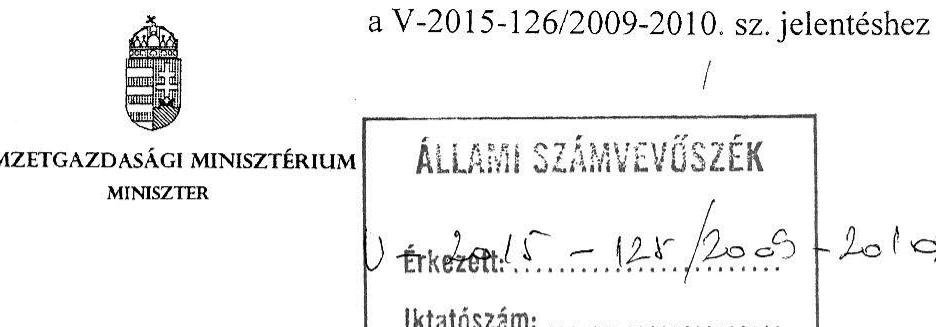

Iktatószám : NGM/2528/4/2010
Domokos László Úr
Elnök
Állami Számvevőszék
Budapest
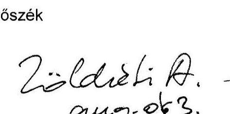

Tisztelt Elnök Úr!
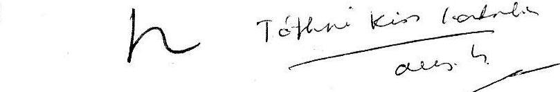

Köszönettel megkaptam az Állami Számvevőszék „az EU támogatások felhasználása során alkalmazott szabálytalanság-, adósság- és követeléskezelési folyamatok ellenőrzéséről" készített jelentéstervezetét.

A tervezetre észrevételt nem kívánok tenni.

Budapest, 2010. július ${ }^{N} 4$,
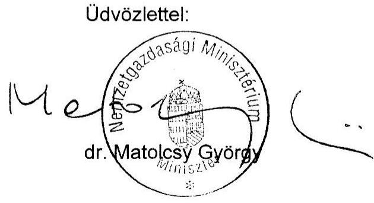

---

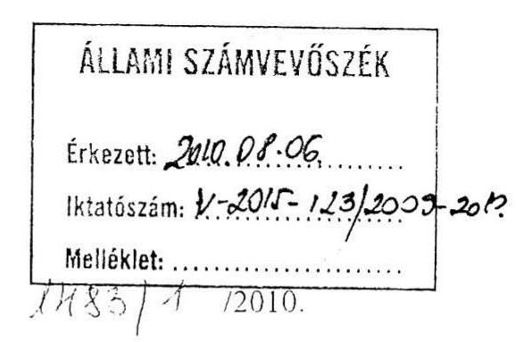

# ÁLLAMI SZÁMVEVŐSZÉK 

## Érkezett: 2010.08.06

Iktatószám: V-2015-123/2009-2010
Melléklet:
Ügyiratszám: X/ 1485/1/2010.

Domokos László úr
elnök
részére

## ÁLLAMI SZÁMVEVŐSZÉK

## Budapest

Apáczai Csere János u. 10.
1052

## Tisztelt Elnök Úr!

Hivatkozva a V-2015-118/2009-2010. sz. „Az EU támogatások felhasználása során alkalmazott szabálytalanság-, adósság- és követeléskezelési folyamatok ellenőrzéséről" szóló jelentésre ezúton tájékoztatom, hogy a jelentésre további észrevételt nem teszek. A jelentés 27. oldalán a Vidékfejlesztési Miniszter számára megfogalmazott ajánlások tekintetében a szükséges intézkedéseket megteszem, melyekről az 1989. évi XXXVIII. törvény 25. § (1) bekezdésében foglaltaknak megfelelően tájékoztatni fogom az Állami Számvevőszéket.

Budapest, 2010. július " 20"

Tisztelettel:
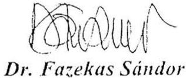

---

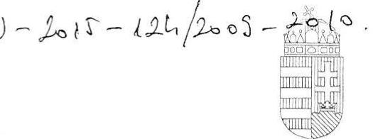

NEMZETI FEJLESZTÉSI MINISZTÉRIUM

DR. FELLEGI TAMÁS miniszter

## Domokos László

elnök úr részére

## Állami Számvevőszék

## Budapest

## Tisztelt Elnök Úr!

Köszönettel megkaptam „EU támogatások felhasználására során alkalmazott szabálytalanság-, adósság- és követeléskezelési folyamatok ellenőrzéséről" szóló ellenőrzési jelentés tervezetét.

A megküldött jelentés-tervezetre észrevételt nem kívánok tenni.
Köszönöm, hogy munkájukkal hozzájárulnak a minisztérium eredményesebb működéséhez.

Budapest, 2010. július „ 2.9

# ÁLLAMI SZÁMVEVŐSZÉK 

Tisztelettel:
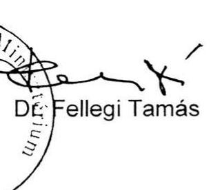

---

### **2. sz. melléklet**

a V-2015-126/2009-2010. sz. jelentéshez

### **Kimutatás az EU támogatások felhasználásáról 2004-2009. év végéig**

**Adatok:** Millió Ft-ban, egy tizedessel

|  Támogatások típusai |  |  |  | 2004 tény |  | 2005 tény |  | 2006 tény |  | 2007 tény |  | 2008 tény |  | 2009 előzetes adatok |   |
| --- | --- | --- | --- | --- | --- | --- | --- | --- | --- | --- | --- | --- | --- | --- | --- |
|   | Összesen | EU forrás | Hazai
költségvetés | EU forrás | Hazai
költségvetés | EU forrás | Hazai
költségvetés | EU forrás | Hazai
költségvetés | EU forrás | Hazai
költségvetés | EU forrás | Hazai
költségvetés | EU forrás | Hazai
költségvetés  |
|  NFT L | 727 792,4 | 487 461,5 | 240 330,9 | 3 604,1 | 2 004,2 | 85 633,8 | 37 169,1 | 166 115,6 | 74 953,4 | 130 474,5 | 79 046,9 | 101 633,5 | 15 120,3 | 0,0 | 32 037,0  |
|  ÜMFT | 625 703,0 | 493 191,3 | 132 511,7 | 0,0 | 0,0 | 0,0 | 0,0 | 0,0 | 0,0 | 0,0 | 10 003,1 | 94 423,5 | 30 534,0 | 398 767,8 | 91 974,6  |
|  ISPA/ Kohéziós Alap | 489 287,0 | 246 587,8 | 242 699,2 | 10 469,8 | 9 155,3 | 23 425,0 | 20 985,6 | 46 995,6 | 53 192,4 | 56 034,0 | 38 648,6 | 43 587,3 | 63 857,1 | 66 076,1 | 56 860,2  |
|  Schengen Alap | 49 098,9 | 42 475,3 | 6 623,6 |  |  | 2 509,6 | 739,3 | 7 906,9 | 1 771,7 | 32 058,8 | 3 521,3 | 0,0 | 591,1 | 0,0 | 0,0  |
|  PHARE/ Atmeneti támogatás | 127 634,7 | 73 676,2 | 53 958,5 | 27 148,6 | 16 693,0 | 19 068,2 | 13 733,3 | 21 770,1 | 18 167,5 | 2 324,4 | 2 879,1 | 2 482,1 | 1 904,7 | 882,8 | 580,9  |
|  Egyéb strukturális támogatások | 22 316,1 | 15 951,9 | 6 364,2 | 0,0 | 1,8 | 0,0 | 0,0 | 0,0 | 0,0 | 6 964,2 | 4 678,1 | 8 875,9 | -624,7 | 111,8 | 2 309,0  |
|  Egyéb európai uniós
támogatások | 41 757,7 | 13 874,3 | 27 883,4 | 0,0 | 0,0 | 214,9 | 1 812,4 | 1 186,7 | 3 297,4 | 1 940,0 | 3 500,1 | 4 280,8 | 7 616,0 | 6 251,9 | 11 657,5  |
|  NVT | 193 178,4 | 147 168,9 | 46 009,5 | 0,0 | 0,0 | 43 000,0 | 6 681,8 | 50 724,7 | 15 213,7 | 53 444,2 | 13 391,3 | 0,0 | 9 911,8 | 0,0 | 810,7  |
|  ÜMVP | 288 003,8 | 215 036,2 | 72 967,6 | 0,0 | 0,0 | 0,0 | 0,0 | 0,0 | 0,0 | 4 156,1 | 14 548,1 | 73 721,9 | 11 081,1 | 137 158,2 | 47 338,4  |
|  SAPARD | 55 440,4 | 36 949,4 | 18 491,0 | 7 906,3 | 7 043,2 | 21 440,4 | 8 271,6 | 7 602,7 | 1 593,6 | 0,0 | 1 398,3 | 0,0 | 0,0 | 0,0 | 184,3  |
|  Halászati Operatív Program | 52,7 | 39,5 | 13,2 | 0,0 | 0,0 | 0,0 | 0,0 | 0,0 | 0,0 | 0,0 | 0,0 | 0,0 | 0,0 | 39,5 | 13,2  |
|  Költségvetésben megjelenő
EU támogatási jogcímek
összesen* | 2 620 265,1 | 1 772 412,3 | 847 852,8 | 49 128,8 | 34 897,5 | 195 291,9 | 89 393,1 | 302 302,3 | 168 189,7 | 287 396,2 | 171 615,3 | 329 005,0 | 139 991,4 | 609 288,1 | 243 765,8  |
|  Ágnézpszi támogatások ** | 356 177,7 | 356 177,7 | 0,0 | 126,0 | 0,0 | 159 133,3 | 0,0 | 19 826,3 | 0,0 | 47 653,2 | 0,0 | 47 623,7 | 0,0 | 81 815,0 | 0,0  |
|  Közvetlen területalapú | 757 117,7 | 757 117,7 | 0,0 | 0,0 | 0,0 | 148 022,9 | 0,0 | 93 405,7 | 0,0 | 119 992,1 | 0,0 | 156 173,0 | 0,0 | 239 524,0 | 0,0  |
|  "Belső politikák" jogcímen
nyújtott támogatások | 11 803,3 | 11 803,5 | 0,0 | 11 803,5 | 0,0 | 0,0 | 0,0 | 0,0 | 0,0 | 0,0 | 0,0 | 0,0 | 0,0 | 0,0 | 0,0  |
|  KESZ által finanszírozott
költségvetésen kívüli tételek | 1 125 098,9 | 1 125 098,9 | 0,0 | 11 929,5 | 0,0 | 307 156,2 | 0,0 | 113 232,2 | 0,0 | 167 645,3 | 0,0 | 203 796,7 | 0,0 | 321 339,0 | 0,0  |
|  Mindösszesen: | 3 745 364,0 | 2 897 511,2 | 847 852,8 | 61 058,3 | 34 897,5 | 502 448,1 | 89 393,1 | 415 534,5 | 168 189,7 | 455 041,5 | 171 615,3 | 532 801,7 | 139 991,4 | 930 627,1 | 243 765,8  |

Forrás: ÁSZ adott évi költségvetés végrehajtásáról szóló jelentései

- Nem tartalmazza az uniós források megtérülését

* Nem tartalmazza az intervenciós felvásárlás során vételárra fordított kiadásokat, tartalmazza a központi költségvetés bevételeként elszámolásra kerülő finanszírozási költségtérítés összegét

---

# A szabálytalanság-, adósság- és követeléskezelési folyamatok részei (általános séma) 

Szabálytalanságkezelés
a) nemzeti hatósági és egyéb, adminisztratív hiba esetén
b) kedvezményezettek szabálytalansága esetén

Folyamat részei:

- Szabálytalanság (gyanú) felmerülése
- Szabálytalansági eljárás lefolytatása.
- Döntés.
 Szabálytalanság történt, vagy nem történt.
- Szabálytalanság esetén, szükséges pénzügyi korrekció és jogi következmények meghatározása.

Folyamat részei:

- beszedési eljárás
(követelés keletkezésének megállapítása, követelés összeállítása, megtérítés, behajtás lehetséges eseteinek vizsgálata)
- követelés rendezése
(a megtérült, behajtott összegek és a meg nem térült összegek pénzügyi rendezése, követelés minősítése, leírása).

Adósságkezelés a Bizottsággal szemben

Folyamat részei:

- nemzeti hatóság, vagy a Bizottság megállapítja a Bizottság felé megtérítendő kötelezettséget;
- kötelezettség teljesítése nettó módon (Bizottságtól átutalási igény csökkentése révén), vagy bruttó módon (befizetéssel), az adott program, intézkedési jogcím támogatási folyamatbeli szakaszától függően.
Adósság lehetséges főbb esetei:
a) behajthatatlan követelések miatti veszteség rendezése, ha a Bizottság nem osztozik a veszteségen a tagállammal;
b) uniós jogszabály alapján szabálytalanság által felszabaduló, de újra fel nem használható források rendezése (például EMGA);
c) a Bizottság által nemzeti hatósági és egyéb hiba miatt elvont összegek

---

# Kimutatás

## egyes beruházási projektekhez kapcsolódó közbeszerzési tárgyú szabálytalansági esetekről

|  Projekt azonosító | Megállapítás | Megsértett rendelkezések | Pénzügyi korrekció mértéke  |
| --- | --- | --- | --- |
|  METRO4 KÖZOP-5.1.0-07-2008-0001 | A szabálytalanság bekövetkezésére az vezetett, hogy a kedvezményezett nem tanúsította a tőle elvárható figyelmet és körültekintést a közbeszerzési eljárások fajtájának kiválasztása, majd az eljárások lefolytatása és a szerződések megkötése során. Ez 11 szerződés uniós finanszírozás alóli kivételét jelentette. | Kbt. 225. § (1) b) pont, 1. § (1) bekezdés, 225. § (1) e) pont, 303. §, 225. § (2) bekezdés, 83. § (7) bekezdés, 88. § (1) f) pont, 40. § (2) bekezdés, 121. § (6) bekezdés, Támogatási szerződés 5.4.1 pontja Sérült a nyilvánosság, a verseny tisztasága és az egyenlő esélyekhez jutás uniós elve. | 56,0 Mrd Ft  |
|  Budapesti Szennyvíztisztító Telep | Nem megfelelő közbeszerzési eljárás. | 93/37/EGK tanácsi irányelv 7. cikk (2) bekezdés c) albekezdés | 10,0 Mrd Ft  |
|  21. sz. főutak tehermentesítő út építése | A Közbeszerzési Döntőbizottság D.192/19/2007. sz. határozata alapján a Kedvezményezett megsértette a TSZ 8.1 és a 8.3 rendelkezéseit. Jogszabálysértő vállalkozási szerződés. |  | 0,6 Mrd Ft  |
|  Összesen: |  |  | 66,6 Mrd Ft  |
|  M7-es Balatonkeresztúr és Nagykanizsa közötti szakasza | A Bizottság kifogásolta a tárgyalásos közbeszerzési eljárás alkalmazását, a nyílt eljárás helyett. Ettől eltért az NFÜ álláspontja. A Bizottság határozathozatala ellenőrzésünk idején még folyamatban volt. | Sérült a nyilvánosság, a verseny tisztasága és az egyenlő esélyekhez jutás uniós elve. | 35,0 Mrd Ft  |
|  Mindösszesen: |  |  | 101,6 Mrd Ft  |

---

# 2009. év (2010. március 31-i állapot) 

| Program/Alap | Szabálytalansági ügyek száma (db) | Szabálytalansággal érintett összeg (millió Ft-ban) |
| :--: | :--: | :--: |
| AVOP | 28 | 515,3 |
| EQUAL | 4 | 64,8 |
| GVOP | 6 | 44,7 |
| HEFOP | 51 | 483,5 |
| KIOP | 1 | 3,3 |
| KA | 1 | 11,9 |
| NFT L+KA összesen | 91 | 1123,6 |
| ÁROP | 2 | 150,1 |
| KEOP | 1 | 16,0 |
| KÖZOP | 1 | 5927,3 |
| TÁMOP | 18 | 212,9 |
| TIOP | 1 | 29,0 |
| KMOP | 1 | 5,9 |
| ÜMFT összesen: | 24 | 6341,2 |
| SAPARD | 11 | 390,3 |
| INTERREG | 2 | 9,8 |
| EMGA/EMVA | 19 | 562,2 |
| Mindösszesen | 147 | 8427,1 |
| 2008. év |  |  |
| AGRÁR | 6 | 202,0 |
| struktúrális alapok | 42 | 890,5 |
| Kohúziós Alap | 13 | 378,3 |
| Előcsatlakozás | 11 | 225,1 |
| Összesen: | 72 | 1695,9 |
| 2007. év |  |  |
| AGRÁR | 12 | 62,9 |
| struktúrális alapok | 35 | 729,4 |
| Kohúziós Alap | 3 | 170,4 |
| Előcsatlakozás | 7 | 617,0 |
| Összesen: | 57 | 1579,7 |
| 2006. év |  |  |
| AGRÁR | 3 | 2,7 |
| struktúrális alapok | 91 | 1651,7 |
| Kohúziós Alap | 6 | 47,5 |
| Előcsatlakozás | 16 | 72,4 |
| Összesen: | 116 | 1774,3 |
| 2005. év |  |  |
| AGRÁR | 5 | 11,1 |
| struktúrális alapok | 22 | 219,5 |
| Kohúziós Alap | 1 | 35,9 |
| Előcsatlakozás | 50 | 369,6 |
| Összesen: | 78 | 636,1 |
| 2004. év |  |  |
| AGRÁR | 0 | 0,0 |
| struktúrális alapok | 1 | 1,6 |
| Kohúziós Alap | n.a. | n.a. |
| Előcsatlakozás | n.a. | n.a. |
| Összesen: | 1 | 1,6 |

Forrás: VPOP, OLAF Koordinációs Iroda
A táblázatok pénzügyi adatai a szabálytalansággal érintett összeg közösségi részesedését tartalmazzák.
Az euro adatok Ft-ra történő átszámításához a jelentésben alkalmazott technikai árfolyam: 270 Ft/euró

---

# **Kimutatás az EU támogatások felhasználása során keletkezett követelések alakulásáról 2004-2009. év végéig**

**Adatok:** millió Ft-ban

|  Támogatások típusai |  |  |  |  |  | Szabálytalanság miatti követelések |  |  | (EU forrás)** |  |  |   |
| --- | --- | --- | --- | --- | --- | --- | --- | --- | --- | --- | --- | --- |
|   | Összesen | EU forrás | Hazai költségvetés | Keletkezett követelések (EU forrás)** | Követelések / felhasználás (EU forrás) | Viszavonások (tagállami adósság) | Követelések kedvezményezettől | Kedvezményezettől megtérült követelések (EU forrás) | Megtérült követelések aránya | Leírt követelések (EU forrás) | Leírás aránya | Behajtandó követelések 2009 végén (EU forrás)  |
|  NFİ 1. | 727 792,4 | 487 461,5 | 240 330,9 | 8 523,4 | 1,7% | 4 790,5 | 3 732,9 | 1 338,8 | 35,9% | 0,0 |  | 2 394,1  |
|  ÜMFİ | 625 703,0 | 493 191,3 | 132 511,7 | 335,5 | 0,1% | 0,0 | 335,5 | 18,6 | 5,5% | 0,0 |  | 316,9  |
|  Schengen Alap | 49 098,9 | 42 475,3 | 6 623,6 | 1,2 | 0,0% | 0,0 | 1,2 | 1,2 | 100,0% | 0,0 |  | 0,0  |
|  PHARU Átmeneti támogatás | 127 634,7 | 73 676,2 | 53 958,5 | 2 185,1 | 3,0% | 0,0 | 2 185,1 | 1 366,6 | 65,5% | 0,0 |  | 818,3  |
|  Egyéb strukturális támogatások | 22 316,0 | 15 951,9 | 6 364,2 | 264,1 | 1,7% | 0,0 | 264,1 | 102,5 | 38,8% | n.a. |  | 161,6  |
|  NFÜ által kezelt strukturális tám. összesen | 1 552 545,0 | 1 112 756,2 | 439 788,9 | 11 309,3 | 1,0% | 4 790,5 | 6 518,8 | 2 827,7 | 43,4% | 0,0 |  | 3 691,1  |
|  NFÜ által kezelt ISPA/KA összesen | 489 287,0 | 246 587,8 | 242 699,2 | 19 110,0 | 7,7% | 0,0 | 19 110,0 | n.a. | n.a. | 0,0 |  | 19 110,0  |
|  NVİ | 193 178,4 | 147 168,9 | 46 009,2 | 1 567,6 | 1,1% | 0,0 | 1 567,6 | 1 416,4 | 90,4% | 0,0 |  | 151,3  |
|  ÜMVİ | 288 003,8 | 215 036,2 | 72 967,6 | 102,0 | 0,0% | 0,0 | 102,0 | 72,4 | 71,0% | 0,0 |  | 29,6  |
|  SAPARD | 55 440,5 | 36 949,4 | 18 491,0 | 2 354,8 | 6,4% | 0,0 | 2 354,7 | 138,7 | 5,9% | 977,7 | 41,5% | 1 238,3  |
|  Halászati Operatív Program | 52,7 | 39,5 | 13,2 | 0,0 | 0,0% | 0,0 | 0,0 | 0,0 | 0,0% |  |  |   |
|  Intervenciós támogatások | n.a. | n.a. | n.a. | 2 606,9 | n.a. | 0,0 | 2 606,9 | 512,1 | 19,6% | 111,4 | 4,3% | 1 983,4  |
|  Ágniprípaci támogatások * | 356 177,7 | 356 177,7 | 0,0 | 817,6 | 0,2% | 0,0 | 817,6 | 545,0 | 66,7% | 0,8 | 0,1% | 271,8  |
|  Közvetlen területalapú támogatások | 757 117,7 | 757 117,7 | 0,0 |  |  | 3 640,0 |  |  |  |  |  |   |
|  "Belső politikák" jogcímén nyakor támogatások | 11 803,5 | 11 803,5 | 0,0 | n.a. | n.a. | n.a. | n.a. | n.a. | n.a. | n.a. | n.a. | n.a.  |
|  MVİ által kezelt | 1 661 774,3 | 1 524 292,9 | 137 481,3 | 7 448,9 | 0,5% | 3 640,0 | 7 448,8 | 2 684,6 | 36,1% | 1 089,9 | 14,6% | 3 674,3  |
|  Egyéb | 41 757,7 | 13 874,3 | 27 883,4 | n.a. | n.a. | n.a. | n.a. | n.a. | n.a. | n.a. | n.a. | n.a.  |
|  Mindösszesen: | 3 745 364,0 | 2 897 511,2 | 847 852,8 | 37 868,2 |  | 8 430,5 | 33 077,6 |  |  |  |  |   |

- A felhasználási adatok az intervenciós támogatásokat is tartalmazzák.

* A szabálytalanság miatti követelések pénzügyi adatai csak az EU forrást tartalmazzák.

Készítette: az ÁSZ, az NFÜ és az MVİ által a különböző programokra, intézkedési jogcímekre vonatkozó szabálytalanságokról, követelésekről készített jelentései alapján

---

# Jelentésünkben hivatkozott, az NFÜ által kezelt projektek 

## 1. A szabálytalanság- és követeléskezelés helyszíni ellenőrzéséhez kivett minták

| Szabálytalansággal érintett támogatások |  |  |
| :--: | :--: | :--: |
| Minta   ssz. | Projekt száma | Kiválasztás indoka |
| 1 | ÉMOP-4.2.2-2007-0030 | Bejelentés észlelése és beérkezése között eltelt időtartam |
| 2 | ÉMOP-4.2.2-2007-0039 | Bejelentés észlelése és beérkezése között eltelt időtartam |
| 3 | ÉMOP-4.2.2-2007-0080 | Döntés meghozatala és jóváhagyása között eltelt időtartam |
| 4 | ÉMOP-4.2.2-2007-0093 | Szabálytalansági vizsgálat időtartama (133 nap) |
| 5 | ÉMOP-4.2.2-2007-0227 |

 | Szabálytalansággal érintett összeg |
| 6 | ÉMOP-4.2.2-2007-0252 | Szabálytalansággal érintett összeg |
| 7 | TÁMOP-2.1.3-07/1-2007-0156 | Döntés meghozatala és jóváhagyása között eltelt idő |
| 8 | TÁMOP-2.1.3-07/1-2007-0156 | Szabálytalansággal érintett összeg |
| 9 | TÁMOP-2.1.3-07/1-2007-0160 | Szabálytalansággal érintett összeg |
| 10 | TÁMOP-2.1.3-07/1-2007-0318 | Szabálytalansági vizsgálat időtartama |
| 11 | TÁMOP-2.1.3-07/1-2007-0383 | Szabálytalansági vizsgálat időtartama |
| 12 | ÁROP-1.2.2-2008-0001 | Teljes sokaság (1 db) |
| 13 | GOP-2.1.1/C-2007-0007 | Teljes sokaság (3 db) |
| 14 | GOP-2.1.1/B-2007-0098 |  |
| 15 | GOP-2.1.1/A-2007-0456 |  |
| Csalással érintett támogatások |  |  |
| 16 | ÉAOP-5.1.1/E-2008-0012 | Teljes sokaság (2 db) |
| 17 | GOP-2.1.1/A-2007-0126 |  |

Forrás: NFÜ által átadott részletező kimutatás, 2010.02.16.

---

# 2. Közbeszerzési szabálytalansági gyanúval érintett projektek 

| Szabálytalansággal érintett támogatások |  |  |
| :--: | :--: | :--: |
| Minta   sorsz. | Projekt száma | Kiválasztás indoka |
| 18 | PT002 | Közbeszerzési törvény megsértése |
| 19 | PT003 | Közbeszerzési törvény megsértése |
| 20 | HUROSCG-110 | Közbeszerzési törvény megsértése |
| 21 | SLOHUCRO-4012-106/2004/01/HU-75 | Közbeszerzési törvény megsértése |
| 22 | HUROSCG-I/134 | Közbeszerzési törvény megsértése |
| 23 | ATHU-072 | Közbeszerzési törvény megsértése |
| 24 | HUROSCG-1/382. | Közbeszerzési törvény megsértése |
| 25 | HUROSCG-1/266. | Közbeszerzési törvény megsértése |
| 26 | HUROSCG-1/182 | Közbeszerzési törvény megsértése |
| 27 | SLOHUCRO-4012-106/2004/01/HU-11 | Közbeszerzési törvény megsértése |
| 28 | SLOHUCRO/05/4012-106/2004/01/HU-   66. | Közbeszerzési törvény megsértése |

## 3. Jogi helyzet értékelését alátámasztó minták

| Szabálytalansággal érintett támogatások |  |  |
| :--: | :--: | :--: |
| Minta   ssz. | Projekt megnevezése | Kiválasztás indoka |
| 29 | Fővárosi Bíróság ítélete (üsz: 22.G.41.644/2007/38) | Peres eljárások |
| 30 | „Kaptár ügy" dokumentumai (11db)   GOP-2007-2.11/A | Peres eljárások |
| 31 | „Molnár kő" dokumentumai (8db)   GOP-2.1.1/A-2007-0456 | Peres eljárások |
| 32 | Fővárosi Ítélőtábla ítélete (9.Of.21.411/2009/3.) | Peres eljárások |
| 33 | NFÜ levél 21-01828/2009.   GVOP-2.1.2.-05/2005.   GVOP-2.1.2.-05/1-2005-05-0177/1.0 | Peres eljárások |
| 34 | MAG Zrt. K-2009-GVOP-2.2.1.-2004.   GVOP-2.1.1.-2004-05-0044/1.0 | Peres eljárások |
| 35 | MAG Zrt. K-2009-GVOP-2.2.1.-0166785/1-0   GVOP-2.1.1.-2004-05-0044/1.0 | Peres eljárások |
| 36 | NFÜ levél 21-0035/3/2010.   MAG Zrt. K-2010-GVOP-2.1.1-0169600/1.0 ikt. sz. levél   GVOP-2.1.1.-2004-08-0345/1.0 | Peres eljárások |

---

# Az NFÜ által kezelt uniós támogatások szabálytalanság miatti követelés állománya és értékvesztése 2009. december 31-i állapot szerint 

Adatok: Ft-ban

| Program | Szabálytalanság miatti követelések |  | Értékvesztés aránya /   a tőke követeléshez   viszonyítva |
| :-- | --: | --: | :--: |
|  | tőke követelés | értékvesztés |  |
|  | 1392800573 | 329658950 | 24% |
| GVOP | 2390772473 | 1876787492 | 79% |
| HEFOP | 461636136 | 7971893 | 2% |
| KIOP | 0 | 0 | 0% |
| ROP | 102558452 | 0 | 0% |
| EQUAL: | 180243975 | 119640522 | 66% |
| INTERREG | 13903420 | 0 | 0% |
| ÁROP | 0 | 0 | 0% |
| EKOP | 0 | 0 | 0% |
| GOP | 8360744 | 1504892 | 18% |
| RFOP-k | 0 | 0 | 0% |
| KÖZOP | 0 | 0 | 0% |
| TÁMOP | 35622243 | 0 | 0% |
| TIOP | 0 | 0 | 0% |
| KEOP | 0 | 0 | 0% |
| Összesen | 4585898016 | 2335563749 | 51% |

Nincs adat: KIOP, ÁROP, EKOP, RFOP-k, KÖZOP, TIOP, KEOP
Forrás: NFÜ Fejezeti Kezelési Főosztály
Kelt, 2010. május 05.-én megkapott adatok szerint

---

## **Kimutatás**

## **az EMVA, az NVT és az EMGA által támogatott projektek mintavétel alapján nyert adatainak összesítéséről**

|  Összám | Támogatás azonosítója |  |  |  |  |  |  |  |  |  |  |  |  |  |  |  |  |  |  |  |  |  |  |  |  |  |  |  |  |  |  |  |  |  |  |  |  |  |  |  |  |  |  |  |  |  |   |
| --- | --- | --- | --- | --- | --- | --- | --- | --- | --- | --- | --- | --- | --- | --- | --- | --- | --- | --- | --- | --- | --- | --- | --- | --- | --- | --- | --- | --- | --- | --- | --- | --- | --- | --- | --- | --- | --- | --- | --- | --- | --- | --- | --- | --- | --- | --- | --- | --- |
|   |  |  |  |  |  |  |  |  |  |  |  |  |  |  |  |  |  |  |  |  |  |  |  |  |  |  |  |  |  |  |  |  |  |  |  |  |  |  |  |  |  |  |  |  |  |  |   |
|   |  |  |  |  |  |  |  |  |  |  |  |  |  |  |  |  |  |  |  |  |  |  |  |  |  |  |  |  |  |  |  |  |  |  |  |  |  |  |  |  |  |  |  |  |  |  |   |
|   |  |  |  |  |  |  |  |  |  |  |  |  |  |  |  |  |  |  |  |  |  |  |  |  |  |  |  |  |  |  |  |  |  |  |  |  |  |  |  |  |  |  |  |  |  |  |   |
|   |  |  |  |  |  |  |  |  |  |  |  |  |  |  |  |  |  |  |  |  |  |  |  |  |  |  |  |  |  |  |  |  |  |  |  |  |  |  |  |  |  |  |  |  |  |  |   |
|   |  |  |  |  |  |  |  |  |  |  |  |  |  |  |  |  |  |  |  |  |  |  |  |  |  |  |  |  |  |  |  |  |  |  |  |  |  |  |  |  |  |  |  |  |  |  |   |
|   |  |  |  |  |  |  |  |  |  |  |  |  |  |  |  |  |  |  |  |  |  |  |  |  |  |  |  |  |  |  |  |  |  |  |  |  |  |  |  |  |  |  |  |  |  |  |   |
|   |  |  |  |  |  |  |  |  |  |  |  |  |  |  |  |  |  |  |  |  |  |  |  |  |  |  |  |  |  |  |  |  |  |  |  |  |  |  |  |  |  |  |  |  |  |  |   |
|   |  |  |  |  |  |  |  |  |  |  |  |  |  |  |  |  |  |  |  |  |  |  |  |  |  |  |  |  |  |  |  |  |  |  |  |  |  |  |  |  |  |  |  |  |  |  |   |
|   |  |  |  |  |  |  |  |  |  |  |  |  |  |  |  |  |  |  |  |  |  |  |  |  |  |  |  |  |  |  |  |  |  |  |  |  |  |  |  |  |  |  |  |  |  |  |   |

 |  |  |  |  |  |  |  |  |  |  |  |  |  |  |  |  |  |  |  |  |  |  |  |  |  |  |  |  |  |  |  |  |  |  |  |  |  |  |  |  |  |  |  |  |  |  |  |   |
|   |  |  |  |  |  |  |  |  |  |  |  |  |  |  |  |  |  |  |  |  |  |  |  |  |  |  |  |  |  |  |  |  |  |  |  |  |  |  |  |  |  |  |  |  |  |  |  |   |
|   |  |  |  |  |  |  |  |  |  |  |  |  |  |  |  |  |  |  |  |  |  |  |  |  |  |  |  |  |  |  |  |  |  |  |  |  |  |  |  |  |  |  |  |  |  |  |  |   |
|   |  |  |  |  |  |  |  |  |  |  |  |  |  |  |  |  |  |  |  |  |  |  |  |  |  |  |  |  |  |  |  |  |  |  |  |  |  |  |  |  |  |  |  |  |  |  |  |   |
|   |  |  |  |  |  |  |  |  |  |  |  |  |  |  |  |  |  |  |  |  |  |  |  |  |  |  |  |  |  |  |  |  |  |  |  |  |  |  |  |  |  |  |  |  |  |  |  |   |
|   |  |  |  |  |  |  |  |  |  |  |  |  |  |  |  |  |  |  |  |  |  |  |  |  |  |  |  |  |  |  |  |  |  |  |  |  |  |  |  |  |  |  |  |  |  |  |  |   |
|   |  |  |  |  |  |  |  |  |  |  |  |  |  |  |  |  |  |  |  |  |  |  |  |  |  |  |  |  |  |  |  |  |  |  |  |  |  |  |  |  |  |  |  |  |  |  |  |   |
|   |  |  |  |  |  |  |  |  |  |  |  |  |  |  |  |  |  |  |  |  |  |  |  |  |  |  |  |  |  |  |  |  |  |  |  |  |  |  |  |  |  |  |  |  |  |  |  |   |
|   |  |  |  |  |  |  |  |  |  |  |  |  |  |  |  |  |  |  |  |  |  |  |  |  |  |  |  |  |  |  |  |  |  |  |  |  |  |  |  |  |  |  |  |  |  |  |  |   |
|   |  |  |  |  |  |  |  |  |  |  |  |  |  |  |  |  |  |  |  |  |  |  |  |  |  |  |  |  |  |  |  |  |  |  |  |  |  |  |  |  |  |  |  |  |  |  |  |   |
|   |  |  |  |  |  |  |  |  |  |  |  |  |  |  |  |  |  |  |  |  |  |  |  |  |  |  |  |  |  |  |  |  |  |  |  |  |  |  |  |  |  |  |  |  |  |  |  |   |
|   |  |  |  |  |  |  |  |  |  |  |  |  |  |  |  |  |  |  |  |  |  |  |  |  |  |  |  |  |  |  |  |  |  |  |  |  |  |  |  |  |  |  |  |  |  |  |  |   |
|   |  |  |  |  |  |  |  |  |  |  |  |  |  |  |  |  |  |  |  |  |  |  |  |  |  |  |  |  |  |  |  |  |  |  |  |  |  |  |  |  |  |  |  |  |  |  |  |  |   |
|   |  |  |  |  |  |  |  |  |  |  |  |  |  |  |  |  |  |  |  |  |  |  |  |  |  |  |  |  |  |  |  |  |  |  |  |  |  |  |  |  |  |  |  |  |  |  |  |  |   |
|   |  |  |  |  |  |  |  |  |  |  |  |  |  |  |  |  |  |  |  |  |  |  |  |  |  |  |  |  |  |  |  |  |  |  |  |  |  |  |  |  |  |  |  |  |  |  |  |  |   |
|   |  |  |  |  |  |  |  |  |  |  |  |  |  |  |  |  |  |  |  |  |  |

 |  |  |  |  |  |  |  |  |  |  |  |  |  |  |  |  |  |  |  |  |  |  |  |  |  |  |  |  |  |   |
|   |  |  |  |  |  |  |  |  |  |  |  |  |  |  |  |  |  |  |  |  |  |  |  |  |  |  |  |  |  |  |  |  |  |  |  |  |  |  |  |  |  |  |  |  |  |  |  |  |  |  |   |
|   |  |  |  |  |  |  |  |  |  |  |  |  |  |  |  |  |  |  |  |  |  |  |  |  |  |  |  |  |  |  |  |  |  |  |  |  |  |  |  |  |  |  |  |  |  |  |  |  |  |  |   |
|   |  |  |  |  |  |  |  |  |  |  |  |  |  |  |  |  |  |  |  |  |  |  |  |  |  |  |  |  |  |  |  |  |  |  |  |  |  |  |  |  |  |  |  |  |  |  |  |  |  |  |   |
|   |  |  |  |  |  |  |  |  |  |  |  |  |  |  |  |  |  |  |  |  |  |  |  |  |  |  |  |  |  |  |  |  |  |  |  |  |  |  |  |  |  |  |  |  |  |  |  |  |  |  |   |
|   |  |  |  |  |  |  |  |  |  |  |  |  |  |  |  |  |  |  |  |  |  |  |  |  |  |  |  |  |  |  |  |  |  |  |  |  |  |  |  |  |  |  |  |  |  |  |  |  |  |  |   |
|   |  |  |  |  |  |  |  |  |  |  |  |  |  |  |  |  |  |  |  |  |  |  |  |  |  |  |  |  |  |  |  |  |  |  |  |  |  |  |  |  |  |  |  |  |  |  |  |  |  |  |   |
|   |  |  |  |  |  |  |  |  |  |  |  |  |  |  |  |  |  |  |  |  |  |  |  |  |  |  |  |  |  |  |  |  |  |  |  |  |  |  |  |  |  |  |  |  |  |  |  |  |  |  |   |
|   |  |  |  |  |  |  |  |  |  |  |  |  |  |  |  |  |  |  |  |  |  |  |  |  |  |  |  |  |  |  |  |  |  |  |  |  |  |  |  |  |  |  |  |  |  |  |  |  |  |  |   |
|   |  |  |  |  |  |  |  |  |  |  |  |  |  |  |  |  |  |  |  |  |  |  |  |  |  |  |  |  |  |  |  |  |  |  |  |  |  |  |  |  |  |  |  |  |  |  |  |  |  |  |  |   |
|   |  |  |  |  |  |  |  |  |  |  |  |  |  |  |  |  |  |  |  |  |  |  |  |  |  |  |  |  |  |  |  |  |  |  |  |  |  |  |  |  |  |  |  |  |  |  |  |  |  |  |  |   |
|   |  |  |  |  |  |  |  |  |  |  |  |  |  |  |  |  |  |  |  |  |  |  |  |  |  |  |  |  |  |  |  |  |  |  |  |  |  |  |  |  |  |  |  |  |  |  |  |  |  |  |  |   |
|   |  |  |  |  |  |  |  |  |  |  |  |  |  |  |  |  |  |  |  |  |  |  |  |  |  |  |  |  |  |  |  |  |  |  |  |  |  |  |  |  |  |  |  |  |  |  |  |  |  |  |  |   |
|   |  |  |  |  |  |  |  |  |  |  |  |  |  |  |  |  |  |  |  |  |  |  |  |  |  |  |  |  |  |  |  |  |  |  |  |  |  |  |  |  |  |  |  |  |  |  |  |  |  |  |  |   |
|   |  |  |  |  |  |  |  |  |  |  |  |  |  |  |  |  |  |  |  |  |  |  |  |  |  |  |  |  |  |  |  |  |  |  |  |  |  |  |  |  |  |  |  |  |  |  |  |  |  |  |  |   |
|   |  |  |  |  |  |  |  |  |  |  |  |  |  |  |  |  |  |  |  | 

 |  |  |  |  |  |  |  |  |  |  |  |  |  |  |  |  |  |  |  |  |  |  |  |  |  |  |  |  |  |  |  |   |
|   |  |  |  |  |  |  |  |  |  |  |  |  |  |  |  |  |  |  |  |  |  |  |  |  |  |  |  |  |  |  |  |  |  |  |  |  |  |  |  |  |  |  |  |  |  |  |  |  |  |  |  |   |
|   |  |  |  |  |  |  |  |  |  |  |  |  |  |  |  |  |  |  |  |  |  |  |  |  |  |  |  |  |  |  |  |  |  |  |  |  |  |  |  |  |  |  |  |  |  |  |  |  |  |  |  |   |
|   |  |  |  |  |  |  |  |  |  |  |  |  |  |  |  |  |  |  |  |  |  |  |  |  |  |  |  |  |  |  |  |  |  |  |  |  |  |  |  |  |  |  |  |  |  |  |  |  |  |  |  |   |
|   |  |  |  |  |  |  |  |  |  |  |  |  |  |  |  |  |  |  |  |  |  |  |  |  |  |  |  |  |  |  |  |  |  |  |  |  |  |  |  |  |  |  |  |  |  |  |  |  |  |  |  |   |
|   |  |  |  |  |  |  |  |  |  |  |  |  |  |  |  |  |  |  |  |  |  |  |  |  |  |  |  |  |  |  |  |  |  |  |  |  |  |  |  |  |  |  |  |  |  |  |  |  |  |  |  |   |
|   |  |  |  |  |  |  |  |  |  |  |  |  |  |  |  |  |  |  |  |  |  |  |  |  |  |  |  |  |  |  |  |  |  |  |  |  |  |  |  |  |  |  |  |  |  |  |  |  |  |  |  |   |
|   |  |  |  |  |  |  |  |  |  |  |  |  |  |  |  |  |  |  |  |  |  |  |  |  |  |  |  |  |  |  |  |  |  |  |  |  |  |  |  |  |  |  |  |  |  |  |  |  |  |  |  |   |
|   |  |  |  |  |  |  |  |  |  |  |  |  |  |  |  |  |  |  |  |  |  |  |  |  |  |  |  |  |  |  |  |  |  |  |  |  |  |  |  |  |  |  |  |  |  |  |  |  |  |  |  |   |
|   |  |  |  |  |  |  |  |  |  |  |  |  |  |  |  |  |  |  |  |  |  |  |  |  |  |  |  |  |  |  |  |  |  |  |  |  |  |  |  |  |  |  |  |  |  |  |  |  |  |  |  |   |
|   |  |  |  |  |  |  |  |  |  |  |  |  |  |  |  |  |  |  |  |  |  |  |  |  |  |  |  |  |  |  |  |  |  |  |  |  |  |  |  |  |  |  |  |  |  |  |  |  |  |  |  |   |
|   |  |  |  |  |  |  |  |  |  |  |  |  |  |  |  |  |  |  |  |  |  |  |  |  |  |  |  |  |  |  |  |  |  |  |  |  |  |  |  |  |  |  |  |  |  |  |  |  |  |  |  |   |
|   |  |  |  |  |  |  |  |  |  |  |  |  |  |  |  |  |  |  |  |  |  |  |  |  |  |  |  |  |  |  |  |  |  |  |  |  |  |  |  |  |  |  |  |  |  |  |  |  |  |  |  |   |
|   |  |  |  |  |  |  |  |  |  |  |  |  |  |  |  |  |  |  |  |  |  |  |  |  |  |  |  |  |  |  |  |  |  |  |  |  |  |  |  |  |  |  |  |  |  |  |  |  |  |  |  |   |
|   |  |  |  |  |  |  |  |  |  |  |  |  |  |  |  |  |  |  |  |  |  |  |  |  |  |  |  |  |  |  |  |  |  |  |  |  |  |  |  |  |  |  |  |  |  |  |  |  |  |  | 

 |  |   |
|   |  |  |  |  |  |  |  |  |  |  |  |  |  |  |  |  |  |  |  |  |  |  |  |  |  |  |  |  |  |  |  |  |  |  |  |  |  |  |  |  |  |  |  |  |  |  |  |  |  |  |  |  |   |
|   |  |  |  |  |  |  |  |  |  |  |  |  |  |  |  |  |  |  |  |  |  |  |  |  |  |  |  |  |  |  |  |  |  |  |  |  |  |  |  |  |  |  |  |  |  |  |  |  |  |  |  |  |   |
|   |  |  |  |  |  |  |  |  |  |  |  |  |  |  |  |  |  |  |  |  |  |  |  |  |  |  |  |  |  |  |  |  |  |  |  |  |  |  |  |  |  |  |  |  |  |  |  |  |  |  |  |  |   |
|   |  |  |  |  |  |  |  |  |  |  |  |  |  |  |  |  |  |  |  |  |  |  |  |  |  |  |  |  |  |  |  |  |  |  |  |  |  |  |  |  |  |  |  |  |  |  |  |  |  |  |  |  |   |
|   |  |  |  |  |  |  |  |  |  |  |  |  |  |  |  |  |  |  |  |  |  |  |  |  |  |  |  |  |  |  |  |  |  |  |  |  |  |  |  |  |  |  |  |  |  |  |  |  |  |  |  |  |   |
|   |  |  |  |  |  |  |  |  |  |  |  |  |  |  |  |  |  |  |  |  |  |  |  |  |  |  |  |  |  |  |  |  |  |  |  |  |  |  |  |  |  |  |  |  |  |  |  |  |  |  |  |  |   |
|   |  |  |  |  |  |  |  |  |  |  |  |  |  |  |  |  |  |  |  |  |  |  |  |  |  |  |  |  |  |  |  |  |  |  |  |  |  |  |  |  |  |  |  |  |  |  |  |  |  |  |  |  |   |
|   |  |  |  |  |  |  |  |  |  |  |  |  |  |  |  |  |  |  |  |  |  |  |  |  |  |  |  |  |  |  |  |  |  |  |  |  |  |  |  |  |  |  |  |  |  |  |  |  |  |  |  |  |  |   |
|   |  |  |  |  |  |  |  |  |  |  |  |  |  |  |  |  |  |  |  |  |  |  |  |  |  |  |  |  |  |  |  |  |  |  |  |  |  |  |  |  |  |  |  |  |  |  |  |  |  |  |  |  |  |   |
|   |  |  |  |  |  |  |  |  |  |  |  |  |  |  |  |  |  |  |  |  |  |  |  |  |  |  |  |  |  |  |  |  |  |  |  |  |  |  |  |  |  |  |  |  |  |  |  |  |  |  |  |  |  |   |
|   |  |  |  |  |  |  |  |  |  |  |  |  |  |  |  |  |  |  |  |  |  |  |  |  |  |  |  |  |  |  |  |  |  |  |  |  |  |  |  |  |  |  |  |  |  |  |  |  |  |  |  |  |  |   |
|   |  |  |  |  |  |  |  |  |  |  |  |  |  |  |  |  |  |  |  |  |  |  |  |  |  |  |  |  |  |  |  |  |  |  |  |  |  |  |  |  |  |  |  |  |  |  |  |  |  |  |  |  |  |   |
|   |  |  |  |  |  |  |  |  |  |  |  |  |  |  |  |  |  |  |  |  |  |  |  |  |  |  |  |  |  |  |  |  |  |  |  |  |  |  |  |  |  |  |  |  |  |  |  |  |  |  |  |  |  |   |
|   |  |  |  |  |  |  |  |  |  |  |  |  |  |  |  |  |  |  |  |  |  |  |  |  |  |  |  |  |  |  |  |  |  |  |  |  |  |  |  |  |  |  |  |  |  |  |  |  |  |  |  |  |  |  |   |
|   |  |  |  |  |  |  |  |  |  |  |  |  |  |  |  |  |  |  |  |  |  |  |  |  |  |  |  |  |  |  |  |  |  |  |  |  |  |  |  |  |  |  |  |  |  |  |  |  |  |  |  |  |  |  |  |  |  |   |

 |  |   |   |   |   |   |   |   |   |   |   |   |   |   |   |   |   |   |   |   |   |   |   |   |   |   |   |   |
| --- | --- | --- | --- | --- | --- | --- | --- | --- | --- | --- | --- | --- | --- | --- | --- | --- | --- | --- | --- | --- | --- | --- | --- | --- | --- | --- | --- |
|   |  |  |  |  |  |  |  |  |  |  |  |  |  |  |  |  |  |  |  |  |  |  |  |  |  |  |   |
|  1. |  |  |  |  |  |  |  |  |  |  |  |  |  |  |  |  |  |  |  |  |  |  |  |  |  |  |   |
|   |  |  |  |  |  |  |  |  |  |  |  |  |  |  |  |  |  |  |  |  |  |  |  |  |  |  |   |
|  2. |  |  |  |  |  |  |  |  |  |  |  |  |  |  |  |  |  |  |  |  |  |  |  |  |  |  |   |
|   |  |  |  |  |  |  |  |  |  |  |  |  |  |  |  |  |  |  |  |  |  |  |  |  |  |  |   |
|  3. |  |  |  |  |  |  |  |  |  |  |  |  |  |  |  |  |  |  |  |  |  |  |  |  |  |  |   |
|  4. |  |  |  |  |  |  |  |  |  |  |  |  |  |  |  |  |  |  |  |  |  |  |  |  |  |  |   |
|   |  |  |  |  |  |  |  |  |  |  |  |  |  |  |  |  |  |  |  |  |  |  |  |  |  |  |   |
|  5. |  |  |  |  |  |  |  |  |  |  |  |  |  |  |  |  |  |  |  |  |  |  |  |  |  |  |   |
|   |  |  |  |  |  |  |  |  |  |  |  |  |  |  |  |  |  |  |  |  |  |  |  |  |  |  |   |
|  6. |  |  |  |  |  |  |  |  |  |  |  |  |  |  |  |  |  |  |  |  |  |  |  |  |  |  |   |
|   |  |  |  |  |  |  |  |  |  |  |  |  |  |  |  |  |  |  |  |  |  |  |  |  |  |  |   |
|  7. |  |  |

---

9. sz. melléklet
a V-2015-126/2009-2010. sz. jelentéshez

**Kimutatás**
az EMVA, az NVT és az EMGA által támogatott projektek mintavétel alapján nyert adatainak összesítéséről

 |  |  |  |  |  |  |  |  |  |  |  |  |  |  |  |  |  |  |  |  |  |  |  |   |
|  8. |  |  |  |  |  |  |  |  |  |  |  |  |  |  |  |  |  |  |  |  |  |  |  |  |  |  |   |
|   |  |  |  |  |  |  |  |  |  |  |  |  |  |  |  |  |  |  |  |  |  |  |  |  |  |  |   |
|  9. |  |  |  |  |  |  |  |  |  |  |  |  |  |  |  |  |  |  |  |  |  |  |  |  |  |  |   |
|   |  |  |  |  |  |  |  |  |  |  |  |  |  |  |  |  |  |  |  |  |  |  |  |  |  |  |   |
|  10. |  |  |  |  |  |  |  |  |  |  |  |  |  |  |  |  |  |  |  |  |  |  |  |  |  |  |   |
|  11. |  |  |  |  |  |  |  |  |  |  |  |  |  |  |  |  |  |  |  |  |  |  |  |  |  |  |   |
|  12. |  |  |  |  |  |  |  |  |  |  |  |  |  |  |  |  |  |  |  |  |  |  |  |  |  |  |   |
|  13. |  |  |  |  |  |  |  |  |  |  |  |  |  |  |  |  |  |  |  |  |  |  |  |  |  |  |   |
|  14. |  |  |  |  |  |  |  |  |  |  |  |  |  |  |  |  |  |  |  |  |  |  |  |  |  |  |   |
|  15. |  |  |  |  |  |  |  |  |  |  |  |  |  |  |  |  |  |  |  |  |  |  |  |  |  |  |   |
|  16. |  |  |  |  |  |  |  |  |  |  |  |  |  |  |  |  |  |  |  |  |  |  |  |  |  |  |   |
|  17. |  |  |  |  |  |  |  |  |  |  |  |  |  |  |  |  |  |  |  |  |  |  |  |  |  |  |   |
|  18. |  |  |  |  |  |  |  |  |  |  |  |  |  |  |  |  |  |  |  |  |  |  |  |  |  |  |   |
|  19. |  |  |  |  |  |  |  |  |  |  |  |  |  |  |  |  |  |  |  |  |  |  |  |  |  |  |   |
|  20. |  |  |  |  |  |  |  |  |  |  |  |  |  |  |  |  |  |  |  |  |  |  |  |  |  |  |   |
|  21. |  |  |  |  |  |  |  |  |  |  |  |  |  |  |  |  |  |  |  |  |  |  |  |  |  |  |   |
|  22. |  |  |  |  |  |  |  |  |  |  |  |  |  |  |  |  |  |  |  |  |  |  |  |  |  |  |   |
|  23. |  |  |  |  |  |  |  |  |  |  |  |  |  |  |  |  |  |  |  |  |  |  |  |  |  |  |   |
|  24. |  |  |  |  |  |  |  |  |  |  |  |  |  |  |  |  |  |  |  |  |  |  |  |  |  |  |   |
|  25. |  |  |  |  |  |  |  |  |  |  |  |  |  |  |  |  |  |  |  |  |  |  |  |  |  |  |   |
|  26. |  |  |  |  |  |  |  |  |  |  |  |  |  |  |  |  |  |  |  |  |  |  |  |  |  |  |   |
|  27. |  |  |  |  |  |  |  |  |  |  |  |  |  |  |  |  |  |  |  |  |  |  |  |  |  |  |   |
|  28. |  |  |  |  |  |  |  |  |  |  |  |  |  |  |  |  |  |  |  |  |  |  |  |  |  |  |   |
|  29. |  |  |  |  |  |  |  |  |  |  |  |  |  |  |  |  |  |  |  |  |  |  |  |  |  |  |   |
|  30. |  |  |  |  |  |  |  |  |  |  |  |  |  |  |  |  |  |  |  |  |  |  |  |  |  |  |   |
|  31. |  |  |  |  |  |  |  |  |  |  |  |  |  |  |  |  |  |  |  |  |  |  |  |  |  |  |   |
|  32. |  |  |  |  |  |  |  |  |  |  |  |  |  |  |  |  |  |  |  | 

 |  |  |  |  |  |  |   |
|  33. |  |  |  |  |  |  |  |  |  |  |  |  |  |  |  |  |  |  |  |  |  |  |  |  |  |  |   |
|  34. |  |  |  |  |  |  |  |  |  |  |  |  |  |  |  |  |  |  |  |  |  |  |  |  |  |  |   |
|  35. |  |  |  |  |  |  |  |  |  |  |  |  |  |  |  |  |  |  |  |  |  |  |  |  |  |  |   |
|  36. |  |  |  |  |  |  |  |  |  |  |  |  |  |  |  |  |  |  |  |  |  |  |  |  |  |  |   |
|  37. |  |  |  |  |  |  |  |  |  |  |  |  |  |  |  |  |  |  |  |  |  |  |  |  |  |  |   |
|  38. |  |  |  |  |  |  |  |  |  |  |  |  |  |  |  |  |  |  |  |  |  |  |  |  |  |  |   |
|  39. |  |  |  |  |  |  |  |  |  |  |  |  |  |  |  |  |  |  |  |  |  |  |  |  |  |  |   |
|  40. |  |  |  |  |  |  |  |  |  |  |  |  |  |  |  |  |  |  |  |  |  |  |  |  |  |  |   |
|  41. |  |  |  |  |  |  |  |  |  |  |  |  |  |  |  |  |  |  |  |  |  |  |  |  |  |  |   |
|  42. |  |  |  |  |  |  |  |  |  |  |  |  |  |  |  |  |  |  |  |  |  |  |  |  |  |  |   |
|  43. |  |  |  |  |  |  |  |  |  |  |  |  |  |  |  |  |  |  |  |  |  |  |  |  |  |  |   |
|  44. |  |  |  |  |  |  |  |  |  |  |  |  |  |  |  |  |  |  |  |  |  |  |  |  |  |  |   |
|  45. |  |  |  |  |  |  |  |  |  |  |  |  |  |  |  |  |  |  |  |  |  |  |  |  |  |  |   |
|  46. |  |  |  |  |  |  |  |  |  |  |  |  |  |  |  |  |  |  |  |  |  |  |  |  |  |  |   |
|  47. |  |  |  |  |  |  |  |  |  |  |  |  |  |  |  |  |  |  |  |  |  |  |  |  |  |  |   |
|  48. |  |  |  |  |  |  |  |  |  |  |  |  |  |  |  |  |  |  |  |  |  |  |  |  |  |  |   |
|  49. |  |  |  |  |  |  |  |  |  |  |  |  |  |  |  |  |  |  |  |  |  |  |  |  |  |  |   |
|  50. |  |  |  |  |  |  |  |  |  |  |  |  |  |  |  |  |  |  |  |  |  |  |  |  |  |  |   |
|  51. |  |  |  |  |  |  |  |  |  |  |  |  |  |  |  |  |  |  |  |  |  |  |  |  |  |  |   |
|  52. |  |  |  |  |  |  |  |  |  |  |  |  |  |  |  |  |  |  |  |  |  |  |  |  |  |  |   |
|  53. |  |  |  |  |  |  |  |  |  |  |  |  |  |  |  |  |  |  |  |  |  |  |  |  |  |  |   |
|  54. |  |  |  |  |  |  |  |  |  |  |  |  |  |  |  |  |  |  |  |  |  |  |  |  |  |  |   |
|  55. |  |  |  |  |  |  |  |  |  |  |  |  |  |  |  |  |  |  |  |  |  |  |  |  |  |  |   |
|  56. |  |  |  |  |  |  |  |  |  |  |  |  |  |  |  |  |  |  |  |  |  |  |  |  |  |  |   |
|  57. |  |  |  |  |  |  |  |  |  |  |  |  |  |  |  |  |  |  |  |  |  |  |  |  |  |  |   |
|  58. |  |  |  |  |  |  |  |  |  |  |  |  |  |  |  |  |  |  |  |  |  |  |  |  |  |  |   |
|  59. |  |  |  |  |  |  |  |  |  |  |  |  |  |  |  |  |  |  |  |  |  |  |  |  |  |  |   |
|  60. |  |  |  |  |  |  |  |

 |  |  |  |  |  |  |  |  |  |  |  |  |  |  |  |  |  |  |   |
|  61. |  |  |  |  |  |  |  |  |  |  |  |  |  |  |  |  |  |  |  |  |  |  |  |  |  |  |   |
|  62. |  |  |  |  |  |  |  |  |  |  |  |  |  |  |  |  |  |  |  |  |  |  |  |  |  |  |   |
|  63. |  |  |  |  |  |  |  |  |  |  |  |  |  |  |  |  |  |  |  |  |  |  |  |  |  |  |   |
|  64. |  |  |  |  |  |  |  |  |  |  |  |  |  |  |  |  |  |  |  |  |  |  |  |  |  |  |   |
|  65. |  |  |  |  |  |  |  |  |  |  |  |  |  |  |  |  |  |  |  |  |  |  |  |  |  |  |   |
|  66. |  |  |  |  |  |  |  |  |  |  |  |  |  |  |  |  |  |  |  |  |  |  |  |  |  |  |   |
|  67. |  |  |  |  |  |  |  |  |  |  |  |  |  |  |  |  |  |  |  |  |  |  |  |  |  |  |   |
|  68. |  |  |  |  |  |  |  |  |  |  |  |  |  |  |  |  |  |  |  |  |  |  |  |  |  |  |   |
|  69. |  |  |  |  |  |  |  |  |  |  |  |  |  |  |  |  |  |  |  |  |  |  |  |  |  |  |   |
|  70. |  |  |  |  |  |  |  |  |  |  |  |  |  |  |  |  |  |  |  |  |  |  |  |  |  |  |   |
|  71. |  |  |  |  |  |  |  |  |  |  |  |  |  |  |  |  |  |  |  |  |  |  |  |  |  |  |   |
|  72. |  |  |  |  |  |  |  |  |  |  |  |  |  |  |  |  |  |  |  |  |  |  |  |  |  |  |   |
|  73. |  |  |  |  |  |  |  |  |  |  |  |  |  |  |  |  |  |  |  |  |  |  |  |  |  |  |   |
|  74. |  |  |  |  |  |  |  |  |  |  |  |  |  |  |  |  |  |  |  |  |  |  |  |  |  |  |   |
|  75. |  |  |  |  |  |  |  |  |  |  |  |  |  |  |  |  |  |  |  |  |  |  |  |  |  |  |   |
|  76. |  |  |  |  |  |  |  |  |  |  |  |  |  |  |  |  |  |  |  |  |  |  |  |  |  |  |   |
|  77. |  |  |  |  |  |  |  |  |  |  |  |  |  |  |  |  |  |  |  |  |  |  |  |  |  |  |   |
|  78. |  |  |  |  |  |  |  |  |  |  |  |  |  |  |  |  |  |  |  |  |  |  |  |  |  |  |   |
|  79. |  |  |  |  |  |  |  |  |  |  |  |  |  |  |  |  |  |  |  |  |  |  |  |  |  |  |   |
|  80. |  |  |  |  |  |  |  |  |  |  |  |  |  |  |  |  |  |  |  |  |  |  |  |  |  |  |   |
|  81. |  |  |  |  |  |  |  |  |  |  |  |  |  |  |  |  |  |  |  |  |  |  |  |  |  |  |   |
|  82. |  |  |  |  |  |  |  |  |  |  |  |  |  |  |  |  |  |  |  |  |  |  |  |  |  |  |   |
|  83. |  |  |  |  |  |  |  |  |  |  |  |  |  |  |  |  |  |  |  |  |  |  |  |  |  |  |   |
|  84. |  |  |  |  |  |  |  |  |  |  |  |  |  |  |  |  |  |  |  |  |  |  |  |  |  |  |   |
|  85. |  |  |  |  |  |  |  |  |  |  |  |  |  |  |  |  |  |  |  |  |  |  |  |  |  |  |   |
|  86. |  |  |  |  |  |  |  |  |  |  |  |  |  |  |  |  |  |  |  |  |  |  |  |  |  |  |   |
|  87. |  |  |  |  |  |  |  |  |  |  |  |  |  |  |  |  |  |  |  |  |  |  |  |  | 

 |  |   |
|  88. |  |  |  |  |  |  |  |  |  |  |  |  |  |  |  |  |  |  |  |  |  |  |  |  |  |  |   |
|  89. |  |  |  |  |  |  |  |  |  |  |  |  |  |  |  |  |  |  |  |  |  |  |  |  |  |  |   |
|  90. |  |  |  |  |  |  |  |  |  |  |  |  |  |  |  |  |  |  |  |  |  |  |  |  |  |  |   |
|  91. |  |  |  |  |  |  |  |  |  |  |  |  |  |  |  |  |  |  |  |  |  |  |  |  |  |  |   |
|  92. |  |  |  |  |  |  |  |  |  |  |  |  |  |  |  |  |  |  |  |  |  |  |  |  |  |  |   |
|  93. |  |  |  |  |  |  |  |  |  |  |  |  |  |  |  |  |  |  |  |  |  |  |  |  |  |  |   |
|  94. |  |  |  |  |  |  |  |  |  |  |  |  |  |  |  |  |  |  |  |  |  |  |  |  |  |  |   |
|  95. |  |  |  |  |  |  |  |  |  |  |  |  |  |  |  |  |  |  |  |  |  |  |  |  |  |  |   |
|  96. |  |  |  |  |  |  |  |  |  |  |  |  |  |  |  |  |  |  |  |  |  |  |  |  |  |  |   |
|  97. |  |  |  |  |  |  |  |  |  |  |  |  |  |  |  |  |  |  |  |  |  |  |  |  |  |  |   |
|  98. |  |  |  |  |  |  |  |  |  |  |  |  |  |  |  |  |  |  |  |  |  |  |  |  |  |  |   |
|  99. |  |  |  |  |  |  |  |  |  |  |  |  |  |  |  |  |  |  |  |  |  |  |  |  |  |  |   |
|  100. |  |  |  |  |  |  |  |  |  |  |  |  |  |  |  |  |  |  |  |  |  |  |  |  |  |  |   |
|  101. |  |  |  |  |  |  |  |  |  |  |  |  |  |  |  |  |  |  |  |  |  |  |  |  |  |  |   |
|  102. |  |  |  |  |  |  |  |  |  |  |  |  |  |  |  |  |  |  |  |  |  |  |  |  |  |  |  |   |
|  103. |  |  |  |  |  |  |  |  |  |  |  |  |  |  |  |  |  |  |  |  |  |  |  |  |  |  |  |   |
|  104. |  |  |  |  |  |  |  |  |  |  |  |  |  |  |  |  |  |  |  |  |  |  |  |  |  |  |  |  |   |
|  105. |  |  |  |  |  |  |  |  |  |  |  |  |  |  |  |  |  |  |  |  |  |  |  |  |  |  |  |  |   |
|  106. |  |  |  |  |  |  |  |  |  |  |  |  |  |  |  |  |  |  |  |  |  |  |  |  |  |  |  |  |   |
|  107. |  |  |  |  |  |  |  |  |  |  |  |  |  |  |  |  |  |  |  |  |  |  |  |  |  |  |  |  |   |
|  108. |  |  |  |  |  |  |  |  |  |  |  |  |  |  |  |  |  |  |  |  |  |  |  |  |  |  |  |  |   |
|  109. |  |  |  |  |  |  |  |  |  |  |  |  |  |  |  |  |  |  |  |  |  |  |  |  |  |  |  |  |   |
|  110. |  |  |  |  |  |  |  |  |  |  |  |  |  |  |  |  |  |  |  |  |  |  |  |  |  |  |  |  |   |
|  111. |  |  |  |  |  |  |  |  |  |  |  |  |  |  |  |  |  |  |  |  |  |  |  |  |  |  |  |  |  |   |
|  112. |  |  |  |  |  |  |  |  |  |  |  |  |  |  |  |  |  |  |  |  |  |  |  |  |  |  |  |  |  |   |
|  113. |  |  |  |  |  |  |  |  |  |  |  |  |  |  |  |  |  |  |  |  |  |  |  |  |  |  |  |  |  |  |   |
|  114. |  |  |  |  |  |  |  |  |  |  |  |  |  |  |  | 

 |  |  |  |  |  |  |  |  |  |  |  |  |  |  |  |   |
|  115. |  |  |  |  |  |  |  |  |  |  |  |  |  |  |  |  |  |  |  |  |  |  |  |  |  |  |  |  |  |  |  |   |
|  116. |  |  |  |  |  |  |  |  |  |  |  |  |  |  |  |  |  |  |  |  |  |  |  |  |  |  |  |  |  |  |  |  |   |
|  117. |  |  |  |  |  |  |  |  |  |  |  |  |  |  |  |  |  |  |  |  |  |  |  |  |  |  |  |  |  |  |  |  |   |
|  118. |  |  |  |  |  |  |  |  |  |  |  |  |  |  |  |  |  |  |  |  |  |  |  |  |  |  |  |  |  |  |  |  |   |
|  119. |  |  |  |  |  |  |  |  |  |  |  |  |  |  |  |  |  |  |  |  |  |  |  |  |  |  |  |  |  |  |  |  |   |
|  120. |  |  |  |  |  |  |  |  |  |  |  |  |  |  |  |  |  |  |  |  |  |  |  |  |  |  |  |  |  |  |  |  |  |   |
|  121. |  |  |  |  |  |  |  |  |  |  |  |  |  |  |  |  |  |  |  |  |  |  |  |  |  |  |  |  |  |  |  |  |  |   |
|  122. |  |  |  |  |  |  |  |  |  |  |  |  |  |  |  |  |  |  |  |  |  |  |  |  |  |  |  |  |  |  |  |  |  |   |
|  123. |  |  |  |  |  |  |  |  |  |  |  |  |  |  |  |  |  |  |  |  |  |  |  |  |  |  |  |  |  |  |  |  |  |   |
|  124. |  |  |  |  |  |  |  |  |  |  |  |  |  |  |  |  |  |  |  |  |  |  |  |  |  |  |  |  |  |  |  |  |  |   |
|  125. |  |  |  |  |  |  |  |  |  |  |  |  |  |  |  |  |  |  |  |  |  |  |  |  |  |  |  |  |  |  |  |  |  |   |
|  126. |  |  |  |  |  |  |  |  |  |  |  |  |  |  |  |  |  |  |  |  |  |  |  |  |  |  |  |  |  |  |  |  |  |   |
|  127. |  |  |  |  |  |  |  |  |  |  |  |  |  |  |  |  |  |  |  |  |  |  |  |  |  |  |  |  |  |  |  |  |  |   |
|  128. |  |  |  |  |  |  |  |  |  |  |  |  |  |  |  |  |  |  |  |  |  |  |  |  |  |  |  |  |  |  |  |  |  |   |
|  129. |  |  |  |  |  |  |  |  |  |  |  |  |  |  |  |  |  |  |  |  |  |  |  |  |  |  |  |  |  |  |  |  |  |   |
|  130. |  |  |  |  |  |  |  |  |  |  |  |  |  |  |  |  |  |  |  |  |  |  |  |  |  |  |  |  |  |  |  |  |  |   |
|  131. |  |  |  |  |  |  |  |  |  |  |  |  |  |  |  |  |  |  |  |  |  |  |  |  |  |  |  |  |  |  |  |  |  |   |
|  132. |  |  |  |  |  |  |  |  |  |  |  |  |  |  |  |  |  |  |  |  |  |  |  |  |  |  |  |  |  |  |  |  |  |   |
|  133. |  |  |  |  |  |  |  |  |  |  |  |  |  |  |  |  |  |  |  |  |  |  |  |  |  |  |  |  |  |  |  |  |  |   |
|  134. |  |  |  |  |  |  |  |  |  |  |  |  |  |  |  |  |  |  |  |  |  |  |  |  |  |  |  |  |  |  |  |  |  |  |

 |  |  |  |  |  |   |
|  135. |  |  |  |  |  |  |  |  |  |  |  |  |  |  |  |  |  |  |  |  |  |  |  |  |  |  |  |  |  |  |  |  |  |  |  |  |  |  |  |  |  |  |  |  |  |  |  |  |   |
|  136. |  |  |  |  |  |  |  |  |  |  |  |  |  |  |  |  |  |  |  |  |  |  |  |  |  |  |  |  |  |  |  |  |  |  |  |  |  |  |  |  |  |  |  |  |  |  |  |  |   |
|  137. |  |  |  |  |  |  |  |  |  |  |  |  |  |  |  |  |  |  |  |  |  |  |  |  |  |  |  |  |  |  |  |  |  |  |  |  |  |  |  |  |  |  |  |  |  |  |  |  |   |
|  138. |  |  |  |  |  |  |  |  |  |  |  |  |  |  |  |  |  |  |  |  |  |  |  |  |  |  |  |  |  |  |  |  |  |  |  |  |  |  |  |  |  |  |  |  |  |  |  |  |   |
|  139. |  |  |  |  |  |  |  |  |  |  |  |  |  |  |  |  |  |  |  |  |  |  |  |  |  |  |  |  |  |  |  |  |  |  |  |  |  |  |  |  |  |  |  |  |  |  |  |  |   |
|  140. |  |  |  |  |  |  |  |  |  |  |  |  |  |  |  |  |  |  |  |  |  |  |  |  |  |  |  |  |  |  |  |  |  |  |  |  |  |  |  |  |  |  |  |  |  |  |  |   |
|  141. |  |  |  |  |  |  |  |  |  |  |  |  |  |  |  |  |  |  |  |  |  |  |  |  |  |  |  |  |  |  |  |  |  |  |  |  |  |  |  |  |  |  |  |  |  |   |
|  142. |  |  |  |  |  |  |  |  |  |  |  |  |  |  |  |  |  |  |  |  |  |  |  |  |  |  |  |  |  |  |  |  |  |  |  |  |  |  |  |  |  |  |  |  |  |   |
|  143. |  |  |  |  |  |  |  |  |  |  |  |  |  |  |  |  |  |  |  |  |  |  |  |  |  |  |  |  |  |  |  |  |  |  |  |  |  |  |  |  |  |   |
|  144. |  |  |  |  |  |  |  |  |  |  |  |  |  |  |  |  |  |  |  |  |  |  |  |  |  |  |  |  |  |  |  |  |  |  |  |  |  |  |  |  |  |  |  |  |  |  |   |
|  145. |  |  |  |  |  |  |  |  |  |  |  |  |  |  |  |  |  |  |  |  |  |  |  |  |  |  |  |  |  |  |  |  |  |  |  |  |  |  |  |  |  |  |  |  |  |  |  |  |  |  |  |  |   |
|  146. |  |  |  |  |  |  |  |  |  |  |  |  |  |  |  |  |  |  |  |  |  |  |  |  |  |  |  |  |  |  |  |  |  |  |  |  |  |  |  |  |  |  |  |  |  |  |  |  |  |  |  |  |  |  |  |  |  |  |  |  |  |  |  |  |  |  |  |  |  |  |  |  |  |  |  |  |  |  |  |  |  |  |  |  |  |  |  |  |  |  |  |  |  |  |  |  |  |  |  |  | 

---

# Kimutatás 

## a közreműködő szervezetek, ÚMFT szabálytalanságkezelésére vonatkozó belső szabályozásának helyzetéről

| Ssz. | KSZ | Van saját   szabályozása? | IH jóváhagyta-e? | Megjegyzés |
| :--: | :--: | :--: | :--: | :--: |
| 1. | KvVM FI | igen | nem | Audit Trail |
| 2. | DARFÜ | igen | nem | belső eljárásrend |
| 3. | DDRFÜ | nincs |  | NFÜ IMK és a vonatkozó   jogszabályok alapján |
| 4. | Energiaközpont | nincs |  | NFÜ IMK és a vonatkozó   jogszabályok alapján |
| 5. | ÉARFÜ | tervezet | véleményezési   szakaszban |  |
| 6. | ÉMRFÜ | igen | igen | Audit Trail |
| 7. | WESTPA   (NyDRFÜ) | igen | nem | Audit Trail |
| 8. | STRAPI | igen | n.a. | Audit Trail |
| 9. | PRO RÉGIÓ   (KMRFÜ) | igen | nem | belső MKK |
| 10. | OKM TI | igen | nem | belső eljárásrend |
| 11. | ESZA NKft. | igen | igen | belső MKK |
| 12. | KIKSZ | igen | nem | Audit Trail |
| 13. | MAG Zrt. | igen | igen | Audit Trail |
| 14. | VÁTI | igen |  | Audit Trail |
|  |  |  |  |  |
| 15. | KDRFÜ | nem válaszolt |  |  |

Forrás: A helyszíni vizsgálat idején a Közreműködő Szervezetek által megküldött dokumentumok alapján

---

# Kimutatás   az NFÜ által kezelt előcsatlakozási eszközök és a 2004-2006-os programozási időszak
 programjai végrehajtásának határidejéről

2010. február végi állapot szerint

|  A Költségvetésben megjelenő támogatási jogcímek | Kötelezettségvállalási időszak vége (év, hónap) | Kifizetési időszak vége (év, hónap) | A program végrehajtásáról szóló dokumentumok benyújtásának határideje a Bizottság felé (év, hónap) ${ }^{1}$ | Ex-post (utóértékelés) határideje | A program helyzetének rövid bemutatása  |
| --- | --- | --- | --- | --- | --- |
|  NFT I. ${ }^{2}$ |  |  |  |  |   |
|  AVOP | nincs külön ilyen határidő, praktikusan a Bizottság felé elszámolhatósági határidő vége | Bizottság felé elszámolhatósági határidő vége: 2010.06.30. | 2010.09.30. | A programozási időszak végét követő 3 éven belül. (1260/1999/EK) | Az AVOP zárása folyamatban van.  |
|  KIOP | nincs külön ilyen határidő, praktikusan a Bizottság felé elszámolhatósági határidő vége | Bizottság felé elszámolhatósági határidő vége: 2010.06.30. | 2010.09.30. | A programozási időszak végét követő 3 éven belül. (1260/1999/EK) | A projektek lezártak. Szabálytalansági eljárások még nem teljes körűen zárultak le, egy projekt esetében van folyamatban követeléskezelés. 2010. március elejére várhatóan elkészül a záró költségnyilatkozat tervezete, a zárónyilatkozat kiadása szeptember közepére várható.  |

${ }^{1}$ A program végrehajtására vonatkozó dokumentumok: a program végrehajtásáról szóló záró jelentés, a végső egyenleg átutalás igénylés dokumentációja, az ellenőrzési tevékenységről szóló záró beszámoló, valamint a zárónyilatkozat benyújtásának határideje a Bizottság felé. ${ }^{2}$ Az Európai Bizottság felé történő elszámolhatósági határidő vége a következőt jelenti:

- „state" aid" típusú támogatás esetén: a határidőig kell, hogy az intézményrendszer átutalja a támogatást a kedvezményezettnek/szállítónak
- nem „state aid" típusú támogatás esetén: a határidőig kell, hogy a kedvezményezett kifizesse a felmerült költségeit (melyekkel kapcsolatban az intézményrendszer később utalja át a támogatást)

---

|  A Költségvetésben megjelenő támogatási jogcímek | Kötelezettségvállalási időszak vége (év, hónap) | Kifizetési időszak vége (év, hónap) | A program végrehajtásról szóló dokumentumok benyújtásának határideje a Bizottság felé (év, hónap) ${ }^{1}$ | Ex-post (utóértékelés) határideje | A program helyzetének rövid bemutatása  |
| --- | --- | --- | --- | --- | --- |
|  GVOP | nincs külön ilyen határidő, praktikusan a Bizottság felé elszámolhatósági határidő vége | Bizottság felé elszámolhatósági határidő vége:
2009.06.30. | 2010.09.30. | A programozási időszak végét követő 3 éven belül.
(1260/1999/EK) | A 2009. november 30-i költségnyilatkozat alapján elmondható, hogy az 1. 2. és 5. prioritás esetében nem érte el a program a 100\%-os abszorpciót, a 3. és 4. prioritás meghaladta a 100\%-os abszorpciót. (1. prioritás 99,3\%,2. 92,7\%; 3. 115,8\%; 4. 118,6 \% és 5. 98,2\%) A 10\%-os „átcsoportosítási" lehetőségnek köszönhetően ezen prioritások „túlköltéséi" kompenzálják az 1. 2. és 5. prioritás lemaradásait, így összességében a GVOP abszorpciója várhatóan meg fogja haladni a 100\%-ot még akkor is, ha a jövőben a követelések során visszafolyt összegek csökkentik majd az EU-val elszámolható összegeket.  |
|  ROP | nincs külön ilyen határidő, praktikusan a Bizottság felé elszámolhatósági határidő vége | Bizottság felé elszámolhatósági határidő vége:
nem állami támogatások esetében 2008.12.31.
állami támogatások esetében 2009.04.30 | 2010.03.31. | A programozási időszak végét követő 3 éven belül.
(1260/1999/EK) | Az OP zárójelentés véglegesítésre került, jelenleg az ellenőrzési hatóság vizsgálja a dokumentumokat. A szabálytalansági eljárásokról készített kimutatás alapján több folyamatban lévő úgy van, amelyek még befolyásolhatják az abszorpció mértékét.
A záró végrehajtási jelentés, a végső egyenleg átutalás igénylési dokumentációja, valamint a záró beszámoló és a zárónyilatkozat elkészült, a tagállam határidőben, 2010. március 30-án benyújtotta az Európai Bizottságnak.  |
|  HEFOP | nincs külön ilyen határidő, praktikusan az EU felé elszámolhatósági határidő vége | Bizottság felé elszámolhatósági határidő vége:
2010.06.30. | 2010.09.30. | A programozási időszak végét követő 3 éven belül.
(1260/1999/EK) | A projektek lezártak. Jelenleg a KEHI 2. ütem zárási ellenőrzése folyik az Irányító Hatóságnál. 11 db. szabálytalansági eljárás van még folyamatban.  |
|  Egyéb strukturális támogatások EQUAL
INTERREG IIIA
HUSKUA
INTERREG IIIA
HUROSER
INTERREG IIIA
SLOHUCRO | INTERREG:
nincs külön ilyen határidő, praktikusan az EU felé elszámolhatósági határidő vége | INTERREG:
Bizottság felé elszámolhatósági határidő vége:
2009.12.31. | INTERREG:
2010.03.31.
EQUAL és a
SLOHUCRO
2010. 09.30. | A programozási időszak végét követő 3 éven belül. (1260/1999/EK) | EQUAL: A projektek lezárultak. Jelenleg az ellenőrzési hatóság 2. körös zárási ellenőrzése van folyamatban. Az Irányító Hatóságnál 1 db szabálytalansági eljárás van még folyamatban.
INTERREG:
A felsorolt INTERREG IIIA programok zárási dokumentációját a tagállam határidőben meg-  |

---

|  A Költségvetésben megjelenő támogatási jogcímek | Kötelezettségvállalási időszak vége (év, hónap) | Kifizetési időszak vége (év, hónap) | A program végrehajtásról szóló dokumentumok benyújtásának határideje a Bizottság felé (év, hónap) ${ }^{1}$ | Ex-post (utóértékelés) határideje | A program helyzetének rövid bemutatása  |
| --- | --- | --- | --- | --- | --- |
|  INTERREG IIIA AUHU
INTERREG IIIB
INTERREG IIIC |  |  |  |  | küldte az Európai Bizottság részére; a Szlovénia-Magyarország program al-zárónyilatkozat kiadását megalapozó ellenőrzés folyamatban van.  |
|  Kohéziós Alap/ISPA | Az adatszolgáltatás időpontjában a KA-ból finanszírozott projektek többsége esetén 2010.12. 31. | Az adatszolgáltatás időpontjában a KA-ból finanszírozott projektek többsége esetén 2010.12.31. | Az adatszolgáltatás időpontjában a KA-ból finanszírozott projektek többsége esetén 2011.06.30. | A projektzárást követően 5 éves projekt fenntartási, illetve ellenőrzés-tűrési kötelezettség áll fenn. | Az OP-kkal ellentétben a KA-ból finanszírozott projektek esetén a zárás projektszinten történik, így ennek ütemezése is projektszinten történik. 4 db szabálytalansági eljárás van folyamatban.  |
|  Schengen Alap |  |  |  |  | Az Európai Bizottság által megküldött jelentéstervezetre Magyarország 2009. szeptember 2-án megküldte hivatalos válaszát.
A végleges Záró audit jelentés még nem érkezett meg az Európai Bizottságtól.  |
|  PHARE / Átmeneti támogatás |  |  |  |  | 2 db szabálytalansági eljárás, és 2 db követeléskezelési eljárás van folyamatban
A NEP IH a Bizottságtól az összes Phare program 35\%-ának lezárásáról kapott értesítést.
Az Átmeneti támogatás tevékenységei lezárultak. A 2006-os allokáció projektjei esetében a kifizetési határidő 2010. június.  |

---

# **Kimutatás**

# **az NFÜ szabálytalansági eljárásainak időigényéről**

|  Szabálytalansági eljárás lépései | Kormányrendeletben
előirt határidő | Leghosszabb
idő | Átlag | Negatív
időtartam* | 0-2 nap
között | 3-10 nap
között | 11-30 nap
között | 31-90 nap
között | 91-180
nap
között | 180 nap
felett | nincs
adat | Összesen  |
| --- | --- | --- | --- | --- | --- | --- | --- | --- | --- | --- | --- | --- |
|   |  | nap | nap |  |  |  | esetek száma db |  |  |  |  |   |
|  Szabálytalansági gyanú észlelése és bejelentése között eltelt idő | azonnal | 372 | 18 | 10 | 303 | 176 | 134 | 71 | 29 | 9 |  | 732  |
|  Megoszlás |  |  |  | 1,37% | 41,39% | 24,04% | 18,31% | 8,70% | 3,96% | 1,23% | 0,00% | 100,00%  |
|  Bejelentés és KSZ/IH döntés között eltelt idő | 2 nap / 3 nap | 203 | 13 | 0 | 209 | 338 | 83 | 87 | 14 | 1 |  | 732  |
|  Megoszlás |  |  |  | 0,00% | 28,55% | 46,17% | 11,34% | 11,89% | 1,91% | 0,14% | 0,00% | 100,00%  |
|  IH/KSZ döntés és vizsgálat elrendelés között eltelt idő |  | 316 | 1,67 | 64 | 522 | 16 | 17 | 10 | 2 | 0 | 98 | 732  |
|  Megoszlás |  |  |  | 8,74% | 71,31% | 2,19% | 2,32% | 1,37% | 0,27% | 0,41% | 13,39% | 100,00%  |
|  Vizsgálat elrendelése és megkezdése között eltelt idő |  | 335 | 6 | 0 | 449 | 105 | 44 | 31 | 3 | 2 | 98 | 732  |
|  Megoszlás |  |  |  | 0,00% | 61,34% | 14,34% | 6,01% | 4,23% | 0,41% | 0,27% | 13,39% | 100,00%  |
|  Vizsgálat megkezdése és befejezése között eltelt idő |  | 497 | 43 | 1 | 61 | 34 | 170 | 313 | 40 | 19 | 98 | 732  |
|  Megoszlás |  |  |  | 0,14% | 8,33% | 4,64% | 23,22% | 42,76% | 5,46% | 2,05% | 13,39% | 100,00%  |
|  Vizsgálat befejezése és a döntés között eltelt idő |  | 365 | 4 | 1 | 413 | 165 | 36 | 6 | 0 | 1 | 110 | 732  |
|  Megoszlás |  |  |  | 0,14% | 56,42% | 22,54% | 4,92% | 0,82% | 0,00% | 0,14% | 15,03% |   |
|  Döntés és döntés jóváhagyása között eltelt idő |  | 239 | 14 | 0 | 208 | 247 | 86 | 49 | 21 | 2 | 119 | 732  |
|  Megoszlás |  |  |  | 0,00% | 28,42% | 33,74% | 11,75% | 6,69% | 2,87% | 0,27% | 16,26% | 100,00%  |
|  Döntés jóváhagyása és szabálytalanság lezárása között eltelt idő |  | 644 | 22 | 0 | 161 | 15 | 7 | 17 | 20 | 0 | 509 | 732  |
|  Megoszlás |  |  |  | 0,00% | 21,99% | 2,05% | 0,96% | 2,32% | 2,73% | 0,41% | 69,54% | 100,00%  |
|  Szabálytalansági eljárás teljes időigénye (bejelentés beérkezése és a 45 naptári nap döntés időpontja között eltelt idő) |  | 509 | 65 | 0 | 0 | 0 | 96 | 392 | 102 | 21 | 110 | 732  |
|  Megoszlás |  |  |  | 0,00% | 0,00% |

 1,23% | 13,39% | 53,55% | 13,93% | 2,87% | 13,03% | 100,00%  |

- NFÜ adatszolgáltatása szerint a szabálytalansági eljárás lépéseinek rögzítése fordított időrendet mutatott (például, a gyanú bejelentése hamarabb történt, mint a gyanú észlelése)

Forrás: NFÜ által 2010.04.13-án küldött EMIR lekérdezés

A szabálytalansági eljárás lépései az EMIR-ben szereplő mezők megnevezését tükrözik. Az EMIR szabálytalansági moduljában nem létezik a szabálytalanságfelelős értesítésének napjára közvetlenül utaló mező

---

Az NVT követelések elemzése

|  Kód | Kategória | Darabszám átlaga | Követelés összeg | Követelés összeg megoszlása | Követelés összeg átlaga | Hátralék összege |  | Hátralék megoszlása | Hátralék átlaga  |
| --- | --- | --- | --- | --- | --- | --- | --- | --- | --- |
|  1 | Sztornózott kifizetés | 36 | 0,28\% | 66315395 Ft | 1,67\% | 1842094 Ft | - Ft | 0,00\% | - Ft  |
|  2 | Visszavont (sztornózott) követelés | 949 | 7,40\% | 1430420521 Ft | 36,10\% | 1507292 Ft | - Ft | 0,00\% | - Ft  |
|  3 | Kompenzálással térült | 1891 | 14,75\% | 545013925 Ft | 13,75\% | 288215 Ft | - Ft | 0,00\% | - Ft  |
|  4 | Önkéntes befizetéssel térült | 8221 | 64,15\% | 1207706959 Ft | 30,48\% | 146905 Ft | - Ft | 0,00\% | - Ft  |
|  5 | Kompenzálással és befizetéssel térült | 152 | 1,19\% | 171946995 Ft | 4,34\% | 1131230 Ft | - Ft | 0,00\% | - Ft  |
|  6 | Inkasszó alapján térült | 183 | 1,43\% | 45418449 Ft | 1,15\% | 248188 Ft | - Ft | 0,00\% | - Ft  |
|  7 | APEH által behajtott | 118 | 0,92\% | 25490935 Ft | 0,64\% | 216025 Ft | - Ft | 0,00\% | - Ft  |
|  8 | Részben kompenzált | 30 | 0,23\% | 35634909 Ft | 0,90\% | 1187830 Ft | 24173403 Ft | 5,37\% | 805780 Ft  |
|  9 | Részben befizetett | 10 | 0,08\% | 3142391 Ft | 0,08\% | 314239 Ft | 2233742 Ft | 0,50\% | 223374 Ft  |
|  10 | Kompenzálással és befizetéssel részben térült | 6 | 0,05\% | 4067310 Ft | 0,10\% | 677885 Ft | 1591701 Ft | 0,35\% | 265284 Ft  |
|  12 | APEH által részben behajtott | 13 | 0,10\% | 16714855 Ft | 0,42\% | 1285758 Ft | 10748544 Ft | 2,39\% | 826811 Ft  |
|  13 | Hátralékos, APEH behajtás alatt | 19 | 0,15\% | 34172773 Ft | 0,86\% | 1798567 Ft | 34172773 Ft | 7,60\% | 1798567 Ft  |
|  14 | Hátralékos, bírósági eljárás alatt | 18 | 0,14\% | 28971271 Ft | 0,73\% | 1609515 Ft | 28971271 Ft | 6,44\% | 1609515 Ft  |
|  15 | Hátralékos, fellebbezés alatt | 193 | 1,51\% | 146885349 Ft | 3,71\% | 761064 Ft | 146885349 Ft | 32,66\% | 761064 Ft  |
|  17 | Hátralékos, leírásra javasolt | 148 | 1,15\% | 5886721 Ft | 0,15\% | 39775 Ft | 5886721 Ft | 1,31\% | 39775 Ft  |
|  18 | Hátralékos, nincs kipostázva | 116 | 0,91\% | 31705555 Ft | 0,80\% | 273324 Ft | 31705555 Ft | 7,05\% | 273324 Ft  |
|  19 | Hátralékos, nincs postai eredmény | 172 | 1,34\% | 31363507 Ft | 0,79\% | 182346 Ft | 31363507 Ft | 6,97\% | 182346 Ft  |
|  20 | Hátralékos, 10000 forint alatt | 111 | 0,87\% | 545624 Ft | 0,01\% | 4916 Ft | 545624 Ft | 0,12\% | 4916 Ft  |
|  21 | Hátralékos, 100000 forint alatt | 250 | 1,95\% | 9655904 Ft | 0,24\% | 38624 Ft | 9655904 Ft | 2,15\% | 38624 Ft  |
|  22 | Hátralékos, felszámolás alatt | 19 | 0,15\% | 34785452 Ft | 0,88\% | 1830813 Ft | 34785452 Ft | 7,73\% | 1830813 Ft  |
|  23 | Hátralékos, ügyfél elhunyt, hagyatéki eljárás alatt | 6 | 0,05\% | 1019423 Ft | 0,03\% | 169904 Ft | 1019423 Ft | 0,23\% | 169904 Ft  |
|  24 | Hátralékos, még nem lejárt | 113 | 0,88\% | 44908298 Ft | 1,13\% | 397419 Ft | 44908298 Ft | 9,99\% | 397419 Ft  |
|  25 | Hátralékos, inkasszálás alatt | 42 | 0,33\% | 41095048 Ft | 1,04\% | 978454 Ft | 41095048 Ft | 9,14\% | 978454 Ft  |
|  Összesen: |  | 12816 | 100,00\% | 3962867569 Ft | 100,00\% | 309213 Ft | 449742315 Ft | 100,00\% | 35092 Ft  |

Forrás: MVH Pénzügyi Igazgatóság

---

# FÜGGELÉK

---

# A Strukturális Alapok ellenőrzési költségeinek vizsgálata 

(nemzetközi Ellenőrzési Program alapján)

## BEVEZETÉS

A jelentés az EU Kapcsolattartó Bizottság Strukturális Alapok munkacsoportja Strukturális Alapok ellenőrzési költségei (beleértve a Technikai Segítségnyújtást) című ellenőrzési programja alapján készült. A vizsgálatban részt vevő uniós tagállamok számvevőszékei első körben a 2007-2008-as évekre végzik el az ERFA/ESZA források ellenőrzési költségeinek felmérését, majd a 2009-2010-es évekre vonatkozóan a vizsgálat második fázisában.

A program az ERFA és/vagy ESZA alapok legalább 30\%-át lefedő Operatív Programok (OP-ok) ellenőrzését írta elő. A magyar Állami Számvevőszék vállalta mindkét alap vizsgálatát, hogy szélesebb körű tapasztalatot szerezhessen. Összességében - az alábbiakban részletezett kiválasztás szerint - az ERFA 36,25\%-át lefedő Gazdaságfejlesztési OP (GOP) és a Társadalmi Infrastruktúra OP (TIOP), valamint az ESZA 95,96\%-át lefedő Társadalmi Megújulás OP (TÁMOP) ellenőrzését végeztük el.

Az ESZA által finanszírozott OP-k közül egyértelmű volt a TÁMOP kiválasztása, mivel ez az OP az ESZA döntő többségét (95,96\%-át) teszi ki. Az ERFA által finanszírozott OP-ok közül elsődlegesen a GOP került kiválasztásra, mivel összegében ez az OP tette ki az ERFA legnagyobb hányadát (22,33\%-át). Továbbá a TIOP-ot választottuk ki még (13,92\%). E mellett szólt, hogy a TIOP-nak a már kiválasztott TÁMOP-al azonos az intézményrendszere (szemben az összegében szintén megfelelő KÖZOP-al), és ez az ellenőrzés hatékonyságát elősegítette. Az ÚMFT összes ERFA/ESZA forrásának megoszlását az 1. sz. melléklet mutatja.

Ellenőrzött ERFA/ESZA forrás összesen 2193,3 Mrd Ft, ebből GOP 771,9 Mrd Ft, TIOP 481,1 Mrd Ft és a TÁMOP 940,3 Mrd Ft.

Ellenőrzési költségek alatt jelen vizsgálat keretében nemcsak a szorosan vett ellenőrzési tevékenységet értettük, hanem a nemzetközi program által meghatározott egyéb (például ex ante értékelés, monitoring) tevékenységeket is (2. sz. melléklet). E tevékenységek költségeit és eredményeit tárta fel jelen vizsgálat kérdőíves felmérés módszerével az Ellenőrzési Hatóságnál, az Igazoló Hatóságnál, 2 Irányító Hatóságnál és 4 Közreműködő Szervezetnél a kiválasztott 3 OP vonatkozásában.

---

# ÖSSZEFOGLALÁS 

A hazai uniós támogatásokat kezelő intézmények a 2007-2013-as programozási időszak kezdetén, 2007. és 2008. években - más tagországhoz hasonlóan még csak korlátozottan végeztek ellenőrzési tevékenységet, mivel a projektek végrehajtása nem indult meg ${ }^{1}$. Ugyanakkor, bizonyos a programozási időszak egészéhez kapcsolódó ellenőrzési tevékenységek (ex ante értékelés, irányítási és ellenőrzési rendszer felállítása, rendszer megfelelőségi vizsgálatok) költségei már az első két évében (és 2005-2006-ban is) megjelentek.

A 2007. és 2008. évi ellenőrzési költségek és azok eredményeinek összevetése nem ad reális képet, torzított adatokat eredményez az ellenőrzés jelen fázisában. Az ellenőrzést ennél fogva a nemzetközi munkacsoport kiterjesztette a 2009-2010-es évekre is, amikor a projektek jelentős része elérkezik a végrehajtási szakaszba és megindul az uniós források abszorpciója és az ellenőrzési tevékenységek teljes körűen megjelennek.

A vizsgálatra kiválasztott három operatív program ellenőrzési tevékenységei mindösszesen mintegy 10,6 Mrd Ft-ot tettek ki a 2007-2013-as programozási időszak első két évében ${ }^{2}$ a vizsgált szervek adatszolgáltatása szerint (2. sz. melléklet).

A 10,6 Mrd Ft az Ellenőrzési Hatóság, az Igazoló Hatóság, két Irányító Hatóság és 4 Közreműködő Szervezet költségeit foglalta magában a fenti három OP ellenőrzéséhez kapcsolódóan.

Az ellenőrzött intézmények a költségeket részben tételes kigyűjtéssel (ex ante értékelés költségei), részben az OP-ra jutó ellenőrzési költségek arányosításával (például az adott ellenőrzésre jutó napok számának arányában) állapították meg mivel az ellenőrzési kiadások nem jelentek meg elkülönítetten, illetve folyamatba épített ellenőrzés esetén nem különíthetőek el más tevékenységek költségeitől. Továbbá a gyakorlatban egy adott szakember munkaköréből adódóan nemcsak a vizsgált OP-hoz és nemcsak a 2007-2013-as programozási időszakhoz kapcsolódóan látott el ellenőrzési feladatot, hanem más OP-okhoz és a 2004-2006-os programozási időszakhoz kapcsolódóan is.

A költségek bár a Strukturális Alapok operatív programjainak ellenőrzését finanszírozták csak részben származtak a Strukturális Alapokból. Lehetőség volt a Kohéziós Alap által finanszírozott Végrehajtási OP-ból, központi költségvetési forrásból, és előző időszak operatív programjainak Technikai Segítségnyújtás részéből való finanszírozásra.

A költségeket a 3. sz. melléklet részletezi tevékenységekre, kulcsterületekre és intézményekre, valamint alapokra, operatív programokra és vizsgált évekre történt bontásban.

[^0]
[^0]:    ${ }^{1}$ A Bizottság felé két átutalási kérelmet nyújtottak be, nem volt még lehetőség mintavételes ellenőrzésre.
    ${ }^{2}$ Ideértve a kapcsolódó 2005-2006. évi mintegy 0,3 Mrd Ft kiadást is.

---

Az ellenőrzési tevékenységek eredményei egyrészt nem számszerűsíthető eredmények (például ex ante értékelés által minden operatív program elfogadásra került, az ellenőrzési rendszer kiépült), másrészt konkrét, mérhető eredmények. Számszerűsített eredmények például az ellenőrzött kifizetési kérelmek száma, ellenőrzött kifizetési kérelmek száma a benyújtott kérelmek arányában (\%), helyszíni ellenőrzések aránya az összes projektszámhoz képest, korrekciók (kifizetési kérelem összegének csökkentése) összege, visszakövetelések összege, szabálytalan kifizetések az összes kifizetés arányában. E mutatókat, az un. output indikátorokat részletesen a 4. sz. melléklet tartalmazza.

# RÉSZLETES MEGÁLLAPÍTÁSOK 

## 1. EX ANTE ÉRTÉKELÉS

A 2007-2013-as programozási időszak Nemzeti Stratégiai Referencia Keret Operatív Programjai ex ante értékelésére 2006. február 17-én jelent meg a Közbeszerzési Értesítőben az NFÜ ${ }^{3}$ ajánlati felhívása nyílt eljárás megindítására. Az OP-ok pontos neve és lefedettségi területe ekkor még nem volt végleges, ezért 3 fejlesztési tengelyt (humán erőforrás, környezet, kormányzás hatékonysága) jelöltek meg és egy horizontális értékelési feladatot.

Az ÚMFT 15 OP-jének ex ante értékelésére bruttó 295,74 M Ft értékben kötött vállalkozási szerződést az NFÜ, illetve a szakminisztérium a nyertes cégekkel,
 mely összegek 2007. végéig kifizetésre kerültek. A GOP ex ante értékelésére 48,2 M Ft-ot költöttek (összes szerződéses összeg 16,3 %-a).

A TÁMOP és a TIOP ex ante értékelését egy 2 cégből álló konzorcium végezte bruttó 15,3 M Ft-ért (összes szerződéses összeg 5,16 %-a). Mivel a vállalkozó az értékelést a teljes humán erőforrás fejlesztése tengelyre végezte, így az összeget egyenlő arányban felosztottuk a 2 OP között.

Az ex ante értékelést az Értékelési és Módszertani Főosztály (ÉMF) koordinálta 8 fő részvételével (kb. 1/8 – 1/8 munkaidőben). Az ÉMF feladata a módszertan betartatása és nyomon követése volt, valamint biztosította az értékelő által feltárt eredmények Irányító Hatóságokhoz történő eljuttatását és a készülő OP-ba való integrálását. A TÁMOP-TIOP ex ante értékelésével egy fő foglalkozott. A GOP ex ante értékelését a GKM végezte és velük egy fő tartotta a kapcsolatot az ÉMF részéről.

2007-ig a Nemzeti Fejlesztési Program (NFT I.) TS-ből, 2007-től a Végrehajtás OP forrásaiból társfinanszírozták a költségeket, illetve a költségek egy jelentős részét (49,8%) 2006-ban tisztán költségvetési forrásból fedezték.

[^0]
[^0]:    ${ }^{3}$ Ekkor még Nemzeti Fejlesztési Hivatal

---

# Nem számszerúsíthető eredmények 

- Ex ante tevékenységek eredményei: Minden elfogadott operatív programban – általában a „Stratégia” c. fejezetben – megtalálható az ex ante értékelés folyamatáról és eredményéről készült beszámoló.
- Végleges Projekt Alapító Dokumentum.

## 2. IRÁNYÍTÁSI ÉS ELLENŐRZÉSI RENDSZER

A Koordinációs Irányító Hatóság által rendelkezésre bocsátott adatok szerint mindösszesen 14,1 Mrd Ft-ot fordítottak 2006-2008 között az ÚMFT irányítási és ellenőrzési rendszerének kialakítására, melyből 4,9 Mrd Ft-ot informatikai cégekkel kötött szerződések tették ki és a fennmaradó mintegy 9,2 Mrd Ft-ot a felmerülő munkabér, rezsi költségek. Mindösszesen 14,1 Mrd Ft. Források: NFT TS, KA-ból VOP, Egyéb forrás.

A külső vállalkozók által végzett informatikai fejlesztési, karbantartási stb. tevékenységek költségeit a 7 Irányító Hatóság között egyenlően osztották fel, mivel a fejlesztések egyenlő mértékben szolgálták az IH-k működését, majd ehhez hozzáadták a releváns $\mathrm{IH}-\mathrm{k}$ az irányítási és ellenőrzési rendszer felállításához kapcsolódó működési költségeit.

Az ÚMFT irányítási és ellenőrzési rendszerének fejlesztésében, működtetésében 2007-ben a teljes létszám, azaz 374 fő 75%-a, 2008-ban a teljes létszám, azaz 468 fő 90%-a vett részt az NFÜ szervezetében. Ebből a GOP-hoz kapcsolódóan 2007-ben 15 fő, 2008-ban 20 fő végezte a feladatokat. A TÁMOP, TIOP-hoz kapcsolódóan 2007-ben 37 fő, 2008-ban 57 fő végzett ilyen jellegű tevékenységet.

## Nem számszerúsíthető eredmények

2006. július 1-vel a Strukturális Alapok Irányító Hatóságait az AVOP IH kivételével a Nemzeti Fejlesztési Ügynökségbe (az NFH jogutódja) integrálták, a források pedig átkerültek egységesen 2008-tól a XIX. Uniós fejlesztések fejezetbe.

Az NFÜ horizontális tevékenységeinek (például jogi, értékelési, kommunikációs főosztályok), valamint az OP IH-k egy szervezetbe (NFÜ) történő összevonásával átláthatóbbá vált az intézményrendszer működése. Az Interaktív Működési Kézikönyv (IMK) kialakításának jelentős eredménye, hogy az ÚMFT lebonyolítása egységes elvek, folyamatok szerint történik. Az IMK online hozzáférhető minden felhasználó számára, interaktív felületet biztosít a kérdések feltételére. Az ÚMFT-re egységes ellenőrzési nyomvonal került kialakításra.

---

# 3. PÁLYÁZATKEZELÉS 

### 3.1. Gazdaságfejlesztés Operatív Program (GOP) - ERFA

### 3.1.1. Irányító Hatóság

A Gazdaságfejlesztési Programok Irányító Hatósága (GFP IH) tevékenységeinek költségeit 2007 és 2008-ban az NFT és az ÚMFT Technikai Segítségnyújtásból, illetve a Végrehajtás Operatív Programból finanszírozta, amely érintette az ERFA, Kohéziós Alap és hazai költségvetési forrásokat.

A GFP IH adatai szerint az alábbi költségek merültek fel az IH-nál a pályázatkezeléshez kapcsolódóan.

Kifizetések Civil Bíráló Bizottsági tagoknak 2007-ben: 660.000,- Ft. IH-n belüli pályázati kiválasztási tevékenységekkel 2007-ben 4 fő foglalkozott, bérköltségük: $472083 \mathrm{Ft} /$ fő/hó*4fő*12 hó=22,7 M Ft.

IH által végzett pályázat kiválasztási tevékenység költségei a 2007-es évre: Bíráló Bizottsági tagok bérköltsége és egyéb kifizetések összege: 660000 Ft+22659984 Ft = összesen 23319984 Ft volt.

Kifizetések Civil Bíráló Bizottsági tagoknak 2008-ban: 3450000 Ft.
2008-ban 6 fő végezte a tevékenységet: $515000 \mathrm{Ft} /$ fő/hó*6 fő*12 hó = 37080000 Ft

IH által végzett pályázat kiválasztási tevékenység költségei a 2008-as évre: Bíráló Bizottsági tagok bérköltsége és egyéb kifizetése: 3450000 Ft+ 37080000 Ft = összesen 40530000 Ft.

### 3.1.2. Közremúködő Szervezet: MAG Zrt.

A GOP KSZ feladatait a MAG Zrt. látja el, amely számos uniós és hazai pályázati formát kezel. A széleskörű tevékenységnek köszönhetően bevételeik a következő forrásokból származnak: GVOP és GOP TS, KMOP TS, NFGM-től származó támogatások, KKV támogatásközvetítés, ÖM turisztika, Kereskedelemfejlesztés, Egyedi Kormánydöntések (EKD), SZMM, NKTH, Ügynöki tevékenység, Emagyarország pénzügyi-számviteli feladatai.

|  | MAG Zrt. éves kiadásai   (millió Ft) | Összlétszám | Pályázatkezelést végzők   létszáma |
| :-- | :--: | :--: | :--: |
| 2007 | 3987,9 | 423 | 83 |
| 2008 | 5065,7 | 451 | 88 |

Teljes költségvetésükből 2007-ben 17%-ot, 2008-ban pedig 29%-ot fordítottak a GOP-hoz kapcsolódó tevékenységek ellátására, ebből pályázatkezelésre 2007-ben 90%-ot, 2008-ban pedig 84%-ot fordítottak. A KSZ a ténylegesen elvégzett teljesítmények ráfordítás szükséglete alapján végezte a GOP összes kiadásának arányosítását, a projekt kiválasztás kiadásának meghatározása pedig GOP-on

---

belüli árbevétel arányosítással történt. A tevékenység ellátásának forrását a GOP TS képezte (85% ERFA + 15% nemzeti társfinanszírozás), melyet az NFÜ az akkor még Vállalkozói Támogatásközvetítő Zrt. nevet viselő KSZ-el 2007. február 2-án megkötött Megállapodás alapján folyósít. A megállapodás, vagy más néven SLA (Service Level Agreement) tartalmazza azon tevékenységek listáját, amelyek finanszírozását biztosítják. A megállapodás célja, hogy a KSZ-ek teljesítményalapú finanszírozását biztosítsák a korábbi időszakhoz képest. A KSZ 2007-ben 771 M Ft, 2008-ban pedig 1327 M Ft bevételt könyvelhetett el az SLA szerződés keretében.

A munkabéren és járulékain felül 2007-ben 181,8 M Ft dologi költség (rezsi, utazási ktg. Bérleti díj stb.) merült fel, míg 2008-ban 371,4 M Ft.

A projektek kiválasztásához kapcsolódóan külső vállalkozókat is alkalmaztak. Cég és/vagy külső szakértők száma 2007-ben 97 fő, kifizetett összeg 8,5 millió Ft. 2008-ban 167 fő, kifizetett összeg 22,9 millió Ft.

# 3.2. Társadalmi Infrastruktúra Operatív Program (TIOP)ERFA 

### 3.2.1. Irányító Hatóság

Az IH a Technikai Segítségnyújtás (TS) kezelésekor KSZ-ként végzi feladatát.
TS prioritások: TIOP-4.1.1, Közremúködő szervezeti feladatok, TIOP-4.1.2, Vásárolt kommunikációs szolgáltatások, TIOP-4.2.1, Az OP lebonyolításával kapcsolatos egyéb feladatok prioritások esetében a projektek teljes életciklusában az IH látja/látta el a közremúködő szervezeti feladatokat 2007-ben és 2008-ban is.

A létszám adatok alapján történt a pályázatkezelési tevékenység IH szintű költségeinek kiszámítása, melyet teljes egészében a VOP-ból finanszíroztak. Az IH a munkabérköltségeket 50-50%-ban megosztotta a TIOP és a TÁMOP között.

2007-ben a bérköltségek: 10859446 Ft (nettó 8261090 Ft), 28 főre. 2008-ban a bérköltségek: 9662497 Ft (nettó 7320074 Ft), 36,5 főre.

### 3.2.2. Közremúködő Szervezetek

9/2008. (VII.25.) NFGM rendelet ${ }^{4}$ jelölte ki az alábbi intézményeket a közreműködői feladatellátásra.

## Oktatási és Kulturális Minisztérium Támogatáskezelő Igazgatósága (OKMT)

Az OKMT az uniós pályázatok (HEFOP, TIOP, TÁMOP) mellett számos hazai finanszírozású felsőoktatási és közoktatási pályázatot, illetve ösztöndíjprogra-

[^0]
[^0]:    ${ }^{4}$ A TÁMOP, TIOP valamint a KMOP egyes prioritásainak végrehajtásában közreműködő szervezeteinek kijelöléséről

---

mokat kezel, mint az Oktatási Minisztérium felügyelete alá tartozó önállóan gazdálkodó költségvetési szerv. A szervezet 2007-ben 144 főt, 2008-ban 207 főt foglalkoztatott teljes munkaidőben.

2007-ben nem folytattak a pályázatkezeléshez kötődő tevékenységet, ennél fogva nem is fordítottak forrásokat a TIOP végrehajtására. 2008-ban az összes kiadás 1,99%-át fordították a TIOP-ra, melynek mintegy 90%-a, azaz 94,4 M Ft a pályázatkezelési tevékenység végrehajtásához kötődik. A tevékenységet teljes egészében a TIOP TS-ből finanszírozták (85% ERFA-15% nemzeti társfinanszírozás).

2008-ban átlagosan 7 fő vett részt a pályázatkezelésben a TIOP-al foglalkozó összes munkatárs közül mindösszesen 18876 órában. Az OKMT 2008. novemberben vezette be a munkaidő-nyilvántartást, amely alapján el lehet különíteni az egyes tevékenységekhez kapcsolódó időráfordítást. Azonban az ebből kinyerhető adatok nem a jelen vizsgálat által kért bontásban tartalmazzák az egyes tevékenységek munkaidő-ráfordítását, így a szakmai osztályok által kidolgozott adatokkal számoltak. A munkabéren felül még az egyéb költségek (irodabérlet, nyomtatvány, irodaszer, gépkocsi, kommunikációs ktg.-ek, informatikai rendszer üzemeltetése, rezsi, utazási, kiküldetési ktg.-ek, tolmácsolás, fordítási díj, oktatási, képzési költségek, tanácsadás stb.) 49,68 M Ft-ot tettek ki. 24 külső szakértőt 50 szerződés keretében vontak be a pályázatok értékelésébe a speciális szaktudás miatt 8,67 M Ft összegben.

# Eredmények 

A benyújtott pályázatok költségvetésének ellenőrzése alapján csökken az elutasított számlák száma, illetve hibás kifizetési kérelmek benyújtásának száma (nem elszámolható költség, nem megfelelő soron történő elszámolás). Jól tervezett pályázatok esetében (költségvetés, humánerőforrás, szakmai vállalások) kisebb a szabálytalanság előfordulása, illetve csökkent a sikertelen projektmegvalósítás esetén bekövetkező visszakövetelés.

## ESZA Társadalmi Szolgáltató Nonprofit Kft. (ESZA Kft.)

Az ESZA Kft. közremúködő szervezeti feladatokat lát el már 2004. óta a humánerőforrás fejlesztéshez köthető programok terén. A 2007., 2008. évekre vonatkozóan a következő forrásokból finanszírozták széleskörű tevékenységüket:

HEFOP TA, TÁMOP SLA, TIOP SLA, KMOP SLA, NFÜ vállalkozási szerződések:, NFÜ támogatási szerződések, NFÜ közhasznúsági szerződés, Munkaerőpiaci Alap (SZMM HEFOP fin.), ESZA fejezeti sor, Hazai fejezeti sorok kezelésével kapcsolatos bevételek, Nemzeti Civil Alapprogram, Roma Education Found támogatás, Roma Program Támogatási Hálózat működtetés, Egyéb árbevétel vállalkozási tevékenységből, Egyéb bevételek (pénzügyi és rendkívüli).

| ESZA Kft. | 2007 | 2008 |
| :-- | --: | --: |
| Éves kiadások összesen (Mrd Ft) | 2,9 | 3,7 |
| Teljes munkaidős létszám (fő) | 239 | 343 |

---

A pályázatkezelési tevékenységet 2007-ben 0,7 fő látta el az ESZA Kft. adatközlése szerint, 2008-ban pedig az összes TIOP tevékenységet végző 5,8 főből 4,72 fő. A munkabér mellett a pályázatkezeléshez az alábbi költségek merültek fel: Irodabérlet, rezsi, karbantartási díjak; Jogi, pénzügyi és egyéb adminisztrációs ktg; Kommunikációs, Oktatás, szervezetfejlesztés, Posta, telekommunikáció, számítástechnikai díjak, Személygépjárművek fenntartása, Tárgyi eszközök, szoftverek, beruházások, Utazási, szállítási ktg. és Indirekt személyi jellegű ráfordítások (irányítás és támogató területek).

Ezen költségek 2007-ben 8,27 M Ft-ot, 2008-ban 45,5 M Ft-ot tettek ki, azaz a felmerült költségek nagy része ebből a kategóriából került ki és a munkabér és járulékai a kisebbik részét adják az összköltségnek.

14 esetben kötöttek szerződést külső szakértőkkel 3,22 M Ft értékben a HEP IH eljárásrendjének megfelelően az 50 millió Ft feletti támogatású pályázatok értékeléséhez, az IH által kezelt szakértői listából, sorsolás alapján.

# Nem számszerúsíthető eredmények 

Pozitív eredmény a határidők betartása: egy-egy rövid időszakra szóló feladatot külső szakértőkkel könnyebb volt megvalósítani és biztosított volt a megfelelő szakértői kapacitás is ez által.

## Strukturális Alapok Programiroda (STRAPI)

A STRAPI ${ }^{5}$ 2007-ben még az Egészségügyi Minisztérium Egészségügyi Stratégiai Kutatóintézete részjogkörű költségvetési egységeként működött, majd 2008. április 19-től az Országos Gyógyszerészeti Intézet (OGYI) részben önállóan gazdálkodó költségvetési szerve lett.

A pályázatok értékeléséhez kapcsolódóan külső szakértőkkel 2007-ben 6,13 M Ft összegben 15 db megbízási szerződést kötöttek, 2008-ban pedig 60 db szerződést
 44,56 M Ft összegben. A STRAPI a külső szakértőket a 16/2006. (XII. 28.) MeHVM-PM együttes rendelet ${ }^{6} 7$. §-ban előírtak alapján alkalmazza. A szakértők az NFÜ szakmai bázisából kerültek kiválasztásra, amelyet a HEP IH a Közreműködő Szervezetek számára előírt. A külső szakértők bevonásának oka, hogy a pályázat kiírásához és az értékeléshez speciális szaktudás volt szükséges, amely szaktudással a munkatársak korlátozottan rendelkeznek. Ilyen például a járó beteg szakrendelők fenntartása, üzemeltetése, finanszírozása, OEP egészségügyi finanszírozásának ismerete, egészségügyi ismeretek, építési, tervezői valamint kivitelezői szakismeretek.

[^0]
[^0]:    ${ }^{5}$ A STRAPI a KMOP 4. prioritás közreműködő szervezeti feladatait is ellátja.
    ${ }^{6}$ a 2007-2013 időszakban az Európai Regionális Fejlesztési Alapból, az Európai Szociális Alapból és a Kohéziós Alapból származó támogatások felhasználásának általános eljárási szabályairól

---

# Nem számszerúsíthető eredmények 

TIOP- 2.2.2 konstrukció esetében alkalmazott kétfordulós eljárás egy speciális pályáztatási módszer: ebben az esetben, az első körben a pályázók egy részletes projekttervet nyújtanak be, amit, ha az értékelők és a Bíráló Bizottság támogatásra érdemesnek ítél, akkor továbbjuthatnak a második fordulóban. A második fordulós benyújtást egy hat hónapos projektfejlesztési időszak előz meg, melynek során aktív kommunikáció alakul ki a pályázó és a Közreműködő Szervezet között, melynek eredményeként a pályázat második fordulós benyújtása egy szakértők által is véleményezett projektjavaslatot eredményez. A visszafizetések csökkentéséről még korai nyilatkozni, mivel 2009 februárjában még a Bíráló Bizottság ülései zajlanak és eddig csak két pályázóval történt meg a Támogatói Szerződés megkötése.

Kiszűrésre kerültek a pályázatok formai és tartalmi hibái, hiányosságai, mely formai hiánypótlás keretében, illetve a pályázatok átdolgozásával, a támogatási szerződéshez feltételek meghatározásával került korrigálásra, módosításra. Mivel a TIOP-2.2.7-es konstrukció kétfordulós eljárás, itt lehetőség volt a második fordulóban a pályázatok átdolgozására, mellyel, három alkalommal élt is a Bíráló Bizottság.

### 3.3. Társadalmi Megújulás OP (TÁMOP) - ESZA

### 3.3.1. Irányító Hatóság

A 2007. július 1-én indult TÁMOP 1.2.1 projektben (Hátrányos helyzetűek foglalkoztatását ösztönző járulékkedvezmények) a teljes életciklusban az IH látja el a közreműködő szervezeti feladatokat 2007-ben és 2008-ban is. A TÁMOP 1.1.1.(Megváltozott munkaképességű emberek foglalkoztatásának elősegítése) és 1.1.2. projektben (Decentralizált programok hátrányos helyzetűek foglalkoztatására) szervezeti összeférhetetlenség okán a HEP IH a támogatói döntés meghozataláig látta el a közreműködő szervezeti feladatokat. Ezt követően az ESZA Kft. végzi azokat a HEP IH fokozott szakmai és pénzügyi ellenőrzése mellett.

A létszám adatok alapján történt a pályázatkezelési tevékenység IH szintű költségeinek kiszámítása, melyet teljes egészében a VOP-ból finanszíroztak. Az IH a munkabérköltségeket 50-50%-ban megosztotta a TIOP és a TÁMOP között.

2007-ben a költségek: 10.859.446 Ft (nettó 8.261.090 Ft), 28 fő. 2008-ban a költségek: 9.662.497 Ft (nettó 7.320.074 Ft), 36,5 fő.

### 3.3.2. Közreműködő Szervezetek

## Oktatási és Kulturális Minisztérium Támogatáskezelő Igazgatósága (OKMT)

2007-ben nem folytattak a pályázatkezeléshez kötődő tevékenységet ennél fogva nem is fordítottak forrásokat a TÁMOP végrehajtására. 2008-ban az összes kiadás 2,27%-át fordították a TÁMOP-ra, melynek mintegy 90%-a, azaz 107,37 M Ft a pályázatkezelési tevékenység végrehajtásához kötődik. A tevékenységet

---

teljes egészében a TÁMOP TS-ből finanszírozták (85% ESZA-15% nemzeti társfinanszírozás).

2008-ban átlagosan 7 fő vett részt a pályázatkezelésben a TIOP-al foglalkozó összes munkatárs közül mindösszesen 18876 órában. Az egyéb, nem bérjellegű költségek 54,16 M Ft-ot tettek ki. 18 külső szakértőt 28 szerződés keretében vontak be a pályázatok értékelésébe a speciális szaktudás miatt 3,68 M Ft összegben.

# ESZA Társadalmi Szolgáltató Nonprofit Kft. (ESZA Kft.) 

A KSZ a TÁMOP pályázatkezelési tevékenység ellátásáért 2007-ben 182 M Ft-ot számolt el az NFÜ felé az SLA szerződés keretében, melyből 148,8 M Ft volt az átalánydíj és 33,25 M Ft a projektek kiválasztási tevékenységéből származó bevétel. 2008-ban a teljes kiadásuk 12,07%-át költötték a TÁMOP-ra melyből 79,26%-ot, összesen 334,5 M Ft-ot fordítottak a projektek kiválasztására. Bevételként 443,35 M Ft-ot realizáltak az SLA szerződés keretében.

A pályázatkezelési tevékenységet 2007-ben 5,2 fő látta el az ESZA Kft. adatközlése szerint, 2008-ban pedig az összes TÁMOP tevékenységet végző 34,2 főből 27,1 fő.

Az egyéb, nem munkabérköltségek 2007-ben 39,75 M Ft-ot, 2008-ban 278,77 M Ft-ot tettek ki. 51 esetben kötöttek szerződést külső szakértőkkel 15,72 M Ft értékben a HEP IH kiadott eljárásrendjének megfelelően az 50 millió Ft feletti támogatású pályázatok értékeléséhez, az IH által kezelt szakértői listából, sorsolás alapján.

## Strukturális Alapok Programiroda (STRAPI)

Külső szakértőkkel 2007-ben 3,82 M Ft összegben 13 db megbízási szerződést kötöttek, 2008-ban pedig 11 db szerződést 8,13 M Ft összegben.

Kiemelt projektek esetében minimum két külső szakértő értékelőt szükséges felkérni a projektek előértékelésére. Alkalmazásuk kapcsán nem merült fel probléma sem összeférhetetlenségi, sem szakmai szempontból.

## 4. MONITORING

Jelen vizsgálat keretében a nemzetközi ellenőrzési program szerint a monitoring alatt a következő tevékenységeket értjük: 1. Monitoring Bizottság működtetése; 2. EU Bizottság felé benyújtandó éves jelentések elkészítéséhez kapcsolódó összes munkafolyamat.

### 4.1. Gazdaságfejlesztés Operatív Program (GOP) - ERFA

A Gazdaságfejlesztési Programok Irányító Hatósága (GFP IH) által végzett tevékenység a monitoring feladatok ellátása, melyet 2007 és 2008-ban az NFT és az ÚMFT Technikai Segítségnyújtásból, illetve a Végrehajtás Operatív Programból finanszíroztak, amely érintette az ERFA, Kohéziós Alap és hazai költségvetési forrásokat.

---

Az IH nemcsak a vizsgált GOP-hoz kapcsolódó feladatokat lát el, hanem az előző programozási időszak GVOP programjának zárásához kapcsolódó tevékenységet is. Az IH a teljes kiadásainak 2007-ben 51%-át, 2008-ban 57%-át fordította a GOP feladatainak ellátására, mely összegekből kifejezetten a fentebb megnevezett monitoring tevékenységek végrehajtására 2007-ben 1,01%-ot ill. 2008-ban 0,3%-ot fordítottak.

Az Irányító Hatóság teljes költségvetésének 2007-ben 51%-át, 2008-ban pedig 57%-át fordította a GOP-hoz kapcsolódó tevékenységekre, míg a kifejezetten monitoring tevékenységre 1,01%-ot illetve 0,30%-ot fordítottak, melyet az előző programozási időszak GVOP Technikai segítségnyújtásából finanszíroztak.

2007-ben kettő, 2008-ban három alkalommal tartottak Monitoring Bizottsági ülést. Az IH monitoring munkatársai biztosítják a monitoring bizottság és albizottság folyamatos működését; (évente minimum kétszer megtartásra került az MB ülés, és általában évente egy horizontális albizottsági ülés). Az ülések költségei a vendéglátási, nyomdai, adminisztrációs, utazási és reprezentációs költségekből adódtak. A Monitoring Bizottság üléseinek költsége 2,4 M Ft (2 alkalom) 2007-ben és 4,9 M Ft (3 alkalom) 2008-ban.

# Nem számszerúsíthető eredmények 

A monitoring munkatársak biztosítják a támogató informatikai rendszer zökkenőmentes működését, felügyelik a KSZ monitoring tevékenységét, előállítják a vezetői döntésekhez szükséges információkat, jelentéseket, értékeléseket.

### 4.2. Társadalmi Infrastruktúra Operatív Program (TIOP)ERFA

A Humán Erőforrás Programok Irányító Hatósága (HEP IH) koordinálja a 2004-2006 programozási időszak HEFOP programját, illetve a 2007-2013-as időszak ESZA társfinanszírozású TÁMOP és az ERFA társfinanszírozású TIOP programjait.

A HEP IH a 2007 decemberében jóváhagyott VOP projekt adatlapja ${ }^{7}$ szerint 273 M Ft támogatásban részesült a TÁMOP és a TIOP feladatainak ellátására a 2007. március 1-től 2008. február 28-ig tartó időszakra. 2008 júliusában 632,5 M Ft-ot ítéltek meg ismételten az IH működési költségeire a VOP-ból a 2008. március 1-től 2010. február 28-ig tartó időszakra. Ez utóbbi projekt-adatlap módosításra került a Promei ÚMFT Programiroda megszűnését követően, mivel feladatai átkerültek a HEP IH-hoz. A megnövekedett feladatkört az eredeti határidőig az IH nem tudta volna ellátni, ezért a forrásokat felhasználni, így a projekt megvalósításának befejezése 2010. december 31-re módosult.

[^0]
[^0]:    ${ }^{7}$ A VOP esetében a Kedvezményezett maga az uniós támogatásokat kezelő intézményrendszer része, ezért támogatási szerződések helyett projekt-adatlapokat alkalmaznak, melyeknek az előzővel gyakorlatilag azonos funkciói vannak.

---

2007-ben az IH teljes munkaidőben foglalkoztatott 49 fős létszámából 1 fő, míg 2008-ban a 63 fős létszámból 2 fő látta el a monitoringhoz kötődő feladatokat. A Monitoring Bizottság költségei: 1,1 M Ft 4 alkalom 2007-ben, 0,8M Ft 2 alkalom 2008-ban.

# Nem számszerúsíthető eredmények 

A monitoring szakértő ellenőrzi a benyújtott PEJ-eket, kifizetési kérelmeket és szerződésmódosításokat, valamint részt vesz a helyszíni ellenőrzések végrehajtásában, továbbá igény szerint kedvezményezettek kérdéseire válaszol.

### 4.3. Társadalmi Megújulás OP (TÁMOP)-ESZA

A Humán Erőforrás Programok Irányító Hatósága (HEP IH) koordinálja mind az ESZA társfinanszírozású TÁMOP, mind pedig az ERFA társfinanszírozású TIOP programokat.

2007-ben az IH teljes munkaidőben foglalkoztatott 49 fős létszámából 2 fő, 2008-ban a 63 fős létszámból szintén 2 fő látta el a monitoringhoz kötődő feladatokat. A Monitoring Bizottság költségei: 1,9 M Ft 4 alkalom 2007-ben és 1,0 M Ft 2 alkalom 2008-ban. Külső szakértőt 2 esetben vették igénybe 2008 során monitoring és minőségbiztosítási tevékenységnek biztosítására.

## 5. Első szintű ellenőrzések

### 5.1. Gazdaságfejlesztés Operatív Program (GOP) - ERFA

### 5.1.1. Irányító Hatóság

Tényfeltáró látogatások ktg-ei 2007-ben: 2.237.520.- Az IH-ban első szintű ellenőrzésekkel foglalkozó munkatársak bérköltsége 2007. évben 4 fő*472.083 (átlagbér)*12 (hónap)=22.659.983 Ft./év/4fő.

Első szintű ellenőrzési költségek összesen 2007: 2,2 M Ft+ 22,7M Ft=24,9M Ft.
Tényfeltáró látogatások ktg-ei 2008-ban: 11.520.000,- Az IH-ban első szintű ellenőrzésekkel foglalkozó munkatársak bérköltsége 2008. évben: 5 fő*515.000 (átlagbér)*12(hónap)=30.900.000.-Ft/év/5fő.

Első szintű ellenőrzési költségek összesen 2008:11,5 M Ft+30,9M Ft = 42,4 M Ft.

### 5.1.2. Közreműködő Szervezet: MAG Zrt.

Az első szintű ellenőrzéseket 2007-ben 159 fő, 2008-ban 170 fő végezte.

---

# 5.2. Társadalmi Infrastruktúra Operatív Program (TIOP)ERFA 

### 5.2.1. Irányító Hatóság

A HEP IH a TS prioritások esetében lát el első szintű ellenőrzési feladatokat. A 2007-es évben egy fő volt 50%-ban VOP-ból finanszírozva így erre az évre vonatkozóan megbecsülve 387838 Ft volt a bruttó költsége az ellenőrzéseknek. (Becslési módszer: összes bruttó bérköltség: 21718892 Ft/28 fő= 775 675,Ft* 50%=387838,- Ft).

A 2008-ban két fő volt 50%-ban VOP-ból finanszírozva, így erre az évre vonatkozóan megbecsülve 529.452 Ft volt a bruttó költsége az ellenőrzéseknek. (Becslési módszer: összes bruttó bérköltség: 19324994Ft/36,5 fő= 529 452,- Ft).

### 5.2.2. Közreműködő Szervezetek

## Oktatási és Kulturális Minisztérium Támogatáskezelő Igazgatósága (OKMT)

Az OKMT 2007-ben nem végzett első szintű ellenőrzési feladatokat, mivel a projektek még nem indultak el. 2008-ban mindösszesen a TIOP 1.3.1-07/2 „A felsőoktatási tevékenységek színvonalának emeléséhez szükséges infrastrukturális és informatikai fejlesztések támogatása" című konstrukció esetében 6 db előzetes helyszíni ellenőrzés volt, melyet 2 fő hajtott végre 48 E Ft költséggel.

## ESZA Társadalmi Szolgáltató Nonprofit Kft. (ESZA Kft.)

A KSZ 2007-ben a TIOP pályázatkezelési feladatait látta el és mivel ekkor még csak a pályázati kiírások jelentek meg és nem indultak el a projektek, ezáltal nem volt első szintű ellenőrzési tevékenység. 2008-ban a teljes kiadásuk 1,82%-át fordították a TIOP-ra melyből 18,45%-ot, összesen 11,7 M Ft-ot fordítottak a projektek ellenőrzésére.

A projektek első szintű ellenőrzési tevékenységét 2008-ban az ESZA Kft. adatközlése szerint az összes TIOP tevékenységet végző 5,8 főből 1 fő látta el. Az egyéb, nem munkabérköltségek 2008-ban 10,3 M Ft-ot tettek ki. Külső cég vagy szakértő szolgáltatását nem vették igénybe a projekt ellenőrzésekhez.

## Strukturális Alapok Programiroda (STRAPI)

Az
 STRAPI sem 2007-ben, sem 2008-ban nem látott el első szintű ellenőrzési feladatokat a TIOP esetében.

### 5.3. Társadalmi Megújulás OP (TÁMOP) - ESZA

### 5.3.1. Irányító Hatóság

A HEP IH alapvetően a TS prioritások esetében lát el első szintű ellenőrzési feladatokat. Emellett még a következő esetekben: A TÁMOP 1.2.1 projektben do-

---

kumentum alapú ellenőrzést teljes munkaidőre vetítve 2 fő végez, helyszíni ellenőrzést 2008-ban az IH részéről 1,5 fő + 1 fő szakértő végezte. A TÁMOP 1.1.1 és TÁMOP 1.1.2 projektekben az IH nem végez első szintű ellenőrzést.

A 2007-es évben a TÁMOP 1.2.1. egy fő szakértő volt 100%-ban VOP-ból finanszírozva így erre az évre vonatkozóan megbecsülve 775675 Ft volt a bruttó költsége az ellenőrzéseknek. (Becslési módszer: összes bruttó bérköltség: $21718892 \mathrm{Ft} / 28$ fő= $775675,-$ Ft ) a TS esetében $387838,-$ Ft volt a költség a munkabérre vetítve.

A 2008-as évben 1 fő szakértő volt 100%-ban VOP-ból finanszírozva és 1,5 fő az IH részéről 112,5%-ban a VOP-ból finanszírozva. (Becslési módszer: összes bruttó bérköltség: 1125086 Ft ).

# 5.3.2. Közreműködő Szervezetek 

## Oktatási és Kulturális Minisztérium Támogatáskezelő Igazgatósága (OKMT)

Az OKMT sem 2007-ben, sem 2008-ban nem végzett első szintű ellenőrzési feladatokat a TÁMOP esetében.

## ESZA Társadalmi Szolgáltató Nonprofit Kft. (ESZA Kft.)

A KSZ 2007-ben nem végzett első szintű ellenőrzést, mert a projektek csak 2008-ban kerültek a végrehajtási szakaszba. 2008-ban a teljes kiadásuk 12,07%-át fordították a TÁMOP-ra, melyből 20,74%-ot, összesen 87,5 M Ft-ot fordítottak a projektek kiválasztására.

A projektek első szintű ellenőrzési tevékenységét az ESZA Kft. adatközlése szerint 2008-ban összes TÁMOP tevékenységet végző 34,2 főből 7,1 fő látta el.

Az egyéb, nem munkabérköltségek 2008-ban 72,95 M Ft-ot tettek ki. Külső cég vagy szakértő szolgáltatását nem vették igénybe a projekt ellenőrzésekhez.

## Strukturális Alapok Programiroda (STRAPI)

Az STRAPI sem 2007-ben, sem 2008-ban nem látott el első szintű ellenőrzési feladatokat a TÁMOP esetében.

## 6. KÖLTSÉGIGAZOLÁSI, ÁTUTALÁS IGÉNYLÉSI TEVÉKENYSÉG

Igazoló Hatóság: A Pénzügyminisztérium Nemzeti Programengedélyező Irodája látja el a 1083/2006/EK rendelet 61. cikke és az 1828/2006/EK rendelet 20. cikke szerinti az EU Bizottság felé költségigazolási és átutalás igénylési feladatokat a 2007-2013-as időszakban az ÜMFT 15 Operatív Programja és az „Európai területi együttműködés" ${ }^{8}$ célkitűzés alá tartozó programok tekintetében.

[^0]
[^0]:    ${ }^{8}$ 1083/2006/EK rendelet II. fejezet 3. cikk (2) c pont és 7. cikk

---

A PM NAO a 2004-2006-os programozási időszakhoz kapcsolódóan ellátja a Kifizető Hatósági feladatokat az NFT, Kohéziós Alap, közösségi kezdeményezések (INTERREG, EQUAL) vonatkozásában.

Tevékenységi körébe tartozik a Norvég Alap és EGT Finanszírozási Mechanizmushoz, a Svájci Hozzájárulás támogatásainak igénybevételéhez szükséges feladatok ellátása. A Nemzeti Alap számára jogszabályokban előírt feladatok ellátása, különösen az Átmeneti Támogatás és az előcsatlakozási eszközök támogatásainak igénybevételéhez szükséges átutalás igénylések továbbítása az Európai Bizottság részére, az EU támogatások fogadása és továbbítása a Magyar Államkincstár rendszerén keresztül Phare esetén a Phare végrehajtó szervezetek, Átmeneti Támogatás esetén a Központi Pénzügyi és Szerződéskötő Egység, továbbá SAPARD esetén a Mezőgazdasági és Vidékfejlesztési Hivatal számláira. Egyéb feladatok: A SAPARD Program tekintetében az illetékes hatóság feladatainak ellátása; Az előcsatlakozási eszközök decentralizált intézményrendszerében bekövetkező változások nyomon követése, értékelése; A Pénzügyminisztérium képviselete a Regionális politika, strukturális eszközök koordinációja EKTB szakértői munkacsoportban.

A PM NAO teljes éves kiadásainak 2007-ben 29,63%-át, 2008-ban pedig 49,03%-át költötte az ÚMFT Igazoló Hatósági feladatai ellátására. Az ÚMFT-n belül mindkét évben a 15 OP között egyenlő arányban osztották fel a költségeket, amely OP-ként 6,67%-os megoszlást jelent, mivel úgy ítélték meg, hogy fő tevékenységüket OP-ként hatják végre.

Az alábbi táblázat a feladat ellátását végző létszámadatokat tartalmazza programonkénti bontásban:

| Évszám | Teljes létszám | ÚMFT | GOP | TÁMOP | TIOP |
| :-- | :-- | :-- | :-- | :-- | :-- |
| 2007 | 34 | 12 | 1 | 1 | 1 |
| 2008 | 50 | 17 | 2 | 2 | 2 |

Amennyiben OP-ként a feladatot ellátó létszám alapján arányosítunk más %-os arányokat kapunk: 2007-re 8,33% (1fő/12fő) az ÚMFT %-ában, 2008-ra 11,76% (2fő/17fő), amely mindkét esetben magasabb, mint a 6,67%-os arányszám.

A teljes létszámból 2007-ben 10 fő, 2008-ban is 26 fő dolgozott határozott idejű közalkalmazotti munkaviszonyban, melyet az egyes programok technikai segítségnyújtás (TS) jellegű forrásaiból finanszíroztak. A TS forrásokból nincs lehetőség határozott munkaviszonyban történő foglalkoztatásra. A munkabéren kívül rezsi, kommunikációs, képzési, adminisztrációs költségek, humánerőforrás, számviteli, pénzügyi, belső ellenőrzési feladatokat ellátó személyzet költsége merültek fel.

Az Igazoló Hatóság az alapvető költségigazolási feladatán belül végez tényfeltáró vizsgálatokat a strukturális politikához kapcsolódóan az uniós támogatásokat kezelő hazai intézményrendszer tagjainál (közreműködő szervezetek, irányító hatóságok). E látogatások célja az igazolási tevékenység alátámasztása az IH-k és a KSZ-ek irányítási és ellenőrzési rendszerének a vizsgálatán keresztül. 2007-ben a 3 vizsgált Operatív Program esetében nem történt látogatás,

---

2008-ban a STRAPI-nál, mint TÁMOP, TIOP, illetve HEFOP és KMOP 4. prioritás KSZ esetében hajtottak végre tényfeltáró látogatást. Az Igazoló Hatóság a feladataihoz nem vett igénybe külső vállalkozó, szakértő szolgáltatásait.

A vizsgált időszakban a PM NAO Iroda részben önállóan gazdálkodó költségvetési szerv, előirányzatai felett részjogkörrel, rendelkező jogosultsággal. Az intézmény egyrészt az uniós és egyéb külföldi támogatásokhoz kapcsolódó, azok folyósításának, kezelésének költségeit biztosító forrásokból és az ahhoz tartozó nemzeti társfinanszírozásból részesül, másrészt a Pénzügyminisztérium, mint felügyeleti szervvel kötött megállapodás alapján a költségvetés XXII. fejezetébe tartozó költségvetési támogatást kap.

Igazoló Hatóság éves költségvetési beszámoló szerinti kiadásait 5 különböző pénzügyi forrásból finanszírozza a széleskörű tevékenységének köszönhetően: Regionális Operatív Program Technikai Segítségnyújtása (ESZA); EGT és Norvég Alap; Európai Területi Együttműködés program (ERFA); Végrehajtás Operatív Program (Kohéziós Alap); Hazai költségvetés XXII. Fejezet (Pénzügyminisztérium). A jelen vizsgálat keretében ellenőrzött 3 OP-hez kapcsolódó költségnyilatkozatok igazolási tevékenységének, illetve az átutalási kérelmek benyújtásának ellátásához a VOP-ból és a PM fejezetből használnak fel forrásokat.

# Eredmények 

Az igazoló tevékenység számszerűsíthető indikátora az általa az Európai Bizottság részére benyújtott átutalás igénylések száma. Az alaptevékenységen kívül 2007-ben számviteli és belső ellenőrzési, 2008-ban számviteli, belső ellenőrzési és tanácsadói tevékenységet is végzett, illetve tényfeltáró látogatásokat 2008-ban. Emellett a belső eljárásrendek kidolgozását és az IH-k, KSZ-ek eljárásrendjeinek felülvizsgálatát is elvégezték a költségigazolási tevékenység alátámasztására. Nem számszerűsíthető eredmény az Igazoló Hatóság által elvégzett feladatok összessége, melyeket a 1083/2006/EK rendelet 61. cikke szerint lát el.

## 7. Ellenőrzési Hatóság Tevékenysége

A Kormányzati Ellenőrzési Hivatal (KEHI) ellátja a következő feladatokat.
2004-2006-os programozási időszak vonatkozásában:

- NFT I. Operatív Programjainak lezárásához kapcsolódó ellenőrzések, zárónyilatkozat kiadása;
- EQUAL és INTERREG III/A Közösségi Kezdeményezések- 2010-ben a program zárásához kötődő ellenőrzések lefolytatása és a záró nyilatkozat kiadása;
- Phare és Átmeneti Támogatások;
- Schengen Alap ellenőrzése.

2007-2013-as programozási időszak vonatkozásában:

- ÚMFT Operatív programjainak ellenőrzése;
- Szolidaritás és Migrációs Áramlások: Európai Menekültügyi Alap, Külső Határok Alap, Visszatérítési Alap, Integrációs Alap;

---

- Európai Területi Együttműködés és IPA ${ }^{9}$ programok ellenőrzése.

Mindkét programozási időszak vonatkozásában:

- Kohéziós Alap (és ISPA) projektek;
- Svájci-Magyar Együttműködési Program;
- Norvég és EGT Finanszírozási Mechanizmus ellenőrzése, valamint
- Államháztartás belső ellenőrzési hatáskörben végzett ellenőrzések.

A KEHI 2007-ben teljes költségvetésének 13%-át, 2008-ban pedig 19%-át fordította az ÚMFT-hez (2007-2013) kapcsolódó ellenőrzési tevékenységek ellátására az ellenőri napok viszonyítási arányszáma alapján.

|  | Éves kiadásból az ÚMFT-re   fordított összegek (e Ft) | ÚMFT-re fordított kiadásokból az OP-kra fordi-   tott költségek aránya (\%) |  |  |
| :--: | :--: | :--: | :--: | :--: |
|  |  | GOP | TIOP | TÁMOP |
| 2007 | 161474 | 8,8 | 4,47 | 3,23 |
| 2008 | 268797 | 25,7 | 4,47 | 3,23 |

Az arányok kiszámításánál a hivatali szinten egy ellenőri napra jutó összkiadást vették figyelembe és vetítették az ÚMFT-re, illetve az egyes OP-okra. A TÁMOP és a TIOP esetében mindkét évben csak egy megfelelőségi és egy rendszerellenőrzés volt ezért azonosak az arányok.

Az ellenőrök részt vesznek mind az NFT, mind pedig az ÚMFT ellenőrzésében is. Az Ellenőrző Hatóság teljes létszáma 2007-ben 140 fő, ebből az ÚMFT ellenőrzésével foglalkozó létszám 11 fő volt. A teljes létszám 2008-ban 138 fő, ebből az ÚMFT ellenőrzésével foglalkozó létszám 14 fő volt ${ }^{10}$.

Az Ellenőrző Hatóság nem vont be külső vállalkozókat a feladatok ellátásába helyszíni vizsgálatunk végéig.

# Pénzügyi források 

A Hivatal összes tevékenységének ellátására a nemzeti központi költségvetési forrásokat veszi igénybe. Ellenőrző Hatóság éves kiadása: 1,24 Mrd Ft 2007-ben és 1,41 Mrd Ft 2008-ban.

[^0]
[^0]:    ${ }^{9}$ Instrument for Pre-Accession Assistance
    ${ }^{10}$ Képzett létszám a ténylegesen ráfordított ellenőri munkanapok arányában a 2007-ben, illetve 2008-ban ellenőrzéssel érintett OP-kra vonatkozóan.

---

Nem számszerűsíthető eredmények:

| Tevékenység megnevezése | Eredmények, pozitív hatások |
| :--: | :--: |
| Audit stratégia elkészítése | Az EU Bizottság részére megküldött ellenőrzési stratégiák hozzájárultak ahhoz, hogy az EU Bizottság tájékozódjon:   - Az ellenőrzések módszertanáról, az ellenőrzési megközelítésről, prioritásokról;   - Kockázatelemzés módszertanáról és annak eredményeiről;   - Mintavételi eljárásokról;   - Tervezett ellenőrzésekről;   - Jelentős hiba, illetve rendszerhiba megállapítása esetén követendő eljárásrendről. |
| Rendszerellenőrzések | Az elvégzett rendszerellenőrzések eseti és rendszerjellegű hibákat is feltártak, melyek kiküszöbölésére az intézményrendszer intézkedéseket tesz. |
| Mintavételen alapuló ellenőrzések | A mintavételes ellenőrzések alátámasztják a rendszerellenőrzések során feltárt hibákat, további hibákra és hiányosságokra mutatnak rá, és így hozzájárulnak a következő rendszervizsgálat tárgya kockázatelemzésének megalapozásához. |
| Éves ellenőrzési jelentések elkészítése (EU Bizottság felé) | 2007-ben nem készült jelentés, mivel a 2008. évben megküldött jelentésben számoltak be a 2007. január 1-2008. június 30-i időszakról a jogszabályi előírásoknak megfelelően. Az éves ellenőrzési jelentések OP-ként elkészültek. Az EU Bizottság az éves jelentések alapján megbízható és valós képet kapott Magyarország vonatkozásában a tagállami irányítási és ellenőrzési rendszerről, a 1083/2006/EK tanácsi rendelet 58-62. cikkében, valamint a 1828/2006/EK bizottsági rendelet 3. szakaszában előírt követelményeknek való megfelelésről. |
| Megfelelőségi vizsgálat lefolytatása (irányítási és ellenőrzési rendszer akkreditációja) | A GOP, TÁMOP, TIOP megfelelőségi vizsgálata 2008-ban lezárult a GOP 4. prioritása kivételével. Ez utóbbi 2009-ben zárult.   A megfelelőségi ellenőrzések hatásindikátorának tekinthető, hogy a vizsgálat eredményeként tett megállapítások, majd az azt követő egyeztetések következtében az ellenőrzött intézmények a javaslatokat végrehajtották és ennek következtében javult az irányítási és ellenőrzési rendszer szabályozottsága, módosult több jogszabály és eljárásrend. Az EU akkreditálta a tagállami irányítási és ellenőrzési rendszert, melynek következtében lehetőség nyílt az uniós időközi kifizetések lehívására mind az ERFA, mind az ESZA esetében. |

Melléklet: 4 db

---

# Az ÚMFT összes ERFA/ESZA forrásának megoszlása 

| Operatív   Program | Finanszírozási   alapok  

 ERFA/ESZA   (+KA) | Pénzügyi forrás   2007-2013-ra   (EU forrás) Mrd Ft | OP összege az ÚMFT   összes ERFA/ESZA forrásainak %-ában |
| :-- | :-- | :--: | :--: |
| GOP | ERFA | 771,9 | 22,33 % |
| TIOP | ERFA | 481,1 | 13,92 % |
| KÖZOP | ERFA (+KA) | 441,4 | 12,77 % |
| KEOP | ERFA (+KA) | 106,9 | 3,09 % |
| ROP (7db OP) | ERFA | 1558,3 | 45,09 % |
| EKOP | ERFA | 96,8 | 2,80 % |
|  | ERFA összesen | 3456,4 | 100,0 % |
| TÁMOP | ESZA | 940,3 | 95,96 % |
| ÁROP | ESZA | 39,6 | 4,04 % |
|  | ESZA összesen | 979,9 | 100,0 % |
|  | ERFA+ESZA   összesen | 4436,3 |  |
|  | KA összesen | 2292,4 | 100,0 % |
|  | Mindösszesen | 6728,7 |  |

Forrás: ÚMFT, Magyarország Nemzeti Stratégiai Referenciakerete, 2007-2013.

---

Strukturális Alapok (ÜMFT)* ellenőrzési költségei

|   |  |  |  |  |  |  |  | ERFA (GOP,TOP) |  |  |  |  |  |  |  |  |  |  |  |  | ESZA ( TÁMOP) |  |  |  |  |  |  |   |
| --- | --- | --- | --- | --- | --- | --- | --- | --- | --- | --- | --- | --- | --- | --- | --- | --- | --- | --- | --- | --- | --- | --- | --- | --- | --- | --- | --- |
|   |  |  |  |  |  |  |  |  |  |  |  |  |  |  |  |  |  |  |  |  |  |  |  |  |  |  |   |
|   |  |  |  |  |  |  |  |  |  |  |  |  |  |  |  |  |  |  |  |  |  |  |  |  |  |  |   |
|   |  |  |  |  |  |  |  |  |  |  |  |  |  |  |  |  |  |  |  |  |  |  |  |  |  |  |   |
|   |  |  |  |  |  |  |  |  |  |  |  |  |  |  |  |  |  |  |  |  |  |  |  |  |  |  |   |
|   |  |  |  |  |  |  |  |  |  |  |  |  |  |  |  |  |  |  |  |  |  |  |  |  |  |  |   |
|   |  |  |  |  |  |  |  |  |  |  |  |  |  |  |  |  |  |  |  |  |  |  |  |  |  |  |   |
|   |  |  |  |  |  |  |  |  |  |  |  |  |  |  |  |  |  |  |  |  |  |  |  |  |  |  |   |
|   |  |  |  |  |  |  |  |  |  |  |  |  |  |  |  |  |  |  |  |  |  |  |  |  |  |  |   |
|   |  |  |  |  |  |  |  |  |  |  |  |  |  |  |  |  |  |  |  |  |  |  |  |  |  |  |   |
|   |  |  |  |  |  |  |  |  |  |  |  |  |  |  |  |  |  |  |  |  |  |  |  |  |  |  |   |
|   |  |  |  |  |  |  |  |  |  |  |  |  |  |  |  |  |  |  |  |  |  |  |  |  |  |  |   |
|   |  |  |  |  |  |  |  |  |  |  |  |  |  |  |  |  |  |  |  |  |  |  |  |  |  |  |   |
|   |  |  |  |  |  |  |  |  |  |  |  |  |  |  |  |  |  |  |  |  |  |  |  |  |  |  |   |
|   |  |  |  |  |  |  |  |  |  |  |  |  |  |  |  |  |  |  |  |  |  |  |  |  |  |  |   |
|   |  |  |  |  |  |  |  |  |  |  |  |  |  |  |  |  |  |  |  |  |  |  |  |  |  |  |   |
|   |  |  |  |  |  |  |  |  |  |  |  |  |  |  |  |  |  |  |  |  |  |  |  |  |  |  |   |
|   |  |  |  |  |  |  |  |  |  |  |  |  |  |  |  |  |  |  |  |  |  |  |  |  |  |  |   |
|   |  |  |  |  |  |  |  |  |  |  |  |  |  |  |  |  |  |  |  |  |  |  |  |  |  |  |   |
|   |  |  |  |  |  |  |  |  |  |  |  |  |  |  |  |  |  |  |  |  |  |  |  |  |  |  |   |
|   |  |  |  |  |  |  |  |  |  |  |  |  |  |  |  |  |  |  |  |  |  |  |  |  |  |  |   |
|   |  |  |  |  |  |  |  |  |  |  |  |  |  |  |  |  |  |  |  |  |  |  |  |  |  |  |   |
|   |  |  |  |  |  |  |  |  |  |  |  |  |  |  |  |  |  |  |  |  |  |  |  |  |  |  |   |
|   |  |  |  |  |  |  |  |  |  |  |  |  |  |  |  |  |  |  |  |  |  |  |  |  |  |  |   |

  |  |  |  |  |  |  |  |   |
|   |  |  |  |  |  |  |  |  |  |  |  |  |  |  |  |  |  |  |  |  |  |  |  |  |  |  |   |
|   |  |  |  |  |  |  |  |  |  |  |  |  |  |  |  |  |  |  |  |  |  |  |  |  |  |  |   |
|   |  |  |  |  |  |  |  |  |  |  |  |  |  |  |  |  |  |  |  |  |  |  |  |  |  |  |   |
|   |  |  |  |  |  |  |  |  |  |  |  |  |  |  |  |  |  |  |  |  |  |  |  |  |  |  |   |
|   |  |  |  |  |  |  |  |  |  |  |  |  |  |  |  |  |  |  |  |  |  |  |  |  |  |  |   |
|   |  |  |  |  |  |  |  |  |  |  |  |  |  |  |  |  |  |  |  |  |  |  |  |  |  |  |   |
|   |  |  |  |  |  |  |  |  |  |  |  |  |  |  |  |  |  |  |  |  |  |  |  |  |  |  |   |
|   |  |  |  |  |  |  |  |  |  |  |  |  |  |  |  |  |  |  |  |  |  |  |  |  |  |  |   |
|   |

---

# Strukturális Alapok ellenőrzési költségei tevékenységenként

|   | Operatív
Programok | Kifizetések kedvezményezetteknek* | Ex ante költségek | Költségek a kifizetés %-ában | Irányítási és ellenőrzési rendszer költségei | Költségek a kifizetés %-ában | Projekt kiválasztás költségei | Költségek a kifizetés %-ában  |
| --- | --- | --- | --- | --- | --- | --- | --- | --- |
|  2007 | GOP | 1973926793 | 48167880 | 2,44% | 425,9 | 0,00% | 23,3 | 0,00%  |
|   | TIOP | 199600093 | 8177834 | 4,10% | 357,0 | 0,00% | 108,8 | 0,00%  |
|   | TÁMOP | 54088806 | 8177834 | 15,12% | 357,0 | 0,00% | 206,8 | 0,00%  |
|  2008 | GOP | 42860817583 | 0 | 0,00% | 628,9 | 0,00% | 1224,5 | 0,00%  |
|   | TIOP | 430631059 | 0 | 0,00% | 558,1 | 0,00% | 410,1 | 0,00%  |
|   | TÁMOP | 4215308159 | 0 | 0,00% | 558,1 | 0,00% | 781,6 | 0,00%  |

|   | Első szintű ellenőrzések költségei | Költségek a kifizetés %-ában | Monitoring tevékenység költségei | Költségek a kifizetés %-ában | Igazoló Hatóság tevékenységének költségei | Költségek a kifizetés %-ában | Ellenőrzési Hatóság tevékenységének költségei | Költségek a kifizetés %-ában  |
| --- | --- | --- | --- | --- | --- | --- | --- | --- |
|  2007 | 94,0 | 4,76% | 8,6 | 0,44% | 6,5 | 0,33% | 17,9 | 0,91%  |
|   | 0,4 | 0,19% | 11,0 | 5,53% | 6,5 | 3,28% | 9,1 | 4,57%  |
|   | 1,2 | 2,15% | 11,9 | 8,99% | 6,5 | 12,10% | 9,1 | 16,85%  |
|  2008 | 286,3 | 0,67% | 4,9 | 0,03% | 13,0 | 0,03% | 71,1 | 0,17%  |
|   | 16,6 | 3,86% | 10,8 | 2,55% | 13,0 | 3,02% | 11,0 | 2,56%  |
|   | 117,7 | 2,79% | 11,0 | 0,00% | 13,0 | 0,31% | 11,0 | 0,26%  |

*Forrás: PM NAO Megjegyzés: Az ex-ante értékelés esetén a 2007-es adatok tartalmazzák a 2005, 2006-ban felmerült költségeket is

---

# Strukturális Alapok ellenőrzési költségei operatív programonként

|  Kulcsterületek | Output indikátorok | 2007 |  | 2008 |  | 2007 | 2008  |
| --- | --- | --- | --- | --- | --- | --- | --- |
|   |  | GOP | TIOP | GOP | TIOP | TÁMOP |   |
|  Projekt-kiválasztás |  |  |  |  |  |  |   |
|  ESZA Kft. beérkezett pályázatok száma (iktatás) |  |  | 0 |  | 287 | 789 | 883  |
|   | pályázatok formai értékelésének száma (db) |  | 0 |  | 278 | 737 | 840  |
|   | szakmai értékelések száma (db) |  | 0 |  | 392 | 1038 | 1814  |
|   | összes beérkezett pályázat és a nyertes pályázatok aránya (%) |  | 0 |  | 30 | 59 | 51  |
|   | Bíráló Bizottsági ülések száma (db) |  | 0 |  | 9 | 6 | 84  |
|   | szerződéskötések száma (db) |  | 0 |  | 29 | 264 | 173  |
|   | előlegfizetés száma (db) |  | 0 |  | 28 | 0 | 56  |
|  OKMT beérkezett pályázatok száma (iktatás) |  |  | 0 |  | 1332 | 0 | 411  |
|   | pályázatok formai értékelésének száma (db) |  | 0 |  | 752 | 0 | 57  |
|   | szakmai értékelések száma (db) |  | 0 |  | 137 | 0 | 1  |
|   | összes beérkezett pályázat és a nyertes pályázatok aránya (%) |  | 0 |  | 10,29% | 0 | 0,24%  |
|   | Bíráló Bizottsági ülések száma (db) |  | 0 |  | 0 | 0 | 0  |
|   | szerződéskötések száma (db) |  | 0 |  | 0 | 0 | 1  |
|   | előlegfizetés száma (db) |  | 0 |  | 0 | 0 | 1  |
|  STRAP beérkezett pályázatok száma (iktatás) |  |  | 0 |  | 80 | 0 | 3  |
|   | pályázatok formai értékelésének száma (db) |  | 0 |  | 77 | 0 | 3  |
|   | szakmai értékelések száma (db) |  | 0 |  | 77 | 0 | 3  |
|   | összes beérkezett pályázat és a nyertes pályázatok aránya (%) |  | 0 |  | 40 | 0 | 66  |
|   | Bíráló Bizottsági ülések száma (db) |  | 0 |  | 27 | 0 | 7  |
|   | szerződéskötések száma (db) |  | 0 |  | 22 | 0 | 2  |
|   | előlegfizetés száma (db) |  | 0 |  |  | 0 |   |
|  MAG Zn. beérkezett pályázatok száma (iktatás) |  | 3186 |  | 2822 |  |  |   |
|   | pályázatok formai értékelésének száma (db) | 2823 |  | 2842 |  |  |   |
|   | szakmai értékelések száma (db) | 2166 |  | 2756 |  |  |   |
|   | összes beérkezett pályázat és a nyertes pályázatok aránya (%) | 62,00% |  | 53,08% |  |  |   |
|   | Bíráló Bizottsági ülések száma (db) | 6 |  | 64 |  |  |   |
|   | szerződéskötések száma (db) | 495 |  | 2645 |  |  |   |
|   | előlegfizetés száma (db) | 0 |  | 108 |  |  |   |

---

|  Első szintű ellenőrzések |  |  |  |  |  |  |   |
| --- | --- | --- | --- | --- | --- | --- | --- |
|  GFP 91 | ellenőrzött kifizetési kérelmek

 összege | 2 099 700 448 |  | 42 516 131 365 |  |  |   |
|   | ellenőrzött kifizetési kérelmek száma | 52 |  | 1026 |  |  |   |
|   | ellenőrzött kifizetési kérelmek száma a benyújtott kérelmek arányában (%) | 100 |  | 100 |  |  |   |
|   | dokumentumalapú ellenőrzéssel érintett projektek száma | 51 |  | 973 |  |  |   |
|   | dokumentumalapú ellenőrzéssel érintett projektek aránya az összes projekt %-ában | 10,10% |  | 31,30% |  |  |   |
|   | helyszíni ellenőrzések aránya az összes projektszámhoz képest | 41,19% |  | 18,21% |  |  |   |
|   | korrekciók (kifizetési kérelem összegének csökkentése) összege | n.a |  | n.a |  |  |   |
|   | visszakövetelések összege | 0 |  | 0 |  |  |   |
|   | hibavány (szabálytalan kifizetések összege az ellenőrzött összeg arányában |  |  |  |  |  |   |
|   | csak az első szintű helyszíni utóellenőrzések esetében) | 0 |  | 0 |  |  |   |
|   | szabálytalan kifizetések az összes kifizetés arányában | 0 |  | 0 |  |  |   |
|  MAG Z11 | ellenőrzött kifizetési kérelmek összege | 129 780 626 |  | 12 304 274 362 |  |  |   |
|   | ellenőrzött kifizetési kérelmek száma | 10 |  | 955 |  |  |   |
|   | ellenőrzött kifizetési kérelmek száma a benyújtott kérelmek arányában (%) | 100% |  | 100% |  |  |   |
|   | dokumentumalapú ellenőrzéssel érintett projektek száma, aránya az összes projekt %-ában | 10 |  | 955 |  |  |   |
|   | dokumentumalapú ellenőrzéssel érintett projektek aránya az összes projekt %-ában | 100% |  | 100% |  |  |   |
|   | helyszíni ellenőrzések száma | 208 |  | 566 |  |  |   |
|   | helyszíni ellenőrzések aránya az összes projektszámhoz képest (%) | 6,53% |  | 20,06% |  |  |   |
|   | korrekciók (kifizetési kérelem összegének csökkentése) összege | 0 |  | 0 |  |  |   |
|   | visszakövetelések összege | 0 |  | 0 |  |  |   |
|   | hibavány (szabálytalan kifizetések összege az ellenőrzött összeg arányában |  |  |  |  |  |   |
|   | csak az első szintű helyszíni utóellenőrzések esetében) | 0 |  | 0 |  |  |   |
|   | szabálytalan kifizetések az összes kifizetés arányában | 0 |  | 0 |  |  |   |
|  HEP 91 | ellenőrzött kifizetési kérelmek összege (TÁMOP 1.2.1.) |  | 0 |  | 0 | 0 | 2 299 998 651  |
|   | ellenőrzött kifizetési kérelmek száma |  | 0 |  | 0 | 0 | 4  |
|   | ellenőrzött kifizetési kérelmek száma a benyújtott kérelmek arányában (%) |  | 0 |  | 0 | 0 | 100  |
|   | dokumentumalapú ellenőrzéssel érintett projektek száma |  | 0 |  | 0 | 0 | 9  |
|   | dokumentumalapú ellenőrzéssel érintett projektek aránya az összes projekt %-ában |  | 0 |  | 0 | 0 | 100  |
|   | helyszíni ellenőrzések száma |  | 0 |  | 0 | 0 | 2  |
|   | korrekciók (kifizetési kérelem összegének csökkentése) összege |  | 0 |  | 0 | 0 | 0  |
|   | visszakövetelések összege |  | 0 |  | 0 | 0 | 0  |
|   | hibavány (szabálytalan kifizetések összege az ellenőrzött összeg arányában |  |  |  |  |  |   |
|   | csak az első szintű helyszíni utóellenőrzések esetében) |  | 0 |  | 0 | 0 | 0  |
|   | szabálytalan kifizetések az összes kifizetés arányában |  | 0 |  | 0 | 0 | 0  |

---

|  ESZA Kft. | ellenőrzött kifizetési kérelmek összege (Ft) | 0 |  | 27 503 410 | 0 | 2 385 955 377  |
| --- | --- | --- | --- | --- | --- | --- |
|   | ellenőrzött kifizetési kérelmek száma (db) | 0 |  | 4 | 0 | 291  |
|   | ellenőrzött kifizetési kérelmek száma a benyújtott kérelmek arányában (%) | 0 |  | 66 | 0 | 63  |
|   | dokumentumalapú ellenőrzéssel érintett projektek száma (db) | 0 |  | 4 | 0 | 182  |
|   | dokumentumalapú ellenőrzéssel érintett projektek aránya az összes projekt %ában | 0 |  | 100 | 0 | 100  |
|   | helyszíni ellenőrzések száma (db) | 0 |  | 3 | 0 | 65  |
|   | helyszíni ellenőrzések aránya az összes projektszámhoz képest (%) | 0 |  | 10,3 | 0 | 37,5  |
|   | pénzügyi korrekciók (kifizetési kérelem összegének csökkentése a dokumentumalapú ellenőrzést követően) összege (Ft) | 0 |  | 150 000 | 0 | 528 158 320  |
|   | visszakövetelések összege a dokumentumalapú ellenőrzést követően (Ft) | 0 |  | 0 | 0 | 0  |
|   | visszakövetelések aránya az összes ellenőrzött összeghez képest a dokumentumalapú ellenőrzésre vonatkozóan (%) | 0 |  | 0 | 0 | 0  |
|   | Elfogadott / elutasított számták összegének aránya | - |  | 100 | 25/75 | 83/17  |
|   | szabálytalan kifizetések az összes kifizetés arányában (%) | 0 |  | 0 | 0 | 0  |
|  OKMT | ellenőrzött kifizetési kérelmek összege (Ft) | 0 |  | 0 | 0 | 0  |
|   | ellenőrzött kifizetési kérelmek száma (db) | 0 |  | 0 | 0 | 0  |
|   | ellenőrzött kifizetési kérelmek száma a benyújtott kérelmek arányában (%) | 0 |  | 0 | 0 | 0  |
|   | dokumentumalapú ellenőrzéssel érintett projektek száma (db) | 0 |  | 0 | 0 | 0  |
|   | dokumentumalapú ellenőrzéssel érintett projektek aránya az összes projekt %ában | 0 |  | 0 | 0 | 0  |
|   | helyszíni ellenőrzések száma (db) | 0 |  | 6 | 0 | 0  |
|   | helyszíni ellenőrzések aránya az összes projektszámhoz képest (%) | 0 |  | 0,45% | 0 | 0,00%  |
|   | pénzügyi korrekciók (kifizetési kérelem összegének csökkentése a | 0 |  | 0 | 0 | 0  |
|   | visszakövetelések összege a dokumentumalapú ellenőrzést követően (Ft) | 0 |  | 0 | 0 | 0  |
|   | visszakövetelések aránya az összes ellenőrzött összeghez képest a dokumentumalapú ellenőrzésre vonatkozóan (%) | 0 |  | 0 | 0 | 0  |
|   | hibaarány (szabálytalan kifizetések összege az ellenőrzött összeg arányában- csak az első szintű helyszíni utóellenőrzések esetében) (%) | 0 |  | 0 | 0 | 0  |
|   | szabálytalan kifizetések az összes kifizetés arányában (%) | 0 |  | 0 | 0 | 0  |
|  STRAP | ellenőrzött kifizetési kérelmek összege (Ft) | 0 |  | 0 | 0 | 0  |
|   | ellenőrzött kifizetési kérelmek száma (db) | 0 |  | 0 | 0 | 0  |
|   | ellenőrzött kifizetési kérelmek száma a benyújtott kérelmek arányában (%) | 0 |  | 0 | 0 | 0  |
|   | dokumentumalapú ellenőrzéssel érintett projektek száma (db) | 0 |  | 0 | 0 | 0  |
|   | dokumentumalapú ellenőrzéssel érintett projektek aránya az összes projekt %ában | 0 |  | 0 | 0 | 0  |
|   | helyszíni ellenőrzések száma (db) | 0 |  | 0 | 0 | 0  |
|   | helyszíni ellenőrzések aránya az összes projektszámhoz képest (%) | 0 |  | 0 | 0 | 0  |
|   | pénzügyi korrekciók (kifizetési kérelem összegének csökkentése a dokumentumalapú ellenőrzést követően) összege (Ft) | 0 |  | 0 | 0 | 0  |
|   | visszakövetelések összege a dokumentumalapú ellenőrzést követően (Ft) | 0 |  | 0 | 0 | 0  |
|   | visszakövetelések aránya az összes ellenőrzött összeghez képest a dokumentumalapú ellenőrzésre vonatkozóan (%) | 0 |  | 0 | 0 | 0  |
|   | hibaarány (szabálytalan kifizetések összege az ellenőrzött
 összeg arányában – csak az első szintű helyszíni utóellenőrzések esetében) (%) | 0 |  | 0 | 0 | 0  |
|   | szabálytalan kifizetések az összes kifizetés arányában (%) | 0 |  | 0 | 0 | 0  |

---

|  Költségnyilatkozatok igazolása (PM NAO) |  |  |  |  |  |   |
| --- | --- | --- | --- | --- | --- | --- |
|   | EU Bizottság felé benyújtott költségnyilatkozatok összege | 13 536 250 | 0 | 10 805 052 727 | 0 | 0  |
|   | EU Bizottság felé benyújtott költségnyilatkozatok száma | 1 | 0 | 2 | 0 | 0  |
|   | Költségnyilatkozatok összegének aránya az éves kötelezettségvállalás arányában | 0,02% | 0 | 0,13% | 0 | 0  |
|   | Korrekciók (kifizetési kérelem összegének csökkentése) összege | 0 | 0 | 0 | 0 | 0  |
|   | Visszakövetelések összege | 0 | 0 | 0 | 0 | 0  |
|   | Tőbavárny (szabálytalan kifizetések összege az ellenőrzött összeg arányában) | 0 | 0 | 0 | 0 | 0  |
|   | EU Bizottsági vagy Európai Számvevőszék audit esetén | 0 | 0 | 0 | 0 | 0  |
|  Ellenőrző Hatóság (KEH) ellenőrzési tevékenysége |  |  |  |  |  |   |
|   | Tendszerefellenőrzések száma | 0 | 0 | 1 | 1 | 0  |
|   | Megfelelőségi vizsgálat | 1 | 1 | 4. prioritás ismételt megfelelőségi vizsgálata | 0 | 1  |
|   | Ellenőrzött kifizetések összege (ERFA és nemzeti társfinanszírozás- EUR) | 0 | 0 | 62 754 | 0 | 0  |
|   | Ellenőrzött kifizetések összege (ERFA- EUR) | 0 | 0 | 53 188 | 0 | 0  |
|   | Ellenőrzött kifizetések aránya az összes kifizetési arányában | 0 | 0 | 100% | 0 | 0  |
|   | Ellenőrzött projektek száma | 0 | 0 | 0 | 0 | 0  |
|   | Ellenőrzött projektek aránya az összes projekthez képest | 0 | 0 | 100% | 0 | 0  |
|   | (az EH tevékenysége eredményeként keletkezett) Visszakövetelések összege | 0 | 0 | 0 | 0 | 0  |
|   | Tőbavárny (övet 1828/2006/EK VI. melléklet 9. számú táblázat) | 0% | 0% | 0% | 0% | 0%  |
|   | Revizorok névszáma | 168 | 85 | 166/261/138 | 71 | 85  |
|   |  | 0,8 | 0,4 | 2,8 | 0,3 | 0,4  |

Forrás: Az ellenőrzött intézmények által kitöltött kérdőívekben szereplő adatok
