# ÁLLAMI   SZÁMVEVŐSZÉK 

## JELENTÉS

a Nógrád Megyei Önkormányzat gazdálkodási rendszerének 2010. évi ellenőrzéséről

---

# 3. Önkormányzati és Területi Ellenőrzési Igazgatóság 

3.3. Átfogó Ellenőrzések Főcsoport

Iktatószám: V-3023-7/33/20/2010.
Témaszám: 966
Vizsgálat-azonosító szám: V0496

## Az ellenőrzést felügyelte:

Dr. Lóránt Zoltán
főigazgató
Az ellenőrzés végrehajtásáért felelős:
Dr. Sepsey Tamás
főigazgató-helyettes
Az ellenőrzést vezette:
Puchy Márta
főtanácsadó, irodavezető
Az ellenőrzést végezték:
Veres Jánosné Lakatos József Szilágyi Nándorné
számvevő tanácsos számvevő
A témához kapcsolódó eddig készített számvevőszéki jelentések:
címe
sorszáma
Jelentés a Nógrád Megyei Önkormányzat gazdálkodási rendszeré- 0556
nek átfogó ellenőrzéséről
Jelentés a Magyar Köztársaság 2005. évi költségvetése végrehajtá- 0628
sának ellenőrzéséről
Függelék:

- a helyi önkormányzatok beruházásaihoz és rekonstrukcióihoz nyújtott 2005. évi felhalmozási célú támogatások ellenőrzése
Jelentés a helyi és a helyi kisebbségi önkormányzatok gazdálkodási 0634 rendszerének átfogó és egyéb szabályszerűségi ellenőrzéséről
Jelentés az önkormányzati kórházak és a bentlakásos szociális in- 0820 tézmények ápolásra, gondozásra fordított pénzeszközei felhasználásának ellenőrzéséről
Jelentés a 2008. március 9-én megtartott országos ügydöntő népszavazás lebonyolításához felhasznált pénzeszközök elszámolásának ellenőrzéséről

---

# TARTALOMJEGYZÉK 

BEVEZETÉS ..... 11
I. ÖSSZEGZŐ MEGÁLLAPÍTÁSOK, KÖVETKEZTETÉSEK, JAVASLATOK ..... 16
II. RÉSZLETES MEGÁLLAPÍTÁSOK ..... 25

1. Az Önkormányzat költségvetési és pénzügyi helyzete ..... 25
1.1. A tervezett költségvetési bevételek és kiadások alapján a
költségvetési egyensúly, a költségvetési hiány alakulása, a hiány
tervezett finanszírozási módja, valamint a költségvetési hiány
megállapításának szabályszerűsége ..... 25
1.2. A teljesített költségvetési bevételek és kiadások alapján a pénzügyi
egyensúly, a pénzügyi hiány alakulása, a pénzügyi hiány
finanszírozása, az igénybe vett finanszírozási célú pénzügyi
eszközök hatása a pénzügyi helyzet alakulására, az eladósodásra,
valamint a fizetőképességre ..... 27
2. Az Önkormányzat felkészültsége az európai uniós források igénylésére,
felhasználására, a támogatott célkitűzés megvalósítására, működtetésére,
valamint az elektronikus közszolgáltatási feladatok ellátására ..... 35
2.1. Az európai uniós források igénybevételére, felhasználására, a
támogatott célkitűzés megvalósítására, működtetésére történt
felkészülés szabályozottságának, szervezettségének, valamint egy
támogatási szerződésben foglalt célkitűzés megvalósításának,
működtetésének eredményessége ..... 35
2.1.1. Az európai uniós forrásokra történő pályázatok benyújtására
vonatkozó döntések összhangja fejlesztési célkitűzésekkel ..... 35
2.1.2. Az európai uniós forrásokhoz kapcsolódóan a
pályázatfigyelés, a pályázatkészítés, valamint az európai
uniós támogatással megvalósuló fejlesztés lebonyolításának
belső rendje, a végrehajtás és az ellenőrzés szervezettsége ..... 39
2.1.3. Egy támogatási szerződésben foglalt célkitűzés megvalósítása,
működtetése ..... 40
2.2. Az elektronikus közszolgáltatás feltételeinek kialakítása ..... 42
3. A költségvetési gazdálkodás belső kontrolljai ..... 45
3.1. A költségvetés tervezés, a gazdálkodás és a zárszámadás készítés
folyamatában végrehajtandó belső kontrollok kialakítása ..... 45
3.2. A belső kontrollok működtetése a költségvetés tervezés, a
gazdálkodás, és a zárszámadás készítés folyamataiban ..... 47
3.3. A belső ellenőrzési kötelezettség teljesítése ..... 50

---

4. Az ÁSZ korábbi ellenőrzési javaslatai alapján készített intézkedési terv végrehajtása, hasznosítása
4.1. Az Önkormányzat gazdálkodási rendszerének átfogó ellenőrzése során tett javaslatok végrehajtására tervezett intézkedések megvalósítása
4.2. A zárszámadáshoz kapcsolódó (állami hozzájárulások, támogatások igénylésének és felhasználásának ellenőrzése), valamint a további vizsgálatok esetében a megállapítások, javaslatok alapján tett intézkedések

# MELLÉKLETEK 

1. számú Az Önkormányzat gazdálkodását meghatározó adatok, mutatószámok (1 oldal)
2. számú Az önkormányzati vagyon alakulása (1 oldal)

2/a. számú Az önkormányzati kötelezettségek alakulása (1 oldal)
3. számú Az Önkormányzat 2007-2010. évi költségvetési előirányzatainak és 2007-2009. évi pénzügyi teljesítéseinek alakulása (1 oldal)
4. számú Tanúsítvány az európai uniós forrásokkal támogatott célok és programok 2007-2010. évi tervezett és teljesített adatairól (5 oldal)
4/a. számú Tanúsítvány az európai uniós forrásokra 2007-2010 között benyújtott pályázatokról, amelyek elbírálásáról az Önkormányzat még nem kapott tájékoztatást ( 3 oldal)
4/b. számú Tanúsítvány a 2007-2010. években benyújtott és elutasított európai uniós pályázatokról (2 oldal)
5. számú Adatlap az európai uniós forrással támogatott ÉMOP-2007-4.2.2. „Nógrád Megyei Önkormányzat Borbély Lajos Szakközépiskola, Szakiskola és Kollégiuma utólagos akadálymentesítése" feladatról (3 oldal)
6. számú Becsó Zsolt úr, a Nógrád Megyei Önkormányzat Közgyűlésének elnöke által adott tájékoztatás (2 oldal)
7. számú Becsó Zsolt úr, a Nógrád Megyei Önkormányzat Közgyűlésének elnöke részére adott válasz (1 oldal)

---

# RÖVIDÍTÉSEK JEGYZÉKE 

## Törvények

Áht.
ÁSZ tv.
Eisz. tv.
Htv.

Ket.

Ötv.
Számv. tv.

## Rendeletek

Ámr. 1
Ámr. 2
Áhsz.

Áhsz.

Ber.
önkormányzati SzMSz

18/2005. (XII. 27.) IHM rendelet
vagyongazdálkodási rendelet
2007. évi költségvetési rendelet
2008. évi költségvetési rendelet
2009. évi költségvetési rendelet
2010. évi költségvetési rendelet
az államháztartásról szóló 1992. évi XXXVIII. törvény az Állami Számvevőszékről szóló 1989. évi XXXVIII. törvény
az elektronikus információszabadságról szóló 2005. évi XC. törvény
a helyi önkormányzatok és szerveik, a köztársasági megbízottak, valamint egyes centrális alárendeltségű szervek feladat- és hatásköreiről szóló 1991. évi XX. törvény
a közigazgatási hatósági eljárás és szolgáltatás általános szabályairól szóló 2004. évi CXL. törvény
a helyi önkormányzatokról szóló 1990. évi LXV. törvény a számvitelről szóló 2000. évi C. törvény
az államháztartás működési rendjéről szóló 217/1998. (XII. 30.) Korm. rendelet
az államháztartás működési rendjéről szóló 292/2009. (XII. 19.) Korm. rendelet
az államháztartás szervezetei beszámolási és könyvvezetési kötelezettségének sajátosságairól szóló 249/2000. (XII. 24.) Korm. rendelet
a költségvetési szervek belső ellenőrzéséről szóló 193/2003. (XI. 26.) Korm. rendelet
Nógrád Megyei Önkormányzat 24/2003. (XII. 29.) számú rendelete a Közgyűlés és szervei Szervezeti és Működési Szabályzatáról
a közzétételi listákon szereplő adatok közzétételéhez szükséges közzétételi mintákról szóló 18/2005. (XII. 27.) IHM rendelet
Nógrád Megyei Önkormányzat 28/1999. (IV. 1.) számú rendelete az Önkormányzat vagyonáról és a vagyontárgyak feletti rendelkezési jog gyakorlásának szabályairól
Nógrád Megyei Önkormányzat 6/2007. (II. 19.) számú rendelete az Önkormányzat 2007. évi költségvetéséről
Nógrád Megyei Önkormányzat 5/2008. (II. 19.) számú rendelete az Önkormányzat 2008. évi költségvetéséről
Nógrád Megyei Önkormányzat 3/2009. (II. 19.) számú rendelete az Önkormányzat 2009. évi költségvetéséről
Nógrád Megyei Önkormányzat 1/2010. (II. 3.) számú rendelete az Önkormányzat 2010. évi költségvetéséről

---

2007. évi zárszámadási rendelet

2008. évi zárszámadási rendelet

2009. évi zárszámadási rendelet

## Szórövidítések

APEH
ASP
áfa
ÁROP
ÁSZ
belső ellenőrzési kézikönyv

Beruházási Főosztály

Borbély Lajos SzSzK
„Borbély Lajos SzSzK akadálymentesítése" fejlesztési feladat

EGT és Norvég finanszírozási mechanizmus
Egységes Gyógypedagógiai Módszertani Intézmény
EKOP
e-közszolgáltatás
Ellátó Szervezet
Ellenőrzési csoport
EU Önerő Alap
ÉMOP

Nógrád Megyei Önkormányzat 12/2008. (IV. 30.) számú rendelete az Önkormányzat és intézményei 2007. évi gazdálkodásáról
Nógrád Megyei Önkormányzat 13/2009. (IV. 25.) számú rendelete az Önkormányzat és intézményei 2008. évi gazdálkodásáról
Nógrád Megyei Önkormányzat 9/2010. (V. 3.) számú rendelete az Önkormányzat és intézményei 2009. évi gazdálkodásáról

Adó és Pénzügyi Ellenőrzési Hivatal
alkalmazás szolgáltató: olyan szolgáltató, amely interneten keresztül információs és feldolgozási szolgáltatásokat nyújt az önkormányzatok részére (angolul: Application Service Provider)
általános forgalmi adó
ÚMFT Államreform Operatív Program
Állami Számvevőszék
Nógrád Megyei Önkormányzat Főjegyzőjének 2/2008. számú rendelkezésével jóváhagyott Belső Ellenőrzési Kézikönyv
Nógrád Megyei Önkormányzati Hivatal Beruházási Főosztálya
Nógrád Megyei Önkormányzat Borbély Lajos Szakközépiskola, Szakiskola és Kollégium
Nógrád Megyei Önkormányzat Borbély Lajos Szakközépiskola, Szakiskola és Kollégium utólagos akadálymentesítése feladat, amelyhez az ÉMOP-2007-4.2.2 „Utólagos akadálymentesítés az önkormányzati feladatokat ellátó intézményekben (Egyenlő esélyű hozzáférés a közszolgáltatásokhoz)" intézkedés keretében kiírt pályázaton az Önkormányzat európai uniós támogatásban részesült
Európai Gazdasági Térség és a Norvég Finanszírozási Mechanizmus Civil Támogatási Alap
Nógrád Megyei Önkormányzat Nógrád Megyei Egységes Gyógypedagógiai Módszertani Intézmény és Gyermekotthon
ÚMFT Elektronikus Közigazgatási Operatív Program
elektronikus közszolgáltatás
Nógrád Megyei Önkormányzat Ellátó Szervezete
Nógrád Megyei Önkormányzati Hivatal Belső Ellenőrzési Csoportja
Önkormányzatok európai uniós, valamint hazai fejlesztési pályázati forrás kiegészítésének támogatása
ÚMFT Észak-magyarországi Operatív Program

---

| Fáy András SzIK | Nógrád Megyei Önkormányzat Borbély Lajos Szakközépiskola, Szakiskola és Kollégium tagintézménye: Fáy András Szakképző Iskola és Kollégium |
| :--: | :--: |
| FEUVE   főjegyző   gazdasági program | folyamatba épített, előzetes, utólagos és vezetői ellenőrzés   Nógrád Megyei Önkormányzat Főjegyzője |
| gazdasági szervezet | Nógrád Megyei Önkormányzat Közgyűlésének 3/2007. (II. 13.) számú határozata az Önkormányzat 2006-2010. évekre szóló gazdasági programjáról |
| gazdasági szervezet ügyrendje | Nógrád Megyei Önkormányzati Hivatal Pénzügyi, Gazdasági Főosztálya |
| $\begin{aligned} & \text { gazdasági szervezet ügy- } \\ & \text { rendje } \end{aligned}$ | Nógrád Megyei Önkormányzati Hivatal Pénzügyi, Gazdasági Főosztály Vezetőjének 3/2009. számú rendelkezése a gazdasági szervezet ügyrendjéről |
| HEFOP | NFT Humán erőforrások Fejlesztése Operatív Program |
| HU-SK | Magyarország-Szlovákia Határon Átnyúló Együttműködés Operatív program 2007-2013. |
| Illetékhivatal | Nógrád Megyei Önkormányzat fenntartásában 2006. december 31-ig működő Illetékhivatal |
| informatikai stratégia | Nógrád Megyei Önkormányzati Hivatal 2007-2010. évekre vonatkozó informatikai stratégiája, amelyet a főjegyző 2007. január 10-én jóváhagyott |
| Kórház | Nógrád Megyei Önkormányzat Szent Lázár Megyei Kórház |
| Költségvetési bizottság | Nógrád Megyei Önkormányzat Költségvetési, Gazdasági, Területfejlesztési és Európai Uniós Bizottsága |
| kötelezettségvállalási szabályzat | a Közgyűlés elnökének és a főjegyzőnek 2/2008. számú együttes rendelkezése a kötelezettségvállalás, utalványozás, ellenjegyzés, érvényesítés rendjéről |
| Közgyűlés | Nógrád Megyei Önkormányzat Közgyűlése |
| Közgyűlés elnöke | Nógrád Megyei Önkormányzat Közgyűlésének Elnöke |
| Megyei Levéltár | Nógrád Megyei Önkormányzat Nógrád Megyei Levéltár |
| Megyei Könyvtár | Nógrád Megyei Önkormányzat Balassi Bálint Megyei Könyvtár és Közművelődési Intézet |
| Mikszáth Kálmán Gimnázium | Nógrád Megyei Önkormányzat Mikszáth Kálmán Gimnázium, Postaforgalmi Szakközépiskola és Kollégium |
| Múzeumi Szervezet | Nógrád Megyei Önkormányzat Nógrád Megyei Múzeumi Szervezet |
| NFT | Nemzeti Fejlesztési Terv |
| Önkormányzat | Nógrád Megyei Önkormányzat |
| Önkormányzati hivatal | Nógrád Megyei Önkormányzat Hivatala |
| Önkormányzati, Jogi és Humánszolgáltatási Főosztály | Nógrád Megyei Önkormányzati Hivatal Önkormányzati és Jogi Főosztálya, valamint a Humánszolgáltatási Főosztálya, 2009. július 1-től Önkormányzati, Jogi és Humánszolgáltatási Főosztálya |

---

pályázati szabályzat $_{1}$	Nógrád Megyei Önkormányzat Közgyűlés Elnöke és Főjegyzője 11/2009. számú együttes rendelkezése az Önkormányzat Pályázati Szabályzatáról, amely 2009. március 1-től hatályos
pályázati szabályzat $_{2}$	Nógrád Megyei Önkormányzat Közgyűlés Elnöke és Főjegyzője 2/2010. számú együttes rendelkezése az Önkormányzat Pályázati Szabályzatáról, amely 2010. január 5-től hatályos
Pénzügyi Ellenőrző bizottság
Pedagógiai Intézet
ÚMFT
ügyrend $_{1}$
ügyrend $_{2}$

Váci Mihály Gimnázium
VÁTI Kht.

Nógrád Megyei Önkormányzat Pénzügyi Ellenőrző Bizottsága
Nógrád Megyei Önkormányzat Pedagógiai Szakmai Szolgáltató és Szakszolgálati Intézet
Új Magyarország Fejlesztési Terv
Nógrád Megyei Önkormányzati Hivatal Ügyrendjéről szóló 1/2007. számú főjegyzői rendelkezés, amely 2007. február 7-től volt hatályos
Nógrád Megyei Önkormányzati Hivatal Ügyrendjéről szóló 16/2009. számú főjegyzői rendelkezés, amely 2009. július 1-jétől hatályos
Nógrád Megyei Önkormányzat Váci Mihály Gimnázium
VÁTI Magyar Regionális Fejlesztési és Urbanisztikai Közhasznú Társaság

---

# ÉRTELMEZŐ SZÓTÁR 

1. elektronikus szolgáltatási szint
2. elektronikus szolgáltatási szint
3. elektronikus szolgáltatási szint
4. elektronikus szolgáltatási szint
európai uniós források
eredményesség
fejlesztési feladat (projekt)

Az 1044/2005. (V. 11.) Korm. határozat alapján olyan információs, tájékoztató szolgáltatás, amely csak általános információkat közöl az adott üggyel kapcsolatos teendőkről és a szükséges dokumentumokról.
Az 1044/2005. (V. 11.) Korm. határozat alapján olyan egyirányú kapcsolatot biztosító szolgáltatás, amely az 1. szinten túl biztosítja az adott ügy intézéséhez szükséges dokumentumok, nyomtatványok letöltését, és azok ellenőrzéssel vagy ellenőrzés nélküli elektronikus kitöltését, amely esetben a dokumentumok benyújtása hagyományos úton történik.
Az 1044/2005. (V. 11.) Korm. határozat alapján olyan kétirányú kapcsolatot biztosító szolgáltatás, amely közvetlen vagy ellenőrzött kitöltésű dokumentum segítségével biztosítja az elektronikus adatbevitelt és a bevitt adatok ellenőrzését. Az ügy indításához, intézéséhez személyes megjelenés nem szükséges, de az ügyhöz kapcsolódó közigazgatási döntés (határozat, egyéb aktus) közlése, valamint a kapcsolódó illeték- vagy díjfizetés hagyományos úton történik.
Az 1044/2005. (V. 11.) Korm. határozat alapján olyan teljes közvetlen kétirányú ügyintézési folyamatot biztosító szolgáltatás, amikor az ügyhöz kapcsolódó közigazgatási döntés is elektronikus úton kerül közlésre, illetve a kapcsolódó illeték- vagy díjfizetés elektronikus úton is intézhető.
Az Európai Unió költségvetéséből, illetve az Európai Gazdasági Térség Európai Unión kívüli tagállamainak költségvetéséből származó támogatások, valamint

 a „Svájci Hozzájárulás" programból származó támogatás.
Egy adott tevékenység céljai megvalósításának mértéke, a tevékenység szándékolt és tényleges hatása közötti kapcsolat. (Forrás: Ámr, 2. § 66. pont)
Az a fejlesztési feladat, amely illeszkedik az Európai Unió, illetve a Nemzeti Fejlesztési Terv által támogatott programokhoz. Az Európai Unió, illetve a Nemzeti Fejlesztési Terv és az Új Magyarország Fejlesztési Terv által meghirdetett programokhoz kapcsolódó, támogatott projektek fejlesztési feladatok megvalósításához használhatók fel az európai uniós források. A fejlesztési feladat (projekt) tartalmilag és formailag részletesen kidolgozott, megfelelő pénzügyi háttérrel és végrehajtási ütemezéssel rendelkező fejlesztési terv.

---

fejlesztési célkitűzés
hazai társfinanszírozás
indikátor
intézkedés
kedvezményezett
közreműködő szervezet
lebonyolítás

Az önkormányzat által ellátott kötelező vagy önként vállalt feladatok mennyiségi (minőségi) fejlesztésére vonatkozó terv. A mennyiségi fejlesztés megvalósulhat beszerzéssel, létesítéssel, bővítéssel, átalakítással.
A központi költségvetési és az elkülönített állami pénzalapokból származó finanszírozás.
A projekt megvalósulásának számszerűsíthető eredményei, mutató, jelzőszám, amelynek segítségével egy célkitűzés megvalósulásának adott szintjét lehet szemléltetni. Jelenthet egy felhasznált erőforrást, egy elért hatást, egy minőségi szintet, illetve valamilyen egyéb változást.
Olyan eszköz, amelyek segítségével egy prioritást többéves keretben megvalósítanak és amely lehetővé teszi a műveletek finanszírozását.
Az a helyi önkormányzat, amely a támogatási szerződést kedvezményezettként aláírja, továbbá a projektet, illetve a központi programhoz kapcsolódó támogatott önkormányzati programot végrehajtja.
A közreműködő szervezetek az európai uniós támogatást elnyert kedvezményezettekkel a kapcsolattartó szervek. Feladatai: a támogatási szerződés mintától eltérő egyedi támogatási szerződés-tervezetek előzetes megküldése jóváhagyásra a Nemzeti Fejlesztési Ügynökségnek; a projektek megvalósítása előrehaladásának nyomon követése, a támogatás kifizetésének engedélyezése, a folyamatba épített ellenőrzések (dokumentumalapú ellenőrzések és kockázatelemzésre alapozott helyszíni ellenőrzések) végzése, a projektek zárásával kapcsolatos feladatok ellátása, szabálytalanságkezelési rendszer kialakítása és működtetése; ellenőrzési nyomvonal készítése és folyamatos aktualizálása; az Egységes Monitoring Informatikai Rendszerben az adatok folyamatos rögzítése, az adatbázis naprakészségének és megbízhatóságának biztosítása; a beszámolók készítése és megküldése a miniszter és a Nemzeti Fejlesztési Ügynökség részére az akcióterv és az éves munkaterv megvalósításában történt előrehaladásról és a szükséges intézkedésekre vonatkozó javaslatokról.
Az európai uniós források felhasználásával megvalósuló fejlesztésre irányuló műszaki, gazdasági (pénzügyi) tevékenységet magában foglaló szervezési, irányítási szolgáltatás. A szervezési szolgáltatás kiterjedhet a pályázatkészítésre, a közbeszerzési eljárás lebonyolításán keresztül a folyamatos műszaki ellenőrzésre, a pénzügyi elszámolásra, a műszaki átadás-átvételre, az üzembe helyezésre, illetve a fejlesztési folyamat egyes elemeire.

---

Nemzeti Fejlesztési Terv Helyzetelemzést, stratégiát a tervezett fejlesztési területek prioritásait, azok céljait és pénzügyi forrásaik megjelölését tartalmazó dokumentum, amelyet a Magyar Köztársaság Kormánya készített az Európai Unió programozási irányelveinek, célkitűzéseinek megfelelően a fejlődésben lemaradó régiók fejlődésének és strukturális átalakulásának elősegítésére a kiemelt szükségletekre figyelemmel. A Nemzeti Fejlesztési Terv stratégiai fejezetének célja, hogy a 2004-2006 közötti időszakra kijelölje a strukturális alapokból támogatható fejlesztéspolitikai célkitűzéseit és prioritásait. A strukturális alapok operatív programjai: Agrár- és Vidékfejlesztés Operatív Program (AVOP); Gazdasági versenyképesség Operatív Program (GVOP); Humán erőforrások fejlesztési Operatív Program (HEFOP); Környezetvédelem és infrastruktúra Operatív Program (KIOP); Regionális fejlesztés Operatív Program (ROP).
operatív program Az Európai Bizottság által jóváhagyott, a Közösségi Támogatási Keret végrehajtására vonatkozó, több évre szóló intézkedésekhez kapcsolódó prioritások egységes rendszerét tartalmazó dokumentum.
prioritás A közösségi támogatási kerettervben vagy támogatásban elfogadott stratégia valamely elsőbbsége, ehhez rendelik hozzá az alapokból és egyéb pénzügyi eszközökből, valamint a tagállam megfelelő pénzügyi forrásaiból származó hozzájárulást, továbbá a meghatározott célok összességét.
program Ágazati vagy térségi fejlesztési célt megvalósító fejlesztési terv, amely több egymással összefüggő projekt útján, az érintettek együttműködése alapján valósul meg.
saját forrás A kedvezményezett által a támogatott projekthez biztosított forrás, amelybe az államháztartás alrendszereiből nyújtott támogatás nem számítható be. Költségvetési szervek esetén a jóváhagyott előirányzat saját forrásnak minősül.
szabálytalanság A nemzeti jogszabályokban szereplő előírásoknak, illetve a támogatási szerződésben a felek által vállalt kötelezettségeknek a megsértése, amelyek eredményeképpen az Európai Közösség vagy a Magyar Köztársaság pénzügyi érdekei sérülnek, illetve sérülhetnek.
támogatási szerződés A strukturális alapok esetében az irányító hatóságnak, illetve a Kohéziós Alap esetében a közreműködő szervezeteknek a kedvezményezett önkormányzattal kötött szerződése, amely a támogatás felhasználásának részletes feltételeit tartalmazza. Az Új Magyarország Fejlesztési Terv keretében támogatott projektek esetében a támogatási szerződés a kedvezményezett és a Nemzeti Fejlesztési Ügynökség nevében eljáró közreműködő szervezet között jön létre. Nagyprojekt esetén a támogatási szerződést a Nemzeti Fejlesztési Ügynökség ellenjegyzi. A támogatási szerződés képezi a megvalósítás nyomon követésének, finan-

---

Új Magyarország Fejlesztési Terv
szírozásának és ellenőrzésének alapját.
Az Új Magyarország Fejlesztési Terv célja a foglalkoztatás bővítése és a tartós növekedés feltételeinek megteremtése. Ennek érdekében 2007-2013 között hat kiemelt területen indított el összehangolt állami és európai uniós fejlesztéseket: a gazdaságban, a közlekedésben, a társadalom megújulása érdekében, a környezet és az energetika területén, a területfejlesztésben és az államreform feladataival összefüggésben. Az Új Magyarország Fejlesztési Terv operatív programjai: Államreform Operatív Program (ÁROP); Elektronikus Közigazgatás Operatív Program (EKOP); Gazdaságfejlesztés Operatív Program (GOP); Környezet és Energia Operatív Program (KEOP); Közlekedés Operatív Program (KÖZOP); Dél-Alföldi Operatív Program (DAOP); Dél-Dunántúli Operatív Program (DDOP); Észak-Alföldi Operatív Program (ÉAOP); Észak-Magyarországi Operatív Program (ÉMOP); Közép-Dunántúli Operatív Program (KDOP); Közép-Magyarországi Operatív Program (KMOP); Nyugat-Dunántúli Operatív Program (NYDOP); Társadalmi Infrastruktúra Operatív Program (TIOP); Társadalmi Megújulás Operatív Program (TÁMOP).

---

# JELENTÉS 

## a Nógrád Megyei Önkormányzat gazdálkodási rendszerének 2010. évi ellenőrzéséről

## BEVEZETÉS

Az Ötv. 92. § (1) bekezdése, az Állami Számvevőszékről szóló 1989. évi XXXVIII. törvény 2. § (3) bekezdése, valamint az Áht. 120/A. § (1) bekezdése alapján az önkormányzatok gazdálkodását az Állami Számvevőszék ellenőrzi. Az ellenőrzésre az Országgyűlés illetékes bizottságai részére is átadott, országosan egységes ellenőrzési program szerint került sor.

Az Állami Számvevőszék a stratégiájában foglalt célkitűzéseknek megfelelően a helyi önkormányzatok költségvetési gazdálkodási rendszerének ellenőrzését a 2007. évben megújtott, teljesítmény-ellenőrzési elemekkel kiegészített ellenőrzési program alapján folytatja a 2010. évben.

Az ellenőrzés célja annak értékelése volt, hogy az Önkormányzat:

- milyen módon biztosította a költségvetési és a pénzügyi egyensúlyt a költségvetésében és annak teljesítése során, valamint változott-e a hiányzó bevételi források pótlásában a finanszírozási célú pénzügyi műveletek jelentősége, hatása;
- eredményesen készült-e fel a szabályozottság és a szervezettség terén az európai uniós források igénylésére és felhasználására, megvalósította, működtette-e a támogatott célkitűzést, továbbá biztosította-e az elektronikus közszolgáltatás feltételeit, a gazdálkodási adatok közzétételével a gazdálkodás nyilvánosságát;
- megfelelően kialakította-e és működtette-e a belső kontrollokat a költségvetés tervezés, a gazdálkodás és a zárszámadás készítés, valamint a belső ellenőrzés folyamatában, továbbá
- megfelelően hasznosították-e a korábbi számvevőszéki ellenőrzések megállapításait, szabályszerűségi ${ }^{1}$ és célszerűségi javaslatait.

Az ellenőrzés típusa: átfogó ellenőrzés, amely - egy ellenőrzés keretében meghatározott területekre összpontosítva - alkalmazza a szabályszerűségi, valamint a teljesítmény-ellenőrzés jellemzőit.

[^0]
[^0]:    ${ }^{1}$ A törvényi előírások betartásának elmulasztásakor a részletes megállapítások fejezetben egységesen a törvénysértés megjelölést alkalmazzuk, mivel az ÁSZ nem tehet különbséget a törvényi előírások között.

---

Az ellenőrzött időszak: a költségvetési egyensúly és az európai uniós támogatások igénybevételére történt felkészülés ellenőrzése esetében a 2007-2009. évek és a 2010. I. negyedév, a belső kontrollok kialakítása és működtetése tekintetében a 2009. év és a 2010. I. negyedév, az Önkormányzat gazdálkodási rendszerének 2005. évi átfogó ellenőrzéséről készített jelentésben rögzített javaslatok megvalósítását, hasznosítását, valamint a 2006 óta végzett további ellenőrzések során megfogalmazott javaslatok végrehajtása érdekében a 2006-2010. I. negyedév közötti időszakban tett intézkedéseket ellenőriztük.

Nógrád megye lakosainak száma 2010. január 1-jén 172 639 fő volt. A 2006. évi önkormányzati képviselő és polgármester választást követően az Önkormányzat 40 tagú Közgyűlésének munkáját nyolc állandó bizottság segítette. Az Önkormányzat mellett a 2006. évi önkormányzati képviselő és polgármester választásokat követően cigány és szlovák kisebbségi önkormányzatok működtek. A Közgyűlés elnöke a 2006. évi önkormányzati képviselő és polgármester választás óta tölti be tisztségét, a főjegyző személye 1997. március 28. óta változatlan.

Az Önkormányzat feladatainak végrehajtása érdekében a 2007. és a 2009. évben is 19 költségvetési intézményt működtetett, amelyekből a 2007. és a 2009. években kilenc önállóan gazdálkodó, illetve kilenc önállóan működő és gazdálkodó volt. A feladatok ellátásában a 2007. évben hét, a 2009. évben két gazdasági társaság vett részt. Az Önkormányzat a 2009. évben 13 677 millió Ft költségvetési bevételt ért el és 11 993 millió Ft költségvetési kiadást teljesített. A teljesített költségvetési bevételek 12,2%-kal haladták meg a 2007. évben teljesített költségvetési bevételeket, a teljesített felhalmozási célú költségvetési bevételek 51,2%-os növekedése mellett. A 2009. évi teljesített költségvetési kiadások 4%-kal maradtak el a 2007. évben teljesített költségvetési kiadásoktól a teljesített felhalmozási célú költségvetési kiadások 61%-os csökkenése következtében. Az Önkormányzat 2009. december 31-én a könyvviteli mérleg szerint 16 082 millió Ft értékű vagyonnal rendelkezett, amely a 2007. év végi állományhoz viszonyítva 10,1%-kal emelkedett, ezen belül több mint négyszeresére (325,1%-kal, 1964 millió Ft-ra) nőtt a pénzeszközök állománya, valamint tizenháromszorosára (1272,6%-kal, 1702 millió Ft-ra) emelkedett a hosszú lejáratú kötelezettségek állománya a 2008. évben kibocsátott 1500 millió Ft értékű kötvény hatására.

Az összes költségvetési bevétel 26,8%-át a saját bevétel, illetve 10,6%-át az illetékbevétel biztosította a 2009. évben. Az illetékbevétel összes költségvetési bevételen belüli aránya a 2007. évihez viszonyítva 1,3 százalékponttal csökkent. Az összes költségvetési kiadásból a felhalmozási célú költségvetési kiadás részaránya a 2007. évhez viszonyítva a 2009. évre 6,2 százalékponttal csökkent, a 2009. évben 4,1% volt. A teljesített felhalmozási célú költségvetési kiadások részarányának csökkenését a címzett támogatás igénybevételével épült 150 férőhelyes idősek otthonának 2008. évi befejezése, valamint egyéb megkezdett fejlesztési feladatok (intézmények akadálymentesítése és fűtéskorszerűsítése, a Múzeumi Szervezet korszerűsítése) műszaki és pénzügyi teljesítésének a 2010. évre való áthúzódása okozta. A 2010. évi költségvetési rendeletben 12 202 millió Ft költségvetési bevételt és 13 273 millió Ft költségvetési kiadást irányoztak elő. Az Önkormányzati hivatalban dolgozó köztisztviselők száma 2007. január 1-jén 56 fő, 2009. december 31-én 54 fő volt, a költségvetési intézményekben

---

ténylegesen foglalkoztatott közalkalmazottak száma 2007. január 1-jén 2435 fő, 2009. december 31-én 2357 fő volt. Az Önkormányzat gazdálkodását meghatározó adatokat, mutatószámokat az 1-3. számú mellékletek tartalmazzák.

Az Önkormányzat költségvetési és pénzügyi helyzetét az elemző eljárás módszerével vizsgáltuk. E körben elemeztük a költségvetés egyensúlyi helyzetének alakulását, a tervezett és teljesített költségvetési, pénzügyi hiány okait, a hiány finanszírozásának tervezett és teljesített módját, az önkormányzat pénzügyi helyzetének alakulását az eladósodás és a likviditás szempontjából.

Teljesítmény-ellenőrzés módszerével vizsgáltuk és eredményesség szempontjából értékeltük az Önkormányzat benyújtott pályázatai kapcsolódását a Közgyűlés által meghatározott fejlesztési célkitűzésekhez, valamint felkészültségét a belső szabályozottság, szervezettség terén az európai uniós forrásokra vonatkozó pályázati felhívások figyelésére, a pályázatok készítésére és a lebonyolítására. Értékeltük továbbá egy fejlesztési feladat támogatási szerződésében rögzített célkitűzés (számszerűsíthető eredmények, indikátorok) megvalósításának eredményességét. Az ellenőrzés során felmértük, hogy az elektronikus közigazgatási szolgáltatások működtetése érdekében milyen intézkedéseket tettek, továbbá biztosították-e a közérdekű gazdálkodási adatok meghatározott körének
 honlapon történő közzétételét.

A költségvetési gazdálkodás belső kontrolljainak ellenőrzése során vizsgáltuk, hogy az Önkormányzati hivatalban a költségvetés tervezés, a gazdálkodás és a zárszámadás készítés folyamatában a belső kontrollok kialakítása és működése megfelelő biztosítékot ad-e a gazdálkodási feladatok szabályszerű ellátására. Felmértük és minősítettük a költségvetés tervezés, a gazdálkodás és a zárszámadás készítés feladataival, továbbá a pénzügyi-számviteli területen az informatikával kapcsolatosan kialakított kontrollokat, valamint azok működésének megfelelőségét. A vizsgálat során értékeltük a belső ellenőrzés szabályozottságát, működési feltételeinek kialakítását, meghatározását, továbbá működésének megfelelőségét.

Az Önkormányzati hivatalban értékeltük a gazdálkodás folyamatában kulcsszerepet betöltő belső kontrollok működésének megfelelőségét, ennek keretében ellenőriztük a szakmai teljesítés igazolására és az utalvány ellenjegyzésére kialakított kontrollok végrehajtását. Az ellenőrzést a következő, magas kockázatú kifizetésekre folytattuk le ${ }^{2}$ :

- az államháztartáson kívülre teljesített működési és felhalmozási célú pénzeszköz átadásokra,
- az állományba nem tartozók megbízási díjaira, továbbá
- a külső szolgáltató által végzett karbantartási, kisjavítási szolgáltatásokra.

[^0]
[^0]:    ${ }^{2}$ Az önkormányzatok kiemelt előirányzataira vonatkozóan, a vertikális folyamatokra elvégeztük a kockázatok becslését, amelynek eredményeként határoztuk meg a magas kockázatú területeket.

---

Az ellenőrzés hatékony elvégzése céljából a vizsgálandó területek kiválasztása során a kockázatokon alapuló megközelítés érvényesült, ezáltal az ellenőrzési erőforrásokat azokra a területekre fókuszáltuk, amelyeken a korábbi ellenőrzési tapasztalatok figyelembevételével legnagyobb a hibák előfordulási valószínűsége.

A pénzügyi-számviteli folyamatokban alkalmazott belső kontrollok kialakításának és működésének ellenőrzésére a vizsgált három terület 2009. évi könyvviteli tételeiből területenként egyszerű véletlen mintát vettünk. A kijelölt gazdasági eseményre elvégzett megfelelőségi tesztek alapján értékeltük a kontrollok működésének megfelelőségét a vizsgált három területre külön-külön, majd összefoglalóan ${ }^{3}$. A helyszíni ellenőrzés megállapításainak részletes dokumentálását megfelelőségi tesztlapokon, ellenőrzési munkalapokon biztosítottuk. Ezeken a teszt- és munkalapokon a minősítés alapjául szolgáló kérdések és a vonatkozó konkrét jogszabályhelyek megjelölése mellett értékeltük a kialakított belső kontrollokban rejlő kockázatokat ${ }^{4}$ és a kialakított kontrollok működésének megfelelőségét ${ }^{5}$.

Az ÁSZ korábbi ellenőrzési javaslatai alapján tett intézkedéseket, illetve azok megvalósítását utóellenőrzés keretében vizsgáltuk. A gazdálkodási rendszer korábbi átfogó ellenőrzése során megfogalmazott javaslatok végrehajtására tett intézkedések megvalósítását ellenőriztük, az egyéb számvevőszéki ellenőrzések során tett javaslatok esetében pedig a kiadott intézkedéseket tekintettük át.

A helyszíni ellenőrzés során kitöltött - az ellenőrzést végző számvevő és az Önkormányzati hivatal felelős köztisztviselője által aláírt - ellenőrzési munkalapokat, azok kitöltési útmutatóit, továbbá a megfelelőségi tesztek dokumentumait a Közgyűlés elnöke részére a számvevői jelentéssel egyidejűleg átadtuk.

A jelentés megállapításainak, javaslatainak egyeztetése során a Közgyűlés Elnöke arról adott részletes tájékoztatást - egyidejűleg csatolta azokat a dokumentumokat, amelyek igazolták -, hogy az időközben megtett intézkedésekkel

[^0]
[^0]:    ${ }^{3}$ A vizsgált három terület egyedi értékelési pontszámait a területek költségvetési súlyával arányosan összegeztük.
    ${ }^{4}$ A kialakított belső kontrollokban rejlő kockázatot alacsonynak minősítettük, ha a kontrollok megfelelő védelmet nyújtottak a hibák bekövetkezése ellen. Közepesnek minősítettük a belső kontrollokban rejlő kockázatot, amennyiben a kontrollok a lehetséges hibák többsége ellen védelmet nyújtottak. Magasnak értékeltük a kockázatot, ha a kontrollok - kialakításuk hiányában, vagy hiányos kialakításuk miatt - nem nyújtottak elegendő védelmet a lehetséges hibák ellen.
    ${ }^{5}$ A kontrollok működésének megfelelőségét kiválónak értékeltük abban az esetben, ha azok működése - esetleges kisebb, az egységesen meghatározott követelményrendszerben foglalt mértéket el nem érő hiányosságoktól eltekintve - megfelelt a hibák megelőzésére és kijavítására meghatározott szabályozásnak és a legmagasabb szintű elvárásoknak. Jónak minősítettük a kontrollok működését, ha a megállapított kisebb (tolerálható mértékű) hiányosságok nem veszélyeztették az ellenőrzött terület hibáinak megelőzését és kijavítását. Amennyiben a kontrollok működésében túl sok hiányosság fordult elő ahhoz, hogy a kontrollok biztosítsák a hibák megelőzését, feltárását, kijavítását és ezáltal veszélyeztették az eredményes, megbízható működést, a kontroll működésének megfelelősége gyenge minősítést kapott.

---

a számvevői jelentésben tett javaslatok egy részét megvalósították. Ezekben az esetekben a jelentés II. Részletes megállapítások fejezetében az adott témához kapcsolt lábjegyzetben a megtett intézkedést feltüntettük és a kapcsolódó javaslatokat elhagytuk.

A jelentést az ÁSZ-ról szóló 1989. évi XXXVIII. tv. 25. § (1) bekezdése alapján észrevétel közlése céljából megküldtük a Nógrád Megyei Önkormányzat elnökének. A kapott tájékoztatást a jelentés 6. számú melléklete, az arra adott választ a 7. számú melléklet tartalmazza.

---

# I. ÖSSZEGZŐ MEGÁLLAPÍTÁSOK, KÖVETKEZTETÉSEK, JAVASLATOK 

Az Önkormányzatnál a tervezett költségvetési bevételek a 2008-2009. években emelkedtek, a 2010. évben csökkentek, a tervezett költségvetési kiadások 2008-2010 között folyamatosan növekedtek az előző évhez viszonyítva. Az Önkormányzat 2007-2010. évi költségvetési rendeleteiben a költségvetési bevételek és kiadások nem voltak egyensúlyban, a tervezett költségvetési bevételek nem nyújtottak fedezetet a tervezett költségvetési kiadásokra. A költségvetés tervezett hiányát a 2007-2008. években a működési célú költségvetési bevételek hiánya és a felhalmozási célú költségvetési bevételeket meghaladó mértékben tervezett felhalmozási célú költségvetési kiadások együttesen, a 2009-2010. években a működési célú költségvetési bevételek hiánya okozta. Az Önkormányzat a 2007-2010. évi költségvetési rendeleteiben a költségvetési egyensúly biztosításához hosszú lejáratú, fejlesztési és működési célú hitel felvételét, valamint bevételt növelő és kiadást csökkentő intézkedéseket tervezett. A főjegyző a költségvetés végrehajtása érdekében, a likviditás feltételeinek kialakítására az éves költségvetések tervezése során folyószámla hitelkeret és munkabér megelőlegezési hitel számbavételével, valamint előirányzat-felhasználási terv készítésével gondoskodott. Az Önkormányzatnál a 2007-2010. évi költségvetési rendeletekben az Áht-ban foglalt előírások ellenére finanszírozási célú pénzügyi műveleteket (hiteltörlesztésre tervezett kiadást, valamint hitel felvételéből tervezett bevételt) számoltak el költségvetési hiányt módosító költségvetési bevételként és kiadásként. Az Önkormányzat 2010. évi költségvetési rendeletét az Áht-ban foglalt előírások betartása érdekében - 2010 áprilisában - módosította.
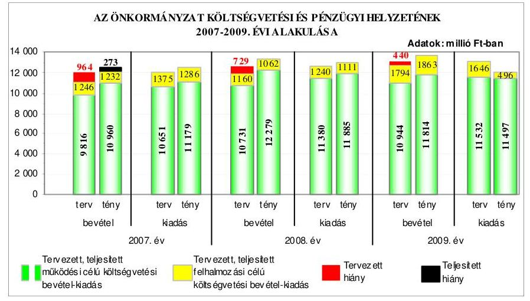

A költségvetés végrehajtása során a 2007-2009. években a pénzügyi egyensúly a tervezetthez viszonyítva javult, azonban a 2007. évben nem volt biztosított. A 2008-2009. években a realizált költségvetési bevételek fedezetet nyújtottak a költségvetési kiadásokra. Az Önkormányzatnál a teljesített felhalmozási célú költségvetési kiadások a 2008. évben meghaladták az azonos célú költségvetési bevételeket, amelyre a működési célú költségvetési bevételi többlet biztosított fedezetet. A 2009. évben a tervezett költségvetési hiány ellenére bevételi többle-

---

tet realizáltak a működési és felhalmozási célú költségvetési bevételek túlteljesítése, valamint a felhalmozási célú költségvetési kiadások alulteljesítése eredményeként. A 2009. évi felhalmozási célú költségvetési kiadások teljesített összegei - a tervezett felújítások és beruházások műszaki és pénzügyi teljesítéseinek elhúzódása miatt - elmaradtak a tervezettől. Az Önkormányzatnál a 2007-2009. években a költségvetés végrehajtása során tervezett - a költségvetési bevételek növelését és a költségvetési kiadások csökkentését célzó - intézkedéseket végrehajtották, továbbá az évközben jóváhagyott döntések alapján megvalósított intézmény- és létszám-racionalizálás és az ezzel összefüggő többletkiadásokra beadott pályázatokon elnyert támogatások hatására a tervezetthez képest az évek sorrendjében 399-637-542 millió Ft-tal a pénzügyi hiány csökkent.

Az Önkormányzat a 2007. évben 149,8 millió Ft hosszú lejáratú, fejlesztési célú hitelszerződést kötött, a hitelt a felvétel céljának megfelelően a 150 férőhelyes idősek otthona építésére használta fel. A 2008. évben az Önkormányzat 1500 millió Ft értékű, svájci frank alapú, 20 éves futamidejű, felhalmozási célú kötvényt bocsátott ki, amely a forint svájci frankhoz viszonyított árfolyamváltozása és a változó kamatmérték miatt kockázatot jelentett az Önkormányzat számára. Az Önkormányzat az éven belüli likviditás biztosítására a 2007-2010. években folyószámlahitelt, valamint a 2007-2008. években munkabér-megelőlegezési hitelt vett igénybe. Az Önkormányzat fizetőképessége 2007-2009 között javult, mivel a kötvénykibocsátás hatására megnövekedett pénzeszközök, valamint a pénzeszközökön túl bevonható követelések állománya növekvő arányban biztosított fedezetet a rövid lejáratú kötelezettségek pénzügyi teljesítésére. Az Önkormányzat pénzügyi helyzete a 2007. évről a 2009. évre a fizetőképesség javulása ellenére a kötvénykibocsátás miatti eladósodás növekedés következményeként összességében kedvezőtlenül alakult.

Az Önkormányzat a fejlesztési célkitűzéseit a gazdasági programban, ágazati, szakmai koncepciókban, tervekben határozta meg, amelyekben a megvalósítás lehetséges pénzügyi forrásaként figyelembe vették az európai uniós támogatásokat. A Közgyűlés, a Közgyűlés elnöke és az intézményvezetők döntései alapján a 2007-2010. I. negyedév között európai uniós és közösségi kezdeményezés támogatására 89 pályázatot nyújtottak be, amelyekből 49 eredményes volt, 22 elbírálása folyamatban volt, 18 pályázatot - a pályázati források hiánya, tartalmi, formai hibák, szakmai kidolgozatlanság, egyéb okok miatt - elutasítottak. A benyújtott pályázatok megvalósításának - a 2007-2010. évekre tervezett költsége 5722,4 millió Ft volt, amely finanszírozását 88,6%-ban európai uniós forrásból, 3,0%-ban hazai támogatásból, 8,4%-ban saját pénzeszközökből tervezték. Az Önkormányzat 2007-2010. évi költségvetési rendeletei tartalmazták az európai uniós forrást igénylő fejlesztési feladatok kiadási és bevételi előirányzatait, a felújítási előirányzatokat célonként, a felhalmozási kiadásokat feladatonként, azonban az Ámr. ${ }_{1-2}$ előírása ellenére teljes körűen nem mutatták be a többéves kihatással járó feladatok előirányzatait éves bontásban, továbbá elkülönítetten az európai uniós támogatással megvalósuló projektek bevételeit és kiadásait. Az Önkormányzat 2010. évi költségvetési rendeletét módosította, amely tartalmazta a többéves kihatással járó európai uniós támogatás igénybevételével megvalósuló feladatok előirányzatait éves bontásban - azonban három projekt esetében a 2011. évi kihatását nem rögzítette -,

---

továbbá elkülönítetten nem mutatta be egy európai uniós támogatással megvalósuló projekt bevételeit és kiadásait.

Az európai uniós források igénybevételének és felhasználásának feladatait a 2007-2009. években az ügyrend ${ }_{1-2}$-ben, a gazdasági szervezet ügyrendjében, a pályázati szabályzat ${ }_{1-2}$-ban, valamint a köztisztviselők munkaköri leírásaiban meghatározták. Előírták a pályázatfigyelést végzők, a döntési, illetve döntéselőterjesztési jogkörrel rendelkezők közötti információ-szolgáltatási kötelezettséget, valamint a pályázatfigyelés, pályázatkészítés, fejlesztési feladat lebonyolítás rendjét. Rögzítették az európai uniós forrásokra vonatkozó pályázatokkal összefüggésben az önkormányzati szintű pályázatkoordinálás feladatait, felelőseit, azonban nem írták elő a pályázatok önkormányzati szintű nyilvántartása vezetésének kötelezettségét és módját. A pályázati szabályzat ${ }_{2}$ 2010. májusi módosításában rögzítették a pályázatok nyilvántartási kötelezettségét és annak módját. A 2007-2009. évi belső ellenőrzési éves terveket megalapozó kockázatelemzés nem, a 2010. évi azonban kiterjedt az európai uniós forrásokkal támogatott fejlesztési feladatokra. Az Önkormányzati hivatalban a pályázatfigyelés, pályázatkészítés és fejlesztési feladat lebonyolítás személyi és szervezeti feltételeit kialakították, a feladatok ellátására külső személyt, szervezetet nem bíztak meg.

A „Borbély Lajos SzSzK akadálymentesítése" fejlesztési feladat keretében a támogatási szerződésben rögzített tartalommal és határidőben az oktatási intézmény fizikai és infokommunikációs akadálymentesítése megvalósult. A támogatási szerződésben meghatározott 30,6 millió Ft kiadás 15,6 millió Ft-tal túlteljesült, a közbeszerzési eljárás eredményeként megkötött vállalkozói szerződés tervezetthez viszonyított magasabb összege, valamint a műszaki ellenőrzés díja miatt. A belső ellenőrzés a fejlesztési feladat megvalósítását nem vizsgálta. A VÁTI Kht. három alkalommal végzett helyszíni ellenőrzést, amely során feltárt hiányosságok megszüntetésére a főjegyző intézkedett. Az Önkormányzat a projekt befejezését követően gondoskodott az akadálymentesített iskolai épület fenntartásáról.

Az Önkormányzat 2007-2009 között eredményesen készült fel belső szabályozottság és szervezettség terén az európai uniós források igénybevételére és felhasználására, továbbá megvalósította az egy ellenőrzött projekt támogatási
 szerződésében foglalt fejlesztési célkitűzést. A gazdasági programban, az ágazati, szakmai koncepciókban, tervekben megfogalmazott fejlesztési célkitűzésekhez kapcsolódtak az európai uniós támogatások, szabályozták a pályázatfigyelést végzők és a döntési, illetve a döntés-előterjesztési jogkörrel rendelkezők közötti információszolgáltatási kötelezettséget. Az Önkormányzati hivatal szervezetén belül biztosították a pályázatfigyelés, a pályázatkészítés és a fejlesztési feladat lebonyolításának szervezeti és személyi feltételeit, a fejlesztési feladat lebonyolítását végző köztisztviselő munkaköri leírásában előírták az ellenőrzési kötelezettséget, valamint a támogatási szerződésben rögzített határidőre - a „Borbély Lajos SzSzK akadálymentesítése" fejlesztési feladat - fejlesztési célkitűzést megvalósították. A 2007-2009. évi belső ellenőrzési éves terveket megalapozó kockázatelemzés nem, a 2010. évi azonban kiterjedt az európai uniós forrásokkal támogatott fejlesztési feladatokra.

---

Az Önkormányzat rendelkezett a 2007-2010. évekre vonatkozó, helyzetelemzéssel alátámasztott informatikai stratégiával, amelyben meghatározták a közép- és hosszú távú célokat és feladatokat, azonban nem rögzítették az elérni kívánt elektronikus szolgáltatási szintet. Az informatikai stratégia évenkénti felülvizsgálatát az előírtak ellenére nem végezték el. Az e-közszolgáltatási feladatokat az Önkormányzati hivatal köztisztviselőivel saját számítógépes információs rendszeren keresztül, saját programok alkalmazásával biztosították, az önkormányzati honlap technikai üzemeltetésével külső szolgáltatót bíztak meg. Az Önkormányzat honlapján működtetett e-közszolgáltatási informatikai rendszer az 1. elektronikus szolgáltatási szintnek felelt meg. Az e-közszolgáltatást nyújtó informatikai rendszer ügyfelek általi igénybevételét nem kísérték figyelemmel és annak tapasztalatait nem értékelték.

Az Önkormányzat honlapján a közérdekű adatok elektronikus közzétételéről a főjegyző gondoskodott. Az államháztartással összefüggő közérdekű adatok közzétételének és a honlap gondozásának feladatait szabályozták, amely azonban nem tért ki az intézmények közérdekű adatai közzétételének előírására és a közzétételt biztosító adatszolgáltatás rendjének és felelőseinek meghatározására. Az Önkormányzat által nyújtott nem normatív, céljellegű működési és fejlesztési támogatások kedvezményezettjeinek nevére, a támogatás céljára, összegére és a támogatási program megvalósítási helyére vonatkozó adatokat, továbbá az Önkormányzati hivatal által kötött, az államháztartás pénzeszközei felhasználásával, az államháztartáshoz tartozó vagyonnal való gazdálkodással összefüggő - a nettó ötmillió Ft-ot elérő vagy azt meghaladó - árubeszerzésre, szolgáltatás megrendelésére vonatkozó szerződések adatait az Önkormányzat honlapján közzétették. Az intézmények pénzeszközeinek felhasználásával, a vagyonnal való gazdálkodással összefüggő - a nettó ötmillió Ft-ot elérő vagy azt meghaladó értékű, építési beruházásra és szolgáltatás megrendelésére vonatkozó - szerződések megnevezésének (típusának), tárgyának, a szerződést kötő felek nevének, a szerződés értékének, határozott időre kötött szerződés esetén időtartamának, valamint az említett adatok változásai közzétételénél a 2009. évben nem tartották be az Eisz. tv. előírását, mivel az Önkormányzat honlapján csak az önálló honlappal nem rendelkező intézmények szerződéseit tették közzé. A főjegyző 2010. májusában intézkedett az intézmények felé a nettó ötmillió Ft-ot elérő vagy azt meghaladó értékű szerződések Önkormányzati honlapon történő közzétételére, továbbá meghatározta az intézmények adatszolgáltatási rendjét és felelőseit. A főjegyző a 2008. évi költségvetési beszámoló szöveges indoklásának közzétételénél nem tartotta be az Áhsz-ben előírtakat, mivel az nem tartalmazta az európai uniós és egyéb támogatási programok keretében beérkezett pénz- és egyéb eszközök, továbbá az azokkal kapcsolatban felhasznált saját költségvetési források alakulását, az előirányzatok teljesítését befolyásoló tényezőket, valamint a közalapítványok, alapítványok, társadalmi szervezetek által ellátott feladatokra teljesített kifizetések részletes felsorolását. A 2009. évi költségvetési beszámoló szöveges indoklásának közzététele az Áhsz. előírásainak megfelelő tartalommal megtörtént.

A költségvetés tervezési és a zárszámadás-készítési folyamatok szabályozottsága alacsony kockázatot jelentett a feladatok megfelelő, szabályszerű végrehajtásában, mivel a főjegyző a FEUVE rendszer keretében szabályozta a költségvetési tervezés és a zárszámadás készítés rendjét. Meghatározta az intézmények részére a költségvetési javaslat összeállításával kapcsolatos követelményeket, előírta a költségvetés tervezéséhez készített intézményi mutatószámok adatai megalapozottságának, az intézmények által az állami támogatásokkal, hozzájárulásokkal történő elszámoláshoz közölt mutatószámok adatai megbízhatóságának, az intézményi pénzmaradványok szabályszerűségének, továbbá az intézményi számszaki beszámolók belső, valamint annak a Közgyűlés által meghatározott adatszolgáltatással való összhangjának ellenőrzését.

---

intézmények részére a költségvetési javaslat összeállításával kapcsolatos követelményeket, előírta a költségvetés tervezéséhez készített intézményi mutatószámok adatai megalapozottságának, az intézmények által az állami támogatásokkal, hozzájárulásokkal történő elszámoláshoz közölt mutatószámok adatai megbízhatóságának, az intézményi pénzmaradványok szabályszerűségének, továbbá az intézményi számszaki beszámolók belső, valamint a Közgyűlés által meghatározott adatszolgáltatással való összhangjának ellenőrzését.

A 2009. évi költségvetés és a 2008. évi zárszámadás készítés folyamatában a működésbeli hibák megelőzésére, feltárására, kijavítására kialakított belső kontrollok működésének megfelelősége kiváló volt, mivel az Önkormányzati hivatalnál a vonatkozó jogszabályi előírásoknak megfelelően ellenőrizték a költségvetési intézményeknél a költségvetési javaslat összeállításával kapcsolatban meghatározott követelmények teljesítését. Vizsgálták továbbá a költségvetési igények megalapozottságát, valamint az Önkormányzati hivatalban és az intézményeknél az ismert kötelezettségek megtervezését. A szabályozásban foglaltaknak megfelelően ellenőrizték a költségvetési tervezéshez készített intézményi mutatószám-felmérés adatainak megalapozottságát, a saját bevételek (intézményi térítési díjak, egyéb szolgáltatási díjak) előirányzatai és a költségvetés megalapozását szolgáló helyi rendeletek összhangját, a zárszámadáshoz közölt intézményi mutatószámok megbízhatóságát, az intézményi pénzmaradványok megállapításának szabályszerűségét, az intézményi számszaki beszámolók belső, valamint a Közgyűlés által meghatározott adatszolgáltatással való összhangját.

A gazdálkodási, a pénzügyi-számviteli és a folyamatba épített ellenőrzési feladatok szabályozottsága összességében alacsony kockázatot jelentett a feladatok megfelelő, szabályszerű végrehajtásában, mivel az Önkormányzati hivatal rendelkezett ügyrend¹⁻²del, amelyben szabályozták a gazdasági szervezet felépítését és tevékenységét. A FEUVE rendszer keretében a gazdasági szervezet elkészítette az ügyrendjét, amely részletesen tartalmazta feladatait, a vezetők és a pénzügyi-gazdasági feladatok ellátásáért felelős alkalmazottak rela-ciódat-, hatás- és felelősségi körét. A Közgyűlés elnöke és a főjegyző együttes rendelkezésben szabályozta a pénzügyi-gazdálkodási hatáskörök gyakorlásának rendjét. A főjegyző kialakította az Önkormányzati hivatal számviteli rendjét, a FEUVE-val kapcsolatos szabályozást és eljárási rendet az ellenőrzési nyomvonal, a szabálytalanságok kezelésének és a kockázatkezelés rendjének elkészítésével biztosította, valamint kiadta a pénzügyi-gazdasági, számviteli területen foglalkoztatott köztisztviselők munkaköri leírását.

Az Önkormányzati hivatalnál a belső kontrollok működésének megfelelősége kiváló volt, mivel a működési és felhalmozási célú pénzeszközátadásokkal, az állományba nem tartozók megbízási díjaival, valamint a külső szolgáltatók által végzett karbantartási, kisjavítási szolgáltatásokkal kapcsolatos kifizetések során a szerződésekben, megrendelésekben meghatározott feladatok teljesítésének szakmai igazolását, a kiadások jogosultságának, összegszerűségének ellenőrzését a szakmai teljesítésigazolásra a főjegyző által kijelölt személyek a kötelezettségvállalási szabályzatban előírt módon elvégezték. Az utalványok ellenjegyzői meggyőződtek a gazdálkodásra vonatkozó szabályok érvényesüléséről, továbbá ellenőrizték a szakmai teljesítésigazolás és az érvényesítés megtörténtét.

---

ről, továbbá ellenőrizték a szakmai teljesítésigazolás és az érvényesítés megtörténtét.

Az Önkormányzati hivatalnál a pénzügyi-számviteli informatikai rendszerek szabályozottsága összességében alacsony kockázatot jelentett az informatikai feladatok megfelelő, szabályszerű végrehajtásánál, mivel a főjegyző szabályozta az informatikai rendszerek alkalmazásával kapcsolatos adatvédelmi, adatkezelési, biztonsági és katasztrófa-elhárítási feladatokat, valamint a hozzáférési jogosultságok eljárásrendjét. Annak ellenére összességében alacsony volt a kockázat, hogy az ellenőrzési lista vizsgálatáért felelős dolgozót nem jelöltek ki. A főjegyző 2010. április hónapban előírta a számlarendben és az érintett köztisztviselők munkaköri leírásában a pénzügyi-számviteli, informatikai rendszerekből lekérhető ellenőrzési lista vizsgálatának feladatát. Az Önkormányzati hivatalban a pénzügyi-számviteli tevékenységekhez kapcsolódó informatikai feladatoknál kialakított belső kontrollok működésének megfelelősége jó volt, mivel biztosították a hozzáférési jogosultságokra vonatkozó nyilvántartás teljes körű és naprakész vezetését, valamint az elmentett adatállományok biztonságos megőrzését, azonban nem tesztelték a katasztrófa-elhárítási tervet, nem írták elő a pénzügyi-számviteli programokban a jelszavak cserélésének szabályait és nem ellenőrizték az elmentett pénzügyi-számviteli adatok teljes körű helyreállíthatóságát. A feltárt hiányosságok nem veszélyeztették az informatikai rendszerek megbízható működését. A főjegyző 2010. áprilisában kiegészítette a hozzáférési jelszavakra vonatkozó szabályozást az érvényességi idő előírásával, valamint 2010. májusában elvégeztette az elmentett adatállományokból a pénzügyi és számviteli programok adatai helyreállíthatóságának ellenőrzését és a katasztrófa-elhárítási terv tesztelését.

A belső ellenőrzés szervezeti kereteinek kialakítása és szabályozása a belső ellenőrzési feladatok megfelelő, szabályszerű végrehajtásában összességében alacsony kockázatot jelentett, mivel a feladat ellátásának módját és az eljárásrendet az előírásoknak megfelelően szabályozták, valamint a főjegyző által jóváhagyott belső ellenőrzési kézikönyvvel rendelkeztek. Annak ellenére összességében alacsony volt a kockázat, hogy a 2009. évi belső ellenőrzési tervet alátámasztó kockázatelemzés az Önkormányzati hivatal és az önkormányzati intézmények tekintetében nem terjedt ki az európai uniós forrásból megvalósított feladatok végrehajtására és a közbeszerzési eljárások lebonyolítására - amelyet a 2010. évi kockázatelemzés már tartalmazott - továbbá az ellenőrzési programokat a belső ellenőrzési vezető helyett - a Ber. előírása ellenére - a főjegyző, illetve az aljegyző hagyták jóvá. Az Ellenőrzési csoport a 2009. évi ellenőrzési tervben foglalt ellenőrzéseket végrehajtotta. Az Önkormányzati hivatalban a 2009. évben a belső ellenőrzés működésénél a kialakított kontrollok megfelelősége jó volt, mivel az Ötv-ben foglaltaknak megfelelően létrehozták a belső ellenőrzési egységet, az elvégzett (terv szerinti és soron kívüli) ellenőrzésekkel, az intézkedések kezdeményezésével és a javaslatok realizálásának ellenőrzésével a belső ellenőrzés hozzájárult a működésbeli hibák megelőzéséhez, feltárásához, kijavításához. A főjegyző értékelte a belső kontrollok működését és teljesítette nyilatkozattételi kötelezettségét. A Közgyűlés elnöke a költségvetési szervek éves ellenőrzési jelentései alapján készített 2008. és 2009. évi összefoglaló jelentéseket a Közgyűlés elé terjesztette. A belső ellenőrzési kézikönyv előírása ellenére a 2009. évben nem, azonban a 2010. évben a hatályos kockázatkezelési eljárás-

---

rend alapján végezték a magas kockázatúnak értékelt területek értékelését, továbbá a belső ellenőrzési javaslatokról és azok alapján megtett intézkedések nyomon követéséről 2010-től a belső ellenőrzési vezető nyilvántartást vezetett. A 2010. évi belső ellenőrzési tervben az I. negyedévre ütemezett feladatokat végrehajtották.

Az Önkormányzat gazdálkodási rendszerének 2005. évi átfogó ellenőrzése során az ÁSZ 12 szabályszerűségi és hat célszerűségi javaslatot tett. A javaslatok realizálása érdekében a főjegyző - a felelősöket és a határidőket tartalmazó - intézkedési tervet készített, amit a Közgyűlés elfogadott. Az ÁSZ ellenőrzés által tett szabályszerűségi javaslatok közül 10 hasznosult, kettő részben valósult meg. A végrehajtott javaslatok a költségvetési rendelet tartalmára, a pénzügyi-számviteli feladatellátás szabályozottságára, a költségvetési, gazdálkodási és ellenőrzési jogkörök gyakorlására, a követelések és a részesedések év végi értékelésére, a vagyongazdálkodási rendeletben a nyilvános pályáztatás szabályai alól felmentést adó helyi szabályozás hatályon kívül helyezésére és a vagyon térítésmentes átadása eseteinek meghatározására, valamint a céljelleggel nyújtott támogatások szabályszerűsége érdekében szükséges intézkedések megtételére, továbbá a zárszámadási rendeletben a közvetett támogatások bemutatására és a többéves kihatással járó döntések szöveges indoklásának csatolására, az akadálymentesítés megvalósítására vonatkoztak.

Részben hasznosította a Közgyűlés elnöke a jóváhagyott költségvetési előirányzatokon belüli gazdálkodásra vonatkozó javaslatot, mivel az Önkormányzat által fenntartott intézmények közül a Kórház - az Áht. előírása ellenére - a részére jóváhagyott kiadási előirányzaton felül vállalt tárgyévi kötelezettséget, amely miatt az előirányzatot túllépte. A főjegyző részben valósította meg a nettó ötmillió Ft-ot elérő vagy meghaladó értékű vagyonértékesítésre, vagyonhasznosításra, szolgáltatás megrendelésére vonatkozó szerződések közzétételére vonatkozó javaslatot, mivel a nettó ötmillió Ft-ot elérő vagy meghaladó értékű vagyonértékesítésre, vagyonhasznosításra, szolgáltatás megrendelésére vonatkozó szerződések meghatározott adatait közzétette, de a honlappal rendelkező intézmények szerződéseinek adatait az Eisz. tv. előírása ellenére nem az Önkormányzat, hanem az intézmények honlapján tette közzé, amely hiányosság megszüntetésére 2010. májusában intézkedett.

A munka színvonalának javítása érdekében tett javaslatokat hasznosították, ennek során a főjegyző kiegészítette a gazdasági szervezet dolgozóinak munkaköri leírását az informatikai programokhoz kapcsolódó feladatokkal, a Közgyűlés módosította az üzemeltetésre átadott vagyonnal kapcsolatos szerződéseket a leltározás szabályainak meghatározásával. A gazdálkodási és ellenőrzési jogkörrel felhatalmazottak eleget
 tettek e tevékenységükről szóló beszámolási kötelezettségüknek, a Pénzügyi Ellenőrző Bizottság vizsgálta a hosszú lejáratú fejlesztési célú hitelkérelmet és a kötvénykibocsátást, valamint az intézményi működési bevételek gazdasági megalapozottságát. A főjegyző a költségvetési rendelet előterjesztése során intézkedett az intézmények előző évi pénzmaradványának megtervezésére.

Az Önkormányzatnál 2006-2009 között a Magyar Köztársaság 2005. évi költségvetése végrehajtásának ellenőrzése keretében az önkormányzatok beruházásaihoz és rekonstrukcióhoz nyújtott felhalmozási célú támogatások felhasználásának vizsgálatáról készített jelentésben az ÁSZ által tett egy célszerűségi javaslat alapján a Közgyűlés elnöke tájékoztatta a Közgyűlést a vizsgálat tapasztalatairól. Az önkormányzati kórházak és bentlakásos intézmények ápolásra, gondozásra fordított pénzeszközei felhasználásának ellenőrzéséről készült jelentésben az ÁSZ a Közgyűlés elnökének öt célszerűségi javaslatot fogalmazott meg, amelyek hasznosítására a Közgyűlés által határozattal elfogadott, határidőt és felelősöket tartalmazó intézkedési tervet készítettek. A Közgyűlés elnöke kezdeményezte a megye lakosságának - az I. szintű mozgásszervi rehabilitációs ellátás szempontjából - a megyében működő kórházak ellátási kötelezettségébe történő besorolását, valamint a megye kórházait fenntartó települések polgármestereinél a betegellátás összehangolásához szükséges intézkedések megtételét, továbbá a megyei szociális szolgáltatástervezési koncepció felülvizsgálatát. A végleges működési engedélyekhez szükséges fejlesztési, rekonstrukciós munkák elvégzése érdekében az érintett intézmények vezetőinek előírták a pályázati lehetőségek figyelemmel kísérését, az éves költségvetésben a szükséges saját forrás megtervezését és a műszaki tervek elkészíttetését.

A 2008. március 9-én megtartott országos ügydöntő népszavazás lebonyolításához felhasznált pénzeszközök elszámolásának ellenőrzéséről készített jelentésben az ÁSZ a Közgyűlés elnökének egy célszerűségi, a főjegyzőnek hét szabályszerűségi és egy célszerűségi javaslatot tett, amelyek hasznosítására a Közgyűlés által jóváhagyott, határidő és felelős megjelölését tartalmazó intézkedési terv készült. Ez alapján a főjegyző intézkedett, hogy a költségvetési rendelettervezet benyújtási határidejéig ismertté vált népszavazási és választási feladatokhoz kapcsolódó bevételek és kiadások tervezése a biztosított források összegéig, a népszavazáshoz biztosított normatív támogatásból teljesített kiadásokkal a költségvetési előirányzatok módosítása az előírt határidőben megtörténjen, továbbá a kötelezettségvállalást végzők, az utalványok ellenjegyzői, valamint az érvényesítők és a szakmai teljesítést igazolók az ellenőrzési feladataikat teljesítsék és a feladat elvégzését igazolják.

Az Önkormányzat gazdálkodási rendszerének 2005. évi átfogó ellenőrzése, valamint az önkormányzati kórházak és bentlakásos intézmények ápolásra, gondozásra fordított pénzeszközei felhasználásának, továbbá a 2008. március 9-én megtartott országos ügydöntő népszavazás lebonyolításához felhasznált pénzeszközök elszámolásának ellenőrzéséhez kapcsolódóan tett ÁSZ javaslatok végrehajtása eredményeként javult a pénzügyi-számviteli feladatellátás szabályozottsága, végrehajtása, a költségvetési gazdálkodási és ellenőrzési jogkörök gyakorlásának, valamint a vagyongazdálkodási feladatoknak a szabályszerűsége, továbbá a közpénzek felhasználása nyilvánosságának biztosítása, a közintézmények akadálymentes megközelítése, a kórházi krónikus betegellátás színvonala, a népszavazáshoz és a választási feladatokhoz kapcsolódó bevételi és kiadási előirányzatok tervezésének és felhasználásának szabályszerűsége.

---

A helyszíni ellenőrzés megállapításainak hasznosítása mellett javasoljuk:

# a Közgyűlés elnökének 

a munka színvonalának javítása érdekében
kezdeményezze, hogy a jelentésben foglaltakat a Közgyűlés tárgyalja meg, valamint kísérje figyelemmel a főjegyző részére tett javaslat végrehajtását.

## a főjegyzőnek

a munka színvonalának javítása érdekében
tájékoztassa - évente végzett számítások alapján - a Közgyűlést az Önkormányzat eladósodásának növekedésére figyelemmel arról, hogy a hosszú lejáratú, adósságot keletkeztető kötelezettségvállalásokból adódó tőke- és kamatfizetési kötelezettségét az Önkormányzat milyen feltételek biztosítása mellett tudja teljesíteni.

---

# II. RÉSZLETES MEGÁLLAPÍTÁSOK 

## 1. AZ ÖNKORMÁNYZAT KÖLTSÉGVETÉSI ÉS PÉNZÜGYI HELYZETE

### 1.1. A tervezett költségvetési bevételek és kiadások alapján a költségvetési egyensúly, a költségvetési hiány alakulása, a hiány tervezett finanszírozási módja, valamint a költségvetési hiány megállapításának szabályszerűsége

Az Önkormányzatnál a 2007-2010. években a tervezett költségvetési bevételek 11062 millió Ft-ról 12202 millió Ft-ra, a költségvetési kiadások 12026 millió Ft-ról 13273 millió Ft-ra növekedtek, azonban ez a növekedés nem volt folyamatos. Az előző évhez viszonyítva a tervezett költségvetési bevételek a 2008-2009. években növekedtek, a 2010. évben csökkentek, a tervezett költségvetési kiadások folyamatosan nőttek. Az Önkormányzat 2007-2010. évi költségvetési rendeleteiben a költségvetési bevételek és kiadások nem voltak egyensúlyban, a tervezett költségvetési bevételek nem nyújtottak fedezetet a tervezett költségvetési kiadásokra. A költségvetési hiány költségvetési kiadásokhoz viszonyított részaránya a 2007-2010. években az évek sorrendjében 8,0-5,8-3,3-8,1% volt. A költségvetés hiányát a 2007-2008. években a működési célú költségvetési bevételek hiánya és a felhalmozási célú költségvetési bevételeket meghaladó mértékben tervezett felhalmozási célú költségvetési kiadások, a 2009-2010. években a működési célú költségvetési bevételek hiánya okozta.

A 2007-2010. évi költségvetési rendeletekben a működési célú költségvetési kiadásoknál hiányzó forrás az évek sorrendjében 835-649-588-1071 millió Ft volt. A 2007-2008. évi felhalmozási célú költségvetési kiadások 129, illetve 80 millió Ft-tal haladták meg az azonos célú költségvetési bevételek előirányzatát. A 2009. évben a felhalmozási célú költségvetési bevételek előirányzatai 148 millió Ft-tal meghaladták a tervezett felhalmozási célú költségvetési kiadásokat, a 2010. évben a felhalmozási célú költségvetési bevételeket és kiadásokat azonos összeggel tervezték.
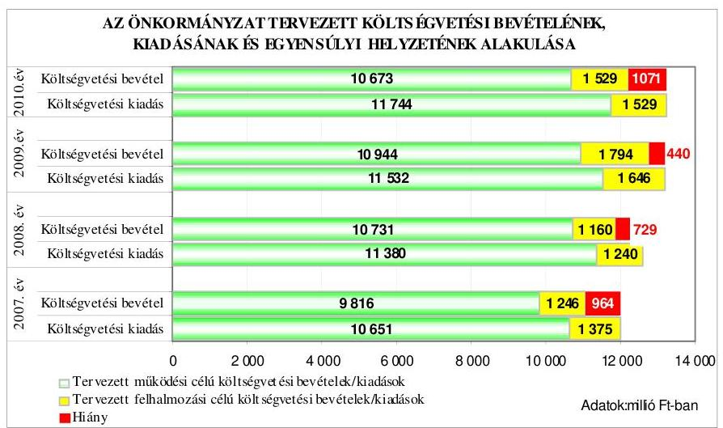

---

Az Önkormányzat a 2007-2010. évi költségvetési rendeleteiben a költségvetési egyensúly biztosításához hosszú lejáratú, fejlesztési és működési célú hitel felvételét, valamint bevételt növelő és kiadást csökkentő egyéb intézkedések $^{6}$ megtételét tervezte. Az Önkormányzat a 2007. évben 149,8 millió Ft hosszú lejáratú fejlesztési, a 2010. évben 200 millió Ft hosszú lejáratú, működési célú hitel felvételével, az éven belüli fizetőképessége biztosítása érdekében a 2007-2010. években - a bevételek és a kiadások ütemkülönbségének eltérése miatt - rövid lejáratú folyószámla-, és munkabér-megelőlegezési hitel igénybevételével számolt.

Az Önkormányzat a 2007-2010. évek költségvetési rendeleteiben a működési hiány csökkentésére „a helyi önkormányzatok működőképességének megőrzését szolgáló kiegészítő támogatások"-ra, valamint a helyi szervezési intézkedésekhez kapcsolódó többletkiadásokra pályázatok benyújtásáról, továbbá az évközben teljesült bevételi többletnek a költségvetési hiány csökkentésére történő felhasználásáról döntött.

A Közgyűlés - a 2007-2010. évi költségvetések végrehajtására hozott határozataiban - a költségvetési hiány csökkentése érdekében egyéb bevételnövelő és kiadáscsökkentő intézkedésekről döntött, amelynek keretében bér- és létszámcsökkentéshez (létszám-racionalizálás, vezetői szintek számának csökkentése, adható bérelemek, pótlékok folyamatos megszüntetése, üres állások betöltésének szabályozása), az üzemeltetési feladatok (takarítás, konyha, portaszolgálat) racionálisabb formában történő ellátásához, más önkormányzatokkal közösen ellátott feladatok esetében (alapfokú művészeti oktatás, múzeumok, Megyei Könyvtár) a költségek közös viselésére megkötött megállapodások felülvizsgálatához kapcsolódó feladatokat határozott meg, valamint a megüresedő önkormányzati ingatlanok (Tüdőgondozó és Szűrőállomás, valamint a Megyei Gyermekvédelmi Központ lakóingatlana) értékesítéséről, továbbá a beruházási, felújítási feladatok megvalósításához pályázati (hazai és európai uniós) források igénybevételéről határozott.

Az Önkormányzat a 2007-2010. évi költségvetési rendeleteiben a költségvetési kiadások, valamint a 2008. és a 2010. évi költségvetési rendeletekben a költségvetési bevételek főösszegének megállapításakor - az Áht. 8/A. § (7) bekezdésében előírtakat megsértve - finanszírozási célú pénzügyi műveleteket (a 2007. évben 9 millió Ft fejlesztési célú, a 2008-2010. években 314-559-555 millió Ft összegű likvid hiteltörlesztésre tervezett kiadást, valamint a 2008. évben 29,8 millió Ft fejlesztési célú hitelből, a 2010. évben 200 millió Ft működési hitelből tervezett bevételt) számoltak el költségvetési hiányt módosító költségvetési kiadásként, illetve bevételként. Az Önkormányzat a 2010. évi költségvetési rendeletét - figyelemmel az Áht. 8/A. § (7) bekezdésében foglalt előírásokra - a 2010. április 29-i ülésén elfogadott, 13/2010. (V. 3.) számú rendeletével módosította.

[^0]
[^0]:    $^{6}$ A Közgyűlés a bevételnövelő és a kiadáscsökkentő intézkedéseiről a költségvetés végrehajtására hozott 5/2007. (II. 13.), 15/2008. (II. 14.), 4/2009. (II. 12.) és a 3/2010. (I. 28.) számú határozataiban döntött.

---

# 1.2. A teljesített költségvetési bevételek és kiadások alapján a pénzügyi egyensúly, a pénzügyi hiány alakulása, a pénzügyi hiány finanszírozása, az igénybe vett finanszírozási célú pénzügyi eszközök hatása a pénzügyi helyzet alakulására, az eladósodásra, valamint a fizetőképességre 

Az Önkormányzatnál a 2007-2009. évek között a teljesített költségvetési bevételek főösszege 12192 millió Ft-ról 13677 millió Ft-ra, évente folyamatosan növekedett. A teljesített költségvetési bevételek az előző évhez viszonyított 2008. évi 9,4%-os, valamint 2009. évi 2,5%-os növekedését az intézményi működési bevételek, a hozam és kamatbevételek, a felhalmozási célú költségvetési bevételek és az előző évi működési- és felhalmozási célú pénzmaradvány igénybevételének növekedései okozták. A teljesített költségvetési kiadások főösszege a 2008. évben 531 millió Ft-tal növekedett, a 2009. évben 1003 millió Ft-tal csökkent az előző évhez viszonyítva. A teljesített költségvetési kiadások 2007. évhez viszonyított 2008. évi 4,2%-os növekedését a működési célú költségvetési kiadások növekedése, a 2009. évi 7,7%-os csökkenését a működési és a felhalmozási célú költségvetési kiadások csökkenése együttesen okozták.
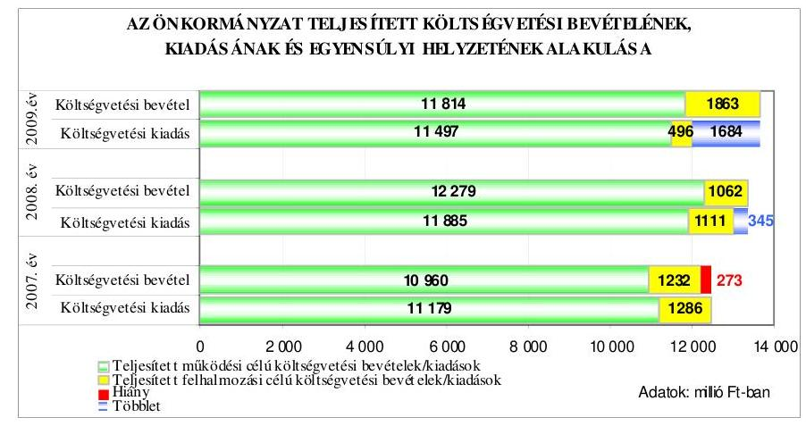

A költségvetés végrehajtása során a tényleges egyensúlyi helyzet - a tervezetthez viszonyítva - 2007-2009 között javult. A 2007. évben a pénzügyi egyensúlyt nem biztosították, a működési célú költségvetési bevételek hiánya és a felhalmozási célú költségvetési bevételeket meghaladó összegben teljesített azonos célú költségvetési kiadások együttes hatása miatt. A pénzügyi hiány a 2007. évben a tervezett költségvetési hiányhoz képest kedvezőbben alakult (a tervezett 964 millió Ft-ról 273 millió Ft-ra csökkent), amelyet a működési célú költségvetési bevételek túlteljesítése és a felhalmozási célú költségvetési kiadások alulteljesítése együttesen okozott. A 2008-2009. években a teljesített költségvetési bevételek fedezetet nyújtottak a teljesített kiadásokra, pénzügyi hiány nem volt, de a teljesített felhalmozási célú költségvetési kiadások a 2008. évben 49 millió Ft-tal meghaladták az azonos célú költségvetési bevételeket, amelyre a működési célú költségvetési bevételi többlet biztosított fedezetet. A 2009. évben az Önkormányzatnál 1684 millió Ft bevételi többletet realizáltak, amit a működési és felhalmozási célú költségvetési bevételek túlteljesítése,

---

valamint a felhalmozási célú költségvetési kiadások alulteljesítése együttesen okozott.

Az Önkormányzatnál a 2007-2010. években tervezett és a 2007-2009. években teljesített működési és felhalmozási célú költségvetési kiadásokra a következő arányban biztosítottak fedezetet a költségvetési bevételek:

Adatok: %-ban

| Megnevezés | 2007.   év |  | 2008.   év |  | 2009.   év |  | 2010.   év |
| :--: | :--: | :--: | :--: | :--: | :--: | :--: | :--: |
|  | Terv | Tény | Terv | Tény | Terv | Tény | Terv |
| Működési célú költségvetési kiadások fedezettsége működési célú költségvetési bevételekből | 92,2 | 98,0 | 94,3 | 103,3 | 94,9 | 102,8 | 90,9 |
| Felhalmozási célú költségvetési kiadások fedezettsége felhalmozási célú költségvetési bevételekből | 90,6 | 95,9 | 93,5 | 95,5 | 109,0 | 375,6 | 100,0 |
| Költségvetési kiadások fedezettsége költségvetési bevételekből | 92,0 | 97,8 | 94,2 | 102,7 | 96,7 | 114,0 | 91,9 |

A működési célú költségvetési bevételek a 2008-2009. években a jóváhagyott, eredeti költségvetési előirányzathoz képest - a költségvetési támogatások $^{7}$, az illetékbevételek $^{8}$ és az intézményi működési bevételek $^{9}$, valamint a 2008. évben a kamatbevételek $^{10}$ növekedésével összefüggésben - túlteljesültek, amely tervezési hiányosságra nem vezethető vissza, mivel azt a költségvetésben előre nem tervezhető bevételek teljesítései okozták. Az Önkormányzat a 2007-2010. évek költségvetési rendeleteiben az eredeti előirányzatok
 kialakításánál az előző évi

[^0]
[^0]:    ${ }^{7}$ A működési célú költségvetési bevételek eredeti előirányzathoz viszonyított túlteljesítése a 2007-2009. években 11,6-14,4-7,9\%-os volt, amelyből a költségvetési támogatás túlteljesítésének részaránya 30-48-35\%, a központosított előirányzatoké 25-38-36\%, az év közben, az intézmények által elnyert pályázati pénzeszközökből befolyt többletbevételeké 4-3-12\% volt.
    ${ }^{8}$ Az illetékhivatalok APEH-hoz történő átszervezése miatt az Önkormányzatnak az illetékbevételek tervezése az évenként változó teljesítés miatt nehézséget okozott, a 2008-2009. években, az illetékbevételek tervezett előirányzatához viszonyítva 148-157 millió Ft többletbevétel teljesült.
    ${ }^{9}$ Az Önkormányzat a 2007-2009. évi költségvetési rendeleteiben az előző évi teljesített intézményi működési bevételek 4-5-13\%-kal megemelt összegét eredeti előirányzatként tervezte, amely túlteljesítése 2007-ben 0,4\%-os, 2008-ban 9,9\%-os, 2009-ben 10,8\%-os volt.
    ${ }^{10}$ A 2008. évben realizált 124 millió Ft kamatbevétel 82\%-a (102 millió Ft), a költségvetés eredeti előirányzatában nem volt tervezhető, mivel az, az év közben kibocsátott fejlesztési célú kötvény betétként történő lekötéséből teljesült. A 2009-2010. években 132, illetve 100 millió Ft kamatbevételt terveztek.

---

pénzmaradvány igénybevétel bevételeit tervezte. A felhalmozási célú költségvetési kiadások teljesített összegei a tervezett felújítások és beruházások műszaki és pénzügyi teljesítéseinek elhúzódása miatt elmaradtak a tervezettől ${ }^{11}$, az alulteljesítés tervezési hiányosságra nem vezethető vissza.

A 2009. évben az eredeti előirányzatokban tervezett felhalmozási célú költségvetési kiadások egyharmada teljesült, amelyhez hozzájárult, hogy a 150 férőhelyes idősek otthona befejezéséhez tervezett 147 millió Ft-ból 78 millió Ft-ot, a pályázati önerő fedezetére tervezett 145 millió Ft-ból 41 millió Ft-ot, a Múzeumi Szervezet fejlesztésére előirányzott 22 millió Ft-ból 7 millió Ft-ot, a kötvény bevételéből fejlesztési feladatokra elkülönített 1000 millió Ft-ból 31 millió Ft-ot használtak fel.

Az Önkormányzatnál a 2007-2009. években a költségvetés végrehajtása során a költségvetési bevételek növelését és a költségvetési kiadások csökkentését eredményező tervezett és nem tervezett intézkedéseket valósítottak meg, amelyek a tervezett költségvetési hiányhoz képest a pénzügyi hiányt csökkentették.

Az Önkormányzat „a helyi önkormányzatok működőképességének megőrzését szolgáló kiegészítő támogatások"-ra pályázott, amelyből a 2007. évben 10 millió Ft, a 2008. évben 25 millió Ft, valamint a 2007-2009. években megvalósított helyi szervezési intézkedések többletkiadásaira beadott pályázatokon összesen 184 millió Ft támogatást nyert. Az év közben realizált bevételi többlettel (illeték- és kamatbevétel, előző évi szabad pénzmaradvány, költségvetési- és központosított támogatás) a 2007-2009. években a hiány összegét - az évek sorrendjében 288-396-272 millió Ft-tal - csökkentették. A 2007-2009. évi intézményi szervezet-átalakítás és ezzel összefüggő 173 fő létszámcsökkentés hatására összesen 404 millió Ft (az évek sorrendjében 30-158-215 millió Ft) kiadási megtakarítást értek el.

A 2009. évben a költségvetési rendeletben nem tervezett, évközben megvalósított intézkedés ${ }^{12}$ hatására (az intézmények költségvetési támogatásának 5\%-os elvonásával) további 230 millió Ft működési célú költségvetési kiadási megtakarítással csökkentették a költségvetési hiányt.

A megtett intézkedések hiánycsökkentő hatását a 2007-2009. években mérsékelte az önkormányzati kötelező feladatok keretében átvett két közoktatási intézmény ${ }^{13}$ és a 150 férőhelyes idősek otthona ${ }^{14}$ működési kiadásainak 232 millió Ft-os (az évek sorrendjében 40-81-111 millió Ft) támogatási szükséglete.

Az Önkormányzatnál a Pénzügyi Ellenőrző és a Költségvetési bizottság a 2007-2009. években figyelemmel kísérte és értékelte a költségvetési bevételek alakulását és azok okait.

[^0]
[^0]:    ${ }^{11}$ A 2007-2009. évi felújításokra és beruházásokra fordított kiadások a tervezetthez képest 89-129-1150 millió Ft-tal alacsonyabb összegben, az évek sorrendjében az eredeti előirányzat 93,5-89,6-30,1\%-ában teljesültek.
    ${ }^{12}$ A Közgyűlés 23/2009. (IV. 29.) számú határozatában az Önkormányzat 2009. évi költségvetésének végrehajtásával kapcsolatos racionalizálási intézkedésről döntött.
    ${ }^{13}$ Az Önkormányzat év közben, 2007. július 1-jétől Pásztó Város Önkormányzatától a Rajeczky Benjámin Zeneiskolát és a Mikszáth Kálmán Gimnáziumot, valamint a Postaforgalmi Szakközépiskola és Kollégiumot működtetésre átvette.
    ${ }^{14}$ A 150 férőhelyes idősek otthona beruházás megvalósult, 2008. március 1-jétől kezdte meg a működését.

---

A Pénzügyi Ellenőrző és a Költségvetési bizottság megtárgyalta és értékelte az Önkormányzat következő évre vonatkozó költségvetési koncepcióját, a költségvetési rendelet-tervezetet - kiemelten a saját bevételek (intézményi térítési díjak, egyéb szolgáltatási díjak) előirányzatait, és a költségvetés megalapozását szolgáló helyi rendeletek összhangját - az önkormányzat gazdálkodásának féléves, háromnegyed éves helyzetéről szóló tájékoztatót, valamint a zárszámadási rendelettervezetet. Figyelemmel kísérték és elemezték a hosszú lejáratú fejlesztési és működési célú hitel felvételéhez, annak visszafizetéséhez, továbbá a fejlesztési célokhoz kapcsolódó pénzügyi fedezet biztosítását szolgáló kötvény kibocsátását.

Az Önkormányzat a költségvetés végrehajtása során a pénzügyi egyensúly biztosításához a 150 férőhelyes idősek otthona beruházás finanszírozására a 2007. évi költségvetésben tervezett 149,8 millió Ft hosszú lejáratú, fejlesztési célú hitelszerződést kötött, amelyből 2007-ben 120 millió Ft-ot, 2008-ban 29,8 millió Ft-ot vett igénybe. A hitel futamideje 10 év volt, a türelmi idő 2009. december 31-ig tartott, az első törlesztő részlet 2010. március 31-én, az utolsó 2018. december 31-én volt esedékes. A kamat mértéke háromhavi BUBOR ${ }^{15}+0,25 \%$. A hosszú lejáratú hitelt a felvétel céljának megfelelően a 150 férőhelyes idősek otthona építéséhez használta fel az Önkormányzat.

A Közgyűlés a 2007. évben svájci frank alapú, 1500 millió Ft névértékű kötvény kibocsátásáról döntött ${ }^{16}$ a következő évek felhalmozási célú költségvetési kiadásainak finanszírozására. A kötvény kibocsátására 2008. február 15-én került sor, futamideje 20 év, a tőketörlesztés 3 év 11 hónap türelmi idővel 2012. évben kezdődik, minden év május 31-i és november 30-i esedékességgel. Az utolsó törlesztő részlet időpontja 2027. november 30. napja. A kötvény változó kamatozású, a kamat mértéke hat havi CHF LIBOR ${ }^{17}+0,45 \%$, a kamatfizetés a türelmi időt követően, minden év május 31. és november 30. napján, az utolsó kamatfizetés 2027. november 30-án lesz esedékes. A Közgyűlés a kötvény kibocsátásról szóló döntés meghozatalakor az ismert pénzpiaci feltételekkel számolt. A kötvénykibocsátás az Önkormányzat számára kockázatot jelent a forint svájci frankhoz viszonyított árfolyamváltozása, valamint a változó kamatmérték miatt ${ }^{18}$. A kötvény kibocsátásból származó 1500 millió Ft-ból 2009. december 31-ig 93 millió Ft-ot az európai uniós, valamint egyéb pályázatok saját forrásának fedezetére, a 2010. I. negyedévben a Kórház korszerűsítésére benyújtott európai uniós pályázat önerejére további 150 millió Ft-ot különítettek el, amelyeket a kibocsátási célnak megfelelően használtak fel, további 149,8 millió Ft-ot a kibocsátási céltól eltérően a 2007. évben felvett, hosszú lejáratú fejlesztési célú hitel visszafizetésére fordította az Önkormányzat.

A Közgyűlés az Önkormányzat 2009. évi költségvetésének végrehajtásához kapcsolódó intézkedésekről szóló határozatában döntött a 2007. évben felvett hosszú lejáratú fejlesztési célú hitel kötvénykibocsátásból befolyt bevétel terhére történő egyösszegű visszafizetéséről. Ez a kötvény kibocsátást végző pénzintézettel a kötvény felhasználására vonatkozóan megkötött forrás-felhasználási megállapodásban felhasználási célként nem szerepelt, ezért annak módosítását a pénzintézet a kibocsátott kötvények névértéke 1,9\%-ának megfelelő összegű éves kezelési díj - első alkalommal 2009. november 30-ig történő ${ }^{19}$ - megfizetéséhez feltételként kötötte. A fejlesztési célú hitel visszafizetése 2009. június 26-án megtörtént, a kezelési díj 2009. december 1-jén teljesített időarányos összege 14 millió Ft volt.

A kötvénykibocsátásból befolyt bevétel 2008-2010. I. negyedévben fel nem használt része 12-6-3-2 hónapra lekötött forintbetét formájában ${ }^{20}$ állt az Önkormányzat rendelkezésére, amelyből összesen 256 millió Ft kamatbevételt realizáltak, a kötvénytartozás után kamatfizetési kötelezettség a 2008-2010. I. negyedévben nem volt esedékes.

Az Önkormányzatnál a hosszú lejáratú fejlesztési célú hitelfelvétel ${ }^{21}$, valamint a kötvénykibocsátás ${ }^{22}$ során betartották az Ötv-ben, az Áht-ban és a helyi rendeletekben előírt hatásköri és eljárási szabályokat. A Pénzügyi Ellenőrző és a Költségvetési bizottság megvizsgálta a kötvénykibocsátás és a hitelfelvétel indokait és azok gazdasági megalapozottságát.

A Pénzügyi Ellenőrző és a Költségvetési bizottság megtárgyalta és értékelte a hosszú lejáratú fejlesztési célú hitel igénybevételét, majd annak előtörlesztését, továbbá a fejlesztési célokhoz kapcsolódó - pénzügyi fedezet biztosítását szolgáló - kötvény kibocsátását ${ }^{23}$.

Az évközi likviditás biztosítása érdekében az Önkormányzat a 2007-2010. évi költségvetési rendeletekben - hitelkeret meghatározásával - folyószámlahitel, illetve munkabér-megelőlegezési hitel felvételét engedélyezte a Közgyűlés elnöke számára.

[^0]
[^0]:    ${ }^{15}$ háromhavi BUBOR: a kamat-megállapítást megelőző napon jegyzett három hónapos BUBOR kamatláb mértéke
    ${ }^{16}$ A Közgyűlés a 124/2007. (XII. 19.) számú határozatában döntött a „Nógrád Megye I. Kötvény" elnevezésű kötvény kibocsátásáról.
    ${ }^{17}$ LIBOR: londoni bankközi, referencia jellegű kínálati kamatláb (angolul: London Interbank Offered Rate), amelyet a bankok számolnak fel egymásnak az általuk nyújtott hitelek után.
    ${ }^{18}$ A közbenső egyeztetés során a Közgyűlés elnöke és a főjegyző írásban adott tájékoztatása szerint: „Az éves költségvetés előkészítésekor, várhatóan a koncepció összeállítása során a közgyűlést tájékoztatni fogjuk - a rendelkezésünkre álló információk alapján évente végzett számításokkal - a hosszú lejáratú, adósságot keletkező kötelezettség vállalásokból adódó tőke és kamatfizetésekről, különös tekintettel a kötvénykibocsájtásból eredő kötelezettségekre és arra, hogy az önkormányzat milyen feltételek biztosítása mellett tudja teljesíteni ezen kötelezettségeit."

---

A 2007-2010. I. negyedévében a folyószámlahitellel kapcsolatos jellemzőket mutatja be a következő táblázat:

| Megnevezés | $\mathbf{2007.}$   év | $\mathbf{2008.}$   év | $\mathbf{2009.}$   év | $\mathbf{2010.}$   I.   negyedév |
| :-- | :--: | :--: | :--: | :--: |
| A folyószámlahitel keretösszege (millió   Ft-ban) | $800^{24}$ | 1000 | 1000 | 1500 |
| Év végén fennálló folyószámlahitel   (millió Ft-ban) | 313 | 250 | 555 | - |
| Folyószámlahitellel zárt napok száma | 365 | 338 | 360 | 90 |
| A ténylegesen felvett folyószámlahitel   átlagos állománya (millió Ft-ban) | 328,9 | 207,0 | 353,0 | 572,1 |
| A felvett folyószámlahitel minimum   összege (millió Ft-ban) |

 2,2 | 14,2 | 39,9 | 439,3 |
| A felvett folyószámlahitel maximum   összege (millió Ft-ban) | $\mathbf{4 9 0 , 4}$ | $\mathbf{4 1 7 , 6}$ | $\mathbf{5 7 5 , 8}$ | $\mathbf{7 1 1 , 8}$ |

Az Önkormányzat a 2007-2010. I. negyedévében folyószámlahitelt vett igénybe, amelynek összege a 2007. év végéhez képest a 2010. I. negyedév végére 87,5%-kal emelkedett, igénybevétele folyamatos volt. A ténylegesen felvett folyószámlahitel átlagos állománya 2007-2009 között 7,3%-kal emelkedett, az év végén fennálló folyószámlahitel 2007. évi összege a 2009. év végére 77,3%-kal nőtt, amelyhez hozzájárult, hogy - a kedvezőbb kondíciók miatt ${ }^{23}$ - a 2009. évtől munkabér-megelőlegezési hitel helyett is folyószámlahitelt vette igénybe az Önkormányzat. A 2007. évben igénybevett folyószámlahitelt az Önkormányzat - a bevételek és kiadások eltérő időpontban történő teljesítése miatt jelentkező - az éven belüli likviditási problémák megoldásán túl a realizált költségvetési bevételekből nem finanszírozott költségvetési kiadások teljesítésére is fordította.

A folyószámlahitel mellett az Önkormányzat 2007. február hónaptól 2008. december 31-ig folyamatosan, minden hónapban, változó mértékű (30-200 millió Ft/hó összegű), 2007-ben összesen 1289 millió Ft, 2008-ban 1901 millió Ft munkabér-megelőlegezési hitelt is igénybe vett, amelyet a 2007. évben éven belül visszafizetett, azonban a 2008. év végén 159 millió Ft év végi záró állománya volt.

[^0]
[^0]:    ${ }^{24}$ Az Önkormányzat a 2007. évi költségvetési rendeletben 500 millió Ft folyószámla hitelkeretet engedélyezett, amelyet év közben a 24/2007. (VI. 28.) számú rendeletben 800 millió Ft-ra emelte.
    ${ }^{25}$ A számlavezető pénzintézettel a 2008. december 18-án aláírt bankszámlaszerződés módosításában a munkabérhitel számlavezetési díja öt ezrelék volt, a folyószámla-hitel és a munkabér megelőlegezési hitel kamata azonos, háromhavi BUBOR + 1%, azonban a folyószámla-hitel után rendelkezésre tartási jutalékot a bank nem számít fel.

---

Az Önkormányzat pénzügyi helyzetének alakulását eladósodási szempontból a 2007-2009. években a következő mutatók változása szemlélteti:

- az eladósodási mutató ${ }^{26}$ folyamatos emelkedése - az évek sorrendjében 6,9-15,2-18,4% - az Önkormányzat eladósodásának fokozódását jelzi, mivel a hosszú és a rövid lejáratú fizetési kötelezettség év végi állomány együttes értékének az összes forráson belüli aránya évről-évre nőtt a hosszú lejáratú fejlesztési célú hitel felvétele, valamint a fejlesztési célú kötvénykibocsátás miatt;
- az esedékességi aránymutató ${ }^{27}$ - az évek sorrendjében 87,7-34,2-42,5% 2007. évi mértékéhez viszonyított 2008. évi 53,5 százalékpontos csökkenése azt mutatja, hogy a rövidtávon teljesítendő kötelezettségek fizetőképességre gyakorolt hatása mérséklődött. A 2009. évre az előző évhez képest növekedett az esedékességi aránymutató, mivel a rövid lejáratú kötelezettségek állománya - azon belül a rövid lejáratú hitelek állománya 35,7%-kal, az áruszállításból, szolgáltatásokból származó kötelezettségek állománya 129,2%-kal - növekedett az előző évhez viszonyítva;
- az adósságszolgálati ráta ${ }^{28}$ - az évek sorrendjében 2,9-20,1-13,4% - előző évhez viszonyított 2008. évi növekedése jelezte, hogy az Önkormányzatnak a saját bevételei nagyobb hányadát kellett a korábban felvett hitele törlesztésére fordítani. A 2009. évben - az előző évhez viszonyítva - 6,7 százalékponttal csökkent az adósságszolgálati ráta, mivel megszűnt a hosszú lejáratú fejlesztési célú hiteltörlesztéssel kapcsolatos kötelezettség.

Az eladósodási mutató 2007-2009. évek közötti emelkedése, valamint az esedékességi aránymutató 2008-2009. évek közötti, továbbá az adósságszolgálati ráta 2007. év végéről a 2009. év végére történő emelkedése jelzi, hogy az Önkormányzat pénzügyi helyzete 2007-2009 között eladósodási szempontból kedvezőtlenül változott.

Az Önkormányzat pénzügyi helyzetének alakulását a fizetőképesség szempontjából a 2007-2009. években a következő mutatók változása szemlélteti:

- a készpénz likviditási mutató ${ }^{29}$ 2007-2009 közötti változása az évek sorrendjében 0,5-2,6-1,6% volt, ami az Önkormányzat fizetőképességének javulását jelezte, mert a 2009. évben az előző évhez viszonyított egy százalékpontos csökkenés ellenére a pénzeszközök év végi állománya - a kötvénykibocsátás hatására megnövekedett pénzeszközök év végi állománya következtében -

[^0]
[^0]:    ${ }^{26}$ Az eladósodási mutató a hosszú és rövid lejáratú fizetési kötelezettségek önkormányzati összes forráson belüli arányát mutatja.
    ${ }^{27}$ Az esedékességi aránymutató a rövid lejáratú fizetési kötelezettségek arányát fejezi ki az összes - rövid és hosszú lejáratú - fizetési kötelezettségen belül.
    ${ }^{28}$ Adósságszolgálati ráta a tárgyévben adósságszolgálatra (tőketörlesztés+kamat) fizetett összeg saját bevételekhez viszonyított arányát fejezi ki.
    ${ }^{29}$ A készpénz likviditási mutató kifejezi, hogy a pénzeszközök év végi állománya milyen arányban nyújt fedezetet a rövid lejáratú fizetési kötelezettségekre.

---

növekvő arányban biztosított fedezetet a rövid lejáratú fizetési kötelezettségek pénzügyi teljesítésére;

- a likviditási gyorsráta ${ }^{30}$ 2007-2009 közötti változása az Önkormányzat fizetőképességének a javulását jelezte, mivel a 2007. év végéhez képest a pénzeszközök mellett bevonható követelések a rövid lejáratú kötelezettségek pénzügyi teljesítésére 2,8-szer nagyobb arányban biztosítottak fedezetet.

A készpénz likviditási mutató és a likviditási gyorsráta alapján a pénzeszközök illetve a pénzeszközök és követelések együttesen fedezetet biztosítottak a rövid lejáratú kötelezettségekre, amely fedezettség mértékének 2008-ról 2009-re történő csökkenése ellenére az Önkormányzat pénzügyi helyzete 2007-2009 között fizetőképességi szempontból kedvezően változott.

Az Önkormányzat fizetőképességének alakulását a következő ábra szemlélteti:
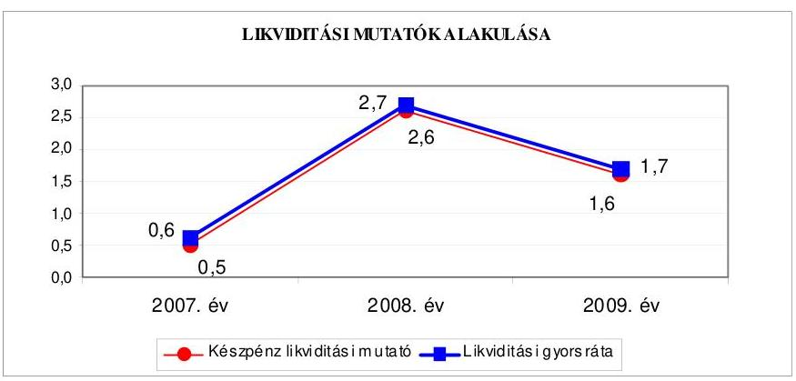

Az Önkormányzat pénzügyi helyzete 2007-2009 között fizetőképességének kedvező változása ellenére összességében kedvezőtlenül alakult, amit az eladósodási mutató és az adósságszolgálati ráta emelkedése jelez.

[^0]
[^0]:    ${ }^{30}$ A likviditási gyorsráta mutatja, hogy a rövid lejáratú fizetési kötelezettségek kiegyenlítéséhez a pénzeszközökön túl bevonható követelések, forgatási célú értékpapírok milyen arányban nyújtanak fedezetet.

---

# 2. Az ÖNKORMÁNYZAT FELKÉSZÜLTSÉGE AZ EURÓPAI UNIÓs FORRÁSOK IGÉNYLÉSÉRE, FELHASZNÁLÁSÁRA, A TÁMOGATOTT CÉLKITŰZÉS MEGVALÓSÍTÁSÁRA, MŰKÖDTETÉSÉRE, VALAMINT AZ ELEKTRONIKUS KÖZSZOLGÁLTATÁSI FELADATOK ELLÁTÁSÁRA 

2.1. Az európai uniós források igénybevételére, felhasználására, a támogatott célkitűzés megvalósítására, működtetésére történt felkészülés szabályozottságának, szervezettségének, valamint egy támogatási szerződésben foglalt célkitűzés megvalósításának, működtetésének eredményessége

### 2.1.1. Az európai uniós forrásokra történő pályázatok benyújtására vonatkozó döntések összhangja fejlesztési célkitűzésekkel

Az Önkormányzat a 2007-2010. évekre vonatkozó fejlesztési célkitűzéseit a gazdasági programban, ágazati, szakmai koncepciókban, tervekben ${ }^{31}$ határozta meg.

#### Abstract

A gazdasági programban a sajátos nevelési igényű gyermekeket, tanulókat ellátó intézményhálózat és az oktatási eszközök fejlesztését, a pedagógiai szakszolgálat racionalizálását, a Kórház teljes körű rekonstrukciójának megvalósítását, az intézmények akadálymentesítését, a gyermekintézmények szakmai munkájának továbbfejlesztését, a szakképzési rendszer átalakítását, az intézmények szolgáltatási kínálatának piaci igényekhez igazodó bővítését határozták meg. Döntöttek a Megyei Könyvtár szakmai fejlesztéséről, a turizmus szerepének előretörésével összhangban a meglévő természeti és műemléki adottságok kiaknázásáról, a Múzeumi Szervezet egységeinek fejlesztéséről, élményszerűségének növeléséről, valamint - a kialakított nemzetközi kapcsolatrendszerre alapozva - a megyét érintő két Eurorégió működésének új alapokra történő helyezéséről, a külföldi testvérmegyei kapcsolatok fenntartásáról. Rögzítették a területrendezési tervben a szlovák-magyar viszonylatú közös fejlesztések előkészítését, megvalósítását, a nemzetközi kapcsolatok programban a határon átnyúló, valamint megyék közötti együttműködések ${ }^{32}$ fejlesztését, projektekben való részvételt. A közoktatási fejlesztési tervben részletes célokat fogalmaztak meg a tankötelezettség végéig tartó nevelés, oktatás, a megye egészére kiterjedő szakmai szolgáltatási feladatok,

[^0]
[^0]:    ${ }^{31}$ A fejlesztési célkitűzésekről szóló döntéseket az Önkormányzat Nógrád Megye Területrendezési Tervéről szóló 29/2005. (XII. 1.) számú rendelete, a Közgyűlés 2008-2010. évekre vonatkozó nemzetközi kapcsolatok programjáról szóló 26/2008. (II. 14) számú, a Nógrád Megyei közoktatási feladat-ellátási, intézményhálózat-működtetési és fejlesztési terv 2008-2014. évekre vonatkozó módosításairól szóló 124/2008. (XI. 27.) számú, valamint Nógrád Megye Önkormányzatának középtávú ifjúságpolitikai koncepciójáról szóló 63/2005. (V. 26.) számú határozatai tartalmazzák.
    ${ }^{32}$ a HU-SK., a Kassa, Besztercebánya, Borsod-Abaúj-Zemplén és Nógrád megyék közötti együttműködés, az „INTERREG III. A" pályázatok nyomon követése, a Neogradiensis Eurorégió Nógrád Megyei Térségfejlesztési Programja folyamatos megvalósítása

---

a fogyatékos gyermekek óvodai, iskolai kollégiumi ellátása, valamint a szakmai középfokú oktatás, felnőtt és egyéb oktatás, kollégiumi ellátás területein.

A gazdasági programban, az ágazati, szakmai koncepciókban, tervekben a fejlesztési célkitűzések meghatározásánál a megvalósítás lehetséges pénzügyi forrásaként figyelembe vették a hazai pályázati lehetőségek mellett az európai uniós pályázati forrásokat. A Közgyűlés - az éves költségvetési rendeletei végrehajtásához kapcsolódóan - határozatokban döntött az európai uniós forrásokra benyújtandó pályázatokhoz szükséges projektek, tervek előkészítéséről, valamint azok saját forrásának biztosításához a kötelezettségvállalás módjáról.

Az Önkormányzat a 2007-2010. I. negyedévében gazdasági programban, ágazati, szakmai tervekben, koncepciókban megfogalmazott fejlesztési célkitűzései megvalósításához európai uniós forrásokra - önálló, illetve partnerként való részvétellel - pályázatok benyújtásáról döntött.

Az Önkormányzat az éves költségvetési rendeletekben döntési jogkörrel a Közgyűlés elnökét felhatalmazta - utólagos tájékoztatási kötelezettség mellett - a pályázatok benyújtására és a saját forrás ${ }^{33}$ biztosítására, továbbá előírta az önkormányzati támogatást igénylő intézményi pályázatok benyújtásának feltételeként a Közgyűlés elnökének előzetes jóváhagyását, az önkormányzati támogatást nem igénylő szakmai pályázatokban való részvétel esetében pedig az intézményvezetők önálló döntési jogkörét.

A 2007-2010. I. negyedév között benyújtott pályázatok közül 49 támogatásban részesült, 18 pályázatot elutasítottak, 22 pályázat elbírálása folyamatban volt. A támogatott fejlesztési feladatokból 17 befejeződött, további három megvalósult, azonban a záró elszámolása nem készült el, 27 kivitelezése folyamatban volt, kettő támogatási szerződést még nem kötöttek meg. Az európai uniós forrásokra benyújtott 89 pályázat megvalósításának - a 2007-2010. évekre - tervezett összes költsége 5722,4 millió Ft volt, amely finanszírozását 88,6%-ban európai uniós forrásból, 3,0%-ban hazai támogatásból, 8,4%-ban saját pénzeszközökből tervezték. A pályázatok 55,1%-a (49 pályázat) támogatásban részesült, amelyek 1280,8 millió Ft tervezett kiadását 84,8%-ban európai uniós és 8,9%-ban hazai támogatás, 6,3%-ban saját forrás finanszírozta. A pályázatok 20,2%-a - hét esetben a pályázati források hiánya, öt esetben tartalmi, formai hibák, négy esetben szakmai kidolgozatlanság, továbbá két esetben egyéb ok ${ }^{34}$ miatt - nem részesült támogatásban. Az Önkormányzat a támogató döntése után saját forrás hiánya, vagy más indok miatt nem vonta vissza pályázatát. A 2007-2010. évek európai uniós forrásokkal támogatott célok és programok tervezett és teljesített adatait programonként a 4. számú melléklet, az elbírálás alatt lévő pályázatokat a 4/a. számú melléklet, a benyújtott és elutasított pályázatokat pedig a 4/b. számú melléklet tartalmazza.

[^0]
[^0]:    ${ }^{33}$ Az Önkormányzat az éves költségvetési rendeletei 4. számú mellékleteiben határozta meg az európai uniós forrásokra benyújtott pályázatok tervezett saját forrásait.
    ${ }^{34}$ A pályázatok elutasításának egyéb okai voltak: a HU-SK pályázat esetén a szlovák oldali tevékenységek aránya alacsony volt, a Leonardo program támogatási szerződését határidőben nem írták alá.

---

A támogatott pályázatok 12,2%-a az NFT, a 36,7%-a az ÚMFT, míg az 51,1%-a az egyéb közösségi kezdeményezések programjaihoz kapcsolódott. Az oktatási intézmények európai uniós forrást igénylő támogatott pályázataiban a legnagyobb részarányt - 24,0%-ot - az „Egész életen át tartó tanulás" közösségi program Comenius ${ }^{35}$ és Leonardo ${ }^{36}$ elnevezésű alprogramjai képviselték.

A 2007-2010. évi költségvetési rendeletek -
 az Áht. 69. § (1) bekezdésében foglaltaknak megfelelően – tartalmazták az európai uniós forrásokkal támogatott fejlesztési feladatok bevételi és kiadási előirányzatait, valamint a felújítási előirányzatokat célonként és a felhalmozási kiadásokat feladatonként. Nem mutatták be a 2007–2010. évi költségvetési rendeletekben az Ámr. 29. § (1) bekezdés g) és k) pontjaiban ${ }^{37}$ foglaltak ellenére a költségvetési előterjesztésekben teljes körűen a többéves kihatással járó európai uniós forrásból megvalósuló fejlesztési feladatok ${ }^{38}$ előirányzatait éves bontásban, valamint önkormányzati szinten elkülönítetten az európai uniós forrásból finanszírozott támogatással megvalósuló programok, projektek ${ }^{39}$ bevételeit és kiadásait.

Az Önkormányzat 2010. évi költségvetési rendeletét módosította ${ }^{40}$, amely tartalmazta a többéves kihatással járó európai uniós támogatás igénybevételével megvalósuló feladatok előirányzatait éves bontásban – azonban három projekt esetében a 2011. évi kihatását nem rögzítette –, továbbá nem mutatta be egy európai uniós támogatással megvalósuló projekt bevételeit és kiadásait ${ }^{41}$.
${ }^{35}$ A Comenius közoktatási alprogram célja, hogy hozzájáruljon a közoktatás minőségének fejlődéséhez, erősítse annak együttműködésen alapuló európai dimenzióját, illetve segítse a nyelvtanulást.
${ }^{36}$ A Leonardo alprogram célkitűzései a szakoktatás, szakképzés és mobilitás vonzóbbá tétele, a szakoktatási és szakképzési rendszerek és gyakorlatok minőségi javításának támogatása, a szakképzéseken és továbbképzéseken részt vevők támogatása volt.
${ }^{37}$ a 2010. évtől az Ámr. ${ }_{2}$ vonatkozó előírásai a 36. § (1) bekezdés h) és l) pontjai
${ }^{38}$ A 2007–2009. évi költségvetési rendeletek 6. számú mellékleteiben a többéves kihatással járó európai uniós forrásból megvalósuló fejlesztési feladatok nem szerepeltek, a 2010. évi költségvetési rendelet hat projektet nem tartalmazott.
${ }^{39}$ A 2007–2008. évi költségvetési rendeletek 12. számú melléklete a 2007. évben négy, a 2008. évben kilenc európai uniós támogatással megvalósuló programok, projektek bevételeit és kiadásait nem tartalmazta. A 2009. évi költségvetési rendelet mellékletében tíz, a 2010. évben hét projekt esetében elkülönítetten nem mutatták be az európai uniós támogatással megvalósuló programok, projektek bevételeit és kiadásait.
${ }^{40}$ az Önkormányzat 13/2010. (V. 3.) számú rendeletével
${ }^{41}$ A közbenső egyeztetés során a Közgyűlés elnöke és a főjegyző írásban adott tájékoztatása szerint az Önkormányzat 2010. évi költségvetésének III. számú módosításában (18/2010. (VI. 25.) – az Ámr. ${ }_{2}$ 36. § (1) bekezdés h) és l) pontjaiban foglaltaknak megfelelően – bemutatta a többéves kihatással járó feladatok előirányzatait éves bontásban, továbbá elkülönítetten az európai uniós forrással támogatott programok bevételeit és kiadásait.

---

Az Önkormányzat 2007–2009 között európai uniós forrással támogatott, befejezett fejlesztési feladatainál a finanszírozási források tervezett és teljesített megoszlását a következő ábra mutatja:
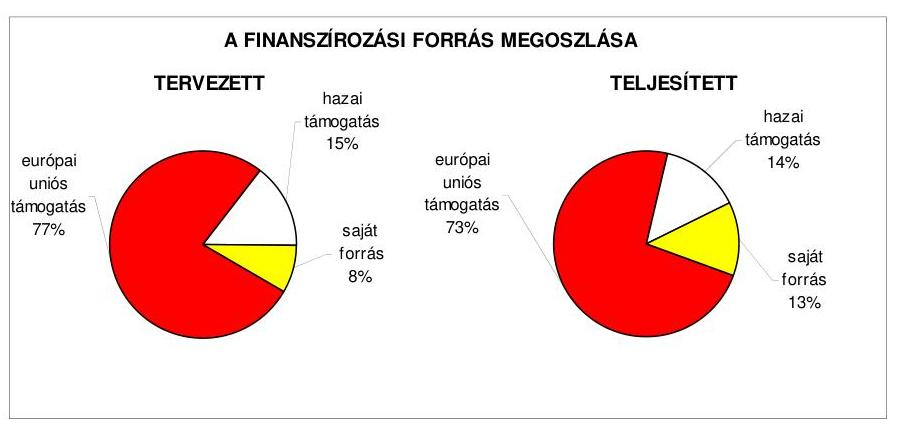

Az európai uniós forrásokkal támogatott befejezett fejlesztési feladatok a tervezett költségvetési kiadásokhoz viszonyítva – 5,2%-kal, 29 millió Ft-tal – magasabb összegben valósultak meg. A kiadások finanszírozási forrásösszetételében az európai uniós támogatás aránya 4,0 százalékponttal, a hazai támogatás aránya 1,0 százalékponttal csökkent, míg a saját forrás részaránya 5,0 százalékponttal emelkedett. Kilenc projekt, program ${ }^{42}$ a tervezetthez képest 3–157,1%-kal magasabb – a közbeszerzési eljárás eredményeként megkötött vállalkozási szerződések összegei meghaladták a tervezett kiadást, valamint az egyéb közösségi kezdeményezések keretében megvalósult programok árfolyam-növekedése többletkiadást okozott –, két projekt ${ }^{43}$ 1–9%-kal alacsonyabb kiadással teljesült.

[^0]
[^0]:    ${ }^{42}$ A két HEFOP, három ÉMOP és négy egyéb közösségi kezdeményezés támogatásával megvalósult programok teljesített kiadásai meghaladták a tervezettet.
    ${ }^{43}$ A HEFOP 2.2.1 Képzési program a gyermek- és ifjúságvédelem területén dolgozó szociális szakemberek részére és a HEFOP 4.3 Térségi Regionális diagnosztikai és szűrőközpont kialakítása Nógrád Megyében projektek teljesített kiadása a tervezetthez képest 1,2–2,4 millió Ft-tal alacsonyabb összegű volt.

---

# 2.1.2. Az európai uniós forrásokhoz kapcsolódóan a pályázatfigyelés, a pályázatkészítés, valamint az európai uniós támogatással megvalósuló fejlesztés lebonyolításának belső rendje, a végrehajtás és az ellenőrzés szervezettsége 

Az európai uniós források igénybevételének és felhasználásának feladatait a 2007–2010. I. negyedévében, az ügyrend ${ }_{1-2}$-ben, a gazdasági szervezet ügyrendjében, az ellenőrzési nyomvonalban, a pályázati szabályzat ${ }_{1-2}$-ban, valamint a köztisztviselők munkaköri leírásaiban előírták. A Közgyűlés határozataiban ${ }^{44}$ évente meghatározta a köztisztviselők éves teljesítménykövetelmények alapjául szolgáló célokat, amelyekben rögzítette az európai uniós pályázatok figyelemmel kísérését, igénybevételét és a projektek lebonyolítási, teljesítési kötelezettségét.

Az ügyrend ${ }_{1-2}$ tartalmazta az Önkormányzati, Jogi és Humánszolgáltatási, és a Beruházási Főosztályok, valamint a gazdasági szervezet európai uniós források igénybevételével és felhasználásával összefüggő – pályázatfigyelési, javaslattételi, előkészítési, pályázatkészítési, koordinálási, megvalósítási, lebonyolítási, műszaki ellenőrzési, elszámolási, utóellenőrzési – feladatait, valamint a köztisztviselők munkaköri leírásaiban ${ }^{45}$ a pályázatokhoz – esetenként konkrét, európai uniós pályázatokhoz – kapcsolódó feladatokat a főjegyző meghatározta. A gazdasági szervezet ügyrendjében a pályázatfigyelést, a lebonyolításban, a pénzügyi elszámolásban való részvételi kötelezettséget, az ellenőrzési nyomvonalban a beruházási, felújítási feladatokhoz kapcsolódó ellenőrzési jogköröket, felelősöket – Beruházási Főosztály és a gazdasági szervezet vezetői – rögzítették. A pályázati szabályzat ${ }_{1-2}$ tartalmazta a Beruházási Főosztály feladataként az önkormányzati pályázati feladatok szervezését, a pályázatok összeállításában, benyújtásában való részvételi kötelezettségét, „a pályázatok folyamatos gondozását”, a tervezett tartalomnak megfelelő teljesítés ellenőrzését. Rögzítette továbbá az információszolgáltatási feladatokat, a főosztályok, az intézmények javaslattételi kötelezettséget a döntésre jogosultak – a Közgyűlés, a Közgyűlés elnöke, intézményvezetők – részére.

Az Önkormányzatnál az ügyrend ${ }_{1-2}$-ben, a Beruházási Főosztály köztisztviselői munkaköri leírásaiban meghatározták az európai uniós forrásokra vonatkozó pályázatokkal összefüggő az önkormányzati szintű pályázatkoordinálás feladatait, felelőseit, azonban nem írták elő a pályázatok önkormányzati szintű nyilvántartása vezetésének kötelezettségét és módját. A pályázati szabályzat ${ }_{2}$ 2010. májusi módosításakor rögzítették a pályázatok önkormányzati szintű nyilvántartási kötelezettségét és annak módját.

[^0]
[^0]:    ${ }^{44}$ A Közgyűlés a 127/2007. (XII. 19.) számú, a 137/2008. (XII. 18.) számú és a 116/2009. (XII. 17.) számú határozataiban döntött a köztisztviselők éves teljesítménykövetelményeiről.
    ${ }^{45}$ A pályázatok figyelésével, készítésével és a fejlesztési feladatok lebonyolításával összefüggő feladatokat az Önkormányzati hivatalban 13 fő köztisztviselő munkaköri leírása tartalmazott.

---

A pályázatfigyelést végzők és a döntési, illetve a döntés előterjesztési jogkörrel rendelkezők közötti információszolgáltatási kötelezettség teljesítésének rendjét az ügyrend ${ }_{1-2}$ és – a 2009. évtől – a pályázati szabályzat ${ }_{1-2}$ határozta meg.

A pályázati szabályzat ${ }_{1-2}$ tartalmazta a Beruházási Főosztálynak a pályázatfigyeléssel kapcsolatos feladatait, amely szerint összegyűjti, értékeli, rendezi a pályázati lehetőségeket és a pályázat benyújtására javaslatot tesz. Az ügyrend ${ }_{1-2}$-ben előírták az aktuális pályázati lehetőségekről vezetői értekezlet keretében – heti rendszerességgel – a főosztályvezetők beszámolási kötelezettségét, amelyekről a főjegyző a Közgyűlés elnökének tájékoztatást nyújtott.

A pályázatfigyelés, a pályázatkészítés, valamint az európai uniós forrással támogatott fejlesztések lebonyolításával kapcsolatos eljárás rendjét az ügyrend ${ }_{1-2}$ és a pályázati szabályzat ${ }_{1-2}$, az ezzel összefüggő feladatokat a köztisztviselők munkaköri leírásai tartalmazták.

A pályázati szabályzat ${ }_{1-2}$-ban a pályázatfigyelési, az előkészítési-, a pályázatké-szítési- és a lebonyolítási feladatokat meghatározták. Előírták a pályázat koordinátora részére a főosztályokkal, a VÁTI Kht-vel, az ellenőrző szervezetekkel való együttműködést, kapcsolattartást, az adat- és információszolgáltatási kötelezettséget, a projekt megvalósítás ellenőrzését, a felelősséget „a pályázatok folyamatos gondozásáért”. A pályázatok pénzügyi feladatainak ellátásában – forrásigénylés, pénzügyi elszámolás – a gazdasági szervezet feladatait az ügyrend ${ }_{1-2}$-ben szabályozták. Az eljárási rendre vonatkozó lebonyolítással, kapcsolattartással, információszolgáltatással, ellenőrzéssel kapcsolatos feladatokat, a köztisztviselők felelősségét a munkaköri leírások tartalmazták, valamint a projektmenedzseri feladatokkal a munkaköri leírások kiegészítésre kerültek.

Az európai uniós források igénylésével és felhasználásával összefüggő pályázatfigyelés, pályázatkészítés és a fejlesztési feladatok lebonyolításának személyi és szervezeti feltételeit az Önkormányzati hivatalban kialakították, külső személyt, szervezetet ezen feladatok ellátására nem bíztak meg. A feladatok végrehajtásában az Önkormányzati, Jogi és Humánszolgáltatási Főosztály hét, a Beruházási Főosztály négy, valamint a gazdasági szervezet két köztisztviselője vett részt.

A 2007–2009. évi belső ellenőrzési éves terveket megalapozó kockázatelemzés nem, azonban a 2010. évi kiterjedt az európai uniós forrásokkal támogatott fejlesztési feladatokra.

# 2.1.3. Egy támogatási szerződésben foglalt célkitűzés megvalósítása, működtetése 

Az Önkormányzat – az ÉMOP-4.2.2 „Utólagos akadálymentesítés az önkormányzati feladatokat ellátó intézményekben” felhívásra benyújtott és támogatott pályázata alapján – a „Borbély Lajos SzSzK akadálymentesítése” fejlesztési feladat megvalósítására a Közgyűlés elnöke a VÁTI Kht-vel 2008. szeptember 16-án támogatási szerződést kötött. A pályázat és a támogatási szerződés jellemzői adatait a jelentés 5. számú melléklete tartalmazza.

A projekt fejlesztési célja az oktatási intézmény fizikai és infokommunikációs akadálymentesítésével elérhető közszolgáltatás (szakmai középfokú oktatás, fel-

---

nőtt és egyéb oktatás, kollégiumi ellátás) megvalósítása, illetve a fogyatékkal élők közszolgáltatásokhoz való egyenlő esélyű hozzáférésének biztosítása volt. Ezen túl a támogatási szerződésben rögzítették az akadálymentesített intézményben alkalmazott két fő megváltozott munkaképességű munkavállalónak a fenntartási időszak (hat év) végéig történő foglalkoztatását. A projekt hosszú távú célkitűzése volt a mozgásukban, látásukban, hallás és egyéb készségekben akadályozott fiatalok és felnőttek számára elérhetővé tenni az intézményi közszolgáltatásokat, valamint a szakmai képzések társadalmi és munkaerő piaci szükségletekhez igazodó kialakítását.

A projekt műszaki célja volt az oktatási intézmény háromemeletes főépületének, a földszintes éttermi-, közlekedő-, tornatermi- és tanműhely szárnyának fizikai és infokommunikációs akadálymentesítése, az ötemeletes diákotthoni szárny földszinti részének az intézményépület gazdasági bejárati kapun történő, belső parkoló felőli megközelítésének akadálymentessé tétele, a bejárati akadálymentes rámpa és egy mozgáskorlátozottak részére is alkalmas felvonó telepítése.

# Az Önkormányzat a „Borbély Lajos SzSzK akadálymentesítése” fejlesztési feladatra előírt fejlesztési célt a támogatási szerződésben előírt tartalommal és határidőben – 2009. augusztus 30. – teljesítette. 

Az Önkormányzat a „Borbély Lajos SzSzK akadálymentesítése” fejlesztési feladat megvalósítására a támogatási szerződésben 30,6 millió Ft kiadást tervezett, amely 46,2 millió Ft-ra teljesült, a többletköltségek fedezetének biztosítását az Önkormányzat külön nyilatkozatban vállalta.

Az Önkormányzat a fejlesztési feladat megvalósítására a pályázat benyújtásakor (2007. év) a tervezői költségvetés alapján 28,8 millió Ft kiadást tervezett, a 2009. évi közbeszerzési eljárás eredményeként a legalacsonyabb összegű ajánlat 45,8 millió Ft, továbbá a műszaki ellenőrzés díja 0,4 millió Ft volt. A vállalkozási szerződést 2009. február 25-én kötötték meg, amelyet egy alkalommal módosítottak – 2009. június 25-én –, a pénzügyi-műszaki ütemezést két szakaszról háromra változtatták.

A belső ellenőrzés nem vizsgálta az európai uniós forrásból támogatott cél megvalósulását. A VÁTI Kht. az európai uniós forrással támogatott fejlesztési célkitűzés megvalósítását három alkalommal – a kivitelezés megkezdése előtt, a megvalósítás folyamatában, valamint a befejezést követően – a helyszínen ellenőrizte ${ }^{46}$, amely során szabálytalanságra, visszafizetési kötelezettségre vonatkozó megállapítást nem tett. A helyszíni ellenőrzés jegyzőkönyvében rögzített észrevételek a műszaki feladatok elvégzésére ${ }^{47}$, a záró program előrehaladási jelentés és a záró kifizetési kérelem hiányainak pótlására, valamint a jogerős használatbavételi engedély beszerzésére, a beruházás nyilvántartásba vételére vonatkoztak. A főjegyző intézkedett és 2009. november 27-én a VÁTI Kht.
 részére teljesítette a hiánypótlási kötelezettségét. Az Önkormányzat a projekt befejezését követően gondoskodott az akadálymentesítést

[^0]
[^0]:    ${ }^{46}$ A VÁTI Kht. 2008. szeptember 4-én, 2009. június 16-án és 2009. október 15-én helyszíni ellenőrzést végzett.
    ${ }^{47}$ Az ellenőrzés során a VÁTI Kht. a műszaki tervben szereplő teljes infokommunikációs akadálymentesítés (lépcsők, valamint főbejárati lépcsők festése) megvalósítását írta elő.

---

tett iskolai épület fenntartásáról, a közszolgáltatások elérhetőségéről. A felvonó működtetésére karbantartási szerződést ${ }^{48}$ kötöttek, amelynek költségeit az intézmény 2010. évi költségvetése tartalmazta. Az akadálymentesített intézményben dolgozó megváltozott munkaképességű munkavállalók száma 2008. június 2-től két főről három főre növekedett.

Az Önkormányzat 2007-2009 között eredményesen készült fel belső szabályozottság és szervezettség terén az európai uniós források igénybevételére és felhasználására, továbbá megvalósította az egy ellenőrzött projekt támogatási szerződésében foglalt fejlesztési célkitűzést. A gazdasági programban, az ágazati, szakmai koncepciókban, tervekben megfogalmazott fejlesztési célkitűzésekhez kapcsolódtak az európai uniós támogatások, szabályozták a pályázatfigyelést végzők és a döntési, illetve a döntés-előterjesztési jogkörrel rendelkezők közötti információszolgáltatási kötelezettséget. Az Önkormányzati hivatal szervezetén belül biztosították a pályázatfigyelés, a pályázatkészítés és a fejlesztési feladat lebonyolításának szervezeti és személyi feltételeit, a fejlesztési feladat lebonyolítását végző köztisztviselő munkaköri leírásában előírták az ellenőrzési kötelezettséget, valamint a támogatási szerződésben rögzített határidőre - a „Borbély Lajos SzSzK akadálymentesítése" fejlesztési feladat - fejlesztési célkitűzését megvalósították. A 2007-2009. évi belső ellenőrzési éves terveket megalapozó kockázatelemzés nem, a 2010. évi azonban kiterjedt az európai uniós forrásokkal támogatott fejlesztési feladatokra.

# 2.2. Az elektronikus közszolgáltatás feltételeinek kialakítása 

Az Önkormányzat rendelkezett a 2007-2010. évekre vonatkozó informatikai stratégiával, amelyben helyzetelemzésre alapozva meghatározták az önkormányzati informatika fejlesztésének közép- és hosszú távú céljait és feladatait.

Az informatikai stratégia helyzetelemzése rögzítette, hogy az Önkormányzati hivatal nem rendelkezett megfelelő színvonalú informatikai infrastruktúrával, a feladatokat elkülönülten működő alkalmazásokkal végezték, az informatika nem támogatta a Közgyűlés és a bizottságok munkáját, feladatait több szabályzat írta elő, valamint tartalmazta az informatikai támogatást igénylő feladatok felmérését. Az informatikai stratégia jövőképe az önkormányzati munkát támogató, internet és intranet alapon belső és külső szolgáltatásokat nyújtó, fokozatosan kiépíthető és biztonságosan üzemeltethető elektronikus önkormányzat képét vázolta fel, amely megvalósításához az önkormányzati forrásokon túl pályázati források bevonását is számításba vette.

Az informatikai stratégiában nem határozták meg a közép- és hosszú távon elérni kívánt elektronikus szolgáltatási szintet és az annak érdekében megvalósítandó feladatokat. Az informatikai stratégiában megfogalmazottak alapján kiépítették az Önkormányzati hivatal informatikai hálózatát és kialakították az Önkormányzat honlapját ${ }^{49}$. Az informatikai stratégiában rögzítet-

[^0]
[^0]:    ${ }^{48}$ A Borbély Lajos SzSzK igazgatója 2009. augusztus 13-án, 54-B-2594-1/2009. szám alatt rendszer-karbantartási szerződést kötött.
    ${ }^{49}$ az Önkormányzat honlapjának címe: http://megye.nograd.hu

---

ték annak évenkénti felülvizsgálata szükségességét, erre azonban jóváhagyását követően nem került sor ${ }^{50}$.

Az Önkormányzat 2007-2009 között nem nyújtott be pályázatot az e-közszolgáltatások kiépítése, fejlesztése érdekében az ÁROP vagy az EKOP keretében meghirdetett támogatások igénybe vételére.

Az e-közszolgáltatási feladatok ellátásának személyi feltételeit az Önkormányzati hivatalon belül biztosították, az önkormányzati honlap üzemeltetésével, fenntartásával és karbantartásával kapcsolatos technikai feladatok ellátási feltételeit vállalkozási szerződés keretében alakították ki. Az Önkormányzat az e-közszolgáltatási feladatokat saját informatikai eszközeivel, saját fejlesztésű alkalmazások segítségével látta el.

A vállalkozási szerződésben rögzítették, hogy az önkormányzati honlap tartalommal való feltöltését a megbízó Önkormányzat végzi a vállalkozó által biztosított karbantartási felületen keresztül. A vállalkozó feladata volt az internetes honlap üzemeltetése, a fenntartáshoz szükséges technikai feltételek megvalósítása, a honlap karbantartása, az Önkormányzati hivatal és az intézmények számára az elektronikus levelezés feltételeinek biztosítása, valamint a Nógrád megyei települések számára megjelenési felület - az Önkormányzat tulajdonában lévő http://települések/nograd.hu című honlap számára tárterület - biztosítása és annak üzemeltetése.

Az Önkormányzat 2007-2010 között nem hozott az elektronikus ügyintézést kizáró rendeletet.

Az Önkormányzat honlapján keresztül működtetett e-közszolgáltatási informatikai rendszer a 2009. évben a lakosság, illetve a vállalkozások részére az e-közszolgáltatásokat az 1. elektronikus szolgáltatási szinten biztosította, mivel tájékoztatást nyújtott az egyes intézményi térítési díjak, illetve közszolgáltatások igénybevétele tekintetében, továbbá információkkal szolgált az Önkormányzat által meghirdetett pályázatokkal, ifjúsági és sportrendezvényekkel és a helyi befektetési lehetőségekkel kapcsolatosan. A magasabb elektronikus szolgáltatási szintek eléréséhez a program fejlesztése és a pénzügyi feltételek biztosítása szükséges. Az e-közszolgáltatást ellátó informatikai rendszer ügyfelek általi igénybevételét nem kísérték figyelemmel és annak tapasztalatait nem értékelték ${ }^{51}$. A honlap látogatottságáról az alkalmazott program statisztikát készít.

[^0]
[^0]:    ${ }^{50}$ A közbenső egyeztetés során a Közgyűlés elnöke és a főjegyző írásban adott tájékoztatása szerint az éves költségvetés előkészítésekor, várhatóan a koncepció összeállítása során az informatikai stratégiát felülvizsgálják és aktualizálják. Az igények változása, valamint a rendelkezésre álló források, pénzügyi lehetőségek függvényében a közép- és hosszú távon elérendő elektronikus szolgáltatási szintet meghatározzák.
    ${ }^{51}$ A közbenső egyeztetés során a Közgyűlés elnöke és a főjegyző írásban adott tájékoztatása szerint az Önkormányzati hivatal számítástechnikai feladataival megbízott munkatárs feladata az e-közszolgáltatást nyújtó informatikai rendszer igénybevételének folyamatos figyelemmel kísérése és tapasztalatainak értékelése, amelyről az éves tevékenységének értékelése során be kell számolnia.

---

Az Önkormányzatnál kialakították a közérdekű adatok honlapon történő elektronikus közzétételének feltételeit, az önkormányzati honlap megnyitásakor látható „Közérdekű adatok" elnevezésű hivatkozással a 18/2005. (XII. 27.) IHM rendelet 1. számú mellékletében előírt tagolásnak megfelelően elérhetők voltak a közzétételi egységek, illetve az azokra mutató hivatkozások. Az államháztartással összefüggő közérdekű adatok közzétételével ${ }^{52}$, illetve az önkormányzati honlap gondozásával ${ }^{53}$ kapcsolatos feladatokat a Közgyűlés elnöke és a főjegyző együttes rendelkezéseiben szabályozták. Előírták a közzéteendő adatok és információk körét, kijelölték az adatok szolgáltatásáért felelős személyeket, valamint meghatározták a közzétett adatok karbantartásának, azok illetéktelen megváltoztatása megakadályozásának és az adatok archiválásának rendjét és felelőseit. A szabályozás nem terjedt ki az Önkormányzat intézményei közérdekű adatainak az Önkormányzat honlapján való közzétételének előírására és a közzétételt biztosító adatszolgáltatás rendjének és felelőseinek meghatározására.

Az Önkormányzat az Áht. 15/A. § (2) bekezdése alapján a Közgyűlés 2007-2009. évi költségvetési rendeleteiben rögzítette a 200 ezer Ft-ot elérő vagy meghaladó támogatásoknak a döntést követő 60 napon belüli közzétételére vonatkozó előírást, továbbá azt, hogy minden támogatás közzétételére - a 200 ezer Ft alattiakra is - az adott évi beszámoló keretében kerül sor.

A főjegyző az Áht. 15/A. § (1) bekezdésében foglaltaknak megfelelően a 2009. évben gondoskodott az Önkormányzat által nyújtott nem normatív, céljellegű működési és fejlesztési támogatások kedvezményezettjei nevének, a támogatás céljának, összegének, továbbá a támogatási program megvalósítási helyének a honlapon történő közzétételéről. Az Önkormányzat intézményei a 2009. évben nem nyújtottak nem normatív, céljellegű működési és fejlesztési támogatásokat.

A főjegyző az Áht. 15/B. § (1) bekezdésében foglaltaknak megfelelően a 2009. évben gondoskodott az Önkormányzati hivatal pénzeszközei felhasználásával, a vagyonnal való gazdálkodással összefüggő - a nettó ötmillió Ft-ot elérő vagy azt meghaladó értékű építési beruházásra és szolgáltatás megrendelésére vonatkozó - szerződések megnevezésének, tárgyának, a szerződést kötő felek nevének, a szerződés értékének, határozott időre kötött szerződések esetében annak időtartamának és az adatok változásainak közzétételéről.

A 2009. évben az intézmények pénzeszközeinek felhasználásával, a vagyonnal való gazdálkodással összefüggő - a nettó ötmillió Ft-ot elérő vagy azt meghaladó értékű, árubeszerzésre, építési beruházásra, szolgáltatás megrendelésére

[^0]
[^0]:    ${ }^{52}$ A Közgyűlés elnöke és a főjegyző az államháztartással összefüggő közérdekű adatok közzé-, illetve hozzáférhetővé tételéről szóló 3/2003. számú - 2003. december 18-tól hatályos - együttes rendelkezése, amelyet 3/2009. szám alatt - 2009. március 31-ei hatállyal - módosítottak.
    ${ }^{53}$ A Közgyűlés elnöke és a főjegyző az Önkormányzat honlapjának gondozásával összefüggő feladatokról szóló 2/2003. számú - 2003. november 3-tól hatályos - együttes rendelkezése, amelyet 10/2009. szám alatt 2009. március 31-i hatállyal módosítottak.

---

vonatkozó - szerződései meghatározott adatainak közzétételénél az esetek 80%-ánál megsértették az Eisz. tv. 3. § (2) bekezdésében foglaltakat, mivel a szerződések meghatározott adatait - az önálló honlappal nem rendelkező intézmények szerződéseinek kivételével - nem az Önkormányzat honlapján a „Közérdekű adatok" menüpont alatt, hanem az önálló honlappal rendelkező intézmények saját honlapján tették közzé.

Az önálló honlappal nem rendelkező Egységes Gyógypedagógiai Módszertani Intézmény, valamint az Ipolypart Ápoló, Gondozó Otthon és Rehabilitációs Intézet közzétételi kötelezettség alá tartozó szerződéseit a 2009. évben az Önkormányzat honlapján közzétették.

A főjegyző 2010. május 21-én kelt levelében intézkedett az intézmények felé, amely szerint az elmúlt öt év vonatkozásában a nettó ötmillió forintot elérő vagy azt meghaladó értékű árubeszerzés, építési beruházás, szolgáltatás megrendelésére vonatkozó szerződések adatait legkésőbb 2010. május 31-ig, majd azt követően a szerződés létrejöttét követő 60 napon belül az Önkormányzati hivatal részére továbbítsák az Önkormányzat honlapján történő közzététel érdekében, továbbá szabályozta az intézményi adatszolgáltatás rendjét és kijelölte felelőseit.

A főjegyző gondoskodott a 2008. évi költségvetési beszámoló szöveges indoklásának - az Ámr. ¹ 22. számú mellékletének 1.2. pont 5. alpontjában foglaltak alapján ¹⁴ - közzétételéről, azonban annak tartalma nem felelt meg az Áhsz. 40. § (7)-(8) bekezdéseiben előírtaknak, mert a költségvetési beszámoló szöveges indoklása nem tartalmazta az európai uniós és egyéb támogatási programok keretében beérkezett pénz- és egyéb eszközök, továbbá az azokkal kapcsolatban felhasznált saját költségvetési források alakulását, az előirányzatok teljesítését befolyásoló tényezőket, valamint a közalapítványok, alapítványok, társadalmi szervezetek által ellátott feladatokra teljesített kifizetések, illetve a térítésmentesen juttatott eszközök értékének részletes felsorolását. A főjegyző a 2009. évi költségvetési beszámoló szöveges indoklását az Önkormányzat honlapján az Ámr. ² 22. számú mellékletének és az Áhsz. 40. § (7)-(8) bekezdéseinek megfelelő tartalommal tette közzé ${ }^{55}$.

# 3. A KÖLTSÉGVETÉSI GAZDÁLKODÁS BELSŐ KONTROLLJAI 

### 3.1. A költségvetés tervezés, a gazdálkodás és a zárszámadás készítés folyamatában végrehajtandó belső kontrollok kialakítása

Az Önkormányzati hivatalnál a költségvetés tervezési és a zárszámadás-készítési folyamatok szabályozottsága alacsony kockázatot jelentett

[^0]
[^0]:    ${ }^{54}$ A közérdekű adatok közzétételére vonatkozó előírást 2010. január 1-jétől az Ámr. ² 233. § (1) bekezdés tartalmazza.
    ${ }^{55}$ Az Önkormányzat 2009. évi költségvetési beszámolójának szöveges indoklása 2010. május 18-tól megtekinthető az Önkormányzat honlapján.

---

a feladatok megfelelő, szabályszerű végrehajtásában, mivel a főjegyző a FEUVE rendszer keretében szabályozta a költségvetési tervezés és a zárszámadás elkészítés rendjét. Meghatározta az intézmények részére a költségvetési javaslat összeállításával kapcsolatos követelményeket, előírta a költségvetés tervezéséhez készített intézményi mutatószámok adatai megalapozottságának, az intézmények által az állami támogatásokkal, hozzájárulásokkal történő elszámoláshoz közölt mutatószámok adatai megbízhatóságának, az intézményi pénzmaradványok szabályszerűségének, továbbá az intézményi számszaki beszámolók belső, valamint annak a Közgyűlés által meghatározott adatszolgáltatással való összhangjának ellenőrzését.

Az Önkormányzati hivatalban a 2009.
 évben a gazdálkodási, a pénzügyi-számviteli és a folyamatba épített ellenőrzési feladatok szabályozottsága összességében alacsony kockázatot ${ }^{56}$ jelentett a feladatok megfelelő, szabályszerű végrehajtásában, mivel az önkormányzati SzMSz függelékét képező ügyrend ${ }_{1-2}$-ben szabályozták a gazdasági szervezet felépítését és tevékenységét. A FEUVE rendszer keretében elkészítették a gazdasági szervezet ügyrendjét, amely részletesen tartalmazta a gazdasági szervezet feladatait, a vezetők és a pénzügyi-gazdasági feladatok ellátásáért felelős alkalmazottak feladat-, hatás-, és felelősségi körét. A Közgyűlés elnöke és a főjegyző együttes rendelkezésben szabályozta a pénzügyi-gazdálkodási hatáskörök gyakorlásának rendjét. A főjegyző kialakította az Önkormányzati hivatal számviteli rendjét, a FEUVE-val kapcsolatos szabályozást és eljárási rendet az ellenőrzési nyomvonal, a szabálytalanságok kezelésének szabályozása és a kockázatkezelés rendjének elkészítésével biztosította, valamint kiadta a pénzügyi-gazdasági, számviteli területen foglalkoztatott köztisztviselők munkaköri leírását. Annak ellenére összességében alacsony volt a kockázat, hogy az ügyrend ${ }_{1-2}$, valamint a számlarend nem felelt meg az előírt tartalmi követelményeknek, nem rendelkeztek önköltség-számítási szabályzattal, valamint az ellenőrzési nyomvonal nem tartalmazta az egyes tevékenység, feladat elvégzését igazoló dokumentum fellelési helyét a rendszerben.

A főjegyző 2010. áprilisában ${ }^{57}$ kiegészítette az ügyrend ${ }_{2}$-et és a számlarendet az előírt tartalmi elemekkel, valamint az ellenőrzési nyomvonalban rögzítette az egyes dokumentumok fellelési helyét a rendszerben, továbbá elkészítette az önköltség-számítási szabályzatot.

A gazdálkodási, a pénzügyi-számviteli és a folyamatba épített ellenőrzési feladatok szabályozottsága javult a 2009. évre az ÁSZ által az Önkormányzat gazdálkodási rendszerének 2005. évben végzett átfogó ellenőrzése során tett javaslatok hasznosítása következtében, mivel a főjegyző kiegészítette a leltározási szabályzatot az üzemeltetésre átadott eszközök leltározásának szabályaival, meghatározta a követelések és kötelezettségek egyeztetési feladatait, a kötelezettségvállalási szabályzatban az 50 ezer Ft-ot el nem érő kifizetések kötelezettségvállalásának rendjét.

Az Önkormányzati hivatal rendelkezett a 2007-2010. évekre vonatkozó, a főjegyző által jóváhagyott informatikai stratégiával. Egységes informatikai biztonsági szabályzatot nem készítettek, az informatikai rendszerek alkalmazásával kapcsolatos biztonsági, adatvédelmi, adatkezelési, vagyonvédelmi és katasztrófa-elhárítási előírásokat külön-külön szabályzatok tartalmazták, amelyeket a főjegyző léptetett hatályba. Az informatikával kapcsolatos szabályozás megismerését az érintett dolgozók aláírásukkal igazolták. A pénzügyi-számviteli feladatoknál használt adatok az Önkormányzati hivatal informatikai hálózatán elérhetőek voltak. A gazdasági szervezet által használt munkaállomások az informatikai rendszeren belül elkülönült alhálózatot képeztek, amelyet csak az arra jogosult dolgozók használhattak, az adatállományok az Önkormányzati hivatal más munkaállomásairól nem voltak elérhetők. Az Önkormányzati hivatalnál integrált pénzügyi-számviteli informatikai rendszert nem vezettek be, ASP szolgáltatást nem vettek igénybe, a gazdálkodási feladatokat programok támogatásával végezték.

A pénzügyi-számviteli tevékenységhez kapcsolódó informatikai feladatok szabályozottsága összességében alacsony kockázatot jelentett az informatikai feladatok megfelelő, szabályszerű végrehajtásában, mivel az Önkormányzati hivatal rendelkezett aktualizált katasztrófa-elhárítási tervvel és az informatikai hozzáférési jogosultságokra vonatkozó eljárásrenddel, valamint a pénzügyi és számviteli rendszerből az ellenőrzési lista lekérhető volt, azonban az ellenőrzési lista vizsgálatáért felelős dolgozót nem jelölték ki. A főjegyző 2010. április hónapban a számlarendben és az érintett köztisztviselők munkaköri leírásában rögzítette a pénzügyi-számviteli informatikai rendszerekből lekérhető ellenőrzési lista vizsgálatának feladatát.

# 3.2. A belső kontrollok működtetése a költségvetés tervezés, a gazdálkodás, és a zárszámadás készítés folyamataiban 

A 2009. évi költségvetés és a 2008. évi zárszámadás készítés folyamatában a működésbeli hibák megelőzésére, feltárására, kijavítására kialakított belső kontrollok működésének megfelelősége kiváló volt, mivel az Önkormányzati hivatalnál az előírásoknak megfelelően ellenőrizték a költségvetési javaslat összeállításával kapcsolatban a költségvetési intézmények részére meghatározott követelmények teljesítését. Vizsgálták a költségvetési igények megalapozottságát, valamint az ismert kötelezettségek megtervezését az Önkormányzati hivatalnál és az intézményeknél. A szabályozásban foglaltaknak megfelelően ellenőrizték a költségvetési tervezéshez készített intézményi mutatószám-felmérés adatainak megalapozottságát, a saját bevételek (intézményi térítési díjak, egyéb szolgáltatási díjak) előirányzatai és a költségvetés megalapozását szolgáló helyi rendeletek összhangját, a zárszámadáshoz közölt intézményi mutatószámok megbízhatóságát, az intézményi pénzmaradványok megállapításának szabályszerűségét, az intézményi számszaki beszámolók belső, valamint a Közgyűlés által meghatározott adatszolgáltatással való összhangját.

---

Az Önkormányzati hivatal a 2009. évi elemi költségvetésében a működési célú pénzeszközátadások államháztartáson kívüli kifizetéseinek fedezetére 36,4 millió Ft eredeti és 39,3 millió Ft módosított előirányzatot tervezett, a 2009. évi teljesített kiadás 37,4 millió Ft volt. Felhalmozási célú pénzeszközátadást államháztartáson kívülre a 2009. évi elemi költségvetés eredeti előirányzatai között nem terveztek, amelyet 0,2 millió Ft-ra módosítottak, amely teljesült. Az államháztartáson kívülre átadott pénzeszközök kiadásaiból a működési célú pénzeszköz-átadások tervezett eredeti előirányzata 100%-ot, a módosított előirányzat 99,5%-ot, a teljesítés 99,5%-ot képviselt, a felhalmozási célú pénzeszközátadás módosított előirányzata és teljesítése egyaránt 0,5%-os volt. Az Önkormányzati hivatal a 2010. évi elemi költségvetésében 34,2 millió Ft működési célú államháztartáson kívüli pénzeszköz-átadást tervezett, felhalmozási célú pénzeszközátadás nem szerepelt a tervezett kiadások között. A 2009. évi előirányzatok felhasználása során a támogatási szerződésekben ${ }^{58}$ és megállapodásokban meghatározott célok összhangban voltak az Ötv. 8. § (1) bekezdésében meghatározott önkormányzati feladatokkal.

Az Önkormányzati hivatalnál a 2009. évben a működési és felhalmozási célú pénzeszközátadások államháztartáson kívülre teljesített kiadások teljesítése során a szakmai teljesítésigazolás és az utalvány ellenjegyzés működésének megfelelősége kiváló volt ${ }^{59}$, mivel a kulturális és sportrendezvények, társadalmi és sportegyesületek működésének támogatásával kapcsolatos kiadások jogosultságának és összegszerűségének ellenőrzését a szakmai teljesítés igazolására a főjegyző által kijelölt személyek - a kötelezettségvállalási szabályzatban előírt módon - elvégezték. Az utalványok ellenjegyzői a gazdálkodásra vonatkozó szabályok érvényesüléséről, továbbá a szakmai teljesítés igazolás és az érvényesítés elvégzéséről meggyőződtek.

Az Önkormányzati hivatalnál a 2009. évi elemi költségvetésben az állományba nem tartozók megbízási díjainak kifizetéseire 9,4 millió Ft eredeti és 22,6 millió Ft módosított előirányzatot terveztek, az eredeti előirányzat 2,2%-os, a módosított előirányzat 5,6%-os részarányt képviselt a személyi juttatások előirányzatából. A teljesített 0,6 millió Ft kiadás elmaradt a módosított előirányzattól és 0,2%-a volt a személyi juttatások előirányzatának. Az Önkormányzati hivatal elemi költségvetésében a 2010. évre állományba nem tartozók megbízási díjaira 14,4 millió Ft kiadást terveztek, amelynek részesedése 2,3%-ot tett ki a személyi juttatások előirányzatából. A 2009. évi előirányzatok felhasználása

[^0]
[^0]:    ${ }^{58}$ A megfelelőségi teszt elvégzése során ellenőrzött államháztartáson kívülre teljesített működési célú pénzeszköz-átadásokkal az Önkormányzat kulturális, sport, egyházi és különböző társadalmi, egyesületi rendezvényeket, illetve ilyen tevékenységeket végző szervezeteket támogatott.
    ${ }^{59}$ A kontrollok működésének megfelelőségét kiválónak értékeltük abban az esetben, ha azok működése - esetleges kisebb, az egységesen meghatározott követelményrendszerben foglalt mértéket el nem érő hiányosságoktól eltekintve - megfelelt a hibák megelőzésére és kijavítására meghatározott szabályozásnak és a legmagasabb szintű elvárásoknak.

---

során a megbízási szerződésekben ${ }^{60}$ meghatározott célok összhangban voltak az Önkormányzati hivatal által ellátott feladatokkal.

Az Önkormányzati hivatalnál a 2009. évben az állományba nem tartozók megbízási díjaival kapcsolatos kiadások teljesítése során a szakmai teljesítés igazolás és az utalvány ellenjegyzés működésének megfelelősége kiváló volt, mivel a tolmácsolással, kiadvány-készítéssel és lektorálással kapcsolatos megbízási szerződésekben foglalt feladatok teljesítésének szakmai igazolását, a kiadások jogosultságának, összegszerűségének ellenőrzését a főjegyző által kijelölt személyek a kötelezettségvállalási szabályzatban előírt módon elvégezték. Az utalványok ellenjegyzői a gazdálkodásra vonatkozó szabályok érvényesüléséről, továbbá a szakmai teljesítés igazolás és az érvényesítés elvégzéséről meggyőződtek.

Az Önkormányzati hivatalnál a 2009. évi elemi költségvetésben a külső szolgáltatók által végzett karbantartási, kisjavítási szolgáltatások kifizetéseire 15,4 millió Ft eredeti és 39,2 millió Ft módosított előirányzatot terveztek, a 2009. évi teljesített kiadás 2,1 millió Ft volt ${ }^{61}$. A dologi kiadások 2009. évi tervezett kiadásaiból a külső szolgáltató által végzett karbantartási, kisjavítási szolgáltatások eredeti előirányzata 5,9%-os, a módosított előirányzat 11,2%-os, a teljesítés 1,6%-os részarányt képviselt. Az Önkormányzati hivatal 2010. évi elemi költségvetésében külső szolgáltató által végzett karbantartási, kisjavítási szolgáltatások kifizetéseire 19,1 millió Ft kiadást terveztek, amelynek részesedése 6,3%-ot tett ki a dologi kiadások előirányzatából. A 2009. évi előirányzatok felhasználása során a kötelezettségvállalások (szerződések, megrendelések) tárgya ${ }^{62}$ összhangban volt az Önkormányzati hivatal által ellátott feladatokkal.

Az Önkormányzati hivatalnál a 2009. évben a külső szolgáltatók által végzett karbantartási, kisjavítási szolgáltatásokkal kapcsolatos kiadások teljesítése során a szakmai teljesítés igazolás és az utalvány ellenjegyzés működésének megfelelősége kiváló volt, mivel a gépjárművek és irodagépek karbantartására vonatkozó megrendelésekben, illetve szerződésekben meghatározott feladatok teljesítésének szakmai igazolását, a kiadások jogosultságának, összegszerűségének ellenőrzését a főjegyző által kijelölt személyek a kötelezettségvállalási szabályzatban előírt módon elvégezték. Az utalványok ellenjegyzői a gazdálkodásra vonatkozó szabályok érvényesüléséről, továbbá a szakmai teljesítésigazolás és az érvényesítés elvégzéséről meggyőződtek.

[^0]
[^0]:    ${ }^{60}$ A megfelelőségi teszt elvégzése során ellenőrzött állományba nem tartozók megbízási díjainak kifizetései tolmácsolási, kiadvány-készítési és lektorálási, valamint szakértői véleményezési feladatok ellátására irányultak.
    ${ }^{61}$ Az Önkormányzati hivatalnál a külső szolgáltatók által végzett karbantartási, kisjavítási szolgáltatások módosított előirányzata tartalmazta az intézmények évközben jelentkező, a vis major feladatokhoz kapcsolódó előirányzatát, amelyet az igények hiánya miatt nem használtak fel.
    ${ }^{62}$ A megfelelőségi teszt elvégzése során ellenőrzött külső szolgáltató által végzett karbantartási, kisjavítási szolgáltatások kifizetései önkormányzati gépkocsik és irodagépek karbantartási feladatainak ellátására irányultak.

---

Az Önkormányzati hivatalnál a belső kontrollok működésének megfelelősége kiváló volt, mivel a működési és felhalmozási célú pénzeszközátadásokkal, az állományba nem tartozók megbízási díjaival, valamint a külső szolgáltatók által végzett karbantartási, kisjavítási szolgáltatásokkal kapcsolatos kifizetések során a szerződésekben, megrendelésekben, megbízási szerződésben meghatározott feladatok teljesítésének szakmai igazolását, a kiadások jogosultságának, összegszerűségének ellenőrzését a szakmai teljesítésigazolásra a főjegyző által kijelölt személyek a kötelezettségvállalási szabályzatban előírt módon elvégezték. Az utalványok ellenjegyzői meggyőződtek a gazdálkodásra vonatkozó szabályok érvényesüléséről, továbbá ellenőrizték a szakmai teljesítésigazolás és az érvényesítés megtörténtét.

Az Önkormányzati hivatalban a 2009. évben a pénzügyi-számviteli tevékenységhez kapcsolódó informatikai feladatoknál a kialakított belső kontrollok működésének megfelelősége jó volt ${ }^{63}$, mivel biztosították a hozzáférési jogosultságokra vonatkozó nyilvántartás teljes körű és naprakész vezetését, ellenőrizhetőségét, valamint a pénzügyi-számviteli program elemeire vonatkozó változás-kezelési eljárásokat és az adatállományok biztonságos megőrzését, elvégezték a belső szabályozásban foglalt ellenőrzési és egyeztetési feladatokat, azonban az elmúlt két évben nem tesztelték a katasztrófa-elhárítási tervet, a hiányos szabályozás miatt nem végezték el a jelszavak időközönkénti cseréjét, és nem ellenőrizték az elmentett adatállományokból a pénzügyi-számviteli adatok teljes körű helyreállíthatóságát. A
 feltárt hiányosságok nem veszélyeztették az informatikai rendszerek megbízható működését. A főjegyző 2010. áprilisában kiegészítette a hozzáférési jelszavakra vonatkozó szabályozást a jelszavak érvényességi idejének előírásával, valamint 2010. májusában elvégeztette a pénzügyi és számviteli programok adatainak az elmentett adatállományokból való helyreállíthatóságának ellenőrzését és a katasztrófa-elhárítási terv tesztelését.

# 3.3. A belső ellenőrzési kötelezettség teljesítése 

Az Önkormányzat a belső ellenőrzési feladatok ellátására az Ötv. 92. § (7) bekezdésében foglaltaknak megfelelően a főjegyzőnek közvetlenül alárendelt belső ellenőrzési egységet - Ellenőrzési csoportot - hozott létre, amelyet három fő létszámmal működtetett.

A belső ellenőrzés szervezeti kereteinek kialakítása és szabályozása a belső ellenőrzési feladatok megfelelő, szabályszerű végrehajtásában összességében alacsony kockázatot jelentett, mivel a belső ellenőrzési kötelezettséget, az Ellenőrzési csoport jogállását és feladatait az önkormányzati SzMSz-ben meghatározták, a belső ellenőrök funkcionális függetlenségét biztosították, a belső ellenőrzési kézikönyvet a főjegyző jóváhagyta, a belső ellenőrzés rendelkezett stratégiai tervvel és éves ellenőrzési tervvel, az ellenőrzések lefolytatásához ellenőrzési programokat készítettek. Annak ellenére összességében ala-

[^0]
[^0]:    ${ }^{63}$ Jónak minősítettük a kontrollok működését, ha a megállapított kisebb (tolerálható mértékű) hiányosságok nem veszélyeztették az ellenőrzött terület hibáinak megelőzését és kijavítását.

---

csony volt a kockázat, hogy a 2009. évi belső ellenőrzési tervet alátámasztó kockázatelemzés az Önkormányzati hivatal és az intézmények tekintetében nem terjedt ki az európai uniós forrásból megvalósított feladatok végrehajtására és a közbeszerzési eljárások lebonyolítására, továbbá az ellenőrzési programokat a belső ellenőrzési vezető helyett - a Ber. 23. § (3) bekezdésében foglaltak ellenére - a főjegyző, illetve az aljegyző hagyta jóvá ${ }^{64}$.

A 2010. évben az Önkormányzati hivatal és az intézmények tekintetében az éves ellenőrzési tervet megalapozó kockázatelemzés kiterjedt az európai uniós forrásból megvalósított feladatok végrehajtására és a közbeszerzési eljárások lebonyolítására.

A Pénzügyi Ellenőrző bizottság által jóváhagyott ${ }^{65}$ - a 2009. és a 2010. évekre vonatkozó - belső ellenőrzési terveket a 2008-2011. évekre vonatkozó stratégiai tervben szereplő célkitűzésekkel összhangban készítették el. A 2009. évi belső ellenőrzési tervet megalapozó kockázatelemzésben magas kockázatúnak értékelték az Önkormányzati hivatalban a FEUVE rendszer működését, a működés és a gazdálkodás szabályszerűségén belül a dolgozók szabadság-igénybevételi rendszerét, valamint a pénzkezelés rendjét, az intézményeknél a gazdálkodás szabályszerűségére ható tényezőket ${ }^{66}$, amelyek ellenőrzését a 2009. évi belső ellenőrzési tervben tervezték. Az Önkormányzati hivatalnál a 2010. évi belső ellenőrzési tervet megalapozó kockázatelemzésben magas kockázatúnak értékelt területek - a céljelleggel nyújtott támogatások, az Önkormányzati képviselők számára kifizetett juttatások - ellenőrzése szerepelt. A 2010. évi belső ellenőrzési tervet megalapozó kockázatelemzésben három intézménynél magas kockázatúnak értékelt területek - a rendszer összetettsége, az előző ellenőrzés óta eltelt időtartam és annak negatív minősítésű értékelése - ellenőrzését tervezték.

Az Önkormányzati hivatalban a 2009. évi belső ellenőrzési tervben két szabályszerűségi ellenőrzést - a FEUVE rendszer működésének, az Önkormányzati hivatal köztisztviselőinek 2008. évi szabadság igénybevételének vizsgálatát -, és egy pénzügyi ellenőrzést - az Önkormányzati hivatal pénzkezelési rendjének ellenőrzését - terveztek. Az intézményeknél a 2009. évben öt intézménynél ${ }^{67}$ a pénzügyi-gazdasági tevékenység szabályozottságára

[^0]
[^0]:    ${ }^{64}$ Az ÁSZ. tv. 25. § (1) bekezdése alapján a számvevőszéki jelentésre a Közgyűlés elnöke észrevételt tett, amely szerint a főjegyző a belső ellenőrzési vezető munkaköri leírását kiegészítette azzal, hogy jogosult az ellenőrzési program aláírására és jóváhagyására.
    ${ }^{65}$ A Pénzügyi Ellenőrző bizottság - átruházott hatáskörében - a 2009. évi belső ellenőrzési tervet az 5/2008. (XI. 18.) számú, a 2010. évi belső ellenőrzési tervet a 13/2009. (XI. 12.) számú határozatokkal hagyta jóvá.
    ${ }^{66}$ A belső ellenőrzési tervet megalapozó kockázatelemzésben az intézményeknél a 2009. évben magas kockázatúnak értékelték a gazdálkodás szabályszerűségét befolyásoló tényezők közül az átszervezés tényét, a rendszer összetett voltát, az előző ellenőrzés óta eltelt időtartamot és annak negatív minősítésű értékelését.
    ${ }^{67}$ Baglyaskő Idősek Otthona, Dr. Göllesz Viktor Rehabilitációs Intézet és Ápoló Gondozó Otthon, Lipthay Béla Mezőgazdasági Szakképző Iskola és Kollégium, valamint Ellátó Szervezet és a Mikszáth Kálmán Gimnázium

---

irányuló „rendszerellenőrzés”-t, három intézménynél ${ }^{68}$ a közbeszerzési törvény betartásának szabályszerűségi ellenőrzését, és további három intézménynél ${ }^{69}$ az informatikai rendszerek kiépítettségére, azok hatékonyságára vonatkozó ,,informatikai" ellenőrzést terveztek.

A 2010. évi belső ellenőrzési tervben az Önkormányzati hivatalban két szabályszerűségi ellenőrzést - a céljelleggel nyújtott támogatások felhasználása szabályszerűségének, az Önkormányzati képviselők számára kifizetett juttatások elszámolásának vizsgálatát - tervezték. Négy intézménynél ${ }^{70}$ az irányítási, végrehajtási, beszámolási és kontroll folyamatok átfogó „rendszerellenőrzését” - amelyből két vizsgálat utóellenőrzés is volt -, három intézménynél ${ }^{71}$ a közbeszerzési törvény betartására, négy intézménynél ${ }^{72}$ a 2009. évre igényelt normatív állami támogatások elszámolására vonatkozó szabályszerűségi ellenőrzést, hat intézménynél ${ }^{73}$ a racionalizálást, stabilizációt szolgáló intézkedések teljesítményellenőrzését és további két intézménynél ${ }^{74}$ az informatikai rendszerek kiépítettségére, azok hatékonyságára irányuló „informatikai” ellenőrzést terveztek.

Az Önkormányzati hivatalban a 2009. évben a belső ellenőrzés működésénél a kialakított kontrollok megfelelősége jó volt, mivel létrehozták a belső ellenőrzési egységet, az ellenőrzési programok alapján elvégzett (terv szerinti és azon túli) ellenőrzésekkel, a hibák feltárásával, az intézkedések kezdeményezésével és a javaslatok realizálásának ellenőrzésével a belső ellenőrzés hozzájárult a hiányosságok csökkentéséhez. A főjegyző értékelte a belső kontrollok működését és teljesítette nyilatkozattételi kötelezettségét. A Közgyűlés elnöke a költségvetési szervek éves ellenőrzési jelentései alapján készített 2008. és 2009. évi összefoglaló jelentéseket ${ }^{75}$ a Közgyűlés elé terjesztette. A belső ellenőrzési kézikönyv előírása ellenére nem a hatályos kockázatkezelési eljárásrend alapján végezték a magas kockázatúnak értékelt területek értékelését és a Ber. 12. § n) pontjában előírtak ellenére a belső ellenőrzési vezető nem vezetett nyilvántartást az ellenőrzési javaslatokról és az azok alapján megtett intézkedések nyomon követéséről. A belső ellenőrzés működésében megállapított hiányosságok

[^0]
[^0]:    ${ }^{68}$ Borbély Lajos SzSzK, a Múzeumi Szervezet, Rózsavölgyi Márk Alapfokú Művészetoktatási Intézmény
    ${ }^{69}$ Kórház, Váci Mihály Gimnázium, Megyei Levéltár
    ${ }^{70}$ Pedagógiai Intézet, Múzeumi Szervezet, Baglyaskő Idősek Otthona, Ellátó Szervezet
    ${ }^{71}$ Mikszáth Kálmán Gimnázium, Váci Mihály Gimnázium, Megyei Levéltár
    ${ }^{72}$ Baglyaskő Idősek Otthona, Reménysugár Otthon, Egységes Gyógypedagógiai Módszertani Intézmény, Borbély Lajos SzSzK
    ${ }^{73}$ Kórház, Ipolypart Ápoló Gondozó Otthon és Rehabilitációs Intézet, Ezüstfenyő Idősek Otthona, Lipthay Béla Mezőgazdasági Szakképző Iskola és Kollégium, Rózsavölgyi Márk Alapfokú Művészetoktatási Intézmény, valamint a Megyei Gyermekvédelmi Központ
    ${ }^{74}$ Harmónia Rehabilitációs Intézet és Ápoló Gondozó Otthon, Megyei Könyvtár
    ${ }^{75}$ A Közgyűlés a 2008. évi összefoglaló jelentést a 31/2009. (IV. 29.) számú, a 2009. évit a 41/2010. (IV. 29.) számú határozataival fogadta el.

---

nem veszélyeztették, hogy a belső ellenőrzés megelőzze, feltárja, kijavíttassa a lényeges hibákat és szabálytalanságokat.

A 2010. évtől a kockázat értékelést a hatályos kockázatkezelési eljárásrend alapján végezték el, valamint a belső ellenőrzési vezető nyilvántartást vezetett az ellenőrzési javaslatokról és azok alapján megtett intézkedések nyomon követéséről.

A Pénzügyi Ellenőrző bizottság a 2009. évi ellenőrzési tervet három alkalommal - a változások végrehajtását megelőzően - módosította, amelyet az évközi többlet tanácsadói feladatok, a soron kívül elrendelt vizsgálatok elvégzése, valamint a Ber. 2009. szeptemberi változásainak ${ }^{76}$ átvezetése indokolt. Az Ellenőrzési csoport a 2009. évi ellenőrzési tervben foglalt ellenőrzéseket - a magas kockázatúnak minősítetteket is - végrehajtotta. A 2009. évben két terven felüli ellenőrzés volt, ebből egy szabályszerűségi ellenőrzés az Önkormányzati hivatalnál az Elnöki Kabinet ${ }^{77}$ dolgozóira vonatkozóan, a 2008. évi szabadságok igénybevétele témakörben - a terv szerinti ellenőrzéskor ennek az egységnek az ellenőrzése kimaradt -, további egy szabályszerűségi ellenőrzést a Múzeumi Szervezetnél végeztek, amelyet az intézménynél kialakult működési és likviditási válság okainak feltárása indokolt.

A 2010. évi belső ellenőrzési tervben az I. negyedévre ütemezett feladatokat megvalósították. Az Önkormányzati hivatalnál az önkormányzati képviselők és a Közgyűlés bizottságainak nem képviselő tagjai részére fizetett juttatások szabályszerű elszámolása ellenőrzését végezték el. Az intézmények közül a közbeszerzési eljárások szabályszerűségét a Váci Mihály Gimnáziumnál, a pénz-ügyi-gazdasági tevékenység rendjét a Pedagógiai Intézetnél, a 2009. évre igényelt normatív állami támogatások elszámolását négy intézménynél, a 2009-2010. évi költségvetéshez kapcsolódó intézkedések végrehajtásának minősítésére irányuló ellenőrzést hat intézménynél folytattak le ${ }^{78}$.

A 2009. évi és a 2010. I. negyedévi ellenőrzésekről készített jelentések a Ber-ben meghatározott előírásoknak megfeleltek. Az ellenőrzött szervezetek észrevételt nem tettek, intézkedési tervet készítettek. A feltárt hiányosságok megszüntetéséről a belső ellenőrzés utóvizsgálat és a hiányosságok felszámolásáról készített beszámoló keretében győződött meg.

[^0]
[^0]:    ${ }^{76}$ a megbízhatósági ellenőrzés értelmezése
    ${ }^{77}$ Nógrád Megyei Önkormányzati Hivatal Elnöki Kabinet
    ${ }^{78}$ A normatív állami támogatások elszámolását a „Baglyaskő” Idősek Otthona, a Reménysugár Otthona, a Borbély Lajos SzSzK és az Egységes Gyógypedagógiai Módszertani Intézmény, a költségvetéshez kapcsolódó intézkedések végrehajtását az Ipolypart Ápoló Gondozó Otthon és Rehabilitációs Intézet, Ezüstfenyő Idősek Otthona, a Lipthay Béla Mezőgazdasági Szakképző Iskola és Kollégium, a Rózsavölgyi Márk Alapfokú Művészetoktatási Intézmény, valamint a Megyei Gyermekvédelmi Központ intézményekben végeztek.

---

# 4. Az ÁSZ KORÁBBI ELLENŐRZÉSI JAVASLATAI ALAPJÁN KÉSZÍTETT INTÉZKEDÉSI TERV VÉGREHAJTÁSA, HASZNOSÍTÁSA 

### 4.1. Az Önkormányzat gazdálkodási rendszerének átfogó ellenőrzése során tett javaslatok végrehajtására tervezett intézkedések megvalósítása

Az ÁSZ az Önkormányzat gazdálkodási rendszerét a 2005. évben ellenőrizte átfogó jelleggel, amelynek során 12 szabályszerűségi és hat célszerűségi javaslatot tett ${ }^{79}$. A Közgyűlés elnöke az ÁSZ jelentésben foglaltakról a Közgyűlést tájékoztatta és előterjesztette a főjegyző által - a felelős személyek és a határidők megjelölésével - készített intézkedési tervet, amelyet a Közgyűlés 28/2005. (XI. 24.) számú határozatával elfogadott.

Az ÁSZ által tett javaslatokból az intézkedési tervben foglalt határidőre 89% hasznosult, 11% részben teljesült. A szabályszerűségi javaslatok 83%-a teljesült, 17%-a részben hasznosult. A célszerűségi javaslatok 100%-a realizálódott.

## A következő szabályszerűségi javaslatokat valósították meg:

- az Önkormányzat - a jegyző által készített előterjesztés alapján - rendeletben ${ }^{80}$ határozta meg az éves költségvetés előterjesztésekor, illetőleg zárszámadáskor bemutatandó közvetett támogatásokat tartalmazó kimutatás tartalmi követelményeit;
- a Közgyűlés elnöke és a főjegyző a kötelezettségvállalási szabályzatról szóló együttes rendelkezésének módosítása során szabályozta az 50 ezer Ft-ot el nem érő - előzetes írásbeliséget nem igénylő - kötelezettségvállalások rendjét és nyilvántartási formáját;
- a Közgyűlés elnöke körlevélben ${ }^{81}$ intézkedett a kötelezettségvállalások rendjének szabályszerű lebonyolítása érdekében. A főjegyző az ÁSZ javaslatnak megfelelően gondoskodott arról, hogy a kötelezettségvállalást végzők, az utalványok ellenjegyzői, valamint az érvényesítők és a szakmai teljesítést igazolók
 az ellenőrzési feladataikat teljesítsék és a feladat elvégzését igazolják. A működési és felhalmozási célú pénzeszközátadásokkal, az állományba nem tartozók megbízási díjaival, valamint a külső szolgáltatók által végzett karbantartási, kisjavítási szolgáltatásokkal kapcsolatos kifizetések során a szerződésekben, megrendelésekben, megbízási szerződésben meghatározott feladatok teljesítésének szakmai igazolását, a kiadások jogosultságának, összegszerűségének ellenőrzését a szakmai teljesítésigazolásra a főjegyző által kijelölt személyek a kötelezettségvállalási szabályzatban előírt módon elvégezték. Az utalványok ellenjegyzői meggyőződtek a gazdálkodásra vonatkozó szabályok érvényesüléséről, továbbá ellenőrizték a szakmai teljesítésigazolás és az érvényesítés megtörténtét;

- a számviteli politikában a követelések és a kötelezettségek adósokkal, vevőkkel és szállítókkal történő egyeztetését 2005. november 24-től előírták, az egyeztetéseket az éves beszámolók elkészítését megelőzően elvégezték és dokumentálták;
- a Közgyűlés elnöke kezdeményezte a vagyongazdálkodási rendelet módosítását ${ }^{82}$ a nyilvános pályáztatás szabályai alól felmentést adó helyi szabályozás hatályon kívül helyezése és a vagyon térítésmentes átadása eseteinek meghatározása érdekében. A vagyon ingyenes átruházását önkormányzati kötelező és önként vállalt feladatok ellátása érdekében az Önkormányzat intézményei, egyéb gazdálkodó szervezetei, társulásai, illetve „közérdekből a közhasznú szervezetekről szóló mindenkor hatályos jogszabályban felsorolt szervezetek, a Magyar Állam és szervei, az egyházak és más önkormányzatok" részére történő vagyonátadás eseteiben a Közgyűlés döntése alapján tették lehetővé. A vagyon ingyenes átruházására a 2009. évben egy alkalommal, a vagyongazdálkodási rendeletben foglalt előírások betartásával ${ }^{83}$ került sor;
- a Közgyűlés elnöke és a főjegyző együttes rendelkezésben ${ }^{84}$ határozta meg az Önkormányzat pénzeszközeiből céljelleggel nyújtott támogatások formai és tartalmi követelményeit, amelyben előírták a rendeltetésszerű felhasználásról történő számadási kötelezettség teljesítésének és a felhasználás helyszíni ellenőrzésének feladatát, amelyet a gazdasági szervezet köztisztviselői elvégeztek;
- a főjegyző levélben ${ }^{85}$ értesítette az Önkormányzat felügyelete alá tartozó intézményeket éves számszaki beszámolójuk és működésük elbírálásáról, jóváhagyásáról. A főjegyző kezdeményezése alapján a költségvetési és zárszámadási rendelettervezet előterjesztésekor a Közgyűlés részére tájékoztatásul bemutatták a közvetett támogatásokat és a 2006. évi zárszámadási ren-

[^0]
[^0]:    ${ }^{82}$ A vagyongazdálkodási rendelet - ÁSZ javaslatnak megfelelő - módosítását az Önkormányzat a 21/2005. (X. 7.) számú rendeletével fogadta el.
    ${ }^{83}$ Az Önkormányzat a Ludányhalászi belterület 841 hrsz-ú, Rákóczi út 71-73. szám alatti ingatlanon álló régi portaépület tulajdonjogát, a 844 hrsz-ú ingatlan javára történő telekhatár rendezéssel Ludányhalászi Község Önkormányzata részére a Közgyűlés 70/2009. (VI. 25.) számú határozata alapján adta át önkormányzati feladatellátás (a szociális helységek korszerűsítése, illetve akadálymentesítés megvalósítása) céljára.
    ${ }^{84}$ A Közgyűlés elnöke és a főjegyző 5/2005. (VII. 18.) számú együttes rendelkezésének mellékletében rögzítették az Önkormányzat pénzeszközeiből céljelleggel nyújtott támogatásokra vonatkozó szerződés formai és tartalmi követelményeit és az elszámolásra szolgáló dokumentumot.
    ${ }^{85}$ Az intézményeket - a 2007. évi költségvetési beszámolójuk elfogadásáról - a főjegyző a 389-5/2006. iktatószámú levélben értesítette.

---

delettervezet ${ }^{86}$ tartalmazta a többéves kihatással járó döntések szöveges indoklását;

- az Önkormányzat az intézményi beruházásokhoz és felújításokhoz kapcsolódóan 2007-2010. I. negyedév között kiemelt figyelmet fordított a középületek akadálymentes megközelíthetőségének megoldására, amelynek eredményeként ebben az időszakban 10 közintézménynél megvalósult, két közintézményben a 2010. évben az elnyert pályázati forrásokból, két közintézményben saját forrásból folyamatban volt az akadálymentes közlekedés feltételeinek biztosítása, valamint további négy közintézménynél a 2009-2010. években, az akadálymentesítés feltételeinek kialakítására pályázatot nyújtottak be, amelyek elbírálása még nem zárult le.

# A következő szabályszerűségi javaslatokat részben hasznosították: 

- az Önkormányzat által fenntartott 19 intézmény közül egy intézmény - a Kórház - a 2006. évi költségvetés végrehajtása során megsértette az Áht. 93. § (1) bekezdésében, valamint 12/A. § (1) bekezdésében előírtakat, mivel a jóváhagyott költségvetési előirányzaton felül vállalt tárgyévi fizetési kötelezettséget és emiatt a módosított költségvetési előirányzatok főösszegét 0,1%-kal (azon belül a dologi kiadások kiemelt előirányzatát 0,3%-kal, hatmillió Ft-tal) túllépte ${ }^{87}$. A többi 18 intézmény a jóváhagyott előirányzaton belül gazdálkodott;
- a főjegyző gondoskodott az Önkormányzati hivatal által kötött nettó ötmillió Ft-ot elérő vagy meghaladó értékű vagyonértékesítésre, vagyonhasznosításra, szolgáltatás megrendelésére vonatkozó szerződések közzétételéről, amely a 2005. évben az Önkormányzat augusztusi közlönyében ${ }^{88}$, a 2006. évtől az Önkormányzat honlapján megtörtént, azonban az önálló honlappal rendelkező intézmények által kötött szerződések közzétételére - megsértve az Eisz. tv. 3. § (1) bekezdésében foglaltakat - nem az Önkormányzat, hanem az intézmények saját honlapján került sor. A főjegyző 2010 májusában a hiányosság megszüntetése érdekében intézkedett.

## A következő célszerűségi javaslatokat valósították meg:

- a gazdasági szervezet dolgozóinak munkaköri leírását a főjegyző kiegészítette az informatikai programokhoz kapcsolódó feladatokkal;

[^0]
[^0]:    ${ }^{86}$ Az Önkormányzat 2006. évi zárszámadási rendeletének 6. számú melléklete tartalmazta a több év alatt megvalósuló beruházásokat szöveges indoklással, a 10. számú melléklete a 2006. évben biztosított közvetett támogatásokat mutatta be.
    ${ }^{87}$ A közbenső egyeztetés során a Közgyűlés elnöke és a főjegyző írásban adott tájékoztatása szerint intézkedtek a Kórház főigazgatója felé, hogy az intézmény az éves jóváhagyott kiadási előirányzati kereteken belül gazdálkodjon. Ennek érdekében az éves költségvetés várható teljesítési adatainak ismeretében, indokolt esetben - legkésőbb az éves beszámoló irányítószervhez történő megküldésének határidejéig, december 31-i hatállyal - kezdeményezze a saját hatáskörű előirányzat módosításokat.
    ${ }^{88}$ Nógrád Megye Önkormányzatának Közlönye, a Közgyűlés 2005. VIII. 19-én tartott ülésén hozott rendeletei és határozatai 59-61. oldal

---

- a Közgyűlés elnöke kezdeményezte az üzemeltetésre átadott vagyonnal kapcsolatban megkötött szerződések kiegészítését az üzemeltetésre átadott eszközök leltározási szabályainak meghatározásával, amelyet a Közgyűlés határozattal ${ }^{89}$ jóváhagyott. A Közgyűlés elnöke és a főjegyző a gazdálkodási és ellenőrzési jogkörrel felhatalmazottaknak e tevékenységükről szóló beszámolási kötelezettségét a teljesítmény követelményekben írta elő, amely kötelezettségüknek az érintettek az éves teljesítménykövetelmények értékelésekor, dokumentáltan eleget tettek. A Pénzügyi Ellenőrző bizottság - az önkormányzati SzMSz 1/f) mellékletében meghatározott feladataként - vizsgálta a hosszú lejáratú fejlesztési célú hitelkérelmet, illetve annak gazdasági megalapozottságát, az intézményi működési bevételek megalapozottságát, a saját bevételek (intézményi térítési díjak, egyéb szolgáltatási díjak) előirányzatai és a költségvetés megalapozását szolgáló helyi rendeletek összhangját, továbbá a főjegyző a költségvetési rendelet előterjesztése során intézkedett az ismert kötelezettségek fedezeteként az intézmények előző évi pénzmaradványának megtervezésére.

# 4.2. A zárszámadáshoz kapcsolódó (állami hozzájárulások, támogatások igénylésének és felhasználásának ellenőrzése), valamint a további vizsgálatok esetében a megállapítások, javaslatok alapján tett intézkedések 

Az ÁSZ az Önkormányzat gazdálkodási rendszerének 2005. évi átfogó ellenőrzésén túl 2006-2009 között az Önkormányzatnál három vizsgálatot végzett:

- a Magyar Köztársaság 2005. évi költségvetése végrehajtásának ellenőrzése keretében az Önkormányzat beruházásaihoz és rekonstrukcióhoz nyújtott 2005. évi felhalmozási célú támogatások vizsgálatáról készült jelentés a Közgyűlés elnökének egy célszerűségi javaslatot tartalmazott. Az ÁSZ javaslatnak megfelelően a Közgyűlés elnöke a vizsgálat tapasztalatairól a Közgyűlést - annak 2006. május 25-ei ülésén - tájékoztatta;
- az önkormányzati kórházak és bentlakásos intézmények ápolásra, gondozásra fordított pénzeszközei felhasználásának ellenőrzéséről készült jelentésben az ÁSZ a Közgyűlés elnökének öt célszerűségi javaslatot fogalmazott meg, amelyek hasznosítására a Közgyűlés által határozattal ${ }^{90}$ elfogadott, határidőt és felelősöket tartalmazó intézkedési terv készült. A Közgyűlés elnöke 2008. június 9-én kelt levélben kezdeményezte az egészségügyi miniszternél, hogy az I. szintű mozgásszervi rehabilitációs ellátás

[^0]
[^0]:    ${ }^{89}$ A Közgyűlés a 98/2005. (IX. 29.) számú határozatában az üzemeltetésre átadott eszközökre megkötött három szerződést kiegészítette, és 2006. június 30-i határidőre előírta az üzemeltetésre átadott eszközök mennyiségi felvétellel történő leltározásának elvégzését, az ezt követő időszakokra vonatkozóan a szerződésekben a számviteli előírások szerinti mennyiségi felvétellel történő leltározási kötelezettséget rögzítettek.
    ${ }^{90}$ A 2007. évben elvégzett ÁSZ vizsgálat tapasztalatairól készült tájékoztatót, és a hiányosságok felszámolására - határidő és felelős megjelölésével - készített intézkedési tervet a Közgyűlés a 49/2008. (IV. 24.) számú határozatával fogadta el.

---

szempontjából Nógrád Megye lakosságát sorolja be a Nógrád Megyében működő két kórház ellátási kötelezettségébe. A Közgyűlés elnöke írásban ${ }^{91}$ kereste meg a megye kórházait fenntartó önkormányzatok (Pásztó, Balassagyarmat városi önkormányzatok) polgármestereit a betegellátás összehangolásához szükséges intézkedések megtétele érdekében, valamint kezdeményezte ${ }^{92}$, hogy a Közgyűlés vizsgálja felül a megyei szociális szolgáltatástervezési koncepciót annak érdekében, hogy az tartalmazza az időskorúak szociális otthonába várakozók gondozási, ápolási szükségleteinek értékelését, továbbá biztosítson prioritást a végleges működési engedélyekhez szükséges fejlesztési, rekonstrukciós munkák elvégzésére. A színvonalasabb kórházi krónikus és szociális ellátórendszer feltételeinek javítása, illetve az ehhez szükséges többletforrások elérése céljából - az intézkedési tervben - az érintett intézmények vezetőinek feladatául határozták meg a pályázati lehetőségek figyelemmel kísérését, az éves költségvetésben a szükséges saját forrás megtervezését, a műszaki tervek elkészíttetését;

- a Nógrád Megyei Önkormányzatnál a 2008. március 9-én megtartott országos ügydöntő népszavazás lebonyolításához felhasznált pénzeszközök elszámolásának ellenőrzéséről készített jelentésben az ÁSZ a Közgyűlés elnöke részére egy célszerűségi, a főjegyzőnek hét szabályszerűségi és egy célszerűségi javaslatot tett. A javaslatok hasznosítása érdekében a Közgyűlés elnöke az ÁSZ vizsgálat tapasztalatairól a Közgyűlést annak 2009. március 27-i ülésén tájékoztatta, egyúttal előterjesztette a határidő és felelős megjelölésével készített intézkedési tervet, amelyet a Közgyűlés a 20/2009. (III. 27.) számú határozatával elfogadott. Ez alapján a főjegyző intézkedett, hogy a költségvetési rendelettervezet benyújtási határidejéig ismertté vált népszavazási és választási feladatokhoz kapcsolódó bevételek és kiadások tervezése a biztosított források összegéig, a népszavazáshoz biztosított normatív támogatásból teljesített kiadásokkal a költségvetési előirányzatok módosítása az előírt határidőben megtörténjen, továbbá a kötelezettségvállalást végzők, az utalványok ellenjegyzői, valamint az érvényesítők és a szakmai teljesítést igazolók az ellenőrzési feladataikat teljesítsék és a feladat elvégzését igazolják.

Az ÁSZ által az Önkormányzat gazdálkodásának 2005. évi átfogó ellenőrzése, valamint a 2006-2009. években végzett további ellenőrzések során tett szabályszerűségi és célszerűségi javaslatok - az intézkedési tervekben foglalt határidőre - összességében 94%-ban hasznosultak, 6%-ban részben teljesültek. Az Önkormányzatnál a 2005. év óta végzett ÁSZ ellenőrzések során tett javaslatok hasznosulásának megoszlását a következő ábra szemlélteti:

[^0]
[^0]:    ${ }^{91}$ A Közgyűlés elnöke az ÁSZ jelentésben javasolt szakmai egyeztetés céljából a 2008. május 19-én kelt, 528-3/2008. iktatószámú levélben kereste meg a pásztói, valamint a balassagyarmati városi önkormányzatok polgármestereit.
    ${ }^{92}$ A

 Közgyűlés a megyei szolgáltatástervezési koncepció felülvizsgálatát a 2008. június 26-i és a 2008. szeptember 25-ei ülésein is megtárgyalta.

---

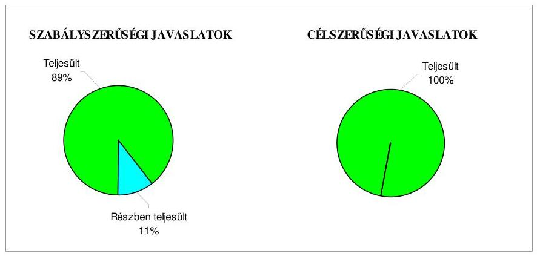

Az Önkormányzat gazdálkodási rendszerének 2005. évi átfogó ellenőrzése, valamint az önkormányzati kórházak és bentlakásos intézmények ápolásra, gondozásra fordított pénzeszközei felhasználásának, továbbá a 2008. március 9-én megtartott országos ügydöntő népszavazás lebonyolításához felhasznált pénzeszközök elszámolásának ellenőrzéséhez kapcsolódóan tett ÁSZ javaslatok végrehajtása eredményeként javult a pénzügyi-számviteli feladatellátás szabályozottsága, végrehajtása, a költségvetési gazdálkodási és ellenőrzési jogkörök gyakorlásának, valamint a vagyongazdálkodási feladatoknak a szabályszerűsége, a közpénzek nyilvánosságának biztosítása, a közintézmények akadálymentes megközelítése, a kórházi krónikus betegellátás színvonala, továbbá a népszavazáshoz és a választási feladatokhoz kapcsolódó bevételi és kiadási előirányzatok tervezésének és felhasználásának szabályszerűsége.

Budapest, 2010. augusztus "
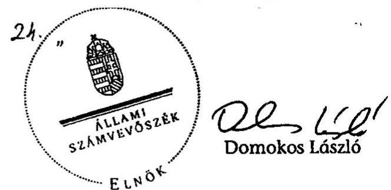

Melléklet: $\quad 10 \mathrm{db} \quad 20$ lap

---

# Nógrád Megyei Önkormányzat 

## Az Önkormányzat gazdálkodását meghatározó adatok, mutatószámok

| Megnevezés |  |
| :--: | :--: |
| A megye állandó lakosainak száma* (fő) 2010. január 1-jén | 172639 |
| A Közgyűlés tagjainak a száma (fő) (2009. december 31-én) | 40 |
| A Közgyűlés munkáját segítő állandó bizottságok száma (2009. december 31-én) | 8 |
| Az Önkormányzati hivatalban foglalkoztatott köztisztviselők száma (fő) (2009. december 31-én) | 54 |
| Az összes vagyon értéke a 2009. december 31-i könyvviteli mérleg szerint (millió Ft) | 16082 |
| Az adósságállomány (hosszú és rövid lejáratú kötelezettség) 2009. december 31-én (millió Ft) | 2960 |
| Az egy lakosra jutó adósságállomány 2009. december 31-én (Ft) | 17146 |
| Az összes 2009. évben teljesített költségvetési bevétel (millió Ft) | 13677 |
| Ebből: saját bevétel (millió Ft), melyből | 3672 |
| illetékbevétel (millió Ft) | 1457 |
| Az egy lakosra jutó 2009. évi költségvetési bevétel (Ft) | 79223 |
| Az egy lakosra jutó 2009. évi saját bevétel (Ft) | 21270 |
| Az egy lakosra jutó 2009. évi illetékbevétel (Ft) | 8440 |
| Saját bevétel/Összes költségvetési bevétel aránya a 2009. évben (%) | 26,8 |
| Illetékbevétel/Összes költségvetési bevétel aránya a 2009. évben (%) | 10,6 |
| Az összes teljesített költségvetési kiadás a 2009. évben (millió Ft) | 11993 |
| Ebből: felhalmozási célú költségvetési kiadás (millió Ft) | 496 |
| A 2009. évi költségvetési kiadásból a felhalmozási célú költségvetési kiadás aránya (%) | 4,1 |
| Az egy lakosra jutó 2009. évi költségvetési kiadás (Ft) | 69469 |
| Az egy lakosra jutó 2009. évben teljesített felhalmozási célú költségvetési kiadás (Ft) | 2873 |
| A költségvetési intézmények száma 2009. december 31-én (db) | 19 |
| Ebből: önállóan működő (db) | 10 |
| A költségvetési intézményekben foglalkoztatott közalkalmazottak száma (fő) (2009. december 31-én) | 2357 |

[^0]
[^0]:    * Megjegyzés: A lakosságszám a megyei jogú város lakosságszáma nélküli adat.

---

# A2 önkormányzati vagyon alakulása

|  Mérlegsor
megnevezése | 2007.év
(millió Ft) | 2008. év
(millió Ft) | 2009. év
(millió Ft) | Változás %-a (Előző év=100\%) |  |   |
| --- | --- | --- | --- | --- | --- | --- |
|   |  |  |  | 2008/2007. | 2009/2008. | 2009/2007.  |
|  Immateriális javak | 75 | 74 | 59 | 98,7 | 79,7 | 78,7  |
|  Tárgyi eszközök | 11926 | 12133 | 11948 | 101,7 | 98,5 | 100,2  |
|  ebből: ingatlanok | 9624 | 10837 | 10859 | 112,6 | 100,2 | 112,8  |
|  beruházások, felújítások | 1110 | 27 | 51 | 2,4 | 188,9 | 4,6  |
|  Befektetett pénzügyi eszközök | 12 | 7 | 6 | 58,3 | 85,7 | 50,0  |
|  Üzemeltetésre átadott eszközök | 1646 | 1615 | 1588 | 98,1 | 98,3 | 96,5  |
|  Befektetett eszközök összesen | 13659 | 13829 | 13602 | 101,2 | 98,4 | 99,6  |
|  Forgóeszközök összesen | 944 | 2745 | 2481 | 290,8 | 90,4 | 262,8  |
|  ebből: követelések | 108 | 87 | 125 | 80,6 | 143,7 | 115,7  |
|  pénzeszközök | 462 | 2283 | 1964 | 494,2 | 86,0 | 425,1  |
|  Eszközök összesen | 14603 | 16574 | 16082 | 113,5 | 97,0 | 110,1  |
|  Saját tőke összesen | 12837 | 11488 | 11408 | 89,5 | 99,3 | 88,9  |
|  Tartalék összesen | 151 | 1940 | 1125 | 1284,8 | 58,0 | 745,0  |
|  Kötelezettségek összesen | 1615 | 3146 | 3549 | 194,8 | 112,8 | 219,8  |
|  ebből: hosszú lejáratú kötelezettségek | 124 | 1660 | 1702 | 1338,7 | 102,5 | 1372,6  |
|  rövid lejáratú kötelezettségek | 886 | 862 | 1258 | 97,3 | 145,9 | 142,0  |
|  Források összesen: | 14603 | 16574 | 16082 | 113,5 | 97,0 | 110,1  |

Forrás: Magyar Államkincstár éves költségvetési beszámoló "01" számú űrlap ÁSZ ellenőrzés során korrigált adatai.

---

# A2 önkormányzati kötelezettségek alakulása

|  Mérlegsor
megnevezése | 2007.év
(millió Ft) | 2008. év
(millió Ft) | 2009. év
(millió Ft) | Változás %-a (Előző év=100\%) |  |   |
| --- | --- | --- | --- | --- | --- | --- |
|   |  |  |  | 2008/2007. | 2009/2008. | 2009/2007.  |
|  Hosszú lejáratú kötelezettségek összesen | 124 | 1660 | 1702 | 1338,7 | 102,5 | 1372,6  |
|  ebből: hosszú lejáratra kapott kölcsönök |  |  |  |  |  |   |
|  tartozások fejlesztési célú kötvénykibocsátásból |  | 1657 | 1700 |  | 102,6 |   |
|  tartozások működési célú kötvénykibocsátásból |  |  |  |  |  |   |
|  beruházási és fejlesztési hitelek | 120 |  |  | 0,0 |  | 0,0  |
|  működési célú hosszú lejáratú hitelek |  |  |  |  |  |   |
|  egyéb hosszú lejáratú kötelezettségek | 4 | 3 | 2 | 75,0 | 66,7 | 50,0  |
|  Rövid lejáratú kötelezettségek összesen | 886 | 862 | 1258 | 97,3 | 145,9 | 142,0  |
|  ebből: rövid lejáratú kölcsönök |  |  |  |  |  |   |
|  rövid lejáratú hitelek | 313 | 409 | 555 | 130,7 | 135,7 | 177,3  |
|  kötelezettségek áruszállításból, szolgáltatásból | 535 | 264 | 605 | 49,3 | 229,2 | 113,1  |
|  garancia- és kezességvállalásból származó köt. |  |  |  |  |  |   |
|  h. lejár. kapott kölcsön köv. évet terh.törl.részl. |  |  |  |  |  |   |
|  felh.c.kötv.kib-ból szárm.tart.köv.évet terh.r. |  |  |  |  |  |   |
|  műk.c.kötv.kib-ból szárm.tart.köv.évet terh.r. |  |  |  |  |  |   |
|  beruh.fejl.hitel köv.évet terhelő törl. részlete | 1 | 150 | 24 | 15000,0 | 16,0 | 2400,0  |
|  működési c.hosszú lej.hitel köv.évet terh.törl.r. |  |  |  |  |  |   |
|  egyéb hosszú lej.köt.köv.évet terh.törl. részlete | 1 | 1 | 2 | 100,0 | 200,0 | 200,0  |

Forrás: Magyar Államkincstár éves költségvetési beszámoló "01" számú űrlap adatai.

---

3. számú melléklet

**Nógrád Megyei Önkormányzat**

**Az Önkormányzat 2007-2010. évi költségvetési előirányzatainak és 2007-2009. évi pénzügyi teljesítéseinek alakulása**

|  Megnevezés | 2007. év |  |  |  | 2008. év |  |  |  | 2009. év |  |  |  | 2010.  |
| --- | --- | --- | --- | --- | --- | --- | --- | --- | --- | --- | --- | --- | --- |
|   | Eredeti | Módosított | Teljesítés
(millió Ft) | Teljesítés/
eredeti
előirány-
zat % | Eredeti | Módosított | Teljesítés
(millió Ft) | Teljesítés/
eredeti
előirány-
zat % | Eredeti | Módosított | Teljesítés
(millió Ft) | Teljesítés/
eredeti
előirány-
zat % | Teljesítés
(millió Ft) | Teljesítés/
eredeti
előirány-
zat %  |
|  Működési célú költségvetési bevételek összesen | 9816 | 10979 | 10960 | 111,6 | 10731 | 12262 | 12279 | 114,4 | 10944 | 11909 | 11814 | 107,9 | 10673  |
|  Működési célú költségvetési kiadások összesen | 10651 | 11414 | 11179 | 105,0 | 11380 | 12389 | 11885 | 104,4 | 11532 | 12112 | 11497 | 99,7 | 11744  |
|  Működési célú költségvetési bevételek és kiadások
egyenlege: hiány-, többlet + | -835 | -435 | -219 | 26,2 | -649 | -127 | 394 |  | -588 | -203 | 317 |  | -1071  |
|  Felhalmozási célú költségvetési bevételek összesen | 1246 | 1298 | 1232 | 98,9 | 1160 | 1294 | 1062 | 91,6 | 1794 | 2076 | 1863 | 103,8 | 1529  |
|  Felhalmozási célú költségvetési kiadások összesen | 1375 | 1453 | 1286 | 93,5 | 1240 | 2950 | 1111 | 89,6 | 1646 | 1954 | 496 | 30,1 | 1529  |
|  Felhalmozási célú költségvetési bevételek és
kiadások egyenlege: hiány-, többlet+ | -129 | -155 | -54 | 41,9 | -80 | -1656 | -49 | 61,3 | 148 | 122 | 1367 | 923,6 | 0  |
|  Költségvetési bevételek összesen | 11062 | 12277 | 12192 | 110,2 | 11891 | 13557 | 13341 | 112,2 | 12738 | 13985 | 13677 | 107,1 | 12102 |

 677 | 107,4 | 12 202  |
|  Költségvetési kiadások összesen | 12 026 | 12 867 | 12 465 | 103,7 | 12 620 | 15 339 | 12 996 | 103,0 | 13 178 | 14 066 | 11 993 | 91,0 | 13 273  |
|  Költségvetési bevételek és kiadások egyenlege: hiány-, többlet+ | -964 | -590 | -273 | 28,3 | -729 | -1 782 | 345 |  | -440 | -81 | 1 684 |  | -1 071  |
|  Finanszírozási célú pénzügyi bevételek | 973 | 599 | 433 |  | 1 043 | 2 096 | 1 939 |  | 999 | 640 | 146 |  | 1 626  |
|  Finanszírozási célú pénzügyi kiadások | 9 | 9 | 9 |  | 314 | 314 | 314 |  | 559 | 559 | 150 |  | 555  |
|  Finanszírozási célú pénzügyi műveletek egyenlege | 964 | 590 | 424 |  | 729 | 1 782 | 1 625 |  | 440 | 81 | -4 |  | 1 071  |

*Forrás: -* a 2007-2008. években a Magyar Államkincstár éves költségvetési beszámoló "80"-as űrlap ÁSZ ellenőrzés során korrigált adatai, a 2009. évben az Önkormányzat 2009. évi nettósított K11 beszámoló "80" számú űrlap adatai;

- a 2010. évi adatok esetében az Önkormányzat 2010. évi költségvetése;
- a költségvetési bevétel-kiadás működési-felhalmozási célra történt megosztásánál az analitikus nyilvántartás.

---

Nápad Megyei Önkormányzat

1. számú osztályát a V-2023-7/33/2018 számú jelentés

TANÚSÍTVÁNY az európai uniós forrásból támogatott célok és programok 2007-2010. évi tervezett és teljesített adatairól

|  |   |   |   |   |   |   |   |   |   |   |   |   |   |   |   |   |   |   |   |   |   |   |   |   |   |   |
| --- | --- | --- | --- | --- | --- | --- | --- | --- | --- | --- | --- | --- | --- | --- | --- | --- | --- | --- | --- | --- | --- | --- | --- | --- | --- |
|  Sor-
szám | Az európai uniós forrásból támogatott program
megnevezése és a pályázat célja |  |  |  |  |  |  |  |  |  |  |  |  |  |  |  |  |  |  |  |  |  |  |  |   |
|   |  |  |  |  |  |  |  |  |  |  |  |  |  |  |  |  |  |  |  |  |  |  |  |  |   |
|   |  |  |  |  |  |  |  |  |  |  |  |  |  |  |  |  |  |  |  |  |  |  |  |  |   |
|   |  |  |  |  |  |  |  |  |  |  |  |  |  |  |  |  |  |  |  |  |  |  |  |  |   |
|   |  |  |  |  |  |  |  |  |  |  |  |  |  |  |  |  |  |  |  |  |  |  |  |  |   |
|   |  |  |  |  |  |  |  |  |  |  |  |  |  |  |  |  |  |  |  |  |  |  |  |  |   |
|   |  |  |  |  |  |  |  |  |  |  |  |  |  |  |  |  |  |  |  |  |  |  |  |  |   |
|   |  |  |  |  |  |  |  |  |  |  |  |  |  |  |  |  |  |  |  |  |  |  |  |  |   |
|  1. |  |  |  |  |  |  |  |  |  |  |  |  |  |  |  |  |  |  |  |  |  |  |  |  |   |
|   |  |  |  |  |  |  |  |  |  |  |  |  |  |  |  |  |  |  |  |  |  |  |  |  |   |
|   |  |  |  |  |  |  |  |  |  |  |  |  |  |  |  |  |  |  |  |  |  |  |  |  |   |
|  2. |  |  |  |  |  |  |  |  |  |  |  |  |  |  |  |  |  |  |  |  |  |  |  |  |   |
|   |  |  |  |  |  |  |  |  |  |  |  |  |  |  |  |  |  |  |  |  |  |  |  |  |   |
|   |  |  |  |  |  |  |  |  |  |  |  |  |  |  |  |  |  |  |  |  |  |  |  |  |   |
|  3. |  |  |  |  |  |  |  |  |  |  |  |  |  |  |  |  |  |  |  |  |  |  |  |  |   |
|   |  |  |  |  |  |  |  |  |  |  |  |  |  |  |  |  |  |  |  |  |  |  |  |  |   |
|   |  |  |  |  |  |  |  |  |  |  |  |  |  |  |  |  |  |  |  |  |  |  |  |  |   |
|   |  |  |  |  |  |  |  |  |  |  |  |  |  |  |  |  |  |  |  |  |  |  |  |  |   |
|   |  |  |  |  |  |  |  |  |  |  |  |  |  |  |  |  |  |  |  |  |  |  |  |  |   |
|   |  |  |  |  |  |  |  |  |  |  |  |  |  |  |  |  |  |  |  |  |  |  |  |  |   |
|   |  |  |  |  |  |  |  |  |  |  |  |  |  |  |  |  |  |  |  |  |  |  |  |  |   |
|   |  |  |  |  |  |  |  |  |  |  |  |  |  |  |  |  |  |  |  |  |  |  |  |  |   |
|   |  | 

 |  |  |  |  |  |  |  |  |  |  |  |  |  |  |  |  |  |  |  |  |  |  |   |
|   |  |  |  |  |  |  |  |  |  |  |  |  |  |  |  |  |  |  |  |  |  |  |  |  |   |
|   |  |  |  |  |  |  |  |  |  |  |  |  |  |  |  |  |  |  |  |  |  |  |  |  |   |
|   |  |  |  |  |  |  |  |  |  |  |  |  |  |  |  |  |  |  |  |  |  |  |  |  |   |
|   |  |  |  |  |  |  |  |  |  |  |  |  |  |  |  |  |  |  |  |  |  |  |  |  |   |
|   |  |  |  |  |  |  |  |  |  |  |  |  |  |  |  |  |  |  |  |  |  |  |  |  |   |
|   |  |  |  |  |  |  |  |  |  |  |  |  |  |  |  |  |  |  |  |  |  |  |  |  |   |
|   |  |  |  |  |  |  |  |  |  |  |  |  |  |  |  |  |  |  |  |  |  |  |  |  |   |
|   |  |  |  |  |  |  |  |  |  |  |  |  |  |  |  |  |  |  |  |  |  |  |  |  |   |
|   |  |  |  |  |  |  |  |  |  |  |  |  |  |  |  |  |  |  |  |  |  |  |  |  |   |
|   |  |  |  |  |  |  |  |  |  |  |  |  |  |  |  |  |  |  |  |  |  |  |  |  |   |
|   |  |  |  |  |  |  |  |  |  |  |  |  |  |  |  |  |  |  |  |  |  |  |  |  |   |
|   |  |  |  |  |  |  |  |  |  |  |  |  |  |  |  |  |  |  |  |  |  |  |  |  |   |
|   |  |  |  |  |  |  |  |  |  |  |  |  |  |  |  |  |  |  |  |  |  |  |  |  |   |
|   |  |  |  |  |  |  |  |  |  |  |  |  |  |  |  |  |  |  |  |  |  |  |  |  |   |
|   |  |  |  |  |  |  |  |  |  |  |  |  |  |  |  |  |  |  |  |  |  |  |  |  |   |
|   |  |  |  |  |  |  |  |  |  |  |  |  |  |  |  |  |  |  |  |  |  |  |  |  |   |
|   |  |  |  |  |  |  |  |  |  |  |  |  |  |  |  |  |  |  |  |  |  |  |  |  |   |
|   |  |  |  |  |  |  |  |  |  |  |  |  |  |  |  |  |  |  |  |  |  |  |  |  |   |
|   |  |  |  |  |  |  |  |  |  |  |  |  |  |  |  |  |  |  |  |  |  |  |  |  |   |
|   |  |  |  |  |  |  |  |  |  |  |  |  |  |  |  |  |  |  |  |  |  |  |  |  |   |
|   |  |  |  |  |  |  |  |  |  |  |  |  |  |  |  |  |  |  |  |  |  |  |  |  |   |
|   |  |  |  |  |  |  |  |  |  |  |  |  |  |  |  |  |  |  |  |  |  |  |  |  |   |
|   |  |  |  |  |  |  |  |  |  |  |  |  |  |  |  |  |  |  |  |  |  |  |  |  |   |
|   |

---

|  |   |   |   |   |   |   |   |   |   |   |   |   |   |   |   |   |   |   |   |   |   |   |   |   |   |   |   |   |   |   |   |   |   |   |   |   |   |   |   |   |   |   |   |   |   |   |   |   |   |   |   |   |   |   |   |   |   |   |   |   |   |   |   |   |   |   |   |   |   |   |   |   |   |   |   |   |   |   |   |   |   |   |   |   |   |   |   |   |   |   |   |   |   |   |   |   |   |   |   |   |   |

---

|  |

 |   |   |   |   |   |   |   |   |   |   |   |   |   |   |   |   |   |   |   |   |   |   |   |   |   |   |   |   |   |   |   |   |   |   |   |   |   |   |   |   |   |   |   |   |   |   |   |   |   |   |   |   |   |   |   |   |   |   |   |   |   |   |   |   |   |   |   |   |   |   |   |   |   |   |   |   |   |   |   |   |   |   |   |   |   |   |   |   |   |   |   |   |   |   |   |   |   |   |   |   |

---

|  |   |   |   |   |   |   |   |   |   |   |   |   |   |   |   |   |   |   |   |   |   |   |   |   |   |   |   |   |   |   |   |   |   |   |   |   |   |   |   |   |   |   |   |   |   |   |   |   |   |   |   |   |   |   |   |   |   |   |   |   |   |   |   |   |   |   |   |   |   |   |   |   |   |   |   |   |   |   |   |   |   |   |   |   |   |   |   |   |   |   |   |   |   |   |   |   |   |   |   |   |   |   |  

---

|  |   |   |   |   |   |   |   |   |   |   |   |   |   |   |   |   |   |   |   |   |   |   |   |   |   |   |   |   |   |   |   |   |   |   |   |   |   |   |   |   |   |   |   |   |   |   |   |   |   |   |   |   |   |   |   |   |   |   |   |   |   |   |   |   |   |   |   |   |   |   |   |   |   |   |   |   |   |   |   |   |   |   |   |   |   |   |   |   |   |   |   |   |   |   |   |   |   |   |   |   |   |   |

---

# TANÚSÍTVÁNY

az európai uniós forrásokra 2007-2010 között benyújtott pályázatokról, amelyek elbírálásáról az Önkormányzat még nem kapott tájékoztatást

|  Sorszám | Az európai uniós forrásokra benyújtott pályázat megnevezése és célja | A benyújtott pályázat számú (móki) fej az összes kiadást finanszírozó források |  |  |  |  |  | Tervezett |   |
| --- | --- | --- | --- | --- | --- | --- | --- | --- | --- |
|   |  | összes kiadás | európai uniós támogatás | Nemzeti állandóáztartási finanszírozás |  |  |  |  |   |
|   |  |  |  | díj Önedi Alap | bélyeg (jegy) | hód | egyéb forrás (pl. napidíj) | kamat | befogadási |
|  1. | UNFT operatív programjai |  |  |  |  |  |  |  | határidő  |
|  2. | IL ÜMFT operatív programjai |  |  |  |  |  |  |  |   |
|  3. | EMOP-2009-2-1-1/II-09 Turisztikai attrakciói fejlesztése, A salgótarjáni fénymúzeum földfeletti kiállítóhelyének fejlesztése | 426,5 | 362,5 |  |  | 64,0 |  |  | 2010.06.01  |
|  4. | EMOP-2009-2.1.1/A kiemelt turisztikai termék és attrakciók fejlesztése "Próbáljon szerencsét Hallékén!" | 791,2 | 680,5 |  |  | 110,7 |  |  | 2011.01.01  |
|  5. | EMOP-2.3.1-2009. Nógrád Térségi Turisztikai Desztináció Menedzement Szervezet | 116,9 | 99,4 |  |  | 17,5 |  |  | 2010.04.01  |
|  6. | TÁMOP-3.1.5-09/A/2 Pedagógusképzések (a pedagógiai kultúra korszerűsítése, pedagógusok új szerepének) "Az emberi megismerési vágy- fejlődési törvényszerűségei - belső igényesség" (Mikszáth Kálmán Gimnázium) | 11,8 | 11,8 |  |  |  |  |  | 2010.08.01  |
|  7. | TÁMOP-3.1.5-09/A/2 Pedagógusképzések (a pedagógiai kultúra korszerűsítése, pedagógusok új szerepének) "Messzércépzés támogatása a Váci Mihály Gimnáziumban" | 4,6 | 4,6 |  |  |  |  |  | 2010.05.02  |
|  8. | TIOP-1.1.1-07/1 A pedagógiai, módszertani reformot támogató informatikai infrastruktúra fejlesztése, A Nógrád Megye Önkormányzata által fenntartott egyes közoktatási intézmények informatikai infrastruktúrájának fejlesztése. | 82,1 | 82,1 |  |  |  |  |  | 2010.05.01  |
|  9. | TIOP-1.1.1-09/1 A pedagógiai, módszertani reformot támogató informatikai infrastruktúra fejlesztése, Tanulói laptop program megvalósítása Nógrád Megye Önkormányzatának egyes közoktatási intézményeiben | 56,7 | 56,7 |  |  |  |  |  | 2010.04.01  |
|  10. | TIOP-2.2.4/09/1 Struktúraváltást támogató infrastrukturális fejlesztés a fekvőbeteg szakellátásban (Kürten) | 1742,4 | 1568,2 |  |  | 174,2 |  |  | 2011.01.01  |

---

|  Szesz-
szám | Az európai uniós forrásokra benyújtott pályázat megnevezése és célja | A benyújtott pályázat adatai (millió Ft) |  |  |  |  |  |  |  |  |  |  |  |  |  |  |  |  |  |  |  |  |  |  |  |  |  |  |  |  |  |  |  |  |   |
| --- | --- | --- | --- | --- | --- | --- | --- | --- | --- | --- | --- | --- | --- | --- | --- | --- | --- | --- | --- | --- | --- | --- | --- | --- | --- | --- | --- | --- | --- | --- | --- | --- | --- | --- | --- | --- | --- |
|   |  |  |  |  |  |  |  |  |  |  |  |  |  |  |  |  |  |  |  |  |  |  |  |  |  |  |  |

  |  |  |  |  |  |  |  |  |   |
|   |  |  |  |  |  |  |  |  |  |  |  |  |  |  |  |  |  |  |  |  |  |  |  |  |  |  |  |  |  |  |  |  |  |  |  |  |   |
|   |  |  |  |  |  |  |  |  |  |  |  |  |  |  |  |  |  |  |  |  |  |  |  |  |  |  |  |  |  |  |  |  |  |  |  |  |   |
|   |  |  |  |  |  |  |  |  |  |  |  |  |  |  |  |  |  |  |  |  |  |  |  |  |  |  |  |  |  |  |  |  |  |  |  |  |   |
|   |  |  |  |  |  |  |  |  |  |  |  |  |  |  |  |  |  |  |  |  |  |  |  |  |  |  |  |  |  |  |  |  |  |  |  |  |   |
|   |  |  |  |  |  |  |  |  |  |  |  |  |  |  |  |  |  |  |  |  |  |  |  |  |  |  |  |  |  |  |  |  |  |  |  |  |   |
|   |  |  |  |  |  |  |  |  |  |  |  |  |  |  |  |  |  |  |  |  |  |  |  |  |  |  |  |  |  |  |  |  |  |  |  |  |   |
|   |  |  |  |  |  |  |  |  |  |  |  |  |  |  |  |  |  |  |  |  |  |  |  |  |  |  |  |  |  |  |  |  |  |  |  |  |   |
|   |  |  |  |  |  |  |  |  |  |  |  |  |  |  |  |  |  |  |  |  |  |  |  |  |  |  |  |  |  |  |  |  |  |  |  |  |   |
|   |  |  |  |  |  |  |  |  |  |  |  |  |  |  |  |  |  |  |  |  |  |  |  |  |  |  |  |  |  |  |  |  |  |  |  |  |   |
|   |  |  |  |  |  |  |  |  |  |  |  |  |  |  |  |  |  |  |  |  |  |  |  |  |  |  |  |  |  |  |  |  |  |  |  |  |   |
|   |  |  |  |  |  |  |  |  |  |  |  |  |  |  |  |  |  |  |  |  |  |  |  |  |  |  |  |  |  |  |  |  |  |  |  |  |   |
|   |  |  |  |  |  |  |  |  |  |  |  |  |  |  |  |  |  |  |  |  |  |  |  |  |  |  |  |  |  |  |  |  |  |  |  |  |   |
|   |  |  |  |  |  |  |  |  |  |  |  |  |  |  |  |  |  |  |  |  |  |  |  |  |  |  |  |  |  |  |  |  |  |  |  |  |   |
|   |  |  |  |  |  |  |  |  |  |  |  |  |  |  |  |  |  |  |  |  |  |  |  |  |  |  |  |  |  |  |  |  |  |  |  |  |   |
|   |  |  |  |  |  |  |  |  |  |  |  |  |  |  |  |  |  |  |  |  |  |  |  |  |  |  |  |  |  |  |  |  |  |  |  |  |   |
|   |  |  |  |  |  |  |  |  |  |  |  |  |  |  |  |  |  |  |  |  |  |  |  |  |  |  |  |  |  |  |  |  |  |  |  |  |   |
|   |  |  |  |  |  |  |  |  |  |  |  |  |  |  |  |  |  |  |  |  |  |  |  |  |  |  |  |  |  |  |  |  |  |  |  |  |   |
|   |  |  |  |  |  |  |  |  |  |  |  |  |  |  |  |  |  |  |  |  |  |  |  |  |  |  |  |  |  |  |  |  |  |  |  |  |   |
|   |  |  |  |  |  |  |  |  |  |  |  |  |  |  |  |  |  |  |  |  |  |  |  |  |  |  |  |  |  |  |  |  |  |  |  |  |   |
|   |  |  |  |  |  |  |  |  |  |  |  |  |  |  |  |  |  |  |  |  |  |  |  |  |  |  |  |  |  |  |  |  |  |  |  |  |   |
|   |  |  |  |  |

  |  |  |  |  |  |  |  |  |  |  |  |  |  |  |  |  |  |  |  |  |  |  |  |  |  |  |  |  |  |  |  |  |  |  |   |
|   |  |  |  |  |  |  |  |  |  |  |  |  |  |  |  |  |  |  |  |  |  |  |  |  |  |  |  |  |  |  |  |  |  |  |  |  |  |  |   |
|   |  |  |  |  |  |  |  |  |  |  |  |  |  |  |  |  |  |  |  |  |  |  |  |  |  |  |  |  |  |  |  |  |  |  |  |  |  |  |  |   |
|   |  |  |  |  |  |  |  |  |  |  |  |  |  |  |  |  |  |  |  |  |  |  |  |  |  |  |  |  |  |  |  |  |  |  |  |  |  |  |  |   |
|   |  |  |  |  |  |  |  |  |  |  |  |  |  |  |  |  |  |  |  |  |  |  |  |  |  |  |  |  |  |  |  |  |  |  |  |  |  |  |  |   |
|   |  |  |  |  |  |  |  |  |  |  |  |  |  |  |  |  |  |  |  |  |  |  |  |  |  |  |  |  |  |  |  |  |  |  |  |  |  |  |  |   |
|   |  |  |  |  |  |  |  |  |  |  |  |  |  |  |  |  |  |  |  |  |  |  |  |  |  |  |  |  |  |  |  |  |  |  |  |  |  |  |  |   |
|   |  |  |  |  |  |  |  |  |  |  |  |  |  |  |  |  |  |  |  |  |  |  |  |  |  |  |  |  |  |  |  |  |  |  |  |  |  |  |  |   |
|   |  |  |  |  |  |  |  |  |  |  |  |  |  |  |  |  |  |  |  |  |  |  |  |  |  |  |  |  |  |  |  |  |  |  |  |  |  |  |  |   |
|   |  |  |  |  |  |  |  |  |  |  |  |  |  |  |  |  |  |  |  |  |  |  |  |  |  |  |  |  |  |  |  |  |  |  |  |  |  |  |  |   |
|   |  |  |  |  |  |  |  |  |  |  |  |  |  |  |  |  |  |  |  |  |  |  |  |  |  |  |  |  |  |  |  |  |  |  |  |  |  |  |  |   |
|   |  |  |  |  |  |  |  |  |  |  |  |  |  |  |  |  |  |  |  |  |  |  |  |  |  |  |  |  |  |  |  |  |  |  |  |  |  |  |  |   |
|   |  |  |  |  |  |  |  |  |  |  |  |  |  |  |  |  |  |  |  |  |  |  |  |  |  |  |  |  |  |  |  |  |  |  |  |  |  |  |  |   |
|   |  |  |  |  |  |  |  |  |  |  |  |  |  |  |  |  |  |  |  |  |  |  |  |  |  |  |  |  |  |  |  |  |  |  |  |  |  |  |  |   |
|   |  |  |  |  |  |  |  |  |  |  |  |  |  |  |  |  |  |  |  |  |  |  |  |  |  |  |  |  |  |  |  |  |  |  |  |  |  |  |  |   |
|   |  |  |  |  |  |  |  |  |  |  |  |  |  |  |  |  |  |  |  |  |  |  |  |  |  |  |  |  |  |  |  |  |  |  |  |  |  |  |  |   |
|   |  |  |  |  |  |  |  |  |  |  |  |  |  |  |  |  |  |  |  |  |  |  |  |  |  |  |  |  |  |  |  |  |  |  |  |  |  |  |  |   |
|   |  |  |  |  |  |  |  |  |  |  |  |  |  |  |  |  |  |  |  |  |  |  |  |  |  |  |  |  |  |  |  |  |  |  |  |  |  |  |  |   |
|   |  |  |  |  |  |  |  |  |  |  |  |  |  |  |  |  |  |  |  |  |  |  |  |  |  |  |  |  |  |  |  |  |  |  |  |  |  |  |  |  |   |
|   |  |  |  |  |  |

  |  |  |  |  |  |  |  |  |  |  |  |  |  |  |  |  |  |  |  |  |  |  |  |  |  |  |  |  |  |  |  |  |  |  |   |
|   |  |  |  |  |  |  |  |  |  |  |  |  |  |  |  |  |  |  |  |  |  |  |  |  |  |  |  |  |  |  |  |  |  |  |  |  |  |  |  |  |   |
|   |  |  |  |  |  |  |  |  |  |  |  |  |  |  |  |  |  |  |  |  |  |  |  |  |  |  |  |  |  |  |  |  |  |  |  |  |  |  |  |  |   |
|   |  |  |  |  |  |  |  |  |  |  |  |  |  |  |  |  |  |  |  |  |  |  |  |  |  |  |  |  |  |  |  |  |  |  |  |  |  |  |  |  |   |
|   |  |  |  |  |  |  |  |  |  |  |  |  |  |  |  |  |  |  |  |  |  |  |  |  |  |  |  |  |  |  |  |  |  |  |  |  |  |  |  |  |   |
|   |  |  |  |  |  |  |  |  |  |  |  |  |  |  |  |  |  |  |  |  |  |  |  |  |  |  |  |  |  |  |  |  |  |  |  |  |  |  |  |  |   |
|   |  |  |  |  |  |  |  |  |  |  |  |  |  |  |  |  |  |  |  |  |  |  |  |  |  |  |  |  |  |  |  |  |  |  |  |  |  |  |  |  |   |
|   |  |  |  |  |  |  |  |  |  |  |  |  |  |  |  |  |  |  |  |  |  |  |  |  |  |  |  |  |  |  |  |  |  |  |  |  |  |  |  |  |   |
|   |  |  |  |  |  |  |  |  |  |  |  |  |  |  |  |  |  |  |  |  |  |  |  |  |  |  |  |  |  |  |  |  |  |  |  |  |  |  |  |  |   |
|   |  |  |  |  |  |  |  |  |  |  |  |  |  |  |  |  |  |  |  |  |  |  |  |  |  |  |  |  |  |  |  |  |  |  |  |  |  |  |  |  |   |
|   |  |  |  |  |  |  |  |  |  |  |  |  |  |  |  |  |  |  |  |  |  |  |  |  |  |  |  |  |  |  |  |  |  |  |  |  |  |  |  |  |   |
|   |  |  |  |  |  |  |  |  |  |  |  |  |  |  |  |  |  |  |  |  |  |  |  |  |  |  |  |  |  |  |  |  |  |  |  |  |  |  |  |  |   |
|   |  |  |  |  |  |  |  |  |  |  |  |  |  |  |  |  |  |  |  |  |  |  |  |  |  |  |  |  |  |  |  |  |  |  |  |  |  |  |  |  |   |
|   |  |  |  |  |  |  |  |  |  |  |  |  |  |  |  |  |  |  |  |  |  |  |  |  |  |  |  |  |  |  |  |  |  |  |  |  |  |  |  |  |   |
|   |  |  |  |  |  |  |  |  |  |  |  |  |  |  |  |  |  |  |  |  |  |  |  |  |  |  |  |  |  |  |  |  |  |  |  |  |  |  |  |  |   |
|   |  |  |  |  |  |  |  |  |  |  |  |  |  |  |  |  |  |  |  |  |  |  |  |  |  |  |  |  |  |  |  |  |  |  |  |  |  |  |  |  |   |
|   |  |  |  |  |  |  |  |  |  |  |  |  |  |  |  |  |  |  |  |  |  |  |  |  |  |  |  |  |  |  |  |  |  |  |  |  |  |  |  |  |   |
|   |  |  |  |  |  |  |  |  |  |  |  |  |  |  |  |  |  |  |  |  |  |  |  |  |  |  |  |  |  |  |  |  |  |  |  |  |  |  |  |  |   |
|   |  |  |  |  |  |  |  |  |  |  |  |  |  |  |  |  |  |  |  |  |  |  |  |  |  |  |  |  |  |  |  |  |  |  |  |  |  |  |  |  |   |
|   |  |  |  |  |  |  |  |  |  |  |  |  |  |  |  |  |  |  |  |  |  |  |  |  |  |  |  |  |  |  |  |  |  |  |  |  |  |  |  |  |   |

  |  |  |  |  |  |  |  |  |   |
|   |  |  |  |  |  |  |  |  |  |  |  |  |  |  |  |  |  |  |  |  |  |  |  |  |  |  |  |  |  |  |  |  |  |  |  |  |  |  |  |  |   |
|   |  |  |  |  |  |  |  |  |  |  |  |  |  |  |  |  |  |  |  |  |  |  |  |  |  |  |  |  |  |  |  |  |  |  |  |  |  |  |  |  |   |
|   |  |  |  |  |  |  |  |  |  |  |  |  |  |  |  |  |  |  |  |  |  |  |  |  |  |  |  |  |  |  |  |  |  |  |  |  |  |  |  |  |  |   |
|   |  |  |  |  |  |  |  |  |  |  |  |  |  |  |  |  |  |  |  |  |  |  |  |  |  |  |  |  |  |  |  |  |  |  |  |  |  |  |  |  |  |   |
|   |  |  |  |  |  |  |  |  |  |  |  |  |  |  |  |  |  |  |  |  |  |  |  |  |  |  |  |  |  |  |  |  |  |  |  |  |  |  |  |  |  |   |
|   |  |  |  |  |  |  |  |  |  |  |  |  |  |  |  |  |  |  |  |  |  |  |  |  |  |  |  |  |  |  |  |  |  |  |  |  |  |  |  |  |  |   |
|   |  |  |  |  |  |  |  |  |  |  |  |  |  |  |  |  |  |  |  |  |  |  |  |  |  |  |  |  |  |  |  |  |  |  |  |  |  |  |  |  |  |   |
|   |  |  |  |  |  |  |  |  |  |  |  |  |  |  |  |  |  |  |  |  |  |  |  |  |  |  |  |  |  |  |  |  |  |  |  |  |  |  |  |  |  |   |
|   |  |  |  |  |  |  |  |  |  |  |  |  |  |  |  |  |  |  |  |  |  |  |  |  |  |  |  |  |  |  |  |  |  |  |  |  |  |  |  |  |  |   |
|   |  |  |  |  |  |  |  |  |  |  |  |  |  |  |  |  |  |  |  |  |  |  |  |  |  |  |  |  |  |  |  |  |  |  |  |  |  |  |  |  |  |   |
|   |  |  |  |  |  |  |  |  |  |  |  |  |  |  |  |  |  |  |  |  |  |  |  |  |  |  |  |  |  |  |  |  |  |  |  |  |  |  |  |  |  |   |
|   |  |  |  |  |  |  |  |  |  |  |  |  |  |  |  |  |  |  |  |  |  |  |  |  |  |  |  |  |  |  |  |  |  |  |  |  |  |  |  |  |  |   |
|   |  |  |  |  |  |  |  |  |  |  |  |  |  |  |  |  |  |  |  |  |  |  |  |  |  |  |  |  |  |  |  |  |  |  |  |  |  |  |  |  |  |   |
|   |  |  |  |  |  |  |  |  |  |  |  |  |  |  |  |  |  |  |  |  |  |  |  |  |  |  |  |  |  |  |  |  |  |  |  |  |  |  |  |  |  |  |   |
|   |  |  |  |  |  |  |  |  |  |  |  |  |  |  |  |  |  |  |  |  |  |  |  |  |  |  |  |  |  |  |  |  |  |  |  |  |  |  |  |  |  |  |   |
|   |  |  |  |  |  |  |  |  |  |  |  |  |  |  |  |  |  |  |  |  |  |  |  |  |  |  |  |  |  |  |  |  |  |  |  |  |  |  |  |  |  |  |   |
|   |  |  |  |  |  |  |  |  |  |  |  |  |  |  |  |  |  |  |  |  |  |  |  |  |  |  |  |  |  |  |  |  |  |  |  |  |  |  |  |  |  |  |   |
|   |  |  |  |  |  |  |  |  |  |  |  |  |  |  |  |  |  |  |  |  |  |  |  |  |  |  |  |  |  |  |  |  |  |  |  |  |  |  |

 |  |  |  |   |
|---|---|---|---|
|   |  |  |  |  |  |  |  |  |  |  |  |  |  |  |  |  |  |  |  |  |  |  |  |  |  |  |  |  |  |  |  |  |  |  |  |  |  |  |  |  |  |  |   |
|   |  |  |  |  |  |  |  |  |  |  |  |  |  |  |  |  |  |  |  |  |  |  |  |  |  |  |  |  |  |  |  |  |  |  |  |  |  |  |  |  |  |  |   |
|   |  |  |  |  |  |  |  |  |  |  |  |  |  |  |  |  |  |  |  |  |  |  |  |  |  |  |  |  |  |  |  |  |  |  |  |  |  |  |  |  |  |  |  |   |
|   |  |  |  |  |  |  |  |  |  |  |  |  |  |  |  |  |  |  |  |  |  |  |  |  |  |  |  |  |  |  |  |  |  |  |  |  |  |  |  |  |  |  |  |   |
|   |  |  |  |  |  |  |  |  |  |  |  |  |  |  |  |  |  |  |  |  |  |  |  |  |  |  |  |  |  |  |  |  |  |  |  |  |  |  |  |  |  |  |  |   |
|   |  |  |  |  |  |  |  |  |  |  |  |  |  |  |  |  |  |  |  |  |  |  |  |  |  |  |  |  |  |  |  |  |  |  |  |  |  |  |  |  |  |  |  |   |
|   |  |  |  |  |  |  |  |  |  |  |  |  |  |  |  |  |  |  |  |  |  |  |  |  |  |  |  |  |  |  |  |  |  |  |  |  |  |  |  |  |  |  |  |   |
|   |  |  |  |  |  |  |  |  |  |  |  |  |  |  |  |  |  |  |  |  |  |  |  |  |  |  |  |  |  |  |  |  |  |  |  |  |  |  |  |  |  |  |  |   |
|   |  |  |  |  |  |  |  |  |  |  |  |  |  |  |  |  |  |  |  |  |  |  |  |  |  |  |  |  |  |  |  |  |  |  |  |  |  |  |  |  |  |  |  |   |
|   |  |  |  |  |  |  |  |  |  |  |  |  |  |  |  |  |  |  |  |  |  |  |  |  |  |  |  |  |  |  |  |  |  |  |  |  |  |  |  |  |  |  |  |   |
|   |  |  |  |  |  |  |  |  |  |  |  |  |  |  |  |  |  |  |  |  |  |  |  |  |  |  |  |  |  |  |  |  |  |  |  |  |  |  |  |  |  |  |  |  |   |
|   |  |  |  |  |  |  |  |  |  |  |  |  |  |  |  |  |  |  |  |  |  |  |  |  |  |  |  |  |  |  |  |  |  |  |  |  |  |  |  |  |  |  |  |  |   |
|   |  |  |  |  |  |  |  |  |  |  |  |  |  |  |  |  |  |  |  |  |  |  |  |  |  |  |  |  |  |  |  |  |  |  |  |  |  |  |  |  |  |  |  |  |   |
|   |  |  |  |  |  |  |  |  |  |  |  |  |  |  |  |  |  |  |  |  |  |  |  |  |  |  |  |  |  |  |  |  |  |  |  |  |  |  |  |  |  |  |  |  |   |
|   |  |  |  |  |  |  |  |  |  |  |  |  |  |  |  |  |  |  |  |  |  |  |  |  |  |  |  |  |  |  |  |  |  |  |  |  |  |  |  |  |  |  |  |  |  |   |
|   |  |  |  |  |  |  |  |  |  |  |  |  |  |  |  |  |  |  |  |  |  |  |  |  |  |  |  |  |  |  |  |  |  |  |  |  |  |  |  |  |  |  |  |  |  |  |   |
|   |  |  |  |  |  |  |  |  |  |  |  |  |  |  |  |  |  |  |  |  |  |  |  |  |  |  |  |  |  |  |  |  |  |  |  |  |  |  |  |  |  |  |  |  |  |  |   |

 |  Sorszám | Az európai uniós forrásokra benyújtott pályázat megnevezése és célja |  |  |  | A benyújtott pályázat adatai (milliárd Ft) az összes közben finanszírozó források |  |  |  |  |  | Tervetett |   |
| --- | --- | --- | --- | --- | --- | --- | --- | --- | --- | --- | --- | --- |
|   |  |  |  |  |  |  |  |  |  |  |  |  |
|   |  |  |  |  |  |  |  |  |  |  |  |  |
|  25. | HU-SK/SM/1/1.3.2. A Novédzkád-Nőgirád Ökopark Turisztikai Desztináció Fejlesztése |  | 72,9 | 62,0 | 7,3 |  | 3,6 |  |  |  | 2010.05.01 | 2011.04.30  |
|  26. | Pályázott fejlesztési feladatok kiadásának forrása összesen: |  | 3 836,7 |

 3 429,2 | 27,2 | 0,0 | 379,9 | 0,0 | 0,4 |  |  |   |
|  27. | Finanszírozási források megoszlása* |  | 100,0% | 89,4% | 0,7% | 0,0% | 9,9% | 0,0% | 0,0% |  |  |   |

Megjegyzés: A támogatás európai uniós és hazai társfinanszírozási részre a rendelkezésre álló pályázati dokumentáció alapján nem bontható meg minden esetben, ezért a támogatás ezekben az esetekben az európai uniós oszlopban szerepel.

Megjegyzés: *A finanszírozási források megoszlására vonatkozó sorokat nem kell kitölteni, azok adatait a program számítja ki. A tanúsítvány után szereplő adatok valóságosságát igazolom.

Kiállítás időpontja:

Salgótarján, 2010. június 9.

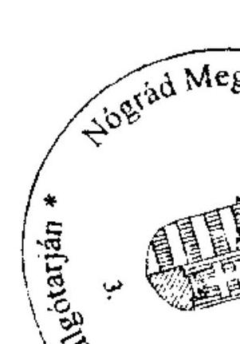

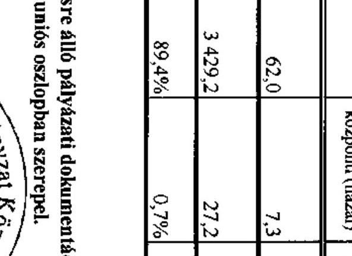

---

4/b. számú melléklet a V-3623-7/33/2010. számú jelentéshez

# TANÚSÍTVÁNY

a 2007-2010. években benyújtott és elutasított európai uniós pályázatokról

|  Sorszám | Az európai uniós forrásokra benyújtott és elutasított pályázat megnevezése és célja | A benyújtott pályázat adatai (millió Ft) |  |  |  |  |  |  |  |  |  |  |   |
| --- | --- | --- | --- | --- | --- | --- | --- | --- | --- | --- | --- | --- | --- |
|   |  |  |  |  |  |  |  |  |  |  |  |  | Az európai uniós forrásokra benyújtott pályázat elutasításának indoka  |
|   |  |  | európai uniós támogatás |  |  |  |  |  |  |  |  |  |   |
|  1. |  |  |  |  |  |  |  |  |  |  |  |  |   |
|   |  |  |  |  |  |  |  |  |  |  |  |  | Az akadálymentesítés ütemezése nem megfelelő, a költségvetés nem tartalmazza minden elemét, egy-egy tétel költsége alulnevezett.  |
|   |  |  |  |  |  |  |  |  |  |  |  |  | Az akadálymentesítés ütemezése nem megfelelő, a költségvetés nem tartalmazza minden elemét, egy-egy tétel költsége alulnevezett.  |
|  2. | TÁMOP-3.4.3 (Mikszáth Kálmán Gimnázium) | 12,7 |  | 12,7 |  |  |  |  |  |  |  | 2009.10.01 | 2011.05.31  |
|  3. | TÁMOP-6.2.2/A-09/1-2009-0012 Képzési díj támogatása az intézmények számára a konvergenciós elképzelésre (Kórház) | 42,1 |  | 42,1 |  |  |  |  |  |  |  | 2009.11.01 | 2011.08.21  |
|  4. | TÁMOP-6.2.4/A/08/1/KONV-2009-0064 Foglalkoztatás támogatása egészségügyi intézmények számára (Kórház) | 49,5 |  | 49,5 |  |  |  |  |  |  |  | 2009.10.01 | 2011.03.31  |
|  5. | TIOP-1.2.2.-08/1 A Pásztói Múzeum oktató termének létrehozása és informatikai pontok kialakítása (Múzeum Szervezet) | 35,9 |  | 35,9 |  |  |  |  |  |  |  | 2009.07.01 | 2010.12.31  |
|  6. | TIOP-1.2.2.-08/1 A Pálóc Múzeum oktató termének és információs puljának kialakítása (Múzeum Szervezet) | 49,1 |  | 49,1 |  |  |  |  |  |  |  | 2009.07.01 | 2010.12.31  |
|  7. | TIOP-1.2.2.-08/1-2009-0036 Hollókő- Világörökség Falu Múzeumának alkotókészséget és kreativitást kibontakoztató komplex iskolabarát fejlesztése (Múzeum Szervezet) | 39,8 |  | 39,8 |  |  |  |  |  |  |  | 2009.06.01 | 2010.08.31  |
|  8. | TIOP-3.4.2-08/1-2008-0034 Nógrád Megyei Gyermekvédelmi Központ 5 lakásotthonának korszerűsítése, belső átalakítása (Gyermekvédelmi Központ) | 30,0 |  | 28,2 |  |  |  | 1,8 |  |  |  | 2009.02.16 | 2009.10.30  |
|  9. | TIOP-3.4.3-08/2 Iskolai tehetséggondozás (Mikszáth Kálmán Gimnázium) | 12,7 |  | 12,7 |  |  |  |  |  |  |  | 2010.03.01 | 2011.08.31  |
|  10. | Magyarország-Szlovákia Határon Átnyúló Együttműködési Program HG-SK 2008/01/1.3.1, A salgótarjáni Bányamúzeum korszerűsítése, a térség bányászati emlékainak bemutatása | 303,3 |  | 257,8 |  | 30,3 |  |  |  |  |  | 2009.06.01 | 2011.05.01  |
|  11. | Világ-Nyelv Program - Alapfokú nyelvtankurzusokon való részvétel (Váci Mihály Gimnázium konzorciumi tag) | 0,4 |  | 0,3 |  |  |  |  |  |  |  | 2008.09.01 | 2009.06.30  |

---

|  |   |   |   |   |   |   |   |   |   |   |
| --- | --- | --- | --- | --- | --- | --- | --- | --- | --- | --- |
|  Sorszám | Az európai uniós forrásokra benyújtott és elutasított pályázat megnevezése és célja | Sorszám kiadás | európai uniós támogatás | Nemzeti állami finanszírozás kiegészítése (házat) | EU Önerő Alap | belpiaci (ráta) | hazai | egyéb fizetés (pl. magán) | kezdési | befejezési  |
|  12. | Comenius Iskolai együttműködés Egész életen át tartó tanulás - Előkészítő látogatás (Váci Mihály Gimnázium konzorciumi tag) | 0,2 | 0,2 |  |  |  |  |  | 2008.09.01 | 2009.06.30 Forráshányad - tartalékkivánnál nem támogatható  |
|  13. | Comenius Iskolai együttműködés Egész életen át tartó tanulás - (Váci Mihály Gimnázium konzorciumi tag) | 3,3 | 3,3 |  |  |  |  |  | 2009.09.01 | 2011.06.30 Forráshányad - tartalékkivánnál nem támogatható  |
|  14. | Comenius Iskolai együttműködés Egész életen át tartó tanulás - textilípar fejlesztése (Borbély Lajos SzSzK - Fáy András SzlK) | 3,1 | 3,1 |  |  |  |  |  | 2007.09.01 | 2009.06.30 Forráshányad - tartalékkivánnál nem támogatható  |
|  15. | Egész életen át tartó tanulás - Grundtvig Felnőttképzés (Borbély Lajos SzSzK - Fáy András SzlK) | 3,0 | 3,0 |  |  |  |  |  | 2007.10.01 | 2009.07.15 Formai hiányosságok miatt elutasítva  |
|  16. | Egész életen át tartó tanulás - Grundtvig Felnőttképzés DIEP (Borbély Lajos SzSzK - Fáy András SzlK) | 2,3 | 2,3 |  |  |  |  |  | 2007.10.01 | 2008.07.15 Formai hiányosságok miatt elutasítva  |
|  17. | Egész életen át tartó tanulás - (Borbély Lajos SzSzK) | 3,0 | 3,0 |  |  |  |  |  | 2008.10.01 | 2009.10.01 A támogatási szerződés nem került aláírásra  |
|  18. | Egész életen át tartó tanulás - Grundtvig Felnőttképzés mobilitás (Borbély Lajos SzSzK - Fáy András SzlK) | 0,5 | 0,5 |  |  |  |  |  | 2009.03.01 | 2010.06.15 Forráshányad - tartalékkivánnál nem támogatható  |
|  19. | Elutasított fejlesztési feladatok kiadásának forrása összesen: | 604,9 | 556,1 | 20,2 | 0,0 | 18,4 | 0,0 | 0,1 |  |   |
|  20. | Finanszírozási források megoszlása* | 100,0% | 91,9% | 5,0% | 0,0% | 3,0% | 0,0% | 0,0% |  |   |

Megjegyzés: *A finanszírozási források megoszlására vonatkozó sorokat nem kell kitölteni, azok adatai a program számítja ki.

Nyilatkozat: A tanúsítványban szereplő adatok valóságosságát igazolom.

Kelt: 2010. június 9.

Kelt: 2010. június 9.

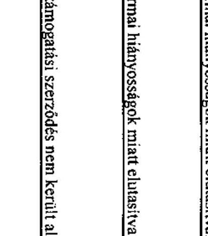

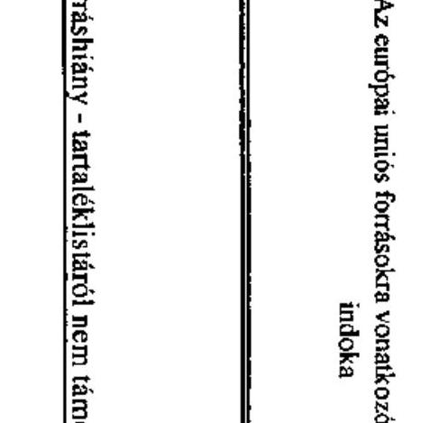

---

# ADATLAP 

## az európai uniós forrással támogatott ÉMOP-2007-4.2.2. „Nógrád Megyei Önkormányzat Borbély Lajos Szakközépiskola, Szakiskola és Kollégiuma utólagos akadálymentesítése" feladatról

## 1. A PÁLYÁZÓ ADATAI

1.1. A pályázó Önkormányzat neve: Nógrád Megyei Önkormányzat
1.2. A pályázó Önkormányzat címe: 3100 Salgótarján, Rákóczi út 36.

## 2. A PROJEKT ÖSSZEGZŐ ADATAI

2.1. A pályázott program megnevezése: ÉMOP-2007-4.2.2. Utólagos akadálymentesítés az önkormányzati feladatokat ellátó intézményekben (Egyenlő esélyű hozzáférés a közszolgáltatásokhoz)
2.2. A pályázott programon belül a projekt címe: Nógrád Megyei Önkormányzat Borbély Lajos Szakközépiskola, Szakiskola és Kollégiuma utólagos akadálymentesítése
2.3. A pályázatot készítő megnevezése: Nógrád Megyei Önkormányzati Hivatal Beruházási Főosztály
2.4. A pályázat benyújtásának időpontja: 2007. augusztus 31.

### 2.5. A pályázott projekt tervezett

- teljes kiadásának összege: 30.591.202 Ft
2.6. A pályázott projekt megvalósításának tervezett forrása:
- támogatásának összege: 20.000.000 Ft
- európai uniós: 20.000.000 Ft
- hazai társfinanszírozás:
- EU Önerő Alap:

---

- saját forrás: 10.591.202 Ft
- hitel:
- egyéb forrás:
2.7. A megvalósítás tervezett kezdési és befejezési időpontja (év, hó, nap): 2008.02.01.-2008.12.31.

# 3. A PÁLYÁZAT ELBÍRÁLÁSA 

3.1. A pályázat elbírálásáról szóló döntés kelte: 2008. május 29.
3.2. A pályázat elbírálásának eredménye: támogatásban részesült, a támogató szervezet a Regionális Fejlesztési Programok Irányító Hatósága

## 4. A TÁMOGATÁSI SZERZŐDÉS ADATAI

4.1. A támogatási szerződés megkötésének időpontja: 2008.09.16.
4.2. A projekt kezdési és befejezési időpontja: 2008.11.10.-2009.08.30.
4.3. A projekt elszámolható összköltsége (kiadása): 30.591.202 Ft
4.4. A projekt megvalósítás forrásai:

- európai uniós támogatás: 20.000.000 Ft
- hazai társfinanszírozás:
- EU Önerő Alap saját forrás:
- saját forrás: 10.591.202
- hitel:
- egyéb forrás:
4.5. A projekt számszerűsíthető eredményei

| Eredmény   /Mutató   /Indikátor   neve | Kulcs   indikátor   (I/N) | Mértékegység (db,   fő, \%) | Bázisérték | Megvalósítási   időszak   (célérték) |  | Fenntartási időszak (célérték) |  |  |  |  |  |
| :--: | :--: | :--: | :--: | :--: | :--: | :--: | :--: | :--: | :--: | :--: | :--: |
| Akadálymentesített intézmények száma | I | db | 0 | 1 | 1 | 1 | 1 | 1 | 1 | 1 | 1 |
| A támogatásból akadálymentesen elérhető közszolgáltatások száma | I | db | 0 | 3 | 3 | 3 | 3 | 3 | 3 | 3 |

 3 |

---

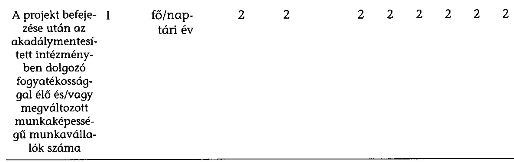

# 5. Ellenőrzések 

### 5.1. A külső ellenőrzések:

- az ellenőrzések száma: 3 db
- az ellenőrzést végző szervek megnevezése: VÁTI Kht.

### 5.2. A külső ellenőrzések által feltárt szabálytalanságokra vonatkozó adatok:

- mely előírást nem tartották be: ----
- az előírás nem teljesítésének okai: ----
- a rendezésre előírt kötelezettségek: ----
- a rendezésre előírt kötelezettséget mennyi időn belül teljesítették: ----
- mekkora időbeli csúszást eredményezett ez a projekt megvalósításában (év, hó, nap): -...

Kelt: Salgótarján, 2010. június 9.
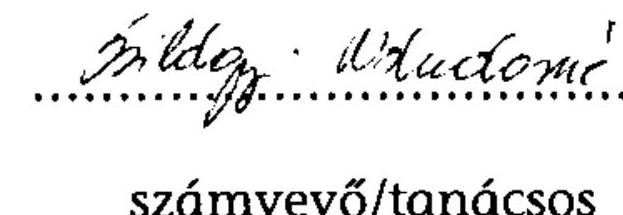
számvevő/tanácsos
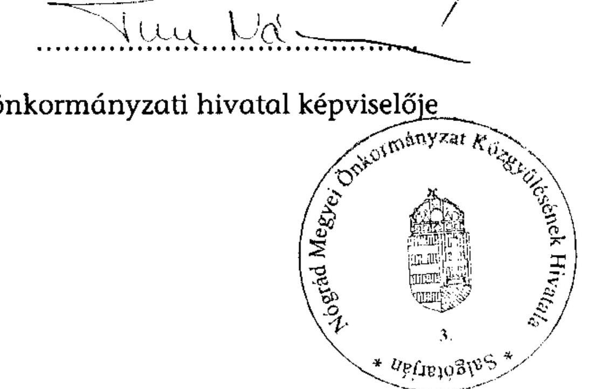

---

# Nógrád Megyei Önkormányzat Közgyűlésének Elnöke 

Tel.: (32) 620-275
Fax: (32) 620-190
E-mail: nmkgy@nograd.hu
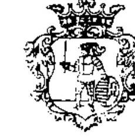

Nógrád Megyei Főjegyző
Tel.: (32) 620-126
Fax: (32) 620-152
E-mail: fojegyzo@nograd.hu
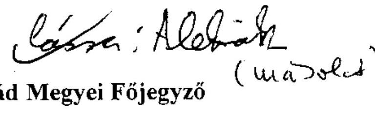

Salgótarján, Rákóczi út 36.
Ikt.sz.: 201-41/2010.
Üi.: Bácskai K.
Állami Számvevőszék
Domokos László elnök
Budapest
Apáczai Csere János utca 10. 1052

Tisztelt Elnök Úr!
2010. július 25.

2010. július 27-ei keltezésű, V-3023-7/33/17/2010. iktatószámú levelére az alábbiakat válaszoljuk:

Köszönettel vettük, hogy a számvevői jelentés-tervezetben szereplő javaslatokra tett intézkedéseink alapján több tételt elhagytak.

A megküldött JELENTÉS-ben a jogszabályi előírások maradéktalan betartása érdekében javasolták, hogy az ellenőrzési programokat a Ber. 23.§ (3) bekezdésében foglaltaknak megfelelően a belső ellenőrzési vezető hagyja jóvá. Áttekintve a javaslatukat és a jelenlegi rendszerünket a következő intézkedést tettük meg:

A főjegyző a belső ellenőrzési vezető munkaköri leírását kiegészítette azzal, hogy jogosult aláírni, jóváhagyni az ellenőrzési programokat.
(A munkaköri leírás módosításának másolatát jelen levelünkhöz mellékeljük.)
A leírtak alapján kérjük, hogy a jogszabályi előírások maradéktalan betartása érdekében megtett javaslatukat elhagyni szíveskedjenek.

Tájékoztatjuk továbbá, hogy a JELENTÉS-t a közgyűlés szeptember 2-ai ülésén tárgyalja. Kérjük a végleges jelentésre vonatkozó mielőbbi visszajelzését.

Megragadva ez alkalmat is, megköszönjük a vizsgálatban részt vevő munkatársak hatékony és segítő közreműködését.

Salgótarján, 2010. augusztus 3.
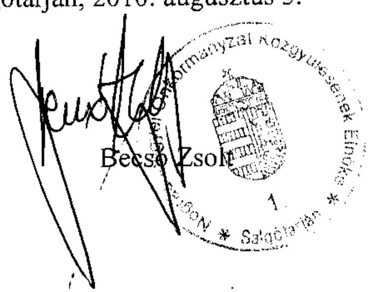

Tisztelettel:
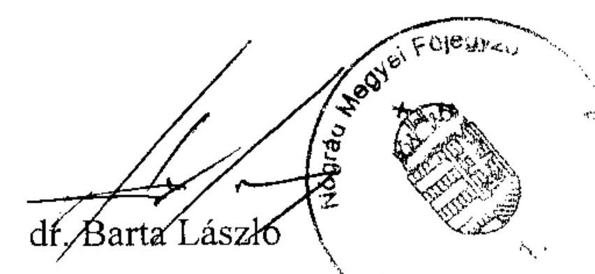

---

# 249-12/2010. számú   MUNKAKÖRI LEÍRÁS II. SZÁMÚ MÓDOSÍTÁSA 

## Szöllősiné Telek Ildikó részére

Munkáltatói jogkör gyakorlója:
Munkahelye:
Munkaköre:
Közvetlen felettese:
Heti munkaideje:

Nógrád megyei főjegyző
Nógrád Megyei Önkormányzat Közgyűlésének Hivatala
belső ellenőr
Nógrád megyei főjegyző
40 óra

## Feladata:

Munkaköri leírása az alábbi 3/A. ponttal egészül ki:
„3/A. Jogosult aláírni a belső ellenőrök részére készített megbízólevelet, továbbá jóváhagyni az ellenőrzési programot."

A munkaköri leírás egyebekben változatlan marad.

Salgótarján, 2010. augusztus 3. nap
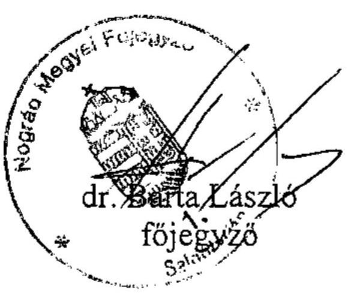

A munkaköri leírás II. számú módosításában foglaltakat megismertem, egy példányt átvettem, a benne foglaltakat elfogadom.

Salgótarján, 2010. augusztus 3. nap

## Kapják:

1. Nógrád megyei főjegyző - helyben
2. Nógrád Megyei Önkormányzat Közgyűlésének Önkormányzati, Jogi és Humánszolgáltatási Főosztálya - helyben
3. Szöllősiné Telek Ildikó - helyben
4. Irattár

---

# 7. számú melléklet 

a V-3023-7/33/2010. számú jelentéshez

## ÉLNÖK

## ÉLNÖK

## Bacsó Zsolt úr,

Közgyűlés elnöke
Nógrád Megyei Önkormányzat

## Salgótarján

Rákóczi u. 36.
3100

## Tisztelt Elnök Úr!

Köszönettel vettem a Nógrád Megyei Önkormányzat gazdálkodási rendszerének 2010. évi ellenőrzéséről készült számvevőszéki jelentésre tett észrevételét.

Örömmel értesültem arról, hogy a Főjegyző részére tett szabályszerűségi javaslatra intézkedtek, azt megvalósították, így a végleges jelentésből a javaslatot elhagytuk, a részletes megállapítások között ezt a tényt lábjegyzetben szerepeltetjük.

Köszönöm Elnök úrnak és munkatársainak az ellenőrzés során tanúsított segítőkész hozzáállását, az ellenőrzés megvalósításának elősegítését.

További munkájukhoz sok sikert kívánok!
Budapest, 2010. augusztus 23.

Tisztelettel:
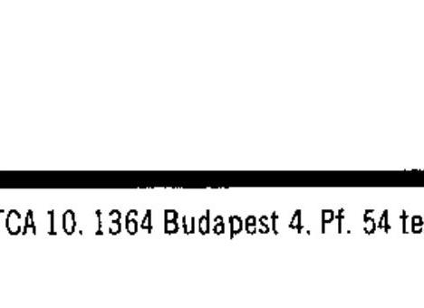
