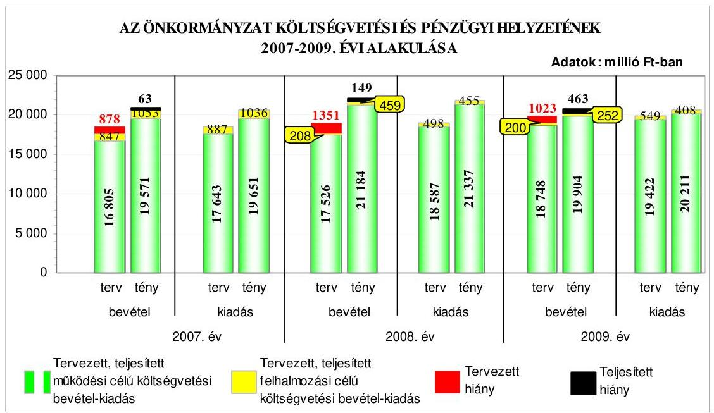
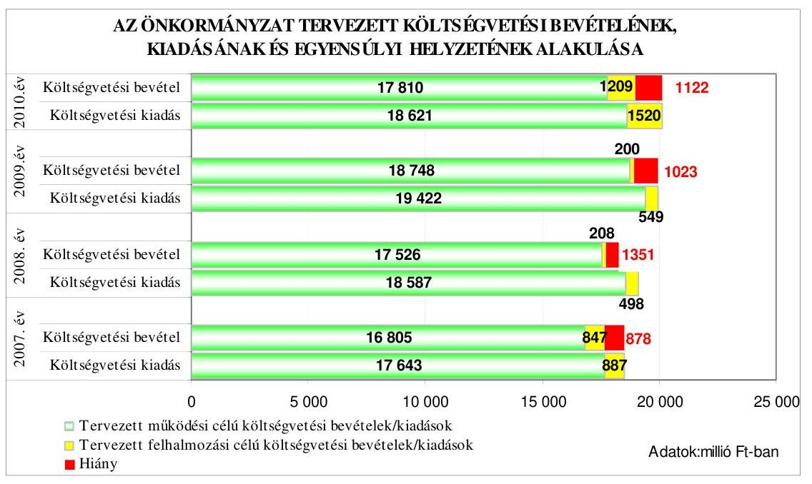
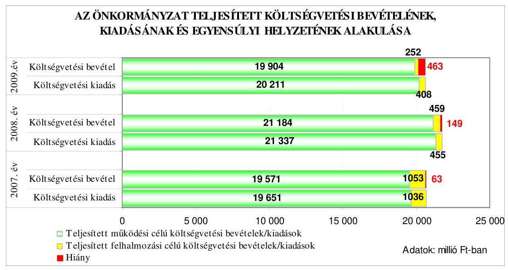
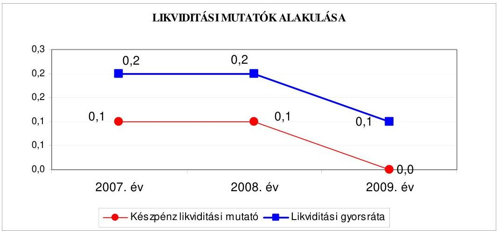
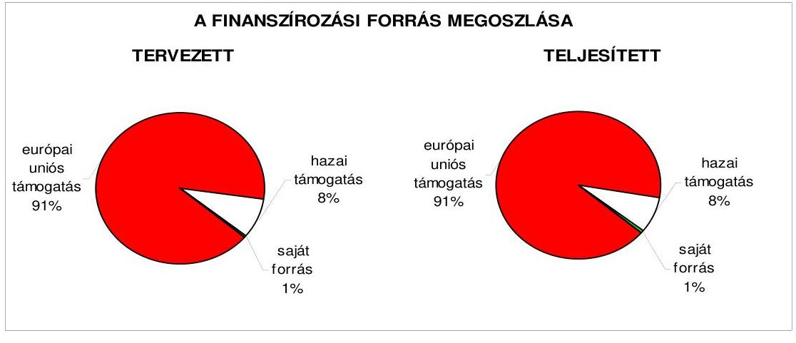
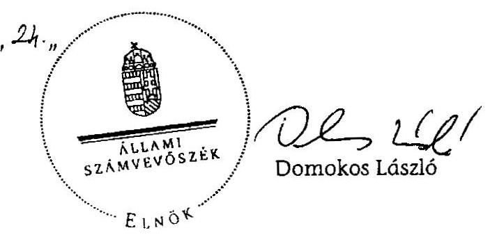
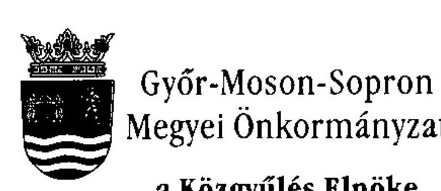
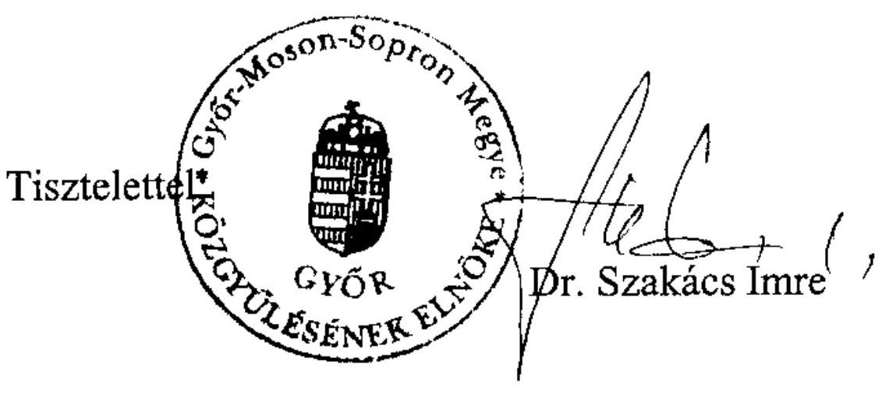

# ÁLLAMI   SZÁMVEVŐSZÉK 

## JELENTÉS

a Győr-Moson-Sopron Megyei Önkormányzat gazdálkodási rendszerének 2010. évi ellenőrzéséről

---

# 3. Önkormányzati és Területi Ellenőrzési Igazgatóság 

3.3. Átfogó Ellenőrzések Főcsoport

Iktatószám: V-3023-7/32/19/2010.
Témaszám: 966
Vizsgálat-azonosító szám: V0494

## Az ellenőrzést felügyelte:

Dr. Lóránt Zoltán
főigazgató
Az ellenőrzés végrehajtásáért felelős:
Dr. Sepsey Tamás
főigazgató-helyettes
Az ellenőrzést vezette:
Varga József
irodavezető, főtanácsadó
Az ellenőrzést végezték:
Varga József Dr. Fátrainé
Kalmár István
irodavezető, főtanácsadó Zsebedics Katalin számvevő tanácsadó
számvevő tanácsos

## A témához kapcsolódó eddig készített számvevőszéki jelentések:

## címe

Jelentés a Győr-Moson-Sopron Megyei Önkormányzat gazdálkodási rendszerének 2006. évi átfogó ellenőrzéséről

Jelentés a helyi és a helyi kisebbségi önkormányzatok gazdálkodási rendszerének 2006. évi átfogó és egyéb szabályszerűségi ellenőrzéséről

Jelentés a Magyar Köztársaság 2007. évi költségvetése végrehajtásának ellenőrzéséről

Függelék:
a helyi önkormányzatok 2007. évi normatív hozzájárulás igénylésének és elszámolásának ellenőrzése

---

# TARTALOMJEGYZÉK 

BEVEZETÉS ..... 9
I. ÖSSZEGZŐ MEGÁLLAPÍTÁSOK, KÖVETKEZTETÉSEK, JAVASLATOK ..... 14
II. RÉSZLETES MEGÁLLAPÍTÁSOK ..... 20

1. Az Önkormányzat költségvetési és pénzügyi helyzete ..... 20
1.1. A tervezett költségvetési bevételek és kiadások alapján a
költségvetési egyensúly, a költségvetési hiány alakulása, a hiány
tervezett finanszírozási módja, valamint a költségvetési hiány
megállapításának szabályszerűsége ..... 20
1.2. A teljesített költségvetési bevételek és kiadások alapján a pénzügyi
egyensúly, a pénzügyi hiány alakulása, a pénzügyi hiány
finanszírozása, az igénybe vett finanszírozási célú pénzügyi
eszközök hatása a pénzügyi helyzet alakulására, az eladósodásra,
valamint a fizetőképességre ..... 23
2. Az Önkormányzat felkészültsége az európai uniós források igénylésére,
felhasználására, a támogatott célkitúzés megvalósítására, múködtetésére,
valamint az elektronikus közszolgáltatási feladatok ellátására ..... 29
2.1. Az európai uniós források igénybevételére, felhasználására, a
támogatott célkitúzés megvalósítására, múködtetésére történt
felkészülés szabályozottságának, szervezettségének, valamint egy
támogatási szerződésben foglalt célkitúzés megvalósításának,
múködtetésének eredményessége ..... 29
2.1.1. Az európai uniós forrásokra történő pályázatok benyújtására
vonatkozó döntések összhangja fejlesztési célkitúzésekkel ..... 29
2.1.2. Az európai uniós forrásokhoz kapcsolódóan a
pályázatfigyelés, a pályázatkészítés, valamint az európai
uniós támogatással megvalósuló fejlesztés lebonyolításának
belső rendje, a végrehajtás és az ellenőrzés szervezettsége ..... 32
2.1.3. Egy támogatási szerződésben foglalt célkitúzés megvalósítása,
múködtetése ..... 34
2.2. Az elektronikus közszolgáltatás feltételeinek kialakítása ..... 35
3. A költségvetési gazdálkodás belső kontrolljai ..... 37
3.1. A költségvetés tervezés, a gazdálkodás és a zárszámadás készítés
folyamatában végrehajtandó belső kontrollok kialakítása ..... 37
3.2. A belső kontrollok múködtetése a költségvetés tervezés, a
gazdálkodás, és a zárszámadás készítés folyamataiban ..... 38
3.3. A belső ellenőrzési kötelezettség teljesítése ..... 41

---

4. Az ÁSZ korábbi ellenőrzési javaslatai alapján készített intézkedési terv végrehajtása, hasznosítása
4.1. Az Önkormányzat gazdálkodási rendszerének átfogó ellenőrzése során tett javaslatok végrehajtására tervezett intézkedések megvalósítása
4.2. A zárszámadáshoz kapcsolódó (állami hozzájárulások, támogatások igénylésének és felhasználásának ellenőrzése), valamint a további vizsgálatok esetében a megállapítások, javaslatok alapján tett intézkedések

# MELLÉKLETEK 

1. számú Az Önkormányzat gazdálkodását meghatározó adatok, mutatószámok (1 oldal)
2. számú Az önkormányzati vagyon alakulása (1 oldal)

2/a. számú Az önkormányzati kötelezettségek alakulása (1 oldal)
3. számú Az Önkormányzat 2007-2010. évi költségvetési előirányzatainak és 20072009. évi pénzügyi teljesítéseinek alakulása (1 oldal)
4. számú Tanúsítvány az európai uniós forrásokkal támogatott célok és programok 2007-2010. évi tervezett és teljesített adatairól (2 oldal)
4/a. számú Tanúsítvány az európai uniós forrásokra 2007-2010 között benyújtott pályázatokról, amelyek elbírálásáról az Önkormányzat még nem kapott tájékoztatást (2 oldal)
4/b. számú Tanúsítvány a 2007-2010. években benyújtott és elutasított európai uniós pályázatokról (2 oldal)
5. számú Dr. Szakács Imre úr, a Győr-Moson-Sopron Megyei Önkormányzat Közgyűlésének elnöke által adott tájékoztatás (1 oldal)

---

# RÖVIDÍTÉSEK, MOZAIKSZAVAK JEGYZÉKE 

## Törvények

Áht.
Eisz. tv.
Ket.
Ötv.

## Rendeletek

Áhsz.

Ámr. 1
Ámr. 2
Ber.
18/2005. (XII. 27.) IHM rendelet

2007. évi költségvetési rendelet

2008. évi költségvetési rendelet

2009. évi költségvetési rendelet

2010. évi költségvetési rendelet

2007. évi zárszámadási rendelet

2008. évi zárszámadási rendelet

## Szórövidítések

ÁSZ
az államháztartásról szóló 1992. évi XXXVIII. törvény az elektronikus információszabadságról szóló 2005. évi XC. törvény
a közigazgatási hatósági eljárás és szolgáltatás általános szabályairól szóló 2004. évi CXL. törvény
a helyi önkormányzatokról szóló 1990. évi LXV. törvény
az államháztartás szervezetei beszámolási és könyvvezetési kötelezettségének sajátosságairól szóló 249/2000. (XII. 24.) Korm. rendelet
az államháztartás múködési rendjéről szóló 217/1998. (XII. 30.) Korm. rendelet
az államháztartás múködési rendjéről szóló 292/2009. (XII. 19.) Korm. rendelet
a költségvetési szervek belső ellenőrzéséről szóló 193/2003. (XI. 26.) Korm. rendelet
a közzétételi listákon szereplő adatok közzétételéhez szükséges közzétételi mintákról szóló 18/2005. (XII. 27.) IHM rendelet
Győr-Moson-Sopron Megyei Önkormányzat 4/2007. (IV. 27.) számú rendelete az Önkormányzat 2007. évi költségvetéséről
Győr-Moson-Sopron Megyei Önkormányzat 5/2008. (III. 11.) számú rendelete az Önkormányzat 2008. évi költségvetéséről
Győr-Moson-Sopron Megyei Önkormányzat 4/2009. (III. 10.) számú rendelete az Önkormányzat 2009. évi költségvetéséről
Győr-Moson-Sopron Megyei Önkormányzat 5/2010. (III. 2.) számú rendelete az Önkormányzat 2010. évi költségvetéséről
Győr-Moson-Sopron Megyei Önkormányzat 7/2008. (IV. 28.) számú rendelete az Önkormányzat 2007. évi költségvetési beszámolójáról és a pénzmaradvány elszámolásáról
Győr-Moson-Sopron Megyei Önkormányzat 6/2009. (IV. 27.) számú rendelete az Önkormányzat 2008. évi költségvetési beszámolójáról és a pénzmaradvány elszámolásáról, felosztásáról

Állami Számvevőszék

---

Bárczi Gusztáv Gyógypedagógiai Intézmény

Doborjáni Ferenc Neve-lési-Oktatási Központ
e-közszolgáltatás
Ellenőrzési csoport
Európai Integráció és Nemzetközi Kapcsolatok Osztálya
FEUVE
főjegyző
gazdasági és humán program
gazdasági szervezet
gazdasági szervezet ügyrendje
hivatali SzMSz

Informatikai csoport
informatikai stratégia

Kórház
Könyvtár
kötelezettségvállalási szabályzat

Közgyűlés
Közgyűlés elnöke

Bárczi Gusztáv Óvoda, Általános Iskola, Készségfejlesztő Speciális Szakiskola, Kollégium és Különleges Gyermekotthon
Doborjáni Ferenc Egységes Gyógypedagógiai Módszertani Intézmény, Óvoda, Fejlesztő Iskola, Általános Iskola, Speciális Szakiskola, Készségfejlesztő Speciális Szakiskola, Kollégium, Különleges Gyermekotthon, Gyermekotthon, Utógondozó Otthon és Pedagógiai Szakszolgálat
elektronikus közszolgáltatás
Győr-Moson-Sopron Megyei Önkormányzati Hivatal Önálló Ellenőrzési Csoportja
Győr-Moson-Sopron Megyei Önkormányzati Hivatal Európai Integráció és Nemzetközi Kapcsolatok Osztálya
folyamatba épített, előzetes, utólagos és vezetői ellenőrzés Győr-Moson-Sopron Megyei Önkormányzat Főjegyzője
a Győr-Moson-Sopron Megyei Önkormányzat Gazdaságiés Humán Programja, melyet a Közgyűlés 2007. március 2-án hagyott jóvá és a 194/2008. (XII. 19.) és a 205/2009. (XI. 27.) számú határozataival azt aktualizálta
Győr-Moson-Sopron Megyei Önkormányzati Hivatal Gazdasági Szervezete
Győr-Moson-Sopron Megyei Önkormányzati Hivatal Gazdasági Szervezetének 01/667/2009. számú ügyrendje
a főjegyző által 2005. február 25-én kiadott, és a Közgyűlés elnöke által jóváhagyott Győr-Moson-Sopron Megyei Önkormányzati Hivatal Szervezeti és Múködési Szabályzata (módosításai: 2005. szeptember 1., 2007. május 1. és 2009. szeptember 28.)

Győr-Moson-Sopron Megyei Önkormányzati Hivatal Informatikai Csoportja
Győr-Moson-Sopron Megyei Önkormányzati Hivatal 2007-2012. évekre szóló Informatikai Stratégiája, amelyet a főjegyző 2006. december 15-én kiadmányozott
Petz Aladár Megyei Oktató Kórház
Kisfaludy Károly Megyei Könyvtár
a Győr-Moson-Sopron Megyei Önkormányzati Hivatal 01/667-2/2009. számú, 2009. január 1-től érvényes szabályzata a kötelezettségvállalás, utalványozás, ellenjegyzés, érvényesítés rendjéről
Győr-Moson-Sopron Megyei Önkormányzat Közgyűlése Győr-Moson-Sopron Megyei Önkormányzat Közgyűlésének Elnöke

---

| Megyei ÁMK | Győr-Moson-Sopron Megyei Önkormányzat Általános Múvelődési Központja (2009. augusztus 1-től a Porpáczy Aladár ÁMK és az Ujhelyi Imre Szakképző Iskola jogutódaként) |
| :--: | :--: |
| Múzeum | Győr-Moson-Sopron Megyei Múzeumok Igazgatósága Xantus János Múzeum |
| Önkormányzat | Győr-Moson-Sopron Megyei Önkormányzat |
| Önkormányzati hivatal pályázati szabályzat | Győr-Moson-Sopron Megyei Önkormányzat Hivatala „A hazai és az európai uniós formákkal kapcsolatos pályázatfígyelés, pályázatkésztés és lebonyolítás rendjéről" szóló szabályzat, amelyet a főjegyző - 2007. július 1-jén kiadmányozott |
| Pedagógiai intézet | Győr-Moson-Sopron Megyei Pedagógiai Intézet |
| Pénzügyi bizottság | Győr-Moson-Sopron Megyei Önkormányzat Közgyűlésének Pénzügyi és Vagyonkezelő Bizottsága |
| Porpáczy Aladár ÁMK | Porpáczy Aladár Általános Művelődési Központ (2007. március 2-től a Porpáczy Aladár Középiskola jogutódaként, új intézményegységgel kibővítve) |
| Porpáczy Aladár Középiskola | Porpáczy Aladár Középiskola, Szaktanácsadó Intézmény és Kollégium |
| Területfejlesztési és Vagyongazdálkodási Osztály | Győr-Moson-Sopron Megyei Önkormányzati Hivatal Területfejlesztési és Vagyongazdálkodási Osztálya |
| Ujhelyi Imre Szakképző Iskola | Ujhelyi Imre Élelmiszeripari Közép- és Felsőfokú Szakképző Iskola és Kollégium |
| ÚMFT | Új Magyarország Fejlesztési Terv |

---

# ÉRTELMEZŐ SZÓTÁR 

1. elektronikus szolgáltatási szint
2. elektronikus szolgáltatási szint
3. elektronikus szolgáltatási szint
4. elektronikus szolgáltatási szint
európai uniós források
eredményesség
fejlesztési feladat (projekt)
fejlesztési célkitúzés

Az 1044/2005. (V. 11.) Korm. határozat alapján olyan információs, tájékoztató szolgáltatás, amely csak általános információkat közöl az adott üggyel kapcsolatos teendőkről és a szükséges dokumentumokról.
Az 1044/2005. (V. 11.) Korm. határozat alapján olyan egyirányú kapcsolatot biztosító szolgáltatás, amely az 1. szinten túl biztosítja az adott ügy intézéséhez szükséges dokumentumok, nyomtatványok letöltését, és azok ellenőrzéssel, vagy ellenőrzés nélküli elektronikus kitöltését, amely esetben a dokumentumok benyújtása hagyományos úton történik.
Az 1044/2005. (V. 11.) Korm. határozat alapján olyan kétirányú kapcsolatot biztosító szolgáltatás, amely közvetlen, vagy ellenőrzött kitöltésű dokumentum segítségével biztosítja az elektronikus adatbevitelt és a bevitt adatok ellenőrzését. Az ügy indításához, intézéséhez személyes megjelenés nem szükséges, de az ügyhöz kapcsolódó közigazgatási döntés (határozat, egyéb aktus) közlése, valamint a kapcsolódó illeték-, vagy díjfizetés hagyományos úton történik.
Az 1044/2005. (V. 11.) Korm. határozat alapján olyan teljes közvetlen kétirányú ügyintézési folyamatot biztosító szolgáltatás, amikor az ügyhöz kapcsolódó közigazgatási döntés is elektronikus úton kerül közlésre, illetve a kapcsolódó illeték-, vagy díjfizetés elektronikus úton is intézhető.
Az Európai Unió költségvetéséből, illetve az Európai Gazdasági Térség Európai Unión kívüli tagállamainak költségvetéséből származó támogatások, valamint a „Svájci Hozzájárulás" programból származó támogatás.
Egy adott tevékenység céljai megvalósításának mértéke, a tevékenység szándékolt és tényleges hatása közötti kapcsolat. (Forrás: Ámr., 2. § 66. pont)
Az a fejlesztési feladat, amely illeszkedik az Európai Unió, illetve a Nemzeti Fejlesztési Terv által támogatott programokhoz. Az Európai Unió, illetve a Nemzeti Fejlesztési Terv és az Új Magyarország Fejlesztési Terv által meghirdetett programokhoz kapcsolódó, támogatott projektek fejlesztési feladatok megvalósításához használhatók fel az európai uniós források. A fejlesztési feladat (projekt) tartalmilag és formailag részletesen kidolgozott, megfelelő pénzügyi háttérrel és végrehajtási ütemezéssel rendelkező fejlesztési terv.
Az önkormányzat által ellátott kötelező, vagy önként vállalt feladatok mennyiségi (minőségi) fejlesztésére vonatkozó terv. A mennyiségi fejlesztés megvalósulhat beszerzéssel, létesítéssel, bővítéssel, átalakítással.

---

hazai társfinanszírozás irányító hatóság
kedvezményezett
lebonyolítás
operatív program

Nemzeti Fejlesztési Terv

A központi költségvetési és az elkülönített állami pénzalapokból származó finanszírozás.
A strukturális alapok és a Kohéziós alap forrásainak szabályszerű, hatékony és eredményes felhasználásához szükséges intézményrendszer felső eleme. Az irányító hatóság általános és átfogó felelősséget visel a programok, projektek hatékony és szabályszerű végrehajtásáért. Felelősségi köréből eredően ellenőrzi a közösségi, valamint a hazai jogszabályok betartását, koordinálja az európai uniós források szétosztásának folyamatát, irányítja az intézményrendszer, a statisztikai és a pénzügyi nyilvántartási rendszer múködését. Az Új Magyarország Fejlesztési Terv Irányító Hatósága közreműködik az Operatív Program véglegesítésében, irányítja az Operatív Program Program-kiegészítő Dokumentum kidolgozását, és közreműködő szerepet vállal e dokumentumoknak az Európai Bizottsággal történő tárgyalásaiban. Az Irányító Hatóság részt vesz továbbá a költségvetési tervezésében, valamint közreműködő szervezetek bevonásával irányítja a meghirdetett pályázatok és a központi programok végrehajtását.
Az a helyi önkormányzat, amely a támogatási szerződést kedvezményezettként aláíraa, a projektet, illetve a központi programhoz kapcsolódó támogatott önkormányzati programot végrehajtja.
Az európai uniós források felhasználásával megvalósuló fejlesztésre irányuló műszaki, gazdasági (pénzügyi) tevékenységet magában foglaló szervezési, irányítási szolgáltatás. A szervezési szolgáltatás kiterjedhet a pályázatkészítésre, a közbeszerzési eljárás lebonyolításán keresztül a folyamatos műszaki ellenőrzésre, a pénzügyi elszámolásra, a műszaki átadás-átvételre, az üzembe helyezésre, illetve a fejlesztési folyamat egyes elemeire.
Az Európai Bizottság által jóváhagyott, a Közösségi Támogatási Keret végrehajtására vonatkozó, több évre szóló intézkedésekhez kapcsolódó prioritások egységes rendszerét tartalmazó dokumentum.
Helyzetelemzést, stratégiát a tervezett fejlesztési területek prioritásait, azok céljait és pénzügyi forrásaik megjelölését tartalmazó dokumentum, amelyet a Magyar Köztársaság készített az Európai Unió programozási irányelveinek, célkitűzéseinek megfelelően a fejlődésben lemaradó régiók fejlődésének és strukturális átalakulásának elősegítésére a kiemelt szükségletekre figyelemmel. A Nemzeti Fejlesztési Terv stratégiai fejezetének célja, hogy a 2004-2006 közötti időszakra kijelölje a strukturális alapokból támogatható fejlesztéspolitikai célkitűzéseit és prioritásait. A strukturális alapok operatív programjai: Agrár- és Vidékfejlesztés Operatív Program (AVOP); Gazdasági Versenyképesség

---

|  | Operatív Program (GVOP); Humán erőforrások fejlesztései Operatív Program (HEFOP); Környezetvédelem és infrastruktúra Operatív Program (KIOP); Regionális Fejlesztés Operatív Program (ROP). |
| :--: | :--: |
| prioritás | A közösségi támogatási kerettervben vagy támogatásban elfogadott stratégia valamely elsődlegessége; ehhez rendelik hozzá az alapokból és egyéb pénzügyi eszközökből, valamint a tagállam megfelelő pénzügyi forrásaiból származó hozzájárulást, továbbá a meghatározott célok összességét. |
| program | Ágazati vagy térségi fejlesztési célt megvalósító fejlesztési terv, mely több egymással összefüggő projekt útján, az érintettek együttmúködése alapján valósul meg. |
| saját forrás | A kedvezményezett által a támogatott projekthez biztosított forrás, amelybe az államháztartás alrendszereiből nyújtott támogatás nem számítható be. Költségvetési szervek esetén a jóváhagyott előirányzat saját forrásnak minősül. |
| Új Magyarország Fejlesztési Terv | Az Új Magyarország Fejlesztési Terv célja a foglalkoztatás bővítése és a tartós növekedés feltételeinek megteremtése. Ennek érdekében 2007-2013 között hat kiemelt területen indított el összehangolt állami és európai uniós fejlesztéseket: a gazdaságban, a közlekedésben, a társadalom megújulása érdekében, a környezet és az energetika területén, a területfejlesztésben és az államreform feladataival összefüggésben. Az Új Magyarország Fejlesztési Terv operatív programjai: Államreform Operatív Program (ÁROP); Elektronikus Közigazgatás Operatív Program (EKOP); Gazdaságfejlesztés Operatív Program (GOP); Környezet és Energia Operatív Program (KEOP); Közlekedés Operatív Program (KÖZOP); Dél-Alföldi Operatív Program (DAOP); Dél-Dunántúli Operatív Program (DDOP); Észak-Alföldi Operatív Program (ÉAOP); Észak-Magyarországi Operatív Program (ÉMOP); Közép-Dunántúli Operatív Program (KDOP); Közép-Magyarországi Operatív Program (KMOP); Nyugat-Dunántúli Operatív Program (NYDOP); Társadalmi Infrastruktúra Operatív Program (TIOP); Társadalmi Megújulás Operatív Program (TÁMOP). |
| támogatási szerződés | A strukturális alapok esetében az irányító hatóságnak, a kedvezményezett önkormányzattal kötött szerződése, amely a támogatás felhasználásának részletes fel-tételeit tartalmazza. Az Új Magyarország Fejlesztési Terv keretében támogatott projektek esetében a támogatási szerződés a kedvezményezett és a Nemzeti Fejlesztési Úgynökség nevében eljáró közremúködő szervezet között jön létre. Nagyprojekt esetén a támogatási szerződés ellenjegyzését a Nemzeti Fejlesztési Úgynökség végzi. A támogatási szerződés képezi a megvalósítás nyomon követésének, finanszírozásának és ellenőrzésének alapját. |

---

# JELENTÉS 

## Győr-Moson-Sopron Megyei Önkormányzat gazdálkodási rendszerének 2010. évi ellenőrzéséről

## BEVEZETÉS

Az Ötv. 92. § (1) bekezdése, az Állami Számvevőszékről szóló 1989. évi XXXVIII. törvény 2. § (3) bekezdése, valamint az Áht. 120/A. § (1) bekezdése alapján az önkormányzatok gazdálkodását az Állami Számvevőszék ellenőrzi. Az ellenőrzésre az Országgyűlés illetékes bizottságai részére is átadott, országosan egységes ellenőrzési program szerint került sor.

Az Állami Számvevőszék a stratégiájában foglalt célkitűzéseknek megfelelően a helyi önkormányzatok költségvetési gazdálkodási rendszerének ellenőrzését a 2007. évben megújított, teljesítmény-ellenőrzési elemekkel kiegészített ellenőrzési program alapján folytatja a 2010. évben.

Az ellenőrzés célja annak értékelése volt, hogy az Önkormányzat:

- milyen módon biztosította a költségvetési és a pénzügyi egyensúlyt a költségvetésében és annak teljesítése során, valamint változott-e a hiányzó bevételi források pótlásában a finanszírozási célú pénzügyi műveletek jelentősége, hatása;
- eredményesen készült-e fel a szabályozottság és a szervezettség terén az európai uniós források igénylésére és felhasználására, megvalósította, működtette-e a támogatott célkitűzést, továbbá biztosította-e az elektronikus közszolgáltatás feltételeit, a gazdálkodási adatok közzétételével a gazdálkodás nyilvánosságát;
- megfelelően kialakította-e és múködtette-e a belső kontrollokat a költségvetés tervezés, a gazdálkodás és a zárszámadás készítés, valamint a belső ellenőrzés folyamatában, továbbá;
- megfelelően hasznosították-e a korábbi számvevőszéki ellenőrzések megállapításait, szabályszerűségi ${ }^{1}$ és célszerűségi javaslatait.

[^0]
[^0]:    ${ }^{1}$ A törvényi előírások betartásának elmulasztásakor a részletes megállapítások fejezetben egységesen a törvénysértés megjelölést alkalmazzuk, mivel az ÁSZ nem tehet különbséget a törvényi előírások között.

---

Az ellenőrzés típusa: átfogó ellenőrzés, amely - egy ellenőrzés keretében meghatározott területekre összpontosítva alkalmazza a szabályszerűségi, valamint a teljesítmény-ellenőrzés jellemzőit.

Az ellenőrzött időszak: a költségvetési egyensúly és az európai uniós támogatás igénybevételére történt felkészülés ellenőrzése esetében a 2007-2009. évek, a belső kontrollok kialakítása és múködtetése tekintetében a 2009. év és a 2010. I. negyedév, az Önkormányzat gazdálkodási rendszerének 2006. évi átfogó ellenőrzéséről készített jelentésben rögzített javaslatok megvalósítását, hasznosítását, valamint a 2006 óta végzett további ellenőrzések során megfogalmazott javaslatok végrehajtása érdekében a 2007-2010. I. negyedév közötti időszakban tett intézkedéseket ellenőriztük.

Győr-Moson-Sopron megye lakosainak száma 2010. január 1-jén 262128 fő volt. A 2006. évi önkormányzati képviselő és polgármester választást követően az Önkormányzat 41 tagú Közgyűlésének munkáját nyolc állandó bizottság segítette. A helyi önkormányzat mellett a 2006. évi önkormányzati képviselő és polgármester választásokat követően három ${ }^{2}$ kisebbségi önkormányzat múködött. A Közgyűlés elnöke a 2002. évi önkormányzati képviselő és polgármester választás óta tölti be tisztségét, a főjegyző személye 1996. november 1-je óta változatlan.

Az Önkormányzat feladatainak végrehajtása érdekében a 2007. év végén 21 önállóan gazdálkodó és négy részben önállóan gazdálkodó, a 2009. év végén 21 önállóan múködő és gazdálkodó költségvetési intézményt múködtetett. A feladatok ellátásában a 2007. évben öt, a 2009. évben három gazdasági társasága vett részt. Az Önkormányzat az éves költségvetési beszámolója szerint a 2009. évben 20156 millió Ft költségvetési bevételt ért el, és 20619 millió Ft költségvetési kiadást teljesített. A 2009. évben teljesített költségvetési bevételek 2,3\%-kal, a költségvetési kiadások 0,3\%-kal maradtak el a 2007. évben teljesített költségvetési bevételektől és kiadásoktól, a teljesített felhalmozási célú költségvetési bevételek 76\%-os ( 801 millió Ft-os) és kiadások 61\%-os ( 628 millió Ftos) csökkenése következtében. Az Önkormányzat 2009. december 31-én a könyvviteli mérleg szerint 12464 millió Ft értékű vagyonnal rendelkezett, ami a 2007. év végi állományhoz viszonyítva 2\%-kal csökkent. A változás több, egymással ellentétes folyamat hatásaként alakult, amelyben meghatározó szerepe a tárgyi eszközök 200 millió forintos ( $2 \%$-ot elérő) csökkenésének volt. Csökkent a forgóeszközök állománya, amelynek fő oka a pénzeszközök 88 millió Ft összegű csökkenése, amit csak kis részben ellentételezett a követelések 24 millió Ft-os növekedése. Az Önkormányzat saját vagyonának és a tartalékoknak az összege 2276 millió Ft-tal, 22,5\%-kal csökkent. A kötelezettségek növekedése meghaladta a $76 \%$-ot, értékben a 2006 millió Ft -ot, ez azonban teljes összegében rövid lejáratú kötelezettség, nagyobbrészt a szállítói követelések 1464 millió Ft összegű ( $78,5 \%$ ) növekedéséből származott.

[^0]
[^0]:    ${ }^{2}$ cigány, horvát, német kisebbségi önkormányzat

---

Az Önkormányzat gazdálkodásában kockázatot jelent, hogy az összes költségvetési bevétel mindössze 30,4\%-át éri el a saját bevétel, melynek alakulására csak az intézményi saját bevétel növelésével tud hatást gyakorolni. Az illetékbevétel az összes költségvetési bevétel 9,3\%-át biztosította a 2009. évben, ami a 2007. évihez viszonyítva mindössze 0,4 százalékpontos növekedést mutatott, de a 2010. évben már ennél kisebb bevételt tervezett az Önkormányzat. Az összes költségvetési kiadásból a felhalmozási célú költségvetési kiadások részaránya a 2007. évhez viszonyítva 2009-re három százalékponttal (közel egyharmadára) esett vissza, a 2009. évben $2 \%$ volt. A teljesített felhalmozási célú költségvetési kiadások részarányának visszaesését a fejlesztési célú költségvetési bevételek csökkenése idézte elő, amit az európai uniós forrással, hazai támogatás igénybe vételével nem tudott pótolni az Önkormányzat. A 2009. év végén indított Kórház korszerűsítési beruházás ${ }^{3}$ miatt a felhalmozási célú költségvetési kiadások aránya jelentősen emelkedik. A 2010. évi költségvetési rendeletben 19019 millió Ft költségvetési bevételt és 20141 millió Ft költségvetési kiadást irányoztak elő. Az Önkormányzati hivatalban dolgozó köztisztviselők száma 2007. január 1-jén 58 fő, 2009. december 31-én 59 fő volt, a költségvetési intézményekben foglalkoztatott közalkalmazottak száma 2007. január 1-jén 4335 fő, 2009. december 31-én 3612 fő volt. Az Önkormányzat gazdálkodását meghatározó adatokat, mutatószámokat az 1-3. számú mellékletek tartalmazzák.

Az Önkormányzat költségvetési és pénzügyi helyzetét az elemző eljárás módszerével vizsgáltuk. E körben elemeztük a költségvetés egyensúlyi helyzetének alakulását, a tervezett és teljesített költségvetési, pénzügyi hiány okait, a hiány finanszírozásának tervezett és teljesített módját, az Önkormányzat pénzügyi helyzetének alakulását az eladósodás és a likviditás szempontjából.

Teljesítmény-ellenőrzés módszerével vizsgáltuk, és eredményesség szempontjából értékeltük az Önkormányzat benyújtott pályázatai kapcsolódását a Közgyűlés által meghatározott fejlesztési célkitűzésekhez, valamint felkészültségét a belső szabályozottság, szervezettség terén az európai uniós forrásokra vonatkozó pályázati felhívások figyelésére, a pályázatok készítésére és lebonyolítására. Az ellenőrzés során felmértük, hogy az elektronikus közigazgatási szolgáltatások múködtetése érdekében milyen intézkedéseket tettek, továbbá biztosított-ták-e a közérdekú gazdálkodási adatok meghatározott körének honlapon történő közzétételét.

A költségvetési gazdálkodás belső kontrolljainak ellenőrzése során vizsgáltuk, hogy az Önkormányzati hivatalban a költségvetés tervezés, a gazdálkodás és a zárszámadás készítés folyamatában a belső kontrollok kialakítása és múködése megfelelő biztosítékot ad-e a gazdálkodási feladatok szabályszerű ellátására. Felmértük és minősítettük a költségvetés tervezés, a gazdálkodás és a zárszámadás készítés feladataival, továbbá a pénzügyi-számviteli területen az informatikával kapcsolatosan kialakított kontrollok, valamint azok múködésének megfelelőségét. A vizsgálat során értékeltük a belső ellenőrzés szabályozottsá-

[^0]
[^0]:    ${ }^{3}$ A projekt megnevezése: „Infrastruktúrafejlesztés a győri Petz Aladár Megyei Oktatókórházban, mint egészségpólusban".

---

gát, működési feltételeinek kialakítását, meghatározását, továbbá működésének megfelelőségét.

Az Önkormányzati hivatalban értékeltük a gazdálkodás folyamatában kulcsszerepet betöltő belső kontrollok múködésének megfelelőségét, ennek keretében ellenőriztük a szakmai teljesítés igazolására és az utalvány ellenjegyzésére kialakított kontrollok végrehajtását. Az ellenőrzést a következő, magas kockázatú kifizetésekre folytattuk le ${ }^{4}$ :

- az államháztartáson kívülre teljesített múködési és felhalmozási célú pénzeszköz átadásokra,
- az állományba nem tartozók megbízási díjaira, továbbá
- a külső szolgáltató által végzett karbantartási, kisjavítási szolgáltatásokra.

Az ellenőrzés hatékony elvégzése céljából a vizsgálandó területek kiválasztása során a kockázatokon alapuló megközelítés érvényesült, ezáltal az ellenőrzési erőforrásokat azokra a területekre fókuszáltuk, amelyeken a korábbi ellenőrzési tapasztalatok figyelembevételével legnagyobb a hibák előfordulási valószínűsége. Az ellenőrzési erőforrások ilyen típusú összpontosításával minimálisra csökkenthető a kívánt ellenőrzési bizonyosság eléréséhez szükséges időráfordítás.

A pénzügyi-számviteli folyamatokban alkalmazott belső kontrollok kialakításának és múködésének ellenőrzésére a vizsgált három terület 2009. évi könyvviteli tételeiből területenként egyszerú véletlen mintát vettünk. A kijelölt gazdasági eseményre elvégzett megfelelőségi tesztek alapján értékeltük a kontrollok múködésének megfelelőségét a vizsgált három területre külön-külön, majd öszszefoglalóan ${ }^{5}$. A helyszíni ellenőrzés megállapításainak részletes dokumentálását megfelelőségi tesztlapokon, ellenőrzési munkalapokon biztosítottuk. Ezeken a teszt- és munkalapokon a minősítés alapjául szolgáló kérdések és a vonatkozó konkrét jogszabályhelyek megjelölése mellett értékeltük a kialakított belső

[^0]
[^0]:    ${ }^{4} \mathrm{Az}$ önkormányzatok kiemelt előirányzataira vonatkozóan, a vertikális folyamatokra elvégeztük a kockázatok becslését, amelynek eredményeként határoztuk meg a magas kockázatú területeket.
    ${ }^{5}$ A vizsgált három terület egyedi értékelési pontszámait a területek költségvetési súlyával arányosan összegeztük.

---

kontrollokban rejlő kockázatokat ${ }^{6}$ és a kialakított kontrollok múködésének megfelelőségét ${ }^{7}$.

Az ÁSZ korábbi ellenőrzési javaslatai alapján tett intézkedéseket, illetve azok megvalósítását utóellenőrzés keretében vizsgáltuk. A gazdálkodási rendszer korábbi átfogó ellenőrzése során megfogalmazott javaslatok végrehajtására tett intézkedések megvalósítását ellenőriztük, az egyéb számvevőszéki ellenőrzések során tett javaslatok esetében pedig a kiadott intézkedéseket tekintettük át.

A helyszíni ellenőrzés során kitöltött - az ellenőrzést végző számvevő és az Önkormányzati hivatal felelős köztisztviselője által aláírt - ellenőrzési munkalapokat, azok kitöltési útmutatóit, továbbá a megfelelőségi tesztek dokumentumait a Közgyűlés elnöke részére a számvevői jelentéssel egyidejűleg átadtuk.

A jelentést az ÁSZ-ról szóló 1989. évi XXXVIII. tv. 25. § (1) bekezdése alapján észrevétel közlése céljából megküldtük a Győr-Moson-Sopron Megyei Önkormányzat Közgyűlése elnökének. A kapott tájékoztatást a jelentés 5. számú melléklete tartalmazza.
${ }^{6}$ A kialakított belső kontrollokban rejlő kockázatot alacsonynak minősítettük, ha a kontrollok megfelelő védelmet nyújtottak a hibák bekövetkezése ellen. Közepesnek minősítettük a belső kontrollokban rejlő kockázatot, amennyiben a kontrollok a lehetséges hibák többsége ellen védelmet nyújtottak. Magasnak értékeltük a kockázatot, ha a kontrollok - kialakításuk hiányában, vagy hiányos kialakításuk miatt - nem nyújtottak elegendő védelmet a lehetséges hibákkal szemben.
${ }^{7}$ A kontrollok múködésének megfelelőségét kiválónak értékeltük abban az esetben, ha azok működése - esetleges kisebb, az egységesen meghatározott követelményrendszerben foglalt mértéket el nem érő hiányosságoktól eltekintve - megfelelt a hibák megelőzésére és kijavítására meghatározott szabályozásnak és a legmagasabb szintű elvárásoknak. Jónak minősítettük a kontrollok múködését, ha a megállapított kisebb (tolerálható mértékű) hiányosságok nem veszélyeztették az ellenőrzött terület hibáinak megelőzését és kijavítását. Amennyiben a kontrollok múködésében túl sok hiányosság fordult elő ahhoz, hogy a kontrollok biztosítsák a hibák megelőzését, feltárását, kijavítását és ezáltal veszélyeztették az eredményes, megfelelő múködést, a kontroll múködésének megfelelősége gyenge minősítést kapott.

---

# I. ÖSSZEGZŐ MEGÁLLAPÍTÁSOK, KÖVETKEZTETÉSEK, JAVASLATOK 

Az Önkormányzat 2007-2009. évi költségvetési bevételeinek és kiadásainak föösszege emelkedett az előző évhez viszonyítva, a 2010. évi költségvetési bevételi és kiadási előirányzatok főösszegei elmaradtak a 2009. évitől. Az Önkormányzat a 2007-2010. évi költségvetési rendeleteiben a költségvetési bevételek és kiadások egyensúlyát nem biztosította, a tervezett költségvetési kiadások meghaladták a tervezett költségvetési bevételeket. Az Önkormányzat a költségvetési egyensúly biztosításához a költségvetési hiány finanszírozására a 2007-2010. évi költségvetési rendeletekben rövid- és hosszú lejáratú hitelek felvételét, valamint bevételt növelő és kiadást csökkentő intézkedések megtételét tervezte, az átmeneti finanszírozási problémák megoldására folyószámla-hitelkeretet hagyott jóvá a Közgyűlés. A 2007-2010. évi költségvetési bevételek és kiadások főösszegeinek tervezése során betartották az Áht. vonatkozó előírásait és finanszírozási célú pénzügyi műveleteket, hiányt módosító költségvetési bevételként, vagy kiadásként nem vettek figyelembe.

A 2007. évről a 2008. évre a teljesített költségvetési bevételek és kiadások főöszszege növekedett, 2009-ben az előző évhez viszonyítva a költségvetési bevételek és kiadások főösszege is csökkent. A teljesített múködési célú költségvetési kiadásokra nem nyújtottak fedezetet a múködési célú költségvetési bevételek, de mindhárom évben a tervezettnél kisebb mértékű hiány keletkezett. A felhalmozási célú költségvetési kiadások aránya a költségvetésen belül 2007-ben megközelítette az 5\%-ot, a 2008-2009. években azonban már a 2\%-ot sem érte el. A felhalmozási célú költségvetési kiadásokat a 2007-2008. években fedezték az azonos célú költségvetési bevételek, a 2009. évben a teljesített felhalmozási célú költségvetési kiadások haladták meg az azonos célú bevételeket, aminek oka az

---

uniós támogatással megvalósuló beruházás előfinanszírozása volt. A tervezett költségvetési hiány mérséklése érdekében a 2007-2010. évi költségvetés előkészítésének részeként létszámcsökkentésről, intézmények megszüntetéséről és átszervezéséről döntött a Közgyűlés. A döntések végrehajtásával biztosították a tervezett megtakarítások elérését. A költségvetések végrehajtása során a teljesített pénzügyi hiány a tervezettnél alacsonyabb összegű volt, amit az eredményezett, hogy nagyobb összegű terven felüli költségvetési bevételt értek el, mint amennyi terven felüli költségvetési kiadást teljesítettek. Az év közben keletkezett többletbevételeket és az intézmények feladattal nem terhelt pénzmaradványát a Közgyűlés elvonta. A jóváhagyott, de fel nem vett rövid- és hosszú lejáratú hitelek helyett folyószámlahitelt vettek igénybe, amit - a bevételek és kiadások eltérő időpontban történő teljesítése miatt jelentkező, eseti, éven belüli likviditási problémák megoldásán túl - a teljesített költségvetési bevételeket meghaladó költségvetési kiadások finanszírozására fordították. A december 31i hitelállomány a 2007. évi 13 millió Ft-ról 2009-re 642 millió Ft-ra emelkedett. Az Önkormányzat eladósodottsága 2007-2009 között nőtt, likviditási helyzete gyengült. Az eladósodás növekedése és a fizetőképesség kedvezőtlen változása miatt az Önkormányzat pénzügyi helyzete romlott.

Az Önkormányzat fejlesztési célkitűzéseit gazdasági és humán programban, területrendezési tervben, ágazati, szakmai koncepciókban határozta meg, amelyben a megvalósítás lehetséges pénzügyi forrásait figyelembe vették. A Közgyűlés és az intézményvezetők döntései alapján a 2007-2010. I. negyedév között európai uniós és közösségi kezdeményezés támogatására 50 pályázatot nyújtottak be, amelyekből 21 támogatásban részesült, 13 elbírálása folyamatban volt, 15 pályázatot - tartalmi, formai hibák, szakmai kidolgozatlanság, pályázati források és a jogosultsági feltételek hiánya miatt - elutasítottak, egy pályázatot a támogató döntése után visszavontak. Az Önkormányzat 20072010. évi költségvetési rendeletei tartalmazták az európai uniós forrást igénylő fejlesztési feladatok kiadási és bevételi előirányzatait, a felújítási előirányzatokat célonként, a felhalmozási kiadásokat feladatonként. A 2007-2009. években - az Ámr. ${ }_{1}$ előírása ellenére - a költségvetési rendeletekben nem mutatták be a többéves kihatással járó európai uniós forrásból megvalósuló fejlesztési feladatok előirányzatait éves bontásban, valamint elkülönítetten az európai uniós támogatással megvalósuló projektek bevételeit és kiadásait, amelyeket már a 2010. évi költségvetési rendelet - az Ámr. ${ }_{2}$ előírásainak megfelelően - tartalmazott.

Az európai uniós források igénybevételének és felhasználásának feladatait a 2007-2009. években a hivatali SzMSz-ben, a pályázati szabályzatban, valamint a köztisztviselők munkaköri leírásaiban meghatározták. Rögzítették az európai uniós forrásokra vonatkozó pályázatokkal összefüggésben az önkormányzati szintű pályázatkoordinálás feladatait, felelőseit, továbbá előírták a pályázatok önkormányzati szintű nyilvántartás vezetésének kötelezettségét és módját. Szabályozták a pályázatfigyelést végzők és a döntési, illetve döntéselőterjesztési jogkörrel rendelkezők közötti információ-szolgáltatási kötelezettséget, valamint meghatározták a pályázatfigyelés, pályázatkészítés, fejlesztési feladat lebonyolítás rendjét. Az Önkormányzati hivatalban a pályázatfigyelés, pályázatkészítés és fejlesztési feladat lebonyolításának személyi és szervezeti feltételeit kialakították. A Közgyűlés elnöke nyolc, az intézményvezetők két pályá-

---

zat készítésére kötöttek szerződést külső szervezettel, amelyekben előírták a pályázat tartalmi és formai követelményei biztosítására, a pályázat céljának számszerűsíthető eredményei egyértelmű meghatározására vonatkozóan a pályázatkészítő felelősségét, további egy fejlesztési feladat lebonyolítása esetében rögzítették a támogatott fejlesztési célkitúzés megvalósításának kötelezettségét, a kapcsolattartás és az ellenőrzés rendjét, valamint a személyre szóló felelősségi szabályokat.

Az Önkormányzat 2007-2009 között eredményesen készült fel belső szabályozottság és szervezettség terén az európai uniós források igénybevételére és felhasználására. A gazdasági és humán programban, a területrendezési tervben, az ágazati, szakmai koncepciókban megfogalmazott fejlesztési célkitűzésekhez kapcsolódtak az európai uniós támogatások, szabályozták a pályázatfigyelést végzők és a döntési, illetve a döntés előterjesztési jogkörrel rendelkezők közötti információszolgáltatási kötelezettséget. Az Önkormányzati hivatalon belül biztosították a pályázatfigyelés, - esetenként külső szervezet igénybevételével - a pályázatkészítés és a fejlesztési feladat lebonyolításának személyi, szervezeti feltételeit. A külső szervezettel a pályázatkészítésre kötött szerződésekben meghatározták a pályázat szakmai és formai követelményeinek biztosítására vonatkozóan a pályázatkészítő felelősségét, valamint előírták a fejlesztési feladat lebonyolítását végző ellenőrzési kötelezettségét. Az éves belső ellenőrzési terveket megalapozó kockázatelemzés a 2007. évben nem, a 2008-2010. években kiterjedt az európai uniós forrásokkal támogatott fejlesztési feladatokra.

Az Önkormányzat rendelkezett a 2007-2012. évekre vonatkozó, helyzetelemzéssel alátámasztott informatikai stratégiával, amelyben az e-közszolgáltatási feladatok 4. elektronikus szolgáltatási szintű megvalósítását tervezték. Az eközszolgáltatási feladatok ellátását a 2009. évben a 2. elektronikus szolgáltatási szinten, az Informatikai csoport köztisztviselőivel, a saját számítógépes információs rendszeren keresztül, vásárolt programok üzemeltetésével biztosították. Az Önkormányzati hivatal a 2009. évben elindította „hivatali kapu" létesítése iránti kérelmét. Az e-közszolgáltatási feladatot ellátó informatikai rendszer ügyfelek általi igénybevételét nem vizsgálták.

A főjegyző az Önkormányzat honlapján a 2009. évben közzétette az Önkormányzat által nyújtott nem normatív, céljellegű működési és fejlesztési, valamint az intézmények által nyújtott fejlesztési támogatások kedvezményezettjei nevét, a támogatás célját, összegét, a megvalósítás helyét, továbbá az Önkormányzat pénzeszközeinek felhasználásával, a vagyonnal való gazdálkodással összefüggő - a nettó ötmillió Ft-ot elérő vagy azt meghaladó értékű, építési beruházásra és szolgáltatás megrendelésére vonatkozó - szerződések típusát, tárgyát, a szerződést kötő felek nevét, a szerződések értéket, valamint a határozott időre kötött szerződések időtartamát. Az Önkormányzat a 2007-2009. évi költségvetési beszámolójának szöveges indoklását az Ámr. ${ }_{1}$-ben és az Áhsz-ben foglaltak szerint a főjegyző a honlapon közzétette.

Az Önkormányzati hivatalban a 2009. évben a költségvetés tervezési és a zárszámadás-készítési folyamatok szabályozottsága alacsony kockázatot jelentett a feladatok megfelelő, szabályszerű végrehajtásában, mivel a főjegyző

---

a FEUVE rendszer keretében a gazdasági szervezet ügyrendjében szabályozta a költségvetés tervezés és zárszámadás készítés rendjét, meghatározta az intézmények részére a költségvetési javaslat összeállításával kapcsolatos követelményeket. Az Önkormányzati hivatalban a 2009. évben a költségvetés tervezési és zárszámadás készítési folyamatban a múködésbeli hibák megelőzésére, feltárására, kijavítására kialakított belső kontrollok múködésének megfelelősége kiváló volt, mivel a főjegyző az előírásoknak megfelelően ellenőriztette, hogy a költségvetési intézmények teljesítették-e a költségvetési javaslat összeállításával kapcsolatban részükre meghatározott követelményeket, az intézmények és az Önkormányzati hivatal szervezeti egységeinek költségvetési igényei megalapozottak, indokoltak és teljesíthetők-e, a költségvetés tervezéséhez készített intézményi mutatószám felmérés adatai megalapozottak-e. A 2008. évi zárszámadás készítés folyamatában ellenőrizték, az intézmények által az állami hozzájárulásokkal történő elszámoláshoz közölt mutatószámok adatainak megbízhatóságát, az intézmények pénzmaradvány megállapításának szabályszerűségét.

Az Önkormányzati hivatalban a gazdálkodási, a pénzügyi-számviteli és a folyamatba épített ellenőrzési feladatok szabályozottsága alacsony kockázatot jelentett a feladatok megfelelő, szabályszerű végrehajtásában, mivel a főjegyző a FEUVE rendszer keretében szabályozta a gazdasági szervezet felépítését és feladatait, jóváhagyta a gazdasági szervezet ügyrendjét, számviteli politikáját és a kapcsolódó szabályzatokat, a számlarendet. A főjegyző a kötelezettségvállalás, ellenjegyzés, utalványozás és érvényesítés rendjét szabályozta, rendelkezett a szakmai teljesítés igazolásának módjáról, kijelölte a szakmai teljesítésigazolást végző személyeket, az érvényesítőket írásban megbízta. Az Önkormányzati hivatalban a 2009. évben az államháztartáson kívülre történő múködési és felhalmozási célú pénzeszközátadásokkal, az állományba nem tartozók megbízási díjaival, valamint a külső szolgáltatók által végzett karbantartással, kisjavítással kapcsolatos kifizetések során a belső kontrollok múködésének megfelelősége kiváló volt, mivel a szakmai teljesítés igazolására a főjegyző által kijelölt személyek a szerződések, megrendelések, a megállapodások teljesítésének, a kiadások jogosultságának, összegszerűségének ellenőrzését a helyi szabályozásban előírt módon elvégezték. Az utalványok ellenjegyzője meggyőződött a gazdálkodásra vonatkozó szabályok betartásáról, továbbá ellenőrizte a szakmai teljesítésigazolás és az érvényesítés megtörténtét.

Az Önkormányzati hivatalban a pénzügyi-számviteli feladatoknál használt programok nem érhetők el informatikai hálózaton keresztül, integrált pénz-ügyi-számviteli rendszert nem vezettek be. Közbenső intézkedéssel a főjegyző elrendelte az integrált pénzügyi-számviteli rendszer bevezetése lehetőségének felmérését. A pénzügyi-számviteli tevékenységhez kapcsolódó feladatok szabályozásának hiányosságai összességében alacsony kockázatot jelentettek az informatikai feladatok megfelelő, szabályszerű végrehajtásában, mivel az Önkormányzati hivatal rendelkezett hozzáférési jogosultságokra vonatkozó eljárásrenddel, a pénzügyi-számviteli rendszerből lekérhető az ellenőrzési lista, a pénzügyi-számviteli programoknál a mentési eljárások szabályozottak, üzletmenet folytonossági és katasztrófa elhárítási tervvel rendelkeztek. Annak ellenére összességében alacsony volt a kockázat, hogy a pénzügyi-számviteli rendszerből lekérhető ellenőrzési listából nem állapítható meg, hogy melyik azono-

---

sítóval végezték a műveleteket, a program-változások ellenőrzésére, tesztelésére vonatkozó eljárások nem szabályozottak. Az Önkormányzati hivatalban a 2009. évben a pénzügyi-számviteli tevékenységhez kapcsolódó informatikai feladatoknál a kialakított belső kontrollok múködésének megfelelősége jó volt, mivel a hozzáférési jogosultságokra vonatkozó nyilvántartás teljeskörűségét és naprakészségét biztosították, ellenőrizték, hogy az elmentett állományokból a pénzügyi-számviteli adatok teljes körűen helyreállíthatók, merevlemezre mentették az Önkormányzati hivatalban a Számv. tv-ben előírt adatokat, azonban a szabályozásban foglaltak ellenére a főkönyvi könyvelési rendszerben a hozzáférési jogosultságok ellenőrizhetőségét nem biztosították, nem dokumentálták a pénzügyi-számviteli program elemeire vonatkozó változáskezelési eljárásokat. A főjegyző a hiányosságok megszüntetésére utasítást adott ki.

A belső ellenőrzés szervezeti kereteinek kialakítása és szabályozása a belső ellenőrzési feladatok megfelelő, szabályszerű végrehajtásában alacsony kockázatot jelentett, mivel az Önkormányzat a belső ellenőrzési feladatok ellátására a főjegyzőnek közvetlenül alárendelt kétfős Ellenőrzési csoportot hozott létre, a hivatali SzMSz-ben meghatározták a belső ellenőrzést végző egység jogállását, feladatait, a belső ellenőrzési vezető személyét, feladatait, a belső ellenőrzési kézikönyvet a főjegyző jóváhagyta. A belső ellenőrök rendelkeztek az előírt iskolai végzettséggel, funkcionális függetlenségüket biztosították. A belső ellenőrzés rendelkezett kockázatelemzésen alapuló stratégiai tervvel, valamint a Közgyűlés által elfogadott éves ellenőrzési tervvel. A belső ellenőrzési vezető jóváhagyásával elkészítették az ellenőrzések lefolytatásához az ellenőrzési programokat. Az Önkormányzati hivatalban a 2009. évben a belső ellenőrzés megfelelősége kiváló volt, mivel az Önkormányzatnál a belső ellenőrzés ellátásának módja megfelelt az előírásoknak. A főjegyző a 2009. évi módosított ellenőrzési tervben foglaltaknak megfelelően gondoskodott a költségvetési szervek ellenőrzésének végrehajtásáról, a magas kockázatúnak értékelt területek ellenőrzését elvégezték. Egy magas kockázatúnak értékelt intézmény tervezett ellenőrzése intézmény átszervezés miatt elmaradt, amit a 2010. évre ütemeztek. Az ellenőrzéseket az Önkormányzati hivatalban és az intézményekben a belső ellenőrzési vezető által jóváhagyott ellenőrzési program alapján hajtották végre. Az ellenőrzöttek az intézkedési terveket megküldték a belső ellenőrzési vezető részére, aki az elvégzett ellenőrzésekről, valamint a jelentésben tett megállapításokról, a javaslatok hasznosulásáról az előírt tartalommal vezette a nyilvántartást. A 2010. I. negyedévében a tervezett ellenőrzéseket az Önkormányzati hivatalban és három intézményben elvégezték. A főjegyző az Ámr., előírásainak megfelelően értékelte a belső kontrollok működését és eleget tett nyilatkozattételi kötelezettségének. A Közgyűlés elnöke az Ötv. előírásai szerint a zárszámadási rendelettervezettel egyidejűleg a Közgyűlés elé terjesztette a költségvetési szervek éves ellenőrzési tapasztalatai alapján elkészített 2008. évi összefoglaló jelentést.

Az ÁSZ az Önkormányzat gazdálkodási rendszerét a 2006. évben ellenőrizte átfogó jelleggel, amelynek során 10 szabályszerűségi és egy célszerűségi javaslatot tett. A javaslatok $90 \%$-ára a Közgyűlés elnöke és a főjegyző a közbenső egyeztetés során intézkedett, az akadálymentesítési feladatok megvalósítására vonatkozó tervet a Közgyűlés elfogadta. Az ÁSZ ellenőrzés tapasztalatait a Közgyűlés megtárgyalta. A javaslatokat teljes körűen hasznosították. A végrehajtott javaslatok a jóváhagyott előirányzatokon belüli gazdálkodásra, a köve-

---

telések elengedési módjának és eseteinek, továbbá a törzsvagyon körébe tartozó vagyontárgyak elidegenítése esetén a besorolás megváltoztatásának, módjának meghatározására és végrehajtására, a céljelleggel nyújtott támogatásokról szóló döntések és a belső ellenőrzési rendszer szabályszerűségére vonatkoztak. Az Önkormányzat 2006. évi zárszámadási rendeletében bemutatták a közvetett támogatásokat szöveges indoklással, az otthont nyújtó utógondozói ellátásra szerződést kötöttek, valamint a Közgyűlés döntése alapján a középületeknél akadálymentesítési munkákat végeztek. A javaslatok hasznosítása eredményeként biztosították a jóváhagyott előirányzatokon belüli gazdálkodást, javult a vagyongazdálkodás szabályozottsága, a céljelleggel nyújtott támogatások, a belső ellenőrzés szabályszerűsége.

Az ÁSZ a helyi önkormányzatokat 2007. évben megillető normatív hozzájárulás és normatív részesedésű személyi jövedelemadó elszámolásának ellenőrzése során az Önkormányzatnál készült jelentésében öt célszerűségi javaslatot fogalmazott meg. A javaslatok megvalósítására a főjegyző intézkedési tervet készített, amelynek elfogadásával és végrehajtásával mind az öt javaslatot hasznosították.

Az ÁSZ által az Önkormányzat gazdálkodási rendszerének 2006. évi átfogó ellenőrzése, valamint a 2008. évben végzett további ellenőrzés során tett szabályszerűségi és célszerűségi javaslatok 100\%-ban hasznosultak.

A helyszíni ellenőrzés megállapításainak hasznosítása mellett javasoljuk:

# a Közgyűlés elnökének 

a munka színvonalának javítása érdekében
kezdeményezze, hogy a Közgyűlés a jelentésben foglaltakat tárgyalja meg.

---

# II. RÉSZLETES MEGÁLLAPÍTÁSOK 

## 1. Az ÖNKORMÁNYZAT KÖLTSÉGVETÉSI ÉS PÉNZÜGYI HELYZETE

### 1.1. A tervezett költségvetési bevételek és kiadások alapján a költségvetési egyensúly, a költségvetési hiány alakulása, a hiány tervezett finanszírozási módja, valamint a költségvetési hiány megállapításának szabályszerűsége

Az Önkormányzatnál a tervezett költségvetési bevételek és kiadások 20072010 között folyamatosan emelkedtek. A tervezett költségvetési bevételek növekedése az előző évihez viszonyítva (az évek sorrendjében) $0,5 \%, 6,9 \%$ és $0,4 \%$ volt, míg a költségvetési kiadások 3,0\%-kal, 4,6\%-kal és 0,9\%-kal nőttek.

Az Önkormányzat a 2007-2010. évi költségvetési rendeleteiben a költségvetési bevételek és kiadások egyensúlyát nem biztosította, mivel a tervezett költségvetési bevételek nem nyújtottak fedezetet a tervezett költségvetési kiadásokra. A költségvetési hiány okai között mind a négy évben szerepet játszottak a működési célú költségvetési bevételek hiánya és a tervezett felhalmozási célú költségvetési bevételeket meghaladó összegben tervezett, felhalmozási célú költségvetési kiadások.

A tervezett költségvetési hiányon belül meghatározó volt a működési hiány mértéke, a 2007-2010. években az évek sorrendjében a tervezett hiány 95,4\%-a, $78,5 \%-a, 65,9 \%-a$, illetve $72,3 \%$-a múködési hiány volt. A költségvetési kiadásokon belül a múködési célú előirányzatok aránya volt a meghatározó, az évek sorrendjében $95,2 \%, 97,4 \%, 97,3 \%$, illetve $92,5 \%$.

---

A múködési hiány kialakulásában a bevételek korlátozott növelési lehetősége játszott meghatározó szerepet. Az ellátott feladatok és a megyei önkormányzatok gazdálkodásának szabályozása miatt a Közgyűlés a bevételek növelését csak az intézményi múködtetés területén tudja érdemben befolyásolni, ezért a kiadások csökkentésére hoztak intézkedéseket a költségvetési tervezés során.

A megtett intézkedések közül a költségvetés egyensúlyának javítását célzó fontosabb döntések között a 2007. évben az Önkormányzat határozott az általa fenntartott kollégium megszüntetéséről, amely 17,5 fő foglalkoztatott munkaviszonyának megszűnését jelentette, a sportigazgatóság megszüntetéséről, úgy, hogy a kötelező feladatokat az Önkormányzati hivatal látja el, az átszervezés négy fő munkaviszonyának megszüntetését eredményezte. A két intézmény megszüntetésének 2007. évi hatásaként - a feladathoz biztosított állami hozzájárulás levonása után - 60 millió Ft megtakarítással számoltak. Az intézmény megszüntetése nélkül, - szinte valamennyi intézményére és az Önkormányzat hivatalára kiterjedően - további, összesen 237 közalkalmazott és köztisztviselő álláshelyének megszüntetéséről döntött a Közgyűlés. A legjelentősebb csökkentésre az Önkormányzat legnagyobb intézményénél a Kórháznál került sor, amelynek költségvetési kiadásai meghaladták az Önkormányzat költségvetési főösszegének az 50\%át. Az Önkormányzat a létszámcsökkentés végrehajtásához központi források elnyerésére pályázat benyújtásáról határozott. A tervezett döntés hatásait figyelembe véve, a 2007. évi intézményi kiadásokat a 2006. évinél 10\%-kal alacsonyabb összegben tervezték. A 2007. évi létszámleépítésből 238 millió Ft megtakarítással számolt az Önkormányzat.

A 2008. évi költségvetési kiadások alakulására hatást gyakorolt a Közgyűlés döntése az intézményrendszer további átalakításáról. Intézmény megszűnését eredményező döntés volt, hogy a József Attila Gyermekvédelmi Központot és a Győri Gyermekvédelmi Központot összevonták, jogutódként megalapították a Gyermekvédelmi Központot. Az intézmények számának változását nem eredményező további intézkedések, a soproni székhelyű gyermekvédelmi központ 18 kiskorú ellátottjának az ugyancsak soproni székhelyű Doborjáni Ferenc Nevelési-Oktatási Központban kialakított gyermekotthonában történő elhelyezése, ezzel együtt a gazdaságtalan konyha megszüntetése, a Dr. Piróth Endre Mentálhigiénés Otthon, valamint a Kórház folytatódó létszámcsökkentése ugyancsak a kiadások csökkentését célozta, a hatékonyabb múködés megszervezésével.

A 2009. évben a költségvetési kiadások alakulására hatást gyakorolt a folytatódó feladat átszervezés, melynek keretében két oktatási intézmény összevonására került sor, illetve ismét döntöttek létszámcsökkentésről, ami a Kórház mellett érintette a Gyermekvédelmi Központot is. A létszámcsökkentés tervezett hatása 69 millió Ft volt.

A kiadáscsökkentő intézkedések folytatódtak a 2010. évi költségvetés előkészítése során, aminek részeként figyelembe vették a kormányzati döntések személyi kifizetésekre és azok járulékaira vonatkozó hatásait, döntött a Közgyűlés a képviselők tiszteletdíjának csökkentéséről, valamint további létszámcsökkentésekről, átszervezésekről. Az intézkedések az intézmények mellett érintették az Önkormányzat hivatalát is. Az intézkedések együttes hatását a 2010. évre 176 millió Ft-ra tervezték.

Az alacsony felhalmozási célú költségvetési kiadások csak az elengedhetetlenül szükséges eszközbeszerzésekre és felújításokra biztosítottak fedezetet. A 2009. évi költségvetés tartalmazta a Kórház - TIOP keretében - megvalósuló infrastruktú-ra-fejlesztését, amit 2009-2012 között terveznek megvalósítani. A beruházás saját

---

erő részét hitelből tervezték finanszírozni, melynek igénybevételét és az európai uniós támogatást a költségvetés tartalmazta.

A 2008. évben az Önkormányzat a Győr Megyei Jogú Város és a Sopron Megyei Jogú Város Önkormányzatával megállapodást kötött a gyermekvédelmi szakellátás feladataira. A megállapodásban biztosították, hogy a feladatellátás az Önkormányzatnak többletkiadást ne okozzon ${ }^{8}$. Önként vállalt feladatait csökkentette az Önkormányzat, ami lehetővé tette a sportfeladatok ellátására létrehozott intézmény megszüntetését, az államháztartáson kívüli pénzeszközátadás költségvetési előirányzatának csökkentését.

A folyamatos múködés pénzügyi feltételeinek biztosítása érdekében az Önkormányzat költségvetési rendeleteiben meghatározta a költségvetési hiány finanszírozásának módját.

A Közgyűlés a hiány finanszírozásához a 2007. évben 878 millió Ft múködési célú hitel, a 2008. évben 1071 millió Ft múködési célú hitel és 280 millió Ft hosszú lejáratú, fejlesztési célú hitel felvételéről hozott határozatot. A 2009. évben 845 millió Ft múködési célú és 339 millió Ft hosszú lejáratú fejlesztési célú hitel felvételéről határozott a Közgyűlés. A 2010. évi költségvetés 1311 millió Ft múködési célú és 301 millió Ft hosszú lejáratú fejlesztési célú hitel felvételét tartalmazta.

Kötvény kibocsátását, a 2007-2010. évi költségvetés eredeti előirányzatai ${ }^{9}$ nem tartalmaztak, és az Önkormányzat nem is bocsátott ki kötvényt.

Pénzügyi befektetések és részesedések értékesítését, pénzmaradvány igénybevételét nem tartalmazták a 2007-2010. évek eredeti költségvetési előirányzatai.

A főjegyző a költségvetés tervezése során a költségvetés végrehajtása érdekében gondoskodott a folyamatos fizetőképesség feltételeinek kialakításáról, a költségvetési rendelettervezetekben folyószámlahitel-keret, rövid lejáratú hitelbevétel és a 2008-2010. években hosszú lejáratú hitelbevétel tervezésével, valamint az Ámr. ${ }_{1}$ 29. § (1) bekezdés j) pontja ${ }^{10}$ alapján előirányzat-felhasználási terv készítésével.

A 2007-2010. évi költségvetési bevételek és kiadások főösszegeinek költségvetési rendelet-tervezetben történt megállapításakor betartották az Áht. 8/A. § (7) bekezdésében előírtakat, mivel az Áht. 8/A. § (3)-(6) bekezdéseiben foglaltak szerinti finanszírozási célú pénzügyi műveleteket a költségvetési hiány, illetve költségvetési többletet módosító költségvetési bevételként, illetve költségvetési kiadásként nem vettek figyelembe.

[^0]
[^0]:    ${ }^{8}$ A szerződő felek rögzítették, hogy az ellátottak után az előző évi ellátási költségek normatív támogatáson felüli részét minden hónap 25. napjáig átutalják, majd a tárgyévet követő év május 31-ig a ténylegesen felmerült költségekkel elszámolnak.
    ${ }^{9}$ Fejlesztési célú feladataihoz 2008.november 21-én a Közgyűlés döntött 1000 millió Ft összegű kötvény kibocsátásáról, de arra nem került sor.
    ${ }^{10}$ 2010. január 1-től Ámr. ${ }_{2}$ 36. § (1) bekezdés k) pontja

---

# 1.2. A teljesített költségvetési bevételek és kiadások alapján a pénzügyi egyensúly, a pénzügyi hiány alakulása, a pénzügyi hiány finanszírozása, az igénybe vett finanszírozási célú pénzügyi eszközök hatása a pénzügyi helyzet alakulására, az eladósodásra, valamint a fizetőképességre 

Az Önkormányzatnál a teljesített költségvetési bevételek és kiadások föösszegei az előző évihez viszonyítva 2007-2008 között növekedtek, 2009-ben csökkentek. A költségvetési bevételek 2009-ben 2\%-kal alacsonyabbak voltak, mint a 2007. évben, a kiadások csökkenése ugyanebben az időszakban nem érte el a fél százalékot, ami a teljesített hiány növekedését okozta.

A bevételek a 2007. évi 20624 millió Ft-ról 2008-ra 21643 millió Ft-ra emelkedtek, majd 2009-ben 20156 millió Ft-ra csökkentek. A kiadások 20687 millió Ftról 21792 millió Ft-ra emelkedtek, majd 20619 millió Ft-ra csökkentek.

A teljesített költségvetési bevételek és kiadások, valamint az egyensúlyi helyzet alakulását szemlélteti a következő ábra:

A 2007-2009. évi költségvetés teljesítése során a pénzügyi egyensúly nem volt biztosított, mert a teljesített költségvetési kiadások évente növekvő mértékben meghaladták a teljesített költségvetési bevételeket. A pénzügyi egyensúly hiányát a 2007. és a 2008. évben a múködési célú költségvetési bevételek hiánya okozta, míg a 2009. évben a teljesített múködési és felhalmozási célú költségvetési bevételeket is meghaladó összegű működési és felhalmozási célú költségvetési kiadások együttesen okozták.

A költségvetési bevételek az eredeti előirányzatokhoz viszonyítva a 2007-2009. években az évek sorrendjében 116,8\%-ra, 122,0\%-ra, illetve 106,4\%-ra teljesültek, míg a költségvetési kiadások ennél mérsékeltebben - 111,6\%-kal, 114,2\%kal, illetve 103,2\%-kal - haladták meg az eredeti előirányzatot. A költségvetési bevételek többletteljesítését a 2007-2009. években az intézményi mú-

---

ködési bevételek - eredeti előirányzathoz viszonyított - 20\%-ot meghaladó többletbevétele, 2008-ban az illetékbevétel tervezetthez viszonyított 5,7\%-os többlet bevétele ${ }^{11}$, a 2007-2008. években a támogatásértékű működési bevételek nyolc, illetve 7\%-os többlete, valamint a költségvetési támogatások 2007. évi $47,7 \%$-os, a 2008. évi $41,2 \%$-os és a 2009. évi $18,2 \%$-os többletteljesítése eredményezte.

A Közgyűlés 2007. év költségvetésének előkészítése során hozott döntéseket végrehajtották, azokból származó megtakarítások a tervezett szerint alakultak. A többletbevétel elérésében meghatározó szerepe volt az intézményi múködési bevételek - tervezetthez viszonyított - túlteljesítésének, ami a Kórház vállalkozói tevékenységének, valamint a Múzeum régészeti - feltárásból származó - többletbevételéből származott. A többletbevétel további forrása a tervezéskor még nem ismert napidíj és vizitdíj bevétel, az étkezési norma emelése miatti támogatásnövekedés, valamint a költségvetés elfogadását követően jelentkező kiegészítő finanszírozás, ami a tervezés időszakában még nem volt ismert. Többletbevétel jelentkezett a költségvetési támogatásnál is, aminek oka a létszámcsökkentéshez, illetve egyes múködési feladatok ellátásához benyújtott pályázatokon - év közben elnyert támogatás volt. A támogatásértékű bevételek növekedését a Kórház évközi többlet finanszírozásai ${ }^{12}$ eredményezték, amelyek tervezéskor még nem voltak ismertek.

A 2008. évben is végrehajtották a Közgyűlés kiadáscsökkentő döntéseit, a megtakarítás a tervezett szerint alakult. A tervezetthez viszonyított többletbevétel elérésében szerepe volt az intézményi múködési bevételek csaknem 50\%-os túlteljesítésének, aminek oka - az előző évihez hasonlóan - a Kórház és a Múzeum bevételének 1050 millió Ft összegű többletbevétele volt. A saját bevételek mellett a Kórház finanszírozásának növekedése (egészségbiztosítási kassza maradványának felosztása) miatt a támogatásértékű bevételeknél keletkezett 700 millió Ft-os többletnek, valamint az Önkormányzat költségvetési támogatásának - bérpolitikai intézkedésből, 13. havi illetmény finanszírozásából, eszközbeszerzésre adott támogatásból és pályázatokon elnyert támogatásból származó - 969 millió Ft-os túlteljesítésének ugyancsak meghatározó szerepe volt a tervezettet meghaladó bevétel elérésében.

A költségvetési kiadások növekedését a dologi kiadások tervezetthez viszonyított $34,8 \%$-os, $26,5 \%$-os, illetve $4 \%$-os növekedése, az egyéb folyó kiadások $92,1 \%$-os, $151,4 \%$-os, valamint $6,9 \%$-os növekedése mellett az államháztartáson kívüli pénzeszközök tervezetthez viszonyított többletkiadásai okozták. A teljesített költségvetési kiadások eredeti előirányzathoz viszonyított túlteljesítése

[^0]
[^0]:    ${ }^{11}$ Az illetékbevételek tervezettől eltérő alakulása, valamint a gyakran változó - egy-egy hónapban a 36\%-ot is elérő - összege miatt a Közgyűlés elnöke és a főjegyző három alkalommal is az Adó- és Pénzügyi Ellenőrzési Hivatal Nyugat-dunántúli Regionális Igazgatóságához fordult, kérve, hogy adjanak magyarázatot a havi bevétel jelentős ingadozására és az általuk ajánlott, tervezett összegtől való eltérés okaira. Levelükre választ kaptak, de azt a kérést, hogy a Közgyűlés hivatalának munkatársa az ügyfelekre kiterjedően is vizsgálja a kivetés és beszedés alakulását - az adótitokra hivatkozással 2009. december 9-én kelt levelében elutasította az igazgató. A betekintésre vonatkozó kérést azzal indokolták, hogy a válaszként kapott magyarázat nincs megfelelően alátámasztva.
    ${ }^{12}$ Kiegészítő finanszírozás (533 millió Ft), étkezési normaemelés (39 millió Ft), év végi (kassza) maradvány ( 75 millió Ft ).

---

azonban elmaradt a bevételek előirányzathoz viszonyított többletétől, így a teljesített hiány kisebb lett a költségvetésben előirányzottnál.

A kiadások növekedése összefüggött a saját bevétel túlteljesítésével, annak oka a Kórház és a Múzeum többletbevételéhez kapcsolódó kiadásnövekedése volt, ami a bevételekhez hasonlóan - tervezéskor még nem volt ismert.

A saját bevételek növelésére az Önkormányzatnak - önálló döntés alapján - az intézményi saját bevételeknél volt lehetősége, amit az ellátást biztosító intézmények kiadásaira használhatott fel.

A teljesített felhalmozási célú bevételek és kiadások aránya a költségvetésen belül alacsony ( $5 \%$ alatti), így a költségvetési hiány alakulására gyakorolt hatása is csekély volt. A teljesített felhalmozási célú költségvetési kiadások csak a 2009. évben haladták meg a teljesített felhalmozási célú költségvetési bevételeket, aminek oka a Kórházban megkezdett európai uniós támogatással megvalósuló fejlesztés előfinanszírozása volt.

Az Önkormányzat költségvetési pénzmaradványa a 2007-2009. években negatív volt, ezért előző évi pénzmaradvány felhasználását nem tervezték.

Az Önkormányzatnál a 2007-2010. években tervezett és a 2007-2009. években teljesített múködési és felhalmozási célú költségvetési kiadásokra a következő arányban biztosítottak fedezetet a költségvetési bevételek:

Adatok: \%-ban

| Megnevezés | 2007.   év |  | 2008.   év |  | 2009.   év |  | 2010.   év |
| :--: | :--: | :--: | :--: | :--: | :--: | :--: | :--: |
|  | Terv | Tény | Terv | Tény | Terv | Tény | Terv |
| Múködési célú költségvetési kiadások fedezettsége múködési célú költségvetési bevételekből | 95,2 | 99,6 | 94,3 | 99,3 | 96,5 | 98,5 | 95,6 |
| Felhalmozási célú költségvetési kiadások fedezettsége felhalmozási célú költségvetési bevételekből | 95,5 | 101,6 | 41,7 | 100,8 | 36,4 | 61,8 | 79,6 |
| Költségvetési kiadások fedezettsége költségvetési bevételekbo̊l | 95,3 | 99,7 | 92,9 | 99,3 | 94,9 | 97,8 | 94,4 |

A költségvetés végrehajtása során az Önkormányzat intézményeit - kincstári formában - csak a múködéshez szükséges kiadások mértékéig finanszírozták. A többletbevételeket és a kötelezettségvállalással nem terhelt pénzmaradványt az intézményektől elvonták.

A költségvetések végrehajtása során a teljesített pénzügyi hiány a tervezettnél alacsonyabb összegű volt, amit az eredményezett, hogy nagyobb összegű ter-

---

ven felüli költségvetési bevételt értek el, mint amennyi terven felüli költségvetési kiadást teljesítettek.

A 2007-2009. években a Pénzügyi bizottság folyamatosan figyelemmel kísérte a pénzügyi helyzet alakulását. A költségvetési rendeletekben előírt negyedévenkénti felülvizsgálati kötelezettségének ${ }^{13}$ eleget tett.

A 2007-2009. évek pénzügyi hiánya ellenére az Önkormányzat csak tervezte rövid lejáratú hitel igénybevételét, hitelszerződést nem kötöttek ${ }^{14}$. Tekintettel arra, hogy mindegyik év költségvetése tartalmazta hitel igénybevételét, annak indokoltságát a Pénzügyi bizottság vizsgálta, és indokoltnak minősítette.

A költségvetésben tervezett felhalmozási célú költségvetési kiadások finanszírozására hosszú lejáratú hitel felvételét a 2008-2010. években tervezték. Hitelszerződést azonban csak egy évben - 2009. október 15-én - írtak alá az ÚMFT keretében megvalósítandó Kórház-beruházás saját erő részének finanszírozására.

A szerződésben szereplő hitelkeret összege 1127 millió Ft, amelyből igénybevételre annak ellenére nem került sor, hogy a „Petz Aladár Megyei Oktató Kórház Infrastruktúra Fejlesztési program" projekt megvalósitására 2009-ben történt kifizetés, de a hosszú lejáratú hitel helyett folyószámlahitelből ${ }^{15}$ egyenlítette ki az Önkormányzat a beruházó követelését.

A megkötött 20 év lejáratú hitelszerződés előkészítését a Pénzügyi bizottság felügyelte, a hitelfelvétel indokoltságát és gazdasági megalapozottságát vizsgálta, a vizsgálat alapján javasolta, hogy a Közgyűlés döntsön a hitel felvételéről.

A hitelszerződés megkötésére közgyűlési döntés alapján kiírt közbeszerzési eljáráson nyertes bankkal került sor. A hitelfelvétel során az Önkormányzatnál betartották az Ötv-ben és az Áht-ben, továbbá a költségvetési rendeletben és a vagyongazdálkodási rendeletben foglalt, a hatáskörökre, valamint a hitelfedezet megjelölésére vonatkozó előírásokat. A szerződést a Közgyűlés megbízásából a Közgyűlés elnöke írta alá és a főjegyző ellenjegyezte.

[^0]
[^0]:    ${ }^{13}$ A 2007-2010. évek költségvetéseinek végrehajtási szabályai tartalmazták, hogy a Pénzügyi bizottság az intézmények negyedéves jelentései alapján figyelemmel kíséri a költségvetés időarányos teljesítését, valamint a felhalmozási bevételek alakulását, mivel a végrehajtási szabályok szerint „a felhalmozási kiadások csak a felhalmozási bevételek realizálódásának függvényében teljesíthetők".
    ${ }^{14}$ Az Önkormányzat kedvezőbb feltételekkel tudja igénybe venni a folyószámlahitelt, ezért nem került sor rövid lejáratú hitel igénybevételére.
    ${ }^{15}$ Az Önkormányzat számára kedvezőbb volt a folyószámlahitel igénybevétele, mert a hosszú lejáratú hitelszerződés rendelkezésre tartása költségmentes. A hosszú lejáratú hitelszerződés szerint öt év türelmi idő (2014. október 14.) után kerül sor a törlesztésre, negyedévenkénti egyenlő részletekben 2029. október 15-ig. Költségmentes előtörlesztésre van lehetősége az Önkormányzatnak, amellyel az utolsó részletek módosulnak, illetve a lejárati idő rövidül. A kölcsön kamata a háromhavi bankközi irányadó kamatláb (BUBOR) $+1,45 \%$ kamatfelár.

---

Az Önkormányzat hitelviszonyt megtestesítő értékpapír-állománnyal nem rendelkezett. Tulajdoni részesedést jelentő értékpapírjait a 2007. évtől 2010. I. negyedév végéig terjedő időszakban ${ }^{16}$ nem értékesítette.

Az Önkormányzat az évközi likviditás biztosításához valamint a hiányzó költségvetési bevételek pótlására a 2007-2010. I. negyedév között minden évben folyószámlahitelt vett igénybe. A 2007-2010. években a folyószámlahitelkeretszerződést a költségvetési rendeletekben és a 2009. évi költségvetés módosításáról szóló rendeletben megállapított összegben kötötték meg a pénzintézettel. A 2008. december 31-i záró állomány az előző évi záró hitelállománynak (13 millió Ft-nak) több mint 12-szeresére (161 millió Ft-ra), 2009. december 31-i folyószámla-hitelállomány pedig az előző évi záró állomány négyszeresére ( 642 millió Ft-ra) növekedett. A 2009. év december 31-én fennálló hitelállomány a folyószámla-hitelkeret összegének 80,3\%-a. Az igénybe vett folyószámlahitelt - a bevételek és kiadások eltérő időpontban történő teljesítése miatt jelentkező eseti, éven belüli likviditási problémák megoldásán túl - a teljesített költségvetési bevételeket meghaladó költségvetési kiadások finanszírozására fordították. Az éves költségvetési beszámolóban a likvid hitel december 31-i állományát rövid lejáratú hitelként mutatta ki az Önkormányzat.

A 2007-2010. években a folyószámlahitellel kapcsolatos jellemzőket mutatja be a következő táblázat:

| Megnevezés | $\begin{gathered} 2007 . \\ \text { év } \end{gathered}$ | $\begin{gathered} 2008 . \\ \text { év } \end{gathered}$ | $\begin{gathered} 2009 . \\ \text { év } \end{gathered}$ | $\begin{gathered} 2010 . \\ \text { I. } \\ \text { negyedév } \end{gathered}$ |
| :--: | :--: | :--: | :--: | :--: |
| A folyószámlahitel keretösszege (mil- lió Ft-ban) | 700 | 900 | 800 | 900 |
| Év végén fennálló folyószámlahitel (millió Ft-ban) | 13 | 161 | 642 | - |
| Folyószámlahitellel zárt napok száma | 193 | 191 | 256 | 62 |
| A ténylegesen felvett folyószámlahitel átlagos állománya (millió Ft-ban) | 107,2 | 69,0 | 407,3 | 697,0 |
| A felvett folyószámlahitel minimum összege (millió Ft-ban) | 1,4 | 0,9 | 51,6 | 510,0 |
| A felvett folyószámlahitel maximum összege (millió Ft-ban) | 398,9 | 247,3 | 711,0 | 854,0 |

A folyószámla hitelen kívül az Önkormányzat más likviditási célú hitelt nem vett igénybe.

[^0]
[^0]:    ${ }^{16}$ A P-Air Győr-Pér Repülőtér Fejlesztési Kft-ben meglévő részesedést Győr Megyei Jogú Város Önkormányzatával közösen tervezte értékesíteni, de megfelelő befektető hiányában értékesítésre nem került sor. A 2010. április 23-án döntött a Közgyűlés arról, hogy üzletrészét önállóan is értékesíti.

---

A főjegyző a 2007-2010. években elkészítette az Ámr. ${ }_{1}$ 139. § (1) bekezdése ${ }^{17}$ előírásainak megfelelő likviditási tervet, amelyben az év során bekövetkezett változásokat átvezette.

Az éves könyvviteli mérleg adataiból számított eladósodási mutató ${ }^{18}$ az Önkormányzat fokozódó eladósodását jelzi. A mutató a 2007. évi 15\%-ról 2009-re 32,5\%-ra emelkedett. Az eladósodás nem hosszú távú, mert az Önkormányzat 2007-2009. évi könyvviteli mérlegei nem tartalmaznak hosszú lejáratú kötelezettségeket. Az eladósodást elsősorban a kifizetetlen szállítói állomány növekedése okozta, ami a 2007. év végi 1866 millió Ft-ról a 2008. év végére 2039 millió Ft-ra, 2009. év végére pedig már 3330 millió Ft-ra emelkedett. A rövid lejáratú hitelek állományának változása - a szállítókkal szembeni kötelezettségnél - kisebb mértékben, de gyorsabb növekedési ütemmel járult hozzá az eladósodáshoz. A rövid lejáratú hitel év végi állománya a 2007. évi 13 millió Ft-ról a 2009. év végére 642 millió Ft-ra nőtt.

Az esedékességi aránymutató ${ }^{19}$ a rövid- és hosszú lejáratú kötelezettségek arányának változását mutatja, ami $100 \%$, mert valamennyi kötelezettség rövid lejáratú.

# Az Önkormányzat pénzügyi helyzete eladósodási szempontból kedvezőtlenül alakult. 

Az Önkormányzat fizetőképességének és likviditásának alakulását a készpénz likviditási mutató ${ }^{20}$ és a likviditási gyorsráta ${ }^{21}$ számításával értékeltük. Az Önkormányzat év végi könyvviteli mérleg alapján számított fizetőképessége a 2007-2009. évek között folyamatosan ${ }^{22}$ gyengült, a pénzeszközök év végi állománya egyik évben sem nyújtott fedezetet a rövid lejáratú kötelezettségekre. A készpénz likviditási mutató romlásában az év végi pénzeszköz-állomány $33 \%$-os csökkenésének és a rövid lejáratú kötelezettségek megduplázódásának egyaránt szerepe volt. A likviditási gyorsráta - a követelések év végi állományának alacsony szintje miatt a készpénz likviditási mutatóhoz hasonlóan - az Önkormányzat fizetőképességének kedvezőtlen változását mutatja.

[^0]
[^0]:    ${ }^{17}$ a 2010. évre vonatkozóan az Ámr. ${ }_{2}$ 201. § (1) bekezdésének megfelelő likviditási tervet
    ${ }^{18}$ Az eladósodási mutató a hosszú és rövid lejáratú fizetési kötelezettségek önkormányzati összes forráson belüli arányát mutatja.
    ${ }^{19}$ Az esedékességi aránymutató a rövid lejáratú fizetési kötelezettségek arányát fejezi ki az összes - rövid és hosszú lejáratú - fizetési kötelezettségen belül.
    ${ }^{20}$ A készpénz likviditási mutató kifejezi, hogy a pénzeszközök év végi állománya milyen arányban nyújt fedezetet a rövid lejáratú fizetési kötelezettségekre.
    ${ }^{21}$ A likviditási gyorsráta mutatja, hogy a rövid lejáratú fizetési kötelezettségek kiegyenlítéséhez a pénzeszközökön túl bevonható követelések, forgatási célú értékpapírok milyen arányban nyújtanak fedezetet.
    ${ }^{22}$ A készpénz likviditási mutató 2007-ben 0,14, 2008-ban 0,13, 2009-ben 0,04, a likviditási gyorsráta 2007-ben 0,23, 2008-ban 0,20, 2009-ben 0,09 volt.

---

A fizetőképesség alakulása a 2007-2009. években:

Az Önkormányzat pénzügyi helyzete a 2007-2009. évek között az eladósodás és a fizetőképesség kedvezőtlen változása miatt romlott.
2. Az ÖNKORMÁNYZAT FELKÉSZÜLTSÉGE AZ EURÓPAI UNIÓs FORRÁSOK IGÉNYLÉSÉRE, FELHASZNÁLÁSÁRA, A TÁMOGATOTT CÉLKITŰZÉS MEGVALÓSÍTÁSÁRA, MÜKÖDTETÉSÉRE, VALAMINT AZ ELEKTRONIKUS KÖZSZOLGÁLTATÁSI FELADATOK ELLÁTÁSÁRA
2.1. Az európai uniós források igénybevételére, felhasználására, a támogatott célkitúzés megvalósítására, múködtetésére történt felkészülés szabályozottságának, szervezettségének, valamint egy támogatási szerződésben foglalt célkitúzés megvalósításának, múködtetésének eredményessége
2.1.1. Az európai uniós forrásokra történő pályázatok benyújtására vonatkozó döntések összhangja fejlesztési célkitűzésekkel

Az Önkormányzat a 2007-2010. évekre vonatkozó fejlesztési célkitűzéseit a gazdasági és humán programban, valamint területrendezési tervben, és az ágazati, szakmai fejlesztési koncepciókban ${ }^{23}$ határozta meg.

[^0]
[^0]:    ${ }^{23}$ Az Önkormányzat a területrendezési tervet 10/2005. (VI. 24.) számú rendeletével fogadta el. A Közgyűlés Győr-Moson-Sopron megye hosszú távú fejlesztési koncepciójáról 124/2007. (VI. 8.) számú, az Önkormányzat külkapcsolati koncepciójáról 195/2008. (XII. 19.) számú, a 2006-2012. évek közoktatási feladat-ellátási, intézményhálózatműködtetési és fejlesztési terv felülvizsgálatáról 259/2007. (XII. 21.) számú, valamint a szociális szolgáltatástervezési koncepciójáról 234/2009. (XII. 18.) számú határozataival döntött.

---

A gazdasági és humán program fejlesztési céljai között a tanulókat ellátó intézményhálózat és az oktatási eszközök fejlesztését, a pedagógiai szakszolgálat racionalizálását, a Kórház teljes körű rekonstrukciójának megvalósítását, az intézmények akadálymentesítését, a gyermekintézmények szakmai munkájának továbbfejlesztését, a szakképzési rendszer átalakítását, az intézmények szolgáltatási kínálatának piaci igényekhez igazodó bővítését jelölték meg. Döntöttek a megyét érintő két Eurorégió múködésének új alapokra történő helyezéséről, a külföldi testvérmegyei kapcsolatok fenntartásáról, nagyobb intenzitású ápolásáról. A területrendezési tervben rögzítették a szlovák-magyar és osztrák határon átnyúló együttműködések ${ }^{24}$ közös fejlesztéseinek előkészítését és megvalósítását. A közoktatási fejlesztési tervben részletes célokat fogalmaztak meg a tankötelezettség végéig tartó nevelés, oktatás, a megye egészére kiterjedő szakmai szolgáltatási feladatok, a fogyatékos gyermekek óvodai, iskolai kollégiumi ellátása, valamint a szakmai középfokú oktatás, felnőtt és egyéb oktatás, kollégiumi ellátás feladatok területeken.

A gazdasági és humán programban, valamint a területrendezési tervben, és az ágazati, szakmai fejlesztési koncepciókban rögzített fejlesztési célkitűzéseket helyzetelemzéssel alátámasztották. A fejlesztési célkitűzések meghatározásánál a megvalósítás lehetséges pénzügyi forrásait - európai uniós pályázati lehetőségek mellett, a saját forrás biztosításához hitel felvételét is - figyelembe vették.

Az Önkormányzat a gazdasági és humán programban, valamint a területrendezési tervben, és az ágazati, szakmai fejlesztési koncepciókban foglalt célkitűzésekkel összhangban a 2007-2010. évek között európai uniós és közösségi kezdeményezés támogatására 50 - az Önkormányzati hivatal 17, az intézmények 33 - pályázatot nyújtott be, amely 36\%-áról a Közgyűlés, 64\%-áról az intézmények vezetői döntöttek. A pályázatok $12 \%$-át az NFT, $74 \%$-át az ÚMFT, $14 \%$-át egyéb közösségi kezdeményezés támogatására nyújtották be, amelyek fejlesztési céljainak kiadását 88,6\%-ban támogatásból ( $84,5 \%$-ban európai uniós és $4,1 \%$-ban hazai forrás), $10,9 \%$ saját forrásból és $0,5 \%$ egyéb forrásból és hitelből tervezték finanszírozni. Az Önkormányzat a 2007-2009. években benyújtott pályázatainak $42,0 \%$-a támogatást nyert, $26,0 \%$-ának elbírálása 2010. április végéig - folyamatban volt, 30,0\%-át elutasították, továbbá 2,0\%át visszavonták. A benyújtott pályázatok közül nyolcat a pályázati források hiánya, kettőt tartalmi és formai hibák, hármat a pályázat szakmai kidolgozatlansága miatt elutasítottak, további kettő pályázat pedig nem felelt meg a jo-

[^0]
[^0]:    ${ }^{24}$ Az Önkormányzat a határon átnyúló együttműködés keretében a HU-SK 09/01 2.4.2 „Duna-Busz Rajka és Somorja között vízi határátlépési lehetőségek biztosítása", a HUSK 09/01 2.4.2 "Sacra Velo kerékpáros zarándoklat a Rábától- a Dunán át - a Morváig", Magyarország-Szlovákia közös program keretében a Kórház a „Sürgősségi Egészségügyi Ellátás Fejlesztésére", a Magyarország-Szlovákia-Ukrajna Szomszédsági Program HUSKUA/05/02/105 „A határrégió versenyképességét segítő oktatási programok" valamint az Ausztria-Magyarország INTERREG III a „Múltból a jelenen át a jövő nemzedékéért" képzési programokra pályázott.

---

gosultsági követelményeknek ${ }^{25}$. Az Önkormányzat egy pályázatát ${ }^{26}$ a támogató döntése után visszavonta, mert a tervezett források - a közbeszerzési eljárás ajánlata szerint - nem nyújtottak fedezetet a kiadások finanszírozására.

Az európai uniós forrásokkal támogatott célok és programok 2007-2010. évi tervezett és teljesített kiadásait, a benyújtott és elbírálás alatt lévő pályázatok, valamint az elutasított pályázatok tervezett kiadásait és azok finanszírozását biztosító forrásokat a jelentés 4-4/b. számú mellékletei tartalmazzák.

A 2007-2010. évi költségvetési rendeletek - az Áht. 69. § (1) bekezdésében foglaltaknak megfelelően - tartalmazták az európai uniós forrásokkal támogatott fejlesztési feladatok bevételi és kiadási előirányzatait, valamint a felújítási előirányzatokat célonként és a felhalmozási kiadásokat feladatonként. Nem mutatták be a 2007-2009. évi költségvetési rendeletekben az Ámr. ${ }_{1}$ 29. § (1) bekezdés g) és k) pontjaiban ${ }^{27}$ foglaltak ellenére a többéves kihatással járó európai uniós forrásból megvalósuló fejlesztési feladatok előirányzatait éves bontásban, valamint önkormányzati szinten elkülönítetten az európai uniós forrásból finanszírozott támogatással megvalósuló programok, projektek bevételeit és kiadásait. Az Önkormányzat 2010. évi költségvetési rendelete tartalmazta a többéves kihatással járó európai uniós támogatás igénybevételével megvalósuló feladatok előirányzatait éves bontásban, továbbá az európai uniós támogatással megvalósuló programok, projektek bevételeit és kiadásait.

Az Önkormányzat 2007-2009 között európai uniós forrásokkal támogatott, befejezett fejlesztési feladatainál a finanszírozási források tervezett és teljesített megoszlását a következő diagram mutatja:

[^0]
[^0]:    ${ }^{25}$ A jogosultsági követelményeknek - a nyilatkozatok és az adatlapok hiánya, a költségvetés számszaki és az indikátor tábla hibái, felcserélt adatsorok, az általános forgalmi adó bontás elmaradása, hibás irányítószám, nem folyamatos oldalszámozás, egy másolati példány hiányzó oldala miatt - a pályázatok nem feleltek meg.
    ${ }^{26}$ Az Önkormányzat az NYDOP-2007-5.1.1./E. „Bárczi Gusztáv Gyógypedagógiai Intézmény teljes akadálymentesítésére irányuló beruházás" pályázatát a 2008. évben visszavonta.
    ${ }^{27}$ a 2010. évtől az Ámr. 2 36. § (1) bekezdés h) és l) pontjai

---

Az európai uniós forrással támogatott befejezett fejlesztések tervezett kiadása 234,8 millió Ft volt, ami 2009. december 31-ig 217,2 millió Ft-ra ( $92,5 \%$-ra) teljesült, amelynek során a kiadások finanszírozását szolgáló források részaránya nem változott. Négy fejlesztési feladat - HEFOP-3.1.2. „Az egész életen át tanulásra felkészítő kompetencia alapú nevelési-oktatási hálózat müködtetése a Nyugat-dunántúli régióban", HEFOP-2.2.1. „Szociális és gyermekvédelmi szakemberek számára komplex képzési program", HEFOP 2.2.1. „Kapos-Győr-MosonSopron megye hátrányos helyzetü fiataljaiért", valamint Ausztria-Magyarország III/A 2004-2006 képzési projekt - kiadása a tervezetthez képest 4-12,7-0,30,6 millió Ft-tal alacsonyabb összegben teljesült.

# 2.1.2. Az európai uniós forrásokhoz kapcsolódóan a pályázatfigyelés, a pályázatkészítés, valamint az európai uniós támogatással megvalósuló fejlesztés lebonyolításának belső rendje, a végrehajtás és az ellenőrzés szervezettsége 

Az európai uniós források igénybevételének és lebonyolításának feladatait a hivatali SzMSz, a 2007. évtől a pályázati szabályzat, továbbá a Területfejlesztési és Vagyongazdálkodási Osztály négy köztisztviselőjének munkaköri leírása tartalmazta.

A hivatali SzMSz a Területfejlesztési és Vagyongazdálkodási Osztály feladatai között határozta meg az európai uniós és Regionális Operatív Programokkal kapcsolatos pályázatfigyelés, pályázatkészítés és a megvalósuló beruházásokkal kapcsolatos feladatok szervezését. A pályázati szabályzat rögzítette a pályázatfigyelést végző szervezeti egységeket ${ }^{28}$, a pályázatfigyelés szempontjait, a pályázatok készítésében és a benyújtásában résztvevők feladatait, felelősségét, a benyújtott pályázatok nyilvántartásának módját, a fejlesztési feladat lebonyolítását végzők feladatait, a kapcsolattartás módját és ellenőrzési kötelezettségét, valamint a belső ellenőrzés keretében vizsgálandó területeket.

A pályázati szabályzatban meghatározták az önkormányzati szintű pályázatkoordinálás feladatait és felelősét, valamint pályázati nyilvántartás vezetésének kötelezettségét és módját. Szabályozták a pályázatfigyelést végző és a dön-tés-előterjesztési, illetve döntési jogkörrel rendelkezők közötti információszolgáltatási kötelezettséget, továbbá a szabályozás tartalmazta az európai uniós forrásokra irányuló pályázatfigyelés, pályázatkészítés, valamint az európai uniós forrással támogatott fejlesztési feladatok lebonyolításával kapcsolatos eljárásrendet (feladat, kapcsolattartás, információáramlás, ellenőrzés, felelősség).

A pályázatkoordinálás feladatát a Területfejlesztési és Vagyongazdálkodási Osztály köztisztviselője látta el. A pályázatok figyelését végzők a pályázati lehetőségekről tájékoztatták a Területfejlesztési és Vagyongazdálkodási Osztály vezetőjét, valamint a szakmailag illetékes osztályok vezetőit, akik a pályázati felhívásban megfogalmazott célokat, feltételeket értékelték, amelyekről összegzést készítettek az ágazatért felelős illetékes alelnök és a Közgyűlés elnöke részére. A pályázat-

[^0]
[^0]:    ${ }^{28}$ A Területfejlesztési és Vagyongazdálkodási osztály köztisztviselője - pályázati koordinátor - a hazai és európai uniós, az Európai Integráció és Nemzetközi Kapcsolatok Osztályának idegen nyelvet beszélő egy fő köztisztviselője az Európai Unió által közzétett pályázatok figyelését végezték.

---

koordináló feladata volt - többek között - az ágazatilag illetékes szakreferenssel együtt a pályázat folyamatos gondozása. Előírták a pályázatkészítő feladatait, felelősségét - a pályázati feltételeknek való megfelelésért, a szakszerű összeállításért, a benyújtási és a hiánypótlási határidő betartásáért - , a projekt lebonyolítást végző feladatait - a támogatási szerződésben foglaltak szerint a projekt szakmai és tartalmi, valamint a cselekvési és pénzügyi ütemterv szerinti megvalósításának biztosítását, jelentések, beszámolók elkészítését - a megvalósítás irányítását, ellenőrzését, a lebonyolítás tapasztalatairól a Közgyűlés elnöke részére negyedévente tájékoztatási kötelezettséget, továbbá a lebonyolításban résztvevőkkel való kapcsolattartást.

# Az Önkormányzati hivatalban a pályázatfigyelés személyi és szerve- 

zeti feltételeit kialakították, abba külső személyt, szervezetet nem vontak be.

A pályázatfigyelést - a pályázati szabályzatban előírt szempontok ${ }^{29}$ szerint - a pályázati koordinátor végezte, továbbá az Európai Unió által megjelentetett pályázatokat az Európai Integráció és Nemzetközi Kapcsolatok Osztály köztisztviselője kísérte figyelemmel.

Az Önkormányzati hivatalban a pályázatkészítés személyi, szervezeti feltételeit kialakították, továbbá 10 pályázat kidolgozásához külső szervezetet is igénybe vettek. Az intézményi pályázatok kidolgozását a közalkalmazottak végezték, emellett az intézményvezetők külső szervezetekkel szerződést kötöttek.

A 2007-2009. években a Területfejlesztési és Vagyongazdálkodási Osztály köztisztviselői, valamint az illetékes szakterület ágazati referensei öt pályázatot dolgoztak ki, emellett a Közgyűlés elnöke nyolc, az intézményvezetők ${ }^{30}$ két pályázat készítésére külső szervezettel kötöttek szerződést, két pályázatot más önkormányzatokhoz társulva nyújtottak be, ahol a pályázat elkészítéséről a gesztor önkormányzat gondoskodott. Az intézmények közalkalmazottai 31 pályázatot dolgoztak ki, egy pályázatot külső szervezettel készíttettek el, további egy intézmény határon túli szervezet gesztorságával nyújtott be pályázatot, melynek elkészítéséről a gesztor gondoskodott.

A külső szervezetekkel kötött megállapodásokban előírták a feladatellátás kötelezettségét, a szakmai és formai követelmények biztosítására, a pályázat céljának, számszerűsíthető eredményeinek egyértelmű meghatározására vonatkozóan a pályázatkészítő felelősségét.

[^0]
[^0]:    ${ }^{29}$ A pályázatfigyelés szempontja volt a valós szükséglet kielégítését célzó, vagy megtakarítást eredményező lehetőségek feltárása, az Önkormányzat gazdasági és humán programjában, az ágazati, szakmai koncepcióiban és az éves költségvetésben meghatározott célterületekre vonatkozóan.
    ${ }^{30}$ A KEOP-5.3.0/B „Dr. Piróth Endre Mentálhigiénés Otthon Épületenergetikai fejlesztése" és az NYDOP-2.2.1/D „Hansági Múzeum turisztikai célú kiállítótereinek bővítése Mosonmagyaróváron" elnevezésű pályázatok előkészítésére az intézmények kötöttek megbízási szerződést, az elkészített pályázatokat a Közgyűlés döntése alapján az Önkormányzati hivatal nyújtotta be.

---

Az európai uniós támogatással megvalósított fejlesztési feladatok lebonyolításának szervezeti, személyi feltételeit az Önkormányzati hivatal szervezetén belül alakították ki, az ezzel összefüggő feladatokat a köztisztviselők látták el. A Közgyűlés elnöke egy projekt lebonyolítására külső szervezetet is megbízott. Az intézményvezetők a támogatott projektek lebonyolítására a közalkalmazottaknak adtak megbízást, egy közös projekt esetében a gesztor a bonyolító.

A Területfejlesztési és Vagyongazdálkodási Osztály feladata volt a "A fogyatékos emberek egyenlő esélyü hozzáférésének biztositása a szociális ágazatban" program lebonyolítása, továbbá három projekt esetében folyamatban van a projekt bonyolítását végző kiválasztása. A Közgyűlés elnöke egy projekt lebonyolítására ${ }^{31}$ külső szervezetet is megbízott, egy közös projekt esetében a gesztor látja el a bonyolítói feladatokat. Az intézmények közalkalmazottai 14 program bonyolítását végezték illetve végzik, egy közös programot a gesztor bonyolításával valósítanak meg.

A fejlesztési feladat lebonyolításának ellátására külső szervezetettel kötött szerződésben előírták a támogatott célkitúzés megvalósításának kötelezettségét, a kapcsolattartás és az ellenőrzés rendjét, a személyre szóló felelősségi szabályokat.

Az éves belső ellenőrzési tervet megalapozó kockázatelemzés a 2007. évben nem, a 2008-2010. években azonban kiterjedt az európai uniós forrásokkal támogatott fejlesztési feladatokra.

# 2.1.3. Egy támogatási szerződésben foglalt célkitúzés megvalósítása, múködtetése 

Az Önkormányzati hivatalban 2007-2009 között európai uniós támogatással megvalósuló befejezett fejlesztési feladat nem volt.

Az Önkormányzat 2007-2009 között eredményesen készült fel belső szabályozottság és szervezettség terén az európai uniós források igénybevételére és felhasználására. A gazdasági és humán programban, a területrendezési tervben, az ágazati, szakmai koncepciókban megfogalmazott fejlesztési célkitűzésekhez kapcsolódtak az európai uniós támogatások, szabályozták a pályázatfigyelést végzők és a döntési, illetve a döntés előterjesztési jogkörrel rendelkezők közötti információszolgáltatási kötelezettséget. Az Önkormányzati hivatalon belül biztosították a pályázatfigyelés, - esetenként külső szervezet igénybevételével - a pályázatkészítés és a fejlesztési feladat lebonyolításának személyi, szervezeti feltételeit. A külső szervezettel a pályázatkészítésre kötött szerződésekben meghatározták a pályázat szakmai és formai követelményeinek biztosítására vonatkozóan a pályázatkészítő felelősségét, valamint előírták a fejlesztési feladat lebonyolítását végző ellenőrzési kötelezettségét. Az éves belső ellenőrzési terveket megalapozó kockázatelemzés a 2007. évben nem, a

[^0]
[^0]:    ${ }^{31}$ Az NYDOP-5.3.1. „Tóth Antal Egységes Gyógypedagógiai és Módszertani Intézmény energiatakarékos és korszerú épületté való átalakítása, felújítása, akadálymentesítése" bonyolítására a Közgyűlés elnöke külső szervezettel szerződést kötött.

---

2008-2010. években kiterjedt az európai uniós forrásokkal támogatott fejlesztési feladatokra.

# 2.2. Az elektronikus közszolgáltatás feltételeinek kialakítása 

Az Önkormányzat a 2007-2012. évekre vonatkozó informatikai stratégiával rendelkezett, amelyben meghatározta a középtávú célokat.

Az informatikai stratégia célként határozta meg a 2012. év végére hatékony szolgáltató közigazgatás, „e-önkormányzás"32 kialakítását, településmarketing támogatását és az ehhez szükséges informatikai és telekommunikációs infrastruktúra - korszerű, megbízható módon kiépített és üzemeltetett hardver és programrendszer, weboldal és intranet üzemeltetése - biztosítását, továbbá a 4. elektronikus szolgáltatási szint bevezetését.

Az Önkormányzati hivatalban működtetett e-közszolgáltatási feladatokat ellátó informatikai rendszer - a 2007-2009. években - a 2. elektronikus szolgáltatási szint követelményeinek felelt meg. Az informatikai stratégiában megfogalmazott céloknak megfelelően az Önkormányzati hivatalban kiépítették a helyi informatikai hálózatot, megteremtették az intézményekkel a közvetlen elektronikus kapcsolatot, létrehozták a saját fejlesztésű honlapot33.

Az Önkormányzat a 2007-2009. évek között az ÁROP és az EKOP intézkedései keretében az e-közszolgáltatások kiépítése, fejlesztése érdekében meghirdetett pályázatokon nem vett részt ${ }^{34}$.

Az e-közszolgáltatási feladatok ellátásának személyi feltételeit az Önkormányzati hivatalon belül, saját számítógépes információs rendszeren keresztül, vásárolt program üzemeltetésével, az Informatikai csoport köztisztviselőivel biztosították.

[^0]
[^0]:    ${ }^{32}$ E-önkormányzás keretében: „A közgyűlés és a bizottságok munkáját hivatott hatékonyan támogatni (előkészítés, meghívók, napirendek, előterjesztések szétküldése, lebonyolítás - szavazatszámlálás, hozzászólások, jegyzőkönyvek, szavazások archiválása és így tovább) Az elektronikus levelezéshez rendelkezésre áll az önkormányzati képviselők, bizottsági tagok, a hivatalok vezetőinek, tisztségviselőinek, egyes szakterületeinek elérhetőségi adata, e-mail címe, illetve közvetlenül küldhető üzenet, levél e személyek, szervezetek részére (interaktivitás). Az elektronikus ügyfél-fórum lehetőséget biztosít a közérdeklődésre számot tartó témák megvitatására, a különböző vélemények, álláspontok, hozzászólások elektronikus publikálására, a kérdések megvitatására és megválaszolására, fogadóórák lebonyolítására." feladatokat határozták meg.
    ${ }^{33}$ Az Önkormányzat honlapjának címe: www.gymsmo.hu.
    ${ }^{34}$ A pályázati feltételek a megyei önkormányzatokat kizárták a pályázat lehetőségből.

---

Az Önkormányzat - a Ket. 160. § (1) bekezdésében foglalt, 2009. X. 1-jéig hatályos felhatalmazás alapján - az elektronikus ügyintézést érintő rendeleteiben ${ }^{35}$ az Önkormányzati hivatalban folyó államigazgatási és hatósági ügyekben az elektronikus ügyintézést kizárta. A Ket. 2009. évi módosítását követően a főjegyző - 2009. november 25-i - előterjesztésében a kizárt ügyek elektronikus intézésének lehetőségét 2010. február 1-i hatállyal visszaállította. Az Önkormányzat az elektronikus ügyintézést érintő rendeleteit módosította, továbbá a főjegyző szabályozta az elektronikus ügyintézés rendjét ${ }^{36}$. Az eközszolgáltatási feladatot ellátó informatikai rendszer ügyfelek általi igénybevételét a 2007-2009. években nem vizsgálták ${ }^{37}$.

Az Önkormányzat honlapján az állampolgárok és a vállalkozások részére eközszolgáltatás keretében történő ügyintézését 2. elektronikus szolgáltatási szinten - a címerhasználat, a térítési dij- és szakellátás elhelyezés-fellebbezések, a választásokkal kapcsolatos bejelentések és egyéb e-mailen érkező beadványok vonatkozásában - biztosítja. A teljes közvetlen, kétoldalú ügyintézés biztosításának, további fejlesztésnek akadálya nem volt, az Önkormányzati hivatal 2009. október 21-én elindította hivatali kapu létesítése iránti kérelmét a Miniszterelnöki Hivatal Hálózati és Rendszerfelügyeleti Főosztálya felé, amelyet 2010. május közepéig nem regisztráltak.

Az Önkormányzatnál kialakították a közérdekú adatok honlapon történő elektronikus közzétételének feltételeit, az önkormányzati honlap megnyitásakor látható „Közérdekü adatok" elnevezésű hivatkozással, a 18/2005. (XII. 27.) IHM rendelet 1. számú mellékletében előírt tagolásában, elérhetőek voltak a közzétételi egységek, illetve az azokra mutató hivatkozások. Az Önkormányzat - az Áht. 15/A. § (2) bekezdése alapján - 200000 Ft alatti támogatások közzétételétől eltekintett ${ }^{38}$.

A főjegyzö - az Áht. 15/A. § (1) bekezdésben foglaltaknak megfelelően gondoskodott az Önkormányzat által a 2009. évben nyújtott nem normatív,

[^0]
[^0]:    ${ }^{35}$ Az Önkormányzat 2005 szeptemberében módosította a megye címeréről és zászlójáról, valamint azok használatáról szóló 13/1991. (XII. 28.) számú, a személyes gondoskodást nyújtó szociális intézményekben fizetendő térítési díjakról szóló 5/2000. (V. 12.) számú, valamint a személyes gondoskodást nyújtó gyermekvédelmi intézményekben fizetendő térítési díjakról szóló 5/2002. (V. 14.) számú rendeletekben a kérelmek elektronikus úton történő benyújtását kizárta.
    ${ }^{36}$ A főjegyző 2009. szeptember 28-án, 01/1054/2009. szám alatt „SZABÁLYZAT AZ ELEKTRONIKUS ÜGYINTÉZÉSRŐL" szabályozta az Önkormányzat hatáskörébe tartozó közigazgatási hatósági ügyek elektronikus intézését minden olyan ügyre vonatkozóan, amelyre magasabb szintű jogszabály az elektronikus úton történő ügyintézés lehetőségét biztosítja.
    ${ }^{37}$ A hivatali kapu létesítését kezdeményezte az Önkormányzat, ami az informatikai rendszer ügyfelek általi igénybevételének mérését is biztosítja.
    ${ }^{38}$ A 2009. évi költségvetési rendelet 4/2010. (III. 2.) számú módosításának 6. §-a szerint „az Önkormányzat a kettőszázezer forint alatti önkormányzati támogatási összegekre melyet adott költségvetési évben egybe kell számítani - vonatkozó adatok közzétételi kötelezettségétől eltekint".

---

céljellegű működési és fejlesztési támogatások kedvezményezettjei nevének, a támogatás céljának, összegének, a megvalósítás helyének honlapon történő közzétételéről. A főjegyző az Áht. 15/B. § (1) bekezdésben előírtaknak eleget tett, a 2009. évben az Önkormányzati hivatal pénzeszközei felhasználásával, a vagyonnal történő gazdálkodással összefüggő - a nettó öt millió Ft-ot elérő, vagy azt meghaladó értékú - árubeszerzésre, építési beruházásra, szolgáltatás megrendelésére vonatkozó szerződések - megnevezésének, tárgyának, a szerződést kötő felek nevének, a szerződés értékének, határozott időre kötött szerződések esetében azok időtartamának - közzétételét a honlapon biztosította.

A 2009. évben az intézmények által nyújtott nem normatív, céljellegú fejlesztési támogatások, valamint az intézmények pénzeszközei felhasználásával, a vagyonnal történő gazdálkodásával összefüggő, nettó öt millió Ft-ot elérő, vagy azt meghaladó értékű építési beruházásra, árubeszerzésre, szolgáltatás megrendelésére vonatkozó szerződések, meghatározott adatait - figyelemmel az Eisz tv. 3. § (2) bekezdésében foglaltakra - az Önkormányzat honlapján közzétették.

A főjegyző gondoskodott a 2007-2009. évek költségvetési beszámolói szöveges indoklásának az Ámr.; 157/D. § (1) bekezdésben ${ }^{39}$ hivatkozott 22. számú melléklet 1.2. pontjának 5. alpontjában foglalt előírások szerinti közzétételéről, amelynek tartalma megfelelt az Áhsz. 40. § (7)-(8) bekezdéseiben előírtaknak.

# 3. A KÖLTSÉGVEtÉsi GAZDÁlKODÁs BELSŐ KONTROLLJAI 

### 3.1. A költségvetés tervezés, a gazdálkodás és a zárszámadás készítés folyamatában végrehajtandó belső kontrollok kialakítása

A 2009. évben az Önkormányzati hivatalban a költségvetés tervezési és a zárszámadás készítési folyamatok szabályozottsága alacsony kockázatot jelentett a feladatok megfelelő, szabályszerű végrehajtásában, mivel a főjegyző a FEUVE rendszer keretében a gazdasági szervezet ügyrendjében szabályozta a költségvetés tervezés és a zárszámadás készítés rendjét, meghatározta az intézmények részére a költségvetési javaslat összeállításával kapcsolatos követelményeket. Előírta annak ellenőrzését, hogy a költségvetési tervezéshez készített intézményi mutatószám felmérés adatai meglapozottak-e, az intézmények által az állami támogatásokkal, hozzájárulásokkal történő elszámoláshoz közölt adatok megbízhatóak-e, az intézményi pénzmaradványok kimunkálása szabályszerűen történt-e.

A 2009. évben az Önkormányzati hivatalban a gazdálkodási, a pénzügyiszámviteli és a folyamatba épített ellenőrzési feladatok szabályozottsága alacsony kockázatot jelentett a feladatok megfelelő, szabálysze-

[^0]
[^0]:    ${ }^{39}$ 2010. január 1-jétől Ámr. ${ }_{2}$ 233. § (1) bekezdése

---

rű végrehajtásában, mivel a főjegyző a FEUVE rendszer keretében szabályozta a gazdasági szervezet felépítését és feladatait, jóváhagyta a gazdasági szervezet ügyrendjét, számviteli politikáját és a kapcsolódó szabályzatokat, a számlarendet. A főjegyző a kötelezettségvállalás, ellenjegyzés, utalványozás és érvényesítés rendjét szabályozta, a szabályzatban rendelkezett a szakmai teljesítés igazolásának módjáról, kijelölte a szakmai teljesítésigazolást végző személyeket, az érvényesítőket írásban megbízta.

Az Önkormányzati hivatal rendelkezett a főjegyző által jóváhagyott informatikai stratégiával, és informatikai biztonsági szabályzattal. Az informatikával kapcsolatos szabályzatok megismertetéséről gondoskodtak, a dolgozók a megismerési nyilatkozatot aláírták. Az Önkormányzati hivatalban a pénzügyiszámviteli feladatoknál használt programok nem érhetők el informatikai hálózaton keresztül, integrált pénzügyi-számviteli rendszert nem vezettek be ${ }^{40}$.

A pénzügyi-számviteli tevékenységhez kapcsolódó feladatok szabályozottsága összességében alacsony kockázatot jelentett az informatikai feladatok megfelelő, szabályszerú végrehajtásában, mivel az Önkormányzati hivatal rendelkezett a hozzáférési jogosultságokra eljárásrenddel, a pénzügyiszámviteli rendszerből lekérhető az ellenőrzési lista, a pénzügyi-számviteli program mentési eljárásai szabályozottak, üzletmenet folytonossági és katasztrófa elhárítási tervvel rendelkeztek. Annak ellenére összességében alacsony volt a kockázat, hogy a pénzügyi-számviteli rendszerből lekérhető ellenőrzési listából nem állapítható meg, hogy melyik azonosítóval végezték a műveleteket, a programváltozások ellenőrzésére, tesztelésére vonatkozó eljárások nem szabályozottak.

# 3.2. A belső kontrollok múködtetése a költségvetés tervezés, a gazdálkodás, és a zárszámadás készítés folyamataiban 

Az Önkormányzati hivatalban a 2009. évben a költségvetés tervezési és zárszámadás készítési folyamatban a múködésbeli hibák megelőzésére, feltárására, kijavítására kialakított belső kontrollok múködésének megfelelősége kiváló volt, mivel az Önkormányzati hivatalban az előírásoknak megfelelően a főjegyző ellenőriztette, hogy a költségvetési intézmények teljesí-tették-e a költségvetési javaslat összeállításával kapcsolatban részükre meghatározott követelményeket, az intézmények és az Önkormányzati hivatal szervezeti egységeinek költségvetési igényei megalapozottak, indokoltak és teljesíthe-tők-e, a költségvetés tervezéséhez készített intézményi mutatószám felmérés adatai megalapozottak-e. A 2008. évi zárszámadás készítés folyamatában a főjegyző ellenőriztette az intézmények által az állami hozzájárulásokkal történő elszámoláshoz közölt mutatószámok adatainak megfelelőségét, az intézmények pénzmaradvány megállapításának szabályszerűségét, az intézményi számszaki beszámoló belső, valamint annak Közgyűlés által meghatározott adatszolgáltatással való összhangját.

[^0]
[^0]:    ${ }^{40}$ A főjegyző a 2/2010. számú főjegyzői utasításban intézkedett az integrált pénzügyiszámviteli rendszer bevezetésének és hatásának felméréséről.

---

Az Önkormányzati hivatal költségvetésében a múködési és a felhalmozási célú pénzeszközátadások államháztartáson kívülre teljesített kifizetéseire a 2009. évben 131 millió Ft eredeti, 167 millió Ft módosított előirányzatot terveztek, a teljesítés 166 millió Ft volt. Az eredeti, a módosított előirányzat és a teljesítés $100 \%$-ot képviselt az államháztartáson kívüli pénzeszközátadások kiadási előirányzatából. A 2010. évben eredeti előirányzatként 79 millió Ft-ot terveztek, mely szintén 100\%-ot képviselt az államháztartáson kívüli pénzeszközátadások kiadási előirányzatából. A támogatási szerződésekben megfogalmazott célok összhangban voltak az Ötv. 8. § (1) bekezdésében foglalt kötelező feladatokkal.

Az Önkormányzati hivatalban a 2009. évben a működési és felhalmozási célú pénzeszközátadások államháztartáson kívülre teljesített kifizetései során a szakmai teljesítésigazolás és az utalvány ellenjegyzés múködésének megfelelősége kiváló volt, mert az alapítványi támogatásokra, a polgárőrségekre, önkéntes tűzoltó egyesületekre, sportegyesületekre, nyugdíjas és egyházi szervezetekre vonatkozó támogatási szerződésekben meghatározott feladatok (célok) teljesítésének szakmai igazolását, a kiadások jogosultságának, öszszegszerűségének ellenőrzését a szakmai teljesítés igazolására a főjegyző által kijelölt személyek a kötelezettségvállalási szabályzatban előírt módon elvégezték. Az utalványok ellenjegyzője a gazdálkodásra vonatkozó szabályok érvényesüléséről, továbbá a szakmai teljesítésigazolás és az érvényesítés elvégzéséről meggyőződött.

Az Önkormányzati hivatal költségvetésében a 2009. évben az állományba nem tartozók megbízási díjaira eredeti költségvetési előirányzatot nem terveztek, a módosított előirányzat 0,06 millió Ft, a teljesítés 0,143 millió Ft volt. A módosított előirányzat $1,0 \%$-ot, a teljesítés $2,7 \%$-ot képviselt a személyi juttatás előirányzataiból. A 2010. évben eredeti előirányzatot nem terveztek. A megbízási szerződésekben megfogalmazott célok összhangban voltak az Önkormányzati hivatal által ellátott feladatokkal.

Az Önkormányzati hivatalban a 2009. évben az állományba nem tartozók megbízási díjaival kapcsolatos kifizetések során a szakmai teljesítésigazolás és az utalvány ellenjegyzés múködésének megfelelősége kiváló volt, mert a megyei irodalmi hét rendezvényének előadói díjaira, a számítógépes játékkészítő pályázat zsűrizési díjára, a Radnóti Centenáriumi ünnepségen történő közreműködésre vonatkozó megbízási szerződésekben meghatározott feladatok teljesítésének szakmai igazolását, a kiadások jogosultságának, öszszegszerűségének ellenőrzését a szakmai teljesítés igazolására a főjegyző által kijelölt személyek a kötelezettségvállalási szabályzatban előírt módon elvégezték. Az utalványok ellenjegyzője a gazdálkodásra vonatkozó szabályok érvényesüléséről, továbbá a szakmai teljesítésigazolás és az érvényesítés elvégzéséről meggyőződött.

Az Önkormányzati hivatal költségvetésében a külső szolgáltatók által végzett karbantartási kisjavítási munkák teljesített kifizetéseire a 2009. évben 10,0 millió Ft eredeti, 50,0 millió Ft módosított költségvetési előirányzatot terveztek, a teljesítés 39,3 millió Ft volt. Az eredeti előirányzat 29,4\%-ot, a módosított $50,4 \%$-ot, a teljesített $45,9 \%$-ot képviselt a dologi kiadások előirányzatából.

---

A 2010. évben 9,5 millió Ft eredeti előirányzatot terveztek, mely a dologi kiadások 31,7\%-át képezte. A megrendelésekben, szerződésekben megfogalmazott célok összhangban voltak az Önkormányzati hivatal által ellátott feladatokkal.

Az Önkormányzati hivatalban a 2009. évben a külső szolgáltatók által végzett karbantartási, kisjavítási munkákkal kapcsolatos kiadások teljesítése során a szakmai teljesítésigazolás és az utalvány ellenjegyzés múködésének megfelelősége kiváló volt, mivel az önkormányzati intézmények épületeinek homlokzat hőszigetelésére, javítására, burkolatjavításra, nyílászárók cseréjére, kerítés átépítésére, tetőszigetelésére, villanyszerelési munkákra vonatkozó megrendelésekben meghatározott feladatok teljesítésének szakmai igazolását, a kiadások jogosultságának, összegszerűségének ellenőrzését a szakmai teljesítés igazolására a főjegyző által kijelölt személyek a kötelezettségvállalási szabályzatban előírt módon elvégezték. Az utalványok ellenjegyzője a gazdálkodásra vonatkozó szabályok érvényesüléséről, továbbá a szakmai teljesítésigazolás és az érvényesítés elvégzéséről meggyőződött.

Az Önkormányzati hivatalban a 2009. évben az államháztartáson kívülre történő működési és felhalmozási célú pénzeszközátadásokkal, az állományba nem tartozók megbízási díjaival, valamint a külső szolgáltatók által végzett karbantartással, kisjavítással kapcsolatos kifizetések során a belső kontrollok múködésének megfelelősége kiváló volt, mivel a szakmai teljesítés igazolására a főjegyző által kijelölt személyek a szerződések, a megrendelések, a megállapodások teljesítésének, a kiadások jogosultságának, összegszerűségének ellenőrzését a helyi szabályozásban előírt módon elvégezték. Az utalványok ellenjegyzője meggyőződött a gazdálkodásra vonatkozó szabályok betartásáról, továbbá ellenőrizte a szakmai teljesítésigazolás és az érvényesítés megtörténtét.

Az Önkormányzati hivatalban a 2009. évben a pénzügyi-számviteli tevékenységhez kapcsolódó informatikai feladatoknál a kialakított belső kontrollok múködésének megfelelősége jó volt, mivel a katasztrófa elhárítási tervet tesztelték, a hozzáférési jogosultságokra vonatkozó nyilvántartás teljes körűségét és naprakészségét biztosították, a pénzügyi-számviteli program segítségével az ellenőrzési listákat elkészítették, a szabályzatban előírt rendszerességgel ellenőrizték az ellenőrzési listát, ellenőrizték, hogy az elmentett állományokból a pénzügyi-számviteli adatok teljes körűen helyreállíthatók, merevlemezre mentették az Önkormányzati hivatalban a Számv. tv-ben előírt adatokat, a mentéseket tartalmazó adathordozók védelmét biztosították, azonban a szabályozásban foglaltak ellenére a főkönyvi könyvelési rendszerben a hozzáférési jogosultságok ellenőrizhetőségét nem biztosították, nem dokumentáltak a pénzügyi-számviteli program elemeire vonatkozó változáskezelési eljárások ${ }^{41}$.

[^0]
[^0]:    ${ }^{41}$ A főjegyző 1/2010. (IV. 27.) számú utasításában elrendelte az integrált pénzügyiszámviteli rendszer bevezetése lehetőségének felmérése érdekében teendő intézkedéseket.

---

# 3.3. A belső ellenőrzési kötelezettség teljesítése 

A belső ellenőrzés szervezeti kereteinek kialakítása és szabályozása a belső ellenőrzési feladatok megfelelő, szabályszerű végrehajtásában alacsony kockázatot jelentett, mert az Önkormányzat - az Ötv. 92. § (7) bekezdésében előírtaknak megfelelően - a belső ellenőrzési feladatok ellátására a főjegyzőnek közvetlenül alárendelt kétfős belső ellenőrzési egységet, Ellenőrzési csoportot hozott létre. A hivatali SzMSz-ben meghatározták a belső ellenőrzést végző egység jogállását, feladatait, a belső ellenőrzési vezető személyét, feladatait. A belső ellenőrök rendelkeztek az előírt iskolai végzettséggel és szakmai képesítéssel, az Ellenőrzési csoport funkcionális függetlenségét biztosították, a létszámot kapacitás-felmérés alapján állapították meg. A főjegyző által jóváhagyott belső ellenőrzési kézikönyvben előírták, hogy a jelentések tartalmazzanak az ellenőrzési programnak megfelelően következtetéseket, javaslatokat, az ellenőrzés során büntető, szabálysértési, kártérítési és fegyelmi eljárás megindítására okot adó cselekmény, mulasztás vagy hiányosság feltárása esetén alkalmazandó eljárást. A belső ellenőrzés rendelkezett kockázatelemzésen alapuló stratégiai tervvel, valamint a Közgyűlés által elfogadott éves ellenőrzési tervvel ${ }^{42}$. A belső ellenőrzési vezető jóváhagyásával elkészítették az ellenőrzések lefolytatásához az ellenőrzési programokat. Meghatározták a belső ellenőrzések nyilvántartásával kapcsolatos előírásokat, a belső ellenőrzési vezető kialakította az ellenőrzési javaslatok alapján megtett intézkedések nyomon követéséről a nyilvántartást.

A stratégiai tervet alátámasztó kockázatelemzésben, az Önkormányzati hivatalban magas kockázatúnak értékelték a normatív állami támogatások, a közbeszerzési eljárások, az európai uniós forrásból megvalósított feladatok a kedvezményezett szervezeteknek az Önkormányzat költségvetéséből nyújtott támogatások rendeltetésszerú felhasználása területeket. Az intézmények kockázatelemzése során múködésük kockázatát értékelték. A Közgyűlés által jóváhagyott - a 2009. és a 2010. évekre vonatkozó - ellenőrzési tervek tartalmazták a kockázatelemzésben magas kockázatúnak értékelt területek és intézmények ellenőrzését.

A 2009. évi módosított ellenőrzési tervben 19 szabályszerűségi és egy teljesít-mény-ellenőrzés szerepelt, amelyből öt szabályszerűségi ellenőrzés az Önkormányzati hivatal, 13 az intézmények, egy az Önkormányzat többségi tulajdonában lévő gazdasági társaság ${ }^{43}$ ellenőrzésére, a teljesítmény-ellenőrzés egy intézmény ellenőrzésére irányult. Az ellenőrzések tervezése során 10\% ellenőrzési kapacitást tartalékoltak soron kívüli ellenőrzésekre.

[^0]
[^0]:    ${ }^{42}$ A 2009. évi belső ellenőrzési tervet a Közgyűlés a 137/2008. (IX. 19.) számú határozatával fogadta el, azt a 238/2009. (XII. 18.) számú határozatával módosította. A 2010. évi belső ellenőrzési tervet a Közgyűlés 124/2009. (IX. 18.) számú határozatával fogadta el, azt a 18/2010. (II. 5.) számú határozatával módosította.
    ${ }^{43}$ A Bartók Béla Megyei Művelődési Központ Kht. ellenőrzését tervezték.

---

Az éves terv tartalmazta az Önkormányzati hivatal a 2008. évre igényelt normatív állami támogatások és hozzájárulások elszámolását, az Önkormányzat vagyonnyilvántartását, egy közbeszerzés előkészítési lebonyolítási folyamatát, egy európai uniós támogatással megvalósuló beruházás elszámolását, továbbá az Önkormányzat költségvetéséből céljelleggel nyújtott támogatások felhasználásának, dokumentálásának, az elszámolások megbízhatóságának ellenőrzését. Az Önkormányzat 13 intézménynél ${ }^{44}$ szabályszerűségi ellenőrzést, egy intézménynél ${ }^{45}$, teljesítmény-ellenőrzést terveztek. A tervezett szabályszerűségi ellenőrzésekből hét intézménynél a 2008. évi ellenőrzése során az intézmények gazdálkodásában feltárt hiányosságok megszüntetését utóvizsgálat keretében tervezték ellenőrizni.

A 2010. évi módosított ellenőrzési tervben 11 szabályszerűségi, egy rendszer- és egy teljesítmény-ellenőrzés szerepelt, amelyből öt szabályszerűségi, és egy rendszer ellenőrzés az Önkormányzati hivatal, hat szabályszerűségi és egy teljesít-mény-ellenőrzés az intézmények ellenőrzésére irányult.

Az Önkormányzati hivatalnál a 2009. évre igényelt normatív állami támogatások és hozzájárulások elszámolását, a 2009. évben bonyolított beruházások rendszerellenőrzését, a közbeszerzések és az európai uniós támogatások szabályszerűségét, az átadott pénzeszközöknél a támogatás nyújtás és elszámoltatás ellenőrzését és a közérdekú adatok közzétételi kötelezettsége teljesítésének ellenőrzését tervezték. Az Önkormányzat hat intézményénél ${ }^{46}$, szabályszerűségi ellenőrzést, a Kórháznál teljesítmény-ellenőrzést terveztek. A tervezett szabályszerűségi ellenőrzésekből kettő intézménynél a 2009. évi ellenőrzés során az intézmények gazdálkodásában feltárt hiányosságok megszüntetését utóvizsgálat keretében tervezték ellenőrizni.

Az Önkormányzati hivatalban a 2009. évben a belső ellenőrzés múködésénél a kialakított kontrollok megfelelősége kiváló volt, mert az Önkormányzatnál a belső ellenőrzés ellátásának módja megfelelt az Ötv. 92. § (7) bekezdésében foglaltaknak, a belső ellenőrzési feladatokat belső ellenőrzési egység látta el. A főjegyző a 2009. évi módosított ellenőrzési tervben foglaltaknak megfelelően gondoskodott a költségvetési szervek ellenőrzésének végrehajtásáról, a magas kockázatúnak értékelt területek ellenőrzését elvégezték. Egy
${ }^{44}$ Szabályszerűségi ellenőrzést terveztek a Porpáczy Aladár ÁMK, a Gyermekvédelmi Központ és Területi Gyermekvédelmi Szakszolgálat intézményeknél, utóvizsgálatot az Időskorúak Otthona Nagylózs, a Győr-Moson-Sopron megye Győri levéltára és Soproni levéltára, az Idősek Otthona Jobaháza, a Felnőttkorú Fogyatékosok Otthona Pásztori, a Kisfaludy Károly Megyei Könyvtár és a Fogyatékos Gyermekek Otthona Sopron, Dr. Piróth Endre Mentálhigiénés Otthon Táplánypuszta, Értelmi Fogyatékosok Rehabilitációs Intézménye Koroncó-Zöldmajor, a Győr-Moson-Sopron Megyei Múzeumok Igazgatósága és a soproni Tóth Antal Óvoda, Általános Iskola, Speciális Szakiskola és Kollégium intézményeknél.
${ }^{45}$ Ujhelyi Imre Élelmiszeripari Közép- és Felsőfokú Szakképző Intézmény és Kollégium, Csermajor
${ }^{46}$ A Győr-Moson-Sopron Megyei Önkormányzat Általános Művelődési Központnál, a Bárczi Gusztáv Gyógypedagógiai Intézménynél, a Doborjáni Ferenc Nevelési Oktatási Központnál, a Pedagógiai Intézetnél szabályszerűségi ellenőrzést, utóvizsgálatot az Értelmi Fogyatékosok Rehabilitációs Intézménye Koroncó-Zöldmajor és a Gyermekvédelmi Központ és Területi Gyermekvédelmi Szakszolgálatnál terveztek.

---

magas kockázatúnak értékelt intézmény tervezett ellenőrzése átszervezés miatt elmaradt ${ }^{47}$, amit a 2010. évre ütemeztek. A tervezett 10\%-os tartalék kapacitás terhére, a munkaterven felül két ellenőrzést végeztek.

A tartalékkapacitás terhére a munkaterven felül hajtották végre a Kórháznál az intézmény szállítói tartozásállományának csökkentésére készített intézkedési terv és a kiszervezett tevékenységek - porta, élelmezés - hatékonyságának, pénzügyi eredményének, továbbá külön vizsgálatként az intézmény határidőn belüli és határidőn túli adósságállománya alakulásának, és a végrehajtott átütemezéseknek a vizsgálatát.

Az Önkormányzati hivatalban és az intézményekben az ellenőrzéseket a belső ellenőrzési vezető által jóváhagyott ellenőrzési program alapján hajtották végre. A belső ellenőrzésekről készült jelentések megfeleltek a jogszabályi előírásoknak, az ellenőrzöttek nem tettek észrevételt. A belső ellenőrzést végzők az ellenőrzések során büntető-, szabálysértési-, kártérítési-, vagy fegyelmi eljárás megindítására okot adó cselekményt nem tártak fel. Az ellenőrzöttek elkészítették az intézkedési terveket, amelyeket megküldtek a belső ellenőrzési vezető részére. A belső ellenőrök a feltárt hiányosságok megszüntetéséről utóvizsgálattal győződtek meg. A belső ellenőrzési vezető az elvégzett ellenőrzésekről, valamint a jelentésben tett megállapítások, javaslatok hasznosulásáról nyilvántartást vezetett. A 2010. I. negyedévében az Önkormányzati hivatalnál tervezett, a 2009. évre igényelt normatív állami támogatások és hozzájárulások elszámolásának szabályszerűségi vizsgálatát elvégezték, mely vizsgálat az Önkormányzat három intézményét is érintette ${ }^{48}$.

A főjegyző az Ámr. ${ }_{1}$ 149. § (2) bekezdés c) pontjában ${ }^{49}$ előírtaknak megfelelően a Közgyűlés hivatalára vonatkozóan értékelte a belső kontrollok működését, teljesítette az Ámr. ${ }_{1}$ 23. számú mellékletében rögzített nyilatkozattételi kötelezettségét.

A Közgyűlés elnöke az Ötv. 92. § (10) bekezdés előírásainak megfelelően a zárszámadási rendelettervezettel egyidejűleg a Közgyűlés elé terjesztette a költségvetési szervek éves ellenőrzési tapasztalatai alapján készített 2008. évi összefoglaló jelentést.

[^0]
[^0]:    ${ }^{47}$ A Közgyűlés 2009. augusztus 1-jei hatállyal összevonta a fertődi Porpáczy Aladár ÁMK, és a csermajori Ujhelyi Imre Élelmiszeripari közép- és Felsőfokú Szakképző Iskola önállóan működő és gazdálkodó közoktatási intézményeket. A fertődi Porpáczy Aladár ÁMK szabályszerűségi vizsgálatát 2009. II. félévben tervezték, mely ellenőrzés az átszervezés miatt elmaradt. Az átszervezéssel létrejött Megyei ÁMK szabályszerűségi ellenőrzését a 2010. évi belső ellenőrzési tervben szerepeltették.
    ${ }^{48}$ A Bárczi Gusztáv Gyógypedagógiai Intézmény, a győri Gyógypedagógiai Szolgáltató Központ, és a soproni Fogyatékos Gyermekek Otthona intézményeknél végeztek ellenőrzést.
    ${ }^{49}$ 2010. január 1-jétől az Ámr. ${ }_{2}$ 217. § c) pontjában foglaltak és a 21. számú mellékletben rögzített nyilatkozat alapján

---

# 4. Az ÁSZ KORÁBBI ELLENŐRZÉSI JAVASLATAI ALAPJÁN KÉSZÍTETT INTÉZKEDÉSI TERV VÉGREHAJTÁSA, HASZNOSÍTÁSA 

### 4.1. Az Önkormányzat gazdálkodási rendszerének átfogó ellenőrzése során tett javaslatok végrehajtására tervezett intézkedések megvalósítása

Az ÁSZ az Önkormányzat gazdálkodási rendszerét a 2006. évben átfogó jelleggel ellenőrizte, amelynek során 10 szabályszerűségi és egy célszerűségi javaslatot tett. A közbenső egyeztetés során a Közgyűlés elnöke és a főjegyző kilenc szabályszerűségi javaslatra intézkedett. Az Önkormányzat gazdálkodási rendszerének átfogó ellenőrzéséről készült tájékoztatót a Közgyűlés megtárgyalta és a 159/2006. (IX. 22.) számú határozatával elfogadta. Az ÁSZ által tett javaslatok 100\%-a a 2006-2010. években teljesült.

## A következő szabályszerűségi javaslatokat valósították meg:

- a Közgyűlés elnöke intézkedett a középületek akadálymentesítésének megvalósítására. Az akadálymentesítésre szóló tervet a Közgyűlés 265/2006. (XII. 22.) számú határozatával elfogadta. Az Önkormányzat a 2007-2009. években két intézmény ingatlanjainál ${ }^{50}$ teljes körű, hét intézmény épületeiben részleges (akadálymentes főbejárat, vizesblokk, lift) akadálymentesítést valósított meg;
- az Önkormányzat intézményei a 2005. évben a jóváhagyott kiemelt költségvetési előirányzatokon belül ${ }^{51}$ gazdálkodtak;
- az Önkormányzat vagyongazdálkodási rendeletét ${ }^{52}$ módosította, meghatározta a követelések elengedésének módját és eseteit, továbbá a törzsvagyon körébe tartozó vagyontárgyak elidegenítése esetén a besorolás megváltoztatásának módját. A 2007. évben az Önkormányzat tulajdonában és a Győr-Moson-Sopron Megyei Múzeumok Igazgatósága kezelésében levő, 3949/2 hrsz-ú, korlátozottan forgalomképes ingatlant - az értékesítését megelőzően - a Közgyűlés a 9/2007. (IV. 20.) számú rendeletével forgalomképessé minősítette;

[^0]
[^0]:    ${ }^{50}$ Győr-Moson-Sopron Megyei Önkormányzat Felnőttkorú Fogyatékosok Otthona Pásztori, és a Tóth Antal Óvoda, Általános iskola, Speciális szakiskola és Kollégium Sopron
    ${ }^{51}$ Az Önkormányzat 9/2006. (IV. 28.) számú rendelete az Önkormányzat 2005. évi gazdálkodásának beszámolójáról és a pénzmaradvány elszámolásáról, felosztásáról (3/b. számú melléklet)
    ${ }^{52}$ Az Önkormányzat vagyonáról és a vagyonnal történő gazdálkodás szabályairól szóló 10/1995. (XII. 15.) számú rendeletét a 9/2006. (IV. 28.) számú rendeletével módosította.

---

- a céljelleggel nyújtott támogatások szabályszerűsége érdekében az alapítványok ${ }^{53}$ múködési támogatásáról a 2009. évben a Közgyűlés döntött;
- az Önkormányzat önállóan gazdálkodó intézményeinek 2009. évi belső ellenőrzése során a közbeszerzési eljárásokat (előkészítést, lebonyolítást, dokumentálást) ellenőrizték;
- a 2006. évi költségvetési gazdálkodásról szóló beszámolóban ${ }^{54}$ a tárgyidőszakban nyújtott közvetett támogatásokat szöveges indoklással bemutatták. A közvetett támogatások összege 80,2 millió Ft volt, melyet az államigazgatási hatósági jogkört gyakorló szerv méltányossági hatáskörében eljárva, az adózás rendjéről szóló törvényben meghatározott indokok alapján engedélyezett, az illetékbevételek körében a hagyatékként, ajándékozás útján, vételi eljárás körében szerzett vagyonrészek területén, illetőleg az államigazgatási és bírósági eljárások körében keletkezett követelésekre vonatkozóan;
- a megfelelő időben elkészített előterjesztéssel biztosították az Önkormányzati hivatal és az intézmények a 2009. és a 2010. évi belső ellenőrzési terveinek határidőn belüli elfogadását, továbbá a költségvetési szervek éves ellenőrzési jelentései alapján készített 2008. évi összefoglaló jelentés tartalmazta az intézkedési tervek megvalósításáról szóló beszámolókat, az ellenőrzési megállapítások és ajánlások hasznosulásának tapasztalatait és az ellenőrzési tevékenység fejlesztésére vonatkozó javaslatokat;
- a gyermek- és ifjúságvédelmi szakellátás területén az otthont nyújtó és utógondozói ellátásra Győr és Sopron megyei jogú városok önkormányzataival az ellátási szerződést ${ }^{55}$ a Közgyűlés elnöke megkötötte.

A javaslatok hasznosítása eredményeként javult az önkormányzati gazdálkodás szabályszerűsége, mivel gondoskodtak az önállóan gazdálkodó intézmények jóváhagyott, kiemelt költségvetési előirányzatokon belüli gazdálkodásáról, bemutatták a zárszámadási rendeletben a közvetett támogatásokat szöveges indoklással, biztosították a vagyongazdálkodás szabályozottságát és szabályszerűségét, továbbá a céljelleggel nyújtott múködési célú támogatások és a belső ellenőrzés szabályszerűségét.

[^0]
[^0]:    ${ }^{53}$ A Közgyűlés a 119/2009. (VI. 12.) számú határozatával Maráz-Grázol Családsegítő Alapítvány, a Gondoskodás Alapítvány és az Újjáéledés Alapítvány támogatásáról döntött. Az Önkormányzat 2009. évi költségvetési rendeletének 7/b. számú melléklete tartalmazta a „Rómer Ház" Közalapítvány támogatását.
    ${ }^{54}$ A Közgyűlés tájékoztatására a közvetett támogatásokat az Önkormányzat 2006. évi gazdálkodásáról, a pénzmaradvány elszámolásáról és felosztásáról szóló 8/2007. (IV. 27.) számú rendelet függelékében és a szöveges indoklást bemutatták..
    ${ }^{55}$ Az ellátási szerződést a Közgyűlés elnöke Győr Megyei Jogú Város Önkormányzat polgármesterével 2008. december 29-én, Sopron Megyei Jogú Város Önkormányzat polgármesterével 2009.április 7-én kötötte meg.

---

Az Önkormányzat gazdálkodási rendszerének átfogó ellenőrzéséről készült tájékoztatót a Közgyűlés megtárgyalta és elfogadta, teljesítve az ÁSZ által tett célszerúségi javaslatot.

# 4.2. A zárszámadáshoz kapcsolódó (állami hozzájárulások, támogatások igénylésének és felhasználásának ellenőrzése), valamint a további vizsgálatok esetében a megállapítások, javaslatok alapján tett intézkedések 

Az ÁSZ a helyi önkormányzatokat 2007. évben megillető normatív hozzájárulás és normatív részesedésű személyi jövedelemadó elszámolásának ellenőrzése során az Önkormányzatnál készült jelentésében öt célszerúségi javaslatot fogalmazott meg. A javaslatok megvalósítására a főjegyző intézkedési tervet készített, melyet a Közgyűlés elnökének előterjesztése alapján a 2008. szeptember 19-i Közgyűlés - az intézkedések végrehajtásának helyzetéről szóló tájékoztatóval együtt - jóváhagyott. A tájékoztató tartalmazta, hogy az igénybevett többlettámogatást az Önkormányzat visszafizette, az intézkedési tervre vonatkozó javaslatot a tárgyalt dokumentummal teljesítette, a 2008. évi beszámoló adatainak felülvizsgálatára 2009. február hónapot jelölte ki. Az intézkedési terv 2009. január 31-i határidővel előírta, hogy a főjegyző további intézkedéseket fogalmazzon meg a beszámoló adatainak megbízhatósága érdekében. A főjegyző a normatív hozzájárulások és támogatások igénylésével és elszámolásával kapcsolatos intézményi feladatokról 2008. szeptember 1-jén kiadta a 2/2008. számú utasítást.

Az ÁSZ által az Önkormányzat gazdálkodási rendszerének 2006. évi átfogó ellenőrzése, valamint a 2008. évben végzett további ellenőrzés során tett szabályszerűségi és célszerűségi javaslatok - az intézkedési tervekben foglalt határidőre - 100\%-ban hasznosultak.

Budapest, 2010. augusztus „ 24 „

Melléklet: $\quad 8 \mathrm{db} \quad 11$ lap

---

Győr-Moson-Sopron Megyei Önkormányzat

# Az Önkormányzat gazdálkodását meghatározó adatok, mutatószámok 

| Megnevezés |  |
| :--: | :--: |
| A megye állandó lakosainak száma (fő) 2010. január 1-jén* | 262128 |
| A Közgyűlés tagjainak a száma (fő) (2009. december 31-én) | 41 |
| A Közgyűlés munkáját segítő állandó bizottságok száma (2009. december 31-én) | 8 |
| A Közgyűlés hivatalában foglalkoztatott köztisztviselők száma (fő) (2009. december 31-én) | 59 |
| Az összes vagyon értéke a 2009. december 31-i könyvviteli mérleg szerint (millió Ft) | 12464 |
| Az adósságállomány (hosszú és rövid lejáratú kötelezettség) 2009. december 31-én (millió Ft) | 4049 |
| Az egy lakosra jutó adósságállomány 2009. december 31-én (Ft) | 15447 |
| Az összes 2009. évben teljesített költségvetési bevétel (millió Ft) | 20156 |
| Ebből: saját bevétel (millió Ft), melyből | 6124 |
| Illeték bevétel (millió Ft) | 1884 |
| Az egy lakosra jutó 2009. évi költségvetési bevétel (Ft) | 76894 |
| Az egy lakosra jutó 2009. évi saját bevétel (Ft) | 23363 |
| Az egy lakosra jutó 2009. évi illetékbevétel (Ft) | 7187 |
| Saját bevétel/Összes költségvetési bevétel aránya a 2009. évben (\%) | 30,4 |
| Illetékbevétel/Összes költségvetési bevétel aránya a 2009. évben (\%) | 9,3 |
| Az összes teljesített költségvetési kiadás a 2009. évben (millió Ft) | 20619 |
| Ebből: felhalmozási célú költségvetési kiadás (millió Ft) | 408 |
| A 2009. évi költségvetési kiadásból a felhalmozási célú költségvetési kiadás aránya (\%) | 2,0 |
| Az egy lakosra jutó 2009. évi költségvetési kiadás (Ft) | 78660 |
| Az egy lakosra jutó 2009. évben teljesített felhalmozási célú költségvetési kiadás (Ft) | 1556 |
| A költségvetési intézmények száma 2009. december 31-én (db) | 21 |
| Ebből: önállóan működő (db) | 0 |
| A költségvetési intézményekben foglalkoztatott közalkalmazottak száma (fő) (2009. december 31-én) | 3612 |

---

# Az önkormányzati vagyon alakulása

|  Mérlegsor
megnevezése | 2007.év
(millió Ft) | 2008. év
(millió Ft) | 2009. év
(millió Ft) | Változás \%-a (Előző év=100\%) |  |   |
| --- | --- | --- | --- | --- | --- | --- |
|   |  |  |  | 2008/2007. | 2009/2008. | 2009/2007.  |
|  Immateriális javak | 24 | 20 | 19 | 83,3 | 95,0 | 79,2  |
|  Tárgyi eszközök | 10617 | 10607 | 10417 | 99,9 | 98,2 | 98,1  |
|  ebből: ingatlanok | 9010 | 9073 | 9014 | 100,7 | 99,3 | 100,0  |
|  beruházások, felújítások | 118 | 183 | 301 | 155,1 | 164,5 | 255,1  |
|  Befektetett pénzügyi eszközök | 49 | 51 | 59 | 104,1 | 115,7 | 120,4  |
|  Üzemeltetésre átadott eszközök | 777 | 747 | 717 | 96,1 | 96,0 | 92,3  |
|  Befektetett eszközök összesen | 11467 | 11425 | 11212 | 99,6 | 98,1 | 97,8  |
|  Forgóeszközök összesen | 1267 | 1217 | 1252 | 96,1 | 102,9 | 98,8  |
|  ebből: követelések | 179 | 150 | 203 | 83,8 | 135,3 | 113,4  |
|  pénzeszközök | 265 | 285 | 177 | 107,5 | 62,1 | 66,8  |
|  Eszközök összesen | 12734 | 12642 | 12464 | 99,3 | 98,6 | 97,9  |
|  Saját tőke összesen | 10023 | 9641 | 8275 | 96,2 | 85,8 | 82,6  |
|  Tartalék összesen | 82 | 91 | $-446$ | 111,0 | $-490,1$ | $-543,9$  |
|  Kötelezettségek összesen | 2629 | 2910 | 4635 | 110,7 | 159,3 | 176,3  |
|  ebből: hosszú lejáratú kötelezettségek | 0 | 0 | 0 | - | - | -  |
|  rövid lejáratú kötelezettségek | 1912 | 2231 | 4049 | 116,7 | 181,5 | 211,8  |
|  Források összesen: | 12734 | 12642 | 12464 | 99,3 | 98,6 | 97,9  |

Forrás: Magyar Államkincstár éves költségvetési beszámoló "01" számú űrlap ÁSZ ellenőrzés során korrigált adatai.

---

Győr-Moson-Sopron Megyei Önkormányzat

# Az önkormányzati kötelezettségek alakulása

|  Mérlegsor
megnevezése | 2007.év
(millió Ft) | 2008. év
(millió Ft) | 2009. év
(millió Ft) | Változás \%-a (Előző év=100\%) |  |   |
| --- | --- | --- | --- | --- | --- | --- |
|   |  |  |  | 2008/2007. | 2009/2008. | 2009/2007.  |
|  Hosszú lejáratú kötelezettségek összesen | 0 | 0 | 0 | - | - | -  |
|  ebből: hosszú lejáratra kapott kölcsönök | 0 | 0 | 0 | - | - | -  |
|  tartozások fejlesztési célú kötvénykibocsátásból | 0 | 0 | 0 | - | - | -  |
|  tartozások működési célú kötvénykibocsátásból | 0 | 0 | 0 | - | - | -  |
|  beruházási és fejlesztési hitelek | 0 | 0 | 0 | - | - | -  |
|  müködési célú hosszú lejáratú hitelek | 0 | 0 | 0 | - | - | -  |
|  egyéb hosszú lejáratú kötelezettségek | 0 | 0 | 0 | - | - | -  |
|  Rövid lejáratú kötelezettségek összesen | 1912 | 2231 | 4049 | 116,7 | 181,5 | 211,8  |
|  ebből: rövid lejáratú kölcsönök | 0 | 0 | 0 | - | - | -  |
|  rövid lejáratú hitelek | 13 | 161 | 642 | 1238,5 | 398,8 | 4938,5  |
|  kötelezettségek áruszállításból, szolgáltatásból | 1866 | 2039 | 3330 | 109,3 | 163,3 | 178,5  |
|  garancia- és kezességvállalásból szárm. köt. | 0 | 0 | 0 | - | - | -  |
|  h. lejár. kapott kölcsön köv. évet terh.törl.részl. | 0 | 0 | 0 | - | - | -  |
|  felh.c.kötv.kib-ból szárm.tart.köv.évet terh.r. | 0 | 0 | 0 | - | - | -  |
|  mük.c.kötv.kib-ból szárm.tart.köv.évet terh.r. | 0 | 0 | 0 | - | - | -  |
|  beruh.fejl.hitel köv.évet terhelő törl. részlete | 0 | 0 | 0 | - | - | -  |
|  müködési c.hosszú lej.hitel köv.évet terh.törl.r. | 0 | 0 | 0 | - | - | -  |
|  egyéb hosszú lej.köt.köv.évet terh.törl. részlete | 1 | 0 | 0 | 0,0 | - | 0,0  |

Forrás: Magyar Államkincstár éves költségvetési beszámoló "01" számú űrlap adatai.

---

3. számú melléklet V-3023-7/32/2010. számú jelentéshez Győr-Moson-Sopron Megyei Önkormányzat

Az Önkormányzat 2007-2010. évi költségvetési előirányzatainak és 2007-2009. évi pénzügyi teljesítéseinek alakulása

|  Megnevezés | 2007. év |  |  |  | 2008. év |  |  |  | 2009. év |  |  |  | 2010.  |
| --- | --- | --- | --- | --- | --- | --- | --- | --- | --- | --- | --- | --- | --- |
|   | Eredeti | Módosított | Teljesítés (millió Ft) | Teljesítés/ eredeti előirány- zat % | Eredeti | Módosított | Teljesítés (millió Ft) | Teljesítés/ eredeti előirány- zat % | Eredeti | Módosított | Teljesítés (millió Ft) | Teljesítés/ eredeti előirány- zat % | Eredeti  |
|   | előirányzat (millió Ft) |  |  |  | előirányzat (millió Ft) |  |  |  | előirányzat (millió Ft) |  |  |  | előirány- zat (millió Ft)  |
|  Működési célú költségvetési bevételek összesen | 16 805 | 19 534 | 19 571 | 116,5 | 17 526 | 20 838 | 21 184 | 120,9 | 18 748 | 20 447 | 19 904 | 106,2 | 17 810  |
|  Működési célú költségvetési kiadások összesen | 17 643 | 20 019 | 19 651 | 111,4 | 18 587 | 21 735 | 21 337 | 114,8 | 19 422 | 21 063 | 20 211 | 104,1 | 18 621  |
|  Működési célú költségvetési bevételek és kiadások egyenlege: hiány-, többlet + | -838 | -485 | -80 | 9,5 | -1 061 | -897 | -153 | 14,4 | -674 | -616 | -307 | 45,5 | -811  |
|  Felhalmozási célú költségvetési bevételek összesen | 847 | 1 021 | 1 053 | 124,3 | 208 | 451 | 459 | 220,7 | 200 | 356 | 252 | 126,0 | 1 209  |
|  Felhalmozási célú költségvetési kiadások összesen | 887 | 1 345 | 1 036 | 116,8 | 498 | 747 | 455 | 91,4 | 549 | 1 141 | 408 | 74,3 | 1 520  |
|  Felhalmozási célú költségvetési bevételek és kiadások egyenlege: hiány-, többlet+ | -40 | -324 | 17 |  | -290 | -296 | 4 |  | -349 | -785 | -156 | 44,7 | -311  |
|  Költségvetési bevételek összesen | 17 652 | 20 555 | 20 624 | 116,8 | 17 734 | 21 289 | 21 643 | 122,0 | 18 948 | 20 803 | 20 156 | 106,4 | 19 019  |
|  Költségvetési kiadások összesen | 18 530 | 21 364 | 20 687 | 111,6 | 19 085 | 22 482 | 21 792 | 114,2 | 19 971 | 22 204 | 20 619 | 103,2 | 20 141  |
|  Költségvetési bevételek és kiadások egyenlege: hiány-, többlet+ | -878 | -809 | -63 | 7,2 | -1 351 | -1 193 | -149 | 11,0 | -1 023 | -1 401 | -463 | 45,3 | -1 122  |
|  Finanszírozási célú pénzügyi bevételek | 1 578 | 1 509 | 13 |  | 2 251 | 2 093 | 148 |  | 1 184 | 1 562 | 481 |  | 1 612  |
|  Finanszírozási célú pénzügyi kiadások | 700 | 700 |  |  | 900 | 900 |  |  | 161 | 161 |  |  | 490  |
|  Finanszírozási célú pénzügyi műveletek egyenlege | 878 | 809 | 13 |  | 1 351 | 1 193 | 148 |  | 1 023 | 1 401 | 481 |  | 1 122  |

*Forrás:* - Magyar Államkincstár éves költségvetési beszámoló "80" számú űrlap ÁSZ ellenőrzés során korrigált (könyvvizsgáló auditálási eltést is figyelembe véve) adatai; - a 2010. évi adatok esetében az Önkormányzat 2010. évi költségvetése; - a költségvetési bevétel-kiadás működési-felhalmozási célra történt megosztásánál az analitikus nyilvántartás.

---

Győr-Mosor-Sopros Megyei Önkormányzat

TANÚSÍTVÁNY az európai uniós forrásokkal támogatott célok és programok 2007-2010. évi tervezett és teljesített adatairól

|  Sor-
cátok | Az európai uniós forrásokkal támogatott
program megnevezése és a pályázat célja | Tervzett
összét
behívását
kettőleg | az összes kockázási 2007-2010 kódait tervzett költségvetési adatok (csőke Ft.)
az összes kockázási Önkormányzati Értékelt
tervzett költségvetési adatok (csőke Ft.)
az összes kockázási Önkormányzati Értékelt
tervzett költségvetési adatok (csőke Ft.) |  |  |  |  |  |  |  |  |  |  |  |  |  |  |   |
| --- | --- | --- | --- | --- | --- | --- | --- | --- | --- | --- | --- | --- | --- | --- | --- | --- | --- | --- |
|   |  |  |  |  |  |  |  |  |  |  |  |  |  |  |  |  |  |   |
|   |  |  |  |  |  |  |  |  |  |  |  |  |  |  |  |  |  |   |
|  1. |  | Bérlyesett fejlesztési feladat
megynevezése |  |  |  |  |  |  |  |  |  |  |  |  |  |  |  |   |
|  2. |  | 1. NFT operatív programjai |  |  |  |  |  |  |  |  |  |  |  |  |  |  |  |   |
|  3. |  | HEFDP-2.1.12/F. Ne egész eleme és nem
sorolásra felkészítő kertételekre a főgy
nevezési véletése bálisan másokhozás a
Fizegye-akcióról- régiókat" (Pedagógiai
boktát) | 149,0 | 149,0 | 149,0 | 0,0 | 0,0 | 0,0 | 0,0 | 0,0 | 2004.12.01 | 2007.03.31 | 145,9 | 145,0 | 0,0 | 0,0 | 0,0 | 0,0 | 0,0  |
|  4. |  | HEFDP-2.1.13F. „Szegetészerel és eqyereik
száljukást" (Pedagógiai boktát) | 15,0 | 15,0 | 11,0 | 4,0 | 0,0 | 0,0 | 0,0 | 0,0 | 2004.10.18 | 2005.08.18 | 15,0 | 11,0 | 4,0 | 0,0 | 0,0 | 0,0 | 0,0  |
|  5. |  | HEFDP-2.2.15001 „Szerzőbb és
gyakosás edzések szakaszának számára
komplek képeire program megvalósítása (Szék
Moscor-Sopros megvehet, a falekészés
helyzető előkutatás munkamívjával
megyes ezének elősegítése érdekében"
(Órneménvekítés Központ) | 18,5 | 18,5 | 13,9 | 4,6 | 0,0 | 0,0 | 0,0 | 0,0 | 2007.01.02 | 2008.03.31 | 5,8 | 4,4 | 1,4 | 0,0 | 0,0 | 0,0 | 0,0  |
|  6. |  | HEFDP-2.2.15011 „Képzés Győr-Mosor-
Sopros Megyei Széveszev Helyeső Zárójainto
(Grémuszokékösi Központ) | 15,7 | 15,7 | 10,3 | 3,4 | 0,0 | 0,0 | 0,0 | 0,0 | 2008.06.01 | 2008.11.30 | 13,4 | 10,0 | 3,4 | 0,0 | 0,0 | 0,0 | 0,0  |
|  7. |  | II. UMFY operatív programjai |  |  |  |  |  |  |  |  |  |  |  |  |  |  |  |  |   |
|  8. |  | III. Egyéb közösségi kezdeményezés |  |  |  |  |  |  |  |  |  |  |  |  |  |  |  |  |   |
|  9. |  | HUSKULAVÁGU105. Magyarország
Kulaválva-2.Közpis Önkormányzati Program
(Pedagógiai boktát) | 29,5 | 29,5 | 22,1 | 5,9 | 0,0 | 1,5 | 0,0 | 0,0 | 2006.09.01 | 2008.04.15 | 29,5 | 22,1 | 5,9 | 0,0 | 1,5 | 0,0 | 0,0  |
|  10. |  | Széchen Magyarország NVEKKEG-20A
2004-2006 program kaputai projek |  |  |  |  |  |  |  |  |  |  |  |  |  |  |  |  |   |
|  11. |  | Bérlyesett fejlesztési feladatok forrása
boczcera | 234,8 | 234,8 | 213,2 | 19,7 | 0,0 | 1,9 | 0,0 | 0,0 |  | 217,2 | 198,9 | 16,4 | 0,0 | 1,9 | 0,0 | 0,0 |   |
|  12. |  | Finanszírozási források megmutása* |  | 100,0% | 90,0% | 8,4% | 0,0% | 0,0% | 0,0% | 0,0% |  | 100,0% | 91,6% | 7,6% | 0,0% | 0,0% | 0,0% | 0,0% |   |
|  13. |  | Folyamathus lévő fejlesztési feladat
megynevezése |  |  |  |  |  |  |  |  |  |  |  |  |  |  |  |  |   |
|  14. |  | I. NFT operatív programjai |  |  |  |  |  |  |  |  |  |  |  |  |  |  |  |  |   |
|  15. |  | II. UMFY operatív programjai |  |  |  |  |  |  |  |  |  |  |  |  |  |  |  |  |   |
|  16. |  | NYDOP-3.1.1.38 Győr, Széchenyi és 5.
százv.ulatt, Sárton, Boros Mószom (építés
teljes vékoncsokozás, nétekölészépe Győr
Megyei Jogú Város, veszeti partner -
Önkormányzati Értékel) | 75,0 | 0,1 | 0,0 | 0,0 | 0,0 | 0,1 | 0,0 | 0,0 | 2009.02.23 | 2010.06.20 | 0,1 | 0,0 | 0,0 | 0,0 | 0,1 | 0,0 | 0,0  |
|  17. |  | NYDOP-2009-3.1.13C Felszékesv.
Fegyetékrésző 350luma Puszton Komplex
akadálymenteszés (Önkormányzati Értékel) | 50,1 | 1,6 | 0,0 | 0,0 | 0,0 | 1,6 | 0,0 | 0,0 | 2010.01.04 | 2010.05.31 | 1,6 | 0,0 | 0,0 | 0,0 | 1,6 | 0,0 | 0,0  |
|  18. |  | TIOP-2.2.7057/2F/2 "Seltetészészés fejlesztés
a györe Pész Aladás Megyei 200x60
Korlázhatn, mint egészségpótlázhat""
(Önkormányzati Értékel) | 11 296,0 | 224,3 | 0,0 | 0,0 | 0,0 | 224,3 | 0,0 | 0,0 | 2007.12.20 | 2012.12.31 | 224,3 | 0,0 | 0,0 | 0,0 | 224,3 | 0,0 | 0,0  |

2010.06.17 8:56

---

|  |   |   |   |   |   |   |   |   |   |   |   |   |   |   |   |   |   |   |   |   |   |   |   |   |   |   |   |   |   |   |   |   |   |   |   |   |   |   |   |   |   |   |   |   |   |   |   |   |   |   |   |   |   |   |   |   |   |   |   |   |   |   |   |   |   |   |   |   |   |   |   |   |   |   |   |   |   |   |   |   |   |   |   |   |   |   |   |   |   |   |   |   |   |   |   |   |   |   |   |   |   |

---

Győr-Moson-Sopron Megyei Önkormányzat

4/a számú melléklet V-3023-7/32/2010. számú jelentéshez

TANÍSÍTVÁNY az európai unión forrásokra 2007-2010 között benyújtott pályázatokról, amelyek elbírálásáról az Önkormányzat még nem kapott tájékoztatást

|  Sor-
szén | Az európai unión forrásokra benyújtott pályázat
megnevezése és célja |  |  |  | A benyújtott pályázat adatai (millió Ft)
az összes kiadási finanszírozó fordított |  |  |  |  |  |  |  |  |  |  |  |  |  |  |  |  |  |  |  |  |   |
| --- | --- | --- | --- | --- | --- | --- | --- | --- | --- | --- | --- | --- | --- | --- | --- | --- | --- | --- | --- | --- | --- | --- | --- | --- | --- | --- | --- |
|   |  |  |  |  |  |  |  |  |  |  |  |  |  |  |  |  |  |  |  |  |  |  |  |  |  |  |   |
|   |  |  |  |  |  |  |  |  |  |  |  |  |  |  |  |  |  |  |  |  |  |  |  |  |  |  |   |
|   |  |  |  |  |  |  |  |  |  |  |  |  |  |  |  |  |  |  |  |  |  |  |  |  |  |  |   |
|   |  |  |  |  |  |  |  |  |  |  |  |  |  |  |  |  |  |  |  |  |  |  |  |  |  |  |   |
|   |  |  |  |  |  |  |  |  |  |  |  |  |  |  |  |  |  |  |  |  |  |  |  |  |  |  |   |
|   |  |  |  |  |  |  |  |  |  |  |  |  |  |  |  |  |  |  |  |  |  |  |  |  |  |  |   |
|   |  |  |  |  |  |  |  |  |  |  |  |  |  |  |  |  |  |  |  |  |  |  |  |  |  |  |   |
|   |  |  |  |  |  |  |  |  |  |  |  |  |  |  |  |  |  |  |  |  |  |  |  |  |  |  |   |
|   |  |  |  |  |  |  |  |  |  |  |  |  |  |  |  |  |  |  |  |  |  |  |  |  |  |  |   |
|   |  |  |  |  |  |  |  |  |  |  |  |  |  |  |  |  |  |  |  |  |  |  |  |  |  |  |   |
|   |  |  |  |  |  |  |  |  |  |  |  |  |  |  |  |  |  |  |  |  |  |  |  |  |  |  |   |
|   |  |  |  |  |  |  |  |  |  |  |  |  |  |  |  |  |  |  |  |  |  |  |  |  |  |  |   |
|   |  |  |  |  |  |  |  |  |  |  |  |  |  |  |  |  |  |  |  |  |  |  |  |  |  |  |   |
|   |  |  |  |  |  |  |  |  |  |  |  |  |  |  |  |  |  |  |  |  |  |  |  |  |  |  |   |
|   |  |  |  |  |  |  |  |  |  |  |  |  |  |  |  |  |  |  |  |  |  |  |  |  |  |  |   |
|   |  |  |  |  |  |  |  |  |  |  |  |  |  |  |  |  |  |  |  |  |  |  |  |  |  |  |   |
|   |  |  |  |  |  |  |  |  |  |  |  |  |  |  |  |  |  |  |  |  |  |  |  |  |  |  |   |
|   |  |  |  |  |  |  |  |  |  |  |  |  |  |  |  |  |  |  |  |  |  |  |  |  |  |  |   |
|   |  |  |  |  |  |  |  |  |  |  |  |  |  |  |  |  |  |  |  |  |  |  |  |  |  |  |   |
|   |  |  |  |  |  |  |  |  |  |  |  |  |  |  |  |  |  |  |  |  |  |  |  |  |  |  |   |
|   |  |  |  |  |  |  |  |  |  |  |  |  |  |  |  |  |  |  |  |  |  |  |  |  |  |  |   |
|   |  |  |  |  |  |  |  |  |  |  |  |  |  |  |  |  |  |  |  |  |  |  |  |  |  |  |   |
|   |  |  |  |  |  |  |  |  |  |  |  |  |  |  |  |  |  |  |  |  |  |  |  |  |  |  |   |
|   |  |  |  |  |  |  |  |  |  |  |  |  |  |  |  |  |  |  |  |  |  |  |  |  |  |  |   |
|   |  |  |  |  |  |  |  |  |  |  |  |  |  |  |  |  |  |  |  |  |  |  |  |  |  |  |   |
|   |  |  |  |  |  |  |  |  |  |  |  |  |  |  |  |  |  |  |  |  |  |  |  |  |  |  |   |
|   |  |  |  |  |  |  |  |  |  |  |  |  |  |  |  |  |  |  |  |  |  |  |  |  |  |  |   |
|   |  |  |  |  |  |  |  |  |  |  |  |  |  |  |  |  |  |  |  |  |  |  |  |  |  |  |   |
|   |  |  |  |  |  |  |  |  |  |  |  |  |  |  |  |  |  |  |  |  |  |  |  |  |  |  |   |
|   |  |  |  |  |  |  |  |  |  |  |  |  |  |  |  |  |  |  |  |  |  |  |  |  |  |  |   |
|   |  |  |  |  |  |  |  |  |  |  |  |  |  |  |  |  |  |  |  |  |  |  |  |  |  |  |   |
|   |

---

|  |   |   |   |   |   |   |   |   |   |   |   |   |   |   |   |   |   |   |   |   |   |   |   |   |   |   |   |   |   |   |   |   |   |   |   |   |   |   |   |   |   |   |   |   |   |   |   |   |   |   |   |   |   |   |   |   |   |   |   |   |   |   |   |   |   |   |   |   |   |   |   |   |   |   |   |   |   |   |   |   |   |   |   |   |   |   |   |   |   |   |   |   |   |   |   |   |   |   |   |   |   |   |

---

Győr-Moson-Sopron Megyei Önkormányzat

TANÚSÍTVÁNY a 2007-2010. években benyújtott és elutasított európai uniós pályázatokról

|  |   |   |   |   |   |   |   |   |   |   |   |   |
| --- | --- | --- | --- | --- | --- | --- | --- | --- | --- | --- | --- | --- |
|  Szé-
szám | Az európai uniós forrásokra benyújtott és elutasított pályázat megnevezése és célja |  |  |  |  |  |  |  |  |  |  |   |
|   |  |  |  |  |  |  |  |  |  |  |  |   |
|   |  |  |  |  |  |  |  |  |  |  |  |   |
|   |  |  |  |  |  |  |  |  |  |  |  | Az európai uniós forrásokra vonatkozó pályázat elutasításának indoka  |
|   |  |  |  |  |  |  |  |  |  |  |  |   |
|  1. | L. ÜMFT operatív programjai |  |  |  |  |  |  |  |  |  |  |   |
|  2. | NYDOP-5.3.1/2F. Bárzai Gazetáv Óvoda, Általános iskola, Készségfejlesztő Speciális Sazakiskol, Kullégium, Különleges Gyermekintben energiarakarékos és korzserő intézménnyé átalakítása, felújítása, akadálymentesítése (Önkormányzati hivatal) | 316,8 | 288,0 | 0,0 | 0,0 | 28,8 | 0,0 | 0,0 | 2008.07.01 | 2009.10.15 | Forráshiány |   |
|  3. | NYDOP-5.3.1/2F. Dohorjáni Ferenc Óvoda, Általános iskola, Készségfejlesztő Speciális Sazakiskola, Kullégium, Különleges Gyermekintben energiarakarékos és korzserő intézménnyé átalakítása, felújítása, akadálymentesítése (Önkormányzati hivatal) | 352,2 | 317,0 | 0,0 | 0,0 | 35,2 | 0,0 | 0,0 | 2008.07.01 | 2009.10.15 | Forráshiány |   |
|  4. | NYDOP-2.2.1/B. Harsági Múzeum kiállítótereinek bővítése Mosonmagyar-óváron (Önkormányzati hivatal) | 56,7 | 48,2 | 0,0 | 0,0 | 8,5 | 0,0 | 0,0 | 2008.07.01 | 2009.11.15 | Forráshiány |   |
|  5. | NYDOP-2.2.1/2I Harsági Múzeum turisztikai céla kiállítótereinek bővítése Mosonmagyaróváron (Önkormányzati hivatal) | 81,1 | 68,9 | 0,0 | 0,0 | 12,2 | 0,0 | 0,0 | 2010.07.01 | 2011.12.31 | Nem érte el a minimális pontszámot |   |
|  6. | TÁMOP-6.2.4/A "Foglalkortatás támogatása egészségügyi intézmények számára", hiányzatának betöltése (Kórbáz) | 50,0 | 50,0 | 0,0 | 0,0 | 0,0 | 0,0 | 0,0 | 2009.05.01 | 2011.04.30 | A pályázati kiintőben megfogalmazott jogosultság követelményeknek nem tett eleget: hiányos statisztikai információk, nem megfelelő CD tartalom, nyilatkozat hiány, a költségvetés számúazási hibás. |   |
|  7. | TÁMOP-6.2.4/A „Foglalkortatás támogatása" A. komponens "Foglalkortatás támogatása egészségügyi intézmények számára", hiányzatának betöltése (Kórbáz) | 50,0 | 50,0 | 0,0 | 0,0 | 0,0 | 0,0 | 0,0 | 2009.07.01 | 2011.06.30 | A pályázati kiintőben megfogalmazott jogosultság követelményeknek nem tett eleget: oldalsorszámozzási hibás, egyik másolati példányból hiányzott egy oldal, indikátor táblái hibás, ÁFA bontása hiányzott, részlete költségvetés nem volt megfelelő |   |
|  8. | TÍOP -1.2.2/08/1 "Múzeumok iskolaburát fejlensése és oktatási-képzési szerepének infrastrukturális erősítése" a Xantus János Múzeumban (Múzeum) | 11,4 | 11,4 | 0,0 | 0,0 | 0,0 | 0,0 | 0,0 | 2009.06.01 | 2010.03.31 | Forráshiány |   |

2010.06.17 8:57

---

|  |   |   |   |   |   |   |   |   |   |   |   |
| --- | --- | --- | --- | --- | --- | --- | --- | --- | --- | --- | --- |
|  9. |  |  |  |  |  |  |  |  |  |  |   |
|  10. |  |  |  |  |  |  |  |  |  |  |   |
|  11. |  |  |  |  |  |  |  |  |  |  |   |
|  12. |  |  |  |  |  |  |  |  |  |  |   |
|  13. |  |  |  |  |  |  |  |  |  |  |   |
|  14. |  |  |  |  |  |  |  |  |  |  |   |
|  15. |  |  |  |  |  |  |  |  |  |  |   |
|  16. |  |  |  |  |  |  |  |  |  |  |   |
|  17. |  |  |  |  |  |  |  |  |  |  |   |
|  18. |  |  |  |  |  |  |  |  |  |  |   |

A bünyüjtött pályázat adatai (milliá 14) az öncres kiadás finanszírozó források az öncres kiadás finanszírozó források és célja

|  |   |   |   |   |   |   |   |   |   |   |   |
| --- | --- | --- | --- | --- | --- | --- | --- | --- | --- | --- | --- |
|  0.00 | 0.00 | 0.00 | 0.00 | 0.00 | 0.00 | 0.00 | 0.00 | 0.00 | 0.00 | 0.00 | 0.00  |
|  0.00 | 0.00 | 0.00 | 0.00 | 0.00 | 0.00 | 0.00 | 0.00 | 0.00 | 0.00 | 0.00 | 0.00  |
|  0.00 | 0.00 | 0.00 | 0.00 | 0.00 | 0.00 | 0.00 | 0.00 | 0.00 | 0.00 | 0.00 | 0.00  |
|  0.00 | 0.00 | 0.00 | 0.00 | 0.00 | 0.00 | 0.00 | 0.00 | 0.00 | 0.00 | 0.00 | 0.00  |
|  0.00 | 0.00 | 0.00 | 0.00 | 0.00 | 0.00 | 0.00 | 0.00 | 0.00 | 0.00 | 0.00 | 0.00  |
|  0.00 | 0.00 | 0.00 | 0.00 | 0.00 | 0.00 | 0.00 | 0.00 | 0.00 | 0.00 | 0.00 | 0.00  |
|  0.00 | 0.00 | 0.00 | 0.00 | 0.00 | 0.00 | 0.00 | 0.00 | 0.00 | 0.00 | 0.00 | 0.00  |
|  0.00 | 0.00 | 0.00 | 0.00 | 0.00 | 0.00 | 0.00 | 0.00 | 0.00 | 0.00 | 0.00 | 0.00  |
|  0.00 | 0.00 | 0.00 | 0.00 | 0.00 | 0.00 | 0.00 | 0.00 | 0.00 | 0.00 | 0.00 | 0.00  |
|  0.00 | 0.00 | 0.00 | 0.00 | 0.00 | 0.00 | 0.00 | 0.00 | 0.00 | 0.00 | 0.00 | 0.00  |
|  0.00 | 0.00 | 0.00 | 0.00 | 0.00 | 0.00 | 0.00 | 0.00 | 0.00 | 0.00 | 0.00 | 0.00  |
|  0.00 | 0.00 | 0.00 | 0.00 | 0.00 | 0.00 | 0.00 | 0.00 | 0.00 | 0.00 | 0.00 | 0.00  |
|  0.00 | 0.00 | 0.00 | 0.00 | 0.00 | 0.00 | 0.00 | 0.00 | 0.00 | 0.00 | 0.00 | 0.00  |
|  0.00 | 0.00 | 0.00 | 0.00 | 0.00 | 0.00 | 0.00 | 0.00 | 0.00 | 0.00 | 0.00 | 0.00  |
|  0.00 | 0.00 | 0.00 | 0.00 | 0.00 | 0.00 | 0.00 | 0.00 | 0.00 | 0.00 | 0.00 | 0.00  |
|  0.00 | 0.00 | 0.00 | 0.00 | 0.00 | 0.00 | 0.00 | 0.00 | 0.00 | 0.00 | 0.00 | 0.00  |
|  0.00 | 0.00 | 0.00 | 0.00 | 0.00 | 0.00 | 0.00 | 0.00 | 0.00 | 0.00 | 0.00 | 0.00  |
|  0.00 | 0.00 | 0.00 | 0.00 | 0.00 | 0.00 | 0.00 | 0.00 | 0.00 | 0.00 | 0.00 | 0.00  |
|  0.00 | 0.00 | 0.00 | 0.00 | 0.00 | 0.00 | 0.00 | 0.00 | 0.00 | 0.00 | 0.00 | 0.00  |
|  0.00 | 0.00 | 0.00 | 0.00 | 0.00 | 0.00 | 0.00 | 0.00 | 0.00 | 0.00 | 0.00 | 0.00  |
|  0.00 | 0.00 | 0.00 | 0.00 | 0.00 | 0.00 | 0.00 | 0.00 | 0.00 | 0.00 | 0.00 | 0.00  |
|  0.00 | 0.00 | 0.00 | 0.00 | 0.00 | 0.00 | 0.00 | 0.00 | 0.00 | 0.00 | 0.00 | 0.00  |
|  0.00 | 0.00 | 0.00 | 0.00 | 0.00 | 0.00 | 0.00 | 0.00 | 0.00 | 0.00 | 0.00 | 0.00  |
|  0.00 | 0.00 | 0.00 | 0.00 | 0.00 | 0.00 | 0.00 | 0.00 | 0.00 | 0.00 | 0.00 | 0.00  |
|  0.00 | 0.00 | 0.00 | 0.00 | 0.00 | 0.00 | 0.00 | 0.00 | 0.00 | 0.00 | 0.00 | 0.00  |
|  0.00 | 0.00 | 0.00 | 0.00 | 0.00 | 0.00 | 0.00 | 0.00 | 0.00 | 0.00 | 0.00 | 0.00  |
|  0.00 | 0.00 | 0.00 | 0.00 | 0.00 | 0.00 | 0.00 | 0.00 | 0.00 | 0.00 | 0.00 | 0.00  |
|  0.00 | 0.00 | 0.00 | 0.00 | 0.00 | 0.00 | 0.00 | 0.00 | 0.00 | 0.00 | 0.00 | 0.00  |
|  0.00 | 0.00 | 0.00 | 0.00 | 0.00 | 0.00 | 0.00 | 0.00 | 0.00 | 0.00 | 0.00 | 0.00  |
|  0.00 | 0.00 | 0.00 | 0.00 | 0.00 | 0.00 | 0.00 | 0.00 | 0.00 | 0.00 | 0.00 | 0.00  |
|  0.00 | 0.00 | 0.00 | 0.00 | 0.00 | 0.00 | 0.00 | 0.00 | 0.00 | 0.00 | 0.00 | 0.00  |

---

a Közgyúlés Elnöke
a V-3023-7/32/2010. számú jelentéshez

Ikt.sz.: 01/624-6/2010.

Állami Számvevőszék
Elnökén ek
Domokos László
úrmak

2010 AUG 23
Tárgy: észrevétel a számvevőszéki
jelentésben foglaltakra

2. Ulyg. 1. 4.
Pr. Egey. 7. ut
14/10
R. 08. 11.

Budapest

Tisztelt Elnök Úr!
Az Állami Számvevőszék által a Győr-Moson-Sopron Megyei Önkormányzat gazdálkodási rendszerének 2010. évi átfogó ellenőrzéséről készített jelentést megkaptam.

Az elnöki jelentésben foglalt megállapításokat megismertem, és azokat tudomásul veszem; egyidejúleg tájékoztatom Önt arról, hogy az Állami Számvevőszékről szóló 1989. évi XXXVIII. törvény 25. § (1) bekezdésében foglalt észrevétel tételi lehetőséggel nem élek.
A jelentés összegző részében, a helyszíni ellenőrzés megállapításainak hasznosítására, a munka színvonalának javítása érdekében tett javaslatnak megfelelően a 2010. szeptember 17.én tartandó közgyülésen adok a testület tagjainak tájékoztatást az ellenőrzés tapasztalatairól.

Tisztelt Elnök Úr!
Ezen alkalommal is kinyilvánítom köszönetemet az Állami Számvevőszék vizsgálatot végző munkatársainak azért az együttműködésért, amellyel az ellenőrzés teljes folyamata alatt következetesen, de segítő szándékkal teljesítették feladataikat.

A jelentésben foglalt megállapítások hasznosításával a jövőben az eddigieknél még jogszerűbben, szabályosabban tudjuk szervezni az önkormányzat gazdálkodási tevékenységét, amely hozzájárul feladatellátásunk színvonalának javításához, a célszerűbb és hatékonyabb munkavégzéshez.

Győr, 2010. augusztus 5.
